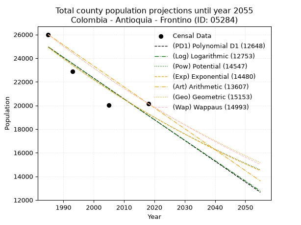
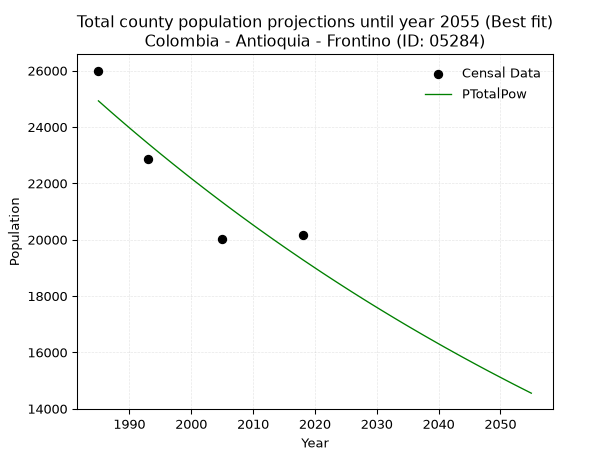
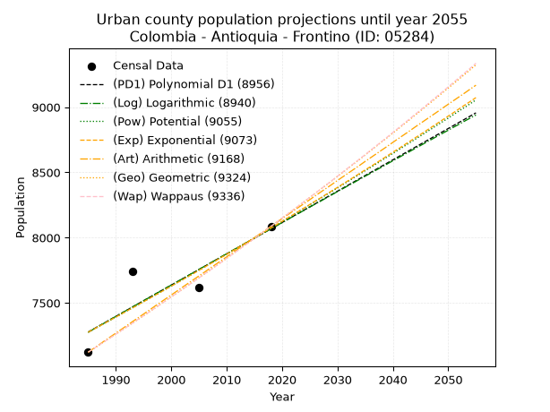
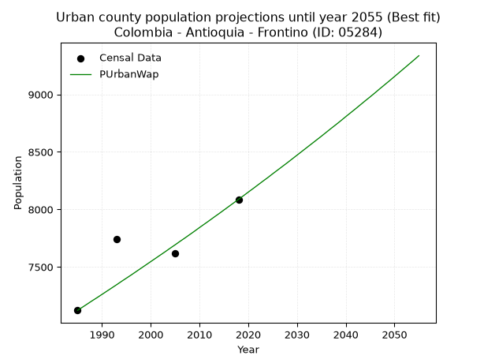
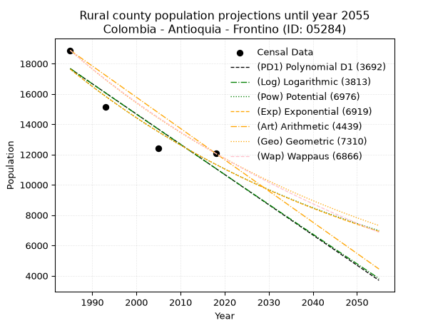
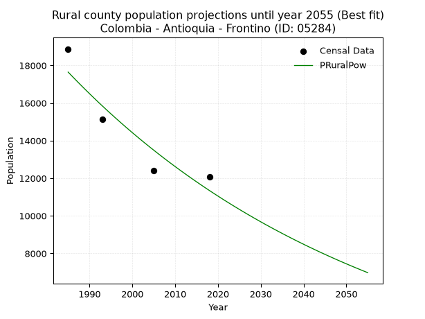

<div align="center">


</div>

# _“Population and Public Services Demand Projections (PPSD) until Year 2050 for Colombia - Antioquia - Frontino (ID: 05284)”_
Keywords: `population` `public-service` `projection` `lineal` `polynomial` `logarithmic` `potential` `exponential` `arithmetic` `geometric` `wappaus` `dane` `colombia` `south-america`

PPSD are analytical estimates used by governments and planners to anticipate future changes in population size, age distribution, and the resulting community needs for utilities, healthcare, education, and infrastructure as sizing future water treatment facilities, electrical grids, and road networks based on spatial growth.

> **General running parameters**: • app_version: _v20260806_. • Python version: _3.14.7_. • Pandas version: _3.0.5_. • NumPy version: _2.5.1_. • Creates, save and include plots into reports (create_plot): _True_. • Projection until year: _2050_. • Process polynomial degree 2 and up: _False_. • Process Wappaus: _True_. • Process Wappaus: _True_. • Set negative values to zero: _True_. • Set infinite values to zero: _True_. • Drop dataset notes: _True_. 
<div align="center">

Dynamic map: [:earth_americas:Google](http://maps.google.com/maps?q=6.776066431,-76.1307645) [:earth_americas:OSM](https://www.openstreetmap.org/#map=18/6.776066431/-76.1307645&layers=P) [:earth_americas:Bing](https://www.bing.com/maps?cp=6.776066431~-76.1307645&lvl=18) [:earth_americas:Apple](https://maps.apple.com/frame?center=6.776066431%2C-76.1307645&span=0.003%2C0.006)

</div>


<div align="center">

```geojson
{
  "type": "Feature",
  "geometry": {
    "type": "Point", 
    "coordinates": [-76.1307645, 6.776066431]
  }, 
  "properties": {
    "Name": "Colombia - Antioquia - Frontino (ID: 05284)"
  }
}
```

</div>


## 0. Census Data (4 records)

Census data are official statistics collected by a government about the people and housing in a country. They usually include counts of total population, age, sex, race, income, education, and jobs.

📅Global census file: [Population.xlsx](../data/Population.xlsx)

| Source   |   Year |   CountryID | CountryName   |   StateID | StateName   |   CountyID | CountyName   |   PTotal |   PUrban |   PRural |
|:---------|-------:|------------:|:--------------|----------:|:------------|-----------:|:-------------|---------:|---------:|---------:|
| DANE     |   1985 |          57 | Colombia      |        05 | Antioquia   |      05284 | Frontino     |    25997 |     7123 |    18874 |
| DANE     |   1993 |          57 | Colombia      |        05 | Antioquia   |      05284 | Frontino     |    22875 |     7745 |    15130 |
| DANE     |   2005 |          57 | Colombia      |        05 | Antioquia   |      05284 | Frontino     |    20031 |     7615 |    12416 |
| DANE     |   2018 |          57 | Colombia      |        05 | Antioquia   |      05284 | Frontino     |    20156 |     8087 |    12069 |

> 🔥Some records has specific notes about the registered values or the corresponding urban or rural distribution.

## 1. Total

### 1.1. Coefficients and Parameters

* (PD1) Polynomial Deg 1: -175.64311521477285, 373594.8912083494 (lineal)
* (Log) Logarithmic: -351969.5635880068, 2697588.2233395097
* (Pow) Potential: -15.534231664774916, 55.62477462688744
* (Exp) Exponential: -0.007752372745855251, 120106066213.82501
* (Art) Arithmetic: Year diff. 2018 - 1985 = 33, Population diff. 20156 - 25997 = -5841, Annual growth = -177.0
* (Geo) Geometric: Year diff. 2018 - 1985 = 33, Population diff. 20156 - 25997 = -5841, Annual growth % = -0.007681831719352217
* (Wap) Wappaus: i = -0.7670140619244686, Condition values only valid for < 200)

<sub>
Wappaus condition values: ['-0.00', '-0.77', '-1.53', '-2.30', '-3.07', '-3.84', '-4.60', '-5.37', '-6.14', '-6.90', '-7.67', '-8.44', '-9.20', '-9.97', '-10.74', '-11.51', '-12.27', '-13.04', '-13.81', '-14.57', '-15.34', '-16.11', '-16.87', '-17.64', '-18.41', '-19.18', '-19.94', '-20.71', '-21.48', '-22.24', '-23.01', '-23.78', '-24.54', '-25.31', '-26.08', '-26.85', '-27.61', '-28.38', '-29.15', '-29.91', '-30.68', '-31.45', '-32.21', '-32.98', '-33.75', '-34.52', '-35.28', '-36.05', '-36.82', '-37.58', '-38.35', '-39.12', '-39.88', '-40.65', '-41.42', '-42.19', '-42.95', '-43.72', '-44.49', '-45.25', '-46.02', '-46.79', '-47.55', '-48.32', '-49.09', '-49.86']
</sub>


### 1.2. Projected Dataset

|   Year |   CountyID |   PTotalPD1 |   PTotalLog |   PTotalPow |   PTotalExp |   PTotalArt |   PTotalGeo |   PTotalWap |
|-------:|-----------:|------------:|------------:|------------:|------------:|------------:|------------:|------------:|
|   1985 |      05284 |       24943 |       24952 |       24923 |       24914 |       25997 |       25997 |       25997 |
|   1986 |      05284 |       24768 |       24774 |       24729 |       24722 |       25820 |       25797 |       25798 |
|   1987 |      05284 |       24592 |       24597 |       24536 |       24531 |       25643 |       25599 |       25601 |
|   1988 |      05284 |       24416 |       24420 |       24345 |       24341 |       25466 |       25402 |       25406 |
|   1989 |      05284 |       24241 |       24243 |       24156 |       24153 |       25289 |       25207 |       25211 |
|   1990 |      05284 |       24065 |       24066 |       23968 |       23967 |       25112 |       25014 |       25019 |
|   1991 |      05284 |       23889 |       23889 |       23781 |       23782 |       24935 |       24822 |       24828 |
|   1992 |      05284 |       23714 |       23713 |       23597 |       23598 |       24758 |       24631 |       24638 |
|   1993 |      05284 |       23538 |       23536 |       23413 |       23416 |       24581 |       24442 |       24449 |
|   1994 |      05284 |       23363 |       23359 |       23232 |       23235 |       24404 |       24254 |       24262 |
|   1995 |      05284 |       23187 |       23183 |       23051 |       23055 |       24227 |       24068 |       24077 |
|   1996 |      05284 |       23011 |       23007 |       22873 |       22877 |       24050 |       23883 |       23892 |
|   1997 |      05284 |       22836 |       22830 |       22695 |       22701 |       23873 |       23699 |       23709 |
|   1998 |      05284 |       22660 |       22654 |       22520 |       22525 |       23696 |       23517 |       23528 |
|   1999 |      05284 |       22484 |       22478 |       22345 |       22351 |       23519 |       23337 |       23348 |
|   2000 |      05284 |       22309 |       22302 |       22172 |       22179 |       23342 |       23157 |       23169 |
|   2001 |      05284 |       22133 |       22126 |       22001 |       22008 |       23165 |       22979 |       22991 |
|   2002 |      05284 |       21957 |       21950 |       21831 |       21838 |       22988 |       22803 |       22815 |
|   2003 |      05284 |       21782 |       21774 |       21662 |       21669 |       22811 |       22628 |       22640 |
|   2004 |      05284 |       21606 |       21599 |       21495 |       21502 |       22634 |       22454 |       22466 |
|   2005 |      05284 |       21430 |       21423 |       21329 |       21336 |       22457 |       22281 |       22293 |
|   2006 |      05284 |       21255 |       21248 |       21164 |       21171 |       22280 |       22110 |       22122 |
|   2007 |      05284 |       21079 |       21072 |       21001 |       21007 |       22103 |       21940 |       21952 |
|   2008 |      05284 |       20904 |       20897 |       20839 |       20845 |       21926 |       21772 |       21783 |
|   2009 |      05284 |       20728 |       20722 |       20679 |       20684 |       21749 |       21605 |       21615 |
|   2010 |      05284 |       20552 |       20546 |       20519 |       20524 |       21572 |       21439 |       21448 |
|   2011 |      05284 |       20377 |       20371 |       20361 |       20366 |       21395 |       21274 |       21283 |
|   2012 |      05284 |       20201 |       20196 |       20205 |       20209 |       21218 |       21111 |       21118 |
|   2013 |      05284 |       20025 |       20022 |       20049 |       20053 |       21041 |       20948 |       20955 |
|   2014 |      05284 |       19850 |       19847 |       19895 |       19898 |       20864 |       20787 |       20793 |
|   2015 |      05284 |       19674 |       19672 |       19742 |       19744 |       20687 |       20628 |       20632 |
|   2016 |      05284 |       19498 |       19497 |       19591 |       19592 |       20510 |       20469 |       20472 |
|   2017 |      05284 |       19323 |       19323 |       19441 |       19440 |       20333 |       20312 |       20314 |
|   2018 |      05284 |       19147 |       19148 |       19291 |       19290 |       20156 |       20156 |       20156 |
|   2019 |      05284 |       18971 |       18974 |       19144 |       19141 |       19979 |       20001 |       19999 |
|   2020 |      05284 |       18796 |       18800 |       18997 |       18993 |       19802 |       19848 |       19844 |
|   2021 |      05284 |       18620 |       18625 |       18851 |       18847 |       19625 |       19695 |       19689 |
|   2022 |      05284 |       18445 |       18451 |       18707 |       18701 |       19448 |       19544 |       19536 |
|   2023 |      05284 |       18269 |       18277 |       18564 |       18557 |       19271 |       19394 |       19384 |
|   2024 |      05284 |       18093 |       18103 |       18422 |       18413 |       19094 |       19245 |       19232 |
|   2025 |      05284 |       17918 |       17930 |       18281 |       18271 |       18917 |       19097 |       19082 |
|   2026 |      05284 |       17742 |       17756 |       18141 |       18130 |       18740 |       18950 |       18932 |
|   2027 |      05284 |       17566 |       17582 |       18003 |       17990 |       18563 |       18805 |       18784 |
|   2028 |      05284 |       17391 |       17409 |       17865 |       17851 |       18386 |       18660 |       18637 |
|   2029 |      05284 |       17215 |       17235 |       17729 |       17713 |       18209 |       18517 |       18490 |
|   2030 |      05284 |       17039 |       17062 |       17594 |       17577 |       18032 |       18375 |       18345 |
|   2031 |      05284 |       16864 |       16888 |       17460 |       17441 |       17855 |       18233 |       18200 |
|   2032 |      05284 |       16688 |       16715 |       17327 |       17306 |       17678 |       18093 |       18056 |
|   2033 |      05284 |       16512 |       16542 |       17195 |       17173 |       17501 |       17954 |       17914 |
|   2034 |      05284 |       16337 |       16369 |       17064 |       17040 |       17324 |       17816 |       17772 |
|   2035 |      05284 |       16161 |       16196 |       16934 |       16908 |       17147 |       17680 |       17631 |
|   2036 |      05284 |       15986 |       16023 |       16806 |       16778 |       16970 |       17544 |       17491 |
|   2037 |      05284 |       15810 |       15850 |       16678 |       16648 |       16793 |       17409 |       17352 |
|   2038 |      05284 |       15634 |       15677 |       16551 |       16520 |       16616 |       17275 |       17214 |
|   2039 |      05284 |       15459 |       15505 |       16426 |       16392 |       16439 |       17142 |       17077 |
|   2040 |      05284 |       15283 |       15332 |       16301 |       16265 |       16262 |       17011 |       16940 |
|   2041 |      05284 |       15107 |       15159 |       16177 |       16140 |       16085 |       16880 |       16805 |
|   2042 |      05284 |       14932 |       14987 |       16055 |       16015 |       15908 |       16750 |       16670 |
|   2043 |      05284 |       14756 |       14815 |       15933 |       15892 |       15731 |       16622 |       16536 |
|   2044 |      05284 |       14580 |       14643 |       15812 |       15769 |       15554 |       16494 |       16403 |
|   2045 |      05284 |       14405 |       14470 |       15693 |       15647 |       15377 |       16367 |       16271 |
|   2046 |      05284 |       14229 |       14298 |       15574 |       15526 |       15200 |       16242 |       16140 |
|   2047 |      05284 |       14053 |       14126 |       15456 |       15406 |       15023 |       16117 |       16009 |
|   2048 |      05284 |       13878 |       13954 |       15339 |       15287 |       14846 |       15993 |       15879 |
|   2049 |      05284 |       13702 |       13783 |       15224 |       15169 |       14669 |       15870 |       15750 |
|   2050 |      05284 |       13527 |       13611 |       15109 |       15052 |       14492 |       15748 |       15622 |
<div align="center">

</img>

</div>


### 1.3. Best fit with absolute error and relative error (%)

Relative error puts that difference into context by dividing the absolute error by the true value, creating a unitless ratio or percentage that shows the scale of the mistake.

Absolute and relative error

|   Year | Source   |   CountryID | CountryName   |   StateID | StateName   |   CountyID_x | CountyName   |   PTotal |   PUrban |   PRural |   CountyID_y |   PTotalPD1 |   PTotalLog |   PTotalPow |   PTotalExp |   PTotalArt |   PTotalGeo |   PTotalWap |   PTotalPD1AbsError |   PTotalLogAbsError |   PTotalPowAbsError |   PTotalExpAbsError |   PTotalArtAbsError |   PTotalGeoAbsError |   PTotalWapAbsError |   PTotalPD1RelError |   PTotalLogRelError |   PTotalPowRelError |   PTotalExpRelError |   PTotalArtRelError |   PTotalGeoRelError |   PTotalWapRelError |
|-------:|:---------|------------:|:--------------|----------:|:------------|-------------:|:-------------|---------:|---------:|---------:|-------------:|------------:|------------:|------------:|------------:|------------:|------------:|------------:|--------------------:|--------------------:|--------------------:|--------------------:|--------------------:|--------------------:|--------------------:|--------------------:|--------------------:|--------------------:|--------------------:|--------------------:|--------------------:|--------------------:|
|   1985 | DANE     |          57 | Colombia      |        05 | Antioquia   |        05284 | Frontino     |    25997 |     7123 |    18874 |        05284 |       24943 |       24952 |       24923 |       24914 |       25997 |       25997 |       25997 |                1054 |                1045 |                1074 |                1083 |                   0 |                   0 |                   0 |             4.05431 |             4.01969 |             4.13125 |             4.16587 |             0       |             0       |             0       |
|   1993 | DANE     |          57 | Colombia      |        05 | Antioquia   |        05284 | Frontino     |    22875 |     7745 |    15130 |        05284 |       23538 |       23536 |       23413 |       23416 |       24581 |       24442 |       24449 |                 663 |                 661 |                 538 |                 541 |                1706 |                1567 |                1574 |             2.89836 |             2.88962 |             2.35191 |             2.36503 |             7.45792 |             6.85027 |             6.88087 |
|   2005 | DANE     |          57 | Colombia      |        05 | Antioquia   |        05284 | Frontino     |    20031 |     7615 |    12416 |        05284 |       21430 |       21423 |       21329 |       21336 |       22457 |       22281 |       22293 |                1399 |                1392 |                1298 |                1305 |                2426 |                2250 |                2262 |             6.98417 |             6.94923 |             6.47996 |             6.5149  |            12.1112  |            11.2326  |            11.2925  |
|   2018 | DANE     |          57 | Colombia      |        05 | Antioquia   |        05284 | Frontino     |    20156 |     8087 |    12069 |        05284 |       19147 |       19148 |       19291 |       19290 |       20156 |       20156 |       20156 |                1009 |                1008 |                 865 |                 866 |                   0 |                   0 |                   0 |             5.00595 |             5.00099 |             4.29153 |             4.29649 |             0       |             0       |             0       |

Relative error mean

| Method    |   RelError | Best   |
|:----------|-----------:|:-------|
| PTotalPD1 |    4.7357  |        |
| PTotalLog |    4.71488 |        |
| PTotalPow |    4.31366 | True   |
| PTotalExp |    4.33557 |        |
| PTotalArt |    4.89229 |        |
| PTotalGeo |    4.52072 |        |
| PTotalWap |    4.54334 |        |

💙Best method: _**PTotalPow**_
<div align="center">

</img>

</div>


### 1.4. Fresh water supply demand in liters per capita per day (lpcd)

The fresh water supply demand typically ranges from 100 to 300 liters per capita per day (lpcd) for standard domestic and municipal planning, though absolute survival minimums set by the World Health Organization are as low as 7.5 to 20 liters per day, and total consumption in high-income nations can exceed 400 liters.

> `CZ`: Level in meters above the sea level (masl).<br> `WS`: Fresh water supply demand in liters per capita per day (lpcd or l/h/d).<br> `WSAll`: Zonal fresh water supply demand in liters per second (l/s).<br> `A`: Zonal area in square meters.

Reference values (RAS Colombia)

|    CZ |   WS |
|------:|-----:|
|  1000 |  120 |
|  2000 |  130 |
| 99999 |  140 |

County shapefile geometry properties and water supply values

|   CountyID |      ATotal |   CZTotal |   WSTotal |
|-----------:|------------:|----------:|----------:|
|      05284 | 1.38446e+09 |   1257.75 |       130 |

Projected values for best method: PTotalPow

|   CountyID |   Year |   PTotalPow |   WSTotal |   WSTotalAll |
|-----------:|-------:|------------:|----------:|-------------:|
|      05284 |   1985 |       24923 |       130 |      37.4999 |
|      05284 |   1986 |       24729 |       130 |      37.208  |
|      05284 |   1987 |       24536 |       130 |      36.9176 |
|      05284 |   1988 |       24345 |       130 |      36.6302 |
|      05284 |   1989 |       24156 |       130 |      36.3458 |
|      05284 |   1990 |       23968 |       130 |      36.063  |
|      05284 |   1991 |       23781 |       130 |      35.7816 |
|      05284 |   1992 |       23597 |       130 |      35.5047 |
|      05284 |   1993 |       23413 |       130 |      35.2279 |
|      05284 |   1994 |       23232 |       130 |      34.9556 |
|      05284 |   1995 |       23051 |       130 |      34.6832 |
|      05284 |   1996 |       22873 |       130 |      34.4154 |
|      05284 |   1997 |       22695 |       130 |      34.1476 |
|      05284 |   1998 |       22520 |       130 |      33.8843 |
|      05284 |   1999 |       22345 |       130 |      33.6209 |
|      05284 |   2000 |       22172 |       130 |      33.3606 |
|      05284 |   2001 |       22001 |       130 |      33.1034 |
|      05284 |   2002 |       21831 |       130 |      32.8476 |
|      05284 |   2003 |       21662 |       130 |      32.5933 |
|      05284 |   2004 |       21495 |       130 |      32.342  |
|      05284 |   2005 |       21329 |       130 |      32.0922 |
|      05284 |   2006 |       21164 |       130 |      31.844  |
|      05284 |   2007 |       21001 |       130 |      31.5987 |
|      05284 |   2008 |       20839 |       130 |      31.355  |
|      05284 |   2009 |       20679 |       130 |      31.1142 |
|      05284 |   2010 |       20519 |       130 |      30.8735 |
|      05284 |   2011 |       20361 |       130 |      30.6358 |
|      05284 |   2012 |       20205 |       130 |      30.401  |
|      05284 |   2013 |       20049 |       130 |      30.1663 |
|      05284 |   2014 |       19895 |       130 |      29.9346 |
|      05284 |   2015 |       19742 |       130 |      29.7044 |
|      05284 |   2016 |       19591 |       130 |      29.4772 |
|      05284 |   2017 |       19441 |       130 |      29.2515 |
|      05284 |   2018 |       19291 |       130 |      29.0258 |
|      05284 |   2019 |       19144 |       130 |      28.8046 |
|      05284 |   2020 |       18997 |       130 |      28.5834 |
|      05284 |   2021 |       18851 |       130 |      28.3638 |
|      05284 |   2022 |       18707 |       130 |      28.1471 |
|      05284 |   2023 |       18564 |       130 |      27.9319 |
|      05284 |   2024 |       18422 |       130 |      27.7183 |
|      05284 |   2025 |       18281 |       130 |      27.5061 |
|      05284 |   2026 |       18141 |       130 |      27.2955 |
|      05284 |   2027 |       18003 |       130 |      27.0878 |
|      05284 |   2028 |       17865 |       130 |      26.8802 |
|      05284 |   2029 |       17729 |       130 |      26.6756 |
|      05284 |   2030 |       17594 |       130 |      26.4725 |
|      05284 |   2031 |       17460 |       130 |      26.2708 |
|      05284 |   2032 |       17327 |       130 |      26.0707 |
|      05284 |   2033 |       17195 |       130 |      25.8721 |
|      05284 |   2034 |       17064 |       130 |      25.675  |
|      05284 |   2035 |       16934 |       130 |      25.4794 |
|      05284 |   2036 |       16806 |       130 |      25.2868 |
|      05284 |   2037 |       16678 |       130 |      25.0942 |
|      05284 |   2038 |       16551 |       130 |      24.9031 |
|      05284 |   2039 |       16426 |       130 |      24.715  |
|      05284 |   2040 |       16301 |       130 |      24.527  |
|      05284 |   2041 |       16177 |       130 |      24.3404 |
|      05284 |   2042 |       16055 |       130 |      24.1568 |
|      05284 |   2043 |       15933 |       130 |      23.9733 |
|      05284 |   2044 |       15812 |       130 |      23.7912 |
|      05284 |   2045 |       15693 |       130 |      23.6122 |
|      05284 |   2046 |       15574 |       130 |      23.4331 |
|      05284 |   2047 |       15456 |       130 |      23.2556 |
|      05284 |   2048 |       15339 |       130 |      23.0795 |
|      05284 |   2049 |       15224 |       130 |      22.9065 |
|      05284 |   2050 |       15109 |       130 |      22.7334 |

## 2. Urban

### 2.1. Coefficients and Parameters

* (PD1) Polynomial Deg 1: 23.987956643917773, -40339.41027699653 (lineal)
* (Log) Logarithmic: 48029.815098222825, -357432.50944837474
* (Pow) Potential: 6.3126567434961975, -16.95577321496119
* (Exp) Exponential: 0.0031526058352877415, 13.935562509408426
* (Art) Arithmetic: Year diff. 2018 - 1985 = 33, Population diff. 8087 - 7123 = 964, Annual growth = 29.21212121212121
* (Geo) Geometric: Year diff. 2018 - 1985 = 33, Population diff. 8087 - 7123 = 964, Annual growth % = 0.0038537353766530114
* (Wap) Wappaus: i = 0.38411730719423026, Condition values only valid for < 200)

<sub>
Wappaus condition values: ['0.00', '0.38', '0.77', '1.15', '1.54', '1.92', '2.30', '2.69', '3.07', '3.46', '3.84', '4.23', '4.61', '4.99', '5.38', '5.76', '6.15', '6.53', '6.91', '7.30', '7.68', '8.07', '8.45', '8.83', '9.22', '9.60', '9.99', '10.37', '10.76', '11.14', '11.52', '11.91', '12.29', '12.68', '13.06', '13.44', '13.83', '14.21', '14.60', '14.98', '15.36', '15.75', '16.13', '16.52', '16.90', '17.29', '17.67', '18.05', '18.44', '18.82', '19.21', '19.59', '19.97', '20.36', '20.74', '21.13', '21.51', '21.89', '22.28', '22.66', '23.05', '23.43', '23.82', '24.20', '24.58', '24.97']
</sub>


### 2.2. Projected Dataset

|   Year |   CountyID |   PUrbanPD1 |   PUrbanLog |   PUrbanPow |   PUrbanExp |   PUrbanArt |   PUrbanGeo |   PUrbanWap |
|-------:|-----------:|------------:|------------:|------------:|------------:|------------:|------------:|------------:|
|   1985 |      05284 |        7277 |        7276 |        7275 |        7276 |        7123 |        7123 |        7123 |
|   1986 |      05284 |        7301 |        7300 |        7299 |        7299 |        7152 |        7150 |        7150 |
|   1987 |      05284 |        7325 |        7324 |        7322 |        7322 |        7181 |        7178 |        7178 |
|   1988 |      05284 |        7349 |        7348 |        7345 |        7345 |        7211 |        7206 |        7206 |
|   1989 |      05284 |        7373 |        7373 |        7368 |        7369 |        7240 |        7233 |        7233 |
|   1990 |      05284 |        7397 |        7397 |        7392 |        7392 |        7269 |        7261 |        7261 |
|   1991 |      05284 |        7421 |        7421 |        7415 |        7415 |        7298 |        7289 |        7289 |
|   1992 |      05284 |        7445 |        7445 |        7439 |        7439 |        7327 |        7317 |        7317 |
|   1993 |      05284 |        7469 |        7469 |        7462 |        7462 |        7357 |        7346 |        7345 |
|   1994 |      05284 |        7493 |        7493 |        7486 |        7486 |        7386 |        7374 |        7374 |
|   1995 |      05284 |        7517 |        7517 |        7510 |        7509 |        7415 |        7402 |        7402 |
|   1996 |      05284 |        7541 |        7541 |        7534 |        7533 |        7444 |        7431 |        7430 |
|   1997 |      05284 |        7565 |        7565 |        7558 |        7557 |        7474 |        7459 |        7459 |
|   1998 |      05284 |        7589 |        7589 |        7581 |        7581 |        7503 |        7488 |        7488 |
|   1999 |      05284 |        7613 |        7613 |        7605 |        7605 |        7532 |        7517 |        7517 |
|   2000 |      05284 |        7637 |        7637 |        7629 |        7629 |        7561 |        7546 |        7546 |
|   2001 |      05284 |        7660 |        7661 |        7654 |        7653 |        7590 |        7575 |        7575 |
|   2002 |      05284 |        7684 |        7685 |        7678 |        7677 |        7620 |        7604 |        7604 |
|   2003 |      05284 |        7708 |        7709 |        7702 |        7701 |        7649 |        7634 |        7633 |
|   2004 |      05284 |        7732 |        7733 |        7726 |        7725 |        7678 |        7663 |        7663 |
|   2005 |      05284 |        7756 |        7757 |        7751 |        7750 |        7707 |        7693 |        7692 |
|   2006 |      05284 |        7780 |        7781 |        7775 |        7774 |        7736 |        7722 |        7722 |
|   2007 |      05284 |        7804 |        7805 |        7800 |        7799 |        7766 |        7752 |        7751 |
|   2008 |      05284 |        7828 |        7829 |        7824 |        7823 |        7795 |        7782 |        7781 |
|   2009 |      05284 |        7852 |        7853 |        7849 |        7848 |        7824 |        7812 |        7811 |
|   2010 |      05284 |        7876 |        7877 |        7874 |        7873 |        7853 |        7842 |        7842 |
|   2011 |      05284 |        7900 |        7901 |        7898 |        7898 |        7883 |        7872 |        7872 |
|   2012 |      05284 |        7924 |        7925 |        7923 |        7923 |        7912 |        7903 |        7902 |
|   2013 |      05284 |        7948 |        7949 |        7948 |        7948 |        7941 |        7933 |        7933 |
|   2014 |      05284 |        7972 |        7972 |        7973 |        7973 |        7970 |        7964 |        7963 |
|   2015 |      05284 |        7996 |        7996 |        7998 |        7998 |        7999 |        7994 |        7994 |
|   2016 |      05284 |        8020 |        8020 |        8023 |        8023 |        8029 |        8025 |        8025 |
|   2017 |      05284 |        8044 |        8044 |        8048 |        8049 |        8058 |        8056 |        8056 |
|   2018 |      05284 |        8068 |        8068 |        8073 |        8074 |        8087 |        8087 |        8087 |
|   2019 |      05284 |        8092 |        8092 |        8099 |        8099 |        8116 |        8118 |        8118 |
|   2020 |      05284 |        8116 |        8115 |        8124 |        8125 |        8145 |        8149 |        8150 |
|   2021 |      05284 |        8140 |        8139 |        8150 |        8151 |        8175 |        8181 |        8181 |
|   2022 |      05284 |        8164 |        8163 |        8175 |        8176 |        8204 |        8212 |        8213 |
|   2023 |      05284 |        8188 |        8187 |        8201 |        8202 |        8233 |        8244 |        8245 |
|   2024 |      05284 |        8212 |        8210 |        8226 |        8228 |        8262 |        8276 |        8276 |
|   2025 |      05284 |        8236 |        8234 |        8252 |        8254 |        8291 |        8308 |        8309 |
|   2026 |      05284 |        8260 |        8258 |        8278 |        8280 |        8321 |        8340 |        8341 |
|   2027 |      05284 |        8284 |        8281 |        8303 |        8306 |        8350 |        8372 |        8373 |
|   2028 |      05284 |        8308 |        8305 |        8329 |        8333 |        8379 |        8404 |        8405 |
|   2029 |      05284 |        8332 |        8329 |        8355 |        8359 |        8408 |        8436 |        8438 |
|   2030 |      05284 |        8356 |        8353 |        8381 |        8385 |        8438 |        8469 |        8471 |
|   2031 |      05284 |        8380 |        8376 |        8407 |        8412 |        8467 |        8502 |        8504 |
|   2032 |      05284 |        8404 |        8400 |        8434 |        8438 |        8496 |        8534 |        8537 |
|   2033 |      05284 |        8428 |        8423 |        8460 |        8465 |        8525 |        8567 |        8570 |
|   2034 |      05284 |        8452 |        8447 |        8486 |        8492 |        8554 |        8600 |        8603 |
|   2035 |      05284 |        8476 |        8471 |        8513 |        8519 |        8584 |        8633 |        8636 |
|   2036 |      05284 |        8500 |        8494 |        8539 |        8545 |        8613 |        8667 |        8670 |
|   2037 |      05284 |        8524 |        8518 |        8565 |        8572 |        8642 |        8700 |        8704 |
|   2038 |      05284 |        8548 |        8541 |        8592 |        8599 |        8671 |        8734 |        8737 |
|   2039 |      05284 |        8572 |        8565 |        8619 |        8627 |        8700 |        8767 |        8771 |
|   2040 |      05284 |        8596 |        8589 |        8645 |        8654 |        8730 |        8801 |        8806 |
|   2041 |      05284 |        8620 |        8612 |        8672 |        8681 |        8759 |        8835 |        8840 |
|   2042 |      05284 |        8644 |        8636 |        8699 |        8709 |        8788 |        8869 |        8874 |
|   2043 |      05284 |        8668 |        8659 |        8726 |        8736 |        8817 |        8903 |        8909 |
|   2044 |      05284 |        8692 |        8683 |        8753 |        8764 |        8847 |        8938 |        8944 |
|   2045 |      05284 |        8716 |        8706 |        8780 |        8791 |        8876 |        8972 |        8978 |
|   2046 |      05284 |        8740 |        8730 |        8807 |        8819 |        8905 |        9007 |        9013 |
|   2047 |      05284 |        8764 |        8753 |        8834 |        8847 |        8934 |        9041 |        9049 |
|   2048 |      05284 |        8788 |        8777 |        8862 |        8875 |        8963 |        9076 |        9084 |
|   2049 |      05284 |        8812 |        8800 |        8889 |        8903 |        8993 |        9111 |        9119 |
|   2050 |      05284 |        8836 |        8823 |        8916 |        8931 |        9022 |        9146 |        9155 |
<div align="center">

</img>

</div>


### 2.3. Best fit with absolute error and relative error (%)

Relative error puts that difference into context by dividing the absolute error by the true value, creating a unitless ratio or percentage that shows the scale of the mistake.

Absolute and relative error

|   Year | Source   |   CountryID | CountryName   |   StateID | StateName   |   CountyID_x | CountyName   |   PTotal |   PUrban |   PRural |   CountyID_y |   PUrbanPD1 |   PUrbanLog |   PUrbanPow |   PUrbanExp |   PUrbanArt |   PUrbanGeo |   PUrbanWap |   PUrbanPD1AbsError |   PUrbanLogAbsError |   PUrbanPowAbsError |   PUrbanExpAbsError |   PUrbanArtAbsError |   PUrbanGeoAbsError |   PUrbanWapAbsError |   PUrbanPD1RelError |   PUrbanLogRelError |   PUrbanPowRelError |   PUrbanExpRelError |   PUrbanArtRelError |   PUrbanGeoRelError |   PUrbanWapRelError |
|-------:|:---------|------------:|:--------------|----------:|:------------|-------------:|:-------------|---------:|---------:|---------:|-------------:|------------:|------------:|------------:|------------:|------------:|------------:|------------:|--------------------:|--------------------:|--------------------:|--------------------:|--------------------:|--------------------:|--------------------:|--------------------:|--------------------:|--------------------:|--------------------:|--------------------:|--------------------:|--------------------:|
|   1985 | DANE     |          57 | Colombia      |        05 | Antioquia   |        05284 | Frontino     |    25997 |     7123 |    18874 |        05284 |        7277 |        7276 |        7275 |        7276 |        7123 |        7123 |        7123 |                 154 |                 153 |                 152 |                 153 |                   0 |                   0 |                   0 |            2.16201  |            2.14797  |            2.13393  |            2.14797  |             0       |             0       |             0       |
|   1993 | DANE     |          57 | Colombia      |        05 | Antioquia   |        05284 | Frontino     |    22875 |     7745 |    15130 |        05284 |        7469 |        7469 |        7462 |        7462 |        7357 |        7346 |        7345 |                 276 |                 276 |                 283 |                 283 |                 388 |                 399 |                 400 |            3.56359  |            3.56359  |            3.65397  |            3.65397  |             5.00968 |             5.15171 |             5.16462 |
|   2005 | DANE     |          57 | Colombia      |        05 | Antioquia   |        05284 | Frontino     |    20031 |     7615 |    12416 |        05284 |        7756 |        7757 |        7751 |        7750 |        7707 |        7693 |        7692 |                 141 |                 142 |                 136 |                 135 |                  92 |                  78 |                  77 |            1.85161  |            1.86474  |            1.78595  |            1.77282  |             1.20814 |             1.02429 |             1.01116 |
|   2018 | DANE     |          57 | Colombia      |        05 | Antioquia   |        05284 | Frontino     |    20156 |     8087 |    12069 |        05284 |        8068 |        8068 |        8073 |        8074 |        8087 |        8087 |        8087 |                  19 |                  19 |                  14 |                  13 |                   0 |                   0 |                   0 |            0.234945 |            0.234945 |            0.173117 |            0.160752 |             0       |             0       |             0       |

Relative error mean

| Method    |   RelError | Best   |
|:----------|-----------:|:-------|
| PUrbanPD1 |    1.95304 |        |
| PUrbanLog |    1.95281 |        |
| PUrbanPow |    1.93674 |        |
| PUrbanExp |    1.93388 |        |
| PUrbanArt |    1.55446 |        |
| PUrbanGeo |    1.544   |        |
| PUrbanWap |    1.54395 | True   |

💙Best method: _**PUrbanWap**_
<div align="center">

</img>

</div>


### 2.4. Fresh water supply demand in liters per capita per day (lpcd)

The fresh water supply demand typically ranges from 100 to 300 liters per capita per day (lpcd) for standard domestic and municipal planning, though absolute survival minimums set by the World Health Organization are as low as 7.5 to 20 liters per day, and total consumption in high-income nations can exceed 400 liters.

> `CZ`: Level in meters above the sea level (masl).<br> `WS`: Fresh water supply demand in liters per capita per day (lpcd or l/h/d).<br> `WSAll`: Zonal fresh water supply demand in liters per second (l/s).<br> `A`: Zonal area in square meters.

Reference values (RAS Colombia)

|    CZ |   WS |
|------:|-----:|
|  1000 |  120 |
|  2000 |  130 |
| 99999 |  140 |

County shapefile geometry properties and water supply values

|   CountyID |     AUrban |   CZUrban |   WSUrban |
|-----------:|-----------:|----------:|----------:|
|      05284 | 3.0787e+06 |    1350.7 |       130 |

Projected values for best method: PUrbanWap

|   CountyID |   Year |   PUrbanWap |   WSUrban |   WSUrbanAll |
|-----------:|-------:|------------:|----------:|-------------:|
|      05284 |   1985 |        7123 |       130 |      10.7175 |
|      05284 |   1986 |        7150 |       130 |      10.7581 |
|      05284 |   1987 |        7178 |       130 |      10.8002 |
|      05284 |   1988 |        7206 |       130 |      10.8424 |
|      05284 |   1989 |        7233 |       130 |      10.883  |
|      05284 |   1990 |        7261 |       130 |      10.9251 |
|      05284 |   1991 |        7289 |       130 |      10.9672 |
|      05284 |   1992 |        7317 |       130 |      11.0094 |
|      05284 |   1993 |        7345 |       130 |      11.0515 |
|      05284 |   1994 |        7374 |       130 |      11.0951 |
|      05284 |   1995 |        7402 |       130 |      11.1373 |
|      05284 |   1996 |        7430 |       130 |      11.1794 |
|      05284 |   1997 |        7459 |       130 |      11.223  |
|      05284 |   1998 |        7488 |       130 |      11.2667 |
|      05284 |   1999 |        7517 |       130 |      11.3103 |
|      05284 |   2000 |        7546 |       130 |      11.3539 |
|      05284 |   2001 |        7575 |       130 |      11.3976 |
|      05284 |   2002 |        7604 |       130 |      11.4412 |
|      05284 |   2003 |        7633 |       130 |      11.4848 |
|      05284 |   2004 |        7663 |       130 |      11.53   |
|      05284 |   2005 |        7692 |       130 |      11.5736 |
|      05284 |   2006 |        7722 |       130 |      11.6188 |
|      05284 |   2007 |        7751 |       130 |      11.6624 |
|      05284 |   2008 |        7781 |       130 |      11.7075 |
|      05284 |   2009 |        7811 |       130 |      11.7527 |
|      05284 |   2010 |        7842 |       130 |      11.7993 |
|      05284 |   2011 |        7872 |       130 |      11.8444 |
|      05284 |   2012 |        7902 |       130 |      11.8896 |
|      05284 |   2013 |        7933 |       130 |      11.9362 |
|      05284 |   2014 |        7963 |       130 |      11.9814 |
|      05284 |   2015 |        7994 |       130 |      12.028  |
|      05284 |   2016 |        8025 |       130 |      12.0747 |
|      05284 |   2017 |        8056 |       130 |      12.1213 |
|      05284 |   2018 |        8087 |       130 |      12.1679 |
|      05284 |   2019 |        8118 |       130 |      12.2146 |
|      05284 |   2020 |        8150 |       130 |      12.2627 |
|      05284 |   2021 |        8181 |       130 |      12.3094 |
|      05284 |   2022 |        8213 |       130 |      12.3575 |
|      05284 |   2023 |        8245 |       130 |      12.4057 |
|      05284 |   2024 |        8276 |       130 |      12.4523 |
|      05284 |   2025 |        8309 |       130 |      12.502  |
|      05284 |   2026 |        8341 |       130 |      12.5501 |
|      05284 |   2027 |        8373 |       130 |      12.5983 |
|      05284 |   2028 |        8405 |       130 |      12.6464 |
|      05284 |   2029 |        8438 |       130 |      12.6961 |
|      05284 |   2030 |        8471 |       130 |      12.7457 |
|      05284 |   2031 |        8504 |       130 |      12.7954 |
|      05284 |   2032 |        8537 |       130 |      12.845  |
|      05284 |   2033 |        8570 |       130 |      12.8947 |
|      05284 |   2034 |        8603 |       130 |      12.9443 |
|      05284 |   2035 |        8636 |       130 |      12.994  |
|      05284 |   2036 |        8670 |       130 |      13.0451 |
|      05284 |   2037 |        8704 |       130 |      13.0963 |
|      05284 |   2038 |        8737 |       130 |      13.1459 |
|      05284 |   2039 |        8771 |       130 |      13.1971 |
|      05284 |   2040 |        8806 |       130 |      13.2498 |
|      05284 |   2041 |        8840 |       130 |      13.3009 |
|      05284 |   2042 |        8874 |       130 |      13.3521 |
|      05284 |   2043 |        8909 |       130 |      13.4047 |
|      05284 |   2044 |        8944 |       130 |      13.4574 |
|      05284 |   2045 |        8978 |       130 |      13.5086 |
|      05284 |   2046 |        9013 |       130 |      13.5612 |
|      05284 |   2047 |        9049 |       130 |      13.6154 |
|      05284 |   2048 |        9084 |       130 |      13.6681 |
|      05284 |   2049 |        9119 |       130 |      13.7207 |
|      05284 |   2050 |        9155 |       130 |      13.7749 |

## 3. Rural

### 3.1. Coefficients and Parameters

* (PD1) Polynomial Deg 1: -199.63107185869086, 413934.3014853464 (lineal)
* (Log) Logarithmic: -399999.3786862295, 3055020.7327878834
* (Pow) Potential: -26.776701687444337, 92.54976190686097
* (Exp) Exponential: -0.013365083996081788, 5862117543448739.0
* (Art) Arithmetic: Year diff. 2018 - 1985 = 33, Population diff. 12069 - 18874 = -6805, Annual growth = -206.21212121212122
* (Geo) Geometric: Year diff. 2018 - 1985 = 33, Population diff. 12069 - 18874 = -6805, Annual growth % = -0.013458466453957652
* (Wap) Wappaus: i = -1.3328515089818131, Condition values only valid for < 200)

<sub>
Wappaus condition values: ['-0.00', '-1.33', '-2.67', '-4.00', '-5.33', '-6.66', '-8.00', '-9.33', '-10.66', '-12.00', '-13.33', '-14.66', '-15.99', '-17.33', '-18.66', '-19.99', '-21.33', '-22.66', '-23.99', '-25.32', '-26.66', '-27.99', '-29.32', '-30.66', '-31.99', '-33.32', '-34.65', '-35.99', '-37.32', '-38.65', '-39.99', '-41.32', '-42.65', '-43.98', '-45.32', '-46.65', '-47.98', '-49.32', '-50.65', '-51.98', '-53.31', '-54.65', '-55.98', '-57.31', '-58.65', '-59.98', '-61.31', '-62.64', '-63.98', '-65.31', '-66.64', '-67.98', '-69.31', '-70.64', '-71.97', '-73.31', '-74.64', '-75.97', '-77.31', '-78.64', '-79.97', '-81.30', '-82.64', '-83.97', '-85.30', '-86.64']
</sub>


### 3.2. Projected Dataset

|   Year |   CountyID |   PRuralPD1 |   PRuralLog |   PRuralPow |   PRuralExp |   PRuralArt |   PRuralGeo |   PRuralWap |
|-------:|-----------:|------------:|------------:|------------:|------------:|------------:|------------:|------------:|
|   1985 |      05284 |       17667 |       17676 |       17645 |       17634 |       18874 |       18874 |       18874 |
|   1986 |      05284 |       17467 |       17474 |       17408 |       17400 |       18668 |       18620 |       18624 |
|   1987 |      05284 |       17267 |       17273 |       17175 |       17169 |       18462 |       18369 |       18377 |
|   1988 |      05284 |       17068 |       17072 |       16945 |       16941 |       18255 |       18122 |       18134 |
|   1989 |      05284 |       16868 |       16871 |       16719 |       16716 |       18049 |       17878 |       17894 |
|   1990 |      05284 |       16668 |       16669 |       16495 |       16494 |       17843 |       17638 |       17657 |
|   1991 |      05284 |       16469 |       16469 |       16275 |       16275 |       17637 |       17400 |       17423 |
|   1992 |      05284 |       16269 |       16268 |       16057 |       16059 |       17431 |       17166 |       17192 |
|   1993 |      05284 |       16070 |       16067 |       15843 |       15846 |       17224 |       16935 |       16963 |
|   1994 |      05284 |       15870 |       15866 |       15632 |       15636 |       17018 |       16707 |       16738 |
|   1995 |      05284 |       15670 |       15666 |       15423 |       15428 |       16812 |       16482 |       16516 |
|   1996 |      05284 |       15471 |       15465 |       15218 |       15223 |       16606 |       16260 |       16296 |
|   1997 |      05284 |       15271 |       15265 |       15015 |       15021 |       16399 |       16042 |       16079 |
|   1998 |      05284 |       15071 |       15065 |       14815 |       14822 |       16193 |       15826 |       15864 |
|   1999 |      05284 |       14872 |       14865 |       14618 |       14625 |       15987 |       15613 |       15653 |
|   2000 |      05284 |       14672 |       14664 |       14423 |       14431 |       15781 |       15403 |       15443 |
|   2001 |      05284 |       14473 |       14465 |       14232 |       14239 |       15575 |       15195 |       15237 |
|   2002 |      05284 |       14273 |       14265 |       14042 |       14050 |       15368 |       14991 |       15033 |
|   2003 |      05284 |       14073 |       14065 |       13856 |       13864 |       15162 |       14789 |       14831 |
|   2004 |      05284 |       13874 |       13865 |       13672 |       13680 |       14956 |       14590 |       14632 |
|   2005 |      05284 |       13674 |       13666 |       13491 |       13498 |       14750 |       14394 |       14434 |
|   2006 |      05284 |       13474 |       13466 |       13312 |       13319 |       14544 |       14200 |       14240 |
|   2007 |      05284 |       13275 |       13267 |       13135 |       13142 |       14337 |       14009 |       14047 |
|   2008 |      05284 |       13075 |       13068 |       12961 |       12967 |       14131 |       13820 |       13857 |
|   2009 |      05284 |       12875 |       12869 |       12789 |       12795 |       13925 |       13634 |       13669 |
|   2010 |      05284 |       12676 |       12669 |       12620 |       12625 |       13719 |       13451 |       13483 |
|   2011 |      05284 |       12476 |       12471 |       12453 |       12458 |       13512 |       13270 |       13299 |
|   2012 |      05284 |       12277 |       12272 |       12289 |       12292 |       13306 |       13091 |       13118 |
|   2013 |      05284 |       12077 |       12073 |       12126 |       12129 |       13100 |       12915 |       12938 |
|   2014 |      05284 |       11877 |       11874 |       11966 |       11968 |       12894 |       12741 |       12760 |
|   2015 |      05284 |       11678 |       11676 |       11808 |       11809 |       12688 |       12570 |       12585 |
|   2016 |      05284 |       11478 |       11477 |       11652 |       11653 |       12481 |       12401 |       12411 |
|   2017 |      05284 |       11278 |       11279 |       11498 |       11498 |       12275 |       12234 |       12239 |
|   2018 |      05284 |       11079 |       11081 |       11347 |       11345 |       12069 |       12069 |       12069 |
|   2019 |      05284 |       10879 |       10882 |       11197 |       11195 |       11863 |       11907 |       11901 |
|   2020 |      05284 |       10680 |       10684 |       11050 |       11046 |       11657 |       11746 |       11735 |
|   2021 |      05284 |       10480 |       10486 |       10904 |       10899 |       11450 |       11588 |       11570 |
|   2022 |      05284 |       10280 |       10289 |       10761 |       10755 |       11244 |       11432 |       11407 |
|   2023 |      05284 |       10081 |       10091 |       10619 |       10612 |       11038 |       11278 |       11246 |
|   2024 |      05284 |        9881 |        9893 |       10480 |       10471 |       10832 |       11127 |       11087 |
|   2025 |      05284 |        9681 |        9695 |       10342 |       10332 |       10626 |       10977 |       10929 |
|   2026 |      05284 |        9482 |        9498 |       10206 |       10195 |       10419 |       10829 |       10773 |
|   2027 |      05284 |        9282 |        9301 |       10072 |       10059 |       10213 |       10683 |       10619 |
|   2028 |      05284 |        9082 |        9103 |        9940 |        9926 |       10007 |       10540 |       10466 |
|   2029 |      05284 |        8883 |        8906 |        9810 |        9794 |        9801 |       10398 |       10315 |
|   2030 |      05284 |        8683 |        8709 |        9681 |        9664 |        9594 |       10258 |       10165 |
|   2031 |      05284 |        8484 |        8512 |        9554 |        9536 |        9388 |       10120 |       10017 |
|   2032 |      05284 |        8284 |        8315 |        9429 |        9409 |        9182 |        9984 |        9871 |
|   2033 |      05284 |        8084 |        8118 |        9306 |        9284 |        8976 |        9849 |        9725 |
|   2034 |      05284 |        7885 |        7922 |        9184 |        9161 |        8770 |        9717 |        9582 |
|   2035 |      05284 |        7685 |        7725 |        9064 |        9039 |        8563 |        9586 |        9440 |
|   2036 |      05284 |        7485 |        7529 |        8946 |        8919 |        8357 |        9457 |        9299 |
|   2037 |      05284 |        7286 |        7332 |        8829 |        8801 |        8151 |        9330 |        9159 |
|   2038 |      05284 |        7086 |        7136 |        8713 |        8684 |        7945 |        9204 |        9021 |
|   2039 |      05284 |        6887 |        6940 |        8600 |        8569 |        7739 |        9080 |        8885 |
|   2040 |      05284 |        6687 |        6743 |        8488 |        8455 |        7532 |        8958 |        8749 |
|   2041 |      05284 |        6487 |        6547 |        8377 |        8343 |        7326 |        8837 |        8615 |
|   2042 |      05284 |        6288 |        6351 |        8268 |        8232 |        7120 |        8718 |        8482 |
|   2043 |      05284 |        6088 |        6156 |        8160 |        8123 |        6914 |        8601 |        8351 |
|   2044 |      05284 |        5888 |        5960 |        8054 |        8015 |        6707 |        8485 |        8221 |
|   2045 |      05284 |        5689 |        5764 |        7949 |        7908 |        6501 |        8371 |        8092 |
|   2046 |      05284 |        5489 |        5569 |        7846 |        7803 |        6295 |        8259 |        7964 |
|   2047 |      05284 |        5289 |        5373 |        7744 |        7700 |        6089 |        8147 |        7837 |
|   2048 |      05284 |        5090 |        5178 |        7643 |        7598 |        5883 |        8038 |        7712 |
|   2049 |      05284 |        4890 |        4983 |        7544 |        7497 |        5676 |        7930 |        7588 |
|   2050 |      05284 |        4691 |        4787 |        7446 |        7397 |        5470 |        7823 |        7465 |
<div align="center">

</img>

</div>


### 3.3. Best fit with absolute error and relative error (%)

Relative error puts that difference into context by dividing the absolute error by the true value, creating a unitless ratio or percentage that shows the scale of the mistake.

Absolute and relative error

|   Year | Source   |   CountryID | CountryName   |   StateID | StateName   |   CountyID_x | CountyName   |   PTotal |   PUrban |   PRural |   CountyID_y |   PRuralPD1 |   PRuralLog |   PRuralPow |   PRuralExp |   PRuralArt |   PRuralGeo |   PRuralWap |   PRuralPD1AbsError |   PRuralLogAbsError |   PRuralPowAbsError |   PRuralExpAbsError |   PRuralArtAbsError |   PRuralGeoAbsError |   PRuralWapAbsError |   PRuralPD1RelError |   PRuralLogRelError |   PRuralPowRelError |   PRuralExpRelError |   PRuralArtRelError |   PRuralGeoRelError |   PRuralWapRelError |
|-------:|:---------|------------:|:--------------|----------:|:------------|-------------:|:-------------|---------:|---------:|---------:|-------------:|------------:|------------:|------------:|------------:|------------:|------------:|------------:|--------------------:|--------------------:|--------------------:|--------------------:|--------------------:|--------------------:|--------------------:|--------------------:|--------------------:|--------------------:|--------------------:|--------------------:|--------------------:|--------------------:|
|   1985 | DANE     |          57 | Colombia      |        05 | Antioquia   |        05284 | Frontino     |    25997 |     7123 |    18874 |        05284 |       17667 |       17676 |       17645 |       17634 |       18874 |       18874 |       18874 |                1207 |                1198 |                1229 |                1240 |                   0 |                   0 |                   0 |             6.39504 |             6.34736 |             6.5116  |             6.56988 |              0      |              0      |              0      |
|   1993 | DANE     |          57 | Colombia      |        05 | Antioquia   |        05284 | Frontino     |    22875 |     7745 |    15130 |        05284 |       16070 |       16067 |       15843 |       15846 |       17224 |       16935 |       16963 |                 940 |                 937 |                 713 |                 716 |                2094 |                1805 |                1833 |             6.21282 |             6.19299 |             4.71249 |             4.73232 |             13.8401 |             11.9299 |             12.115  |
|   2005 | DANE     |          57 | Colombia      |        05 | Antioquia   |        05284 | Frontino     |    20031 |     7615 |    12416 |        05284 |       13674 |       13666 |       13491 |       13498 |       14750 |       14394 |       14434 |                1258 |                1250 |                1075 |                1082 |                2334 |                1978 |                2018 |            10.1321  |            10.0677  |             8.65818 |             8.71456 |             18.7983 |             15.9311 |             16.2532 |
|   2018 | DANE     |          57 | Colombia      |        05 | Antioquia   |        05284 | Frontino     |    20156 |     8087 |    12069 |        05284 |       11079 |       11081 |       11347 |       11345 |       12069 |       12069 |       12069 |                 990 |                 988 |                 722 |                 724 |                   0 |                   0 |                   0 |             8.20283 |             8.18626 |             5.98227 |             5.99884 |              0      |              0      |              0      |

Relative error mean

| Method    |   RelError | Best   |
|:----------|-----------:|:-------|
| PRuralPD1 |    7.7357  |        |
| PRuralLog |    7.69857 |        |
| PRuralPow |    6.46614 | True   |
| PRuralExp |    6.5039  |        |
| PRuralArt |    8.15959 |        |
| PRuralGeo |    6.96525 |        |
| PRuralWap |    7.09206 |        |

💙Best method: _**PRuralPow**_
<div align="center">

</img>

</div>


### 3.4. Fresh water supply demand in liters per capita per day (lpcd)

The fresh water supply demand typically ranges from 100 to 300 liters per capita per day (lpcd) for standard domestic and municipal planning, though absolute survival minimums set by the World Health Organization are as low as 7.5 to 20 liters per day, and total consumption in high-income nations can exceed 400 liters.

> `CZ`: Level in meters above the sea level (masl).<br> `WS`: Fresh water supply demand in liters per capita per day (lpcd or l/h/d).<br> `WSAll`: Zonal fresh water supply demand in liters per second (l/s).<br> `A`: Zonal area in square meters.

Reference values (RAS Colombia)

|    CZ |   WS |
|------:|-----:|
|  1000 |  120 |
|  2000 |  130 |
| 99999 |  140 |

County shapefile geometry properties and water supply values

|   CountyID |      ARural |   CZRural |   WSRural |
|-----------:|------------:|----------:|----------:|
|      05284 | 1.38138e+09 |   1257.54 |       130 |

Projected values for best method: PRuralPow

|   CountyID |   Year |   PRuralPow |   WSRural |   WSRuralAll |
|-----------:|-------:|------------:|----------:|-------------:|
|      05284 |   1985 |       17645 |       130 |      26.5492 |
|      05284 |   1986 |       17408 |       130 |      26.1926 |
|      05284 |   1987 |       17175 |       130 |      25.842  |
|      05284 |   1988 |       16945 |       130 |      25.4959 |
|      05284 |   1989 |       16719 |       130 |      25.1559 |
|      05284 |   1990 |       16495 |       130 |      24.8189 |
|      05284 |   1991 |       16275 |       130 |      24.4878 |
|      05284 |   1992 |       16057 |       130 |      24.1598 |
|      05284 |   1993 |       15843 |       130 |      23.8378 |
|      05284 |   1994 |       15632 |       130 |      23.5204 |
|      05284 |   1995 |       15423 |       130 |      23.2059 |
|      05284 |   1996 |       15218 |       130 |      22.8975 |
|      05284 |   1997 |       15015 |       130 |      22.592  |
|      05284 |   1998 |       14815 |       130 |      22.2911 |
|      05284 |   1999 |       14618 |       130 |      21.9947 |
|      05284 |   2000 |       14423 |       130 |      21.7013 |
|      05284 |   2001 |       14232 |       130 |      21.4139 |
|      05284 |   2002 |       14042 |       130 |      21.128  |
|      05284 |   2003 |       13856 |       130 |      20.8481 |
|      05284 |   2004 |       13672 |       130 |      20.5713 |
|      05284 |   2005 |       13491 |       130 |      20.299  |
|      05284 |   2006 |       13312 |       130 |      20.0296 |
|      05284 |   2007 |       13135 |       130 |      19.7633 |
|      05284 |   2008 |       12961 |       130 |      19.5015 |
|      05284 |   2009 |       12789 |       130 |      19.2427 |
|      05284 |   2010 |       12620 |       130 |      18.9884 |
|      05284 |   2011 |       12453 |       130 |      18.7372 |
|      05284 |   2012 |       12289 |       130 |      18.4904 |
|      05284 |   2013 |       12126 |       130 |      18.2451 |
|      05284 |   2014 |       11966 |       130 |      18.0044 |
|      05284 |   2015 |       11808 |       130 |      17.7667 |
|      05284 |   2016 |       11652 |       130 |      17.5319 |
|      05284 |   2017 |       11498 |       130 |      17.3002 |
|      05284 |   2018 |       11347 |       130 |      17.073  |
|      05284 |   2019 |       11197 |       130 |      16.8473 |
|      05284 |   2020 |       11050 |       130 |      16.6262 |
|      05284 |   2021 |       10904 |       130 |      16.4065 |
|      05284 |   2022 |       10761 |       130 |      16.1913 |
|      05284 |   2023 |       10619 |       130 |      15.9777 |
|      05284 |   2024 |       10480 |       130 |      15.7685 |
|      05284 |   2025 |       10342 |       130 |      15.5609 |
|      05284 |   2026 |       10206 |       130 |      15.3562 |
|      05284 |   2027 |       10072 |       130 |      15.1546 |
|      05284 |   2028 |        9940 |       130 |      14.956  |
|      05284 |   2029 |        9810 |       130 |      14.7604 |
|      05284 |   2030 |        9681 |       130 |      14.5663 |
|      05284 |   2031 |        9554 |       130 |      14.3752 |
|      05284 |   2032 |        9429 |       130 |      14.1872 |
|      05284 |   2033 |        9306 |       130 |      14.0021 |
|      05284 |   2034 |        9184 |       130 |      13.8185 |
|      05284 |   2035 |        9064 |       130 |      13.638  |
|      05284 |   2036 |        8946 |       130 |      13.4604 |
|      05284 |   2037 |        8829 |       130 |      13.2844 |
|      05284 |   2038 |        8713 |       130 |      13.1098 |
|      05284 |   2039 |        8600 |       130 |      12.9398 |
|      05284 |   2040 |        8488 |       130 |      12.7713 |
|      05284 |   2041 |        8377 |       130 |      12.6043 |
|      05284 |   2042 |        8268 |       130 |      12.4403 |
|      05284 |   2043 |        8160 |       130 |      12.2778 |
|      05284 |   2044 |        8054 |       130 |      12.1183 |
|      05284 |   2045 |        7949 |       130 |      11.9603 |
|      05284 |   2046 |        7846 |       130 |      11.8053 |
|      05284 |   2047 |        7744 |       130 |      11.6519 |
|      05284 |   2048 |        7643 |       130 |      11.4999 |
|      05284 |   2049 |        7544 |       130 |      11.3509 |
|      05284 |   2050 |        7446 |       130 |      11.2035 |

<div align="center"><br><sub>Share this research</sub></div><br>

<sub>**APPS & TOOLS & CONTENT DISCLAIMER**: • NO WARRANTY - This content and software is provided by <a href="https://github.com/rcfdtools" target="_blank">github.com/rcfdtools</a> "as is", without any express or implied warranty, including warranties of merchantability, fitness for a particular purpose, or non-infringement. There is no guarantee that the software will be error-free or operate without interruption. • LIMITATION OF LIABILITY - Neither the authors nor copyright holders will be liable for claims or damages arising from the software or its use. You are responsible for determining if the software is appropriate for your use and assume all associated risks, including errors, legal compliance, and data loss. • NO PROFESSIONAL ADVICE - The software provides general information and does not offer professional advice. It should not replace consultation with professional advisors. [Clauses and global license for rcfdtools use.](https://github.com/rcfdtools/rcfdtools/blob/main/LICENSE.md)</sub>