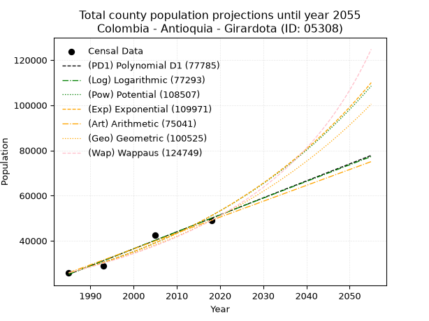
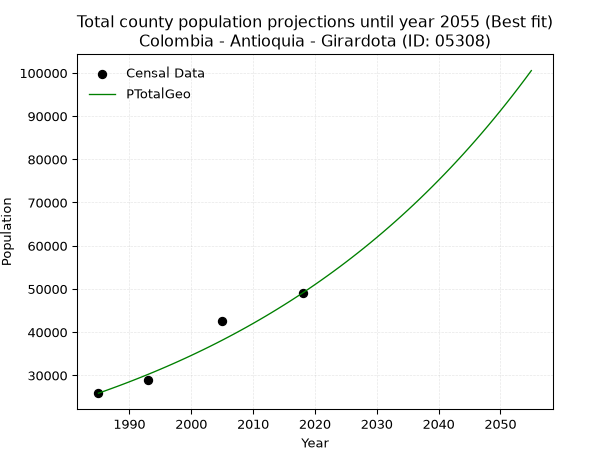
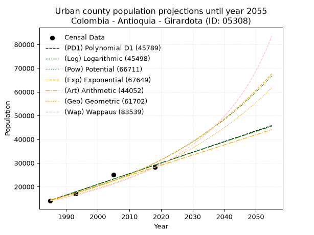
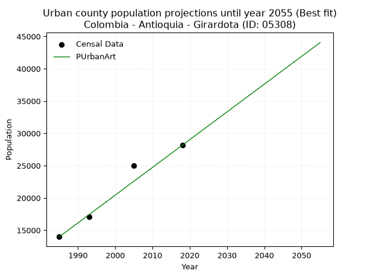
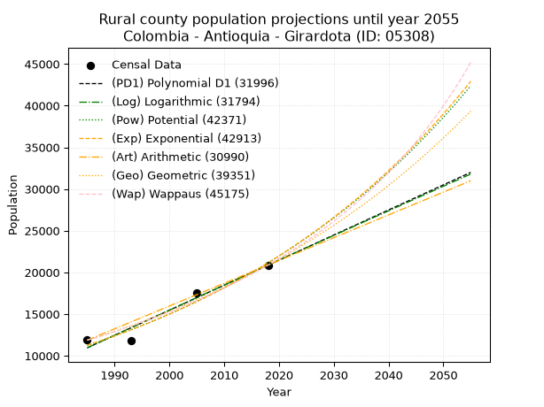
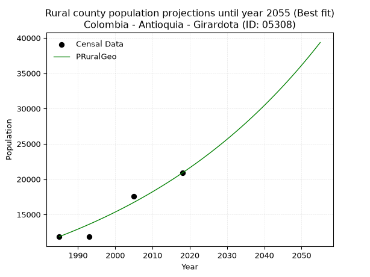

<div align="center">


</div>

# _“Population and Public Services Demand Projections (PPSD) until Year 2050 for Colombia - Antioquia - Girardota (ID: 05308)”_
Keywords: `population` `public-service` `projection` `lineal` `polynomial` `logarithmic` `potential` `exponential` `arithmetic` `geometric` `wappaus` `dane` `colombia` `south-america`

PPSD are analytical estimates used by governments and planners to anticipate future changes in population size, age distribution, and the resulting community needs for utilities, healthcare, education, and infrastructure as sizing future water treatment facilities, electrical grids, and road networks based on spatial growth.

> **General running parameters**: • app_version: _v20260806_. • Python version: _3.14.7_. • Pandas version: _3.0.5_. • NumPy version: _2.5.1_. • Creates, save and include plots into reports (create_plot): _True_. • Projection until year: _2050_. • Process polynomial degree 2 and up: _False_. • Process Wappaus: _True_. • Process Wappaus: _True_. • Set negative values to zero: _True_. • Set infinite values to zero: _True_. • Drop dataset notes: _True_. 
<div align="center">

Dynamic map: [:earth_americas:Google](http://maps.google.com/maps?q=6.379471512,-75.4442377) [:earth_americas:OSM](https://www.openstreetmap.org/#map=18/6.379471512/-75.4442377&layers=P) [:earth_americas:Bing](https://www.bing.com/maps?cp=6.379471512~-75.4442377&lvl=18) [:earth_americas:Apple](https://maps.apple.com/frame?center=6.379471512%2C-75.4442377&span=0.003%2C0.006)

</div>


<div align="center">

```geojson
{
  "type": "Feature",
  "geometry": {
    "type": "Point", 
    "coordinates": [-75.4442377, 6.379471512]
  }, 
  "properties": {
    "Name": "Colombia - Antioquia - Girardota (ID: 05308)"
  }
}
```

</div>


## 0. Census Data (4 records)

Census data are official statistics collected by a government about the people and housing in a country. They usually include counts of total population, age, sex, race, income, education, and jobs.

📅Global census file: [Population.xlsx](../data/Population.xlsx)

| Source   |   Year |   CountryID | CountryName   |   StateID | StateName   |   CountyID | CountyName   |   PTotal |   PUrban |   PRural |
|:---------|-------:|------------:|:--------------|----------:|:------------|-----------:|:-------------|---------:|---------:|---------:|
| DANE     |   1985 |          57 | Colombia      |        05 | Antioquia   |      05308 | Girardota    |    25859 |    13992 |    11867 |
| DANE     |   1993 |          57 | Colombia      |        05 | Antioquia   |      05308 | Girardota    |    28973 |    17131 |    11842 |
| DANE     |   2005 |          57 | Colombia      |        05 | Antioquia   |      05308 | Girardota    |    42566 |    25011 |    17555 |
| DANE     |   2018 |          57 | Colombia      |        05 | Antioquia   |      05308 | Girardota    |    49045 |    28163 |    20882 |

> 🔥Some records has specific notes about the registered values or the corresponding urban or rural distribution.

## 1. Total

### 1.1. Coefficients and Parameters

* (PD1) Polynomial Deg 1: 752.0405459654706, -1467658.3520674328 (lineal)
* (Log) Logarithmic: 1505444.9725284658, -11406288.55006776
* (Pow) Potential: 41.48718238334863, -132.4037696246609
* (Exp) Exponential: 0.02072168944103166, 3.529271786115718e-14
* (Art) Arithmetic: Year diff. 2018 - 1985 = 33, Population diff. 49045 - 25859 = 23186, Annual growth = 702.6060606060606
* (Geo) Geometric: Year diff. 2018 - 1985 = 33, Population diff. 49045 - 25859 = 23186, Annual growth % = 0.019585681055239057
* (Wap) Wappaus: i = 1.8760174639700433, Condition values only valid for < 200)

<sub>
Wappaus condition values: ['0.00', '1.88', '3.75', '5.63', '7.50', '9.38', '11.26', '13.13', '15.01', '16.88', '18.76', '20.64', '22.51', '24.39', '26.26', '28.14', '30.02', '31.89', '33.77', '35.64', '37.52', '39.40', '41.27', '43.15', '45.02', '46.90', '48.78', '50.65', '52.53', '54.40', '56.28', '58.16', '60.03', '61.91', '63.78', '65.66', '67.54', '69.41', '71.29', '73.16', '75.04', '76.92', '78.79', '80.67', '82.54', '84.42', '86.30', '88.17', '90.05', '91.92', '93.80', '95.68', '97.55', '99.43', '101.30', '103.18', '105.06', '106.93', '108.81', '110.69', '112.56', '114.44', '116.31', '118.19', '120.07', '121.94']
</sub>


### 1.2. Projected Dataset

|   Year |   CountyID |   PTotalPD1 |   PTotalLog |   PTotalPow |   PTotalExp |   PTotalArt |   PTotalGeo |   PTotalWap |
|-------:|-----------:|------------:|------------:|------------:|------------:|------------:|------------:|------------:|
|   1985 |      05308 |       25142 |       25118 |       25765 |       25783 |       25859 |       25859 |       25859 |
|   1986 |      05308 |       25894 |       25877 |       26309 |       26322 |       26562 |       26365 |       26349 |
|   1987 |      05308 |       26646 |       26635 |       26864 |       26874 |       27264 |       26882 |       26848 |
|   1988 |      05308 |       27398 |       27392 |       27430 |       27436 |       27967 |       27408 |       27356 |
|   1989 |      05308 |       28150 |       28149 |       28009 |       28011 |       28669 |       27945 |       27875 |
|   1990 |      05308 |       28902 |       28906 |       28599 |       28597 |       29372 |       28492 |       28404 |
|   1991 |      05308 |       29654 |       29662 |       29201 |       29196 |       30075 |       29051 |       28943 |
|   1992 |      05308 |       30406 |       30418 |       29816 |       29807 |       30777 |       29620 |       29493 |
|   1993 |      05308 |       31158 |       31174 |       30443 |       30431 |       31480 |       30200 |       30055 |
|   1994 |      05308 |       31910 |       31929 |       31083 |       31068 |       32182 |       30791 |       30628 |
|   1995 |      05308 |       32663 |       32684 |       31737 |       31719 |       32885 |       31394 |       31212 |
|   1996 |      05308 |       33415 |       33438 |       32404 |       32383 |       33588 |       32009 |       31809 |
|   1997 |      05308 |       34167 |       34192 |       33084 |       33061 |       34290 |       32636 |       32419 |
|   1998 |      05308 |       34919 |       34946 |       33778 |       33753 |       34993 |       33275 |       33041 |
|   1999 |      05308 |       35671 |       35699 |       34487 |       34460 |       35695 |       33927 |       33677 |
|   2000 |      05308 |       36423 |       36452 |       35210 |       35182 |       36398 |       34591 |       34327 |
|   2001 |      05308 |       37175 |       37204 |       35948 |       35918 |       37101 |       35269 |       34992 |
|   2002 |      05308 |       37927 |       37957 |       36701 |       36670 |       37803 |       35960 |       35671 |
|   2003 |      05308 |       38679 |       38708 |       37469 |       37438 |       38506 |       36664 |       36365 |
|   2004 |      05308 |       39431 |       39460 |       38253 |       38222 |       39209 |       37382 |       37075 |
|   2005 |      05308 |       40183 |       40211 |       39053 |       39022 |       39911 |       38114 |       37802 |
|   2006 |      05308 |       40935 |       40961 |       39869 |       39839 |       40614 |       38861 |       38546 |
|   2007 |      05308 |       41687 |       41712 |       40702 |       40673 |       41316 |       39622 |       39307 |
|   2008 |      05308 |       42439 |       42462 |       41552 |       41525 |       42019 |       40398 |       40086 |
|   2009 |      05308 |       43191 |       43211 |       42419 |       42395 |       42722 |       41189 |       40884 |
|   2010 |      05308 |       43943 |       43960 |       43304 |       43282 |       43424 |       41996 |       41702 |
|   2011 |      05308 |       44695 |       44709 |       44207 |       44188 |       44127 |       42818 |       42540 |
|   2012 |      05308 |       45447 |       45458 |       45128 |       45114 |       44829 |       43657 |       43400 |
|   2013 |      05308 |       46199 |       46206 |       46068 |       46058 |       45532 |       44512 |       44281 |
|   2014 |      05308 |       46951 |       46953 |       47027 |       47023 |       46235 |       45384 |       45184 |
|   2015 |      05308 |       47703 |       47701 |       48006 |       48007 |       46937 |       46273 |       46112 |
|   2016 |      05308 |       48455 |       48447 |       49004 |       49012 |       47640 |       47179 |       47064 |
|   2017 |      05308 |       49207 |       49194 |       50023 |       50038 |       48342 |       48103 |       48041 |
|   2018 |      05308 |       49959 |       49940 |       51062 |       51086 |       49045 |       49045 |       49045 |
|   2019 |      05308 |       50712 |       50686 |       52122 |       52156 |       49748 |       50006 |       50077 |
|   2020 |      05308 |       51464 |       51432 |       53204 |       53248 |       50450 |       50985 |       51137 |
|   2021 |      05308 |       52216 |       52177 |       54308 |       54363 |       51153 |       51984 |       52227 |
|   2022 |      05308 |       52968 |       52921 |       55434 |       55501 |       51855 |       53002 |       53349 |
|   2023 |      05308 |       53720 |       53666 |       56583 |       56663 |       52558 |       54040 |       54504 |
|   2024 |      05308 |       54472 |       54410 |       57755 |       57849 |       53261 |       55098 |       55692 |
|   2025 |      05308 |       55224 |       55153 |       58951 |       59061 |       53963 |       56177 |       56917 |
|   2026 |      05308 |       55976 |       55897 |       60171 |       60297 |       54666 |       57278 |       58178 |
|   2027 |      05308 |       56728 |       56639 |       61415 |       61560 |       55368 |       58399 |       59479 |
|   2028 |      05308 |       57480 |       57382 |       62685 |       62849 |       56071 |       59543 |       60821 |
|   2029 |      05308 |       58232 |       58124 |       63980 |       64165 |       56774 |       60709 |       62205 |
|   2030 |      05308 |       58984 |       58866 |       65301 |       65508 |       57476 |       61898 |       63635 |
|   2031 |      05308 |       59736 |       59607 |       66649 |       66880 |       58179 |       63111 |       65111 |
|   2032 |      05308 |       60488 |       60348 |       68024 |       68280 |       58881 |       64347 |       66637 |
|   2033 |      05308 |       61240 |       61089 |       69427 |       69710 |       59584 |       65607 |       68215 |
|   2034 |      05308 |       61992 |       61829 |       70858 |       71169 |       60287 |       66892 |       69848 |
|   2035 |      05308 |       62744 |       62569 |       72318 |       72659 |       60989 |       68202 |       71539 |
|   2036 |      05308 |       63496 |       63309 |       73807 |       74181 |       61692 |       69538 |       73291 |
|   2037 |      05308 |       64248 |       64048 |       75326 |       75734 |       62395 |       70900 |       75106 |
|   2038 |      05308 |       65000 |       64787 |       76875 |       77320 |       63097 |       72289 |       76990 |
|   2039 |      05308 |       65752 |       65525 |       78456 |       78939 |       63800 |       73704 |       78945 |
|   2040 |      05308 |       66504 |       66264 |       80068 |       80591 |       64502 |       75148 |       80975 |
|   2041 |      05308 |       67256 |       67001 |       81713 |       82279 |       65205 |       76620 |       83086 |
|   2042 |      05308 |       68008 |       67739 |       83390 |       84002 |       65908 |       78120 |       85282 |
|   2043 |      05308 |       68760 |       68476 |       85102 |       85760 |       66610 |       79650 |       87569 |
|   2044 |      05308 |       69513 |       69213 |       86847 |       87556 |       67313 |       81210 |       89951 |
|   2045 |      05308 |       70265 |       69949 |       88627 |       89389 |       68015 |       82801 |       92436 |
|   2046 |      05308 |       71017 |       70685 |       90443 |       91261 |       68718 |       84423 |       95030 |
|   2047 |      05308 |       71769 |       71421 |       92295 |       93172 |       69421 |       86076 |       97740 |
|   2048 |      05308 |       72521 |       72156 |       94185 |       95122 |       70123 |       87762 |      100574 |
|   2049 |      05308 |       73273 |       72891 |       96112 |       97114 |       70826 |       89481 |      103541 |
|   2050 |      05308 |       74025 |       73625 |       98077 |       99147 |       71528 |       91233 |      106651 |
<div align="center">

</img>

</div>


### 1.3. Best fit with absolute error and relative error (%)

Relative error puts that difference into context by dividing the absolute error by the true value, creating a unitless ratio or percentage that shows the scale of the mistake.

Absolute and relative error

|   Year | Source   |   CountryID | CountryName   |   StateID | StateName   |   CountyID_x | CountyName   |   PTotal |   PUrban |   PRural |   CountyID_y |   PTotalPD1 |   PTotalLog |   PTotalPow |   PTotalExp |   PTotalArt |   PTotalGeo |   PTotalWap |   PTotalPD1AbsError |   PTotalLogAbsError |   PTotalPowAbsError |   PTotalExpAbsError |   PTotalArtAbsError |   PTotalGeoAbsError |   PTotalWapAbsError |   PTotalPD1RelError |   PTotalLogRelError |   PTotalPowRelError |   PTotalExpRelError |   PTotalArtRelError |   PTotalGeoRelError |   PTotalWapRelError |
|-------:|:---------|------------:|:--------------|----------:|:------------|-------------:|:-------------|---------:|---------:|---------:|-------------:|------------:|------------:|------------:|------------:|------------:|------------:|------------:|--------------------:|--------------------:|--------------------:|--------------------:|--------------------:|--------------------:|--------------------:|--------------------:|--------------------:|--------------------:|--------------------:|--------------------:|--------------------:|--------------------:|
|   1985 | DANE     |          57 | Colombia      |        05 | Antioquia   |        05308 | Girardota    |    25859 |    13992 |    11867 |        05308 |       25142 |       25118 |       25765 |       25783 |       25859 |       25859 |       25859 |                 717 |                 741 |                  94 |                  76 |                   0 |                   0 |                   0 |             2.77273 |             2.86554 |             0.36351 |            0.293902 |             0       |             0       |             0       |
|   1993 | DANE     |          57 | Colombia      |        05 | Antioquia   |        05308 | Girardota    |    28973 |    17131 |    11842 |        05308 |       31158 |       31174 |       30443 |       30431 |       31480 |       30200 |       30055 |                2185 |                2201 |                1470 |                1458 |                2507 |                1227 |                1082 |             7.5415  |             7.59673 |             5.07369 |            5.03227  |             8.65288 |             4.23498 |             3.73451 |
|   2005 | DANE     |          57 | Colombia      |        05 | Antioquia   |        05308 | Girardota    |    42566 |    25011 |    17555 |        05308 |       40183 |       40211 |       39053 |       39022 |       39911 |       38114 |       37802 |                2383 |                2355 |                3513 |                3544 |                2655 |                4452 |                4764 |             5.59836 |             5.53258 |             8.25307 |            8.32589  |             6.23737 |            10.4591  |            11.192   |
|   2018 | DANE     |          57 | Colombia      |        05 | Antioquia   |        05308 | Girardota    |    49045 |    28163 |    20882 |        05308 |       49959 |       49940 |       51062 |       51086 |       49045 |       49045 |       49045 |                 914 |                 895 |                2017 |                2041 |                   0 |                   0 |                   0 |             1.86359 |             1.82485 |             4.11255 |            4.16148  |             0       |             0       |             0       |

Relative error mean

| Method    |   RelError | Best   |
|:----------|-----------:|:-------|
| PTotalPD1 |    4.44405 |        |
| PTotalLog |    4.45493 |        |
| PTotalPow |    4.4507  |        |
| PTotalExp |    4.45339 |        |
| PTotalArt |    3.72256 |        |
| PTotalGeo |    3.67351 | True   |
| PTotalWap |    3.73164 |        |

💙Best method: _**PTotalGeo**_
<div align="center">

</img>

</div>


### 1.4. Fresh water supply demand in liters per capita per day (lpcd)

The fresh water supply demand typically ranges from 100 to 300 liters per capita per day (lpcd) for standard domestic and municipal planning, though absolute survival minimums set by the World Health Organization are as low as 7.5 to 20 liters per day, and total consumption in high-income nations can exceed 400 liters.

> `CZ`: Level in meters above the sea level (masl).<br> `WS`: Fresh water supply demand in liters per capita per day (lpcd or l/h/d).<br> `WSAll`: Zonal fresh water supply demand in liters per second (l/s).<br> `A`: Zonal area in square meters.

Reference values (RAS Colombia)

|    CZ |   WS |
|------:|-----:|
|  1000 |  120 |
|  2000 |  130 |
| 99999 |  140 |

County shapefile geometry properties and water supply values

|   CountyID |      ATotal |   CZTotal |   WSTotal |
|-----------:|------------:|----------:|----------:|
|      05308 | 8.28007e+07 |   1864.28 |       130 |

Projected values for best method: PTotalGeo

|   CountyID |   Year |   PTotalGeo |   WSTotal |   WSTotalAll |
|-----------:|-------:|------------:|----------:|-------------:|
|      05308 |   1985 |       25859 |       130 |      38.9082 |
|      05308 |   1986 |       26365 |       130 |      39.6696 |
|      05308 |   1987 |       26882 |       130 |      40.4475 |
|      05308 |   1988 |       27408 |       130 |      41.2389 |
|      05308 |   1989 |       27945 |       130 |      42.0469 |
|      05308 |   1990 |       28492 |       130 |      42.8699 |
|      05308 |   1991 |       29051 |       130 |      43.711  |
|      05308 |   1992 |       29620 |       130 |      44.5671 |
|      05308 |   1993 |       30200 |       130 |      45.4398 |
|      05308 |   1994 |       30791 |       130 |      46.3291 |
|      05308 |   1995 |       31394 |       130 |      47.2363 |
|      05308 |   1996 |       32009 |       130 |      48.1617 |
|      05308 |   1997 |       32636 |       130 |      49.1051 |
|      05308 |   1998 |       33275 |       130 |      50.0666 |
|      05308 |   1999 |       33927 |       130 |      51.0476 |
|      05308 |   2000 |       34591 |       130 |      52.0466 |
|      05308 |   2001 |       35269 |       130 |      53.0668 |
|      05308 |   2002 |       35960 |       130 |      54.1065 |
|      05308 |   2003 |       36664 |       130 |      55.1657 |
|      05308 |   2004 |       37382 |       130 |      56.2461 |
|      05308 |   2005 |       38114 |       130 |      57.3475 |
|      05308 |   2006 |       38861 |       130 |      58.4714 |
|      05308 |   2007 |       39622 |       130 |      59.6164 |
|      05308 |   2008 |       40398 |       130 |      60.784  |
|      05308 |   2009 |       41189 |       130 |      61.9742 |
|      05308 |   2010 |       41996 |       130 |      63.1884 |
|      05308 |   2011 |       42818 |       130 |      64.4252 |
|      05308 |   2012 |       43657 |       130 |      65.6876 |
|      05308 |   2013 |       44512 |       130 |      66.9741 |
|      05308 |   2014 |       45384 |       130 |      68.2861 |
|      05308 |   2015 |       46273 |       130 |      69.6237 |
|      05308 |   2016 |       47179 |       130 |      70.9869 |
|      05308 |   2017 |       48103 |       130 |      72.3772 |
|      05308 |   2018 |       49045 |       130 |      73.7946 |
|      05308 |   2019 |       50006 |       130 |      75.2405 |
|      05308 |   2020 |       50985 |       130 |      76.7135 |
|      05308 |   2021 |       51984 |       130 |      78.2167 |
|      05308 |   2022 |       53002 |       130 |      79.7484 |
|      05308 |   2023 |       54040 |       130 |      81.3102 |
|      05308 |   2024 |       55098 |       130 |      82.9021 |
|      05308 |   2025 |       56177 |       130 |      84.5256 |
|      05308 |   2026 |       57278 |       130 |      86.1822 |
|      05308 |   2027 |       58399 |       130 |      87.8689 |
|      05308 |   2028 |       59543 |       130 |      89.5902 |
|      05308 |   2029 |       60709 |       130 |      91.3446 |
|      05308 |   2030 |       61898 |       130 |      93.1336 |
|      05308 |   2031 |       63111 |       130 |      94.9587 |
|      05308 |   2032 |       64347 |       130 |      96.8184 |
|      05308 |   2033 |       65607 |       130 |      98.7142 |
|      05308 |   2034 |       66892 |       130 |     100.648  |
|      05308 |   2035 |       68202 |       130 |     102.619  |
|      05308 |   2036 |       69538 |       130 |     104.629  |
|      05308 |   2037 |       70900 |       130 |     106.678  |
|      05308 |   2038 |       72289 |       130 |     108.768  |
|      05308 |   2039 |       73704 |       130 |     110.897  |
|      05308 |   2040 |       75148 |       130 |     113.07   |
|      05308 |   2041 |       76620 |       130 |     115.285  |
|      05308 |   2042 |       78120 |       130 |     117.542  |
|      05308 |   2043 |       79650 |       130 |     119.844  |
|      05308 |   2044 |       81210 |       130 |     122.191  |
|      05308 |   2045 |       82801 |       130 |     124.585  |
|      05308 |   2046 |       84423 |       130 |     127.025  |
|      05308 |   2047 |       86076 |       130 |     129.512  |
|      05308 |   2048 |       87762 |       130 |     132.049  |
|      05308 |   2049 |       89481 |       130 |     134.636  |
|      05308 |   2050 |       91233 |       130 |     137.272  |

## 2. Urban

### 2.1. Coefficients and Parameters

* (PD1) Polynomial Deg 1: 451.41348855880926, -881865.5804897582 (lineal)
* (Log) Logarithmic: 903824.453127832, -6848902.6610192675
* (Pow) Potential: 44.08055103072904, -141.20637377568573
* (Exp) Exponential: 0.02201212811224144, 1.531040348541254e-15
* (Art) Arithmetic: Year diff. 2018 - 1985 = 33, Population diff. 28163 - 13992 = 14171, Annual growth = 429.42424242424244
* (Geo) Geometric: Year diff. 2018 - 1985 = 33, Population diff. 28163 - 13992 = 14171, Annual growth % = 0.021423943114682542
* (Wap) Wappaus: i = 2.037358521761321, Condition values only valid for < 200)

<sub>
Wappaus condition values: ['0.00', '2.04', '4.07', '6.11', '8.15', '10.19', '12.22', '14.26', '16.30', '18.34', '20.37', '22.41', '24.45', '26.49', '28.52', '30.56', '32.60', '34.64', '36.67', '38.71', '40.75', '42.78', '44.82', '46.86', '48.90', '50.93', '52.97', '55.01', '57.05', '59.08', '61.12', '63.16', '65.20', '67.23', '69.27', '71.31', '73.34', '75.38', '77.42', '79.46', '81.49', '83.53', '85.57', '87.61', '89.64', '91.68', '93.72', '95.76', '97.79', '99.83', '101.87', '103.91', '105.94', '107.98', '110.02', '112.05', '114.09', '116.13', '118.17', '120.20', '122.24', '124.28', '126.32', '128.35', '130.39', '132.43']
</sub>


### 2.2. Projected Dataset

|   Year |   CountyID |   PUrbanPD1 |   PUrbanLog |   PUrbanPow |   PUrbanExp |   PUrbanArt |   PUrbanGeo |   PUrbanWap |
|-------:|-----------:|------------:|------------:|------------:|------------:|------------:|------------:|------------:|
|   1985 |      05308 |       14190 |       14175 |       14479 |       14490 |       13992 |       13992 |       13992 |
|   1986 |      05308 |       14642 |       14630 |       14804 |       14813 |       14421 |       14292 |       14280 |
|   1987 |      05308 |       15093 |       15085 |       15136 |       15143 |       14851 |       14598 |       14574 |
|   1988 |      05308 |       15544 |       15540 |       15475 |       15480 |       15280 |       14911 |       14874 |
|   1989 |      05308 |       15996 |       15994 |       15822 |       15824 |       15710 |       15230 |       15181 |
|   1990 |      05308 |       16447 |       16448 |       16177 |       16176 |       16139 |       15556 |       15494 |
|   1991 |      05308 |       16899 |       16902 |       16539 |       16536 |       16569 |       15890 |       15814 |
|   1992 |      05308 |       17350 |       17356 |       16909 |       16904 |       16998 |       16230 |       16141 |
|   1993 |      05308 |       17802 |       17810 |       17287 |       17281 |       17427 |       16578 |       16475 |
|   1994 |      05308 |       18253 |       18263 |       17674 |       17665 |       17857 |       16933 |       16817 |
|   1995 |      05308 |       18704 |       18716 |       18069 |       18058 |       18286 |       17296 |       17166 |
|   1996 |      05308 |       19156 |       19169 |       18472 |       18460 |       18716 |       17666 |       17523 |
|   1997 |      05308 |       19607 |       19622 |       18885 |       18871 |       19145 |       18045 |       17889 |
|   1998 |      05308 |       20059 |       20075 |       19306 |       19291 |       19575 |       18431 |       18264 |
|   1999 |      05308 |       20510 |       20527 |       19737 |       19721 |       20004 |       18826 |       18647 |
|   2000 |      05308 |       20961 |       20979 |       20177 |       20159 |       20433 |       19230 |       19039 |
|   2001 |      05308 |       21413 |       21431 |       20626 |       20608 |       20863 |       19642 |       19441 |
|   2002 |      05308 |       21864 |       21882 |       21085 |       21067 |       21292 |       20062 |       19853 |
|   2003 |      05308 |       22316 |       22334 |       21555 |       21536 |       21722 |       20492 |       20275 |
|   2004 |      05308 |       22767 |       22785 |       22034 |       22015 |       22151 |       20931 |       20708 |
|   2005 |      05308 |       23218 |       23236 |       22524 |       22505 |       22580 |       21380 |       21152 |
|   2006 |      05308 |       23670 |       23686 |       23025 |       23006 |       23010 |       21838 |       21608 |
|   2007 |      05308 |       24121 |       24137 |       23536 |       23518 |       23439 |       22306 |       22075 |
|   2008 |      05308 |       24573 |       24587 |       24059 |       24041 |       23869 |       22783 |       22555 |
|   2009 |      05308 |       25024 |       25037 |       24592 |       24576 |       24298 |       23272 |       23048 |
|   2010 |      05308 |       25476 |       25487 |       25138 |       25123 |       24728 |       23770 |       23554 |
|   2011 |      05308 |       25927 |       25936 |       25695 |       25682 |       25157 |       24279 |       24074 |
|   2012 |      05308 |       26378 |       26386 |       26264 |       26254 |       25586 |       24799 |       24609 |
|   2013 |      05308 |       26830 |       26835 |       26846 |       26838 |       26016 |       25331 |       25159 |
|   2014 |      05308 |       27281 |       27284 |       27440 |       27436 |       26445 |       25873 |       25725 |
|   2015 |      05308 |       27733 |       27732 |       28047 |       28046 |       26875 |       26428 |       26308 |
|   2016 |      05308 |       28184 |       28181 |       28667 |       28670 |       27304 |       26994 |       26908 |
|   2017 |      05308 |       28635 |       28629 |       29301 |       29309 |       27734 |       27572 |       27526 |
|   2018 |      05308 |       29087 |       29077 |       29948 |       29961 |       28163 |       28163 |       28163 |
|   2019 |      05308 |       29538 |       29525 |       30610 |       30628 |       28592 |       28766 |       28820 |
|   2020 |      05308 |       29990 |       29972 |       31285 |       31309 |       29022 |       29383 |       29498 |
|   2021 |      05308 |       30441 |       30420 |       31975 |       32006 |       29451 |       30012 |       30197 |
|   2022 |      05308 |       30892 |       30867 |       32680 |       32718 |       29881 |       30655 |       30920 |
|   2023 |      05308 |       31344 |       31314 |       33400 |       33447 |       30310 |       31312 |       31666 |
|   2024 |      05308 |       31795 |       31760 |       34136 |       34191 |       30740 |       31983 |       32438 |
|   2025 |      05308 |       32247 |       32207 |       34887 |       34952 |       31169 |       32668 |       33236 |
|   2026 |      05308 |       32698 |       32653 |       35655 |       35730 |       31598 |       33368 |       34062 |
|   2027 |      05308 |       33150 |       33099 |       36439 |       36525 |       32028 |       34083 |       34918 |
|   2028 |      05308 |       33601 |       33545 |       37239 |       37338 |       32457 |       34813 |       35804 |
|   2029 |      05308 |       34052 |       33990 |       38058 |       38169 |       32887 |       35559 |       36724 |
|   2030 |      05308 |       34504 |       34436 |       38893 |       39018 |       33316 |       36320 |       37678 |
|   2031 |      05308 |       34955 |       34881 |       39747 |       39887 |       33746 |       37099 |       38668 |
|   2032 |      05308 |       35407 |       35326 |       40619 |       40775 |       34175 |       37893 |       39697 |
|   2033 |      05308 |       35858 |       35770 |       41509 |       41682 |       34604 |       38705 |       40768 |
|   2034 |      05308 |       36309 |       36215 |       42419 |       42610 |       35034 |       39534 |       41881 |
|   2035 |      05308 |       36761 |       36659 |       43348 |       43558 |       35463 |       40381 |       43041 |
|   2036 |      05308 |       37212 |       37103 |       44297 |       44528 |       35893 |       41247 |       44251 |
|   2037 |      05308 |       37664 |       37547 |       45266 |       45519 |       36322 |       42130 |       45512 |
|   2038 |      05308 |       38115 |       37990 |       46256 |       46532 |       36751 |       43033 |       46830 |
|   2039 |      05308 |       38567 |       38434 |       47267 |       47567 |       37181 |       43955 |       48207 |
|   2040 |      05308 |       39018 |       38877 |       48300 |       48626 |       37610 |       44896 |       49648 |
|   2041 |      05308 |       39469 |       39320 |       49355 |       49708 |       38040 |       45858 |       51157 |
|   2042 |      05308 |       39921 |       39763 |       50432 |       50814 |       38469 |       46841 |       52739 |
|   2043 |      05308 |       40372 |       40205 |       51532 |       51945 |       38899 |       47844 |       54401 |
|   2044 |      05308 |       40824 |       40647 |       52656 |       53102 |       39328 |       48869 |       56147 |
|   2045 |      05308 |       41275 |       41089 |       53804 |       54283 |       39757 |       49916 |       57985 |
|   2046 |      05308 |       41726 |       41531 |       54976 |       55492 |       40187 |       50986 |       59921 |
|   2047 |      05308 |       42178 |       41973 |       56173 |       56727 |       40616 |       52078 |       61965 |
|   2048 |      05308 |       42629 |       42414 |       57395 |       57989 |       41046 |       53194 |       64125 |
|   2049 |      05308 |       43081 |       42856 |       58644 |       59280 |       41475 |       54333 |       66411 |
|   2050 |      05308 |       43532 |       43297 |       59919 |       60599 |       41905 |       55497 |       68836 |
<div align="center">

</img>

</div>


### 2.3. Best fit with absolute error and relative error (%)

Relative error puts that difference into context by dividing the absolute error by the true value, creating a unitless ratio or percentage that shows the scale of the mistake.

Absolute and relative error

|   Year | Source   |   CountryID | CountryName   |   StateID | StateName   |   CountyID_x | CountyName   |   PTotal |   PUrban |   PRural |   CountyID_y |   PUrbanPD1 |   PUrbanLog |   PUrbanPow |   PUrbanExp |   PUrbanArt |   PUrbanGeo |   PUrbanWap |   PUrbanPD1AbsError |   PUrbanLogAbsError |   PUrbanPowAbsError |   PUrbanExpAbsError |   PUrbanArtAbsError |   PUrbanGeoAbsError |   PUrbanWapAbsError |   PUrbanPD1RelError |   PUrbanLogRelError |   PUrbanPowRelError |   PUrbanExpRelError |   PUrbanArtRelError |   PUrbanGeoRelError |   PUrbanWapRelError |
|-------:|:---------|------------:|:--------------|----------:|:------------|-------------:|:-------------|---------:|---------:|---------:|-------------:|------------:|------------:|------------:|------------:|------------:|------------:|------------:|--------------------:|--------------------:|--------------------:|--------------------:|--------------------:|--------------------:|--------------------:|--------------------:|--------------------:|--------------------:|--------------------:|--------------------:|--------------------:|--------------------:|
|   1985 | DANE     |          57 | Colombia      |        05 | Antioquia   |        05308 | Girardota    |    25859 |    13992 |    11867 |        05308 |       14190 |       14175 |       14479 |       14490 |       13992 |       13992 |       13992 |                 198 |                 183 |                 487 |                 498 |                   0 |                   0 |                   0 |             1.41509 |             1.30789 |             3.48056 |            3.55918  |             0       |             0       |             0       |
|   1993 | DANE     |          57 | Colombia      |        05 | Antioquia   |        05308 | Girardota    |    28973 |    17131 |    11842 |        05308 |       17802 |       17810 |       17287 |       17281 |       17427 |       16578 |       16475 |                 671 |                 679 |                 156 |                 150 |                 296 |                 553 |                 656 |             3.91688 |             3.96357 |             0.91063 |            0.875606 |             1.72786 |             3.22807 |             3.82932 |
|   2005 | DANE     |          57 | Colombia      |        05 | Antioquia   |        05308 | Girardota    |    42566 |    25011 |    17555 |        05308 |       23218 |       23236 |       22524 |       22505 |       22580 |       21380 |       21152 |                1793 |                1775 |                2487 |                2506 |                2431 |                3631 |                3859 |             7.16885 |             7.09688 |             9.94362 |           10.0196   |             9.71972 |            14.5176  |            15.4292  |
|   2018 | DANE     |          57 | Colombia      |        05 | Antioquia   |        05308 | Girardota    |    49045 |    28163 |    20882 |        05308 |       29087 |       29077 |       29948 |       29961 |       28163 |       28163 |       28163 |                 924 |                 914 |                1785 |                1798 |                   0 |                   0 |                   0 |             3.2809  |             3.24539 |             6.3381  |            6.38426  |             0       |             0       |             0       |

Relative error mean

| Method    |   RelError | Best   |
|:----------|-----------:|:-------|
| PUrbanPD1 |    3.94543 |        |
| PUrbanLog |    3.90343 |        |
| PUrbanPow |    5.16823 |        |
| PUrbanExp |    5.20966 |        |
| PUrbanArt |    2.8619  | True   |
| PUrbanGeo |    4.43642 |        |
| PUrbanWap |    4.81463 |        |

💙Best method: _**PUrbanArt**_
<div align="center">

</img>

</div>


### 2.4. Fresh water supply demand in liters per capita per day (lpcd)

The fresh water supply demand typically ranges from 100 to 300 liters per capita per day (lpcd) for standard domestic and municipal planning, though absolute survival minimums set by the World Health Organization are as low as 7.5 to 20 liters per day, and total consumption in high-income nations can exceed 400 liters.

> `CZ`: Level in meters above the sea level (masl).<br> `WS`: Fresh water supply demand in liters per capita per day (lpcd or l/h/d).<br> `WSAll`: Zonal fresh water supply demand in liters per second (l/s).<br> `A`: Zonal area in square meters.

Reference values (RAS Colombia)

|    CZ |   WS |
|------:|-----:|
|  1000 |  120 |
|  2000 |  130 |
| 99999 |  140 |

County shapefile geometry properties and water supply values

|   CountyID |     AUrban |   CZUrban |   WSUrban |
|-----------:|-----------:|----------:|----------:|
|      05308 | 3.7772e+06 |   1391.31 |       130 |

Projected values for best method: PUrbanArt

|   CountyID |   Year |   PUrbanArt |   WSUrban |   WSUrbanAll |
|-----------:|-------:|------------:|----------:|-------------:|
|      05308 |   1985 |       13992 |       130 |      21.0528 |
|      05308 |   1986 |       14421 |       130 |      21.6983 |
|      05308 |   1987 |       14851 |       130 |      22.3453 |
|      05308 |   1988 |       15280 |       130 |      22.9907 |
|      05308 |   1989 |       15710 |       130 |      23.6377 |
|      05308 |   1990 |       16139 |       130 |      24.2832 |
|      05308 |   1991 |       16569 |       130 |      24.9302 |
|      05308 |   1992 |       16998 |       130 |      25.5757 |
|      05308 |   1993 |       17427 |       130 |      26.2212 |
|      05308 |   1994 |       17857 |       130 |      26.8682 |
|      05308 |   1995 |       18286 |       130 |      27.5137 |
|      05308 |   1996 |       18716 |       130 |      28.1606 |
|      05308 |   1997 |       19145 |       130 |      28.8061 |
|      05308 |   1998 |       19575 |       130 |      29.4531 |
|      05308 |   1999 |       20004 |       130 |      30.0986 |
|      05308 |   2000 |       20433 |       130 |      30.7441 |
|      05308 |   2001 |       20863 |       130 |      31.3911 |
|      05308 |   2002 |       21292 |       130 |      32.0366 |
|      05308 |   2003 |       21722 |       130 |      32.6836 |
|      05308 |   2004 |       22151 |       130 |      33.3291 |
|      05308 |   2005 |       22580 |       130 |      33.9745 |
|      05308 |   2006 |       23010 |       130 |      34.6215 |
|      05308 |   2007 |       23439 |       130 |      35.267  |
|      05308 |   2008 |       23869 |       130 |      35.914  |
|      05308 |   2009 |       24298 |       130 |      36.5595 |
|      05308 |   2010 |       24728 |       130 |      37.2065 |
|      05308 |   2011 |       25157 |       130 |      37.852  |
|      05308 |   2012 |       25586 |       130 |      38.4975 |
|      05308 |   2013 |       26016 |       130 |      39.1444 |
|      05308 |   2014 |       26445 |       130 |      39.7899 |
|      05308 |   2015 |       26875 |       130 |      40.4369 |
|      05308 |   2016 |       27304 |       130 |      41.0824 |
|      05308 |   2017 |       27734 |       130 |      41.7294 |
|      05308 |   2018 |       28163 |       130 |      42.3749 |
|      05308 |   2019 |       28592 |       130 |      43.0204 |
|      05308 |   2020 |       29022 |       130 |      43.6674 |
|      05308 |   2021 |       29451 |       130 |      44.3128 |
|      05308 |   2022 |       29881 |       130 |      44.9598 |
|      05308 |   2023 |       30310 |       130 |      45.6053 |
|      05308 |   2024 |       30740 |       130 |      46.2523 |
|      05308 |   2025 |       31169 |       130 |      46.8978 |
|      05308 |   2026 |       31598 |       130 |      47.5433 |
|      05308 |   2027 |       32028 |       130 |      48.1903 |
|      05308 |   2028 |       32457 |       130 |      48.8358 |
|      05308 |   2029 |       32887 |       130 |      49.4828 |
|      05308 |   2030 |       33316 |       130 |      50.1282 |
|      05308 |   2031 |       33746 |       130 |      50.7752 |
|      05308 |   2032 |       34175 |       130 |      51.4207 |
|      05308 |   2033 |       34604 |       130 |      52.0662 |
|      05308 |   2034 |       35034 |       130 |      52.7132 |
|      05308 |   2035 |       35463 |       130 |      53.3587 |
|      05308 |   2036 |       35893 |       130 |      54.0057 |
|      05308 |   2037 |       36322 |       130 |      54.6512 |
|      05308 |   2038 |       36751 |       130 |      55.2966 |
|      05308 |   2039 |       37181 |       130 |      55.9436 |
|      05308 |   2040 |       37610 |       130 |      56.5891 |
|      05308 |   2041 |       38040 |       130 |      57.2361 |
|      05308 |   2042 |       38469 |       130 |      57.8816 |
|      05308 |   2043 |       38899 |       130 |      58.5286 |
|      05308 |   2044 |       39328 |       130 |      59.1741 |
|      05308 |   2045 |       39757 |       130 |      59.8196 |
|      05308 |   2046 |       40187 |       130 |      60.4666 |
|      05308 |   2047 |       40616 |       130 |      61.112  |
|      05308 |   2048 |       41046 |       130 |      61.759  |
|      05308 |   2049 |       41475 |       130 |      62.4045 |
|      05308 |   2050 |       41905 |       130 |      63.0515 |

## 3. Rural

### 3.1. Coefficients and Parameters

* (PD1) Polynomial Deg 1: 300.6270574066617, -585792.771577675 (lineal)
* (Log) Logarithmic: 601620.5194006338, -4557385.889048493
* (Pow) Potential: 38.26521072904657, -122.13837781056642
* (Exp) Exponential: 0.01911886059757858, 3.710885989032175e-13
* (Art) Arithmetic: Year diff. 2018 - 1985 = 33, Population diff. 20882 - 11867 = 9015, Annual growth = 273.1818181818182
* (Geo) Geometric: Year diff. 2018 - 1985 = 33, Population diff. 20882 - 11867 = 9015, Annual growth % = 0.017272507506225887
* (Wap) Wappaus: i = 1.6683368541440544, Condition values only valid for < 200)

<sub>
Wappaus condition values: ['0.00', '1.67', '3.34', '5.01', '6.67', '8.34', '10.01', '11.68', '13.35', '15.02', '16.68', '18.35', '20.02', '21.69', '23.36', '25.03', '26.69', '28.36', '30.03', '31.70', '33.37', '35.04', '36.70', '38.37', '40.04', '41.71', '43.38', '45.05', '46.71', '48.38', '50.05', '51.72', '53.39', '55.06', '56.72', '58.39', '60.06', '61.73', '63.40', '65.07', '66.73', '68.40', '70.07', '71.74', '73.41', '75.08', '76.74', '78.41', '80.08', '81.75', '83.42', '85.09', '86.75', '88.42', '90.09', '91.76', '93.43', '95.10', '96.76', '98.43', '100.10', '101.77', '103.44', '105.11', '106.77', '108.44']
</sub>


### 3.2. Projected Dataset

|   Year |   CountyID |   PRuralPD1 |   PRuralLog |   PRuralPow |   PRuralExp |   PRuralArt |   PRuralGeo |   PRuralWap |
|-------:|-----------:|------------:|------------:|------------:|------------:|------------:|------------:|------------:|
|   1985 |      05308 |       10952 |       10944 |       11249 |       11255 |       11867 |       11867 |       11867 |
|   1986 |      05308 |       11253 |       11247 |       11468 |       11473 |       12140 |       12072 |       12067 |
|   1987 |      05308 |       11553 |       11550 |       11691 |       11694 |       12413 |       12280 |       12270 |
|   1988 |      05308 |       11854 |       11852 |       11918 |       11920 |       12687 |       12493 |       12476 |
|   1989 |      05308 |       12154 |       12155 |       12150 |       12150 |       12960 |       12708 |       12686 |
|   1990 |      05308 |       12455 |       12457 |       12386 |       12384 |       13233 |       12928 |       12900 |
|   1991 |      05308 |       12756 |       12760 |       12626 |       12624 |       13506 |       13151 |       13117 |
|   1992 |      05308 |       13056 |       13062 |       12871 |       12867 |       13779 |       13378 |       13339 |
|   1993 |      05308 |       13357 |       13364 |       13121 |       13116 |       14052 |       13609 |       13564 |
|   1994 |      05308 |       13658 |       13665 |       13375 |       13369 |       14326 |       13844 |       13793 |
|   1995 |      05308 |       13958 |       13967 |       13634 |       13627 |       14599 |       14084 |       14027 |
|   1996 |      05308 |       14259 |       14269 |       13898 |       13890 |       14872 |       14327 |       14265 |
|   1997 |      05308 |       14559 |       14570 |       14167 |       14158 |       15145 |       14574 |       14507 |
|   1998 |      05308 |       14860 |       14871 |       14441 |       14431 |       15418 |       14826 |       14754 |
|   1999 |      05308 |       15161 |       15172 |       14720 |       14710 |       15692 |       15082 |       15005 |
|   2000 |      05308 |       15461 |       15473 |       15005 |       14994 |       15965 |       15343 |       15261 |
|   2001 |      05308 |       15762 |       15774 |       15295 |       15283 |       16238 |       15608 |       15523 |
|   2002 |      05308 |       16063 |       16074 |       15590 |       15578 |       16511 |       15877 |       15789 |
|   2003 |      05308 |       16363 |       16375 |       15891 |       15879 |       16784 |       16151 |       16060 |
|   2004 |      05308 |       16664 |       16675 |       16197 |       16185 |       17057 |       16430 |       16337 |
|   2005 |      05308 |       16964 |       16975 |       16509 |       16498 |       17331 |       16714 |       16620 |
|   2006 |      05308 |       17265 |       17275 |       16827 |       16816 |       17604 |       17003 |       16908 |
|   2007 |      05308 |       17566 |       17575 |       17151 |       17141 |       17877 |       17297 |       17202 |
|   2008 |      05308 |       17866 |       17875 |       17481 |       17472 |       18150 |       17595 |       17502 |
|   2009 |      05308 |       18167 |       18174 |       17817 |       17809 |       18423 |       17899 |       17808 |
|   2010 |      05308 |       18468 |       18474 |       18160 |       18153 |       18697 |       18208 |       18121 |
|   2011 |      05308 |       18768 |       18773 |       18509 |       18503 |       18970 |       18523 |       18440 |
|   2012 |      05308 |       19069 |       19072 |       18864 |       18860 |       19243 |       18843 |       18766 |
|   2013 |      05308 |       19369 |       19371 |       19227 |       19224 |       19516 |       19168 |       19100 |
|   2014 |      05308 |       19670 |       19670 |       19595 |       19595 |       19789 |       19499 |       19441 |
|   2015 |      05308 |       19971 |       19968 |       19971 |       19974 |       20062 |       19836 |       19789 |
|   2016 |      05308 |       20271 |       20267 |       20354 |       20359 |       20336 |       20179 |       20145 |
|   2017 |      05308 |       20572 |       20565 |       20744 |       20752 |       20609 |       20527 |       20509 |
|   2018 |      05308 |       20873 |       20863 |       21141 |       21153 |       20882 |       20882 |       20882 |
|   2019 |      05308 |       21173 |       21161 |       21546 |       21561 |       21155 |       21243 |       21263 |
|   2020 |      05308 |       21474 |       21459 |       21958 |       21977 |       21428 |       21610 |       21654 |
|   2021 |      05308 |       21775 |       21757 |       22378 |       22401 |       21702 |       21983 |       22053 |
|   2022 |      05308 |       22075 |       22055 |       22805 |       22834 |       21975 |       22363 |       22463 |
|   2023 |      05308 |       22376 |       22352 |       23241 |       23275 |       22248 |       22749 |       22882 |
|   2024 |      05308 |       22676 |       22649 |       23684 |       23724 |       22521 |       23142 |       23311 |
|   2025 |      05308 |       22977 |       22947 |       24136 |       24182 |       22794 |       23541 |       23752 |
|   2026 |      05308 |       23278 |       23244 |       24597 |       24649 |       23067 |       23948 |       24203 |
|   2027 |      05308 |       23578 |       23541 |       25066 |       25124 |       23341 |       24362 |       24667 |
|   2028 |      05308 |       23879 |       23837 |       25543 |       25609 |       23614 |       24783 |       25142 |
|   2029 |      05308 |       24180 |       24134 |       26030 |       26104 |       23887 |       25211 |       25629 |
|   2030 |      05308 |       24480 |       24430 |       26525 |       26608 |       24160 |       25646 |       26130 |
|   2031 |      05308 |       24781 |       24727 |       27030 |       27121 |       24433 |       26089 |       26645 |
|   2032 |      05308 |       25081 |       25023 |       27544 |       27645 |       24707 |       26540 |       27173 |
|   2033 |      05308 |       25382 |       25319 |       28067 |       28178 |       24980 |       26998 |       27716 |
|   2034 |      05308 |       25683 |       25615 |       28600 |       28722 |       25253 |       27464 |       28275 |
|   2035 |      05308 |       25983 |       25910 |       29143 |       29277 |       25526 |       27939 |       28849 |
|   2036 |      05308 |       26284 |       26206 |       29696 |       29842 |       25799 |       28421 |       29440 |
|   2037 |      05308 |       26585 |       26501 |       30259 |       30418 |       26072 |       28912 |       30049 |
|   2038 |      05308 |       26885 |       26797 |       30833 |       31005 |       26346 |       29412 |       30675 |
|   2039 |      05308 |       27186 |       27092 |       31417 |       31603 |       26619 |       29920 |       31321 |
|   2040 |      05308 |       27486 |       27387 |       32012 |       32213 |       26892 |       30436 |       31987 |
|   2041 |      05308 |       27787 |       27682 |       32618 |       32835 |       27165 |       30962 |       32673 |
|   2042 |      05308 |       28088 |       27976 |       33236 |       33469 |       27438 |       31497 |       33382 |
|   2043 |      05308 |       28388 |       28271 |       33864 |       34115 |       27712 |       32041 |       34113 |
|   2044 |      05308 |       28689 |       28565 |       34504 |       34774 |       27985 |       32594 |       34868 |
|   2045 |      05308 |       28990 |       28859 |       35156 |       35445 |       28258 |       33157 |       35649 |
|   2046 |      05308 |       29290 |       29154 |       35820 |       36129 |       28531 |       33730 |       36456 |
|   2047 |      05308 |       29591 |       29448 |       36496 |       36826 |       28804 |       34313 |       37290 |
|   2048 |      05308 |       29891 |       29741 |       37184 |       37537 |       29077 |       34905 |       38155 |
|   2049 |      05308 |       30192 |       30035 |       37886 |       38262 |       29351 |       35508 |       39050 |
|   2050 |      05308 |       30493 |       30329 |       38599 |       39000 |       29624 |       36122 |       39978 |
<div align="center">

</img>

</div>


### 3.3. Best fit with absolute error and relative error (%)

Relative error puts that difference into context by dividing the absolute error by the true value, creating a unitless ratio or percentage that shows the scale of the mistake.

Absolute and relative error

|   Year | Source   |   CountryID | CountryName   |   StateID | StateName   |   CountyID_x | CountyName   |   PTotal |   PUrban |   PRural |   CountyID_y |   PRuralPD1 |   PRuralLog |   PRuralPow |   PRuralExp |   PRuralArt |   PRuralGeo |   PRuralWap |   PRuralPD1AbsError |   PRuralLogAbsError |   PRuralPowAbsError |   PRuralExpAbsError |   PRuralArtAbsError |   PRuralGeoAbsError |   PRuralWapAbsError |   PRuralPD1RelError |   PRuralLogRelError |   PRuralPowRelError |   PRuralExpRelError |   PRuralArtRelError |   PRuralGeoRelError |   PRuralWapRelError |
|-------:|:---------|------------:|:--------------|----------:|:------------|-------------:|:-------------|---------:|---------:|---------:|-------------:|------------:|------------:|------------:|------------:|------------:|------------:|------------:|--------------------:|--------------------:|--------------------:|--------------------:|--------------------:|--------------------:|--------------------:|--------------------:|--------------------:|--------------------:|--------------------:|--------------------:|--------------------:|--------------------:|
|   1985 | DANE     |          57 | Colombia      |        05 | Antioquia   |        05308 | Girardota    |    25859 |    13992 |    11867 |        05308 |       10952 |       10944 |       11249 |       11255 |       11867 |       11867 |       11867 |                 915 |                 923 |                 618 |                 612 |                   0 |                   0 |                   0 |           7.71046   |           7.77787   |             5.20772 |             5.15716 |             0       |             0       |             0       |
|   1993 | DANE     |          57 | Colombia      |        05 | Antioquia   |        05308 | Girardota    |    28973 |    17131 |    11842 |        05308 |       13357 |       13364 |       13121 |       13116 |       14052 |       13609 |       13564 |                1515 |                1522 |                1279 |                1274 |                2210 |                1767 |                1722 |          12.7934    |          12.8526    |            10.8005  |            10.7583  |            18.6624  |            14.9215  |            14.5415  |
|   2005 | DANE     |          57 | Colombia      |        05 | Antioquia   |        05308 | Girardota    |    42566 |    25011 |    17555 |        05308 |       16964 |       16975 |       16509 |       16498 |       17331 |       16714 |       16620 |                 591 |                 580 |                1046 |                1057 |                 224 |                 841 |                 935 |           3.36656   |           3.3039    |             5.95842 |             6.02108 |             1.27599 |             4.79066 |             5.32612 |
|   2018 | DANE     |          57 | Colombia      |        05 | Antioquia   |        05308 | Girardota    |    49045 |    28163 |    20882 |        05308 |       20873 |       20863 |       21141 |       21153 |       20882 |       20882 |       20882 |                   9 |                  19 |                 259 |                 271 |                   0 |                   0 |                   0 |           0.0430993 |           0.0909875 |             1.2403  |             1.29777 |             0       |             0       |             0       |

Relative error mean

| Method    |   RelError | Best   |
|:----------|-----------:|:-------|
| PRuralPD1 |    5.97839 |        |
| PRuralLog |    6.00633 |        |
| PRuralPow |    5.80174 |        |
| PRuralExp |    5.80858 |        |
| PRuralArt |    4.98459 |        |
| PRuralGeo |    4.92803 | True   |
| PRuralWap |    4.9669  |        |

💙Best method: _**PRuralGeo**_
<div align="center">

</img>

</div>


### 3.4. Fresh water supply demand in liters per capita per day (lpcd)

The fresh water supply demand typically ranges from 100 to 300 liters per capita per day (lpcd) for standard domestic and municipal planning, though absolute survival minimums set by the World Health Organization are as low as 7.5 to 20 liters per day, and total consumption in high-income nations can exceed 400 liters.

> `CZ`: Level in meters above the sea level (masl).<br> `WS`: Fresh water supply demand in liters per capita per day (lpcd or l/h/d).<br> `WSAll`: Zonal fresh water supply demand in liters per second (l/s).<br> `A`: Zonal area in square meters.

Reference values (RAS Colombia)

|    CZ |   WS |
|------:|-----:|
|  1000 |  120 |
|  2000 |  130 |
| 99999 |  140 |

County shapefile geometry properties and water supply values

|   CountyID |      ARural |   CZRural |   WSRural |
|-----------:|------------:|----------:|----------:|
|      05308 | 7.90235e+07 |    1886.8 |       130 |

Projected values for best method: PRuralGeo

|   CountyID |   Year |   PRuralGeo |   WSRural |   WSRuralAll |
|-----------:|-------:|------------:|----------:|-------------:|
|      05308 |   1985 |       11867 |       130 |      17.8554 |
|      05308 |   1986 |       12072 |       130 |      18.1639 |
|      05308 |   1987 |       12280 |       130 |      18.4769 |
|      05308 |   1988 |       12493 |       130 |      18.7973 |
|      05308 |   1989 |       12708 |       130 |      19.1208 |
|      05308 |   1990 |       12928 |       130 |      19.4519 |
|      05308 |   1991 |       13151 |       130 |      19.7874 |
|      05308 |   1992 |       13378 |       130 |      20.1289 |
|      05308 |   1993 |       13609 |       130 |      20.4765 |
|      05308 |   1994 |       13844 |       130 |      20.8301 |
|      05308 |   1995 |       14084 |       130 |      21.1912 |
|      05308 |   1996 |       14327 |       130 |      21.5568 |
|      05308 |   1997 |       14574 |       130 |      21.9285 |
|      05308 |   1998 |       14826 |       130 |      22.3076 |
|      05308 |   1999 |       15082 |       130 |      22.6928 |
|      05308 |   2000 |       15343 |       130 |      23.0855 |
|      05308 |   2001 |       15608 |       130 |      23.4843 |
|      05308 |   2002 |       15877 |       130 |      23.889  |
|      05308 |   2003 |       16151 |       130 |      24.3013 |
|      05308 |   2004 |       16430 |       130 |      24.7211 |
|      05308 |   2005 |       16714 |       130 |      25.1484 |
|      05308 |   2006 |       17003 |       130 |      25.5832 |
|      05308 |   2007 |       17297 |       130 |      26.0256 |
|      05308 |   2008 |       17595 |       130 |      26.474  |
|      05308 |   2009 |       17899 |       130 |      26.9314 |
|      05308 |   2010 |       18208 |       130 |      27.3963 |
|      05308 |   2011 |       18523 |       130 |      27.8703 |
|      05308 |   2012 |       18843 |       130 |      28.3517 |
|      05308 |   2013 |       19168 |       130 |      28.8407 |
|      05308 |   2014 |       19499 |       130 |      29.3388 |
|      05308 |   2015 |       19836 |       130 |      29.8458 |
|      05308 |   2016 |       20179 |       130 |      30.3619 |
|      05308 |   2017 |       20527 |       130 |      30.8855 |
|      05308 |   2018 |       20882 |       130 |      31.4197 |
|      05308 |   2019 |       21243 |       130 |      31.9628 |
|      05308 |   2020 |       21610 |       130 |      32.515  |
|      05308 |   2021 |       21983 |       130 |      33.0763 |
|      05308 |   2022 |       22363 |       130 |      33.648  |
|      05308 |   2023 |       22749 |       130 |      34.2288 |
|      05308 |   2024 |       23142 |       130 |      34.8201 |
|      05308 |   2025 |       23541 |       130 |      35.4205 |
|      05308 |   2026 |       23948 |       130 |      36.0329 |
|      05308 |   2027 |       24362 |       130 |      36.6558 |
|      05308 |   2028 |       24783 |       130 |      37.2892 |
|      05308 |   2029 |       25211 |       130 |      37.9332 |
|      05308 |   2030 |       25646 |       130 |      38.5877 |
|      05308 |   2031 |       26089 |       130 |      39.2543 |
|      05308 |   2032 |       26540 |       130 |      39.9329 |
|      05308 |   2033 |       26998 |       130 |      40.622  |
|      05308 |   2034 |       27464 |       130 |      41.3231 |
|      05308 |   2035 |       27939 |       130 |      42.0378 |
|      05308 |   2036 |       28421 |       130 |      42.7631 |
|      05308 |   2037 |       28912 |       130 |      43.5019 |
|      05308 |   2038 |       29412 |       130 |      44.2542 |
|      05308 |   2039 |       29920 |       130 |      45.0185 |
|      05308 |   2040 |       30436 |       130 |      45.7949 |
|      05308 |   2041 |       30962 |       130 |      46.5863 |
|      05308 |   2042 |       31497 |       130 |      47.3913 |
|      05308 |   2043 |       32041 |       130 |      48.2098 |
|      05308 |   2044 |       32594 |       130 |      49.0419 |
|      05308 |   2045 |       33157 |       130 |      49.889  |
|      05308 |   2046 |       33730 |       130 |      50.7512 |
|      05308 |   2047 |       34313 |       130 |      51.6284 |
|      05308 |   2048 |       34905 |       130 |      52.5191 |
|      05308 |   2049 |       35508 |       130 |      53.4264 |
|      05308 |   2050 |       36122 |       130 |      54.3502 |

<div align="center"><br><sub>Share this research</sub></div><br>

<sub>**APPS & TOOLS & CONTENT DISCLAIMER**: • NO WARRANTY - This content and software is provided by <a href="https://github.com/rcfdtools" target="_blank">github.com/rcfdtools</a> "as is", without any express or implied warranty, including warranties of merchantability, fitness for a particular purpose, or non-infringement. There is no guarantee that the software will be error-free or operate without interruption. • LIMITATION OF LIABILITY - Neither the authors nor copyright holders will be liable for claims or damages arising from the software or its use. You are responsible for determining if the software is appropriate for your use and assume all associated risks, including errors, legal compliance, and data loss. • NO PROFESSIONAL ADVICE - The software provides general information and does not offer professional advice. It should not replace consultation with professional advisors. [Clauses and global license for rcfdtools use.](https://github.com/rcfdtools/rcfdtools/blob/main/LICENSE.md)</sub>