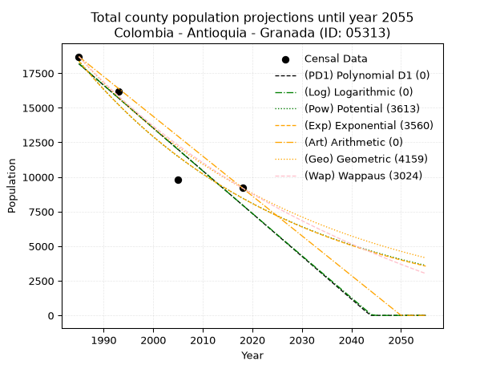
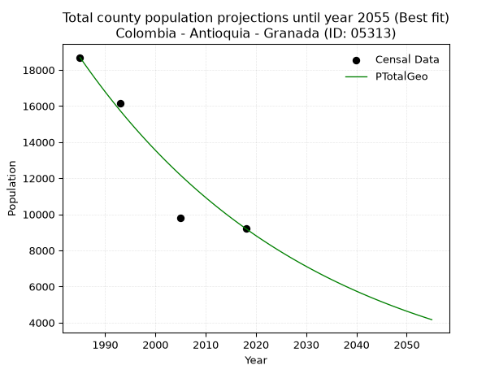
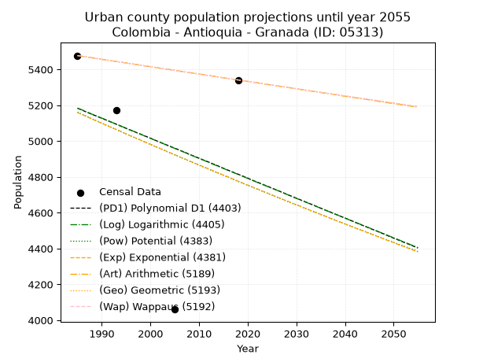
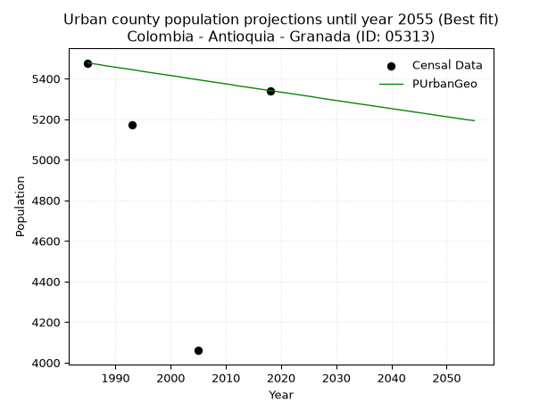
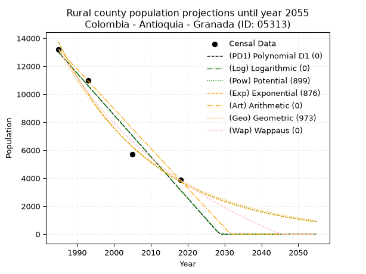
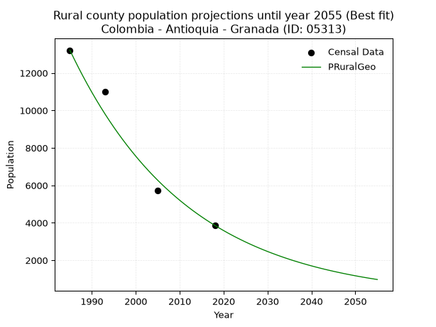

<div align="center">


</div>

# _“Population and Public Services Demand Projections (PPSD) until Year 2050 for Colombia - Antioquia - Granada (ID: 05313)”_
Keywords: `population` `public-service` `projection` `lineal` `polynomial` `logarithmic` `potential` `exponential` `arithmetic` `geometric` `wappaus` `dane` `colombia` `south-america`

PPSD are analytical estimates used by governments and planners to anticipate future changes in population size, age distribution, and the resulting community needs for utilities, healthcare, education, and infrastructure as sizing future water treatment facilities, electrical grids, and road networks based on spatial growth.

> **General running parameters**: • app_version: _v20260806_. • Python version: _3.14.7_. • Pandas version: _3.0.5_. • NumPy version: _2.5.1_. • Creates, save and include plots into reports (create_plot): _False_. • Projection until year: _2050_. • Process polynomial degree 2 and up: _False_. • Process Wappaus: _True_. • Process Wappaus: _True_. • Set negative values to zero: _True_. • Set infinite values to zero: _True_. • Drop dataset notes: _True_. 
<div align="center">

Dynamic map: [:earth_americas:Google](http://maps.google.com/maps?q=6.142891526,-75.1844457) [:earth_americas:OSM](https://www.openstreetmap.org/#map=18/6.142891526/-75.1844457&layers=P) [:earth_americas:Bing](https://www.bing.com/maps?cp=6.142891526~-75.1844457&lvl=18) [:earth_americas:Apple](https://maps.apple.com/frame?center=6.142891526%2C-75.1844457&span=0.003%2C0.006)

</div>


<div align="center">

```geojson
{
  "type": "Feature",
  "geometry": {
    "type": "Point", 
    "coordinates": [-75.1844457, 6.142891526]
  }, 
  "properties": {
    "Name": "Colombia - Antioquia - Granada (ID: 05313)"
  }
}
```

</div>


## 0. Census Data (4 records)

Census data are official statistics collected by a government about the people and housing in a country. They usually include counts of total population, age, sex, race, income, education, and jobs.

📅Global census file: [Population.xlsx](../data/Population.xlsx)

| Source   |   Year |   CountryID | CountryName   |   StateID | StateName   |   CountyID | CountyName   |   PTotal |   PUrban |   PRural |
|:---------|-------:|------------:|:--------------|----------:|:------------|-----------:|:-------------|---------:|---------:|---------:|
| DANE     |   1985 |          57 | Colombia      |        05 | Antioquia   |      05313 | Granada      |    18692 |     5477 |    13215 |
| DANE     |   1993 |          57 | Colombia      |        05 | Antioquia   |      05313 | Granada      |    16171 |     5173 |    10998 |
| DANE     |   2005 |          57 | Colombia      |        05 | Antioquia   |      05313 | Granada      |     9789 |     4060 |     5729 |
| DANE     |   2018 |          57 | Colombia      |        05 | Antioquia   |      05313 | Granada      |     9204 |     5341 |     3863 |

> 🔥Some records could had specific notes about the registered values or the corresponding urban or rural distribution.

## 1. Total

### 1.1. Coefficients and Parameters

* (PD1) Polynomial Deg 1: -308.99076676033644, 631522.781212363 (lineal)
* (Log) Logarithmic: -618867.4715612788, 4717480.610629957
* (Pow) Potential: -46.941690015068964, 159.06685556138788
* (Exp) Exponential: -0.023439968685190306, 2.958148494912871e+24
* (Art) Arithmetic: Year diff. 2018 - 1985 = 33, Population diff. 9204 - 18692 = -9488, Annual growth = -287.5151515151515
* (Geo) Geometric: Year diff. 2018 - 1985 = 33, Population diff. 9204 - 18692 = -9488, Annual growth % = -0.021239601684594822
* (Wap) Wappaus: i = -2.0613360447028355, Condition values only valid for < 200)

<sub>
Wappaus condition values: ['-0.00', '-2.06', '-4.12', '-6.18', '-8.25', '-10.31', '-12.37', '-14.43', '-16.49', '-18.55', '-20.61', '-22.67', '-24.74', '-26.80', '-28.86', '-30.92', '-32.98', '-35.04', '-37.10', '-39.17', '-41.23', '-43.29', '-45.35', '-47.41', '-49.47', '-51.53', '-53.59', '-55.66', '-57.72', '-59.78', '-61.84', '-63.90', '-65.96', '-68.02', '-70.09', '-72.15', '-74.21', '-76.27', '-78.33', '-80.39', '-82.45', '-84.51', '-86.58', '-88.64', '-90.70', '-92.76', '-94.82', '-96.88', '-98.94', '-101.01', '-103.07', '-105.13', '-107.19', '-109.25', '-111.31', '-113.37', '-115.43', '-117.50', '-119.56', '-121.62', '-123.68', '-125.74', '-127.80', '-129.86', '-131.93', '-133.99']
</sub>


### 1.2. Projected Dataset

|   Year |   CountyID |   PTotalPD1 |   PTotalLog |   PTotalPow |   PTotalExp |   PTotalArt |   PTotalGeo |   PTotalWap |
|-------:|-----------:|------------:|------------:|------------:|------------:|------------:|------------:|------------:|
|   1985 |      05313 |       18176 |       18188 |       18382 |       18366 |       18692 |       18692 |       18692 |
|   1986 |      05313 |       17867 |       17877 |       17953 |       17941 |       18404 |       18295 |       18311 |
|   1987 |      05313 |       17558 |       17565 |       17534 |       17525 |       18117 |       17906 |       17937 |
|   1988 |      05313 |       17249 |       17254 |       17124 |       17119 |       17829 |       17526 |       17571 |
|   1989 |      05313 |       16940 |       16942 |       16725 |       16722 |       17542 |       17154 |       17212 |
|   1990 |      05313 |       16631 |       16631 |       16335 |       16335 |       17254 |       16789 |       16860 |
|   1991 |      05313 |       16322 |       16321 |       15954 |       15957 |       16967 |       16433 |       16515 |
|   1992 |      05313 |       16013 |       16010 |       15583 |       15587 |       16679 |       16084 |       16176 |
|   1993 |      05313 |       15704 |       15699 |       15220 |       15226 |       16392 |       15742 |       15844 |
|   1994 |      05313 |       15395 |       15389 |       14866 |       14873 |       16104 |       15408 |       15519 |
|   1995 |      05313 |       15086 |       15078 |       14520 |       14529 |       15817 |       15081 |       15199 |
|   1996 |      05313 |       14777 |       14768 |       14182 |       14192 |       15529 |       14760 |       14885 |
|   1997 |      05313 |       14468 |       14458 |       13853 |       13863 |       15242 |       14447 |       14577 |
|   1998 |      05313 |       14159 |       14149 |       13531 |       13542 |       14954 |       14140 |       14275 |
|   1999 |      05313 |       13850 |       13839 |       13217 |       13228 |       14667 |       13840 |       13978 |
|   2000 |      05313 |       13541 |       13529 |       12910 |       12922 |       14379 |       13546 |       13686 |
|   2001 |      05313 |       13232 |       13220 |       12611 |       12622 |       14092 |       13258 |       13400 |
|   2002 |      05313 |       12923 |       12911 |       12318 |       12330 |       13804 |       12976 |       13118 |
|   2003 |      05313 |       12614 |       12602 |       12033 |       12044 |       13517 |       12701 |       12842 |
|   2004 |      05313 |       12305 |       12293 |       11754 |       11765 |       13229 |       12431 |       12570 |
|   2005 |      05313 |       11996 |       11984 |       11482 |       11493 |       12942 |       12167 |       12303 |
|   2006 |      05313 |       11687 |       11676 |       11217 |       11226 |       12654 |       11909 |       12040 |
|   2007 |      05313 |       11378 |       11367 |       10957 |       10966 |       12367 |       11656 |       11782 |
|   2008 |      05313 |       11069 |       11059 |       10704 |       10712 |       12079 |       11408 |       11528 |
|   2009 |      05313 |       10760 |       10751 |       10457 |       10464 |       11792 |       11166 |       11278 |
|   2010 |      05313 |       10451 |       10443 |       10215 |       10222 |       11504 |       10929 |       11033 |
|   2011 |      05313 |       10142 |       10135 |        9980 |        9985 |       11217 |       10697 |       10791 |
|   2012 |      05313 |        9833 |        9827 |        9749 |        9754 |       10929 |       10469 |       10554 |
|   2013 |      05313 |        9524 |        9520 |        9525 |        9528 |       10642 |       10247 |       10320 |
|   2014 |      05313 |        9215 |        9212 |        9305 |        9307 |       10354 |       10029 |       10089 |
|   2015 |      05313 |        8906 |        8905 |        9091 |        9091 |       10067 |        9816 |        9863 |
|   2016 |      05313 |        8597 |        8598 |        8881 |        8881 |        9779 |        9608 |        9640 |
|   2017 |      05313 |        8288 |        8291 |        8677 |        8675 |        9492 |        9404 |        9420 |
|   2018 |      05313 |        7979 |        7984 |        8478 |        8474 |        9204 |        9204 |        9204 |
|   2019 |      05313 |        7670 |        7678 |        8283 |        8278 |        8916 |        9009 |        8991 |
|   2020 |      05313 |        7361 |        7371 |        8092 |        8086 |        8629 |        8817 |        8781 |
|   2021 |      05313 |        7052 |        7065 |        7907 |        7899 |        8341 |        8630 |        8575 |
|   2022 |      05313 |        6743 |        6759 |        7725 |        7716 |        8054 |        8447 |        8371 |
|   2023 |      05313 |        6434 |        6453 |        7548 |        7537 |        7766 |        8267 |        8171 |
|   2024 |      05313 |        6125 |        6147 |        7375 |        7362 |        7479 |        8092 |        7974 |
|   2025 |      05313 |        5816 |        5841 |        7206 |        7192 |        7191 |        7920 |        7779 |
|   2026 |      05313 |        5507 |        5536 |        7041 |        7025 |        6904 |        7752 |        7587 |
|   2027 |      05313 |        5198 |        5231 |        6879 |        6862 |        6616 |        7587 |        7398 |
|   2028 |      05313 |        4890 |        4925 |        6722 |        6703 |        6329 |        7426 |        7212 |
|   2029 |      05313 |        4581 |        4620 |        6568 |        6548 |        6041 |        7268 |        7028 |
|   2030 |      05313 |        4272 |        4315 |        6418 |        6396 |        5754 |        7114 |        6847 |
|   2031 |      05313 |        3963 |        4010 |        6271 |        6248 |        5466 |        6963 |        6668 |
|   2032 |      05313 |        3654 |        3706 |        6128 |        6103 |        5179 |        6815 |        6492 |
|   2033 |      05313 |        3345 |        3401 |        5988 |        5962 |        4891 |        6670 |        6319 |
|   2034 |      05313 |        3036 |        3097 |        5852 |        5824 |        4604 |        6528 |        6147 |
|   2035 |      05313 |        2727 |        2793 |        5718 |        5689 |        4316 |        6390 |        5978 |
|   2036 |      05313 |        2418 |        2489 |        5588 |        5557 |        4029 |        6254 |        5812 |
|   2037 |      05313 |        2109 |        2185 |        5460 |        5428 |        3741 |        6121 |        5647 |
|   2038 |      05313 |        1800 |        1881 |        5336 |        5303 |        3454 |        5991 |        5485 |
|   2039 |      05313 |        1491 |        1578 |        5215 |        5180 |        3166 |        5864 |        5325 |
|   2040 |      05313 |        1182 |        1274 |        5096 |        5060 |        2879 |        5739 |        5167 |
|   2041 |      05313 |         873 |         971 |        4980 |        4943 |        2591 |        5617 |        5011 |
|   2042 |      05313 |         564 |         668 |        4867 |        4828 |        2304 |        5498 |        4857 |
|   2043 |      05313 |         255 |         365 |        4756 |        4716 |        2016 |        5381 |        4705 |
|   2044 |      05313 |           0 |          62 |        4648 |        4607 |        1729 |        5267 |        4555 |
|   2045 |      05313 |           0 |           0 |        4543 |        4500 |        1441 |        5155 |        4407 |
|   2046 |      05313 |           0 |           0 |        4440 |        4396 |        1154 |        5046 |        4261 |
|   2047 |      05313 |           0 |           0 |        4339 |        4294 |         866 |        4938 |        4117 |
|   2048 |      05313 |           0 |           0 |        4241 |        4195 |         579 |        4834 |        3974 |
|   2049 |      05313 |           0 |           0 |        4145 |        4097 |         291 |        4731 |        3834 |
|   2050 |      05313 |           0 |           0 |        4051 |        4002 |           4 |        4630 |        3695 |
<div align="center">

</img>

</div>


### 1.3. Best fit with absolute and relative error (%)

Relative error puts that difference into context by dividing the absolute error by the true value, creating a unitless ratio or percentage that shows the scale of the mistake.

Absolute and relative error

|   Year | Source   |   CountryID | CountryName   |   StateID | StateName   |   CountyID_x | CountyName   |   PTotal |   PUrban |   PRural |   CountyID_y |   PTotalPD1 |   PTotalLog |   PTotalPow |   PTotalExp |   PTotalArt |   PTotalGeo |   PTotalWap |   PTotalPD1AbsError |   PTotalLogAbsError |   PTotalPowAbsError |   PTotalExpAbsError |   PTotalArtAbsError |   PTotalGeoAbsError |   PTotalWapAbsError |   PTotalPD1RelError |   PTotalLogRelError |   PTotalPowRelError |   PTotalExpRelError |   PTotalArtRelError |   PTotalGeoRelError |   PTotalWapRelError |
|-------:|:---------|------------:|:--------------|----------:|:------------|-------------:|:-------------|---------:|---------:|---------:|-------------:|------------:|------------:|------------:|------------:|------------:|------------:|------------:|--------------------:|--------------------:|--------------------:|--------------------:|--------------------:|--------------------:|--------------------:|--------------------:|--------------------:|--------------------:|--------------------:|--------------------:|--------------------:|--------------------:|
|   1985 | DANE     |          57 | Colombia      |        05 | Antioquia   |        05313 | Granada      |    18692 |     5477 |    13215 |        05313 |       18176 |       18188 |       18382 |       18366 |       18692 |       18692 |       18692 |                 516 |                 504 |                 310 |                 326 |                   0 |                   0 |                   0 |             2.76054 |             2.69634 |             1.65846 |             1.74406 |             0       |              0      |             0       |
|   1993 | DANE     |          57 | Colombia      |        05 | Antioquia   |        05313 | Granada      |    16171 |     5173 |    10998 |        05313 |       15704 |       15699 |       15220 |       15226 |       16392 |       15742 |       15844 |                 467 |                 472 |                 951 |                 945 |                 221 |                 429 |                 327 |             2.88789 |             2.91881 |             5.8809  |             5.84379 |             1.36664 |              2.6529 |             2.02214 |
|   2005 | DANE     |          57 | Colombia      |        05 | Antioquia   |        05313 | Granada      |     9789 |     4060 |     5729 |        05313 |       11996 |       11984 |       11482 |       11493 |       12942 |       12167 |       12303 |                2207 |                2195 |                1693 |                1704 |                3153 |                2378 |                2514 |            22.5457  |            22.4231  |            17.2949  |            17.4073  |            32.2096  |             24.2926 |            25.6819  |
|   2018 | DANE     |          57 | Colombia      |        05 | Antioquia   |        05313 | Granada      |     9204 |     5341 |     3863 |        05313 |        7979 |        7984 |        8478 |        8474 |        9204 |        9204 |        9204 |                1225 |                1220 |                 726 |                 730 |                   0 |                   0 |                   0 |            13.3094  |            13.2551  |             7.88787 |             7.93133 |             0       |              0      |             0       |

Relative error mean

| Method    |   RelError | Best   |
|:----------|-----------:|:-------|
| PTotalPD1 |   10.3759  |        |
| PTotalLog |   10.3233  |        |
| PTotalPow |    8.18054 |        |
| PTotalExp |    8.23162 |        |
| PTotalArt |    8.39407 |        |
| PTotalGeo |    6.73637 | True   |
| PTotalWap |    6.92601 |        |

💙Best method: _**PTotalGeo**_
<div align="center">

</img>

</div>


### 1.4. Fresh water supply demand in liters per capita per day (lpcd)

The fresh water supply demand typically ranges from 100 to 300 liters per capita per day (lpcd) for standard domestic and municipal planning, though absolute survival minimums set by the World Health Organization are as low as 7.5 to 20 liters per day, and total consumption in high-income nations can exceed 400 liters.

> `CZ`: Level in meters above the sea level (masl).<br> `WS`: Fresh water supply demand in liters per capita per day (lpcd or l/h/d).<br> `WSAll`: Zonal fresh water supply demand in liters per second (l/s).<br> `A`: Zonal area in square meters.

Reference values (RAS Colombia)

|    CZ |   WS |
|------:|-----:|
|  1000 |  120 |
|  2000 |  130 |
| 99999 |  140 |

County shapefile geometry properties and water supply values

|   CountyID |      ATotal |   CZTotal |   WSTotal |
|-----------:|------------:|----------:|----------:|
|      05313 | 1.90084e+08 |   1771.31 |       130 |

Projected values for best method: PTotalGeo

|   CountyID |   Year |   PTotalGeo |   WSTotal |   WSTotalAll |
|-----------:|-------:|------------:|----------:|-------------:|
|      05313 |   1985 |       18692 |       130 |     28.1245  |
|      05313 |   1986 |       18295 |       130 |     27.5272  |
|      05313 |   1987 |       17906 |       130 |     26.9419  |
|      05313 |   1988 |       17526 |       130 |     26.3701  |
|      05313 |   1989 |       17154 |       130 |     25.8104  |
|      05313 |   1990 |       16789 |       130 |     25.2612  |
|      05313 |   1991 |       16433 |       130 |     24.7256  |
|      05313 |   1992 |       16084 |       130 |     24.2005  |
|      05313 |   1993 |       15742 |       130 |     23.6859  |
|      05313 |   1994 |       15408 |       130 |     23.1833  |
|      05313 |   1995 |       15081 |       130 |     22.6913  |
|      05313 |   1996 |       14760 |       130 |     22.2083  |
|      05313 |   1997 |       14447 |       130 |     21.7374  |
|      05313 |   1998 |       14140 |       130 |     21.2755  |
|      05313 |   1999 |       13840 |       130 |     20.8241  |
|      05313 |   2000 |       13546 |       130 |     20.3817  |
|      05313 |   2001 |       13258 |       130 |     19.9484  |
|      05313 |   2002 |       12976 |       130 |     19.5241  |
|      05313 |   2003 |       12701 |       130 |     19.1103  |
|      05313 |   2004 |       12431 |       130 |     18.7041  |
|      05313 |   2005 |       12167 |       130 |     18.3068  |
|      05313 |   2006 |       11909 |       130 |     17.9186  |
|      05313 |   2007 |       11656 |       130 |     17.538   |
|      05313 |   2008 |       11408 |       130 |     17.1648  |
|      05313 |   2009 |       11166 |       130 |     16.8007  |
|      05313 |   2010 |       10929 |       130 |     16.4441  |
|      05313 |   2011 |       10697 |       130 |     16.095   |
|      05313 |   2012 |       10469 |       130 |     15.752   |
|      05313 |   2013 |       10247 |       130 |     15.4179  |
|      05313 |   2014 |       10029 |       130 |     15.0899  |
|      05313 |   2015 |        9816 |       130 |     14.7694  |
|      05313 |   2016 |        9608 |       130 |     14.4565  |
|      05313 |   2017 |        9404 |       130 |     14.1495  |
|      05313 |   2018 |        9204 |       130 |     13.8486  |
|      05313 |   2019 |        9009 |       130 |     13.5552  |
|      05313 |   2020 |        8817 |       130 |     13.2663  |
|      05313 |   2021 |        8630 |       130 |     12.985   |
|      05313 |   2022 |        8447 |       130 |     12.7096  |
|      05313 |   2023 |        8267 |       130 |     12.4388  |
|      05313 |   2024 |        8092 |       130 |     12.1755  |
|      05313 |   2025 |        7920 |       130 |     11.9167  |
|      05313 |   2026 |        7752 |       130 |     11.6639  |
|      05313 |   2027 |        7587 |       130 |     11.4156  |
|      05313 |   2028 |        7426 |       130 |     11.1734  |
|      05313 |   2029 |        7268 |       130 |     10.9356  |
|      05313 |   2030 |        7114 |       130 |     10.7039  |
|      05313 |   2031 |        6963 |       130 |     10.4767  |
|      05313 |   2032 |        6815 |       130 |     10.2541  |
|      05313 |   2033 |        6670 |       130 |     10.0359  |
|      05313 |   2034 |        6528 |       130 |      9.82222 |
|      05313 |   2035 |        6390 |       130 |      9.61458 |
|      05313 |   2036 |        6254 |       130 |      9.40995 |
|      05313 |   2037 |        6121 |       130 |      9.20984 |
|      05313 |   2038 |        5991 |       130 |      9.01424 |
|      05313 |   2039 |        5864 |       130 |      8.82315 |
|      05313 |   2040 |        5739 |       130 |      8.63507 |
|      05313 |   2041 |        5617 |       130 |      8.4515  |
|      05313 |   2042 |        5498 |       130 |      8.27245 |
|      05313 |   2043 |        5381 |       130 |      8.09641 |
|      05313 |   2044 |        5267 |       130 |      7.92488 |
|      05313 |   2045 |        5155 |       130 |      7.75637 |
|      05313 |   2046 |        5046 |       130 |      7.59236 |
|      05313 |   2047 |        4938 |       130 |      7.42986 |
|      05313 |   2048 |        4834 |       130 |      7.27338 |
|      05313 |   2049 |        4731 |       130 |      7.1184  |
|      05313 |   2050 |        4630 |       130 |      6.96644 |

## 2. Urban

### 2.1. Coefficients and Parameters

* (PD1) Polynomial Deg 1: -11.145323163388907, 27306.18265756866 (lineal)
* (Log) Logarithmic: -22483.562955143505, 175910.49219401187
* (Pow) Potential: -4.711257444939187, 19.249326571869645
* (Exp) Exponential: -0.0023353457641372534, 531884.7910240738
* (Art) Arithmetic: Year diff. 2018 - 1985 = 33, Population diff. 5341 - 5477 = -136, Annual growth = -4.121212121212121
* (Geo) Geometric: Year diff. 2018 - 1985 = 33, Population diff. 5341 - 5477 = -136, Annual growth % = -0.0007616674943620172
* (Wap) Wappaus: i = -0.07619175672420264, Condition values only valid for < 200)

<sub>
Wappaus condition values: ['-0.00', '-0.08', '-0.15', '-0.23', '-0.30', '-0.38', '-0.46', '-0.53', '-0.61', '-0.69', '-0.76', '-0.84', '-0.91', '-0.99', '-1.07', '-1.14', '-1.22', '-1.30', '-1.37', '-1.45', '-1.52', '-1.60', '-1.68', '-1.75', '-1.83', '-1.90', '-1.98', '-2.06', '-2.13', '-2.21', '-2.29', '-2.36', '-2.44', '-2.51', '-2.59', '-2.67', '-2.74', '-2.82', '-2.90', '-2.97', '-3.05', '-3.12', '-3.20', '-3.28', '-3.35', '-3.43', '-3.50', '-3.58', '-3.66', '-3.73', '-3.81', '-3.89', '-3.96', '-4.04', '-4.11', '-4.19', '-4.27', '-4.34', '-4.42', '-4.50', '-4.57', '-4.65', '-4.72', '-4.80', '-4.88', '-4.95']
</sub>


### 2.2. Projected Dataset

|   Year |   CountyID |   PUrbanPD1 |   PUrbanLog |   PUrbanPow |   PUrbanExp |   PUrbanArt |   PUrbanGeo |   PUrbanWap |
|-------:|-----------:|------------:|------------:|------------:|------------:|------------:|------------:|------------:|
|   1985 |      05313 |        5183 |        5184 |        5161 |        5159 |        5477 |        5477 |        5477 |
|   1986 |      05313 |        5172 |        5173 |        5149 |        5147 |        5473 |        5473 |        5473 |
|   1987 |      05313 |        5160 |        5162 |        5137 |        5135 |        5469 |        5469 |        5469 |
|   1988 |      05313 |        5149 |        5150 |        5124 |        5123 |        5465 |        5464 |        5464 |
|   1989 |      05313 |        5138 |        5139 |        5112 |        5111 |        5461 |        5460 |        5460 |
|   1990 |      05313 |        5127 |        5128 |        5100 |        5099 |        5456 |        5456 |        5456 |
|   1991 |      05313 |        5116 |        5117 |        5088 |        5087 |        5452 |        5452 |        5452 |
|   1992 |      05313 |        5105 |        5105 |        5076 |        5075 |        5448 |        5448 |        5448 |
|   1993 |      05313 |        5094 |        5094 |        5064 |        5064 |        5444 |        5444 |        5444 |
|   1994 |      05313 |        5082 |        5083 |        5052 |        5052 |        5440 |        5440 |        5440 |
|   1995 |      05313 |        5071 |        5071 |        5040 |        5040 |        5436 |        5435 |        5435 |
|   1996 |      05313 |        5060 |        5060 |        5028 |        5028 |        5432 |        5431 |        5431 |
|   1997 |      05313 |        5049 |        5049 |        5016 |        5017 |        5428 |        5427 |        5427 |
|   1998 |      05313 |        5038 |        5038 |        5005 |        5005 |        5423 |        5423 |        5423 |
|   1999 |      05313 |        5027 |        5026 |        4993 |        4993 |        5419 |        5419 |        5419 |
|   2000 |      05313 |        5016 |        5015 |        4981 |        4982 |        5415 |        5415 |        5415 |
|   2001 |      05313 |        5004 |        5004 |        4969 |        4970 |        5411 |        5411 |        5411 |
|   2002 |      05313 |        4993 |        4993 |        4958 |        4958 |        5407 |        5407 |        5407 |
|   2003 |      05313 |        4982 |        4981 |        4946 |        4947 |        5403 |        5402 |        5402 |
|   2004 |      05313 |        4971 |        4970 |        4934 |        4935 |        5399 |        5398 |        5398 |
|   2005 |      05313 |        4960 |        4959 |        4923 |        4924 |        5395 |        5394 |        5394 |
|   2006 |      05313 |        4949 |        4948 |        4911 |        4912 |        5390 |        5390 |        5390 |
|   2007 |      05313 |        4938 |        4937 |        4900 |        4901 |        5386 |        5386 |        5386 |
|   2008 |      05313 |        4926 |        4925 |        4888 |        4889 |        5382 |        5382 |        5382 |
|   2009 |      05313 |        4915 |        4914 |        4877 |        4878 |        5378 |        5378 |        5378 |
|   2010 |      05313 |        4904 |        4903 |        4865 |        4867 |        5374 |        5374 |        5374 |
|   2011 |      05313 |        4893 |        4892 |        4854 |        4855 |        5370 |        5370 |        5370 |
|   2012 |      05313 |        4882 |        4881 |        4843 |        4844 |        5366 |        5365 |        5365 |
|   2013 |      05313 |        4871 |        4869 |        4831 |        4833 |        5362 |        5361 |        5361 |
|   2014 |      05313 |        4860 |        4858 |        4820 |        4821 |        5357 |        5357 |        5357 |
|   2015 |      05313 |        4848 |        4847 |        4809 |        4810 |        5353 |        5353 |        5353 |
|   2016 |      05313 |        4837 |        4836 |        4798 |        4799 |        5349 |        5349 |        5349 |
|   2017 |      05313 |        4826 |        4825 |        4786 |        4788 |        5345 |        5345 |        5345 |
|   2018 |      05313 |        4815 |        4814 |        4775 |        4776 |        5341 |        5341 |        5341 |
|   2019 |      05313 |        4804 |        4803 |        4764 |        4765 |        5337 |        5337 |        5337 |
|   2020 |      05313 |        4793 |        4791 |        4753 |        4754 |        5333 |        5333 |        5333 |
|   2021 |      05313 |        4781 |        4780 |        4742 |        4743 |        5329 |        5329 |        5329 |
|   2022 |      05313 |        4770 |        4769 |        4731 |        4732 |        5325 |        5325 |        5325 |
|   2023 |      05313 |        4759 |        4758 |        4720 |        4721 |        5320 |        5321 |        5321 |
|   2024 |      05313 |        4748 |        4747 |        4709 |        4710 |        5316 |        5317 |        5317 |
|   2025 |      05313 |        4737 |        4736 |        4698 |        4699 |        5312 |        5313 |        5313 |
|   2026 |      05313 |        4726 |        4725 |        4687 |        4688 |        5308 |        5309 |        5309 |
|   2027 |      05313 |        4715 |        4714 |        4676 |        4677 |        5304 |        5304 |        5304 |
|   2028 |      05313 |        4703 |        4703 |        4665 |        4666 |        5300 |        5300 |        5300 |
|   2029 |      05313 |        4692 |        4691 |        4654 |        4655 |        5296 |        5296 |        5296 |
|   2030 |      05313 |        4681 |        4680 |        4644 |        4644 |        5292 |        5292 |        5292 |
|   2031 |      05313 |        4670 |        4669 |        4633 |        4634 |        5287 |        5288 |        5288 |
|   2032 |      05313 |        4659 |        4658 |        4622 |        4623 |        5283 |        5284 |        5284 |
|   2033 |      05313 |        4648 |        4647 |        4611 |        4612 |        5279 |        5280 |        5280 |
|   2034 |      05313 |        4637 |        4636 |        4601 |        4601 |        5275 |        5276 |        5276 |
|   2035 |      05313 |        4625 |        4625 |        4590 |        4591 |        5271 |        5272 |        5272 |
|   2036 |      05313 |        4614 |        4614 |        4580 |        4580 |        5267 |        5268 |        5268 |
|   2037 |      05313 |        4603 |        4603 |        4569 |        4569 |        5263 |        5264 |        5264 |
|   2038 |      05313 |        4592 |        4592 |        4558 |        4558 |        5259 |        5260 |        5260 |
|   2039 |      05313 |        4581 |        4581 |        4548 |        4548 |        5254 |        5256 |        5256 |
|   2040 |      05313 |        4570 |        4570 |        4537 |        4537 |        5250 |        5252 |        5252 |
|   2041 |      05313 |        4559 |        4559 |        4527 |        4527 |        5246 |        5248 |        5248 |
|   2042 |      05313 |        4547 |        4548 |        4516 |        4516 |        5242 |        5244 |        5244 |
|   2043 |      05313 |        4536 |        4537 |        4506 |        4506 |        5238 |        5240 |        5240 |
|   2044 |      05313 |        4525 |        4526 |        4496 |        4495 |        5234 |        5236 |        5236 |
|   2045 |      05313 |        4514 |        4515 |        4485 |        4485 |        5230 |        5232 |        5232 |
|   2046 |      05313 |        4503 |        4504 |        4475 |        4474 |        5226 |        5228 |        5228 |
|   2047 |      05313 |        4492 |        4493 |        4465 |        4464 |        5221 |        5224 |        5224 |
|   2048 |      05313 |        4481 |        4482 |        4454 |        4453 |        5217 |        5220 |        5220 |
|   2049 |      05313 |        4469 |        4471 |        4444 |        4443 |        5213 |        5216 |        5216 |
|   2050 |      05313 |        4458 |        4460 |        4434 |        4433 |        5209 |        5212 |        5212 |
<div align="center">

</img>

</div>


### 2.3. Best fit with absolute and relative error (%)

Relative error puts that difference into context by dividing the absolute error by the true value, creating a unitless ratio or percentage that shows the scale of the mistake.

Absolute and relative error

|   Year | Source   |   CountryID | CountryName   |   StateID | StateName   |   CountyID_x | CountyName   |   PTotal |   PUrban |   PRural |   CountyID_y |   PUrbanPD1 |   PUrbanLog |   PUrbanPow |   PUrbanExp |   PUrbanArt |   PUrbanGeo |   PUrbanWap |   PUrbanPD1AbsError |   PUrbanLogAbsError |   PUrbanPowAbsError |   PUrbanExpAbsError |   PUrbanArtAbsError |   PUrbanGeoAbsError |   PUrbanWapAbsError |   PUrbanPD1RelError |   PUrbanLogRelError |   PUrbanPowRelError |   PUrbanExpRelError |   PUrbanArtRelError |   PUrbanGeoRelError |   PUrbanWapRelError |
|-------:|:---------|------------:|:--------------|----------:|:------------|-------------:|:-------------|---------:|---------:|---------:|-------------:|------------:|------------:|------------:|------------:|------------:|------------:|------------:|--------------------:|--------------------:|--------------------:|--------------------:|--------------------:|--------------------:|--------------------:|--------------------:|--------------------:|--------------------:|--------------------:|--------------------:|--------------------:|--------------------:|
|   1985 | DANE     |          57 | Colombia      |        05 | Antioquia   |        05313 | Granada      |    18692 |     5477 |    13215 |        05313 |        5183 |        5184 |        5161 |        5159 |        5477 |        5477 |        5477 |                 294 |                 293 |                 316 |                 318 |                   0 |                   0 |                   0 |             5.3679  |             5.34964 |             5.76958 |             5.8061  |             0       |             0       |             0       |
|   1993 | DANE     |          57 | Colombia      |        05 | Antioquia   |        05313 | Granada      |    16171 |     5173 |    10998 |        05313 |        5094 |        5094 |        5064 |        5064 |        5444 |        5444 |        5444 |                  79 |                  79 |                 109 |                 109 |                 271 |                 271 |                 271 |             1.52716 |             1.52716 |             2.10709 |             2.10709 |             5.23874 |             5.23874 |             5.23874 |
|   2005 | DANE     |          57 | Colombia      |        05 | Antioquia   |        05313 | Granada      |     9789 |     4060 |     5729 |        05313 |        4960 |        4959 |        4923 |        4924 |        5395 |        5394 |        5394 |                 900 |                 899 |                 863 |                 864 |                1335 |                1334 |                1334 |            22.1675  |            22.1429  |            21.2562  |            21.2808  |            32.8818  |            32.8571  |            32.8571  |
|   2018 | DANE     |          57 | Colombia      |        05 | Antioquia   |        05313 | Granada      |     9204 |     5341 |     3863 |        05313 |        4815 |        4814 |        4775 |        4776 |        5341 |        5341 |        5341 |                 526 |                 527 |                 566 |                 565 |                   0 |                   0 |                   0 |             9.84834 |             9.86707 |            10.5973  |            10.5785  |             0       |             0       |             0       |

Relative error mean

| Method    |   RelError | Best   |
|:----------|-----------:|:-------|
| PUrbanPD1 |    9.72772 |        |
| PUrbanLog |    9.72168 |        |
| PUrbanPow |    9.93253 |        |
| PUrbanExp |    9.94313 |        |
| PUrbanArt |    9.53013 |        |
| PUrbanGeo |    9.52397 | True   |
| PUrbanWap |    9.52397 | True   |

💙Best method: _**PUrbanGeo**_
<div align="center">

</img>

</div>


### 2.4. Fresh water supply demand in liters per capita per day (lpcd)

The fresh water supply demand typically ranges from 100 to 300 liters per capita per day (lpcd) for standard domestic and municipal planning, though absolute survival minimums set by the World Health Organization are as low as 7.5 to 20 liters per day, and total consumption in high-income nations can exceed 400 liters.

> `CZ`: Level in meters above the sea level (masl).<br> `WS`: Fresh water supply demand in liters per capita per day (lpcd or l/h/d).<br> `WSAll`: Zonal fresh water supply demand in liters per second (l/s).<br> `A`: Zonal area in square meters.

Reference values (RAS Colombia)

|    CZ |   WS |
|------:|-----:|
|  1000 |  120 |
|  2000 |  130 |
| 99999 |  140 |

County shapefile geometry properties and water supply values

|   CountyID |   AUrban |   CZUrban |   WSUrban |
|-----------:|---------:|----------:|----------:|
|      05313 |   594086 |   2078.94 |       140 |

Projected values for best method: PUrbanGeo

|   CountyID |   Year |   PUrbanGeo |   WSUrban |   WSUrbanAll |
|-----------:|-------:|------------:|----------:|-------------:|
|      05313 |   1985 |        5477 |       140 |      8.87477 |
|      05313 |   1986 |        5473 |       140 |      8.86829 |
|      05313 |   1987 |        5469 |       140 |      8.86181 |
|      05313 |   1988 |        5464 |       140 |      8.8537  |
|      05313 |   1989 |        5460 |       140 |      8.84722 |
|      05313 |   1990 |        5456 |       140 |      8.84074 |
|      05313 |   1991 |        5452 |       140 |      8.83426 |
|      05313 |   1992 |        5448 |       140 |      8.82778 |
|      05313 |   1993 |        5444 |       140 |      8.8213  |
|      05313 |   1994 |        5440 |       140 |      8.81481 |
|      05313 |   1995 |        5435 |       140 |      8.80671 |
|      05313 |   1996 |        5431 |       140 |      8.80023 |
|      05313 |   1997 |        5427 |       140 |      8.79375 |
|      05313 |   1998 |        5423 |       140 |      8.78727 |
|      05313 |   1999 |        5419 |       140 |      8.78079 |
|      05313 |   2000 |        5415 |       140 |      8.77431 |
|      05313 |   2001 |        5411 |       140 |      8.76782 |
|      05313 |   2002 |        5407 |       140 |      8.76134 |
|      05313 |   2003 |        5402 |       140 |      8.75324 |
|      05313 |   2004 |        5398 |       140 |      8.74676 |
|      05313 |   2005 |        5394 |       140 |      8.74028 |
|      05313 |   2006 |        5390 |       140 |      8.7338  |
|      05313 |   2007 |        5386 |       140 |      8.72731 |
|      05313 |   2008 |        5382 |       140 |      8.72083 |
|      05313 |   2009 |        5378 |       140 |      8.71435 |
|      05313 |   2010 |        5374 |       140 |      8.70787 |
|      05313 |   2011 |        5370 |       140 |      8.70139 |
|      05313 |   2012 |        5365 |       140 |      8.69329 |
|      05313 |   2013 |        5361 |       140 |      8.68681 |
|      05313 |   2014 |        5357 |       140 |      8.68032 |
|      05313 |   2015 |        5353 |       140 |      8.67384 |
|      05313 |   2016 |        5349 |       140 |      8.66736 |
|      05313 |   2017 |        5345 |       140 |      8.66088 |
|      05313 |   2018 |        5341 |       140 |      8.6544  |
|      05313 |   2019 |        5337 |       140 |      8.64792 |
|      05313 |   2020 |        5333 |       140 |      8.64144 |
|      05313 |   2021 |        5329 |       140 |      8.63495 |
|      05313 |   2022 |        5325 |       140 |      8.62847 |
|      05313 |   2023 |        5321 |       140 |      8.62199 |
|      05313 |   2024 |        5317 |       140 |      8.61551 |
|      05313 |   2025 |        5313 |       140 |      8.60903 |
|      05313 |   2026 |        5309 |       140 |      8.60255 |
|      05313 |   2027 |        5304 |       140 |      8.59444 |
|      05313 |   2028 |        5300 |       140 |      8.58796 |
|      05313 |   2029 |        5296 |       140 |      8.58148 |
|      05313 |   2030 |        5292 |       140 |      8.575   |
|      05313 |   2031 |        5288 |       140 |      8.56852 |
|      05313 |   2032 |        5284 |       140 |      8.56204 |
|      05313 |   2033 |        5280 |       140 |      8.55556 |
|      05313 |   2034 |        5276 |       140 |      8.54907 |
|      05313 |   2035 |        5272 |       140 |      8.54259 |
|      05313 |   2036 |        5268 |       140 |      8.53611 |
|      05313 |   2037 |        5264 |       140 |      8.52963 |
|      05313 |   2038 |        5260 |       140 |      8.52315 |
|      05313 |   2039 |        5256 |       140 |      8.51667 |
|      05313 |   2040 |        5252 |       140 |      8.51019 |
|      05313 |   2041 |        5248 |       140 |      8.5037  |
|      05313 |   2042 |        5244 |       140 |      8.49722 |
|      05313 |   2043 |        5240 |       140 |      8.49074 |
|      05313 |   2044 |        5236 |       140 |      8.48426 |
|      05313 |   2045 |        5232 |       140 |      8.47778 |
|      05313 |   2046 |        5228 |       140 |      8.4713  |
|      05313 |   2047 |        5224 |       140 |      8.46481 |
|      05313 |   2048 |        5220 |       140 |      8.45833 |
|      05313 |   2049 |        5216 |       140 |      8.45185 |
|      05313 |   2050 |        5212 |       140 |      8.44537 |

## 3. Rural

### 3.1. Coefficients and Parameters

* (PD1) Polynomial Deg 1: -297.8454435969476, 604216.5985547944 (lineal)
* (Log) Logarithmic: -596383.9086061353, 4541570.118435944
* (Pow) Potential: -78.65229877767503, 263.51404913570275
* (Exp) Exponential: -0.039292808623539593, 1.0242646707571296e+38
* (Art) Arithmetic: Year diff. 2018 - 1985 = 33, Population diff. 3863 - 13215 = -9352, Annual growth = -283.3939393939394
* (Geo) Geometric: Year diff. 2018 - 1985 = 33, Population diff. 3863 - 13215 = -9352, Annual growth % = -0.03658397725288465
* (Wap) Wappaus: i = -3.318818824147317, Condition values only valid for < 200)

<sub>
Wappaus condition values: ['-0.00', '-3.32', '-6.64', '-9.96', '-13.28', '-16.59', '-19.91', '-23.23', '-26.55', '-29.87', '-33.19', '-36.51', '-39.83', '-43.14', '-46.46', '-49.78', '-53.10', '-56.42', '-59.74', '-63.06', '-66.38', '-69.70', '-73.01', '-76.33', '-79.65', '-82.97', '-86.29', '-89.61', '-92.93', '-96.25', '-99.56', '-102.88', '-106.20', '-109.52', '-112.84', '-116.16', '-119.48', '-122.80', '-126.12', '-129.43', '-132.75', '-136.07', '-139.39', '-142.71', '-146.03', '-149.35', '-152.67', '-155.98', '-159.30', '-162.62', '-165.94', '-169.26', '-172.58', '-175.90', '-179.22', '-182.54', '-185.85', '-189.17', '-192.49', '-195.81', '-199.13', '-202.45', '-205.77', '-209.09', '-212.40', '-215.72']
</sub>


### 3.2. Projected Dataset

|   Year |   CountyID |   PRuralPD1 |   PRuralLog |   PRuralPow |   PRuralExp |   PRuralArt |   PRuralGeo |   PRuralWap |
|-------:|-----------:|------------:|------------:|------------:|------------:|------------:|------------:|------------:|
|   1985 |      05313 |       12993 |       13004 |       13728 |       13711 |       13215 |       13215 |       13215 |
|   1986 |      05313 |       12696 |       12704 |       13195 |       13183 |       12932 |       12732 |       12784 |
|   1987 |      05313 |       12398 |       12403 |       12683 |       12675 |       12648 |       12266 |       12366 |
|   1988 |      05313 |       12100 |       12103 |       12190 |       12187 |       12365 |       11817 |       11962 |
|   1989 |      05313 |       11802 |       11803 |       11718 |       11717 |       12081 |       11385 |       11570 |
|   1990 |      05313 |       11504 |       11504 |       11263 |       11266 |       11798 |       10968 |       11190 |
|   1991 |      05313 |       11206 |       11204 |       10827 |       10832 |       11515 |       10567 |       10822 |
|   1992 |      05313 |       10908 |       10905 |       10408 |       10414 |       11231 |       10180 |       10464 |
|   1993 |      05313 |       10611 |       10605 |       10005 |       10013 |       10948 |        9808 |       10118 |
|   1994 |      05313 |       10313 |       10306 |        9618 |        9627 |       10664 |        9449 |        9781 |
|   1995 |      05313 |       10015 |       10007 |        9246 |        9256 |       10381 |        9103 |        9453 |
|   1996 |      05313 |        9717 |        9708 |        8889 |        8900 |       10098 |        8770 |        9135 |
|   1997 |      05313 |        9419 |        9409 |        8545 |        8557 |        9814 |        8450 |        8826 |
|   1998 |      05313 |        9121 |        9111 |        8215 |        8227 |        9531 |        8140 |        8525 |
|   1999 |      05313 |        8824 |        8812 |        7898 |        7910 |        9247 |        7843 |        8232 |
|   2000 |      05313 |        8526 |        8514 |        7594 |        7605 |        8964 |        7556 |        7947 |
|   2001 |      05313 |        8228 |        8216 |        7301 |        7312 |        8681 |        7279 |        7670 |
|   2002 |      05313 |        7930 |        7918 |        7020 |        7030 |        8397 |        7013 |        7400 |
|   2003 |      05313 |        7632 |        7620 |        6749 |        6760 |        8114 |        6756 |        7136 |
|   2004 |      05313 |        7334 |        7323 |        6489 |        6499 |        7831 |        6509 |        6879 |
|   2005 |      05313 |        7036 |        7025 |        6240 |        6249 |        7547 |        6271 |        6629 |
|   2006 |      05313 |        6739 |        6728 |        6000 |        6008 |        7264 |        6042 |        6385 |
|   2007 |      05313 |        6441 |        6431 |        5769 |        5776 |        6980 |        5821 |        6147 |
|   2008 |      05313 |        6143 |        6133 |        5547 |        5554 |        6697 |        5608 |        5914 |
|   2009 |      05313 |        5845 |        5836 |        5334 |        5340 |        6414 |        5403 |        5687 |
|   2010 |      05313 |        5547 |        5540 |        5130 |        5134 |        6130 |        5205 |        5465 |
|   2011 |      05313 |        5249 |        5243 |        4933 |        4936 |        5847 |        5015 |        5249 |
|   2012 |      05313 |        4952 |        4947 |        4744 |        4746 |        5563 |        4831 |        5037 |
|   2013 |      05313 |        4654 |        4650 |        4562 |        4563 |        5280 |        4654 |        4830 |
|   2014 |      05313 |        4356 |        4354 |        4387 |        4387 |        4997 |        4484 |        4628 |
|   2015 |      05313 |        4058 |        4058 |        4219 |        4218 |        4713 |        4320 |        4431 |
|   2016 |      05313 |        3760 |        3762 |        4058 |        4056 |        4430 |        4162 |        4237 |
|   2017 |      05313 |        3462 |        3466 |        3902 |        3900 |        4146 |        4010 |        4048 |
|   2018 |      05313 |        3164 |        3171 |        3753 |        3749 |        3863 |        3863 |        3863 |
|   2019 |      05313 |        2867 |        2875 |        3610 |        3605 |        3580 |        3722 |        3682 |
|   2020 |      05313 |        2569 |        2580 |        3472 |        3466 |        3296 |        3586 |        3504 |
|   2021 |      05313 |        2271 |        2285 |        3339 |        3332 |        3013 |        3454 |        3331 |
|   2022 |      05313 |        1973 |        1990 |        3212 |        3204 |        2729 |        3328 |        3161 |
|   2023 |      05313 |        1675 |        1695 |        3089 |        3081 |        2446 |        3206 |        2994 |
|   2024 |      05313 |        1377 |        1400 |        2972 |        2962 |        2163 |        3089 |        2831 |
|   2025 |      05313 |        1080 |        1106 |        2858 |        2848 |        1879 |        2976 |        2671 |
|   2026 |      05313 |         782 |         811 |        2750 |        2738 |        1596 |        2867 |        2514 |
|   2027 |      05313 |         484 |         517 |        2645 |        2632 |        1312 |        2762 |        2360 |
|   2028 |      05313 |         186 |         223 |        2544 |        2531 |        1029 |        2661 |        2209 |
|   2029 |      05313 |           0 |           0 |        2447 |        2434 |         746 |        2564 |        2061 |
|   2030 |      05313 |           0 |           0 |        2354 |        2340 |         462 |        2470 |        1916 |
|   2031 |      05313 |           0 |           0 |        2265 |        2250 |         179 |        2380 |        1774 |
|   2032 |      05313 |           0 |           0 |        2179 |        2163 |           0 |        2293 |        1634 |
|   2033 |      05313 |           0 |           0 |        2096 |        2080 |           0 |        2209 |        1497 |
|   2034 |      05313 |           0 |           0 |        2017 |        1999 |           0 |        2128 |        1362 |
|   2035 |      05313 |           0 |           0 |        1940 |        1922 |           0 |        2050 |        1230 |
|   2036 |      05313 |           0 |           0 |        1867 |        1848 |           0 |        1975 |        1100 |
|   2037 |      05313 |           0 |           0 |        1796 |        1777 |           0 |        1903 |         973 |
|   2038 |      05313 |           0 |           0 |        1728 |        1709 |           0 |        1833 |         847 |
|   2039 |      05313 |           0 |           0 |        1663 |        1643 |           0 |        1766 |         724 |
|   2040 |      05313 |           0 |           0 |        1600 |        1580 |           0 |        1701 |         603 |
|   2041 |      05313 |           0 |           0 |        1539 |        1519 |           0 |        1639 |         484 |
|   2042 |      05313 |           0 |           0 |        1481 |        1460 |           0 |        1579 |         368 |
|   2043 |      05313 |           0 |           0 |        1425 |        1404 |           0 |        1521 |         253 |
|   2044 |      05313 |           0 |           0 |        1371 |        1350 |           0 |        1466 |         140 |
|   2045 |      05313 |           0 |           0 |        1320 |        1298 |           0 |        1412 |          29 |
|   2046 |      05313 |           0 |           0 |        1270 |        1248 |           0 |        1361 |           0 |
|   2047 |      05313 |           0 |           0 |        1222 |        1200 |           0 |        1311 |           0 |
|   2048 |      05313 |           0 |           0 |        1176 |        1153 |           0 |        1263 |           0 |
|   2049 |      05313 |           0 |           0 |        1132 |        1109 |           0 |        1217 |           0 |
|   2050 |      05313 |           0 |           0 |        1089 |        1066 |           0 |        1172 |           0 |
<div align="center">

</img>

</div>


### 3.3. Best fit with absolute and relative error (%)

Relative error puts that difference into context by dividing the absolute error by the true value, creating a unitless ratio or percentage that shows the scale of the mistake.

Absolute and relative error

|   Year | Source   |   CountryID | CountryName   |   StateID | StateName   |   CountyID_x | CountyName   |   PTotal |   PUrban |   PRural |   CountyID_y |   PRuralPD1 |   PRuralLog |   PRuralPow |   PRuralExp |   PRuralArt |   PRuralGeo |   PRuralWap |   PRuralPD1AbsError |   PRuralLogAbsError |   PRuralPowAbsError |   PRuralExpAbsError |   PRuralArtAbsError |   PRuralGeoAbsError |   PRuralWapAbsError |   PRuralPD1RelError |   PRuralLogRelError |   PRuralPowRelError |   PRuralExpRelError |   PRuralArtRelError |   PRuralGeoRelError |   PRuralWapRelError |
|-------:|:---------|------------:|:--------------|----------:|:------------|-------------:|:-------------|---------:|---------:|---------:|-------------:|------------:|------------:|------------:|------------:|------------:|------------:|------------:|--------------------:|--------------------:|--------------------:|--------------------:|--------------------:|--------------------:|--------------------:|--------------------:|--------------------:|--------------------:|--------------------:|--------------------:|--------------------:|--------------------:|
|   1985 | DANE     |          57 | Colombia      |        05 | Antioquia   |        05313 | Granada      |    18692 |     5477 |    13215 |        05313 |       12993 |       13004 |       13728 |       13711 |       13215 |       13215 |       13215 |                 222 |                 211 |                 513 |                 496 |                   0 |                   0 |                   0 |             1.67991 |             1.59667 |             3.88195 |             3.75331 |            0        |             0       |             0       |
|   1993 | DANE     |          57 | Colombia      |        05 | Antioquia   |        05313 | Granada      |    16171 |     5173 |    10998 |        05313 |       10611 |       10605 |       10005 |       10013 |       10948 |        9808 |       10118 |                 387 |                 393 |                 993 |                 985 |                  50 |                1190 |                 880 |             3.51882 |             3.57338 |             9.02891 |             8.95617 |            0.454628 |            10.8201  |             8.00145 |
|   2005 | DANE     |          57 | Colombia      |        05 | Antioquia   |        05313 | Granada      |     9789 |     4060 |     5729 |        05313 |        7036 |        7025 |        6240 |        6249 |        7547 |        6271 |        6629 |                1307 |                1296 |                 511 |                 520 |                1818 |                 542 |                 900 |            22.8138  |            22.6217  |             8.91953 |             9.07663 |           31.7333   |             9.46064 |            15.7095  |
|   2018 | DANE     |          57 | Colombia      |        05 | Antioquia   |        05313 | Granada      |     9204 |     5341 |     3863 |        05313 |        3164 |        3171 |        3753 |        3749 |        3863 |        3863 |        3863 |                 699 |                 692 |                 110 |                 114 |                   0 |                   0 |                   0 |            18.0947  |            17.9135  |             2.84753 |             2.95107 |            0        |             0       |             0       |

Relative error mean

| Method    |   RelError | Best   |
|:----------|-----------:|:-------|
| PRuralPD1 |   11.5268  |        |
| PRuralLog |   11.4263  |        |
| PRuralPow |    6.16948 |        |
| PRuralExp |    6.1843  |        |
| PRuralArt |    8.04698 |        |
| PRuralGeo |    5.0702  | True   |
| PRuralWap |    5.92775 |        |

💙Best method: _**PRuralGeo**_
<div align="center">

</img>

</div>


### 3.4. Fresh water supply demand in liters per capita per day (lpcd)

The fresh water supply demand typically ranges from 100 to 300 liters per capita per day (lpcd) for standard domestic and municipal planning, though absolute survival minimums set by the World Health Organization are as low as 7.5 to 20 liters per day, and total consumption in high-income nations can exceed 400 liters.

> `CZ`: Level in meters above the sea level (masl).<br> `WS`: Fresh water supply demand in liters per capita per day (lpcd or l/h/d).<br> `WSAll`: Zonal fresh water supply demand in liters per second (l/s).<br> `A`: Zonal area in square meters.

Reference values (RAS Colombia)

|    CZ |   WS |
|------:|-----:|
|  1000 |  120 |
|  2000 |  130 |
| 99999 |  140 |

County shapefile geometry properties and water supply values

|   CountyID |     ARural |   CZRural |   WSRural |
|-----------:|-----------:|----------:|----------:|
|      05313 | 1.8949e+08 |   1770.34 |       130 |

Projected values for best method: PRuralGeo

|   CountyID |   Year |   PRuralGeo |   WSRural |   WSRuralAll |
|-----------:|-------:|------------:|----------:|-------------:|
|      05313 |   1985 |       13215 |       130 |     19.8837  |
|      05313 |   1986 |       12732 |       130 |     19.1569  |
|      05313 |   1987 |       12266 |       130 |     18.4558  |
|      05313 |   1988 |       11817 |       130 |     17.7802  |
|      05313 |   1989 |       11385 |       130 |     17.1302  |
|      05313 |   1990 |       10968 |       130 |     16.5028  |
|      05313 |   1991 |       10567 |       130 |     15.8994  |
|      05313 |   1992 |       10180 |       130 |     15.3171  |
|      05313 |   1993 |        9808 |       130 |     14.7574  |
|      05313 |   1994 |        9449 |       130 |     14.2172  |
|      05313 |   1995 |        9103 |       130 |     13.6966  |
|      05313 |   1996 |        8770 |       130 |     13.1956  |
|      05313 |   1997 |        8450 |       130 |     12.7141  |
|      05313 |   1998 |        8140 |       130 |     12.2477  |
|      05313 |   1999 |        7843 |       130 |     11.8008  |
|      05313 |   2000 |        7556 |       130 |     11.369   |
|      05313 |   2001 |        7279 |       130 |     10.9522  |
|      05313 |   2002 |        7013 |       130 |     10.552   |
|      05313 |   2003 |        6756 |       130 |     10.1653  |
|      05313 |   2004 |        6509 |       130 |      9.79363 |
|      05313 |   2005 |        6271 |       130 |      9.43553 |
|      05313 |   2006 |        6042 |       130 |      9.09097 |
|      05313 |   2007 |        5821 |       130 |      8.75845 |
|      05313 |   2008 |        5608 |       130 |      8.43796 |
|      05313 |   2009 |        5403 |       130 |      8.12951 |
|      05313 |   2010 |        5205 |       130 |      7.8316  |
|      05313 |   2011 |        5015 |       130 |      7.54572 |
|      05313 |   2012 |        4831 |       130 |      7.26887 |
|      05313 |   2013 |        4654 |       130 |      7.00255 |
|      05313 |   2014 |        4484 |       130 |      6.74676 |
|      05313 |   2015 |        4320 |       130 |      6.5     |
|      05313 |   2016 |        4162 |       130 |      6.26227 |
|      05313 |   2017 |        4010 |       130 |      6.03356 |
|      05313 |   2018 |        3863 |       130 |      5.81238 |
|      05313 |   2019 |        3722 |       130 |      5.60023 |
|      05313 |   2020 |        3586 |       130 |      5.3956  |
|      05313 |   2021 |        3454 |       130 |      5.19699 |
|      05313 |   2022 |        3328 |       130 |      5.00741 |
|      05313 |   2023 |        3206 |       130 |      4.82384 |
|      05313 |   2024 |        3089 |       130 |      4.6478  |
|      05313 |   2025 |        2976 |       130 |      4.47778 |
|      05313 |   2026 |        2867 |       130 |      4.31377 |
|      05313 |   2027 |        2762 |       130 |      4.15579 |
|      05313 |   2028 |        2661 |       130 |      4.00382 |
|      05313 |   2029 |        2564 |       130 |      3.85787 |
|      05313 |   2030 |        2470 |       130 |      3.71644 |
|      05313 |   2031 |        2380 |       130 |      3.58102 |
|      05313 |   2032 |        2293 |       130 |      3.45012 |
|      05313 |   2033 |        2209 |       130 |      3.32373 |
|      05313 |   2034 |        2128 |       130 |      3.20185 |
|      05313 |   2035 |        2050 |       130 |      3.08449 |
|      05313 |   2036 |        1975 |       130 |      2.97164 |
|      05313 |   2037 |        1903 |       130 |      2.86331 |
|      05313 |   2038 |        1833 |       130 |      2.75799 |
|      05313 |   2039 |        1766 |       130 |      2.65718 |
|      05313 |   2040 |        1701 |       130 |      2.55938 |
|      05313 |   2041 |        1639 |       130 |      2.46609 |
|      05313 |   2042 |        1579 |       130 |      2.37581 |
|      05313 |   2043 |        1521 |       130 |      2.28854 |
|      05313 |   2044 |        1466 |       130 |      2.20579 |
|      05313 |   2045 |        1412 |       130 |      2.12454 |
|      05313 |   2046 |        1361 |       130 |      2.0478  |
|      05313 |   2047 |        1311 |       130 |      1.97257 |
|      05313 |   2048 |        1263 |       130 |      1.90035 |
|      05313 |   2049 |        1217 |       130 |      1.83113 |
|      05313 |   2050 |        1172 |       130 |      1.76343 |

<div align="center"><br><sub>Share this research</sub></div><br>

<sub>**APPS & TOOLS & CONTENT DISCLAIMER**: • NO WARRANTY - This content and software is provided by <a href="https://github.com/rcfdtools" target="_blank">github.com/rcfdtools</a> "as is", without any express or implied warranty, including warranties of merchantability, fitness for a particular purpose, or non-infringement. There is no guarantee that the software will be error-free or operate without interruption. • LIMITATION OF LIABILITY - Neither the authors nor copyright holders will be liable for claims or damages arising from the software or its use. You are responsible for determining if the software is appropriate for your use and assume all associated risks, including errors, legal compliance, and data loss. • NO PROFESSIONAL ADVICE - The software provides general information and does not offer professional advice. It should not replace consultation with professional advisors. [Clauses and global license for rcfdtools use.](https://github.com/rcfdtools/rcfdtools/blob/main/LICENSE.md)</sub>