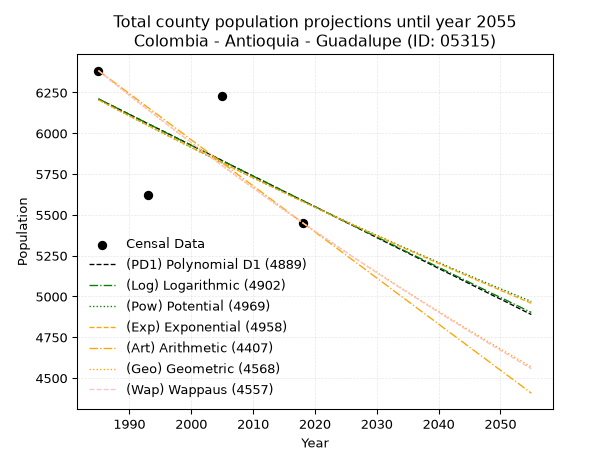
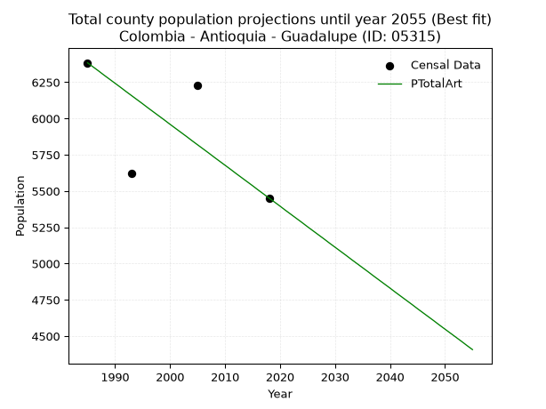
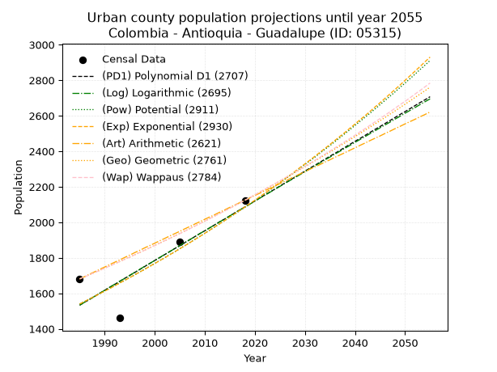
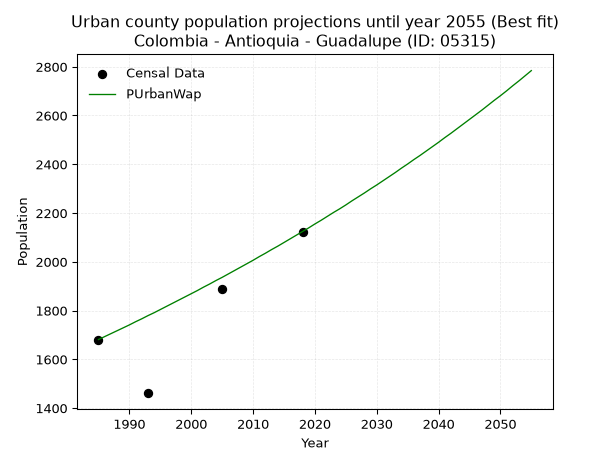
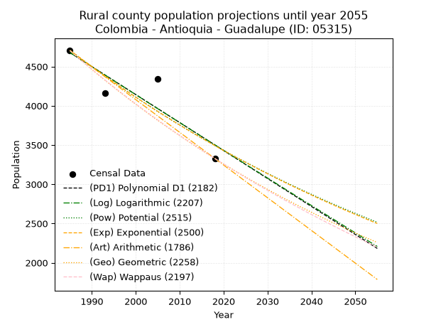
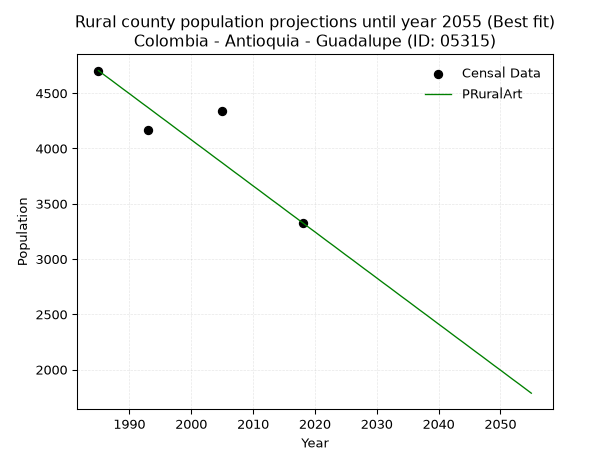

<div align="center">


</div>

# 📜 _“Population and Public Services Demand Projections (PPSD) until Year 2050 for Colombia - Antioquia - Guadalupe (ID: 05315)”_
Keywords: `population` `public-service` `projection` `lineal` `polynomial` `logarithmic` `potential` `exponential` `arithmetic` `geometric` `wappaus` `dane` `colombia` `south-america`

PPSD are analytical estimates used by governments and planners to anticipate future changes in population size, age distribution, and the resulting community needs for utilities, healthcare, education, and infrastructure as sizing future water treatment facilities, electrical grids, and road networks based on spatial growth.

<div align="center">

</img>

</div>


> **General running parameters**: • app_version: _v20260806_. • Python version: _3.14.7_. • Pandas version: _3.0.5_. • NumPy version: _2.5.1_. • Creates, save and include plots into reports (create_plot): _False_. • Projection until year: _2050_. • Process polynomial degree 2 and up: _False_. • Process Wappaus: _True_. • Process Wappaus: _True_. • Set negative values to zero: _True_. • Set infinite values to zero: _True_. • Drop dataset notes: _True_. 
<div align="center">

Maps & GIS Layers: [:earth_americas:Google](http://maps.google.com/maps?q=6.815069334,-75.2398617) [:earth_americas:OSM](https://www.openstreetmap.org/#map=18/6.815069334/-75.2398617&layers=P) [:earth_americas:Bing](https://www.bing.com/maps?cp=6.815069334~-75.2398617&lvl=18) [:earth_americas:Apple](https://maps.apple.com/frame?center=6.815069334%2C-75.2398617&span=0.003%2C0.006) [:earth_americas:GISMobile](https://github.com/rcfdtools/R.GISMobile/blob/main/file/gis/CountyLayer_CO/Readme.md)

</div>


<div align="center">

```geojson
{
  "type": "Feature",
  "geometry": {
    "type": "Point", 
    "coordinates": [-75.2398617, 6.815069334]
  }, 
  "properties": {
    "Name": "Colombia - Antioquia - Guadalupe (ID: 05315)"
  }
}
```

</div>


## 0. Census Data (4 records)

Census data are official statistics collected by a government about the people and housing in a country. They usually include counts of total population, age, sex, race, income, education, and jobs.

📅Global census file: [Population.xlsx](../data/Population.xlsx)

| Source   |   Year |   CountryID | CountryName   |   StateID | StateName   |   CountyID | CountyName   |   PTotal |   PUrban |   PRural |
|:---------|-------:|------------:|:--------------|----------:|:------------|-----------:|:-------------|---------:|---------:|---------:|
| DANE     |   1985 |          57 | Colombia      |        05 | Antioquia   |      05315 | Guadalupe    |     6384 |     1681 |     4703 |
| DANE     |   1993 |          57 | Colombia      |        05 | Antioquia   |      05315 | Guadalupe    |     5623 |     1461 |     4162 |
| DANE     |   2005 |          57 | Colombia      |        05 | Antioquia   |      05315 | Guadalupe    |     6231 |     1889 |     4342 |
| DANE     |   2018 |          57 | Colombia      |        05 | Antioquia   |      05315 | Guadalupe    |     5452 |     2124 |     3328 |

> 🔥Some records could had specific notes about the registered values or the corresponding urban or rural distribution.

📅[SUI-RUPS](https://www.datos.gov.co/Hacienda-y-Cr-dito-P-blico/Registro-nico-de-Prestadores-de-Servicios-P-blicos/4qkq-csdn/about_data) - Local public utility companies: [RUPS.csv](../data/RUPS.csv)

 | SERVICIO       | ESTADO    | NOMBRE                                               | NIT         | DEPARTAMENTO_DOMICILIO   | MUNICIPIO_DOMICILIO   | DIRECCION           |   TELEFONO | EMAIL                  | TIPO_PRESTADOR                             | CLASIFICACION                 |
|:---------------|:----------|:-----------------------------------------------------|:------------|:-------------------------|:----------------------|:--------------------|-----------:|:-----------------------|:-------------------------------------------|:------------------------------|
| ACUEDUCTO      | OPERATIVA | EMPRESA DE SERVICIOS PUBLICOS DE GUADALUPE S.A.S ESP | 900402277-3 | ANTIOQUIA                | GUADALUPE             | carrera 50 No 51-13 |    8616115 | uspguadalupe@gmail.com | SOCIEDADES (EMPRESA DE SERVICIOS PUBLICOS) | MENOR O IGUAL A 2500 USUARIOS |
| ALCANTARILLADO | OPERATIVA | EMPRESA DE SERVICIOS PUBLICOS DE GUADALUPE S.A.S ESP | 900402277-3 | ANTIOQUIA                | GUADALUPE             | carrera 50 No 51-13 |    8616115 | uspguadalupe@gmail.com | SOCIEDADES (EMPRESA DE SERVICIOS PUBLICOS) | MENOR O IGUAL A 2500 USUARIOS |

## 1. Total

### 1.1. Coefficients and Parameters

* (PD1) Polynomial Deg 1: -18.871938980328686, 43671.095945402456 (lineal)
* (Log) Logarithmic: -37761.71020763109, 292949.56189155846
* (Pow) Potential: -6.413490287601814, 24.942961460356855
* (Exp) Exponential: -0.0032053884781516467, 3597963.2038949253
* (Art) Arithmetic: Year diff. 2018 - 1985 = 33, Population diff. 5452 - 6384 = -932, Annual growth = -28.242424242424242
* (Geo) Geometric: Year diff. 2018 - 1985 = 33, Population diff. 5452 - 6384 = -932, Annual growth % = -0.004770775836709262
* (Wap) Wappaus: i = -0.4772292031501224, Condition values only valid for < 200)

<sub>
Wappaus condition values: ['-0.00', '-0.48', '-0.95', '-1.43', '-1.91', '-2.39', '-2.86', '-3.34', '-3.82', '-4.30', '-4.77', '-5.25', '-5.73', '-6.20', '-6.68', '-7.16', '-7.64', '-8.11', '-8.59', '-9.07', '-9.54', '-10.02', '-10.50', '-10.98', '-11.45', '-11.93', '-12.41', '-12.89', '-13.36', '-13.84', '-14.32', '-14.79', '-15.27', '-15.75', '-16.23', '-16.70', '-17.18', '-17.66', '-18.13', '-18.61', '-19.09', '-19.57', '-20.04', '-20.52', '-21.00', '-21.48', '-21.95', '-22.43', '-22.91', '-23.38', '-23.86', '-24.34', '-24.82', '-25.29', '-25.77', '-26.25', '-26.72', '-27.20', '-27.68', '-28.16', '-28.63', '-29.11', '-29.59', '-30.07', '-30.54', '-31.02']
</sub>


### 1.2. Projected Dataset

|   Year |   CountyID |   PTotalPD1 |   PTotalLog |   PTotalPow |   PTotalExp |   PTotalArt |   PTotalGeo |   PTotalWap |
|-------:|-----------:|------------:|------------:|------------:|------------:|------------:|------------:|------------:|
|   1985 |      05315 |        6210 |        6211 |        6206 |        6205 |        6384 |        6384 |        6384 |
|   1986 |      05315 |        6191 |        6192 |        6186 |        6186 |        6356 |        6354 |        6354 |
|   1987 |      05315 |        6173 |        6173 |        6166 |        6166 |        6328 |        6323 |        6323 |
|   1988 |      05315 |        6154 |        6154 |        6146 |        6146 |        6299 |        6293 |        6293 |
|   1989 |      05315 |        6135 |        6135 |        6126 |        6126 |        6271 |        6263 |        6263 |
|   1990 |      05315 |        6116 |        6116 |        6107 |        6107 |        6243 |        6233 |        6233 |
|   1991 |      05315 |        6097 |        6097 |        6087 |        6087 |        6215 |        6203 |        6204 |
|   1992 |      05315 |        6078 |        6078 |        6067 |        6068 |        6186 |        6174 |        6174 |
|   1993 |      05315 |        6059 |        6059 |        6048 |        6048 |        6158 |        6144 |        6145 |
|   1994 |      05315 |        6040 |        6040 |        6028 |        6029 |        6130 |        6115 |        6116 |
|   1995 |      05315 |        6022 |        6021 |        6009 |        6010 |        6102 |        6086 |        6086 |
|   1996 |      05315 |        6003 |        6002 |        5990 |        5990 |        6073 |        6057 |        6057 |
|   1997 |      05315 |        5984 |        5983 |        5971 |        5971 |        6045 |        6028 |        6029 |
|   1998 |      05315 |        5965 |        5964 |        5951 |        5952 |        6017 |        5999 |        6000 |
|   1999 |      05315 |        5946 |        5945 |        5932 |        5933 |        5989 |        5971 |        5971 |
|   2000 |      05315 |        5927 |        5926 |        5913 |        5914 |        5960 |        5942 |        5943 |
|   2001 |      05315 |        5908 |        5908 |        5894 |        5895 |        5932 |        5914 |        5914 |
|   2002 |      05315 |        5889 |        5889 |        5876 |        5876 |        5904 |        5886 |        5886 |
|   2003 |      05315 |        5871 |        5870 |        5857 |        5858 |        5876 |        5857 |        5858 |
|   2004 |      05315 |        5852 |        5851 |        5838 |        5839 |        5847 |        5830 |        5830 |
|   2005 |      05315 |        5833 |        5832 |        5819 |        5820 |        5819 |        5802 |        5802 |
|   2006 |      05315 |        5814 |        5813 |        5801 |        5801 |        5791 |        5774 |        5775 |
|   2007 |      05315 |        5795 |        5795 |        5782 |        5783 |        5763 |        5746 |        5747 |
|   2008 |      05315 |        5776 |        5776 |        5764 |        5764 |        5734 |        5719 |        5720 |
|   2009 |      05315 |        5757 |        5757 |        5746 |        5746 |        5706 |        5692 |        5692 |
|   2010 |      05315 |        5738 |        5738 |        5727 |        5728 |        5678 |        5665 |        5665 |
|   2011 |      05315 |        5720 |        5719 |        5709 |        5709 |        5650 |        5638 |        5638 |
|   2012 |      05315 |        5701 |        5701 |        5691 |        5691 |        5621 |        5611 |        5611 |
|   2013 |      05315 |        5682 |        5682 |        5673 |        5673 |        5593 |        5584 |        5584 |
|   2014 |      05315 |        5663 |        5663 |        5655 |        5655 |        5565 |        5557 |        5558 |
|   2015 |      05315 |        5644 |        5644 |        5637 |        5637 |        5537 |        5531 |        5531 |
|   2016 |      05315 |        5625 |        5626 |        5619 |        5618 |        5508 |        5504 |        5505 |
|   2017 |      05315 |        5606 |        5607 |        5601 |        5600 |        5480 |        5478 |        5478 |
|   2018 |      05315 |        5588 |        5588 |        5583 |        5583 |        5452 |        5452 |        5452 |
|   2019 |      05315 |        5569 |        5569 |        5565 |        5565 |        5424 |        5426 |        5426 |
|   2020 |      05315 |        5550 |        5551 |        5548 |        5547 |        5396 |        5400 |        5400 |
|   2021 |      05315 |        5531 |        5532 |        5530 |        5529 |        5367 |        5374 |        5374 |
|   2022 |      05315 |        5512 |        5513 |        5513 |        5511 |        5339 |        5349 |        5348 |
|   2023 |      05315 |        5493 |        5495 |        5495 |        5494 |        5311 |        5323 |        5323 |
|   2024 |      05315 |        5474 |        5476 |        5478 |        5476 |        5283 |        5298 |        5297 |
|   2025 |      05315 |        5455 |        5457 |        5461 |        5459 |        5254 |        5273 |        5272 |
|   2026 |      05315 |        5437 |        5439 |        5443 |        5441 |        5226 |        5247 |        5246 |
|   2027 |      05315 |        5418 |        5420 |        5426 |        5424 |        5198 |        5222 |        5221 |
|   2028 |      05315 |        5399 |        5401 |        5409 |        5406 |        5170 |        5197 |        5196 |
|   2029 |      05315 |        5380 |        5383 |        5392 |        5389 |        5141 |        5173 |        5171 |
|   2030 |      05315 |        5361 |        5364 |        5375 |        5372 |        5113 |        5148 |        5146 |
|   2031 |      05315 |        5342 |        5346 |        5358 |        5355 |        5085 |        5123 |        5121 |
|   2032 |      05315 |        5323 |        5327 |        5341 |        5338 |        5057 |        5099 |        5096 |
|   2033 |      05315 |        5304 |        5309 |        5324 |        5321 |        5028 |        5075 |        5072 |
|   2034 |      05315 |        5286 |        5290 |        5307 |        5303 |        5000 |        5050 |        5047 |
|   2035 |      05315 |        5267 |        5271 |        5291 |        5287 |        4972 |        5026 |        5023 |
|   2036 |      05315 |        5248 |        5253 |        5274 |        5270 |        4944 |        5002 |        4999 |
|   2037 |      05315 |        5229 |        5234 |        5258 |        5253 |        4915 |        4978 |        4975 |
|   2038 |      05315 |        5210 |        5216 |        5241 |        5236 |        4887 |        4955 |        4951 |
|   2039 |      05315 |        5191 |        5197 |        5225 |        5219 |        4859 |        4931 |        4927 |
|   2040 |      05315 |        5172 |        5179 |        5208 |        5202 |        4831 |        4908 |        4903 |
|   2041 |      05315 |        5153 |        5160 |        5192 |        5186 |        4802 |        4884 |        4879 |
|   2042 |      05315 |        5135 |        5142 |        5175 |        5169 |        4774 |        4861 |        4855 |
|   2043 |      05315 |        5116 |        5123 |        5159 |        5153 |        4746 |        4838 |        4832 |
|   2044 |      05315 |        5097 |        5105 |        5143 |        5136 |        4718 |        4815 |        4808 |
|   2045 |      05315 |        5078 |        5086 |        5127 |        5120 |        4689 |        4792 |        4785 |
|   2046 |      05315 |        5059 |        5068 |        5111 |        5103 |        4661 |        4769 |        4762 |
|   2047 |      05315 |        5040 |        5049 |        5095 |        5087 |        4633 |        4746 |        4739 |
|   2048 |      05315 |        5021 |        5031 |        5079 |        5071 |        4605 |        4723 |        4715 |
|   2049 |      05315 |        5002 |        5012 |        5063 |        5055 |        4576 |        4701 |        4692 |
|   2050 |      05315 |        4984 |        4994 |        5047 |        5038 |        4548 |        4678 |        4670 |
<div align="center">

</img>

</div>


### 1.3. Best fit with absolute and relative error (%)

Relative error puts that difference into context by dividing the absolute error by the true value, creating a unitless ratio or percentage that shows the scale of the mistake.

Absolute and relative error

|   Year | Source   |   CountryID | CountryName   |   StateID | StateName   |   CountyID_x | CountyName   |   PTotal |   PUrban |   PRural |   CountyID_y |   PTotalPD1 |   PTotalLog |   PTotalPow |   PTotalExp |   PTotalArt |   PTotalGeo |   PTotalWap |   PTotalPD1AbsError |   PTotalLogAbsError |   PTotalPowAbsError |   PTotalExpAbsError |   PTotalArtAbsError |   PTotalGeoAbsError |   PTotalWapAbsError |   PTotalPD1RelError |   PTotalLogRelError |   PTotalPowRelError |   PTotalExpRelError |   PTotalArtRelError |   PTotalGeoRelError |   PTotalWapRelError |
|-------:|:---------|------------:|:--------------|----------:|:------------|-------------:|:-------------|---------:|---------:|---------:|-------------:|------------:|------------:|------------:|------------:|------------:|------------:|------------:|--------------------:|--------------------:|--------------------:|--------------------:|--------------------:|--------------------:|--------------------:|--------------------:|--------------------:|--------------------:|--------------------:|--------------------:|--------------------:|--------------------:|
|   1985 | DANE     |          57 | Colombia      |        05 | Antioquia   |        05315 | Guadalupe    |     6384 |     1681 |     4703 |        05315 |        6210 |        6211 |        6206 |        6205 |        6384 |        6384 |        6384 |                 174 |                 173 |                 178 |                 179 |                   0 |                   0 |                   0 |             2.72556 |             2.7099  |             2.78822 |             2.80388 |             0       |             0       |             0       |
|   1993 | DANE     |          57 | Colombia      |        05 | Antioquia   |        05315 | Guadalupe    |     5623 |     1461 |     4162 |        05315 |        6059 |        6059 |        6048 |        6048 |        6158 |        6144 |        6145 |                 436 |                 436 |                 425 |                 425 |                 535 |                 521 |                 522 |             7.75387 |             7.75387 |             7.55824 |             7.55824 |             9.51449 |             9.26552 |             9.2833  |
|   2005 | DANE     |          57 | Colombia      |        05 | Antioquia   |        05315 | Guadalupe    |     6231 |     1889 |     4342 |        05315 |        5833 |        5832 |        5819 |        5820 |        5819 |        5802 |        5802 |                 398 |                 399 |                 412 |                 411 |                 412 |                 429 |                 429 |             6.38742 |             6.40347 |             6.6121  |             6.59605 |             6.6121  |             6.88493 |             6.88493 |
|   2018 | DANE     |          57 | Colombia      |        05 | Antioquia   |        05315 | Guadalupe    |     5452 |     2124 |     3328 |        05315 |        5588 |        5588 |        5583 |        5583 |        5452 |        5452 |        5452 |                 136 |                 136 |                 131 |                 131 |                   0 |                   0 |                   0 |             2.4945  |             2.4945  |             2.40279 |             2.40279 |             0       |             0       |             0       |

Relative error mean

| Method    |   RelError | Best   |
|:----------|-----------:|:-------|
| PTotalPD1 |    4.84034 |        |
| PTotalLog |    4.84043 |        |
| PTotalPow |    4.84034 |        |
| PTotalExp |    4.84024 |        |
| PTotalArt |    4.03165 | True   |
| PTotalGeo |    4.03761 |        |
| PTotalWap |    4.04206 |        |

💙Best method: _**PTotalArt**_
<div align="center">

</img>

</div>


### 1.4. Fresh water supply demand in liters per capita per day (lpcd)

The fresh water supply demand typically ranges from 100 to 300 liters per capita per day (lpcd) for standard domestic and municipal planning, though absolute survival minimums set by the World Health Organization are as low as 7.5 to 20 liters per day, and total consumption in high-income nations can exceed 400 liters.

> `CZ`: Level in meters above the sea level (masl)<br> `WS`: Fresh water supply demand in liters per capita per day (lpcd or l/h/d)<br> `WSAll`: Zonal fresh water supply demand in liters per second (l/s)<br> `A`: Zonal area in square meters<br> `DP`: Population density (people/hectare or p/ha)

Reference values (RAS Colombia)

|    CZ |   WS |
|------:|-----:|
|  1000 |  120 |
|  2000 |  130 |
| 99999 |  140 |

County shapefile geometry properties and water supply values

|   CountyID |      ATotal |   CZTotal |   WSTotal |
|-----------:|------------:|----------:|----------:|
|      05315 | 1.18174e+08 |   1549.52 |       130 |

Projected values for best method: PTotalArt

|   CountyID |   Year |   PTotalArt |   DPTotal |   WSTotal |   WSTotalAll |
|-----------:|-------:|------------:|----------:|----------:|-------------:|
|      05315 |   1985 |        6384 |      0.54 |       130 |      9.60556 |
|      05315 |   1986 |        6356 |      0.54 |       130 |      9.56343 |
|      05315 |   1987 |        6328 |      0.54 |       130 |      9.5213  |
|      05315 |   1988 |        6299 |      0.53 |       130 |      9.47766 |
|      05315 |   1989 |        6271 |      0.53 |       130 |      9.43553 |
|      05315 |   1990 |        6243 |      0.53 |       130 |      9.3934  |
|      05315 |   1991 |        6215 |      0.53 |       130 |      9.35127 |
|      05315 |   1992 |        6186 |      0.52 |       130 |      9.30764 |
|      05315 |   1993 |        6158 |      0.52 |       130 |      9.26551 |
|      05315 |   1994 |        6130 |      0.52 |       130 |      9.22338 |
|      05315 |   1995 |        6102 |      0.52 |       130 |      9.18125 |
|      05315 |   1996 |        6073 |      0.51 |       130 |      9.13762 |
|      05315 |   1997 |        6045 |      0.51 |       130 |      9.09549 |
|      05315 |   1998 |        6017 |      0.51 |       130 |      9.05336 |
|      05315 |   1999 |        5989 |      0.51 |       130 |      9.01123 |
|      05315 |   2000 |        5960 |      0.5  |       130 |      8.96759 |
|      05315 |   2001 |        5932 |      0.5  |       130 |      8.92546 |
|      05315 |   2002 |        5904 |      0.5  |       130 |      8.88333 |
|      05315 |   2003 |        5876 |      0.5  |       130 |      8.8412  |
|      05315 |   2004 |        5847 |      0.49 |       130 |      8.79757 |
|      05315 |   2005 |        5819 |      0.49 |       130 |      8.75544 |
|      05315 |   2006 |        5791 |      0.49 |       130 |      8.71331 |
|      05315 |   2007 |        5763 |      0.49 |       130 |      8.67118 |
|      05315 |   2008 |        5734 |      0.49 |       130 |      8.62755 |
|      05315 |   2009 |        5706 |      0.48 |       130 |      8.58542 |
|      05315 |   2010 |        5678 |      0.48 |       130 |      8.54329 |
|      05315 |   2011 |        5650 |      0.48 |       130 |      8.50116 |
|      05315 |   2012 |        5621 |      0.48 |       130 |      8.45752 |
|      05315 |   2013 |        5593 |      0.47 |       130 |      8.41539 |
|      05315 |   2014 |        5565 |      0.47 |       130 |      8.37326 |
|      05315 |   2015 |        5537 |      0.47 |       130 |      8.33113 |
|      05315 |   2016 |        5508 |      0.47 |       130 |      8.2875  |
|      05315 |   2017 |        5480 |      0.46 |       130 |      8.24537 |
|      05315 |   2018 |        5452 |      0.46 |       130 |      8.20324 |
|      05315 |   2019 |        5424 |      0.46 |       130 |      8.16111 |
|      05315 |   2020 |        5396 |      0.46 |       130 |      8.11898 |
|      05315 |   2021 |        5367 |      0.45 |       130 |      8.07535 |
|      05315 |   2022 |        5339 |      0.45 |       130 |      8.03322 |
|      05315 |   2023 |        5311 |      0.45 |       130 |      7.99109 |
|      05315 |   2024 |        5283 |      0.45 |       130 |      7.94896 |
|      05315 |   2025 |        5254 |      0.44 |       130 |      7.90532 |
|      05315 |   2026 |        5226 |      0.44 |       130 |      7.86319 |
|      05315 |   2027 |        5198 |      0.44 |       130 |      7.82106 |
|      05315 |   2028 |        5170 |      0.44 |       130 |      7.77894 |
|      05315 |   2029 |        5141 |      0.44 |       130 |      7.7353  |
|      05315 |   2030 |        5113 |      0.43 |       130 |      7.69317 |
|      05315 |   2031 |        5085 |      0.43 |       130 |      7.65104 |
|      05315 |   2032 |        5057 |      0.43 |       130 |      7.60891 |
|      05315 |   2033 |        5028 |      0.43 |       130 |      7.56528 |
|      05315 |   2034 |        5000 |      0.42 |       130 |      7.52315 |
|      05315 |   2035 |        4972 |      0.42 |       130 |      7.48102 |
|      05315 |   2036 |        4944 |      0.42 |       130 |      7.43889 |
|      05315 |   2037 |        4915 |      0.42 |       130 |      7.39525 |
|      05315 |   2038 |        4887 |      0.41 |       130 |      7.35313 |
|      05315 |   2039 |        4859 |      0.41 |       130 |      7.311   |
|      05315 |   2040 |        4831 |      0.41 |       130 |      7.26887 |
|      05315 |   2041 |        4802 |      0.41 |       130 |      7.22523 |
|      05315 |   2042 |        4774 |      0.4  |       130 |      7.1831  |
|      05315 |   2043 |        4746 |      0.4  |       130 |      7.14097 |
|      05315 |   2044 |        4718 |      0.4  |       130 |      7.09884 |
|      05315 |   2045 |        4689 |      0.4  |       130 |      7.05521 |
|      05315 |   2046 |        4661 |      0.39 |       130 |      7.01308 |
|      05315 |   2047 |        4633 |      0.39 |       130 |      6.97095 |
|      05315 |   2048 |        4605 |      0.39 |       130 |      6.92882 |
|      05315 |   2049 |        4576 |      0.39 |       130 |      6.88519 |
|      05315 |   2050 |        4548 |      0.38 |       130 |      6.84306 |

## 2. Urban

### 2.1. Coefficients and Parameters

* (PD1) Polynomial Deg 1: 16.77438779606565, -31764.219189080315 (lineal)
* (Log) Logarithmic: 33547.053266023264, -253202.67070425625
* (Pow) Potential: 18.378634117568694, -57.420863905660944
* (Exp) Exponential: 0.009189903473112234, 1.8414273261396472e-05
* (Art) Arithmetic: Year diff. 2018 - 1985 = 33, Population diff. 2124 - 1681 = 443, Annual growth = 13.424242424242424
* (Geo) Geometric: Year diff. 2018 - 1985 = 33, Population diff. 2124 - 1681 = 443, Annual growth % = 0.007113431073581422
* (Wap) Wappaus: i = 0.7056106399076175, Condition values only valid for < 200)

<sub>
Wappaus condition values: ['0.00', '0.71', '1.41', '2.12', '2.82', '3.53', '4.23', '4.94', '5.64', '6.35', '7.06', '7.76', '8.47', '9.17', '9.88', '10.58', '11.29', '12.00', '12.70', '13.41', '14.11', '14.82', '15.52', '16.23', '16.93', '17.64', '18.35', '19.05', '19.76', '20.46', '21.17', '21.87', '22.58', '23.29', '23.99', '24.70', '25.40', '26.11', '26.81', '27.52', '28.22', '28.93', '29.64', '30.34', '31.05', '31.75', '32.46', '33.16', '33.87', '34.57', '35.28', '35.99', '36.69', '37.40', '38.10', '38.81', '39.51', '40.22', '40.93', '41.63', '42.34', '43.04', '43.75', '44.45', '45.16', '45.86']
</sub>


### 2.2. Projected Dataset

|   Year |   CountyID |   PUrbanPD1 |   PUrbanLog |   PUrbanPow |   PUrbanExp |   PUrbanArt |   PUrbanGeo |   PUrbanWap |
|-------:|-----------:|------------:|------------:|------------:|------------:|------------:|------------:|------------:|
|   1985 |      05315 |        1533 |        1533 |        1540 |        1540 |        1681 |        1681 |        1681 |
|   1986 |      05315 |        1550 |        1550 |        1554 |        1554 |        1694 |        1693 |        1693 |
|   1987 |      05315 |        1566 |        1566 |        1569 |        1569 |        1708 |        1705 |        1705 |
|   1988 |      05315 |        1583 |        1583 |        1583 |        1583 |        1721 |        1717 |        1717 |
|   1989 |      05315 |        1600 |        1600 |        1598 |        1598 |        1735 |        1729 |        1729 |
|   1990 |      05315 |        1617 |        1617 |        1613 |        1612 |        1748 |        1742 |        1741 |
|   1991 |      05315 |        1634 |        1634 |        1628 |        1627 |        1762 |        1754 |        1754 |
|   1992 |      05315 |        1650 |        1651 |        1643 |        1642 |        1775 |        1767 |        1766 |
|   1993 |      05315 |        1667 |        1668 |        1658 |        1658 |        1788 |        1779 |        1779 |
|   1994 |      05315 |        1684 |        1684 |        1673 |        1673 |        1802 |        1792 |        1791 |
|   1995 |      05315 |        1701 |        1701 |        1689 |        1688 |        1815 |        1804 |        1804 |
|   1996 |      05315 |        1717 |        1718 |        1704 |        1704 |        1829 |        1817 |        1817 |
|   1997 |      05315 |        1734 |        1735 |        1720 |        1720 |        1842 |        1830 |        1830 |
|   1998 |      05315 |        1751 |        1752 |        1736 |        1735 |        1856 |        1843 |        1843 |
|   1999 |      05315 |        1768 |        1768 |        1752 |        1752 |        1869 |        1856 |        1856 |
|   2000 |      05315 |        1785 |        1785 |        1768 |        1768 |        1882 |        1870 |        1869 |
|   2001 |      05315 |        1801 |        1802 |        1785 |        1784 |        1896 |        1883 |        1882 |
|   2002 |      05315 |        1818 |        1819 |        1801 |        1800 |        1909 |        1896 |        1896 |
|   2003 |      05315 |        1835 |        1835 |        1818 |        1817 |        1923 |        1910 |        1909 |
|   2004 |      05315 |        1852 |        1852 |        1834 |        1834 |        1936 |        1923 |        1923 |
|   2005 |      05315 |        1868 |        1869 |        1851 |        1851 |        1949 |        1937 |        1936 |
|   2006 |      05315 |        1885 |        1886 |        1868 |        1868 |        1963 |        1951 |        1950 |
|   2007 |      05315 |        1902 |        1902 |        1886 |        1885 |        1976 |        1965 |        1964 |
|   2008 |      05315 |        1919 |        1919 |        1903 |        1903 |        1990 |        1979 |        1978 |
|   2009 |      05315 |        1936 |        1936 |        1920 |        1920 |        2003 |        1993 |        1992 |
|   2010 |      05315 |        1952 |        1953 |        1938 |        1938 |        2017 |        2007 |        2006 |
|   2011 |      05315 |        1969 |        1969 |        1956 |        1956 |        2030 |        2021 |        2021 |
|   2012 |      05315 |        1986 |        1986 |        1974 |        1974 |        2043 |        2036 |        2035 |
|   2013 |      05315 |        2003 |        2003 |        1992 |        1992 |        2057 |        2050 |        2050 |
|   2014 |      05315 |        2019 |        2019 |        2010 |        2010 |        2070 |        2065 |        2064 |
|   2015 |      05315 |        2036 |        2036 |        2029 |        2029 |        2084 |        2079 |        2079 |
|   2016 |      05315 |        2053 |        2053 |        2047 |        2048 |        2097 |        2094 |        2094 |
|   2017 |      05315 |        2070 |        2069 |        2066 |        2067 |        2111 |        2109 |        2109 |
|   2018 |      05315 |        2086 |        2086 |        2085 |        2086 |        2124 |        2124 |        2124 |
|   2019 |      05315 |        2103 |        2102 |        2104 |        2105 |        2137 |        2139 |        2139 |
|   2020 |      05315 |        2120 |        2119 |        2123 |        2124 |        2151 |        2154 |        2155 |
|   2021 |      05315 |        2137 |        2136 |        2143 |        2144 |        2164 |        2170 |        2170 |
|   2022 |      05315 |        2154 |        2152 |        2162 |        2164 |        2178 |        2185 |        2186 |
|   2023 |      05315 |        2170 |        2169 |        2182 |        2184 |        2191 |        2201 |        2202 |
|   2024 |      05315 |        2187 |        2185 |        2202 |        2204 |        2205 |        2216 |        2217 |
|   2025 |      05315 |        2204 |        2202 |        2222 |        2224 |        2218 |        2232 |        2233 |
|   2026 |      05315 |        2221 |        2219 |        2242 |        2245 |        2231 |        2248 |        2250 |
|   2027 |      05315 |        2237 |        2235 |        2263 |        2265 |        2245 |        2264 |        2266 |
|   2028 |      05315 |        2254 |        2252 |        2283 |        2286 |        2258 |        2280 |        2282 |
|   2029 |      05315 |        2271 |        2268 |        2304 |        2308 |        2272 |        2296 |        2299 |
|   2030 |      05315 |        2288 |        2285 |        2325 |        2329 |        2285 |        2313 |        2315 |
|   2031 |      05315 |        2305 |        2301 |        2346 |        2350 |        2299 |        2329 |        2332 |
|   2032 |      05315 |        2321 |        2318 |        2367 |        2372 |        2312 |        2346 |        2349 |
|   2033 |      05315 |        2338 |        2334 |        2389 |        2394 |        2325 |        2362 |        2366 |
|   2034 |      05315 |        2355 |        2351 |        2411 |        2416 |        2339 |        2379 |        2384 |
|   2035 |      05315 |        2372 |        2367 |        2432 |        2438 |        2352 |        2396 |        2401 |
|   2036 |      05315 |        2388 |        2384 |        2454 |        2461 |        2366 |        2413 |        2419 |
|   2037 |      05315 |        2405 |        2400 |        2477 |        2484 |        2379 |        2430 |        2436 |
|   2038 |      05315 |        2422 |        2417 |        2499 |        2506 |        2392 |        2447 |        2454 |
|   2039 |      05315 |        2439 |        2433 |        2522 |        2530 |        2406 |        2465 |        2472 |
|   2040 |      05315 |        2456 |        2450 |        2545 |        2553 |        2419 |        2482 |        2490 |
|   2041 |      05315 |        2472 |        2466 |        2568 |        2577 |        2433 |        2500 |        2509 |
|   2042 |      05315 |        2489 |        2482 |        2591 |        2600 |        2446 |        2518 |        2527 |
|   2043 |      05315 |        2506 |        2499 |        2614 |        2624 |        2460 |        2536 |        2546 |
|   2044 |      05315 |        2523 |        2515 |        2638 |        2649 |        2473 |        2554 |        2565 |
|   2045 |      05315 |        2539 |        2532 |        2662 |        2673 |        2486 |        2572 |        2584 |
|   2046 |      05315 |        2556 |        2548 |        2686 |        2698 |        2500 |        2590 |        2603 |
|   2047 |      05315 |        2573 |        2564 |        2710 |        2723 |        2513 |        2609 |        2622 |
|   2048 |      05315 |        2590 |        2581 |        2734 |        2748 |        2527 |        2627 |        2642 |
|   2049 |      05315 |        2607 |        2597 |        2759 |        2773 |        2540 |        2646 |        2662 |
|   2050 |      05315 |        2623 |        2614 |        2784 |        2799 |        2554 |        2665 |        2681 |
<div align="center">

</img>

</div>


### 2.3. Best fit with absolute and relative error (%)

Relative error puts that difference into context by dividing the absolute error by the true value, creating a unitless ratio or percentage that shows the scale of the mistake.

Absolute and relative error

|   Year | Source   |   CountryID | CountryName   |   StateID | StateName   |   CountyID_x | CountyName   |   PTotal |   PUrban |   PRural |   CountyID_y |   PUrbanPD1 |   PUrbanLog |   PUrbanPow |   PUrbanExp |   PUrbanArt |   PUrbanGeo |   PUrbanWap |   PUrbanPD1AbsError |   PUrbanLogAbsError |   PUrbanPowAbsError |   PUrbanExpAbsError |   PUrbanArtAbsError |   PUrbanGeoAbsError |   PUrbanWapAbsError |   PUrbanPD1RelError |   PUrbanLogRelError |   PUrbanPowRelError |   PUrbanExpRelError |   PUrbanArtRelError |   PUrbanGeoRelError |   PUrbanWapRelError |
|-------:|:---------|------------:|:--------------|----------:|:------------|-------------:|:-------------|---------:|---------:|---------:|-------------:|------------:|------------:|------------:|------------:|------------:|------------:|------------:|--------------------:|--------------------:|--------------------:|--------------------:|--------------------:|--------------------:|--------------------:|--------------------:|--------------------:|--------------------:|--------------------:|--------------------:|--------------------:|--------------------:|
|   1985 | DANE     |          57 | Colombia      |        05 | Antioquia   |        05315 | Guadalupe    |     6384 |     1681 |     4703 |        05315 |        1533 |        1533 |        1540 |        1540 |        1681 |        1681 |        1681 |                 148 |                 148 |                 141 |                 141 |                   0 |                   0 |                   0 |             8.80428 |             8.80428 |             8.38786 |             8.38786 |             0       |             0       |             0       |
|   1993 | DANE     |          57 | Colombia      |        05 | Antioquia   |        05315 | Guadalupe    |     5623 |     1461 |     4162 |        05315 |        1667 |        1668 |        1658 |        1658 |        1788 |        1779 |        1779 |                 206 |                 207 |                 197 |                 197 |                 327 |                 318 |                 318 |            14.0999  |            14.1684  |            13.4839  |            13.4839  |            22.3819  |            21.7659  |            21.7659  |
|   2005 | DANE     |          57 | Colombia      |        05 | Antioquia   |        05315 | Guadalupe    |     6231 |     1889 |     4342 |        05315 |        1868 |        1869 |        1851 |        1851 |        1949 |        1937 |        1936 |                  21 |                  20 |                  38 |                  38 |                  60 |                  48 |                  47 |             1.1117  |             1.05876 |             2.01165 |             2.01165 |             3.17628 |             2.54103 |             2.48809 |
|   2018 | DANE     |          57 | Colombia      |        05 | Antioquia   |        05315 | Guadalupe    |     5452 |     2124 |     3328 |        05315 |        2086 |        2086 |        2085 |        2086 |        2124 |        2124 |        2124 |                  38 |                  38 |                  39 |                  38 |                   0 |                   0 |                   0 |             1.78908 |             1.78908 |             1.83616 |             1.78908 |             0       |             0       |             0       |

Relative error mean

| Method    |   RelError | Best   |
|:----------|-----------:|:-------|
| PUrbanPD1 |    6.45125 |        |
| PUrbanLog |    6.45512 |        |
| PUrbanPow |    6.4299  |        |
| PUrbanExp |    6.41813 |        |
| PUrbanArt |    6.38955 |        |
| PUrbanGeo |    6.07674 |        |
| PUrbanWap |    6.0635  | True   |

💙Best method: _**PUrbanWap**_
<div align="center">

</img>

</div>


### 2.4. Fresh water supply demand in liters per capita per day (lpcd)

The fresh water supply demand typically ranges from 100 to 300 liters per capita per day (lpcd) for standard domestic and municipal planning, though absolute survival minimums set by the World Health Organization are as low as 7.5 to 20 liters per day, and total consumption in high-income nations can exceed 400 liters.

> `CZ`: Level in meters above the sea level (masl)<br> `WS`: Fresh water supply demand in liters per capita per day (lpcd or l/h/d)<br> `WSAll`: Zonal fresh water supply demand in liters per second (l/s)<br> `A`: Zonal area in square meters<br> `DP`: Population density (people/hectare or p/ha)

Reference values (RAS Colombia)

|    CZ |   WS |
|------:|-----:|
|  1000 |  120 |
|  2000 |  130 |
| 99999 |  140 |

County shapefile geometry properties and water supply values

|   CountyID |   AUrban |   CZUrban |   WSUrban |
|-----------:|---------:|----------:|----------:|
|      05315 |   409152 |   1865.23 |       130 |

Projected values for best method: PUrbanWap

|   CountyID |   Year |   PUrbanWap |   DPUrban |   WSUrban |   WSUrbanAll |
|-----------:|-------:|------------:|----------:|----------:|-------------:|
|      05315 |   1985 |        1681 |     41.09 |       130 |      2.52928 |
|      05315 |   1986 |        1693 |     41.38 |       130 |      2.54734 |
|      05315 |   1987 |        1705 |     41.67 |       130 |      2.56539 |
|      05315 |   1988 |        1717 |     41.96 |       130 |      2.58345 |
|      05315 |   1989 |        1729 |     42.26 |       130 |      2.6015  |
|      05315 |   1990 |        1741 |     42.55 |       130 |      2.61956 |
|      05315 |   1991 |        1754 |     42.87 |       130 |      2.63912 |
|      05315 |   1992 |        1766 |     43.16 |       130 |      2.65718 |
|      05315 |   1993 |        1779 |     43.48 |       130 |      2.67674 |
|      05315 |   1994 |        1791 |     43.77 |       130 |      2.69479 |
|      05315 |   1995 |        1804 |     44.09 |       130 |      2.71435 |
|      05315 |   1996 |        1817 |     44.41 |       130 |      2.73391 |
|      05315 |   1997 |        1830 |     44.73 |       130 |      2.75347 |
|      05315 |   1998 |        1843 |     45.04 |       130 |      2.77303 |
|      05315 |   1999 |        1856 |     45.36 |       130 |      2.79259 |
|      05315 |   2000 |        1869 |     45.68 |       130 |      2.81215 |
|      05315 |   2001 |        1882 |     46    |       130 |      2.83171 |
|      05315 |   2002 |        1896 |     46.34 |       130 |      2.85278 |
|      05315 |   2003 |        1909 |     46.66 |       130 |      2.87234 |
|      05315 |   2004 |        1923 |     47    |       130 |      2.8934  |
|      05315 |   2005 |        1936 |     47.32 |       130 |      2.91296 |
|      05315 |   2006 |        1950 |     47.66 |       130 |      2.93403 |
|      05315 |   2007 |        1964 |     48    |       130 |      2.95509 |
|      05315 |   2008 |        1978 |     48.34 |       130 |      2.97616 |
|      05315 |   2009 |        1992 |     48.69 |       130 |      2.99722 |
|      05315 |   2010 |        2006 |     49.03 |       130 |      3.01829 |
|      05315 |   2011 |        2021 |     49.39 |       130 |      3.04086 |
|      05315 |   2012 |        2035 |     49.74 |       130 |      3.06192 |
|      05315 |   2013 |        2050 |     50.1  |       130 |      3.08449 |
|      05315 |   2014 |        2064 |     50.45 |       130 |      3.10556 |
|      05315 |   2015 |        2079 |     50.81 |       130 |      3.12812 |
|      05315 |   2016 |        2094 |     51.18 |       130 |      3.15069 |
|      05315 |   2017 |        2109 |     51.55 |       130 |      3.17326 |
|      05315 |   2018 |        2124 |     51.91 |       130 |      3.19583 |
|      05315 |   2019 |        2139 |     52.28 |       130 |      3.2184  |
|      05315 |   2020 |        2155 |     52.67 |       130 |      3.24248 |
|      05315 |   2021 |        2170 |     53.04 |       130 |      3.26505 |
|      05315 |   2022 |        2186 |     53.43 |       130 |      3.28912 |
|      05315 |   2023 |        2202 |     53.82 |       130 |      3.31319 |
|      05315 |   2024 |        2217 |     54.19 |       130 |      3.33576 |
|      05315 |   2025 |        2233 |     54.58 |       130 |      3.35984 |
|      05315 |   2026 |        2250 |     54.99 |       130 |      3.38542 |
|      05315 |   2027 |        2266 |     55.38 |       130 |      3.40949 |
|      05315 |   2028 |        2282 |     55.77 |       130 |      3.43356 |
|      05315 |   2029 |        2299 |     56.19 |       130 |      3.45914 |
|      05315 |   2030 |        2315 |     56.58 |       130 |      3.48322 |
|      05315 |   2031 |        2332 |     57    |       130 |      3.5088  |
|      05315 |   2032 |        2349 |     57.41 |       130 |      3.53437 |
|      05315 |   2033 |        2366 |     57.83 |       130 |      3.55995 |
|      05315 |   2034 |        2384 |     58.27 |       130 |      3.58704 |
|      05315 |   2035 |        2401 |     58.68 |       130 |      3.61262 |
|      05315 |   2036 |        2419 |     59.12 |       130 |      3.6397  |
|      05315 |   2037 |        2436 |     59.54 |       130 |      3.66528 |
|      05315 |   2038 |        2454 |     59.98 |       130 |      3.69236 |
|      05315 |   2039 |        2472 |     60.42 |       130 |      3.71944 |
|      05315 |   2040 |        2490 |     60.86 |       130 |      3.74653 |
|      05315 |   2041 |        2509 |     61.32 |       130 |      3.77512 |
|      05315 |   2042 |        2527 |     61.76 |       130 |      3.8022  |
|      05315 |   2043 |        2546 |     62.23 |       130 |      3.83079 |
|      05315 |   2044 |        2565 |     62.69 |       130 |      3.85938 |
|      05315 |   2045 |        2584 |     63.16 |       130 |      3.88796 |
|      05315 |   2046 |        2603 |     63.62 |       130 |      3.91655 |
|      05315 |   2047 |        2622 |     64.08 |       130 |      3.94514 |
|      05315 |   2048 |        2642 |     64.57 |       130 |      3.97523 |
|      05315 |   2049 |        2662 |     65.06 |       130 |      4.00532 |
|      05315 |   2050 |        2681 |     65.53 |       130 |      4.03391 |

## 3. Rural

### 3.1. Coefficients and Parameters

* (PD1) Polynomial Deg 1: -35.64632677639438, 75435.31513448285 (lineal)
* (Log) Logarithmic: -71308.76347365438, 546152.2325958147
* (Pow) Potential: -18.088978769370208, 63.32597828238351
* (Exp) Exponential: -0.009043503975976223, 294413134791.43646
* (Art) Arithmetic: Year diff. 2018 - 1985 = 33, Population diff. 3328 - 4703 = -1375, Annual growth = -41.666666666666664
* (Geo) Geometric: Year diff. 2018 - 1985 = 33, Population diff. 3328 - 4703 = -1375, Annual growth % = -0.010424948676329038
* (Wap) Wappaus: i = -1.0376457892333872, Condition values only valid for < 200)

<sub>
Wappaus condition values: ['-0.00', '-1.04', '-2.08', '-3.11', '-4.15', '-5.19', '-6.23', '-7.26', '-8.30', '-9.34', '-10.38', '-11.41', '-12.45', '-13.49', '-14.53', '-15.56', '-16.60', '-17.64', '-18.68', '-19.72', '-20.75', '-21.79', '-22.83', '-23.87', '-24.90', '-25.94', '-26.98', '-28.02', '-29.05', '-30.09', '-31.13', '-32.17', '-33.20', '-34.24', '-35.28', '-36.32', '-37.36', '-38.39', '-39.43', '-40.47', '-41.51', '-42.54', '-43.58', '-44.62', '-45.66', '-46.69', '-47.73', '-48.77', '-49.81', '-50.84', '-51.88', '-52.92', '-53.96', '-55.00', '-56.03', '-57.07', '-58.11', '-59.15', '-60.18', '-61.22', '-62.26', '-63.30', '-64.33', '-65.37', '-66.41', '-67.45']
</sub>


### 3.2. Projected Dataset

|   Year |   CountyID |   PRuralPD1 |   PRuralLog |   PRuralPow |   PRuralExp |   PRuralArt |   PRuralGeo |   PRuralWap |
|-------:|-----------:|------------:|------------:|------------:|------------:|------------:|------------:|------------:|
|   1985 |      05315 |        4677 |        4678 |        4708 |        4707 |        4703 |        4703 |        4703 |
|   1986 |      05315 |        4642 |        4642 |        4666 |        4665 |        4661 |        4654 |        4654 |
|   1987 |      05315 |        4606 |        4606 |        4623 |        4623 |        4620 |        4605 |        4606 |
|   1988 |      05315 |        4570 |        4570 |        4581 |        4581 |        4578 |        4557 |        4559 |
|   1989 |      05315 |        4535 |        4535 |        4540 |        4540 |        4536 |        4510 |        4512 |
|   1990 |      05315 |        4499 |        4499 |        4499 |        4499 |        4495 |        4463 |        4465 |
|   1991 |      05315 |        4463 |        4463 |        4458 |        4459 |        4453 |        4416 |        4419 |
|   1992 |      05315 |        4428 |        4427 |        4418 |        4419 |        4411 |        4370 |        4373 |
|   1993 |      05315 |        4392 |        4391 |        4378 |        4379 |        4370 |        4325 |        4328 |
|   1994 |      05315 |        4357 |        4356 |        4338 |        4339 |        4328 |        4280 |        4283 |
|   1995 |      05315 |        4321 |        4320 |        4299 |        4300 |        4286 |        4235 |        4239 |
|   1996 |      05315 |        4285 |        4284 |        4260 |        4262 |        4245 |        4191 |        4195 |
|   1997 |      05315 |        4250 |        4248 |        4222 |        4223 |        4203 |        4147 |        4152 |
|   1998 |      05315 |        4214 |        4213 |        4184 |        4185 |        4161 |        4104 |        4109 |
|   1999 |      05315 |        4178 |        4177 |        4146 |        4148 |        4120 |        4061 |        4066 |
|   2000 |      05315 |        4143 |        4141 |        4109 |        4110 |        4078 |        4019 |        4024 |
|   2001 |      05315 |        4107 |        4106 |        4072 |        4073 |        4036 |        3977 |        3982 |
|   2002 |      05315 |        4071 |        4070 |        4035 |        4037 |        3995 |        3936 |        3941 |
|   2003 |      05315 |        4036 |        4034 |        3999 |        4000 |        3953 |        3895 |        3900 |
|   2004 |      05315 |        4000 |        3999 |        3963 |        3964 |        3911 |        3854 |        3859 |
|   2005 |      05315 |        3964 |        3963 |        3927 |        3929 |        3870 |        3814 |        3819 |
|   2006 |      05315 |        3929 |        3928 |        3892 |        3893 |        3828 |        3774 |        3779 |
|   2007 |      05315 |        3893 |        3892 |        3857 |        3858 |        3786 |        3735 |        3739 |
|   2008 |      05315 |        3857 |        3857 |        3823 |        3823 |        3745 |        3696 |        3700 |
|   2009 |      05315 |        3822 |        3821 |        3788 |        3789 |        3703 |        3657 |        3661 |
|   2010 |      05315 |        3786 |        3786 |        3754 |        3755 |        3661 |        3619 |        3623 |
|   2011 |      05315 |        3751 |        3750 |        3721 |        3721 |        3620 |        3581 |        3585 |
|   2012 |      05315 |        3715 |        3715 |        3687 |        3688 |        3578 |        3544 |        3547 |
|   2013 |      05315 |        3679 |        3679 |        3654 |        3654 |        3536 |        3507 |        3510 |
|   2014 |      05315 |        3644 |        3644 |        3622 |        3621 |        3495 |        3470 |        3473 |
|   2015 |      05315 |        3608 |        3608 |        3589 |        3589 |        3453 |        3434 |        3436 |
|   2016 |      05315 |        3572 |        3573 |        3557 |        3557 |        3411 |        3398 |        3400 |
|   2017 |      05315 |        3537 |        3538 |        3526 |        3525 |        3370 |        3363 |        3364 |
|   2018 |      05315 |        3501 |        3502 |        3494 |        3493 |        3328 |        3328 |        3328 |
|   2019 |      05315 |        3465 |        3467 |        3463 |        3461 |        3286 |        3293 |        3293 |
|   2020 |      05315 |        3430 |        3432 |        3432 |        3430 |        3245 |        3259 |        3257 |
|   2021 |      05315 |        3394 |        3396 |        3401 |        3399 |        3203 |        3225 |        3223 |
|   2022 |      05315 |        3358 |        3361 |        3371 |        3369 |        3161 |        3191 |        3188 |
|   2023 |      05315 |        3323 |        3326 |        3341 |        3338 |        3120 |        3158 |        3154 |
|   2024 |      05315 |        3287 |        3291 |        3311 |        3308 |        3078 |        3125 |        3120 |
|   2025 |      05315 |        3252 |        3255 |        3282 |        3279 |        3036 |        3093 |        3086 |
|   2026 |      05315 |        3216 |        3220 |        3253 |        3249 |        2995 |        3060 |        3053 |
|   2027 |      05315 |        3180 |        3185 |        3224 |        3220 |        2953 |        3028 |        3020 |
|   2028 |      05315 |        3145 |        3150 |        3195 |        3191 |        2911 |        2997 |        2987 |
|   2029 |      05315 |        3109 |        3115 |        3167 |        3162 |        2870 |        2966 |        2955 |
|   2030 |      05315 |        3073 |        3080 |        3139 |        3134 |        2828 |        2935 |        2923 |
|   2031 |      05315 |        3038 |        3044 |        3111 |        3105 |        2786 |        2904 |        2891 |
|   2032 |      05315 |        3002 |        3009 |        3083 |        3077 |        2745 |        2874 |        2859 |
|   2033 |      05315 |        2966 |        2974 |        3056 |        3050 |        2703 |        2844 |        2828 |
|   2034 |      05315 |        2931 |        2939 |        3029 |        3022 |        2661 |        2814 |        2796 |
|   2035 |      05315 |        2895 |        2904 |        3002 |        2995 |        2620 |        2785 |        2766 |
|   2036 |      05315 |        2859 |        2869 |        2976 |        2968 |        2578 |        2756 |        2735 |
|   2037 |      05315 |        2824 |        2834 |        2949 |        2941 |        2536 |        2727 |        2705 |
|   2038 |      05315 |        2788 |        2799 |        2923 |        2915 |        2495 |        2699 |        2674 |
|   2039 |      05315 |        2752 |        2764 |        2897 |        2889 |        2453 |        2671 |        2644 |
|   2040 |      05315 |        2717 |        2729 |        2872 |        2863 |        2411 |        2643 |        2615 |
|   2041 |      05315 |        2681 |        2694 |        2846 |        2837 |        2370 |        2615 |        2585 |
|   2042 |      05315 |        2646 |        2659 |        2821 |        2811 |        2328 |        2588 |        2556 |
|   2043 |      05315 |        2610 |        2624 |        2796 |        2786 |        2286 |        2561 |        2527 |
|   2044 |      05315 |        2574 |        2589 |        2772 |        2761 |        2245 |        2534 |        2499 |
|   2045 |      05315 |        2539 |        2555 |        2747 |        2736 |        2203 |        2508 |        2470 |
|   2046 |      05315 |        2503 |        2520 |        2723 |        2711 |        2161 |        2482 |        2442 |
|   2047 |      05315 |        2467 |        2485 |        2699 |        2687 |        2120 |        2456 |        2414 |
|   2048 |      05315 |        2432 |        2450 |        2675 |        2663 |        2078 |        2430 |        2386 |
|   2049 |      05315 |        2396 |        2415 |        2652 |        2639 |        2036 |        2405 |        2358 |
|   2050 |      05315 |        2360 |        2380 |        2629 |        2615 |        1995 |        2380 |        2331 |
<div align="center">

</img>

</div>


### 3.3. Best fit with absolute and relative error (%)

Relative error puts that difference into context by dividing the absolute error by the true value, creating a unitless ratio or percentage that shows the scale of the mistake.

Absolute and relative error

|   Year | Source   |   CountryID | CountryName   |   StateID | StateName   |   CountyID_x | CountyName   |   PTotal |   PUrban |   PRural |   CountyID_y |   PRuralPD1 |   PRuralLog |   PRuralPow |   PRuralExp |   PRuralArt |   PRuralGeo |   PRuralWap |   PRuralPD1AbsError |   PRuralLogAbsError |   PRuralPowAbsError |   PRuralExpAbsError |   PRuralArtAbsError |   PRuralGeoAbsError |   PRuralWapAbsError |   PRuralPD1RelError |   PRuralLogRelError |   PRuralPowRelError |   PRuralExpRelError |   PRuralArtRelError |   PRuralGeoRelError |   PRuralWapRelError |
|-------:|:---------|------------:|:--------------|----------:|:------------|-------------:|:-------------|---------:|---------:|---------:|-------------:|------------:|------------:|------------:|------------:|------------:|------------:|------------:|--------------------:|--------------------:|--------------------:|--------------------:|--------------------:|--------------------:|--------------------:|--------------------:|--------------------:|--------------------:|--------------------:|--------------------:|--------------------:|--------------------:|
|   1985 | DANE     |          57 | Colombia      |        05 | Antioquia   |        05315 | Guadalupe    |     6384 |     1681 |     4703 |        05315 |        4677 |        4678 |        4708 |        4707 |        4703 |        4703 |        4703 |                  26 |                  25 |                   5 |                   4 |                   0 |                   0 |                   0 |            0.552839 |            0.531576 |            0.106315 |           0.0850521 |              0      |             0       |             0       |
|   1993 | DANE     |          57 | Colombia      |        05 | Antioquia   |        05315 | Guadalupe    |     5623 |     1461 |     4162 |        05315 |        4392 |        4391 |        4378 |        4379 |        4370 |        4325 |        4328 |                 230 |                 229 |                 216 |                 217 |                 208 |                 163 |                 166 |            5.52619  |            5.50216  |            5.18981  |           5.21384   |              4.9976 |             3.91639 |             3.98847 |
|   2005 | DANE     |          57 | Colombia      |        05 | Antioquia   |        05315 | Guadalupe    |     6231 |     1889 |     4342 |        05315 |        3964 |        3963 |        3927 |        3929 |        3870 |        3814 |        3819 |                 378 |                 379 |                 415 |                 413 |                 472 |                 528 |                 523 |            8.70567  |            8.7287   |            9.55781  |           9.51175   |             10.8706 |            12.1603  |            12.0451  |
|   2018 | DANE     |          57 | Colombia      |        05 | Antioquia   |        05315 | Guadalupe    |     5452 |     2124 |     3328 |        05315 |        3501 |        3502 |        3494 |        3493 |        3328 |        3328 |        3328 |                 173 |                 174 |                 166 |                 165 |                   0 |                   0 |                   0 |            5.19832  |            5.22837  |            4.98798  |           4.95793   |              0      |             0       |             0       |

Relative error mean

| Method    |   RelError | Best   |
|:----------|-----------:|:-------|
| PRuralPD1 |    4.99575 |        |
| PRuralLog |    4.9977  |        |
| PRuralPow |    4.96048 |        |
| PRuralExp |    4.94214 |        |
| PRuralArt |    3.96704 | True   |
| PRuralGeo |    4.01917 |        |
| PRuralWap |    4.0084  |        |

💙Best method: _**PRuralArt**_
<div align="center">

</img>

</div>


### 3.4. Fresh water supply demand in liters per capita per day (lpcd)

The fresh water supply demand typically ranges from 100 to 300 liters per capita per day (lpcd) for standard domestic and municipal planning, though absolute survival minimums set by the World Health Organization are as low as 7.5 to 20 liters per day, and total consumption in high-income nations can exceed 400 liters.

> `CZ`: Level in meters above the sea level (masl)<br> `WS`: Fresh water supply demand in liters per capita per day (lpcd or l/h/d)<br> `WSAll`: Zonal fresh water supply demand in liters per second (l/s)<br> `A`: Zonal area in square meters<br> `DP`: Population density (people/hectare or p/ha)

Reference values (RAS Colombia)

|    CZ |   WS |
|------:|-----:|
|  1000 |  120 |
|  2000 |  130 |
| 99999 |  140 |

County shapefile geometry properties and water supply values

|   CountyID |      ARural |   CZRural |   WSRural |
|-----------:|------------:|----------:|----------:|
|      05315 | 1.17765e+08 |   1548.45 |       130 |

Projected values for best method: PRuralArt

|   CountyID |   Year |   PRuralArt |   DPRural |   WSRural |   WSRuralAll |
|-----------:|-------:|------------:|----------:|----------:|-------------:|
|      05315 |   1985 |        4703 |      0.4  |       130 |      7.07627 |
|      05315 |   1986 |        4661 |      0.4  |       130 |      7.01308 |
|      05315 |   1987 |        4620 |      0.39 |       130 |      6.95139 |
|      05315 |   1988 |        4578 |      0.39 |       130 |      6.88819 |
|      05315 |   1989 |        4536 |      0.39 |       130 |      6.825   |
|      05315 |   1990 |        4495 |      0.38 |       130 |      6.76331 |
|      05315 |   1991 |        4453 |      0.38 |       130 |      6.70012 |
|      05315 |   1992 |        4411 |      0.37 |       130 |      6.63692 |
|      05315 |   1993 |        4370 |      0.37 |       130 |      6.57523 |
|      05315 |   1994 |        4328 |      0.37 |       130 |      6.51204 |
|      05315 |   1995 |        4286 |      0.36 |       130 |      6.44884 |
|      05315 |   1996 |        4245 |      0.36 |       130 |      6.38715 |
|      05315 |   1997 |        4203 |      0.36 |       130 |      6.32396 |
|      05315 |   1998 |        4161 |      0.35 |       130 |      6.26076 |
|      05315 |   1999 |        4120 |      0.35 |       130 |      6.19907 |
|      05315 |   2000 |        4078 |      0.35 |       130 |      6.13588 |
|      05315 |   2001 |        4036 |      0.34 |       130 |      6.07269 |
|      05315 |   2002 |        3995 |      0.34 |       130 |      6.011   |
|      05315 |   2003 |        3953 |      0.34 |       130 |      5.9478  |
|      05315 |   2004 |        3911 |      0.33 |       130 |      5.88461 |
|      05315 |   2005 |        3870 |      0.33 |       130 |      5.82292 |
|      05315 |   2006 |        3828 |      0.33 |       130 |      5.75972 |
|      05315 |   2007 |        3786 |      0.32 |       130 |      5.69653 |
|      05315 |   2008 |        3745 |      0.32 |       130 |      5.63484 |
|      05315 |   2009 |        3703 |      0.31 |       130 |      5.57164 |
|      05315 |   2010 |        3661 |      0.31 |       130 |      5.50845 |
|      05315 |   2011 |        3620 |      0.31 |       130 |      5.44676 |
|      05315 |   2012 |        3578 |      0.3  |       130 |      5.38356 |
|      05315 |   2013 |        3536 |      0.3  |       130 |      5.32037 |
|      05315 |   2014 |        3495 |      0.3  |       130 |      5.25868 |
|      05315 |   2015 |        3453 |      0.29 |       130 |      5.19549 |
|      05315 |   2016 |        3411 |      0.29 |       130 |      5.13229 |
|      05315 |   2017 |        3370 |      0.29 |       130 |      5.0706  |
|      05315 |   2018 |        3328 |      0.28 |       130 |      5.00741 |
|      05315 |   2019 |        3286 |      0.28 |       130 |      4.94421 |
|      05315 |   2020 |        3245 |      0.28 |       130 |      4.88252 |
|      05315 |   2021 |        3203 |      0.27 |       130 |      4.81933 |
|      05315 |   2022 |        3161 |      0.27 |       130 |      4.75613 |
|      05315 |   2023 |        3120 |      0.26 |       130 |      4.69444 |
|      05315 |   2024 |        3078 |      0.26 |       130 |      4.63125 |
|      05315 |   2025 |        3036 |      0.26 |       130 |      4.56806 |
|      05315 |   2026 |        2995 |      0.25 |       130 |      4.50637 |
|      05315 |   2027 |        2953 |      0.25 |       130 |      4.44317 |
|      05315 |   2028 |        2911 |      0.25 |       130 |      4.37998 |
|      05315 |   2029 |        2870 |      0.24 |       130 |      4.31829 |
|      05315 |   2030 |        2828 |      0.24 |       130 |      4.25509 |
|      05315 |   2031 |        2786 |      0.24 |       130 |      4.1919  |
|      05315 |   2032 |        2745 |      0.23 |       130 |      4.13021 |
|      05315 |   2033 |        2703 |      0.23 |       130 |      4.06701 |
|      05315 |   2034 |        2661 |      0.23 |       130 |      4.00382 |
|      05315 |   2035 |        2620 |      0.22 |       130 |      3.94213 |
|      05315 |   2036 |        2578 |      0.22 |       130 |      3.87894 |
|      05315 |   2037 |        2536 |      0.22 |       130 |      3.81574 |
|      05315 |   2038 |        2495 |      0.21 |       130 |      3.75405 |
|      05315 |   2039 |        2453 |      0.21 |       130 |      3.69086 |
|      05315 |   2040 |        2411 |      0.2  |       130 |      3.62766 |
|      05315 |   2041 |        2370 |      0.2  |       130 |      3.56597 |
|      05315 |   2042 |        2328 |      0.2  |       130 |      3.50278 |
|      05315 |   2043 |        2286 |      0.19 |       130 |      3.43958 |
|      05315 |   2044 |        2245 |      0.19 |       130 |      3.37789 |
|      05315 |   2045 |        2203 |      0.19 |       130 |      3.3147  |
|      05315 |   2046 |        2161 |      0.18 |       130 |      3.2515  |
|      05315 |   2047 |        2120 |      0.18 |       130 |      3.18981 |
|      05315 |   2048 |        2078 |      0.18 |       130 |      3.12662 |
|      05315 |   2049 |        2036 |      0.17 |       130 |      3.06343 |
|      05315 |   2050 |        1995 |      0.17 |       130 |      3.00174 |

#

<div align="center"><br><sub>Share this research</sub></div><br>

<sub>**APPS & TOOLS & CONTENT DISCLAIMER**: • NO WARRANTY - This content and software is provided by <a href="https://github.com/rcfdtools" target="_blank">github.com/rcfdtools</a> "as is", without any express or implied warranty, including warranties of merchantability, fitness for a particular purpose, or non-infringement. There is no guarantee that the software will be error-free or operate without interruption. • LIMITATION OF LIABILITY - Neither the authors nor copyright holders will be liable for claims or damages arising from the software or its use. You are responsible for determining if the software is appropriate for your use and assume all associated risks, including errors, legal compliance, and data loss. • NO PROFESSIONAL ADVICE - The software provides general information and does not offer professional advice. It should not replace consultation with professional advisors. [Clauses and global license for rcfdtools use.](https://github.com/rcfdtools/rcfdtools/blob/main/LICENSE.md)</sub>

| [:house: Home](Readme.md)  | [:beginner: Help / Collab](https://github.com/rcfdtools/R.HydroTools/discussions/31) |
|----------------------------|-------------------------------------------------------------------------------------------|