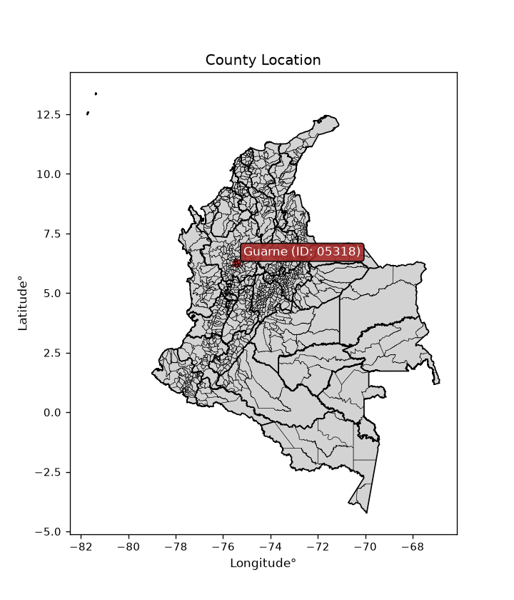
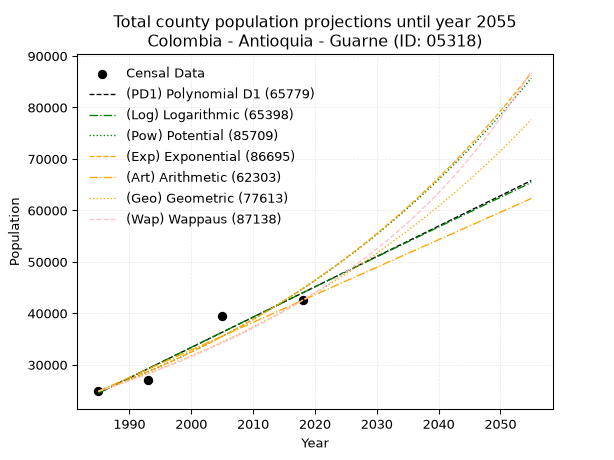
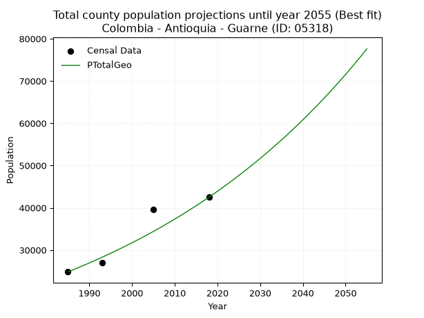
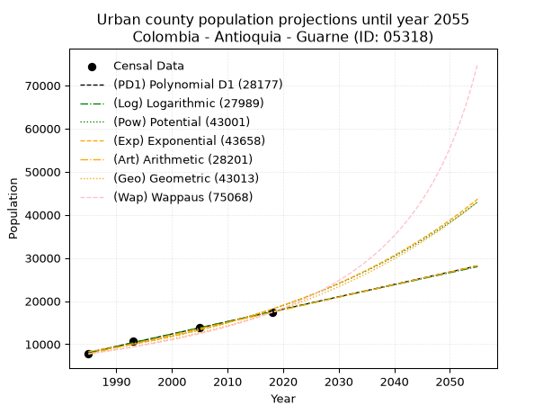
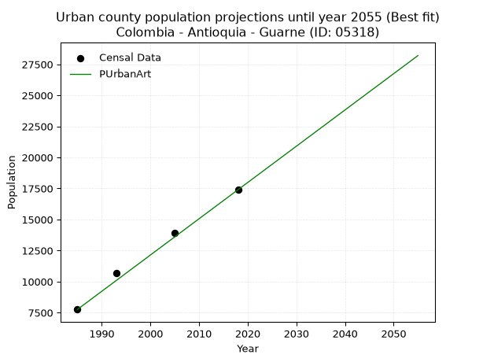
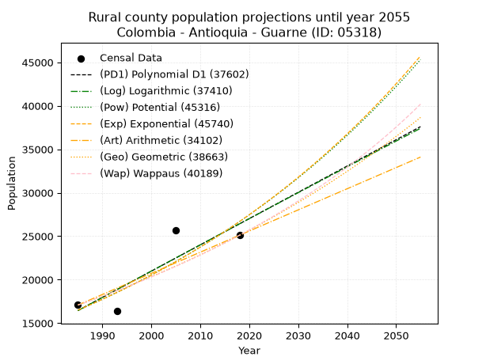
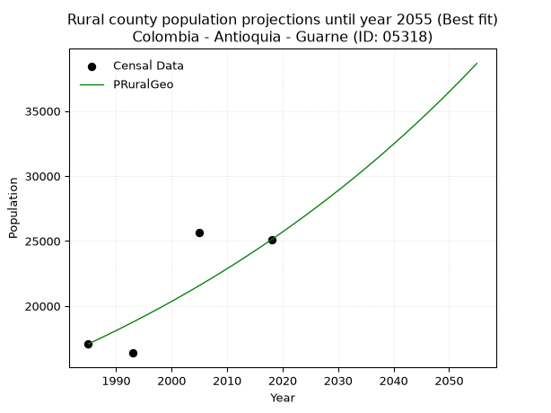

<div align="center">


</div>

# _“Population and Public Services Demand Projections (PPSD) until Year 2050 for Colombia - Antioquia - Guarne (ID: 05318)”_
Keywords: `population` `public-service` `projection` `lineal` `polynomial` `logarithmic` `potential` `exponential` `arithmetic` `geometric` `wappaus` `dane` `colombia` `south-america`

PPSD are analytical estimates used by governments and planners to anticipate future changes in population size, age distribution, and the resulting community needs for utilities, healthcare, education, and infrastructure as sizing future water treatment facilities, electrical grids, and road networks based on spatial growth.

<div align="center">

</img>

</div>


> **General running parameters**: • app_version: _v20260806_. • Python version: _3.14.7_. • Pandas version: _3.0.5_. • NumPy version: _2.5.1_. • Creates, save and include plots into reports (create_plot): _False_. • Projection until year: _2050_. • Process polynomial degree 2 and up: _False_. • Process Wappaus: _True_. • Process Wappaus: _True_. • Set negative values to zero: _True_. • Set infinite values to zero: _True_. • Drop dataset notes: _True_. 
<div align="center">

Dynamic map: [:earth_americas:Google](http://maps.google.com/maps?q=6.277870484,-75.4416115) [:earth_americas:OSM](https://www.openstreetmap.org/#map=18/6.277870484/-75.4416115&layers=P) [:earth_americas:Bing](https://www.bing.com/maps?cp=6.277870484~-75.4416115&lvl=18) [:earth_americas:Apple](https://maps.apple.com/frame?center=6.277870484%2C-75.4416115&span=0.003%2C0.006)

</div>


<div align="center">

```geojson
{
  "type": "Feature",
  "geometry": {
    "type": "Point", 
    "coordinates": [-75.4416115, 6.277870484]
  }, 
  "properties": {
    "Name": "Colombia - Antioquia - Guarne (ID: 05318)"
  }
}
```

</div>


## 0. Census Data (4 records)

Census data are official statistics collected by a government about the people and housing in a country. They usually include counts of total population, age, sex, race, income, education, and jobs.

📅Global census file: [Population.xlsx](../data/Population.xlsx)

| Source   |   Year |   CountryID | CountryName   |   StateID | StateName   |   CountyID | CountyName   |   PTotal |   PUrban |   PRural |
|:---------|-------:|------------:|:--------------|----------:|:------------|-----------:|:-------------|---------:|---------:|---------:|
| DANE     |   1985 |          57 | Colombia      |        05 | Antioquia   |      05318 | Guarne       |    24838 |     7759 |    17079 |
| DANE     |   1993 |          57 | Colombia      |        05 | Antioquia   |      05318 | Guarne       |    27038 |    10660 |    16378 |
| DANE     |   2005 |          57 | Colombia      |        05 | Antioquia   |      05318 | Guarne       |    39541 |    13891 |    25650 |
| DANE     |   2018 |          57 | Colombia      |        05 | Antioquia   |      05318 | Guarne       |    42500 |    17396 |    25104 |

> 🔥Some records could had specific notes about the registered values or the corresponding urban or rural distribution.

📅[SUI-RUPS](https://www.datos.gov.co/Hacienda-y-Cr-dito-P-blico/Registro-nico-de-Prestadores-de-Servicios-P-blicos/4qkq-csdn/about_data) - Local public utility companies: [RUPS.csv](../data/RUPS.xlsx)

 | SERVICIO       | ESTADO    | NOMBRE                                                                                | NIT         | DEPARTAMENTO_DOMICILIO   | MUNICIPIO_DOMICILIO   | DIRECCION                                                  |   TELEFONO | EMAIL                                   | TIPO_PRESTADOR                            | CLASIFICACION                  |
|:---------------|:----------|:--------------------------------------------------------------------------------------|:------------|:-------------------------|:----------------------|:-----------------------------------------------------------|-----------:|:----------------------------------------|:------------------------------------------|:-------------------------------|
| ACUEDUCTO      | OPERATIVA | EMPRESA DE SERVICIOS PUBLICOS DOMICILIARIOS DE GUARNE AQUATERRA E.S.P                 | 811013060-0 | ANTIOQUIA                | GUARNE                | Carrera 50  No.42-100 Local 209                            |    5515184 | juanfernandomanrique5@hotmail.com       | EMPRESA INDUSTRIAL Y COMERCIAL DEL ESTADO | MAYOR O IGUAL A 5001 USUARIOS  |
| ALCANTARILLADO | OPERATIVA | EMPRESA DE SERVICIOS PUBLICOS DOMICILIARIOS DE GUARNE AQUATERRA E.S.P                 | 811013060-0 | ANTIOQUIA                | GUARNE                | Carrera 50  No.42-100 Local 209                            |    5515184 | juanfernandomanrique5@hotmail.com       | EMPRESA INDUSTRIAL Y COMERCIAL DEL ESTADO | MAYOR O IGUAL A 5001 USUARIOS  |
| ACUEDUCTO      | OPERATIVA | ASOCIACION DE SUSCRIPTORES DEL ACUEDUCTO HONDITA HOJAS ANCHAS DEL MUNICIPIO DE GUARNE | 811005433-0 | ANTIOQUIA                | GUARNE                | AUT MEDELLIN BOGOTA MALL MIRADOR DE LOS COMUNEROS KM 25+90 |    5575609 | acueductohha@une.net.co                 | ORGANIZACION AUTORIZADA                   | MENOR O IGUAL A 2500 USUARIOS  |
| ACUEDUCTO      | OPERATIVA | ASOCIACION DE SUSCRIPTORES DEL ACUEDUCTO MULTIVEREDAL JUAN XXIII CHAPARRAL            | 811041559-2 | ANTIOQUIA                | GUARNE                | VEREDA CHAPARRAL SECTOR CUATRO ESQUINAS                    |    4187603 | acue232003@hotmail.com                  | ORGANIZACION AUTORIZADA                   | MENOR O IGUAL A 2500 USUARIOS  |
| ACUEDUCTO      | OPERATIVA | ASOCIACION DE USUARIOS DEL ACUEDUCTO VEREDAL SAN JOSE                                 | 800239626-1 | ANTIOQUIA                | GUARNE                | Cra 50 No. 42-100 Centro Integrado de Guarne local 213     |    5512233 | gusta707@gmail.com                      | ORGANIZACION AUTORIZADA                   | MENOR O IGUAL A 2500 USUARIOS  |
| ACUEDUCTO      | OPERATIVA | ASOCIACION DE USUARIOS DEL ACUEDUCTO ENSENILLO                                        | 811034665-6 | ANTIOQUIA                | GUARNE                | VEREDA EL SALADO                                           |    5677057 | yereva15@gmail.com                      | ORGANIZACION AUTORIZADA                   | MENOR O IGUAL A 2500 USUARIOS  |
| ACUEDUCTO      | OPERATIVA | ASOCIACION DE USUARIOS DEL ACUEDUCTO VEREDAL LA CLARA                                 | 811010552-9 | ANTIOQUIA                | GUARNE                | VEREDA LA CLARA                                            |    3576807 | verajaime707@gmail.com                  | ORGANIZACION AUTORIZADA                   | MENOR O IGUAL A 2500 USUARIOS  |
| ACUEDUCTO      | OPERATIVA | ASOCIACION DE USUARIOS DEL ACUEDUCTO MULTIVEREDAL EL MOLINO                           | 811014018-5 | ANTIOQUIA                | GUARNE                | PALACIO MUNICIPAL                                          |    5512998 | acumultimolino@gmail.com                | ORGANIZACION AUTORIZADA                   | HASTA 2500 SUSCRIPTORES        |
| ACUEDUCTO      | OPERATIVA | CORPORACION ACUEDUCTO MULTIVEREDAL CARMIN, CUCHILLAS, MAMPUESTO Y ANEXOS              | 811015801-0 | ANTIOQUIA                | RIONEGRO              | CRA 47 N. 54-13, INT 205 SECTOR GALERIA                    |    5904592 | direccionadministrativa@camrionegro.com | ORGANIZACION AUTORIZADA                   | DESDE 2501 HASTA 5000 USUARIOS |
| ACUEDUCTO      | OPERATIVA | ASOCIACIÓN DE USUARIOS DEL ACUEDUCTO EL ROSARIO PIEDRAS BLANCAS                       | 811019123-3 | ANTIOQUIA                | GUARNE                | Vereda Piedras Blancas                                     |    4797979 | acueductorosario@hotmail.com            | ORGANIZACION AUTORIZADA                   | MENOR O IGUAL A 2500 USUARIOS  |
| ACUEDUCTO      | OPERATIVA | ASOCIACION DE USUARIOS DEL ACUEDUCTO ALTO DE LA VIRGEN                                | 811012792-9 | ANTIOQUIA                | GUARNE                | VEREDA ALTO DE LA VIRGEN                                   |    6118637 | verajaime707@gmail.com                  | ORGANIZACION AUTORIZADA                   | MENOR O IGUAL A 2500 USUARIOS  |
| ACUEDUCTO      | OPERATIVA | CORPORACION LA ENEA                                                                   | 811026592-3 | ANTIOQUIA                | RIONEGRO              | CALLE 60 # 47-63 BARRIO LOS LAGOS                          |    5661874 | acueducto@corporacionlaenea.com.co      | ORGANIZACION AUTORIZADA                   | MENOR O IGUAL A 2500 USUARIOS  |
| ACUEDUCTO      | OPERATIVA | ASOCIACIÓN DE USUARIOS DEL ACUEDUCTO Y ALCANTARILLADO SAN IGNACIO                     | 811021792-7 | ANTIOQUIA                | GUARNE                | VEREDA SAN IGNACIO                                         |    5380007 | asuasi538@gmail.com                     | ORGANIZACION AUTORIZADA                   | MENOR O IGUAL A 2500 USUARIOS  |
| ACUEDUCTO      | OPERATIVA | ASOCIACION DE USUARIOS DEL ACUEDUCTO DE LA VEREDA LA BRIZUELA                         | 811032756-9 | ANTIOQUIA                | GUARNE                | VEREDA LA BRIZUELA                                         |    5517004 | yereva15@gmail.com                      | ORGANIZACION AUTORIZADA                   | MENOR O IGUAL A 2500 USUARIOS  |
| ACUEDUCTO      | OPERATIVA | ASOCIACION DE SUSCRIPTORES ACUEDUCTO MULTIVEREDAL EL COLORADO ASUCOL                  | 811036205-0 | ANTIOQUIA                | GUARNE                | CARRERA 50 No 42-100 local 231                             |    5676158 | gusta707@gmail.com                      | ORGANIZACION AUTORIZADA                   | MENOR O IGUAL A 2500 USUARIOS  |
| ACUEDUCTO      | OPERATIVA | ASOCIACION DE SUSCRIPTORES AGUAS LA CHORRERA                                          | 811035155-6 | ANTIOQUIA                | GUARNE                | VEREDA LA MOSQUITA                                         |    4798990 | verajaime707@gmail.com                  | ORGANIZACION AUTORIZADA                   | MENOR O IGUAL A 2500 USUARIOS  |
| ACUEDUCTO      | OPERATIVA | ASOCIACIÓN DE SUSCRIPTORES DEL ACUEDUCTO MULTIVEREDAL EL ROBLE                        | 811012178-6 | ANTIOQUIA                | GUARNE                | VEREDA LA ENEA GUARNE                                      |    8544062 | lgcarvajal2009@hotmail.com              | ORGANIZACION AUTORIZADA                   | MENOR O IGUAL A 2500 USUARIOS  |
| ACUEDUCTO      | OPERATIVA | ASOCIACION DE USUARIOS DEL SERVICIO DE ACUEDUCTO DE LA VEREDA EL SANGO                | 811026500-6 | ANTIOQUIA                | GUARNE                | AUT MEDELLIN BOGOTA KM 19, VEREDA EL SANGO                 |    5512724 | yola_mallely@yahoo.es                   | ORGANIZACION AUTORIZADA                   | MENOR O IGUAL A 2500 USUARIOS  |
| ACUEDUCTO      | OPERATIVA | ASOCIACION ACUEDUCTO VEREDA LA MEJIA                                                  | 900130615-1 | ANTIOQUIA                | GUARNE                | VEREDA LA MEJIA                                            |    5578093 | yereva15@gmail.com                      | ORGANIZACION AUTORIZADA                   | MENOR O IGUAL A 2500 USUARIOS  |
| ACUEDUCTO      | OPERATIVA | ASOCIACION DE USUARIOS DEL ACUEDUCTO CAÑADA HONDA                                     | 811027970-9 | ANTIOQUIA                | GUARNE                | Vereda Canoas                                              |    5676330 | navarroabogados@colombia.com            | ORGANIZACION AUTORIZADA                   | HASTA 2500 SUSCRIPTORES        |
| ACUEDUCTO      | OPERATIVA | ASOCIACION DE USUARIOS DEL ACUEDUCTO DE LA VEREDA ROMERAL                             | 811002916-2 | ANTIOQUIA                | GUARNE                | cra 48 41b04                                               |    3576807 | verajaime707@gmail.com                  | ORGANIZACION AUTORIZADA                   | MENOR O IGUAL A 2500 USUARIOS  |
| ACUEDUCTO      | OPERATIVA | ASOCIACION ACUEDUCTO GUAPANTE ASOAGUA                                                 | 830504549-6 | ANTIOQUIA                | GUARNE                | VEREDA GUAPANTE                                            |    2432415 | verajaime707@gmail.com                  | ORGANIZACION AUTORIZADA                   | MENOR O IGUAL A 2500 USUARIOS  |
| ACUEDUCTO      | OPERATIVA | ASOCIACION DE SUSCRIPTORES DEL ACUEDUCTO BARRIO SAN ANTONIO AGUASANAN                 | 900369413-8 | ANTIOQUIA                | GUARNE                | BARRIO SAN ANTONIO                                         |    5677648 | verajaime707@gmail.com                  | ORGANIZACION AUTORIZADA                   | MENOR O IGUAL A 2500 USUARIOS  |
| ACUEDUCTO      | OPERATIVA | ASOCIACION DE USUARIOS DEL SERVICIO DE ACUEDUCTO DE LA VEREDA YOLOMBAL                | 811031151-9 | ANTIOQUIA                | GUARNE                | VEREDA YOLOMBAL                                            |    5677648 | juanfernandomanrique5@hotmail.com       | ORGANIZACION AUTORIZADA                   | MENOR O IGUAL A 2500 USUARIOS  |
| ACUEDUCTO      | OPERATIVA | ASOCIACION DE USUARIOS DEL ACUEDUCTO VEREDAL LA PASTORCITA                            | 811039734-9 | ANTIOQUIA                | GUARNE                | VEREDA LA PASTORCITA                                       |    2919899 | verajaime707@gmail.com                  | ORGANIZACION AUTORIZADA                   | MENOR O IGUAL A 2500 USUARIOS  |
| ACUEDUCTO      | OPERATIVA | ASOCIACION DE USUARIOS ACUEDUCTO LA CHARANGA PARTE ALTA                               | 811046154-6 | ANTIOQUIA                | GUARNE                | VEREDA LA CHARANGA                                         |    2432415 | verajaime707@gmail.com                  | ORGANIZACION AUTORIZADA                   | MENOR O IGUAL A 2500 USUARIOS  |
| ACUEDUCTO      | OPERATIVA | ASOCIACION DE USUARIOS DEL ACUEDUCTO DE LA VEREDA SAN ISIDRO                          | 811022096-3 | ANTIOQUIA                | GUARNE                | VEREDA SAN ISIDRO                                          |    5517014 | yereva15@gmail.com                      | ORGANIZACION AUTORIZADA                   | MENOR O IGUAL A 2500 USUARIOS  |
| ACUEDUCTO      | OPERATIVA | ASOCIACION DE USUARIOS DEL ACUEDUCTO MONTANES EL AGUACATE                             | 811028003-6 | ANTIOQUIA                | GUARNE                | CL 51 No 51-25                                             |    5512344 | sandramilena39448@gmail.com             | ORGANIZACION AUTORIZADA                   | MENOR O IGUAL A 2500 USUARIOS  |

## 1. Total

### 1.1. Coefficients and Parameters

* (PD1) Polynomial Deg 1: 589.9474106784395, -1146563.0582095487 (lineal)
* (Log) Logarithmic: 1181182.1918572653, -8944696.055707118
* (Pow) Potential: 35.77841183367838, -113.59411885500984
* (Exp) Exponential: 0.017868044626148518, 9.799537425898371e-12
* (Art) Arithmetic: Year diff. 2018 - 1985 = 33, Population diff. 42500 - 24838 = 17662, Annual growth = 535.2121212121212
* (Geo) Geometric: Year diff. 2018 - 1985 = 33, Population diff. 42500 - 24838 = 17662, Annual growth % = 0.016409832827342097
* (Wap) Wappaus: i = 1.5896288016042093, Condition values only valid for < 200)

<sub>
Wappaus condition values: ['0.00', '1.59', '3.18', '4.77', '6.36', '7.95', '9.54', '11.13', '12.72', '14.31', '15.90', '17.49', '19.08', '20.67', '22.25', '23.84', '25.43', '27.02', '28.61', '30.20', '31.79', '33.38', '34.97', '36.56', '38.15', '39.74', '41.33', '42.92', '44.51', '46.10', '47.69', '49.28', '50.87', '52.46', '54.05', '55.64', '57.23', '58.82', '60.41', '62.00', '63.59', '65.17', '66.76', '68.35', '69.94', '71.53', '73.12', '74.71', '76.30', '77.89', '79.48', '81.07', '82.66', '84.25', '85.84', '87.43', '89.02', '90.61', '92.20', '93.79', '95.38', '96.97', '98.56', '100.15', '101.74', '103.33']
</sub>


### 1.2. Projected Dataset

|   Year |   CountyID |   PTotalPD1 |   PTotalLog |   PTotalPow |   PTotalExp |   PTotalArt |   PTotalGeo |   PTotalWap |
|-------:|-----------:|------------:|------------:|------------:|------------:|------------:|------------:|------------:|
|   1985 |      05318 |       24483 |       24462 |       24804 |       24819 |       24838 |       24838 |       24838 |
|   1986 |      05318 |       25072 |       25057 |       25255 |       25267 |       25373 |       25246 |       25236 |
|   1987 |      05318 |       25662 |       25652 |       25714 |       25722 |       25908 |       25660 |       25640 |
|   1988 |      05318 |       26252 |       26246 |       26181 |       26186 |       26444 |       26081 |       26051 |
|   1989 |      05318 |       26842 |       26840 |       26656 |       26658 |       26979 |       26509 |       26469 |
|   1990 |      05318 |       27432 |       27434 |       27140 |       27139 |       27514 |       26944 |       26894 |
|   1991 |      05318 |       28022 |       28027 |       27632 |       27628 |       28049 |       27386 |       27326 |
|   1992 |      05318 |       28612 |       28620 |       28133 |       28126 |       28584 |       27835 |       27765 |
|   1993 |      05318 |       29202 |       29213 |       28643 |       28633 |       29120 |       28292 |       28211 |
|   1994 |      05318 |       29792 |       29806 |       29161 |       29150 |       29655 |       28757 |       28665 |
|   1995 |      05318 |       30382 |       30398 |       29689 |       29675 |       30190 |       29228 |       29127 |
|   1996 |      05318 |       30972 |       30990 |       30226 |       30210 |       30725 |       29708 |       29597 |
|   1997 |      05318 |       31562 |       31581 |       30773 |       30755 |       31261 |       30196 |       30076 |
|   1998 |      05318 |       32152 |       32173 |       31329 |       31309 |       31796 |       30691 |       30562 |
|   1999 |      05318 |       32742 |       32764 |       31895 |       31874 |       32331 |       31195 |       31058 |
|   2000 |      05318 |       33332 |       33355 |       32471 |       32448 |       32866 |       31707 |       31562 |
|   2001 |      05318 |       33922 |       33945 |       33057 |       33033 |       33401 |       32227 |       32076 |
|   2002 |      05318 |       34512 |       34535 |       33653 |       33629 |       33937 |       32756 |       32599 |
|   2003 |      05318 |       35102 |       35125 |       34260 |       34235 |       34472 |       33293 |       33131 |
|   2004 |      05318 |       35692 |       35715 |       34877 |       34852 |       35007 |       33840 |       33674 |
|   2005 |      05318 |       36282 |       36304 |       35505 |       35481 |       35542 |       34395 |       34227 |
|   2006 |      05318 |       36871 |       36893 |       36144 |       36120 |       36077 |       34959 |       34791 |
|   2007 |      05318 |       37461 |       37481 |       36794 |       36772 |       36613 |       35533 |       35365 |
|   2008 |      05318 |       38051 |       38070 |       37456 |       37434 |       37148 |       36116 |       35951 |
|   2009 |      05318 |       38641 |       38658 |       38129 |       38109 |       37683 |       36709 |       36548 |
|   2010 |      05318 |       39231 |       39246 |       38814 |       38796 |       38218 |       37311 |       37157 |
|   2011 |      05318 |       39821 |       39833 |       39511 |       39496 |       38754 |       37923 |       37778 |
|   2012 |      05318 |       40411 |       40420 |       40220 |       40208 |       39289 |       38546 |       38411 |
|   2013 |      05318 |       41001 |       41007 |       40942 |       40933 |       39824 |       39178 |       39058 |
|   2014 |      05318 |       41591 |       41594 |       41676 |       41671 |       40359 |       39821 |       39718 |
|   2015 |      05318 |       42181 |       42180 |       42422 |       42422 |       40894 |       40475 |       40392 |
|   2016 |      05318 |       42771 |       42766 |       43182 |       43187 |       41430 |       41139 |       41080 |
|   2017 |      05318 |       43361 |       43352 |       43955 |       43965 |       41965 |       41814 |       41782 |
|   2018 |      05318 |       43951 |       43938 |       44742 |       44758 |       42500 |       42500 |       42500 |
|   2019 |      05318 |       44541 |       44523 |       45542 |       45565 |       43035 |       43197 |       43233 |
|   2020 |      05318 |       45131 |       45108 |       46356 |       46387 |       43570 |       43906 |       43983 |
|   2021 |      05318 |       45721 |       45692 |       47184 |       47223 |       44106 |       44627 |       44749 |
|   2022 |      05318 |       46311 |       46277 |       48026 |       48074 |       44641 |       45359 |       45533 |
|   2023 |      05318 |       46901 |       46861 |       48884 |       48941 |       45176 |       46103 |       46334 |
|   2024 |      05318 |       47491 |       47444 |       49756 |       49823 |       45711 |       46860 |       47154 |
|   2025 |      05318 |       48080 |       48028 |       50643 |       50721 |       46246 |       47629 |       47993 |
|   2026 |      05318 |       48670 |       48611 |       51545 |       51636 |       46782 |       48411 |       48851 |
|   2027 |      05318 |       49260 |       49194 |       52463 |       52567 |       47317 |       49205 |       49731 |
|   2028 |      05318 |       49850 |       49776 |       53397 |       53515 |       47852 |       50012 |       50631 |
|   2029 |      05318 |       50440 |       50359 |       54348 |       54479 |       48387 |       50833 |       51554 |
|   2030 |      05318 |       51030 |       50941 |       55314 |       55462 |       48923 |       51667 |       52499 |
|   2031 |      05318 |       51620 |       51522 |       56297 |       56461 |       49458 |       52515 |       53468 |
|   2032 |      05318 |       52210 |       52104 |       57298 |       57479 |       49993 |       53377 |       54461 |
|   2033 |      05318 |       52800 |       52685 |       58315 |       58516 |       50528 |       54253 |       55480 |
|   2034 |      05318 |       53390 |       53266 |       59350 |       59571 |       51063 |       55143 |       56526 |
|   2035 |      05318 |       53980 |       53846 |       60403 |       60645 |       51599 |       56048 |       57599 |
|   2036 |      05318 |       54570 |       54427 |       61474 |       61738 |       52134 |       56968 |       58701 |
|   2037 |      05318 |       55160 |       55007 |       62564 |       62851 |       52669 |       57902 |       59833 |
|   2038 |      05318 |       55750 |       55586 |       63672 |       63984 |       53204 |       58853 |       60996 |
|   2039 |      05318 |       56340 |       56166 |       64800 |       65138 |       53739 |       59818 |       62191 |
|   2040 |      05318 |       56930 |       56745 |       65947 |       66312 |       54275 |       60800 |       63420 |
|   2041 |      05318 |       57520 |       57324 |       67113 |       67507 |       54810 |       61798 |       64684 |
|   2042 |      05318 |       58110 |       57903 |       68300 |       68725 |       55345 |       62812 |       65985 |
|   2043 |      05318 |       58700 |       58481 |       69507 |       69964 |       55880 |       63843 |       67324 |
|   2044 |      05318 |       59289 |       59059 |       70734 |       71225 |       56416 |       64890 |       68703 |
|   2045 |      05318 |       59879 |       59637 |       71983 |       72509 |       56951 |       65955 |       70125 |
|   2046 |      05318 |       60469 |       60214 |       73253 |       73816 |       57486 |       67037 |       71590 |
|   2047 |      05318 |       61059 |       60791 |       74545 |       75147 |       58021 |       68137 |       73101 |
|   2048 |      05318 |       61649 |       61368 |       75859 |       76502 |       58556 |       69256 |       74660 |
|   2049 |      05318 |       62239 |       61945 |       77196 |       77881 |       59092 |       70392 |       76269 |
|   2050 |      05318 |       62829 |       62521 |       78555 |       79285 |       59627 |       71547 |       77932 |
<div align="center">

</img>

</div>


### 1.3. Best fit with absolute and relative error (%)

Relative error puts that difference into context by dividing the absolute error by the true value, creating a unitless ratio or percentage that shows the scale of the mistake.

Absolute and relative error

|   Year | Source   |   CountryID | CountryName   |   StateID | StateName   |   CountyID_x | CountyName   |   PTotal |   PUrban |   PRural |   CountyID_y |   PTotalPD1 |   PTotalLog |   PTotalPow |   PTotalExp |   PTotalArt |   PTotalGeo |   PTotalWap |   PTotalPD1AbsError |   PTotalLogAbsError |   PTotalPowAbsError |   PTotalExpAbsError |   PTotalArtAbsError |   PTotalGeoAbsError |   PTotalWapAbsError |   PTotalPD1RelError |   PTotalLogRelError |   PTotalPowRelError |   PTotalExpRelError |   PTotalArtRelError |   PTotalGeoRelError |   PTotalWapRelError |
|-------:|:---------|------------:|:--------------|----------:|:------------|-------------:|:-------------|---------:|---------:|---------:|-------------:|------------:|------------:|------------:|------------:|------------:|------------:|------------:|--------------------:|--------------------:|--------------------:|--------------------:|--------------------:|--------------------:|--------------------:|--------------------:|--------------------:|--------------------:|--------------------:|--------------------:|--------------------:|--------------------:|
|   1985 | DANE     |          57 | Colombia      |        05 | Antioquia   |        05318 | Guarne       |    24838 |     7759 |    17079 |        05318 |       24483 |       24462 |       24804 |       24819 |       24838 |       24838 |       24838 |                 355 |                 376 |                  34 |                  19 |                   0 |                   0 |                   0 |             1.42926 |             1.51381 |            0.136887 |           0.0764957 |             0       |             0       |             0       |
|   1993 | DANE     |          57 | Colombia      |        05 | Antioquia   |        05318 | Guarne       |    27038 |    10660 |    16378 |        05318 |       29202 |       29213 |       28643 |       28633 |       29120 |       28292 |       28211 |                2164 |                2175 |                1605 |                1595 |                2082 |                1254 |                1173 |             8.00355 |             8.04423 |            5.93609  |           5.8991    |             7.70027 |             4.63792 |             4.33834 |
|   2005 | DANE     |          57 | Colombia      |        05 | Antioquia   |        05318 | Guarne       |    39541 |    13891 |    25650 |        05318 |       36282 |       36304 |       35505 |       35481 |       35542 |       34395 |       34227 |                3259 |                3237 |                4036 |                4060 |                3999 |                5146 |                5314 |             8.24208 |             8.18644 |           10.2071   |          10.2678    |            10.1136  |            13.0143  |            13.4392  |
|   2018 | DANE     |          57 | Colombia      |        05 | Antioquia   |        05318 | Guarne       |    42500 |    17396 |    25104 |        05318 |       43951 |       43938 |       44742 |       44758 |       42500 |       42500 |       42500 |                1451 |                1438 |                2242 |                2258 |                   0 |                   0 |                   0 |             3.41412 |             3.38353 |            5.27529  |           5.31294   |             0       |             0       |             0       |

Relative error mean

| Method    |   RelError | Best   |
|:----------|-----------:|:-------|
| PTotalPD1 |    5.27225 |        |
| PTotalLog |    5.282   |        |
| PTotalPow |    5.38885 |        |
| PTotalExp |    5.38909 |        |
| PTotalArt |    4.45346 |        |
| PTotalGeo |    4.41306 | True   |
| PTotalWap |    4.44439 |        |

💙Best method: _**PTotalGeo**_
<div align="center">

</img>

</div>


### 1.4. Fresh water supply demand in liters per capita per day (lpcd)

The fresh water supply demand typically ranges from 100 to 300 liters per capita per day (lpcd) for standard domestic and municipal planning, though absolute survival minimums set by the World Health Organization are as low as 7.5 to 20 liters per day, and total consumption in high-income nations can exceed 400 liters.

> `CZ`: Level in meters above the sea level (masl)<br> `WS`: Fresh water supply demand in liters per capita per day (lpcd or l/h/d)<br> `WSAll`: Zonal fresh water supply demand in liters per second (l/s)<br> `A`: Zonal area in square meters<br> `DP`: Population density (people/hectare or p/ha)

Reference values (RAS Colombia)

|    CZ |   WS |
|------:|-----:|
|  1000 |  120 |
|  2000 |  130 |
| 99999 |  140 |

County shapefile geometry properties and water supply values

|   CountyID |      ATotal |   CZTotal |   WSTotal |
|-----------:|------------:|----------:|----------:|
|      05318 | 1.52156e+08 |   2300.76 |       140 |

Projected values for best method: PTotalGeo

|   CountyID |   Year |   PTotalGeo |   DPTotal |   WSTotal |   WSTotalAll |
|-----------:|-------:|------------:|----------:|----------:|-------------:|
|      05318 |   1985 |       24838 |      1.63 |       140 |      40.2468 |
|      05318 |   1986 |       25246 |      1.66 |       140 |      40.9079 |
|      05318 |   1987 |       25660 |      1.69 |       140 |      41.5787 |
|      05318 |   1988 |       26081 |      1.71 |       140 |      42.2609 |
|      05318 |   1989 |       26509 |      1.74 |       140 |      42.9544 |
|      05318 |   1990 |       26944 |      1.77 |       140 |      43.6593 |
|      05318 |   1991 |       27386 |      1.8  |       140 |      44.3755 |
|      05318 |   1992 |       27835 |      1.83 |       140 |      45.103  |
|      05318 |   1993 |       28292 |      1.86 |       140 |      45.8435 |
|      05318 |   1994 |       28757 |      1.89 |       140 |      46.597  |
|      05318 |   1995 |       29228 |      1.92 |       140 |      47.3602 |
|      05318 |   1996 |       29708 |      1.95 |       140 |      48.138  |
|      05318 |   1997 |       30196 |      1.98 |       140 |      48.9287 |
|      05318 |   1998 |       30691 |      2.02 |       140 |      49.7308 |
|      05318 |   1999 |       31195 |      2.05 |       140 |      50.5475 |
|      05318 |   2000 |       31707 |      2.08 |       140 |      51.3771 |
|      05318 |   2001 |       32227 |      2.12 |       140 |      52.2197 |
|      05318 |   2002 |       32756 |      2.15 |       140 |      53.0769 |
|      05318 |   2003 |       33293 |      2.19 |       140 |      53.947  |
|      05318 |   2004 |       33840 |      2.22 |       140 |      54.8333 |
|      05318 |   2005 |       34395 |      2.26 |       140 |      55.7326 |
|      05318 |   2006 |       34959 |      2.3  |       140 |      56.6465 |
|      05318 |   2007 |       35533 |      2.34 |       140 |      57.5766 |
|      05318 |   2008 |       36116 |      2.37 |       140 |      58.5213 |
|      05318 |   2009 |       36709 |      2.41 |       140 |      59.4822 |
|      05318 |   2010 |       37311 |      2.45 |       140 |      60.4576 |
|      05318 |   2011 |       37923 |      2.49 |       140 |      61.4493 |
|      05318 |   2012 |       38546 |      2.53 |       140 |      62.4588 |
|      05318 |   2013 |       39178 |      2.57 |       140 |      63.4829 |
|      05318 |   2014 |       39821 |      2.62 |       140 |      64.5248 |
|      05318 |   2015 |       40475 |      2.66 |       140 |      65.5845 |
|      05318 |   2016 |       41139 |      2.7  |       140 |      66.6604 |
|      05318 |   2017 |       41814 |      2.75 |       140 |      67.7542 |
|      05318 |   2018 |       42500 |      2.79 |       140 |      68.8657 |
|      05318 |   2019 |       43197 |      2.84 |       140 |      69.9951 |
|      05318 |   2020 |       43906 |      2.89 |       140 |      71.144  |
|      05318 |   2021 |       44627 |      2.93 |       140 |      72.3123 |
|      05318 |   2022 |       45359 |      2.98 |       140 |      73.4984 |
|      05318 |   2023 |       46103 |      3.03 |       140 |      74.7039 |
|      05318 |   2024 |       46860 |      3.08 |       140 |      75.9306 |
|      05318 |   2025 |       47629 |      3.13 |       140 |      77.1766 |
|      05318 |   2026 |       48411 |      3.18 |       140 |      78.4437 |
|      05318 |   2027 |       49205 |      3.23 |       140 |      79.7303 |
|      05318 |   2028 |       50012 |      3.29 |       140 |      81.038  |
|      05318 |   2029 |       50833 |      3.34 |       140 |      82.3683 |
|      05318 |   2030 |       51667 |      3.4  |       140 |      83.7197 |
|      05318 |   2031 |       52515 |      3.45 |       140 |      85.0938 |
|      05318 |   2032 |       53377 |      3.51 |       140 |      86.4905 |
|      05318 |   2033 |       54253 |      3.57 |       140 |      87.91   |
|      05318 |   2034 |       55143 |      3.62 |       140 |      89.3521 |
|      05318 |   2035 |       56048 |      3.68 |       140 |      90.8185 |
|      05318 |   2036 |       56968 |      3.74 |       140 |      92.3093 |
|      05318 |   2037 |       57902 |      3.81 |       140 |      93.8227 |
|      05318 |   2038 |       58853 |      3.87 |       140 |      95.3637 |
|      05318 |   2039 |       59818 |      3.93 |       140 |      96.9273 |
|      05318 |   2040 |       60800 |      4    |       140 |      98.5185 |
|      05318 |   2041 |       61798 |      4.06 |       140 |     100.136  |
|      05318 |   2042 |       62812 |      4.13 |       140 |     101.779  |
|      05318 |   2043 |       63843 |      4.2  |       140 |     103.449  |
|      05318 |   2044 |       64890 |      4.26 |       140 |     105.146  |
|      05318 |   2045 |       65955 |      4.33 |       140 |     106.872  |
|      05318 |   2046 |       67037 |      4.41 |       140 |     108.625  |
|      05318 |   2047 |       68137 |      4.48 |       140 |     110.407  |
|      05318 |   2048 |       69256 |      4.55 |       140 |     112.22   |
|      05318 |   2049 |       70392 |      4.63 |       140 |     114.061  |
|      05318 |   2050 |       71547 |      4.7  |       140 |     115.933  |

## 2. Urban

### 2.1. Coefficients and Parameters

* (PD1) Polynomial Deg 1: 287.6780409474082, -563001.5014050533 (lineal)
* (Log) Logarithmic: 575894.1967953558, -4364949.904767964
* (Pow) Potential: 47.57110900396669, -152.96065201338135
* (Exp) Exponential: 0.023756775410713964, 2.7398965796938287e-17
* (Art) Arithmetic: Year diff. 2018 - 1985 = 33, Population diff. 17396 - 7759 = 9637, Annual growth = 292.030303030303
* (Geo) Geometric: Year diff. 2018 - 1985 = 33, Population diff. 17396 - 7759 = 9637, Annual growth % = 0.02476802276426282
* (Wap) Wappaus: i = 2.3218469730097637, Condition values only valid for < 200)

<sub>
Wappaus condition values: ['0.00', '2.32', '4.64', '6.97', '9.29', '11.61', '13.93', '16.25', '18.57', '20.90', '23.22', '25.54', '27.86', '30.18', '32.51', '34.83', '37.15', '39.47', '41.79', '44.12', '46.44', '48.76', '51.08', '53.40', '55.72', '58.05', '60.37', '62.69', '65.01', '67.33', '69.66', '71.98', '74.30', '76.62', '78.94', '81.26', '83.59', '85.91', '88.23', '90.55', '92.87', '95.20', '97.52', '99.84', '102.16', '104.48', '106.80', '109.13', '111.45', '113.77', '116.09', '118.41', '120.74', '123.06', '125.38', '127.70', '130.02', '132.35', '134.67', '136.99', '139.31', '141.63', '143.95', '146.28', '148.60', '150.92']
</sub>


### 2.2. Projected Dataset

|   Year |   CountyID |   PUrbanPD1 |   PUrbanLog |   PUrbanPow |   PUrbanExp |   PUrbanArt |   PUrbanGeo |   PUrbanWap |
|-------:|-----------:|------------:|------------:|------------:|------------:|------------:|------------:|------------:|
|   1985 |      05318 |        8039 |        8030 |        8269 |        8276 |        7759 |        7759 |        7759 |
|   1986 |      05318 |        8327 |        8320 |        8470 |        8475 |        8051 |        7951 |        7941 |
|   1987 |      05318 |        8615 |        8610 |        8675 |        8679 |        8343 |        8148 |        8128 |
|   1988 |      05318 |        8902 |        8900 |        8885 |        8888 |        8635 |        8350 |        8319 |
|   1989 |      05318 |        9190 |        9190 |        9100 |        9102 |        8927 |        8557 |        8515 |
|   1990 |      05318 |        9478 |        9479 |        9321 |        9320 |        9219 |        8769 |        8715 |
|   1991 |      05318 |        9765 |        9768 |        9546 |        9544 |        9511 |        8986 |        8921 |
|   1992 |      05318 |       10053 |       10058 |        9777 |        9774 |        9803 |        9208 |        9132 |
|   1993 |      05318 |       10341 |       10347 |       10013 |       10009 |       10095 |        9436 |        9348 |
|   1994 |      05318 |       10629 |       10635 |       10255 |       10249 |       10387 |        9670 |        9570 |
|   1995 |      05318 |       10916 |       10924 |       10502 |       10496 |       10679 |        9910 |        9797 |
|   1996 |      05318 |       11204 |       11213 |       10756 |       10748 |       10971 |       10155 |       10031 |
|   1997 |      05318 |       11492 |       11501 |       11015 |       11007 |       11263 |       10407 |       10271 |
|   1998 |      05318 |       11779 |       11790 |       11281 |       11271 |       11555 |       10664 |       10517 |
|   1999 |      05318 |       12067 |       12078 |       11552 |       11542 |       11847 |       10929 |       10771 |
|   2000 |      05318 |       12355 |       12366 |       11831 |       11820 |       12139 |       11199 |       11031 |
|   2001 |      05318 |       12642 |       12654 |       12115 |       12104 |       12431 |       11477 |       11299 |
|   2002 |      05318 |       12930 |       12941 |       12407 |       12395 |       12724 |       11761 |       11575 |
|   2003 |      05318 |       13218 |       13229 |       12705 |       12693 |       13016 |       12052 |       11858 |
|   2004 |      05318 |       13505 |       13516 |       13010 |       12998 |       13308 |       12351 |       12151 |
|   2005 |      05318 |       13793 |       13804 |       13323 |       13310 |       13600 |       12657 |       12452 |
|   2006 |      05318 |       14081 |       14091 |       13642 |       13630 |       13892 |       12970 |       12762 |
|   2007 |      05318 |       14368 |       14378 |       13970 |       13958 |       14184 |       13291 |       13082 |
|   2008 |      05318 |       14656 |       14665 |       14305 |       14294 |       14476 |       13621 |       13412 |
|   2009 |      05318 |       14944 |       14951 |       14648 |       14637 |       14768 |       13958 |       13753 |
|   2010 |      05318 |       15231 |       15238 |       14998 |       14989 |       15060 |       14304 |       14104 |
|   2011 |      05318 |       15519 |       15524 |       15358 |       15350 |       15352 |       14658 |       14468 |
|   2012 |      05318 |       15807 |       15811 |       15725 |       15719 |       15644 |       15021 |       14844 |
|   2013 |      05318 |       16094 |       16097 |       16101 |       16097 |       15936 |       15393 |       15233 |
|   2014 |      05318 |       16382 |       16383 |       16486 |       16484 |       16228 |       15774 |       15635 |
|   2015 |      05318 |       16670 |       16669 |       16880 |       16880 |       16520 |       16165 |       16052 |
|   2016 |      05318 |       16957 |       16955 |       17283 |       17286 |       16812 |       16565 |       16484 |
|   2017 |      05318 |       17245 |       17240 |       17696 |       17701 |       17104 |       16976 |       16931 |
|   2018 |      05318 |       17533 |       17526 |       18118 |       18127 |       17396 |       17396 |       17396 |
|   2019 |      05318 |       17820 |       17811 |       18550 |       18563 |       17688 |       17827 |       17878 |
|   2020 |      05318 |       18108 |       18096 |       18992 |       19009 |       17980 |       18268 |       18380 |
|   2021 |      05318 |       18396 |       18381 |       19445 |       19466 |       18272 |       18721 |       18901 |
|   2022 |      05318 |       18683 |       18666 |       19908 |       19934 |       18564 |       19185 |       19444 |
|   2023 |      05318 |       18971 |       18951 |       20382 |       20413 |       18856 |       19660 |       20009 |
|   2024 |      05318 |       19259 |       19235 |       20866 |       20904 |       19148 |       20147 |       20598 |
|   2025 |      05318 |       19547 |       19520 |       21363 |       21406 |       19440 |       20646 |       21212 |
|   2026 |      05318 |       19834 |       19804 |       21870 |       21921 |       19732 |       21157 |       21854 |
|   2027 |      05318 |       20122 |       20088 |       22390 |       22448 |       20024 |       21681 |       22525 |
|   2028 |      05318 |       20410 |       20372 |       22921 |       22988 |       20316 |       22218 |       23227 |
|   2029 |      05318 |       20697 |       20656 |       23465 |       23540 |       20608 |       22768 |       23963 |
|   2030 |      05318 |       20985 |       20940 |       24022 |       24106 |       20900 |       23332 |       24734 |
|   2031 |      05318 |       21273 |       21224 |       24591 |       24686 |       21192 |       23910 |       25543 |
|   2032 |      05318 |       21560 |       21507 |       25174 |       25279 |       21484 |       24502 |       26394 |
|   2033 |      05318 |       21848 |       21790 |       25770 |       25887 |       21776 |       25109 |       27290 |
|   2034 |      05318 |       22136 |       22074 |       26380 |       26509 |       22068 |       25731 |       28233 |
|   2035 |      05318 |       22423 |       22357 |       27004 |       27147 |       22361 |       26368 |       29229 |
|   2036 |      05318 |       22711 |       22640 |       27642 |       27799 |       22653 |       27022 |       30282 |
|   2037 |      05318 |       22999 |       22922 |       28296 |       28468 |       22945 |       27691 |       31396 |
|   2038 |      05318 |       23286 |       23205 |       28964 |       29152 |       23237 |       28377 |       32578 |
|   2039 |      05318 |       23574 |       23488 |       29648 |       29853 |       23529 |       29079 |       33833 |
|   2040 |      05318 |       23862 |       23770 |       30348 |       30571 |       23821 |       29800 |       35169 |
|   2041 |      05318 |       24149 |       24052 |       31063 |       31306 |       24113 |       30538 |       36593 |
|   2042 |      05318 |       24437 |       24334 |       31796 |       32058 |       24405 |       31294 |       38115 |
|   2043 |      05318 |       24725 |       24616 |       32545 |       32829 |       24697 |       32069 |       39745 |
|   2044 |      05318 |       25012 |       24898 |       33312 |       33618 |       24989 |       32864 |       41496 |
|   2045 |      05318 |       25300 |       25180 |       34096 |       34426 |       25281 |       33677 |       43380 |
|   2046 |      05318 |       25588 |       25461 |       34898 |       35254 |       25573 |       34512 |       45415 |
|   2047 |      05318 |       25875 |       25743 |       35719 |       36102 |       25865 |       35366 |       47617 |
|   2048 |      05318 |       26163 |       26024 |       36558 |       36970 |       26157 |       36242 |       50011 |
|   2049 |      05318 |       26451 |       26305 |       37417 |       37858 |       26449 |       37140 |       52620 |
|   2050 |      05318 |       26738 |       26586 |       38296 |       38768 |       26741 |       38060 |       55477 |
<div align="center">

</img>

</div>


### 2.3. Best fit with absolute and relative error (%)

Relative error puts that difference into context by dividing the absolute error by the true value, creating a unitless ratio or percentage that shows the scale of the mistake.

Absolute and relative error

|   Year | Source   |   CountryID | CountryName   |   StateID | StateName   |   CountyID_x | CountyName   |   PTotal |   PUrban |   PRural |   CountyID_y |   PUrbanPD1 |   PUrbanLog |   PUrbanPow |   PUrbanExp |   PUrbanArt |   PUrbanGeo |   PUrbanWap |   PUrbanPD1AbsError |   PUrbanLogAbsError |   PUrbanPowAbsError |   PUrbanExpAbsError |   PUrbanArtAbsError |   PUrbanGeoAbsError |   PUrbanWapAbsError |   PUrbanPD1RelError |   PUrbanLogRelError |   PUrbanPowRelError |   PUrbanExpRelError |   PUrbanArtRelError |   PUrbanGeoRelError |   PUrbanWapRelError |
|-------:|:---------|------------:|:--------------|----------:|:------------|-------------:|:-------------|---------:|---------:|---------:|-------------:|------------:|------------:|------------:|------------:|------------:|------------:|------------:|--------------------:|--------------------:|--------------------:|--------------------:|--------------------:|--------------------:|--------------------:|--------------------:|--------------------:|--------------------:|--------------------:|--------------------:|--------------------:|--------------------:|
|   1985 | DANE     |          57 | Colombia      |        05 | Antioquia   |        05318 | Guarne       |    24838 |     7759 |    17079 |        05318 |        8039 |        8030 |        8269 |        8276 |        7759 |        7759 |        7759 |                 280 |                 271 |                 510 |                 517 |                   0 |                   0 |                   0 |            3.60871  |            3.49272  |             6.57301 |             6.66323 |             0       |             0       |              0      |
|   1993 | DANE     |          57 | Colombia      |        05 | Antioquia   |        05318 | Guarne       |    27038 |    10660 |    16378 |        05318 |       10341 |       10347 |       10013 |       10009 |       10095 |        9436 |        9348 |                 319 |                 313 |                 647 |                 651 |                 565 |                1224 |                1312 |            2.9925   |            2.93621  |             6.06942 |             6.10694 |             5.30019 |            11.4822  |             12.3077 |
|   2005 | DANE     |          57 | Colombia      |        05 | Antioquia   |        05318 | Guarne       |    39541 |    13891 |    25650 |        05318 |       13793 |       13804 |       13323 |       13310 |       13600 |       12657 |       12452 |                  98 |                  87 |                 568 |                 581 |                 291 |                1234 |                1439 |            0.705493 |            0.626305 |             4.08898 |             4.18256 |             2.09488 |             8.88345 |             10.3592 |
|   2018 | DANE     |          57 | Colombia      |        05 | Antioquia   |        05318 | Guarne       |    42500 |    17396 |    25104 |        05318 |       17533 |       17526 |       18118 |       18127 |       17396 |       17396 |       17396 |                 137 |                 130 |                 722 |                 731 |                   0 |                   0 |                   0 |            0.787537 |            0.747298 |             4.15038 |             4.20212 |             0       |             0       |              0      |

Relative error mean

| Method    |   RelError | Best   |
|:----------|-----------:|:-------|
| PUrbanPD1 |    2.02356 |        |
| PUrbanLog |    1.95063 |        |
| PUrbanPow |    5.22045 |        |
| PUrbanExp |    5.28871 |        |
| PUrbanArt |    1.84877 | True   |
| PUrbanGeo |    5.09141 |        |
| PUrbanWap |    5.66673 |        |

💙Best method: _**PUrbanArt**_
<div align="center">

</img>

</div>


### 2.4. Fresh water supply demand in liters per capita per day (lpcd)

The fresh water supply demand typically ranges from 100 to 300 liters per capita per day (lpcd) for standard domestic and municipal planning, though absolute survival minimums set by the World Health Organization are as low as 7.5 to 20 liters per day, and total consumption in high-income nations can exceed 400 liters.

> `CZ`: Level in meters above the sea level (masl)<br> `WS`: Fresh water supply demand in liters per capita per day (lpcd or l/h/d)<br> `WSAll`: Zonal fresh water supply demand in liters per second (l/s)<br> `A`: Zonal area in square meters<br> `DP`: Population density (people/hectare or p/ha)

Reference values (RAS Colombia)

|    CZ |   WS |
|------:|-----:|
|  1000 |  120 |
|  2000 |  130 |
| 99999 |  140 |

County shapefile geometry properties and water supply values

|   CountyID |      AUrban |   CZUrban |   WSUrban |
|-----------:|------------:|----------:|----------:|
|      05318 | 1.72981e+06 |   2147.46 |       140 |

Projected values for best method: PUrbanArt

|   CountyID |   Year |   PUrbanArt |   DPUrban |   WSUrban |   WSUrbanAll |
|-----------:|-------:|------------:|----------:|----------:|-------------:|
|      05318 |   1985 |        7759 |     44.85 |       140 |      12.5725 |
|      05318 |   1986 |        8051 |     46.54 |       140 |      13.0456 |
|      05318 |   1987 |        8343 |     48.23 |       140 |      13.5188 |
|      05318 |   1988 |        8635 |     49.92 |       140 |      13.9919 |
|      05318 |   1989 |        8927 |     51.61 |       140 |      14.465  |
|      05318 |   1990 |        9219 |     53.29 |       140 |      14.9382 |
|      05318 |   1991 |        9511 |     54.98 |       140 |      15.4113 |
|      05318 |   1992 |        9803 |     56.67 |       140 |      15.8845 |
|      05318 |   1993 |       10095 |     58.36 |       140 |      16.3576 |
|      05318 |   1994 |       10387 |     60.05 |       140 |      16.8308 |
|      05318 |   1995 |       10679 |     61.74 |       140 |      17.3039 |
|      05318 |   1996 |       10971 |     63.42 |       140 |      17.7771 |
|      05318 |   1997 |       11263 |     65.11 |       140 |      18.2502 |
|      05318 |   1998 |       11555 |     66.8  |       140 |      18.7234 |
|      05318 |   1999 |       11847 |     68.49 |       140 |      19.1965 |
|      05318 |   2000 |       12139 |     70.18 |       140 |      19.6697 |
|      05318 |   2001 |       12431 |     71.86 |       140 |      20.1428 |
|      05318 |   2002 |       12724 |     73.56 |       140 |      20.6176 |
|      05318 |   2003 |       13016 |     75.25 |       140 |      21.0907 |
|      05318 |   2004 |       13308 |     76.93 |       140 |      21.5639 |
|      05318 |   2005 |       13600 |     78.62 |       140 |      22.037  |
|      05318 |   2006 |       13892 |     80.31 |       140 |      22.5102 |
|      05318 |   2007 |       14184 |     82    |       140 |      22.9833 |
|      05318 |   2008 |       14476 |     83.69 |       140 |      23.4565 |
|      05318 |   2009 |       14768 |     85.37 |       140 |      23.9296 |
|      05318 |   2010 |       15060 |     87.06 |       140 |      24.4028 |
|      05318 |   2011 |       15352 |     88.75 |       140 |      24.8759 |
|      05318 |   2012 |       15644 |     90.44 |       140 |      25.3491 |
|      05318 |   2013 |       15936 |     92.13 |       140 |      25.8222 |
|      05318 |   2014 |       16228 |     93.81 |       140 |      26.2954 |
|      05318 |   2015 |       16520 |     95.5  |       140 |      26.7685 |
|      05318 |   2016 |       16812 |     97.19 |       140 |      27.2417 |
|      05318 |   2017 |       17104 |     98.88 |       140 |      27.7148 |
|      05318 |   2018 |       17396 |    100.57 |       140 |      28.188  |
|      05318 |   2019 |       17688 |    102.25 |       140 |      28.6611 |
|      05318 |   2020 |       17980 |    103.94 |       140 |      29.1343 |
|      05318 |   2021 |       18272 |    105.63 |       140 |      29.6074 |
|      05318 |   2022 |       18564 |    107.32 |       140 |      30.0806 |
|      05318 |   2023 |       18856 |    109.01 |       140 |      30.5537 |
|      05318 |   2024 |       19148 |    110.69 |       140 |      31.0269 |
|      05318 |   2025 |       19440 |    112.38 |       140 |      31.5    |
|      05318 |   2026 |       19732 |    114.07 |       140 |      31.9731 |
|      05318 |   2027 |       20024 |    115.76 |       140 |      32.4463 |
|      05318 |   2028 |       20316 |    117.45 |       140 |      32.9194 |
|      05318 |   2029 |       20608 |    119.13 |       140 |      33.3926 |
|      05318 |   2030 |       20900 |    120.82 |       140 |      33.8657 |
|      05318 |   2031 |       21192 |    122.51 |       140 |      34.3389 |
|      05318 |   2032 |       21484 |    124.2  |       140 |      34.812  |
|      05318 |   2033 |       21776 |    125.89 |       140 |      35.2852 |
|      05318 |   2034 |       22068 |    127.57 |       140 |      35.7583 |
|      05318 |   2035 |       22361 |    129.27 |       140 |      36.2331 |
|      05318 |   2036 |       22653 |    130.96 |       140 |      36.7062 |
|      05318 |   2037 |       22945 |    132.64 |       140 |      37.1794 |
|      05318 |   2038 |       23237 |    134.33 |       140 |      37.6525 |
|      05318 |   2039 |       23529 |    136.02 |       140 |      38.1257 |
|      05318 |   2040 |       23821 |    137.71 |       140 |      38.5988 |
|      05318 |   2041 |       24113 |    139.4  |       140 |      39.072  |
|      05318 |   2042 |       24405 |    141.08 |       140 |      39.5451 |
|      05318 |   2043 |       24697 |    142.77 |       140 |      40.0183 |
|      05318 |   2044 |       24989 |    144.46 |       140 |      40.4914 |
|      05318 |   2045 |       25281 |    146.15 |       140 |      40.9646 |
|      05318 |   2046 |       25573 |    147.84 |       140 |      41.4377 |
|      05318 |   2047 |       25865 |    149.53 |       140 |      41.9109 |
|      05318 |   2048 |       26157 |    151.21 |       140 |      42.384  |
|      05318 |   2049 |       26449 |    152.9  |       140 |      42.8572 |
|      05318 |   2050 |       26741 |    154.59 |       140 |      43.3303 |

## 3. Rural

### 3.1. Coefficients and Parameters

* (PD1) Polynomial Deg 1: 302.2693697310315, -583561.5568044957 (lineal)
* (Log) Logarithmic: 605287.9950619095, -4579746.150939154
* (Pow) Potential: 29.17201260940146, -91.98513754609405
* (Exp) Exponential: 0.014568526962908198, 4.55244705484634e-09
* (Art) Arithmetic: Year diff. 2018 - 1985 = 33, Population diff. 25104 - 17079 = 8025, Annual growth = 243.1818181818182
* (Geo) Geometric: Year diff. 2018 - 1985 = 33, Population diff. 25104 - 17079 = 8025, Annual growth % = 0.011740431337364132
* (Wap) Wappaus: i = 1.1529849379219979, Condition values only valid for < 200)

<sub>
Wappaus condition values: ['0.00', '1.15', '2.31', '3.46', '4.61', '5.76', '6.92', '8.07', '9.22', '10.38', '11.53', '12.68', '13.84', '14.99', '16.14', '17.29', '18.45', '19.60', '20.75', '21.91', '23.06', '24.21', '25.37', '26.52', '27.67', '28.82', '29.98', '31.13', '32.28', '33.44', '34.59', '35.74', '36.90', '38.05', '39.20', '40.35', '41.51', '42.66', '43.81', '44.97', '46.12', '47.27', '48.43', '49.58', '50.73', '51.88', '53.04', '54.19', '55.34', '56.50', '57.65', '58.80', '59.96', '61.11', '62.26', '63.41', '64.57', '65.72', '66.87', '68.03', '69.18', '70.33', '71.49', '72.64', '73.79', '74.94']
</sub>


### 3.2. Projected Dataset

|   Year |   CountyID |   PRuralPD1 |   PRuralLog |   PRuralPow |   PRuralExp |   PRuralArt |   PRuralGeo |   PRuralWap |
|-------:|-----------:|------------:|------------:|------------:|------------:|------------:|------------:|------------:|
|   1985 |      05318 |       16443 |       16432 |       16488 |       16497 |       17079 |       17079 |       17079 |
|   1986 |      05318 |       16745 |       16737 |       16732 |       16739 |       17322 |       17280 |       17277 |
|   1987 |      05318 |       17048 |       17042 |       16980 |       16985 |       17565 |       17482 |       17477 |
|   1988 |      05318 |       17350 |       17346 |       17231 |       17234 |       17809 |       17688 |       17680 |
|   1989 |      05318 |       17652 |       17651 |       17485 |       17487 |       18052 |       17895 |       17885 |
|   1990 |      05318 |       17954 |       17955 |       17744 |       17743 |       18295 |       18105 |       18093 |
|   1991 |      05318 |       18257 |       18259 |       18006 |       18004 |       18538 |       18318 |       18303 |
|   1992 |      05318 |       18559 |       18563 |       18271 |       18268 |       18781 |       18533 |       18515 |
|   1993 |      05318 |       18861 |       18867 |       18541 |       18536 |       19024 |       18751 |       18731 |
|   1994 |      05318 |       19164 |       19170 |       18814 |       18808 |       19268 |       18971 |       18948 |
|   1995 |      05318 |       19466 |       19474 |       19091 |       19084 |       19511 |       19193 |       19169 |
|   1996 |      05318 |       19768 |       19777 |       19373 |       19364 |       19754 |       19419 |       19392 |
|   1997 |      05318 |       20070 |       20080 |       19658 |       19648 |       19997 |       19647 |       19618 |
|   1998 |      05318 |       20373 |       20383 |       19947 |       19937 |       20240 |       19877 |       19846 |
|   1999 |      05318 |       20675 |       20686 |       20240 |       20229 |       20484 |       20111 |       20078 |
|   2000 |      05318 |       20977 |       20989 |       20538 |       20526 |       20727 |       20347 |       20312 |
|   2001 |      05318 |       21279 |       21291 |       20839 |       20827 |       20970 |       20586 |       20550 |
|   2002 |      05318 |       21582 |       21594 |       21145 |       21133 |       21213 |       20828 |       20790 |
|   2003 |      05318 |       21884 |       21896 |       21456 |       21443 |       21456 |       21072 |       21034 |
|   2004 |      05318 |       22186 |       22198 |       21770 |       21758 |       21699 |       21319 |       21281 |
|   2005 |      05318 |       22489 |       22500 |       22089 |       22077 |       21943 |       21570 |       21531 |
|   2006 |      05318 |       22791 |       22802 |       22413 |       22401 |       22186 |       21823 |       21784 |
|   2007 |      05318 |       23093 |       23104 |       22741 |       22730 |       22429 |       22079 |       22040 |
|   2008 |      05318 |       23395 |       23405 |       23074 |       23063 |       22672 |       22338 |       22300 |
|   2009 |      05318 |       23698 |       23707 |       23412 |       23402 |       22915 |       22601 |       22564 |
|   2010 |      05318 |       24000 |       24008 |       23754 |       23745 |       23159 |       22866 |       22831 |
|   2011 |      05318 |       24302 |       24309 |       24101 |       24094 |       23402 |       23134 |       23102 |
|   2012 |      05318 |       24604 |       24610 |       24453 |       24447 |       23645 |       23406 |       23376 |
|   2013 |      05318 |       24907 |       24910 |       24810 |       24806 |       23888 |       23681 |       23654 |
|   2014 |      05318 |       25209 |       25211 |       25173 |       25170 |       24131 |       23959 |       23936 |
|   2015 |      05318 |       25511 |       25512 |       25540 |       25539 |       24374 |       24240 |       24222 |
|   2016 |      05318 |       25813 |       25812 |       25912 |       25914 |       24618 |       24525 |       24512 |
|   2017 |      05318 |       26116 |       26112 |       26290 |       26295 |       24861 |       24813 |       24806 |
|   2018 |      05318 |       26418 |       26412 |       26673 |       26680 |       25104 |       25104 |       25104 |
|   2019 |      05318 |       26720 |       26712 |       27061 |       27072 |       25347 |       25399 |       25406 |
|   2020 |      05318 |       27023 |       27012 |       27455 |       27469 |       25590 |       25697 |       25713 |
|   2021 |      05318 |       27325 |       27311 |       27854 |       27872 |       25834 |       25999 |       26025 |
|   2022 |      05318 |       27627 |       27611 |       28259 |       28281 |       26077 |       26304 |       26340 |
|   2023 |      05318 |       27929 |       27910 |       28669 |       28696 |       26320 |       26613 |       26661 |
|   2024 |      05318 |       28232 |       28209 |       29086 |       29118 |       26563 |       26925 |       26986 |
|   2025 |      05318 |       28534 |       28508 |       29508 |       29545 |       26806 |       27241 |       27316 |
|   2026 |      05318 |       28836 |       28807 |       29936 |       29978 |       27049 |       27561 |       27652 |
|   2027 |      05318 |       29138 |       29106 |       30370 |       30418 |       27293 |       27885 |       27992 |
|   2028 |      05318 |       29441 |       29404 |       30810 |       30865 |       27536 |       28212 |       28337 |
|   2029 |      05318 |       29743 |       29703 |       31256 |       31318 |       27779 |       28543 |       28688 |
|   2030 |      05318 |       30045 |       30001 |       31709 |       31777 |       28022 |       28878 |       29044 |
|   2031 |      05318 |       30348 |       30299 |       32168 |       32244 |       28265 |       29217 |       29406 |
|   2032 |      05318 |       30650 |       30597 |       32633 |       32717 |       28509 |       29560 |       29774 |
|   2033 |      05318 |       30952 |       30895 |       33105 |       33197 |       28752 |       29907 |       30147 |
|   2034 |      05318 |       31254 |       31192 |       33583 |       33684 |       28995 |       30259 |       30527 |
|   2035 |      05318 |       31557 |       31490 |       34068 |       34178 |       29238 |       30614 |       30912 |
|   2036 |      05318 |       31859 |       31787 |       34560 |       34680 |       29481 |       30973 |       31304 |
|   2037 |      05318 |       32161 |       32084 |       35058 |       35189 |       29724 |       31337 |       31703 |
|   2038 |      05318 |       32463 |       32381 |       35564 |       35705 |       29968 |       31705 |       32107 |
|   2039 |      05318 |       32766 |       32678 |       36076 |       36229 |       30211 |       32077 |       32519 |
|   2040 |      05318 |       33068 |       32975 |       36596 |       36761 |       30454 |       32454 |       32938 |
|   2041 |      05318 |       33370 |       33272 |       37123 |       37301 |       30697 |       32835 |       33364 |
|   2042 |      05318 |       33672 |       33568 |       37657 |       37848 |       30940 |       33220 |       33797 |
|   2043 |      05318 |       33975 |       33865 |       38199 |       38403 |       31184 |       33610 |       34237 |
|   2044 |      05318 |       34277 |       34161 |       38748 |       38967 |       31427 |       34005 |       34686 |
|   2045 |      05318 |       34579 |       34457 |       39305 |       39539 |       31670 |       34404 |       35142 |
|   2046 |      05318 |       34882 |       34753 |       39870 |       40119 |       31913 |       34808 |       35606 |
|   2047 |      05318 |       35184 |       35049 |       40442 |       40708 |       32156 |       35217 |       36079 |
|   2048 |      05318 |       35486 |       35344 |       41022 |       41305 |       32399 |       35630 |       36560 |
|   2049 |      05318 |       35788 |       35640 |       41611 |       41911 |       32643 |       36048 |       37050 |
|   2050 |      05318 |       36091 |       35935 |       42207 |       42526 |       32886 |       36472 |       37549 |
<div align="center">

</img>

</div>


### 3.3. Best fit with absolute and relative error (%)

Relative error puts that difference into context by dividing the absolute error by the true value, creating a unitless ratio or percentage that shows the scale of the mistake.

Absolute and relative error

|   Year | Source   |   CountryID | CountryName   |   StateID | StateName   |   CountyID_x | CountyName   |   PTotal |   PUrban |   PRural |   CountyID_y |   PRuralPD1 |   PRuralLog |   PRuralPow |   PRuralExp |   PRuralArt |   PRuralGeo |   PRuralWap |   PRuralPD1AbsError |   PRuralLogAbsError |   PRuralPowAbsError |   PRuralExpAbsError |   PRuralArtAbsError |   PRuralGeoAbsError |   PRuralWapAbsError |   PRuralPD1RelError |   PRuralLogRelError |   PRuralPowRelError |   PRuralExpRelError |   PRuralArtRelError |   PRuralGeoRelError |   PRuralWapRelError |
|-------:|:---------|------------:|:--------------|----------:|:------------|-------------:|:-------------|---------:|---------:|---------:|-------------:|------------:|------------:|------------:|------------:|------------:|------------:|------------:|--------------------:|--------------------:|--------------------:|--------------------:|--------------------:|--------------------:|--------------------:|--------------------:|--------------------:|--------------------:|--------------------:|--------------------:|--------------------:|--------------------:|
|   1985 | DANE     |          57 | Colombia      |        05 | Antioquia   |        05318 | Guarne       |    24838 |     7759 |    17079 |        05318 |       16443 |       16432 |       16488 |       16497 |       17079 |       17079 |       17079 |                 636 |                 647 |                 591 |                 582 |                   0 |                   0 |                   0 |             3.72387 |             3.78828 |             3.46039 |             3.40769 |              0      |              0      |              0      |
|   1993 | DANE     |          57 | Colombia      |        05 | Antioquia   |        05318 | Guarne       |    27038 |    10660 |    16378 |        05318 |       18861 |       18867 |       18541 |       18536 |       19024 |       18751 |       18731 |                2483 |                2489 |                2163 |                2158 |                2646 |                2373 |                2353 |            15.1606  |            15.1972  |            13.2067  |            13.1762  |             16.1558 |             14.4889 |             14.3668 |
|   2005 | DANE     |          57 | Colombia      |        05 | Antioquia   |        05318 | Guarne       |    39541 |    13891 |    25650 |        05318 |       22489 |       22500 |       22089 |       22077 |       21943 |       21570 |       21531 |                3161 |                3150 |                3561 |                3573 |                3707 |                4080 |                4119 |            12.3236  |            12.2807  |            13.883   |            13.9298  |             14.4522 |             15.9064 |             16.0585 |
|   2018 | DANE     |          57 | Colombia      |        05 | Antioquia   |        05318 | Guarne       |    42500 |    17396 |    25104 |        05318 |       26418 |       26412 |       26673 |       26680 |       25104 |       25104 |       25104 |                1314 |                1308 |                1569 |                1576 |                   0 |                   0 |                   0 |             5.23423 |             5.21033 |             6.25    |             6.27788 |              0      |              0      |              0      |

Relative error mean

| Method    |   RelError | Best   |
|:----------|-----------:|:-------|
| PRuralPD1 |    9.11057 |        |
| PRuralLog |    9.11913 |        |
| PRuralPow |    9.20004 |        |
| PRuralExp |    9.1979  |        |
| PRuralArt |    7.65202 |        |
| PRuralGeo |    7.59885 | True   |
| PRuralWap |    7.60633 |        |

💙Best method: _**PRuralGeo**_
<div align="center">

</img>

</div>


### 3.4. Fresh water supply demand in liters per capita per day (lpcd)

The fresh water supply demand typically ranges from 100 to 300 liters per capita per day (lpcd) for standard domestic and municipal planning, though absolute survival minimums set by the World Health Organization are as low as 7.5 to 20 liters per day, and total consumption in high-income nations can exceed 400 liters.

> `CZ`: Level in meters above the sea level (masl)<br> `WS`: Fresh water supply demand in liters per capita per day (lpcd or l/h/d)<br> `WSAll`: Zonal fresh water supply demand in liters per second (l/s)<br> `A`: Zonal area in square meters<br> `DP`: Population density (people/hectare or p/ha)

Reference values (RAS Colombia)

|    CZ |   WS |
|------:|-----:|
|  1000 |  120 |
|  2000 |  130 |
| 99999 |  140 |

County shapefile geometry properties and water supply values

|   CountyID |      ARural |   CZRural |   WSRural |
|-----------:|------------:|----------:|----------:|
|      05318 | 1.50426e+08 |   2302.52 |       140 |

Projected values for best method: PRuralGeo

|   CountyID |   Year |   PRuralGeo |   DPRural |   WSRural |   WSRuralAll |
|-----------:|-------:|------------:|----------:|----------:|-------------:|
|      05318 |   1985 |       17079 |      1.14 |       140 |      27.6743 |
|      05318 |   1986 |       17280 |      1.15 |       140 |      28      |
|      05318 |   1987 |       17482 |      1.16 |       140 |      28.3273 |
|      05318 |   1988 |       17688 |      1.18 |       140 |      28.6611 |
|      05318 |   1989 |       17895 |      1.19 |       140 |      28.9965 |
|      05318 |   1990 |       18105 |      1.2  |       140 |      29.3368 |
|      05318 |   1991 |       18318 |      1.22 |       140 |      29.6819 |
|      05318 |   1992 |       18533 |      1.23 |       140 |      30.0303 |
|      05318 |   1993 |       18751 |      1.25 |       140 |      30.3836 |
|      05318 |   1994 |       18971 |      1.26 |       140 |      30.74   |
|      05318 |   1995 |       19193 |      1.28 |       140 |      31.0998 |
|      05318 |   1996 |       19419 |      1.29 |       140 |      31.466  |
|      05318 |   1997 |       19647 |      1.31 |       140 |      31.8354 |
|      05318 |   1998 |       19877 |      1.32 |       140 |      32.2081 |
|      05318 |   1999 |       20111 |      1.34 |       140 |      32.5873 |
|      05318 |   2000 |       20347 |      1.35 |       140 |      32.9697 |
|      05318 |   2001 |       20586 |      1.37 |       140 |      33.3569 |
|      05318 |   2002 |       20828 |      1.38 |       140 |      33.7491 |
|      05318 |   2003 |       21072 |      1.4  |       140 |      34.1444 |
|      05318 |   2004 |       21319 |      1.42 |       140 |      34.5447 |
|      05318 |   2005 |       21570 |      1.43 |       140 |      34.9514 |
|      05318 |   2006 |       21823 |      1.45 |       140 |      35.3613 |
|      05318 |   2007 |       22079 |      1.47 |       140 |      35.7762 |
|      05318 |   2008 |       22338 |      1.48 |       140 |      36.1958 |
|      05318 |   2009 |       22601 |      1.5  |       140 |      36.622  |
|      05318 |   2010 |       22866 |      1.52 |       140 |      37.0514 |
|      05318 |   2011 |       23134 |      1.54 |       140 |      37.4856 |
|      05318 |   2012 |       23406 |      1.56 |       140 |      37.9264 |
|      05318 |   2013 |       23681 |      1.57 |       140 |      38.372  |
|      05318 |   2014 |       23959 |      1.59 |       140 |      38.8225 |
|      05318 |   2015 |       24240 |      1.61 |       140 |      39.2778 |
|      05318 |   2016 |       24525 |      1.63 |       140 |      39.7396 |
|      05318 |   2017 |       24813 |      1.65 |       140 |      40.2062 |
|      05318 |   2018 |       25104 |      1.67 |       140 |      40.6778 |
|      05318 |   2019 |       25399 |      1.69 |       140 |      41.1558 |
|      05318 |   2020 |       25697 |      1.71 |       140 |      41.6387 |
|      05318 |   2021 |       25999 |      1.73 |       140 |      42.128  |
|      05318 |   2022 |       26304 |      1.75 |       140 |      42.6222 |
|      05318 |   2023 |       26613 |      1.77 |       140 |      43.1229 |
|      05318 |   2024 |       26925 |      1.79 |       140 |      43.6285 |
|      05318 |   2025 |       27241 |      1.81 |       140 |      44.1405 |
|      05318 |   2026 |       27561 |      1.83 |       140 |      44.659  |
|      05318 |   2027 |       27885 |      1.85 |       140 |      45.184  |
|      05318 |   2028 |       28212 |      1.88 |       140 |      45.7139 |
|      05318 |   2029 |       28543 |      1.9  |       140 |      46.2502 |
|      05318 |   2030 |       28878 |      1.92 |       140 |      46.7931 |
|      05318 |   2031 |       29217 |      1.94 |       140 |      47.3424 |
|      05318 |   2032 |       29560 |      1.97 |       140 |      47.8981 |
|      05318 |   2033 |       29907 |      1.99 |       140 |      48.4604 |
|      05318 |   2034 |       30259 |      2.01 |       140 |      49.0308 |
|      05318 |   2035 |       30614 |      2.04 |       140 |      49.606  |
|      05318 |   2036 |       30973 |      2.06 |       140 |      50.1877 |
|      05318 |   2037 |       31337 |      2.08 |       140 |      50.7775 |
|      05318 |   2038 |       31705 |      2.11 |       140 |      51.3738 |
|      05318 |   2039 |       32077 |      2.13 |       140 |      51.9766 |
|      05318 |   2040 |       32454 |      2.16 |       140 |      52.5875 |
|      05318 |   2041 |       32835 |      2.18 |       140 |      53.2049 |
|      05318 |   2042 |       33220 |      2.21 |       140 |      53.8287 |
|      05318 |   2043 |       33610 |      2.23 |       140 |      54.4606 |
|      05318 |   2044 |       34005 |      2.26 |       140 |      55.1007 |
|      05318 |   2045 |       34404 |      2.29 |       140 |      55.7472 |
|      05318 |   2046 |       34808 |      2.31 |       140 |      56.4019 |
|      05318 |   2047 |       35217 |      2.34 |       140 |      57.0646 |
|      05318 |   2048 |       35630 |      2.37 |       140 |      57.7338 |
|      05318 |   2049 |       36048 |      2.4  |       140 |      58.4111 |
|      05318 |   2050 |       36472 |      2.42 |       140 |      59.0981 |

#

<div align="center"><br><sub>Share this research</sub></div><br>

<sub>**APPS & TOOLS & CONTENT DISCLAIMER**: • NO WARRANTY - This content and software is provided by <a href="https://github.com/rcfdtools" target="_blank">github.com/rcfdtools</a> "as is", without any express or implied warranty, including warranties of merchantability, fitness for a particular purpose, or non-infringement. There is no guarantee that the software will be error-free or operate without interruption. • LIMITATION OF LIABILITY - Neither the authors nor copyright holders will be liable for claims or damages arising from the software or its use. You are responsible for determining if the software is appropriate for your use and assume all associated risks, including errors, legal compliance, and data loss. • NO PROFESSIONAL ADVICE - The software provides general information and does not offer professional advice. It should not replace consultation with professional advisors. [Clauses and global license for rcfdtools use.](https://github.com/rcfdtools/rcfdtools/blob/main/LICENSE.md)</sub>

| [:house: Home](Readme.md)  | [:beginner: Help / Collab](https://github.com/rcfdtools/R.HydroTools/discussions/31) |
|----------------------------|-------------------------------------------------------------------------------------------|