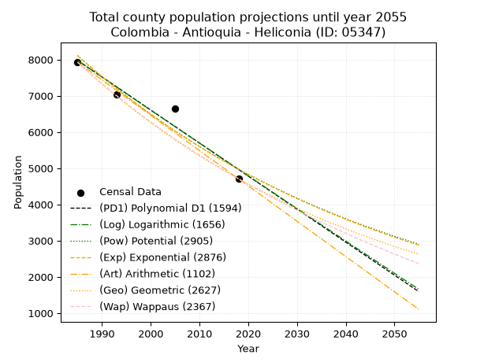
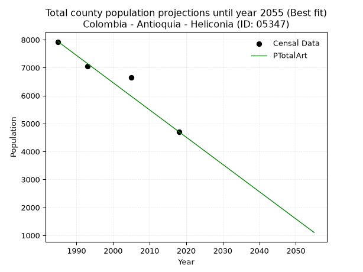
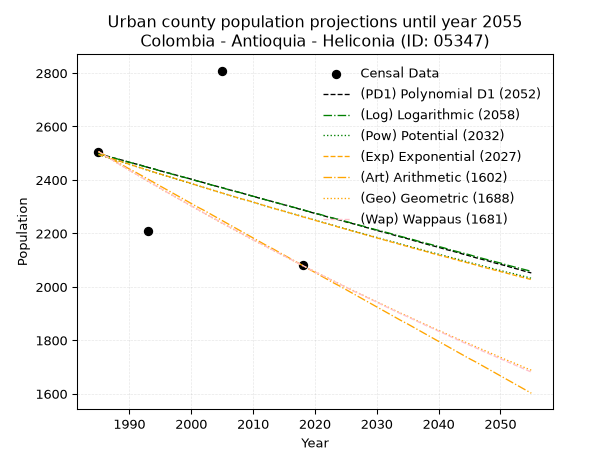
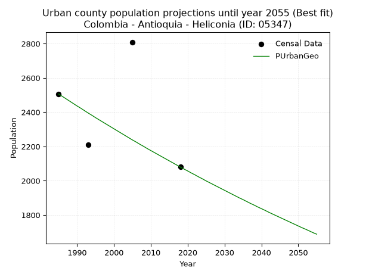
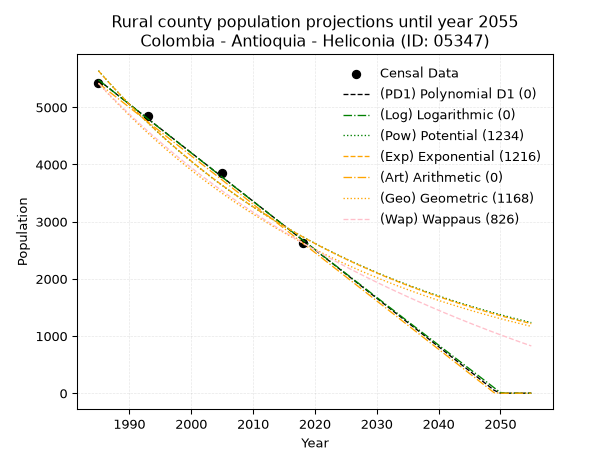
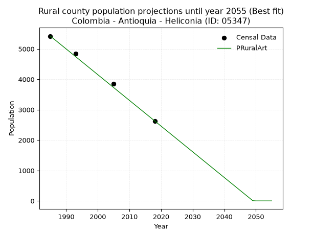

<div align="center">


</div>

# 📜 _“Population and Public Services Demand Projections (PPSD) until Year 2050 for Colombia - Antioquia - Heliconia (ID: 05347)”_
Keywords: `population` `public-service` `projection` `lineal` `polynomial` `logarithmic` `potential` `exponential` `arithmetic` `geometric` `wappaus` `dane` `colombia` `south-america`

PPSD are analytical estimates used by governments and planners to anticipate future changes in population size, age distribution, and the resulting community needs for utilities, healthcare, education, and infrastructure as sizing future water treatment facilities, electrical grids, and road networks based on spatial growth.

<div align="center">

</img>

</div>


> **General running parameters**: • app_version: _v20260806_. • Python version: _3.14.7_. • Pandas version: _3.0.5_. • NumPy version: _2.5.1_. • Creates, save and include plots into reports (create_plot): _False_. • Projection until year: _2050_. • Process polynomial degree 2 and up: _False_. • Process Wappaus: _True_. • Process Wappaus: _True_. • Set negative values to zero: _True_. • Set infinite values to zero: _True_. • Drop dataset notes: _True_. 
<div align="center">

Maps & GIS Layers: [:earth_americas:Google](http://maps.google.com/maps?q=6.206757458,-75.7343223) [:earth_americas:OSM](https://www.openstreetmap.org/#map=18/6.206757458/-75.7343223&layers=P) [:earth_americas:Bing](https://www.bing.com/maps?cp=6.206757458~-75.7343223&lvl=18) [:earth_americas:Apple](https://maps.apple.com/frame?center=6.206757458%2C-75.7343223&span=0.003%2C0.006) [:earth_americas:GISMobile](https://github.com/rcfdtools/R.GISMobile/blob/main/file/gis/CountyLayer_CO/Readme.md)

</div>


<div align="center">

```geojson
{
  "type": "Feature",
  "geometry": {
    "type": "Point", 
    "coordinates": [-75.7343223, 6.206757458]
  }, 
  "properties": {
    "Name": "Colombia - Antioquia - Heliconia (ID: 05347)"
  }
}
```

</div>


## 0. Census Data (4 records)

Census data are official statistics collected by a government about the people and housing in a country. They usually include counts of total population, age, sex, race, income, education, and jobs.

📅Global census file: [Population.xlsx](../data/Population.xlsx)

| Source   |   Year |   CountryID | CountryName   |   StateID | StateName   |   CountyID | CountyName   |   PTotal |   PUrban |   PRural |
|:---------|-------:|------------:|:--------------|----------:|:------------|-----------:|:-------------|---------:|---------:|---------:|
| DANE     |   1985 |          57 | Colombia      |        05 | Antioquia   |      05347 | Heliconia    |     7926 |     2506 |     5420 |
| DANE     |   1993 |          57 | Colombia      |        05 | Antioquia   |      05347 | Heliconia    |     7048 |     2209 |     4839 |
| DANE     |   2005 |          57 | Colombia      |        05 | Antioquia   |      05347 | Heliconia    |     6656 |     2809 |     3847 |
| DANE     |   2018 |          57 | Colombia      |        05 | Antioquia   |      05347 | Heliconia    |     4709 |     2080 |     2629 |

> 🔥Some records could had specific notes about the registered values or the corresponding urban or rural distribution.

📅[SUI-RUPS](https://www.datos.gov.co/Hacienda-y-Cr-dito-P-blico/Registro-nico-de-Prestadores-de-Servicios-P-blicos/4qkq-csdn/about_data) - Local public utility companies: [RUPS.csv](../data/RUPS.csv)

 | SERVICIO       | ESTADO    | NOMBRE                                                                              | NIT         | DEPARTAMENTO_DOMICILIO   | MUNICIPIO_DOMICILIO   | DIRECCION                     |   TELEFONO | EMAIL                            | TIPO_PRESTADOR                             | CLASIFICACION                 |
|:---------------|:----------|:------------------------------------------------------------------------------------|:------------|:-------------------------|:----------------------|:------------------------------|-----------:|:---------------------------------|:-------------------------------------------|:------------------------------|
| ACUEDUCTO      | OPERATIVA | ASOCIACION DE USUARIOS DEL ACUEDUCTO MULTIVEREDAL TRES MONTAÑAS                     | 811035574-9 | ANTIOQUIA                | HELICONIA             | Vereda Palo Blanco            |    8422857 | montresmulacue@hotmail.com       | ORGANIZACION AUTORIZADA                    | MENOR O IGUAL A 2500 USUARIOS |
| ACUEDUCTO      | OPERATIVA | ASOCIACION DE USUARIOS DEL ACUEDUCTO MULTIVEREDAL DEL CORREGIMIENTO ALTO DEL CORRAL | 811028053-4 | ANTIOQUIA                | HELICONIA             | CORREGIMIENTO ALTO DEL CORRAL |    8549604 | restrepocontador@gmail.com       | ORGANIZACION AUTORIZADA                    | MENOR O IGUAL A 2500 USUARIOS |
| ACUEDUCTO      | OPERATIVA | AGUAS DE HELICONIA SA ESP                                                           | 900169368-6 | ANTIOQUIA                | HELICONIA             | Calle 20 No. 20   31          |    8549604 | aguas@heliconia-antioquia.gov.co | SOCIEDADES (EMPRESA DE SERVICIOS PUBLICOS) | MENOR O IGUAL A 2500 USUARIOS |
| ALCANTARILLADO | OPERATIVA | AGUAS DE HELICONIA SA ESP                                                           | 900169368-6 | ANTIOQUIA                | HELICONIA             | Calle 20 No. 20   31          |    8549604 | aguas@heliconia-antioquia.gov.co | SOCIEDADES (EMPRESA DE SERVICIOS PUBLICOS) | MENOR O IGUAL A 2500 USUARIOS |

## 1. Total

### 1.1. Coefficients and Parameters

* (PD1) Polynomial Deg 1: -91.1581694098743, 188923.8783621011 (lineal)
* (Log) Logarithmic: -182390.76290818746, 1392938.4004529787
* (Pow) Potential: -29.618260618266756, 101.58293995757363
* (Exp) Exponential: -0.014805704546296667, 4.704295249976462e+16
* (Art) Arithmetic: Year diff. 2018 - 1985 = 33, Population diff. 4709 - 7926 = -3217, Annual growth = -97.48484848484848
* (Geo) Geometric: Year diff. 2018 - 1985 = 33, Population diff. 4709 - 7926 = -3217, Annual growth % = -0.015654147316651823
* (Wap) Wappaus: i = -1.5430921802112938, Condition values only valid for < 200)

<sub>
Wappaus condition values: ['-0.00', '-1.54', '-3.09', '-4.63', '-6.17', '-7.72', '-9.26', '-10.80', '-12.34', '-13.89', '-15.43', '-16.97', '-18.52', '-20.06', '-21.60', '-23.15', '-24.69', '-26.23', '-27.78', '-29.32', '-30.86', '-32.40', '-33.95', '-35.49', '-37.03', '-38.58', '-40.12', '-41.66', '-43.21', '-44.75', '-46.29', '-47.84', '-49.38', '-50.92', '-52.47', '-54.01', '-55.55', '-57.09', '-58.64', '-60.18', '-61.72', '-63.27', '-64.81', '-66.35', '-67.90', '-69.44', '-70.98', '-72.53', '-74.07', '-75.61', '-77.15', '-78.70', '-80.24', '-81.78', '-83.33', '-84.87', '-86.41', '-87.96', '-89.50', '-91.04', '-92.59', '-94.13', '-95.67', '-97.21', '-98.76', '-100.30']
</sub>


### 1.2. Projected Dataset

|   Year |   CountyID |   PTotalPD1 |   PTotalLog |   PTotalPow |   PTotalExp |   PTotalArt |   PTotalGeo |   PTotalWap |
|-------:|-----------:|------------:|------------:|------------:|------------:|------------:|------------:|------------:|
|   1985 |      05347 |        7975 |        7977 |        8110 |        8107 |        7926 |        7926 |        7926 |
|   1986 |      05347 |        7884 |        7885 |        7990 |        7988 |        7829 |        7802 |        7805 |
|   1987 |      05347 |        7793 |        7793 |        7871 |        7871 |        7731 |        7680 |        7685 |
|   1988 |      05347 |        7701 |        7702 |        7755 |        7755 |        7634 |        7560 |        7567 |
|   1989 |      05347 |        7610 |        7610 |        7640 |        7641 |        7536 |        7441 |        7451 |
|   1990 |      05347 |        7519 |        7518 |        7527 |        7529 |        7439 |        7325 |        7337 |
|   1991 |      05347 |        7428 |        7427 |        7416 |        7418 |        7341 |        7210 |        7225 |
|   1992 |      05347 |        7337 |        7335 |        7307 |        7309 |        7244 |        7097 |        7114 |
|   1993 |      05347 |        7246 |        7243 |        7199 |        7202 |        7146 |        6986 |        7004 |
|   1994 |      05347 |        7154 |        7152 |        7093 |        7096 |        7049 |        6877 |        6897 |
|   1995 |      05347 |        7063 |        7061 |        6988 |        6992 |        6951 |        6769 |        6791 |
|   1996 |      05347 |        6972 |        6969 |        6885 |        6889 |        6854 |        6663 |        6686 |
|   1997 |      05347 |        6881 |        6878 |        6784 |        6788 |        6756 |        6559 |        6583 |
|   1998 |      05347 |        6790 |        6786 |        6684 |        6688 |        6659 |        6456 |        6481 |
|   1999 |      05347 |        6699 |        6695 |        6586 |        6590 |        6561 |        6355 |        6381 |
|   2000 |      05347 |        6608 |        6604 |        6489 |        6493 |        6464 |        6256 |        6282 |
|   2001 |      05347 |        6516 |        6513 |        6394 |        6397 |        6366 |        6158 |        6184 |
|   2002 |      05347 |        6425 |        6422 |        6300 |        6303 |        6269 |        6061 |        6088 |
|   2003 |      05347 |        6334 |        6331 |        6207 |        6211 |        6171 |        5966 |        5993 |
|   2004 |      05347 |        6243 |        6240 |        6116 |        6119 |        6074 |        5873 |        5899 |
|   2005 |      05347 |        6152 |        6149 |        6026 |        6029 |        5976 |        5781 |        5807 |
|   2006 |      05347 |        6061 |        6058 |        5938 |        5941 |        5879 |        5691 |        5716 |
|   2007 |      05347 |        5969 |        5967 |        5851 |        5853 |        5781 |        5601 |        5626 |
|   2008 |      05347 |        5878 |        5876 |        5765 |        5767 |        5684 |        5514 |        5537 |
|   2009 |      05347 |        5787 |        5785 |        5681 |        5683 |        5586 |        5427 |        5449 |
|   2010 |      05347 |        5696 |        5694 |        5598 |        5599 |        5489 |        5343 |        5363 |
|   2011 |      05347 |        5605 |        5604 |        5516 |        5517 |        5391 |        5259 |        5277 |
|   2012 |      05347 |        5514 |        5513 |        5435 |        5436 |        5294 |        5177 |        5193 |
|   2013 |      05347 |        5422 |        5422 |        5356 |        5356 |        5196 |        5096 |        5110 |
|   2014 |      05347 |        5331 |        5332 |        5278 |        5277 |        5099 |        5016 |        5028 |
|   2015 |      05347 |        5240 |        5241 |        5201 |        5200 |        5001 |        4937 |        4946 |
|   2016 |      05347 |        5149 |        5151 |        5125 |        5123 |        4904 |        4860 |        4866 |
|   2017 |      05347 |        5058 |        5060 |        5050 |        5048 |        4806 |        4784 |        4787 |
|   2018 |      05347 |        4967 |        4970 |        4976 |        4974 |        4709 |        4709 |        4709 |
|   2019 |      05347 |        4876 |        4879 |        4904 |        4901 |        4612 |        4635 |        4632 |
|   2020 |      05347 |        4784 |        4789 |        4833 |        4829 |        4514 |        4563 |        4555 |
|   2021 |      05347 |        4693 |        4699 |        4762 |        4758 |        4417 |        4491 |        4480 |
|   2022 |      05347 |        4602 |        4609 |        4693 |        4688 |        4319 |        4421 |        4406 |
|   2023 |      05347 |        4511 |        4518 |        4625 |        4619 |        4222 |        4352 |        4332 |
|   2024 |      05347 |        4420 |        4428 |        4558 |        4551 |        4124 |        4284 |        4259 |
|   2025 |      05347 |        4329 |        4338 |        4491 |        4484 |        4027 |        4217 |        4188 |
|   2026 |      05347 |        4237 |        4248 |        4426 |        4418 |        3929 |        4151 |        4117 |
|   2027 |      05347 |        4146 |        4158 |        4362 |        4353 |        3832 |        4086 |        4046 |
|   2028 |      05347 |        4055 |        4068 |        4299 |        4289 |        3734 |        4022 |        3977 |
|   2029 |      05347 |        3964 |        3978 |        4236 |        4226 |        3637 |        3959 |        3908 |
|   2030 |      05347 |        3873 |        3888 |        4175 |        4164 |        3539 |        3897 |        3841 |
|   2031 |      05347 |        3782 |        3799 |        4115 |        4103 |        3442 |        3836 |        3774 |
|   2032 |      05347 |        3690 |        3709 |        4055 |        4043 |        3344 |        3776 |        3707 |
|   2033 |      05347 |        3599 |        3619 |        3996 |        3983 |        3247 |        3717 |        3642 |
|   2034 |      05347 |        3508 |        3529 |        3939 |        3925 |        3149 |        3658 |        3577 |
|   2035 |      05347 |        3417 |        3440 |        3882 |        3867 |        3052 |        3601 |        3513 |
|   2036 |      05347 |        3326 |        3350 |        3826 |        3810 |        2954 |        3545 |        3450 |
|   2037 |      05347 |        3235 |        3261 |        3770 |        3754 |        2857 |        3489 |        3387 |
|   2038 |      05347 |        3144 |        3171 |        3716 |        3699 |        2759 |        3435 |        3325 |
|   2039 |      05347 |        3052 |        3082 |        3662 |        3645 |        2662 |        3381 |        3264 |
|   2040 |      05347 |        2961 |        2992 |        3610 |        3591 |        2564 |        3328 |        3203 |
|   2041 |      05347 |        2870 |        2903 |        3558 |        3538 |        2467 |        3276 |        3143 |
|   2042 |      05347 |        2779 |        2813 |        3506 |        3486 |        2369 |        3225 |        3084 |
|   2043 |      05347 |        2688 |        2724 |        3456 |        3435 |        2272 |        3174 |        3025 |
|   2044 |      05347 |        2597 |        2635 |        3406 |        3385 |        2174 |        3124 |        2967 |
|   2045 |      05347 |        2505 |        2546 |        3357 |        3335 |        2077 |        3076 |        2910 |
|   2046 |      05347 |        2414 |        2457 |        3309 |        3286 |        1979 |        3027 |        2853 |
|   2047 |      05347 |        2323 |        2367 |        3261 |        3238 |        1882 |        2980 |        2797 |
|   2048 |      05347 |        2232 |        2278 |        3214 |        3190 |        1784 |        2933 |        2741 |
|   2049 |      05347 |        2141 |        2189 |        3168 |        3143 |        1687 |        2887 |        2686 |
|   2050 |      05347 |        2050 |        2100 |        3123 |        3097 |        1589 |        2842 |        2631 |
<div align="center">

</img>

</div>


### 1.3. Best fit with absolute and relative error (%)

Relative error puts that difference into context by dividing the absolute error by the true value, creating a unitless ratio or percentage that shows the scale of the mistake.

Absolute and relative error

|   Year | Source   |   CountryID | CountryName   |   StateID | StateName   |   CountyID_x | CountyName   |   PTotal |   PUrban |   PRural |   CountyID_y |   PTotalPD1 |   PTotalLog |   PTotalPow |   PTotalExp |   PTotalArt |   PTotalGeo |   PTotalWap |   PTotalPD1AbsError |   PTotalLogAbsError |   PTotalPowAbsError |   PTotalExpAbsError |   PTotalArtAbsError |   PTotalGeoAbsError |   PTotalWapAbsError |   PTotalPD1RelError |   PTotalLogRelError |   PTotalPowRelError |   PTotalExpRelError |   PTotalArtRelError |   PTotalGeoRelError |   PTotalWapRelError |
|-------:|:---------|------------:|:--------------|----------:|:------------|-------------:|:-------------|---------:|---------:|---------:|-------------:|------------:|------------:|------------:|------------:|------------:|------------:|------------:|--------------------:|--------------------:|--------------------:|--------------------:|--------------------:|--------------------:|--------------------:|--------------------:|--------------------:|--------------------:|--------------------:|--------------------:|--------------------:|--------------------:|
|   1985 | DANE     |          57 | Colombia      |        05 | Antioquia   |        05347 | Heliconia    |     7926 |     2506 |     5420 |        05347 |        7975 |        7977 |        8110 |        8107 |        7926 |        7926 |        7926 |                  49 |                  51 |                 184 |                 181 |                   0 |                   0 |                   0 |            0.618219 |            0.643452 |             2.32147 |             2.28362 |             0       |            0        |            0        |
|   1993 | DANE     |          57 | Colombia      |        05 | Antioquia   |        05347 | Heliconia    |     7048 |     2209 |     4839 |        05347 |        7246 |        7243 |        7199 |        7202 |        7146 |        6986 |        7004 |                 198 |                 195 |                 151 |                 154 |                  98 |                  62 |                  44 |            2.80931  |            2.76674  |             2.14245 |             2.18502 |             1.39047 |            0.879682 |            0.624291 |
|   2005 | DANE     |          57 | Colombia      |        05 | Antioquia   |        05347 | Heliconia    |     6656 |     2809 |     3847 |        05347 |        6152 |        6149 |        6026 |        6029 |        5976 |        5781 |        5807 |                 504 |                 507 |                 630 |                 627 |                 680 |                 875 |                 849 |            7.57212  |            7.61719  |             9.46514 |             9.42007 |            10.2163  |           13.146    |           12.7554   |
|   2018 | DANE     |          57 | Colombia      |        05 | Antioquia   |        05347 | Heliconia    |     4709 |     2080 |     2629 |        05347 |        4967 |        4970 |        4976 |        4974 |        4709 |        4709 |        4709 |                 258 |                 261 |                 267 |                 265 |                   0 |                   0 |                   0 |            5.47887  |            5.54258  |             5.66999 |             5.62752 |             0       |            0        |            0        |

Relative error mean

| Method    |   RelError | Best   |
|:----------|-----------:|:-------|
| PTotalPD1 |    4.11963 |        |
| PTotalLog |    4.14249 |        |
| PTotalPow |    4.89977 |        |
| PTotalExp |    4.87906 |        |
| PTotalArt |    2.9017  | True   |
| PTotalGeo |    3.50643 |        |
| PTotalWap |    3.34492 |        |

💙Best method: _**PTotalArt**_
<div align="center">

</img>

</div>


### 1.4. Fresh water supply demand in liters per capita per day (lpcd)

The fresh water supply demand typically ranges from 100 to 300 liters per capita per day (lpcd) for standard domestic and municipal planning, though absolute survival minimums set by the World Health Organization are as low as 7.5 to 20 liters per day, and total consumption in high-income nations can exceed 400 liters.

> `CZ`: Level in meters above the sea level (masl)<br> `WS`: Fresh water supply demand in liters per capita per day (lpcd or l/h/d)<br> `WSAll`: Zonal fresh water supply demand in liters per second (l/s)<br> `A`: Zonal area in square meters<br> `DP`: Population density (people/hectare or p/ha)

Reference values (RAS Colombia)

|    CZ |   WS |
|------:|-----:|
|  1000 |  120 |
|  2000 |  130 |
| 99999 |  140 |

County shapefile geometry properties and water supply values

|   CountyID |      ATotal |   CZTotal |   WSTotal |
|-----------:|------------:|----------:|----------:|
|      05347 | 1.14831e+08 |   1661.48 |       130 |

Projected values for best method: PTotalArt

|   CountyID |   Year |   PTotalArt |   DPTotal |   WSTotal |   WSTotalAll |
|-----------:|-------:|------------:|----------:|----------:|-------------:|
|      05347 |   1985 |        7926 |      0.69 |       130 |     11.9257  |
|      05347 |   1986 |        7829 |      0.68 |       130 |     11.7797  |
|      05347 |   1987 |        7731 |      0.67 |       130 |     11.6323  |
|      05347 |   1988 |        7634 |      0.66 |       130 |     11.4863  |
|      05347 |   1989 |        7536 |      0.66 |       130 |     11.3389  |
|      05347 |   1990 |        7439 |      0.65 |       130 |     11.1929  |
|      05347 |   1991 |        7341 |      0.64 |       130 |     11.0455  |
|      05347 |   1992 |        7244 |      0.63 |       130 |     10.8995  |
|      05347 |   1993 |        7146 |      0.62 |       130 |     10.7521  |
|      05347 |   1994 |        7049 |      0.61 |       130 |     10.6061  |
|      05347 |   1995 |        6951 |      0.61 |       130 |     10.4587  |
|      05347 |   1996 |        6854 |      0.6  |       130 |     10.3127  |
|      05347 |   1997 |        6756 |      0.59 |       130 |     10.1653  |
|      05347 |   1998 |        6659 |      0.58 |       130 |     10.0193  |
|      05347 |   1999 |        6561 |      0.57 |       130 |      9.87187 |
|      05347 |   2000 |        6464 |      0.56 |       130 |      9.72593 |
|      05347 |   2001 |        6366 |      0.55 |       130 |      9.57847 |
|      05347 |   2002 |        6269 |      0.55 |       130 |      9.43252 |
|      05347 |   2003 |        6171 |      0.54 |       130 |      9.28507 |
|      05347 |   2004 |        6074 |      0.53 |       130 |      9.13912 |
|      05347 |   2005 |        5976 |      0.52 |       130 |      8.99167 |
|      05347 |   2006 |        5879 |      0.51 |       130 |      8.84572 |
|      05347 |   2007 |        5781 |      0.5  |       130 |      8.69826 |
|      05347 |   2008 |        5684 |      0.49 |       130 |      8.55231 |
|      05347 |   2009 |        5586 |      0.49 |       130 |      8.40486 |
|      05347 |   2010 |        5489 |      0.48 |       130 |      8.25891 |
|      05347 |   2011 |        5391 |      0.47 |       130 |      8.11146 |
|      05347 |   2012 |        5294 |      0.46 |       130 |      7.96551 |
|      05347 |   2013 |        5196 |      0.45 |       130 |      7.81806 |
|      05347 |   2014 |        5099 |      0.44 |       130 |      7.67211 |
|      05347 |   2015 |        5001 |      0.44 |       130 |      7.52465 |
|      05347 |   2016 |        4904 |      0.43 |       130 |      7.3787  |
|      05347 |   2017 |        4806 |      0.42 |       130 |      7.23125 |
|      05347 |   2018 |        4709 |      0.41 |       130 |      7.0853  |
|      05347 |   2019 |        4612 |      0.4  |       130 |      6.93935 |
|      05347 |   2020 |        4514 |      0.39 |       130 |      6.7919  |
|      05347 |   2021 |        4417 |      0.38 |       130 |      6.64595 |
|      05347 |   2022 |        4319 |      0.38 |       130 |      6.4985  |
|      05347 |   2023 |        4222 |      0.37 |       130 |      6.35255 |
|      05347 |   2024 |        4124 |      0.36 |       130 |      6.20509 |
|      05347 |   2025 |        4027 |      0.35 |       130 |      6.05914 |
|      05347 |   2026 |        3929 |      0.34 |       130 |      5.91169 |
|      05347 |   2027 |        3832 |      0.33 |       130 |      5.76574 |
|      05347 |   2028 |        3734 |      0.33 |       130 |      5.61829 |
|      05347 |   2029 |        3637 |      0.32 |       130 |      5.47234 |
|      05347 |   2030 |        3539 |      0.31 |       130 |      5.32488 |
|      05347 |   2031 |        3442 |      0.3  |       130 |      5.17894 |
|      05347 |   2032 |        3344 |      0.29 |       130 |      5.03148 |
|      05347 |   2033 |        3247 |      0.28 |       130 |      4.88553 |
|      05347 |   2034 |        3149 |      0.27 |       130 |      4.73808 |
|      05347 |   2035 |        3052 |      0.27 |       130 |      4.59213 |
|      05347 |   2036 |        2954 |      0.26 |       130 |      4.44468 |
|      05347 |   2037 |        2857 |      0.25 |       130 |      4.29873 |
|      05347 |   2038 |        2759 |      0.24 |       130 |      4.15127 |
|      05347 |   2039 |        2662 |      0.23 |       130 |      4.00532 |
|      05347 |   2040 |        2564 |      0.22 |       130 |      3.85787 |
|      05347 |   2041 |        2467 |      0.21 |       130 |      3.71192 |
|      05347 |   2042 |        2369 |      0.21 |       130 |      3.56447 |
|      05347 |   2043 |        2272 |      0.2  |       130 |      3.41852 |
|      05347 |   2044 |        2174 |      0.19 |       130 |      3.27106 |
|      05347 |   2045 |        2077 |      0.18 |       130 |      3.12512 |
|      05347 |   2046 |        1979 |      0.17 |       130 |      2.97766 |
|      05347 |   2047 |        1882 |      0.16 |       130 |      2.83171 |
|      05347 |   2048 |        1784 |      0.16 |       130 |      2.68426 |
|      05347 |   2049 |        1687 |      0.15 |       130 |      2.53831 |
|      05347 |   2050 |        1589 |      0.14 |       130 |      2.39086 |

## 2. Urban

### 2.1. Coefficients and Parameters

* (PD1) Polynomial Deg 1: -6.373344038538319, 15149.281413086273 (lineal)
* (Log) Logarithmic: -12703.985177931723, 98964.09314080715
* (Pow) Potential: -5.926328456856297, 22.940707636200273
* (Exp) Exponential: -0.0029713987096139645, 909273.8596922829
* (Art) Arithmetic: Year diff. 2018 - 1985 = 33, Population diff. 2080 - 2506 = -426, Annual growth = -12.909090909090908
* (Geo) Geometric: Year diff. 2018 - 1985 = 33, Population diff. 2080 - 2506 = -426, Annual growth % = -0.005630150438991399
* (Wap) Wappaus: i = -0.5629782341513698, Condition values only valid for < 200)

<sub>
Wappaus condition values: ['-0.00', '-0.56', '-1.13', '-1.69', '-2.25', '-2.81', '-3.38', '-3.94', '-4.50', '-5.07', '-5.63', '-6.19', '-6.76', '-7.32', '-7.88', '-8.44', '-9.01', '-9.57', '-10.13', '-10.70', '-11.26', '-11.82', '-12.39', '-12.95', '-13.51', '-14.07', '-14.64', '-15.20', '-15.76', '-16.33', '-16.89', '-17.45', '-18.02', '-18.58', '-19.14', '-19.70', '-20.27', '-20.83', '-21.39', '-21.96', '-22.52', '-23.08', '-23.65', '-24.21', '-24.77', '-25.33', '-25.90', '-26.46', '-27.02', '-27.59', '-28.15', '-28.71', '-29.27', '-29.84', '-30.40', '-30.96', '-31.53', '-32.09', '-32.65', '-33.22', '-33.78', '-34.34', '-34.90', '-35.47', '-36.03', '-36.59']
</sub>


### 2.2. Projected Dataset

|   Year |   CountyID |   PUrbanPD1 |   PUrbanLog |   PUrbanPow |   PUrbanExp |   PUrbanArt |   PUrbanGeo |   PUrbanWap |
|-------:|-----------:|------------:|------------:|------------:|------------:|------------:|------------:|------------:|
|   1985 |      05347 |        2498 |        2498 |        2495 |        2495 |        2506 |        2506 |        2506 |
|   1986 |      05347 |        2492 |        2492 |        2488 |        2488 |        2493 |        2492 |        2492 |
|   1987 |      05347 |        2485 |        2485 |        2480 |        2481 |        2480 |        2478 |        2478 |
|   1988 |      05347 |        2479 |        2479 |        2473 |        2473 |        2467 |        2464 |        2464 |
|   1989 |      05347 |        2473 |        2472 |        2466 |        2466 |        2454 |        2450 |        2450 |
|   1990 |      05347 |        2466 |        2466 |        2458 |        2459 |        2441 |        2436 |        2436 |
|   1991 |      05347 |        2460 |        2460 |        2451 |        2451 |        2429 |        2423 |        2423 |
|   1992 |      05347 |        2454 |        2453 |        2444 |        2444 |        2416 |        2409 |        2409 |
|   1993 |      05347 |        2447 |        2447 |        2436 |        2437 |        2403 |        2395 |        2396 |
|   1994 |      05347 |        2441 |        2441 |        2429 |        2429 |        2390 |        2382 |        2382 |
|   1995 |      05347 |        2434 |        2434 |        2422 |        2422 |        2377 |        2368 |        2369 |
|   1996 |      05347 |        2428 |        2428 |        2415 |        2415 |        2364 |        2355 |        2355 |
|   1997 |      05347 |        2422 |        2421 |        2408 |        2408 |        2351 |        2342 |        2342 |
|   1998 |      05347 |        2415 |        2415 |        2400 |        2401 |        2338 |        2329 |        2329 |
|   1999 |      05347 |        2409 |        2409 |        2393 |        2394 |        2325 |        2316 |        2316 |
|   2000 |      05347 |        2403 |        2402 |        2386 |        2387 |        2312 |        2303 |        2303 |
|   2001 |      05347 |        2396 |        2396 |        2379 |        2379 |        2299 |        2290 |        2290 |
|   2002 |      05347 |        2390 |        2390 |        2372 |        2372 |        2287 |        2277 |        2277 |
|   2003 |      05347 |        2383 |        2383 |        2365 |        2365 |        2274 |        2264 |        2264 |
|   2004 |      05347 |        2377 |        2377 |        2358 |        2358 |        2261 |        2251 |        2252 |
|   2005 |      05347 |        2371 |        2371 |        2351 |        2351 |        2248 |        2238 |        2239 |
|   2006 |      05347 |        2364 |        2364 |        2344 |        2344 |        2235 |        2226 |        2226 |
|   2007 |      05347 |        2358 |        2358 |        2337 |        2337 |        2222 |        2213 |        2214 |
|   2008 |      05347 |        2352 |        2352 |        2330 |        2330 |        2209 |        2201 |        2201 |
|   2009 |      05347 |        2345 |        2345 |        2324 |        2324 |        2196 |        2188 |        2189 |
|   2010 |      05347 |        2339 |        2339 |        2317 |        2317 |        2183 |        2176 |        2176 |
|   2011 |      05347 |        2332 |        2333 |        2310 |        2310 |        2170 |        2164 |        2164 |
|   2012 |      05347 |        2326 |        2326 |        2303 |        2303 |        2157 |        2152 |        2152 |
|   2013 |      05347 |        2320 |        2320 |        2296 |        2296 |        2145 |        2140 |        2140 |
|   2014 |      05347 |        2313 |        2314 |        2290 |        2289 |        2132 |        2128 |        2128 |
|   2015 |      05347 |        2307 |        2307 |        2283 |        2283 |        2119 |        2116 |        2116 |
|   2016 |      05347 |        2301 |        2301 |        2276 |        2276 |        2106 |        2104 |        2104 |
|   2017 |      05347 |        2294 |        2295 |        2270 |        2269 |        2093 |        2092 |        2092 |
|   2018 |      05347 |        2288 |        2289 |        2263 |        2262 |        2080 |        2080 |        2080 |
|   2019 |      05347 |        2281 |        2282 |        2256 |        2256 |        2067 |        2068 |        2068 |
|   2020 |      05347 |        2275 |        2276 |        2250 |        2249 |        2054 |        2057 |        2056 |
|   2021 |      05347 |        2269 |        2270 |        2243 |        2242 |        2041 |        2045 |        2045 |
|   2022 |      05347 |        2262 |        2263 |        2236 |        2236 |        2028 |        2034 |        2033 |
|   2023 |      05347 |        2256 |        2257 |        2230 |        2229 |        2015 |        2022 |        2022 |
|   2024 |      05347 |        2250 |        2251 |        2223 |        2222 |        2003 |        2011 |        2010 |
|   2025 |      05347 |        2243 |        2245 |        2217 |        2216 |        1990 |        1999 |        1999 |
|   2026 |      05347 |        2237 |        2238 |        2210 |        2209 |        1977 |        1988 |        1987 |
|   2027 |      05347 |        2231 |        2232 |        2204 |        2203 |        1964 |        1977 |        1976 |
|   2028 |      05347 |        2224 |        2226 |        2198 |        2196 |        1951 |        1966 |        1965 |
|   2029 |      05347 |        2218 |        2219 |        2191 |        2190 |        1938 |        1955 |        1954 |
|   2030 |      05347 |        2211 |        2213 |        2185 |        2183 |        1925 |        1944 |        1943 |
|   2031 |      05347 |        2205 |        2207 |        2178 |        2177 |        1912 |        1933 |        1931 |
|   2032 |      05347 |        2199 |        2201 |        2172 |        2170 |        1899 |        1922 |        1920 |
|   2033 |      05347 |        2192 |        2194 |        2166 |        2164 |        1886 |        1911 |        1909 |
|   2034 |      05347 |        2186 |        2188 |        2159 |        2157 |        1873 |        1900 |        1898 |
|   2035 |      05347 |        2180 |        2182 |        2153 |        2151 |        1861 |        1890 |        1888 |
|   2036 |      05347 |        2173 |        2176 |        2147 |        2144 |        1848 |        1879 |        1877 |
|   2037 |      05347 |        2167 |        2169 |        2141 |        2138 |        1835 |        1868 |        1866 |
|   2038 |      05347 |        2160 |        2163 |        2134 |        2132 |        1822 |        1858 |        1855 |
|   2039 |      05347 |        2154 |        2157 |        2128 |        2125 |        1809 |        1847 |        1845 |
|   2040 |      05347 |        2148 |        2151 |        2122 |        2119 |        1796 |        1837 |        1834 |
|   2041 |      05347 |        2141 |        2145 |        2116 |        2113 |        1783 |        1827 |        1824 |
|   2042 |      05347 |        2135 |        2138 |        2110 |        2107 |        1770 |        1816 |        1813 |
|   2043 |      05347 |        2129 |        2132 |        2104 |        2100 |        1757 |        1806 |        1803 |
|   2044 |      05347 |        2122 |        2126 |        2098 |        2094 |        1744 |        1796 |        1792 |
|   2045 |      05347 |        2116 |        2120 |        2091 |        2088 |        1731 |        1786 |        1782 |
|   2046 |      05347 |        2109 |        2113 |        2085 |        2082 |        1719 |        1776 |        1772 |
|   2047 |      05347 |        2103 |        2107 |        2079 |        2075 |        1706 |        1766 |        1761 |
|   2048 |      05347 |        2097 |        2101 |        2073 |        2069 |        1693 |        1756 |        1751 |
|   2049 |      05347 |        2090 |        2095 |        2067 |        2063 |        1680 |        1746 |        1741 |
|   2050 |      05347 |        2084 |        2089 |        2061 |        2057 |        1667 |        1736 |        1731 |
<div align="center">

</img>

</div>


### 2.3. Best fit with absolute and relative error (%)

Relative error puts that difference into context by dividing the absolute error by the true value, creating a unitless ratio or percentage that shows the scale of the mistake.

Absolute and relative error

|   Year | Source   |   CountryID | CountryName   |   StateID | StateName   |   CountyID_x | CountyName   |   PTotal |   PUrban |   PRural |   CountyID_y |   PUrbanPD1 |   PUrbanLog |   PUrbanPow |   PUrbanExp |   PUrbanArt |   PUrbanGeo |   PUrbanWap |   PUrbanPD1AbsError |   PUrbanLogAbsError |   PUrbanPowAbsError |   PUrbanExpAbsError |   PUrbanArtAbsError |   PUrbanGeoAbsError |   PUrbanWapAbsError |   PUrbanPD1RelError |   PUrbanLogRelError |   PUrbanPowRelError |   PUrbanExpRelError |   PUrbanArtRelError |   PUrbanGeoRelError |   PUrbanWapRelError |
|-------:|:---------|------------:|:--------------|----------:|:------------|-------------:|:-------------|---------:|---------:|---------:|-------------:|------------:|------------:|------------:|------------:|------------:|------------:|------------:|--------------------:|--------------------:|--------------------:|--------------------:|--------------------:|--------------------:|--------------------:|--------------------:|--------------------:|--------------------:|--------------------:|--------------------:|--------------------:|--------------------:|
|   1985 | DANE     |          57 | Colombia      |        05 | Antioquia   |        05347 | Heliconia    |     7926 |     2506 |     5420 |        05347 |        2498 |        2498 |        2495 |        2495 |        2506 |        2506 |        2506 |                   8 |                   8 |                  11 |                  11 |                   0 |                   0 |                   0 |            0.319234 |            0.319234 |            0.438947 |            0.438947 |             0       |              0      |             0       |
|   1993 | DANE     |          57 | Colombia      |        05 | Antioquia   |        05347 | Heliconia    |     7048 |     2209 |     4839 |        05347 |        2447 |        2447 |        2436 |        2437 |        2403 |        2395 |        2396 |                 238 |                 238 |                 227 |                 228 |                 194 |                 186 |                 187 |           10.7741   |           10.7741   |           10.2761   |           10.3214   |             8.78225 |              8.4201 |             8.46537 |
|   2005 | DANE     |          57 | Colombia      |        05 | Antioquia   |        05347 | Heliconia    |     6656 |     2809 |     3847 |        05347 |        2371 |        2371 |        2351 |        2351 |        2248 |        2238 |        2239 |                 438 |                 438 |                 458 |                 458 |                 561 |                 571 |                 570 |           15.5927   |           15.5927   |           16.3047   |           16.3047   |            19.9715  |             20.3275 |            20.2919  |
|   2018 | DANE     |          57 | Colombia      |        05 | Antioquia   |        05347 | Heliconia    |     4709 |     2080 |     2629 |        05347 |        2288 |        2289 |        2263 |        2262 |        2080 |        2080 |        2080 |                 208 |                 209 |                 183 |                 182 |                   0 |                   0 |                   0 |           10        |           10.0481   |            8.79808  |            8.75     |             0       |              0      |             0       |

Relative error mean

| Method    |   RelError | Best   |
|:----------|-----------:|:-------|
| PUrbanPD1 |    9.17152 |        |
| PUrbanLog |    9.18354 |        |
| PUrbanPow |    8.95448 |        |
| PUrbanExp |    8.95377 |        |
| PUrbanArt |    7.18844 |        |
| PUrbanGeo |    7.1869  | True   |
| PUrbanWap |    7.18932 |        |

💙Best method: _**PUrbanGeo**_
<div align="center">

</img>

</div>


### 2.4. Fresh water supply demand in liters per capita per day (lpcd)

The fresh water supply demand typically ranges from 100 to 300 liters per capita per day (lpcd) for standard domestic and municipal planning, though absolute survival minimums set by the World Health Organization are as low as 7.5 to 20 liters per day, and total consumption in high-income nations can exceed 400 liters.

> `CZ`: Level in meters above the sea level (masl)<br> `WS`: Fresh water supply demand in liters per capita per day (lpcd or l/h/d)<br> `WSAll`: Zonal fresh water supply demand in liters per second (l/s)<br> `A`: Zonal area in square meters<br> `DP`: Population density (people/hectare or p/ha)

Reference values (RAS Colombia)

|    CZ |   WS |
|------:|-----:|
|  1000 |  120 |
|  2000 |  130 |
| 99999 |  140 |

County shapefile geometry properties and water supply values

|   CountyID |   AUrban |   CZUrban |   WSUrban |
|-----------:|---------:|----------:|----------:|
|      05347 |   721014 |   1436.23 |       130 |

Projected values for best method: PUrbanGeo

|   CountyID |   Year |   PUrbanGeo |   DPUrban |   WSUrban |   WSUrbanAll |
|-----------:|-------:|------------:|----------:|----------:|-------------:|
|      05347 |   1985 |        2506 |     34.76 |       130 |      3.7706  |
|      05347 |   1986 |        2492 |     34.56 |       130 |      3.74954 |
|      05347 |   1987 |        2478 |     34.37 |       130 |      3.72847 |
|      05347 |   1988 |        2464 |     34.17 |       130 |      3.70741 |
|      05347 |   1989 |        2450 |     33.98 |       130 |      3.68634 |
|      05347 |   1990 |        2436 |     33.79 |       130 |      3.66528 |
|      05347 |   1991 |        2423 |     33.61 |       130 |      3.64572 |
|      05347 |   1992 |        2409 |     33.41 |       130 |      3.62465 |
|      05347 |   1993 |        2395 |     33.22 |       130 |      3.60359 |
|      05347 |   1994 |        2382 |     33.04 |       130 |      3.58403 |
|      05347 |   1995 |        2368 |     32.84 |       130 |      3.56296 |
|      05347 |   1996 |        2355 |     32.66 |       130 |      3.5434  |
|      05347 |   1997 |        2342 |     32.48 |       130 |      3.52384 |
|      05347 |   1998 |        2329 |     32.3  |       130 |      3.50428 |
|      05347 |   1999 |        2316 |     32.12 |       130 |      3.48472 |
|      05347 |   2000 |        2303 |     31.94 |       130 |      3.46516 |
|      05347 |   2001 |        2290 |     31.76 |       130 |      3.4456  |
|      05347 |   2002 |        2277 |     31.58 |       130 |      3.42604 |
|      05347 |   2003 |        2264 |     31.4  |       130 |      3.40648 |
|      05347 |   2004 |        2251 |     31.22 |       130 |      3.38692 |
|      05347 |   2005 |        2238 |     31.04 |       130 |      3.36736 |
|      05347 |   2006 |        2226 |     30.87 |       130 |      3.34931 |
|      05347 |   2007 |        2213 |     30.69 |       130 |      3.32975 |
|      05347 |   2008 |        2201 |     30.53 |       130 |      3.31169 |
|      05347 |   2009 |        2188 |     30.35 |       130 |      3.29213 |
|      05347 |   2010 |        2176 |     30.18 |       130 |      3.27407 |
|      05347 |   2011 |        2164 |     30.01 |       130 |      3.25602 |
|      05347 |   2012 |        2152 |     29.85 |       130 |      3.23796 |
|      05347 |   2013 |        2140 |     29.68 |       130 |      3.21991 |
|      05347 |   2014 |        2128 |     29.51 |       130 |      3.20185 |
|      05347 |   2015 |        2116 |     29.35 |       130 |      3.1838  |
|      05347 |   2016 |        2104 |     29.18 |       130 |      3.16574 |
|      05347 |   2017 |        2092 |     29.01 |       130 |      3.14769 |
|      05347 |   2018 |        2080 |     28.85 |       130 |      3.12963 |
|      05347 |   2019 |        2068 |     28.68 |       130 |      3.11157 |
|      05347 |   2020 |        2057 |     28.53 |       130 |      3.09502 |
|      05347 |   2021 |        2045 |     28.36 |       130 |      3.07697 |
|      05347 |   2022 |        2034 |     28.21 |       130 |      3.06042 |
|      05347 |   2023 |        2022 |     28.04 |       130 |      3.04236 |
|      05347 |   2024 |        2011 |     27.89 |       130 |      3.02581 |
|      05347 |   2025 |        1999 |     27.72 |       130 |      3.00775 |
|      05347 |   2026 |        1988 |     27.57 |       130 |      2.9912  |
|      05347 |   2027 |        1977 |     27.42 |       130 |      2.97465 |
|      05347 |   2028 |        1966 |     27.27 |       130 |      2.9581  |
|      05347 |   2029 |        1955 |     27.11 |       130 |      2.94155 |
|      05347 |   2030 |        1944 |     26.96 |       130 |      2.925   |
|      05347 |   2031 |        1933 |     26.81 |       130 |      2.90845 |
|      05347 |   2032 |        1922 |     26.66 |       130 |      2.8919  |
|      05347 |   2033 |        1911 |     26.5  |       130 |      2.87535 |
|      05347 |   2034 |        1900 |     26.35 |       130 |      2.8588  |
|      05347 |   2035 |        1890 |     26.21 |       130 |      2.84375 |
|      05347 |   2036 |        1879 |     26.06 |       130 |      2.8272  |
|      05347 |   2037 |        1868 |     25.91 |       130 |      2.81065 |
|      05347 |   2038 |        1858 |     25.77 |       130 |      2.7956  |
|      05347 |   2039 |        1847 |     25.62 |       130 |      2.77905 |
|      05347 |   2040 |        1837 |     25.48 |       130 |      2.764   |
|      05347 |   2041 |        1827 |     25.34 |       130 |      2.74896 |
|      05347 |   2042 |        1816 |     25.19 |       130 |      2.73241 |
|      05347 |   2043 |        1806 |     25.05 |       130 |      2.71736 |
|      05347 |   2044 |        1796 |     24.91 |       130 |      2.70231 |
|      05347 |   2045 |        1786 |     24.77 |       130 |      2.68727 |
|      05347 |   2046 |        1776 |     24.63 |       130 |      2.67222 |
|      05347 |   2047 |        1766 |     24.49 |       130 |      2.65718 |
|      05347 |   2048 |        1756 |     24.35 |       130 |      2.64213 |
|      05347 |   2049 |        1746 |     24.22 |       130 |      2.62708 |
|      05347 |   2050 |        1736 |     24.08 |       130 |      2.61204 |

## 3. Rural

### 3.1. Coefficients and Parameters

* (PD1) Polynomial Deg 1: -84.78482537133598, 173774.5969490148 (lineal)
* (Log) Logarithmic: -169686.77773025577, 1293974.3073121721
* (Pow) Potential: -43.85230539040069, 148.36570264846122
* (Exp) Exponential: -0.021916077354213383, 4.409195423105468e+22
* (Art) Arithmetic: Year diff. 2018 - 1985 = 33, Population diff. 2629 - 5420 = -2791, Annual growth = -84.57575757575758
* (Geo) Geometric: Year diff. 2018 - 1985 = 33, Population diff. 2629 - 5420 = -2791, Annual growth % = -0.021685423861307895
* (Wap) Wappaus: i = -2.1015221164308007, Condition values only valid for < 200)

<sub>
Wappaus condition values: ['-0.00', '-2.10', '-4.20', '-6.30', '-8.41', '-10.51', '-12.61', '-14.71', '-16.81', '-18.91', '-21.02', '-23.12', '-25.22', '-27.32', '-29.42', '-31.52', '-33.62', '-35.73', '-37.83', '-39.93', '-42.03', '-44.13', '-46.23', '-48.34', '-50.44', '-52.54', '-54.64', '-56.74', '-58.84', '-60.94', '-63.05', '-65.15', '-67.25', '-69.35', '-71.45', '-73.55', '-75.65', '-77.76', '-79.86', '-81.96', '-84.06', '-86.16', '-88.26', '-90.37', '-92.47', '-94.57', '-96.67', '-98.77', '-100.87', '-102.97', '-105.08', '-107.18', '-109.28', '-111.38', '-113.48', '-115.58', '-117.69', '-119.79', '-121.89', '-123.99', '-126.09', '-128.19', '-130.29', '-132.40', '-134.50', '-136.60']
</sub>


### 3.2. Projected Dataset

|   Year |   CountyID |   PRuralPD1 |   PRuralLog |   PRuralPow |   PRuralExp |   PRuralArt |   PRuralGeo |   PRuralWap |
|-------:|-----------:|------------:|------------:|------------:|------------:|------------:|------------:|------------:|
|   1985 |      05347 |        5477 |        5479 |        5640 |        5637 |        5420 |        5420 |        5420 |
|   1986 |      05347 |        5392 |        5394 |        5517 |        5515 |        5335 |        5302 |        5307 |
|   1987 |      05347 |        5307 |        5308 |        5397 |        5395 |        5251 |        5187 |        5197 |
|   1988 |      05347 |        5222 |        5223 |        5279 |        5279 |        5166 |        5075 |        5089 |
|   1989 |      05347 |        5138 |        5138 |        5164 |        5164 |        5082 |        4965 |        4983 |
|   1990 |      05347 |        5053 |        5052 |        5051 |        5052 |        4997 |        4857 |        4879 |
|   1991 |      05347 |        4968 |        4967 |        4941 |        4943 |        4913 |        4752 |        4777 |
|   1992 |      05347 |        4883 |        4882 |        4833 |        4835 |        4828 |        4649 |        4677 |
|   1993 |      05347 |        4798 |        4797 |        4728 |        4731 |        4743 |        4548 |        4579 |
|   1994 |      05347 |        4714 |        4711 |        4625 |        4628 |        4659 |        4449 |        4483 |
|   1995 |      05347 |        4629 |        4626 |        4525 |        4528 |        4574 |        4353 |        4389 |
|   1996 |      05347 |        4544 |        4541 |        4426 |        4430 |        4490 |        4259 |        4297 |
|   1997 |      05347 |        4459 |        4456 |        4330 |        4334 |        4405 |        4166 |        4206 |
|   1998 |      05347 |        4375 |        4371 |        4236 |        4240 |        4321 |        4076 |        4117 |
|   1999 |      05347 |        4290 |        4287 |        4144 |        4148 |        4236 |        3987 |        4030 |
|   2000 |      05347 |        4205 |        4202 |        4054 |        4058 |        4151 |        3901 |        3944 |
|   2001 |      05347 |        4120 |        4117 |        3966 |        3970 |        4067 |        3816 |        3860 |
|   2002 |      05347 |        4035 |        4032 |        3881 |        3884 |        3982 |        3734 |        3777 |
|   2003 |      05347 |        3951 |        3947 |        3796 |        3800 |        3898 |        3653 |        3696 |
|   2004 |      05347 |        3866 |        3863 |        3714 |        3717 |        3813 |        3573 |        3616 |
|   2005 |      05347 |        3781 |        3778 |        3634 |        3637 |        3728 |        3496 |        3538 |
|   2006 |      05347 |        3696 |        3693 |        3555 |        3558 |        3644 |        3420 |        3460 |
|   2007 |      05347 |        3611 |        3609 |        3478 |        3481 |        3559 |        3346 |        3385 |
|   2008 |      05347 |        3527 |        3524 |        3403 |        3405 |        3475 |        3273 |        3310 |
|   2009 |      05347 |        3442 |        3440 |        3330 |        3331 |        3390 |        3202 |        3237 |
|   2010 |      05347 |        3357 |        3355 |        3258 |        3259 |        3306 |        3133 |        3165 |
|   2011 |      05347 |        3272 |        3271 |        3188 |        3189 |        3221 |        3065 |        3094 |
|   2012 |      05347 |        3188 |        3187 |        3119 |        3119 |        3136 |        2999 |        3024 |
|   2013 |      05347 |        3103 |        3102 |        3052 |        3052 |        3052 |        2934 |        2956 |
|   2014 |      05347 |        3018 |        3018 |        2986 |        2986 |        2967 |        2870 |        2888 |
|   2015 |      05347 |        2933 |        2934 |        2922 |        2921 |        2883 |        2808 |        2822 |
|   2016 |      05347 |        2848 |        2850 |        2859 |        2858 |        2798 |        2747 |        2757 |
|   2017 |      05347 |        2764 |        2765 |        2797 |        2796 |        2714 |        2687 |        2692 |
|   2018 |      05347 |        2679 |        2681 |        2737 |        2735 |        2629 |        2629 |        2629 |
|   2019 |      05347 |        2594 |        2597 |        2678 |        2676 |        2544 |        2572 |        2567 |
|   2020 |      05347 |        2509 |        2513 |        2621 |        2618 |        2460 |        2516 |        2505 |
|   2021 |      05347 |        2424 |        2429 |        2564 |        2561 |        2375 |        2462 |        2445 |
|   2022 |      05347 |        2340 |        2345 |        2509 |        2506 |        2291 |        2408 |        2385 |
|   2023 |      05347 |        2255 |        2261 |        2456 |        2451 |        2206 |        2356 |        2327 |
|   2024 |      05347 |        2170 |        2178 |        2403 |        2398 |        2122 |        2305 |        2269 |
|   2025 |      05347 |        2085 |        2094 |        2351 |        2346 |        2037 |        2255 |        2212 |
|   2026 |      05347 |        2001 |        2010 |        2301 |        2295 |        1952 |        2206 |        2156 |
|   2027 |      05347 |        1916 |        1926 |        2252 |        2245 |        1868 |        2158 |        2101 |
|   2028 |      05347 |        1831 |        1843 |        2204 |        2197 |        1783 |        2111 |        2046 |
|   2029 |      05347 |        1746 |        1759 |        2157 |        2149 |        1699 |        2066 |        1993 |
|   2030 |      05347 |        1661 |        1675 |        2110 |        2103 |        1614 |        2021 |        1940 |
|   2031 |      05347 |        1577 |        1592 |        2065 |        2057 |        1530 |        1977 |        1888 |
|   2032 |      05347 |        1492 |        1508 |        2021 |        2012 |        1445 |        1934 |        1836 |
|   2033 |      05347 |        1407 |        1425 |        1978 |        1969 |        1360 |        1892 |        1786 |
|   2034 |      05347 |        1322 |        1341 |        1936 |        1926 |        1276 |        1851 |        1736 |
|   2035 |      05347 |        1237 |        1258 |        1895 |        1884 |        1191 |        1811 |        1686 |
|   2036 |      05347 |        1153 |        1174 |        1854 |        1844 |        1107 |        1772 |        1638 |
|   2037 |      05347 |        1068 |        1091 |        1815 |        1804 |        1022 |        1733 |        1590 |
|   2038 |      05347 |         983 |        1008 |        1776 |        1764 |         937 |        1696 |        1543 |
|   2039 |      05347 |         898 |         925 |        1738 |        1726 |         853 |        1659 |        1496 |
|   2040 |      05347 |         814 |         841 |        1701 |        1689 |         768 |        1623 |        1450 |
|   2041 |      05347 |         729 |         758 |        1665 |        1652 |         684 |        1588 |        1404 |
|   2042 |      05347 |         644 |         675 |        1630 |        1616 |         599 |        1553 |        1360 |
|   2043 |      05347 |         559 |         592 |        1595 |        1581 |         515 |        1520 |        1315 |
|   2044 |      05347 |         474 |         509 |        1561 |        1547 |         430 |        1487 |        1272 |
|   2045 |      05347 |         390 |         426 |        1528 |        1514 |         345 |        1454 |        1228 |
|   2046 |      05347 |         305 |         343 |        1496 |        1481 |         261 |        1423 |        1186 |
|   2047 |      05347 |         220 |         260 |        1464 |        1449 |         176 |        1392 |        1144 |
|   2048 |      05347 |         135 |         177 |        1433 |        1417 |          92 |        1362 |        1102 |
|   2049 |      05347 |          50 |          94 |        1403 |        1386 |           7 |        1332 |        1061 |
|   2050 |      05347 |           0 |          12 |        1373 |        1356 |           0 |        1303 |        1021 |
<div align="center">

</img>

</div>


### 3.3. Best fit with absolute and relative error (%)

Relative error puts that difference into context by dividing the absolute error by the true value, creating a unitless ratio or percentage that shows the scale of the mistake.

Absolute and relative error

|   Year | Source   |   CountryID | CountryName   |   StateID | StateName   |   CountyID_x | CountyName   |   PTotal |   PUrban |   PRural |   CountyID_y |   PRuralPD1 |   PRuralLog |   PRuralPow |   PRuralExp |   PRuralArt |   PRuralGeo |   PRuralWap |   PRuralPD1AbsError |   PRuralLogAbsError |   PRuralPowAbsError |   PRuralExpAbsError |   PRuralArtAbsError |   PRuralGeoAbsError |   PRuralWapAbsError |   PRuralPD1RelError |   PRuralLogRelError |   PRuralPowRelError |   PRuralExpRelError |   PRuralArtRelError |   PRuralGeoRelError |   PRuralWapRelError |
|-------:|:---------|------------:|:--------------|----------:|:------------|-------------:|:-------------|---------:|---------:|---------:|-------------:|------------:|------------:|------------:|------------:|------------:|------------:|------------:|--------------------:|--------------------:|--------------------:|--------------------:|--------------------:|--------------------:|--------------------:|--------------------:|--------------------:|--------------------:|--------------------:|--------------------:|--------------------:|--------------------:|
|   1985 | DANE     |          57 | Colombia      |        05 | Antioquia   |        05347 | Heliconia    |     7926 |     2506 |     5420 |        05347 |        5477 |        5479 |        5640 |        5637 |        5420 |        5420 |        5420 |                  57 |                  59 |                 220 |                 217 |                   0 |                   0 |                   0 |            1.05166  |            1.08856  |             4.05904 |             4.00369 |             0       |             0       |             0       |
|   1993 | DANE     |          57 | Colombia      |        05 | Antioquia   |        05347 | Heliconia    |     7048 |     2209 |     4839 |        05347 |        4798 |        4797 |        4728 |        4731 |        4743 |        4548 |        4579 |                  41 |                  42 |                 111 |                 108 |                  96 |                 291 |                 260 |            0.847282 |            0.867948 |             2.29386 |             2.23187 |             1.98388 |             6.01364 |             5.37301 |
|   2005 | DANE     |          57 | Colombia      |        05 | Antioquia   |        05347 | Heliconia    |     6656 |     2809 |     3847 |        05347 |        3781 |        3778 |        3634 |        3637 |        3728 |        3496 |        3538 |                  66 |                  69 |                 213 |                 210 |                 119 |                 351 |                 309 |            1.71562  |            1.79361  |             5.53678 |             5.4588  |             3.09332 |             9.12399 |             8.03223 |
|   2018 | DANE     |          57 | Colombia      |        05 | Antioquia   |        05347 | Heliconia    |     4709 |     2080 |     2629 |        05347 |        2679 |        2681 |        2737 |        2735 |        2629 |        2629 |        2629 |                  50 |                  52 |                 108 |                 106 |                   0 |                   0 |                   0 |            1.90186  |            1.97794  |             4.10803 |             4.03195 |             0       |             0       |             0       |

Relative error mean

| Method    |   RelError | Best   |
|:----------|-----------:|:-------|
| PRuralPD1 |    1.37911 |        |
| PRuralLog |    1.43201 |        |
| PRuralPow |    3.99943 |        |
| PRuralExp |    3.93158 |        |
| PRuralArt |    1.2693  | True   |
| PRuralGeo |    3.78441 |        |
| PRuralWap |    3.35131 |        |

💙Best method: _**PRuralArt**_
<div align="center">

</img>

</div>


### 3.4. Fresh water supply demand in liters per capita per day (lpcd)

The fresh water supply demand typically ranges from 100 to 300 liters per capita per day (lpcd) for standard domestic and municipal planning, though absolute survival minimums set by the World Health Organization are as low as 7.5 to 20 liters per day, and total consumption in high-income nations can exceed 400 liters.

> `CZ`: Level in meters above the sea level (masl)<br> `WS`: Fresh water supply demand in liters per capita per day (lpcd or l/h/d)<br> `WSAll`: Zonal fresh water supply demand in liters per second (l/s)<br> `A`: Zonal area in square meters<br> `DP`: Population density (people/hectare or p/ha)

Reference values (RAS Colombia)

|    CZ |   WS |
|------:|-----:|
|  1000 |  120 |
|  2000 |  130 |
| 99999 |  140 |

County shapefile geometry properties and water supply values

|   CountyID |     ARural |   CZRural |   WSRural |
|-----------:|-----------:|----------:|----------:|
|      05347 | 1.1411e+08 |   1662.85 |       130 |

Projected values for best method: PRuralArt

|   CountyID |   Year |   PRuralArt |   DPRural |   WSRural |   WSRuralAll |
|-----------:|-------:|------------:|----------:|----------:|-------------:|
|      05347 |   1985 |        5420 |      0.47 |       130 |    8.15509   |
|      05347 |   1986 |        5335 |      0.47 |       130 |    8.0272    |
|      05347 |   1987 |        5251 |      0.46 |       130 |    7.90081   |
|      05347 |   1988 |        5166 |      0.45 |       130 |    7.77292   |
|      05347 |   1989 |        5082 |      0.45 |       130 |    7.64653   |
|      05347 |   1990 |        4997 |      0.44 |       130 |    7.51863   |
|      05347 |   1991 |        4913 |      0.43 |       130 |    7.39225   |
|      05347 |   1992 |        4828 |      0.42 |       130 |    7.26435   |
|      05347 |   1993 |        4743 |      0.42 |       130 |    7.13646   |
|      05347 |   1994 |        4659 |      0.41 |       130 |    7.01007   |
|      05347 |   1995 |        4574 |      0.4  |       130 |    6.88218   |
|      05347 |   1996 |        4490 |      0.39 |       130 |    6.75579   |
|      05347 |   1997 |        4405 |      0.39 |       130 |    6.62789   |
|      05347 |   1998 |        4321 |      0.38 |       130 |    6.5015    |
|      05347 |   1999 |        4236 |      0.37 |       130 |    6.37361   |
|      05347 |   2000 |        4151 |      0.36 |       130 |    6.24572   |
|      05347 |   2001 |        4067 |      0.36 |       130 |    6.11933   |
|      05347 |   2002 |        3982 |      0.35 |       130 |    5.99144   |
|      05347 |   2003 |        3898 |      0.34 |       130 |    5.86505   |
|      05347 |   2004 |        3813 |      0.33 |       130 |    5.73715   |
|      05347 |   2005 |        3728 |      0.33 |       130 |    5.60926   |
|      05347 |   2006 |        3644 |      0.32 |       130 |    5.48287   |
|      05347 |   2007 |        3559 |      0.31 |       130 |    5.35498   |
|      05347 |   2008 |        3475 |      0.3  |       130 |    5.22859   |
|      05347 |   2009 |        3390 |      0.3  |       130 |    5.10069   |
|      05347 |   2010 |        3306 |      0.29 |       130 |    4.97431   |
|      05347 |   2011 |        3221 |      0.28 |       130 |    4.84641   |
|      05347 |   2012 |        3136 |      0.27 |       130 |    4.71852   |
|      05347 |   2013 |        3052 |      0.27 |       130 |    4.59213   |
|      05347 |   2014 |        2967 |      0.26 |       130 |    4.46424   |
|      05347 |   2015 |        2883 |      0.25 |       130 |    4.33785   |
|      05347 |   2016 |        2798 |      0.25 |       130 |    4.20995   |
|      05347 |   2017 |        2714 |      0.24 |       130 |    4.08356   |
|      05347 |   2018 |        2629 |      0.23 |       130 |    3.95567   |
|      05347 |   2019 |        2544 |      0.22 |       130 |    3.82778   |
|      05347 |   2020 |        2460 |      0.22 |       130 |    3.70139   |
|      05347 |   2021 |        2375 |      0.21 |       130 |    3.5735    |
|      05347 |   2022 |        2291 |      0.2  |       130 |    3.44711   |
|      05347 |   2023 |        2206 |      0.19 |       130 |    3.31921   |
|      05347 |   2024 |        2122 |      0.19 |       130 |    3.19282   |
|      05347 |   2025 |        2037 |      0.18 |       130 |    3.06493   |
|      05347 |   2026 |        1952 |      0.17 |       130 |    2.93704   |
|      05347 |   2027 |        1868 |      0.16 |       130 |    2.81065   |
|      05347 |   2028 |        1783 |      0.16 |       130 |    2.68275   |
|      05347 |   2029 |        1699 |      0.15 |       130 |    2.55637   |
|      05347 |   2030 |        1614 |      0.14 |       130 |    2.42847   |
|      05347 |   2031 |        1530 |      0.13 |       130 |    2.30208   |
|      05347 |   2032 |        1445 |      0.13 |       130 |    2.17419   |
|      05347 |   2033 |        1360 |      0.12 |       130 |    2.0463    |
|      05347 |   2034 |        1276 |      0.11 |       130 |    1.91991   |
|      05347 |   2035 |        1191 |      0.1  |       130 |    1.79201   |
|      05347 |   2036 |        1107 |      0.1  |       130 |    1.66562   |
|      05347 |   2037 |        1022 |      0.09 |       130 |    1.53773   |
|      05347 |   2038 |         937 |      0.08 |       130 |    1.40984   |
|      05347 |   2039 |         853 |      0.07 |       130 |    1.28345   |
|      05347 |   2040 |         768 |      0.07 |       130 |    1.15556   |
|      05347 |   2041 |         684 |      0.06 |       130 |    1.02917   |
|      05347 |   2042 |         599 |      0.05 |       130 |    0.901273  |
|      05347 |   2043 |         515 |      0.05 |       130 |    0.774884  |
|      05347 |   2044 |         430 |      0.04 |       130 |    0.646991  |
|      05347 |   2045 |         345 |      0.03 |       130 |    0.519097  |
|      05347 |   2046 |         261 |      0.02 |       130 |    0.392708  |
|      05347 |   2047 |         176 |      0.02 |       130 |    0.264815  |
|      05347 |   2048 |          92 |      0.01 |       130 |    0.138426  |
|      05347 |   2049 |           7 |      0    |       130 |    0.0105324 |
|      05347 |   2050 |           0 |      0    |       130 |    0         |

#

<div align="center"><br><sub>Share this research</sub></div><br>

<sub>**APPS & TOOLS & CONTENT DISCLAIMER**: • NO WARRANTY - This content and software is provided by <a href="https://github.com/rcfdtools" target="_blank">github.com/rcfdtools</a> "as is", without any express or implied warranty, including warranties of merchantability, fitness for a particular purpose, or non-infringement. There is no guarantee that the software will be error-free or operate without interruption. • LIMITATION OF LIABILITY - Neither the authors nor copyright holders will be liable for claims or damages arising from the software or its use. You are responsible for determining if the software is appropriate for your use and assume all associated risks, including errors, legal compliance, and data loss. • NO PROFESSIONAL ADVICE - The software provides general information and does not offer professional advice. It should not replace consultation with professional advisors. [Clauses and global license for rcfdtools use.](https://github.com/rcfdtools/rcfdtools/blob/main/LICENSE.md)</sub>

| [:house: Home](Readme.md)  | [:beginner: Help / Collab](https://github.com/rcfdtools/R.HydroTools/discussions/31) |
|----------------------------|-------------------------------------------------------------------------------------------|