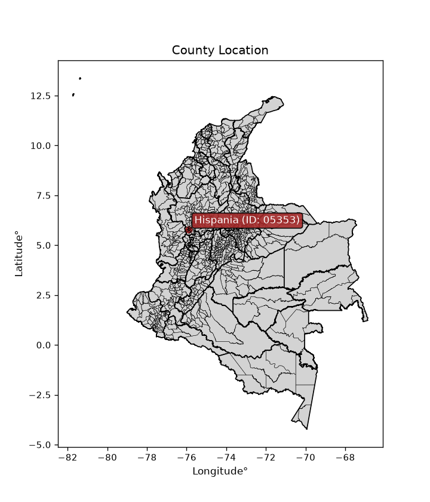
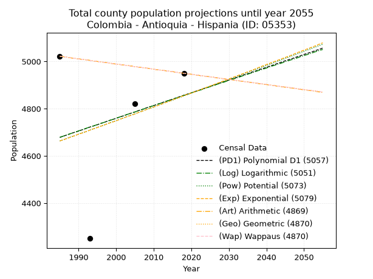
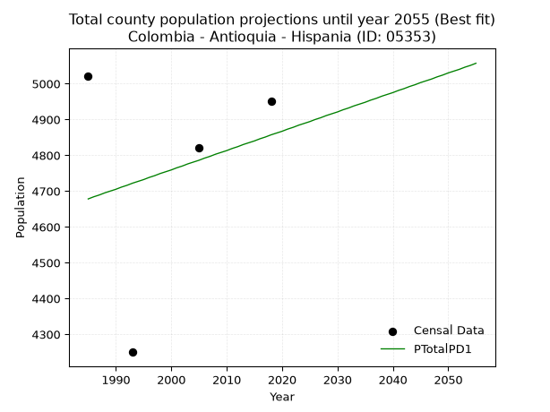
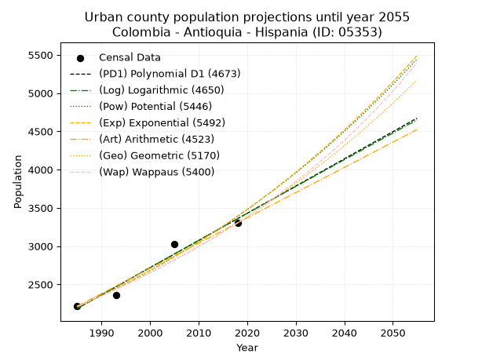
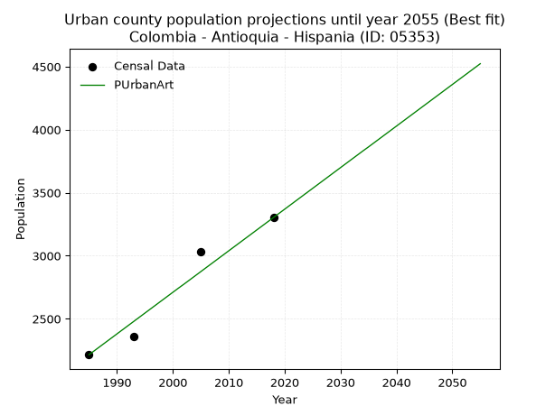
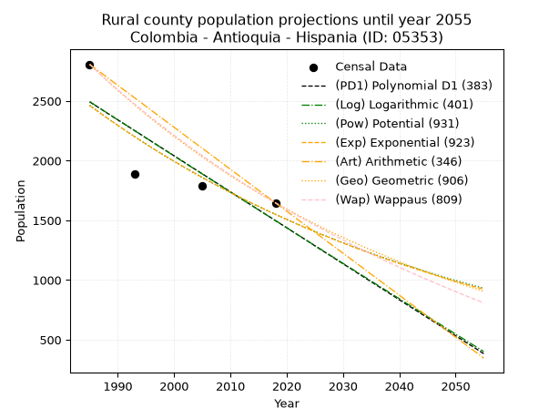
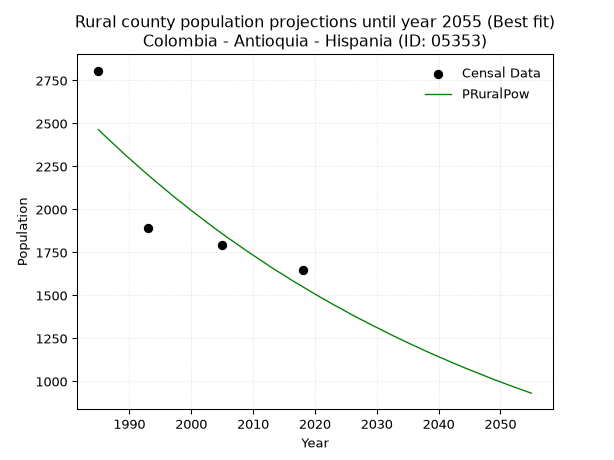

<div align="center">


</div>

# _“Population and Public Services Demand Projections (PPSD) until Year 2050 for Colombia - Antioquia - Hispania (ID: 05353)”_
Keywords: `population` `public-service` `projection` `lineal` `polynomial` `logarithmic` `potential` `exponential` `arithmetic` `geometric` `wappaus` `dane` `colombia` `south-america`

PPSD are analytical estimates used by governments and planners to anticipate future changes in population size, age distribution, and the resulting community needs for utilities, healthcare, education, and infrastructure as sizing future water treatment facilities, electrical grids, and road networks based on spatial growth.

<div align="center">

</img>

</div>


> **General running parameters**: • app_version: _v20260806_. • Python version: _3.14.7_. • Pandas version: _3.0.5_. • NumPy version: _2.5.1_. • Creates, save and include plots into reports (create_plot): _False_. • Projection until year: _2050_. • Process polynomial degree 2 and up: _False_. • Process Wappaus: _True_. • Process Wappaus: _True_. • Set negative values to zero: _True_. • Set infinite values to zero: _True_. • Drop dataset notes: _True_. 
<div align="center">

Dynamic map: [:earth_americas:Google](http://maps.google.com/maps?q=5.799460798,-75.9065873) [:earth_americas:OSM](https://www.openstreetmap.org/#map=18/5.799460798/-75.9065873&layers=P) [:earth_americas:Bing](https://www.bing.com/maps?cp=5.799460798~-75.9065873&lvl=18) [:earth_americas:Apple](https://maps.apple.com/frame?center=5.799460798%2C-75.9065873&span=0.003%2C0.006)

</div>


<div align="center">

```geojson
{
  "type": "Feature",
  "geometry": {
    "type": "Point", 
    "coordinates": [-75.9065873, 5.799460798]
  }, 
  "properties": {
    "Name": "Colombia - Antioquia - Hispania (ID: 05353)"
  }
}
```

</div>


## 0. Census Data (4 records)

Census data are official statistics collected by a government about the people and housing in a country. They usually include counts of total population, age, sex, race, income, education, and jobs.

📅Global census file: [Population.xlsx](../data/Population.xlsx)

| Source   |   Year |   CountryID | CountryName   |   StateID | StateName   |   CountyID | CountyName   |   PTotal |   PUrban |   PRural |
|:---------|-------:|------------:|:--------------|----------:|:------------|-----------:|:-------------|---------:|---------:|---------:|
| DANE     |   1985 |          57 | Colombia      |        05 | Antioquia   |      05353 | Hispania     |     5022 |     2215 |     2807 |
| DANE     |   1993 |          57 | Colombia      |        05 | Antioquia   |      05353 | Hispania     |     4250 |     2361 |     1889 |
| DANE     |   2005 |          57 | Colombia      |        05 | Antioquia   |      05353 | Hispania     |     4821 |     3031 |     1790 |
| DANE     |   2018 |          57 | Colombia      |        05 | Antioquia   |      05353 | Hispania     |     4950 |     3303 |     1647 |

> 🔥Some records could had specific notes about the registered values or the corresponding urban or rural distribution.

📅[SUI-RUPS](https://www.datos.gov.co/Hacienda-y-Cr-dito-P-blico/Registro-nico-de-Prestadores-de-Servicios-P-blicos/4qkq-csdn/about_data) - Local public utility companies: [RUPS.csv](../data/RUPS.xlsx)

 | SERVICIO       | ESTADO    | NOMBRE                                                               | NIT         | DEPARTAMENTO_DOMICILIO   | MUNICIPIO_DOMICILIO   | DIRECCION                   |   TELEFONO | EMAIL                            | TIPO_PRESTADOR                             | CLASIFICACION                 |
|:---------------|:----------|:---------------------------------------------------------------------|:------------|:-------------------------|:----------------------|:----------------------------|-----------:|:---------------------------------|:-------------------------------------------|:------------------------------|
| ACUEDUCTO      | OPERATIVA | ASOCIACION DE USUARIOS DEL ACUEDUCTO MULTIVEREDAL BETANIA - HISPANIA | 811020039-4 | ANTIOQUIA                | BETANIA               | CALLE 21 AYACUCHO 20-52     |    8435695 | velex19@hotmail.com              | ORGANIZACION AUTORIZADA                    | MENOR O IGUAL A 2500 USUARIOS |
| ACUEDUCTO      | OPERATIVA | EMPRESAS PUBLICAS DE HISPANIA S.A. E.S.P.                            | 900150224-0 | ANTIOQUIA                | HISPANIA              | Calle 48B N 48-72 LOCAL 101 |    8432051 | paola.manrique.giraldo@gmail.com | SOCIEDADES (EMPRESA DE SERVICIOS PUBLICOS) | MENOR O IGUAL A 2500 USUARIOS |
| ALCANTARILLADO | OPERATIVA | EMPRESAS PUBLICAS DE HISPANIA S.A. E.S.P.                            | 900150224-0 | ANTIOQUIA                | HISPANIA              | Calle 48B N 48-72 LOCAL 101 |    8432051 | paola.manrique.giraldo@gmail.com | SOCIEDADES (EMPRESA DE SERVICIOS PUBLICOS) | MENOR O IGUAL A 2500 USUARIOS |

## 1. Total

### 1.1. Coefficients and Parameters

* (PD1) Polynomial Deg 1: 5.402248093135153, -6045.0967482935885 (lineal)
* (Log) Logarithmic: 10744.512187046948, -76908.3732348609
* (Pow) Potential: 2.4272994653235225, -4.335947622330062
* (Exp) Exponential: 0.0012199878202553915, 413.95351728617766
* (Art) Arithmetic: Year diff. 2018 - 1985 = 33, Population diff. 4950 - 5022 = -72, Annual growth = -2.1818181818181817
* (Geo) Geometric: Year diff. 2018 - 1985 = 33, Population diff. 4950 - 5022 = -72, Annual growth % = -0.0004375007581598478
* (Wap) Wappaus: i = -0.04375888852423149, Condition values only valid for < 200)

<sub>
Wappaus condition values: ['-0.00', '-0.04', '-0.09', '-0.13', '-0.18', '-0.22', '-0.26', '-0.31', '-0.35', '-0.39', '-0.44', '-0.48', '-0.53', '-0.57', '-0.61', '-0.66', '-0.70', '-0.74', '-0.79', '-0.83', '-0.88', '-0.92', '-0.96', '-1.01', '-1.05', '-1.09', '-1.14', '-1.18', '-1.23', '-1.27', '-1.31', '-1.36', '-1.40', '-1.44', '-1.49', '-1.53', '-1.58', '-1.62', '-1.66', '-1.71', '-1.75', '-1.79', '-1.84', '-1.88', '-1.93', '-1.97', '-2.01', '-2.06', '-2.10', '-2.14', '-2.19', '-2.23', '-2.28', '-2.32', '-2.36', '-2.41', '-2.45', '-2.49', '-2.54', '-2.58', '-2.63', '-2.67', '-2.71', '-2.76', '-2.80', '-2.84']
</sub>


### 1.2. Projected Dataset

|   Year |   CountyID |   PTotalPD1 |   PTotalLog |   PTotalPow |   PTotalExp |   PTotalArt |   PTotalGeo |   PTotalWap |
|-------:|-----------:|------------:|------------:|------------:|------------:|------------:|------------:|------------:|
|   1985 |      05353 |        4678 |        4679 |        4663 |        4663 |        5022 |        5022 |        5022 |
|   1986 |      05353 |        4684 |        4684 |        4669 |        4669 |        5020 |        5020 |        5020 |
|   1987 |      05353 |        4689 |        4690 |        4675 |        4674 |        5018 |        5018 |        5018 |
|   1988 |      05353 |        4695 |        4695 |        4681 |        4680 |        5015 |        5015 |        5015 |
|   1989 |      05353 |        4700 |        4700 |        4686 |        4686 |        5013 |        5013 |        5013 |
|   1990 |      05353 |        4705 |        4706 |        4692 |        4692 |        5011 |        5011 |        5011 |
|   1991 |      05353 |        4711 |        4711 |        4698 |        4697 |        5009 |        5009 |        5009 |
|   1992 |      05353 |        4716 |        4717 |        4703 |        4703 |        5007 |        5007 |        5007 |
|   1993 |      05353 |        4722 |        4722 |        4709 |        4709 |        5005 |        5004 |        5004 |
|   1994 |      05353 |        4727 |        4727 |        4715 |        4715 |        5002 |        5002 |        5002 |
|   1995 |      05353 |        4732 |        4733 |        4721 |        4720 |        5000 |        5000 |        5000 |
|   1996 |      05353 |        4738 |        4738 |        4726 |        4726 |        4998 |        4998 |        4998 |
|   1997 |      05353 |        4743 |        4743 |        4732 |        4732 |        4996 |        4996 |        4996 |
|   1998 |      05353 |        4749 |        4749 |        4738 |        4738 |        4994 |        4994 |        4994 |
|   1999 |      05353 |        4754 |        4754 |        4744 |        4743 |        4991 |        4991 |        4991 |
|   2000 |      05353 |        4759 |        4760 |        4749 |        4749 |        4989 |        4989 |        4989 |
|   2001 |      05353 |        4765 |        4765 |        4755 |        4755 |        4987 |        4987 |        4987 |
|   2002 |      05353 |        4770 |        4770 |        4761 |        4761 |        4985 |        4985 |        4985 |
|   2003 |      05353 |        4776 |        4776 |        4767 |        4767 |        4983 |        4983 |        4983 |
|   2004 |      05353 |        4781 |        4781 |        4773 |        4772 |        4981 |        4980 |        4980 |
|   2005 |      05353 |        4786 |        4786 |        4778 |        4778 |        4978 |        4978 |        4978 |
|   2006 |      05353 |        4792 |        4792 |        4784 |        4784 |        4976 |        4976 |        4976 |
|   2007 |      05353 |        4797 |        4797 |        4790 |        4790 |        4974 |        4974 |        4974 |
|   2008 |      05353 |        4803 |        4803 |        4796 |        4796 |        4972 |        4972 |        4972 |
|   2009 |      05353 |        4808 |        4808 |        4801 |        4802 |        4970 |        4970 |        4970 |
|   2010 |      05353 |        4813 |        4813 |        4807 |        4807 |        4967 |        4967 |        4967 |
|   2011 |      05353 |        4819 |        4819 |        4813 |        4813 |        4965 |        4965 |        4965 |
|   2012 |      05353 |        4824 |        4824 |        4819 |        4819 |        4963 |        4963 |        4963 |
|   2013 |      05353 |        4830 |        4829 |        4825 |        4825 |        4961 |        4961 |        4961 |
|   2014 |      05353 |        4835 |        4835 |        4831 |        4831 |        4959 |        4959 |        4959 |
|   2015 |      05353 |        4840 |        4840 |        4836 |        4837 |        4957 |        4957 |        4957 |
|   2016 |      05353 |        4846 |        4845 |        4842 |        4843 |        4954 |        4954 |        4954 |
|   2017 |      05353 |        4851 |        4851 |        4848 |        4849 |        4952 |        4952 |        4952 |
|   2018 |      05353 |        4857 |        4856 |        4854 |        4855 |        4950 |        4950 |        4950 |
|   2019 |      05353 |        4862 |        4861 |        4860 |        4861 |        4948 |        4948 |        4948 |
|   2020 |      05353 |        4867 |        4867 |        4866 |        4866 |        4946 |        4946 |        4946 |
|   2021 |      05353 |        4873 |        4872 |        4871 |        4872 |        4943 |        4944 |        4944 |
|   2022 |      05353 |        4878 |        4877 |        4877 |        4878 |        4941 |        4941 |        4941 |
|   2023 |      05353 |        4884 |        4882 |        4883 |        4884 |        4939 |        4939 |        4939 |
|   2024 |      05353 |        4889 |        4888 |        4889 |        4890 |        4937 |        4937 |        4937 |
|   2025 |      05353 |        4894 |        4893 |        4895 |        4896 |        4935 |        4935 |        4935 |
|   2026 |      05353 |        4900 |        4898 |        4901 |        4902 |        4933 |        4933 |        4933 |
|   2027 |      05353 |        4905 |        4904 |        4907 |        4908 |        4930 |        4931 |        4931 |
|   2028 |      05353 |        4911 |        4909 |        4912 |        4914 |        4928 |        4928 |        4928 |
|   2029 |      05353 |        4916 |        4914 |        4918 |        4920 |        4926 |        4926 |        4926 |
|   2030 |      05353 |        4921 |        4920 |        4924 |        4926 |        4924 |        4924 |        4924 |
|   2031 |      05353 |        4927 |        4925 |        4930 |        4932 |        4922 |        4922 |        4922 |
|   2032 |      05353 |        4932 |        4930 |        4936 |        4938 |        4919 |        4920 |        4920 |
|   2033 |      05353 |        4938 |        4935 |        4942 |        4944 |        4917 |        4918 |        4918 |
|   2034 |      05353 |        4943 |        4941 |        4948 |        4950 |        4915 |        4915 |        4915 |
|   2035 |      05353 |        4948 |        4946 |        4954 |        4956 |        4913 |        4913 |        4913 |
|   2036 |      05353 |        4954 |        4951 |        4960 |        4962 |        4911 |        4911 |        4911 |
|   2037 |      05353 |        4959 |        4957 |        4966 |        4968 |        4909 |        4909 |        4909 |
|   2038 |      05353 |        4965 |        4962 |        4971 |        4975 |        4906 |        4907 |        4907 |
|   2039 |      05353 |        4970 |        4967 |        4977 |        4981 |        4904 |        4905 |        4905 |
|   2040 |      05353 |        4975 |        4972 |        4983 |        4987 |        4902 |        4903 |        4903 |
|   2041 |      05353 |        4981 |        4978 |        4989 |        4993 |        4900 |        4900 |        4900 |
|   2042 |      05353 |        4986 |        4983 |        4995 |        4999 |        4898 |        4898 |        4898 |
|   2043 |      05353 |        4992 |        4988 |        5001 |        5005 |        4895 |        4896 |        4896 |
|   2044 |      05353 |        4997 |        4993 |        5007 |        5011 |        4893 |        4894 |        4894 |
|   2045 |      05353 |        5003 |        4999 |        5013 |        5017 |        4891 |        4892 |        4892 |
|   2046 |      05353 |        5008 |        5004 |        5019 |        5023 |        4889 |        4890 |        4890 |
|   2047 |      05353 |        5013 |        5009 |        5025 |        5029 |        4887 |        4888 |        4888 |
|   2048 |      05353 |        5019 |        5014 |        5031 |        5036 |        4885 |        4885 |        4885 |
|   2049 |      05353 |        5024 |        5020 |        5037 |        5042 |        4882 |        4883 |        4883 |
|   2050 |      05353 |        5030 |        5025 |        5043 |        5048 |        4880 |        4881 |        4881 |
<div align="center">

</img>

</div>


### 1.3. Best fit with absolute and relative error (%)

Relative error puts that difference into context by dividing the absolute error by the true value, creating a unitless ratio or percentage that shows the scale of the mistake.

Absolute and relative error

|   Year | Source   |   CountryID | CountryName   |   StateID | StateName   |   CountyID_x | CountyName   |   PTotal |   PUrban |   PRural |   CountyID_y |   PTotalPD1 |   PTotalLog |   PTotalPow |   PTotalExp |   PTotalArt |   PTotalGeo |   PTotalWap |   PTotalPD1AbsError |   PTotalLogAbsError |   PTotalPowAbsError |   PTotalExpAbsError |   PTotalArtAbsError |   PTotalGeoAbsError |   PTotalWapAbsError |   PTotalPD1RelError |   PTotalLogRelError |   PTotalPowRelError |   PTotalExpRelError |   PTotalArtRelError |   PTotalGeoRelError |   PTotalWapRelError |
|-------:|:---------|------------:|:--------------|----------:|:------------|-------------:|:-------------|---------:|---------:|---------:|-------------:|------------:|------------:|------------:|------------:|------------:|------------:|------------:|--------------------:|--------------------:|--------------------:|--------------------:|--------------------:|--------------------:|--------------------:|--------------------:|--------------------:|--------------------:|--------------------:|--------------------:|--------------------:|--------------------:|
|   1985 | DANE     |          57 | Colombia      |        05 | Antioquia   |        05353 | Hispania     |     5022 |     2215 |     2807 |        05353 |        4678 |        4679 |        4663 |        4663 |        5022 |        5022 |        5022 |                 344 |                 343 |                 359 |                 359 |                   0 |                   0 |                   0 |             6.84986 |             6.82995 |            7.14855  |            7.14855  |             0       |             0       |             0       |
|   1993 | DANE     |          57 | Colombia      |        05 | Antioquia   |        05353 | Hispania     |     4250 |     2361 |     1889 |        05353 |        4722 |        4722 |        4709 |        4709 |        5005 |        5004 |        5004 |                 472 |                 472 |                 459 |                 459 |                 755 |                 754 |                 754 |            11.1059  |            11.1059  |           10.8      |           10.8      |            17.7647  |            17.7412  |            17.7412  |
|   2005 | DANE     |          57 | Colombia      |        05 | Antioquia   |        05353 | Hispania     |     4821 |     3031 |     1790 |        05353 |        4786 |        4786 |        4778 |        4778 |        4978 |        4978 |        4978 |                  35 |                  35 |                  43 |                  43 |                 157 |                 157 |                 157 |             0.72599 |             0.72599 |            0.891931 |            0.891931 |             3.25659 |             3.25659 |             3.25659 |
|   2018 | DANE     |          57 | Colombia      |        05 | Antioquia   |        05353 | Hispania     |     4950 |     3303 |     1647 |        05353 |        4857 |        4856 |        4854 |        4855 |        4950 |        4950 |        4950 |                  93 |                  94 |                  96 |                  95 |                   0 |                   0 |                   0 |             1.87879 |             1.89899 |            1.93939  |            1.91919  |             0       |             0       |             0       |

Relative error mean

| Method    |   RelError | Best   |
|:----------|-----------:|:-------|
| PTotalPD1 |    5.14013 | True   |
| PTotalLog |    5.1402  |        |
| PTotalPow |    5.19497 |        |
| PTotalExp |    5.18992 |        |
| PTotalArt |    5.25532 |        |
| PTotalGeo |    5.24944 |        |
| PTotalWap |    5.24944 |        |

💙Best method: _**PTotalPD1**_
<div align="center">

</img>

</div>


### 1.4. Fresh water supply demand in liters per capita per day (lpcd)

The fresh water supply demand typically ranges from 100 to 300 liters per capita per day (lpcd) for standard domestic and municipal planning, though absolute survival minimums set by the World Health Organization are as low as 7.5 to 20 liters per day, and total consumption in high-income nations can exceed 400 liters.

> `CZ`: Level in meters above the sea level (masl)<br> `WS`: Fresh water supply demand in liters per capita per day (lpcd or l/h/d)<br> `WSAll`: Zonal fresh water supply demand in liters per second (l/s)<br> `A`: Zonal area in square meters<br> `DP`: Population density (people/hectare or p/ha)

Reference values (RAS Colombia)

|    CZ |   WS |
|------:|-----:|
|  1000 |  120 |
|  2000 |  130 |
| 99999 |  140 |

County shapefile geometry properties and water supply values

|   CountyID |      ATotal |   CZTotal |   WSTotal |
|-----------:|------------:|----------:|----------:|
|      05353 | 5.41783e+07 |   1201.37 |       130 |

Projected values for best method: PTotalPD1

|   CountyID |   Year |   PTotalPD1 |   DPTotal |   WSTotal |   WSTotalAll |
|-----------:|-------:|------------:|----------:|----------:|-------------:|
|      05353 |   1985 |        4678 |      0.86 |       130 |      7.03866 |
|      05353 |   1986 |        4684 |      0.86 |       130 |      7.04769 |
|      05353 |   1987 |        4689 |      0.87 |       130 |      7.05521 |
|      05353 |   1988 |        4695 |      0.87 |       130 |      7.06424 |
|      05353 |   1989 |        4700 |      0.87 |       130 |      7.07176 |
|      05353 |   1990 |        4705 |      0.87 |       130 |      7.07928 |
|      05353 |   1991 |        4711 |      0.87 |       130 |      7.08831 |
|      05353 |   1992 |        4716 |      0.87 |       130 |      7.09583 |
|      05353 |   1993 |        4722 |      0.87 |       130 |      7.10486 |
|      05353 |   1994 |        4727 |      0.87 |       130 |      7.11238 |
|      05353 |   1995 |        4732 |      0.87 |       130 |      7.11991 |
|      05353 |   1996 |        4738 |      0.87 |       130 |      7.12894 |
|      05353 |   1997 |        4743 |      0.88 |       130 |      7.13646 |
|      05353 |   1998 |        4749 |      0.88 |       130 |      7.14549 |
|      05353 |   1999 |        4754 |      0.88 |       130 |      7.15301 |
|      05353 |   2000 |        4759 |      0.88 |       130 |      7.16053 |
|      05353 |   2001 |        4765 |      0.88 |       130 |      7.16956 |
|      05353 |   2002 |        4770 |      0.88 |       130 |      7.17708 |
|      05353 |   2003 |        4776 |      0.88 |       130 |      7.18611 |
|      05353 |   2004 |        4781 |      0.88 |       130 |      7.19363 |
|      05353 |   2005 |        4786 |      0.88 |       130 |      7.20116 |
|      05353 |   2006 |        4792 |      0.88 |       130 |      7.21019 |
|      05353 |   2007 |        4797 |      0.89 |       130 |      7.21771 |
|      05353 |   2008 |        4803 |      0.89 |       130 |      7.22674 |
|      05353 |   2009 |        4808 |      0.89 |       130 |      7.23426 |
|      05353 |   2010 |        4813 |      0.89 |       130 |      7.24178 |
|      05353 |   2011 |        4819 |      0.89 |       130 |      7.25081 |
|      05353 |   2012 |        4824 |      0.89 |       130 |      7.25833 |
|      05353 |   2013 |        4830 |      0.89 |       130 |      7.26736 |
|      05353 |   2014 |        4835 |      0.89 |       130 |      7.27488 |
|      05353 |   2015 |        4840 |      0.89 |       130 |      7.28241 |
|      05353 |   2016 |        4846 |      0.89 |       130 |      7.29144 |
|      05353 |   2017 |        4851 |      0.9  |       130 |      7.29896 |
|      05353 |   2018 |        4857 |      0.9  |       130 |      7.30799 |
|      05353 |   2019 |        4862 |      0.9  |       130 |      7.31551 |
|      05353 |   2020 |        4867 |      0.9  |       130 |      7.32303 |
|      05353 |   2021 |        4873 |      0.9  |       130 |      7.33206 |
|      05353 |   2022 |        4878 |      0.9  |       130 |      7.33958 |
|      05353 |   2023 |        4884 |      0.9  |       130 |      7.34861 |
|      05353 |   2024 |        4889 |      0.9  |       130 |      7.35613 |
|      05353 |   2025 |        4894 |      0.9  |       130 |      7.36366 |
|      05353 |   2026 |        4900 |      0.9  |       130 |      7.37269 |
|      05353 |   2027 |        4905 |      0.91 |       130 |      7.38021 |
|      05353 |   2028 |        4911 |      0.91 |       130 |      7.38924 |
|      05353 |   2029 |        4916 |      0.91 |       130 |      7.39676 |
|      05353 |   2030 |        4921 |      0.91 |       130 |      7.40428 |
|      05353 |   2031 |        4927 |      0.91 |       130 |      7.41331 |
|      05353 |   2032 |        4932 |      0.91 |       130 |      7.42083 |
|      05353 |   2033 |        4938 |      0.91 |       130 |      7.42986 |
|      05353 |   2034 |        4943 |      0.91 |       130 |      7.43738 |
|      05353 |   2035 |        4948 |      0.91 |       130 |      7.44491 |
|      05353 |   2036 |        4954 |      0.91 |       130 |      7.45394 |
|      05353 |   2037 |        4959 |      0.92 |       130 |      7.46146 |
|      05353 |   2038 |        4965 |      0.92 |       130 |      7.47049 |
|      05353 |   2039 |        4970 |      0.92 |       130 |      7.47801 |
|      05353 |   2040 |        4975 |      0.92 |       130 |      7.48553 |
|      05353 |   2041 |        4981 |      0.92 |       130 |      7.49456 |
|      05353 |   2042 |        4986 |      0.92 |       130 |      7.50208 |
|      05353 |   2043 |        4992 |      0.92 |       130 |      7.51111 |
|      05353 |   2044 |        4997 |      0.92 |       130 |      7.51863 |
|      05353 |   2045 |        5003 |      0.92 |       130 |      7.52766 |
|      05353 |   2046 |        5008 |      0.92 |       130 |      7.53519 |
|      05353 |   2047 |        5013 |      0.93 |       130 |      7.54271 |
|      05353 |   2048 |        5019 |      0.93 |       130 |      7.55174 |
|      05353 |   2049 |        5024 |      0.93 |       130 |      7.55926 |
|      05353 |   2050 |        5030 |      0.93 |       130 |      7.56829 |

## 2. Urban

### 2.1. Coefficients and Parameters

* (PD1) Polynomial Deg 1: 35.53512645523864, -68351.6366920911 (lineal)
* (Log) Logarithmic: 71138.4056681828, -537996.0915512635
* (Pow) Potential: 26.103685702365947, -82.74050507608406
* (Exp) Exponential: 0.013038178105231165, 1.2691350677900323e-08
* (Art) Arithmetic: Year diff. 2018 - 1985 = 33, Population diff. 3303 - 2215 = 1088, Annual growth = 32.96969696969697
* (Geo) Geometric: Year diff. 2018 - 1985 = 33, Population diff. 3303 - 2215 = 1088, Annual growth % = 0.012182050773078767
* (Wap) Wappaus: i = 1.1949872044109087, Condition values only valid for < 200)

<sub>
Wappaus condition values: ['0.00', '1.19', '2.39', '3.58', '4.78', '5.97', '7.17', '8.36', '9.56', '10.75', '11.95', '13.14', '14.34', '15.53', '16.73', '17.92', '19.12', '20.31', '21.51', '22.70', '23.90', '25.09', '26.29', '27.48', '28.68', '29.87', '31.07', '32.26', '33.46', '34.65', '35.85', '37.04', '38.24', '39.43', '40.63', '41.82', '43.02', '44.21', '45.41', '46.60', '47.80', '48.99', '50.19', '51.38', '52.58', '53.77', '54.97', '56.16', '57.36', '58.55', '59.75', '60.94', '62.14', '63.33', '64.53', '65.72', '66.92', '68.11', '69.31', '70.50', '71.70', '72.89', '74.09', '75.28', '76.48', '77.67']
</sub>


### 2.2. Projected Dataset

|   Year |   CountyID |   PUrbanPD1 |   PUrbanLog |   PUrbanPow |   PUrbanExp |   PUrbanArt |   PUrbanGeo |   PUrbanWap |
|-------:|-----------:|------------:|------------:|------------:|------------:|------------:|------------:|------------:|
|   1985 |      05353 |        2186 |        2184 |        2204 |        2205 |        2215 |        2215 |        2215 |
|   1986 |      05353 |        2221 |        2220 |        2233 |        2234 |        2248 |        2242 |        2242 |
|   1987 |      05353 |        2257 |        2256 |        2263 |        2263 |        2281 |        2269 |        2269 |
|   1988 |      05353 |        2292 |        2292 |        2293 |        2293 |        2314 |        2297 |        2296 |
|   1989 |      05353 |        2328 |        2328 |        2323 |        2323 |        2347 |        2325 |        2323 |
|   1990 |      05353 |        2363 |        2363 |        2354 |        2353 |        2380 |        2353 |        2351 |
|   1991 |      05353 |        2399 |        2399 |        2385 |        2384 |        2413 |        2382 |        2380 |
|   1992 |      05353 |        2434 |        2435 |        2416 |        2416 |        2446 |        2411 |        2408 |
|   1993 |      05353 |        2470 |        2471 |        2448 |        2447 |        2479 |        2440 |        2437 |
|   1994 |      05353 |        2505 |        2506 |        2480 |        2479 |        2512 |        2470 |        2467 |
|   1995 |      05353 |        2541 |        2542 |        2513 |        2512 |        2545 |        2500 |        2497 |
|   1996 |      05353 |        2576 |        2578 |        2546 |        2545 |        2578 |        2531 |        2527 |
|   1997 |      05353 |        2612 |        2613 |        2579 |        2578 |        2611 |        2561 |        2557 |
|   1998 |      05353 |        2648 |        2649 |        2613 |        2612 |        2644 |        2593 |        2588 |
|   1999 |      05353 |        2683 |        2684 |        2648 |        2646 |        2677 |        2624 |        2619 |
|   2000 |      05353 |        2719 |        2720 |        2683 |        2681 |        2710 |        2656 |        2651 |
|   2001 |      05353 |        2754 |        2756 |        2718 |        2716 |        2743 |        2689 |        2683 |
|   2002 |      05353 |        2790 |        2791 |        2753 |        2752 |        2775 |        2721 |        2716 |
|   2003 |      05353 |        2825 |        2827 |        2790 |        2788 |        2808 |        2754 |        2749 |
|   2004 |      05353 |        2861 |        2862 |        2826 |        2825 |        2841 |        2788 |        2782 |
|   2005 |      05353 |        2896 |        2898 |        2863 |        2862 |        2874 |        2822 |        2816 |
|   2006 |      05353 |        2932 |        2933 |        2901 |        2899 |        2907 |        2856 |        2851 |
|   2007 |      05353 |        2967 |        2969 |        2939 |        2937 |        2940 |        2891 |        2885 |
|   2008 |      05353 |        3003 |        3004 |        2977 |        2976 |        2973 |        2926 |        2921 |
|   2009 |      05353 |        3038 |        3039 |        3016 |        3015 |        3006 |        2962 |        2957 |
|   2010 |      05353 |        3074 |        3075 |        3056 |        3055 |        3039 |        2998 |        2993 |
|   2011 |      05353 |        3110 |        3110 |        3095 |        3095 |        3072 |        3035 |        3030 |
|   2012 |      05353 |        3145 |        3146 |        3136 |        3135 |        3105 |        3072 |        3067 |
|   2013 |      05353 |        3181 |        3181 |        3177 |        3176 |        3138 |        3109 |        3105 |
|   2014 |      05353 |        3216 |        3216 |        3218 |        3218 |        3171 |        3147 |        3143 |
|   2015 |      05353 |        3252 |        3252 |        3260 |        3260 |        3204 |        3185 |        3182 |
|   2016 |      05353 |        3287 |        3287 |        3303 |        3303 |        3237 |        3224 |        3222 |
|   2017 |      05353 |        3323 |        3322 |        3346 |        3346 |        3270 |        3263 |        3262 |
|   2018 |      05353 |        3358 |        3357 |        3389 |        3390 |        3303 |        3303 |        3303 |
|   2019 |      05353 |        3394 |        3393 |        3433 |        3435 |        3336 |        3343 |        3344 |
|   2020 |      05353 |        3429 |        3428 |        3478 |        3480 |        3369 |        3384 |        3386 |
|   2021 |      05353 |        3465 |        3463 |        3523 |        3526 |        3402 |        3425 |        3429 |
|   2022 |      05353 |        3500 |        3498 |        3569 |        3572 |        3435 |        3467 |        3472 |
|   2023 |      05353 |        3536 |        3533 |        3616 |        3619 |        3468 |        3509 |        3516 |
|   2024 |      05353 |        3571 |        3569 |        3662 |        3666 |        3501 |        3552 |        3561 |
|   2025 |      05353 |        3607 |        3604 |        3710 |        3714 |        3534 |        3595 |        3606 |
|   2026 |      05353 |        3643 |        3639 |        3758 |        3763 |        3567 |        3639 |        3652 |
|   2027 |      05353 |        3678 |        3674 |        3807 |        3813 |        3600 |        3683 |        3699 |
|   2028 |      05353 |        3714 |        3709 |        3856 |        3863 |        3633 |        3728 |        3747 |
|   2029 |      05353 |        3749 |        3744 |        3906 |        3913 |        3666 |        3774 |        3795 |
|   2030 |      05353 |        3785 |        3779 |        3957 |        3965 |        3699 |        3820 |        3844 |
|   2031 |      05353 |        3820 |        3814 |        4008 |        4017 |        3732 |        3866 |        3894 |
|   2032 |      05353 |        3856 |        3849 |        4060 |        4069 |        3765 |        3913 |        3945 |
|   2033 |      05353 |        3891 |        3884 |        4112 |        4123 |        3798 |        3961 |        3996 |
|   2034 |      05353 |        3927 |        3919 |        4165 |        4177 |        3831 |        4009 |        4049 |
|   2035 |      05353 |        3962 |        3954 |        4219 |        4232 |        3863 |        4058 |        4102 |
|   2036 |      05353 |        3998 |        3989 |        4274 |        4287 |        3896 |        4107 |        4157 |
|   2037 |      05353 |        4033 |        4024 |        4329 |        4343 |        3929 |        4157 |        4212 |
|   2038 |      05353 |        4069 |        4059 |        4385 |        4400 |        3962 |        4208 |        4268 |
|   2039 |      05353 |        4104 |        4094 |        4441 |        4458 |        3995 |        4259 |        4325 |
|   2040 |      05353 |        4140 |        4129 |        4498 |        4517 |        4028 |        4311 |        4383 |
|   2041 |      05353 |        4176 |        4164 |        4556 |        4576 |        4061 |        4364 |        4443 |
|   2042 |      05353 |        4211 |        4198 |        4615 |        4636 |        4094 |        4417 |        4503 |
|   2043 |      05353 |        4247 |        4233 |        4674 |        4697 |        4127 |        4471 |        4564 |
|   2044 |      05353 |        4282 |        4268 |        4734 |        4759 |        4160 |        4525 |        4627 |
|   2045 |      05353 |        4318 |        4303 |        4795 |        4821 |        4193 |        4580 |        4691 |
|   2046 |      05353 |        4353 |        4338 |        4857 |        4884 |        4226 |        4636 |        4756 |
|   2047 |      05353 |        4389 |        4372 |        4919 |        4948 |        4259 |        4693 |        4822 |
|   2048 |      05353 |        4424 |        4407 |        4982 |        5013 |        4292 |        4750 |        4889 |
|   2049 |      05353 |        4460 |        4442 |        5046 |        5079 |        4325 |        4808 |        4958 |
|   2050 |      05353 |        4495 |        4477 |        5111 |        5146 |        4358 |        4866 |        5028 |
<div align="center">

</img>

</div>


### 2.3. Best fit with absolute and relative error (%)

Relative error puts that difference into context by dividing the absolute error by the true value, creating a unitless ratio or percentage that shows the scale of the mistake.

Absolute and relative error

|   Year | Source   |   CountryID | CountryName   |   StateID | StateName   |   CountyID_x | CountyName   |   PTotal |   PUrban |   PRural |   CountyID_y |   PUrbanPD1 |   PUrbanLog |   PUrbanPow |   PUrbanExp |   PUrbanArt |   PUrbanGeo |   PUrbanWap |   PUrbanPD1AbsError |   PUrbanLogAbsError |   PUrbanPowAbsError |   PUrbanExpAbsError |   PUrbanArtAbsError |   PUrbanGeoAbsError |   PUrbanWapAbsError |   PUrbanPD1RelError |   PUrbanLogRelError |   PUrbanPowRelError |   PUrbanExpRelError |   PUrbanArtRelError |   PUrbanGeoRelError |   PUrbanWapRelError |
|-------:|:---------|------------:|:--------------|----------:|:------------|-------------:|:-------------|---------:|---------:|---------:|-------------:|------------:|------------:|------------:|------------:|------------:|------------:|------------:|--------------------:|--------------------:|--------------------:|--------------------:|--------------------:|--------------------:|--------------------:|--------------------:|--------------------:|--------------------:|--------------------:|--------------------:|--------------------:|--------------------:|
|   1985 | DANE     |          57 | Colombia      |        05 | Antioquia   |        05353 | Hispania     |     5022 |     2215 |     2807 |        05353 |        2186 |        2184 |        2204 |        2205 |        2215 |        2215 |        2215 |                  29 |                  31 |                  11 |                  10 |                   0 |                   0 |                   0 |             1.30926 |             1.39955 |            0.496614 |            0.451467 |             0       |             0       |             0       |
|   1993 | DANE     |          57 | Colombia      |        05 | Antioquia   |        05353 | Hispania     |     4250 |     2361 |     1889 |        05353 |        2470 |        2471 |        2448 |        2447 |        2479 |        2440 |        2437 |                 109 |                 110 |                  87 |                  86 |                 118 |                  79 |                  76 |             4.61669 |             4.65904 |            3.68488  |            3.64252  |             4.99788 |             3.34604 |             3.21898 |
|   2005 | DANE     |          57 | Colombia      |        05 | Antioquia   |        05353 | Hispania     |     4821 |     3031 |     1790 |        05353 |        2896 |        2898 |        2863 |        2862 |        2874 |        2822 |        2816 |                 135 |                 133 |                 168 |                 169 |                 157 |                 209 |                 215 |             4.45398 |             4.38799 |            5.54273  |            5.57572  |             5.17981 |             6.89541 |             7.09337 |
|   2018 | DANE     |          57 | Colombia      |        05 | Antioquia   |        05353 | Hispania     |     4950 |     3303 |     1647 |        05353 |        3358 |        3357 |        3389 |        3390 |        3303 |        3303 |        3303 |                  55 |                  54 |                  86 |                  87 |                   0 |                   0 |                   0 |             1.66515 |             1.63488 |            2.60369  |            2.63397  |             0       |             0       |             0       |

Relative error mean

| Method    |   RelError | Best   |
|:----------|-----------:|:-------|
| PUrbanPD1 |    3.01127 |        |
| PUrbanLog |    3.02036 |        |
| PUrbanPow |    3.08198 |        |
| PUrbanExp |    3.07592 |        |
| PUrbanArt |    2.54442 | True   |
| PUrbanGeo |    2.56036 |        |
| PUrbanWap |    2.57809 |        |

💙Best method: _**PUrbanArt**_
<div align="center">

</img>

</div>


### 2.4. Fresh water supply demand in liters per capita per day (lpcd)

The fresh water supply demand typically ranges from 100 to 300 liters per capita per day (lpcd) for standard domestic and municipal planning, though absolute survival minimums set by the World Health Organization are as low as 7.5 to 20 liters per day, and total consumption in high-income nations can exceed 400 liters.

> `CZ`: Level in meters above the sea level (masl)<br> `WS`: Fresh water supply demand in liters per capita per day (lpcd or l/h/d)<br> `WSAll`: Zonal fresh water supply demand in liters per second (l/s)<br> `A`: Zonal area in square meters<br> `DP`: Population density (people/hectare or p/ha)

Reference values (RAS Colombia)

|    CZ |   WS |
|------:|-----:|
|  1000 |  120 |
|  2000 |  130 |
| 99999 |  140 |

County shapefile geometry properties and water supply values

|   CountyID |   AUrban |   CZUrban |   WSUrban |
|-----------:|---------:|----------:|----------:|
|      05353 |   683855 |   960.208 |       120 |

Projected values for best method: PUrbanArt

|   CountyID |   Year |   PUrbanArt |   DPUrban |   WSUrban |   WSUrbanAll |
|-----------:|-------:|------------:|----------:|----------:|-------------:|
|      05353 |   1985 |        2215 |     32.39 |       120 |      3.07639 |
|      05353 |   1986 |        2248 |     32.87 |       120 |      3.12222 |
|      05353 |   1987 |        2281 |     33.36 |       120 |      3.16806 |
|      05353 |   1988 |        2314 |     33.84 |       120 |      3.21389 |
|      05353 |   1989 |        2347 |     34.32 |       120 |      3.25972 |
|      05353 |   1990 |        2380 |     34.8  |       120 |      3.30556 |
|      05353 |   1991 |        2413 |     35.29 |       120 |      3.35139 |
|      05353 |   1992 |        2446 |     35.77 |       120 |      3.39722 |
|      05353 |   1993 |        2479 |     36.25 |       120 |      3.44306 |
|      05353 |   1994 |        2512 |     36.73 |       120 |      3.48889 |
|      05353 |   1995 |        2545 |     37.22 |       120 |      3.53472 |
|      05353 |   1996 |        2578 |     37.7  |       120 |      3.58056 |
|      05353 |   1997 |        2611 |     38.18 |       120 |      3.62639 |
|      05353 |   1998 |        2644 |     38.66 |       120 |      3.67222 |
|      05353 |   1999 |        2677 |     39.15 |       120 |      3.71806 |
|      05353 |   2000 |        2710 |     39.63 |       120 |      3.76389 |
|      05353 |   2001 |        2743 |     40.11 |       120 |      3.80972 |
|      05353 |   2002 |        2775 |     40.58 |       120 |      3.85417 |
|      05353 |   2003 |        2808 |     41.06 |       120 |      3.9     |
|      05353 |   2004 |        2841 |     41.54 |       120 |      3.94583 |
|      05353 |   2005 |        2874 |     42.03 |       120 |      3.99167 |
|      05353 |   2006 |        2907 |     42.51 |       120 |      4.0375  |
|      05353 |   2007 |        2940 |     42.99 |       120 |      4.08333 |
|      05353 |   2008 |        2973 |     43.47 |       120 |      4.12917 |
|      05353 |   2009 |        3006 |     43.96 |       120 |      4.175   |
|      05353 |   2010 |        3039 |     44.44 |       120 |      4.22083 |
|      05353 |   2011 |        3072 |     44.92 |       120 |      4.26667 |
|      05353 |   2012 |        3105 |     45.4  |       120 |      4.3125  |
|      05353 |   2013 |        3138 |     45.89 |       120 |      4.35833 |
|      05353 |   2014 |        3171 |     46.37 |       120 |      4.40417 |
|      05353 |   2015 |        3204 |     46.85 |       120 |      4.45    |
|      05353 |   2016 |        3237 |     47.33 |       120 |      4.49583 |
|      05353 |   2017 |        3270 |     47.82 |       120 |      4.54167 |
|      05353 |   2018 |        3303 |     48.3  |       120 |      4.5875  |
|      05353 |   2019 |        3336 |     48.78 |       120 |      4.63333 |
|      05353 |   2020 |        3369 |     49.26 |       120 |      4.67917 |
|      05353 |   2021 |        3402 |     49.75 |       120 |      4.725   |
|      05353 |   2022 |        3435 |     50.23 |       120 |      4.77083 |
|      05353 |   2023 |        3468 |     50.71 |       120 |      4.81667 |
|      05353 |   2024 |        3501 |     51.2  |       120 |      4.8625  |
|      05353 |   2025 |        3534 |     51.68 |       120 |      4.90833 |
|      05353 |   2026 |        3567 |     52.16 |       120 |      4.95417 |
|      05353 |   2027 |        3600 |     52.64 |       120 |      5       |
|      05353 |   2028 |        3633 |     53.13 |       120 |      5.04583 |
|      05353 |   2029 |        3666 |     53.61 |       120 |      5.09167 |
|      05353 |   2030 |        3699 |     54.09 |       120 |      5.1375  |
|      05353 |   2031 |        3732 |     54.57 |       120 |      5.18333 |
|      05353 |   2032 |        3765 |     55.06 |       120 |      5.22917 |
|      05353 |   2033 |        3798 |     55.54 |       120 |      5.275   |
|      05353 |   2034 |        3831 |     56.02 |       120 |      5.32083 |
|      05353 |   2035 |        3863 |     56.49 |       120 |      5.36528 |
|      05353 |   2036 |        3896 |     56.97 |       120 |      5.41111 |
|      05353 |   2037 |        3929 |     57.45 |       120 |      5.45694 |
|      05353 |   2038 |        3962 |     57.94 |       120 |      5.50278 |
|      05353 |   2039 |        3995 |     58.42 |       120 |      5.54861 |
|      05353 |   2040 |        4028 |     58.9  |       120 |      5.59444 |
|      05353 |   2041 |        4061 |     59.38 |       120 |      5.64028 |
|      05353 |   2042 |        4094 |     59.87 |       120 |      5.68611 |
|      05353 |   2043 |        4127 |     60.35 |       120 |      5.73194 |
|      05353 |   2044 |        4160 |     60.83 |       120 |      5.77778 |
|      05353 |   2045 |        4193 |     61.31 |       120 |      5.82361 |
|      05353 |   2046 |        4226 |     61.8  |       120 |      5.86944 |
|      05353 |   2047 |        4259 |     62.28 |       120 |      5.91528 |
|      05353 |   2048 |        4292 |     62.76 |       120 |      5.96111 |
|      05353 |   2049 |        4325 |     63.24 |       120 |      6.00694 |
|      05353 |   2050 |        4358 |     63.73 |       120 |      6.05278 |

## 3. Rural

### 3.1. Coefficients and Parameters

* (PD1) Polynomial Deg 1: -30.13287836210349, 62306.5399437975 (lineal)
* (Log) Logarithmic: -60393.89348113593, 461087.7183164033
* (Pow) Potential: -28.08953832148162, 96.02420148031669
* (Exp) Exponential: -0.01401707763755304, 2986111883654391.0
* (Art) Arithmetic: Year diff. 2018 - 1985 = 33, Population diff. 1647 - 2807 = -1160, Annual growth = -35.15151515151515
* (Geo) Geometric: Year diff. 2018 - 1985 = 33, Population diff. 1647 - 2807 = -1160, Annual growth % = -0.016026574871991883
* (Wap) Wappaus: i = -1.5784245689948428, Condition values only valid for < 200)

<sub>
Wappaus condition values: ['-0.00', '-1.58', '-3.16', '-4.74', '-6.31', '-7.89', '-9.47', '-11.05', '-12.63', '-14.21', '-15.78', '-17.36', '-18.94', '-20.52', '-22.10', '-23.68', '-25.25', '-26.83', '-28.41', '-29.99', '-31.57', '-33.15', '-34.73', '-36.30', '-37.88', '-39.46', '-41.04', '-42.62', '-44.20', '-45.77', '-47.35', '-48.93', '-50.51', '-52.09', '-53.67', '-55.24', '-56.82', '-58.40', '-59.98', '-61.56', '-63.14', '-64.72', '-66.29', '-67.87', '-69.45', '-71.03', '-72.61', '-74.19', '-75.76', '-77.34', '-78.92', '-80.50', '-82.08', '-83.66', '-85.23', '-86.81', '-88.39', '-89.97', '-91.55', '-93.13', '-94.71', '-96.28', '-97.86', '-99.44', '-101.02', '-102.60']
</sub>


### 3.2. Projected Dataset

|   Year |   CountyID |   PRuralPD1 |   PRuralLog |   PRuralPow |   PRuralExp |   PRuralArt |   PRuralGeo |   PRuralWap |
|-------:|-----------:|------------:|------------:|------------:|------------:|------------:|------------:|------------:|
|   1985 |      05353 |        2493 |        2494 |        2464 |        2462 |        2807 |        2807 |        2807 |
|   1986 |      05353 |        2463 |        2464 |        2429 |        2428 |        2772 |        2762 |        2763 |
|   1987 |      05353 |        2433 |        2433 |        2395 |        2394 |        2737 |        2718 |        2720 |
|   1988 |      05353 |        2402 |        2403 |        2362 |        2361 |        2702 |        2674 |        2677 |
|   1989 |      05353 |        2372 |        2373 |        2328 |        2328 |        2666 |        2631 |        2635 |
|   1990 |      05353 |        2342 |        2342 |        2296 |        2296 |        2631 |        2589 |        2594 |
|   1991 |      05353 |        2312 |        2312 |        2264 |        2264 |        2596 |        2548 |        2553 |
|   1992 |      05353 |        2282 |        2282 |        2232 |        2232 |        2561 |        2507 |        2513 |
|   1993 |      05353 |        2252 |        2251 |        2201 |        2201 |        2526 |        2467 |        2474 |
|   1994 |      05353 |        2222 |        2221 |        2170 |        2170 |        2491 |        2427 |        2435 |
|   1995 |      05353 |        2191 |        2191 |        2140 |        2140 |        2455 |        2388 |        2396 |
|   1996 |      05353 |        2161 |        2161 |        2110 |        2110 |        2420 |        2350 |        2359 |
|   1997 |      05353 |        2131 |        2130 |        2080 |        2081 |        2385 |        2312 |        2321 |
|   1998 |      05353 |        2101 |        2100 |        2051 |        2052 |        2350 |        2275 |        2285 |
|   1999 |      05353 |        2071 |        2070 |        2023 |        2024 |        2315 |        2239 |        2248 |
|   2000 |      05353 |        2041 |        2040 |        1994 |        1995 |        2280 |        2203 |        2213 |
|   2001 |      05353 |        2011 |        2009 |        1967 |        1968 |        2245 |        2168 |        2178 |
|   2002 |      05353 |        1981 |        1979 |        1939 |        1940 |        2209 |        2133 |        2143 |
|   2003 |      05353 |        1950 |        1949 |        1912 |        1913 |        2174 |        2099 |        2109 |
|   2004 |      05353 |        1920 |        1919 |        1885 |        1887 |        2139 |        2065 |        2075 |
|   2005 |      05353 |        1890 |        1889 |        1859 |        1860 |        2104 |        2032 |        2042 |
|   2006 |      05353 |        1860 |        1859 |        1833 |        1834 |        2069 |        1999 |        2009 |
|   2007 |      05353 |        1830 |        1829 |        1808 |        1809 |        2034 |        1967 |        1976 |
|   2008 |      05353 |        1800 |        1799 |        1783 |        1784 |        1999 |        1936 |        1945 |
|   2009 |      05353 |        1770 |        1768 |        1758 |        1759 |        1963 |        1905 |        1913 |
|   2010 |      05353 |        1739 |        1738 |        1734 |        1734 |        1928 |        1874 |        1882 |
|   2011 |      05353 |        1709 |        1708 |        1710 |        1710 |        1893 |        1844 |        1851 |
|   2012 |      05353 |        1679 |        1678 |        1686 |        1686 |        1858 |        1815 |        1821 |
|   2013 |      05353 |        1649 |        1648 |        1662 |        1663 |        1823 |        1786 |        1791 |
|   2014 |      05353 |        1619 |        1618 |        1639 |        1640 |        1788 |        1757 |        1761 |
|   2015 |      05353 |        1589 |        1588 |        1617 |        1617 |        1752 |        1729 |        1732 |
|   2016 |      05353 |        1559 |        1558 |        1594 |        1595 |        1717 |        1701 |        1703 |
|   2017 |      05353 |        1529 |        1528 |        1572 |        1572 |        1682 |        1674 |        1675 |
|   2018 |      05353 |        1498 |        1499 |        1551 |        1550 |        1647 |        1647 |        1647 |
|   2019 |      05353 |        1468 |        1469 |        1529 |        1529 |        1612 |        1621 |        1619 |
|   2020 |      05353 |        1438 |        1439 |        1508 |        1508 |        1577 |        1595 |        1592 |
|   2021 |      05353 |        1408 |        1409 |        1487 |        1487 |        1542 |        1569 |        1565 |
|   2022 |      05353 |        1378 |        1379 |        1467 |        1466 |        1506 |        1544 |        1538 |
|   2023 |      05353 |        1348 |        1349 |        1446 |        1445 |        1471 |        1519 |        1512 |
|   2024 |      05353 |        1318 |        1319 |        1427 |        1425 |        1436 |        1495 |        1486 |
|   2025 |      05353 |        1287 |        1289 |        1407 |        1406 |        1401 |        1471 |        1460 |
|   2026 |      05353 |        1257 |        1260 |        1387 |        1386 |        1366 |        1447 |        1435 |
|   2027 |      05353 |        1227 |        1230 |        1368 |        1367 |        1331 |        1424 |        1409 |
|   2028 |      05353 |        1197 |        1200 |        1350 |        1348 |        1295 |        1401 |        1385 |
|   2029 |      05353 |        1167 |        1170 |        1331 |        1329 |        1260 |        1379 |        1360 |
|   2030 |      05353 |        1137 |        1140 |        1313 |        1310 |        1225 |        1357 |        1336 |
|   2031 |      05353 |        1107 |        1111 |        1295 |        1292 |        1190 |        1335 |        1312 |
|   2032 |      05353 |        1077 |        1081 |        1277 |        1274 |        1155 |        1314 |        1288 |
|   2033 |      05353 |        1046 |        1051 |        1259 |        1256 |        1120 |        1293 |        1265 |
|   2034 |      05353 |        1016 |        1022 |        1242 |        1239 |        1085 |        1272 |        1241 |
|   2035 |      05353 |         986 |         992 |        1225 |        1222 |        1049 |        1251 |        1219 |
|   2036 |      05353 |         956 |         962 |        1208 |        1205 |        1014 |        1231 |        1196 |
|   2037 |      05353 |         926 |         933 |        1192 |        1188 |         979 |        1212 |        1173 |
|   2038 |      05353 |         896 |         903 |        1175 |        1171 |         944 |        1192 |        1151 |
|   2039 |      05353 |         866 |         873 |        1159 |        1155 |         909 |        1173 |        1129 |
|   2040 |      05353 |         835 |         844 |        1143 |        1139 |         874 |        1154 |        1108 |
|   2041 |      05353 |         805 |         814 |        1128 |        1123 |         839 |        1136 |        1086 |
|   2042 |      05353 |         775 |         784 |        1112 |        1108 |         803 |        1118 |        1065 |
|   2043 |      05353 |         745 |         755 |        1097 |        1092 |         768 |        1100 |        1044 |
|   2044 |      05353 |         715 |         725 |        1082 |        1077 |         733 |        1082 |        1023 |
|   2045 |      05353 |         685 |         696 |        1067 |        1062 |         698 |        1065 |        1003 |
|   2046 |      05353 |         655 |         666 |        1053 |        1047 |         663 |        1048 |         983 |
|   2047 |      05353 |         625 |         637 |        1039 |        1033 |         628 |        1031 |         963 |
|   2048 |      05353 |         594 |         607 |        1024 |        1018 |         592 |        1014 |         943 |
|   2049 |      05353 |         564 |         578 |        1010 |        1004 |         557 |         998 |         923 |
|   2050 |      05353 |         534 |         548 |         997 |         990 |         522 |         982 |         904 |
<div align="center">

</img>

</div>


### 3.3. Best fit with absolute and relative error (%)

Relative error puts that difference into context by dividing the absolute error by the true value, creating a unitless ratio or percentage that shows the scale of the mistake.

Absolute and relative error

|   Year | Source   |   CountryID | CountryName   |   StateID | StateName   |   CountyID_x | CountyName   |   PTotal |   PUrban |   PRural |   CountyID_y |   PRuralPD1 |   PRuralLog |   PRuralPow |   PRuralExp |   PRuralArt |   PRuralGeo |   PRuralWap |   PRuralPD1AbsError |   PRuralLogAbsError |   PRuralPowAbsError |   PRuralExpAbsError |   PRuralArtAbsError |   PRuralGeoAbsError |   PRuralWapAbsError |   PRuralPD1RelError |   PRuralLogRelError |   PRuralPowRelError |   PRuralExpRelError |   PRuralArtRelError |   PRuralGeoRelError |   PRuralWapRelError |
|-------:|:---------|------------:|:--------------|----------:|:------------|-------------:|:-------------|---------:|---------:|---------:|-------------:|------------:|------------:|------------:|------------:|------------:|------------:|------------:|--------------------:|--------------------:|--------------------:|--------------------:|--------------------:|--------------------:|--------------------:|--------------------:|--------------------:|--------------------:|--------------------:|--------------------:|--------------------:|--------------------:|
|   1985 | DANE     |          57 | Colombia      |        05 | Antioquia   |        05353 | Hispania     |     5022 |     2215 |     2807 |        05353 |        2493 |        2494 |        2464 |        2462 |        2807 |        2807 |        2807 |                 314 |                 313 |                 343 |                 345 |                   0 |                   0 |                   0 |            11.1863  |            11.1507  |            12.2195  |            12.2907  |              0      |              0      |              0      |
|   1993 | DANE     |          57 | Colombia      |        05 | Antioquia   |        05353 | Hispania     |     4250 |     2361 |     1889 |        05353 |        2252 |        2251 |        2201 |        2201 |        2526 |        2467 |        2474 |                 363 |                 362 |                 312 |                 312 |                 637 |                 578 |                 585 |            19.2165  |            19.1636  |            16.5167  |            16.5167  |             33.7215 |             30.5982 |             30.9688 |
|   2005 | DANE     |          57 | Colombia      |        05 | Antioquia   |        05353 | Hispania     |     4821 |     3031 |     1790 |        05353 |        1890 |        1889 |        1859 |        1860 |        2104 |        2032 |        2042 |                 100 |                  99 |                  69 |                  70 |                 314 |                 242 |                 252 |             5.58659 |             5.53073 |             3.85475 |             3.91061 |             17.5419 |             13.5196 |             14.0782 |
|   2018 | DANE     |          57 | Colombia      |        05 | Antioquia   |        05353 | Hispania     |     4950 |     3303 |     1647 |        05353 |        1498 |        1499 |        1551 |        1550 |        1647 |        1647 |        1647 |                 149 |                 148 |                  96 |                  97 |                   0 |                   0 |                   0 |             9.04675 |             8.98604 |             5.82878 |             5.8895  |              0      |              0      |              0      |

Relative error mean

| Method    |   RelError | Best   |
|:----------|-----------:|:-------|
| PRuralPD1 |   11.259   |        |
| PRuralLog |   11.2078  |        |
| PRuralPow |    9.60491 | True   |
| PRuralExp |    9.65187 |        |
| PRuralArt |   12.8159  |        |
| PRuralGeo |   11.0294  |        |
| PRuralWap |   11.2617  |        |

💙Best method: _**PRuralPow**_
<div align="center">

</img>

</div>


### 3.4. Fresh water supply demand in liters per capita per day (lpcd)

The fresh water supply demand typically ranges from 100 to 300 liters per capita per day (lpcd) for standard domestic and municipal planning, though absolute survival minimums set by the World Health Organization are as low as 7.5 to 20 liters per day, and total consumption in high-income nations can exceed 400 liters.

> `CZ`: Level in meters above the sea level (masl)<br> `WS`: Fresh water supply demand in liters per capita per day (lpcd or l/h/d)<br> `WSAll`: Zonal fresh water supply demand in liters per second (l/s)<br> `A`: Zonal area in square meters<br> `DP`: Population density (people/hectare or p/ha)

Reference values (RAS Colombia)

|    CZ |   WS |
|------:|-----:|
|  1000 |  120 |
|  2000 |  130 |
| 99999 |  140 |

County shapefile geometry properties and water supply values

|   CountyID |      ARural |   CZRural |   WSRural |
|-----------:|------------:|----------:|----------:|
|      05353 | 5.34944e+07 |   1204.52 |       130 |

Projected values for best method: PRuralPow

|   CountyID |   Year |   PRuralPow |   DPRural |   WSRural |   WSRuralAll |
|-----------:|-------:|------------:|----------:|----------:|-------------:|
|      05353 |   1985 |        2464 |      0.46 |       130 |      3.70741 |
|      05353 |   1986 |        2429 |      0.45 |       130 |      3.65475 |
|      05353 |   1987 |        2395 |      0.45 |       130 |      3.60359 |
|      05353 |   1988 |        2362 |      0.44 |       130 |      3.55394 |
|      05353 |   1989 |        2328 |      0.44 |       130 |      3.50278 |
|      05353 |   1990 |        2296 |      0.43 |       130 |      3.45463 |
|      05353 |   1991 |        2264 |      0.42 |       130 |      3.40648 |
|      05353 |   1992 |        2232 |      0.42 |       130 |      3.35833 |
|      05353 |   1993 |        2201 |      0.41 |       130 |      3.31169 |
|      05353 |   1994 |        2170 |      0.41 |       130 |      3.26505 |
|      05353 |   1995 |        2140 |      0.4  |       130 |      3.21991 |
|      05353 |   1996 |        2110 |      0.39 |       130 |      3.17477 |
|      05353 |   1997 |        2080 |      0.39 |       130 |      3.12963 |
|      05353 |   1998 |        2051 |      0.38 |       130 |      3.086   |
|      05353 |   1999 |        2023 |      0.38 |       130 |      3.04387 |
|      05353 |   2000 |        1994 |      0.37 |       130 |      3.00023 |
|      05353 |   2001 |        1967 |      0.37 |       130 |      2.95961 |
|      05353 |   2002 |        1939 |      0.36 |       130 |      2.91748 |
|      05353 |   2003 |        1912 |      0.36 |       130 |      2.87685 |
|      05353 |   2004 |        1885 |      0.35 |       130 |      2.83623 |
|      05353 |   2005 |        1859 |      0.35 |       130 |      2.79711 |
|      05353 |   2006 |        1833 |      0.34 |       130 |      2.75799 |
|      05353 |   2007 |        1808 |      0.34 |       130 |      2.72037 |
|      05353 |   2008 |        1783 |      0.33 |       130 |      2.68275 |
|      05353 |   2009 |        1758 |      0.33 |       130 |      2.64514 |
|      05353 |   2010 |        1734 |      0.32 |       130 |      2.60903 |
|      05353 |   2011 |        1710 |      0.32 |       130 |      2.57292 |
|      05353 |   2012 |        1686 |      0.32 |       130 |      2.53681 |
|      05353 |   2013 |        1662 |      0.31 |       130 |      2.50069 |
|      05353 |   2014 |        1639 |      0.31 |       130 |      2.46609 |
|      05353 |   2015 |        1617 |      0.3  |       130 |      2.43299 |
|      05353 |   2016 |        1594 |      0.3  |       130 |      2.39838 |
|      05353 |   2017 |        1572 |      0.29 |       130 |      2.36528 |
|      05353 |   2018 |        1551 |      0.29 |       130 |      2.33368 |
|      05353 |   2019 |        1529 |      0.29 |       130 |      2.30058 |
|      05353 |   2020 |        1508 |      0.28 |       130 |      2.26898 |
|      05353 |   2021 |        1487 |      0.28 |       130 |      2.23738 |
|      05353 |   2022 |        1467 |      0.27 |       130 |      2.20729 |
|      05353 |   2023 |        1446 |      0.27 |       130 |      2.17569 |
|      05353 |   2024 |        1427 |      0.27 |       130 |      2.14711 |
|      05353 |   2025 |        1407 |      0.26 |       130 |      2.11701 |
|      05353 |   2026 |        1387 |      0.26 |       130 |      2.08692 |
|      05353 |   2027 |        1368 |      0.26 |       130 |      2.05833 |
|      05353 |   2028 |        1350 |      0.25 |       130 |      2.03125 |
|      05353 |   2029 |        1331 |      0.25 |       130 |      2.00266 |
|      05353 |   2030 |        1313 |      0.25 |       130 |      1.97558 |
|      05353 |   2031 |        1295 |      0.24 |       130 |      1.9485  |
|      05353 |   2032 |        1277 |      0.24 |       130 |      1.92141 |
|      05353 |   2033 |        1259 |      0.24 |       130 |      1.89433 |
|      05353 |   2034 |        1242 |      0.23 |       130 |      1.86875 |
|      05353 |   2035 |        1225 |      0.23 |       130 |      1.84317 |
|      05353 |   2036 |        1208 |      0.23 |       130 |      1.81759 |
|      05353 |   2037 |        1192 |      0.22 |       130 |      1.79352 |
|      05353 |   2038 |        1175 |      0.22 |       130 |      1.76794 |
|      05353 |   2039 |        1159 |      0.22 |       130 |      1.74387 |
|      05353 |   2040 |        1143 |      0.21 |       130 |      1.71979 |
|      05353 |   2041 |        1128 |      0.21 |       130 |      1.69722 |
|      05353 |   2042 |        1112 |      0.21 |       130 |      1.67315 |
|      05353 |   2043 |        1097 |      0.21 |       130 |      1.65058 |
|      05353 |   2044 |        1082 |      0.2  |       130 |      1.62801 |
|      05353 |   2045 |        1067 |      0.2  |       130 |      1.60544 |
|      05353 |   2046 |        1053 |      0.2  |       130 |      1.58438 |
|      05353 |   2047 |        1039 |      0.19 |       130 |      1.56331 |
|      05353 |   2048 |        1024 |      0.19 |       130 |      1.54074 |
|      05353 |   2049 |        1010 |      0.19 |       130 |      1.51968 |
|      05353 |   2050 |         997 |      0.19 |       130 |      1.50012 |

<div align="center"><br><sub>Share this research</sub></div><br>

<sub>**APPS & TOOLS & CONTENT DISCLAIMER**: • NO WARRANTY - This content and software is provided by <a href="https://github.com/rcfdtools" target="_blank">github.com/rcfdtools</a> "as is", without any express or implied warranty, including warranties of merchantability, fitness for a particular purpose, or non-infringement. There is no guarantee that the software will be error-free or operate without interruption. • LIMITATION OF LIABILITY - Neither the authors nor copyright holders will be liable for claims or damages arising from the software or its use. You are responsible for determining if the software is appropriate for your use and assume all associated risks, including errors, legal compliance, and data loss. • NO PROFESSIONAL ADVICE - The software provides general information and does not offer professional advice. It should not replace consultation with professional advisors. [Clauses and global license for rcfdtools use.](https://github.com/rcfdtools/rcfdtools/blob/main/LICENSE.md)</sub>

| [:house: Home](Readme.md)  | [:beginner: Help / Collab](https://github.com/rcfdtools/R.HydroTools/discussions/31) |
|----------------------------|-------------------------------------------------------------------------------------------|