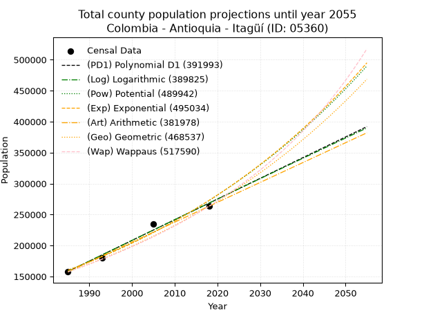
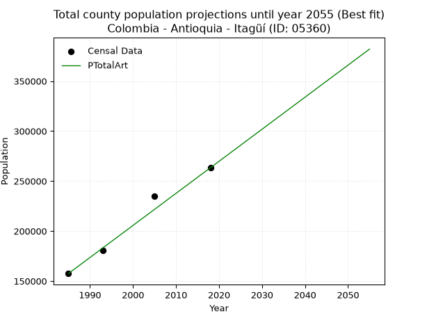
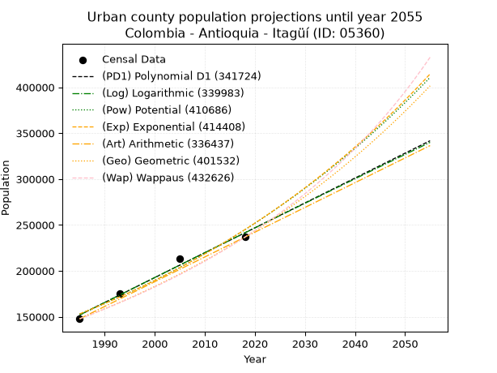
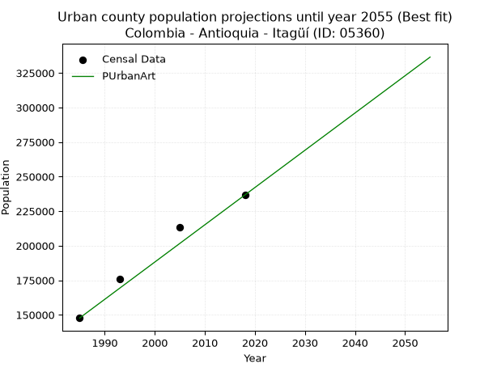
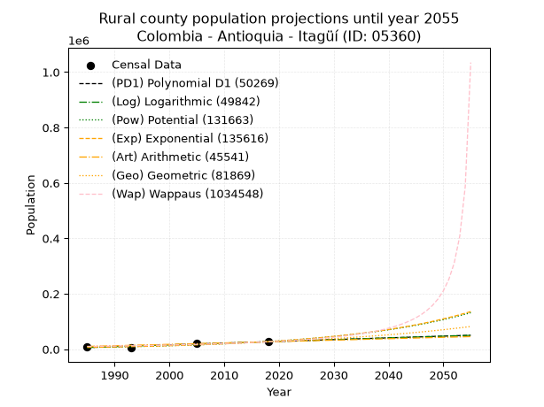
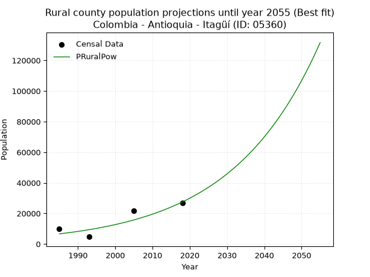

<div align="center">


</div>

# 📜 _“Population and Public Services Demand Projections (PPSD) until Year 2050 for Colombia - Antioquia - Itagüí (ID: 05360)”_
Keywords: `population` `public-service` `projection` `lineal` `polynomial` `logarithmic` `potential` `exponential` `arithmetic` `geometric` `wappaus` `dane` `colombia` `south-america`

PPSD are analytical estimates used by governments and planners to anticipate future changes in population size, age distribution, and the resulting community needs for utilities, healthcare, education, and infrastructure as sizing future water treatment facilities, electrical grids, and road networks based on spatial growth.

<div align="center">

</img>

</div>


> **General running parameters**: • app_version: _v20260806_. • Python version: _3.14.7_. • Pandas version: _3.0.5_. • NumPy version: _2.5.1_. • Creates, save and include plots into reports (create_plot): _False_. • Projection until year: _2050_. • Process polynomial degree 2 and up: _False_. • Process Wappaus: _True_. • Process Wappaus: _True_. • Set negative values to zero: _True_. • Set infinite values to zero: _True_. • Drop dataset notes: _True_. 
<div align="center">

Dynamic map: [:earth_americas:Google](http://maps.google.com/maps?q=6.175078995,-75.6120556) [:earth_americas:OSM](https://www.openstreetmap.org/#map=18/6.175078995/-75.6120556&layers=P) [:earth_americas:Bing](https://www.bing.com/maps?cp=6.175078995~-75.6120556&lvl=18) [:earth_americas:Apple](https://maps.apple.com/frame?center=6.175078995%2C-75.6120556&span=0.003%2C0.006)

</div>


<div align="center">

```geojson
{
  "type": "Feature",
  "geometry": {
    "type": "Point", 
    "coordinates": [-75.6120556, 6.175078995]
  }, 
  "properties": {
    "Name": "Colombia - Antioquia - Itagüí (ID: 05360)"
  }
}
```

</div>


## 0. Census Data (4 records)

Census data are official statistics collected by a government about the people and housing in a country. They usually include counts of total population, age, sex, race, income, education, and jobs.

📅Global census file: [Population.xlsx](../data/Population.xlsx)

| Source   |   Year |   CountryID | CountryName   |   StateID | StateName   |   CountyID | CountyName   |   PTotal |   PUrban |   PRural |
|:---------|-------:|------------:|:--------------|----------:|:------------|-----------:|:-------------|---------:|---------:|---------:|
| DANE     |   1985 |          57 | Colombia      |        05 | Antioquia   |      05360 | Itagüí       |   157513 |   147723 |     9790 |
| DANE     |   1993 |          57 | Colombia      |        05 | Antioquia   |      05360 | Itagüí       |   180354 |   175626 |     4728 |
| DANE     |   2005 |          57 | Colombia      |        05 | Antioquia   |      05360 | Itagüí       |   235016 |   213237 |    21779 |
| DANE     |   2018 |          57 | Colombia      |        05 | Antioquia   |      05360 | Itagüí       |   263332 |   236688 |    26644 |

> 🔥Some records could had specific notes about the registered values or the corresponding urban or rural distribution.

📅[SUI-RUPS](https://www.datos.gov.co/Hacienda-y-Cr-dito-P-blico/Registro-nico-de-Prestadores-de-Servicios-P-blicos/4qkq-csdn/about_data) - Local public utility companies: [RUPS.csv](../data/RUPS.csv)

 | SERVICIO       | ESTADO    | NOMBRE                                                               | NIT         | DEPARTAMENTO_DOMICILIO   | MUNICIPIO_DOMICILIO   | DIRECCION                             |   TELEFONO | EMAIL                          | TIPO_PRESTADOR                            | CLASIFICACION                 |
|:---------------|:----------|:---------------------------------------------------------------------|:------------|:-------------------------|:----------------------|:--------------------------------------|-----------:|:-------------------------------|:------------------------------------------|:------------------------------|
| ACUEDUCTO      | OPERATIVA | EMPRESAS PÚBLICAS DE MEDELLIN E.S.P.                                 | 890904996-1 | ANTIOQUIA                | MEDELLIN              | CRA 58 No 42-125 Edificio Inteligente |    3808080 | DONEY.MARTINEZ@EPM.COM.CO      | EMPRESA INDUSTRIAL Y COMERCIAL DEL ESTADO | MAYOR O IGUAL A 5001 USUARIOS |
| ALCANTARILLADO | OPERATIVA | EMPRESAS PÚBLICAS DE MEDELLIN E.S.P.                                 | 890904996-1 | ANTIOQUIA                | MEDELLIN              | CRA 58 No 42-125 Edificio Inteligente |    3808080 | DONEY.MARTINEZ@EPM.COM.CO      | EMPRESA INDUSTRIAL Y COMERCIAL DEL ESTADO | MAYOR O IGUAL A 5001 USUARIOS |
| ACUEDUCTO      | OPERATIVA | ACUEDUCTO  VEREDAL  AGUAS CLARAS LOS OLIVARES                        | 811047229-4 | ANTIOQUIA                | ITAGUI                | CALLE 40 PARTE ALTA                   |    3771196 | acueductoavaco123@gmail.com    | ORGANIZACION AUTORIZADA                   | MENOR O IGUAL A 2500 USUARIOS |
| ACUEDUCTO      | OPERATIVA | ASOCIACION ADMINISTRADORA ACUEDUCTO VEREDAL LA ESPERANZA             | 901122011-3 | ANTIOQUIA                | ITAGUI                | CR 47a # 59-77                        |    2851249 | acueductoporvenir@gmail.com    | ORGANIZACION AUTORIZADA                   | MENOR O IGUAL A 2500 USUARIOS |
| ACUEDUCTO      | OPERATIVA | Asociación Acueducto Veredal El Pedregal                             | 901139997-4 | ANTIOQUIA                | ITAGUI                | CRA 67 A # 71 -143                    |    2940424 | acueductopedregal123@gmail.com | ORGANIZACION AUTORIZADA                   | MENOR O IGUAL A 2500 USUARIOS |
| ACUEDUCTO      | OPERATIVA | Junta Administradora Acueducto Vereda El Ajizal sector Los Florianos | 900606137-7 | ANTIOQUIA                | ITAGUI                | VEREDA AJIZAL SECTOR LOS FLORIANOS    |    3765274 | acueductoflorianos@gmail.com   | ORGANIZACION AUTORIZADA                   | MENOR O IGUAL A 2500 USUARIOS |
| ACUEDUCTO      | OPERATIVA | Asociación Acueducto Veredal Fuente de Vida                          | 901140421-6 | ANTIOQUIA                | ITAGUI                | VDA LOS YEPEZ                         |    5799706 | acueductolosyepes@gmail.com    | ORGANIZACION AUTORIZADA                   | MENOR O IGUAL A 2500 USUARIOS |
| ACUEDUCTO      | OPERATIVA | Asociación Acueducto Veredal Barrio Nuevo                            | 901141627-0 | ANTIOQUIA                | ITAGUI                | VEREDA BARRIO NUEVO                   |    2089306 | acueductobarrionuevo@gmail.com | ORGANIZACION AUTORIZADA                   | MENOR O IGUAL A 2500 USUARIOS |
| ACUEDUCTO      | OPERATIVA | Acueducto Veredal Comunidad Unida por el Mejoramiento del Agua       | 900118977-3 | ANTIOQUIA                | ITAGUI                | CL 40 VEREDA LOS OLIVARES             |    3733813 | acueductocuma@gmail.com        | ORGANIZACION AUTORIZADA                   | MENOR O IGUAL A 2500 USUARIOS |

## 1. Total

### 1.1. Coefficients and Parameters

* (PD1) Polynomial Deg 1: 3341.3556804495975, -6474492.949819307 (lineal)
* (Log) Logarithmic: 6689510.636025699, -50637970.20080528
* (Pow) Potential: 32.28393123538863, -101.26044451735164
* (Exp) Exponential: 0.01612332870838461, 2.018203097384088e-09
* (Art) Arithmetic: Year diff. 2018 - 1985 = 33, Population diff. 263332 - 157513 = 105819, Annual growth = 3206.6363636363635
* (Geo) Geometric: Year diff. 2018 - 1985 = 33, Population diff. 263332 - 157513 = 105819, Annual growth % = 0.01569484795661058
* (Wap) Wappaus: i = 1.5239037477628883, Condition values only valid for < 200)

<sub>
Wappaus condition values: ['0.00', '1.52', '3.05', '4.57', '6.10', '7.62', '9.14', '10.67', '12.19', '13.72', '15.24', '16.76', '18.29', '19.81', '21.33', '22.86', '24.38', '25.91', '27.43', '28.95', '30.48', '32.00', '33.53', '35.05', '36.57', '38.10', '39.62', '41.15', '42.67', '44.19', '45.72', '47.24', '48.76', '50.29', '51.81', '53.34', '54.86', '56.38', '57.91', '59.43', '60.96', '62.48', '64.00', '65.53', '67.05', '68.58', '70.10', '71.62', '73.15', '74.67', '76.20', '77.72', '79.24', '80.77', '82.29', '83.81', '85.34', '86.86', '88.39', '89.91', '91.43', '92.96', '94.48', '96.01', '97.53', '99.05']
</sub>


### 1.2. Projected Dataset

|   Year |   CountyID |   PTotalPD1 |   PTotalLog |   PTotalPow |   PTotalExp |   PTotalArt |   PTotalGeo |   PTotalWap |
|-------:|-----------:|------------:|------------:|------------:|------------:|------------:|------------:|------------:|
|   1985 |      05360 |      158098 |      157987 |      160040 |      160131 |      157513 |      157513 |      157513 |
|   1986 |      05360 |      161439 |      161356 |      162664 |      162734 |      160720 |      159985 |      159932 |
|   1987 |      05360 |      164781 |      164724 |      165329 |      165379 |      163926 |      162496 |      162388 |
|   1988 |      05360 |      168122 |      168090 |      168036 |      168067 |      167133 |      165046 |      164882 |
|   1989 |      05360 |      171463 |      171454 |      170787 |      170799 |      170340 |      167637 |      167416 |
|   1990 |      05360 |      174805 |      174816 |      173581 |      173575 |      173546 |      170268 |      169990 |
|   1991 |      05360 |      178146 |      178177 |      176419 |      176396 |      176753 |      172940 |      172605 |
|   1992 |      05360 |      181488 |      181536 |      179302 |      179264 |      179959 |      175654 |      175262 |
|   1993 |      05360 |      184829 |      184893 |      182231 |      182177 |      183166 |      178411 |      177962 |
|   1994 |      05360 |      188170 |      188249 |      185206 |      185138 |      186373 |      181211 |      180707 |
|   1995 |      05360 |      191512 |      191603 |      188228 |      188148 |      189579 |      184056 |      183496 |
|   1996 |      05360 |      194853 |      194955 |      191298 |      191206 |      192786 |      186944 |      186332 |
|   1997 |      05360 |      198194 |      198306 |      194417 |      194314 |      195993 |      189878 |      189216 |
|   1998 |      05360 |      201536 |      201655 |      197585 |      197472 |      199199 |      192858 |      192148 |
|   1999 |      05360 |      204877 |      205002 |      200802 |      200682 |      202406 |      195885 |      195131 |
|   2000 |      05360 |      208218 |      208348 |      204071 |      203944 |      205613 |      198960 |      198164 |
|   2001 |      05360 |      211560 |      211692 |      207391 |      207259 |      208819 |      202082 |      201251 |
|   2002 |      05360 |      214901 |      215034 |      210763 |      210627 |      212026 |      205254 |      204391 |
|   2003 |      05360 |      218242 |      218374 |      214189 |      214051 |      215232 |      208475 |      207587 |
|   2004 |      05360 |      221584 |      221713 |      217668 |      217530 |      218439 |      211747 |      210840 |
|   2005 |      05360 |      224925 |      225051 |      221202 |      221066 |      221646 |      215071 |      214151 |
|   2006 |      05360 |      228267 |      228386 |      224792 |      224659 |      224852 |      218446 |      217522 |
|   2007 |      05360 |      231608 |      231720 |      228438 |      228311 |      228059 |      221875 |      220955 |
|   2008 |      05360 |      234949 |      235052 |      232141 |      232022 |      231266 |      225357 |      224452 |
|   2009 |      05360 |      238291 |      238383 |      235903 |      235793 |      234472 |      228894 |      228014 |
|   2010 |      05360 |      241632 |      241712 |      239723 |      239625 |      237679 |      232486 |      231642 |
|   2011 |      05360 |      244973 |      245039 |      243604 |      243520 |      240886 |      236135 |      235340 |
|   2012 |      05360 |      248315 |      248365 |      247545 |      247479 |      244092 |      239841 |      239109 |
|   2013 |      05360 |      251656 |      251689 |      251548 |      251501 |      247299 |      243606 |      242950 |
|   2014 |      05360 |      254997 |      255011 |      255614 |      255589 |      250505 |      247429 |      246867 |
|   2015 |      05360 |      258339 |      258332 |      259743 |      259743 |      253712 |      251312 |      250862 |
|   2016 |      05360 |      261680 |      261651 |      263937 |      263965 |      256919 |      255257 |      254935 |
|   2017 |      05360 |      265021 |      264968 |      268197 |      268256 |      260125 |      259263 |      259091 |
|   2018 |      05360 |      268363 |      268284 |      272523 |      272616 |      263332 |      263332 |      263332 |
|   2019 |      05360 |      271704 |      271598 |      276917 |      277047 |      266539 |      267465 |      267660 |
|   2020 |      05360 |      275046 |      274910 |      281379 |      281550 |      269745 |      271663 |      272078 |
|   2021 |      05360 |      278387 |      278221 |      285911 |      286126 |      272952 |      275926 |      276588 |
|   2022 |      05360 |      281728 |      281530 |      290514 |      290777 |      276159 |      280257 |      281194 |
|   2023 |      05360 |      285070 |      284838 |      295188 |      295503 |      279365 |      284656 |      285899 |
|   2024 |      05360 |      288411 |      288144 |      299936 |      300307 |      282572 |      289123 |      290706 |
|   2025 |      05360 |      291752 |      291448 |      304757 |      305188 |      285778 |      293661 |      295619 |
|   2026 |      05360 |      295094 |      294751 |      309653 |      310148 |      288985 |      298270 |      300640 |
|   2027 |      05360 |      298435 |      298052 |      314626 |      315189 |      292192 |      302951 |      305774 |
|   2028 |      05360 |      301776 |      301351 |      319676 |      320312 |      295398 |      307706 |      311024 |
|   2029 |      05360 |      305118 |      304649 |      324804 |      325519 |      298605 |      312536 |      316395 |
|   2030 |      05360 |      308459 |      307945 |      330012 |      330810 |      301812 |      317441 |      321890 |
|   2031 |      05360 |      311800 |      311240 |      335301 |      336187 |      305018 |      322423 |      327514 |
|   2032 |      05360 |      315142 |      314533 |      340672 |      341651 |      308225 |      327483 |      333271 |
|   2033 |      05360 |      318483 |      317824 |      346127 |      347204 |      311432 |      332623 |      339167 |
|   2034 |      05360 |      321825 |      321114 |      351666 |      352848 |      314638 |      337844 |      345207 |
|   2035 |      05360 |      325166 |      324402 |      357291 |      358583 |      317845 |      343146 |      351395 |
|   2036 |      05360 |      328507 |      327688 |      363002 |      364411 |      321051 |      348532 |      357737 |
|   2037 |      05360 |      331849 |      330973 |      368803 |      370335 |      324258 |      354002 |      364239 |
|   2038 |      05360 |      335190 |      334256 |      374693 |      376354 |      327465 |      359558 |      370907 |
|   2039 |      05360 |      338531 |      337538 |      380674 |      382471 |      330671 |      365201 |      377748 |
|   2040 |      05360 |      341873 |      340818 |      386748 |      388688 |      333878 |      370933 |      384769 |
|   2041 |      05360 |      345214 |      344096 |      392916 |      395006 |      337085 |      376754 |      391976 |
|   2042 |      05360 |      348555 |      347373 |      399179 |      401426 |      340291 |      382668 |      399378 |
|   2043 |      05360 |      351897 |      350648 |      405538 |      407951 |      343498 |      388673 |      406981 |
|   2044 |      05360 |      355238 |      353921 |      411996 |      414582 |      346705 |      394774 |      414795 |
|   2045 |      05360 |      358579 |      357193 |      418553 |      421320 |      349911 |      400970 |      422828 |
|   2046 |      05360 |      361921 |      360464 |      425212 |      428169 |      353118 |      407263 |      431090 |
|   2047 |      05360 |      365262 |      363732 |      431973 |      435128 |      356324 |      413655 |      439591 |
|   2048 |      05360 |      368603 |      367000 |      438838 |      442201 |      359531 |      420147 |      448341 |
|   2049 |      05360 |      371945 |      370265 |      445809 |      449388 |      362738 |      426741 |      457351 |
|   2050 |      05360 |      375286 |      373529 |      452887 |      456692 |      365944 |      433439 |      466633 |
<div align="center">

</img>

</div>


### 1.3. Best fit with absolute and relative error (%)

Relative error puts that difference into context by dividing the absolute error by the true value, creating a unitless ratio or percentage that shows the scale of the mistake.

Absolute and relative error

|   Year | Source   |   CountryID | CountryName   |   StateID | StateName   |   CountyID_x | CountyName   |   PTotal |   PUrban |   PRural |   CountyID_y |   PTotalPD1 |   PTotalLog |   PTotalPow |   PTotalExp |   PTotalArt |   PTotalGeo |   PTotalWap |   PTotalPD1AbsError |   PTotalLogAbsError |   PTotalPowAbsError |   PTotalExpAbsError |   PTotalArtAbsError |   PTotalGeoAbsError |   PTotalWapAbsError |   PTotalPD1RelError |   PTotalLogRelError |   PTotalPowRelError |   PTotalExpRelError |   PTotalArtRelError |   PTotalGeoRelError |   PTotalWapRelError |
|-------:|:---------|------------:|:--------------|----------:|:------------|-------------:|:-------------|---------:|---------:|---------:|-------------:|------------:|------------:|------------:|------------:|------------:|------------:|------------:|--------------------:|--------------------:|--------------------:|--------------------:|--------------------:|--------------------:|--------------------:|--------------------:|--------------------:|--------------------:|--------------------:|--------------------:|--------------------:|--------------------:|
|   1985 | DANE     |          57 | Colombia      |        05 | Antioquia   |        05360 | Itagüí       |   157513 |   147723 |     9790 |        05360 |      158098 |      157987 |      160040 |      160131 |      157513 |      157513 |      157513 |                 585 |                 474 |                2527 |                2618 |                   0 |                   0 |                   0 |            0.371398 |            0.300928 |             1.60431 |             1.66209 |             0       |             0       |             0       |
|   1993 | DANE     |          57 | Colombia      |        05 | Antioquia   |        05360 | Itagüí       |   180354 |   175626 |     4728 |        05360 |      184829 |      184893 |      182231 |      182177 |      183166 |      178411 |      177962 |                4475 |                4539 |                1877 |                1823 |                2812 |                1943 |                2392 |            2.48123  |            2.51672  |             1.04073 |             1.01079 |             1.55916 |             1.07733 |             1.32628 |
|   2005 | DANE     |          57 | Colombia      |        05 | Antioquia   |        05360 | Itagüí       |   235016 |   213237 |    21779 |        05360 |      224925 |      225051 |      221202 |      221066 |      221646 |      215071 |      214151 |               10091 |                9965 |               13814 |               13950 |               13370 |               19945 |               20865 |            4.29375  |            4.24014  |             5.8779  |             5.93577 |             5.68897 |             8.48666 |             8.87812 |
|   2018 | DANE     |          57 | Colombia      |        05 | Antioquia   |        05360 | Itagüí       |   263332 |   236688 |    26644 |        05360 |      268363 |      268284 |      272523 |      272616 |      263332 |      263332 |      263332 |                5031 |                4952 |                9191 |                9284 |                   0 |                   0 |                   0 |            1.91052  |            1.88052  |             3.49027 |             3.52559 |             0       |             0       |             0       |

Relative error mean

| Method    |   RelError | Best   |
|:----------|-----------:|:-------|
| PTotalPD1 |    2.26422 |        |
| PTotalLog |    2.23457 |        |
| PTotalPow |    3.0033  |        |
| PTotalExp |    3.03356 |        |
| PTotalArt |    1.81203 | True   |
| PTotalGeo |    2.391   |        |
| PTotalWap |    2.5511  |        |

💙Best method: _**PTotalArt**_
<div align="center">

</img>

</div>


### 1.4. Fresh water supply demand in liters per capita per day (lpcd)

The fresh water supply demand typically ranges from 100 to 300 liters per capita per day (lpcd) for standard domestic and municipal planning, though absolute survival minimums set by the World Health Organization are as low as 7.5 to 20 liters per day, and total consumption in high-income nations can exceed 400 liters.

> `CZ`: Level in meters above the sea level (masl)<br> `WS`: Fresh water supply demand in liters per capita per day (lpcd or l/h/d)<br> `WSAll`: Zonal fresh water supply demand in liters per second (l/s)<br> `A`: Zonal area in square meters<br> `DP`: Population density (people/hectare or p/ha)

Reference values (RAS Colombia)

|    CZ |   WS |
|------:|-----:|
|  1000 |  120 |
|  2000 |  130 |
| 99999 |  140 |

County shapefile geometry properties and water supply values

|   CountyID |      ATotal |   CZTotal |   WSTotal |
|-----------:|------------:|----------:|----------:|
|      05360 | 1.95079e+07 |    1655.5 |       130 |

Projected values for best method: PTotalArt

|   CountyID |   Year |   PTotalArt |   DPTotal |   WSTotal |   WSTotalAll |
|-----------:|-------:|------------:|----------:|----------:|-------------:|
|      05360 |   1985 |      157513 |     80.74 |       130 |      236.999 |
|      05360 |   1986 |      160720 |     82.39 |       130 |      241.824 |
|      05360 |   1987 |      163926 |     84.03 |       130 |      246.648 |
|      05360 |   1988 |      167133 |     85.67 |       130 |      251.473 |
|      05360 |   1989 |      170340 |     87.32 |       130 |      256.299 |
|      05360 |   1990 |      173546 |     88.96 |       130 |      261.122 |
|      05360 |   1991 |      176753 |     90.61 |       130 |      265.948 |
|      05360 |   1992 |      179959 |     92.25 |       130 |      270.772 |
|      05360 |   1993 |      183166 |     93.89 |       130 |      275.597 |
|      05360 |   1994 |      186373 |     95.54 |       130 |      280.422 |
|      05360 |   1995 |      189579 |     97.18 |       130 |      285.246 |
|      05360 |   1996 |      192786 |     98.82 |       130 |      290.072 |
|      05360 |   1997 |      195993 |    100.47 |       130 |      294.897 |
|      05360 |   1998 |      199199 |    102.11 |       130 |      299.721 |
|      05360 |   1999 |      202406 |    103.76 |       130 |      304.546 |
|      05360 |   2000 |      205613 |    105.4  |       130 |      309.371 |
|      05360 |   2001 |      208819 |    107.04 |       130 |      314.195 |
|      05360 |   2002 |      212026 |    108.69 |       130 |      319.021 |
|      05360 |   2003 |      215232 |    110.33 |       130 |      323.844 |
|      05360 |   2004 |      218439 |    111.97 |       130 |      328.67  |
|      05360 |   2005 |      221646 |    113.62 |       130 |      333.495 |
|      05360 |   2006 |      224852 |    115.26 |       130 |      338.319 |
|      05360 |   2007 |      228059 |    116.91 |       130 |      343.144 |
|      05360 |   2008 |      231266 |    118.55 |       130 |      347.97  |
|      05360 |   2009 |      234472 |    120.19 |       130 |      352.794 |
|      05360 |   2010 |      237679 |    121.84 |       130 |      357.619 |
|      05360 |   2011 |      240886 |    123.48 |       130 |      362.444 |
|      05360 |   2012 |      244092 |    125.12 |       130 |      367.268 |
|      05360 |   2013 |      247299 |    126.77 |       130 |      372.093 |
|      05360 |   2014 |      250505 |    128.41 |       130 |      376.917 |
|      05360 |   2015 |      253712 |    130.06 |       130 |      381.743 |
|      05360 |   2016 |      256919 |    131.7  |       130 |      386.568 |
|      05360 |   2017 |      260125 |    133.34 |       130 |      391.392 |
|      05360 |   2018 |      263332 |    134.99 |       130 |      396.217 |
|      05360 |   2019 |      266539 |    136.63 |       130 |      401.042 |
|      05360 |   2020 |      269745 |    138.28 |       130 |      405.866 |
|      05360 |   2021 |      272952 |    139.92 |       130 |      410.692 |
|      05360 |   2022 |      276159 |    141.56 |       130 |      415.517 |
|      05360 |   2023 |      279365 |    143.21 |       130 |      420.341 |
|      05360 |   2024 |      282572 |    144.85 |       130 |      425.166 |
|      05360 |   2025 |      285778 |    146.49 |       130 |      429.99  |
|      05360 |   2026 |      288985 |    148.14 |       130 |      434.815 |
|      05360 |   2027 |      292192 |    149.78 |       130 |      439.641 |
|      05360 |   2028 |      295398 |    151.43 |       130 |      444.465 |
|      05360 |   2029 |      298605 |    153.07 |       130 |      449.29  |
|      05360 |   2030 |      301812 |    154.71 |       130 |      454.115 |
|      05360 |   2031 |      305018 |    156.36 |       130 |      458.939 |
|      05360 |   2032 |      308225 |    158    |       130 |      463.764 |
|      05360 |   2033 |      311432 |    159.64 |       130 |      468.59  |
|      05360 |   2034 |      314638 |    161.29 |       130 |      473.414 |
|      05360 |   2035 |      317845 |    162.93 |       130 |      478.239 |
|      05360 |   2036 |      321051 |    164.58 |       130 |      483.063 |
|      05360 |   2037 |      324258 |    166.22 |       130 |      487.888 |
|      05360 |   2038 |      327465 |    167.86 |       130 |      492.714 |
|      05360 |   2039 |      330671 |    169.51 |       130 |      497.537 |
|      05360 |   2040 |      333878 |    171.15 |       130 |      502.363 |
|      05360 |   2041 |      337085 |    172.79 |       130 |      507.188 |
|      05360 |   2042 |      340291 |    174.44 |       130 |      512.012 |
|      05360 |   2043 |      343498 |    176.08 |       130 |      516.837 |
|      05360 |   2044 |      346705 |    177.73 |       130 |      521.663 |
|      05360 |   2045 |      349911 |    179.37 |       130 |      526.486 |
|      05360 |   2046 |      353118 |    181.01 |       130 |      531.312 |
|      05360 |   2047 |      356324 |    182.66 |       130 |      536.136 |
|      05360 |   2048 |      359531 |    184.3  |       130 |      540.961 |
|      05360 |   2049 |      362738 |    185.94 |       130 |      545.786 |
|      05360 |   2050 |      365944 |    187.59 |       130 |      550.61  |

## 2. Urban

### 2.1. Coefficients and Parameters

* (PD1) Polynomial Deg 1: 2710.5957446808347, -5228550.638297841 (lineal)
* (Log) Logarithmic: 5427369.170479405, -41060158.057020955
* (Pow) Potential: 28.480040691012846, -88.73550523337686
* (Exp) Exponential: 0.014221759227671053, 8.411272716510215e-08
* (Art) Arithmetic: Year diff. 2018 - 1985 = 33, Population diff. 236688 - 147723 = 88965, Annual growth = 2695.909090909091
* (Geo) Geometric: Year diff. 2018 - 1985 = 33, Population diff. 236688 - 147723 = 88965, Annual growth % = 0.014387484980291632
* (Wap) Wappaus: i = 1.4026180785196527, Condition values only valid for < 200)

<sub>
Wappaus condition values: ['0.00', '1.40', '2.81', '4.21', '5.61', '7.01', '8.42', '9.82', '11.22', '12.62', '14.03', '15.43', '16.83', '18.23', '19.64', '21.04', '22.44', '23.84', '25.25', '26.65', '28.05', '29.45', '30.86', '32.26', '33.66', '35.07', '36.47', '37.87', '39.27', '40.68', '42.08', '43.48', '44.88', '46.29', '47.69', '49.09', '50.49', '51.90', '53.30', '54.70', '56.10', '57.51', '58.91', '60.31', '61.72', '63.12', '64.52', '65.92', '67.33', '68.73', '70.13', '71.53', '72.94', '74.34', '75.74', '77.14', '78.55', '79.95', '81.35', '82.75', '84.16', '85.56', '86.96', '88.36', '89.77', '91.17']
</sub>


### 2.2. Projected Dataset

|   Year |   CountyID |   PUrbanPD1 |   PUrbanLog |   PUrbanPow |   PUrbanExp |   PUrbanArt |   PUrbanGeo |   PUrbanWap |
|-------:|-----------:|------------:|------------:|------------:|------------:|------------:|------------:|------------:|
|   1985 |      05360 |      151982 |      151887 |      153055 |      153136 |      147723 |      147723 |      147723 |
|   1986 |      05360 |      154693 |      154620 |      155267 |      155330 |      150419 |      149848 |      149810 |
|   1987 |      05360 |      157403 |      157353 |      157509 |      157555 |      153115 |      152004 |      151926 |
|   1988 |      05360 |      160114 |      160083 |      159782 |      159811 |      155811 |      154191 |      154073 |
|   1989 |      05360 |      162824 |      162813 |      162087 |      162100 |      158507 |      156410 |      156250 |
|   1990 |      05360 |      165535 |      165541 |      164424 |      164422 |      161203 |      158660 |      158459 |
|   1991 |      05360 |      168245 |      168267 |      166793 |      166777 |      163898 |      160943 |      160701 |
|   1992 |      05360 |      170956 |      170993 |      169196 |      169166 |      166594 |      163258 |      162976 |
|   1993 |      05360 |      173667 |      173717 |      171631 |      171589 |      169290 |      165607 |      165284 |
|   1994 |      05360 |      176377 |      176439 |      174101 |      174047 |      171986 |      167990 |      167627 |
|   1995 |      05360 |      179088 |      179160 |      176605 |      176540 |      174682 |      170407 |      170006 |
|   1996 |      05360 |      181798 |      181880 |      179144 |      179068 |      177378 |      172859 |      172420 |
|   1997 |      05360 |      184509 |      184598 |      181717 |      181633 |      180074 |      175346 |      174872 |
|   1998 |      05360 |      187220 |      187316 |      184327 |      184235 |      182770 |      177868 |      177361 |
|   1999 |      05360 |      189930 |      190031 |      186972 |      186874 |      185466 |      180427 |      179889 |
|   2000 |      05360 |      192641 |      192746 |      189655 |      189550 |      188162 |      183023 |      182457 |
|   2001 |      05360 |      195351 |      195459 |      192374 |      192265 |      190858 |      185657 |      185065 |
|   2002 |      05360 |      198062 |      198170 |      195131 |      195019 |      193553 |      188328 |      187715 |
|   2003 |      05360 |      200773 |      200881 |      197926 |      197813 |      196249 |      191037 |      190407 |
|   2004 |      05360 |      203483 |      203590 |      200760 |      200646 |      198945 |      193786 |      193143 |
|   2005 |      05360 |      206194 |      206297 |      203632 |      203520 |      201641 |      196574 |      195923 |
|   2006 |      05360 |      208904 |      209003 |      206545 |      206435 |      204337 |      199402 |      198750 |
|   2007 |      05360 |      211615 |      211708 |      209497 |      209392 |      207033 |      202271 |      201623 |
|   2008 |      05360 |      214326 |      214412 |      212491 |      212391 |      209729 |      205181 |      204544 |
|   2009 |      05360 |      217036 |      217114 |      215525 |      215433 |      212425 |      208133 |      207515 |
|   2010 |      05360 |      219747 |      219815 |      218601 |      218519 |      215121 |      211128 |      210535 |
|   2011 |      05360 |      222457 |      222514 |      221720 |      221649 |      217817 |      214165 |      213608 |
|   2012 |      05360 |      225168 |      225213 |      224882 |      224824 |      220513 |      217247 |      216734 |
|   2013 |      05360 |      227879 |      227909 |      228087 |      228044 |      223208 |      220372 |      219915 |
|   2014 |      05360 |      230589 |      230605 |      231336 |      231310 |      225904 |      223543 |      223151 |
|   2015 |      05360 |      233300 |      233299 |      234630 |      234623 |      228600 |      226759 |      226445 |
|   2016 |      05360 |      236010 |      235992 |      237968 |      237984 |      231296 |      230022 |      229798 |
|   2017 |      05360 |      238721 |      238683 |      241353 |      241393 |      233992 |      233331 |      233212 |
|   2018 |      05360 |      241432 |      241373 |      244785 |      244850 |      236688 |      236688 |      236688 |
|   2019 |      05360 |      244142 |      244062 |      248263 |      248357 |      239384 |      240093 |      240228 |
|   2020 |      05360 |      246853 |      246750 |      251789 |      251915 |      242080 |      243548 |      243834 |
|   2021 |      05360 |      249563 |      249436 |      255363 |      255523 |      244776 |      247052 |      247507 |
|   2022 |      05360 |      252274 |      252121 |      258986 |      259183 |      247472 |      250606 |      251250 |
|   2023 |      05360 |      254985 |      254804 |      262659 |      262895 |      250168 |      254212 |      255065 |
|   2024 |      05360 |      257695 |      257486 |      266382 |      266661 |      252863 |      257869 |      258953 |
|   2025 |      05360 |      260406 |      260167 |      270156 |      270480 |      255559 |      261579 |      262917 |
|   2026 |      05360 |      263116 |      262847 |      273981 |      274354 |      258255 |      265343 |      266959 |
|   2027 |      05360 |      265827 |      265525 |      277859 |      278284 |      260951 |      269160 |      271082 |
|   2028 |      05360 |      268538 |      268202 |      281789 |      282270 |      263647 |      273033 |      275287 |
|   2029 |      05360 |      271248 |      270877 |      285774 |      286313 |      266343 |      276961 |      279578 |
|   2030 |      05360 |      273959 |      273552 |      289812 |      290414 |      269039 |      280946 |      283956 |
|   2031 |      05360 |      276669 |      276225 |      293906 |      294574 |      271735 |      284988 |      288425 |
|   2032 |      05360 |      279380 |      278896 |      298055 |      298793 |      274431 |      289088 |      292988 |
|   2033 |      05360 |      282091 |      281566 |      302261 |      303073 |      277127 |      293248 |      297647 |
|   2034 |      05360 |      284801 |      284235 |      306524 |      307414 |      279823 |      297467 |      302406 |
|   2035 |      05360 |      287512 |      286903 |      310845 |      311817 |      282518 |      301747 |      307267 |
|   2036 |      05360 |      290222 |      289569 |      315225 |      316283 |      285214 |      306088 |      312235 |
|   2037 |      05360 |      292933 |      292234 |      319664 |      320814 |      287910 |      310492 |      317312 |
|   2038 |      05360 |      295643 |      294898 |      324164 |      325409 |      290606 |      314959 |      322503 |
|   2039 |      05360 |      298354 |      297561 |      328724 |      330070 |      293302 |      319490 |      327811 |
|   2040 |      05360 |      301065 |      300222 |      333347 |      334797 |      295998 |      324087 |      333240 |
|   2041 |      05360 |      303775 |      302882 |      338032 |      339593 |      298694 |      328750 |      338795 |
|   2042 |      05360 |      306486 |      305540 |      342781 |      344457 |      301390 |      333480 |      344479 |
|   2043 |      05360 |      309196 |      308197 |      347594 |      349391 |      304086 |      338278 |      350297 |
|   2044 |      05360 |      311907 |      310853 |      352473 |      354395 |      306782 |      343145 |      356255 |
|   2045 |      05360 |      314618 |      313508 |      357417 |      359471 |      309478 |      348082 |      362357 |
|   2046 |      05360 |      317328 |      316161 |      362428 |      364620 |      312173 |      353090 |      368609 |
|   2047 |      05360 |      320039 |      318813 |      367507 |      369843 |      314869 |      358170 |      375016 |
|   2048 |      05360 |      322749 |      321464 |      372655 |      375140 |      317565 |      363323 |      381584 |
|   2049 |      05360 |      325460 |      324113 |      377872 |      380513 |      320261 |      368550 |      388319 |
|   2050 |      05360 |      328171 |      326762 |      383159 |      385964 |      322957 |      373853 |      395227 |
<div align="center">

</img>

</div>


### 2.3. Best fit with absolute and relative error (%)

Relative error puts that difference into context by dividing the absolute error by the true value, creating a unitless ratio or percentage that shows the scale of the mistake.

Absolute and relative error

|   Year | Source   |   CountryID | CountryName   |   StateID | StateName   |   CountyID_x | CountyName   |   PTotal |   PUrban |   PRural |   CountyID_y |   PUrbanPD1 |   PUrbanLog |   PUrbanPow |   PUrbanExp |   PUrbanArt |   PUrbanGeo |   PUrbanWap |   PUrbanPD1AbsError |   PUrbanLogAbsError |   PUrbanPowAbsError |   PUrbanExpAbsError |   PUrbanArtAbsError |   PUrbanGeoAbsError |   PUrbanWapAbsError |   PUrbanPD1RelError |   PUrbanLogRelError |   PUrbanPowRelError |   PUrbanExpRelError |   PUrbanArtRelError |   PUrbanGeoRelError |   PUrbanWapRelError |
|-------:|:---------|------------:|:--------------|----------:|:------------|-------------:|:-------------|---------:|---------:|---------:|-------------:|------------:|------------:|------------:|------------:|------------:|------------:|------------:|--------------------:|--------------------:|--------------------:|--------------------:|--------------------:|--------------------:|--------------------:|--------------------:|--------------------:|--------------------:|--------------------:|--------------------:|--------------------:|--------------------:|
|   1985 | DANE     |          57 | Colombia      |        05 | Antioquia   |        05360 | Itagüí       |   157513 |   147723 |     9790 |        05360 |      151982 |      151887 |      153055 |      153136 |      147723 |      147723 |      147723 |                4259 |                4164 |                5332 |                5413 |                   0 |                   0 |                   0 |             2.8831  |             2.81879 |             3.60946 |             3.66429 |             0       |             0       |             0       |
|   1993 | DANE     |          57 | Colombia      |        05 | Antioquia   |        05360 | Itagüí       |   180354 |   175626 |     4728 |        05360 |      173667 |      173717 |      171631 |      171589 |      169290 |      165607 |      165284 |                1959 |                1909 |                3995 |                4037 |                6336 |               10019 |               10342 |             1.11544 |             1.08697 |             2.27472 |             2.29863 |             3.60767 |             5.70474 |             5.88865 |
|   2005 | DANE     |          57 | Colombia      |        05 | Antioquia   |        05360 | Itagüí       |   235016 |   213237 |    21779 |        05360 |      206194 |      206297 |      203632 |      203520 |      201641 |      196574 |      195923 |                7043 |                6940 |                9605 |                9717 |               11596 |               16663 |               17314 |             3.3029  |             3.25459 |             4.50438 |             4.5569  |             5.43808 |             7.81431 |             8.1196  |
|   2018 | DANE     |          57 | Colombia      |        05 | Antioquia   |        05360 | Itagüí       |   263332 |   236688 |    26644 |        05360 |      241432 |      241373 |      244785 |      244850 |      236688 |      236688 |      236688 |                4744 |                4685 |                8097 |                8162 |                   0 |                   0 |                   0 |             2.00433 |             1.9794  |             3.42096 |             3.44842 |             0       |             0       |             0       |

Relative error mean

| Method    |   RelError | Best   |
|:----------|-----------:|:-------|
| PUrbanPD1 |    2.32644 |        |
| PUrbanLog |    2.28494 |        |
| PUrbanPow |    3.45238 |        |
| PUrbanExp |    3.49206 |        |
| PUrbanArt |    2.26144 | True   |
| PUrbanGeo |    3.37976 |        |
| PUrbanWap |    3.50206 |        |

💙Best method: _**PUrbanArt**_
<div align="center">

</img>

</div>


### 2.4. Fresh water supply demand in liters per capita per day (lpcd)

The fresh water supply demand typically ranges from 100 to 300 liters per capita per day (lpcd) for standard domestic and municipal planning, though absolute survival minimums set by the World Health Organization are as low as 7.5 to 20 liters per day, and total consumption in high-income nations can exceed 400 liters.

> `CZ`: Level in meters above the sea level (masl)<br> `WS`: Fresh water supply demand in liters per capita per day (lpcd or l/h/d)<br> `WSAll`: Zonal fresh water supply demand in liters per second (l/s)<br> `A`: Zonal area in square meters<br> `DP`: Population density (people/hectare or p/ha)

Reference values (RAS Colombia)

|    CZ |   WS |
|------:|-----:|
|  1000 |  120 |
|  2000 |  130 |
| 99999 |  140 |

County shapefile geometry properties and water supply values

|   CountyID |      AUrban |   CZUrban |   WSUrban |
|-----------:|------------:|----------:|----------:|
|      05360 | 1.29062e+07 |   1587.61 |       130 |

Projected values for best method: PUrbanArt

|   CountyID |   Year |   PUrbanArt |   DPUrban |   WSUrban |   WSUrbanAll |
|-----------:|-------:|------------:|----------:|----------:|-------------:|
|      05360 |   1985 |      147723 |    114.46 |       130 |      222.268 |
|      05360 |   1986 |      150419 |    116.55 |       130 |      226.325 |
|      05360 |   1987 |      153115 |    118.64 |       130 |      230.381 |
|      05360 |   1988 |      155811 |    120.73 |       130 |      234.438 |
|      05360 |   1989 |      158507 |    122.81 |       130 |      238.494 |
|      05360 |   1990 |      161203 |    124.9  |       130 |      242.551 |
|      05360 |   1991 |      163898 |    126.99 |       130 |      246.606 |
|      05360 |   1992 |      166594 |    129.08 |       130 |      250.662 |
|      05360 |   1993 |      169290 |    131.17 |       130 |      254.719 |
|      05360 |   1994 |      171986 |    133.26 |       130 |      258.775 |
|      05360 |   1995 |      174682 |    135.35 |       130 |      262.832 |
|      05360 |   1996 |      177378 |    137.44 |       130 |      266.888 |
|      05360 |   1997 |      180074 |    139.52 |       130 |      270.945 |
|      05360 |   1998 |      182770 |    141.61 |       130 |      275.001 |
|      05360 |   1999 |      185466 |    143.7  |       130 |      279.058 |
|      05360 |   2000 |      188162 |    145.79 |       130 |      283.114 |
|      05360 |   2001 |      190858 |    147.88 |       130 |      287.171 |
|      05360 |   2002 |      193553 |    149.97 |       130 |      291.226 |
|      05360 |   2003 |      196249 |    152.06 |       130 |      295.282 |
|      05360 |   2004 |      198945 |    154.15 |       130 |      299.339 |
|      05360 |   2005 |      201641 |    156.24 |       130 |      303.395 |
|      05360 |   2006 |      204337 |    158.32 |       130 |      307.452 |
|      05360 |   2007 |      207033 |    160.41 |       130 |      311.508 |
|      05360 |   2008 |      209729 |    162.5  |       130 |      315.564 |
|      05360 |   2009 |      212425 |    164.59 |       130 |      319.621 |
|      05360 |   2010 |      215121 |    166.68 |       130 |      323.677 |
|      05360 |   2011 |      217817 |    168.77 |       130 |      327.734 |
|      05360 |   2012 |      220513 |    170.86 |       130 |      331.79  |
|      05360 |   2013 |      223208 |    172.95 |       130 |      335.845 |
|      05360 |   2014 |      225904 |    175.03 |       130 |      339.902 |
|      05360 |   2015 |      228600 |    177.12 |       130 |      343.958 |
|      05360 |   2016 |      231296 |    179.21 |       130 |      348.015 |
|      05360 |   2017 |      233992 |    181.3  |       130 |      352.071 |
|      05360 |   2018 |      236688 |    183.39 |       130 |      356.128 |
|      05360 |   2019 |      239384 |    185.48 |       130 |      360.184 |
|      05360 |   2020 |      242080 |    187.57 |       130 |      364.241 |
|      05360 |   2021 |      244776 |    189.66 |       130 |      368.297 |
|      05360 |   2022 |      247472 |    191.75 |       130 |      372.354 |
|      05360 |   2023 |      250168 |    193.83 |       130 |      376.41  |
|      05360 |   2024 |      252863 |    195.92 |       130 |      380.465 |
|      05360 |   2025 |      255559 |    198.01 |       130 |      384.522 |
|      05360 |   2026 |      258255 |    200.1  |       130 |      388.578 |
|      05360 |   2027 |      260951 |    202.19 |       130 |      392.635 |
|      05360 |   2028 |      263647 |    204.28 |       130 |      396.691 |
|      05360 |   2029 |      266343 |    206.37 |       130 |      400.748 |
|      05360 |   2030 |      269039 |    208.46 |       130 |      404.804 |
|      05360 |   2031 |      271735 |    210.55 |       130 |      408.861 |
|      05360 |   2032 |      274431 |    212.63 |       130 |      412.917 |
|      05360 |   2033 |      277127 |    214.72 |       130 |      416.973 |
|      05360 |   2034 |      279823 |    216.81 |       130 |      421.03  |
|      05360 |   2035 |      282518 |    218.9  |       130 |      425.085 |
|      05360 |   2036 |      285214 |    220.99 |       130 |      429.141 |
|      05360 |   2037 |      287910 |    223.08 |       130 |      433.198 |
|      05360 |   2038 |      290606 |    225.17 |       130 |      437.254 |
|      05360 |   2039 |      293302 |    227.26 |       130 |      441.311 |
|      05360 |   2040 |      295998 |    229.34 |       130 |      445.367 |
|      05360 |   2041 |      298694 |    231.43 |       130 |      449.424 |
|      05360 |   2042 |      301390 |    233.52 |       130 |      453.48  |
|      05360 |   2043 |      304086 |    235.61 |       130 |      457.537 |
|      05360 |   2044 |      306782 |    237.7  |       130 |      461.593 |
|      05360 |   2045 |      309478 |    239.79 |       130 |      465.65  |
|      05360 |   2046 |      312173 |    241.88 |       130 |      469.705 |
|      05360 |   2047 |      314869 |    243.97 |       130 |      473.761 |
|      05360 |   2048 |      317565 |    246.06 |       130 |      477.818 |
|      05360 |   2049 |      320261 |    248.14 |       130 |      481.874 |
|      05360 |   2050 |      322957 |    250.23 |       130 |      485.931 |

## 3. Rural

### 3.1. Coefficients and Parameters

* (PD1) Polynomial Deg 1: 630.7599357687635, -1245942.311521469 (lineal)
* (Log) Logarithmic: 1262141.4655462916, -9577812.14378431
* (Pow) Potential: 86.24659738866089, -280.59928429744457
* (Exp) Exponential: 0.043109355995029686, 4.552846276743698e-34
* (Art) Arithmetic: Year diff. 2018 - 1985 = 33, Population diff. 26644 - 9790 = 16854, Annual growth = 510.72727272727275
* (Geo) Geometric: Year diff. 2018 - 1985 = 33, Population diff. 26644 - 9790 = 16854, Annual growth % = 0.030804402298129085
* (Wap) Wappaus: i = 2.8035750822159122, Condition values only valid for < 200)

<sub>
Wappaus condition values: ['0.00', '2.80', '5.61', '8.41', '11.21', '14.02', '16.82', '19.63', '22.43', '25.23', '28.04', '30.84', '33.64', '36.45', '39.25', '42.05', '44.86', '47.66', '50.46', '53.27', '56.07', '58.88', '61.68', '64.48', '67.29', '70.09', '72.89', '75.70', '78.50', '81.30', '84.11', '86.91', '89.71', '92.52', '95.32', '98.13', '100.93', '103.73', '106.54', '109.34', '112.14', '114.95', '117.75', '120.55', '123.36', '126.16', '128.96', '131.77', '134.57', '137.38', '140.18', '142.98', '145.79', '148.59', '151.39', '154.20', '157.00', '159.80', '162.61', '165.41', '168.21', '171.02', '173.82', '176.63', '179.43', '182.23']
</sub>


### 3.2. Projected Dataset

|   Year |   CountyID |   PRuralPD1 |   PRuralLog |   PRuralPow |   PRuralExp |   PRuralArt |   PRuralGeo |   PRuralWap |
|-------:|-----------:|------------:|------------:|------------:|------------:|------------:|------------:|------------:|
|   1985 |      05360 |        6116 |        6100 |        6627 |        6634 |        9790 |        9790 |        9790 |
|   1986 |      05360 |        6747 |        6736 |        6922 |        6926 |       10301 |       10092 |       10068 |
|   1987 |      05360 |        7378 |        7371 |        7229 |        7231 |       10811 |       10402 |       10355 |
|   1988 |      05360 |        8008 |        8006 |        7549 |        7550 |       11322 |       10723 |       10650 |
|   1989 |      05360 |        8639 |        8641 |        7884 |        7882 |       11833 |       11053 |       10953 |
|   1990 |      05360 |        9270 |        9275 |        8233 |        8229 |       12344 |       11394 |       11266 |
|   1991 |      05360 |        9901 |        9910 |        8598 |        8592 |       12854 |       11745 |       11588 |
|   1992 |      05360 |       10531 |       10543 |        8978 |        8970 |       13365 |       12106 |       11920 |
|   1993 |      05360 |       11162 |       11177 |        9375 |        9366 |       13876 |       12479 |       12263 |
|   1994 |      05360 |       11793 |       11810 |        9790 |        9778 |       14387 |       12864 |       12617 |
|   1995 |      05360 |       12424 |       12443 |       10223 |       10209 |       14897 |       13260 |       12982 |
|   1996 |      05360 |       13055 |       13075 |       10674 |       10659 |       15408 |       13669 |       13360 |
|   1997 |      05360 |       13685 |       13707 |       11145 |       11128 |       15919 |       14090 |       13750 |
|   1998 |      05360 |       14316 |       14339 |       11637 |       11618 |       16429 |       14524 |       14153 |
|   1999 |      05360 |       14947 |       14971 |       12150 |       12130 |       16940 |       14971 |       14571 |
|   2000 |      05360 |       15578 |       15602 |       12686 |       12665 |       17451 |       15432 |       15003 |
|   2001 |      05360 |       16208 |       16233 |       13245 |       13223 |       17962 |       15908 |       15451 |
|   2002 |      05360 |       16839 |       16864 |       13828 |       13805 |       18472 |       16398 |       15916 |
|   2003 |      05360 |       17470 |       17494 |       14437 |       14413 |       18983 |       16903 |       16398 |
|   2004 |      05360 |       18101 |       18124 |       15072 |       15048 |       19494 |       17423 |       16898 |
|   2005 |      05360 |       18731 |       18753 |       15734 |       15711 |       20005 |       17960 |       17418 |
|   2006 |      05360 |       19362 |       19383 |       16426 |       16403 |       20515 |       18513 |       17958 |
|   2007 |      05360 |       19993 |       20012 |       17147 |       17126 |       21026 |       19084 |       18521 |
|   2008 |      05360 |       20624 |       20641 |       17900 |       17880 |       21537 |       19671 |       19107 |
|   2009 |      05360 |       21254 |       21269 |       18685 |       18668 |       22047 |       20277 |       19717 |
|   2010 |      05360 |       21885 |       21897 |       19505 |       19490 |       22558 |       20902 |       20354 |
|   2011 |      05360 |       22516 |       22525 |       20359 |       20349 |       23069 |       21546 |       21019 |
|   2012 |      05360 |       23147 |       23152 |       21251 |       21245 |       23580 |       22210 |       21714 |
|   2013 |      05360 |       23777 |       23779 |       22182 |       22181 |       24090 |       22894 |       22440 |
|   2014 |      05360 |       24408 |       24406 |       23153 |       23158 |       24601 |       23599 |       23202 |
|   2015 |      05360 |       25039 |       25033 |       24165 |       24178 |       25112 |       24326 |       24000 |
|   2016 |      05360 |       25670 |       25659 |       25222 |       25243 |       25623 |       25075 |       24838 |
|   2017 |      05360 |       26300 |       26285 |       26324 |       26355 |       26133 |       25848 |       25718 |
|   2018 |      05360 |       26931 |       26910 |       27474 |       27516 |       26644 |       26644 |       26644 |
|   2019 |      05360 |       27562 |       27536 |       28673 |       28729 |       27155 |       27465 |       27620 |
|   2020 |      05360 |       28193 |       28161 |       29924 |       29994 |       27665 |       28311 |       28649 |
|   2021 |      05360 |       28824 |       28785 |       31229 |       31315 |       28176 |       29183 |       29737 |
|   2022 |      05360 |       29454 |       29410 |       32591 |       32695 |       28687 |       30082 |       30888 |
|   2023 |      05360 |       30085 |       30034 |       34010 |       34135 |       29198 |       31008 |       32108 |
|   2024 |      05360 |       30716 |       30658 |       35491 |       35639 |       29708 |       31964 |       33404 |
|   2025 |      05360 |       31347 |       31281 |       37036 |       37209 |       30219 |       32948 |       34782 |
|   2026 |      05360 |       31977 |       31904 |       38647 |       38848 |       30730 |       33963 |       36252 |
|   2027 |      05360 |       32608 |       32527 |       40327 |       40559 |       31241 |       35009 |       37821 |
|   2028 |      05360 |       33239 |       33149 |       42080 |       42346 |       31751 |       36088 |       39501 |
|   2029 |      05360 |       33870 |       33772 |       43908 |       44212 |       32262 |       37200 |       41304 |
|   2030 |      05360 |       34500 |       34394 |       45814 |       46159 |       32773 |       38346 |       43244 |
|   2031 |      05360 |       35131 |       35015 |       47802 |       48193 |       33283 |       39527 |       45337 |
|   2032 |      05360 |       35762 |       35636 |       49875 |       50316 |       33794 |       40744 |       47602 |
|   2033 |      05360 |       36393 |       36257 |       52037 |       52532 |       34305 |       41999 |       50062 |
|   2034 |      05360 |       37023 |       36878 |       54291 |       54846 |       34816 |       43293 |       52741 |
|   2035 |      05360 |       37654 |       37498 |       56642 |       57262 |       35326 |       44627 |       55672 |
|   2036 |      05360 |       38285 |       38119 |       59094 |       59785 |       35837 |       46002 |       58890 |
|   2037 |      05360 |       38916 |       38738 |       61650 |       62419 |       36348 |       47419 |       62442 |
|   2038 |      05360 |       39546 |       39358 |       64316 |       65168 |       36859 |       48879 |       66381 |
|   2039 |      05360 |       40177 |       39977 |       67095 |       68039 |       37369 |       50385 |       70775 |
|   2040 |      05360 |       40808 |       40596 |       69993 |       71036 |       37880 |       51937 |       75706 |
|   2041 |      05360 |       41439 |       41214 |       73015 |       74166 |       38391 |       53537 |       81280 |
|   2042 |      05360 |       42069 |       41833 |       76166 |       77433 |       38901 |       55186 |       87632 |
|   2043 |      05360 |       42700 |       42450 |       79451 |       80844 |       39412 |       56886 |       94936 |
|   2044 |      05360 |       43331 |       43068 |       82876 |       84405 |       39923 |       58638 |      103425 |
|   2045 |      05360 |       43962 |       43685 |       86447 |       88123 |       40434 |       60445 |      113411 |
|   2046 |      05360 |       44593 |       44302 |       90170 |       92005 |       40944 |       62307 |      125329 |
|   2047 |      05360 |       45223 |       44919 |       94051 |       96058 |       41455 |       64226 |      139799 |
|   2048 |      05360 |       45854 |       45536 |       98097 |      100290 |       41966 |       66204 |      157741 |
|   2049 |      05360 |       46485 |       46152 |      102316 |      104708 |       42477 |       68244 |      180573 |
|   2050 |      05360 |       47116 |       46768 |      106713 |      109321 |       42987 |       70346 |      210611 |
<div align="center">

</img>

</div>


### 3.3. Best fit with absolute and relative error (%)

Relative error puts that difference into context by dividing the absolute error by the true value, creating a unitless ratio or percentage that shows the scale of the mistake.

Absolute and relative error

|   Year | Source   |   CountryID | CountryName   |   StateID | StateName   |   CountyID_x | CountyName   |   PTotal |   PUrban |   PRural |   CountyID_y |   PRuralPD1 |   PRuralLog |   PRuralPow |   PRuralExp |   PRuralArt |   PRuralGeo |   PRuralWap |   PRuralPD1AbsError |   PRuralLogAbsError |   PRuralPowAbsError |   PRuralExpAbsError |   PRuralArtAbsError |   PRuralGeoAbsError |   PRuralWapAbsError |   PRuralPD1RelError |   PRuralLogRelError |   PRuralPowRelError |   PRuralExpRelError |   PRuralArtRelError |   PRuralGeoRelError |   PRuralWapRelError |
|-------:|:---------|------------:|:--------------|----------:|:------------|-------------:|:-------------|---------:|---------:|---------:|-------------:|------------:|------------:|------------:|------------:|------------:|------------:|------------:|--------------------:|--------------------:|--------------------:|--------------------:|--------------------:|--------------------:|--------------------:|--------------------:|--------------------:|--------------------:|--------------------:|--------------------:|--------------------:|--------------------:|
|   1985 | DANE     |          57 | Colombia      |        05 | Antioquia   |        05360 | Itagüí       |   157513 |   147723 |     9790 |        05360 |        6116 |        6100 |        6627 |        6634 |        9790 |        9790 |        9790 |                3674 |                3690 |                3163 |                3156 |                   0 |                   0 |                   0 |            37.5281  |           37.6915   |            32.3085  |            32.237   |             0       |              0      |              0      |
|   1993 | DANE     |          57 | Colombia      |        05 | Antioquia   |        05360 | Itagüí       |   180354 |   175626 |     4728 |        05360 |       11162 |       11177 |        9375 |        9366 |       13876 |       12479 |       12263 |                6434 |                6449 |                4647 |                4638 |                9148 |                7751 |                7535 |           136.083   |          136.4      |            98.2868  |            98.0964  |           193.486   |            163.938  |            159.37   |
|   2005 | DANE     |          57 | Colombia      |        05 | Antioquia   |        05360 | Itagüí       |   235016 |   213237 |    21779 |        05360 |       18731 |       18753 |       15734 |       15711 |       20005 |       17960 |       17418 |                3048 |                3026 |                6045 |                6068 |                1774 |                3819 |                4361 |            13.9951  |           13.8941   |            27.7561  |            27.8617  |             8.14546 |             17.5352 |             20.0239 |
|   2018 | DANE     |          57 | Colombia      |        05 | Antioquia   |        05360 | Itagüí       |   263332 |   236688 |    26644 |        05360 |       26931 |       26910 |       27474 |       27516 |       26644 |       26644 |       26644 |                 287 |                 266 |                 830 |                 872 |                   0 |                   0 |                   0 |             1.07717 |            0.998349 |             3.11515 |             3.27278 |             0       |              0      |              0      |

Relative error mean

| Method    |   RelError | Best   |
|:----------|-----------:|:-------|
| PRuralPD1 |    47.1708 |        |
| PRuralLog |    47.246  |        |
| PRuralPow |    40.3666 | True   |
| PRuralExp |    40.367  |        |
| PRuralArt |    50.4078 |        |
| PRuralGeo |    45.3684 |        |
| PRuralWap |    44.8484 |        |

💙Best method: _**PRuralPow**_
<div align="center">

</img>

</div>


### 3.4. Fresh water supply demand in liters per capita per day (lpcd)

The fresh water supply demand typically ranges from 100 to 300 liters per capita per day (lpcd) for standard domestic and municipal planning, though absolute survival minimums set by the World Health Organization are as low as 7.5 to 20 liters per day, and total consumption in high-income nations can exceed 400 liters.

> `CZ`: Level in meters above the sea level (masl)<br> `WS`: Fresh water supply demand in liters per capita per day (lpcd or l/h/d)<br> `WSAll`: Zonal fresh water supply demand in liters per second (l/s)<br> `A`: Zonal area in square meters<br> `DP`: Population density (people/hectare or p/ha)

Reference values (RAS Colombia)

|    CZ |   WS |
|------:|-----:|
|  1000 |  120 |
|  2000 |  130 |
| 99999 |  140 |

County shapefile geometry properties and water supply values

|   CountyID |      ARural |   CZRural |   WSRural |
|-----------:|------------:|----------:|----------:|
|      05360 | 6.60161e+06 |   1784.81 |       130 |

Projected values for best method: PRuralPow

|   CountyID |   Year |   PRuralPow |   DPRural |   WSRural |   WSRuralAll |
|-----------:|-------:|------------:|----------:|----------:|-------------:|
|      05360 |   1985 |        6627 |     10.04 |       130 |      9.97118 |
|      05360 |   1986 |        6922 |     10.49 |       130 |     10.415   |
|      05360 |   1987 |        7229 |     10.95 |       130 |     10.877   |
|      05360 |   1988 |        7549 |     11.44 |       130 |     11.3584  |
|      05360 |   1989 |        7884 |     11.94 |       130 |     11.8625  |
|      05360 |   1990 |        8233 |     12.47 |       130 |     12.3876  |
|      05360 |   1991 |        8598 |     13.02 |       130 |     12.9368  |
|      05360 |   1992 |        8978 |     13.6  |       130 |     13.5086  |
|      05360 |   1993 |        9375 |     14.2  |       130 |     14.1059  |
|      05360 |   1994 |        9790 |     14.83 |       130 |     14.7303  |
|      05360 |   1995 |       10223 |     15.49 |       130 |     15.3818  |
|      05360 |   1996 |       10674 |     16.17 |       130 |     16.0604  |
|      05360 |   1997 |       11145 |     16.88 |       130 |     16.7691  |
|      05360 |   1998 |       11637 |     17.63 |       130 |     17.5094  |
|      05360 |   1999 |       12150 |     18.4  |       130 |     18.2812  |
|      05360 |   2000 |       12686 |     19.22 |       130 |     19.0877  |
|      05360 |   2001 |       13245 |     20.06 |       130 |     19.9288  |
|      05360 |   2002 |       13828 |     20.95 |       130 |     20.806   |
|      05360 |   2003 |       14437 |     21.87 |       130 |     21.7223  |
|      05360 |   2004 |       15072 |     22.83 |       130 |     22.6778  |
|      05360 |   2005 |       15734 |     23.83 |       130 |     23.6738  |
|      05360 |   2006 |       16426 |     24.88 |       130 |     24.715   |
|      05360 |   2007 |       17147 |     25.97 |       130 |     25.7999  |
|      05360 |   2008 |       17900 |     27.11 |       130 |     26.9329  |
|      05360 |   2009 |       18685 |     28.3  |       130 |     28.114   |
|      05360 |   2010 |       19505 |     29.55 |       130 |     29.3478  |
|      05360 |   2011 |       20359 |     30.84 |       130 |     30.6328  |
|      05360 |   2012 |       21251 |     32.19 |       130 |     31.9749  |
|      05360 |   2013 |       22182 |     33.6  |       130 |     33.3757  |
|      05360 |   2014 |       23153 |     35.07 |       130 |     34.8367  |
|      05360 |   2015 |       24165 |     36.6  |       130 |     36.3594  |
|      05360 |   2016 |       25222 |     38.21 |       130 |     37.9498  |
|      05360 |   2017 |       26324 |     39.88 |       130 |     39.6079  |
|      05360 |   2018 |       27474 |     41.62 |       130 |     41.3382  |
|      05360 |   2019 |       28673 |     43.43 |       130 |     43.1422  |
|      05360 |   2020 |       29924 |     45.33 |       130 |     45.0245  |
|      05360 |   2021 |       31229 |     47.31 |       130 |     46.9881  |
|      05360 |   2022 |       32591 |     49.37 |       130 |     49.0374  |
|      05360 |   2023 |       34010 |     51.52 |       130 |     51.1725  |
|      05360 |   2024 |       35491 |     53.76 |       130 |     53.4008  |
|      05360 |   2025 |       37036 |     56.1  |       130 |     55.7255  |
|      05360 |   2026 |       38647 |     58.54 |       130 |     58.1494  |
|      05360 |   2027 |       40327 |     61.09 |       130 |     60.6772  |
|      05360 |   2028 |       42080 |     63.74 |       130 |     63.3148  |
|      05360 |   2029 |       43908 |     66.51 |       130 |     66.0653  |
|      05360 |   2030 |       45814 |     69.4  |       130 |     68.9331  |
|      05360 |   2031 |       47802 |     72.41 |       130 |     71.9243  |
|      05360 |   2032 |       49875 |     75.55 |       130 |     75.0434  |
|      05360 |   2033 |       52037 |     78.82 |       130 |     78.2964  |
|      05360 |   2034 |       54291 |     82.24 |       130 |     81.6878  |
|      05360 |   2035 |       56642 |     85.8  |       130 |     85.2252  |
|      05360 |   2036 |       59094 |     89.51 |       130 |     88.9146  |
|      05360 |   2037 |       61650 |     93.39 |       130 |     92.7604  |
|      05360 |   2038 |       64316 |     97.42 |       130 |     96.7718  |
|      05360 |   2039 |       67095 |    101.63 |       130 |    100.953   |
|      05360 |   2040 |       69993 |    106.02 |       130 |    105.314   |
|      05360 |   2041 |       73015 |    110.6  |       130 |    109.861   |
|      05360 |   2042 |       76166 |    115.37 |       130 |    114.602   |
|      05360 |   2043 |       79451 |    120.35 |       130 |    119.544   |
|      05360 |   2044 |       82876 |    125.54 |       130 |    124.698   |
|      05360 |   2045 |       86447 |    130.95 |       130 |    130.071   |
|      05360 |   2046 |       90170 |    136.59 |       130 |    135.672   |
|      05360 |   2047 |       94051 |    142.47 |       130 |    141.512   |
|      05360 |   2048 |       98097 |    148.6  |       130 |    147.6     |
|      05360 |   2049 |      102316 |    154.99 |       130 |    153.948   |
|      05360 |   2050 |      106713 |    161.65 |       130 |    160.564   |

#

<div align="center"><br><sub>Share this research</sub></div><br>

<sub>**APPS & TOOLS & CONTENT DISCLAIMER**: • NO WARRANTY - This content and software is provided by <a href="https://github.com/rcfdtools" target="_blank">github.com/rcfdtools</a> "as is", without any express or implied warranty, including warranties of merchantability, fitness for a particular purpose, or non-infringement. There is no guarantee that the software will be error-free or operate without interruption. • LIMITATION OF LIABILITY - Neither the authors nor copyright holders will be liable for claims or damages arising from the software or its use. You are responsible for determining if the software is appropriate for your use and assume all associated risks, including errors, legal compliance, and data loss. • NO PROFESSIONAL ADVICE - The software provides general information and does not offer professional advice. It should not replace consultation with professional advisors. [Clauses and global license for rcfdtools use.](https://github.com/rcfdtools/rcfdtools/blob/main/LICENSE.md)</sub>

| [:house: Home](Readme.md)  | [:beginner: Help / Collab](https://github.com/rcfdtools/R.HydroTools/discussions/31) |
|----------------------------|-------------------------------------------------------------------------------------------|