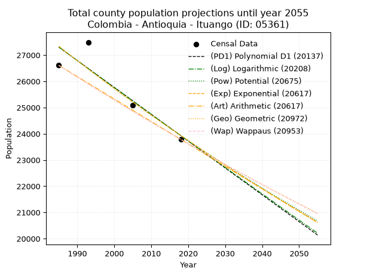
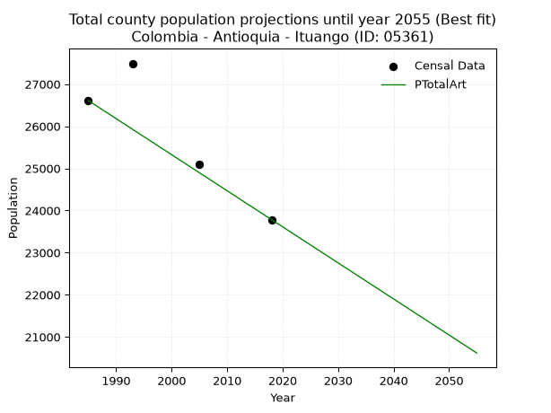
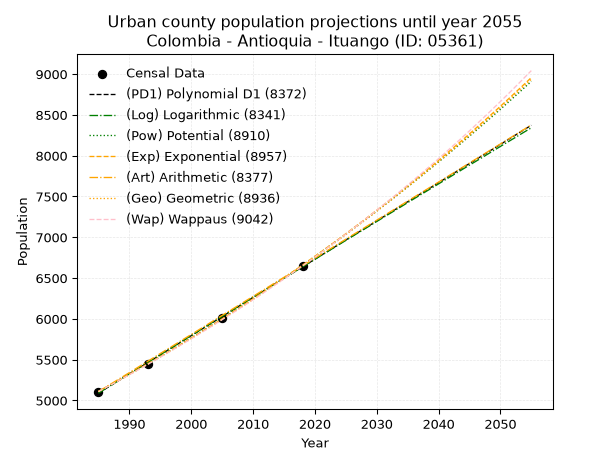
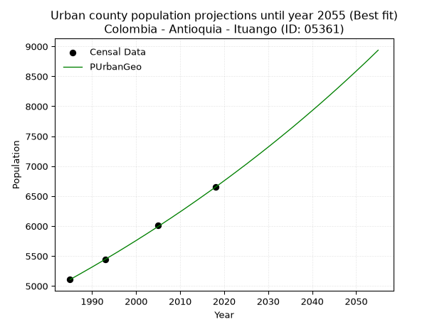
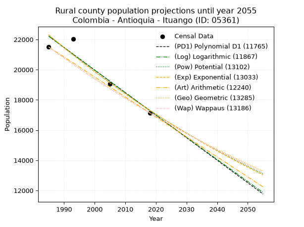
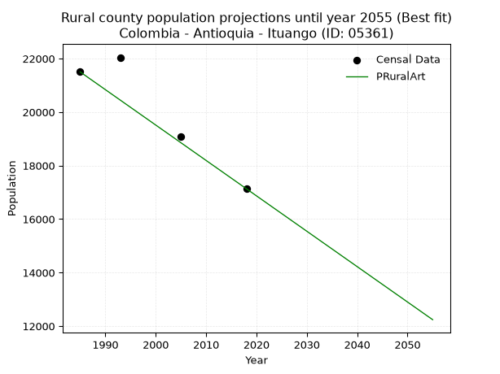

<div align="center">


</div>

# 📜 _“Population and Public Services Demand Projections (PPSD) until Year 2050 for Colombia - Antioquia - Ituango (ID: 05361)”_
Keywords: `population` `public-service` `projection` `lineal` `polynomial` `logarithmic` `potential` `exponential` `arithmetic` `geometric` `wappaus` `dane` `colombia` `south-america`

PPSD are analytical estimates used by governments and planners to anticipate future changes in population size, age distribution, and the resulting community needs for utilities, healthcare, education, and infrastructure as sizing future water treatment facilities, electrical grids, and road networks based on spatial growth.

<div align="center">

</img>

</div>


> **General running parameters**: • app_version: _v20260806_. • Python version: _3.14.7_. • Pandas version: _3.0.5_. • NumPy version: _2.5.1_. • Creates, save and include plots into reports (create_plot): _False_. • Projection until year: _2050_. • Process polynomial degree 2 and up: _False_. • Process Wappaus: _True_. • Process Wappaus: _True_. • Set negative values to zero: _True_. • Set infinite values to zero: _True_. • Drop dataset notes: _True_. 
<div align="center">

Maps & GIS Layers: [:earth_americas:Google](http://maps.google.com/maps?q=7.171629029,-75.7646731) [:earth_americas:OSM](https://www.openstreetmap.org/#map=18/7.171629029/-75.7646731&layers=P) [:earth_americas:Bing](https://www.bing.com/maps?cp=7.171629029~-75.7646731&lvl=18) [:earth_americas:Apple](https://maps.apple.com/frame?center=7.171629029%2C-75.7646731&span=0.003%2C0.006) [:earth_americas:GISMobile](https://github.com/rcfdtools/R.GISMobile/blob/main/file/gis/CountyLayer_CO/Readme.md)

</div>


<div align="center">

```geojson
{
  "type": "Feature",
  "geometry": {
    "type": "Point", 
    "coordinates": [-75.7646731, 7.171629029]
  }, 
  "properties": {
    "Name": "Colombia - Antioquia - Ituango (ID: 05361)"
  }
}
```

</div>


## 0. Census Data (4 records)

Census data are official statistics collected by a government about the people and housing in a country. They usually include counts of total population, age, sex, race, income, education, and jobs.

📅Global census file: [Population.xlsx](../data/Population.xlsx)

| Source   |   Year |   CountryID | CountryName   |   StateID | StateName   |   CountyID | CountyName   |   PTotal |   PUrban |   PRural |
|:---------|-------:|------------:|:--------------|----------:|:------------|-----------:|:-------------|---------:|---------:|---------:|
| DANE     |   1985 |          57 | Colombia      |        05 | Antioquia   |      05361 | Ituango      |    26609 |     5108 |    21501 |
| DANE     |   1993 |          57 | Colombia      |        05 | Antioquia   |      05361 | Ituango      |    27491 |     5448 |    22043 |
| DANE     |   2005 |          57 | Colombia      |        05 | Antioquia   |      05361 | Ituango      |    25088 |     6016 |    19072 |
| DANE     |   2018 |          57 | Colombia      |        05 | Antioquia   |      05361 | Ituango      |    23784 |     6649 |    17135 |

> 🔥Some records could had specific notes about the registered values or the corresponding urban or rural distribution.

📅[SUI-RUPS](https://www.datos.gov.co/Hacienda-y-Cr-dito-P-blico/Registro-nico-de-Prestadores-de-Servicios-P-blicos/4qkq-csdn/about_data) - Local public utility companies: [RUPS.csv](../data/RUPS.csv)

 | SERVICIO       | ESTADO    | NOMBRE                                                             | NIT         | DEPARTAMENTO_DOMICILIO   | MUNICIPIO_DOMICILIO   | DIRECCION               |   TELEFONO | EMAIL                   | TIPO_PRESTADOR                             | CLASIFICACION                 |
|:---------------|:----------|:-------------------------------------------------------------------|:------------|:-------------------------|:----------------------|:------------------------|-----------:|:------------------------|:-------------------------------------------|:------------------------------|
| ACUEDUCTO      | OPERATIVA | EMPRESA DE SERVICIOS PUBLICOS DOMICILIARIOS DE ITUANGO S.A. E.S.P. | 900622585-0 | ANTIOQUIA                | ITUANGO               | CALLE BERRIO N° 19 - 04 |    8643218 | servituangosa@gmail.com | SOCIEDADES (EMPRESA DE SERVICIOS PUBLICOS) | MENOR O IGUAL A 2500 USUARIOS |
| ALCANTARILLADO | OPERATIVA | EMPRESA DE SERVICIOS PUBLICOS DOMICILIARIOS DE ITUANGO S.A. E.S.P. | 900622585-0 | ANTIOQUIA                | ITUANGO               | CALLE BERRIO N° 19 - 04 |    8643218 | servituangosa@gmail.com | SOCIEDADES (EMPRESA DE SERVICIOS PUBLICOS) | MENOR O IGUAL A 2500 USUARIOS |

## 1. Total

### 1.1. Coefficients and Parameters

* (PD1) Polynomial Deg 1: -102.38940184664695, 230547.40104375553 (lineal)
* (Log) Logarithmic: -204817.9522106382, 1582565.8960611227
* (Pow) Potential: -8.056697833883286, 31.005763053902317
* (Exp) Exponential: -0.004027615061992749, 81053503.7662954
* (Art) Arithmetic: Year diff. 2018 - 1985 = 33, Population diff. 23784 - 26609 = -2825, Annual growth = -85.60606060606061
* (Geo) Geometric: Year diff. 2018 - 1985 = 33, Population diff. 23784 - 26609 = -2825, Annual growth % = -0.0033953263965270652
* (Wap) Wappaus: i = -0.33975377773127463, Condition values only valid for < 200)

<sub>
Wappaus condition values: ['-0.00', '-0.34', '-0.68', '-1.02', '-1.36', '-1.70', '-2.04', '-2.38', '-2.72', '-3.06', '-3.40', '-3.74', '-4.08', '-4.42', '-4.76', '-5.10', '-5.44', '-5.78', '-6.12', '-6.46', '-6.80', '-7.13', '-7.47', '-7.81', '-8.15', '-8.49', '-8.83', '-9.17', '-9.51', '-9.85', '-10.19', '-10.53', '-10.87', '-11.21', '-11.55', '-11.89', '-12.23', '-12.57', '-12.91', '-13.25', '-13.59', '-13.93', '-14.27', '-14.61', '-14.95', '-15.29', '-15.63', '-15.97', '-16.31', '-16.65', '-16.99', '-17.33', '-17.67', '-18.01', '-18.35', '-18.69', '-19.03', '-19.37', '-19.71', '-20.05', '-20.39', '-20.72', '-21.06', '-21.40', '-21.74', '-22.08']
</sub>


### 1.2. Projected Dataset

|   Year |   CountyID |   PTotalPD1 |   PTotalLog |   PTotalPow |   PTotalExp |   PTotalArt |   PTotalGeo |   PTotalWap |
|-------:|-----------:|------------:|------------:|------------:|------------:|------------:|------------:|------------:|
|   1985 |      05361 |       27304 |       27307 |       27334 |       27332 |       26609 |       26609 |       26609 |
|   1986 |      05361 |       27202 |       27203 |       27223 |       27222 |       26523 |       26519 |       26519 |
|   1987 |      05361 |       27100 |       27100 |       27113 |       27112 |       26438 |       26429 |       26429 |
|   1988 |      05361 |       26997 |       26997 |       27003 |       27003 |       26352 |       26339 |       26339 |
|   1989 |      05361 |       26895 |       26894 |       26894 |       26895 |       26267 |       26249 |       26250 |
|   1990 |      05361 |       26792 |       26791 |       26786 |       26787 |       26181 |       26160 |       26161 |
|   1991 |      05361 |       26690 |       26688 |       26677 |       26679 |       26095 |       26072 |       26072 |
|   1992 |      05361 |       26588 |       26586 |       26570 |       26572 |       26010 |       25983 |       25984 |
|   1993 |      05361 |       26485 |       26483 |       26462 |       26465 |       25924 |       25895 |       25895 |
|   1994 |      05361 |       26383 |       26380 |       26356 |       26359 |       25839 |       25807 |       25808 |
|   1995 |      05361 |       26281 |       26277 |       26249 |       26253 |       25753 |       25719 |       25720 |
|   1996 |      05361 |       26178 |       26175 |       26144 |       26147 |       25667 |       25632 |       25633 |
|   1997 |      05361 |       26076 |       26072 |       26038 |       26042 |       25582 |       25545 |       25546 |
|   1998 |      05361 |       25973 |       25970 |       25934 |       25938 |       25496 |       25458 |       25459 |
|   1999 |      05361 |       25871 |       25867 |       25829 |       25833 |       25411 |       25372 |       25373 |
|   2000 |      05361 |       25769 |       25765 |       25725 |       25729 |       25325 |       25286 |       25287 |
|   2001 |      05361 |       25666 |       25662 |       25622 |       25626 |       25239 |       25200 |       25201 |
|   2002 |      05361 |       25564 |       25560 |       25519 |       25523 |       25154 |       25114 |       25115 |
|   2003 |      05361 |       25461 |       25458 |       25417 |       25420 |       25068 |       25029 |       25030 |
|   2004 |      05361 |       25359 |       25355 |       25315 |       25318 |       24982 |       24944 |       24945 |
|   2005 |      05361 |       25257 |       25253 |       25213 |       25216 |       24897 |       24859 |       24860 |
|   2006 |      05361 |       25154 |       25151 |       25112 |       25115 |       24811 |       24775 |       24776 |
|   2007 |      05361 |       25052 |       25049 |       25011 |       25014 |       24726 |       24691 |       24692 |
|   2008 |      05361 |       24949 |       24947 |       24911 |       24914 |       24640 |       24607 |       24608 |
|   2009 |      05361 |       24847 |       24845 |       24811 |       24813 |       24554 |       24523 |       24524 |
|   2010 |      05361 |       24745 |       24743 |       24712 |       24714 |       24469 |       24440 |       24441 |
|   2011 |      05361 |       24642 |       24641 |       24613 |       24614 |       24383 |       24357 |       24358 |
|   2012 |      05361 |       24540 |       24539 |       24515 |       24515 |       24298 |       24274 |       24275 |
|   2013 |      05361 |       24438 |       24438 |       24417 |       24417 |       24212 |       24192 |       24193 |
|   2014 |      05361 |       24335 |       24336 |       24319 |       24319 |       24126 |       24110 |       24110 |
|   2015 |      05361 |       24233 |       24234 |       24222 |       24221 |       24041 |       24028 |       24028 |
|   2016 |      05361 |       24130 |       24133 |       24126 |       24124 |       23955 |       23946 |       23947 |
|   2017 |      05361 |       24028 |       24031 |       24030 |       24027 |       23870 |       23865 |       23865 |
|   2018 |      05361 |       23926 |       23930 |       23934 |       23930 |       23784 |       23784 |       23784 |
|   2019 |      05361 |       23823 |       23828 |       23838 |       23834 |       23698 |       23703 |       23703 |
|   2020 |      05361 |       23721 |       23727 |       23744 |       23738 |       23613 |       23623 |       23622 |
|   2021 |      05361 |       23618 |       23625 |       23649 |       23643 |       23527 |       23543 |       23542 |
|   2022 |      05361 |       23516 |       23524 |       23555 |       23548 |       23442 |       23463 |       23462 |
|   2023 |      05361 |       23414 |       23423 |       23461 |       23453 |       23356 |       23383 |       23382 |
|   2024 |      05361 |       23311 |       23321 |       23368 |       23359 |       23270 |       23304 |       23302 |
|   2025 |      05361 |       23209 |       23220 |       23275 |       23265 |       23185 |       23224 |       23223 |
|   2026 |      05361 |       23106 |       23119 |       23183 |       23171 |       23099 |       23146 |       23144 |
|   2027 |      05361 |       23004 |       23018 |       23091 |       23078 |       23014 |       23067 |       23065 |
|   2028 |      05361 |       22902 |       22917 |       22999 |       22985 |       22928 |       22989 |       22986 |
|   2029 |      05361 |       22799 |       22816 |       22908 |       22893 |       22842 |       22911 |       22908 |
|   2030 |      05361 |       22697 |       22715 |       22817 |       22801 |       22757 |       22833 |       22830 |
|   2031 |      05361 |       22595 |       22614 |       22727 |       22709 |       22671 |       22755 |       22752 |
|   2032 |      05361 |       22492 |       22513 |       22637 |       22618 |       22586 |       22678 |       22674 |
|   2033 |      05361 |       22390 |       22413 |       22548 |       22527 |       22500 |       22601 |       22597 |
|   2034 |      05361 |       22287 |       22312 |       22458 |       22437 |       22414 |       22524 |       22520 |
|   2035 |      05361 |       22185 |       22211 |       22370 |       22346 |       22329 |       22448 |       22443 |
|   2036 |      05361 |       22083 |       22111 |       22281 |       22257 |       22243 |       22372 |       22366 |
|   2037 |      05361 |       21980 |       22010 |       22193 |       22167 |       22157 |       22296 |       22290 |
|   2038 |      05361 |       21878 |       21910 |       22106 |       22078 |       22072 |       22220 |       22213 |
|   2039 |      05361 |       21775 |       21809 |       22019 |       21989 |       21986 |       22145 |       22137 |
|   2040 |      05361 |       21673 |       21709 |       21932 |       21901 |       21901 |       22069 |       22062 |
|   2041 |      05361 |       21571 |       21608 |       21845 |       21813 |       21815 |       21994 |       21986 |
|   2042 |      05361 |       21468 |       21508 |       21759 |       21725 |       21729 |       21920 |       21911 |
|   2043 |      05361 |       21366 |       21408 |       21674 |       21638 |       21644 |       21845 |       21836 |
|   2044 |      05361 |       21263 |       21307 |       21588 |       21551 |       21558 |       21771 |       21761 |
|   2045 |      05361 |       21161 |       21207 |       21503 |       21464 |       21473 |       21697 |       21686 |
|   2046 |      05361 |       21059 |       21107 |       21419 |       21378 |       21387 |       21624 |       21612 |
|   2047 |      05361 |       20956 |       21007 |       21335 |       21292 |       21301 |       21550 |       21538 |
|   2048 |      05361 |       20854 |       20907 |       21251 |       21207 |       21216 |       21477 |       21464 |
|   2049 |      05361 |       20752 |       20807 |       21168 |       21121 |       21130 |       21404 |       21390 |
|   2050 |      05361 |       20649 |       20707 |       21084 |       21036 |       21045 |       21331 |       21317 |
<div align="center">

</img>

</div>


### 1.3. Best fit with absolute and relative error (%)

Relative error puts that difference into context by dividing the absolute error by the true value, creating a unitless ratio or percentage that shows the scale of the mistake.

Absolute and relative error

|   Year | Source   |   CountryID | CountryName   |   StateID | StateName   |   CountyID_x | CountyName   |   PTotal |   PUrban |   PRural |   CountyID_y |   PTotalPD1 |   PTotalLog |   PTotalPow |   PTotalExp |   PTotalArt |   PTotalGeo |   PTotalWap |   PTotalPD1AbsError |   PTotalLogAbsError |   PTotalPowAbsError |   PTotalExpAbsError |   PTotalArtAbsError |   PTotalGeoAbsError |   PTotalWapAbsError |   PTotalPD1RelError |   PTotalLogRelError |   PTotalPowRelError |   PTotalExpRelError |   PTotalArtRelError |   PTotalGeoRelError |   PTotalWapRelError |
|-------:|:---------|------------:|:--------------|----------:|:------------|-------------:|:-------------|---------:|---------:|---------:|-------------:|------------:|------------:|------------:|------------:|------------:|------------:|------------:|--------------------:|--------------------:|--------------------:|--------------------:|--------------------:|--------------------:|--------------------:|--------------------:|--------------------:|--------------------:|--------------------:|--------------------:|--------------------:|--------------------:|
|   1985 | DANE     |          57 | Colombia      |        05 | Antioquia   |        05361 | Ituango      |    26609 |     5108 |    21501 |        05361 |       27304 |       27307 |       27334 |       27332 |       26609 |       26609 |       26609 |                 695 |                 698 |                 725 |                 723 |                   0 |                   0 |                   0 |            2.6119   |            2.62317  |            2.72464  |            2.71713  |             0       |            0        |            0        |
|   1993 | DANE     |          57 | Colombia      |        05 | Antioquia   |        05361 | Ituango      |    27491 |     5448 |    22043 |        05361 |       26485 |       26483 |       26462 |       26465 |       25924 |       25895 |       25895 |                1006 |                1008 |                1029 |                1026 |                1567 |                1596 |                1596 |            3.65938  |            3.66665  |            3.74304  |            3.73213  |             5.70005 |            5.80554  |            5.80554  |
|   2005 | DANE     |          57 | Colombia      |        05 | Antioquia   |        05361 | Ituango      |    25088 |     6016 |    19072 |        05361 |       25257 |       25253 |       25213 |       25216 |       24897 |       24859 |       24860 |                 169 |                 165 |                 125 |                 128 |                 191 |                 229 |                 228 |            0.673629 |            0.657685 |            0.498246 |            0.510204 |             0.76132 |            0.912787 |            0.908801 |
|   2018 | DANE     |          57 | Colombia      |        05 | Antioquia   |        05361 | Ituango      |    23784 |     6649 |    17135 |        05361 |       23926 |       23930 |       23934 |       23930 |       23784 |       23784 |       23784 |                 142 |                 146 |                 150 |                 146 |                   0 |                   0 |                   0 |            0.59704  |            0.613858 |            0.630676 |            0.613858 |             0       |            0        |            0        |

Relative error mean

| Method    |   RelError | Best   |
|:----------|-----------:|:-------|
| PTotalPD1 |    1.88549 |        |
| PTotalLog |    1.89034 |        |
| PTotalPow |    1.89915 |        |
| PTotalExp |    1.89333 |        |
| PTotalArt |    1.61534 | True   |
| PTotalGeo |    1.67958 |        |
| PTotalWap |    1.67858 |        |

💙Best method: _**PTotalArt**_
<div align="center">

</img>

</div>


### 1.4. Fresh water supply demand in liters per capita per day (lpcd)

The fresh water supply demand typically ranges from 100 to 300 liters per capita per day (lpcd) for standard domestic and municipal planning, though absolute survival minimums set by the World Health Organization are as low as 7.5 to 20 liters per day, and total consumption in high-income nations can exceed 400 liters.

> `CZ`: Level in meters above the sea level (masl)<br> `WS`: Fresh water supply demand in liters per capita per day (lpcd or l/h/d)<br> `WSAll`: Zonal fresh water supply demand in liters per second (l/s)<br> `A`: Zonal area in square meters<br> `DP`: Population density (people/hectare or p/ha)

Reference values (RAS Colombia)

|    CZ |   WS |
|------:|-----:|
|  1000 |  120 |
|  2000 |  130 |
| 99999 |  140 |

County shapefile geometry properties and water supply values

|   CountyID |      ATotal |   CZTotal |   WSTotal |
|-----------:|------------:|----------:|----------:|
|      05361 | 2.84093e+09 |   1481.31 |       130 |

Projected values for best method: PTotalArt

|   CountyID |   Year |   PTotalArt |   DPTotal |   WSTotal |   WSTotalAll |
|-----------:|-------:|------------:|----------:|----------:|-------------:|
|      05361 |   1985 |       26609 |      0.09 |       130 |      40.0367 |
|      05361 |   1986 |       26523 |      0.09 |       130 |      39.9073 |
|      05361 |   1987 |       26438 |      0.09 |       130 |      39.7794 |
|      05361 |   1988 |       26352 |      0.09 |       130 |      39.65   |
|      05361 |   1989 |       26267 |      0.09 |       130 |      39.5221 |
|      05361 |   1990 |       26181 |      0.09 |       130 |      39.3927 |
|      05361 |   1991 |       26095 |      0.09 |       130 |      39.2633 |
|      05361 |   1992 |       26010 |      0.09 |       130 |      39.1354 |
|      05361 |   1993 |       25924 |      0.09 |       130 |      39.006  |
|      05361 |   1994 |       25839 |      0.09 |       130 |      38.8781 |
|      05361 |   1995 |       25753 |      0.09 |       130 |      38.7487 |
|      05361 |   1996 |       25667 |      0.09 |       130 |      38.6193 |
|      05361 |   1997 |       25582 |      0.09 |       130 |      38.4914 |
|      05361 |   1998 |       25496 |      0.09 |       130 |      38.362  |
|      05361 |   1999 |       25411 |      0.09 |       130 |      38.2341 |
|      05361 |   2000 |       25325 |      0.09 |       130 |      38.1047 |
|      05361 |   2001 |       25239 |      0.09 |       130 |      37.9753 |
|      05361 |   2002 |       25154 |      0.09 |       130 |      37.8475 |
|      05361 |   2003 |       25068 |      0.09 |       130 |      37.7181 |
|      05361 |   2004 |       24982 |      0.09 |       130 |      37.5887 |
|      05361 |   2005 |       24897 |      0.09 |       130 |      37.4608 |
|      05361 |   2006 |       24811 |      0.09 |       130 |      37.3314 |
|      05361 |   2007 |       24726 |      0.09 |       130 |      37.2035 |
|      05361 |   2008 |       24640 |      0.09 |       130 |      37.0741 |
|      05361 |   2009 |       24554 |      0.09 |       130 |      36.9447 |
|      05361 |   2010 |       24469 |      0.09 |       130 |      36.8168 |
|      05361 |   2011 |       24383 |      0.09 |       130 |      36.6874 |
|      05361 |   2012 |       24298 |      0.09 |       130 |      36.5595 |
|      05361 |   2013 |       24212 |      0.09 |       130 |      36.4301 |
|      05361 |   2014 |       24126 |      0.08 |       130 |      36.3007 |
|      05361 |   2015 |       24041 |      0.08 |       130 |      36.1728 |
|      05361 |   2016 |       23955 |      0.08 |       130 |      36.0434 |
|      05361 |   2017 |       23870 |      0.08 |       130 |      35.9155 |
|      05361 |   2018 |       23784 |      0.08 |       130 |      35.7861 |
|      05361 |   2019 |       23698 |      0.08 |       130 |      35.6567 |
|      05361 |   2020 |       23613 |      0.08 |       130 |      35.5288 |
|      05361 |   2021 |       23527 |      0.08 |       130 |      35.3994 |
|      05361 |   2022 |       23442 |      0.08 |       130 |      35.2715 |
|      05361 |   2023 |       23356 |      0.08 |       130 |      35.1421 |
|      05361 |   2024 |       23270 |      0.08 |       130 |      35.0127 |
|      05361 |   2025 |       23185 |      0.08 |       130 |      34.8848 |
|      05361 |   2026 |       23099 |      0.08 |       130 |      34.7554 |
|      05361 |   2027 |       23014 |      0.08 |       130 |      34.6275 |
|      05361 |   2028 |       22928 |      0.08 |       130 |      34.4981 |
|      05361 |   2029 |       22842 |      0.08 |       130 |      34.3687 |
|      05361 |   2030 |       22757 |      0.08 |       130 |      34.2409 |
|      05361 |   2031 |       22671 |      0.08 |       130 |      34.1115 |
|      05361 |   2032 |       22586 |      0.08 |       130 |      33.9836 |
|      05361 |   2033 |       22500 |      0.08 |       130 |      33.8542 |
|      05361 |   2034 |       22414 |      0.08 |       130 |      33.7248 |
|      05361 |   2035 |       22329 |      0.08 |       130 |      33.5969 |
|      05361 |   2036 |       22243 |      0.08 |       130 |      33.4675 |
|      05361 |   2037 |       22157 |      0.08 |       130 |      33.3381 |
|      05361 |   2038 |       22072 |      0.08 |       130 |      33.2102 |
|      05361 |   2039 |       21986 |      0.08 |       130 |      33.0808 |
|      05361 |   2040 |       21901 |      0.08 |       130 |      32.9529 |
|      05361 |   2041 |       21815 |      0.08 |       130 |      32.8235 |
|      05361 |   2042 |       21729 |      0.08 |       130 |      32.6941 |
|      05361 |   2043 |       21644 |      0.08 |       130 |      32.5662 |
|      05361 |   2044 |       21558 |      0.08 |       130 |      32.4368 |
|      05361 |   2045 |       21473 |      0.08 |       130 |      32.3089 |
|      05361 |   2046 |       21387 |      0.08 |       130 |      32.1795 |
|      05361 |   2047 |       21301 |      0.07 |       130 |      32.0501 |
|      05361 |   2048 |       21216 |      0.07 |       130 |      31.9222 |
|      05361 |   2049 |       21130 |      0.07 |       130 |      31.7928 |
|      05361 |   2050 |       21045 |      0.07 |       130 |      31.6649 |

## 2. Urban

### 2.1. Coefficients and Parameters

* (PD1) Polynomial Deg 1: 46.89000401445161, -87986.48052990685 (lineal)
* (Log) Logarithmic: 93850.7233242535, -707554.850060148
* (Pow) Potential: 16.038886800121865, -49.18394363388601
* (Exp) Exponential: 0.008012707992046914, 0.0006324385527790649
* (Art) Arithmetic: Year diff. 2018 - 1985 = 33, Population diff. 6649 - 5108 = 1541, Annual growth = 46.696969696969695
* (Geo) Geometric: Year diff. 2018 - 1985 = 33, Population diff. 6649 - 5108 = 1541, Annual growth % = 0.008021654846959825
* (Wap) Wappaus: i = 0.7943687964101335, Condition values only valid for < 200)

<sub>
Wappaus condition values: ['0.00', '0.79', '1.59', '2.38', '3.18', '3.97', '4.77', '5.56', '6.35', '7.15', '7.94', '8.74', '9.53', '10.33', '11.12', '11.92', '12.71', '13.50', '14.30', '15.09', '15.89', '16.68', '17.48', '18.27', '19.06', '19.86', '20.65', '21.45', '22.24', '23.04', '23.83', '24.63', '25.42', '26.21', '27.01', '27.80', '28.60', '29.39', '30.19', '30.98', '31.77', '32.57', '33.36', '34.16', '34.95', '35.75', '36.54', '37.34', '38.13', '38.92', '39.72', '40.51', '41.31', '42.10', '42.90', '43.69', '44.48', '45.28', '46.07', '46.87', '47.66', '48.46', '49.25', '50.05', '50.84', '51.63']
</sub>


### 2.2. Projected Dataset

|   Year |   CountyID |   PUrbanPD1 |   PUrbanLog |   PUrbanPow |   PUrbanExp |   PUrbanArt |   PUrbanGeo |   PUrbanWap |
|-------:|-----------:|------------:|------------:|------------:|------------:|------------:|------------:|------------:|
|   1985 |      05361 |        5090 |        5089 |        5111 |        5112 |        5108 |        5108 |        5108 |
|   1986 |      05361 |        5137 |        5136 |        5152 |        5153 |        5155 |        5149 |        5149 |
|   1987 |      05361 |        5184 |        5183 |        5194 |        5194 |        5201 |        5190 |        5190 |
|   1988 |      05361 |        5231 |        5231 |        5236 |        5236 |        5248 |        5232 |        5231 |
|   1989 |      05361 |        5278 |        5278 |        5278 |        5278 |        5295 |        5274 |        5273 |
|   1990 |      05361 |        5325 |        5325 |        5321 |        5321 |        5341 |        5316 |        5315 |
|   1991 |      05361 |        5372 |        5372 |        5364 |        5364 |        5388 |        5359 |        5357 |
|   1992 |      05361 |        5418 |        5419 |        5407 |        5407 |        5435 |        5402 |        5400 |
|   1993 |      05361 |        5465 |        5466 |        5451 |        5450 |        5482 |        5445 |        5443 |
|   1994 |      05361 |        5512 |        5513 |        5495 |        5494 |        5528 |        5489 |        5487 |
|   1995 |      05361 |        5559 |        5560 |        5539 |        5538 |        5575 |        5533 |        5531 |
|   1996 |      05361 |        5606 |        5607 |        5584 |        5583 |        5622 |        5577 |        5575 |
|   1997 |      05361 |        5653 |        5654 |        5629 |        5628 |        5668 |        5622 |        5619 |
|   1998 |      05361 |        5700 |        5701 |        5675 |        5673 |        5715 |        5667 |        5664 |
|   1999 |      05361 |        5747 |        5748 |        5720 |        5719 |        5762 |        5713 |        5710 |
|   2000 |      05361 |        5794 |        5795 |        5766 |        5765 |        5808 |        5758 |        5755 |
|   2001 |      05361 |        5840 |        5842 |        5813 |        5811 |        5855 |        5805 |        5801 |
|   2002 |      05361 |        5887 |        5889 |        5860 |        5858 |        5902 |        5851 |        5848 |
|   2003 |      05361 |        5934 |        5936 |        5907 |        5905 |        5949 |        5898 |        5895 |
|   2004 |      05361 |        5981 |        5983 |        5954 |        5952 |        5995 |        5945 |        5942 |
|   2005 |      05361 |        6028 |        6030 |        6002 |        6000 |        6042 |        5993 |        5990 |
|   2006 |      05361 |        6075 |        6076 |        6050 |        6048 |        6089 |        6041 |        6038 |
|   2007 |      05361 |        6122 |        6123 |        6099 |        6097 |        6135 |        6090 |        6086 |
|   2008 |      05361 |        6169 |        6170 |        6148 |        6146 |        6182 |        6138 |        6135 |
|   2009 |      05361 |        6216 |        6217 |        6197 |        6196 |        6229 |        6188 |        6184 |
|   2010 |      05361 |        6262 |        6263 |        6247 |        6245 |        6275 |        6237 |        6234 |
|   2011 |      05361 |        6309 |        6310 |        6297 |        6296 |        6322 |        6287 |        6284 |
|   2012 |      05361 |        6356 |        6357 |        6347 |        6346 |        6369 |        6338 |        6335 |
|   2013 |      05361 |        6403 |        6403 |        6398 |        6397 |        6416 |        6389 |        6386 |
|   2014 |      05361 |        6450 |        6450 |        6449 |        6449 |        6462 |        6440 |        6438 |
|   2015 |      05361 |        6497 |        6497 |        6501 |        6501 |        6509 |        6492 |        6490 |
|   2016 |      05361 |        6544 |        6543 |        6552 |        6553 |        6556 |        6544 |        6542 |
|   2017 |      05361 |        6591 |        6590 |        6605 |        6606 |        6602 |        6596 |        6596 |
|   2018 |      05361 |        6638 |        6636 |        6658 |        6659 |        6649 |        6649 |        6649 |
|   2019 |      05361 |        6684 |        6683 |        6711 |        6713 |        6696 |        6702 |        6703 |
|   2020 |      05361 |        6731 |        6729 |        6764 |        6767 |        6742 |        6756 |        6757 |
|   2021 |      05361 |        6778 |        6776 |        6818 |        6821 |        6789 |        6810 |        6812 |
|   2022 |      05361 |        6825 |        6822 |        6872 |        6876 |        6836 |        6865 |        6868 |
|   2023 |      05361 |        6872 |        6868 |        6927 |        6931 |        6882 |        6920 |        6924 |
|   2024 |      05361 |        6919 |        6915 |        6982 |        6987 |        6929 |        6976 |        6981 |
|   2025 |      05361 |        6966 |        6961 |        7038 |        7043 |        6976 |        7031 |        7038 |
|   2026 |      05361 |        7013 |        7008 |        7094 |        7100 |        7023 |        7088 |        7095 |
|   2027 |      05361 |        7060 |        7054 |        7150 |        7157 |        7069 |        7145 |        7153 |
|   2028 |      05361 |        7106 |        7100 |        7207 |        7214 |        7116 |        7202 |        7212 |
|   2029 |      05361 |        7153 |        7146 |        7264 |        7273 |        7163 |        7260 |        7271 |
|   2030 |      05361 |        7200 |        7193 |        7322 |        7331 |        7209 |        7318 |        7331 |
|   2031 |      05361 |        7247 |        7239 |        7380 |        7390 |        7256 |        7377 |        7392 |
|   2032 |      05361 |        7294 |        7285 |        7438 |        7449 |        7303 |        7436 |        7453 |
|   2033 |      05361 |        7341 |        7331 |        7497 |        7509 |        7349 |        7496 |        7514 |
|   2034 |      05361 |        7388 |        7377 |        7557 |        7570 |        7396 |        7556 |        7577 |
|   2035 |      05361 |        7435 |        7424 |        7616 |        7631 |        7443 |        7616 |        7640 |
|   2036 |      05361 |        7482 |        7470 |        7677 |        7692 |        7490 |        7677 |        7703 |
|   2037 |      05361 |        7528 |        7516 |        7737 |        7754 |        7536 |        7739 |        7767 |
|   2038 |      05361 |        7575 |        7562 |        7798 |        7816 |        7583 |        7801 |        7832 |
|   2039 |      05361 |        7622 |        7608 |        7860 |        7879 |        7630 |        7864 |        7897 |
|   2040 |      05361 |        7669 |        7654 |        7922 |        7943 |        7676 |        7927 |        7963 |
|   2041 |      05361 |        7716 |        7700 |        7985 |        8007 |        7723 |        7990 |        8030 |
|   2042 |      05361 |        7763 |        7746 |        8048 |        8071 |        7770 |        8054 |        8098 |
|   2043 |      05361 |        7810 |        7792 |        8111 |        8136 |        7816 |        8119 |        8166 |
|   2044 |      05361 |        7857 |        7838 |        8175 |        8201 |        7863 |        8184 |        8235 |
|   2045 |      05361 |        7904 |        7884 |        8239 |        8267 |        7910 |        8250 |        8304 |
|   2046 |      05361 |        7950 |        7929 |        8304 |        8334 |        7957 |        8316 |        8375 |
|   2047 |      05361 |        7997 |        7975 |        8370 |        8401 |        8003 |        8383 |        8446 |
|   2048 |      05361 |        8044 |        8021 |        8435 |        8468 |        8050 |        8450 |        8517 |
|   2049 |      05361 |        8091 |        8067 |        8502 |        8537 |        8097 |        8518 |        8590 |
|   2050 |      05361 |        8138 |        8113 |        8568 |        8605 |        8143 |        8586 |        8663 |
<div align="center">

</img>

</div>


### 2.3. Best fit with absolute and relative error (%)

Relative error puts that difference into context by dividing the absolute error by the true value, creating a unitless ratio or percentage that shows the scale of the mistake.

Absolute and relative error

|   Year | Source   |   CountryID | CountryName   |   StateID | StateName   |   CountyID_x | CountyName   |   PTotal |   PUrban |   PRural |   CountyID_y |   PUrbanPD1 |   PUrbanLog |   PUrbanPow |   PUrbanExp |   PUrbanArt |   PUrbanGeo |   PUrbanWap |   PUrbanPD1AbsError |   PUrbanLogAbsError |   PUrbanPowAbsError |   PUrbanExpAbsError |   PUrbanArtAbsError |   PUrbanGeoAbsError |   PUrbanWapAbsError |   PUrbanPD1RelError |   PUrbanLogRelError |   PUrbanPowRelError |   PUrbanExpRelError |   PUrbanArtRelError |   PUrbanGeoRelError |   PUrbanWapRelError |
|-------:|:---------|------------:|:--------------|----------:|:------------|-------------:|:-------------|---------:|---------:|---------:|-------------:|------------:|------------:|------------:|------------:|------------:|------------:|------------:|--------------------:|--------------------:|--------------------:|--------------------:|--------------------:|--------------------:|--------------------:|--------------------:|--------------------:|--------------------:|--------------------:|--------------------:|--------------------:|--------------------:|
|   1985 | DANE     |          57 | Colombia      |        05 | Antioquia   |        05361 | Ituango      |    26609 |     5108 |    21501 |        05361 |        5090 |        5089 |        5111 |        5112 |        5108 |        5108 |        5108 |                  18 |                  19 |                   3 |                   4 |                   0 |                   0 |                   0 |            0.352388 |            0.371966 |           0.0587314 |           0.0783085 |            0        |           0         |           0         |
|   1993 | DANE     |          57 | Colombia      |        05 | Antioquia   |        05361 | Ituango      |    27491 |     5448 |    22043 |        05361 |        5465 |        5466 |        5451 |        5450 |        5482 |        5445 |        5443 |                  17 |                  18 |                   3 |                   2 |                  34 |                   3 |                   5 |            0.312041 |            0.330396 |           0.0550661 |           0.0367107 |            0.624082 |           0.0550661 |           0.0917768 |
|   2005 | DANE     |          57 | Colombia      |        05 | Antioquia   |        05361 | Ituango      |    25088 |     6016 |    19072 |        05361 |        6028 |        6030 |        6002 |        6000 |        6042 |        5993 |        5990 |                  12 |                  14 |                  14 |                  16 |                  26 |                  23 |                  26 |            0.199468 |            0.232713 |           0.232713  |           0.265957  |            0.432181 |           0.382314  |           0.432181  |
|   2018 | DANE     |          57 | Colombia      |        05 | Antioquia   |        05361 | Ituango      |    23784 |     6649 |    17135 |        05361 |        6638 |        6636 |        6658 |        6659 |        6649 |        6649 |        6649 |                  11 |                  13 |                   9 |                  10 |                   0 |                   0 |                   0 |            0.165438 |            0.195518 |           0.135359  |           0.150399  |            0        |           0         |           0         |

Relative error mean

| Method    |   RelError | Best   |
|:----------|-----------:|:-------|
| PUrbanPD1 |   0.257334 |        |
| PUrbanLog |   0.282648 |        |
| PUrbanPow |   0.120467 |        |
| PUrbanExp |   0.132844 |        |
| PUrbanArt |   0.264066 |        |
| PUrbanGeo |   0.109345 | True   |
| PUrbanWap |   0.130989 |        |

💙Best method: _**PUrbanGeo**_
<div align="center">

</img>

</div>


### 2.4. Fresh water supply demand in liters per capita per day (lpcd)

The fresh water supply demand typically ranges from 100 to 300 liters per capita per day (lpcd) for standard domestic and municipal planning, though absolute survival minimums set by the World Health Organization are as low as 7.5 to 20 liters per day, and total consumption in high-income nations can exceed 400 liters.

> `CZ`: Level in meters above the sea level (masl)<br> `WS`: Fresh water supply demand in liters per capita per day (lpcd or l/h/d)<br> `WSAll`: Zonal fresh water supply demand in liters per second (l/s)<br> `A`: Zonal area in square meters<br> `DP`: Population density (people/hectare or p/ha)

Reference values (RAS Colombia)

|    CZ |   WS |
|------:|-----:|
|  1000 |  120 |
|  2000 |  130 |
| 99999 |  140 |

County shapefile geometry properties and water supply values

|   CountyID |   AUrban |   CZUrban |   WSUrban |
|-----------:|---------:|----------:|----------:|
|      05361 |   936626 |    1590.4 |       130 |

Projected values for best method: PUrbanGeo

|   CountyID |   Year |   PUrbanGeo |   DPUrban |   WSUrban |   WSUrbanAll |
|-----------:|-------:|------------:|----------:|----------:|-------------:|
|      05361 |   1985 |        5108 |     54.54 |       130 |      7.68565 |
|      05361 |   1986 |        5149 |     54.97 |       130 |      7.74734 |
|      05361 |   1987 |        5190 |     55.41 |       130 |      7.80903 |
|      05361 |   1988 |        5232 |     55.86 |       130 |      7.87222 |
|      05361 |   1989 |        5274 |     56.31 |       130 |      7.93542 |
|      05361 |   1990 |        5316 |     56.76 |       130 |      7.99861 |
|      05361 |   1991 |        5359 |     57.22 |       130 |      8.06331 |
|      05361 |   1992 |        5402 |     57.68 |       130 |      8.12801 |
|      05361 |   1993 |        5445 |     58.13 |       130 |      8.19271 |
|      05361 |   1994 |        5489 |     58.6  |       130 |      8.25891 |
|      05361 |   1995 |        5533 |     59.07 |       130 |      8.32512 |
|      05361 |   1996 |        5577 |     59.54 |       130 |      8.39132 |
|      05361 |   1997 |        5622 |     60.02 |       130 |      8.45903 |
|      05361 |   1998 |        5667 |     60.5  |       130 |      8.52674 |
|      05361 |   1999 |        5713 |     61    |       130 |      8.59595 |
|      05361 |   2000 |        5758 |     61.48 |       130 |      8.66366 |
|      05361 |   2001 |        5805 |     61.98 |       130 |      8.73438 |
|      05361 |   2002 |        5851 |     62.47 |       130 |      8.80359 |
|      05361 |   2003 |        5898 |     62.97 |       130 |      8.87431 |
|      05361 |   2004 |        5945 |     63.47 |       130 |      8.94502 |
|      05361 |   2005 |        5993 |     63.98 |       130 |      9.01725 |
|      05361 |   2006 |        6041 |     64.5  |       130 |      9.08947 |
|      05361 |   2007 |        6090 |     65.02 |       130 |      9.16319 |
|      05361 |   2008 |        6138 |     65.53 |       130 |      9.23542 |
|      05361 |   2009 |        6188 |     66.07 |       130 |      9.31065 |
|      05361 |   2010 |        6237 |     66.59 |       130 |      9.38438 |
|      05361 |   2011 |        6287 |     67.12 |       130 |      9.45961 |
|      05361 |   2012 |        6338 |     67.67 |       130 |      9.53634 |
|      05361 |   2013 |        6389 |     68.21 |       130 |      9.61308 |
|      05361 |   2014 |        6440 |     68.76 |       130 |      9.68981 |
|      05361 |   2015 |        6492 |     69.31 |       130 |      9.76806 |
|      05361 |   2016 |        6544 |     69.87 |       130 |      9.8463  |
|      05361 |   2017 |        6596 |     70.42 |       130 |      9.92454 |
|      05361 |   2018 |        6649 |     70.99 |       130 |     10.0043  |
|      05361 |   2019 |        6702 |     71.55 |       130 |     10.084   |
|      05361 |   2020 |        6756 |     72.13 |       130 |     10.1653  |
|      05361 |   2021 |        6810 |     72.71 |       130 |     10.2465  |
|      05361 |   2022 |        6865 |     73.29 |       130 |     10.3293  |
|      05361 |   2023 |        6920 |     73.88 |       130 |     10.412   |
|      05361 |   2024 |        6976 |     74.48 |       130 |     10.4963  |
|      05361 |   2025 |        7031 |     75.07 |       130 |     10.5791  |
|      05361 |   2026 |        7088 |     75.68 |       130 |     10.6648  |
|      05361 |   2027 |        7145 |     76.28 |       130 |     10.7506  |
|      05361 |   2028 |        7202 |     76.89 |       130 |     10.8363  |
|      05361 |   2029 |        7260 |     77.51 |       130 |     10.9236  |
|      05361 |   2030 |        7318 |     78.13 |       130 |     11.0109  |
|      05361 |   2031 |        7377 |     78.76 |       130 |     11.0997  |
|      05361 |   2032 |        7436 |     79.39 |       130 |     11.1884  |
|      05361 |   2033 |        7496 |     80.03 |       130 |     11.2787  |
|      05361 |   2034 |        7556 |     80.67 |       130 |     11.369   |
|      05361 |   2035 |        7616 |     81.31 |       130 |     11.4593  |
|      05361 |   2036 |        7677 |     81.96 |       130 |     11.551   |
|      05361 |   2037 |        7739 |     82.63 |       130 |     11.6443  |
|      05361 |   2038 |        7801 |     83.29 |       130 |     11.7376  |
|      05361 |   2039 |        7864 |     83.96 |       130 |     11.8324  |
|      05361 |   2040 |        7927 |     84.63 |       130 |     11.9272  |
|      05361 |   2041 |        7990 |     85.31 |       130 |     12.022   |
|      05361 |   2042 |        8054 |     85.99 |       130 |     12.1183  |
|      05361 |   2043 |        8119 |     86.68 |       130 |     12.2161  |
|      05361 |   2044 |        8184 |     87.38 |       130 |     12.3139  |
|      05361 |   2045 |        8250 |     88.08 |       130 |     12.4132  |
|      05361 |   2046 |        8316 |     88.79 |       130 |     12.5125  |
|      05361 |   2047 |        8383 |     89.5  |       130 |     12.6133  |
|      05361 |   2048 |        8450 |     90.22 |       130 |     12.7141  |
|      05361 |   2049 |        8518 |     90.94 |       130 |     12.8164  |
|      05361 |   2050 |        8586 |     91.67 |       130 |     12.9187  |

## 3. Rural

### 3.1. Coefficients and Parameters

* (PD1) Polynomial Deg 1: -149.27940586109858, 318533.88157366245 (lineal)
* (Log) Logarithmic: -298668.6755348916, 2290120.7461212706
* (Pow) Potential: -15.352267461867156, 54.97650159071801
* (Exp) Exponential: -0.0076736151246737765, 91950265724.8514
* (Art) Arithmetic: Year diff. 2018 - 1985 = 33, Population diff. 17135 - 21501 = -4366, Annual growth = -132.3030303030303
* (Geo) Geometric: Year diff. 2018 - 1985 = 33, Population diff. 17135 - 21501 = -4366, Annual growth % = -0.006854469623254977
* (Wap) Wappaus: i = -0.6848691909257185, Condition values only valid for < 200)

<sub>
Wappaus condition values: ['-0.00', '-0.68', '-1.37', '-2.05', '-2.74', '-3.42', '-4.11', '-4.79', '-5.48', '-6.16', '-6.85', '-7.53', '-8.22', '-8.90', '-9.59', '-10.27', '-10.96', '-11.64', '-12.33', '-13.01', '-13.70', '-14.38', '-15.07', '-15.75', '-16.44', '-17.12', '-17.81', '-18.49', '-19.18', '-19.86', '-20.55', '-21.23', '-21.92', '-22.60', '-23.29', '-23.97', '-24.66', '-25.34', '-26.03', '-26.71', '-27.39', '-28.08', '-28.76', '-29.45', '-30.13', '-30.82', '-31.50', '-32.19', '-32.87', '-33.56', '-34.24', '-34.93', '-35.61', '-36.30', '-36.98', '-37.67', '-38.35', '-39.04', '-39.72', '-40.41', '-41.09', '-41.78', '-42.46', '-43.15', '-43.83', '-44.52']
</sub>


### 3.2. Projected Dataset

|   Year |   CountyID |   PRuralPD1 |   PRuralLog |   PRuralPow |   PRuralExp |   PRuralArt |   PRuralGeo |   PRuralWap |
|-------:|-----------:|------------:|------------:|------------:|------------:|------------:|------------:|------------:|
|   1985 |      05361 |       22214 |       22218 |       22305 |       22301 |       21501 |       21501 |       21501 |
|   1986 |      05361 |       22065 |       22067 |       22133 |       22131 |       21369 |       21354 |       21354 |
|   1987 |      05361 |       21916 |       21917 |       21963 |       21961 |       21236 |       21207 |       21208 |
|   1988 |      05361 |       21766 |       21767 |       21794 |       21793 |       21104 |       21062 |       21064 |
|   1989 |      05361 |       21617 |       21616 |       21626 |       21627 |       20972 |       20918 |       20920 |
|   1990 |      05361 |       21468 |       21466 |       21460 |       21462 |       20839 |       20774 |       20777 |
|   1991 |      05361 |       21319 |       21316 |       21295 |       21298 |       20707 |       20632 |       20635 |
|   1992 |      05361 |       21169 |       21166 |       21131 |       21135 |       20575 |       20490 |       20494 |
|   1993 |      05361 |       21020 |       21016 |       20969 |       20973 |       20443 |       20350 |       20354 |
|   1994 |      05361 |       20871 |       20867 |       20808 |       20813 |       20310 |       20210 |       20215 |
|   1995 |      05361 |       20721 |       20717 |       20649 |       20654 |       20178 |       20072 |       20077 |
|   1996 |      05361 |       20572 |       20567 |       20491 |       20496 |       20046 |       19934 |       19940 |
|   1997 |      05361 |       20423 |       20418 |       20334 |       20339 |       19913 |       19798 |       19804 |
|   1998 |      05361 |       20274 |       20268 |       20178 |       20184 |       19781 |       19662 |       19668 |
|   1999 |      05361 |       20124 |       20119 |       20024 |       20029 |       19649 |       19527 |       19534 |
|   2000 |      05361 |       19975 |       19969 |       19870 |       19876 |       19516 |       19393 |       19400 |
|   2001 |      05361 |       19826 |       19820 |       19718 |       19724 |       19384 |       19260 |       19267 |
|   2002 |      05361 |       19677 |       19671 |       19568 |       19574 |       19252 |       19128 |       19135 |
|   2003 |      05361 |       19527 |       19522 |       19418 |       19424 |       19120 |       18997 |       19004 |
|   2004 |      05361 |       19378 |       19373 |       19270 |       19275 |       18987 |       18867 |       18874 |
|   2005 |      05361 |       19229 |       19224 |       19123 |       19128 |       18855 |       18738 |       18745 |
|   2006 |      05361 |       19079 |       19075 |       18977 |       18982 |       18723 |       18609 |       18616 |
|   2007 |      05361 |       18930 |       18926 |       18833 |       18837 |       18590 |       18482 |       18488 |
|   2008 |      05361 |       18781 |       18777 |       18689 |       18693 |       18458 |       18355 |       18361 |
|   2009 |      05361 |       18632 |       18628 |       18547 |       18550 |       18326 |       18229 |       18235 |
|   2010 |      05361 |       18482 |       18480 |       18406 |       18408 |       18193 |       18104 |       18110 |
|   2011 |      05361 |       18333 |       18331 |       18266 |       18267 |       18061 |       17980 |       17985 |
|   2012 |      05361 |       18184 |       18183 |       18127 |       18128 |       17929 |       17857 |       17862 |
|   2013 |      05361 |       18034 |       18034 |       17989 |       17989 |       17797 |       17735 |       17739 |
|   2014 |      05361 |       17885 |       17886 |       17852 |       17852 |       17664 |       17613 |       17616 |
|   2015 |      05361 |       17736 |       17738 |       17717 |       17715 |       17532 |       17492 |       17495 |
|   2016 |      05361 |       17587 |       17589 |       17582 |       17580 |       17400 |       17372 |       17374 |
|   2017 |      05361 |       17437 |       17441 |       17449 |       17445 |       17267 |       17253 |       17254 |
|   2018 |      05361 |       17288 |       17293 |       17317 |       17312 |       17135 |       17135 |       17135 |
|   2019 |      05361 |       17139 |       17145 |       17186 |       17180 |       17003 |       17018 |       17016 |
|   2020 |      05361 |       16989 |       16997 |       17055 |       17048 |       16870 |       16901 |       16899 |
|   2021 |      05361 |       16840 |       16850 |       16926 |       16918 |       16738 |       16785 |       16782 |
|   2022 |      05361 |       16691 |       16702 |       16798 |       16789 |       16606 |       16670 |       16665 |
|   2023 |      05361 |       16542 |       16554 |       16671 |       16660 |       16473 |       16556 |       16550 |
|   2024 |      05361 |       16392 |       16407 |       16545 |       16533 |       16341 |       16442 |       16435 |
|   2025 |      05361 |       16243 |       16259 |       16420 |       16407 |       16209 |       16330 |       16320 |
|   2026 |      05361 |       16094 |       16112 |       16296 |       16281 |       16077 |       16218 |       16207 |
|   2027 |      05361 |       15945 |       15964 |       16173 |       16157 |       15944 |       16106 |       16094 |
|   2028 |      05361 |       15795 |       15817 |       16051 |       16033 |       15812 |       15996 |       15982 |
|   2029 |      05361 |       15646 |       15670 |       15930 |       15911 |       15680 |       15886 |       15870 |
|   2030 |      05361 |       15497 |       15523 |       15810 |       15789 |       15547 |       15778 |       15759 |
|   2031 |      05361 |       15347 |       15375 |       15691 |       15668 |       15415 |       15669 |       15649 |
|   2032 |      05361 |       15198 |       15228 |       15573 |       15549 |       15283 |       15562 |       15540 |
|   2033 |      05361 |       15049 |       15081 |       15456 |       15430 |       15150 |       15455 |       15431 |
|   2034 |      05361 |       14900 |       14935 |       15340 |       15312 |       15018 |       15349 |       15322 |
|   2035 |      05361 |       14750 |       14788 |       15224 |       15195 |       14886 |       15244 |       15215 |
|   2036 |      05361 |       14601 |       14641 |       15110 |       15079 |       14754 |       15140 |       15108 |
|   2037 |      05361 |       14452 |       14494 |       14996 |       14963 |       14621 |       15036 |       15001 |
|   2038 |      05361 |       14302 |       14348 |       14884 |       14849 |       14489 |       14933 |       14895 |
|   2039 |      05361 |       14153 |       14201 |       14772 |       14735 |       14357 |       14830 |       14790 |
|   2040 |      05361 |       14004 |       14055 |       14661 |       14623 |       14224 |       14729 |       14686 |
|   2041 |      05361 |       13855 |       13908 |       14551 |       14511 |       14092 |       14628 |       14582 |
|   2042 |      05361 |       13705 |       13762 |       14442 |       14400 |       13960 |       14528 |       14478 |
|   2043 |      05361 |       13556 |       13616 |       14334 |       14290 |       13827 |       14428 |       14375 |
|   2044 |      05361 |       13407 |       13470 |       14227 |       14181 |       13695 |       14329 |       14273 |
|   2045 |      05361 |       13257 |       13324 |       14121 |       14072 |       13563 |       14231 |       14172 |
|   2046 |      05361 |       13108 |       13178 |       14015 |       13965 |       13431 |       14133 |       14071 |
|   2047 |      05361 |       12959 |       13032 |       13910 |       13858 |       13298 |       14036 |       13970 |
|   2048 |      05361 |       12810 |       12886 |       13806 |       13752 |       13166 |       13940 |       13870 |
|   2049 |      05361 |       12660 |       12740 |       13703 |       13647 |       13034 |       13845 |       13771 |
|   2050 |      05361 |       12511 |       12594 |       13601 |       13543 |       12901 |       13750 |       13672 |
<div align="center">

</img>

</div>


### 3.3. Best fit with absolute and relative error (%)

Relative error puts that difference into context by dividing the absolute error by the true value, creating a unitless ratio or percentage that shows the scale of the mistake.

Absolute and relative error

|   Year | Source   |   CountryID | CountryName   |   StateID | StateName   |   CountyID_x | CountyName   |   PTotal |   PUrban |   PRural |   CountyID_y |   PRuralPD1 |   PRuralLog |   PRuralPow |   PRuralExp |   PRuralArt |   PRuralGeo |   PRuralWap |   PRuralPD1AbsError |   PRuralLogAbsError |   PRuralPowAbsError |   PRuralExpAbsError |   PRuralArtAbsError |   PRuralGeoAbsError |   PRuralWapAbsError |   PRuralPD1RelError |   PRuralLogRelError |   PRuralPowRelError |   PRuralExpRelError |   PRuralArtRelError |   PRuralGeoRelError |   PRuralWapRelError |
|-------:|:---------|------------:|:--------------|----------:|:------------|-------------:|:-------------|---------:|---------:|---------:|-------------:|------------:|------------:|------------:|------------:|------------:|------------:|------------:|--------------------:|--------------------:|--------------------:|--------------------:|--------------------:|--------------------:|--------------------:|--------------------:|--------------------:|--------------------:|--------------------:|--------------------:|--------------------:|--------------------:|
|   1985 | DANE     |          57 | Colombia      |        05 | Antioquia   |        05361 | Ituango      |    26609 |     5108 |    21501 |        05361 |       22214 |       22218 |       22305 |       22301 |       21501 |       21501 |       21501 |                 713 |                 717 |                 804 |                 800 |                   0 |                   0 |                   0 |            3.31612  |            3.33473  |            3.73936  |            3.72076  |             0       |             0       |             0       |
|   1993 | DANE     |          57 | Colombia      |        05 | Antioquia   |        05361 | Ituango      |    27491 |     5448 |    22043 |        05361 |       21020 |       21016 |       20969 |       20973 |       20443 |       20350 |       20354 |                1023 |                1027 |                1074 |                1070 |                1600 |                1693 |                1689 |            4.64093  |            4.65908  |            4.8723   |            4.85415  |             7.25854 |             7.68044 |             7.6623  |
|   2005 | DANE     |          57 | Colombia      |        05 | Antioquia   |        05361 | Ituango      |    25088 |     6016 |    19072 |        05361 |       19229 |       19224 |       19123 |       19128 |       18855 |       18738 |       18745 |                 157 |                 152 |                  51 |                  56 |                 217 |                 334 |                 327 |            0.823196 |            0.79698  |            0.267408 |            0.293624 |             1.13779 |             1.75126 |             1.71456 |
|   2018 | DANE     |          57 | Colombia      |        05 | Antioquia   |        05361 | Ituango      |    23784 |     6649 |    17135 |        05361 |       17288 |       17293 |       17317 |       17312 |       17135 |       17135 |       17135 |                 153 |                 158 |                 182 |                 177 |                   0 |                   0 |                   0 |            0.892909 |            0.922089 |            1.06215  |            1.03297  |             0       |             0       |             0       |

Relative error mean

| Method    |   RelError | Best   |
|:----------|-----------:|:-------|
| PRuralPD1 |    2.41829 |        |
| PRuralLog |    2.42822 |        |
| PRuralPow |    2.4853  |        |
| PRuralExp |    2.47538 |        |
| PRuralArt |    2.09908 | True   |
| PRuralGeo |    2.35793 |        |
| PRuralWap |    2.34421 |        |

💙Best method: _**PRuralArt**_
<div align="center">

</img>

</div>


### 3.4. Fresh water supply demand in liters per capita per day (lpcd)

The fresh water supply demand typically ranges from 100 to 300 liters per capita per day (lpcd) for standard domestic and municipal planning, though absolute survival minimums set by the World Health Organization are as low as 7.5 to 20 liters per day, and total consumption in high-income nations can exceed 400 liters.

> `CZ`: Level in meters above the sea level (masl)<br> `WS`: Fresh water supply demand in liters per capita per day (lpcd or l/h/d)<br> `WSAll`: Zonal fresh water supply demand in liters per second (l/s)<br> `A`: Zonal area in square meters<br> `DP`: Population density (people/hectare or p/ha)

Reference values (RAS Colombia)

|    CZ |   WS |
|------:|-----:|
|  1000 |  120 |
|  2000 |  130 |
| 99999 |  140 |

County shapefile geometry properties and water supply values

|   CountyID |      ARural |   CZRural |   WSRural |
|-----------:|------------:|----------:|----------:|
|      05361 | 2.83999e+09 |   1481.28 |       130 |

Projected values for best method: PRuralArt

|   CountyID |   Year |   PRuralArt |   DPRural |   WSRural |   WSRuralAll |
|-----------:|-------:|------------:|----------:|----------:|-------------:|
|      05361 |   1985 |       21501 |      0.08 |       130 |      32.351  |
|      05361 |   1986 |       21369 |      0.08 |       130 |      32.1524 |
|      05361 |   1987 |       21236 |      0.07 |       130 |      31.9523 |
|      05361 |   1988 |       21104 |      0.07 |       130 |      31.7537 |
|      05361 |   1989 |       20972 |      0.07 |       130 |      31.5551 |
|      05361 |   1990 |       20839 |      0.07 |       130 |      31.355  |
|      05361 |   1991 |       20707 |      0.07 |       130 |      31.1564 |
|      05361 |   1992 |       20575 |      0.07 |       130 |      30.9578 |
|      05361 |   1993 |       20443 |      0.07 |       130 |      30.7591 |
|      05361 |   1994 |       20310 |      0.07 |       130 |      30.559  |
|      05361 |   1995 |       20178 |      0.07 |       130 |      30.3604 |
|      05361 |   1996 |       20046 |      0.07 |       130 |      30.1618 |
|      05361 |   1997 |       19913 |      0.07 |       130 |      29.9617 |
|      05361 |   1998 |       19781 |      0.07 |       130 |      29.7631 |
|      05361 |   1999 |       19649 |      0.07 |       130 |      29.5645 |
|      05361 |   2000 |       19516 |      0.07 |       130 |      29.3644 |
|      05361 |   2001 |       19384 |      0.07 |       130 |      29.1657 |
|      05361 |   2002 |       19252 |      0.07 |       130 |      28.9671 |
|      05361 |   2003 |       19120 |      0.07 |       130 |      28.7685 |
|      05361 |   2004 |       18987 |      0.07 |       130 |      28.5684 |
|      05361 |   2005 |       18855 |      0.07 |       130 |      28.3698 |
|      05361 |   2006 |       18723 |      0.07 |       130 |      28.1712 |
|      05361 |   2007 |       18590 |      0.07 |       130 |      27.9711 |
|      05361 |   2008 |       18458 |      0.06 |       130 |      27.7725 |
|      05361 |   2009 |       18326 |      0.06 |       130 |      27.5738 |
|      05361 |   2010 |       18193 |      0.06 |       130 |      27.3737 |
|      05361 |   2011 |       18061 |      0.06 |       130 |      27.1751 |
|      05361 |   2012 |       17929 |      0.06 |       130 |      26.9765 |
|      05361 |   2013 |       17797 |      0.06 |       130 |      26.7779 |
|      05361 |   2014 |       17664 |      0.06 |       130 |      26.5778 |
|      05361 |   2015 |       17532 |      0.06 |       130 |      26.3792 |
|      05361 |   2016 |       17400 |      0.06 |       130 |      26.1806 |
|      05361 |   2017 |       17267 |      0.06 |       130 |      25.9804 |
|      05361 |   2018 |       17135 |      0.06 |       130 |      25.7818 |
|      05361 |   2019 |       17003 |      0.06 |       130 |      25.5832 |
|      05361 |   2020 |       16870 |      0.06 |       130 |      25.3831 |
|      05361 |   2021 |       16738 |      0.06 |       130 |      25.1845 |
|      05361 |   2022 |       16606 |      0.06 |       130 |      24.9859 |
|      05361 |   2023 |       16473 |      0.06 |       130 |      24.7858 |
|      05361 |   2024 |       16341 |      0.06 |       130 |      24.5872 |
|      05361 |   2025 |       16209 |      0.06 |       130 |      24.3885 |
|      05361 |   2026 |       16077 |      0.06 |       130 |      24.1899 |
|      05361 |   2027 |       15944 |      0.06 |       130 |      23.9898 |
|      05361 |   2028 |       15812 |      0.06 |       130 |      23.7912 |
|      05361 |   2029 |       15680 |      0.06 |       130 |      23.5926 |
|      05361 |   2030 |       15547 |      0.05 |       130 |      23.3925 |
|      05361 |   2031 |       15415 |      0.05 |       130 |      23.1939 |
|      05361 |   2032 |       15283 |      0.05 |       130 |      22.9953 |
|      05361 |   2033 |       15150 |      0.05 |       130 |      22.7951 |
|      05361 |   2034 |       15018 |      0.05 |       130 |      22.5965 |
|      05361 |   2035 |       14886 |      0.05 |       130 |      22.3979 |
|      05361 |   2036 |       14754 |      0.05 |       130 |      22.1993 |
|      05361 |   2037 |       14621 |      0.05 |       130 |      21.9992 |
|      05361 |   2038 |       14489 |      0.05 |       130 |      21.8006 |
|      05361 |   2039 |       14357 |      0.05 |       130 |      21.602  |
|      05361 |   2040 |       14224 |      0.05 |       130 |      21.4019 |
|      05361 |   2041 |       14092 |      0.05 |       130 |      21.2032 |
|      05361 |   2042 |       13960 |      0.05 |       130 |      21.0046 |
|      05361 |   2043 |       13827 |      0.05 |       130 |      20.8045 |
|      05361 |   2044 |       13695 |      0.05 |       130 |      20.6059 |
|      05361 |   2045 |       13563 |      0.05 |       130 |      20.4073 |
|      05361 |   2046 |       13431 |      0.05 |       130 |      20.2087 |
|      05361 |   2047 |       13298 |      0.05 |       130 |      20.0086 |
|      05361 |   2048 |       13166 |      0.05 |       130 |      19.81   |
|      05361 |   2049 |       13034 |      0.05 |       130 |      19.6113 |
|      05361 |   2050 |       12901 |      0.05 |       130 |      19.4112 |

#

<div align="center"><br><sub>Share this research</sub></div><br>

<sub>**APPS & TOOLS & CONTENT DISCLAIMER**: • NO WARRANTY - This content and software is provided by <a href="https://github.com/rcfdtools" target="_blank">github.com/rcfdtools</a> "as is", without any express or implied warranty, including warranties of merchantability, fitness for a particular purpose, or non-infringement. There is no guarantee that the software will be error-free or operate without interruption. • LIMITATION OF LIABILITY - Neither the authors nor copyright holders will be liable for claims or damages arising from the software or its use. You are responsible for determining if the software is appropriate for your use and assume all associated risks, including errors, legal compliance, and data loss. • NO PROFESSIONAL ADVICE - The software provides general information and does not offer professional advice. It should not replace consultation with professional advisors. [Clauses and global license for rcfdtools use.](https://github.com/rcfdtools/rcfdtools/blob/main/LICENSE.md)</sub>

| [:house: Home](Readme.md)  | [:beginner: Help / Collab](https://github.com/rcfdtools/R.HydroTools/discussions/31) |
|----------------------------|-------------------------------------------------------------------------------------------|