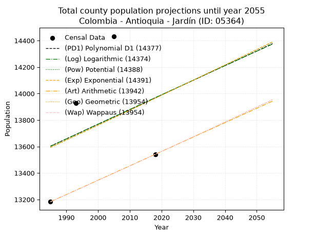
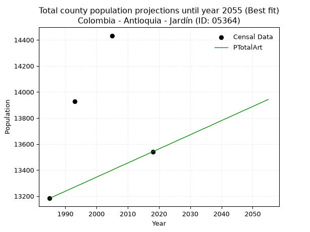
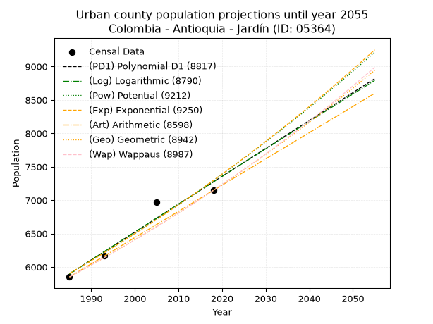
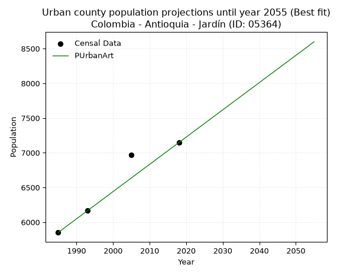
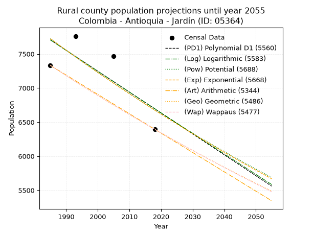
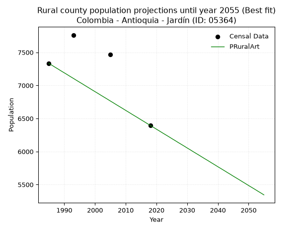

<div align="center">


</div>

# 📜 _“Population and Public Services Demand Projections (PPSD) until Year 2050 for Colombia - Antioquia - Jardín (ID: 05364)”_
Keywords: `population` `public-service` `projection` `lineal` `polynomial` `logarithmic` `potential` `exponential` `arithmetic` `geometric` `wappaus` `dane` `colombia` `south-america`

PPSD are analytical estimates used by governments and planners to anticipate future changes in population size, age distribution, and the resulting community needs for utilities, healthcare, education, and infrastructure as sizing future water treatment facilities, electrical grids, and road networks based on spatial growth.

<div align="center">

</img>

</div>


> **General running parameters**: • app_version: _v20260806_. • Python version: _3.14.7_. • Pandas version: _3.0.5_. • NumPy version: _2.5.1_. • Creates, save and include plots into reports (create_plot): _False_. • Projection until year: _2050_. • Process polynomial degree 2 and up: _False_. • Process Wappaus: _True_. • Process Wappaus: _True_. • Set negative values to zero: _True_. • Set infinite values to zero: _True_. • Drop dataset notes: _True_. 
<div align="center">

Maps & GIS Layers: [:earth_americas:Google](http://maps.google.com/maps?q=5.597542462,-75.8189816) [:earth_americas:OSM](https://www.openstreetmap.org/#map=18/5.597542462/-75.8189816&layers=P) [:earth_americas:Bing](https://www.bing.com/maps?cp=5.597542462~-75.8189816&lvl=18) [:earth_americas:Apple](https://maps.apple.com/frame?center=5.597542462%2C-75.8189816&span=0.003%2C0.006) [:earth_americas:GISMobile](https://github.com/rcfdtools/R.GISMobile/blob/main/file/gis/CountyLayer_CO/Readme.md)

</div>


<div align="center">

```geojson
{
  "type": "Feature",
  "geometry": {
    "type": "Point", 
    "coordinates": [-75.8189816, 5.597542462]
  }, 
  "properties": {
    "Name": "Colombia - Antioquia - Jardín (ID: 05364)"
  }
}
```

</div>


## 0. Census Data (4 records)

Census data are official statistics collected by a government about the people and housing in a country. They usually include counts of total population, age, sex, race, income, education, and jobs.

📅Global census file: [Population.xlsx](../data/Population.xlsx)

| Source   |   Year |   CountryID | CountryName   |   StateID | StateName   |   CountyID | CountyName   |   PTotal |   PUrban |   PRural |
|:---------|-------:|------------:|:--------------|----------:|:------------|-----------:|:-------------|---------:|---------:|---------:|
| DANE     |   1985 |          57 | Colombia      |        05 | Antioquia   |      05364 | Jardín       |    13183 |     5851 |     7332 |
| DANE     |   1993 |          57 | Colombia      |        05 | Antioquia   |      05364 | Jardín       |    13929 |     6167 |     7762 |
| DANE     |   2005 |          57 | Colombia      |        05 | Antioquia   |      05364 | Jardín       |    14433 |     6965 |     7468 |
| DANE     |   2018 |          57 | Colombia      |        05 | Antioquia   |      05364 | Jardín       |    13541 |     7146 |     6395 |

> 🔥Some records could had specific notes about the registered values or the corresponding urban or rural distribution.

📅[SUI-RUPS](https://www.datos.gov.co/Hacienda-y-Cr-dito-P-blico/Registro-nico-de-Prestadores-de-Servicios-P-blicos/4qkq-csdn/about_data) - Local public utility companies: [RUPS.csv](../data/RUPS.csv)

 | SERVICIO       | ESTADO    | NOMBRE                                                      | NIT         | DEPARTAMENTO_DOMICILIO   | MUNICIPIO_DOMICILIO   | DIRECCION               |   TELEFONO | EMAIL                                   | TIPO_PRESTADOR                             | CLASIFICACION                 |
|:---------------|:----------|:------------------------------------------------------------|:------------|:-------------------------|:----------------------|:------------------------|-----------:|:----------------------------------------|:-------------------------------------------|:------------------------------|
| ACUEDUCTO      | OPERATIVA | ASOCIACIÓN DE USUARIOS DEL ACUEDUCTO MULTIVEREDAL DE JARDIN | 800210933-1 | ANTIOQUIA                | JARDIN                | CARRERA 7 No. 9-23      |    8455838 | acueductomultiveredaljardin@hotmail.com | ORGANIZACION AUTORIZADA                    | MENOR O IGUAL A 2500 USUARIOS |
| ACUEDUCTO      | OPERATIVA | INGENIERIA TOTAL SERVICIOS PUBLICOS S.A.S E.S.P.            | 811009982-0 | ANTIOQUIA                | MEDELLIN              | Carrera 37A # 1 Sur 120 |    4441401 | lmachado@ingetotal.com.co               | SOCIEDADES (EMPRESA DE SERVICIOS PUBLICOS) | MAYOR O IGUAL A 5001 USUARIOS |
| ALCANTARILLADO | OPERATIVA | INGENIERIA TOTAL SERVICIOS PUBLICOS S.A.S E.S.P.            | 811009982-0 | ANTIOQUIA                | MEDELLIN              | Carrera 37A # 1 Sur 120 |    4441401 | lmachado@ingetotal.com.co               | SOCIEDADES (EMPRESA DE SERVICIOS PUBLICOS) | MAYOR O IGUAL A 5001 USUARIOS |

## 1. Total

### 1.1. Coefficients and Parameters

* (PD1) Polynomial Deg 1: 11.053392211963605, -8338.047771980204 (lineal)
* (Log) Logarithmic: 22289.974755308023, -155654.77673574392
* (Pow) Potential: 1.6409603424080919, -1.278199151024092
* (Exp) Exponential: 0.0008138362085809728, 2702.4512898267194
* (Art) Arithmetic: Year diff. 2018 - 1985 = 33, Population diff. 13541 - 13183 = 358, Annual growth = 10.848484848484848
* (Geo) Geometric: Year diff. 2018 - 1985 = 33, Population diff. 13541 - 13183 = 358, Annual growth % = 0.0008122690824501344
* (Wap) Wappaus: i = 0.08118907984197611, Condition values only valid for < 200)

<sub>
Wappaus condition values: ['0.00', '0.08', '0.16', '0.24', '0.32', '0.41', '0.49', '0.57', '0.65', '0.73', '0.81', '0.89', '0.97', '1.06', '1.14', '1.22', '1.30', '1.38', '1.46', '1.54', '1.62', '1.70', '1.79', '1.87', '1.95', '2.03', '2.11', '2.19', '2.27', '2.35', '2.44', '2.52', '2.60', '2.68', '2.76', '2.84', '2.92', '3.00', '3.09', '3.17', '3.25', '3.33', '3.41', '3.49', '3.57', '3.65', '3.73', '3.82', '3.90', '3.98', '4.06', '4.14', '4.22', '4.30', '4.38', '4.47', '4.55', '4.63', '4.71', '4.79', '4.87', '4.95', '5.03', '5.11', '5.20', '5.28']
</sub>


### 1.2. Projected Dataset

|   Year |   CountyID |   PTotalPD1 |   PTotalLog |   PTotalPow |   PTotalExp |   PTotalArt |   PTotalGeo |   PTotalWap |
|-------:|-----------:|------------:|------------:|------------:|------------:|------------:|------------:|------------:|
|   1985 |      05364 |       13603 |       13601 |       13592 |       13594 |       13183 |       13183 |       13183 |
|   1986 |      05364 |       13614 |       13613 |       13604 |       13605 |       13194 |       13194 |       13194 |
|   1987 |      05364 |       13625 |       13624 |       13615 |       13616 |       13205 |       13204 |       13204 |
|   1988 |      05364 |       13636 |       13635 |       13626 |       13627 |       13216 |       13215 |       13215 |
|   1989 |      05364 |       13647 |       13646 |       13637 |       13638 |       13226 |       13226 |       13226 |
|   1990 |      05364 |       13658 |       13657 |       13649 |       13649 |       13237 |       13237 |       13237 |
|   1991 |      05364 |       13669 |       13669 |       13660 |       13660 |       13248 |       13247 |       13247 |
|   1992 |      05364 |       13680 |       13680 |       13671 |       13672 |       13259 |       13258 |       13258 |
|   1993 |      05364 |       13691 |       13691 |       13682 |       13683 |       13270 |       13269 |       13269 |
|   1994 |      05364 |       13702 |       13702 |       13694 |       13694 |       13281 |       13280 |       13280 |
|   1995 |      05364 |       13713 |       13713 |       13705 |       13705 |       13291 |       13290 |       13290 |
|   1996 |      05364 |       13725 |       13725 |       13716 |       13716 |       13302 |       13301 |       13301 |
|   1997 |      05364 |       13736 |       13736 |       13727 |       13727 |       13313 |       13312 |       13312 |
|   1998 |      05364 |       13747 |       13747 |       13739 |       13739 |       13324 |       13323 |       13323 |
|   1999 |      05364 |       13758 |       13758 |       13750 |       13750 |       13335 |       13334 |       13334 |
|   2000 |      05364 |       13769 |       13769 |       13761 |       13761 |       13346 |       13345 |       13345 |
|   2001 |      05364 |       13780 |       13780 |       13773 |       13772 |       13357 |       13355 |       13355 |
|   2002 |      05364 |       13791 |       13791 |       13784 |       13783 |       13367 |       13366 |       13366 |
|   2003 |      05364 |       13802 |       13803 |       13795 |       13795 |       13378 |       13377 |       13377 |
|   2004 |      05364 |       13813 |       13814 |       13807 |       13806 |       13389 |       13388 |       13388 |
|   2005 |      05364 |       13824 |       13825 |       13818 |       13817 |       13400 |       13399 |       13399 |
|   2006 |      05364 |       13835 |       13836 |       13829 |       13828 |       13411 |       13410 |       13410 |
|   2007 |      05364 |       13846 |       13847 |       13840 |       13840 |       13422 |       13421 |       13421 |
|   2008 |      05364 |       13857 |       13858 |       13852 |       13851 |       13433 |       13432 |       13431 |
|   2009 |      05364 |       13868 |       13869 |       13863 |       13862 |       13443 |       13442 |       13442 |
|   2010 |      05364 |       13879 |       13880 |       13874 |       13873 |       13454 |       13453 |       13453 |
|   2011 |      05364 |       13890 |       13891 |       13886 |       13885 |       13465 |       13464 |       13464 |
|   2012 |      05364 |       13901 |       13902 |       13897 |       13896 |       13476 |       13475 |       13475 |
|   2013 |      05364 |       13912 |       13914 |       13908 |       13907 |       13487 |       13486 |       13486 |
|   2014 |      05364 |       13923 |       13925 |       13920 |       13919 |       13498 |       13497 |       13497 |
|   2015 |      05364 |       13935 |       13936 |       13931 |       13930 |       13508 |       13508 |       13508 |
|   2016 |      05364 |       13946 |       13947 |       13942 |       13941 |       13519 |       13519 |       13519 |
|   2017 |      05364 |       13957 |       13958 |       13954 |       13953 |       13530 |       13530 |       13530 |
|   2018 |      05364 |       13968 |       13969 |       13965 |       13964 |       13541 |       13541 |       13541 |
|   2019 |      05364 |       13979 |       13980 |       13977 |       13975 |       13552 |       13552 |       13552 |
|   2020 |      05364 |       13990 |       13991 |       13988 |       13987 |       13563 |       13563 |       13563 |
|   2021 |      05364 |       14001 |       14002 |       13999 |       13998 |       13574 |       13574 |       13574 |
|   2022 |      05364 |       14012 |       14013 |       14011 |       14010 |       13584 |       13585 |       13585 |
|   2023 |      05364 |       14023 |       14024 |       14022 |       14021 |       13595 |       13596 |       13596 |
|   2024 |      05364 |       14034 |       14035 |       14033 |       14032 |       13606 |       13607 |       13607 |
|   2025 |      05364 |       14045 |       14046 |       14045 |       14044 |       13617 |       13618 |       13618 |
|   2026 |      05364 |       14056 |       14057 |       14056 |       14055 |       13628 |       13629 |       13629 |
|   2027 |      05364 |       14067 |       14068 |       14067 |       14067 |       13639 |       13640 |       13640 |
|   2028 |      05364 |       14078 |       14079 |       14079 |       14078 |       13649 |       13651 |       13651 |
|   2029 |      05364 |       14089 |       14090 |       14090 |       14090 |       13660 |       13662 |       13663 |
|   2030 |      05364 |       14100 |       14101 |       14102 |       14101 |       13671 |       13674 |       13674 |
|   2031 |      05364 |       14111 |       14112 |       14113 |       14112 |       13682 |       13685 |       13685 |
|   2032 |      05364 |       14122 |       14123 |       14124 |       14124 |       13693 |       13696 |       13696 |
|   2033 |      05364 |       14133 |       14134 |       14136 |       14135 |       13704 |       13707 |       13707 |
|   2034 |      05364 |       14145 |       14145 |       14147 |       14147 |       13715 |       13718 |       13718 |
|   2035 |      05364 |       14156 |       14156 |       14159 |       14159 |       13725 |       13729 |       13729 |
|   2036 |      05364 |       14167 |       14167 |       14170 |       14170 |       13736 |       13740 |       13740 |
|   2037 |      05364 |       14178 |       14178 |       14182 |       14182 |       13747 |       13752 |       13752 |
|   2038 |      05364 |       14189 |       14189 |       14193 |       14193 |       13758 |       13763 |       13763 |
|   2039 |      05364 |       14200 |       14200 |       14204 |       14205 |       13769 |       13774 |       13774 |
|   2040 |      05364 |       14211 |       14211 |       14216 |       14216 |       13780 |       13785 |       13785 |
|   2041 |      05364 |       14222 |       14221 |       14227 |       14228 |       13791 |       13796 |       13796 |
|   2042 |      05364 |       14233 |       14232 |       14239 |       14239 |       13801 |       13807 |       13808 |
|   2043 |      05364 |       14244 |       14243 |       14250 |       14251 |       13812 |       13819 |       13819 |
|   2044 |      05364 |       14255 |       14254 |       14262 |       14263 |       13823 |       13830 |       13830 |
|   2045 |      05364 |       14266 |       14265 |       14273 |       14274 |       13834 |       13841 |       13841 |
|   2046 |      05364 |       14277 |       14276 |       14285 |       14286 |       13845 |       13852 |       13852 |
|   2047 |      05364 |       14288 |       14287 |       14296 |       14297 |       13856 |       13864 |       13864 |
|   2048 |      05364 |       14299 |       14298 |       14307 |       14309 |       13866 |       13875 |       13875 |
|   2049 |      05364 |       14310 |       14309 |       14319 |       14321 |       13877 |       13886 |       13886 |
|   2050 |      05364 |       14321 |       14320 |       14330 |       14332 |       13888 |       13897 |       13898 |
<div align="center">

</img>

</div>


### 1.3. Best fit with absolute and relative error (%)

Relative error puts that difference into context by dividing the absolute error by the true value, creating a unitless ratio or percentage that shows the scale of the mistake.

Absolute and relative error

|   Year | Source   |   CountryID | CountryName   |   StateID | StateName   |   CountyID_x | CountyName   |   PTotal |   PUrban |   PRural |   CountyID_y |   PTotalPD1 |   PTotalLog |   PTotalPow |   PTotalExp |   PTotalArt |   PTotalGeo |   PTotalWap |   PTotalPD1AbsError |   PTotalLogAbsError |   PTotalPowAbsError |   PTotalExpAbsError |   PTotalArtAbsError |   PTotalGeoAbsError |   PTotalWapAbsError |   PTotalPD1RelError |   PTotalLogRelError |   PTotalPowRelError |   PTotalExpRelError |   PTotalArtRelError |   PTotalGeoRelError |   PTotalWapRelError |
|-------:|:---------|------------:|:--------------|----------:|:------------|-------------:|:-------------|---------:|---------:|---------:|-------------:|------------:|------------:|------------:|------------:|------------:|------------:|------------:|--------------------:|--------------------:|--------------------:|--------------------:|--------------------:|--------------------:|--------------------:|--------------------:|--------------------:|--------------------:|--------------------:|--------------------:|--------------------:|--------------------:|
|   1985 | DANE     |          57 | Colombia      |        05 | Antioquia   |        05364 | Jardín       |    13183 |     5851 |     7332 |        05364 |       13603 |       13601 |       13592 |       13594 |       13183 |       13183 |       13183 |                 420 |                 418 |                 409 |                 411 |                   0 |                   0 |                   0 |             3.18592 |             3.17075 |             3.10248 |             3.11765 |             0       |             0       |             0       |
|   1993 | DANE     |          57 | Colombia      |        05 | Antioquia   |        05364 | Jardín       |    13929 |     6167 |     7762 |        05364 |       13691 |       13691 |       13682 |       13683 |       13270 |       13269 |       13269 |                 238 |                 238 |                 247 |                 246 |                 659 |                 660 |                 660 |             1.70867 |             1.70867 |             1.77328 |             1.7661  |             4.73114 |             4.73832 |             4.73832 |
|   2005 | DANE     |          57 | Colombia      |        05 | Antioquia   |        05364 | Jardín       |    14433 |     6965 |     7468 |        05364 |       13824 |       13825 |       13818 |       13817 |       13400 |       13399 |       13399 |                 609 |                 608 |                 615 |                 616 |                1033 |                1034 |                1034 |             4.2195  |             4.21257 |             4.26107 |             4.268   |             7.15721 |             7.16414 |             7.16414 |
|   2018 | DANE     |          57 | Colombia      |        05 | Antioquia   |        05364 | Jardín       |    13541 |     7146 |     6395 |        05364 |       13968 |       13969 |       13965 |       13964 |       13541 |       13541 |       13541 |                 427 |                 428 |                 424 |                 423 |                   0 |                   0 |                   0 |             3.15339 |             3.16077 |             3.13123 |             3.12385 |             0       |             0       |             0       |

Relative error mean

| Method    |   RelError | Best   |
|:----------|-----------:|:-------|
| PTotalPD1 |    3.06687 |        |
| PTotalLog |    3.06319 |        |
| PTotalPow |    3.06701 |        |
| PTotalExp |    3.0689  |        |
| PTotalArt |    2.97209 | True   |
| PTotalGeo |    2.97561 |        |
| PTotalWap |    2.97561 |        |

💙Best method: _**PTotalArt**_
<div align="center">

</img>

</div>


### 1.4. Fresh water supply demand in liters per capita per day (lpcd)

The fresh water supply demand typically ranges from 100 to 300 liters per capita per day (lpcd) for standard domestic and municipal planning, though absolute survival minimums set by the World Health Organization are as low as 7.5 to 20 liters per day, and total consumption in high-income nations can exceed 400 liters.

> `CZ`: Level in meters above the sea level (masl)<br> `WS`: Fresh water supply demand in liters per capita per day (lpcd or l/h/d)<br> `WSAll`: Zonal fresh water supply demand in liters per second (l/s)<br> `A`: Zonal area in square meters<br> `DP`: Population density (people/hectare or p/ha)

Reference values (RAS Colombia)

|    CZ |   WS |
|------:|-----:|
|  1000 |  120 |
|  2000 |  130 |
| 99999 |  140 |

County shapefile geometry properties and water supply values

|   CountyID |      ATotal |   CZTotal |   WSTotal |
|-----------:|------------:|----------:|----------:|
|      05364 | 2.01141e+08 |   2295.63 |       140 |

Projected values for best method: PTotalArt

|   CountyID |   Year |   PTotalArt |   DPTotal |   WSTotal |   WSTotalAll |
|-----------:|-------:|------------:|----------:|----------:|-------------:|
|      05364 |   1985 |       13183 |      0.66 |       140 |      21.3613 |
|      05364 |   1986 |       13194 |      0.66 |       140 |      21.3792 |
|      05364 |   1987 |       13205 |      0.66 |       140 |      21.397  |
|      05364 |   1988 |       13216 |      0.66 |       140 |      21.4148 |
|      05364 |   1989 |       13226 |      0.66 |       140 |      21.431  |
|      05364 |   1990 |       13237 |      0.66 |       140 |      21.4488 |
|      05364 |   1991 |       13248 |      0.66 |       140 |      21.4667 |
|      05364 |   1992 |       13259 |      0.66 |       140 |      21.4845 |
|      05364 |   1993 |       13270 |      0.66 |       140 |      21.5023 |
|      05364 |   1994 |       13281 |      0.66 |       140 |      21.5201 |
|      05364 |   1995 |       13291 |      0.66 |       140 |      21.5363 |
|      05364 |   1996 |       13302 |      0.66 |       140 |      21.5542 |
|      05364 |   1997 |       13313 |      0.66 |       140 |      21.572  |
|      05364 |   1998 |       13324 |      0.66 |       140 |      21.5898 |
|      05364 |   1999 |       13335 |      0.66 |       140 |      21.6076 |
|      05364 |   2000 |       13346 |      0.66 |       140 |      21.6255 |
|      05364 |   2001 |       13357 |      0.66 |       140 |      21.6433 |
|      05364 |   2002 |       13367 |      0.66 |       140 |      21.6595 |
|      05364 |   2003 |       13378 |      0.67 |       140 |      21.6773 |
|      05364 |   2004 |       13389 |      0.67 |       140 |      21.6951 |
|      05364 |   2005 |       13400 |      0.67 |       140 |      21.713  |
|      05364 |   2006 |       13411 |      0.67 |       140 |      21.7308 |
|      05364 |   2007 |       13422 |      0.67 |       140 |      21.7486 |
|      05364 |   2008 |       13433 |      0.67 |       140 |      21.7664 |
|      05364 |   2009 |       13443 |      0.67 |       140 |      21.7826 |
|      05364 |   2010 |       13454 |      0.67 |       140 |      21.8005 |
|      05364 |   2011 |       13465 |      0.67 |       140 |      21.8183 |
|      05364 |   2012 |       13476 |      0.67 |       140 |      21.8361 |
|      05364 |   2013 |       13487 |      0.67 |       140 |      21.8539 |
|      05364 |   2014 |       13498 |      0.67 |       140 |      21.8718 |
|      05364 |   2015 |       13508 |      0.67 |       140 |      21.888  |
|      05364 |   2016 |       13519 |      0.67 |       140 |      21.9058 |
|      05364 |   2017 |       13530 |      0.67 |       140 |      21.9236 |
|      05364 |   2018 |       13541 |      0.67 |       140 |      21.9414 |
|      05364 |   2019 |       13552 |      0.67 |       140 |      21.9593 |
|      05364 |   2020 |       13563 |      0.67 |       140 |      21.9771 |
|      05364 |   2021 |       13574 |      0.67 |       140 |      21.9949 |
|      05364 |   2022 |       13584 |      0.68 |       140 |      22.0111 |
|      05364 |   2023 |       13595 |      0.68 |       140 |      22.0289 |
|      05364 |   2024 |       13606 |      0.68 |       140 |      22.0468 |
|      05364 |   2025 |       13617 |      0.68 |       140 |      22.0646 |
|      05364 |   2026 |       13628 |      0.68 |       140 |      22.0824 |
|      05364 |   2027 |       13639 |      0.68 |       140 |      22.1002 |
|      05364 |   2028 |       13649 |      0.68 |       140 |      22.1164 |
|      05364 |   2029 |       13660 |      0.68 |       140 |      22.1343 |
|      05364 |   2030 |       13671 |      0.68 |       140 |      22.1521 |
|      05364 |   2031 |       13682 |      0.68 |       140 |      22.1699 |
|      05364 |   2032 |       13693 |      0.68 |       140 |      22.1877 |
|      05364 |   2033 |       13704 |      0.68 |       140 |      22.2056 |
|      05364 |   2034 |       13715 |      0.68 |       140 |      22.2234 |
|      05364 |   2035 |       13725 |      0.68 |       140 |      22.2396 |
|      05364 |   2036 |       13736 |      0.68 |       140 |      22.2574 |
|      05364 |   2037 |       13747 |      0.68 |       140 |      22.2752 |
|      05364 |   2038 |       13758 |      0.68 |       140 |      22.2931 |
|      05364 |   2039 |       13769 |      0.68 |       140 |      22.3109 |
|      05364 |   2040 |       13780 |      0.69 |       140 |      22.3287 |
|      05364 |   2041 |       13791 |      0.69 |       140 |      22.3465 |
|      05364 |   2042 |       13801 |      0.69 |       140 |      22.3627 |
|      05364 |   2043 |       13812 |      0.69 |       140 |      22.3806 |
|      05364 |   2044 |       13823 |      0.69 |       140 |      22.3984 |
|      05364 |   2045 |       13834 |      0.69 |       140 |      22.4162 |
|      05364 |   2046 |       13845 |      0.69 |       140 |      22.434  |
|      05364 |   2047 |       13856 |      0.69 |       140 |      22.4519 |
|      05364 |   2048 |       13866 |      0.69 |       140 |      22.4681 |
|      05364 |   2049 |       13877 |      0.69 |       140 |      22.4859 |
|      05364 |   2050 |       13888 |      0.69 |       140 |      22.5037 |

## 2. Urban

### 2.1. Coefficients and Parameters

* (PD1) Polynomial Deg 1: 41.72902448815717, -76936.23123243639 (lineal)
* (Log) Logarithmic: 83564.49313398059, -628642.1319552081
* (Pow) Potential: 12.848523663103657, -38.60037896271282
* (Exp) Exponential: 0.006415805013908711, 0.017385133445088973
* (Art) Arithmetic: Year diff. 2018 - 1985 = 33, Population diff. 7146 - 5851 = 1295, Annual growth = 39.24242424242424
* (Geo) Geometric: Year diff. 2018 - 1985 = 33, Population diff. 7146 - 5851 = 1295, Annual growth % = 0.00607718472690455
* (Wap) Wappaus: i = 0.6038689581045509, Condition values only valid for < 200)

<sub>
Wappaus condition values: ['0.00', '0.60', '1.21', '1.81', '2.42', '3.02', '3.62', '4.23', '4.83', '5.43', '6.04', '6.64', '7.25', '7.85', '8.45', '9.06', '9.66', '10.27', '10.87', '11.47', '12.08', '12.68', '13.29', '13.89', '14.49', '15.10', '15.70', '16.30', '16.91', '17.51', '18.12', '18.72', '19.32', '19.93', '20.53', '21.14', '21.74', '22.34', '22.95', '23.55', '24.15', '24.76', '25.36', '25.97', '26.57', '27.17', '27.78', '28.38', '28.99', '29.59', '30.19', '30.80', '31.40', '32.01', '32.61', '33.21', '33.82', '34.42', '35.02', '35.63', '36.23', '36.84', '37.44', '38.04', '38.65', '39.25']
</sub>


### 2.2. Projected Dataset

|   Year |   CountyID |   PUrbanPD1 |   PUrbanLog |   PUrbanPow |   PUrbanExp |   PUrbanArt |   PUrbanGeo |   PUrbanWap |
|-------:|-----------:|------------:|------------:|------------:|------------:|------------:|------------:|------------:|
|   1985 |      05364 |        5896 |        5894 |        5902 |        5903 |        5851 |        5851 |        5851 |
|   1986 |      05364 |        5938 |        5936 |        5940 |        5941 |        5890 |        5887 |        5886 |
|   1987 |      05364 |        5979 |        5978 |        5979 |        5979 |        5929 |        5922 |        5922 |
|   1988 |      05364 |        6021 |        6021 |        6017 |        6018 |        5969 |        5958 |        5958 |
|   1989 |      05364 |        6063 |        6063 |        6056 |        6057 |        6008 |        5995 |        5994 |
|   1990 |      05364 |        6105 |        6105 |        6096 |        6096 |        6047 |        6031 |        6030 |
|   1991 |      05364 |        6146 |        6147 |        6135 |        6135 |        6086 |        6068 |        6067 |
|   1992 |      05364 |        6188 |        6189 |        6175 |        6174 |        6126 |        6104 |        6104 |
|   1993 |      05364 |        6230 |        6230 |        6215 |        6214 |        6165 |        6142 |        6141 |
|   1994 |      05364 |        6271 |        6272 |        6255 |        6254 |        6204 |        6179 |        6178 |
|   1995 |      05364 |        6313 |        6314 |        6295 |        6294 |        6243 |        6216 |        6215 |
|   1996 |      05364 |        6355 |        6356 |        6336 |        6335 |        6283 |        6254 |        6253 |
|   1997 |      05364 |        6397 |        6398 |        6377 |        6376 |        6322 |        6292 |        6291 |
|   1998 |      05364 |        6438 |        6440 |        6418 |        6417 |        6361 |        6330 |        6329 |
|   1999 |      05364 |        6480 |        6482 |        6459 |        6458 |        6400 |        6369 |        6367 |
|   2000 |      05364 |        6522 |        6523 |        6501 |        6499 |        6440 |        6408 |        6406 |
|   2001 |      05364 |        6564 |        6565 |        6543 |        6541 |        6479 |        6447 |        6445 |
|   2002 |      05364 |        6605 |        6607 |        6585 |        6583 |        6518 |        6486 |        6484 |
|   2003 |      05364 |        6647 |        6649 |        6627 |        6626 |        6557 |        6525 |        6524 |
|   2004 |      05364 |        6689 |        6690 |        6670 |        6668 |        6597 |        6565 |        6563 |
|   2005 |      05364 |        6730 |        6732 |        6713 |        6711 |        6636 |        6605 |        6603 |
|   2006 |      05364 |        6772 |        6774 |        6756 |        6755 |        6675 |        6645 |        6643 |
|   2007 |      05364 |        6814 |        6815 |        6800 |        6798 |        6714 |        6685 |        6684 |
|   2008 |      05364 |        6856 |        6857 |        6843 |        6842 |        6754 |        6726 |        6724 |
|   2009 |      05364 |        6897 |        6899 |        6887 |        6886 |        6793 |        6767 |        6765 |
|   2010 |      05364 |        6939 |        6940 |        6931 |        6930 |        6832 |        6808 |        6806 |
|   2011 |      05364 |        6981 |        6982 |        6976 |        6975 |        6871 |        6849 |        6848 |
|   2012 |      05364 |        7023 |        7023 |        7020 |        7020 |        6911 |        6891 |        6890 |
|   2013 |      05364 |        7064 |        7065 |        7065 |        7065 |        6950 |        6933 |        6932 |
|   2014 |      05364 |        7106 |        7106 |        7111 |        7110 |        6989 |        6975 |        6974 |
|   2015 |      05364 |        7148 |        7148 |        7156 |        7156 |        7028 |        7017 |        7017 |
|   2016 |      05364 |        7189 |        7189 |        7202 |        7202 |        7068 |        7060 |        7059 |
|   2017 |      05364 |        7231 |        7231 |        7248 |        7248 |        7107 |        7103 |        7103 |
|   2018 |      05364 |        7273 |        7272 |        7294 |        7295 |        7146 |        7146 |        7146 |
|   2019 |      05364 |        7315 |        7314 |        7341 |        7342 |        7185 |        7189 |        7190 |
|   2020 |      05364 |        7356 |        7355 |        7388 |        7389 |        7224 |        7233 |        7234 |
|   2021 |      05364 |        7398 |        7396 |        7435 |        7437 |        7264 |        7277 |        7278 |
|   2022 |      05364 |        7440 |        7438 |        7482 |        7485 |        7303 |        7321 |        7323 |
|   2023 |      05364 |        7482 |        7479 |        7530 |        7533 |        7342 |        7366 |        7368 |
|   2024 |      05364 |        7523 |        7520 |        7578 |        7581 |        7381 |        7411 |        7413 |
|   2025 |      05364 |        7565 |        7562 |        7626 |        7630 |        7421 |        7456 |        7458 |
|   2026 |      05364 |        7607 |        7603 |        7675 |        7679 |        7460 |        7501 |        7504 |
|   2027 |      05364 |        7649 |        7644 |        7723 |        7729 |        7499 |        7546 |        7550 |
|   2028 |      05364 |        7690 |        7685 |        7773 |        7778 |        7538 |        7592 |        7597 |
|   2029 |      05364 |        7732 |        7726 |        7822 |        7829 |        7578 |        7638 |        7644 |
|   2030 |      05364 |        7774 |        7768 |        7872 |        7879 |        7617 |        7685 |        7691 |
|   2031 |      05364 |        7815 |        7809 |        7922 |        7930 |        7656 |        7732 |        7738 |
|   2032 |      05364 |        7857 |        7850 |        7972 |        7981 |        7695 |        7779 |        7786 |
|   2033 |      05364 |        7899 |        7891 |        8022 |        8032 |        7735 |        7826 |        7834 |
|   2034 |      05364 |        7941 |        7932 |        8073 |        8084 |        7774 |        7873 |        7883 |
|   2035 |      05364 |        7982 |        7973 |        8124 |        8136 |        7813 |        7921 |        7932 |
|   2036 |      05364 |        8024 |        8014 |        8176 |        8188 |        7852 |        7969 |        7981 |
|   2037 |      05364 |        8066 |        8055 |        8228 |        8241 |        7892 |        8018 |        8030 |
|   2038 |      05364 |        8108 |        8096 |        8280 |        8294 |        7931 |        8067 |        8080 |
|   2039 |      05364 |        8149 |        8137 |        8332 |        8347 |        7970 |        8116 |        8131 |
|   2040 |      05364 |        8191 |        8178 |        8385 |        8401 |        8009 |        8165 |        8181 |
|   2041 |      05364 |        8233 |        8219 |        8438 |        8455 |        8049 |        8215 |        8232 |
|   2042 |      05364 |        8274 |        8260 |        8491 |        8509 |        8088 |        8264 |        8284 |
|   2043 |      05364 |        8316 |        8301 |        8544 |        8564 |        8127 |        8315 |        8335 |
|   2044 |      05364 |        8358 |        8342 |        8598 |        8619 |        8166 |        8365 |        8387 |
|   2045 |      05364 |        8400 |        8383 |        8653 |        8675 |        8206 |        8416 |        8440 |
|   2046 |      05364 |        8441 |        8424 |        8707 |        8731 |        8245 |        8467 |        8493 |
|   2047 |      05364 |        8483 |        8464 |        8762 |        8787 |        8284 |        8519 |        8546 |
|   2048 |      05364 |        8525 |        8505 |        8817 |        8843 |        8323 |        8570 |        8600 |
|   2049 |      05364 |        8567 |        8546 |        8873 |        8900 |        8363 |        8623 |        8654 |
|   2050 |      05364 |        8608 |        8587 |        8928 |        8958 |        8402 |        8675 |        8708 |
<div align="center">

</img>

</div>


### 2.3. Best fit with absolute and relative error (%)

Relative error puts that difference into context by dividing the absolute error by the true value, creating a unitless ratio or percentage that shows the scale of the mistake.

Absolute and relative error

|   Year | Source   |   CountryID | CountryName   |   StateID | StateName   |   CountyID_x | CountyName   |   PTotal |   PUrban |   PRural |   CountyID_y |   PUrbanPD1 |   PUrbanLog |   PUrbanPow |   PUrbanExp |   PUrbanArt |   PUrbanGeo |   PUrbanWap |   PUrbanPD1AbsError |   PUrbanLogAbsError |   PUrbanPowAbsError |   PUrbanExpAbsError |   PUrbanArtAbsError |   PUrbanGeoAbsError |   PUrbanWapAbsError |   PUrbanPD1RelError |   PUrbanLogRelError |   PUrbanPowRelError |   PUrbanExpRelError |   PUrbanArtRelError |   PUrbanGeoRelError |   PUrbanWapRelError |
|-------:|:---------|------------:|:--------------|----------:|:------------|-------------:|:-------------|---------:|---------:|---------:|-------------:|------------:|------------:|------------:|------------:|------------:|------------:|------------:|--------------------:|--------------------:|--------------------:|--------------------:|--------------------:|--------------------:|--------------------:|--------------------:|--------------------:|--------------------:|--------------------:|--------------------:|--------------------:|--------------------:|
|   1985 | DANE     |          57 | Colombia      |        05 | Antioquia   |        05364 | Jardín       |    13183 |     5851 |     7332 |        05364 |        5896 |        5894 |        5902 |        5903 |        5851 |        5851 |        5851 |                  45 |                  43 |                  51 |                  52 |                   0 |                   0 |                   0 |            0.769099 |            0.734917 |            0.871646 |            0.888737 |           0         |            0        |            0        |
|   1993 | DANE     |          57 | Colombia      |        05 | Antioquia   |        05364 | Jardín       |    13929 |     6167 |     7762 |        05364 |        6230 |        6230 |        6215 |        6214 |        6165 |        6142 |        6141 |                  63 |                  63 |                  48 |                  47 |                   2 |                  25 |                  26 |            1.02157  |            1.02157  |            0.778336 |            0.762121 |           0.0324307 |            0.405383 |            0.421599 |
|   2005 | DANE     |          57 | Colombia      |        05 | Antioquia   |        05364 | Jardín       |    14433 |     6965 |     7468 |        05364 |        6730 |        6732 |        6713 |        6711 |        6636 |        6605 |        6603 |                 235 |                 233 |                 252 |                 254 |                 329 |                 360 |                 362 |            3.37401  |            3.3453   |            3.61809  |            3.64681  |           4.72362   |            5.1687   |            5.19742  |
|   2018 | DANE     |          57 | Colombia      |        05 | Antioquia   |        05364 | Jardín       |    13541 |     7146 |     6395 |        05364 |        7273 |        7272 |        7294 |        7295 |        7146 |        7146 |        7146 |                 127 |                 126 |                 148 |                 149 |                   0 |                   0 |                   0 |            1.77722  |            1.76322  |            2.07109  |            2.08508  |           0         |            0        |            0        |

Relative error mean

| Method    |   RelError | Best   |
|:----------|-----------:|:-------|
| PUrbanPD1 |    1.73547 |        |
| PUrbanLog |    1.71625 |        |
| PUrbanPow |    1.83479 |        |
| PUrbanExp |    1.84569 |        |
| PUrbanArt |    1.18901 | True   |
| PUrbanGeo |    1.39352 |        |
| PUrbanWap |    1.40475 |        |

💙Best method: _**PUrbanArt**_
<div align="center">

</img>

</div>


### 2.4. Fresh water supply demand in liters per capita per day (lpcd)

The fresh water supply demand typically ranges from 100 to 300 liters per capita per day (lpcd) for standard domestic and municipal planning, though absolute survival minimums set by the World Health Organization are as low as 7.5 to 20 liters per day, and total consumption in high-income nations can exceed 400 liters.

> `CZ`: Level in meters above the sea level (masl)<br> `WS`: Fresh water supply demand in liters per capita per day (lpcd or l/h/d)<br> `WSAll`: Zonal fresh water supply demand in liters per second (l/s)<br> `A`: Zonal area in square meters<br> `DP`: Population density (people/hectare or p/ha)

Reference values (RAS Colombia)

|    CZ |   WS |
|------:|-----:|
|  1000 |  120 |
|  2000 |  130 |
| 99999 |  140 |

County shapefile geometry properties and water supply values

|   CountyID |      AUrban |   CZUrban |   WSUrban |
|-----------:|------------:|----------:|----------:|
|      05364 | 1.40077e+06 |   1766.46 |       130 |

Projected values for best method: PUrbanArt

|   CountyID |   Year |   PUrbanArt |   DPUrban |   WSUrban |   WSUrbanAll |
|-----------:|-------:|------------:|----------:|----------:|-------------:|
|      05364 |   1985 |        5851 |     41.77 |       130 |      8.80359 |
|      05364 |   1986 |        5890 |     42.05 |       130 |      8.86227 |
|      05364 |   1987 |        5929 |     42.33 |       130 |      8.92095 |
|      05364 |   1988 |        5969 |     42.61 |       130 |      8.98113 |
|      05364 |   1989 |        6008 |     42.89 |       130 |      9.03981 |
|      05364 |   1990 |        6047 |     43.17 |       130 |      9.0985  |
|      05364 |   1991 |        6086 |     43.45 |       130 |      9.15718 |
|      05364 |   1992 |        6126 |     43.73 |       130 |      9.21736 |
|      05364 |   1993 |        6165 |     44.01 |       130 |      9.27604 |
|      05364 |   1994 |        6204 |     44.29 |       130 |      9.33472 |
|      05364 |   1995 |        6243 |     44.57 |       130 |      9.3934  |
|      05364 |   1996 |        6283 |     44.85 |       130 |      9.45359 |
|      05364 |   1997 |        6322 |     45.13 |       130 |      9.51227 |
|      05364 |   1998 |        6361 |     45.41 |       130 |      9.57095 |
|      05364 |   1999 |        6400 |     45.69 |       130 |      9.62963 |
|      05364 |   2000 |        6440 |     45.97 |       130 |      9.68981 |
|      05364 |   2001 |        6479 |     46.25 |       130 |      9.7485  |
|      05364 |   2002 |        6518 |     46.53 |       130 |      9.80718 |
|      05364 |   2003 |        6557 |     46.81 |       130 |      9.86586 |
|      05364 |   2004 |        6597 |     47.1  |       130 |      9.92604 |
|      05364 |   2005 |        6636 |     47.37 |       130 |      9.98472 |
|      05364 |   2006 |        6675 |     47.65 |       130 |     10.0434  |
|      05364 |   2007 |        6714 |     47.93 |       130 |     10.1021  |
|      05364 |   2008 |        6754 |     48.22 |       130 |     10.1623  |
|      05364 |   2009 |        6793 |     48.49 |       130 |     10.2209  |
|      05364 |   2010 |        6832 |     48.77 |       130 |     10.2796  |
|      05364 |   2011 |        6871 |     49.05 |       130 |     10.3383  |
|      05364 |   2012 |        6911 |     49.34 |       130 |     10.3985  |
|      05364 |   2013 |        6950 |     49.62 |       130 |     10.4572  |
|      05364 |   2014 |        6989 |     49.89 |       130 |     10.5159  |
|      05364 |   2015 |        7028 |     50.17 |       130 |     10.5745  |
|      05364 |   2016 |        7068 |     50.46 |       130 |     10.6347  |
|      05364 |   2017 |        7107 |     50.74 |       130 |     10.6934  |
|      05364 |   2018 |        7146 |     51.01 |       130 |     10.7521  |
|      05364 |   2019 |        7185 |     51.29 |       130 |     10.8108  |
|      05364 |   2020 |        7224 |     51.57 |       130 |     10.8694  |
|      05364 |   2021 |        7264 |     51.86 |       130 |     10.9296  |
|      05364 |   2022 |        7303 |     52.14 |       130 |     10.9883  |
|      05364 |   2023 |        7342 |     52.41 |       130 |     11.047   |
|      05364 |   2024 |        7381 |     52.69 |       130 |     11.1057  |
|      05364 |   2025 |        7421 |     52.98 |       130 |     11.1659  |
|      05364 |   2026 |        7460 |     53.26 |       130 |     11.2245  |
|      05364 |   2027 |        7499 |     53.53 |       130 |     11.2832  |
|      05364 |   2028 |        7538 |     53.81 |       130 |     11.3419  |
|      05364 |   2029 |        7578 |     54.1  |       130 |     11.4021  |
|      05364 |   2030 |        7617 |     54.38 |       130 |     11.4608  |
|      05364 |   2031 |        7656 |     54.66 |       130 |     11.5194  |
|      05364 |   2032 |        7695 |     54.93 |       130 |     11.5781  |
|      05364 |   2033 |        7735 |     55.22 |       130 |     11.6383  |
|      05364 |   2034 |        7774 |     55.5  |       130 |     11.697   |
|      05364 |   2035 |        7813 |     55.78 |       130 |     11.7557  |
|      05364 |   2036 |        7852 |     56.06 |       130 |     11.8144  |
|      05364 |   2037 |        7892 |     56.34 |       130 |     11.8745  |
|      05364 |   2038 |        7931 |     56.62 |       130 |     11.9332  |
|      05364 |   2039 |        7970 |     56.9  |       130 |     11.9919  |
|      05364 |   2040 |        8009 |     57.18 |       130 |     12.0506  |
|      05364 |   2041 |        8049 |     57.46 |       130 |     12.1108  |
|      05364 |   2042 |        8088 |     57.74 |       130 |     12.1694  |
|      05364 |   2043 |        8127 |     58.02 |       130 |     12.2281  |
|      05364 |   2044 |        8166 |     58.3  |       130 |     12.2868  |
|      05364 |   2045 |        8206 |     58.58 |       130 |     12.347   |
|      05364 |   2046 |        8245 |     58.86 |       130 |     12.4057  |
|      05364 |   2047 |        8284 |     59.14 |       130 |     12.4644  |
|      05364 |   2048 |        8323 |     59.42 |       130 |     12.523   |
|      05364 |   2049 |        8363 |     59.7  |       130 |     12.5832  |
|      05364 |   2050 |        8402 |     59.98 |       130 |     12.6419  |

## 3. Rural

### 3.1. Coefficients and Parameters

* (PD1) Polynomial Deg 1: -30.67563227619361, 68598.18346045628 (lineal)
* (Log) Logarithmic: -61274.51837867238, 472987.3552194628
* (Pow) Potential: -8.830313718384588, 33.008095488535204
* (Exp) Exponential: -0.0044205238494509375, 49964140.433365226
* (Art) Arithmetic: Year diff. 2018 - 1985 = 33, Population diff. 6395 - 7332 = -937, Annual growth = -28.393939393939394
* (Geo) Geometric: Year diff. 2018 - 1985 = 33, Population diff. 6395 - 7332 = -937, Annual growth % = -0.004134818755616609
* (Wap) Wappaus: i = -0.4136947533173948, Condition values only valid for < 200)

<sub>
Wappaus condition values: ['-0.00', '-0.41', '-0.83', '-1.24', '-1.65', '-2.07', '-2.48', '-2.90', '-3.31', '-3.72', '-4.14', '-4.55', '-4.96', '-5.38', '-5.79', '-6.21', '-6.62', '-7.03', '-7.45', '-7.86', '-8.27', '-8.69', '-9.10', '-9.51', '-9.93', '-10.34', '-10.76', '-11.17', '-11.58', '-12.00', '-12.41', '-12.82', '-13.24', '-13.65', '-14.07', '-14.48', '-14.89', '-15.31', '-15.72', '-16.13', '-16.55', '-16.96', '-17.38', '-17.79', '-18.20', '-18.62', '-19.03', '-19.44', '-19.86', '-20.27', '-20.68', '-21.10', '-21.51', '-21.93', '-22.34', '-22.75', '-23.17', '-23.58', '-23.99', '-24.41', '-24.82', '-25.24', '-25.65', '-26.06', '-26.48', '-26.89']
</sub>


### 3.2. Projected Dataset

|   Year |   CountyID |   PRuralPD1 |   PRuralLog |   PRuralPow |   PRuralExp |   PRuralArt |   PRuralGeo |   PRuralWap |
|-------:|-----------:|------------:|------------:|------------:|------------:|------------:|------------:|------------:|
|   1985 |      05364 |        7707 |        7707 |        7724 |        7724 |        7332 |        7332 |        7332 |
|   1986 |      05364 |        7676 |        7676 |        7690 |        7690 |        7304 |        7302 |        7302 |
|   1987 |      05364 |        7646 |        7645 |        7656 |        7656 |        7275 |        7271 |        7272 |
|   1988 |      05364 |        7615 |        7614 |        7622 |        7622 |        7247 |        7241 |        7242 |
|   1989 |      05364 |        7584 |        7584 |        7588 |        7589 |        7218 |        7211 |        7212 |
|   1990 |      05364 |        7554 |        7553 |        7554 |        7555 |        7190 |        7182 |        7182 |
|   1991 |      05364 |        7523 |        7522 |        7521 |        7522 |        7162 |        7152 |        7152 |
|   1992 |      05364 |        7492 |        7491 |        7487 |        7489 |        7133 |        7122 |        7123 |
|   1993 |      05364 |        7462 |        7461 |        7454 |        7456 |        7105 |        7093 |        7093 |
|   1994 |      05364 |        7431 |        7430 |        7421 |        7423 |        7076 |        7064 |        7064 |
|   1995 |      05364 |        7400 |        7399 |        7389 |        7390 |        7048 |        7034 |        7035 |
|   1996 |      05364 |        7370 |        7368 |        7356 |        7357 |        7020 |        7005 |        7006 |
|   1997 |      05364 |        7339 |        7338 |        7324 |        7325 |        6991 |        6976 |        6977 |
|   1998 |      05364 |        7308 |        7307 |        7291 |        7293 |        6963 |        6948 |        6948 |
|   1999 |      05364 |        7278 |        7276 |        7259 |        7260 |        6934 |        6919 |        6919 |
|   2000 |      05364 |        7247 |        7246 |        7227 |        7228 |        6906 |        6890 |        6891 |
|   2001 |      05364 |        7216 |        7215 |        7195 |        7196 |        6878 |        6862 |        6862 |
|   2002 |      05364 |        7186 |        7184 |        7164 |        7165 |        6849 |        6833 |        6834 |
|   2003 |      05364 |        7155 |        7154 |        7132 |        7133 |        6821 |        6805 |        6806 |
|   2004 |      05364 |        7124 |        7123 |        7101 |        7102 |        6793 |        6777 |        6777 |
|   2005 |      05364 |        7094 |        7093 |        7070 |        7070 |        6764 |        6749 |        6749 |
|   2006 |      05364 |        7063 |        7062 |        7038 |        7039 |        6736 |        6721 |        6722 |
|   2007 |      05364 |        7032 |        7032 |        7008 |        7008 |        6707 |        6693 |        6694 |
|   2008 |      05364 |        7002 |        7001 |        6977 |        6977 |        6679 |        6666 |        6666 |
|   2009 |      05364 |        6971 |        6971 |        6946 |        6946 |        6651 |        6638 |        6638 |
|   2010 |      05364 |        6940 |        6940 |        6916 |        6916 |        6622 |        6611 |        6611 |
|   2011 |      05364 |        6909 |        6910 |        6885 |        6885 |        6594 |        6583 |        6584 |
|   2012 |      05364 |        6879 |        6879 |        6855 |        6855 |        6565 |        6556 |        6556 |
|   2013 |      05364 |        6848 |        6849 |        6825 |        6825 |        6537 |        6529 |        6529 |
|   2014 |      05364 |        6817 |        6818 |        6795 |        6795 |        6509 |        6502 |        6502 |
|   2015 |      05364 |        6787 |        6788 |        6766 |        6765 |        6480 |        6475 |        6475 |
|   2016 |      05364 |        6756 |        6757 |        6736 |        6735 |        6452 |        6448 |        6448 |
|   2017 |      05364 |        6725 |        6727 |        6707 |        6705 |        6423 |        6422 |        6422 |
|   2018 |      05364 |        6695 |        6697 |        6677 |        6675 |        6395 |        6395 |        6395 |
|   2019 |      05364 |        6664 |        6666 |        6648 |        6646 |        6367 |        6369 |        6368 |
|   2020 |      05364 |        6633 |        6636 |        6619 |        6617 |        6338 |        6342 |        6342 |
|   2021 |      05364 |        6603 |        6606 |        6590 |        6588 |        6310 |        6316 |        6316 |
|   2022 |      05364 |        6572 |        6575 |        6562 |        6558 |        6281 |        6290 |        6289 |
|   2023 |      05364 |        6541 |        6545 |        6533 |        6530 |        6253 |        6264 |        6263 |
|   2024 |      05364 |        6511 |        6515 |        6505 |        6501 |        6225 |        6238 |        6237 |
|   2025 |      05364 |        6480 |        6485 |        6476 |        6472 |        6196 |        6212 |        6211 |
|   2026 |      05364 |        6449 |        6454 |        6448 |        6444 |        6168 |        6186 |        6186 |
|   2027 |      05364 |        6419 |        6424 |        6420 |        6415 |        6139 |        6161 |        6160 |
|   2028 |      05364 |        6388 |        6394 |        6392 |        6387 |        6111 |        6135 |        6134 |
|   2029 |      05364 |        6357 |        6364 |        6364 |        6359 |        6083 |        6110 |        6109 |
|   2030 |      05364 |        6327 |        6333 |        6337 |        6331 |        6054 |        6085 |        6083 |
|   2031 |      05364 |        6296 |        6303 |        6309 |        6303 |        6026 |        6060 |        6058 |
|   2032 |      05364 |        6265 |        6273 |        6282 |        6275 |        5997 |        6035 |        6033 |
|   2033 |      05364 |        6235 |        6243 |        6255 |        6247 |        5969 |        6010 |        6008 |
|   2034 |      05364 |        6204 |        6213 |        6228 |        6220 |        5941 |        5985 |        5983 |
|   2035 |      05364 |        6173 |        6183 |        6201 |        6192 |        5912 |        5960 |        5958 |
|   2036 |      05364 |        6143 |        6153 |        6174 |        6165 |        5884 |        5935 |        5933 |
|   2037 |      05364 |        6112 |        6122 |        6147 |        6138 |        5856 |        5911 |        5908 |
|   2038 |      05364 |        6081 |        6092 |        6120 |        6111 |        5827 |        5886 |        5883 |
|   2039 |      05364 |        6051 |        6062 |        6094 |        6084 |        5799 |        5862 |        5859 |
|   2040 |      05364 |        6020 |        6032 |        6068 |        6057 |        5770 |        5838 |        5834 |
|   2041 |      05364 |        5989 |        6002 |        6041 |        6030 |        5742 |        5814 |        5810 |
|   2042 |      05364 |        5959 |        5972 |        6015 |        6004 |        5714 |        5790 |        5785 |
|   2043 |      05364 |        5928 |        5942 |        5989 |        5977 |        5685 |        5766 |        5761 |
|   2044 |      05364 |        5897 |        5912 |        5964 |        5951 |        5657 |        5742 |        5737 |
|   2045 |      05364 |        5867 |        5882 |        5938 |        5924 |        5628 |        5718 |        5713 |
|   2046 |      05364 |        5836 |        5852 |        5912 |        5898 |        5600 |        5695 |        5689 |
|   2047 |      05364 |        5805 |        5822 |        5887 |        5872 |        5572 |        5671 |        5665 |
|   2048 |      05364 |        5774 |        5792 |        5862 |        5846 |        5543 |        5648 |        5641 |
|   2049 |      05364 |        5744 |        5763 |        5836 |        5821 |        5515 |        5624 |        5618 |
|   2050 |      05364 |        5713 |        5733 |        5811 |        5795 |        5486 |        5601 |        5594 |
<div align="center">

</img>

</div>


### 3.3. Best fit with absolute and relative error (%)

Relative error puts that difference into context by dividing the absolute error by the true value, creating a unitless ratio or percentage that shows the scale of the mistake.

Absolute and relative error

|   Year | Source   |   CountryID | CountryName   |   StateID | StateName   |   CountyID_x | CountyName   |   PTotal |   PUrban |   PRural |   CountyID_y |   PRuralPD1 |   PRuralLog |   PRuralPow |   PRuralExp |   PRuralArt |   PRuralGeo |   PRuralWap |   PRuralPD1AbsError |   PRuralLogAbsError |   PRuralPowAbsError |   PRuralExpAbsError |   PRuralArtAbsError |   PRuralGeoAbsError |   PRuralWapAbsError |   PRuralPD1RelError |   PRuralLogRelError |   PRuralPowRelError |   PRuralExpRelError |   PRuralArtRelError |   PRuralGeoRelError |   PRuralWapRelError |
|-------:|:---------|------------:|:--------------|----------:|:------------|-------------:|:-------------|---------:|---------:|---------:|-------------:|------------:|------------:|------------:|------------:|------------:|------------:|------------:|--------------------:|--------------------:|--------------------:|--------------------:|--------------------:|--------------------:|--------------------:|--------------------:|--------------------:|--------------------:|--------------------:|--------------------:|--------------------:|--------------------:|
|   1985 | DANE     |          57 | Colombia      |        05 | Antioquia   |        05364 | Jardín       |    13183 |     5851 |     7332 |        05364 |        7707 |        7707 |        7724 |        7724 |        7332 |        7332 |        7332 |                 375 |                 375 |                 392 |                 392 |                   0 |                   0 |                   0 |             5.11457 |             5.11457 |             5.34643 |             5.34643 |             0       |             0       |             0       |
|   1993 | DANE     |          57 | Colombia      |        05 | Antioquia   |        05364 | Jardín       |    13929 |     6167 |     7762 |        05364 |        7462 |        7461 |        7454 |        7456 |        7105 |        7093 |        7093 |                 300 |                 301 |                 308 |                 306 |                 657 |                 669 |                 669 |             3.86498 |             3.87787 |             3.96805 |             3.94228 |             8.46431 |             8.61891 |             8.61891 |
|   2005 | DANE     |          57 | Colombia      |        05 | Antioquia   |        05364 | Jardín       |    14433 |     6965 |     7468 |        05364 |        7094 |        7093 |        7070 |        7070 |        6764 |        6749 |        6749 |                 374 |                 375 |                 398 |                 398 |                 704 |                 719 |                 719 |             5.00803 |             5.02142 |             5.32941 |             5.32941 |             9.42689 |             9.62775 |             9.62775 |
|   2018 | DANE     |          57 | Colombia      |        05 | Antioquia   |        05364 | Jardín       |    13541 |     7146 |     6395 |        05364 |        6695 |        6697 |        6677 |        6675 |        6395 |        6395 |        6395 |                 300 |                 302 |                 282 |                 280 |                   0 |                   0 |                   0 |             4.69116 |             4.72244 |             4.4097  |             4.37842 |             0       |             0       |             0       |

Relative error mean

| Method    |   RelError | Best   |
|:----------|-----------:|:-------|
| PRuralPD1 |    4.66969 |        |
| PRuralLog |    4.68407 |        |
| PRuralPow |    4.76339 |        |
| PRuralExp |    4.74913 |        |
| PRuralArt |    4.4728  | True   |
| PRuralGeo |    4.56166 |        |
| PRuralWap |    4.56166 |        |

💙Best method: _**PRuralArt**_
<div align="center">

</img>

</div>


### 3.4. Fresh water supply demand in liters per capita per day (lpcd)

The fresh water supply demand typically ranges from 100 to 300 liters per capita per day (lpcd) for standard domestic and municipal planning, though absolute survival minimums set by the World Health Organization are as low as 7.5 to 20 liters per day, and total consumption in high-income nations can exceed 400 liters.

> `CZ`: Level in meters above the sea level (masl)<br> `WS`: Fresh water supply demand in liters per capita per day (lpcd or l/h/d)<br> `WSAll`: Zonal fresh water supply demand in liters per second (l/s)<br> `A`: Zonal area in square meters<br> `DP`: Population density (people/hectare or p/ha)

Reference values (RAS Colombia)

|    CZ |   WS |
|------:|-----:|
|  1000 |  120 |
|  2000 |  130 |
| 99999 |  140 |

County shapefile geometry properties and water supply values

|   CountyID |     ARural |   CZRural |   WSRural |
|-----------:|-----------:|----------:|----------:|
|      05364 | 1.9974e+08 |   2299.35 |       140 |

Projected values for best method: PRuralArt

|   CountyID |   Year |   PRuralArt |   DPRural |   WSRural |   WSRuralAll |
|-----------:|-------:|------------:|----------:|----------:|-------------:|
|      05364 |   1985 |        7332 |      0.37 |       140 |     11.8806  |
|      05364 |   1986 |        7304 |      0.37 |       140 |     11.8352  |
|      05364 |   1987 |        7275 |      0.36 |       140 |     11.7882  |
|      05364 |   1988 |        7247 |      0.36 |       140 |     11.7428  |
|      05364 |   1989 |        7218 |      0.36 |       140 |     11.6958  |
|      05364 |   1990 |        7190 |      0.36 |       140 |     11.6505  |
|      05364 |   1991 |        7162 |      0.36 |       140 |     11.6051  |
|      05364 |   1992 |        7133 |      0.36 |       140 |     11.5581  |
|      05364 |   1993 |        7105 |      0.36 |       140 |     11.5127  |
|      05364 |   1994 |        7076 |      0.35 |       140 |     11.4657  |
|      05364 |   1995 |        7048 |      0.35 |       140 |     11.4204  |
|      05364 |   1996 |        7020 |      0.35 |       140 |     11.375   |
|      05364 |   1997 |        6991 |      0.35 |       140 |     11.328   |
|      05364 |   1998 |        6963 |      0.35 |       140 |     11.2826  |
|      05364 |   1999 |        6934 |      0.35 |       140 |     11.2356  |
|      05364 |   2000 |        6906 |      0.35 |       140 |     11.1903  |
|      05364 |   2001 |        6878 |      0.34 |       140 |     11.1449  |
|      05364 |   2002 |        6849 |      0.34 |       140 |     11.0979  |
|      05364 |   2003 |        6821 |      0.34 |       140 |     11.0525  |
|      05364 |   2004 |        6793 |      0.34 |       140 |     11.0072  |
|      05364 |   2005 |        6764 |      0.34 |       140 |     10.9602  |
|      05364 |   2006 |        6736 |      0.34 |       140 |     10.9148  |
|      05364 |   2007 |        6707 |      0.34 |       140 |     10.8678  |
|      05364 |   2008 |        6679 |      0.33 |       140 |     10.8225  |
|      05364 |   2009 |        6651 |      0.33 |       140 |     10.7771  |
|      05364 |   2010 |        6622 |      0.33 |       140 |     10.7301  |
|      05364 |   2011 |        6594 |      0.33 |       140 |     10.6847  |
|      05364 |   2012 |        6565 |      0.33 |       140 |     10.6377  |
|      05364 |   2013 |        6537 |      0.33 |       140 |     10.5924  |
|      05364 |   2014 |        6509 |      0.33 |       140 |     10.547   |
|      05364 |   2015 |        6480 |      0.32 |       140 |     10.5     |
|      05364 |   2016 |        6452 |      0.32 |       140 |     10.4546  |
|      05364 |   2017 |        6423 |      0.32 |       140 |     10.4076  |
|      05364 |   2018 |        6395 |      0.32 |       140 |     10.3623  |
|      05364 |   2019 |        6367 |      0.32 |       140 |     10.3169  |
|      05364 |   2020 |        6338 |      0.32 |       140 |     10.2699  |
|      05364 |   2021 |        6310 |      0.32 |       140 |     10.2245  |
|      05364 |   2022 |        6281 |      0.31 |       140 |     10.1775  |
|      05364 |   2023 |        6253 |      0.31 |       140 |     10.1322  |
|      05364 |   2024 |        6225 |      0.31 |       140 |     10.0868  |
|      05364 |   2025 |        6196 |      0.31 |       140 |     10.0398  |
|      05364 |   2026 |        6168 |      0.31 |       140 |      9.99444 |
|      05364 |   2027 |        6139 |      0.31 |       140 |      9.94745 |
|      05364 |   2028 |        6111 |      0.31 |       140 |      9.90208 |
|      05364 |   2029 |        6083 |      0.3  |       140 |      9.85671 |
|      05364 |   2030 |        6054 |      0.3  |       140 |      9.80972 |
|      05364 |   2031 |        6026 |      0.3  |       140 |      9.76435 |
|      05364 |   2032 |        5997 |      0.3  |       140 |      9.71736 |
|      05364 |   2033 |        5969 |      0.3  |       140 |      9.67199 |
|      05364 |   2034 |        5941 |      0.3  |       140 |      9.62662 |
|      05364 |   2035 |        5912 |      0.3  |       140 |      9.57963 |
|      05364 |   2036 |        5884 |      0.29 |       140 |      9.53426 |
|      05364 |   2037 |        5856 |      0.29 |       140 |      9.48889 |
|      05364 |   2038 |        5827 |      0.29 |       140 |      9.4419  |
|      05364 |   2039 |        5799 |      0.29 |       140 |      9.39653 |
|      05364 |   2040 |        5770 |      0.29 |       140 |      9.34954 |
|      05364 |   2041 |        5742 |      0.29 |       140 |      9.30417 |
|      05364 |   2042 |        5714 |      0.29 |       140 |      9.2588  |
|      05364 |   2043 |        5685 |      0.28 |       140 |      9.21181 |
|      05364 |   2044 |        5657 |      0.28 |       140 |      9.16644 |
|      05364 |   2045 |        5628 |      0.28 |       140 |      9.11944 |
|      05364 |   2046 |        5600 |      0.28 |       140 |      9.07407 |
|      05364 |   2047 |        5572 |      0.28 |       140 |      9.0287  |
|      05364 |   2048 |        5543 |      0.28 |       140 |      8.98171 |
|      05364 |   2049 |        5515 |      0.28 |       140 |      8.93634 |
|      05364 |   2050 |        5486 |      0.27 |       140 |      8.88935 |

#

<div align="center"><br><sub>Share this research</sub></div><br>

<sub>**APPS & TOOLS & CONTENT DISCLAIMER**: • NO WARRANTY - This content and software is provided by <a href="https://github.com/rcfdtools" target="_blank">github.com/rcfdtools</a> "as is", without any express or implied warranty, including warranties of merchantability, fitness for a particular purpose, or non-infringement. There is no guarantee that the software will be error-free or operate without interruption. • LIMITATION OF LIABILITY - Neither the authors nor copyright holders will be liable for claims or damages arising from the software or its use. You are responsible for determining if the software is appropriate for your use and assume all associated risks, including errors, legal compliance, and data loss. • NO PROFESSIONAL ADVICE - The software provides general information and does not offer professional advice. It should not replace consultation with professional advisors. [Clauses and global license for rcfdtools use.](https://github.com/rcfdtools/rcfdtools/blob/main/LICENSE.md)</sub>

| [:house: Home](Readme.md)  | [:beginner: Help / Collab](https://github.com/rcfdtools/R.HydroTools/discussions/31) |
|----------------------------|-------------------------------------------------------------------------------------------|