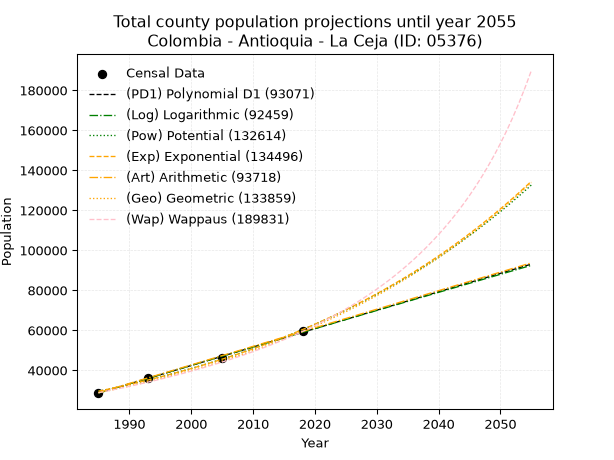
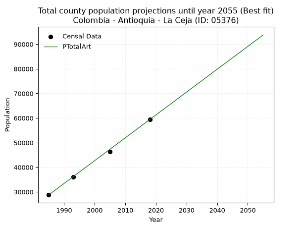
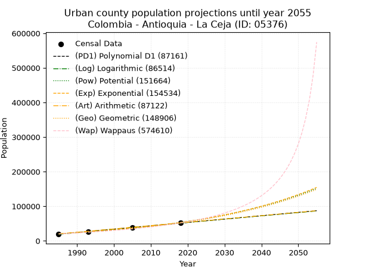
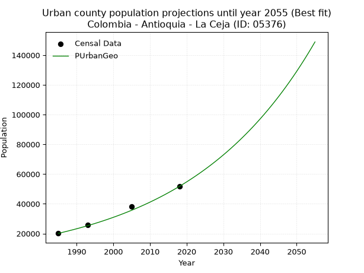
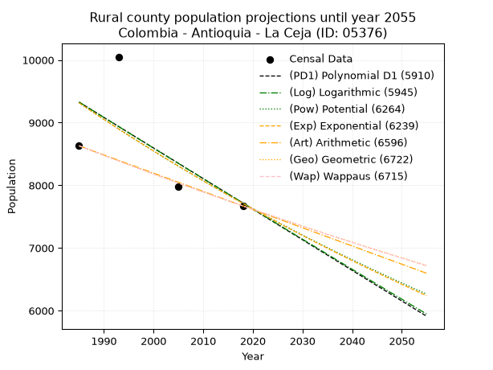
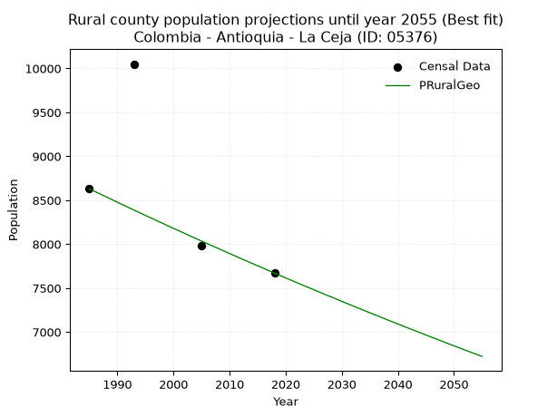

<div align="center">


</div>

# 📜 _“Population and Public Services Demand Projections (PPSD) until Year 2050 for Colombia - Antioquia - La Ceja (ID: 05376)”_
Keywords: `population` `public-service` `projection` `lineal` `polynomial` `logarithmic` `potential` `exponential` `arithmetic` `geometric` `wappaus` `dane` `colombia` `south-america`

PPSD are analytical estimates used by governments and planners to anticipate future changes in population size, age distribution, and the resulting community needs for utilities, healthcare, education, and infrastructure as sizing future water treatment facilities, electrical grids, and road networks based on spatial growth.

<div align="center">

</img>

</div>


> **General running parameters**: • app_version: _v20260806_. • Python version: _3.14.7_. • Pandas version: _3.0.5_. • NumPy version: _2.5.1_. • Creates, save and include plots into reports (create_plot): _False_. • Projection until year: _2050_. • Process polynomial degree 2 and up: _False_. • Process Wappaus: _True_. • Process Wappaus: _True_. • Set negative values to zero: _True_. • Set infinite values to zero: _True_. • Drop dataset notes: _True_. 
<div align="center">

Maps & GIS Layers: [:earth_americas:Google](http://maps.google.com/maps?q=6.028062055,-75.4294332) [:earth_americas:OSM](https://www.openstreetmap.org/#map=18/6.028062055/-75.4294332&layers=P) [:earth_americas:Bing](https://www.bing.com/maps?cp=6.028062055~-75.4294332&lvl=18) [:earth_americas:Apple](https://maps.apple.com/frame?center=6.028062055%2C-75.4294332&span=0.003%2C0.006) [:earth_americas:GISMobile](https://github.com/rcfdtools/R.GISMobile/blob/main/file/gis/CountyLayer_CO/Readme.md)

</div>


<div align="center">

```geojson
{
  "type": "Feature",
  "geometry": {
    "type": "Point", 
    "coordinates": [-75.4294332, 6.028062055]
  }, 
  "properties": {
    "Name": "Colombia - Antioquia - La Ceja (ID: 05376)"
  }
}
```

</div>


## 0. Census Data (4 records)

Census data are official statistics collected by a government about the people and housing in a country. They usually include counts of total population, age, sex, race, income, education, and jobs.

📅Global census file: [Population.xlsx](../data/Population.xlsx)

| Source   |   Year |   CountryID | CountryName   |   StateID | StateName   |   CountyID | CountyName   |   PTotal |   PUrban |   PRural |
|:---------|-------:|------------:|:--------------|----------:|:------------|-----------:|:-------------|---------:|---------:|---------:|
| DANE     |   1985 |          57 | Colombia      |        05 | Antioquia   |      05376 | La Ceja      |    28766 |    20136 |     8630 |
| DANE     |   1993 |          57 | Colombia      |        05 | Antioquia   |      05376 | La Ceja      |    36039 |    25989 |    10050 |
| DANE     |   2005 |          57 | Colombia      |        05 | Antioquia   |      05376 | La Ceja      |    46268 |    38287 |     7981 |
| DANE     |   2018 |          57 | Colombia      |        05 | Antioquia   |      05376 | La Ceja      |    59386 |    51715 |     7671 |

> 🔥Some records could had specific notes about the registered values or the corresponding urban or rural distribution.

📅[SUI-RUPS](https://www.datos.gov.co/Hacienda-y-Cr-dito-P-blico/Registro-nico-de-Prestadores-de-Servicios-P-blicos/4qkq-csdn/about_data) - Local public utility companies: [RUPS.csv](../data/RUPS.csv)

 | SERVICIO       | ESTADO    | NOMBRE                                                                   | NIT         | DEPARTAMENTO_DOMICILIO   | MUNICIPIO_DOMICILIO   | DIRECCION                                           |   TELEFONO | EMAIL                        | TIPO_PRESTADOR                            | CLASIFICACION                 |
|:---------------|:----------|:-------------------------------------------------------------------------|:------------|:-------------------------|:----------------------|:----------------------------------------------------|-----------:|:-----------------------------|:------------------------------------------|:------------------------------|
| ACUEDUCTO      | OPERATIVA | ASOCIACION DE USUARIOS DEL ACUEDUCTO Y ALCANTARILLADO VERAMIEL           | 811035755-5 | ANTIOQUIA                | LA CEJA               | CORREGIMIENTO SAN JOSE VEREDA LA MIEL               |    5531654 | wiland@misena.edu.co         | ORGANIZACION AUTORIZADA                   | MENOR O IGUAL A 2500 USUARIOS |
| ACUEDUCTO      | OPERATIVA | ASOCIACION DE USUARIOS DEL ACUEDUCTO Y ALCANTARILLADO CESTILLAL LA PALMA | 900241023-8 | ANTIOQUIA                | LA CEJA               | CALLE 21 N° 27-21. PISO 2, BARRIO MIRADOR DEL NORTE |    5538072 | lgcarvajal2009@hotmail.com   | ORGANIZACION AUTORIZADA                   | HASTA 2500 SUSCRIPTORES       |
| ACUEDUCTO      | OPERATIVA | EMPRESAS PÚBLICAS DE LA CEJA E.S.P.                                      | 811009329-0 | ANTIOQUIA                | LA CEJA               | CALLE 20 No.22-05                                   |    5537788 | gestionsui@egcconsultores.co | EMPRESA INDUSTRIAL Y COMERCIAL DEL ESTADO | MAYOR O IGUAL A 5001 USUARIOS |
| ALCANTARILLADO | OPERATIVA | EMPRESAS PÚBLICAS DE LA CEJA E.S.P.                                      | 811009329-0 | ANTIOQUIA                | LA CEJA               | CALLE 20 No.22-05                                   |    5537788 | gestionsui@egcconsultores.co | EMPRESA INDUSTRIAL Y COMERCIAL DEL ESTADO | MAYOR O IGUAL A 5001 USUARIOS |
| ACUEDUCTO      | OPERATIVA | ASOCIACION DE USUARIOS DEL ACUEDUCTO Y/O ALCANTARILLADO SAN NICOLAS      | 811020218-6 | ANTIOQUIA                | LA CEJA               | vereda san nicolas sector la escuela                |    3156875 | acuasanlaceja@gmail.com      | ORGANIZACION AUTORIZADA                   | MENOR O IGUAL A 2500 USUARIOS |
| ACUEDUCTO      | OPERATIVA | ASOCIACION DE USUARIOS ACUEDUCTO AGUAS DEL ALTO VERED LA MILAGROSA       | 811042022-4 | ANTIOQUIA                | LA CEJA               | CARRERA 22 N° 18-82                                 |    5681538 | bdoelalarife@gmail.com       | ORGANIZACION AUTORIZADA                   | HASTA 2500 SUSCRIPTORES       |
| ACUEDUCTO      | OPERATIVA | ASOCIACION DE USUARIOS DEL ACUEDUCTO Y O ALCANTARILLADO COLMENAS GARCIA  | 811018255-2 | ANTIOQUIA                | LA CEJA               | calle 15 B 17 42                                    |    5560959 | giresco@yahoo.com            | ORGANIZACION AUTORIZADA                   | MENOR O IGUAL A 2500 USUARIOS |
| ACUEDUCTO      | OPERATIVA | ASOCIACION DE USUARIOS DEL ACUEDUCTO Y/O ALCANTARILLADO VEDSAGUEL        | 811022205-1 | ANTIOQUIA                | LA CEJA               | Vereda San Miguel                                   |    5624673 | acueductovedsaguel@gmail.com | ORGANIZACION AUTORIZADA                   | MENOR O IGUAL A 2500 USUARIOS |
| ACUEDUCTO      | OPERATIVA | ASOCIACION DE USUARIOS DEL ACUEDUCTO MULTIVEREDAL ROMERAL LA MIEL        | 811041855-8 | ANTIOQUIA                | LA CEJA               | Calle 20 # 19-14 piso 2                             |    5649987 | wiland@misena.edu.co         | ORGANIZACION AUTORIZADA                   | MENOR O IGUAL A 2500 USUARIOS |
| ACUEDUCTO      | OPERATIVA | ASOSIACION DE USUARIOS DE ACUEDUCTOS SAN RAFAEL                          | 900381079-1 | ANTIOQUIA                | LA CEJA               | CALLE 20 N° 27-20                                   |    5531654 | nellygarciaosorio@yahoo.es   | ORGANIZACION AUTORIZADA                   | HASTA 2500 SUSCRIPTORES       |

## 1. Total

### 1.1. Coefficients and Parameters

* (PD1) Polynomial Deg 1: 921.574066639895, -1800763.7767964501 (lineal)
* (Log) Logarithmic: 1844507.8013502706, -13977503.829021288
* (Pow) Potential: 43.36534149784831, -138.53862673672805
* (Exp) Exponential: 0.02166135046264096, 6.2588198022074484e-15
* (Art) Arithmetic: Year diff. 2018 - 1985 = 33, Population diff. 59386 - 28766 = 30620, Annual growth = 927.8787878787879
* (Geo) Geometric: Year diff. 2018 - 1985 = 33, Population diff. 59386 - 28766 = 30620, Annual growth % = 0.022208606698627564
* (Wap) Wappaus: i = 2.1051792083646155, Condition values only valid for < 200)

<sub>
Wappaus condition values: ['0.00', '2.11', '4.21', '6.32', '8.42', '10.53', '12.63', '14.74', '16.84', '18.95', '21.05', '23.16', '25.26', '27.37', '29.47', '31.58', '33.68', '35.79', '37.89', '40.00', '42.10', '44.21', '46.31', '48.42', '50.52', '52.63', '54.73', '56.84', '58.95', '61.05', '63.16', '65.26', '67.37', '69.47', '71.58', '73.68', '75.79', '77.89', '80.00', '82.10', '84.21', '86.31', '88.42', '90.52', '92.63', '94.73', '96.84', '98.94', '101.05', '103.15', '105.26', '107.36', '109.47', '111.57', '113.68', '115.78', '117.89', '120.00', '122.10', '124.21', '126.31', '128.42', '130.52', '132.63', '134.73', '136.84']
</sub>


### 1.2. Projected Dataset

|   Year |   CountyID |   PTotalPD1 |   PTotalLog |   PTotalPow |   PTotalExp |   PTotalArt |   PTotalGeo |   PTotalWap |
|-------:|-----------:|------------:|------------:|------------:|------------:|------------:|------------:|------------:|
|   1985 |      05376 |       28561 |       28534 |       29504 |       29525 |       28766 |       28766 |       28766 |
|   1986 |      05376 |       29482 |       29463 |       30156 |       30172 |       29694 |       29405 |       29378 |
|   1987 |      05376 |       30404 |       30392 |       30821 |       30832 |       30622 |       30058 |       30003 |
|   1988 |      05376 |       31325 |       31320 |       31501 |       31507 |       31550 |       30725 |       30642 |
|   1989 |      05376 |       32247 |       32247 |       32196 |       32197 |       32478 |       31408 |       31295 |
|   1990 |      05376 |       33169 |       33174 |       32905 |       32902 |       33405 |       32105 |       31962 |
|   1991 |      05376 |       34090 |       34101 |       33630 |       33623 |       34333 |       32818 |       32644 |
|   1992 |      05376 |       35012 |       35027 |       34370 |       34359 |       35261 |       33547 |       33342 |
|   1993 |      05376 |       35933 |       35953 |       35126 |       35112 |       36189 |       34292 |       34056 |
|   1994 |      05376 |       36855 |       36878 |       35899 |       35880 |       37117 |       35054 |       34787 |
|   1995 |      05376 |       37776 |       37803 |       36688 |       36666 |       38045 |       35832 |       35534 |
|   1996 |      05376 |       38698 |       38727 |       37494 |       37469 |       38973 |       36628 |       36300 |
|   1997 |      05376 |       39620 |       39651 |       38317 |       38290 |       39901 |       37442 |       37083 |
|   1998 |      05376 |       40541 |       40575 |       39158 |       39128 |       40828 |       38273 |       37887 |
|   1999 |      05376 |       41463 |       41498 |       40017 |       39985 |       41756 |       39123 |       38709 |
|   2000 |      05376 |       42384 |       42420 |       40895 |       40860 |       42684 |       39992 |       39553 |
|   2001 |      05376 |       43306 |       43342 |       41791 |       41755 |       43612 |       40880 |       40417 |
|   2002 |      05376 |       44228 |       44264 |       42706 |       42669 |       44540 |       41788 |       41304 |
|   2003 |      05376 |       45149 |       45185 |       43641 |       43604 |       45468 |       42716 |       42214 |
|   2004 |      05376 |       46071 |       46105 |       44596 |       44559 |       46396 |       43665 |       43148 |
|   2005 |      05376 |       46992 |       47026 |       45571 |       45534 |       47324 |       44634 |       44107 |
|   2006 |      05376 |       47914 |       47945 |       46567 |       46531 |       48251 |       45626 |       45092 |
|   2007 |      05376 |       48835 |       48865 |       47585 |       47550 |       49179 |       46639 |       46104 |
|   2008 |      05376 |       49757 |       49783 |       48624 |       48592 |       50107 |       47675 |       47143 |
|   2009 |      05376 |       50679 |       50702 |       49685 |       49656 |       51035 |       48734 |       48212 |
|   2010 |      05376 |       51600 |       51620 |       50769 |       50743 |       51963 |       49816 |       49312 |
|   2011 |      05376 |       52522 |       52537 |       51876 |       51854 |       52891 |       50922 |       50444 |
|   2012 |      05376 |       53443 |       53454 |       53006 |       52990 |       53819 |       52053 |       51608 |
|   2013 |      05376 |       54365 |       54371 |       54161 |       54150 |       54747 |       53209 |       52808 |
|   2014 |      05376 |       55286 |       55287 |       55340 |       55336 |       55674 |       54391 |       54044 |
|   2015 |      05376 |       56208 |       56202 |       56544 |       56548 |       56602 |       55599 |       55318 |
|   2016 |      05376 |       57130 |       57117 |       57774 |       57786 |       57530 |       56834 |       56631 |
|   2017 |      05376 |       58051 |       58032 |       59030 |       59051 |       58458 |       58096 |       57987 |
|   2018 |      05376 |       58973 |       58946 |       60313 |       60344 |       59386 |       59386 |       59386 |
|   2019 |      05376 |       59894 |       59860 |       61622 |       61666 |       60314 |       60705 |       60831 |
|   2020 |      05376 |       60816 |       60774 |       62960 |       63016 |       61242 |       62053 |       62324 |
|   2021 |      05376 |       61737 |       61686 |       64326 |       64396 |       62170 |       63431 |       63868 |
|   2022 |      05376 |       62659 |       62599 |       65721 |       65806 |       63098 |       64840 |       65465 |
|   2023 |      05376 |       63581 |       63511 |       67145 |       67247 |       64025 |       66280 |       67118 |
|   2024 |      05376 |       64502 |       64422 |       68600 |       68720 |       64953 |       67752 |       68830 |
|   2025 |      05376 |       65424 |       65333 |       70085 |       70224 |       65881 |       69257 |       70605 |
|   2026 |      05376 |       66345 |       66244 |       71601 |       71762 |       66809 |       70795 |       72445 |
|   2027 |      05376 |       67267 |       67154 |       73150 |       73333 |       67737 |       72367 |       74354 |
|   2028 |      05376 |       68188 |       68064 |       74732 |       74939 |       68665 |       73974 |       76337 |
|   2029 |      05376 |       69110 |       68973 |       76346 |       76580 |       69593 |       75617 |       78398 |
|   2030 |      05376 |       70032 |       69882 |       77995 |       78257 |       70521 |       77296 |       80541 |
|   2031 |      05376 |       70953 |       70791 |       79679 |       79971 |       71448 |       79013 |       82771 |
|   2032 |      05376 |       71875 |       71699 |       81398 |       81722 |       72376 |       80768 |       85095 |
|   2033 |      05376 |       72796 |       72606 |       83153 |       83512 |       73304 |       82561 |       87517 |
|   2034 |      05376 |       73718 |       73513 |       84946 |       85340 |       74232 |       84395 |       90045 |
|   2035 |      05376 |       74639 |       74420 |       86776 |       87209 |       75160 |       86269 |       92685 |
|   2036 |      05376 |       75561 |       75326 |       88644 |       89119 |       76088 |       88185 |       95445 |
|   2037 |      05376 |       76483 |       76232 |       90552 |       91070 |       77016 |       90144 |       98333 |
|   2038 |      05376 |       77404 |       77137 |       92500 |       93064 |       77944 |       92146 |      101359 |
|   2039 |      05376 |       78326 |       78042 |       94489 |       95102 |       78871 |       94192 |      104533 |
|   2040 |      05376 |       79247 |       78946 |       96520 |       97185 |       79799 |       96284 |      107865 |
|   2041 |      05376 |       80169 |       79850 |       98593 |       99313 |       80727 |       98422 |      111368 |
|   2042 |      05376 |       81090 |       80754 |      100710 |      101488 |       81655 |      100608 |      115055 |
|   2043 |      05376 |       82012 |       81657 |      102871 |      103710 |       82583 |      102842 |      118942 |
|   2044 |      05376 |       82934 |       82559 |      105077 |      105981 |       83511 |      105126 |      123045 |
|   2045 |      05376 |       83855 |       83461 |      107330 |      108302 |       84439 |      107461 |      127382 |
|   2046 |      05376 |       84777 |       84363 |      109629 |      110673 |       85367 |      109848 |      131974 |
|   2047 |      05376 |       85698 |       85265 |      111977 |      113097 |       86294 |      112287 |      136844 |
|   2048 |      05376 |       86620 |       86165 |      114374 |      115573 |       87222 |      114781 |      142019 |
|   2049 |      05376 |       87541 |       87066 |      116821 |      118104 |       88150 |      117330 |      147527 |
|   2050 |      05376 |       88463 |       87966 |      119319 |      120690 |       89078 |      119936 |      153403 |
<div align="center">

</img>

</div>


### 1.3. Best fit with absolute and relative error (%)

Relative error puts that difference into context by dividing the absolute error by the true value, creating a unitless ratio or percentage that shows the scale of the mistake.

Absolute and relative error

|   Year | Source   |   CountryID | CountryName   |   StateID | StateName   |   CountyID_x | CountyName   |   PTotal |   PUrban |   PRural |   CountyID_y |   PTotalPD1 |   PTotalLog |   PTotalPow |   PTotalExp |   PTotalArt |   PTotalGeo |   PTotalWap |   PTotalPD1AbsError |   PTotalLogAbsError |   PTotalPowAbsError |   PTotalExpAbsError |   PTotalArtAbsError |   PTotalGeoAbsError |   PTotalWapAbsError |   PTotalPD1RelError |   PTotalLogRelError |   PTotalPowRelError |   PTotalExpRelError |   PTotalArtRelError |   PTotalGeoRelError |   PTotalWapRelError |
|-------:|:---------|------------:|:--------------|----------:|:------------|-------------:|:-------------|---------:|---------:|---------:|-------------:|------------:|------------:|------------:|------------:|------------:|------------:|------------:|--------------------:|--------------------:|--------------------:|--------------------:|--------------------:|--------------------:|--------------------:|--------------------:|--------------------:|--------------------:|--------------------:|--------------------:|--------------------:|--------------------:|
|   1985 | DANE     |          57 | Colombia      |        05 | Antioquia   |        05376 | La Ceja      |    28766 |    20136 |     8630 |        05376 |       28561 |       28534 |       29504 |       29525 |       28766 |       28766 |       28766 |                 205 |                 232 |                 738 |                 759 |                   0 |                   0 |                   0 |            0.712647 |            0.806508 |             2.56553 |             2.63853 |            0        |             0       |             0       |
|   1993 | DANE     |          57 | Colombia      |        05 | Antioquia   |        05376 | La Ceja      |    36039 |    25989 |    10050 |        05376 |       35933 |       35953 |       35126 |       35112 |       36189 |       34292 |       34056 |                 106 |                  86 |                 913 |                 927 |                 150 |                1747 |                1983 |            0.294126 |            0.23863  |             2.53337 |             2.57221 |            0.416216 |             4.84753 |             5.50237 |
|   2005 | DANE     |          57 | Colombia      |        05 | Antioquia   |        05376 | La Ceja      |    46268 |    38287 |     7981 |        05376 |       46992 |       47026 |       45571 |       45534 |       47324 |       44634 |       44107 |                 724 |                 758 |                 697 |                 734 |                1056 |                1634 |                2161 |            1.5648   |            1.63828  |             1.50644 |             1.58641 |            2.28235  |             3.5316  |             4.67061 |
|   2018 | DANE     |          57 | Colombia      |        05 | Antioquia   |        05376 | La Ceja      |    59386 |    51715 |     7671 |        05376 |       58973 |       58946 |       60313 |       60344 |       59386 |       59386 |       59386 |                 413 |                 440 |                 927 |                 958 |                   0 |                   0 |                   0 |            0.69545  |            0.740915 |             1.56097 |             1.61317 |            0        |             0       |             0       |

Relative error mean

| Method    |   RelError | Best   |
|:----------|-----------:|:-------|
| PTotalPD1 |   0.816755 |        |
| PTotalLog |   0.856084 |        |
| PTotalPow |   2.04158  |        |
| PTotalExp |   2.10258  |        |
| PTotalArt |   0.674643 | True   |
| PTotalGeo |   2.09478  |        |
| PTotalWap |   2.54325  |        |

💙Best method: _**PTotalArt**_
<div align="center">

</img>

</div>


### 1.4. Fresh water supply demand in liters per capita per day (lpcd)

The fresh water supply demand typically ranges from 100 to 300 liters per capita per day (lpcd) for standard domestic and municipal planning, though absolute survival minimums set by the World Health Organization are as low as 7.5 to 20 liters per day, and total consumption in high-income nations can exceed 400 liters.

> `CZ`: Level in meters above the sea level (masl)<br> `WS`: Fresh water supply demand in liters per capita per day (lpcd or l/h/d)<br> `WSAll`: Zonal fresh water supply demand in liters per second (l/s)<br> `A`: Zonal area in square meters<br> `DP`: Population density (people/hectare or p/ha)

Reference values (RAS Colombia)

|    CZ |   WS |
|------:|-----:|
|  1000 |  120 |
|  2000 |  130 |
| 99999 |  140 |

County shapefile geometry properties and water supply values

|   CountyID |      ATotal |   CZTotal |   WSTotal |
|-----------:|------------:|----------:|----------:|
|      05376 | 1.32667e+08 |   2248.75 |       140 |

Projected values for best method: PTotalArt

|   CountyID |   Year |   PTotalArt |   DPTotal |   WSTotal |   WSTotalAll |
|-----------:|-------:|------------:|----------:|----------:|-------------:|
|      05376 |   1985 |       28766 |      2.17 |       140 |      46.6116 |
|      05376 |   1986 |       29694 |      2.24 |       140 |      48.1153 |
|      05376 |   1987 |       30622 |      2.31 |       140 |      49.619  |
|      05376 |   1988 |       31550 |      2.38 |       140 |      51.1227 |
|      05376 |   1989 |       32478 |      2.45 |       140 |      52.6264 |
|      05376 |   1990 |       33405 |      2.52 |       140 |      54.1285 |
|      05376 |   1991 |       34333 |      2.59 |       140 |      55.6322 |
|      05376 |   1992 |       35261 |      2.66 |       140 |      57.1359 |
|      05376 |   1993 |       36189 |      2.73 |       140 |      58.6396 |
|      05376 |   1994 |       37117 |      2.8  |       140 |      60.1433 |
|      05376 |   1995 |       38045 |      2.87 |       140 |      61.647  |
|      05376 |   1996 |       38973 |      2.94 |       140 |      63.1507 |
|      05376 |   1997 |       39901 |      3.01 |       140 |      64.6544 |
|      05376 |   1998 |       40828 |      3.08 |       140 |      66.1565 |
|      05376 |   1999 |       41756 |      3.15 |       140 |      67.6602 |
|      05376 |   2000 |       42684 |      3.22 |       140 |      69.1639 |
|      05376 |   2001 |       43612 |      3.29 |       140 |      70.6676 |
|      05376 |   2002 |       44540 |      3.36 |       140 |      72.1713 |
|      05376 |   2003 |       45468 |      3.43 |       140 |      73.675  |
|      05376 |   2004 |       46396 |      3.5  |       140 |      75.1787 |
|      05376 |   2005 |       47324 |      3.57 |       140 |      76.6824 |
|      05376 |   2006 |       48251 |      3.64 |       140 |      78.1845 |
|      05376 |   2007 |       49179 |      3.71 |       140 |      79.6882 |
|      05376 |   2008 |       50107 |      3.78 |       140 |      81.1919 |
|      05376 |   2009 |       51035 |      3.85 |       140 |      82.6956 |
|      05376 |   2010 |       51963 |      3.92 |       140 |      84.1993 |
|      05376 |   2011 |       52891 |      3.99 |       140 |      85.703  |
|      05376 |   2012 |       53819 |      4.06 |       140 |      87.2067 |
|      05376 |   2013 |       54747 |      4.13 |       140 |      88.7104 |
|      05376 |   2014 |       55674 |      4.2  |       140 |      90.2125 |
|      05376 |   2015 |       56602 |      4.27 |       140 |      91.7162 |
|      05376 |   2016 |       57530 |      4.34 |       140 |      93.2199 |
|      05376 |   2017 |       58458 |      4.41 |       140 |      94.7236 |
|      05376 |   2018 |       59386 |      4.48 |       140 |      96.2273 |
|      05376 |   2019 |       60314 |      4.55 |       140 |      97.731  |
|      05376 |   2020 |       61242 |      4.62 |       140 |      99.2347 |
|      05376 |   2021 |       62170 |      4.69 |       140 |     100.738  |
|      05376 |   2022 |       63098 |      4.76 |       140 |     102.242  |
|      05376 |   2023 |       64025 |      4.83 |       140 |     103.744  |
|      05376 |   2024 |       64953 |      4.9  |       140 |     105.248  |
|      05376 |   2025 |       65881 |      4.97 |       140 |     106.752  |
|      05376 |   2026 |       66809 |      5.04 |       140 |     108.255  |
|      05376 |   2027 |       67737 |      5.11 |       140 |     109.759  |
|      05376 |   2028 |       68665 |      5.18 |       140 |     111.263  |
|      05376 |   2029 |       69593 |      5.25 |       140 |     112.766  |
|      05376 |   2030 |       70521 |      5.32 |       140 |     114.27   |
|      05376 |   2031 |       71448 |      5.39 |       140 |     115.772  |
|      05376 |   2032 |       72376 |      5.46 |       140 |     117.276  |
|      05376 |   2033 |       73304 |      5.53 |       140 |     118.78   |
|      05376 |   2034 |       74232 |      5.6  |       140 |     120.283  |
|      05376 |   2035 |       75160 |      5.67 |       140 |     121.787  |
|      05376 |   2036 |       76088 |      5.74 |       140 |     123.291  |
|      05376 |   2037 |       77016 |      5.81 |       140 |     124.794  |
|      05376 |   2038 |       77944 |      5.88 |       140 |     126.298  |
|      05376 |   2039 |       78871 |      5.95 |       140 |     127.8    |
|      05376 |   2040 |       79799 |      6.01 |       140 |     129.304  |
|      05376 |   2041 |       80727 |      6.08 |       140 |     130.808  |
|      05376 |   2042 |       81655 |      6.15 |       140 |     132.311  |
|      05376 |   2043 |       82583 |      6.22 |       140 |     133.815  |
|      05376 |   2044 |       83511 |      6.29 |       140 |     135.319  |
|      05376 |   2045 |       84439 |      6.36 |       140 |     136.822  |
|      05376 |   2046 |       85367 |      6.43 |       140 |     138.326  |
|      05376 |   2047 |       86294 |      6.5  |       140 |     139.828  |
|      05376 |   2048 |       87222 |      6.57 |       140 |     141.332  |
|      05376 |   2049 |       88150 |      6.64 |       140 |     142.836  |
|      05376 |   2050 |       89078 |      6.71 |       140 |     144.339  |

## 2. Urban

### 2.1. Coefficients and Parameters

* (PD1) Polynomial Deg 1: 970.3898032918415, -1906990.454034506 (lineal)
* (Log) Logarithmic: 1942116.3079449374, -14728009.869832832
* (Pow) Potential: 57.68795976002736, -185.92847239938456
* (Exp) Exponential: 0.02881557786271985, 2.9637129025563216e-21
* (Art) Arithmetic: Year diff. 2018 - 1985 = 33, Population diff. 51715 - 20136 = 31579, Annual growth = 956.939393939394
* (Geo) Geometric: Year diff. 2018 - 1985 = 33, Population diff. 51715 - 20136 = 31579, Annual growth % = 0.02899540196691741
* (Wap) Wappaus: i = 2.663677315387104, Condition values only valid for < 200)

<sub>
Wappaus condition values: ['0.00', '2.66', '5.33', '7.99', '10.65', '13.32', '15.98', '18.65', '21.31', '23.97', '26.64', '29.30', '31.96', '34.63', '37.29', '39.96', '42.62', '45.28', '47.95', '50.61', '53.27', '55.94', '58.60', '61.26', '63.93', '66.59', '69.26', '71.92', '74.58', '77.25', '79.91', '82.57', '85.24', '87.90', '90.57', '93.23', '95.89', '98.56', '101.22', '103.88', '106.55', '109.21', '111.87', '114.54', '117.20', '119.87', '122.53', '125.19', '127.86', '130.52', '133.18', '135.85', '138.51', '141.17', '143.84', '146.50', '149.17', '151.83', '154.49', '157.16', '159.82', '162.48', '165.15', '167.81', '170.48', '173.14']
</sub>


### 2.2. Projected Dataset

|   Year |   CountyID |   PUrbanPD1 |   PUrbanLog |   PUrbanPow |   PUrbanExp |   PUrbanArt |   PUrbanGeo |   PUrbanWap |
|-------:|-----------:|------------:|------------:|------------:|------------:|------------:|------------:|------------:|
|   1985 |      05376 |       19233 |       19206 |       20540 |       20559 |       20136 |       20136 |       20136 |
|   1986 |      05376 |       20204 |       20184 |       21146 |       21161 |       21093 |       20720 |       20680 |
|   1987 |      05376 |       21174 |       21162 |       21769 |       21779 |       22050 |       21321 |       21238 |
|   1988 |      05376 |       22144 |       22139 |       22410 |       22416 |       23007 |       21939 |       21812 |
|   1989 |      05376 |       23115 |       23116 |       23070 |       23071 |       23964 |       22575 |       22402 |
|   1990 |      05376 |       24085 |       24092 |       23748 |       23746 |       24921 |       23230 |       23009 |
|   1991 |      05376 |       25056 |       25068 |       24447 |       24440 |       25878 |       23903 |       23634 |
|   1992 |      05376 |       26026 |       26043 |       25165 |       25154 |       26835 |       24596 |       24277 |
|   1993 |      05376 |       26996 |       27017 |       25904 |       25890 |       27792 |       25309 |       24939 |
|   1994 |      05376 |       27967 |       27992 |       26665 |       26647 |       28748 |       26043 |       25621 |
|   1995 |      05376 |       28937 |       28965 |       27447 |       27426 |       29705 |       26798 |       26324 |
|   1996 |      05376 |       29908 |       29939 |       28252 |       28227 |       30662 |       27575 |       27049 |
|   1997 |      05376 |       30878 |       30911 |       29081 |       29053 |       31619 |       28375 |       27797 |
|   1998 |      05376 |       31848 |       31884 |       29933 |       29902 |       32576 |       29198 |       28569 |
|   1999 |      05376 |       32819 |       32855 |       30809 |       30776 |       33533 |       30044 |       29366 |
|   2000 |      05376 |       33789 |       33827 |       31711 |       31676 |       34490 |       30915 |       30190 |
|   2001 |      05376 |       34760 |       34798 |       32639 |       32602 |       35447 |       31812 |       31042 |
|   2002 |      05376 |       35730 |       35768 |       33593 |       33555 |       36404 |       32734 |       31923 |
|   2003 |      05376 |       36700 |       36738 |       34575 |       34536 |       37361 |       33683 |       32835 |
|   2004 |      05376 |       37671 |       37707 |       35585 |       35546 |       38318 |       34660 |       33779 |
|   2005 |      05376 |       38641 |       38676 |       36624 |       36585 |       39275 |       35665 |       34758 |
|   2006 |      05376 |       39611 |       39644 |       37693 |       37654 |       40232 |       36699 |       35773 |
|   2007 |      05376 |       40582 |       40612 |       38792 |       38755 |       41189 |       37763 |       36826 |
|   2008 |      05376 |       41552 |       41580 |       39923 |       39888 |       42146 |       38858 |       37920 |
|   2009 |      05376 |       42523 |       42547 |       41087 |       41054 |       43103 |       39985 |       39056 |
|   2010 |      05376 |       43493 |       43513 |       42283 |       42255 |       44059 |       41144 |       40238 |
|   2011 |      05376 |       44463 |       44479 |       43514 |       43490 |       45016 |       42337 |       41468 |
|   2012 |      05376 |       45434 |       45445 |       44780 |       44761 |       45973 |       43565 |       42749 |
|   2013 |      05376 |       46404 |       46410 |       46082 |       46070 |       46930 |       44828 |       44085 |
|   2014 |      05376 |       47375 |       47374 |       47422 |       47417 |       47887 |       46128 |       45478 |
|   2015 |      05376 |       48345 |       48338 |       48799 |       48803 |       48844 |       47465 |       46934 |
|   2016 |      05376 |       49315 |       49302 |       50216 |       50230 |       49801 |       48842 |       48455 |
|   2017 |      05376 |       50286 |       50265 |       51674 |       51698 |       50758 |       50258 |       50047 |
|   2018 |      05376 |       51256 |       51228 |       53172 |       53209 |       51715 |       51715 |       51715 |
|   2019 |      05376 |       52227 |       52190 |       54714 |       54765 |       52672 |       53214 |       53464 |
|   2020 |      05376 |       53197 |       53151 |       56299 |       56366 |       53629 |       54757 |       55300 |
|   2021 |      05376 |       54167 |       54113 |       57930 |       58014 |       54586 |       56345 |       57230 |
|   2022 |      05376 |       55138 |       55073 |       59607 |       59710 |       55543 |       57979 |       59262 |
|   2023 |      05376 |       56108 |       56034 |       61332 |       61456 |       56500 |       59660 |       61403 |
|   2024 |      05376 |       57079 |       56993 |       63105 |       63252 |       57457 |       61390 |       63662 |
|   2025 |      05376 |       58049 |       57953 |       64929 |       65101 |       58414 |       63170 |       66051 |
|   2026 |      05376 |       59019 |       58912 |       66805 |       67005 |       59371 |       65002 |       68579 |
|   2027 |      05376 |       59990 |       59870 |       68734 |       68963 |       60327 |       66886 |       71261 |
|   2028 |      05376 |       60960 |       60828 |       70718 |       70980 |       61284 |       68826 |       74110 |
|   2029 |      05376 |       61930 |       61785 |       72758 |       73055 |       62241 |       70821 |       77141 |
|   2030 |      05376 |       62901 |       62742 |       74856 |       75190 |       63198 |       72875 |       80375 |
|   2031 |      05376 |       63871 |       63699 |       77013 |       77389 |       64155 |       74988 |       83831 |
|   2032 |      05376 |       64842 |       64655 |       79231 |       79651 |       65112 |       77162 |       87533 |
|   2033 |      05376 |       65812 |       65610 |       81512 |       81980 |       66069 |       79400 |       91508 |
|   2034 |      05376 |       66782 |       66565 |       83858 |       84376 |       67026 |       81702 |       95788 |
|   2035 |      05376 |       67753 |       67520 |       86270 |       86843 |       67983 |       84071 |      100410 |
|   2036 |      05376 |       68723 |       68474 |       88750 |       89382 |       68940 |       86508 |      105415 |
|   2037 |      05376 |       69694 |       69428 |       91300 |       91995 |       69897 |       89017 |      110854 |
|   2038 |      05376 |       70664 |       70381 |       93922 |       94684 |       70854 |       91598 |      116785 |
|   2039 |      05376 |       71634 |       71334 |       96617 |       97452 |       71811 |       94254 |      123279 |
|   2040 |      05376 |       72605 |       72286 |       99389 |      100301 |       72768 |       96987 |      130420 |
|   2041 |      05376 |       73575 |       73238 |      102239 |      103234 |       73725 |       99799 |      138309 |
|   2042 |      05376 |       74546 |       74189 |      105169 |      106252 |       74682 |      102693 |      147070 |
|   2043 |      05376 |       75516 |       75140 |      108182 |      109358 |       75638 |      105670 |      156858 |
|   2044 |      05376 |       76486 |       76090 |      111280 |      112555 |       76595 |      108734 |      167862 |
|   2045 |      05376 |       77457 |       77040 |      114464 |      115845 |       77552 |      111887 |      180325 |
|   2046 |      05376 |       78427 |       77989 |      117738 |      119232 |       78509 |      115131 |      194558 |
|   2047 |      05376 |       79397 |       78938 |      121105 |      122718 |       79466 |      118469 |      210967 |
|   2048 |      05376 |       80368 |       79887 |      124565 |      126306 |       80423 |      121904 |      230091 |
|   2049 |      05376 |       81338 |       80835 |      128123 |      129998 |       81380 |      125439 |      252667 |
|   2050 |      05376 |       82309 |       81783 |      131780 |      133799 |       82337 |      129076 |      279719 |
<div align="center">

</img>

</div>


### 2.3. Best fit with absolute and relative error (%)

Relative error puts that difference into context by dividing the absolute error by the true value, creating a unitless ratio or percentage that shows the scale of the mistake.

Absolute and relative error

|   Year | Source   |   CountryID | CountryName   |   StateID | StateName   |   CountyID_x | CountyName   |   PTotal |   PUrban |   PRural |   CountyID_y |   PUrbanPD1 |   PUrbanLog |   PUrbanPow |   PUrbanExp |   PUrbanArt |   PUrbanGeo |   PUrbanWap |   PUrbanPD1AbsError |   PUrbanLogAbsError |   PUrbanPowAbsError |   PUrbanExpAbsError |   PUrbanArtAbsError |   PUrbanGeoAbsError |   PUrbanWapAbsError |   PUrbanPD1RelError |   PUrbanLogRelError |   PUrbanPowRelError |   PUrbanExpRelError |   PUrbanArtRelError |   PUrbanGeoRelError |   PUrbanWapRelError |
|-------:|:---------|------------:|:--------------|----------:|:------------|-------------:|:-------------|---------:|---------:|---------:|-------------:|------------:|------------:|------------:|------------:|------------:|------------:|------------:|--------------------:|--------------------:|--------------------:|--------------------:|--------------------:|--------------------:|--------------------:|--------------------:|--------------------:|--------------------:|--------------------:|--------------------:|--------------------:|--------------------:|
|   1985 | DANE     |          57 | Colombia      |        05 | Antioquia   |        05376 | La Ceja      |    28766 |    20136 |     8630 |        05376 |       19233 |       19206 |       20540 |       20559 |       20136 |       20136 |       20136 |                 903 |                 930 |                 404 |                 423 |                   0 |                   0 |                   0 |            4.48451  |             4.61859 |            2.00636  |             2.10072 |             0       |             0       |             0       |
|   1993 | DANE     |          57 | Colombia      |        05 | Antioquia   |        05376 | La Ceja      |    36039 |    25989 |    10050 |        05376 |       26996 |       27017 |       25904 |       25890 |       27792 |       25309 |       24939 |                1007 |                1028 |                  85 |                  99 |                1803 |                 680 |                1050 |            3.87472  |             3.95552 |            0.327061 |             0.38093 |             6.93755 |             2.61649 |             4.04017 |
|   2005 | DANE     |          57 | Colombia      |        05 | Antioquia   |        05376 | La Ceja      |    46268 |    38287 |     7981 |        05376 |       38641 |       38676 |       36624 |       36585 |       39275 |       35665 |       34758 |                 354 |                 389 |                1663 |                1702 |                 988 |                2622 |                3529 |            0.924596 |             1.01601 |            4.34351  |             4.44537 |             2.58051 |             6.84828 |             9.21723 |
|   2018 | DANE     |          57 | Colombia      |        05 | Antioquia   |        05376 | La Ceja      |    59386 |    51715 |     7671 |        05376 |       51256 |       51228 |       53172 |       53209 |       51715 |       51715 |       51715 |                 459 |                 487 |                1457 |                1494 |                   0 |                   0 |                   0 |            0.887557 |             0.9417  |            2.81736  |             2.88891 |             0       |             0       |             0       |

Relative error mean

| Method    |   RelError | Best   |
|:----------|-----------:|:-------|
| PUrbanPD1 |    2.54284 |        |
| PUrbanLog |    2.63296 |        |
| PUrbanPow |    2.37357 |        |
| PUrbanExp |    2.45398 |        |
| PUrbanArt |    2.37952 |        |
| PUrbanGeo |    2.36619 | True   |
| PUrbanWap |    3.31435 |        |

💙Best method: _**PUrbanGeo**_
<div align="center">

</img>

</div>


### 2.4. Fresh water supply demand in liters per capita per day (lpcd)

The fresh water supply demand typically ranges from 100 to 300 liters per capita per day (lpcd) for standard domestic and municipal planning, though absolute survival minimums set by the World Health Organization are as low as 7.5 to 20 liters per day, and total consumption in high-income nations can exceed 400 liters.

> `CZ`: Level in meters above the sea level (masl)<br> `WS`: Fresh water supply demand in liters per capita per day (lpcd or l/h/d)<br> `WSAll`: Zonal fresh water supply demand in liters per second (l/s)<br> `A`: Zonal area in square meters<br> `DP`: Population density (people/hectare or p/ha)

Reference values (RAS Colombia)

|    CZ |   WS |
|------:|-----:|
|  1000 |  120 |
|  2000 |  130 |
| 99999 |  140 |

County shapefile geometry properties and water supply values

|   CountyID |      AUrban |   CZUrban |   WSUrban |
|-----------:|------------:|----------:|----------:|
|      05376 | 4.02826e+06 |   2143.12 |       140 |

Projected values for best method: PUrbanGeo

|   CountyID |   Year |   PUrbanGeo |   DPUrban |   WSUrban |   WSUrbanAll |
|-----------:|-------:|------------:|----------:|----------:|-------------:|
|      05376 |   1985 |       20136 |     49.99 |       140 |      32.6278 |
|      05376 |   1986 |       20720 |     51.44 |       140 |      33.5741 |
|      05376 |   1987 |       21321 |     52.93 |       140 |      34.5479 |
|      05376 |   1988 |       21939 |     54.46 |       140 |      35.5493 |
|      05376 |   1989 |       22575 |     56.04 |       140 |      36.5799 |
|      05376 |   1990 |       23230 |     57.67 |       140 |      37.6412 |
|      05376 |   1991 |       23903 |     59.34 |       140 |      38.7317 |
|      05376 |   1992 |       24596 |     61.06 |       140 |      39.8546 |
|      05376 |   1993 |       25309 |     62.83 |       140 |      41.01   |
|      05376 |   1994 |       26043 |     64.65 |       140 |      42.1993 |
|      05376 |   1995 |       26798 |     66.53 |       140 |      43.4227 |
|      05376 |   1996 |       27575 |     68.45 |       140 |      44.6817 |
|      05376 |   1997 |       28375 |     70.44 |       140 |      45.978  |
|      05376 |   1998 |       29198 |     72.48 |       140 |      47.3116 |
|      05376 |   1999 |       30044 |     74.58 |       140 |      48.6824 |
|      05376 |   2000 |       30915 |     76.75 |       140 |      50.0938 |
|      05376 |   2001 |       31812 |     78.97 |       140 |      51.5472 |
|      05376 |   2002 |       32734 |     81.26 |       140 |      53.0412 |
|      05376 |   2003 |       33683 |     83.62 |       140 |      54.5789 |
|      05376 |   2004 |       34660 |     86.04 |       140 |      56.162  |
|      05376 |   2005 |       35665 |     88.54 |       140 |      57.7905 |
|      05376 |   2006 |       36699 |     91.1  |       140 |      59.466  |
|      05376 |   2007 |       37763 |     93.75 |       140 |      61.19   |
|      05376 |   2008 |       38858 |     96.46 |       140 |      62.9644 |
|      05376 |   2009 |       39985 |     99.26 |       140 |      64.7905 |
|      05376 |   2010 |       41144 |    102.14 |       140 |      66.6685 |
|      05376 |   2011 |       42337 |    105.1  |       140 |      68.6016 |
|      05376 |   2012 |       43565 |    108.15 |       140 |      70.5914 |
|      05376 |   2013 |       44828 |    111.28 |       140 |      72.638  |
|      05376 |   2014 |       46128 |    114.51 |       140 |      74.7444 |
|      05376 |   2015 |       47465 |    117.83 |       140 |      76.9109 |
|      05376 |   2016 |       48842 |    121.25 |       140 |      79.1421 |
|      05376 |   2017 |       50258 |    124.76 |       140 |      81.4366 |
|      05376 |   2018 |       51715 |    128.38 |       140 |      83.7975 |
|      05376 |   2019 |       53214 |    132.1  |       140 |      86.2264 |
|      05376 |   2020 |       54757 |    135.93 |       140 |      88.7266 |
|      05376 |   2021 |       56345 |    139.87 |       140 |      91.2998 |
|      05376 |   2022 |       57979 |    143.93 |       140 |      93.9475 |
|      05376 |   2023 |       59660 |    148.1  |       140 |      96.6713 |
|      05376 |   2024 |       61390 |    152.4  |       140 |      99.4745 |
|      05376 |   2025 |       63170 |    156.82 |       140 |     102.359  |
|      05376 |   2026 |       65002 |    161.37 |       140 |     105.327  |
|      05376 |   2027 |       66886 |    166.04 |       140 |     108.38   |
|      05376 |   2028 |       68826 |    170.86 |       140 |     111.524  |
|      05376 |   2029 |       70821 |    175.81 |       140 |     114.756  |
|      05376 |   2030 |       72875 |    180.91 |       140 |     118.084  |
|      05376 |   2031 |       74988 |    186.15 |       140 |     121.508  |
|      05376 |   2032 |       77162 |    191.55 |       140 |     125.031  |
|      05376 |   2033 |       79400 |    197.11 |       140 |     128.657  |
|      05376 |   2034 |       81702 |    202.82 |       140 |     132.387  |
|      05376 |   2035 |       84071 |    208.7  |       140 |     136.226  |
|      05376 |   2036 |       86508 |    214.75 |       140 |     140.175  |
|      05376 |   2037 |       89017 |    220.98 |       140 |     144.241  |
|      05376 |   2038 |       91598 |    227.39 |       140 |     148.423  |
|      05376 |   2039 |       94254 |    233.98 |       140 |     152.726  |
|      05376 |   2040 |       96987 |    240.77 |       140 |     157.155  |
|      05376 |   2041 |       99799 |    247.75 |       140 |     161.711  |
|      05376 |   2042 |      102693 |    254.93 |       140 |     166.401  |
|      05376 |   2043 |      105670 |    262.32 |       140 |     171.225  |
|      05376 |   2044 |      108734 |    269.93 |       140 |     176.189  |
|      05376 |   2045 |      111887 |    277.76 |       140 |     181.298  |
|      05376 |   2046 |      115131 |    285.81 |       140 |     186.555  |
|      05376 |   2047 |      118469 |    294.09 |       140 |     191.964  |
|      05376 |   2048 |      121904 |    302.62 |       140 |     197.53   |
|      05376 |   2049 |      125439 |    311.4  |       140 |     203.258  |
|      05376 |   2050 |      129076 |    320.43 |       140 |     209.151  |

## 3. Rural

### 3.1. Coefficients and Parameters

* (PD1) Polynomial Deg 1: -48.81573665194673, 106226.67723805644 (lineal)
* (Log) Logarithmic: -97608.5065946661, 750506.0408115396
* (Pow) Potential: -11.452529666324734, 41.73694049366706
* (Exp) Exponential: -0.005727247955480091, 806339124.7569065
* (Art) Arithmetic: Year diff. 2018 - 1985 = 33, Population diff. 7671 - 8630 = -959, Annual growth = -29.060606060606062
* (Geo) Geometric: Year diff. 2018 - 1985 = 33, Population diff. 7671 - 8630 = -959, Annual growth % = -0.0035632582958332604
* (Wap) Wappaus: i = -0.35654997927251164, Condition values only valid for < 200)

<sub>
Wappaus condition values: ['-0.00', '-0.36', '-0.71', '-1.07', '-1.43', '-1.78', '-2.14', '-2.50', '-2.85', '-3.21', '-3.57', '-3.92', '-4.28', '-4.64', '-4.99', '-5.35', '-5.70', '-6.06', '-6.42', '-6.77', '-7.13', '-7.49', '-7.84', '-8.20', '-8.56', '-8.91', '-9.27', '-9.63', '-9.98', '-10.34', '-10.70', '-11.05', '-11.41', '-11.77', '-12.12', '-12.48', '-12.84', '-13.19', '-13.55', '-13.91', '-14.26', '-14.62', '-14.98', '-15.33', '-15.69', '-16.04', '-16.40', '-16.76', '-17.11', '-17.47', '-17.83', '-18.18', '-18.54', '-18.90', '-19.25', '-19.61', '-19.97', '-20.32', '-20.68', '-21.04', '-21.39', '-21.75', '-22.11', '-22.46', '-22.82', '-23.18']
</sub>


### 3.2. Projected Dataset

|   Year |   CountyID |   PRuralPD1 |   PRuralLog |   PRuralPow |   PRuralExp |   PRuralArt |   PRuralGeo |   PRuralWap |
|-------:|-----------:|------------:|------------:|------------:|------------:|------------:|------------:|------------:|
|   1985 |      05376 |        9327 |        9328 |        9316 |        9315 |        8630 |        8630 |        8630 |
|   1986 |      05376 |        9279 |        9279 |        9263 |        9262 |        8601 |        8599 |        8599 |
|   1987 |      05376 |        9230 |        9230 |        9209 |        9209 |        8572 |        8569 |        8569 |
|   1988 |      05376 |        9181 |        9181 |        9156 |        9157 |        8543 |        8538 |        8538 |
|   1989 |      05376 |        9132 |        9132 |        9104 |        9104 |        8514 |        8508 |        8508 |
|   1990 |      05376 |        9083 |        9083 |        9052 |        9052 |        8485 |        8477 |        8478 |
|   1991 |      05376 |        9035 |        9034 |        9000 |        9001 |        8456 |        8447 |        8447 |
|   1992 |      05376 |        8986 |        8985 |        8948 |        8949 |        8427 |        8417 |        8417 |
|   1993 |      05376 |        8937 |        8936 |        8897 |        8898 |        8398 |        8387 |        8387 |
|   1994 |      05376 |        8888 |        8887 |        8846 |        8847 |        8368 |        8357 |        8357 |
|   1995 |      05376 |        8839 |        8838 |        8795 |        8797 |        8339 |        8327 |        8328 |
|   1996 |      05376 |        8790 |        8789 |        8745 |        8747 |        8310 |        8298 |        8298 |
|   1997 |      05376 |        8742 |        8740 |        8695 |        8697 |        8281 |        8268 |        8268 |
|   1998 |      05376 |        8693 |        8691 |        8645 |        8647 |        8252 |        8239 |        8239 |
|   1999 |      05376 |        8644 |        8642 |        8596 |        8598 |        8223 |        8209 |        8210 |
|   2000 |      05376 |        8595 |        8593 |        8547 |        8549 |        8194 |        8180 |        8180 |
|   2001 |      05376 |        8546 |        8545 |        8498 |        8500 |        8165 |        8151 |        8151 |
|   2002 |      05376 |        8498 |        8496 |        8449 |        8451 |        8136 |        8122 |        8122 |
|   2003 |      05376 |        8449 |        8447 |        8401 |        8403 |        8107 |        8093 |        8093 |
|   2004 |      05376 |        8400 |        8398 |        8353 |        8355 |        8078 |        8064 |        8065 |
|   2005 |      05376 |        8351 |        8350 |        8306 |        8307 |        8049 |        8035 |        8036 |
|   2006 |      05376 |        8302 |        8301 |        8258 |        8260 |        8020 |        8007 |        8007 |
|   2007 |      05376 |        8253 |        8252 |        8211 |        8213 |        7991 |        7978 |        7979 |
|   2008 |      05376 |        8205 |        8204 |        8165 |        8166 |        7962 |        7950 |        7950 |
|   2009 |      05376 |        8156 |        8155 |        8118 |        8119 |        7933 |        7921 |        7922 |
|   2010 |      05376 |        8107 |        8106 |        8072 |        8073 |        7903 |        7893 |        7894 |
|   2011 |      05376 |        8058 |        8058 |        8026 |        8027 |        7874 |        7865 |        7865 |
|   2012 |      05376 |        8009 |        8009 |        7981 |        7981 |        7845 |        7837 |        7837 |
|   2013 |      05376 |        7961 |        7961 |        7935 |        7935 |        7816 |        7809 |        7809 |
|   2014 |      05376 |        7912 |        7912 |        7890 |        7890 |        7787 |        7781 |        7782 |
|   2015 |      05376 |        7863 |        7864 |        7846 |        7845 |        7758 |        7754 |        7754 |
|   2016 |      05376 |        7814 |        7816 |        7801 |        7800 |        7729 |        7726 |        7726 |
|   2017 |      05376 |        7765 |        7767 |        7757 |        7755 |        7700 |        7698 |        7698 |
|   2018 |      05376 |        7717 |        7719 |        7713 |        7711 |        7671 |        7671 |        7671 |
|   2019 |      05376 |        7668 |        7670 |        7670 |        7667 |        7642 |        7644 |        7644 |
|   2020 |      05376 |        7619 |        7622 |        7626 |        7623 |        7613 |        7616 |        7616 |
|   2021 |      05376 |        7570 |        7574 |        7583 |        7580 |        7584 |        7589 |        7589 |
|   2022 |      05376 |        7521 |        7525 |        7540 |        7537 |        7555 |        7562 |        7562 |
|   2023 |      05376 |        7472 |        7477 |        7498 |        7494 |        7526 |        7535 |        7535 |
|   2024 |      05376 |        7424 |        7429 |        7455 |        7451 |        7497 |        7508 |        7508 |
|   2025 |      05376 |        7375 |        7381 |        7413 |        7408 |        7468 |        7482 |        7481 |
|   2026 |      05376 |        7326 |        7333 |        7371 |        7366 |        7439 |        7455 |        7454 |
|   2027 |      05376 |        7277 |        7284 |        7330 |        7324 |        7409 |        7428 |        7428 |
|   2028 |      05376 |        7228 |        7236 |        7289 |        7282 |        7380 |        7402 |        7401 |
|   2029 |      05376 |        7180 |        7188 |        7248 |        7240 |        7351 |        7376 |        7375 |
|   2030 |      05376 |        7131 |        7140 |        7207 |        7199 |        7322 |        7349 |        7348 |
|   2031 |      05376 |        7082 |        7092 |        7166 |        7158 |        7293 |        7323 |        7322 |
|   2032 |      05376 |        7033 |        7044 |        7126 |        7117 |        7264 |        7297 |        7296 |
|   2033 |      05376 |        6984 |        6996 |        7086 |        7076 |        7235 |        7271 |        7269 |
|   2034 |      05376 |        6935 |        6948 |        7046 |        7036 |        7206 |        7245 |        7243 |
|   2035 |      05376 |        6887 |        6900 |        7007 |        6996 |        7177 |        7219 |        7217 |
|   2036 |      05376 |        6838 |        6852 |        6967 |        6956 |        7148 |        7194 |        7192 |
|   2037 |      05376 |        6789 |        6804 |        6928 |        6916 |        7119 |        7168 |        7166 |
|   2038 |      05376 |        6740 |        6756 |        6889 |        6877 |        7090 |        7142 |        7140 |
|   2039 |      05376 |        6691 |        6708 |        6851 |        6837 |        7061 |        7117 |        7114 |
|   2040 |      05376 |        6643 |        6660 |        6812 |        6798 |        7032 |        7092 |        7089 |
|   2041 |      05376 |        6594 |        6613 |        6774 |        6759 |        7003 |        7066 |        7063 |
|   2042 |      05376 |        6545 |        6565 |        6736 |        6721 |        6974 |        7041 |        7038 |
|   2043 |      05376 |        6496 |        6517 |        6699 |        6682 |        6944 |        7016 |        7013 |
|   2044 |      05376 |        6447 |        6469 |        6661 |        6644 |        6915 |        6991 |        6987 |
|   2045 |      05376 |        6398 |        6421 |        6624 |        6606 |        6886 |        6966 |        6962 |
|   2046 |      05376 |        6350 |        6374 |        6587 |        6569 |        6857 |        6941 |        6937 |
|   2047 |      05376 |        6301 |        6326 |        6550 |        6531 |        6828 |        6917 |        6912 |
|   2048 |      05376 |        6252 |        6278 |        6514 |        6494 |        6799 |        6892 |        6887 |
|   2049 |      05376 |        6203 |        6231 |        6478 |        6457 |        6770 |        6867 |        6862 |
|   2050 |      05376 |        6154 |        6183 |        6441 |        6420 |        6741 |        6843 |        6838 |
<div align="center">

</img>

</div>


### 3.3. Best fit with absolute and relative error (%)

Relative error puts that difference into context by dividing the absolute error by the true value, creating a unitless ratio or percentage that shows the scale of the mistake.

Absolute and relative error

|   Year | Source   |   CountryID | CountryName   |   StateID | StateName   |   CountyID_x | CountyName   |   PTotal |   PUrban |   PRural |   CountyID_y |   PRuralPD1 |   PRuralLog |   PRuralPow |   PRuralExp |   PRuralArt |   PRuralGeo |   PRuralWap |   PRuralPD1AbsError |   PRuralLogAbsError |   PRuralPowAbsError |   PRuralExpAbsError |   PRuralArtAbsError |   PRuralGeoAbsError |   PRuralWapAbsError |   PRuralPD1RelError |   PRuralLogRelError |   PRuralPowRelError |   PRuralExpRelError |   PRuralArtRelError |   PRuralGeoRelError |   PRuralWapRelError |
|-------:|:---------|------------:|:--------------|----------:|:------------|-------------:|:-------------|---------:|---------:|---------:|-------------:|------------:|------------:|------------:|------------:|------------:|------------:|------------:|--------------------:|--------------------:|--------------------:|--------------------:|--------------------:|--------------------:|--------------------:|--------------------:|--------------------:|--------------------:|--------------------:|--------------------:|--------------------:|--------------------:|
|   1985 | DANE     |          57 | Colombia      |        05 | Antioquia   |        05376 | La Ceja      |    28766 |    20136 |     8630 |        05376 |        9327 |        9328 |        9316 |        9315 |        8630 |        8630 |        8630 |                 697 |                 698 |                 686 |                 685 |                   0 |                   0 |                   0 |            8.07648  |            8.08806  |            7.94902  |            7.93743  |            0        |            0        |            0        |
|   1993 | DANE     |          57 | Colombia      |        05 | Antioquia   |        05376 | La Ceja      |    36039 |    25989 |    10050 |        05376 |        8937 |        8936 |        8897 |        8898 |        8398 |        8387 |        8387 |                1113 |                1114 |                1153 |                1152 |                1652 |                1663 |                1663 |           11.0746   |           11.0846   |           11.4726   |           11.4627   |           16.4378   |           16.5473   |           16.5473   |
|   2005 | DANE     |          57 | Colombia      |        05 | Antioquia   |        05376 | La Ceja      |    46268 |    38287 |     7981 |        05376 |        8351 |        8350 |        8306 |        8307 |        8049 |        8035 |        8036 |                 370 |                 369 |                 325 |                 326 |                  68 |                  54 |                  55 |            4.63601  |            4.62348  |            4.07217  |            4.0847   |            0.852024 |            0.676607 |            0.689137 |
|   2018 | DANE     |          57 | Colombia      |        05 | Antioquia   |        05376 | La Ceja      |    59386 |    51715 |     7671 |        05376 |        7717 |        7719 |        7713 |        7711 |        7671 |        7671 |        7671 |                  46 |                  48 |                  42 |                  40 |                   0 |                   0 |                   0 |            0.599661 |            0.625733 |            0.547517 |            0.521444 |            0        |            0        |            0        |

Relative error mean

| Method    |   RelError | Best   |
|:----------|-----------:|:-------|
| PRuralPD1 |    6.09669 |        |
| PRuralLog |    6.10546 |        |
| PRuralPow |    6.01033 |        |
| PRuralExp |    6.00156 |        |
| PRuralArt |    4.32246 |        |
| PRuralGeo |    4.30597 | True   |
| PRuralWap |    4.3091  |        |

💙Best method: _**PRuralGeo**_
<div align="center">

</img>

</div>


### 3.4. Fresh water supply demand in liters per capita per day (lpcd)

The fresh water supply demand typically ranges from 100 to 300 liters per capita per day (lpcd) for standard domestic and municipal planning, though absolute survival minimums set by the World Health Organization are as low as 7.5 to 20 liters per day, and total consumption in high-income nations can exceed 400 liters.

> `CZ`: Level in meters above the sea level (masl)<br> `WS`: Fresh water supply demand in liters per capita per day (lpcd or l/h/d)<br> `WSAll`: Zonal fresh water supply demand in liters per second (l/s)<br> `A`: Zonal area in square meters<br> `DP`: Population density (people/hectare or p/ha)

Reference values (RAS Colombia)

|    CZ |   WS |
|------:|-----:|
|  1000 |  120 |
|  2000 |  130 |
| 99999 |  140 |

County shapefile geometry properties and water supply values

|   CountyID |      ARural |   CZRural |   WSRural |
|-----------:|------------:|----------:|----------:|
|      05376 | 1.28638e+08 |   2252.06 |       140 |

Projected values for best method: PRuralGeo

|   CountyID |   Year |   PRuralGeo |   DPRural |   WSRural |   WSRuralAll |
|-----------:|-------:|------------:|----------:|----------:|-------------:|
|      05376 |   1985 |        8630 |      0.67 |       140 |      13.9838 |
|      05376 |   1986 |        8599 |      0.67 |       140 |      13.9336 |
|      05376 |   1987 |        8569 |      0.67 |       140 |      13.885  |
|      05376 |   1988 |        8538 |      0.66 |       140 |      13.8347 |
|      05376 |   1989 |        8508 |      0.66 |       140 |      13.7861 |
|      05376 |   1990 |        8477 |      0.66 |       140 |      13.7359 |
|      05376 |   1991 |        8447 |      0.66 |       140 |      13.6873 |
|      05376 |   1992 |        8417 |      0.65 |       140 |      13.6387 |
|      05376 |   1993 |        8387 |      0.65 |       140 |      13.59   |
|      05376 |   1994 |        8357 |      0.65 |       140 |      13.5414 |
|      05376 |   1995 |        8327 |      0.65 |       140 |      13.4928 |
|      05376 |   1996 |        8298 |      0.65 |       140 |      13.4458 |
|      05376 |   1997 |        8268 |      0.64 |       140 |      13.3972 |
|      05376 |   1998 |        8239 |      0.64 |       140 |      13.3502 |
|      05376 |   1999 |        8209 |      0.64 |       140 |      13.3016 |
|      05376 |   2000 |        8180 |      0.64 |       140 |      13.2546 |
|      05376 |   2001 |        8151 |      0.63 |       140 |      13.2076 |
|      05376 |   2002 |        8122 |      0.63 |       140 |      13.1606 |
|      05376 |   2003 |        8093 |      0.63 |       140 |      13.1137 |
|      05376 |   2004 |        8064 |      0.63 |       140 |      13.0667 |
|      05376 |   2005 |        8035 |      0.62 |       140 |      13.0197 |
|      05376 |   2006 |        8007 |      0.62 |       140 |      12.9743 |
|      05376 |   2007 |        7978 |      0.62 |       140 |      12.9273 |
|      05376 |   2008 |        7950 |      0.62 |       140 |      12.8819 |
|      05376 |   2009 |        7921 |      0.62 |       140 |      12.835  |
|      05376 |   2010 |        7893 |      0.61 |       140 |      12.7896 |
|      05376 |   2011 |        7865 |      0.61 |       140 |      12.7442 |
|      05376 |   2012 |        7837 |      0.61 |       140 |      12.6988 |
|      05376 |   2013 |        7809 |      0.61 |       140 |      12.6535 |
|      05376 |   2014 |        7781 |      0.6  |       140 |      12.6081 |
|      05376 |   2015 |        7754 |      0.6  |       140 |      12.5644 |
|      05376 |   2016 |        7726 |      0.6  |       140 |      12.519  |
|      05376 |   2017 |        7698 |      0.6  |       140 |      12.4736 |
|      05376 |   2018 |        7671 |      0.6  |       140 |      12.4299 |
|      05376 |   2019 |        7644 |      0.59 |       140 |      12.3861 |
|      05376 |   2020 |        7616 |      0.59 |       140 |      12.3407 |
|      05376 |   2021 |        7589 |      0.59 |       140 |      12.297  |
|      05376 |   2022 |        7562 |      0.59 |       140 |      12.2532 |
|      05376 |   2023 |        7535 |      0.59 |       140 |      12.2095 |
|      05376 |   2024 |        7508 |      0.58 |       140 |      12.1657 |
|      05376 |   2025 |        7482 |      0.58 |       140 |      12.1236 |
|      05376 |   2026 |        7455 |      0.58 |       140 |      12.0799 |
|      05376 |   2027 |        7428 |      0.58 |       140 |      12.0361 |
|      05376 |   2028 |        7402 |      0.58 |       140 |      11.994  |
|      05376 |   2029 |        7376 |      0.57 |       140 |      11.9519 |
|      05376 |   2030 |        7349 |      0.57 |       140 |      11.9081 |
|      05376 |   2031 |        7323 |      0.57 |       140 |      11.866  |
|      05376 |   2032 |        7297 |      0.57 |       140 |      11.8238 |
|      05376 |   2033 |        7271 |      0.57 |       140 |      11.7817 |
|      05376 |   2034 |        7245 |      0.56 |       140 |      11.7396 |
|      05376 |   2035 |        7219 |      0.56 |       140 |      11.6975 |
|      05376 |   2036 |        7194 |      0.56 |       140 |      11.6569 |
|      05376 |   2037 |        7168 |      0.56 |       140 |      11.6148 |
|      05376 |   2038 |        7142 |      0.56 |       140 |      11.5727 |
|      05376 |   2039 |        7117 |      0.55 |       140 |      11.5322 |
|      05376 |   2040 |        7092 |      0.55 |       140 |      11.4917 |
|      05376 |   2041 |        7066 |      0.55 |       140 |      11.4495 |
|      05376 |   2042 |        7041 |      0.55 |       140 |      11.409  |
|      05376 |   2043 |        7016 |      0.55 |       140 |      11.3685 |
|      05376 |   2044 |        6991 |      0.54 |       140 |      11.328  |
|      05376 |   2045 |        6966 |      0.54 |       140 |      11.2875 |
|      05376 |   2046 |        6941 |      0.54 |       140 |      11.247  |
|      05376 |   2047 |        6917 |      0.54 |       140 |      11.2081 |
|      05376 |   2048 |        6892 |      0.54 |       140 |      11.1676 |
|      05376 |   2049 |        6867 |      0.53 |       140 |      11.1271 |
|      05376 |   2050 |        6843 |      0.53 |       140 |      11.0882 |

#

<div align="center"><br><sub>Share this research</sub></div><br>

<sub>**APPS & TOOLS & CONTENT DISCLAIMER**: • NO WARRANTY - This content and software is provided by <a href="https://github.com/rcfdtools" target="_blank">github.com/rcfdtools</a> "as is", without any express or implied warranty, including warranties of merchantability, fitness for a particular purpose, or non-infringement. There is no guarantee that the software will be error-free or operate without interruption. • LIMITATION OF LIABILITY - Neither the authors nor copyright holders will be liable for claims or damages arising from the software or its use. You are responsible for determining if the software is appropriate for your use and assume all associated risks, including errors, legal compliance, and data loss. • NO PROFESSIONAL ADVICE - The software provides general information and does not offer professional advice. It should not replace consultation with professional advisors. [Clauses and global license for rcfdtools use.](https://github.com/rcfdtools/rcfdtools/blob/main/LICENSE.md)</sub>

| [:house: Home](Readme.md)  | [:beginner: Help / Collab](https://github.com/rcfdtools/R.HydroTools/discussions/31) |
|----------------------------|-------------------------------------------------------------------------------------------|