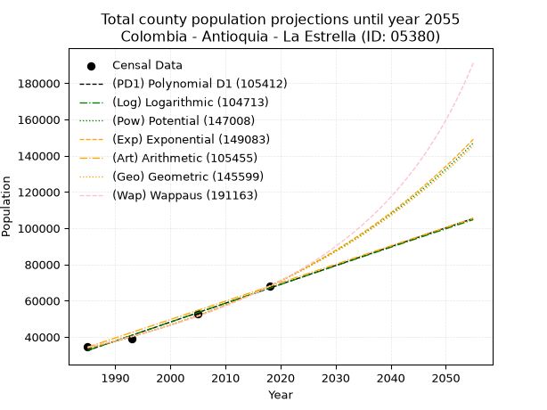
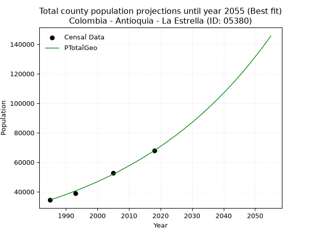
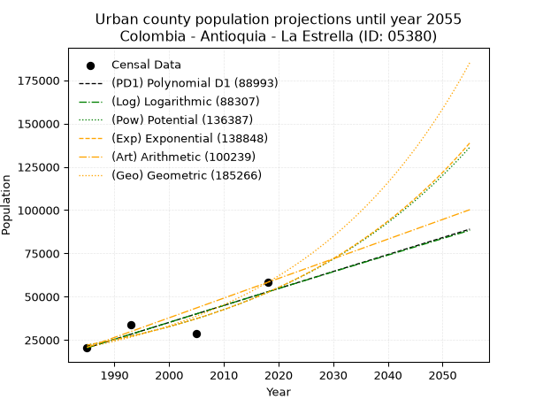
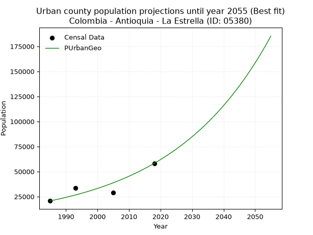
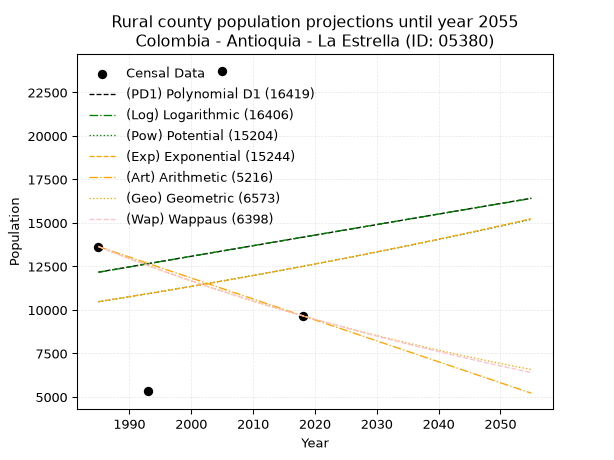
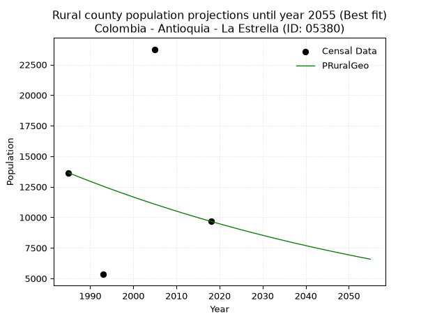

<div align="center">


</div>

# 📜 _“Population and Public Services Demand Projections (PPSD) until Year 2055 for Colombia - Antioquia - La Estrella (ID: 05380)”_
Keywords: `population` `public-service` `projection` `lineal` `polynomial` `logarithmic` `potential` `exponential` `arithmetic` `geometric` `wappaus` `dane` `colombia` `south-america`

PPSD are analytical estimates used by governments and planners to anticipate future changes in population size, age distribution, and the resulting community needs for utilities, healthcare, education, and infrastructure as sizing future water treatment facilities, electrical grids, and road networks based on spatial growth.

<div align="center">

</img>

</div>


> **General running parameters**: • app_version: _v20260806_. • Python version: _3.14.7_. • Pandas version: _3.0.5_. • NumPy version: _2.5.1_. • Creates, save and include plots into reports (create_plot): _True_. • Projection until year: _2055_. • Process polynomial degree 2 and up: _False_. • Process Wappaus: _True_. • Process Wappaus: _True_. • Set negative values to zero: _True_. • Set infinite values to zero: _True_. • Drop dataset notes: _True_. 
<div align="center">

Maps & GIS Layers: [:earth_americas:Google](http://maps.google.com/maps?q=6.145237648,-75.6377078) [:earth_americas:OSM](https://www.openstreetmap.org/#map=18/6.145237648/-75.6377078&layers=P) [:earth_americas:Bing](https://www.bing.com/maps?cp=6.145237648~-75.6377078&lvl=18) [:earth_americas:Apple](https://maps.apple.com/frame?center=6.145237648%2C-75.6377078&span=0.003%2C0.006) [:earth_americas:GISMobile](https://github.com/rcfdtools/R.GISMobile/blob/main/file/gis/CountyLayer_CO/Readme.md)

</div>


<div align="center">

```geojson
{
  "type": "Feature",
  "geometry": {
    "type": "Point", 
    "coordinates": [-75.6377078, 6.145237648]
  }, 
  "properties": {
    "Name": "Colombia - Antioquia - La Estrella (ID: 05380)"
  }
}
```

</div>


## 0. Census Data (4 records)

Census data are official statistics collected by a government about the people and housing in a country. They usually include counts of total population, age, sex, race, income, education, and jobs.

📅Global census file: [Population.xlsx](../data/Population.xlsx)

| Source   |   Year |   CountryID | CountryName   |   StateID | StateName   |   CountyID | CountyName   |   PTotal |   PUrban |   PRural |
|:---------|-------:|------------:|:--------------|----------:|:------------|-----------:|:-------------|---------:|---------:|---------:|
| DANE     |   1985 |          57 | Colombia      |        05 | Antioquia   |      05380 | La Estrella  |    34369 |    20730 |    13639 |
| DANE     |   1993 |          57 | Colombia      |        05 | Antioquia   |      05380 | La Estrella  |    38956 |    33626 |     5330 |
| DANE     |   2005 |          57 | Colombia      |        05 | Antioquia   |      05380 | La Estrella  |    52563 |    28812 |    23751 |
| DANE     |   2018 |          57 | Colombia      |        05 | Antioquia   |      05380 | La Estrella  |    67881 |    58213 |     9668 |

> 🔥Some records could had specific notes about the registered values or the corresponding urban or rural distribution.

📅[SUI-RUPS](https://www.datos.gov.co/Hacienda-y-Cr-dito-P-blico/Registro-nico-de-Prestadores-de-Servicios-P-blicos/4qkq-csdn/about_data) - Local public utility companies: [RUPS.csv](../data/RUPS.csv)

 | SERVICIO       | ESTADO    | NOMBRE                                                                                              | NIT         | DEPARTAMENTO_DOMICILIO   | MUNICIPIO_DOMICILIO   | DIRECCION                                   |   TELEFONO | EMAIL                     | TIPO_PRESTADOR                             | CLASIFICACION                  |
|:---------------|:----------|:----------------------------------------------------------------------------------------------------|:------------|:-------------------------|:----------------------|:--------------------------------------------|-----------:|:--------------------------|:-------------------------------------------|:-------------------------------|
| ACUEDUCTO      | OPERATIVA | EMPRESAS PÚBLICAS DE MEDELLIN E.S.P.                                                                | 890904996-1 | ANTIOQUIA                | MEDELLIN              | CRA 58 No 42-125 Edificio Inteligente       |    3808080 | DONEY.MARTINEZ@EPM.COM.CO | EMPRESA INDUSTRIAL Y COMERCIAL DEL ESTADO  | MAYOR O IGUAL A 5001 USUARIOS  |
| ALCANTARILLADO | OPERATIVA | EMPRESAS PÚBLICAS DE MEDELLIN E.S.P.                                                                | 890904996-1 | ANTIOQUIA                | MEDELLIN              | CRA 58 No 42-125 Edificio Inteligente       |    3808080 | DONEY.MARTINEZ@EPM.COM.CO | EMPRESA INDUSTRIAL Y COMERCIAL DEL ESTADO  | MAYOR O IGUAL A 5001 USUARIOS  |
| ACUEDUCTO      | OPERATIVA | ASOCIACION DE USUARIOS DEL SERVICIO DE AGUA POTABLE Y ALCANTARILLADO DEL BARRIO LA INMACULADA NO. 1 | 811019654-2 | ANTIOQUIA                | LA ESTRELLA           | CRA 51 No. 95A SUR - 174                    |    3020329 | asuac@hotmail.com         | ORGANIZACION AUTORIZADA                    | MENOR O IGUAL A 2500 USUARIOS  |
| ACUEDUCTO      | OPERATIVA | ASOCIACION DE USUARIOS DEL ACUEDUCTO DE LA VEREDA LA BERMEJALA                                      | 811024698-6 | ANTIOQUIA                | LA ESTRELLA           | VEREDA LA BERMEJALA CASA JOHN MARIO CARMONA |    3020873 | m_samarad@hotmail.com     | ORGANIZACION AUTORIZADA                    | HASTA 2500 SUSCRIPTORES        |
| ACUEDUCTO      | OPERATIVA | ACUEDUCTO COMUNAL BARRIO EL PEDRERO                                                                 | 811020529-1 | ANTIOQUIA                | LA ESTRELLA           | CALLE 87 SUR CARRERA 65A - 82               |    3021322 | acuecomunal@yahoo.com.co  | ORGANIZACION AUTORIZADA                    | MENOR O IGUAL A 2500 USUARIOS  |
| ACUEDUCTO      | OPERATIVA | EMPRESA DE SERVICIOS PUBLICOS DOMICILIARIOS DE LA ESTRELLA S.A E.S.P.                               | 900332363-8 | ANTIOQUIA                | LA ESTRELLA           | Calle 100 SUR No 49D - 91                   |    2788888 | wacevedo3@gmail.com       | SOCIEDADES (EMPRESA DE SERVICIOS PUBLICOS) | DESDE 2501 HASTA 5000 USUARIOS |
| ALCANTARILLADO | OPERATIVA | EMPRESA DE SERVICIOS PUBLICOS DOMICILIARIOS DE LA ESTRELLA S.A E.S.P.                               | 900332363-8 | ANTIOQUIA                | LA ESTRELLA           | Calle 100 SUR No 49D - 91                   |    2788888 | wacevedo3@gmail.com       | SOCIEDADES (EMPRESA DE SERVICIOS PUBLICOS) | DESDE 2501 HASTA 5000 USUARIOS |
| ACUEDUCTO      | OPERATIVA | ANTIOQUEÑA DE AGUAS Y ASEO SAS ESP                                                                  | 901223957-9 | ANTIOQUIA                | MEDELLIN              | carrera 50 50-48 interior 700               |    4440461 | adeaasas@hotmail.com      | SOCIEDADES (EMPRESA DE SERVICIOS PUBLICOS) | MENOR O IGUAL A 2500 USUARIOS  |
| ALCANTARILLADO | OPERATIVA | ANTIOQUEÑA DE AGUAS Y ASEO SAS ESP                                                                  | 901223957-9 | ANTIOQUIA                | MEDELLIN              | carrera 50 50-48 interior 700               |    4440461 | adeaasas@hotmail.com      | SOCIEDADES (EMPRESA DE SERVICIOS PUBLICOS) | MENOR O IGUAL A 2500 USUARIOS  |

## 1. Total

### 1.1. Coefficients and Parameters

* (PD1) Polynomial Deg 1: 1040.5519871537433, -2032921.8623042752 (lineal)
* (Log) Logarithmic: 2082306.2816726626, -15779184.483549217
* (Pow) Potential: 42.39517698667191, -135.27990195570885
* (Exp) Exponential: 0.021181019166209385, 1.8616293504202103e-14
* (Art) Arithmetic: Year diff. 2018 - 1985 = 33, Population diff. 67881 - 34369 = 33512, Annual growth = 1015.5151515151515
* (Geo) Geometric: Year diff. 2018 - 1985 = 33, Population diff. 67881 - 34369 = 33512, Annual growth % = 0.020838428206106263
* (Wap) Wappaus: i = 1.986337704675113, Condition values only valid for < 200)

<sub>
Wappaus condition values: ['0.00', '1.99', '3.97', '5.96', '7.95', '9.93', '11.92', '13.90', '15.89', '17.88', '19.86', '21.85', '23.84', '25.82', '27.81', '29.80', '31.78', '33.77', '35.75', '37.74', '39.73', '41.71', '43.70', '45.69', '47.67', '49.66', '51.64', '53.63', '55.62', '57.60', '59.59', '61.58', '63.56', '65.55', '67.54', '69.52', '71.51', '73.49', '75.48', '77.47', '79.45', '81.44', '83.43', '85.41', '87.40', '89.39', '91.37', '93.36', '95.34', '97.33', '99.32', '101.30', '103.29', '105.28', '107.26', '109.25', '111.23', '113.22', '115.21', '117.19', '119.18', '121.17', '123.15', '125.14', '127.13', '129.11', '131.10', '133.08', '135.07', '137.06', '139.04']
</sub>


### 1.2. Projected Dataset

|   Year |   CountyID |   PTotalPD1 |   PTotalLog |   PTotalPow |   PTotalExp |   PTotalArt |   PTotalGeo |   PTotalWap |
|-------:|-----------:|------------:|------------:|------------:|------------:|------------:|------------:|------------:|
|   1985 |      05380 |       32574 |       32546 |       33825 |       33846 |       34369 |       34369 |       34369 |
|   1986 |      05380 |       33614 |       33595 |       34555 |       34571 |       35385 |       35085 |       35059 |
|   1987 |      05380 |       34655 |       34643 |       35300 |       35311 |       36400 |       35816 |       35762 |
|   1988 |      05380 |       35695 |       35691 |       36062 |       36067 |       37416 |       36563 |       36480 |
|   1989 |      05380 |       36736 |       36738 |       36839 |       36839 |       38431 |       37325 |       37213 |
|   1990 |      05380 |       37777 |       37785 |       37632 |       37627 |       39447 |       38102 |       37961 |
|   1991 |      05380 |       38817 |       38831 |       38442 |       38433 |       40462 |       38896 |       38725 |
|   1992 |      05380 |       39858 |       39877 |       39269 |       39256 |       41478 |       39707 |       39505 |
|   1993 |      05380 |       40898 |       40922 |       40114 |       40096 |       42493 |       40534 |       40302 |
|   1994 |      05380 |       41939 |       41966 |       40976 |       40954 |       43509 |       41379 |       41116 |
|   1995 |      05380 |       42979 |       43010 |       41856 |       41831 |       44524 |       42241 |       41949 |
|   1996 |      05380 |       44020 |       44054 |       42755 |       42727 |       45540 |       43122 |       42800 |
|   1997 |      05380 |       45060 |       45097 |       43673 |       43641 |       46555 |       44020 |       43670 |
|   1998 |      05380 |       46101 |       46139 |       44610 |       44575 |       47571 |       44937 |       44560 |
|   1999 |      05380 |       47142 |       47181 |       45566 |       45530 |       48586 |       45874 |       45470 |
|   2000 |      05380 |       48182 |       48222 |       46542 |       46504 |       49602 |       46830 |       46402 |
|   2001 |      05380 |       49223 |       49263 |       47539 |       47500 |       50617 |       47806 |       47356 |
|   2002 |      05380 |       50263 |       50304 |       48557 |       48517 |       51633 |       48802 |       48332 |
|   2003 |      05380 |       51304 |       51344 |       49596 |       49555 |       52648 |       49819 |       49332 |
|   2004 |      05380 |       52344 |       52383 |       50657 |       50616 |       53664 |       50857 |       50357 |
|   2005 |      05380 |       53385 |       53422 |       51739 |       51700 |       54679 |       51917 |       51407 |
|   2006 |      05380 |       54425 |       54460 |       52845 |       52806 |       55695 |       52999 |       52483 |
|   2007 |      05380 |       55466 |       55498 |       53973 |       53937 |       56710 |       54103 |       53587 |
|   2008 |      05380 |       56507 |       56535 |       55125 |       55091 |       57726 |       55230 |       54719 |
|   2009 |      05380 |       57547 |       57572 |       56301 |       56271 |       58741 |       56381 |       55881 |
|   2010 |      05380 |       58588 |       58608 |       57502 |       57475 |       59757 |       57556 |       57073 |
|   2011 |      05380 |       59628 |       59644 |       58727 |       58706 |       60772 |       58756 |       58298 |
|   2012 |      05380 |       60669 |       60679 |       59978 |       59962 |       61788 |       59980 |       59555 |
|   2013 |      05380 |       61709 |       61714 |       61255 |       61246 |       62803 |       61230 |       60847 |
|   2014 |      05380 |       62750 |       62748 |       62558 |       62557 |       63819 |       62506 |       62176 |
|   2015 |      05380 |       63790 |       63781 |       63889 |       63896 |       64834 |       63808 |       63541 |
|   2016 |      05380 |       64831 |       64815 |       65247 |       65264 |       65850 |       65138 |       64946 |
|   2017 |      05380 |       65871 |       65847 |       66633 |       66661 |       66865 |       66495 |       66392 |
|   2018 |      05380 |       66912 |       66879 |       68048 |       68088 |       67881 |       67881 |       67881 |
|   2019 |      05380 |       67953 |       67911 |       69492 |       69546 |       68897 |       69296 |       69414 |
|   2020 |      05380 |       68993 |       68942 |       70967 |       71034 |       69912 |       70740 |       70994 |
|   2021 |      05380 |       70034 |       69973 |       72471 |       72555 |       70928 |       72214 |       72623 |
|   2022 |      05380 |       71074 |       71003 |       74007 |       74108 |       71943 |       73718 |       74303 |
|   2023 |      05380 |       72115 |       72032 |       75575 |       75695 |       72959 |       75255 |       76036 |
|   2024 |      05380 |       73155 |       73061 |       77175 |       77315 |       73974 |       76823 |       77826 |
|   2025 |      05380 |       74196 |       74090 |       78808 |       78970 |       74990 |       78424 |       79675 |
|   2026 |      05380 |       75236 |       75118 |       80475 |       80661 |       76005 |       80058 |       81586 |
|   2027 |      05380 |       76277 |       76146 |       82177 |       82387 |       77021 |       81726 |       83561 |
|   2028 |      05380 |       77318 |       77173 |       83913 |       84151 |       78036 |       83429 |       85606 |
|   2029 |      05380 |       78358 |       78199 |       85685 |       85952 |       79052 |       85168 |       87722 |
|   2030 |      05380 |       79399 |       79225 |       87494 |       87792 |       80067 |       86943 |       89915 |
|   2031 |      05380 |       80439 |       80251 |       89340 |       89672 |       81083 |       88754 |       92187 |
|   2032 |      05380 |       81480 |       81276 |       91224 |       91591 |       82098 |       90604 |       94544 |
|   2033 |      05380 |       82520 |       82300 |       93147 |       93552 |       83114 |       92492 |       96991 |
|   2034 |      05380 |       83561 |       83324 |       95109 |       95555 |       84129 |       94419 |       99533 |
|   2035 |      05380 |       84601 |       84348 |       97112 |       97600 |       85145 |       96387 |      102174 |
|   2036 |      05380 |       85642 |       85371 |       99156 |       99690 |       86160 |       98395 |      104922 |
|   2037 |      05380 |       86683 |       86393 |      101241 |      101824 |       87176 |      100446 |      107783 |
|   2038 |      05380 |       87723 |       87415 |      103370 |      104003 |       88191 |      102539 |      110764 |
|   2039 |      05380 |       88764 |       88437 |      105542 |      106230 |       89207 |      104676 |      113873 |
|   2040 |      05380 |       89804 |       89458 |      107759 |      108504 |       90222 |      106857 |      117117 |
|   2041 |      05380 |       90845 |       90478 |      110022 |      110826 |       91238 |      109084 |      120507 |
|   2042 |      05380 |       91885 |       91498 |      112330 |      113199 |       92253 |      111357 |      124052 |
|   2043 |      05380 |       92926 |       92518 |      114686 |      115622 |       93269 |      113677 |      127763 |
|   2044 |      05380 |       93966 |       93537 |      117090 |      118097 |       94284 |      116046 |      131653 |
|   2045 |      05380 |       95007 |       94555 |      119544 |      120625 |       95300 |      118464 |      135733 |
|   2046 |      05380 |       96048 |       95573 |      122047 |      123208 |       96315 |      120933 |      140019 |
|   2047 |      05380 |       97088 |       96591 |      124602 |      125845 |       97331 |      123453 |      144527 |
|   2048 |      05380 |       98129 |       97608 |      127209 |      128539 |       98346 |      126026 |      149273 |
|   2049 |      05380 |       99169 |       98624 |      129869 |      131291 |       99362 |      128652 |      154279 |
|   2050 |      05380 |      100210 |       99640 |      132583 |      134101 |      100377 |      131333 |      159565 |
|   2051 |      05380 |      101250 |      100656 |      135353 |      136972 |      101393 |      134069 |      165156 |
|   2052 |      05380 |      102291 |      101671 |      138179 |      139904 |      102409 |      136863 |      171079 |
|   2053 |      05380 |      103331 |      102685 |      141063 |      142899 |      103424 |      139715 |      177364 |
|   2054 |      05380 |      104372 |      103699 |      144006 |      145958 |      104440 |      142627 |      184046 |
|   2055 |      05380 |      105412 |      104713 |      147008 |      149083 |      105455 |      145599 |      191163 |
<div align="center">

</img>

</div>


### 1.3. Best fit with absolute and relative error (%)

Relative error puts that difference into context by dividing the absolute error by the true value, creating a unitless ratio or percentage that shows the scale of the mistake.

Absolute and relative error

|   Year | Source   |   CountryID | CountryName   |   StateID | StateName   |   CountyID_x | CountyName   |   PTotal |   PUrban |   PRural |   CountyID_y |   PTotalPD1 |   PTotalLog |   PTotalPow |   PTotalExp |   PTotalArt |   PTotalGeo |   PTotalWap |   PTotalPD1AbsError |   PTotalLogAbsError |   PTotalPowAbsError |   PTotalExpAbsError |   PTotalArtAbsError |   PTotalGeoAbsError |   PTotalWapAbsError |   PTotalPD1RelError |   PTotalLogRelError |   PTotalPowRelError |   PTotalExpRelError |   PTotalArtRelError |   PTotalGeoRelError |   PTotalWapRelError |
|-------:|:---------|------------:|:--------------|----------:|:------------|-------------:|:-------------|---------:|---------:|---------:|-------------:|------------:|------------:|------------:|------------:|------------:|------------:|------------:|--------------------:|--------------------:|--------------------:|--------------------:|--------------------:|--------------------:|--------------------:|--------------------:|--------------------:|--------------------:|--------------------:|--------------------:|--------------------:|--------------------:|
|   1985 | DANE     |          57 | Colombia      |        05 | Antioquia   |        05380 | La Estrella  |    34369 |    20730 |    13639 |        05380 |       32574 |       32546 |       33825 |       33846 |       34369 |       34369 |       34369 |                1795 |                1823 |                 544 |                 523 |                   0 |                   0 |                   0 |             5.22273 |             5.3042  |            1.58282  |            1.52172  |             0       |             0       |             0       |
|   1993 | DANE     |          57 | Colombia      |        05 | Antioquia   |        05380 | La Estrella  |    38956 |    33626 |     5330 |        05380 |       40898 |       40922 |       40114 |       40096 |       42493 |       40534 |       40302 |                1942 |                1966 |                1158 |                1140 |                3537 |                1578 |                1346 |             4.98511 |             5.04672 |            2.97258  |            2.92638  |             9.07947 |             4.05072 |             3.45518 |
|   2005 | DANE     |          57 | Colombia      |        05 | Antioquia   |        05380 | La Estrella  |    52563 |    28812 |    23751 |        05380 |       53385 |       53422 |       51739 |       51700 |       54679 |       51917 |       51407 |                 822 |                 859 |                 824 |                 863 |                2116 |                 646 |                1156 |             1.56384 |             1.63423 |            1.56764  |            1.64184  |             4.02565 |             1.229   |             2.19927 |
|   2018 | DANE     |          57 | Colombia      |        05 | Antioquia   |        05380 | La Estrella  |    67881 |    58213 |     9668 |        05380 |       66912 |       66879 |       68048 |       68088 |       67881 |       67881 |       67881 |                 969 |                1002 |                 167 |                 207 |                   0 |                   0 |                   0 |             1.4275  |             1.47611 |            0.246019 |            0.304945 |             0       |             0       |             0       |

Relative error mean

| Method    |   RelError | Best   |
|:----------|-----------:|:-------|
| PTotalPD1 |    3.29979 |        |
| PTotalLog |    3.36531 |        |
| PTotalPow |    1.59227 |        |
| PTotalExp |    1.59872 |        |
| PTotalArt |    3.27628 |        |
| PTotalGeo |    1.31993 | True   |
| PTotalWap |    1.41361 |        |

💙Best method: _**PTotalGeo**_
<div align="center">

</img>

</div>


### 1.4. Fresh water supply demand in liters per capita per day (lpcd)

The fresh water supply demand typically ranges from 100 to 300 liters per capita per day (lpcd) for standard domestic and municipal planning, though absolute survival minimums set by the World Health Organization are as low as 7.5 to 20 liters per day, and total consumption in high-income nations can exceed 400 liters.

> `CZ`: Level in meters above the sea level (masl)<br> `WS`: Fresh water supply demand in liters per capita per day (lpcd or l/h/d)<br> `WSAll`: Zonal fresh water supply demand in liters per second (l/s)<br> `A`: Zonal area in square meters<br> `DP`: Population density (people/hectare or p/ha)

Reference values (RAS Colombia)

|    CZ |   WS |
|------:|-----:|
|  1000 |  120 |
|  2000 |  130 |
| 99999 |  140 |

County shapefile geometry properties and water supply values

|   CountyID |      ATotal |   CZTotal |   WSTotal |
|-----------:|------------:|----------:|----------:|
|      05380 | 3.68384e+07 |    2050.3 |       140 |

Projected values for best method: PTotalGeo

|   CountyID |   Year |   PTotalGeo |   DPTotal |   WSTotal |   WSTotalAll |
|-----------:|-------:|------------:|----------:|----------:|-------------:|
|      05380 |   1985 |       34369 |      9.33 |       140 |      55.6905 |
|      05380 |   1986 |       35085 |      9.52 |       140 |      56.8507 |
|      05380 |   1987 |       35816 |      9.72 |       140 |      58.0352 |
|      05380 |   1988 |       36563 |      9.93 |       140 |      59.2456 |
|      05380 |   1989 |       37325 |     10.13 |       140 |      60.4803 |
|      05380 |   1990 |       38102 |     10.34 |       140 |      61.7394 |
|      05380 |   1991 |       38896 |     10.56 |       140 |      63.0259 |
|      05380 |   1992 |       39707 |     10.78 |       140 |      64.34   |
|      05380 |   1993 |       40534 |     11    |       140 |      65.6801 |
|      05380 |   1994 |       41379 |     11.23 |       140 |      67.0493 |
|      05380 |   1995 |       42241 |     11.47 |       140 |      68.4461 |
|      05380 |   1996 |       43122 |     11.71 |       140 |      69.8736 |
|      05380 |   1997 |       44020 |     11.95 |       140 |      71.3287 |
|      05380 |   1998 |       44937 |     12.2  |       140 |      72.8146 |
|      05380 |   1999 |       45874 |     12.45 |       140 |      74.3329 |
|      05380 |   2000 |       46830 |     12.71 |       140 |      75.8819 |
|      05380 |   2001 |       47806 |     12.98 |       140 |      77.4634 |
|      05380 |   2002 |       48802 |     13.25 |       140 |      79.0773 |
|      05380 |   2003 |       49819 |     13.52 |       140 |      80.7252 |
|      05380 |   2004 |       50857 |     13.81 |       140 |      82.4072 |
|      05380 |   2005 |       51917 |     14.09 |       140 |      84.1248 |
|      05380 |   2006 |       52999 |     14.39 |       140 |      85.878  |
|      05380 |   2007 |       54103 |     14.69 |       140 |      87.6669 |
|      05380 |   2008 |       55230 |     14.99 |       140 |      89.4931 |
|      05380 |   2009 |       56381 |     15.3  |       140 |      91.3581 |
|      05380 |   2010 |       57556 |     15.62 |       140 |      93.262  |
|      05380 |   2011 |       58756 |     15.95 |       140 |      95.2065 |
|      05380 |   2012 |       59980 |     16.28 |       140 |      97.1898 |
|      05380 |   2013 |       61230 |     16.62 |       140 |      99.2153 |
|      05380 |   2014 |       62506 |     16.97 |       140 |     101.283  |
|      05380 |   2015 |       63808 |     17.32 |       140 |     103.393  |
|      05380 |   2016 |       65138 |     17.68 |       140 |     105.548  |
|      05380 |   2017 |       66495 |     18.05 |       140 |     107.747  |
|      05380 |   2018 |       67881 |     18.43 |       140 |     109.992  |
|      05380 |   2019 |       69296 |     18.81 |       140 |     112.285  |
|      05380 |   2020 |       70740 |     19.2  |       140 |     114.625  |
|      05380 |   2021 |       72214 |     19.6  |       140 |     117.013  |
|      05380 |   2022 |       73718 |     20.01 |       140 |     119.45   |
|      05380 |   2023 |       75255 |     20.43 |       140 |     121.941  |
|      05380 |   2024 |       76823 |     20.85 |       140 |     124.482  |
|      05380 |   2025 |       78424 |     21.29 |       140 |     127.076  |
|      05380 |   2026 |       80058 |     21.73 |       140 |     129.724  |
|      05380 |   2027 |       81726 |     22.18 |       140 |     132.426  |
|      05380 |   2028 |       83429 |     22.65 |       140 |     135.186  |
|      05380 |   2029 |       85168 |     23.12 |       140 |     138.004  |
|      05380 |   2030 |       86943 |     23.6  |       140 |     140.88   |
|      05380 |   2031 |       88754 |     24.09 |       140 |     143.814  |
|      05380 |   2032 |       90604 |     24.59 |       140 |     146.812  |
|      05380 |   2033 |       92492 |     25.11 |       140 |     149.871  |
|      05380 |   2034 |       94419 |     25.63 |       140 |     152.994  |
|      05380 |   2035 |       96387 |     26.16 |       140 |     156.183  |
|      05380 |   2036 |       98395 |     26.71 |       140 |     159.436  |
|      05380 |   2037 |      100446 |     27.27 |       140 |     162.76   |
|      05380 |   2038 |      102539 |     27.83 |       140 |     166.151  |
|      05380 |   2039 |      104676 |     28.41 |       140 |     169.614  |
|      05380 |   2040 |      106857 |     29.01 |       140 |     173.148  |
|      05380 |   2041 |      109084 |     29.61 |       140 |     176.756  |
|      05380 |   2042 |      111357 |     30.23 |       140 |     180.44   |
|      05380 |   2043 |      113677 |     30.86 |       140 |     184.199  |
|      05380 |   2044 |      116046 |     31.5  |       140 |     188.037  |
|      05380 |   2045 |      118464 |     32.16 |       140 |     191.956  |
|      05380 |   2046 |      120933 |     32.83 |       140 |     195.956  |
|      05380 |   2047 |      123453 |     33.51 |       140 |     200.04   |
|      05380 |   2048 |      126026 |     34.21 |       140 |     204.209  |
|      05380 |   2049 |      128652 |     34.92 |       140 |     208.464  |
|      05380 |   2050 |      131333 |     35.65 |       140 |     212.808  |
|      05380 |   2051 |      134069 |     36.39 |       140 |     217.241  |
|      05380 |   2052 |      136863 |     37.15 |       140 |     221.769  |
|      05380 |   2053 |      139715 |     37.93 |       140 |     226.39   |
|      05380 |   2054 |      142627 |     38.72 |       140 |     231.109  |
|      05380 |   2055 |      145599 |     39.52 |       140 |     235.924  |

## 2. Urban

### 2.1. Coefficients and Parameters

* (PD1) Polynomial Deg 1: 979.8743476515274, -1924648.4138899678 (lineal)
* (Log) Logarithmic: 1959871.0577934717, -14861650.365709178
* (Pow) Potential: 52.64203349090643, -169.25837780151525
* (Exp) Exponential: 0.02630934550048226, 4.5930727777713885e-19
* (Art) Arithmetic: Year diff. 2018 - 1985 = 33, Population diff. 58213 - 20730 = 37483, Annual growth = 1135.8484848484848
* (Geo) Geometric: Year diff. 2018 - 1985 = 33, Population diff. 58213 - 20730 = 37483, Annual growth % = 0.031783326456421346
* (Wap) Wappaus: i = 2.8776420578100272, Condition values only valid for < 200)

<sub>
Wappaus condition values: ['0.00', '2.88', '5.76', '8.63', '11.51', '14.39', '17.27', '20.14', '23.02', '25.90', '28.78', '31.65', '34.53', '37.41', '40.29', '43.16', '46.04', '48.92', '51.80', '54.68', '57.55', '60.43', '63.31', '66.19', '69.06', '71.94', '74.82', '77.70', '80.57', '83.45', '86.33', '89.21', '92.08', '94.96', '97.84', '100.72', '103.60', '106.47', '109.35', '112.23', '115.11', '117.98', '120.86', '123.74', '126.62', '129.49', '132.37', '135.25', '138.13', '141.00', '143.88', '146.76', '149.64', '152.52', '155.39', '158.27', '161.15', '164.03', '166.90', '169.78', '172.66', '175.54', '178.41', '181.29', '184.17', '187.05', '189.92', '192.80', '195.68', '198.56', '201.43']
</sub>


### 2.2. Projected Dataset

|   Year |   CountyID |   PUrbanPD1 |   PUrbanLog |   PUrbanPow |   PUrbanExp |   PUrbanArt |   PUrbanGeo |
|-------:|-----------:|------------:|------------:|------------:|------------:|------------:|------------:|
|   1985 |      05380 |       20402 |       20384 |       22001 |       22015 |       20730 |       20730 |
|   1986 |      05380 |       21382 |       21371 |       22592 |       22602 |       21866 |       21389 |
|   1987 |      05380 |       22362 |       22358 |       23199 |       23205 |       23002 |       22069 |
|   1988 |      05380 |       23342 |       23344 |       23821 |       23823 |       24138 |       22770 |
|   1989 |      05380 |       24322 |       24329 |       24460 |       24458 |       25273 |       23494 |
|   1990 |      05380 |       25302 |       25314 |       25116 |       25110 |       26409 |       24241 |
|   1991 |      05380 |       26281 |       26299 |       25789 |       25780 |       27545 |       25011 |
|   1992 |      05380 |       27261 |       27283 |       26480 |       26467 |       28681 |       25806 |
|   1993 |      05380 |       28241 |       28267 |       27189 |       27172 |       29817 |       26626 |
|   1994 |      05380 |       29221 |       29250 |       27917 |       27897 |       30953 |       27472 |
|   1995 |      05380 |       30201 |       30233 |       28663 |       28640 |       32088 |       28346 |
|   1996 |      05380 |       31181 |       31215 |       29430 |       29404 |       33224 |       29246 |
|   1997 |      05380 |       32161 |       32196 |       30216 |       30188 |       34360 |       30176 |
|   1998 |      05380 |       33141 |       33178 |       31023 |       30993 |       35496 |       31135 |
|   1999 |      05380 |       34120 |       34158 |       31851 |       31819 |       36632 |       32125 |
|   2000 |      05380 |       35100 |       35138 |       32700 |       32667 |       37768 |       33146 |
|   2001 |      05380 |       36080 |       36118 |       33572 |       33538 |       38904 |       34199 |
|   2002 |      05380 |       37060 |       37097 |       34467 |       34432 |       40039 |       35286 |
|   2003 |      05380 |       38040 |       38076 |       35385 |       35350 |       41175 |       36408 |
|   2004 |      05380 |       39020 |       39054 |       36327 |       36292 |       42311 |       37565 |
|   2005 |      05380 |       40000 |       40032 |       37294 |       37260 |       43447 |       38759 |
|   2006 |      05380 |       40980 |       41009 |       38286 |       38253 |       44583 |       39991 |
|   2007 |      05380 |       41959 |       41986 |       39304 |       39273 |       45719 |       41262 |
|   2008 |      05380 |       42939 |       42962 |       40348 |       40320 |       46855 |       42573 |
|   2009 |      05380 |       43919 |       43938 |       41419 |       41395 |       47990 |       43926 |
|   2010 |      05380 |       44899 |       44913 |       42519 |       42498 |       49126 |       45322 |
|   2011 |      05380 |       45879 |       45888 |       43647 |       43631 |       50262 |       46763 |
|   2012 |      05380 |       46859 |       46862 |       44804 |       44794 |       51398 |       48249 |
|   2013 |      05380 |       47839 |       47836 |       45991 |       45988 |       52534 |       49783 |
|   2014 |      05380 |       48819 |       48810 |       47210 |       47214 |       53670 |       51365 |
|   2015 |      05380 |       49798 |       49783 |       48460 |       48473 |       54805 |       52997 |
|   2016 |      05380 |       50778 |       50755 |       49742 |       49765 |       55941 |       54682 |
|   2017 |      05380 |       51758 |       51727 |       51058 |       51092 |       57077 |       56420 |
|   2018 |      05380 |       52738 |       52698 |       52407 |       52454 |       58213 |       58213 |
|   2019 |      05380 |       53718 |       53669 |       53792 |       53852 |       59349 |       60063 |
|   2020 |      05380 |       54698 |       54640 |       55213 |       55288 |       60485 |       61972 |
|   2021 |      05380 |       55678 |       55610 |       56670 |       56762 |       61621 |       63942 |
|   2022 |      05380 |       56658 |       56579 |       58165 |       58275 |       62756 |       65974 |
|   2023 |      05380 |       57637 |       57548 |       59699 |       59829 |       63892 |       68071 |
|   2024 |      05380 |       58617 |       58517 |       61273 |       61423 |       65028 |       70235 |
|   2025 |      05380 |       59597 |       59485 |       62887 |       63061 |       66164 |       72467 |
|   2026 |      05380 |       60577 |       60453 |       64543 |       64742 |       67300 |       74770 |
|   2027 |      05380 |       61557 |       61420 |       66241 |       66468 |       68436 |       77147 |
|   2028 |      05380 |       62537 |       62386 |       67984 |       68240 |       69571 |       79599 |
|   2029 |      05380 |       63517 |       63352 |       69771 |       70059 |       70707 |       82128 |
|   2030 |      05380 |       64497 |       64318 |       71604 |       71927 |       71843 |       84739 |
|   2031 |      05380 |       65476 |       65283 |       73485 |       73844 |       72979 |       87432 |
|   2032 |      05380 |       66456 |       66248 |       75414 |       75813 |       74115 |       90211 |
|   2033 |      05380 |       67436 |       67212 |       77393 |       77834 |       75251 |       93078 |
|   2034 |      05380 |       68416 |       68176 |       79423 |       79909 |       76387 |       96036 |
|   2035 |      05380 |       69396 |       69139 |       81504 |       82039 |       77522 |       99089 |
|   2036 |      05380 |       70376 |       70102 |       83640 |       84226 |       78658 |      102238 |
|   2037 |      05380 |       71356 |       71065 |       85830 |       86471 |       79794 |      105488 |
|   2038 |      05380 |       72336 |       72027 |       88076 |       88777 |       80930 |      108840 |
|   2039 |      05380 |       73315 |       72988 |       90380 |       91143 |       82066 |      112300 |
|   2040 |      05380 |       74295 |       73949 |       92744 |       93573 |       83202 |      115869 |
|   2041 |      05380 |       75275 |       74909 |       95167 |       96068 |       84338 |      119552 |
|   2042 |      05380 |       76255 |       75869 |       97653 |       98629 |       85473 |      123351 |
|   2043 |      05380 |       77235 |       76829 |      100203 |      101258 |       86609 |      127272 |
|   2044 |      05380 |       78215 |       77788 |      102818 |      103957 |       87745 |      131317 |
|   2045 |      05380 |       79195 |       78747 |      105500 |      106729 |       88881 |      135491 |
|   2046 |      05380 |       80175 |       79705 |      108250 |      109574 |       90017 |      139797 |
|   2047 |      05380 |       81154 |       80663 |      111070 |      112495 |       91153 |      144240 |
|   2048 |      05380 |       82134 |       81620 |      113963 |      115494 |       92288 |      148825 |
|   2049 |      05380 |       83114 |       82576 |      116930 |      118573 |       93424 |      153555 |
|   2050 |      05380 |       84094 |       83533 |      119972 |      121734 |       94560 |      158435 |
|   2051 |      05380 |       85074 |       84489 |      123092 |      124979 |       95696 |      163471 |
|   2052 |      05380 |       86054 |       85444 |      126291 |      128311 |       96832 |      168667 |
|   2053 |      05380 |       87034 |       86399 |      129572 |      131731 |       97968 |      174027 |
|   2054 |      05380 |       88013 |       87353 |      132937 |      135243 |       99104 |      179559 |
|   2055 |      05380 |       88993 |       88307 |      136387 |      138848 |      100239 |      185266 |
<div align="center">

</img>

</div>


### 2.3. Best fit with absolute and relative error (%)

Relative error puts that difference into context by dividing the absolute error by the true value, creating a unitless ratio or percentage that shows the scale of the mistake.

Absolute and relative error

|   Year | Source   |   CountryID | CountryName   |   StateID | StateName   |   CountyID_x | CountyName   |   PTotal |   PUrban |   PRural |   CountyID_y |   PUrbanPD1 |   PUrbanLog |   PUrbanPow |   PUrbanExp |   PUrbanArt |   PUrbanGeo |   PUrbanPD1AbsError |   PUrbanLogAbsError |   PUrbanPowAbsError |   PUrbanExpAbsError |   PUrbanArtAbsError |   PUrbanGeoAbsError |   PUrbanPD1RelError |   PUrbanLogRelError |   PUrbanPowRelError |   PUrbanExpRelError |   PUrbanArtRelError |   PUrbanGeoRelError |
|-------:|:---------|------------:|:--------------|----------:|:------------|-------------:|:-------------|---------:|---------:|---------:|-------------:|------------:|------------:|------------:|------------:|------------:|------------:|--------------------:|--------------------:|--------------------:|--------------------:|--------------------:|--------------------:|--------------------:|--------------------:|--------------------:|--------------------:|--------------------:|--------------------:|
|   1985 | DANE     |          57 | Colombia      |        05 | Antioquia   |        05380 | La Estrella  |    34369 |    20730 |    13639 |        05380 |       20402 |       20384 |       22001 |       22015 |       20730 |       20730 |                 328 |                 346 |                1271 |                1285 |                   0 |                   0 |             1.58225 |             1.66908 |             6.13121 |             6.19875 |              0      |              0      |
|   1993 | DANE     |          57 | Colombia      |        05 | Antioquia   |        05380 | La Estrella  |    38956 |    33626 |     5330 |        05380 |       28241 |       28267 |       27189 |       27172 |       29817 |       26626 |                5385 |                5359 |                6437 |                6454 |                3809 |                7000 |            16.0144  |            15.9371  |            19.1429  |            19.1935  |             11.3275 |             20.8172 |
|   2005 | DANE     |          57 | Colombia      |        05 | Antioquia   |        05380 | La Estrella  |    52563 |    28812 |    23751 |        05380 |       40000 |       40032 |       37294 |       37260 |       43447 |       38759 |               11188 |               11220 |                8482 |                8448 |               14635 |                9947 |            38.831   |            38.9421  |            29.4391  |            29.3211  |             50.7948 |             34.5238 |
|   2018 | DANE     |          57 | Colombia      |        05 | Antioquia   |        05380 | La Estrella  |    67881 |    58213 |     9668 |        05380 |       52738 |       52698 |       52407 |       52454 |       58213 |       58213 |                5475 |                5515 |                5806 |                5759 |                   0 |                   0 |             9.40512 |             9.47383 |             9.97372 |             9.89298 |              0      |              0      |

Relative error mean

| Method    |   RelError | Best   |
|:----------|-----------:|:-------|
| PUrbanPD1 |    16.4582 |        |
| PUrbanLog |    16.5055 |        |
| PUrbanPow |    16.1717 |        |
| PUrbanExp |    16.1516 |        |
| PUrbanArt |    15.5306 |        |
| PUrbanGeo |    13.8353 | True   |

💙Best method: _**PUrbanGeo**_
<div align="center">

</img>

</div>


### 2.4. Fresh water supply demand in liters per capita per day (lpcd)

The fresh water supply demand typically ranges from 100 to 300 liters per capita per day (lpcd) for standard domestic and municipal planning, though absolute survival minimums set by the World Health Organization are as low as 7.5 to 20 liters per day, and total consumption in high-income nations can exceed 400 liters.

> `CZ`: Level in meters above the sea level (masl)<br> `WS`: Fresh water supply demand in liters per capita per day (lpcd or l/h/d)<br> `WSAll`: Zonal fresh water supply demand in liters per second (l/s)<br> `A`: Zonal area in square meters<br> `DP`: Population density (people/hectare or p/ha)

Reference values (RAS Colombia)

|    CZ |   WS |
|------:|-----:|
|  1000 |  120 |
|  2000 |  130 |
| 99999 |  140 |

County shapefile geometry properties and water supply values

|   CountyID |     AUrban |   CZUrban |   WSUrban |
|-----------:|-----------:|----------:|----------:|
|      05380 | 7.3133e+06 |    1727.3 |       130 |

Projected values for best method: PUrbanGeo

|   CountyID |   Year |   PUrbanGeo |   DPUrban |   WSUrban |   WSUrbanAll |
|-----------:|-------:|------------:|----------:|----------:|-------------:|
|      05380 |   1985 |       20730 |     28.35 |       130 |      31.191  |
|      05380 |   1986 |       21389 |     29.25 |       130 |      32.1825 |
|      05380 |   1987 |       22069 |     30.18 |       130 |      33.2057 |
|      05380 |   1988 |       22770 |     31.14 |       130 |      34.2604 |
|      05380 |   1989 |       23494 |     32.13 |       130 |      35.3498 |
|      05380 |   1990 |       24241 |     33.15 |       130 |      36.4737 |
|      05380 |   1991 |       25011 |     34.2  |       130 |      37.6323 |
|      05380 |   1992 |       25806 |     35.29 |       130 |      38.8285 |
|      05380 |   1993 |       26626 |     36.41 |       130 |      40.0623 |
|      05380 |   1994 |       27472 |     37.56 |       130 |      41.3352 |
|      05380 |   1995 |       28346 |     38.76 |       130 |      42.6502 |
|      05380 |   1996 |       29246 |     39.99 |       130 |      44.0044 |
|      05380 |   1997 |       30176 |     41.26 |       130 |      45.4037 |
|      05380 |   1998 |       31135 |     42.57 |       130 |      46.8466 |
|      05380 |   1999 |       32125 |     43.93 |       130 |      48.3362 |
|      05380 |   2000 |       33146 |     45.32 |       130 |      49.8725 |
|      05380 |   2001 |       34199 |     46.76 |       130 |      51.4568 |
|      05380 |   2002 |       35286 |     48.25 |       130 |      53.0924 |
|      05380 |   2003 |       36408 |     49.78 |       130 |      54.7806 |
|      05380 |   2004 |       37565 |     51.37 |       130 |      56.5214 |
|      05380 |   2005 |       38759 |     53    |       130 |      58.3179 |
|      05380 |   2006 |       39991 |     54.68 |       130 |      60.1716 |
|      05380 |   2007 |       41262 |     56.42 |       130 |      62.084  |
|      05380 |   2008 |       42573 |     58.21 |       130 |      64.0566 |
|      05380 |   2009 |       43926 |     60.06 |       130 |      66.0924 |
|      05380 |   2010 |       45322 |     61.97 |       130 |      68.1928 |
|      05380 |   2011 |       46763 |     63.94 |       130 |      70.361  |
|      05380 |   2012 |       48249 |     65.97 |       130 |      72.5969 |
|      05380 |   2013 |       49783 |     68.07 |       130 |      74.905  |
|      05380 |   2014 |       51365 |     70.24 |       130 |      77.2853 |
|      05380 |   2015 |       52997 |     72.47 |       130 |      79.7409 |
|      05380 |   2016 |       54682 |     74.77 |       130 |      82.2762 |
|      05380 |   2017 |       56420 |     77.15 |       130 |      84.8912 |
|      05380 |   2018 |       58213 |     79.6  |       130 |      87.589  |
|      05380 |   2019 |       60063 |     82.13 |       130 |      90.3726 |
|      05380 |   2020 |       61972 |     84.74 |       130 |      93.2449 |
|      05380 |   2021 |       63942 |     87.43 |       130 |      96.209  |
|      05380 |   2022 |       65974 |     90.21 |       130 |      99.2664 |
|      05380 |   2023 |       68071 |     93.08 |       130 |     102.422  |
|      05380 |   2024 |       70235 |     96.04 |       130 |     105.678  |
|      05380 |   2025 |       72467 |     99.09 |       130 |     109.036  |
|      05380 |   2026 |       74770 |    102.24 |       130 |     112.501  |
|      05380 |   2027 |       77147 |    105.49 |       130 |     116.078  |
|      05380 |   2028 |       79599 |    108.84 |       130 |     119.767  |
|      05380 |   2029 |       82128 |    112.3  |       130 |     123.572  |
|      05380 |   2030 |       84739 |    115.87 |       130 |     127.501  |
|      05380 |   2031 |       87432 |    119.55 |       130 |     131.553  |
|      05380 |   2032 |       90211 |    123.35 |       130 |     135.734  |
|      05380 |   2033 |       93078 |    127.27 |       130 |     140.048  |
|      05380 |   2034 |       96036 |    131.32 |       130 |     144.499  |
|      05380 |   2035 |       99089 |    135.49 |       130 |     149.092  |
|      05380 |   2036 |      102238 |    139.8  |       130 |     153.83   |
|      05380 |   2037 |      105488 |    144.24 |       130 |     158.72   |
|      05380 |   2038 |      108840 |    148.82 |       130 |     163.764  |
|      05380 |   2039 |      112300 |    153.56 |       130 |     168.97   |
|      05380 |   2040 |      115869 |    158.44 |       130 |     174.34   |
|      05380 |   2041 |      119552 |    163.47 |       130 |     179.881  |
|      05380 |   2042 |      123351 |    168.67 |       130 |     185.598  |
|      05380 |   2043 |      127272 |    174.03 |       130 |     191.497  |
|      05380 |   2044 |      131317 |    179.56 |       130 |     197.583  |
|      05380 |   2045 |      135491 |    185.27 |       130 |     203.864  |
|      05380 |   2046 |      139797 |    191.15 |       130 |     210.343  |
|      05380 |   2047 |      144240 |    197.23 |       130 |     217.028  |
|      05380 |   2048 |      148825 |    203.5  |       130 |     223.927  |
|      05380 |   2049 |      153555 |    209.97 |       130 |     231.043  |
|      05380 |   2050 |      158435 |    216.64 |       130 |     238.386  |
|      05380 |   2051 |      163471 |    223.53 |       130 |     245.963  |
|      05380 |   2052 |      168667 |    230.63 |       130 |     253.781  |
|      05380 |   2053 |      174027 |    237.96 |       130 |     261.846  |
|      05380 |   2054 |      179559 |    245.52 |       130 |     270.17   |
|      05380 |   2055 |      185266 |    253.33 |       130 |     278.757  |

## 3. Rural

### 3.1. Coefficients and Parameters

* (PD1) Polynomial Deg 1: 60.677639502215676, -108273.4484143069 (lineal)
* (Log) Logarithmic: 122435.22387919221, -917534.1178400491
* (Pow) Potential: 10.76400623250793, -31.477168815265696
* (Exp) Exponential: 0.005361329796963332, 0.25018316248458866
* (Art) Arithmetic: Year diff. 2018 - 1985 = 33, Population diff. 9668 - 13639 = -3971, Annual growth = -120.33333333333333
* (Geo) Geometric: Year diff. 2018 - 1985 = 33, Population diff. 9668 - 13639 = -3971, Annual growth % = -0.01037345324237704
* (Wap) Wappaus: i = -1.0325939274323879, Condition values only valid for < 200)

<sub>
Wappaus condition values: ['-0.00', '-1.03', '-2.07', '-3.10', '-4.13', '-5.16', '-6.20', '-7.23', '-8.26', '-9.29', '-10.33', '-11.36', '-12.39', '-13.42', '-14.46', '-15.49', '-16.52', '-17.55', '-18.59', '-19.62', '-20.65', '-21.68', '-22.72', '-23.75', '-24.78', '-25.81', '-26.85', '-27.88', '-28.91', '-29.95', '-30.98', '-32.01', '-33.04', '-34.08', '-35.11', '-36.14', '-37.17', '-38.21', '-39.24', '-40.27', '-41.30', '-42.34', '-43.37', '-44.40', '-45.43', '-46.47', '-47.50', '-48.53', '-49.56', '-50.60', '-51.63', '-52.66', '-53.69', '-54.73', '-55.76', '-56.79', '-57.83', '-58.86', '-59.89', '-60.92', '-61.96', '-62.99', '-64.02', '-65.05', '-66.09', '-67.12', '-68.15', '-69.18', '-70.22', '-71.25', '-72.28']
</sub>


### 3.2. Projected Dataset

|   Year |   CountyID |   PRuralPD1 |   PRuralLog |   PRuralPow |   PRuralExp |   PRuralArt |   PRuralGeo |   PRuralWap |
|-------:|-----------:|------------:|------------:|------------:|------------:|------------:|------------:|------------:|
|   1985 |      05380 |       12172 |       12162 |       10470 |       10474 |       13639 |       13639 |       13639 |
|   1986 |      05380 |       12232 |       12224 |       10527 |       10531 |       13519 |       13498 |       13499 |
|   1987 |      05380 |       12293 |       12286 |       10584 |       10587 |       13398 |       13358 |       13360 |
|   1988 |      05380 |       12354 |       12347 |       10642 |       10644 |       13278 |       13219 |       13223 |
|   1989 |      05380 |       12414 |       12409 |       10699 |       10701 |       13158 |       13082 |       13087 |
|   1990 |      05380 |       12475 |       12470 |       10757 |       10759 |       13037 |       12946 |       12953 |
|   1991 |      05380 |       12536 |       12532 |       10816 |       10817 |       12917 |       12812 |       12819 |
|   1992 |      05380 |       12596 |       12593 |       10874 |       10875 |       12797 |       12679 |       12688 |
|   1993 |      05380 |       12657 |       12655 |       10933 |       10933 |       12676 |       12547 |       12557 |
|   1994 |      05380 |       12718 |       12716 |       10992 |       10992 |       12556 |       12417 |       12428 |
|   1995 |      05380 |       12778 |       12778 |       11052 |       11051 |       12436 |       12288 |       12300 |
|   1996 |      05380 |       12839 |       12839 |       11112 |       11111 |       12315 |       12161 |       12173 |
|   1997 |      05380 |       12900 |       12900 |       11172 |       11170 |       12195 |       12035 |       12048 |
|   1998 |      05380 |       12960 |       12962 |       11232 |       11230 |       12075 |       11910 |       11923 |
|   1999 |      05380 |       13021 |       13023 |       11293 |       11291 |       11954 |       11786 |       11800 |
|   2000 |      05380 |       13082 |       13084 |       11354 |       11351 |       11834 |       11664 |       11678 |
|   2001 |      05380 |       13143 |       13145 |       11415 |       11412 |       11714 |       11543 |       11558 |
|   2002 |      05380 |       13203 |       13206 |       11477 |       11474 |       11593 |       11423 |       11438 |
|   2003 |      05380 |       13264 |       13268 |       11538 |       11535 |       11473 |       11305 |       11320 |
|   2004 |      05380 |       13325 |       13329 |       11601 |       11597 |       11353 |       11188 |       11202 |
|   2005 |      05380 |       13385 |       13390 |       11663 |       11660 |       11232 |       11072 |       11086 |
|   2006 |      05380 |       13446 |       13451 |       11726 |       11723 |       11112 |       10957 |       10971 |
|   2007 |      05380 |       13507 |       13512 |       11789 |       11786 |       10992 |       10843 |       10857 |
|   2008 |      05380 |       13567 |       13573 |       11852 |       11849 |       10871 |       10731 |       10744 |
|   2009 |      05380 |       13628 |       13634 |       11916 |       11913 |       10751 |       10619 |       10632 |
|   2010 |      05380 |       13689 |       13695 |       11980 |       11977 |       10631 |       10509 |       10521 |
|   2011 |      05380 |       13749 |       13756 |       12044 |       12041 |       10510 |       10400 |       10411 |
|   2012 |      05380 |       13810 |       13816 |       12109 |       12106 |       10390 |       10292 |       10302 |
|   2013 |      05380 |       13871 |       13877 |       12174 |       12171 |       10270 |       10185 |       10194 |
|   2014 |      05380 |       13931 |       13938 |       12239 |       12236 |       10149 |       10080 |       10087 |
|   2015 |      05380 |       13992 |       13999 |       12305 |       12302 |       10029 |        9975 |        9981 |
|   2016 |      05380 |       14053 |       14060 |       12371 |       12368 |        9909 |        9872 |        9875 |
|   2017 |      05380 |       14113 |       14120 |       12437 |       12435 |        9788 |        9769 |        9771 |
|   2018 |      05380 |       14174 |       14181 |       12503 |       12501 |        9668 |        9668 |        9668 |
|   2019 |      05380 |       14235 |       14242 |       12570 |       12569 |        9548 |        9568 |        9566 |
|   2020 |      05380 |       14295 |       14302 |       12637 |       12636 |        9427 |        9468 |        9464 |
|   2021 |      05380 |       14356 |       14363 |       12705 |       12704 |        9307 |        9370 |        9364 |
|   2022 |      05380 |       14417 |       14424 |       12773 |       12772 |        9187 |        9273 |        9264 |
|   2023 |      05380 |       14477 |       14484 |       12841 |       12841 |        9066 |        9177 |        9165 |
|   2024 |      05380 |       14538 |       14545 |       12909 |       12910 |        8946 |        9082 |        9067 |
|   2025 |      05380 |       14599 |       14605 |       12978 |       12980 |        8826 |        8987 |        8970 |
|   2026 |      05380 |       14659 |       14665 |       13047 |       13049 |        8705 |        8894 |        8874 |
|   2027 |      05380 |       14720 |       14726 |       13117 |       13119 |        8585 |        8802 |        8778 |
|   2028 |      05380 |       14781 |       14786 |       13187 |       13190 |        8465 |        8711 |        8683 |
|   2029 |      05380 |       14841 |       14847 |       13257 |       13261 |        8344 |        8620 |        8589 |
|   2030 |      05380 |       14902 |       14907 |       13327 |       13332 |        8224 |        8531 |        8496 |
|   2031 |      05380 |       14963 |       14967 |       13398 |       13404 |        8104 |        8442 |        8404 |
|   2032 |      05380 |       15024 |       15028 |       13469 |       13476 |        7983 |        8355 |        8312 |
|   2033 |      05380 |       15084 |       15088 |       13541 |       13548 |        7863 |        8268 |        8221 |
|   2034 |      05380 |       15145 |       15148 |       13613 |       13621 |        7743 |        8182 |        8131 |
|   2035 |      05380 |       15206 |       15208 |       13685 |       13694 |        7622 |        8097 |        8042 |
|   2036 |      05380 |       15266 |       15268 |       13757 |       13768 |        7502 |        8013 |        7953 |
|   2037 |      05380 |       15327 |       15328 |       13830 |       13842 |        7382 |        7930 |        7866 |
|   2038 |      05380 |       15388 |       15389 |       13904 |       13916 |        7261 |        7848 |        7778 |
|   2039 |      05380 |       15448 |       15449 |       13977 |       13991 |        7141 |        7767 |        7692 |
|   2040 |      05380 |       15509 |       15509 |       14051 |       14066 |        7021 |        7686 |        7606 |
|   2041 |      05380 |       15570 |       15569 |       14125 |       14142 |        6900 |        7606 |        7521 |
|   2042 |      05380 |       15630 |       15629 |       14200 |       14218 |        6780 |        7527 |        7437 |
|   2043 |      05380 |       15691 |       15689 |       14275 |       14295 |        6660 |        7449 |        7353 |
|   2044 |      05380 |       15752 |       15748 |       14351 |       14371 |        6539 |        7372 |        7270 |
|   2045 |      05380 |       15812 |       15808 |       14426 |       14449 |        6419 |        7296 |        7187 |
|   2046 |      05380 |       15873 |       15868 |       14502 |       14526 |        6299 |        7220 |        7106 |
|   2047 |      05380 |       15934 |       15928 |       14579 |       14604 |        6178 |        7145 |        7025 |
|   2048 |      05380 |       15994 |       15988 |       14656 |       14683 |        6058 |        7071 |        6944 |
|   2049 |      05380 |       16055 |       16048 |       14733 |       14762 |        5938 |        6998 |        6864 |
|   2050 |      05380 |       16116 |       16107 |       14811 |       14841 |        5817 |        6925 |        6785 |
|   2051 |      05380 |       16176 |       16167 |       14888 |       14921 |        5697 |        6853 |        6706 |
|   2052 |      05380 |       16237 |       16227 |       14967 |       15001 |        5577 |        6782 |        6628 |
|   2053 |      05380 |       16298 |       16286 |       15045 |       15082 |        5456 |        6712 |        6551 |
|   2054 |      05380 |       16358 |       16346 |       15125 |       15163 |        5336 |        6642 |        6474 |
|   2055 |      05380 |       16419 |       16406 |       15204 |       15244 |        5216 |        6573 |        6398 |
<div align="center">

</img>

</div>


### 3.3. Best fit with absolute and relative error (%)

Relative error puts that difference into context by dividing the absolute error by the true value, creating a unitless ratio or percentage that shows the scale of the mistake.

Absolute and relative error

|   Year | Source   |   CountryID | CountryName   |   StateID | StateName   |   CountyID_x | CountyName   |   PTotal |   PUrban |   PRural |   CountyID_y |   PRuralPD1 |   PRuralLog |   PRuralPow |   PRuralExp |   PRuralArt |   PRuralGeo |   PRuralWap |   PRuralPD1AbsError |   PRuralLogAbsError |   PRuralPowAbsError |   PRuralExpAbsError |   PRuralArtAbsError |   PRuralGeoAbsError |   PRuralWapAbsError |   PRuralPD1RelError |   PRuralLogRelError |   PRuralPowRelError |   PRuralExpRelError |   PRuralArtRelError |   PRuralGeoRelError |   PRuralWapRelError |
|-------:|:---------|------------:|:--------------|----------:|:------------|-------------:|:-------------|---------:|---------:|---------:|-------------:|------------:|------------:|------------:|------------:|------------:|------------:|------------:|--------------------:|--------------------:|--------------------:|--------------------:|--------------------:|--------------------:|--------------------:|--------------------:|--------------------:|--------------------:|--------------------:|--------------------:|--------------------:|--------------------:|
|   1985 | DANE     |          57 | Colombia      |        05 | Antioquia   |        05380 | La Estrella  |    34369 |    20730 |    13639 |        05380 |       12172 |       12162 |       10470 |       10474 |       13639 |       13639 |       13639 |                1467 |                1477 |                3169 |                3165 |                   0 |                   0 |                   0 |             10.7559 |             10.8292 |             23.2348 |             23.2055 |              0      |               0     |              0      |
|   1993 | DANE     |          57 | Colombia      |        05 | Antioquia   |        05380 | La Estrella  |    38956 |    33626 |     5330 |        05380 |       12657 |       12655 |       10933 |       10933 |       12676 |       12547 |       12557 |                7327 |                7325 |                5603 |                5603 |                7346 |                7217 |                7227 |            137.467  |            137.43   |            105.122  |            105.122  |            137.824  |             135.403 |            135.591  |
|   2005 | DANE     |          57 | Colombia      |        05 | Antioquia   |        05380 | La Estrella  |    52563 |    28812 |    23751 |        05380 |       13385 |       13390 |       11663 |       11660 |       11232 |       11072 |       11086 |               10366 |               10361 |               12088 |               12091 |               12519 |               12679 |               12665 |             43.6445 |             43.6234 |             50.8947 |             50.9073 |             52.7094 |              53.383 |             53.3241 |
|   2018 | DANE     |          57 | Colombia      |        05 | Antioquia   |        05380 | La Estrella  |    67881 |    58213 |     9668 |        05380 |       14174 |       14181 |       12503 |       12501 |        9668 |        9668 |        9668 |                4506 |                4513 |                2835 |                2833 |                   0 |                   0 |                   0 |             46.6074 |             46.6798 |             29.3235 |             29.3029 |              0      |               0     |              0      |

Relative error mean

| Method    |   RelError | Best   |
|:----------|-----------:|:-------|
| PRuralPD1 |    59.6187 |        |
| PRuralLog |    59.6405 |        |
| PRuralPow |    52.1438 |        |
| PRuralExp |    52.1344 |        |
| PRuralArt |    47.6332 |        |
| PRuralGeo |    47.1966 | True   |
| PRuralWap |    47.2288 |        |

💙Best method: _**PRuralGeo**_
<div align="center">

</img>

</div>


### 3.4. Fresh water supply demand in liters per capita per day (lpcd)

The fresh water supply demand typically ranges from 100 to 300 liters per capita per day (lpcd) for standard domestic and municipal planning, though absolute survival minimums set by the World Health Organization are as low as 7.5 to 20 liters per day, and total consumption in high-income nations can exceed 400 liters.

> `CZ`: Level in meters above the sea level (masl)<br> `WS`: Fresh water supply demand in liters per capita per day (lpcd or l/h/d)<br> `WSAll`: Zonal fresh water supply demand in liters per second (l/s)<br> `A`: Zonal area in square meters<br> `DP`: Population density (people/hectare or p/ha)

Reference values (RAS Colombia)

|    CZ |   WS |
|------:|-----:|
|  1000 |  120 |
|  2000 |  130 |
| 99999 |  140 |

County shapefile geometry properties and water supply values

|   CountyID |      ARural |   CZRural |   WSRural |
|-----------:|------------:|----------:|----------:|
|      05380 | 2.95251e+07 |   2130.21 |       140 |

Projected values for best method: PRuralGeo

|   CountyID |   Year |   PRuralGeo |   DPRural |   WSRural |   WSRuralAll |
|-----------:|-------:|------------:|----------:|----------:|-------------:|
|      05380 |   1985 |       13639 |      4.62 |       140 |      22.1002 |
|      05380 |   1986 |       13498 |      4.57 |       140 |      21.8718 |
|      05380 |   1987 |       13358 |      4.52 |       140 |      21.6449 |
|      05380 |   1988 |       13219 |      4.48 |       140 |      21.4197 |
|      05380 |   1989 |       13082 |      4.43 |       140 |      21.1977 |
|      05380 |   1990 |       12946 |      4.38 |       140 |      20.9773 |
|      05380 |   1991 |       12812 |      4.34 |       140 |      20.7602 |
|      05380 |   1992 |       12679 |      4.29 |       140 |      20.5447 |
|      05380 |   1993 |       12547 |      4.25 |       140 |      20.3308 |
|      05380 |   1994 |       12417 |      4.21 |       140 |      20.1201 |
|      05380 |   1995 |       12288 |      4.16 |       140 |      19.9111 |
|      05380 |   1996 |       12161 |      4.12 |       140 |      19.7053 |
|      05380 |   1997 |       12035 |      4.08 |       140 |      19.5012 |
|      05380 |   1998 |       11910 |      4.03 |       140 |      19.2986 |
|      05380 |   1999 |       11786 |      3.99 |       140 |      19.0977 |
|      05380 |   2000 |       11664 |      3.95 |       140 |      18.9    |
|      05380 |   2001 |       11543 |      3.91 |       140 |      18.7039 |
|      05380 |   2002 |       11423 |      3.87 |       140 |      18.5095 |
|      05380 |   2003 |       11305 |      3.83 |       140 |      18.3183 |
|      05380 |   2004 |       11188 |      3.79 |       140 |      18.1287 |
|      05380 |   2005 |       11072 |      3.75 |       140 |      17.9407 |
|      05380 |   2006 |       10957 |      3.71 |       140 |      17.7544 |
|      05380 |   2007 |       10843 |      3.67 |       140 |      17.5697 |
|      05380 |   2008 |       10731 |      3.63 |       140 |      17.3882 |
|      05380 |   2009 |       10619 |      3.6  |       140 |      17.2067 |
|      05380 |   2010 |       10509 |      3.56 |       140 |      17.0285 |
|      05380 |   2011 |       10400 |      3.52 |       140 |      16.8519 |
|      05380 |   2012 |       10292 |      3.49 |       140 |      16.6769 |
|      05380 |   2013 |       10185 |      3.45 |       140 |      16.5035 |
|      05380 |   2014 |       10080 |      3.41 |       140 |      16.3333 |
|      05380 |   2015 |        9975 |      3.38 |       140 |      16.1632 |
|      05380 |   2016 |        9872 |      3.34 |       140 |      15.9963 |
|      05380 |   2017 |        9769 |      3.31 |       140 |      15.8294 |
|      05380 |   2018 |        9668 |      3.27 |       140 |      15.6657 |
|      05380 |   2019 |        9568 |      3.24 |       140 |      15.5037 |
|      05380 |   2020 |        9468 |      3.21 |       140 |      15.3417 |
|      05380 |   2021 |        9370 |      3.17 |       140 |      15.1829 |
|      05380 |   2022 |        9273 |      3.14 |       140 |      15.0257 |
|      05380 |   2023 |        9177 |      3.11 |       140 |      14.8701 |
|      05380 |   2024 |        9082 |      3.08 |       140 |      14.7162 |
|      05380 |   2025 |        8987 |      3.04 |       140 |      14.5623 |
|      05380 |   2026 |        8894 |      3.01 |       140 |      14.4116 |
|      05380 |   2027 |        8802 |      2.98 |       140 |      14.2625 |
|      05380 |   2028 |        8711 |      2.95 |       140 |      14.115  |
|      05380 |   2029 |        8620 |      2.92 |       140 |      13.9676 |
|      05380 |   2030 |        8531 |      2.89 |       140 |      13.8234 |
|      05380 |   2031 |        8442 |      2.86 |       140 |      13.6792 |
|      05380 |   2032 |        8355 |      2.83 |       140 |      13.5382 |
|      05380 |   2033 |        8268 |      2.8  |       140 |      13.3972 |
|      05380 |   2034 |        8182 |      2.77 |       140 |      13.2579 |
|      05380 |   2035 |        8097 |      2.74 |       140 |      13.1201 |
|      05380 |   2036 |        8013 |      2.71 |       140 |      12.984  |
|      05380 |   2037 |        7930 |      2.69 |       140 |      12.8495 |
|      05380 |   2038 |        7848 |      2.66 |       140 |      12.7167 |
|      05380 |   2039 |        7767 |      2.63 |       140 |      12.5854 |
|      05380 |   2040 |        7686 |      2.6  |       140 |      12.4542 |
|      05380 |   2041 |        7606 |      2.58 |       140 |      12.3245 |
|      05380 |   2042 |        7527 |      2.55 |       140 |      12.1965 |
|      05380 |   2043 |        7449 |      2.52 |       140 |      12.0701 |
|      05380 |   2044 |        7372 |      2.5  |       140 |      11.9454 |
|      05380 |   2045 |        7296 |      2.47 |       140 |      11.8222 |
|      05380 |   2046 |        7220 |      2.45 |       140 |      11.6991 |
|      05380 |   2047 |        7145 |      2.42 |       140 |      11.5775 |
|      05380 |   2048 |        7071 |      2.39 |       140 |      11.4576 |
|      05380 |   2049 |        6998 |      2.37 |       140 |      11.3394 |
|      05380 |   2050 |        6925 |      2.35 |       140 |      11.2211 |
|      05380 |   2051 |        6853 |      2.32 |       140 |      11.1044 |
|      05380 |   2052 |        6782 |      2.3  |       140 |      10.9894 |
|      05380 |   2053 |        6712 |      2.27 |       140 |      10.8759 |
|      05380 |   2054 |        6642 |      2.25 |       140 |      10.7625 |
|      05380 |   2055 |        6573 |      2.23 |       140 |      10.6507 |

#

<div align="center"><br><sub>Share this research</sub></div><br>

<sub>**APPS & TOOLS & CONTENT DISCLAIMER**: • NO WARRANTY - This content and software is provided by <a href="https://github.com/rcfdtools" target="_blank">github.com/rcfdtools</a> "as is", without any express or implied warranty, including warranties of merchantability, fitness for a particular purpose, or non-infringement. There is no guarantee that the software will be error-free or operate without interruption. • LIMITATION OF LIABILITY - Neither the authors nor copyright holders will be liable for claims or damages arising from the software or its use. You are responsible for determining if the software is appropriate for your use and assume all associated risks, including errors, legal compliance, and data loss. • NO PROFESSIONAL ADVICE - The software provides general information and does not offer professional advice. It should not replace consultation with professional advisors. [Clauses and global license for rcfdtools use.](https://github.com/rcfdtools/rcfdtools/blob/main/LICENSE.md)</sub>

| [:house: Home](Readme.md)  | [:beginner: Help / Collab](https://github.com/rcfdtools/R.HydroTools/discussions/31) |
|----------------------------|-------------------------------------------------------------------------------------------|