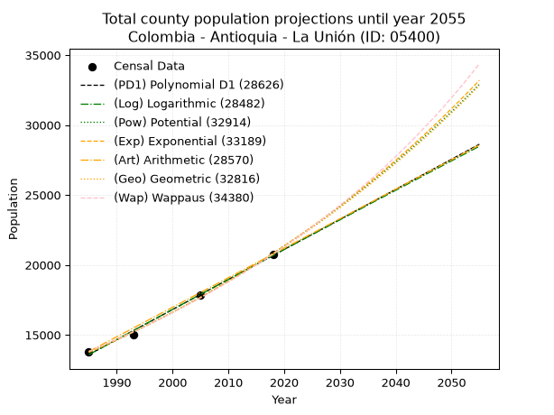
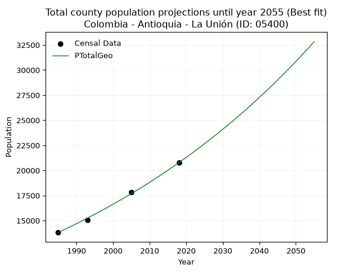
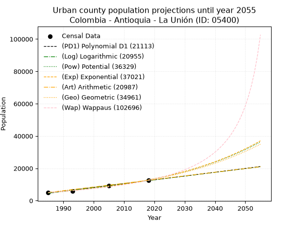
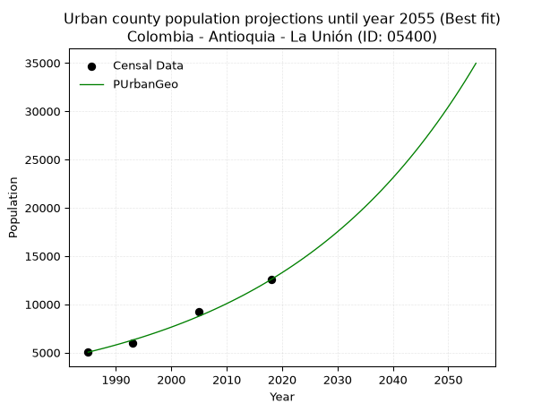
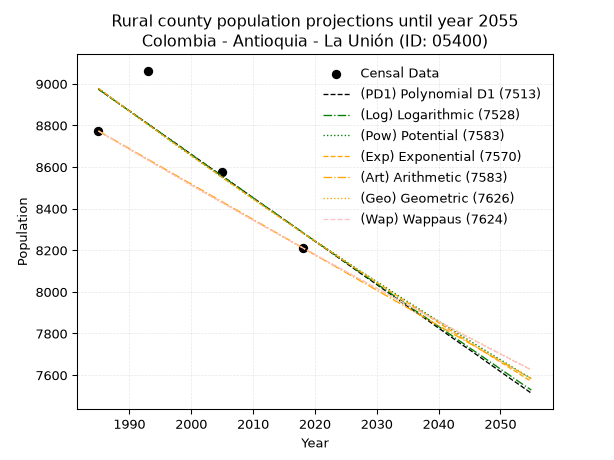
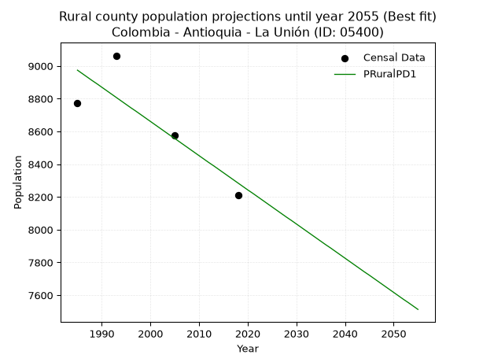

<div align="center">


</div>

# 📜 _“Population and Public Services Demand Projections (PPSD) until Year 2050 for Colombia - Antioquia - La Unión (ID: 05400)”_
Keywords: `population` `public-service` `projection` `lineal` `polynomial` `logarithmic` `potential` `exponential` `arithmetic` `geometric` `wappaus` `dane` `colombia` `south-america`

PPSD are analytical estimates used by governments and planners to anticipate future changes in population size, age distribution, and the resulting community needs for utilities, healthcare, education, and infrastructure as sizing future water treatment facilities, electrical grids, and road networks based on spatial growth.

<div align="center">

</img>

</div>


> **General running parameters**: • app_version: _v20260806_. • Python version: _3.14.7_. • Pandas version: _3.0.5_. • NumPy version: _2.5.1_. • Creates, save and include plots into reports (create_plot): _False_. • Projection until year: _2050_. • Process polynomial degree 2 and up: _False_. • Process Wappaus: _True_. • Process Wappaus: _True_. • Set negative values to zero: _True_. • Set infinite values to zero: _True_. • Drop dataset notes: _True_. 
<div align="center">

Dynamic map: [:earth_americas:Google](http://maps.google.com/maps?q=5.973844906,-75.3608744) [:earth_americas:OSM](https://www.openstreetmap.org/#map=18/5.973844906/-75.3608744&layers=P) [:earth_americas:Bing](https://www.bing.com/maps?cp=5.973844906~-75.3608744&lvl=18) [:earth_americas:Apple](https://maps.apple.com/frame?center=5.973844906%2C-75.3608744&span=0.003%2C0.006)

</div>


<div align="center">

```geojson
{
  "type": "Feature",
  "geometry": {
    "type": "Point", 
    "coordinates": [-75.3608744, 5.973844906]
  }, 
  "properties": {
    "Name": "Colombia - Antioquia - La Unión (ID: 05400)"
  }
}
```

</div>


## 0. Census Data (4 records)

Census data are official statistics collected by a government about the people and housing in a country. They usually include counts of total population, age, sex, race, income, education, and jobs.

📅Global census file: [Population.xlsx](../data/Population.xlsx)

| Source   |   Year |   CountryID | CountryName   |   StateID | StateName   |   CountyID | CountyName   |   PTotal |   PUrban |   PRural |
|:---------|-------:|------------:|:--------------|----------:|:------------|-----------:|:-------------|---------:|---------:|---------:|
| DANE     |   1985 |          57 | Colombia      |        05 | Antioquia   |      05400 | La Unión     |    13811 |     5038 |     8773 |
| DANE     |   1993 |          57 | Colombia      |        05 | Antioquia   |      05400 | La Unión     |    15035 |     5972 |     9063 |
| DANE     |   2005 |          57 | Colombia      |        05 | Antioquia   |      05400 | La Unión     |    17842 |     9267 |     8575 |
| DANE     |   2018 |          57 | Colombia      |        05 | Antioquia   |      05400 | La Unión     |    20769 |    12557 |     8212 |

> 🔥Some records could had specific notes about the registered values or the corresponding urban or rural distribution.

📅[SUI-RUPS](https://www.datos.gov.co/Hacienda-y-Cr-dito-P-blico/Registro-nico-de-Prestadores-de-Servicios-P-blicos/4qkq-csdn/about_data) - Local public utility companies: [RUPS.csv](../data/RUPS.xlsx)

 | SERVICIO       | ESTADO    | NOMBRE                                                                                 | NIT         | DEPARTAMENTO_DOMICILIO   | MUNICIPIO_DOMICILIO   | DIRECCION                 |   TELEFONO | EMAIL                        | TIPO_PRESTADOR                             | CLASIFICACION                  |
|:---------------|:----------|:---------------------------------------------------------------------------------------|:------------|:-------------------------|:----------------------|:--------------------------|-----------:|:-----------------------------|:-------------------------------------------|:-------------------------------|
| ACUEDUCTO      | OPERATIVA | EMPRESA DE SERVICIOS PUBLICOS LA UNION S.A E.S.P.                                      | 811014879-1 | ANTIOQUIA                | LA UNION              | CALLE 10 N° 10-36         |    5561650 | esp@launion-antioquia.gov.co | SOCIEDADES (EMPRESA DE SERVICIOS PUBLICOS) | DESDE 2501 HASTA 5000 USUARIOS |
| ALCANTARILLADO | OPERATIVA | EMPRESA DE SERVICIOS PUBLICOS LA UNION S.A E.S.P.                                      | 811014879-1 | ANTIOQUIA                | LA UNION              | CALLE 10 N° 10-36         |    5561650 | esp@launion-antioquia.gov.co | SOCIEDADES (EMPRESA DE SERVICIOS PUBLICOS) | DESDE 2501 HASTA 5000 USUARIOS |
| ACUEDUCTO      | OPERATIVA | ASOCIACION DE USUARIOS DEL ACUEDUCTO Y ALCANTARILLADO DEL CORREGIMIENTO DE MESOPOTAMIA | 900169048-4 | ANTIOQUIA                | LA UNION              | CORREGIMIENTO MESOPOTAMIA |    5624409 | acuames@hotmail.com          | ORGANIZACION AUTORIZADA                    | HASTA 2500 SUSCRIPTORES        |
| ALCANTARILLADO | OPERATIVA | ASOCIACION DE USUARIOS DEL ACUEDUCTO Y ALCANTARILLADO DEL CORREGIMIENTO DE MESOPOTAMIA | 900169048-4 | ANTIOQUIA                | LA UNION              | CORREGIMIENTO MESOPOTAMIA |    5624409 | acuames@hotmail.com          | ORGANIZACION AUTORIZADA                    | HASTA 2500 SUSCRIPTORES        |

## 1. Total

### 1.1. Coefficients and Parameters

* (PD1) Polynomial Deg 1: 214.81774387795866, -412824.94219188683 (lineal)
* (Log) Logarithmic: 429930.99250694405, -3251044.669296035
* (Pow) Potential: 25.207897523165485, -78.99163449966545
* (Exp) Exponential: 0.012593690701953519, 1.9117839878977575e-07
* (Art) Arithmetic: Year diff. 2018 - 1985 = 33, Population diff. 20769 - 13811 = 6958, Annual growth = 210.84848484848484
* (Geo) Geometric: Year diff. 2018 - 1985 = 33, Population diff. 20769 - 13811 = 6958, Annual growth % = 0.012440262860630602
* (Wap) Wappaus: i = 1.219482272113851, Condition values only valid for < 200)

<sub>
Wappaus condition values: ['0.00', '1.22', '2.44', '3.66', '4.88', '6.10', '7.32', '8.54', '9.76', '10.98', '12.19', '13.41', '14.63', '15.85', '17.07', '18.29', '19.51', '20.73', '21.95', '23.17', '24.39', '25.61', '26.83', '28.05', '29.27', '30.49', '31.71', '32.93', '34.15', '35.36', '36.58', '37.80', '39.02', '40.24', '41.46', '42.68', '43.90', '45.12', '46.34', '47.56', '48.78', '50.00', '51.22', '52.44', '53.66', '54.88', '56.10', '57.32', '58.54', '59.75', '60.97', '62.19', '63.41', '64.63', '65.85', '67.07', '68.29', '69.51', '70.73', '71.95', '73.17', '74.39', '75.61', '76.83', '78.05', '79.27']
</sub>


### 1.2. Projected Dataset

|   Year |   CountyID |   PTotalPD1 |   PTotalLog |   PTotalPow |   PTotalExp |   PTotalArt |   PTotalGeo |   PTotalWap |
|-------:|-----------:|------------:|------------:|------------:|------------:|------------:|------------:|------------:|
|   1985 |      05400 |       13588 |       13582 |       13740 |       13745 |       13811 |       13811 |       13811 |
|   1986 |      05400 |       13803 |       13799 |       13915 |       13919 |       14022 |       13983 |       13980 |
|   1987 |      05400 |       14018 |       14015 |       14093 |       14095 |       14233 |       14157 |       14152 |
|   1988 |      05400 |       14233 |       14232 |       14273 |       14274 |       14444 |       14333 |       14326 |
|   1989 |      05400 |       14448 |       14448 |       14455 |       14455 |       14654 |       14511 |       14502 |
|   1990 |      05400 |       14662 |       14664 |       14639 |       14638 |       14865 |       14692 |       14680 |
|   1991 |      05400 |       14877 |       14880 |       14826 |       14824 |       15076 |       14874 |       14860 |
|   1992 |      05400 |       15092 |       15096 |       15015 |       15012 |       15287 |       15060 |       15043 |
|   1993 |      05400 |       15307 |       15311 |       15206 |       15202 |       15498 |       15247 |       15227 |
|   1994 |      05400 |       15522 |       15527 |       15399 |       15394 |       15709 |       15437 |       15415 |
|   1995 |      05400 |       15736 |       15743 |       15595 |       15590 |       15919 |       15629 |       15605 |
|   1996 |      05400 |       15951 |       15958 |       15793 |       15787 |       16130 |       15823 |       15797 |
|   1997 |      05400 |       16166 |       16173 |       15994 |       15987 |       16341 |       16020 |       15992 |
|   1998 |      05400 |       16381 |       16389 |       16197 |       16190 |       16552 |       16219 |       16189 |
|   1999 |      05400 |       16596 |       16604 |       16403 |       16395 |       16763 |       16421 |       16389 |
|   2000 |      05400 |       16811 |       16819 |       16611 |       16603 |       16974 |       16625 |       16592 |
|   2001 |      05400 |       17025 |       17034 |       16821 |       16813 |       17185 |       16832 |       16797 |
|   2002 |      05400 |       17240 |       17249 |       17035 |       17026 |       17395 |       17041 |       17005 |
|   2003 |      05400 |       17455 |       17463 |       17250 |       17242 |       17606 |       17253 |       17216 |
|   2004 |      05400 |       17670 |       17678 |       17469 |       17461 |       17817 |       17468 |       17430 |
|   2005 |      05400 |       17885 |       17892 |       17690 |       17682 |       18028 |       17685 |       17647 |
|   2006 |      05400 |       18099 |       18107 |       17914 |       17906 |       18239 |       17905 |       17867 |
|   2007 |      05400 |       18314 |       18321 |       18140 |       18133 |       18450 |       18128 |       18090 |
|   2008 |      05400 |       18529 |       18535 |       18369 |       18363 |       18661 |       18354 |       18317 |
|   2009 |      05400 |       18744 |       18749 |       18601 |       18595 |       18871 |       18582 |       18546 |
|   2010 |      05400 |       18959 |       18963 |       18836 |       18831 |       19082 |       18813 |       18779 |
|   2011 |      05400 |       19174 |       19177 |       19074 |       19070 |       19293 |       19047 |       19015 |
|   2012 |      05400 |       19388 |       19391 |       19314 |       19311 |       19504 |       19284 |       19255 |
|   2013 |      05400 |       19603 |       19604 |       19558 |       19556 |       19715 |       19524 |       19498 |
|   2014 |      05400 |       19818 |       19818 |       19804 |       19804 |       19926 |       19767 |       19744 |
|   2015 |      05400 |       20033 |       20031 |       20054 |       20055 |       20136 |       20013 |       19995 |
|   2016 |      05400 |       20248 |       20245 |       20306 |       20309 |       20347 |       20262 |       20249 |
|   2017 |      05400 |       20462 |       20458 |       20561 |       20566 |       20558 |       20514 |       20507 |
|   2018 |      05400 |       20677 |       20671 |       20820 |       20827 |       20769 |       20769 |       20769 |
|   2019 |      05400 |       20892 |       20884 |       21082 |       21091 |       20980 |       21027 |       21035 |
|   2020 |      05400 |       21107 |       21097 |       21346 |       21358 |       21191 |       21289 |       21305 |
|   2021 |      05400 |       21322 |       21310 |       21614 |       21629 |       21402 |       21554 |       21579 |
|   2022 |      05400 |       21537 |       21522 |       21886 |       21903 |       21612 |       21822 |       21858 |
|   2023 |      05400 |       21751 |       21735 |       22160 |       22181 |       21823 |       22093 |       22141 |
|   2024 |      05400 |       21966 |       21947 |       22438 |       22462 |       22034 |       22368 |       22429 |
|   2025 |      05400 |       22181 |       22160 |       22719 |       22746 |       22245 |       22647 |       22721 |
|   2026 |      05400 |       22396 |       22372 |       23003 |       23035 |       22456 |       22928 |       23018 |
|   2027 |      05400 |       22611 |       22584 |       23291 |       23327 |       22667 |       23213 |       23320 |
|   2028 |      05400 |       22825 |       22796 |       23583 |       23622 |       22877 |       23502 |       23627 |
|   2029 |      05400 |       23040 |       23008 |       23878 |       23922 |       23088 |       23795 |       23939 |
|   2030 |      05400 |       23255 |       23220 |       24176 |       24225 |       23299 |       24091 |       24256 |
|   2031 |      05400 |       23470 |       23432 |       24478 |       24532 |       23510 |       24390 |       24579 |
|   2032 |      05400 |       23685 |       23643 |       24784 |       24843 |       23721 |       24694 |       24907 |
|   2033 |      05400 |       23900 |       23855 |       25093 |       25158 |       23932 |       25001 |       25240 |
|   2034 |      05400 |       24114 |       24066 |       25406 |       25476 |       24143 |       25312 |       25580 |
|   2035 |      05400 |       24329 |       24278 |       25723 |       25799 |       24353 |       25627 |       25925 |
|   2036 |      05400 |       24544 |       24489 |       26043 |       26126 |       24564 |       25946 |       26277 |
|   2037 |      05400 |       24759 |       24700 |       26368 |       26457 |       24775 |       26268 |       26635 |
|   2038 |      05400 |       24974 |       24911 |       26696 |       26793 |       24986 |       26595 |       26999 |
|   2039 |      05400 |       25188 |       25122 |       27028 |       27132 |       25197 |       26926 |       27370 |
|   2040 |      05400 |       25403 |       25333 |       27364 |       27476 |       25408 |       27261 |       27748 |
|   2041 |      05400 |       25618 |       25543 |       27704 |       27824 |       25619 |       27600 |       28133 |
|   2042 |      05400 |       25833 |       25754 |       28049 |       28177 |       25829 |       27944 |       28525 |
|   2043 |      05400 |       26048 |       25964 |       28397 |       28534 |       26040 |       28291 |       28924 |
|   2044 |      05400 |       26263 |       26175 |       28749 |       28896 |       26251 |       28643 |       29331 |
|   2045 |      05400 |       26477 |       26385 |       29106 |       29262 |       26462 |       28999 |       29746 |
|   2046 |      05400 |       26692 |       26595 |       29467 |       29633 |       26673 |       29360 |       30169 |
|   2047 |      05400 |       26907 |       26805 |       29832 |       30008 |       26884 |       29725 |       30600 |
|   2048 |      05400 |       27122 |       27015 |       30202 |       30389 |       27094 |       30095 |       31040 |
|   2049 |      05400 |       27337 |       27225 |       30576 |       30774 |       27305 |       30470 |       31488 |
|   2050 |      05400 |       27551 |       27435 |       30954 |       31164 |       27516 |       30849 |       31946 |
<div align="center">

</img>

</div>


### 1.3. Best fit with absolute and relative error (%)

Relative error puts that difference into context by dividing the absolute error by the true value, creating a unitless ratio or percentage that shows the scale of the mistake.

Absolute and relative error

|   Year | Source   |   CountryID | CountryName   |   StateID | StateName   |   CountyID_x | CountyName   |   PTotal |   PUrban |   PRural |   CountyID_y |   PTotalPD1 |   PTotalLog |   PTotalPow |   PTotalExp |   PTotalArt |   PTotalGeo |   PTotalWap |   PTotalPD1AbsError |   PTotalLogAbsError |   PTotalPowAbsError |   PTotalExpAbsError |   PTotalArtAbsError |   PTotalGeoAbsError |   PTotalWapAbsError |   PTotalPD1RelError |   PTotalLogRelError |   PTotalPowRelError |   PTotalExpRelError |   PTotalArtRelError |   PTotalGeoRelError |   PTotalWapRelError |
|-------:|:---------|------------:|:--------------|----------:|:------------|-------------:|:-------------|---------:|---------:|---------:|-------------:|------------:|------------:|------------:|------------:|------------:|------------:|------------:|--------------------:|--------------------:|--------------------:|--------------------:|--------------------:|--------------------:|--------------------:|--------------------:|--------------------:|--------------------:|--------------------:|--------------------:|--------------------:|--------------------:|
|   1985 | DANE     |          57 | Colombia      |        05 | Antioquia   |        05400 | La Unión     |    13811 |     5038 |     8773 |        05400 |       13588 |       13582 |       13740 |       13745 |       13811 |       13811 |       13811 |                 223 |                 229 |                  71 |                  66 |                   0 |                   0 |                   0 |            1.61465  |            1.6581   |            0.514083 |            0.47788  |             0       |            0        |             0       |
|   1993 | DANE     |          57 | Colombia      |        05 | Antioquia   |        05400 | La Unión     |    15035 |     5972 |     9063 |        05400 |       15307 |       15311 |       15206 |       15202 |       15498 |       15247 |       15227 |                 272 |                 276 |                 171 |                 167 |                 463 |                 212 |                 192 |            1.80911  |            1.83572  |            1.13735  |            1.11074  |             3.07948 |            1.41004  |             1.27702 |
|   2005 | DANE     |          57 | Colombia      |        05 | Antioquia   |        05400 | La Unión     |    17842 |     9267 |     8575 |        05400 |       17885 |       17892 |       17690 |       17682 |       18028 |       17685 |       17647 |                  43 |                  50 |                 152 |                 160 |                 186 |                 157 |                 195 |            0.241004 |            0.280238 |            0.851922 |            0.89676  |             1.04248 |            0.879946 |             1.09293 |
|   2018 | DANE     |          57 | Colombia      |        05 | Antioquia   |        05400 | La Unión     |    20769 |    12557 |     8212 |        05400 |       20677 |       20671 |       20820 |       20827 |       20769 |       20769 |       20769 |                  92 |                  98 |                  51 |                  58 |                   0 |                   0 |                   0 |            0.442968 |            0.471857 |            0.245558 |            0.279262 |             0       |            0        |             0       |

Relative error mean

| Method    |   RelError | Best   |
|:----------|-----------:|:-------|
| PTotalPD1 |   1.02693  |        |
| PTotalLog |   1.06148  |        |
| PTotalPow |   0.687227 |        |
| PTotalExp |   0.691161 |        |
| PTotalArt |   1.03049  |        |
| PTotalGeo |   0.572497 | True   |
| PTotalWap |   0.592487 |        |

💙Best method: _**PTotalGeo**_
<div align="center">

</img>

</div>


### 1.4. Fresh water supply demand in liters per capita per day (lpcd)

The fresh water supply demand typically ranges from 100 to 300 liters per capita per day (lpcd) for standard domestic and municipal planning, though absolute survival minimums set by the World Health Organization are as low as 7.5 to 20 liters per day, and total consumption in high-income nations can exceed 400 liters.

> `CZ`: Level in meters above the sea level (masl)<br> `WS`: Fresh water supply demand in liters per capita per day (lpcd or l/h/d)<br> `WSAll`: Zonal fresh water supply demand in liters per second (l/s)<br> `A`: Zonal area in square meters<br> `DP`: Population density (people/hectare or p/ha)

Reference values (RAS Colombia)

|    CZ |   WS |
|------:|-----:|
|  1000 |  120 |
|  2000 |  130 |
| 99999 |  140 |

County shapefile geometry properties and water supply values

|   CountyID |     ATotal |   CZTotal |   WSTotal |
|-----------:|-----------:|----------:|----------:|
|      05400 | 1.6767e+08 |   2451.21 |       140 |

Projected values for best method: PTotalGeo

|   CountyID |   Year |   PTotalGeo |   DPTotal |   WSTotal |   WSTotalAll |
|-----------:|-------:|------------:|----------:|----------:|-------------:|
|      05400 |   1985 |       13811 |      0.82 |       140 |      22.3789 |
|      05400 |   1986 |       13983 |      0.83 |       140 |      22.6576 |
|      05400 |   1987 |       14157 |      0.84 |       140 |      22.9396 |
|      05400 |   1988 |       14333 |      0.85 |       140 |      23.2248 |
|      05400 |   1989 |       14511 |      0.87 |       140 |      23.5132 |
|      05400 |   1990 |       14692 |      0.88 |       140 |      23.8065 |
|      05400 |   1991 |       14874 |      0.89 |       140 |      24.1014 |
|      05400 |   1992 |       15060 |      0.9  |       140 |      24.4028 |
|      05400 |   1993 |       15247 |      0.91 |       140 |      24.7058 |
|      05400 |   1994 |       15437 |      0.92 |       140 |      25.0137 |
|      05400 |   1995 |       15629 |      0.93 |       140 |      25.3248 |
|      05400 |   1996 |       15823 |      0.94 |       140 |      25.6391 |
|      05400 |   1997 |       16020 |      0.96 |       140 |      25.9583 |
|      05400 |   1998 |       16219 |      0.97 |       140 |      26.2808 |
|      05400 |   1999 |       16421 |      0.98 |       140 |      26.6081 |
|      05400 |   2000 |       16625 |      0.99 |       140 |      26.9387 |
|      05400 |   2001 |       16832 |      1    |       140 |      27.2741 |
|      05400 |   2002 |       17041 |      1.02 |       140 |      27.6127 |
|      05400 |   2003 |       17253 |      1.03 |       140 |      27.9563 |
|      05400 |   2004 |       17468 |      1.04 |       140 |      28.3046 |
|      05400 |   2005 |       17685 |      1.05 |       140 |      28.6562 |
|      05400 |   2006 |       17905 |      1.07 |       140 |      29.0127 |
|      05400 |   2007 |       18128 |      1.08 |       140 |      29.3741 |
|      05400 |   2008 |       18354 |      1.09 |       140 |      29.7403 |
|      05400 |   2009 |       18582 |      1.11 |       140 |      30.1097 |
|      05400 |   2010 |       18813 |      1.12 |       140 |      30.484  |
|      05400 |   2011 |       19047 |      1.14 |       140 |      30.8632 |
|      05400 |   2012 |       19284 |      1.15 |       140 |      31.2472 |
|      05400 |   2013 |       19524 |      1.16 |       140 |      31.6361 |
|      05400 |   2014 |       19767 |      1.18 |       140 |      32.0299 |
|      05400 |   2015 |       20013 |      1.19 |       140 |      32.4285 |
|      05400 |   2016 |       20262 |      1.21 |       140 |      32.8319 |
|      05400 |   2017 |       20514 |      1.22 |       140 |      33.2403 |
|      05400 |   2018 |       20769 |      1.24 |       140 |      33.6535 |
|      05400 |   2019 |       21027 |      1.25 |       140 |      34.0715 |
|      05400 |   2020 |       21289 |      1.27 |       140 |      34.4961 |
|      05400 |   2021 |       21554 |      1.29 |       140 |      34.9255 |
|      05400 |   2022 |       21822 |      1.3  |       140 |      35.3597 |
|      05400 |   2023 |       22093 |      1.32 |       140 |      35.7988 |
|      05400 |   2024 |       22368 |      1.33 |       140 |      36.2444 |
|      05400 |   2025 |       22647 |      1.35 |       140 |      36.6965 |
|      05400 |   2026 |       22928 |      1.37 |       140 |      37.1519 |
|      05400 |   2027 |       23213 |      1.38 |       140 |      37.6137 |
|      05400 |   2028 |       23502 |      1.4  |       140 |      38.0819 |
|      05400 |   2029 |       23795 |      1.42 |       140 |      38.5567 |
|      05400 |   2030 |       24091 |      1.44 |       140 |      39.0363 |
|      05400 |   2031 |       24390 |      1.45 |       140 |      39.5208 |
|      05400 |   2032 |       24694 |      1.47 |       140 |      40.0134 |
|      05400 |   2033 |       25001 |      1.49 |       140 |      40.5109 |
|      05400 |   2034 |       25312 |      1.51 |       140 |      41.0148 |
|      05400 |   2035 |       25627 |      1.53 |       140 |      41.5252 |
|      05400 |   2036 |       25946 |      1.55 |       140 |      42.0421 |
|      05400 |   2037 |       26268 |      1.57 |       140 |      42.5639 |
|      05400 |   2038 |       26595 |      1.59 |       140 |      43.0938 |
|      05400 |   2039 |       26926 |      1.61 |       140 |      43.6301 |
|      05400 |   2040 |       27261 |      1.63 |       140 |      44.1729 |
|      05400 |   2041 |       27600 |      1.65 |       140 |      44.7222 |
|      05400 |   2042 |       27944 |      1.67 |       140 |      45.2796 |
|      05400 |   2043 |       28291 |      1.69 |       140 |      45.8419 |
|      05400 |   2044 |       28643 |      1.71 |       140 |      46.4123 |
|      05400 |   2045 |       28999 |      1.73 |       140 |      46.9891 |
|      05400 |   2046 |       29360 |      1.75 |       140 |      47.5741 |
|      05400 |   2047 |       29725 |      1.77 |       140 |      48.1655 |
|      05400 |   2048 |       30095 |      1.79 |       140 |      48.765  |
|      05400 |   2049 |       30470 |      1.82 |       140 |      49.3727 |
|      05400 |   2050 |       30849 |      1.84 |       140 |      49.9868 |

## 2. Urban

### 2.1. Coefficients and Parameters

* (PD1) Polynomial Deg 1: 235.6940987555176, -463238.6210357241 (lineal)
* (Log) Logarithmic: 471672.4840497284, -3576977.831008059
* (Pow) Potential: 57.44795143610677, -185.75399362544113
* (Exp) Exponential: 0.028699140021912442, 9.019417523001228e-22
* (Art) Arithmetic: Year diff. 2018 - 1985 = 33, Population diff. 12557 - 5038 = 7519, Annual growth = 227.84848484848484
* (Geo) Geometric: Year diff. 2018 - 1985 = 33, Population diff. 12557 - 5038 = 7519, Annual growth % = 0.02806132635886538
* (Wap) Wappaus: i = 2.5899231014320527, Condition values only valid for < 200)

<sub>
Wappaus condition values: ['0.00', '2.59', '5.18', '7.77', '10.36', '12.95', '15.54', '18.13', '20.72', '23.31', '25.90', '28.49', '31.08', '33.67', '36.26', '38.85', '41.44', '44.03', '46.62', '49.21', '51.80', '54.39', '56.98', '59.57', '62.16', '64.75', '67.34', '69.93', '72.52', '75.11', '77.70', '80.29', '82.88', '85.47', '88.06', '90.65', '93.24', '95.83', '98.42', '101.01', '103.60', '106.19', '108.78', '111.37', '113.96', '116.55', '119.14', '121.73', '124.32', '126.91', '129.50', '132.09', '134.68', '137.27', '139.86', '142.45', '145.04', '147.63', '150.22', '152.81', '155.40', '157.99', '160.58', '163.17', '165.76', '168.35']
</sub>


### 2.2. Projected Dataset

|   Year |   CountyID |   PUrbanPD1 |   PUrbanLog |   PUrbanPow |   PUrbanExp |   PUrbanArt |   PUrbanGeo |   PUrbanWap |
|-------:|-----------:|------------:|------------:|------------:|------------:|------------:|------------:|------------:|
|   1985 |      05400 |        4614 |        4608 |        4961 |        4966 |        5038 |        5038 |        5038 |
|   1986 |      05400 |        4850 |        4845 |        5107 |        5110 |        5266 |        5179 |        5170 |
|   1987 |      05400 |        5086 |        5083 |        5257 |        5259 |        5494 |        5325 |        5306 |
|   1988 |      05400 |        5321 |        5320 |        5411 |        5412 |        5722 |        5474 |        5445 |
|   1989 |      05400 |        5557 |        5557 |        5570 |        5570 |        5949 |        5628 |        5588 |
|   1990 |      05400 |        5793 |        5794 |        5733 |        5732 |        6177 |        5786 |        5736 |
|   1991 |      05400 |        6028 |        6031 |        5901 |        5899 |        6405 |        5948 |        5887 |
|   1992 |      05400 |        6264 |        6268 |        6073 |        6070 |        6633 |        6115 |        6042 |
|   1993 |      05400 |        6500 |        6505 |        6251 |        6247 |        6861 |        6287 |        6202 |
|   1994 |      05400 |        6735 |        6742 |        6434 |        6429 |        7089 |        6463 |        6367 |
|   1995 |      05400 |        6971 |        6978 |        6622 |        6616 |        7316 |        6644 |        6537 |
|   1996 |      05400 |        7207 |        7214 |        6815 |        6809 |        7544 |        6831 |        6712 |
|   1997 |      05400 |        7442 |        7451 |        7014 |        7007 |        7772 |        7022 |        6892 |
|   1998 |      05400 |        7678 |        7687 |        7219 |        7211 |        8000 |        7219 |        7078 |
|   1999 |      05400 |        7914 |        7923 |        7429 |        7421 |        8228 |        7422 |        7269 |
|   2000 |      05400 |        8150 |        8159 |        7646 |        7637 |        8456 |        7630 |        7467 |
|   2001 |      05400 |        8385 |        8394 |        7868 |        7860 |        8684 |        7844 |        7671 |
|   2002 |      05400 |        8621 |        8630 |        8098 |        8088 |        8911 |        8065 |        7882 |
|   2003 |      05400 |        8857 |        8866 |        8333 |        8324 |        9139 |        8291 |        8100 |
|   2004 |      05400 |        9092 |        9101 |        8576 |        8566 |        9367 |        8524 |        8326 |
|   2005 |      05400 |        9328 |        9336 |        8825 |        8816 |        9595 |        8763 |        8560 |
|   2006 |      05400 |        9564 |        9572 |        9081 |        9072 |        9823 |        9009 |        8802 |
|   2007 |      05400 |        9799 |        9807 |        9345 |        9336 |       10051 |        9261 |        9052 |
|   2008 |      05400 |       10035 |       10042 |        9616 |        9608 |       10279 |        9521 |        9312 |
|   2009 |      05400 |       10271 |       10276 |        9895 |        9888 |       10506 |        9788 |        9582 |
|   2010 |      05400 |       10507 |       10511 |       10182 |       10176 |       10734 |       10063 |        9862 |
|   2011 |      05400 |       10742 |       10746 |       10478 |       10472 |       10962 |       10346 |       10152 |
|   2012 |      05400 |       10978 |       10980 |       10781 |       10777 |       11190 |       10636 |       10455 |
|   2013 |      05400 |       11214 |       11215 |       11093 |       11091 |       11418 |       10934 |       10770 |
|   2014 |      05400 |       11449 |       11449 |       11414 |       11414 |       11646 |       11241 |       11098 |
|   2015 |      05400 |       11685 |       11683 |       11745 |       11746 |       11873 |       11557 |       11439 |
|   2016 |      05400 |       11921 |       11917 |       12084 |       12088 |       12101 |       11881 |       11796 |
|   2017 |      05400 |       12156 |       12151 |       12433 |       12440 |       12329 |       12214 |       12168 |
|   2018 |      05400 |       12392 |       12385 |       12793 |       12802 |       12557 |       12557 |       12557 |
|   2019 |      05400 |       12628 |       12618 |       13162 |       13175 |       12785 |       12909 |       12964 |
|   2020 |      05400 |       12863 |       12852 |       13542 |       13559 |       13013 |       13272 |       13390 |
|   2021 |      05400 |       13099 |       13085 |       13932 |       13953 |       13241 |       13644 |       13837 |
|   2022 |      05400 |       13335 |       13319 |       14334 |       14360 |       13468 |       14027 |       14307 |
|   2023 |      05400 |       13571 |       13552 |       14747 |       14778 |       13696 |       14421 |       14800 |
|   2024 |      05400 |       13806 |       13785 |       15171 |       15208 |       13924 |       14825 |       15319 |
|   2025 |      05400 |       14042 |       14018 |       15608 |       15651 |       14152 |       15241 |       15866 |
|   2026 |      05400 |       14278 |       14251 |       16057 |       16106 |       14380 |       15669 |       16443 |
|   2027 |      05400 |       14513 |       14484 |       16519 |       16575 |       14608 |       16109 |       17053 |
|   2028 |      05400 |       14749 |       14716 |       16994 |       17058 |       14835 |       16561 |       17698 |
|   2029 |      05400 |       14985 |       14949 |       17482 |       17554 |       15063 |       17025 |       18383 |
|   2030 |      05400 |       15220 |       15181 |       17984 |       18066 |       15291 |       17503 |       19110 |
|   2031 |      05400 |       15456 |       15414 |       18500 |       18592 |       15519 |       17994 |       19883 |
|   2032 |      05400 |       15692 |       15646 |       19030 |       19133 |       15747 |       18499 |       20708 |
|   2033 |      05400 |       15927 |       15878 |       19576 |       19690 |       15975 |       19018 |       21589 |
|   2034 |      05400 |       16163 |       16110 |       20137 |       20263 |       16203 |       19552 |       22532 |
|   2035 |      05400 |       16399 |       16342 |       20714 |       20853 |       16430 |       20101 |       23545 |
|   2036 |      05400 |       16635 |       16573 |       21306 |       21460 |       16658 |       20665 |       24635 |
|   2037 |      05400 |       16870 |       16805 |       21916 |       22085 |       16886 |       21245 |       25811 |
|   2038 |      05400 |       17106 |       17036 |       22543 |       22728 |       17114 |       21841 |       27085 |
|   2039 |      05400 |       17342 |       17268 |       23187 |       23390 |       17342 |       22454 |       28468 |
|   2040 |      05400 |       17577 |       17499 |       23850 |       24071 |       17570 |       23084 |       29976 |
|   2041 |      05400 |       17813 |       17730 |       24531 |       24772 |       17798 |       23731 |       31626 |
|   2042 |      05400 |       18049 |       17961 |       25231 |       25493 |       18025 |       24397 |       33439 |
|   2043 |      05400 |       18284 |       18192 |       25950 |       26235 |       18253 |       25082 |       35440 |
|   2044 |      05400 |       18520 |       18423 |       26690 |       26999 |       18481 |       25786 |       37662 |
|   2045 |      05400 |       18756 |       18654 |       27451 |       27785 |       18709 |       26509 |       40141 |
|   2046 |      05400 |       18992 |       18884 |       28233 |       28594 |       18937 |       27253 |       42926 |
|   2047 |      05400 |       19227 |       19115 |       29036 |       29426 |       19165 |       28018 |       46077 |
|   2048 |      05400 |       19463 |       19345 |       29863 |       30283 |       19392 |       28804 |       49671 |
|   2049 |      05400 |       19699 |       19575 |       30712 |       31165 |       19620 |       29613 |       53809 |
|   2050 |      05400 |       19934 |       19806 |       31585 |       32072 |       19848 |       30444 |       58623 |
<div align="center">

</img>

</div>


### 2.3. Best fit with absolute and relative error (%)

Relative error puts that difference into context by dividing the absolute error by the true value, creating a unitless ratio or percentage that shows the scale of the mistake.

Absolute and relative error

|   Year | Source   |   CountryID | CountryName   |   StateID | StateName   |   CountyID_x | CountyName   |   PTotal |   PUrban |   PRural |   CountyID_y |   PUrbanPD1 |   PUrbanLog |   PUrbanPow |   PUrbanExp |   PUrbanArt |   PUrbanGeo |   PUrbanWap |   PUrbanPD1AbsError |   PUrbanLogAbsError |   PUrbanPowAbsError |   PUrbanExpAbsError |   PUrbanArtAbsError |   PUrbanGeoAbsError |   PUrbanWapAbsError |   PUrbanPD1RelError |   PUrbanLogRelError |   PUrbanPowRelError |   PUrbanExpRelError |   PUrbanArtRelError |   PUrbanGeoRelError |   PUrbanWapRelError |
|-------:|:---------|------------:|:--------------|----------:|:------------|-------------:|:-------------|---------:|---------:|---------:|-------------:|------------:|------------:|------------:|------------:|------------:|------------:|------------:|--------------------:|--------------------:|--------------------:|--------------------:|--------------------:|--------------------:|--------------------:|--------------------:|--------------------:|--------------------:|--------------------:|--------------------:|--------------------:|--------------------:|
|   1985 | DANE     |          57 | Colombia      |        05 | Antioquia   |        05400 | La Unión     |    13811 |     5038 |     8773 |        05400 |        4614 |        4608 |        4961 |        4966 |        5038 |        5038 |        5038 |                 424 |                 430 |                  77 |                  72 |                   0 |                   0 |                   0 |             8.41604 |            8.53513  |             1.52838 |             1.42914 |             0       |             0       |             0       |
|   1993 | DANE     |          57 | Colombia      |        05 | Antioquia   |        05400 | La Unión     |    15035 |     5972 |     9063 |        05400 |        6500 |        6505 |        6251 |        6247 |        6861 |        6287 |        6202 |                 528 |                 533 |                 279 |                 275 |                 889 |                 315 |                 230 |             8.84126 |            8.92498  |             4.6718  |             4.60482 |            14.8861  |             5.27461 |             3.85131 |
|   2005 | DANE     |          57 | Colombia      |        05 | Antioquia   |        05400 | La Unión     |    17842 |     9267 |     8575 |        05400 |        9328 |        9336 |        8825 |        8816 |        9595 |        8763 |        8560 |                  61 |                  69 |                 442 |                 451 |                 328 |                 504 |                 707 |             0.65825 |            0.744578 |             4.76961 |             4.86673 |             3.53944 |             5.43865 |             7.62922 |
|   2018 | DANE     |          57 | Colombia      |        05 | Antioquia   |        05400 | La Unión     |    20769 |    12557 |     8212 |        05400 |       12392 |       12385 |       12793 |       12802 |       12557 |       12557 |       12557 |                 165 |                 172 |                 236 |                 245 |                   0 |                   0 |                   0 |             1.31401 |            1.36975  |             1.87943 |             1.9511  |             0       |             0       |             0       |

Relative error mean

| Method    |   RelError | Best   |
|:----------|-----------:|:-------|
| PUrbanPD1 |    4.80739 |        |
| PUrbanLog |    4.89361 |        |
| PUrbanPow |    3.21231 |        |
| PUrbanExp |    3.21295 |        |
| PUrbanArt |    4.60639 |        |
| PUrbanGeo |    2.67832 | True   |
| PUrbanWap |    2.87013 |        |

💙Best method: _**PUrbanGeo**_
<div align="center">

</img>

</div>


### 2.4. Fresh water supply demand in liters per capita per day (lpcd)

The fresh water supply demand typically ranges from 100 to 300 liters per capita per day (lpcd) for standard domestic and municipal planning, though absolute survival minimums set by the World Health Organization are as low as 7.5 to 20 liters per day, and total consumption in high-income nations can exceed 400 liters.

> `CZ`: Level in meters above the sea level (masl)<br> `WS`: Fresh water supply demand in liters per capita per day (lpcd or l/h/d)<br> `WSAll`: Zonal fresh water supply demand in liters per second (l/s)<br> `A`: Zonal area in square meters<br> `DP`: Population density (people/hectare or p/ha)

Reference values (RAS Colombia)

|    CZ |   WS |
|------:|-----:|
|  1000 |  120 |
|  2000 |  130 |
| 99999 |  140 |

County shapefile geometry properties and water supply values

|   CountyID |   AUrban |   CZUrban |   WSUrban |
|-----------:|---------:|----------:|----------:|
|      05400 |   927112 |   2474.77 |       140 |

Projected values for best method: PUrbanGeo

|   CountyID |   Year |   PUrbanGeo |   DPUrban |   WSUrban |   WSUrbanAll |
|-----------:|-------:|------------:|----------:|----------:|-------------:|
|      05400 |   1985 |        5038 |     54.34 |       140 |      8.16343 |
|      05400 |   1986 |        5179 |     55.86 |       140 |      8.3919  |
|      05400 |   1987 |        5325 |     57.44 |       140 |      8.62847 |
|      05400 |   1988 |        5474 |     59.04 |       140 |      8.86991 |
|      05400 |   1989 |        5628 |     60.7  |       140 |      9.11944 |
|      05400 |   1990 |        5786 |     62.41 |       140 |      9.37546 |
|      05400 |   1991 |        5948 |     64.16 |       140 |      9.63796 |
|      05400 |   1992 |        6115 |     65.96 |       140 |      9.90856 |
|      05400 |   1993 |        6287 |     67.81 |       140 |     10.1873  |
|      05400 |   1994 |        6463 |     69.71 |       140 |     10.4725  |
|      05400 |   1995 |        6644 |     71.66 |       140 |     10.7657  |
|      05400 |   1996 |        6831 |     73.68 |       140 |     11.0687  |
|      05400 |   1997 |        7022 |     75.74 |       140 |     11.3782  |
|      05400 |   1998 |        7219 |     77.87 |       140 |     11.6975  |
|      05400 |   1999 |        7422 |     80.06 |       140 |     12.0264  |
|      05400 |   2000 |        7630 |     82.3  |       140 |     12.3634  |
|      05400 |   2001 |        7844 |     84.61 |       140 |     12.7102  |
|      05400 |   2002 |        8065 |     86.99 |       140 |     13.0683  |
|      05400 |   2003 |        8291 |     89.43 |       140 |     13.4345  |
|      05400 |   2004 |        8524 |     91.94 |       140 |     13.812   |
|      05400 |   2005 |        8763 |     94.52 |       140 |     14.1993  |
|      05400 |   2006 |        9009 |     97.17 |       140 |     14.5979  |
|      05400 |   2007 |        9261 |     99.89 |       140 |     15.0062  |
|      05400 |   2008 |        9521 |    102.7  |       140 |     15.4275  |
|      05400 |   2009 |        9788 |    105.58 |       140 |     15.8602  |
|      05400 |   2010 |       10063 |    108.54 |       140 |     16.3058  |
|      05400 |   2011 |       10346 |    111.59 |       140 |     16.7644  |
|      05400 |   2012 |       10636 |    114.72 |       140 |     17.2343  |
|      05400 |   2013 |       10934 |    117.94 |       140 |     17.7171  |
|      05400 |   2014 |       11241 |    121.25 |       140 |     18.2146  |
|      05400 |   2015 |       11557 |    124.66 |       140 |     18.7266  |
|      05400 |   2016 |       11881 |    128.15 |       140 |     19.2516  |
|      05400 |   2017 |       12214 |    131.74 |       140 |     19.7912  |
|      05400 |   2018 |       12557 |    135.44 |       140 |     20.347   |
|      05400 |   2019 |       12909 |    139.24 |       140 |     20.9174  |
|      05400 |   2020 |       13272 |    143.15 |       140 |     21.5056  |
|      05400 |   2021 |       13644 |    147.17 |       140 |     22.1083  |
|      05400 |   2022 |       14027 |    151.3  |       140 |     22.7289  |
|      05400 |   2023 |       14421 |    155.55 |       140 |     23.3674  |
|      05400 |   2024 |       14825 |    159.91 |       140 |     24.022   |
|      05400 |   2025 |       15241 |    164.39 |       140 |     24.6961  |
|      05400 |   2026 |       15669 |    169.01 |       140 |     25.3896  |
|      05400 |   2027 |       16109 |    173.75 |       140 |     26.1025  |
|      05400 |   2028 |       16561 |    178.63 |       140 |     26.835   |
|      05400 |   2029 |       17025 |    183.63 |       140 |     27.5868  |
|      05400 |   2030 |       17503 |    188.79 |       140 |     28.3613  |
|      05400 |   2031 |       17994 |    194.09 |       140 |     29.1569  |
|      05400 |   2032 |       18499 |    199.53 |       140 |     29.9752  |
|      05400 |   2033 |       19018 |    205.13 |       140 |     30.8162  |
|      05400 |   2034 |       19552 |    210.89 |       140 |     31.6815  |
|      05400 |   2035 |       20101 |    216.81 |       140 |     32.5711  |
|      05400 |   2036 |       20665 |    222.9  |       140 |     33.485   |
|      05400 |   2037 |       21245 |    229.15 |       140 |     34.4248  |
|      05400 |   2038 |       21841 |    235.58 |       140 |     35.3905  |
|      05400 |   2039 |       22454 |    242.19 |       140 |     36.3838  |
|      05400 |   2040 |       23084 |    248.99 |       140 |     37.4046  |
|      05400 |   2041 |       23731 |    255.97 |       140 |     38.453   |
|      05400 |   2042 |       24397 |    263.15 |       140 |     39.5322  |
|      05400 |   2043 |       25082 |    270.54 |       140 |     40.6421  |
|      05400 |   2044 |       25786 |    278.13 |       140 |     41.7829  |
|      05400 |   2045 |       26509 |    285.93 |       140 |     42.9544  |
|      05400 |   2046 |       27253 |    293.96 |       140 |     44.16    |
|      05400 |   2047 |       28018 |    302.21 |       140 |     45.3995  |
|      05400 |   2048 |       28804 |    310.69 |       140 |     46.6731  |
|      05400 |   2049 |       29613 |    319.41 |       140 |     47.984   |
|      05400 |   2050 |       30444 |    328.37 |       140 |     49.3306  |

## 3. Rural

### 3.1. Coefficients and Parameters

* (PD1) Polynomial Deg 1: -20.876354877558953, 50413.67884383729 (lineal)
* (Log) Logarithmic: -41741.49154278435, 325933.1617120245
* (Pow) Potential: -4.87118820106775, 20.017187463515207
* (Exp) Exponential: -0.00243624787029898, 1130806.5624506085
* (Art) Arithmetic: Year diff. 2018 - 1985 = 33, Population diff. 8212 - 8773 = -561, Annual growth = -17.0
* (Geo) Geometric: Year diff. 2018 - 1985 = 33, Population diff. 8212 - 8773 = -561, Annual growth % = -0.0020004910115650754
* (Wap) Wappaus: i = -0.2001766264350898, Condition values only valid for < 200)

<sub>
Wappaus condition values: ['-0.00', '-0.20', '-0.40', '-0.60', '-0.80', '-1.00', '-1.20', '-1.40', '-1.60', '-1.80', '-2.00', '-2.20', '-2.40', '-2.60', '-2.80', '-3.00', '-3.20', '-3.40', '-3.60', '-3.80', '-4.00', '-4.20', '-4.40', '-4.60', '-4.80', '-5.00', '-5.20', '-5.40', '-5.60', '-5.81', '-6.01', '-6.21', '-6.41', '-6.61', '-6.81', '-7.01', '-7.21', '-7.41', '-7.61', '-7.81', '-8.01', '-8.21', '-8.41', '-8.61', '-8.81', '-9.01', '-9.21', '-9.41', '-9.61', '-9.81', '-10.01', '-10.21', '-10.41', '-10.61', '-10.81', '-11.01', '-11.21', '-11.41', '-11.61', '-11.81', '-12.01', '-12.21', '-12.41', '-12.61', '-12.81', '-13.01']
</sub>


### 3.2. Projected Dataset

|   Year |   CountyID |   PRuralPD1 |   PRuralLog |   PRuralPow |   PRuralExp |   PRuralArt |   PRuralGeo |   PRuralWap |
|-------:|-----------:|------------:|------------:|------------:|------------:|------------:|------------:|------------:|
|   1985 |      05400 |        8974 |        8974 |        8978 |        8978 |        8773 |        8773 |        8773 |
|   1986 |      05400 |        8953 |        8953 |        8956 |        8956 |        8756 |        8755 |        8755 |
|   1987 |      05400 |        8932 |        8932 |        8934 |        8934 |        8739 |        8738 |        8738 |
|   1988 |      05400 |        8911 |        8911 |        8912 |        8912 |        8722 |        8720 |        8720 |
|   1989 |      05400 |        8891 |        8890 |        8890 |        8891 |        8705 |        8703 |        8703 |
|   1990 |      05400 |        8870 |        8869 |        8869 |        8869 |        8688 |        8686 |        8686 |
|   1991 |      05400 |        8849 |        8848 |        8847 |        8847 |        8671 |        8668 |        8668 |
|   1992 |      05400 |        8828 |        8827 |        8825 |        8826 |        8654 |        8651 |        8651 |
|   1993 |      05400 |        8807 |        8807 |        8804 |        8804 |        8637 |        8634 |        8634 |
|   1994 |      05400 |        8786 |        8786 |        8782 |        8783 |        8620 |        8616 |        8616 |
|   1995 |      05400 |        8765 |        8765 |        8761 |        8762 |        8603 |        8599 |        8599 |
|   1996 |      05400 |        8744 |        8744 |        8739 |        8740 |        8586 |        8582 |        8582 |
|   1997 |      05400 |        8724 |        8723 |        8718 |        8719 |        8569 |        8565 |        8565 |
|   1998 |      05400 |        8703 |        8702 |        8697 |        8698 |        8552 |        8548 |        8548 |
|   1999 |      05400 |        8682 |        8681 |        8676 |        8677 |        8535 |        8530 |        8531 |
|   2000 |      05400 |        8661 |        8660 |        8655 |        8655 |        8518 |        8513 |        8513 |
|   2001 |      05400 |        8640 |        8639 |        8634 |        8634 |        8501 |        8496 |        8496 |
|   2002 |      05400 |        8619 |        8618 |        8613 |        8613 |        8484 |        8479 |        8479 |
|   2003 |      05400 |        8598 |        8598 |        8592 |        8592 |        8467 |        8462 |        8462 |
|   2004 |      05400 |        8577 |        8577 |        8571 |        8572 |        8450 |        8445 |        8446 |
|   2005 |      05400 |        8557 |        8556 |        8550 |        8551 |        8433 |        8429 |        8429 |
|   2006 |      05400 |        8536 |        8535 |        8529 |        8530 |        8416 |        8412 |        8412 |
|   2007 |      05400 |        8515 |        8514 |        8509 |        8509 |        8399 |        8395 |        8395 |
|   2008 |      05400 |        8494 |        8494 |        8488 |        8488 |        8382 |        8378 |        8378 |
|   2009 |      05400 |        8473 |        8473 |        8467 |        8468 |        8365 |        8361 |        8361 |
|   2010 |      05400 |        8452 |        8452 |        8447 |        8447 |        8348 |        8345 |        8345 |
|   2011 |      05400 |        8431 |        8431 |        8426 |        8427 |        8331 |        8328 |        8328 |
|   2012 |      05400 |        8410 |        8410 |        8406 |        8406 |        8314 |        8311 |        8311 |
|   2013 |      05400 |        8390 |        8390 |        8386 |        8386 |        8297 |        8295 |        8295 |
|   2014 |      05400 |        8369 |        8369 |        8366 |        8365 |        8280 |        8278 |        8278 |
|   2015 |      05400 |        8348 |        8348 |        8345 |        8345 |        8263 |        8261 |        8262 |
|   2016 |      05400 |        8327 |        8328 |        8325 |        8325 |        8246 |        8245 |        8245 |
|   2017 |      05400 |        8306 |        8307 |        8305 |        8304 |        8229 |        8228 |        8228 |
|   2018 |      05400 |        8285 |        8286 |        8285 |        8284 |        8212 |        8212 |        8212 |
|   2019 |      05400 |        8264 |        8265 |        8265 |        8264 |        8195 |        8196 |        8196 |
|   2020 |      05400 |        8243 |        8245 |        8245 |        8244 |        8178 |        8179 |        8179 |
|   2021 |      05400 |        8223 |        8224 |        8225 |        8224 |        8161 |        8163 |        8163 |
|   2022 |      05400 |        8202 |        8204 |        8206 |        8204 |        8144 |        8146 |        8146 |
|   2023 |      05400 |        8181 |        8183 |        8186 |        8184 |        8127 |        8130 |        8130 |
|   2024 |      05400 |        8160 |        8162 |        8166 |        8164 |        8110 |        8114 |        8114 |
|   2025 |      05400 |        8139 |        8142 |        8146 |        8144 |        8093 |        8098 |        8098 |
|   2026 |      05400 |        8118 |        8121 |        8127 |        8124 |        8076 |        8081 |        8081 |
|   2027 |      05400 |        8097 |        8100 |        8107 |        8104 |        8059 |        8065 |        8065 |
|   2028 |      05400 |        8076 |        8080 |        8088 |        8085 |        8042 |        8049 |        8049 |
|   2029 |      05400 |        8056 |        8059 |        8069 |        8065 |        8025 |        8033 |        8033 |
|   2030 |      05400 |        8035 |        8039 |        8049 |        8045 |        8008 |        8017 |        8017 |
|   2031 |      05400 |        8014 |        8018 |        8030 |        8026 |        7991 |        8001 |        8001 |
|   2032 |      05400 |        7993 |        7998 |        8011 |        8006 |        7974 |        7985 |        7985 |
|   2033 |      05400 |        7972 |        7977 |        7991 |        7987 |        7957 |        7969 |        7969 |
|   2034 |      05400 |        7951 |        7957 |        7972 |        7967 |        7940 |        7953 |        7953 |
|   2035 |      05400 |        7930 |        7936 |        7953 |        7948 |        7923 |        7937 |        7937 |
|   2036 |      05400 |        7909 |        7915 |        7934 |        7929 |        7906 |        7921 |        7921 |
|   2037 |      05400 |        7889 |        7895 |        7915 |        7909 |        7889 |        7905 |        7905 |
|   2038 |      05400 |        7868 |        7875 |        7896 |        7890 |        7872 |        7890 |        7889 |
|   2039 |      05400 |        7847 |        7854 |        7878 |        7871 |        7855 |        7874 |        7873 |
|   2040 |      05400 |        7826 |        7834 |        7859 |        7852 |        7838 |        7858 |        7858 |
|   2041 |      05400 |        7805 |        7813 |        7840 |        7833 |        7821 |        7842 |        7842 |
|   2042 |      05400 |        7784 |        7793 |        7821 |        7814 |        7804 |        7827 |        7826 |
|   2043 |      05400 |        7763 |        7772 |        7803 |        7795 |        7787 |        7811 |        7810 |
|   2044 |      05400 |        7742 |        7752 |        7784 |        7776 |        7770 |        7795 |        7795 |
|   2045 |      05400 |        7722 |        7731 |        7766 |        7757 |        7753 |        7780 |        7779 |
|   2046 |      05400 |        7701 |        7711 |        7747 |        7738 |        7736 |        7764 |        7763 |
|   2047 |      05400 |        7680 |        7691 |        7729 |        7719 |        7719 |        7749 |        7748 |
|   2048 |      05400 |        7659 |        7670 |        7710 |        7700 |        7702 |        7733 |        7732 |
|   2049 |      05400 |        7638 |        7650 |        7692 |        7681 |        7685 |        7718 |        7717 |
|   2050 |      05400 |        7617 |        7629 |        7674 |        7663 |        7668 |        7702 |        7701 |
<div align="center">

</img>

</div>


### 3.3. Best fit with absolute and relative error (%)

Relative error puts that difference into context by dividing the absolute error by the true value, creating a unitless ratio or percentage that shows the scale of the mistake.

Absolute and relative error

|   Year | Source   |   CountryID | CountryName   |   StateID | StateName   |   CountyID_x | CountyName   |   PTotal |   PUrban |   PRural |   CountyID_y |   PRuralPD1 |   PRuralLog |   PRuralPow |   PRuralExp |   PRuralArt |   PRuralGeo |   PRuralWap |   PRuralPD1AbsError |   PRuralLogAbsError |   PRuralPowAbsError |   PRuralExpAbsError |   PRuralArtAbsError |   PRuralGeoAbsError |   PRuralWapAbsError |   PRuralPD1RelError |   PRuralLogRelError |   PRuralPowRelError |   PRuralExpRelError |   PRuralArtRelError |   PRuralGeoRelError |   PRuralWapRelError |
|-------:|:---------|------------:|:--------------|----------:|:------------|-------------:|:-------------|---------:|---------:|---------:|-------------:|------------:|------------:|------------:|------------:|------------:|------------:|------------:|--------------------:|--------------------:|--------------------:|--------------------:|--------------------:|--------------------:|--------------------:|--------------------:|--------------------:|--------------------:|--------------------:|--------------------:|--------------------:|--------------------:|
|   1985 | DANE     |          57 | Colombia      |        05 | Antioquia   |        05400 | La Unión     |    13811 |     5038 |     8773 |        05400 |        8974 |        8974 |        8978 |        8978 |        8773 |        8773 |        8773 |                 201 |                 201 |                 205 |                 205 |                   0 |                   0 |                   0 |            2.29112  |            2.29112  |            2.33671  |            2.33671  |             0       |             0       |             0       |
|   1993 | DANE     |          57 | Colombia      |        05 | Antioquia   |        05400 | La Unión     |    15035 |     5972 |     9063 |        05400 |        8807 |        8807 |        8804 |        8804 |        8637 |        8634 |        8634 |                 256 |                 256 |                 259 |                 259 |                 426 |                 429 |                 429 |            2.82467  |            2.82467  |            2.85777  |            2.85777  |             4.70043 |             4.73353 |             4.73353 |
|   2005 | DANE     |          57 | Colombia      |        05 | Antioquia   |        05400 | La Unión     |    17842 |     9267 |     8575 |        05400 |        8557 |        8556 |        8550 |        8551 |        8433 |        8429 |        8429 |                  18 |                  19 |                  25 |                  24 |                 142 |                 146 |                 146 |            0.209913 |            0.221574 |            0.291545 |            0.279883 |             1.65598 |             1.70262 |             1.70262 |
|   2018 | DANE     |          57 | Colombia      |        05 | Antioquia   |        05400 | La Unión     |    20769 |    12557 |     8212 |        05400 |        8285 |        8286 |        8285 |        8284 |        8212 |        8212 |        8212 |                  73 |                  74 |                  73 |                  72 |                   0 |                   0 |                   0 |            0.888943 |            0.90112  |            0.888943 |            0.876766 |             0       |             0       |             0       |

Relative error mean

| Method    |   RelError | Best   |
|:----------|-----------:|:-------|
| PRuralPD1 |    1.55366 | True   |
| PRuralLog |    1.55962 |        |
| PRuralPow |    1.59374 |        |
| PRuralExp |    1.58778 |        |
| PRuralArt |    1.5891  |        |
| PRuralGeo |    1.60904 |        |
| PRuralWap |    1.60904 |        |

💙Best method: _**PRuralPD1**_
<div align="center">

</img>

</div>


### 3.4. Fresh water supply demand in liters per capita per day (lpcd)

The fresh water supply demand typically ranges from 100 to 300 liters per capita per day (lpcd) for standard domestic and municipal planning, though absolute survival minimums set by the World Health Organization are as low as 7.5 to 20 liters per day, and total consumption in high-income nations can exceed 400 liters.

> `CZ`: Level in meters above the sea level (masl)<br> `WS`: Fresh water supply demand in liters per capita per day (lpcd or l/h/d)<br> `WSAll`: Zonal fresh water supply demand in liters per second (l/s)<br> `A`: Zonal area in square meters<br> `DP`: Population density (people/hectare or p/ha)

Reference values (RAS Colombia)

|    CZ |   WS |
|------:|-----:|
|  1000 |  120 |
|  2000 |  130 |
| 99999 |  140 |

County shapefile geometry properties and water supply values

|   CountyID |      ARural |   CZRural |   WSRural |
|-----------:|------------:|----------:|----------:|
|      05400 | 1.66743e+08 |   2451.08 |       140 |

Projected values for best method: PRuralPD1

|   CountyID |   Year |   PRuralPD1 |   DPRural |   WSRural |   WSRuralAll |
|-----------:|-------:|------------:|----------:|----------:|-------------:|
|      05400 |   1985 |        8974 |      0.54 |       140 |      14.5412 |
|      05400 |   1986 |        8953 |      0.54 |       140 |      14.5072 |
|      05400 |   1987 |        8932 |      0.54 |       140 |      14.4731 |
|      05400 |   1988 |        8911 |      0.53 |       140 |      14.4391 |
|      05400 |   1989 |        8891 |      0.53 |       140 |      14.4067 |
|      05400 |   1990 |        8870 |      0.53 |       140 |      14.3727 |
|      05400 |   1991 |        8849 |      0.53 |       140 |      14.3387 |
|      05400 |   1992 |        8828 |      0.53 |       140 |      14.3046 |
|      05400 |   1993 |        8807 |      0.53 |       140 |      14.2706 |
|      05400 |   1994 |        8786 |      0.53 |       140 |      14.2366 |
|      05400 |   1995 |        8765 |      0.53 |       140 |      14.2025 |
|      05400 |   1996 |        8744 |      0.52 |       140 |      14.1685 |
|      05400 |   1997 |        8724 |      0.52 |       140 |      14.1361 |
|      05400 |   1998 |        8703 |      0.52 |       140 |      14.1021 |
|      05400 |   1999 |        8682 |      0.52 |       140 |      14.0681 |
|      05400 |   2000 |        8661 |      0.52 |       140 |      14.034  |
|      05400 |   2001 |        8640 |      0.52 |       140 |      14      |
|      05400 |   2002 |        8619 |      0.52 |       140 |      13.966  |
|      05400 |   2003 |        8598 |      0.52 |       140 |      13.9319 |
|      05400 |   2004 |        8577 |      0.51 |       140 |      13.8979 |
|      05400 |   2005 |        8557 |      0.51 |       140 |      13.8655 |
|      05400 |   2006 |        8536 |      0.51 |       140 |      13.8315 |
|      05400 |   2007 |        8515 |      0.51 |       140 |      13.7975 |
|      05400 |   2008 |        8494 |      0.51 |       140 |      13.7634 |
|      05400 |   2009 |        8473 |      0.51 |       140 |      13.7294 |
|      05400 |   2010 |        8452 |      0.51 |       140 |      13.6954 |
|      05400 |   2011 |        8431 |      0.51 |       140 |      13.6613 |
|      05400 |   2012 |        8410 |      0.5  |       140 |      13.6273 |
|      05400 |   2013 |        8390 |      0.5  |       140 |      13.5949 |
|      05400 |   2014 |        8369 |      0.5  |       140 |      13.5609 |
|      05400 |   2015 |        8348 |      0.5  |       140 |      13.5269 |
|      05400 |   2016 |        8327 |      0.5  |       140 |      13.4928 |
|      05400 |   2017 |        8306 |      0.5  |       140 |      13.4588 |
|      05400 |   2018 |        8285 |      0.5  |       140 |      13.4248 |
|      05400 |   2019 |        8264 |      0.5  |       140 |      13.3907 |
|      05400 |   2020 |        8243 |      0.49 |       140 |      13.3567 |
|      05400 |   2021 |        8223 |      0.49 |       140 |      13.3243 |
|      05400 |   2022 |        8202 |      0.49 |       140 |      13.2903 |
|      05400 |   2023 |        8181 |      0.49 |       140 |      13.2562 |
|      05400 |   2024 |        8160 |      0.49 |       140 |      13.2222 |
|      05400 |   2025 |        8139 |      0.49 |       140 |      13.1882 |
|      05400 |   2026 |        8118 |      0.49 |       140 |      13.1542 |
|      05400 |   2027 |        8097 |      0.49 |       140 |      13.1201 |
|      05400 |   2028 |        8076 |      0.48 |       140 |      13.0861 |
|      05400 |   2029 |        8056 |      0.48 |       140 |      13.0537 |
|      05400 |   2030 |        8035 |      0.48 |       140 |      13.0197 |
|      05400 |   2031 |        8014 |      0.48 |       140 |      12.9856 |
|      05400 |   2032 |        7993 |      0.48 |       140 |      12.9516 |
|      05400 |   2033 |        7972 |      0.48 |       140 |      12.9176 |
|      05400 |   2034 |        7951 |      0.48 |       140 |      12.8836 |
|      05400 |   2035 |        7930 |      0.48 |       140 |      12.8495 |
|      05400 |   2036 |        7909 |      0.47 |       140 |      12.8155 |
|      05400 |   2037 |        7889 |      0.47 |       140 |      12.7831 |
|      05400 |   2038 |        7868 |      0.47 |       140 |      12.7491 |
|      05400 |   2039 |        7847 |      0.47 |       140 |      12.715  |
|      05400 |   2040 |        7826 |      0.47 |       140 |      12.681  |
|      05400 |   2041 |        7805 |      0.47 |       140 |      12.647  |
|      05400 |   2042 |        7784 |      0.47 |       140 |      12.613  |
|      05400 |   2043 |        7763 |      0.47 |       140 |      12.5789 |
|      05400 |   2044 |        7742 |      0.46 |       140 |      12.5449 |
|      05400 |   2045 |        7722 |      0.46 |       140 |      12.5125 |
|      05400 |   2046 |        7701 |      0.46 |       140 |      12.4785 |
|      05400 |   2047 |        7680 |      0.46 |       140 |      12.4444 |
|      05400 |   2048 |        7659 |      0.46 |       140 |      12.4104 |
|      05400 |   2049 |        7638 |      0.46 |       140 |      12.3764 |
|      05400 |   2050 |        7617 |      0.46 |       140 |      12.3424 |

#

<div align="center"><br><sub>Share this research</sub></div><br>

<sub>**APPS & TOOLS & CONTENT DISCLAIMER**: • NO WARRANTY - This content and software is provided by <a href="https://github.com/rcfdtools" target="_blank">github.com/rcfdtools</a> "as is", without any express or implied warranty, including warranties of merchantability, fitness for a particular purpose, or non-infringement. There is no guarantee that the software will be error-free or operate without interruption. • LIMITATION OF LIABILITY - Neither the authors nor copyright holders will be liable for claims or damages arising from the software or its use. You are responsible for determining if the software is appropriate for your use and assume all associated risks, including errors, legal compliance, and data loss. • NO PROFESSIONAL ADVICE - The software provides general information and does not offer professional advice. It should not replace consultation with professional advisors. [Clauses and global license for rcfdtools use.](https://github.com/rcfdtools/rcfdtools/blob/main/LICENSE.md)</sub>

| [:house: Home](Readme.md)  | [:beginner: Help / Collab](https://github.com/rcfdtools/R.HydroTools/discussions/31) |
|----------------------------|-------------------------------------------------------------------------------------------|