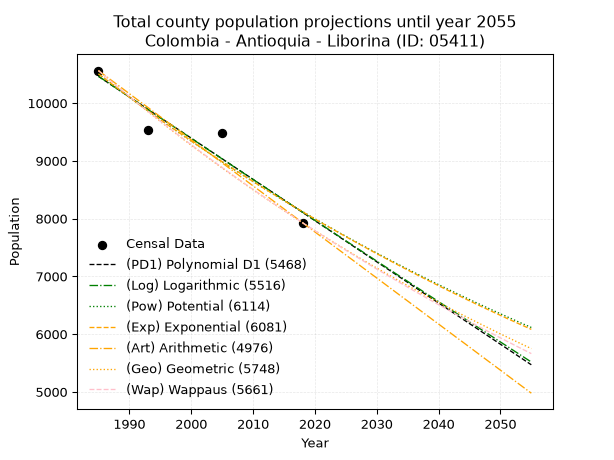
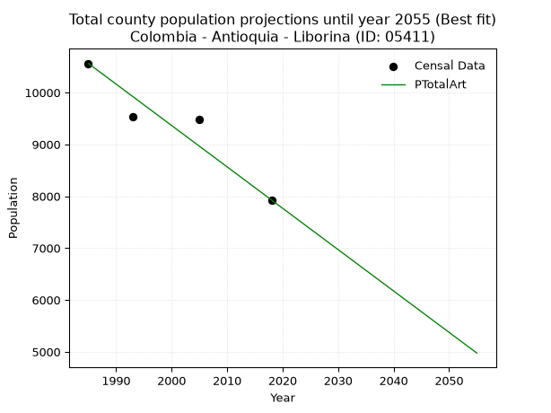
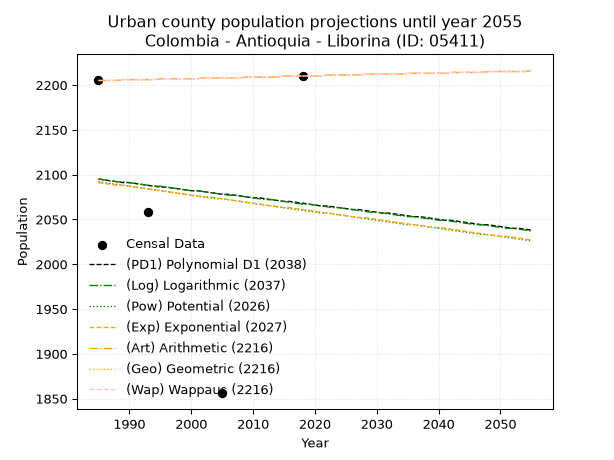
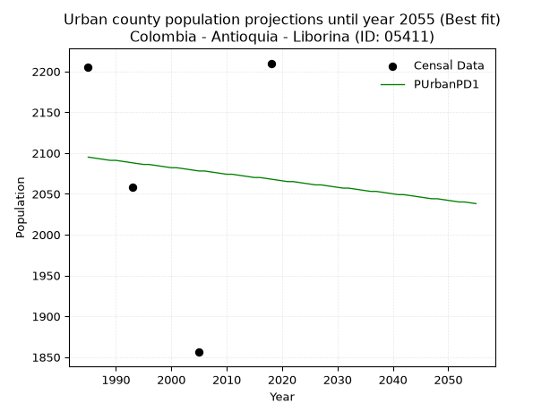
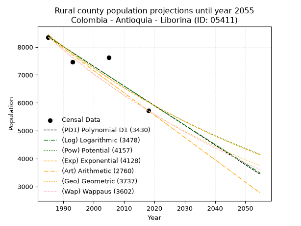
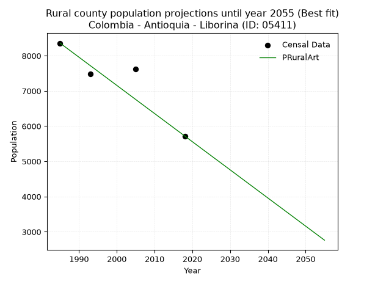

<div align="center">


</div>

# 📜 _“Population and Public Services Demand Projections (PPSD) until Year 2050 for Colombia - Antioquia - Liborina (ID: 05411)”_
Keywords: `population` `public-service` `projection` `lineal` `polynomial` `logarithmic` `potential` `exponential` `arithmetic` `geometric` `wappaus` `dane` `colombia` `south-america`

PPSD are analytical estimates used by governments and planners to anticipate future changes in population size, age distribution, and the resulting community needs for utilities, healthcare, education, and infrastructure as sizing future water treatment facilities, electrical grids, and road networks based on spatial growth.

<div align="center">

</img>

</div>


> **General running parameters**: • app_version: _v20260806_. • Python version: _3.14.7_. • Pandas version: _3.0.5_. • NumPy version: _2.5.1_. • Creates, save and include plots into reports (create_plot): _False_. • Projection until year: _2050_. • Process polynomial degree 2 and up: _False_. • Process Wappaus: _True_. • Process Wappaus: _True_. • Set negative values to zero: _True_. • Set infinite values to zero: _True_. • Drop dataset notes: _True_. 
<div align="center">

Maps & GIS Layers: [:earth_americas:Google](http://maps.google.com/maps?q=6.677316107,-75.8128379) [:earth_americas:OSM](https://www.openstreetmap.org/#map=18/6.677316107/-75.8128379&layers=P) [:earth_americas:Bing](https://www.bing.com/maps?cp=6.677316107~-75.8128379&lvl=18) [:earth_americas:Apple](https://maps.apple.com/frame?center=6.677316107%2C-75.8128379&span=0.003%2C0.006) [:earth_americas:GISMobile](https://github.com/rcfdtools/R.GISMobile/blob/main/file/gis/CountyLayer_CO/Readme.md)

</div>


<div align="center">

```geojson
{
  "type": "Feature",
  "geometry": {
    "type": "Point", 
    "coordinates": [-75.8128379, 6.677316107]
  }, 
  "properties": {
    "Name": "Colombia - Antioquia - Liborina (ID: 05411)"
  }
}
```

</div>


## 0. Census Data (4 records)

Census data are official statistics collected by a government about the people and housing in a country. They usually include counts of total population, age, sex, race, income, education, and jobs.

📅Global census file: [Population.xlsx](../data/Population.xlsx)

| Source   |   Year |   CountryID | CountryName   |   StateID | StateName   |   CountyID | CountyName   |   PTotal |   PUrban |   PRural |
|:---------|-------:|------------:|:--------------|----------:|:------------|-----------:|:-------------|---------:|---------:|---------:|
| DANE     |   1985 |          57 | Colombia      |        05 | Antioquia   |      05411 | Liborina     |    10561 |     2205 |     8356 |
| DANE     |   1993 |          57 | Colombia      |        05 | Antioquia   |      05411 | Liborina     |     9532 |     2058 |     7474 |
| DANE     |   2005 |          57 | Colombia      |        05 | Antioquia   |      05411 | Liborina     |     9475 |     1856 |     7619 |
| DANE     |   2018 |          57 | Colombia      |        05 | Antioquia   |      05411 | Liborina     |     7928 |     2210 |     5718 |

> 🔥Some records could had specific notes about the registered values or the corresponding urban or rural distribution.

📅[SUI-RUPS](https://www.datos.gov.co/Hacienda-y-Cr-dito-P-blico/Registro-nico-de-Prestadores-de-Servicios-P-blicos/4qkq-csdn/about_data) - Local public utility companies: [RUPS.csv](../data/RUPS.csv)

 | SERVICIO       | ESTADO    | NOMBRE                                                                             | NIT         | DEPARTAMENTO_DOMICILIO   | MUNICIPIO_DOMICILIO   | DIRECCION          |   TELEFONO | EMAIL             | TIPO_PRESTADOR                             | CLASIFICACION                 |
|:---------------|:----------|:-----------------------------------------------------------------------------------|:------------|:-------------------------|:----------------------|:-------------------|-----------:|:------------------|:-------------------------------------------|:------------------------------|
| ACUEDUCTO      | OPERATIVA | EMPRESA DE SERVICIOS PUBLICOS DOMICILIARIOS DEL MUNICIPIO DE  LIBORINA S.A. E.S.P. | 900154296-9 | ANTIOQUIA                | LIBORINA              | Calle  8 No  10 35 |    8561023 | esplibo@gmail.com | SOCIEDADES (EMPRESA DE SERVICIOS PUBLICOS) | MENOR O IGUAL A 2500 USUARIOS |
| ALCANTARILLADO | OPERATIVA | EMPRESA DE SERVICIOS PUBLICOS DOMICILIARIOS DEL MUNICIPIO DE  LIBORINA S.A. E.S.P. | 900154296-9 | ANTIOQUIA                | LIBORINA              | Calle  8 No  10 35 |    8561023 | esplibo@gmail.com | SOCIEDADES (EMPRESA DE SERVICIOS PUBLICOS) | MENOR O IGUAL A 2500 USUARIOS |

## 1. Total

### 1.1. Coefficients and Parameters

* (PD1) Polynomial Deg 1: -71.35126455238765, 152094.36692091337 (lineal)
* (Log) Logarithmic: -142784.30169384548, 1094678.6213765044
* (Pow) Potential: -15.622832682502995, 55.541813460372914
* (Exp) Exponential: -0.007807825603017118, 56532326442.945206
* (Art) Arithmetic: Year diff. 2018 - 1985 = 33, Population diff. 7928 - 10561 = -2633, Annual growth = -79.78787878787878
* (Geo) Geometric: Year diff. 2018 - 1985 = 33, Population diff. 7928 - 10561 = -2633, Annual growth % = -0.008652266181962909
* (Wap) Wappaus: i = -0.8630848481570532, Condition values only valid for < 200)

<sub>
Wappaus condition values: ['-0.00', '-0.86', '-1.73', '-2.59', '-3.45', '-4.32', '-5.18', '-6.04', '-6.90', '-7.77', '-8.63', '-9.49', '-10.36', '-11.22', '-12.08', '-12.95', '-13.81', '-14.67', '-15.54', '-16.40', '-17.26', '-18.12', '-18.99', '-19.85', '-20.71', '-21.58', '-22.44', '-23.30', '-24.17', '-25.03', '-25.89', '-26.76', '-27.62', '-28.48', '-29.34', '-30.21', '-31.07', '-31.93', '-32.80', '-33.66', '-34.52', '-35.39', '-36.25', '-37.11', '-37.98', '-38.84', '-39.70', '-40.56', '-41.43', '-42.29', '-43.15', '-44.02', '-44.88', '-45.74', '-46.61', '-47.47', '-48.33', '-49.20', '-50.06', '-50.92', '-51.79', '-52.65', '-53.51', '-54.37', '-55.24', '-56.10']
</sub>


### 1.2. Projected Dataset

|   Year |   CountyID |   PTotalPD1 |   PTotalLog |   PTotalPow |   PTotalExp |   PTotalArt |   PTotalGeo |   PTotalWap |
|-------:|-----------:|------------:|------------:|------------:|------------:|------------:|------------:|------------:|
|   1985 |      05411 |       10462 |       10464 |       10506 |       10504 |       10561 |       10561 |       10561 |
|   1986 |      05411 |       10391 |       10392 |       10424 |       10423 |       10481 |       10470 |       10470 |
|   1987 |      05411 |       10319 |       10320 |       10342 |       10342 |       10401 |       10379 |       10380 |
|   1988 |      05411 |       10248 |       10248 |       10261 |       10261 |       10322 |       10289 |       10291 |
|   1989 |      05411 |       10177 |       10177 |       10181 |       10181 |       10242 |       10200 |       10203 |
|   1990 |      05411 |       10105 |       10105 |       10101 |       10102 |       10162 |       10112 |       10115 |
|   1991 |      05411 |       10034 |       10033 |       10022 |       10024 |       10082 |       10024 |       10028 |
|   1992 |      05411 |        9963 |        9961 |        9944 |        9946 |       10002 |        9938 |        9942 |
|   1993 |      05411 |        9891 |        9890 |        9866 |        9868 |        9923 |        9852 |        9856 |
|   1994 |      05411 |        9820 |        9818 |        9789 |        9792 |        9843 |        9767 |        9771 |
|   1995 |      05411 |        9749 |        9746 |        9713 |        9715 |        9763 |        9682 |        9687 |
|   1996 |      05411 |        9677 |        9675 |        9637 |        9640 |        9683 |        9598 |        9604 |
|   1997 |      05411 |        9606 |        9603 |        9562 |        9565 |        9604 |        9515 |        9521 |
|   1998 |      05411 |        9535 |        9532 |        9488 |        9490 |        9524 |        9433 |        9439 |
|   1999 |      05411 |        9463 |        9460 |        9414 |        9417 |        9444 |        9351 |        9358 |
|   2000 |      05411 |        9392 |        9389 |        9341 |        9343 |        9364 |        9270 |        9277 |
|   2001 |      05411 |        9320 |        9318 |        9268 |        9271 |        9284 |        9190 |        9197 |
|   2002 |      05411 |        9249 |        9246 |        9196 |        9199 |        9205 |        9111 |        9117 |
|   2003 |      05411 |        9178 |        9175 |        9124 |        9127 |        9125 |        9032 |        9039 |
|   2004 |      05411 |        9106 |        9104 |        9054 |        9056 |        9045 |        8954 |        8960 |
|   2005 |      05411 |        9035 |        9033 |        8983 |        8986 |        8965 |        8876 |        8883 |
|   2006 |      05411 |        8964 |        8961 |        8914 |        8916 |        8885 |        8799 |        8806 |
|   2007 |      05411 |        8892 |        8890 |        8844 |        8846 |        8806 |        8723 |        8730 |
|   2008 |      05411 |        8821 |        8819 |        8776 |        8778 |        8726 |        8648 |        8654 |
|   2009 |      05411 |        8750 |        8748 |        8708 |        8709 |        8646 |        8573 |        8579 |
|   2010 |      05411 |        8678 |        8677 |        8640 |        8642 |        8566 |        8499 |        8504 |
|   2011 |      05411 |        8607 |        8606 |        8574 |        8574 |        8487 |        8425 |        8430 |
|   2012 |      05411 |        8536 |        8535 |        8507 |        8508 |        8407 |        8352 |        8357 |
|   2013 |      05411 |        8464 |        8464 |        8441 |        8442 |        8327 |        8280 |        8284 |
|   2014 |      05411 |        8393 |        8393 |        8376 |        8376 |        8247 |        8208 |        8212 |
|   2015 |      05411 |        8322 |        8322 |        8311 |        8311 |        8167 |        8137 |        8140 |
|   2016 |      05411 |        8250 |        8251 |        8247 |        8246 |        8088 |        8067 |        8069 |
|   2017 |      05411 |        8179 |        8181 |        8184 |        8182 |        8008 |        7997 |        7998 |
|   2018 |      05411 |        8108 |        8110 |        8121 |        8118 |        7928 |        7928 |        7928 |
|   2019 |      05411 |        8036 |        8039 |        8058 |        8055 |        7848 |        7859 |        7858 |
|   2020 |      05411 |        7965 |        7968 |        7996 |        7993 |        7768 |        7791 |        7789 |
|   2021 |      05411 |        7893 |        7898 |        7934 |        7930 |        7689 |        7724 |        7721 |
|   2022 |      05411 |        7822 |        7827 |        7873 |        7869 |        7609 |        7657 |        7653 |
|   2023 |      05411 |        7751 |        7756 |        7813 |        7808 |        7529 |        7591 |        7585 |
|   2024 |      05411 |        7679 |        7686 |        7752 |        7747 |        7449 |        7525 |        7518 |
|   2025 |      05411 |        7608 |        7615 |        7693 |        7687 |        7369 |        7460 |        7452 |
|   2026 |      05411 |        7537 |        7545 |        7634 |        7627 |        7290 |        7396 |        7386 |
|   2027 |      05411 |        7465 |        7474 |        7575 |        7567 |        7210 |        7332 |        7320 |
|   2028 |      05411 |        7394 |        7404 |        7517 |        7509 |        7130 |        7268 |        7255 |
|   2029 |      05411 |        7323 |        7334 |        7459 |        7450 |        7050 |        7205 |        7190 |
|   2030 |      05411 |        7251 |        7263 |        7402 |        7392 |        6971 |        7143 |        7126 |
|   2031 |      05411 |        7180 |        7193 |        7345 |        7335 |        6891 |        7081 |        7063 |
|   2032 |      05411 |        7109 |        7123 |        7289 |        7278 |        6811 |        7020 |        6999 |
|   2033 |      05411 |        7037 |        7052 |        7233 |        7221 |        6731 |        6959 |        6937 |
|   2034 |      05411 |        6966 |        6982 |        7178 |        7165 |        6651 |        6899 |        6874 |
|   2035 |      05411 |        6895 |        6912 |        7123 |        7109 |        6572 |        6839 |        6812 |
|   2036 |      05411 |        6823 |        6842 |        7069 |        7054 |        6492 |        6780 |        6751 |
|   2037 |      05411 |        6752 |        6772 |        7015 |        6999 |        6412 |        6721 |        6690 |
|   2038 |      05411 |        6680 |        6702 |        6961 |        6945 |        6332 |        6663 |        6629 |
|   2039 |      05411 |        6609 |        6632 |        6908 |        6891 |        6252 |        6606 |        6569 |
|   2040 |      05411 |        6538 |        6562 |        6855 |        6837 |        6173 |        6548 |        6509 |
|   2041 |      05411 |        6466 |        6492 |        6803 |        6784 |        6093 |        6492 |        6450 |
|   2042 |      05411 |        6395 |        6422 |        6751 |        6731 |        6013 |        6436 |        6391 |
|   2043 |      05411 |        6324 |        6352 |        6700 |        6679 |        5933 |        6380 |        6333 |
|   2044 |      05411 |        6252 |        6282 |        6649 |        6627 |        5854 |        6325 |        6275 |
|   2045 |      05411 |        6181 |        6212 |        6598 |        6575 |        5774 |        6270 |        6217 |
|   2046 |      05411 |        6110 |        6142 |        6548 |        6524 |        5694 |        6216 |        6159 |
|   2047 |      05411 |        6038 |        6072 |        6498 |        6473 |        5614 |        6162 |        6103 |
|   2048 |      05411 |        5967 |        6003 |        6449 |        6423 |        5534 |        6109 |        6046 |
|   2049 |      05411 |        5896 |        5933 |        6400 |        6373 |        5455 |        6056 |        5990 |
|   2050 |      05411 |        5824 |        5863 |        6351 |        6324 |        5375 |        6003 |        5934 |
<div align="center">

</img>

</div>


### 1.3. Best fit with absolute and relative error (%)

Relative error puts that difference into context by dividing the absolute error by the true value, creating a unitless ratio or percentage that shows the scale of the mistake.

Absolute and relative error

|   Year | Source   |   CountryID | CountryName   |   StateID | StateName   |   CountyID_x | CountyName   |   PTotal |   PUrban |   PRural |   CountyID_y |   PTotalPD1 |   PTotalLog |   PTotalPow |   PTotalExp |   PTotalArt |   PTotalGeo |   PTotalWap |   PTotalPD1AbsError |   PTotalLogAbsError |   PTotalPowAbsError |   PTotalExpAbsError |   PTotalArtAbsError |   PTotalGeoAbsError |   PTotalWapAbsError |   PTotalPD1RelError |   PTotalLogRelError |   PTotalPowRelError |   PTotalExpRelError |   PTotalArtRelError |   PTotalGeoRelError |   PTotalWapRelError |
|-------:|:---------|------------:|:--------------|----------:|:------------|-------------:|:-------------|---------:|---------:|---------:|-------------:|------------:|------------:|------------:|------------:|------------:|------------:|------------:|--------------------:|--------------------:|--------------------:|--------------------:|--------------------:|--------------------:|--------------------:|--------------------:|--------------------:|--------------------:|--------------------:|--------------------:|--------------------:|--------------------:|
|   1985 | DANE     |          57 | Colombia      |        05 | Antioquia   |        05411 | Liborina     |    10561 |     2205 |     8356 |        05411 |       10462 |       10464 |       10506 |       10504 |       10561 |       10561 |       10561 |                  99 |                  97 |                  55 |                  57 |                   0 |                   0 |                   0 |            0.937411 |            0.918474 |            0.520784 |            0.539722 |             0       |             0       |             0       |
|   1993 | DANE     |          57 | Colombia      |        05 | Antioquia   |        05411 | Liborina     |     9532 |     2058 |     7474 |        05411 |        9891 |        9890 |        9866 |        9868 |        9923 |        9852 |        9856 |                 359 |                 358 |                 334 |                 336 |                 391 |                 320 |                 324 |            3.76626  |            3.75577  |            3.50399  |            3.52497  |             4.10197 |             3.35711 |             3.39908 |
|   2005 | DANE     |          57 | Colombia      |        05 | Antioquia   |        05411 | Liborina     |     9475 |     1856 |     7619 |        05411 |        9035 |        9033 |        8983 |        8986 |        8965 |        8876 |        8883 |                 440 |                 442 |                 492 |                 489 |                 510 |                 599 |                 592 |            4.6438   |            4.66491  |            5.19261  |            5.16095  |             5.38259 |             6.3219  |             6.24802 |
|   2018 | DANE     |          57 | Colombia      |        05 | Antioquia   |        05411 | Liborina     |     7928 |     2210 |     5718 |        05411 |        8108 |        8110 |        8121 |        8118 |        7928 |        7928 |        7928 |                 180 |                 182 |                 193 |                 190 |                   0 |                   0 |                   0 |            2.27043  |            2.29566  |            2.43441  |            2.39657  |             0       |             0       |             0       |

Relative error mean

| Method    |   RelError | Best   |
|:----------|-----------:|:-------|
| PTotalPD1 |    2.90448 |        |
| PTotalLog |    2.9087  |        |
| PTotalPow |    2.91295 |        |
| PTotalExp |    2.90555 |        |
| PTotalArt |    2.37114 | True   |
| PTotalGeo |    2.41975 |        |
| PTotalWap |    2.41177 |        |

💙Best method: _**PTotalArt**_
<div align="center">

</img>

</div>


### 1.4. Fresh water supply demand in liters per capita per day (lpcd)

The fresh water supply demand typically ranges from 100 to 300 liters per capita per day (lpcd) for standard domestic and municipal planning, though absolute survival minimums set by the World Health Organization are as low as 7.5 to 20 liters per day, and total consumption in high-income nations can exceed 400 liters.

> `CZ`: Level in meters above the sea level (masl)<br> `WS`: Fresh water supply demand in liters per capita per day (lpcd or l/h/d)<br> `WSAll`: Zonal fresh water supply demand in liters per second (l/s)<br> `A`: Zonal area in square meters<br> `DP`: Population density (people/hectare or p/ha)

Reference values (RAS Colombia)

|    CZ |   WS |
|------:|-----:|
|  1000 |  120 |
|  2000 |  130 |
| 99999 |  140 |

County shapefile geometry properties and water supply values

|   CountyID |      ATotal |   CZTotal |   WSTotal |
|-----------:|------------:|----------:|----------:|
|      05411 | 2.16387e+08 |   1719.83 |       130 |

Projected values for best method: PTotalArt

|   CountyID |   Year |   PTotalArt |   DPTotal |   WSTotal |   WSTotalAll |
|-----------:|-------:|------------:|----------:|----------:|-------------:|
|      05411 |   1985 |       10561 |      0.49 |       130 |     15.8904  |
|      05411 |   1986 |       10481 |      0.48 |       130 |     15.77    |
|      05411 |   1987 |       10401 |      0.48 |       130 |     15.6497  |
|      05411 |   1988 |       10322 |      0.48 |       130 |     15.5308  |
|      05411 |   1989 |       10242 |      0.47 |       130 |     15.4104  |
|      05411 |   1990 |       10162 |      0.47 |       130 |     15.29    |
|      05411 |   1991 |       10082 |      0.47 |       130 |     15.1697  |
|      05411 |   1992 |       10002 |      0.46 |       130 |     15.0493  |
|      05411 |   1993 |        9923 |      0.46 |       130 |     14.9304  |
|      05411 |   1994 |        9843 |      0.45 |       130 |     14.8101  |
|      05411 |   1995 |        9763 |      0.45 |       130 |     14.6897  |
|      05411 |   1996 |        9683 |      0.45 |       130 |     14.5693  |
|      05411 |   1997 |        9604 |      0.44 |       130 |     14.4505  |
|      05411 |   1998 |        9524 |      0.44 |       130 |     14.3301  |
|      05411 |   1999 |        9444 |      0.44 |       130 |     14.2097  |
|      05411 |   2000 |        9364 |      0.43 |       130 |     14.0894  |
|      05411 |   2001 |        9284 |      0.43 |       130 |     13.969   |
|      05411 |   2002 |        9205 |      0.43 |       130 |     13.8501  |
|      05411 |   2003 |        9125 |      0.42 |       130 |     13.7297  |
|      05411 |   2004 |        9045 |      0.42 |       130 |     13.6094  |
|      05411 |   2005 |        8965 |      0.41 |       130 |     13.489   |
|      05411 |   2006 |        8885 |      0.41 |       130 |     13.3686  |
|      05411 |   2007 |        8806 |      0.41 |       130 |     13.2498  |
|      05411 |   2008 |        8726 |      0.4  |       130 |     13.1294  |
|      05411 |   2009 |        8646 |      0.4  |       130 |     13.009   |
|      05411 |   2010 |        8566 |      0.4  |       130 |     12.8887  |
|      05411 |   2011 |        8487 |      0.39 |       130 |     12.7698  |
|      05411 |   2012 |        8407 |      0.39 |       130 |     12.6494  |
|      05411 |   2013 |        8327 |      0.38 |       130 |     12.5291  |
|      05411 |   2014 |        8247 |      0.38 |       130 |     12.4087  |
|      05411 |   2015 |        8167 |      0.38 |       130 |     12.2883  |
|      05411 |   2016 |        8088 |      0.37 |       130 |     12.1694  |
|      05411 |   2017 |        8008 |      0.37 |       130 |     12.0491  |
|      05411 |   2018 |        7928 |      0.37 |       130 |     11.9287  |
|      05411 |   2019 |        7848 |      0.36 |       130 |     11.8083  |
|      05411 |   2020 |        7768 |      0.36 |       130 |     11.688   |
|      05411 |   2021 |        7689 |      0.36 |       130 |     11.5691  |
|      05411 |   2022 |        7609 |      0.35 |       130 |     11.4487  |
|      05411 |   2023 |        7529 |      0.35 |       130 |     11.3284  |
|      05411 |   2024 |        7449 |      0.34 |       130 |     11.208   |
|      05411 |   2025 |        7369 |      0.34 |       130 |     11.0876  |
|      05411 |   2026 |        7290 |      0.34 |       130 |     10.9688  |
|      05411 |   2027 |        7210 |      0.33 |       130 |     10.8484  |
|      05411 |   2028 |        7130 |      0.33 |       130 |     10.728   |
|      05411 |   2029 |        7050 |      0.33 |       130 |     10.6076  |
|      05411 |   2030 |        6971 |      0.32 |       130 |     10.4888  |
|      05411 |   2031 |        6891 |      0.32 |       130 |     10.3684  |
|      05411 |   2032 |        6811 |      0.31 |       130 |     10.248   |
|      05411 |   2033 |        6731 |      0.31 |       130 |     10.1277  |
|      05411 |   2034 |        6651 |      0.31 |       130 |     10.0073  |
|      05411 |   2035 |        6572 |      0.3  |       130 |      9.88843 |
|      05411 |   2036 |        6492 |      0.3  |       130 |      9.76806 |
|      05411 |   2037 |        6412 |      0.3  |       130 |      9.64769 |
|      05411 |   2038 |        6332 |      0.29 |       130 |      9.52731 |
|      05411 |   2039 |        6252 |      0.29 |       130 |      9.40694 |
|      05411 |   2040 |        6173 |      0.29 |       130 |      9.28808 |
|      05411 |   2041 |        6093 |      0.28 |       130 |      9.16771 |
|      05411 |   2042 |        6013 |      0.28 |       130 |      9.04734 |
|      05411 |   2043 |        5933 |      0.27 |       130 |      8.92697 |
|      05411 |   2044 |        5854 |      0.27 |       130 |      8.8081  |
|      05411 |   2045 |        5774 |      0.27 |       130 |      8.68773 |
|      05411 |   2046 |        5694 |      0.26 |       130 |      8.56736 |
|      05411 |   2047 |        5614 |      0.26 |       130 |      8.44699 |
|      05411 |   2048 |        5534 |      0.26 |       130 |      8.32662 |
|      05411 |   2049 |        5455 |      0.25 |       130 |      8.20775 |
|      05411 |   2050 |        5375 |      0.25 |       130 |      8.08738 |

## 2. Urban

### 2.1. Coefficients and Parameters

* (PD1) Polynomial Deg 1: -0.808109193095358, 3698.67041348899 (lineal)
* (Log) Logarithmic: -1668.7595891718559, 14766.505009895372
* (Pow) Potential: -0.9187071396178046, 6.350177992472108
* (Exp) Exponential: -0.0004464732526091289, 5073.4836777928695
* (Art) Arithmetic: Year diff. 2018 - 1985 = 33, Population diff. 2210 - 2205 = 5, Annual growth = 0.15151515151515152
* (Geo) Geometric: Year diff. 2018 - 1985 = 33, Population diff. 2210 - 2205 = 5, Annual growth % = 6.863892011410577e-05
* (Wap) Wappaus: i = 0.006863653522770171, Condition values only valid for < 200)

<sub>
Wappaus condition values: ['0.00', '0.01', '0.01', '0.02', '0.03', '0.03', '0.04', '0.05', '0.05', '0.06', '0.07', '0.08', '0.08', '0.09', '0.10', '0.10', '0.11', '0.12', '0.12', '0.13', '0.14', '0.14', '0.15', '0.16', '0.16', '0.17', '0.18', '0.19', '0.19', '0.20', '0.21', '0.21', '0.22', '0.23', '0.23', '0.24', '0.25', '0.25', '0.26', '0.27', '0.27', '0.28', '0.29', '0.30', '0.30', '0.31', '0.32', '0.32', '0.33', '0.34', '0.34', '0.35', '0.36', '0.36', '0.37', '0.38', '0.38', '0.39', '0.40', '0.40', '0.41', '0.42', '0.43', '0.43', '0.44', '0.45']
</sub>


### 2.2. Projected Dataset

|   Year |   CountyID |   PUrbanPD1 |   PUrbanLog |   PUrbanPow |   PUrbanExp |   PUrbanArt |   PUrbanGeo |   PUrbanWap |
|-------:|-----------:|------------:|------------:|------------:|------------:|------------:|------------:|------------:|
|   1985 |      05411 |        2095 |        2095 |        2092 |        2091 |        2205 |        2205 |        2205 |
|   1986 |      05411 |        2094 |        2094 |        2091 |        2090 |        2205 |        2205 |        2205 |
|   1987 |      05411 |        2093 |        2093 |        2090 |        2089 |        2205 |        2205 |        2205 |
|   1988 |      05411 |        2092 |        2092 |        2089 |        2088 |        2205 |        2205 |        2205 |
|   1989 |      05411 |        2091 |        2092 |        2088 |        2088 |        2206 |        2206 |        2206 |
|   1990 |      05411 |        2091 |        2091 |        2087 |        2087 |        2206 |        2206 |        2206 |
|   1991 |      05411 |        2090 |        2090 |        2086 |        2086 |        2206 |        2206 |        2206 |
|   1992 |      05411 |        2089 |        2089 |        2085 |        2085 |        2206 |        2206 |        2206 |
|   1993 |      05411 |        2088 |        2088 |        2084 |        2084 |        2206 |        2206 |        2206 |
|   1994 |      05411 |        2087 |        2087 |        2083 |        2083 |        2206 |        2206 |        2206 |
|   1995 |      05411 |        2086 |        2087 |        2082 |        2082 |        2207 |        2207 |        2207 |
|   1996 |      05411 |        2086 |        2086 |        2081 |        2081 |        2207 |        2207 |        2207 |
|   1997 |      05411 |        2085 |        2085 |        2080 |        2080 |        2207 |        2207 |        2207 |
|   1998 |      05411 |        2084 |        2084 |        2079 |        2079 |        2207 |        2207 |        2207 |
|   1999 |      05411 |        2083 |        2083 |        2078 |        2078 |        2207 |        2207 |        2207 |
|   2000 |      05411 |        2082 |        2082 |        2077 |        2077 |        2207 |        2207 |        2207 |
|   2001 |      05411 |        2082 |        2082 |        2076 |        2076 |        2207 |        2207 |        2207 |
|   2002 |      05411 |        2081 |        2081 |        2075 |        2075 |        2208 |        2208 |        2208 |
|   2003 |      05411 |        2080 |        2080 |        2074 |        2075 |        2208 |        2208 |        2208 |
|   2004 |      05411 |        2079 |        2079 |        2073 |        2074 |        2208 |        2208 |        2208 |
|   2005 |      05411 |        2078 |        2078 |        2073 |        2073 |        2208 |        2208 |        2208 |
|   2006 |      05411 |        2078 |        2077 |        2072 |        2072 |        2208 |        2208 |        2208 |
|   2007 |      05411 |        2077 |        2077 |        2071 |        2071 |        2208 |        2208 |        2208 |
|   2008 |      05411 |        2076 |        2076 |        2070 |        2070 |        2208 |        2208 |        2208 |
|   2009 |      05411 |        2075 |        2075 |        2069 |        2069 |        2209 |        2209 |        2209 |
|   2010 |      05411 |        2074 |        2074 |        2068 |        2068 |        2209 |        2209 |        2209 |
|   2011 |      05411 |        2074 |        2073 |        2067 |        2067 |        2209 |        2209 |        2209 |
|   2012 |      05411 |        2073 |        2072 |        2066 |        2066 |        2209 |        2209 |        2209 |
|   2013 |      05411 |        2072 |        2072 |        2065 |        2065 |        2209 |        2209 |        2209 |
|   2014 |      05411 |        2071 |        2071 |        2064 |        2064 |        2209 |        2209 |        2209 |
|   2015 |      05411 |        2070 |        2070 |        2063 |        2063 |        2210 |        2210 |        2210 |
|   2016 |      05411 |        2070 |        2069 |        2062 |        2063 |        2210 |        2210 |        2210 |
|   2017 |      05411 |        2069 |        2068 |        2061 |        2062 |        2210 |        2210 |        2210 |
|   2018 |      05411 |        2068 |        2067 |        2060 |        2061 |        2210 |        2210 |        2210 |
|   2019 |      05411 |        2067 |        2067 |        2059 |        2060 |        2210 |        2210 |        2210 |
|   2020 |      05411 |        2066 |        2066 |        2058 |        2059 |        2210 |        2210 |        2210 |
|   2021 |      05411 |        2065 |        2065 |        2057 |        2058 |        2210 |        2210 |        2210 |
|   2022 |      05411 |        2065 |        2064 |        2057 |        2057 |        2211 |        2211 |        2211 |
|   2023 |      05411 |        2064 |        2063 |        2056 |        2056 |        2211 |        2211 |        2211 |
|   2024 |      05411 |        2063 |        2063 |        2055 |        2055 |        2211 |        2211 |        2211 |
|   2025 |      05411 |        2062 |        2062 |        2054 |        2054 |        2211 |        2211 |        2211 |
|   2026 |      05411 |        2061 |        2061 |        2053 |        2053 |        2211 |        2211 |        2211 |
|   2027 |      05411 |        2061 |        2060 |        2052 |        2052 |        2211 |        2211 |        2211 |
|   2028 |      05411 |        2060 |        2059 |        2051 |        2052 |        2212 |        2212 |        2212 |
|   2029 |      05411 |        2059 |        2058 |        2050 |        2051 |        2212 |        2212 |        2212 |
|   2030 |      05411 |        2058 |        2058 |        2049 |        2050 |        2212 |        2212 |        2212 |
|   2031 |      05411 |        2057 |        2057 |        2048 |        2049 |        2212 |        2212 |        2212 |
|   2032 |      05411 |        2057 |        2056 |        2047 |        2048 |        2212 |        2212 |        2212 |
|   2033 |      05411 |        2056 |        2055 |        2046 |        2047 |        2212 |        2212 |        2212 |
|   2034 |      05411 |        2055 |        2054 |        2045 |        2046 |        2212 |        2212 |        2212 |
|   2035 |      05411 |        2054 |        2053 |        2044 |        2045 |        2213 |        2213 |        2213 |
|   2036 |      05411 |        2053 |        2053 |        2044 |        2044 |        2213 |        2213 |        2213 |
|   2037 |      05411 |        2053 |        2052 |        2043 |        2043 |        2213 |        2213 |        2213 |
|   2038 |      05411 |        2052 |        2051 |        2042 |        2042 |        2213 |        2213 |        2213 |
|   2039 |      05411 |        2051 |        2050 |        2041 |        2041 |        2213 |        2213 |        2213 |
|   2040 |      05411 |        2050 |        2049 |        2040 |        2041 |        2213 |        2213 |        2213 |
|   2041 |      05411 |        2049 |        2049 |        2039 |        2040 |        2213 |        2213 |        2213 |
|   2042 |      05411 |        2049 |        2048 |        2038 |        2039 |        2214 |        2214 |        2214 |
|   2043 |      05411 |        2048 |        2047 |        2037 |        2038 |        2214 |        2214 |        2214 |
|   2044 |      05411 |        2047 |        2046 |        2036 |        2037 |        2214 |        2214 |        2214 |
|   2045 |      05411 |        2046 |        2045 |        2035 |        2036 |        2214 |        2214 |        2214 |
|   2046 |      05411 |        2045 |        2044 |        2034 |        2035 |        2214 |        2214 |        2214 |
|   2047 |      05411 |        2044 |        2044 |        2033 |        2034 |        2214 |        2214 |        2214 |
|   2048 |      05411 |        2044 |        2043 |        2033 |        2033 |        2215 |        2215 |        2215 |
|   2049 |      05411 |        2043 |        2042 |        2032 |        2032 |        2215 |        2215 |        2215 |
|   2050 |      05411 |        2042 |        2041 |        2031 |        2031 |        2215 |        2215 |        2215 |
<div align="center">

</img>

</div>


### 2.3. Best fit with absolute and relative error (%)

Relative error puts that difference into context by dividing the absolute error by the true value, creating a unitless ratio or percentage that shows the scale of the mistake.

Absolute and relative error

|   Year | Source   |   CountryID | CountryName   |   StateID | StateName   |   CountyID_x | CountyName   |   PTotal |   PUrban |   PRural |   CountyID_y |   PUrbanPD1 |   PUrbanLog |   PUrbanPow |   PUrbanExp |   PUrbanArt |   PUrbanGeo |   PUrbanWap |   PUrbanPD1AbsError |   PUrbanLogAbsError |   PUrbanPowAbsError |   PUrbanExpAbsError |   PUrbanArtAbsError |   PUrbanGeoAbsError |   PUrbanWapAbsError |   PUrbanPD1RelError |   PUrbanLogRelError |   PUrbanPowRelError |   PUrbanExpRelError |   PUrbanArtRelError |   PUrbanGeoRelError |   PUrbanWapRelError |
|-------:|:---------|------------:|:--------------|----------:|:------------|-------------:|:-------------|---------:|---------:|---------:|-------------:|------------:|------------:|------------:|------------:|------------:|------------:|------------:|--------------------:|--------------------:|--------------------:|--------------------:|--------------------:|--------------------:|--------------------:|--------------------:|--------------------:|--------------------:|--------------------:|--------------------:|--------------------:|--------------------:|
|   1985 | DANE     |          57 | Colombia      |        05 | Antioquia   |        05411 | Liborina     |    10561 |     2205 |     8356 |        05411 |        2095 |        2095 |        2092 |        2091 |        2205 |        2205 |        2205 |                 110 |                 110 |                 113 |                 114 |                   0 |                   0 |                   0 |             4.98866 |             4.98866 |             5.12472 |             5.17007 |             0       |             0       |             0       |
|   1993 | DANE     |          57 | Colombia      |        05 | Antioquia   |        05411 | Liborina     |     9532 |     2058 |     7474 |        05411 |        2088 |        2088 |        2084 |        2084 |        2206 |        2206 |        2206 |                  30 |                  30 |                  26 |                  26 |                 148 |                 148 |                 148 |             1.45773 |             1.45773 |             1.26336 |             1.26336 |             7.19145 |             7.19145 |             7.19145 |
|   2005 | DANE     |          57 | Colombia      |        05 | Antioquia   |        05411 | Liborina     |     9475 |     1856 |     7619 |        05411 |        2078 |        2078 |        2073 |        2073 |        2208 |        2208 |        2208 |                 222 |                 222 |                 217 |                 217 |                 352 |                 352 |                 352 |            11.9612  |            11.9612  |            11.6918  |            11.6918  |            18.9655  |            18.9655  |            18.9655  |
|   2018 | DANE     |          57 | Colombia      |        05 | Antioquia   |        05411 | Liborina     |     7928 |     2210 |     5718 |        05411 |        2068 |        2067 |        2060 |        2061 |        2210 |        2210 |        2210 |                 142 |                 143 |                 150 |                 149 |                   0 |                   0 |                   0 |             6.42534 |             6.47059 |             6.78733 |             6.74208 |             0       |             0       |             0       |

Relative error mean

| Method    |   RelError | Best   |
|:----------|-----------:|:-------|
| PUrbanPD1 |    6.20823 | True   |
| PUrbanLog |    6.21955 |        |
| PUrbanPow |    6.2168  |        |
| PUrbanExp |    6.21683 |        |
| PUrbanArt |    6.53924 |        |
| PUrbanGeo |    6.53924 |        |
| PUrbanWap |    6.53924 |        |

💙Best method: _**PUrbanPD1**_
<div align="center">

</img>

</div>


### 2.4. Fresh water supply demand in liters per capita per day (lpcd)

The fresh water supply demand typically ranges from 100 to 300 liters per capita per day (lpcd) for standard domestic and municipal planning, though absolute survival minimums set by the World Health Organization are as low as 7.5 to 20 liters per day, and total consumption in high-income nations can exceed 400 liters.

> `CZ`: Level in meters above the sea level (masl)<br> `WS`: Fresh water supply demand in liters per capita per day (lpcd or l/h/d)<br> `WSAll`: Zonal fresh water supply demand in liters per second (l/s)<br> `A`: Zonal area in square meters<br> `DP`: Population density (people/hectare or p/ha)

Reference values (RAS Colombia)

|    CZ |   WS |
|------:|-----:|
|  1000 |  120 |
|  2000 |  130 |
| 99999 |  140 |

County shapefile geometry properties and water supply values

|   CountyID |   AUrban |   CZUrban |   WSUrban |
|-----------:|---------:|----------:|----------:|
|      05411 |   337657 |   698.861 |       120 |

Projected values for best method: PUrbanPD1

|   CountyID |   Year |   PUrbanPD1 |   DPUrban |   WSUrban |   WSUrbanAll |
|-----------:|-------:|------------:|----------:|----------:|-------------:|
|      05411 |   1985 |        2095 |     62.05 |       120 |      2.90972 |
|      05411 |   1986 |        2094 |     62.02 |       120 |      2.90833 |
|      05411 |   1987 |        2093 |     61.99 |       120 |      2.90694 |
|      05411 |   1988 |        2092 |     61.96 |       120 |      2.90556 |
|      05411 |   1989 |        2091 |     61.93 |       120 |      2.90417 |
|      05411 |   1990 |        2091 |     61.93 |       120 |      2.90417 |
|      05411 |   1991 |        2090 |     61.9  |       120 |      2.90278 |
|      05411 |   1992 |        2089 |     61.87 |       120 |      2.90139 |
|      05411 |   1993 |        2088 |     61.84 |       120 |      2.9     |
|      05411 |   1994 |        2087 |     61.81 |       120 |      2.89861 |
|      05411 |   1995 |        2086 |     61.78 |       120 |      2.89722 |
|      05411 |   1996 |        2086 |     61.78 |       120 |      2.89722 |
|      05411 |   1997 |        2085 |     61.75 |       120 |      2.89583 |
|      05411 |   1998 |        2084 |     61.72 |       120 |      2.89444 |
|      05411 |   1999 |        2083 |     61.69 |       120 |      2.89306 |
|      05411 |   2000 |        2082 |     61.66 |       120 |      2.89167 |
|      05411 |   2001 |        2082 |     61.66 |       120 |      2.89167 |
|      05411 |   2002 |        2081 |     61.63 |       120 |      2.89028 |
|      05411 |   2003 |        2080 |     61.6  |       120 |      2.88889 |
|      05411 |   2004 |        2079 |     61.57 |       120 |      2.8875  |
|      05411 |   2005 |        2078 |     61.54 |       120 |      2.88611 |
|      05411 |   2006 |        2078 |     61.54 |       120 |      2.88611 |
|      05411 |   2007 |        2077 |     61.51 |       120 |      2.88472 |
|      05411 |   2008 |        2076 |     61.48 |       120 |      2.88333 |
|      05411 |   2009 |        2075 |     61.45 |       120 |      2.88194 |
|      05411 |   2010 |        2074 |     61.42 |       120 |      2.88056 |
|      05411 |   2011 |        2074 |     61.42 |       120 |      2.88056 |
|      05411 |   2012 |        2073 |     61.39 |       120 |      2.87917 |
|      05411 |   2013 |        2072 |     61.36 |       120 |      2.87778 |
|      05411 |   2014 |        2071 |     61.33 |       120 |      2.87639 |
|      05411 |   2015 |        2070 |     61.3  |       120 |      2.875   |
|      05411 |   2016 |        2070 |     61.3  |       120 |      2.875   |
|      05411 |   2017 |        2069 |     61.28 |       120 |      2.87361 |
|      05411 |   2018 |        2068 |     61.25 |       120 |      2.87222 |
|      05411 |   2019 |        2067 |     61.22 |       120 |      2.87083 |
|      05411 |   2020 |        2066 |     61.19 |       120 |      2.86944 |
|      05411 |   2021 |        2065 |     61.16 |       120 |      2.86806 |
|      05411 |   2022 |        2065 |     61.16 |       120 |      2.86806 |
|      05411 |   2023 |        2064 |     61.13 |       120 |      2.86667 |
|      05411 |   2024 |        2063 |     61.1  |       120 |      2.86528 |
|      05411 |   2025 |        2062 |     61.07 |       120 |      2.86389 |
|      05411 |   2026 |        2061 |     61.04 |       120 |      2.8625  |
|      05411 |   2027 |        2061 |     61.04 |       120 |      2.8625  |
|      05411 |   2028 |        2060 |     61.01 |       120 |      2.86111 |
|      05411 |   2029 |        2059 |     60.98 |       120 |      2.85972 |
|      05411 |   2030 |        2058 |     60.95 |       120 |      2.85833 |
|      05411 |   2031 |        2057 |     60.92 |       120 |      2.85694 |
|      05411 |   2032 |        2057 |     60.92 |       120 |      2.85694 |
|      05411 |   2033 |        2056 |     60.89 |       120 |      2.85556 |
|      05411 |   2034 |        2055 |     60.86 |       120 |      2.85417 |
|      05411 |   2035 |        2054 |     60.83 |       120 |      2.85278 |
|      05411 |   2036 |        2053 |     60.8  |       120 |      2.85139 |
|      05411 |   2037 |        2053 |     60.8  |       120 |      2.85139 |
|      05411 |   2038 |        2052 |     60.77 |       120 |      2.85    |
|      05411 |   2039 |        2051 |     60.74 |       120 |      2.84861 |
|      05411 |   2040 |        2050 |     60.71 |       120 |      2.84722 |
|      05411 |   2041 |        2049 |     60.68 |       120 |      2.84583 |
|      05411 |   2042 |        2049 |     60.68 |       120 |      2.84583 |
|      05411 |   2043 |        2048 |     60.65 |       120 |      2.84444 |
|      05411 |   2044 |        2047 |     60.62 |       120 |      2.84306 |
|      05411 |   2045 |        2046 |     60.59 |       120 |      2.84167 |
|      05411 |   2046 |        2045 |     60.56 |       120 |      2.84028 |
|      05411 |   2047 |        2044 |     60.53 |       120 |      2.83889 |
|      05411 |   2048 |        2044 |     60.53 |       120 |      2.83889 |
|      05411 |   2049 |        2043 |     60.51 |       120 |      2.8375  |
|      05411 |   2050 |        2042 |     60.48 |       120 |      2.83611 |

## 3. Rural

### 3.1. Coefficients and Parameters

* (PD1) Polynomial Deg 1: -70.54315535929226, 148395.69650742435 (lineal)
* (Log) Logarithmic: -141115.54210467372, 1079912.1163666092
* (Pow) Potential: -20.438503494814135, 71.32772344688078
* (Exp) Exponential: -0.010218401034505546, 5437173949792.912
* (Art) Arithmetic: Year diff. 2018 - 1985 = 33, Population diff. 5718 - 8356 = -2638, Annual growth = -79.93939393939394
* (Geo) Geometric: Year diff. 2018 - 1985 = 33, Population diff. 5718 - 8356 = -2638, Annual growth % = -0.011429956288705245
* (Wap) Wappaus: i = -1.1359868401221251, Condition values only valid for < 200)

<sub>
Wappaus condition values: ['-0.00', '-1.14', '-2.27', '-3.41', '-4.54', '-5.68', '-6.82', '-7.95', '-9.09', '-10.22', '-11.36', '-12.50', '-13.63', '-14.77', '-15.90', '-17.04', '-18.18', '-19.31', '-20.45', '-21.58', '-22.72', '-23.86', '-24.99', '-26.13', '-27.26', '-28.40', '-29.54', '-30.67', '-31.81', '-32.94', '-34.08', '-35.22', '-36.35', '-37.49', '-38.62', '-39.76', '-40.90', '-42.03', '-43.17', '-44.30', '-45.44', '-46.58', '-47.71', '-48.85', '-49.98', '-51.12', '-52.26', '-53.39', '-54.53', '-55.66', '-56.80', '-57.94', '-59.07', '-60.21', '-61.34', '-62.48', '-63.62', '-64.75', '-65.89', '-67.02', '-68.16', '-69.30', '-70.43', '-71.57', '-72.70', '-73.84']
</sub>


### 3.2. Projected Dataset

|   Year |   CountyID |   PRuralPD1 |   PRuralLog |   PRuralPow |   PRuralExp |   PRuralArt |   PRuralGeo |   PRuralWap |
|-------:|-----------:|------------:|------------:|------------:|------------:|------------:|------------:|------------:|
|   1985 |      05411 |        8368 |        8369 |        8442 |        8440 |        8356 |        8356 |        8356 |
|   1986 |      05411 |        8297 |        8298 |        8355 |        8354 |        8276 |        8260 |        8262 |
|   1987 |      05411 |        8226 |        8227 |        8270 |        8269 |        8196 |        8166 |        8168 |
|   1988 |      05411 |        8156 |        8156 |        8185 |        8185 |        8116 |        8073 |        8076 |
|   1989 |      05411 |        8085 |        8085 |        8101 |        8102 |        8036 |        7980 |        7985 |
|   1990 |      05411 |        8015 |        8014 |        8019 |        8020 |        7956 |        7889 |        7894 |
|   1991 |      05411 |        7944 |        7943 |        7937 |        7938 |        7876 |        7799 |        7805 |
|   1992 |      05411 |        7874 |        7872 |        7856 |        7858 |        7796 |        7710 |        7717 |
|   1993 |      05411 |        7803 |        7801 |        7776 |        7778 |        7716 |        7622 |        7630 |
|   1994 |      05411 |        7733 |        7731 |        7696 |        7699 |        7637 |        7535 |        7543 |
|   1995 |      05411 |        7662 |        7660 |        7618 |        7620 |        7557 |        7449 |        7458 |
|   1996 |      05411 |        7592 |        7589 |        7540 |        7543 |        7477 |        7363 |        7373 |
|   1997 |      05411 |        7521 |        7518 |        7463 |        7466 |        7397 |        7279 |        7290 |
|   1998 |      05411 |        7450 |        7448 |        7387 |        7390 |        7317 |        7196 |        7207 |
|   1999 |      05411 |        7380 |        7377 |        7312 |        7315 |        7237 |        7114 |        7125 |
|   2000 |      05411 |        7309 |        7307 |        7238 |        7241 |        7157 |        7033 |        7044 |
|   2001 |      05411 |        7239 |        7236 |        7164 |        7167 |        7077 |        6952 |        6964 |
|   2002 |      05411 |        7168 |        7166 |        7092 |        7094 |        6997 |        6873 |        6884 |
|   2003 |      05411 |        7098 |        7095 |        7019 |        7022 |        6917 |        6794 |        6806 |
|   2004 |      05411 |        7027 |        7025 |        6948 |        6951 |        6837 |        6716 |        6728 |
|   2005 |      05411 |        6957 |        6954 |        6878 |        6880 |        6757 |        6640 |        6651 |
|   2006 |      05411 |        6886 |        6884 |        6808 |        6810 |        6677 |        6564 |        6575 |
|   2007 |      05411 |        6816 |        6814 |        6739 |        6741 |        6597 |        6489 |        6500 |
|   2008 |      05411 |        6745 |        6743 |        6671 |        6672 |        6517 |        6415 |        6425 |
|   2009 |      05411 |        6674 |        6673 |        6603 |        6605 |        6437 |        6341 |        6351 |
|   2010 |      05411 |        6604 |        6603 |        6536 |        6537 |        6358 |        6269 |        6278 |
|   2011 |      05411 |        6533 |        6533 |        6470 |        6471 |        6278 |        6197 |        6206 |
|   2012 |      05411 |        6463 |        6462 |        6405 |        6405 |        6198 |        6126 |        6134 |
|   2013 |      05411 |        6392 |        6392 |        6340 |        6340 |        6118 |        6056 |        6063 |
|   2014 |      05411 |        6322 |        6322 |        6276 |        6276 |        6038 |        5987 |        5993 |
|   2015 |      05411 |        6251 |        6252 |        6213 |        6212 |        5958 |        5919 |        5923 |
|   2016 |      05411 |        6181 |        6182 |        6150 |        6149 |        5878 |        5851 |        5854 |
|   2017 |      05411 |        6110 |        6112 |        6088 |        6086 |        5798 |        5784 |        5786 |
|   2018 |      05411 |        6040 |        6042 |        6027 |        6024 |        5718 |        5718 |        5718 |
|   2019 |      05411 |        5969 |        5972 |        5966 |        5963 |        5638 |        5653 |        5651 |
|   2020 |      05411 |        5899 |        5902 |        5906 |        5902 |        5558 |        5588 |        5585 |
|   2021 |      05411 |        5828 |        5833 |        5846 |        5842 |        5478 |        5524 |        5519 |
|   2022 |      05411 |        5757 |        5763 |        5788 |        5783 |        5398 |        5461 |        5454 |
|   2023 |      05411 |        5687 |        5693 |        5729 |        5724 |        5318 |        5399 |        5389 |
|   2024 |      05411 |        5616 |        5623 |        5672 |        5666 |        5238 |        5337 |        5325 |
|   2025 |      05411 |        5546 |        5554 |        5615 |        5608 |        5158 |        5276 |        5262 |
|   2026 |      05411 |        5475 |        5484 |        5559 |        5551 |        5078 |        5216 |        5199 |
|   2027 |      05411 |        5405 |        5414 |        5503 |        5495 |        4999 |        5156 |        5137 |
|   2028 |      05411 |        5334 |        5345 |        5448 |        5439 |        4919 |        5097 |        5076 |
|   2029 |      05411 |        5264 |        5275 |        5393 |        5384 |        4839 |        5039 |        5014 |
|   2030 |      05411 |        5193 |        5206 |        5339 |        5329 |        4759 |        4981 |        4954 |
|   2031 |      05411 |        5123 |        5136 |        5285 |        5275 |        4679 |        4924 |        4894 |
|   2032 |      05411 |        5052 |        5067 |        5233 |        5221 |        4599 |        4868 |        4835 |
|   2033 |      05411 |        4981 |        4997 |        5180 |        5168 |        4519 |        4812 |        4776 |
|   2034 |      05411 |        4911 |        4928 |        5128 |        5116 |        4439 |        4757 |        4717 |
|   2035 |      05411 |        4840 |        4858 |        5077 |        5064 |        4359 |        4703 |        4660 |
|   2036 |      05411 |        4770 |        4789 |        5026 |        5012 |        4279 |        4649 |        4602 |
|   2037 |      05411 |        4699 |        4720 |        4976 |        4961 |        4199 |        4596 |        4545 |
|   2038 |      05411 |        4629 |        4651 |        4927 |        4911 |        4119 |        4544 |        4489 |
|   2039 |      05411 |        4558 |        4581 |        4877 |        4861 |        4039 |        4492 |        4433 |
|   2040 |      05411 |        4488 |        4512 |        4829 |        4811 |        3959 |        4440 |        4378 |
|   2041 |      05411 |        4417 |        4443 |        4781 |        4762 |        3879 |        4390 |        4323 |
|   2042 |      05411 |        4347 |        4374 |        4733 |        4714 |        3799 |        4339 |        4269 |
|   2043 |      05411 |        4276 |        4305 |        4686 |        4666 |        3720 |        4290 |        4215 |
|   2044 |      05411 |        4205 |        4236 |        4639 |        4619 |        3640 |        4241 |        4161 |
|   2045 |      05411 |        4135 |        4167 |        4593 |        4572 |        3560 |        4192 |        4108 |
|   2046 |      05411 |        4064 |        4098 |        4547 |        4525 |        3480 |        4144 |        4056 |
|   2047 |      05411 |        3994 |        4029 |        4502 |        4479 |        3400 |        4097 |        4004 |
|   2048 |      05411 |        3923 |        3960 |        4458 |        4434 |        3320 |        4050 |        3952 |
|   2049 |      05411 |        3853 |        3891 |        4413 |        4389 |        3240 |        4004 |        3901 |
|   2050 |      05411 |        3782 |        3822 |        4369 |        4344 |        3160 |        3958 |        3850 |
<div align="center">

</img>

</div>


### 3.3. Best fit with absolute and relative error (%)

Relative error puts that difference into context by dividing the absolute error by the true value, creating a unitless ratio or percentage that shows the scale of the mistake.

Absolute and relative error

|   Year | Source   |   CountryID | CountryName   |   StateID | StateName   |   CountyID_x | CountyName   |   PTotal |   PUrban |   PRural |   CountyID_y |   PRuralPD1 |   PRuralLog |   PRuralPow |   PRuralExp |   PRuralArt |   PRuralGeo |   PRuralWap |   PRuralPD1AbsError |   PRuralLogAbsError |   PRuralPowAbsError |   PRuralExpAbsError |   PRuralArtAbsError |   PRuralGeoAbsError |   PRuralWapAbsError |   PRuralPD1RelError |   PRuralLogRelError |   PRuralPowRelError |   PRuralExpRelError |   PRuralArtRelError |   PRuralGeoRelError |   PRuralWapRelError |
|-------:|:---------|------------:|:--------------|----------:|:------------|-------------:|:-------------|---------:|---------:|---------:|-------------:|------------:|------------:|------------:|------------:|------------:|------------:|------------:|--------------------:|--------------------:|--------------------:|--------------------:|--------------------:|--------------------:|--------------------:|--------------------:|--------------------:|--------------------:|--------------------:|--------------------:|--------------------:|--------------------:|
|   1985 | DANE     |          57 | Colombia      |        05 | Antioquia   |        05411 | Liborina     |    10561 |     2205 |     8356 |        05411 |        8368 |        8369 |        8442 |        8440 |        8356 |        8356 |        8356 |                  12 |                  13 |                  86 |                  84 |                   0 |                   0 |                   0 |            0.143609 |            0.155577 |             1.0292  |             1.00527 |             0       |              0      |             0       |
|   1993 | DANE     |          57 | Colombia      |        05 | Antioquia   |        05411 | Liborina     |     9532 |     2058 |     7474 |        05411 |        7803 |        7801 |        7776 |        7778 |        7716 |        7622 |        7630 |                 329 |                 327 |                 302 |                 304 |                 242 |                 148 |                 156 |            4.40193  |            4.37517  |             4.04067 |             4.06743 |             3.23789 |              1.9802 |             2.08724 |
|   2005 | DANE     |          57 | Colombia      |        05 | Antioquia   |        05411 | Liborina     |     9475 |     1856 |     7619 |        05411 |        6957 |        6954 |        6878 |        6880 |        6757 |        6640 |        6651 |                 662 |                 665 |                 741 |                 739 |                 862 |                 979 |                 968 |            8.6888   |            8.72818  |             9.72569 |             9.69944 |            11.3138  |             12.8495 |            12.7051  |
|   2018 | DANE     |          57 | Colombia      |        05 | Antioquia   |        05411 | Liborina     |     7928 |     2210 |     5718 |        05411 |        6040 |        6042 |        6027 |        6024 |        5718 |        5718 |        5718 |                 322 |                 324 |                 309 |                 306 |                   0 |                   0 |                   0 |            5.63134  |            5.66632  |             5.40399 |             5.35152 |             0       |              0      |             0       |

Relative error mean

| Method    |   RelError | Best   |
|:----------|-----------:|:-------|
| PRuralPD1 |    4.71642 |        |
| PRuralLog |    4.73131 |        |
| PRuralPow |    5.04989 |        |
| PRuralExp |    5.03091 |        |
| PRuralArt |    3.63793 | True   |
| PRuralGeo |    3.70741 |        |
| PRuralWap |    3.69808 |        |

💙Best method: _**PRuralArt**_
<div align="center">

</img>

</div>


### 3.4. Fresh water supply demand in liters per capita per day (lpcd)

The fresh water supply demand typically ranges from 100 to 300 liters per capita per day (lpcd) for standard domestic and municipal planning, though absolute survival minimums set by the World Health Organization are as low as 7.5 to 20 liters per day, and total consumption in high-income nations can exceed 400 liters.

> `CZ`: Level in meters above the sea level (masl)<br> `WS`: Fresh water supply demand in liters per capita per day (lpcd or l/h/d)<br> `WSAll`: Zonal fresh water supply demand in liters per second (l/s)<br> `A`: Zonal area in square meters<br> `DP`: Population density (people/hectare or p/ha)

Reference values (RAS Colombia)

|    CZ |   WS |
|------:|-----:|
|  1000 |  120 |
|  2000 |  130 |
| 99999 |  140 |

County shapefile geometry properties and water supply values

|   CountyID |      ARural |   CZRural |   WSRural |
|-----------:|------------:|----------:|----------:|
|      05411 | 2.16049e+08 |   1721.48 |       130 |

Projected values for best method: PRuralArt

|   CountyID |   Year |   PRuralArt |   DPRural |   WSRural |   WSRuralAll |
|-----------:|-------:|------------:|----------:|----------:|-------------:|
|      05411 |   1985 |        8356 |      0.39 |       130 |     12.5727  |
|      05411 |   1986 |        8276 |      0.38 |       130 |     12.4523  |
|      05411 |   1987 |        8196 |      0.38 |       130 |     12.3319  |
|      05411 |   1988 |        8116 |      0.38 |       130 |     12.2116  |
|      05411 |   1989 |        8036 |      0.37 |       130 |     12.0912  |
|      05411 |   1990 |        7956 |      0.37 |       130 |     11.9708  |
|      05411 |   1991 |        7876 |      0.36 |       130 |     11.8505  |
|      05411 |   1992 |        7796 |      0.36 |       130 |     11.7301  |
|      05411 |   1993 |        7716 |      0.36 |       130 |     11.6097  |
|      05411 |   1994 |        7637 |      0.35 |       130 |     11.4909  |
|      05411 |   1995 |        7557 |      0.35 |       130 |     11.3705  |
|      05411 |   1996 |        7477 |      0.35 |       130 |     11.2501  |
|      05411 |   1997 |        7397 |      0.34 |       130 |     11.1297  |
|      05411 |   1998 |        7317 |      0.34 |       130 |     11.0094  |
|      05411 |   1999 |        7237 |      0.33 |       130 |     10.889   |
|      05411 |   2000 |        7157 |      0.33 |       130 |     10.7686  |
|      05411 |   2001 |        7077 |      0.33 |       130 |     10.6483  |
|      05411 |   2002 |        6997 |      0.32 |       130 |     10.5279  |
|      05411 |   2003 |        6917 |      0.32 |       130 |     10.4075  |
|      05411 |   2004 |        6837 |      0.32 |       130 |     10.2872  |
|      05411 |   2005 |        6757 |      0.31 |       130 |     10.1668  |
|      05411 |   2006 |        6677 |      0.31 |       130 |     10.0464  |
|      05411 |   2007 |        6597 |      0.31 |       130 |      9.92604 |
|      05411 |   2008 |        6517 |      0.3  |       130 |      9.80567 |
|      05411 |   2009 |        6437 |      0.3  |       130 |      9.6853  |
|      05411 |   2010 |        6358 |      0.29 |       130 |      9.56644 |
|      05411 |   2011 |        6278 |      0.29 |       130 |      9.44606 |
|      05411 |   2012 |        6198 |      0.29 |       130 |      9.32569 |
|      05411 |   2013 |        6118 |      0.28 |       130 |      9.20532 |
|      05411 |   2014 |        6038 |      0.28 |       130 |      9.08495 |
|      05411 |   2015 |        5958 |      0.28 |       130 |      8.96458 |
|      05411 |   2016 |        5878 |      0.27 |       130 |      8.84421 |
|      05411 |   2017 |        5798 |      0.27 |       130 |      8.72384 |
|      05411 |   2018 |        5718 |      0.26 |       130 |      8.60347 |
|      05411 |   2019 |        5638 |      0.26 |       130 |      8.4831  |
|      05411 |   2020 |        5558 |      0.26 |       130 |      8.36273 |
|      05411 |   2021 |        5478 |      0.25 |       130 |      8.24236 |
|      05411 |   2022 |        5398 |      0.25 |       130 |      8.12199 |
|      05411 |   2023 |        5318 |      0.25 |       130 |      8.00162 |
|      05411 |   2024 |        5238 |      0.24 |       130 |      7.88125 |
|      05411 |   2025 |        5158 |      0.24 |       130 |      7.76088 |
|      05411 |   2026 |        5078 |      0.24 |       130 |      7.64051 |
|      05411 |   2027 |        4999 |      0.23 |       130 |      7.52164 |
|      05411 |   2028 |        4919 |      0.23 |       130 |      7.40127 |
|      05411 |   2029 |        4839 |      0.22 |       130 |      7.2809  |
|      05411 |   2030 |        4759 |      0.22 |       130 |      7.16053 |
|      05411 |   2031 |        4679 |      0.22 |       130 |      7.04016 |
|      05411 |   2032 |        4599 |      0.21 |       130 |      6.91979 |
|      05411 |   2033 |        4519 |      0.21 |       130 |      6.79942 |
|      05411 |   2034 |        4439 |      0.21 |       130 |      6.67905 |
|      05411 |   2035 |        4359 |      0.2  |       130 |      6.55868 |
|      05411 |   2036 |        4279 |      0.2  |       130 |      6.43831 |
|      05411 |   2037 |        4199 |      0.19 |       130 |      6.31794 |
|      05411 |   2038 |        4119 |      0.19 |       130 |      6.19757 |
|      05411 |   2039 |        4039 |      0.19 |       130 |      6.0772  |
|      05411 |   2040 |        3959 |      0.18 |       130 |      5.95683 |
|      05411 |   2041 |        3879 |      0.18 |       130 |      5.83646 |
|      05411 |   2042 |        3799 |      0.18 |       130 |      5.71609 |
|      05411 |   2043 |        3720 |      0.17 |       130 |      5.59722 |
|      05411 |   2044 |        3640 |      0.17 |       130 |      5.47685 |
|      05411 |   2045 |        3560 |      0.16 |       130 |      5.35648 |
|      05411 |   2046 |        3480 |      0.16 |       130 |      5.23611 |
|      05411 |   2047 |        3400 |      0.16 |       130 |      5.11574 |
|      05411 |   2048 |        3320 |      0.15 |       130 |      4.99537 |
|      05411 |   2049 |        3240 |      0.15 |       130 |      4.875   |
|      05411 |   2050 |        3160 |      0.15 |       130 |      4.75463 |

#

<div align="center"><br><sub>Share this research</sub></div><br>

<sub>**APPS & TOOLS & CONTENT DISCLAIMER**: • NO WARRANTY - This content and software is provided by <a href="https://github.com/rcfdtools" target="_blank">github.com/rcfdtools</a> "as is", without any express or implied warranty, including warranties of merchantability, fitness for a particular purpose, or non-infringement. There is no guarantee that the software will be error-free or operate without interruption. • LIMITATION OF LIABILITY - Neither the authors nor copyright holders will be liable for claims or damages arising from the software or its use. You are responsible for determining if the software is appropriate for your use and assume all associated risks, including errors, legal compliance, and data loss. • NO PROFESSIONAL ADVICE - The software provides general information and does not offer professional advice. It should not replace consultation with professional advisors. [Clauses and global license for rcfdtools use.](https://github.com/rcfdtools/rcfdtools/blob/main/LICENSE.md)</sub>

| [:house: Home](Readme.md)  | [:beginner: Help / Collab](https://github.com/rcfdtools/R.HydroTools/discussions/31) |
|----------------------------|-------------------------------------------------------------------------------------------|