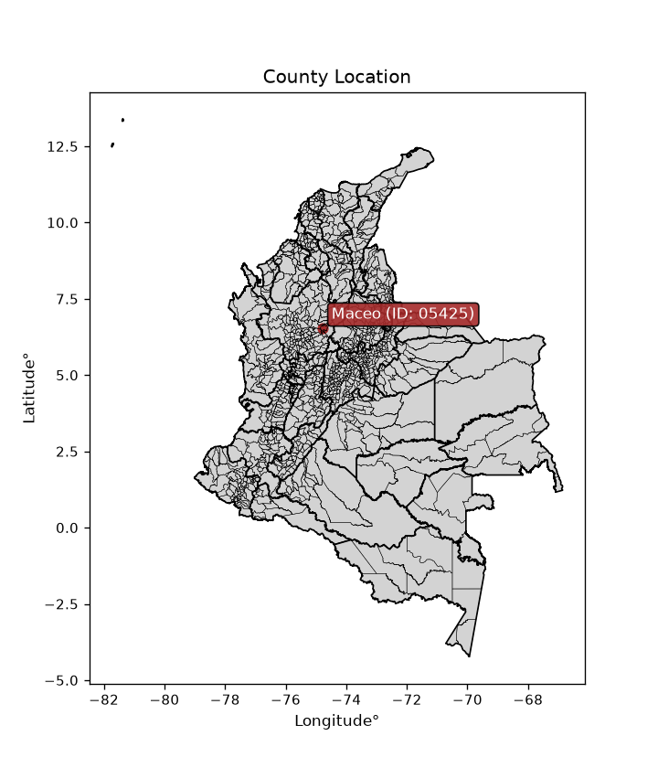
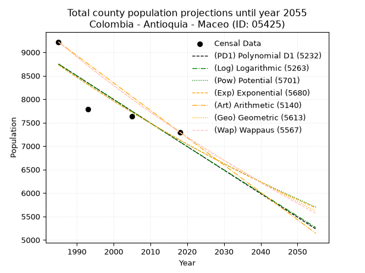
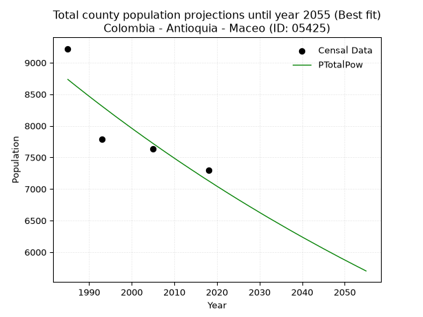
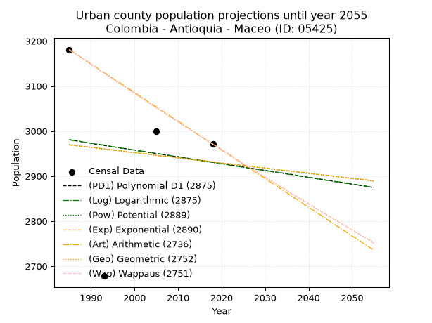
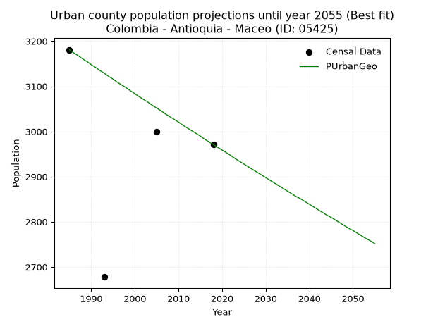
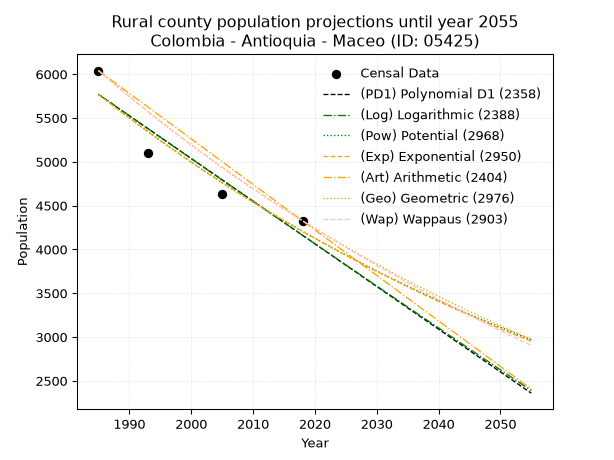
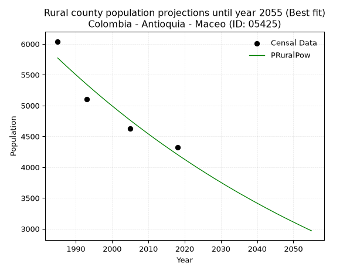

<div align="center">


</div>

# _“Population and Public Services Demand Projections (PPSD) until Year 2050 for Colombia - Antioquia - Maceo (ID: 05425)”_
Keywords: `population` `public-service` `projection` `lineal` `polynomial` `logarithmic` `potential` `exponential` `arithmetic` `geometric` `wappaus` `dane` `colombia` `south-america`

PPSD are analytical estimates used by governments and planners to anticipate future changes in population size, age distribution, and the resulting community needs for utilities, healthcare, education, and infrastructure as sizing future water treatment facilities, electrical grids, and road networks based on spatial growth.

> **General running parameters**: • app_version: _v20260806_. • Python version: _3.14.7_. • Pandas version: _3.0.5_. • NumPy version: _2.5.1_. • Creates, save and include plots into reports (create_plot): _False_. • Projection until year: _2050_. • Process polynomial degree 2 and up: _False_. • Process Wappaus: _True_. • Process Wappaus: _True_. • Set negative values to zero: _True_. • Set infinite values to zero: _True_. • Drop dataset notes: _True_. 
<div align="center">

Dynamic map: [:earth_americas:Google](http://maps.google.com/maps?q=6.552115939,-74.78716) [:earth_americas:OSM](https://www.openstreetmap.org/#map=18/6.552115939/-74.78716&layers=P) [:earth_americas:Bing](https://www.bing.com/maps?cp=6.552115939~-74.78716&lvl=18) [:earth_americas:Apple](https://maps.apple.com/frame?center=6.552115939%2C-74.78716&span=0.003%2C0.006)

</div>


<div align="center">

```geojson
{
  "type": "Feature",
  "geometry": {
    "type": "Point", 
    "coordinates": [-74.78716, 6.552115939]
  }, 
  "properties": {
    "Name": "Colombia - Antioquia - Maceo (ID: 05425)"
  }
}
```

</div>


<div align="center">

</img>

</div>


## 0. Census Data (4 records)

Census data are official statistics collected by a government about the people and housing in a country. They usually include counts of total population, age, sex, race, income, education, and jobs.

📅Global census file: [Population.xlsx](../data/Population.xlsx)

| Source   |   Year |   CountryID | CountryName   |   StateID | StateName   |   CountyID | CountyName   |   PTotal |   PUrban |   PRural |
|:---------|-------:|------------:|:--------------|----------:|:------------|-----------:|:-------------|---------:|---------:|---------:|
| DANE     |   1985 |          57 | Colombia      |        05 | Antioquia   |      05425 | Maceo        |     9221 |     3181 |     6040 |
| DANE     |   1993 |          57 | Colombia      |        05 | Antioquia   |      05425 | Maceo        |     7783 |     2678 |     5105 |
| DANE     |   2005 |          57 | Colombia      |        05 | Antioquia   |      05425 | Maceo        |     7630 |     3000 |     4630 |
| DANE     |   2018 |          57 | Colombia      |        05 | Antioquia   |      05425 | Maceo        |     7297 |     2971 |     4326 |

> 🔥Some records could had specific notes about the registered values or the corresponding urban or rural distribution.

📅   [RUPS](https://www.datos.gov.co/Hacienda-y-Cr-dito-P-blico/Registro-nico-de-Prestadores-de-Servicios-P-blicos/4qkq-csdn/about_data) - Local public utility companies: [RUPS.csv](../data/RUPS.xlsx)

 | SERVICIO       | ESTADO    | NOMBRE                                               | NIT         | DEPARTAMENTO_DOMICILIO   | MUNICIPIO_DOMICILIO   | DIRECCION            |   TELEFONO | EMAIL                  | TIPO_PRESTADOR                             | CLASIFICACION                 |
|:---------------|:----------|:-----------------------------------------------------|:------------|:-------------------------|:----------------------|:---------------------|-----------:|:-----------------------|:-------------------------------------------|:------------------------------|
| ACUEDUCTO      | OPERATIVA | EMPRESA DE SERVICIOS PUBLICOS DE MACEO S.A.S  E.S.P. | 900345914-2 | ANTIOQUIA                | MACEO                 | Carrera 29 # 26 - 15 |    8640044 | aguasdemaceo@gmail.com | SOCIEDADES (EMPRESA DE SERVICIOS PUBLICOS) | MENOR O IGUAL A 2500 USUARIOS |
| ALCANTARILLADO | OPERATIVA | EMPRESA DE SERVICIOS PUBLICOS DE MACEO S.A.S  E.S.P. | 900345914-2 | ANTIOQUIA                | MACEO                 | Carrera 29 # 26 - 15 |    8640044 | aguasdemaceo@gmail.com | SOCIEDADES (EMPRESA DE SERVICIOS PUBLICOS) | MENOR O IGUAL A 2500 USUARIOS |

## 1. Total

### 1.1. Coefficients and Parameters

* (PD1) Polynomial Deg 1: -50.23323966278588, 108461.78763548746 (lineal)
* (Log) Logarithmic: -100662.5287825028, 773119.4379346842
* (Pow) Potential: -12.30506469263816, 44.520350215779565
* (Exp) Exponential: -0.006141005000425214, 1718202732.4865048
* (Art) Arithmetic: Year diff. 2018 - 1985 = 33, Population diff. 7297 - 9221 = -1924, Annual growth = -58.303030303030305
* (Geo) Geometric: Year diff. 2018 - 1985 = 33, Population diff. 7297 - 9221 = -1924, Annual growth % = -0.007066435310752794
* (Wap) Wappaus: i = -0.7059332885704117, Condition values only valid for < 200)

<sub>
Wappaus condition values: ['-0.00', '-0.71', '-1.41', '-2.12', '-2.82', '-3.53', '-4.24', '-4.94', '-5.65', '-6.35', '-7.06', '-7.77', '-8.47', '-9.18', '-9.88', '-10.59', '-11.29', '-12.00', '-12.71', '-13.41', '-14.12', '-14.82', '-15.53', '-16.24', '-16.94', '-17.65', '-18.35', '-19.06', '-19.77', '-20.47', '-21.18', '-21.88', '-22.59', '-23.30', '-24.00', '-24.71', '-25.41', '-26.12', '-26.83', '-27.53', '-28.24', '-28.94', '-29.65', '-30.36', '-31.06', '-31.77', '-32.47', '-33.18', '-33.88', '-34.59', '-35.30', '-36.00', '-36.71', '-37.41', '-38.12', '-38.83', '-39.53', '-40.24', '-40.94', '-41.65', '-42.36', '-43.06', '-43.77', '-44.47', '-45.18', '-45.89']
</sub>


### 1.2. Projected Dataset

|   Year |   CountyID |   PTotalPD1 |   PTotalLog |   PTotalPow |   PTotalExp |   PTotalArt |   PTotalGeo |   PTotalWap |
|-------:|-----------:|------------:|------------:|------------:|------------:|------------:|------------:|------------:|
|   1985 |      05425 |        8749 |        8751 |        8734 |        8731 |        9221 |        9221 |        9221 |
|   1986 |      05425 |        8699 |        8700 |        8680 |        8678 |        9163 |        9156 |        9156 |
|   1987 |      05425 |        8648 |        8650 |        8626 |        8625 |        9104 |        9091 |        9092 |
|   1988 |      05425 |        8598 |        8599 |        8573 |        8572 |        9046 |        9027 |        9028 |
|   1989 |      05425 |        8548 |        8549 |        8520 |        8519 |        8988 |        8963 |        8964 |
|   1990 |      05425 |        8498 |        8498 |        8467 |        8467 |        8929 |        8900 |        8901 |
|   1991 |      05425 |        8447 |        8447 |        8415 |        8415 |        8871 |        8837 |        8839 |
|   1992 |      05425 |        8397 |        8397 |        8363 |        8364 |        8813 |        8774 |        8776 |
|   1993 |      05425 |        8347 |        8346 |        8312 |        8313 |        8755 |        8712 |        8715 |
|   1994 |      05425 |        8297 |        8296 |        8261 |        8262 |        8696 |        8651 |        8653 |
|   1995 |      05425 |        8246 |        8245 |        8210 |        8211 |        8638 |        8590 |        8592 |
|   1996 |      05425 |        8196 |        8195 |        8159 |        8161 |        8580 |        8529 |        8532 |
|   1997 |      05425 |        8146 |        8144 |        8109 |        8111 |        8521 |        8469 |        8472 |
|   1998 |      05425 |        8096 |        8094 |        8060 |        8061 |        8463 |        8409 |        8412 |
|   1999 |      05425 |        8046 |        8044 |        8010 |        8012 |        8405 |        8350 |        8353 |
|   2000 |      05425 |        7995 |        7993 |        7961 |        7963 |        8346 |        8291 |        8294 |
|   2001 |      05425 |        7945 |        7943 |        7912 |        7914 |        8288 |        8232 |        8235 |
|   2002 |      05425 |        7895 |        7893 |        7864 |        7866 |        8230 |        8174 |        8177 |
|   2003 |      05425 |        7845 |        7842 |        7815 |        7817 |        8172 |        8116 |        8119 |
|   2004 |      05425 |        7794 |        7792 |        7768 |        7770 |        8113 |        8059 |        8062 |
|   2005 |      05425 |        7744 |        7742 |        7720 |        7722 |        8055 |        8002 |        8005 |
|   2006 |      05425 |        7694 |        7692 |        7673 |        7675 |        7997 |        7945 |        7948 |
|   2007 |      05425 |        7644 |        7642 |        7626 |        7628 |        7938 |        7889 |        7892 |
|   2008 |      05425 |        7593 |        7592 |        7579 |        7581 |        7880 |        7833 |        7836 |
|   2009 |      05425 |        7543 |        7541 |        7533 |        7535 |        7822 |        7778 |        7781 |
|   2010 |      05425 |        7493 |        7491 |        7487 |        7489 |        7763 |        7723 |        7726 |
|   2011 |      05425 |        7443 |        7441 |        7441 |        7443 |        7705 |        7668 |        7671 |
|   2012 |      05425 |        7393 |        7391 |        7396 |        7397 |        7647 |        7614 |        7616 |
|   2013 |      05425 |        7342 |        7341 |        7351 |        7352 |        7589 |        7560 |        7562 |
|   2014 |      05425 |        7292 |        7291 |        7306 |        7307 |        7530 |        7507 |        7509 |
|   2015 |      05425 |        7242 |        7241 |        7262 |        7262 |        7472 |        7454 |        7455 |
|   2016 |      05425 |        7192 |        7191 |        7217 |        7218 |        7414 |        7401 |        7402 |
|   2017 |      05425 |        7141 |        7141 |        7173 |        7173 |        7355 |        7349 |        7349 |
|   2018 |      05425 |        7091 |        7091 |        7130 |        7130 |        7297 |        7297 |        7297 |
|   2019 |      05425 |        7041 |        7042 |        7087 |        7086 |        7239 |        7245 |        7245 |
|   2020 |      05425 |        6991 |        6992 |        7043 |        7042 |        7180 |        7194 |        7193 |
|   2021 |      05425 |        6940 |        6942 |        7001 |        6999 |        7122 |        7143 |        7142 |
|   2022 |      05425 |        6890 |        6892 |        6958 |        6957 |        7064 |        7093 |        7091 |
|   2023 |      05425 |        6840 |        6842 |        6916 |        6914 |        7005 |        7043 |        7040 |
|   2024 |      05425 |        6790 |        6793 |        6874 |        6872 |        6947 |        6993 |        6990 |
|   2025 |      05425 |        6739 |        6743 |        6832 |        6830 |        6889 |        6944 |        6939 |
|   2026 |      05425 |        6689 |        6693 |        6791 |        6788 |        6831 |        6895 |        6890 |
|   2027 |      05425 |        6639 |        6644 |        6750 |        6746 |        6772 |        6846 |        6840 |
|   2028 |      05425 |        6589 |        6594 |        6709 |        6705 |        6714 |        6797 |        6791 |
|   2029 |      05425 |        6539 |        6544 |        6669 |        6664 |        6656 |        6749 |        6742 |
|   2030 |      05425 |        6488 |        6495 |        6628 |        6623 |        6597 |        6702 |        6693 |
|   2031 |      05425 |        6438 |        6445 |        6588 |        6582 |        6539 |        6654 |        6645 |
|   2032 |      05425 |        6388 |        6396 |        6548 |        6542 |        6481 |        6607 |        6597 |
|   2033 |      05425 |        6338 |        6346 |        6509 |        6502 |        6422 |        6561 |        6549 |
|   2034 |      05425 |        6287 |        6296 |        6470 |        6462 |        6364 |        6514 |        6502 |
|   2035 |      05425 |        6237 |        6247 |        6431 |        6423 |        6306 |        6468 |        6455 |
|   2036 |      05425 |        6187 |        6198 |        6392 |        6383 |        6248 |        6423 |        6408 |
|   2037 |      05425 |        6137 |        6148 |        6353 |        6344 |        6189 |        6377 |        6361 |
|   2038 |      05425 |        6086 |        6099 |        6315 |        6305 |        6131 |        6332 |        6315 |
|   2039 |      05425 |        6036 |        6049 |        6277 |        6267 |        6073 |        6287 |        6269 |
|   2040 |      05425 |        5986 |        6000 |        6239 |        6229 |        6014 |        6243 |        6223 |
|   2041 |      05425 |        5936 |        5951 |        6202 |        6190 |        5956 |        6199 |        6177 |
|   2042 |      05425 |        5886 |        5901 |        6165 |        6152 |        5898 |        6155 |        6132 |
|   2043 |      05425 |        5835 |        5852 |        6128 |        6115 |        5839 |        6112 |        6087 |
|   2044 |      05425 |        5785 |        5803 |        6091 |        6077 |        5781 |        6068 |        6042 |
|   2045 |      05425 |        5735 |        5754 |        6054 |        6040 |        5723 |        6025 |        5998 |
|   2046 |      05425 |        5685 |        5704 |        6018 |        6003 |        5665 |        5983 |        5954 |
|   2047 |      05425 |        5634 |        5655 |        5982 |        5966 |        5606 |        5941 |        5910 |
|   2048 |      05425 |        5584 |        5606 |        5946 |        5930 |        5548 |        5899 |        5866 |
|   2049 |      05425 |        5534 |        5557 |        5910 |        5894 |        5490 |        5857 |        5823 |
|   2050 |      05425 |        5484 |        5508 |        5875 |        5858 |        5431 |        5816 |        5779 |
<div align="center">

</img>

</div>


### 1.3. Best fit with absolute and relative error (%)

Relative error puts that difference into context by dividing the absolute error by the true value, creating a unitless ratio or percentage that shows the scale of the mistake.

Absolute and relative error

|   Year | Source   |   CountryID | CountryName   |   StateID | StateName   |   CountyID_x | CountyName   |   PTotal |   PUrban |   PRural |   CountyID_y |   PTotalPD1 |   PTotalLog |   PTotalPow |   PTotalExp |   PTotalArt |   PTotalGeo |   PTotalWap |   PTotalPD1AbsError |   PTotalLogAbsError |   PTotalPowAbsError |   PTotalExpAbsError |   PTotalArtAbsError |   PTotalGeoAbsError |   PTotalWapAbsError |   PTotalPD1RelError |   PTotalLogRelError |   PTotalPowRelError |   PTotalExpRelError |   PTotalArtRelError |   PTotalGeoRelError |   PTotalWapRelError |
|-------:|:---------|------------:|:--------------|----------:|:------------|-------------:|:-------------|---------:|---------:|---------:|-------------:|------------:|------------:|------------:|------------:|------------:|------------:|------------:|--------------------:|--------------------:|--------------------:|--------------------:|--------------------:|--------------------:|--------------------:|--------------------:|--------------------:|--------------------:|--------------------:|--------------------:|--------------------:|--------------------:|
|   1985 | DANE     |          57 | Colombia      |        05 | Antioquia   |        05425 | Maceo        |     9221 |     3181 |     6040 |        05425 |        8749 |        8751 |        8734 |        8731 |        9221 |        9221 |        9221 |                 472 |                 470 |                 487 |                 490 |                   0 |                   0 |                   0 |             5.11875 |             5.09706 |             5.28142 |             5.31396 |             0       |             0       |             0       |
|   1993 | DANE     |          57 | Colombia      |        05 | Antioquia   |        05425 | Maceo        |     7783 |     2678 |     5105 |        05425 |        8347 |        8346 |        8312 |        8313 |        8755 |        8712 |        8715 |                 564 |                 563 |                 529 |                 530 |                 972 |                 929 |                 932 |             7.24656 |             7.23371 |             6.79686 |             6.80971 |            12.4888  |            11.9363  |            11.9748  |
|   2005 | DANE     |          57 | Colombia      |        05 | Antioquia   |        05425 | Maceo        |     7630 |     3000 |     4630 |        05425 |        7744 |        7742 |        7720 |        7722 |        8055 |        8002 |        8005 |                 114 |                 112 |                  90 |                  92 |                 425 |                 372 |                 375 |             1.4941  |             1.46789 |             1.17955 |             1.20577 |             5.57012 |             4.87549 |             4.91481 |
|   2018 | DANE     |          57 | Colombia      |        05 | Antioquia   |        05425 | Maceo        |     7297 |     2971 |     4326 |        05425 |        7091 |        7091 |        7130 |        7130 |        7297 |        7297 |        7297 |                 206 |                 206 |                 167 |                 167 |                   0 |                   0 |                   0 |             2.82308 |             2.82308 |             2.28861 |             2.28861 |             0       |             0       |             0       |

Relative error mean

| Method    |   RelError | Best   |
|:----------|-----------:|:-------|
| PTotalPD1 |    4.17062 |        |
| PTotalLog |    4.15544 |        |
| PTotalPow |    3.88661 | True   |
| PTotalExp |    3.90451 |        |
| PTotalArt |    4.51472 |        |
| PTotalGeo |    4.20294 |        |
| PTotalWap |    4.22241 |        |

💙Best method: _**PTotalPow**_
<div align="center">

</img>

</div>


### 1.4. Fresh water supply demand in liters per capita per day (lpcd)

The fresh water supply demand typically ranges from 100 to 300 liters per capita per day (lpcd) for standard domestic and municipal planning, though absolute survival minimums set by the World Health Organization are as low as 7.5 to 20 liters per day, and total consumption in high-income nations can exceed 400 liters.

> `CZ`: Level in meters above the sea level (masl)<br> `WS`: Fresh water supply demand in liters per capita per day (lpcd or l/h/d)<br> `WSAll`: Zonal fresh water supply demand in liters per second (l/s)<br> `A`: Zonal area in square meters<br> `DP`: Population density (people/hectare or p/ha)

Reference values (RAS Colombia)

|    CZ |   WS |
|------:|-----:|
|  1000 |  120 |
|  2000 |  130 |
| 99999 |  140 |

County shapefile geometry properties and water supply values

|   CountyID |      ATotal |   CZTotal |   WSTotal |
|-----------:|------------:|----------:|----------:|
|      05425 | 4.55287e+08 |   803.618 |       120 |

Projected values for best method: PTotalPow

|   CountyID |   Year |   PTotalPow |   DPTotal |   WSTotal |   WSTotalAll |
|-----------:|-------:|------------:|----------:|----------:|-------------:|
|      05425 |   1985 |        8734 |      0.19 |       120 |     12.1306  |
|      05425 |   1986 |        8680 |      0.19 |       120 |     12.0556  |
|      05425 |   1987 |        8626 |      0.19 |       120 |     11.9806  |
|      05425 |   1988 |        8573 |      0.19 |       120 |     11.9069  |
|      05425 |   1989 |        8520 |      0.19 |       120 |     11.8333  |
|      05425 |   1990 |        8467 |      0.19 |       120 |     11.7597  |
|      05425 |   1991 |        8415 |      0.18 |       120 |     11.6875  |
|      05425 |   1992 |        8363 |      0.18 |       120 |     11.6153  |
|      05425 |   1993 |        8312 |      0.18 |       120 |     11.5444  |
|      05425 |   1994 |        8261 |      0.18 |       120 |     11.4736  |
|      05425 |   1995 |        8210 |      0.18 |       120 |     11.4028  |
|      05425 |   1996 |        8159 |      0.18 |       120 |     11.3319  |
|      05425 |   1997 |        8109 |      0.18 |       120 |     11.2625  |
|      05425 |   1998 |        8060 |      0.18 |       120 |     11.1944  |
|      05425 |   1999 |        8010 |      0.18 |       120 |     11.125   |
|      05425 |   2000 |        7961 |      0.17 |       120 |     11.0569  |
|      05425 |   2001 |        7912 |      0.17 |       120 |     10.9889  |
|      05425 |   2002 |        7864 |      0.17 |       120 |     10.9222  |
|      05425 |   2003 |        7815 |      0.17 |       120 |     10.8542  |
|      05425 |   2004 |        7768 |      0.17 |       120 |     10.7889  |
|      05425 |   2005 |        7720 |      0.17 |       120 |     10.7222  |
|      05425 |   2006 |        7673 |      0.17 |       120 |     10.6569  |
|      05425 |   2007 |        7626 |      0.17 |       120 |     10.5917  |
|      05425 |   2008 |        7579 |      0.17 |       120 |     10.5264  |
|      05425 |   2009 |        7533 |      0.17 |       120 |     10.4625  |
|      05425 |   2010 |        7487 |      0.16 |       120 |     10.3986  |
|      05425 |   2011 |        7441 |      0.16 |       120 |     10.3347  |
|      05425 |   2012 |        7396 |      0.16 |       120 |     10.2722  |
|      05425 |   2013 |        7351 |      0.16 |       120 |     10.2097  |
|      05425 |   2014 |        7306 |      0.16 |       120 |     10.1472  |
|      05425 |   2015 |        7262 |      0.16 |       120 |     10.0861  |
|      05425 |   2016 |        7217 |      0.16 |       120 |     10.0236  |
|      05425 |   2017 |        7173 |      0.16 |       120 |      9.9625  |
|      05425 |   2018 |        7130 |      0.16 |       120 |      9.90278 |
|      05425 |   2019 |        7087 |      0.16 |       120 |      9.84306 |
|      05425 |   2020 |        7043 |      0.15 |       120 |      9.78194 |
|      05425 |   2021 |        7001 |      0.15 |       120 |      9.72361 |
|      05425 |   2022 |        6958 |      0.15 |       120 |      9.66389 |
|      05425 |   2023 |        6916 |      0.15 |       120 |      9.60556 |
|      05425 |   2024 |        6874 |      0.15 |       120 |      9.54722 |
|      05425 |   2025 |        6832 |      0.15 |       120 |      9.48889 |
|      05425 |   2026 |        6791 |      0.15 |       120 |      9.43194 |
|      05425 |   2027 |        6750 |      0.15 |       120 |      9.375   |
|      05425 |   2028 |        6709 |      0.15 |       120 |      9.31806 |
|      05425 |   2029 |        6669 |      0.15 |       120 |      9.2625  |
|      05425 |   2030 |        6628 |      0.15 |       120 |      9.20556 |
|      05425 |   2031 |        6588 |      0.14 |       120 |      9.15    |
|      05425 |   2032 |        6548 |      0.14 |       120 |      9.09444 |
|      05425 |   2033 |        6509 |      0.14 |       120 |      9.04028 |
|      05425 |   2034 |        6470 |      0.14 |       120 |      8.98611 |
|      05425 |   2035 |        6431 |      0.14 |       120 |      8.93194 |
|      05425 |   2036 |        6392 |      0.14 |       120 |      8.87778 |
|      05425 |   2037 |        6353 |      0.14 |       120 |      8.82361 |
|      05425 |   2038 |        6315 |      0.14 |       120 |      8.77083 |
|      05425 |   2039 |        6277 |      0.14 |       120 |      8.71806 |
|      05425 |   2040 |        6239 |      0.14 |       120 |      8.66528 |
|      05425 |   2041 |        6202 |      0.14 |       120 |      8.61389 |
|      05425 |   2042 |        6165 |      0.14 |       120 |      8.5625  |
|      05425 |   2043 |        6128 |      0.13 |       120 |      8.51111 |
|      05425 |   2044 |        6091 |      0.13 |       120 |      8.45972 |
|      05425 |   2045 |        6054 |      0.13 |       120 |      8.40833 |
|      05425 |   2046 |        6018 |      0.13 |       120 |      8.35833 |
|      05425 |   2047 |        5982 |      0.13 |       120 |      8.30833 |
|      05425 |   2048 |        5946 |      0.13 |       120 |      8.25833 |
|      05425 |   2049 |        5910 |      0.13 |       120 |      8.20833 |
|      05425 |   2050 |        5875 |      0.13 |       120 |      8.15972 |

## 2. Urban

### 2.1. Coefficients and Parameters

* (PD1) Polynomial Deg 1: -1.5102368526695826, 5978.351264552332 (lineal)
* (Log) Logarithmic: -3059.3421975274873, 26211.584559436196
* (Pow) Potential: -0.7922456243440382, 6.085362424697823
* (Exp) Exponential: -0.0003896169067764972, 6435.151629869918
* (Art) Arithmetic: Year diff. 2018 - 1985 = 33, Population diff. 2971 - 3181 = -210, Annual growth = -6.363636363636363
* (Geo) Geometric: Year diff. 2018 - 1985 = 33, Population diff. 2971 - 3181 = -210, Annual growth % = -0.0020674663951766314
* (Wap) Wappaus: i = -0.2068802458919494, Condition values only valid for < 200)

<sub>
Wappaus condition values: ['-0.00', '-0.21', '-0.41', '-0.62', '-0.83', '-1.03', '-1.24', '-1.45', '-1.66', '-1.86', '-2.07', '-2.28', '-2.48', '-2.69', '-2.90', '-3.10', '-3.31', '-3.52', '-3.72', '-3.93', '-4.14', '-4.34', '-4.55', '-4.76', '-4.97', '-5.17', '-5.38', '-5.59', '-5.79', '-6.00', '-6.21', '-6.41', '-6.62', '-6.83', '-7.03', '-7.24', '-7.45', '-7.65', '-7.86', '-8.07', '-8.28', '-8.48', '-8.69', '-8.90', '-9.10', '-9.31', '-9.52', '-9.72', '-9.93', '-10.14', '-10.34', '-10.55', '-10.76', '-10.96', '-11.17', '-11.38', '-11.59', '-11.79', '-12.00', '-12.21', '-12.41', '-12.62', '-12.83', '-13.03', '-13.24', '-13.45']
</sub>


### 2.2. Projected Dataset

|   Year |   CountyID |   PUrbanPD1 |   PUrbanLog |   PUrbanPow |   PUrbanExp |   PUrbanArt |   PUrbanGeo |   PUrbanWap |
|-------:|-----------:|------------:|------------:|------------:|------------:|------------:|------------:|------------:|
|   1985 |      05425 |        2981 |        2981 |        2970 |        2969 |        3181 |        3181 |        3181 |
|   1986 |      05425 |        2979 |        2979 |        2969 |        2968 |        3175 |        3174 |        3174 |
|   1987 |      05425 |        2978 |        2978 |        2967 |        2967 |        3168 |        3168 |        3168 |
|   1988 |      05425 |        2976 |        2976 |        2966 |        2966 |        3162 |        3161 |        3161 |
|   1989 |      05425 |        2974 |        2975 |        2965 |        2965 |        3156 |        3155 |        3155 |
|   1990 |      05425 |        2973 |        2973 |        2964 |        2964 |        3149 |        3148 |        3148 |
|   1991 |      05425 |        2971 |        2972 |        2963 |        2963 |        3143 |        3142 |        3142 |
|   1992 |      05425 |        2970 |        2970 |        2962 |        2961 |        3136 |        3135 |        3135 |
|   1993 |      05425 |        2968 |        2969 |        2960 |        2960 |        3130 |        3129 |        3129 |
|   1994 |      05425 |        2967 |        2967 |        2959 |        2959 |        3124 |        3122 |        3122 |
|   1995 |      05425 |        2965 |        2965 |        2958 |        2958 |        3117 |        3116 |        3116 |
|   1996 |      05425 |        2964 |        2964 |        2957 |        2957 |        3111 |        3109 |        3109 |
|   1997 |      05425 |        2962 |        2962 |        2956 |        2956 |        3105 |        3103 |        3103 |
|   1998 |      05425 |        2961 |        2961 |        2954 |        2954 |        3098 |        3097 |        3097 |
|   1999 |      05425 |        2959 |        2959 |        2953 |        2953 |        3092 |        3090 |        3090 |
|   2000 |      05425 |        2958 |        2958 |        2952 |        2952 |        3086 |        3084 |        3084 |
|   2001 |      05425 |        2956 |        2956 |        2951 |        2951 |        3079 |        3077 |        3077 |
|   2002 |      05425 |        2955 |        2955 |        2950 |        2950 |        3073 |        3071 |        3071 |
|   2003 |      05425 |        2953 |        2953 |        2949 |        2949 |        3066 |        3065 |        3065 |
|   2004 |      05425 |        2952 |        2952 |        2947 |        2948 |        3060 |        3058 |        3058 |
|   2005 |      05425 |        2950 |        2950 |        2946 |        2946 |        3054 |        3052 |        3052 |
|   2006 |      05425 |        2949 |        2949 |        2945 |        2945 |        3047 |        3046 |        3046 |
|   2007 |      05425 |        2947 |        2947 |        2944 |        2944 |        3041 |        3039 |        3039 |
|   2008 |      05425 |        2946 |        2946 |        2943 |        2943 |        3035 |        3033 |        3033 |
|   2009 |      05425 |        2944 |        2944 |        2942 |        2942 |        3028 |        3027 |        3027 |
|   2010 |      05425 |        2943 |        2943 |        2940 |        2941 |        3022 |        3021 |        3021 |
|   2011 |      05425 |        2941 |        2941 |        2939 |        2940 |        3016 |        3014 |        3014 |
|   2012 |      05425 |        2940 |        2940 |        2938 |        2938 |        3009 |        3008 |        3008 |
|   2013 |      05425 |        2938 |        2938 |        2937 |        2937 |        3003 |        3002 |        3002 |
|   2014 |      05425 |        2937 |        2936 |        2936 |        2936 |        2996 |        2996 |        2996 |
|   2015 |      05425 |        2935 |        2935 |        2935 |        2935 |        2990 |        2990 |        2990 |
|   2016 |      05425 |        2934 |        2933 |        2934 |        2934 |        2984 |        2983 |        2983 |
|   2017 |      05425 |        2932 |        2932 |        2932 |        2933 |        2977 |        2977 |        2977 |
|   2018 |      05425 |        2931 |        2930 |        2931 |        2932 |        2971 |        2971 |        2971 |
|   2019 |      05425 |        2929 |        2929 |        2930 |        2930 |        2965 |        2965 |        2965 |
|   2020 |      05425 |        2928 |        2927 |        2929 |        2929 |        2958 |        2959 |        2959 |
|   2021 |      05425 |        2926 |        2926 |        2928 |        2928 |        2952 |        2953 |        2953 |
|   2022 |      05425 |        2925 |        2924 |        2927 |        2927 |        2946 |        2947 |        2946 |
|   2023 |      05425 |        2923 |        2923 |        2926 |        2926 |        2939 |        2940 |        2940 |
|   2024 |      05425 |        2922 |        2921 |        2924 |        2925 |        2933 |        2934 |        2934 |
|   2025 |      05425 |        2920 |        2920 |        2923 |        2924 |        2926 |        2928 |        2928 |
|   2026 |      05425 |        2919 |        2918 |        2922 |        2922 |        2920 |        2922 |        2922 |
|   2027 |      05425 |        2917 |        2917 |        2921 |        2921 |        2914 |        2916 |        2916 |
|   2028 |      05425 |        2916 |        2915 |        2920 |        2920 |        2907 |        2910 |        2910 |
|   2029 |      05425 |        2914 |        2914 |        2919 |        2919 |        2901 |        2904 |        2904 |
|   2030 |      05425 |        2913 |        2912 |        2918 |        2918 |        2895 |        2898 |        2898 |
|   2031 |      05425 |        2911 |        2911 |        2916 |        2917 |        2888 |        2892 |        2892 |
|   2032 |      05425 |        2910 |        2909 |        2915 |        2916 |        2882 |        2886 |        2886 |
|   2033 |      05425 |        2908 |        2908 |        2914 |        2914 |        2876 |        2880 |        2880 |
|   2034 |      05425 |        2907 |        2906 |        2913 |        2913 |        2869 |        2874 |        2874 |
|   2035 |      05425 |        2905 |        2905 |        2912 |        2912 |        2863 |        2868 |        2868 |
|   2036 |      05425 |        2904 |        2903 |        2911 |        2911 |        2856 |        2862 |        2862 |
|   2037 |      05425 |        2902 |        2902 |        2910 |        2910 |        2850 |        2856 |        2856 |
|   2038 |      05425 |        2900 |        2900 |        2908 |        2909 |        2844 |        2851 |        2850 |
|   2039 |      05425 |        2899 |        2899 |        2907 |        2908 |        2837 |        2845 |        2844 |
|   2040 |      05425 |        2897 |        2897 |        2906 |        2907 |        2831 |        2839 |        2839 |
|   2041 |      05425 |        2896 |        2896 |        2905 |        2905 |        2825 |        2833 |        2833 |
|   2042 |      05425 |        2894 |        2894 |        2904 |        2904 |        2818 |        2827 |        2827 |
|   2043 |      05425 |        2893 |        2893 |        2903 |        2903 |        2812 |        2821 |        2821 |
|   2044 |      05425 |        2891 |        2891 |        2902 |        2902 |        2806 |        2815 |        2815 |
|   2045 |      05425 |        2890 |        2890 |        2901 |        2901 |        2799 |        2810 |        2809 |
|   2046 |      05425 |        2888 |        2888 |        2899 |        2900 |        2793 |        2804 |        2803 |
|   2047 |      05425 |        2887 |        2887 |        2898 |        2899 |        2786 |        2798 |        2798 |
|   2048 |      05425 |        2885 |        2885 |        2897 |        2897 |        2780 |        2792 |        2792 |
|   2049 |      05425 |        2884 |        2884 |        2896 |        2896 |        2774 |        2786 |        2786 |
|   2050 |      05425 |        2882 |        2882 |        2895 |        2895 |        2767 |        2781 |        2780 |
<div align="center">

</img>

</div>


### 2.3. Best fit with absolute and relative error (%)

Relative error puts that difference into context by dividing the absolute error by the true value, creating a unitless ratio or percentage that shows the scale of the mistake.

Absolute and relative error

|   Year | Source   |   CountryID | CountryName   |   StateID | StateName   |   CountyID_x | CountyName   |   PTotal |   PUrban |   PRural |   CountyID_y |   PUrbanPD1 |   PUrbanLog |   PUrbanPow |   PUrbanExp |   PUrbanArt |   PUrbanGeo |   PUrbanWap |   PUrbanPD1AbsError |   PUrbanLogAbsError |   PUrbanPowAbsError |   PUrbanExpAbsError |   PUrbanArtAbsError |   PUrbanGeoAbsError |   PUrbanWapAbsError |   PUrbanPD1RelError |   PUrbanLogRelError |   PUrbanPowRelError |   PUrbanExpRelError |   PUrbanArtRelError |   PUrbanGeoRelError |   PUrbanWapRelError |
|-------:|:---------|------------:|:--------------|----------:|:------------|-------------:|:-------------|---------:|---------:|---------:|-------------:|------------:|------------:|------------:|------------:|------------:|------------:|------------:|--------------------:|--------------------:|--------------------:|--------------------:|--------------------:|--------------------:|--------------------:|--------------------:|--------------------:|--------------------:|--------------------:|--------------------:|--------------------:|--------------------:|
|   1985 | DANE     |          57 | Colombia      |        05 | Antioquia   |        05425 | Maceo        |     9221 |     3181 |     6040 |        05425 |        2981 |        2981 |        2970 |        2969 |        3181 |        3181 |        3181 |                 200 |                 200 |                 211 |                 212 |                   0 |                   0 |                   0 |             6.28733 |             6.28733 |             6.63313 |             6.66457 |              0      |             0       |             0       |
|   1993 | DANE     |          57 | Colombia      |        05 | Antioquia   |        05425 | Maceo        |     7783 |     2678 |     5105 |        05425 |        2968 |        2969 |        2960 |        2960 |        3130 |        3129 |        3129 |                 290 |                 291 |                 282 |                 282 |                 452 |                 451 |                 451 |            10.829   |            10.8663  |            10.5302  |            10.5302  |             16.8783 |            16.8409  |            16.8409  |
|   2005 | DANE     |          57 | Colombia      |        05 | Antioquia   |        05425 | Maceo        |     7630 |     3000 |     4630 |        05425 |        2950 |        2950 |        2946 |        2946 |        3054 |        3052 |        3052 |                  50 |                  50 |                  54 |                  54 |                  54 |                  52 |                  52 |             1.66667 |             1.66667 |             1.8     |             1.8     |              1.8    |             1.73333 |             1.73333 |
|   2018 | DANE     |          57 | Colombia      |        05 | Antioquia   |        05425 | Maceo        |     7297 |     2971 |     4326 |        05425 |        2931 |        2930 |        2931 |        2932 |        2971 |        2971 |        2971 |                  40 |                  41 |                  40 |                  39 |                   0 |                   0 |                   0 |             1.34635 |             1.38001 |             1.34635 |             1.31269 |              0      |             0       |             0       |

Relative error mean

| Method    |   RelError | Best   |
|:----------|-----------:|:-------|
| PUrbanPD1 |    5.03233 |        |
| PUrbanLog |    5.05008 |        |
| PUrbanPow |    5.07743 |        |
| PUrbanExp |    5.07688 |        |
| PUrbanArt |    4.66957 |        |
| PUrbanGeo |    4.64356 | True   |
| PUrbanWap |    4.64356 | True   |

💙Best method: _**PUrbanGeo**_
<div align="center">

</img>

</div>


### 2.4. Fresh water supply demand in liters per capita per day (lpcd)

The fresh water supply demand typically ranges from 100 to 300 liters per capita per day (lpcd) for standard domestic and municipal planning, though absolute survival minimums set by the World Health Organization are as low as 7.5 to 20 liters per day, and total consumption in high-income nations can exceed 400 liters.

> `CZ`: Level in meters above the sea level (masl)<br> `WS`: Fresh water supply demand in liters per capita per day (lpcd or l/h/d)<br> `WSAll`: Zonal fresh water supply demand in liters per second (l/s)<br> `A`: Zonal area in square meters<br> `DP`: Population density (people/hectare or p/ha)

Reference values (RAS Colombia)

|    CZ |   WS |
|------:|-----:|
|  1000 |  120 |
|  2000 |  130 |
| 99999 |  140 |

County shapefile geometry properties and water supply values

|   CountyID |   AUrban |   CZUrban |   WSUrban |
|-----------:|---------:|----------:|----------:|
|      05425 |   676987 |   942.136 |       120 |

Projected values for best method: PUrbanGeo

|   CountyID |   Year |   PUrbanGeo |   DPUrban |   WSUrban |   WSUrbanAll |
|-----------:|-------:|------------:|----------:|----------:|-------------:|
|      05425 |   1985 |        3181 |     46.99 |       120 |      4.41806 |
|      05425 |   1986 |        3174 |     46.88 |       120 |      4.40833 |
|      05425 |   1987 |        3168 |     46.8  |       120 |      4.4     |
|      05425 |   1988 |        3161 |     46.69 |       120 |      4.39028 |
|      05425 |   1989 |        3155 |     46.6  |       120 |      4.38194 |
|      05425 |   1990 |        3148 |     46.5  |       120 |      4.37222 |
|      05425 |   1991 |        3142 |     46.41 |       120 |      4.36389 |
|      05425 |   1992 |        3135 |     46.31 |       120 |      4.35417 |
|      05425 |   1993 |        3129 |     46.22 |       120 |      4.34583 |
|      05425 |   1994 |        3122 |     46.12 |       120 |      4.33611 |
|      05425 |   1995 |        3116 |     46.03 |       120 |      4.32778 |
|      05425 |   1996 |        3109 |     45.92 |       120 |      4.31806 |
|      05425 |   1997 |        3103 |     45.84 |       120 |      4.30972 |
|      05425 |   1998 |        3097 |     45.75 |       120 |      4.30139 |
|      05425 |   1999 |        3090 |     45.64 |       120 |      4.29167 |
|      05425 |   2000 |        3084 |     45.55 |       120 |      4.28333 |
|      05425 |   2001 |        3077 |     45.45 |       120 |      4.27361 |
|      05425 |   2002 |        3071 |     45.36 |       120 |      4.26528 |
|      05425 |   2003 |        3065 |     45.27 |       120 |      4.25694 |
|      05425 |   2004 |        3058 |     45.17 |       120 |      4.24722 |
|      05425 |   2005 |        3052 |     45.08 |       120 |      4.23889 |
|      05425 |   2006 |        3046 |     44.99 |       120 |      4.23056 |
|      05425 |   2007 |        3039 |     44.89 |       120 |      4.22083 |
|      05425 |   2008 |        3033 |     44.8  |       120 |      4.2125  |
|      05425 |   2009 |        3027 |     44.71 |       120 |      4.20417 |
|      05425 |   2010 |        3021 |     44.62 |       120 |      4.19583 |
|      05425 |   2011 |        3014 |     44.52 |       120 |      4.18611 |
|      05425 |   2012 |        3008 |     44.43 |       120 |      4.17778 |
|      05425 |   2013 |        3002 |     44.34 |       120 |      4.16944 |
|      05425 |   2014 |        2996 |     44.25 |       120 |      4.16111 |
|      05425 |   2015 |        2990 |     44.17 |       120 |      4.15278 |
|      05425 |   2016 |        2983 |     44.06 |       120 |      4.14306 |
|      05425 |   2017 |        2977 |     43.97 |       120 |      4.13472 |
|      05425 |   2018 |        2971 |     43.89 |       120 |      4.12639 |
|      05425 |   2019 |        2965 |     43.8  |       120 |      4.11806 |
|      05425 |   2020 |        2959 |     43.71 |       120 |      4.10972 |
|      05425 |   2021 |        2953 |     43.62 |       120 |      4.10139 |
|      05425 |   2022 |        2947 |     43.53 |       120 |      4.09306 |
|      05425 |   2023 |        2940 |     43.43 |       120 |      4.08333 |
|      05425 |   2024 |        2934 |     43.34 |       120 |      4.075   |
|      05425 |   2025 |        2928 |     43.25 |       120 |      4.06667 |
|      05425 |   2026 |        2922 |     43.16 |       120 |      4.05833 |
|      05425 |   2027 |        2916 |     43.07 |       120 |      4.05    |
|      05425 |   2028 |        2910 |     42.98 |       120 |      4.04167 |
|      05425 |   2029 |        2904 |     42.9  |       120 |      4.03333 |
|      05425 |   2030 |        2898 |     42.81 |       120 |      4.025   |
|      05425 |   2031 |        2892 |     42.72 |       120 |      4.01667 |
|      05425 |   2032 |        2886 |     42.63 |       120 |      4.00833 |
|      05425 |   2033 |        2880 |     42.54 |       120 |      4       |
|      05425 |   2034 |        2874 |     42.45 |       120 |      3.99167 |
|      05425 |   2035 |        2868 |     42.36 |       120 |      3.98333 |
|      05425 |   2036 |        2862 |     42.28 |       120 |      3.975   |
|      05425 |   2037 |        2856 |     42.19 |       120 |      3.96667 |
|      05425 |   2038 |        2851 |     42.11 |       120 |      3.95972 |
|      05425 |   2039 |        2845 |     42.02 |       120 |      3.95139 |
|      05425 |   2040 |        2839 |     41.94 |       120 |      3.94306 |
|      05425 |   2041 |        2833 |     41.85 |       120 |      3.93472 |
|      05425 |   2042 |        2827 |     41.76 |       120 |      3.92639 |
|      05425 |   2043 |        2821 |     41.67 |       120 |      3.91806 |
|      05425 |   2044 |        2815 |     41.58 |       120 |      3.90972 |
|      05425 |   2045 |        2810 |     41.51 |       120 |      3.90278 |
|      05425 |   2046 |        2804 |     41.42 |       120 |      3.89444 |
|      05425 |   2047 |        2798 |     41.33 |       120 |      3.88611 |
|      05425 |   2048 |        2792 |     41.24 |       120 |      3.87778 |
|      05425 |   2049 |        2786 |     41.15 |       120 |      3.86944 |
|      05425 |   2050 |        2781 |     41.08 |       120 |      3.8625  |

## 3. Rural

### 3.1. Coefficients and Parameters

* (PD1) Polynomial Deg 1: -48.72300281011623, 102483.436370935 (lineal)
* (Log) Logarithmic: -97603.18658497534, 746907.8533752481
* (Pow) Potential: -19.19443370153609, 67.05995634798185
* (Exp) Exponential: -0.009582810548806166, 1052540881500.917
* (Art) Arithmetic: Year diff. 2018 - 1985 = 33, Population diff. 4326 - 6040 = -1714, Annual growth = -51.93939393939394
* (Geo) Geometric: Year diff. 2018 - 1985 = 33, Population diff. 4326 - 6040 = -1714, Annual growth % = -0.01006298603376754
* (Wap) Wappaus: i = -1.0021106297394162, Condition values only valid for < 200)

<sub>
Wappaus condition values: ['-0.00', '-1.00', '-2.00', '-3.01', '-4.01', '-5.01', '-6.01', '-7.01', '-8.02', '-9.02', '-10.02', '-11.02', '-12.03', '-13.03', '-14.03', '-15.03', '-16.03', '-17.04', '-18.04', '-19.04', '-20.04', '-21.04', '-22.05', '-23.05', '-24.05', '-25.05', '-26.05', '-27.06', '-28.06', '-29.06', '-30.06', '-31.07', '-32.07', '-33.07', '-34.07', '-35.07', '-36.08', '-37.08', '-38.08', '-39.08', '-40.08', '-41.09', '-42.09', '-43.09', '-44.09', '-45.09', '-46.10', '-47.10', '-48.10', '-49.10', '-50.11', '-51.11', '-52.11', '-53.11', '-54.11', '-55.12', '-56.12', '-57.12', '-58.12', '-59.12', '-60.13', '-61.13', '-62.13', '-63.13', '-64.14', '-65.14']
</sub>


### 3.2. Projected Dataset

|   Year |   CountyID |   PRuralPD1 |   PRuralLog |   PRuralPow |   PRuralExp |   PRuralArt |   PRuralGeo |   PRuralWap |
|-------:|-----------:|------------:|------------:|------------:|------------:|------------:|------------:|------------:|
|   1985 |      05425 |        5768 |        5770 |        5772 |        5770 |        6040 |        6040 |        6040 |
|   1986 |      05425 |        5720 |        5721 |        5716 |        5715 |        5988 |        5979 |        5980 |
|   1987 |      05425 |        5671 |        5672 |        5661 |        5660 |        5936 |        5919 |        5920 |
|   1988 |      05425 |        5622 |        5623 |        5607 |        5606 |        5884 |        5859 |        5861 |
|   1989 |      05425 |        5573 |        5574 |        5553 |        5553 |        5832 |        5801 |        5803 |
|   1990 |      05425 |        5525 |        5525 |        5500 |        5500 |        5780 |        5742 |        5745 |
|   1991 |      05425 |        5476 |        5476 |        5447 |        5447 |        5728 |        5684 |        5687 |
|   1992 |      05425 |        5427 |        5427 |        5395 |        5395 |        5676 |        5627 |        5631 |
|   1993 |      05425 |        5378 |        5378 |        5343 |        5344 |        5624 |        5571 |        5574 |
|   1994 |      05425 |        5330 |        5329 |        5292 |        5293 |        5573 |        5514 |        5519 |
|   1995 |      05425 |        5281 |        5280 |        5241 |        5242 |        5521 |        5459 |        5464 |
|   1996 |      05425 |        5232 |        5231 |        5191 |        5192 |        5469 |        5404 |        5409 |
|   1997 |      05425 |        5184 |        5182 |        5141 |        5143 |        5417 |        5350 |        5355 |
|   1998 |      05425 |        5135 |        5133 |        5092 |        5094 |        5365 |        5296 |        5301 |
|   1999 |      05425 |        5086 |        5084 |        5043 |        5045 |        5313 |        5243 |        5248 |
|   2000 |      05425 |        5037 |        5036 |        4995 |        4997 |        5261 |        5190 |        5196 |
|   2001 |      05425 |        4989 |        4987 |        4948 |        4949 |        5209 |        5138 |        5143 |
|   2002 |      05425 |        4940 |        4938 |        4900 |        4902 |        5157 |        5086 |        5092 |
|   2003 |      05425 |        4891 |        4889 |        4854 |        4855 |        5105 |        5035 |        5041 |
|   2004 |      05425 |        4843 |        4841 |        4807 |        4809 |        5053 |        4984 |        4990 |
|   2005 |      05425 |        4794 |        4792 |        4761 |        4763 |        5001 |        4934 |        4940 |
|   2006 |      05425 |        4745 |        4743 |        4716 |        4718 |        4949 |        4884 |        4890 |
|   2007 |      05425 |        4696 |        4695 |        4671 |        4673 |        4897 |        4835 |        4841 |
|   2008 |      05425 |        4648 |        4646 |        4627 |        4628 |        4845 |        4786 |        4792 |
|   2009 |      05425 |        4599 |        4597 |        4583 |        4584 |        4793 |        4738 |        4743 |
|   2010 |      05425 |        4550 |        4549 |        4539 |        4540 |        4742 |        4691 |        4695 |
|   2011 |      05425 |        4501 |        4500 |        4496 |        4497 |        4690 |        4643 |        4648 |
|   2012 |      05425 |        4453 |        4452 |        4453 |        4454 |        4638 |        4597 |        4601 |
|   2013 |      05425 |        4404 |        4403 |        4411 |        4412 |        4586 |        4550 |        4554 |
|   2014 |      05425 |        4355 |        4355 |        4369 |        4370 |        4534 |        4505 |        4507 |
|   2015 |      05425 |        4307 |        4306 |        4328 |        4328 |        4482 |        4459 |        4461 |
|   2016 |      05425 |        4258 |        4258 |        4287 |        4287 |        4430 |        4414 |        4416 |
|   2017 |      05425 |        4209 |        4209 |        4246 |        4246 |        4378 |        4370 |        4371 |
|   2018 |      05425 |        4160 |        4161 |        4206 |        4205 |        4326 |        4326 |        4326 |
|   2019 |      05425 |        4112 |        4113 |        4166 |        4165 |        4274 |        4282 |        4282 |
|   2020 |      05425 |        4063 |        4064 |        4127 |        4126 |        4222 |        4239 |        4238 |
|   2021 |      05425 |        4014 |        4016 |        4088 |        4086 |        4170 |        4197 |        4194 |
|   2022 |      05425 |        3966 |        3968 |        4049 |        4047 |        4118 |        4154 |        4151 |
|   2023 |      05425 |        3917 |        3920 |        4011 |        4009 |        4066 |        4113 |        4108 |
|   2024 |      05425 |        3868 |        3871 |        3973 |        3970 |        4014 |        4071 |        4065 |
|   2025 |      05425 |        3819 |        3823 |        3936 |        3933 |        3962 |        4030 |        4023 |
|   2026 |      05425 |        3771 |        3775 |        3898 |        3895 |        3910 |        3990 |        3981 |
|   2027 |      05425 |        3722 |        3727 |        3862 |        3858 |        3859 |        3950 |        3940 |
|   2028 |      05425 |        3673 |        3679 |        3825 |        3821 |        3807 |        3910 |        3899 |
|   2029 |      05425 |        3624 |        3630 |        3789 |        3785 |        3755 |        3871 |        3858 |
|   2030 |      05425 |        3576 |        3582 |        3754 |        3749 |        3703 |        3832 |        3817 |
|   2031 |      05425 |        3527 |        3534 |        3718 |        3713 |        3651 |        3793 |        3777 |
|   2032 |      05425 |        3478 |        3486 |        3683 |        3677 |        3599 |        3755 |        3737 |
|   2033 |      05425 |        3430 |        3438 |        3649 |        3642 |        3547 |        3717 |        3698 |
|   2034 |      05425 |        3381 |        3390 |        3614 |        3608 |        3495 |        3680 |        3659 |
|   2035 |      05425 |        3332 |        3342 |        3580 |        3573 |        3443 |        3643 |        3620 |
|   2036 |      05425 |        3283 |        3294 |        3547 |        3539 |        3391 |        3606 |        3581 |
|   2037 |      05425 |        3235 |        3246 |        3514 |        3505 |        3339 |        3570 |        3543 |
|   2038 |      05425 |        3186 |        3198 |        3481 |        3472 |        3287 |        3534 |        3505 |
|   2039 |      05425 |        3137 |        3151 |        3448 |        3439 |        3235 |        3498 |        3468 |
|   2040 |      05425 |        3089 |        3103 |        3416 |        3406 |        3183 |        3463 |        3430 |
|   2041 |      05425 |        3040 |        3055 |        3384 |        3374 |        3131 |        3428 |        3393 |
|   2042 |      05425 |        2991 |        3007 |        3352 |        3341 |        3079 |        3394 |        3356 |
|   2043 |      05425 |        2942 |        2959 |        3321 |        3309 |        3028 |        3360 |        3320 |
|   2044 |      05425 |        2894 |        2912 |        3290 |        3278 |        2976 |        3326 |        3284 |
|   2045 |      05425 |        2845 |        2864 |        3259 |        3247 |        2924 |        3292 |        3248 |
|   2046 |      05425 |        2796 |        2816 |        3228 |        3216 |        2872 |        3259 |        3212 |
|   2047 |      05425 |        2747 |        2768 |        3198 |        3185 |        2820 |        3226 |        3177 |
|   2048 |      05425 |        2699 |        2721 |        3168 |        3155 |        2768 |        3194 |        3142 |
|   2049 |      05425 |        2650 |        2673 |        3139 |        3125 |        2716 |        3162 |        3107 |
|   2050 |      05425 |        2601 |        2625 |        3110 |        3095 |        2664 |        3130 |        3072 |
<div align="center">

</img>

</div>


### 3.3. Best fit with absolute and relative error (%)

Relative error puts that difference into context by dividing the absolute error by the true value, creating a unitless ratio or percentage that shows the scale of the mistake.

Absolute and relative error

|   Year | Source   |   CountryID | CountryName   |   StateID | StateName   |   CountyID_x | CountyName   |   PTotal |   PUrban |   PRural |   CountyID_y |   PRuralPD1 |   PRuralLog |   PRuralPow |   PRuralExp |   PRuralArt |   PRuralGeo |   PRuralWap |   PRuralPD1AbsError |   PRuralLogAbsError |   PRuralPowAbsError |   PRuralExpAbsError |   PRuralArtAbsError |   PRuralGeoAbsError |   PRuralWapAbsError |   PRuralPD1RelError |   PRuralLogRelError |   PRuralPowRelError |   PRuralExpRelError |   PRuralArtRelError |   PRuralGeoRelError |   PRuralWapRelError |
|-------:|:---------|------------:|:--------------|----------:|:------------|-------------:|:-------------|---------:|---------:|---------:|-------------:|------------:|------------:|------------:|------------:|------------:|------------:|------------:|--------------------:|--------------------:|--------------------:|--------------------:|--------------------:|--------------------:|--------------------:|--------------------:|--------------------:|--------------------:|--------------------:|--------------------:|--------------------:|--------------------:|
|   1985 | DANE     |          57 | Colombia      |        05 | Antioquia   |        05425 | Maceo        |     9221 |     3181 |     6040 |        05425 |        5768 |        5770 |        5772 |        5770 |        6040 |        6040 |        6040 |                 272 |                 270 |                 268 |                 270 |                   0 |                   0 |                   0 |             4.50331 |             4.4702  |             4.43709 |             4.4702  |             0       |             0       |             0       |
|   1993 | DANE     |          57 | Colombia      |        05 | Antioquia   |        05425 | Maceo        |     7783 |     2678 |     5105 |        05425 |        5378 |        5378 |        5343 |        5344 |        5624 |        5571 |        5574 |                 273 |                 273 |                 238 |                 239 |                 519 |                 466 |                 469 |             5.3477  |             5.3477  |             4.6621  |             4.68168 |            10.1665  |             9.12831 |             9.18707 |
|   2005 | DANE     |          57 | Colombia      |        05 | Antioquia   |        05425 | Maceo        |     7630 |     3000 |     4630 |        05425 |        4794 |        4792 |        4761 |        4763 |        5001 |        4934 |        4940 |                 164 |                 162 |                 131 |                 133 |                 371 |                 304 |                 310 |             3.54212 |             3.49892 |             2.82937 |             2.87257 |             8.01296 |             6.56587 |             6.69546 |
|   2018 | DANE     |          57 | Colombia      |        05 | Antioquia   |        05425 | Maceo        |     7297 |     2971 |     4326 |        05425 |        4160 |        4161 |        4206 |        4205 |        4326 |        4326 |        4326 |                 166 |                 165 |                 120 |                 121 |                   0 |                   0 |                   0 |             3.83726 |             3.81415 |             2.77393 |             2.79704 |             0       |             0       |             0       |

Relative error mean

| Method    |   RelError | Best   |
|:----------|-----------:|:-------|
| PRuralPD1 |    4.3076  |        |
| PRuralLog |    4.28274 |        |
| PRuralPow |    3.67562 | True   |
| PRuralExp |    3.70537 |        |
| PRuralArt |    4.54487 |        |
| PRuralGeo |    3.92355 |        |
| PRuralWap |    3.97063 |        |

💙Best method: _**PRuralPow**_
<div align="center">

</img>

</div>


### 3.4. Fresh water supply demand in liters per capita per day (lpcd)

The fresh water supply demand typically ranges from 100 to 300 liters per capita per day (lpcd) for standard domestic and municipal planning, though absolute survival minimums set by the World Health Organization are as low as 7.5 to 20 liters per day, and total consumption in high-income nations can exceed 400 liters.

> `CZ`: Level in meters above the sea level (masl)<br> `WS`: Fresh water supply demand in liters per capita per day (lpcd or l/h/d)<br> `WSAll`: Zonal fresh water supply demand in liters per second (l/s)<br> `A`: Zonal area in square meters<br> `DP`: Population density (people/hectare or p/ha)

Reference values (RAS Colombia)

|    CZ |   WS |
|------:|-----:|
|  1000 |  120 |
|  2000 |  130 |
| 99999 |  140 |

County shapefile geometry properties and water supply values

|   CountyID |     ARural |   CZRural |   WSRural |
|-----------:|-----------:|----------:|----------:|
|      05425 | 4.5461e+08 |   803.413 |       120 |

Projected values for best method: PRuralPow

|   CountyID |   Year |   PRuralPow |   DPRural |   WSRural |   WSRuralAll |
|-----------:|-------:|------------:|----------:|----------:|-------------:|
|      05425 |   1985 |        5772 |      0.13 |       120 |      8.01667 |
|      05425 |   1986 |        5716 |      0.13 |       120 |      7.93889 |
|      05425 |   1987 |        5661 |      0.12 |       120 |      7.8625  |
|      05425 |   1988 |        5607 |      0.12 |       120 |      7.7875  |
|      05425 |   1989 |        5553 |      0.12 |       120 |      7.7125  |
|      05425 |   1990 |        5500 |      0.12 |       120 |      7.63889 |
|      05425 |   1991 |        5447 |      0.12 |       120 |      7.56528 |
|      05425 |   1992 |        5395 |      0.12 |       120 |      7.49306 |
|      05425 |   1993 |        5343 |      0.12 |       120 |      7.42083 |
|      05425 |   1994 |        5292 |      0.12 |       120 |      7.35    |
|      05425 |   1995 |        5241 |      0.12 |       120 |      7.27917 |
|      05425 |   1996 |        5191 |      0.11 |       120 |      7.20972 |
|      05425 |   1997 |        5141 |      0.11 |       120 |      7.14028 |
|      05425 |   1998 |        5092 |      0.11 |       120 |      7.07222 |
|      05425 |   1999 |        5043 |      0.11 |       120 |      7.00417 |
|      05425 |   2000 |        4995 |      0.11 |       120 |      6.9375  |
|      05425 |   2001 |        4948 |      0.11 |       120 |      6.87222 |
|      05425 |   2002 |        4900 |      0.11 |       120 |      6.80556 |
|      05425 |   2003 |        4854 |      0.11 |       120 |      6.74167 |
|      05425 |   2004 |        4807 |      0.11 |       120 |      6.67639 |
|      05425 |   2005 |        4761 |      0.1  |       120 |      6.6125  |
|      05425 |   2006 |        4716 |      0.1  |       120 |      6.55    |
|      05425 |   2007 |        4671 |      0.1  |       120 |      6.4875  |
|      05425 |   2008 |        4627 |      0.1  |       120 |      6.42639 |
|      05425 |   2009 |        4583 |      0.1  |       120 |      6.36528 |
|      05425 |   2010 |        4539 |      0.1  |       120 |      6.30417 |
|      05425 |   2011 |        4496 |      0.1  |       120 |      6.24444 |
|      05425 |   2012 |        4453 |      0.1  |       120 |      6.18472 |
|      05425 |   2013 |        4411 |      0.1  |       120 |      6.12639 |
|      05425 |   2014 |        4369 |      0.1  |       120 |      6.06806 |
|      05425 |   2015 |        4328 |      0.1  |       120 |      6.01111 |
|      05425 |   2016 |        4287 |      0.09 |       120 |      5.95417 |
|      05425 |   2017 |        4246 |      0.09 |       120 |      5.89722 |
|      05425 |   2018 |        4206 |      0.09 |       120 |      5.84167 |
|      05425 |   2019 |        4166 |      0.09 |       120 |      5.78611 |
|      05425 |   2020 |        4127 |      0.09 |       120 |      5.73194 |
|      05425 |   2021 |        4088 |      0.09 |       120 |      5.67778 |
|      05425 |   2022 |        4049 |      0.09 |       120 |      5.62361 |
|      05425 |   2023 |        4011 |      0.09 |       120 |      5.57083 |
|      05425 |   2024 |        3973 |      0.09 |       120 |      5.51806 |
|      05425 |   2025 |        3936 |      0.09 |       120 |      5.46667 |
|      05425 |   2026 |        3898 |      0.09 |       120 |      5.41389 |
|      05425 |   2027 |        3862 |      0.08 |       120 |      5.36389 |
|      05425 |   2028 |        3825 |      0.08 |       120 |      5.3125  |
|      05425 |   2029 |        3789 |      0.08 |       120 |      5.2625  |
|      05425 |   2030 |        3754 |      0.08 |       120 |      5.21389 |
|      05425 |   2031 |        3718 |      0.08 |       120 |      5.16389 |
|      05425 |   2032 |        3683 |      0.08 |       120 |      5.11528 |
|      05425 |   2033 |        3649 |      0.08 |       120 |      5.06806 |
|      05425 |   2034 |        3614 |      0.08 |       120 |      5.01944 |
|      05425 |   2035 |        3580 |      0.08 |       120 |      4.97222 |
|      05425 |   2036 |        3547 |      0.08 |       120 |      4.92639 |
|      05425 |   2037 |        3514 |      0.08 |       120 |      4.88056 |
|      05425 |   2038 |        3481 |      0.08 |       120 |      4.83472 |
|      05425 |   2039 |        3448 |      0.08 |       120 |      4.78889 |
|      05425 |   2040 |        3416 |      0.08 |       120 |      4.74444 |
|      05425 |   2041 |        3384 |      0.07 |       120 |      4.7     |
|      05425 |   2042 |        3352 |      0.07 |       120 |      4.65556 |
|      05425 |   2043 |        3321 |      0.07 |       120 |      4.6125  |
|      05425 |   2044 |        3290 |      0.07 |       120 |      4.56944 |
|      05425 |   2045 |        3259 |      0.07 |       120 |      4.52639 |
|      05425 |   2046 |        3228 |      0.07 |       120 |      4.48333 |
|      05425 |   2047 |        3198 |      0.07 |       120 |      4.44167 |
|      05425 |   2048 |        3168 |      0.07 |       120 |      4.4     |
|      05425 |   2049 |        3139 |      0.07 |       120 |      4.35972 |
|      05425 |   2050 |        3110 |      0.07 |       120 |      4.31944 |

<div align="center"><br><sub>Share this research</sub></div><br>

<sub>**APPS & TOOLS & CONTENT DISCLAIMER**: • NO WARRANTY - This content and software is provided by <a href="https://github.com/rcfdtools" target="_blank">github.com/rcfdtools</a> "as is", without any express or implied warranty, including warranties of merchantability, fitness for a particular purpose, or non-infringement. There is no guarantee that the software will be error-free or operate without interruption. • LIMITATION OF LIABILITY - Neither the authors nor copyright holders will be liable for claims or damages arising from the software or its use. You are responsible for determining if the software is appropriate for your use and assume all associated risks, including errors, legal compliance, and data loss. • NO PROFESSIONAL ADVICE - The software provides general information and does not offer professional advice. It should not replace consultation with professional advisors. [Clauses and global license for rcfdtools use.](https://github.com/rcfdtools/rcfdtools/blob/main/LICENSE.md)</sub>

| [:house: Home](Readme.md)  | [:beginner: Help / Collab](https://github.com/rcfdtools/R.HydroTools/discussions/31) |
|----------------------------|-------------------------------------------------------------------------------------------|