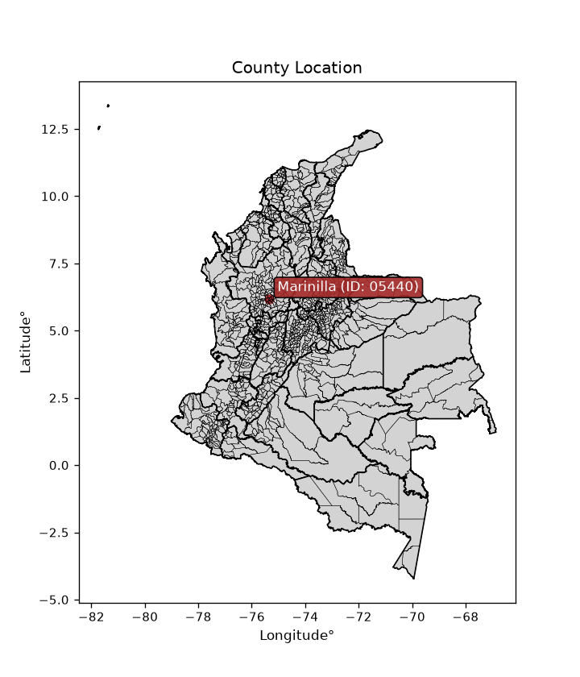
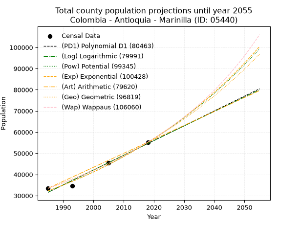
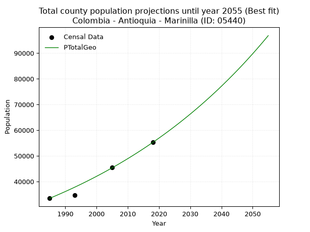
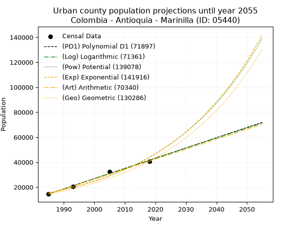
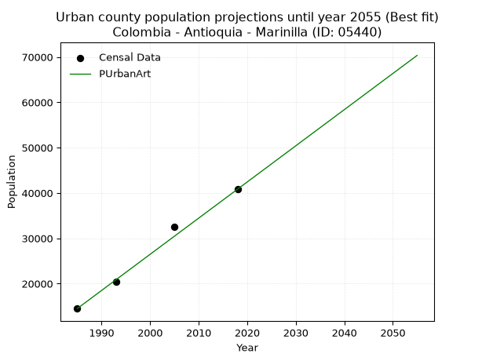
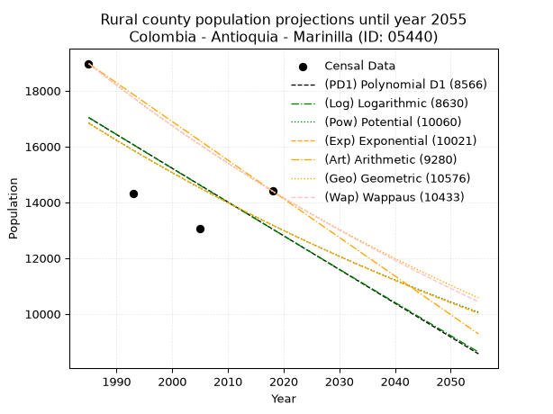
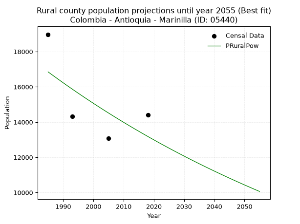

<div align="center">


</div>

# _“Population and Public Services Demand Projections (PPSD) until Year 2050 for Colombia - Antioquia - Marinilla (ID: 05440)”_
Keywords: `population` `public-service` `projection` `lineal` `polynomial` `logarithmic` `potential` `exponential` `arithmetic` `geometric` `wappaus` `dane` `colombia` `south-america`

PPSD are analytical estimates used by governments and planners to anticipate future changes in population size, age distribution, and the resulting community needs for utilities, healthcare, education, and infrastructure as sizing future water treatment facilities, electrical grids, and road networks based on spatial growth.

> **General running parameters**: • app_version: _v20260806_. • Python version: _3.14.7_. • Pandas version: _3.0.5_. • NumPy version: _2.5.1_. • Creates, save and include plots into reports (create_plot): _False_. • Projection until year: _2050_. • Process polynomial degree 2 and up: _False_. • Process Wappaus: _True_. • Process Wappaus: _True_. • Set negative values to zero: _True_. • Set infinite values to zero: _True_. • Drop dataset notes: _True_. 
<div align="center">

Dynamic map: [:earth_americas:Google](http://maps.google.com/maps?q=6.173994521,-75.3393446) [:earth_americas:OSM](https://www.openstreetmap.org/#map=18/6.173994521/-75.3393446&layers=P) [:earth_americas:Bing](https://www.bing.com/maps?cp=6.173994521~-75.3393446&lvl=18) [:earth_americas:Apple](https://maps.apple.com/frame?center=6.173994521%2C-75.3393446&span=0.003%2C0.006)

</div>


<div align="center">

```geojson
{
  "type": "Feature",
  "geometry": {
    "type": "Point", 
    "coordinates": [-75.3393446, 6.173994521]
  }, 
  "properties": {
    "Name": "Colombia - Antioquia - Marinilla (ID: 05440)"
  }
}
```

</div>


<div align="center">

</img>

</div>


## 0. Census Data (4 records)

Census data are official statistics collected by a government about the people and housing in a country. They usually include counts of total population, age, sex, race, income, education, and jobs.

📅Global census file: [Population.xlsx](../data/Population.xlsx)

| Source   |   Year |   CountryID | CountryName   |   StateID | StateName   |   CountyID | CountyName   |   PTotal |   PUrban |   PRural |
|:---------|-------:|------------:|:--------------|----------:|:------------|-----------:|:-------------|---------:|---------:|---------:|
| DANE     |   1985 |          57 | Colombia      |        05 | Antioquia   |      05440 | Marinilla    |    33477 |    14503 |    18974 |
| DANE     |   1993 |          57 | Colombia      |        05 | Antioquia   |      05440 | Marinilla    |    34656 |    20344 |    14312 |
| DANE     |   2005 |          57 | Colombia      |        05 | Antioquia   |      05440 | Marinilla    |    45548 |    32475 |    13073 |
| DANE     |   2018 |          57 | Colombia      |        05 | Antioquia   |      05440 | Marinilla    |    55230 |    40826 |    14404 |

> 🔥Some records could had specific notes about the registered values or the corresponding urban or rural distribution.

📅   [RUPS](https://www.datos.gov.co/Hacienda-y-Cr-dito-P-blico/Registro-nico-de-Prestadores-de-Servicios-P-blicos/4qkq-csdn/about_data) - Local public utility companies: [RUPS.csv](../data/RUPS.xlsx)

 | SERVICIO       | ESTADO    | NOMBRE                                                                                                                      | NIT         | DEPARTAMENTO_DOMICILIO   | MUNICIPIO_DOMICILIO   | DIRECCION                                                    |   TELEFONO | EMAIL                        | TIPO_PRESTADOR                            | CLASIFICACION                 |
|:---------------|:----------|:----------------------------------------------------------------------------------------------------------------------------|:------------|:-------------------------|:----------------------|:-------------------------------------------------------------|-----------:|:-----------------------------|:------------------------------------------|:------------------------------|
| ACUEDUCTO      | OPERATIVA | ASOCIACION DE USUARIOS PROPIETARIOS DEL ACUEDUCTO RURAL ALTO DEL MERCADO SAN JOSE SANTA CRUZ PARTE DEL CHOCHO Y DEL SOCORRO | 811018511-3 | ANTIOQUIA                | MARINILLA             | CALLE 30 N° 31 - 40                                          |    5482272 | altomer_02@hotmail.com       | ORGANIZACION AUTORIZADA                   | MENOR O IGUAL A 2500 USUARIOS |
| ACUEDUCTO      | OPERATIVA | ASOCIADOS DEL ACUEDUCTO DE CASCAJO                                                                                          | 811005840-5 | ANTIOQUIA                | MARINILLA             | vereda Cascajo                                               |    5690186 | ADECASCAJO@HOTMAIL.COM       | ORGANIZACION AUTORIZADA                   | MENOR O IGUAL A 2500 USUARIOS |
| ACUEDUCTO      | OPERATIVA | ASOCIACION DE USUARIOS PROPIETARIOS DEL ACUEDUCTO MULTIVEREDAL GAVIRIA SAN JUAN BOSCO                                       | 811018087-1 | ANTIOQUIA                | MARINILLA             | CARRERA 30 N° 30 - 52 PASAJE BOLIVAR SEGUNDO PISO, LOCAL 206 |    5690360 | lfwillsz@gmail.com           | ORGANIZACION AUTORIZADA                   | MENOR O IGUAL A 2500 USUARIOS |
| ACUEDUCTO      | OPERATIVA | ASOCIACION DE USUARIOS PROPIETARIOS DEL ACUEDUCTO RURAL LA PRIMAVERA EL SOCORRO LA ASUNCION Y PARTE DEL ALTO DEL MERCADO    | 811018921-1 | ANTIOQUIA                | MARINILLA             | CALLE 29 No. 30-30 LOCAL 110                                 |    5484057 | aculaprimavera@gmail.com     | ORGANIZACION AUTORIZADA                   | HASTA 2500 SUSCRIPTORES       |
| ACUEDUCTO      | OPERATIVA | CORPORACION DE SERVICIOS PUBLICOS DE BELEN MARINILLA CORBELEN                                                               | 800189768-1 | ANTIOQUIA                | MARINILLA             | PARCELACION VIEJO PUENTE VEREDA BELEN                        |    5480422 | leidycorbelenesp@gmail.com   | ORGANIZACION AUTORIZADA                   | MENOR O IGUAL A 2500 USUARIOS |
| ALCANTARILLADO | OPERATIVA | CORPORACION DE SERVICIOS PUBLICOS DE BELEN MARINILLA CORBELEN                                                               | 800189768-1 | ANTIOQUIA                | MARINILLA             | PARCELACION VIEJO PUENTE VEREDA BELEN                        |    5480422 | leidycorbelenesp@gmail.com   | ORGANIZACION AUTORIZADA                   | MENOR O IGUAL A 2500 USUARIOS |
| ACUEDUCTO      | OPERATIVA | EMPRESA DE SERVICIOS PUBLICOS DE SAN JOSE DE LA MARINILLA E.S.P.                                                            | 811014470-1 | ANTIOQUIA                | MARINILLA             | CALLE 30 N 25-96                                             |    5482811 | gestionsui@egcconsultores.co | EMPRESA INDUSTRIAL Y COMERCIAL DEL ESTADO | MAYOR O IGUAL A 5001 USUARIOS |
| ALCANTARILLADO | OPERATIVA | EMPRESA DE SERVICIOS PUBLICOS DE SAN JOSE DE LA MARINILLA E.S.P.                                                            | 811014470-1 | ANTIOQUIA                | MARINILLA             | CALLE 30 N 25-96                                             |    5482811 | gestionsui@egcconsultores.co | EMPRESA INDUSTRIAL Y COMERCIAL DEL ESTADO | MAYOR O IGUAL A 5001 USUARIOS |
| ACUEDUCTO      | OPERATIVA | ASOCIACION DE USUARIOS PROPIETARIOS DEL ACUEDUCTO MULTIVEREDAL POZO INMACULADA  MILAGROSA                                   | 811029180-6 | ANTIOQUIA                | MARINILLA             | CL 30 SAN JOSE No 31-40 mall comercial la gran manzana       |    5691431 | YANETHGOM@YAHOO.ES           | ORGANIZACION AUTORIZADA                   | MENOR O IGUAL A 2500 USUARIOS |

## 1. Total

### 1.1. Coefficients and Parameters

* (PD1) Polynomial Deg 1: 698.3625050180581, -1354671.8506623707 (lineal)
* (Log) Logarithmic: 1397453.5047797966, -10579827.538320813
* (Pow) Potential: 32.45176696485654, -102.50945147035857
* (Exp) Exponential: 0.016215368004792195, 3.388769864552172e-10
* (Art) Arithmetic: Year diff. 2018 - 1985 = 33, Population diff. 55230 - 33477 = 21753, Annual growth = 659.1818181818181
* (Geo) Geometric: Year diff. 2018 - 1985 = 33, Population diff. 55230 - 33477 = 21753, Annual growth % = 0.01528680679494765
* (Wap) Wappaus: i = 1.4862002281258935, Condition values only valid for < 200)

<sub>
Wappaus condition values: ['0.00', '1.49', '2.97', '4.46', '5.94', '7.43', '8.92', '10.40', '11.89', '13.38', '14.86', '16.35', '17.83', '19.32', '20.81', '22.29', '23.78', '25.27', '26.75', '28.24', '29.72', '31.21', '32.70', '34.18', '35.67', '37.16', '38.64', '40.13', '41.61', '43.10', '44.59', '46.07', '47.56', '49.04', '50.53', '52.02', '53.50', '54.99', '56.48', '57.96', '59.45', '60.93', '62.42', '63.91', '65.39', '66.88', '68.37', '69.85', '71.34', '72.82', '74.31', '75.80', '77.28', '78.77', '80.25', '81.74', '83.23', '84.71', '86.20', '87.69', '89.17', '90.66', '92.14', '93.63', '95.12', '96.60']
</sub>


### 1.2. Projected Dataset

|   Year |   CountyID |   PTotalPD1 |   PTotalLog |   PTotalPow |   PTotalExp |   PTotalArt |   PTotalGeo |   PTotalWap |
|-------:|-----------:|------------:|------------:|------------:|------------:|------------:|------------:|------------:|
|   1985 |      05440 |       31578 |       31560 |       32263 |       32277 |       33477 |       33477 |       33477 |
|   1986 |      05440 |       32276 |       32264 |       32795 |       32805 |       34136 |       33989 |       33978 |
|   1987 |      05440 |       32974 |       32967 |       33335 |       33341 |       34795 |       34508 |       34487 |
|   1988 |      05440 |       33673 |       33670 |       33883 |       33886 |       35455 |       35036 |       35004 |
|   1989 |      05440 |       34371 |       34373 |       34441 |       34440 |       36114 |       35571 |       35528 |
|   1990 |      05440 |       35070 |       35075 |       35007 |       35003 |       36773 |       36115 |       36061 |
|   1991 |      05440 |       35768 |       35778 |       35583 |       35576 |       37432 |       36667 |       36602 |
|   1992 |      05440 |       36466 |       36479 |       36167 |       36157 |       38091 |       37228 |       37151 |
|   1993 |      05440 |       37165 |       37181 |       36761 |       36748 |       38750 |       37797 |       37709 |
|   1994 |      05440 |       37863 |       37882 |       37365 |       37349 |       39410 |       38375 |       38276 |
|   1995 |      05440 |       38561 |       38582 |       37978 |       37960 |       40069 |       38961 |       38852 |
|   1996 |      05440 |       39260 |       39283 |       38600 |       38580 |       40728 |       39557 |       39437 |
|   1997 |      05440 |       39958 |       39982 |       39233 |       39211 |       41387 |       40162 |       40032 |
|   1998 |      05440 |       40656 |       40682 |       39875 |       39852 |       42046 |       40776 |       40637 |
|   1999 |      05440 |       41355 |       41381 |       40528 |       40503 |       42706 |       41399 |       41251 |
|   2000 |      05440 |       42053 |       42080 |       41191 |       41165 |       43365 |       42032 |       41876 |
|   2001 |      05440 |       42752 |       42779 |       41865 |       41838 |       44024 |       42674 |       42512 |
|   2002 |      05440 |       43450 |       43477 |       42549 |       42522 |       44683 |       43327 |       43158 |
|   2003 |      05440 |       44148 |       44175 |       43244 |       43217 |       45342 |       43989 |       43815 |
|   2004 |      05440 |       44847 |       44872 |       43950 |       43924 |       46001 |       44661 |       44484 |
|   2005 |      05440 |       45545 |       45570 |       44668 |       44642 |       46661 |       45344 |       45165 |
|   2006 |      05440 |       46243 |       46266 |       45396 |       45372 |       47320 |       46037 |       45857 |
|   2007 |      05440 |       46942 |       46963 |       46137 |       46113 |       47979 |       46741 |       46562 |
|   2008 |      05440 |       47640 |       47659 |       46889 |       46867 |       48638 |       47456 |       47279 |
|   2009 |      05440 |       48338 |       48355 |       47652 |       47633 |       49297 |       48181 |       48010 |
|   2010 |      05440 |       49037 |       49050 |       48428 |       48412 |       49957 |       48918 |       48753 |
|   2011 |      05440 |       49735 |       49745 |       49216 |       49204 |       50616 |       49665 |       49511 |
|   2012 |      05440 |       50434 |       50440 |       50017 |       50008 |       51275 |       50425 |       50282 |
|   2013 |      05440 |       51132 |       51134 |       50830 |       50825 |       51934 |       51195 |       51068 |
|   2014 |      05440 |       51830 |       51828 |       51655 |       51656 |       52593 |       51978 |       51869 |
|   2015 |      05440 |       52529 |       52522 |       52494 |       52501 |       53252 |       52773 |       52685 |
|   2016 |      05440 |       53227 |       53215 |       53346 |       53359 |       53912 |       53579 |       53517 |
|   2017 |      05440 |       53925 |       53908 |       54212 |       54231 |       54571 |       54398 |       54365 |
|   2018 |      05440 |       54624 |       54601 |       55091 |       55118 |       55230 |       55230 |       55230 |
|   2019 |      05440 |       55322 |       55293 |       55984 |       56019 |       55889 |       56074 |       56112 |
|   2020 |      05440 |       56020 |       55985 |       56891 |       56935 |       56548 |       56931 |       57012 |
|   2021 |      05440 |       56719 |       56677 |       57812 |       57865 |       57208 |       57802 |       57930 |
|   2022 |      05440 |       57417 |       57368 |       58747 |       58811 |       57867 |       58685 |       58867 |
|   2023 |      05440 |       58115 |       58059 |       59698 |       59773 |       58526 |       59583 |       59823 |
|   2024 |      05440 |       58814 |       58750 |       60663 |       60750 |       59185 |       60493 |       60799 |
|   2025 |      05440 |       59512 |       59440 |       61643 |       61743 |       59844 |       61418 |       61796 |
|   2026 |      05440 |       60211 |       60130 |       62638 |       62752 |       60503 |       62357 |       62814 |
|   2027 |      05440 |       60909 |       60820 |       63650 |       63778 |       61163 |       63310 |       63854 |
|   2028 |      05440 |       61607 |       61509 |       64677 |       64821 |       61822 |       64278 |       64917 |
|   2029 |      05440 |       62306 |       62198 |       65720 |       65880 |       62481 |       65261 |       66004 |
|   2030 |      05440 |       63004 |       62886 |       66779 |       66957 |       63140 |       66258 |       67114 |
|   2031 |      05440 |       63702 |       63575 |       67855 |       68052 |       63799 |       67271 |       68250 |
|   2032 |      05440 |       64401 |       64263 |       68947 |       69165 |       64459 |       68299 |       69412 |
|   2033 |      05440 |       65099 |       64950 |       70057 |       70295 |       65118 |       69344 |       70600 |
|   2034 |      05440 |       65797 |       65637 |       71184 |       71444 |       65777 |       70404 |       71816 |
|   2035 |      05440 |       66496 |       66324 |       72329 |       72612 |       66436 |       71480 |       73061 |
|   2036 |      05440 |       67194 |       67011 |       73491 |       73799 |       67095 |       72573 |       74336 |
|   2037 |      05440 |       67893 |       67697 |       74671 |       75006 |       67754 |       73682 |       75642 |
|   2038 |      05440 |       68591 |       68383 |       75870 |       76232 |       68414 |       74808 |       76980 |
|   2039 |      05440 |       69289 |       69068 |       77088 |       77478 |       69073 |       75952 |       78350 |
|   2040 |      05440 |       69988 |       69753 |       78324 |       78745 |       69732 |       77113 |       79756 |
|   2041 |      05440 |       70686 |       70438 |       79580 |       80032 |       70391 |       78292 |       81197 |
|   2042 |      05440 |       71384 |       71123 |       80855 |       81340 |       71050 |       79489 |       82675 |
|   2043 |      05440 |       72083 |       71807 |       82150 |       82670 |       71710 |       80704 |       84192 |
|   2044 |      05440 |       72781 |       72491 |       83465 |       84022 |       72369 |       81937 |       85749 |
|   2045 |      05440 |       73479 |       73174 |       84800 |       85395 |       73028 |       83190 |       87348 |
|   2046 |      05440 |       74178 |       73858 |       86156 |       86791 |       73687 |       84462 |       88990 |
|   2047 |      05440 |       74876 |       74540 |       87533 |       88210 |       74346 |       85753 |       90678 |
|   2048 |      05440 |       75575 |       75223 |       88932 |       89652 |       75005 |       87064 |       92413 |
|   2049 |      05440 |       76273 |       75905 |       90352 |       91117 |       75665 |       88395 |       94196 |
|   2050 |      05440 |       76971 |       76587 |       91794 |       92607 |       76324 |       89746 |       96032 |
<div align="center">

</img>

</div>


### 1.3. Best fit with absolute and relative error (%)

Relative error puts that difference into context by dividing the absolute error by the true value, creating a unitless ratio or percentage that shows the scale of the mistake.

Absolute and relative error

|   Year | Source   |   CountryID | CountryName   |   StateID | StateName   |   CountyID_x | CountyName   |   PTotal |   PUrban |   PRural |   CountyID_y |   PTotalPD1 |   PTotalLog |   PTotalPow |   PTotalExp |   PTotalArt |   PTotalGeo |   PTotalWap |   PTotalPD1AbsError |   PTotalLogAbsError |   PTotalPowAbsError |   PTotalExpAbsError |   PTotalArtAbsError |   PTotalGeoAbsError |   PTotalWapAbsError |   PTotalPD1RelError |   PTotalLogRelError |   PTotalPowRelError |   PTotalExpRelError |   PTotalArtRelError |   PTotalGeoRelError |   PTotalWapRelError |
|-------:|:---------|------------:|:--------------|----------:|:------------|-------------:|:-------------|---------:|---------:|---------:|-------------:|------------:|------------:|------------:|------------:|------------:|------------:|------------:|--------------------:|--------------------:|--------------------:|--------------------:|--------------------:|--------------------:|--------------------:|--------------------:|--------------------:|--------------------:|--------------------:|--------------------:|--------------------:|--------------------:|
|   1985 | DANE     |          57 | Colombia      |        05 | Antioquia   |        05440 | Marinilla    |    33477 |    14503 |    18974 |        05440 |       31578 |       31560 |       32263 |       32277 |       33477 |       33477 |       33477 |                1899 |                1917 |                1214 |                1200 |                   0 |                   0 |                   0 |          5.67255    |           5.72632   |            3.62637  |            3.58455  |             0       |            0        |            0        |
|   1993 | DANE     |          57 | Colombia      |        05 | Antioquia   |        05440 | Marinilla    |    34656 |    20344 |    14312 |        05440 |       37165 |       37181 |       36761 |       36748 |       38750 |       37797 |       37709 |                2509 |                2525 |                2105 |                2092 |                4094 |                3141 |                3053 |          7.23973    |           7.2859    |            6.07398  |            6.03647  |            11.8133  |            9.06337  |            8.80944  |
|   2005 | DANE     |          57 | Colombia      |        05 | Antioquia   |        05440 | Marinilla    |    45548 |    32475 |    13073 |        05440 |       45545 |       45570 |       44668 |       44642 |       46661 |       45344 |       45165 |                   3 |                  22 |                 880 |                 906 |                1113 |                 204 |                 383 |          0.00658646 |           0.0483007 |            1.93203  |            1.98911  |             2.44358 |            0.447879 |            0.840871 |
|   2018 | DANE     |          57 | Colombia      |        05 | Antioquia   |        05440 | Marinilla    |    55230 |    40826 |    14404 |        05440 |       54624 |       54601 |       55091 |       55118 |       55230 |       55230 |       55230 |                 606 |                 629 |                 139 |                 112 |                   0 |                   0 |                   0 |          1.09723    |           1.13887   |            0.251675 |            0.202788 |             0       |            0        |            0        |

Relative error mean

| Method    |   RelError | Best   |
|:----------|-----------:|:-------|
| PTotalPD1 |    3.50402 |        |
| PTotalLog |    3.54985 |        |
| PTotalPow |    2.97101 |        |
| PTotalExp |    2.95323 |        |
| PTotalArt |    3.56421 |        |
| PTotalGeo |    2.37781 | True   |
| PTotalWap |    2.41258 |        |

💙Best method: _**PTotalGeo**_
<div align="center">

</img>

</div>


### 1.4. Fresh water supply demand in liters per capita per day (lpcd)

The fresh water supply demand typically ranges from 100 to 300 liters per capita per day (lpcd) for standard domestic and municipal planning, though absolute survival minimums set by the World Health Organization are as low as 7.5 to 20 liters per day, and total consumption in high-income nations can exceed 400 liters.

> `CZ`: Level in meters above the sea level (masl)<br> `WS`: Fresh water supply demand in liters per capita per day (lpcd or l/h/d)<br> `WSAll`: Zonal fresh water supply demand in liters per second (l/s)<br> `A`: Zonal area in square meters<br> `DP`: Population density (people/hectare or p/ha)

Reference values (RAS Colombia)

|    CZ |   WS |
|------:|-----:|
|  1000 |  120 |
|  2000 |  130 |
| 99999 |  140 |

County shapefile geometry properties and water supply values

|   CountyID |      ATotal |   CZTotal |   WSTotal |
|-----------:|------------:|----------:|----------:|
|      05440 | 1.12235e+08 |   2133.37 |       140 |

Projected values for best method: PTotalGeo

|   CountyID |   Year |   PTotalGeo |   DPTotal |   WSTotal |   WSTotalAll |
|-----------:|-------:|------------:|----------:|----------:|-------------:|
|      05440 |   1985 |       33477 |      2.98 |       140 |      54.2451 |
|      05440 |   1986 |       33989 |      3.03 |       140 |      55.0748 |
|      05440 |   1987 |       34508 |      3.07 |       140 |      55.9157 |
|      05440 |   1988 |       35036 |      3.12 |       140 |      56.7713 |
|      05440 |   1989 |       35571 |      3.17 |       140 |      57.6382 |
|      05440 |   1990 |       36115 |      3.22 |       140 |      58.5197 |
|      05440 |   1991 |       36667 |      3.27 |       140 |      59.4141 |
|      05440 |   1992 |       37228 |      3.32 |       140 |      60.3231 |
|      05440 |   1993 |       37797 |      3.37 |       140 |      61.2451 |
|      05440 |   1994 |       38375 |      3.42 |       140 |      62.1817 |
|      05440 |   1995 |       38961 |      3.47 |       140 |      63.1313 |
|      05440 |   1996 |       39557 |      3.52 |       140 |      64.097  |
|      05440 |   1997 |       40162 |      3.58 |       140 |      65.0773 |
|      05440 |   1998 |       40776 |      3.63 |       140 |      66.0722 |
|      05440 |   1999 |       41399 |      3.69 |       140 |      67.0817 |
|      05440 |   2000 |       42032 |      3.75 |       140 |      68.1074 |
|      05440 |   2001 |       42674 |      3.8  |       140 |      69.1477 |
|      05440 |   2002 |       43327 |      3.86 |       140 |      70.2058 |
|      05440 |   2003 |       43989 |      3.92 |       140 |      71.2785 |
|      05440 |   2004 |       44661 |      3.98 |       140 |      72.3674 |
|      05440 |   2005 |       45344 |      4.04 |       140 |      73.4741 |
|      05440 |   2006 |       46037 |      4.1  |       140 |      74.597  |
|      05440 |   2007 |       46741 |      4.16 |       140 |      75.7377 |
|      05440 |   2008 |       47456 |      4.23 |       140 |      76.8963 |
|      05440 |   2009 |       48181 |      4.29 |       140 |      78.0711 |
|      05440 |   2010 |       48918 |      4.36 |       140 |      79.2653 |
|      05440 |   2011 |       49665 |      4.43 |       140 |      80.4757 |
|      05440 |   2012 |       50425 |      4.49 |       140 |      81.7072 |
|      05440 |   2013 |       51195 |      4.56 |       140 |      82.9549 |
|      05440 |   2014 |       51978 |      4.63 |       140 |      84.2236 |
|      05440 |   2015 |       52773 |      4.7  |       140 |      85.5118 |
|      05440 |   2016 |       53579 |      4.77 |       140 |      86.8178 |
|      05440 |   2017 |       54398 |      4.85 |       140 |      88.1449 |
|      05440 |   2018 |       55230 |      4.92 |       140 |      89.4931 |
|      05440 |   2019 |       56074 |      5    |       140 |      90.8606 |
|      05440 |   2020 |       56931 |      5.07 |       140 |      92.2493 |
|      05440 |   2021 |       57802 |      5.15 |       140 |      93.6606 |
|      05440 |   2022 |       58685 |      5.23 |       140 |      95.0914 |
|      05440 |   2023 |       59583 |      5.31 |       140 |      96.5465 |
|      05440 |   2024 |       60493 |      5.39 |       140 |      98.0211 |
|      05440 |   2025 |       61418 |      5.47 |       140 |      99.5199 |
|      05440 |   2026 |       62357 |      5.56 |       140 |     101.041  |
|      05440 |   2027 |       63310 |      5.64 |       140 |     102.586  |
|      05440 |   2028 |       64278 |      5.73 |       140 |     104.154  |
|      05440 |   2029 |       65261 |      5.81 |       140 |     105.747  |
|      05440 |   2030 |       66258 |      5.9  |       140 |     107.362  |
|      05440 |   2031 |       67271 |      5.99 |       140 |     109.004  |
|      05440 |   2032 |       68299 |      6.09 |       140 |     110.67   |
|      05440 |   2033 |       69344 |      6.18 |       140 |     112.363  |
|      05440 |   2034 |       70404 |      6.27 |       140 |     114.081  |
|      05440 |   2035 |       71480 |      6.37 |       140 |     115.824  |
|      05440 |   2036 |       72573 |      6.47 |       140 |     117.595  |
|      05440 |   2037 |       73682 |      6.57 |       140 |     119.392  |
|      05440 |   2038 |       74808 |      6.67 |       140 |     121.217  |
|      05440 |   2039 |       75952 |      6.77 |       140 |     123.07   |
|      05440 |   2040 |       77113 |      6.87 |       140 |     124.952  |
|      05440 |   2041 |       78292 |      6.98 |       140 |     126.862  |
|      05440 |   2042 |       79489 |      7.08 |       140 |     128.802  |
|      05440 |   2043 |       80704 |      7.19 |       140 |     130.77   |
|      05440 |   2044 |       81937 |      7.3  |       140 |     132.768  |
|      05440 |   2045 |       83190 |      7.41 |       140 |     134.799  |
|      05440 |   2046 |       84462 |      7.53 |       140 |     136.86   |
|      05440 |   2047 |       85753 |      7.64 |       140 |     138.952  |
|      05440 |   2048 |       87064 |      7.76 |       140 |     141.076  |
|      05440 |   2049 |       88395 |      7.88 |       140 |     143.233  |
|      05440 |   2050 |       89746 |      8    |       140 |     145.422  |

## 2. Urban

### 2.1. Coefficients and Parameters

* (PD1) Polynomial Deg 1: 819.3544761140045, -1611876.7908470375 (lineal)
* (Log) Logarithmic: 1640238.1499937703, -12440426.322146274
* (Pow) Potential: 63.49382629354878, -205.1998407404542
* (Exp) Exponential: 0.03170779499870951, 7.138576429294086e-24
* (Art) Arithmetic: Year diff. 2018 - 1985 = 33, Population diff. 40826 - 14503 = 26323, Annual growth = 797.6666666666666
* (Geo) Geometric: Year diff. 2018 - 1985 = 33, Population diff. 40826 - 14503 = 26323, Annual growth % = 0.03185951983133628
* (Wap) Wappaus: i = 2.883358335291318, Condition values only valid for < 200)

<sub>
Wappaus condition values: ['0.00', '2.88', '5.77', '8.65', '11.53', '14.42', '17.30', '20.18', '23.07', '25.95', '28.83', '31.72', '34.60', '37.48', '40.37', '43.25', '46.13', '49.02', '51.90', '54.78', '57.67', '60.55', '63.43', '66.32', '69.20', '72.08', '74.97', '77.85', '80.73', '83.62', '86.50', '89.38', '92.27', '95.15', '98.03', '100.92', '103.80', '106.68', '109.57', '112.45', '115.33', '118.22', '121.10', '123.98', '126.87', '129.75', '132.63', '135.52', '138.40', '141.28', '144.17', '147.05', '149.93', '152.82', '155.70', '158.58', '161.47', '164.35', '167.23', '170.12', '173.00', '175.88', '178.77', '181.65', '184.53', '187.42']
</sub>


### 2.2. Projected Dataset

|   Year |   CountyID |   PUrbanPD1 |   PUrbanLog |   PUrbanPow |   PUrbanExp |   PUrbanArt |   PUrbanGeo |   PUrbanWap |
|-------:|-----------:|------------:|------------:|------------:|------------:|------------:|------------:|------------:|
|   1985 |      05440 |       14542 |       14516 |       15403 |       15420 |       14503 |       14503 |       14503 |
|   1986 |      05440 |       15361 |       15342 |       15903 |       15917 |       15301 |       14965 |       14927 |
|   1987 |      05440 |       16181 |       16168 |       16420 |       16430 |       16098 |       15442 |       15364 |
|   1988 |      05440 |       17000 |       16993 |       16953 |       16959 |       16896 |       15934 |       15814 |
|   1989 |      05440 |       17819 |       17818 |       17503 |       17506 |       17694 |       16441 |       16278 |
|   1990 |      05440 |       18639 |       18642 |       18070 |       18070 |       18491 |       16965 |       16756 |
|   1991 |      05440 |       19458 |       19466 |       18656 |       18652 |       19289 |       17506 |       17250 |
|   1992 |      05440 |       20277 |       20290 |       19260 |       19253 |       20087 |       18063 |       17759 |
|   1993 |      05440 |       21097 |       21113 |       19884 |       19873 |       20884 |       18639 |       18285 |
|   1994 |      05440 |       21916 |       21936 |       20527 |       20513 |       21682 |       19233 |       18828 |
|   1995 |      05440 |       22735 |       22758 |       21191 |       21174 |       22480 |       19846 |       19389 |
|   1996 |      05440 |       23555 |       23580 |       21877 |       21856 |       23277 |       20478 |       19970 |
|   1997 |      05440 |       24374 |       24402 |       22583 |       22560 |       24075 |       21130 |       20571 |
|   1998 |      05440 |       25193 |       25223 |       23313 |       23287 |       24873 |       21803 |       21193 |
|   1999 |      05440 |       26013 |       26044 |       24065 |       24037 |       25670 |       22498 |       21838 |
|   2000 |      05440 |       26832 |       26864 |       24842 |       24811 |       26468 |       23215 |       22506 |
|   2001 |      05440 |       27652 |       27684 |       25643 |       25611 |       27266 |       23954 |       23200 |
|   2002 |      05440 |       28471 |       28503 |       26469 |       26436 |       28063 |       24718 |       23920 |
|   2003 |      05440 |       29290 |       29322 |       27322 |       27288 |       28861 |       25505 |       24668 |
|   2004 |      05440 |       30110 |       30141 |       28202 |       28167 |       29659 |       26318 |       25446 |
|   2005 |      05440 |       30929 |       30959 |       29110 |       29074 |       30456 |       27156 |       26255 |
|   2006 |      05440 |       31748 |       31777 |       30046 |       30011 |       31254 |       28021 |       27098 |
|   2007 |      05440 |       32568 |       32595 |       31012 |       30977 |       32052 |       28914 |       27976 |
|   2008 |      05440 |       33387 |       33412 |       32008 |       31975 |       32849 |       29835 |       28892 |
|   2009 |      05440 |       34206 |       34228 |       33036 |       33006 |       33647 |       30786 |       29849 |
|   2010 |      05440 |       35026 |       35045 |       34097 |       34069 |       34445 |       31767 |       30849 |
|   2011 |      05440 |       35845 |       35860 |       35191 |       35166 |       35242 |       32779 |       31894 |
|   2012 |      05440 |       36664 |       36676 |       36320 |       36299 |       36040 |       33823 |       32990 |
|   2013 |      05440 |       37484 |       37491 |       37484 |       37469 |       36838 |       34901 |       34138 |
|   2014 |      05440 |       38303 |       38306 |       38685 |       38676 |       37635 |       36013 |       35343 |
|   2015 |      05440 |       39122 |       39120 |       39923 |       39922 |       38433 |       37160 |       36609 |
|   2016 |      05440 |       39942 |       39934 |       41201 |       41208 |       39231 |       38344 |       37942 |
|   2017 |      05440 |       40761 |       40747 |       42519 |       42535 |       40028 |       39565 |       39345 |
|   2018 |      05440 |       41581 |       41560 |       43878 |       43906 |       40826 |       40826 |       40826 |
|   2019 |      05440 |       42400 |       42373 |       45280 |       45320 |       41624 |       42127 |       42391 |
|   2020 |      05440 |       43219 |       43185 |       46727 |       46780 |       42421 |       43469 |       44046 |
|   2021 |      05440 |       44039 |       43997 |       48218 |       48287 |       43219 |       44854 |       45801 |
|   2022 |      05440 |       44858 |       44808 |       49757 |       49843 |       44017 |       46283 |       47664 |
|   2023 |      05440 |       45677 |       45619 |       51344 |       51449 |       44814 |       47757 |       49647 |
|   2024 |      05440 |       46497 |       46430 |       52980 |       53106 |       45612 |       49279 |       51759 |
|   2025 |      05440 |       47316 |       47240 |       54668 |       54817 |       46410 |       50849 |       54016 |
|   2026 |      05440 |       48135 |       48050 |       56409 |       56583 |       47207 |       52469 |       56432 |
|   2027 |      05440 |       48955 |       48859 |       58205 |       58406 |       48005 |       54140 |       59024 |
|   2028 |      05440 |       49774 |       49668 |       60056 |       60287 |       48803 |       55865 |       61813 |
|   2029 |      05440 |       50593 |       50477 |       61966 |       62230 |       49600 |       57645 |       64822 |
|   2030 |      05440 |       51413 |       51285 |       63935 |       64234 |       50398 |       59482 |       68078 |
|   2031 |      05440 |       52232 |       52093 |       65966 |       66304 |       51196 |       61377 |       71612 |
|   2032 |      05440 |       53052 |       52900 |       68060 |       68440 |       51993 |       63332 |       75463 |
|   2033 |      05440 |       53871 |       53707 |       70220 |       70645 |       52791 |       65350 |       79674 |
|   2034 |      05440 |       54690 |       54514 |       72447 |       72921 |       53589 |       67432 |       84299 |
|   2035 |      05440 |       55510 |       55320 |       74743 |       75270 |       54386 |       69580 |       89401 |
|   2036 |      05440 |       56329 |       56126 |       77112 |       77695 |       55184 |       71797 |       95060 |
|   2037 |      05440 |       57148 |       56931 |       79554 |       80198 |       55982 |       74085 |      101370 |
|   2038 |      05440 |       57968 |       57736 |       82072 |       82781 |       56779 |       76445 |      108451 |
|   2039 |      05440 |       58787 |       58541 |       84668 |       85448 |       57577 |       78880 |      116454 |
|   2040 |      05440 |       59606 |       59345 |       87346 |       88201 |       58375 |       81393 |      125571 |
|   2041 |      05440 |       60426 |       60149 |       90106 |       91042 |       59172 |       83987 |      136053 |
|   2042 |      05440 |       61245 |       60952 |       92953 |       93975 |       59970 |       86662 |      148230 |
|   2043 |      05440 |       62064 |       61755 |       95888 |       97003 |       60768 |       89423 |      162551 |
|   2044 |      05440 |       62884 |       62558 |       98914 |      100128 |       61565 |       92272 |      179635 |
|   2045 |      05440 |       63703 |       63360 |      102034 |      103354 |       62363 |       95212 |      200368 |
|   2046 |      05440 |       64522 |       64162 |      105251 |      106683 |       63161 |       98246 |      226060 |
|   2047 |      05440 |       65342 |       64964 |      108568 |      110120 |       63958 |      101376 |      258729 |
|   2048 |      05440 |       66161 |       65765 |      111987 |      113668 |       64756 |      104605 |      301666 |
|   2049 |      05440 |       66981 |       66565 |      115513 |      117330 |       65554 |      107938 |      360613 |
|   2050 |      05440 |       67800 |       67366 |      119147 |      121110 |       66351 |      111377 |      446579 |
<div align="center">

</img>

</div>


### 2.3. Best fit with absolute and relative error (%)

Relative error puts that difference into context by dividing the absolute error by the true value, creating a unitless ratio or percentage that shows the scale of the mistake.

Absolute and relative error

|   Year | Source   |   CountryID | CountryName   |   StateID | StateName   |   CountyID_x | CountyName   |   PTotal |   PUrban |   PRural |   CountyID_y |   PUrbanPD1 |   PUrbanLog |   PUrbanPow |   PUrbanExp |   PUrbanArt |   PUrbanGeo |   PUrbanWap |   PUrbanPD1AbsError |   PUrbanLogAbsError |   PUrbanPowAbsError |   PUrbanExpAbsError |   PUrbanArtAbsError |   PUrbanGeoAbsError |   PUrbanWapAbsError |   PUrbanPD1RelError |   PUrbanLogRelError |   PUrbanPowRelError |   PUrbanExpRelError |   PUrbanArtRelError |   PUrbanGeoRelError |   PUrbanWapRelError |
|-------:|:---------|------------:|:--------------|----------:|:------------|-------------:|:-------------|---------:|---------:|---------:|-------------:|------------:|------------:|------------:|------------:|------------:|------------:|------------:|--------------------:|--------------------:|--------------------:|--------------------:|--------------------:|--------------------:|--------------------:|--------------------:|--------------------:|--------------------:|--------------------:|--------------------:|--------------------:|--------------------:|
|   1985 | DANE     |          57 | Colombia      |        05 | Antioquia   |        05440 | Marinilla    |    33477 |    14503 |    18974 |        05440 |       14542 |       14516 |       15403 |       15420 |       14503 |       14503 |       14503 |                  39 |                  13 |                 900 |                 917 |                   0 |                   0 |                   0 |             0.26891 |           0.0896366 |             6.20561 |             6.32283 |             0       |             0       |              0      |
|   1993 | DANE     |          57 | Colombia      |        05 | Antioquia   |        05440 | Marinilla    |    34656 |    20344 |    14312 |        05440 |       21097 |       21113 |       19884 |       19873 |       20884 |       18639 |       18285 |                 753 |                 769 |                 460 |                 471 |                 540 |                1705 |                2059 |             3.70134 |           3.77998   |             2.26111 |             2.31518 |             2.65435 |             8.38085 |             10.1209 |
|   2005 | DANE     |          57 | Colombia      |        05 | Antioquia   |        05440 | Marinilla    |    45548 |    32475 |    13073 |        05440 |       30929 |       30959 |       29110 |       29074 |       30456 |       27156 |       26255 |                1546 |                1516 |                3365 |                3401 |                2019 |                5319 |                6220 |             4.76059 |           4.66821   |            10.3618  |            10.4727  |             6.21709 |            16.3788  |             19.1532 |
|   2018 | DANE     |          57 | Colombia      |        05 | Antioquia   |        05440 | Marinilla    |    55230 |    40826 |    14404 |        05440 |       41581 |       41560 |       43878 |       43906 |       40826 |       40826 |       40826 |                 755 |                 734 |                3052 |                3080 |                   0 |                   0 |                   0 |             1.84931 |           1.79787   |             7.47563 |             7.54421 |             0       |             0       |              0      |

Relative error mean

| Method    |   RelError | Best   |
|:----------|-----------:|:-------|
| PUrbanPD1 |    2.64504 |        |
| PUrbanLog |    2.58393 |        |
| PUrbanPow |    6.57604 |        |
| PUrbanExp |    6.66372 |        |
| PUrbanArt |    2.21786 | True   |
| PUrbanGeo |    6.1899  |        |
| PUrbanWap |    7.31853 |        |

💙Best method: _**PUrbanArt**_
<div align="center">

</img>

</div>


### 2.4. Fresh water supply demand in liters per capita per day (lpcd)

The fresh water supply demand typically ranges from 100 to 300 liters per capita per day (lpcd) for standard domestic and municipal planning, though absolute survival minimums set by the World Health Organization are as low as 7.5 to 20 liters per day, and total consumption in high-income nations can exceed 400 liters.

> `CZ`: Level in meters above the sea level (masl)<br> `WS`: Fresh water supply demand in liters per capita per day (lpcd or l/h/d)<br> `WSAll`: Zonal fresh water supply demand in liters per second (l/s)<br> `A`: Zonal area in square meters<br> `DP`: Population density (people/hectare or p/ha)

Reference values (RAS Colombia)

|    CZ |   WS |
|------:|-----:|
|  1000 |  120 |
|  2000 |  130 |
| 99999 |  140 |

County shapefile geometry properties and water supply values

|   CountyID |      AUrban |   CZUrban |   WSUrban |
|-----------:|------------:|----------:|----------:|
|      05440 | 4.73402e+06 |   2103.06 |       140 |

Projected values for best method: PUrbanArt

|   CountyID |   Year |   PUrbanArt |   DPUrban |   WSUrban |   WSUrbanAll |
|-----------:|-------:|------------:|----------:|----------:|-------------:|
|      05440 |   1985 |       14503 |     30.64 |       140 |      23.5002 |
|      05440 |   1986 |       15301 |     32.32 |       140 |      24.7933 |
|      05440 |   1987 |       16098 |     34    |       140 |      26.0847 |
|      05440 |   1988 |       16896 |     35.69 |       140 |      27.3778 |
|      05440 |   1989 |       17694 |     37.38 |       140 |      28.6708 |
|      05440 |   1990 |       18491 |     39.06 |       140 |      29.9623 |
|      05440 |   1991 |       19289 |     40.75 |       140 |      31.2553 |
|      05440 |   1992 |       20087 |     42.43 |       140 |      32.5484 |
|      05440 |   1993 |       20884 |     44.11 |       140 |      33.8398 |
|      05440 |   1994 |       21682 |     45.8  |       140 |      35.1329 |
|      05440 |   1995 |       22480 |     47.49 |       140 |      36.4259 |
|      05440 |   1996 |       23277 |     49.17 |       140 |      37.7174 |
|      05440 |   1997 |       24075 |     50.86 |       140 |      39.0104 |
|      05440 |   1998 |       24873 |     52.54 |       140 |      40.3035 |
|      05440 |   1999 |       25670 |     54.22 |       140 |      41.5949 |
|      05440 |   2000 |       26468 |     55.91 |       140 |      42.888  |
|      05440 |   2001 |       27266 |     57.6  |       140 |      44.181  |
|      05440 |   2002 |       28063 |     59.28 |       140 |      45.4725 |
|      05440 |   2003 |       28861 |     60.97 |       140 |      46.7655 |
|      05440 |   2004 |       29659 |     62.65 |       140 |      48.0586 |
|      05440 |   2005 |       30456 |     64.33 |       140 |      49.35   |
|      05440 |   2006 |       31254 |     66.02 |       140 |      50.6431 |
|      05440 |   2007 |       32052 |     67.71 |       140 |      51.9361 |
|      05440 |   2008 |       32849 |     69.39 |       140 |      53.2275 |
|      05440 |   2009 |       33647 |     71.07 |       140 |      54.5206 |
|      05440 |   2010 |       34445 |     72.76 |       140 |      55.8137 |
|      05440 |   2011 |       35242 |     74.44 |       140 |      57.1051 |
|      05440 |   2012 |       36040 |     76.13 |       140 |      58.3981 |
|      05440 |   2013 |       36838 |     77.82 |       140 |      59.6912 |
|      05440 |   2014 |       37635 |     79.5  |       140 |      60.9826 |
|      05440 |   2015 |       38433 |     81.18 |       140 |      62.2757 |
|      05440 |   2016 |       39231 |     82.87 |       140 |      63.5688 |
|      05440 |   2017 |       40028 |     84.55 |       140 |      64.8602 |
|      05440 |   2018 |       40826 |     86.24 |       140 |      66.1532 |
|      05440 |   2019 |       41624 |     87.93 |       140 |      67.4463 |
|      05440 |   2020 |       42421 |     89.61 |       140 |      68.7377 |
|      05440 |   2021 |       43219 |     91.29 |       140 |      70.0308 |
|      05440 |   2022 |       44017 |     92.98 |       140 |      71.3238 |
|      05440 |   2023 |       44814 |     94.66 |       140 |      72.6153 |
|      05440 |   2024 |       45612 |     96.35 |       140 |      73.9083 |
|      05440 |   2025 |       46410 |     98.04 |       140 |      75.2014 |
|      05440 |   2026 |       47207 |     99.72 |       140 |      76.4928 |
|      05440 |   2027 |       48005 |    101.4  |       140 |      77.7859 |
|      05440 |   2028 |       48803 |    103.09 |       140 |      79.0789 |
|      05440 |   2029 |       49600 |    104.77 |       140 |      80.3704 |
|      05440 |   2030 |       50398 |    106.46 |       140 |      81.6634 |
|      05440 |   2031 |       51196 |    108.14 |       140 |      82.9565 |
|      05440 |   2032 |       51993 |    109.83 |       140 |      84.2479 |
|      05440 |   2033 |       52791 |    111.51 |       140 |      85.541  |
|      05440 |   2034 |       53589 |    113.2  |       140 |      86.834  |
|      05440 |   2035 |       54386 |    114.88 |       140 |      88.1255 |
|      05440 |   2036 |       55184 |    116.57 |       140 |      89.4185 |
|      05440 |   2037 |       55982 |    118.25 |       140 |      90.7116 |
|      05440 |   2038 |       56779 |    119.94 |       140 |      92.003  |
|      05440 |   2039 |       57577 |    121.62 |       140 |      93.2961 |
|      05440 |   2040 |       58375 |    123.31 |       140 |      94.5891 |
|      05440 |   2041 |       59172 |    124.99 |       140 |      95.8806 |
|      05440 |   2042 |       59970 |    126.68 |       140 |      97.1736 |
|      05440 |   2043 |       60768 |    128.36 |       140 |      98.4667 |
|      05440 |   2044 |       61565 |    130.05 |       140 |      99.7581 |
|      05440 |   2045 |       62363 |    131.73 |       140 |     101.051  |
|      05440 |   2046 |       63161 |    133.42 |       140 |     102.344  |
|      05440 |   2047 |       63958 |    135.1  |       140 |     103.636  |
|      05440 |   2048 |       64756 |    136.79 |       140 |     104.929  |
|      05440 |   2049 |       65554 |    138.47 |       140 |     106.222  |
|      05440 |   2050 |       66351 |    140.16 |       140 |     107.513  |

## 3. Rural

### 3.1. Coefficients and Parameters

* (PD1) Polynomial Deg 1: -120.99197109594608, 257204.94018466613 (lineal)
* (Log) Logarithmic: -242784.64521397412, 1860598.7838254627
* (Pow) Potential: -14.87646028472123, 53.28550298784652
* (Exp) Exponential: -0.007412984789776283, 41382910455.16542
* (Art) Arithmetic: Year diff. 2018 - 1985 = 33, Population diff. 14404 - 18974 = -4570, Annual growth = -138.4848484848485
* (Geo) Geometric: Year diff. 2018 - 1985 = 33, Population diff. 14404 - 18974 = -4570, Annual growth % = -0.008315646531867893
* (Wap) Wappaus: i = -0.8297971627110581, Condition values only valid for < 200)

<sub>
Wappaus condition values: ['-0.00', '-0.83', '-1.66', '-2.49', '-3.32', '-4.15', '-4.98', '-5.81', '-6.64', '-7.47', '-8.30', '-9.13', '-9.96', '-10.79', '-11.62', '-12.45', '-13.28', '-14.11', '-14.94', '-15.77', '-16.60', '-17.43', '-18.26', '-19.09', '-19.92', '-20.74', '-21.57', '-22.40', '-23.23', '-24.06', '-24.89', '-25.72', '-26.55', '-27.38', '-28.21', '-29.04', '-29.87', '-30.70', '-31.53', '-32.36', '-33.19', '-34.02', '-34.85', '-35.68', '-36.51', '-37.34', '-38.17', '-39.00', '-39.83', '-40.66', '-41.49', '-42.32', '-43.15', '-43.98', '-44.81', '-45.64', '-46.47', '-47.30', '-48.13', '-48.96', '-49.79', '-50.62', '-51.45', '-52.28', '-53.11', '-53.94']
</sub>


### 3.2. Projected Dataset

|   Year |   CountyID |   PRuralPD1 |   PRuralLog |   PRuralPow |   PRuralExp |   PRuralArt |   PRuralGeo |   PRuralWap |
|-------:|-----------:|------------:|------------:|------------:|------------:|------------:|------------:|------------:|
|   1985 |      05440 |       17036 |       17044 |       16846 |       16837 |       18974 |       18974 |       18974 |
|   1986 |      05440 |       16915 |       16922 |       16720 |       16713 |       18836 |       18816 |       18817 |
|   1987 |      05440 |       16794 |       16800 |       16596 |       16590 |       18697 |       18660 |       18662 |
|   1988 |      05440 |       16673 |       16677 |       16472 |       16467 |       18559 |       18505 |       18507 |
|   1989 |      05440 |       16552 |       16555 |       16349 |       16345 |       18420 |       18351 |       18354 |
|   1990 |      05440 |       16431 |       16433 |       16227 |       16225 |       18282 |       18198 |       18203 |
|   1991 |      05440 |       16310 |       16311 |       16106 |       16105 |       18143 |       18047 |       18052 |
|   1992 |      05440 |       16189 |       16189 |       15987 |       15986 |       18005 |       17897 |       17903 |
|   1993 |      05440 |       16068 |       16068 |       15868 |       15868 |       17866 |       17748 |       17755 |
|   1994 |      05440 |       15947 |       15946 |       15750 |       15751 |       17728 |       17600 |       17608 |
|   1995 |      05440 |       15826 |       15824 |       15633 |       15634 |       17589 |       17454 |       17462 |
|   1996 |      05440 |       15705 |       15702 |       15517 |       15519 |       17451 |       17309 |       17318 |
|   1997 |      05440 |       15584 |       15581 |       15401 |       15404 |       17312 |       17165 |       17174 |
|   1998 |      05440 |       15463 |       15459 |       15287 |       15291 |       17174 |       17022 |       17032 |
|   1999 |      05440 |       15342 |       15338 |       15174 |       15178 |       17035 |       16881 |       16891 |
|   2000 |      05440 |       15221 |       15216 |       15061 |       15066 |       16897 |       16740 |       16751 |
|   2001 |      05440 |       15100 |       15095 |       14950 |       14954 |       16758 |       16601 |       16612 |
|   2002 |      05440 |       14979 |       14974 |       14839 |       14844 |       16620 |       16463 |       16474 |
|   2003 |      05440 |       14858 |       14852 |       14729 |       14734 |       16481 |       16326 |       16337 |
|   2004 |      05440 |       14737 |       14731 |       14620 |       14625 |       16343 |       16190 |       16201 |
|   2005 |      05440 |       14616 |       14610 |       14512 |       14517 |       16204 |       16056 |       16066 |
|   2006 |      05440 |       14495 |       14489 |       14405 |       14410 |       16066 |       15922 |       15933 |
|   2007 |      05440 |       14374 |       14368 |       14298 |       14304 |       15927 |       15790 |       15800 |
|   2008 |      05440 |       14253 |       14247 |       14193 |       14198 |       15789 |       15658 |       15668 |
|   2009 |      05440 |       14132 |       14126 |       14088 |       14093 |       15650 |       15528 |       15537 |
|   2010 |      05440 |       14011 |       14005 |       13984 |       13989 |       15512 |       15399 |       15408 |
|   2011 |      05440 |       13890 |       13885 |       13881 |       13886 |       15373 |       15271 |       15279 |
|   2012 |      05440 |       13769 |       13764 |       13779 |       13783 |       15235 |       15144 |       15151 |
|   2013 |      05440 |       13648 |       13643 |       13677 |       13681 |       15096 |       15018 |       15024 |
|   2014 |      05440 |       13527 |       13523 |       13577 |       13580 |       14958 |       14893 |       14898 |
|   2015 |      05440 |       13406 |       13402 |       13477 |       13480 |       14819 |       14769 |       14773 |
|   2016 |      05440 |       13285 |       13282 |       13378 |       13381 |       14681 |       14647 |       14649 |
|   2017 |      05440 |       13164 |       13161 |       13279 |       13282 |       14542 |       14525 |       14526 |
|   2018 |      05440 |       13043 |       13041 |       13182 |       13184 |       14404 |       14404 |       14404 |
|   2019 |      05440 |       12922 |       12921 |       13085 |       13086 |       14266 |       14284 |       14283 |
|   2020 |      05440 |       12801 |       12801 |       12989 |       12990 |       14127 |       14165 |       14162 |
|   2021 |      05440 |       12680 |       12680 |       12894 |       12894 |       13989 |       14048 |       14043 |
|   2022 |      05440 |       12559 |       12560 |       12799 |       12798 |       13850 |       13931 |       13924 |
|   2023 |      05440 |       12438 |       12440 |       12705 |       12704 |       13712 |       13815 |       13806 |
|   2024 |      05440 |       12317 |       12320 |       12612 |       12610 |       13573 |       13700 |       13689 |
|   2025 |      05440 |       12196 |       12200 |       12520 |       12517 |       13435 |       13586 |       13573 |
|   2026 |      05440 |       12075 |       12081 |       12428 |       12425 |       13296 |       13473 |       13457 |
|   2027 |      05440 |       11954 |       11961 |       12337 |       12333 |       13158 |       13361 |       13343 |
|   2028 |      05440 |       11833 |       11841 |       12247 |       12242 |       13019 |       13250 |       13229 |
|   2029 |      05440 |       11712 |       11721 |       12158 |       12151 |       12881 |       13140 |       13116 |
|   2030 |      05440 |       11591 |       11602 |       12069 |       12062 |       12742 |       13031 |       13004 |
|   2031 |      05440 |       11470 |       11482 |       11981 |       11972 |       12604 |       12922 |       12892 |
|   2032 |      05440 |       11349 |       11363 |       11893 |       11884 |       12465 |       12815 |       12782 |
|   2033 |      05440 |       11228 |       11243 |       11807 |       11796 |       12327 |       12708 |       12672 |
|   2034 |      05440 |       11107 |       11124 |       11721 |       11709 |       12188 |       12603 |       12563 |
|   2035 |      05440 |       10986 |       11004 |       11635 |       11623 |       12050 |       12498 |       12454 |
|   2036 |      05440 |       10865 |       10885 |       11551 |       11537 |       11911 |       12394 |       12347 |
|   2037 |      05440 |       10744 |       10766 |       11466 |       11452 |       11773 |       12291 |       12240 |
|   2038 |      05440 |       10623 |       10647 |       11383 |       11367 |       11634 |       12189 |       12134 |
|   2039 |      05440 |       10502 |       10528 |       11300 |       11283 |       11496 |       12087 |       12028 |
|   2040 |      05440 |       10381 |       10409 |       11218 |       11200 |       11357 |       11987 |       11923 |
|   2041 |      05440 |       10260 |       10290 |       11137 |       11117 |       11219 |       11887 |       11819 |
|   2042 |      05440 |       10139 |       10171 |       11056 |       11035 |       11080 |       11788 |       11716 |
|   2043 |      05440 |       10018 |       10052 |       10976 |       10953 |       10942 |       11690 |       11613 |
|   2044 |      05440 |        9897 |        9933 |       10896 |       10873 |       10803 |       11593 |       11511 |
|   2045 |      05440 |        9776 |        9814 |       10817 |       10792 |       10665 |       11497 |       11410 |
|   2046 |      05440 |        9655 |        9696 |       10739 |       10713 |       10526 |       11401 |       11310 |
|   2047 |      05440 |        9534 |        9577 |       10661 |       10633 |       10388 |       11306 |       11210 |
|   2048 |      05440 |        9413 |        9458 |       10584 |       10555 |       10249 |       11212 |       11110 |
|   2049 |      05440 |        9292 |        9340 |       10507 |       10477 |       10111 |       11119 |       11012 |
|   2050 |      05440 |        9171 |        9221 |       10431 |       10400 |        9972 |       11026 |       10914 |
<div align="center">

</img>

</div>


### 3.3. Best fit with absolute and relative error (%)

Relative error puts that difference into context by dividing the absolute error by the true value, creating a unitless ratio or percentage that shows the scale of the mistake.

Absolute and relative error

|   Year | Source   |   CountryID | CountryName   |   StateID | StateName   |   CountyID_x | CountyName   |   PTotal |   PUrban |   PRural |   CountyID_y |   PRuralPD1 |   PRuralLog |   PRuralPow |   PRuralExp |   PRuralArt |   PRuralGeo |   PRuralWap |   PRuralPD1AbsError |   PRuralLogAbsError |   PRuralPowAbsError |   PRuralExpAbsError |   PRuralArtAbsError |   PRuralGeoAbsError |   PRuralWapAbsError |   PRuralPD1RelError |   PRuralLogRelError |   PRuralPowRelError |   PRuralExpRelError |   PRuralArtRelError |   PRuralGeoRelError |   PRuralWapRelError |
|-------:|:---------|------------:|:--------------|----------:|:------------|-------------:|:-------------|---------:|---------:|---------:|-------------:|------------:|------------:|------------:|------------:|------------:|------------:|------------:|--------------------:|--------------------:|--------------------:|--------------------:|--------------------:|--------------------:|--------------------:|--------------------:|--------------------:|--------------------:|--------------------:|--------------------:|--------------------:|--------------------:|
|   1985 | DANE     |          57 | Colombia      |        05 | Antioquia   |        05440 | Marinilla    |    33477 |    14503 |    18974 |        05440 |       17036 |       17044 |       16846 |       16837 |       18974 |       18974 |       18974 |                1938 |                1930 |                2128 |                2137 |                   0 |                   0 |                   0 |            10.214   |            10.1718  |            11.2153  |            11.2628  |              0      |              0      |              0      |
|   1993 | DANE     |          57 | Colombia      |        05 | Antioquia   |        05440 | Marinilla    |    34656 |    20344 |    14312 |        05440 |       16068 |       16068 |       15868 |       15868 |       17866 |       17748 |       17755 |                1756 |                1756 |                1556 |                1556 |                3554 |                3436 |                3443 |            12.2694  |            12.2694  |            10.872   |            10.872   |             24.8323 |             24.0078 |             24.0567 |
|   2005 | DANE     |          57 | Colombia      |        05 | Antioquia   |        05440 | Marinilla    |    45548 |    32475 |    13073 |        05440 |       14616 |       14610 |       14512 |       14517 |       16204 |       16056 |       16066 |                1543 |                1537 |                1439 |                1444 |                3131 |                2983 |                2993 |            11.803   |            11.7571  |            11.0074  |            11.0457  |             23.9501 |             22.818  |             22.8945 |
|   2018 | DANE     |          57 | Colombia      |        05 | Antioquia   |        05440 | Marinilla    |    55230 |    40826 |    14404 |        05440 |       13043 |       13041 |       13182 |       13184 |       14404 |       14404 |       14404 |                1361 |                1363 |                1222 |                1220 |                   0 |                   0 |                   0 |             9.44876 |             9.46265 |             8.48375 |             8.46987 |              0      |              0      |              0      |

Relative error mean

| Method    |   RelError | Best   |
|:----------|-----------:|:-------|
| PRuralPD1 |    10.9338 |        |
| PRuralLog |    10.9152 |        |
| PRuralPow |    10.3946 | True   |
| PRuralExp |    10.4126 |        |
| PRuralArt |    12.1956 |        |
| PRuralGeo |    11.7065 |        |
| PRuralWap |    11.7378 |        |

💙Best method: _**PRuralPow**_
<div align="center">

</img>

</div>


### 3.4. Fresh water supply demand in liters per capita per day (lpcd)

The fresh water supply demand typically ranges from 100 to 300 liters per capita per day (lpcd) for standard domestic and municipal planning, though absolute survival minimums set by the World Health Organization are as low as 7.5 to 20 liters per day, and total consumption in high-income nations can exceed 400 liters.

> `CZ`: Level in meters above the sea level (masl)<br> `WS`: Fresh water supply demand in liters per capita per day (lpcd or l/h/d)<br> `WSAll`: Zonal fresh water supply demand in liters per second (l/s)<br> `A`: Zonal area in square meters<br> `DP`: Population density (people/hectare or p/ha)

Reference values (RAS Colombia)

|    CZ |   WS |
|------:|-----:|
|  1000 |  120 |
|  2000 |  130 |
| 99999 |  140 |

County shapefile geometry properties and water supply values

|   CountyID |      ARural |   CZRural |   WSRural |
|-----------:|------------:|----------:|----------:|
|      05440 | 1.07501e+08 |   2134.71 |       140 |

Projected values for best method: PRuralPow

|   CountyID |   Year |   PRuralPow |   DPRural |   WSRural |   WSRuralAll |
|-----------:|-------:|------------:|----------:|----------:|-------------:|
|      05440 |   1985 |       16846 |      1.57 |       140 |      27.2968 |
|      05440 |   1986 |       16720 |      1.56 |       140 |      27.0926 |
|      05440 |   1987 |       16596 |      1.54 |       140 |      26.8917 |
|      05440 |   1988 |       16472 |      1.53 |       140 |      26.6907 |
|      05440 |   1989 |       16349 |      1.52 |       140 |      26.4914 |
|      05440 |   1990 |       16227 |      1.51 |       140 |      26.2937 |
|      05440 |   1991 |       16106 |      1.5  |       140 |      26.0977 |
|      05440 |   1992 |       15987 |      1.49 |       140 |      25.9049 |
|      05440 |   1993 |       15868 |      1.48 |       140 |      25.712  |
|      05440 |   1994 |       15750 |      1.47 |       140 |      25.5208 |
|      05440 |   1995 |       15633 |      1.45 |       140 |      25.3313 |
|      05440 |   1996 |       15517 |      1.44 |       140 |      25.1433 |
|      05440 |   1997 |       15401 |      1.43 |       140 |      24.9553 |
|      05440 |   1998 |       15287 |      1.42 |       140 |      24.7706 |
|      05440 |   1999 |       15174 |      1.41 |       140 |      24.5875 |
|      05440 |   2000 |       15061 |      1.4  |       140 |      24.4044 |
|      05440 |   2001 |       14950 |      1.39 |       140 |      24.2245 |
|      05440 |   2002 |       14839 |      1.38 |       140 |      24.0447 |
|      05440 |   2003 |       14729 |      1.37 |       140 |      23.8664 |
|      05440 |   2004 |       14620 |      1.36 |       140 |      23.6898 |
|      05440 |   2005 |       14512 |      1.35 |       140 |      23.5148 |
|      05440 |   2006 |       14405 |      1.34 |       140 |      23.3414 |
|      05440 |   2007 |       14298 |      1.33 |       140 |      23.1681 |
|      05440 |   2008 |       14193 |      1.32 |       140 |      22.9979 |
|      05440 |   2009 |       14088 |      1.31 |       140 |      22.8278 |
|      05440 |   2010 |       13984 |      1.3  |       140 |      22.6593 |
|      05440 |   2011 |       13881 |      1.29 |       140 |      22.4924 |
|      05440 |   2012 |       13779 |      1.28 |       140 |      22.3271 |
|      05440 |   2013 |       13677 |      1.27 |       140 |      22.1618 |
|      05440 |   2014 |       13577 |      1.26 |       140 |      21.9998 |
|      05440 |   2015 |       13477 |      1.25 |       140 |      21.8377 |
|      05440 |   2016 |       13378 |      1.24 |       140 |      21.6773 |
|      05440 |   2017 |       13279 |      1.24 |       140 |      21.5169 |
|      05440 |   2018 |       13182 |      1.23 |       140 |      21.3597 |
|      05440 |   2019 |       13085 |      1.22 |       140 |      21.2025 |
|      05440 |   2020 |       12989 |      1.21 |       140 |      21.047  |
|      05440 |   2021 |       12894 |      1.2  |       140 |      20.8931 |
|      05440 |   2022 |       12799 |      1.19 |       140 |      20.7391 |
|      05440 |   2023 |       12705 |      1.18 |       140 |      20.5868 |
|      05440 |   2024 |       12612 |      1.17 |       140 |      20.4361 |
|      05440 |   2025 |       12520 |      1.16 |       140 |      20.287  |
|      05440 |   2026 |       12428 |      1.16 |       140 |      20.138  |
|      05440 |   2027 |       12337 |      1.15 |       140 |      19.9905 |
|      05440 |   2028 |       12247 |      1.14 |       140 |      19.8447 |
|      05440 |   2029 |       12158 |      1.13 |       140 |      19.7005 |
|      05440 |   2030 |       12069 |      1.12 |       140 |      19.5562 |
|      05440 |   2031 |       11981 |      1.11 |       140 |      19.4137 |
|      05440 |   2032 |       11893 |      1.11 |       140 |      19.2711 |
|      05440 |   2033 |       11807 |      1.1  |       140 |      19.1317 |
|      05440 |   2034 |       11721 |      1.09 |       140 |      18.9924 |
|      05440 |   2035 |       11635 |      1.08 |       140 |      18.853  |
|      05440 |   2036 |       11551 |      1.07 |       140 |      18.7169 |
|      05440 |   2037 |       11466 |      1.07 |       140 |      18.5792 |
|      05440 |   2038 |       11383 |      1.06 |       140 |      18.4447 |
|      05440 |   2039 |       11300 |      1.05 |       140 |      18.3102 |
|      05440 |   2040 |       11218 |      1.04 |       140 |      18.1773 |
|      05440 |   2041 |       11137 |      1.04 |       140 |      18.0461 |
|      05440 |   2042 |       11056 |      1.03 |       140 |      17.9148 |
|      05440 |   2043 |       10976 |      1.02 |       140 |      17.7852 |
|      05440 |   2044 |       10896 |      1.01 |       140 |      17.6556 |
|      05440 |   2045 |       10817 |      1.01 |       140 |      17.5275 |
|      05440 |   2046 |       10739 |      1    |       140 |      17.4012 |
|      05440 |   2047 |       10661 |      0.99 |       140 |      17.2748 |
|      05440 |   2048 |       10584 |      0.98 |       140 |      17.15   |
|      05440 |   2049 |       10507 |      0.98 |       140 |      17.0252 |
|      05440 |   2050 |       10431 |      0.97 |       140 |      16.9021 |

<div align="center"><br><sub>Share this research</sub></div><br>

<sub>**APPS & TOOLS & CONTENT DISCLAIMER**: • NO WARRANTY - This content and software is provided by <a href="https://github.com/rcfdtools" target="_blank">github.com/rcfdtools</a> "as is", without any express or implied warranty, including warranties of merchantability, fitness for a particular purpose, or non-infringement. There is no guarantee that the software will be error-free or operate without interruption. • LIMITATION OF LIABILITY - Neither the authors nor copyright holders will be liable for claims or damages arising from the software or its use. You are responsible for determining if the software is appropriate for your use and assume all associated risks, including errors, legal compliance, and data loss. • NO PROFESSIONAL ADVICE - The software provides general information and does not offer professional advice. It should not replace consultation with professional advisors. [Clauses and global license for rcfdtools use.](https://github.com/rcfdtools/rcfdtools/blob/main/LICENSE.md)</sub>

| [:house: Home](Readme.md)  | [:beginner: Help / Collab](https://github.com/rcfdtools/R.HydroTools/discussions/31) |
|----------------------------|-------------------------------------------------------------------------------------------|