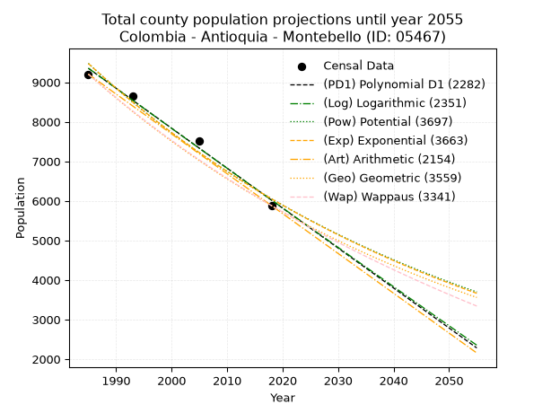
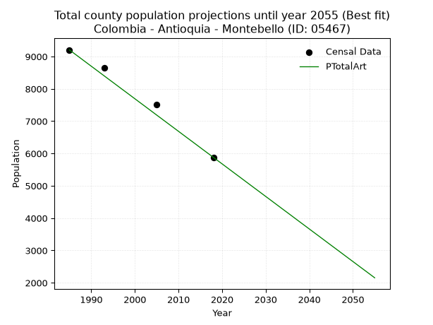
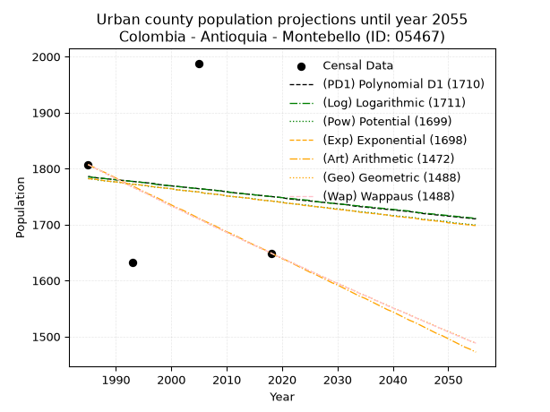
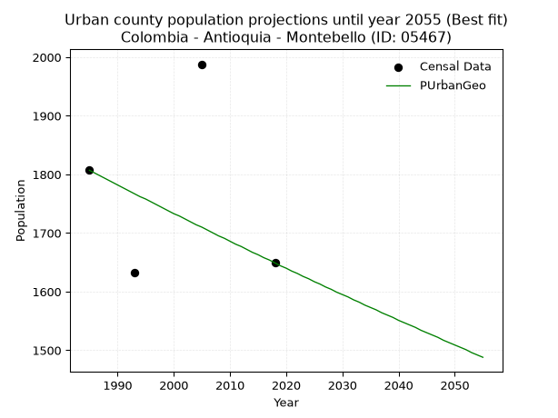
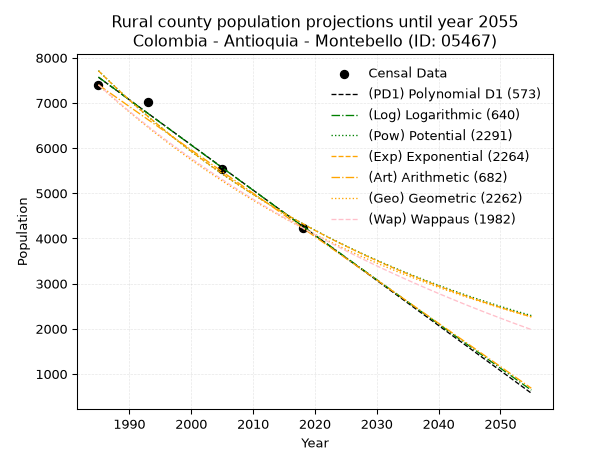
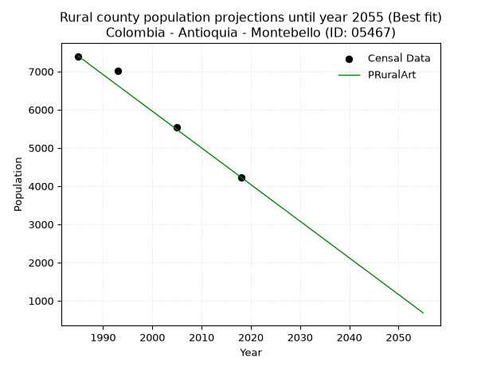

<div align="center">


</div>

# _“Population and Public Services Demand Projections (PPSD) until Year 2050 for Colombia - Antioquia - Montebello (ID: 05467)”_
Keywords: `population` `public-service` `projection` `lineal` `polynomial` `logarithmic` `potential` `exponential` `arithmetic` `geometric` `wappaus` `dane` `colombia` `south-america`

PPSD are analytical estimates used by governments and planners to anticipate future changes in population size, age distribution, and the resulting community needs for utilities, healthcare, education, and infrastructure as sizing future water treatment facilities, electrical grids, and road networks based on spatial growth.

> **General running parameters**: • app_version: _v20260806_. • Python version: _3.14.7_. • Pandas version: _3.0.5_. • NumPy version: _2.5.1_. • Creates, save and include plots into reports (create_plot): _False_. • Projection until year: _2050_. • Process polynomial degree 2 and up: _False_. • Process Wappaus: _True_. • Process Wappaus: _True_. • Set negative values to zero: _True_. • Set infinite values to zero: _True_. • Drop dataset notes: _True_. 
<div align="center">

Dynamic map: [:earth_americas:Google](http://maps.google.com/maps?q=5.946313163,-75.5234553) [:earth_americas:OSM](https://www.openstreetmap.org/#map=18/5.946313163/-75.5234553&layers=P) [:earth_americas:Bing](https://www.bing.com/maps?cp=5.946313163~-75.5234553&lvl=18) [:earth_americas:Apple](https://maps.apple.com/frame?center=5.946313163%2C-75.5234553&span=0.003%2C0.006)

</div>


<div align="center">

```geojson
{
  "type": "Feature",
  "geometry": {
    "type": "Point", 
    "coordinates": [-75.5234553, 5.946313163]
  }, 
  "properties": {
    "Name": "Colombia - Antioquia - Montebello (ID: 05467)"
  }
}
```

</div>


## 0. Census Data (4 records)

Census data are official statistics collected by a government about the people and housing in a country. They usually include counts of total population, age, sex, race, income, education, and jobs.

📅Global census file: [Population.xlsx](../data/Population.xlsx)

| Source   |   Year |   CountryID | CountryName   |   StateID | StateName   |   CountyID | CountyName   |   PTotal |   PUrban |   PRural |
|:---------|-------:|------------:|:--------------|----------:|:------------|-----------:|:-------------|---------:|---------:|---------:|
| DANE     |   1985 |          57 | Colombia      |        05 | Antioquia   |      05467 | Montebello   |     9205 |     1807 |     7398 |
| DANE     |   1993 |          57 | Colombia      |        05 | Antioquia   |      05467 | Montebello   |     8641 |     1632 |     7009 |
| DANE     |   2005 |          57 | Colombia      |        05 | Antioquia   |      05467 | Montebello   |     7523 |     1988 |     5535 |
| DANE     |   2018 |          57 | Colombia      |        05 | Antioquia   |      05467 | Montebello   |     5881 |     1649 |     4232 |

> 🔥Some records could had specific notes about the registered values or the corresponding urban or rural distribution.

## 1. Total

### 1.1. Coefficients and Parameters

* (PD1) Polynomial Deg 1: -101.00602167803989, 209849.79486149928 (lineal)
* (Log) Logarithmic: -202120.57727160098, 1544132.6275340947
* (Pow) Potential: -27.156223734161998, 93.5313615072657
* (Exp) Exponential: -0.013572721031231217, 4755507224805731.0
* (Art) Arithmetic: Year diff. 2018 - 1985 = 33, Population diff. 5881 - 9205 = -3324, Annual growth = -100.72727272727273
* (Geo) Geometric: Year diff. 2018 - 1985 = 33, Population diff. 5881 - 9205 = -3324, Annual growth % = -0.013484620436736594
* (Wap) Wappaus: i = -1.3353741578585805, Condition values only valid for < 200)

<sub>
Wappaus condition values: ['-0.00', '-1.34', '-2.67', '-4.01', '-5.34', '-6.68', '-8.01', '-9.35', '-10.68', '-12.02', '-13.35', '-14.69', '-16.02', '-17.36', '-18.70', '-20.03', '-21.37', '-22.70', '-24.04', '-25.37', '-26.71', '-28.04', '-29.38', '-30.71', '-32.05', '-33.38', '-34.72', '-36.06', '-37.39', '-38.73', '-40.06', '-41.40', '-42.73', '-44.07', '-45.40', '-46.74', '-48.07', '-49.41', '-50.74', '-52.08', '-53.41', '-54.75', '-56.09', '-57.42', '-58.76', '-60.09', '-61.43', '-62.76', '-64.10', '-65.43', '-66.77', '-68.10', '-69.44', '-70.77', '-72.11', '-73.45', '-74.78', '-76.12', '-77.45', '-78.79', '-80.12', '-81.46', '-82.79', '-84.13', '-85.46', '-86.80']
</sub>


### 1.2. Projected Dataset

|   Year |   CountyID |   PTotalPD1 |   PTotalLog |   PTotalPow |   PTotalExp |   PTotalArt |   PTotalGeo |   PTotalWap |
|-------:|-----------:|------------:|------------:|------------:|------------:|------------:|------------:|------------:|
|   1985 |      05467 |        9353 |        9355 |        9476 |        9473 |        9205 |        9205 |        9205 |
|   1986 |      05467 |        9252 |        9254 |        9348 |        9346 |        9104 |        9081 |        9083 |
|   1987 |      05467 |        9151 |        9152 |        9221 |        9220 |        9004 |        8958 |        8962 |
|   1988 |      05467 |        9050 |        9050 |        9096 |        9095 |        8903 |        8838 |        8843 |
|   1989 |      05467 |        8949 |        8949 |        8972 |        8973 |        8802 |        8718 |        8726 |
|   1990 |      05467 |        8848 |        8847 |        8851 |        8852 |        8701 |        8601 |        8610 |
|   1991 |      05467 |        8747 |        8745 |        8731 |        8732 |        8601 |        8485 |        8496 |
|   1992 |      05467 |        8646 |        8644 |        8612 |        8615 |        8500 |        8370 |        8383 |
|   1993 |      05467 |        8545 |        8542 |        8496 |        8499 |        8399 |        8258 |        8271 |
|   1994 |      05467 |        8444 |        8441 |        8381 |        8384 |        8298 |        8146 |        8161 |
|   1995 |      05467 |        8343 |        8340 |        8267 |        8271 |        8198 |        8036 |        8053 |
|   1996 |      05467 |        8242 |        8238 |        8156 |        8159 |        8097 |        7928 |        7945 |
|   1997 |      05467 |        8141 |        8137 |        8046 |        8049 |        7996 |        7821 |        7839 |
|   1998 |      05467 |        8040 |        8036 |        7937 |        7941 |        7896 |        7716 |        7735 |
|   1999 |      05467 |        7939 |        7935 |        7830 |        7834 |        7795 |        7612 |        7631 |
|   2000 |      05467 |        7838 |        7834 |        7724 |        7728 |        7694 |        7509 |        7529 |
|   2001 |      05467 |        7737 |        7733 |        7620 |        7624 |        7593 |        7408 |        7428 |
|   2002 |      05467 |        7636 |        7632 |        7517 |        7521 |        7493 |        7308 |        7328 |
|   2003 |      05467 |        7535 |        7531 |        7416 |        7420 |        7392 |        7209 |        7230 |
|   2004 |      05467 |        7434 |        7430 |        7316 |        7320 |        7291 |        7112 |        7132 |
|   2005 |      05467 |        7333 |        7329 |        7218 |        7221 |        7190 |        7016 |        7036 |
|   2006 |      05467 |        7232 |        7228 |        7121 |        7124 |        7090 |        6922 |        6941 |
|   2007 |      05467 |        7131 |        7128 |        7025 |        7028 |        6989 |        6828 |        6847 |
|   2008 |      05467 |        7030 |        7027 |        6931 |        6933 |        6888 |        6736 |        6754 |
|   2009 |      05467 |        6929 |        6926 |        6838 |        6840 |        6788 |        6645 |        6662 |
|   2010 |      05467 |        6828 |        6826 |        6746 |        6747 |        6687 |        6556 |        6572 |
|   2011 |      05467 |        6727 |        6725 |        6655 |        6656 |        6586 |        6467 |        6482 |
|   2012 |      05467 |        6626 |        6625 |        6566 |        6567 |        6485 |        6380 |        6393 |
|   2013 |      05467 |        6525 |        6524 |        6478 |        6478 |        6385 |        6294 |        6305 |
|   2014 |      05467 |        6424 |        6424 |        6391 |        6391 |        6284 |        6209 |        6219 |
|   2015 |      05467 |        6323 |        6324 |        6306 |        6305 |        6183 |        6125 |        6133 |
|   2016 |      05467 |        6222 |        6223 |        6221 |        6220 |        6082 |        6043 |        6048 |
|   2017 |      05467 |        6121 |        6123 |        6138 |        6136 |        5982 |        5961 |        5964 |
|   2018 |      05467 |        6020 |        6023 |        6056 |        6053 |        5881 |        5881 |        5881 |
|   2019 |      05467 |        5919 |        5923 |        5975 |        5972 |        5780 |        5802 |        5799 |
|   2020 |      05467 |        5818 |        5823 |        5895 |        5891 |        5680 |        5723 |        5718 |
|   2021 |      05467 |        5717 |        5723 |        5817 |        5812 |        5579 |        5646 |        5637 |
|   2022 |      05467 |        5616 |        5623 |        5739 |        5733 |        5478 |        5570 |        5558 |
|   2023 |      05467 |        5515 |        5523 |        5662 |        5656 |        5377 |        5495 |        5479 |
|   2024 |      05467 |        5414 |        5423 |        5587 |        5580 |        5277 |        5421 |        5401 |
|   2025 |      05467 |        5313 |        5323 |        5512 |        5504 |        5176 |        5348 |        5325 |
|   2026 |      05467 |        5212 |        5223 |        5439 |        5430 |        5075 |        5276 |        5248 |
|   2027 |      05467 |        5111 |        5123 |        5367 |        5357 |        4974 |        5205 |        5173 |
|   2028 |      05467 |        5010 |        5024 |        5295 |        5285 |        4874 |        5134 |        5098 |
|   2029 |      05467 |        4909 |        4924 |        5225 |        5214 |        4773 |        5065 |        5025 |
|   2030 |      05467 |        4808 |        4825 |        5155 |        5143 |        4672 |        4997 |        4952 |
|   2031 |      05467 |        4707 |        4725 |        5087 |        5074 |        4572 |        4929 |        4879 |
|   2032 |      05467 |        4606 |        4626 |        5019 |        5006 |        4471 |        4863 |        4808 |
|   2033 |      05467 |        4505 |        4526 |        4953 |        4938 |        4370 |        4797 |        4737 |
|   2034 |      05467 |        4404 |        4427 |        4887 |        4872 |        4269 |        4733 |        4667 |
|   2035 |      05467 |        4303 |        4327 |        4822 |        4806 |        4169 |        4669 |        4597 |
|   2036 |      05467 |        4202 |        4228 |        4758 |        4741 |        4068 |        4606 |        4528 |
|   2037 |      05467 |        4101 |        4129 |        4695 |        4677 |        3967 |        4544 |        4460 |
|   2038 |      05467 |        4000 |        4030 |        4633 |        4614 |        3866 |        4483 |        4393 |
|   2039 |      05467 |        3899 |        3930 |        4572 |        4552 |        3766 |        4422 |        4326 |
|   2040 |      05467 |        3798 |        3831 |        4511 |        4491 |        3665 |        4363 |        4260 |
|   2041 |      05467 |        3697 |        3732 |        4452 |        4430 |        3564 |        4304 |        4195 |
|   2042 |      05467 |        3595 |        3633 |        4393 |        4370 |        3464 |        4246 |        4130 |
|   2043 |      05467 |        3494 |        3534 |        4335 |        4311 |        3363 |        4188 |        4066 |
|   2044 |      05467 |        3393 |        3435 |        4278 |        4253 |        3262 |        4132 |        4002 |
|   2045 |      05467 |        3292 |        3337 |        4221 |        4196 |        3161 |        4076 |        3939 |
|   2046 |      05467 |        3191 |        3238 |        4166 |        4139 |        3061 |        4021 |        3877 |
|   2047 |      05467 |        3090 |        3139 |        4111 |        4084 |        2960 |        3967 |        3815 |
|   2048 |      05467 |        2989 |        3040 |        4056 |        4028 |        2859 |        3914 |        3754 |
|   2049 |      05467 |        2888 |        2942 |        4003 |        3974 |        2758 |        3861 |        3693 |
|   2050 |      05467 |        2787 |        2843 |        3950 |        3921 |        2658 |        3809 |        3633 |
<div align="center">

</img>

</div>


### 1.3. Best fit with absolute and relative error (%)

Relative error puts that difference into context by dividing the absolute error by the true value, creating a unitless ratio or percentage that shows the scale of the mistake.

Absolute and relative error

|   Year | Source   |   CountryID | CountryName   |   StateID | StateName   |   CountyID_x | CountyName   |   PTotal |   PUrban |   PRural |   CountyID_y |   PTotalPD1 |   PTotalLog |   PTotalPow |   PTotalExp |   PTotalArt |   PTotalGeo |   PTotalWap |   PTotalPD1AbsError |   PTotalLogAbsError |   PTotalPowAbsError |   PTotalExpAbsError |   PTotalArtAbsError |   PTotalGeoAbsError |   PTotalWapAbsError |   PTotalPD1RelError |   PTotalLogRelError |   PTotalPowRelError |   PTotalExpRelError |   PTotalArtRelError |   PTotalGeoRelError |   PTotalWapRelError |
|-------:|:---------|------------:|:--------------|----------:|:------------|-------------:|:-------------|---------:|---------:|---------:|-------------:|------------:|------------:|------------:|------------:|------------:|------------:|------------:|--------------------:|--------------------:|--------------------:|--------------------:|--------------------:|--------------------:|--------------------:|--------------------:|--------------------:|--------------------:|--------------------:|--------------------:|--------------------:|--------------------:|
|   1985 | DANE     |          57 | Colombia      |        05 | Antioquia   |        05467 | Montebello   |     9205 |     1807 |     7398 |        05467 |        9353 |        9355 |        9476 |        9473 |        9205 |        9205 |        9205 |                 148 |                 150 |                 271 |                 268 |                   0 |                   0 |                   0 |             1.60782 |             1.62955 |             2.94405 |             2.91146 |             0       |             0       |             0       |
|   1993 | DANE     |          57 | Colombia      |        05 | Antioquia   |        05467 | Montebello   |     8641 |     1632 |     7009 |        05467 |        8545 |        8542 |        8496 |        8499 |        8399 |        8258 |        8271 |                  96 |                  99 |                 145 |                 142 |                 242 |                 383 |                 370 |             1.11098 |             1.1457  |             1.67805 |             1.64333 |             2.8006  |             4.43236 |             4.28191 |
|   2005 | DANE     |          57 | Colombia      |        05 | Antioquia   |        05467 | Montebello   |     7523 |     1988 |     5535 |        05467 |        7333 |        7329 |        7218 |        7221 |        7190 |        7016 |        7036 |                 190 |                 194 |                 305 |                 302 |                 333 |                 507 |                 487 |             2.52559 |             2.57876 |             4.05423 |             4.01436 |             4.42643 |             6.73933 |             6.47348 |
|   2018 | DANE     |          57 | Colombia      |        05 | Antioquia   |        05467 | Montebello   |     5881 |     1649 |     4232 |        05467 |        6020 |        6023 |        6056 |        6053 |        5881 |        5881 |        5881 |                 139 |                 142 |                 175 |                 172 |                   0 |                   0 |                   0 |             2.36354 |             2.41456 |             2.97568 |             2.92467 |             0       |             0       |             0       |

Relative error mean

| Method    |   RelError | Best   |
|:----------|-----------:|:-------|
| PTotalPD1 |    1.90198 |        |
| PTotalLog |    1.94214 |        |
| PTotalPow |    2.913   |        |
| PTotalExp |    2.87345 |        |
| PTotalArt |    1.80676 | True   |
| PTotalGeo |    2.79292 |        |
| PTotalWap |    2.68885 |        |

💙Best method: _**PTotalArt**_
<div align="center">

</img>

</div>


### 1.4. Fresh water supply demand in liters per capita per day (lpcd)

The fresh water supply demand typically ranges from 100 to 300 liters per capita per day (lpcd) for standard domestic and municipal planning, though absolute survival minimums set by the World Health Organization are as low as 7.5 to 20 liters per day, and total consumption in high-income nations can exceed 400 liters.

> `CZ`: Level in meters above the sea level (masl).<br> `WS`: Fresh water supply demand in liters per capita per day (lpcd or l/h/d).<br> `WSAll`: Zonal fresh water supply demand in liters per second (l/s).<br> `A`: Zonal area in square meters.

Reference values (RAS Colombia)

|    CZ |   WS |
|------:|-----:|
|  1000 |  120 |
|  2000 |  130 |
| 99999 |  140 |

County shapefile geometry properties and water supply values

|   CountyID |      ATotal |   CZTotal |   WSTotal |
|-----------:|------------:|----------:|----------:|
|      05467 | 7.60053e+07 |   1695.56 |       130 |

Projected values for best method: PTotalArt

|   CountyID |   Year |   PTotalArt |   WSTotal |   WSTotalAll |
|-----------:|-------:|------------:|----------:|-------------:|
|      05467 |   1985 |        9205 |       130 |     13.8501  |
|      05467 |   1986 |        9104 |       130 |     13.6981  |
|      05467 |   1987 |        9004 |       130 |     13.5477  |
|      05467 |   1988 |        8903 |       130 |     13.3957  |
|      05467 |   1989 |        8802 |       130 |     13.2438  |
|      05467 |   1990 |        8701 |       130 |     13.0918  |
|      05467 |   1991 |        8601 |       130 |     12.9413  |
|      05467 |   1992 |        8500 |       130 |     12.7894  |
|      05467 |   1993 |        8399 |       130 |     12.6374  |
|      05467 |   1994 |        8298 |       130 |     12.4854  |
|      05467 |   1995 |        8198 |       130 |     12.335   |
|      05467 |   1996 |        8097 |       130 |     12.183   |
|      05467 |   1997 |        7996 |       130 |     12.031   |
|      05467 |   1998 |        7896 |       130 |     11.8806  |
|      05467 |   1999 |        7795 |       130 |     11.7286  |
|      05467 |   2000 |        7694 |       130 |     11.5766  |
|      05467 |   2001 |        7593 |       130 |     11.4247  |
|      05467 |   2002 |        7493 |       130 |     11.2742  |
|      05467 |   2003 |        7392 |       130 |     11.1222  |
|      05467 |   2004 |        7291 |       130 |     10.9703  |
|      05467 |   2005 |        7190 |       130 |     10.8183  |
|      05467 |   2006 |        7090 |       130 |     10.6678  |
|      05467 |   2007 |        6989 |       130 |     10.5159  |
|      05467 |   2008 |        6888 |       130 |     10.3639  |
|      05467 |   2009 |        6788 |       130 |     10.2134  |
|      05467 |   2010 |        6687 |       130 |     10.0615  |
|      05467 |   2011 |        6586 |       130 |      9.90949 |
|      05467 |   2012 |        6485 |       130 |      9.75752 |
|      05467 |   2013 |        6385 |       130 |      9.60706 |
|      05467 |   2014 |        6284 |       130 |      9.45509 |
|      05467 |   2015 |        6183 |       130 |      9.30312 |
|      05467 |   2016 |        6082 |       130 |      9.15116 |
|      05467 |   2017 |        5982 |       130 |      9.00069 |
|      05467 |   2018 |        5881 |       130 |      8.84873 |
|      05467 |   2019 |        5780 |       130 |      8.69676 |
|      05467 |   2020 |        5680 |       130 |      8.5463  |
|      05467 |   2021 |        5579 |       130 |      8.39433 |
|      05467 |   2022 |        5478 |       130 |      8.24236 |
|      05467 |   2023 |        5377 |       130 |      8.09039 |
|      05467 |   2024 |        5277 |       130 |      7.93993 |
|      05467 |   2025 |        5176 |       130 |      7.78796 |
|      05467 |   2026 |        5075 |       130 |      7.636   |
|      05467 |   2027 |        4974 |       130 |      7.48403 |
|      05467 |   2028 |        4874 |       130 |      7.33356 |
|      05467 |   2029 |        4773 |       130 |      7.1816  |
|      05467 |   2030 |        4672 |       130 |      7.02963 |
|      05467 |   2031 |        4572 |       130 |      6.87917 |
|      05467 |   2032 |        4471 |       130 |      6.7272  |
|      05467 |   2033 |        4370 |       130 |      6.57523 |
|      05467 |   2034 |        4269 |       130 |      6.42326 |
|      05467 |   2035 |        4169 |       130 |      6.2728  |
|      05467 |   2036 |        4068 |       130 |      6.12083 |
|      05467 |   2037 |        3967 |       130 |      5.96887 |
|      05467 |   2038 |        3866 |       130 |      5.8169  |
|      05467 |   2039 |        3766 |       130 |      5.66644 |
|      05467 |   2040 |        3665 |       130 |      5.51447 |
|      05467 |   2041 |        3564 |       130 |      5.3625  |
|      05467 |   2042 |        3464 |       130 |      5.21204 |
|      05467 |   2043 |        3363 |       130 |      5.06007 |
|      05467 |   2044 |        3262 |       130 |      4.9081  |
|      05467 |   2045 |        3161 |       130 |      4.75613 |
|      05467 |   2046 |        3061 |       130 |      4.60567 |
|      05467 |   2047 |        2960 |       130 |      4.4537  |
|      05467 |   2048 |        2859 |       130 |      4.30174 |
|      05467 |   2049 |        2758 |       130 |      4.14977 |
|      05467 |   2050 |        2658 |       130 |      3.99931 |

## 2. Urban

### 2.1. Coefficients and Parameters

* (PD1) Polynomial Deg 1: -1.0855078281812678, 3940.287033319581 (lineal)
* (Log) Logarithmic: -2149.3618438212457, 18106.31659879015
* (Pow) Potential: -1.376636504372508, 7.790710336813392
* (Exp) Exponential: -0.0006939682848164187, 7066.06089334076
* (Art) Arithmetic: Year diff. 2018 - 1985 = 33, Population diff. 1649 - 1807 = -158, Annual growth = -4.787878787878788
* (Geo) Geometric: Year diff. 2018 - 1985 = 33, Population diff. 1649 - 1807 = -158, Annual growth % = -0.0027688556296459055
* (Wap) Wappaus: i = -0.2770763187429854, Condition values only valid for < 200)

<sub>
Wappaus condition values: ['-0.00', '-0.28', '-0.55', '-0.83', '-1.11', '-1.39', '-1.66', '-1.94', '-2.22', '-2.49', '-2.77', '-3.05', '-3.32', '-3.60', '-3.88', '-4.16', '-4.43', '-4.71', '-4.99', '-5.26', '-5.54', '-5.82', '-6.10', '-6.37', '-6.65', '-6.93', '-7.20', '-7.48', '-7.76', '-8.04', '-8.31', '-8.59', '-8.87', '-9.14', '-9.42', '-9.70', '-9.97', '-10.25', '-10.53', '-10.81', '-11.08', '-11.36', '-11.64', '-11.91', '-12.19', '-12.47', '-12.75', '-13.02', '-13.30', '-13.58', '-13.85', '-14.13', '-14.41', '-14.69', '-14.96', '-15.24', '-15.52', '-15.79', '-16.07', '-16.35', '-16.62', '-16.90', '-17.18', '-17.46', '-17.73', '-18.01']
</sub>


### 2.2. Projected Dataset

|   Year |   CountyID |   PUrbanPD1 |   PUrbanLog |   PUrbanPow |   PUrbanExp |   PUrbanArt |   PUrbanGeo |   PUrbanWap |
|-------:|-----------:|------------:|------------:|------------:|------------:|------------:|------------:|------------:|
|   1985 |      05467 |        1786 |        1785 |        1782 |        1782 |        1807 |        1807 |        1807 |
|   1986 |      05467 |        1784 |        1784 |        1781 |        1781 |        1802 |        1802 |        1802 |
|   1987 |      05467 |        1783 |        1783 |        1779 |        1780 |        1797 |        1797 |        1797 |
|   1988 |      05467 |        1782 |        1782 |        1778 |        1778 |        1793 |        1792 |        1792 |
|   1989 |      05467 |        1781 |        1781 |        1777 |        1777 |        1788 |        1787 |        1787 |
|   1990 |      05467 |        1780 |        1780 |        1776 |        1776 |        1783 |        1782 |        1782 |
|   1991 |      05467 |        1779 |        1779 |        1775 |        1775 |        1778 |        1777 |        1777 |
|   1992 |      05467 |        1778 |        1778 |        1773 |        1773 |        1773 |        1772 |        1772 |
|   1993 |      05467 |        1777 |        1777 |        1772 |        1772 |        1769 |        1767 |        1767 |
|   1994 |      05467 |        1776 |        1776 |        1771 |        1771 |        1764 |        1762 |        1762 |
|   1995 |      05467 |        1775 |        1775 |        1770 |        1770 |        1759 |        1758 |        1758 |
|   1996 |      05467 |        1774 |        1774 |        1768 |        1769 |        1754 |        1753 |        1753 |
|   1997 |      05467 |        1773 |        1772 |        1767 |        1767 |        1750 |        1748 |        1748 |
|   1998 |      05467 |        1771 |        1771 |        1766 |        1766 |        1745 |        1743 |        1743 |
|   1999 |      05467 |        1770 |        1770 |        1765 |        1765 |        1740 |        1738 |        1738 |
|   2000 |      05467 |        1769 |        1769 |        1764 |        1764 |        1735 |        1733 |        1733 |
|   2001 |      05467 |        1768 |        1768 |        1762 |        1762 |        1730 |        1729 |        1729 |
|   2002 |      05467 |        1767 |        1767 |        1761 |        1761 |        1726 |        1724 |        1724 |
|   2003 |      05467 |        1766 |        1766 |        1760 |        1760 |        1721 |        1719 |        1719 |
|   2004 |      05467 |        1765 |        1765 |        1759 |        1759 |        1716 |        1714 |        1714 |
|   2005 |      05467 |        1764 |        1764 |        1758 |        1758 |        1711 |        1710 |        1710 |
|   2006 |      05467 |        1763 |        1763 |        1756 |        1756 |        1706 |        1705 |        1705 |
|   2007 |      05467 |        1762 |        1762 |        1755 |        1755 |        1702 |        1700 |        1700 |
|   2008 |      05467 |        1761 |        1761 |        1754 |        1754 |        1697 |        1695 |        1695 |
|   2009 |      05467 |        1760 |        1760 |        1753 |        1753 |        1692 |        1691 |        1691 |
|   2010 |      05467 |        1758 |        1759 |        1751 |        1751 |        1687 |        1686 |        1686 |
|   2011 |      05467 |        1757 |        1757 |        1750 |        1750 |        1683 |        1681 |        1681 |
|   2012 |      05467 |        1756 |        1756 |        1749 |        1749 |        1678 |        1677 |        1677 |
|   2013 |      05467 |        1755 |        1755 |        1748 |        1748 |        1673 |        1672 |        1672 |
|   2014 |      05467 |        1754 |        1754 |        1747 |        1747 |        1668 |        1667 |        1667 |
|   2015 |      05467 |        1753 |        1753 |        1746 |        1745 |        1663 |        1663 |        1663 |
|   2016 |      05467 |        1752 |        1752 |        1744 |        1744 |        1659 |        1658 |        1658 |
|   2017 |      05467 |        1751 |        1751 |        1743 |        1743 |        1654 |        1654 |        1654 |
|   2018 |      05467 |        1750 |        1750 |        1742 |        1742 |        1649 |        1649 |        1649 |
|   2019 |      05467 |        1749 |        1749 |        1741 |        1741 |        1644 |        1644 |        1644 |
|   2020 |      05467 |        1748 |        1748 |        1740 |        1739 |        1639 |        1640 |        1640 |
|   2021 |      05467 |        1746 |        1747 |        1738 |        1738 |        1635 |        1635 |        1635 |
|   2022 |      05467 |        1745 |        1746 |        1737 |        1737 |        1630 |        1631 |        1631 |
|   2023 |      05467 |        1744 |        1745 |        1736 |        1736 |        1625 |        1626 |        1626 |
|   2024 |      05467 |        1743 |        1744 |        1735 |        1734 |        1620 |        1622 |        1622 |
|   2025 |      05467 |        1742 |        1743 |        1734 |        1733 |        1615 |        1617 |        1617 |
|   2026 |      05467 |        1741 |        1741 |        1732 |        1732 |        1611 |        1613 |        1613 |
|   2027 |      05467 |        1740 |        1740 |        1731 |        1731 |        1606 |        1608 |        1608 |
|   2028 |      05467 |        1739 |        1739 |        1730 |        1730 |        1601 |        1604 |        1604 |
|   2029 |      05467 |        1738 |        1738 |        1729 |        1728 |        1596 |        1599 |        1599 |
|   2030 |      05467 |        1737 |        1737 |        1728 |        1727 |        1592 |        1595 |        1595 |
|   2031 |      05467 |        1736 |        1736 |        1727 |        1726 |        1587 |        1591 |        1590 |
|   2032 |      05467 |        1735 |        1735 |        1725 |        1725 |        1582 |        1586 |        1586 |
|   2033 |      05467 |        1733 |        1734 |        1724 |        1724 |        1577 |        1582 |        1582 |
|   2034 |      05467 |        1732 |        1733 |        1723 |        1722 |        1572 |        1577 |        1577 |
|   2035 |      05467 |        1731 |        1732 |        1722 |        1721 |        1568 |        1573 |        1573 |
|   2036 |      05467 |        1730 |        1731 |        1721 |        1720 |        1563 |        1569 |        1569 |
|   2037 |      05467 |        1729 |        1730 |        1720 |        1719 |        1558 |        1564 |        1564 |
|   2038 |      05467 |        1728 |        1729 |        1718 |        1718 |        1553 |        1560 |        1560 |
|   2039 |      05467 |        1727 |        1728 |        1717 |        1717 |        1548 |        1556 |        1555 |
|   2040 |      05467 |        1726 |        1727 |        1716 |        1715 |        1544 |        1551 |        1551 |
|   2041 |      05467 |        1725 |        1726 |        1715 |        1714 |        1539 |        1547 |        1547 |
|   2042 |      05467 |        1724 |        1725 |        1714 |        1713 |        1534 |        1543 |        1543 |
|   2043 |      05467 |        1723 |        1724 |        1713 |        1712 |        1529 |        1539 |        1538 |
|   2044 |      05467 |        1722 |        1722 |        1712 |        1711 |        1525 |        1534 |        1534 |
|   2045 |      05467 |        1720 |        1721 |        1710 |        1709 |        1520 |        1530 |        1530 |
|   2046 |      05467 |        1719 |        1720 |        1709 |        1708 |        1515 |        1526 |        1525 |
|   2047 |      05467 |        1718 |        1719 |        1708 |        1707 |        1510 |        1522 |        1521 |
|   2048 |      05467 |        1717 |        1718 |        1707 |        1706 |        1505 |        1517 |        1517 |
|   2049 |      05467 |        1716 |        1717 |        1706 |        1705 |        1501 |        1513 |        1513 |
|   2050 |      05467 |        1715 |        1716 |        1705 |        1703 |        1496 |        1509 |        1508 |
<div align="center">

</img>

</div>


### 2.3. Best fit with absolute and relative error (%)

Relative error puts that difference into context by dividing the absolute error by the true value, creating a unitless ratio or percentage that shows the scale of the mistake.

Absolute and relative error

|   Year | Source   |   CountryID | CountryName   |   StateID | StateName   |   CountyID_x | CountyName   |   PTotal |   PUrban |   PRural |   CountyID_y |   PUrbanPD1 |   PUrbanLog |   PUrbanPow |   PUrbanExp |   PUrbanArt |   PUrbanGeo |   PUrbanWap |   PUrbanPD1AbsError |   PUrbanLogAbsError |   PUrbanPowAbsError |   PUrbanExpAbsError |   PUrbanArtAbsError |   PUrbanGeoAbsError |   PUrbanWapAbsError |   PUrbanPD1RelError |   PUrbanLogRelError |   PUrbanPowRelError |   PUrbanExpRelError |   PUrbanArtRelError |   PUrbanGeoRelError |   PUrbanWapRelError |
|-------:|:---------|------------:|:--------------|----------:|:------------|-------------:|:-------------|---------:|---------:|---------:|-------------:|------------:|------------:|------------:|------------:|------------:|------------:|------------:|--------------------:|--------------------:|--------------------:|--------------------:|--------------------:|--------------------:|--------------------:|--------------------:|--------------------:|--------------------:|--------------------:|--------------------:|--------------------:|--------------------:|
|   1985 | DANE     |          57 | Colombia      |        05 | Antioquia   |        05467 | Montebello   |     9205 |     1807 |     7398 |        05467 |        1786 |        1785 |        1782 |        1782 |        1807 |        1807 |        1807 |                  21 |                  22 |                  25 |                  25 |                   0 |                   0 |                   0 |             1.16215 |             1.21749 |             1.38351 |             1.38351 |             0       |             0       |             0       |
|   1993 | DANE     |          57 | Colombia      |        05 | Antioquia   |        05467 | Montebello   |     8641 |     1632 |     7009 |        05467 |        1777 |        1777 |        1772 |        1772 |        1769 |        1767 |        1767 |                 145 |                 145 |                 140 |                 140 |                 137 |                 135 |                 135 |             8.8848  |             8.8848  |             8.57843 |             8.57843 |             8.39461 |             8.27206 |             8.27206 |
|   2005 | DANE     |          57 | Colombia      |        05 | Antioquia   |        05467 | Montebello   |     7523 |     1988 |     5535 |        05467 |        1764 |        1764 |        1758 |        1758 |        1711 |        1710 |        1710 |                 224 |                 224 |                 230 |                 230 |                 277 |                 278 |                 278 |            11.2676  |            11.2676  |            11.5694  |            11.5694  |            13.9336  |            13.9839  |            13.9839  |
|   2018 | DANE     |          57 | Colombia      |        05 | Antioquia   |        05467 | Montebello   |     5881 |     1649 |     4232 |        05467 |        1750 |        1750 |        1742 |        1742 |        1649 |        1649 |        1649 |                 101 |                 101 |                  93 |                  93 |                   0 |                   0 |                   0 |             6.12492 |             6.12492 |             5.63978 |             5.63978 |             0       |             0       |             0       |

Relative error mean

| Method    |   RelError | Best   |
|:----------|-----------:|:-------|
| PUrbanPD1 |    6.85987 |        |
| PUrbanLog |    6.87371 |        |
| PUrbanPow |    6.79278 |        |
| PUrbanExp |    6.79278 |        |
| PUrbanArt |    5.58205 |        |
| PUrbanGeo |    5.56399 | True   |
| PUrbanWap |    5.56399 | True   |

💙Best method: _**PUrbanGeo**_
<div align="center">

</img>

</div>


### 2.4. Fresh water supply demand in liters per capita per day (lpcd)

The fresh water supply demand typically ranges from 100 to 300 liters per capita per day (lpcd) for standard domestic and municipal planning, though absolute survival minimums set by the World Health Organization are as low as 7.5 to 20 liters per day, and total consumption in high-income nations can exceed 400 liters.

> `CZ`: Level in meters above the sea level (masl).<br> `WS`: Fresh water supply demand in liters per capita per day (lpcd or l/h/d).<br> `WSAll`: Zonal fresh water supply demand in liters per second (l/s).<br> `A`: Zonal area in square meters.

Reference values (RAS Colombia)

|    CZ |   WS |
|------:|-----:|
|  1000 |  120 |
|  2000 |  130 |
| 99999 |  140 |

County shapefile geometry properties and water supply values

|   CountyID |   AUrban |   CZUrban |   WSUrban |
|-----------:|---------:|----------:|----------:|
|      05467 |   411946 |   2336.89 |       140 |

Projected values for best method: PUrbanGeo

|   CountyID |   Year |   PUrbanGeo |   WSUrban |   WSUrbanAll |
|-----------:|-------:|------------:|----------:|-------------:|
|      05467 |   1985 |        1807 |       140 |      2.92801 |
|      05467 |   1986 |        1802 |       140 |      2.91991 |
|      05467 |   1987 |        1797 |       140 |      2.91181 |
|      05467 |   1988 |        1792 |       140 |      2.9037  |
|      05467 |   1989 |        1787 |       140 |      2.8956  |
|      05467 |   1990 |        1782 |       140 |      2.8875  |
|      05467 |   1991 |        1777 |       140 |      2.8794  |
|      05467 |   1992 |        1772 |       140 |      2.8713  |
|      05467 |   1993 |        1767 |       140 |      2.86319 |
|      05467 |   1994 |        1762 |       140 |      2.85509 |
|      05467 |   1995 |        1758 |       140 |      2.84861 |
|      05467 |   1996 |        1753 |       140 |      2.84051 |
|      05467 |   1997 |        1748 |       140 |      2.83241 |
|      05467 |   1998 |        1743 |       140 |      2.82431 |
|      05467 |   1999 |        1738 |       140 |      2.8162  |
|      05467 |   2000 |        1733 |       140 |      2.8081  |
|      05467 |   2001 |        1729 |       140 |      2.80162 |
|      05467 |   2002 |        1724 |       140 |      2.79352 |
|      05467 |   2003 |        1719 |       140 |      2.78542 |
|      05467 |   2004 |        1714 |       140 |      2.77731 |
|      05467 |   2005 |        1710 |       140 |      2.77083 |
|      05467 |   2006 |        1705 |       140 |      2.76273 |
|      05467 |   2007 |        1700 |       140 |      2.75463 |
|      05467 |   2008 |        1695 |       140 |      2.74653 |
|      05467 |   2009 |        1691 |       140 |      2.74005 |
|      05467 |   2010 |        1686 |       140 |      2.73194 |
|      05467 |   2011 |        1681 |       140 |      2.72384 |
|      05467 |   2012 |        1677 |       140 |      2.71736 |
|      05467 |   2013 |        1672 |       140 |      2.70926 |
|      05467 |   2014 |        1667 |       140 |      2.70116 |
|      05467 |   2015 |        1663 |       140 |      2.69468 |
|      05467 |   2016 |        1658 |       140 |      2.68657 |
|      05467 |   2017 |        1654 |       140 |      2.68009 |
|      05467 |   2018 |        1649 |       140 |      2.67199 |
|      05467 |   2019 |        1644 |       140 |      2.66389 |
|      05467 |   2020 |        1640 |       140 |      2.65741 |
|      05467 |   2021 |        1635 |       140 |      2.64931 |
|      05467 |   2022 |        1631 |       140 |      2.64282 |
|      05467 |   2023 |        1626 |       140 |      2.63472 |
|      05467 |   2024 |        1622 |       140 |      2.62824 |
|      05467 |   2025 |        1617 |       140 |      2.62014 |
|      05467 |   2026 |        1613 |       140 |      2.61366 |
|      05467 |   2027 |        1608 |       140 |      2.60556 |
|      05467 |   2028 |        1604 |       140 |      2.59907 |
|      05467 |   2029 |        1599 |       140 |      2.59097 |
|      05467 |   2030 |        1595 |       140 |      2.58449 |
|      05467 |   2031 |        1591 |       140 |      2.57801 |
|      05467 |   2032 |        1586 |       140 |      2.56991 |
|      05467 |   2033 |        1582 |       140 |      2.56343 |
|      05467 |   2034 |        1577 |       140 |      2.55532 |
|      05467 |   2035 |        1573 |       140 |      2.54884 |
|      05467 |   2036 |        1569 |       140 |      2.54236 |
|      05467 |   2037 |        1564 |       140 |      2.53426 |
|      05467 |   2038 |        1560 |       140 |      2.52778 |
|      05467 |   2039 |        1556 |       140 |      2.5213  |
|      05467 |   2040 |        1551 |       140 |      2.51319 |
|      05467 |   2041 |        1547 |       140 |      2.50671 |
|      05467 |   2042 |        1543 |       140 |      2.50023 |
|      05467 |   2043 |        1539 |       140 |      2.49375 |
|      05467 |   2044 |        1534 |       140 |      2.48565 |
|      05467 |   2045 |        1530 |       140 |      2.47917 |
|      05467 |   2046 |        1526 |       140 |      2.47269 |
|      05467 |   2047 |        1522 |       140 |      2.4662  |
|      05467 |   2048 |        1517 |       140 |      2.4581  |
|      05467 |   2049 |        1513 |       140 |      2.45162 |
|      05467 |   2050 |        1509 |       140 |      2.44514 |

## 3. Rural

### 3.1. Coefficients and Parameters

* (PD1) Polynomial Deg 1: -99.9205138498586, 205909.50782817963 (lineal)
* (Log) Logarithmic: -199971.2154277798, 1526026.3109353052
* (Pow) Potential: -35.024734855743375, 119.39041435317763
* (Exp) Exponential: -0.017503735172832473, 9.47458198634115e+18
* (Art) Arithmetic: Year diff. 2018 - 1985 = 33, Population diff. 4232 - 7398 = -3166, Annual growth = -95.93939393939394
* (Geo) Geometric: Year diff. 2018 - 1985 = 33, Population diff. 4232 - 7398 = -3166, Annual growth % = -0.016782874734073916
* (Wap) Wappaus: i = -1.6498606008494228, Condition values only valid for < 200)

<sub>
Wappaus condition values: ['-0.00', '-1.65', '-3.30', '-4.95', '-6.60', '-8.25', '-9.90', '-11.55', '-13.20', '-14.85', '-16.50', '-18.15', '-19.80', '-21.45', '-23.10', '-24.75', '-26.40', '-28.05', '-29.70', '-31.35', '-33.00', '-34.65', '-36.30', '-37.95', '-39.60', '-41.25', '-42.90', '-44.55', '-46.20', '-47.85', '-49.50', '-51.15', '-52.80', '-54.45', '-56.10', '-57.75', '-59.39', '-61.04', '-62.69', '-64.34', '-65.99', '-67.64', '-69.29', '-70.94', '-72.59', '-74.24', '-75.89', '-77.54', '-79.19', '-80.84', '-82.49', '-84.14', '-85.79', '-87.44', '-89.09', '-90.74', '-92.39', '-94.04', '-95.69', '-97.34', '-98.99', '-100.64', '-102.29', '-103.94', '-105.59', '-107.24']
</sub>


### 3.2. Projected Dataset

|   Year |   CountyID |   PRuralPD1 |   PRuralLog |   PRuralPow |   PRuralExp |   PRuralArt |   PRuralGeo |   PRuralWap |
|-------:|-----------:|------------:|------------:|------------:|------------:|------------:|------------:|------------:|
|   1985 |      05467 |        7567 |        7570 |        7713 |        7710 |        7398 |        7398 |        7398 |
|   1986 |      05467 |        7467 |        7469 |        7578 |        7576 |        7302 |        7274 |        7277 |
|   1987 |      05467 |        7367 |        7369 |        7446 |        7444 |        7206 |        7152 |        7158 |
|   1988 |      05467 |        7268 |        7268 |        7316 |        7315 |        7110 |        7032 |        7041 |
|   1989 |      05467 |        7168 |        7167 |        7188 |        7188 |        7014 |        6914 |        6925 |
|   1990 |      05467 |        7068 |        7067 |        7063 |        7064 |        6918 |        6798 |        6812 |
|   1991 |      05467 |        6968 |        6967 |        6939 |        6941 |        6822 |        6684 |        6700 |
|   1992 |      05467 |        6868 |        6866 |        6818 |        6821 |        6726 |        6571 |        6590 |
|   1993 |      05467 |        6768 |        6766 |        6700 |        6702 |        6630 |        6461 |        6482 |
|   1994 |      05467 |        6668 |        6665 |        6583 |        6586 |        6535 |        6353 |        6375 |
|   1995 |      05467 |        6568 |        6565 |        6468 |        6472 |        6439 |        6246 |        6270 |
|   1996 |      05467 |        6468 |        6465 |        6356 |        6359 |        6343 |        6141 |        6167 |
|   1997 |      05467 |        6368 |        6365 |        6245 |        6249 |        6247 |        6038 |        6065 |
|   1998 |      05467 |        6268 |        6265 |        6137 |        6141 |        6151 |        5937 |        5965 |
|   1999 |      05467 |        6168 |        6165 |        6030 |        6034 |        6055 |        5837 |        5866 |
|   2000 |      05467 |        6068 |        6065 |        5925 |        5929 |        5959 |        5739 |        5769 |
|   2001 |      05467 |        5969 |        5965 |        5823 |        5826 |        5863 |        5643 |        5673 |
|   2002 |      05467 |        5869 |        5865 |        5722 |        5725 |        5767 |        5548 |        5578 |
|   2003 |      05467 |        5769 |        5765 |        5622 |        5626 |        5671 |        5455 |        5485 |
|   2004 |      05467 |        5669 |        5665 |        5525 |        5528 |        5575 |        5364 |        5393 |
|   2005 |      05467 |        5569 |        5565 |        5429 |        5433 |        5479 |        5274 |        5303 |
|   2006 |      05467 |        5469 |        5466 |        5335 |        5338 |        5383 |        5185 |        5213 |
|   2007 |      05467 |        5369 |        5366 |        5243 |        5246 |        5287 |        5098 |        5125 |
|   2008 |      05467 |        5269 |        5266 |        5152 |        5155 |        5191 |        5012 |        5038 |
|   2009 |      05467 |        5169 |        5167 |        5063 |        5065 |        5095 |        4928 |        4953 |
|   2010 |      05467 |        5069 |        5067 |        4976 |        4977 |        5000 |        4846 |        4868 |
|   2011 |      05467 |        4969 |        4968 |        4890 |        4891 |        4904 |        4764 |        4785 |
|   2012 |      05467 |        4869 |        4868 |        4805 |        4806 |        4808 |        4684 |        4703 |
|   2013 |      05467 |        4770 |        4769 |        4722 |        4723 |        4712 |        4606 |        4622 |
|   2014 |      05467 |        4670 |        4670 |        4641 |        4641 |        4616 |        4528 |        4542 |
|   2015 |      05467 |        4570 |        4570 |        4561 |        4560 |        4520 |        4452 |        4463 |
|   2016 |      05467 |        4470 |        4471 |        4482 |        4481 |        4424 |        4378 |        4385 |
|   2017 |      05467 |        4370 |        4372 |        4405 |        4403 |        4328 |        4304 |        4308 |
|   2018 |      05467 |        4270 |        4273 |        4329 |        4327 |        4232 |        4232 |        4232 |
|   2019 |      05467 |        4170 |        4174 |        4255 |        4252 |        4136 |        4161 |        4157 |
|   2020 |      05467 |        4070 |        4075 |        4182 |        4178 |        4040 |        4091 |        4083 |
|   2021 |      05467 |        3970 |        3976 |        4110 |        4106 |        3944 |        4022 |        4010 |
|   2022 |      05467 |        3870 |        3877 |        4039 |        4034 |        3848 |        3955 |        3938 |
|   2023 |      05467 |        3770 |        3778 |        3970 |        3964 |        3752 |        3889 |        3867 |
|   2024 |      05467 |        3670 |        3679 |        3902 |        3896 |        3656 |        3823 |        3796 |
|   2025 |      05467 |        3570 |        3580 |        3835 |        3828 |        3560 |        3759 |        3727 |
|   2026 |      05467 |        3471 |        3482 |        3769 |        3762 |        3464 |        3696 |        3658 |
|   2027 |      05467 |        3371 |        3383 |        3705 |        3696 |        3369 |        3634 |        3591 |
|   2028 |      05467 |        3271 |        3284 |        3641 |        3632 |        3273 |        3573 |        3524 |
|   2029 |      05467 |        3171 |        3186 |        3579 |        3569 |        3177 |        3513 |        3458 |
|   2030 |      05467 |        3071 |        3087 |        3518 |        3507 |        3081 |        3454 |        3392 |
|   2031 |      05467 |        2971 |        2989 |        3457 |        3446 |        2985 |        3396 |        3328 |
|   2032 |      05467 |        2871 |        2890 |        3398 |        3387 |        2889 |        3339 |        3264 |
|   2033 |      05467 |        2771 |        2792 |        3340 |        3328 |        2793 |        3283 |        3201 |
|   2034 |      05467 |        2671 |        2694 |        3283 |        3270 |        2697 |        3228 |        3139 |
|   2035 |      05467 |        2571 |        2595 |        3227 |        3213 |        2601 |        3174 |        3077 |
|   2036 |      05467 |        2471 |        2497 |        3172 |        3158 |        2505 |        3121 |        3016 |
|   2037 |      05467 |        2371 |        2399 |        3118 |        3103 |        2409 |        3068 |        2956 |
|   2038 |      05467 |        2272 |        2301 |        3065 |        3049 |        2313 |        3017 |        2897 |
|   2039 |      05467 |        2172 |        2203 |        3013 |        2996 |        2217 |        2966 |        2838 |
|   2040 |      05467 |        2072 |        2105 |        2961 |        2944 |        2121 |        2916 |        2780 |
|   2041 |      05467 |        1972 |        2007 |        2911 |        2893 |        2025 |        2867 |        2723 |
|   2042 |      05467 |        1872 |        1909 |        2861 |        2843 |        1929 |        2819 |        2666 |
|   2043 |      05467 |        1772 |        1811 |        2813 |        2793 |        1834 |        2772 |        2610 |
|   2044 |      05467 |        1672 |        1713 |        2765 |        2745 |        1738 |        2725 |        2554 |
|   2045 |      05467 |        1572 |        1615 |        2718 |        2697 |        1642 |        2680 |        2499 |
|   2046 |      05467 |        1472 |        1517 |        2672 |        2650 |        1546 |        2635 |        2445 |
|   2047 |      05467 |        1372 |        1420 |        2627 |        2605 |        1450 |        2590 |        2391 |
|   2048 |      05467 |        1272 |        1322 |        2582 |        2559 |        1354 |        2547 |        2338 |
|   2049 |      05467 |        1172 |        1224 |        2538 |        2515 |        1258 |        2504 |        2286 |
|   2050 |      05467 |        1072 |        1127 |        2495 |        2471 |        1162 |        2462 |        2234 |
<div align="center">

</img>

</div>


### 3.3. Best fit with absolute and relative error (%)

Relative error puts that difference into context by dividing the absolute error by the true value, creating a unitless ratio or percentage that shows the scale of the mistake.

Absolute and relative error

|   Year | Source   |   CountryID | CountryName   |   StateID | StateName   |   CountyID_x | CountyName   |   PTotal |   PUrban |   PRural |   CountyID_y |   PRuralPD1 |   PRuralLog |   PRuralPow |   PRuralExp |   PRuralArt |   PRuralGeo |   PRuralWap |   PRuralPD1AbsError |   PRuralLogAbsError |   PRuralPowAbsError |   PRuralExpAbsError |   PRuralArtAbsError |   PRuralGeoAbsError |   PRuralWapAbsError |   PRuralPD1RelError |   PRuralLogRelError |   PRuralPowRelError |   PRuralExpRelError |   PRuralArtRelError |   PRuralGeoRelError |   PRuralWapRelError |
|-------:|:---------|------------:|:--------------|----------:|:------------|-------------:|:-------------|---------:|---------:|---------:|-------------:|------------:|------------:|------------:|------------:|------------:|------------:|------------:|--------------------:|--------------------:|--------------------:|--------------------:|--------------------:|--------------------:|--------------------:|--------------------:|--------------------:|--------------------:|--------------------:|--------------------:|--------------------:|--------------------:|
|   1985 | DANE     |          57 | Colombia      |        05 | Antioquia   |        05467 | Montebello   |     9205 |     1807 |     7398 |        05467 |        7567 |        7570 |        7713 |        7710 |        7398 |        7398 |        7398 |                 169 |                 172 |                 315 |                 312 |                   0 |                   0 |                   0 |            2.2844   |            2.32495  |             4.25791 |             4.21736 |             0       |             0       |             0       |
|   1993 | DANE     |          57 | Colombia      |        05 | Antioquia   |        05467 | Montebello   |     8641 |     1632 |     7009 |        05467 |        6768 |        6766 |        6700 |        6702 |        6630 |        6461 |        6482 |                 241 |                 243 |                 309 |                 307 |                 379 |                 548 |                 527 |            3.43844  |            3.46697  |             4.40862 |             4.38008 |             5.40733 |             7.81852 |             7.5189  |
|   2005 | DANE     |          57 | Colombia      |        05 | Antioquia   |        05467 | Montebello   |     7523 |     1988 |     5535 |        05467 |        5569 |        5565 |        5429 |        5433 |        5479 |        5274 |        5303 |                  34 |                  30 |                 106 |                 102 |                  56 |                 261 |                 232 |            0.614273 |            0.542005 |             1.91509 |             1.84282 |             1.01174 |             4.71545 |             4.19151 |
|   2018 | DANE     |          57 | Colombia      |        05 | Antioquia   |        05467 | Montebello   |     5881 |     1649 |     4232 |        05467 |        4270 |        4273 |        4329 |        4327 |        4232 |        4232 |        4232 |                  38 |                  41 |                  97 |                  95 |                   0 |                   0 |                   0 |            0.897921 |            0.968809 |             2.29206 |             2.2448  |             0       |             0       |             0       |

Relative error mean

| Method    |   RelError | Best   |
|:----------|-----------:|:-------|
| PRuralPD1 |    1.80876 |        |
| PRuralLog |    1.82568 |        |
| PRuralPow |    3.21842 |        |
| PRuralExp |    3.17126 |        |
| PRuralArt |    1.60477 | True   |
| PRuralGeo |    3.13349 |        |
| PRuralWap |    2.9276  |        |

💙Best method: _**PRuralArt**_
<div align="center">

</img>

</div>


### 3.4. Fresh water supply demand in liters per capita per day (lpcd)

The fresh water supply demand typically ranges from 100 to 300 liters per capita per day (lpcd) for standard domestic and municipal planning, though absolute survival minimums set by the World Health Organization are as low as 7.5 to 20 liters per day, and total consumption in high-income nations can exceed 400 liters.

> `CZ`: Level in meters above the sea level (masl).<br> `WS`: Fresh water supply demand in liters per capita per day (lpcd or l/h/d).<br> `WSAll`: Zonal fresh water supply demand in liters per second (l/s).<br> `A`: Zonal area in square meters.

Reference values (RAS Colombia)

|    CZ |   WS |
|------:|-----:|
|  1000 |  120 |
|  2000 |  130 |
| 99999 |  140 |

County shapefile geometry properties and water supply values

|   CountyID |      ARural |   CZRural |   WSRural |
|-----------:|------------:|----------:|----------:|
|      05467 | 7.55933e+07 |   1692.03 |       130 |

Projected values for best method: PRuralArt

|   CountyID |   Year |   PRuralArt |   WSRural |   WSRuralAll |
|-----------:|-------:|------------:|----------:|-------------:|
|      05467 |   1985 |        7398 |       130 |     11.1312  |
|      05467 |   1986 |        7302 |       130 |     10.9868  |
|      05467 |   1987 |        7206 |       130 |     10.8424  |
|      05467 |   1988 |        7110 |       130 |     10.6979  |
|      05467 |   1989 |        7014 |       130 |     10.5535  |
|      05467 |   1990 |        6918 |       130 |     10.409   |
|      05467 |   1991 |        6822 |       130 |     10.2646  |
|      05467 |   1992 |        6726 |       130 |     10.1201  |
|      05467 |   1993 |        6630 |       130 |      9.97569 |
|      05467 |   1994 |        6535 |       130 |      9.83275 |
|      05467 |   1995 |        6439 |       130 |      9.68831 |
|      05467 |   1996 |        6343 |       130 |      9.54387 |
|      05467 |   1997 |        6247 |       130 |      9.39942 |
|      05467 |   1998 |        6151 |       130 |      9.25498 |
|      05467 |   1999 |        6055 |       130 |      9.11053 |
|      05467 |   2000 |        5959 |       130 |      8.96609 |
|      05467 |   2001 |        5863 |       130 |      8.82164 |
|      05467 |   2002 |        5767 |       130 |      8.6772  |
|      05467 |   2003 |        5671 |       130 |      8.53275 |
|      05467 |   2004 |        5575 |       130 |      8.38831 |
|      05467 |   2005 |        5479 |       130 |      8.24387 |
|      05467 |   2006 |        5383 |       130 |      8.09942 |
|      05467 |   2007 |        5287 |       130 |      7.95498 |
|      05467 |   2008 |        5191 |       130 |      7.81053 |
|      05467 |   2009 |        5095 |       130 |      7.66609 |
|      05467 |   2010 |        5000 |       130 |      7.52315 |
|      05467 |   2011 |        4904 |       130 |      7.3787  |
|      05467 |   2012 |        4808 |       130 |      7.23426 |
|      05467 |   2013 |        4712 |       130 |      7.08981 |
|      05467 |   2014 |        4616 |       130 |      6.94537 |
|      05467 |   2015 |        4520 |       130 |      6.80093 |
|      05467 |   2016 |        4424 |       130 |      6.65648 |
|      05467 |   2017 |        4328 |       130 |      6.51204 |
|      05467 |   2018 |        4232 |       130 |      6.36759 |
|      05467 |   2019 |        4136 |       130 |      6.22315 |
|      05467 |   2020 |        4040 |       130 |      6.0787  |
|      05467 |   2021 |        3944 |       130 |      5.93426 |
|      05467 |   2022 |        3848 |       130 |      5.78981 |
|      05467 |   2023 |        3752 |       130 |      5.64537 |
|      05467 |   2024 |        3656 |       130 |      5.50093 |
|      05467 |   2025 |        3560 |       130 |      5.35648 |
|      05467 |   2026 |        3464 |       130 |      5.21204 |
|      05467 |   2027 |        3369 |       130 |      5.0691  |
|      05467 |   2028 |        3273 |       130 |      4.92465 |
|      05467 |   2029 |        3177 |       130 |      4.78021 |
|      05467 |   2030 |        3081 |       130 |      4.63576 |
|      05467 |   2031 |        2985 |       130 |      4.49132 |
|      05467 |   2032 |        2889 |       130 |      4.34687 |
|      05467 |   2033 |        2793 |       130 |      4.20243 |
|      05467 |   2034 |        2697 |       130 |      4.05799 |
|      05467 |   2035 |        2601 |       130 |      3.91354 |
|      05467 |   2036 |        2505 |       130 |      3.7691  |
|      05467 |   2037 |        2409 |       130 |      3.62465 |
|      05467 |   2038 |        2313 |       130 |      3.48021 |
|      05467 |   2039 |        2217 |       130 |      3.33576 |
|      05467 |   2040 |        2121 |       130 |      3.19132 |
|      05467 |   2041 |        2025 |       130 |      3.04688 |
|      05467 |   2042 |        1929 |       130 |      2.90243 |
|      05467 |   2043 |        1834 |       130 |      2.75949 |
|      05467 |   2044 |        1738 |       130 |      2.61505 |
|      05467 |   2045 |        1642 |       130 |      2.4706  |
|      05467 |   2046 |        1546 |       130 |      2.32616 |
|      05467 |   2047 |        1450 |       130 |      2.18171 |
|      05467 |   2048 |        1354 |       130 |      2.03727 |
|      05467 |   2049 |        1258 |       130 |      1.89282 |
|      05467 |   2050 |        1162 |       130 |      1.74838 |

<div align="center"><br><sub>Share this research</sub></div><br>

<sub>**APPS & TOOLS & CONTENT DISCLAIMER**: • NO WARRANTY - This content and software is provided by <a href="https://github.com/rcfdtools" target="_blank">github.com/rcfdtools</a> "as is", without any express or implied warranty, including warranties of merchantability, fitness for a particular purpose, or non-infringement. There is no guarantee that the software will be error-free or operate without interruption. • LIMITATION OF LIABILITY - Neither the authors nor copyright holders will be liable for claims or damages arising from the software or its use. You are responsible for determining if the software is appropriate for your use and assume all associated risks, including errors, legal compliance, and data loss. • NO PROFESSIONAL ADVICE - The software provides general information and does not offer professional advice. It should not replace consultation with professional advisors. [Clauses and global license for rcfdtools use.](https://github.com/rcfdtools/rcfdtools/blob/main/LICENSE.md)</sub>