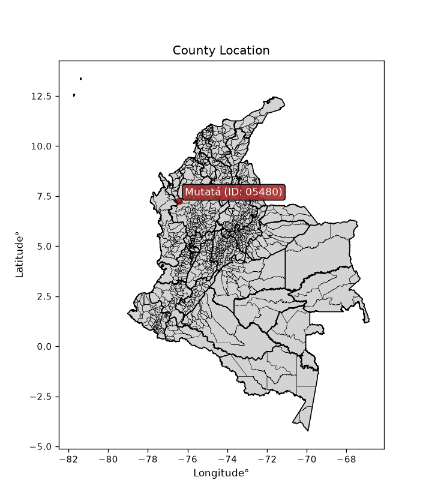
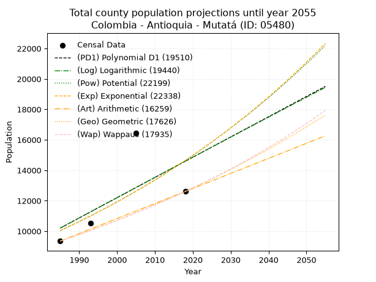
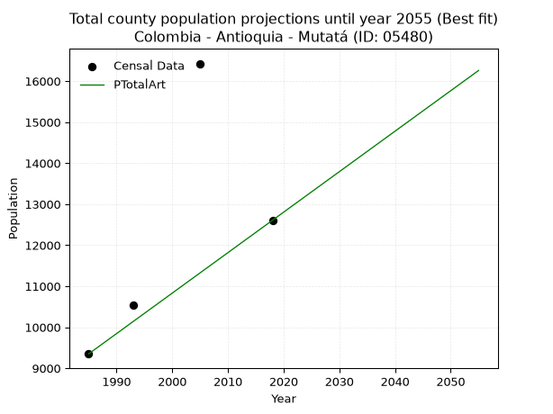
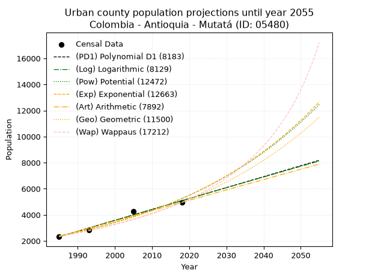
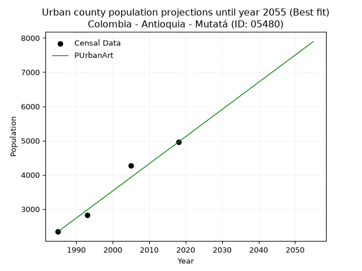
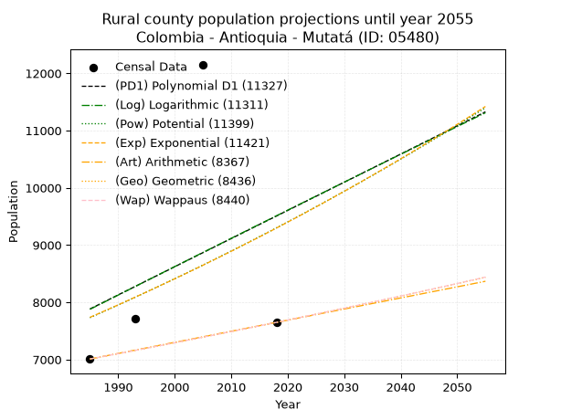
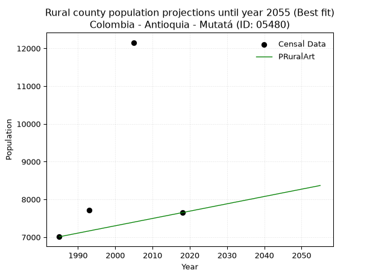

<div align="center">


</div>

# _“Population and Public Services Demand Projections (PPSD) until Year 2050 for Colombia - Antioquia - Mutatá (ID: 05480)”_
Keywords: `population` `public-service` `projection` `lineal` `polynomial` `logarithmic` `potential` `exponential` `arithmetic` `geometric` `wappaus` `dane` `colombia` `south-america`

PPSD are analytical estimates used by governments and planners to anticipate future changes in population size, age distribution, and the resulting community needs for utilities, healthcare, education, and infrastructure as sizing future water treatment facilities, electrical grids, and road networks based on spatial growth.

<div align="center">

</img>

</div>


> **General running parameters**: • app_version: _v20260806_. • Python version: _3.14.7_. • Pandas version: _3.0.5_. • NumPy version: _2.5.1_. • Creates, save and include plots into reports (create_plot): _False_. • Projection until year: _2050_. • Process polynomial degree 2 and up: _False_. • Process Wappaus: _True_. • Process Wappaus: _True_. • Set negative values to zero: _True_. • Set infinite values to zero: _True_. • Drop dataset notes: _True_. 
<div align="center">

Dynamic map: [:earth_americas:Google](http://maps.google.com/maps?q=7.242875056,-76.4358754) [:earth_americas:OSM](https://www.openstreetmap.org/#map=18/7.242875056/-76.4358754&layers=P) [:earth_americas:Bing](https://www.bing.com/maps?cp=7.242875056~-76.4358754&lvl=18) [:earth_americas:Apple](https://maps.apple.com/frame?center=7.242875056%2C-76.4358754&span=0.003%2C0.006)

</div>


<div align="center">

```geojson
{
  "type": "Feature",
  "geometry": {
    "type": "Point", 
    "coordinates": [-76.4358754, 7.242875056]
  }, 
  "properties": {
    "Name": "Colombia - Antioquia - Mutatá (ID: 05480)"
  }
}
```

</div>


## 0. Census Data (4 records)

Census data are official statistics collected by a government about the people and housing in a country. They usually include counts of total population, age, sex, race, income, education, and jobs.

📅Global census file: [Population.xlsx](../data/Population.xlsx)

| Source   |   Year |   CountryID | CountryName   |   StateID | StateName   |   CountyID | CountyName   |   PTotal |   PUrban |   PRural |
|:---------|-------:|------------:|:--------------|----------:|:------------|-----------:|:-------------|---------:|---------:|---------:|
| DANE     |   1985 |          57 | Colombia      |        05 | Antioquia   |      05480 | Mutatá       |     9350 |     2341 |     7009 |
| DANE     |   1993 |          57 | Colombia      |        05 | Antioquia   |      05480 | Mutatá       |    10542 |     2822 |     7720 |
| DANE     |   2005 |          57 | Colombia      |        05 | Antioquia   |      05480 | Mutatá       |    16428 |     4274 |    12154 |
| DANE     |   2018 |          57 | Colombia      |        05 | Antioquia   |      05480 | Mutatá       |    12607 |     4958 |     7649 |

> 🔥Some records could had specific notes about the registered values or the corresponding urban or rural distribution.

📅   [RUPS](https://www.datos.gov.co/Hacienda-y-Cr-dito-P-blico/Registro-nico-de-Prestadores-de-Servicios-P-blicos/4qkq-csdn/about_data) - Local public utility companies: [RUPS.csv](../data/RUPS.xlsx)

 | SERVICIO       | ESTADO    | NOMBRE                         | NIT         | DEPARTAMENTO_DOMICILIO   | MUNICIPIO_DOMICILIO   | DIRECCION                             |   TELEFONO | EMAIL                            | TIPO_PRESTADOR                             | CLASIFICACION                 |
|:---------------|:----------|:-------------------------------|:------------|:-------------------------|:----------------------|:--------------------------------------|-----------:|:---------------------------------|:-------------------------------------------|:------------------------------|
| ACUEDUCTO      | OPERATIVA | AGUAS REGIONALES EPM S.A E.S.P | 900072303-1 | ANTIOQUIA                | APARTADO              | CALLE 97A No 104-13 BARRIO EL HUMEDAL |    8286657 | rosa.cordoba@aguasregionales.com | SOCIEDADES (EMPRESA DE SERVICIOS PUBLICOS) | MAYOR O IGUAL A 5001 USUARIOS |
| ALCANTARILLADO | OPERATIVA | AGUAS REGIONALES EPM S.A E.S.P | 900072303-1 | ANTIOQUIA                | APARTADO              | CALLE 97A No 104-13 BARRIO EL HUMEDAL |    8286657 | rosa.cordoba@aguasregionales.com | SOCIEDADES (EMPRESA DE SERVICIOS PUBLICOS) | MAYOR O IGUAL A 5001 USUARIOS |

## 1. Total

### 1.1. Coefficients and Parameters

* (PD1) Polynomial Deg 1: 132.9429947812144, -253687.4753111241 (lineal)
* (Log) Logarithmic: 266727.95113362174, -2015169.5439903163
* (Pow) Potential: 22.908088307714525, -71.54385402077793
* (Exp) Exponential: 0.011420737050416253, 1.433232395948704e-06
* (Art) Arithmetic: Year diff. 2018 - 1985 = 33, Population diff. 12607 - 9350 = 3257, Annual growth = 98.6969696969697
* (Geo) Geometric: Year diff. 2018 - 1985 = 33, Population diff. 12607 - 9350 = 3257, Annual growth % = 0.009097981919230058
* (Wap) Wappaus: i = 0.8990023199614674, Condition values only valid for < 200)

<sub>
Wappaus condition values: ['0.00', '0.90', '1.80', '2.70', '3.60', '4.50', '5.39', '6.29', '7.19', '8.09', '8.99', '9.89', '10.79', '11.69', '12.59', '13.49', '14.38', '15.28', '16.18', '17.08', '17.98', '18.88', '19.78', '20.68', '21.58', '22.48', '23.37', '24.27', '25.17', '26.07', '26.97', '27.87', '28.77', '29.67', '30.57', '31.47', '32.36', '33.26', '34.16', '35.06', '35.96', '36.86', '37.76', '38.66', '39.56', '40.46', '41.35', '42.25', '43.15', '44.05', '44.95', '45.85', '46.75', '47.65', '48.55', '49.45', '50.34', '51.24', '52.14', '53.04', '53.94', '54.84', '55.74', '56.64', '57.54', '58.44']
</sub>


### 1.2. Projected Dataset

|   Year |   CountyID |   PTotalPD1 |   PTotalLog |   PTotalPow |   PTotalExp |   PTotalArt |   PTotalGeo |   PTotalWap |
|-------:|-----------:|------------:|------------:|------------:|------------:|------------:|------------:|------------:|
|   1985 |      05480 |       10204 |       10196 |       10035 |       10043 |        9350 |        9350 |        9350 |
|   1986 |      05480 |       10337 |       10330 |       10152 |       10158 |        9449 |        9435 |        9434 |
|   1987 |      05480 |       10470 |       10464 |       10270 |       10275 |        9547 |        9521 |        9520 |
|   1988 |      05480 |       10603 |       10598 |       10389 |       10393 |        9646 |        9608 |        9606 |
|   1989 |      05480 |       10736 |       10733 |       10509 |       10512 |        9745 |        9695 |        9692 |
|   1990 |      05480 |       10869 |       10867 |       10631 |       10633 |        9843 |        9783 |        9780 |
|   1991 |      05480 |       11002 |       11001 |       10754 |       10755 |        9942 |        9872 |        9868 |
|   1992 |      05480 |       11135 |       11135 |       10878 |       10878 |       10041 |        9962 |        9958 |
|   1993 |      05480 |       11268 |       11268 |       11004 |       11003 |       10140 |       10053 |       10048 |
|   1994 |      05480 |       11401 |       11402 |       11131 |       11130 |       10238 |       10144 |       10138 |
|   1995 |      05480 |       11534 |       11536 |       11260 |       11258 |       10337 |       10236 |       10230 |
|   1996 |      05480 |       11667 |       11670 |       11390 |       11387 |       10436 |       10329 |       10323 |
|   1997 |      05480 |       11800 |       11803 |       11521 |       11518 |       10534 |       10423 |       10416 |
|   1998 |      05480 |       11933 |       11937 |       11654 |       11650 |       10633 |       10518 |       10511 |
|   1999 |      05480 |       12066 |       12070 |       11788 |       11784 |       10732 |       10614 |       10606 |
|   2000 |      05480 |       12199 |       12204 |       11924 |       11919 |       10830 |       10711 |       10702 |
|   2001 |      05480 |       12331 |       12337 |       12062 |       12056 |       10929 |       10808 |       10799 |
|   2002 |      05480 |       12464 |       12470 |       12200 |       12194 |       11028 |       10906 |       10897 |
|   2003 |      05480 |       12597 |       12603 |       12341 |       12335 |       11127 |       11006 |       10996 |
|   2004 |      05480 |       12730 |       12737 |       12483 |       12476 |       11225 |       11106 |       11096 |
|   2005 |      05480 |       12863 |       12870 |       12626 |       12620 |       11324 |       11207 |       11197 |
|   2006 |      05480 |       12996 |       13003 |       12771 |       12764 |       11423 |       11309 |       11299 |
|   2007 |      05480 |       13129 |       13136 |       12918 |       12911 |       11521 |       11412 |       11402 |
|   2008 |      05480 |       13262 |       13268 |       13066 |       13059 |       11620 |       11515 |       11506 |
|   2009 |      05480 |       13395 |       13401 |       13216 |       13209 |       11719 |       11620 |       11611 |
|   2010 |      05480 |       13528 |       13534 |       13368 |       13361 |       11817 |       11726 |       11717 |
|   2011 |      05480 |       13661 |       13667 |       13521 |       13515 |       11916 |       11833 |       11825 |
|   2012 |      05480 |       13794 |       13799 |       13676 |       13670 |       12015 |       11940 |       11933 |
|   2013 |      05480 |       13927 |       13932 |       13832 |       13827 |       12114 |       12049 |       12042 |
|   2014 |      05480 |       14060 |       14064 |       13990 |       13986 |       12212 |       12158 |       12153 |
|   2015 |      05480 |       14193 |       14197 |       14150 |       14146 |       12311 |       12269 |       12265 |
|   2016 |      05480 |       14326 |       14329 |       14312 |       14309 |       12410 |       12381 |       12378 |
|   2017 |      05480 |       14459 |       14461 |       14476 |       14473 |       12508 |       12493 |       12492 |
|   2018 |      05480 |       14591 |       14593 |       14641 |       14639 |       12607 |       12607 |       12607 |
|   2019 |      05480 |       14724 |       14726 |       14808 |       14808 |       12706 |       12722 |       12724 |
|   2020 |      05480 |       14857 |       14858 |       14977 |       14978 |       12804 |       12837 |       12841 |
|   2021 |      05480 |       14990 |       14990 |       15148 |       15150 |       12903 |       12954 |       12960 |
|   2022 |      05480 |       15123 |       15122 |       15320 |       15324 |       13002 |       13072 |       13081 |
|   2023 |      05480 |       15256 |       15253 |       15495 |       15500 |       13100 |       13191 |       13202 |
|   2024 |      05480 |       15389 |       15385 |       15671 |       15678 |       13199 |       13311 |       13325 |
|   2025 |      05480 |       15522 |       15517 |       15850 |       15858 |       13298 |       13432 |       13449 |
|   2026 |      05480 |       15655 |       15649 |       16030 |       16040 |       13397 |       13554 |       13575 |
|   2027 |      05480 |       15788 |       15780 |       16212 |       16224 |       13495 |       13678 |       13702 |
|   2028 |      05480 |       15921 |       15912 |       16396 |       16410 |       13594 |       13802 |       13830 |
|   2029 |      05480 |       16054 |       16043 |       16583 |       16599 |       13693 |       13928 |       13960 |
|   2030 |      05480 |       16187 |       16175 |       16771 |       16790 |       13791 |       14054 |       14092 |
|   2031 |      05480 |       16320 |       16306 |       16961 |       16983 |       13890 |       14182 |       14225 |
|   2032 |      05480 |       16453 |       16437 |       17154 |       17178 |       13989 |       14311 |       14359 |
|   2033 |      05480 |       16586 |       16569 |       17348 |       17375 |       14087 |       14441 |       14495 |
|   2034 |      05480 |       16719 |       16700 |       17545 |       17574 |       14186 |       14573 |       14632 |
|   2035 |      05480 |       16852 |       16831 |       17743 |       17776 |       14285 |       14705 |       14771 |
|   2036 |      05480 |       16984 |       16962 |       17944 |       17980 |       14384 |       14839 |       14912 |
|   2037 |      05480 |       17117 |       17093 |       18147 |       18187 |       14482 |       14974 |       15054 |
|   2038 |      05480 |       17250 |       17224 |       18352 |       18396 |       14581 |       15110 |       15198 |
|   2039 |      05480 |       17383 |       17355 |       18560 |       18607 |       14680 |       15248 |       15344 |
|   2040 |      05480 |       17516 |       17486 |       18769 |       18821 |       14778 |       15387 |       15491 |
|   2041 |      05480 |       17649 |       17616 |       18981 |       19037 |       14877 |       15527 |       15641 |
|   2042 |      05480 |       17782 |       17747 |       19195 |       19256 |       14976 |       15668 |       15792 |
|   2043 |      05480 |       17915 |       17877 |       19412 |       19477 |       15074 |       15810 |       15945 |
|   2044 |      05480 |       18048 |       18008 |       19631 |       19701 |       15173 |       15954 |       16099 |
|   2045 |      05480 |       18181 |       18138 |       19852 |       19927 |       15272 |       16099 |       16256 |
|   2046 |      05480 |       18314 |       18269 |       20075 |       20156 |       15371 |       16246 |       16415 |
|   2047 |      05480 |       18447 |       18399 |       20301 |       20387 |       15469 |       16394 |       16575 |
|   2048 |      05480 |       18580 |       18529 |       20530 |       20622 |       15568 |       16543 |       16738 |
|   2049 |      05480 |       18713 |       18660 |       20761 |       20858 |       15667 |       16693 |       16902 |
|   2050 |      05480 |       18846 |       18790 |       20994 |       21098 |       15765 |       16845 |       17069 |
<div align="center">

</img>

</div>


### 1.3. Best fit with absolute and relative error (%)

Relative error puts that difference into context by dividing the absolute error by the true value, creating a unitless ratio or percentage that shows the scale of the mistake.

Absolute and relative error

|   Year | Source   |   CountryID | CountryName   |   StateID | StateName   |   CountyID_x | CountyName   |   PTotal |   PUrban |   PRural |   CountyID_y |   PTotalPD1 |   PTotalLog |   PTotalPow |   PTotalExp |   PTotalArt |   PTotalGeo |   PTotalWap |   PTotalPD1AbsError |   PTotalLogAbsError |   PTotalPowAbsError |   PTotalExpAbsError |   PTotalArtAbsError |   PTotalGeoAbsError |   PTotalWapAbsError |   PTotalPD1RelError |   PTotalLogRelError |   PTotalPowRelError |   PTotalExpRelError |   PTotalArtRelError |   PTotalGeoRelError |   PTotalWapRelError |
|-------:|:---------|------------:|:--------------|----------:|:------------|-------------:|:-------------|---------:|---------:|---------:|-------------:|------------:|------------:|------------:|------------:|------------:|------------:|------------:|--------------------:|--------------------:|--------------------:|--------------------:|--------------------:|--------------------:|--------------------:|--------------------:|--------------------:|--------------------:|--------------------:|--------------------:|--------------------:|--------------------:|
|   1985 | DANE     |          57 | Colombia      |        05 | Antioquia   |        05480 | Mutatá       |     9350 |     2341 |     7009 |        05480 |       10204 |       10196 |       10035 |       10043 |        9350 |        9350 |        9350 |                 854 |                 846 |                 685 |                 693 |                   0 |                   0 |                   0 |             9.13369 |             9.04813 |             7.3262  |             7.41176 |             0       |             0       |             0       |
|   1993 | DANE     |          57 | Colombia      |        05 | Antioquia   |        05480 | Mutatá       |    10542 |     2822 |     7720 |        05480 |       11268 |       11268 |       11004 |       11003 |       10140 |       10053 |       10048 |                 726 |                 726 |                 462 |                 461 |                 402 |                 489 |                 494 |             6.88674 |             6.88674 |             4.38247 |             4.37298 |             3.81332 |             4.63859 |             4.68602 |
|   2005 | DANE     |          57 | Colombia      |        05 | Antioquia   |        05480 | Mutatá       |    16428 |     4274 |    12154 |        05480 |       12863 |       12870 |       12626 |       12620 |       11324 |       11207 |       11197 |                3565 |                3558 |                3802 |                3808 |                5104 |                5221 |                5231 |            21.7008  |            21.6581  |            23.1434  |            23.1799  |            31.0689  |            31.7811  |            31.842   |
|   2018 | DANE     |          57 | Colombia      |        05 | Antioquia   |        05480 | Mutatá       |    12607 |     4958 |     7649 |        05480 |       14591 |       14593 |       14641 |       14639 |       12607 |       12607 |       12607 |                1984 |                1986 |                2034 |                2032 |                   0 |                   0 |                   0 |            15.7373  |            15.7532  |            16.1339  |            16.118   |             0       |             0       |             0       |

Relative error mean

| Method    |   RelError | Best   |
|:----------|-----------:|:-------|
| PTotalPD1 |   13.3646  |        |
| PTotalLog |   13.3365  |        |
| PTotalPow |   12.7465  |        |
| PTotalExp |   12.7707  |        |
| PTotalArt |    8.72056 | True   |
| PTotalGeo |    9.10492 |        |
| PTotalWap |    9.132   |        |

💙Best method: _**PTotalArt**_
<div align="center">

</img>

</div>


### 1.4. Fresh water supply demand in liters per capita per day (lpcd)

The fresh water supply demand typically ranges from 100 to 300 liters per capita per day (lpcd) for standard domestic and municipal planning, though absolute survival minimums set by the World Health Organization are as low as 7.5 to 20 liters per day, and total consumption in high-income nations can exceed 400 liters.

> `CZ`: Level in meters above the sea level (masl)<br> `WS`: Fresh water supply demand in liters per capita per day (lpcd or l/h/d)<br> `WSAll`: Zonal fresh water supply demand in liters per second (l/s)<br> `A`: Zonal area in square meters<br> `DP`: Population density (people/hectare or p/ha)

Reference values (RAS Colombia)

|    CZ |   WS |
|------:|-----:|
|  1000 |  120 |
|  2000 |  130 |
| 99999 |  140 |

County shapefile geometry properties and water supply values

|   CountyID |      ATotal |   CZTotal |   WSTotal |
|-----------:|------------:|----------:|----------:|
|      05480 | 1.07502e+09 |     532.6 |       120 |

Projected values for best method: PTotalArt

|   CountyID |   Year |   PTotalArt |   DPTotal |   WSTotal |   WSTotalAll |
|-----------:|-------:|------------:|----------:|----------:|-------------:|
|      05480 |   1985 |        9350 |      0.09 |       120 |      12.9861 |
|      05480 |   1986 |        9449 |      0.09 |       120 |      13.1236 |
|      05480 |   1987 |        9547 |      0.09 |       120 |      13.2597 |
|      05480 |   1988 |        9646 |      0.09 |       120 |      13.3972 |
|      05480 |   1989 |        9745 |      0.09 |       120 |      13.5347 |
|      05480 |   1990 |        9843 |      0.09 |       120 |      13.6708 |
|      05480 |   1991 |        9942 |      0.09 |       120 |      13.8083 |
|      05480 |   1992 |       10041 |      0.09 |       120 |      13.9458 |
|      05480 |   1993 |       10140 |      0.09 |       120 |      14.0833 |
|      05480 |   1994 |       10238 |      0.1  |       120 |      14.2194 |
|      05480 |   1995 |       10337 |      0.1  |       120 |      14.3569 |
|      05480 |   1996 |       10436 |      0.1  |       120 |      14.4944 |
|      05480 |   1997 |       10534 |      0.1  |       120 |      14.6306 |
|      05480 |   1998 |       10633 |      0.1  |       120 |      14.7681 |
|      05480 |   1999 |       10732 |      0.1  |       120 |      14.9056 |
|      05480 |   2000 |       10830 |      0.1  |       120 |      15.0417 |
|      05480 |   2001 |       10929 |      0.1  |       120 |      15.1792 |
|      05480 |   2002 |       11028 |      0.1  |       120 |      15.3167 |
|      05480 |   2003 |       11127 |      0.1  |       120 |      15.4542 |
|      05480 |   2004 |       11225 |      0.1  |       120 |      15.5903 |
|      05480 |   2005 |       11324 |      0.11 |       120 |      15.7278 |
|      05480 |   2006 |       11423 |      0.11 |       120 |      15.8653 |
|      05480 |   2007 |       11521 |      0.11 |       120 |      16.0014 |
|      05480 |   2008 |       11620 |      0.11 |       120 |      16.1389 |
|      05480 |   2009 |       11719 |      0.11 |       120 |      16.2764 |
|      05480 |   2010 |       11817 |      0.11 |       120 |      16.4125 |
|      05480 |   2011 |       11916 |      0.11 |       120 |      16.55   |
|      05480 |   2012 |       12015 |      0.11 |       120 |      16.6875 |
|      05480 |   2013 |       12114 |      0.11 |       120 |      16.825  |
|      05480 |   2014 |       12212 |      0.11 |       120 |      16.9611 |
|      05480 |   2015 |       12311 |      0.11 |       120 |      17.0986 |
|      05480 |   2016 |       12410 |      0.12 |       120 |      17.2361 |
|      05480 |   2017 |       12508 |      0.12 |       120 |      17.3722 |
|      05480 |   2018 |       12607 |      0.12 |       120 |      17.5097 |
|      05480 |   2019 |       12706 |      0.12 |       120 |      17.6472 |
|      05480 |   2020 |       12804 |      0.12 |       120 |      17.7833 |
|      05480 |   2021 |       12903 |      0.12 |       120 |      17.9208 |
|      05480 |   2022 |       13002 |      0.12 |       120 |      18.0583 |
|      05480 |   2023 |       13100 |      0.12 |       120 |      18.1944 |
|      05480 |   2024 |       13199 |      0.12 |       120 |      18.3319 |
|      05480 |   2025 |       13298 |      0.12 |       120 |      18.4694 |
|      05480 |   2026 |       13397 |      0.12 |       120 |      18.6069 |
|      05480 |   2027 |       13495 |      0.13 |       120 |      18.7431 |
|      05480 |   2028 |       13594 |      0.13 |       120 |      18.8806 |
|      05480 |   2029 |       13693 |      0.13 |       120 |      19.0181 |
|      05480 |   2030 |       13791 |      0.13 |       120 |      19.1542 |
|      05480 |   2031 |       13890 |      0.13 |       120 |      19.2917 |
|      05480 |   2032 |       13989 |      0.13 |       120 |      19.4292 |
|      05480 |   2033 |       14087 |      0.13 |       120 |      19.5653 |
|      05480 |   2034 |       14186 |      0.13 |       120 |      19.7028 |
|      05480 |   2035 |       14285 |      0.13 |       120 |      19.8403 |
|      05480 |   2036 |       14384 |      0.13 |       120 |      19.9778 |
|      05480 |   2037 |       14482 |      0.13 |       120 |      20.1139 |
|      05480 |   2038 |       14581 |      0.14 |       120 |      20.2514 |
|      05480 |   2039 |       14680 |      0.14 |       120 |      20.3889 |
|      05480 |   2040 |       14778 |      0.14 |       120 |      20.525  |
|      05480 |   2041 |       14877 |      0.14 |       120 |      20.6625 |
|      05480 |   2042 |       14976 |      0.14 |       120 |      20.8    |
|      05480 |   2043 |       15074 |      0.14 |       120 |      20.9361 |
|      05480 |   2044 |       15173 |      0.14 |       120 |      21.0736 |
|      05480 |   2045 |       15272 |      0.14 |       120 |      21.2111 |
|      05480 |   2046 |       15371 |      0.14 |       120 |      21.3486 |
|      05480 |   2047 |       15469 |      0.14 |       120 |      21.4847 |
|      05480 |   2048 |       15568 |      0.14 |       120 |      21.6222 |
|      05480 |   2049 |       15667 |      0.15 |       120 |      21.7597 |
|      05480 |   2050 |       15765 |      0.15 |       120 |      21.8958 |

## 2. Urban

### 2.1. Coefficients and Parameters

* (PD1) Polynomial Deg 1: 83.7354476114005, -163893.07908470384 (lineal)
* (Log) Logarithmic: 167637.158162805, -1270612.632555358
* (Pow) Potential: 47.66634153115585, -153.81368340867027
* (Exp) Exponential: 0.023805068855496374, 7.196480828982e-18
* (Art) Arithmetic: Year diff. 2018 - 1985 = 33, Population diff. 4958 - 2341 = 2617, Annual growth = 79.3030303030303
* (Geo) Geometric: Year diff. 2018 - 1985 = 33, Population diff. 4958 - 2341 = 2617, Annual growth % = 0.023000656428653787
* (Wap) Wappaus: i = 2.172983430689966, Condition values only valid for < 200)

<sub>
Wappaus condition values: ['0.00', '2.17', '4.35', '6.52', '8.69', '10.86', '13.04', '15.21', '17.38', '19.56', '21.73', '23.90', '26.08', '28.25', '30.42', '32.59', '34.77', '36.94', '39.11', '41.29', '43.46', '45.63', '47.81', '49.98', '52.15', '54.32', '56.50', '58.67', '60.84', '63.02', '65.19', '67.36', '69.54', '71.71', '73.88', '76.05', '78.23', '80.40', '82.57', '84.75', '86.92', '89.09', '91.27', '93.44', '95.61', '97.78', '99.96', '102.13', '104.30', '106.48', '108.65', '110.82', '113.00', '115.17', '117.34', '119.51', '121.69', '123.86', '126.03', '128.21', '130.38', '132.55', '134.72', '136.90', '139.07', '141.24']
</sub>


### 2.2. Projected Dataset

|   Year |   CountyID |   PUrbanPD1 |   PUrbanLog |   PUrbanPow |   PUrbanExp |   PUrbanArt |   PUrbanGeo |   PUrbanWap |
|-------:|-----------:|------------:|------------:|------------:|------------:|------------:|------------:|------------:|
|   1985 |      05480 |        2322 |        2319 |        2391 |        2393 |        2341 |        2341 |        2341 |
|   1986 |      05480 |        2406 |        2403 |        2449 |        2450 |        2420 |        2395 |        2392 |
|   1987 |      05480 |        2489 |        2488 |        2508 |        2509 |        2500 |        2450 |        2445 |
|   1988 |      05480 |        2573 |        2572 |        2569 |        2570 |        2579 |        2506 |        2499 |
|   1989 |      05480 |        2657 |        2657 |        2631 |        2632 |        2658 |        2564 |        2554 |
|   1990 |      05480 |        2740 |        2741 |        2695 |        2695 |        2738 |        2623 |        2610 |
|   1991 |      05480 |        2824 |        2825 |        2760 |        2760 |        2817 |        2683 |        2668 |
|   1992 |      05480 |        2908 |        2909 |        2827 |        2826 |        2896 |        2745 |        2726 |
|   1993 |      05480 |        2992 |        2993 |        2896 |        2894 |        2975 |        2808 |        2787 |
|   1994 |      05480 |        3075 |        3077 |        2966 |        2964 |        3055 |        2873 |        2848 |
|   1995 |      05480 |        3159 |        3161 |        3038 |        3036 |        3134 |        2939 |        2912 |
|   1996 |      05480 |        3243 |        3245 |        3111 |        3109 |        3213 |        3006 |        2977 |
|   1997 |      05480 |        3327 |        3329 |        3186 |        3184 |        3293 |        3075 |        3043 |
|   1998 |      05480 |        3410 |        3413 |        3263 |        3260 |        3372 |        3146 |        3111 |
|   1999 |      05480 |        3494 |        3497 |        3342 |        3339 |        3451 |        3219 |        3181 |
|   2000 |      05480 |        3578 |        3581 |        3422 |        3419 |        3531 |        3293 |        3253 |
|   2001 |      05480 |        3662 |        3665 |        3505 |        3502 |        3610 |        3368 |        3326 |
|   2002 |      05480 |        3745 |        3749 |        3589 |        3586 |        3689 |        3446 |        3402 |
|   2003 |      05480 |        3829 |        3832 |        3676 |        3672 |        3768 |        3525 |        3479 |
|   2004 |      05480 |        3913 |        3916 |        3764 |        3761 |        3848 |        3606 |        3559 |
|   2005 |      05480 |        3996 |        4000 |        3855 |        3852 |        3927 |        3689 |        3641 |
|   2006 |      05480 |        4080 |        4083 |        3948 |        3944 |        4006 |        3774 |        3725 |
|   2007 |      05480 |        4164 |        4167 |        4043 |        4039 |        4086 |        3861 |        3812 |
|   2008 |      05480 |        4248 |        4250 |        4140 |        4137 |        4165 |        3950 |        3901 |
|   2009 |      05480 |        4331 |        4334 |        4239 |        4236 |        4244 |        4040 |        3993 |
|   2010 |      05480 |        4415 |        4417 |        4341 |        4338 |        4324 |        4133 |        4087 |
|   2011 |      05480 |        4499 |        4501 |        4445 |        4443 |        4403 |        4228 |        4184 |
|   2012 |      05480 |        4583 |        4584 |        4552 |        4550 |        4482 |        4326 |        4285 |
|   2013 |      05480 |        4666 |        4667 |        4661 |        4660 |        4561 |        4425 |        4388 |
|   2014 |      05480 |        4750 |        4750 |        4772 |        4772 |        4641 |        4527 |        4495 |
|   2015 |      05480 |        4834 |        4834 |        4887 |        4887 |        4720 |        4631 |        4605 |
|   2016 |      05480 |        4918 |        4917 |        5004 |        5004 |        4799 |        4738 |        4719 |
|   2017 |      05480 |        5001 |        5000 |        5123 |        5125 |        4879 |        4847 |        4836 |
|   2018 |      05480 |        5085 |        5083 |        5246 |        5248 |        4958 |        4958 |        4958 |
|   2019 |      05480 |        5169 |        5166 |        5371 |        5375 |        5037 |        5072 |        5084 |
|   2020 |      05480 |        5253 |        5249 |        5500 |        5504 |        5117 |        5189 |        5214 |
|   2021 |      05480 |        5336 |        5332 |        5631 |        5637 |        5196 |        5308 |        5349 |
|   2022 |      05480 |        5420 |        5415 |        5765 |        5773 |        5275 |        5430 |        5488 |
|   2023 |      05480 |        5504 |        5498 |        5903 |        5912 |        5355 |        5555 |        5633 |
|   2024 |      05480 |        5587 |        5581 |        6043 |        6054 |        5434 |        5683 |        5784 |
|   2025 |      05480 |        5671 |        5664 |        6187 |        6200 |        5513 |        5814 |        5940 |
|   2026 |      05480 |        5755 |        5746 |        6335 |        6349 |        5592 |        5947 |        6102 |
|   2027 |      05480 |        5839 |        5829 |        6485 |        6502 |        5672 |        6084 |        6271 |
|   2028 |      05480 |        5922 |        5912 |        6640 |        6659 |        5751 |        6224 |        6446 |
|   2029 |      05480 |        6006 |        5994 |        6798 |        6820 |        5830 |        6367 |        6629 |
|   2030 |      05480 |        6090 |        6077 |        6959 |        6984 |        5910 |        6514 |        6820 |
|   2031 |      05480 |        6174 |        6159 |        7124 |        7152 |        5989 |        6663 |        7019 |
|   2032 |      05480 |        6257 |        6242 |        7294 |        7324 |        6068 |        6817 |        7227 |
|   2033 |      05480 |        6341 |        6324 |        7467 |        7501 |        6148 |        6973 |        7444 |
|   2034 |      05480 |        6425 |        6407 |        7644 |        7682 |        6227 |        7134 |        7671 |
|   2035 |      05480 |        6509 |        6489 |        7825 |        7867 |        6306 |        7298 |        7910 |
|   2036 |      05480 |        6592 |        6572 |        8010 |        8056 |        6385 |        7466 |        8159 |
|   2037 |      05480 |        6676 |        6654 |        8200 |        8250 |        6465 |        7637 |        8422 |
|   2038 |      05480 |        6760 |        6736 |        8394 |        8449 |        6544 |        7813 |        8697 |
|   2039 |      05480 |        6843 |        6819 |        8593 |        8652 |        6623 |        7993 |        8987 |
|   2040 |      05480 |        6927 |        6901 |        8796 |        8861 |        6703 |        8177 |        9293 |
|   2041 |      05480 |        7011 |        6983 |        9004 |        9074 |        6782 |        8365 |        9616 |
|   2042 |      05480 |        7095 |        7065 |        9216 |        9293 |        6861 |        8557 |        9957 |
|   2043 |      05480 |        7178 |        7147 |        9434 |        9517 |        6941 |        8754 |       10319 |
|   2044 |      05480 |        7262 |        7229 |        9657 |        9746 |        7020 |        8955 |       10702 |
|   2045 |      05480 |        7346 |        7311 |        9885 |        9981 |        7099 |        9161 |       11109 |
|   2046 |      05480 |        7430 |        7393 |       10118 |       10221 |        7178 |        9372 |       11542 |
|   2047 |      05480 |        7513 |        7475 |       10356 |       10468 |        7258 |        9588 |       12004 |
|   2048 |      05480 |        7597 |        7557 |       10600 |       10720 |        7337 |        9808 |       12498 |
|   2049 |      05480 |        7681 |        7639 |       10849 |       10978 |        7416 |       10034 |       13028 |
|   2050 |      05480 |        7765 |        7720 |       11105 |       11242 |        7496 |       10264 |       13596 |
<div align="center">

</img>

</div>


### 2.3. Best fit with absolute and relative error (%)

Relative error puts that difference into context by dividing the absolute error by the true value, creating a unitless ratio or percentage that shows the scale of the mistake.

Absolute and relative error

|   Year | Source   |   CountryID | CountryName   |   StateID | StateName   |   CountyID_x | CountyName   |   PTotal |   PUrban |   PRural |   CountyID_y |   PUrbanPD1 |   PUrbanLog |   PUrbanPow |   PUrbanExp |   PUrbanArt |   PUrbanGeo |   PUrbanWap |   PUrbanPD1AbsError |   PUrbanLogAbsError |   PUrbanPowAbsError |   PUrbanExpAbsError |   PUrbanArtAbsError |   PUrbanGeoAbsError |   PUrbanWapAbsError |   PUrbanPD1RelError |   PUrbanLogRelError |   PUrbanPowRelError |   PUrbanExpRelError |   PUrbanArtRelError |   PUrbanGeoRelError |   PUrbanWapRelError |
|-------:|:---------|------------:|:--------------|----------:|:------------|-------------:|:-------------|---------:|---------:|---------:|-------------:|------------:|------------:|------------:|------------:|------------:|------------:|------------:|--------------------:|--------------------:|--------------------:|--------------------:|--------------------:|--------------------:|--------------------:|--------------------:|--------------------:|--------------------:|--------------------:|--------------------:|--------------------:|--------------------:|
|   1985 | DANE     |          57 | Colombia      |        05 | Antioquia   |        05480 | Mutatá       |     9350 |     2341 |     7009 |        05480 |        2322 |        2319 |        2391 |        2393 |        2341 |        2341 |        2341 |                  19 |                  22 |                  50 |                  52 |                   0 |                   0 |                   0 |            0.811619 |            0.939769 |             2.13584 |             2.22127 |             0       |            0        |             0       |
|   1993 | DANE     |          57 | Colombia      |        05 | Antioquia   |        05480 | Mutatá       |    10542 |     2822 |     7720 |        05480 |        2992 |        2993 |        2896 |        2894 |        2975 |        2808 |        2787 |                 170 |                 171 |                  74 |                  72 |                 153 |                  14 |                  35 |            6.0241   |            6.05953  |             2.62225 |             2.55138 |             5.42169 |            0.496102 |             1.24026 |
|   2005 | DANE     |          57 | Colombia      |        05 | Antioquia   |        05480 | Mutatá       |    16428 |     4274 |    12154 |        05480 |        3996 |        4000 |        3855 |        3852 |        3927 |        3689 |        3641 |                 278 |                 274 |                 419 |                 422 |                 347 |                 585 |                 633 |            6.50445  |            6.41086  |             9.80346 |             9.87365 |             8.11886 |           13.6874   |            14.8105  |
|   2018 | DANE     |          57 | Colombia      |        05 | Antioquia   |        05480 | Mutatá       |    12607 |     4958 |     7649 |        05480 |        5085 |        5083 |        5246 |        5248 |        4958 |        4958 |        4958 |                 127 |                 125 |                 288 |                 290 |                   0 |                   0 |                   0 |            2.56152  |            2.52118  |             5.80879 |             5.84913 |             0       |            0        |             0       |

Relative error mean

| Method    |   RelError | Best   |
|:----------|-----------:|:-------|
| PUrbanPD1 |    3.97542 |        |
| PUrbanLog |    3.98283 |        |
| PUrbanPow |    5.09259 |        |
| PUrbanExp |    5.12386 |        |
| PUrbanArt |    3.38514 | True   |
| PUrbanGeo |    3.54588 |        |
| PUrbanWap |    4.01268 |        |

💙Best method: _**PUrbanArt**_
<div align="center">

</img>

</div>


### 2.4. Fresh water supply demand in liters per capita per day (lpcd)

The fresh water supply demand typically ranges from 100 to 300 liters per capita per day (lpcd) for standard domestic and municipal planning, though absolute survival minimums set by the World Health Organization are as low as 7.5 to 20 liters per day, and total consumption in high-income nations can exceed 400 liters.

> `CZ`: Level in meters above the sea level (masl)<br> `WS`: Fresh water supply demand in liters per capita per day (lpcd or l/h/d)<br> `WSAll`: Zonal fresh water supply demand in liters per second (l/s)<br> `A`: Zonal area in square meters<br> `DP`: Population density (people/hectare or p/ha)

Reference values (RAS Colombia)

|    CZ |   WS |
|------:|-----:|
|  1000 |  120 |
|  2000 |  130 |
| 99999 |  140 |

County shapefile geometry properties and water supply values

|   CountyID |   AUrban |   CZUrban |   WSUrban |
|-----------:|---------:|----------:|----------:|
|      05480 |   646830 |   131.729 |       120 |

Projected values for best method: PUrbanArt

|   CountyID |   Year |   PUrbanArt |   DPUrban |   WSUrban |   WSUrbanAll |
|-----------:|-------:|------------:|----------:|----------:|-------------:|
|      05480 |   1985 |        2341 |     36.19 |       120 |      3.25139 |
|      05480 |   1986 |        2420 |     37.41 |       120 |      3.36111 |
|      05480 |   1987 |        2500 |     38.65 |       120 |      3.47222 |
|      05480 |   1988 |        2579 |     39.87 |       120 |      3.58194 |
|      05480 |   1989 |        2658 |     41.09 |       120 |      3.69167 |
|      05480 |   1990 |        2738 |     42.33 |       120 |      3.80278 |
|      05480 |   1991 |        2817 |     43.55 |       120 |      3.9125  |
|      05480 |   1992 |        2896 |     44.77 |       120 |      4.02222 |
|      05480 |   1993 |        2975 |     45.99 |       120 |      4.13194 |
|      05480 |   1994 |        3055 |     47.23 |       120 |      4.24306 |
|      05480 |   1995 |        3134 |     48.45 |       120 |      4.35278 |
|      05480 |   1996 |        3213 |     49.67 |       120 |      4.4625  |
|      05480 |   1997 |        3293 |     50.91 |       120 |      4.57361 |
|      05480 |   1998 |        3372 |     52.13 |       120 |      4.68333 |
|      05480 |   1999 |        3451 |     53.35 |       120 |      4.79306 |
|      05480 |   2000 |        3531 |     54.59 |       120 |      4.90417 |
|      05480 |   2001 |        3610 |     55.81 |       120 |      5.01389 |
|      05480 |   2002 |        3689 |     57.03 |       120 |      5.12361 |
|      05480 |   2003 |        3768 |     58.25 |       120 |      5.23333 |
|      05480 |   2004 |        3848 |     59.49 |       120 |      5.34444 |
|      05480 |   2005 |        3927 |     60.71 |       120 |      5.45417 |
|      05480 |   2006 |        4006 |     61.93 |       120 |      5.56389 |
|      05480 |   2007 |        4086 |     63.17 |       120 |      5.675   |
|      05480 |   2008 |        4165 |     64.39 |       120 |      5.78472 |
|      05480 |   2009 |        4244 |     65.61 |       120 |      5.89444 |
|      05480 |   2010 |        4324 |     66.85 |       120 |      6.00556 |
|      05480 |   2011 |        4403 |     68.07 |       120 |      6.11528 |
|      05480 |   2012 |        4482 |     69.29 |       120 |      6.225   |
|      05480 |   2013 |        4561 |     70.51 |       120 |      6.33472 |
|      05480 |   2014 |        4641 |     71.75 |       120 |      6.44583 |
|      05480 |   2015 |        4720 |     72.97 |       120 |      6.55556 |
|      05480 |   2016 |        4799 |     74.19 |       120 |      6.66528 |
|      05480 |   2017 |        4879 |     75.43 |       120 |      6.77639 |
|      05480 |   2018 |        4958 |     76.65 |       120 |      6.88611 |
|      05480 |   2019 |        5037 |     77.87 |       120 |      6.99583 |
|      05480 |   2020 |        5117 |     79.11 |       120 |      7.10694 |
|      05480 |   2021 |        5196 |     80.33 |       120 |      7.21667 |
|      05480 |   2022 |        5275 |     81.55 |       120 |      7.32639 |
|      05480 |   2023 |        5355 |     82.79 |       120 |      7.4375  |
|      05480 |   2024 |        5434 |     84.01 |       120 |      7.54722 |
|      05480 |   2025 |        5513 |     85.23 |       120 |      7.65694 |
|      05480 |   2026 |        5592 |     86.45 |       120 |      7.76667 |
|      05480 |   2027 |        5672 |     87.69 |       120 |      7.87778 |
|      05480 |   2028 |        5751 |     88.91 |       120 |      7.9875  |
|      05480 |   2029 |        5830 |     90.13 |       120 |      8.09722 |
|      05480 |   2030 |        5910 |     91.37 |       120 |      8.20833 |
|      05480 |   2031 |        5989 |     92.59 |       120 |      8.31806 |
|      05480 |   2032 |        6068 |     93.81 |       120 |      8.42778 |
|      05480 |   2033 |        6148 |     95.05 |       120 |      8.53889 |
|      05480 |   2034 |        6227 |     96.27 |       120 |      8.64861 |
|      05480 |   2035 |        6306 |     97.49 |       120 |      8.75833 |
|      05480 |   2036 |        6385 |     98.71 |       120 |      8.86806 |
|      05480 |   2037 |        6465 |     99.95 |       120 |      8.97917 |
|      05480 |   2038 |        6544 |    101.17 |       120 |      9.08889 |
|      05480 |   2039 |        6623 |    102.39 |       120 |      9.19861 |
|      05480 |   2040 |        6703 |    103.63 |       120 |      9.30972 |
|      05480 |   2041 |        6782 |    104.85 |       120 |      9.41944 |
|      05480 |   2042 |        6861 |    106.07 |       120 |      9.52917 |
|      05480 |   2043 |        6941 |    107.31 |       120 |      9.64028 |
|      05480 |   2044 |        7020 |    108.53 |       120 |      9.75    |
|      05480 |   2045 |        7099 |    109.75 |       120 |      9.85972 |
|      05480 |   2046 |        7178 |    110.97 |       120 |      9.96944 |
|      05480 |   2047 |        7258 |    112.21 |       120 |     10.0806  |
|      05480 |   2048 |        7337 |    113.43 |       120 |     10.1903  |
|      05480 |   2049 |        7416 |    114.65 |       120 |     10.3     |
|      05480 |   2050 |        7496 |    115.89 |       120 |     10.4111  |

## 3. Rural

### 3.1. Coefficients and Parameters

* (PD1) Polynomial Deg 1: 49.207547169813836, -89794.39622642013 (lineal)
* (Log) Logarithmic: 99090.79297081692, -744556.9114349595
* (Pow) Potential: 11.201210102674548, -33.050644703625025
* (Exp) Exponential: 0.005564357221597047, 0.1234968549024359
* (Art) Arithmetic: Year diff. 2018 - 1985 = 33, Population diff. 7649 - 7009 = 640, Annual growth = 19.393939393939394
* (Geo) Geometric: Year diff. 2018 - 1985 = 33, Population diff. 7649 - 7009 = 640, Annual growth % = 0.002651383954850761
* (Wap) Wappaus: i = 0.2646191757939609, Condition values only valid for < 200)

<sub>
Wappaus condition values: ['0.00', '0.26', '0.53', '0.79', '1.06', '1.32', '1.59', '1.85', '2.12', '2.38', '2.65', '2.91', '3.18', '3.44', '3.70', '3.97', '4.23', '4.50', '4.76', '5.03', '5.29', '5.56', '5.82', '6.09', '6.35', '6.62', '6.88', '7.14', '7.41', '7.67', '7.94', '8.20', '8.47', '8.73', '9.00', '9.26', '9.53', '9.79', '10.06', '10.32', '10.58', '10.85', '11.11', '11.38', '11.64', '11.91', '12.17', '12.44', '12.70', '12.97', '13.23', '13.50', '13.76', '14.02', '14.29', '14.55', '14.82', '15.08', '15.35', '15.61', '15.88', '16.14', '16.41', '16.67', '16.94', '17.20']
</sub>


### 3.2. Projected Dataset

|   Year |   CountyID |   PRuralPD1 |   PRuralLog |   PRuralPow |   PRuralExp |   PRuralArt |   PRuralGeo |   PRuralWap |
|-------:|-----------:|------------:|------------:|------------:|------------:|------------:|------------:|------------:|
|   1985 |      05480 |        7883 |        7877 |        7731 |        7737 |        7009 |        7009 |        7009 |
|   1986 |      05480 |        7932 |        7926 |        7775 |        7780 |        7028 |        7028 |        7028 |
|   1987 |      05480 |        7981 |        7976 |        7819 |        7823 |        7048 |        7046 |        7046 |
|   1988 |      05480 |        8030 |        8026 |        7863 |        7867 |        7067 |        7065 |        7065 |
|   1989 |      05480 |        8079 |        8076 |        7908 |        7911 |        7087 |        7084 |        7084 |
|   1990 |      05480 |        8129 |        8126 |        7952 |        7955 |        7106 |        7102 |        7102 |
|   1991 |      05480 |        8178 |        8176 |        7997 |        7999 |        7125 |        7121 |        7121 |
|   1992 |      05480 |        8227 |        8225 |        8042 |        8044 |        7145 |        7140 |        7140 |
|   1993 |      05480 |        8276 |        8275 |        8088 |        8089 |        7164 |        7159 |        7159 |
|   1994 |      05480 |        8325 |        8325 |        8133 |        8134 |        7184 |        7178 |        7178 |
|   1995 |      05480 |        8375 |        8375 |        8179 |        8179 |        7203 |        7197 |        7197 |
|   1996 |      05480 |        8424 |        8424 |        8225 |        8225 |        7222 |        7216 |        7216 |
|   1997 |      05480 |        8473 |        8474 |        8271 |        8271 |        7242 |        7235 |        7235 |
|   1998 |      05480 |        8522 |        8523 |        8318 |        8317 |        7261 |        7254 |        7254 |
|   1999 |      05480 |        8571 |        8573 |        8365 |        8363 |        7281 |        7274 |        7274 |
|   2000 |      05480 |        8621 |        8623 |        8412 |        8410 |        7300 |        7293 |        7293 |
|   2001 |      05480 |        8670 |        8672 |        8459 |        8457 |        7319 |        7312 |        7312 |
|   2002 |      05480 |        8719 |        8722 |        8506 |        8504 |        7339 |        7332 |        7332 |
|   2003 |      05480 |        8768 |        8771 |        8554 |        8552 |        7358 |        7351 |        7351 |
|   2004 |      05480 |        8818 |        8821 |        8602 |        8599 |        7377 |        7371 |        7370 |
|   2005 |      05480 |        8867 |        8870 |        8650 |        8647 |        7397 |        7390 |        7390 |
|   2006 |      05480 |        8916 |        8919 |        8699 |        8696 |        7416 |        7410 |        7410 |
|   2007 |      05480 |        8965 |        8969 |        8747 |        8744 |        7436 |        7429 |        7429 |
|   2008 |      05480 |        9014 |        9018 |        8796 |        8793 |        7455 |        7449 |        7449 |
|   2009 |      05480 |        9064 |        9067 |        8846 |        8842 |        7474 |        7469 |        7469 |
|   2010 |      05480 |        9113 |        9117 |        8895 |        8891 |        7494 |        7489 |        7489 |
|   2011 |      05480 |        9162 |        9166 |        8945 |        8941 |        7513 |        7509 |        7508 |
|   2012 |      05480 |        9211 |        9215 |        8995 |        8991 |        7533 |        7528 |        7528 |
|   2013 |      05480 |        9260 |        9265 |        9045 |        9041 |        7552 |        7548 |        7548 |
|   2014 |      05480 |        9310 |        9314 |        9095 |        9091 |        7571 |        7568 |        7568 |
|   2015 |      05480 |        9359 |        9363 |        9146 |        9142 |        7591 |        7588 |        7588 |
|   2016 |      05480 |        9408 |        9412 |        9197 |        9193 |        7610 |        7609 |        7609 |
|   2017 |      05480 |        9457 |        9461 |        9248 |        9244 |        7630 |        7629 |        7629 |
|   2018 |      05480 |        9506 |        9510 |        9300 |        9296 |        7649 |        7649 |        7649 |
|   2019 |      05480 |        9556 |        9559 |        9352 |        9348 |        7668 |        7669 |        7669 |
|   2020 |      05480 |        9605 |        9609 |        9404 |        9400 |        7688 |        7690 |        7690 |
|   2021 |      05480 |        9654 |        9658 |        9456 |        9452 |        7707 |        7710 |        7710 |
|   2022 |      05480 |        9703 |        9707 |        9508 |        9505 |        7727 |        7730 |        7731 |
|   2023 |      05480 |        9752 |        9756 |        9561 |        9558 |        7746 |        7751 |        7751 |
|   2024 |      05480 |        9802 |        9805 |        9614 |        9612 |        7765 |        7771 |        7772 |
|   2025 |      05480 |        9851 |        9853 |        9668 |        9665 |        7785 |        7792 |        7792 |
|   2026 |      05480 |        9900 |        9902 |        9721 |        9719 |        7804 |        7813 |        7813 |
|   2027 |      05480 |        9949 |        9951 |        9775 |        9773 |        7824 |        7833 |        7834 |
|   2028 |      05480 |        9999 |       10000 |        9829 |        9828 |        7843 |        7854 |        7855 |
|   2029 |      05480 |       10048 |       10049 |        9884 |        9883 |        7862 |        7875 |        7876 |
|   2030 |      05480 |       10097 |       10098 |        9938 |        9938 |        7882 |        7896 |        7896 |
|   2031 |      05480 |       10146 |       10147 |        9993 |        9993 |        7901 |        7917 |        7917 |
|   2032 |      05480 |       10195 |       10195 |       10049 |       10049 |        7921 |        7938 |        7939 |
|   2033 |      05480 |       10245 |       10244 |       10104 |       10105 |        7940 |        7959 |        7960 |
|   2034 |      05480 |       10294 |       10293 |       10160 |       10162 |        7959 |        7980 |        7981 |
|   2035 |      05480 |       10343 |       10342 |       10216 |       10218 |        7979 |        8001 |        8002 |
|   2036 |      05480 |       10392 |       10390 |       10272 |       10275 |        7998 |        8022 |        8023 |
|   2037 |      05480 |       10441 |       10439 |       10329 |       10333 |        8017 |        8044 |        8045 |
|   2038 |      05480 |       10491 |       10488 |       10386 |       10390 |        8037 |        8065 |        8066 |
|   2039 |      05480 |       10540 |       10536 |       10443 |       10448 |        8056 |        8086 |        8088 |
|   2040 |      05480 |       10589 |       10585 |       10501 |       10506 |        8076 |        8108 |        8109 |
|   2041 |      05480 |       10638 |       10633 |       10558 |       10565 |        8095 |        8129 |        8131 |
|   2042 |      05480 |       10687 |       10682 |       10617 |       10624 |        8114 |        8151 |        8152 |
|   2043 |      05480 |       10737 |       10730 |       10675 |       10683 |        8134 |        8172 |        8174 |
|   2044 |      05480 |       10786 |       10779 |       10734 |       10743 |        8153 |        8194 |        8196 |
|   2045 |      05480 |       10835 |       10827 |       10793 |       10803 |        8173 |        8216 |        8218 |
|   2046 |      05480 |       10884 |       10876 |       10852 |       10863 |        8192 |        8238 |        8240 |
|   2047 |      05480 |       10933 |       10924 |       10911 |       10924 |        8211 |        8259 |        8262 |
|   2048 |      05480 |       10983 |       10973 |       10971 |       10985 |        8231 |        8281 |        8284 |
|   2049 |      05480 |       11032 |       11021 |       11031 |       11046 |        8250 |        8303 |        8306 |
|   2050 |      05480 |       11081 |       11069 |       11092 |       11108 |        8270 |        8325 |        8328 |
<div align="center">

</img>

</div>


### 3.3. Best fit with absolute and relative error (%)

Relative error puts that difference into context by dividing the absolute error by the true value, creating a unitless ratio or percentage that shows the scale of the mistake.

Absolute and relative error

|   Year | Source   |   CountryID | CountryName   |   StateID | StateName   |   CountyID_x | CountyName   |   PTotal |   PUrban |   PRural |   CountyID_y |   PRuralPD1 |   PRuralLog |   PRuralPow |   PRuralExp |   PRuralArt |   PRuralGeo |   PRuralWap |   PRuralPD1AbsError |   PRuralLogAbsError |   PRuralPowAbsError |   PRuralExpAbsError |   PRuralArtAbsError |   PRuralGeoAbsError |   PRuralWapAbsError |   PRuralPD1RelError |   PRuralLogRelError |   PRuralPowRelError |   PRuralExpRelError |   PRuralArtRelError |   PRuralGeoRelError |   PRuralWapRelError |
|-------:|:---------|------------:|:--------------|----------:|:------------|-------------:|:-------------|---------:|---------:|---------:|-------------:|------------:|------------:|------------:|------------:|------------:|------------:|------------:|--------------------:|--------------------:|--------------------:|--------------------:|--------------------:|--------------------:|--------------------:|--------------------:|--------------------:|--------------------:|--------------------:|--------------------:|--------------------:|--------------------:|
|   1985 | DANE     |          57 | Colombia      |        05 | Antioquia   |        05480 | Mutatá       |     9350 |     2341 |     7009 |        05480 |        7883 |        7877 |        7731 |        7737 |        7009 |        7009 |        7009 |                 874 |                 868 |                 722 |                 728 |                   0 |                   0 |                   0 |            12.4697  |            12.3841  |            10.301   |            10.3866  |             0       |             0       |             0       |
|   1993 | DANE     |          57 | Colombia      |        05 | Antioquia   |        05480 | Mutatá       |    10542 |     2822 |     7720 |        05480 |        8276 |        8275 |        8088 |        8089 |        7164 |        7159 |        7159 |                 556 |                 555 |                 368 |                 369 |                 556 |                 561 |                 561 |             7.20207 |             7.18912 |             4.76684 |             4.77979 |             7.20207 |             7.26684 |             7.26684 |
|   2005 | DANE     |          57 | Colombia      |        05 | Antioquia   |        05480 | Mutatá       |    16428 |     4274 |    12154 |        05480 |        8867 |        8870 |        8650 |        8647 |        7397 |        7390 |        7390 |                3287 |                3284 |                3504 |                3507 |                4757 |                4764 |                4764 |            27.0446  |            27.0199  |            28.83    |            28.8547  |            39.1394  |            39.197   |            39.197   |
|   2018 | DANE     |          57 | Colombia      |        05 | Antioquia   |        05480 | Mutatá       |    12607 |     4958 |     7649 |        05480 |        9506 |        9510 |        9300 |        9296 |        7649 |        7649 |        7649 |                1857 |                1861 |                1651 |                1647 |                   0 |                   0 |                   0 |            24.2777  |            24.33    |            21.5845  |            21.5322  |             0       |             0       |             0       |

Relative error mean

| Method    |   RelError | Best   |
|:----------|-----------:|:-------|
| PRuralPD1 |    17.7485 |        |
| PRuralLog |    17.7308 |        |
| PRuralPow |    16.3706 |        |
| PRuralExp |    16.3883 |        |
| PRuralArt |    11.5854 | True   |
| PRuralGeo |    11.616  |        |
| PRuralWap |    11.616  |        |

💙Best method: _**PRuralArt**_
<div align="center">

</img>

</div>


### 3.4. Fresh water supply demand in liters per capita per day (lpcd)

The fresh water supply demand typically ranges from 100 to 300 liters per capita per day (lpcd) for standard domestic and municipal planning, though absolute survival minimums set by the World Health Organization are as low as 7.5 to 20 liters per day, and total consumption in high-income nations can exceed 400 liters.

> `CZ`: Level in meters above the sea level (masl)<br> `WS`: Fresh water supply demand in liters per capita per day (lpcd or l/h/d)<br> `WSAll`: Zonal fresh water supply demand in liters per second (l/s)<br> `A`: Zonal area in square meters<br> `DP`: Population density (people/hectare or p/ha)

Reference values (RAS Colombia)

|    CZ |   WS |
|------:|-----:|
|  1000 |  120 |
|  2000 |  130 |
| 99999 |  140 |

County shapefile geometry properties and water supply values

|   CountyID |      ARural |   CZRural |   WSRural |
|-----------:|------------:|----------:|----------:|
|      05480 | 1.07437e+09 |   532.841 |       120 |

Projected values for best method: PRuralArt

|   CountyID |   Year |   PRuralArt |   DPRural |   WSRural |   WSRuralAll |
|-----------:|-------:|------------:|----------:|----------:|-------------:|
|      05480 |   1985 |        7009 |      0.07 |       120 |      9.73472 |
|      05480 |   1986 |        7028 |      0.07 |       120 |      9.76111 |
|      05480 |   1987 |        7048 |      0.07 |       120 |      9.78889 |
|      05480 |   1988 |        7067 |      0.07 |       120 |      9.81528 |
|      05480 |   1989 |        7087 |      0.07 |       120 |      9.84306 |
|      05480 |   1990 |        7106 |      0.07 |       120 |      9.86944 |
|      05480 |   1991 |        7125 |      0.07 |       120 |      9.89583 |
|      05480 |   1992 |        7145 |      0.07 |       120 |      9.92361 |
|      05480 |   1993 |        7164 |      0.07 |       120 |      9.95    |
|      05480 |   1994 |        7184 |      0.07 |       120 |      9.97778 |
|      05480 |   1995 |        7203 |      0.07 |       120 |     10.0042  |
|      05480 |   1996 |        7222 |      0.07 |       120 |     10.0306  |
|      05480 |   1997 |        7242 |      0.07 |       120 |     10.0583  |
|      05480 |   1998 |        7261 |      0.07 |       120 |     10.0847  |
|      05480 |   1999 |        7281 |      0.07 |       120 |     10.1125  |
|      05480 |   2000 |        7300 |      0.07 |       120 |     10.1389  |
|      05480 |   2001 |        7319 |      0.07 |       120 |     10.1653  |
|      05480 |   2002 |        7339 |      0.07 |       120 |     10.1931  |
|      05480 |   2003 |        7358 |      0.07 |       120 |     10.2194  |
|      05480 |   2004 |        7377 |      0.07 |       120 |     10.2458  |
|      05480 |   2005 |        7397 |      0.07 |       120 |     10.2736  |
|      05480 |   2006 |        7416 |      0.07 |       120 |     10.3     |
|      05480 |   2007 |        7436 |      0.07 |       120 |     10.3278  |
|      05480 |   2008 |        7455 |      0.07 |       120 |     10.3542  |
|      05480 |   2009 |        7474 |      0.07 |       120 |     10.3806  |
|      05480 |   2010 |        7494 |      0.07 |       120 |     10.4083  |
|      05480 |   2011 |        7513 |      0.07 |       120 |     10.4347  |
|      05480 |   2012 |        7533 |      0.07 |       120 |     10.4625  |
|      05480 |   2013 |        7552 |      0.07 |       120 |     10.4889  |
|      05480 |   2014 |        7571 |      0.07 |       120 |     10.5153  |
|      05480 |   2015 |        7591 |      0.07 |       120 |     10.5431  |
|      05480 |   2016 |        7610 |      0.07 |       120 |     10.5694  |
|      05480 |   2017 |        7630 |      0.07 |       120 |     10.5972  |
|      05480 |   2018 |        7649 |      0.07 |       120 |     10.6236  |
|      05480 |   2019 |        7668 |      0.07 |       120 |     10.65    |
|      05480 |   2020 |        7688 |      0.07 |       120 |     10.6778  |
|      05480 |   2021 |        7707 |      0.07 |       120 |     10.7042  |
|      05480 |   2022 |        7727 |      0.07 |       120 |     10.7319  |
|      05480 |   2023 |        7746 |      0.07 |       120 |     10.7583  |
|      05480 |   2024 |        7765 |      0.07 |       120 |     10.7847  |
|      05480 |   2025 |        7785 |      0.07 |       120 |     10.8125  |
|      05480 |   2026 |        7804 |      0.07 |       120 |     10.8389  |
|      05480 |   2027 |        7824 |      0.07 |       120 |     10.8667  |
|      05480 |   2028 |        7843 |      0.07 |       120 |     10.8931  |
|      05480 |   2029 |        7862 |      0.07 |       120 |     10.9194  |
|      05480 |   2030 |        7882 |      0.07 |       120 |     10.9472  |
|      05480 |   2031 |        7901 |      0.07 |       120 |     10.9736  |
|      05480 |   2032 |        7921 |      0.07 |       120 |     11.0014  |
|      05480 |   2033 |        7940 |      0.07 |       120 |     11.0278  |
|      05480 |   2034 |        7959 |      0.07 |       120 |     11.0542  |
|      05480 |   2035 |        7979 |      0.07 |       120 |     11.0819  |
|      05480 |   2036 |        7998 |      0.07 |       120 |     11.1083  |
|      05480 |   2037 |        8017 |      0.07 |       120 |     11.1347  |
|      05480 |   2038 |        8037 |      0.07 |       120 |     11.1625  |
|      05480 |   2039 |        8056 |      0.07 |       120 |     11.1889  |
|      05480 |   2040 |        8076 |      0.08 |       120 |     11.2167  |
|      05480 |   2041 |        8095 |      0.08 |       120 |     11.2431  |
|      05480 |   2042 |        8114 |      0.08 |       120 |     11.2694  |
|      05480 |   2043 |        8134 |      0.08 |       120 |     11.2972  |
|      05480 |   2044 |        8153 |      0.08 |       120 |     11.3236  |
|      05480 |   2045 |        8173 |      0.08 |       120 |     11.3514  |
|      05480 |   2046 |        8192 |      0.08 |       120 |     11.3778  |
|      05480 |   2047 |        8211 |      0.08 |       120 |     11.4042  |
|      05480 |   2048 |        8231 |      0.08 |       120 |     11.4319  |
|      05480 |   2049 |        8250 |      0.08 |       120 |     11.4583  |
|      05480 |   2050 |        8270 |      0.08 |       120 |     11.4861  |

<div align="center"><br><sub>Share this research</sub></div><br>

<sub>**APPS & TOOLS & CONTENT DISCLAIMER**: • NO WARRANTY - This content and software is provided by <a href="https://github.com/rcfdtools" target="_blank">github.com/rcfdtools</a> "as is", without any express or implied warranty, including warranties of merchantability, fitness for a particular purpose, or non-infringement. There is no guarantee that the software will be error-free or operate without interruption. • LIMITATION OF LIABILITY - Neither the authors nor copyright holders will be liable for claims or damages arising from the software or its use. You are responsible for determining if the software is appropriate for your use and assume all associated risks, including errors, legal compliance, and data loss. • NO PROFESSIONAL ADVICE - The software provides general information and does not offer professional advice. It should not replace consultation with professional advisors. [Clauses and global license for rcfdtools use.](https://github.com/rcfdtools/rcfdtools/blob/main/LICENSE.md)</sub>

| [:house: Home](Readme.md)  | [:beginner: Help / Collab](https://github.com/rcfdtools/R.HydroTools/discussions/31) |
|----------------------------|-------------------------------------------------------------------------------------------|