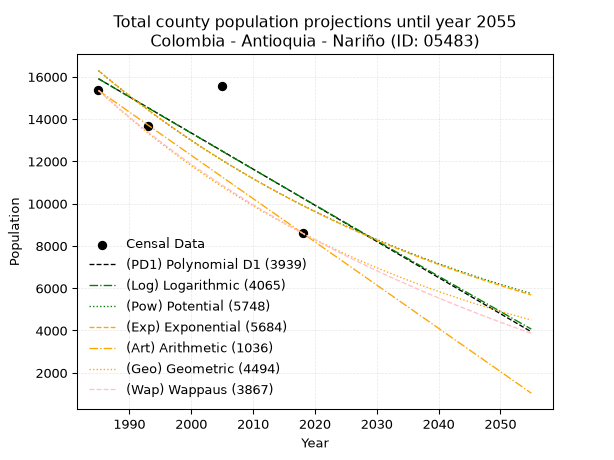
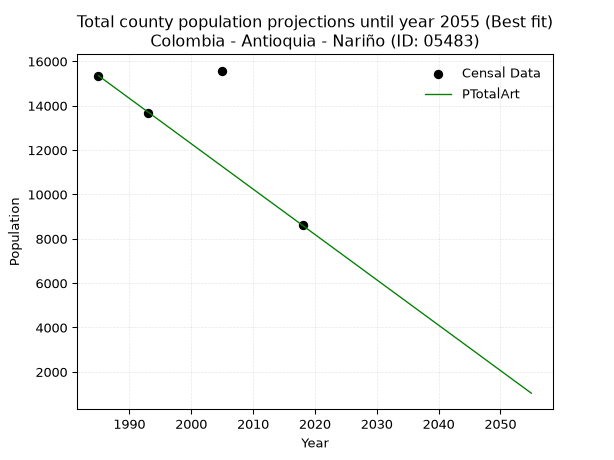
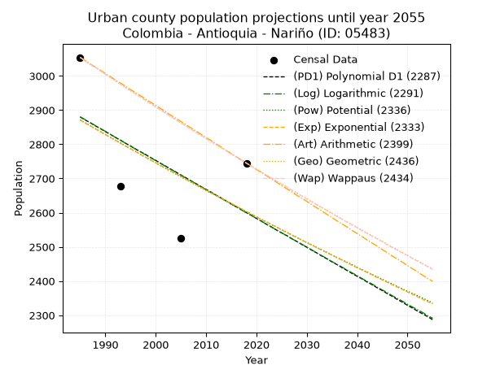
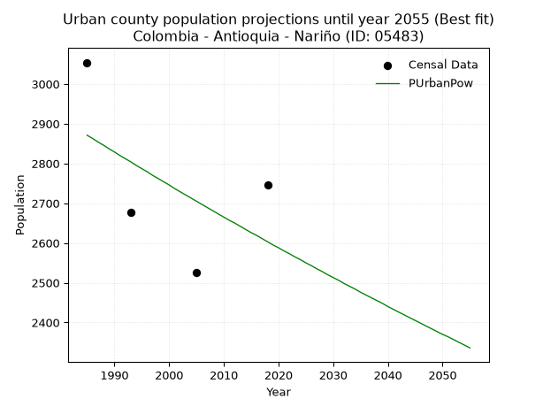
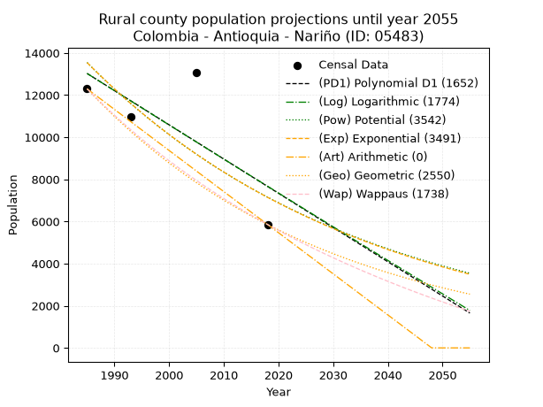
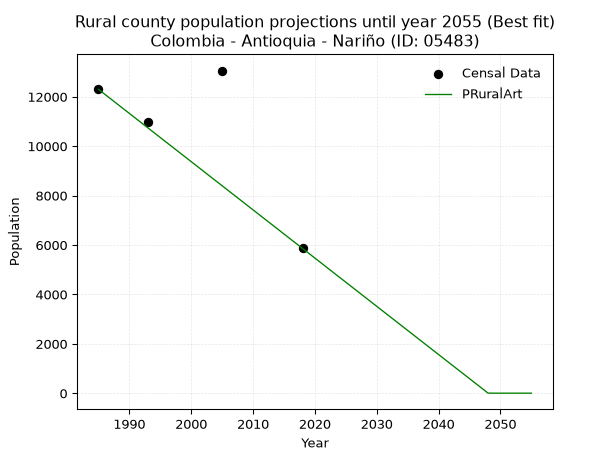

<div align="center">


</div>

# _“Population and Public Services Demand Projections (PPSD) until Year 2050 for Colombia - Antioquia - Nariño (ID: 05483)”_
Keywords: `population` `public-service` `projection` `lineal` `polynomial` `logarithmic` `potential` `exponential` `arithmetic` `geometric` `wappaus` `dane` `colombia` `south-america`

PPSD are analytical estimates used by governments and planners to anticipate future changes in population size, age distribution, and the resulting community needs for utilities, healthcare, education, and infrastructure as sizing future water treatment facilities, electrical grids, and road networks based on spatial growth.

> **General running parameters**: • app_version: _v20260806_. • Python version: _3.14.7_. • Pandas version: _3.0.5_. • NumPy version: _2.5.1_. • Creates, save and include plots into reports (create_plot): _False_. • Projection until year: _2050_. • Process polynomial degree 2 and up: _False_. • Process Wappaus: _True_. • Process Wappaus: _True_. • Set negative values to zero: _True_. • Set infinite values to zero: _True_. • Drop dataset notes: _True_. 
<div align="center">

Dynamic map: [:earth_americas:Google](http://maps.google.com/maps?q=5.610776549,-75.1762621) [:earth_americas:OSM](https://www.openstreetmap.org/#map=18/5.610776549/-75.1762621&layers=P) [:earth_americas:Bing](https://www.bing.com/maps?cp=5.610776549~-75.1762621&lvl=18) [:earth_americas:Apple](https://maps.apple.com/frame?center=5.610776549%2C-75.1762621&span=0.003%2C0.006)

</div>


<div align="center">

```geojson
{
  "type": "Feature",
  "geometry": {
    "type": "Point", 
    "coordinates": [-75.1762621, 5.610776549]
  }, 
  "properties": {
    "Name": "Colombia - Antioquia - Nariño (ID: 05483)"
  }
}
```

</div>


## 0. Census Data (4 records)

Census data are official statistics collected by a government about the people and housing in a country. They usually include counts of total population, age, sex, race, income, education, and jobs.

📅Global census file: [Population.xlsx](../data/Population.xlsx)

| Source   |   Year |   CountryID | CountryName   |   StateID | StateName   |   CountyID | CountyName   |   PTotal |   PUrban |   PRural |
|:---------|-------:|------------:|:--------------|----------:|:------------|-----------:|:-------------|---------:|---------:|---------:|
| DANE     |   1985 |          57 | Colombia      |        05 | Antioquia   |      05483 | Nariño       |    15352 |     3054 |    12298 |
| DANE     |   1993 |          57 | Colombia      |        05 | Antioquia   |      05483 | Nariño       |    13662 |     2678 |    10984 |
| DANE     |   2005 |          57 | Colombia      |        05 | Antioquia   |      05483 | Nariño       |    15579 |     2525 |    13054 |
| DANE     |   2018 |          57 | Colombia      |        05 | Antioquia   |      05483 | Nariño       |     8603 |     2745 |     5858 |

> 🔥Some records could had specific notes about the registered values or the corresponding urban or rural distribution.

## 1. Total

### 1.1. Coefficients and Parameters

* (PD1) Polynomial Deg 1: -170.9578482537092, 355257.43596948177 (lineal)
* (Log) Logarithmic: -341689.1222635337, 2610480.7564499034
* (Pow) Potential: -30.05408354503949, 103.32302618437879
* (Exp) Exponential: -0.015037128840846658, 1.4960082197657734e+17
* (Art) Arithmetic: Year diff. 2018 - 1985 = 33, Population diff. 8603 - 15352 = -6749, Annual growth = -204.5151515151515
* (Geo) Geometric: Year diff. 2018 - 1985 = 33, Population diff. 8603 - 15352 = -6749, Annual growth % = -0.01739644250204364
* (Wap) Wappaus: i = -1.7074944814456399, Condition values only valid for < 200)

<sub>
Wappaus condition values: ['-0.00', '-1.71', '-3.41', '-5.12', '-6.83', '-8.54', '-10.24', '-11.95', '-13.66', '-15.37', '-17.07', '-18.78', '-20.49', '-22.20', '-23.90', '-25.61', '-27.32', '-29.03', '-30.73', '-32.44', '-34.15', '-35.86', '-37.56', '-39.27', '-40.98', '-42.69', '-44.39', '-46.10', '-47.81', '-49.52', '-51.22', '-52.93', '-54.64', '-56.35', '-58.05', '-59.76', '-61.47', '-63.18', '-64.88', '-66.59', '-68.30', '-70.01', '-71.71', '-73.42', '-75.13', '-76.84', '-78.54', '-80.25', '-81.96', '-83.67', '-85.37', '-87.08', '-88.79', '-90.50', '-92.20', '-93.91', '-95.62', '-97.33', '-99.03', '-100.74', '-102.45', '-104.16', '-105.86', '-107.57', '-109.28', '-110.99']
</sub>


### 1.2. Projected Dataset

|   Year |   CountyID |   PTotalPD1 |   PTotalLog |   PTotalPow |   PTotalExp |   PTotalArt |   PTotalGeo |   PTotalWap |
|-------:|-----------:|------------:|------------:|------------:|------------:|------------:|------------:|------------:|
|   1985 |      05483 |       15906 |       15907 |       16288 |       16286 |       15352 |       15352 |       15352 |
|   1986 |      05483 |       15735 |       15735 |       16043 |       16043 |       15147 |       15085 |       15092 |
|   1987 |      05483 |       15564 |       15563 |       15802 |       15803 |       14943 |       14823 |       14837 |
|   1988 |      05483 |       15393 |       15391 |       15565 |       15567 |       14738 |       14565 |       14585 |
|   1989 |      05483 |       15222 |       15220 |       15331 |       15335 |       14534 |       14311 |       14338 |
|   1990 |      05483 |       15051 |       15048 |       15102 |       15106 |       14329 |       14062 |       14095 |
|   1991 |      05483 |       14880 |       14876 |       14875 |       14881 |       14125 |       13818 |       13856 |
|   1992 |      05483 |       14709 |       14705 |       14652 |       14659 |       13920 |       13577 |       13621 |
|   1993 |      05483 |       14538 |       14533 |       14433 |       14440 |       13716 |       13341 |       13389 |
|   1994 |      05483 |       14367 |       14362 |       14217 |       14224 |       13511 |       13109 |       13161 |
|   1995 |      05483 |       14197 |       14190 |       14004 |       14012 |       13307 |       12881 |       12937 |
|   1996 |      05483 |       14026 |       14019 |       13795 |       13803 |       13102 |       12657 |       12716 |
|   1997 |      05483 |       13855 |       13848 |       13589 |       13597 |       12898 |       12437 |       12499 |
|   1998 |      05483 |       13684 |       13677 |       13386 |       13394 |       12693 |       12220 |       12285 |
|   1999 |      05483 |       13513 |       13506 |       13186 |       13194 |       12489 |       12008 |       12074 |
|   2000 |      05483 |       13342 |       13335 |       12990 |       12997 |       12284 |       11799 |       11866 |
|   2001 |      05483 |       13171 |       13164 |       12796 |       12803 |       12080 |       11594 |       11662 |
|   2002 |      05483 |       13000 |       12994 |       12605 |       12612 |       11875 |       11392 |       11461 |
|   2003 |      05483 |       12829 |       12823 |       12417 |       12424 |       11671 |       11194 |       11262 |
|   2004 |      05483 |       12658 |       12652 |       12233 |       12238 |       11466 |       10999 |       11067 |
|   2005 |      05483 |       12487 |       12482 |       12050 |       12056 |       11262 |       10808 |       10874 |
|   2006 |      05483 |       12316 |       12312 |       11871 |       11876 |       11057 |       10620 |       10684 |
|   2007 |      05483 |       12145 |       12141 |       11695 |       11699 |       10853 |       10435 |       10497 |
|   2008 |      05483 |       11974 |       11971 |       11521 |       11524 |       10648 |       10253 |       10312 |
|   2009 |      05483 |       11803 |       11801 |       11350 |       11352 |       10444 |       10075 |       10131 |
|   2010 |      05483 |       11632 |       11631 |       11181 |       11183 |       10239 |        9900 |        9951 |
|   2011 |      05483 |       11461 |       11461 |       11015 |       11016 |       10035 |        9728 |        9775 |
|   2012 |      05483 |       11290 |       11291 |       10852 |       10851 |        9830 |        9558 |        9600 |
|   2013 |      05483 |       11119 |       11121 |       10691 |       10689 |        9626 |        9392 |        9428 |
|   2014 |      05483 |       10948 |       10952 |       10533 |       10530 |        9421 |        9229 |        9259 |
|   2015 |      05483 |       10777 |       10782 |       10377 |       10373 |        9217 |        9068 |        9091 |
|   2016 |      05483 |       10606 |       10612 |       10223 |       10218 |        9012 |        8910 |        8926 |
|   2017 |      05483 |       10435 |       10443 |       10072 |       10065 |        8808 |        8755 |        8764 |
|   2018 |      05483 |       10264 |       10274 |        9923 |        9915 |        8603 |        8603 |        8603 |
|   2019 |      05483 |       10094 |       10104 |        9776 |        9767 |        8398 |        8453 |        8444 |
|   2020 |      05483 |        9923 |        9935 |        9632 |        9621 |        8194 |        8306 |        8288 |
|   2021 |      05483 |        9752 |        9766 |        9490 |        9478 |        7989 |        8162 |        8134 |
|   2022 |      05483 |        9581 |        9597 |        9350 |        9336 |        7785 |        8020 |        7981 |
|   2023 |      05483 |        9410 |        9428 |        9212 |        9197 |        7580 |        7880 |        7831 |
|   2024 |      05483 |        9239 |        9259 |        9076 |        9060 |        7376 |        7743 |        7682 |
|   2025 |      05483 |        9068 |        9090 |        8942 |        8925 |        7171 |        7608 |        7536 |
|   2026 |      05483 |        8897 |        8922 |        8811 |        8791 |        6967 |        7476 |        7391 |
|   2027 |      05483 |        8726 |        8753 |        8681 |        8660 |        6762 |        7346 |        7248 |
|   2028 |      05483 |        8555 |        8585 |        8553 |        8531 |        6558 |        7218 |        7107 |
|   2029 |      05483 |        8384 |        8416 |        8427 |        8404 |        6353 |        7093 |        6968 |
|   2030 |      05483 |        8213 |        8248 |        8304 |        8278 |        6149 |        6969 |        6830 |
|   2031 |      05483 |        8042 |        8080 |        8182 |        8155 |        5944 |        6848 |        6694 |
|   2032 |      05483 |        7871 |        7911 |        8061 |        8033 |        5740 |        6729 |        6560 |
|   2033 |      05483 |        7700 |        7743 |        7943 |        7913 |        5535 |        6612 |        6427 |
|   2034 |      05483 |        7529 |        7575 |        7827 |        7795 |        5331 |        6497 |        6296 |
|   2035 |      05483 |        7358 |        7407 |        7712 |        7679 |        5126 |        6384 |        6166 |
|   2036 |      05483 |        7187 |        7239 |        7599 |        7564 |        4922 |        6273 |        6038 |
|   2037 |      05483 |        7016 |        7072 |        7487 |        7451 |        4717 |        6164 |        5912 |
|   2038 |      05483 |        6845 |        6904 |        7378 |        7340 |        4513 |        6056 |        5787 |
|   2039 |      05483 |        6674 |        6736 |        7270 |        7230 |        4308 |        5951 |        5663 |
|   2040 |      05483 |        6503 |        6569 |        7163 |        7122 |        4104 |        5848 |        5541 |
|   2041 |      05483 |        6332 |        6401 |        7059 |        7016 |        3899 |        5746 |        5421 |
|   2042 |      05483 |        6162 |        6234 |        6956 |        6911 |        3695 |        5646 |        5301 |
|   2043 |      05483 |        5991 |        6067 |        6854 |        6808 |        3490 |        5548 |        5183 |
|   2044 |      05483 |        5820 |        5899 |        6754 |        6707 |        3286 |        5451 |        5067 |
|   2045 |      05483 |        5649 |        5732 |        6655 |        6607 |        3081 |        5356 |        4952 |
|   2046 |      05483 |        5478 |        5565 |        6558 |        6508 |        2877 |        5263 |        4838 |
|   2047 |      05483 |        5307 |        5398 |        6463 |        6411 |        2672 |        5172 |        4725 |
|   2048 |      05483 |        5136 |        5231 |        6369 |        6315 |        2468 |        5082 |        4613 |
|   2049 |      05483 |        4965 |        5065 |        6276 |        6221 |        2263 |        4993 |        4503 |
|   2050 |      05483 |        4794 |        4898 |        6184 |        6128 |        2059 |        4906 |        4394 |
<div align="center">

</img>

</div>


### 1.3. Best fit with absolute and relative error (%)

Relative error puts that difference into context by dividing the absolute error by the true value, creating a unitless ratio or percentage that shows the scale of the mistake.

Absolute and relative error

|   Year | Source   |   CountryID | CountryName   |   StateID | StateName   |   CountyID_x | CountyName   |   PTotal |   PUrban |   PRural |   CountyID_y |   PTotalPD1 |   PTotalLog |   PTotalPow |   PTotalExp |   PTotalArt |   PTotalGeo |   PTotalWap |   PTotalPD1AbsError |   PTotalLogAbsError |   PTotalPowAbsError |   PTotalExpAbsError |   PTotalArtAbsError |   PTotalGeoAbsError |   PTotalWapAbsError |   PTotalPD1RelError |   PTotalLogRelError |   PTotalPowRelError |   PTotalExpRelError |   PTotalArtRelError |   PTotalGeoRelError |   PTotalWapRelError |
|-------:|:---------|------------:|:--------------|----------:|:------------|-------------:|:-------------|---------:|---------:|---------:|-------------:|------------:|------------:|------------:|------------:|------------:|------------:|------------:|--------------------:|--------------------:|--------------------:|--------------------:|--------------------:|--------------------:|--------------------:|--------------------:|--------------------:|--------------------:|--------------------:|--------------------:|--------------------:|--------------------:|
|   1985 | DANE     |          57 | Colombia      |        05 | Antioquia   |        05483 | Nariño       |    15352 |     3054 |    12298 |        05483 |       15906 |       15907 |       16288 |       16286 |       15352 |       15352 |       15352 |                 554 |                 555 |                 936 |                 934 |                   0 |                   0 |                   0 |             3.60865 |             3.61516 |             6.09693 |             6.0839  |            0        |             0       |             0       |
|   1993 | DANE     |          57 | Colombia      |        05 | Antioquia   |        05483 | Nariño       |    13662 |     2678 |    10984 |        05483 |       14538 |       14533 |       14433 |       14440 |       13716 |       13341 |       13389 |                 876 |                 871 |                 771 |                 778 |                  54 |                 321 |                 273 |             6.41195 |             6.37535 |             5.64339 |             5.69463 |            0.395257 |             2.34958 |             1.99824 |
|   2005 | DANE     |          57 | Colombia      |        05 | Antioquia   |        05483 | Nariño       |    15579 |     2525 |    13054 |        05483 |       12487 |       12482 |       12050 |       12056 |       11262 |       10808 |       10874 |                3092 |                3097 |                3529 |                3523 |                4317 |                4771 |                4705 |            19.8472  |            19.8793  |            22.6523  |            22.6138  |           27.7104   |            30.6246  |            30.2009  |
|   2018 | DANE     |          57 | Colombia      |        05 | Antioquia   |        05483 | Nariño       |     8603 |     2745 |     5858 |        05483 |       10264 |       10274 |        9923 |        9915 |        8603 |        8603 |        8603 |                1661 |                1671 |                1320 |                1312 |                   0 |                   0 |                   0 |            19.3072  |            19.4235  |            15.3435  |            15.2505  |            0        |             0       |             0       |

Relative error mean

| Method    |   RelError | Best   |
|:----------|-----------:|:-------|
| PTotalPD1 |   12.2938  |        |
| PTotalLog |   12.3233  |        |
| PTotalPow |   12.434   |        |
| PTotalExp |   12.4107  |        |
| PTotalArt |    7.02641 | True   |
| PTotalGeo |    8.24354 |        |
| PTotalWap |    8.04979 |        |

💙Best method: _**PTotalArt**_
<div align="center">

</img>

</div>


### 1.4. Fresh water supply demand in liters per capita per day (lpcd)

The fresh water supply demand typically ranges from 100 to 300 liters per capita per day (lpcd) for standard domestic and municipal planning, though absolute survival minimums set by the World Health Organization are as low as 7.5 to 20 liters per day, and total consumption in high-income nations can exceed 400 liters.

> `CZ`: Level in meters above the sea level (masl).<br> `WS`: Fresh water supply demand in liters per capita per day (lpcd or l/h/d).<br> `WSAll`: Zonal fresh water supply demand in liters per second (l/s).<br> `A`: Zonal area in square meters.

Reference values (RAS Colombia)

|    CZ |   WS |
|------:|-----:|
|  1000 |  120 |
|  2000 |  130 |
| 99999 |  140 |

County shapefile geometry properties and water supply values

|   CountyID |     ATotal |   CZTotal |   WSTotal |
|-----------:|-----------:|----------:|----------:|
|      05483 | 3.1662e+08 |   1622.17 |       130 |

Projected values for best method: PTotalArt

|   CountyID |   Year |   PTotalArt |   WSTotal |   WSTotalAll |
|-----------:|-------:|------------:|----------:|-------------:|
|      05483 |   1985 |       15352 |       130 |     23.0991  |
|      05483 |   1986 |       15147 |       130 |     22.7906  |
|      05483 |   1987 |       14943 |       130 |     22.4837  |
|      05483 |   1988 |       14738 |       130 |     22.1752  |
|      05483 |   1989 |       14534 |       130 |     21.8683  |
|      05483 |   1990 |       14329 |       130 |     21.5598  |
|      05483 |   1991 |       14125 |       130 |     21.2529  |
|      05483 |   1992 |       13920 |       130 |     20.9444  |
|      05483 |   1993 |       13716 |       130 |     20.6375  |
|      05483 |   1994 |       13511 |       130 |     20.3291  |
|      05483 |   1995 |       13307 |       130 |     20.0221  |
|      05483 |   1996 |       13102 |       130 |     19.7137  |
|      05483 |   1997 |       12898 |       130 |     19.4067  |
|      05483 |   1998 |       12693 |       130 |     19.0983  |
|      05483 |   1999 |       12489 |       130 |     18.7913  |
|      05483 |   2000 |       12284 |       130 |     18.4829  |
|      05483 |   2001 |       12080 |       130 |     18.1759  |
|      05483 |   2002 |       11875 |       130 |     17.8675  |
|      05483 |   2003 |       11671 |       130 |     17.5605  |
|      05483 |   2004 |       11466 |       130 |     17.2521  |
|      05483 |   2005 |       11262 |       130 |     16.9451  |
|      05483 |   2006 |       11057 |       130 |     16.6367  |
|      05483 |   2007 |       10853 |       130 |     16.3297  |
|      05483 |   2008 |       10648 |       130 |     16.0213  |
|      05483 |   2009 |       10444 |       130 |     15.7144  |
|      05483 |   2010 |       10239 |       130 |     15.4059  |
|      05483 |   2011 |       10035 |       130 |     15.099   |
|      05483 |   2012 |        9830 |       130 |     14.7905  |
|      05483 |   2013 |        9626 |       130 |     14.4836  |
|      05483 |   2014 |        9421 |       130 |     14.1751  |
|      05483 |   2015 |        9217 |       130 |     13.8682  |
|      05483 |   2016 |        9012 |       130 |     13.5597  |
|      05483 |   2017 |        8808 |       130 |     13.2528  |
|      05483 |   2018 |        8603 |       130 |     12.9443  |
|      05483 |   2019 |        8398 |       130 |     12.6359  |
|      05483 |   2020 |        8194 |       130 |     12.3289  |
|      05483 |   2021 |        7989 |       130 |     12.0205  |
|      05483 |   2022 |        7785 |       130 |     11.7135  |
|      05483 |   2023 |        7580 |       130 |     11.4051  |
|      05483 |   2024 |        7376 |       130 |     11.0981  |
|      05483 |   2025 |        7171 |       130 |     10.7897  |
|      05483 |   2026 |        6967 |       130 |     10.4828  |
|      05483 |   2027 |        6762 |       130 |     10.1743  |
|      05483 |   2028 |        6558 |       130 |      9.86736 |
|      05483 |   2029 |        6353 |       130 |      9.55891 |
|      05483 |   2030 |        6149 |       130 |      9.25197 |
|      05483 |   2031 |        5944 |       130 |      8.94352 |
|      05483 |   2032 |        5740 |       130 |      8.63657 |
|      05483 |   2033 |        5535 |       130 |      8.32812 |
|      05483 |   2034 |        5331 |       130 |      8.02118 |
|      05483 |   2035 |        5126 |       130 |      7.71273 |
|      05483 |   2036 |        4922 |       130 |      7.40579 |
|      05483 |   2037 |        4717 |       130 |      7.09734 |
|      05483 |   2038 |        4513 |       130 |      6.79039 |
|      05483 |   2039 |        4308 |       130 |      6.48194 |
|      05483 |   2040 |        4104 |       130 |      6.175   |
|      05483 |   2041 |        3899 |       130 |      5.86655 |
|      05483 |   2042 |        3695 |       130 |      5.55961 |
|      05483 |   2043 |        3490 |       130 |      5.25116 |
|      05483 |   2044 |        3286 |       130 |      4.94421 |
|      05483 |   2045 |        3081 |       130 |      4.63576 |
|      05483 |   2046 |        2877 |       130 |      4.32882 |
|      05483 |   2047 |        2672 |       130 |      4.02037 |
|      05483 |   2048 |        2468 |       130 |      3.71343 |
|      05483 |   2049 |        2263 |       130 |      3.40498 |
|      05483 |   2050 |        2059 |       130 |      3.09803 |

## 2. Urban

### 2.1. Coefficients and Parameters

* (PD1) Polynomial Deg 1: -8.464873544761263, 19682.36330790872 (lineal)
* (Log) Logarithmic: -17003.669163584447, 131995.52557125856
* (Pow) Potential: -5.949972826593383, 23.079682363810157
* (Exp) Exponential: -0.002961696214892956, 1026098.4761503172
* (Art) Arithmetic: Year diff. 2018 - 1985 = 33, Population diff. 2745 - 3054 = -309, Annual growth = -9.363636363636363
* (Geo) Geometric: Year diff. 2018 - 1985 = 33, Population diff. 2745 - 3054 = -309, Annual growth % = -0.0032272397710113587
* (Wap) Wappaus: i = -0.3229396917963912, Condition values only valid for < 200)

<sub>
Wappaus condition values: ['-0.00', '-0.32', '-0.65', '-0.97', '-1.29', '-1.61', '-1.94', '-2.26', '-2.58', '-2.91', '-3.23', '-3.55', '-3.88', '-4.20', '-4.52', '-4.84', '-5.17', '-5.49', '-5.81', '-6.14', '-6.46', '-6.78', '-7.10', '-7.43', '-7.75', '-8.07', '-8.40', '-8.72', '-9.04', '-9.37', '-9.69', '-10.01', '-10.33', '-10.66', '-10.98', '-11.30', '-11.63', '-11.95', '-12.27', '-12.59', '-12.92', '-13.24', '-13.56', '-13.89', '-14.21', '-14.53', '-14.86', '-15.18', '-15.50', '-15.82', '-16.15', '-16.47', '-16.79', '-17.12', '-17.44', '-17.76', '-18.08', '-18.41', '-18.73', '-19.05', '-19.38', '-19.70', '-20.02', '-20.35', '-20.67', '-20.99']
</sub>


### 2.2. Projected Dataset

|   Year |   CountyID |   PUrbanPD1 |   PUrbanLog |   PUrbanPow |   PUrbanExp |   PUrbanArt |   PUrbanGeo |   PUrbanWap |
|-------:|-----------:|------------:|------------:|------------:|------------:|------------:|------------:|------------:|
|   1985 |      05483 |        2880 |        2880 |        2871 |        2871 |        3054 |        3054 |        3054 |
|   1986 |      05483 |        2871 |        2872 |        2863 |        2862 |        3045 |        3044 |        3044 |
|   1987 |      05483 |        2863 |        2863 |        2854 |        2854 |        3035 |        3034 |        3034 |
|   1988 |      05483 |        2854 |        2855 |        2846 |        2845 |        3026 |        3025 |        3025 |
|   1989 |      05483 |        2846 |        2846 |        2837 |        2837 |        3017 |        3015 |        3015 |
|   1990 |      05483 |        2837 |        2838 |        2829 |        2828 |        3007 |        3005 |        3005 |
|   1991 |      05483 |        2829 |        2829 |        2820 |        2820 |        2998 |        2995 |        2995 |
|   1992 |      05483 |        2820 |        2820 |        2812 |        2812 |        2988 |        2986 |        2986 |
|   1993 |      05483 |        2812 |        2812 |        2804 |        2803 |        2979 |        2976 |        2976 |
|   1994 |      05483 |        2803 |        2803 |        2795 |        2795 |        2970 |        2966 |        2967 |
|   1995 |      05483 |        2795 |        2795 |        2787 |        2787 |        2960 |        2957 |        2957 |
|   1996 |      05483 |        2786 |        2786 |        2779 |        2779 |        2951 |        2947 |        2947 |
|   1997 |      05483 |        2778 |        2778 |        2770 |        2770 |        2942 |        2938 |        2938 |
|   1998 |      05483 |        2770 |        2769 |        2762 |        2762 |        2932 |        2928 |        2928 |
|   1999 |      05483 |        2761 |        2761 |        2754 |        2754 |        2923 |        2919 |        2919 |
|   2000 |      05483 |        2753 |        2752 |        2746 |        2746 |        2914 |        2909 |        2910 |
|   2001 |      05483 |        2744 |        2744 |        2737 |        2738 |        2904 |        2900 |        2900 |
|   2002 |      05483 |        2736 |        2735 |        2729 |        2730 |        2895 |        2891 |        2891 |
|   2003 |      05483 |        2727 |        2727 |        2721 |        2722 |        2885 |        2881 |        2881 |
|   2004 |      05483 |        2719 |        2718 |        2713 |        2714 |        2876 |        2872 |        2872 |
|   2005 |      05483 |        2710 |        2710 |        2705 |        2706 |        2867 |        2863 |        2863 |
|   2006 |      05483 |        2702 |        2701 |        2697 |        2698 |        2857 |        2854 |        2854 |
|   2007 |      05483 |        2693 |        2693 |        2689 |        2690 |        2848 |        2844 |        2844 |
|   2008 |      05483 |        2685 |        2684 |        2681 |        2682 |        2839 |        2835 |        2835 |
|   2009 |      05483 |        2676 |        2676 |        2673 |        2674 |        2829 |        2826 |        2826 |
|   2010 |      05483 |        2668 |        2667 |        2665 |        2666 |        2820 |        2817 |        2817 |
|   2011 |      05483 |        2660 |        2659 |        2657 |        2658 |        2811 |        2808 |        2808 |
|   2012 |      05483 |        2651 |        2651 |        2650 |        2650 |        2801 |        2799 |        2799 |
|   2013 |      05483 |        2643 |        2642 |        2642 |        2642 |        2792 |        2790 |        2790 |
|   2014 |      05483 |        2634 |        2634 |        2634 |        2634 |        2782 |        2781 |        2781 |
|   2015 |      05483 |        2626 |        2625 |        2626 |        2627 |        2773 |        2772 |        2772 |
|   2016 |      05483 |        2617 |        2617 |        2619 |        2619 |        2764 |        2763 |        2763 |
|   2017 |      05483 |        2609 |        2608 |        2611 |        2611 |        2754 |        2754 |        2754 |
|   2018 |      05483 |        2600 |        2600 |        2603 |        2603 |        2745 |        2745 |        2745 |
|   2019 |      05483 |        2592 |        2592 |        2595 |        2596 |        2736 |        2736 |        2736 |
|   2020 |      05483 |        2583 |        2583 |        2588 |        2588 |        2726 |        2727 |        2727 |
|   2021 |      05483 |        2575 |        2575 |        2580 |        2580 |        2717 |        2719 |        2718 |
|   2022 |      05483 |        2566 |        2566 |        2573 |        2573 |        2708 |        2710 |        2710 |
|   2023 |      05483 |        2558 |        2558 |        2565 |        2565 |        2698 |        2701 |        2701 |
|   2024 |      05483 |        2549 |        2549 |        2558 |        2558 |        2689 |        2692 |        2692 |
|   2025 |      05483 |        2541 |        2541 |        2550 |        2550 |        2679 |        2684 |        2683 |
|   2026 |      05483 |        2533 |        2533 |        2543 |        2542 |        2670 |        2675 |        2675 |
|   2027 |      05483 |        2524 |        2524 |        2535 |        2535 |        2661 |        2666 |        2666 |
|   2028 |      05483 |        2516 |        2516 |        2528 |        2527 |        2651 |        2658 |        2657 |
|   2029 |      05483 |        2507 |        2508 |        2520 |        2520 |        2642 |        2649 |        2649 |
|   2030 |      05483 |        2499 |        2499 |        2513 |        2512 |        2633 |        2641 |        2640 |
|   2031 |      05483 |        2490 |        2491 |        2506 |        2505 |        2623 |        2632 |        2632 |
|   2032 |      05483 |        2482 |        2482 |        2498 |        2498 |        2614 |        2624 |        2623 |
|   2033 |      05483 |        2473 |        2474 |        2491 |        2490 |        2605 |        2615 |        2615 |
|   2034 |      05483 |        2465 |        2466 |        2484 |        2483 |        2595 |        2607 |        2606 |
|   2035 |      05483 |        2456 |        2457 |        2476 |        2476 |        2586 |        2598 |        2598 |
|   2036 |      05483 |        2448 |        2449 |        2469 |        2468 |        2576 |        2590 |        2589 |
|   2037 |      05483 |        2439 |        2441 |        2462 |        2461 |        2567 |        2581 |        2581 |
|   2038 |      05483 |        2431 |        2432 |        2455 |        2454 |        2558 |        2573 |        2572 |
|   2039 |      05483 |        2422 |        2424 |        2448 |        2446 |        2548 |        2565 |        2564 |
|   2040 |      05483 |        2414 |        2416 |        2440 |        2439 |        2539 |        2557 |        2556 |
|   2041 |      05483 |        2406 |        2407 |        2433 |        2432 |        2530 |        2548 |        2547 |
|   2042 |      05483 |        2397 |        2399 |        2426 |        2425 |        2520 |        2540 |        2539 |
|   2043 |      05483 |        2389 |        2391 |        2419 |        2418 |        2511 |        2532 |        2531 |
|   2044 |      05483 |        2380 |        2382 |        2412 |        2410 |        2502 |        2524 |        2523 |
|   2045 |      05483 |        2372 |        2374 |        2405 |        2403 |        2492 |        2516 |        2515 |
|   2046 |      05483 |        2363 |        2366 |        2398 |        2396 |        2483 |        2507 |        2506 |
|   2047 |      05483 |        2355 |        2357 |        2391 |        2389 |        2473 |        2499 |        2498 |
|   2048 |      05483 |        2346 |        2349 |        2384 |        2382 |        2464 |        2491 |        2490 |
|   2049 |      05483 |        2338 |        2341 |        2377 |        2375 |        2455 |        2483 |        2482 |
|   2050 |      05483 |        2329 |        2332 |        2370 |        2368 |        2445 |        2475 |        2474 |
<div align="center">

</img>

</div>


### 2.3. Best fit with absolute and relative error (%)

Relative error puts that difference into context by dividing the absolute error by the true value, creating a unitless ratio or percentage that shows the scale of the mistake.

Absolute and relative error

|   Year | Source   |   CountryID | CountryName   |   StateID | StateName   |   CountyID_x | CountyName   |   PTotal |   PUrban |   PRural |   CountyID_y |   PUrbanPD1 |   PUrbanLog |   PUrbanPow |   PUrbanExp |   PUrbanArt |   PUrbanGeo |   PUrbanWap |   PUrbanPD1AbsError |   PUrbanLogAbsError |   PUrbanPowAbsError |   PUrbanExpAbsError |   PUrbanArtAbsError |   PUrbanGeoAbsError |   PUrbanWapAbsError |   PUrbanPD1RelError |   PUrbanLogRelError |   PUrbanPowRelError |   PUrbanExpRelError |   PUrbanArtRelError |   PUrbanGeoRelError |   PUrbanWapRelError |
|-------:|:---------|------------:|:--------------|----------:|:------------|-------------:|:-------------|---------:|---------:|---------:|-------------:|------------:|------------:|------------:|------------:|------------:|------------:|------------:|--------------------:|--------------------:|--------------------:|--------------------:|--------------------:|--------------------:|--------------------:|--------------------:|--------------------:|--------------------:|--------------------:|--------------------:|--------------------:|--------------------:|
|   1985 | DANE     |          57 | Colombia      |        05 | Antioquia   |        05483 | Nariño       |    15352 |     3054 |    12298 |        05483 |        2880 |        2880 |        2871 |        2871 |        3054 |        3054 |        3054 |                 174 |                 174 |                 183 |                 183 |                   0 |                   0 |                   0 |             5.69745 |             5.69745 |             5.99214 |             5.99214 |              0      |              0      |              0      |
|   1993 | DANE     |          57 | Colombia      |        05 | Antioquia   |        05483 | Nariño       |    13662 |     2678 |    10984 |        05483 |        2812 |        2812 |        2804 |        2803 |        2979 |        2976 |        2976 |                 134 |                 134 |                 126 |                 125 |                 301 |                 298 |                 298 |             5.00373 |             5.00373 |             4.705   |             4.66766 |             11.2397 |             11.1277 |             11.1277 |
|   2005 | DANE     |          57 | Colombia      |        05 | Antioquia   |        05483 | Nariño       |    15579 |     2525 |    13054 |        05483 |        2710 |        2710 |        2705 |        2706 |        2867 |        2863 |        2863 |                 185 |                 185 |                 180 |                 181 |                 342 |                 338 |                 338 |             7.32673 |             7.32673 |             7.12871 |             7.16832 |             13.5446 |             13.3861 |             13.3861 |
|   2018 | DANE     |          57 | Colombia      |        05 | Antioquia   |        05483 | Nariño       |     8603 |     2745 |     5858 |        05483 |        2600 |        2600 |        2603 |        2603 |        2745 |        2745 |        2745 |                 145 |                 145 |                 142 |                 142 |                   0 |                   0 |                   0 |             5.28233 |             5.28233 |             5.17304 |             5.17304 |              0      |              0      |              0      |

Relative error mean

| Method    |   RelError | Best   |
|:----------|-----------:|:-------|
| PUrbanPD1 |    5.82756 |        |
| PUrbanLog |    5.82756 |        |
| PUrbanPow |    5.74972 | True   |
| PUrbanExp |    5.75029 |        |
| PUrbanArt |    6.19607 |        |
| PUrbanGeo |    6.12846 |        |
| PUrbanWap |    6.12846 |        |

💙Best method: _**PUrbanPow**_
<div align="center">

</img>

</div>


### 2.4. Fresh water supply demand in liters per capita per day (lpcd)

The fresh water supply demand typically ranges from 100 to 300 liters per capita per day (lpcd) for standard domestic and municipal planning, though absolute survival minimums set by the World Health Organization are as low as 7.5 to 20 liters per day, and total consumption in high-income nations can exceed 400 liters.

> `CZ`: Level in meters above the sea level (masl).<br> `WS`: Fresh water supply demand in liters per capita per day (lpcd or l/h/d).<br> `WSAll`: Zonal fresh water supply demand in liters per second (l/s).<br> `A`: Zonal area in square meters.

Reference values (RAS Colombia)

|    CZ |   WS |
|------:|-----:|
|  1000 |  120 |
|  2000 |  130 |
| 99999 |  140 |

County shapefile geometry properties and water supply values

|   CountyID |   AUrban |   CZUrban |   WSUrban |
|-----------:|---------:|----------:|----------:|
|      05483 |   805058 |   1672.95 |       130 |

Projected values for best method: PUrbanPow

|   CountyID |   Year |   PUrbanPow |   WSUrban |   WSUrbanAll |
|-----------:|-------:|------------:|----------:|-------------:|
|      05483 |   1985 |        2871 |       130 |      4.31979 |
|      05483 |   1986 |        2863 |       130 |      4.30775 |
|      05483 |   1987 |        2854 |       130 |      4.29421 |
|      05483 |   1988 |        2846 |       130 |      4.28218 |
|      05483 |   1989 |        2837 |       130 |      4.26863 |
|      05483 |   1990 |        2829 |       130 |      4.2566  |
|      05483 |   1991 |        2820 |       130 |      4.24306 |
|      05483 |   1992 |        2812 |       130 |      4.23102 |
|      05483 |   1993 |        2804 |       130 |      4.21898 |
|      05483 |   1994 |        2795 |       130 |      4.20544 |
|      05483 |   1995 |        2787 |       130 |      4.1934  |
|      05483 |   1996 |        2779 |       130 |      4.18137 |
|      05483 |   1997 |        2770 |       130 |      4.16782 |
|      05483 |   1998 |        2762 |       130 |      4.15579 |
|      05483 |   1999 |        2754 |       130 |      4.14375 |
|      05483 |   2000 |        2746 |       130 |      4.13171 |
|      05483 |   2001 |        2737 |       130 |      4.11817 |
|      05483 |   2002 |        2729 |       130 |      4.10613 |
|      05483 |   2003 |        2721 |       130 |      4.0941  |
|      05483 |   2004 |        2713 |       130 |      4.08206 |
|      05483 |   2005 |        2705 |       130 |      4.07002 |
|      05483 |   2006 |        2697 |       130 |      4.05799 |
|      05483 |   2007 |        2689 |       130 |      4.04595 |
|      05483 |   2008 |        2681 |       130 |      4.03391 |
|      05483 |   2009 |        2673 |       130 |      4.02187 |
|      05483 |   2010 |        2665 |       130 |      4.00984 |
|      05483 |   2011 |        2657 |       130 |      3.9978  |
|      05483 |   2012 |        2650 |       130 |      3.98727 |
|      05483 |   2013 |        2642 |       130 |      3.97523 |
|      05483 |   2014 |        2634 |       130 |      3.96319 |
|      05483 |   2015 |        2626 |       130 |      3.95116 |
|      05483 |   2016 |        2619 |       130 |      3.94062 |
|      05483 |   2017 |        2611 |       130 |      3.92859 |
|      05483 |   2018 |        2603 |       130 |      3.91655 |
|      05483 |   2019 |        2595 |       130 |      3.90451 |
|      05483 |   2020 |        2588 |       130 |      3.89398 |
|      05483 |   2021 |        2580 |       130 |      3.88194 |
|      05483 |   2022 |        2573 |       130 |      3.87141 |
|      05483 |   2023 |        2565 |       130 |      3.85938 |
|      05483 |   2024 |        2558 |       130 |      3.84884 |
|      05483 |   2025 |        2550 |       130 |      3.83681 |
|      05483 |   2026 |        2543 |       130 |      3.82627 |
|      05483 |   2027 |        2535 |       130 |      3.81424 |
|      05483 |   2028 |        2528 |       130 |      3.8037  |
|      05483 |   2029 |        2520 |       130 |      3.79167 |
|      05483 |   2030 |        2513 |       130 |      3.78113 |
|      05483 |   2031 |        2506 |       130 |      3.7706  |
|      05483 |   2032 |        2498 |       130 |      3.75856 |
|      05483 |   2033 |        2491 |       130 |      3.74803 |
|      05483 |   2034 |        2484 |       130 |      3.7375  |
|      05483 |   2035 |        2476 |       130 |      3.72546 |
|      05483 |   2036 |        2469 |       130 |      3.71493 |
|      05483 |   2037 |        2462 |       130 |      3.7044  |
|      05483 |   2038 |        2455 |       130 |      3.69387 |
|      05483 |   2039 |        2448 |       130 |      3.68333 |
|      05483 |   2040 |        2440 |       130 |      3.6713  |
|      05483 |   2041 |        2433 |       130 |      3.66076 |
|      05483 |   2042 |        2426 |       130 |      3.65023 |
|      05483 |   2043 |        2419 |       130 |      3.6397  |
|      05483 |   2044 |        2412 |       130 |      3.62917 |
|      05483 |   2045 |        2405 |       130 |      3.61863 |
|      05483 |   2046 |        2398 |       130 |      3.6081  |
|      05483 |   2047 |        2391 |       130 |      3.59757 |
|      05483 |   2048 |        2384 |       130 |      3.58704 |
|      05483 |   2049 |        2377 |       130 |      3.5765  |
|      05483 |   2050 |        2370 |       130 |      3.56597 |

## 3. Rural

### 3.1. Coefficients and Parameters

* (PD1) Polynomial Deg 1: -162.4929747089479, 335575.07266157307 (lineal)
* (Log) Logarithmic: -324685.4530999493, 2478485.2308786446
* (Pow) Potential: -38.70273470262245, 131.76418435616324
* (Exp) Exponential: -0.019367805236479393, 6.734210870323813e+20
* (Art) Arithmetic: Year diff. 2018 - 1985 = 33, Population diff. 5858 - 12298 = -6440, Annual growth = -195.15151515151516
* (Geo) Geometric: Year diff. 2018 - 1985 = 33, Population diff. 5858 - 12298 = -6440, Annual growth % = -0.02222293795552477
* (Wap) Wappaus: i = -2.1497192680272654, Condition values only valid for < 200)

<sub>
Wappaus condition values: ['-0.00', '-2.15', '-4.30', '-6.45', '-8.60', '-10.75', '-12.90', '-15.05', '-17.20', '-19.35', '-21.50', '-23.65', '-25.80', '-27.95', '-30.10', '-32.25', '-34.40', '-36.55', '-38.69', '-40.84', '-42.99', '-45.14', '-47.29', '-49.44', '-51.59', '-53.74', '-55.89', '-58.04', '-60.19', '-62.34', '-64.49', '-66.64', '-68.79', '-70.94', '-73.09', '-75.24', '-77.39', '-79.54', '-81.69', '-83.84', '-85.99', '-88.14', '-90.29', '-92.44', '-94.59', '-96.74', '-98.89', '-101.04', '-103.19', '-105.34', '-107.49', '-109.64', '-111.79', '-113.94', '-116.08', '-118.23', '-120.38', '-122.53', '-124.68', '-126.83', '-128.98', '-131.13', '-133.28', '-135.43', '-137.58', '-139.73']
</sub>


### 3.2. Projected Dataset

|   Year |   CountyID |   PRuralPD1 |   PRuralLog |   PRuralPow |   PRuralExp |   PRuralArt |   PRuralGeo |   PRuralWap |
|-------:|-----------:|------------:|------------:|------------:|------------:|------------:|------------:|------------:|
|   1985 |      05483 |       13027 |       13027 |       13547 |       13545 |       12298 |       12298 |       12298 |
|   1986 |      05483 |       12864 |       12864 |       13285 |       13286 |       12103 |       12025 |       12036 |
|   1987 |      05483 |       12702 |       12700 |       13029 |       13031 |       11908 |       11757 |       11780 |
|   1988 |      05483 |       12539 |       12537 |       12778 |       12781 |       11713 |       11496 |       11530 |
|   1989 |      05483 |       12377 |       12373 |       12531 |       12536 |       11517 |       11241 |       11284 |
|   1990 |      05483 |       12214 |       12210 |       12290 |       12295 |       11322 |       10991 |       11044 |
|   1991 |      05483 |       12052 |       12047 |       12053 |       12059 |       11127 |       10747 |       10808 |
|   1992 |      05483 |       11889 |       11884 |       11821 |       11828 |       10932 |       10508 |       10577 |
|   1993 |      05483 |       11727 |       11721 |       11594 |       11601 |       10737 |       10274 |       10350 |
|   1994 |      05483 |       11564 |       11558 |       11371 |       11379 |       10542 |       10046 |       10129 |
|   1995 |      05483 |       11402 |       11396 |       11152 |       11160 |       10346 |        9823 |        9911 |
|   1996 |      05483 |       11239 |       11233 |       10938 |       10946 |       10151 |        9604 |        9697 |
|   1997 |      05483 |       11077 |       11070 |       10728 |       10736 |        9956 |        9391 |        9488 |
|   1998 |      05483 |       10914 |       10908 |       10522 |       10530 |        9761 |        9182 |        9283 |
|   1999 |      05483 |       10752 |       10745 |       10321 |       10328 |        9566 |        8978 |        9081 |
|   2000 |      05483 |       10589 |       10583 |       10123 |       10130 |        9371 |        8779 |        8883 |
|   2001 |      05483 |       10427 |       10420 |        9929 |        9936 |        9176 |        8584 |        8689 |
|   2002 |      05483 |       10264 |       10258 |        9739 |        9745 |        8980 |        8393 |        8498 |
|   2003 |      05483 |       10102 |       10096 |        9552 |        9559 |        8785 |        8206 |        8311 |
|   2004 |      05483 |        9939 |        9934 |        9369 |        9375 |        8590 |        8024 |        8127 |
|   2005 |      05483 |        9777 |        9772 |        9190 |        9195 |        8395 |        7846 |        7946 |
|   2006 |      05483 |        9614 |        9610 |        9015 |        9019 |        8200 |        7671 |        7769 |
|   2007 |      05483 |        9452 |        9448 |        8842 |        8846 |        8005 |        7501 |        7594 |
|   2008 |      05483 |        9289 |        9287 |        8674 |        8676 |        7810 |        7334 |        7423 |
|   2009 |      05483 |        9127 |        9125 |        8508 |        8510 |        7614 |        7171 |        7254 |
|   2010 |      05483 |        8964 |        8963 |        8346 |        8347 |        7419 |        7012 |        7089 |
|   2011 |      05483 |        8802 |        8802 |        8187 |        8187 |        7224 |        6856 |        6926 |
|   2012 |      05483 |        8639 |        8640 |        8031 |        8030 |        7029 |        6704 |        6766 |
|   2013 |      05483 |        8477 |        8479 |        7878 |        7875 |        6834 |        6555 |        6608 |
|   2014 |      05483 |        8314 |        8318 |        7728 |        7724 |        6639 |        6409 |        6453 |
|   2015 |      05483 |        8152 |        8157 |        7581 |        7576 |        6443 |        6267 |        6301 |
|   2016 |      05483 |        7989 |        7996 |        7436 |        7431 |        6248 |        6127 |        6151 |
|   2017 |      05483 |        7827 |        7835 |        7295 |        7288 |        6053 |        5991 |        6003 |
|   2018 |      05483 |        7664 |        7674 |        7156 |        7149 |        5858 |        5858 |        5858 |
|   2019 |      05483 |        7502 |        7513 |        7021 |        7011 |        5663 |        5728 |        5715 |
|   2020 |      05483 |        7339 |        7352 |        6887 |        6877 |        5468 |        5601 |        5574 |
|   2021 |      05483 |        7177 |        7191 |        6757 |        6745 |        5273 |        5476 |        5436 |
|   2022 |      05483 |        7014 |        7031 |        6628 |        6616 |        5077 |        5354 |        5300 |
|   2023 |      05483 |        6852 |        6870 |        6503 |        6489 |        4882 |        5235 |        5165 |
|   2024 |      05483 |        6689 |        6710 |        6380 |        6364 |        4687 |        5119 |        5033 |
|   2025 |      05483 |        6527 |        6549 |        6259 |        6242 |        4492 |        5005 |        4903 |
|   2026 |      05483 |        6364 |        6389 |        6140 |        6123 |        4297 |        4894 |        4774 |
|   2027 |      05483 |        6202 |        6229 |        6024 |        6005 |        4102 |        4785 |        4648 |
|   2028 |      05483 |        6039 |        6069 |        5910 |        5890 |        3906 |        4679 |        4523 |
|   2029 |      05483 |        5877 |        5909 |        5799 |        5777 |        3711 |        4575 |        4401 |
|   2030 |      05483 |        5714 |        5749 |        5689 |        5666 |        3516 |        4473 |        4280 |
|   2031 |      05483 |        5552 |        5589 |        5582 |        5557 |        3321 |        4374 |        4160 |
|   2032 |      05483 |        5389 |        5429 |        5476 |        5451 |        3126 |        4277 |        4043 |
|   2033 |      05483 |        5227 |        5269 |        5373 |        5346 |        2931 |        4182 |        3927 |
|   2034 |      05483 |        5064 |        5110 |        5272 |        5244 |        2736 |        4089 |        3813 |
|   2035 |      05483 |        4902 |        4950 |        5172 |        5143 |        2540 |        3998 |        3700 |
|   2036 |      05483 |        4739 |        4790 |        5075 |        5044 |        2345 |        3909 |        3589 |
|   2037 |      05483 |        4577 |        4631 |        4979 |        4948 |        2150 |        3822 |        3480 |
|   2038 |      05483 |        4414 |        4472 |        4886 |        4853 |        1955 |        3737 |        3371 |
|   2039 |      05483 |        4252 |        4312 |        4794 |        4760 |        1760 |        3654 |        3265 |
|   2040 |      05483 |        4089 |        4153 |        4704 |        4668 |        1565 |        3573 |        3160 |
|   2041 |      05483 |        3927 |        3994 |        4615 |        4579 |        1370 |        3494 |        3056 |
|   2042 |      05483 |        3764 |        3835 |        4529 |        4491 |        1174 |        3416 |        2954 |
|   2043 |      05483 |        3602 |        3676 |        4444 |        4405 |         979 |        3340 |        2853 |
|   2044 |      05483 |        3439 |        3517 |        4360 |        4320 |         784 |        3266 |        2753 |
|   2045 |      05483 |        3277 |        3358 |        4279 |        4238 |         589 |        3193 |        2655 |
|   2046 |      05483 |        3114 |        3200 |        4198 |        4156 |         394 |        3122 |        2558 |
|   2047 |      05483 |        2952 |        3041 |        4120 |        4077 |         199 |        3053 |        2462 |
|   2048 |      05483 |        2789 |        2882 |        4043 |        3998 |           3 |        2985 |        2367 |
|   2049 |      05483 |        2627 |        2724 |        3967 |        3922 |           0 |        2919 |        2274 |
|   2050 |      05483 |        2464 |        2565 |        3893 |        3846 |           0 |        2854 |        2182 |
<div align="center">

</img>

</div>


### 3.3. Best fit with absolute and relative error (%)

Relative error puts that difference into context by dividing the absolute error by the true value, creating a unitless ratio or percentage that shows the scale of the mistake.

Absolute and relative error

|   Year | Source   |   CountryID | CountryName   |   StateID | StateName   |   CountyID_x | CountyName   |   PTotal |   PUrban |   PRural |   CountyID_y |   PRuralPD1 |   PRuralLog |   PRuralPow |   PRuralExp |   PRuralArt |   PRuralGeo |   PRuralWap |   PRuralPD1AbsError |   PRuralLogAbsError |   PRuralPowAbsError |   PRuralExpAbsError |   PRuralArtAbsError |   PRuralGeoAbsError |   PRuralWapAbsError |   PRuralPD1RelError |   PRuralLogRelError |   PRuralPowRelError |   PRuralExpRelError |   PRuralArtRelError |   PRuralGeoRelError |   PRuralWapRelError |
|-------:|:---------|------------:|:--------------|----------:|:------------|-------------:|:-------------|---------:|---------:|---------:|-------------:|------------:|------------:|------------:|------------:|------------:|------------:|------------:|--------------------:|--------------------:|--------------------:|--------------------:|--------------------:|--------------------:|--------------------:|--------------------:|--------------------:|--------------------:|--------------------:|--------------------:|--------------------:|--------------------:|
|   1985 | DANE     |          57 | Colombia      |        05 | Antioquia   |        05483 | Nariño       |    15352 |     3054 |    12298 |        05483 |       13027 |       13027 |       13547 |       13545 |       12298 |       12298 |       12298 |                 729 |                 729 |                1249 |                1247 |                   0 |                   0 |                   0 |             5.92779 |             5.92779 |            10.1561  |            10.1399  |             0       |             0       |             0       |
|   1993 | DANE     |          57 | Colombia      |        05 | Antioquia   |        05483 | Nariño       |    13662 |     2678 |    10984 |        05483 |       11727 |       11721 |       11594 |       11601 |       10737 |       10274 |       10350 |                 743 |                 737 |                 610 |                 617 |                 247 |                 710 |                 634 |             6.76438 |             6.70976 |             5.55353 |             5.61726 |             2.24873 |             6.46395 |             5.77203 |
|   2005 | DANE     |          57 | Colombia      |        05 | Antioquia   |        05483 | Nariño       |    15579 |     2525 |    13054 |        05483 |        9777 |        9772 |        9190 |        9195 |        8395 |        7846 |        7946 |                3277 |                3282 |                3864 |                3859 |                4659 |                5208 |                5108 |            25.1034  |            25.1417  |            29.6001  |            29.5618  |            35.6902  |            39.8958  |            39.1298  |
|   2018 | DANE     |          57 | Colombia      |        05 | Antioquia   |        05483 | Nariño       |     8603 |     2745 |     5858 |        05483 |        7664 |        7674 |        7156 |        7149 |        5858 |        5858 |        5858 |                1806 |                1816 |                1298 |                1291 |                   0 |                   0 |                   0 |            30.8296  |            31.0003  |            22.1577  |            22.0382  |             0       |             0       |             0       |

Relative error mean

| Method    |   RelError | Best   |
|:----------|-----------:|:-------|
| PRuralPD1 |   17.1563  |        |
| PRuralLog |   17.1949  |        |
| PRuralPow |   16.8669  |        |
| PRuralExp |   16.8393  |        |
| PRuralArt |    9.48473 | True   |
| PRuralGeo |   11.5899  |        |
| PRuralWap |   11.2255  |        |

💙Best method: _**PRuralArt**_
<div align="center">

</img>

</div>


### 3.4. Fresh water supply demand in liters per capita per day (lpcd)

The fresh water supply demand typically ranges from 100 to 300 liters per capita per day (lpcd) for standard domestic and municipal planning, though absolute survival minimums set by the World Health Organization are as low as 7.5 to 20 liters per day, and total consumption in high-income nations can exceed 400 liters.

> `CZ`: Level in meters above the sea level (masl).<br> `WS`: Fresh water supply demand in liters per capita per day (lpcd or l/h/d).<br> `WSAll`: Zonal fresh water supply demand in liters per second (l/s).<br> `A`: Zonal area in square meters.

Reference values (RAS Colombia)

|    CZ |   WS |
|------:|-----:|
|  1000 |  120 |
|  2000 |  130 |
| 99999 |  140 |

County shapefile geometry properties and water supply values

|   CountyID |      ARural |   CZRural |   WSRural |
|-----------:|------------:|----------:|----------:|
|      05483 | 3.15815e+08 |   1622.04 |       130 |

Projected values for best method: PRuralArt

|   CountyID |   Year |   PRuralArt |   WSRural |   WSRuralAll |
|-----------:|-------:|------------:|----------:|-------------:|
|      05483 |   1985 |       12298 |       130 |  18.5039     |
|      05483 |   1986 |       12103 |       130 |  18.2105     |
|      05483 |   1987 |       11908 |       130 |  17.9171     |
|      05483 |   1988 |       11713 |       130 |  17.6237     |
|      05483 |   1989 |       11517 |       130 |  17.3288     |
|      05483 |   1990 |       11322 |       130 |  17.0354     |
|      05483 |   1991 |       11127 |       130 |  16.742      |
|      05483 |   1992 |       10932 |       130 |  16.4486     |
|      05483 |   1993 |       10737 |       130 |  16.1552     |
|      05483 |   1994 |       10542 |       130 |  15.8618     |
|      05483 |   1995 |       10346 |       130 |  15.5669     |
|      05483 |   1996 |       10151 |       130 |  15.2735     |
|      05483 |   1997 |        9956 |       130 |  14.9801     |
|      05483 |   1998 |        9761 |       130 |  14.6867     |
|      05483 |   1999 |        9566 |       130 |  14.3933     |
|      05483 |   2000 |        9371 |       130 |  14.0999     |
|      05483 |   2001 |        9176 |       130 |  13.8065     |
|      05483 |   2002 |        8980 |       130 |  13.5116     |
|      05483 |   2003 |        8785 |       130 |  13.2182     |
|      05483 |   2004 |        8590 |       130 |  12.9248     |
|      05483 |   2005 |        8395 |       130 |  12.6314     |
|      05483 |   2006 |        8200 |       130 |  12.338      |
|      05483 |   2007 |        8005 |       130 |  12.0446     |
|      05483 |   2008 |        7810 |       130 |  11.7512     |
|      05483 |   2009 |        7614 |       130 |  11.4563     |
|      05483 |   2010 |        7419 |       130 |  11.1628     |
|      05483 |   2011 |        7224 |       130 |  10.8694     |
|      05483 |   2012 |        7029 |       130 |  10.576      |
|      05483 |   2013 |        6834 |       130 |  10.2826     |
|      05483 |   2014 |        6639 |       130 |   9.98924    |
|      05483 |   2015 |        6443 |       130 |   9.69433    |
|      05483 |   2016 |        6248 |       130 |   9.40093    |
|      05483 |   2017 |        6053 |       130 |   9.10752    |
|      05483 |   2018 |        5858 |       130 |   8.81412    |
|      05483 |   2019 |        5663 |       130 |   8.52072    |
|      05483 |   2020 |        5468 |       130 |   8.22731    |
|      05483 |   2021 |        5273 |       130 |   7.93391    |
|      05483 |   2022 |        5077 |       130 |   7.639      |
|      05483 |   2023 |        4882 |       130 |   7.3456     |
|      05483 |   2024 |        4687 |       130 |   7.0522     |
|      05483 |   2025 |        4492 |       130 |   6.7588     |
|      05483 |   2026 |        4297 |       130 |   6.46539    |
|      05483 |   2027 |        4102 |       130 |   6.17199    |
|      05483 |   2028 |        3906 |       130 |   5.87708    |
|      05483 |   2029 |        3711 |       130 |   5.58368    |
|      05483 |   2030 |        3516 |       130 |   5.29028    |
|      05483 |   2031 |        3321 |       130 |   4.99688    |
|      05483 |   2032 |        3126 |       130 |   4.70347    |
|      05483 |   2033 |        2931 |       130 |   4.41007    |
|      05483 |   2034 |        2736 |       130 |   4.11667    |
|      05483 |   2035 |        2540 |       130 |   3.82176    |
|      05483 |   2036 |        2345 |       130 |   3.52836    |
|      05483 |   2037 |        2150 |       130 |   3.23495    |
|      05483 |   2038 |        1955 |       130 |   2.94155    |
|      05483 |   2039 |        1760 |       130 |   2.64815    |
|      05483 |   2040 |        1565 |       130 |   2.35475    |
|      05483 |   2041 |        1370 |       130 |   2.06134    |
|      05483 |   2042 |        1174 |       130 |   1.76644    |
|      05483 |   2043 |         979 |       130 |   1.47303    |
|      05483 |   2044 |         784 |       130 |   1.17963    |
|      05483 |   2045 |         589 |       130 |   0.886227   |
|      05483 |   2046 |         394 |       130 |   0.592824   |
|      05483 |   2047 |         199 |       130 |   0.299421   |
|      05483 |   2048 |           3 |       130 |   0.00451389 |
|      05483 |   2049 |           0 |       130 |   0          |
|      05483 |   2050 |           0 |       130 |   0          |

<div align="center"><br><sub>Share this research</sub></div><br>

<sub>**APPS & TOOLS & CONTENT DISCLAIMER**: • NO WARRANTY - This content and software is provided by <a href="https://github.com/rcfdtools" target="_blank">github.com/rcfdtools</a> "as is", without any express or implied warranty, including warranties of merchantability, fitness for a particular purpose, or non-infringement. There is no guarantee that the software will be error-free or operate without interruption. • LIMITATION OF LIABILITY - Neither the authors nor copyright holders will be liable for claims or damages arising from the software or its use. You are responsible for determining if the software is appropriate for your use and assume all associated risks, including errors, legal compliance, and data loss. • NO PROFESSIONAL ADVICE - The software provides general information and does not offer professional advice. It should not replace consultation with professional advisors. [Clauses and global license for rcfdtools use.](https://github.com/rcfdtools/rcfdtools/blob/main/LICENSE.md)</sub>