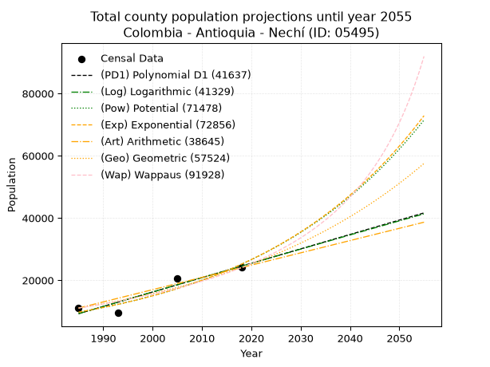
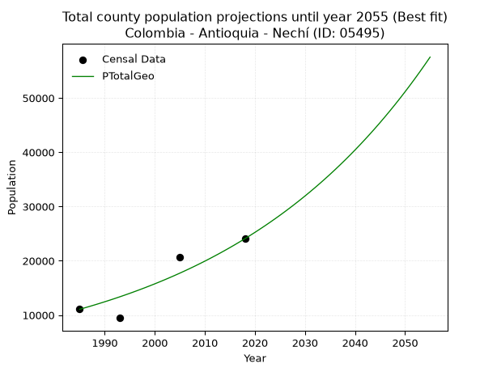
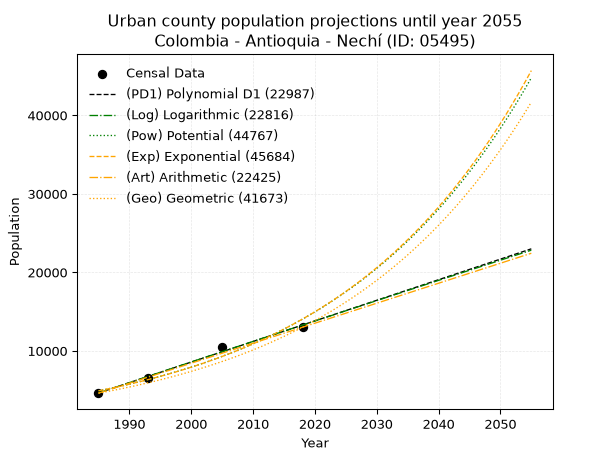
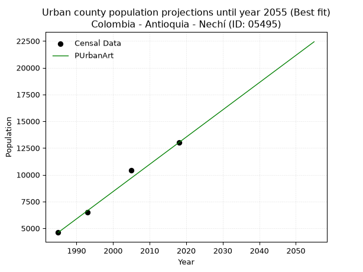
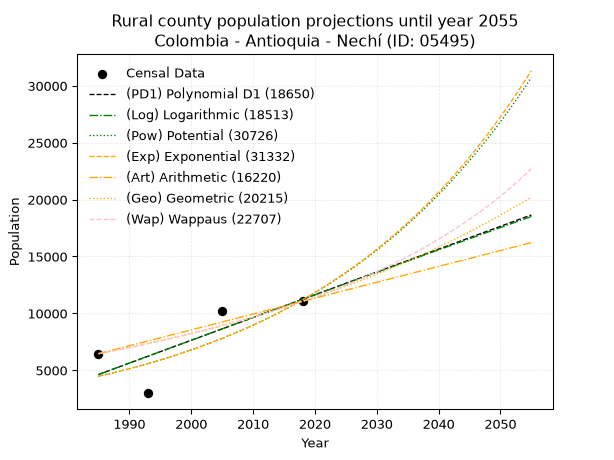
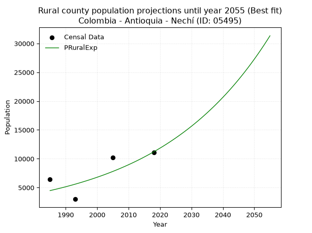

<div align="center">


</div>

# 📜 _“Population and Public Services Demand Projections (PPSD) until Year 2050 for Colombia - Antioquia - Nechí (ID: 05495)”_
Keywords: `population` `public-service` `projection` `lineal` `polynomial` `logarithmic` `potential` `exponential` `arithmetic` `geometric` `wappaus` `dane` `colombia` `south-america`

PPSD are analytical estimates used by governments and planners to anticipate future changes in population size, age distribution, and the resulting community needs for utilities, healthcare, education, and infrastructure as sizing future water treatment facilities, electrical grids, and road networks based on spatial growth.

<div align="center">

</img>

</div>


> **General running parameters**: • app_version: _v20260806_. • Python version: _3.14.7_. • Pandas version: _3.0.5_. • NumPy version: _2.5.1_. • Creates, save and include plots into reports (create_plot): _False_. • Projection until year: _2050_. • Process polynomial degree 2 and up: _False_. • Process Wappaus: _True_. • Process Wappaus: _True_. • Set negative values to zero: _True_. • Set infinite values to zero: _True_. • Drop dataset notes: _True_. 
<div align="center">

Dynamic map: [:earth_americas:Google](http://maps.google.com/maps?q=8.09412866,-74.7764701) [:earth_americas:OSM](https://www.openstreetmap.org/#map=18/8.09412866/-74.7764701&layers=P) [:earth_americas:Bing](https://www.bing.com/maps?cp=8.09412866~-74.7764701&lvl=18) [:earth_americas:Apple](https://maps.apple.com/frame?center=8.09412866%2C-74.7764701&span=0.003%2C0.006)

</div>


<div align="center">

```geojson
{
  "type": "Feature",
  "geometry": {
    "type": "Point", 
    "coordinates": [-74.7764701, 8.09412866]
  }, 
  "properties": {
    "Name": "Colombia - Antioquia - Nechí (ID: 05495)"
  }
}
```

</div>


## 0. Census Data (4 records)

Census data are official statistics collected by a government about the people and housing in a country. They usually include counts of total population, age, sex, race, income, education, and jobs.

📅Global census file: [Population.xlsx](../data/Population.xlsx)

| Source   |   Year |   CountryID | CountryName   |   StateID | StateName   |   CountyID | CountyName   |   PTotal |   PUrban |   PRural |
|:---------|-------:|------------:|:--------------|----------:|:------------|-----------:|:-------------|---------:|---------:|---------:|
| DANE     |   1985 |          57 | Colombia      |        05 | Antioquia   |      05495 | Nechí        |    11063 |     4603 |     6460 |
| DANE     |   1993 |          57 | Colombia      |        05 | Antioquia   |      05495 | Nechí        |     9463 |     6474 |     2989 |
| DANE     |   2005 |          57 | Colombia      |        05 | Antioquia   |      05495 | Nechí        |    20668 |    10440 |    10228 |
| DANE     |   2018 |          57 | Colombia      |        05 | Antioquia   |      05495 | Nechí        |    24066 |    13005 |    11061 |

> 🔥Some records could had specific notes about the registered values or the corresponding urban or rural distribution.

📅[SUI-RUPS](https://www.datos.gov.co/Hacienda-y-Cr-dito-P-blico/Registro-nico-de-Prestadores-de-Servicios-P-blicos/4qkq-csdn/about_data) - Local public utility companies: [RUPS.csv](../data/RUPS.xlsx)

 | SERVICIO   | ESTADO    | NOMBRE                        | NIT         | DEPARTAMENTO_DOMICILIO   | MUNICIPIO_DOMICILIO   | DIRECCION              |   TELEFONO | EMAIL                          | TIPO_PRESTADOR                             | CLASIFICACION                 |
|:-----------|:----------|:------------------------------|:------------|:-------------------------|:----------------------|:-----------------------|-----------:|:-------------------------------|:-------------------------------------------|:------------------------------|
| ACUEDUCTO  | OPERATIVA | AGUASCOL ARBELAEZ S.A. E.S.P. | 830505339-0 | ANTIOQUIA                | MEDELLIN              | CALLE 42 B No. 63 C 51 |    2350111 | diradministrativo@aguascol.com | SOCIEDADES (EMPRESA DE SERVICIOS PUBLICOS) | MAYOR O IGUAL A 5001 USUARIOS |

## 1. Total

### 1.1. Coefficients and Parameters

* (PD1) Polynomial Deg 1: 462.50822962665313, -908817.086310713 (lineal)
* (Log) Logarithmic: 925652.2049424569, -7019574.827478858
* (Pow) Potential: 57.51716794382877, -185.68938229205685
* (Exp) Exponential: 0.028737726486042385, 1.6396788687189633e-21
* (Art) Arithmetic: Year diff. 2018 - 1985 = 33, Population diff. 24066 - 11063 = 13003, Annual growth = 394.030303030303
* (Geo) Geometric: Year diff. 2018 - 1985 = 33, Population diff. 24066 - 11063 = 13003, Annual growth % = 0.02383085136236507
* (Wap) Wappaus: i = 2.243333445474127, Condition values only valid for < 200)

<sub>
Wappaus condition values: ['0.00', '2.24', '4.49', '6.73', '8.97', '11.22', '13.46', '15.70', '17.95', '20.19', '22.43', '24.68', '26.92', '29.16', '31.41', '33.65', '35.89', '38.14', '40.38', '42.62', '44.87', '47.11', '49.35', '51.60', '53.84', '56.08', '58.33', '60.57', '62.81', '65.06', '67.30', '69.54', '71.79', '74.03', '76.27', '78.52', '80.76', '83.00', '85.25', '87.49', '89.73', '91.98', '94.22', '96.46', '98.71', '100.95', '103.19', '105.44', '107.68', '109.92', '112.17', '114.41', '116.65', '118.90', '121.14', '123.38', '125.63', '127.87', '130.11', '132.36', '134.60', '136.84', '139.09', '141.33', '143.57', '145.82']
</sub>


### 1.2. Projected Dataset

|   Year |   CountyID |   PTotalPD1 |   PTotalLog |   PTotalPow |   PTotalExp |   PTotalArt |   PTotalGeo |   PTotalWap |
|-------:|-----------:|------------:|------------:|------------:|------------:|------------:|------------:|------------:|
|   1985 |      05495 |        9262 |        9249 |        9738 |        9746 |       11063 |       11063 |       11063 |
|   1986 |      05495 |        9724 |        9715 |       10024 |       10030 |       11457 |       11327 |       11314 |
|   1987 |      05495 |       10187 |       10181 |       10319 |       10322 |       11851 |       11597 |       11571 |
|   1988 |      05495 |       10649 |       10647 |       10622 |       10623 |       12245 |       11873 |       11833 |
|   1989 |      05495 |       11112 |       11112 |       10933 |       10933 |       12639 |       12156 |       12102 |
|   1990 |      05495 |       11574 |       11577 |       11254 |       11252 |       13033 |       12446 |       12378 |
|   1991 |      05495 |       12037 |       12042 |       11584 |       11580 |       13427 |       12742 |       12660 |
|   1992 |      05495 |       12499 |       12507 |       11923 |       11918 |       13821 |       13046 |       12948 |
|   1993 |      05495 |       12962 |       12972 |       12273 |       12265 |       14215 |       13357 |       13244 |
|   1994 |      05495 |       13424 |       13436 |       12632 |       12623 |       14609 |       13675 |       13547 |
|   1995 |      05495 |       13887 |       13900 |       13001 |       12991 |       15003 |       14001 |       13858 |
|   1996 |      05495 |       14349 |       14364 |       13382 |       13369 |       15397 |       14335 |       14177 |
|   1997 |      05495 |       14812 |       14828 |       13773 |       13759 |       15791 |       14676 |       14504 |
|   1998 |      05495 |       15274 |       15291 |       14175 |       14160 |       16185 |       15026 |       14840 |
|   1999 |      05495 |       15737 |       15754 |       14589 |       14573 |       16579 |       15384 |       15185 |
|   2000 |      05495 |       16199 |       16217 |       15015 |       14998 |       16973 |       15751 |       15539 |
|   2001 |      05495 |       16662 |       16680 |       15453 |       15435 |       17367 |       16126 |       15902 |
|   2002 |      05495 |       17124 |       17142 |       15903 |       15885 |       17762 |       16510 |       16276 |
|   2003 |      05495 |       17587 |       17605 |       16366 |       16348 |       18156 |       16904 |       16660 |
|   2004 |      05495 |       18049 |       18067 |       16843 |       16825 |       18550 |       17306 |       17056 |
|   2005 |      05495 |       18512 |       18529 |       17333 |       17315 |       18944 |       17719 |       17462 |
|   2006 |      05495 |       18974 |       18990 |       17838 |       17820 |       19338 |       18141 |       17881 |
|   2007 |      05495 |       19437 |       19451 |       18356 |       18340 |       19732 |       18573 |       18312 |
|   2008 |      05495 |       19899 |       19913 |       18890 |       18875 |       20126 |       19016 |       18756 |
|   2009 |      05495 |       20362 |       20373 |       19439 |       19425 |       20520 |       19469 |       19213 |
|   2010 |      05495 |       20824 |       20834 |       20003 |       19991 |       20914 |       19933 |       19685 |
|   2011 |      05495 |       21287 |       21294 |       20584 |       20574 |       21308 |       20408 |       20172 |
|   2012 |      05495 |       21749 |       21755 |       21181 |       21174 |       21702 |       20895 |       20675 |
|   2013 |      05495 |       22212 |       22215 |       21795 |       21791 |       22096 |       21393 |       21194 |
|   2014 |      05495 |       22674 |       22674 |       22426 |       22426 |       22490 |       21902 |       21730 |
|   2015 |      05495 |       23137 |       23134 |       23076 |       23080 |       22884 |       22424 |       22284 |
|   2016 |      05495 |       23600 |       23593 |       23744 |       23753 |       23278 |       22959 |       22858 |
|   2017 |      05495 |       24062 |       24052 |       24431 |       24446 |       23672 |       23506 |       23451 |
|   2018 |      05495 |       24525 |       24511 |       25138 |       25158 |       24066 |       24066 |       24066 |
|   2019 |      05495 |       24987 |       24969 |       25864 |       25892 |       24460 |       24640 |       24703 |
|   2020 |      05495 |       25450 |       25428 |       26611 |       26647 |       24854 |       25227 |       25363 |
|   2021 |      05495 |       25912 |       25886 |       27380 |       27424 |       25248 |       25828 |       26049 |
|   2022 |      05495 |       26375 |       26344 |       28170 |       28223 |       25642 |       26443 |       26760 |
|   2023 |      05495 |       26837 |       26802 |       28983 |       29046 |       26036 |       27074 |       27500 |
|   2024 |      05495 |       27300 |       27259 |       29818 |       29893 |       26430 |       27719 |       28269 |
|   2025 |      05495 |       27762 |       27716 |       30678 |       30764 |       26824 |       28379 |       29069 |
|   2026 |      05495 |       28225 |       28173 |       31561 |       31661 |       27218 |       29056 |       29902 |
|   2027 |      05495 |       28687 |       28630 |       32470 |       32584 |       27612 |       29748 |       30771 |
|   2028 |      05495 |       29150 |       29087 |       33404 |       33534 |       28006 |       30457 |       31677 |
|   2029 |      05495 |       29612 |       29543 |       34365 |       34512 |       28400 |       31183 |       32624 |
|   2030 |      05495 |       30075 |       29999 |       35353 |       35518 |       28794 |       31926 |       33613 |
|   2031 |      05495 |       30537 |       30455 |       36368 |       36554 |       29188 |       32687 |       34649 |
|   2032 |      05495 |       31000 |       30910 |       37413 |       37619 |       29582 |       33466 |       35733 |
|   2033 |      05495 |       31462 |       31366 |       38487 |       38716 |       29976 |       34263 |       36870 |
|   2034 |      05495 |       31925 |       31821 |       39591 |       39845 |       30370 |       35080 |       38064 |
|   2035 |      05495 |       32387 |       32276 |       40726 |       41007 |       30765 |       35916 |       39319 |
|   2036 |      05495 |       32850 |       32731 |       41893 |       42202 |       31159 |       36772 |       40639 |
|   2037 |      05495 |       33312 |       33185 |       43093 |       43432 |       31553 |       37648 |       42031 |
|   2038 |      05495 |       33775 |       33640 |       44327 |       44699 |       31947 |       38545 |       43499 |
|   2039 |      05495 |       34237 |       34094 |       45596 |       46002 |       32341 |       39464 |       45052 |
|   2040 |      05495 |       34700 |       34548 |       46900 |       47343 |       32735 |       40404 |       46695 |
|   2041 |      05495 |       35162 |       35001 |       48241 |       48723 |       33129 |       41367 |       48437 |
|   2042 |      05495 |       35625 |       35455 |       49619 |       50144 |       33523 |       42353 |       50287 |
|   2043 |      05495 |       36087 |       35908 |       51036 |       51606 |       33917 |       43362 |       52257 |
|   2044 |      05495 |       36550 |       36361 |       52493 |       53110 |       34311 |       44395 |       54357 |
|   2045 |      05495 |       37012 |       36814 |       53991 |       54659 |       34705 |       45453 |       56601 |
|   2046 |      05495 |       37475 |       37266 |       55531 |       56252 |       35099 |       46537 |       59004 |
|   2047 |      05495 |       37937 |       37718 |       57113 |       57892 |       35493 |       47646 |       61584 |
|   2048 |      05495 |       38400 |       38171 |       58741 |       59580 |       35887 |       48781 |       64362 |
|   2049 |      05495 |       38862 |       38622 |       60413 |       61317 |       36281 |       49943 |       67361 |
|   2050 |      05495 |       39325 |       39074 |       62133 |       63105 |       36675 |       51134 |       70608 |
<div align="center">

</img>

</div>


### 1.3. Best fit with absolute and relative error (%)

Relative error puts that difference into context by dividing the absolute error by the true value, creating a unitless ratio or percentage that shows the scale of the mistake.

Absolute and relative error

|   Year | Source   |   CountryID | CountryName   |   StateID | StateName   |   CountyID_x | CountyName   |   PTotal |   PUrban |   PRural |   CountyID_y |   PTotalPD1 |   PTotalLog |   PTotalPow |   PTotalExp |   PTotalArt |   PTotalGeo |   PTotalWap |   PTotalPD1AbsError |   PTotalLogAbsError |   PTotalPowAbsError |   PTotalExpAbsError |   PTotalArtAbsError |   PTotalGeoAbsError |   PTotalWapAbsError |   PTotalPD1RelError |   PTotalLogRelError |   PTotalPowRelError |   PTotalExpRelError |   PTotalArtRelError |   PTotalGeoRelError |   PTotalWapRelError |
|-------:|:---------|------------:|:--------------|----------:|:------------|-------------:|:-------------|---------:|---------:|---------:|-------------:|------------:|------------:|------------:|------------:|------------:|------------:|------------:|--------------------:|--------------------:|--------------------:|--------------------:|--------------------:|--------------------:|--------------------:|--------------------:|--------------------:|--------------------:|--------------------:|--------------------:|--------------------:|--------------------:|
|   1985 | DANE     |          57 | Colombia      |        05 | Antioquia   |        05495 | Nechí        |    11063 |     4603 |     6460 |        05495 |        9262 |        9249 |        9738 |        9746 |       11063 |       11063 |       11063 |                1801 |                1814 |                1325 |                1317 |                   0 |                   0 |                   0 |            16.2795  |            16.397   |            11.9769  |            11.9045  |              0      |              0      |              0      |
|   1993 | DANE     |          57 | Colombia      |        05 | Antioquia   |        05495 | Nechí        |     9463 |     6474 |     2989 |        05495 |       12962 |       12972 |       12273 |       12265 |       14215 |       13357 |       13244 |                3499 |                3509 |                2810 |                2802 |                4752 |                3894 |                3781 |            36.9756  |            37.0813  |            29.6946  |            29.6101  |             50.2166 |             41.1497 |             39.9556 |
|   2005 | DANE     |          57 | Colombia      |        05 | Antioquia   |        05495 | Nechí        |    20668 |    10440 |    10228 |        05495 |       18512 |       18529 |       17333 |       17315 |       18944 |       17719 |       17462 |                2156 |                2139 |                3335 |                3353 |                1724 |                2949 |                3206 |            10.4316  |            10.3493  |            16.1361  |            16.2231  |              8.3414 |             14.2684 |             15.5119 |
|   2018 | DANE     |          57 | Colombia      |        05 | Antioquia   |        05495 | Nechí        |    24066 |    13005 |    11061 |        05495 |       24525 |       24511 |       25138 |       25158 |       24066 |       24066 |       24066 |                 459 |                 445 |                1072 |                1092 |                   0 |                   0 |                   0 |             1.90726 |             1.84908 |             4.45442 |             4.53752 |              0      |              0      |              0      |

Relative error mean

| Method    |   RelError | Best   |
|:----------|-----------:|:-------|
| PTotalPD1 |    16.3985 |        |
| PTotalLog |    16.4192 |        |
| PTotalPow |    15.5655 |        |
| PTotalExp |    15.5688 |        |
| PTotalArt |    14.6395 |        |
| PTotalGeo |    13.8545 | True   |
| PTotalWap |    13.8669 |        |

💙Best method: _**PTotalGeo**_
<div align="center">

</img>

</div>


### 1.4. Fresh water supply demand in liters per capita per day (lpcd)

The fresh water supply demand typically ranges from 100 to 300 liters per capita per day (lpcd) for standard domestic and municipal planning, though absolute survival minimums set by the World Health Organization are as low as 7.5 to 20 liters per day, and total consumption in high-income nations can exceed 400 liters.

> `CZ`: Level in meters above the sea level (masl)<br> `WS`: Fresh water supply demand in liters per capita per day (lpcd or l/h/d)<br> `WSAll`: Zonal fresh water supply demand in liters per second (l/s)<br> `A`: Zonal area in square meters<br> `DP`: Population density (people/hectare or p/ha)

Reference values (RAS Colombia)

|    CZ |   WS |
|------:|-----:|
|  1000 |  120 |
|  2000 |  130 |
| 99999 |  140 |

County shapefile geometry properties and water supply values

|   CountyID |      ATotal |   CZTotal |   WSTotal |
|-----------:|------------:|----------:|----------:|
|      05495 | 9.36581e+08 |   101.195 |       120 |

Projected values for best method: PTotalGeo

|   CountyID |   Year |   PTotalGeo |   DPTotal |   WSTotal |   WSTotalAll |
|-----------:|-------:|------------:|----------:|----------:|-------------:|
|      05495 |   1985 |       11063 |      0.12 |       120 |      15.3653 |
|      05495 |   1986 |       11327 |      0.12 |       120 |      15.7319 |
|      05495 |   1987 |       11597 |      0.12 |       120 |      16.1069 |
|      05495 |   1988 |       11873 |      0.13 |       120 |      16.4903 |
|      05495 |   1989 |       12156 |      0.13 |       120 |      16.8833 |
|      05495 |   1990 |       12446 |      0.13 |       120 |      17.2861 |
|      05495 |   1991 |       12742 |      0.14 |       120 |      17.6972 |
|      05495 |   1992 |       13046 |      0.14 |       120 |      18.1194 |
|      05495 |   1993 |       13357 |      0.14 |       120 |      18.5514 |
|      05495 |   1994 |       13675 |      0.15 |       120 |      18.9931 |
|      05495 |   1995 |       14001 |      0.15 |       120 |      19.4458 |
|      05495 |   1996 |       14335 |      0.15 |       120 |      19.9097 |
|      05495 |   1997 |       14676 |      0.16 |       120 |      20.3833 |
|      05495 |   1998 |       15026 |      0.16 |       120 |      20.8694 |
|      05495 |   1999 |       15384 |      0.16 |       120 |      21.3667 |
|      05495 |   2000 |       15751 |      0.17 |       120 |      21.8764 |
|      05495 |   2001 |       16126 |      0.17 |       120 |      22.3972 |
|      05495 |   2002 |       16510 |      0.18 |       120 |      22.9306 |
|      05495 |   2003 |       16904 |      0.18 |       120 |      23.4778 |
|      05495 |   2004 |       17306 |      0.18 |       120 |      24.0361 |
|      05495 |   2005 |       17719 |      0.19 |       120 |      24.6097 |
|      05495 |   2006 |       18141 |      0.19 |       120 |      25.1958 |
|      05495 |   2007 |       18573 |      0.2  |       120 |      25.7958 |
|      05495 |   2008 |       19016 |      0.2  |       120 |      26.4111 |
|      05495 |   2009 |       19469 |      0.21 |       120 |      27.0403 |
|      05495 |   2010 |       19933 |      0.21 |       120 |      27.6847 |
|      05495 |   2011 |       20408 |      0.22 |       120 |      28.3444 |
|      05495 |   2012 |       20895 |      0.22 |       120 |      29.0208 |
|      05495 |   2013 |       21393 |      0.23 |       120 |      29.7125 |
|      05495 |   2014 |       21902 |      0.23 |       120 |      30.4194 |
|      05495 |   2015 |       22424 |      0.24 |       120 |      31.1444 |
|      05495 |   2016 |       22959 |      0.25 |       120 |      31.8875 |
|      05495 |   2017 |       23506 |      0.25 |       120 |      32.6472 |
|      05495 |   2018 |       24066 |      0.26 |       120 |      33.425  |
|      05495 |   2019 |       24640 |      0.26 |       120 |      34.2222 |
|      05495 |   2020 |       25227 |      0.27 |       120 |      35.0375 |
|      05495 |   2021 |       25828 |      0.28 |       120 |      35.8722 |
|      05495 |   2022 |       26443 |      0.28 |       120 |      36.7264 |
|      05495 |   2023 |       27074 |      0.29 |       120 |      37.6028 |
|      05495 |   2024 |       27719 |      0.3  |       120 |      38.4986 |
|      05495 |   2025 |       28379 |      0.3  |       120 |      39.4153 |
|      05495 |   2026 |       29056 |      0.31 |       120 |      40.3556 |
|      05495 |   2027 |       29748 |      0.32 |       120 |      41.3167 |
|      05495 |   2028 |       30457 |      0.33 |       120 |      42.3014 |
|      05495 |   2029 |       31183 |      0.33 |       120 |      43.3097 |
|      05495 |   2030 |       31926 |      0.34 |       120 |      44.3417 |
|      05495 |   2031 |       32687 |      0.35 |       120 |      45.3986 |
|      05495 |   2032 |       33466 |      0.36 |       120 |      46.4806 |
|      05495 |   2033 |       34263 |      0.37 |       120 |      47.5875 |
|      05495 |   2034 |       35080 |      0.37 |       120 |      48.7222 |
|      05495 |   2035 |       35916 |      0.38 |       120 |      49.8833 |
|      05495 |   2036 |       36772 |      0.39 |       120 |      51.0722 |
|      05495 |   2037 |       37648 |      0.4  |       120 |      52.2889 |
|      05495 |   2038 |       38545 |      0.41 |       120 |      53.5347 |
|      05495 |   2039 |       39464 |      0.42 |       120 |      54.8111 |
|      05495 |   2040 |       40404 |      0.43 |       120 |      56.1167 |
|      05495 |   2041 |       41367 |      0.44 |       120 |      57.4542 |
|      05495 |   2042 |       42353 |      0.45 |       120 |      58.8236 |
|      05495 |   2043 |       43362 |      0.46 |       120 |      60.225  |
|      05495 |   2044 |       44395 |      0.47 |       120 |      61.6597 |
|      05495 |   2045 |       45453 |      0.49 |       120 |      63.1292 |
|      05495 |   2046 |       46537 |      0.5  |       120 |      64.6347 |
|      05495 |   2047 |       47646 |      0.51 |       120 |      66.175  |
|      05495 |   2048 |       48781 |      0.52 |       120 |      67.7514 |
|      05495 |   2049 |       49943 |      0.53 |       120 |      69.3653 |
|      05495 |   2050 |       51134 |      0.55 |       120 |      71.0194 |

## 2. Urban

### 2.1. Coefficients and Parameters

* (PD1) Polynomial Deg 1: 262.2183861902831, -515871.82697711384 (lineal)
* (Log) Logarithmic: 524938.2467988722, -3981429.320509336
* (Pow) Potential: 63.837981782232255, -206.83226302336425
* (Exp) Exponential: 0.03187905227780796, 1.6162253790003164e-24
* (Art) Arithmetic: Year diff. 2018 - 1985 = 33, Population diff. 13005 - 4603 = 8402, Annual growth = 254.6060606060606
* (Geo) Geometric: Year diff. 2018 - 1985 = 33, Population diff. 13005 - 4603 = 8402, Annual growth % = 0.0319740321140396
* (Wap) Wappaus: i = 2.8919361722632964, Condition values only valid for < 200)

<sub>
Wappaus condition values: ['0.00', '2.89', '5.78', '8.68', '11.57', '14.46', '17.35', '20.24', '23.14', '26.03', '28.92', '31.81', '34.70', '37.60', '40.49', '43.38', '46.27', '49.16', '52.05', '54.95', '57.84', '60.73', '63.62', '66.51', '69.41', '72.30', '75.19', '78.08', '80.97', '83.87', '86.76', '89.65', '92.54', '95.43', '98.33', '101.22', '104.11', '107.00', '109.89', '112.79', '115.68', '118.57', '121.46', '124.35', '127.25', '130.14', '133.03', '135.92', '138.81', '141.70', '144.60', '147.49', '150.38', '153.27', '156.16', '159.06', '161.95', '164.84', '167.73', '170.62', '173.52', '176.41', '179.30', '182.19', '185.08', '187.98']
</sub>


### 2.2. Projected Dataset

|   Year |   CountyID |   PUrbanPD1 |   PUrbanLog |   PUrbanPow |   PUrbanExp |   PUrbanArt |   PUrbanGeo |   PUrbanWap |
|-------:|-----------:|------------:|------------:|------------:|------------:|------------:|------------:|------------:|
|   1985 |      05495 |        4632 |        4623 |        4899 |        4905 |        4603 |        4603 |        4603 |
|   1986 |      05495 |        4894 |        4888 |        5059 |        5064 |        4858 |        4750 |        4738 |
|   1987 |      05495 |        5156 |        5152 |        5224 |        5228 |        5112 |        4902 |        4877 |
|   1988 |      05495 |        5418 |        5416 |        5395 |        5397 |        5367 |        5059 |        5020 |
|   1989 |      05495 |        5681 |        5680 |        5571 |        5572 |        5621 |        5221 |        5168 |
|   1990 |      05495 |        5943 |        5944 |        5753 |        5752 |        5876 |        5387 |        5320 |
|   1991 |      05495 |        6205 |        6208 |        5940 |        5939 |        6131 |        5560 |        5478 |
|   1992 |      05495 |        6467 |        6471 |        6134 |        6131 |        6385 |        5737 |        5640 |
|   1993 |      05495 |        6729 |        6735 |        6333 |        6330 |        6640 |        5921 |        5807 |
|   1994 |      05495 |        6992 |        6998 |        6539 |        6535 |        6894 |        6110 |        5980 |
|   1995 |      05495 |        7254 |        7261 |        6752 |        6746 |        7149 |        6306 |        6159 |
|   1996 |      05495 |        7516 |        7524 |        6971 |        6965 |        7404 |        6507 |        6344 |
|   1997 |      05495 |        7778 |        7787 |        7198 |        7191 |        7658 |        6715 |        6536 |
|   1998 |      05495 |        8041 |        8050 |        7432 |        7423 |        7913 |        6930 |        6734 |
|   1999 |      05495 |        8303 |        8313 |        7673 |        7664 |        8167 |        7152 |        6940 |
|   2000 |      05495 |        8565 |        8575 |        7922 |        7912 |        8422 |        7380 |        7153 |
|   2001 |      05495 |        8827 |        8837 |        8179 |        8168 |        8677 |        7616 |        7374 |
|   2002 |      05495 |        9089 |        9100 |        8444 |        8433 |        8931 |        7860 |        7604 |
|   2003 |      05495 |        9352 |        9362 |        8717 |        8706 |        9186 |        8111 |        7842 |
|   2004 |      05495 |        9614 |        9624 |        9000 |        8988 |        9441 |        8370 |        8090 |
|   2005 |      05495 |        9876 |        9886 |        9291 |        9279 |        9695 |        8638 |        8348 |
|   2006 |      05495 |       10138 |       10148 |        9591 |        9580 |        9950 |        8914 |        8617 |
|   2007 |      05495 |       10400 |       10409 |        9901 |        9890 |       10204 |        9199 |        8898 |
|   2008 |      05495 |       10663 |       10671 |       10221 |       10211 |       10459 |        9493 |        9190 |
|   2009 |      05495 |       10925 |       10932 |       10551 |       10541 |       10714 |        9797 |        9496 |
|   2010 |      05495 |       11187 |       11193 |       10892 |       10883 |       10968 |       10110 |        9815 |
|   2011 |      05495 |       11449 |       11454 |       11243 |       11235 |       11223 |       10433 |       10149 |
|   2012 |      05495 |       11712 |       11715 |       11606 |       11599 |       11477 |       10767 |       10499 |
|   2013 |      05495 |       11974 |       11976 |       11980 |       11975 |       11732 |       11111 |       10866 |
|   2014 |      05495 |       12236 |       12237 |       12366 |       12363 |       11987 |       11467 |       11251 |
|   2015 |      05495 |       12498 |       12497 |       12764 |       12763 |       12241 |       11833 |       11656 |
|   2016 |      05495 |       12760 |       12758 |       13175 |       13177 |       12496 |       12212 |       12082 |
|   2017 |      05495 |       13023 |       13018 |       13599 |       13604 |       12750 |       12602 |       12531 |
|   2018 |      05495 |       13285 |       13278 |       14036 |       14044 |       13005 |       13005 |       13005 |
|   2019 |      05495 |       13547 |       13538 |       14487 |       14499 |       13260 |       13421 |       13506 |
|   2020 |      05495 |       13809 |       13798 |       14952 |       14969 |       13514 |       13850 |       14036 |
|   2021 |      05495 |       14072 |       14058 |       15432 |       15454 |       13769 |       14293 |       14598 |
|   2022 |      05495 |       14334 |       14318 |       15927 |       15954 |       14023 |       14750 |       15195 |
|   2023 |      05495 |       14596 |       14577 |       16438 |       16471 |       14278 |       15221 |       15831 |
|   2024 |      05495 |       14858 |       14837 |       16965 |       17005 |       14533 |       15708 |       16508 |
|   2025 |      05495 |       15120 |       15096 |       17508 |       17556 |       14787 |       16210 |       17232 |
|   2026 |      05495 |       15383 |       15355 |       18069 |       18124 |       15042 |       16729 |       18008 |
|   2027 |      05495 |       15645 |       15614 |       18647 |       18711 |       15296 |       17264 |       18840 |
|   2028 |      05495 |       15907 |       15873 |       19243 |       19318 |       15551 |       17816 |       19736 |
|   2029 |      05495 |       16169 |       16132 |       19859 |       19943 |       15806 |       18385 |       20704 |
|   2030 |      05495 |       16431 |       16391 |       20493 |       20589 |       16060 |       18973 |       21751 |
|   2031 |      05495 |       16694 |       16649 |       21148 |       21256 |       16315 |       19580 |       22890 |
|   2032 |      05495 |       16956 |       16908 |       21823 |       21945 |       16569 |       20206 |       24130 |
|   2033 |      05495 |       17218 |       17166 |       22519 |       22656 |       16824 |       20852 |       25488 |
|   2034 |      05495 |       17480 |       17424 |       23237 |       23390 |       17079 |       21518 |       26981 |
|   2035 |      05495 |       17743 |       17682 |       23978 |       24147 |       17333 |       22206 |       28630 |
|   2036 |      05495 |       18005 |       17940 |       24742 |       24929 |       17588 |       22916 |       30460 |
|   2037 |      05495 |       18267 |       18198 |       25530 |       25737 |       17843 |       23649 |       32504 |
|   2038 |      05495 |       18529 |       18455 |       26342 |       26571 |       18097 |       24405 |       34800 |
|   2039 |      05495 |       18791 |       18713 |       27180 |       27431 |       18352 |       25186 |       37400 |
|   2040 |      05495 |       19054 |       18970 |       28044 |       28320 |       18606 |       25991 |       40366 |
|   2041 |      05495 |       19316 |       19228 |       28936 |       29237 |       18861 |       26822 |       43784 |
|   2042 |      05495 |       19578 |       19485 |       29855 |       30184 |       19116 |       27680 |       47764 |
|   2043 |      05495 |       19840 |       19742 |       30803 |       31162 |       19370 |       28565 |       52457 |
|   2044 |      05495 |       20103 |       19999 |       31780 |       32171 |       19625 |       29478 |       58075 |
|   2045 |      05495 |       20365 |       20255 |       32788 |       33214 |       19879 |       30421 |       64919 |
|   2046 |      05495 |       20627 |       20512 |       33828 |       34289 |       20134 |       31393 |       73441 |
|   2047 |      05495 |       20889 |       20768 |       34899 |       35400 |       20389 |       32397 |       84344 |
|   2048 |      05495 |       21151 |       21025 |       36005 |       36547 |       20643 |       33433 |       98789 |
|   2049 |      05495 |       21414 |       21281 |       37144 |       37731 |       20898 |       34502 |      118834 |
|   2050 |      05495 |       21676 |       21537 |       38319 |       38953 |       21152 |       35605 |      148522 |
<div align="center">

</img>

</div>


### 2.3. Best fit with absolute and relative error (%)

Relative error puts that difference into context by dividing the absolute error by the true value, creating a unitless ratio or percentage that shows the scale of the mistake.

Absolute and relative error

|   Year | Source   |   CountryID | CountryName   |   StateID | StateName   |   CountyID_x | CountyName   |   PTotal |   PUrban |   PRural |   CountyID_y |   PUrbanPD1 |   PUrbanLog |   PUrbanPow |   PUrbanExp |   PUrbanArt |   PUrbanGeo |   PUrbanWap |   PUrbanPD1AbsError |   PUrbanLogAbsError |   PUrbanPowAbsError |   PUrbanExpAbsError |   PUrbanArtAbsError |   PUrbanGeoAbsError |   PUrbanWapAbsError |   PUrbanPD1RelError |   PUrbanLogRelError |   PUrbanPowRelError |   PUrbanExpRelError |   PUrbanArtRelError |   PUrbanGeoRelError |   PUrbanWapRelError |
|-------:|:---------|------------:|:--------------|----------:|:------------|-------------:|:-------------|---------:|---------:|---------:|-------------:|------------:|------------:|------------:|------------:|------------:|------------:|------------:|--------------------:|--------------------:|--------------------:|--------------------:|--------------------:|--------------------:|--------------------:|--------------------:|--------------------:|--------------------:|--------------------:|--------------------:|--------------------:|--------------------:|
|   1985 | DANE     |          57 | Colombia      |        05 | Antioquia   |        05495 | Nechí        |    11063 |     4603 |     6460 |        05495 |        4632 |        4623 |        4899 |        4905 |        4603 |        4603 |        4603 |                  29 |                  20 |                 296 |                 302 |                   0 |                   0 |                   0 |            0.630024 |            0.434499 |             6.43059 |             6.56094 |             0       |             0       |              0      |
|   1993 | DANE     |          57 | Colombia      |        05 | Antioquia   |        05495 | Nechí        |     9463 |     6474 |     2989 |        05495 |        6729 |        6735 |        6333 |        6330 |        6640 |        5921 |        5807 |                 255 |                 261 |                 141 |                 144 |                 166 |                 553 |                 667 |            3.93883  |            4.03151  |             2.17794 |             2.22428 |             2.5641  |             8.54186 |             10.3027 |
|   2005 | DANE     |          57 | Colombia      |        05 | Antioquia   |        05495 | Nechí        |    20668 |    10440 |    10228 |        05495 |        9876 |        9886 |        9291 |        9279 |        9695 |        8638 |        8348 |                 564 |                 554 |                1149 |                1161 |                 745 |                1802 |                2092 |            5.4023   |            5.30651  |            11.0057  |            11.1207  |             7.13602 |            17.2605  |             20.0383 |
|   2018 | DANE     |          57 | Colombia      |        05 | Antioquia   |        05495 | Nechí        |    24066 |    13005 |    11061 |        05495 |       13285 |       13278 |       14036 |       14044 |       13005 |       13005 |       13005 |                 280 |                 273 |                1031 |                1039 |                   0 |                   0 |                   0 |            2.15302  |            2.09919  |             7.92772 |             7.98923 |             0       |             0       |              0      |

Relative error mean

| Method    |   RelError | Best   |
|:----------|-----------:|:-------|
| PUrbanPD1 |    3.03104 |        |
| PUrbanLog |    2.96793 |        |
| PUrbanPow |    6.8855  |        |
| PUrbanExp |    6.97379 |        |
| PUrbanArt |    2.42503 | True   |
| PUrbanGeo |    6.4506  |        |
| PUrbanWap |    7.58527 |        |

💙Best method: _**PUrbanArt**_
<div align="center">

</img>

</div>


### 2.4. Fresh water supply demand in liters per capita per day (lpcd)

The fresh water supply demand typically ranges from 100 to 300 liters per capita per day (lpcd) for standard domestic and municipal planning, though absolute survival minimums set by the World Health Organization are as low as 7.5 to 20 liters per day, and total consumption in high-income nations can exceed 400 liters.

> `CZ`: Level in meters above the sea level (masl)<br> `WS`: Fresh water supply demand in liters per capita per day (lpcd or l/h/d)<br> `WSAll`: Zonal fresh water supply demand in liters per second (l/s)<br> `A`: Zonal area in square meters<br> `DP`: Population density (people/hectare or p/ha)

Reference values (RAS Colombia)

|    CZ |   WS |
|------:|-----:|
|  1000 |  120 |
|  2000 |  130 |
| 99999 |  140 |

County shapefile geometry properties and water supply values

|   CountyID |      AUrban |   CZUrban |   WSUrban |
|-----------:|------------:|----------:|----------:|
|      05495 | 1.59684e+06 |   35.8372 |       120 |

Projected values for best method: PUrbanArt

|   CountyID |   Year |   PUrbanArt |   DPUrban |   WSUrban |   WSUrbanAll |
|-----------:|-------:|------------:|----------:|----------:|-------------:|
|      05495 |   1985 |        4603 |     28.83 |       120 |      6.39306 |
|      05495 |   1986 |        4858 |     30.42 |       120 |      6.74722 |
|      05495 |   1987 |        5112 |     32.01 |       120 |      7.1     |
|      05495 |   1988 |        5367 |     33.61 |       120 |      7.45417 |
|      05495 |   1989 |        5621 |     35.2  |       120 |      7.80694 |
|      05495 |   1990 |        5876 |     36.8  |       120 |      8.16111 |
|      05495 |   1991 |        6131 |     38.39 |       120 |      8.51528 |
|      05495 |   1992 |        6385 |     39.99 |       120 |      8.86806 |
|      05495 |   1993 |        6640 |     41.58 |       120 |      9.22222 |
|      05495 |   1994 |        6894 |     43.17 |       120 |      9.575   |
|      05495 |   1995 |        7149 |     44.77 |       120 |      9.92917 |
|      05495 |   1996 |        7404 |     46.37 |       120 |     10.2833  |
|      05495 |   1997 |        7658 |     47.96 |       120 |     10.6361  |
|      05495 |   1998 |        7913 |     49.55 |       120 |     10.9903  |
|      05495 |   1999 |        8167 |     51.14 |       120 |     11.3431  |
|      05495 |   2000 |        8422 |     52.74 |       120 |     11.6972  |
|      05495 |   2001 |        8677 |     54.34 |       120 |     12.0514  |
|      05495 |   2002 |        8931 |     55.93 |       120 |     12.4042  |
|      05495 |   2003 |        9186 |     57.53 |       120 |     12.7583  |
|      05495 |   2004 |        9441 |     59.12 |       120 |     13.1125  |
|      05495 |   2005 |        9695 |     60.71 |       120 |     13.4653  |
|      05495 |   2006 |        9950 |     62.31 |       120 |     13.8194  |
|      05495 |   2007 |       10204 |     63.9  |       120 |     14.1722  |
|      05495 |   2008 |       10459 |     65.5  |       120 |     14.5264  |
|      05495 |   2009 |       10714 |     67.1  |       120 |     14.8806  |
|      05495 |   2010 |       10968 |     68.69 |       120 |     15.2333  |
|      05495 |   2011 |       11223 |     70.28 |       120 |     15.5875  |
|      05495 |   2012 |       11477 |     71.87 |       120 |     15.9403  |
|      05495 |   2013 |       11732 |     73.47 |       120 |     16.2944  |
|      05495 |   2014 |       11987 |     75.07 |       120 |     16.6486  |
|      05495 |   2015 |       12241 |     76.66 |       120 |     17.0014  |
|      05495 |   2016 |       12496 |     78.25 |       120 |     17.3556  |
|      05495 |   2017 |       12750 |     79.85 |       120 |     17.7083  |
|      05495 |   2018 |       13005 |     81.44 |       120 |     18.0625  |
|      05495 |   2019 |       13260 |     83.04 |       120 |     18.4167  |
|      05495 |   2020 |       13514 |     84.63 |       120 |     18.7694  |
|      05495 |   2021 |       13769 |     86.23 |       120 |     19.1236  |
|      05495 |   2022 |       14023 |     87.82 |       120 |     19.4764  |
|      05495 |   2023 |       14278 |     89.41 |       120 |     19.8306  |
|      05495 |   2024 |       14533 |     91.01 |       120 |     20.1847  |
|      05495 |   2025 |       14787 |     92.6  |       120 |     20.5375  |
|      05495 |   2026 |       15042 |     94.2  |       120 |     20.8917  |
|      05495 |   2027 |       15296 |     95.79 |       120 |     21.2444  |
|      05495 |   2028 |       15551 |     97.39 |       120 |     21.5986  |
|      05495 |   2029 |       15806 |     98.98 |       120 |     21.9528  |
|      05495 |   2030 |       16060 |    100.57 |       120 |     22.3056  |
|      05495 |   2031 |       16315 |    102.17 |       120 |     22.6597  |
|      05495 |   2032 |       16569 |    103.76 |       120 |     23.0125  |
|      05495 |   2033 |       16824 |    105.36 |       120 |     23.3667  |
|      05495 |   2034 |       17079 |    106.96 |       120 |     23.7208  |
|      05495 |   2035 |       17333 |    108.55 |       120 |     24.0736  |
|      05495 |   2036 |       17588 |    110.14 |       120 |     24.4278  |
|      05495 |   2037 |       17843 |    111.74 |       120 |     24.7819  |
|      05495 |   2038 |       18097 |    113.33 |       120 |     25.1347  |
|      05495 |   2039 |       18352 |    114.93 |       120 |     25.4889  |
|      05495 |   2040 |       18606 |    116.52 |       120 |     25.8417  |
|      05495 |   2041 |       18861 |    118.11 |       120 |     26.1958  |
|      05495 |   2042 |       19116 |    119.71 |       120 |     26.55    |
|      05495 |   2043 |       19370 |    121.3  |       120 |     26.9028  |
|      05495 |   2044 |       19625 |    122.9  |       120 |     27.2569  |
|      05495 |   2045 |       19879 |    124.49 |       120 |     27.6097  |
|      05495 |   2046 |       20134 |    126.09 |       120 |     27.9639  |
|      05495 |   2047 |       20389 |    127.68 |       120 |     28.3181  |
|      05495 |   2048 |       20643 |    129.27 |       120 |     28.6708  |
|      05495 |   2049 |       20898 |    130.87 |       120 |     29.025   |
|      05495 |   2050 |       21152 |    132.46 |       120 |     29.3778  |

## 3. Rural

### 3.1. Coefficients and Parameters

* (PD1) Polynomial Deg 1: 200.28984343636986, -392945.2593335989 (lineal)
* (Log) Logarithmic: 400713.95814358507, -3038145.506969523
* (Pow) Potential: 55.61218435368744, -179.74520213569878
* (Exp) Exponential: 0.027805716600666632, 4.78716447253516e-21
* (Art) Arithmetic: Year diff. 2018 - 1985 = 33, Population diff. 11061 - 6460 = 4601, Annual growth = 139.42424242424244
* (Geo) Geometric: Year diff. 2018 - 1985 = 33, Population diff. 11061 - 6460 = 4601, Annual growth % = 0.016430369217284024
* (Wap) Wappaus: i = 1.5915101012983555, Condition values only valid for < 200)

<sub>
Wappaus condition values: ['0.00', '1.59', '3.18', '4.77', '6.37', '7.96', '9.55', '11.14', '12.73', '14.32', '15.92', '17.51', '19.10', '20.69', '22.28', '23.87', '25.46', '27.06', '28.65', '30.24', '31.83', '33.42', '35.01', '36.60', '38.20', '39.79', '41.38', '42.97', '44.56', '46.15', '47.75', '49.34', '50.93', '52.52', '54.11', '55.70', '57.29', '58.89', '60.48', '62.07', '63.66', '65.25', '66.84', '68.43', '70.03', '71.62', '73.21', '74.80', '76.39', '77.98', '79.58', '81.17', '82.76', '84.35', '85.94', '87.53', '89.12', '90.72', '92.31', '93.90', '95.49', '97.08', '98.67', '100.27', '101.86', '103.45']
</sub>


### 3.2. Projected Dataset

|   Year |   CountyID |   PRuralPD1 |   PRuralLog |   PRuralPow |   PRuralExp |   PRuralArt |   PRuralGeo |   PRuralWap |
|-------:|-----------:|------------:|------------:|------------:|------------:|------------:|------------:|------------:|
|   1985 |      05495 |        4630 |        4626 |        4472 |        4474 |        6460 |        6460 |        6460 |
|   1986 |      05495 |        4830 |        4827 |        4599 |        4600 |        6599 |        6566 |        6564 |
|   1987 |      05495 |        5031 |        5029 |        4729 |        4730 |        6739 |        6674 |        6669 |
|   1988 |      05495 |        5231 |        5231 |        4863 |        4863 |        6878 |        6784 |        6776 |
|   1989 |      05495 |        5431 |        5432 |        5001 |        5000 |        7018 |        6895 |        6885 |
|   1990 |      05495 |        5632 |        5634 |        5143 |        5141 |        7157 |        7008 |        6995 |
|   1991 |      05495 |        5832 |        5835 |        5289 |        5286 |        7297 |        7124 |        7108 |
|   1992 |      05495 |        6032 |        6036 |        5439 |        5435 |        7436 |        7241 |        7222 |
|   1993 |      05495 |        6232 |        6237 |        5593 |        5588 |        7575 |        7360 |        7338 |
|   1994 |      05495 |        6433 |        6438 |        5751 |        5746 |        7715 |        7481 |        7457 |
|   1995 |      05495 |        6633 |        6639 |        5913 |        5908 |        7854 |        7603 |        7577 |
|   1996 |      05495 |        6833 |        6840 |        6080 |        6075 |        7994 |        7728 |        7699 |
|   1997 |      05495 |        7034 |        7041 |        6252 |        6246 |        8133 |        7855 |        7824 |
|   1998 |      05495 |        7234 |        7241 |        6429 |        6422 |        8273 |        7984 |        7951 |
|   1999 |      05495 |        7434 |        7442 |        6610 |        6603 |        8412 |        8116 |        8080 |
|   2000 |      05495 |        7634 |        7642 |        6797 |        6789 |        8551 |        8249 |        8211 |
|   2001 |      05495 |        7835 |        7843 |        6988 |        6981 |        8691 |        8384 |        8345 |
|   2002 |      05495 |        8035 |        8043 |        7185 |        7177 |        8830 |        8522 |        8481 |
|   2003 |      05495 |        8235 |        8243 |        7387 |        7380 |        8970 |        8662 |        8620 |
|   2004 |      05495 |        8436 |        8443 |        7595 |        7588 |        9109 |        8805 |        8761 |
|   2005 |      05495 |        8636 |        8643 |        7809 |        7802 |        9248 |        8949 |        8905 |
|   2006 |      05495 |        8836 |        8843 |        8028 |        8022 |        9388 |        9096 |        9052 |
|   2007 |      05495 |        9036 |        9042 |        8254 |        8248 |        9527 |        9246 |        9202 |
|   2008 |      05495 |        9237 |        9242 |        8486 |        8481 |        9667 |        9398 |        9354 |
|   2009 |      05495 |        9437 |        9441 |        8724 |        8720 |        9806 |        9552 |        9510 |
|   2010 |      05495 |        9637 |        9641 |        8969 |        8966 |        9946 |        9709 |        9669 |
|   2011 |      05495 |        9838 |        9840 |        9221 |        9218 |       10085 |        9868 |        9830 |
|   2012 |      05495 |       10038 |       10039 |        9479 |        9478 |       10224 |       10031 |        9996 |
|   2013 |      05495 |       10238 |       10238 |        9745 |        9745 |       10364 |       10195 |       10164 |
|   2014 |      05495 |       10438 |       10437 |       10018 |       10020 |       10503 |       10363 |       10336 |
|   2015 |      05495 |       10639 |       10636 |       10298 |       10303 |       10643 |       10533 |       10512 |
|   2016 |      05495 |       10839 |       10835 |       10586 |       10593 |       10782 |       10706 |       10691 |
|   2017 |      05495 |       11039 |       11034 |       10882 |       10892 |       10922 |       10882 |       10874 |
|   2018 |      05495 |       11240 |       11232 |       11186 |       11199 |       11061 |       11061 |       11061 |
|   2019 |      05495 |       11440 |       11431 |       11499 |       11515 |       11200 |       11243 |       11252 |
|   2020 |      05495 |       11640 |       11629 |       11820 |       11840 |       11340 |       11427 |       11447 |
|   2021 |      05495 |       11841 |       11828 |       12150 |       12173 |       11479 |       11615 |       11647 |
|   2022 |      05495 |       12041 |       12026 |       12488 |       12517 |       11619 |       11806 |       11851 |
|   2023 |      05495 |       12241 |       12224 |       12837 |       12870 |       11758 |       12000 |       12060 |
|   2024 |      05495 |       12441 |       12422 |       13194 |       13232 |       11898 |       12197 |       12274 |
|   2025 |      05495 |       12642 |       12620 |       13562 |       13605 |       12037 |       12398 |       12493 |
|   2026 |      05495 |       12842 |       12818 |       13939 |       13989 |       12176 |       12601 |       12717 |
|   2027 |      05495 |       13042 |       13016 |       14327 |       14384 |       12316 |       12808 |       12946 |
|   2028 |      05495 |       13243 |       13213 |       14726 |       14789 |       12455 |       13019 |       13180 |
|   2029 |      05495 |       13443 |       13411 |       15135 |       15206 |       12595 |       13233 |       13421 |
|   2030 |      05495 |       13643 |       13608 |       15555 |       15635 |       12734 |       13450 |       13667 |
|   2031 |      05495 |       13843 |       13806 |       15987 |       16076 |       12874 |       13671 |       13920 |
|   2032 |      05495 |       14044 |       14003 |       16431 |       16529 |       13013 |       13896 |       14179 |
|   2033 |      05495 |       14244 |       14200 |       16887 |       16995 |       13152 |       14124 |       14445 |
|   2034 |      05495 |       14444 |       14397 |       17355 |       17474 |       13292 |       14356 |       14718 |
|   2035 |      05495 |       14645 |       14594 |       17836 |       17967 |       13431 |       14592 |       14997 |
|   2036 |      05495 |       14845 |       14791 |       18330 |       18473 |       13571 |       14832 |       15285 |
|   2037 |      05495 |       15045 |       14988 |       18837 |       18994 |       13710 |       15075 |       15580 |
|   2038 |      05495 |       15245 |       15184 |       19358 |       19530 |       13849 |       15323 |       15883 |
|   2039 |      05495 |       15446 |       15381 |       19894 |       20081 |       13989 |       15575 |       16195 |
|   2040 |      05495 |       15646 |       15577 |       20444 |       20647 |       14128 |       15831 |       16516 |
|   2041 |      05495 |       15846 |       15774 |       21009 |       21229 |       14268 |       16091 |       16845 |
|   2042 |      05495 |       16047 |       15970 |       21589 |       21827 |       14407 |       16355 |       17185 |
|   2043 |      05495 |       16247 |       16166 |       22185 |       22443 |       14547 |       16624 |       17534 |
|   2044 |      05495 |       16447 |       16362 |       22797 |       23076 |       14686 |       16897 |       17894 |
|   2045 |      05495 |       16647 |       16558 |       23425 |       23726 |       14825 |       17175 |       18265 |
|   2046 |      05495 |       16848 |       16754 |       24071 |       24395 |       14965 |       17457 |       18647 |
|   2047 |      05495 |       17048 |       16950 |       24734 |       25083 |       15104 |       17744 |       19042 |
|   2048 |      05495 |       17248 |       17146 |       25415 |       25790 |       15244 |       18035 |       19449 |
|   2049 |      05495 |       17449 |       17341 |       26114 |       26518 |       15383 |       18332 |       19869 |
|   2050 |      05495 |       17649 |       17537 |       26833 |       27265 |       15523 |       18633 |       20303 |
<div align="center">

</img>

</div>


### 3.3. Best fit with absolute and relative error (%)

Relative error puts that difference into context by dividing the absolute error by the true value, creating a unitless ratio or percentage that shows the scale of the mistake.

Absolute and relative error

|   Year | Source   |   CountryID | CountryName   |   StateID | StateName   |   CountyID_x | CountyName   |   PTotal |   PUrban |   PRural |   CountyID_y |   PRuralPD1 |   PRuralLog |   PRuralPow |   PRuralExp |   PRuralArt |   PRuralGeo |   PRuralWap |   PRuralPD1AbsError |   PRuralLogAbsError |   PRuralPowAbsError |   PRuralExpAbsError |   PRuralArtAbsError |   PRuralGeoAbsError |   PRuralWapAbsError |   PRuralPD1RelError |   PRuralLogRelError |   PRuralPowRelError |   PRuralExpRelError |   PRuralArtRelError |   PRuralGeoRelError |   PRuralWapRelError |
|-------:|:---------|------------:|:--------------|----------:|:------------|-------------:|:-------------|---------:|---------:|---------:|-------------:|------------:|------------:|------------:|------------:|------------:|------------:|------------:|--------------------:|--------------------:|--------------------:|--------------------:|--------------------:|--------------------:|--------------------:|--------------------:|--------------------:|--------------------:|--------------------:|--------------------:|--------------------:|--------------------:|
|   1985 | DANE     |          57 | Colombia      |        05 | Antioquia   |        05495 | Nechí        |    11063 |     4603 |     6460 |        05495 |        4630 |        4626 |        4472 |        4474 |        6460 |        6460 |        6460 |                1830 |                1834 |                1988 |                1986 |                   0 |                   0 |                   0 |             28.3282 |            28.3901  |             30.774  |            30.743   |             0       |              0      |              0      |
|   1993 | DANE     |          57 | Colombia      |        05 | Antioquia   |        05495 | Nechí        |     9463 |     6474 |     2989 |        05495 |        6232 |        6237 |        5593 |        5588 |        7575 |        7360 |        7338 |                3243 |                3248 |                2604 |                2599 |                4586 |                4371 |                4349 |            108.498  |           108.665   |             87.1194 |            86.9522  |           153.429   |            146.236  |            145.5    |
|   2005 | DANE     |          57 | Colombia      |        05 | Antioquia   |        05495 | Nechí        |    20668 |    10440 |    10228 |        05495 |        8636 |        8643 |        7809 |        7802 |        9248 |        8949 |        8905 |                1592 |                1585 |                2419 |                2426 |                 980 |                1279 |                1323 |             15.5651 |            15.4967  |             23.6508 |            23.7192  |             9.58154 |             12.5049 |             12.9351 |
|   2018 | DANE     |          57 | Colombia      |        05 | Antioquia   |        05495 | Nechí        |    24066 |    13005 |    11061 |        05495 |       11240 |       11232 |       11186 |       11199 |       11061 |       11061 |       11061 |                 179 |                 171 |                 125 |                 138 |                   0 |                   0 |                   0 |              1.6183 |             1.54597 |              1.1301 |             1.24763 |             0       |              0      |              0      |

Relative error mean

| Method    |   RelError | Best   |
|:----------|-----------:|:-------|
| PRuralPD1 |    38.5024 |        |
| PRuralLog |    38.5245 |        |
| PRuralPow |    35.6686 |        |
| PRuralExp |    35.6655 | True   |
| PRuralArt |    40.7527 |        |
| PRuralGeo |    39.6853 |        |
| PRuralWap |    39.6088 |        |

💙Best method: _**PRuralExp**_
<div align="center">

</img>

</div>


### 3.4. Fresh water supply demand in liters per capita per day (lpcd)

The fresh water supply demand typically ranges from 100 to 300 liters per capita per day (lpcd) for standard domestic and municipal planning, though absolute survival minimums set by the World Health Organization are as low as 7.5 to 20 liters per day, and total consumption in high-income nations can exceed 400 liters.

> `CZ`: Level in meters above the sea level (masl)<br> `WS`: Fresh water supply demand in liters per capita per day (lpcd or l/h/d)<br> `WSAll`: Zonal fresh water supply demand in liters per second (l/s)<br> `A`: Zonal area in square meters<br> `DP`: Population density (people/hectare or p/ha)

Reference values (RAS Colombia)

|    CZ |   WS |
|------:|-----:|
|  1000 |  120 |
|  2000 |  130 |
| 99999 |  140 |

County shapefile geometry properties and water supply values

|   CountyID |      ARural |   CZRural |   WSRural |
|-----------:|------------:|----------:|----------:|
|      05495 | 9.34984e+08 |   101.307 |       120 |

Projected values for best method: PRuralExp

|   CountyID |   Year |   PRuralExp |   DPRural |   WSRural |   WSRuralAll |
|-----------:|-------:|------------:|----------:|----------:|-------------:|
|      05495 |   1985 |        4474 |      0.05 |       120 |      6.21389 |
|      05495 |   1986 |        4600 |      0.05 |       120 |      6.38889 |
|      05495 |   1987 |        4730 |      0.05 |       120 |      6.56944 |
|      05495 |   1988 |        4863 |      0.05 |       120 |      6.75417 |
|      05495 |   1989 |        5000 |      0.05 |       120 |      6.94444 |
|      05495 |   1990 |        5141 |      0.05 |       120 |      7.14028 |
|      05495 |   1991 |        5286 |      0.06 |       120 |      7.34167 |
|      05495 |   1992 |        5435 |      0.06 |       120 |      7.54861 |
|      05495 |   1993 |        5588 |      0.06 |       120 |      7.76111 |
|      05495 |   1994 |        5746 |      0.06 |       120 |      7.98056 |
|      05495 |   1995 |        5908 |      0.06 |       120 |      8.20556 |
|      05495 |   1996 |        6075 |      0.06 |       120 |      8.4375  |
|      05495 |   1997 |        6246 |      0.07 |       120 |      8.675   |
|      05495 |   1998 |        6422 |      0.07 |       120 |      8.91944 |
|      05495 |   1999 |        6603 |      0.07 |       120 |      9.17083 |
|      05495 |   2000 |        6789 |      0.07 |       120 |      9.42917 |
|      05495 |   2001 |        6981 |      0.07 |       120 |      9.69583 |
|      05495 |   2002 |        7177 |      0.08 |       120 |      9.96806 |
|      05495 |   2003 |        7380 |      0.08 |       120 |     10.25    |
|      05495 |   2004 |        7588 |      0.08 |       120 |     10.5389  |
|      05495 |   2005 |        7802 |      0.08 |       120 |     10.8361  |
|      05495 |   2006 |        8022 |      0.09 |       120 |     11.1417  |
|      05495 |   2007 |        8248 |      0.09 |       120 |     11.4556  |
|      05495 |   2008 |        8481 |      0.09 |       120 |     11.7792  |
|      05495 |   2009 |        8720 |      0.09 |       120 |     12.1111  |
|      05495 |   2010 |        8966 |      0.1  |       120 |     12.4528  |
|      05495 |   2011 |        9218 |      0.1  |       120 |     12.8028  |
|      05495 |   2012 |        9478 |      0.1  |       120 |     13.1639  |
|      05495 |   2013 |        9745 |      0.1  |       120 |     13.5347  |
|      05495 |   2014 |       10020 |      0.11 |       120 |     13.9167  |
|      05495 |   2015 |       10303 |      0.11 |       120 |     14.3097  |
|      05495 |   2016 |       10593 |      0.11 |       120 |     14.7125  |
|      05495 |   2017 |       10892 |      0.12 |       120 |     15.1278  |
|      05495 |   2018 |       11199 |      0.12 |       120 |     15.5542  |
|      05495 |   2019 |       11515 |      0.12 |       120 |     15.9931  |
|      05495 |   2020 |       11840 |      0.13 |       120 |     16.4444  |
|      05495 |   2021 |       12173 |      0.13 |       120 |     16.9069  |
|      05495 |   2022 |       12517 |      0.13 |       120 |     17.3847  |
|      05495 |   2023 |       12870 |      0.14 |       120 |     17.875   |
|      05495 |   2024 |       13232 |      0.14 |       120 |     18.3778  |
|      05495 |   2025 |       13605 |      0.15 |       120 |     18.8958  |
|      05495 |   2026 |       13989 |      0.15 |       120 |     19.4292  |
|      05495 |   2027 |       14384 |      0.15 |       120 |     19.9778  |
|      05495 |   2028 |       14789 |      0.16 |       120 |     20.5403  |
|      05495 |   2029 |       15206 |      0.16 |       120 |     21.1194  |
|      05495 |   2030 |       15635 |      0.17 |       120 |     21.7153  |
|      05495 |   2031 |       16076 |      0.17 |       120 |     22.3278  |
|      05495 |   2032 |       16529 |      0.18 |       120 |     22.9569  |
|      05495 |   2033 |       16995 |      0.18 |       120 |     23.6042  |
|      05495 |   2034 |       17474 |      0.19 |       120 |     24.2694  |
|      05495 |   2035 |       17967 |      0.19 |       120 |     24.9542  |
|      05495 |   2036 |       18473 |      0.2  |       120 |     25.6569  |
|      05495 |   2037 |       18994 |      0.2  |       120 |     26.3806  |
|      05495 |   2038 |       19530 |      0.21 |       120 |     27.125   |
|      05495 |   2039 |       20081 |      0.21 |       120 |     27.8903  |
|      05495 |   2040 |       20647 |      0.22 |       120 |     28.6764  |
|      05495 |   2041 |       21229 |      0.23 |       120 |     29.4847  |
|      05495 |   2042 |       21827 |      0.23 |       120 |     30.3153  |
|      05495 |   2043 |       22443 |      0.24 |       120 |     31.1708  |
|      05495 |   2044 |       23076 |      0.25 |       120 |     32.05    |
|      05495 |   2045 |       23726 |      0.25 |       120 |     32.9528  |
|      05495 |   2046 |       24395 |      0.26 |       120 |     33.8819  |
|      05495 |   2047 |       25083 |      0.27 |       120 |     34.8375  |
|      05495 |   2048 |       25790 |      0.28 |       120 |     35.8194  |
|      05495 |   2049 |       26518 |      0.28 |       120 |     36.8306  |
|      05495 |   2050 |       27265 |      0.29 |       120 |     37.8681  |

#

<div align="center"><br><sub>Share this research</sub></div><br>

<sub>**APPS & TOOLS & CONTENT DISCLAIMER**: • NO WARRANTY - This content and software is provided by <a href="https://github.com/rcfdtools" target="_blank">github.com/rcfdtools</a> "as is", without any express or implied warranty, including warranties of merchantability, fitness for a particular purpose, or non-infringement. There is no guarantee that the software will be error-free or operate without interruption. • LIMITATION OF LIABILITY - Neither the authors nor copyright holders will be liable for claims or damages arising from the software or its use. You are responsible for determining if the software is appropriate for your use and assume all associated risks, including errors, legal compliance, and data loss. • NO PROFESSIONAL ADVICE - The software provides general information and does not offer professional advice. It should not replace consultation with professional advisors. [Clauses and global license for rcfdtools use.](https://github.com/rcfdtools/rcfdtools/blob/main/LICENSE.md)</sub>

| [:house: Home](Readme.md)  | [:beginner: Help / Collab](https://github.com/rcfdtools/R.HydroTools/discussions/31) |
|----------------------------|-------------------------------------------------------------------------------------------|