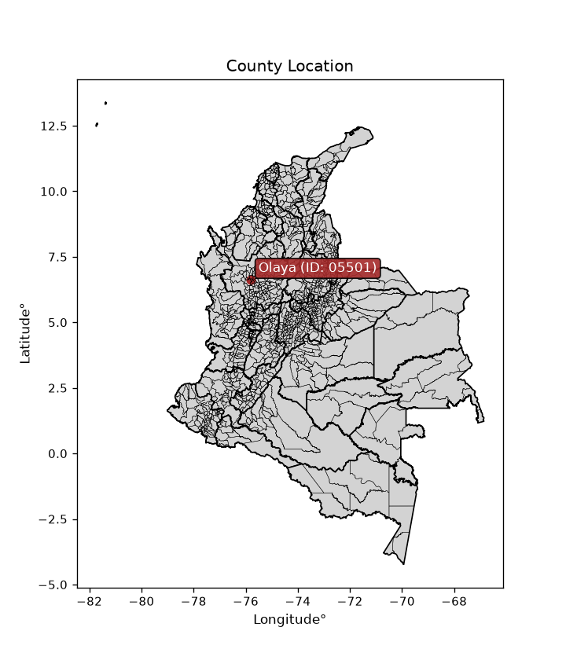
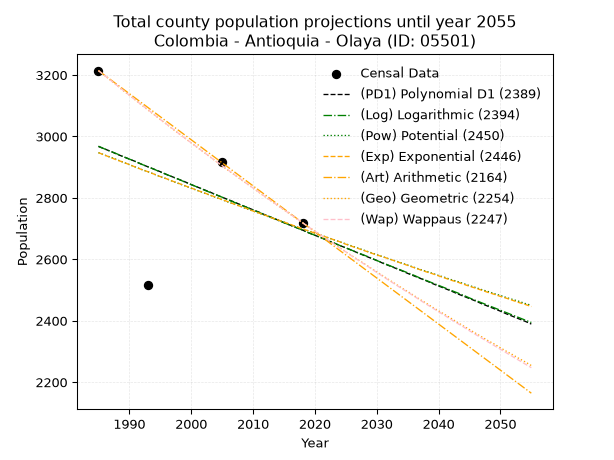
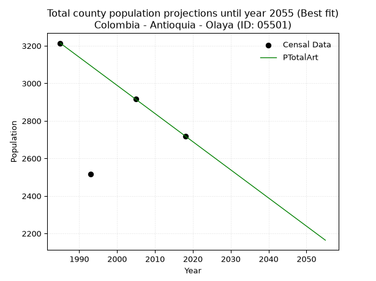
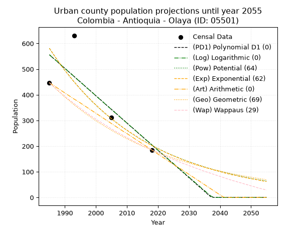
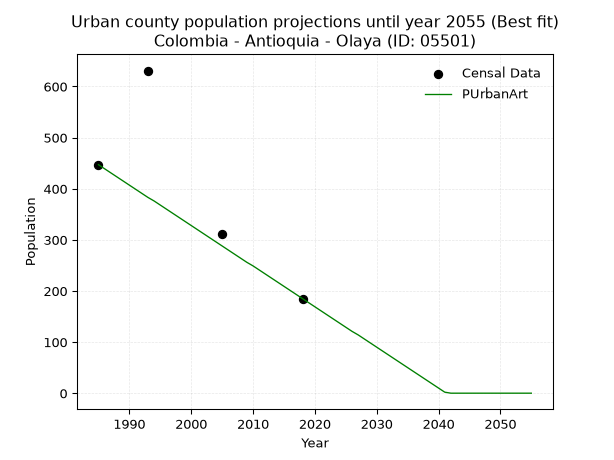
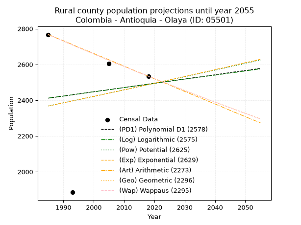
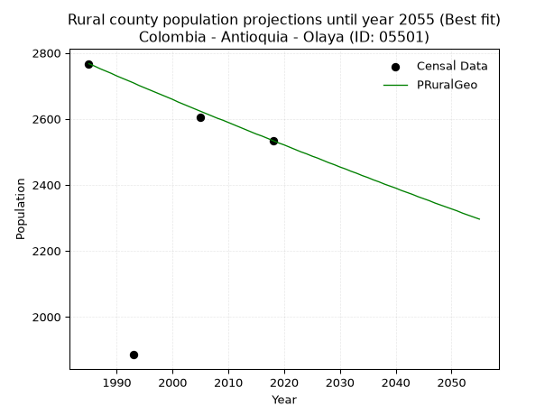

<div align="center">


</div>

# _“Population and Public Services Demand Projections (PPSD) until Year 2050 for Colombia - Antioquia - Olaya (ID: 05501)”_
Keywords: `population` `public-service` `projection` `lineal` `polynomial` `logarithmic` `potential` `exponential` `arithmetic` `geometric` `wappaus` `dane` `colombia` `south-america`

PPSD are analytical estimates used by governments and planners to anticipate future changes in population size, age distribution, and the resulting community needs for utilities, healthcare, education, and infrastructure as sizing future water treatment facilities, electrical grids, and road networks based on spatial growth.

<div align="center">

</img>

</div>


> **General running parameters**: • app_version: _v20260806_. • Python version: _3.14.7_. • Pandas version: _3.0.5_. • NumPy version: _2.5.1_. • Creates, save and include plots into reports (create_plot): _False_. • Projection until year: _2050_. • Process polynomial degree 2 and up: _False_. • Process Wappaus: _True_. • Process Wappaus: _True_. • Set negative values to zero: _True_. • Set infinite values to zero: _True_. • Drop dataset notes: _True_. 
<div align="center">

Dynamic map: [:earth_americas:Google](http://maps.google.com/maps?q=6.626491936,-75.8117732) [:earth_americas:OSM](https://www.openstreetmap.org/#map=18/6.626491936/-75.8117732&layers=P) [:earth_americas:Bing](https://www.bing.com/maps?cp=6.626491936~-75.8117732&lvl=18) [:earth_americas:Apple](https://maps.apple.com/frame?center=6.626491936%2C-75.8117732&span=0.003%2C0.006)

</div>


<div align="center">

```geojson
{
  "type": "Feature",
  "geometry": {
    "type": "Point", 
    "coordinates": [-75.8117732, 6.626491936]
  }, 
  "properties": {
    "Name": "Colombia - Antioquia - Olaya (ID: 05501)"
  }
}
```

</div>


## 0. Census Data (4 records)

Census data are official statistics collected by a government about the people and housing in a country. They usually include counts of total population, age, sex, race, income, education, and jobs.

📅Global census file: [Population.xlsx](../data/Population.xlsx)

| Source   |   Year |   CountryID | CountryName   |   StateID | StateName   |   CountyID | CountyName   |   PTotal |   PUrban |   PRural |
|:---------|-------:|------------:|:--------------|----------:|:------------|-----------:|:-------------|---------:|---------:|---------:|
| DANE     |   1985 |          57 | Colombia      |        05 | Antioquia   |      05501 | Olaya        |     3214 |      447 |     2767 |
| DANE     |   1993 |          57 | Colombia      |        05 | Antioquia   |      05501 | Olaya        |     2516 |      631 |     1885 |
| DANE     |   2005 |          57 | Colombia      |        05 | Antioquia   |      05501 | Olaya        |     2916 |      312 |     2604 |
| DANE     |   2018 |          57 | Colombia      |        05 | Antioquia   |      05501 | Olaya        |     2719 |      185 |     2534 |

> 🔥Some records could had specific notes about the registered values or the corresponding urban or rural distribution.

📅   [RUPS](https://www.datos.gov.co/Hacienda-y-Cr-dito-P-blico/Registro-nico-de-Prestadores-de-Servicios-P-blicos/4qkq-csdn/about_data) - Local public utility companies: [RUPS.csv](../data/RUPS.xlsx)

 | SERVICIO       | ESTADO      | NOMBRE                                                                    | NIT         | DEPARTAMENTO_DOMICILIO   | MUNICIPIO_DOMICILIO   | DIRECCION                             |   TELEFONO | EMAIL                              | TIPO_PRESTADOR                             | CLASIFICACION                 |
|:---------------|:------------|:--------------------------------------------------------------------------|:------------|:-------------------------|:----------------------|:--------------------------------------|-----------:|:-----------------------------------|:-------------------------------------------|:------------------------------|
| ACUEDUCTO      | OPERATIVA   | UNIDAD DE SERVICIOS PUBLICOS DOMICILIARIOS MUNICIPIO DE OLAYA - ANTIOQUIA | 890984161-9 | ANTIOQUIA                | OLAYA                 | calle 10 N 10 - 40                    |    8550007 | julianhenao91@gmail.com            | MUNICIPIO (PRESTACIÓN DIRECTA)             | MENOR O IGUAL A 2500 USUARIOS |
| ALCANTARILLADO | OPERATIVA   | UNIDAD DE SERVICIOS PUBLICOS DOMICILIARIOS MUNICIPIO DE OLAYA - ANTIOQUIA | 890984161-9 | ANTIOQUIA                | OLAYA                 | calle 10 N 10 - 40                    |    8550007 | julianhenao91@gmail.com            | MUNICIPIO (PRESTACIÓN DIRECTA)             | MENOR O IGUAL A 2500 USUARIOS |
| ACUEDUCTO      | OPERATIVA   | AGUAS REGIONALES EPM S.A E.S.P                                            | 900072303-1 | ANTIOQUIA                | APARTADO              | CALLE 97A No 104-13 BARRIO EL HUMEDAL |    8286657 | rosa.cordoba@aguasregionales.com   | SOCIEDADES (EMPRESA DE SERVICIOS PUBLICOS) | MAYOR O IGUAL A 5001 USUARIOS |
| ALCANTARILLADO | OPERATIVA   | AGUAS REGIONALES EPM S.A E.S.P                                            | 900072303-1 | ANTIOQUIA                | APARTADO              | CALLE 97A No 104-13 BARRIO EL HUMEDAL |    8286657 | rosa.cordoba@aguasregionales.com   | SOCIEDADES (EMPRESA DE SERVICIOS PUBLICOS) | MAYOR O IGUAL A 5001 USUARIOS |
| ACUEDUCTO      | CANCELACION | REGIONAL DE OCCIDENTE S.A E.S.P                                           | 900130596-1 | ANTIOQUIA                | APARTADO              | Calle 97A # 104-13                    |    8286657 | Hernan.Ramirez@aguasregionales.com | nan                                        | nan                           |
| ALCANTARILLADO | CANCELACION | REGIONAL DE OCCIDENTE S.A E.S.P                                           | 900130596-1 | ANTIOQUIA                | APARTADO              | Calle 97A # 104-13                    |    8286657 | Hernan.Ramirez@aguasregionales.com | nan                                        | nan                           |

## 1. Total

### 1.1. Coefficients and Parameters

* (PD1) Polynomial Deg 1: -8.255720594138786, 19354.755118426106 (lineal)
* (Log) Logarithmic: -16563.08043720557, 128737.35713139627
* (Pow) Potential: -5.335087965824369, 21.063268282236706
* (Exp) Exponential: -0.0026588249307854294, 577368.3576508178
* (Art) Arithmetic: Year diff. 2018 - 1985 = 33, Population diff. 2719 - 3214 = -495, Annual growth = -15.0
* (Geo) Geometric: Year diff. 2018 - 1985 = 33, Population diff. 2719 - 3214 = -495, Annual growth % = -0.005055423619383936
* (Wap) Wappaus: i = -0.5056463846283499, Condition values only valid for < 200)

<sub>
Wappaus condition values: ['-0.00', '-0.51', '-1.01', '-1.52', '-2.02', '-2.53', '-3.03', '-3.54', '-4.05', '-4.55', '-5.06', '-5.56', '-6.07', '-6.57', '-7.08', '-7.58', '-8.09', '-8.60', '-9.10', '-9.61', '-10.11', '-10.62', '-11.12', '-11.63', '-12.14', '-12.64', '-13.15', '-13.65', '-14.16', '-14.66', '-15.17', '-15.68', '-16.18', '-16.69', '-17.19', '-17.70', '-18.20', '-18.71', '-19.21', '-19.72', '-20.23', '-20.73', '-21.24', '-21.74', '-22.25', '-22.75', '-23.26', '-23.77', '-24.27', '-24.78', '-25.28', '-25.79', '-26.29', '-26.80', '-27.30', '-27.81', '-28.32', '-28.82', '-29.33', '-29.83', '-30.34', '-30.84', '-31.35', '-31.86', '-32.36', '-32.87']
</sub>


### 1.2. Projected Dataset

|   Year |   CountyID |   PTotalPD1 |   PTotalLog |   PTotalPow |   PTotalExp |   PTotalArt |   PTotalGeo |   PTotalWap |
|-------:|-----------:|------------:|------------:|------------:|------------:|------------:|------------:|------------:|
|   1985 |      05501 |        2967 |        2968 |        2947 |        2947 |        3214 |        3214 |        3214 |
|   1986 |      05501 |        2959 |        2959 |        2939 |        2939 |        3199 |        3198 |        3198 |
|   1987 |      05501 |        2951 |        2951 |        2932 |        2931 |        3184 |        3182 |        3182 |
|   1988 |      05501 |        2942 |        2943 |        2924 |        2923 |        3169 |        3166 |        3166 |
|   1989 |      05501 |        2934 |        2934 |        2916 |        2916 |        3154 |        3149 |        3150 |
|   1990 |      05501 |        2926 |        2926 |        2908 |        2908 |        3139 |        3134 |        3134 |
|   1991 |      05501 |        2918 |        2918 |        2900 |        2900 |        3124 |        3118 |        3118 |
|   1992 |      05501 |        2909 |        2909 |        2892 |        2892 |        3109 |        3102 |        3102 |
|   1993 |      05501 |        2901 |        2901 |        2885 |        2885 |        3094 |        3086 |        3087 |
|   1994 |      05501 |        2893 |        2893 |        2877 |        2877 |        3079 |        3071 |        3071 |
|   1995 |      05501 |        2885 |        2884 |        2869 |        2869 |        3064 |        3055 |        3055 |
|   1996 |      05501 |        2876 |        2876 |        2862 |        2862 |        3049 |        3040 |        3040 |
|   1997 |      05501 |        2868 |        2868 |        2854 |        2854 |        3034 |        3024 |        3025 |
|   1998 |      05501 |        2860 |        2860 |        2846 |        2847 |        3019 |        3009 |        3009 |
|   1999 |      05501 |        2852 |        2851 |        2839 |        2839 |        3004 |        2994 |        2994 |
|   2000 |      05501 |        2843 |        2843 |        2831 |        2832 |        2989 |        2979 |        2979 |
|   2001 |      05501 |        2835 |        2835 |        2824 |        2824 |        2974 |        2964 |        2964 |
|   2002 |      05501 |        2827 |        2826 |        2816 |        2817 |        2959 |        2949 |        2949 |
|   2003 |      05501 |        2819 |        2818 |        2809 |        2809 |        2944 |        2934 |        2934 |
|   2004 |      05501 |        2810 |        2810 |        2801 |        2802 |        2929 |        2919 |        2919 |
|   2005 |      05501 |        2802 |        2802 |        2794 |        2794 |        2914 |        2904 |        2905 |
|   2006 |      05501 |        2794 |        2793 |        2786 |        2787 |        2899 |        2889 |        2890 |
|   2007 |      05501 |        2786 |        2785 |        2779 |        2779 |        2884 |        2875 |        2875 |
|   2008 |      05501 |        2777 |        2777 |        2772 |        2772 |        2869 |        2860 |        2861 |
|   2009 |      05501 |        2769 |        2769 |        2764 |        2765 |        2854 |        2846 |        2846 |
|   2010 |      05501 |        2761 |        2760 |        2757 |        2757 |        2839 |        2832 |        2832 |
|   2011 |      05501 |        2753 |        2752 |        2750 |        2750 |        2824 |        2817 |        2818 |
|   2012 |      05501 |        2744 |        2744 |        2742 |        2743 |        2809 |        2803 |        2803 |
|   2013 |      05501 |        2736 |        2736 |        2735 |        2735 |        2794 |        2789 |        2789 |
|   2014 |      05501 |        2728 |        2727 |        2728 |        2728 |        2779 |        2775 |        2775 |
|   2015 |      05501 |        2719 |        2719 |        2721 |        2721 |        2764 |        2761 |        2761 |
|   2016 |      05501 |        2711 |        2711 |        2713 |        2714 |        2749 |        2747 |        2747 |
|   2017 |      05501 |        2703 |        2703 |        2706 |        2706 |        2734 |        2733 |        2733 |
|   2018 |      05501 |        2695 |        2695 |        2699 |        2699 |        2719 |        2719 |        2719 |
|   2019 |      05501 |        2686 |        2686 |        2692 |        2692 |        2704 |        2705 |        2705 |
|   2020 |      05501 |        2678 |        2678 |        2685 |        2685 |        2689 |        2692 |        2691 |
|   2021 |      05501 |        2670 |        2670 |        2678 |        2678 |        2674 |        2678 |        2678 |
|   2022 |      05501 |        2662 |        2662 |        2671 |        2671 |        2659 |        2664 |        2664 |
|   2023 |      05501 |        2653 |        2654 |        2664 |        2664 |        2644 |        2651 |        2651 |
|   2024 |      05501 |        2645 |        2645 |        2657 |        2657 |        2629 |        2638 |        2637 |
|   2025 |      05501 |        2637 |        2637 |        2650 |        2649 |        2614 |        2624 |        2624 |
|   2026 |      05501 |        2629 |        2629 |        2643 |        2642 |        2599 |        2611 |        2610 |
|   2027 |      05501 |        2620 |        2621 |        2636 |        2635 |        2584 |        2598 |        2597 |
|   2028 |      05501 |        2612 |        2613 |        2629 |        2628 |        2569 |        2585 |        2584 |
|   2029 |      05501 |        2604 |        2605 |        2622 |        2621 |        2554 |        2572 |        2571 |
|   2030 |      05501 |        2596 |        2596 |        2615 |        2614 |        2539 |        2559 |        2557 |
|   2031 |      05501 |        2587 |        2588 |        2608 |        2608 |        2524 |        2546 |        2544 |
|   2032 |      05501 |        2579 |        2580 |        2601 |        2601 |        2509 |        2533 |        2531 |
|   2033 |      05501 |        2571 |        2572 |        2595 |        2594 |        2494 |        2520 |        2518 |
|   2034 |      05501 |        2563 |        2564 |        2588 |        2587 |        2479 |        2507 |        2505 |
|   2035 |      05501 |        2554 |        2556 |        2581 |        2580 |        2464 |        2495 |        2493 |
|   2036 |      05501 |        2546 |        2548 |        2574 |        2573 |        2449 |        2482 |        2480 |
|   2037 |      05501 |        2538 |        2539 |        2567 |        2566 |        2434 |        2469 |        2467 |
|   2038 |      05501 |        2530 |        2531 |        2561 |        2559 |        2419 |        2457 |        2454 |
|   2039 |      05501 |        2521 |        2523 |        2554 |        2553 |        2404 |        2444 |        2442 |
|   2040 |      05501 |        2513 |        2515 |        2547 |        2546 |        2389 |        2432 |        2429 |
|   2041 |      05501 |        2505 |        2507 |        2541 |        2539 |        2374 |        2420 |        2417 |
|   2042 |      05501 |        2497 |        2499 |        2534 |        2532 |        2359 |        2408 |        2404 |
|   2043 |      05501 |        2488 |        2491 |        2528 |        2526 |        2344 |        2395 |        2392 |
|   2044 |      05501 |        2480 |        2483 |        2521 |        2519 |        2329 |        2383 |        2380 |
|   2045 |      05501 |        2472 |        2474 |        2514 |        2512 |        2314 |        2371 |        2367 |
|   2046 |      05501 |        2464 |        2466 |        2508 |        2506 |        2299 |        2359 |        2355 |
|   2047 |      05501 |        2455 |        2458 |        2501 |        2499 |        2284 |        2347 |        2343 |
|   2048 |      05501 |        2447 |        2450 |        2495 |        2492 |        2269 |        2335 |        2331 |
|   2049 |      05501 |        2439 |        2442 |        2488 |        2486 |        2254 |        2324 |        2319 |
|   2050 |      05501 |        2431 |        2434 |        2482 |        2479 |        2239 |        2312 |        2307 |
<div align="center">

</img>

</div>


### 1.3. Best fit with absolute and relative error (%)

Relative error puts that difference into context by dividing the absolute error by the true value, creating a unitless ratio or percentage that shows the scale of the mistake.

Absolute and relative error

|   Year | Source   |   CountryID | CountryName   |   StateID | StateName   |   CountyID_x | CountyName   |   PTotal |   PUrban |   PRural |   CountyID_y |   PTotalPD1 |   PTotalLog |   PTotalPow |   PTotalExp |   PTotalArt |   PTotalGeo |   PTotalWap |   PTotalPD1AbsError |   PTotalLogAbsError |   PTotalPowAbsError |   PTotalExpAbsError |   PTotalArtAbsError |   PTotalGeoAbsError |   PTotalWapAbsError |   PTotalPD1RelError |   PTotalLogRelError |   PTotalPowRelError |   PTotalExpRelError |   PTotalArtRelError |   PTotalGeoRelError |   PTotalWapRelError |
|-------:|:---------|------------:|:--------------|----------:|:------------|-------------:|:-------------|---------:|---------:|---------:|-------------:|------------:|------------:|------------:|------------:|------------:|------------:|------------:|--------------------:|--------------------:|--------------------:|--------------------:|--------------------:|--------------------:|--------------------:|--------------------:|--------------------:|--------------------:|--------------------:|--------------------:|--------------------:|--------------------:|
|   1985 | DANE     |          57 | Colombia      |        05 | Antioquia   |        05501 | Olaya        |     3214 |      447 |     2767 |        05501 |        2967 |        2968 |        2947 |        2947 |        3214 |        3214 |        3214 |                 247 |                 246 |                 267 |                 267 |                   0 |                   0 |                   0 |            7.68513  |            7.65401  |            8.30741  |            8.30741  |           0         |            0        |            0        |
|   1993 | DANE     |          57 | Colombia      |        05 | Antioquia   |        05501 | Olaya        |     2516 |      631 |     1885 |        05501 |        2901 |        2901 |        2885 |        2885 |        3094 |        3086 |        3087 |                 385 |                 385 |                 369 |                 369 |                 578 |                 570 |                 571 |           15.3021   |           15.3021   |           14.6661   |           14.6661   |          22.973     |           22.655    |           22.6948   |
|   2005 | DANE     |          57 | Colombia      |        05 | Antioquia   |        05501 | Olaya        |     2916 |      312 |     2604 |        05501 |        2802 |        2802 |        2794 |        2794 |        2914 |        2904 |        2905 |                 114 |                 114 |                 122 |                 122 |                   2 |                  12 |                  11 |            3.90947  |            3.90947  |            4.18381  |            4.18381  |           0.0685871 |            0.411523 |            0.377229 |
|   2018 | DANE     |          57 | Colombia      |        05 | Antioquia   |        05501 | Olaya        |     2719 |      185 |     2534 |        05501 |        2695 |        2695 |        2699 |        2699 |        2719 |        2719 |        2719 |                  24 |                  24 |                  20 |                  20 |                   0 |                   0 |                   0 |            0.882677 |            0.882677 |            0.735565 |            0.735565 |           0         |            0        |            0        |

Relative error mean

| Method    |   RelError | Best   |
|:----------|-----------:|:-------|
| PTotalPD1 |    6.94483 |        |
| PTotalLog |    6.93706 |        |
| PTotalPow |    6.97323 |        |
| PTotalExp |    6.97323 |        |
| PTotalArt |    5.76039 | True   |
| PTotalGeo |    5.76663 |        |
| PTotalWap |    5.768   |        |

💙Best method: _**PTotalArt**_
<div align="center">

</img>

</div>


### 1.4. Fresh water supply demand in liters per capita per day (lpcd)

The fresh water supply demand typically ranges from 100 to 300 liters per capita per day (lpcd) for standard domestic and municipal planning, though absolute survival minimums set by the World Health Organization are as low as 7.5 to 20 liters per day, and total consumption in high-income nations can exceed 400 liters.

> `CZ`: Level in meters above the sea level (masl)<br> `WS`: Fresh water supply demand in liters per capita per day (lpcd or l/h/d)<br> `WSAll`: Zonal fresh water supply demand in liters per second (l/s)<br> `A`: Zonal area in square meters<br> `DP`: Population density (people/hectare or p/ha)

Reference values (RAS Colombia)

|    CZ |   WS |
|------:|-----:|
|  1000 |  120 |
|  2000 |  130 |
| 99999 |  140 |

County shapefile geometry properties and water supply values

|   CountyID |      ATotal |   CZTotal |   WSTotal |
|-----------:|------------:|----------:|----------:|
|      05501 | 8.69739e+07 |   1201.88 |       130 |

Projected values for best method: PTotalArt

|   CountyID |   Year |   PTotalArt |   DPTotal |   WSTotal |   WSTotalAll |
|-----------:|-------:|------------:|----------:|----------:|-------------:|
|      05501 |   1985 |        3214 |      0.37 |       130 |      4.83588 |
|      05501 |   1986 |        3199 |      0.37 |       130 |      4.81331 |
|      05501 |   1987 |        3184 |      0.37 |       130 |      4.79074 |
|      05501 |   1988 |        3169 |      0.36 |       130 |      4.76817 |
|      05501 |   1989 |        3154 |      0.36 |       130 |      4.7456  |
|      05501 |   1990 |        3139 |      0.36 |       130 |      4.72303 |
|      05501 |   1991 |        3124 |      0.36 |       130 |      4.70046 |
|      05501 |   1992 |        3109 |      0.36 |       130 |      4.67789 |
|      05501 |   1993 |        3094 |      0.36 |       130 |      4.65532 |
|      05501 |   1994 |        3079 |      0.35 |       130 |      4.63275 |
|      05501 |   1995 |        3064 |      0.35 |       130 |      4.61019 |
|      05501 |   1996 |        3049 |      0.35 |       130 |      4.58762 |
|      05501 |   1997 |        3034 |      0.35 |       130 |      4.56505 |
|      05501 |   1998 |        3019 |      0.35 |       130 |      4.54248 |
|      05501 |   1999 |        3004 |      0.35 |       130 |      4.51991 |
|      05501 |   2000 |        2989 |      0.34 |       130 |      4.49734 |
|      05501 |   2001 |        2974 |      0.34 |       130 |      4.47477 |
|      05501 |   2002 |        2959 |      0.34 |       130 |      4.4522  |
|      05501 |   2003 |        2944 |      0.34 |       130 |      4.42963 |
|      05501 |   2004 |        2929 |      0.34 |       130 |      4.40706 |
|      05501 |   2005 |        2914 |      0.34 |       130 |      4.38449 |
|      05501 |   2006 |        2899 |      0.33 |       130 |      4.36192 |
|      05501 |   2007 |        2884 |      0.33 |       130 |      4.33935 |
|      05501 |   2008 |        2869 |      0.33 |       130 |      4.31678 |
|      05501 |   2009 |        2854 |      0.33 |       130 |      4.29421 |
|      05501 |   2010 |        2839 |      0.33 |       130 |      4.27164 |
|      05501 |   2011 |        2824 |      0.32 |       130 |      4.24907 |
|      05501 |   2012 |        2809 |      0.32 |       130 |      4.2265  |
|      05501 |   2013 |        2794 |      0.32 |       130 |      4.20394 |
|      05501 |   2014 |        2779 |      0.32 |       130 |      4.18137 |
|      05501 |   2015 |        2764 |      0.32 |       130 |      4.1588  |
|      05501 |   2016 |        2749 |      0.32 |       130 |      4.13623 |
|      05501 |   2017 |        2734 |      0.31 |       130 |      4.11366 |
|      05501 |   2018 |        2719 |      0.31 |       130 |      4.09109 |
|      05501 |   2019 |        2704 |      0.31 |       130 |      4.06852 |
|      05501 |   2020 |        2689 |      0.31 |       130 |      4.04595 |
|      05501 |   2021 |        2674 |      0.31 |       130 |      4.02338 |
|      05501 |   2022 |        2659 |      0.31 |       130 |      4.00081 |
|      05501 |   2023 |        2644 |      0.3  |       130 |      3.97824 |
|      05501 |   2024 |        2629 |      0.3  |       130 |      3.95567 |
|      05501 |   2025 |        2614 |      0.3  |       130 |      3.9331  |
|      05501 |   2026 |        2599 |      0.3  |       130 |      3.91053 |
|      05501 |   2027 |        2584 |      0.3  |       130 |      3.88796 |
|      05501 |   2028 |        2569 |      0.3  |       130 |      3.86539 |
|      05501 |   2029 |        2554 |      0.29 |       130 |      3.84282 |
|      05501 |   2030 |        2539 |      0.29 |       130 |      3.82025 |
|      05501 |   2031 |        2524 |      0.29 |       130 |      3.79769 |
|      05501 |   2032 |        2509 |      0.29 |       130 |      3.77512 |
|      05501 |   2033 |        2494 |      0.29 |       130 |      3.75255 |
|      05501 |   2034 |        2479 |      0.29 |       130 |      3.72998 |
|      05501 |   2035 |        2464 |      0.28 |       130 |      3.70741 |
|      05501 |   2036 |        2449 |      0.28 |       130 |      3.68484 |
|      05501 |   2037 |        2434 |      0.28 |       130 |      3.66227 |
|      05501 |   2038 |        2419 |      0.28 |       130 |      3.6397  |
|      05501 |   2039 |        2404 |      0.28 |       130 |      3.61713 |
|      05501 |   2040 |        2389 |      0.27 |       130 |      3.59456 |
|      05501 |   2041 |        2374 |      0.27 |       130 |      3.57199 |
|      05501 |   2042 |        2359 |      0.27 |       130 |      3.54942 |
|      05501 |   2043 |        2344 |      0.27 |       130 |      3.52685 |
|      05501 |   2044 |        2329 |      0.27 |       130 |      3.50428 |
|      05501 |   2045 |        2314 |      0.27 |       130 |      3.48171 |
|      05501 |   2046 |        2299 |      0.26 |       130 |      3.45914 |
|      05501 |   2047 |        2284 |      0.26 |       130 |      3.43657 |
|      05501 |   2048 |        2269 |      0.26 |       130 |      3.414   |
|      05501 |   2049 |        2254 |      0.26 |       130 |      3.39144 |
|      05501 |   2050 |        2239 |      0.26 |       130 |      3.36887 |

## 2. Urban

### 2.1. Coefficients and Parameters

* (PD1) Polynomial Deg 1: -10.639502207948516, 21675.414291449022 (lineal)
* (Log) Logarithmic: -21276.970050750988, 162120.16985869565
* (Pow) Potential: -63.796112257562534, 213.14872047965255
* (Exp) Exponential: -0.03190109198562052, 1.8421112308586935e+30
* (Art) Arithmetic: Year diff. 2018 - 1985 = 33, Population diff. 185 - 447 = -262, Annual growth = -7.9393939393939394
* (Geo) Geometric: Year diff. 2018 - 1985 = 33, Population diff. 185 - 447 = -262, Annual growth % = -0.02637924257787494
* (Wap) Wappaus: i = -2.5124664365170695, Condition values only valid for < 200)

<sub>
Wappaus condition values: ['-0.00', '-2.51', '-5.02', '-7.54', '-10.05', '-12.56', '-15.07', '-17.59', '-20.10', '-22.61', '-25.12', '-27.64', '-30.15', '-32.66', '-35.17', '-37.69', '-40.20', '-42.71', '-45.22', '-47.74', '-50.25', '-52.76', '-55.27', '-57.79', '-60.30', '-62.81', '-65.32', '-67.84', '-70.35', '-72.86', '-75.37', '-77.89', '-80.40', '-82.91', '-85.42', '-87.94', '-90.45', '-92.96', '-95.47', '-97.99', '-100.50', '-103.01', '-105.52', '-108.04', '-110.55', '-113.06', '-115.57', '-118.09', '-120.60', '-123.11', '-125.62', '-128.14', '-130.65', '-133.16', '-135.67', '-138.19', '-140.70', '-143.21', '-145.72', '-148.24', '-150.75', '-153.26', '-155.77', '-158.29', '-160.80', '-163.31']
</sub>


### 2.2. Projected Dataset

|   Year |   CountyID |   PUrbanPD1 |   PUrbanLog |   PUrbanPow |   PUrbanExp |   PUrbanArt |   PUrbanGeo |   PUrbanWap |
|-------:|-----------:|------------:|------------:|------------:|------------:|------------:|------------:|------------:|
|   1985 |      05501 |         556 |         556 |         581 |         581 |         447 |         447 |         447 |
|   1986 |      05501 |         545 |         545 |         563 |         563 |         439 |         435 |         436 |
|   1987 |      05501 |         535 |         535 |         545 |         545 |         431 |         424 |         425 |
|   1988 |      05501 |         524 |         524 |         528 |         528 |         423 |         413 |         415 |
|   1989 |      05501 |         513 |         513 |         511 |         511 |         415 |         402 |         404 |
|   1990 |      05501 |         503 |         503 |         495 |         495 |         407 |         391 |         394 |
|   1991 |      05501 |         492 |         492 |         480 |         480 |         399 |         381 |         384 |
|   1992 |      05501 |         482 |         481 |         464 |         465 |         391 |         371 |         375 |
|   1993 |      05501 |         471 |         471 |         450 |         450 |         383 |         361 |         365 |
|   1994 |      05501 |         460 |         460 |         436 |         436 |         376 |         351 |         356 |
|   1995 |      05501 |         450 |         449 |         422 |         422 |         368 |         342 |         347 |
|   1996 |      05501 |         439 |         439 |         409 |         409 |         360 |         333 |         338 |
|   1997 |      05501 |         428 |         428 |         396 |         396 |         352 |         324 |         330 |
|   1998 |      05501 |         418 |         417 |         383 |         384 |         344 |         316 |         321 |
|   1999 |      05501 |         407 |         407 |         371 |         372 |         336 |         307 |         313 |
|   2000 |      05501 |         396 |         396 |         360 |         360 |         328 |         299 |         305 |
|   2001 |      05501 |         386 |         385 |         348 |         349 |         320 |         291 |         297 |
|   2002 |      05501 |         375 |         375 |         337 |         338 |         312 |         284 |         290 |
|   2003 |      05501 |         364 |         364 |         327 |         327 |         304 |         276 |         282 |
|   2004 |      05501 |         354 |         353 |         317 |         317 |         296 |         269 |         275 |
|   2005 |      05501 |         343 |         343 |         307 |         307 |         288 |         262 |         267 |
|   2006 |      05501 |         333 |         332 |         297 |         297 |         280 |         255 |         260 |
|   2007 |      05501 |         322 |         322 |         288 |         288 |         272 |         248 |         253 |
|   2008 |      05501 |         311 |         311 |         279 |         279 |         264 |         242 |         247 |
|   2009 |      05501 |         301 |         300 |         270 |         270 |         256 |         235 |         240 |
|   2010 |      05501 |         290 |         290 |         262 |         262 |         249 |         229 |         233 |
|   2011 |      05501 |         279 |         279 |         253 |         254 |         241 |         223 |         227 |
|   2012 |      05501 |         269 |         269 |         246 |         246 |         233 |         217 |         221 |
|   2013 |      05501 |         258 |         258 |         238 |         238 |         225 |         211 |         214 |
|   2014 |      05501 |         247 |         248 |         230 |         230 |         217 |         206 |         208 |
|   2015 |      05501 |         237 |         237 |         223 |         223 |         209 |         200 |         202 |
|   2016 |      05501 |         226 |         226 |         216 |         216 |         201 |         195 |         196 |
|   2017 |      05501 |         216 |         216 |         210 |         209 |         193 |         190 |         191 |
|   2018 |      05501 |         205 |         205 |         203 |         203 |         185 |         185 |         185 |
|   2019 |      05501 |         194 |         195 |         197 |         196 |         177 |         180 |         179 |
|   2020 |      05501 |         184 |         184 |         191 |         190 |         169 |         175 |         174 |
|   2021 |      05501 |         173 |         174 |         185 |         184 |         161 |         171 |         169 |
|   2022 |      05501 |         162 |         163 |         179 |         178 |         153 |         166 |         163 |
|   2023 |      05501 |         152 |         153 |         173 |         173 |         145 |         162 |         158 |
|   2024 |      05501 |         141 |         142 |         168 |         167 |         137 |         158 |         153 |
|   2025 |      05501 |         130 |         132 |         163 |         162 |         129 |         153 |         148 |
|   2026 |      05501 |         120 |         121 |         158 |         157 |         121 |         149 |         143 |
|   2027 |      05501 |         109 |         111 |         153 |         152 |         114 |         145 |         138 |
|   2028 |      05501 |          99 |         100 |         148 |         147 |         106 |         142 |         133 |
|   2029 |      05501 |          88 |          90 |         144 |         143 |          98 |         138 |         129 |
|   2030 |      05501 |          77 |          79 |         139 |         138 |          90 |         134 |         124 |
|   2031 |      05501 |          67 |          69 |         135 |         134 |          82 |         131 |         120 |
|   2032 |      05501 |          56 |          58 |         131 |         130 |          74 |         127 |         115 |
|   2033 |      05501 |          45 |          48 |         127 |         126 |          66 |         124 |         111 |
|   2034 |      05501 |          35 |          37 |         123 |         122 |          58 |         121 |         106 |
|   2035 |      05501 |          24 |          27 |         119 |         118 |          50 |         117 |         102 |
|   2036 |      05501 |          13 |          16 |         115 |         114 |          42 |         114 |          98 |
|   2037 |      05501 |           3 |           6 |         112 |         111 |          34 |         111 |          94 |
|   2038 |      05501 |           0 |           0 |         108 |         107 |          26 |         108 |          90 |
|   2039 |      05501 |           0 |           0 |         105 |         104 |          18 |         106 |          86 |
|   2040 |      05501 |           0 |           0 |         102 |         101 |          10 |         103 |          82 |
|   2041 |      05501 |           0 |           0 |          99 |          97 |           2 |         100 |          78 |
|   2042 |      05501 |           0 |           0 |          96 |          94 |           0 |          97 |          74 |
|   2043 |      05501 |           0 |           0 |          93 |          91 |           0 |          95 |          70 |
|   2044 |      05501 |           0 |           0 |          90 |          88 |           0 |          92 |          66 |
|   2045 |      05501 |           0 |           0 |          87 |          86 |           0 |          90 |          63 |
|   2046 |      05501 |           0 |           0 |          84 |          83 |           0 |          88 |          59 |
|   2047 |      05501 |           0 |           0 |          82 |          80 |           0 |          85 |          56 |
|   2048 |      05501 |           0 |           0 |          79 |          78 |           0 |          83 |          52 |
|   2049 |      05501 |           0 |           0 |          77 |          75 |           0 |          81 |          49 |
|   2050 |      05501 |           0 |           0 |          74 |          73 |           0 |          79 |          45 |
<div align="center">

</img>

</div>


### 2.3. Best fit with absolute and relative error (%)

Relative error puts that difference into context by dividing the absolute error by the true value, creating a unitless ratio or percentage that shows the scale of the mistake.

Absolute and relative error

|   Year | Source   |   CountryID | CountryName   |   StateID | StateName   |   CountyID_x | CountyName   |   PTotal |   PUrban |   PRural |   CountyID_y |   PUrbanPD1 |   PUrbanLog |   PUrbanPow |   PUrbanExp |   PUrbanArt |   PUrbanGeo |   PUrbanWap |   PUrbanPD1AbsError |   PUrbanLogAbsError |   PUrbanPowAbsError |   PUrbanExpAbsError |   PUrbanArtAbsError |   PUrbanGeoAbsError |   PUrbanWapAbsError |   PUrbanPD1RelError |   PUrbanLogRelError |   PUrbanPowRelError |   PUrbanExpRelError |   PUrbanArtRelError |   PUrbanGeoRelError |   PUrbanWapRelError |
|-------:|:---------|------------:|:--------------|----------:|:------------|-------------:|:-------------|---------:|---------:|---------:|-------------:|------------:|------------:|------------:|------------:|------------:|------------:|------------:|--------------------:|--------------------:|--------------------:|--------------------:|--------------------:|--------------------:|--------------------:|--------------------:|--------------------:|--------------------:|--------------------:|--------------------:|--------------------:|--------------------:|
|   1985 | DANE     |          57 | Colombia      |        05 | Antioquia   |        05501 | Olaya        |     3214 |      447 |     2767 |        05501 |         556 |         556 |         581 |         581 |         447 |         447 |         447 |                 109 |                 109 |                 134 |                 134 |                   0 |                   0 |                   0 |             24.3848 |             24.3848 |            29.9776  |            29.9776  |             0       |              0      |              0      |
|   1993 | DANE     |          57 | Colombia      |        05 | Antioquia   |        05501 | Olaya        |     2516 |      631 |     1885 |        05501 |         471 |         471 |         450 |         450 |         383 |         361 |         365 |                 160 |                 160 |                 181 |                 181 |                 248 |                 270 |                 266 |             25.3566 |             25.3566 |            28.6846  |            28.6846  |            39.3027  |             42.7892 |             42.1553 |
|   2005 | DANE     |          57 | Colombia      |        05 | Antioquia   |        05501 | Olaya        |     2916 |      312 |     2604 |        05501 |         343 |         343 |         307 |         307 |         288 |         262 |         267 |                  31 |                  31 |                   5 |                   5 |                  24 |                  50 |                  45 |              9.9359 |              9.9359 |             1.60256 |             1.60256 |             7.69231 |             16.0256 |             14.4231 |
|   2018 | DANE     |          57 | Colombia      |        05 | Antioquia   |        05501 | Olaya        |     2719 |      185 |     2534 |        05501 |         205 |         205 |         203 |         203 |         185 |         185 |         185 |                  20 |                  20 |                  18 |                  18 |                   0 |                   0 |                   0 |             10.8108 |             10.8108 |             9.72973 |             9.72973 |             0       |              0      |              0      |

Relative error mean

| Method    |   RelError | Best   |
|:----------|-----------:|:-------|
| PUrbanPD1 |    17.622  |        |
| PUrbanLog |    17.622  |        |
| PUrbanPow |    17.4986 |        |
| PUrbanExp |    17.4986 |        |
| PUrbanArt |    11.7488 | True   |
| PUrbanGeo |    14.7037 |        |
| PUrbanWap |    14.1446 |        |

💙Best method: _**PUrbanArt**_
<div align="center">

</img>

</div>


### 2.4. Fresh water supply demand in liters per capita per day (lpcd)

The fresh water supply demand typically ranges from 100 to 300 liters per capita per day (lpcd) for standard domestic and municipal planning, though absolute survival minimums set by the World Health Organization are as low as 7.5 to 20 liters per day, and total consumption in high-income nations can exceed 400 liters.

> `CZ`: Level in meters above the sea level (masl)<br> `WS`: Fresh water supply demand in liters per capita per day (lpcd or l/h/d)<br> `WSAll`: Zonal fresh water supply demand in liters per second (l/s)<br> `A`: Zonal area in square meters<br> `DP`: Population density (people/hectare or p/ha)

Reference values (RAS Colombia)

|    CZ |   WS |
|------:|-----:|
|  1000 |  120 |
|  2000 |  130 |
| 99999 |  140 |

County shapefile geometry properties and water supply values

|   CountyID |   AUrban |   CZUrban |   WSUrban |
|-----------:|---------:|----------:|----------:|
|      05501 |  50806.6 |   499.506 |       120 |

Projected values for best method: PUrbanArt

|   CountyID |   Year |   PUrbanArt |   DPUrban |   WSUrban |   WSUrbanAll |
|-----------:|-------:|------------:|----------:|----------:|-------------:|
|      05501 |   1985 |         447 |     87.98 |       120 |   0.620833   |
|      05501 |   1986 |         439 |     86.41 |       120 |   0.609722   |
|      05501 |   1987 |         431 |     84.83 |       120 |   0.598611   |
|      05501 |   1988 |         423 |     83.26 |       120 |   0.5875     |
|      05501 |   1989 |         415 |     81.68 |       120 |   0.576389   |
|      05501 |   1990 |         407 |     80.11 |       120 |   0.565278   |
|      05501 |   1991 |         399 |     78.53 |       120 |   0.554167   |
|      05501 |   1992 |         391 |     76.96 |       120 |   0.543056   |
|      05501 |   1993 |         383 |     75.38 |       120 |   0.531944   |
|      05501 |   1994 |         376 |     74.01 |       120 |   0.522222   |
|      05501 |   1995 |         368 |     72.43 |       120 |   0.511111   |
|      05501 |   1996 |         360 |     70.86 |       120 |   0.5        |
|      05501 |   1997 |         352 |     69.28 |       120 |   0.488889   |
|      05501 |   1998 |         344 |     67.71 |       120 |   0.477778   |
|      05501 |   1999 |         336 |     66.13 |       120 |   0.466667   |
|      05501 |   2000 |         328 |     64.56 |       120 |   0.455556   |
|      05501 |   2001 |         320 |     62.98 |       120 |   0.444444   |
|      05501 |   2002 |         312 |     61.41 |       120 |   0.433333   |
|      05501 |   2003 |         304 |     59.83 |       120 |   0.422222   |
|      05501 |   2004 |         296 |     58.26 |       120 |   0.411111   |
|      05501 |   2005 |         288 |     56.69 |       120 |   0.4        |
|      05501 |   2006 |         280 |     55.11 |       120 |   0.388889   |
|      05501 |   2007 |         272 |     53.54 |       120 |   0.377778   |
|      05501 |   2008 |         264 |     51.96 |       120 |   0.366667   |
|      05501 |   2009 |         256 |     50.39 |       120 |   0.355556   |
|      05501 |   2010 |         249 |     49.01 |       120 |   0.345833   |
|      05501 |   2011 |         241 |     47.43 |       120 |   0.334722   |
|      05501 |   2012 |         233 |     45.86 |       120 |   0.323611   |
|      05501 |   2013 |         225 |     44.29 |       120 |   0.3125     |
|      05501 |   2014 |         217 |     42.71 |       120 |   0.301389   |
|      05501 |   2015 |         209 |     41.14 |       120 |   0.290278   |
|      05501 |   2016 |         201 |     39.56 |       120 |   0.279167   |
|      05501 |   2017 |         193 |     37.99 |       120 |   0.268056   |
|      05501 |   2018 |         185 |     36.41 |       120 |   0.256944   |
|      05501 |   2019 |         177 |     34.84 |       120 |   0.245833   |
|      05501 |   2020 |         169 |     33.26 |       120 |   0.234722   |
|      05501 |   2021 |         161 |     31.69 |       120 |   0.223611   |
|      05501 |   2022 |         153 |     30.11 |       120 |   0.2125     |
|      05501 |   2023 |         145 |     28.54 |       120 |   0.201389   |
|      05501 |   2024 |         137 |     26.97 |       120 |   0.190278   |
|      05501 |   2025 |         129 |     25.39 |       120 |   0.179167   |
|      05501 |   2026 |         121 |     23.82 |       120 |   0.168056   |
|      05501 |   2027 |         114 |     22.44 |       120 |   0.158333   |
|      05501 |   2028 |         106 |     20.86 |       120 |   0.147222   |
|      05501 |   2029 |          98 |     19.29 |       120 |   0.136111   |
|      05501 |   2030 |          90 |     17.71 |       120 |   0.125      |
|      05501 |   2031 |          82 |     16.14 |       120 |   0.113889   |
|      05501 |   2032 |          74 |     14.57 |       120 |   0.102778   |
|      05501 |   2033 |          66 |     12.99 |       120 |   0.0916667  |
|      05501 |   2034 |          58 |     11.42 |       120 |   0.0805556  |
|      05501 |   2035 |          50 |      9.84 |       120 |   0.0694444  |
|      05501 |   2036 |          42 |      8.27 |       120 |   0.0583333  |
|      05501 |   2037 |          34 |      6.69 |       120 |   0.0472222  |
|      05501 |   2038 |          26 |      5.12 |       120 |   0.0361111  |
|      05501 |   2039 |          18 |      3.54 |       120 |   0.025      |
|      05501 |   2040 |          10 |      1.97 |       120 |   0.0138889  |
|      05501 |   2041 |           2 |      0.39 |       120 |   0.00277778 |
|      05501 |   2042 |           0 |      0    |       120 |   0          |
|      05501 |   2043 |           0 |      0    |       120 |   0          |
|      05501 |   2044 |           0 |      0    |       120 |   0          |
|      05501 |   2045 |           0 |      0    |       120 |   0          |
|      05501 |   2046 |           0 |      0    |       120 |   0          |
|      05501 |   2047 |           0 |      0    |       120 |   0          |
|      05501 |   2048 |           0 |      0    |       120 |   0          |
|      05501 |   2049 |           0 |      0    |       120 |   0          |
|      05501 |   2050 |           0 |      0    |       120 |   0          |

## 3. Rural

### 3.1. Coefficients and Parameters

* (PD1) Polynomial Deg 1: 2.383781613809709, -2320.6591730228706 (lineal)
* (Log) Logarithmic: 4713.889613545392, -33382.81272729918
* (Pow) Potential: 2.973938093794916, -6.433003156616908
* (Exp) Exponential: 0.0014982609482994678, 120.96408086036081
* (Art) Arithmetic: Year diff. 2018 - 1985 = 33, Population diff. 2534 - 2767 = -233, Annual growth = -7.0606060606060606
* (Geo) Geometric: Year diff. 2018 - 1985 = 33, Population diff. 2534 - 2767 = -233, Annual growth % = -0.0026620449698270265
* (Wap) Wappaus: i = -0.26638770272047013, Condition values only valid for < 200)

<sub>
Wappaus condition values: ['-0.00', '-0.27', '-0.53', '-0.80', '-1.07', '-1.33', '-1.60', '-1.86', '-2.13', '-2.40', '-2.66', '-2.93', '-3.20', '-3.46', '-3.73', '-4.00', '-4.26', '-4.53', '-4.79', '-5.06', '-5.33', '-5.59', '-5.86', '-6.13', '-6.39', '-6.66', '-6.93', '-7.19', '-7.46', '-7.73', '-7.99', '-8.26', '-8.52', '-8.79', '-9.06', '-9.32', '-9.59', '-9.86', '-10.12', '-10.39', '-10.66', '-10.92', '-11.19', '-11.45', '-11.72', '-11.99', '-12.25', '-12.52', '-12.79', '-13.05', '-13.32', '-13.59', '-13.85', '-14.12', '-14.38', '-14.65', '-14.92', '-15.18', '-15.45', '-15.72', '-15.98', '-16.25', '-16.52', '-16.78', '-17.05', '-17.32']
</sub>


### 3.2. Projected Dataset

|   Year |   CountyID |   PRuralPD1 |   PRuralLog |   PRuralPow |   PRuralExp |   PRuralArt |   PRuralGeo |   PRuralWap |
|-------:|-----------:|------------:|------------:|------------:|------------:|------------:|------------:|------------:|
|   1985 |      05501 |        2411 |        2412 |        2368 |        2367 |        2767 |        2767 |        2767 |
|   1986 |      05501 |        2414 |        2414 |        2371 |        2371 |        2760 |        2760 |        2760 |
|   1987 |      05501 |        2416 |        2416 |        2375 |        2374 |        2753 |        2752 |        2752 |
|   1988 |      05501 |        2418 |        2419 |        2378 |        2378 |        2746 |        2745 |        2745 |
|   1989 |      05501 |        2421 |        2421 |        2382 |        2382 |        2739 |        2738 |        2738 |
|   1990 |      05501 |        2423 |        2423 |        2386 |        2385 |        2732 |        2730 |        2730 |
|   1991 |      05501 |        2425 |        2426 |        2389 |        2389 |        2725 |        2723 |        2723 |
|   1992 |      05501 |        2428 |        2428 |        2393 |        2392 |        2718 |        2716 |        2716 |
|   1993 |      05501 |        2430 |        2430 |        2396 |        2396 |        2711 |        2709 |        2709 |
|   1994 |      05501 |        2433 |        2433 |        2400 |        2400 |        2703 |        2701 |        2701 |
|   1995 |      05501 |        2435 |        2435 |        2403 |        2403 |        2696 |        2694 |        2694 |
|   1996 |      05501 |        2437 |        2438 |        2407 |        2407 |        2689 |        2687 |        2687 |
|   1997 |      05501 |        2440 |        2440 |        2411 |        2410 |        2682 |        2680 |        2680 |
|   1998 |      05501 |        2442 |        2442 |        2414 |        2414 |        2675 |        2673 |        2673 |
|   1999 |      05501 |        2445 |        2445 |        2418 |        2418 |        2668 |        2666 |        2666 |
|   2000 |      05501 |        2447 |        2447 |        2421 |        2421 |        2661 |        2659 |        2659 |
|   2001 |      05501 |        2449 |        2449 |        2425 |        2425 |        2654 |        2651 |        2652 |
|   2002 |      05501 |        2452 |        2452 |        2429 |        2428 |        2647 |        2644 |        2644 |
|   2003 |      05501 |        2454 |        2454 |        2432 |        2432 |        2640 |        2637 |        2637 |
|   2004 |      05501 |        2456 |        2456 |        2436 |        2436 |        2633 |        2630 |        2630 |
|   2005 |      05501 |        2459 |        2459 |        2439 |        2439 |        2626 |        2623 |        2623 |
|   2006 |      05501 |        2461 |        2461 |        2443 |        2443 |        2619 |        2616 |        2616 |
|   2007 |      05501 |        2464 |        2463 |        2447 |        2447 |        2612 |        2609 |        2609 |
|   2008 |      05501 |        2466 |        2466 |        2450 |        2450 |        2605 |        2602 |        2603 |
|   2009 |      05501 |        2468 |        2468 |        2454 |        2454 |        2598 |        2596 |        2596 |
|   2010 |      05501 |        2471 |        2471 |        2458 |        2458 |        2590 |        2589 |        2589 |
|   2011 |      05501 |        2473 |        2473 |        2461 |        2461 |        2583 |        2582 |        2582 |
|   2012 |      05501 |        2476 |        2475 |        2465 |        2465 |        2576 |        2575 |        2575 |
|   2013 |      05501 |        2478 |        2478 |        2468 |        2469 |        2569 |        2568 |        2568 |
|   2014 |      05501 |        2480 |        2480 |        2472 |        2473 |        2562 |        2561 |        2561 |
|   2015 |      05501 |        2483 |        2482 |        2476 |        2476 |        2555 |        2554 |        2554 |
|   2016 |      05501 |        2485 |        2485 |        2479 |        2480 |        2548 |        2548 |        2548 |
|   2017 |      05501 |        2487 |        2487 |        2483 |        2484 |        2541 |        2541 |        2541 |
|   2018 |      05501 |        2490 |        2489 |        2487 |        2487 |        2534 |        2534 |        2534 |
|   2019 |      05501 |        2492 |        2492 |        2490 |        2491 |        2527 |        2527 |        2527 |
|   2020 |      05501 |        2495 |        2494 |        2494 |        2495 |        2520 |        2521 |        2521 |
|   2021 |      05501 |        2497 |        2496 |        2498 |        2499 |        2513 |        2514 |        2514 |
|   2022 |      05501 |        2499 |        2499 |        2501 |        2502 |        2506 |        2507 |        2507 |
|   2023 |      05501 |        2502 |        2501 |        2505 |        2506 |        2499 |        2500 |        2500 |
|   2024 |      05501 |        2504 |        2503 |        2509 |        2510 |        2492 |        2494 |        2494 |
|   2025 |      05501 |        2506 |        2506 |        2512 |        2514 |        2485 |        2487 |        2487 |
|   2026 |      05501 |        2509 |        2508 |        2516 |        2517 |        2478 |        2481 |        2480 |
|   2027 |      05501 |        2511 |        2510 |        2520 |        2521 |        2470 |        2474 |        2474 |
|   2028 |      05501 |        2514 |        2513 |        2524 |        2525 |        2463 |        2467 |        2467 |
|   2029 |      05501 |        2516 |        2515 |        2527 |        2529 |        2456 |        2461 |        2461 |
|   2030 |      05501 |        2518 |        2517 |        2531 |        2533 |        2449 |        2454 |        2454 |
|   2031 |      05501 |        2521 |        2520 |        2535 |        2536 |        2442 |        2448 |        2448 |
|   2032 |      05501 |        2523 |        2522 |        2538 |        2540 |        2435 |        2441 |        2441 |
|   2033 |      05501 |        2526 |        2524 |        2542 |        2544 |        2428 |        2435 |        2434 |
|   2034 |      05501 |        2528 |        2526 |        2546 |        2548 |        2421 |        2428 |        2428 |
|   2035 |      05501 |        2530 |        2529 |        2550 |        2552 |        2414 |        2422 |        2421 |
|   2036 |      05501 |        2533 |        2531 |        2553 |        2555 |        2407 |        2415 |        2415 |
|   2037 |      05501 |        2535 |        2533 |        2557 |        2559 |        2400 |        2409 |        2409 |
|   2038 |      05501 |        2537 |        2536 |        2561 |        2563 |        2393 |        2402 |        2402 |
|   2039 |      05501 |        2540 |        2538 |        2564 |        2567 |        2386 |        2396 |        2396 |
|   2040 |      05501 |        2542 |        2540 |        2568 |        2571 |        2379 |        2390 |        2389 |
|   2041 |      05501 |        2545 |        2543 |        2572 |        2575 |        2372 |        2383 |        2383 |
|   2042 |      05501 |        2547 |        2545 |        2576 |        2578 |        2365 |        2377 |        2377 |
|   2043 |      05501 |        2549 |        2547 |        2579 |        2582 |        2357 |        2371 |        2370 |
|   2044 |      05501 |        2552 |        2550 |        2583 |        2586 |        2350 |        2364 |        2364 |
|   2045 |      05501 |        2554 |        2552 |        2587 |        2590 |        2343 |        2358 |        2357 |
|   2046 |      05501 |        2557 |        2554 |        2591 |        2594 |        2336 |        2352 |        2351 |
|   2047 |      05501 |        2559 |        2556 |        2595 |        2598 |        2329 |        2345 |        2345 |
|   2048 |      05501 |        2561 |        2559 |        2598 |        2602 |        2322 |        2339 |        2339 |
|   2049 |      05501 |        2564 |        2561 |        2602 |        2606 |        2315 |        2333 |        2332 |
|   2050 |      05501 |        2566 |        2563 |        2606 |        2610 |        2308 |        2327 |        2326 |
<div align="center">

</img>

</div>


### 3.3. Best fit with absolute and relative error (%)

Relative error puts that difference into context by dividing the absolute error by the true value, creating a unitless ratio or percentage that shows the scale of the mistake.

Absolute and relative error

|   Year | Source   |   CountryID | CountryName   |   StateID | StateName   |   CountyID_x | CountyName   |   PTotal |   PUrban |   PRural |   CountyID_y |   PRuralPD1 |   PRuralLog |   PRuralPow |   PRuralExp |   PRuralArt |   PRuralGeo |   PRuralWap |   PRuralPD1AbsError |   PRuralLogAbsError |   PRuralPowAbsError |   PRuralExpAbsError |   PRuralArtAbsError |   PRuralGeoAbsError |   PRuralWapAbsError |   PRuralPD1RelError |   PRuralLogRelError |   PRuralPowRelError |   PRuralExpRelError |   PRuralArtRelError |   PRuralGeoRelError |   PRuralWapRelError |
|-------:|:---------|------------:|:--------------|----------:|:------------|-------------:|:-------------|---------:|---------:|---------:|-------------:|------------:|------------:|------------:|------------:|------------:|------------:|------------:|--------------------:|--------------------:|--------------------:|--------------------:|--------------------:|--------------------:|--------------------:|--------------------:|--------------------:|--------------------:|--------------------:|--------------------:|--------------------:|--------------------:|
|   1985 | DANE     |          57 | Colombia      |        05 | Antioquia   |        05501 | Olaya        |     3214 |      447 |     2767 |        05501 |        2411 |        2412 |        2368 |        2367 |        2767 |        2767 |        2767 |                 356 |                 355 |                 399 |                 400 |                   0 |                   0 |                   0 |            12.8659  |            12.8298  |            14.4199  |            14.4561  |            0        |            0        |            0        |
|   1993 | DANE     |          57 | Colombia      |        05 | Antioquia   |        05501 | Olaya        |     2516 |      631 |     1885 |        05501 |        2430 |        2430 |        2396 |        2396 |        2711 |        2709 |        2709 |                 545 |                 545 |                 511 |                 511 |                 826 |                 824 |                 824 |            28.9125  |            28.9125  |            27.1088  |            27.1088  |           43.8196   |           43.7135   |           43.7135   |
|   2005 | DANE     |          57 | Colombia      |        05 | Antioquia   |        05501 | Olaya        |     2916 |      312 |     2604 |        05501 |        2459 |        2459 |        2439 |        2439 |        2626 |        2623 |        2623 |                 145 |                 145 |                 165 |                 165 |                  22 |                  19 |                  19 |             5.56836 |             5.56836 |             6.33641 |             6.33641 |            0.844854 |            0.729647 |            0.729647 |
|   2018 | DANE     |          57 | Colombia      |        05 | Antioquia   |        05501 | Olaya        |     2719 |      185 |     2534 |        05501 |        2490 |        2489 |        2487 |        2487 |        2534 |        2534 |        2534 |                  44 |                  45 |                  47 |                  47 |                   0 |                   0 |                   0 |             1.73639 |             1.77585 |             1.85478 |             1.85478 |            0        |            0        |            0        |

Relative error mean

| Method    |   RelError | Best   |
|:----------|-----------:|:-------|
| PRuralPD1 |    12.2708 |        |
| PRuralLog |    12.2716 |        |
| PRuralPow |    12.43   |        |
| PRuralExp |    12.439  |        |
| PRuralArt |    11.1661 |        |
| PRuralGeo |    11.1108 | True   |
| PRuralWap |    11.1108 | True   |

💙Best method: _**PRuralGeo**_
<div align="center">

</img>

</div>


### 3.4. Fresh water supply demand in liters per capita per day (lpcd)

The fresh water supply demand typically ranges from 100 to 300 liters per capita per day (lpcd) for standard domestic and municipal planning, though absolute survival minimums set by the World Health Organization are as low as 7.5 to 20 liters per day, and total consumption in high-income nations can exceed 400 liters.

> `CZ`: Level in meters above the sea level (masl)<br> `WS`: Fresh water supply demand in liters per capita per day (lpcd or l/h/d)<br> `WSAll`: Zonal fresh water supply demand in liters per second (l/s)<br> `A`: Zonal area in square meters<br> `DP`: Population density (people/hectare or p/ha)

Reference values (RAS Colombia)

|    CZ |   WS |
|------:|-----:|
|  1000 |  120 |
|  2000 |  130 |
| 99999 |  140 |

County shapefile geometry properties and water supply values

|   CountyID |      ARural |   CZRural |   WSRural |
|-----------:|------------:|----------:|----------:|
|      05501 | 8.69231e+07 |   1202.23 |       130 |

Projected values for best method: PRuralGeo

|   CountyID |   Year |   PRuralGeo |   DPRural |   WSRural |   WSRuralAll |
|-----------:|-------:|------------:|----------:|----------:|-------------:|
|      05501 |   1985 |        2767 |      0.32 |       130 |      4.16331 |
|      05501 |   1986 |        2760 |      0.32 |       130 |      4.15278 |
|      05501 |   1987 |        2752 |      0.32 |       130 |      4.14074 |
|      05501 |   1988 |        2745 |      0.32 |       130 |      4.13021 |
|      05501 |   1989 |        2738 |      0.31 |       130 |      4.11968 |
|      05501 |   1990 |        2730 |      0.31 |       130 |      4.10764 |
|      05501 |   1991 |        2723 |      0.31 |       130 |      4.09711 |
|      05501 |   1992 |        2716 |      0.31 |       130 |      4.08657 |
|      05501 |   1993 |        2709 |      0.31 |       130 |      4.07604 |
|      05501 |   1994 |        2701 |      0.31 |       130 |      4.064   |
|      05501 |   1995 |        2694 |      0.31 |       130 |      4.05347 |
|      05501 |   1996 |        2687 |      0.31 |       130 |      4.04294 |
|      05501 |   1997 |        2680 |      0.31 |       130 |      4.03241 |
|      05501 |   1998 |        2673 |      0.31 |       130 |      4.02187 |
|      05501 |   1999 |        2666 |      0.31 |       130 |      4.01134 |
|      05501 |   2000 |        2659 |      0.31 |       130 |      4.00081 |
|      05501 |   2001 |        2651 |      0.3  |       130 |      3.98877 |
|      05501 |   2002 |        2644 |      0.3  |       130 |      3.97824 |
|      05501 |   2003 |        2637 |      0.3  |       130 |      3.96771 |
|      05501 |   2004 |        2630 |      0.3  |       130 |      3.95718 |
|      05501 |   2005 |        2623 |      0.3  |       130 |      3.94664 |
|      05501 |   2006 |        2616 |      0.3  |       130 |      3.93611 |
|      05501 |   2007 |        2609 |      0.3  |       130 |      3.92558 |
|      05501 |   2008 |        2602 |      0.3  |       130 |      3.91505 |
|      05501 |   2009 |        2596 |      0.3  |       130 |      3.90602 |
|      05501 |   2010 |        2589 |      0.3  |       130 |      3.89549 |
|      05501 |   2011 |        2582 |      0.3  |       130 |      3.88495 |
|      05501 |   2012 |        2575 |      0.3  |       130 |      3.87442 |
|      05501 |   2013 |        2568 |      0.3  |       130 |      3.86389 |
|      05501 |   2014 |        2561 |      0.29 |       130 |      3.85336 |
|      05501 |   2015 |        2554 |      0.29 |       130 |      3.84282 |
|      05501 |   2016 |        2548 |      0.29 |       130 |      3.8338  |
|      05501 |   2017 |        2541 |      0.29 |       130 |      3.82326 |
|      05501 |   2018 |        2534 |      0.29 |       130 |      3.81273 |
|      05501 |   2019 |        2527 |      0.29 |       130 |      3.8022  |
|      05501 |   2020 |        2521 |      0.29 |       130 |      3.79317 |
|      05501 |   2021 |        2514 |      0.29 |       130 |      3.78264 |
|      05501 |   2022 |        2507 |      0.29 |       130 |      3.77211 |
|      05501 |   2023 |        2500 |      0.29 |       130 |      3.76157 |
|      05501 |   2024 |        2494 |      0.29 |       130 |      3.75255 |
|      05501 |   2025 |        2487 |      0.29 |       130 |      3.74201 |
|      05501 |   2026 |        2481 |      0.29 |       130 |      3.73299 |
|      05501 |   2027 |        2474 |      0.28 |       130 |      3.72245 |
|      05501 |   2028 |        2467 |      0.28 |       130 |      3.71192 |
|      05501 |   2029 |        2461 |      0.28 |       130 |      3.70289 |
|      05501 |   2030 |        2454 |      0.28 |       130 |      3.69236 |
|      05501 |   2031 |        2448 |      0.28 |       130 |      3.68333 |
|      05501 |   2032 |        2441 |      0.28 |       130 |      3.6728  |
|      05501 |   2033 |        2435 |      0.28 |       130 |      3.66377 |
|      05501 |   2034 |        2428 |      0.28 |       130 |      3.65324 |
|      05501 |   2035 |        2422 |      0.28 |       130 |      3.64421 |
|      05501 |   2036 |        2415 |      0.28 |       130 |      3.63368 |
|      05501 |   2037 |        2409 |      0.28 |       130 |      3.62465 |
|      05501 |   2038 |        2402 |      0.28 |       130 |      3.61412 |
|      05501 |   2039 |        2396 |      0.28 |       130 |      3.60509 |
|      05501 |   2040 |        2390 |      0.27 |       130 |      3.59606 |
|      05501 |   2041 |        2383 |      0.27 |       130 |      3.58553 |
|      05501 |   2042 |        2377 |      0.27 |       130 |      3.5765  |
|      05501 |   2043 |        2371 |      0.27 |       130 |      3.56748 |
|      05501 |   2044 |        2364 |      0.27 |       130 |      3.55694 |
|      05501 |   2045 |        2358 |      0.27 |       130 |      3.54792 |
|      05501 |   2046 |        2352 |      0.27 |       130 |      3.53889 |
|      05501 |   2047 |        2345 |      0.27 |       130 |      3.52836 |
|      05501 |   2048 |        2339 |      0.27 |       130 |      3.51933 |
|      05501 |   2049 |        2333 |      0.27 |       130 |      3.5103  |
|      05501 |   2050 |        2327 |      0.27 |       130 |      3.50127 |

<div align="center"><br><sub>Share this research</sub></div><br>

<sub>**APPS & TOOLS & CONTENT DISCLAIMER**: • NO WARRANTY - This content and software is provided by <a href="https://github.com/rcfdtools" target="_blank">github.com/rcfdtools</a> "as is", without any express or implied warranty, including warranties of merchantability, fitness for a particular purpose, or non-infringement. There is no guarantee that the software will be error-free or operate without interruption. • LIMITATION OF LIABILITY - Neither the authors nor copyright holders will be liable for claims or damages arising from the software or its use. You are responsible for determining if the software is appropriate for your use and assume all associated risks, including errors, legal compliance, and data loss. • NO PROFESSIONAL ADVICE - The software provides general information and does not offer professional advice. It should not replace consultation with professional advisors. [Clauses and global license for rcfdtools use.](https://github.com/rcfdtools/rcfdtools/blob/main/LICENSE.md)</sub>

| [:house: Home](Readme.md)  | [:beginner: Help / Collab](https://github.com/rcfdtools/R.HydroTools/discussions/31) |
|----------------------------|-------------------------------------------------------------------------------------------|