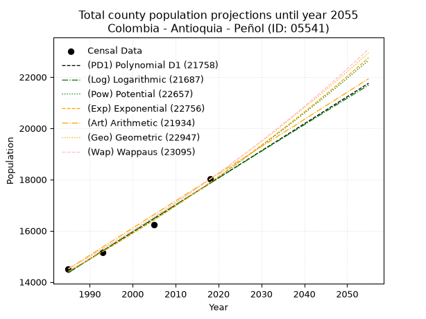
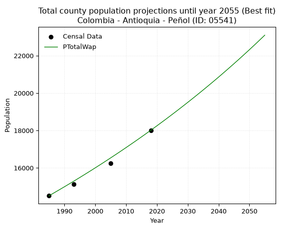
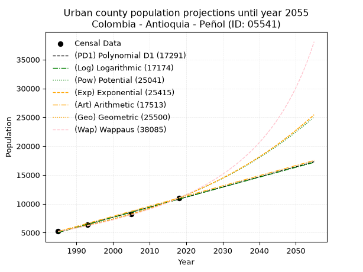
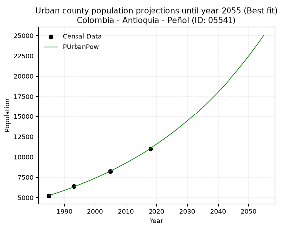
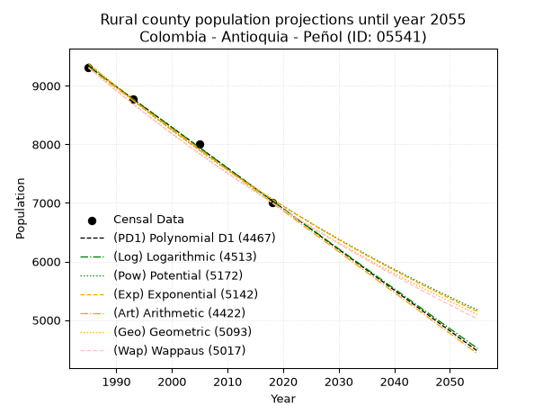
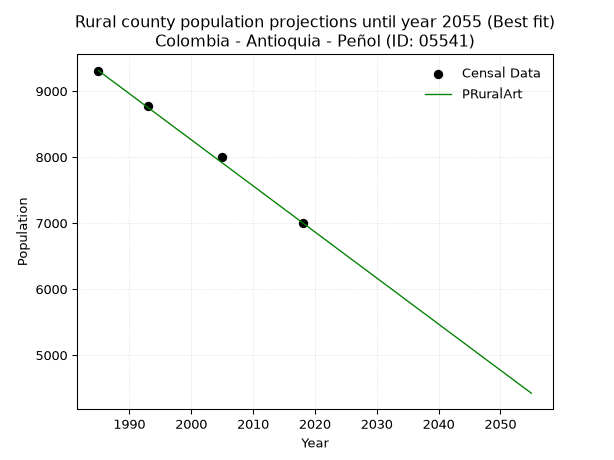

<div align="center">


</div>

# _“Population and Public Services Demand Projections (PPSD) until Year 2050 for Colombia - Antioquia - Peñol (ID: 05541)”_
Keywords: `population` `public-service` `projection` `lineal` `polynomial` `logarithmic` `potential` `exponential` `arithmetic` `geometric` `wappaus` `dane` `colombia` `south-america`

PPSD are analytical estimates used by governments and planners to anticipate future changes in population size, age distribution, and the resulting community needs for utilities, healthcare, education, and infrastructure as sizing future water treatment facilities, electrical grids, and road networks based on spatial growth.

> **General running parameters**: • app_version: _v20260806_. • Python version: _3.14.7_. • Pandas version: _3.0.5_. • NumPy version: _2.5.1_. • Creates, save and include plots into reports (create_plot): _False_. • Projection until year: _2050_. • Process polynomial degree 2 and up: _False_. • Process Wappaus: _True_. • Process Wappaus: _True_. • Set negative values to zero: _True_. • Set infinite values to zero: _True_. • Drop dataset notes: _True_. 
<div align="center">

Dynamic map: [:earth_americas:Google](http://maps.google.com/maps?q=6.219348973,-75.2426933) [:earth_americas:OSM](https://www.openstreetmap.org/#map=18/6.219348973/-75.2426933&layers=P) [:earth_americas:Bing](https://www.bing.com/maps?cp=6.219348973~-75.2426933&lvl=18) [:earth_americas:Apple](https://maps.apple.com/frame?center=6.219348973%2C-75.2426933&span=0.003%2C0.006)

</div>


<div align="center">

```geojson
{
  "type": "Feature",
  "geometry": {
    "type": "Point", 
    "coordinates": [-75.2426933, 6.219348973]
  }, 
  "properties": {
    "Name": "Colombia - Antioquia - Peñol (ID: 05541)"
  }
}
```

</div>


## 0. Census Data (4 records)

Census data are official statistics collected by a government about the people and housing in a country. They usually include counts of total population, age, sex, race, income, education, and jobs.

📅Global census file: [Population.xlsx](../data/Population.xlsx)

| Source   |   Year |   CountryID | CountryName   |   StateID | StateName   |   CountyID | CountyName   |   PTotal |   PUrban |   PRural |
|:---------|-------:|------------:|:--------------|----------:|:------------|-----------:|:-------------|---------:|---------:|---------:|
| DANE     |   1985 |          57 | Colombia      |        05 | Antioquia   |      05541 | Peñol        |    14510 |     5201 |     9309 |
| DANE     |   1993 |          57 | Colombia      |        05 | Antioquia   |      05541 | Peñol        |    15140 |     6360 |     8780 |
| DANE     |   2005 |          57 | Colombia      |        05 | Antioquia   |      05541 | Peñol        |    16241 |     8243 |     7998 |
| DANE     |   2018 |          57 | Colombia      |        05 | Antioquia   |      05541 | Peñol        |    18010 |    11005 |     7005 |

> 🔥Some records could had specific notes about the registered values or the corresponding urban or rural distribution.

📅   [RUPS](https://www.datos.gov.co/Hacienda-y-Cr-dito-P-blico/Registro-nico-de-Prestadores-de-Servicios-P-blicos/4qkq-csdn/about_data) - Local public utility companies: [RUPS.csv](../data/RUPS.xlsx)

 | SERVICIO       | ESTADO    | NOMBRE                                                                                 | NIT         | DEPARTAMENTO_DOMICILIO   | MUNICIPIO_DOMICILIO   | DIRECCION                                |   TELEFONO | EMAIL                                  | TIPO_INSCRIPCION    | REPRESENTANTE_LEGAL            | TIPO_PRESTADOR                            | CLASIFICACION                  |
|:---------------|:----------|:---------------------------------------------------------------------------------------|:------------|:-------------------------|:----------------------|:-----------------------------------------|-----------:|:---------------------------------------|:--------------------|:-------------------------------|:------------------------------------------|:-------------------------------|
| ACUEDUCTO      | OPERATIVA | AGUAS Y ASEO DE EL PEÑOL E.S.P.                                                        | 811031582-1 | ANTIOQUIA                | PENOL                 | TRANSVERSAL 4 Nº 18-60                   |    8516600 | gerencia@aguasyaseo.gov.co             | Registro por la ESP | ANGEL NORBEY GARCIA GIRALDO    | EMPRESA INDUSTRIAL Y COMERCIAL DEL ESTADO | DESDE 2501 HASTA 5000 USUARIOS |
| ALCANTARILLADO | OPERATIVA | AGUAS Y ASEO DE EL PEÑOL E.S.P.                                                        | 811031582-1 | ANTIOQUIA                | PENOL                 | TRANSVERSAL 4 Nº 18-60                   |    8516600 | gerencia@aguasyaseo.gov.co             | Registro por la ESP | ANGEL NORBEY GARCIA GIRALDO    | EMPRESA INDUSTRIAL Y COMERCIAL DEL ESTADO | DESDE 2501 HASTA 5000 USUARIOS |
| ACUEDUCTO      | OPERATIVA | ASOCIACION DE USUARIOS DEL ACUEDUCTO EL CHILCO- CHIQUINQUIRA Y LA MESETA               | 811017489-4 | ANTIOQUIA                | PENOL                 | VEREDA EL CHILCO                         |    8515488 | juliogiraldo0607@yahoo.es              | Registro por la ESP | JULIO ADOLFO GIRALDO  MARIN    | ORGANIZACION AUTORIZADA                   | HASTA 2500 SUSCRIPTORES        |
| ACUEDUCTO      | OPERATIVA | ASOCIACION DE USUARIOS ACUEDUCTO HELIDA CONCORDIA                                      | 811043392-9 | ANTIOQUIA                | PENOL                 | TRANSVERSAL 15A # 23A-21 (301), EL PEÑOL |    8515136 | achelidaconcordia@hotmail.com          | Registro por la ESP | LUIS ALBERTO RAMIREZ SALAZAR   | ORGANIZACION AUTORIZADA                   | MENOR O IGUAL A 2500 USUARIOS  |
| ACUEDUCTO      | OPERATIVA | ASOCIACION DE USUARIOS ACUEDUCTO LA CHAPA                                              | 900119015-8 | ANTIOQUIA                | PENOL                 | vereda la chapa                          |    8517476 | agroambiental@elpenol-antioquia.gov.co | Registro por la ESP | ARCESIO VELASQUEZ OCAMPO       | ORGANIZACION AUTORIZADA                   | HASTA 2500 SUSCRIPTORES        |
| ACUEDUCTO      | OPERATIVA | ASOCIACIÓN DE USUARIOS DEL ACUEDUCTO PALMIRA MARIAL                                    | 811039317-0 | ANTIOQUIA                | PENOL                 | Transversal 6 No. 16-18 Apto 302         |    8517064 | juntadeaccioncomunalvp@gmail.com       | Registro por la ESP | CLARA ROSA MORALES LOPEZ       | ORGANIZACION AUTORIZADA                   | MENOR O IGUAL A 2500 USUARIOS  |
| ACUEDUCTO      | OPERATIVA | ASOCIACIÓN DE ACUEDUCTO MULTIVEREDAL JESUS ARCESIO BOTERO BOTERO VEREDA MORRO - UVITAL | 901177321-8 | ANTIOQUIA                | PENOL                 | VEREDA EL MORRO SEDE ACUEDUCTO           |    8515855 | jabbacueductomultiveredal@gmail.com    | Registro por la ESP | JAIME ALBERTO GIRALDO  CARDONA | ORGANIZACION AUTORIZADA                   | MENOR O IGUAL A 2500 USUARIOS  |

## 1. Total

### 1.1. Coefficients and Parameters

* (PD1) Polynomial Deg 1: 105.62786029706831, -195306.87755921087 (lineal)
* (Log) Logarithmic: 211366.5241122416, -1590623.3935621725
* (Pow) Potential: 13.0556049144142, -38.89556198084107
* (Exp) Exponential: 0.006523917424353075, 0.03425065969612499
* (Art) Arithmetic: Year diff. 2018 - 1985 = 33, Population diff. 18010 - 14510 = 3500, Annual growth = 106.06060606060606
* (Geo) Geometric: Year diff. 2018 - 1985 = 33, Population diff. 18010 - 14510 = 3500, Annual growth % = 0.006569640346672623
* (Wap) Wappaus: i = 0.6522792500652279, Condition values only valid for < 200)

<sub>
Wappaus condition values: ['0.00', '0.65', '1.30', '1.96', '2.61', '3.26', '3.91', '4.57', '5.22', '5.87', '6.52', '7.18', '7.83', '8.48', '9.13', '9.78', '10.44', '11.09', '11.74', '12.39', '13.05', '13.70', '14.35', '15.00', '15.65', '16.31', '16.96', '17.61', '18.26', '18.92', '19.57', '20.22', '20.87', '21.53', '22.18', '22.83', '23.48', '24.13', '24.79', '25.44', '26.09', '26.74', '27.40', '28.05', '28.70', '29.35', '30.00', '30.66', '31.31', '31.96', '32.61', '33.27', '33.92', '34.57', '35.22', '35.88', '36.53', '37.18', '37.83', '38.48', '39.14', '39.79', '40.44', '41.09', '41.75', '42.40']
</sub>


### 1.2. Projected Dataset

|   Year |   CountyID |   PTotalPD1 |   PTotalLog |   PTotalPow |   PTotalExp |   PTotalArt |   PTotalGeo |   PTotalWap |
|-------:|-----------:|------------:|------------:|------------:|------------:|------------:|------------:|------------:|
|   1985 |      05541 |       14364 |       14362 |       14411 |       14414 |       14510 |       14510 |       14510 |
|   1986 |      05541 |       14470 |       14468 |       14506 |       14508 |       14616 |       14605 |       14605 |
|   1987 |      05541 |       14576 |       14575 |       14602 |       14603 |       14722 |       14701 |       14701 |
|   1988 |      05541 |       14681 |       14681 |       14698 |       14698 |       14828 |       14798 |       14797 |
|   1989 |      05541 |       14787 |       14787 |       14795 |       14795 |       14934 |       14895 |       14894 |
|   1990 |      05541 |       14893 |       14893 |       14892 |       14892 |       15040 |       14993 |       14991 |
|   1991 |      05541 |       14998 |       15000 |       14990 |       14989 |       15146 |       15091 |       15089 |
|   1992 |      05541 |       15104 |       15106 |       15089 |       15087 |       15252 |       15191 |       15188 |
|   1993 |      05541 |       15209 |       15212 |       15188 |       15186 |       15358 |       15290 |       15287 |
|   1994 |      05541 |       15315 |       15318 |       15288 |       15285 |       15465 |       15391 |       15388 |
|   1995 |      05541 |       15421 |       15424 |       15388 |       15385 |       15571 |       15492 |       15488 |
|   1996 |      05541 |       15526 |       15530 |       15489 |       15486 |       15677 |       15594 |       15590 |
|   1997 |      05541 |       15632 |       15636 |       15591 |       15587 |       15783 |       15696 |       15692 |
|   1998 |      05541 |       15738 |       15741 |       15693 |       15689 |       15889 |       15799 |       15795 |
|   1999 |      05541 |       15843 |       15847 |       15796 |       15792 |       15995 |       15903 |       15898 |
|   2000 |      05541 |       15949 |       15953 |       15899 |       15895 |       16101 |       16008 |       16003 |
|   2001 |      05541 |       16054 |       16059 |       16004 |       15999 |       16207 |       16113 |       16108 |
|   2002 |      05541 |       16160 |       16164 |       16108 |       16104 |       16313 |       16219 |       16213 |
|   2003 |      05541 |       16266 |       16270 |       16214 |       16210 |       16419 |       16325 |       16320 |
|   2004 |      05541 |       16371 |       16375 |       16320 |       16316 |       16525 |       16432 |       16427 |
|   2005 |      05541 |       16477 |       16481 |       16426 |       16422 |       16631 |       16540 |       16535 |
|   2006 |      05541 |       16583 |       16586 |       16534 |       16530 |       16737 |       16649 |       16644 |
|   2007 |      05541 |       16688 |       16691 |       16641 |       16638 |       16843 |       16758 |       16753 |
|   2008 |      05541 |       16794 |       16797 |       16750 |       16747 |       16949 |       16868 |       16863 |
|   2009 |      05541 |       16899 |       16902 |       16859 |       16857 |       17055 |       16979 |       16974 |
|   2010 |      05541 |       17005 |       17007 |       16969 |       16967 |       17162 |       17091 |       17086 |
|   2011 |      05541 |       17111 |       17112 |       17080 |       17078 |       17268 |       17203 |       17199 |
|   2012 |      05541 |       17216 |       17217 |       17191 |       17190 |       17374 |       17316 |       17312 |
|   2013 |      05541 |       17322 |       17322 |       17303 |       17302 |       17480 |       17430 |       17426 |
|   2014 |      05541 |       17428 |       17427 |       17415 |       17416 |       17586 |       17544 |       17541 |
|   2015 |      05541 |       17533 |       17532 |       17529 |       17530 |       17692 |       17660 |       17657 |
|   2016 |      05541 |       17639 |       17637 |       17643 |       17644 |       17798 |       17776 |       17774 |
|   2017 |      05541 |       17745 |       17742 |       17757 |       17760 |       17904 |       17892 |       17892 |
|   2018 |      05541 |       17850 |       17847 |       17872 |       17876 |       18010 |       18010 |       18010 |
|   2019 |      05541 |       17956 |       17951 |       17988 |       17993 |       18116 |       18128 |       18129 |
|   2020 |      05541 |       18061 |       18056 |       18105 |       18111 |       18222 |       18247 |       18249 |
|   2021 |      05541 |       18167 |       18161 |       18222 |       18229 |       18328 |       18367 |       18371 |
|   2022 |      05541 |       18273 |       18265 |       18340 |       18349 |       18434 |       18488 |       18492 |
|   2023 |      05541 |       18378 |       18370 |       18459 |       18469 |       18540 |       18609 |       18615 |
|   2024 |      05541 |       18484 |       18474 |       18579 |       18590 |       18646 |       18732 |       18739 |
|   2025 |      05541 |       18590 |       18579 |       18699 |       18711 |       18752 |       18855 |       18864 |
|   2026 |      05541 |       18695 |       18683 |       18820 |       18834 |       18858 |       18979 |       18989 |
|   2027 |      05541 |       18801 |       18787 |       18941 |       18957 |       18965 |       19103 |       19116 |
|   2028 |      05541 |       18906 |       18892 |       19064 |       19081 |       19071 |       19229 |       19244 |
|   2029 |      05541 |       19012 |       18996 |       19187 |       19206 |       19177 |       19355 |       19372 |
|   2030 |      05541 |       19118 |       19100 |       19311 |       19332 |       19283 |       19482 |       19502 |
|   2031 |      05541 |       19223 |       19204 |       19435 |       19458 |       19389 |       19610 |       19632 |
|   2032 |      05541 |       19329 |       19308 |       19561 |       19586 |       19495 |       19739 |       19764 |
|   2033 |      05541 |       19435 |       19412 |       19687 |       19714 |       19601 |       19869 |       19896 |
|   2034 |      05541 |       19540 |       19516 |       19813 |       19843 |       19707 |       19999 |       20030 |
|   2035 |      05541 |       19646 |       19620 |       19941 |       19973 |       19813 |       20131 |       20164 |
|   2036 |      05541 |       19751 |       19724 |       20069 |       20103 |       19919 |       20263 |       20300 |
|   2037 |      05541 |       19857 |       19827 |       20198 |       20235 |       20025 |       20396 |       20437 |
|   2038 |      05541 |       19963 |       19931 |       20328 |       20367 |       20131 |       20530 |       20574 |
|   2039 |      05541 |       20068 |       20035 |       20459 |       20501 |       20237 |       20665 |       20713 |
|   2040 |      05541 |       20174 |       20139 |       20590 |       20635 |       20343 |       20801 |       20853 |
|   2041 |      05541 |       20280 |       20242 |       20722 |       20770 |       20449 |       20937 |       20994 |
|   2042 |      05541 |       20385 |       20346 |       20855 |       20906 |       20555 |       21075 |       21137 |
|   2043 |      05541 |       20491 |       20449 |       20989 |       21043 |       20662 |       21213 |       21280 |
|   2044 |      05541 |       20596 |       20553 |       21124 |       21181 |       20768 |       21353 |       21425 |
|   2045 |      05541 |       20702 |       20656 |       21259 |       21319 |       20874 |       21493 |       21570 |
|   2046 |      05541 |       20808 |       20759 |       21395 |       21459 |       20980 |       21634 |       21717 |
|   2047 |      05541 |       20913 |       20863 |       21532 |       21599 |       21086 |       21776 |       21865 |
|   2048 |      05541 |       21019 |       20966 |       21670 |       21741 |       21192 |       21919 |       22015 |
|   2049 |      05541 |       21125 |       21069 |       21808 |       21883 |       21298 |       22063 |       22165 |
|   2050 |      05541 |       21230 |       21172 |       21948 |       22026 |       21404 |       22208 |       22317 |
<div align="center">

</img>

</div>


### 1.3. Best fit with absolute and relative error (%)

Relative error puts that difference into context by dividing the absolute error by the true value, creating a unitless ratio or percentage that shows the scale of the mistake.

Absolute and relative error

|   Year | Source   |   CountryID | CountryName   |   StateID | StateName   |   CountyID_x | CountyName   |   PTotal |   PUrban |   PRural |   CountyID_y |   PTotalPD1 |   PTotalLog |   PTotalPow |   PTotalExp |   PTotalArt |   PTotalGeo |   PTotalWap |   PTotalPD1AbsError |   PTotalLogAbsError |   PTotalPowAbsError |   PTotalExpAbsError |   PTotalArtAbsError |   PTotalGeoAbsError |   PTotalWapAbsError |   PTotalPD1RelError |   PTotalLogRelError |   PTotalPowRelError |   PTotalExpRelError |   PTotalArtRelError |   PTotalGeoRelError |   PTotalWapRelError |
|-------:|:---------|------------:|:--------------|----------:|:------------|-------------:|:-------------|---------:|---------:|---------:|-------------:|------------:|------------:|------------:|------------:|------------:|------------:|------------:|--------------------:|--------------------:|--------------------:|--------------------:|--------------------:|--------------------:|--------------------:|--------------------:|--------------------:|--------------------:|--------------------:|--------------------:|--------------------:|--------------------:|
|   1985 | DANE     |          57 | Colombia      |        05 | Antioquia   |        05541 | Peñol        |    14510 |     5201 |     9309 |        05541 |       14364 |       14362 |       14411 |       14414 |       14510 |       14510 |       14510 |                 146 |                 148 |                  99 |                  96 |                   0 |                   0 |                   0 |            1.0062   |            1.01999  |            0.682288 |            0.661613 |             0       |            0        |            0        |
|   1993 | DANE     |          57 | Colombia      |        05 | Antioquia   |        05541 | Peñol        |    15140 |     6360 |     8780 |        05541 |       15209 |       15212 |       15188 |       15186 |       15358 |       15290 |       15287 |                  69 |                  72 |                  48 |                  46 |                 218 |                 150 |                 147 |            0.455746 |            0.475561 |            0.317041 |            0.303831 |             1.43989 |            0.990753 |            0.970938 |
|   2005 | DANE     |          57 | Colombia      |        05 | Antioquia   |        05541 | Peñol        |    16241 |     8243 |     7998 |        05541 |       16477 |       16481 |       16426 |       16422 |       16631 |       16540 |       16535 |                 236 |                 240 |                 185 |                 181 |                 390 |                 299 |                 294 |            1.45311  |            1.47774  |            1.13909  |            1.11446  |             2.40133 |            1.84102  |            1.81023  |
|   2018 | DANE     |          57 | Colombia      |        05 | Antioquia   |        05541 | Peñol        |    18010 |    11005 |     7005 |        05541 |       17850 |       17847 |       17872 |       17876 |       18010 |       18010 |       18010 |                 160 |                 163 |                 138 |                 134 |                   0 |                   0 |                   0 |            0.888395 |            0.905053 |            0.766241 |            0.744031 |             0       |            0        |            0        |

Relative error mean

| Method    |   RelError | Best   |
|:----------|-----------:|:-------|
| PTotalPD1 |   0.950864 |        |
| PTotalLog |   0.969585 |        |
| PTotalPow |   0.726166 |        |
| PTotalExp |   0.705985 |        |
| PTotalArt |   0.960306 |        |
| PTotalGeo |   0.707943 |        |
| PTotalWap |   0.695293 | True   |

💙Best method: _**PTotalWap**_
<div align="center">

</img>

</div>


### 1.4. Fresh water supply demand in liters per capita per day (lpcd)

The fresh water supply demand typically ranges from 100 to 300 liters per capita per day (lpcd) for standard domestic and municipal planning, though absolute survival minimums set by the World Health Organization are as low as 7.5 to 20 liters per day, and total consumption in high-income nations can exceed 400 liters.

> `CZ`: Level in meters above the sea level (masl)<br> `WS`: Fresh water supply demand in liters per capita per day (lpcd or l/h/d)<br> `WSAll`: Zonal fresh water supply demand in liters per second (l/s)<br> `A`: Zonal area in square meters<br> `DP`: Population density (people/hectare or p/ha)

Reference values (RAS Colombia)

|    CZ |   WS |
|------:|-----:|
|  1000 |  120 |
|  2000 |  130 |
| 99999 |  140 |

County shapefile geometry properties and water supply values

|   CountyID |      ATotal |   CZTotal |   WSTotal |
|-----------:|------------:|----------:|----------:|
|      05541 | 1.18255e+08 |   1996.59 |       130 |

Projected values for best method: PTotalWap

|   CountyID |   Year |   PTotalWap |   DPTotal |   WSTotal |   WSTotalAll |
|-----------:|-------:|------------:|----------:|----------:|-------------:|
|      05541 |   1985 |       14510 |      1.23 |       130 |      21.8322 |
|      05541 |   1986 |       14605 |      1.24 |       130 |      21.9751 |
|      05541 |   1987 |       14701 |      1.24 |       130 |      22.1196 |
|      05541 |   1988 |       14797 |      1.25 |       130 |      22.264  |
|      05541 |   1989 |       14894 |      1.26 |       130 |      22.41   |
|      05541 |   1990 |       14991 |      1.27 |       130 |      22.5559 |
|      05541 |   1991 |       15089 |      1.28 |       130 |      22.7034 |
|      05541 |   1992 |       15188 |      1.28 |       130 |      22.8523 |
|      05541 |   1993 |       15287 |      1.29 |       130 |      23.0013 |
|      05541 |   1994 |       15388 |      1.3  |       130 |      23.1532 |
|      05541 |   1995 |       15488 |      1.31 |       130 |      23.3037 |
|      05541 |   1996 |       15590 |      1.32 |       130 |      23.4572 |
|      05541 |   1997 |       15692 |      1.33 |       130 |      23.6106 |
|      05541 |   1998 |       15795 |      1.34 |       130 |      23.7656 |
|      05541 |   1999 |       15898 |      1.34 |       130 |      23.9206 |
|      05541 |   2000 |       16003 |      1.35 |       130 |      24.0786 |
|      05541 |   2001 |       16108 |      1.36 |       130 |      24.2366 |
|      05541 |   2002 |       16213 |      1.37 |       130 |      24.3946 |
|      05541 |   2003 |       16320 |      1.38 |       130 |      24.5556 |
|      05541 |   2004 |       16427 |      1.39 |       130 |      24.7166 |
|      05541 |   2005 |       16535 |      1.4  |       130 |      24.8791 |
|      05541 |   2006 |       16644 |      1.41 |       130 |      25.0431 |
|      05541 |   2007 |       16753 |      1.42 |       130 |      25.2071 |
|      05541 |   2008 |       16863 |      1.43 |       130 |      25.3726 |
|      05541 |   2009 |       16974 |      1.44 |       130 |      25.5396 |
|      05541 |   2010 |       17086 |      1.44 |       130 |      25.7081 |
|      05541 |   2011 |       17199 |      1.45 |       130 |      25.8781 |
|      05541 |   2012 |       17312 |      1.46 |       130 |      26.0481 |
|      05541 |   2013 |       17426 |      1.47 |       130 |      26.2197 |
|      05541 |   2014 |       17541 |      1.48 |       130 |      26.3927 |
|      05541 |   2015 |       17657 |      1.49 |       130 |      26.5672 |
|      05541 |   2016 |       17774 |      1.5  |       130 |      26.7433 |
|      05541 |   2017 |       17892 |      1.51 |       130 |      26.9208 |
|      05541 |   2018 |       18010 |      1.52 |       130 |      27.0984 |
|      05541 |   2019 |       18129 |      1.53 |       130 |      27.2774 |
|      05541 |   2020 |       18249 |      1.54 |       130 |      27.458  |
|      05541 |   2021 |       18371 |      1.55 |       130 |      27.6416 |
|      05541 |   2022 |       18492 |      1.56 |       130 |      27.8236 |
|      05541 |   2023 |       18615 |      1.57 |       130 |      28.0087 |
|      05541 |   2024 |       18739 |      1.58 |       130 |      28.1953 |
|      05541 |   2025 |       18864 |      1.6  |       130 |      28.3833 |
|      05541 |   2026 |       18989 |      1.61 |       130 |      28.5714 |
|      05541 |   2027 |       19116 |      1.62 |       130 |      28.7625 |
|      05541 |   2028 |       19244 |      1.63 |       130 |      28.9551 |
|      05541 |   2029 |       19372 |      1.64 |       130 |      29.1477 |
|      05541 |   2030 |       19502 |      1.65 |       130 |      29.3433 |
|      05541 |   2031 |       19632 |      1.66 |       130 |      29.5389 |
|      05541 |   2032 |       19764 |      1.67 |       130 |      29.7375 |
|      05541 |   2033 |       19896 |      1.68 |       130 |      29.9361 |
|      05541 |   2034 |       20030 |      1.69 |       130 |      30.1377 |
|      05541 |   2035 |       20164 |      1.71 |       130 |      30.3394 |
|      05541 |   2036 |       20300 |      1.72 |       130 |      30.544  |
|      05541 |   2037 |       20437 |      1.73 |       130 |      30.7501 |
|      05541 |   2038 |       20574 |      1.74 |       130 |      30.9563 |
|      05541 |   2039 |       20713 |      1.75 |       130 |      31.1654 |
|      05541 |   2040 |       20853 |      1.76 |       130 |      31.376  |
|      05541 |   2041 |       20994 |      1.78 |       130 |      31.5882 |
|      05541 |   2042 |       21137 |      1.79 |       130 |      31.8034 |
|      05541 |   2043 |       21280 |      1.8  |       130 |      32.0185 |
|      05541 |   2044 |       21425 |      1.81 |       130 |      32.2367 |
|      05541 |   2045 |       21570 |      1.82 |       130 |      32.4549 |
|      05541 |   2046 |       21717 |      1.84 |       130 |      32.676  |
|      05541 |   2047 |       21865 |      1.85 |       130 |      32.8987 |
|      05541 |   2048 |       22015 |      1.86 |       130 |      33.1244 |
|      05541 |   2049 |       22165 |      1.87 |       130 |      33.3501 |
|      05541 |   2050 |       22317 |      1.89 |       130 |      33.5788 |

## 2. Urban

### 2.1. Coefficients and Parameters

* (PD1) Polynomial Deg 1: 175.13890004014266, -342619.3348052954 (lineal)
* (Log) Logarithmic: 350489.26945080794, -2656369.495740328
* (Pow) Potential: 45.10481335858205, -145.0251046887762
* (Exp) Exponential: 0.022533128771297685, 1.9716569541611078e-16
* (Art) Arithmetic: Year diff. 2018 - 1985 = 33, Population diff. 11005 - 5201 = 5804, Annual growth = 175.87878787878788
* (Geo) Geometric: Year diff. 2018 - 1985 = 33, Population diff. 11005 - 5201 = 5804, Annual growth % = 0.022971968020093936
* (Wap) Wappaus: i = 2.1705391568405266, Condition values only valid for < 200)

<sub>
Wappaus condition values: ['0.00', '2.17', '4.34', '6.51', '8.68', '10.85', '13.02', '15.19', '17.36', '19.53', '21.71', '23.88', '26.05', '28.22', '30.39', '32.56', '34.73', '36.90', '39.07', '41.24', '43.41', '45.58', '47.75', '49.92', '52.09', '54.26', '56.43', '58.60', '60.78', '62.95', '65.12', '67.29', '69.46', '71.63', '73.80', '75.97', '78.14', '80.31', '82.48', '84.65', '86.82', '88.99', '91.16', '93.33', '95.50', '97.67', '99.84', '102.02', '104.19', '106.36', '108.53', '110.70', '112.87', '115.04', '117.21', '119.38', '121.55', '123.72', '125.89', '128.06', '130.23', '132.40', '134.57', '136.74', '138.91', '141.09']
</sub>


### 2.2. Projected Dataset

|   Year |   CountyID |   PUrbanPD1 |   PUrbanLog |   PUrbanPow |   PUrbanExp |   PUrbanArt |   PUrbanGeo |   PUrbanWap |
|-------:|-----------:|------------:|------------:|------------:|------------:|------------:|------------:|------------:|
|   1985 |      05541 |        5031 |        5027 |        5245 |        5249 |        5201 |        5201 |        5201 |
|   1986 |      05541 |        5207 |        5203 |        5366 |        5369 |        5377 |        5320 |        5315 |
|   1987 |      05541 |        5382 |        5380 |        5489 |        5491 |        5553 |        5443 |        5432 |
|   1988 |      05541 |        5557 |        5556 |        5615 |        5616 |        5729 |        5568 |        5551 |
|   1989 |      05541 |        5732 |        5732 |        5744 |        5744 |        5905 |        5696 |        5673 |
|   1990 |      05541 |        5907 |        5908 |        5876 |        5875 |        6080 |        5826 |        5798 |
|   1991 |      05541 |        6082 |        6084 |        6010 |        6009 |        6256 |        5960 |        5926 |
|   1992 |      05541 |        6257 |        6260 |        6148 |        6146 |        6432 |        6097 |        6056 |
|   1993 |      05541 |        6432 |        6436 |        6289 |        6286 |        6608 |        6237 |        6190 |
|   1994 |      05541 |        6608 |        6612 |        6433 |        6429 |        6784 |        6381 |        6327 |
|   1995 |      05541 |        6783 |        6788 |        6580 |        6575 |        6960 |        6527 |        6467 |
|   1996 |      05541 |        6958 |        6964 |        6730 |        6725 |        7136 |        6677 |        6611 |
|   1997 |      05541 |        7133 |        7139 |        6884 |        6879 |        7312 |        6830 |        6759 |
|   1998 |      05541 |        7308 |        7315 |        7041 |        7035 |        7487 |        6987 |        6910 |
|   1999 |      05541 |        7483 |        7490 |        7202 |        7196 |        7663 |        7148 |        7065 |
|   2000 |      05541 |        7658 |        7665 |        7366 |        7360 |        7839 |        7312 |        7224 |
|   2001 |      05541 |        7834 |        7840 |        7534 |        7527 |        8015 |        7480 |        7387 |
|   2002 |      05541 |        8009 |        8016 |        7706 |        7699 |        8191 |        7652 |        7554 |
|   2003 |      05541 |        8184 |        8191 |        7881 |        7874 |        8367 |        7828 |        7726 |
|   2004 |      05541 |        8359 |        8366 |        8061 |        8054 |        8543 |        8008 |        7903 |
|   2005 |      05541 |        8534 |        8540 |        8244 |        8237 |        8719 |        8191 |        8085 |
|   2006 |      05541 |        8709 |        8715 |        8432 |        8425 |        8894 |        8380 |        8271 |
|   2007 |      05541 |        8884 |        8890 |        8623 |        8617 |        9070 |        8572 |        8464 |
|   2008 |      05541 |        9060 |        9064 |        8819 |        8813 |        9246 |        8769 |        8661 |
|   2009 |      05541 |        9235 |        9239 |        9020 |        9014 |        9422 |        8970 |        8865 |
|   2010 |      05541 |        9410 |        9413 |        9224 |        9220 |        9598 |        9177 |        9074 |
|   2011 |      05541 |        9585 |        9588 |        9434 |        9430 |        9774 |        9387 |        9290 |
|   2012 |      05541 |        9760 |        9762 |        9648 |        9645 |        9950 |        9603 |        9512 |
|   2013 |      05541 |        9935 |        9936 |        9866 |        9865 |       10126 |        9824 |        9742 |
|   2014 |      05541 |       10110 |       10110 |       10090 |       10089 |       10301 |       10049 |        9978 |
|   2015 |      05541 |       10286 |       10284 |       10318 |       10319 |       10477 |       10280 |       10223 |
|   2016 |      05541 |       10461 |       10458 |       10552 |       10554 |       10653 |       10516 |       10475 |
|   2017 |      05541 |       10636 |       10632 |       10790 |       10795 |       10829 |       10758 |       10736 |
|   2018 |      05541 |       10811 |       10806 |       11034 |       11041 |       11005 |       11005 |       11005 |
|   2019 |      05541 |       10986 |       10979 |       11284 |       11293 |       11181 |       11258 |       11284 |
|   2020 |      05541 |       11161 |       11153 |       11539 |       11550 |       11357 |       11516 |       11572 |
|   2021 |      05541 |       11336 |       11326 |       11799 |       11813 |       11533 |       11781 |       11871 |
|   2022 |      05541 |       11512 |       11500 |       12065 |       12082 |       11709 |       12052 |       12181 |
|   2023 |      05541 |       11687 |       11673 |       12337 |       12358 |       11884 |       12328 |       12502 |
|   2024 |      05541 |       11862 |       11846 |       12615 |       12639 |       12060 |       12612 |       12835 |
|   2025 |      05541 |       12037 |       12019 |       12900 |       12927 |       12236 |       12901 |       13181 |
|   2026 |      05541 |       12212 |       12192 |       13190 |       13222 |       12412 |       13198 |       13540 |
|   2027 |      05541 |       12387 |       12365 |       13487 |       13523 |       12588 |       13501 |       13914 |
|   2028 |      05541 |       12562 |       12538 |       13790 |       13831 |       12764 |       13811 |       14303 |
|   2029 |      05541 |       12737 |       12711 |       14101 |       14147 |       12940 |       14128 |       14708 |
|   2030 |      05541 |       12913 |       12884 |       14417 |       14469 |       13116 |       14453 |       15130 |
|   2031 |      05541 |       13088 |       13056 |       14741 |       14799 |       13291 |       14785 |       15571 |
|   2032 |      05541 |       13263 |       13229 |       15072 |       15136 |       13467 |       15125 |       16031 |
|   2033 |      05541 |       13438 |       13401 |       15410 |       15481 |       13643 |       15472 |       16512 |
|   2034 |      05541 |       13613 |       13573 |       15756 |       15834 |       13819 |       15827 |       17015 |
|   2035 |      05541 |       13788 |       13746 |       16109 |       16195 |       13995 |       16191 |       17542 |
|   2036 |      05541 |       13963 |       13918 |       16470 |       16564 |       14171 |       16563 |       18095 |
|   2037 |      05541 |       14139 |       14090 |       16839 |       16941 |       14347 |       16943 |       18675 |
|   2038 |      05541 |       14314 |       14262 |       17216 |       17327 |       14523 |       17333 |       19285 |
|   2039 |      05541 |       14489 |       14434 |       17601 |       17722 |       14698 |       17731 |       19927 |
|   2040 |      05541 |       14664 |       14606 |       17995 |       18126 |       14874 |       18138 |       20604 |
|   2041 |      05541 |       14839 |       14778 |       18397 |       18539 |       15050 |       18555 |       21318 |
|   2042 |      05541 |       15014 |       14949 |       18808 |       18961 |       15226 |       18981 |       22072 |
|   2043 |      05541 |       15189 |       15121 |       19228 |       19394 |       15402 |       19417 |       22871 |
|   2044 |      05541 |       15365 |       15292 |       19657 |       19835 |       15578 |       19863 |       23718 |
|   2045 |      05541 |       15540 |       15464 |       20096 |       20288 |       15754 |       20319 |       24618 |
|   2046 |      05541 |       15715 |       15635 |       20544 |       20750 |       15930 |       20786 |       25575 |
|   2047 |      05541 |       15890 |       15806 |       21001 |       21223 |       16105 |       21264 |       26596 |
|   2048 |      05541 |       16065 |       15978 |       21469 |       21706 |       16281 |       21752 |       27688 |
|   2049 |      05541 |       16240 |       16149 |       21947 |       22201 |       16457 |       22252 |       28856 |
|   2050 |      05541 |       16415 |       16320 |       22435 |       22707 |       16633 |       22763 |       30111 |
<div align="center">

</img>

</div>


### 2.3. Best fit with absolute and relative error (%)

Relative error puts that difference into context by dividing the absolute error by the true value, creating a unitless ratio or percentage that shows the scale of the mistake.

Absolute and relative error

|   Year | Source   |   CountryID | CountryName   |   StateID | StateName   |   CountyID_x | CountyName   |   PTotal |   PUrban |   PRural |   CountyID_y |   PUrbanPD1 |   PUrbanLog |   PUrbanPow |   PUrbanExp |   PUrbanArt |   PUrbanGeo |   PUrbanWap |   PUrbanPD1AbsError |   PUrbanLogAbsError |   PUrbanPowAbsError |   PUrbanExpAbsError |   PUrbanArtAbsError |   PUrbanGeoAbsError |   PUrbanWapAbsError |   PUrbanPD1RelError |   PUrbanLogRelError |   PUrbanPowRelError |   PUrbanExpRelError |   PUrbanArtRelError |   PUrbanGeoRelError |   PUrbanWapRelError |
|-------:|:---------|------------:|:--------------|----------:|:------------|-------------:|:-------------|---------:|---------:|---------:|-------------:|------------:|------------:|------------:|------------:|------------:|------------:|------------:|--------------------:|--------------------:|--------------------:|--------------------:|--------------------:|--------------------:|--------------------:|--------------------:|--------------------:|--------------------:|--------------------:|--------------------:|--------------------:|--------------------:|
|   1985 | DANE     |          57 | Colombia      |        05 | Antioquia   |        05541 | Peñol        |    14510 |     5201 |     9309 |        05541 |        5031 |        5027 |        5245 |        5249 |        5201 |        5201 |        5201 |                 170 |                 174 |                  44 |                  48 |                   0 |                   0 |                   0 |             3.2686  |             3.34551 |           0.845991  |            0.922899 |             0       |            0        |             0       |
|   1993 | DANE     |          57 | Colombia      |        05 | Antioquia   |        05541 | Peñol        |    15140 |     6360 |     8780 |        05541 |        6432 |        6436 |        6289 |        6286 |        6608 |        6237 |        6190 |                  72 |                  76 |                  71 |                  74 |                 248 |                 123 |                 170 |             1.13208 |             1.19497 |           1.11635   |            1.16352  |             3.89937 |            1.93396  |             2.67296 |
|   2005 | DANE     |          57 | Colombia      |        05 | Antioquia   |        05541 | Peñol        |    16241 |     8243 |     7998 |        05541 |        8534 |        8540 |        8244 |        8237 |        8719 |        8191 |        8085 |                 291 |                 297 |                   1 |                   6 |                 476 |                  52 |                 158 |             3.53027 |             3.60306 |           0.0121315 |            0.072789 |             5.7746  |            0.630838 |             1.91678 |
|   2018 | DANE     |          57 | Colombia      |        05 | Antioquia   |        05541 | Peñol        |    18010 |    11005 |     7005 |        05541 |       10811 |       10806 |       11034 |       11041 |       11005 |       11005 |       11005 |                 194 |                 199 |                  29 |                  36 |                   0 |                   0 |                   0 |             1.76284 |             1.80827 |           0.263517  |            0.327124 |             0       |            0        |             0       |

Relative error mean

| Method    |   RelError | Best   |
|:----------|-----------:|:-------|
| PUrbanPD1 |   2.42345  |        |
| PUrbanLog |   2.48795  |        |
| PUrbanPow |   0.559498 | True   |
| PUrbanExp |   0.621584 |        |
| PUrbanArt |   2.41849  |        |
| PUrbanGeo |   0.6412   |        |
| PUrbanWap |   1.14743  |        |

💙Best method: _**PUrbanPow**_
<div align="center">

</img>

</div>


### 2.4. Fresh water supply demand in liters per capita per day (lpcd)

The fresh water supply demand typically ranges from 100 to 300 liters per capita per day (lpcd) for standard domestic and municipal planning, though absolute survival minimums set by the World Health Organization are as low as 7.5 to 20 liters per day, and total consumption in high-income nations can exceed 400 liters.

> `CZ`: Level in meters above the sea level (masl)<br> `WS`: Fresh water supply demand in liters per capita per day (lpcd or l/h/d)<br> `WSAll`: Zonal fresh water supply demand in liters per second (l/s)<br> `A`: Zonal area in square meters<br> `DP`: Population density (people/hectare or p/ha)

Reference values (RAS Colombia)

|    CZ |   WS |
|------:|-----:|
|  1000 |  120 |
|  2000 |  130 |
| 99999 |  140 |

County shapefile geometry properties and water supply values

|   CountyID |      AUrban |   CZUrban |   WSUrban |
|-----------:|------------:|----------:|----------:|
|      05541 | 1.20337e+06 |   1963.11 |       130 |

Projected values for best method: PUrbanPow

|   CountyID |   Year |   PUrbanPow |   DPUrban |   WSUrban |   WSUrbanAll |
|-----------:|-------:|------------:|----------:|----------:|-------------:|
|      05541 |   1985 |        5245 |     43.59 |       130 |      7.89178 |
|      05541 |   1986 |        5366 |     44.59 |       130 |      8.07384 |
|      05541 |   1987 |        5489 |     45.61 |       130 |      8.25891 |
|      05541 |   1988 |        5615 |     46.66 |       130 |      8.4485  |
|      05541 |   1989 |        5744 |     47.73 |       130 |      8.64259 |
|      05541 |   1990 |        5876 |     48.83 |       130 |      8.8412  |
|      05541 |   1991 |        6010 |     49.94 |       130 |      9.04282 |
|      05541 |   1992 |        6148 |     51.09 |       130 |      9.25046 |
|      05541 |   1993 |        6289 |     52.26 |       130 |      9.46262 |
|      05541 |   1994 |        6433 |     53.46 |       130 |      9.67928 |
|      05541 |   1995 |        6580 |     54.68 |       130 |      9.90046 |
|      05541 |   1996 |        6730 |     55.93 |       130 |     10.1262  |
|      05541 |   1997 |        6884 |     57.21 |       130 |     10.3579  |
|      05541 |   1998 |        7041 |     58.51 |       130 |     10.5941  |
|      05541 |   1999 |        7202 |     59.85 |       130 |     10.8363  |
|      05541 |   2000 |        7366 |     61.21 |       130 |     11.0831  |
|      05541 |   2001 |        7534 |     62.61 |       130 |     11.3359  |
|      05541 |   2002 |        7706 |     64.04 |       130 |     11.5947  |
|      05541 |   2003 |        7881 |     65.49 |       130 |     11.858   |
|      05541 |   2004 |        8061 |     66.99 |       130 |     12.1288  |
|      05541 |   2005 |        8244 |     68.51 |       130 |     12.4042  |
|      05541 |   2006 |        8432 |     70.07 |       130 |     12.687   |
|      05541 |   2007 |        8623 |     71.66 |       130 |     12.9744  |
|      05541 |   2008 |        8819 |     73.29 |       130 |     13.2693  |
|      05541 |   2009 |        9020 |     74.96 |       130 |     13.5718  |
|      05541 |   2010 |        9224 |     76.65 |       130 |     13.8787  |
|      05541 |   2011 |        9434 |     78.4  |       130 |     14.1947  |
|      05541 |   2012 |        9648 |     80.17 |       130 |     14.5167  |
|      05541 |   2013 |        9866 |     81.99 |       130 |     14.8447  |
|      05541 |   2014 |       10090 |     83.85 |       130 |     15.1817  |
|      05541 |   2015 |       10318 |     85.74 |       130 |     15.5248  |
|      05541 |   2016 |       10552 |     87.69 |       130 |     15.8769  |
|      05541 |   2017 |       10790 |     89.66 |       130 |     16.235   |
|      05541 |   2018 |       11034 |     91.69 |       130 |     16.6021  |
|      05541 |   2019 |       11284 |     93.77 |       130 |     16.9782  |
|      05541 |   2020 |       11539 |     95.89 |       130 |     17.3619  |
|      05541 |   2021 |       11799 |     98.05 |       130 |     17.7531  |
|      05541 |   2022 |       12065 |    100.26 |       130 |     18.1534  |
|      05541 |   2023 |       12337 |    102.52 |       130 |     18.5626  |
|      05541 |   2024 |       12615 |    104.83 |       130 |     18.9809  |
|      05541 |   2025 |       12900 |    107.2  |       130 |     19.4097  |
|      05541 |   2026 |       13190 |    109.61 |       130 |     19.8461  |
|      05541 |   2027 |       13487 |    112.08 |       130 |     20.2929  |
|      05541 |   2028 |       13790 |    114.59 |       130 |     20.7488  |
|      05541 |   2029 |       14101 |    117.18 |       130 |     21.2168  |
|      05541 |   2030 |       14417 |    119.81 |       130 |     21.6922  |
|      05541 |   2031 |       14741 |    122.5  |       130 |     22.1797  |
|      05541 |   2032 |       15072 |    125.25 |       130 |     22.6778  |
|      05541 |   2033 |       15410 |    128.06 |       130 |     23.1863  |
|      05541 |   2034 |       15756 |    130.93 |       130 |     23.7069  |
|      05541 |   2035 |       16109 |    133.87 |       130 |     24.2381  |
|      05541 |   2036 |       16470 |    136.87 |       130 |     24.7812  |
|      05541 |   2037 |       16839 |    139.93 |       130 |     25.3365  |
|      05541 |   2038 |       17216 |    143.06 |       130 |     25.9037  |
|      05541 |   2039 |       17601 |    146.26 |       130 |     26.483   |
|      05541 |   2040 |       17995 |    149.54 |       130 |     27.0758  |
|      05541 |   2041 |       18397 |    152.88 |       130 |     27.6807  |
|      05541 |   2042 |       18808 |    156.29 |       130 |     28.2991  |
|      05541 |   2043 |       19228 |    159.78 |       130 |     28.931   |
|      05541 |   2044 |       19657 |    163.35 |       130 |     29.5765  |
|      05541 |   2045 |       20096 |    167    |       130 |     30.237   |
|      05541 |   2046 |       20544 |    170.72 |       130 |     30.9111  |
|      05541 |   2047 |       21001 |    174.52 |       130 |     31.5987  |
|      05541 |   2048 |       21469 |    178.41 |       130 |     32.3029  |
|      05541 |   2049 |       21947 |    182.38 |       130 |     33.0221  |
|      05541 |   2050 |       22435 |    186.43 |       130 |     33.7564  |

## 3. Rural

### 3.1. Coefficients and Parameters

* (PD1) Polynomial Deg 1: -69.51103974307438, 147312.45724608455 (lineal)
* (Log) Logarithmic: -139122.74533856602, 1065746.1021781538
* (Pow) Potential: -17.173981625749903, 60.607812544071884
* (Exp) Exponential: -0.008581590718937812, 234424768689.2482
* (Art) Arithmetic: Year diff. 2018 - 1985 = 33, Population diff. 7005 - 9309 = -2304, Annual growth = -69.81818181818181
* (Geo) Geometric: Year diff. 2018 - 1985 = 33, Population diff. 7005 - 9309 = -2304, Annual growth % = -0.008579874744908955
* (Wap) Wappaus: i = -0.855929653281621, Condition values only valid for < 200)

<sub>
Wappaus condition values: ['-0.00', '-0.86', '-1.71', '-2.57', '-3.42', '-4.28', '-5.14', '-5.99', '-6.85', '-7.70', '-8.56', '-9.42', '-10.27', '-11.13', '-11.98', '-12.84', '-13.69', '-14.55', '-15.41', '-16.26', '-17.12', '-17.97', '-18.83', '-19.69', '-20.54', '-21.40', '-22.25', '-23.11', '-23.97', '-24.82', '-25.68', '-26.53', '-27.39', '-28.25', '-29.10', '-29.96', '-30.81', '-31.67', '-32.53', '-33.38', '-34.24', '-35.09', '-35.95', '-36.80', '-37.66', '-38.52', '-39.37', '-40.23', '-41.08', '-41.94', '-42.80', '-43.65', '-44.51', '-45.36', '-46.22', '-47.08', '-47.93', '-48.79', '-49.64', '-50.50', '-51.36', '-52.21', '-53.07', '-53.92', '-54.78', '-55.64']
</sub>


### 3.2. Projected Dataset

|   Year |   CountyID |   PRuralPD1 |   PRuralLog |   PRuralPow |   PRuralExp |   PRuralArt |   PRuralGeo |   PRuralWap |
|-------:|-----------:|------------:|------------:|------------:|------------:|------------:|------------:|------------:|
|   1985 |      05541 |        9333 |        9335 |        9379 |        9376 |        9309 |        9309 |        9309 |
|   1986 |      05541 |        9264 |        9265 |        9298 |        9296 |        9239 |        9229 |        9230 |
|   1987 |      05541 |        9194 |        9195 |        9218 |        9217 |        9169 |        9150 |        9151 |
|   1988 |      05541 |        9125 |        9125 |        9138 |        9138 |        9100 |        9071 |        9073 |
|   1989 |      05541 |        9055 |        9055 |        9060 |        9060 |        9030 |        8994 |        8996 |
|   1990 |      05541 |        8985 |        8985 |        8982 |        8983 |        8960 |        8916 |        8919 |
|   1991 |      05541 |        8916 |        8915 |        8905 |        8906 |        8890 |        8840 |        8843 |
|   1992 |      05541 |        8846 |        8845 |        8828 |        8830 |        8820 |        8764 |        8767 |
|   1993 |      05541 |        8777 |        8775 |        8753 |        8754 |        8750 |        8689 |        8693 |
|   1994 |      05541 |        8707 |        8706 |        8677 |        8679 |        8681 |        8614 |        8618 |
|   1995 |      05541 |        8638 |        8636 |        8603 |        8605 |        8611 |        8540 |        8545 |
|   1996 |      05541 |        8568 |        8566 |        8529 |        8532 |        8541 |        8467 |        8472 |
|   1997 |      05541 |        8499 |        8497 |        8456 |        8459 |        8471 |        8395 |        8400 |
|   1998 |      05541 |        8429 |        8427 |        8384 |        8387 |        8401 |        8322 |        8328 |
|   1999 |      05541 |        8360 |        8357 |        8312 |        8315 |        8332 |        8251 |        8257 |
|   2000 |      05541 |        8290 |        8288 |        8241 |        8244 |        8262 |        8180 |        8186 |
|   2001 |      05541 |        8221 |        8218 |        8171 |        8173 |        8192 |        8110 |        8116 |
|   2002 |      05541 |        8151 |        8149 |        8101 |        8104 |        8122 |        8041 |        8046 |
|   2003 |      05541 |        8082 |        8079 |        8032 |        8034 |        8052 |        7972 |        7977 |
|   2004 |      05541 |        8012 |        8010 |        7963 |        7966 |        7982 |        7903 |        7909 |
|   2005 |      05541 |        7943 |        7940 |        7895 |        7898 |        7913 |        7835 |        7841 |
|   2006 |      05541 |        7873 |        7871 |        7828 |        7830 |        7843 |        7768 |        7774 |
|   2007 |      05541 |        7804 |        7802 |        7761 |        7763 |        7773 |        7701 |        7707 |
|   2008 |      05541 |        7734 |        7732 |        7695 |        7697 |        7703 |        7635 |        7641 |
|   2009 |      05541 |        7665 |        7663 |        7629 |        7631 |        7633 |        7570 |        7575 |
|   2010 |      05541 |        7595 |        7594 |        7565 |        7566 |        7564 |        7505 |        7510 |
|   2011 |      05541 |        7526 |        7525 |        7500 |        7501 |        7494 |        7441 |        7445 |
|   2012 |      05541 |        7456 |        7455 |        7436 |        7437 |        7424 |        7377 |        7381 |
|   2013 |      05541 |        7387 |        7386 |        7373 |        7374 |        7354 |        7313 |        7317 |
|   2014 |      05541 |        7317 |        7317 |        7311 |        7311 |        7284 |        7251 |        7253 |
|   2015 |      05541 |        7248 |        7248 |        7249 |        7248 |        7214 |        7188 |        7191 |
|   2016 |      05541 |        7178 |        7179 |        7187 |        7186 |        7145 |        7127 |        7128 |
|   2017 |      05541 |        7109 |        7110 |        7126 |        7125 |        7075 |        7066 |        7066 |
|   2018 |      05541 |        7039 |        7041 |        7066 |        7064 |        7005 |        7005 |        7005 |
|   2019 |      05541 |        6970 |        6972 |        7006 |        7004 |        6935 |        6945 |        6944 |
|   2020 |      05541 |        6900 |        6903 |        6947 |        6944 |        6865 |        6885 |        6884 |
|   2021 |      05541 |        6831 |        6835 |        6888 |        6884 |        6796 |        6826 |        6824 |
|   2022 |      05541 |        6761 |        6766 |        6829 |        6826 |        6726 |        6768 |        6764 |
|   2023 |      05541 |        6692 |        6697 |        6772 |        6767 |        6656 |        6710 |        6705 |
|   2024 |      05541 |        6622 |        6628 |        6715 |        6709 |        6586 |        6652 |        6646 |
|   2025 |      05541 |        6553 |        6559 |        6658 |        6652 |        6516 |        6595 |        6588 |
|   2026 |      05541 |        6483 |        6491 |        6602 |        6595 |        6446 |        6538 |        6530 |
|   2027 |      05541 |        6414 |        6422 |        6546 |        6539 |        6377 |        6482 |        6472 |
|   2028 |      05541 |        6344 |        6353 |        6491 |        6483 |        6307 |        6427 |        6415 |
|   2029 |      05541 |        6275 |        6285 |        6436 |        6428 |        6237 |        6372 |        6359 |
|   2030 |      05541 |        6205 |        6216 |        6382 |        6373 |        6167 |        6317 |        6302 |
|   2031 |      05541 |        6136 |        6148 |        6328 |        6318 |        6097 |        6263 |        6247 |
|   2032 |      05541 |        6066 |        6079 |        6275 |        6264 |        6028 |        6209 |        6191 |
|   2033 |      05541 |        5997 |        6011 |        6222 |        6211 |        5958 |        6156 |        6136 |
|   2034 |      05541 |        5927 |        5942 |        6170 |        6158 |        5888 |        6103 |        6082 |
|   2035 |      05541 |        5857 |        5874 |        6118 |        6105 |        5818 |        6050 |        6027 |
|   2036 |      05541 |        5788 |        5806 |        6066 |        6053 |        5748 |        5999 |        5973 |
|   2037 |      05541 |        5718 |        5737 |        6015 |        6001 |        5678 |        5947 |        5920 |
|   2038 |      05541 |        5649 |        5669 |        5965 |        5950 |        5609 |        5896 |        5867 |
|   2039 |      05541 |        5579 |        5601 |        5915 |        5899 |        5539 |        5845 |        5814 |
|   2040 |      05541 |        5510 |        5533 |        5865 |        5849 |        5469 |        5795 |        5762 |
|   2041 |      05541 |        5440 |        5465 |        5816 |        5799 |        5399 |        5746 |        5710 |
|   2042 |      05541 |        5371 |        5396 |        5767 |        5749 |        5329 |        5696 |        5658 |
|   2043 |      05541 |        5301 |        5328 |        5719 |        5700 |        5260 |        5647 |        5607 |
|   2044 |      05541 |        5232 |        5260 |        5671 |        5651 |        5190 |        5599 |        5556 |
|   2045 |      05541 |        5162 |        5192 |        5624 |        5603 |        5120 |        5551 |        5505 |
|   2046 |      05541 |        5093 |        5124 |        5577 |        5555 |        5050 |        5503 |        5455 |
|   2047 |      05541 |        5023 |        5056 |        5530 |        5508 |        4980 |        5456 |        5405 |
|   2048 |      05541 |        4954 |        4988 |        5484 |        5461 |        4910 |        5409 |        5355 |
|   2049 |      05541 |        4884 |        4920 |        5438 |        5414 |        4841 |        5363 |        5306 |
|   2050 |      05541 |        4815 |        4852 |        5393 |        5368 |        4771 |        5317 |        5257 |
<div align="center">

</img>

</div>


### 3.3. Best fit with absolute and relative error (%)

Relative error puts that difference into context by dividing the absolute error by the true value, creating a unitless ratio or percentage that shows the scale of the mistake.

Absolute and relative error

|   Year | Source   |   CountryID | CountryName   |   StateID | StateName   |   CountyID_x | CountyName   |   PTotal |   PUrban |   PRural |   CountyID_y |   PRuralPD1 |   PRuralLog |   PRuralPow |   PRuralExp |   PRuralArt |   PRuralGeo |   PRuralWap |   PRuralPD1AbsError |   PRuralLogAbsError |   PRuralPowAbsError |   PRuralExpAbsError |   PRuralArtAbsError |   PRuralGeoAbsError |   PRuralWapAbsError |   PRuralPD1RelError |   PRuralLogRelError |   PRuralPowRelError |   PRuralExpRelError |   PRuralArtRelError |   PRuralGeoRelError |   PRuralWapRelError |
|-------:|:---------|------------:|:--------------|----------:|:------------|-------------:|:-------------|---------:|---------:|---------:|-------------:|------------:|------------:|------------:|------------:|------------:|------------:|------------:|--------------------:|--------------------:|--------------------:|--------------------:|--------------------:|--------------------:|--------------------:|--------------------:|--------------------:|--------------------:|--------------------:|--------------------:|--------------------:|--------------------:|
|   1985 | DANE     |          57 | Colombia      |        05 | Antioquia   |        05541 | Peñol        |    14510 |     5201 |     9309 |        05541 |        9333 |        9335 |        9379 |        9376 |        9309 |        9309 |        9309 |                  24 |                  26 |                  70 |                  67 |                   0 |                   0 |                   0 |           0.257815  |           0.2793    |            0.75196  |            0.719734 |            0        |             0       |            0        |
|   1993 | DANE     |          57 | Colombia      |        05 | Antioquia   |        05541 | Peñol        |    15140 |     6360 |     8780 |        05541 |        8777 |        8775 |        8753 |        8754 |        8750 |        8689 |        8693 |                   3 |                   5 |                  27 |                  26 |                  30 |                  91 |                  87 |           0.0341686 |           0.0569476 |            0.307517 |            0.296128 |            0.341686 |             1.03645 |            0.990888 |
|   2005 | DANE     |          57 | Colombia      |        05 | Antioquia   |        05541 | Peñol        |    16241 |     8243 |     7998 |        05541 |        7943 |        7940 |        7895 |        7898 |        7913 |        7835 |        7841 |                  55 |                  58 |                 103 |                 100 |                  85 |                 163 |                 157 |           0.687672  |           0.725181  |            1.28782  |            1.25031  |            1.06277  |             2.03801 |            1.96299  |
|   2018 | DANE     |          57 | Colombia      |        05 | Antioquia   |        05541 | Peñol        |    18010 |    11005 |     7005 |        05541 |        7039 |        7041 |        7066 |        7064 |        7005 |        7005 |        7005 |                  34 |                  36 |                  61 |                  59 |                   0 |                   0 |                   0 |           0.485368  |           0.513919  |            0.870807 |            0.842256 |            0        |             0       |            0        |

Relative error mean

| Method    |   RelError | Best   |
|:----------|-----------:|:-------|
| PRuralPD1 |   0.366256 |        |
| PRuralLog |   0.393837 |        |
| PRuralPow |   0.804527 |        |
| PRuralExp |   0.777107 |        |
| PRuralArt |   0.351113 | True   |
| PRuralGeo |   0.768614 |        |
| PRuralWap |   0.73847  |        |

💙Best method: _**PRuralArt**_
<div align="center">

</img>

</div>


### 3.4. Fresh water supply demand in liters per capita per day (lpcd)

The fresh water supply demand typically ranges from 100 to 300 liters per capita per day (lpcd) for standard domestic and municipal planning, though absolute survival minimums set by the World Health Organization are as low as 7.5 to 20 liters per day, and total consumption in high-income nations can exceed 400 liters.

> `CZ`: Level in meters above the sea level (masl)<br> `WS`: Fresh water supply demand in liters per capita per day (lpcd or l/h/d)<br> `WSAll`: Zonal fresh water supply demand in liters per second (l/s)<br> `A`: Zonal area in square meters<br> `DP`: Population density (people/hectare or p/ha)

Reference values (RAS Colombia)

|    CZ |   WS |
|------:|-----:|
|  1000 |  120 |
|  2000 |  130 |
| 99999 |  140 |

County shapefile geometry properties and water supply values

|   CountyID |      ARural |   CZRural |   WSRural |
|-----------:|------------:|----------:|----------:|
|      05541 | 1.17052e+08 |   1996.94 |       130 |

Projected values for best method: PRuralArt

|   CountyID |   Year |   PRuralArt |   DPRural |   WSRural |   WSRuralAll |
|-----------:|-------:|------------:|----------:|----------:|-------------:|
|      05541 |   1985 |        9309 |      0.8  |       130 |     14.0066  |
|      05541 |   1986 |        9239 |      0.79 |       130 |     13.9013  |
|      05541 |   1987 |        9169 |      0.78 |       130 |     13.7959  |
|      05541 |   1988 |        9100 |      0.78 |       130 |     13.6921  |
|      05541 |   1989 |        9030 |      0.77 |       130 |     13.5868  |
|      05541 |   1990 |        8960 |      0.77 |       130 |     13.4815  |
|      05541 |   1991 |        8890 |      0.76 |       130 |     13.3762  |
|      05541 |   1992 |        8820 |      0.75 |       130 |     13.2708  |
|      05541 |   1993 |        8750 |      0.75 |       130 |     13.1655  |
|      05541 |   1994 |        8681 |      0.74 |       130 |     13.0617  |
|      05541 |   1995 |        8611 |      0.74 |       130 |     12.9564  |
|      05541 |   1996 |        8541 |      0.73 |       130 |     12.851   |
|      05541 |   1997 |        8471 |      0.72 |       130 |     12.7457  |
|      05541 |   1998 |        8401 |      0.72 |       130 |     12.6404  |
|      05541 |   1999 |        8332 |      0.71 |       130 |     12.5366  |
|      05541 |   2000 |        8262 |      0.71 |       130 |     12.4313  |
|      05541 |   2001 |        8192 |      0.7  |       130 |     12.3259  |
|      05541 |   2002 |        8122 |      0.69 |       130 |     12.2206  |
|      05541 |   2003 |        8052 |      0.69 |       130 |     12.1153  |
|      05541 |   2004 |        7982 |      0.68 |       130 |     12.01    |
|      05541 |   2005 |        7913 |      0.68 |       130 |     11.9061  |
|      05541 |   2006 |        7843 |      0.67 |       130 |     11.8008  |
|      05541 |   2007 |        7773 |      0.66 |       130 |     11.6955  |
|      05541 |   2008 |        7703 |      0.66 |       130 |     11.5902  |
|      05541 |   2009 |        7633 |      0.65 |       130 |     11.4848  |
|      05541 |   2010 |        7564 |      0.65 |       130 |     11.381   |
|      05541 |   2011 |        7494 |      0.64 |       130 |     11.2757  |
|      05541 |   2012 |        7424 |      0.63 |       130 |     11.1704  |
|      05541 |   2013 |        7354 |      0.63 |       130 |     11.065   |
|      05541 |   2014 |        7284 |      0.62 |       130 |     10.9597  |
|      05541 |   2015 |        7214 |      0.62 |       130 |     10.8544  |
|      05541 |   2016 |        7145 |      0.61 |       130 |     10.7506  |
|      05541 |   2017 |        7075 |      0.6  |       130 |     10.6453  |
|      05541 |   2018 |        7005 |      0.6  |       130 |     10.5399  |
|      05541 |   2019 |        6935 |      0.59 |       130 |     10.4346  |
|      05541 |   2020 |        6865 |      0.59 |       130 |     10.3293  |
|      05541 |   2021 |        6796 |      0.58 |       130 |     10.2255  |
|      05541 |   2022 |        6726 |      0.57 |       130 |     10.1201  |
|      05541 |   2023 |        6656 |      0.57 |       130 |     10.0148  |
|      05541 |   2024 |        6586 |      0.56 |       130 |      9.90949 |
|      05541 |   2025 |        6516 |      0.56 |       130 |      9.80417 |
|      05541 |   2026 |        6446 |      0.55 |       130 |      9.69884 |
|      05541 |   2027 |        6377 |      0.54 |       130 |      9.59502 |
|      05541 |   2028 |        6307 |      0.54 |       130 |      9.4897  |
|      05541 |   2029 |        6237 |      0.53 |       130 |      9.38438 |
|      05541 |   2030 |        6167 |      0.53 |       130 |      9.27905 |
|      05541 |   2031 |        6097 |      0.52 |       130 |      9.17373 |
|      05541 |   2032 |        6028 |      0.51 |       130 |      9.06991 |
|      05541 |   2033 |        5958 |      0.51 |       130 |      8.96458 |
|      05541 |   2034 |        5888 |      0.5  |       130 |      8.85926 |
|      05541 |   2035 |        5818 |      0.5  |       130 |      8.75394 |
|      05541 |   2036 |        5748 |      0.49 |       130 |      8.64861 |
|      05541 |   2037 |        5678 |      0.49 |       130 |      8.54329 |
|      05541 |   2038 |        5609 |      0.48 |       130 |      8.43947 |
|      05541 |   2039 |        5539 |      0.47 |       130 |      8.33414 |
|      05541 |   2040 |        5469 |      0.47 |       130 |      8.22882 |
|      05541 |   2041 |        5399 |      0.46 |       130 |      8.1235  |
|      05541 |   2042 |        5329 |      0.46 |       130 |      8.01817 |
|      05541 |   2043 |        5260 |      0.45 |       130 |      7.91435 |
|      05541 |   2044 |        5190 |      0.44 |       130 |      7.80903 |
|      05541 |   2045 |        5120 |      0.44 |       130 |      7.7037  |
|      05541 |   2046 |        5050 |      0.43 |       130 |      7.59838 |
|      05541 |   2047 |        4980 |      0.43 |       130 |      7.49306 |
|      05541 |   2048 |        4910 |      0.42 |       130 |      7.38773 |
|      05541 |   2049 |        4841 |      0.41 |       130 |      7.28391 |
|      05541 |   2050 |        4771 |      0.41 |       130 |      7.17859 |

<div align="center"><br><sub>Share this research</sub></div><br>

<sub>**APPS & TOOLS & CONTENT DISCLAIMER**: • NO WARRANTY - This content and software is provided by <a href="https://github.com/rcfdtools" target="_blank">github.com/rcfdtools</a> "as is", without any express or implied warranty, including warranties of merchantability, fitness for a particular purpose, or non-infringement. There is no guarantee that the software will be error-free or operate without interruption. • LIMITATION OF LIABILITY - Neither the authors nor copyright holders will be liable for claims or damages arising from the software or its use. You are responsible for determining if the software is appropriate for your use and assume all associated risks, including errors, legal compliance, and data loss. • NO PROFESSIONAL ADVICE - The software provides general information and does not offer professional advice. It should not replace consultation with professional advisors. [Clauses and global license for rcfdtools use.](https://github.com/rcfdtools/rcfdtools/blob/main/LICENSE.md)</sub>

| [:house: Home](Readme.md)  | [:beginner: Help / Collaborate](https://github.com/rcfdtools/R.HydroTools/discussions/31) |
|----------------------------|-------------------------------------------------------------------------------------------|