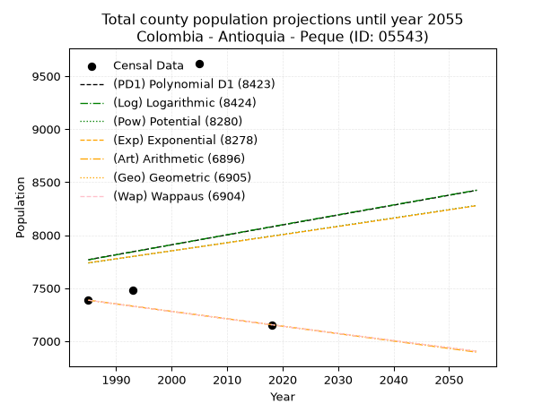
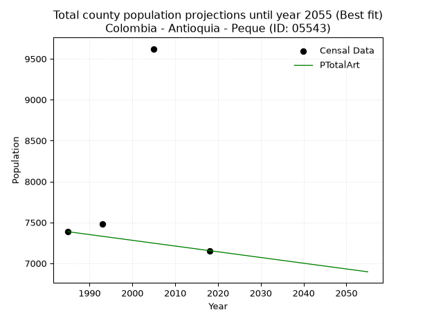
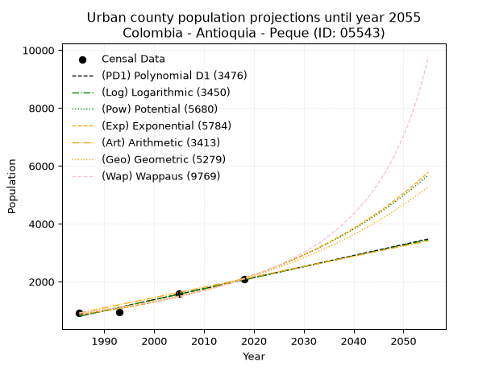
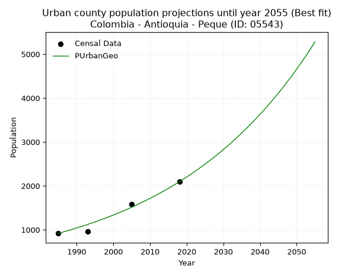
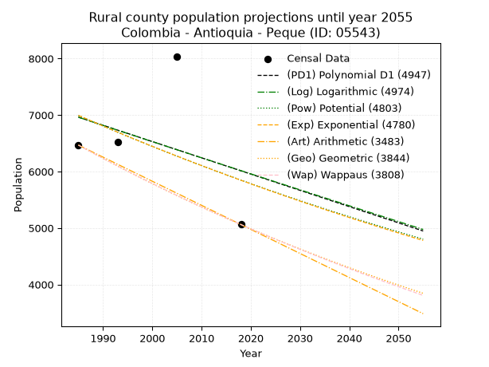
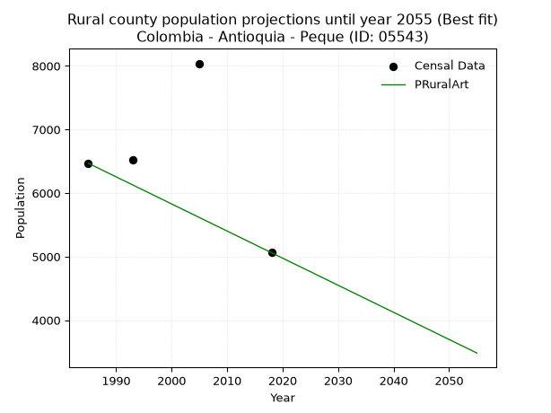

<div align="center">


</div>

# _“Population and Public Services Demand Projections (PPSD) until Year 2050 for Colombia - Antioquia - Peque (ID: 05543)”_
Keywords: `population` `public-service` `projection` `lineal` `polynomial` `logarithmic` `potential` `exponential` `arithmetic` `geometric` `wappaus` `dane` `colombia` `south-america`

PPSD are analytical estimates used by governments and planners to anticipate future changes in population size, age distribution, and the resulting community needs for utilities, healthcare, education, and infrastructure as sizing future water treatment facilities, electrical grids, and road networks based on spatial growth.

> **General running parameters**: • app_version: _v20260806_. • Python version: _3.14.7_. • Pandas version: _3.0.5_. • NumPy version: _2.5.1_. • Creates, save and include plots into reports (create_plot): _False_. • Projection until year: _2050_. • Process polynomial degree 2 and up: _False_. • Process Wappaus: _True_. • Process Wappaus: _True_. • Set negative values to zero: _True_. • Set infinite values to zero: _True_. • Drop dataset notes: _True_. 
<div align="center">

Dynamic map: [:earth_americas:Google](http://maps.google.com/maps?q=7.021029051,-75.9103567) [:earth_americas:OSM](https://www.openstreetmap.org/#map=18/7.021029051/-75.9103567&layers=P) [:earth_americas:Bing](https://www.bing.com/maps?cp=7.021029051~-75.9103567&lvl=18) [:earth_americas:Apple](https://maps.apple.com/frame?center=7.021029051%2C-75.9103567&span=0.003%2C0.006)

</div>


<div align="center">

```geojson
{
  "type": "Feature",
  "geometry": {
    "type": "Point", 
    "coordinates": [-75.9103567, 7.021029051]
  }, 
  "properties": {
    "Name": "Colombia - Antioquia - Peque (ID: 05543)"
  }
}
```

</div>


## 0. Census Data (4 records)

Census data are official statistics collected by a government about the people and housing in a country. They usually include counts of total population, age, sex, race, income, education, and jobs.

📅Global census file: [Population.xlsx](../data/Population.xlsx)

| Source   |   Year |   CountryID | CountryName   |   StateID | StateName   |   CountyID | CountyName   |   PTotal |   PUrban |   PRural |
|:---------|-------:|------------:|:--------------|----------:|:------------|-----------:|:-------------|---------:|---------:|---------:|
| DANE     |   1985 |          57 | Colombia      |        05 | Antioquia   |      05543 | Peque        |     7386 |      918 |     6468 |
| DANE     |   1993 |          57 | Colombia      |        05 | Antioquia   |      05543 | Peque        |     7482 |      956 |     6526 |
| DANE     |   2005 |          57 | Colombia      |        05 | Antioquia   |      05543 | Peque        |     9621 |     1582 |     8039 |
| DANE     |   2018 |          57 | Colombia      |        05 | Antioquia   |      05543 | Peque        |     7155 |     2094 |     5061 |

> 🔥Some records could had specific notes about the registered values or the corresponding urban or rural distribution.

## 1. Total

### 1.1. Coefficients and Parameters

* (PD1) Polynomial Deg 1: 9.34564431955179, -10782.625050183471 (lineal)
* (Log) Logarithmic: 18995.603073893923, -136474.73118587746
* (Pow) Potential: 1.9570532697409404, -2.5653170458047088
* (Exp) Exponential: 0.0009604002640288338, 1150.1828049430767
* (Art) Arithmetic: Year diff. 2018 - 1985 = 33, Population diff. 7155 - 7386 = -231, Annual growth = -7.0
* (Geo) Geometric: Year diff. 2018 - 1985 = 33, Population diff. 7155 - 7386 = -231, Annual growth % = -0.0009624124450586802
* (Wap) Wappaus: i = -0.09627948559246269, Condition values only valid for < 200)

<sub>
Wappaus condition values: ['-0.00', '-0.10', '-0.19', '-0.29', '-0.39', '-0.48', '-0.58', '-0.67', '-0.77', '-0.87', '-0.96', '-1.06', '-1.16', '-1.25', '-1.35', '-1.44', '-1.54', '-1.64', '-1.73', '-1.83', '-1.93', '-2.02', '-2.12', '-2.21', '-2.31', '-2.41', '-2.50', '-2.60', '-2.70', '-2.79', '-2.89', '-2.98', '-3.08', '-3.18', '-3.27', '-3.37', '-3.47', '-3.56', '-3.66', '-3.75', '-3.85', '-3.95', '-4.04', '-4.14', '-4.24', '-4.33', '-4.43', '-4.53', '-4.62', '-4.72', '-4.81', '-4.91', '-5.01', '-5.10', '-5.20', '-5.30', '-5.39', '-5.49', '-5.58', '-5.68', '-5.78', '-5.87', '-5.97', '-6.07', '-6.16', '-6.26']
</sub>


### 1.2. Projected Dataset

|   Year |   CountyID |   PTotalPD1 |   PTotalLog |   PTotalPow |   PTotalExp |   PTotalArt |   PTotalGeo |   PTotalWap |
|-------:|-----------:|------------:|------------:|------------:|------------:|------------:|------------:|------------:|
|   1985 |      05543 |        7768 |        7766 |        7737 |        7739 |        7386 |        7386 |        7386 |
|   1986 |      05543 |        7778 |        7776 |        7745 |        7747 |        7379 |        7379 |        7379 |
|   1987 |      05543 |        7787 |        7785 |        7752 |        7754 |        7372 |        7372 |        7372 |
|   1988 |      05543 |        7797 |        7795 |        7760 |        7762 |        7365 |        7365 |        7365 |
|   1989 |      05543 |        7806 |        7804 |        7768 |        7769 |        7358 |        7358 |        7358 |
|   1990 |      05543 |        7815 |        7814 |        7775 |        7777 |        7351 |        7351 |        7351 |
|   1991 |      05543 |        7825 |        7823 |        7783 |        7784 |        7344 |        7343 |        7343 |
|   1992 |      05543 |        7834 |        7833 |        7791 |        7792 |        7337 |        7336 |        7336 |
|   1993 |      05543 |        7843 |        7842 |        7798 |        7799 |        7330 |        7329 |        7329 |
|   1994 |      05543 |        7853 |        7852 |        7806 |        7807 |        7323 |        7322 |        7322 |
|   1995 |      05543 |        7862 |        7861 |        7814 |        7814 |        7316 |        7315 |        7315 |
|   1996 |      05543 |        7871 |        7871 |        7821 |        7822 |        7309 |        7308 |        7308 |
|   1997 |      05543 |        7881 |        7880 |        7829 |        7829 |        7302 |        7301 |        7301 |
|   1998 |      05543 |        7890 |        7890 |        7837 |        7837 |        7295 |        7294 |        7294 |
|   1999 |      05543 |        7899 |        7899 |        7844 |        7844 |        7288 |        7287 |        7287 |
|   2000 |      05543 |        7909 |        7909 |        7852 |        7852 |        7281 |        7280 |        7280 |
|   2001 |      05543 |        7918 |        7918 |        7860 |        7859 |        7274 |        7273 |        7273 |
|   2002 |      05543 |        7927 |        7928 |        7867 |        7867 |        7267 |        7266 |        7266 |
|   2003 |      05543 |        7937 |        7937 |        7875 |        7874 |        7260 |        7259 |        7259 |
|   2004 |      05543 |        7946 |        7947 |        7883 |        7882 |        7253 |        7252 |        7252 |
|   2005 |      05543 |        7955 |        7956 |        7890 |        7889 |        7246 |        7245 |        7245 |
|   2006 |      05543 |        7965 |        7966 |        7898 |        7897 |        7239 |        7238 |        7238 |
|   2007 |      05543 |        7974 |        7975 |        7906 |        7905 |        7232 |        7231 |        7231 |
|   2008 |      05543 |        7983 |        7985 |        7913 |        7912 |        7225 |        7224 |        7224 |
|   2009 |      05543 |        7993 |        7994 |        7921 |        7920 |        7218 |        7217 |        7217 |
|   2010 |      05543 |        8002 |        8004 |        7929 |        7927 |        7211 |        7210 |        7210 |
|   2011 |      05543 |        8011 |        8013 |        7937 |        7935 |        7204 |        7203 |        7203 |
|   2012 |      05543 |        8021 |        8023 |        7944 |        7943 |        7197 |        7196 |        7196 |
|   2013 |      05543 |        8030 |        8032 |        7952 |        7950 |        7190 |        7190 |        7190 |
|   2014 |      05543 |        8040 |        8042 |        7960 |        7958 |        7183 |        7183 |        7183 |
|   2015 |      05543 |        8049 |        8051 |        7968 |        7966 |        7176 |        7176 |        7176 |
|   2016 |      05543 |        8058 |        8060 |        7975 |        7973 |        7169 |        7169 |        7169 |
|   2017 |      05543 |        8068 |        8070 |        7983 |        7981 |        7162 |        7162 |        7162 |
|   2018 |      05543 |        8077 |        8079 |        7991 |        7989 |        7155 |        7155 |        7155 |
|   2019 |      05543 |        8086 |        8089 |        7999 |        7996 |        7148 |        7148 |        7148 |
|   2020 |      05543 |        8096 |        8098 |        8006 |        8004 |        7141 |        7141 |        7141 |
|   2021 |      05543 |        8105 |        8107 |        8014 |        8012 |        7134 |        7134 |        7134 |
|   2022 |      05543 |        8114 |        8117 |        8022 |        8019 |        7127 |        7127 |        7127 |
|   2023 |      05543 |        8124 |        8126 |        8030 |        8027 |        7120 |        7121 |        7121 |
|   2024 |      05543 |        8133 |        8136 |        8037 |        8035 |        7113 |        7114 |        7114 |
|   2025 |      05543 |        8142 |        8145 |        8045 |        8042 |        7106 |        7107 |        7107 |
|   2026 |      05543 |        8152 |        8154 |        8053 |        8050 |        7099 |        7100 |        7100 |
|   2027 |      05543 |        8161 |        8164 |        8061 |        8058 |        7092 |        7093 |        7093 |
|   2028 |      05543 |        8170 |        8173 |        8068 |        8066 |        7085 |        7086 |        7086 |
|   2029 |      05543 |        8180 |        8182 |        8076 |        8073 |        7078 |        7080 |        7080 |
|   2030 |      05543 |        8189 |        8192 |        8084 |        8081 |        7071 |        7073 |        7073 |
|   2031 |      05543 |        8198 |        8201 |        8092 |        8089 |        7064 |        7066 |        7066 |
|   2032 |      05543 |        8208 |        8211 |        8100 |        8097 |        7057 |        7059 |        7059 |
|   2033 |      05543 |        8217 |        8220 |        8107 |        8104 |        7050 |        7052 |        7052 |
|   2034 |      05543 |        8226 |        8229 |        8115 |        8112 |        7043 |        7046 |        7046 |
|   2035 |      05543 |        8236 |        8239 |        8123 |        8120 |        7036 |        7039 |        7039 |
|   2036 |      05543 |        8245 |        8248 |        8131 |        8128 |        7029 |        7032 |        7032 |
|   2037 |      05543 |        8254 |        8257 |        8139 |        8136 |        7022 |        7025 |        7025 |
|   2038 |      05543 |        8264 |        8267 |        8147 |        8143 |        7015 |        7019 |        7018 |
|   2039 |      05543 |        8273 |        8276 |        8154 |        8151 |        7008 |        7012 |        7012 |
|   2040 |      05543 |        8282 |        8285 |        8162 |        8159 |        7001 |        7005 |        7005 |
|   2041 |      05543 |        8292 |        8294 |        8170 |        8167 |        6994 |        6998 |        6998 |
|   2042 |      05543 |        8301 |        8304 |        8178 |        8175 |        6987 |        6992 |        6991 |
|   2043 |      05543 |        8311 |        8313 |        8186 |        8183 |        6980 |        6985 |        6985 |
|   2044 |      05543 |        8320 |        8322 |        8194 |        8191 |        6973 |        6978 |        6978 |
|   2045 |      05543 |        8329 |        8332 |        8201 |        8198 |        6966 |        6971 |        6971 |
|   2046 |      05543 |        8339 |        8341 |        8209 |        8206 |        6959 |        6965 |        6965 |
|   2047 |      05543 |        8348 |        8350 |        8217 |        8214 |        6952 |        6958 |        6958 |
|   2048 |      05543 |        8357 |        8360 |        8225 |        8222 |        6945 |        6951 |        6951 |
|   2049 |      05543 |        8367 |        8369 |        8233 |        8230 |        6938 |        6945 |        6944 |
|   2050 |      05543 |        8376 |        8378 |        8241 |        8238 |        6931 |        6938 |        6938 |
<div align="center">

</img>

</div>


### 1.3. Best fit with absolute and relative error (%)

Relative error puts that difference into context by dividing the absolute error by the true value, creating a unitless ratio or percentage that shows the scale of the mistake.

Absolute and relative error

|   Year | Source   |   CountryID | CountryName   |   StateID | StateName   |   CountyID_x | CountyName   |   PTotal |   PUrban |   PRural |   CountyID_y |   PTotalPD1 |   PTotalLog |   PTotalPow |   PTotalExp |   PTotalArt |   PTotalGeo |   PTotalWap |   PTotalPD1AbsError |   PTotalLogAbsError |   PTotalPowAbsError |   PTotalExpAbsError |   PTotalArtAbsError |   PTotalGeoAbsError |   PTotalWapAbsError |   PTotalPD1RelError |   PTotalLogRelError |   PTotalPowRelError |   PTotalExpRelError |   PTotalArtRelError |   PTotalGeoRelError |   PTotalWapRelError |
|-------:|:---------|------------:|:--------------|----------:|:------------|-------------:|:-------------|---------:|---------:|---------:|-------------:|------------:|------------:|------------:|------------:|------------:|------------:|------------:|--------------------:|--------------------:|--------------------:|--------------------:|--------------------:|--------------------:|--------------------:|--------------------:|--------------------:|--------------------:|--------------------:|--------------------:|--------------------:|--------------------:|
|   1985 | DANE     |          57 | Colombia      |        05 | Antioquia   |        05543 | Peque        |     7386 |      918 |     6468 |        05543 |        7768 |        7766 |        7737 |        7739 |        7386 |        7386 |        7386 |                 382 |                 380 |                 351 |                 353 |                   0 |                   0 |                   0 |             5.17195 |             5.14487 |             4.75223 |             4.77931 |             0       |             0       |             0       |
|   1993 | DANE     |          57 | Colombia      |        05 | Antioquia   |        05543 | Peque        |     7482 |      956 |     6526 |        05543 |        7843 |        7842 |        7798 |        7799 |        7330 |        7329 |        7329 |                 361 |                 360 |                 316 |                 317 |                 152 |                 153 |                 153 |             4.82491 |             4.81155 |             4.22347 |             4.23684 |             2.03154 |             2.04491 |             2.04491 |
|   2005 | DANE     |          57 | Colombia      |        05 | Antioquia   |        05543 | Peque        |     9621 |     1582 |     8039 |        05543 |        7955 |        7956 |        7890 |        7889 |        7246 |        7245 |        7245 |                1666 |                1665 |                1731 |                1732 |                2375 |                2376 |                2376 |            17.3163  |            17.3059  |            17.9919  |            18.0023  |            24.6856  |            24.696   |            24.696   |
|   2018 | DANE     |          57 | Colombia      |        05 | Antioquia   |        05543 | Peque        |     7155 |     2094 |     5061 |        05543 |        8077 |        8079 |        7991 |        7989 |        7155 |        7155 |        7155 |                 922 |                 924 |                 836 |                 834 |                   0 |                   0 |                   0 |            12.8861  |            12.914   |            11.6841  |            11.6562  |             0       |             0       |             0       |

Relative error mean

| Method    |   RelError | Best   |
|:----------|-----------:|:-------|
| PTotalPD1 |   10.0498  |        |
| PTotalLog |   10.0441  |        |
| PTotalPow |    9.66293 |        |
| PTotalExp |    9.66865 |        |
| PTotalArt |    6.67928 | True   |
| PTotalGeo |    6.68522 |        |
| PTotalWap |    6.68522 |        |

💙Best method: _**PTotalArt**_
<div align="center">

</img>

</div>


### 1.4. Fresh water supply demand in liters per capita per day (lpcd)

The fresh water supply demand typically ranges from 100 to 300 liters per capita per day (lpcd) for standard domestic and municipal planning, though absolute survival minimums set by the World Health Organization are as low as 7.5 to 20 liters per day, and total consumption in high-income nations can exceed 400 liters.

> `CZ`: Level in meters above the sea level (masl)<br> `WS`: Fresh water supply demand in liters per capita per day (lpcd or l/h/d)<br> `WSAll`: Zonal fresh water supply demand in liters per second (l/s)<br> `A`: Zonal area in square meters<br> `DP`: Population density (people/hectare)

Reference values (RAS Colombia)

|    CZ |   WS |
|------:|-----:|
|  1000 |  120 |
|  2000 |  130 |
| 99999 |  140 |

County shapefile geometry properties and water supply values

|   CountyID |      ATotal |   CZTotal |   WSTotal |
|-----------:|------------:|----------:|----------:|
|      05543 | 4.34039e+08 |   2011.41 |       140 |

Projected values for best method: PTotalArt

|   CountyID |   Year |   PTotalArt |   DPTotal |   WSTotal |   WSTotalAll |
|-----------:|-------:|------------:|----------:|----------:|-------------:|
|      05543 |   1985 |        7386 |      0.17 |       140 |      11.9681 |
|      05543 |   1986 |        7379 |      0.17 |       140 |      11.9567 |
|      05543 |   1987 |        7372 |      0.17 |       140 |      11.9454 |
|      05543 |   1988 |        7365 |      0.17 |       140 |      11.934  |
|      05543 |   1989 |        7358 |      0.17 |       140 |      11.9227 |
|      05543 |   1990 |        7351 |      0.17 |       140 |      11.9113 |
|      05543 |   1991 |        7344 |      0.17 |       140 |      11.9    |
|      05543 |   1992 |        7337 |      0.17 |       140 |      11.8887 |
|      05543 |   1993 |        7330 |      0.17 |       140 |      11.8773 |
|      05543 |   1994 |        7323 |      0.17 |       140 |      11.866  |
|      05543 |   1995 |        7316 |      0.17 |       140 |      11.8546 |
|      05543 |   1996 |        7309 |      0.17 |       140 |      11.8433 |
|      05543 |   1997 |        7302 |      0.17 |       140 |      11.8319 |
|      05543 |   1998 |        7295 |      0.17 |       140 |      11.8206 |
|      05543 |   1999 |        7288 |      0.17 |       140 |      11.8093 |
|      05543 |   2000 |        7281 |      0.17 |       140 |      11.7979 |
|      05543 |   2001 |        7274 |      0.17 |       140 |      11.7866 |
|      05543 |   2002 |        7267 |      0.17 |       140 |      11.7752 |
|      05543 |   2003 |        7260 |      0.17 |       140 |      11.7639 |
|      05543 |   2004 |        7253 |      0.17 |       140 |      11.7525 |
|      05543 |   2005 |        7246 |      0.17 |       140 |      11.7412 |
|      05543 |   2006 |        7239 |      0.17 |       140 |      11.7299 |
|      05543 |   2007 |        7232 |      0.17 |       140 |      11.7185 |
|      05543 |   2008 |        7225 |      0.17 |       140 |      11.7072 |
|      05543 |   2009 |        7218 |      0.17 |       140 |      11.6958 |
|      05543 |   2010 |        7211 |      0.17 |       140 |      11.6845 |
|      05543 |   2011 |        7204 |      0.17 |       140 |      11.6731 |
|      05543 |   2012 |        7197 |      0.17 |       140 |      11.6618 |
|      05543 |   2013 |        7190 |      0.17 |       140 |      11.6505 |
|      05543 |   2014 |        7183 |      0.17 |       140 |      11.6391 |
|      05543 |   2015 |        7176 |      0.17 |       140 |      11.6278 |
|      05543 |   2016 |        7169 |      0.17 |       140 |      11.6164 |
|      05543 |   2017 |        7162 |      0.17 |       140 |      11.6051 |
|      05543 |   2018 |        7155 |      0.16 |       140 |      11.5938 |
|      05543 |   2019 |        7148 |      0.16 |       140 |      11.5824 |
|      05543 |   2020 |        7141 |      0.16 |       140 |      11.5711 |
|      05543 |   2021 |        7134 |      0.16 |       140 |      11.5597 |
|      05543 |   2022 |        7127 |      0.16 |       140 |      11.5484 |
|      05543 |   2023 |        7120 |      0.16 |       140 |      11.537  |
|      05543 |   2024 |        7113 |      0.16 |       140 |      11.5257 |
|      05543 |   2025 |        7106 |      0.16 |       140 |      11.5144 |
|      05543 |   2026 |        7099 |      0.16 |       140 |      11.503  |
|      05543 |   2027 |        7092 |      0.16 |       140 |      11.4917 |
|      05543 |   2028 |        7085 |      0.16 |       140 |      11.4803 |
|      05543 |   2029 |        7078 |      0.16 |       140 |      11.469  |
|      05543 |   2030 |        7071 |      0.16 |       140 |      11.4576 |
|      05543 |   2031 |        7064 |      0.16 |       140 |      11.4463 |
|      05543 |   2032 |        7057 |      0.16 |       140 |      11.435  |
|      05543 |   2033 |        7050 |      0.16 |       140 |      11.4236 |
|      05543 |   2034 |        7043 |      0.16 |       140 |      11.4123 |
|      05543 |   2035 |        7036 |      0.16 |       140 |      11.4009 |
|      05543 |   2036 |        7029 |      0.16 |       140 |      11.3896 |
|      05543 |   2037 |        7022 |      0.16 |       140 |      11.3782 |
|      05543 |   2038 |        7015 |      0.16 |       140 |      11.3669 |
|      05543 |   2039 |        7008 |      0.16 |       140 |      11.3556 |
|      05543 |   2040 |        7001 |      0.16 |       140 |      11.3442 |
|      05543 |   2041 |        6994 |      0.16 |       140 |      11.3329 |
|      05543 |   2042 |        6987 |      0.16 |       140 |      11.3215 |
|      05543 |   2043 |        6980 |      0.16 |       140 |      11.3102 |
|      05543 |   2044 |        6973 |      0.16 |       140 |      11.2988 |
|      05543 |   2045 |        6966 |      0.16 |       140 |      11.2875 |
|      05543 |   2046 |        6959 |      0.16 |       140 |      11.2762 |
|      05543 |   2047 |        6952 |      0.16 |       140 |      11.2648 |
|      05543 |   2048 |        6945 |      0.16 |       140 |      11.2535 |
|      05543 |   2049 |        6938 |      0.16 |       140 |      11.2421 |
|      05543 |   2050 |        6931 |      0.16 |       140 |      11.2308 |

## 2. Urban

### 2.1. Coefficients and Parameters

* (PD1) Polynomial Deg 1: 38.14130871136054, -74904.65274989892 (lineal)
* (Log) Logarithmic: 76322.25588839037, -578738.57861583
* (Pow) Potential: 54.405163315252686, -176.47969910445616
* (Exp) Exponential: 0.027183246207726792, 3.1757908461415183e-21
* (Art) Arithmetic: Year diff. 2018 - 1985 = 33, Population diff. 2094 - 918 = 1176, Annual growth = 35.63636363636363
* (Geo) Geometric: Year diff. 2018 - 1985 = 33, Population diff. 2094 - 918 = 1176, Annual growth % = 0.025303748935864734
* (Wap) Wappaus: i = 2.3662924061330437, Condition values only valid for < 200)

<sub>
Wappaus condition values: ['0.00', '2.37', '4.73', '7.10', '9.47', '11.83', '14.20', '16.56', '18.93', '21.30', '23.66', '26.03', '28.40', '30.76', '33.13', '35.49', '37.86', '40.23', '42.59', '44.96', '47.33', '49.69', '52.06', '54.42', '56.79', '59.16', '61.52', '63.89', '66.26', '68.62', '70.99', '73.36', '75.72', '78.09', '80.45', '82.82', '85.19', '87.55', '89.92', '92.29', '94.65', '97.02', '99.38', '101.75', '104.12', '106.48', '108.85', '111.22', '113.58', '115.95', '118.31', '120.68', '123.05', '125.41', '127.78', '130.15', '132.51', '134.88', '137.24', '139.61', '141.98', '144.34', '146.71', '149.08', '151.44', '153.81']
</sub>


### 2.2. Projected Dataset

|   Year |   CountyID |   PUrbanPD1 |   PUrbanLog |   PUrbanPow |   PUrbanExp |   PUrbanArt |   PUrbanGeo |   PUrbanWap |
|-------:|-----------:|------------:|------------:|------------:|------------:|------------:|------------:|------------:|
|   1985 |      05543 |         806 |         805 |         862 |         863 |         918 |         918 |         918 |
|   1986 |      05543 |         844 |         843 |         886 |         886 |         954 |         941 |         940 |
|   1987 |      05543 |         882 |         882 |         911 |         911 |         989 |         965 |         962 |
|   1988 |      05543 |         920 |         920 |         936 |         936 |        1025 |         989 |         986 |
|   1989 |      05543 |         958 |         959 |         962 |         962 |        1061 |        1015 |        1009 |
|   1990 |      05543 |         997 |         997 |         988 |         988 |        1096 |        1040 |        1033 |
|   1991 |      05543 |        1035 |        1035 |        1016 |        1015 |        1132 |        1066 |        1058 |
|   1992 |      05543 |        1073 |        1074 |        1044 |        1043 |        1167 |        1093 |        1084 |
|   1993 |      05543 |        1111 |        1112 |        1073 |        1072 |        1203 |        1121 |        1110 |
|   1994 |      05543 |        1149 |        1150 |        1103 |        1102 |        1239 |        1150 |        1137 |
|   1995 |      05543 |        1187 |        1188 |        1133 |        1132 |        1274 |        1179 |        1164 |
|   1996 |      05543 |        1225 |        1227 |        1164 |        1163 |        1310 |        1208 |        1193 |
|   1997 |      05543 |        1264 |        1265 |        1196 |        1195 |        1346 |        1239 |        1222 |
|   1998 |      05543 |        1302 |        1303 |        1230 |        1228 |        1381 |        1270 |        1252 |
|   1999 |      05543 |        1340 |        1341 |        1263 |        1262 |        1417 |        1303 |        1282 |
|   2000 |      05543 |        1378 |        1379 |        1298 |        1297 |        1453 |        1335 |        1314 |
|   2001 |      05543 |        1416 |        1418 |        1334 |        1333 |        1488 |        1369 |        1347 |
|   2002 |      05543 |        1454 |        1456 |        1371 |        1369 |        1524 |        1404 |        1380 |
|   2003 |      05543 |        1492 |        1494 |        1409 |        1407 |        1559 |        1439 |        1415 |
|   2004 |      05543 |        1531 |        1532 |        1447 |        1446 |        1595 |        1476 |        1450 |
|   2005 |      05543 |        1569 |        1570 |        1487 |        1486 |        1631 |        1513 |        1487 |
|   2006 |      05543 |        1607 |        1608 |        1528 |        1527 |        1666 |        1551 |        1525 |
|   2007 |      05543 |        1645 |        1646 |        1570 |        1569 |        1702 |        1591 |        1564 |
|   2008 |      05543 |        1683 |        1684 |        1613 |        1612 |        1738 |        1631 |        1604 |
|   2009 |      05543 |        1721 |        1722 |        1658 |        1656 |        1773 |        1672 |        1646 |
|   2010 |      05543 |        1759 |        1760 |        1703 |        1702 |        1809 |        1715 |        1689 |
|   2011 |      05543 |        1798 |        1798 |        1750 |        1749 |        1845 |        1758 |        1734 |
|   2012 |      05543 |        1836 |        1836 |        1798 |        1797 |        1880 |        1802 |        1780 |
|   2013 |      05543 |        1874 |        1874 |        1847 |        1847 |        1916 |        1848 |        1828 |
|   2014 |      05543 |        1912 |        1912 |        1898 |        1898 |        1951 |        1895 |        1877 |
|   2015 |      05543 |        1950 |        1950 |        1950 |        1950 |        1987 |        1943 |        1928 |
|   2016 |      05543 |        1988 |        1988 |        2003 |        2004 |        2023 |        1992 |        1981 |
|   2017 |      05543 |        2026 |        2025 |        2058 |        2059 |        2058 |        2042 |        2037 |
|   2018 |      05543 |        2065 |        2063 |        2114 |        2116 |        2094 |        2094 |        2094 |
|   2019 |      05543 |        2103 |        2101 |        2172 |        2174 |        2130 |        2147 |        2154 |
|   2020 |      05543 |        2141 |        2139 |        2231 |        2234 |        2165 |        2201 |        2216 |
|   2021 |      05543 |        2179 |        2177 |        2292 |        2295 |        2201 |        2257 |        2280 |
|   2022 |      05543 |        2217 |        2214 |        2354 |        2359 |        2237 |        2314 |        2348 |
|   2023 |      05543 |        2255 |        2252 |        2419 |        2424 |        2272 |        2373 |        2418 |
|   2024 |      05543 |        2293 |        2290 |        2484 |        2490 |        2308 |        2433 |        2491 |
|   2025 |      05543 |        2331 |        2328 |        2552 |        2559 |        2343 |        2494 |        2568 |
|   2026 |      05543 |        2370 |        2365 |        2622 |        2629 |        2379 |        2557 |        2648 |
|   2027 |      05543 |        2408 |        2403 |        2693 |        2702 |        2415 |        2622 |        2732 |
|   2028 |      05543 |        2446 |        2441 |        2766 |        2776 |        2450 |        2688 |        2819 |
|   2029 |      05543 |        2484 |        2478 |        2841 |        2853 |        2486 |        2756 |        2912 |
|   2030 |      05543 |        2522 |        2516 |        2919 |        2931 |        2522 |        2826 |        3009 |
|   2031 |      05543 |        2560 |        2553 |        2998 |        3012 |        2557 |        2898 |        3111 |
|   2032 |      05543 |        2598 |        2591 |        3079 |        3095 |        2593 |        2971 |        3218 |
|   2033 |      05543 |        2637 |        2628 |        3163 |        3181 |        2629 |        3046 |        3331 |
|   2034 |      05543 |        2675 |        2666 |        3248 |        3268 |        2664 |        3123 |        3451 |
|   2035 |      05543 |        2713 |        2704 |        3336 |        3358 |        2700 |        3202 |        3577 |
|   2036 |      05543 |        2751 |        2741 |        3427 |        3451 |        2735 |        3283 |        3711 |
|   2037 |      05543 |        2789 |        2779 |        3520 |        3546 |        2771 |        3366 |        3854 |
|   2038 |      05543 |        2827 |        2816 |        3615 |        3644 |        2807 |        3452 |        4005 |
|   2039 |      05543 |        2865 |        2853 |        3713 |        3744 |        2842 |        3539 |        4166 |
|   2040 |      05543 |        2904 |        2891 |        3813 |        3847 |        2878 |        3629 |        4339 |
|   2041 |      05543 |        2942 |        2928 |        3916 |        3953 |        2914 |        3720 |        4523 |
|   2042 |      05543 |        2980 |        2966 |        4022 |        4062 |        2949 |        3815 |        4721 |
|   2043 |      05543 |        3018 |        3003 |        4130 |        4174 |        2985 |        3911 |        4933 |
|   2044 |      05543 |        3056 |        3040 |        4242 |        4289 |        3021 |        4010 |        5163 |
|   2045 |      05543 |        3094 |        3078 |        4356 |        4407 |        3056 |        4111 |        5411 |
|   2046 |      05543 |        3132 |        3115 |        4474 |        4529 |        3092 |        4215 |        5680 |
|   2047 |      05543 |        3171 |        3152 |        4594 |        4653 |        3127 |        4322 |        5973 |
|   2048 |      05543 |        3209 |        3190 |        4718 |        4782 |        3163 |        4432 |        6293 |
|   2049 |      05543 |        3247 |        3227 |        4845 |        4913 |        3199 |        4544 |        6644 |
|   2050 |      05543 |        3285 |        3264 |        4975 |        5049 |        3234 |        4659 |        7032 |
<div align="center">

</img>

</div>


### 2.3. Best fit with absolute and relative error (%)

Relative error puts that difference into context by dividing the absolute error by the true value, creating a unitless ratio or percentage that shows the scale of the mistake.

Absolute and relative error

|   Year | Source   |   CountryID | CountryName   |   StateID | StateName   |   CountyID_x | CountyName   |   PTotal |   PUrban |   PRural |   CountyID_y |   PUrbanPD1 |   PUrbanLog |   PUrbanPow |   PUrbanExp |   PUrbanArt |   PUrbanGeo |   PUrbanWap |   PUrbanPD1AbsError |   PUrbanLogAbsError |   PUrbanPowAbsError |   PUrbanExpAbsError |   PUrbanArtAbsError |   PUrbanGeoAbsError |   PUrbanWapAbsError |   PUrbanPD1RelError |   PUrbanLogRelError |   PUrbanPowRelError |   PUrbanExpRelError |   PUrbanArtRelError |   PUrbanGeoRelError |   PUrbanWapRelError |
|-------:|:---------|------------:|:--------------|----------:|:------------|-------------:|:-------------|---------:|---------:|---------:|-------------:|------------:|------------:|------------:|------------:|------------:|------------:|------------:|--------------------:|--------------------:|--------------------:|--------------------:|--------------------:|--------------------:|--------------------:|--------------------:|--------------------:|--------------------:|--------------------:|--------------------:|--------------------:|--------------------:|
|   1985 | DANE     |          57 | Colombia      |        05 | Antioquia   |        05543 | Peque        |     7386 |      918 |     6468 |        05543 |         806 |         805 |         862 |         863 |         918 |         918 |         918 |                 112 |                 113 |                  56 |                  55 |                   0 |                   0 |                   0 |           12.2004   |           12.3094   |             6.10022 |             5.99129 |             0       |             0       |             0       |
|   1993 | DANE     |          57 | Colombia      |        05 | Antioquia   |        05543 | Peque        |     7482 |      956 |     6526 |        05543 |        1111 |        1112 |        1073 |        1072 |        1203 |        1121 |        1110 |                 155 |                 156 |                 117 |                 116 |                 247 |                 165 |                 154 |           16.2134   |           16.318    |            12.2385  |            12.1339  |            25.8368  |            17.2594  |            16.1088  |
|   2005 | DANE     |          57 | Colombia      |        05 | Antioquia   |        05543 | Peque        |     9621 |     1582 |     8039 |        05543 |        1569 |        1570 |        1487 |        1486 |        1631 |        1513 |        1487 |                  13 |                  12 |                  95 |                  96 |                  49 |                  69 |                  95 |            0.821745 |            0.758534 |             6.00506 |             6.06827 |             3.09735 |             4.36157 |             6.00506 |
|   2018 | DANE     |          57 | Colombia      |        05 | Antioquia   |        05543 | Peque        |     7155 |     2094 |     5061 |        05543 |        2065 |        2063 |        2114 |        2116 |        2094 |        2094 |        2094 |                  29 |                  31 |                  20 |                  22 |                   0 |                   0 |                   0 |            1.38491  |            1.48042  |             0.95511 |             1.05062 |             0       |             0       |             0       |

Relative error mean

| Method    |   RelError | Best   |
|:----------|-----------:|:-------|
| PUrbanPD1 |    7.65512 |        |
| PUrbanLog |    7.71658 |        |
| PUrbanPow |    6.32472 |        |
| PUrbanExp |    6.31102 |        |
| PUrbanArt |    7.23354 |        |
| PUrbanGeo |    5.40525 | True   |
| PUrbanWap |    5.52846 |        |

💙Best method: _**PUrbanGeo**_
<div align="center">

</img>

</div>


### 2.4. Fresh water supply demand in liters per capita per day (lpcd)

The fresh water supply demand typically ranges from 100 to 300 liters per capita per day (lpcd) for standard domestic and municipal planning, though absolute survival minimums set by the World Health Organization are as low as 7.5 to 20 liters per day, and total consumption in high-income nations can exceed 400 liters.

> `CZ`: Level in meters above the sea level (masl)<br> `WS`: Fresh water supply demand in liters per capita per day (lpcd or l/h/d)<br> `WSAll`: Zonal fresh water supply demand in liters per second (l/s)<br> `A`: Zonal area in square meters<br> `DP`: Population density (people/hectare)

Reference values (RAS Colombia)

|    CZ |   WS |
|------:|-----:|
|  1000 |  120 |
|  2000 |  130 |
| 99999 |  140 |

County shapefile geometry properties and water supply values

|   CountyID |   AUrban |   CZUrban |   WSUrban |
|-----------:|---------:|----------:|----------:|
|      05543 |   514764 |   1177.39 |       130 |

Projected values for best method: PUrbanGeo

|   CountyID |   Year |   PUrbanGeo |   DPUrban |   WSUrban |   WSUrbanAll |
|-----------:|-------:|------------:|----------:|----------:|-------------:|
|      05543 |   1985 |         918 |     17.83 |       130 |      1.38125 |
|      05543 |   1986 |         941 |     18.28 |       130 |      1.41586 |
|      05543 |   1987 |         965 |     18.75 |       130 |      1.45197 |
|      05543 |   1988 |         989 |     19.21 |       130 |      1.48808 |
|      05543 |   1989 |        1015 |     19.72 |       130 |      1.5272  |
|      05543 |   1990 |        1040 |     20.2  |       130 |      1.56481 |
|      05543 |   1991 |        1066 |     20.71 |       130 |      1.60394 |
|      05543 |   1992 |        1093 |     21.23 |       130 |      1.64456 |
|      05543 |   1993 |        1121 |     21.78 |       130 |      1.68669 |
|      05543 |   1994 |        1150 |     22.34 |       130 |      1.73032 |
|      05543 |   1995 |        1179 |     22.9  |       130 |      1.77396 |
|      05543 |   1996 |        1208 |     23.47 |       130 |      1.81759 |
|      05543 |   1997 |        1239 |     24.07 |       130 |      1.86424 |
|      05543 |   1998 |        1270 |     24.67 |       130 |      1.91088 |
|      05543 |   1999 |        1303 |     25.31 |       130 |      1.96053 |
|      05543 |   2000 |        1335 |     25.93 |       130 |      2.00868 |
|      05543 |   2001 |        1369 |     26.59 |       130 |      2.05984 |
|      05543 |   2002 |        1404 |     27.27 |       130 |      2.1125  |
|      05543 |   2003 |        1439 |     27.95 |       130 |      2.16516 |
|      05543 |   2004 |        1476 |     28.67 |       130 |      2.22083 |
|      05543 |   2005 |        1513 |     29.39 |       130 |      2.2765  |
|      05543 |   2006 |        1551 |     30.13 |       130 |      2.33368 |
|      05543 |   2007 |        1591 |     30.91 |       130 |      2.39387 |
|      05543 |   2008 |        1631 |     31.68 |       130 |      2.45405 |
|      05543 |   2009 |        1672 |     32.48 |       130 |      2.51574 |
|      05543 |   2010 |        1715 |     33.32 |       130 |      2.58044 |
|      05543 |   2011 |        1758 |     34.15 |       130 |      2.64514 |
|      05543 |   2012 |        1802 |     35.01 |       130 |      2.71134 |
|      05543 |   2013 |        1848 |     35.9  |       130 |      2.78056 |
|      05543 |   2014 |        1895 |     36.81 |       130 |      2.85127 |
|      05543 |   2015 |        1943 |     37.75 |       130 |      2.9235  |
|      05543 |   2016 |        1992 |     38.7  |       130 |      2.99722 |
|      05543 |   2017 |        2042 |     39.67 |       130 |      3.07245 |
|      05543 |   2018 |        2094 |     40.68 |       130 |      3.15069 |
|      05543 |   2019 |        2147 |     41.71 |       130 |      3.23044 |
|      05543 |   2020 |        2201 |     42.76 |       130 |      3.31169 |
|      05543 |   2021 |        2257 |     43.85 |       130 |      3.39595 |
|      05543 |   2022 |        2314 |     44.95 |       130 |      3.48171 |
|      05543 |   2023 |        2373 |     46.1  |       130 |      3.57049 |
|      05543 |   2024 |        2433 |     47.26 |       130 |      3.66076 |
|      05543 |   2025 |        2494 |     48.45 |       130 |      3.75255 |
|      05543 |   2026 |        2557 |     49.67 |       130 |      3.84734 |
|      05543 |   2027 |        2622 |     50.94 |       130 |      3.94514 |
|      05543 |   2028 |        2688 |     52.22 |       130 |      4.04444 |
|      05543 |   2029 |        2756 |     53.54 |       130 |      4.14676 |
|      05543 |   2030 |        2826 |     54.9  |       130 |      4.25208 |
|      05543 |   2031 |        2898 |     56.3  |       130 |      4.36042 |
|      05543 |   2032 |        2971 |     57.72 |       130 |      4.47025 |
|      05543 |   2033 |        3046 |     59.17 |       130 |      4.5831  |
|      05543 |   2034 |        3123 |     60.67 |       130 |      4.69896 |
|      05543 |   2035 |        3202 |     62.2  |       130 |      4.81782 |
|      05543 |   2036 |        3283 |     63.78 |       130 |      4.9397  |
|      05543 |   2037 |        3366 |     65.39 |       130 |      5.06458 |
|      05543 |   2038 |        3452 |     67.06 |       130 |      5.19398 |
|      05543 |   2039 |        3539 |     68.75 |       130 |      5.32488 |
|      05543 |   2040 |        3629 |     70.5  |       130 |      5.4603  |
|      05543 |   2041 |        3720 |     72.27 |       130 |      5.59722 |
|      05543 |   2042 |        3815 |     74.11 |       130 |      5.74016 |
|      05543 |   2043 |        3911 |     75.98 |       130 |      5.88461 |
|      05543 |   2044 |        4010 |     77.9  |       130 |      6.03356 |
|      05543 |   2045 |        4111 |     79.86 |       130 |      6.18553 |
|      05543 |   2046 |        4215 |     81.88 |       130 |      6.34201 |
|      05543 |   2047 |        4322 |     83.96 |       130 |      6.50301 |
|      05543 |   2048 |        4432 |     86.1  |       130 |      6.66852 |
|      05543 |   2049 |        4544 |     88.27 |       130 |      6.83704 |
|      05543 |   2050 |        4659 |     90.51 |       130 |      7.01007 |

## 3. Rural

### 3.1. Coefficients and Parameters

* (PD1) Polynomial Deg 1: -28.79566439180874, 64122.02769971543 (lineal)
* (Log) Logarithmic: -57326.652814496556, 442263.84742995317
* (Pow) Potential: -10.83565119836, 39.57802021250961
* (Exp) Exponential: -0.005437204092143724, 340407928.6874566
* (Art) Arithmetic: Year diff. 2018 - 1985 = 33, Population diff. 5061 - 6468 = -1407, Annual growth = -42.63636363636363
* (Geo) Geometric: Year diff. 2018 - 1985 = 33, Population diff. 5061 - 6468 = -1407, Annual growth % = -0.007405860146696752
* (Wap) Wappaus: i = -0.7396368052105757, Condition values only valid for < 200)

<sub>
Wappaus condition values: ['-0.00', '-0.74', '-1.48', '-2.22', '-2.96', '-3.70', '-4.44', '-5.18', '-5.92', '-6.66', '-7.40', '-8.14', '-8.88', '-9.62', '-10.35', '-11.09', '-11.83', '-12.57', '-13.31', '-14.05', '-14.79', '-15.53', '-16.27', '-17.01', '-17.75', '-18.49', '-19.23', '-19.97', '-20.71', '-21.45', '-22.19', '-22.93', '-23.67', '-24.41', '-25.15', '-25.89', '-26.63', '-27.37', '-28.11', '-28.85', '-29.59', '-30.33', '-31.06', '-31.80', '-32.54', '-33.28', '-34.02', '-34.76', '-35.50', '-36.24', '-36.98', '-37.72', '-38.46', '-39.20', '-39.94', '-40.68', '-41.42', '-42.16', '-42.90', '-43.64', '-44.38', '-45.12', '-45.86', '-46.60', '-47.34', '-48.08']
</sub>


### 3.2. Projected Dataset

|   Year |   CountyID |   PRuralPD1 |   PRuralLog |   PRuralPow |   PRuralExp |   PRuralArt |   PRuralGeo |   PRuralWap |
|-------:|-----------:|------------:|------------:|------------:|------------:|------------:|------------:|------------:|
|   1985 |      05543 |        6963 |        6961 |        6993 |        6994 |        6468 |        6468 |        6468 |
|   1986 |      05543 |        6934 |        6932 |        6955 |        6956 |        6425 |        6420 |        6420 |
|   1987 |      05543 |        6905 |        6903 |        6917 |        6918 |        6383 |        6373 |        6373 |
|   1988 |      05543 |        6876 |        6875 |        6879 |        6881 |        6340 |        6325 |        6326 |
|   1989 |      05543 |        6847 |        6846 |        6842 |        6844 |        6297 |        6279 |        6279 |
|   1990 |      05543 |        6819 |        6817 |        6805 |        6806 |        6255 |        6232 |        6233 |
|   1991 |      05543 |        6790 |        6788 |        6768 |        6769 |        6212 |        6186 |        6187 |
|   1992 |      05543 |        6761 |        6759 |        6731 |        6733 |        6170 |        6140 |        6142 |
|   1993 |      05543 |        6732 |        6731 |        6694 |        6696 |        6127 |        6095 |        6096 |
|   1994 |      05543 |        6703 |        6702 |        6658 |        6660 |        6084 |        6049 |        6051 |
|   1995 |      05543 |        6675 |        6673 |        6622 |        6624 |        6042 |        6005 |        6007 |
|   1996 |      05543 |        6646 |        6644 |        6586 |        6588 |        5999 |        5960 |        5962 |
|   1997 |      05543 |        6617 |        6616 |        6551 |        6552 |        5956 |        5916 |        5918 |
|   1998 |      05543 |        6588 |        6587 |        6515 |        6517 |        5914 |        5872 |        5875 |
|   1999 |      05543 |        6559 |        6558 |        6480 |        6481 |        5871 |        5829 |        5831 |
|   2000 |      05543 |        6531 |        6530 |        6445 |        6446 |        5828 |        5786 |        5788 |
|   2001 |      05543 |        6502 |        6501 |        6410 |        6411 |        5786 |        5743 |        5745 |
|   2002 |      05543 |        6473 |        6472 |        6375 |        6376 |        5743 |        5700 |        5703 |
|   2003 |      05543 |        6444 |        6444 |        6341 |        6342 |        5701 |        5658 |        5661 |
|   2004 |      05543 |        6416 |        6415 |        6307 |        6308 |        5658 |        5616 |        5619 |
|   2005 |      05543 |        6387 |        6386 |        6273 |        6273 |        5615 |        5574 |        5577 |
|   2006 |      05543 |        6358 |        6358 |        6239 |        6239 |        5573 |        5533 |        5536 |
|   2007 |      05543 |        6329 |        6329 |        6205 |        6205 |        5530 |        5492 |        5495 |
|   2008 |      05543 |        6300 |        6301 |        6172 |        6172 |        5487 |        5452 |        5454 |
|   2009 |      05543 |        6272 |        6272 |        6139 |        6138 |        5445 |        5411 |        5413 |
|   2010 |      05543 |        6243 |        6244 |        6106 |        6105 |        5402 |        5371 |        5373 |
|   2011 |      05543 |        6214 |        6215 |        6073 |        6072 |        5359 |        5331 |        5333 |
|   2012 |      05543 |        6185 |        6187 |        6040 |        6039 |        5317 |        5292 |        5294 |
|   2013 |      05543 |        6156 |        6158 |        6008 |        6006 |        5274 |        5253 |        5254 |
|   2014 |      05543 |        6128 |        6130 |        5976 |        5974 |        5232 |        5214 |        5215 |
|   2015 |      05543 |        6099 |        6101 |        5944 |        5941 |        5189 |        5175 |        5176 |
|   2016 |      05543 |        6070 |        6073 |        5912 |        5909 |        5146 |        5137 |        5138 |
|   2017 |      05543 |        6041 |        6044 |        5880 |        5877 |        5104 |        5099 |        5099 |
|   2018 |      05543 |        6012 |        6016 |        5849 |        5845 |        5061 |        5061 |        5061 |
|   2019 |      05543 |        5984 |        5988 |        5817 |        5814 |        5018 |        5024 |        5023 |
|   2020 |      05543 |        5955 |        5959 |        5786 |        5782 |        4976 |        4986 |        4985 |
|   2021 |      05543 |        5926 |        5931 |        5755 |        5751 |        4933 |        4949 |        4948 |
|   2022 |      05543 |        5897 |        5902 |        5724 |        5719 |        4890 |        4913 |        4911 |
|   2023 |      05543 |        5868 |        5874 |        5694 |        5688 |        4848 |        4876 |        4874 |
|   2024 |      05543 |        5840 |        5846 |        5663 |        5658 |        4805 |        4840 |        4837 |
|   2025 |      05543 |        5811 |        5817 |        5633 |        5627 |        4763 |        4804 |        4801 |
|   2026 |      05543 |        5782 |        5789 |        5603 |        5596 |        4720 |        4769 |        4765 |
|   2027 |      05543 |        5753 |        5761 |        5573 |        5566 |        4677 |        4733 |        4729 |
|   2028 |      05543 |        5724 |        5733 |        5544 |        5536 |        4635 |        4698 |        4693 |
|   2029 |      05543 |        5696 |        5704 |        5514 |        5506 |        4592 |        4664 |        4658 |
|   2030 |      05543 |        5667 |        5676 |        5485 |        5476 |        4549 |        4629 |        4622 |
|   2031 |      05543 |        5638 |        5648 |        5455 |        5446 |        4507 |        4595 |        4587 |
|   2032 |      05543 |        5609 |        5620 |        5426 |        5417 |        4464 |        4561 |        4552 |
|   2033 |      05543 |        5580 |        5591 |        5398 |        5387 |        4421 |        4527 |        4518 |
|   2034 |      05543 |        5552 |        5563 |        5369 |        5358 |        4379 |        4493 |        4483 |
|   2035 |      05543 |        5523 |        5535 |        5340 |        5329 |        4336 |        4460 |        4449 |
|   2036 |      05543 |        5494 |        5507 |        5312 |        5300 |        4294 |        4427 |        4415 |
|   2037 |      05543 |        5465 |        5479 |        5284 |        5272 |        4251 |        4394 |        4382 |
|   2038 |      05543 |        5436 |        5451 |        5256 |        5243 |        4208 |        4362 |        4348 |
|   2039 |      05543 |        5408 |        5422 |        5228 |        5214 |        4166 |        4330 |        4315 |
|   2040 |      05543 |        5379 |        5394 |        5200 |        5186 |        4123 |        4297 |        4282 |
|   2041 |      05543 |        5350 |        5366 |        5173 |        5158 |        4080 |        4266 |        4249 |
|   2042 |      05543 |        5321 |        5338 |        5145 |        5130 |        4038 |        4234 |        4216 |
|   2043 |      05543 |        5292 |        5310 |        5118 |        5102 |        3995 |        4203 |        4183 |
|   2044 |      05543 |        5264 |        5282 |        5091 |        5075 |        3952 |        4172 |        4151 |
|   2045 |      05543 |        5235 |        5254 |        5064 |        5047 |        3910 |        4141 |        4119 |
|   2046 |      05543 |        5206 |        5226 |        5037 |        5020 |        3867 |        4110 |        4087 |
|   2047 |      05543 |        5177 |        5198 |        5011 |        4993 |        3825 |        4080 |        4055 |
|   2048 |      05543 |        5149 |        5170 |        4984 |        4965 |        3782 |        4049 |        4024 |
|   2049 |      05543 |        5120 |        5142 |        4958 |        4939 |        3739 |        4019 |        3992 |
|   2050 |      05543 |        5091 |        5114 |        4932 |        4912 |        3697 |        3990 |        3961 |
<div align="center">

</img>

</div>


### 3.3. Best fit with absolute and relative error (%)

Relative error puts that difference into context by dividing the absolute error by the true value, creating a unitless ratio or percentage that shows the scale of the mistake.

Absolute and relative error

|   Year | Source   |   CountryID | CountryName   |   StateID | StateName   |   CountyID_x | CountyName   |   PTotal |   PUrban |   PRural |   CountyID_y |   PRuralPD1 |   PRuralLog |   PRuralPow |   PRuralExp |   PRuralArt |   PRuralGeo |   PRuralWap |   PRuralPD1AbsError |   PRuralLogAbsError |   PRuralPowAbsError |   PRuralExpAbsError |   PRuralArtAbsError |   PRuralGeoAbsError |   PRuralWapAbsError |   PRuralPD1RelError |   PRuralLogRelError |   PRuralPowRelError |   PRuralExpRelError |   PRuralArtRelError |   PRuralGeoRelError |   PRuralWapRelError |
|-------:|:---------|------------:|:--------------|----------:|:------------|-------------:|:-------------|---------:|---------:|---------:|-------------:|------------:|------------:|------------:|------------:|------------:|------------:|------------:|--------------------:|--------------------:|--------------------:|--------------------:|--------------------:|--------------------:|--------------------:|--------------------:|--------------------:|--------------------:|--------------------:|--------------------:|--------------------:|--------------------:|
|   1985 | DANE     |          57 | Colombia      |        05 | Antioquia   |        05543 | Peque        |     7386 |      918 |     6468 |        05543 |        6963 |        6961 |        6993 |        6994 |        6468 |        6468 |        6468 |                 495 |                 493 |                 525 |                 526 |                   0 |                   0 |                   0 |             7.65306 |             7.62214 |             8.11688 |             8.13234 |             0       |             0       |             0       |
|   1993 | DANE     |          57 | Colombia      |        05 | Antioquia   |        05543 | Peque        |     7482 |      956 |     6526 |        05543 |        6732 |        6731 |        6694 |        6696 |        6127 |        6095 |        6096 |                 206 |                 205 |                 168 |                 170 |                 399 |                 431 |                 430 |             3.1566  |             3.14128 |             2.57432 |             2.60496 |             6.11401 |             6.60435 |             6.58903 |
|   2005 | DANE     |          57 | Colombia      |        05 | Antioquia   |        05543 | Peque        |     9621 |     1582 |     8039 |        05543 |        6387 |        6386 |        6273 |        6273 |        5615 |        5574 |        5577 |                1652 |                1653 |                1766 |                1766 |                2424 |                2465 |                2462 |            20.5498  |            20.5623  |            21.9679  |            21.9679  |            30.153   |            30.663   |            30.6257  |
|   2018 | DANE     |          57 | Colombia      |        05 | Antioquia   |        05543 | Peque        |     7155 |     2094 |     5061 |        05543 |        6012 |        6016 |        5849 |        5845 |        5061 |        5061 |        5061 |                 951 |                 955 |                 788 |                 784 |                   0 |                   0 |                   0 |            18.7908  |            18.8698  |            15.57    |            15.491   |             0       |             0       |             0       |

Relative error mean

| Method    |   RelError | Best   |
|:----------|-----------:|:-------|
| PRuralPD1 |   12.5376  |        |
| PRuralLog |   12.5489  |        |
| PRuralPow |   12.0573  |        |
| PRuralExp |   12.0491  |        |
| PRuralArt |    9.06675 | True   |
| PRuralGeo |    9.31684 |        |
| PRuralWap |    9.30368 |        |

💙Best method: _**PRuralArt**_
<div align="center">

</img>

</div>


### 3.4. Fresh water supply demand in liters per capita per day (lpcd)

The fresh water supply demand typically ranges from 100 to 300 liters per capita per day (lpcd) for standard domestic and municipal planning, though absolute survival minimums set by the World Health Organization are as low as 7.5 to 20 liters per day, and total consumption in high-income nations can exceed 400 liters.

> `CZ`: Level in meters above the sea level (masl)<br> `WS`: Fresh water supply demand in liters per capita per day (lpcd or l/h/d)<br> `WSAll`: Zonal fresh water supply demand in liters per second (l/s)<br> `A`: Zonal area in square meters<br> `DP`: Population density (people/hectare)

Reference values (RAS Colombia)

|    CZ |   WS |
|------:|-----:|
|  1000 |  120 |
|  2000 |  130 |
| 99999 |  140 |

County shapefile geometry properties and water supply values

|   CountyID |      ARural |   CZRural |   WSRural |
|-----------:|------------:|----------:|----------:|
|      05543 | 4.33524e+08 |   2012.44 |       140 |

Projected values for best method: PRuralArt

|   CountyID |   Year |   PRuralArt |   DPRural |   WSRural |   WSRuralAll |
|-----------:|-------:|------------:|----------:|----------:|-------------:|
|      05543 |   1985 |        6468 |      0.15 |       140 |     10.4806  |
|      05543 |   1986 |        6425 |      0.15 |       140 |     10.4109  |
|      05543 |   1987 |        6383 |      0.15 |       140 |     10.3428  |
|      05543 |   1988 |        6340 |      0.15 |       140 |     10.2731  |
|      05543 |   1989 |        6297 |      0.15 |       140 |     10.2035  |
|      05543 |   1990 |        6255 |      0.14 |       140 |     10.1354  |
|      05543 |   1991 |        6212 |      0.14 |       140 |     10.0657  |
|      05543 |   1992 |        6170 |      0.14 |       140 |      9.99769 |
|      05543 |   1993 |        6127 |      0.14 |       140 |      9.92801 |
|      05543 |   1994 |        6084 |      0.14 |       140 |      9.85833 |
|      05543 |   1995 |        6042 |      0.14 |       140 |      9.79028 |
|      05543 |   1996 |        5999 |      0.14 |       140 |      9.7206  |
|      05543 |   1997 |        5956 |      0.14 |       140 |      9.65093 |
|      05543 |   1998 |        5914 |      0.14 |       140 |      9.58287 |
|      05543 |   1999 |        5871 |      0.14 |       140 |      9.51319 |
|      05543 |   2000 |        5828 |      0.13 |       140 |      9.44352 |
|      05543 |   2001 |        5786 |      0.13 |       140 |      9.37546 |
|      05543 |   2002 |        5743 |      0.13 |       140 |      9.30579 |
|      05543 |   2003 |        5701 |      0.13 |       140 |      9.23773 |
|      05543 |   2004 |        5658 |      0.13 |       140 |      9.16806 |
|      05543 |   2005 |        5615 |      0.13 |       140 |      9.09838 |
|      05543 |   2006 |        5573 |      0.13 |       140 |      9.03032 |
|      05543 |   2007 |        5530 |      0.13 |       140 |      8.96065 |
|      05543 |   2008 |        5487 |      0.13 |       140 |      8.89097 |
|      05543 |   2009 |        5445 |      0.13 |       140 |      8.82292 |
|      05543 |   2010 |        5402 |      0.12 |       140 |      8.75324 |
|      05543 |   2011 |        5359 |      0.12 |       140 |      8.68356 |
|      05543 |   2012 |        5317 |      0.12 |       140 |      8.61551 |
|      05543 |   2013 |        5274 |      0.12 |       140 |      8.54583 |
|      05543 |   2014 |        5232 |      0.12 |       140 |      8.47778 |
|      05543 |   2015 |        5189 |      0.12 |       140 |      8.4081  |
|      05543 |   2016 |        5146 |      0.12 |       140 |      8.33843 |
|      05543 |   2017 |        5104 |      0.12 |       140 |      8.27037 |
|      05543 |   2018 |        5061 |      0.12 |       140 |      8.20069 |
|      05543 |   2019 |        5018 |      0.12 |       140 |      8.13102 |
|      05543 |   2020 |        4976 |      0.11 |       140 |      8.06296 |
|      05543 |   2021 |        4933 |      0.11 |       140 |      7.99329 |
|      05543 |   2022 |        4890 |      0.11 |       140 |      7.92361 |
|      05543 |   2023 |        4848 |      0.11 |       140 |      7.85556 |
|      05543 |   2024 |        4805 |      0.11 |       140 |      7.78588 |
|      05543 |   2025 |        4763 |      0.11 |       140 |      7.71782 |
|      05543 |   2026 |        4720 |      0.11 |       140 |      7.64815 |
|      05543 |   2027 |        4677 |      0.11 |       140 |      7.57847 |
|      05543 |   2028 |        4635 |      0.11 |       140 |      7.51042 |
|      05543 |   2029 |        4592 |      0.11 |       140 |      7.44074 |
|      05543 |   2030 |        4549 |      0.1  |       140 |      7.37106 |
|      05543 |   2031 |        4507 |      0.1  |       140 |      7.30301 |
|      05543 |   2032 |        4464 |      0.1  |       140 |      7.23333 |
|      05543 |   2033 |        4421 |      0.1  |       140 |      7.16366 |
|      05543 |   2034 |        4379 |      0.1  |       140 |      7.0956  |
|      05543 |   2035 |        4336 |      0.1  |       140 |      7.02593 |
|      05543 |   2036 |        4294 |      0.1  |       140 |      6.95787 |
|      05543 |   2037 |        4251 |      0.1  |       140 |      6.88819 |
|      05543 |   2038 |        4208 |      0.1  |       140 |      6.81852 |
|      05543 |   2039 |        4166 |      0.1  |       140 |      6.75046 |
|      05543 |   2040 |        4123 |      0.1  |       140 |      6.68079 |
|      05543 |   2041 |        4080 |      0.09 |       140 |      6.61111 |
|      05543 |   2042 |        4038 |      0.09 |       140 |      6.54306 |
|      05543 |   2043 |        3995 |      0.09 |       140 |      6.47338 |
|      05543 |   2044 |        3952 |      0.09 |       140 |      6.4037  |
|      05543 |   2045 |        3910 |      0.09 |       140 |      6.33565 |
|      05543 |   2046 |        3867 |      0.09 |       140 |      6.26597 |
|      05543 |   2047 |        3825 |      0.09 |       140 |      6.19792 |
|      05543 |   2048 |        3782 |      0.09 |       140 |      6.12824 |
|      05543 |   2049 |        3739 |      0.09 |       140 |      6.05856 |
|      05543 |   2050 |        3697 |      0.09 |       140 |      5.99051 |

<div align="center"><br><sub>Share this research</sub></div><br>

<sub>**APPS & TOOLS & CONTENT DISCLAIMER**: • NO WARRANTY - This content and software is provided by <a href="https://github.com/rcfdtools" target="_blank">github.com/rcfdtools</a> "as is", without any express or implied warranty, including warranties of merchantability, fitness for a particular purpose, or non-infringement. There is no guarantee that the software will be error-free or operate without interruption. • LIMITATION OF LIABILITY - Neither the authors nor copyright holders will be liable for claims or damages arising from the software or its use. You are responsible for determining if the software is appropriate for your use and assume all associated risks, including errors, legal compliance, and data loss. • NO PROFESSIONAL ADVICE - The software provides general information and does not offer professional advice. It should not replace consultation with professional advisors. [Clauses and global license for rcfdtools use.](https://github.com/rcfdtools/rcfdtools/blob/main/LICENSE.md)</sub>

| [:house: Home](Readme.md)  | [:beginner: Help / Collaborate](https://github.com/rcfdtools/R.HydroTools/discussions/31) |
|----------------------------|-------------------------------------------------------------------------------------------|