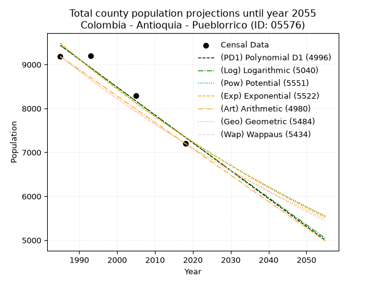
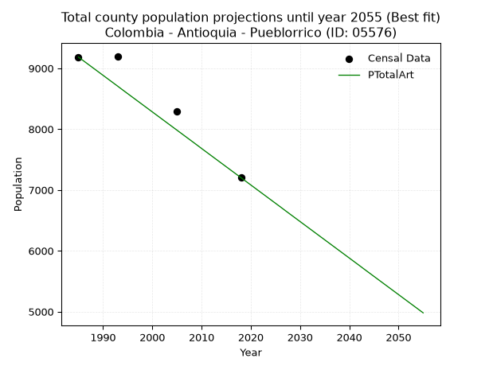
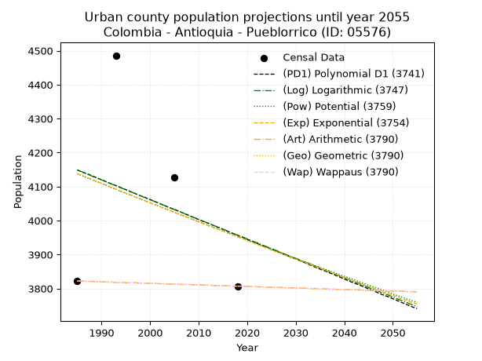
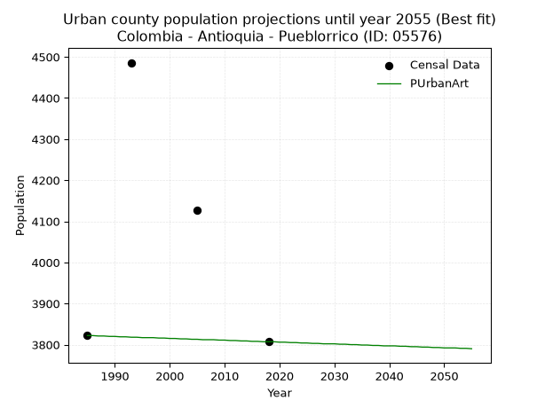
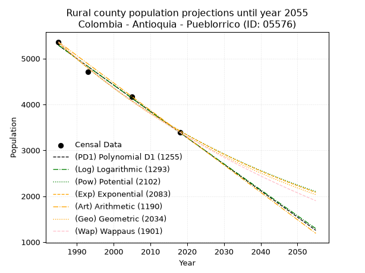
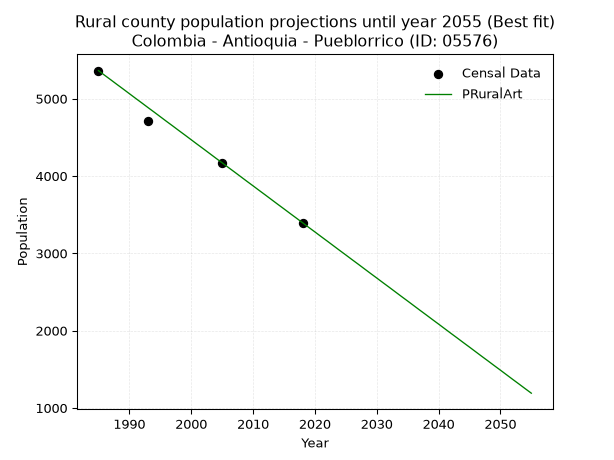

<div align="center">


</div>

# 📜 _“Population and Public Services Demand Projections (PPSD) until Year 2050 for Colombia - Antioquia - Pueblorrico (ID: 05576)”_
Keywords: `population` `public-service` `projection` `lineal` `polynomial` `logarithmic` `potential` `exponential` `arithmetic` `geometric` `wappaus` `dane` `colombia` `south-america`

PPSD are analytical estimates used by governments and planners to anticipate future changes in population size, age distribution, and the resulting community needs for utilities, healthcare, education, and infrastructure as sizing future water treatment facilities, electrical grids, and road networks based on spatial growth.

<div align="center">

</img>

</div>


> **General running parameters**: • app_version: _v20260806_. • Python version: _3.14.7_. • Pandas version: _3.0.5_. • NumPy version: _2.5.1_. • Creates, save and include plots into reports (create_plot): _False_. • Projection until year: _2050_. • Process polynomial degree 2 and up: _False_. • Process Wappaus: _True_. • Process Wappaus: _True_. • Set negative values to zero: _True_. • Set infinite values to zero: _True_. • Drop dataset notes: _True_. 
<div align="center">

Maps & GIS Layers: [:earth_americas:Google](http://maps.google.com/maps?q=5.791579921,-75.8399028) [:earth_americas:OSM](https://www.openstreetmap.org/#map=18/5.791579921/-75.8399028&layers=P) [:earth_americas:Bing](https://www.bing.com/maps?cp=5.791579921~-75.8399028&lvl=18) [:earth_americas:Apple](https://maps.apple.com/frame?center=5.791579921%2C-75.8399028&span=0.003%2C0.006) [:earth_americas:GISMobile](https://github.com/rcfdtools/R.GISMobile/blob/main/file/gis/CountyLayer_CO/Readme.md)

</div>


<div align="center">

```geojson
{
  "type": "Feature",
  "geometry": {
    "type": "Point", 
    "coordinates": [-75.8399028, 5.791579921]
  }, 
  "properties": {
    "Name": "Colombia - Antioquia - Pueblorrico (ID: 05576)"
  }
}
```

</div>


## 0. Census Data (4 records)

Census data are official statistics collected by a government about the people and housing in a country. They usually include counts of total population, age, sex, race, income, education, and jobs.

📅Global census file: [Population.xlsx](../data/Population.xlsx)

| Source   |   Year |   CountryID | CountryName   |   StateID | StateName   |   CountyID | CountyName   |   PTotal |   PUrban |   PRural |
|:---------|-------:|------------:|:--------------|----------:|:------------|-----------:|:-------------|---------:|---------:|---------:|
| DANE     |   1985 |          57 | Colombia      |        05 | Antioquia   |      05576 | Pueblorrico  |     9184 |     3822 |     5362 |
| DANE     |   1993 |          57 | Colombia      |        05 | Antioquia   |      05576 | Pueblorrico  |     9198 |     4486 |     4712 |
| DANE     |   2005 |          57 | Colombia      |        05 | Antioquia   |      05576 | Pueblorrico  |     8294 |     4126 |     4168 |
| DANE     |   2018 |          57 | Colombia      |        05 | Antioquia   |      05576 | Pueblorrico  |     7202 |     3807 |     3395 |

> 🔥Some records could had specific notes about the registered values or the corresponding urban or rural distribution.

📅[SUI-RUPS](https://www.datos.gov.co/Hacienda-y-Cr-dito-P-blico/Registro-nico-de-Prestadores-de-Servicios-P-blicos/4qkq-csdn/about_data) - Local public utility companies: [RUPS.csv](../data/RUPS.csv)

 | SERVICIO       | ESTADO    | NOMBRE                                                                 | NIT         | DEPARTAMENTO_DOMICILIO   | MUNICIPIO_DOMICILIO   | DIRECCION             |   TELEFONO | EMAIL                            | TIPO_PRESTADOR                             | CLASIFICACION                 |
|:---------------|:----------|:-----------------------------------------------------------------------|:------------|:-------------------------|:----------------------|:----------------------|-----------:|:---------------------------------|:-------------------------------------------|:------------------------------|
| ACUEDUCTO      | OPERATIVA | EMPRESA PUEBLORRIQUEÑA DE ACUEDUCTO, ALCANTARILLADO Y ASEO S.A.  E.S.P | 900182397-3 | ANTIOQUIA                | PUEBLORRICO           | carrera 31 Nº 30 - 31 |    8498274 | gerencia@epaaapueblorrico.gov.co | SOCIEDADES (EMPRESA DE SERVICIOS PUBLICOS) | MENOR O IGUAL A 2500 USUARIOS |
| ALCANTARILLADO | OPERATIVA | EMPRESA PUEBLORRIQUEÑA DE ACUEDUCTO, ALCANTARILLADO Y ASEO S.A.  E.S.P | 900182397-3 | ANTIOQUIA                | PUEBLORRICO           | carrera 31 Nº 30 - 31 |    8498274 | gerencia@epaaapueblorrico.gov.co | SOCIEDADES (EMPRESA DE SERVICIOS PUBLICOS) | MENOR O IGUAL A 2500 USUARIOS |

## 1. Total

### 1.1. Coefficients and Parameters

* (PD1) Polynomial Deg 1: -63.4435969490157, 135372.55479726865 (lineal)
* (Log) Logarithmic: -126920.52636903361, 973193.4380082919
* (Pow) Potential: -15.451767003644923, 54.933190304311786
* (Exp) Exponential: -0.0077243043006300395, 43233433879.18713
* (Art) Arithmetic: Year diff. 2018 - 1985 = 33, Population diff. 7202 - 9184 = -1982, Annual growth = -60.06060606060606
* (Geo) Geometric: Year diff. 2018 - 1985 = 33, Population diff. 7202 - 9184 = -1982, Annual growth % = -0.007339721842997027
* (Wap) Wappaus: i = -0.7330722087221538, Condition values only valid for < 200)

<sub>
Wappaus condition values: ['-0.00', '-0.73', '-1.47', '-2.20', '-2.93', '-3.67', '-4.40', '-5.13', '-5.86', '-6.60', '-7.33', '-8.06', '-8.80', '-9.53', '-10.26', '-11.00', '-11.73', '-12.46', '-13.20', '-13.93', '-14.66', '-15.39', '-16.13', '-16.86', '-17.59', '-18.33', '-19.06', '-19.79', '-20.53', '-21.26', '-21.99', '-22.73', '-23.46', '-24.19', '-24.92', '-25.66', '-26.39', '-27.12', '-27.86', '-28.59', '-29.32', '-30.06', '-30.79', '-31.52', '-32.26', '-32.99', '-33.72', '-34.45', '-35.19', '-35.92', '-36.65', '-37.39', '-38.12', '-38.85', '-39.59', '-40.32', '-41.05', '-41.79', '-42.52', '-43.25', '-43.98', '-44.72', '-45.45', '-46.18', '-46.92', '-47.65']
</sub>


### 1.2. Projected Dataset

|   Year |   CountyID |   PTotalPD1 |   PTotalLog |   PTotalPow |   PTotalExp |   PTotalArt |   PTotalGeo |   PTotalWap |
|-------:|-----------:|------------:|------------:|------------:|------------:|------------:|------------:|------------:|
|   1985 |      05576 |        9437 |        9438 |        9483 |        9482 |        9184 |        9184 |        9184 |
|   1986 |      05576 |        9374 |        9374 |        9410 |        9409 |        9124 |        9117 |        9117 |
|   1987 |      05576 |        9310 |        9311 |        9337 |        9337 |        9064 |        9050 |        9050 |
|   1988 |      05576 |        9247 |        9247 |        9265 |        9265 |        9004 |        8983 |        8984 |
|   1989 |      05576 |        9183 |        9183 |        9193 |        9193 |        8944 |        8917 |        8919 |
|   1990 |      05576 |        9120 |        9119 |        9122 |        9123 |        8884 |        8852 |        8853 |
|   1991 |      05576 |        9056 |        9055 |        9051 |        9052 |        8824 |        8787 |        8789 |
|   1992 |      05576 |        8993 |        8992 |        8981 |        8983 |        8764 |        8722 |        8725 |
|   1993 |      05576 |        8929 |        8928 |        8912 |        8914 |        8704 |        8658 |        8661 |
|   1994 |      05576 |        8866 |        8864 |        8843 |        8845 |        8643 |        8595 |        8597 |
|   1995 |      05576 |        8803 |        8801 |        8775 |        8777 |        8583 |        8532 |        8535 |
|   1996 |      05576 |        8739 |        8737 |        8707 |        8709 |        8523 |        8469 |        8472 |
|   1997 |      05576 |        8676 |        8673 |        8640 |        8642 |        8463 |        8407 |        8410 |
|   1998 |      05576 |        8612 |        8610 |        8573 |        8576 |        8403 |        8345 |        8349 |
|   1999 |      05576 |        8549 |        8546 |        8507 |        8510 |        8343 |        8284 |        8287 |
|   2000 |      05576 |        8485 |        8483 |        8442 |        8445 |        8283 |        8223 |        8227 |
|   2001 |      05576 |        8422 |        8419 |        8377 |        8380 |        8223 |        8163 |        8166 |
|   2002 |      05576 |        8358 |        8356 |        8313 |        8315 |        8163 |        8103 |        8107 |
|   2003 |      05576 |        8295 |        8293 |        8249 |        8251 |        8103 |        8043 |        8047 |
|   2004 |      05576 |        8232 |        8229 |        8185 |        8188 |        8043 |        7984 |        7988 |
|   2005 |      05576 |        8168 |        8166 |        8122 |        8125 |        7983 |        7926 |        7929 |
|   2006 |      05576 |        8105 |        8103 |        8060 |        8062 |        7923 |        7868 |        7871 |
|   2007 |      05576 |        8041 |        8039 |        7998 |        8000 |        7863 |        7810 |        7813 |
|   2008 |      05576 |        7978 |        7976 |        7937 |        7938 |        7803 |        7753 |        7756 |
|   2009 |      05576 |        7914 |        7913 |        7876 |        7877 |        7743 |        7696 |        7699 |
|   2010 |      05576 |        7851 |        7850 |        7816 |        7817 |        7682 |        7639 |        7642 |
|   2011 |      05576 |        7787 |        7787 |        7756 |        7757 |        7622 |        7583 |        7586 |
|   2012 |      05576 |        7724 |        7724 |        7697 |        7697 |        7562 |        7527 |        7530 |
|   2013 |      05576 |        7661 |        7661 |        7638 |        7638 |        7502 |        7472 |        7474 |
|   2014 |      05576 |        7597 |        7598 |        7579 |        7579 |        7442 |        7417 |        7419 |
|   2015 |      05576 |        7534 |        7535 |        7521 |        7521 |        7382 |        7363 |        7364 |
|   2016 |      05576 |        7470 |        7472 |        7464 |        7463 |        7322 |        7309 |        7310 |
|   2017 |      05576 |        7407 |        7409 |        7407 |        7405 |        7262 |        7255 |        7256 |
|   2018 |      05576 |        7343 |        7346 |        7351 |        7348 |        7202 |        7202 |        7202 |
|   2019 |      05576 |        7280 |        7283 |        7294 |        7292 |        7142 |        7149 |        7149 |
|   2020 |      05576 |        7216 |        7220 |        7239 |        7236 |        7082 |        7097 |        7096 |
|   2021 |      05576 |        7153 |        7157 |        7184 |        7180 |        7022 |        7045 |        7043 |
|   2022 |      05576 |        7090 |        7094 |        7129 |        7125 |        6962 |        6993 |        6990 |
|   2023 |      05576 |        7026 |        7032 |        7075 |        7070 |        6902 |        6942 |        6938 |
|   2024 |      05576 |        6963 |        6969 |        7021 |        7016 |        6842 |        6891 |        6887 |
|   2025 |      05576 |        6899 |        6906 |        6968 |        6962 |        6782 |        6840 |        6835 |
|   2026 |      05576 |        6836 |        6844 |        6915 |        6908 |        6722 |        6790 |        6784 |
|   2027 |      05576 |        6772 |        6781 |        6862 |        6855 |        6661 |        6740 |        6734 |
|   2028 |      05576 |        6709 |        6718 |        6810 |        6802 |        6601 |        6691 |        6683 |
|   2029 |      05576 |        6645 |        6656 |        6758 |        6750 |        6541 |        6641 |        6633 |
|   2030 |      05576 |        6582 |        6593 |        6707 |        6698 |        6481 |        6593 |        6583 |
|   2031 |      05576 |        6519 |        6531 |        6656 |        6646 |        6421 |        6544 |        6534 |
|   2032 |      05576 |        6455 |        6468 |        6606 |        6595 |        6361 |        6496 |        6485 |
|   2033 |      05576 |        6392 |        6406 |        6556 |        6544 |        6301 |        6449 |        6436 |
|   2034 |      05576 |        6328 |        6343 |        6506 |        6494 |        6241 |        6401 |        6387 |
|   2035 |      05576 |        6265 |        6281 |        6457 |        6444 |        6181 |        6354 |        6339 |
|   2036 |      05576 |        6201 |        6219 |        6408 |        6395 |        6121 |        6308 |        6291 |
|   2037 |      05576 |        6138 |        6156 |        6360 |        6345 |        6061 |        6261 |        6244 |
|   2038 |      05576 |        6075 |        6094 |        6312 |        6296 |        6001 |        6215 |        6196 |
|   2039 |      05576 |        6011 |        6032 |        6264 |        6248 |        5941 |        6170 |        6149 |
|   2040 |      05576 |        5948 |        5970 |        6217 |        6200 |        5881 |        6124 |        6102 |
|   2041 |      05576 |        5884 |        5907 |        6170 |        6152 |        5821 |        6080 |        6056 |
|   2042 |      05576 |        5821 |        5845 |        6123 |        6105 |        5761 |        6035 |        6010 |
|   2043 |      05576 |        5757 |        5783 |        6077 |        6058 |        5700 |        5991 |        5964 |
|   2044 |      05576 |        5694 |        5721 |        6031 |        6011 |        5640 |        5947 |        5918 |
|   2045 |      05576 |        5630 |        5659 |        5986 |        5965 |        5580 |        5903 |        5873 |
|   2046 |      05576 |        5567 |        5597 |        5941 |        5919 |        5520 |        5860 |        5828 |
|   2047 |      05576 |        5504 |        5535 |        5896 |        5874 |        5460 |        5817 |        5783 |
|   2048 |      05576 |        5440 |        5473 |        5852 |        5828 |        5400 |        5774 |        5738 |
|   2049 |      05576 |        5377 |        5411 |        5808 |        5784 |        5340 |        5732 |        5694 |
|   2050 |      05576 |        5313 |        5349 |        5764 |        5739 |        5280 |        5689 |        5650 |
<div align="center">

</img>

</div>


### 1.3. Best fit with absolute and relative error (%)

Relative error puts that difference into context by dividing the absolute error by the true value, creating a unitless ratio or percentage that shows the scale of the mistake.

Absolute and relative error

|   Year | Source   |   CountryID | CountryName   |   StateID | StateName   |   CountyID_x | CountyName   |   PTotal |   PUrban |   PRural |   CountyID_y |   PTotalPD1 |   PTotalLog |   PTotalPow |   PTotalExp |   PTotalArt |   PTotalGeo |   PTotalWap |   PTotalPD1AbsError |   PTotalLogAbsError |   PTotalPowAbsError |   PTotalExpAbsError |   PTotalArtAbsError |   PTotalGeoAbsError |   PTotalWapAbsError |   PTotalPD1RelError |   PTotalLogRelError |   PTotalPowRelError |   PTotalExpRelError |   PTotalArtRelError |   PTotalGeoRelError |   PTotalWapRelError |
|-------:|:---------|------------:|:--------------|----------:|:------------|-------------:|:-------------|---------:|---------:|---------:|-------------:|------------:|------------:|------------:|------------:|------------:|------------:|------------:|--------------------:|--------------------:|--------------------:|--------------------:|--------------------:|--------------------:|--------------------:|--------------------:|--------------------:|--------------------:|--------------------:|--------------------:|--------------------:|--------------------:|
|   1985 | DANE     |          57 | Colombia      |        05 | Antioquia   |        05576 | Pueblorrico  |     9184 |     3822 |     5362 |        05576 |        9437 |        9438 |        9483 |        9482 |        9184 |        9184 |        9184 |                 253 |                 254 |                 299 |                 298 |                   0 |                   0 |                   0 |             2.75479 |             2.76568 |             3.25566 |             3.24477 |             0       |             0       |             0       |
|   1993 | DANE     |          57 | Colombia      |        05 | Antioquia   |        05576 | Pueblorrico  |     9198 |     4486 |     4712 |        05576 |        8929 |        8928 |        8912 |        8914 |        8704 |        8658 |        8661 |                 269 |                 270 |                 286 |                 284 |                 494 |                 540 |                 537 |             2.92455 |             2.93542 |             3.10937 |             3.08763 |             5.37073 |             5.87084 |             5.83823 |
|   2005 | DANE     |          57 | Colombia      |        05 | Antioquia   |        05576 | Pueblorrico  |     8294 |     4126 |     4168 |        05576 |        8168 |        8166 |        8122 |        8125 |        7983 |        7926 |        7929 |                 126 |                 128 |                 172 |                 169 |                 311 |                 368 |                 365 |             1.51917 |             1.54328 |             2.07379 |             2.03762 |             3.7497  |             4.43694 |             4.40077 |
|   2018 | DANE     |          57 | Colombia      |        05 | Antioquia   |        05576 | Pueblorrico  |     7202 |     3807 |     3395 |        05576 |        7343 |        7346 |        7351 |        7348 |        7202 |        7202 |        7202 |                 141 |                 144 |                 149 |                 146 |                   0 |                   0 |                   0 |             1.95779 |             1.99944 |             2.06887 |             2.02721 |             0       |             0       |             0       |

Relative error mean

| Method    |   RelError | Best   |
|:----------|-----------:|:-------|
| PTotalPD1 |    2.28907 |        |
| PTotalLog |    2.31096 |        |
| PTotalPow |    2.62692 |        |
| PTotalExp |    2.59931 |        |
| PTotalArt |    2.28011 | True   |
| PTotalGeo |    2.57695 |        |
| PTotalWap |    2.55975 |        |

💙Best method: _**PTotalArt**_
<div align="center">

</img>

</div>


### 1.4. Fresh water supply demand in liters per capita per day (lpcd)

The fresh water supply demand typically ranges from 100 to 300 liters per capita per day (lpcd) for standard domestic and municipal planning, though absolute survival minimums set by the World Health Organization are as low as 7.5 to 20 liters per day, and total consumption in high-income nations can exceed 400 liters.

> `CZ`: Level in meters above the sea level (masl)<br> `WS`: Fresh water supply demand in liters per capita per day (lpcd or l/h/d)<br> `WSAll`: Zonal fresh water supply demand in liters per second (l/s)<br> `A`: Zonal area in square meters<br> `DP`: Population density (people/hectare or p/ha)

Reference values (RAS Colombia)

|    CZ |   WS |
|------:|-----:|
|  1000 |  120 |
|  2000 |  130 |
| 99999 |  140 |

County shapefile geometry properties and water supply values

|   CountyID |      ATotal |   CZTotal |   WSTotal |
|-----------:|------------:|----------:|----------:|
|      05576 | 7.54268e+07 |   1605.59 |       130 |

Projected values for best method: PTotalArt

|   CountyID |   Year |   PTotalArt |   DPTotal |   WSTotal |   WSTotalAll |
|-----------:|-------:|------------:|----------:|----------:|-------------:|
|      05576 |   1985 |        9184 |      1.22 |       130 |     13.8185  |
|      05576 |   1986 |        9124 |      1.21 |       130 |     13.7282  |
|      05576 |   1987 |        9064 |      1.2  |       130 |     13.638   |
|      05576 |   1988 |        9004 |      1.19 |       130 |     13.5477  |
|      05576 |   1989 |        8944 |      1.19 |       130 |     13.4574  |
|      05576 |   1990 |        8884 |      1.18 |       130 |     13.3671  |
|      05576 |   1991 |        8824 |      1.17 |       130 |     13.2769  |
|      05576 |   1992 |        8764 |      1.16 |       130 |     13.1866  |
|      05576 |   1993 |        8704 |      1.15 |       130 |     13.0963  |
|      05576 |   1994 |        8643 |      1.15 |       130 |     13.0045  |
|      05576 |   1995 |        8583 |      1.14 |       130 |     12.9142  |
|      05576 |   1996 |        8523 |      1.13 |       130 |     12.824   |
|      05576 |   1997 |        8463 |      1.12 |       130 |     12.7337  |
|      05576 |   1998 |        8403 |      1.11 |       130 |     12.6434  |
|      05576 |   1999 |        8343 |      1.11 |       130 |     12.5531  |
|      05576 |   2000 |        8283 |      1.1  |       130 |     12.4628  |
|      05576 |   2001 |        8223 |      1.09 |       130 |     12.3726  |
|      05576 |   2002 |        8163 |      1.08 |       130 |     12.2823  |
|      05576 |   2003 |        8103 |      1.07 |       130 |     12.192   |
|      05576 |   2004 |        8043 |      1.07 |       130 |     12.1017  |
|      05576 |   2005 |        7983 |      1.06 |       130 |     12.0115  |
|      05576 |   2006 |        7923 |      1.05 |       130 |     11.9212  |
|      05576 |   2007 |        7863 |      1.04 |       130 |     11.8309  |
|      05576 |   2008 |        7803 |      1.03 |       130 |     11.7406  |
|      05576 |   2009 |        7743 |      1.03 |       130 |     11.6503  |
|      05576 |   2010 |        7682 |      1.02 |       130 |     11.5586  |
|      05576 |   2011 |        7622 |      1.01 |       130 |     11.4683  |
|      05576 |   2012 |        7562 |      1    |       130 |     11.378   |
|      05576 |   2013 |        7502 |      0.99 |       130 |     11.2877  |
|      05576 |   2014 |        7442 |      0.99 |       130 |     11.1975  |
|      05576 |   2015 |        7382 |      0.98 |       130 |     11.1072  |
|      05576 |   2016 |        7322 |      0.97 |       130 |     11.0169  |
|      05576 |   2017 |        7262 |      0.96 |       130 |     10.9266  |
|      05576 |   2018 |        7202 |      0.95 |       130 |     10.8363  |
|      05576 |   2019 |        7142 |      0.95 |       130 |     10.7461  |
|      05576 |   2020 |        7082 |      0.94 |       130 |     10.6558  |
|      05576 |   2021 |        7022 |      0.93 |       130 |     10.5655  |
|      05576 |   2022 |        6962 |      0.92 |       130 |     10.4752  |
|      05576 |   2023 |        6902 |      0.92 |       130 |     10.385   |
|      05576 |   2024 |        6842 |      0.91 |       130 |     10.2947  |
|      05576 |   2025 |        6782 |      0.9  |       130 |     10.2044  |
|      05576 |   2026 |        6722 |      0.89 |       130 |     10.1141  |
|      05576 |   2027 |        6661 |      0.88 |       130 |     10.0223  |
|      05576 |   2028 |        6601 |      0.88 |       130 |      9.93206 |
|      05576 |   2029 |        6541 |      0.87 |       130 |      9.84178 |
|      05576 |   2030 |        6481 |      0.86 |       130 |      9.7515  |
|      05576 |   2031 |        6421 |      0.85 |       130 |      9.66123 |
|      05576 |   2032 |        6361 |      0.84 |       130 |      9.57095 |
|      05576 |   2033 |        6301 |      0.84 |       130 |      9.48067 |
|      05576 |   2034 |        6241 |      0.83 |       130 |      9.39039 |
|      05576 |   2035 |        6181 |      0.82 |       130 |      9.30012 |
|      05576 |   2036 |        6121 |      0.81 |       130 |      9.20984 |
|      05576 |   2037 |        6061 |      0.8  |       130 |      9.11956 |
|      05576 |   2038 |        6001 |      0.8  |       130 |      9.02928 |
|      05576 |   2039 |        5941 |      0.79 |       130 |      8.939   |
|      05576 |   2040 |        5881 |      0.78 |       130 |      8.84873 |
|      05576 |   2041 |        5821 |      0.77 |       130 |      8.75845 |
|      05576 |   2042 |        5761 |      0.76 |       130 |      8.66817 |
|      05576 |   2043 |        5700 |      0.76 |       130 |      8.57639 |
|      05576 |   2044 |        5640 |      0.75 |       130 |      8.48611 |
|      05576 |   2045 |        5580 |      0.74 |       130 |      8.39583 |
|      05576 |   2046 |        5520 |      0.73 |       130 |      8.30556 |
|      05576 |   2047 |        5460 |      0.72 |       130 |      8.21528 |
|      05576 |   2048 |        5400 |      0.72 |       130 |      8.125   |
|      05576 |   2049 |        5340 |      0.71 |       130 |      8.03472 |
|      05576 |   2050 |        5280 |      0.7  |       130 |      7.94444 |

## 2. Urban

### 2.1. Coefficients and Parameters

* (PD1) Polynomial Deg 1: -5.839020473705108, 15739.750702528643 (lineal)
* (Log) Logarithmic: -11606.256045875774, 92279.49521140069
* (Pow) Potential: -2.7686705431194083, 12.747156944064061
* (Exp) Exponential: -0.0013932081364863625, 65741.86048555997
* (Art) Arithmetic: Year diff. 2018 - 1985 = 33, Population diff. 3807 - 3822 = -15, Annual growth = -0.45454545454545453
* (Geo) Geometric: Year diff. 2018 - 1985 = 33, Population diff. 3807 - 3822 = -15, Annual growth % = -0.00011915557973485313
* (Wap) Wappaus: i = -0.01191625257688962, Condition values only valid for < 200)

<sub>
Wappaus condition values: ['-0.00', '-0.01', '-0.02', '-0.04', '-0.05', '-0.06', '-0.07', '-0.08', '-0.10', '-0.11', '-0.12', '-0.13', '-0.14', '-0.15', '-0.17', '-0.18', '-0.19', '-0.20', '-0.21', '-0.23', '-0.24', '-0.25', '-0.26', '-0.27', '-0.29', '-0.30', '-0.31', '-0.32', '-0.33', '-0.35', '-0.36', '-0.37', '-0.38', '-0.39', '-0.41', '-0.42', '-0.43', '-0.44', '-0.45', '-0.46', '-0.48', '-0.49', '-0.50', '-0.51', '-0.52', '-0.54', '-0.55', '-0.56', '-0.57', '-0.58', '-0.60', '-0.61', '-0.62', '-0.63', '-0.64', '-0.66', '-0.67', '-0.68', '-0.69', '-0.70', '-0.71', '-0.73', '-0.74', '-0.75', '-0.76', '-0.77']
</sub>


### 2.2. Projected Dataset

|   Year |   CountyID |   PUrbanPD1 |   PUrbanLog |   PUrbanPow |   PUrbanExp |   PUrbanArt |   PUrbanGeo |   PUrbanWap |
|-------:|-----------:|------------:|------------:|------------:|------------:|------------:|------------:|------------:|
|   1985 |      05576 |        4149 |        4149 |        4138 |        4138 |        3822 |        3822 |        3822 |
|   1986 |      05576 |        4143 |        4143 |        4132 |        4132 |        3822 |        3822 |        3822 |
|   1987 |      05576 |        4138 |        4137 |        4126 |        4127 |        3821 |        3821 |        3821 |
|   1988 |      05576 |        4132 |        4131 |        4120 |        4121 |        3821 |        3821 |        3821 |
|   1989 |      05576 |        4126 |        4125 |        4115 |        4115 |        3820 |        3820 |        3820 |
|   1990 |      05576 |        4120 |        4120 |        4109 |        4109 |        3820 |        3820 |        3820 |
|   1991 |      05576 |        4114 |        4114 |        4103 |        4104 |        3819 |        3819 |        3819 |
|   1992 |      05576 |        4108 |        4108 |        4097 |        4098 |        3819 |        3819 |        3819 |
|   1993 |      05576 |        4103 |        4102 |        4092 |        4092 |        3818 |        3818 |        3818 |
|   1994 |      05576 |        4097 |        4096 |        4086 |        4086 |        3818 |        3818 |        3818 |
|   1995 |      05576 |        4091 |        4091 |        4080 |        4081 |        3817 |        3817 |        3817 |
|   1996 |      05576 |        4085 |        4085 |        4075 |        4075 |        3817 |        3817 |        3817 |
|   1997 |      05576 |        4079 |        4079 |        4069 |        4069 |        3817 |        3817 |        3817 |
|   1998 |      05576 |        4073 |        4073 |        4063 |        4064 |        3816 |        3816 |        3816 |
|   1999 |      05576 |        4068 |        4067 |        4058 |        4058 |        3816 |        3816 |        3816 |
|   2000 |      05576 |        4062 |        4061 |        4052 |        4052 |        3815 |        3815 |        3815 |
|   2001 |      05576 |        4056 |        4056 |        4047 |        4047 |        3815 |        3815 |        3815 |
|   2002 |      05576 |        4050 |        4050 |        4041 |        4041 |        3814 |        3814 |        3814 |
|   2003 |      05576 |        4044 |        4044 |        4035 |        4036 |        3814 |        3814 |        3814 |
|   2004 |      05576 |        4038 |        4038 |        4030 |        4030 |        3813 |        3813 |        3813 |
|   2005 |      05576 |        4033 |        4032 |        4024 |        4024 |        3813 |        3813 |        3813 |
|   2006 |      05576 |        4027 |        4027 |        4019 |        4019 |        3812 |        3812 |        3812 |
|   2007 |      05576 |        4021 |        4021 |        4013 |        4013 |        3812 |        3812 |        3812 |
|   2008 |      05576 |        4015 |        4015 |        4008 |        4008 |        3812 |        3812 |        3812 |
|   2009 |      05576 |        4009 |        4009 |        4002 |        4002 |        3811 |        3811 |        3811 |
|   2010 |      05576 |        4003 |        4004 |        3997 |        3996 |        3811 |        3811 |        3811 |
|   2011 |      05576 |        3997 |        3998 |        3991 |        3991 |        3810 |        3810 |        3810 |
|   2012 |      05576 |        3992 |        3992 |        3986 |        3985 |        3810 |        3810 |        3810 |
|   2013 |      05576 |        3986 |        3986 |        3980 |        3980 |        3809 |        3809 |        3809 |
|   2014 |      05576 |        3980 |        3981 |        3975 |        3974 |        3809 |        3809 |        3809 |
|   2015 |      05576 |        3974 |        3975 |        3969 |        3969 |        3808 |        3808 |        3808 |
|   2016 |      05576 |        3968 |        3969 |        3964 |        3963 |        3808 |        3808 |        3808 |
|   2017 |      05576 |        3962 |        3963 |        3958 |        3958 |        3807 |        3807 |        3807 |
|   2018 |      05576 |        3957 |        3957 |        3953 |        3952 |        3807 |        3807 |        3807 |
|   2019 |      05576 |        3951 |        3952 |        3948 |        3947 |        3807 |        3807 |        3807 |
|   2020 |      05576 |        3945 |        3946 |        3942 |        3941 |        3806 |        3806 |        3806 |
|   2021 |      05576 |        3939 |        3940 |        3937 |        3936 |        3806 |        3806 |        3806 |
|   2022 |      05576 |        3933 |        3935 |        3931 |        3930 |        3805 |        3805 |        3805 |
|   2023 |      05576 |        3927 |        3929 |        3926 |        3925 |        3805 |        3805 |        3805 |
|   2024 |      05576 |        3922 |        3923 |        3921 |        3919 |        3804 |        3804 |        3804 |
|   2025 |      05576 |        3916 |        3917 |        3915 |        3914 |        3804 |        3804 |        3804 |
|   2026 |      05576 |        3910 |        3912 |        3910 |        3908 |        3803 |        3803 |        3803 |
|   2027 |      05576 |        3904 |        3906 |        3905 |        3903 |        3803 |        3803 |        3803 |
|   2028 |      05576 |        3898 |        3900 |        3899 |        3897 |        3802 |        3802 |        3802 |
|   2029 |      05576 |        3892 |        3894 |        3894 |        3892 |        3802 |        3802 |        3802 |
|   2030 |      05576 |        3887 |        3889 |        3889 |        3887 |        3802 |        3802 |        3802 |
|   2031 |      05576 |        3881 |        3883 |        3883 |        3881 |        3801 |        3801 |        3801 |
|   2032 |      05576 |        3875 |        3877 |        3878 |        3876 |        3801 |        3801 |        3801 |
|   2033 |      05576 |        3869 |        3872 |        3873 |        3870 |        3800 |        3800 |        3800 |
|   2034 |      05576 |        3863 |        3866 |        3867 |        3865 |        3800 |        3800 |        3800 |
|   2035 |      05576 |        3857 |        3860 |        3862 |        3860 |        3799 |        3799 |        3799 |
|   2036 |      05576 |        3852 |        3854 |        3857 |        3854 |        3799 |        3799 |        3799 |
|   2037 |      05576 |        3846 |        3849 |        3852 |        3849 |        3798 |        3798 |        3798 |
|   2038 |      05576 |        3840 |        3843 |        3846 |        3843 |        3798 |        3798 |        3798 |
|   2039 |      05576 |        3834 |        3837 |        3841 |        3838 |        3797 |        3797 |        3797 |
|   2040 |      05576 |        3828 |        3832 |        3836 |        3833 |        3797 |        3797 |        3797 |
|   2041 |      05576 |        3822 |        3826 |        3831 |        3827 |        3797 |        3797 |        3797 |
|   2042 |      05576 |        3816 |        3820 |        3826 |        3822 |        3796 |        3796 |        3796 |
|   2043 |      05576 |        3811 |        3815 |        3820 |        3817 |        3796 |        3796 |        3796 |
|   2044 |      05576 |        3805 |        3809 |        3815 |        3811 |        3795 |        3795 |        3795 |
|   2045 |      05576 |        3799 |        3803 |        3810 |        3806 |        3795 |        3795 |        3795 |
|   2046 |      05576 |        3793 |        3798 |        3805 |        3801 |        3794 |        3794 |        3794 |
|   2047 |      05576 |        3787 |        3792 |        3800 |        3796 |        3794 |        3794 |        3794 |
|   2048 |      05576 |        3781 |        3786 |        3795 |        3790 |        3793 |        3793 |        3793 |
|   2049 |      05576 |        3776 |        3781 |        3790 |        3785 |        3793 |        3793 |        3793 |
|   2050 |      05576 |        3770 |        3775 |        3784 |        3780 |        3792 |        3793 |        3793 |
<div align="center">

</img>

</div>


### 2.3. Best fit with absolute and relative error (%)

Relative error puts that difference into context by dividing the absolute error by the true value, creating a unitless ratio or percentage that shows the scale of the mistake.

Absolute and relative error

|   Year | Source   |   CountryID | CountryName   |   StateID | StateName   |   CountyID_x | CountyName   |   PTotal |   PUrban |   PRural |   CountyID_y |   PUrbanPD1 |   PUrbanLog |   PUrbanPow |   PUrbanExp |   PUrbanArt |   PUrbanGeo |   PUrbanWap |   PUrbanPD1AbsError |   PUrbanLogAbsError |   PUrbanPowAbsError |   PUrbanExpAbsError |   PUrbanArtAbsError |   PUrbanGeoAbsError |   PUrbanWapAbsError |   PUrbanPD1RelError |   PUrbanLogRelError |   PUrbanPowRelError |   PUrbanExpRelError |   PUrbanArtRelError |   PUrbanGeoRelError |   PUrbanWapRelError |
|-------:|:---------|------------:|:--------------|----------:|:------------|-------------:|:-------------|---------:|---------:|---------:|-------------:|------------:|------------:|------------:|------------:|------------:|------------:|------------:|--------------------:|--------------------:|--------------------:|--------------------:|--------------------:|--------------------:|--------------------:|--------------------:|--------------------:|--------------------:|--------------------:|--------------------:|--------------------:|--------------------:|
|   1985 | DANE     |          57 | Colombia      |        05 | Antioquia   |        05576 | Pueblorrico  |     9184 |     3822 |     5362 |        05576 |        4149 |        4149 |        4138 |        4138 |        3822 |        3822 |        3822 |                 327 |                 327 |                 316 |                 316 |                   0 |                   0 |                   0 |             8.55573 |             8.55573 |             8.26792 |             8.26792 |             0       |             0       |             0       |
|   1993 | DANE     |          57 | Colombia      |        05 | Antioquia   |        05576 | Pueblorrico  |     9198 |     4486 |     4712 |        05576 |        4103 |        4102 |        4092 |        4092 |        3818 |        3818 |        3818 |                 383 |                 384 |                 394 |                 394 |                 668 |                 668 |                 668 |             8.53767 |             8.55996 |             8.78288 |             8.78288 |            14.8908  |            14.8908  |            14.8908  |
|   2005 | DANE     |          57 | Colombia      |        05 | Antioquia   |        05576 | Pueblorrico  |     8294 |     4126 |     4168 |        05576 |        4033 |        4032 |        4024 |        4024 |        3813 |        3813 |        3813 |                  93 |                  94 |                 102 |                 102 |                 313 |                 313 |                 313 |             2.254   |             2.27824 |             2.47213 |             2.47213 |             7.58604 |             7.58604 |             7.58604 |
|   2018 | DANE     |          57 | Colombia      |        05 | Antioquia   |        05576 | Pueblorrico  |     7202 |     3807 |     3395 |        05576 |        3957 |        3957 |        3953 |        3952 |        3807 |        3807 |        3807 |                 150 |                 150 |                 146 |                 145 |                   0 |                   0 |                   0 |             3.94011 |             3.94011 |             3.83504 |             3.80877 |             0       |             0       |             0       |

Relative error mean

| Method    |   RelError | Best   |
|:----------|-----------:|:-------|
| PUrbanPD1 |    5.82188 |        |
| PUrbanLog |    5.83351 |        |
| PUrbanPow |    5.83949 |        |
| PUrbanExp |    5.83293 |        |
| PUrbanArt |    5.6192  | True   |
| PUrbanGeo |    5.6192  | True   |
| PUrbanWap |    5.6192  | True   |

💙Best method: _**PUrbanArt**_
<div align="center">

</img>

</div>


### 2.4. Fresh water supply demand in liters per capita per day (lpcd)

The fresh water supply demand typically ranges from 100 to 300 liters per capita per day (lpcd) for standard domestic and municipal planning, though absolute survival minimums set by the World Health Organization are as low as 7.5 to 20 liters per day, and total consumption in high-income nations can exceed 400 liters.

> `CZ`: Level in meters above the sea level (masl)<br> `WS`: Fresh water supply demand in liters per capita per day (lpcd or l/h/d)<br> `WSAll`: Zonal fresh water supply demand in liters per second (l/s)<br> `A`: Zonal area in square meters<br> `DP`: Population density (people/hectare or p/ha)

Reference values (RAS Colombia)

|    CZ |   WS |
|------:|-----:|
|  1000 |  120 |
|  2000 |  130 |
| 99999 |  140 |

County shapefile geometry properties and water supply values

|   CountyID |   AUrban |   CZUrban |   WSUrban |
|-----------:|---------:|----------:|----------:|
|      05576 |   719109 |   1806.22 |       130 |

Projected values for best method: PUrbanArt

|   CountyID |   Year |   PUrbanArt |   DPUrban |   WSUrban |   WSUrbanAll |
|-----------:|-------:|------------:|----------:|----------:|-------------:|
|      05576 |   1985 |        3822 |     53.15 |       130 |      5.75069 |
|      05576 |   1986 |        3822 |     53.15 |       130 |      5.75069 |
|      05576 |   1987 |        3821 |     53.14 |       130 |      5.74919 |
|      05576 |   1988 |        3821 |     53.14 |       130 |      5.74919 |
|      05576 |   1989 |        3820 |     53.12 |       130 |      5.74769 |
|      05576 |   1990 |        3820 |     53.12 |       130 |      5.74769 |
|      05576 |   1991 |        3819 |     53.11 |       130 |      5.74618 |
|      05576 |   1992 |        3819 |     53.11 |       130 |      5.74618 |
|      05576 |   1993 |        3818 |     53.09 |       130 |      5.74468 |
|      05576 |   1994 |        3818 |     53.09 |       130 |      5.74468 |
|      05576 |   1995 |        3817 |     53.08 |       130 |      5.74317 |
|      05576 |   1996 |        3817 |     53.08 |       130 |      5.74317 |
|      05576 |   1997 |        3817 |     53.08 |       130 |      5.74317 |
|      05576 |   1998 |        3816 |     53.07 |       130 |      5.74167 |
|      05576 |   1999 |        3816 |     53.07 |       130 |      5.74167 |
|      05576 |   2000 |        3815 |     53.05 |       130 |      5.74016 |
|      05576 |   2001 |        3815 |     53.05 |       130 |      5.74016 |
|      05576 |   2002 |        3814 |     53.04 |       130 |      5.73866 |
|      05576 |   2003 |        3814 |     53.04 |       130 |      5.73866 |
|      05576 |   2004 |        3813 |     53.02 |       130 |      5.73715 |
|      05576 |   2005 |        3813 |     53.02 |       130 |      5.73715 |
|      05576 |   2006 |        3812 |     53.01 |       130 |      5.73565 |
|      05576 |   2007 |        3812 |     53.01 |       130 |      5.73565 |
|      05576 |   2008 |        3812 |     53.01 |       130 |      5.73565 |
|      05576 |   2009 |        3811 |     53    |       130 |      5.73414 |
|      05576 |   2010 |        3811 |     53    |       130 |      5.73414 |
|      05576 |   2011 |        3810 |     52.98 |       130 |      5.73264 |
|      05576 |   2012 |        3810 |     52.98 |       130 |      5.73264 |
|      05576 |   2013 |        3809 |     52.97 |       130 |      5.73113 |
|      05576 |   2014 |        3809 |     52.97 |       130 |      5.73113 |
|      05576 |   2015 |        3808 |     52.95 |       130 |      5.72963 |
|      05576 |   2016 |        3808 |     52.95 |       130 |      5.72963 |
|      05576 |   2017 |        3807 |     52.94 |       130 |      5.72813 |
|      05576 |   2018 |        3807 |     52.94 |       130 |      5.72813 |
|      05576 |   2019 |        3807 |     52.94 |       130 |      5.72813 |
|      05576 |   2020 |        3806 |     52.93 |       130 |      5.72662 |
|      05576 |   2021 |        3806 |     52.93 |       130 |      5.72662 |
|      05576 |   2022 |        3805 |     52.91 |       130 |      5.72512 |
|      05576 |   2023 |        3805 |     52.91 |       130 |      5.72512 |
|      05576 |   2024 |        3804 |     52.9  |       130 |      5.72361 |
|      05576 |   2025 |        3804 |     52.9  |       130 |      5.72361 |
|      05576 |   2026 |        3803 |     52.88 |       130 |      5.72211 |
|      05576 |   2027 |        3803 |     52.88 |       130 |      5.72211 |
|      05576 |   2028 |        3802 |     52.87 |       130 |      5.7206  |
|      05576 |   2029 |        3802 |     52.87 |       130 |      5.7206  |
|      05576 |   2030 |        3802 |     52.87 |       130 |      5.7206  |
|      05576 |   2031 |        3801 |     52.86 |       130 |      5.7191  |
|      05576 |   2032 |        3801 |     52.86 |       130 |      5.7191  |
|      05576 |   2033 |        3800 |     52.84 |       130 |      5.71759 |
|      05576 |   2034 |        3800 |     52.84 |       130 |      5.71759 |
|      05576 |   2035 |        3799 |     52.83 |       130 |      5.71609 |
|      05576 |   2036 |        3799 |     52.83 |       130 |      5.71609 |
|      05576 |   2037 |        3798 |     52.82 |       130 |      5.71458 |
|      05576 |   2038 |        3798 |     52.82 |       130 |      5.71458 |
|      05576 |   2039 |        3797 |     52.8  |       130 |      5.71308 |
|      05576 |   2040 |        3797 |     52.8  |       130 |      5.71308 |
|      05576 |   2041 |        3797 |     52.8  |       130 |      5.71308 |
|      05576 |   2042 |        3796 |     52.79 |       130 |      5.71157 |
|      05576 |   2043 |        3796 |     52.79 |       130 |      5.71157 |
|      05576 |   2044 |        3795 |     52.77 |       130 |      5.71007 |
|      05576 |   2045 |        3795 |     52.77 |       130 |      5.71007 |
|      05576 |   2046 |        3794 |     52.76 |       130 |      5.70856 |
|      05576 |   2047 |        3794 |     52.76 |       130 |      5.70856 |
|      05576 |   2048 |        3793 |     52.75 |       130 |      5.70706 |
|      05576 |   2049 |        3793 |     52.75 |       130 |      5.70706 |
|      05576 |   2050 |        3792 |     52.73 |       130 |      5.70556 |

## 3. Rural

### 3.1. Coefficients and Parameters

* (PD1) Polynomial Deg 1: -57.604576475310594, 119632.80409474003 (lineal)
* (Log) Logarithmic: -115314.2703231577, 880913.9427968903
* (Pow) Potential: -26.90723343975491, 92.46114304799438
* (Exp) Exponential: -0.013443582318924816, 2073632303271813.0
* (Art) Arithmetic: Year diff. 2018 - 1985 = 33, Population diff. 3395 - 5362 = -1967, Annual growth = -59.60606060606061
* (Geo) Geometric: Year diff. 2018 - 1985 = 33, Population diff. 3395 - 5362 = -1967, Annual growth % = -0.013754030277744578
* (Wap) Wappaus: i = -1.3613351742848145, Condition values only valid for < 200)

<sub>
Wappaus condition values: ['-0.00', '-1.36', '-2.72', '-4.08', '-5.45', '-6.81', '-8.17', '-9.53', '-10.89', '-12.25', '-13.61', '-14.97', '-16.34', '-17.70', '-19.06', '-20.42', '-21.78', '-23.14', '-24.50', '-25.87', '-27.23', '-28.59', '-29.95', '-31.31', '-32.67', '-34.03', '-35.39', '-36.76', '-38.12', '-39.48', '-40.84', '-42.20', '-43.56', '-44.92', '-46.29', '-47.65', '-49.01', '-50.37', '-51.73', '-53.09', '-54.45', '-55.81', '-57.18', '-58.54', '-59.90', '-61.26', '-62.62', '-63.98', '-65.34', '-66.71', '-68.07', '-69.43', '-70.79', '-72.15', '-73.51', '-74.87', '-76.23', '-77.60', '-78.96', '-80.32', '-81.68', '-83.04', '-84.40', '-85.76', '-87.13', '-88.49']
</sub>


### 3.2. Projected Dataset

|   Year |   CountyID |   PRuralPD1 |   PRuralLog |   PRuralPow |   PRuralExp |   PRuralArt |   PRuralGeo |   PRuralWap |
|-------:|-----------:|------------:|------------:|------------:|------------:|------------:|------------:|------------:|
|   1985 |      05576 |        5288 |        5290 |        5340 |        5338 |        5362 |        5362 |        5362 |
|   1986 |      05576 |        5230 |        5231 |        5268 |        5267 |        5302 |        5288 |        5289 |
|   1987 |      05576 |        5173 |        5173 |        5197 |        5196 |        5243 |        5216 |        5218 |
|   1988 |      05576 |        5115 |        5115 |        5127 |        5127 |        5183 |        5144 |        5147 |
|   1989 |      05576 |        5057 |        5057 |        5058 |        5058 |        5124 |        5073 |        5078 |
|   1990 |      05576 |        5000 |        4999 |        4990 |        4991 |        5064 |        5003 |        5009 |
|   1991 |      05576 |        4942 |        4942 |        4923 |        4924 |        5004 |        4934 |        4941 |
|   1992 |      05576 |        4884 |        4884 |        4857 |        4858 |        4945 |        4867 |        4874 |
|   1993 |      05576 |        4827 |        4826 |        4792 |        4794 |        4885 |        4800 |        4808 |
|   1994 |      05576 |        4769 |        4768 |        4728 |        4730 |        4826 |        4734 |        4743 |
|   1995 |      05576 |        4712 |        4710 |        4665 |        4666 |        4766 |        4669 |        4679 |
|   1996 |      05576 |        4654 |        4652 |        4602 |        4604 |        4706 |        4604 |        4615 |
|   1997 |      05576 |        4596 |        4595 |        4540 |        4543 |        4647 |        4541 |        4552 |
|   1998 |      05576 |        4539 |        4537 |        4480 |        4482 |        4587 |        4479 |        4490 |
|   1999 |      05576 |        4481 |        4479 |        4420 |        4422 |        4528 |        4417 |        4429 |
|   2000 |      05576 |        4424 |        4421 |        4361 |        4363 |        4468 |        4356 |        4369 |
|   2001 |      05576 |        4366 |        4364 |        4302 |        4305 |        4408 |        4296 |        4309 |
|   2002 |      05576 |        4308 |        4306 |        4245 |        4247 |        4349 |        4237 |        4250 |
|   2003 |      05576 |        4251 |        4249 |        4188 |        4191 |        4289 |        4179 |        4192 |
|   2004 |      05576 |        4193 |        4191 |        4132 |        4135 |        4229 |        4121 |        4134 |
|   2005 |      05576 |        4136 |        4133 |        4077 |        4079 |        4170 |        4065 |        4077 |
|   2006 |      05576 |        4078 |        4076 |        4023 |        4025 |        4110 |        4009 |        4021 |
|   2007 |      05576 |        4020 |        4019 |        3969 |        3971 |        4051 |        3954 |        3965 |
|   2008 |      05576 |        3963 |        3961 |        3917 |        3918 |        3991 |        3899 |        3910 |
|   2009 |      05576 |        3905 |        3904 |        3864 |        3866 |        3931 |        3846 |        3856 |
|   2010 |      05576 |        3848 |        3846 |        3813 |        3814 |        3872 |        3793 |        3803 |
|   2011 |      05576 |        3790 |        3789 |        3762 |        3763 |        3812 |        3741 |        3750 |
|   2012 |      05576 |        3732 |        3732 |        3712 |        3713 |        3753 |        3689 |        3697 |
|   2013 |      05576 |        3675 |        3674 |        3663 |        3663 |        3693 |        3638 |        3645 |
|   2014 |      05576 |        3617 |        3617 |        3614 |        3614 |        3633 |        3588 |        3594 |
|   2015 |      05576 |        3560 |        3560 |        3567 |        3566 |        3574 |        3539 |        3543 |
|   2016 |      05576 |        3502 |        3503 |        3519 |        3519 |        3514 |        3490 |        3493 |
|   2017 |      05576 |        3444 |        3445 |        3473 |        3472 |        3455 |        3442 |        3444 |
|   2018 |      05576 |        3387 |        3388 |        3427 |        3425 |        3395 |        3395 |        3395 |
|   2019 |      05576 |        3329 |        3331 |        3381 |        3380 |        3335 |        3348 |        3347 |
|   2020 |      05576 |        3272 |        3274 |        3336 |        3334 |        3276 |        3302 |        3299 |
|   2021 |      05576 |        3214 |        3217 |        3292 |        3290 |        3216 |        3257 |        3251 |
|   2022 |      05576 |        3156 |        3160 |        3249 |        3246 |        3157 |        3212 |        3205 |
|   2023 |      05576 |        3099 |        3103 |        3206 |        3203 |        3097 |        3168 |        3158 |
|   2024 |      05576 |        3041 |        3046 |        3163 |        3160 |        3037 |        3124 |        3112 |
|   2025 |      05576 |        2984 |        2989 |        3122 |        3118 |        2978 |        3081 |        3067 |
|   2026 |      05576 |        2926 |        2932 |        3081 |        3076 |        2918 |        3039 |        3022 |
|   2027 |      05576 |        2868 |        2875 |        3040 |        3035 |        2859 |        2997 |        2978 |
|   2028 |      05576 |        2811 |        2818 |        3000 |        2994 |        2799 |        2956 |        2934 |
|   2029 |      05576 |        2753 |        2761 |        2960 |        2954 |        2739 |        2915 |        2890 |
|   2030 |      05576 |        2696 |        2705 |        2921 |        2915 |        2680 |        2875 |        2847 |
|   2031 |      05576 |        2638 |        2648 |        2883 |        2876 |        2620 |        2836 |        2805 |
|   2032 |      05576 |        2580 |        2591 |        2845 |        2838 |        2561 |        2797 |        2763 |
|   2033 |      05576 |        2523 |        2534 |        2807 |        2800 |        2501 |        2758 |        2721 |
|   2034 |      05576 |        2465 |        2478 |        2771 |        2762 |        2441 |        2720 |        2680 |
|   2035 |      05576 |        2407 |        2421 |        2734 |        2725 |        2382 |        2683 |        2639 |
|   2036 |      05576 |        2350 |        2364 |        2698 |        2689 |        2322 |        2646 |        2599 |
|   2037 |      05576 |        2292 |        2308 |        2663 |        2653 |        2262 |        2610 |        2559 |
|   2038 |      05576 |        2235 |        2251 |        2628 |        2618 |        2203 |        2574 |        2519 |
|   2039 |      05576 |        2177 |        2194 |        2593 |        2583 |        2143 |        2538 |        2480 |
|   2040 |      05576 |        2119 |        2138 |        2559 |        2548 |        2084 |        2503 |        2441 |
|   2041 |      05576 |        2062 |        2081 |        2526 |        2514 |        2024 |        2469 |        2402 |
|   2042 |      05576 |        2004 |        2025 |        2493 |        2481 |        1964 |        2435 |        2364 |
|   2043 |      05576 |        1947 |        1968 |        2460 |        2448 |        1905 |        2401 |        2327 |
|   2044 |      05576 |        1889 |        1912 |        2428 |        2415 |        1845 |        2368 |        2289 |
|   2045 |      05576 |        1831 |        1856 |        2396 |        2383 |        1786 |        2336 |        2252 |
|   2046 |      05576 |        1774 |        1799 |        2365 |        2351 |        1726 |        2304 |        2216 |
|   2047 |      05576 |        1716 |        1743 |        2334 |        2319 |        1666 |        2272 |        2179 |
|   2048 |      05576 |        1659 |        1687 |        2304 |        2288 |        1607 |        2241 |        2143 |
|   2049 |      05576 |        1601 |        1630 |        2274 |        2258 |        1547 |        2210 |        2108 |
|   2050 |      05576 |        1543 |        1574 |        2244 |        2228 |        1488 |        2180 |        2073 |
<div align="center">

</img>

</div>


### 3.3. Best fit with absolute and relative error (%)

Relative error puts that difference into context by dividing the absolute error by the true value, creating a unitless ratio or percentage that shows the scale of the mistake.

Absolute and relative error

|   Year | Source   |   CountryID | CountryName   |   StateID | StateName   |   CountyID_x | CountyName   |   PTotal |   PUrban |   PRural |   CountyID_y |   PRuralPD1 |   PRuralLog |   PRuralPow |   PRuralExp |   PRuralArt |   PRuralGeo |   PRuralWap |   PRuralPD1AbsError |   PRuralLogAbsError |   PRuralPowAbsError |   PRuralExpAbsError |   PRuralArtAbsError |   PRuralGeoAbsError |   PRuralWapAbsError |   PRuralPD1RelError |   PRuralLogRelError |   PRuralPowRelError |   PRuralExpRelError |   PRuralArtRelError |   PRuralGeoRelError |   PRuralWapRelError |
|-------:|:---------|------------:|:--------------|----------:|:------------|-------------:|:-------------|---------:|---------:|---------:|-------------:|------------:|------------:|------------:|------------:|------------:|------------:|------------:|--------------------:|--------------------:|--------------------:|--------------------:|--------------------:|--------------------:|--------------------:|--------------------:|--------------------:|--------------------:|--------------------:|--------------------:|--------------------:|--------------------:|
|   1985 | DANE     |          57 | Colombia      |        05 | Antioquia   |        05576 | Pueblorrico  |     9184 |     3822 |     5362 |        05576 |        5288 |        5290 |        5340 |        5338 |        5362 |        5362 |        5362 |                  74 |                  72 |                  22 |                  24 |                   0 |                   0 |                   0 |            1.38008  |            1.34278  |            0.410295 |            0.447594 |           0         |             0       |             0       |
|   1993 | DANE     |          57 | Colombia      |        05 | Antioquia   |        05576 | Pueblorrico  |     9198 |     4486 |     4712 |        05576 |        4827 |        4826 |        4792 |        4794 |        4885 |        4800 |        4808 |                 115 |                 114 |                  80 |                  82 |                 173 |                  88 |                  96 |            2.44058  |            2.41935  |            1.69779  |            1.74024  |           3.67148   |             1.86757 |             2.03735 |
|   2005 | DANE     |          57 | Colombia      |        05 | Antioquia   |        05576 | Pueblorrico  |     8294 |     4126 |     4168 |        05576 |        4136 |        4133 |        4077 |        4079 |        4170 |        4065 |        4077 |                  32 |                  35 |                  91 |                  89 |                   2 |                 103 |                  91 |            0.767754 |            0.839731 |            2.1833   |            2.13532  |           0.0479846 |             2.47121 |             2.1833  |
|   2018 | DANE     |          57 | Colombia      |        05 | Antioquia   |        05576 | Pueblorrico  |     7202 |     3807 |     3395 |        05576 |        3387 |        3388 |        3427 |        3425 |        3395 |        3395 |        3395 |                   8 |                   7 |                  32 |                  30 |                   0 |                   0 |                   0 |            0.235641 |            0.206186 |            0.942563 |            0.883652 |           0         |             0       |             0       |

Relative error mean

| Method    |   RelError | Best   |
|:----------|-----------:|:-------|
| PRuralPD1 |   1.20601  |        |
| PRuralLog |   1.20201  |        |
| PRuralPow |   1.30849  |        |
| PRuralExp |   1.3017   |        |
| PRuralArt |   0.929865 | True   |
| PRuralGeo |   1.0847   |        |
| PRuralWap |   1.05516  |        |

💙Best method: _**PRuralArt**_
<div align="center">

</img>

</div>


### 3.4. Fresh water supply demand in liters per capita per day (lpcd)

The fresh water supply demand typically ranges from 100 to 300 liters per capita per day (lpcd) for standard domestic and municipal planning, though absolute survival minimums set by the World Health Organization are as low as 7.5 to 20 liters per day, and total consumption in high-income nations can exceed 400 liters.

> `CZ`: Level in meters above the sea level (masl)<br> `WS`: Fresh water supply demand in liters per capita per day (lpcd or l/h/d)<br> `WSAll`: Zonal fresh water supply demand in liters per second (l/s)<br> `A`: Zonal area in square meters<br> `DP`: Population density (people/hectare or p/ha)

Reference values (RAS Colombia)

|    CZ |   WS |
|------:|-----:|
|  1000 |  120 |
|  2000 |  130 |
| 99999 |  140 |

County shapefile geometry properties and water supply values

|   CountyID |      ARural |   CZRural |   WSRural |
|-----------:|------------:|----------:|----------:|
|      05576 | 7.47077e+07 |   1603.76 |       130 |

Projected values for best method: PRuralArt

|   CountyID |   Year |   PRuralArt |   DPRural |   WSRural |   WSRuralAll |
|-----------:|-------:|------------:|----------:|----------:|-------------:|
|      05576 |   1985 |        5362 |      0.72 |       130 |      8.06782 |
|      05576 |   1986 |        5302 |      0.71 |       130 |      7.97755 |
|      05576 |   1987 |        5243 |      0.7  |       130 |      7.88877 |
|      05576 |   1988 |        5183 |      0.69 |       130 |      7.7985  |
|      05576 |   1989 |        5124 |      0.69 |       130 |      7.70972 |
|      05576 |   1990 |        5064 |      0.68 |       130 |      7.61944 |
|      05576 |   1991 |        5004 |      0.67 |       130 |      7.52917 |
|      05576 |   1992 |        4945 |      0.66 |       130 |      7.44039 |
|      05576 |   1993 |        4885 |      0.65 |       130 |      7.35012 |
|      05576 |   1994 |        4826 |      0.65 |       130 |      7.26134 |
|      05576 |   1995 |        4766 |      0.64 |       130 |      7.17106 |
|      05576 |   1996 |        4706 |      0.63 |       130 |      7.08079 |
|      05576 |   1997 |        4647 |      0.62 |       130 |      6.99201 |
|      05576 |   1998 |        4587 |      0.61 |       130 |      6.90174 |
|      05576 |   1999 |        4528 |      0.61 |       130 |      6.81296 |
|      05576 |   2000 |        4468 |      0.6  |       130 |      6.72269 |
|      05576 |   2001 |        4408 |      0.59 |       130 |      6.63241 |
|      05576 |   2002 |        4349 |      0.58 |       130 |      6.54363 |
|      05576 |   2003 |        4289 |      0.57 |       130 |      6.45336 |
|      05576 |   2004 |        4229 |      0.57 |       130 |      6.36308 |
|      05576 |   2005 |        4170 |      0.56 |       130 |      6.27431 |
|      05576 |   2006 |        4110 |      0.55 |       130 |      6.18403 |
|      05576 |   2007 |        4051 |      0.54 |       130 |      6.09525 |
|      05576 |   2008 |        3991 |      0.53 |       130 |      6.00498 |
|      05576 |   2009 |        3931 |      0.53 |       130 |      5.9147  |
|      05576 |   2010 |        3872 |      0.52 |       130 |      5.82593 |
|      05576 |   2011 |        3812 |      0.51 |       130 |      5.73565 |
|      05576 |   2012 |        3753 |      0.5  |       130 |      5.64687 |
|      05576 |   2013 |        3693 |      0.49 |       130 |      5.5566  |
|      05576 |   2014 |        3633 |      0.49 |       130 |      5.46632 |
|      05576 |   2015 |        3574 |      0.48 |       130 |      5.37755 |
|      05576 |   2016 |        3514 |      0.47 |       130 |      5.28727 |
|      05576 |   2017 |        3455 |      0.46 |       130 |      5.1985  |
|      05576 |   2018 |        3395 |      0.45 |       130 |      5.10822 |
|      05576 |   2019 |        3335 |      0.45 |       130 |      5.01794 |
|      05576 |   2020 |        3276 |      0.44 |       130 |      4.92917 |
|      05576 |   2021 |        3216 |      0.43 |       130 |      4.83889 |
|      05576 |   2022 |        3157 |      0.42 |       130 |      4.75012 |
|      05576 |   2023 |        3097 |      0.41 |       130 |      4.65984 |
|      05576 |   2024 |        3037 |      0.41 |       130 |      4.56956 |
|      05576 |   2025 |        2978 |      0.4  |       130 |      4.48079 |
|      05576 |   2026 |        2918 |      0.39 |       130 |      4.39051 |
|      05576 |   2027 |        2859 |      0.38 |       130 |      4.30174 |
|      05576 |   2028 |        2799 |      0.37 |       130 |      4.21146 |
|      05576 |   2029 |        2739 |      0.37 |       130 |      4.12118 |
|      05576 |   2030 |        2680 |      0.36 |       130 |      4.03241 |
|      05576 |   2031 |        2620 |      0.35 |       130 |      3.94213 |
|      05576 |   2032 |        2561 |      0.34 |       130 |      3.85336 |
|      05576 |   2033 |        2501 |      0.33 |       130 |      3.76308 |
|      05576 |   2034 |        2441 |      0.33 |       130 |      3.6728  |
|      05576 |   2035 |        2382 |      0.32 |       130 |      3.58403 |
|      05576 |   2036 |        2322 |      0.31 |       130 |      3.49375 |
|      05576 |   2037 |        2262 |      0.3  |       130 |      3.40347 |
|      05576 |   2038 |        2203 |      0.29 |       130 |      3.3147  |
|      05576 |   2039 |        2143 |      0.29 |       130 |      3.22442 |
|      05576 |   2040 |        2084 |      0.28 |       130 |      3.13565 |
|      05576 |   2041 |        2024 |      0.27 |       130 |      3.04537 |
|      05576 |   2042 |        1964 |      0.26 |       130 |      2.95509 |
|      05576 |   2043 |        1905 |      0.25 |       130 |      2.86632 |
|      05576 |   2044 |        1845 |      0.25 |       130 |      2.77604 |
|      05576 |   2045 |        1786 |      0.24 |       130 |      2.68727 |
|      05576 |   2046 |        1726 |      0.23 |       130 |      2.59699 |
|      05576 |   2047 |        1666 |      0.22 |       130 |      2.50671 |
|      05576 |   2048 |        1607 |      0.22 |       130 |      2.41794 |
|      05576 |   2049 |        1547 |      0.21 |       130 |      2.32766 |
|      05576 |   2050 |        1488 |      0.2  |       130 |      2.23889 |

#

<div align="center"><br><sub>Share this research</sub></div><br>

<sub>**APPS & TOOLS & CONTENT DISCLAIMER**: • NO WARRANTY - This content and software is provided by <a href="https://github.com/rcfdtools" target="_blank">github.com/rcfdtools</a> "as is", without any express or implied warranty, including warranties of merchantability, fitness for a particular purpose, or non-infringement. There is no guarantee that the software will be error-free or operate without interruption. • LIMITATION OF LIABILITY - Neither the authors nor copyright holders will be liable for claims or damages arising from the software or its use. You are responsible for determining if the software is appropriate for your use and assume all associated risks, including errors, legal compliance, and data loss. • NO PROFESSIONAL ADVICE - The software provides general information and does not offer professional advice. It should not replace consultation with professional advisors. [Clauses and global license for rcfdtools use.](https://github.com/rcfdtools/rcfdtools/blob/main/LICENSE.md)</sub>

| [:house: Home](Readme.md)  | [:beginner: Help / Collab](https://github.com/rcfdtools/R.HydroTools/discussions/31) |
|----------------------------|-------------------------------------------------------------------------------------------|