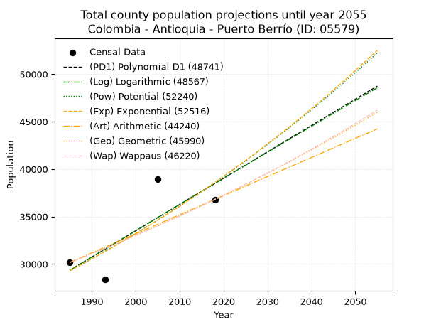
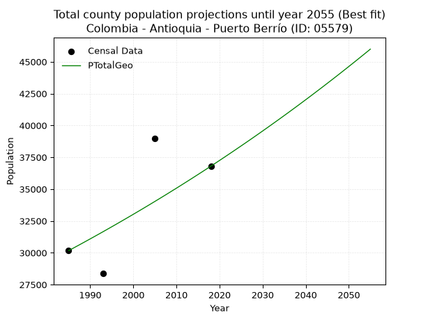
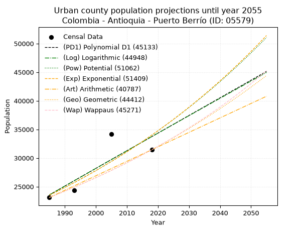
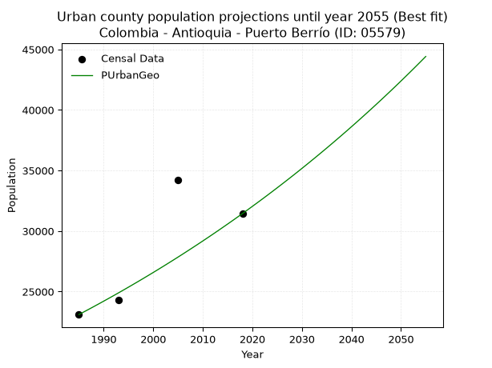
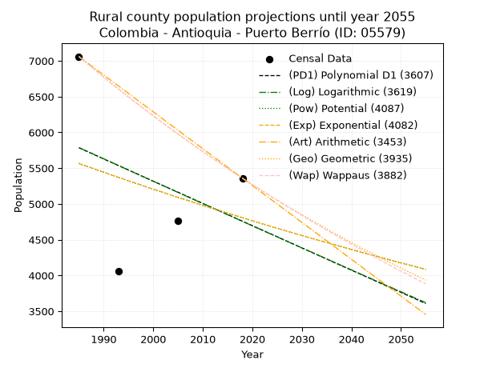
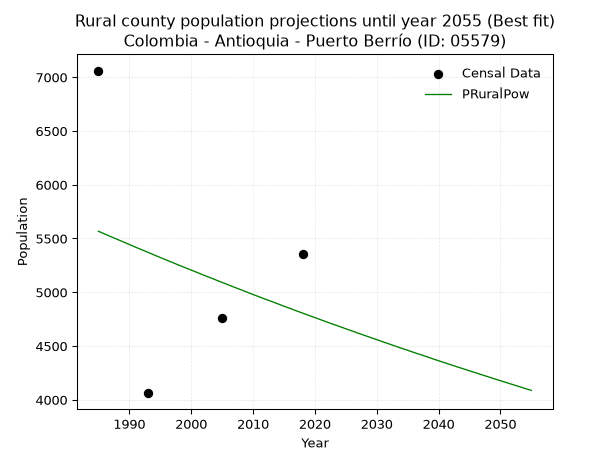

<div align="center">


</div>

# _“Population and Public Services Demand Projections (PPSD) until Year 2050 for Colombia - Antioquia - Puerto Berrío (ID: 05579)”_
Keywords: `population` `public-service` `projection` `lineal` `polynomial` `logarithmic` `potential` `exponential` `arithmetic` `geometric` `wappaus` `dane` `colombia` `south-america`

PPSD are analytical estimates used by governments and planners to anticipate future changes in population size, age distribution, and the resulting community needs for utilities, healthcare, education, and infrastructure as sizing future water treatment facilities, electrical grids, and road networks based on spatial growth.

> **General running parameters**: • app_version: _v20260806_. • Python version: _3.14.7_. • Pandas version: _3.0.5_. • NumPy version: _2.5.1_. • Creates, save and include plots into reports (create_plot): _False_. • Projection until year: _2050_. • Process polynomial degree 2 and up: _False_. • Process Wappaus: _True_. • Process Wappaus: _True_. • Set negative values to zero: _True_. • Set infinite values to zero: _True_. • Drop dataset notes: _True_. 
<div align="center">

Dynamic map: [:earth_americas:Google](http://maps.google.com/maps?q=6.487028034,-74.4100158) [:earth_americas:OSM](https://www.openstreetmap.org/#map=18/6.487028034/-74.4100158&layers=P) [:earth_americas:Bing](https://www.bing.com/maps?cp=6.487028034~-74.4100158&lvl=18) [:earth_americas:Apple](https://maps.apple.com/frame?center=6.487028034%2C-74.4100158&span=0.003%2C0.006)

</div>


<div align="center">

```geojson
{
  "type": "Feature",
  "geometry": {
    "type": "Point", 
    "coordinates": [-74.4100158, 6.487028034]
  }, 
  "properties": {
    "Name": "Colombia - Antioquia - Puerto Berrío (ID: 05579)"
  }
}
```

</div>


## 0. Census Data (4 records)

Census data are official statistics collected by a government about the people and housing in a country. They usually include counts of total population, age, sex, race, income, education, and jobs.

📅Global census file: [Population.xlsx](../data/Population.xlsx)

| Source   |   Year |   CountryID | CountryName   |   StateID | StateName   |   CountyID | CountyName    |   PTotal |   PUrban |   PRural |
|:---------|-------:|------------:|:--------------|----------:|:------------|-----------:|:--------------|---------:|---------:|---------:|
| DANE     |   1985 |          57 | Colombia      |        05 | Antioquia   |      05579 | Puerto Berrío |    30166 |    23105 |     7061 |
| DANE     |   1993 |          57 | Colombia      |        05 | Antioquia   |      05579 | Puerto Berrío |    28370 |    24309 |     4061 |
| DANE     |   2005 |          57 | Colombia      |        05 | Antioquia   |      05579 | Puerto Berrío |    38953 |    34193 |     4760 |
| DANE     |   2018 |          57 | Colombia      |        05 | Antioquia   |      05579 | Puerto Berrío |    36801 |    31441 |     5360 |

> 🔥Some records could had specific notes about the registered values or the corresponding urban or rural distribution.

## 1. Total

### 1.1. Coefficients and Parameters

* (PD1) Polynomial Deg 1: 277.04616619831455, -520589.0939381787 (lineal)
* (Log) Logarithmic: 554874.5800909486, -4184033.6297571277
* (Pow) Potential: 16.684274547940408, -50.553861172475884
* (Exp) Exponential: 0.008331095119396146, 0.0019274919993526169
* (Art) Arithmetic: Year diff. 2018 - 1985 = 33, Population diff. 36801 - 30166 = 6635, Annual growth = 201.06060606060606
* (Geo) Geometric: Year diff. 2018 - 1985 = 33, Population diff. 36801 - 30166 = 6635, Annual growth % = 0.006042716002609305
* (Wap) Wappaus: i = 0.6004766707799545, Condition values only valid for < 200)

<sub>
Wappaus condition values: ['0.00', '0.60', '1.20', '1.80', '2.40', '3.00', '3.60', '4.20', '4.80', '5.40', '6.00', '6.61', '7.21', '7.81', '8.41', '9.01', '9.61', '10.21', '10.81', '11.41', '12.01', '12.61', '13.21', '13.81', '14.41', '15.01', '15.61', '16.21', '16.81', '17.41', '18.01', '18.61', '19.22', '19.82', '20.42', '21.02', '21.62', '22.22', '22.82', '23.42', '24.02', '24.62', '25.22', '25.82', '26.42', '27.02', '27.62', '28.22', '28.82', '29.42', '30.02', '30.62', '31.22', '31.83', '32.43', '33.03', '33.63', '34.23', '34.83', '35.43', '36.03', '36.63', '37.23', '37.83', '38.43', '39.03']
</sub>


### 1.2. Projected Dataset

|   Year |   CountyID |   PTotalPD1 |   PTotalLog |   PTotalPow |   PTotalExp |   PTotalArt |   PTotalGeo |   PTotalWap |
|-------:|-----------:|------------:|------------:|------------:|------------:|------------:|------------:|------------:|
|   1985 |      05579 |       29348 |       29337 |       29301 |       29310 |       30166 |       30166 |       30166 |
|   1986 |      05579 |       29625 |       29616 |       29548 |       29555 |       30367 |       30348 |       30348 |
|   1987 |      05579 |       29902 |       29895 |       29797 |       29803 |       30568 |       30532 |       30530 |
|   1988 |      05579 |       30179 |       30175 |       30049 |       30052 |       30769 |       30716 |       30714 |
|   1989 |      05579 |       30456 |       30454 |       30302 |       30303 |       30970 |       30902 |       30899 |
|   1990 |      05579 |       30733 |       30733 |       30557 |       30557 |       31171 |       31089 |       31086 |
|   1991 |      05579 |       31010 |       31011 |       30814 |       30812 |       31372 |       31276 |       31273 |
|   1992 |      05579 |       31287 |       31290 |       31073 |       31070 |       31573 |       31465 |       31461 |
|   1993 |      05579 |       31564 |       31568 |       31335 |       31330 |       31774 |       31655 |       31651 |
|   1994 |      05579 |       31841 |       31847 |       31598 |       31592 |       31976 |       31847 |       31842 |
|   1995 |      05579 |       32118 |       32125 |       31863 |       31857 |       32177 |       32039 |       32033 |
|   1996 |      05579 |       32395 |       32403 |       32131 |       32123 |       32378 |       32233 |       32227 |
|   1997 |      05579 |       32672 |       32681 |       32401 |       32392 |       32579 |       32428 |       32421 |
|   1998 |      05579 |       32949 |       32959 |       32672 |       32663 |       32780 |       32624 |       32616 |
|   1999 |      05579 |       33226 |       33236 |       32946 |       32936 |       32981 |       32821 |       32813 |
|   2000 |      05579 |       33503 |       33514 |       33222 |       33212 |       33182 |       33019 |       33011 |
|   2001 |      05579 |       33780 |       33791 |       33501 |       33489 |       33383 |       33219 |       33210 |
|   2002 |      05579 |       34057 |       34069 |       33781 |       33770 |       33584 |       33419 |       33411 |
|   2003 |      05579 |       34334 |       34346 |       34064 |       34052 |       33785 |       33621 |       33613 |
|   2004 |      05579 |       34611 |       34623 |       34348 |       34337 |       33986 |       33824 |       33816 |
|   2005 |      05579 |       34888 |       34899 |       34636 |       34624 |       34187 |       34029 |       34020 |
|   2006 |      05579 |       35166 |       35176 |       34925 |       34914 |       34388 |       34234 |       34226 |
|   2007 |      05579 |       35443 |       35453 |       35216 |       35206 |       34589 |       34441 |       34433 |
|   2008 |      05579 |       35720 |       35729 |       35510 |       35501 |       34790 |       34649 |       34641 |
|   2009 |      05579 |       35997 |       36005 |       35807 |       35798 |       34991 |       34859 |       34851 |
|   2010 |      05579 |       36274 |       36281 |       36105 |       36097 |       35193 |       35069 |       35062 |
|   2011 |      05579 |       36551 |       36557 |       36406 |       36399 |       35394 |       35281 |       35274 |
|   2012 |      05579 |       36828 |       36833 |       36709 |       36704 |       35595 |       35495 |       35488 |
|   2013 |      05579 |       37105 |       37109 |       37015 |       37011 |       35796 |       35709 |       35703 |
|   2014 |      05579 |       37382 |       37385 |       37323 |       37320 |       35997 |       35925 |       35920 |
|   2015 |      05579 |       37659 |       37660 |       37633 |       37632 |       36198 |       36142 |       36138 |
|   2016 |      05579 |       37936 |       37935 |       37946 |       37947 |       36399 |       36360 |       36358 |
|   2017 |      05579 |       38213 |       38210 |       38261 |       38265 |       36600 |       36580 |       36579 |
|   2018 |      05579 |       38490 |       38485 |       38579 |       38585 |       36801 |       36801 |       36801 |
|   2019 |      05579 |       38767 |       38760 |       38899 |       38908 |       37002 |       37023 |       37025 |
|   2020 |      05579 |       39044 |       39035 |       39222 |       39233 |       37203 |       37247 |       37250 |
|   2021 |      05579 |       39321 |       39310 |       39547 |       39561 |       37404 |       37472 |       37477 |
|   2022 |      05579 |       39598 |       39584 |       39875 |       39892 |       37605 |       37699 |       37706 |
|   2023 |      05579 |       39875 |       39859 |       40205 |       40226 |       37806 |       37926 |       37936 |
|   2024 |      05579 |       40152 |       40133 |       40538 |       40563 |       38007 |       38156 |       38167 |
|   2025 |      05579 |       40429 |       40407 |       40873 |       40902 |       38208 |       38386 |       38401 |
|   2026 |      05579 |       40706 |       40681 |       41212 |       41244 |       38409 |       38618 |       38635 |
|   2027 |      05579 |       40983 |       40955 |       41552 |       41589 |       38611 |       38851 |       38872 |
|   2028 |      05579 |       41261 |       41228 |       41896 |       41937 |       38812 |       39086 |       39110 |
|   2029 |      05579 |       41538 |       41502 |       42242 |       42288 |       39013 |       39322 |       39349 |
|   2030 |      05579 |       41815 |       41775 |       42590 |       42642 |       39214 |       39560 |       39591 |
|   2031 |      05579 |       42092 |       42049 |       42942 |       42998 |       39415 |       39799 |       39834 |
|   2032 |      05579 |       42369 |       42322 |       43296 |       43358 |       39616 |       40040 |       40078 |
|   2033 |      05579 |       42646 |       42595 |       43653 |       43721 |       39817 |       40282 |       40325 |
|   2034 |      05579 |       42923 |       42868 |       44012 |       44087 |       40018 |       40525 |       40573 |
|   2035 |      05579 |       43200 |       43140 |       44375 |       44455 |       40219 |       40770 |       40823 |
|   2036 |      05579 |       43477 |       43413 |       44740 |       44827 |       40420 |       41016 |       41074 |
|   2037 |      05579 |       43754 |       43685 |       45108 |       45202 |       40621 |       41264 |       41328 |
|   2038 |      05579 |       44031 |       43958 |       45479 |       45581 |       40822 |       41513 |       41583 |
|   2039 |      05579 |       44308 |       44230 |       45853 |       45962 |       41023 |       41764 |       41840 |
|   2040 |      05579 |       44585 |       44502 |       46229 |       46346 |       41224 |       42017 |       42099 |
|   2041 |      05579 |       44862 |       44774 |       46609 |       46734 |       41425 |       42270 |       42360 |
|   2042 |      05579 |       45139 |       45046 |       46991 |       47125 |       41626 |       42526 |       42623 |
|   2043 |      05579 |       45416 |       45317 |       47377 |       47519 |       41828 |       42783 |       42887 |
|   2044 |      05579 |       45693 |       45589 |       47765 |       47917 |       42029 |       43041 |       43154 |
|   2045 |      05579 |       45970 |       45860 |       48157 |       48318 |       42230 |       43302 |       43422 |
|   2046 |      05579 |       46247 |       46131 |       48551 |       48722 |       42431 |       43563 |       43693 |
|   2047 |      05579 |       46524 |       46403 |       48948 |       49130 |       42632 |       43826 |       43965 |
|   2048 |      05579 |       46801 |       46674 |       49349 |       49541 |       42833 |       44091 |       44240 |
|   2049 |      05579 |       47079 |       46944 |       49752 |       49955 |       43034 |       44358 |       44516 |
|   2050 |      05579 |       47356 |       47215 |       50159 |       50373 |       43235 |       44626 |       44795 |
<div align="center">

</img>

</div>


### 1.3. Best fit with absolute and relative error (%)

Relative error puts that difference into context by dividing the absolute error by the true value, creating a unitless ratio or percentage that shows the scale of the mistake.

Absolute and relative error

|   Year | Source   |   CountryID | CountryName   |   StateID | StateName   |   CountyID_x | CountyName    |   PTotal |   PUrban |   PRural |   CountyID_y |   PTotalPD1 |   PTotalLog |   PTotalPow |   PTotalExp |   PTotalArt |   PTotalGeo |   PTotalWap |   PTotalPD1AbsError |   PTotalLogAbsError |   PTotalPowAbsError |   PTotalExpAbsError |   PTotalArtAbsError |   PTotalGeoAbsError |   PTotalWapAbsError |   PTotalPD1RelError |   PTotalLogRelError |   PTotalPowRelError |   PTotalExpRelError |   PTotalArtRelError |   PTotalGeoRelError |   PTotalWapRelError |
|-------:|:---------|------------:|:--------------|----------:|:------------|-------------:|:--------------|---------:|---------:|---------:|-------------:|------------:|------------:|------------:|------------:|------------:|------------:|------------:|--------------------:|--------------------:|--------------------:|--------------------:|--------------------:|--------------------:|--------------------:|--------------------:|--------------------:|--------------------:|--------------------:|--------------------:|--------------------:|--------------------:|
|   1985 | DANE     |          57 | Colombia      |        05 | Antioquia   |        05579 | Puerto Berrío |    30166 |    23105 |     7061 |        05579 |       29348 |       29337 |       29301 |       29310 |       30166 |       30166 |       30166 |                 818 |                 829 |                 865 |                 856 |                   0 |                   0 |                   0 |             2.71166 |             2.74813 |             2.86747 |             2.83763 |              0      |              0      |               0     |
|   1993 | DANE     |          57 | Colombia      |        05 | Antioquia   |        05579 | Puerto Berrío |    28370 |    24309 |     4061 |        05579 |       31564 |       31568 |       31335 |       31330 |       31774 |       31655 |       31651 |                3194 |                3198 |                2965 |                2960 |                3404 |                3285 |                3281 |            11.2584  |            11.2725  |            10.4512  |            10.4336  |             11.9986 |             11.5791 |              11.565 |
|   2005 | DANE     |          57 | Colombia      |        05 | Antioquia   |        05579 | Puerto Berrío |    38953 |    34193 |     4760 |        05579 |       34888 |       34899 |       34636 |       34624 |       34187 |       34029 |       34020 |                4065 |                4054 |                4317 |                4329 |                4766 |                4924 |                4933 |            10.4357  |            10.4074  |            11.0826  |            11.1134  |             12.2353 |             12.6409 |              12.664 |
|   2018 | DANE     |          57 | Colombia      |        05 | Antioquia   |        05579 | Puerto Berrío |    36801 |    31441 |     5360 |        05579 |       38490 |       38485 |       38579 |       38585 |       36801 |       36801 |       36801 |                1689 |                1684 |                1778 |                1784 |                   0 |                   0 |                   0 |             4.58955 |             4.57596 |             4.83139 |             4.84769 |              0      |              0      |               0     |

Relative error mean

| Method    |   RelError | Best   |
|:----------|-----------:|:-------|
| PTotalPD1 |    7.24881 |        |
| PTotalLog |    7.25099 |        |
| PTotalPow |    7.30816 |        |
| PTotalExp |    7.30807 |        |
| PTotalArt |    6.05846 |        |
| PTotalGeo |    6.055   | True   |
| PTotalWap |    6.05725 |        |

💙Best method: _**PTotalGeo**_
<div align="center">

</img>

</div>


### 1.4. Fresh water supply demand in liters per capita per day (lpcd)

The fresh water supply demand typically ranges from 100 to 300 liters per capita per day (lpcd) for standard domestic and municipal planning, though absolute survival minimums set by the World Health Organization are as low as 7.5 to 20 liters per day, and total consumption in high-income nations can exceed 400 liters.

> `CZ`: Level in meters above the sea level (masl).<br> `WS`: Fresh water supply demand in liters per capita per day (lpcd or l/h/d).<br> `WSAll`: Zonal fresh water supply demand in liters per second (l/s).<br> `A`: Zonal area in square meters.

Reference values (RAS Colombia)

|    CZ |   WS |
|------:|-----:|
|  1000 |  120 |
|  2000 |  130 |
| 99999 |  140 |

County shapefile geometry properties and water supply values

|   CountyID |      ATotal |   CZTotal |   WSTotal |
|-----------:|------------:|----------:|----------:|
|      05579 | 1.21893e+09 |   306.374 |       120 |

Projected values for best method: PTotalGeo

|   CountyID |   Year |   PTotalGeo |   WSTotal |   WSTotalAll |
|-----------:|-------:|------------:|----------:|-------------:|
|      05579 |   1985 |       30166 |       120 |      41.8972 |
|      05579 |   1986 |       30348 |       120 |      42.15   |
|      05579 |   1987 |       30532 |       120 |      42.4056 |
|      05579 |   1988 |       30716 |       120 |      42.6611 |
|      05579 |   1989 |       30902 |       120 |      42.9194 |
|      05579 |   1990 |       31089 |       120 |      43.1792 |
|      05579 |   1991 |       31276 |       120 |      43.4389 |
|      05579 |   1992 |       31465 |       120 |      43.7014 |
|      05579 |   1993 |       31655 |       120 |      43.9653 |
|      05579 |   1994 |       31847 |       120 |      44.2319 |
|      05579 |   1995 |       32039 |       120 |      44.4986 |
|      05579 |   1996 |       32233 |       120 |      44.7681 |
|      05579 |   1997 |       32428 |       120 |      45.0389 |
|      05579 |   1998 |       32624 |       120 |      45.3111 |
|      05579 |   1999 |       32821 |       120 |      45.5847 |
|      05579 |   2000 |       33019 |       120 |      45.8597 |
|      05579 |   2001 |       33219 |       120 |      46.1375 |
|      05579 |   2002 |       33419 |       120 |      46.4153 |
|      05579 |   2003 |       33621 |       120 |      46.6958 |
|      05579 |   2004 |       33824 |       120 |      46.9778 |
|      05579 |   2005 |       34029 |       120 |      47.2625 |
|      05579 |   2006 |       34234 |       120 |      47.5472 |
|      05579 |   2007 |       34441 |       120 |      47.8347 |
|      05579 |   2008 |       34649 |       120 |      48.1236 |
|      05579 |   2009 |       34859 |       120 |      48.4153 |
|      05579 |   2010 |       35069 |       120 |      48.7069 |
|      05579 |   2011 |       35281 |       120 |      49.0014 |
|      05579 |   2012 |       35495 |       120 |      49.2986 |
|      05579 |   2013 |       35709 |       120 |      49.5958 |
|      05579 |   2014 |       35925 |       120 |      49.8958 |
|      05579 |   2015 |       36142 |       120 |      50.1972 |
|      05579 |   2016 |       36360 |       120 |      50.5    |
|      05579 |   2017 |       36580 |       120 |      50.8056 |
|      05579 |   2018 |       36801 |       120 |      51.1125 |
|      05579 |   2019 |       37023 |       120 |      51.4208 |
|      05579 |   2020 |       37247 |       120 |      51.7319 |
|      05579 |   2021 |       37472 |       120 |      52.0444 |
|      05579 |   2022 |       37699 |       120 |      52.3597 |
|      05579 |   2023 |       37926 |       120 |      52.675  |
|      05579 |   2024 |       38156 |       120 |      52.9944 |
|      05579 |   2025 |       38386 |       120 |      53.3139 |
|      05579 |   2026 |       38618 |       120 |      53.6361 |
|      05579 |   2027 |       38851 |       120 |      53.9597 |
|      05579 |   2028 |       39086 |       120 |      54.2861 |
|      05579 |   2029 |       39322 |       120 |      54.6139 |
|      05579 |   2030 |       39560 |       120 |      54.9444 |
|      05579 |   2031 |       39799 |       120 |      55.2764 |
|      05579 |   2032 |       40040 |       120 |      55.6111 |
|      05579 |   2033 |       40282 |       120 |      55.9472 |
|      05579 |   2034 |       40525 |       120 |      56.2847 |
|      05579 |   2035 |       40770 |       120 |      56.625  |
|      05579 |   2036 |       41016 |       120 |      56.9667 |
|      05579 |   2037 |       41264 |       120 |      57.3111 |
|      05579 |   2038 |       41513 |       120 |      57.6569 |
|      05579 |   2039 |       41764 |       120 |      58.0056 |
|      05579 |   2040 |       42017 |       120 |      58.3569 |
|      05579 |   2041 |       42270 |       120 |      58.7083 |
|      05579 |   2042 |       42526 |       120 |      59.0639 |
|      05579 |   2043 |       42783 |       120 |      59.4208 |
|      05579 |   2044 |       43041 |       120 |      59.7792 |
|      05579 |   2045 |       43302 |       120 |      60.1417 |
|      05579 |   2046 |       43563 |       120 |      60.5042 |
|      05579 |   2047 |       43826 |       120 |      60.8694 |
|      05579 |   2048 |       44091 |       120 |      61.2375 |
|      05579 |   2049 |       44358 |       120 |      61.6083 |
|      05579 |   2050 |       44626 |       120 |      61.9806 |

## 2. Urban

### 2.1. Coefficients and Parameters

* (PD1) Polynomial Deg 1: 308.1541549578493, -588123.348454438 (lineal)
* (Log) Logarithmic: 617462.5335297302, -4665075.665393689
* (Pow) Potential: 22.398622364235244, -69.4943244165068
* (Exp) Exponential: 0.011178988464512998, 5.420843954696216e-06
* (Art) Arithmetic: Year diff. 2018 - 1985 = 33, Population diff. 31441 - 23105 = 8336, Annual growth = 252.6060606060606
* (Geo) Geometric: Year diff. 2018 - 1985 = 33, Population diff. 31441 - 23105 = 8336, Annual growth % = 0.00937897401494081
* (Wap) Wappaus: i = 0.9262129600926213, Condition values only valid for < 200)

<sub>
Wappaus condition values: ['0.00', '0.93', '1.85', '2.78', '3.70', '4.63', '5.56', '6.48', '7.41', '8.34', '9.26', '10.19', '11.11', '12.04', '12.97', '13.89', '14.82', '15.75', '16.67', '17.60', '18.52', '19.45', '20.38', '21.30', '22.23', '23.16', '24.08', '25.01', '25.93', '26.86', '27.79', '28.71', '29.64', '30.57', '31.49', '32.42', '33.34', '34.27', '35.20', '36.12', '37.05', '37.97', '38.90', '39.83', '40.75', '41.68', '42.61', '43.53', '44.46', '45.38', '46.31', '47.24', '48.16', '49.09', '50.02', '50.94', '51.87', '52.79', '53.72', '54.65', '55.57', '56.50', '57.43', '58.35', '59.28', '60.20']
</sub>


### 2.2. Projected Dataset

|   Year |   CountyID |   PUrbanPD1 |   PUrbanLog |   PUrbanPow |   PUrbanExp |   PUrbanArt |   PUrbanGeo |   PUrbanWap |
|-------:|-----------:|------------:|------------:|------------:|------------:|------------:|------------:|------------:|
|   1985 |      05579 |       23563 |       23548 |       23495 |       23507 |       23105 |       23105 |       23105 |
|   1986 |      05579 |       23871 |       23859 |       23761 |       23771 |       23358 |       23322 |       23320 |
|   1987 |      05579 |       24179 |       24170 |       24031 |       24038 |       23610 |       23540 |       23537 |
|   1988 |      05579 |       24487 |       24481 |       24303 |       24308 |       23863 |       23761 |       23756 |
|   1989 |      05579 |       24795 |       24791 |       24578 |       24581 |       24115 |       23984 |       23977 |
|   1990 |      05579 |       25103 |       25102 |       24856 |       24858 |       24368 |       24209 |       24200 |
|   1991 |      05579 |       25412 |       25412 |       25138 |       25137 |       24621 |       24436 |       24426 |
|   1992 |      05579 |       25720 |       25722 |       25422 |       25420 |       24873 |       24665 |       24653 |
|   1993 |      05579 |       26028 |       26032 |       25709 |       25706 |       25126 |       24897 |       24883 |
|   1994 |      05579 |       26336 |       26342 |       26000 |       25995 |       25378 |       25130 |       25115 |
|   1995 |      05579 |       26644 |       26651 |       26294 |       26287 |       25631 |       25366 |       25349 |
|   1996 |      05579 |       26952 |       26961 |       26590 |       26582 |       25884 |       25604 |       25585 |
|   1997 |      05579 |       27260 |       27270 |       26890 |       26881 |       26136 |       25844 |       25824 |
|   1998 |      05579 |       27569 |       27579 |       27194 |       27183 |       26389 |       26086 |       26065 |
|   1999 |      05579 |       27877 |       27888 |       27500 |       27489 |       26641 |       26331 |       26309 |
|   2000 |      05579 |       28185 |       28197 |       27810 |       27798 |       26894 |       26578 |       26555 |
|   2001 |      05579 |       28493 |       28505 |       28123 |       28110 |       27147 |       26827 |       26803 |
|   2002 |      05579 |       28801 |       28814 |       28440 |       28426 |       27399 |       27079 |       27054 |
|   2003 |      05579 |       29109 |       29122 |       28759 |       28746 |       27652 |       27333 |       27307 |
|   2004 |      05579 |       29418 |       29431 |       29083 |       29069 |       27905 |       27589 |       27563 |
|   2005 |      05579 |       29726 |       29739 |       29410 |       29396 |       28157 |       27848 |       27822 |
|   2006 |      05579 |       30034 |       30046 |       29740 |       29726 |       28410 |       28109 |       28083 |
|   2007 |      05579 |       30342 |       30354 |       30074 |       30061 |       28662 |       28373 |       28347 |
|   2008 |      05579 |       30650 |       30662 |       30411 |       30399 |       28915 |       28639 |       28614 |
|   2009 |      05579 |       30958 |       30969 |       30752 |       30740 |       29168 |       28907 |       28883 |
|   2010 |      05579 |       31267 |       31276 |       31097 |       31086 |       29420 |       29178 |       29156 |
|   2011 |      05579 |       31575 |       31584 |       31445 |       31435 |       29673 |       29452 |       29431 |
|   2012 |      05579 |       31883 |       31891 |       31797 |       31789 |       29925 |       29728 |       29709 |
|   2013 |      05579 |       32191 |       32197 |       32153 |       32146 |       30178 |       30007 |       29990 |
|   2014 |      05579 |       32499 |       32504 |       32513 |       32507 |       30431 |       30289 |       30274 |
|   2015 |      05579 |       32807 |       32811 |       32876 |       32873 |       30683 |       30573 |       30561 |
|   2016 |      05579 |       33115 |       33117 |       33244 |       33242 |       30936 |       30859 |       30851 |
|   2017 |      05579 |       33424 |       33423 |       33615 |       33616 |       31188 |       31149 |       31144 |
|   2018 |      05579 |       33732 |       33729 |       33990 |       33994 |       31441 |       31441 |       31441 |
|   2019 |      05579 |       34040 |       34035 |       34370 |       34376 |       31694 |       31736 |       31741 |
|   2020 |      05579 |       34348 |       34341 |       34753 |       34763 |       31946 |       32034 |       32044 |
|   2021 |      05579 |       34656 |       34646 |       35140 |       35153 |       32199 |       32334 |       32350 |
|   2022 |      05579 |       34964 |       34952 |       35532 |       35549 |       32451 |       32637 |       32660 |
|   2023 |      05579 |       35273 |       35257 |       35928 |       35948 |       32704 |       32943 |       32974 |
|   2024 |      05579 |       35581 |       35562 |       36328 |       36352 |       32957 |       33252 |       33291 |
|   2025 |      05579 |       35889 |       35867 |       36732 |       36761 |       33209 |       33564 |       33611 |
|   2026 |      05579 |       36197 |       36172 |       37140 |       37174 |       33462 |       33879 |       33935 |
|   2027 |      05579 |       36505 |       36477 |       37553 |       37592 |       33714 |       34197 |       34263 |
|   2028 |      05579 |       36813 |       36781 |       37970 |       38015 |       33967 |       34517 |       34595 |
|   2029 |      05579 |       37121 |       37086 |       38392 |       38442 |       34220 |       34841 |       34931 |
|   2030 |      05579 |       37430 |       37390 |       38818 |       38874 |       34472 |       35168 |       35270 |
|   2031 |      05579 |       37738 |       37694 |       39248 |       39311 |       34725 |       35498 |       35614 |
|   2032 |      05579 |       38046 |       37998 |       39683 |       39753 |       34977 |       35831 |       35961 |
|   2033 |      05579 |       38354 |       38302 |       40123 |       40200 |       35230 |       36167 |       36313 |
|   2034 |      05579 |       38662 |       38605 |       40568 |       40652 |       35483 |       36506 |       36669 |
|   2035 |      05579 |       38970 |       38909 |       41017 |       41109 |       35735 |       36848 |       37029 |
|   2036 |      05579 |       39279 |       39212 |       41471 |       41571 |       35988 |       37194 |       37394 |
|   2037 |      05579 |       39587 |       39516 |       41929 |       42038 |       36241 |       37543 |       37763 |
|   2038 |      05579 |       39895 |       39819 |       42393 |       42511 |       36493 |       37895 |       38137 |
|   2039 |      05579 |       40203 |       40121 |       42861 |       42989 |       36746 |       38250 |       38515 |
|   2040 |      05579 |       40511 |       40424 |       43334 |       43472 |       36998 |       38609 |       38898 |
|   2041 |      05579 |       40819 |       40727 |       43813 |       43961 |       37251 |       38971 |       39285 |
|   2042 |      05579 |       41127 |       41029 |       44296 |       44455 |       37504 |       39337 |       39678 |
|   2043 |      05579 |       41436 |       41332 |       44784 |       44955 |       37756 |       39706 |       40075 |
|   2044 |      05579 |       41744 |       41634 |       45278 |       45460 |       38009 |       40078 |       40478 |
|   2045 |      05579 |       42052 |       41936 |       45777 |       45971 |       38261 |       40454 |       40886 |
|   2046 |      05579 |       42360 |       42238 |       46281 |       46488 |       38514 |       40833 |       41299 |
|   2047 |      05579 |       42668 |       42539 |       46790 |       47011 |       38767 |       41216 |       41717 |
|   2048 |      05579 |       42976 |       42841 |       47305 |       47539 |       39019 |       41603 |       42141 |
|   2049 |      05579 |       43285 |       43142 |       47825 |       48074 |       39272 |       41993 |       42570 |
|   2050 |      05579 |       43593 |       43444 |       48350 |       48614 |       39524 |       42387 |       43006 |
<div align="center">

</img>

</div>


### 2.3. Best fit with absolute and relative error (%)

Relative error puts that difference into context by dividing the absolute error by the true value, creating a unitless ratio or percentage that shows the scale of the mistake.

Absolute and relative error

|   Year | Source   |   CountryID | CountryName   |   StateID | StateName   |   CountyID_x | CountyName    |   PTotal |   PUrban |   PRural |   CountyID_y |   PUrbanPD1 |   PUrbanLog |   PUrbanPow |   PUrbanExp |   PUrbanArt |   PUrbanGeo |   PUrbanWap |   PUrbanPD1AbsError |   PUrbanLogAbsError |   PUrbanPowAbsError |   PUrbanExpAbsError |   PUrbanArtAbsError |   PUrbanGeoAbsError |   PUrbanWapAbsError |   PUrbanPD1RelError |   PUrbanLogRelError |   PUrbanPowRelError |   PUrbanExpRelError |   PUrbanArtRelError |   PUrbanGeoRelError |   PUrbanWapRelError |
|-------:|:---------|------------:|:--------------|----------:|:------------|-------------:|:--------------|---------:|---------:|---------:|-------------:|------------:|------------:|------------:|------------:|------------:|------------:|------------:|--------------------:|--------------------:|--------------------:|--------------------:|--------------------:|--------------------:|--------------------:|--------------------:|--------------------:|--------------------:|--------------------:|--------------------:|--------------------:|--------------------:|
|   1985 | DANE     |          57 | Colombia      |        05 | Antioquia   |        05579 | Puerto Berrío |    30166 |    23105 |     7061 |        05579 |       23563 |       23548 |       23495 |       23507 |       23105 |       23105 |       23105 |                 458 |                 443 |                 390 |                 402 |                   0 |                   0 |                   0 |             1.98225 |             1.91733 |             1.68795 |             1.73988 |              0      |             0       |             0       |
|   1993 | DANE     |          57 | Colombia      |        05 | Antioquia   |        05579 | Puerto Berrío |    28370 |    24309 |     4061 |        05579 |       26028 |       26032 |       25709 |       25706 |       25126 |       24897 |       24883 |                1719 |                1723 |                1400 |                1397 |                 817 |                 588 |                 574 |             7.07146 |             7.08791 |             5.75918 |             5.74684 |              3.3609 |             2.41886 |             2.36127 |
|   2005 | DANE     |          57 | Colombia      |        05 | Antioquia   |        05579 | Puerto Berrío |    38953 |    34193 |     4760 |        05579 |       29726 |       29739 |       29410 |       29396 |       28157 |       27848 |       27822 |                4467 |                4454 |                4783 |                4797 |                6036 |                6345 |                6371 |            13.0641  |            13.0261  |            13.9882  |            14.0292  |             17.6527 |            18.5564  |            18.6325  |
|   2018 | DANE     |          57 | Colombia      |        05 | Antioquia   |        05579 | Puerto Berrío |    36801 |    31441 |     5360 |        05579 |       33732 |       33729 |       33990 |       33994 |       31441 |       31441 |       31441 |                2291 |                2288 |                2549 |                2553 |                   0 |                   0 |                   0 |             7.28666 |             7.27712 |             8.10725 |             8.11997 |              0      |             0       |             0       |

Relative error mean

| Method    |   RelError | Best   |
|:----------|-----------:|:-------|
| PUrbanPD1 |    7.35111 |        |
| PUrbanLog |    7.32711 |        |
| PUrbanPow |    7.38566 |        |
| PUrbanExp |    7.40897 |        |
| PUrbanArt |    5.25341 |        |
| PUrbanGeo |    5.24382 | True   |
| PUrbanWap |    5.24843 |        |

💙Best method: _**PUrbanGeo**_
<div align="center">

</img>

</div>


### 2.4. Fresh water supply demand in liters per capita per day (lpcd)

The fresh water supply demand typically ranges from 100 to 300 liters per capita per day (lpcd) for standard domestic and municipal planning, though absolute survival minimums set by the World Health Organization are as low as 7.5 to 20 liters per day, and total consumption in high-income nations can exceed 400 liters.

> `CZ`: Level in meters above the sea level (masl).<br> `WS`: Fresh water supply demand in liters per capita per day (lpcd or l/h/d).<br> `WSAll`: Zonal fresh water supply demand in liters per second (l/s).<br> `A`: Zonal area in square meters.

Reference values (RAS Colombia)

|    CZ |   WS |
|------:|-----:|
|  1000 |  120 |
|  2000 |  130 |
| 99999 |  140 |

County shapefile geometry properties and water supply values

|   CountyID |      AUrban |   CZUrban |   WSUrban |
|-----------:|------------:|----------:|----------:|
|      05579 | 6.13552e+06 |   116.377 |       120 |

Projected values for best method: PUrbanGeo

|   CountyID |   Year |   PUrbanGeo |   WSUrban |   WSUrbanAll |
|-----------:|-------:|------------:|----------:|-------------:|
|      05579 |   1985 |       23105 |       120 |      32.0903 |
|      05579 |   1986 |       23322 |       120 |      32.3917 |
|      05579 |   1987 |       23540 |       120 |      32.6944 |
|      05579 |   1988 |       23761 |       120 |      33.0014 |
|      05579 |   1989 |       23984 |       120 |      33.3111 |
|      05579 |   1990 |       24209 |       120 |      33.6236 |
|      05579 |   1991 |       24436 |       120 |      33.9389 |
|      05579 |   1992 |       24665 |       120 |      34.2569 |
|      05579 |   1993 |       24897 |       120 |      34.5792 |
|      05579 |   1994 |       25130 |       120 |      34.9028 |
|      05579 |   1995 |       25366 |       120 |      35.2306 |
|      05579 |   1996 |       25604 |       120 |      35.5611 |
|      05579 |   1997 |       25844 |       120 |      35.8944 |
|      05579 |   1998 |       26086 |       120 |      36.2306 |
|      05579 |   1999 |       26331 |       120 |      36.5708 |
|      05579 |   2000 |       26578 |       120 |      36.9139 |
|      05579 |   2001 |       26827 |       120 |      37.2597 |
|      05579 |   2002 |       27079 |       120 |      37.6097 |
|      05579 |   2003 |       27333 |       120 |      37.9625 |
|      05579 |   2004 |       27589 |       120 |      38.3181 |
|      05579 |   2005 |       27848 |       120 |      38.6778 |
|      05579 |   2006 |       28109 |       120 |      39.0403 |
|      05579 |   2007 |       28373 |       120 |      39.4069 |
|      05579 |   2008 |       28639 |       120 |      39.7764 |
|      05579 |   2009 |       28907 |       120 |      40.1486 |
|      05579 |   2010 |       29178 |       120 |      40.525  |
|      05579 |   2011 |       29452 |       120 |      40.9056 |
|      05579 |   2012 |       29728 |       120 |      41.2889 |
|      05579 |   2013 |       30007 |       120 |      41.6764 |
|      05579 |   2014 |       30289 |       120 |      42.0681 |
|      05579 |   2015 |       30573 |       120 |      42.4625 |
|      05579 |   2016 |       30859 |       120 |      42.8597 |
|      05579 |   2017 |       31149 |       120 |      43.2625 |
|      05579 |   2018 |       31441 |       120 |      43.6681 |
|      05579 |   2019 |       31736 |       120 |      44.0778 |
|      05579 |   2020 |       32034 |       120 |      44.4917 |
|      05579 |   2021 |       32334 |       120 |      44.9083 |
|      05579 |   2022 |       32637 |       120 |      45.3292 |
|      05579 |   2023 |       32943 |       120 |      45.7542 |
|      05579 |   2024 |       33252 |       120 |      46.1833 |
|      05579 |   2025 |       33564 |       120 |      46.6167 |
|      05579 |   2026 |       33879 |       120 |      47.0542 |
|      05579 |   2027 |       34197 |       120 |      47.4958 |
|      05579 |   2028 |       34517 |       120 |      47.9403 |
|      05579 |   2029 |       34841 |       120 |      48.3903 |
|      05579 |   2030 |       35168 |       120 |      48.8444 |
|      05579 |   2031 |       35498 |       120 |      49.3028 |
|      05579 |   2032 |       35831 |       120 |      49.7653 |
|      05579 |   2033 |       36167 |       120 |      50.2319 |
|      05579 |   2034 |       36506 |       120 |      50.7028 |
|      05579 |   2035 |       36848 |       120 |      51.1778 |
|      05579 |   2036 |       37194 |       120 |      51.6583 |
|      05579 |   2037 |       37543 |       120 |      52.1431 |
|      05579 |   2038 |       37895 |       120 |      52.6319 |
|      05579 |   2039 |       38250 |       120 |      53.125  |
|      05579 |   2040 |       38609 |       120 |      53.6236 |
|      05579 |   2041 |       38971 |       120 |      54.1264 |
|      05579 |   2042 |       39337 |       120 |      54.6347 |
|      05579 |   2043 |       39706 |       120 |      55.1472 |
|      05579 |   2044 |       40078 |       120 |      55.6639 |
|      05579 |   2045 |       40454 |       120 |      56.1861 |
|      05579 |   2046 |       40833 |       120 |      56.7125 |
|      05579 |   2047 |       41216 |       120 |      57.2444 |
|      05579 |   2048 |       41603 |       120 |      57.7819 |
|      05579 |   2049 |       41993 |       120 |      58.3236 |
|      05579 |   2050 |       42387 |       120 |      58.8708 |

## 3. Rural

### 3.1. Coefficients and Parameters

* (PD1) Polynomial Deg 1: -31.107988759534706, 67534.2545162593 (lineal)
* (Log) Logarithmic: -62587.95343878229, 481042.0356365663
* (Pow) Potential: -8.914187757286486, 33.14247754937268
* (Exp) Exponential: -0.004423961477925329, 36236995.11118883
* (Art) Arithmetic: Year diff. 2018 - 1985 = 33, Population diff. 5360 - 7061 = -1701, Annual growth = -51.54545454545455
* (Geo) Geometric: Year diff. 2018 - 1985 = 33, Population diff. 5360 - 7061 = -1701, Annual growth % = -0.008317420571473333
* (Wap) Wappaus: i = -0.8299727001924893, Condition values only valid for < 200)

<sub>
Wappaus condition values: ['-0.00', '-0.83', '-1.66', '-2.49', '-3.32', '-4.15', '-4.98', '-5.81', '-6.64', '-7.47', '-8.30', '-9.13', '-9.96', '-10.79', '-11.62', '-12.45', '-13.28', '-14.11', '-14.94', '-15.77', '-16.60', '-17.43', '-18.26', '-19.09', '-19.92', '-20.75', '-21.58', '-22.41', '-23.24', '-24.07', '-24.90', '-25.73', '-26.56', '-27.39', '-28.22', '-29.05', '-29.88', '-30.71', '-31.54', '-32.37', '-33.20', '-34.03', '-34.86', '-35.69', '-36.52', '-37.35', '-38.18', '-39.01', '-39.84', '-40.67', '-41.50', '-42.33', '-43.16', '-43.99', '-44.82', '-45.65', '-46.48', '-47.31', '-48.14', '-48.97', '-49.80', '-50.63', '-51.46', '-52.29', '-53.12', '-53.95']
</sub>


### 3.2. Projected Dataset

|   Year |   CountyID |   PRuralPD1 |   PRuralLog |   PRuralPow |   PRuralExp |   PRuralArt |   PRuralGeo |   PRuralWap |
|-------:|-----------:|------------:|------------:|------------:|------------:|------------:|------------:|------------:|
|   1985 |      05579 |        5785 |        5788 |        5567 |        5564 |        7061 |        7061 |        7061 |
|   1986 |      05579 |        5754 |        5757 |        5542 |        5539 |        7009 |        7002 |        7003 |
|   1987 |      05579 |        5723 |        5725 |        5517 |        5515 |        6958 |        6944 |        6945 |
|   1988 |      05579 |        5692 |        5694 |        5493 |        5490 |        6906 |        6886 |        6887 |
|   1989 |      05579 |        5660 |        5662 |        5468 |        5466 |        6855 |        6829 |        6830 |
|   1990 |      05579 |        5629 |        5631 |        5444 |        5442 |        6803 |        6772 |        6774 |
|   1991 |      05579 |        5598 |        5599 |        5419 |        5418 |        6752 |        6716 |        6718 |
|   1992 |      05579 |        5567 |        5568 |        5395 |        5394 |        6700 |        6660 |        6662 |
|   1993 |      05579 |        5536 |        5537 |        5371 |        5370 |        6649 |        6605 |        6607 |
|   1994 |      05579 |        5505 |        5505 |        5347 |        5347 |        6597 |        6550 |        6553 |
|   1995 |      05579 |        5474 |        5474 |        5323 |        5323 |        6546 |        6495 |        6498 |
|   1996 |      05579 |        5443 |        5442 |        5299 |        5299 |        6494 |        6441 |        6444 |
|   1997 |      05579 |        5412 |        5411 |        5276 |        5276 |        6442 |        6388 |        6391 |
|   1998 |      05579 |        5380 |        5380 |        5252 |        5253 |        6391 |        6334 |        6338 |
|   1999 |      05579 |        5349 |        5348 |        5229 |        5230 |        6339 |        6282 |        6286 |
|   2000 |      05579 |        5318 |        5317 |        5206 |        5207 |        6288 |        6230 |        6233 |
|   2001 |      05579 |        5287 |        5286 |        5183 |        5184 |        6236 |        6178 |        6182 |
|   2002 |      05579 |        5256 |        5255 |        5159 |        5161 |        6185 |        6126 |        6130 |
|   2003 |      05579 |        5225 |        5223 |        5137 |        5138 |        6133 |        6075 |        6079 |
|   2004 |      05579 |        5194 |        5192 |        5114 |        5115 |        6082 |        6025 |        6029 |
|   2005 |      05579 |        5163 |        5161 |        5091 |        5093 |        6030 |        5975 |        5979 |
|   2006 |      05579 |        5132 |        5130 |        5069 |        5070 |        5979 |        5925 |        5929 |
|   2007 |      05579 |        5101 |        5098 |        5046 |        5048 |        5927 |        5876 |        5880 |
|   2008 |      05579 |        5069 |        5067 |        5024 |        5025 |        5875 |        5827 |        5831 |
|   2009 |      05579 |        5038 |        5036 |        5001 |        5003 |        5824 |        5778 |        5782 |
|   2010 |      05579 |        5007 |        5005 |        4979 |        4981 |        5772 |        5730 |        5734 |
|   2011 |      05579 |        4976 |        4974 |        4957 |        4959 |        5721 |        5683 |        5686 |
|   2012 |      05579 |        4945 |        4943 |        4935 |        4937 |        5669 |        5635 |        5638 |
|   2013 |      05579 |        4914 |        4912 |        4914 |        4916 |        5618 |        5589 |        5591 |
|   2014 |      05579 |        4883 |        4881 |        4892 |        4894 |        5566 |        5542 |        5544 |
|   2015 |      05579 |        4852 |        4849 |        4870 |        4872 |        5515 |        5496 |        5498 |
|   2016 |      05579 |        4821 |        4818 |        4849 |        4851 |        5463 |        5450 |        5451 |
|   2017 |      05579 |        4789 |        4787 |        4827 |        4829 |        5412 |        5405 |        5406 |
|   2018 |      05579 |        4758 |        4756 |        4806 |        4808 |        5360 |        5360 |        5360 |
|   2019 |      05579 |        4727 |        4725 |        4785 |        4787 |        5308 |        5315 |        5315 |
|   2020 |      05579 |        4696 |        4694 |        4764 |        4766 |        5257 |        5271 |        5270 |
|   2021 |      05579 |        4665 |        4663 |        4743 |        4745 |        5205 |        5227 |        5225 |
|   2022 |      05579 |        4634 |        4632 |        4722 |        4724 |        5154 |        5184 |        5181 |
|   2023 |      05579 |        4603 |        4601 |        4701 |        4703 |        5102 |        5141 |        5137 |
|   2024 |      05579 |        4572 |        4571 |        4681 |        4682 |        5051 |        5098 |        5094 |
|   2025 |      05579 |        4541 |        4540 |        4660 |        4661 |        4999 |        5056 |        5051 |
|   2026 |      05579 |        4509 |        4509 |        4640 |        4641 |        4948 |        5014 |        5008 |
|   2027 |      05579 |        4478 |        4478 |        4619 |        4620 |        4896 |        4972 |        4965 |
|   2028 |      05579 |        4447 |        4447 |        4599 |        4600 |        4845 |        4931 |        4923 |
|   2029 |      05579 |        4416 |        4416 |        4579 |        4580 |        4793 |        4889 |        4881 |
|   2030 |      05579 |        4385 |        4385 |        4559 |        4559 |        4741 |        4849 |        4839 |
|   2031 |      05579 |        4354 |        4354 |        4539 |        4539 |        4690 |        4809 |        4797 |
|   2032 |      05579 |        4323 |        4324 |        4519 |        4519 |        4638 |        4769 |        4756 |
|   2033 |      05579 |        4292 |        4293 |        4499 |        4499 |        4587 |        4729 |        4715 |
|   2034 |      05579 |        4261 |        4262 |        4479 |        4479 |        4535 |        4690 |        4675 |
|   2035 |      05579 |        4229 |        4231 |        4460 |        4460 |        4484 |        4651 |        4634 |
|   2036 |      05579 |        4198 |        4201 |        4440 |        4440 |        4432 |        4612 |        4594 |
|   2037 |      05579 |        4167 |        4170 |        4421 |        4420 |        4381 |        4573 |        4554 |
|   2038 |      05579 |        4136 |        4139 |        4402 |        4401 |        4329 |        4535 |        4515 |
|   2039 |      05579 |        4105 |        4108 |        4382 |        4381 |        4278 |        4498 |        4476 |
|   2040 |      05579 |        4074 |        4078 |        4363 |        4362 |        4226 |        4460 |        4437 |
|   2041 |      05579 |        4043 |        4047 |        4344 |        4343 |        4174 |        4423 |        4398 |
|   2042 |      05579 |        4012 |        4016 |        4325 |        4324 |        4123 |        4386 |        4360 |
|   2043 |      05579 |        3981 |        3986 |        4306 |        4305 |        4071 |        4350 |        4321 |
|   2044 |      05579 |        3950 |        3955 |        4288 |        4286 |        4020 |        4314 |        4283 |
|   2045 |      05579 |        3918 |        3924 |        4269 |        4267 |        3968 |        4278 |        4246 |
|   2046 |      05579 |        3887 |        3894 |        4251 |        4248 |        3917 |        4242 |        4208 |
|   2047 |      05579 |        3856 |        3863 |        4232 |        4229 |        3865 |        4207 |        4171 |
|   2048 |      05579 |        3825 |        3833 |        4214 |        4210 |        3814 |        4172 |        4134 |
|   2049 |      05579 |        3794 |        3802 |        4195 |        4192 |        3762 |        4137 |        4097 |
|   2050 |      05579 |        3763 |        3772 |        4177 |        4173 |        3711 |        4103 |        4061 |
<div align="center">

</img>

</div>


### 3.3. Best fit with absolute and relative error (%)

Relative error puts that difference into context by dividing the absolute error by the true value, creating a unitless ratio or percentage that shows the scale of the mistake.

Absolute and relative error

|   Year | Source   |   CountryID | CountryName   |   StateID | StateName   |   CountyID_x | CountyName    |   PTotal |   PUrban |   PRural |   CountyID_y |   PRuralPD1 |   PRuralLog |   PRuralPow |   PRuralExp |   PRuralArt |   PRuralGeo |   PRuralWap |   PRuralPD1AbsError |   PRuralLogAbsError |   PRuralPowAbsError |   PRuralExpAbsError |   PRuralArtAbsError |   PRuralGeoAbsError |   PRuralWapAbsError |   PRuralPD1RelError |   PRuralLogRelError |   PRuralPowRelError |   PRuralExpRelError |   PRuralArtRelError |   PRuralGeoRelError |   PRuralWapRelError |
|-------:|:---------|------------:|:--------------|----------:|:------------|-------------:|:--------------|---------:|---------:|---------:|-------------:|------------:|------------:|------------:|------------:|------------:|------------:|------------:|--------------------:|--------------------:|--------------------:|--------------------:|--------------------:|--------------------:|--------------------:|--------------------:|--------------------:|--------------------:|--------------------:|--------------------:|--------------------:|--------------------:|
|   1985 | DANE     |          57 | Colombia      |        05 | Antioquia   |        05579 | Puerto Berrío |    30166 |    23105 |     7061 |        05579 |        5785 |        5788 |        5567 |        5564 |        7061 |        7061 |        7061 |                1276 |                1273 |                1494 |                1497 |                   0 |                   0 |                   0 |            18.0711  |            18.0286  |            21.1585  |             21.201  |              0      |              0      |              0      |
|   1993 | DANE     |          57 | Colombia      |        05 | Antioquia   |        05579 | Puerto Berrío |    28370 |    24309 |     4061 |        05579 |        5536 |        5537 |        5371 |        5370 |        6649 |        6605 |        6607 |                1475 |                1476 |                1310 |                1309 |                2588 |                2544 |                2546 |            36.3211  |            36.3457  |            32.2581  |             32.2334 |             63.7281 |             62.6447 |             62.6939 |
|   2005 | DANE     |          57 | Colombia      |        05 | Antioquia   |        05579 | Puerto Berrío |    38953 |    34193 |     4760 |        05579 |        5163 |        5161 |        5091 |        5093 |        6030 |        5975 |        5979 |                 403 |                 401 |                 331 |                 333 |                1270 |                1215 |                1219 |             8.46639 |             8.42437 |             6.95378 |              6.9958 |             26.6807 |             25.5252 |             25.6092 |
|   2018 | DANE     |          57 | Colombia      |        05 | Antioquia   |        05579 | Puerto Berrío |    36801 |    31441 |     5360 |        05579 |        4758 |        4756 |        4806 |        4808 |        5360 |        5360 |        5360 |                 602 |                 604 |                 554 |                 552 |                   0 |                   0 |                   0 |            11.2313  |            11.2687  |            10.3358  |             10.2985 |              0      |              0      |              0      |

Relative error mean

| Method    |   RelError | Best   |
|:----------|-----------:|:-------|
| PRuralPD1 |    18.5225 |        |
| PRuralLog |    18.5168 |        |
| PRuralPow |    17.6765 | True   |
| PRuralExp |    17.6822 |        |
| PRuralArt |    22.6022 |        |
| PRuralGeo |    22.0425 |        |
| PRuralWap |    22.0758 |        |

💙Best method: _**PRuralPow**_
<div align="center">

</img>

</div>


### 3.4. Fresh water supply demand in liters per capita per day (lpcd)

The fresh water supply demand typically ranges from 100 to 300 liters per capita per day (lpcd) for standard domestic and municipal planning, though absolute survival minimums set by the World Health Organization are as low as 7.5 to 20 liters per day, and total consumption in high-income nations can exceed 400 liters.

> `CZ`: Level in meters above the sea level (masl).<br> `WS`: Fresh water supply demand in liters per capita per day (lpcd or l/h/d).<br> `WSAll`: Zonal fresh water supply demand in liters per second (l/s).<br> `A`: Zonal area in square meters.

Reference values (RAS Colombia)

|    CZ |   WS |
|------:|-----:|
|  1000 |  120 |
|  2000 |  130 |
| 99999 |  140 |

County shapefile geometry properties and water supply values

|   CountyID |     ARural |   CZRural |   WSRural |
|-----------:|-----------:|----------:|----------:|
|      05579 | 1.2128e+09 |   307.346 |       120 |

Projected values for best method: PRuralPow

|   CountyID |   Year |   PRuralPow |   WSRural |   WSRuralAll |
|-----------:|-------:|------------:|----------:|-------------:|
|      05579 |   1985 |        5567 |       120 |      7.73194 |
|      05579 |   1986 |        5542 |       120 |      7.69722 |
|      05579 |   1987 |        5517 |       120 |      7.6625  |
|      05579 |   1988 |        5493 |       120 |      7.62917 |
|      05579 |   1989 |        5468 |       120 |      7.59444 |
|      05579 |   1990 |        5444 |       120 |      7.56111 |
|      05579 |   1991 |        5419 |       120 |      7.52639 |
|      05579 |   1992 |        5395 |       120 |      7.49306 |
|      05579 |   1993 |        5371 |       120 |      7.45972 |
|      05579 |   1994 |        5347 |       120 |      7.42639 |
|      05579 |   1995 |        5323 |       120 |      7.39306 |
|      05579 |   1996 |        5299 |       120 |      7.35972 |
|      05579 |   1997 |        5276 |       120 |      7.32778 |
|      05579 |   1998 |        5252 |       120 |      7.29444 |
|      05579 |   1999 |        5229 |       120 |      7.2625  |
|      05579 |   2000 |        5206 |       120 |      7.23056 |
|      05579 |   2001 |        5183 |       120 |      7.19861 |
|      05579 |   2002 |        5159 |       120 |      7.16528 |
|      05579 |   2003 |        5137 |       120 |      7.13472 |
|      05579 |   2004 |        5114 |       120 |      7.10278 |
|      05579 |   2005 |        5091 |       120 |      7.07083 |
|      05579 |   2006 |        5069 |       120 |      7.04028 |
|      05579 |   2007 |        5046 |       120 |      7.00833 |
|      05579 |   2008 |        5024 |       120 |      6.97778 |
|      05579 |   2009 |        5001 |       120 |      6.94583 |
|      05579 |   2010 |        4979 |       120 |      6.91528 |
|      05579 |   2011 |        4957 |       120 |      6.88472 |
|      05579 |   2012 |        4935 |       120 |      6.85417 |
|      05579 |   2013 |        4914 |       120 |      6.825   |
|      05579 |   2014 |        4892 |       120 |      6.79444 |
|      05579 |   2015 |        4870 |       120 |      6.76389 |
|      05579 |   2016 |        4849 |       120 |      6.73472 |
|      05579 |   2017 |        4827 |       120 |      6.70417 |
|      05579 |   2018 |        4806 |       120 |      6.675   |
|      05579 |   2019 |        4785 |       120 |      6.64583 |
|      05579 |   2020 |        4764 |       120 |      6.61667 |
|      05579 |   2021 |        4743 |       120 |      6.5875  |
|      05579 |   2022 |        4722 |       120 |      6.55833 |
|      05579 |   2023 |        4701 |       120 |      6.52917 |
|      05579 |   2024 |        4681 |       120 |      6.50139 |
|      05579 |   2025 |        4660 |       120 |      6.47222 |
|      05579 |   2026 |        4640 |       120 |      6.44444 |
|      05579 |   2027 |        4619 |       120 |      6.41528 |
|      05579 |   2028 |        4599 |       120 |      6.3875  |
|      05579 |   2029 |        4579 |       120 |      6.35972 |
|      05579 |   2030 |        4559 |       120 |      6.33194 |
|      05579 |   2031 |        4539 |       120 |      6.30417 |
|      05579 |   2032 |        4519 |       120 |      6.27639 |
|      05579 |   2033 |        4499 |       120 |      6.24861 |
|      05579 |   2034 |        4479 |       120 |      6.22083 |
|      05579 |   2035 |        4460 |       120 |      6.19444 |
|      05579 |   2036 |        4440 |       120 |      6.16667 |
|      05579 |   2037 |        4421 |       120 |      6.14028 |
|      05579 |   2038 |        4402 |       120 |      6.11389 |
|      05579 |   2039 |        4382 |       120 |      6.08611 |
|      05579 |   2040 |        4363 |       120 |      6.05972 |
|      05579 |   2041 |        4344 |       120 |      6.03333 |
|      05579 |   2042 |        4325 |       120 |      6.00694 |
|      05579 |   2043 |        4306 |       120 |      5.98056 |
|      05579 |   2044 |        4288 |       120 |      5.95556 |
|      05579 |   2045 |        4269 |       120 |      5.92917 |
|      05579 |   2046 |        4251 |       120 |      5.90417 |
|      05579 |   2047 |        4232 |       120 |      5.87778 |
|      05579 |   2048 |        4214 |       120 |      5.85278 |
|      05579 |   2049 |        4195 |       120 |      5.82639 |
|      05579 |   2050 |        4177 |       120 |      5.80139 |

<div align="center"><br><sub>Share this research</sub></div><br>

<sub>**APPS & TOOLS & CONTENT DISCLAIMER**: • NO WARRANTY - This content and software is provided by <a href="https://github.com/rcfdtools" target="_blank">github.com/rcfdtools</a> "as is", without any express or implied warranty, including warranties of merchantability, fitness for a particular purpose, or non-infringement. There is no guarantee that the software will be error-free or operate without interruption. • LIMITATION OF LIABILITY - Neither the authors nor copyright holders will be liable for claims or damages arising from the software or its use. You are responsible for determining if the software is appropriate for your use and assume all associated risks, including errors, legal compliance, and data loss. • NO PROFESSIONAL ADVICE - The software provides general information and does not offer professional advice. It should not replace consultation with professional advisors. [Clauses and global license for rcfdtools use.](https://github.com/rcfdtools/rcfdtools/blob/main/LICENSE.md)</sub>