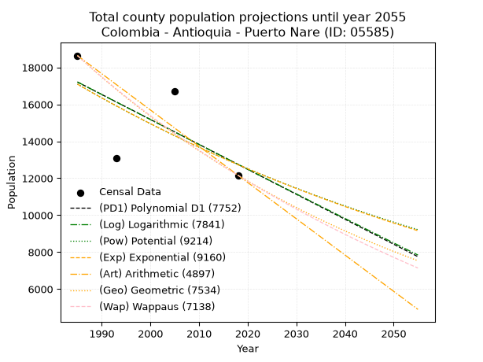
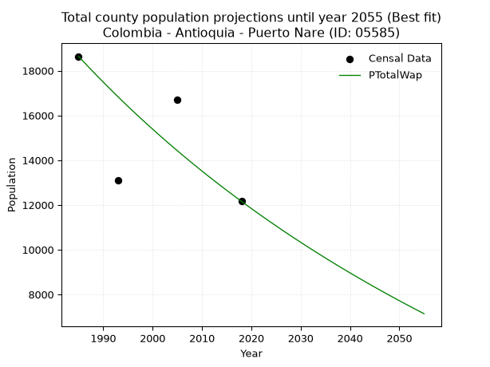
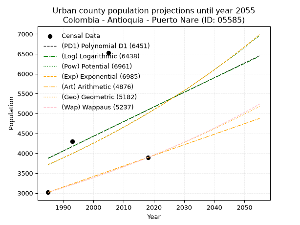
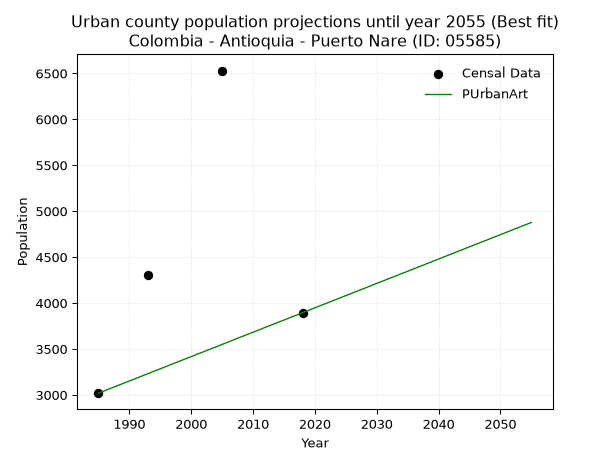
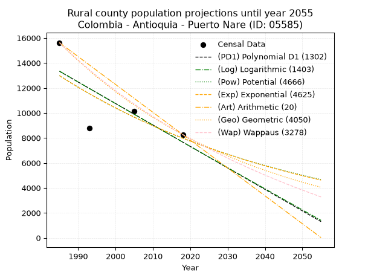
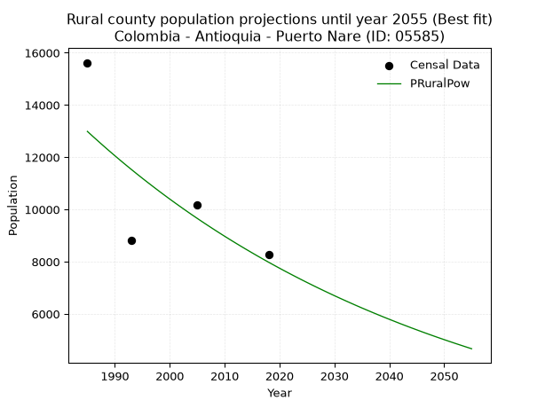

<div align="center">


</div>

# 📜 _“Population and Public Services Demand Projections (PPSD) until Year 2050 for Colombia - Antioquia - Puerto Nare (ID: 05585)”_
Keywords: `population` `public-service` `projection` `lineal` `polynomial` `logarithmic` `potential` `exponential` `arithmetic` `geometric` `wappaus` `dane` `colombia` `south-america`

PPSD are analytical estimates used by governments and planners to anticipate future changes in population size, age distribution, and the resulting community needs for utilities, healthcare, education, and infrastructure as sizing future water treatment facilities, electrical grids, and road networks based on spatial growth.

<div align="center">

</img>

</div>


> **General running parameters**: • app_version: _v20260806_. • Python version: _3.14.7_. • Pandas version: _3.0.5_. • NumPy version: _2.5.1_. • Creates, save and include plots into reports (create_plot): _False_. • Projection until year: _2050_. • Process polynomial degree 2 and up: _False_. • Process Wappaus: _True_. • Process Wappaus: _True_. • Set negative values to zero: _True_. • Set infinite values to zero: _True_. • Drop dataset notes: _True_. 
<div align="center">

Maps & GIS Layers: [:earth_americas:Google](http://maps.google.com/maps?q=6.186024828,-74.583012) [:earth_americas:OSM](https://www.openstreetmap.org/#map=18/6.186024828/-74.583012&layers=P) [:earth_americas:Bing](https://www.bing.com/maps?cp=6.186024828~-74.583012&lvl=18) [:earth_americas:Apple](https://maps.apple.com/frame?center=6.186024828%2C-74.583012&span=0.003%2C0.006) [:earth_americas:GISMobile](https://github.com/rcfdtools/R.GISMobile/blob/main/file/gis/CountyLayer_CO/Readme.md)

</div>


<div align="center">

```geojson
{
  "type": "Feature",
  "geometry": {
    "type": "Point", 
    "coordinates": [-74.583012, 6.186024828]
  }, 
  "properties": {
    "Name": "Colombia - Antioquia - Puerto Nare (ID: 05585)"
  }
}
```

</div>


## 0. Census Data (4 records)

Census data are official statistics collected by a government about the people and housing in a country. They usually include counts of total population, age, sex, race, income, education, and jobs.

📅Global census file: [Population.xlsx](../data/Population.xlsx)

| Source   |   Year |   CountryID | CountryName   |   StateID | StateName   |   CountyID | CountyName   |   PTotal |   PUrban |   PRural |
|:---------|-------:|------------:|:--------------|----------:|:------------|-----------:|:-------------|---------:|---------:|---------:|
| DANE     |   1985 |          57 | Colombia      |        05 | Antioquia   |      05585 | Puerto Nare  |    18640 |     3018 |    15622 |
| DANE     |   1993 |          57 | Colombia      |        05 | Antioquia   |      05585 | Puerto Nare  |    13104 |     4302 |     8802 |
| DANE     |   2005 |          57 | Colombia      |        05 | Antioquia   |      05585 | Puerto Nare  |    16690 |     6529 |    10161 |
| DANE     |   2018 |          57 | Colombia      |        05 | Antioquia   |      05585 | Puerto Nare  |    12161 |     3894 |     8267 |

> 🔥Some records could had specific notes about the registered values or the corresponding urban or rural distribution.

📅[SUI-RUPS](https://www.datos.gov.co/Hacienda-y-Cr-dito-P-blico/Registro-nico-de-Prestadores-de-Servicios-P-blicos/4qkq-csdn/about_data) - Local public utility companies: [RUPS.csv](../data/RUPS.csv)

 | SERVICIO       | ESTADO    | NOMBRE                                              | NIT         | DEPARTAMENTO_DOMICILIO   | MUNICIPIO_DOMICILIO   | DIRECCION            |   TELEFONO | EMAIL                | TIPO_PRESTADOR                            | CLASIFICACION                  |
|:---------------|:----------|:----------------------------------------------------|:------------|:-------------------------|:----------------------|:---------------------|-----------:|:---------------------|:------------------------------------------|:-------------------------------|
| ACUEDUCTO      | OPERATIVA | EMPRESAS PUBLICAS MUNICIPALES DE PUERTO NARE E.S.P. | 800196071-6 | ANTIOQUIA                | PUERTO NARE           | Carrera 2 No 49 - 35 |    8347184 | GERENCIA@EPPN.GOV.CO | EMPRESA INDUSTRIAL Y COMERCIAL DEL ESTADO | DESDE 2501 HASTA 5000 USUARIOS |
| ALCANTARILLADO | OPERATIVA | EMPRESAS PUBLICAS MUNICIPALES DE PUERTO NARE E.S.P. | 800196071-6 | ANTIOQUIA                | PUERTO NARE           | Carrera 2 No 49 - 35 |    8347184 | GERENCIA@EPPN.GOV.CO | EMPRESA INDUSTRIAL Y COMERCIAL DEL ESTADO | DESDE 2501 HASTA 5000 USUARIOS |

## 1. Total

### 1.1. Coefficients and Parameters

* (PD1) Polynomial Deg 1: -135.0923323966253, 285367.1878763497 (lineal)
* (Log) Logarithmic: -270435.4601785312, 2070730.849950786
* (Pow) Potential: -17.839765694536524, 63.06423832930209
* (Exp) Exponential: -0.00891308704343396, 825269167430.7272
* (Art) Arithmetic: Year diff. 2018 - 1985 = 33, Population diff. 12161 - 18640 = -6479, Annual growth = -196.33333333333334
* (Geo) Geometric: Year diff. 2018 - 1985 = 33, Population diff. 12161 - 18640 = -6479, Annual growth % = -0.012858304309580793
* (Wap) Wappaus: i = -1.2748503836455527, Condition values only valid for < 200)

<sub>
Wappaus condition values: ['-0.00', '-1.27', '-2.55', '-3.82', '-5.10', '-6.37', '-7.65', '-8.92', '-10.20', '-11.47', '-12.75', '-14.02', '-15.30', '-16.57', '-17.85', '-19.12', '-20.40', '-21.67', '-22.95', '-24.22', '-25.50', '-26.77', '-28.05', '-29.32', '-30.60', '-31.87', '-33.15', '-34.42', '-35.70', '-36.97', '-38.25', '-39.52', '-40.80', '-42.07', '-43.34', '-44.62', '-45.89', '-47.17', '-48.44', '-49.72', '-50.99', '-52.27', '-53.54', '-54.82', '-56.09', '-57.37', '-58.64', '-59.92', '-61.19', '-62.47', '-63.74', '-65.02', '-66.29', '-67.57', '-68.84', '-70.12', '-71.39', '-72.67', '-73.94', '-75.22', '-76.49', '-77.77', '-79.04', '-80.32', '-81.59', '-82.87']
</sub>


### 1.2. Projected Dataset

|   Year |   CountyID |   PTotalPD1 |   PTotalLog |   PTotalPow |   PTotalExp |   PTotalArt |   PTotalGeo |   PTotalWap |
|-------:|-----------:|------------:|------------:|------------:|------------:|------------:|------------:|------------:|
|   1985 |      05585 |       17209 |       17213 |       17099 |       17094 |       18640 |       18640 |       18640 |
|   1986 |      05585 |       17074 |       17077 |       16946 |       16943 |       18444 |       18400 |       18404 |
|   1987 |      05585 |       16939 |       16941 |       16794 |       16792 |       18247 |       18164 |       18171 |
|   1988 |      05585 |       16804 |       16805 |       16644 |       16643 |       18051 |       17930 |       17940 |
|   1989 |      05585 |       16669 |       16669 |       16496 |       16496 |       17855 |       17700 |       17713 |
|   1990 |      05585 |       16533 |       16533 |       16348 |       16349 |       17658 |       17472 |       17489 |
|   1991 |      05585 |       16398 |       16397 |       16202 |       16204 |       17462 |       17247 |       17267 |
|   1992 |      05585 |       16263 |       16261 |       16058 |       16060 |       17266 |       17026 |       17048 |
|   1993 |      05585 |       16128 |       16125 |       15915 |       15918 |       17069 |       16807 |       16831 |
|   1994 |      05585 |       15993 |       15990 |       15773 |       15777 |       16873 |       16591 |       16617 |
|   1995 |      05585 |       15858 |       15854 |       15633 |       15637 |       16677 |       16377 |       16406 |
|   1996 |      05585 |       15723 |       15719 |       15493 |       15498 |       16480 |       16167 |       16197 |
|   1997 |      05585 |       15588 |       15583 |       15356 |       15360 |       16284 |       15959 |       15991 |
|   1998 |      05585 |       15453 |       15448 |       15219 |       15224 |       16088 |       15754 |       15787 |
|   1999 |      05585 |       15318 |       15313 |       15084 |       15089 |       15891 |       15551 |       15586 |
|   2000 |      05585 |       15183 |       15177 |       14950 |       14955 |       15695 |       15351 |       15387 |
|   2001 |      05585 |       15047 |       15042 |       14817 |       14822 |       15499 |       15154 |       15190 |
|   2002 |      05585 |       14912 |       14907 |       14686 |       14691 |       15302 |       14959 |       14995 |
|   2003 |      05585 |       14777 |       14772 |       14555 |       14560 |       15106 |       14766 |       14803 |
|   2004 |      05585 |       14642 |       14637 |       14426 |       14431 |       14910 |       14577 |       14613 |
|   2005 |      05585 |       14507 |       14502 |       14299 |       14303 |       14713 |       14389 |       14425 |
|   2006 |      05585 |       14372 |       14367 |       14172 |       14176 |       14517 |       14204 |       14239 |
|   2007 |      05585 |       14237 |       14232 |       14046 |       14050 |       14321 |       14022 |       14055 |
|   2008 |      05585 |       14102 |       14098 |       13922 |       13926 |       14124 |       13841 |       13873 |
|   2009 |      05585 |       13967 |       13963 |       13799 |       13802 |       13928 |       13663 |       13694 |
|   2010 |      05585 |       13832 |       13828 |       13677 |       13680 |       13732 |       13488 |       13516 |
|   2011 |      05585 |       13697 |       13694 |       13556 |       13558 |       13535 |       13314 |       13340 |
|   2012 |      05585 |       13561 |       13560 |       13437 |       13438 |       13339 |       13143 |       13166 |
|   2013 |      05585 |       13426 |       13425 |       13318 |       13319 |       13143 |       12974 |       12994 |
|   2014 |      05585 |       13291 |       13291 |       13201 |       13201 |       12946 |       12807 |       12824 |
|   2015 |      05585 |       13156 |       13157 |       13084 |       13083 |       12750 |       12642 |       12655 |
|   2016 |      05585 |       13021 |       13022 |       12969 |       12967 |       12554 |       12480 |       12489 |
|   2017 |      05585 |       12886 |       12888 |       12855 |       12852 |       12357 |       12319 |       12324 |
|   2018 |      05585 |       12751 |       12754 |       12741 |       12738 |       12161 |       12161 |       12161 |
|   2019 |      05585 |       12616 |       12620 |       12629 |       12625 |       11965 |       12005 |       12000 |
|   2020 |      05585 |       12481 |       12486 |       12518 |       12513 |       11768 |       11850 |       11840 |
|   2021 |      05585 |       12346 |       12353 |       12408 |       12402 |       11572 |       11698 |       11682 |
|   2022 |      05585 |       12210 |       12219 |       12299 |       12292 |       11376 |       11547 |       11526 |
|   2023 |      05585 |       12075 |       12085 |       12191 |       12183 |       11179 |       11399 |       11371 |
|   2024 |      05585 |       11940 |       11951 |       12084 |       12075 |       10983 |       11252 |       11218 |
|   2025 |      05585 |       11805 |       11818 |       11978 |       11968 |       10787 |       11108 |       11066 |
|   2026 |      05585 |       11670 |       11684 |       11873 |       11862 |       10590 |       10965 |       10916 |
|   2027 |      05585 |       11535 |       11551 |       11769 |       11756 |       10394 |       10824 |       10767 |
|   2028 |      05585 |       11400 |       11417 |       11666 |       11652 |       10198 |       10685 |       10620 |
|   2029 |      05585 |       11265 |       11284 |       11564 |       11549 |       10001 |       10547 |       10474 |
|   2030 |      05585 |       11130 |       11151 |       11463 |       11446 |        9805 |       10412 |       10330 |
|   2031 |      05585 |       10995 |       11018 |       11362 |       11345 |        9609 |       10278 |       10187 |
|   2032 |      05585 |       10860 |       10885 |       11263 |       11244 |        9412 |       10146 |       10046 |
|   2033 |      05585 |       10724 |       10752 |       11165 |       11144 |        9216 |       10015 |        9906 |
|   2034 |      05585 |       10589 |       10619 |       11067 |       11045 |        9020 |        9886 |        9767 |
|   2035 |      05585 |       10454 |       10486 |       10970 |       10947 |        8823 |        9759 |        9630 |
|   2036 |      05585 |       10319 |       10353 |       10875 |       10850 |        8627 |        9634 |        9494 |
|   2037 |      05585 |       10184 |       10220 |       10780 |       10754 |        8431 |        9510 |        9359 |
|   2038 |      05585 |       10049 |       10087 |       10686 |       10658 |        8234 |        9388 |        9226 |
|   2039 |      05585 |        9914 |        9955 |       10593 |       10564 |        8038 |        9267 |        9094 |
|   2040 |      05585 |        9779 |        9822 |       10501 |       10470 |        7842 |        9148 |        8963 |
|   2041 |      05585 |        9644 |        9689 |       10409 |       10377 |        7645 |        9030 |        8833 |
|   2042 |      05585 |        9509 |        9557 |       10319 |       10285 |        7449 |        8914 |        8705 |
|   2043 |      05585 |        9374 |        9425 |       10229 |       10194 |        7253 |        8799 |        8578 |
|   2044 |      05585 |        9238 |        9292 |       10140 |       10103 |        7056 |        8686 |        8451 |
|   2045 |      05585 |        9103 |        9160 |       10052 |       10014 |        6860 |        8575 |        8327 |
|   2046 |      05585 |        8968 |        9028 |        9965 |        9925 |        6664 |        8464 |        8203 |
|   2047 |      05585 |        8833 |        8896 |        9878 |        9837 |        6467 |        8356 |        8080 |
|   2048 |      05585 |        8698 |        8764 |        9792 |        9750 |        6271 |        8248 |        7959 |
|   2049 |      05585 |        8563 |        8631 |        9707 |        9663 |        6075 |        8142 |        7838 |
|   2050 |      05585 |        8428 |        8500 |        9623 |        9577 |        5878 |        8037 |        7719 |
<div align="center">

</img>

</div>


### 1.3. Best fit with absolute and relative error (%)

Relative error puts that difference into context by dividing the absolute error by the true value, creating a unitless ratio or percentage that shows the scale of the mistake.

Absolute and relative error

|   Year | Source   |   CountryID | CountryName   |   StateID | StateName   |   CountyID_x | CountyName   |   PTotal |   PUrban |   PRural |   CountyID_y |   PTotalPD1 |   PTotalLog |   PTotalPow |   PTotalExp |   PTotalArt |   PTotalGeo |   PTotalWap |   PTotalPD1AbsError |   PTotalLogAbsError |   PTotalPowAbsError |   PTotalExpAbsError |   PTotalArtAbsError |   PTotalGeoAbsError |   PTotalWapAbsError |   PTotalPD1RelError |   PTotalLogRelError |   PTotalPowRelError |   PTotalExpRelError |   PTotalArtRelError |   PTotalGeoRelError |   PTotalWapRelError |
|-------:|:---------|------------:|:--------------|----------:|:------------|-------------:|:-------------|---------:|---------:|---------:|-------------:|------------:|------------:|------------:|------------:|------------:|------------:|------------:|--------------------:|--------------------:|--------------------:|--------------------:|--------------------:|--------------------:|--------------------:|--------------------:|--------------------:|--------------------:|--------------------:|--------------------:|--------------------:|--------------------:|
|   1985 | DANE     |          57 | Colombia      |        05 | Antioquia   |        05585 | Puerto Nare  |    18640 |     3018 |    15622 |        05585 |       17209 |       17213 |       17099 |       17094 |       18640 |       18640 |       18640 |                1431 |                1427 |                1541 |                1546 |                   0 |                   0 |                   0 |             7.67704 |             7.65558 |             8.26717 |             8.29399 |              0      |              0      |              0      |
|   1993 | DANE     |          57 | Colombia      |        05 | Antioquia   |        05585 | Puerto Nare  |    13104 |     4302 |     8802 |        05585 |       16128 |       16125 |       15915 |       15918 |       17069 |       16807 |       16831 |                3024 |                3021 |                2811 |                2814 |                3965 |                3703 |                3727 |            23.0769  |            23.054   |            21.4515  |            21.4744  |             30.2579 |             28.2585 |             28.4417 |
|   2005 | DANE     |          57 | Colombia      |        05 | Antioquia   |        05585 | Puerto Nare  |    16690 |     6529 |    10161 |        05585 |       14507 |       14502 |       14299 |       14303 |       14713 |       14389 |       14425 |                2183 |                2188 |                2391 |                2387 |                1977 |                2301 |                2265 |            13.0797  |            13.1096  |            14.3259  |            14.302   |             11.8454 |             13.7867 |             13.571  |
|   2018 | DANE     |          57 | Colombia      |        05 | Antioquia   |        05585 | Puerto Nare  |    12161 |     3894 |     8267 |        05585 |       12751 |       12754 |       12741 |       12738 |       12161 |       12161 |       12161 |                 590 |                 593 |                 580 |                 577 |                   0 |                   0 |                   0 |             4.85157 |             4.87624 |             4.76934 |             4.74468 |              0      |              0      |              0      |

Relative error mean

| Method    |   RelError | Best   |
|:----------|-----------:|:-------|
| PTotalPD1 |    12.1713 |        |
| PTotalLog |    12.1739 |        |
| PTotalPow |    12.2035 |        |
| PTotalExp |    12.2038 |        |
| PTotalArt |    10.5258 |        |
| PTotalGeo |    10.5113 |        |
| PTotalWap |    10.5032 | True   |

💙Best method: _**PTotalWap**_
<div align="center">

</img>

</div>


### 1.4. Fresh water supply demand in liters per capita per day (lpcd)

The fresh water supply demand typically ranges from 100 to 300 liters per capita per day (lpcd) for standard domestic and municipal planning, though absolute survival minimums set by the World Health Organization are as low as 7.5 to 20 liters per day, and total consumption in high-income nations can exceed 400 liters.

> `CZ`: Level in meters above the sea level (masl)<br> `WS`: Fresh water supply demand in liters per capita per day (lpcd or l/h/d)<br> `WSAll`: Zonal fresh water supply demand in liters per second (l/s)<br> `A`: Zonal area in square meters<br> `DP`: Population density (people/hectare or p/ha)

Reference values (RAS Colombia)

|    CZ |   WS |
|------:|-----:|
|  1000 |  120 |
|  2000 |  130 |
| 99999 |  140 |

County shapefile geometry properties and water supply values

|   CountyID |      ATotal |   CZTotal |   WSTotal |
|-----------:|------------:|----------:|----------:|
|      05585 | 5.79067e+08 |   311.895 |       120 |

Projected values for best method: PTotalWap

|   CountyID |   Year |   PTotalWap |   DPTotal |   WSTotal |   WSTotalAll |
|-----------:|-------:|------------:|----------:|----------:|-------------:|
|      05585 |   1985 |       18640 |      0.32 |       120 |      25.8889 |
|      05585 |   1986 |       18404 |      0.32 |       120 |      25.5611 |
|      05585 |   1987 |       18171 |      0.31 |       120 |      25.2375 |
|      05585 |   1988 |       17940 |      0.31 |       120 |      24.9167 |
|      05585 |   1989 |       17713 |      0.31 |       120 |      24.6014 |
|      05585 |   1990 |       17489 |      0.3  |       120 |      24.2903 |
|      05585 |   1991 |       17267 |      0.3  |       120 |      23.9819 |
|      05585 |   1992 |       17048 |      0.29 |       120 |      23.6778 |
|      05585 |   1993 |       16831 |      0.29 |       120 |      23.3764 |
|      05585 |   1994 |       16617 |      0.29 |       120 |      23.0792 |
|      05585 |   1995 |       16406 |      0.28 |       120 |      22.7861 |
|      05585 |   1996 |       16197 |      0.28 |       120 |      22.4958 |
|      05585 |   1997 |       15991 |      0.28 |       120 |      22.2097 |
|      05585 |   1998 |       15787 |      0.27 |       120 |      21.9264 |
|      05585 |   1999 |       15586 |      0.27 |       120 |      21.6472 |
|      05585 |   2000 |       15387 |      0.27 |       120 |      21.3708 |
|      05585 |   2001 |       15190 |      0.26 |       120 |      21.0972 |
|      05585 |   2002 |       14995 |      0.26 |       120 |      20.8264 |
|      05585 |   2003 |       14803 |      0.26 |       120 |      20.5597 |
|      05585 |   2004 |       14613 |      0.25 |       120 |      20.2958 |
|      05585 |   2005 |       14425 |      0.25 |       120 |      20.0347 |
|      05585 |   2006 |       14239 |      0.25 |       120 |      19.7764 |
|      05585 |   2007 |       14055 |      0.24 |       120 |      19.5208 |
|      05585 |   2008 |       13873 |      0.24 |       120 |      19.2681 |
|      05585 |   2009 |       13694 |      0.24 |       120 |      19.0194 |
|      05585 |   2010 |       13516 |      0.23 |       120 |      18.7722 |
|      05585 |   2011 |       13340 |      0.23 |       120 |      18.5278 |
|      05585 |   2012 |       13166 |      0.23 |       120 |      18.2861 |
|      05585 |   2013 |       12994 |      0.22 |       120 |      18.0472 |
|      05585 |   2014 |       12824 |      0.22 |       120 |      17.8111 |
|      05585 |   2015 |       12655 |      0.22 |       120 |      17.5764 |
|      05585 |   2016 |       12489 |      0.22 |       120 |      17.3458 |
|      05585 |   2017 |       12324 |      0.21 |       120 |      17.1167 |
|      05585 |   2018 |       12161 |      0.21 |       120 |      16.8903 |
|      05585 |   2019 |       12000 |      0.21 |       120 |      16.6667 |
|      05585 |   2020 |       11840 |      0.2  |       120 |      16.4444 |
|      05585 |   2021 |       11682 |      0.2  |       120 |      16.225  |
|      05585 |   2022 |       11526 |      0.2  |       120 |      16.0083 |
|      05585 |   2023 |       11371 |      0.2  |       120 |      15.7931 |
|      05585 |   2024 |       11218 |      0.19 |       120 |      15.5806 |
|      05585 |   2025 |       11066 |      0.19 |       120 |      15.3694 |
|      05585 |   2026 |       10916 |      0.19 |       120 |      15.1611 |
|      05585 |   2027 |       10767 |      0.19 |       120 |      14.9542 |
|      05585 |   2028 |       10620 |      0.18 |       120 |      14.75   |
|      05585 |   2029 |       10474 |      0.18 |       120 |      14.5472 |
|      05585 |   2030 |       10330 |      0.18 |       120 |      14.3472 |
|      05585 |   2031 |       10187 |      0.18 |       120 |      14.1486 |
|      05585 |   2032 |       10046 |      0.17 |       120 |      13.9528 |
|      05585 |   2033 |        9906 |      0.17 |       120 |      13.7583 |
|      05585 |   2034 |        9767 |      0.17 |       120 |      13.5653 |
|      05585 |   2035 |        9630 |      0.17 |       120 |      13.375  |
|      05585 |   2036 |        9494 |      0.16 |       120 |      13.1861 |
|      05585 |   2037 |        9359 |      0.16 |       120 |      12.9986 |
|      05585 |   2038 |        9226 |      0.16 |       120 |      12.8139 |
|      05585 |   2039 |        9094 |      0.16 |       120 |      12.6306 |
|      05585 |   2040 |        8963 |      0.15 |       120 |      12.4486 |
|      05585 |   2041 |        8833 |      0.15 |       120 |      12.2681 |
|      05585 |   2042 |        8705 |      0.15 |       120 |      12.0903 |
|      05585 |   2043 |        8578 |      0.15 |       120 |      11.9139 |
|      05585 |   2044 |        8451 |      0.15 |       120 |      11.7375 |
|      05585 |   2045 |        8327 |      0.14 |       120 |      11.5653 |
|      05585 |   2046 |        8203 |      0.14 |       120 |      11.3931 |
|      05585 |   2047 |        8080 |      0.14 |       120 |      11.2222 |
|      05585 |   2048 |        7959 |      0.14 |       120 |      11.0542 |
|      05585 |   2049 |        7838 |      0.14 |       120 |      10.8861 |
|      05585 |   2050 |        7719 |      0.13 |       120 |      10.7208 |

## 2. Urban

### 2.1. Coefficients and Parameters

* (PD1) Polynomial Deg 1: 36.80008028904206, -69173.61059815637 (lineal)
* (Log) Logarithmic: 74081.3120991696, -558656.8969161663
* (Pow) Potential: 18.151809694030092, -56.29084231744537
* (Exp) Exponential: 0.009022587543047366, 6.19096693408856e-05
* (Art) Arithmetic: Year diff. 2018 - 1985 = 33, Population diff. 3894 - 3018 = 876, Annual growth = 26.545454545454547
* (Geo) Geometric: Year diff. 2018 - 1985 = 33, Population diff. 3894 - 3018 = 876, Annual growth % = 0.007752396832542807
* (Wap) Wappaus: i = 0.7680976430976431, Condition values only valid for < 200)

<sub>
Wappaus condition values: ['0.00', '0.77', '1.54', '2.30', '3.07', '3.84', '4.61', '5.38', '6.14', '6.91', '7.68', '8.45', '9.22', '9.99', '10.75', '11.52', '12.29', '13.06', '13.83', '14.59', '15.36', '16.13', '16.90', '17.67', '18.43', '19.20', '19.97', '20.74', '21.51', '22.27', '23.04', '23.81', '24.58', '25.35', '26.12', '26.88', '27.65', '28.42', '29.19', '29.96', '30.72', '31.49', '32.26', '33.03', '33.80', '34.56', '35.33', '36.10', '36.87', '37.64', '38.40', '39.17', '39.94', '40.71', '41.48', '42.25', '43.01', '43.78', '44.55', '45.32', '46.09', '46.85', '47.62', '48.39', '49.16', '49.93']
</sub>


### 2.2. Projected Dataset

|   Year |   CountyID |   PUrbanPD1 |   PUrbanLog |   PUrbanPow |   PUrbanExp |   PUrbanArt |   PUrbanGeo |   PUrbanWap |
|-------:|-----------:|------------:|------------:|------------:|------------:|------------:|------------:|------------:|
|   1985 |      05585 |        3875 |        3870 |        3711 |        3715 |        3018 |        3018 |        3018 |
|   1986 |      05585 |        3911 |        3908 |        3745 |        3748 |        3045 |        3041 |        3041 |
|   1987 |      05585 |        3948 |        3945 |        3779 |        3782 |        3071 |        3065 |        3065 |
|   1988 |      05585 |        3985 |        3982 |        3814 |        3816 |        3098 |        3089 |        3088 |
|   1989 |      05585 |        4022 |        4019 |        3849 |        3851 |        3124 |        3113 |        3112 |
|   1990 |      05585 |        4059 |        4057 |        3884 |        3886 |        3151 |        3137 |        3136 |
|   1991 |      05585 |        4095 |        4094 |        3920 |        3921 |        3177 |        3161 |        3160 |
|   1992 |      05585 |        4132 |        4131 |        3956 |        3957 |        3204 |        3186 |        3185 |
|   1993 |      05585 |        4169 |        4168 |        3992 |        3993 |        3230 |        3210 |        3209 |
|   1994 |      05585 |        4206 |        4205 |        4028 |        4029 |        3257 |        3235 |        3234 |
|   1995 |      05585 |        4243 |        4242 |        4065 |        4065 |        3283 |        3260 |        3259 |
|   1996 |      05585 |        4279 |        4280 |        4102 |        4102 |        3310 |        3286 |        3284 |
|   1997 |      05585 |        4316 |        4317 |        4140 |        4139 |        3337 |        3311 |        3310 |
|   1998 |      05585 |        4353 |        4354 |        4178 |        4177 |        3363 |        3337 |        3335 |
|   1999 |      05585 |        4390 |        4391 |        4216 |        4215 |        3390 |        3363 |        3361 |
|   2000 |      05585 |        4427 |        4428 |        4254 |        4253 |        3416 |        3389 |        3387 |
|   2001 |      05585 |        4463 |        4465 |        4293 |        4291 |        3443 |        3415 |        3413 |
|   2002 |      05585 |        4500 |        4502 |        4332 |        4330 |        3469 |        3441 |        3440 |
|   2003 |      05585 |        4537 |        4539 |        4372 |        4370 |        3496 |        3468 |        3466 |
|   2004 |      05585 |        4574 |        4576 |        4411 |        4409 |        3522 |        3495 |        3493 |
|   2005 |      05585 |        4611 |        4613 |        4452 |        4449 |        3549 |        3522 |        3520 |
|   2006 |      05585 |        4647 |        4650 |        4492 |        4489 |        3575 |        3549 |        3548 |
|   2007 |      05585 |        4684 |        4687 |        4533 |        4530 |        3602 |        3577 |        3575 |
|   2008 |      05585 |        4721 |        4724 |        4574 |        4571 |        3629 |        3605 |        3603 |
|   2009 |      05585 |        4758 |        4761 |        4616 |        4613 |        3655 |        3633 |        3631 |
|   2010 |      05585 |        4795 |        4797 |        4657 |        4654 |        3682 |        3661 |        3659 |
|   2011 |      05585 |        4831 |        4834 |        4700 |        4697 |        3708 |        3689 |        3688 |
|   2012 |      05585 |        4868 |        4871 |        4742 |        4739 |        3735 |        3718 |        3716 |
|   2013 |      05585 |        4905 |        4908 |        4785 |        4782 |        3761 |        3747 |        3745 |
|   2014 |      05585 |        4942 |        4945 |        4829 |        4825 |        3788 |        3776 |        3775 |
|   2015 |      05585 |        4979 |        4981 |        4872 |        4869 |        3814 |        3805 |        3804 |
|   2016 |      05585 |        5015 |        5018 |        4916 |        4913 |        3841 |        3834 |        3834 |
|   2017 |      05585 |        5052 |        5055 |        4961 |        4958 |        3867 |        3864 |        3864 |
|   2018 |      05585 |        5089 |        5092 |        5006 |        5003 |        3894 |        3894 |        3894 |
|   2019 |      05585 |        5126 |        5128 |        5051 |        5048 |        3921 |        3924 |        3925 |
|   2020 |      05585 |        5163 |        5165 |        5096 |        5094 |        3947 |        3955 |        3955 |
|   2021 |      05585 |        5199 |        5202 |        5142 |        5140 |        3974 |        3985 |        3986 |
|   2022 |      05585 |        5236 |        5238 |        5189 |        5187 |        4000 |        4016 |        4018 |
|   2023 |      05585 |        5273 |        5275 |        5236 |        5234 |        4027 |        4047 |        4049 |
|   2024 |      05585 |        5310 |        5312 |        5283 |        5281 |        4053 |        4079 |        4081 |
|   2025 |      05585 |        5347 |        5348 |        5330 |        5329 |        4080 |        4110 |        4114 |
|   2026 |      05585 |        5383 |        5385 |        5378 |        5377 |        4106 |        4142 |        4146 |
|   2027 |      05585 |        5420 |        5421 |        5427 |        5426 |        4133 |        4174 |        4179 |
|   2028 |      05585 |        5457 |        5458 |        5476 |        5475 |        4159 |        4207 |        4212 |
|   2029 |      05585 |        5494 |        5494 |        5525 |        5525 |        4186 |        4239 |        4245 |
|   2030 |      05585 |        5531 |        5531 |        5574 |        5575 |        4213 |        4272 |        4279 |
|   2031 |      05585 |        5567 |        5567 |        5624 |        5625 |        4239 |        4305 |        4313 |
|   2032 |      05585 |        5604 |        5604 |        5675 |        5676 |        4266 |        4339 |        4347 |
|   2033 |      05585 |        5641 |        5640 |        5726 |        5728 |        4292 |        4372 |        4382 |
|   2034 |      05585 |        5678 |        5677 |        5777 |        5780 |        4319 |        4406 |        4417 |
|   2035 |      05585 |        5715 |        5713 |        5829 |        5832 |        4345 |        4440 |        4453 |
|   2036 |      05585 |        5751 |        5750 |        5881 |        5885 |        4372 |        4475 |        4488 |
|   2037 |      05585 |        5788 |        5786 |        5934 |        5938 |        4398 |        4509 |        4524 |
|   2038 |      05585 |        5825 |        5822 |        5987 |        5992 |        4425 |        4544 |        4561 |
|   2039 |      05585 |        5862 |        5859 |        6040 |        6046 |        4451 |        4580 |        4597 |
|   2040 |      05585 |        5899 |        5895 |        6094 |        6101 |        4478 |        4615 |        4634 |
|   2041 |      05585 |        5935 |        5931 |        6149 |        6157 |        4505 |        4651 |        4672 |
|   2042 |      05585 |        5972 |        5968 |        6204 |        6212 |        4531 |        4687 |        4710 |
|   2043 |      05585 |        6009 |        6004 |        6259 |        6269 |        4558 |        4723 |        4748 |
|   2044 |      05585 |        6046 |        6040 |        6315 |        6325 |        4584 |        4760 |        4786 |
|   2045 |      05585 |        6083 |        6076 |        6371 |        6383 |        4611 |        4797 |        4825 |
|   2046 |      05585 |        6119 |        6113 |        6428 |        6441 |        4637 |        4834 |        4865 |
|   2047 |      05585 |        6156 |        6149 |        6485 |        6499 |        4664 |        4871 |        4904 |
|   2048 |      05585 |        6193 |        6185 |        6543 |        6558 |        4690 |        4909 |        4945 |
|   2049 |      05585 |        6230 |        6221 |        6601 |        6617 |        4717 |        4947 |        4985 |
|   2050 |      05585 |        6267 |        6257 |        6660 |        6677 |        4743 |        4986 |        5026 |
<div align="center">

</img>

</div>


### 2.3. Best fit with absolute and relative error (%)

Relative error puts that difference into context by dividing the absolute error by the true value, creating a unitless ratio or percentage that shows the scale of the mistake.

Absolute and relative error

|   Year | Source   |   CountryID | CountryName   |   StateID | StateName   |   CountyID_x | CountyName   |   PTotal |   PUrban |   PRural |   CountyID_y |   PUrbanPD1 |   PUrbanLog |   PUrbanPow |   PUrbanExp |   PUrbanArt |   PUrbanGeo |   PUrbanWap |   PUrbanPD1AbsError |   PUrbanLogAbsError |   PUrbanPowAbsError |   PUrbanExpAbsError |   PUrbanArtAbsError |   PUrbanGeoAbsError |   PUrbanWapAbsError |   PUrbanPD1RelError |   PUrbanLogRelError |   PUrbanPowRelError |   PUrbanExpRelError |   PUrbanArtRelError |   PUrbanGeoRelError |   PUrbanWapRelError |
|-------:|:---------|------------:|:--------------|----------:|:------------|-------------:|:-------------|---------:|---------:|---------:|-------------:|------------:|------------:|------------:|------------:|------------:|------------:|------------:|--------------------:|--------------------:|--------------------:|--------------------:|--------------------:|--------------------:|--------------------:|--------------------:|--------------------:|--------------------:|--------------------:|--------------------:|--------------------:|--------------------:|
|   1985 | DANE     |          57 | Colombia      |        05 | Antioquia   |        05585 | Puerto Nare  |    18640 |     3018 |    15622 |        05585 |        3875 |        3870 |        3711 |        3715 |        3018 |        3018 |        3018 |                 857 |                 852 |                 693 |                 697 |                   0 |                   0 |                   0 |            28.3963  |            28.2306  |            22.9622  |            23.0948  |              0      |              0      |              0      |
|   1993 | DANE     |          57 | Colombia      |        05 | Antioquia   |        05585 | Puerto Nare  |    13104 |     4302 |     8802 |        05585 |        4169 |        4168 |        3992 |        3993 |        3230 |        3210 |        3209 |                 133 |                 134 |                 310 |                 309 |                1072 |                1092 |                1093 |             3.09159 |             3.11483 |             7.20595 |             7.18271 |             24.9186 |             25.3835 |             25.4068 |
|   2005 | DANE     |          57 | Colombia      |        05 | Antioquia   |        05585 | Puerto Nare  |    16690 |     6529 |    10161 |        05585 |        4611 |        4613 |        4452 |        4449 |        3549 |        3522 |        3520 |                1918 |                1916 |                2077 |                2080 |                2980 |                3007 |                3009 |            29.3766  |            29.346   |            31.8119  |            31.8579  |             45.6425 |             46.0561 |             46.0867 |
|   2018 | DANE     |          57 | Colombia      |        05 | Antioquia   |        05585 | Puerto Nare  |    12161 |     3894 |     8267 |        05585 |        5089 |        5092 |        5006 |        5003 |        3894 |        3894 |        3894 |                1195 |                1198 |                1112 |                1109 |                   0 |                   0 |                   0 |            30.6882  |            30.7653  |            28.5568  |            28.4797  |              0      |              0      |              0      |

Relative error mean

| Method    |   RelError | Best   |
|:----------|-----------:|:-------|
| PUrbanPD1 |    22.8882 |        |
| PUrbanLog |    22.8642 |        |
| PUrbanPow |    22.6342 |        |
| PUrbanExp |    22.6538 |        |
| PUrbanArt |    17.6403 | True   |
| PUrbanGeo |    17.8599 |        |
| PUrbanWap |    17.8734 |        |

💙Best method: _**PUrbanArt**_
<div align="center">

</img>

</div>


### 2.4. Fresh water supply demand in liters per capita per day (lpcd)

The fresh water supply demand typically ranges from 100 to 300 liters per capita per day (lpcd) for standard domestic and municipal planning, though absolute survival minimums set by the World Health Organization are as low as 7.5 to 20 liters per day, and total consumption in high-income nations can exceed 400 liters.

> `CZ`: Level in meters above the sea level (masl)<br> `WS`: Fresh water supply demand in liters per capita per day (lpcd or l/h/d)<br> `WSAll`: Zonal fresh water supply demand in liters per second (l/s)<br> `A`: Zonal area in square meters<br> `DP`: Population density (people/hectare or p/ha)

Reference values (RAS Colombia)

|    CZ |   WS |
|------:|-----:|
|  1000 |  120 |
|  2000 |  130 |
| 99999 |  140 |

County shapefile geometry properties and water supply values

|   CountyID |   AUrban |   CZUrban |   WSUrban |
|-----------:|---------:|----------:|----------:|
|      05585 |   873289 |   131.933 |       120 |

Projected values for best method: PUrbanArt

|   CountyID |   Year |   PUrbanArt |   DPUrban |   WSUrban |   WSUrbanAll |
|-----------:|-------:|------------:|----------:|----------:|-------------:|
|      05585 |   1985 |        3018 |     34.56 |       120 |      4.19167 |
|      05585 |   1986 |        3045 |     34.87 |       120 |      4.22917 |
|      05585 |   1987 |        3071 |     35.17 |       120 |      4.26528 |
|      05585 |   1988 |        3098 |     35.48 |       120 |      4.30278 |
|      05585 |   1989 |        3124 |     35.77 |       120 |      4.33889 |
|      05585 |   1990 |        3151 |     36.08 |       120 |      4.37639 |
|      05585 |   1991 |        3177 |     36.38 |       120 |      4.4125  |
|      05585 |   1992 |        3204 |     36.69 |       120 |      4.45    |
|      05585 |   1993 |        3230 |     36.99 |       120 |      4.48611 |
|      05585 |   1994 |        3257 |     37.3  |       120 |      4.52361 |
|      05585 |   1995 |        3283 |     37.59 |       120 |      4.55972 |
|      05585 |   1996 |        3310 |     37.9  |       120 |      4.59722 |
|      05585 |   1997 |        3337 |     38.21 |       120 |      4.63472 |
|      05585 |   1998 |        3363 |     38.51 |       120 |      4.67083 |
|      05585 |   1999 |        3390 |     38.82 |       120 |      4.70833 |
|      05585 |   2000 |        3416 |     39.12 |       120 |      4.74444 |
|      05585 |   2001 |        3443 |     39.43 |       120 |      4.78194 |
|      05585 |   2002 |        3469 |     39.72 |       120 |      4.81806 |
|      05585 |   2003 |        3496 |     40.03 |       120 |      4.85556 |
|      05585 |   2004 |        3522 |     40.33 |       120 |      4.89167 |
|      05585 |   2005 |        3549 |     40.64 |       120 |      4.92917 |
|      05585 |   2006 |        3575 |     40.94 |       120 |      4.96528 |
|      05585 |   2007 |        3602 |     41.25 |       120 |      5.00278 |
|      05585 |   2008 |        3629 |     41.56 |       120 |      5.04028 |
|      05585 |   2009 |        3655 |     41.85 |       120 |      5.07639 |
|      05585 |   2010 |        3682 |     42.16 |       120 |      5.11389 |
|      05585 |   2011 |        3708 |     42.46 |       120 |      5.15    |
|      05585 |   2012 |        3735 |     42.77 |       120 |      5.1875  |
|      05585 |   2013 |        3761 |     43.07 |       120 |      5.22361 |
|      05585 |   2014 |        3788 |     43.38 |       120 |      5.26111 |
|      05585 |   2015 |        3814 |     43.67 |       120 |      5.29722 |
|      05585 |   2016 |        3841 |     43.98 |       120 |      5.33472 |
|      05585 |   2017 |        3867 |     44.28 |       120 |      5.37083 |
|      05585 |   2018 |        3894 |     44.59 |       120 |      5.40833 |
|      05585 |   2019 |        3921 |     44.9  |       120 |      5.44583 |
|      05585 |   2020 |        3947 |     45.2  |       120 |      5.48194 |
|      05585 |   2021 |        3974 |     45.51 |       120 |      5.51944 |
|      05585 |   2022 |        4000 |     45.8  |       120 |      5.55556 |
|      05585 |   2023 |        4027 |     46.11 |       120 |      5.59306 |
|      05585 |   2024 |        4053 |     46.41 |       120 |      5.62917 |
|      05585 |   2025 |        4080 |     46.72 |       120 |      5.66667 |
|      05585 |   2026 |        4106 |     47.02 |       120 |      5.70278 |
|      05585 |   2027 |        4133 |     47.33 |       120 |      5.74028 |
|      05585 |   2028 |        4159 |     47.62 |       120 |      5.77639 |
|      05585 |   2029 |        4186 |     47.93 |       120 |      5.81389 |
|      05585 |   2030 |        4213 |     48.24 |       120 |      5.85139 |
|      05585 |   2031 |        4239 |     48.54 |       120 |      5.8875  |
|      05585 |   2032 |        4266 |     48.85 |       120 |      5.925   |
|      05585 |   2033 |        4292 |     49.15 |       120 |      5.96111 |
|      05585 |   2034 |        4319 |     49.46 |       120 |      5.99861 |
|      05585 |   2035 |        4345 |     49.75 |       120 |      6.03472 |
|      05585 |   2036 |        4372 |     50.06 |       120 |      6.07222 |
|      05585 |   2037 |        4398 |     50.36 |       120 |      6.10833 |
|      05585 |   2038 |        4425 |     50.67 |       120 |      6.14583 |
|      05585 |   2039 |        4451 |     50.97 |       120 |      6.18194 |
|      05585 |   2040 |        4478 |     51.28 |       120 |      6.21944 |
|      05585 |   2041 |        4505 |     51.59 |       120 |      6.25694 |
|      05585 |   2042 |        4531 |     51.88 |       120 |      6.29306 |
|      05585 |   2043 |        4558 |     52.19 |       120 |      6.33056 |
|      05585 |   2044 |        4584 |     52.49 |       120 |      6.36667 |
|      05585 |   2045 |        4611 |     52.8  |       120 |      6.40417 |
|      05585 |   2046 |        4637 |     53.1  |       120 |      6.44028 |
|      05585 |   2047 |        4664 |     53.41 |       120 |      6.47778 |
|      05585 |   2048 |        4690 |     53.71 |       120 |      6.51389 |
|      05585 |   2049 |        4717 |     54.01 |       120 |      6.55139 |
|      05585 |   2050 |        4743 |     54.31 |       120 |      6.5875  |

## 3. Rural

### 3.1. Coefficients and Parameters

* (PD1) Polynomial Deg 1: -171.89241268566727, 354540.79847450595 (lineal)
* (Log) Logarithmic: -344516.7722777008, 2629387.7468669517
* (Pow) Potential: -29.539188122158098, 101.52675075617537
* (Exp) Exponential: -0.014741072171406177, 6.624966568003338e+16
* (Art) Arithmetic: Year diff. 2018 - 1985 = 33, Population diff. 8267 - 15622 = -7355, Annual growth = -222.87878787878788
* (Geo) Geometric: Year diff. 2018 - 1985 = 33, Population diff. 8267 - 15622 = -7355, Annual growth % = -0.019100337795921463
* (Wap) Wappaus: i = -1.8659532661793117, Condition values only valid for < 200)

<sub>
Wappaus condition values: ['-0.00', '-1.87', '-3.73', '-5.60', '-7.46', '-9.33', '-11.20', '-13.06', '-14.93', '-16.79', '-18.66', '-20.53', '-22.39', '-24.26', '-26.12', '-27.99', '-29.86', '-31.72', '-33.59', '-35.45', '-37.32', '-39.19', '-41.05', '-42.92', '-44.78', '-46.65', '-48.51', '-50.38', '-52.25', '-54.11', '-55.98', '-57.84', '-59.71', '-61.58', '-63.44', '-65.31', '-67.17', '-69.04', '-70.91', '-72.77', '-74.64', '-76.50', '-78.37', '-80.24', '-82.10', '-83.97', '-85.83', '-87.70', '-89.57', '-91.43', '-93.30', '-95.16', '-97.03', '-98.90', '-100.76', '-102.63', '-104.49', '-106.36', '-108.23', '-110.09', '-111.96', '-113.82', '-115.69', '-117.56', '-119.42', '-121.29']
</sub>


### 3.2. Projected Dataset

|   Year |   CountyID |   PRuralPD1 |   PRuralLog |   PRuralPow |   PRuralExp |   PRuralArt |   PRuralGeo |   PRuralWap |
|-------:|-----------:|------------:|------------:|------------:|------------:|------------:|------------:|------------:|
|   1985 |      05585 |       13334 |       13343 |       12989 |       12980 |       15622 |       15622 |       15622 |
|   1986 |      05585 |       13162 |       13169 |       12797 |       12790 |       15399 |       15324 |       15333 |
|   1987 |      05585 |       12991 |       12996 |       12609 |       12603 |       15176 |       15031 |       15050 |
|   1988 |      05585 |       12819 |       12823 |       12422 |       12419 |       14953 |       14744 |       14771 |
|   1989 |      05585 |       12647 |       12649 |       12239 |       12237 |       14730 |       14462 |       14498 |
|   1990 |      05585 |       12475 |       12476 |       12059 |       12058 |       14508 |       14186 |       14229 |
|   1991 |      05585 |       12303 |       12303 |       11881 |       11881 |       14285 |       13915 |       13966 |
|   1992 |      05585 |       12131 |       12130 |       11706 |       11708 |       14062 |       13649 |       13707 |
|   1993 |      05585 |       11959 |       11957 |       11534 |       11536 |       13839 |       13389 |       13452 |
|   1994 |      05585 |       11787 |       11784 |       11364 |       11367 |       13616 |       13133 |       13202 |
|   1995 |      05585 |       11615 |       11612 |       11197 |       11201 |       13393 |       12882 |       12956 |
|   1996 |      05585 |       11444 |       11439 |       11033 |       11037 |       13170 |       12636 |       12714 |
|   1997 |      05585 |       11272 |       11267 |       10871 |       10876 |       12947 |       12395 |       12476 |
|   1998 |      05585 |       11100 |       11094 |       10711 |       10717 |       12725 |       12158 |       12242 |
|   1999 |      05585 |       10928 |       10922 |       10554 |       10560 |       12502 |       11926 |       12012 |
|   2000 |      05585 |       10756 |       10749 |       10399 |       10405 |       12279 |       11698 |       11786 |
|   2001 |      05585 |       10584 |       10577 |       10247 |       10253 |       12056 |       11474 |       11564 |
|   2002 |      05585 |       10412 |       10405 |       10097 |       10103 |       11833 |       11255 |       11345 |
|   2003 |      05585 |       10240 |       10233 |        9949 |        9955 |       11610 |       11040 |       11129 |
|   2004 |      05585 |       10068 |       10061 |        9803 |        9809 |       11387 |       10829 |       10917 |
|   2005 |      05585 |        9897 |        9889 |        9660 |        9666 |       11164 |       10623 |       10709 |
|   2006 |      05585 |        9725 |        9717 |        9519 |        9524 |       10942 |       10420 |       10503 |
|   2007 |      05585 |        9553 |        9546 |        9380 |        9385 |       10719 |       10221 |       10301 |
|   2008 |      05585 |        9381 |        9374 |        9243 |        9248 |       10496 |       10025 |       10102 |
|   2009 |      05585 |        9209 |        9203 |        9108 |        9112 |       10273 |        9834 |        9906 |
|   2010 |      05585 |        9037 |        9031 |        8975 |        8979 |       10050 |        9646 |        9713 |
|   2011 |      05585 |        8865 |        8860 |        8844 |        8848 |        9827 |        9462 |        9523 |
|   2012 |      05585 |        8693 |        8688 |        8715 |        8718 |        9604 |        9281 |        9335 |
|   2013 |      05585 |        8521 |        8517 |        8588 |        8591 |        9381 |        9104 |        9151 |
|   2014 |      05585 |        8349 |        8346 |        8463 |        8465 |        9159 |        8930 |        8969 |
|   2015 |      05585 |        8178 |        8175 |        8340 |        8341 |        8936 |        8759 |        8789 |
|   2016 |      05585 |        8006 |        8004 |        8218 |        8219 |        8713 |        8592 |        8613 |
|   2017 |      05585 |        7834 |        7833 |        8099 |        8099 |        8490 |        8428 |        8439 |
|   2018 |      05585 |        7662 |        7663 |        7981 |        7980 |        8267 |        8267 |        8267 |
|   2019 |      05585 |        7490 |        7492 |        7865 |        7863 |        8044 |        8109 |        8098 |
|   2020 |      05585 |        7318 |        7321 |        7751 |        7748 |        7821 |        7954 |        7931 |
|   2021 |      05585 |        7146 |        7151 |        7638 |        7635 |        7598 |        7802 |        7766 |
|   2022 |      05585 |        6974 |        6980 |        7528 |        7523 |        7375 |        7653 |        7604 |
|   2023 |      05585 |        6802 |        6810 |        7419 |        7413 |        7153 |        7507 |        7444 |
|   2024 |      05585 |        6631 |        6640 |        7311 |        7305 |        6930 |        7364 |        7286 |
|   2025 |      05585 |        6459 |        6470 |        7205 |        7198 |        6707 |        7223 |        7131 |
|   2026 |      05585 |        6287 |        6300 |        7101 |        7093 |        6484 |        7085 |        6977 |
|   2027 |      05585 |        6115 |        6130 |        6998 |        6989 |        6261 |        6950 |        6826 |
|   2028 |      05585 |        5943 |        5960 |        6897 |        6886 |        6038 |        6817 |        6676 |
|   2029 |      05585 |        5771 |        5790 |        6797 |        6786 |        5815 |        6687 |        6529 |
|   2030 |      05585 |        5599 |        5620 |        6699 |        6686 |        5592 |        6559 |        6383 |
|   2031 |      05585 |        5427 |        5450 |        6602 |        6589 |        5370 |        6434 |        6240 |
|   2032 |      05585 |        5255 |        5281 |        6507 |        6492 |        5147 |        6311 |        6098 |
|   2033 |      05585 |        5084 |        5111 |        6413 |        6397 |        4924 |        6190 |        5958 |
|   2034 |      05585 |        4912 |        4942 |        6320 |        6304 |        4701 |        6072 |        5820 |
|   2035 |      05585 |        4740 |        4772 |        6229 |        6211 |        4478 |        5956 |        5683 |
|   2036 |      05585 |        4568 |        4603 |        6140 |        6120 |        4255 |        5842 |        5549 |
|   2037 |      05585 |        4396 |        4434 |        6051 |        6031 |        4032 |        5731 |        5416 |
|   2038 |      05585 |        4224 |        4265 |        5964 |        5943 |        3809 |        5621 |        5284 |
|   2039 |      05585 |        4052 |        4096 |        5878 |        5856 |        3587 |        5514 |        5155 |
|   2040 |      05585 |        3880 |        3927 |        5794 |        5770 |        3364 |        5409 |        5026 |
|   2041 |      05585 |        3708 |        3758 |        5711 |        5686 |        3141 |        5305 |        4900 |
|   2042 |      05585 |        3536 |        3589 |        5628 |        5602 |        2918 |        5204 |        4775 |
|   2043 |      05585 |        3365 |        3421 |        5548 |        5520 |        2695 |        5105 |        4651 |
|   2044 |      05585 |        3193 |        3252 |        5468 |        5440 |        2472 |        5007 |        4529 |
|   2045 |      05585 |        3021 |        3084 |        5390 |        5360 |        2249 |        4911 |        4409 |
|   2046 |      05585 |        2849 |        2915 |        5312 |        5282 |        2026 |        4818 |        4290 |
|   2047 |      05585 |        2677 |        2747 |        5236 |        5204 |        1804 |        4726 |        4172 |
|   2048 |      05585 |        2505 |        2579 |        5161 |        5128 |        1581 |        4635 |        4056 |
|   2049 |      05585 |        2333 |        2410 |        5087 |        5053 |        1358 |        4547 |        3941 |
|   2050 |      05585 |        2161 |        2242 |        5015 |        4979 |        1135 |        4460 |        3827 |
<div align="center">

</img>

</div>


### 3.3. Best fit with absolute and relative error (%)

Relative error puts that difference into context by dividing the absolute error by the true value, creating a unitless ratio or percentage that shows the scale of the mistake.

Absolute and relative error

|   Year | Source   |   CountryID | CountryName   |   StateID | StateName   |   CountyID_x | CountyName   |   PTotal |   PUrban |   PRural |   CountyID_y |   PRuralPD1 |   PRuralLog |   PRuralPow |   PRuralExp |   PRuralArt |   PRuralGeo |   PRuralWap |   PRuralPD1AbsError |   PRuralLogAbsError |   PRuralPowAbsError |   PRuralExpAbsError |   PRuralArtAbsError |   PRuralGeoAbsError |   PRuralWapAbsError |   PRuralPD1RelError |   PRuralLogRelError |   PRuralPowRelError |   PRuralExpRelError |   PRuralArtRelError |   PRuralGeoRelError |   PRuralWapRelError |
|-------:|:---------|------------:|:--------------|----------:|:------------|-------------:|:-------------|---------:|---------:|---------:|-------------:|------------:|------------:|------------:|------------:|------------:|------------:|------------:|--------------------:|--------------------:|--------------------:|--------------------:|--------------------:|--------------------:|--------------------:|--------------------:|--------------------:|--------------------:|--------------------:|--------------------:|--------------------:|--------------------:|
|   1985 | DANE     |          57 | Colombia      |        05 | Antioquia   |        05585 | Puerto Nare  |    18640 |     3018 |    15622 |        05585 |       13334 |       13343 |       12989 |       12980 |       15622 |       15622 |       15622 |                2288 |                2279 |                2633 |                2642 |                   0 |                   0 |                   0 |            14.646   |            14.5884  |            16.8544  |            16.912   |             0       |              0      |             0       |
|   1993 | DANE     |          57 | Colombia      |        05 | Antioquia   |        05585 | Puerto Nare  |    13104 |     4302 |     8802 |        05585 |       11959 |       11957 |       11534 |       11536 |       13839 |       13389 |       13452 |                3157 |                3155 |                2732 |                2734 |                5037 |                4587 |                4650 |            35.8668  |            35.8441  |            31.0384  |            31.0611  |            57.2256  |             52.1132 |            52.8289  |
|   2005 | DANE     |          57 | Colombia      |        05 | Antioquia   |        05585 | Puerto Nare  |    16690 |     6529 |    10161 |        05585 |        9897 |        9889 |        9660 |        9666 |       11164 |       10623 |       10709 |                 264 |                 272 |                 501 |                 495 |                1003 |                 462 |                 548 |             2.59817 |             2.6769  |             4.93062 |             4.87157 |             9.87108 |              4.5468 |             5.39317 |
|   2018 | DANE     |          57 | Colombia      |        05 | Antioquia   |        05585 | Puerto Nare  |    12161 |     3894 |     8267 |        05585 |        7662 |        7663 |        7981 |        7980 |        8267 |        8267 |        8267 |                 605 |                 604 |                 286 |                 287 |                   0 |                   0 |                   0 |             7.31825 |             7.30616 |             3.45954 |             3.47163 |             0       |              0      |             0       |

Relative error mean

| Method    |   RelError | Best   |
|:----------|-----------:|:-------|
| PRuralPD1 |    15.1073 |        |
| PRuralLog |    15.1039 |        |
| PRuralPow |    14.0707 | True   |
| PRuralExp |    14.0791 |        |
| PRuralArt |    16.7742 |        |
| PRuralGeo |    14.165  |        |
| PRuralWap |    14.5555 |        |

💙Best method: _**PRuralPow**_
<div align="center">

</img>

</div>


### 3.4. Fresh water supply demand in liters per capita per day (lpcd)

The fresh water supply demand typically ranges from 100 to 300 liters per capita per day (lpcd) for standard domestic and municipal planning, though absolute survival minimums set by the World Health Organization are as low as 7.5 to 20 liters per day, and total consumption in high-income nations can exceed 400 liters.

> `CZ`: Level in meters above the sea level (masl)<br> `WS`: Fresh water supply demand in liters per capita per day (lpcd or l/h/d)<br> `WSAll`: Zonal fresh water supply demand in liters per second (l/s)<br> `A`: Zonal area in square meters<br> `DP`: Population density (people/hectare or p/ha)

Reference values (RAS Colombia)

|    CZ |   WS |
|------:|-----:|
|  1000 |  120 |
|  2000 |  130 |
| 99999 |  140 |

County shapefile geometry properties and water supply values

|   CountyID |      ARural |   CZRural |   WSRural |
|-----------:|------------:|----------:|----------:|
|      05585 | 5.78194e+08 |    312.16 |       120 |

Projected values for best method: PRuralPow

|   CountyID |   Year |   PRuralPow |   DPRural |   WSRural |   WSRuralAll |
|-----------:|-------:|------------:|----------:|----------:|-------------:|
|      05585 |   1985 |       12989 |      0.22 |       120 |     18.0403  |
|      05585 |   1986 |       12797 |      0.22 |       120 |     17.7736  |
|      05585 |   1987 |       12609 |      0.22 |       120 |     17.5125  |
|      05585 |   1988 |       12422 |      0.21 |       120 |     17.2528  |
|      05585 |   1989 |       12239 |      0.21 |       120 |     16.9986  |
|      05585 |   1990 |       12059 |      0.21 |       120 |     16.7486  |
|      05585 |   1991 |       11881 |      0.21 |       120 |     16.5014  |
|      05585 |   1992 |       11706 |      0.2  |       120 |     16.2583  |
|      05585 |   1993 |       11534 |      0.2  |       120 |     16.0194  |
|      05585 |   1994 |       11364 |      0.2  |       120 |     15.7833  |
|      05585 |   1995 |       11197 |      0.19 |       120 |     15.5514  |
|      05585 |   1996 |       11033 |      0.19 |       120 |     15.3236  |
|      05585 |   1997 |       10871 |      0.19 |       120 |     15.0986  |
|      05585 |   1998 |       10711 |      0.19 |       120 |     14.8764  |
|      05585 |   1999 |       10554 |      0.18 |       120 |     14.6583  |
|      05585 |   2000 |       10399 |      0.18 |       120 |     14.4431  |
|      05585 |   2001 |       10247 |      0.18 |       120 |     14.2319  |
|      05585 |   2002 |       10097 |      0.17 |       120 |     14.0236  |
|      05585 |   2003 |        9949 |      0.17 |       120 |     13.8181  |
|      05585 |   2004 |        9803 |      0.17 |       120 |     13.6153  |
|      05585 |   2005 |        9660 |      0.17 |       120 |     13.4167  |
|      05585 |   2006 |        9519 |      0.16 |       120 |     13.2208  |
|      05585 |   2007 |        9380 |      0.16 |       120 |     13.0278  |
|      05585 |   2008 |        9243 |      0.16 |       120 |     12.8375  |
|      05585 |   2009 |        9108 |      0.16 |       120 |     12.65    |
|      05585 |   2010 |        8975 |      0.16 |       120 |     12.4653  |
|      05585 |   2011 |        8844 |      0.15 |       120 |     12.2833  |
|      05585 |   2012 |        8715 |      0.15 |       120 |     12.1042  |
|      05585 |   2013 |        8588 |      0.15 |       120 |     11.9278  |
|      05585 |   2014 |        8463 |      0.15 |       120 |     11.7542  |
|      05585 |   2015 |        8340 |      0.14 |       120 |     11.5833  |
|      05585 |   2016 |        8218 |      0.14 |       120 |     11.4139  |
|      05585 |   2017 |        8099 |      0.14 |       120 |     11.2486  |
|      05585 |   2018 |        7981 |      0.14 |       120 |     11.0847  |
|      05585 |   2019 |        7865 |      0.14 |       120 |     10.9236  |
|      05585 |   2020 |        7751 |      0.13 |       120 |     10.7653  |
|      05585 |   2021 |        7638 |      0.13 |       120 |     10.6083  |
|      05585 |   2022 |        7528 |      0.13 |       120 |     10.4556  |
|      05585 |   2023 |        7419 |      0.13 |       120 |     10.3042  |
|      05585 |   2024 |        7311 |      0.13 |       120 |     10.1542  |
|      05585 |   2025 |        7205 |      0.12 |       120 |     10.0069  |
|      05585 |   2026 |        7101 |      0.12 |       120 |      9.8625  |
|      05585 |   2027 |        6998 |      0.12 |       120 |      9.71944 |
|      05585 |   2028 |        6897 |      0.12 |       120 |      9.57917 |
|      05585 |   2029 |        6797 |      0.12 |       120 |      9.44028 |
|      05585 |   2030 |        6699 |      0.12 |       120 |      9.30417 |
|      05585 |   2031 |        6602 |      0.11 |       120 |      9.16944 |
|      05585 |   2032 |        6507 |      0.11 |       120 |      9.0375  |
|      05585 |   2033 |        6413 |      0.11 |       120 |      8.90694 |
|      05585 |   2034 |        6320 |      0.11 |       120 |      8.77778 |
|      05585 |   2035 |        6229 |      0.11 |       120 |      8.65139 |
|      05585 |   2036 |        6140 |      0.11 |       120 |      8.52778 |
|      05585 |   2037 |        6051 |      0.1  |       120 |      8.40417 |
|      05585 |   2038 |        5964 |      0.1  |       120 |      8.28333 |
|      05585 |   2039 |        5878 |      0.1  |       120 |      8.16389 |
|      05585 |   2040 |        5794 |      0.1  |       120 |      8.04722 |
|      05585 |   2041 |        5711 |      0.1  |       120 |      7.93194 |
|      05585 |   2042 |        5628 |      0.1  |       120 |      7.81667 |
|      05585 |   2043 |        5548 |      0.1  |       120 |      7.70556 |
|      05585 |   2044 |        5468 |      0.09 |       120 |      7.59444 |
|      05585 |   2045 |        5390 |      0.09 |       120 |      7.48611 |
|      05585 |   2046 |        5312 |      0.09 |       120 |      7.37778 |
|      05585 |   2047 |        5236 |      0.09 |       120 |      7.27222 |
|      05585 |   2048 |        5161 |      0.09 |       120 |      7.16806 |
|      05585 |   2049 |        5087 |      0.09 |       120 |      7.06528 |
|      05585 |   2050 |        5015 |      0.09 |       120 |      6.96528 |

#

<div align="center"><br><sub>Share this research</sub></div><br>

<sub>**APPS & TOOLS & CONTENT DISCLAIMER**: • NO WARRANTY - This content and software is provided by <a href="https://github.com/rcfdtools" target="_blank">github.com/rcfdtools</a> "as is", without any express or implied warranty, including warranties of merchantability, fitness for a particular purpose, or non-infringement. There is no guarantee that the software will be error-free or operate without interruption. • LIMITATION OF LIABILITY - Neither the authors nor copyright holders will be liable for claims or damages arising from the software or its use. You are responsible for determining if the software is appropriate for your use and assume all associated risks, including errors, legal compliance, and data loss. • NO PROFESSIONAL ADVICE - The software provides general information and does not offer professional advice. It should not replace consultation with professional advisors. [Clauses and global license for rcfdtools use.](https://github.com/rcfdtools/rcfdtools/blob/main/LICENSE.md)</sub>

| [:house: Home](Readme.md)  | [:beginner: Help / Collab](https://github.com/rcfdtools/R.HydroTools/discussions/31) |
|----------------------------|-------------------------------------------------------------------------------------------|