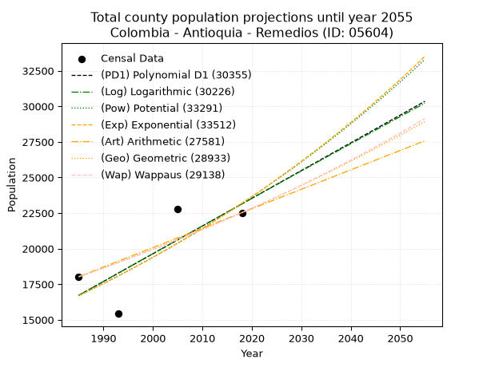
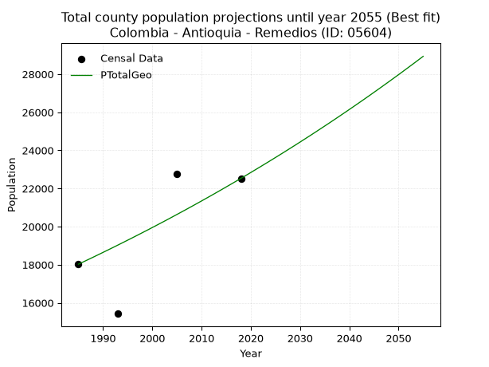
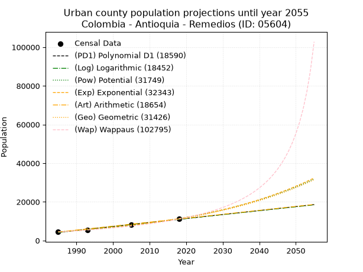
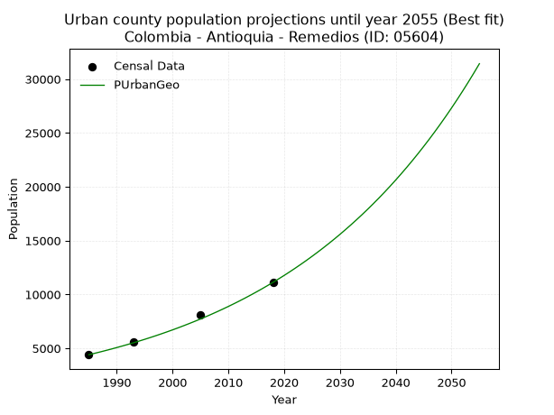
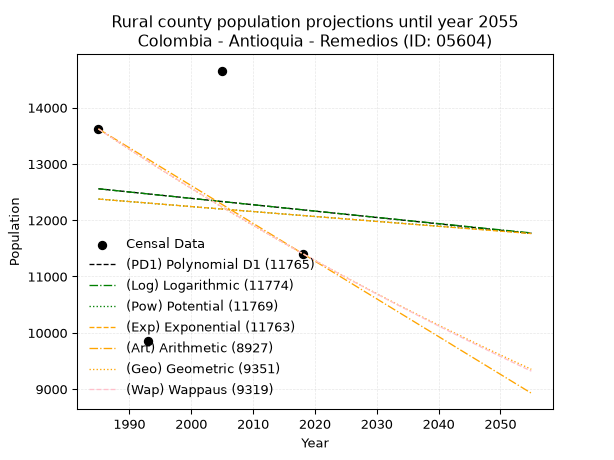
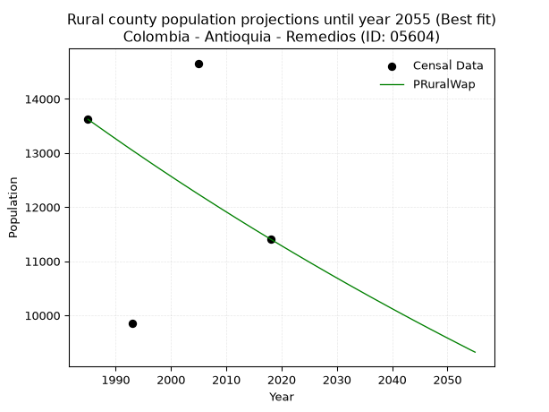

<div align="center">


</div>

# 📜 _“Population and Public Services Demand Projections (PPSD) until Year 2050 for Colombia - Antioquia - Remedios (ID: 05604)”_
Keywords: `population` `public-service` `projection` `lineal` `polynomial` `logarithmic` `potential` `exponential` `arithmetic` `geometric` `wappaus` `dane` `colombia` `south-america`

PPSD are analytical estimates used by governments and planners to anticipate future changes in population size, age distribution, and the resulting community needs for utilities, healthcare, education, and infrastructure as sizing future water treatment facilities, electrical grids, and road networks based on spatial growth.

<div align="center">

</img>

</div>


> **General running parameters**: • app_version: _v20260806_. • Python version: _3.14.7_. • Pandas version: _3.0.5_. • NumPy version: _2.5.1_. • Creates, save and include plots into reports (create_plot): _False_. • Projection until year: _2050_. • Process polynomial degree 2 and up: _False_. • Process Wappaus: _True_. • Process Wappaus: _True_. • Set negative values to zero: _True_. • Set infinite values to zero: _True_. • Drop dataset notes: _True_. 
<div align="center">

Maps & GIS Layers: [:earth_americas:Google](http://maps.google.com/maps?q=7.029423907,-74.6981345) [:earth_americas:OSM](https://www.openstreetmap.org/#map=18/7.029423907/-74.6981345&layers=P) [:earth_americas:Bing](https://www.bing.com/maps?cp=7.029423907~-74.6981345&lvl=18) [:earth_americas:Apple](https://maps.apple.com/frame?center=7.029423907%2C-74.6981345&span=0.003%2C0.006) [:earth_americas:GISMobile](https://github.com/rcfdtools/R.GISMobile/blob/main/file/gis/CountyLayer_CO/Readme.md)

</div>


<div align="center">

```geojson
{
  "type": "Feature",
  "geometry": {
    "type": "Point", 
    "coordinates": [-74.6981345, 7.029423907]
  }, 
  "properties": {
    "Name": "Colombia - Antioquia - Remedios (ID: 05604)"
  }
}
```

</div>


## 0. Census Data (4 records)

Census data are official statistics collected by a government about the people and housing in a country. They usually include counts of total population, age, sex, race, income, education, and jobs.

📅Global census file: [Population.xlsx](../data/Population.xlsx)

| Source   |   Year |   CountryID | CountryName   |   StateID | StateName   |   CountyID | CountyName   |   PTotal |   PUrban |   PRural |
|:---------|-------:|------------:|:--------------|----------:|:------------|-----------:|:-------------|---------:|---------:|---------:|
| DANE     |   1985 |          57 | Colombia      |        05 | Antioquia   |      05604 | Remedios     |    18025 |     4404 |    13621 |
| DANE     |   1993 |          57 | Colombia      |        05 | Antioquia   |      05604 | Remedios     |    15428 |     5573 |     9855 |
| DANE     |   2005 |          57 | Colombia      |        05 | Antioquia   |      05604 | Remedios     |    22769 |     8112 |    14657 |
| DANE     |   2018 |          57 | Colombia      |        05 | Antioquia   |      05604 | Remedios     |    22530 |    11122 |    11408 |

> 🔥Some records could had specific notes about the registered values or the corresponding urban or rural distribution.

📅[SUI-RUPS](https://www.datos.gov.co/Hacienda-y-Cr-dito-P-blico/Registro-nico-de-Prestadores-de-Servicios-P-blicos/4qkq-csdn/about_data) - Local public utility companies: [RUPS.csv](../data/RUPS.csv)

 | SERVICIO       | ESTADO    | NOMBRE                                                | NIT         | DEPARTAMENTO_DOMICILIO   | MUNICIPIO_DOMICILIO   | DIRECCION                                   |   TELEFONO | EMAIL                       | TIPO_PRESTADOR                             | CLASIFICACION                  |
|:---------------|:----------|:------------------------------------------------------|:------------|:-------------------------|:----------------------|:--------------------------------------------|-----------:|:----------------------------|:-------------------------------------------|:-------------------------------|
| ACUEDUCTO      | OPERATIVA | ASOCIACIÓN DE USUARIOS ACUEDUCTO LA CRUZADA, REMEDIOS | 811013630-9 | ANTIOQUIA                | REMEDIOS              | CLL 8 N° 8-10 LA CRUZADA REMEDIOS ANTIOQUIA |    8311026 | acueductolacruzada@yahoo.es | ORGANIZACION AUTORIZADA                    | MENOR O IGUAL A 2500 USUARIOS  |
| ACUEDUCTO      | OPERATIVA | AGUAS Y SERVICIOS DEL ITE  S.A.S   E.S.P.             | 900864866-3 | ANTIOQUIA                | MEDELLIN              | CLL 33A No 78 A 56                          |    4161177 | estadistica@aassa.com.co    | SOCIEDADES (EMPRESA DE SERVICIOS PUBLICOS) | DESDE 2501 HASTA 5000 USUARIOS |
| ALCANTARILLADO | OPERATIVA | AGUAS Y SERVICIOS DEL ITE  S.A.S   E.S.P.             | 900864866-3 | ANTIOQUIA                | MEDELLIN              | CLL 33A No 78 A 56                          |    4161177 | estadistica@aassa.com.co    | SOCIEDADES (EMPRESA DE SERVICIOS PUBLICOS) | DESDE 2501 HASTA 5000 USUARIOS |

## 1. Total

### 1.1. Coefficients and Parameters

* (PD1) Polynomial Deg 1: 194.822962665596, -370006.63107185846 (lineal)
* (Log) Logarithmic: 389952.6005316468, -2944344.841525073
* (Pow) Potential: 19.91747571307807, -61.46052530064492
* (Exp) Exponential: 0.009951871535091932, 4.3995293346023363e-05
* (Art) Arithmetic: Year diff. 2018 - 1985 = 33, Population diff. 22530 - 18025 = 4505, Annual growth = 136.5151515151515
* (Geo) Geometric: Year diff. 2018 - 1985 = 33, Population diff. 22530 - 18025 = 4505, Annual growth % = 0.00678314661614543
* (Wap) Wappaus: i = 0.6732346271244064, Condition values only valid for < 200)

<sub>
Wappaus condition values: ['0.00', '0.67', '1.35', '2.02', '2.69', '3.37', '4.04', '4.71', '5.39', '6.06', '6.73', '7.41', '8.08', '8.75', '9.43', '10.10', '10.77', '11.44', '12.12', '12.79', '13.46', '14.14', '14.81', '15.48', '16.16', '16.83', '17.50', '18.18', '18.85', '19.52', '20.20', '20.87', '21.54', '22.22', '22.89', '23.56', '24.24', '24.91', '25.58', '26.26', '26.93', '27.60', '28.28', '28.95', '29.62', '30.30', '30.97', '31.64', '32.32', '32.99', '33.66', '34.33', '35.01', '35.68', '36.35', '37.03', '37.70', '38.37', '39.05', '39.72', '40.39', '41.07', '41.74', '42.41', '43.09', '43.76']
</sub>


### 1.2. Projected Dataset

|   Year |   CountyID |   PTotalPD1 |   PTotalLog |   PTotalPow |   PTotalExp |   PTotalArt |   PTotalGeo |   PTotalWap |
|-------:|-----------:|------------:|------------:|------------:|------------:|------------:|------------:|------------:|
|   1985 |      05604 |       16717 |       16711 |       16693 |       16698 |       18025 |       18025 |       18025 |
|   1986 |      05604 |       16912 |       16908 |       16861 |       16865 |       18162 |       18147 |       18147 |
|   1987 |      05604 |       17107 |       17104 |       17031 |       17034 |       18298 |       18270 |       18269 |
|   1988 |      05604 |       17301 |       17300 |       17203 |       17204 |       18435 |       18394 |       18393 |
|   1989 |      05604 |       17496 |       17496 |       17376 |       17376 |       18571 |       18519 |       18517 |
|   1990 |      05604 |       17691 |       17692 |       17551 |       17550 |       18708 |       18645 |       18642 |
|   1991 |      05604 |       17886 |       17888 |       17727 |       17725 |       18844 |       18771 |       18768 |
|   1992 |      05604 |       18081 |       18084 |       17906 |       17903 |       18981 |       18898 |       18895 |
|   1993 |      05604 |       18276 |       18280 |       18086 |       18082 |       19117 |       19027 |       19023 |
|   1994 |      05604 |       18470 |       18475 |       18267 |       18262 |       19254 |       19156 |       19151 |
|   1995 |      05604 |       18665 |       18671 |       18450 |       18445 |       19390 |       19286 |       19281 |
|   1996 |      05604 |       18860 |       18866 |       18636 |       18630 |       19527 |       19416 |       19411 |
|   1997 |      05604 |       19055 |       19061 |       18822 |       18816 |       19663 |       19548 |       19543 |
|   1998 |      05604 |       19250 |       19257 |       19011 |       19004 |       19800 |       19681 |       19675 |
|   1999 |      05604 |       19444 |       19452 |       19201 |       19194 |       19936 |       19814 |       19808 |
|   2000 |      05604 |       19639 |       19647 |       19394 |       19386 |       20073 |       19949 |       19942 |
|   2001 |      05604 |       19834 |       19842 |       19588 |       19580 |       20209 |       20084 |       20077 |
|   2002 |      05604 |       20029 |       20037 |       19784 |       19776 |       20346 |       20220 |       20213 |
|   2003 |      05604 |       20224 |       20231 |       19981 |       19974 |       20482 |       20357 |       20350 |
|   2004 |      05604 |       20419 |       20426 |       20181 |       20173 |       20619 |       20495 |       20488 |
|   2005 |      05604 |       20613 |       20621 |       20383 |       20375 |       20755 |       20635 |       20627 |
|   2006 |      05604 |       20808 |       20815 |       20586 |       20579 |       20892 |       20774 |       20767 |
|   2007 |      05604 |       21003 |       21009 |       20791 |       20785 |       21028 |       20915 |       20908 |
|   2008 |      05604 |       21198 |       21204 |       20999 |       20993 |       21165 |       21057 |       21050 |
|   2009 |      05604 |       21393 |       21398 |       21208 |       21203 |       21301 |       21200 |       21193 |
|   2010 |      05604 |       21588 |       21592 |       21419 |       21415 |       21438 |       21344 |       21338 |
|   2011 |      05604 |       21782 |       21786 |       21632 |       21629 |       21574 |       21489 |       21483 |
|   2012 |      05604 |       21977 |       21980 |       21848 |       21845 |       21711 |       21634 |       21629 |
|   2013 |      05604 |       22172 |       22173 |       22065 |       22064 |       21847 |       21781 |       21776 |
|   2014 |      05604 |       22367 |       22367 |       22284 |       22284 |       21984 |       21929 |       21925 |
|   2015 |      05604 |       22562 |       22561 |       22506 |       22507 |       22120 |       22078 |       22074 |
|   2016 |      05604 |       22756 |       22754 |       22729 |       22732 |       22257 |       22227 |       22225 |
|   2017 |      05604 |       22951 |       22947 |       22955 |       22960 |       22393 |       22378 |       22377 |
|   2018 |      05604 |       23146 |       23141 |       23183 |       23189 |       22530 |       22530 |       22530 |
|   2019 |      05604 |       23341 |       23334 |       23412 |       23421 |       22667 |       22683 |       22684 |
|   2020 |      05604 |       23536 |       23527 |       23645 |       23656 |       22803 |       22837 |       22839 |
|   2021 |      05604 |       23731 |       23720 |       23879 |       23892 |       22940 |       22992 |       22996 |
|   2022 |      05604 |       23925 |       23913 |       24115 |       24131 |       23076 |       23148 |       23154 |
|   2023 |      05604 |       24120 |       24106 |       24354 |       24372 |       23213 |       23305 |       23313 |
|   2024 |      05604 |       24315 |       24298 |       24595 |       24616 |       23349 |       23463 |       23473 |
|   2025 |      05604 |       24510 |       24491 |       24838 |       24862 |       23486 |       23622 |       23634 |
|   2026 |      05604 |       24705 |       24684 |       25083 |       25111 |       23622 |       23782 |       23797 |
|   2027 |      05604 |       24900 |       24876 |       25331 |       25362 |       23759 |       23943 |       23961 |
|   2028 |      05604 |       25094 |       25068 |       25581 |       25616 |       23895 |       24106 |       24126 |
|   2029 |      05604 |       25289 |       25261 |       25834 |       25872 |       24032 |       24269 |       24293 |
|   2030 |      05604 |       25484 |       25453 |       26088 |       26131 |       24168 |       24434 |       24461 |
|   2031 |      05604 |       25679 |       25645 |       26346 |       26392 |       24305 |       24600 |       24630 |
|   2032 |      05604 |       25874 |       25837 |       26605 |       26656 |       24441 |       24766 |       24800 |
|   2033 |      05604 |       26068 |       26029 |       26867 |       26923 |       24578 |       24934 |       24972 |
|   2034 |      05604 |       26263 |       26220 |       27132 |       27192 |       24714 |       25104 |       25146 |
|   2035 |      05604 |       26458 |       26412 |       27398 |       27464 |       24851 |       25274 |       25320 |
|   2036 |      05604 |       26653 |       26604 |       27668 |       27739 |       24987 |       25445 |       25497 |
|   2037 |      05604 |       26848 |       26795 |       27940 |       28016 |       25124 |       25618 |       25674 |
|   2038 |      05604 |       27043 |       26986 |       28214 |       28296 |       25260 |       25792 |       25853 |
|   2039 |      05604 |       27237 |       27178 |       28491 |       28579 |       25397 |       25967 |       26034 |
|   2040 |      05604 |       27432 |       27369 |       28771 |       28865 |       25533 |       26143 |       26216 |
|   2041 |      05604 |       27627 |       27560 |       29053 |       29154 |       25670 |       26320 |       26399 |
|   2042 |      05604 |       27822 |       27751 |       29338 |       29445 |       25806 |       26499 |       26584 |
|   2043 |      05604 |       28017 |       27942 |       29625 |       29740 |       25943 |       26678 |       26771 |
|   2044 |      05604 |       28212 |       28133 |       29916 |       30037 |       26079 |       26859 |       26959 |
|   2045 |      05604 |       28406 |       28324 |       30208 |       30338 |       26216 |       27042 |       27149 |
|   2046 |      05604 |       28601 |       28514 |       30504 |       30641 |       26352 |       27225 |       27340 |
|   2047 |      05604 |       28796 |       28705 |       30802 |       30948 |       26489 |       27410 |       27533 |
|   2048 |      05604 |       28991 |       28895 |       31103 |       31257 |       26625 |       27596 |       27728 |
|   2049 |      05604 |       29186 |       29086 |       31407 |       31570 |       26762 |       27783 |       27924 |
|   2050 |      05604 |       29380 |       29276 |       31714 |       31886 |       26898 |       27971 |       28122 |
<div align="center">

</img>

</div>


### 1.3. Best fit with absolute and relative error (%)

Relative error puts that difference into context by dividing the absolute error by the true value, creating a unitless ratio or percentage that shows the scale of the mistake.

Absolute and relative error

|   Year | Source   |   CountryID | CountryName   |   StateID | StateName   |   CountyID_x | CountyName   |   PTotal |   PUrban |   PRural |   CountyID_y |   PTotalPD1 |   PTotalLog |   PTotalPow |   PTotalExp |   PTotalArt |   PTotalGeo |   PTotalWap |   PTotalPD1AbsError |   PTotalLogAbsError |   PTotalPowAbsError |   PTotalExpAbsError |   PTotalArtAbsError |   PTotalGeoAbsError |   PTotalWapAbsError |   PTotalPD1RelError |   PTotalLogRelError |   PTotalPowRelError |   PTotalExpRelError |   PTotalArtRelError |   PTotalGeoRelError |   PTotalWapRelError |
|-------:|:---------|------------:|:--------------|----------:|:------------|-------------:|:-------------|---------:|---------:|---------:|-------------:|------------:|------------:|------------:|------------:|------------:|------------:|------------:|--------------------:|--------------------:|--------------------:|--------------------:|--------------------:|--------------------:|--------------------:|--------------------:|--------------------:|--------------------:|--------------------:|--------------------:|--------------------:|--------------------:|
|   1985 | DANE     |          57 | Colombia      |        05 | Antioquia   |        05604 | Remedios     |    18025 |     4404 |    13621 |        05604 |       16717 |       16711 |       16693 |       16698 |       18025 |       18025 |       18025 |                1308 |                1314 |                1332 |                1327 |                   0 |                   0 |                   0 |             7.25659 |             7.28988 |             7.38974 |             7.362   |             0       |             0       |             0       |
|   1993 | DANE     |          57 | Colombia      |        05 | Antioquia   |        05604 | Remedios     |    15428 |     5573 |     9855 |        05604 |       18276 |       18280 |       18086 |       18082 |       19117 |       19027 |       19023 |                2848 |                2852 |                2658 |                2654 |                3689 |                3599 |                3595 |            18.4599  |            18.4859  |            17.2284  |            17.2025  |            23.9111  |            23.3277  |            23.3018  |
|   2005 | DANE     |          57 | Colombia      |        05 | Antioquia   |        05604 | Remedios     |    22769 |     8112 |    14657 |        05604 |       20613 |       20621 |       20383 |       20375 |       20755 |       20635 |       20627 |                2156 |                2148 |                2386 |                2394 |                2014 |                2134 |                2142 |             9.46901 |             9.43388 |            10.4792  |            10.5143  |             8.84536 |             9.37239 |             9.40753 |
|   2018 | DANE     |          57 | Colombia      |        05 | Antioquia   |        05604 | Remedios     |    22530 |    11122 |    11408 |        05604 |       23146 |       23141 |       23183 |       23189 |       22530 |       22530 |       22530 |                 616 |                 611 |                 653 |                 659 |                   0 |                   0 |                   0 |             2.73413 |             2.71194 |             2.89836 |             2.92499 |             0       |             0       |             0       |

Relative error mean

| Method    |   RelError | Best   |
|:----------|-----------:|:-------|
| PTotalPD1 |    9.47992 |        |
| PTotalLog |    9.48039 |        |
| PTotalPow |    9.49892 |        |
| PTotalExp |    9.50094 |        |
| PTotalArt |    8.18911 |        |
| PTotalGeo |    8.17503 | True   |
| PTotalWap |    8.17733 |        |

💙Best method: _**PTotalGeo**_
<div align="center">

</img>

</div>


### 1.4. Fresh water supply demand in liters per capita per day (lpcd)

The fresh water supply demand typically ranges from 100 to 300 liters per capita per day (lpcd) for standard domestic and municipal planning, though absolute survival minimums set by the World Health Organization are as low as 7.5 to 20 liters per day, and total consumption in high-income nations can exceed 400 liters.

> `CZ`: Level in meters above the sea level (masl)<br> `WS`: Fresh water supply demand in liters per capita per day (lpcd or l/h/d)<br> `WSAll`: Zonal fresh water supply demand in liters per second (l/s)<br> `A`: Zonal area in square meters<br> `DP`: Population density (people/hectare or p/ha)

Reference values (RAS Colombia)

|    CZ |   WS |
|------:|-----:|
|  1000 |  120 |
|  2000 |  130 |
| 99999 |  140 |

County shapefile geometry properties and water supply values

|   CountyID |    ATotal |   CZTotal |   WSTotal |
|-----------:|----------:|----------:|----------:|
|      05604 | 1.965e+09 |   523.144 |       120 |

Projected values for best method: PTotalGeo

|   CountyID |   Year |   PTotalGeo |   DPTotal |   WSTotal |   WSTotalAll |
|-----------:|-------:|------------:|----------:|----------:|-------------:|
|      05604 |   1985 |       18025 |      0.09 |       120 |      25.0347 |
|      05604 |   1986 |       18147 |      0.09 |       120 |      25.2042 |
|      05604 |   1987 |       18270 |      0.09 |       120 |      25.375  |
|      05604 |   1988 |       18394 |      0.09 |       120 |      25.5472 |
|      05604 |   1989 |       18519 |      0.09 |       120 |      25.7208 |
|      05604 |   1990 |       18645 |      0.09 |       120 |      25.8958 |
|      05604 |   1991 |       18771 |      0.1  |       120 |      26.0708 |
|      05604 |   1992 |       18898 |      0.1  |       120 |      26.2472 |
|      05604 |   1993 |       19027 |      0.1  |       120 |      26.4264 |
|      05604 |   1994 |       19156 |      0.1  |       120 |      26.6056 |
|      05604 |   1995 |       19286 |      0.1  |       120 |      26.7861 |
|      05604 |   1996 |       19416 |      0.1  |       120 |      26.9667 |
|      05604 |   1997 |       19548 |      0.1  |       120 |      27.15   |
|      05604 |   1998 |       19681 |      0.1  |       120 |      27.3347 |
|      05604 |   1999 |       19814 |      0.1  |       120 |      27.5194 |
|      05604 |   2000 |       19949 |      0.1  |       120 |      27.7069 |
|      05604 |   2001 |       20084 |      0.1  |       120 |      27.8944 |
|      05604 |   2002 |       20220 |      0.1  |       120 |      28.0833 |
|      05604 |   2003 |       20357 |      0.1  |       120 |      28.2736 |
|      05604 |   2004 |       20495 |      0.1  |       120 |      28.4653 |
|      05604 |   2005 |       20635 |      0.11 |       120 |      28.6597 |
|      05604 |   2006 |       20774 |      0.11 |       120 |      28.8528 |
|      05604 |   2007 |       20915 |      0.11 |       120 |      29.0486 |
|      05604 |   2008 |       21057 |      0.11 |       120 |      29.2458 |
|      05604 |   2009 |       21200 |      0.11 |       120 |      29.4444 |
|      05604 |   2010 |       21344 |      0.11 |       120 |      29.6444 |
|      05604 |   2011 |       21489 |      0.11 |       120 |      29.8458 |
|      05604 |   2012 |       21634 |      0.11 |       120 |      30.0472 |
|      05604 |   2013 |       21781 |      0.11 |       120 |      30.2514 |
|      05604 |   2014 |       21929 |      0.11 |       120 |      30.4569 |
|      05604 |   2015 |       22078 |      0.11 |       120 |      30.6639 |
|      05604 |   2016 |       22227 |      0.11 |       120 |      30.8708 |
|      05604 |   2017 |       22378 |      0.11 |       120 |      31.0806 |
|      05604 |   2018 |       22530 |      0.11 |       120 |      31.2917 |
|      05604 |   2019 |       22683 |      0.12 |       120 |      31.5042 |
|      05604 |   2020 |       22837 |      0.12 |       120 |      31.7181 |
|      05604 |   2021 |       22992 |      0.12 |       120 |      31.9333 |
|      05604 |   2022 |       23148 |      0.12 |       120 |      32.15   |
|      05604 |   2023 |       23305 |      0.12 |       120 |      32.3681 |
|      05604 |   2024 |       23463 |      0.12 |       120 |      32.5875 |
|      05604 |   2025 |       23622 |      0.12 |       120 |      32.8083 |
|      05604 |   2026 |       23782 |      0.12 |       120 |      33.0306 |
|      05604 |   2027 |       23943 |      0.12 |       120 |      33.2542 |
|      05604 |   2028 |       24106 |      0.12 |       120 |      33.4806 |
|      05604 |   2029 |       24269 |      0.12 |       120 |      33.7069 |
|      05604 |   2030 |       24434 |      0.12 |       120 |      33.9361 |
|      05604 |   2031 |       24600 |      0.13 |       120 |      34.1667 |
|      05604 |   2032 |       24766 |      0.13 |       120 |      34.3972 |
|      05604 |   2033 |       24934 |      0.13 |       120 |      34.6306 |
|      05604 |   2034 |       25104 |      0.13 |       120 |      34.8667 |
|      05604 |   2035 |       25274 |      0.13 |       120 |      35.1028 |
|      05604 |   2036 |       25445 |      0.13 |       120 |      35.3403 |
|      05604 |   2037 |       25618 |      0.13 |       120 |      35.5806 |
|      05604 |   2038 |       25792 |      0.13 |       120 |      35.8222 |
|      05604 |   2039 |       25967 |      0.13 |       120 |      36.0653 |
|      05604 |   2040 |       26143 |      0.13 |       120 |      36.3097 |
|      05604 |   2041 |       26320 |      0.13 |       120 |      36.5556 |
|      05604 |   2042 |       26499 |      0.13 |       120 |      36.8042 |
|      05604 |   2043 |       26678 |      0.14 |       120 |      37.0528 |
|      05604 |   2044 |       26859 |      0.14 |       120 |      37.3042 |
|      05604 |   2045 |       27042 |      0.14 |       120 |      37.5583 |
|      05604 |   2046 |       27225 |      0.14 |       120 |      37.8125 |
|      05604 |   2047 |       27410 |      0.14 |       120 |      38.0694 |
|      05604 |   2048 |       27596 |      0.14 |       120 |      38.3278 |
|      05604 |   2049 |       27783 |      0.14 |       120 |      38.5875 |
|      05604 |   2050 |       27971 |      0.14 |       120 |      38.8486 |

## 2. Urban

### 2.1. Coefficients and Parameters

* (PD1) Polynomial Deg 1: 206.1537535126435, -405056.29546366516 (lineal)
* (Log) Logarithmic: 412568.3209082182, -3128632.3633384015
* (Pow) Potential: 56.69943838544907, -183.33283423846353
* (Exp) Exponential: 0.028323504830569, 1.705111953193579e-21
* (Art) Arithmetic: Year diff. 2018 - 1985 = 33, Population diff. 11122 - 4404 = 6718, Annual growth = 203.57575757575756
* (Geo) Geometric: Year diff. 2018 - 1985 = 33, Population diff. 11122 - 4404 = 6718, Annual growth % = 0.028470850736077802
* (Wap) Wappaus: i = 2.6223851291479785, Condition values only valid for < 200)

<sub>
Wappaus condition values: ['0.00', '2.62', '5.24', '7.87', '10.49', '13.11', '15.73', '18.36', '20.98', '23.60', '26.22', '28.85', '31.47', '34.09', '36.71', '39.34', '41.96', '44.58', '47.20', '49.83', '52.45', '55.07', '57.69', '60.31', '62.94', '65.56', '68.18', '70.80', '73.43', '76.05', '78.67', '81.29', '83.92', '86.54', '89.16', '91.78', '94.41', '97.03', '99.65', '102.27', '104.90', '107.52', '110.14', '112.76', '115.38', '118.01', '120.63', '123.25', '125.87', '128.50', '131.12', '133.74', '136.36', '138.99', '141.61', '144.23', '146.85', '149.48', '152.10', '154.72', '157.34', '159.97', '162.59', '165.21', '167.83', '170.46']
</sub>


### 2.2. Projected Dataset

|   Year |   CountyID |   PUrbanPD1 |   PUrbanLog |   PUrbanPow |   PUrbanExp |   PUrbanArt |   PUrbanGeo |   PUrbanWap |
|-------:|-----------:|------------:|------------:|------------:|------------:|------------:|------------:|------------:|
|   1985 |      05604 |        4159 |        4153 |        4450 |        4454 |        4404 |        4404 |        4404 |
|   1986 |      05604 |        4365 |        4361 |        4579 |        4582 |        4608 |        4529 |        4521 |
|   1987 |      05604 |        4571 |        4569 |        4711 |        4713 |        4811 |        4658 |        4641 |
|   1988 |      05604 |        4777 |        4776 |        4848 |        4849 |        5015 |        4791 |        4765 |
|   1989 |      05604 |        4984 |        4984 |        4988 |        4988 |        5218 |        4927 |        4892 |
|   1990 |      05604 |        5190 |        5191 |        5132 |        5131 |        5422 |        5068 |        5022 |
|   1991 |      05604 |        5396 |        5398 |        5280 |        5279 |        5625 |        5212 |        5156 |
|   1992 |      05604 |        5602 |        5606 |        5433 |        5430 |        5829 |        5360 |        5294 |
|   1993 |      05604 |        5808 |        5813 |        5590 |        5586 |        6033 |        5513 |        5436 |
|   1994 |      05604 |        6014 |        6020 |        5751 |        5747 |        6236 |        5670 |        5582 |
|   1995 |      05604 |        6220 |        6226 |        5917 |        5912 |        6440 |        5831 |        5733 |
|   1996 |      05604 |        6427 |        6433 |        6087 |        6082 |        6643 |        5997 |        5888 |
|   1997 |      05604 |        6633 |        6640 |        6263 |        6257 |        6847 |        6168 |        6049 |
|   1998 |      05604 |        6839 |        6846 |        6443 |        6436 |        7050 |        6344 |        6214 |
|   1999 |      05604 |        7045 |        7053 |        6628 |        6621 |        7254 |        6524 |        6384 |
|   2000 |      05604 |        7251 |        7259 |        6819 |        6811 |        7458 |        6710 |        6560 |
|   2001 |      05604 |        7457 |        7465 |        7015 |        7007 |        7661 |        6901 |        6742 |
|   2002 |      05604 |        7664 |        7672 |        7216 |        7208 |        7865 |        7098 |        6930 |
|   2003 |      05604 |        7870 |        7878 |        7424 |        7415 |        8068 |        7300 |        7125 |
|   2004 |      05604 |        8076 |        8084 |        7637 |        7629 |        8272 |        7507 |        7326 |
|   2005 |      05604 |        8282 |        8289 |        7856 |        7848 |        8476 |        7721 |        7535 |
|   2006 |      05604 |        8488 |        8495 |        8081 |        8073 |        8679 |        7941 |        7751 |
|   2007 |      05604 |        8694 |        8701 |        8313 |        8305 |        8883 |        8167 |        7975 |
|   2008 |      05604 |        8900 |        8906 |        8551 |        8544 |        9086 |        8400 |        8207 |
|   2009 |      05604 |        9107 |        9112 |        8796 |        8789 |        9290 |        8639 |        8449 |
|   2010 |      05604 |        9313 |        9317 |        9047 |        9042 |        9493 |        8885 |        8699 |
|   2011 |      05604 |        9519 |        9522 |        9306 |        9301 |        9697 |        9138 |        8960 |
|   2012 |      05604 |        9725 |        9727 |        9572 |        9569 |        9901 |        9398 |        9231 |
|   2013 |      05604 |        9931 |        9932 |        9846 |        9843 |       10104 |        9665 |        9514 |
|   2014 |      05604 |       10137 |       10137 |       10127 |       10126 |       10308 |        9941 |        9808 |
|   2015 |      05604 |       10344 |       10342 |       10416 |       10417 |       10511 |       10224 |       10115 |
|   2016 |      05604 |       10550 |       10547 |       10713 |       10716 |       10715 |       10515 |       10436 |
|   2017 |      05604 |       10756 |       10751 |       11019 |       11024 |       10918 |       10814 |       10771 |
|   2018 |      05604 |       10962 |       10956 |       11333 |       11341 |       11122 |       11122 |       11122 |
|   2019 |      05604 |       11168 |       11160 |       11656 |       11667 |       11326 |       11439 |       11489 |
|   2020 |      05604 |       11374 |       11364 |       11988 |       12002 |       11529 |       11764 |       11874 |
|   2021 |      05604 |       11580 |       11569 |       12329 |       12347 |       11733 |       12099 |       12279 |
|   2022 |      05604 |       11787 |       11773 |       12679 |       12701 |       11936 |       12444 |       12704 |
|   2023 |      05604 |       11993 |       11977 |       13040 |       13066 |       12140 |       12798 |       13151 |
|   2024 |      05604 |       12199 |       12181 |       13410 |       13442 |       12343 |       13162 |       13622 |
|   2025 |      05604 |       12405 |       12384 |       13791 |       13828 |       12547 |       13537 |       14119 |
|   2026 |      05604 |       12611 |       12588 |       14183 |       14225 |       12751 |       13923 |       14644 |
|   2027 |      05604 |       12817 |       12792 |       14585 |       14634 |       12954 |       14319 |       15200 |
|   2028 |      05604 |       13024 |       12995 |       14999 |       15054 |       13158 |       14727 |       15789 |
|   2029 |      05604 |       13230 |       13198 |       15424 |       15487 |       13361 |       15146 |       16415 |
|   2030 |      05604 |       13436 |       13402 |       15861 |       15932 |       13565 |       15577 |       17081 |
|   2031 |      05604 |       13642 |       13605 |       16310 |       16389 |       13768 |       16021 |       17791 |
|   2032 |      05604 |       13848 |       13808 |       16772 |       16860 |       13972 |       16477 |       18549 |
|   2033 |      05604 |       14054 |       14011 |       17246 |       17344 |       14176 |       16946 |       19361 |
|   2034 |      05604 |       14260 |       14214 |       17734 |       17843 |       14379 |       17428 |       20233 |
|   2035 |      05604 |       14467 |       14417 |       18235 |       18355 |       14583 |       17924 |       21171 |
|   2036 |      05604 |       14673 |       14619 |       18750 |       18883 |       14786 |       18435 |       22183 |
|   2037 |      05604 |       14879 |       14822 |       19280 |       19425 |       14990 |       18960 |       23278 |
|   2038 |      05604 |       15085 |       15024 |       19824 |       19983 |       15194 |       19499 |       24468 |
|   2039 |      05604 |       15291 |       15227 |       20383 |       20557 |       15397 |       20055 |       25765 |
|   2040 |      05604 |       15497 |       15429 |       20957 |       21148 |       15601 |       20626 |       27184 |
|   2041 |      05604 |       15704 |       15631 |       21548 |       21755 |       15804 |       21213 |       28742 |
|   2042 |      05604 |       15910 |       15833 |       22155 |       22380 |       16008 |       21817 |       30463 |
|   2043 |      05604 |       16116 |       16035 |       22778 |       23023 |       16211 |       22438 |       32371 |
|   2044 |      05604 |       16322 |       16237 |       23419 |       23685 |       16415 |       23077 |       34501 |
|   2045 |      05604 |       16528 |       16439 |       24078 |       24365 |       16619 |       23734 |       36893 |
|   2046 |      05604 |       16734 |       16641 |       24755 |       25065 |       16822 |       24409 |       39598 |
|   2047 |      05604 |       16940 |       16842 |       25450 |       25785 |       17026 |       25104 |       42682 |
|   2048 |      05604 |       17147 |       17044 |       26165 |       26526 |       17229 |       25819 |       46232 |
|   2049 |      05604 |       17353 |       17245 |       26899 |       27288 |       17433 |       26554 |       50360 |
|   2050 |      05604 |       17559 |       17447 |       27653 |       28072 |       17636 |       27310 |       55220 |
<div align="center">

</img>

</div>


### 2.3. Best fit with absolute and relative error (%)

Relative error puts that difference into context by dividing the absolute error by the true value, creating a unitless ratio or percentage that shows the scale of the mistake.

Absolute and relative error

|   Year | Source   |   CountryID | CountryName   |   StateID | StateName   |   CountyID_x | CountyName   |   PTotal |   PUrban |   PRural |   CountyID_y |   PUrbanPD1 |   PUrbanLog |   PUrbanPow |   PUrbanExp |   PUrbanArt |   PUrbanGeo |   PUrbanWap |   PUrbanPD1AbsError |   PUrbanLogAbsError |   PUrbanPowAbsError |   PUrbanExpAbsError |   PUrbanArtAbsError |   PUrbanGeoAbsError |   PUrbanWapAbsError |   PUrbanPD1RelError |   PUrbanLogRelError |   PUrbanPowRelError |   PUrbanExpRelError |   PUrbanArtRelError |   PUrbanGeoRelError |   PUrbanWapRelError |
|-------:|:---------|------------:|:--------------|----------:|:------------|-------------:|:-------------|---------:|---------:|---------:|-------------:|------------:|------------:|------------:|------------:|------------:|------------:|------------:|--------------------:|--------------------:|--------------------:|--------------------:|--------------------:|--------------------:|--------------------:|--------------------:|--------------------:|--------------------:|--------------------:|--------------------:|--------------------:|--------------------:|
|   1985 | DANE     |          57 | Colombia      |        05 | Antioquia   |        05604 | Remedios     |    18025 |     4404 |    13621 |        05604 |        4159 |        4153 |        4450 |        4454 |        4404 |        4404 |        4404 |                 245 |                 251 |                  46 |                  50 |                   0 |                   0 |                   0 |             5.56312 |             5.69936 |            1.0445   |            1.13533  |             0       |             0       |             0       |
|   1993 | DANE     |          57 | Colombia      |        05 | Antioquia   |        05604 | Remedios     |    15428 |     5573 |     9855 |        05604 |        5808 |        5813 |        5590 |        5586 |        6033 |        5513 |        5436 |                 235 |                 240 |                  17 |                  13 |                 460 |                  60 |                 137 |             4.21676 |             4.30648 |            0.305042 |            0.233268 |             8.25408 |             1.07662 |             2.45828 |
|   2005 | DANE     |          57 | Colombia      |        05 | Antioquia   |        05604 | Remedios     |    22769 |     8112 |    14657 |        05604 |        8282 |        8289 |        7856 |        7848 |        8476 |        7721 |        7535 |                 170 |                 177 |                 256 |                 264 |                 364 |                 391 |                 577 |             2.09566 |             2.18195 |            3.15582  |            3.25444  |             4.48718 |             4.82002 |             7.11292 |
|   2018 | DANE     |          57 | Colombia      |        05 | Antioquia   |        05604 | Remedios     |    22530 |    11122 |    11408 |        05604 |       10962 |       10956 |       11333 |       11341 |       11122 |       11122 |       11122 |                 160 |                 166 |                 211 |                 219 |                   0 |                   0 |                   0 |             1.43859 |             1.49254 |            1.89714  |            1.96907  |             0       |             0       |             0       |

Relative error mean

| Method    |   RelError | Best   |
|:----------|-----------:|:-------|
| PUrbanPD1 |    3.32853 |        |
| PUrbanLog |    3.42008 |        |
| PUrbanPow |    1.60063 |        |
| PUrbanExp |    1.64803 |        |
| PUrbanArt |    3.18532 |        |
| PUrbanGeo |    1.47416 | True   |
| PUrbanWap |    2.3928  |        |

💙Best method: _**PUrbanGeo**_
<div align="center">

</img>

</div>


### 2.4. Fresh water supply demand in liters per capita per day (lpcd)

The fresh water supply demand typically ranges from 100 to 300 liters per capita per day (lpcd) for standard domestic and municipal planning, though absolute survival minimums set by the World Health Organization are as low as 7.5 to 20 liters per day, and total consumption in high-income nations can exceed 400 liters.

> `CZ`: Level in meters above the sea level (masl)<br> `WS`: Fresh water supply demand in liters per capita per day (lpcd or l/h/d)<br> `WSAll`: Zonal fresh water supply demand in liters per second (l/s)<br> `A`: Zonal area in square meters<br> `DP`: Population density (people/hectare or p/ha)

Reference values (RAS Colombia)

|    CZ |   WS |
|------:|-----:|
|  1000 |  120 |
|  2000 |  130 |
| 99999 |  140 |

County shapefile geometry properties and water supply values

|   CountyID |      AUrban |   CZUrban |   WSUrban |
|-----------:|------------:|----------:|----------:|
|      05604 | 3.04985e+06 |   697.712 |       120 |

Projected values for best method: PUrbanGeo

|   CountyID |   Year |   PUrbanGeo |   DPUrban |   WSUrban |   WSUrbanAll |
|-----------:|-------:|------------:|----------:|----------:|-------------:|
|      05604 |   1985 |        4404 |     14.44 |       120 |      6.11667 |
|      05604 |   1986 |        4529 |     14.85 |       120 |      6.29028 |
|      05604 |   1987 |        4658 |     15.27 |       120 |      6.46944 |
|      05604 |   1988 |        4791 |     15.71 |       120 |      6.65417 |
|      05604 |   1989 |        4927 |     16.15 |       120 |      6.84306 |
|      05604 |   1990 |        5068 |     16.62 |       120 |      7.03889 |
|      05604 |   1991 |        5212 |     17.09 |       120 |      7.23889 |
|      05604 |   1992 |        5360 |     17.57 |       120 |      7.44444 |
|      05604 |   1993 |        5513 |     18.08 |       120 |      7.65694 |
|      05604 |   1994 |        5670 |     18.59 |       120 |      7.875   |
|      05604 |   1995 |        5831 |     19.12 |       120 |      8.09861 |
|      05604 |   1996 |        5997 |     19.66 |       120 |      8.32917 |
|      05604 |   1997 |        6168 |     20.22 |       120 |      8.56667 |
|      05604 |   1998 |        6344 |     20.8  |       120 |      8.81111 |
|      05604 |   1999 |        6524 |     21.39 |       120 |      9.06111 |
|      05604 |   2000 |        6710 |     22    |       120 |      9.31944 |
|      05604 |   2001 |        6901 |     22.63 |       120 |      9.58472 |
|      05604 |   2002 |        7098 |     23.27 |       120 |      9.85833 |
|      05604 |   2003 |        7300 |     23.94 |       120 |     10.1389  |
|      05604 |   2004 |        7507 |     24.61 |       120 |     10.4264  |
|      05604 |   2005 |        7721 |     25.32 |       120 |     10.7236  |
|      05604 |   2006 |        7941 |     26.04 |       120 |     11.0292  |
|      05604 |   2007 |        8167 |     26.78 |       120 |     11.3431  |
|      05604 |   2008 |        8400 |     27.54 |       120 |     11.6667  |
|      05604 |   2009 |        8639 |     28.33 |       120 |     11.9986  |
|      05604 |   2010 |        8885 |     29.13 |       120 |     12.3403  |
|      05604 |   2011 |        9138 |     29.96 |       120 |     12.6917  |
|      05604 |   2012 |        9398 |     30.81 |       120 |     13.0528  |
|      05604 |   2013 |        9665 |     31.69 |       120 |     13.4236  |
|      05604 |   2014 |        9941 |     32.6  |       120 |     13.8069  |
|      05604 |   2015 |       10224 |     33.52 |       120 |     14.2     |
|      05604 |   2016 |       10515 |     34.48 |       120 |     14.6042  |
|      05604 |   2017 |       10814 |     35.46 |       120 |     15.0194  |
|      05604 |   2018 |       11122 |     36.47 |       120 |     15.4472  |
|      05604 |   2019 |       11439 |     37.51 |       120 |     15.8875  |
|      05604 |   2020 |       11764 |     38.57 |       120 |     16.3389  |
|      05604 |   2021 |       12099 |     39.67 |       120 |     16.8042  |
|      05604 |   2022 |       12444 |     40.8  |       120 |     17.2833  |
|      05604 |   2023 |       12798 |     41.96 |       120 |     17.775   |
|      05604 |   2024 |       13162 |     43.16 |       120 |     18.2806  |
|      05604 |   2025 |       13537 |     44.39 |       120 |     18.8014  |
|      05604 |   2026 |       13923 |     45.65 |       120 |     19.3375  |
|      05604 |   2027 |       14319 |     46.95 |       120 |     19.8875  |
|      05604 |   2028 |       14727 |     48.29 |       120 |     20.4542  |
|      05604 |   2029 |       15146 |     49.66 |       120 |     21.0361  |
|      05604 |   2030 |       15577 |     51.07 |       120 |     21.6347  |
|      05604 |   2031 |       16021 |     52.53 |       120 |     22.2514  |
|      05604 |   2032 |       16477 |     54.03 |       120 |     22.8847  |
|      05604 |   2033 |       16946 |     55.56 |       120 |     23.5361  |
|      05604 |   2034 |       17428 |     57.14 |       120 |     24.2056  |
|      05604 |   2035 |       17924 |     58.77 |       120 |     24.8944  |
|      05604 |   2036 |       18435 |     60.45 |       120 |     25.6042  |
|      05604 |   2037 |       18960 |     62.17 |       120 |     26.3333  |
|      05604 |   2038 |       19499 |     63.93 |       120 |     27.0819  |
|      05604 |   2039 |       20055 |     65.76 |       120 |     27.8542  |
|      05604 |   2040 |       20626 |     67.63 |       120 |     28.6472  |
|      05604 |   2041 |       21213 |     69.55 |       120 |     29.4625  |
|      05604 |   2042 |       21817 |     71.53 |       120 |     30.3014  |
|      05604 |   2043 |       22438 |     73.57 |       120 |     31.1639  |
|      05604 |   2044 |       23077 |     75.67 |       120 |     32.0514  |
|      05604 |   2045 |       23734 |     77.82 |       120 |     32.9639  |
|      05604 |   2046 |       24409 |     80.03 |       120 |     33.9014  |
|      05604 |   2047 |       25104 |     82.31 |       120 |     34.8667  |
|      05604 |   2048 |       25819 |     84.66 |       120 |     35.8597  |
|      05604 |   2049 |       26554 |     87.07 |       120 |     36.8806  |
|      05604 |   2050 |       27310 |     89.55 |       120 |     37.9306  |

## 3. Rural

### 3.1. Coefficients and Parameters

* (PD1) Polynomial Deg 1: -11.330790847047634, 35049.66439180703 (lineal)
* (Log) Logarithmic: -22615.72037657164, 184287.5218133302
* (Pow) Potential: -1.4518359639120364, 8.880400675472627
* (Exp) Exponential: -0.0007266026255910032, 52357.38735320187
* (Art) Arithmetic: Year diff. 2018 - 1985 = 33, Population diff. 11408 - 13621 = -2213, Annual growth = -67.06060606060606
* (Geo) Geometric: Year diff. 2018 - 1985 = 33, Population diff. 11408 - 13621 = -2213, Annual growth % = -0.0053582553594386795
* (Wap) Wappaus: i = -0.5358632471181913, Condition values only valid for < 200)

<sub>
Wappaus condition values: ['-0.00', '-0.54', '-1.07', '-1.61', '-2.14', '-2.68', '-3.22', '-3.75', '-4.29', '-4.82', '-5.36', '-5.89', '-6.43', '-6.97', '-7.50', '-8.04', '-8.57', '-9.11', '-9.65', '-10.18', '-10.72', '-11.25', '-11.79', '-12.32', '-12.86', '-13.40', '-13.93', '-14.47', '-15.00', '-15.54', '-16.08', '-16.61', '-17.15', '-17.68', '-18.22', '-18.76', '-19.29', '-19.83', '-20.36', '-20.90', '-21.43', '-21.97', '-22.51', '-23.04', '-23.58', '-24.11', '-24.65', '-25.19', '-25.72', '-26.26', '-26.79', '-27.33', '-27.86', '-28.40', '-28.94', '-29.47', '-30.01', '-30.54', '-31.08', '-31.62', '-32.15', '-32.69', '-33.22', '-33.76', '-34.30', '-34.83']
</sub>


### 3.2. Projected Dataset

|   Year |   CountyID |   PRuralPD1 |   PRuralLog |   PRuralPow |   PRuralExp |   PRuralArt |   PRuralGeo |   PRuralWap |
|-------:|-----------:|------------:|------------:|------------:|------------:|------------:|------------:|------------:|
|   1985 |      05604 |       12558 |       12558 |       12376 |       12376 |       13621 |       13621 |       13621 |
|   1986 |      05604 |       12547 |       12547 |       12367 |       12367 |       13554 |       13548 |       13548 |
|   1987 |      05604 |       12535 |       12535 |       12358 |       12358 |       13487 |       13475 |       13476 |
|   1988 |      05604 |       12524 |       12524 |       12349 |       12349 |       13420 |       13403 |       13404 |
|   1989 |      05604 |       12513 |       12512 |       12340 |       12340 |       13353 |       13331 |       13332 |
|   1990 |      05604 |       12501 |       12501 |       12331 |       12331 |       13286 |       13260 |       13261 |
|   1991 |      05604 |       12490 |       12490 |       12322 |       12323 |       13219 |       13189 |       13190 |
|   1992 |      05604 |       12479 |       12478 |       12313 |       12314 |       13152 |       13118 |       13119 |
|   1993 |      05604 |       12467 |       12467 |       12304 |       12305 |       13085 |       13048 |       13049 |
|   1994 |      05604 |       12456 |       12456 |       12295 |       12296 |       13017 |       12978 |       12980 |
|   1995 |      05604 |       12445 |       12444 |       12286 |       12287 |       12950 |       12909 |       12910 |
|   1996 |      05604 |       12433 |       12433 |       12277 |       12278 |       12883 |       12839 |       12841 |
|   1997 |      05604 |       12422 |       12422 |       12269 |       12269 |       12816 |       12771 |       12772 |
|   1998 |      05604 |       12411 |       12410 |       12260 |       12260 |       12749 |       12702 |       12704 |
|   1999 |      05604 |       12399 |       12399 |       12251 |       12251 |       12682 |       12634 |       12636 |
|   2000 |      05604 |       12388 |       12388 |       12242 |       12242 |       12615 |       12566 |       12568 |
|   2001 |      05604 |       12377 |       12376 |       12233 |       12233 |       12548 |       12499 |       12501 |
|   2002 |      05604 |       12365 |       12365 |       12224 |       12224 |       12481 |       12432 |       12434 |
|   2003 |      05604 |       12354 |       12354 |       12215 |       12216 |       12414 |       12365 |       12368 |
|   2004 |      05604 |       12343 |       12342 |       12206 |       12207 |       12347 |       12299 |       12301 |
|   2005 |      05604 |       12331 |       12331 |       12198 |       12198 |       12280 |       12233 |       12235 |
|   2006 |      05604 |       12320 |       12320 |       12189 |       12189 |       12213 |       12168 |       12170 |
|   2007 |      05604 |       12309 |       12309 |       12180 |       12180 |       12146 |       12103 |       12105 |
|   2008 |      05604 |       12297 |       12297 |       12171 |       12171 |       12079 |       12038 |       12040 |
|   2009 |      05604 |       12286 |       12286 |       12162 |       12162 |       12012 |       11973 |       11975 |
|   2010 |      05604 |       12275 |       12275 |       12154 |       12154 |       11944 |       11909 |       11911 |
|   2011 |      05604 |       12263 |       12264 |       12145 |       12145 |       11877 |       11845 |       11847 |
|   2012 |      05604 |       12252 |       12252 |       12136 |       12136 |       11810 |       11782 |       11783 |
|   2013 |      05604 |       12241 |       12241 |       12127 |       12127 |       11743 |       11719 |       11720 |
|   2014 |      05604 |       12229 |       12230 |       12118 |       12118 |       11676 |       11656 |       11657 |
|   2015 |      05604 |       12218 |       12219 |       12110 |       12109 |       11609 |       11593 |       11594 |
|   2016 |      05604 |       12207 |       12207 |       12101 |       12101 |       11542 |       11531 |       11532 |
|   2017 |      05604 |       12195 |       12196 |       12092 |       12092 |       11475 |       11469 |       11470 |
|   2018 |      05604 |       12184 |       12185 |       12084 |       12083 |       11408 |       11408 |       11408 |
|   2019 |      05604 |       12173 |       12174 |       12075 |       12074 |       11341 |       11347 |       11347 |
|   2020 |      05604 |       12161 |       12163 |       12066 |       12066 |       11274 |       11286 |       11285 |
|   2021 |      05604 |       12150 |       12151 |       12058 |       12057 |       11207 |       11226 |       11225 |
|   2022 |      05604 |       12139 |       12140 |       12049 |       12048 |       11140 |       11165 |       11164 |
|   2023 |      05604 |       12127 |       12129 |       12040 |       12039 |       11073 |       11106 |       11104 |
|   2024 |      05604 |       12116 |       12118 |       12032 |       12031 |       11006 |       11046 |       11044 |
|   2025 |      05604 |       12105 |       12107 |       12023 |       12022 |       10939 |       10987 |       10984 |
|   2026 |      05604 |       12093 |       12096 |       12014 |       12013 |       10872 |       10928 |       10925 |
|   2027 |      05604 |       12082 |       12084 |       12006 |       12004 |       10804 |       10870 |       10866 |
|   2028 |      05604 |       12071 |       12073 |       11997 |       11996 |       10737 |       10811 |       10807 |
|   2029 |      05604 |       12059 |       12062 |       11989 |       11987 |       10670 |       10753 |       10748 |
|   2030 |      05604 |       12048 |       12051 |       11980 |       11978 |       10603 |       10696 |       10690 |
|   2031 |      05604 |       12037 |       12040 |       11971 |       11970 |       10536 |       10638 |       10632 |
|   2032 |      05604 |       12025 |       12029 |       11963 |       11961 |       10469 |       10581 |       10574 |
|   2033 |      05604 |       12014 |       12018 |       11954 |       11952 |       10402 |       10525 |       10517 |
|   2034 |      05604 |       12003 |       12006 |       11946 |       11943 |       10335 |       10468 |       10460 |
|   2035 |      05604 |       11992 |       11995 |       11937 |       11935 |       10268 |       10412 |       10403 |
|   2036 |      05604 |       11980 |       11984 |       11929 |       11926 |       10201 |       10356 |       10346 |
|   2037 |      05604 |       11969 |       11973 |       11920 |       11917 |       10134 |       10301 |       10290 |
|   2038 |      05604 |       11958 |       11962 |       11912 |       11909 |       10067 |       10246 |       10234 |
|   2039 |      05604 |       11946 |       11951 |       11903 |       11900 |       10000 |       10191 |       10178 |
|   2040 |      05604 |       11935 |       11940 |       11895 |       11891 |        9933 |       10136 |       10122 |
|   2041 |      05604 |       11924 |       11929 |       11886 |       11883 |        9866 |       10082 |       10067 |
|   2042 |      05604 |       11912 |       11918 |       11878 |       11874 |        9799 |       10028 |       10012 |
|   2043 |      05604 |       11901 |       11907 |       11870 |       11866 |        9731 |        9974 |        9957 |
|   2044 |      05604 |       11890 |       11895 |       11861 |       11857 |        9664 |        9921 |        9902 |
|   2045 |      05604 |       11878 |       11884 |       11853 |       11848 |        9597 |        9868 |        9848 |
|   2046 |      05604 |       11867 |       11873 |       11844 |       11840 |        9530 |        9815 |        9794 |
|   2047 |      05604 |       11856 |       11862 |       11836 |       11831 |        9463 |        9762 |        9740 |
|   2048 |      05604 |       11844 |       11851 |       11827 |       11823 |        9396 |        9710 |        9687 |
|   2049 |      05604 |       11833 |       11840 |       11819 |       11814 |        9329 |        9658 |        9633 |
|   2050 |      05604 |       11822 |       11829 |       11811 |       11805 |        9262 |        9606 |        9580 |
<div align="center">

</img>

</div>


### 3.3. Best fit with absolute and relative error (%)

Relative error puts that difference into context by dividing the absolute error by the true value, creating a unitless ratio or percentage that shows the scale of the mistake.

Absolute and relative error

|   Year | Source   |   CountryID | CountryName   |   StateID | StateName   |   CountyID_x | CountyName   |   PTotal |   PUrban |   PRural |   CountyID_y |   PRuralPD1 |   PRuralLog |   PRuralPow |   PRuralExp |   PRuralArt |   PRuralGeo |   PRuralWap |   PRuralPD1AbsError |   PRuralLogAbsError |   PRuralPowAbsError |   PRuralExpAbsError |   PRuralArtAbsError |   PRuralGeoAbsError |   PRuralWapAbsError |   PRuralPD1RelError |   PRuralLogRelError |   PRuralPowRelError |   PRuralExpRelError |   PRuralArtRelError |   PRuralGeoRelError |   PRuralWapRelError |
|-------:|:---------|------------:|:--------------|----------:|:------------|-------------:|:-------------|---------:|---------:|---------:|-------------:|------------:|------------:|------------:|------------:|------------:|------------:|------------:|--------------------:|--------------------:|--------------------:|--------------------:|--------------------:|--------------------:|--------------------:|--------------------:|--------------------:|--------------------:|--------------------:|--------------------:|--------------------:|--------------------:|
|   1985 | DANE     |          57 | Colombia      |        05 | Antioquia   |        05604 | Remedios     |    18025 |     4404 |    13621 |        05604 |       12558 |       12558 |       12376 |       12376 |       13621 |       13621 |       13621 |                1063 |                1063 |                1245 |                1245 |                   0 |                   0 |                   0 |             7.80413 |             7.80413 |             9.1403  |              9.1403 |              0      |              0      |              0      |
|   1993 | DANE     |          57 | Colombia      |        05 | Antioquia   |        05604 | Remedios     |    15428 |     5573 |     9855 |        05604 |       12467 |       12467 |       12304 |       12305 |       13085 |       13048 |       13049 |                2612 |                2612 |                2449 |                2450 |                3230 |                3193 |                3194 |            26.5043  |            26.5043  |            24.8503  |             24.8605 |             32.7752 |             32.3998 |             32.4099 |
|   2005 | DANE     |          57 | Colombia      |        05 | Antioquia   |        05604 | Remedios     |    22769 |     8112 |    14657 |        05604 |       12331 |       12331 |       12198 |       12198 |       12280 |       12233 |       12235 |                2326 |                2326 |                2459 |                2459 |                2377 |                2424 |                2422 |            15.8696  |            15.8696  |            16.777   |             16.777  |             16.2175 |             16.5382 |             16.5245 |
|   2018 | DANE     |          57 | Colombia      |        05 | Antioquia   |        05604 | Remedios     |    22530 |    11122 |    11408 |        05604 |       12184 |       12185 |       12084 |       12083 |       11408 |       11408 |       11408 |                 776 |                 777 |                 676 |                 675 |                   0 |                   0 |                   0 |             6.80224 |             6.81101 |             5.92567 |              5.9169 |              0      |              0      |              0      |

Relative error mean

| Method    |   RelError | Best   |
|:----------|-----------:|:-------|
| PRuralPD1 |    14.2451 |        |
| PRuralLog |    14.2472 |        |
| PRuralPow |    14.1733 |        |
| PRuralExp |    14.1737 |        |
| PRuralArt |    12.2482 |        |
| PRuralGeo |    12.2345 |        |
| PRuralWap |    12.2336 | True   |

💙Best method: _**PRuralWap**_
<div align="center">

</img>

</div>


### 3.4. Fresh water supply demand in liters per capita per day (lpcd)

The fresh water supply demand typically ranges from 100 to 300 liters per capita per day (lpcd) for standard domestic and municipal planning, though absolute survival minimums set by the World Health Organization are as low as 7.5 to 20 liters per day, and total consumption in high-income nations can exceed 400 liters.

> `CZ`: Level in meters above the sea level (masl)<br> `WS`: Fresh water supply demand in liters per capita per day (lpcd or l/h/d)<br> `WSAll`: Zonal fresh water supply demand in liters per second (l/s)<br> `A`: Zonal area in square meters<br> `DP`: Population density (people/hectare or p/ha)

Reference values (RAS Colombia)

|    CZ |   WS |
|------:|-----:|
|  1000 |  120 |
|  2000 |  130 |
| 99999 |  140 |

County shapefile geometry properties and water supply values

|   CountyID |      ARural |   CZRural |   WSRural |
|-----------:|------------:|----------:|----------:|
|      05604 | 1.96195e+09 |   522.873 |       120 |

Projected values for best method: PRuralWap

|   CountyID |   Year |   PRuralWap |   DPRural |   WSRural |   WSRuralAll |
|-----------:|-------:|------------:|----------:|----------:|-------------:|
|      05604 |   1985 |       13621 |      0.07 |       120 |      18.9181 |
|      05604 |   1986 |       13548 |      0.07 |       120 |      18.8167 |
|      05604 |   1987 |       13476 |      0.07 |       120 |      18.7167 |
|      05604 |   1988 |       13404 |      0.07 |       120 |      18.6167 |
|      05604 |   1989 |       13332 |      0.07 |       120 |      18.5167 |
|      05604 |   1990 |       13261 |      0.07 |       120 |      18.4181 |
|      05604 |   1991 |       13190 |      0.07 |       120 |      18.3194 |
|      05604 |   1992 |       13119 |      0.07 |       120 |      18.2208 |
|      05604 |   1993 |       13049 |      0.07 |       120 |      18.1236 |
|      05604 |   1994 |       12980 |      0.07 |       120 |      18.0278 |
|      05604 |   1995 |       12910 |      0.07 |       120 |      17.9306 |
|      05604 |   1996 |       12841 |      0.07 |       120 |      17.8347 |
|      05604 |   1997 |       12772 |      0.07 |       120 |      17.7389 |
|      05604 |   1998 |       12704 |      0.06 |       120 |      17.6444 |
|      05604 |   1999 |       12636 |      0.06 |       120 |      17.55   |
|      05604 |   2000 |       12568 |      0.06 |       120 |      17.4556 |
|      05604 |   2001 |       12501 |      0.06 |       120 |      17.3625 |
|      05604 |   2002 |       12434 |      0.06 |       120 |      17.2694 |
|      05604 |   2003 |       12368 |      0.06 |       120 |      17.1778 |
|      05604 |   2004 |       12301 |      0.06 |       120 |      17.0847 |
|      05604 |   2005 |       12235 |      0.06 |       120 |      16.9931 |
|      05604 |   2006 |       12170 |      0.06 |       120 |      16.9028 |
|      05604 |   2007 |       12105 |      0.06 |       120 |      16.8125 |
|      05604 |   2008 |       12040 |      0.06 |       120 |      16.7222 |
|      05604 |   2009 |       11975 |      0.06 |       120 |      16.6319 |
|      05604 |   2010 |       11911 |      0.06 |       120 |      16.5431 |
|      05604 |   2011 |       11847 |      0.06 |       120 |      16.4542 |
|      05604 |   2012 |       11783 |      0.06 |       120 |      16.3653 |
|      05604 |   2013 |       11720 |      0.06 |       120 |      16.2778 |
|      05604 |   2014 |       11657 |      0.06 |       120 |      16.1903 |
|      05604 |   2015 |       11594 |      0.06 |       120 |      16.1028 |
|      05604 |   2016 |       11532 |      0.06 |       120 |      16.0167 |
|      05604 |   2017 |       11470 |      0.06 |       120 |      15.9306 |
|      05604 |   2018 |       11408 |      0.06 |       120 |      15.8444 |
|      05604 |   2019 |       11347 |      0.06 |       120 |      15.7597 |
|      05604 |   2020 |       11285 |      0.06 |       120 |      15.6736 |
|      05604 |   2021 |       11225 |      0.06 |       120 |      15.5903 |
|      05604 |   2022 |       11164 |      0.06 |       120 |      15.5056 |
|      05604 |   2023 |       11104 |      0.06 |       120 |      15.4222 |
|      05604 |   2024 |       11044 |      0.06 |       120 |      15.3389 |
|      05604 |   2025 |       10984 |      0.06 |       120 |      15.2556 |
|      05604 |   2026 |       10925 |      0.06 |       120 |      15.1736 |
|      05604 |   2027 |       10866 |      0.06 |       120 |      15.0917 |
|      05604 |   2028 |       10807 |      0.06 |       120 |      15.0097 |
|      05604 |   2029 |       10748 |      0.05 |       120 |      14.9278 |
|      05604 |   2030 |       10690 |      0.05 |       120 |      14.8472 |
|      05604 |   2031 |       10632 |      0.05 |       120 |      14.7667 |
|      05604 |   2032 |       10574 |      0.05 |       120 |      14.6861 |
|      05604 |   2033 |       10517 |      0.05 |       120 |      14.6069 |
|      05604 |   2034 |       10460 |      0.05 |       120 |      14.5278 |
|      05604 |   2035 |       10403 |      0.05 |       120 |      14.4486 |
|      05604 |   2036 |       10346 |      0.05 |       120 |      14.3694 |
|      05604 |   2037 |       10290 |      0.05 |       120 |      14.2917 |
|      05604 |   2038 |       10234 |      0.05 |       120 |      14.2139 |
|      05604 |   2039 |       10178 |      0.05 |       120 |      14.1361 |
|      05604 |   2040 |       10122 |      0.05 |       120 |      14.0583 |
|      05604 |   2041 |       10067 |      0.05 |       120 |      13.9819 |
|      05604 |   2042 |       10012 |      0.05 |       120 |      13.9056 |
|      05604 |   2043 |        9957 |      0.05 |       120 |      13.8292 |
|      05604 |   2044 |        9902 |      0.05 |       120 |      13.7528 |
|      05604 |   2045 |        9848 |      0.05 |       120 |      13.6778 |
|      05604 |   2046 |        9794 |      0.05 |       120 |      13.6028 |
|      05604 |   2047 |        9740 |      0.05 |       120 |      13.5278 |
|      05604 |   2048 |        9687 |      0.05 |       120 |      13.4542 |
|      05604 |   2049 |        9633 |      0.05 |       120 |      13.3792 |
|      05604 |   2050 |        9580 |      0.05 |       120 |      13.3056 |

#

<div align="center"><br><sub>Share this research</sub></div><br>

<sub>**APPS & TOOLS & CONTENT DISCLAIMER**: • NO WARRANTY - This content and software is provided by <a href="https://github.com/rcfdtools" target="_blank">github.com/rcfdtools</a> "as is", without any express or implied warranty, including warranties of merchantability, fitness for a particular purpose, or non-infringement. There is no guarantee that the software will be error-free or operate without interruption. • LIMITATION OF LIABILITY - Neither the authors nor copyright holders will be liable for claims or damages arising from the software or its use. You are responsible for determining if the software is appropriate for your use and assume all associated risks, including errors, legal compliance, and data loss. • NO PROFESSIONAL ADVICE - The software provides general information and does not offer professional advice. It should not replace consultation with professional advisors. [Clauses and global license for rcfdtools use.](https://github.com/rcfdtools/rcfdtools/blob/main/LICENSE.md)</sub>

| [:house: Home](Readme.md)  | [:beginner: Help / Collab](https://github.com/rcfdtools/R.HydroTools/discussions/31) |
|----------------------------|-------------------------------------------------------------------------------------------|