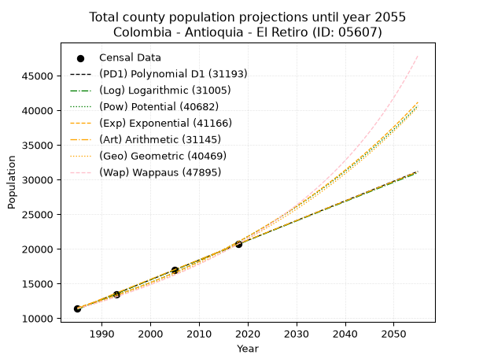
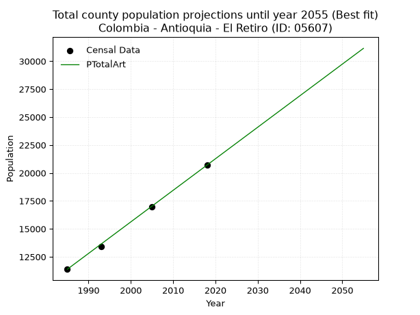
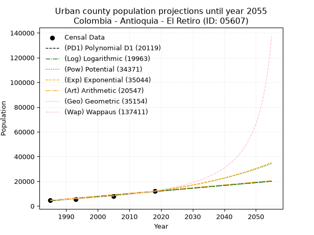
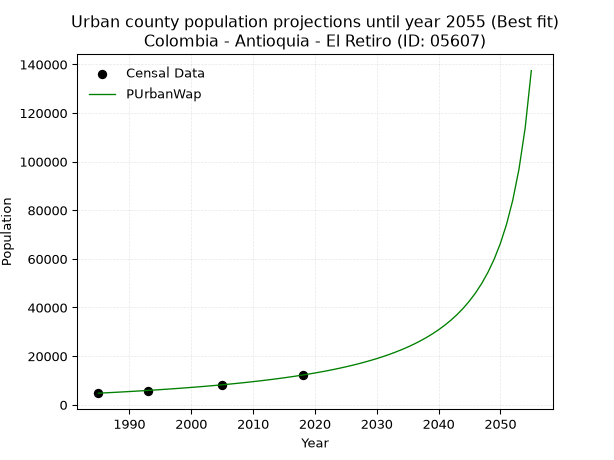
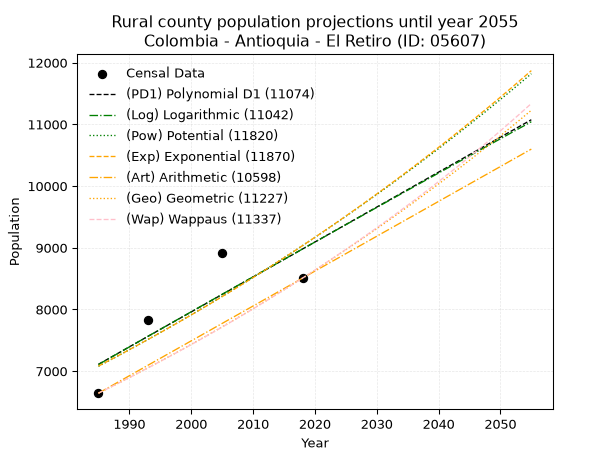
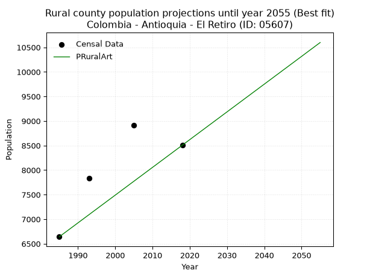

<div align="center">


</div>

# 📜 _“Population and Public Services Demand Projections (PPSD) until Year 2050 for Colombia - Antioquia - El Retiro (ID: 05607)”_
Keywords: `population` `public-service` `projection` `lineal` `polynomial` `logarithmic` `potential` `exponential` `arithmetic` `geometric` `wappaus` `dane` `colombia` `south-america`

PPSD are analytical estimates used by governments and planners to anticipate future changes in population size, age distribution, and the resulting community needs for utilities, healthcare, education, and infrastructure as sizing future water treatment facilities, electrical grids, and road networks based on spatial growth.

<div align="center">

</img>

</div>


> **General running parameters**: • app_version: _v20260806_. • Python version: _3.14.7_. • Pandas version: _3.0.5_. • NumPy version: _2.5.1_. • Creates, save and include plots into reports (create_plot): _False_. • Projection until year: _2050_. • Process polynomial degree 2 and up: _False_. • Process Wappaus: _True_. • Process Wappaus: _True_. • Set negative values to zero: _True_. • Set infinite values to zero: _True_. • Drop dataset notes: _True_. 
<div align="center">

Dynamic map: [:earth_americas:Google](http://maps.google.com/maps?q=6.062454174,-75.5013014) [:earth_americas:OSM](https://www.openstreetmap.org/#map=18/6.062454174/-75.5013014&layers=P) [:earth_americas:Bing](https://www.bing.com/maps?cp=6.062454174~-75.5013014&lvl=18) [:earth_americas:Apple](https://maps.apple.com/frame?center=6.062454174%2C-75.5013014&span=0.003%2C0.006)

</div>


<div align="center">

```geojson
{
  "type": "Feature",
  "geometry": {
    "type": "Point", 
    "coordinates": [-75.5013014, 6.062454174]
  }, 
  "properties": {
    "Name": "Colombia - Antioquia - El Retiro (ID: 05607)"
  }
}
```

</div>


## 0. Census Data (4 records)

Census data are official statistics collected by a government about the people and housing in a country. They usually include counts of total population, age, sex, race, income, education, and jobs.

📅Global census file: [Population.xlsx](../data/Population.xlsx)

| Source   |   Year |   CountryID | CountryName   |   StateID | StateName   |   CountyID | CountyName   |   PTotal |   PUrban |   PRural |
|:---------|-------:|------------:|:--------------|----------:|:------------|-----------:|:-------------|---------:|---------:|---------:|
| DANE     |   1985 |          57 | Colombia      |        05 | Antioquia   |      05607 | El Retiro    |    11384 |     4742 |     6642 |
| DANE     |   1993 |          57 | Colombia      |        05 | Antioquia   |      05607 | El Retiro    |    13426 |     5595 |     7831 |
| DANE     |   2005 |          57 | Colombia      |        05 | Antioquia   |      05607 | El Retiro    |    16976 |     8063 |     8913 |
| DANE     |   2018 |          57 | Colombia      |        05 | Antioquia   |      05607 | El Retiro    |    20700 |    12193 |     8507 |

> 🔥Some records could had specific notes about the registered values or the corresponding urban or rural distribution.

## 1. Total

### 1.1. Coefficients and Parameters

* (PD1) Polynomial Deg 1: 284.4102769971872, -553270.1565636237 (lineal)
* (Log) Logarithmic: 569260.7594386443, -4311334.094262569
* (Pow) Potential: 36.37426638847457, -115.8917000590817
* (Exp) Exponential: 0.018169555450342684, 2.5041695747102166e-12
* (Art) Arithmetic: Year diff. 2018 - 1985 = 33, Population diff. 20700 - 11384 = 9316, Annual growth = 282.3030303030303
* (Geo) Geometric: Year diff. 2018 - 1985 = 33, Population diff. 20700 - 11384 = 9316, Annual growth % = 0.01828407832612
* (Wap) Wappaus: i = 1.7597745312494097, Condition values only valid for < 200)

<sub>
Wappaus condition values: ['0.00', '1.76', '3.52', '5.28', '7.04', '8.80', '10.56', '12.32', '14.08', '15.84', '17.60', '19.36', '21.12', '22.88', '24.64', '26.40', '28.16', '29.92', '31.68', '33.44', '35.20', '36.96', '38.72', '40.47', '42.23', '43.99', '45.75', '47.51', '49.27', '51.03', '52.79', '54.55', '56.31', '58.07', '59.83', '61.59', '63.35', '65.11', '66.87', '68.63', '70.39', '72.15', '73.91', '75.67', '77.43', '79.19', '80.95', '82.71', '84.47', '86.23', '87.99', '89.75', '91.51', '93.27', '95.03', '96.79', '98.55', '100.31', '102.07', '103.83', '105.59', '107.35', '109.11', '110.87', '112.63', '114.39']
</sub>


### 1.2. Projected Dataset

|   Year |   CountyID |   PTotalPD1 |   PTotalLog |   PTotalPow |   PTotalExp |   PTotalArt |   PTotalGeo |   PTotalWap |
|-------:|-----------:|------------:|------------:|------------:|------------:|------------:|------------:|------------:|
|   1985 |      05607 |       11284 |       11276 |       11532 |       11539 |       11384 |       11384 |       11384 |
|   1986 |      05607 |       11569 |       11563 |       11746 |       11751 |       11666 |       11592 |       11586 |
|   1987 |      05607 |       11853 |       11849 |       11963 |       11966 |       11949 |       11804 |       11792 |
|   1988 |      05607 |       12137 |       12136 |       12184 |       12186 |       12231 |       12020 |       12001 |
|   1989 |      05607 |       12422 |       12422 |       12409 |       12409 |       12513 |       12240 |       12215 |
|   1990 |      05607 |       12706 |       12708 |       12637 |       12637 |       12796 |       12463 |       12432 |
|   1991 |      05607 |       12991 |       12994 |       12871 |       12868 |       13078 |       12691 |       12653 |
|   1992 |      05607 |       13275 |       13280 |       13108 |       13104 |       13360 |       12923 |       12878 |
|   1993 |      05607 |       13560 |       13566 |       13349 |       13345 |       13642 |       13160 |       13108 |
|   1994 |      05607 |       13844 |       13851 |       13595 |       13589 |       13925 |       13400 |       13342 |
|   1995 |      05607 |       14128 |       14136 |       13845 |       13838 |       14207 |       13645 |       13581 |
|   1996 |      05607 |       14413 |       14422 |       14100 |       14092 |       14489 |       13895 |       13824 |
|   1997 |      05607 |       14697 |       14707 |       14359 |       14350 |       14772 |       14149 |       14072 |
|   1998 |      05607 |       14982 |       14992 |       14623 |       14614 |       15054 |       14408 |       14325 |
|   1999 |      05607 |       15266 |       15277 |       14892 |       14882 |       15336 |       14671 |       14583 |
|   2000 |      05607 |       15550 |       15561 |       15165 |       15154 |       15619 |       14939 |       14846 |
|   2001 |      05607 |       15835 |       15846 |       15443 |       15432 |       15901 |       15212 |       15115 |
|   2002 |      05607 |       16119 |       16130 |       15727 |       15715 |       16183 |       15491 |       15389 |
|   2003 |      05607 |       16404 |       16415 |       16015 |       16003 |       16465 |       15774 |       15669 |
|   2004 |      05607 |       16688 |       16699 |       16308 |       16297 |       16748 |       16062 |       15954 |
|   2005 |      05607 |       16972 |       16983 |       16607 |       16596 |       17030 |       16356 |       16246 |
|   2006 |      05607 |       17257 |       17267 |       16911 |       16900 |       17312 |       16655 |       16545 |
|   2007 |      05607 |       17541 |       17550 |       17220 |       17210 |       17595 |       16959 |       16849 |
|   2008 |      05607 |       17826 |       17834 |       17535 |       17525 |       17877 |       17270 |       17161 |
|   2009 |      05607 |       18110 |       18117 |       17856 |       17847 |       18159 |       17585 |       17479 |
|   2010 |      05607 |       18395 |       18401 |       18182 |       18174 |       18442 |       17907 |       17805 |
|   2011 |      05607 |       18679 |       18684 |       18514 |       18507 |       18724 |       18234 |       18138 |
|   2012 |      05607 |       18963 |       18967 |       18851 |       18846 |       19006 |       18568 |       18478 |
|   2013 |      05607 |       19248 |       19250 |       19195 |       19192 |       19288 |       18907 |       18827 |
|   2014 |      05607 |       19532 |       19532 |       19545 |       19544 |       19571 |       19253 |       19184 |
|   2015 |      05607 |       19817 |       19815 |       19901 |       19902 |       19853 |       19605 |       19549 |
|   2016 |      05607 |       20101 |       20097 |       20264 |       20267 |       20135 |       19963 |       19924 |
|   2017 |      05607 |       20385 |       20380 |       20633 |       20639 |       20418 |       20328 |       20307 |
|   2018 |      05607 |       20670 |       20662 |       21008 |       21017 |       20700 |       20700 |       20700 |
|   2019 |      05607 |       20954 |       20944 |       21390 |       21403 |       20982 |       21078 |       21103 |
|   2020 |      05607 |       21239 |       21226 |       21779 |       21795 |       21265 |       21464 |       21516 |
|   2021 |      05607 |       21523 |       21507 |       22174 |       22195 |       21547 |       21856 |       21940 |
|   2022 |      05607 |       21807 |       21789 |       22577 |       22602 |       21829 |       22256 |       22374 |
|   2023 |      05607 |       22092 |       22071 |       22987 |       23016 |       22112 |       22663 |       22821 |
|   2024 |      05607 |       22376 |       22352 |       23404 |       23438 |       22394 |       23077 |       23279 |
|   2025 |      05607 |       22661 |       22633 |       23828 |       23868 |       22676 |       23499 |       23749 |
|   2026 |      05607 |       22945 |       22914 |       24260 |       24305 |       22958 |       23929 |       24233 |
|   2027 |      05607 |       23229 |       23195 |       24699 |       24751 |       23241 |       24366 |       24730 |
|   2028 |      05607 |       23514 |       23476 |       25146 |       25205 |       23523 |       24812 |       25241 |
|   2029 |      05607 |       23798 |       23756 |       25601 |       25667 |       23805 |       25266 |       25767 |
|   2030 |      05607 |       24083 |       24037 |       26064 |       26138 |       24088 |       25728 |       26308 |
|   2031 |      05607 |       24367 |       24317 |       26535 |       26617 |       24370 |       26198 |       26865 |
|   2032 |      05607 |       24652 |       24597 |       27015 |       27105 |       24652 |       26677 |       27439 |
|   2033 |      05607 |       24936 |       24878 |       27502 |       27602 |       24935 |       27165 |       28031 |
|   2034 |      05607 |       25220 |       25158 |       27999 |       28108 |       25217 |       27661 |       28640 |
|   2035 |      05607 |       25505 |       25437 |       28504 |       28623 |       25499 |       28167 |       29269 |
|   2036 |      05607 |       25789 |       25717 |       29018 |       29148 |       25781 |       28682 |       29918 |
|   2037 |      05607 |       26074 |       25997 |       29541 |       29683 |       26064 |       29207 |       30588 |
|   2038 |      05607 |       26358 |       26276 |       30073 |       30227 |       26346 |       29741 |       31280 |
|   2039 |      05607 |       26642 |       26555 |       30614 |       30781 |       26628 |       30284 |       31995 |
|   2040 |      05607 |       26927 |       26834 |       31165 |       31346 |       26911 |       30838 |       32735 |
|   2041 |      05607 |       27211 |       27113 |       31726 |       31920 |       27193 |       31402 |       33500 |
|   2042 |      05607 |       27496 |       27392 |       32296 |       32506 |       27475 |       31976 |       34292 |
|   2043 |      05607 |       27780 |       27671 |       32876 |       33102 |       27758 |       32561 |       35113 |
|   2044 |      05607 |       28064 |       27949 |       33467 |       33709 |       28040 |       33156 |       35964 |
|   2045 |      05607 |       28349 |       28228 |       34068 |       34327 |       28322 |       33762 |       36846 |
|   2046 |      05607 |       28633 |       28506 |       34679 |       34956 |       28604 |       34380 |       37762 |
|   2047 |      05607 |       28918 |       28784 |       35301 |       35597 |       28887 |       35008 |       38714 |
|   2048 |      05607 |       29202 |       29062 |       35933 |       36250 |       29169 |       35648 |       39703 |
|   2049 |      05607 |       29487 |       29340 |       36577 |       36914 |       29451 |       36300 |       40732 |
|   2050 |      05607 |       29771 |       29618 |       37232 |       37591 |       29734 |       36964 |       41803 |
<div align="center">

</img>

</div>


### 1.3. Best fit with absolute and relative error (%)

Relative error puts that difference into context by dividing the absolute error by the true value, creating a unitless ratio or percentage that shows the scale of the mistake.

Absolute and relative error

|   Year | Source   |   CountryID | CountryName   |   StateID | StateName   |   CountyID_x | CountyName   |   PTotal |   PUrban |   PRural |   CountyID_y |   PTotalPD1 |   PTotalLog |   PTotalPow |   PTotalExp |   PTotalArt |   PTotalGeo |   PTotalWap |   PTotalPD1AbsError |   PTotalLogAbsError |   PTotalPowAbsError |   PTotalExpAbsError |   PTotalArtAbsError |   PTotalGeoAbsError |   PTotalWapAbsError |   PTotalPD1RelError |   PTotalLogRelError |   PTotalPowRelError |   PTotalExpRelError |   PTotalArtRelError |   PTotalGeoRelError |   PTotalWapRelError |
|-------:|:---------|------------:|:--------------|----------:|:------------|-------------:|:-------------|---------:|---------:|---------:|-------------:|------------:|------------:|------------:|------------:|------------:|------------:|------------:|--------------------:|--------------------:|--------------------:|--------------------:|--------------------:|--------------------:|--------------------:|--------------------:|--------------------:|--------------------:|--------------------:|--------------------:|--------------------:|--------------------:|
|   1985 | DANE     |          57 | Colombia      |        05 | Antioquia   |        05607 | El Retiro    |    11384 |     4742 |     6642 |        05607 |       11284 |       11276 |       11532 |       11539 |       11384 |       11384 |       11384 |                 100 |                 108 |                 148 |                 155 |                   0 |                   0 |                   0 |           0.878426  |           0.9487    |            1.30007  |            1.36156  |            0        |             0       |             0       |
|   1993 | DANE     |          57 | Colombia      |        05 | Antioquia   |        05607 | El Retiro    |    13426 |     5595 |     7831 |        05607 |       13560 |       13566 |       13349 |       13345 |       13642 |       13160 |       13108 |                 134 |                 140 |                  77 |                  81 |                 216 |                 266 |                 318 |           0.998063  |           1.04275   |            0.573514 |            0.603307 |            1.60882  |             1.98123 |             2.36854 |
|   2005 | DANE     |          57 | Colombia      |        05 | Antioquia   |        05607 | El Retiro    |    16976 |     8063 |     8913 |        05607 |       16972 |       16983 |       16607 |       16596 |       17030 |       16356 |       16246 |                   4 |                   7 |                 369 |                 380 |                  54 |                 620 |                 730 |           0.0235627 |           0.0412347 |            2.17366  |            2.23845  |            0.318096 |             3.65221 |             4.30019 |
|   2018 | DANE     |          57 | Colombia      |        05 | Antioquia   |        05607 | El Retiro    |    20700 |    12193 |     8507 |        05607 |       20670 |       20662 |       21008 |       21017 |       20700 |       20700 |       20700 |                  30 |                  38 |                 308 |                 317 |                   0 |                   0 |                   0 |           0.144928  |           0.183575  |            1.48792  |            1.5314   |            0        |             0       |             0       |

Relative error mean

| Method    |   RelError | Best   |
|:----------|-----------:|:-------|
| PTotalPD1 |   0.511245 |        |
| PTotalLog |   0.554066 |        |
| PTotalPow |   1.38379  |        |
| PTotalExp |   1.43368  |        |
| PTotalArt |   0.481729 | True   |
| PTotalGeo |   1.40836  |        |
| PTotalWap |   1.66718  |        |

💙Best method: _**PTotalArt**_
<div align="center">

</img>

</div>


### 1.4. Fresh water supply demand in liters per capita per day (lpcd)

The fresh water supply demand typically ranges from 100 to 300 liters per capita per day (lpcd) for standard domestic and municipal planning, though absolute survival minimums set by the World Health Organization are as low as 7.5 to 20 liters per day, and total consumption in high-income nations can exceed 400 liters.

> `CZ`: Level in meters above the sea level (masl)<br> `WS`: Fresh water supply demand in liters per capita per day (lpcd or l/h/d)<br> `WSAll`: Zonal fresh water supply demand in liters per second (l/s)<br> `A`: Zonal area in square meters<br> `DP`: Population density (people/hectare or p/ha)

Reference values (RAS Colombia)

|    CZ |   WS |
|------:|-----:|
|  1000 |  120 |
|  2000 |  130 |
| 99999 |  140 |

County shapefile geometry properties and water supply values

|   CountyID |     ATotal |   CZTotal |   WSTotal |
|-----------:|-----------:|----------:|----------:|
|      05607 | 2.4192e+08 |   2384.09 |       140 |

Projected values for best method: PTotalArt

|   CountyID |   Year |   PTotalArt |   DPTotal |   WSTotal |   WSTotalAll |
|-----------:|-------:|------------:|----------:|----------:|-------------:|
|      05607 |   1985 |       11384 |      0.47 |       140 |      18.4463 |
|      05607 |   1986 |       11666 |      0.48 |       140 |      18.9032 |
|      05607 |   1987 |       11949 |      0.49 |       140 |      19.3618 |
|      05607 |   1988 |       12231 |      0.51 |       140 |      19.8188 |
|      05607 |   1989 |       12513 |      0.52 |       140 |      20.2757 |
|      05607 |   1990 |       12796 |      0.53 |       140 |      20.7343 |
|      05607 |   1991 |       13078 |      0.54 |       140 |      21.1912 |
|      05607 |   1992 |       13360 |      0.55 |       140 |      21.6481 |
|      05607 |   1993 |       13642 |      0.56 |       140 |      22.1051 |
|      05607 |   1994 |       13925 |      0.58 |       140 |      22.5637 |
|      05607 |   1995 |       14207 |      0.59 |       140 |      23.0206 |
|      05607 |   1996 |       14489 |      0.6  |       140 |      23.4775 |
|      05607 |   1997 |       14772 |      0.61 |       140 |      23.9361 |
|      05607 |   1998 |       15054 |      0.62 |       140 |      24.3931 |
|      05607 |   1999 |       15336 |      0.63 |       140 |      24.85   |
|      05607 |   2000 |       15619 |      0.65 |       140 |      25.3086 |
|      05607 |   2001 |       15901 |      0.66 |       140 |      25.7655 |
|      05607 |   2002 |       16183 |      0.67 |       140 |      26.2225 |
|      05607 |   2003 |       16465 |      0.68 |       140 |      26.6794 |
|      05607 |   2004 |       16748 |      0.69 |       140 |      27.138  |
|      05607 |   2005 |       17030 |      0.7  |       140 |      27.5949 |
|      05607 |   2006 |       17312 |      0.72 |       140 |      28.0519 |
|      05607 |   2007 |       17595 |      0.73 |       140 |      28.5104 |
|      05607 |   2008 |       17877 |      0.74 |       140 |      28.9674 |
|      05607 |   2009 |       18159 |      0.75 |       140 |      29.4243 |
|      05607 |   2010 |       18442 |      0.76 |       140 |      29.8829 |
|      05607 |   2011 |       18724 |      0.77 |       140 |      30.3398 |
|      05607 |   2012 |       19006 |      0.79 |       140 |      30.7968 |
|      05607 |   2013 |       19288 |      0.8  |       140 |      31.2537 |
|      05607 |   2014 |       19571 |      0.81 |       140 |      31.7123 |
|      05607 |   2015 |       19853 |      0.82 |       140 |      32.1692 |
|      05607 |   2016 |       20135 |      0.83 |       140 |      32.6262 |
|      05607 |   2017 |       20418 |      0.84 |       140 |      33.0847 |
|      05607 |   2018 |       20700 |      0.86 |       140 |      33.5417 |
|      05607 |   2019 |       20982 |      0.87 |       140 |      33.9986 |
|      05607 |   2020 |       21265 |      0.88 |       140 |      34.4572 |
|      05607 |   2021 |       21547 |      0.89 |       140 |      34.9141 |
|      05607 |   2022 |       21829 |      0.9  |       140 |      35.3711 |
|      05607 |   2023 |       22112 |      0.91 |       140 |      35.8296 |
|      05607 |   2024 |       22394 |      0.93 |       140 |      36.2866 |
|      05607 |   2025 |       22676 |      0.94 |       140 |      36.7435 |
|      05607 |   2026 |       22958 |      0.95 |       140 |      37.2005 |
|      05607 |   2027 |       23241 |      0.96 |       140 |      37.659  |
|      05607 |   2028 |       23523 |      0.97 |       140 |      38.116  |
|      05607 |   2029 |       23805 |      0.98 |       140 |      38.5729 |
|      05607 |   2030 |       24088 |      1    |       140 |      39.0315 |
|      05607 |   2031 |       24370 |      1.01 |       140 |      39.4884 |
|      05607 |   2032 |       24652 |      1.02 |       140 |      39.9454 |
|      05607 |   2033 |       24935 |      1.03 |       140 |      40.4039 |
|      05607 |   2034 |       25217 |      1.04 |       140 |      40.8609 |
|      05607 |   2035 |       25499 |      1.05 |       140 |      41.3178 |
|      05607 |   2036 |       25781 |      1.07 |       140 |      41.7748 |
|      05607 |   2037 |       26064 |      1.08 |       140 |      42.2333 |
|      05607 |   2038 |       26346 |      1.09 |       140 |      42.6903 |
|      05607 |   2039 |       26628 |      1.1  |       140 |      43.1472 |
|      05607 |   2040 |       26911 |      1.11 |       140 |      43.6058 |
|      05607 |   2041 |       27193 |      1.12 |       140 |      44.0627 |
|      05607 |   2042 |       27475 |      1.14 |       140 |      44.5197 |
|      05607 |   2043 |       27758 |      1.15 |       140 |      44.9782 |
|      05607 |   2044 |       28040 |      1.16 |       140 |      45.4352 |
|      05607 |   2045 |       28322 |      1.17 |       140 |      45.8921 |
|      05607 |   2046 |       28604 |      1.18 |       140 |      46.3491 |
|      05607 |   2047 |       28887 |      1.19 |       140 |      46.8076 |
|      05607 |   2048 |       29169 |      1.21 |       140 |      47.2646 |
|      05607 |   2049 |       29451 |      1.22 |       140 |      47.7215 |
|      05607 |   2050 |       29734 |      1.23 |       140 |      48.1801 |

## 2. Urban

### 2.1. Coefficients and Parameters

* (PD1) Polynomial Deg 1: 227.77318346045502, -447955.0602167751 (lineal)
* (Log) Logarithmic: 455711.6778233495, -3456219.8649794785
* (Pow) Potential: 58.120098738063355, -188.00476137929044
* (Exp) Exponential: 0.029041070348459447, 4.2284959851554244e-22
* (Art) Arithmetic: Year diff. 2018 - 1985 = 33, Population diff. 12193 - 4742 = 7451, Annual growth = 225.78787878787878
* (Geo) Geometric: Year diff. 2018 - 1985 = 33, Population diff. 12193 - 4742 = 7451, Annual growth % = 0.029031710926600285
* (Wap) Wappaus: i = 2.6665235168335255, Condition values only valid for < 200)

<sub>
Wappaus condition values: ['0.00', '2.67', '5.33', '8.00', '10.67', '13.33', '16.00', '18.67', '21.33', '24.00', '26.67', '29.33', '32.00', '34.66', '37.33', '40.00', '42.66', '45.33', '48.00', '50.66', '53.33', '56.00', '58.66', '61.33', '64.00', '66.66', '69.33', '72.00', '74.66', '77.33', '80.00', '82.66', '85.33', '88.00', '90.66', '93.33', '95.99', '98.66', '101.33', '103.99', '106.66', '109.33', '111.99', '114.66', '117.33', '119.99', '122.66', '125.33', '127.99', '130.66', '133.33', '135.99', '138.66', '141.33', '143.99', '146.66', '149.33', '151.99', '154.66', '157.32', '159.99', '162.66', '165.32', '167.99', '170.66', '173.32']
</sub>


### 2.2. Projected Dataset

|   Year |   CountyID |   PUrbanPD1 |   PUrbanLog |   PUrbanPow |   PUrbanExp |   PUrbanArt |   PUrbanGeo |   PUrbanWap |
|-------:|-----------:|------------:|------------:|------------:|------------:|------------:|------------:|------------:|
|   1985 |      05607 |        4175 |        4169 |        4586 |        4589 |        4742 |        4742 |        4742 |
|   1986 |      05607 |        4402 |        4399 |        4722 |        4725 |        4968 |        4880 |        4870 |
|   1987 |      05607 |        4630 |        4628 |        4862 |        4864 |        5194 |        5021 |        5002 |
|   1988 |      05607 |        4858 |        4858 |        5006 |        5007 |        5419 |        5167 |        5137 |
|   1989 |      05607 |        5086 |        5087 |        5155 |        5155 |        5645 |        5317 |        5276 |
|   1990 |      05607 |        5314 |        5316 |        5308 |        5307 |        5871 |        5471 |        5419 |
|   1991 |      05607 |        5541 |        5545 |        5465 |        5463 |        6097 |        5630 |        5567 |
|   1992 |      05607 |        5769 |        5774 |        5627 |        5624 |        6323 |        5794 |        5718 |
|   1993 |      05607 |        5997 |        6002 |        5793 |        5790 |        6548 |        5962 |        5874 |
|   1994 |      05607 |        6225 |        6231 |        5965 |        5960 |        6774 |        6135 |        6035 |
|   1995 |      05607 |        6452 |        6459 |        6141 |        6136 |        7000 |        6313 |        6201 |
|   1996 |      05607 |        6680 |        6688 |        6323 |        6317 |        7226 |        6496 |        6372 |
|   1997 |      05607 |        6908 |        6916 |        6509 |        6503 |        7451 |        6685 |        6548 |
|   1998 |      05607 |        7136 |        7144 |        6702 |        6694 |        7677 |        6879 |        6730 |
|   1999 |      05607 |        7364 |        7372 |        6899 |        6892 |        7903 |        7079 |        6919 |
|   2000 |      05607 |        7591 |        7600 |        7103 |        7095 |        8129 |        7284 |        7113 |
|   2001 |      05607 |        7819 |        7828 |        7312 |        7304 |        8355 |        7496 |        7314 |
|   2002 |      05607 |        8047 |        8056 |        7528 |        7519 |        8580 |        7713 |        7522 |
|   2003 |      05607 |        8275 |        8283 |        7749 |        7741 |        8806 |        7937 |        7737 |
|   2004 |      05607 |        8502 |        8511 |        7977 |        7969 |        9032 |        8168 |        7960 |
|   2005 |      05607 |        8730 |        8738 |        8212 |        8204 |        9258 |        8405 |        8190 |
|   2006 |      05607 |        8958 |        8965 |        8454 |        8445 |        9484 |        8649 |        8430 |
|   2007 |      05607 |        9186 |        9192 |        8702 |        8694 |        9709 |        8900 |        8678 |
|   2008 |      05607 |        9413 |        9419 |        8958 |        8950 |        9935 |        9158 |        8937 |
|   2009 |      05607 |        9641 |        9646 |        9221 |        9214 |       10161 |        9424 |        9205 |
|   2010 |      05607 |        9869 |        9873 |        9491 |        9486 |       10387 |        9698 |        9484 |
|   2011 |      05607 |       10097 |       10100 |        9770 |        9765 |       10612 |        9980 |        9774 |
|   2012 |      05607 |       10325 |       10326 |       10056 |       10053 |       10838 |       10269 |       10076 |
|   2013 |      05607 |       10552 |       10553 |       10351 |       10349 |       11064 |       10567 |       10392 |
|   2014 |      05607 |       10780 |       10779 |       10654 |       10654 |       11290 |       10874 |       10721 |
|   2015 |      05607 |       11008 |       11005 |       10966 |       10968 |       11516 |       11190 |       11064 |
|   2016 |      05607 |       11236 |       11231 |       11286 |       11291 |       11741 |       11515 |       11423 |
|   2017 |      05607 |       11463 |       11457 |       11616 |       11624 |       11967 |       11849 |       11799 |
|   2018 |      05607 |       11691 |       11683 |       11956 |       11966 |       12193 |       12193 |       12193 |
|   2019 |      05607 |       11919 |       11909 |       12305 |       12319 |       12419 |       12547 |       12606 |
|   2020 |      05607 |       12147 |       12135 |       12664 |       12682 |       12645 |       12911 |       13040 |
|   2021 |      05607 |       12375 |       12360 |       13034 |       13056 |       12870 |       13286 |       13496 |
|   2022 |      05607 |       12602 |       12586 |       13414 |       13440 |       13096 |       13672 |       13975 |
|   2023 |      05607 |       12830 |       12811 |       13805 |       13836 |       13322 |       14069 |       14481 |
|   2024 |      05607 |       13058 |       13036 |       14208 |       14244 |       13548 |       14477 |       15015 |
|   2025 |      05607 |       13286 |       13261 |       14621 |       14664 |       13774 |       14897 |       15580 |
|   2026 |      05607 |       13513 |       13486 |       15047 |       15096 |       13999 |       15330 |       16177 |
|   2027 |      05607 |       13741 |       13711 |       15485 |       15541 |       14225 |       15775 |       16811 |
|   2028 |      05607 |       13969 |       13936 |       15935 |       15999 |       14451 |       16233 |       17485 |
|   2029 |      05607 |       14197 |       14161 |       16398 |       16470 |       14677 |       16704 |       18201 |
|   2030 |      05607 |       14425 |       14385 |       16875 |       16955 |       14902 |       17189 |       18966 |
|   2031 |      05607 |       14652 |       14609 |       17365 |       17455 |       15128 |       17688 |       19783 |
|   2032 |      05607 |       14880 |       14834 |       17869 |       17969 |       15354 |       18202 |       20659 |
|   2033 |      05607 |       15108 |       15058 |       18387 |       18499 |       15580 |       18730 |       21600 |
|   2034 |      05607 |       15336 |       15282 |       18920 |       19044 |       15806 |       19274 |       22613 |
|   2035 |      05607 |       15563 |       15506 |       19468 |       19605 |       16031 |       19834 |       23707 |
|   2036 |      05607 |       15791 |       15730 |       20032 |       20183 |       16257 |       20409 |       24892 |
|   2037 |      05607 |       16019 |       15954 |       20612 |       20778 |       16483 |       21002 |       26180 |
|   2038 |      05607 |       16247 |       16177 |       21209 |       21390 |       16709 |       21612 |       27586 |
|   2039 |      05607 |       16474 |       16401 |       21822 |       22020 |       16935 |       22239 |       29125 |
|   2040 |      05607 |       16702 |       16624 |       22453 |       22669 |       17160 |       22885 |       30818 |
|   2041 |      05607 |       16930 |       16848 |       23102 |       23337 |       17386 |       23549 |       32689 |
|   2042 |      05607 |       17158 |       17071 |       23769 |       24025 |       17612 |       24233 |       34768 |
|   2043 |      05607 |       17386 |       17294 |       24455 |       24733 |       17838 |       24936 |       37092 |
|   2044 |      05607 |       17613 |       17517 |       25160 |       25461 |       18063 |       25660 |       39705 |
|   2045 |      05607 |       17841 |       17740 |       25886 |       26212 |       18289 |       26405 |       42668 |
|   2046 |      05607 |       18069 |       17963 |       26632 |       26984 |       18515 |       27172 |       46053 |
|   2047 |      05607 |       18297 |       18185 |       27399 |       27779 |       18741 |       27960 |       49959 |
|   2048 |      05607 |       18524 |       18408 |       28188 |       28598 |       18967 |       28772 |       54516 |
|   2049 |      05607 |       18752 |       18631 |       28999 |       29441 |       19192 |       29608 |       59901 |
|   2050 |      05607 |       18980 |       18853 |       29833 |       30308 |       19418 |       30467 |       66363 |
<div align="center">

</img>

</div>


### 2.3. Best fit with absolute and relative error (%)

Relative error puts that difference into context by dividing the absolute error by the true value, creating a unitless ratio or percentage that shows the scale of the mistake.

Absolute and relative error

|   Year | Source   |   CountryID | CountryName   |   StateID | StateName   |   CountyID_x | CountyName   |   PTotal |   PUrban |   PRural |   CountyID_y |   PUrbanPD1 |   PUrbanLog |   PUrbanPow |   PUrbanExp |   PUrbanArt |   PUrbanGeo |   PUrbanWap |   PUrbanPD1AbsError |   PUrbanLogAbsError |   PUrbanPowAbsError |   PUrbanExpAbsError |   PUrbanArtAbsError |   PUrbanGeoAbsError |   PUrbanWapAbsError |   PUrbanPD1RelError |   PUrbanLogRelError |   PUrbanPowRelError |   PUrbanExpRelError |   PUrbanArtRelError |   PUrbanGeoRelError |   PUrbanWapRelError |
|-------:|:---------|------------:|:--------------|----------:|:------------|-------------:|:-------------|---------:|---------:|---------:|-------------:|------------:|------------:|------------:|------------:|------------:|------------:|------------:|--------------------:|--------------------:|--------------------:|--------------------:|--------------------:|--------------------:|--------------------:|--------------------:|--------------------:|--------------------:|--------------------:|--------------------:|--------------------:|--------------------:|
|   1985 | DANE     |          57 | Colombia      |        05 | Antioquia   |        05607 | El Retiro    |    11384 |     4742 |     6642 |        05607 |        4175 |        4169 |        4586 |        4589 |        4742 |        4742 |        4742 |                 567 |                 573 |                 156 |                 153 |                   0 |                   0 |                   0 |            11.957   |            12.0835  |             3.28975 |             3.22649 |              0      |             0       |              0      |
|   1993 | DANE     |          57 | Colombia      |        05 | Antioquia   |        05607 | El Retiro    |    13426 |     5595 |     7831 |        05607 |        5997 |        6002 |        5793 |        5790 |        6548 |        5962 |        5874 |                 402 |                 407 |                 198 |                 195 |                 953 |                 367 |                 279 |             7.18499 |             7.27435 |             3.53887 |             3.48525 |             17.0331 |             6.55943 |              4.9866 |
|   2005 | DANE     |          57 | Colombia      |        05 | Antioquia   |        05607 | El Retiro    |    16976 |     8063 |     8913 |        05607 |        8730 |        8738 |        8212 |        8204 |        9258 |        8405 |        8190 |                 667 |                 675 |                 149 |                 141 |                1195 |                 342 |                 127 |             8.27236 |             8.37157 |             1.84795 |             1.74873 |             14.8208 |             4.2416  |              1.5751 |
|   2018 | DANE     |          57 | Colombia      |        05 | Antioquia   |        05607 | El Retiro    |    20700 |    12193 |     8507 |        05607 |       11691 |       11683 |       11956 |       11966 |       12193 |       12193 |       12193 |                 502 |                 510 |                 237 |                 227 |                   0 |                   0 |                   0 |             4.11712 |             4.18273 |             1.94374 |             1.86172 |              0      |             0       |              0      |

Relative error mean

| Method    |   RelError | Best   |
|:----------|-----------:|:-------|
| PUrbanPD1 |    7.88286 |        |
| PUrbanLog |    7.97804 |        |
| PUrbanPow |    2.65508 |        |
| PUrbanExp |    2.58055 |        |
| PUrbanArt |    7.96346 |        |
| PUrbanGeo |    2.70026 |        |
| PUrbanWap |    1.64042 | True   |

💙Best method: _**PUrbanWap**_
<div align="center">

</img>

</div>


### 2.4. Fresh water supply demand in liters per capita per day (lpcd)

The fresh water supply demand typically ranges from 100 to 300 liters per capita per day (lpcd) for standard domestic and municipal planning, though absolute survival minimums set by the World Health Organization are as low as 7.5 to 20 liters per day, and total consumption in high-income nations can exceed 400 liters.

> `CZ`: Level in meters above the sea level (masl)<br> `WS`: Fresh water supply demand in liters per capita per day (lpcd or l/h/d)<br> `WSAll`: Zonal fresh water supply demand in liters per second (l/s)<br> `A`: Zonal area in square meters<br> `DP`: Population density (people/hectare or p/ha)

Reference values (RAS Colombia)

|    CZ |   WS |
|------:|-----:|
|  1000 |  120 |
|  2000 |  130 |
| 99999 |  140 |

County shapefile geometry properties and water supply values

|   CountyID |     AUrban |   CZUrban |   WSUrban |
|-----------:|-----------:|----------:|----------:|
|      05607 | 1.9294e+06 |   2168.05 |       140 |

Projected values for best method: PUrbanWap

|   CountyID |   Year |   PUrbanWap |   DPUrban |   WSUrban |   WSUrbanAll |
|-----------:|-------:|------------:|----------:|----------:|-------------:|
|      05607 |   1985 |        4742 |     24.58 |       140 |      7.6838  |
|      05607 |   1986 |        4870 |     25.24 |       140 |      7.8912  |
|      05607 |   1987 |        5002 |     25.93 |       140 |      8.10509 |
|      05607 |   1988 |        5137 |     26.62 |       140 |      8.32384 |
|      05607 |   1989 |        5276 |     27.35 |       140 |      8.54907 |
|      05607 |   1990 |        5419 |     28.09 |       140 |      8.78079 |
|      05607 |   1991 |        5567 |     28.85 |       140 |      9.0206  |
|      05607 |   1992 |        5718 |     29.64 |       140 |      9.26528 |
|      05607 |   1993 |        5874 |     30.44 |       140 |      9.51806 |
|      05607 |   1994 |        6035 |     31.28 |       140 |      9.77894 |
|      05607 |   1995 |        6201 |     32.14 |       140 |     10.0479  |
|      05607 |   1996 |        6372 |     33.03 |       140 |     10.325   |
|      05607 |   1997 |        6548 |     33.94 |       140 |     10.6102  |
|      05607 |   1998 |        6730 |     34.88 |       140 |     10.9051  |
|      05607 |   1999 |        6919 |     35.86 |       140 |     11.2113  |
|      05607 |   2000 |        7113 |     36.87 |       140 |     11.5257  |
|      05607 |   2001 |        7314 |     37.91 |       140 |     11.8514  |
|      05607 |   2002 |        7522 |     38.99 |       140 |     12.1884  |
|      05607 |   2003 |        7737 |     40.1  |       140 |     12.5368  |
|      05607 |   2004 |        7960 |     41.26 |       140 |     12.8981  |
|      05607 |   2005 |        8190 |     42.45 |       140 |     13.2708  |
|      05607 |   2006 |        8430 |     43.69 |       140 |     13.6597  |
|      05607 |   2007 |        8678 |     44.98 |       140 |     14.0616  |
|      05607 |   2008 |        8937 |     46.32 |       140 |     14.4812  |
|      05607 |   2009 |        9205 |     47.71 |       140 |     14.9155  |
|      05607 |   2010 |        9484 |     49.16 |       140 |     15.3676  |
|      05607 |   2011 |        9774 |     50.66 |       140 |     15.8375  |
|      05607 |   2012 |       10076 |     52.22 |       140 |     16.3269  |
|      05607 |   2013 |       10392 |     53.86 |       140 |     16.8389  |
|      05607 |   2014 |       10721 |     55.57 |       140 |     17.372   |
|      05607 |   2015 |       11064 |     57.34 |       140 |     17.9278  |
|      05607 |   2016 |       11423 |     59.21 |       140 |     18.5095  |
|      05607 |   2017 |       11799 |     61.15 |       140 |     19.1187  |
|      05607 |   2018 |       12193 |     63.2  |       140 |     19.7572  |
|      05607 |   2019 |       12606 |     65.34 |       140 |     20.4264  |
|      05607 |   2020 |       13040 |     67.59 |       140 |     21.1296  |
|      05607 |   2021 |       13496 |     69.95 |       140 |     21.8685  |
|      05607 |   2022 |       13975 |     72.43 |       140 |     22.6447  |
|      05607 |   2023 |       14481 |     75.05 |       140 |     23.4646  |
|      05607 |   2024 |       15015 |     77.82 |       140 |     24.3299  |
|      05607 |   2025 |       15580 |     80.75 |       140 |     25.2454  |
|      05607 |   2026 |       16177 |     83.84 |       140 |     26.2127  |
|      05607 |   2027 |       16811 |     87.13 |       140 |     27.24    |
|      05607 |   2028 |       17485 |     90.62 |       140 |     28.3322  |
|      05607 |   2029 |       18201 |     94.34 |       140 |     29.4924  |
|      05607 |   2030 |       18966 |     98.3  |       140 |     30.7319  |
|      05607 |   2031 |       19783 |    102.53 |       140 |     32.0558  |
|      05607 |   2032 |       20659 |    107.07 |       140 |     33.4752  |
|      05607 |   2033 |       21600 |    111.95 |       140 |     35       |
|      05607 |   2034 |       22613 |    117.2  |       140 |     36.6414  |
|      05607 |   2035 |       23707 |    122.87 |       140 |     38.4141  |
|      05607 |   2036 |       24892 |    129.01 |       140 |     40.3343  |
|      05607 |   2037 |       26180 |    135.69 |       140 |     42.4213  |
|      05607 |   2038 |       27586 |    142.98 |       140 |     44.6995  |
|      05607 |   2039 |       29125 |    150.95 |       140 |     47.1933  |
|      05607 |   2040 |       30818 |    159.73 |       140 |     49.9366  |
|      05607 |   2041 |       32689 |    169.43 |       140 |     52.9683  |
|      05607 |   2042 |       34768 |    180.2  |       140 |     56.337   |
|      05607 |   2043 |       37092 |    192.25 |       140 |     60.1028  |
|      05607 |   2044 |       39705 |    205.79 |       140 |     64.3368  |
|      05607 |   2045 |       42668 |    221.15 |       140 |     69.138   |
|      05607 |   2046 |       46053 |    238.69 |       140 |     74.6229  |
|      05607 |   2047 |       49959 |    258.94 |       140 |     80.9521  |
|      05607 |   2048 |       54516 |    282.55 |       140 |     88.3361  |
|      05607 |   2049 |       59901 |    310.46 |       140 |     97.0618  |
|      05607 |   2050 |       66363 |    343.96 |       140 |    107.533   |

## 3. Rural

### 3.1. Coefficients and Parameters

* (PD1) Polynomial Deg 1: 56.63709353673244, -105315.09634684908 (lineal)
* (Log) Logarithmic: 113549.08161529503, -855114.2292830913
* (Pow) Potential: 14.79542658037914, -44.94184607638669
* (Exp) Exponential: 0.007379780888741905, 0.0030773835208242665
* (Art) Arithmetic: Year diff. 2018 - 1985 = 33, Population diff. 8507 - 6642 = 1865, Annual growth = 56.515151515151516
* (Geo) Geometric: Year diff. 2018 - 1985 = 33, Population diff. 8507 - 6642 = 1865, Annual growth % = 0.007527469750910676
* (Wap) Wappaus: i = 0.746123856560189, Condition values only valid for < 200)

<sub>
Wappaus condition values: ['0.00', '0.75', '1.49', '2.24', '2.98', '3.73', '4.48', '5.22', '5.97', '6.72', '7.46', '8.21', '8.95', '9.70', '10.45', '11.19', '11.94', '12.68', '13.43', '14.18', '14.92', '15.67', '16.41', '17.16', '17.91', '18.65', '19.40', '20.15', '20.89', '21.64', '22.38', '23.13', '23.88', '24.62', '25.37', '26.11', '26.86', '27.61', '28.35', '29.10', '29.84', '30.59', '31.34', '32.08', '32.83', '33.58', '34.32', '35.07', '35.81', '36.56', '37.31', '38.05', '38.80', '39.54', '40.29', '41.04', '41.78', '42.53', '43.28', '44.02', '44.77', '45.51', '46.26', '47.01', '47.75', '48.50']
</sub>


### 3.2. Projected Dataset

|   Year |   CountyID |   PRuralPD1 |   PRuralLog |   PRuralPow |   PRuralExp |   PRuralArt |   PRuralGeo |   PRuralWap |
|-------:|-----------:|------------:|------------:|------------:|------------:|------------:|------------:|------------:|
|   1985 |      05607 |        7110 |        7106 |        7078 |        7081 |        6642 |        6642 |        6642 |
|   1986 |      05607 |        7166 |        7164 |        7131 |        7134 |        6699 |        6692 |        6692 |
|   1987 |      05607 |        7223 |        7221 |        7185 |        7186 |        6755 |        6742 |        6742 |
|   1988 |      05607 |        7279 |        7278 |        7238 |        7240 |        6812 |        6793 |        6792 |
|   1989 |      05607 |        7336 |        7335 |        7292 |        7293 |        6868 |        6844 |        6843 |
|   1990 |      05607 |        7393 |        7392 |        7347 |        7347 |        6925 |        6896 |        6894 |
|   1991 |      05607 |        7449 |        7449 |        7402 |        7402 |        6981 |        6948 |        6946 |
|   1992 |      05607 |        7506 |        7506 |        7457 |        7457 |        7038 |        7000 |        6998 |
|   1993 |      05607 |        7563 |        7563 |        7512 |        7512 |        7094 |        7053 |        7051 |
|   1994 |      05607 |        7619 |        7620 |        7568 |        7567 |        7151 |        7106 |        7104 |
|   1995 |      05607 |        7676 |        7677 |        7625 |        7623 |        7207 |        7159 |        7157 |
|   1996 |      05607 |        7733 |        7734 |        7681 |        7680 |        7264 |        7213 |        7210 |
|   1997 |      05607 |        7789 |        7791 |        7738 |        7737 |        7320 |        7267 |        7265 |
|   1998 |      05607 |        7846 |        7848 |        7796 |        7794 |        7377 |        7322 |        7319 |
|   1999 |      05607 |        7902 |        7904 |        7854 |        7852 |        7433 |        7377 |        7374 |
|   2000 |      05607 |        7959 |        7961 |        7912 |        7910 |        7490 |        7433 |        7429 |
|   2001 |      05607 |        8016 |        8018 |        7971 |        7969 |        7546 |        7489 |        7485 |
|   2002 |      05607 |        8072 |        8075 |        8030 |        8028 |        7603 |        7545 |        7542 |
|   2003 |      05607 |        8129 |        8131 |        8090 |        8087 |        7659 |        7602 |        7598 |
|   2004 |      05607 |        8186 |        8188 |        8150 |        8147 |        7716 |        7659 |        7655 |
|   2005 |      05607 |        8242 |        8245 |        8210 |        8207 |        7772 |        7717 |        7713 |
|   2006 |      05607 |        8299 |        8301 |        8271 |        8268 |        7829 |        7775 |        7771 |
|   2007 |      05607 |        8356 |        8358 |        8332 |        8329 |        7885 |        7833 |        7830 |
|   2008 |      05607 |        8412 |        8415 |        8394 |        8391 |        7942 |        7892 |        7889 |
|   2009 |      05607 |        8469 |        8471 |        8456 |        8453 |        7998 |        7952 |        7948 |
|   2010 |      05607 |        8525 |        8528 |        8518 |        8516 |        8055 |        8012 |        8008 |
|   2011 |      05607 |        8582 |        8584 |        8581 |        8579 |        8111 |        8072 |        8069 |
|   2012 |      05607 |        8639 |        8641 |        8644 |        8642 |        8168 |        8133 |        8130 |
|   2013 |      05607 |        8695 |        8697 |        8708 |        8706 |        8224 |        8194 |        8191 |
|   2014 |      05607 |        8752 |        8753 |        8772 |        8771 |        8281 |        8256 |        8254 |
|   2015 |      05607 |        8809 |        8810 |        8837 |        8836 |        8337 |        8318 |        8316 |
|   2016 |      05607 |        8865 |        8866 |        8902 |        8901 |        8394 |        8380 |        8379 |
|   2017 |      05607 |        8922 |        8922 |        8968 |        8967 |        8450 |        8443 |        8443 |
|   2018 |      05607 |        8979 |        8979 |        9034 |        9034 |        8507 |        8507 |        8507 |
|   2019 |      05607 |        9035 |        9035 |        9100 |        9101 |        8564 |        8571 |        8572 |
|   2020 |      05607 |        9092 |        9091 |        9167 |        9168 |        8620 |        8636 |        8637 |
|   2021 |      05607 |        9148 |        9147 |        9235 |        9236 |        8677 |        8701 |        8703 |
|   2022 |      05607 |        9205 |        9203 |        9302 |        9304 |        8733 |        8766 |        8769 |
|   2023 |      05607 |        9262 |        9260 |        9371 |        9373 |        8790 |        8832 |        8836 |
|   2024 |      05607 |        9318 |        9316 |        9439 |        9443 |        8846 |        8899 |        8904 |
|   2025 |      05607 |        9375 |        9372 |        9509 |        9513 |        8903 |        8966 |        8972 |
|   2026 |      05607 |        9432 |        9428 |        9578 |        9583 |        8959 |        9033 |        9041 |
|   2027 |      05607 |        9488 |        9484 |        9649 |        9654 |        9016 |        9101 |        9110 |
|   2028 |      05607 |        9545 |        9540 |        9719 |        9726 |        9072 |        9169 |        9180 |
|   2029 |      05607 |        9602 |        9596 |        9790 |        9798 |        9129 |        9239 |        9251 |
|   2030 |      05607 |        9658 |        9652 |        9862 |        9870 |        9185 |        9308 |        9322 |
|   2031 |      05607 |        9715 |        9708 |        9934 |        9943 |        9242 |        9378 |        9394 |
|   2032 |      05607 |        9771 |        9764 |       10007 |       10017 |        9298 |        9449 |        9466 |
|   2033 |      05607 |        9828 |        9820 |       10080 |       10091 |        9355 |        9520 |        9540 |
|   2034 |      05607 |        9885 |        9875 |       10154 |       10166 |        9411 |        9592 |        9614 |
|   2035 |      05607 |        9941 |        9931 |       10228 |       10241 |        9468 |        9664 |        9688 |
|   2036 |      05607 |        9998 |        9987 |       10302 |       10317 |        9524 |        9736 |        9763 |
|   2037 |      05607 |       10055 |       10043 |       10377 |       10394 |        9581 |        9810 |        9839 |
|   2038 |      05607 |       10111 |       10098 |       10453 |       10471 |        9637 |        9884 |        9916 |
|   2039 |      05607 |       10168 |       10154 |       10529 |       10548 |        9694 |        9958 |        9993 |
|   2040 |      05607 |       10225 |       10210 |       10606 |       10626 |        9750 |       10033 |       10071 |
|   2041 |      05607 |       10281 |       10265 |       10683 |       10705 |        9807 |       10108 |       10150 |
|   2042 |      05607 |       10338 |       10321 |       10761 |       10784 |        9863 |       10185 |       10230 |
|   2043 |      05607 |       10394 |       10377 |       10839 |       10864 |        9920 |       10261 |       10310 |
|   2044 |      05607 |       10451 |       10432 |       10918 |       10945 |        9976 |       10338 |       10391 |
|   2045 |      05607 |       10508 |       10488 |       10997 |       11026 |       10033 |       10416 |       10473 |
|   2046 |      05607 |       10564 |       10543 |       11077 |       11107 |       10089 |       10495 |       10556 |
|   2047 |      05607 |       10621 |       10599 |       11157 |       11190 |       10146 |       10574 |       10639 |
|   2048 |      05607 |       10678 |       10654 |       11238 |       11272 |       10202 |       10653 |       10723 |
|   2049 |      05607 |       10734 |       10710 |       11320 |       11356 |       10259 |       10733 |       10808 |
|   2050 |      05607 |       10791 |       10765 |       11402 |       11440 |       10315 |       10814 |       10894 |
<div align="center">

</img>

</div>


### 3.3. Best fit with absolute and relative error (%)

Relative error puts that difference into context by dividing the absolute error by the true value, creating a unitless ratio or percentage that shows the scale of the mistake.

Absolute and relative error

|   Year | Source   |   CountryID | CountryName   |   StateID | StateName   |   CountyID_x | CountyName   |   PTotal |   PUrban |   PRural |   CountyID_y |   PRuralPD1 |   PRuralLog |   PRuralPow |   PRuralExp |   PRuralArt |   PRuralGeo |   PRuralWap |   PRuralPD1AbsError |   PRuralLogAbsError |   PRuralPowAbsError |   PRuralExpAbsError |   PRuralArtAbsError |   PRuralGeoAbsError |   PRuralWapAbsError |   PRuralPD1RelError |   PRuralLogRelError |   PRuralPowRelError |   PRuralExpRelError |   PRuralArtRelError |   PRuralGeoRelError |   PRuralWapRelError |
|-------:|:---------|------------:|:--------------|----------:|:------------|-------------:|:-------------|---------:|---------:|---------:|-------------:|------------:|------------:|------------:|------------:|------------:|------------:|------------:|--------------------:|--------------------:|--------------------:|--------------------:|--------------------:|--------------------:|--------------------:|--------------------:|--------------------:|--------------------:|--------------------:|--------------------:|--------------------:|--------------------:|
|   1985 | DANE     |          57 | Colombia      |        05 | Antioquia   |        05607 | El Retiro    |    11384 |     4742 |     6642 |        05607 |        7110 |        7106 |        7078 |        7081 |        6642 |        6642 |        6642 |                 468 |                 464 |                 436 |                 439 |                   0 |                   0 |                   0 |             7.04607 |             6.98585 |             6.56429 |             6.60945 |             0       |             0       |             0       |
|   1993 | DANE     |          57 | Colombia      |        05 | Antioquia   |        05607 | El Retiro    |    13426 |     5595 |     7831 |        05607 |        7563 |        7563 |        7512 |        7512 |        7094 |        7053 |        7051 |                 268 |                 268 |                 319 |                 319 |                 737 |                 778 |                 780 |             3.4223  |             3.4223  |             4.07355 |             4.07355 |             9.41131 |             9.93487 |             9.96041 |
|   2005 | DANE     |          57 | Colombia      |        05 | Antioquia   |        05607 | El Retiro    |    16976 |     8063 |     8913 |        05607 |        8242 |        8245 |        8210 |        8207 |        7772 |        7717 |        7713 |                 671 |                 668 |                 703 |                 706 |                1141 |                1196 |                1200 |             7.52833 |             7.49467 |             7.88736 |             7.92101 |            12.8015  |            13.4186  |            13.4635  |
|   2018 | DANE     |          57 | Colombia      |        05 | Antioquia   |        05607 | El Retiro    |    20700 |    12193 |     8507 |        05607 |        8979 |        8979 |        9034 |        9034 |        8507 |        8507 |        8507 |                 472 |                 472 |                 527 |                 527 |                   0 |                   0 |                   0 |             5.54837 |             5.54837 |             6.1949  |             6.1949  |             0       |             0       |             0       |

Relative error mean

| Method    |   RelError | Best   |
|:----------|-----------:|:-------|
| PRuralPD1 |    5.88627 |        |
| PRuralLog |    5.8628  |        |
| PRuralPow |    6.18002 |        |
| PRuralExp |    6.19973 |        |
| PRuralArt |    5.55321 | True   |
| PRuralGeo |    5.83837 |        |
| PRuralWap |    5.85597 |        |

💙Best method: _**PRuralArt**_
<div align="center">

</img>

</div>


### 3.4. Fresh water supply demand in liters per capita per day (lpcd)

The fresh water supply demand typically ranges from 100 to 300 liters per capita per day (lpcd) for standard domestic and municipal planning, though absolute survival minimums set by the World Health Organization are as low as 7.5 to 20 liters per day, and total consumption in high-income nations can exceed 400 liters.

> `CZ`: Level in meters above the sea level (masl)<br> `WS`: Fresh water supply demand in liters per capita per day (lpcd or l/h/d)<br> `WSAll`: Zonal fresh water supply demand in liters per second (l/s)<br> `A`: Zonal area in square meters<br> `DP`: Population density (people/hectare or p/ha)

Reference values (RAS Colombia)

|    CZ |   WS |
|------:|-----:|
|  1000 |  120 |
|  2000 |  130 |
| 99999 |  140 |

County shapefile geometry properties and water supply values

|   CountyID |      ARural |   CZRural |   WSRural |
|-----------:|------------:|----------:|----------:|
|      05607 | 2.39991e+08 |   2385.83 |       140 |

Projected values for best method: PRuralArt

|   CountyID |   Year |   PRuralArt |   DPRural |   WSRural |   WSRuralAll |
|-----------:|-------:|------------:|----------:|----------:|-------------:|
|      05607 |   1985 |        6642 |      0.28 |       140 |      10.7625 |
|      05607 |   1986 |        6699 |      0.28 |       140 |      10.8549 |
|      05607 |   1987 |        6755 |      0.28 |       140 |      10.9456 |
|      05607 |   1988 |        6812 |      0.28 |       140 |      11.038  |
|      05607 |   1989 |        6868 |      0.29 |       140 |      11.1287 |
|      05607 |   1990 |        6925 |      0.29 |       140 |      11.2211 |
|      05607 |   1991 |        6981 |      0.29 |       140 |      11.3118 |
|      05607 |   1992 |        7038 |      0.29 |       140 |      11.4042 |
|      05607 |   1993 |        7094 |      0.3  |       140 |      11.4949 |
|      05607 |   1994 |        7151 |      0.3  |       140 |      11.5873 |
|      05607 |   1995 |        7207 |      0.3  |       140 |      11.678  |
|      05607 |   1996 |        7264 |      0.3  |       140 |      11.7704 |
|      05607 |   1997 |        7320 |      0.31 |       140 |      11.8611 |
|      05607 |   1998 |        7377 |      0.31 |       140 |      11.9535 |
|      05607 |   1999 |        7433 |      0.31 |       140 |      12.0442 |
|      05607 |   2000 |        7490 |      0.31 |       140 |      12.1366 |
|      05607 |   2001 |        7546 |      0.31 |       140 |      12.2273 |
|      05607 |   2002 |        7603 |      0.32 |       140 |      12.3197 |
|      05607 |   2003 |        7659 |      0.32 |       140 |      12.4104 |
|      05607 |   2004 |        7716 |      0.32 |       140 |      12.5028 |
|      05607 |   2005 |        7772 |      0.32 |       140 |      12.5935 |
|      05607 |   2006 |        7829 |      0.33 |       140 |      12.6859 |
|      05607 |   2007 |        7885 |      0.33 |       140 |      12.7766 |
|      05607 |   2008 |        7942 |      0.33 |       140 |      12.869  |
|      05607 |   2009 |        7998 |      0.33 |       140 |      12.9597 |
|      05607 |   2010 |        8055 |      0.34 |       140 |      13.0521 |
|      05607 |   2011 |        8111 |      0.34 |       140 |      13.1428 |
|      05607 |   2012 |        8168 |      0.34 |       140 |      13.2352 |
|      05607 |   2013 |        8224 |      0.34 |       140 |      13.3259 |
|      05607 |   2014 |        8281 |      0.35 |       140 |      13.4183 |
|      05607 |   2015 |        8337 |      0.35 |       140 |      13.509  |
|      05607 |   2016 |        8394 |      0.35 |       140 |      13.6014 |
|      05607 |   2017 |        8450 |      0.35 |       140 |      13.6921 |
|      05607 |   2018 |        8507 |      0.35 |       140 |      13.7845 |
|      05607 |   2019 |        8564 |      0.36 |       140 |      13.8769 |
|      05607 |   2020 |        8620 |      0.36 |       140 |      13.9676 |
|      05607 |   2021 |        8677 |      0.36 |       140 |      14.06   |
|      05607 |   2022 |        8733 |      0.36 |       140 |      14.1507 |
|      05607 |   2023 |        8790 |      0.37 |       140 |      14.2431 |
|      05607 |   2024 |        8846 |      0.37 |       140 |      14.3338 |
|      05607 |   2025 |        8903 |      0.37 |       140 |      14.4262 |
|      05607 |   2026 |        8959 |      0.37 |       140 |      14.5169 |
|      05607 |   2027 |        9016 |      0.38 |       140 |      14.6093 |
|      05607 |   2028 |        9072 |      0.38 |       140 |      14.7    |
|      05607 |   2029 |        9129 |      0.38 |       140 |      14.7924 |
|      05607 |   2030 |        9185 |      0.38 |       140 |      14.8831 |
|      05607 |   2031 |        9242 |      0.39 |       140 |      14.9755 |
|      05607 |   2032 |        9298 |      0.39 |       140 |      15.0662 |
|      05607 |   2033 |        9355 |      0.39 |       140 |      15.1586 |
|      05607 |   2034 |        9411 |      0.39 |       140 |      15.2493 |
|      05607 |   2035 |        9468 |      0.39 |       140 |      15.3417 |
|      05607 |   2036 |        9524 |      0.4  |       140 |      15.4324 |
|      05607 |   2037 |        9581 |      0.4  |       140 |      15.5248 |
|      05607 |   2038 |        9637 |      0.4  |       140 |      15.6155 |
|      05607 |   2039 |        9694 |      0.4  |       140 |      15.7079 |
|      05607 |   2040 |        9750 |      0.41 |       140 |      15.7986 |
|      05607 |   2041 |        9807 |      0.41 |       140 |      15.891  |
|      05607 |   2042 |        9863 |      0.41 |       140 |      15.9817 |
|      05607 |   2043 |        9920 |      0.41 |       140 |      16.0741 |
|      05607 |   2044 |        9976 |      0.42 |       140 |      16.1648 |
|      05607 |   2045 |       10033 |      0.42 |       140 |      16.2572 |
|      05607 |   2046 |       10089 |      0.42 |       140 |      16.3479 |
|      05607 |   2047 |       10146 |      0.42 |       140 |      16.4403 |
|      05607 |   2048 |       10202 |      0.43 |       140 |      16.531  |
|      05607 |   2049 |       10259 |      0.43 |       140 |      16.6234 |
|      05607 |   2050 |       10315 |      0.43 |       140 |      16.7141 |

#

<div align="center"><br><sub>Share this research</sub></div><br>

<sub>**APPS & TOOLS & CONTENT DISCLAIMER**: • NO WARRANTY - This content and software is provided by <a href="https://github.com/rcfdtools" target="_blank">github.com/rcfdtools</a> "as is", without any express or implied warranty, including warranties of merchantability, fitness for a particular purpose, or non-infringement. There is no guarantee that the software will be error-free or operate without interruption. • LIMITATION OF LIABILITY - Neither the authors nor copyright holders will be liable for claims or damages arising from the software or its use. You are responsible for determining if the software is appropriate for your use and assume all associated risks, including errors, legal compliance, and data loss. • NO PROFESSIONAL ADVICE - The software provides general information and does not offer professional advice. It should not replace consultation with professional advisors. [Clauses and global license for rcfdtools use.](https://github.com/rcfdtools/rcfdtools/blob/main/LICENSE.md)</sub>

| [:house: Home](Readme.md)  | [:beginner: Help / Collab](https://github.com/rcfdtools/R.HydroTools/discussions/31) |
|----------------------------|-------------------------------------------------------------------------------------------|