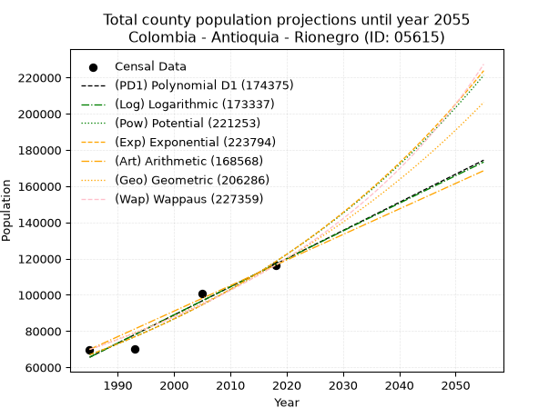
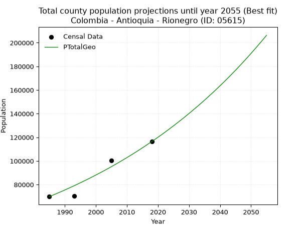
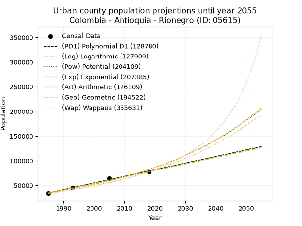
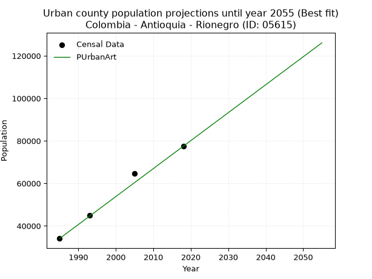
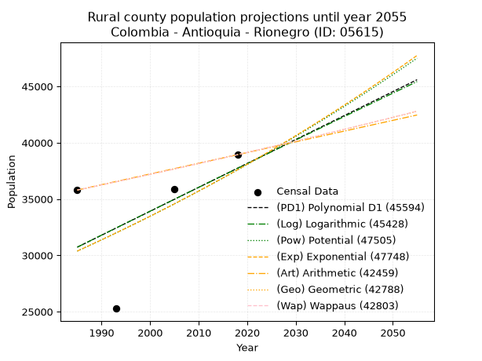
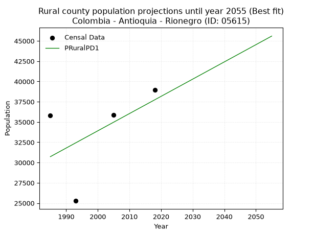

<div align="center">


</div>

# _“Population and Public Services Demand Projections (PPSD) until Year 2050 for Colombia - Antioquia - Rionegro (ID: 05615)”_
Keywords: `population` `public-service` `projection` `lineal` `polynomial` `logarithmic` `potential` `exponential` `arithmetic` `geometric` `wappaus` `dane` `colombia` `south-america`

PPSD are analytical estimates used by governments and planners to anticipate future changes in population size, age distribution, and the resulting community needs for utilities, healthcare, education, and infrastructure as sizing future water treatment facilities, electrical grids, and road networks based on spatial growth.

> **General running parameters**: • app_version: _v20260806_. • Python version: _3.14.7_. • Pandas version: _3.0.5_. • NumPy version: _2.5.1_. • Creates, save and include plots into reports (create_plot): _False_. • Projection until year: _2050_. • Process polynomial degree 2 and up: _False_. • Process Wappaus: _True_. • Process Wappaus: _True_. • Set negative values to zero: _True_. • Set infinite values to zero: _True_. • Drop dataset notes: _True_. 
<div align="center">

Dynamic map: [:earth_americas:Google](http://maps.google.com/maps?q=6.147147927,-75.3773164) [:earth_americas:OSM](https://www.openstreetmap.org/#map=18/6.147147927/-75.3773164&layers=P) [:earth_americas:Bing](https://www.bing.com/maps?cp=6.147147927~-75.3773164&lvl=18) [:earth_americas:Apple](https://maps.apple.com/frame?center=6.147147927%2C-75.3773164&span=0.003%2C0.006)

</div>


<div align="center">

```geojson
{
  "type": "Feature",
  "geometry": {
    "type": "Point", 
    "coordinates": [-75.3773164, 6.147147927]
  }, 
  "properties": {
    "Name": "Colombia - Antioquia - Rionegro (ID: 05615)"
  }
}
```

</div>


## 0. Census Data (4 records)

Census data are official statistics collected by a government about the people and housing in a country. They usually include counts of total population, age, sex, race, income, education, and jobs.

📅Global census file: [Population.xlsx](../data/Population.xlsx)

| Source   |   Year |   CountryID | CountryName   |   StateID | StateName   |   CountyID | CountyName   |   PTotal |   PUrban |   PRural |
|:---------|-------:|------------:|:--------------|----------:|:------------|-----------:|:-------------|---------:|---------:|---------:|
| DANE     |   1985 |          57 | Colombia      |        05 | Antioquia   |      05615 | Rionegro     |    69872 |    34076 |    35796 |
| DANE     |   1993 |          57 | Colombia      |        05 | Antioquia   |      05615 | Rionegro     |    70352 |    45076 |    25276 |
| DANE     |   2005 |          57 | Colombia      |        05 | Antioquia   |      05615 | Rionegro     |   100502 |    64652 |    35850 |
| DANE     |   2018 |          57 | Colombia      |        05 | Antioquia   |      05615 | Rionegro     |   116400 |    77463 |    38937 |

> 🔥Some records could had specific notes about the registered values or the corresponding urban or rural distribution.

**Local public utility companies (RUPS)**

 | SERVICIO       | ESTADO      | NOMBRE                                                                          | NIT         | DEPARTAMENTO_DOMICILIO   | MUNICIPIO_DOMICILIO   | DIRECCION                                                   |   TELEFONO | EMAIL                                    | TIPO_INSCRIPCION    | REPRESENTANTE_LEGAL                 | TIPO_PRESTADOR                                     | CLASIFICACION                  |
|:---------------|:------------|:--------------------------------------------------------------------------------|:------------|:-------------------------|:----------------------|:------------------------------------------------------------|-----------:|:-----------------------------------------|:--------------------|:------------------------------------|:---------------------------------------------------|:-------------------------------|
| ACUEDUCTO      | OPERATIVA   | ASOCIACION ACUEDUCTO Y ALCANTARILLADO CUATRO ESQUINAS RIONEGRO, ANTIOQUIA       | 811018505-9 | ANTIOQUIA                | RIONEGRO              | CARRERA 38A NO 40-54                                        |    6146360 | acueducto4444@hotmail.com                | Registro por la ESP | HUMBERTO LEON SANTA CARDONA         | ORGANIZACION AUTORIZADA                            | MENOR O IGUAL A 2500 USUARIOS  |
| ALCANTARILLADO | OPERATIVA   | ASOCIACION ACUEDUCTO Y ALCANTARILLADO CUATRO ESQUINAS RIONEGRO, ANTIOQUIA       | 811018505-9 | ANTIOQUIA                | RIONEGRO              | CARRERA 38A NO 40-54                                        |    6146360 | acueducto4444@hotmail.com                | Registro por la ESP | HUMBERTO LEON SANTA CARDONA         | ORGANIZACION AUTORIZADA                            | MENOR O IGUAL A 2500 USUARIOS  |
| ASEO           | CANCELACION | COOPERATIVA DE TRABAJO ASOCIADO RECUPERAR                                       | 890985000-6 | ANTIOQUIA                | ITAGUI                | Calle 52 No 50-32 l506                                      |    4440720 | recupera@recuperar.com.co                | Registro por la ESP | JORGE ANTONIO GONZALEZ SANCHEZ      | nan                                                | nan                            |
| ASEO           | OPERATIVA   | EMPRESAS VARIAS DE MEDELLIN  S.A. E.S. P.                                       | 890905055-9 | ANTIOQUIA                | MEDELLIN              | CALLE 30 No 55-198                                          |    3807946 | nora.alvarez@emvarias.com.co             | Registro por la ESP | GUSTAVO ALEJANDRO GALLEGO HERNANDEZ | SOCIEDADES (EMPRESA DE SERVICIOS PUBLICOS)         | MAYOR O IGUAL A 5001 USUARIOS  |
| ACUEDUCTO      | OPERATIVA   | EMPRESAS PÚBLICAS DE MEDELLIN E.S.P.                                            | 890904996-1 | ANTIOQUIA                | MEDELLIN              | CRA 58 No 42-125 Edificio Inteligente                       |    3808080 | DONEY.MARTINEZ@EPM.COM.CO                | Registro por la ESP | JORGE ANDRES CARRILLO CARDOSO       | EMPRESA INDUSTRIAL Y COMERCIAL DEL ESTADO          | MAYOR O IGUAL A 5001 USUARIOS  |
| ALCANTARILLADO | OPERATIVA   | EMPRESAS PÚBLICAS DE MEDELLIN E.S.P.                                            | 890904996-1 | ANTIOQUIA                | MEDELLIN              | CRA 58 No 42-125 Edificio Inteligente                       |    3808080 | DONEY.MARTINEZ@EPM.COM.CO                | Registro por la ESP | JORGE ANDRES CARRILLO CARDOSO       | EMPRESA INDUSTRIAL Y COMERCIAL DEL ESTADO          | MAYOR O IGUAL A 5001 USUARIOS  |
| ACUEDUCTO      | OPERATIVA   | CORPORACIÓN CIVICA ACUEDUCTO SAN ANTONIO DE PEREIRA                             | 811013205-1 | ANTIOQUIA                | RIONEGRO              | CALLE 24 55B-65 SAN ANTONIO DE PEREIRA                      |    5576228 | acuesanantonio@gmail.com                 | Registro por la ESP | JULIAN NICANOR CARDENAS HENAO       | ORGANIZACION AUTORIZADA                            | MENOR O IGUAL A 2500 USUARIOS  |
| ASEO           | OPERATIVA   | RIO ASEO TOTAL S.A. E.S.P.                                                      | 811007125-6 | ANTIOQUIA                | RIONEGRO              | CRA 48 63-41                                                |    5314464 | calidad@egcconsultores.co                | Registro por la ESP | OSCAR SALAZAR FRANCO                | SOCIEDADES (EMPRESA DE SERVICIOS PUBLICOS)         | MAYOR O IGUAL A 5001 USUARIOS  |
| ACUEDUCTO      | OPERATIVA   | CORPORACION DE USUARIOS  ACUEDUCTO EL CAPIRO                                    | 811001676-5 | ANTIOQUIA                | RIONEGRO              | Vereda Capiro Kilometro 4.8                                 |    5390452 | gusta707@gmail.com                       | Registro por la ESP | CARLOS MARIO VIECO ALVAREZ          | ORGANIZACION AUTORIZADA                            | MENOR O IGUAL A 2500 USUARIOS  |
| ASEO           | OPERATIVA   | ENVIASEO E.S.P.                                                                 | 811012208-9 | ANTIOQUIA                | ENVIGADO              | Cra. 43A # 46A sur 39                                       |    4032000 | ricardo.santamaria@enviaseo.gov.co       | Registro por la ESP | JIMMY COLLAZOS FRANCO               | EMPRESA INDUSTRIAL Y COMERCIAL DEL ESTADO          | MAYOR O IGUAL A 5001 USUARIOS  |
| ACUEDUCTO      | CANCELACION | EMPRESAS PUBLICAS DE RIONEGRO S.A.S  E.S.P.                                     | 811008684-6 | ANTIOQUIA                | RIONEGRO              | calle 47 No 74 -18                                          |    5318787 | CARLOS.AGUDELO.MEJIA@EPM.COM.CO          | Registro por la ESP | CARLOS AUGUSTO AGUDELO MEJIA        | nan                                                | nan                            |
| ALCANTARILLADO | CANCELACION | EMPRESAS PUBLICAS DE RIONEGRO S.A.S  E.S.P.                                     | 811008684-6 | ANTIOQUIA                | RIONEGRO              | calle 47 No 74 -18                                          |    5318787 | CARLOS.AGUDELO.MEJIA@EPM.COM.CO          | Registro por la ESP | CARLOS AUGUSTO AGUDELO MEJIA        | nan                                                | nan                            |
| ACUEDUCTO      | CANCELACION | CONHYDRA S.A. E.S.P.                                                            | 811011165-6 | ANTIOQUIA                | MEDELLIN              | CALLE 32 F # 63 A 117                                       |    4441676 | lchavarria@conhydra.com                  | Registro por la ESP | JORGE ALBERTO URIBE VELASQUEZ       | nan                                                | nan                            |
| ACUEDUCTO      | OPERATIVA   | ZONA FRANCA INDUSTRIAL DE BIENES Y SERVICIOS DE RIONEGRO                        | 811004085-6 | ANTIOQUIA                | RIONEGRO              | VEREDA CHACHAFRUTO                                          |    5612233 | ppatino@zonafrancarionegro.com           | Registro por la ESP | CARLOS ALBERTO MESA POSADA          | PRODUCTOR MARGINAL, INDEPENDIENTE O USO PARTICULAR | MENOR O IGUAL A 2500 USUARIOS  |
| ALCANTARILLADO | OPERATIVA   | ZONA FRANCA INDUSTRIAL DE BIENES Y SERVICIOS DE RIONEGRO                        | 811004085-6 | ANTIOQUIA                | RIONEGRO              | VEREDA CHACHAFRUTO                                          |    5612233 | ppatino@zonafrancarionegro.com           | Registro por la ESP | CARLOS ALBERTO MESA POSADA          | PRODUCTOR MARGINAL, INDEPENDIENTE O USO PARTICULAR | MENOR O IGUAL A 2500 USUARIOS  |
| ACUEDUCTO      | OPERATIVA   | CORPORACION ACUEDUCTO MULTIVEREDAL CARMIN, CUCHILLAS, MAMPUESTO Y ANEXOS        | 811015801-0 | ANTIOQUIA                | RIONEGRO              | CRA 47 N. 54-13, INT 205 SECTOR GALERIA                     |    5904592 | direccionadministrativa@camrionegro.com  | Registro por la ESP | HUMBERTO NICOLAS RESTREPO AMAYA     | ORGANIZACION AUTORIZADA                            | DESDE 2501 HASTA 5000 USUARIOS |
| ACUEDUCTO      | OPERATIVA   | ASOCIACION DE SUSCRIPTORES ACUEDUCTO RANCHERIAS                                 | 811015457-1 | ANTIOQUIA                | RIONEGRO              | Vereda Rancherias                                           |    5576338 | acueductorancherias@hotmail.com          | Registro por la ESP | JAIME ALBERTO GARCIA RIVERA         | ORGANIZACION AUTORIZADA                            | MENOR O IGUAL A 2500 USUARIOS  |
| ACUEDUCTO      | OPERATIVA   | ASOCIACION DEL ACUEDUCTO CABECERAS DE LLANOGRANDE                               | 811010242-0 | ANTIOQUIA                | RIONEGRO              | VEREDA  CABECERAS DE  LLANOGRANDE                           |    4084881 | acueductocabeceras@gmail.com             | Registro por la ESP | CAMILO RIOS VALENCIA                | ORGANIZACION AUTORIZADA                            | MENOR O IGUAL A 2500 USUARIOS  |
| ACUEDUCTO      | OPERATIVA   | ASOCIACION ACUEDUCTO TABLACITO                                                  | 811011541-2 | ANTIOQUIA                | RIONEGRO              | VEREDA TABLACITO                                            |    4087581 | acueductotablacito@yahoo.es              | Registro por la ESP | MARGARITA MARIA  ORTEGA  GARCIA     | ORGANIZACION AUTORIZADA                            | MENOR O IGUAL A 2500 USUARIOS  |
| ACUEDUCTO      | OPERATIVA   | ASOCIACION DE USUARIOS DEL ACUEDUCTO RURAL SAJONIA ALTO DEL VALLEJO ESP         | 890981981-8 | ANTIOQUIA                | RIONEGRO              | VDA YARUMAL SEC LA ARENERA                                  |    4798138 | administrativayfinanciera@arsaesp.com.co | Registro por la ESP | RONALD MEJIA BUITRAGO               | ORGANIZACION AUTORIZADA                            | MENOR O IGUAL A 2500 USUARIOS  |
| ALCANTARILLADO | OPERATIVA   | ASOCIACION DE USUARIOS DEL ACUEDUCTO RURAL SAJONIA ALTO DEL VALLEJO ESP         | 890981981-8 | ANTIOQUIA                | RIONEGRO              | VDA YARUMAL SEC LA ARENERA                                  |    4798138 | administrativayfinanciera@arsaesp.com.co | Registro por la ESP | RONALD MEJIA BUITRAGO               | ORGANIZACION AUTORIZADA                            | MENOR O IGUAL A 2500 USUARIOS  |
| ACUEDUCTO      | OPERATIVA   | CORPORACION CIVICA ACUEDUCTO EL TABLAZO                                         | 811013820-1 | ANTIOQUIA                | RIONEGRO              | VRD EL TABLAZO                                              |    4797982 | acuatablazo2@gmail.com                   | Registro por la ESP | MIGUEL ANTONIO MARTINEZ ARIAS       | ORGANIZACION AUTORIZADA                            | MENOR O IGUAL A 2500 USUARIOS  |
| ACUEDUCTO      | OPERATIVA   | CORPORACION DEL ACUEDUCTO TRESPUERTAS GUAYABITO                                 | 890984664-1 | ANTIOQUIA                | RIONEGRO              | Km 8.5 via llanogrande - CC Complex Of 27 - 2 Piso          |    5370978 | fermasa67@gmail.com                      | Registro por la ESP | RICARDO DARIO MEJIA PELAEZ          | ORGANIZACION AUTORIZADA                            | MENOR O IGUAL A 2500 USUARIOS  |
| ACUEDUCTO      | OPERATIVA   | ASOCIACION JUNTA ADMINISTRADORA ACUEDUCTO VEREDA LA CONVENCION                  | 811027111-9 | ANTIOQUIA                | RIONEGRO              | VEREDA LA CONVENCION                                        |    5360777 | asoacuacon2006@yahoo.com                 | Registro por la ESP | DIONNE AMPARO CORREA BURGOS         | ORGANIZACION AUTORIZADA                            | MENOR O IGUAL A 2500 USUARIOS  |
| ACUEDUCTO      | OPERATIVA   | CORPORACION LA ENEA                                                             | 811026592-3 | ANTIOQUIA                | RIONEGRO              | CALLE 60 # 47-63 BARRIO LOS LAGOS                           |    5661874 | acueducto@corporacionlaenea.com.co       | Registro por la ESP | SANDRA ELENA LOPEZ GIRALDO          | ORGANIZACION AUTORIZADA                            | MENOR O IGUAL A 2500 USUARIOS  |
| ACUEDUCTO      | OPERATIVA   | ASOCIACIÓN DE USUARIOS DEL ACUEDUCTO Y ALCANTARILLADO SAN IGNACIO               | 811021792-7 | ANTIOQUIA                | GUARNE                | VEREDA SAN IGNACIO                                          |    5380007 | asuasi538@gmail.com                      | Registro por la ESP | MARTHA LUCIA ESCOBAR PELAEZ         | ORGANIZACION AUTORIZADA                            | MENOR O IGUAL A 2500 USUARIOS  |
| ACUEDUCTO      | OPERATIVA   | ASOCIACION DE USUARIOS DEL ACUEDUCTO DE PONTEZUELA                              | 811018512-0 | ANTIOQUIA                | RIONEGRO              | VEREDA PONTEZUELA                                           |    5630784 | auapontezuela@gmail.com                  | Registro por la ESP | JORGE ALONSO TURBAY CEBALLOS        | ORGANIZACION AUTORIZADA                            | MENOR O IGUAL A 2500 USUARIOS  |
| ASEO           | CANCELACION | EVAS ENVIAMBIENTALES S.A E.S.P                                                  | 811046698-0 | ANTIOQUIA                | ENVIGADO              | Cr 43 A Cl 46 A SUR 39                                      |    4600850 | pablo.restrepo@enviaseo.gov.co           | Registro por la ESP | PABLO ANDRES RESTREPO GARCES        | nan                                                | nan                            |
| ACUEDUCTO      | OPERATIVA   | ASOCIACION LIBARDO GONZALEZ E. ACUEDUCTO Y ALCANTARILLADO                       | 830509888-0 | ANTIOQUIA                | RIONEGRO              | VEREDA SANTA ANA OJO DE AGUA                                |    5661133 | acueducto.ajodeagua@hotmail.com          | Registro por la ESP | BEATRIZ ELENA COLORADO OSORIO       | ORGANIZACION AUTORIZADA                            | HASTA 2500 SUSCRIPTORES        |
| ACUEDUCTO      | OPERATIVA   | CORPORACION CIVICA SAN LUIS SANTA BARBARA                                       | 800058658-8 | ANTIOQUIA                | RIONEGRO              | VDA SANTA BARBARA                                           |    4083457 | c.cbarbara@hotmail.com                   | Registro por la ESP | JOSE RAUL VANEGAS MONTOYA           | ORGANIZACION AUTORIZADA                            | MENOR O IGUAL A 2500 USUARIOS  |
| ACUEDUCTO      | OPERATIVA   | COOPERATIVA YARUMAL DE AGUAS                                                    | 811019185-1 | ANTIOQUIA                | RIONEGRO              | VEREDA YARUMAL DE RIONEGRO                                  |    5360118 | yarumaguas@une.net.co                    | Registro por la ESP | BIBIANA  ECHEVERRI RIOS             | ORGANIZACION AUTORIZADA                            | MENOR O IGUAL A 2500 USUARIOS  |
| ACUEDUCTO      | OPERATIVA   | CORPORACION ACUEDUCTO GALICIA J.H.G.N.                                          | 811044342-5 | ANTIOQUIA                | RIONEGRO              | SECTOR TANQUES ELEVADOS GALICIA                             |    3146393 | corporacionacueductogalicia@gmail.com    | Registro por la ESP | MARIO AUGUSTO AGUDELO HINCAPIE      | ORGANIZACION AUTORIZADA                            | MENOR O IGUAL A 2500 USUARIOS  |
| ACUEDUCTO      | OPERATIVA   | D. INGENIERIA LIMITADA                                                          | 800232197-1 | SANTANDER                | BUCARAMANGA           | CALLE 51 N° 35 - 28 INTERIOR 100 OFICINA 309                |    6431155 | jhon.salcedo@dingenieria.com             | Registro por la ESP | CESAR AUGUSTO DUARTE GARZÓN         | PRESTADORES FUERA DEL ART. 15 LSPD                 | HASTA 2500 SUSCRIPTORES        |
| ACUEDUCTO      | OPERATIVA   | ASOCIACION DE USUARIOS DEL ACUEDUCTO SIERRALTA CHUSCALITO ALTAMONTE Y MONTICELO | 811004216-4 | ANTIOQUIA                | RIONEGRO              | Vereda Tablacito Parte Alta                                 |    3113036 | acueductosaltamonte@gmail.com            | Registro por la ESP | ALVARO LAFAURIE RESTREPO            | ORGANIZACION AUTORIZADA                            | MENOR O IGUAL A 2500 USUARIOS  |
| ASEO           | CANCELACION | CORPORACIÓN DE RECICLADORES DE ANTIOQUIA                                        | 901017688-1 | ANTIOQUIA                | MARINILLA             | CARRERA 30A 20-80                                           |    5485698 | logistica@ciclototal.co                  | Registro por la ESP | SANTIAGO ALONSO ZULUAGA JARAMILLO   | nan                                                | nan                            |
| ASEO           | OPERATIVA   | COOPERATIVA DE TRABAJO ASOCIADO PLANETA VERDE                                   | 811026010-9 | ANTIOQUIA                | RIONEGRO              | TV 49 N. 33 100                                             |    5321817 | gerencia@cooperativaplanetaverde.org     | Registro por la ESP | MARTHA ELENA IGLESIAS ESCOBAR       | ORGANIZACION AUTORIZADA                            | MAYOR O IGUAL A 5001 USUARIOS  |
| ASEO           | OPERATIVA   | COOPERATIVA  DE TRABAJO ASOCIADO SERVIMOS DE ORIENTE                            | 800114538-2 | ANTIOQUIA                | RIONEGRO              | CARRERA 5248A 15                                            |    4795061 | servimos@une.net.co                      | Registro por la ESP | LUZ DARY ESCOBAR OSPINA             | ORGANIZACION AUTORIZADA                            | MAYOR O IGUAL A 5001 USUARIOS  |
| ASEO           | OPERATIVA   | CICLO TOTAL SAS E.S.P                                                           | 900995500-5 | ANTIOQUIA                | MARINILLA             | CARRERA 30A # 20-80                                         |    5485698 | logistica@ciclototal.co                  | Registro por la ESP | SANTIAGO MONROY GAVIRIA             | SOCIEDADES (EMPRESA DE SERVICIOS PUBLICOS)         | MAYOR O IGUAL A 5001 USUARIOS  |
| ASEO           | CANCELACION | Metales y Excedentes Recuperados                                                | 900717454-3 | ANTIOQUIA                | MEDELLIN              | calle 21 C numero 42-169                                    |    4615576 | metalrec.aprovechamiento@gmail.com       | Registro por la ESP | MONICA MARITZA NORENA TORO          | nan                                                | nan                            |
| ASEO           | OPERATIVA   | Asociación Recircular                                                           | 901326117-1 | ANTIOQUIA                | MEDELLIN              | calle 123 # 52 - 35                                         |    4795896 | asociacion.recircular@gmail.com          | Registro por la ESP | YESID ALEXIS RAMIREZ VALENCIA       | ORGANIZACION AUTORIZADA                            | MAYOR O IGUAL A 5001 USUARIOS  |
| ASEO           | OPERATIVA   | ASEO GLOBAL COLOMBIA S.A.S E.S.P                                                | 900616152-0 | ANTIOQUIA                | RIONEGRO              | CALLE 45A # 50A-10 CC CORDOBA LOCAL 121 B5                  |    3228731 | detabelo@misena.edu.co                   | Registro por la ESP | MELIZA RAMIREZ GRANADOS             | SOCIEDADES (EMPRESA DE SERVICIOS PUBLICOS)         | MAYOR O IGUAL A 5001 USUARIOS  |
| ASEO           | OPERATIVA   | RECICLA ORIENTE H S.A.S ESP                                                     | 901400062-1 | ANTIOQUIA                | RIONEGRO              | AUT MED - BOG KM 35 VDA LA LAJA                             |    0000000 | reciclaorienteh@gmail.com                | Registro por la ESP | YURD LEIDY HENAO MONTOYA            | SOCIEDADES (EMPRESA DE SERVICIOS PUBLICOS)         | MAYOR O IGUAL A 5001 USUARIOS  |
| ASEO           | OPERATIVA   | ASOCIACIÓN DE RECICLADORES Y GESTORES AMBIENTALES RURALES DE ANTIOQUIA          | 901457108-7 | ANTIOQUIA                | RIONEGRO              | FINCA EL PROGRESO ZONA INDUSTRIAL VEREDA GALICIA PARTE BAJA |    7578968 | recolecto.eco@gmail.com                  | Registro por la ESP | JHONATAN FELIPE OSORIO GARCIA       | ORGANIZACION AUTORIZADA                            | MAYOR O IGUAL A 5001 USUARIOS  |

> [📅RUPS Database: Registro Único de Prestadores de Servicios Públicos de Colombia Suramérica - RUPS](https://www.datos.gov.co/Hacienda-y-Cr-dito-P-blico/Registro-nico-de-Prestadores-de-Servicios-P-blicos/4qkq-csdn/about_data)

## 1. Total

### 1.1. Coefficients and Parameters

* (PD1) Polynomial Deg 1: 1554.2103572862186, -3019527.767161759 (lineal)
* (Log) Logarithmic: 3110506.196444074, -23553701.025203727
* (Pow) Potential: 34.5060886225083, -108.96728855992956
* (Exp) Exponential: 0.017239781201217958, 9.199650988012711e-11
* (Art) Arithmetic: Year diff. 2018 - 1985 = 33, Population diff. 116400 - 69872 = 46528, Annual growth = 1409.939393939394
* (Geo) Geometric: Year diff. 2018 - 1985 = 33, Population diff. 116400 - 69872 = 46528, Annual growth % = 0.015585895585397358
* (Wap) Wappaus: i = 1.5138500622094506, Condition values only valid for < 200)

<sub>
Wappaus condition values: ['0.00', '1.51', '3.03', '4.54', '6.06', '7.57', '9.08', '10.60', '12.11', '13.62', '15.14', '16.65', '18.17', '19.68', '21.19', '22.71', '24.22', '25.74', '27.25', '28.76', '30.28', '31.79', '33.30', '34.82', '36.33', '37.85', '39.36', '40.87', '42.39', '43.90', '45.42', '46.93', '48.44', '49.96', '51.47', '52.98', '54.50', '56.01', '57.53', '59.04', '60.55', '62.07', '63.58', '65.10', '66.61', '68.12', '69.64', '71.15', '72.66', '74.18', '75.69', '77.21', '78.72', '80.23', '81.75', '83.26', '84.78', '86.29', '87.80', '89.32', '90.83', '92.34', '93.86', '95.37', '96.89', '98.40']
</sub>


### 1.2. Projected Dataset

|   Year |   CountyID |   PTotalPD1 |   PTotalLog |   PTotalPow |   PTotalExp |   PTotalArt |   PTotalGeo |   PTotalWap |
|-------:|-----------:|------------:|------------:|------------:|------------:|------------:|------------:|------------:|
|   1985 |      05615 |       65580 |       65536 |       66916 |       66950 |       69872 |       69872 |       69872 |
|   1986 |      05615 |       67134 |       67103 |       68089 |       68114 |       71282 |       70961 |       70938 |
|   1987 |      05615 |       68688 |       68669 |       69282 |       69298 |       72692 |       72067 |       72020 |
|   1988 |      05615 |       70242 |       70234 |       70495 |       70503 |       74102 |       73190 |       73119 |
|   1989 |      05615 |       71797 |       71798 |       71729 |       71729 |       75512 |       74331 |       74235 |
|   1990 |      05615 |       73351 |       73362 |       72984 |       72977 |       76922 |       75489 |       75369 |
|   1991 |      05615 |       74905 |       74924 |       74260 |       74246 |       78332 |       76666 |       76520 |
|   1992 |      05615 |       76459 |       76486 |       75558 |       75537 |       79742 |       77861 |       77691 |
|   1993 |      05615 |       78013 |       78047 |       76878 |       76850 |       81152 |       79075 |       78879 |
|   1994 |      05615 |       79568 |       79608 |       78220 |       78187 |       82561 |       80307 |       80088 |
|   1995 |      05615 |       81122 |       81167 |       79585 |       79546 |       83971 |       81559 |       81316 |
|   1996 |      05615 |       82676 |       82726 |       80974 |       80929 |       85381 |       82830 |       82564 |
|   1997 |      05615 |       84230 |       84284 |       82385 |       82337 |       86791 |       84121 |       83833 |
|   1998 |      05615 |       85785 |       85841 |       83821 |       83769 |       88201 |       85432 |       85124 |
|   1999 |      05615 |       87339 |       87398 |       85281 |       85225 |       89611 |       86763 |       86436 |
|   2000 |      05615 |       88893 |       88953 |       86765 |       86707 |       91021 |       88116 |       87771 |
|   2001 |      05615 |       90447 |       90508 |       88275 |       88215 |       92431 |       89489 |       89128 |
|   2002 |      05615 |       92001 |       92062 |       89810 |       89749 |       93841 |       90884 |       90509 |
|   2003 |      05615 |       93556 |       93615 |       91371 |       91310 |       95251 |       92300 |       91915 |
|   2004 |      05615 |       95110 |       95168 |       92958 |       92897 |       96661 |       93739 |       93345 |
|   2005 |      05615 |       96664 |       96720 |       94572 |       94513 |       98071 |       95200 |       94801 |
|   2006 |      05615 |       98218 |       98271 |       96213 |       96156 |       99481 |       96684 |       96283 |
|   2007 |      05615 |       99772 |       99821 |       97882 |       97828 |      100891 |       98191 |       97792 |
|   2008 |      05615 |      101327 |      101370 |       99579 |       99530 |      102301 |       99721 |       99329 |
|   2009 |      05615 |      102881 |      102919 |      101305 |      101260 |      103711 |      101275 |      100894 |
|   2010 |      05615 |      104435 |      104467 |      103059 |      103021 |      105120 |      102854 |      102488 |
|   2011 |      05615 |      105989 |      106014 |      104843 |      104813 |      106530 |      104457 |      104112 |
|   2012 |      05615 |      107543 |      107560 |      106657 |      106635 |      107940 |      106085 |      105767 |
|   2013 |      05615 |      109098 |      109106 |      108502 |      108490 |      109350 |      107738 |      107454 |
|   2014 |      05615 |      110652 |      110651 |      110377 |      110376 |      110760 |      109417 |      109174 |
|   2015 |      05615 |      112206 |      112195 |      112284 |      112295 |      112170 |      111123 |      110928 |
|   2016 |      05615 |      113760 |      113738 |      114223 |      114248 |      113580 |      112855 |      112716 |
|   2017 |      05615 |      115315 |      115281 |      116195 |      116235 |      114990 |      114614 |      114539 |
|   2018 |      05615 |      116869 |      116823 |      118199 |      118256 |      116400 |      116400 |      116400 |
|   2019 |      05615 |      118423 |      118364 |      120237 |      120312 |      117810 |      118214 |      118299 |
|   2020 |      05615 |      119977 |      119904 |      122309 |      122405 |      119220 |      120057 |      120236 |
|   2021 |      05615 |      121531 |      121443 |      124416 |      124533 |      120630 |      121928 |      122214 |
|   2022 |      05615 |      123086 |      122982 |      126558 |      126699 |      122040 |      123828 |      124234 |
|   2023 |      05615 |      124640 |      124520 |      128736 |      128902 |      123450 |      125758 |      126296 |
|   2024 |      05615 |      126194 |      126057 |      130950 |      131143 |      124860 |      127718 |      128403 |
|   2025 |      05615 |      127748 |      127593 |      133201 |      133424 |      126270 |      129709 |      130555 |
|   2026 |      05615 |      129302 |      129129 |      135489 |      135744 |      127680 |      131730 |      132755 |
|   2027 |      05615 |      130857 |      130664 |      137816 |      138105 |      129089 |      133784 |      135004 |
|   2028 |      05615 |      132411 |      132198 |      140182 |      140506 |      130499 |      135869 |      137303 |
|   2029 |      05615 |      133965 |      133732 |      142587 |      142949 |      131909 |      137986 |      139654 |
|   2030 |      05615 |      135519 |      135264 |      145032 |      145435 |      133319 |      140137 |      142059 |
|   2031 |      05615 |      137073 |      136796 |      147517 |      147964 |      134729 |      142321 |      144520 |
|   2032 |      05615 |      138628 |      138327 |      150044 |      150537 |      136139 |      144539 |      147039 |
|   2033 |      05615 |      140182 |      139858 |      152614 |      153155 |      137549 |      146792 |      149618 |
|   2034 |      05615 |      141736 |      141387 |      155225 |      155818 |      138959 |      149080 |      152259 |
|   2035 |      05615 |      143290 |      142916 |      157880 |      158528 |      140369 |      151404 |      154964 |
|   2036 |      05615 |      144845 |      144444 |      160580 |      161284 |      141779 |      153763 |      157736 |
|   2037 |      05615 |      146399 |      145972 |      163324 |      164089 |      143189 |      156160 |      160577 |
|   2038 |      05615 |      147953 |      147498 |      166113 |      166942 |      144599 |      158594 |      163490 |
|   2039 |      05615 |      149507 |      149024 |      168949 |      169845 |      146009 |      161066 |      166477 |
|   2040 |      05615 |      151061 |      150549 |      171832 |      172799 |      147419 |      163576 |      169542 |
|   2041 |      05615 |      152616 |      152074 |      174762 |      175804 |      148829 |      166125 |      172688 |
|   2042 |      05615 |      154170 |      153597 |      177741 |      178861 |      150239 |      168715 |      175917 |
|   2043 |      05615 |      155724 |      155120 |      180769 |      181971 |      151648 |      171344 |      179233 |
|   2044 |      05615 |      157278 |      156642 |      183848 |      185135 |      153058 |      174015 |      182640 |
|   2045 |      05615 |      158832 |      158164 |      186977 |      188355 |      154468 |      176727 |      186142 |
|   2046 |      05615 |      160387 |      159684 |      190158 |      191630 |      155878 |      179481 |      189742 |
|   2047 |      05615 |      161941 |      161204 |      193391 |      194962 |      157288 |      182279 |      193445 |
|   2048 |      05615 |      163495 |      162724 |      196678 |      198353 |      158698 |      185120 |      197255 |
|   2049 |      05615 |      165049 |      164242 |      200019 |      201802 |      160108 |      188005 |      201177 |
|   2050 |      05615 |      166603 |      165760 |      203415 |      205311 |      161518 |      190935 |      205215 |
<div align="center">

</img>

</div>


### 1.3. Best fit with absolute and relative error (%)

Relative error puts that difference into context by dividing the absolute error by the true value, creating a unitless ratio or percentage that shows the scale of the mistake.

Absolute and relative error

|   Year | Source   |   CountryID | CountryName   |   StateID | StateName   |   CountyID_x | CountyName   |   PTotal |   PUrban |   PRural |   CountyID_y |   PTotalPD1 |   PTotalLog |   PTotalPow |   PTotalExp |   PTotalArt |   PTotalGeo |   PTotalWap |   PTotalPD1AbsError |   PTotalLogAbsError |   PTotalPowAbsError |   PTotalExpAbsError |   PTotalArtAbsError |   PTotalGeoAbsError |   PTotalWapAbsError |   PTotalPD1RelError |   PTotalLogRelError |   PTotalPowRelError |   PTotalExpRelError |   PTotalArtRelError |   PTotalGeoRelError |   PTotalWapRelError |
|-------:|:---------|------------:|:--------------|----------:|:------------|-------------:|:-------------|---------:|---------:|---------:|-------------:|------------:|------------:|------------:|------------:|------------:|------------:|------------:|--------------------:|--------------------:|--------------------:|--------------------:|--------------------:|--------------------:|--------------------:|--------------------:|--------------------:|--------------------:|--------------------:|--------------------:|--------------------:|--------------------:|
|   1985 | DANE     |          57 | Colombia      |        05 | Antioquia   |        05615 | Rionegro     |    69872 |    34076 |    35796 |        05615 |       65580 |       65536 |       66916 |       66950 |       69872 |       69872 |       69872 |                4292 |                4336 |                2956 |                2922 |                   0 |                   0 |                   0 |            6.14266  |            6.20563  |             4.23059 |             4.18193 |             0       |             0       |             0       |
|   1993 | DANE     |          57 | Colombia      |        05 | Antioquia   |        05615 | Rionegro     |    70352 |    45076 |    25276 |        05615 |       78013 |       78047 |       76878 |       76850 |       81152 |       79075 |       78879 |                7661 |                7695 |                6526 |                6498 |               10800 |                8723 |                8527 |           10.8895   |           10.9379   |             9.27621 |             9.23641 |            15.3514  |            12.3991  |            12.1205  |
|   2005 | DANE     |          57 | Colombia      |        05 | Antioquia   |        05615 | Rionegro     |   100502 |    64652 |    35850 |        05615 |       96664 |       96720 |       94572 |       94513 |       98071 |       95200 |       94801 |                3838 |                3782 |                5930 |                5989 |                2431 |                5302 |                5701 |            3.81883  |            3.76311  |             5.90038 |             5.95909 |             2.41886 |             5.27552 |             5.67252 |
|   2018 | DANE     |          57 | Colombia      |        05 | Antioquia   |        05615 | Rionegro     |   116400 |    77463 |    38937 |        05615 |      116869 |      116823 |      118199 |      118256 |      116400 |      116400 |      116400 |                 469 |                 423 |                1799 |                1856 |                   0 |                   0 |                   0 |            0.402921 |            0.363402 |             1.54553 |             1.5945  |             0       |             0       |             0       |

Relative error mean

| Method    |   RelError | Best   |
|:----------|-----------:|:-------|
| PTotalPD1 |    5.31348 |        |
| PTotalLog |    5.3175  |        |
| PTotalPow |    5.23818 |        |
| PTotalExp |    5.24298 |        |
| PTotalArt |    4.44256 |        |
| PTotalGeo |    4.41865 | True   |
| PTotalWap |    4.44825 |        |

💙Best method: _**PTotalGeo**_
<div align="center">

</img>

</div>


### 1.4. Fresh water supply demand in liters per capita per day (lpcd)

The fresh water supply demand typically ranges from 100 to 300 liters per capita per day (lpcd) for standard domestic and municipal planning, though absolute survival minimums set by the World Health Organization are as low as 7.5 to 20 liters per day, and total consumption in high-income nations can exceed 400 liters.

> `CZ`: Level in meters above the sea level (masl)<br> `WS`: Fresh water supply demand in liters per capita per day (lpcd or l/h/d)<br> `WSAll`: Zonal fresh water supply demand in liters per second (l/s)<br> `A`: Zonal area in square meters<br> `DP`: Population density (people/hectare or p/ha)

Reference values (RAS Colombia)

|    CZ |   WS |
|------:|-----:|
|  1000 |  120 |
|  2000 |  130 |
| 99999 |  140 |

County shapefile geometry properties and water supply values

|   CountyID |      ATotal |   CZTotal |   WSTotal |
|-----------:|------------:|----------:|----------:|
|      05615 | 1.95871e+08 |   2166.27 |       140 |

Projected values for best method: PTotalGeo

|   CountyID |   Year |   PTotalGeo |   DPTotal |   WSTotal |   WSTotalAll |
|-----------:|-------:|------------:|----------:|----------:|-------------:|
|      05615 |   1985 |       69872 |      3.57 |       140 |      113.219 |
|      05615 |   1986 |       70961 |      3.62 |       140 |      114.983 |
|      05615 |   1987 |       72067 |      3.68 |       140 |      116.775 |
|      05615 |   1988 |       73190 |      3.74 |       140 |      118.595 |
|      05615 |   1989 |       74331 |      3.79 |       140 |      120.444 |
|      05615 |   1990 |       75489 |      3.85 |       140 |      122.32  |
|      05615 |   1991 |       76666 |      3.91 |       140 |      124.227 |
|      05615 |   1992 |       77861 |      3.98 |       140 |      126.164 |
|      05615 |   1993 |       79075 |      4.04 |       140 |      128.131 |
|      05615 |   1994 |       80307 |      4.1  |       140 |      130.127 |
|      05615 |   1995 |       81559 |      4.16 |       140 |      132.156 |
|      05615 |   1996 |       82830 |      4.23 |       140 |      134.215 |
|      05615 |   1997 |       84121 |      4.29 |       140 |      136.307 |
|      05615 |   1998 |       85432 |      4.36 |       140 |      138.431 |
|      05615 |   1999 |       86763 |      4.43 |       140 |      140.588 |
|      05615 |   2000 |       88116 |      4.5  |       140 |      142.781 |
|      05615 |   2001 |       89489 |      4.57 |       140 |      145.005 |
|      05615 |   2002 |       90884 |      4.64 |       140 |      147.266 |
|      05615 |   2003 |       92300 |      4.71 |       140 |      149.56  |
|      05615 |   2004 |       93739 |      4.79 |       140 |      151.892 |
|      05615 |   2005 |       95200 |      4.86 |       140 |      154.259 |
|      05615 |   2006 |       96684 |      4.94 |       140 |      156.664 |
|      05615 |   2007 |       98191 |      5.01 |       140 |      159.106 |
|      05615 |   2008 |       99721 |      5.09 |       140 |      161.585 |
|      05615 |   2009 |      101275 |      5.17 |       140 |      164.103 |
|      05615 |   2010 |      102854 |      5.25 |       140 |      166.662 |
|      05615 |   2011 |      104457 |      5.33 |       140 |      169.259 |
|      05615 |   2012 |      106085 |      5.42 |       140 |      171.897 |
|      05615 |   2013 |      107738 |      5.5  |       140 |      174.575 |
|      05615 |   2014 |      109417 |      5.59 |       140 |      177.296 |
|      05615 |   2015 |      111123 |      5.67 |       140 |      180.06  |
|      05615 |   2016 |      112855 |      5.76 |       140 |      182.867 |
|      05615 |   2017 |      114614 |      5.85 |       140 |      185.717 |
|      05615 |   2018 |      116400 |      5.94 |       140 |      188.611 |
|      05615 |   2019 |      118214 |      6.04 |       140 |      191.55  |
|      05615 |   2020 |      120057 |      6.13 |       140 |      194.537 |
|      05615 |   2021 |      121928 |      6.22 |       140 |      197.569 |
|      05615 |   2022 |      123828 |      6.32 |       140 |      200.647 |
|      05615 |   2023 |      125758 |      6.42 |       140 |      203.775 |
|      05615 |   2024 |      127718 |      6.52 |       140 |      206.95  |
|      05615 |   2025 |      129709 |      6.62 |       140 |      210.177 |
|      05615 |   2026 |      131730 |      6.73 |       140 |      213.451 |
|      05615 |   2027 |      133784 |      6.83 |       140 |      216.78  |
|      05615 |   2028 |      135869 |      6.94 |       140 |      220.158 |
|      05615 |   2029 |      137986 |      7.04 |       140 |      223.588 |
|      05615 |   2030 |      140137 |      7.15 |       140 |      227.074 |
|      05615 |   2031 |      142321 |      7.27 |       140 |      230.613 |
|      05615 |   2032 |      144539 |      7.38 |       140 |      234.207 |
|      05615 |   2033 |      146792 |      7.49 |       140 |      237.857 |
|      05615 |   2034 |      149080 |      7.61 |       140 |      241.565 |
|      05615 |   2035 |      151404 |      7.73 |       140 |      245.331 |
|      05615 |   2036 |      153763 |      7.85 |       140 |      249.153 |
|      05615 |   2037 |      156160 |      7.97 |       140 |      253.037 |
|      05615 |   2038 |      158594 |      8.1  |       140 |      256.981 |
|      05615 |   2039 |      161066 |      8.22 |       140 |      260.987 |
|      05615 |   2040 |      163576 |      8.35 |       140 |      265.054 |
|      05615 |   2041 |      166125 |      8.48 |       140 |      269.184 |
|      05615 |   2042 |      168715 |      8.61 |       140 |      273.381 |
|      05615 |   2043 |      171344 |      8.75 |       140 |      277.641 |
|      05615 |   2044 |      174015 |      8.88 |       140 |      281.969 |
|      05615 |   2045 |      176727 |      9.02 |       140 |      286.363 |
|      05615 |   2046 |      179481 |      9.16 |       140 |      290.826 |
|      05615 |   2047 |      182279 |      9.31 |       140 |      295.359 |
|      05615 |   2048 |      185120 |      9.45 |       140 |      299.963 |
|      05615 |   2049 |      188005 |      9.6  |       140 |      304.638 |
|      05615 |   2050 |      190935 |      9.75 |       140 |      309.385 |

## 2. Urban

### 2.1. Coefficients and Parameters

* (PD1) Polynomial Deg 1: 1341.798875953423, -2628616.451625835 (lineal)
* (Log) Logarithmic: 2686307.594319428, -20363328.801140033
* (Pow) Potential: 50.13164486204718, -160.76684396728606
* (Exp) Exponential: 0.025034463645133096, 9.421946736407557e-18
* (Art) Arithmetic: Year diff. 2018 - 1985 = 33, Population diff. 77463 - 34076 = 43387, Annual growth = 1314.7575757575758
* (Geo) Geometric: Year diff. 2018 - 1985 = 33, Population diff. 77463 - 34076 = 43387, Annual growth % = 0.02519728064713167
* (Wap) Wappaus: i = 2.3574849617758376, Condition values only valid for < 200)

<sub>
Wappaus condition values: ['0.00', '2.36', '4.71', '7.07', '9.43', '11.79', '14.14', '16.50', '18.86', '21.22', '23.57', '25.93', '28.29', '30.65', '33.00', '35.36', '37.72', '40.08', '42.43', '44.79', '47.15', '49.51', '51.86', '54.22', '56.58', '58.94', '61.29', '63.65', '66.01', '68.37', '70.72', '73.08', '75.44', '77.80', '80.15', '82.51', '84.87', '87.23', '89.58', '91.94', '94.30', '96.66', '99.01', '101.37', '103.73', '106.09', '108.44', '110.80', '113.16', '115.52', '117.87', '120.23', '122.59', '124.95', '127.30', '129.66', '132.02', '134.38', '136.73', '139.09', '141.45', '143.81', '146.16', '148.52', '150.88', '153.24']
</sub>


### 2.2. Projected Dataset

|   Year |   CountyID |   PUrbanPD1 |   PUrbanLog |   PUrbanPow |   PUrbanExp |   PUrbanArt |   PUrbanGeo |   PUrbanWap |
|-------:|-----------:|------------:|------------:|------------:|------------:|------------:|------------:|------------:|
|   1985 |      05615 |       34854 |       34810 |       35918 |       35951 |       34076 |       34076 |       34076 |
|   1986 |      05615 |       36196 |       36163 |       36837 |       36863 |       35391 |       34935 |       34889 |
|   1987 |      05615 |       37538 |       37515 |       37778 |       37797 |       36706 |       35815 |       35721 |
|   1988 |      05615 |       38880 |       38867 |       38743 |       38755 |       38020 |       36717 |       36574 |
|   1989 |      05615 |       40222 |       40218 |       39732 |       39738 |       39335 |       37642 |       37448 |
|   1990 |      05615 |       41563 |       41568 |       40746 |       40745 |       40650 |       38591 |       38344 |
|   1991 |      05615 |       42905 |       42918 |       41785 |       41778 |       41965 |       39563 |       39263 |
|   1992 |      05615 |       44247 |       44266 |       42851 |       42837 |       43279 |       40560 |       40205 |
|   1993 |      05615 |       45589 |       45615 |       43942 |       43923 |       44594 |       41582 |       41172 |
|   1994 |      05615 |       46931 |       46962 |       45061 |       45037 |       45909 |       42630 |       42164 |
|   1995 |      05615 |       48272 |       48309 |       46208 |       46178 |       47224 |       43704 |       43183 |
|   1996 |      05615 |       49614 |       49655 |       47384 |       47349 |       48538 |       44805 |       44229 |
|   1997 |      05615 |       50956 |       51001 |       48589 |       48549 |       49853 |       45934 |       45304 |
|   1998 |      05615 |       52298 |       52346 |       49824 |       49780 |       51168 |       47092 |       46409 |
|   1999 |      05615 |       53640 |       53690 |       51089 |       51042 |       52483 |       48278 |       47546 |
|   2000 |      05615 |       54981 |       55033 |       52387 |       52336 |       53797 |       49495 |       48714 |
|   2001 |      05615 |       56323 |       56376 |       53716 |       53663 |       55112 |       50742 |       49917 |
|   2002 |      05615 |       57665 |       57718 |       55078 |       55023 |       56427 |       52021 |       51155 |
|   2003 |      05615 |       59007 |       59060 |       56475 |       56418 |       57742 |       53331 |       52430 |
|   2004 |      05615 |       60348 |       60400 |       57905 |       57848 |       59056 |       54675 |       53744 |
|   2005 |      05615 |       61690 |       61741 |       59372 |       59315 |       60371 |       56053 |       55099 |
|   2006 |      05615 |       63032 |       63080 |       60875 |       60818 |       61686 |       57465 |       56496 |
|   2007 |      05615 |       64374 |       64419 |       62415 |       62360 |       63001 |       58913 |       57937 |
|   2008 |      05615 |       65716 |       65757 |       63993 |       63941 |       64315 |       60398 |       59425 |
|   2009 |      05615 |       67057 |       67094 |       65610 |       65562 |       65630 |       61919 |       60962 |
|   2010 |      05615 |       68399 |       68431 |       67268 |       67224 |       66945 |       63480 |       62550 |
|   2011 |      05615 |       69741 |       69767 |       68966 |       68928 |       68260 |       65079 |       64193 |
|   2012 |      05615 |       71083 |       71103 |       70707 |       70675 |       69574 |       66719 |       65892 |
|   2013 |      05615 |       72425 |       72438 |       72490 |       72467 |       70889 |       68400 |       67651 |
|   2014 |      05615 |       73766 |       73772 |       74318 |       74304 |       72204 |       70124 |       69473 |
|   2015 |      05615 |       75108 |       75105 |       76190 |       76188 |       73519 |       71891 |       71361 |
|   2016 |      05615 |       76450 |       76438 |       78109 |       78119 |       74833 |       73702 |       73319 |
|   2017 |      05615 |       77792 |       77770 |       80075 |       80099 |       76148 |       75559 |       75352 |
|   2018 |      05615 |       79134 |       79102 |       82090 |       82130 |       77463 |       77463 |       77463 |
|   2019 |      05615 |       80475 |       80433 |       84154 |       84212 |       78778 |       79415 |       79657 |
|   2020 |      05615 |       81817 |       81763 |       86269 |       86347 |       80093 |       81416 |       81939 |
|   2021 |      05615 |       83159 |       83092 |       88437 |       88536 |       81407 |       83467 |       84315 |
|   2022 |      05615 |       84501 |       84421 |       90657 |       90780 |       82722 |       85571 |       86790 |
|   2023 |      05615 |       85843 |       85749 |       92932 |       93081 |       84037 |       87727 |       89370 |
|   2024 |      05615 |       87184 |       87077 |       95264 |       95441 |       85352 |       89937 |       92064 |
|   2025 |      05615 |       88526 |       88404 |       97652 |       97861 |       86666 |       92203 |       94877 |
|   2026 |      05615 |       89868 |       89730 |      100099 |      100341 |       87981 |       94527 |       97819 |
|   2027 |      05615 |       91210 |       91056 |      102606 |      102885 |       89296 |       96908 |      100898 |
|   2028 |      05615 |       92552 |       92381 |      105175 |      105493 |       90611 |       99350 |      104124 |
|   2029 |      05615 |       93893 |       93705 |      107807 |      108168 |       91925 |      101854 |      107508 |
|   2030 |      05615 |       95235 |       95029 |      110503 |      110910 |       93240 |      104420 |      111062 |
|   2031 |      05615 |       96577 |       96352 |      113265 |      113721 |       94555 |      107051 |      114800 |
|   2032 |      05615 |       97919 |       97674 |      116095 |      116604 |       95870 |      109748 |      118734 |
|   2033 |      05615 |       99261 |       98996 |      118994 |      119560 |       97184 |      112514 |      122883 |
|   2034 |      05615 |      100602 |      100317 |      121964 |      122591 |       98499 |      115349 |      127263 |
|   2035 |      05615 |      101944 |      101637 |      125006 |      125699 |       99814 |      118255 |      131894 |
|   2036 |      05615 |      103286 |      102957 |      128123 |      128885 |      101129 |      121235 |      136799 |
|   2037 |      05615 |      104628 |      104276 |      131316 |      132153 |      102443 |      124290 |      142003 |
|   2038 |      05615 |      105970 |      105594 |      134588 |      135503 |      103758 |      127422 |      147534 |
|   2039 |      05615 |      107311 |      106912 |      137938 |      138938 |      105073 |      130632 |      153423 |
|   2040 |      05615 |      108653 |      108229 |      141371 |      142460 |      106388 |      133924 |      159707 |
|   2041 |      05615 |      109995 |      109546 |      144887 |      146071 |      107702 |      137298 |      166428 |
|   2042 |      05615 |      111337 |      110861 |      148489 |      149774 |      109017 |      140758 |      173631 |
|   2043 |      05615 |      112679 |      112177 |      152179 |      153571 |      110332 |      144305 |      181370 |
|   2044 |      05615 |      114020 |      113491 |      155958 |      157464 |      111647 |      147941 |      189709 |
|   2045 |      05615 |      115362 |      114805 |      159830 |      161456 |      112961 |      151668 |      198720 |
|   2046 |      05615 |      116704 |      116118 |      163795 |      165549 |      114276 |      155490 |      208486 |
|   2047 |      05615 |      118046 |      117431 |      167857 |      169746 |      115591 |      159408 |      219108 |
|   2048 |      05615 |      119388 |      118743 |      172018 |      174049 |      116906 |      163425 |      230703 |
|   2049 |      05615 |      120729 |      120054 |      176279 |      178461 |      118220 |      167543 |      243410 |
|   2050 |      05615 |      122071 |      121365 |      180644 |      182985 |      119535 |      171764 |      257399 |
<div align="center">

</img>

</div>


### 2.3. Best fit with absolute and relative error (%)

Relative error puts that difference into context by dividing the absolute error by the true value, creating a unitless ratio or percentage that shows the scale of the mistake.

Absolute and relative error

|   Year | Source   |   CountryID | CountryName   |   StateID | StateName   |   CountyID_x | CountyName   |   PTotal |   PUrban |   PRural |   CountyID_y |   PUrbanPD1 |   PUrbanLog |   PUrbanPow |   PUrbanExp |   PUrbanArt |   PUrbanGeo |   PUrbanWap |   PUrbanPD1AbsError |   PUrbanLogAbsError |   PUrbanPowAbsError |   PUrbanExpAbsError |   PUrbanArtAbsError |   PUrbanGeoAbsError |   PUrbanWapAbsError |   PUrbanPD1RelError |   PUrbanLogRelError |   PUrbanPowRelError |   PUrbanExpRelError |   PUrbanArtRelError |   PUrbanGeoRelError |   PUrbanWapRelError |
|-------:|:---------|------------:|:--------------|----------:|:------------|-------------:|:-------------|---------:|---------:|---------:|-------------:|------------:|------------:|------------:|------------:|------------:|------------:|------------:|--------------------:|--------------------:|--------------------:|--------------------:|--------------------:|--------------------:|--------------------:|--------------------:|--------------------:|--------------------:|--------------------:|--------------------:|--------------------:|--------------------:|
|   1985 | DANE     |          57 | Colombia      |        05 | Antioquia   |        05615 | Rionegro     |    69872 |    34076 |    35796 |        05615 |       34854 |       34810 |       35918 |       35951 |       34076 |       34076 |       34076 |                 778 |                 734 |                1842 |                1875 |                   0 |                   0 |                   0 |             2.28313 |             2.15401 |             5.40556 |             5.50241 |             0       |             0       |             0       |
|   1993 | DANE     |          57 | Colombia      |        05 | Antioquia   |        05615 | Rionegro     |    70352 |    45076 |    25276 |        05615 |       45589 |       45615 |       43942 |       43923 |       44594 |       41582 |       41172 |                 513 |                 539 |                1134 |                1153 |                 482 |                3494 |                3904 |             1.13808 |             1.19576 |             2.51575 |             2.5579  |             1.06931 |             7.75135 |             8.66093 |
|   2005 | DANE     |          57 | Colombia      |        05 | Antioquia   |        05615 | Rionegro     |   100502 |    64652 |    35850 |        05615 |       61690 |       61741 |       59372 |       59315 |       60371 |       56053 |       55099 |                2962 |                2911 |                5280 |                5337 |                4281 |                8599 |                9553 |             4.58145 |             4.50257 |             8.1668  |             8.25497 |             6.6216  |            13.3004  |            14.776   |
|   2018 | DANE     |          57 | Colombia      |        05 | Antioquia   |        05615 | Rionegro     |   116400 |    77463 |    38937 |        05615 |       79134 |       79102 |       82090 |       82130 |       77463 |       77463 |       77463 |                1671 |                1639 |                4627 |                4667 |                   0 |                   0 |                   0 |             2.15716 |             2.11585 |             5.97317 |             6.02481 |             0       |             0       |             0       |

Relative error mean

| Method    |   RelError | Best   |
|:----------|-----------:|:-------|
| PUrbanPD1 |    2.53996 |        |
| PUrbanLog |    2.49205 |        |
| PUrbanPow |    5.51532 |        |
| PUrbanExp |    5.58502 |        |
| PUrbanArt |    1.92273 | True   |
| PUrbanGeo |    5.26295 |        |
| PUrbanWap |    5.85924 |        |

💙Best method: _**PUrbanArt**_
<div align="center">

</img>

</div>


### 2.4. Fresh water supply demand in liters per capita per day (lpcd)

The fresh water supply demand typically ranges from 100 to 300 liters per capita per day (lpcd) for standard domestic and municipal planning, though absolute survival minimums set by the World Health Organization are as low as 7.5 to 20 liters per day, and total consumption in high-income nations can exceed 400 liters.

> `CZ`: Level in meters above the sea level (masl)<br> `WS`: Fresh water supply demand in liters per capita per day (lpcd or l/h/d)<br> `WSAll`: Zonal fresh water supply demand in liters per second (l/s)<br> `A`: Zonal area in square meters<br> `DP`: Population density (people/hectare or p/ha)

Reference values (RAS Colombia)

|    CZ |   WS |
|------:|-----:|
|  1000 |  120 |
|  2000 |  130 |
| 99999 |  140 |

County shapefile geometry properties and water supply values

|   CountyID |      AUrban |   CZUrban |   WSUrban |
|-----------:|------------:|----------:|----------:|
|      05615 | 1.01434e+07 |   2104.02 |       140 |

Projected values for best method: PUrbanArt

|   CountyID |   Year |   PUrbanArt |   DPUrban |   WSUrban |   WSUrbanAll |
|-----------:|-------:|------------:|----------:|----------:|-------------:|
|      05615 |   1985 |       34076 |     33.59 |       140 |      55.2157 |
|      05615 |   1986 |       35391 |     34.89 |       140 |      57.3465 |
|      05615 |   1987 |       36706 |     36.19 |       140 |      59.4773 |
|      05615 |   1988 |       38020 |     37.48 |       140 |      61.6065 |
|      05615 |   1989 |       39335 |     38.78 |       140 |      63.7373 |
|      05615 |   1990 |       40650 |     40.08 |       140 |      65.8681 |
|      05615 |   1991 |       41965 |     41.37 |       140 |      67.9988 |
|      05615 |   1992 |       43279 |     42.67 |       140 |      70.128  |
|      05615 |   1993 |       44594 |     43.96 |       140 |      72.2588 |
|      05615 |   1994 |       45909 |     45.26 |       140 |      74.3896 |
|      05615 |   1995 |       47224 |     46.56 |       140 |      76.5204 |
|      05615 |   1996 |       48538 |     47.85 |       140 |      78.6495 |
|      05615 |   1997 |       49853 |     49.15 |       140 |      80.7803 |
|      05615 |   1998 |       51168 |     50.44 |       140 |      82.9111 |
|      05615 |   1999 |       52483 |     51.74 |       140 |      85.0419 |
|      05615 |   2000 |       53797 |     53.04 |       140 |      87.1711 |
|      05615 |   2001 |       55112 |     54.33 |       140 |      89.3019 |
|      05615 |   2002 |       56427 |     55.63 |       140 |      91.4326 |
|      05615 |   2003 |       57742 |     56.93 |       140 |      93.5634 |
|      05615 |   2004 |       59056 |     58.22 |       140 |      95.6926 |
|      05615 |   2005 |       60371 |     59.52 |       140 |      97.8234 |
|      05615 |   2006 |       61686 |     60.81 |       140 |      99.9542 |
|      05615 |   2007 |       63001 |     62.11 |       140 |     102.085  |
|      05615 |   2008 |       64315 |     63.41 |       140 |     104.214  |
|      05615 |   2009 |       65630 |     64.7  |       140 |     106.345  |
|      05615 |   2010 |       66945 |     66    |       140 |     108.476  |
|      05615 |   2011 |       68260 |     67.3  |       140 |     110.606  |
|      05615 |   2012 |       69574 |     68.59 |       140 |     112.736  |
|      05615 |   2013 |       70889 |     69.89 |       140 |     114.866  |
|      05615 |   2014 |       72204 |     71.18 |       140 |     116.997  |
|      05615 |   2015 |       73519 |     72.48 |       140 |     119.128  |
|      05615 |   2016 |       74833 |     73.78 |       140 |     121.257  |
|      05615 |   2017 |       76148 |     75.07 |       140 |     123.388  |
|      05615 |   2018 |       77463 |     76.37 |       140 |     125.519  |
|      05615 |   2019 |       78778 |     77.66 |       140 |     127.65   |
|      05615 |   2020 |       80093 |     78.96 |       140 |     129.78   |
|      05615 |   2021 |       81407 |     80.26 |       140 |     131.909  |
|      05615 |   2022 |       82722 |     81.55 |       140 |     134.04   |
|      05615 |   2023 |       84037 |     82.85 |       140 |     136.171  |
|      05615 |   2024 |       85352 |     84.15 |       140 |     138.302  |
|      05615 |   2025 |       86666 |     85.44 |       140 |     140.431  |
|      05615 |   2026 |       87981 |     86.74 |       140 |     142.562  |
|      05615 |   2027 |       89296 |     88.03 |       140 |     144.693  |
|      05615 |   2028 |       90611 |     89.33 |       140 |     146.823  |
|      05615 |   2029 |       91925 |     90.63 |       140 |     148.953  |
|      05615 |   2030 |       93240 |     91.92 |       140 |     151.083  |
|      05615 |   2031 |       94555 |     93.22 |       140 |     153.214  |
|      05615 |   2032 |       95870 |     94.51 |       140 |     155.345  |
|      05615 |   2033 |       97184 |     95.81 |       140 |     157.474  |
|      05615 |   2034 |       98499 |     97.11 |       140 |     159.605  |
|      05615 |   2035 |       99814 |     98.4  |       140 |     161.736  |
|      05615 |   2036 |      101129 |     99.7  |       140 |     163.866  |
|      05615 |   2037 |      102443 |    100.99 |       140 |     165.996  |
|      05615 |   2038 |      103758 |    102.29 |       140 |     168.126  |
|      05615 |   2039 |      105073 |    103.59 |       140 |     170.257  |
|      05615 |   2040 |      106388 |    104.88 |       140 |     172.388  |
|      05615 |   2041 |      107702 |    106.18 |       140 |     174.517  |
|      05615 |   2042 |      109017 |    107.48 |       140 |     176.648  |
|      05615 |   2043 |      110332 |    108.77 |       140 |     178.779  |
|      05615 |   2044 |      111647 |    110.07 |       140 |     180.909  |
|      05615 |   2045 |      112961 |    111.36 |       140 |     183.039  |
|      05615 |   2046 |      114276 |    112.66 |       140 |     185.169  |
|      05615 |   2047 |      115591 |    113.96 |       140 |     187.3    |
|      05615 |   2048 |      116906 |    115.25 |       140 |     189.431  |
|      05615 |   2049 |      118220 |    116.55 |       140 |     191.56   |
|      05615 |   2050 |      119535 |    117.85 |       140 |     193.691  |

## 3. Rural

### 3.1. Coefficients and Parameters

* (PD1) Polynomial Deg 1: 212.41148133279563, -390911.3155359245 (lineal)
* (Log) Logarithmic: 424198.60212464543, -3190372.22406369
* (Pow) Potential: 12.900085147772593, -38.058810755358174
* (Exp) Exponential: 0.006459979764118616, 0.08195587858750925
* (Art) Arithmetic: Year diff. 2018 - 1985 = 33, Population diff. 38937 - 35796 = 3141, Annual growth = 95.18181818181819
* (Geo) Geometric: Year diff. 2018 - 1985 = 33, Population diff. 38937 - 35796 = 3141, Annual growth % = 0.0025520023451728324
* (Wap) Wappaus: i = 0.2547250028282504, Condition values only valid for < 200)

<sub>
Wappaus condition values: ['0.00', '0.25', '0.51', '0.76', '1.02', '1.27', '1.53', '1.78', '2.04', '2.29', '2.55', '2.80', '3.06', '3.31', '3.57', '3.82', '4.08', '4.33', '4.59', '4.84', '5.09', '5.35', '5.60', '5.86', '6.11', '6.37', '6.62', '6.88', '7.13', '7.39', '7.64', '7.90', '8.15', '8.41', '8.66', '8.92', '9.17', '9.42', '9.68', '9.93', '10.19', '10.44', '10.70', '10.95', '11.21', '11.46', '11.72', '11.97', '12.23', '12.48', '12.74', '12.99', '13.25', '13.50', '13.76', '14.01', '14.26', '14.52', '14.77', '15.03', '15.28', '15.54', '15.79', '16.05', '16.30', '16.56']
</sub>


### 3.2. Projected Dataset

|   Year |   CountyID |   PRuralPD1 |   PRuralLog |   PRuralPow |   PRuralExp |   PRuralArt |   PRuralGeo |   PRuralWap |
|-------:|-----------:|------------:|------------:|------------:|------------:|------------:|------------:|------------:|
|   1985 |      05615 |       30725 |       30726 |       30380 |       30378 |       35796 |       35796 |       35796 |
|   1986 |      05615 |       30938 |       30940 |       30578 |       30575 |       35891 |       35887 |       35887 |
|   1987 |      05615 |       31150 |       31154 |       30777 |       30773 |       35986 |       35979 |       35979 |
|   1988 |      05615 |       31363 |       31367 |       30977 |       30973 |       36082 |       36071 |       36071 |
|   1989 |      05615 |       31575 |       31580 |       31179 |       31174 |       36177 |       36163 |       36163 |
|   1990 |      05615 |       31788 |       31794 |       31382 |       31376 |       36272 |       36255 |       36255 |
|   1991 |      05615 |       32000 |       32007 |       31586 |       31579 |       36367 |       36348 |       36347 |
|   1992 |      05615 |       32212 |       32220 |       31791 |       31784 |       36462 |       36440 |       36440 |
|   1993 |      05615 |       32425 |       32433 |       31997 |       31990 |       36557 |       36533 |       36533 |
|   1994 |      05615 |       32637 |       32645 |       32205 |       32197 |       36653 |       36627 |       36626 |
|   1995 |      05615 |       32850 |       32858 |       32414 |       32406 |       36748 |       36720 |       36720 |
|   1996 |      05615 |       33062 |       33071 |       32624 |       32616 |       36843 |       36814 |       36813 |
|   1997 |      05615 |       33274 |       33283 |       32836 |       32827 |       36938 |       36908 |       36907 |
|   1998 |      05615 |       33487 |       33496 |       33049 |       33040 |       37033 |       37002 |       37001 |
|   1999 |      05615 |       33699 |       33708 |       33263 |       33254 |       37129 |       37096 |       37096 |
|   2000 |      05615 |       33912 |       33920 |       33478 |       33469 |       37224 |       37191 |       37190 |
|   2001 |      05615 |       34124 |       34132 |       33694 |       33686 |       37319 |       37286 |       37285 |
|   2002 |      05615 |       34336 |       34344 |       33912 |       33905 |       37414 |       37381 |       37380 |
|   2003 |      05615 |       34549 |       34556 |       34131 |       34124 |       37509 |       37476 |       37476 |
|   2004 |      05615 |       34761 |       34768 |       34352 |       34345 |       37604 |       37572 |       37571 |
|   2005 |      05615 |       34974 |       34979 |       34574 |       34568 |       37700 |       37668 |       37667 |
|   2006 |      05615 |       35186 |       35191 |       34797 |       34792 |       37795 |       37764 |       37763 |
|   2007 |      05615 |       35399 |       35402 |       35021 |       35018 |       37890 |       37861 |       37860 |
|   2008 |      05615 |       35611 |       35613 |       35247 |       35245 |       37985 |       37957 |       37956 |
|   2009 |      05615 |       35823 |       35825 |       35474 |       35473 |       38080 |       38054 |       38053 |
|   2010 |      05615 |       36036 |       36036 |       35703 |       35703 |       38176 |       38151 |       38151 |
|   2011 |      05615 |       36248 |       36247 |       35932 |       35934 |       38271 |       38248 |       38248 |
|   2012 |      05615 |       36461 |       36458 |       36164 |       36167 |       38366 |       38346 |       38346 |
|   2013 |      05615 |       36673 |       36668 |       36396 |       36401 |       38461 |       38444 |       38443 |
|   2014 |      05615 |       36885 |       36879 |       36630 |       36637 |       38556 |       38542 |       38542 |
|   2015 |      05615 |       37098 |       37090 |       36865 |       36875 |       38651 |       38640 |       38640 |
|   2016 |      05615 |       37310 |       37300 |       37102 |       37114 |       38747 |       38739 |       38739 |
|   2017 |      05615 |       37523 |       37510 |       37340 |       37354 |       38842 |       38838 |       38838 |
|   2018 |      05615 |       37735 |       37721 |       37580 |       37596 |       38937 |       38937 |       38937 |
|   2019 |      05615 |       37947 |       37931 |       37821 |       37840 |       39032 |       39036 |       39036 |
|   2020 |      05615 |       38160 |       38141 |       38063 |       38085 |       39127 |       39136 |       39136 |
|   2021 |      05615 |       38372 |       38351 |       38307 |       38332 |       39223 |       39236 |       39236 |
|   2022 |      05615 |       38585 |       38561 |       38552 |       38581 |       39318 |       39336 |       39337 |
|   2023 |      05615 |       38797 |       38770 |       38799 |       38831 |       39413 |       39436 |       39437 |
|   2024 |      05615 |       39010 |       38980 |       39047 |       39082 |       39508 |       39537 |       39538 |
|   2025 |      05615 |       39222 |       39190 |       39296 |       39336 |       39603 |       39638 |       39639 |
|   2026 |      05615 |       39434 |       39399 |       39548 |       39591 |       39698 |       39739 |       39740 |
|   2027 |      05615 |       39647 |       39608 |       39800 |       39847 |       39794 |       39840 |       39842 |
|   2028 |      05615 |       39859 |       39818 |       40054 |       40105 |       39889 |       39942 |       39944 |
|   2029 |      05615 |       40072 |       40027 |       40310 |       40365 |       39984 |       40044 |       40046 |
|   2030 |      05615 |       40284 |       40236 |       40567 |       40627 |       40079 |       40146 |       40149 |
|   2031 |      05615 |       40496 |       40445 |       40825 |       40890 |       40174 |       40249 |       40251 |
|   2032 |      05615 |       40709 |       40653 |       41085 |       41155 |       40270 |       40351 |       40354 |
|   2033 |      05615 |       40921 |       40862 |       41347 |       41422 |       40365 |       40454 |       40458 |
|   2034 |      05615 |       41134 |       41071 |       41610 |       41690 |       40460 |       40558 |       40561 |
|   2035 |      05615 |       41346 |       41279 |       41875 |       41961 |       40555 |       40661 |       40665 |
|   2036 |      05615 |       41558 |       41488 |       42141 |       42232 |       40650 |       40765 |       40769 |
|   2037 |      05615 |       41771 |       41696 |       42409 |       42506 |       40745 |       40869 |       40874 |
|   2038 |      05615 |       41983 |       41904 |       42678 |       42782 |       40841 |       40973 |       40978 |
|   2039 |      05615 |       42196 |       42112 |       42949 |       43059 |       40936 |       41078 |       41083 |
|   2040 |      05615 |       42408 |       42320 |       43222 |       43338 |       41031 |       41183 |       41189 |
|   2041 |      05615 |       42621 |       42528 |       43496 |       43619 |       41126 |       41288 |       41294 |
|   2042 |      05615 |       42833 |       42736 |       43771 |       43902 |       41221 |       41393 |       41400 |
|   2043 |      05615 |       43045 |       42944 |       44049 |       44186 |       41317 |       41499 |       41506 |
|   2044 |      05615 |       43258 |       43151 |       44328 |       44472 |       41412 |       41605 |       41613 |
|   2045 |      05615 |       43470 |       43359 |       44608 |       44761 |       41507 |       41711 |       41720 |
|   2046 |      05615 |       43683 |       43566 |       44890 |       45051 |       41602 |       41817 |       41827 |
|   2047 |      05615 |       43895 |       43773 |       45174 |       45343 |       41697 |       41924 |       41934 |
|   2048 |      05615 |       44107 |       43980 |       45460 |       45637 |       41792 |       42031 |       42042 |
|   2049 |      05615 |       44320 |       44188 |       45747 |       45932 |       41888 |       42138 |       42149 |
|   2050 |      05615 |       44532 |       44395 |       46036 |       46230 |       41983 |       42246 |       42258 |
<div align="center">

</img>

</div>


### 3.3. Best fit with absolute and relative error (%)

Relative error puts that difference into context by dividing the absolute error by the true value, creating a unitless ratio or percentage that shows the scale of the mistake.

Absolute and relative error

|   Year | Source   |   CountryID | CountryName   |   StateID | StateName   |   CountyID_x | CountyName   |   PTotal |   PUrban |   PRural |   CountyID_y |   PRuralPD1 |   PRuralLog |   PRuralPow |   PRuralExp |   PRuralArt |   PRuralGeo |   PRuralWap |   PRuralPD1AbsError |   PRuralLogAbsError |   PRuralPowAbsError |   PRuralExpAbsError |   PRuralArtAbsError |   PRuralGeoAbsError |   PRuralWapAbsError |   PRuralPD1RelError |   PRuralLogRelError |   PRuralPowRelError |   PRuralExpRelError |   PRuralArtRelError |   PRuralGeoRelError |   PRuralWapRelError |
|-------:|:---------|------------:|:--------------|----------:|:------------|-------------:|:-------------|---------:|---------:|---------:|-------------:|------------:|------------:|------------:|------------:|------------:|------------:|------------:|--------------------:|--------------------:|--------------------:|--------------------:|--------------------:|--------------------:|--------------------:|--------------------:|--------------------:|--------------------:|--------------------:|--------------------:|--------------------:|--------------------:|
|   1985 | DANE     |          57 | Colombia      |        05 | Antioquia   |        05615 | Rionegro     |    69872 |    34076 |    35796 |        05615 |       30725 |       30726 |       30380 |       30378 |       35796 |       35796 |       35796 |                5071 |                5070 |                5416 |                5418 |                   0 |                   0 |                   0 |            14.1664  |            14.1636  |            15.1302  |            15.1358  |             0       |             0       |             0       |
|   1993 | DANE     |          57 | Colombia      |        05 | Antioquia   |        05615 | Rionegro     |    70352 |    45076 |    25276 |        05615 |       32425 |       32433 |       31997 |       31990 |       36557 |       36533 |       36533 |                7149 |                7157 |                6721 |                6714 |               11281 |               11257 |               11257 |            28.2837  |            28.3154  |            26.5904  |            26.5627  |            44.6313  |            44.5363  |            44.5363  |
|   2005 | DANE     |          57 | Colombia      |        05 | Antioquia   |        05615 | Rionegro     |   100502 |    64652 |    35850 |        05615 |       34974 |       34979 |       34574 |       34568 |       37700 |       37668 |       37667 |                 876 |                 871 |                1276 |                1282 |                1850 |                1818 |                1817 |             2.44351 |             2.42957 |             3.55927 |             3.57601 |             5.16039 |             5.07113 |             5.06834 |
|   2018 | DANE     |          57 | Colombia      |        05 | Antioquia   |        05615 | Rionegro     |   116400 |    77463 |    38937 |        05615 |       37735 |       37721 |       37580 |       37596 |       38937 |       38937 |       38937 |                1202 |                1216 |                1357 |                1341 |                   0 |                   0 |                   0 |             3.08704 |             3.12299 |             3.48512 |             3.44402 |             0       |             0       |             0       |

Relative error mean

| Method    |   RelError | Best   |
|:----------|-----------:|:-------|
| PRuralPD1 |    11.9952 | True   |
| PRuralLog |    12.0079 |        |
| PRuralPow |    12.1913 |        |
| PRuralExp |    12.1796 |        |
| PRuralArt |    12.4479 |        |
| PRuralGeo |    12.4019 |        |
| PRuralWap |    12.4012 |        |

💙Best method: _**PRuralPD1**_
<div align="center">

</img>

</div>


### 3.4. Fresh water supply demand in liters per capita per day (lpcd)

The fresh water supply demand typically ranges from 100 to 300 liters per capita per day (lpcd) for standard domestic and municipal planning, though absolute survival minimums set by the World Health Organization are as low as 7.5 to 20 liters per day, and total consumption in high-income nations can exceed 400 liters.

> `CZ`: Level in meters above the sea level (masl)<br> `WS`: Fresh water supply demand in liters per capita per day (lpcd or l/h/d)<br> `WSAll`: Zonal fresh water supply demand in liters per second (l/s)<br> `A`: Zonal area in square meters<br> `DP`: Population density (people/hectare or p/ha)

Reference values (RAS Colombia)

|    CZ |   WS |
|------:|-----:|
|  1000 |  120 |
|  2000 |  130 |
| 99999 |  140 |

County shapefile geometry properties and water supply values

|   CountyID |      ARural |   CZRural |   WSRural |
|-----------:|------------:|----------:|----------:|
|      05615 | 1.85728e+08 |   2169.67 |       140 |

Projected values for best method: PRuralPD1

|   CountyID |   Year |   PRuralPD1 |   DPRural |   WSRural |   WSRuralAll |
|-----------:|-------:|------------:|----------:|----------:|-------------:|
|      05615 |   1985 |       30725 |      1.65 |       140 |      49.7859 |
|      05615 |   1986 |       30938 |      1.67 |       140 |      50.131  |
|      05615 |   1987 |       31150 |      1.68 |       140 |      50.4745 |
|      05615 |   1988 |       31363 |      1.69 |       140 |      50.8197 |
|      05615 |   1989 |       31575 |      1.7  |       140 |      51.1632 |
|      05615 |   1990 |       31788 |      1.71 |       140 |      51.5083 |
|      05615 |   1991 |       32000 |      1.72 |       140 |      51.8519 |
|      05615 |   1992 |       32212 |      1.73 |       140 |      52.1954 |
|      05615 |   1993 |       32425 |      1.75 |       140 |      52.5405 |
|      05615 |   1994 |       32637 |      1.76 |       140 |      52.884  |
|      05615 |   1995 |       32850 |      1.77 |       140 |      53.2292 |
|      05615 |   1996 |       33062 |      1.78 |       140 |      53.5727 |
|      05615 |   1997 |       33274 |      1.79 |       140 |      53.9162 |
|      05615 |   1998 |       33487 |      1.8  |       140 |      54.2613 |
|      05615 |   1999 |       33699 |      1.81 |       140 |      54.6049 |
|      05615 |   2000 |       33912 |      1.83 |       140 |      54.95   |
|      05615 |   2001 |       34124 |      1.84 |       140 |      55.2935 |
|      05615 |   2002 |       34336 |      1.85 |       140 |      55.637  |
|      05615 |   2003 |       34549 |      1.86 |       140 |      55.9822 |
|      05615 |   2004 |       34761 |      1.87 |       140 |      56.3257 |
|      05615 |   2005 |       34974 |      1.88 |       140 |      56.6708 |
|      05615 |   2006 |       35186 |      1.89 |       140 |      57.0144 |
|      05615 |   2007 |       35399 |      1.91 |       140 |      57.3595 |
|      05615 |   2008 |       35611 |      1.92 |       140 |      57.703  |
|      05615 |   2009 |       35823 |      1.93 |       140 |      58.0465 |
|      05615 |   2010 |       36036 |      1.94 |       140 |      58.3917 |
|      05615 |   2011 |       36248 |      1.95 |       140 |      58.7352 |
|      05615 |   2012 |       36461 |      1.96 |       140 |      59.0803 |
|      05615 |   2013 |       36673 |      1.97 |       140 |      59.4238 |
|      05615 |   2014 |       36885 |      1.99 |       140 |      59.7674 |
|      05615 |   2015 |       37098 |      2    |       140 |      60.1125 |
|      05615 |   2016 |       37310 |      2.01 |       140 |      60.456  |
|      05615 |   2017 |       37523 |      2.02 |       140 |      60.8012 |
|      05615 |   2018 |       37735 |      2.03 |       140 |      61.1447 |
|      05615 |   2019 |       37947 |      2.04 |       140 |      61.4882 |
|      05615 |   2020 |       38160 |      2.05 |       140 |      61.8333 |
|      05615 |   2021 |       38372 |      2.07 |       140 |      62.1769 |
|      05615 |   2022 |       38585 |      2.08 |       140 |      62.522  |
|      05615 |   2023 |       38797 |      2.09 |       140 |      62.8655 |
|      05615 |   2024 |       39010 |      2.1  |       140 |      63.2106 |
|      05615 |   2025 |       39222 |      2.11 |       140 |      63.5542 |
|      05615 |   2026 |       39434 |      2.12 |       140 |      63.8977 |
|      05615 |   2027 |       39647 |      2.13 |       140 |      64.2428 |
|      05615 |   2028 |       39859 |      2.15 |       140 |      64.5863 |
|      05615 |   2029 |       40072 |      2.16 |       140 |      64.9315 |
|      05615 |   2030 |       40284 |      2.17 |       140 |      65.275  |
|      05615 |   2031 |       40496 |      2.18 |       140 |      65.6185 |
|      05615 |   2032 |       40709 |      2.19 |       140 |      65.9637 |
|      05615 |   2033 |       40921 |      2.2  |       140 |      66.3072 |
|      05615 |   2034 |       41134 |      2.21 |       140 |      66.6523 |
|      05615 |   2035 |       41346 |      2.23 |       140 |      66.9958 |
|      05615 |   2036 |       41558 |      2.24 |       140 |      67.3394 |
|      05615 |   2037 |       41771 |      2.25 |       140 |      67.6845 |
|      05615 |   2038 |       41983 |      2.26 |       140 |      68.028  |
|      05615 |   2039 |       42196 |      2.27 |       140 |      68.3731 |
|      05615 |   2040 |       42408 |      2.28 |       140 |      68.7167 |
|      05615 |   2041 |       42621 |      2.29 |       140 |      69.0618 |
|      05615 |   2042 |       42833 |      2.31 |       140 |      69.4053 |
|      05615 |   2043 |       43045 |      2.32 |       140 |      69.7488 |
|      05615 |   2044 |       43258 |      2.33 |       140 |      70.094  |
|      05615 |   2045 |       43470 |      2.34 |       140 |      70.4375 |
|      05615 |   2046 |       43683 |      2.35 |       140 |      70.7826 |
|      05615 |   2047 |       43895 |      2.36 |       140 |      71.1262 |
|      05615 |   2048 |       44107 |      2.37 |       140 |      71.4697 |
|      05615 |   2049 |       44320 |      2.39 |       140 |      71.8148 |
|      05615 |   2050 |       44532 |      2.4  |       140 |      72.1583 |

<div align="center"><br><sub>Share this research</sub></div><br>

<sub>**APPS & TOOLS & CONTENT DISCLAIMER**: • NO WARRANTY - This content and software is provided by <a href="https://github.com/rcfdtools" target="_blank">github.com/rcfdtools</a> "as is", without any express or implied warranty, including warranties of merchantability, fitness for a particular purpose, or non-infringement. There is no guarantee that the software will be error-free or operate without interruption. • LIMITATION OF LIABILITY - Neither the authors nor copyright holders will be liable for claims or damages arising from the software or its use. You are responsible for determining if the software is appropriate for your use and assume all associated risks, including errors, legal compliance, and data loss. • NO PROFESSIONAL ADVICE - The software provides general information and does not offer professional advice. It should not replace consultation with professional advisors. [Clauses and global license for rcfdtools use.](https://github.com/rcfdtools/rcfdtools/blob/main/LICENSE.md)</sub>

| [:house: Home](Readme.md)  | [:beginner: Help / Collaborate](https://github.com/rcfdtools/R.HydroTools/discussions/31) |
|----------------------------|-------------------------------------------------------------------------------------------|