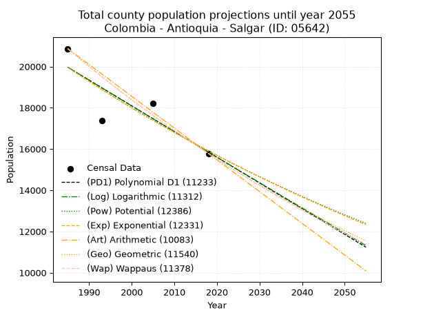
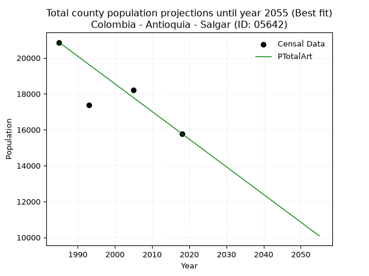
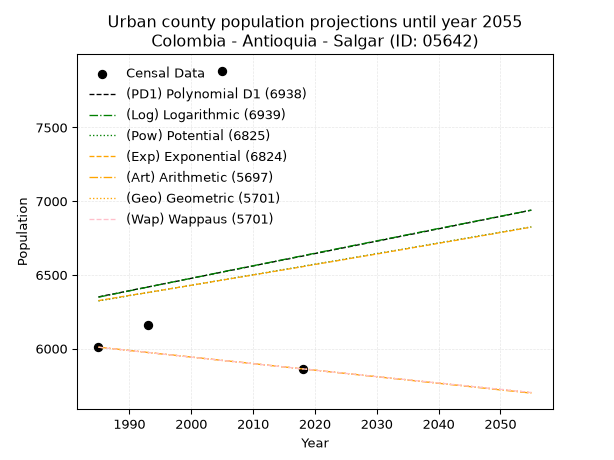
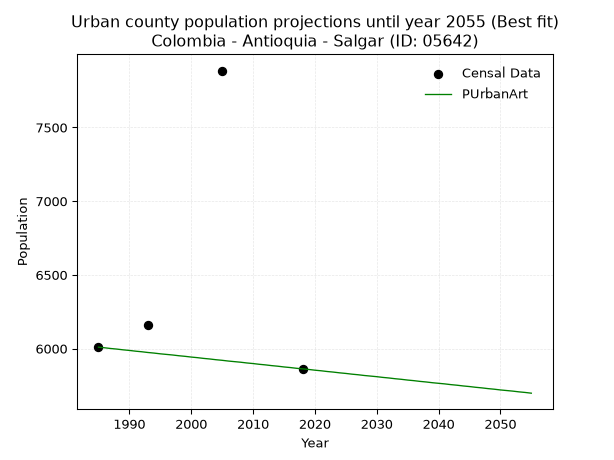
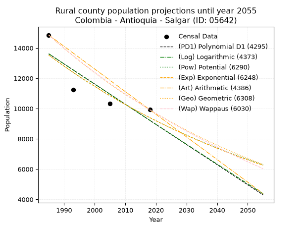
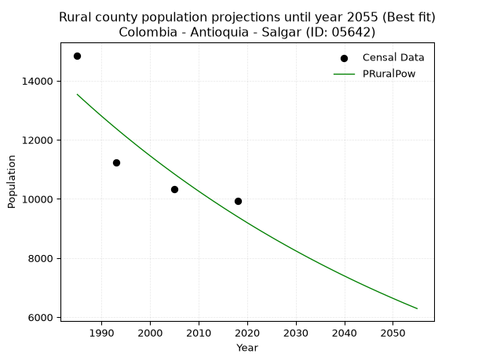

<div align="center">


</div>

# 📜 _“Population and Public Services Demand Projections (PPSD) until Year 2050 for Colombia - Antioquia - Salgar (ID: 05642)”_
Keywords: `population` `public-service` `projection` `lineal` `polynomial` `logarithmic` `potential` `exponential` `arithmetic` `geometric` `wappaus` `dane` `colombia` `south-america`

PPSD are analytical estimates used by governments and planners to anticipate future changes in population size, age distribution, and the resulting community needs for utilities, healthcare, education, and infrastructure as sizing future water treatment facilities, electrical grids, and road networks based on spatial growth.

<div align="center">

</img>

</div>


> **General running parameters**: • app_version: _v20260806_. • Python version: _3.14.7_. • Pandas version: _3.0.5_. • NumPy version: _2.5.1_. • Creates, save and include plots into reports (create_plot): _False_. • Projection until year: _2050_. • Process polynomial degree 2 and up: _False_. • Process Wappaus: _True_. • Process Wappaus: _True_. • Set negative values to zero: _True_. • Set infinite values to zero: _True_. • Drop dataset notes: _True_. 
<div align="center">

Dynamic map: [:earth_americas:Google](http://maps.google.com/maps?q=5.964198193,-75.9768066) [:earth_americas:OSM](https://www.openstreetmap.org/#map=18/5.964198193/-75.9768066&layers=P) [:earth_americas:Bing](https://www.bing.com/maps?cp=5.964198193~-75.9768066&lvl=18) [:earth_americas:Apple](https://maps.apple.com/frame?center=5.964198193%2C-75.9768066&span=0.003%2C0.006)

</div>


<div align="center">

```geojson
{
  "type": "Feature",
  "geometry": {
    "type": "Point", 
    "coordinates": [-75.9768066, 5.964198193]
  }, 
  "properties": {
    "Name": "Colombia - Antioquia - Salgar (ID: 05642)"
  }
}
```

</div>


## 0. Census Data (4 records)

Census data are official statistics collected by a government about the people and housing in a country. They usually include counts of total population, age, sex, race, income, education, and jobs.

📅Global census file: [Population.xlsx](../data/Population.xlsx)

| Source   |   Year |   CountryID | CountryName   |   StateID | StateName   |   CountyID | CountyName   |   PTotal |   PUrban |   PRural |
|:---------|-------:|------------:|:--------------|----------:|:------------|-----------:|:-------------|---------:|---------:|---------:|
| DANE     |   1985 |          57 | Colombia      |        05 | Antioquia   |      05642 | Salgar       |    20865 |     6009 |    14856 |
| DANE     |   1993 |          57 | Colombia      |        05 | Antioquia   |      05642 | Salgar       |    17391 |     6157 |    11234 |
| DANE     |   2005 |          57 | Colombia      |        05 | Antioquia   |      05642 | Salgar       |    18206 |     7885 |    10321 |
| DANE     |   2018 |          57 | Colombia      |        05 | Antioquia   |      05642 | Salgar       |    15782 |     5862 |     9920 |

> 🔥Some records could had specific notes about the registered values or the corresponding urban or rural distribution.

📅[SUI-RUPS](https://www.datos.gov.co/Hacienda-y-Cr-dito-P-blico/Registro-nico-de-Prestadores-de-Servicios-P-blicos/4qkq-csdn/about_data) - Local public utility companies: [RUPS.csv](../data/RUPS.xlsx)

 | SERVICIO       | ESTADO    | NOMBRE                                                                                                       | NIT         | DEPARTAMENTO_DOMICILIO   | MUNICIPIO_DOMICILIO   | DIRECCION                    |   TELEFONO | EMAIL                                    | TIPO_PRESTADOR                             | CLASIFICACION                 |
|:---------------|:----------|:-------------------------------------------------------------------------------------------------------------|:------------|:-------------------------|:----------------------|:-----------------------------|-----------:|:-----------------------------------------|:-------------------------------------------|:------------------------------|
| ACUEDUCTO      | OPERATIVA | ASOCIACION DE USUARIOS DEL ACUEDUCTO DEL CORREGIMIENTO EL CONCILIO DEL MUNICIPIO DE SALGAR                   | 811029106-0 | ANTIOQUIA                | SALGAR                | CALLE CALDAS 31A - 57 SALGAR |    8443141 | orlandoromero@hotmail.com.ar             | ORGANIZACION AUTORIZADA                    | HASTA 2500 SUSCRIPTORES       |
| ACUEDUCTO      | OPERATIVA | ACUEDUCTO LA CAMARA                                                                                          | 811029109-2 | ANTIOQUIA                | SALGAR                | vereda la camara             |    3136735 | acueductolacamara@gmail.com              | ORGANIZACION AUTORIZADA                    | HASTA 2500 SUSCRIPTORES       |
| ACUEDUCTO      | OPERATIVA | ASOCIACION DE USUARIOS DEL ACUEDUCTO DE LA VEREDA LA MONTANITA MUNICIPIO DE SALGAR DEPARTAMENTO DE ANTIOQUIA | 811032785-2 | ANTIOQUIA                | SALGAR                | PALACIO MUNICIPAL            |    4380854 | acumontanita@gmail.com                   | ORGANIZACION AUTORIZADA                    | HASTA 2500 SUSCRIPTORES       |
| ACUEDUCTO      | OPERATIVA | EMPRESAS PUBLICAS DE SALGAR  S.A. E.S.P.                                                                     | 811042944-1 | ANTIOQUIA                | SALGAR                | Calle 30 # 32-34             |    8442476 | gerencia@empresaspublicasdesalgar.gov.co | SOCIEDADES (EMPRESA DE SERVICIOS PUBLICOS) | MENOR O IGUAL A 2500 USUARIOS |
| ALCANTARILLADO | OPERATIVA | EMPRESAS PUBLICAS DE SALGAR  S.A. E.S.P.                                                                     | 811042944-1 | ANTIOQUIA                | SALGAR                | Calle 30 # 32-34             |    8442476 | gerencia@empresaspublicasdesalgar.gov.co | SOCIEDADES (EMPRESA DE SERVICIOS PUBLICOS) | MENOR O IGUAL A 2500 USUARIOS |

## 1. Total

### 1.1. Coefficients and Parameters

* (PD1) Polynomial Deg 1: -124.71617824166862, 267524.53552789765 (lineal)
* (Log) Logarithmic: -249734.25591923893, 1916293.0804868655
* (Pow) Potential: -13.770058610414909, 49.710537635570056
* (Exp) Exponential: -0.006877577482056565, 16945894664.93847
* (Art) Arithmetic: Year diff. 2018 - 1985 = 33, Population diff. 15782 - 20865 = -5083, Annual growth = -154.03030303030303
* (Geo) Geometric: Year diff. 2018 - 1985 = 33, Population diff. 15782 - 20865 = -5083, Annual growth % = -0.008425007922235328
* (Wap) Wappaus: i = -0.8406161651993507, Condition values only valid for < 200)

<sub>
Wappaus condition values: ['-0.00', '-0.84', '-1.68', '-2.52', '-3.36', '-4.20', '-5.04', '-5.88', '-6.72', '-7.57', '-8.41', '-9.25', '-10.09', '-10.93', '-11.77', '-12.61', '-13.45', '-14.29', '-15.13', '-15.97', '-16.81', '-17.65', '-18.49', '-19.33', '-20.17', '-21.02', '-21.86', '-22.70', '-23.54', '-24.38', '-25.22', '-26.06', '-26.90', '-27.74', '-28.58', '-29.42', '-30.26', '-31.10', '-31.94', '-32.78', '-33.62', '-34.47', '-35.31', '-36.15', '-36.99', '-37.83', '-38.67', '-39.51', '-40.35', '-41.19', '-42.03', '-42.87', '-43.71', '-44.55', '-45.39', '-46.23', '-47.07', '-47.92', '-48.76', '-49.60', '-50.44', '-51.28', '-52.12', '-52.96', '-53.80', '-54.64']
</sub>


### 1.2. Projected Dataset

|   Year |   CountyID |   PTotalPD1 |   PTotalLog |   PTotalPow |   PTotalExp |   PTotalArt |   PTotalGeo |   PTotalWap |
|-------:|-----------:|------------:|------------:|------------:|------------:|------------:|------------:|------------:|
|   1985 |      05642 |       19963 |       19967 |       19961 |       19956 |       20865 |       20865 |       20865 |
|   1986 |      05642 |       19838 |       19842 |       19823 |       19820 |       20711 |       20689 |       20690 |
|   1987 |      05642 |       19713 |       19716 |       19686 |       19684 |       20557 |       20515 |       20517 |
|   1988 |      05642 |       19589 |       19590 |       19550 |       19549 |       20403 |       20342 |       20345 |
|   1989 |      05642 |       19464 |       19465 |       19415 |       19415 |       20249 |       20171 |       20175 |
|   1990 |      05642 |       19339 |       19339 |       19281 |       19282 |       20095 |       20001 |       20006 |
|   1991 |      05642 |       19215 |       19214 |       19148 |       19150 |       19941 |       19832 |       19839 |
|   1992 |      05642 |       19090 |       19088 |       19016 |       19018 |       19787 |       19665 |       19672 |
|   1993 |      05642 |       18965 |       18963 |       18886 |       18888 |       19633 |       19499 |       19507 |
|   1994 |      05642 |       18840 |       18838 |       18756 |       18758 |       19479 |       19335 |       19344 |
|   1995 |      05642 |       18716 |       18712 |       18626 |       18630 |       19325 |       19172 |       19182 |
|   1996 |      05642 |       18591 |       18587 |       18498 |       18502 |       19171 |       19011 |       19021 |
|   1997 |      05642 |       18466 |       18462 |       18371 |       18375 |       19017 |       18851 |       18861 |
|   1998 |      05642 |       18342 |       18337 |       18245 |       18249 |       18863 |       18692 |       18703 |
|   1999 |      05642 |       18217 |       18212 |       18120 |       18124 |       18709 |       18534 |       18546 |
|   2000 |      05642 |       18092 |       18087 |       17995 |       18000 |       18555 |       18378 |       18390 |
|   2001 |      05642 |       17967 |       17963 |       17872 |       17877 |       18401 |       18223 |       18236 |
|   2002 |      05642 |       17843 |       17838 |       17749 |       17754 |       18246 |       18070 |       18082 |
|   2003 |      05642 |       17718 |       17713 |       17628 |       17633 |       18092 |       17918 |       17930 |
|   2004 |      05642 |       17593 |       17588 |       17507 |       17512 |       17938 |       17767 |       17779 |
|   2005 |      05642 |       17469 |       17464 |       17387 |       17392 |       17784 |       17617 |       17629 |
|   2006 |      05642 |       17344 |       17339 |       17268 |       17273 |       17630 |       17468 |       17480 |
|   2007 |      05642 |       17219 |       17215 |       17150 |       17154 |       17476 |       17321 |       17333 |
|   2008 |      05642 |       17094 |       17090 |       17033 |       17037 |       17322 |       17175 |       17187 |
|   2009 |      05642 |       16970 |       16966 |       16916 |       16920 |       17168 |       17031 |       17041 |
|   2010 |      05642 |       16845 |       16842 |       16801 |       16804 |       17014 |       16887 |       16897 |
|   2011 |      05642 |       16720 |       16718 |       16686 |       16689 |       16860 |       16745 |       16754 |
|   2012 |      05642 |       16596 |       16593 |       16572 |       16574 |       16706 |       16604 |       16612 |
|   2013 |      05642 |       16471 |       16469 |       16459 |       16461 |       16552 |       16464 |       16471 |
|   2014 |      05642 |       16346 |       16345 |       16347 |       16348 |       16398 |       16325 |       16331 |
|   2015 |      05642 |       16221 |       16221 |       16236 |       16236 |       16244 |       16188 |       16192 |
|   2016 |      05642 |       16097 |       16097 |       16125 |       16125 |       16090 |       16051 |       16055 |
|   2017 |      05642 |       15972 |       15974 |       16016 |       16014 |       15936 |       15916 |       15918 |
|   2018 |      05642 |       15847 |       15850 |       15907 |       15904 |       15782 |       15782 |       15782 |
|   2019 |      05642 |       15723 |       15726 |       15799 |       15795 |       15628 |       15649 |       15647 |
|   2020 |      05642 |       15598 |       15602 |       15691 |       15687 |       15474 |       15517 |       15513 |
|   2021 |      05642 |       15473 |       15479 |       15585 |       15579 |       15320 |       15386 |       15381 |
|   2022 |      05642 |       15348 |       15355 |       15479 |       15473 |       15166 |       15257 |       15249 |
|   2023 |      05642 |       15224 |       15232 |       15374 |       15367 |       15012 |       15128 |       15118 |
|   2024 |      05642 |       15099 |       15108 |       15270 |       15261 |       14858 |       15001 |       14988 |
|   2025 |      05642 |       14974 |       14985 |       15166 |       15157 |       14704 |       14874 |       14859 |
|   2026 |      05642 |       14850 |       14862 |       15063 |       15053 |       14550 |       14749 |       14731 |
|   2027 |      05642 |       14725 |       14739 |       14961 |       14950 |       14396 |       14625 |       14604 |
|   2028 |      05642 |       14600 |       14615 |       14860 |       14847 |       14242 |       14502 |       14477 |
|   2029 |      05642 |       14475 |       14492 |       14759 |       14745 |       14088 |       14379 |       14352 |
|   2030 |      05642 |       14351 |       14369 |       14660 |       14644 |       13934 |       14258 |       14228 |
|   2031 |      05642 |       14226 |       14246 |       14561 |       14544 |       13780 |       14138 |       14104 |
|   2032 |      05642 |       14101 |       14123 |       14462 |       14444 |       13626 |       14019 |       13981 |
|   2033 |      05642 |       13977 |       14000 |       14365 |       14345 |       13472 |       13901 |       13859 |
|   2034 |      05642 |       13852 |       13878 |       14268 |       14247 |       13318 |       13784 |       13738 |
|   2035 |      05642 |       13727 |       13755 |       14171 |       14149 |       13163 |       13668 |       13618 |
|   2036 |      05642 |       13602 |       13632 |       14076 |       14052 |       13009 |       13553 |       13499 |
|   2037 |      05642 |       13478 |       13509 |       13981 |       13956 |       12855 |       13438 |       13380 |
|   2038 |      05642 |       13353 |       13387 |       13887 |       13860 |       12701 |       13325 |       13263 |
|   2039 |      05642 |       13228 |       13264 |       13793 |       13765 |       12547 |       13213 |       13146 |
|   2040 |      05642 |       13104 |       13142 |       13700 |       13671 |       12393 |       13102 |       13030 |
|   2041 |      05642 |       12979 |       13020 |       13608 |       13577 |       12239 |       12991 |       12914 |
|   2042 |      05642 |       12854 |       12897 |       13517 |       13484 |       12085 |       12882 |       12800 |
|   2043 |      05642 |       12729 |       12775 |       13426 |       13392 |       11931 |       12773 |       12686 |
|   2044 |      05642 |       12605 |       12653 |       13336 |       13300 |       11777 |       12666 |       12573 |
|   2045 |      05642 |       12480 |       12531 |       13246 |       13209 |       11623 |       12559 |       12461 |
|   2046 |      05642 |       12355 |       12409 |       13157 |       13118 |       11469 |       12453 |       12349 |
|   2047 |      05642 |       12231 |       12287 |       13069 |       13028 |       11315 |       12348 |       12239 |
|   2048 |      05642 |       12106 |       12165 |       12982 |       12939 |       11161 |       12244 |       12129 |
|   2049 |      05642 |       11981 |       12043 |       12895 |       12850 |       11007 |       12141 |       12019 |
|   2050 |      05642 |       11856 |       11921 |       12808 |       12762 |       10853 |       12039 |       11911 |
<div align="center">

</img>

</div>


### 1.3. Best fit with absolute and relative error (%)

Relative error puts that difference into context by dividing the absolute error by the true value, creating a unitless ratio or percentage that shows the scale of the mistake.

Absolute and relative error

|   Year | Source   |   CountryID | CountryName   |   StateID | StateName   |   CountyID_x | CountyName   |   PTotal |   PUrban |   PRural |   CountyID_y |   PTotalPD1 |   PTotalLog |   PTotalPow |   PTotalExp |   PTotalArt |   PTotalGeo |   PTotalWap |   PTotalPD1AbsError |   PTotalLogAbsError |   PTotalPowAbsError |   PTotalExpAbsError |   PTotalArtAbsError |   PTotalGeoAbsError |   PTotalWapAbsError |   PTotalPD1RelError |   PTotalLogRelError |   PTotalPowRelError |   PTotalExpRelError |   PTotalArtRelError |   PTotalGeoRelError |   PTotalWapRelError |
|-------:|:---------|------------:|:--------------|----------:|:------------|-------------:|:-------------|---------:|---------:|---------:|-------------:|------------:|------------:|------------:|------------:|------------:|------------:|------------:|--------------------:|--------------------:|--------------------:|--------------------:|--------------------:|--------------------:|--------------------:|--------------------:|--------------------:|--------------------:|--------------------:|--------------------:|--------------------:|--------------------:|
|   1985 | DANE     |          57 | Colombia      |        05 | Antioquia   |        05642 | Salgar       |    20865 |     6009 |    14856 |        05642 |       19963 |       19967 |       19961 |       19956 |       20865 |       20865 |       20865 |                 902 |                 898 |                 904 |                 909 |                   0 |                   0 |                   0 |            4.32303  |            4.30386  |            4.33261  |            4.35658  |             0       |              0      |             0       |
|   1993 | DANE     |          57 | Colombia      |        05 | Antioquia   |        05642 | Salgar       |    17391 |     6157 |    11234 |        05642 |       18965 |       18963 |       18886 |       18888 |       19633 |       19499 |       19507 |                1574 |                1572 |                1495 |                1497 |                2242 |                2108 |                2116 |            9.05066  |            9.03916  |            8.5964   |            8.6079   |            12.8917  |             12.1212 |            12.1672  |
|   2005 | DANE     |          57 | Colombia      |        05 | Antioquia   |        05642 | Salgar       |    18206 |     7885 |    10321 |        05642 |       17469 |       17464 |       17387 |       17392 |       17784 |       17617 |       17629 |                 737 |                 742 |                 819 |                 814 |                 422 |                 589 |                 577 |            4.04812  |            4.07558  |            4.49852  |            4.47105  |             2.31792 |              3.2352 |             3.16928 |
|   2018 | DANE     |          57 | Colombia      |        05 | Antioquia   |        05642 | Salgar       |    15782 |     5862 |     9920 |        05642 |       15847 |       15850 |       15907 |       15904 |       15782 |       15782 |       15782 |                  65 |                  68 |                 125 |                 122 |                   0 |                   0 |                   0 |            0.411862 |            0.430871 |            0.792042 |            0.773033 |             0       |              0      |             0       |

Relative error mean

| Method    |   RelError | Best   |
|:----------|-----------:|:-------|
| PTotalPD1 |    4.45842 |        |
| PTotalLog |    4.46237 |        |
| PTotalPow |    4.55489 |        |
| PTotalExp |    4.55214 |        |
| PTotalArt |    3.80241 | True   |
| PTotalGeo |    3.8391  |        |
| PTotalWap |    3.83412 |        |

💙Best method: _**PTotalArt**_
<div align="center">

</img>

</div>


### 1.4. Fresh water supply demand in liters per capita per day (lpcd)

The fresh water supply demand typically ranges from 100 to 300 liters per capita per day (lpcd) for standard domestic and municipal planning, though absolute survival minimums set by the World Health Organization are as low as 7.5 to 20 liters per day, and total consumption in high-income nations can exceed 400 liters.

> `CZ`: Level in meters above the sea level (masl)<br> `WS`: Fresh water supply demand in liters per capita per day (lpcd or l/h/d)<br> `WSAll`: Zonal fresh water supply demand in liters per second (l/s)<br> `A`: Zonal area in square meters<br> `DP`: Population density (people/hectare or p/ha)

Reference values (RAS Colombia)

|    CZ |   WS |
|------:|-----:|
|  1000 |  120 |
|  2000 |  130 |
| 99999 |  140 |

County shapefile geometry properties and water supply values

|   CountyID |      ATotal |   CZTotal |   WSTotal |
|-----------:|------------:|----------:|----------:|
|      05642 | 2.88239e+08 |   1720.97 |       130 |

Projected values for best method: PTotalArt

|   CountyID |   Year |   PTotalArt |   DPTotal |   WSTotal |   WSTotalAll |
|-----------:|-------:|------------:|----------:|----------:|-------------:|
|      05642 |   1985 |       20865 |      0.72 |       130 |      31.3941 |
|      05642 |   1986 |       20711 |      0.72 |       130 |      31.1624 |
|      05642 |   1987 |       20557 |      0.71 |       130 |      30.9307 |
|      05642 |   1988 |       20403 |      0.71 |       130 |      30.699  |
|      05642 |   1989 |       20249 |      0.7  |       130 |      30.4672 |
|      05642 |   1990 |       20095 |      0.7  |       130 |      30.2355 |
|      05642 |   1991 |       19941 |      0.69 |       130 |      30.0038 |
|      05642 |   1992 |       19787 |      0.69 |       130 |      29.7721 |
|      05642 |   1993 |       19633 |      0.68 |       130 |      29.5404 |
|      05642 |   1994 |       19479 |      0.68 |       130 |      29.3087 |
|      05642 |   1995 |       19325 |      0.67 |       130 |      29.077  |
|      05642 |   1996 |       19171 |      0.67 |       130 |      28.8453 |
|      05642 |   1997 |       19017 |      0.66 |       130 |      28.6135 |
|      05642 |   1998 |       18863 |      0.65 |       130 |      28.3818 |
|      05642 |   1999 |       18709 |      0.65 |       130 |      28.1501 |
|      05642 |   2000 |       18555 |      0.64 |       130 |      27.9184 |
|      05642 |   2001 |       18401 |      0.64 |       130 |      27.6867 |
|      05642 |   2002 |       18246 |      0.63 |       130 |      27.4535 |
|      05642 |   2003 |       18092 |      0.63 |       130 |      27.2218 |
|      05642 |   2004 |       17938 |      0.62 |       130 |      26.99   |
|      05642 |   2005 |       17784 |      0.62 |       130 |      26.7583 |
|      05642 |   2006 |       17630 |      0.61 |       130 |      26.5266 |
|      05642 |   2007 |       17476 |      0.61 |       130 |      26.2949 |
|      05642 |   2008 |       17322 |      0.6  |       130 |      26.0632 |
|      05642 |   2009 |       17168 |      0.6  |       130 |      25.8315 |
|      05642 |   2010 |       17014 |      0.59 |       130 |      25.5998 |
|      05642 |   2011 |       16860 |      0.58 |       130 |      25.3681 |
|      05642 |   2012 |       16706 |      0.58 |       130 |      25.1363 |
|      05642 |   2013 |       16552 |      0.57 |       130 |      24.9046 |
|      05642 |   2014 |       16398 |      0.57 |       130 |      24.6729 |
|      05642 |   2015 |       16244 |      0.56 |       130 |      24.4412 |
|      05642 |   2016 |       16090 |      0.56 |       130 |      24.2095 |
|      05642 |   2017 |       15936 |      0.55 |       130 |      23.9778 |
|      05642 |   2018 |       15782 |      0.55 |       130 |      23.7461 |
|      05642 |   2019 |       15628 |      0.54 |       130 |      23.5144 |
|      05642 |   2020 |       15474 |      0.54 |       130 |      23.2826 |
|      05642 |   2021 |       15320 |      0.53 |       130 |      23.0509 |
|      05642 |   2022 |       15166 |      0.53 |       130 |      22.8192 |
|      05642 |   2023 |       15012 |      0.52 |       130 |      22.5875 |
|      05642 |   2024 |       14858 |      0.52 |       130 |      22.3558 |
|      05642 |   2025 |       14704 |      0.51 |       130 |      22.1241 |
|      05642 |   2026 |       14550 |      0.5  |       130 |      21.8924 |
|      05642 |   2027 |       14396 |      0.5  |       130 |      21.6606 |
|      05642 |   2028 |       14242 |      0.49 |       130 |      21.4289 |
|      05642 |   2029 |       14088 |      0.49 |       130 |      21.1972 |
|      05642 |   2030 |       13934 |      0.48 |       130 |      20.9655 |
|      05642 |   2031 |       13780 |      0.48 |       130 |      20.7338 |
|      05642 |   2032 |       13626 |      0.47 |       130 |      20.5021 |
|      05642 |   2033 |       13472 |      0.47 |       130 |      20.2704 |
|      05642 |   2034 |       13318 |      0.46 |       130 |      20.0387 |
|      05642 |   2035 |       13163 |      0.46 |       130 |      19.8054 |
|      05642 |   2036 |       13009 |      0.45 |       130 |      19.5737 |
|      05642 |   2037 |       12855 |      0.45 |       130 |      19.342  |
|      05642 |   2038 |       12701 |      0.44 |       130 |      19.1103 |
|      05642 |   2039 |       12547 |      0.44 |       130 |      18.8786 |
|      05642 |   2040 |       12393 |      0.43 |       130 |      18.6469 |
|      05642 |   2041 |       12239 |      0.42 |       130 |      18.4152 |
|      05642 |   2042 |       12085 |      0.42 |       130 |      18.1834 |
|      05642 |   2043 |       11931 |      0.41 |       130 |      17.9517 |
|      05642 |   2044 |       11777 |      0.41 |       130 |      17.72   |
|      05642 |   2045 |       11623 |      0.4  |       130 |      17.4883 |
|      05642 |   2046 |       11469 |      0.4  |       130 |      17.2566 |
|      05642 |   2047 |       11315 |      0.39 |       130 |      17.0249 |
|      05642 |   2048 |       11161 |      0.39 |       130 |      16.7932 |
|      05642 |   2049 |       11007 |      0.38 |       130 |      16.5615 |
|      05642 |   2050 |       10853 |      0.38 |       130 |      16.3297 |

## 2. Urban

### 2.1. Coefficients and Parameters

* (PD1) Polynomial Deg 1: 8.396226415095482, -10316.301886794738 (lineal)
* (Log) Logarithmic: 17049.174194029667, -123112.65967232714
* (Pow) Potential: 2.2038803366932505, -3.4669214101163286
* (Exp) Exponential: 0.0010832088285753069, 736.6715119431987
* (Art) Arithmetic: Year diff. 2018 - 1985 = 33, Population diff. 5862 - 6009 = -147, Annual growth = -4.454545454545454
* (Geo) Geometric: Year diff. 2018 - 1985 = 33, Population diff. 5862 - 6009 = -147, Annual growth % = -0.0007502488183622757
* (Wap) Wappaus: i = -0.07504920317657239, Condition values only valid for < 200)

<sub>
Wappaus condition values: ['-0.00', '-0.08', '-0.15', '-0.23', '-0.30', '-0.38', '-0.45', '-0.53', '-0.60', '-0.68', '-0.75', '-0.83', '-0.90', '-0.98', '-1.05', '-1.13', '-1.20', '-1.28', '-1.35', '-1.43', '-1.50', '-1.58', '-1.65', '-1.73', '-1.80', '-1.88', '-1.95', '-2.03', '-2.10', '-2.18', '-2.25', '-2.33', '-2.40', '-2.48', '-2.55', '-2.63', '-2.70', '-2.78', '-2.85', '-2.93', '-3.00', '-3.08', '-3.15', '-3.23', '-3.30', '-3.38', '-3.45', '-3.53', '-3.60', '-3.68', '-3.75', '-3.83', '-3.90', '-3.98', '-4.05', '-4.13', '-4.20', '-4.28', '-4.35', '-4.43', '-4.50', '-4.58', '-4.65', '-4.73', '-4.80', '-4.88']
</sub>


### 2.2. Projected Dataset

|   Year |   CountyID |   PUrbanPD1 |   PUrbanLog |   PUrbanPow |   PUrbanExp |   PUrbanArt |   PUrbanGeo |   PUrbanWap |
|-------:|-----------:|------------:|------------:|------------:|------------:|------------:|------------:|------------:|
|   1985 |      05642 |        6350 |        6348 |        6323 |        6325 |        6009 |        6009 |        6009 |
|   1986 |      05642 |        6359 |        6357 |        6330 |        6332 |        6005 |        6004 |        6004 |
|   1987 |      05642 |        6367 |        6365 |        6337 |        6339 |        6000 |        6000 |        6000 |
|   1988 |      05642 |        6375 |        6374 |        6344 |        6346 |        5996 |        5995 |        5995 |
|   1989 |      05642 |        6384 |        6382 |        6351 |        6353 |        5991 |        5991 |        5991 |
|   1990 |      05642 |        6392 |        6391 |        6359 |        6360 |        5987 |        5986 |        5986 |
|   1991 |      05642 |        6401 |        6400 |        6366 |        6367 |        5982 |        5982 |        5982 |
|   1992 |      05642 |        6409 |        6408 |        6373 |        6373 |        5978 |        5978 |        5978 |
|   1993 |      05642 |        6417 |        6417 |        6380 |        6380 |        5973 |        5973 |        5973 |
|   1994 |      05642 |        6426 |        6425 |        6387 |        6387 |        5969 |        5969 |        5969 |
|   1995 |      05642 |        6434 |        6434 |        6394 |        6394 |        5964 |        5964 |        5964 |
|   1996 |      05642 |        6443 |        6442 |        6401 |        6401 |        5960 |        5960 |        5960 |
|   1997 |      05642 |        6451 |        6451 |        6408 |        6408 |        5956 |        5955 |        5955 |
|   1998 |      05642 |        6459 |        6459 |        6415 |        6415 |        5951 |        5951 |        5951 |
|   1999 |      05642 |        6468 |        6468 |        6422 |        6422 |        5947 |        5946 |        5946 |
|   2000 |      05642 |        6476 |        6476 |        6429 |        6429 |        5942 |        5942 |        5942 |
|   2001 |      05642 |        6485 |        6485 |        6436 |        6436 |        5938 |        5937 |        5937 |
|   2002 |      05642 |        6493 |        6493 |        6443 |        6443 |        5933 |        5933 |        5933 |
|   2003 |      05642 |        6501 |        6502 |        6450 |        6450 |        5929 |        5928 |        5928 |
|   2004 |      05642 |        6510 |        6511 |        6458 |        6457 |        5924 |        5924 |        5924 |
|   2005 |      05642 |        6518 |        6519 |        6465 |        6464 |        5920 |        5919 |        5919 |
|   2006 |      05642 |        6527 |        6528 |        6472 |        6471 |        5915 |        5915 |        5915 |
|   2007 |      05642 |        6535 |        6536 |        6479 |        6478 |        5911 |        5911 |        5911 |
|   2008 |      05642 |        6543 |        6545 |        6486 |        6485 |        5907 |        5906 |        5906 |
|   2009 |      05642 |        6552 |        6553 |        6493 |        6492 |        5902 |        5902 |        5902 |
|   2010 |      05642 |        6560 |        6561 |        6500 |        6499 |        5898 |        5897 |        5897 |
|   2011 |      05642 |        6569 |        6570 |        6507 |        6506 |        5893 |        5893 |        5893 |
|   2012 |      05642 |        6577 |        6578 |        6514 |        6513 |        5889 |        5888 |        5888 |
|   2013 |      05642 |        6585 |        6587 |        6522 |        6520 |        5884 |        5884 |        5884 |
|   2014 |      05642 |        6594 |        6595 |        6529 |        6527 |        5880 |        5880 |        5880 |
|   2015 |      05642 |        6602 |        6604 |        6536 |        6534 |        5875 |        5875 |        5875 |
|   2016 |      05642 |        6610 |        6612 |        6543 |        6541 |        5871 |        5871 |        5871 |
|   2017 |      05642 |        6619 |        6621 |        6550 |        6548 |        5866 |        5866 |        5866 |
|   2018 |      05642 |        6627 |        6629 |        6557 |        6555 |        5862 |        5862 |        5862 |
|   2019 |      05642 |        6636 |        6638 |        6565 |        6563 |        5858 |        5858 |        5858 |
|   2020 |      05642 |        6644 |        6646 |        6572 |        6570 |        5853 |        5853 |        5853 |
|   2021 |      05642 |        6652 |        6655 |        6579 |        6577 |        5849 |        5849 |        5849 |
|   2022 |      05642 |        6661 |        6663 |        6586 |        6584 |        5844 |        5844 |        5844 |
|   2023 |      05642 |        6669 |        6671 |        6593 |        6591 |        5840 |        5840 |        5840 |
|   2024 |      05642 |        6678 |        6680 |        6600 |        6598 |        5835 |        5836 |        5836 |
|   2025 |      05642 |        6686 |        6688 |        6608 |        6605 |        5831 |        5831 |        5831 |
|   2026 |      05642 |        6694 |        6697 |        6615 |        6613 |        5826 |        5827 |        5827 |
|   2027 |      05642 |        6703 |        6705 |        6622 |        6620 |        5822 |        5823 |        5823 |
|   2028 |      05642 |        6711 |        6713 |        6629 |        6627 |        5817 |        5818 |        5818 |
|   2029 |      05642 |        6720 |        6722 |        6636 |        6634 |        5813 |        5814 |        5814 |
|   2030 |      05642 |        6728 |        6730 |        6644 |        6641 |        5809 |        5809 |        5809 |
|   2031 |      05642 |        6736 |        6739 |        6651 |        6648 |        5804 |        5805 |        5805 |
|   2032 |      05642 |        6745 |        6747 |        6658 |        6656 |        5800 |        5801 |        5801 |
|   2033 |      05642 |        6753 |        6755 |        6665 |        6663 |        5795 |        5796 |        5796 |
|   2034 |      05642 |        6762 |        6764 |        6672 |        6670 |        5791 |        5792 |        5792 |
|   2035 |      05642 |        6770 |        6772 |        6680 |        6677 |        5786 |        5788 |        5788 |
|   2036 |      05642 |        6778 |        6781 |        6687 |        6685 |        5782 |        5783 |        5783 |
|   2037 |      05642 |        6787 |        6789 |        6694 |        6692 |        5777 |        5779 |        5779 |
|   2038 |      05642 |        6795 |        6797 |        6701 |        6699 |        5773 |        5775 |        5775 |
|   2039 |      05642 |        6804 |        6806 |        6709 |        6706 |        5768 |        5770 |        5770 |
|   2040 |      05642 |        6812 |        6814 |        6716 |        6714 |        5764 |        5766 |        5766 |
|   2041 |      05642 |        6820 |        6822 |        6723 |        6721 |        5760 |        5762 |        5762 |
|   2042 |      05642 |        6829 |        6831 |        6730 |        6728 |        5755 |        5757 |        5757 |
|   2043 |      05642 |        6837 |        6839 |        6738 |        6735 |        5751 |        5753 |        5753 |
|   2044 |      05642 |        6846 |        6847 |        6745 |        6743 |        5746 |        5749 |        5749 |
|   2045 |      05642 |        6854 |        6856 |        6752 |        6750 |        5742 |        5744 |        5744 |
|   2046 |      05642 |        6862 |        6864 |        6760 |        6757 |        5737 |        5740 |        5740 |
|   2047 |      05642 |        6871 |        6872 |        6767 |        6765 |        5733 |        5736 |        5736 |
|   2048 |      05642 |        6879 |        6881 |        6774 |        6772 |        5728 |        5731 |        5731 |
|   2049 |      05642 |        6888 |        6889 |        6781 |        6779 |        5724 |        5727 |        5727 |
|   2050 |      05642 |        6896 |        6897 |        6789 |        6787 |        5719 |        5723 |        5723 |
<div align="center">

</img>

</div>


### 2.3. Best fit with absolute and relative error (%)

Relative error puts that difference into context by dividing the absolute error by the true value, creating a unitless ratio or percentage that shows the scale of the mistake.

Absolute and relative error

|   Year | Source   |   CountryID | CountryName   |   StateID | StateName   |   CountyID_x | CountyName   |   PTotal |   PUrban |   PRural |   CountyID_y |   PUrbanPD1 |   PUrbanLog |   PUrbanPow |   PUrbanExp |   PUrbanArt |   PUrbanGeo |   PUrbanWap |   PUrbanPD1AbsError |   PUrbanLogAbsError |   PUrbanPowAbsError |   PUrbanExpAbsError |   PUrbanArtAbsError |   PUrbanGeoAbsError |   PUrbanWapAbsError |   PUrbanPD1RelError |   PUrbanLogRelError |   PUrbanPowRelError |   PUrbanExpRelError |   PUrbanArtRelError |   PUrbanGeoRelError |   PUrbanWapRelError |
|-------:|:---------|------------:|:--------------|----------:|:------------|-------------:|:-------------|---------:|---------:|---------:|-------------:|------------:|------------:|------------:|------------:|------------:|------------:|------------:|--------------------:|--------------------:|--------------------:|--------------------:|--------------------:|--------------------:|--------------------:|--------------------:|--------------------:|--------------------:|--------------------:|--------------------:|--------------------:|--------------------:|
|   1985 | DANE     |          57 | Colombia      |        05 | Antioquia   |        05642 | Salgar       |    20865 |     6009 |    14856 |        05642 |        6350 |        6348 |        6323 |        6325 |        6009 |        6009 |        6009 |                 341 |                 339 |                 314 |                 316 |                   0 |                   0 |                   0 |             5.67482 |             5.64154 |             5.2255  |             5.25878 |             0       |             0       |             0       |
|   1993 | DANE     |          57 | Colombia      |        05 | Antioquia   |        05642 | Salgar       |    17391 |     6157 |    11234 |        05642 |        6417 |        6417 |        6380 |        6380 |        5973 |        5973 |        5973 |                 260 |                 260 |                 223 |                 223 |                 184 |                 184 |                 184 |             4.22284 |             4.22284 |             3.62189 |             3.62189 |             2.98847 |             2.98847 |             2.98847 |
|   2005 | DANE     |          57 | Colombia      |        05 | Antioquia   |        05642 | Salgar       |    18206 |     7885 |    10321 |        05642 |        6518 |        6519 |        6465 |        6464 |        5920 |        5919 |        5919 |                1367 |                1366 |                1420 |                1421 |                1965 |                1966 |                1966 |            17.3367  |            17.324   |            18.0089  |            18.0216  |            24.9207  |            24.9334  |            24.9334  |
|   2018 | DANE     |          57 | Colombia      |        05 | Antioquia   |        05642 | Salgar       |    15782 |     5862 |     9920 |        05642 |        6627 |        6629 |        6557 |        6555 |        5862 |        5862 |        5862 |                 765 |                 767 |                 695 |                 693 |                   0 |                   0 |                   0 |            13.0502  |            13.0843  |            11.856   |            11.8219  |             0       |             0       |             0       |

Relative error mean

| Method    |   RelError | Best   |
|:----------|-----------:|:-------|
| PUrbanPD1 |   10.0711  |        |
| PUrbanLog |   10.0682  |        |
| PUrbanPow |    9.67807 |        |
| PUrbanExp |    9.68103 |        |
| PUrbanArt |    6.9773  | True   |
| PUrbanGeo |    6.98047 |        |
| PUrbanWap |    6.98047 |        |

💙Best method: _**PUrbanArt**_
<div align="center">

</img>

</div>


### 2.4. Fresh water supply demand in liters per capita per day (lpcd)

The fresh water supply demand typically ranges from 100 to 300 liters per capita per day (lpcd) for standard domestic and municipal planning, though absolute survival minimums set by the World Health Organization are as low as 7.5 to 20 liters per day, and total consumption in high-income nations can exceed 400 liters.

> `CZ`: Level in meters above the sea level (masl)<br> `WS`: Fresh water supply demand in liters per capita per day (lpcd or l/h/d)<br> `WSAll`: Zonal fresh water supply demand in liters per second (l/s)<br> `A`: Zonal area in square meters<br> `DP`: Population density (people/hectare or p/ha)

Reference values (RAS Colombia)

|    CZ |   WS |
|------:|-----:|
|  1000 |  120 |
|  2000 |  130 |
| 99999 |  140 |

County shapefile geometry properties and water supply values

|   CountyID |   AUrban |   CZUrban |   WSUrban |
|-----------:|---------:|----------:|----------:|
|      05642 |   683680 |   1283.06 |       130 |

Projected values for best method: PUrbanArt

|   CountyID |   Year |   PUrbanArt |   DPUrban |   WSUrban |   WSUrbanAll |
|-----------:|-------:|------------:|----------:|----------:|-------------:|
|      05642 |   1985 |        6009 |     87.89 |       130 |      9.04132 |
|      05642 |   1986 |        6005 |     87.83 |       130 |      9.0353  |
|      05642 |   1987 |        6000 |     87.76 |       130 |      9.02778 |
|      05642 |   1988 |        5996 |     87.7  |       130 |      9.02176 |
|      05642 |   1989 |        5991 |     87.63 |       130 |      9.01424 |
|      05642 |   1990 |        5987 |     87.57 |       130 |      9.00822 |
|      05642 |   1991 |        5982 |     87.5  |       130 |      9.00069 |
|      05642 |   1992 |        5978 |     87.44 |       130 |      8.99468 |
|      05642 |   1993 |        5973 |     87.37 |       130 |      8.98715 |
|      05642 |   1994 |        5969 |     87.31 |       130 |      8.98113 |
|      05642 |   1995 |        5964 |     87.23 |       130 |      8.97361 |
|      05642 |   1996 |        5960 |     87.18 |       130 |      8.96759 |
|      05642 |   1997 |        5956 |     87.12 |       130 |      8.96157 |
|      05642 |   1998 |        5951 |     87.04 |       130 |      8.95405 |
|      05642 |   1999 |        5947 |     86.99 |       130 |      8.94803 |
|      05642 |   2000 |        5942 |     86.91 |       130 |      8.94051 |
|      05642 |   2001 |        5938 |     86.85 |       130 |      8.93449 |
|      05642 |   2002 |        5933 |     86.78 |       130 |      8.92697 |
|      05642 |   2003 |        5929 |     86.72 |       130 |      8.92095 |
|      05642 |   2004 |        5924 |     86.65 |       130 |      8.91343 |
|      05642 |   2005 |        5920 |     86.59 |       130 |      8.90741 |
|      05642 |   2006 |        5915 |     86.52 |       130 |      8.89988 |
|      05642 |   2007 |        5911 |     86.46 |       130 |      8.89387 |
|      05642 |   2008 |        5907 |     86.4  |       130 |      8.88785 |
|      05642 |   2009 |        5902 |     86.33 |       130 |      8.88032 |
|      05642 |   2010 |        5898 |     86.27 |       130 |      8.87431 |
|      05642 |   2011 |        5893 |     86.2  |       130 |      8.86678 |
|      05642 |   2012 |        5889 |     86.14 |       130 |      8.86076 |
|      05642 |   2013 |        5884 |     86.06 |       130 |      8.85324 |
|      05642 |   2014 |        5880 |     86.01 |       130 |      8.84722 |
|      05642 |   2015 |        5875 |     85.93 |       130 |      8.8397  |
|      05642 |   2016 |        5871 |     85.87 |       130 |      8.83368 |
|      05642 |   2017 |        5866 |     85.8  |       130 |      8.82616 |
|      05642 |   2018 |        5862 |     85.74 |       130 |      8.82014 |
|      05642 |   2019 |        5858 |     85.68 |       130 |      8.81412 |
|      05642 |   2020 |        5853 |     85.61 |       130 |      8.8066  |
|      05642 |   2021 |        5849 |     85.55 |       130 |      8.80058 |
|      05642 |   2022 |        5844 |     85.48 |       130 |      8.79306 |
|      05642 |   2023 |        5840 |     85.42 |       130 |      8.78704 |
|      05642 |   2024 |        5835 |     85.35 |       130 |      8.77951 |
|      05642 |   2025 |        5831 |     85.29 |       130 |      8.7735  |
|      05642 |   2026 |        5826 |     85.22 |       130 |      8.76597 |
|      05642 |   2027 |        5822 |     85.16 |       130 |      8.75995 |
|      05642 |   2028 |        5817 |     85.08 |       130 |      8.75243 |
|      05642 |   2029 |        5813 |     85.03 |       130 |      8.74641 |
|      05642 |   2030 |        5809 |     84.97 |       130 |      8.74039 |
|      05642 |   2031 |        5804 |     84.89 |       130 |      8.73287 |
|      05642 |   2032 |        5800 |     84.84 |       130 |      8.72685 |
|      05642 |   2033 |        5795 |     84.76 |       130 |      8.71933 |
|      05642 |   2034 |        5791 |     84.7  |       130 |      8.71331 |
|      05642 |   2035 |        5786 |     84.63 |       130 |      8.70579 |
|      05642 |   2036 |        5782 |     84.57 |       130 |      8.69977 |
|      05642 |   2037 |        5777 |     84.5  |       130 |      8.69225 |
|      05642 |   2038 |        5773 |     84.44 |       130 |      8.68623 |
|      05642 |   2039 |        5768 |     84.37 |       130 |      8.6787  |
|      05642 |   2040 |        5764 |     84.31 |       130 |      8.67269 |
|      05642 |   2041 |        5760 |     84.25 |       130 |      8.66667 |
|      05642 |   2042 |        5755 |     84.18 |       130 |      8.65914 |
|      05642 |   2043 |        5751 |     84.12 |       130 |      8.65312 |
|      05642 |   2044 |        5746 |     84.05 |       130 |      8.6456  |
|      05642 |   2045 |        5742 |     83.99 |       130 |      8.63958 |
|      05642 |   2046 |        5737 |     83.91 |       130 |      8.63206 |
|      05642 |   2047 |        5733 |     83.86 |       130 |      8.62604 |
|      05642 |   2048 |        5728 |     83.78 |       130 |      8.61852 |
|      05642 |   2049 |        5724 |     83.72 |       130 |      8.6125  |
|      05642 |   2050 |        5719 |     83.65 |       130 |      8.60498 |

## 3. Rural

### 3.1. Coefficients and Parameters

* (PD1) Polynomial Deg 1: -133.11240465676394, 277840.8374146921 (lineal)
* (Log) Logarithmic: -266783.4301132685, 2039405.7401591921
* (Pow) Potential: -22.11494524507924, 77.06127882885919
* (Exp) Exponential: -0.011035465815780018, 44121413635942.9
* (Art) Arithmetic: Year diff. 2018 - 1985 = 33, Population diff. 9920 - 14856 = -4936, Annual growth = -149.57575757575756
* (Geo) Geometric: Year diff. 2018 - 1985 = 33, Population diff. 9920 - 14856 = -4936, Annual growth % = -0.012163327509437716
* (Wap) Wappaus: i = -1.207424584886645, Condition values only valid for < 200)

<sub>
Wappaus condition values: ['-0.00', '-1.21', '-2.41', '-3.62', '-4.83', '-6.04', '-7.24', '-8.45', '-9.66', '-10.87', '-12.07', '-13.28', '-14.49', '-15.70', '-16.90', '-18.11', '-19.32', '-20.53', '-21.73', '-22.94', '-24.15', '-25.36', '-26.56', '-27.77', '-28.98', '-30.19', '-31.39', '-32.60', '-33.81', '-35.02', '-36.22', '-37.43', '-38.64', '-39.85', '-41.05', '-42.26', '-43.47', '-44.67', '-45.88', '-47.09', '-48.30', '-49.50', '-50.71', '-51.92', '-53.13', '-54.33', '-55.54', '-56.75', '-57.96', '-59.16', '-60.37', '-61.58', '-62.79', '-63.99', '-65.20', '-66.41', '-67.62', '-68.82', '-70.03', '-71.24', '-72.45', '-73.65', '-74.86', '-76.07', '-77.28', '-78.48']
</sub>


### 3.2. Projected Dataset

|   Year |   CountyID |   PRuralPD1 |   PRuralLog |   PRuralPow |   PRuralExp |   PRuralArt |   PRuralGeo |   PRuralWap |
|-------:|-----------:|------------:|------------:|------------:|------------:|------------:|------------:|------------:|
|   1985 |      05642 |       13613 |       13619 |       13536 |       13529 |       14856 |       14856 |       14856 |
|   1986 |      05642 |       13480 |       13485 |       13386 |       13380 |       14706 |       14675 |       14678 |
|   1987 |      05642 |       13346 |       13351 |       13238 |       13233 |       14557 |       14497 |       14502 |
|   1988 |      05642 |       13213 |       13216 |       13091 |       13088 |       14407 |       14320 |       14327 |
|   1989 |      05642 |       13080 |       13082 |       12946 |       12944 |       14258 |       14146 |       14155 |
|   1990 |      05642 |       12947 |       12948 |       12803 |       12802 |       14108 |       13974 |       13985 |
|   1991 |      05642 |       12814 |       12814 |       12662 |       12662 |       13959 |       13804 |       13817 |
|   1992 |      05642 |       12681 |       12680 |       12522 |       12523 |       13809 |       13636 |       13651 |
|   1993 |      05642 |       12548 |       12546 |       12384 |       12386 |       13659 |       13470 |       13487 |
|   1994 |      05642 |       12415 |       12412 |       12247 |       12250 |       13510 |       13307 |       13325 |
|   1995 |      05642 |       12282 |       12279 |       12112 |       12115 |       13360 |       13145 |       13164 |
|   1996 |      05642 |       12148 |       12145 |       11979 |       11982 |       13211 |       12985 |       13006 |
|   1997 |      05642 |       12015 |       12011 |       11847 |       11851 |       13061 |       12827 |       12849 |
|   1998 |      05642 |       11882 |       11878 |       11716 |       11721 |       12912 |       12671 |       12694 |
|   1999 |      05642 |       11749 |       11744 |       11587 |       11592 |       12762 |       12517 |       12540 |
|   2000 |      05642 |       11616 |       11611 |       11460 |       11465 |       12612 |       12365 |       12389 |
|   2001 |      05642 |       11483 |       11478 |       11334 |       11339 |       12463 |       12214 |       12239 |
|   2002 |      05642 |       11350 |       11344 |       11209 |       11215 |       12313 |       12066 |       12090 |
|   2003 |      05642 |       11217 |       11211 |       11086 |       11091 |       12164 |       11919 |       11944 |
|   2004 |      05642 |       11084 |       11078 |       10965 |       10970 |       12014 |       11774 |       11799 |
|   2005 |      05642 |       10950 |       10945 |       10844 |       10849 |       11864 |       11631 |       11655 |
|   2006 |      05642 |       10817 |       10812 |       10725 |       10730 |       11715 |       11489 |       11513 |
|   2007 |      05642 |       10684 |       10679 |       10608 |       10612 |       11565 |       11349 |       11372 |
|   2008 |      05642 |       10551 |       10546 |       10492 |       10496 |       11416 |       11211 |       11233 |
|   2009 |      05642 |       10418 |       10413 |       10377 |       10381 |       11266 |       11075 |       11096 |
|   2010 |      05642 |       10285 |       10280 |       10263 |       10267 |       11117 |       10940 |       10960 |
|   2011 |      05642 |       10152 |       10148 |       10151 |       10154 |       10967 |       10807 |       10825 |
|   2012 |      05642 |       10019 |       10015 |       10040 |       10043 |       10817 |       10676 |       10692 |
|   2013 |      05642 |        9886 |        9882 |        9930 |        9933 |       10668 |       10546 |       10560 |
|   2014 |      05642 |        9752 |        9750 |        9822 |        9824 |       10518 |       10418 |       10429 |
|   2015 |      05642 |        9619 |        9618 |        9714 |        9716 |       10369 |       10291 |       10300 |
|   2016 |      05642 |        9486 |        9485 |        9608 |        9609 |       10219 |       10166 |       10172 |
|   2017 |      05642 |        9353 |        9353 |        9504 |        9504 |       10070 |       10042 |       10045 |
|   2018 |      05642 |        9220 |        9221 |        9400 |        9399 |        9920 |        9920 |        9920 |
|   2019 |      05642 |        9087 |        9088 |        9298 |        9296 |        9770 |        9799 |        9796 |
|   2020 |      05642 |        8954 |        8956 |        9196 |        9194 |        9621 |        9680 |        9673 |
|   2021 |      05642 |        8821 |        8824 |        9096 |        9093 |        9471 |        9562 |        9551 |
|   2022 |      05642 |        8688 |        8692 |        8997 |        8993 |        9322 |        9446 |        9431 |
|   2023 |      05642 |        8554 |        8560 |        8899 |        8895 |        9172 |        9331 |        9312 |
|   2024 |      05642 |        8421 |        8429 |        8803 |        8797 |        9023 |        9218 |        9194 |
|   2025 |      05642 |        8288 |        8297 |        8707 |        8701 |        8873 |        9106 |        9077 |
|   2026 |      05642 |        8155 |        8165 |        8612 |        8605 |        8723 |        8995 |        8961 |
|   2027 |      05642 |        8022 |        8033 |        8519 |        8511 |        8574 |        8885 |        8846 |
|   2028 |      05642 |        7889 |        7902 |        8427 |        8417 |        8424 |        8777 |        8733 |
|   2029 |      05642 |        7756 |        7770 |        8335 |        8325 |        8275 |        8671 |        8620 |
|   2030 |      05642 |        7623 |        7639 |        8245 |        8234 |        8125 |        8565 |        8509 |
|   2031 |      05642 |        7490 |        7507 |        8156 |        8143 |        7976 |        8461 |        8398 |
|   2032 |      05642 |        7356 |        7376 |        8067 |        8054 |        7826 |        8358 |        8289 |
|   2033 |      05642 |        7223 |        7245 |        7980 |        7965 |        7676 |        8256 |        8180 |
|   2034 |      05642 |        7090 |        7114 |        7894 |        7878 |        7527 |        8156 |        8073 |
|   2035 |      05642 |        6957 |        6983 |        7808 |        7792 |        7377 |        8057 |        7967 |
|   2036 |      05642 |        6824 |        6852 |        7724 |        7706 |        7228 |        7959 |        7861 |
|   2037 |      05642 |        6691 |        6721 |        7641 |        7621 |        7078 |        7862 |        7757 |
|   2038 |      05642 |        6558 |        6590 |        7558 |        7538 |        6928 |        7766 |        7654 |
|   2039 |      05642 |        6425 |        6459 |        7476 |        7455 |        6779 |        7672 |        7551 |
|   2040 |      05642 |        6292 |        6328 |        7396 |        7373 |        6629 |        7579 |        7450 |
|   2041 |      05642 |        6158 |        6197 |        7316 |        7292 |        6480 |        7486 |        7349 |
|   2042 |      05642 |        6025 |        6066 |        7237 |        7212 |        6330 |        7395 |        7249 |
|   2043 |      05642 |        5892 |        5936 |        7159 |        7133 |        6181 |        7305 |        7150 |
|   2044 |      05642 |        5759 |        5805 |        7082 |        7055 |        6031 |        7216 |        7052 |
|   2045 |      05642 |        5626 |        5675 |        7006 |        6977 |        5881 |        7129 |        6955 |
|   2046 |      05642 |        5493 |        5544 |        6931 |        6901 |        5732 |        7042 |        6859 |
|   2047 |      05642 |        5360 |        5414 |        6856 |        6825 |        5582 |        6956 |        6764 |
|   2048 |      05642 |        5227 |        5284 |        6783 |        6750 |        5433 |        6872 |        6669 |
|   2049 |      05642 |        5094 |        5154 |        6710 |        6676 |        5283 |        6788 |        6575 |
|   2050 |      05642 |        4960 |        5023 |        6638 |        6603 |        5134 |        6706 |        6482 |
<div align="center">

</img>

</div>


### 3.3. Best fit with absolute and relative error (%)

Relative error puts that difference into context by dividing the absolute error by the true value, creating a unitless ratio or percentage that shows the scale of the mistake.

Absolute and relative error

|   Year | Source   |   CountryID | CountryName   |   StateID | StateName   |   CountyID_x | CountyName   |   PTotal |   PUrban |   PRural |   CountyID_y |   PRuralPD1 |   PRuralLog |   PRuralPow |   PRuralExp |   PRuralArt |   PRuralGeo |   PRuralWap |   PRuralPD1AbsError |   PRuralLogAbsError |   PRuralPowAbsError |   PRuralExpAbsError |   PRuralArtAbsError |   PRuralGeoAbsError |   PRuralWapAbsError |   PRuralPD1RelError |   PRuralLogRelError |   PRuralPowRelError |   PRuralExpRelError |   PRuralArtRelError |   PRuralGeoRelError |   PRuralWapRelError |
|-------:|:---------|------------:|:--------------|----------:|:------------|-------------:|:-------------|---------:|---------:|---------:|-------------:|------------:|------------:|------------:|------------:|------------:|------------:|------------:|--------------------:|--------------------:|--------------------:|--------------------:|--------------------:|--------------------:|--------------------:|--------------------:|--------------------:|--------------------:|--------------------:|--------------------:|--------------------:|--------------------:|
|   1985 | DANE     |          57 | Colombia      |        05 | Antioquia   |        05642 | Salgar       |    20865 |     6009 |    14856 |        05642 |       13613 |       13619 |       13536 |       13529 |       14856 |       14856 |       14856 |                1243 |                1237 |                1320 |                1327 |                   0 |                   0 |                   0 |             8.36699 |             8.3266  |             8.8853  |             8.93242 |              0      |              0      |              0      |
|   1993 | DANE     |          57 | Colombia      |        05 | Antioquia   |        05642 | Salgar       |    17391 |     6157 |    11234 |        05642 |       12548 |       12546 |       12384 |       12386 |       13659 |       13470 |       13487 |                1314 |                1312 |                1150 |                1152 |                2425 |                2236 |                2253 |            11.6966  |            11.6788  |            10.2368  |            10.2546  |             21.5863 |             19.9039 |             20.0552 |
|   2005 | DANE     |          57 | Colombia      |        05 | Antioquia   |        05642 | Salgar       |    18206 |     7885 |    10321 |        05642 |       10950 |       10945 |       10844 |       10849 |       11864 |       11631 |       11655 |                 629 |                 624 |                 523 |                 528 |                1543 |                1310 |                1334 |             6.09437 |             6.04593 |             5.06734 |             5.11578 |             14.9501 |             12.6926 |             12.9251 |
|   2018 | DANE     |          57 | Colombia      |        05 | Antioquia   |        05642 | Salgar       |    15782 |     5862 |     9920 |        05642 |        9220 |        9221 |        9400 |        9399 |        9920 |        9920 |        9920 |                 700 |                 699 |                 520 |                 521 |                   0 |                   0 |                   0 |             7.05645 |             7.04637 |             5.24194 |             5.25202 |              0      |              0      |              0      |

Relative error mean

| Method    |   RelError | Best   |
|:----------|-----------:|:-------|
| PRuralPD1 |    8.30361 |        |
| PRuralLog |    8.27443 |        |
| PRuralPow |    7.35784 | True   |
| PRuralExp |    7.3887  |        |
| PRuralArt |    9.13409 |        |
| PRuralGeo |    8.14911 |        |
| PRuralWap |    8.24507 |        |

💙Best method: _**PRuralPow**_
<div align="center">

</img>

</div>


### 3.4. Fresh water supply demand in liters per capita per day (lpcd)

The fresh water supply demand typically ranges from 100 to 300 liters per capita per day (lpcd) for standard domestic and municipal planning, though absolute survival minimums set by the World Health Organization are as low as 7.5 to 20 liters per day, and total consumption in high-income nations can exceed 400 liters.

> `CZ`: Level in meters above the sea level (masl)<br> `WS`: Fresh water supply demand in liters per capita per day (lpcd or l/h/d)<br> `WSAll`: Zonal fresh water supply demand in liters per second (l/s)<br> `A`: Zonal area in square meters<br> `DP`: Population density (people/hectare or p/ha)

Reference values (RAS Colombia)

|    CZ |   WS |
|------:|-----:|
|  1000 |  120 |
|  2000 |  130 |
| 99999 |  140 |

County shapefile geometry properties and water supply values

|   CountyID |      ARural |   CZRural |   WSRural |
|-----------:|------------:|----------:|----------:|
|      05642 | 2.87556e+08 |   1722.03 |       130 |

Projected values for best method: PRuralPow

|   CountyID |   Year |   PRuralPow |   DPRural |   WSRural |   WSRuralAll |
|-----------:|-------:|------------:|----------:|----------:|-------------:|
|      05642 |   1985 |       13536 |      0.47 |       130 |     20.3667  |
|      05642 |   1986 |       13386 |      0.47 |       130 |     20.141   |
|      05642 |   1987 |       13238 |      0.46 |       130 |     19.9183  |
|      05642 |   1988 |       13091 |      0.46 |       130 |     19.6971  |
|      05642 |   1989 |       12946 |      0.45 |       130 |     19.4789  |
|      05642 |   1990 |       12803 |      0.45 |       130 |     19.2638  |
|      05642 |   1991 |       12662 |      0.44 |       130 |     19.0516  |
|      05642 |   1992 |       12522 |      0.44 |       130 |     18.841   |
|      05642 |   1993 |       12384 |      0.43 |       130 |     18.6333  |
|      05642 |   1994 |       12247 |      0.43 |       130 |     18.4272  |
|      05642 |   1995 |       12112 |      0.42 |       130 |     18.2241  |
|      05642 |   1996 |       11979 |      0.42 |       130 |     18.024   |
|      05642 |   1997 |       11847 |      0.41 |       130 |     17.8253  |
|      05642 |   1998 |       11716 |      0.41 |       130 |     17.6282  |
|      05642 |   1999 |       11587 |      0.4  |       130 |     17.4341  |
|      05642 |   2000 |       11460 |      0.4  |       130 |     17.2431  |
|      05642 |   2001 |       11334 |      0.39 |       130 |     17.0535  |
|      05642 |   2002 |       11209 |      0.39 |       130 |     16.8654  |
|      05642 |   2003 |       11086 |      0.39 |       130 |     16.6803  |
|      05642 |   2004 |       10965 |      0.38 |       130 |     16.4983  |
|      05642 |   2005 |       10844 |      0.38 |       130 |     16.3162  |
|      05642 |   2006 |       10725 |      0.37 |       130 |     16.1372  |
|      05642 |   2007 |       10608 |      0.37 |       130 |     15.9611  |
|      05642 |   2008 |       10492 |      0.36 |       130 |     15.7866  |
|      05642 |   2009 |       10377 |      0.36 |       130 |     15.6135  |
|      05642 |   2010 |       10263 |      0.36 |       130 |     15.442   |
|      05642 |   2011 |       10151 |      0.35 |       130 |     15.2735  |
|      05642 |   2012 |       10040 |      0.35 |       130 |     15.1065  |
|      05642 |   2013 |        9930 |      0.35 |       130 |     14.941   |
|      05642 |   2014 |        9822 |      0.34 |       130 |     14.7785  |
|      05642 |   2015 |        9714 |      0.34 |       130 |     14.616   |
|      05642 |   2016 |        9608 |      0.33 |       130 |     14.4565  |
|      05642 |   2017 |        9504 |      0.33 |       130 |     14.3     |
|      05642 |   2018 |        9400 |      0.33 |       130 |     14.1435  |
|      05642 |   2019 |        9298 |      0.32 |       130 |     13.99    |
|      05642 |   2020 |        9196 |      0.32 |       130 |     13.8366  |
|      05642 |   2021 |        9096 |      0.32 |       130 |     13.6861  |
|      05642 |   2022 |        8997 |      0.31 |       130 |     13.5372  |
|      05642 |   2023 |        8899 |      0.31 |       130 |     13.3897  |
|      05642 |   2024 |        8803 |      0.31 |       130 |     13.2453  |
|      05642 |   2025 |        8707 |      0.3  |       130 |     13.1008  |
|      05642 |   2026 |        8612 |      0.3  |       130 |     12.9579  |
|      05642 |   2027 |        8519 |      0.3  |       130 |     12.8179  |
|      05642 |   2028 |        8427 |      0.29 |       130 |     12.6795  |
|      05642 |   2029 |        8335 |      0.29 |       130 |     12.5411  |
|      05642 |   2030 |        8245 |      0.29 |       130 |     12.4057  |
|      05642 |   2031 |        8156 |      0.28 |       130 |     12.2718  |
|      05642 |   2032 |        8067 |      0.28 |       130 |     12.1378  |
|      05642 |   2033 |        7980 |      0.28 |       130 |     12.0069  |
|      05642 |   2034 |        7894 |      0.27 |       130 |     11.8775  |
|      05642 |   2035 |        7808 |      0.27 |       130 |     11.7481  |
|      05642 |   2036 |        7724 |      0.27 |       130 |     11.6218  |
|      05642 |   2037 |        7641 |      0.27 |       130 |     11.4969  |
|      05642 |   2038 |        7558 |      0.26 |       130 |     11.372   |
|      05642 |   2039 |        7476 |      0.26 |       130 |     11.2486  |
|      05642 |   2040 |        7396 |      0.26 |       130 |     11.1282  |
|      05642 |   2041 |        7316 |      0.25 |       130 |     11.0079  |
|      05642 |   2042 |        7237 |      0.25 |       130 |     10.889   |
|      05642 |   2043 |        7159 |      0.25 |       130 |     10.7716  |
|      05642 |   2044 |        7082 |      0.25 |       130 |     10.6558  |
|      05642 |   2045 |        7006 |      0.24 |       130 |     10.5414  |
|      05642 |   2046 |        6931 |      0.24 |       130 |     10.4286  |
|      05642 |   2047 |        6856 |      0.24 |       130 |     10.3157  |
|      05642 |   2048 |        6783 |      0.24 |       130 |     10.2059  |
|      05642 |   2049 |        6710 |      0.23 |       130 |     10.0961  |
|      05642 |   2050 |        6638 |      0.23 |       130 |      9.98773 |

#

<div align="center"><br><sub>Share this research</sub></div><br>

<sub>**APPS & TOOLS & CONTENT DISCLAIMER**: • NO WARRANTY - This content and software is provided by <a href="https://github.com/rcfdtools" target="_blank">github.com/rcfdtools</a> "as is", without any express or implied warranty, including warranties of merchantability, fitness for a particular purpose, or non-infringement. There is no guarantee that the software will be error-free or operate without interruption. • LIMITATION OF LIABILITY - Neither the authors nor copyright holders will be liable for claims or damages arising from the software or its use. You are responsible for determining if the software is appropriate for your use and assume all associated risks, including errors, legal compliance, and data loss. • NO PROFESSIONAL ADVICE - The software provides general information and does not offer professional advice. It should not replace consultation with professional advisors. [Clauses and global license for rcfdtools use.](https://github.com/rcfdtools/rcfdtools/blob/main/LICENSE.md)</sub>

| [:house: Home](Readme.md)  | [:beginner: Help / Collab](https://github.com/rcfdtools/R.HydroTools/discussions/31) |
|----------------------------|-------------------------------------------------------------------------------------------|