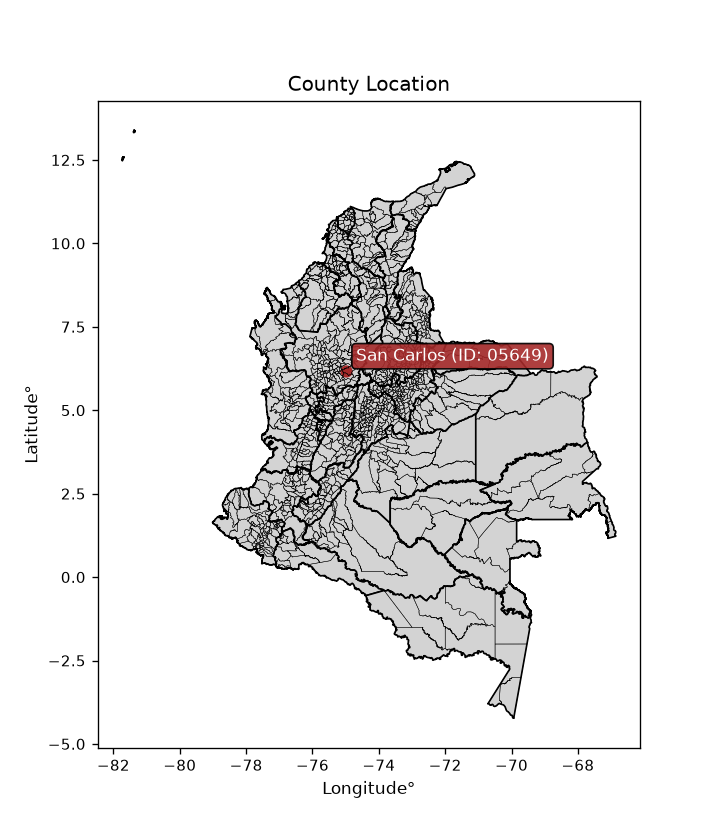
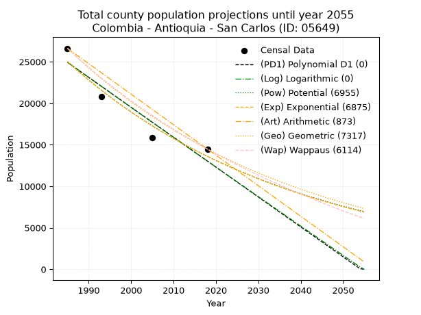
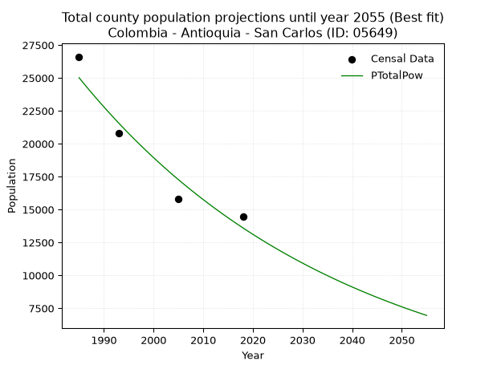
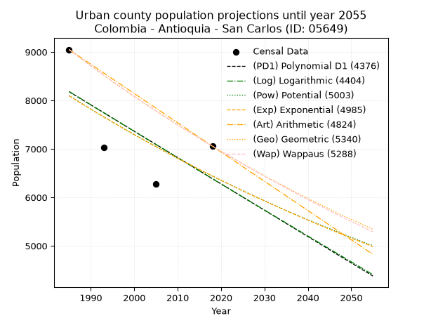
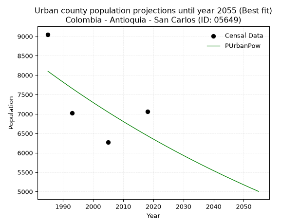
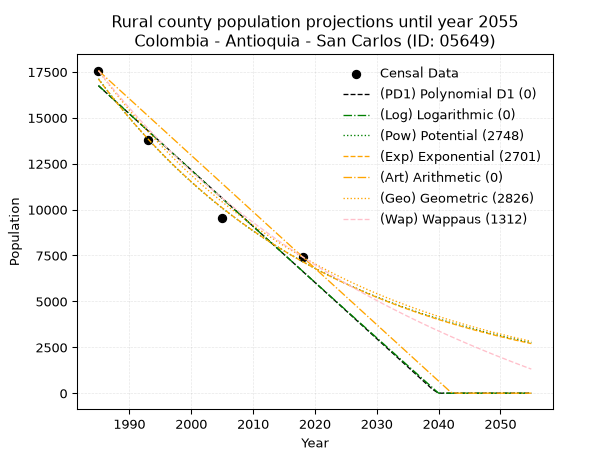
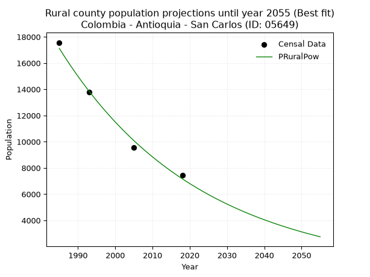

<div align="center">


</div>

# _“Population and Public Services Demand Projections (PPSD) until Year 2050 for Colombia - Antioquia - San Carlos (ID: 05649)”_
Keywords: `population` `public-service` `projection` `lineal` `polynomial` `logarithmic` `potential` `exponential` `arithmetic` `geometric` `wappaus` `dane` `colombia` `south-america`

PPSD are analytical estimates used by governments and planners to anticipate future changes in population size, age distribution, and the resulting community needs for utilities, healthcare, education, and infrastructure as sizing future water treatment facilities, electrical grids, and road networks based on spatial growth.

> **General running parameters**: • app_version: _v20260806_. • Python version: _3.14.7_. • Pandas version: _3.0.5_. • NumPy version: _2.5.1_. • Creates, save and include plots into reports (create_plot): _False_. • Projection until year: _2050_. • Process polynomial degree 2 and up: _False_. • Process Wappaus: _True_. • Process Wappaus: _True_. • Set negative values to zero: _True_. • Set infinite values to zero: _True_. • Drop dataset notes: _True_. 
<div align="center">

Dynamic map: [:earth_americas:Google](http://maps.google.com/maps?q=6.187746135,-74.988097) [:earth_americas:OSM](https://www.openstreetmap.org/#map=18/6.187746135/-74.988097&layers=P) [:earth_americas:Bing](https://www.bing.com/maps?cp=6.187746135~-74.988097&lvl=18) [:earth_americas:Apple](https://maps.apple.com/frame?center=6.187746135%2C-74.988097&span=0.003%2C0.006)

</div>


<div align="center">

```geojson
{
  "type": "Feature",
  "geometry": {
    "type": "Point", 
    "coordinates": [-74.988097, 6.187746135]
  }, 
  "properties": {
    "Name": "Colombia - Antioquia - San Carlos (ID: 05649)"
  }
}
```

</div>


<div align="center">

</img>

</div>


## 0. Census Data (4 records)

Census data are official statistics collected by a government about the people and housing in a country. They usually include counts of total population, age, sex, race, income, education, and jobs.

📅Global census file: [Population.xlsx](../data/Population.xlsx)

| Source   |   Year |   CountryID | CountryName   |   StateID | StateName   |   CountyID | CountyName   |   PTotal |   PUrban |   PRural |
|:---------|-------:|------------:|:--------------|----------:|:------------|-----------:|:-------------|---------:|---------:|---------:|
| DANE     |   1985 |          57 | Colombia      |        05 | Antioquia   |      05649 | San Carlos   |    26616 |     9049 |    17567 |
| DANE     |   1993 |          57 | Colombia      |        05 | Antioquia   |      05649 | San Carlos   |    20795 |     7024 |    13771 |
| DANE     |   2005 |          57 | Colombia      |        05 | Antioquia   |      05649 | San Carlos   |    15826 |     6277 |     9549 |
| DANE     |   2018 |          57 | Colombia      |        05 | Antioquia   |      05649 | San Carlos   |    14480 |     7057 |     7423 |

> 🔥Some records could had specific notes about the registered values or the corresponding urban or rural distribution.

📅   [RUPS](https://www.datos.gov.co/Hacienda-y-Cr-dito-P-blico/Registro-nico-de-Prestadores-de-Servicios-P-blicos/4qkq-csdn/about_data) - Local public utility companies: [RUPS.csv](../data/RUPS.xlsx)

 | SERVICIO       | ESTADO    | NOMBRE                                                                                        | NIT         | DEPARTAMENTO_DOMICILIO   | MUNICIPIO_DOMICILIO   | DIRECCION                               |   TELEFONO | EMAIL                  | TIPO_PRESTADOR                 | CLASIFICACION                  |
|:---------------|:----------|:----------------------------------------------------------------------------------------------|:------------|:-------------------------|:----------------------|:----------------------------------------|-----------:|:-----------------------|:-------------------------------|:-------------------------------|
| ACUEDUCTO      | OPERATIVA | UNIDAD DE SERVICIOS PUBLICOS DOMICILIARIOS DEL MUNICIPIO DE SAN CARLOS AGUAS Y ASEO DEL TABOR | 890983740-9 | ANTIOQUIA                | SAN CARLOS            | Calle 19 No. 18-71                      |    8358039 | datehortua19@gmail.com | MUNICIPIO (PRESTACIÓN DIRECTA) | DESDE 2501 HASTA 5000 USUARIOS |
| ALCANTARILLADO | OPERATIVA | UNIDAD DE SERVICIOS PUBLICOS DOMICILIARIOS DEL MUNICIPIO DE SAN CARLOS AGUAS Y ASEO DEL TABOR | 890983740-9 | ANTIOQUIA                | SAN CARLOS            | Calle 19 No. 18-71                      |    8358039 | datehortua19@gmail.com | MUNICIPIO (PRESTACIÓN DIRECTA) | DESDE 2501 HASTA 5000 USUARIOS |
| ACUEDUCTO      | OPERATIVA | ASOCIACION DE USUARIOS ACUEDUCTO EL JORDAN                                                    | 900315853-3 | ANTIOQUIA                | SAN CARLOS            | Calle 20 No. 22-30. Barrio Buenos Aires |    8354027 | auajor@gmail.com       | ORGANIZACION AUTORIZADA        | MENOR O IGUAL A 2500 USUARIOS  |

## 1. Total

### 1.1. Coefficients and Parameters

* (PD1) Polynomial Deg 1: -360.44038538739346, 740400.1308711339 (lineal)
* (Log) Logarithmic: -722060.2691317968, 5507815.141898646
* (Pow) Potential: -36.93977633746071, 126.2168134567942
* (Exp) Exponential: -0.01844277198867819, 1.9815314462984965e+20
* (Art) Arithmetic: Year diff. 2018 - 1985 = 33, Population diff. 14480 - 26616 = -12136, Annual growth = -367.75757575757575
* (Geo) Geometric: Year diff. 2018 - 1985 = 33, Population diff. 14480 - 26616 = -12136, Annual growth % = -0.018277691786061534
* (Wap) Wappaus: i = -1.7897487626901682, Condition values only valid for < 200)

<sub>
Wappaus condition values: ['-0.00', '-1.79', '-3.58', '-5.37', '-7.16', '-8.95', '-10.74', '-12.53', '-14.32', '-16.11', '-17.90', '-19.69', '-21.48', '-23.27', '-25.06', '-26.85', '-28.64', '-30.43', '-32.22', '-34.01', '-35.79', '-37.58', '-39.37', '-41.16', '-42.95', '-44.74', '-46.53', '-48.32', '-50.11', '-51.90', '-53.69', '-55.48', '-57.27', '-59.06', '-60.85', '-62.64', '-64.43', '-66.22', '-68.01', '-69.80', '-71.59', '-73.38', '-75.17', '-76.96', '-78.75', '-80.54', '-82.33', '-84.12', '-85.91', '-87.70', '-89.49', '-91.28', '-93.07', '-94.86', '-96.65', '-98.44', '-100.23', '-102.02', '-103.81', '-105.60', '-107.38', '-109.17', '-110.96', '-112.75', '-114.54', '-116.33']
</sub>


### 1.2. Projected Dataset

|   Year |   CountyID |   PTotalPD1 |   PTotalLog |   PTotalPow |   PTotalExp |   PTotalArt |   PTotalGeo |   PTotalWap |
|-------:|-----------:|------------:|------------:|------------:|------------:|------------:|------------:|------------:|
|   1985 |      05649 |       24926 |       24941 |       25019 |       25001 |       26616 |       26616 |       26616 |
|   1986 |      05649 |       24566 |       24578 |       24558 |       24544 |       26248 |       26130 |       26144 |
|   1987 |      05649 |       24205 |       24214 |       24106 |       24096 |       25880 |       25652 |       25680 |
|   1988 |      05649 |       23845 |       23851 |       23662 |       23655 |       25513 |       25183 |       25224 |
|   1989 |      05649 |       23484 |       23488 |       23226 |       23223 |       25145 |       24723 |       24776 |
|   1990 |      05649 |       23124 |       23125 |       22799 |       22799 |       24777 |       24271 |       24336 |
|   1991 |      05649 |       22763 |       22762 |       22380 |       22382 |       24409 |       23827 |       23903 |
|   1992 |      05649 |       22403 |       22399 |       21969 |       21973 |       24042 |       23392 |       23478 |
|   1993 |      05649 |       22042 |       22037 |       21565 |       21571 |       23674 |       22964 |       23060 |
|   1994 |      05649 |       21682 |       21675 |       21169 |       21177 |       23306 |       22545 |       22648 |
|   1995 |      05649 |       21322 |       21313 |       20781 |       20790 |       22938 |       22132 |       22244 |
|   1996 |      05649 |       20961 |       20951 |       20400 |       20410 |       22571 |       21728 |       21846 |
|   1997 |      05649 |       20601 |       20589 |       20026 |       20037 |       22203 |       21331 |       21454 |
|   1998 |      05649 |       20240 |       20228 |       19659 |       19671 |       21835 |       20941 |       21069 |
|   1999 |      05649 |       19880 |       19867 |       19299 |       19312 |       21467 |       20558 |       20689 |
|   2000 |      05649 |       19519 |       19505 |       18945 |       18959 |       21100 |       20182 |       20316 |
|   2001 |      05649 |       19159 |       19145 |       18599 |       18612 |       20732 |       19814 |       19949 |
|   2002 |      05649 |       18798 |       18784 |       18259 |       18272 |       20364 |       19451 |       19587 |
|   2003 |      05649 |       18438 |       18423 |       17925 |       17938 |       19996 |       19096 |       19231 |
|   2004 |      05649 |       18078 |       18063 |       17597 |       17611 |       19629 |       18747 |       18880 |
|   2005 |      05649 |       17717 |       17703 |       17276 |       17289 |       19261 |       18404 |       18535 |
|   2006 |      05649 |       17357 |       17343 |       16961 |       16973 |       18893 |       18068 |       18195 |
|   2007 |      05649 |       16996 |       16983 |       16651 |       16663 |       18525 |       17738 |       17860 |
|   2008 |      05649 |       16636 |       16623 |       16348 |       16358 |       18158 |       17413 |       17530 |
|   2009 |      05649 |       16275 |       16263 |       16050 |       16059 |       17790 |       17095 |       17205 |
|   2010 |      05649 |       15915 |       15904 |       15758 |       15766 |       17422 |       16783 |       16884 |
|   2011 |      05649 |       15555 |       15545 |       15471 |       15478 |       17054 |       16476 |       16568 |
|   2012 |      05649 |       15194 |       15186 |       15189 |       15195 |       16687 |       16175 |       16257 |
|   2013 |      05649 |       14834 |       14827 |       14913 |       14917 |       16319 |       15879 |       15950 |
|   2014 |      05649 |       14473 |       14469 |       14642 |       14645 |       15951 |       15589 |       15648 |
|   2015 |      05649 |       14113 |       14110 |       14376 |       14377 |       15583 |       15304 |       15350 |
|   2016 |      05649 |       13752 |       13752 |       14115 |       14114 |       15216 |       15024 |       15056 |
|   2017 |      05649 |       13392 |       13394 |       13859 |       13856 |       14848 |       14750 |       14766 |
|   2018 |      05649 |       13031 |       13036 |       13607 |       13603 |       14480 |       14480 |       14480 |
|   2019 |      05649 |       12671 |       12678 |       13360 |       13355 |       14112 |       14215 |       14198 |
|   2020 |      05649 |       12311 |       12321 |       13118 |       13111 |       13744 |       13956 |       13920 |
|   2021 |      05649 |       11950 |       11963 |       12881 |       12871 |       13377 |       13700 |       13646 |
|   2022 |      05649 |       11590 |       11606 |       12647 |       12636 |       13009 |       13450 |       13375 |
|   2023 |      05649 |       11229 |       11249 |       12418 |       12405 |       12641 |       13204 |       13108 |
|   2024 |      05649 |       10869 |       10892 |       12194 |       12178 |       12273 |       12963 |       12844 |
|   2025 |      05649 |       10508 |       10536 |       11973 |       11956 |       11906 |       12726 |       12584 |
|   2026 |      05649 |       10148 |       10179 |       11757 |       11737 |       11538 |       12493 |       12328 |
|   2027 |      05649 |        9787 |        9823 |       11545 |       11523 |       11170 |       12265 |       12074 |
|   2028 |      05649 |        9427 |        9467 |       11336 |       11312 |       10802 |       12041 |       11824 |
|   2029 |      05649 |        9067 |        9111 |       11132 |       11105 |       10435 |       11821 |       11578 |
|   2030 |      05649 |        8706 |        8755 |       10931 |       10902 |       10067 |       11605 |       11334 |
|   2031 |      05649 |        8346 |        8399 |       10734 |       10703 |        9699 |       11393 |       11093 |
|   2032 |      05649 |        7985 |        8044 |       10540 |       10508 |        9331 |       11184 |       10856 |
|   2033 |      05649 |        7625 |        7689 |       10350 |       10316 |        8964 |       10980 |       10621 |
|   2034 |      05649 |        7264 |        7334 |       10164 |       10127 |        8596 |       10779 |       10390 |
|   2035 |      05649 |        6904 |        6979 |        9981 |        9942 |        8228 |       10582 |       10161 |
|   2036 |      05649 |        6544 |        6624 |        9802 |        9760 |        7860 |       10389 |        9935 |
|   2037 |      05649 |        6183 |        6269 |        9626 |        9582 |        7493 |       10199 |        9712 |
|   2038 |      05649 |        5823 |        5915 |        9453 |        9407 |        7125 |       10012 |        9491 |
|   2039 |      05649 |        5462 |        5561 |        9283 |        9235 |        6757 |        9829 |        9273 |
|   2040 |      05649 |        5102 |        5207 |        9116 |        9066 |        6389 |        9650 |        9058 |
|   2041 |      05649 |        4741 |        4853 |        8953 |        8901 |        6022 |        9473 |        8845 |
|   2042 |      05649 |        4381 |        4499 |        8792 |        8738 |        5654 |        9300 |        8635 |
|   2043 |      05649 |        4020 |        4146 |        8635 |        8578 |        5286 |        9130 |        8427 |
|   2044 |      05649 |        3660 |        3792 |        8480 |        8422 |        4918 |        8963 |        8222 |
|   2045 |      05649 |        3300 |        3439 |        8328 |        8268 |        4551 |        8800 |        8019 |
|   2046 |      05649 |        2939 |        3086 |        8179 |        8117 |        4183 |        8639 |        7819 |
|   2047 |      05649 |        2579 |        2733 |        8033 |        7968 |        3815 |        8481 |        7621 |
|   2048 |      05649 |        2218 |        2381 |        7889 |        7823 |        3447 |        8326 |        7425 |
|   2049 |      05649 |        1858 |        2028 |        7748 |        7680 |        3080 |        8174 |        7231 |
|   2050 |      05649 |        1497 |        1676 |        7610 |        7539 |        2712 |        8024 |        7040 |
<div align="center">

</img>

</div>


### 1.3. Best fit with absolute and relative error (%)

Relative error puts that difference into context by dividing the absolute error by the true value, creating a unitless ratio or percentage that shows the scale of the mistake.

Absolute and relative error

|   Year | Source   |   CountryID | CountryName   |   StateID | StateName   |   CountyID_x | CountyName   |   PTotal |   PUrban |   PRural |   CountyID_y |   PTotalPD1 |   PTotalLog |   PTotalPow |   PTotalExp |   PTotalArt |   PTotalGeo |   PTotalWap |   PTotalPD1AbsError |   PTotalLogAbsError |   PTotalPowAbsError |   PTotalExpAbsError |   PTotalArtAbsError |   PTotalGeoAbsError |   PTotalWapAbsError |   PTotalPD1RelError |   PTotalLogRelError |   PTotalPowRelError |   PTotalExpRelError |   PTotalArtRelError |   PTotalGeoRelError |   PTotalWapRelError |
|-------:|:---------|------------:|:--------------|----------:|:------------|-------------:|:-------------|---------:|---------:|---------:|-------------:|------------:|------------:|------------:|------------:|------------:|------------:|------------:|--------------------:|--------------------:|--------------------:|--------------------:|--------------------:|--------------------:|--------------------:|--------------------:|--------------------:|--------------------:|--------------------:|--------------------:|--------------------:|--------------------:|
|   1985 | DANE     |          57 | Colombia      |        05 | Antioquia   |        05649 | San Carlos   |    26616 |     9049 |    17567 |        05649 |       24926 |       24941 |       25019 |       25001 |       26616 |       26616 |       26616 |                1690 |                1675 |                1597 |                1615 |                   0 |                   0 |                   0 |             6.34956 |             6.29321 |             6.00015 |             6.06778 |              0      |              0      |              0      |
|   1993 | DANE     |          57 | Colombia      |        05 | Antioquia   |        05649 | San Carlos   |    20795 |     7024 |    13771 |        05649 |       22042 |       22037 |       21565 |       21571 |       23674 |       22964 |       23060 |                1247 |                1242 |                 770 |                 776 |                2879 |                2169 |                2265 |             5.99663 |             5.97259 |             3.70281 |             3.73167 |             13.8447 |             10.4304 |             10.892  |
|   2005 | DANE     |          57 | Colombia      |        05 | Antioquia   |        05649 | San Carlos   |    15826 |     6277 |     9549 |        05649 |       17717 |       17703 |       17276 |       17289 |       19261 |       18404 |       18535 |                1891 |                1877 |                1450 |                1463 |                3435 |                2578 |                2709 |            11.9487  |            11.8602  |             9.16214 |             9.24428 |             21.7048 |             16.2896 |             17.1174 |
|   2018 | DANE     |          57 | Colombia      |        05 | Antioquia   |        05649 | San Carlos   |    14480 |     7057 |     7423 |        05649 |       13031 |       13036 |       13607 |       13603 |       14480 |       14480 |       14480 |                1449 |                1444 |                 873 |                 877 |                   0 |                   0 |                   0 |            10.0069  |             9.97238 |             6.02901 |             6.05663 |              0      |              0      |              0      |

Relative error mean

| Method    |   RelError | Best   |
|:----------|-----------:|:-------|
| PTotalPD1 |    8.57545 |        |
| PTotalLog |    8.5246  |        |
| PTotalPow |    6.22353 | True   |
| PTotalExp |    6.27509 |        |
| PTotalArt |    8.88737 |        |
| PTotalGeo |    6.68001 |        |
| PTotalWap |    7.00236 |        |

💙Best method: _**PTotalPow**_
<div align="center">

</img>

</div>


### 1.4. Fresh water supply demand in liters per capita per day (lpcd)

The fresh water supply demand typically ranges from 100 to 300 liters per capita per day (lpcd) for standard domestic and municipal planning, though absolute survival minimums set by the World Health Organization are as low as 7.5 to 20 liters per day, and total consumption in high-income nations can exceed 400 liters.

> `CZ`: Level in meters above the sea level (masl)<br> `WS`: Fresh water supply demand in liters per capita per day (lpcd or l/h/d)<br> `WSAll`: Zonal fresh water supply demand in liters per second (l/s)<br> `A`: Zonal area in square meters<br> `DP`: Population density (people/hectare or p/ha)

Reference values (RAS Colombia)

|    CZ |   WS |
|------:|-----:|
|  1000 |  120 |
|  2000 |  130 |
| 99999 |  140 |

County shapefile geometry properties and water supply values

|   CountyID |      ATotal |   CZTotal |   WSTotal |
|-----------:|------------:|----------:|----------:|
|      05649 | 7.16413e+08 |   1025.78 |       130 |

Projected values for best method: PTotalPow

|   CountyID |   Year |   PTotalPow |   DPTotal |   WSTotal |   WSTotalAll |
|-----------:|-------:|------------:|----------:|----------:|-------------:|
|      05649 |   1985 |       25019 |      0.35 |       130 |      37.6443 |
|      05649 |   1986 |       24558 |      0.34 |       130 |      36.9507 |
|      05649 |   1987 |       24106 |      0.34 |       130 |      36.2706 |
|      05649 |   1988 |       23662 |      0.33 |       130 |      35.6025 |
|      05649 |   1989 |       23226 |      0.32 |       130 |      34.9465 |
|      05649 |   1990 |       22799 |      0.32 |       130 |      34.3041 |
|      05649 |   1991 |       22380 |      0.31 |       130 |      33.6736 |
|      05649 |   1992 |       21969 |      0.31 |       130 |      33.0552 |
|      05649 |   1993 |       21565 |      0.3  |       130 |      32.4473 |
|      05649 |   1994 |       21169 |      0.3  |       130 |      31.8515 |
|      05649 |   1995 |       20781 |      0.29 |       130 |      31.2677 |
|      05649 |   1996 |       20400 |      0.28 |       130 |      30.6944 |
|      05649 |   1997 |       20026 |      0.28 |       130 |      30.1317 |
|      05649 |   1998 |       19659 |      0.27 |       130 |      29.5795 |
|      05649 |   1999 |       19299 |      0.27 |       130 |      29.0378 |
|      05649 |   2000 |       18945 |      0.26 |       130 |      28.5052 |
|      05649 |   2001 |       18599 |      0.26 |       130 |      27.9846 |
|      05649 |   2002 |       18259 |      0.25 |       130 |      27.473  |
|      05649 |   2003 |       17925 |      0.25 |       130 |      26.9705 |
|      05649 |   2004 |       17597 |      0.25 |       130 |      26.477  |
|      05649 |   2005 |       17276 |      0.24 |       130 |      25.994  |
|      05649 |   2006 |       16961 |      0.24 |       130 |      25.52   |
|      05649 |   2007 |       16651 |      0.23 |       130 |      25.0536 |
|      05649 |   2008 |       16348 |      0.23 |       130 |      24.5977 |
|      05649 |   2009 |       16050 |      0.22 |       130 |      24.1493 |
|      05649 |   2010 |       15758 |      0.22 |       130 |      23.71   |
|      05649 |   2011 |       15471 |      0.22 |       130 |      23.2781 |
|      05649 |   2012 |       15189 |      0.21 |       130 |      22.8538 |
|      05649 |   2013 |       14913 |      0.21 |       130 |      22.4385 |
|      05649 |   2014 |       14642 |      0.2  |       130 |      22.0308 |
|      05649 |   2015 |       14376 |      0.2  |       130 |      21.6306 |
|      05649 |   2016 |       14115 |      0.2  |       130 |      21.2378 |
|      05649 |   2017 |       13859 |      0.19 |       130 |      20.8527 |
|      05649 |   2018 |       13607 |      0.19 |       130 |      20.4735 |
|      05649 |   2019 |       13360 |      0.19 |       130 |      20.1019 |
|      05649 |   2020 |       13118 |      0.18 |       130 |      19.7377 |
|      05649 |   2021 |       12881 |      0.18 |       130 |      19.3811 |
|      05649 |   2022 |       12647 |      0.18 |       130 |      19.0291 |
|      05649 |   2023 |       12418 |      0.17 |       130 |      18.6845 |
|      05649 |   2024 |       12194 |      0.17 |       130 |      18.3475 |
|      05649 |   2025 |       11973 |      0.17 |       130 |      18.0149 |
|      05649 |   2026 |       11757 |      0.16 |       130 |      17.6899 |
|      05649 |   2027 |       11545 |      0.16 |       130 |      17.3709 |
|      05649 |   2028 |       11336 |      0.16 |       130 |      17.0565 |
|      05649 |   2029 |       11132 |      0.16 |       130 |      16.7495 |
|      05649 |   2030 |       10931 |      0.15 |       130 |      16.4471 |
|      05649 |   2031 |       10734 |      0.15 |       130 |      16.1507 |
|      05649 |   2032 |       10540 |      0.15 |       130 |      15.8588 |
|      05649 |   2033 |       10350 |      0.14 |       130 |      15.5729 |
|      05649 |   2034 |       10164 |      0.14 |       130 |      15.2931 |
|      05649 |   2035 |        9981 |      0.14 |       130 |      15.0177 |
|      05649 |   2036 |        9802 |      0.14 |       130 |      14.7484 |
|      05649 |   2037 |        9626 |      0.13 |       130 |      14.4836 |
|      05649 |   2038 |        9453 |      0.13 |       130 |      14.2233 |
|      05649 |   2039 |        9283 |      0.13 |       130 |      13.9675 |
|      05649 |   2040 |        9116 |      0.13 |       130 |      13.7162 |
|      05649 |   2041 |        8953 |      0.12 |       130 |      13.4709 |
|      05649 |   2042 |        8792 |      0.12 |       130 |      13.2287 |
|      05649 |   2043 |        8635 |      0.12 |       130 |      12.9925 |
|      05649 |   2044 |        8480 |      0.12 |       130 |      12.7593 |
|      05649 |   2045 |        8328 |      0.12 |       130 |      12.5306 |
|      05649 |   2046 |        8179 |      0.11 |       130 |      12.3064 |
|      05649 |   2047 |        8033 |      0.11 |       130 |      12.0867 |
|      05649 |   2048 |        7889 |      0.11 |       130 |      11.87   |
|      05649 |   2049 |        7748 |      0.11 |       130 |      11.6579 |
|      05649 |   2050 |        7610 |      0.11 |       130 |      11.4502 |

## 2. Urban

### 2.1. Coefficients and Parameters

* (PD1) Polynomial Deg 1: -54.34564431955083, 116056.62505018155 (lineal)
* (Log) Logarithmic: -109065.91470525354, 836362.6416740213
* (Pow) Potential: -13.904182584861044, 49.76115050070278
* (Exp) Exponential: -0.0069274143113051394, 7589568538.450666
* (Art) Arithmetic: Year diff. 2018 - 1985 = 33, Population diff. 7057 - 9049 = -1992, Annual growth = -60.36363636363637
* (Geo) Geometric: Year diff. 2018 - 1985 = 33, Population diff. 7057 - 9049 = -1992, Annual growth % = -0.007506058155319684
* (Wap) Wappaus: i = -0.7495794904214127, Condition values only valid for < 200)

<sub>
Wappaus condition values: ['-0.00', '-0.75', '-1.50', '-2.25', '-3.00', '-3.75', '-4.50', '-5.25', '-6.00', '-6.75', '-7.50', '-8.25', '-8.99', '-9.74', '-10.49', '-11.24', '-11.99', '-12.74', '-13.49', '-14.24', '-14.99', '-15.74', '-16.49', '-17.24', '-17.99', '-18.74', '-19.49', '-20.24', '-20.99', '-21.74', '-22.49', '-23.24', '-23.99', '-24.74', '-25.49', '-26.24', '-26.98', '-27.73', '-28.48', '-29.23', '-29.98', '-30.73', '-31.48', '-32.23', '-32.98', '-33.73', '-34.48', '-35.23', '-35.98', '-36.73', '-37.48', '-38.23', '-38.98', '-39.73', '-40.48', '-41.23', '-41.98', '-42.73', '-43.48', '-44.23', '-44.97', '-45.72', '-46.47', '-47.22', '-47.97', '-48.72']
</sub>


### 2.2. Projected Dataset

|   Year |   CountyID |   PUrbanPD1 |   PUrbanLog |   PUrbanPow |   PUrbanExp |   PUrbanArt |   PUrbanGeo |   PUrbanWap |
|-------:|-----------:|------------:|------------:|------------:|------------:|------------:|------------:|------------:|
|   1985 |      05649 |        8181 |        8184 |        8100 |        8096 |        9049 |        9049 |        9049 |
|   1986 |      05649 |        8126 |        8129 |        8043 |        8040 |        8989 |        8981 |        8981 |
|   1987 |      05649 |        8072 |        8075 |        7987 |        7985 |        8928 |        8914 |        8914 |
|   1988 |      05649 |        8017 |        8020 |        7932 |        7929 |        8868 |        8847 |        8848 |
|   1989 |      05649 |        7963 |        7965 |        7876 |        7875 |        8808 |        8780 |        8782 |
|   1990 |      05649 |        7909 |        7910 |        7822 |        7820 |        8747 |        8714 |        8716 |
|   1991 |      05649 |        7854 |        7855 |        7767 |        7766 |        8687 |        8649 |        8651 |
|   1992 |      05649 |        7800 |        7800 |        7713 |        7713 |        8626 |        8584 |        8586 |
|   1993 |      05649 |        7746 |        7746 |        7659 |        7660 |        8566 |        8520 |        8522 |
|   1994 |      05649 |        7691 |        7691 |        7606 |        7607 |        8506 |        8456 |        8458 |
|   1995 |      05649 |        7637 |        7636 |        7553 |        7554 |        8445 |        8392 |        8395 |
|   1996 |      05649 |        7583 |        7582 |        7501 |        7502 |        8385 |        8329 |        8332 |
|   1997 |      05649 |        7528 |        7527 |        7449 |        7450 |        8325 |        8267 |        8270 |
|   1998 |      05649 |        7474 |        7472 |        7397 |        7399 |        8264 |        8205 |        8208 |
|   1999 |      05649 |        7420 |        7418 |        7346 |        7348 |        8204 |        8143 |        8147 |
|   2000 |      05649 |        7365 |        7363 |        7295 |        7297 |        8144 |        8082 |        8086 |
|   2001 |      05649 |        7311 |        7309 |        7244 |        7247 |        8083 |        8021 |        8025 |
|   2002 |      05649 |        7257 |        7254 |        7194 |        7197 |        8023 |        7961 |        7965 |
|   2003 |      05649 |        7202 |        7200 |        7145 |        7147 |        7962 |        7901 |        7905 |
|   2004 |      05649 |        7148 |        7145 |        7095 |        7098 |        7902 |        7842 |        7846 |
|   2005 |      05649 |        7094 |        7091 |        7046 |        7049 |        7842 |        7783 |        7787 |
|   2006 |      05649 |        7039 |        7037 |        6997 |        7000 |        7781 |        7725 |        7729 |
|   2007 |      05649 |        6985 |        6982 |        6949 |        6952 |        7721 |        7667 |        7670 |
|   2008 |      05649 |        6931 |        6928 |        6901 |        6904 |        7661 |        7609 |        7613 |
|   2009 |      05649 |        6876 |        6874 |        6854 |        6856 |        7600 |        7552 |        7555 |
|   2010 |      05649 |        6822 |        6819 |        6806 |        6809 |        7540 |        7495 |        7499 |
|   2011 |      05649 |        6768 |        6765 |        6759 |        6762 |        7480 |        7439 |        7442 |
|   2012 |      05649 |        6713 |        6711 |        6713 |        6715 |        7419 |        7383 |        7386 |
|   2013 |      05649 |        6659 |        6657 |        6667 |        6669 |        7359 |        7328 |        7330 |
|   2014 |      05649 |        6604 |        6602 |        6621 |        6622 |        7298 |        7273 |        7275 |
|   2015 |      05649 |        6550 |        6548 |        6575 |        6577 |        7238 |        7218 |        7220 |
|   2016 |      05649 |        6496 |        6494 |        6530 |        6531 |        7178 |        7164 |        7165 |
|   2017 |      05649 |        6441 |        6440 |        6485 |        6486 |        7117 |        7110 |        7111 |
|   2018 |      05649 |        6387 |        6386 |        6441 |        6442 |        7057 |        7057 |        7057 |
|   2019 |      05649 |        6333 |        6332 |        6396 |        6397 |        6997 |        7004 |        7003 |
|   2020 |      05649 |        6278 |        6278 |        6352 |        6353 |        6936 |        6951 |        6950 |
|   2021 |      05649 |        6224 |        6224 |        6309 |        6309 |        6876 |        6899 |        6897 |
|   2022 |      05649 |        6170 |        6170 |        6266 |        6265 |        6816 |        6847 |        6845 |
|   2023 |      05649 |        6115 |        6116 |        6223 |        6222 |        6755 |        6796 |        6793 |
|   2024 |      05649 |        6061 |        6062 |        6180 |        6179 |        6695 |        6745 |        6741 |
|   2025 |      05649 |        6007 |        6008 |        6138 |        6137 |        6634 |        6694 |        6690 |
|   2026 |      05649 |        5952 |        5955 |        6096 |        6094 |        6574 |        6644 |        6638 |
|   2027 |      05649 |        5898 |        5901 |        6054 |        6052 |        6514 |        6594 |        6588 |
|   2028 |      05649 |        5844 |        5847 |        6013 |        6010 |        6453 |        6545 |        6537 |
|   2029 |      05649 |        5789 |        5793 |        5972 |        5969 |        6393 |        6496 |        6487 |
|   2030 |      05649 |        5735 |        5739 |        5931 |        5928 |        6333 |        6447 |        6437 |
|   2031 |      05649 |        5681 |        5686 |        5890 |        5887 |        6272 |        6399 |        6388 |
|   2032 |      05649 |        5626 |        5632 |        5850 |        5846 |        6212 |        6351 |        6338 |
|   2033 |      05649 |        5572 |        5578 |        5810 |        5806 |        6152 |        6303 |        6290 |
|   2034 |      05649 |        5518 |        5525 |        5771 |        5766 |        6091 |        6256 |        6241 |
|   2035 |      05649 |        5463 |        5471 |        5731 |        5726 |        6031 |        6209 |        6193 |
|   2036 |      05649 |        5409 |        5418 |        5692 |        5686 |        5970 |        6162 |        6145 |
|   2037 |      05649 |        5355 |        5364 |        5654 |        5647 |        5910 |        6116 |        6097 |
|   2038 |      05649 |        5300 |        5310 |        5615 |        5608 |        5850 |        6070 |        6050 |
|   2039 |      05649 |        5246 |        5257 |        5577 |        5569 |        5789 |        6024 |        6003 |
|   2040 |      05649 |        5192 |        5203 |        5539 |        5531 |        5729 |        5979 |        5956 |
|   2041 |      05649 |        5137 |        5150 |        5502 |        5493 |        5669 |        5934 |        5909 |
|   2042 |      05649 |        5083 |        5097 |        5464 |        5455 |        5608 |        5890 |        5863 |
|   2043 |      05649 |        5028 |        5043 |        5427 |        5417 |        5548 |        5845 |        5817 |
|   2044 |      05649 |        4974 |        4990 |        5390 |        5380 |        5488 |        5802 |        5772 |
|   2045 |      05649 |        4920 |        4936 |        5354 |        5343 |        5427 |        5758 |        5726 |
|   2046 |      05649 |        4865 |        4883 |        5318 |        5306 |        5367 |        5715 |        5681 |
|   2047 |      05649 |        4811 |        4830 |        5282 |        5269 |        5306 |        5672 |        5637 |
|   2048 |      05649 |        4757 |        4777 |        5246 |        5233 |        5246 |        5629 |        5592 |
|   2049 |      05649 |        4702 |        4723 |        5210 |        5197 |        5186 |        5587 |        5548 |
|   2050 |      05649 |        4648 |        4670 |        5175 |        5161 |        5125 |        5545 |        5504 |
<div align="center">

</img>

</div>


### 2.3. Best fit with absolute and relative error (%)

Relative error puts that difference into context by dividing the absolute error by the true value, creating a unitless ratio or percentage that shows the scale of the mistake.

Absolute and relative error

|   Year | Source   |   CountryID | CountryName   |   StateID | StateName   |   CountyID_x | CountyName   |   PTotal |   PUrban |   PRural |   CountyID_y |   PUrbanPD1 |   PUrbanLog |   PUrbanPow |   PUrbanExp |   PUrbanArt |   PUrbanGeo |   PUrbanWap |   PUrbanPD1AbsError |   PUrbanLogAbsError |   PUrbanPowAbsError |   PUrbanExpAbsError |   PUrbanArtAbsError |   PUrbanGeoAbsError |   PUrbanWapAbsError |   PUrbanPD1RelError |   PUrbanLogRelError |   PUrbanPowRelError |   PUrbanExpRelError |   PUrbanArtRelError |   PUrbanGeoRelError |   PUrbanWapRelError |
|-------:|:---------|------------:|:--------------|----------:|:------------|-------------:|:-------------|---------:|---------:|---------:|-------------:|------------:|------------:|------------:|------------:|------------:|------------:|------------:|--------------------:|--------------------:|--------------------:|--------------------:|--------------------:|--------------------:|--------------------:|--------------------:|--------------------:|--------------------:|--------------------:|--------------------:|--------------------:|--------------------:|
|   1985 | DANE     |          57 | Colombia      |        05 | Antioquia   |        05649 | San Carlos   |    26616 |     9049 |    17567 |        05649 |        8181 |        8184 |        8100 |        8096 |        9049 |        9049 |        9049 |                 868 |                 865 |                 949 |                 953 |                   0 |                   0 |                   0 |             9.59222 |             9.55907 |            10.4873  |            10.5316  |              0      |              0      |              0      |
|   1993 | DANE     |          57 | Colombia      |        05 | Antioquia   |        05649 | San Carlos   |    20795 |     7024 |    13771 |        05649 |        7746 |        7746 |        7659 |        7660 |        8566 |        8520 |        8522 |                 722 |                 722 |                 635 |                 636 |                1542 |                1496 |                1498 |            10.279   |            10.279   |             9.04043 |             9.05467 |             21.9533 |             21.2984 |             21.3269 |
|   2005 | DANE     |          57 | Colombia      |        05 | Antioquia   |        05649 | San Carlos   |    15826 |     6277 |     9549 |        05649 |        7094 |        7091 |        7046 |        7049 |        7842 |        7783 |        7787 |                 817 |                 814 |                 769 |                 772 |                1565 |                1506 |                1510 |            13.0158  |            12.968   |            12.2511  |            12.2989  |             24.9323 |             23.9924 |             24.0561 |
|   2018 | DANE     |          57 | Colombia      |        05 | Antioquia   |        05649 | San Carlos   |    14480 |     7057 |     7423 |        05649 |        6387 |        6386 |        6441 |        6442 |        7057 |        7057 |        7057 |                 670 |                 671 |                 616 |                 615 |                   0 |                   0 |                   0 |             9.49412 |             9.50829 |             8.72892 |             8.71475 |              0      |              0      |              0      |

Relative error mean

| Method    |   RelError | Best   |
|:----------|-----------:|:-------|
| PUrbanPD1 |    10.5953 |        |
| PUrbanLog |    10.5786 |        |
| PUrbanPow |    10.1269 | True   |
| PUrbanExp |    10.15   |        |
| PUrbanArt |    11.7214 |        |
| PUrbanGeo |    11.3227 |        |
| PUrbanWap |    11.3457 |        |

💙Best method: _**PUrbanPow**_
<div align="center">

</img>

</div>


### 2.4. Fresh water supply demand in liters per capita per day (lpcd)

The fresh water supply demand typically ranges from 100 to 300 liters per capita per day (lpcd) for standard domestic and municipal planning, though absolute survival minimums set by the World Health Organization are as low as 7.5 to 20 liters per day, and total consumption in high-income nations can exceed 400 liters.

> `CZ`: Level in meters above the sea level (masl)<br> `WS`: Fresh water supply demand in liters per capita per day (lpcd or l/h/d)<br> `WSAll`: Zonal fresh water supply demand in liters per second (l/s)<br> `A`: Zonal area in square meters<br> `DP`: Population density (people/hectare or p/ha)

Reference values (RAS Colombia)

|    CZ |   WS |
|------:|-----:|
|  1000 |  120 |
|  2000 |  130 |
| 99999 |  140 |

County shapefile geometry properties and water supply values

|   CountyID |      AUrban |   CZUrban |   WSUrban |
|-----------:|------------:|----------:|----------:|
|      05649 | 2.20961e+06 |   976.548 |       120 |

Projected values for best method: PUrbanPow

|   CountyID |   Year |   PUrbanPow |   DPUrban |   WSUrban |   WSUrbanAll |
|-----------:|-------:|------------:|----------:|----------:|-------------:|
|      05649 |   1985 |        8100 |     36.66 |       120 |     11.25    |
|      05649 |   1986 |        8043 |     36.4  |       120 |     11.1708  |
|      05649 |   1987 |        7987 |     36.15 |       120 |     11.0931  |
|      05649 |   1988 |        7932 |     35.9  |       120 |     11.0167  |
|      05649 |   1989 |        7876 |     35.64 |       120 |     10.9389  |
|      05649 |   1990 |        7822 |     35.4  |       120 |     10.8639  |
|      05649 |   1991 |        7767 |     35.15 |       120 |     10.7875  |
|      05649 |   1992 |        7713 |     34.91 |       120 |     10.7125  |
|      05649 |   1993 |        7659 |     34.66 |       120 |     10.6375  |
|      05649 |   1994 |        7606 |     34.42 |       120 |     10.5639  |
|      05649 |   1995 |        7553 |     34.18 |       120 |     10.4903  |
|      05649 |   1996 |        7501 |     33.95 |       120 |     10.4181  |
|      05649 |   1997 |        7449 |     33.71 |       120 |     10.3458  |
|      05649 |   1998 |        7397 |     33.48 |       120 |     10.2736  |
|      05649 |   1999 |        7346 |     33.25 |       120 |     10.2028  |
|      05649 |   2000 |        7295 |     33.01 |       120 |     10.1319  |
|      05649 |   2001 |        7244 |     32.78 |       120 |     10.0611  |
|      05649 |   2002 |        7194 |     32.56 |       120 |      9.99167 |
|      05649 |   2003 |        7145 |     32.34 |       120 |      9.92361 |
|      05649 |   2004 |        7095 |     32.11 |       120 |      9.85417 |
|      05649 |   2005 |        7046 |     31.89 |       120 |      9.78611 |
|      05649 |   2006 |        6997 |     31.67 |       120 |      9.71806 |
|      05649 |   2007 |        6949 |     31.45 |       120 |      9.65139 |
|      05649 |   2008 |        6901 |     31.23 |       120 |      9.58472 |
|      05649 |   2009 |        6854 |     31.02 |       120 |      9.51944 |
|      05649 |   2010 |        6806 |     30.8  |       120 |      9.45278 |
|      05649 |   2011 |        6759 |     30.59 |       120 |      9.3875  |
|      05649 |   2012 |        6713 |     30.38 |       120 |      9.32361 |
|      05649 |   2013 |        6667 |     30.17 |       120 |      9.25972 |
|      05649 |   2014 |        6621 |     29.96 |       120 |      9.19583 |
|      05649 |   2015 |        6575 |     29.76 |       120 |      9.13194 |
|      05649 |   2016 |        6530 |     29.55 |       120 |      9.06944 |
|      05649 |   2017 |        6485 |     29.35 |       120 |      9.00694 |
|      05649 |   2018 |        6441 |     29.15 |       120 |      8.94583 |
|      05649 |   2019 |        6396 |     28.95 |       120 |      8.88333 |
|      05649 |   2020 |        6352 |     28.75 |       120 |      8.82222 |
|      05649 |   2021 |        6309 |     28.55 |       120 |      8.7625  |
|      05649 |   2022 |        6266 |     28.36 |       120 |      8.70278 |
|      05649 |   2023 |        6223 |     28.16 |       120 |      8.64306 |
|      05649 |   2024 |        6180 |     27.97 |       120 |      8.58333 |
|      05649 |   2025 |        6138 |     27.78 |       120 |      8.525   |
|      05649 |   2026 |        6096 |     27.59 |       120 |      8.46667 |
|      05649 |   2027 |        6054 |     27.4  |       120 |      8.40833 |
|      05649 |   2028 |        6013 |     27.21 |       120 |      8.35139 |
|      05649 |   2029 |        5972 |     27.03 |       120 |      8.29444 |
|      05649 |   2030 |        5931 |     26.84 |       120 |      8.2375  |
|      05649 |   2031 |        5890 |     26.66 |       120 |      8.18056 |
|      05649 |   2032 |        5850 |     26.48 |       120 |      8.125   |
|      05649 |   2033 |        5810 |     26.29 |       120 |      8.06944 |
|      05649 |   2034 |        5771 |     26.12 |       120 |      8.01528 |
|      05649 |   2035 |        5731 |     25.94 |       120 |      7.95972 |
|      05649 |   2036 |        5692 |     25.76 |       120 |      7.90556 |
|      05649 |   2037 |        5654 |     25.59 |       120 |      7.85278 |
|      05649 |   2038 |        5615 |     25.41 |       120 |      7.79861 |
|      05649 |   2039 |        5577 |     25.24 |       120 |      7.74583 |
|      05649 |   2040 |        5539 |     25.07 |       120 |      7.69306 |
|      05649 |   2041 |        5502 |     24.9  |       120 |      7.64167 |
|      05649 |   2042 |        5464 |     24.73 |       120 |      7.58889 |
|      05649 |   2043 |        5427 |     24.56 |       120 |      7.5375  |
|      05649 |   2044 |        5390 |     24.39 |       120 |      7.48611 |
|      05649 |   2045 |        5354 |     24.23 |       120 |      7.43611 |
|      05649 |   2046 |        5318 |     24.07 |       120 |      7.38611 |
|      05649 |   2047 |        5282 |     23.9  |       120 |      7.33611 |
|      05649 |   2048 |        5246 |     23.74 |       120 |      7.28611 |
|      05649 |   2049 |        5210 |     23.58 |       120 |      7.23611 |
|      05649 |   2050 |        5175 |     23.42 |       120 |      7.1875  |

## 3. Rural

### 3.1. Coefficients and Parameters

* (PD1) Polynomial Deg 1: -306.09474106784245, 624343.505820952 (lineal)
* (Log) Logarithmic: -612994.354426543, 4671452.500224622
* (Pow) Potential: -52.79240038628836, 178.33026740944328
* (Exp) Exponential: -0.026368537906263704, 9.222189736083764e+26
* (Art) Arithmetic: Year diff. 2018 - 1985 = 33, Population diff. 7423 - 17567 = -10144, Annual growth = -307.3939393939394
* (Geo) Geometric: Year diff. 2018 - 1985 = 33, Population diff. 7423 - 17567 = -10144, Annual growth % = -0.025766438313852835
* (Wap) Wappaus: i = -2.460135569379267, Condition values only valid for < 200)

<sub>
Wappaus condition values: ['-0.00', '-2.46', '-4.92', '-7.38', '-9.84', '-12.30', '-14.76', '-17.22', '-19.68', '-22.14', '-24.60', '-27.06', '-29.52', '-31.98', '-34.44', '-36.90', '-39.36', '-41.82', '-44.28', '-46.74', '-49.20', '-51.66', '-54.12', '-56.58', '-59.04', '-61.50', '-63.96', '-66.42', '-68.88', '-71.34', '-73.80', '-76.26', '-78.72', '-81.18', '-83.64', '-86.10', '-88.56', '-91.03', '-93.49', '-95.95', '-98.41', '-100.87', '-103.33', '-105.79', '-108.25', '-110.71', '-113.17', '-115.63', '-118.09', '-120.55', '-123.01', '-125.47', '-127.93', '-130.39', '-132.85', '-135.31', '-137.77', '-140.23', '-142.69', '-145.15', '-147.61', '-150.07', '-152.53', '-154.99', '-157.45', '-159.91']
</sub>


### 3.2. Projected Dataset

|   Year |   CountyID |   PRuralPD1 |   PRuralLog |   PRuralPow |   PRuralExp |   PRuralArt |   PRuralGeo |   PRuralWap |
|-------:|-----------:|------------:|------------:|------------:|------------:|------------:|------------:|------------:|
|   1985 |      05649 |       16745 |       16757 |       17123 |       17108 |       17567 |       17567 |       17567 |
|   1986 |      05649 |       16439 |       16448 |       16673 |       16662 |       17260 |       17114 |       17140 |
|   1987 |      05649 |       16133 |       16140 |       16236 |       16229 |       16952 |       16673 |       16723 |
|   1988 |      05649 |       15827 |       15831 |       15811 |       15806 |       16645 |       16244 |       16317 |
|   1989 |      05649 |       15521 |       15523 |       15396 |       15395 |       16337 |       15825 |       15919 |
|   1990 |      05649 |       15215 |       15215 |       14993 |       14994 |       16030 |       15417 |       15531 |
|   1991 |      05649 |       14909 |       14907 |       14601 |       14604 |       15723 |       15020 |       15152 |
|   1992 |      05649 |       14603 |       14599 |       14219 |       14224 |       15415 |       14633 |       14782 |
|   1993 |      05649 |       14297 |       14291 |       13847 |       13854 |       15108 |       14256 |       14419 |
|   1994 |      05649 |       13991 |       13984 |       13485 |       13493 |       14800 |       13889 |       14065 |
|   1995 |      05649 |       13684 |       13677 |       13133 |       13142 |       14493 |       13531 |       13719 |
|   1996 |      05649 |       13378 |       13369 |       12790 |       12800 |       14186 |       13182 |       13380 |
|   1997 |      05649 |       13072 |       13062 |       12456 |       12467 |       13878 |       12843 |       13048 |
|   1998 |      05649 |       12766 |       12756 |       12131 |       12143 |       13571 |       12512 |       12723 |
|   1999 |      05649 |       12460 |       12449 |       11815 |       11827 |       13263 |       12189 |       12405 |
|   2000 |      05649 |       12154 |       12142 |       11507 |       11519 |       12956 |       11875 |       12094 |
|   2001 |      05649 |       11848 |       11836 |       11208 |       11219 |       12649 |       11569 |       11789 |
|   2002 |      05649 |       11542 |       11530 |       10916 |       10927 |       12341 |       11271 |       11491 |
|   2003 |      05649 |       11236 |       11223 |       10632 |       10643 |       12034 |       10981 |       11198 |
|   2004 |      05649 |       10930 |       10917 |       10355 |       10366 |       11727 |       10698 |       10911 |
|   2005 |      05649 |       10624 |       10612 |       10086 |       10096 |       11419 |       10422 |       10630 |
|   2006 |      05649 |       10317 |       10306 |        9824 |        9833 |       11112 |       10154 |       10354 |
|   2007 |      05649 |       10011 |       10000 |        9569 |        9577 |       10804 |        9892 |       10084 |
|   2008 |      05649 |        9705 |        9695 |        9321 |        9328 |       10497 |        9637 |        9819 |
|   2009 |      05649 |        9399 |        9390 |        9079 |        9085 |       10190 |        9389 |        9559 |
|   2010 |      05649 |        9093 |        9085 |        8843 |        8849 |        9882 |        9147 |        9304 |
|   2011 |      05649 |        8787 |        8780 |        8614 |        8619 |        9575 |        8911 |        9053 |
|   2012 |      05649 |        8481 |        8475 |        8391 |        8394 |        9267 |        8682 |        8808 |
|   2013 |      05649 |        8175 |        8171 |        8174 |        8176 |        8960 |        8458 |        8566 |
|   2014 |      05649 |        7869 |        7866 |        7962 |        7963 |        8653 |        8240 |        8329 |
|   2015 |      05649 |        7563 |        7562 |        7756 |        7756 |        8345 |        8028 |        8097 |
|   2016 |      05649 |        7257 |        7258 |        7556 |        7554 |        8038 |        7821 |        7868 |
|   2017 |      05649 |        6950 |        6954 |        7361 |        7358 |        7730 |        7619 |        7644 |
|   2018 |      05649 |        6644 |        6650 |        7170 |        7166 |        7423 |        7423 |        7423 |
|   2019 |      05649 |        6338 |        6346 |        6985 |        6980 |        7116 |        7232 |        7206 |
|   2020 |      05649 |        6032 |        6043 |        6805 |        6798 |        6808 |        7045 |        6993 |
|   2021 |      05649 |        5726 |        5739 |        6630 |        6621 |        6501 |        6864 |        6784 |
|   2022 |      05649 |        5420 |        5436 |        6459 |        6449 |        6193 |        6687 |        6578 |
|   2023 |      05649 |        5114 |        5133 |        6292 |        6281 |        5886 |        6515 |        6376 |
|   2024 |      05649 |        4808 |        4830 |        6130 |        6117 |        5579 |        6347 |        6177 |
|   2025 |      05649 |        4502 |        4527 |        5972 |        5958 |        5271 |        6183 |        5981 |
|   2026 |      05649 |        4196 |        4225 |        5819 |        5803 |        4964 |        6024 |        5788 |
|   2027 |      05649 |        3889 |        3922 |        5669 |        5652 |        4656 |        5869 |        5599 |
|   2028 |      05649 |        3583 |        3620 |        5523 |        5505 |        4349 |        5718 |        5412 |
|   2029 |      05649 |        3277 |        3318 |        5382 |        5362 |        4042 |        5570 |        5229 |
|   2030 |      05649 |        2971 |        3016 |        5243 |        5222 |        3734 |        5427 |        5049 |
|   2031 |      05649 |        2665 |        2714 |        5109 |        5086 |        3427 |        5287 |        4871 |
|   2032 |      05649 |        2359 |        2412 |        4978 |        4954 |        3119 |        5151 |        4696 |
|   2033 |      05649 |        2053 |        2110 |        4850 |        4825 |        2812 |        5018 |        4524 |
|   2034 |      05649 |        1747 |        1809 |        4726 |        4700 |        2505 |        4889 |        4354 |
|   2035 |      05649 |        1441 |        1508 |        4605 |        4577 |        2197 |        4763 |        4187 |
|   2036 |      05649 |        1135 |        1206 |        4487 |        4458 |        1890 |        4640 |        4023 |
|   2037 |      05649 |         829 |         905 |        4372 |        4342 |        1583 |        4520 |        3861 |
|   2038 |      05649 |         522 |         605 |        4260 |        4229 |        1275 |        4404 |        3701 |
|   2039 |      05649 |         216 |         304 |        4151 |        4119 |         968 |        4290 |        3544 |
|   2040 |      05649 |           0 |           3 |        4045 |        4012 |         660 |        4180 |        3389 |
|   2041 |      05649 |           0 |           0 |        3942 |        3907 |         353 |        4072 |        3237 |
|   2042 |      05649 |           0 |           0 |        3841 |        3806 |          46 |        3967 |        3086 |
|   2043 |      05649 |           0 |           0 |        3743 |        3707 |           0 |        3865 |        2938 |
|   2044 |      05649 |           0 |           0 |        3648 |        3610 |           0 |        3765 |        2792 |
|   2045 |      05649 |           0 |           0 |        3555 |        3516 |           0 |        3668 |        2648 |
|   2046 |      05649 |           0 |           0 |        3464 |        3425 |           0 |        3574 |        2506 |
|   2047 |      05649 |           0 |           0 |        3376 |        3336 |           0 |        3482 |        2366 |
|   2048 |      05649 |           0 |           0 |        3290 |        3249 |           0 |        3392 |        2227 |
|   2049 |      05649 |           0 |           0 |        3206 |        3164 |           0 |        3305 |        2091 |
|   2050 |      05649 |           0 |           0 |        3125 |        3082 |           0 |        3220 |        1957 |
<div align="center">

</img>

</div>


### 3.3. Best fit with absolute and relative error (%)

Relative error puts that difference into context by dividing the absolute error by the true value, creating a unitless ratio or percentage that shows the scale of the mistake.

Absolute and relative error

|   Year | Source   |   CountryID | CountryName   |   StateID | StateName   |   CountyID_x | CountyName   |   PTotal |   PUrban |   PRural |   CountyID_y |   PRuralPD1 |   PRuralLog |   PRuralPow |   PRuralExp |   PRuralArt |   PRuralGeo |   PRuralWap |   PRuralPD1AbsError |   PRuralLogAbsError |   PRuralPowAbsError |   PRuralExpAbsError |   PRuralArtAbsError |   PRuralGeoAbsError |   PRuralWapAbsError |   PRuralPD1RelError |   PRuralLogRelError |   PRuralPowRelError |   PRuralExpRelError |   PRuralArtRelError |   PRuralGeoRelError |   PRuralWapRelError |
|-------:|:---------|------------:|:--------------|----------:|:------------|-------------:|:-------------|---------:|---------:|---------:|-------------:|------------:|------------:|------------:|------------:|------------:|------------:|------------:|--------------------:|--------------------:|--------------------:|--------------------:|--------------------:|--------------------:|--------------------:|--------------------:|--------------------:|--------------------:|--------------------:|--------------------:|--------------------:|--------------------:|
|   1985 | DANE     |          57 | Colombia      |        05 | Antioquia   |        05649 | San Carlos   |    26616 |     9049 |    17567 |        05649 |       16745 |       16757 |       17123 |       17108 |       17567 |       17567 |       17567 |                 822 |                 810 |                 444 |                 459 |                   0 |                   0 |                   0 |             4.67923 |             4.61092 |            2.52747  |            2.61285  |             0       |             0       |             0       |
|   1993 | DANE     |          57 | Colombia      |        05 | Antioquia   |        05649 | San Carlos   |    20795 |     7024 |    13771 |        05649 |       14297 |       14291 |       13847 |       13854 |       15108 |       14256 |       14419 |                 526 |                 520 |                  76 |                  83 |                1337 |                 485 |                 648 |             3.81962 |             3.77605 |            0.551884 |            0.602716 |             9.70881 |             3.52189 |             4.70554 |
|   2005 | DANE     |          57 | Colombia      |        05 | Antioquia   |        05649 | San Carlos   |    15826 |     6277 |     9549 |        05649 |       10624 |       10612 |       10086 |       10096 |       11419 |       10422 |       10630 |                1075 |                1063 |                 537 |                 547 |                1870 |                 873 |                1081 |            11.2577  |            11.1321  |            5.62363  |            5.72835  |            19.5832  |             9.14232 |            11.3206  |
|   2018 | DANE     |          57 | Colombia      |        05 | Antioquia   |        05649 | San Carlos   |    14480 |     7057 |     7423 |        05649 |        6644 |        6650 |        7170 |        7166 |        7423 |        7423 |        7423 |                 779 |                 773 |                 253 |                 257 |                   0 |                   0 |                   0 |            10.4944  |            10.4136  |            3.40833  |            3.46221  |             0       |             0       |             0       |

Relative error mean

| Method    |   RelError | Best   |
|:----------|-----------:|:-------|
| PRuralPD1 |    7.56275 |        |
| PRuralLog |    7.48315 |        |
| PRuralPow |    3.02783 | True   |
| PRuralExp |    3.10153 |        |
| PRuralArt |    7.323   |        |
| PRuralGeo |    3.16605 |        |
| PRuralWap |    4.00652 |        |

💙Best method: _**PRuralPow**_
<div align="center">

</img>

</div>


### 3.4. Fresh water supply demand in liters per capita per day (lpcd)

The fresh water supply demand typically ranges from 100 to 300 liters per capita per day (lpcd) for standard domestic and municipal planning, though absolute survival minimums set by the World Health Organization are as low as 7.5 to 20 liters per day, and total consumption in high-income nations can exceed 400 liters.

> `CZ`: Level in meters above the sea level (masl)<br> `WS`: Fresh water supply demand in liters per capita per day (lpcd or l/h/d)<br> `WSAll`: Zonal fresh water supply demand in liters per second (l/s)<br> `A`: Zonal area in square meters<br> `DP`: Population density (people/hectare or p/ha)

Reference values (RAS Colombia)

|    CZ |   WS |
|------:|-----:|
|  1000 |  120 |
|  2000 |  130 |
| 99999 |  140 |

County shapefile geometry properties and water supply values

|   CountyID |      ARural |   CZRural |   WSRural |
|-----------:|------------:|----------:|----------:|
|      05649 | 7.14203e+08 |   1025.93 |       130 |

Projected values for best method: PRuralPow

|   CountyID |   Year |   PRuralPow |   DPRural |   WSRural |   WSRuralAll |
|-----------:|-------:|------------:|----------:|----------:|-------------:|
|      05649 |   1985 |       17123 |      0.24 |       130 |     25.7638  |
|      05649 |   1986 |       16673 |      0.23 |       130 |     25.0867  |
|      05649 |   1987 |       16236 |      0.23 |       130 |     24.4292  |
|      05649 |   1988 |       15811 |      0.22 |       130 |     23.7897  |
|      05649 |   1989 |       15396 |      0.22 |       130 |     23.1653  |
|      05649 |   1990 |       14993 |      0.21 |       130 |     22.5589  |
|      05649 |   1991 |       14601 |      0.2  |       130 |     21.9691  |
|      05649 |   1992 |       14219 |      0.2  |       130 |     21.3943  |
|      05649 |   1993 |       13847 |      0.19 |       130 |     20.8346  |
|      05649 |   1994 |       13485 |      0.19 |       130 |     20.2899  |
|      05649 |   1995 |       13133 |      0.18 |       130 |     19.7603  |
|      05649 |   1996 |       12790 |      0.18 |       130 |     19.2442  |
|      05649 |   1997 |       12456 |      0.17 |       130 |     18.7417  |
|      05649 |   1998 |       12131 |      0.17 |       130 |     18.2527  |
|      05649 |   1999 |       11815 |      0.17 |       130 |     17.7772  |
|      05649 |   2000 |       11507 |      0.16 |       130 |     17.3138  |
|      05649 |   2001 |       11208 |      0.16 |       130 |     16.8639  |
|      05649 |   2002 |       10916 |      0.15 |       130 |     16.4245  |
|      05649 |   2003 |       10632 |      0.15 |       130 |     15.9972  |
|      05649 |   2004 |       10355 |      0.14 |       130 |     15.5804  |
|      05649 |   2005 |       10086 |      0.14 |       130 |     15.1757  |
|      05649 |   2006 |        9824 |      0.14 |       130 |     14.7815  |
|      05649 |   2007 |        9569 |      0.13 |       130 |     14.3978  |
|      05649 |   2008 |        9321 |      0.13 |       130 |     14.0247  |
|      05649 |   2009 |        9079 |      0.13 |       130 |     13.6605  |
|      05649 |   2010 |        8843 |      0.12 |       130 |     13.3054  |
|      05649 |   2011 |        8614 |      0.12 |       130 |     12.9609  |
|      05649 |   2012 |        8391 |      0.12 |       130 |     12.6253  |
|      05649 |   2013 |        8174 |      0.11 |       130 |     12.2988  |
|      05649 |   2014 |        7962 |      0.11 |       130 |     11.9799  |
|      05649 |   2015 |        7756 |      0.11 |       130 |     11.6699  |
|      05649 |   2016 |        7556 |      0.11 |       130 |     11.369   |
|      05649 |   2017 |        7361 |      0.1  |       130 |     11.0756  |
|      05649 |   2018 |        7170 |      0.1  |       130 |     10.7882  |
|      05649 |   2019 |        6985 |      0.1  |       130 |     10.5098  |
|      05649 |   2020 |        6805 |      0.1  |       130 |     10.239   |
|      05649 |   2021 |        6630 |      0.09 |       130 |      9.97569 |
|      05649 |   2022 |        6459 |      0.09 |       130 |      9.7184  |
|      05649 |   2023 |        6292 |      0.09 |       130 |      9.46713 |
|      05649 |   2024 |        6130 |      0.09 |       130 |      9.22338 |
|      05649 |   2025 |        5972 |      0.08 |       130 |      8.98565 |
|      05649 |   2026 |        5819 |      0.08 |       130 |      8.75544 |
|      05649 |   2027 |        5669 |      0.08 |       130 |      8.52975 |
|      05649 |   2028 |        5523 |      0.08 |       130 |      8.31007 |
|      05649 |   2029 |        5382 |      0.08 |       130 |      8.09792 |
|      05649 |   2030 |        5243 |      0.07 |       130 |      7.88877 |
|      05649 |   2031 |        5109 |      0.07 |       130 |      7.68715 |
|      05649 |   2032 |        4978 |      0.07 |       130 |      7.49005 |
|      05649 |   2033 |        4850 |      0.07 |       130 |      7.29745 |
|      05649 |   2034 |        4726 |      0.07 |       130 |      7.11088 |
|      05649 |   2035 |        4605 |      0.06 |       130 |      6.92882 |
|      05649 |   2036 |        4487 |      0.06 |       130 |      6.75127 |
|      05649 |   2037 |        4372 |      0.06 |       130 |      6.57824 |
|      05649 |   2038 |        4260 |      0.06 |       130 |      6.40972 |
|      05649 |   2039 |        4151 |      0.06 |       130 |      6.24572 |
|      05649 |   2040 |        4045 |      0.06 |       130 |      6.08623 |
|      05649 |   2041 |        3942 |      0.06 |       130 |      5.93125 |
|      05649 |   2042 |        3841 |      0.05 |       130 |      5.77928 |
|      05649 |   2043 |        3743 |      0.05 |       130 |      5.63183 |
|      05649 |   2044 |        3648 |      0.05 |       130 |      5.48889 |
|      05649 |   2045 |        3555 |      0.05 |       130 |      5.34896 |
|      05649 |   2046 |        3464 |      0.05 |       130 |      5.21204 |
|      05649 |   2047 |        3376 |      0.05 |       130 |      5.07963 |
|      05649 |   2048 |        3290 |      0.05 |       130 |      4.95023 |
|      05649 |   2049 |        3206 |      0.04 |       130 |      4.82384 |
|      05649 |   2050 |        3125 |      0.04 |       130 |      4.70197 |

<div align="center"><br><sub>Share this research</sub></div><br>

<sub>**APPS & TOOLS & CONTENT DISCLAIMER**: • NO WARRANTY - This content and software is provided by <a href="https://github.com/rcfdtools" target="_blank">github.com/rcfdtools</a> "as is", without any express or implied warranty, including warranties of merchantability, fitness for a particular purpose, or non-infringement. There is no guarantee that the software will be error-free or operate without interruption. • LIMITATION OF LIABILITY - Neither the authors nor copyright holders will be liable for claims or damages arising from the software or its use. You are responsible for determining if the software is appropriate for your use and assume all associated risks, including errors, legal compliance, and data loss. • NO PROFESSIONAL ADVICE - The software provides general information and does not offer professional advice. It should not replace consultation with professional advisors. [Clauses and global license for rcfdtools use.](https://github.com/rcfdtools/rcfdtools/blob/main/LICENSE.md)</sub>

| [:house: Home](Readme.md)  | [:beginner: Help / Collab](https://github.com/rcfdtools/R.HydroTools/discussions/31) |
|----------------------------|-------------------------------------------------------------------------------------------|