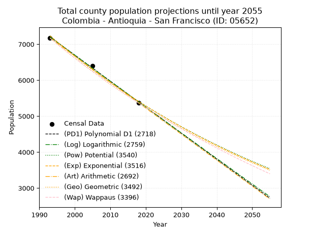
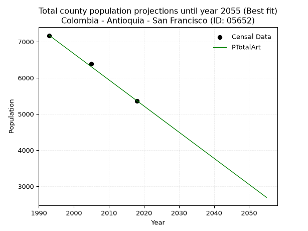
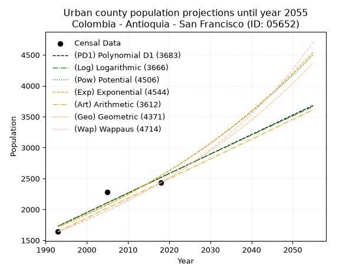
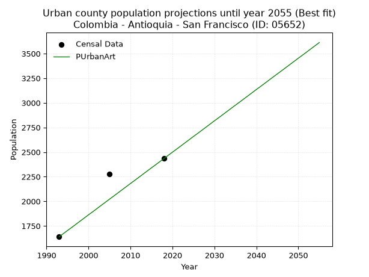
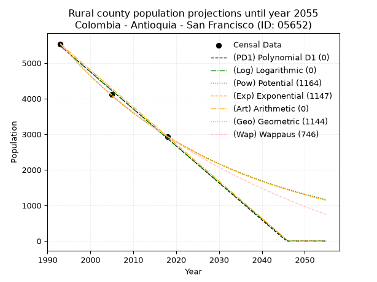
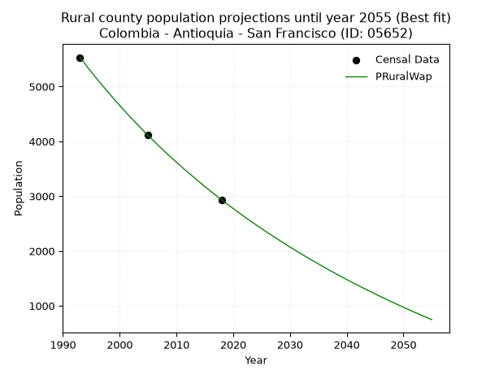

<div align="center">


</div>

# 📜 _“Population and Public Services Demand Projections (PPSD) until Year 2050 for Colombia - Antioquia - San Francisco (ID: 05652)”_
Keywords: `population` `public-service` `projection` `lineal` `polynomial` `logarithmic` `potential` `exponential` `arithmetic` `geometric` `wappaus` `dane` `colombia` `south-america`

PPSD are analytical estimates used by governments and planners to anticipate future changes in population size, age distribution, and the resulting community needs for utilities, healthcare, education, and infrastructure as sizing future water treatment facilities, electrical grids, and road networks based on spatial growth.

<div align="center">

</img>

</div>


> **General running parameters**: • app_version: _v20260806_. • Python version: _3.14.7_. • Pandas version: _3.0.5_. • NumPy version: _2.5.1_. • Creates, save and include plots into reports (create_plot): _False_. • Projection until year: _2050_. • Process polynomial degree 2 and up: _False_. • Process Wappaus: _True_. • Process Wappaus: _True_. • Set negative values to zero: _True_. • Set infinite values to zero: _True_. • Drop dataset notes: _True_. 
<div align="center">

Dynamic map: [:earth_americas:Google](http://maps.google.com/maps?q=5.963475712,-75.1015622) [:earth_americas:OSM](https://www.openstreetmap.org/#map=18/5.963475712/-75.1015622&layers=P) [:earth_americas:Bing](https://www.bing.com/maps?cp=5.963475712~-75.1015622&lvl=18) [:earth_americas:Apple](https://maps.apple.com/frame?center=5.963475712%2C-75.1015622&span=0.003%2C0.006)

</div>


<div align="center">

```geojson
{
  "type": "Feature",
  "geometry": {
    "type": "Point", 
    "coordinates": [-75.1015622, 5.963475712]
  }, 
  "properties": {
    "Name": "Colombia - Antioquia - San Francisco (ID: 05652)"
  }
}
```

</div>


## 0. Census Data (3 records)

Census data are official statistics collected by a government about the people and housing in a country. They usually include counts of total population, age, sex, race, income, education, and jobs.

📅Global census file: [Population.xlsx](../data/Population.xlsx)

| Source   |   Year |   CountryID | CountryName   |   StateID | StateName   |   CountyID | CountyName    |   PTotal |   PUrban |   PRural |
|:---------|-------:|------------:|:--------------|----------:|:------------|-----------:|:--------------|---------:|---------:|---------:|
| DANE     |   1993 |          57 | Colombia      |        05 | Antioquia   |      05652 | San Francisco |     7171 |     1640 |     5531 |
| DANE     |   2005 |          57 | Colombia      |        05 | Antioquia   |      05652 | San Francisco |     6395 |     2277 |     4118 |
| DANE     |   2018 |          57 | Colombia      |        05 | Antioquia   |      05652 | San Francisco |     5365 |     2435 |     2930 |

> 🔥Some records could had specific notes about the registered values or the corresponding urban or rural distribution.

📅[SUI-RUPS](https://www.datos.gov.co/Hacienda-y-Cr-dito-P-blico/Registro-nico-de-Prestadores-de-Servicios-P-blicos/4qkq-csdn/about_data) - Local public utility companies: [RUPS.csv](../data/RUPS.csv)

 | SERVICIO       | ESTADO    | NOMBRE                                                           | NIT         | DEPARTAMENTO_DOMICILIO   | MUNICIPIO_DOMICILIO   | DIRECCION       |   TELEFONO | EMAIL                                      | TIPO_PRESTADOR                             | CLASIFICACION                 |
|:---------------|:----------|:-----------------------------------------------------------------|:------------|:-------------------------|:----------------------|:----------------|-----------:|:-------------------------------------------|:-------------------------------------------|:------------------------------|
| ACUEDUCTO      | OPERATIVA | EMPRESA DE SERVICIOS PUBLICOS DE SAN FRANCISCO ANTIOQUIA SAS ESP | 900657172-3 | ANTIOQUIA                | SAN FRANCISCO         | CALLE 11 N 9 61 |    8323030 | gerencia@esp-sanfrancisco-antioquia.gov.co | SOCIEDADES (EMPRESA DE SERVICIOS PUBLICOS) | MENOR O IGUAL A 2500 USUARIOS |
| ALCANTARILLADO | OPERATIVA | EMPRESA DE SERVICIOS PUBLICOS DE SAN FRANCISCO ANTIOQUIA SAS ESP | 900657172-3 | ANTIOQUIA                | SAN FRANCISCO         | CALLE 11 N 9 61 |    8323030 | gerencia@esp-sanfrancisco-antioquia.gov.co | SOCIEDADES (EMPRESA DE SERVICIOS PUBLICOS) | MENOR O IGUAL A 2500 USUARIOS |

## 1. Total

### 1.1. Coefficients and Parameters

* (PD1) Polynomial Deg 1: -72.3368869936053, 151369.90405117645 (lineal)
* (Log) Logarithmic: -145060.18687510074, 1109283.0973471184
* (Pow) Potential: -23.325109599557553, 80.82072914545356
* (Exp) Exponential: -0.011632327713439548, 84654757844335.34
* (Art) Arithmetic: Year diff. 2018 - 1993 = 25, Population diff. 5365 - 7171 = -1806, Annual growth = -72.24
* (Geo) Geometric: Year diff. 2018 - 1993 = 25, Population diff. 5365 - 7171 = -1806, Annual growth % = -0.011538860315794985
* (Wap) Wappaus: i = -1.152520740268028, Condition values only valid for < 200)

<sub>
Wappaus condition values: ['-0.00', '-1.15', '-2.31', '-3.46', '-4.61', '-5.76', '-6.92', '-8.07', '-9.22', '-10.37', '-11.53', '-12.68', '-13.83', '-14.98', '-16.14', '-17.29', '-18.44', '-19.59', '-20.75', '-21.90', '-23.05', '-24.20', '-25.36', '-26.51', '-27.66', '-28.81', '-29.97', '-31.12', '-32.27', '-33.42', '-34.58', '-35.73', '-36.88', '-38.03', '-39.19', '-40.34', '-41.49', '-42.64', '-43.80', '-44.95', '-46.10', '-47.25', '-48.41', '-49.56', '-50.71', '-51.86', '-53.02', '-54.17', '-55.32', '-56.47', '-57.63', '-58.78', '-59.93', '-61.08', '-62.24', '-63.39', '-64.54', '-65.69']
</sub>


### 1.2. Projected Dataset

|   Year |   CountyID |   PTotalPD1 |   PTotalLog |   PTotalPow |   PTotalExp |   PTotalArt |   PTotalGeo |   PTotalWap |
|-------:|-----------:|------------:|------------:|------------:|------------:|------------:|------------:|------------:|
|   1993 |      05652 |        7202 |        7203 |        7234 |        7233 |        7171 |        7171 |        7171 |
|   1994 |      05652 |        7130 |        7131 |        7150 |        7149 |        7099 |        7088 |        7089 |
|   1995 |      05652 |        7058 |        7058 |        7066 |        7066 |        7027 |        7006 |        7008 |
|   1996 |      05652 |        6985 |        6985 |        6984 |        6985 |        6954 |        6926 |        6927 |
|   1997 |      05652 |        6913 |        6913 |        6903 |        6904 |        6882 |        6846 |        6848 |
|   1998 |      05652 |        6841 |        6840 |        6823 |        6824 |        6810 |        6767 |        6769 |
|   1999 |      05652 |        6768 |        6767 |        6744 |        6745 |        6738 |        6689 |        6692 |
|   2000 |      05652 |        6696 |        6695 |        6666 |        6667 |        6665 |        6611 |        6615 |
|   2001 |      05652 |        6624 |        6622 |        6588 |        6590 |        6593 |        6535 |        6539 |
|   2002 |      05652 |        6551 |        6550 |        6512 |        6514 |        6521 |        6460 |        6464 |
|   2003 |      05652 |        6479 |        6477 |        6437 |        6438 |        6449 |        6385 |        6390 |
|   2004 |      05652 |        6407 |        6405 |        6362 |        6364 |        6376 |        6312 |        6316 |
|   2005 |      05652 |        6334 |        6333 |        6289 |        6290 |        6304 |        6239 |        6243 |
|   2006 |      05652 |        6262 |        6260 |        6216 |        6218 |        6232 |        6167 |        6171 |
|   2007 |      05652 |        6190 |        6188 |        6144 |        6146 |        6160 |        6096 |        6100 |
|   2008 |      05652 |        6117 |        6116 |        6073 |        6075 |        6087 |        6025 |        6030 |
|   2009 |      05652 |        6045 |        6043 |        6003 |        6004 |        6015 |        5956 |        5960 |
|   2010 |      05652 |        5973 |        5971 |        5934 |        5935 |        5943 |        5887 |        5891 |
|   2011 |      05652 |        5900 |        5899 |        5865 |        5866 |        5871 |        5819 |        5823 |
|   2012 |      05652 |        5828 |        5827 |        5798 |        5799 |        5798 |        5752 |        5756 |
|   2013 |      05652 |        5756 |        5755 |        5731 |        5731 |        5726 |        5686 |        5689 |
|   2014 |      05652 |        5683 |        5683 |        5665 |        5665 |        5654 |        5620 |        5623 |
|   2015 |      05652 |        5611 |        5611 |        5600 |        5600 |        5582 |        5555 |        5557 |
|   2016 |      05652 |        5539 |        5539 |        5535 |        5535 |        5509 |        5491 |        5493 |
|   2017 |      05652 |        5466 |        5467 |        5471 |        5471 |        5437 |        5428 |        5428 |
|   2018 |      05652 |        5394 |        5395 |        5409 |        5408 |        5365 |        5365 |        5365 |
|   2019 |      05652 |        5322 |        5323 |        5346 |        5345 |        5293 |        5303 |        5302 |
|   2020 |      05652 |        5249 |        5251 |        5285 |        5283 |        5221 |        5242 |        5240 |
|   2021 |      05652 |        5177 |        5180 |        5224 |        5222 |        5148 |        5181 |        5178 |
|   2022 |      05652 |        5105 |        5108 |        5164 |        5162 |        5076 |        5122 |        5117 |
|   2023 |      05652 |        5032 |        5036 |        5105 |        5102 |        5004 |        5063 |        5057 |
|   2024 |      05652 |        4960 |        4964 |        5047 |        5043 |        4932 |        5004 |        4997 |
|   2025 |      05652 |        4888 |        4893 |        4989 |        4985 |        4859 |        4946 |        4938 |
|   2026 |      05652 |        4815 |        4821 |        4932 |        4927 |        4787 |        4889 |        4879 |
|   2027 |      05652 |        4743 |        4750 |        4875 |        4870 |        4715 |        4833 |        4821 |
|   2028 |      05652 |        4671 |        4678 |        4820 |        4814 |        4643 |        4777 |        4764 |
|   2029 |      05652 |        4598 |        4606 |        4764 |        4758 |        4570 |        4722 |        4707 |
|   2030 |      05652 |        4526 |        4535 |        4710 |        4703 |        4498 |        4668 |        4650 |
|   2031 |      05652 |        4454 |        4464 |        4656 |        4649 |        4426 |        4614 |        4595 |
|   2032 |      05652 |        4381 |        4392 |        4603 |        4595 |        4354 |        4560 |        4539 |
|   2033 |      05652 |        4309 |        4321 |        4551 |        4542 |        4281 |        4508 |        4484 |
|   2034 |      05652 |        4237 |        4249 |        4499 |        4489 |        4209 |        4456 |        4430 |
|   2035 |      05652 |        4164 |        4178 |        4447 |        4437 |        4137 |        4404 |        4376 |
|   2036 |      05652 |        4092 |        4107 |        4397 |        4386 |        4065 |        4354 |        4323 |
|   2037 |      05652 |        4020 |        4036 |        4347 |        4335 |        3992 |        4303 |        4270 |
|   2038 |      05652 |        3947 |        3964 |        4297 |        4285 |        3920 |        4254 |        4218 |
|   2039 |      05652 |        3875 |        3893 |        4248 |        4236 |        3848 |        4205 |        4166 |
|   2040 |      05652 |        3803 |        3822 |        4200 |        4187 |        3776 |        4156 |        4114 |
|   2041 |      05652 |        3730 |        3751 |        4152 |        4138 |        3703 |        4108 |        4063 |
|   2042 |      05652 |        3658 |        3680 |        4105 |        4090 |        3631 |        4061 |        4013 |
|   2043 |      05652 |        3586 |        3609 |        4058 |        4043 |        3559 |        4014 |        3963 |
|   2044 |      05652 |        3513 |        3538 |        4012 |        3996 |        3487 |        3968 |        3913 |
|   2045 |      05652 |        3441 |        3467 |        3967 |        3950 |        3415 |        3922 |        3864 |
|   2046 |      05652 |        3369 |        3396 |        3922 |        3904 |        3342 |        3876 |        3816 |
|   2047 |      05652 |        3296 |        3325 |        3877 |        3859 |        3270 |        3832 |        3767 |
|   2048 |      05652 |        3224 |        3254 |        3833 |        3815 |        3198 |        3788 |        3719 |
|   2049 |      05652 |        3152 |        3184 |        3790 |        3771 |        3126 |        3744 |        3672 |
|   2050 |      05652 |        3079 |        3113 |        3747 |        3727 |        3053 |        3701 |        3625 |
<div align="center">

</img>

</div>


### 1.3. Best fit with absolute and relative error (%)

Relative error puts that difference into context by dividing the absolute error by the true value, creating a unitless ratio or percentage that shows the scale of the mistake.

Absolute and relative error

|   Year | Source   |   CountryID | CountryName   |   StateID | StateName   |   CountyID_x | CountyName    |   PTotal |   PUrban |   PRural |   CountyID_y |   PTotalPD1 |   PTotalLog |   PTotalPow |   PTotalExp |   PTotalArt |   PTotalGeo |   PTotalWap |   PTotalPD1AbsError |   PTotalLogAbsError |   PTotalPowAbsError |   PTotalExpAbsError |   PTotalArtAbsError |   PTotalGeoAbsError |   PTotalWapAbsError |   PTotalPD1RelError |   PTotalLogRelError |   PTotalPowRelError |   PTotalExpRelError |   PTotalArtRelError |   PTotalGeoRelError |   PTotalWapRelError |
|-------:|:---------|------------:|:--------------|----------:|:------------|-------------:|:--------------|---------:|---------:|---------:|-------------:|------------:|------------:|------------:|------------:|------------:|------------:|------------:|--------------------:|--------------------:|--------------------:|--------------------:|--------------------:|--------------------:|--------------------:|--------------------:|--------------------:|--------------------:|--------------------:|--------------------:|--------------------:|--------------------:|
|   1993 | DANE     |          57 | Colombia      |        05 | Antioquia   |        05652 | San Francisco |     7171 |     1640 |     5531 |        05652 |        7202 |        7203 |        7234 |        7233 |        7171 |        7171 |        7171 |                  31 |                  32 |                  63 |                  62 |                   0 |                   0 |                   0 |            0.432297 |            0.446242 |            0.878539 |            0.864594 |             0       |             0       |             0       |
|   2005 | DANE     |          57 | Colombia      |        05 | Antioquia   |        05652 | San Francisco |     6395 |     2277 |     4118 |        05652 |        6334 |        6333 |        6289 |        6290 |        6304 |        6239 |        6243 |                  61 |                  62 |                 106 |                 105 |                  91 |                 156 |                 152 |            0.95387  |            0.969507 |            1.65754  |            1.64191  |             1.42299 |             2.43941 |             2.37686 |
|   2018 | DANE     |          57 | Colombia      |        05 | Antioquia   |        05652 | San Francisco |     5365 |     2435 |     2930 |        05652 |        5394 |        5395 |        5409 |        5408 |        5365 |        5365 |        5365 |                  29 |                  30 |                  44 |                  43 |                   0 |                   0 |                   0 |            0.540541 |            0.55918  |            0.82013  |            0.801491 |             0       |             0       |             0       |

Relative error mean

| Method    |   RelError | Best   |
|:----------|-----------:|:-------|
| PTotalPD1 |   0.642236 |        |
| PTotalLog |   0.65831  |        |
| PTotalPow |   1.11874  |        |
| PTotalExp |   1.10266  |        |
| PTotalArt |   0.474329 | True   |
| PTotalGeo |   0.813135 |        |
| PTotalWap |   0.792286 |        |

💙Best method: _**PTotalArt**_
<div align="center">

</img>

</div>


### 1.4. Fresh water supply demand in liters per capita per day (lpcd)

The fresh water supply demand typically ranges from 100 to 300 liters per capita per day (lpcd) for standard domestic and municipal planning, though absolute survival minimums set by the World Health Organization are as low as 7.5 to 20 liters per day, and total consumption in high-income nations can exceed 400 liters.

> `CZ`: Level in meters above the sea level (masl)<br> `WS`: Fresh water supply demand in liters per capita per day (lpcd or l/h/d)<br> `WSAll`: Zonal fresh water supply demand in liters per second (l/s)<br> `A`: Zonal area in square meters<br> `DP`: Population density (people/hectare or p/ha)

Reference values (RAS Colombia)

|    CZ |   WS |
|------:|-----:|
|  1000 |  120 |
|  2000 |  130 |
| 99999 |  140 |

County shapefile geometry properties and water supply values

|   CountyID |      ATotal |   CZTotal |   WSTotal |
|-----------:|------------:|----------:|----------:|
|      05652 | 3.54202e+08 |   878.362 |       120 |

Projected values for best method: PTotalArt

|   CountyID |   Year |   PTotalArt |   DPTotal |   WSTotal |   WSTotalAll |
|-----------:|-------:|------------:|----------:|----------:|-------------:|
|      05652 |   1993 |        7171 |      0.2  |       120 |      9.95972 |
|      05652 |   1994 |        7099 |      0.2  |       120 |      9.85972 |
|      05652 |   1995 |        7027 |      0.2  |       120 |      9.75972 |
|      05652 |   1996 |        6954 |      0.2  |       120 |      9.65833 |
|      05652 |   1997 |        6882 |      0.19 |       120 |      9.55833 |
|      05652 |   1998 |        6810 |      0.19 |       120 |      9.45833 |
|      05652 |   1999 |        6738 |      0.19 |       120 |      9.35833 |
|      05652 |   2000 |        6665 |      0.19 |       120 |      9.25694 |
|      05652 |   2001 |        6593 |      0.19 |       120 |      9.15694 |
|      05652 |   2002 |        6521 |      0.18 |       120 |      9.05694 |
|      05652 |   2003 |        6449 |      0.18 |       120 |      8.95694 |
|      05652 |   2004 |        6376 |      0.18 |       120 |      8.85556 |
|      05652 |   2005 |        6304 |      0.18 |       120 |      8.75556 |
|      05652 |   2006 |        6232 |      0.18 |       120 |      8.65556 |
|      05652 |   2007 |        6160 |      0.17 |       120 |      8.55556 |
|      05652 |   2008 |        6087 |      0.17 |       120 |      8.45417 |
|      05652 |   2009 |        6015 |      0.17 |       120 |      8.35417 |
|      05652 |   2010 |        5943 |      0.17 |       120 |      8.25417 |
|      05652 |   2011 |        5871 |      0.17 |       120 |      8.15417 |
|      05652 |   2012 |        5798 |      0.16 |       120 |      8.05278 |
|      05652 |   2013 |        5726 |      0.16 |       120 |      7.95278 |
|      05652 |   2014 |        5654 |      0.16 |       120 |      7.85278 |
|      05652 |   2015 |        5582 |      0.16 |       120 |      7.75278 |
|      05652 |   2016 |        5509 |      0.16 |       120 |      7.65139 |
|      05652 |   2017 |        5437 |      0.15 |       120 |      7.55139 |
|      05652 |   2018 |        5365 |      0.15 |       120 |      7.45139 |
|      05652 |   2019 |        5293 |      0.15 |       120 |      7.35139 |
|      05652 |   2020 |        5221 |      0.15 |       120 |      7.25139 |
|      05652 |   2021 |        5148 |      0.15 |       120 |      7.15    |
|      05652 |   2022 |        5076 |      0.14 |       120 |      7.05    |
|      05652 |   2023 |        5004 |      0.14 |       120 |      6.95    |
|      05652 |   2024 |        4932 |      0.14 |       120 |      6.85    |
|      05652 |   2025 |        4859 |      0.14 |       120 |      6.74861 |
|      05652 |   2026 |        4787 |      0.14 |       120 |      6.64861 |
|      05652 |   2027 |        4715 |      0.13 |       120 |      6.54861 |
|      05652 |   2028 |        4643 |      0.13 |       120 |      6.44861 |
|      05652 |   2029 |        4570 |      0.13 |       120 |      6.34722 |
|      05652 |   2030 |        4498 |      0.13 |       120 |      6.24722 |
|      05652 |   2031 |        4426 |      0.12 |       120 |      6.14722 |
|      05652 |   2032 |        4354 |      0.12 |       120 |      6.04722 |
|      05652 |   2033 |        4281 |      0.12 |       120 |      5.94583 |
|      05652 |   2034 |        4209 |      0.12 |       120 |      5.84583 |
|      05652 |   2035 |        4137 |      0.12 |       120 |      5.74583 |
|      05652 |   2036 |        4065 |      0.11 |       120 |      5.64583 |
|      05652 |   2037 |        3992 |      0.11 |       120 |      5.54444 |
|      05652 |   2038 |        3920 |      0.11 |       120 |      5.44444 |
|      05652 |   2039 |        3848 |      0.11 |       120 |      5.34444 |
|      05652 |   2040 |        3776 |      0.11 |       120 |      5.24444 |
|      05652 |   2041 |        3703 |      0.1  |       120 |      5.14306 |
|      05652 |   2042 |        3631 |      0.1  |       120 |      5.04306 |
|      05652 |   2043 |        3559 |      0.1  |       120 |      4.94306 |
|      05652 |   2044 |        3487 |      0.1  |       120 |      4.84306 |
|      05652 |   2045 |        3415 |      0.1  |       120 |      4.74306 |
|      05652 |   2046 |        3342 |      0.09 |       120 |      4.64167 |
|      05652 |   2047 |        3270 |      0.09 |       120 |      4.54167 |
|      05652 |   2048 |        3198 |      0.09 |       120 |      4.44167 |
|      05652 |   2049 |        3126 |      0.09 |       120 |      4.34167 |
|      05652 |   2050 |        3053 |      0.09 |       120 |      4.24028 |

## 2. Urban

### 2.1. Coefficients and Parameters

* (PD1) Polynomial Deg 1: 31.527718550107352, -61106.25159914858 (lineal)
* (Log) Logarithmic: 63272.902512416316, -478981.5103582405
* (Pow) Potential: 31.43481076533011, -100.48386453101512
* (Exp) Exponential: 0.01566242751950504, 4.77616175883692e-11
* (Art) Arithmetic: Year diff. 2018 - 1993 = 25, Population diff. 2435 - 1640 = 795, Annual growth = 31.8
* (Geo) Geometric: Year diff. 2018 - 1993 = 25, Population diff. 2435 - 1640 = 795, Annual growth % = 0.015935660211849
* (Wap) Wappaus: i = 1.5607361963190185, Condition values only valid for < 200)

<sub>
Wappaus condition values: ['0.00', '1.56', '3.12', '4.68', '6.24', '7.80', '9.36', '10.93', '12.49', '14.05', '15.61', '17.17', '18.73', '20.29', '21.85', '23.41', '24.97', '26.53', '28.09', '29.65', '31.21', '32.78', '34.34', '35.90', '37.46', '39.02', '40.58', '42.14', '43.70', '45.26', '46.82', '48.38', '49.94', '51.50', '53.07', '54.63', '56.19', '57.75', '59.31', '60.87', '62.43', '63.99', '65.55', '67.11', '68.67', '70.23', '71.79', '73.35', '74.92', '76.48', '78.04', '79.60', '81.16', '82.72', '84.28', '85.84', '87.40', '88.96']
</sub>


### 2.2. Projected Dataset

|   Year |   CountyID |   PUrbanPD1 |   PUrbanLog |   PUrbanPow |   PUrbanExp |   PUrbanArt |   PUrbanGeo |   PUrbanWap |
|-------:|-----------:|------------:|------------:|------------:|------------:|------------:|------------:|------------:|
|   1993 |      05652 |        1728 |        1728 |        1720 |        1721 |        1640 |        1640 |        1640 |
|   1994 |      05652 |        1760 |        1760 |        1747 |        1748 |        1672 |        1666 |        1666 |
|   1995 |      05652 |        1792 |        1791 |        1775 |        1775 |        1704 |        1693 |        1692 |
|   1996 |      05652 |        1823 |        1823 |        1803 |        1803 |        1735 |        1720 |        1719 |
|   1997 |      05652 |        1855 |        1855 |        1832 |        1832 |        1767 |        1747 |        1746 |
|   1998 |      05652 |        1886 |        1886 |        1861 |        1861 |        1799 |        1775 |        1773 |
|   1999 |      05652 |        1918 |        1918 |        1890 |        1890 |        1831 |        1803 |        1801 |
|   2000 |      05652 |        1949 |        1950 |        1920 |        1920 |        1863 |        1832 |        1830 |
|   2001 |      05652 |        1981 |        1981 |        1951 |        1950 |        1894 |        1861 |        1858 |
|   2002 |      05652 |        2012 |        2013 |        1982 |        1981 |        1926 |        1891 |        1888 |
|   2003 |      05652 |        2044 |        2044 |        2013 |        2012 |        1958 |        1921 |        1918 |
|   2004 |      05652 |        2075 |        2076 |        2045 |        2044 |        1990 |        1952 |        1948 |
|   2005 |      05652 |        2107 |        2108 |        2077 |        2076 |        2022 |        1983 |        1979 |
|   2006 |      05652 |        2138 |        2139 |        2110 |        2109 |        2053 |        2014 |        2010 |
|   2007 |      05652 |        2170 |        2171 |        2143 |        2142 |        2085 |        2046 |        2042 |
|   2008 |      05652 |        2201 |        2202 |        2177 |        2176 |        2117 |        2079 |        2075 |
|   2009 |      05652 |        2233 |        2234 |        2211 |        2211 |        2149 |        2112 |        2108 |
|   2010 |      05652 |        2264 |        2265 |        2246 |        2245 |        2181 |        2146 |        2142 |
|   2011 |      05652 |        2296 |        2297 |        2282 |        2281 |        2212 |        2180 |        2176 |
|   2012 |      05652 |        2328 |        2328 |        2318 |        2317 |        2244 |        2215 |        2211 |
|   2013 |      05652 |        2359 |        2360 |        2354 |        2354 |        2276 |        2250 |        2247 |
|   2014 |      05652 |        2391 |        2391 |        2391 |        2391 |        2308 |        2286 |        2283 |
|   2015 |      05652 |        2422 |        2422 |        2429 |        2428 |        2340 |        2322 |        2320 |
|   2016 |      05652 |        2454 |        2454 |        2467 |        2467 |        2371 |        2359 |        2357 |
|   2017 |      05652 |        2485 |        2485 |        2506 |        2506 |        2403 |        2397 |        2396 |
|   2018 |      05652 |        2517 |        2517 |        2545 |        2545 |        2435 |        2435 |        2435 |
|   2019 |      05652 |        2548 |        2548 |        2585 |        2585 |        2467 |        2474 |        2475 |
|   2020 |      05652 |        2580 |        2579 |        2626 |        2626 |        2499 |        2513 |        2516 |
|   2021 |      05652 |        2611 |        2611 |        2667 |        2668 |        2530 |        2553 |        2557 |
|   2022 |      05652 |        2643 |        2642 |        2709 |        2710 |        2562 |        2594 |        2599 |
|   2023 |      05652 |        2674 |        2673 |        2751 |        2753 |        2594 |        2635 |        2643 |
|   2024 |      05652 |        2706 |        2704 |        2794 |        2796 |        2626 |        2677 |        2687 |
|   2025 |      05652 |        2737 |        2736 |        2838 |        2840 |        2658 |        2720 |        2732 |
|   2026 |      05652 |        2769 |        2767 |        2882 |        2885 |        2689 |        2763 |        2778 |
|   2027 |      05652 |        2800 |        2798 |        2927 |        2931 |        2721 |        2807 |        2825 |
|   2028 |      05652 |        2832 |        2829 |        2973 |        2977 |        2753 |        2852 |        2872 |
|   2029 |      05652 |        2863 |        2861 |        3019 |        3024 |        2785 |        2898 |        2921 |
|   2030 |      05652 |        2895 |        2892 |        3067 |        3072 |        2817 |        2944 |        2972 |
|   2031 |      05652 |        2927 |        2923 |        3114 |        3120 |        2848 |        2991 |        3023 |
|   2032 |      05652 |        2958 |        2954 |        3163 |        3169 |        2880 |        3038 |        3075 |
|   2033 |      05652 |        2990 |        2985 |        3212 |        3219 |        2912 |        3087 |        3128 |
|   2034 |      05652 |        3021 |        3016 |        3262 |        3270 |        2944 |        3136 |        3183 |
|   2035 |      05652 |        3053 |        3047 |        3313 |        3322 |        2976 |        3186 |        3239 |
|   2036 |      05652 |        3084 |        3078 |        3365 |        3374 |        3007 |        3237 |        3296 |
|   2037 |      05652 |        3116 |        3110 |        3417 |        3427 |        3039 |        3288 |        3355 |
|   2038 |      05652 |        3147 |        3141 |        3470 |        3482 |        3071 |        3341 |        3415 |
|   2039 |      05652 |        3179 |        3172 |        3524 |        3536 |        3103 |        3394 |        3477 |
|   2040 |      05652 |        3210 |        3203 |        3579 |        3592 |        3135 |        3448 |        3540 |
|   2041 |      05652 |        3242 |        3234 |        3634 |        3649 |        3166 |        3503 |        3604 |
|   2042 |      05652 |        3273 |        3265 |        3691 |        3707 |        3198 |        3559 |        3671 |
|   2043 |      05652 |        3305 |        3296 |        3748 |        3765 |        3230 |        3615 |        3739 |
|   2044 |      05652 |        3336 |        3327 |        3806 |        3825 |        3262 |        3673 |        3808 |
|   2045 |      05652 |        3368 |        3358 |        3865 |        3885 |        3294 |        3732 |        3880 |
|   2046 |      05652 |        3399 |        3388 |        3925 |        3946 |        3325 |        3791 |        3953 |
|   2047 |      05652 |        3431 |        3419 |        3986 |        4009 |        3357 |        3851 |        4029 |
|   2048 |      05652 |        3463 |        3450 |        4047 |        4072 |        3389 |        3913 |        4106 |
|   2049 |      05652 |        3494 |        3481 |        4110 |        4136 |        3421 |        3975 |        4186 |
|   2050 |      05652 |        3526 |        3512 |        4173 |        4201 |        3453 |        4038 |        4268 |
<div align="center">

</img>

</div>


### 2.3. Best fit with absolute and relative error (%)

Relative error puts that difference into context by dividing the absolute error by the true value, creating a unitless ratio or percentage that shows the scale of the mistake.

Absolute and relative error

|   Year | Source   |   CountryID | CountryName   |   StateID | StateName   |   CountyID_x | CountyName    |   PTotal |   PUrban |   PRural |   CountyID_y |   PUrbanPD1 |   PUrbanLog |   PUrbanPow |   PUrbanExp |   PUrbanArt |   PUrbanGeo |   PUrbanWap |   PUrbanPD1AbsError |   PUrbanLogAbsError |   PUrbanPowAbsError |   PUrbanExpAbsError |   PUrbanArtAbsError |   PUrbanGeoAbsError |   PUrbanWapAbsError |   PUrbanPD1RelError |   PUrbanLogRelError |   PUrbanPowRelError |   PUrbanExpRelError |   PUrbanArtRelError |   PUrbanGeoRelError |   PUrbanWapRelError |
|-------:|:---------|------------:|:--------------|----------:|:------------|-------------:|:--------------|---------:|---------:|---------:|-------------:|------------:|------------:|------------:|------------:|------------:|------------:|------------:|--------------------:|--------------------:|--------------------:|--------------------:|--------------------:|--------------------:|--------------------:|--------------------:|--------------------:|--------------------:|--------------------:|--------------------:|--------------------:|--------------------:|
|   1993 | DANE     |          57 | Colombia      |        05 | Antioquia   |        05652 | San Francisco |     7171 |     1640 |     5531 |        05652 |        1728 |        1728 |        1720 |        1721 |        1640 |        1640 |        1640 |                  88 |                  88 |                  80 |                  81 |                   0 |                   0 |                   0 |             5.36585 |             5.36585 |             4.87805 |             4.93902 |              0      |              0      |              0      |
|   2005 | DANE     |          57 | Colombia      |        05 | Antioquia   |        05652 | San Francisco |     6395 |     2277 |     4118 |        05652 |        2107 |        2108 |        2077 |        2076 |        2022 |        1983 |        1979 |                 170 |                 169 |                 200 |                 201 |                 255 |                 294 |                 298 |             7.46596 |             7.42205 |             8.78349 |             8.8274  |             11.1989 |             12.9117 |             13.0874 |
|   2018 | DANE     |          57 | Colombia      |        05 | Antioquia   |        05652 | San Francisco |     5365 |     2435 |     2930 |        05652 |        2517 |        2517 |        2545 |        2545 |        2435 |        2435 |        2435 |                  82 |                  82 |                 110 |                 110 |                   0 |                   0 |                   0 |             3.36756 |             3.36756 |             4.51745 |             4.51745 |              0      |              0      |              0      |

Relative error mean

| Method    |   RelError | Best   |
|:----------|-----------:|:-------|
| PUrbanPD1 |    5.39979 |        |
| PUrbanLog |    5.38515 |        |
| PUrbanPow |    6.05966 |        |
| PUrbanExp |    6.09463 |        |
| PUrbanArt |    3.73298 | True   |
| PUrbanGeo |    4.30391 |        |
| PUrbanWap |    4.36247 |        |

💙Best method: _**PUrbanArt**_
<div align="center">

</img>

</div>


### 2.4. Fresh water supply demand in liters per capita per day (lpcd)

The fresh water supply demand typically ranges from 100 to 300 liters per capita per day (lpcd) for standard domestic and municipal planning, though absolute survival minimums set by the World Health Organization are as low as 7.5 to 20 liters per day, and total consumption in high-income nations can exceed 400 liters.

> `CZ`: Level in meters above the sea level (masl)<br> `WS`: Fresh water supply demand in liters per capita per day (lpcd or l/h/d)<br> `WSAll`: Zonal fresh water supply demand in liters per second (l/s)<br> `A`: Zonal area in square meters<br> `DP`: Population density (people/hectare or p/ha)

Reference values (RAS Colombia)

|    CZ |   WS |
|------:|-----:|
|  1000 |  120 |
|  2000 |  130 |
| 99999 |  140 |

County shapefile geometry properties and water supply values

|   CountyID |   AUrban |   CZUrban |   WSUrban |
|-----------:|---------:|----------:|----------:|
|      05652 |   214549 |   1270.51 |       130 |

Projected values for best method: PUrbanArt

|   CountyID |   Year |   PUrbanArt |   DPUrban |   WSUrban |   WSUrbanAll |
|-----------:|-------:|------------:|----------:|----------:|-------------:|
|      05652 |   1993 |        1640 |     76.44 |       130 |      2.46759 |
|      05652 |   1994 |        1672 |     77.93 |       130 |      2.51574 |
|      05652 |   1995 |        1704 |     79.42 |       130 |      2.56389 |
|      05652 |   1996 |        1735 |     80.87 |       130 |      2.61053 |
|      05652 |   1997 |        1767 |     82.36 |       130 |      2.65868 |
|      05652 |   1998 |        1799 |     83.85 |       130 |      2.70683 |
|      05652 |   1999 |        1831 |     85.34 |       130 |      2.75498 |
|      05652 |   2000 |        1863 |     86.83 |       130 |      2.80313 |
|      05652 |   2001 |        1894 |     88.28 |       130 |      2.84977 |
|      05652 |   2002 |        1926 |     89.77 |       130 |      2.89792 |
|      05652 |   2003 |        1958 |     91.26 |       130 |      2.94606 |
|      05652 |   2004 |        1990 |     92.75 |       130 |      2.99421 |
|      05652 |   2005 |        2022 |     94.24 |       130 |      3.04236 |
|      05652 |   2006 |        2053 |     95.69 |       130 |      3.089   |
|      05652 |   2007 |        2085 |     97.18 |       130 |      3.13715 |
|      05652 |   2008 |        2117 |     98.67 |       130 |      3.1853  |
|      05652 |   2009 |        2149 |    100.16 |       130 |      3.23345 |
|      05652 |   2010 |        2181 |    101.65 |       130 |      3.2816  |
|      05652 |   2011 |        2212 |    103.1  |       130 |      3.32824 |
|      05652 |   2012 |        2244 |    104.59 |       130 |      3.37639 |
|      05652 |   2013 |        2276 |    106.08 |       130 |      3.42454 |
|      05652 |   2014 |        2308 |    107.57 |       130 |      3.47269 |
|      05652 |   2015 |        2340 |    109.07 |       130 |      3.52083 |
|      05652 |   2016 |        2371 |    110.51 |       130 |      3.56748 |
|      05652 |   2017 |        2403 |    112    |       130 |      3.61563 |
|      05652 |   2018 |        2435 |    113.49 |       130 |      3.66377 |
|      05652 |   2019 |        2467 |    114.99 |       130 |      3.71192 |
|      05652 |   2020 |        2499 |    116.48 |       130 |      3.76007 |
|      05652 |   2021 |        2530 |    117.92 |       130 |      3.80671 |
|      05652 |   2022 |        2562 |    119.41 |       130 |      3.85486 |
|      05652 |   2023 |        2594 |    120.9  |       130 |      3.90301 |
|      05652 |   2024 |        2626 |    122.4  |       130 |      3.95116 |
|      05652 |   2025 |        2658 |    123.89 |       130 |      3.99931 |
|      05652 |   2026 |        2689 |    125.33 |       130 |      4.04595 |
|      05652 |   2027 |        2721 |    126.82 |       130 |      4.0941  |
|      05652 |   2028 |        2753 |    128.32 |       130 |      4.14225 |
|      05652 |   2029 |        2785 |    129.81 |       130 |      4.19039 |
|      05652 |   2030 |        2817 |    131.3  |       130 |      4.23854 |
|      05652 |   2031 |        2848 |    132.74 |       130 |      4.28519 |
|      05652 |   2032 |        2880 |    134.23 |       130 |      4.33333 |
|      05652 |   2033 |        2912 |    135.73 |       130 |      4.38148 |
|      05652 |   2034 |        2944 |    137.22 |       130 |      4.42963 |
|      05652 |   2035 |        2976 |    138.71 |       130 |      4.47778 |
|      05652 |   2036 |        3007 |    140.15 |       130 |      4.52442 |
|      05652 |   2037 |        3039 |    141.65 |       130 |      4.57257 |
|      05652 |   2038 |        3071 |    143.14 |       130 |      4.62072 |
|      05652 |   2039 |        3103 |    144.63 |       130 |      4.66887 |
|      05652 |   2040 |        3135 |    146.12 |       130 |      4.71701 |
|      05652 |   2041 |        3166 |    147.57 |       130 |      4.76366 |
|      05652 |   2042 |        3198 |    149.06 |       130 |      4.81181 |
|      05652 |   2043 |        3230 |    150.55 |       130 |      4.85995 |
|      05652 |   2044 |        3262 |    152.04 |       130 |      4.9081  |
|      05652 |   2045 |        3294 |    153.53 |       130 |      4.95625 |
|      05652 |   2046 |        3325 |    154.98 |       130 |      5.00289 |
|      05652 |   2047 |        3357 |    156.47 |       130 |      5.05104 |
|      05652 |   2048 |        3389 |    157.96 |       130 |      5.09919 |
|      05652 |   2049 |        3421 |    159.45 |       130 |      5.14734 |
|      05652 |   2050 |        3453 |    160.94 |       130 |      5.19549 |

## 3. Rural

### 3.1. Coefficients and Parameters

* (PD1) Polynomial Deg 1: -103.86460554371263, 212476.15565032497 (lineal)
* (Log) Logarithmic: -208333.08938751713, 1588264.6077053593
* (Pow) Potential: -50.99003533064236, 171.98644230422937
* (Exp) Exponential: -0.025425282389092974, 5.638062393737655e+25
* (Art) Arithmetic: Year diff. 2018 - 1993 = 25, Population diff. 2930 - 5531 = -2601, Annual growth = -104.04
* (Geo) Geometric: Year diff. 2018 - 1993 = 25, Population diff. 2930 - 5531 = -2601, Annual growth % = -0.025094414755024386
* (Wap) Wappaus: i = -2.4592837726037113, Condition values only valid for < 200)

<sub>
Wappaus condition values: ['-0.00', '-2.46', '-4.92', '-7.38', '-9.84', '-12.30', '-14.76', '-17.21', '-19.67', '-22.13', '-24.59', '-27.05', '-29.51', '-31.97', '-34.43', '-36.89', '-39.35', '-41.81', '-44.27', '-46.73', '-49.19', '-51.64', '-54.10', '-56.56', '-59.02', '-61.48', '-63.94', '-66.40', '-68.86', '-71.32', '-73.78', '-76.24', '-78.70', '-81.16', '-83.62', '-86.07', '-88.53', '-90.99', '-93.45', '-95.91', '-98.37', '-100.83', '-103.29', '-105.75', '-108.21', '-110.67', '-113.13', '-115.59', '-118.05', '-120.50', '-122.96', '-125.42', '-127.88', '-130.34', '-132.80', '-135.26', '-137.72', '-140.18']
</sub>


### 3.2. Projected Dataset

|   Year |   CountyID |   PRuralPD1 |   PRuralLog |   PRuralPow |   PRuralExp |   PRuralArt |   PRuralGeo |   PRuralWap |
|-------:|-----------:|------------:|------------:|------------:|------------:|------------:|------------:|------------:|
|   1993 |      05652 |        5474 |        5476 |        5552 |        5550 |        5531 |        5531 |        5531 |
|   1994 |      05652 |        5370 |        5371 |        5412 |        5411 |        5427 |        5392 |        5397 |
|   1995 |      05652 |        5266 |        5267 |        5275 |        5275 |        5323 |        5257 |        5265 |
|   1996 |      05652 |        5162 |        5162 |        5142 |        5143 |        5219 |        5125 |        5137 |
|   1997 |      05652 |        5059 |        5058 |        5012 |        5013 |        5115 |        4996 |        5012 |
|   1998 |      05652 |        4955 |        4954 |        4886 |        4888 |        5011 |        4871 |        4890 |
|   1999 |      05652 |        4851 |        4849 |        4763 |        4765 |        4907 |        4749 |        4771 |
|   2000 |      05652 |        4747 |        4745 |        4643 |        4645 |        4803 |        4630 |        4654 |
|   2001 |      05652 |        4643 |        4641 |        4526 |        4529 |        4699 |        4513 |        4540 |
|   2002 |      05652 |        4539 |        4537 |        4412 |        4415 |        4595 |        4400 |        4429 |
|   2003 |      05652 |        4435 |        4433 |        4301 |        4304 |        4491 |        4290 |        4320 |
|   2004 |      05652 |        4331 |        4329 |        4193 |        4196 |        4387 |        4182 |        4213 |
|   2005 |      05652 |        4228 |        4225 |        4088 |        4091 |        4283 |        4077 |        4109 |
|   2006 |      05652 |        4124 |        4121 |        3985 |        3988 |        4178 |        3975 |        4006 |
|   2007 |      05652 |        4020 |        4017 |        3885 |        3888 |        4074 |        3875 |        3906 |
|   2008 |      05652 |        3916 |        3913 |        3788 |        3790 |        3970 |        3778 |        3808 |
|   2009 |      05652 |        3812 |        3810 |        3693 |        3695 |        3866 |        3683 |        3712 |
|   2010 |      05652 |        3708 |        3706 |        3600 |        3602 |        3762 |        3591 |        3618 |
|   2011 |      05652 |        3604 |        3602 |        3510 |        3512 |        3658 |        3500 |        3526 |
|   2012 |      05652 |        3501 |        3499 |        3422 |        3424 |        3554 |        3413 |        3436 |
|   2013 |      05652 |        3397 |        3395 |        3337 |        3338 |        3450 |        3327 |        3348 |
|   2014 |      05652 |        3293 |        3292 |        3253 |        3254 |        3346 |        3244 |        3261 |
|   2015 |      05652 |        3189 |        3188 |        3172 |        3172 |        3242 |        3162 |        3176 |
|   2016 |      05652 |        3085 |        3085 |        3093 |        3093 |        3138 |        3083 |        3092 |
|   2017 |      05652 |        2981 |        2982 |        3016 |        3015 |        3034 |        3005 |        3010 |
|   2018 |      05652 |        2877 |        2879 |        2940 |        2939 |        2930 |        2930 |        2930 |
|   2019 |      05652 |        2774 |        2775 |        2867 |        2866 |        2826 |        2856 |        2851 |
|   2020 |      05652 |        2670 |        2672 |        2795 |        2794 |        2722 |        2785 |        2774 |
|   2021 |      05652 |        2566 |        2569 |        2726 |        2723 |        2618 |        2715 |        2698 |
|   2022 |      05652 |        2462 |        2466 |        2658 |        2655 |        2514 |        2647 |        2623 |
|   2023 |      05652 |        2358 |        2363 |        2592 |        2588 |        2410 |        2580 |        2550 |
|   2024 |      05652 |        2254 |        2260 |        2527 |        2523 |        2306 |        2516 |        2478 |
|   2025 |      05652 |        2150 |        2157 |        2464 |        2460 |        2202 |        2452 |        2407 |
|   2026 |      05652 |        2046 |        2054 |        2403 |        2398 |        2098 |        2391 |        2338 |
|   2027 |      05652 |        1943 |        1951 |        2343 |        2338 |        1994 |        2331 |        2270 |
|   2028 |      05652 |        1839 |        1849 |        2285 |        2279 |        1890 |        2272 |        2203 |
|   2029 |      05652 |        1735 |        1746 |        2229 |        2222 |        1786 |        2215 |        2137 |
|   2030 |      05652 |        1631 |        1643 |        2173 |        2166 |        1682 |        2160 |        2072 |
|   2031 |      05652 |        1527 |        1541 |        2119 |        2112 |        1577 |        2106 |        2008 |
|   2032 |      05652 |        1423 |        1438 |        2067 |        2059 |        1473 |        2053 |        1946 |
|   2033 |      05652 |        1319 |        1336 |        2016 |        2007 |        1369 |        2001 |        1884 |
|   2034 |      05652 |        1216 |        1233 |        1966 |        1957 |        1265 |        1951 |        1823 |
|   2035 |      05652 |        1112 |        1131 |        1917 |        1908 |        1161 |        1902 |        1764 |
|   2036 |      05652 |        1008 |        1028 |        1870 |        1860 |        1057 |        1854 |        1705 |
|   2037 |      05652 |         904 |         926 |        1823 |        1813 |         953 |        1808 |        1647 |
|   2038 |      05652 |         800 |         824 |        1778 |        1768 |         849 |        1762 |        1590 |
|   2039 |      05652 |         696 |         722 |        1734 |        1723 |         745 |        1718 |        1535 |
|   2040 |      05652 |         592 |         620 |        1692 |        1680 |         641 |        1675 |        1479 |
|   2041 |      05652 |         488 |         517 |        1650 |        1638 |         537 |        1633 |        1425 |
|   2042 |      05652 |         385 |         415 |        1609 |        1597 |         433 |        1592 |        1372 |
|   2043 |      05652 |         281 |         313 |        1569 |        1557 |         329 |        1552 |        1319 |
|   2044 |      05652 |         177 |         211 |        1531 |        1518 |         225 |        1513 |        1268 |
|   2045 |      05652 |          73 |         110 |        1493 |        1480 |         121 |        1475 |        1217 |
|   2046 |      05652 |           0 |           8 |        1456 |        1442 |          17 |        1438 |        1166 |
|   2047 |      05652 |           0 |           0 |        1420 |        1406 |           0 |        1402 |        1117 |
|   2048 |      05652 |           0 |           0 |        1386 |        1371 |           0 |        1367 |        1068 |
|   2049 |      05652 |           0 |           0 |        1351 |        1336 |           0 |        1333 |        1020 |
|   2050 |      05652 |           0 |           0 |        1318 |        1303 |           0 |        1299 |         973 |
<div align="center">

</img>

</div>


### 3.3. Best fit with absolute and relative error (%)

Relative error puts that difference into context by dividing the absolute error by the true value, creating a unitless ratio or percentage that shows the scale of the mistake.

Absolute and relative error

|   Year | Source   |   CountryID | CountryName   |   StateID | StateName   |   CountyID_x | CountyName    |   PTotal |   PUrban |   PRural |   CountyID_y |   PRuralPD1 |   PRuralLog |   PRuralPow |   PRuralExp |   PRuralArt |   PRuralGeo |   PRuralWap |   PRuralPD1AbsError |   PRuralLogAbsError |   PRuralPowAbsError |   PRuralExpAbsError |   PRuralArtAbsError |   PRuralGeoAbsError |   PRuralWapAbsError |   PRuralPD1RelError |   PRuralLogRelError |   PRuralPowRelError |   PRuralExpRelError |   PRuralArtRelError |   PRuralGeoRelError |   PRuralWapRelError |
|-------:|:---------|------------:|:--------------|----------:|:------------|-------------:|:--------------|---------:|---------:|---------:|-------------:|------------:|------------:|------------:|------------:|------------:|------------:|------------:|--------------------:|--------------------:|--------------------:|--------------------:|--------------------:|--------------------:|--------------------:|--------------------:|--------------------:|--------------------:|--------------------:|--------------------:|--------------------:|--------------------:|
|   1993 | DANE     |          57 | Colombia      |        05 | Antioquia   |        05652 | San Francisco |     7171 |     1640 |     5531 |        05652 |        5474 |        5476 |        5552 |        5550 |        5531 |        5531 |        5531 |                  57 |                  55 |                  21 |                  19 |                   0 |                   0 |                   0 |             1.03056 |            0.994395 |            0.379678 |            0.343518 |              0      |            0        |            0        |
|   2005 | DANE     |          57 | Colombia      |        05 | Antioquia   |        05652 | San Francisco |     6395 |     2277 |     4118 |        05652 |        4228 |        4225 |        4088 |        4091 |        4283 |        4077 |        4109 |                 110 |                 107 |                  30 |                  27 |                 165 |                  41 |                   9 |             2.6712  |            2.59835  |            0.728509 |            0.655658 |              4.0068 |            0.995629 |            0.218553 |
|   2018 | DANE     |          57 | Colombia      |        05 | Antioquia   |        05652 | San Francisco |     5365 |     2435 |     2930 |        05652 |        2877 |        2879 |        2940 |        2939 |        2930 |        2930 |        2930 |                  53 |                  51 |                  10 |                   9 |                   0 |                   0 |                   0 |             1.80887 |            1.74061  |            0.341297 |            0.307167 |              0      |            0        |            0        |

Relative error mean

| Method    |   RelError | Best   |
|:----------|-----------:|:-------|
| PRuralPD1 |  1.83688   |        |
| PRuralLog |  1.77779   |        |
| PRuralPow |  0.483161  |        |
| PRuralExp |  0.435448  |        |
| PRuralArt |  1.3356    |        |
| PRuralGeo |  0.331876  |        |
| PRuralWap |  0.0728509 | True   |

💙Best method: _**PRuralWap**_
<div align="center">

</img>

</div>


### 3.4. Fresh water supply demand in liters per capita per day (lpcd)

The fresh water supply demand typically ranges from 100 to 300 liters per capita per day (lpcd) for standard domestic and municipal planning, though absolute survival minimums set by the World Health Organization are as low as 7.5 to 20 liters per day, and total consumption in high-income nations can exceed 400 liters.

> `CZ`: Level in meters above the sea level (masl)<br> `WS`: Fresh water supply demand in liters per capita per day (lpcd or l/h/d)<br> `WSAll`: Zonal fresh water supply demand in liters per second (l/s)<br> `A`: Zonal area in square meters<br> `DP`: Population density (people/hectare or p/ha)

Reference values (RAS Colombia)

|    CZ |   WS |
|------:|-----:|
|  1000 |  120 |
|  2000 |  130 |
| 99999 |  140 |

County shapefile geometry properties and water supply values

|   CountyID |      ARural |   CZRural |   WSRural |
|-----------:|------------:|----------:|----------:|
|      05652 | 3.53987e+08 |   878.117 |       120 |

Projected values for best method: PRuralWap

|   CountyID |   Year |   PRuralWap |   DPRural |   WSRural |   WSRuralAll |
|-----------:|-------:|------------:|----------:|----------:|-------------:|
|      05652 |   1993 |        5531 |      0.16 |       120 |      7.68194 |
|      05652 |   1994 |        5397 |      0.15 |       120 |      7.49583 |
|      05652 |   1995 |        5265 |      0.15 |       120 |      7.3125  |
|      05652 |   1996 |        5137 |      0.15 |       120 |      7.13472 |
|      05652 |   1997 |        5012 |      0.14 |       120 |      6.96111 |
|      05652 |   1998 |        4890 |      0.14 |       120 |      6.79167 |
|      05652 |   1999 |        4771 |      0.13 |       120 |      6.62639 |
|      05652 |   2000 |        4654 |      0.13 |       120 |      6.46389 |
|      05652 |   2001 |        4540 |      0.13 |       120 |      6.30556 |
|      05652 |   2002 |        4429 |      0.13 |       120 |      6.15139 |
|      05652 |   2003 |        4320 |      0.12 |       120 |      6       |
|      05652 |   2004 |        4213 |      0.12 |       120 |      5.85139 |
|      05652 |   2005 |        4109 |      0.12 |       120 |      5.70694 |
|      05652 |   2006 |        4006 |      0.11 |       120 |      5.56389 |
|      05652 |   2007 |        3906 |      0.11 |       120 |      5.425   |
|      05652 |   2008 |        3808 |      0.11 |       120 |      5.28889 |
|      05652 |   2009 |        3712 |      0.1  |       120 |      5.15556 |
|      05652 |   2010 |        3618 |      0.1  |       120 |      5.025   |
|      05652 |   2011 |        3526 |      0.1  |       120 |      4.89722 |
|      05652 |   2012 |        3436 |      0.1  |       120 |      4.77222 |
|      05652 |   2013 |        3348 |      0.09 |       120 |      4.65    |
|      05652 |   2014 |        3261 |      0.09 |       120 |      4.52917 |
|      05652 |   2015 |        3176 |      0.09 |       120 |      4.41111 |
|      05652 |   2016 |        3092 |      0.09 |       120 |      4.29444 |
|      05652 |   2017 |        3010 |      0.09 |       120 |      4.18056 |
|      05652 |   2018 |        2930 |      0.08 |       120 |      4.06944 |
|      05652 |   2019 |        2851 |      0.08 |       120 |      3.95972 |
|      05652 |   2020 |        2774 |      0.08 |       120 |      3.85278 |
|      05652 |   2021 |        2698 |      0.08 |       120 |      3.74722 |
|      05652 |   2022 |        2623 |      0.07 |       120 |      3.64306 |
|      05652 |   2023 |        2550 |      0.07 |       120 |      3.54167 |
|      05652 |   2024 |        2478 |      0.07 |       120 |      3.44167 |
|      05652 |   2025 |        2407 |      0.07 |       120 |      3.34306 |
|      05652 |   2026 |        2338 |      0.07 |       120 |      3.24722 |
|      05652 |   2027 |        2270 |      0.06 |       120 |      3.15278 |
|      05652 |   2028 |        2203 |      0.06 |       120 |      3.05972 |
|      05652 |   2029 |        2137 |      0.06 |       120 |      2.96806 |
|      05652 |   2030 |        2072 |      0.06 |       120 |      2.87778 |
|      05652 |   2031 |        2008 |      0.06 |       120 |      2.78889 |
|      05652 |   2032 |        1946 |      0.05 |       120 |      2.70278 |
|      05652 |   2033 |        1884 |      0.05 |       120 |      2.61667 |
|      05652 |   2034 |        1823 |      0.05 |       120 |      2.53194 |
|      05652 |   2035 |        1764 |      0.05 |       120 |      2.45    |
|      05652 |   2036 |        1705 |      0.05 |       120 |      2.36806 |
|      05652 |   2037 |        1647 |      0.05 |       120 |      2.2875  |
|      05652 |   2038 |        1590 |      0.04 |       120 |      2.20833 |
|      05652 |   2039 |        1535 |      0.04 |       120 |      2.13194 |
|      05652 |   2040 |        1479 |      0.04 |       120 |      2.05417 |
|      05652 |   2041 |        1425 |      0.04 |       120 |      1.97917 |
|      05652 |   2042 |        1372 |      0.04 |       120 |      1.90556 |
|      05652 |   2043 |        1319 |      0.04 |       120 |      1.83194 |
|      05652 |   2044 |        1268 |      0.04 |       120 |      1.76111 |
|      05652 |   2045 |        1217 |      0.03 |       120 |      1.69028 |
|      05652 |   2046 |        1166 |      0.03 |       120 |      1.61944 |
|      05652 |   2047 |        1117 |      0.03 |       120 |      1.55139 |
|      05652 |   2048 |        1068 |      0.03 |       120 |      1.48333 |
|      05652 |   2049 |        1020 |      0.03 |       120 |      1.41667 |
|      05652 |   2050 |         973 |      0.03 |       120 |      1.35139 |

#

<div align="center"><br><sub>Share this research</sub></div><br>

<sub>**APPS & TOOLS & CONTENT DISCLAIMER**: • NO WARRANTY - This content and software is provided by <a href="https://github.com/rcfdtools" target="_blank">github.com/rcfdtools</a> "as is", without any express or implied warranty, including warranties of merchantability, fitness for a particular purpose, or non-infringement. There is no guarantee that the software will be error-free or operate without interruption. • LIMITATION OF LIABILITY - Neither the authors nor copyright holders will be liable for claims or damages arising from the software or its use. You are responsible for determining if the software is appropriate for your use and assume all associated risks, including errors, legal compliance, and data loss. • NO PROFESSIONAL ADVICE - The software provides general information and does not offer professional advice. It should not replace consultation with professional advisors. [Clauses and global license for rcfdtools use.](https://github.com/rcfdtools/rcfdtools/blob/main/LICENSE.md)</sub>

| [:house: Home](Readme.md)  | [:beginner: Help / Collab](https://github.com/rcfdtools/R.HydroTools/discussions/31) |
|----------------------------|-------------------------------------------------------------------------------------------|