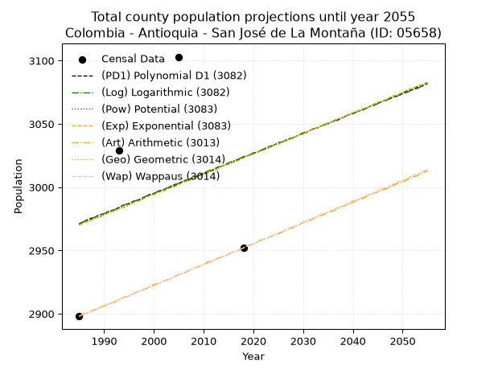
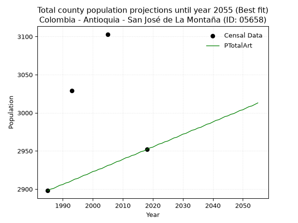
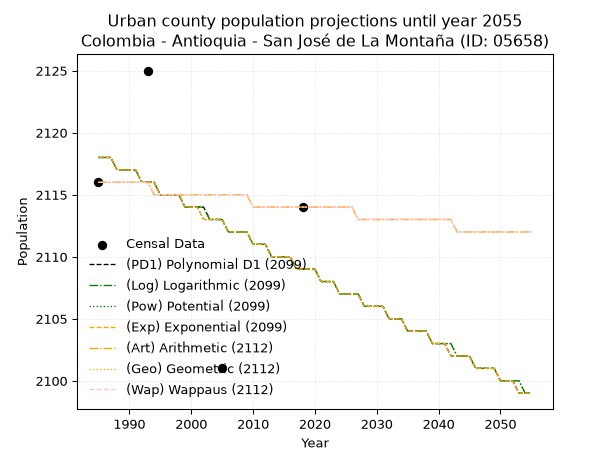
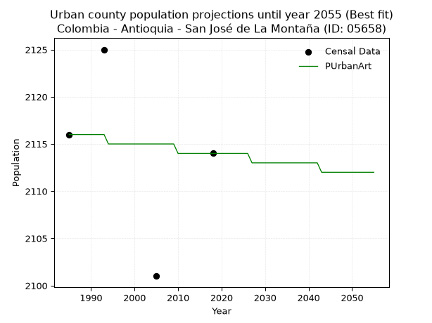
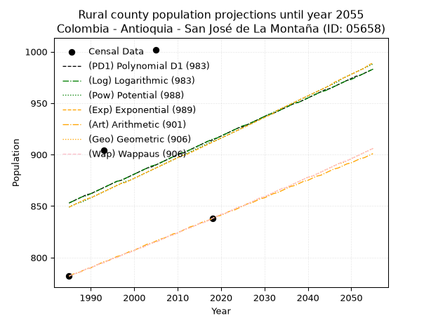
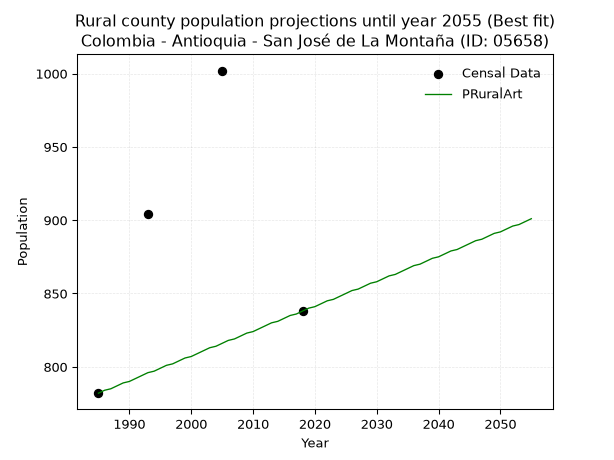

<div align="center">


</div>

# _“Population and Public Services Demand Projections (PPSD) until Year 2050 for Colombia - Antioquia - San José de La Montaña (ID: 05658)”_
Keywords: `population` `public-service` `projection` `lineal` `polynomial` `logarithmic` `potential` `exponential` `arithmetic` `geometric` `wappaus` `dane` `colombia` `south-america`

PPSD are analytical estimates used by governments and planners to anticipate future changes in population size, age distribution, and the resulting community needs for utilities, healthcare, education, and infrastructure as sizing future water treatment facilities, electrical grids, and road networks based on spatial growth.

> **General running parameters**: • app_version: _v20260806_. • Python version: _3.14.7_. • Pandas version: _3.0.5_. • NumPy version: _2.5.1_. • Creates, save and include plots into reports (create_plot): _False_. • Projection until year: _2050_. • Process polynomial degree 2 and up: _False_. • Process Wappaus: _True_. • Process Wappaus: _True_. • Set negative values to zero: _True_. • Set infinite values to zero: _True_. • Drop dataset notes: _True_. 
<div align="center">

Dynamic map: [:earth_americas:Google](http://maps.google.com/maps?q=6.850090298,-75.6833516) [:earth_americas:OSM](https://www.openstreetmap.org/#map=18/6.850090298/-75.6833516&layers=P) [:earth_americas:Bing](https://www.bing.com/maps?cp=6.850090298~-75.6833516&lvl=18) [:earth_americas:Apple](https://maps.apple.com/frame?center=6.850090298%2C-75.6833516&span=0.003%2C0.006)

</div>


<div align="center">

```geojson
{
  "type": "Feature",
  "geometry": {
    "type": "Point", 
    "coordinates": [-75.6833516, 6.850090298]
  }, 
  "properties": {
    "Name": "Colombia - Antioquia - San José de La Montaña (ID: 05658)"
  }
}
```

</div>


## 0. Census Data (4 records)

Census data are official statistics collected by a government about the people and housing in a country. They usually include counts of total population, age, sex, race, income, education, and jobs.

📅Global census file: [Population.xlsx](../data/Population.xlsx)

| Source   |   Year |   CountryID | CountryName   |   StateID | StateName   |   CountyID | CountyName             |   PTotal |   PUrban |   PRural |
|:---------|-------:|------------:|:--------------|----------:|:------------|-----------:|:-----------------------|---------:|---------:|---------:|
| DANE     |   1985 |          57 | Colombia      |        05 | Antioquia   |      05658 | San José de La Montaña |     2898 |     2116 |      782 |
| DANE     |   1993 |          57 | Colombia      |        05 | Antioquia   |      05658 | San José De La Montaña |     3029 |     2125 |      904 |
| DANE     |   2005 |          57 | Colombia      |        05 | Antioquia   |      05658 | San José de La Montaña |     3103 |     2101 |     1002 |
| DANE     |   2018 |          57 | Colombia      |        05 | Antioquia   |      05658 | San José De La Montaña |     2952 |     2114 |      838 |

> 🔥Some records could had specific notes about the registered values or the corresponding urban or rural distribution.

## 1. Total

### 1.1. Coefficients and Parameters

* (PD1) Polynomial Deg 1: 1.577679646728322, -160.25371336832643 (lineal)
* (Log) Logarithmic: 3186.0095699102753, -21221.384271966384
* (Pow) Potential: 1.0758939720968237, -0.07528364883862172
* (Exp) Exponential: 0.0005328341208979765, 1031.459682734833
* (Art) Arithmetic: Year diff. 2018 - 1985 = 33, Population diff. 2952 - 2898 = 54, Annual growth = 1.6363636363636365
* (Geo) Geometric: Year diff. 2018 - 1985 = 33, Population diff. 2952 - 2898 = 54, Annual growth % = 0.0005596129746368028
* (Wap) Wappaus: i = 0.055944055944055944, Condition values only valid for < 200)

<sub>
Wappaus condition values: ['0.00', '0.06', '0.11', '0.17', '0.22', '0.28', '0.34', '0.39', '0.45', '0.50', '0.56', '0.62', '0.67', '0.73', '0.78', '0.84', '0.90', '0.95', '1.01', '1.06', '1.12', '1.17', '1.23', '1.29', '1.34', '1.40', '1.45', '1.51', '1.57', '1.62', '1.68', '1.73', '1.79', '1.85', '1.90', '1.96', '2.01', '2.07', '2.13', '2.18', '2.24', '2.29', '2.35', '2.41', '2.46', '2.52', '2.57', '2.63', '2.69', '2.74', '2.80', '2.85', '2.91', '2.97', '3.02', '3.08', '3.13', '3.19', '3.24', '3.30', '3.36', '3.41', '3.47', '3.52', '3.58', '3.64']
</sub>


### 1.2. Projected Dataset

|   Year |   CountyID |   PTotalPD1 |   PTotalLog |   PTotalPow |   PTotalExp |   PTotalArt |   PTotalGeo |   PTotalWap |
|-------:|-----------:|------------:|------------:|------------:|------------:|------------:|------------:|------------:|
|   1985 |      05658 |        2971 |        2971 |        2970 |        2970 |        2898 |        2898 |        2898 |
|   1986 |      05658 |        2973 |        2973 |        2972 |        2972 |        2900 |        2900 |        2900 |
|   1987 |      05658 |        2975 |        2974 |        2973 |        2973 |        2901 |        2901 |        2901 |
|   1988 |      05658 |        2976 |        2976 |        2975 |        2975 |        2903 |        2903 |        2903 |
|   1989 |      05658 |        2978 |        2978 |        2976 |        2977 |        2905 |        2904 |        2904 |
|   1990 |      05658 |        2979 |        2979 |        2978 |        2978 |        2906 |        2906 |        2906 |
|   1991 |      05658 |        2981 |        2981 |        2980 |        2980 |        2908 |        2908 |        2908 |
|   1992 |      05658 |        2982 |        2982 |        2981 |        2981 |        2909 |        2909 |        2909 |
|   1993 |      05658 |        2984 |        2984 |        2983 |        2983 |        2911 |        2911 |        2911 |
|   1994 |      05658 |        2986 |        2986 |        2984 |        2985 |        2913 |        2913 |        2913 |
|   1995 |      05658 |        2987 |        2987 |        2986 |        2986 |        2914 |        2914 |        2914 |
|   1996 |      05658 |        2989 |        2989 |        2988 |        2988 |        2916 |        2916 |        2916 |
|   1997 |      05658 |        2990 |        2990 |        2989 |        2989 |        2918 |        2918 |        2918 |
|   1998 |      05658 |        2992 |        2992 |        2991 |        2991 |        2919 |        2919 |        2919 |
|   1999 |      05658 |        2994 |        2994 |        2993 |        2993 |        2921 |        2921 |        2921 |
|   2000 |      05658 |        2995 |        2995 |        2994 |        2994 |        2923 |        2922 |        2922 |
|   2001 |      05658 |        2997 |        2997 |        2996 |        2996 |        2924 |        2924 |        2924 |
|   2002 |      05658 |        2998 |        2998 |        2997 |        2997 |        2926 |        2926 |        2926 |
|   2003 |      05658 |        3000 |        3000 |        2999 |        2999 |        2927 |        2927 |        2927 |
|   2004 |      05658 |        3001 |        3002 |        3001 |        3000 |        2929 |        2929 |        2929 |
|   2005 |      05658 |        3003 |        3003 |        3002 |        3002 |        2931 |        2931 |        2931 |
|   2006 |      05658 |        3005 |        3005 |        3004 |        3004 |        2932 |        2932 |        2932 |
|   2007 |      05658 |        3006 |        3006 |        3005 |        3005 |        2934 |        2934 |        2934 |
|   2008 |      05658 |        3008 |        3008 |        3007 |        3007 |        2936 |        2936 |        2936 |
|   2009 |      05658 |        3009 |        3009 |        3009 |        3008 |        2937 |        2937 |        2937 |
|   2010 |      05658 |        3011 |        3011 |        3010 |        3010 |        2939 |        2939 |        2939 |
|   2011 |      05658 |        3012 |        3013 |        3012 |        3012 |        2941 |        2940 |        2940 |
|   2012 |      05658 |        3014 |        3014 |        3013 |        3013 |        2942 |        2942 |        2942 |
|   2013 |      05658 |        3016 |        3016 |        3015 |        3015 |        2944 |        2944 |        2944 |
|   2014 |      05658 |        3017 |        3017 |        3017 |        3017 |        2945 |        2945 |        2945 |
|   2015 |      05658 |        3019 |        3019 |        3018 |        3018 |        2947 |        2947 |        2947 |
|   2016 |      05658 |        3020 |        3021 |        3020 |        3020 |        2949 |        2949 |        2949 |
|   2017 |      05658 |        3022 |        3022 |        3022 |        3021 |        2950 |        2950 |        2950 |
|   2018 |      05658 |        3024 |        3024 |        3023 |        3023 |        2952 |        2952 |        2952 |
|   2019 |      05658 |        3025 |        3025 |        3025 |        3025 |        2954 |        2954 |        2954 |
|   2020 |      05658 |        3027 |        3027 |        3026 |        3026 |        2955 |        2955 |        2955 |
|   2021 |      05658 |        3028 |        3028 |        3028 |        3028 |        2957 |        2957 |        2957 |
|   2022 |      05658 |        3030 |        3030 |        3030 |        3029 |        2959 |        2959 |        2959 |
|   2023 |      05658 |        3031 |        3032 |        3031 |        3031 |        2960 |        2960 |        2960 |
|   2024 |      05658 |        3033 |        3033 |        3033 |        3033 |        2962 |        2962 |        2962 |
|   2025 |      05658 |        3035 |        3035 |        3034 |        3034 |        2963 |        2964 |        2964 |
|   2026 |      05658 |        3036 |        3036 |        3036 |        3036 |        2965 |        2965 |        2965 |
|   2027 |      05658 |        3038 |        3038 |        3038 |        3037 |        2967 |        2967 |        2967 |
|   2028 |      05658 |        3039 |        3039 |        3039 |        3039 |        2968 |        2969 |        2969 |
|   2029 |      05658 |        3041 |        3041 |        3041 |        3041 |        2970 |        2970 |        2970 |
|   2030 |      05658 |        3042 |        3043 |        3043 |        3042 |        2972 |        2972 |        2972 |
|   2031 |      05658 |        3044 |        3044 |        3044 |        3044 |        2973 |        2974 |        2974 |
|   2032 |      05658 |        3046 |        3046 |        3046 |        3046 |        2975 |        2975 |        2975 |
|   2033 |      05658 |        3047 |        3047 |        3047 |        3047 |        2977 |        2977 |        2977 |
|   2034 |      05658 |        3049 |        3049 |        3049 |        3049 |        2978 |        2979 |        2979 |
|   2035 |      05658 |        3050 |        3050 |        3051 |        3050 |        2980 |        2980 |        2980 |
|   2036 |      05658 |        3052 |        3052 |        3052 |        3052 |        2981 |        2982 |        2982 |
|   2037 |      05658 |        3053 |        3054 |        3054 |        3054 |        2983 |        2984 |        2984 |
|   2038 |      05658 |        3055 |        3055 |        3055 |        3055 |        2985 |        2985 |        2985 |
|   2039 |      05658 |        3057 |        3057 |        3057 |        3057 |        2986 |        2987 |        2987 |
|   2040 |      05658 |        3058 |        3058 |        3059 |        3059 |        2988 |        2989 |        2989 |
|   2041 |      05658 |        3060 |        3060 |        3060 |        3060 |        2990 |        2990 |        2990 |
|   2042 |      05658 |        3061 |        3061 |        3062 |        3062 |        2991 |        2992 |        2992 |
|   2043 |      05658 |        3063 |        3063 |        3063 |        3063 |        2993 |        2994 |        2994 |
|   2044 |      05658 |        3065 |        3064 |        3065 |        3065 |        2995 |        2995 |        2995 |
|   2045 |      05658 |        3066 |        3066 |        3067 |        3067 |        2996 |        2997 |        2997 |
|   2046 |      05658 |        3068 |        3068 |        3068 |        3068 |        2998 |        2999 |        2999 |
|   2047 |      05658 |        3069 |        3069 |        3070 |        3070 |        2999 |        3000 |        3000 |
|   2048 |      05658 |        3071 |        3071 |        3072 |        3072 |        3001 |        3002 |        3002 |
|   2049 |      05658 |        3072 |        3072 |        3073 |        3073 |        3003 |        3004 |        3004 |
|   2050 |      05658 |        3074 |        3074 |        3075 |        3075 |        3004 |        3005 |        3005 |
<div align="center">

</img>

</div>


### 1.3. Best fit with absolute and relative error (%)

Relative error puts that difference into context by dividing the absolute error by the true value, creating a unitless ratio or percentage that shows the scale of the mistake.

Absolute and relative error

|   Year | Source   |   CountryID | CountryName   |   StateID | StateName   |   CountyID_x | CountyName             |   PTotal |   PUrban |   PRural |   CountyID_y |   PTotalPD1 |   PTotalLog |   PTotalPow |   PTotalExp |   PTotalArt |   PTotalGeo |   PTotalWap |   PTotalPD1AbsError |   PTotalLogAbsError |   PTotalPowAbsError |   PTotalExpAbsError |   PTotalArtAbsError |   PTotalGeoAbsError |   PTotalWapAbsError |   PTotalPD1RelError |   PTotalLogRelError |   PTotalPowRelError |   PTotalExpRelError |   PTotalArtRelError |   PTotalGeoRelError |   PTotalWapRelError |
|-------:|:---------|------------:|:--------------|----------:|:------------|-------------:|:-----------------------|---------:|---------:|---------:|-------------:|------------:|------------:|------------:|------------:|------------:|------------:|------------:|--------------------:|--------------------:|--------------------:|--------------------:|--------------------:|--------------------:|--------------------:|--------------------:|--------------------:|--------------------:|--------------------:|--------------------:|--------------------:|--------------------:|
|   1985 | DANE     |          57 | Colombia      |        05 | Antioquia   |        05658 | San José de La Montaña |     2898 |     2116 |      782 |        05658 |        2971 |        2971 |        2970 |        2970 |        2898 |        2898 |        2898 |                  73 |                  73 |                  72 |                  72 |                   0 |                   0 |                   0 |             2.51898 |             2.51898 |             2.48447 |             2.48447 |             0       |             0       |             0       |
|   1993 | DANE     |          57 | Colombia      |        05 | Antioquia   |        05658 | San José De La Montaña |     3029 |     2125 |      904 |        05658 |        2984 |        2984 |        2983 |        2983 |        2911 |        2911 |        2911 |                  45 |                  45 |                  46 |                  46 |                 118 |                 118 |                 118 |             1.48564 |             1.48564 |             1.51865 |             1.51865 |             3.89568 |             3.89568 |             3.89568 |
|   2005 | DANE     |          57 | Colombia      |        05 | Antioquia   |        05658 | San José de La Montaña |     3103 |     2101 |     1002 |        05658 |        3003 |        3003 |        3002 |        3002 |        2931 |        2931 |        2931 |                 100 |                 100 |                 101 |                 101 |                 172 |                 172 |                 172 |             3.22269 |             3.22269 |             3.25491 |             3.25491 |             5.54302 |             5.54302 |             5.54302 |
|   2018 | DANE     |          57 | Colombia      |        05 | Antioquia   |        05658 | San José De La Montaña |     2952 |     2114 |      838 |        05658 |        3024 |        3024 |        3023 |        3023 |        2952 |        2952 |        2952 |                  72 |                  72 |                  71 |                  71 |                   0 |                   0 |                   0 |             2.43902 |             2.43902 |             2.40515 |             2.40515 |             0       |             0       |             0       |

Relative error mean

| Method    |   RelError | Best   |
|:----------|-----------:|:-------|
| PTotalPD1 |    2.41658 |        |
| PTotalLog |    2.41658 |        |
| PTotalPow |    2.4158  |        |
| PTotalExp |    2.4158  |        |
| PTotalArt |    2.35967 | True   |
| PTotalGeo |    2.35967 | True   |
| PTotalWap |    2.35967 | True   |

💙Best method: _**PTotalArt**_
<div align="center">

</img>

</div>


### 1.4. Fresh water supply demand in liters per capita per day (lpcd)

The fresh water supply demand typically ranges from 100 to 300 liters per capita per day (lpcd) for standard domestic and municipal planning, though absolute survival minimums set by the World Health Organization are as low as 7.5 to 20 liters per day, and total consumption in high-income nations can exceed 400 liters.

> `CZ`: Level in meters above the sea level (masl).<br> `WS`: Fresh water supply demand in liters per capita per day (lpcd or l/h/d).<br> `WSAll`: Zonal fresh water supply demand in liters per second (l/s).<br> `A`: Zonal area in square meters.

Reference values (RAS Colombia)

|    CZ |   WS |
|------:|-----:|
|  1000 |  120 |
|  2000 |  130 |
| 99999 |  140 |

County shapefile geometry properties and water supply values

|   CountyID |      ATotal |   CZTotal |   WSTotal |
|-----------:|------------:|----------:|----------:|
|      05658 | 1.26048e+08 |   2784.75 |       140 |

Projected values for best method: PTotalArt

|   CountyID |   Year |   PTotalArt |   WSTotal |   WSTotalAll |
|-----------:|-------:|------------:|----------:|-------------:|
|      05658 |   1985 |        2898 |       140 |      4.69583 |
|      05658 |   1986 |        2900 |       140 |      4.69907 |
|      05658 |   1987 |        2901 |       140 |      4.70069 |
|      05658 |   1988 |        2903 |       140 |      4.70394 |
|      05658 |   1989 |        2905 |       140 |      4.70718 |
|      05658 |   1990 |        2906 |       140 |      4.7088  |
|      05658 |   1991 |        2908 |       140 |      4.71204 |
|      05658 |   1992 |        2909 |       140 |      4.71366 |
|      05658 |   1993 |        2911 |       140 |      4.7169  |
|      05658 |   1994 |        2913 |       140 |      4.72014 |
|      05658 |   1995 |        2914 |       140 |      4.72176 |
|      05658 |   1996 |        2916 |       140 |      4.725   |
|      05658 |   1997 |        2918 |       140 |      4.72824 |
|      05658 |   1998 |        2919 |       140 |      4.72986 |
|      05658 |   1999 |        2921 |       140 |      4.7331  |
|      05658 |   2000 |        2923 |       140 |      4.73634 |
|      05658 |   2001 |        2924 |       140 |      4.73796 |
|      05658 |   2002 |        2926 |       140 |      4.7412  |
|      05658 |   2003 |        2927 |       140 |      4.74282 |
|      05658 |   2004 |        2929 |       140 |      4.74606 |
|      05658 |   2005 |        2931 |       140 |      4.74931 |
|      05658 |   2006 |        2932 |       140 |      4.75093 |
|      05658 |   2007 |        2934 |       140 |      4.75417 |
|      05658 |   2008 |        2936 |       140 |      4.75741 |
|      05658 |   2009 |        2937 |       140 |      4.75903 |
|      05658 |   2010 |        2939 |       140 |      4.76227 |
|      05658 |   2011 |        2941 |       140 |      4.76551 |
|      05658 |   2012 |        2942 |       140 |      4.76713 |
|      05658 |   2013 |        2944 |       140 |      4.77037 |
|      05658 |   2014 |        2945 |       140 |      4.77199 |
|      05658 |   2015 |        2947 |       140 |      4.77523 |
|      05658 |   2016 |        2949 |       140 |      4.77847 |
|      05658 |   2017 |        2950 |       140 |      4.78009 |
|      05658 |   2018 |        2952 |       140 |      4.78333 |
|      05658 |   2019 |        2954 |       140 |      4.78657 |
|      05658 |   2020 |        2955 |       140 |      4.78819 |
|      05658 |   2021 |        2957 |       140 |      4.79144 |
|      05658 |   2022 |        2959 |       140 |      4.79468 |
|      05658 |   2023 |        2960 |       140 |      4.7963  |
|      05658 |   2024 |        2962 |       140 |      4.79954 |
|      05658 |   2025 |        2963 |       140 |      4.80116 |
|      05658 |   2026 |        2965 |       140 |      4.8044  |
|      05658 |   2027 |        2967 |       140 |      4.80764 |
|      05658 |   2028 |        2968 |       140 |      4.80926 |
|      05658 |   2029 |        2970 |       140 |      4.8125  |
|      05658 |   2030 |        2972 |       140 |      4.81574 |
|      05658 |   2031 |        2973 |       140 |      4.81736 |
|      05658 |   2032 |        2975 |       140 |      4.8206  |
|      05658 |   2033 |        2977 |       140 |      4.82384 |
|      05658 |   2034 |        2978 |       140 |      4.82546 |
|      05658 |   2035 |        2980 |       140 |      4.8287  |
|      05658 |   2036 |        2981 |       140 |      4.83032 |
|      05658 |   2037 |        2983 |       140 |      4.83356 |
|      05658 |   2038 |        2985 |       140 |      4.83681 |
|      05658 |   2039 |        2986 |       140 |      4.83843 |
|      05658 |   2040 |        2988 |       140 |      4.84167 |
|      05658 |   2041 |        2990 |       140 |      4.84491 |
|      05658 |   2042 |        2991 |       140 |      4.84653 |
|      05658 |   2043 |        2993 |       140 |      4.84977 |
|      05658 |   2044 |        2995 |       140 |      4.85301 |
|      05658 |   2045 |        2996 |       140 |      4.85463 |
|      05658 |   2046 |        2998 |       140 |      4.85787 |
|      05658 |   2047 |        2999 |       140 |      4.85949 |
|      05658 |   2048 |        3001 |       140 |      4.86273 |
|      05658 |   2049 |        3003 |       140 |      4.86597 |
|      05658 |   2050 |        3004 |       140 |      4.86759 |

## 2. Urban

### 2.1. Coefficients and Parameters

* (PD1) Polynomial Deg 1: -0.2761942994781223, 2666.457647531114 (lineal)
* (Log) Logarithmic: -553.8245546452321, 6323.62487792986
* (Pow) Potential: -0.2619361007502696, 4.189772341349426
* (Exp) Exponential: -0.00013062689621382655, 2745.2169475999676
* (Art) Arithmetic: Year diff. 2018 - 1985 = 33, Population diff. 2114 - 2116 = -2, Annual growth = -0.06060606060606061
* (Geo) Geometric: Year diff. 2018 - 1985 = 33, Population diff. 2114 - 2116 = -2, Annual growth % = -2.8654939378980337e-05
* (Wap) Wappaus: i = -0.0028655347804283976, Condition values only valid for < 200)

<sub>
Wappaus condition values: ['-0.00', '-0.00', '-0.01', '-0.01', '-0.01', '-0.01', '-0.02', '-0.02', '-0.02', '-0.03', '-0.03', '-0.03', '-0.03', '-0.04', '-0.04', '-0.04', '-0.05', '-0.05', '-0.05', '-0.05', '-0.06', '-0.06', '-0.06', '-0.07', '-0.07', '-0.07', '-0.07', '-0.08', '-0.08', '-0.08', '-0.09', '-0.09', '-0.09', '-0.09', '-0.10', '-0.10', '-0.10', '-0.11', '-0.11', '-0.11', '-0.11', '-0.12', '-0.12', '-0.12', '-0.13', '-0.13', '-0.13', '-0.13', '-0.14', '-0.14', '-0.14', '-0.15', '-0.15', '-0.15', '-0.15', '-0.16', '-0.16', '-0.16', '-0.17', '-0.17', '-0.17', '-0.17', '-0.18', '-0.18', '-0.18', '-0.19']
</sub>


### 2.2. Projected Dataset

|   Year |   CountyID |   PUrbanPD1 |   PUrbanLog |   PUrbanPow |   PUrbanExp |   PUrbanArt |   PUrbanGeo |   PUrbanWap |
|-------:|-----------:|------------:|------------:|------------:|------------:|------------:|------------:|------------:|
|   1985 |      05658 |        2118 |        2118 |        2118 |        2118 |        2116 |        2116 |        2116 |
|   1986 |      05658 |        2118 |        2118 |        2118 |        2118 |        2116 |        2116 |        2116 |
|   1987 |      05658 |        2118 |        2118 |        2118 |        2118 |        2116 |        2116 |        2116 |
|   1988 |      05658 |        2117 |        2117 |        2117 |        2117 |        2116 |        2116 |        2116 |
|   1989 |      05658 |        2117 |        2117 |        2117 |        2117 |        2116 |        2116 |        2116 |
|   1990 |      05658 |        2117 |        2117 |        2117 |        2117 |        2116 |        2116 |        2116 |
|   1991 |      05658 |        2117 |        2117 |        2117 |        2117 |        2116 |        2116 |        2116 |
|   1992 |      05658 |        2116 |        2116 |        2116 |        2116 |        2116 |        2116 |        2116 |
|   1993 |      05658 |        2116 |        2116 |        2116 |        2116 |        2116 |        2116 |        2116 |
|   1994 |      05658 |        2116 |        2116 |        2116 |        2116 |        2115 |        2115 |        2115 |
|   1995 |      05658 |        2115 |        2115 |        2115 |        2115 |        2115 |        2115 |        2115 |
|   1996 |      05658 |        2115 |        2115 |        2115 |        2115 |        2115 |        2115 |        2115 |
|   1997 |      05658 |        2115 |        2115 |        2115 |        2115 |        2115 |        2115 |        2115 |
|   1998 |      05658 |        2115 |        2115 |        2115 |        2115 |        2115 |        2115 |        2115 |
|   1999 |      05658 |        2114 |        2114 |        2114 |        2114 |        2115 |        2115 |        2115 |
|   2000 |      05658 |        2114 |        2114 |        2114 |        2114 |        2115 |        2115 |        2115 |
|   2001 |      05658 |        2114 |        2114 |        2114 |        2114 |        2115 |        2115 |        2115 |
|   2002 |      05658 |        2114 |        2114 |        2113 |        2113 |        2115 |        2115 |        2115 |
|   2003 |      05658 |        2113 |        2113 |        2113 |        2113 |        2115 |        2115 |        2115 |
|   2004 |      05658 |        2113 |        2113 |        2113 |        2113 |        2115 |        2115 |        2115 |
|   2005 |      05658 |        2113 |        2113 |        2113 |        2113 |        2115 |        2115 |        2115 |
|   2006 |      05658 |        2112 |        2112 |        2112 |        2112 |        2115 |        2115 |        2115 |
|   2007 |      05658 |        2112 |        2112 |        2112 |        2112 |        2115 |        2115 |        2115 |
|   2008 |      05658 |        2112 |        2112 |        2112 |        2112 |        2115 |        2115 |        2115 |
|   2009 |      05658 |        2112 |        2112 |        2112 |        2112 |        2115 |        2115 |        2115 |
|   2010 |      05658 |        2111 |        2111 |        2111 |        2111 |        2114 |        2114 |        2114 |
|   2011 |      05658 |        2111 |        2111 |        2111 |        2111 |        2114 |        2114 |        2114 |
|   2012 |      05658 |        2111 |        2111 |        2111 |        2111 |        2114 |        2114 |        2114 |
|   2013 |      05658 |        2110 |        2110 |        2110 |        2110 |        2114 |        2114 |        2114 |
|   2014 |      05658 |        2110 |        2110 |        2110 |        2110 |        2114 |        2114 |        2114 |
|   2015 |      05658 |        2110 |        2110 |        2110 |        2110 |        2114 |        2114 |        2114 |
|   2016 |      05658 |        2110 |        2110 |        2110 |        2110 |        2114 |        2114 |        2114 |
|   2017 |      05658 |        2109 |        2109 |        2109 |        2109 |        2114 |        2114 |        2114 |
|   2018 |      05658 |        2109 |        2109 |        2109 |        2109 |        2114 |        2114 |        2114 |
|   2019 |      05658 |        2109 |        2109 |        2109 |        2109 |        2114 |        2114 |        2114 |
|   2020 |      05658 |        2109 |        2109 |        2109 |        2109 |        2114 |        2114 |        2114 |
|   2021 |      05658 |        2108 |        2108 |        2108 |        2108 |        2114 |        2114 |        2114 |
|   2022 |      05658 |        2108 |        2108 |        2108 |        2108 |        2114 |        2114 |        2114 |
|   2023 |      05658 |        2108 |        2108 |        2108 |        2108 |        2114 |        2114 |        2114 |
|   2024 |      05658 |        2107 |        2107 |        2107 |        2107 |        2114 |        2114 |        2114 |
|   2025 |      05658 |        2107 |        2107 |        2107 |        2107 |        2114 |        2114 |        2114 |
|   2026 |      05658 |        2107 |        2107 |        2107 |        2107 |        2114 |        2114 |        2114 |
|   2027 |      05658 |        2107 |        2107 |        2107 |        2107 |        2113 |        2113 |        2113 |
|   2028 |      05658 |        2106 |        2106 |        2106 |        2106 |        2113 |        2113 |        2113 |
|   2029 |      05658 |        2106 |        2106 |        2106 |        2106 |        2113 |        2113 |        2113 |
|   2030 |      05658 |        2106 |        2106 |        2106 |        2106 |        2113 |        2113 |        2113 |
|   2031 |      05658 |        2106 |        2106 |        2106 |        2106 |        2113 |        2113 |        2113 |
|   2032 |      05658 |        2105 |        2105 |        2105 |        2105 |        2113 |        2113 |        2113 |
|   2033 |      05658 |        2105 |        2105 |        2105 |        2105 |        2113 |        2113 |        2113 |
|   2034 |      05658 |        2105 |        2105 |        2105 |        2105 |        2113 |        2113 |        2113 |
|   2035 |      05658 |        2104 |        2104 |        2104 |        2104 |        2113 |        2113 |        2113 |
|   2036 |      05658 |        2104 |        2104 |        2104 |        2104 |        2113 |        2113 |        2113 |
|   2037 |      05658 |        2104 |        2104 |        2104 |        2104 |        2113 |        2113 |        2113 |
|   2038 |      05658 |        2104 |        2104 |        2104 |        2104 |        2113 |        2113 |        2113 |
|   2039 |      05658 |        2103 |        2103 |        2103 |        2103 |        2113 |        2113 |        2113 |
|   2040 |      05658 |        2103 |        2103 |        2103 |        2103 |        2113 |        2113 |        2113 |
|   2041 |      05658 |        2103 |        2103 |        2103 |        2103 |        2113 |        2113 |        2113 |
|   2042 |      05658 |        2102 |        2103 |        2103 |        2102 |        2113 |        2113 |        2113 |
|   2043 |      05658 |        2102 |        2102 |        2102 |        2102 |        2112 |        2112 |        2112 |
|   2044 |      05658 |        2102 |        2102 |        2102 |        2102 |        2112 |        2112 |        2112 |
|   2045 |      05658 |        2102 |        2102 |        2102 |        2102 |        2112 |        2112 |        2112 |
|   2046 |      05658 |        2101 |        2101 |        2101 |        2101 |        2112 |        2112 |        2112 |
|   2047 |      05658 |        2101 |        2101 |        2101 |        2101 |        2112 |        2112 |        2112 |
|   2048 |      05658 |        2101 |        2101 |        2101 |        2101 |        2112 |        2112 |        2112 |
|   2049 |      05658 |        2101 |        2101 |        2101 |        2101 |        2112 |        2112 |        2112 |
|   2050 |      05658 |        2100 |        2100 |        2100 |        2100 |        2112 |        2112 |        2112 |
<div align="center">

</img>

</div>


### 2.3. Best fit with absolute and relative error (%)

Relative error puts that difference into context by dividing the absolute error by the true value, creating a unitless ratio or percentage that shows the scale of the mistake.

Absolute and relative error

|   Year | Source   |   CountryID | CountryName   |   StateID | StateName   |   CountyID_x | CountyName             |   PTotal |   PUrban |   PRural |   CountyID_y |   PUrbanPD1 |   PUrbanLog |   PUrbanPow |   PUrbanExp |   PUrbanArt |   PUrbanGeo |   PUrbanWap |   PUrbanPD1AbsError |   PUrbanLogAbsError |   PUrbanPowAbsError |   PUrbanExpAbsError |   PUrbanArtAbsError |   PUrbanGeoAbsError |   PUrbanWapAbsError |   PUrbanPD1RelError |   PUrbanLogRelError |   PUrbanPowRelError |   PUrbanExpRelError |   PUrbanArtRelError |   PUrbanGeoRelError |   PUrbanWapRelError |
|-------:|:---------|------------:|:--------------|----------:|:------------|-------------:|:-----------------------|---------:|---------:|---------:|-------------:|------------:|------------:|------------:|------------:|------------:|------------:|------------:|--------------------:|--------------------:|--------------------:|--------------------:|--------------------:|--------------------:|--------------------:|--------------------:|--------------------:|--------------------:|--------------------:|--------------------:|--------------------:|--------------------:|
|   1985 | DANE     |          57 | Colombia      |        05 | Antioquia   |        05658 | San José de La Montaña |     2898 |     2116 |      782 |        05658 |        2118 |        2118 |        2118 |        2118 |        2116 |        2116 |        2116 |                   2 |                   2 |                   2 |                   2 |                   0 |                   0 |                   0 |            0.094518 |            0.094518 |            0.094518 |            0.094518 |            0        |            0        |            0        |
|   1993 | DANE     |          57 | Colombia      |        05 | Antioquia   |        05658 | San José De La Montaña |     3029 |     2125 |      904 |        05658 |        2116 |        2116 |        2116 |        2116 |        2116 |        2116 |        2116 |                   9 |                   9 |                   9 |                   9 |                   9 |                   9 |                   9 |            0.423529 |            0.423529 |            0.423529 |            0.423529 |            0.423529 |            0.423529 |            0.423529 |
|   2005 | DANE     |          57 | Colombia      |        05 | Antioquia   |        05658 | San José de La Montaña |     3103 |     2101 |     1002 |        05658 |        2113 |        2113 |        2113 |        2113 |        2115 |        2115 |        2115 |                  12 |                  12 |                  12 |                  12 |                  14 |                  14 |                  14 |            0.571157 |            0.571157 |            0.571157 |            0.571157 |            0.666349 |            0.666349 |            0.666349 |
|   2018 | DANE     |          57 | Colombia      |        05 | Antioquia   |        05658 | San José De La Montaña |     2952 |     2114 |      838 |        05658 |        2109 |        2109 |        2109 |        2109 |        2114 |        2114 |        2114 |                   5 |                   5 |                   5 |                   5 |                   0 |                   0 |                   0 |            0.236518 |            0.236518 |            0.236518 |            0.236518 |            0        |            0        |            0        |

Relative error mean

| Method    |   RelError | Best   |
|:----------|-----------:|:-------|
| PUrbanPD1 |   0.331431 |        |
| PUrbanLog |   0.331431 |        |
| PUrbanPow |   0.331431 |        |
| PUrbanExp |   0.331431 |        |
| PUrbanArt |   0.27247  | True   |
| PUrbanGeo |   0.27247  | True   |
| PUrbanWap |   0.27247  | True   |

💙Best method: _**PUrbanArt**_
<div align="center">

</img>

</div>


### 2.4. Fresh water supply demand in liters per capita per day (lpcd)

The fresh water supply demand typically ranges from 100 to 300 liters per capita per day (lpcd) for standard domestic and municipal planning, though absolute survival minimums set by the World Health Organization are as low as 7.5 to 20 liters per day, and total consumption in high-income nations can exceed 400 liters.

> `CZ`: Level in meters above the sea level (masl).<br> `WS`: Fresh water supply demand in liters per capita per day (lpcd or l/h/d).<br> `WSAll`: Zonal fresh water supply demand in liters per second (l/s).<br> `A`: Zonal area in square meters.

Reference values (RAS Colombia)

|    CZ |   WS |
|------:|-----:|
|  1000 |  120 |
|  2000 |  130 |
| 99999 |  140 |

County shapefile geometry properties and water supply values

|   CountyID |   AUrban |   CZUrban |   WSUrban |
|-----------:|---------:|----------:|----------:|
|      05658 |   367756 |   2577.67 |       140 |

Projected values for best method: PUrbanArt

|   CountyID |   Year |   PUrbanArt |   WSUrban |   WSUrbanAll |
|-----------:|-------:|------------:|----------:|-------------:|
|      05658 |   1985 |        2116 |       140 |      3.4287  |
|      05658 |   1986 |        2116 |       140 |      3.4287  |
|      05658 |   1987 |        2116 |       140 |      3.4287  |
|      05658 |   1988 |        2116 |       140 |      3.4287  |
|      05658 |   1989 |        2116 |       140 |      3.4287  |
|      05658 |   1990 |        2116 |       140 |      3.4287  |
|      05658 |   1991 |        2116 |       140 |      3.4287  |
|      05658 |   1992 |        2116 |       140 |      3.4287  |
|      05658 |   1993 |        2116 |       140 |      3.4287  |
|      05658 |   1994 |        2115 |       140 |      3.42708 |
|      05658 |   1995 |        2115 |       140 |      3.42708 |
|      05658 |   1996 |        2115 |       140 |      3.42708 |
|      05658 |   1997 |        2115 |       140 |      3.42708 |
|      05658 |   1998 |        2115 |       140 |      3.42708 |
|      05658 |   1999 |        2115 |       140 |      3.42708 |
|      05658 |   2000 |        2115 |       140 |      3.42708 |
|      05658 |   2001 |        2115 |       140 |      3.42708 |
|      05658 |   2002 |        2115 |       140 |      3.42708 |
|      05658 |   2003 |        2115 |       140 |      3.42708 |
|      05658 |   2004 |        2115 |       140 |      3.42708 |
|      05658 |   2005 |        2115 |       140 |      3.42708 |
|      05658 |   2006 |        2115 |       140 |      3.42708 |
|      05658 |   2007 |        2115 |       140 |      3.42708 |
|      05658 |   2008 |        2115 |       140 |      3.42708 |
|      05658 |   2009 |        2115 |       140 |      3.42708 |
|      05658 |   2010 |        2114 |       140 |      3.42546 |
|      05658 |   2011 |        2114 |       140 |      3.42546 |
|      05658 |   2012 |        2114 |       140 |      3.42546 |
|      05658 |   2013 |        2114 |       140 |      3.42546 |
|      05658 |   2014 |        2114 |       140 |      3.42546 |
|      05658 |   2015 |        2114 |       140 |      3.42546 |
|      05658 |   2016 |        2114 |       140 |      3.42546 |
|      05658 |   2017 |        2114 |       140 |      3.42546 |
|      05658 |   2018 |        2114 |       140 |      3.42546 |
|      05658 |   2019 |        2114 |       140 |      3.42546 |
|      05658 |   2020 |        2114 |       140 |      3.42546 |
|      05658 |   2021 |        2114 |       140 |      3.42546 |
|      05658 |   2022 |        2114 |       140 |      3.42546 |
|      05658 |   2023 |        2114 |       140 |      3.42546 |
|      05658 |   2024 |        2114 |       140 |      3.42546 |
|      05658 |   2025 |        2114 |       140 |      3.42546 |
|      05658 |   2026 |        2114 |       140 |      3.42546 |
|      05658 |   2027 |        2113 |       140 |      3.42384 |
|      05658 |   2028 |        2113 |       140 |      3.42384 |
|      05658 |   2029 |        2113 |       140 |      3.42384 |
|      05658 |   2030 |        2113 |       140 |      3.42384 |
|      05658 |   2031 |        2113 |       140 |      3.42384 |
|      05658 |   2032 |        2113 |       140 |      3.42384 |
|      05658 |   2033 |        2113 |       140 |      3.42384 |
|      05658 |   2034 |        2113 |       140 |      3.42384 |
|      05658 |   2035 |        2113 |       140 |      3.42384 |
|      05658 |   2036 |        2113 |       140 |      3.42384 |
|      05658 |   2037 |        2113 |       140 |      3.42384 |
|      05658 |   2038 |        2113 |       140 |      3.42384 |
|      05658 |   2039 |        2113 |       140 |      3.42384 |
|      05658 |   2040 |        2113 |       140 |      3.42384 |
|      05658 |   2041 |        2113 |       140 |      3.42384 |
|      05658 |   2042 |        2113 |       140 |      3.42384 |
|      05658 |   2043 |        2112 |       140 |      3.42222 |
|      05658 |   2044 |        2112 |       140 |      3.42222 |
|      05658 |   2045 |        2112 |       140 |      3.42222 |
|      05658 |   2046 |        2112 |       140 |      3.42222 |
|      05658 |   2047 |        2112 |       140 |      3.42222 |
|      05658 |   2048 |        2112 |       140 |      3.42222 |
|      05658 |   2049 |        2112 |       140 |      3.42222 |
|      05658 |   2050 |        2112 |       140 |      3.42222 |

## 3. Rural

### 3.1. Coefficients and Parameters

* (PD1) Polynomial Deg 1: 1.8538739462064355, -2826.711360899423 (lineal)
* (Log) Logarithmic: 3739.834124555525, -27545.009149896385
* (Pow) Potential: 4.3850448924850145, -11.531994008538298
* (Exp) Exponential: 0.0021743905503181053, 11.336631093864469
* (Art) Arithmetic: Year diff. 2018 - 1985 = 33, Population diff. 838 - 782 = 56, Annual growth = 1.696969696969697
* (Geo) Geometric: Year diff. 2018 - 1985 = 33, Population diff. 838 - 782 = 56, Annual growth % = 0.002098057240511153
* (Wap) Wappaus: i = 0.20950243172465394, Condition values only valid for < 200)

<sub>
Wappaus condition values: ['0.00', '0.21', '0.42', '0.63', '0.84', '1.05', '1.26', '1.47', '1.68', '1.89', '2.10', '2.30', '2.51', '2.72', '2.93', '3.14', '3.35', '3.56', '3.77', '3.98', '4.19', '4.40', '4.61', '4.82', '5.03', '5.24', '5.45', '5.66', '5.87', '6.08', '6.29', '6.49', '6.70', '6.91', '7.12', '7.33', '7.54', '7.75', '7.96', '8.17', '8.38', '8.59', '8.80', '9.01', '9.22', '9.43', '9.64', '9.85', '10.06', '10.27', '10.48', '10.68', '10.89', '11.10', '11.31', '11.52', '11.73', '11.94', '12.15', '12.36', '12.57', '12.78', '12.99', '13.20', '13.41', '13.62']
</sub>


### 3.2. Projected Dataset

|   Year |   CountyID |   PRuralPD1 |   PRuralLog |   PRuralPow |   PRuralExp |   PRuralArt |   PRuralGeo |   PRuralWap |
|-------:|-----------:|------------:|------------:|------------:|------------:|------------:|------------:|------------:|
|   1985 |      05658 |         853 |         853 |         849 |         849 |         782 |         782 |         782 |
|   1986 |      05658 |         855 |         855 |         851 |         851 |         784 |         784 |         784 |
|   1987 |      05658 |         857 |         857 |         853 |         853 |         785 |         785 |         785 |
|   1988 |      05658 |         859 |         859 |         854 |         855 |         787 |         787 |         787 |
|   1989 |      05658 |         861 |         860 |         856 |         857 |         789 |         789 |         789 |
|   1990 |      05658 |         862 |         862 |         858 |         858 |         790 |         790 |         790 |
|   1991 |      05658 |         864 |         864 |         860 |         860 |         792 |         792 |         792 |
|   1992 |      05658 |         866 |         866 |         862 |         862 |         794 |         794 |         794 |
|   1993 |      05658 |         868 |         868 |         864 |         864 |         796 |         795 |         795 |
|   1994 |      05658 |         870 |         870 |         866 |         866 |         797 |         797 |         797 |
|   1995 |      05658 |         872 |         872 |         868 |         868 |         799 |         799 |         799 |
|   1996 |      05658 |         874 |         874 |         870 |         870 |         801 |         800 |         800 |
|   1997 |      05658 |         875 |         875 |         872 |         872 |         802 |         802 |         802 |
|   1998 |      05658 |         877 |         877 |         874 |         873 |         804 |         804 |         804 |
|   1999 |      05658 |         879 |         879 |         875 |         875 |         806 |         805 |         805 |
|   2000 |      05658 |         881 |         881 |         877 |         877 |         807 |         807 |         807 |
|   2001 |      05658 |         883 |         883 |         879 |         879 |         809 |         809 |         809 |
|   2002 |      05658 |         885 |         885 |         881 |         881 |         811 |         810 |         810 |
|   2003 |      05658 |         887 |         887 |         883 |         883 |         813 |         812 |         812 |
|   2004 |      05658 |         888 |         889 |         885 |         885 |         814 |         814 |         814 |
|   2005 |      05658 |         890 |         890 |         887 |         887 |         816 |         815 |         815 |
|   2006 |      05658 |         892 |         892 |         889 |         889 |         818 |         817 |         817 |
|   2007 |      05658 |         894 |         894 |         891 |         891 |         819 |         819 |         819 |
|   2008 |      05658 |         896 |         896 |         893 |         893 |         821 |         821 |         821 |
|   2009 |      05658 |         898 |         898 |         895 |         895 |         823 |         822 |         822 |
|   2010 |      05658 |         900 |         900 |         897 |         897 |         824 |         824 |         824 |
|   2011 |      05658 |         901 |         902 |         899 |         899 |         826 |         826 |         826 |
|   2012 |      05658 |         903 |         903 |         901 |         900 |         828 |         828 |         828 |
|   2013 |      05658 |         905 |         905 |         903 |         902 |         830 |         829 |         829 |
|   2014 |      05658 |         907 |         907 |         905 |         904 |         831 |         831 |         831 |
|   2015 |      05658 |         909 |         909 |         907 |         906 |         833 |         833 |         833 |
|   2016 |      05658 |         911 |         911 |         909 |         908 |         835 |         834 |         834 |
|   2017 |      05658 |         913 |         913 |         911 |         910 |         836 |         836 |         836 |
|   2018 |      05658 |         914 |         915 |         913 |         912 |         838 |         838 |         838 |
|   2019 |      05658 |         916 |         916 |         914 |         914 |         840 |         840 |         840 |
|   2020 |      05658 |         918 |         918 |         916 |         916 |         841 |         842 |         842 |
|   2021 |      05658 |         920 |         920 |         918 |         918 |         843 |         843 |         843 |
|   2022 |      05658 |         922 |         922 |         920 |         920 |         845 |         845 |         845 |
|   2023 |      05658 |         924 |         924 |         922 |         922 |         846 |         847 |         847 |
|   2024 |      05658 |         926 |         926 |         924 |         924 |         848 |         849 |         849 |
|   2025 |      05658 |         927 |         928 |         926 |         926 |         850 |         850 |         850 |
|   2026 |      05658 |         929 |         929 |         928 |         928 |         852 |         852 |         852 |
|   2027 |      05658 |         931 |         931 |         930 |         930 |         853 |         854 |         854 |
|   2028 |      05658 |         933 |         933 |         932 |         932 |         855 |         856 |         856 |
|   2029 |      05658 |         935 |         935 |         935 |         934 |         857 |         858 |         858 |
|   2030 |      05658 |         937 |         937 |         937 |         936 |         858 |         859 |         859 |
|   2031 |      05658 |         939 |         939 |         939 |         938 |         860 |         861 |         861 |
|   2032 |      05658 |         940 |         940 |         941 |         940 |         862 |         863 |         863 |
|   2033 |      05658 |         942 |         942 |         943 |         943 |         863 |         865 |         865 |
|   2034 |      05658 |         944 |         944 |         945 |         945 |         865 |         867 |         867 |
|   2035 |      05658 |         946 |         946 |         947 |         947 |         867 |         868 |         868 |
|   2036 |      05658 |         948 |         948 |         949 |         949 |         869 |         870 |         870 |
|   2037 |      05658 |         950 |         950 |         951 |         951 |         870 |         872 |         872 |
|   2038 |      05658 |         951 |         951 |         953 |         953 |         872 |         874 |         874 |
|   2039 |      05658 |         953 |         953 |         955 |         955 |         874 |         876 |         876 |
|   2040 |      05658 |         955 |         955 |         957 |         957 |         875 |         878 |         878 |
|   2041 |      05658 |         957 |         957 |         959 |         959 |         877 |         879 |         879 |
|   2042 |      05658 |         959 |         959 |         961 |         961 |         879 |         881 |         881 |
|   2043 |      05658 |         961 |         961 |         963 |         963 |         880 |         883 |         883 |
|   2044 |      05658 |         963 |         962 |         965 |         965 |         882 |         885 |         885 |
|   2045 |      05658 |         964 |         964 |         967 |         967 |         884 |         887 |         887 |
|   2046 |      05658 |         966 |         966 |         969 |         970 |         886 |         889 |         889 |
|   2047 |      05658 |         968 |         968 |         971 |         972 |         887 |         891 |         891 |
|   2048 |      05658 |         970 |         970 |         974 |         974 |         889 |         892 |         893 |
|   2049 |      05658 |         972 |         972 |         976 |         976 |         891 |         894 |         894 |
|   2050 |      05658 |         974 |         973 |         978 |         978 |         892 |         896 |         896 |
<div align="center">

</img>

</div>


### 3.3. Best fit with absolute and relative error (%)

Relative error puts that difference into context by dividing the absolute error by the true value, creating a unitless ratio or percentage that shows the scale of the mistake.

Absolute and relative error

|   Year | Source   |   CountryID | CountryName   |   StateID | StateName   |   CountyID_x | CountyName             |   PTotal |   PUrban |   PRural |   CountyID_y |   PRuralPD1 |   PRuralLog |   PRuralPow |   PRuralExp |   PRuralArt |   PRuralGeo |   PRuralWap |   PRuralPD1AbsError |   PRuralLogAbsError |   PRuralPowAbsError |   PRuralExpAbsError |   PRuralArtAbsError |   PRuralGeoAbsError |   PRuralWapAbsError |   PRuralPD1RelError |   PRuralLogRelError |   PRuralPowRelError |   PRuralExpRelError |   PRuralArtRelError |   PRuralGeoRelError |   PRuralWapRelError |
|-------:|:---------|------------:|:--------------|----------:|:------------|-------------:|:-----------------------|---------:|---------:|---------:|-------------:|------------:|------------:|------------:|------------:|------------:|------------:|------------:|--------------------:|--------------------:|--------------------:|--------------------:|--------------------:|--------------------:|--------------------:|--------------------:|--------------------:|--------------------:|--------------------:|--------------------:|--------------------:|--------------------:|
|   1985 | DANE     |          57 | Colombia      |        05 | Antioquia   |        05658 | San José de La Montaña |     2898 |     2116 |      782 |        05658 |         853 |         853 |         849 |         849 |         782 |         782 |         782 |                  71 |                  71 |                  67 |                  67 |                   0 |                   0 |                   0 |             9.07928 |             9.07928 |             8.56777 |             8.56777 |              0      |              0      |              0      |
|   1993 | DANE     |          57 | Colombia      |        05 | Antioquia   |        05658 | San José De La Montaña |     3029 |     2125 |      904 |        05658 |         868 |         868 |         864 |         864 |         796 |         795 |         795 |                  36 |                  36 |                  40 |                  40 |                 108 |                 109 |                 109 |             3.9823  |             3.9823  |             4.42478 |             4.42478 |             11.9469 |             12.0575 |             12.0575 |
|   2005 | DANE     |          57 | Colombia      |        05 | Antioquia   |        05658 | San José de La Montaña |     3103 |     2101 |     1002 |        05658 |         890 |         890 |         887 |         887 |         816 |         815 |         815 |                 112 |                 112 |                 115 |                 115 |                 186 |                 187 |                 187 |            11.1776  |            11.1776  |            11.477   |            11.477   |             18.5629 |             18.6627 |             18.6627 |
|   2018 | DANE     |          57 | Colombia      |        05 | Antioquia   |        05658 | San José De La Montaña |     2952 |     2114 |      838 |        05658 |         914 |         915 |         913 |         912 |         838 |         838 |         838 |                  76 |                  77 |                  75 |                  74 |                   0 |                   0 |                   0 |             9.06921 |             9.18854 |             8.94988 |             8.83055 |              0      |              0      |              0      |

Relative error mean

| Method    |   RelError | Best   |
|:----------|-----------:|:-------|
| PRuralPD1 |    8.32711 |        |
| PRuralLog |    8.35694 |        |
| PRuralPow |    8.35487 |        |
| PRuralExp |    8.32504 |        |
| PRuralArt |    7.62744 | True   |
| PRuralGeo |    7.68005 |        |
| PRuralWap |    7.68005 |        |

💙Best method: _**PRuralArt**_
<div align="center">

</img>

</div>


### 3.4. Fresh water supply demand in liters per capita per day (lpcd)

The fresh water supply demand typically ranges from 100 to 300 liters per capita per day (lpcd) for standard domestic and municipal planning, though absolute survival minimums set by the World Health Organization are as low as 7.5 to 20 liters per day, and total consumption in high-income nations can exceed 400 liters.

> `CZ`: Level in meters above the sea level (masl).<br> `WS`: Fresh water supply demand in liters per capita per day (lpcd or l/h/d).<br> `WSAll`: Zonal fresh water supply demand in liters per second (l/s).<br> `A`: Zonal area in square meters.

Reference values (RAS Colombia)

|    CZ |   WS |
|------:|-----:|
|  1000 |  120 |
|  2000 |  130 |
| 99999 |  140 |

County shapefile geometry properties and water supply values

|   CountyID |     ARural |   CZRural |   WSRural |
|-----------:|-----------:|----------:|----------:|
|      05658 | 1.2568e+08 |   2785.35 |       140 |

Projected values for best method: PRuralArt

|   CountyID |   Year |   PRuralArt |   WSRural |   WSRuralAll |
|-----------:|-------:|------------:|----------:|-------------:|
|      05658 |   1985 |         782 |       140 |      1.26713 |
|      05658 |   1986 |         784 |       140 |      1.27037 |
|      05658 |   1987 |         785 |       140 |      1.27199 |
|      05658 |   1988 |         787 |       140 |      1.27523 |
|      05658 |   1989 |         789 |       140 |      1.27847 |
|      05658 |   1990 |         790 |       140 |      1.28009 |
|      05658 |   1991 |         792 |       140 |      1.28333 |
|      05658 |   1992 |         794 |       140 |      1.28657 |
|      05658 |   1993 |         796 |       140 |      1.28981 |
|      05658 |   1994 |         797 |       140 |      1.29144 |
|      05658 |   1995 |         799 |       140 |      1.29468 |
|      05658 |   1996 |         801 |       140 |      1.29792 |
|      05658 |   1997 |         802 |       140 |      1.29954 |
|      05658 |   1998 |         804 |       140 |      1.30278 |
|      05658 |   1999 |         806 |       140 |      1.30602 |
|      05658 |   2000 |         807 |       140 |      1.30764 |
|      05658 |   2001 |         809 |       140 |      1.31088 |
|      05658 |   2002 |         811 |       140 |      1.31412 |
|      05658 |   2003 |         813 |       140 |      1.31736 |
|      05658 |   2004 |         814 |       140 |      1.31898 |
|      05658 |   2005 |         816 |       140 |      1.32222 |
|      05658 |   2006 |         818 |       140 |      1.32546 |
|      05658 |   2007 |         819 |       140 |      1.32708 |
|      05658 |   2008 |         821 |       140 |      1.33032 |
|      05658 |   2009 |         823 |       140 |      1.33356 |
|      05658 |   2010 |         824 |       140 |      1.33519 |
|      05658 |   2011 |         826 |       140 |      1.33843 |
|      05658 |   2012 |         828 |       140 |      1.34167 |
|      05658 |   2013 |         830 |       140 |      1.34491 |
|      05658 |   2014 |         831 |       140 |      1.34653 |
|      05658 |   2015 |         833 |       140 |      1.34977 |
|      05658 |   2016 |         835 |       140 |      1.35301 |
|      05658 |   2017 |         836 |       140 |      1.35463 |
|      05658 |   2018 |         838 |       140 |      1.35787 |
|      05658 |   2019 |         840 |       140 |      1.36111 |
|      05658 |   2020 |         841 |       140 |      1.36273 |
|      05658 |   2021 |         843 |       140 |      1.36597 |
|      05658 |   2022 |         845 |       140 |      1.36921 |
|      05658 |   2023 |         846 |       140 |      1.37083 |
|      05658 |   2024 |         848 |       140 |      1.37407 |
|      05658 |   2025 |         850 |       140 |      1.37731 |
|      05658 |   2026 |         852 |       140 |      1.38056 |
|      05658 |   2027 |         853 |       140 |      1.38218 |
|      05658 |   2028 |         855 |       140 |      1.38542 |
|      05658 |   2029 |         857 |       140 |      1.38866 |
|      05658 |   2030 |         858 |       140 |      1.39028 |
|      05658 |   2031 |         860 |       140 |      1.39352 |
|      05658 |   2032 |         862 |       140 |      1.39676 |
|      05658 |   2033 |         863 |       140 |      1.39838 |
|      05658 |   2034 |         865 |       140 |      1.40162 |
|      05658 |   2035 |         867 |       140 |      1.40486 |
|      05658 |   2036 |         869 |       140 |      1.4081  |
|      05658 |   2037 |         870 |       140 |      1.40972 |
|      05658 |   2038 |         872 |       140 |      1.41296 |
|      05658 |   2039 |         874 |       140 |      1.4162  |
|      05658 |   2040 |         875 |       140 |      1.41782 |
|      05658 |   2041 |         877 |       140 |      1.42106 |
|      05658 |   2042 |         879 |       140 |      1.42431 |
|      05658 |   2043 |         880 |       140 |      1.42593 |
|      05658 |   2044 |         882 |       140 |      1.42917 |
|      05658 |   2045 |         884 |       140 |      1.43241 |
|      05658 |   2046 |         886 |       140 |      1.43565 |
|      05658 |   2047 |         887 |       140 |      1.43727 |
|      05658 |   2048 |         889 |       140 |      1.44051 |
|      05658 |   2049 |         891 |       140 |      1.44375 |
|      05658 |   2050 |         892 |       140 |      1.44537 |

<div align="center"><br><sub>Share this research</sub></div><br>

<sub>**APPS & TOOLS & CONTENT DISCLAIMER**: • NO WARRANTY - This content and software is provided by <a href="https://github.com/rcfdtools" target="_blank">github.com/rcfdtools</a> "as is", without any express or implied warranty, including warranties of merchantability, fitness for a particular purpose, or non-infringement. There is no guarantee that the software will be error-free or operate without interruption. • LIMITATION OF LIABILITY - Neither the authors nor copyright holders will be liable for claims or damages arising from the software or its use. You are responsible for determining if the software is appropriate for your use and assume all associated risks, including errors, legal compliance, and data loss. • NO PROFESSIONAL ADVICE - The software provides general information and does not offer professional advice. It should not replace consultation with professional advisors. [Clauses and global license for rcfdtools use.](https://github.com/rcfdtools/rcfdtools/blob/main/LICENSE.md)</sub>

| [:house: Home](Readme.md)  | [:beginner: Help / Collaborate](https://github.com/rcfdtools/R.HydroTools/discussions/31) |
|----------------------------|-------------------------------------------------------------------------------------------|