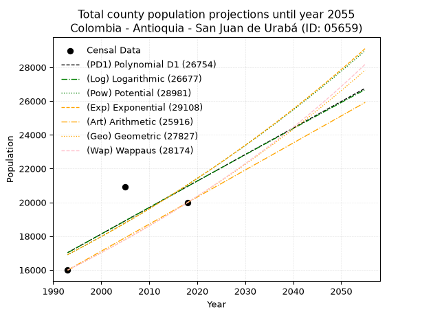
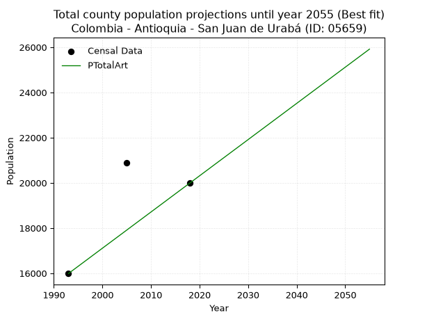
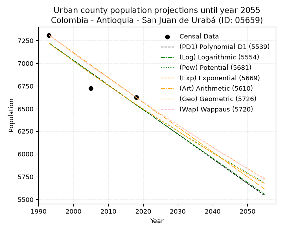
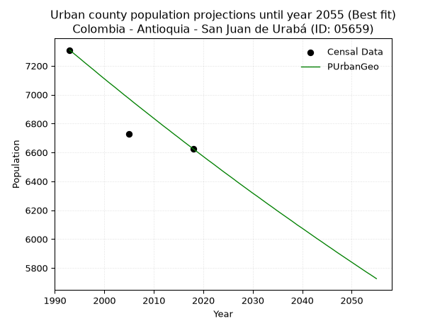
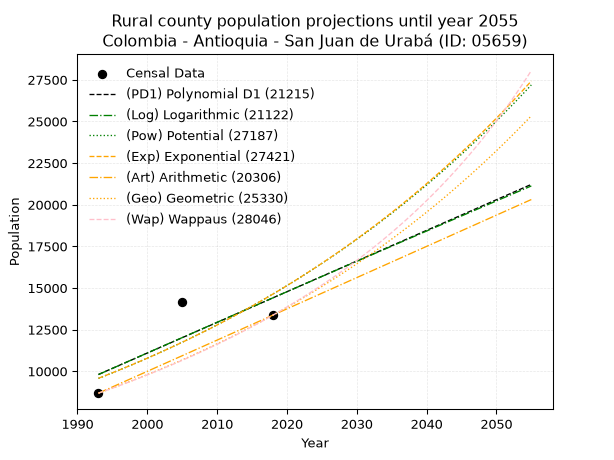
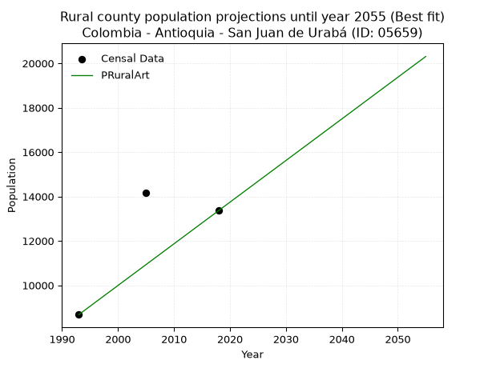

<div align="center">


</div>

# 📜 _“Population and Public Services Demand Projections (PPSD) until Year 2050 for Colombia - Antioquia - San Juan de Urabá (ID: 05659)”_
Keywords: `population` `public-service` `projection` `lineal` `polynomial` `logarithmic` `potential` `exponential` `arithmetic` `geometric` `wappaus` `dane` `colombia` `south-america`

PPSD are analytical estimates used by governments and planners to anticipate future changes in population size, age distribution, and the resulting community needs for utilities, healthcare, education, and infrastructure as sizing future water treatment facilities, electrical grids, and road networks based on spatial growth.

<div align="center">

</img>

</div>


> **General running parameters**: • app_version: _v20260806_. • Python version: _3.14.7_. • Pandas version: _3.0.5_. • NumPy version: _2.5.1_. • Creates, save and include plots into reports (create_plot): _False_. • Projection until year: _2050_. • Process polynomial degree 2 and up: _False_. • Process Wappaus: _True_. • Process Wappaus: _True_. • Set negative values to zero: _True_. • Set infinite values to zero: _True_. • Drop dataset notes: _True_. 
<div align="center">

Dynamic map: [:earth_americas:Google](http://maps.google.com/maps?q=8.758964009,-76.5285704) [:earth_americas:OSM](https://www.openstreetmap.org/#map=18/8.758964009/-76.5285704&layers=P) [:earth_americas:Bing](https://www.bing.com/maps?cp=8.758964009~-76.5285704&lvl=18) [:earth_americas:Apple](https://maps.apple.com/frame?center=8.758964009%2C-76.5285704&span=0.003%2C0.006)

</div>


<div align="center">

```geojson
{
  "type": "Feature",
  "geometry": {
    "type": "Point", 
    "coordinates": [-76.5285704, 8.758964009]
  }, 
  "properties": {
    "Name": "Colombia - Antioquia - San Juan de Urabá (ID: 05659)"
  }
}
```

</div>


## 0. Census Data (3 records)

Census data are official statistics collected by a government about the people and housing in a country. They usually include counts of total population, age, sex, race, income, education, and jobs.

📅Global census file: [Population.xlsx](../data/Population.xlsx)

| Source   |   Year |   CountryID | CountryName   |   StateID | StateName   |   CountyID | CountyName        |   PTotal |   PUrban |   PRural |
|:---------|-------:|------------:|:--------------|----------:|:------------|-----------:|:------------------|---------:|---------:|---------:|
| DANE     |   1993 |          57 | Colombia      |        05 | Antioquia   |      05659 | San Juan de Urabá |    15989 |     7309 |     8680 |
| DANE     |   2005 |          57 | Colombia      |        05 | Antioquia   |      05659 | San Juan de Urabá |    20899 |     6728 |    14171 |
| DANE     |   2018 |          57 | Colombia      |        05 | Antioquia   |      05659 | San Juan de Urabá |    19992 |     6624 |    13368 |

> 🔥Some records could had specific notes about the registered values or the corresponding urban or rural distribution.

📅[SUI-RUPS](https://www.datos.gov.co/Hacienda-y-Cr-dito-P-blico/Registro-nico-de-Prestadores-de-Servicios-P-blicos/4qkq-csdn/about_data) - Local public utility companies: [RUPS.csv](../data/RUPS.xlsx)

 | SERVICIO       | ESTADO    | NOMBRE                                                       | NIT         | DEPARTAMENTO_DOMICILIO   | MUNICIPIO_DOMICILIO   | DIRECCION                |   TELEFONO | EMAIL                    | TIPO_PRESTADOR                             | CLASIFICACION                  |
|:---------------|:----------|:-------------------------------------------------------------|:------------|:-------------------------|:----------------------|:-------------------------|-----------:|:-------------------------|:-------------------------------------------|:-------------------------------|
| ACUEDUCTO      | OPERATIVA | ACUEDUCTOS Y ALCANTARILLADOS SOSTENIBLES A.A.S. S.A.  E.S.P. | 811008426-2 | ANTIOQUIA                | MEDELLIN              | Calle 33A No  78A  -  56 |    4161177 | estadistica@aassa.com.co | SOCIEDADES (EMPRESA DE SERVICIOS PUBLICOS) | DESDE 2501 HASTA 5000 USUARIOS |
| ALCANTARILLADO | OPERATIVA | ACUEDUCTOS Y ALCANTARILLADOS SOSTENIBLES A.A.S. S.A.  E.S.P. | 811008426-2 | ANTIOQUIA                | MEDELLIN              | Calle 33A No  78A  -  56 |    4161177 | estadistica@aassa.com.co | SOCIEDADES (EMPRESA DE SERVICIOS PUBLICOS) | DESDE 2501 HASTA 5000 USUARIOS |

## 1. Total

### 1.1. Coefficients and Parameters

* (PD1) Polynomial Deg 1: 156.93390191897964, -295744.78464819374 (lineal)
* (Log) Logarithmic: 315235.7875217428, -2377951.8982198155
* (Pow) Potential: 17.607517578948187, -53.868274702429915
* (Exp) Exponential: 0.008766082695717771, 0.0004370260632221437
* (Art) Arithmetic: Year diff. 2018 - 1993 = 25, Population diff. 19992 - 15989 = 4003, Annual growth = 160.12
* (Geo) Geometric: Year diff. 2018 - 1993 = 25, Population diff. 19992 - 15989 = 4003, Annual growth % = 0.008977304755385829
* (Wap) Wappaus: i = 0.890025291125872, Condition values only valid for < 200)

<sub>
Wappaus condition values: ['0.00', '0.89', '1.78', '2.67', '3.56', '4.45', '5.34', '6.23', '7.12', '8.01', '8.90', '9.79', '10.68', '11.57', '12.46', '13.35', '14.24', '15.13', '16.02', '16.91', '17.80', '18.69', '19.58', '20.47', '21.36', '22.25', '23.14', '24.03', '24.92', '25.81', '26.70', '27.59', '28.48', '29.37', '30.26', '31.15', '32.04', '32.93', '33.82', '34.71', '35.60', '36.49', '37.38', '38.27', '39.16', '40.05', '40.94', '41.83', '42.72', '43.61', '44.50', '45.39', '46.28', '47.17', '48.06', '48.95', '49.84', '50.73']
</sub>


### 1.2. Projected Dataset

|   Year |   CountyID |   PTotalPD1 |   PTotalLog |   PTotalPow |   PTotalExp |   PTotalArt |   PTotalGeo |   PTotalWap |
|-------:|-----------:|------------:|------------:|------------:|------------:|------------:|------------:|------------:|
|   1993 |      05659 |       17024 |       17019 |       16899 |       16904 |       15989 |       15989 |       15989 |
|   1994 |      05659 |       17181 |       17177 |       17049 |       17052 |       16149 |       16133 |       16132 |
|   1995 |      05659 |       17338 |       17335 |       17200 |       17203 |       16309 |       16277 |       16276 |
|   1996 |      05659 |       17495 |       17493 |       17352 |       17354 |       16469 |       16423 |       16422 |
|   1997 |      05659 |       17652 |       17651 |       17506 |       17507 |       16629 |       16571 |       16569 |
|   1998 |      05659 |       17809 |       17809 |       17661 |       17661 |       16790 |       16720 |       16717 |
|   1999 |      05659 |       17966 |       17967 |       17817 |       17817 |       16950 |       16870 |       16866 |
|   2000 |      05659 |       18123 |       18125 |       17975 |       17973 |       17110 |       17021 |       17017 |
|   2001 |      05659 |       18280 |       18282 |       18134 |       18132 |       17270 |       17174 |       17169 |
|   2002 |      05659 |       18437 |       18440 |       18294 |       18291 |       17430 |       17328 |       17323 |
|   2003 |      05659 |       18594 |       18597 |       18456 |       18452 |       17590 |       17484 |       17478 |
|   2004 |      05659 |       18751 |       18754 |       18619 |       18615 |       17750 |       17641 |       17635 |
|   2005 |      05659 |       18908 |       18912 |       18783 |       18779 |       17910 |       17799 |       17793 |
|   2006 |      05659 |       19065 |       19069 |       18949 |       18944 |       18071 |       17959 |       17953 |
|   2007 |      05659 |       19222 |       19226 |       19116 |       19111 |       18231 |       18120 |       18114 |
|   2008 |      05659 |       19378 |       19383 |       19284 |       19279 |       18391 |       18283 |       18276 |
|   2009 |      05659 |       19535 |       19540 |       19454 |       19449 |       18551 |       18447 |       18440 |
|   2010 |      05659 |       19692 |       19697 |       19625 |       19620 |       18711 |       18613 |       18606 |
|   2011 |      05659 |       19849 |       19854 |       19798 |       19793 |       18871 |       18780 |       18774 |
|   2012 |      05659 |       20006 |       20010 |       19972 |       19967 |       19031 |       18948 |       18943 |
|   2013 |      05659 |       20163 |       20167 |       20147 |       20143 |       19191 |       19118 |       19113 |
|   2014 |      05659 |       20320 |       20324 |       20324 |       20320 |       19352 |       19290 |       19285 |
|   2015 |      05659 |       20477 |       20480 |       20502 |       20499 |       19512 |       19463 |       19460 |
|   2016 |      05659 |       20634 |       20636 |       20682 |       20680 |       19672 |       19638 |       19635 |
|   2017 |      05659 |       20791 |       20793 |       20864 |       20862 |       19832 |       19814 |       19813 |
|   2018 |      05659 |       20948 |       20949 |       21047 |       21045 |       19992 |       19992 |       19992 |
|   2019 |      05659 |       21105 |       21105 |       21231 |       21231 |       20152 |       20171 |       20173 |
|   2020 |      05659 |       21262 |       21261 |       21417 |       21418 |       20312 |       20353 |       20356 |
|   2021 |      05659 |       21419 |       21417 |       21604 |       21606 |       20472 |       20535 |       20541 |
|   2022 |      05659 |       21576 |       21573 |       21793 |       21796 |       20632 |       20720 |       20727 |
|   2023 |      05659 |       21732 |       21729 |       21984 |       21988 |       20793 |       20906 |       20916 |
|   2024 |      05659 |       21889 |       21885 |       22176 |       22182 |       20953 |       21093 |       21106 |
|   2025 |      05659 |       22046 |       22041 |       22370 |       22377 |       21113 |       21283 |       21299 |
|   2026 |      05659 |       22203 |       22196 |       22565 |       22574 |       21273 |       21474 |       21493 |
|   2027 |      05659 |       22360 |       22352 |       22762 |       22773 |       21433 |       21667 |       21690 |
|   2028 |      05659 |       22517 |       22507 |       22961 |       22974 |       21593 |       21861 |       21889 |
|   2029 |      05659 |       22674 |       22663 |       23161 |       23176 |       21753 |       22057 |       22089 |
|   2030 |      05659 |       22831 |       22818 |       23363 |       23380 |       21913 |       22255 |       22292 |
|   2031 |      05659 |       22988 |       22973 |       23566 |       23586 |       22074 |       22455 |       22497 |
|   2032 |      05659 |       23145 |       23128 |       23771 |       23793 |       22234 |       22657 |       22704 |
|   2033 |      05659 |       23302 |       23284 |       23978 |       24003 |       22394 |       22860 |       22914 |
|   2034 |      05659 |       23459 |       23439 |       24186 |       24214 |       22554 |       23065 |       23126 |
|   2035 |      05659 |       23616 |       23593 |       24397 |       24427 |       22714 |       23272 |       23340 |
|   2036 |      05659 |       23773 |       23748 |       24609 |       24642 |       22874 |       23481 |       23556 |
|   2037 |      05659 |       23930 |       23903 |       24822 |       24859 |       23034 |       23692 |       23775 |
|   2038 |      05659 |       24087 |       24058 |       25038 |       25078 |       23194 |       23905 |       23996 |
|   2039 |      05659 |       24243 |       24213 |       25255 |       25299 |       23355 |       24119 |       24220 |
|   2040 |      05659 |       24400 |       24367 |       25474 |       25522 |       23515 |       24336 |       24446 |
|   2041 |      05659 |       24557 |       24522 |       25695 |       25747 |       23675 |       24554 |       24675 |
|   2042 |      05659 |       24714 |       24676 |       25917 |       25973 |       23835 |       24775 |       24907 |
|   2043 |      05659 |       24871 |       24830 |       26142 |       26202 |       23995 |       24997 |       25141 |
|   2044 |      05659 |       25028 |       24985 |       26368 |       26433 |       24155 |       25222 |       25377 |
|   2045 |      05659 |       25185 |       25139 |       26596 |       26665 |       24315 |       25448 |       25617 |
|   2046 |      05659 |       25342 |       25293 |       26826 |       26900 |       24475 |       25676 |       25859 |
|   2047 |      05659 |       25499 |       25447 |       27058 |       27137 |       24635 |       25907 |       26104 |
|   2048 |      05659 |       25656 |       25601 |       27291 |       27376 |       24796 |       26140 |       26352 |
|   2049 |      05659 |       25813 |       25755 |       27527 |       27617 |       24956 |       26374 |       26603 |
|   2050 |      05659 |       25970 |       25909 |       27764 |       27860 |       25116 |       26611 |       26857 |
<div align="center">

</img>

</div>


### 1.3. Best fit with absolute and relative error (%)

Relative error puts that difference into context by dividing the absolute error by the true value, creating a unitless ratio or percentage that shows the scale of the mistake.

Absolute and relative error

|   Year | Source   |   CountryID | CountryName   |   StateID | StateName   |   CountyID_x | CountyName        |   PTotal |   PUrban |   PRural |   CountyID_y |   PTotalPD1 |   PTotalLog |   PTotalPow |   PTotalExp |   PTotalArt |   PTotalGeo |   PTotalWap |   PTotalPD1AbsError |   PTotalLogAbsError |   PTotalPowAbsError |   PTotalExpAbsError |   PTotalArtAbsError |   PTotalGeoAbsError |   PTotalWapAbsError |   PTotalPD1RelError |   PTotalLogRelError |   PTotalPowRelError |   PTotalExpRelError |   PTotalArtRelError |   PTotalGeoRelError |   PTotalWapRelError |
|-------:|:---------|------------:|:--------------|----------:|:------------|-------------:|:------------------|---------:|---------:|---------:|-------------:|------------:|------------:|------------:|------------:|------------:|------------:|------------:|--------------------:|--------------------:|--------------------:|--------------------:|--------------------:|--------------------:|--------------------:|--------------------:|--------------------:|--------------------:|--------------------:|--------------------:|--------------------:|--------------------:|
|   1993 | DANE     |          57 | Colombia      |        05 | Antioquia   |        05659 | San Juan de Urabá |    15989 |     7309 |     8680 |        05659 |       17024 |       17019 |       16899 |       16904 |       15989 |       15989 |       15989 |                1035 |                1030 |                 910 |                 915 |                   0 |                   0 |                   0 |             6.4732  |             6.44193 |             5.69141 |             5.72268 |              0      |              0      |               0     |
|   2005 | DANE     |          57 | Colombia      |        05 | Antioquia   |        05659 | San Juan de Urabá |    20899 |     6728 |    14171 |        05659 |       18908 |       18912 |       18783 |       18779 |       17910 |       17799 |       17793 |                1991 |                1987 |                2116 |                2120 |                2989 |                3100 |                3106 |             9.52677 |             9.50763 |            10.1249  |            10.144   |             14.3021 |             14.8332 |              14.862 |
|   2018 | DANE     |          57 | Colombia      |        05 | Antioquia   |        05659 | San Juan de Urabá |    19992 |     6624 |    13368 |        05659 |       20948 |       20949 |       21047 |       21045 |       19992 |       19992 |       19992 |                 956 |                 957 |                1055 |                1053 |                   0 |                   0 |                   0 |             4.78191 |             4.78691 |             5.27711 |             5.26711 |              0      |              0      |               0     |

Relative error mean

| Method    |   RelError | Best   |
|:----------|-----------:|:-------|
| PTotalPD1 |    6.92729 |        |
| PTotalLog |    6.91216 |        |
| PTotalPow |    7.03114 |        |
| PTotalExp |    7.04461 |        |
| PTotalArt |    4.76737 | True   |
| PTotalGeo |    4.94442 |        |
| PTotalWap |    4.95399 |        |

💙Best method: _**PTotalArt**_
<div align="center">

</img>

</div>


### 1.4. Fresh water supply demand in liters per capita per day (lpcd)

The fresh water supply demand typically ranges from 100 to 300 liters per capita per day (lpcd) for standard domestic and municipal planning, though absolute survival minimums set by the World Health Organization are as low as 7.5 to 20 liters per day, and total consumption in high-income nations can exceed 400 liters.

> `CZ`: Level in meters above the sea level (masl)<br> `WS`: Fresh water supply demand in liters per capita per day (lpcd or l/h/d)<br> `WSAll`: Zonal fresh water supply demand in liters per second (l/s)<br> `A`: Zonal area in square meters<br> `DP`: Population density (people/hectare or p/ha)

Reference values (RAS Colombia)

|    CZ |   WS |
|------:|-----:|
|  1000 |  120 |
|  2000 |  130 |
| 99999 |  140 |

County shapefile geometry properties and water supply values

|   CountyID |      ATotal |   CZTotal |   WSTotal |
|-----------:|------------:|----------:|----------:|
|      05659 | 2.52026e+08 |   57.7037 |       120 |

Projected values for best method: PTotalArt

|   CountyID |   Year |   PTotalArt |   DPTotal |   WSTotal |   WSTotalAll |
|-----------:|-------:|------------:|----------:|----------:|-------------:|
|      05659 |   1993 |       15989 |      0.63 |       120 |      22.2069 |
|      05659 |   1994 |       16149 |      0.64 |       120 |      22.4292 |
|      05659 |   1995 |       16309 |      0.65 |       120 |      22.6514 |
|      05659 |   1996 |       16469 |      0.65 |       120 |      22.8736 |
|      05659 |   1997 |       16629 |      0.66 |       120 |      23.0958 |
|      05659 |   1998 |       16790 |      0.67 |       120 |      23.3194 |
|      05659 |   1999 |       16950 |      0.67 |       120 |      23.5417 |
|      05659 |   2000 |       17110 |      0.68 |       120 |      23.7639 |
|      05659 |   2001 |       17270 |      0.69 |       120 |      23.9861 |
|      05659 |   2002 |       17430 |      0.69 |       120 |      24.2083 |
|      05659 |   2003 |       17590 |      0.7  |       120 |      24.4306 |
|      05659 |   2004 |       17750 |      0.7  |       120 |      24.6528 |
|      05659 |   2005 |       17910 |      0.71 |       120 |      24.875  |
|      05659 |   2006 |       18071 |      0.72 |       120 |      25.0986 |
|      05659 |   2007 |       18231 |      0.72 |       120 |      25.3208 |
|      05659 |   2008 |       18391 |      0.73 |       120 |      25.5431 |
|      05659 |   2009 |       18551 |      0.74 |       120 |      25.7653 |
|      05659 |   2010 |       18711 |      0.74 |       120 |      25.9875 |
|      05659 |   2011 |       18871 |      0.75 |       120 |      26.2097 |
|      05659 |   2012 |       19031 |      0.76 |       120 |      26.4319 |
|      05659 |   2013 |       19191 |      0.76 |       120 |      26.6542 |
|      05659 |   2014 |       19352 |      0.77 |       120 |      26.8778 |
|      05659 |   2015 |       19512 |      0.77 |       120 |      27.1    |
|      05659 |   2016 |       19672 |      0.78 |       120 |      27.3222 |
|      05659 |   2017 |       19832 |      0.79 |       120 |      27.5444 |
|      05659 |   2018 |       19992 |      0.79 |       120 |      27.7667 |
|      05659 |   2019 |       20152 |      0.8  |       120 |      27.9889 |
|      05659 |   2020 |       20312 |      0.81 |       120 |      28.2111 |
|      05659 |   2021 |       20472 |      0.81 |       120 |      28.4333 |
|      05659 |   2022 |       20632 |      0.82 |       120 |      28.6556 |
|      05659 |   2023 |       20793 |      0.83 |       120 |      28.8792 |
|      05659 |   2024 |       20953 |      0.83 |       120 |      29.1014 |
|      05659 |   2025 |       21113 |      0.84 |       120 |      29.3236 |
|      05659 |   2026 |       21273 |      0.84 |       120 |      29.5458 |
|      05659 |   2027 |       21433 |      0.85 |       120 |      29.7681 |
|      05659 |   2028 |       21593 |      0.86 |       120 |      29.9903 |
|      05659 |   2029 |       21753 |      0.86 |       120 |      30.2125 |
|      05659 |   2030 |       21913 |      0.87 |       120 |      30.4347 |
|      05659 |   2031 |       22074 |      0.88 |       120 |      30.6583 |
|      05659 |   2032 |       22234 |      0.88 |       120 |      30.8806 |
|      05659 |   2033 |       22394 |      0.89 |       120 |      31.1028 |
|      05659 |   2034 |       22554 |      0.89 |       120 |      31.325  |
|      05659 |   2035 |       22714 |      0.9  |       120 |      31.5472 |
|      05659 |   2036 |       22874 |      0.91 |       120 |      31.7694 |
|      05659 |   2037 |       23034 |      0.91 |       120 |      31.9917 |
|      05659 |   2038 |       23194 |      0.92 |       120 |      32.2139 |
|      05659 |   2039 |       23355 |      0.93 |       120 |      32.4375 |
|      05659 |   2040 |       23515 |      0.93 |       120 |      32.6597 |
|      05659 |   2041 |       23675 |      0.94 |       120 |      32.8819 |
|      05659 |   2042 |       23835 |      0.95 |       120 |      33.1042 |
|      05659 |   2043 |       23995 |      0.95 |       120 |      33.3264 |
|      05659 |   2044 |       24155 |      0.96 |       120 |      33.5486 |
|      05659 |   2045 |       24315 |      0.96 |       120 |      33.7708 |
|      05659 |   2046 |       24475 |      0.97 |       120 |      33.9931 |
|      05659 |   2047 |       24635 |      0.98 |       120 |      34.2153 |
|      05659 |   2048 |       24796 |      0.98 |       120 |      34.4389 |
|      05659 |   2049 |       24956 |      0.99 |       120 |      34.6611 |
|      05659 |   2050 |       25116 |      1    |       120 |      34.8833 |

## 2. Urban

### 2.1. Coefficients and Parameters

* (PD1) Polynomial Deg 1: -27.131130063966584, 61293.95948827431 (lineal)
* (Log) Logarithmic: -54454.789206946574, 420936.85516176396
* (Pow) Potential: -7.824228708241889, 29.67464037916557
* (Exp) Exponential: -0.003898336137477412, 17088448.754066538
* (Art) Arithmetic: Year diff. 2018 - 1993 = 25, Population diff. 6624 - 7309 = -685, Annual growth = -27.4
* (Geo) Geometric: Year diff. 2018 - 1993 = 25, Population diff. 6624 - 7309 = -685, Annual growth % = -0.003928544933873401
* (Wap) Wappaus: i = -0.3933108447570516, Condition values only valid for < 200)

<sub>
Wappaus condition values: ['-0.00', '-0.39', '-0.79', '-1.18', '-1.57', '-1.97', '-2.36', '-2.75', '-3.15', '-3.54', '-3.93', '-4.33', '-4.72', '-5.11', '-5.51', '-5.90', '-6.29', '-6.69', '-7.08', '-7.47', '-7.87', '-8.26', '-8.65', '-9.05', '-9.44', '-9.83', '-10.23', '-10.62', '-11.01', '-11.41', '-11.80', '-12.19', '-12.59', '-12.98', '-13.37', '-13.77', '-14.16', '-14.55', '-14.95', '-15.34', '-15.73', '-16.13', '-16.52', '-16.91', '-17.31', '-17.70', '-18.09', '-18.49', '-18.88', '-19.27', '-19.67', '-20.06', '-20.45', '-20.85', '-21.24', '-21.63', '-22.03', '-22.42']
</sub>


### 2.2. Projected Dataset

|   Year |   CountyID |   PUrbanPD1 |   PUrbanLog |   PUrbanPow |   PUrbanExp |   PUrbanArt |   PUrbanGeo |   PUrbanWap |
|-------:|-----------:|------------:|------------:|------------:|------------:|------------:|------------:|------------:|
|   1993 |      05659 |        7222 |        7222 |        7220 |        7219 |        7309 |        7309 |        7309 |
|   1994 |      05659 |        7194 |        7195 |        7192 |        7191 |        7282 |        7280 |        7280 |
|   1995 |      05659 |        7167 |        7168 |        7164 |        7163 |        7254 |        7252 |        7252 |
|   1996 |      05659 |        7140 |        7140 |        7136 |        7135 |        7227 |        7223 |        7223 |
|   1997 |      05659 |        7113 |        7113 |        7108 |        7108 |        7199 |        7195 |        7195 |
|   1998 |      05659 |        7086 |        7086 |        7080 |        7080 |        7172 |        7167 |        7167 |
|   1999 |      05659 |        7059 |        7059 |        7052 |        7053 |        7145 |        7138 |        7139 |
|   2000 |      05659 |        7032 |        7031 |        7025 |        7025 |        7117 |        7110 |        7111 |
|   2001 |      05659 |        7005 |        7004 |        6997 |        6998 |        7090 |        7082 |        7083 |
|   2002 |      05659 |        6977 |        6977 |        6970 |        6971 |        7062 |        7055 |        7055 |
|   2003 |      05659 |        6950 |        6950 |        6943 |        6943 |        7035 |        7027 |        7027 |
|   2004 |      05659 |        6923 |        6923 |        6916 |        6916 |        7008 |        6999 |        6999 |
|   2005 |      05659 |        6896 |        6895 |        6889 |        6889 |        6980 |        6972 |        6972 |
|   2006 |      05659 |        6869 |        6868 |        6862 |        6863 |        6953 |        6944 |        6945 |
|   2007 |      05659 |        6842 |        6841 |        6835 |        6836 |        6925 |        6917 |        6917 |
|   2008 |      05659 |        6815 |        6814 |        6809 |        6809 |        6898 |        6890 |        6890 |
|   2009 |      05659 |        6788 |        6787 |        6782 |        6783 |        6871 |        6863 |        6863 |
|   2010 |      05659 |        6760 |        6760 |        6756 |        6756 |        6843 |        6836 |        6836 |
|   2011 |      05659 |        6733 |        6733 |        6730 |        6730 |        6816 |        6809 |        6809 |
|   2012 |      05659 |        6706 |        6706 |        6703 |        6704 |        6788 |        6782 |        6782 |
|   2013 |      05659 |        6679 |        6679 |        6677 |        6678 |        6761 |        6756 |        6756 |
|   2014 |      05659 |        6652 |        6651 |        6652 |        6652 |        6734 |        6729 |        6729 |
|   2015 |      05659 |        6625 |        6624 |        6626 |        6626 |        6706 |        6703 |        6703 |
|   2016 |      05659 |        6598 |        6597 |        6600 |        6600 |        6679 |        6676 |        6676 |
|   2017 |      05659 |        6570 |        6570 |        6575 |        6575 |        6651 |        6650 |        6650 |
|   2018 |      05659 |        6543 |        6543 |        6549 |        6549 |        6624 |        6624 |        6624 |
|   2019 |      05659 |        6516 |        6516 |        6524 |        6524 |        6597 |        6598 |        6598 |
|   2020 |      05659 |        6489 |        6489 |        6499 |        6498 |        6569 |        6572 |        6572 |
|   2021 |      05659 |        6462 |        6463 |        6473 |        6473 |        6542 |        6546 |        6546 |
|   2022 |      05659 |        6435 |        6436 |        6448 |        6448 |        6514 |        6521 |        6520 |
|   2023 |      05659 |        6408 |        6409 |        6424 |        6423 |        6487 |        6495 |        6495 |
|   2024 |      05659 |        6381 |        6382 |        6399 |        6398 |        6460 |        6469 |        6469 |
|   2025 |      05659 |        6353 |        6355 |        6374 |        6373 |        6432 |        6444 |        6444 |
|   2026 |      05659 |        6326 |        6328 |        6349 |        6348 |        6405 |        6419 |        6418 |
|   2027 |      05659 |        6299 |        6301 |        6325 |        6323 |        6377 |        6393 |        6393 |
|   2028 |      05659 |        6272 |        6274 |        6301 |        6299 |        6350 |        6368 |        6368 |
|   2029 |      05659 |        6245 |        6247 |        6276 |        6274 |        6323 |        6343 |        6343 |
|   2030 |      05659 |        6218 |        6221 |        6252 |        6250 |        6295 |        6318 |        6318 |
|   2031 |      05659 |        6191 |        6194 |        6228 |        6225 |        6268 |        6294 |        6293 |
|   2032 |      05659 |        6164 |        6167 |        6204 |        6201 |        6240 |        6269 |        6268 |
|   2033 |      05659 |        6136 |        6140 |        6180 |        6177 |        6213 |        6244 |        6243 |
|   2034 |      05659 |        6109 |        6113 |        6157 |        6153 |        6186 |        6220 |        6218 |
|   2035 |      05659 |        6082 |        6087 |        6133 |        6129 |        6158 |        6195 |        6194 |
|   2036 |      05659 |        6055 |        6060 |        6110 |        6105 |        6131 |        6171 |        6169 |
|   2037 |      05659 |        6028 |        6033 |        6086 |        6081 |        6103 |        6147 |        6145 |
|   2038 |      05659 |        6001 |        6006 |        6063 |        6058 |        6076 |        6123 |        6121 |
|   2039 |      05659 |        5974 |        5980 |        6040 |        6034 |        6049 |        6098 |        6096 |
|   2040 |      05659 |        5946 |        5953 |        6016 |        6011 |        6021 |        6075 |        6072 |
|   2041 |      05659 |        5919 |        5926 |        5993 |        5987 |        5994 |        6051 |        6048 |
|   2042 |      05659 |        5892 |        5900 |        5970 |        5964 |        5966 |        6027 |        6024 |
|   2043 |      05659 |        5865 |        5873 |        5948 |        5941 |        5939 |        6003 |        6000 |
|   2044 |      05659 |        5838 |        5846 |        5925 |        5918 |        5912 |        5980 |        5977 |
|   2045 |      05659 |        5811 |        5820 |        5902 |        5895 |        5884 |        5956 |        5953 |
|   2046 |      05659 |        5784 |        5793 |        5880 |        5872 |        5857 |        5933 |        5929 |
|   2047 |      05659 |        5757 |        5766 |        5857 |        5849 |        5829 |        5909 |        5906 |
|   2048 |      05659 |        5729 |        5740 |        5835 |        5826 |        5802 |        5886 |        5882 |
|   2049 |      05659 |        5702 |        5713 |        5813 |        5804 |        5775 |        5863 |        5859 |
|   2050 |      05659 |        5675 |        5687 |        5791 |        5781 |        5747 |        5840 |        5836 |
<div align="center">

</img>

</div>


### 2.3. Best fit with absolute and relative error (%)

Relative error puts that difference into context by dividing the absolute error by the true value, creating a unitless ratio or percentage that shows the scale of the mistake.

Absolute and relative error

|   Year | Source   |   CountryID | CountryName   |   StateID | StateName   |   CountyID_x | CountyName        |   PTotal |   PUrban |   PRural |   CountyID_y |   PUrbanPD1 |   PUrbanLog |   PUrbanPow |   PUrbanExp |   PUrbanArt |   PUrbanGeo |   PUrbanWap |   PUrbanPD1AbsError |   PUrbanLogAbsError |   PUrbanPowAbsError |   PUrbanExpAbsError |   PUrbanArtAbsError |   PUrbanGeoAbsError |   PUrbanWapAbsError |   PUrbanPD1RelError |   PUrbanLogRelError |   PUrbanPowRelError |   PUrbanExpRelError |   PUrbanArtRelError |   PUrbanGeoRelError |   PUrbanWapRelError |
|-------:|:---------|------------:|:--------------|----------:|:------------|-------------:|:------------------|---------:|---------:|---------:|-------------:|------------:|------------:|------------:|------------:|------------:|------------:|------------:|--------------------:|--------------------:|--------------------:|--------------------:|--------------------:|--------------------:|--------------------:|--------------------:|--------------------:|--------------------:|--------------------:|--------------------:|--------------------:|--------------------:|
|   1993 | DANE     |          57 | Colombia      |        05 | Antioquia   |        05659 | San Juan de Urabá |    15989 |     7309 |     8680 |        05659 |        7222 |        7222 |        7220 |        7219 |        7309 |        7309 |        7309 |                  87 |                  87 |                  89 |                  90 |                   0 |                   0 |                   0 |             1.19031 |             1.19031 |             1.21768 |             1.23136 |             0       |             0       |             0       |
|   2005 | DANE     |          57 | Colombia      |        05 | Antioquia   |        05659 | San Juan de Urabá |    20899 |     6728 |    14171 |        05659 |        6896 |        6895 |        6889 |        6889 |        6980 |        6972 |        6972 |                 168 |                 167 |                 161 |                 161 |                 252 |                 244 |                 244 |             2.49703 |             2.48216 |             2.39298 |             2.39298 |             3.74554 |             3.62663 |             3.62663 |
|   2018 | DANE     |          57 | Colombia      |        05 | Antioquia   |        05659 | San Juan de Urabá |    19992 |     6624 |    13368 |        05659 |        6543 |        6543 |        6549 |        6549 |        6624 |        6624 |        6624 |                  81 |                  81 |                  75 |                  75 |                   0 |                   0 |                   0 |             1.22283 |             1.22283 |             1.13225 |             1.13225 |             0       |             0       |             0       |

Relative error mean

| Method    |   RelError | Best   |
|:----------|-----------:|:-------|
| PUrbanPD1 |    1.63672 |        |
| PUrbanLog |    1.63177 |        |
| PUrbanPow |    1.58097 |        |
| PUrbanExp |    1.58553 |        |
| PUrbanArt |    1.24851 |        |
| PUrbanGeo |    1.20888 | True   |
| PUrbanWap |    1.20888 | True   |

💙Best method: _**PUrbanGeo**_
<div align="center">

</img>

</div>


### 2.4. Fresh water supply demand in liters per capita per day (lpcd)

The fresh water supply demand typically ranges from 100 to 300 liters per capita per day (lpcd) for standard domestic and municipal planning, though absolute survival minimums set by the World Health Organization are as low as 7.5 to 20 liters per day, and total consumption in high-income nations can exceed 400 liters.

> `CZ`: Level in meters above the sea level (masl)<br> `WS`: Fresh water supply demand in liters per capita per day (lpcd or l/h/d)<br> `WSAll`: Zonal fresh water supply demand in liters per second (l/s)<br> `A`: Zonal area in square meters<br> `DP`: Population density (people/hectare or p/ha)

Reference values (RAS Colombia)

|    CZ |   WS |
|------:|-----:|
|  1000 |  120 |
|  2000 |  130 |
| 99999 |  140 |

County shapefile geometry properties and water supply values

|   CountyID |      AUrban |   CZUrban |   WSUrban |
|-----------:|------------:|----------:|----------:|
|      05659 | 1.09413e+06 |   16.9988 |       120 |

Projected values for best method: PUrbanGeo

|   CountyID |   Year |   PUrbanGeo |   DPUrban |   WSUrban |   WSUrbanAll |
|-----------:|-------:|------------:|----------:|----------:|-------------:|
|      05659 |   1993 |        7309 |     66.8  |       120 |     10.1514  |
|      05659 |   1994 |        7280 |     66.54 |       120 |     10.1111  |
|      05659 |   1995 |        7252 |     66.28 |       120 |     10.0722  |
|      05659 |   1996 |        7223 |     66.02 |       120 |     10.0319  |
|      05659 |   1997 |        7195 |     65.76 |       120 |      9.99306 |
|      05659 |   1998 |        7167 |     65.5  |       120 |      9.95417 |
|      05659 |   1999 |        7138 |     65.24 |       120 |      9.91389 |
|      05659 |   2000 |        7110 |     64.98 |       120 |      9.875   |
|      05659 |   2001 |        7082 |     64.73 |       120 |      9.83611 |
|      05659 |   2002 |        7055 |     64.48 |       120 |      9.79861 |
|      05659 |   2003 |        7027 |     64.22 |       120 |      9.75972 |
|      05659 |   2004 |        6999 |     63.97 |       120 |      9.72083 |
|      05659 |   2005 |        6972 |     63.72 |       120 |      9.68333 |
|      05659 |   2006 |        6944 |     63.47 |       120 |      9.64444 |
|      05659 |   2007 |        6917 |     63.22 |       120 |      9.60694 |
|      05659 |   2008 |        6890 |     62.97 |       120 |      9.56944 |
|      05659 |   2009 |        6863 |     62.73 |       120 |      9.53194 |
|      05659 |   2010 |        6836 |     62.48 |       120 |      9.49444 |
|      05659 |   2011 |        6809 |     62.23 |       120 |      9.45694 |
|      05659 |   2012 |        6782 |     61.99 |       120 |      9.41944 |
|      05659 |   2013 |        6756 |     61.75 |       120 |      9.38333 |
|      05659 |   2014 |        6729 |     61.5  |       120 |      9.34583 |
|      05659 |   2015 |        6703 |     61.26 |       120 |      9.30972 |
|      05659 |   2016 |        6676 |     61.02 |       120 |      9.27222 |
|      05659 |   2017 |        6650 |     60.78 |       120 |      9.23611 |
|      05659 |   2018 |        6624 |     60.54 |       120 |      9.2     |
|      05659 |   2019 |        6598 |     60.3  |       120 |      9.16389 |
|      05659 |   2020 |        6572 |     60.07 |       120 |      9.12778 |
|      05659 |   2021 |        6546 |     59.83 |       120 |      9.09167 |
|      05659 |   2022 |        6521 |     59.6  |       120 |      9.05694 |
|      05659 |   2023 |        6495 |     59.36 |       120 |      9.02083 |
|      05659 |   2024 |        6469 |     59.12 |       120 |      8.98472 |
|      05659 |   2025 |        6444 |     58.9  |       120 |      8.95    |
|      05659 |   2026 |        6419 |     58.67 |       120 |      8.91528 |
|      05659 |   2027 |        6393 |     58.43 |       120 |      8.87917 |
|      05659 |   2028 |        6368 |     58.2  |       120 |      8.84444 |
|      05659 |   2029 |        6343 |     57.97 |       120 |      8.80972 |
|      05659 |   2030 |        6318 |     57.74 |       120 |      8.775   |
|      05659 |   2031 |        6294 |     57.53 |       120 |      8.74167 |
|      05659 |   2032 |        6269 |     57.3  |       120 |      8.70694 |
|      05659 |   2033 |        6244 |     57.07 |       120 |      8.67222 |
|      05659 |   2034 |        6220 |     56.85 |       120 |      8.63889 |
|      05659 |   2035 |        6195 |     56.62 |       120 |      8.60417 |
|      05659 |   2036 |        6171 |     56.4  |       120 |      8.57083 |
|      05659 |   2037 |        6147 |     56.18 |       120 |      8.5375  |
|      05659 |   2038 |        6123 |     55.96 |       120 |      8.50417 |
|      05659 |   2039 |        6098 |     55.73 |       120 |      8.46944 |
|      05659 |   2040 |        6075 |     55.52 |       120 |      8.4375  |
|      05659 |   2041 |        6051 |     55.3  |       120 |      8.40417 |
|      05659 |   2042 |        6027 |     55.09 |       120 |      8.37083 |
|      05659 |   2043 |        6003 |     54.87 |       120 |      8.3375  |
|      05659 |   2044 |        5980 |     54.66 |       120 |      8.30556 |
|      05659 |   2045 |        5956 |     54.44 |       120 |      8.27222 |
|      05659 |   2046 |        5933 |     54.23 |       120 |      8.24028 |
|      05659 |   2047 |        5909 |     54.01 |       120 |      8.20694 |
|      05659 |   2048 |        5886 |     53.8  |       120 |      8.175   |
|      05659 |   2049 |        5863 |     53.59 |       120 |      8.14306 |
|      05659 |   2050 |        5840 |     53.38 |       120 |      8.11111 |

## 3. Rural

### 3.1. Coefficients and Parameters

* (PD1) Polynomial Deg 1: 184.06503198294644, -357038.74413646845 (lineal)
* (Log) Logarithmic: 369690.5767286894, -2798888.7533815796
* (Pow) Potential: 34.08544208326979, -108.48430182496749
* (Exp) Exponential: 0.016972100091067605, 1.953913400530645e-11
* (Art) Arithmetic: Year diff. 2018 - 1993 = 25, Population diff. 13368 - 8680 = 4688, Annual growth = 187.52
* (Geo) Geometric: Year diff. 2018 - 1993 = 25, Population diff. 13368 - 8680 = 4688, Annual growth % = 0.017423743440866613
* (Wap) Wappaus: i = 1.7010159651669086, Condition values only valid for < 200)

<sub>
Wappaus condition values: ['0.00', '1.70', '3.40', '5.10', '6.80', '8.51', '10.21', '11.91', '13.61', '15.31', '17.01', '18.71', '20.41', '22.11', '23.81', '25.52', '27.22', '28.92', '30.62', '32.32', '34.02', '35.72', '37.42', '39.12', '40.82', '42.53', '44.23', '45.93', '47.63', '49.33', '51.03', '52.73', '54.43', '56.13', '57.83', '59.54', '61.24', '62.94', '64.64', '66.34', '68.04', '69.74', '71.44', '73.14', '74.84', '76.55', '78.25', '79.95', '81.65', '83.35', '85.05', '86.75', '88.45', '90.15', '91.85', '93.56', '95.26', '96.96']
</sub>


### 3.2. Projected Dataset

|   Year |   CountyID |   PRuralPD1 |   PRuralLog |   PRuralPow |   PRuralExp |   PRuralArt |   PRuralGeo |   PRuralWap |
|-------:|-----------:|------------:|------------:|------------:|------------:|------------:|------------:|------------:|
|   1993 |      05659 |        9803 |        9797 |        9569 |        9574 |        8680 |        8680 |        8680 |
|   1994 |      05659 |        9987 |        9983 |        9734 |        9738 |        8868 |        8831 |        8829 |
|   1995 |      05659 |       10171 |       10168 |        9902 |        9904 |        9055 |        8985 |        8980 |
|   1996 |      05659 |       10355 |       10353 |       10072 |       10074 |        9243 |        9142 |        9135 |
|   1997 |      05659 |       10539 |       10538 |       10246 |       10246 |        9430 |        9301 |        9291 |
|   1998 |      05659 |       10723 |       10723 |       10422 |       10422 |        9618 |        9463 |        9451 |
|   1999 |      05659 |       10907 |       10908 |       10601 |       10600 |        9805 |        9628 |        9614 |
|   2000 |      05659 |       11091 |       11093 |       10784 |       10782 |        9993 |        9796 |        9779 |
|   2001 |      05659 |       11275 |       11278 |       10969 |       10966 |       10180 |        9966 |        9947 |
|   2002 |      05659 |       11459 |       11463 |       11157 |       11154 |       10368 |       10140 |       10119 |
|   2003 |      05659 |       11644 |       11647 |       11349 |       11345 |       10555 |       10317 |       10294 |
|   2004 |      05659 |       11828 |       11832 |       11544 |       11539 |       10743 |       10496 |       10472 |
|   2005 |      05659 |       12012 |       12016 |       11742 |       11736 |       10930 |       10679 |       10653 |
|   2006 |      05659 |       12196 |       12201 |       11943 |       11937 |       11118 |       10865 |       10838 |
|   2007 |      05659 |       12380 |       12385 |       12147 |       12142 |       11305 |       11055 |       11026 |
|   2008 |      05659 |       12564 |       12569 |       12355 |       12350 |       11493 |       11247 |       11219 |
|   2009 |      05659 |       12748 |       12753 |       12567 |       12561 |       11680 |       11443 |       11414 |
|   2010 |      05659 |       12932 |       12937 |       12782 |       12776 |       11868 |       11643 |       11614 |
|   2011 |      05659 |       13116 |       13121 |       13000 |       12995 |       12055 |       11845 |       11818 |
|   2012 |      05659 |       13300 |       13305 |       13223 |       13217 |       12243 |       12052 |       12026 |
|   2013 |      05659 |       13484 |       13488 |       13448 |       13443 |       12430 |       12262 |       12238 |
|   2014 |      05659 |       13668 |       13672 |       13678 |       13673 |       12618 |       12476 |       12455 |
|   2015 |      05659 |       13852 |       13856 |       13912 |       13907 |       12805 |       12693 |       12676 |
|   2016 |      05659 |       14036 |       14039 |       14149 |       14146 |       12993 |       12914 |       12902 |
|   2017 |      05659 |       14220 |       14222 |       14390 |       14388 |       13180 |       13139 |       13132 |
|   2018 |      05659 |       14404 |       14406 |       14635 |       14634 |       13368 |       13368 |       13368 |
|   2019 |      05659 |       14589 |       14589 |       14884 |       14884 |       13556 |       13601 |       13609 |
|   2020 |      05659 |       14773 |       14772 |       15138 |       15139 |       13743 |       13838 |       13855 |
|   2021 |      05659 |       14957 |       14955 |       15395 |       15398 |       13931 |       14079 |       14106 |
|   2022 |      05659 |       15141 |       15138 |       15657 |       15662 |       14118 |       14324 |       14364 |
|   2023 |      05659 |       15325 |       15320 |       15923 |       15930 |       14306 |       14574 |       14627 |
|   2024 |      05659 |       15509 |       15503 |       16194 |       16203 |       14493 |       14828 |       14896 |
|   2025 |      05659 |       15693 |       15686 |       16469 |       16480 |       14681 |       15086 |       15171 |
|   2026 |      05659 |       15877 |       15868 |       16748 |       16762 |       14868 |       15349 |       15453 |
|   2027 |      05659 |       16061 |       16051 |       17032 |       17049 |       15056 |       15616 |       15742 |
|   2028 |      05659 |       16245 |       16233 |       17321 |       17341 |       15243 |       15889 |       16038 |
|   2029 |      05659 |       16429 |       16415 |       17614 |       17638 |       15431 |       16165 |       16341 |
|   2030 |      05659 |       16613 |       16597 |       17913 |       17940 |       15618 |       16447 |       16652 |
|   2031 |      05659 |       16797 |       16780 |       18216 |       18247 |       15806 |       16734 |       16970 |
|   2032 |      05659 |       16981 |       16961 |       18524 |       18559 |       15993 |       17025 |       17296 |
|   2033 |      05659 |       17165 |       17143 |       18837 |       18877 |       16181 |       17322 |       17631 |
|   2034 |      05659 |       17350 |       17325 |       19156 |       19200 |       16368 |       17624 |       17975 |
|   2035 |      05659 |       17534 |       17507 |       19480 |       19528 |       16556 |       17931 |       18327 |
|   2036 |      05659 |       17718 |       17689 |       19808 |       19863 |       16743 |       18243 |       18690 |
|   2037 |      05659 |       17902 |       17870 |       20143 |       20203 |       16931 |       18561 |       19062 |
|   2038 |      05659 |       18086 |       18051 |       20483 |       20548 |       17118 |       18884 |       19444 |
|   2039 |      05659 |       18270 |       18233 |       20828 |       20900 |       17306 |       19213 |       19837 |
|   2040 |      05659 |       18454 |       18414 |       21179 |       21258 |       17493 |       19548 |       20241 |
|   2041 |      05659 |       18638 |       18595 |       21536 |       21622 |       17681 |       19889 |       20656 |
|   2042 |      05659 |       18822 |       18776 |       21898 |       21992 |       17868 |       20235 |       21084 |
|   2043 |      05659 |       19006 |       18957 |       22267 |       22368 |       18056 |       20588 |       21525 |
|   2044 |      05659 |       19190 |       19138 |       22641 |       22751 |       18244 |       20947 |       21978 |
|   2045 |      05659 |       19374 |       19319 |       23022 |       23141 |       18431 |       21312 |       22446 |
|   2046 |      05659 |       19558 |       19500 |       23409 |       23537 |       18619 |       21683 |       22928 |
|   2047 |      05659 |       19742 |       19680 |       23802 |       23940 |       18806 |       22061 |       23425 |
|   2048 |      05659 |       19926 |       19861 |       24202 |       24349 |       18994 |       22445 |       23938 |
|   2049 |      05659 |       20111 |       20042 |       24608 |       24766 |       19181 |       22836 |       24468 |
|   2050 |      05659 |       20295 |       20222 |       25020 |       25190 |       19369 |       23234 |       25015 |
<div align="center">

</img>

</div>


### 3.3. Best fit with absolute and relative error (%)

Relative error puts that difference into context by dividing the absolute error by the true value, creating a unitless ratio or percentage that shows the scale of the mistake.

Absolute and relative error

|   Year | Source   |   CountryID | CountryName   |   StateID | StateName   |   CountyID_x | CountyName        |   PTotal |   PUrban |   PRural |   CountyID_y |   PRuralPD1 |   PRuralLog |   PRuralPow |   PRuralExp |   PRuralArt |   PRuralGeo |   PRuralWap |   PRuralPD1AbsError |   PRuralLogAbsError |   PRuralPowAbsError |   PRuralExpAbsError |   PRuralArtAbsError |   PRuralGeoAbsError |   PRuralWapAbsError |   PRuralPD1RelError |   PRuralLogRelError |   PRuralPowRelError |   PRuralExpRelError |   PRuralArtRelError |   PRuralGeoRelError |   PRuralWapRelError |
|-------:|:---------|------------:|:--------------|----------:|:------------|-------------:|:------------------|---------:|---------:|---------:|-------------:|------------:|------------:|------------:|------------:|------------:|------------:|------------:|--------------------:|--------------------:|--------------------:|--------------------:|--------------------:|--------------------:|--------------------:|--------------------:|--------------------:|--------------------:|--------------------:|--------------------:|--------------------:|--------------------:|
|   1993 | DANE     |          57 | Colombia      |        05 | Antioquia   |        05659 | San Juan de Urabá |    15989 |     7309 |     8680 |        05659 |        9803 |        9797 |        9569 |        9574 |        8680 |        8680 |        8680 |                1123 |                1117 |                 889 |                 894 |                   0 |                   0 |                   0 |            12.9378  |            12.8687  |            10.2419  |            10.2995  |              0      |              0      |              0      |
|   2005 | DANE     |          57 | Colombia      |        05 | Antioquia   |        05659 | San Juan de Urabá |    20899 |     6728 |    14171 |        05659 |       12012 |       12016 |       11742 |       11736 |       10930 |       10679 |       10653 |                2159 |                2155 |                2429 |                2435 |                3241 |                3492 |                3518 |            15.2353  |            15.2071  |            17.1406  |            17.183   |             22.8707 |             24.6419 |             24.8253 |
|   2018 | DANE     |          57 | Colombia      |        05 | Antioquia   |        05659 | San Juan de Urabá |    19992 |     6624 |    13368 |        05659 |       14404 |       14406 |       14635 |       14634 |       13368 |       13368 |       13368 |                1036 |                1038 |                1267 |                1266 |                   0 |                   0 |                   0 |             7.74985 |             7.76481 |             9.47786 |             9.47038 |              0      |              0      |              0      |

Relative error mean

| Method    |   RelError | Best   |
|:----------|-----------:|:-------|
| PRuralPD1 |   11.9743  |        |
| PRuralLog |   11.9469  |        |
| PRuralPow |   12.2868  |        |
| PRuralExp |   12.3176  |        |
| PRuralArt |    7.62355 | True   |
| PRuralGeo |    8.21396 |        |
| PRuralWap |    8.27512 |        |

💙Best method: _**PRuralArt**_
<div align="center">

</img>

</div>


### 3.4. Fresh water supply demand in liters per capita per day (lpcd)

The fresh water supply demand typically ranges from 100 to 300 liters per capita per day (lpcd) for standard domestic and municipal planning, though absolute survival minimums set by the World Health Organization are as low as 7.5 to 20 liters per day, and total consumption in high-income nations can exceed 400 liters.

> `CZ`: Level in meters above the sea level (masl)<br> `WS`: Fresh water supply demand in liters per capita per day (lpcd or l/h/d)<br> `WSAll`: Zonal fresh water supply demand in liters per second (l/s)<br> `A`: Zonal area in square meters<br> `DP`: Population density (people/hectare or p/ha)

Reference values (RAS Colombia)

|    CZ |   WS |
|------:|-----:|
|  1000 |  120 |
|  2000 |  130 |
| 99999 |  140 |

County shapefile geometry properties and water supply values

|   CountyID |      ARural |   CZRural |   WSRural |
|-----------:|------------:|----------:|----------:|
|      05659 | 2.50932e+08 |    57.874 |       120 |

Projected values for best method: PRuralArt

|   CountyID |   Year |   PRuralArt |   DPRural |   WSRural |   WSRuralAll |
|-----------:|-------:|------------:|----------:|----------:|-------------:|
|      05659 |   1993 |        8680 |      0.35 |       120 |      12.0556 |
|      05659 |   1994 |        8868 |      0.35 |       120 |      12.3167 |
|      05659 |   1995 |        9055 |      0.36 |       120 |      12.5764 |
|      05659 |   1996 |        9243 |      0.37 |       120 |      12.8375 |
|      05659 |   1997 |        9430 |      0.38 |       120 |      13.0972 |
|      05659 |   1998 |        9618 |      0.38 |       120 |      13.3583 |
|      05659 |   1999 |        9805 |      0.39 |       120 |      13.6181 |
|      05659 |   2000 |        9993 |      0.4  |       120 |      13.8792 |
|      05659 |   2001 |       10180 |      0.41 |       120 |      14.1389 |
|      05659 |   2002 |       10368 |      0.41 |       120 |      14.4    |
|      05659 |   2003 |       10555 |      0.42 |       120 |      14.6597 |
|      05659 |   2004 |       10743 |      0.43 |       120 |      14.9208 |
|      05659 |   2005 |       10930 |      0.44 |       120 |      15.1806 |
|      05659 |   2006 |       11118 |      0.44 |       120 |      15.4417 |
|      05659 |   2007 |       11305 |      0.45 |       120 |      15.7014 |
|      05659 |   2008 |       11493 |      0.46 |       120 |      15.9625 |
|      05659 |   2009 |       11680 |      0.47 |       120 |      16.2222 |
|      05659 |   2010 |       11868 |      0.47 |       120 |      16.4833 |
|      05659 |   2011 |       12055 |      0.48 |       120 |      16.7431 |
|      05659 |   2012 |       12243 |      0.49 |       120 |      17.0042 |
|      05659 |   2013 |       12430 |      0.5  |       120 |      17.2639 |
|      05659 |   2014 |       12618 |      0.5  |       120 |      17.525  |
|      05659 |   2015 |       12805 |      0.51 |       120 |      17.7847 |
|      05659 |   2016 |       12993 |      0.52 |       120 |      18.0458 |
|      05659 |   2017 |       13180 |      0.53 |       120 |      18.3056 |
|      05659 |   2018 |       13368 |      0.53 |       120 |      18.5667 |
|      05659 |   2019 |       13556 |      0.54 |       120 |      18.8278 |
|      05659 |   2020 |       13743 |      0.55 |       120 |      19.0875 |
|      05659 |   2021 |       13931 |      0.56 |       120 |      19.3486 |
|      05659 |   2022 |       14118 |      0.56 |       120 |      19.6083 |
|      05659 |   2023 |       14306 |      0.57 |       120 |      19.8694 |
|      05659 |   2024 |       14493 |      0.58 |       120 |      20.1292 |
|      05659 |   2025 |       14681 |      0.59 |       120 |      20.3903 |
|      05659 |   2026 |       14868 |      0.59 |       120 |      20.65   |
|      05659 |   2027 |       15056 |      0.6  |       120 |      20.9111 |
|      05659 |   2028 |       15243 |      0.61 |       120 |      21.1708 |
|      05659 |   2029 |       15431 |      0.61 |       120 |      21.4319 |
|      05659 |   2030 |       15618 |      0.62 |       120 |      21.6917 |
|      05659 |   2031 |       15806 |      0.63 |       120 |      21.9528 |
|      05659 |   2032 |       15993 |      0.64 |       120 |      22.2125 |
|      05659 |   2033 |       16181 |      0.64 |       120 |      22.4736 |
|      05659 |   2034 |       16368 |      0.65 |       120 |      22.7333 |
|      05659 |   2035 |       16556 |      0.66 |       120 |      22.9944 |
|      05659 |   2036 |       16743 |      0.67 |       120 |      23.2542 |
|      05659 |   2037 |       16931 |      0.67 |       120 |      23.5153 |
|      05659 |   2038 |       17118 |      0.68 |       120 |      23.775  |
|      05659 |   2039 |       17306 |      0.69 |       120 |      24.0361 |
|      05659 |   2040 |       17493 |      0.7  |       120 |      24.2958 |
|      05659 |   2041 |       17681 |      0.7  |       120 |      24.5569 |
|      05659 |   2042 |       17868 |      0.71 |       120 |      24.8167 |
|      05659 |   2043 |       18056 |      0.72 |       120 |      25.0778 |
|      05659 |   2044 |       18244 |      0.73 |       120 |      25.3389 |
|      05659 |   2045 |       18431 |      0.73 |       120 |      25.5986 |
|      05659 |   2046 |       18619 |      0.74 |       120 |      25.8597 |
|      05659 |   2047 |       18806 |      0.75 |       120 |      26.1194 |
|      05659 |   2048 |       18994 |      0.76 |       120 |      26.3806 |
|      05659 |   2049 |       19181 |      0.76 |       120 |      26.6403 |
|      05659 |   2050 |       19369 |      0.77 |       120 |      26.9014 |

#

<div align="center"><br><sub>Share this research</sub></div><br>

<sub>**APPS & TOOLS & CONTENT DISCLAIMER**: • NO WARRANTY - This content and software is provided by <a href="https://github.com/rcfdtools" target="_blank">github.com/rcfdtools</a> "as is", without any express or implied warranty, including warranties of merchantability, fitness for a particular purpose, or non-infringement. There is no guarantee that the software will be error-free or operate without interruption. • LIMITATION OF LIABILITY - Neither the authors nor copyright holders will be liable for claims or damages arising from the software or its use. You are responsible for determining if the software is appropriate for your use and assume all associated risks, including errors, legal compliance, and data loss. • NO PROFESSIONAL ADVICE - The software provides general information and does not offer professional advice. It should not replace consultation with professional advisors. [Clauses and global license for rcfdtools use.](https://github.com/rcfdtools/rcfdtools/blob/main/LICENSE.md)</sub>

| [:house: Home](Readme.md)  | [:beginner: Help / Collab](https://github.com/rcfdtools/R.HydroTools/discussions/31) |
|----------------------------|-------------------------------------------------------------------------------------------|