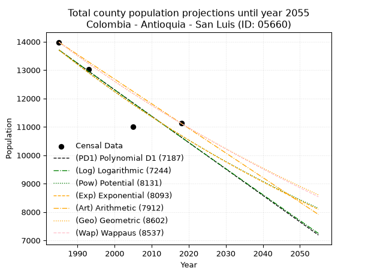
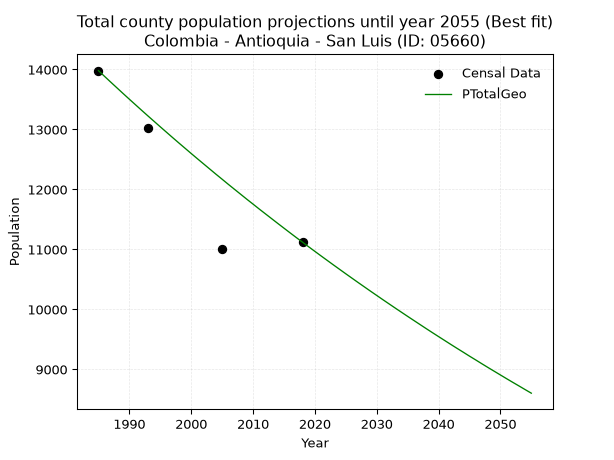
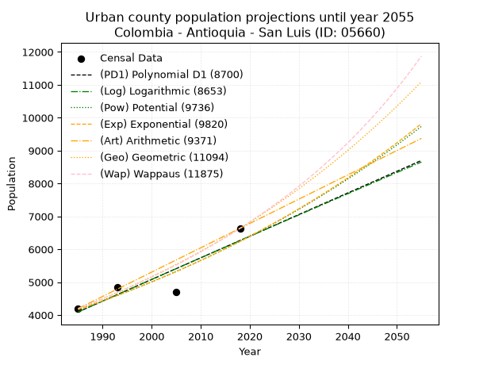
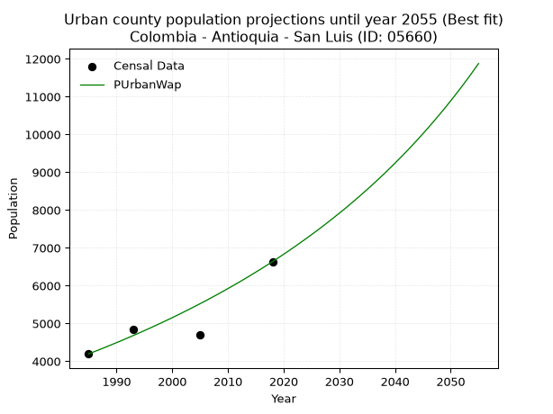
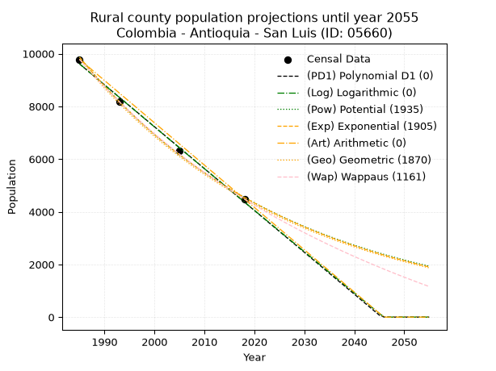
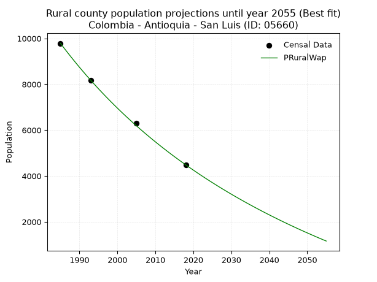

<div align="center">


</div>

# 📜 _“Population and Public Services Demand Projections (PPSD) until Year 2050 for Colombia - Antioquia - San Luis (ID: 05660)”_
Keywords: `population` `public-service` `projection` `lineal` `polynomial` `logarithmic` `potential` `exponential` `arithmetic` `geometric` `wappaus` `dane` `colombia` `south-america`

PPSD are analytical estimates used by governments and planners to anticipate future changes in population size, age distribution, and the resulting community needs for utilities, healthcare, education, and infrastructure as sizing future water treatment facilities, electrical grids, and road networks based on spatial growth.

<div align="center">

</img>

</div>


> **General running parameters**: • app_version: _v20260806_. • Python version: _3.14.7_. • Pandas version: _3.0.5_. • NumPy version: _2.5.1_. • Creates, save and include plots into reports (create_plot): _False_. • Projection until year: _2050_. • Process polynomial degree 2 and up: _False_. • Process Wappaus: _True_. • Process Wappaus: _True_. • Set negative values to zero: _True_. • Set infinite values to zero: _True_. • Drop dataset notes: _True_. 
<div align="center">

Maps & GIS Layers: [:earth_americas:Google](http://maps.google.com/maps?q=6.043017106,-74.9936188) [:earth_americas:OSM](https://www.openstreetmap.org/#map=18/6.043017106/-74.9936188&layers=P) [:earth_americas:Bing](https://www.bing.com/maps?cp=6.043017106~-74.9936188&lvl=18) [:earth_americas:Apple](https://maps.apple.com/frame?center=6.043017106%2C-74.9936188&span=0.003%2C0.006) [:earth_americas:GISMobile](https://github.com/rcfdtools/R.GISMobile/blob/main/file/gis/CountyLayer_CO/Readme.md)

</div>


<div align="center">

```geojson
{
  "type": "Feature",
  "geometry": {
    "type": "Point", 
    "coordinates": [-74.9936188, 6.043017106]
  }, 
  "properties": {
    "Name": "Colombia - Antioquia - San Luis (ID: 05660)"
  }
}
```

</div>


## 0. Census Data (4 records)

Census data are official statistics collected by a government about the people and housing in a country. They usually include counts of total population, age, sex, race, income, education, and jobs.

📅Global census file: [Population.xlsx](../data/Population.xlsx)

| Source   |   Year |   CountryID | CountryName   |   StateID | StateName   |   CountyID | CountyName   |   PTotal |   PUrban |   PRural |
|:---------|-------:|------------:|:--------------|----------:|:------------|-----------:|:-------------|---------:|---------:|---------:|
| DANE     |   1985 |          57 | Colombia      |        05 | Antioquia   |      05660 | San Luis     |    13981 |     4195 |     9786 |
| DANE     |   1993 |          57 | Colombia      |        05 | Antioquia   |      05660 | San Luis     |    13026 |     4851 |     8175 |
| DANE     |   2005 |          57 | Colombia      |        05 | Antioquia   |      05660 | San Luis     |    11009 |     4706 |     6303 |
| DANE     |   2018 |          57 | Colombia      |        05 | Antioquia   |      05660 | San Luis     |    11120 |     6635 |     4485 |

> 🔥Some records could had specific notes about the registered values or the corresponding urban or rural distribution.

📅[SUI-RUPS](https://www.datos.gov.co/Hacienda-y-Cr-dito-P-blico/Registro-nico-de-Prestadores-de-Servicios-P-blicos/4qkq-csdn/about_data) - Local public utility companies: [RUPS.csv](../data/RUPS.csv)

 | SERVICIO       | ESTADO    | NOMBRE                                                                      | NIT         | DEPARTAMENTO_DOMICILIO   | MUNICIPIO_DOMICILIO   | DIRECCION                       |   TELEFONO | EMAIL                                      | TIPO_PRESTADOR                             | CLASIFICACION                 |
|:---------------|:----------|:----------------------------------------------------------------------------|:------------|:-------------------------|:----------------------|:--------------------------------|-----------:|:-------------------------------------------|:-------------------------------------------|:------------------------------|
| ACUEDUCTO      | OPERATIVA | UNIDAD MUNICIPAL DE SERVICIOS PUBLICOS DOMICILIARIOS DE SAN LUIS, ANTIOQUIA | 811017651-1 | ANTIOQUIA                | SAN LUIS              | Carrera 18 No 17-08 oficina 103 |    8348748 | serviciospublicos@sanluis-antioquia.gov.co | MUNICIPIO (PRESTACIÓN DIRECTA)             | HASTA 2500 SUSCRIPTORES       |
| ALCANTARILLADO | OPERATIVA | UNIDAD MUNICIPAL DE SERVICIOS PUBLICOS DOMICILIARIOS DE SAN LUIS, ANTIOQUIA | 811017651-1 | ANTIOQUIA                | SAN LUIS              | Carrera 18 No 17-08 oficina 103 |    8348748 | serviciospublicos@sanluis-antioquia.gov.co | MUNICIPIO (PRESTACIÓN DIRECTA)             | HASTA 2500 SUSCRIPTORES       |
| ACUEDUCTO      | OPERATIVA | EMPRESAS PUBLICAS DE SAN LUIS S.A.S. E.S.P.                                 | 900515140-9 | ANTIOQUIA                | SAN LUIS              | calle 20N°17a-50                |    8348748 | empresaspublicasdesanluis@hotmail.com      | SOCIEDADES (EMPRESA DE SERVICIOS PUBLICOS) | MENOR O IGUAL A 2500 USUARIOS |
| ALCANTARILLADO | OPERATIVA | EMPRESAS PUBLICAS DE SAN LUIS S.A.S. E.S.P.                                 | 900515140-9 | ANTIOQUIA                | SAN LUIS              | calle 20N°17a-50                |    8348748 | empresaspublicasdesanluis@hotmail.com      | SOCIEDADES (EMPRESA DE SERVICIOS PUBLICOS) | MENOR O IGUAL A 2500 USUARIOS |

## 1. Total

### 1.1. Coefficients and Parameters

* (PD1) Polynomial Deg 1: -93.09674829385781, 198500.7707747891 (lineal)
* (Log) Logarithmic: -186507.2600695269, 1429927.178363858
* (Pow) Potential: -15.074898415371889, 53.85043339881861
* (Exp) Exponential: -0.007524955367675229, 42068854749.692635
* (Art) Arithmetic: Year diff. 2018 - 1985 = 33, Population diff. 11120 - 13981 = -2861, Annual growth = -86.6969696969697
* (Geo) Geometric: Year diff. 2018 - 1985 = 33, Population diff. 11120 - 13981 = -2861, Annual growth % = -0.006913986925940918
* (Wap) Wappaus: i = -0.6907849862313827, Condition values only valid for < 200)

<sub>
Wappaus condition values: ['-0.00', '-0.69', '-1.38', '-2.07', '-2.76', '-3.45', '-4.14', '-4.84', '-5.53', '-6.22', '-6.91', '-7.60', '-8.29', '-8.98', '-9.67', '-10.36', '-11.05', '-11.74', '-12.43', '-13.12', '-13.82', '-14.51', '-15.20', '-15.89', '-16.58', '-17.27', '-17.96', '-18.65', '-19.34', '-20.03', '-20.72', '-21.41', '-22.11', '-22.80', '-23.49', '-24.18', '-24.87', '-25.56', '-26.25', '-26.94', '-27.63', '-28.32', '-29.01', '-29.70', '-30.39', '-31.09', '-31.78', '-32.47', '-33.16', '-33.85', '-34.54', '-35.23', '-35.92', '-36.61', '-37.30', '-37.99', '-38.68', '-39.37', '-40.07', '-40.76', '-41.45', '-42.14', '-42.83', '-43.52', '-44.21', '-44.90']
</sub>


### 1.2. Projected Dataset

|   Year |   CountyID |   PTotalPD1 |   PTotalLog |   PTotalPow |   PTotalExp |   PTotalArt |   PTotalGeo |   PTotalWap |
|-------:|-----------:|------------:|------------:|------------:|------------:|------------:|------------:|------------:|
|   1985 |      05660 |       13704 |       13708 |       13710 |       13705 |       13981 |       13981 |       13981 |
|   1986 |      05660 |       13611 |       13614 |       13606 |       13603 |       13894 |       13884 |       13885 |
|   1987 |      05660 |       13518 |       13520 |       13503 |       13501 |       13808 |       13788 |       13789 |
|   1988 |      05660 |       13424 |       13426 |       13401 |       13399 |       13721 |       13693 |       13694 |
|   1989 |      05660 |       13331 |       13332 |       13300 |       13299 |       13634 |       13598 |       13600 |
|   1990 |      05660 |       13238 |       13239 |       13200 |       13199 |       13548 |       13504 |       13506 |
|   1991 |      05660 |       13145 |       13145 |       13100 |       13100 |       13461 |       13411 |       13413 |
|   1992 |      05660 |       13052 |       13051 |       13001 |       13002 |       13374 |       13318 |       13321 |
|   1993 |      05660 |       12959 |       12958 |       12903 |       12905 |       13287 |       13226 |       13229 |
|   1994 |      05660 |       12866 |       12864 |       12806 |       12808 |       13201 |       13135 |       13138 |
|   1995 |      05660 |       12773 |       12771 |       12710 |       12712 |       13114 |       13044 |       13047 |
|   1996 |      05660 |       12680 |       12677 |       12614 |       12617 |       13027 |       12954 |       12958 |
|   1997 |      05660 |       12587 |       12584 |       12519 |       12522 |       12941 |       12864 |       12868 |
|   1998 |      05660 |       12493 |       12490 |       12425 |       12428 |       12854 |       12775 |       12779 |
|   1999 |      05660 |       12400 |       12397 |       12331 |       12335 |       12767 |       12687 |       12691 |
|   2000 |      05660 |       12307 |       12304 |       12239 |       12242 |       12681 |       12599 |       12604 |
|   2001 |      05660 |       12214 |       12210 |       12147 |       12151 |       12594 |       12512 |       12517 |
|   2002 |      05660 |       12121 |       12117 |       12056 |       12060 |       12507 |       12426 |       12430 |
|   2003 |      05660 |       12028 |       12024 |       11965 |       11969 |       12420 |       12340 |       12344 |
|   2004 |      05660 |       11935 |       11931 |       11876 |       11879 |       12334 |       12254 |       12259 |
|   2005 |      05660 |       11842 |       11838 |       11787 |       11790 |       12247 |       12170 |       12174 |
|   2006 |      05660 |       11749 |       11745 |       11698 |       11702 |       12160 |       12085 |       12090 |
|   2007 |      05660 |       11656 |       11652 |       11611 |       11614 |       12074 |       12002 |       12006 |
|   2008 |      05660 |       11563 |       11559 |       11524 |       11527 |       11987 |       11919 |       11923 |
|   2009 |      05660 |       11469 |       11466 |       11438 |       11441 |       11900 |       11836 |       11841 |
|   2010 |      05660 |       11376 |       11373 |       11352 |       11355 |       11814 |       11755 |       11758 |
|   2011 |      05660 |       11283 |       11281 |       11268 |       11270 |       11727 |       11673 |       11677 |
|   2012 |      05660 |       11190 |       11188 |       11183 |       11185 |       11640 |       11593 |       11596 |
|   2013 |      05660 |       11097 |       11095 |       11100 |       11102 |       11553 |       11513 |       11515 |
|   2014 |      05660 |       11004 |       11003 |       11017 |       11018 |       11467 |       11433 |       11435 |
|   2015 |      05660 |       10911 |       10910 |       10935 |       10936 |       11380 |       11354 |       11356 |
|   2016 |      05660 |       10818 |       10818 |       10854 |       10854 |       11293 |       11275 |       11277 |
|   2017 |      05660 |       10725 |       10725 |       10773 |       10772 |       11207 |       11197 |       11198 |
|   2018 |      05660 |       10632 |       10633 |       10693 |       10692 |       11120 |       11120 |       11120 |
|   2019 |      05660 |       10538 |       10540 |       10613 |       10611 |       11033 |       11043 |       11042 |
|   2020 |      05660 |       10445 |       10448 |       10534 |       10532 |       10947 |       10967 |       10965 |
|   2021 |      05660 |       10352 |       10356 |       10456 |       10453 |       10860 |       10891 |       10889 |
|   2022 |      05660 |       10259 |       10263 |       10378 |       10375 |       10773 |       10816 |       10813 |
|   2023 |      05660 |       10166 |       10171 |       10301 |       10297 |       10687 |       10741 |       10737 |
|   2024 |      05660 |       10073 |       10079 |       10225 |       10220 |       10600 |       10667 |       10662 |
|   2025 |      05660 |        9980 |        9987 |       10149 |       10143 |       10513 |       10593 |       10587 |
|   2026 |      05660 |        9887 |        9895 |       10073 |       10067 |       10426 |       10520 |       10512 |
|   2027 |      05660 |        9794 |        9803 |        9999 |        9991 |       10340 |       10447 |       10439 |
|   2028 |      05660 |        9701 |        9711 |        9925 |        9917 |       10253 |       10375 |       10365 |
|   2029 |      05660 |        9607 |        9619 |        9851 |        9842 |       10166 |       10303 |       10292 |
|   2030 |      05660 |        9514 |        9527 |        9778 |        9768 |       10080 |       10232 |       10220 |
|   2031 |      05660 |        9421 |        9435 |        9706 |        9695 |        9993 |       10161 |       10147 |
|   2032 |      05660 |        9328 |        9343 |        9634 |        9623 |        9906 |       10091 |       10076 |
|   2033 |      05660 |        9235 |        9251 |        9563 |        9550 |        9820 |       10021 |       10004 |
|   2034 |      05660 |        9142 |        9160 |        9492 |        9479 |        9733 |        9952 |        9934 |
|   2035 |      05660 |        9049 |        9068 |        9422 |        9408 |        9646 |        9883 |        9863 |
|   2036 |      05660 |        8956 |        8976 |        9353 |        9337 |        9559 |        9815 |        9793 |
|   2037 |      05660 |        8863 |        8885 |        9284 |        9267 |        9473 |        9747 |        9724 |
|   2038 |      05660 |        8770 |        8793 |        9215 |        9198 |        9386 |        9679 |        9654 |
|   2039 |      05660 |        8677 |        8702 |        9148 |        9129 |        9299 |        9612 |        9586 |
|   2040 |      05660 |        8583 |        8610 |        9080 |        9060 |        9213 |        9546 |        9517 |
|   2041 |      05660 |        8490 |        8519 |        9013 |        8992 |        9126 |        9480 |        9449 |
|   2042 |      05660 |        8397 |        8428 |        8947 |        8925 |        9039 |        9414 |        9382 |
|   2043 |      05660 |        8304 |        8336 |        8881 |        8858 |        8953 |        9349 |        9314 |
|   2044 |      05660 |        8211 |        8245 |        8816 |        8792 |        8866 |        9285 |        9247 |
|   2045 |      05660 |        8118 |        8154 |        8751 |        8726 |        8779 |        9220 |        9181 |
|   2046 |      05660 |        8025 |        8063 |        8687 |        8660 |        8692 |        9157 |        9115 |
|   2047 |      05660 |        7932 |        7971 |        8623 |        8595 |        8606 |        9093 |        9049 |
|   2048 |      05660 |        7839 |        7880 |        8560 |        8531 |        8519 |        9030 |        8984 |
|   2049 |      05660 |        7746 |        7789 |        8497 |        8467 |        8432 |        8968 |        8919 |
|   2050 |      05660 |        7652 |        7698 |        8435 |        8404 |        8346 |        8906 |        8854 |
<div align="center">

</img>

</div>


### 1.3. Best fit with absolute and relative error (%)

Relative error puts that difference into context by dividing the absolute error by the true value, creating a unitless ratio or percentage that shows the scale of the mistake.

Absolute and relative error

|   Year | Source   |   CountryID | CountryName   |   StateID | StateName   |   CountyID_x | CountyName   |   PTotal |   PUrban |   PRural |   CountyID_y |   PTotalPD1 |   PTotalLog |   PTotalPow |   PTotalExp |   PTotalArt |   PTotalGeo |   PTotalWap |   PTotalPD1AbsError |   PTotalLogAbsError |   PTotalPowAbsError |   PTotalExpAbsError |   PTotalArtAbsError |   PTotalGeoAbsError |   PTotalWapAbsError |   PTotalPD1RelError |   PTotalLogRelError |   PTotalPowRelError |   PTotalExpRelError |   PTotalArtRelError |   PTotalGeoRelError |   PTotalWapRelError |
|-------:|:---------|------------:|:--------------|----------:|:------------|-------------:|:-------------|---------:|---------:|---------:|-------------:|------------:|------------:|------------:|------------:|------------:|------------:|------------:|--------------------:|--------------------:|--------------------:|--------------------:|--------------------:|--------------------:|--------------------:|--------------------:|--------------------:|--------------------:|--------------------:|--------------------:|--------------------:|--------------------:|
|   1985 | DANE     |          57 | Colombia      |        05 | Antioquia   |        05660 | San Luis     |    13981 |     4195 |     9786 |        05660 |       13704 |       13708 |       13710 |       13705 |       13981 |       13981 |       13981 |                 277 |                 273 |                 271 |                 276 |                   0 |                   0 |                   0 |            1.98126  |            1.95265  |            1.93834  |            1.97411  |             0       |             0       |             0       |
|   1993 | DANE     |          57 | Colombia      |        05 | Antioquia   |        05660 | San Luis     |    13026 |     4851 |     8175 |        05660 |       12959 |       12958 |       12903 |       12905 |       13287 |       13226 |       13229 |                  67 |                  68 |                 123 |                 121 |                 261 |                 200 |                 203 |            0.514356 |            0.522033 |            0.944265 |            0.928911 |             2.00368 |             1.53539 |             1.55842 |
|   2005 | DANE     |          57 | Colombia      |        05 | Antioquia   |        05660 | San Luis     |    11009 |     4706 |     6303 |        05660 |       11842 |       11838 |       11787 |       11790 |       12247 |       12170 |       12174 |                 833 |                 829 |                 778 |                 781 |                1238 |                1161 |                1165 |            7.56654  |            7.5302   |            7.06695  |            7.0942   |            11.2453  |            10.5459  |            10.5823  |
|   2018 | DANE     |          57 | Colombia      |        05 | Antioquia   |        05660 | San Luis     |    11120 |     6635 |     4485 |        05660 |       10632 |       10633 |       10693 |       10692 |       11120 |       11120 |       11120 |                 488 |                 487 |                 427 |                 428 |                   0 |                   0 |                   0 |            4.38849  |            4.3795   |            3.83993  |            3.84892  |             0       |             0       |             0       |

Relative error mean

| Method    |   RelError | Best   |
|:----------|-----------:|:-------|
| PTotalPD1 |    3.61266 |        |
| PTotalLog |    3.5961  |        |
| PTotalPow |    3.44737 |        |
| PTotalExp |    3.46153 |        |
| PTotalArt |    3.31226 |        |
| PTotalGeo |    3.02033 | True   |
| PTotalWap |    3.03517 |        |

💙Best method: _**PTotalGeo**_
<div align="center">

</img>

</div>


### 1.4. Fresh water supply demand in liters per capita per day (lpcd)

The fresh water supply demand typically ranges from 100 to 300 liters per capita per day (lpcd) for standard domestic and municipal planning, though absolute survival minimums set by the World Health Organization are as low as 7.5 to 20 liters per day, and total consumption in high-income nations can exceed 400 liters.

> `CZ`: Level in meters above the sea level (masl)<br> `WS`: Fresh water supply demand in liters per capita per day (lpcd or l/h/d)<br> `WSAll`: Zonal fresh water supply demand in liters per second (l/s)<br> `A`: Zonal area in square meters<br> `DP`: Population density (people/hectare or p/ha)

Reference values (RAS Colombia)

|    CZ |   WS |
|------:|-----:|
|  1000 |  120 |
|  2000 |  130 |
| 99999 |  140 |

County shapefile geometry properties and water supply values

|   CountyID |     ATotal |   CZTotal |   WSTotal |
|-----------:|-----------:|----------:|----------:|
|      05660 | 5.1838e+08 |   878.092 |       120 |

Projected values for best method: PTotalGeo

|   CountyID |   Year |   PTotalGeo |   DPTotal |   WSTotal |   WSTotalAll |
|-----------:|-------:|------------:|----------:|----------:|-------------:|
|      05660 |   1985 |       13981 |      0.27 |       120 |      19.4181 |
|      05660 |   1986 |       13884 |      0.27 |       120 |      19.2833 |
|      05660 |   1987 |       13788 |      0.27 |       120 |      19.15   |
|      05660 |   1988 |       13693 |      0.26 |       120 |      19.0181 |
|      05660 |   1989 |       13598 |      0.26 |       120 |      18.8861 |
|      05660 |   1990 |       13504 |      0.26 |       120 |      18.7556 |
|      05660 |   1991 |       13411 |      0.26 |       120 |      18.6264 |
|      05660 |   1992 |       13318 |      0.26 |       120 |      18.4972 |
|      05660 |   1993 |       13226 |      0.26 |       120 |      18.3694 |
|      05660 |   1994 |       13135 |      0.25 |       120 |      18.2431 |
|      05660 |   1995 |       13044 |      0.25 |       120 |      18.1167 |
|      05660 |   1996 |       12954 |      0.25 |       120 |      17.9917 |
|      05660 |   1997 |       12864 |      0.25 |       120 |      17.8667 |
|      05660 |   1998 |       12775 |      0.25 |       120 |      17.7431 |
|      05660 |   1999 |       12687 |      0.24 |       120 |      17.6208 |
|      05660 |   2000 |       12599 |      0.24 |       120 |      17.4986 |
|      05660 |   2001 |       12512 |      0.24 |       120 |      17.3778 |
|      05660 |   2002 |       12426 |      0.24 |       120 |      17.2583 |
|      05660 |   2003 |       12340 |      0.24 |       120 |      17.1389 |
|      05660 |   2004 |       12254 |      0.24 |       120 |      17.0194 |
|      05660 |   2005 |       12170 |      0.23 |       120 |      16.9028 |
|      05660 |   2006 |       12085 |      0.23 |       120 |      16.7847 |
|      05660 |   2007 |       12002 |      0.23 |       120 |      16.6694 |
|      05660 |   2008 |       11919 |      0.23 |       120 |      16.5542 |
|      05660 |   2009 |       11836 |      0.23 |       120 |      16.4389 |
|      05660 |   2010 |       11755 |      0.23 |       120 |      16.3264 |
|      05660 |   2011 |       11673 |      0.23 |       120 |      16.2125 |
|      05660 |   2012 |       11593 |      0.22 |       120 |      16.1014 |
|      05660 |   2013 |       11513 |      0.22 |       120 |      15.9903 |
|      05660 |   2014 |       11433 |      0.22 |       120 |      15.8792 |
|      05660 |   2015 |       11354 |      0.22 |       120 |      15.7694 |
|      05660 |   2016 |       11275 |      0.22 |       120 |      15.6597 |
|      05660 |   2017 |       11197 |      0.22 |       120 |      15.5514 |
|      05660 |   2018 |       11120 |      0.21 |       120 |      15.4444 |
|      05660 |   2019 |       11043 |      0.21 |       120 |      15.3375 |
|      05660 |   2020 |       10967 |      0.21 |       120 |      15.2319 |
|      05660 |   2021 |       10891 |      0.21 |       120 |      15.1264 |
|      05660 |   2022 |       10816 |      0.21 |       120 |      15.0222 |
|      05660 |   2023 |       10741 |      0.21 |       120 |      14.9181 |
|      05660 |   2024 |       10667 |      0.21 |       120 |      14.8153 |
|      05660 |   2025 |       10593 |      0.2  |       120 |      14.7125 |
|      05660 |   2026 |       10520 |      0.2  |       120 |      14.6111 |
|      05660 |   2027 |       10447 |      0.2  |       120 |      14.5097 |
|      05660 |   2028 |       10375 |      0.2  |       120 |      14.4097 |
|      05660 |   2029 |       10303 |      0.2  |       120 |      14.3097 |
|      05660 |   2030 |       10232 |      0.2  |       120 |      14.2111 |
|      05660 |   2031 |       10161 |      0.2  |       120 |      14.1125 |
|      05660 |   2032 |       10091 |      0.19 |       120 |      14.0153 |
|      05660 |   2033 |       10021 |      0.19 |       120 |      13.9181 |
|      05660 |   2034 |        9952 |      0.19 |       120 |      13.8222 |
|      05660 |   2035 |        9883 |      0.19 |       120 |      13.7264 |
|      05660 |   2036 |        9815 |      0.19 |       120 |      13.6319 |
|      05660 |   2037 |        9747 |      0.19 |       120 |      13.5375 |
|      05660 |   2038 |        9679 |      0.19 |       120 |      13.4431 |
|      05660 |   2039 |        9612 |      0.19 |       120 |      13.35   |
|      05660 |   2040 |        9546 |      0.18 |       120 |      13.2583 |
|      05660 |   2041 |        9480 |      0.18 |       120 |      13.1667 |
|      05660 |   2042 |        9414 |      0.18 |       120 |      13.075  |
|      05660 |   2043 |        9349 |      0.18 |       120 |      12.9847 |
|      05660 |   2044 |        9285 |      0.18 |       120 |      12.8958 |
|      05660 |   2045 |        9220 |      0.18 |       120 |      12.8056 |
|      05660 |   2046 |        9157 |      0.18 |       120 |      12.7181 |
|      05660 |   2047 |        9093 |      0.18 |       120 |      12.6292 |
|      05660 |   2048 |        9030 |      0.17 |       120 |      12.5417 |
|      05660 |   2049 |        8968 |      0.17 |       120 |      12.4556 |
|      05660 |   2050 |        8906 |      0.17 |       120 |      12.3694 |

## 2. Urban

### 2.1. Coefficients and Parameters

* (PD1) Polynomial Deg 1: 65.80690485748576, -126533.51144118591 (lineal)
* (Log) Logarithmic: 131611.05605744632, -995279.9417574626
* (Pow) Potential: 24.50844235029299, -77.20346282662564
* (Exp) Exponential: 0.01225272500392425, 1.139861236533806e-07
* (Art) Arithmetic: Year diff. 2018 - 1985 = 33, Population diff. 6635 - 4195 = 2440, Annual growth = 73.93939393939394
* (Geo) Geometric: Year diff. 2018 - 1985 = 33, Population diff. 6635 - 4195 = 2440, Annual growth % = 0.013989843374815791
* (Wap) Wappaus: i = 1.3654551050672934, Condition values only valid for < 200)

<sub>
Wappaus condition values: ['0.00', '1.37', '2.73', '4.10', '5.46', '6.83', '8.19', '9.56', '10.92', '12.29', '13.65', '15.02', '16.39', '17.75', '19.12', '20.48', '21.85', '23.21', '24.58', '25.94', '27.31', '28.67', '30.04', '31.41', '32.77', '34.14', '35.50', '36.87', '38.23', '39.60', '40.96', '42.33', '43.69', '45.06', '46.43', '47.79', '49.16', '50.52', '51.89', '53.25', '54.62', '55.98', '57.35', '58.71', '60.08', '61.45', '62.81', '64.18', '65.54', '66.91', '68.27', '69.64', '71.00', '72.37', '73.73', '75.10', '76.47', '77.83', '79.20', '80.56', '81.93', '83.29', '84.66', '86.02', '87.39', '88.75']
</sub>


### 2.2. Projected Dataset

|   Year |   CountyID |   PUrbanPD1 |   PUrbanLog |   PUrbanPow |   PUrbanExp |   PUrbanArt |   PUrbanGeo |   PUrbanWap |
|-------:|-----------:|------------:|------------:|------------:|------------:|------------:|------------:|------------:|
|   1985 |      05660 |        4093 |        4092 |        4164 |        4165 |        4195 |        4195 |        4195 |
|   1986 |      05660 |        4159 |        4158 |        4216 |        4216 |        4269 |        4254 |        4253 |
|   1987 |      05660 |        4225 |        4225 |        4268 |        4268 |        4343 |        4313 |        4311 |
|   1988 |      05660 |        4291 |        4291 |        4321 |        4321 |        4417 |        4374 |        4370 |
|   1989 |      05660 |        4356 |        4357 |        4375 |        4374 |        4491 |        4435 |        4431 |
|   1990 |      05660 |        4422 |        4423 |        4429 |        4428 |        4565 |        4497 |        4492 |
|   1991 |      05660 |        4488 |        4489 |        4484 |        4483 |        4639 |        4560 |        4553 |
|   1992 |      05660 |        4554 |        4555 |        4539 |        4538 |        4713 |        4623 |        4616 |
|   1993 |      05660 |        4620 |        4621 |        4595 |        4594 |        4787 |        4688 |        4680 |
|   1994 |      05660 |        4685 |        4687 |        4652 |        4651 |        4860 |        4754 |        4744 |
|   1995 |      05660 |        4751 |        4753 |        4710 |        4708 |        4934 |        4820 |        4810 |
|   1996 |      05660 |        4817 |        4819 |        4768 |        4766 |        5008 |        4888 |        4876 |
|   1997 |      05660 |        4883 |        4885 |        4827 |        4825 |        5082 |        4956 |        4944 |
|   1998 |      05660 |        4949 |        4951 |        4886 |        4884 |        5156 |        5025 |        5012 |
|   1999 |      05660 |        5014 |        5017 |        4947 |        4944 |        5230 |        5096 |        5082 |
|   2000 |      05660 |        5080 |        5083 |        5008 |        5005 |        5304 |        5167 |        5152 |
|   2001 |      05660 |        5146 |        5149 |        5069 |        5067 |        5378 |        5239 |        5224 |
|   2002 |      05660 |        5212 |        5214 |        5132 |        5130 |        5452 |        5313 |        5297 |
|   2003 |      05660 |        5278 |        5280 |        5195 |        5193 |        5526 |        5387 |        5371 |
|   2004 |      05660 |        5344 |        5346 |        5259 |        5257 |        5600 |        5462 |        5446 |
|   2005 |      05660 |        5409 |        5411 |        5324 |        5322 |        5674 |        5539 |        5522 |
|   2006 |      05660 |        5475 |        5477 |        5389 |        5387 |        5748 |        5616 |        5599 |
|   2007 |      05660 |        5541 |        5543 |        5455 |        5454 |        5822 |        5695 |        5678 |
|   2008 |      05660 |        5607 |        5608 |        5522 |        5521 |        5896 |        5774 |        5758 |
|   2009 |      05660 |        5673 |        5674 |        5590 |        5589 |        5970 |        5855 |        5839 |
|   2010 |      05660 |        5738 |        5739 |        5659 |        5658 |        6043 |        5937 |        5922 |
|   2011 |      05660 |        5804 |        5805 |        5728 |        5728 |        6117 |        6020 |        6006 |
|   2012 |      05660 |        5870 |        5870 |        5798 |        5798 |        6191 |        6104 |        6091 |
|   2013 |      05660 |        5936 |        5936 |        5870 |        5870 |        6265 |        6190 |        6178 |
|   2014 |      05660 |        6002 |        6001 |        5941 |        5942 |        6339 |        6276 |        6266 |
|   2015 |      05660 |        6067 |        6066 |        6014 |        6015 |        6413 |        6364 |        6356 |
|   2016 |      05660 |        6133 |        6132 |        6088 |        6089 |        6487 |        6453 |        6447 |
|   2017 |      05660 |        6199 |        6197 |        6162 |        6164 |        6561 |        6543 |        6540 |
|   2018 |      05660 |        6265 |        6262 |        6237 |        6240 |        6635 |        6635 |        6635 |
|   2019 |      05660 |        6331 |        6327 |        6314 |        6317 |        6709 |        6728 |        6731 |
|   2020 |      05660 |        6396 |        6392 |        6391 |        6395 |        6783 |        6822 |        6829 |
|   2021 |      05660 |        6462 |        6458 |        6469 |        6474 |        6857 |        6917 |        6929 |
|   2022 |      05660 |        6528 |        6523 |        6548 |        6554 |        6931 |        7014 |        7031 |
|   2023 |      05660 |        6594 |        6588 |        6627 |        6635 |        7005 |        7112 |        7134 |
|   2024 |      05660 |        6660 |        6653 |        6708 |        6717 |        7079 |        7212 |        7240 |
|   2025 |      05660 |        6725 |        6718 |        6790 |        6799 |        7153 |        7313 |        7347 |
|   2026 |      05660 |        6791 |        6783 |        6873 |        6883 |        7227 |        7415 |        7456 |
|   2027 |      05660 |        6857 |        6848 |        6956 |        6968 |        7300 |        7519 |        7568 |
|   2028 |      05660 |        6923 |        6913 |        7041 |        7054 |        7374 |        7624 |        7682 |
|   2029 |      05660 |        6989 |        6978 |        7126 |        7141 |        7448 |        7731 |        7798 |
|   2030 |      05660 |        7055 |        7042 |        7213 |        7229 |        7522 |        7839 |        7916 |
|   2031 |      05660 |        7120 |        7107 |        7301 |        7318 |        7596 |        7948 |        8036 |
|   2032 |      05660 |        7186 |        7172 |        7389 |        7408 |        7670 |        8060 |        8159 |
|   2033 |      05660 |        7252 |        7237 |        7479 |        7500 |        7744 |        8172 |        8285 |
|   2034 |      05660 |        7318 |        7301 |        7569 |        7592 |        7818 |        8287 |        8413 |
|   2035 |      05660 |        7384 |        7366 |        7661 |        7686 |        7892 |        8403 |        8543 |
|   2036 |      05660 |        7449 |        7431 |        7754 |        7780 |        7966 |        8520 |        8677 |
|   2037 |      05660 |        7515 |        7495 |        7848 |        7876 |        8040 |        8639 |        8813 |
|   2038 |      05660 |        7581 |        7560 |        7943 |        7973 |        8114 |        8760 |        8952 |
|   2039 |      05660 |        7647 |        7625 |        8039 |        8072 |        8188 |        8883 |        9094 |
|   2040 |      05660 |        7713 |        7689 |        8136 |        8171 |        8262 |        9007 |        9240 |
|   2041 |      05660 |        7778 |        7754 |        8234 |        8272 |        8336 |        9133 |        9388 |
|   2042 |      05660 |        7844 |        7818 |        8334 |        8374 |        8410 |        9261 |        9540 |
|   2043 |      05660 |        7910 |        7883 |        8434 |        8477 |        8483 |        9390 |        9695 |
|   2044 |      05660 |        7976 |        7947 |        8536 |        8582 |        8557 |        9522 |        9854 |
|   2045 |      05660 |        8042 |        8011 |        8639 |        8687 |        8631 |        9655 |       10017 |
|   2046 |      05660 |        8107 |        8076 |        8743 |        8795 |        8705 |        9790 |       10183 |
|   2047 |      05660 |        8173 |        8140 |        8849 |        8903 |        8779 |        9927 |       10353 |
|   2048 |      05660 |        8239 |        8204 |        8955 |        9013 |        8853 |       10066 |       10527 |
|   2049 |      05660 |        8305 |        8268 |        9063 |        9124 |        8927 |       10207 |       10706 |
|   2050 |      05660 |        8371 |        8333 |        9172 |        9236 |        9001 |       10349 |       10889 |
<div align="center">

</img>

</div>


### 2.3. Best fit with absolute and relative error (%)

Relative error puts that difference into context by dividing the absolute error by the true value, creating a unitless ratio or percentage that shows the scale of the mistake.

Absolute and relative error

|   Year | Source   |   CountryID | CountryName   |   StateID | StateName   |   CountyID_x | CountyName   |   PTotal |   PUrban |   PRural |   CountyID_y |   PUrbanPD1 |   PUrbanLog |   PUrbanPow |   PUrbanExp |   PUrbanArt |   PUrbanGeo |   PUrbanWap |   PUrbanPD1AbsError |   PUrbanLogAbsError |   PUrbanPowAbsError |   PUrbanExpAbsError |   PUrbanArtAbsError |   PUrbanGeoAbsError |   PUrbanWapAbsError |   PUrbanPD1RelError |   PUrbanLogRelError |   PUrbanPowRelError |   PUrbanExpRelError |   PUrbanArtRelError |   PUrbanGeoRelError |   PUrbanWapRelError |
|-------:|:---------|------------:|:--------------|----------:|:------------|-------------:|:-------------|---------:|---------:|---------:|-------------:|------------:|------------:|------------:|------------:|------------:|------------:|------------:|--------------------:|--------------------:|--------------------:|--------------------:|--------------------:|--------------------:|--------------------:|--------------------:|--------------------:|--------------------:|--------------------:|--------------------:|--------------------:|--------------------:|
|   1985 | DANE     |          57 | Colombia      |        05 | Antioquia   |        05660 | San Luis     |    13981 |     4195 |     9786 |        05660 |        4093 |        4092 |        4164 |        4165 |        4195 |        4195 |        4195 |                 102 |                 103 |                  31 |                  30 |                   0 |                   0 |                   0 |             2.43147 |             2.4553  |            0.738975 |            0.715137 |             0       |             0       |             0       |
|   1993 | DANE     |          57 | Colombia      |        05 | Antioquia   |        05660 | San Luis     |    13026 |     4851 |     8175 |        05660 |        4620 |        4621 |        4595 |        4594 |        4787 |        4688 |        4680 |                 231 |                 230 |                 256 |                 257 |                  64 |                 163 |                 171 |             4.7619  |             4.74129 |            5.27726  |            5.29788  |             1.31932 |             3.36013 |             3.52505 |
|   2005 | DANE     |          57 | Colombia      |        05 | Antioquia   |        05660 | San Luis     |    11009 |     4706 |     6303 |        05660 |        5409 |        5411 |        5324 |        5322 |        5674 |        5539 |        5522 |                 703 |                 705 |                 618 |                 616 |                 968 |                 833 |                 816 |            14.9384  |            14.9809  |           13.1322   |           13.0897   |            20.5695  |            17.7008  |            17.3396  |
|   2018 | DANE     |          57 | Colombia      |        05 | Antioquia   |        05660 | San Luis     |    11120 |     6635 |     4485 |        05660 |        6265 |        6262 |        6237 |        6240 |        6635 |        6635 |        6635 |                 370 |                 373 |                 398 |                 395 |                   0 |                   0 |                   0 |             5.57649 |             5.6217  |            5.99849  |            5.95328  |             0       |             0       |             0       |

Relative error mean

| Method    |   RelError | Best   |
|:----------|-----------:|:-------|
| PUrbanPD1 |    6.92706 |        |
| PUrbanLog |    6.94979 |        |
| PUrbanPow |    6.28673 |        |
| PUrbanExp |    6.26399 |        |
| PUrbanArt |    5.4722  |        |
| PUrbanGeo |    5.26523 |        |
| PUrbanWap |    5.21615 | True   |

💙Best method: _**PUrbanWap**_
<div align="center">

</img>

</div>


### 2.4. Fresh water supply demand in liters per capita per day (lpcd)

The fresh water supply demand typically ranges from 100 to 300 liters per capita per day (lpcd) for standard domestic and municipal planning, though absolute survival minimums set by the World Health Organization are as low as 7.5 to 20 liters per day, and total consumption in high-income nations can exceed 400 liters.

> `CZ`: Level in meters above the sea level (masl)<br> `WS`: Fresh water supply demand in liters per capita per day (lpcd or l/h/d)<br> `WSAll`: Zonal fresh water supply demand in liters per second (l/s)<br> `A`: Zonal area in square meters<br> `DP`: Population density (people/hectare or p/ha)

Reference values (RAS Colombia)

|    CZ |   WS |
|------:|-----:|
|  1000 |  120 |
|  2000 |  130 |
| 99999 |  140 |

County shapefile geometry properties and water supply values

|   CountyID |   AUrban |   CZUrban |   WSUrban |
|-----------:|---------:|----------:|----------:|
|      05660 |   515841 |   1064.67 |       130 |

Projected values for best method: PUrbanWap

|   CountyID |   Year |   PUrbanWap |   DPUrban |   WSUrban |   WSUrbanAll |
|-----------:|-------:|------------:|----------:|----------:|-------------:|
|      05660 |   1985 |        4195 |     81.32 |       130 |      6.31192 |
|      05660 |   1986 |        4253 |     82.45 |       130 |      6.39919 |
|      05660 |   1987 |        4311 |     83.57 |       130 |      6.48646 |
|      05660 |   1988 |        4370 |     84.72 |       130 |      6.57523 |
|      05660 |   1989 |        4431 |     85.9  |       130 |      6.66701 |
|      05660 |   1990 |        4492 |     87.08 |       130 |      6.7588  |
|      05660 |   1991 |        4553 |     88.26 |       130 |      6.85058 |
|      05660 |   1992 |        4616 |     89.48 |       130 |      6.94537 |
|      05660 |   1993 |        4680 |     90.73 |       130 |      7.04167 |
|      05660 |   1994 |        4744 |     91.97 |       130 |      7.13796 |
|      05660 |   1995 |        4810 |     93.25 |       130 |      7.23727 |
|      05660 |   1996 |        4876 |     94.53 |       130 |      7.33657 |
|      05660 |   1997 |        4944 |     95.84 |       130 |      7.43889 |
|      05660 |   1998 |        5012 |     97.16 |       130 |      7.5412  |
|      05660 |   1999 |        5082 |     98.52 |       130 |      7.64653 |
|      05660 |   2000 |        5152 |     99.88 |       130 |      7.75185 |
|      05660 |   2001 |        5224 |    101.27 |       130 |      7.86019 |
|      05660 |   2002 |        5297 |    102.69 |       130 |      7.97002 |
|      05660 |   2003 |        5371 |    104.12 |       130 |      8.08137 |
|      05660 |   2004 |        5446 |    105.58 |       130 |      8.19421 |
|      05660 |   2005 |        5522 |    107.05 |       130 |      8.30856 |
|      05660 |   2006 |        5599 |    108.54 |       130 |      8.42442 |
|      05660 |   2007 |        5678 |    110.07 |       130 |      8.54329 |
|      05660 |   2008 |        5758 |    111.62 |       130 |      8.66366 |
|      05660 |   2009 |        5839 |    113.19 |       130 |      8.78553 |
|      05660 |   2010 |        5922 |    114.8  |       130 |      8.91042 |
|      05660 |   2011 |        6006 |    116.43 |       130 |      9.03681 |
|      05660 |   2012 |        6091 |    118.08 |       130 |      9.1647  |
|      05660 |   2013 |        6178 |    119.77 |       130 |      9.2956  |
|      05660 |   2014 |        6266 |    121.47 |       130 |      9.42801 |
|      05660 |   2015 |        6356 |    123.22 |       130 |      9.56343 |
|      05660 |   2016 |        6447 |    124.98 |       130 |      9.70035 |
|      05660 |   2017 |        6540 |    126.78 |       130 |      9.84028 |
|      05660 |   2018 |        6635 |    128.62 |       130 |      9.98322 |
|      05660 |   2019 |        6731 |    130.49 |       130 |     10.1277  |
|      05660 |   2020 |        6829 |    132.39 |       130 |     10.2751  |
|      05660 |   2021 |        6929 |    134.32 |       130 |     10.4256  |
|      05660 |   2022 |        7031 |    136.3  |       130 |     10.5791  |
|      05660 |   2023 |        7134 |    138.3  |       130 |     10.734   |
|      05660 |   2024 |        7240 |    140.35 |       130 |     10.8935  |
|      05660 |   2025 |        7347 |    142.43 |       130 |     11.0545  |
|      05660 |   2026 |        7456 |    144.54 |       130 |     11.2185  |
|      05660 |   2027 |        7568 |    146.71 |       130 |     11.387   |
|      05660 |   2028 |        7682 |    148.92 |       130 |     11.5586  |
|      05660 |   2029 |        7798 |    151.17 |       130 |     11.7331  |
|      05660 |   2030 |        7916 |    153.46 |       130 |     11.9106  |
|      05660 |   2031 |        8036 |    155.78 |       130 |     12.0912  |
|      05660 |   2032 |        8159 |    158.17 |       130 |     12.2763  |
|      05660 |   2033 |        8285 |    160.61 |       130 |     12.4659  |
|      05660 |   2034 |        8413 |    163.09 |       130 |     12.6584  |
|      05660 |   2035 |        8543 |    165.61 |       130 |     12.8541  |
|      05660 |   2036 |        8677 |    168.21 |       130 |     13.0557  |
|      05660 |   2037 |        8813 |    170.85 |       130 |     13.2603  |
|      05660 |   2038 |        8952 |    173.54 |       130 |     13.4694  |
|      05660 |   2039 |        9094 |    176.29 |       130 |     13.6831  |
|      05660 |   2040 |        9240 |    179.12 |       130 |     13.9028  |
|      05660 |   2041 |        9388 |    181.99 |       130 |     14.1255  |
|      05660 |   2042 |        9540 |    184.94 |       130 |     14.3542  |
|      05660 |   2043 |        9695 |    187.95 |       130 |     14.5874  |
|      05660 |   2044 |        9854 |    191.03 |       130 |     14.8266  |
|      05660 |   2045 |       10017 |    194.19 |       130 |     15.0719  |
|      05660 |   2046 |       10183 |    197.41 |       130 |     15.3216  |
|      05660 |   2047 |       10353 |    200.7  |       130 |     15.5774  |
|      05660 |   2048 |       10527 |    204.07 |       130 |     15.8392  |
|      05660 |   2049 |       10706 |    207.54 |       130 |     16.1086  |
|      05660 |   2050 |       10889 |    211.09 |       130 |     16.3839  |

## 3. Rural

### 3.1. Coefficients and Parameters

* (PD1) Polynomial Deg 1: -158.90365315134358, 325034.28221597493 (lineal)
* (Log) Logarithmic: -318118.3161269732, 2425207.1201213202
* (Pow) Potential: -47.03283039339884, 159.0975406469054
* (Exp) Exponential: -0.023499614399938227, 1.7891956825724292e+24
* (Art) Arithmetic: Year diff. 2018 - 1985 = 33, Population diff. 4485 - 9786 = -5301, Annual growth = -160.63636363636363
* (Geo) Geometric: Year diff. 2018 - 1985 = 33, Population diff. 4485 - 9786 = -5301, Annual growth % = -0.02336555484832925
* (Wap) Wappaus: i = -2.251227855600359, Condition values only valid for < 200)

<sub>
Wappaus condition values: ['-0.00', '-2.25', '-4.50', '-6.75', '-9.00', '-11.26', '-13.51', '-15.76', '-18.01', '-20.26', '-22.51', '-24.76', '-27.01', '-29.27', '-31.52', '-33.77', '-36.02', '-38.27', '-40.52', '-42.77', '-45.02', '-47.28', '-49.53', '-51.78', '-54.03', '-56.28', '-58.53', '-60.78', '-63.03', '-65.29', '-67.54', '-69.79', '-72.04', '-74.29', '-76.54', '-78.79', '-81.04', '-83.30', '-85.55', '-87.80', '-90.05', '-92.30', '-94.55', '-96.80', '-99.05', '-101.31', '-103.56', '-105.81', '-108.06', '-110.31', '-112.56', '-114.81', '-117.06', '-119.32', '-121.57', '-123.82', '-126.07', '-128.32', '-130.57', '-132.82', '-135.07', '-137.32', '-139.58', '-141.83', '-144.08', '-146.33']
</sub>


### 3.2. Projected Dataset

|   Year |   CountyID |   PRuralPD1 |   PRuralLog |   PRuralPow |   PRuralExp |   PRuralArt |   PRuralGeo |   PRuralWap |
|-------:|-----------:|------------:|------------:|------------:|------------:|------------:|------------:|------------:|
|   1985 |      05660 |        9611 |        9616 |        9875 |        9868 |        9786 |        9786 |        9786 |
|   1986 |      05660 |        9452 |        9455 |        9644 |        9639 |        9625 |        9557 |        9568 |
|   1987 |      05660 |        9293 |        9295 |        9418 |        9415 |        9465 |        9334 |        9355 |
|   1988 |      05660 |        9134 |        9135 |        9198 |        9196 |        9304 |        9116 |        9147 |
|   1989 |      05660 |        8975 |        8975 |        8983 |        8983 |        9143 |        8903 |        8943 |
|   1990 |      05660 |        8816 |        8815 |        8773 |        8774 |        8983 |        8695 |        8743 |
|   1991 |      05660 |        8657 |        8656 |        8568 |        8570 |        8822 |        8492 |        8548 |
|   1992 |      05660 |        8498 |        8496 |        8368 |        8371 |        8662 |        8293 |        8356 |
|   1993 |      05660 |        8339 |        8336 |        8173 |        8177 |        8501 |        8100 |        8169 |
|   1994 |      05660 |        8180 |        8177 |        7982 |        7987 |        8340 |        7910 |        7986 |
|   1995 |      05660 |        8021 |        8017 |        7796 |        7802 |        8180 |        7725 |        7806 |
|   1996 |      05660 |        7863 |        7858 |        7615 |        7620 |        8019 |        7545 |        7630 |
|   1997 |      05660 |        7704 |        7698 |        7437 |        7443 |        7858 |        7369 |        7457 |
|   1998 |      05660 |        7545 |        7539 |        7264 |        7270 |        7698 |        7197 |        7288 |
|   1999 |      05660 |        7386 |        7380 |        7095 |        7102 |        7537 |        7028 |        7122 |
|   2000 |      05660 |        7227 |        7221 |        6930 |        6937 |        7376 |        6864 |        6959 |
|   2001 |      05660 |        7068 |        7062 |        6769 |        6776 |        7216 |        6704 |        6799 |
|   2002 |      05660 |        6909 |        6903 |        6612 |        6618 |        7055 |        6547 |        6642 |
|   2003 |      05660 |        6750 |        6744 |        6459 |        6464 |        6895 |        6394 |        6489 |
|   2004 |      05660 |        6591 |        6585 |        6309 |        6314 |        6734 |        6245 |        6338 |
|   2005 |      05660 |        6432 |        6427 |        6162 |        6168 |        6573 |        6099 |        6190 |
|   2006 |      05660 |        6274 |        6268 |        6020 |        6024 |        6413 |        5956 |        6044 |
|   2007 |      05660 |        6115 |        6109 |        5880 |        5885 |        6252 |        5817 |        5901 |
|   2008 |      05660 |        5956 |        5951 |        5744 |        5748 |        6091 |        5681 |        5761 |
|   2009 |      05660 |        5797 |        5793 |        5611 |        5614 |        5931 |        5548 |        5623 |
|   2010 |      05660 |        5638 |        5634 |        5481 |        5484 |        5770 |        5419 |        5488 |
|   2011 |      05660 |        5479 |        5476 |        5355 |        5357 |        5609 |        5292 |        5355 |
|   2012 |      05660 |        5320 |        5318 |        5231 |        5232 |        5449 |        5169 |        5224 |
|   2013 |      05660 |        5161 |        5160 |        5110 |        5111 |        5288 |        5048 |        5096 |
|   2014 |      05660 |        5002 |        5002 |        4992 |        4992 |        5128 |        4930 |        4969 |
|   2015 |      05660 |        4843 |        4844 |        4877 |        4876 |        4967 |        4815 |        4845 |
|   2016 |      05660 |        4685 |        4686 |        4764 |        4763 |        4806 |        4702 |        4723 |
|   2017 |      05660 |        4526 |        4528 |        4654 |        4652 |        4646 |        4592 |        4603 |
|   2018 |      05660 |        4367 |        4371 |        4547 |        4544 |        4485 |        4485 |        4485 |
|   2019 |      05660 |        4208 |        4213 |        4442 |        4439 |        4324 |        4380 |        4369 |
|   2020 |      05660 |        4049 |        4055 |        4340 |        4335 |        4164 |        4278 |        4255 |
|   2021 |      05660 |        3890 |        3898 |        4240 |        4235 |        4003 |        4178 |        4142 |
|   2022 |      05660 |        3731 |        3741 |        4143 |        4136 |        3842 |        4080 |        4031 |
|   2023 |      05660 |        3572 |        3583 |        4048 |        4040 |        3682 |        3985 |        3922 |
|   2024 |      05660 |        3413 |        3426 |        3955 |        3947 |        3521 |        3892 |        3815 |
|   2025 |      05660 |        3254 |        3269 |        3864 |        3855 |        3361 |        3801 |        3710 |
|   2026 |      05660 |        3095 |        3112 |        3775 |        3765 |        3200 |        3712 |        3606 |
|   2027 |      05660 |        2937 |        2955 |        3688 |        3678 |        3039 |        3625 |        3503 |
|   2028 |      05660 |        2778 |        2798 |        3604 |        3592 |        2879 |        3541 |        3403 |
|   2029 |      05660 |        2619 |        2641 |        3521 |        3509 |        2718 |        3458 |        3303 |
|   2030 |      05660 |        2460 |        2484 |        3441 |        3428 |        2557 |        3377 |        3205 |
|   2031 |      05660 |        2301 |        2328 |        3362 |        3348 |        2397 |        3298 |        3109 |
|   2032 |      05660 |        2142 |        2171 |        3285 |        3270 |        2236 |        3221 |        3014 |
|   2033 |      05660 |        1983 |        2015 |        3210 |        3194 |        2075 |        3146 |        2921 |
|   2034 |      05660 |        1824 |        1858 |        3136 |        3120 |        1915 |        3072 |        2828 |
|   2035 |      05660 |        1665 |        1702 |        3065 |        3048 |        1754 |        3001 |        2738 |
|   2036 |      05660 |        1506 |        1546 |        2995 |        2977 |        1594 |        2930 |        2648 |
|   2037 |      05660 |        1348 |        1389 |        2926 |        2908 |        1433 |        2862 |        2560 |
|   2038 |      05660 |        1189 |        1233 |        2860 |        2840 |        1272 |        2795 |        2473 |
|   2039 |      05660 |        1030 |        1077 |        2794 |        2774 |        1112 |        2730 |        2387 |
|   2040 |      05660 |         871 |         921 |        2731 |        2710 |         951 |        2666 |        2302 |
|   2041 |      05660 |         712 |         765 |        2668 |        2647 |         790 |        2604 |        2219 |
|   2042 |      05660 |         553 |         610 |        2608 |        2585 |         630 |        2543 |        2137 |
|   2043 |      05660 |         394 |         454 |        2548 |        2525 |         469 |        2483 |        2055 |
|   2044 |      05660 |         235 |         298 |        2490 |        2467 |         308 |        2425 |        1975 |
|   2045 |      05660 |          76 |         143 |        2434 |        2409 |         148 |        2369 |        1896 |
|   2046 |      05660 |           0 |           0 |        2378 |        2353 |           0 |        2313 |        1818 |
|   2047 |      05660 |           0 |           0 |        2324 |        2299 |           0 |        2259 |        1741 |
|   2048 |      05660 |           0 |           0 |        2272 |        2245 |           0 |        2207 |        1665 |
|   2049 |      05660 |           0 |           0 |        2220 |        2193 |           0 |        2155 |        1590 |
|   2050 |      05660 |           0 |           0 |        2170 |        2142 |           0 |        2105 |        1517 |
<div align="center">

</img>

</div>


### 3.3. Best fit with absolute and relative error (%)

Relative error puts that difference into context by dividing the absolute error by the true value, creating a unitless ratio or percentage that shows the scale of the mistake.

Absolute and relative error

|   Year | Source   |   CountryID | CountryName   |   StateID | StateName   |   CountyID_x | CountyName   |   PTotal |   PUrban |   PRural |   CountyID_y |   PRuralPD1 |   PRuralLog |   PRuralPow |   PRuralExp |   PRuralArt |   PRuralGeo |   PRuralWap |   PRuralPD1AbsError |   PRuralLogAbsError |   PRuralPowAbsError |   PRuralExpAbsError |   PRuralArtAbsError |   PRuralGeoAbsError |   PRuralWapAbsError |   PRuralPD1RelError |   PRuralLogRelError |   PRuralPowRelError |   PRuralExpRelError |   PRuralArtRelError |   PRuralGeoRelError |   PRuralWapRelError |
|-------:|:---------|------------:|:--------------|----------:|:------------|-------------:|:-------------|---------:|---------:|---------:|-------------:|------------:|------------:|------------:|------------:|------------:|------------:|------------:|--------------------:|--------------------:|--------------------:|--------------------:|--------------------:|--------------------:|--------------------:|--------------------:|--------------------:|--------------------:|--------------------:|--------------------:|--------------------:|--------------------:|
|   1985 | DANE     |          57 | Colombia      |        05 | Antioquia   |        05660 | San Luis     |    13981 |     4195 |     9786 |        05660 |        9611 |        9616 |        9875 |        9868 |        9786 |        9786 |        9786 |                 175 |                 170 |                  89 |                  82 |                   0 |                   0 |                   0 |             1.78827 |             1.73718 |           0.909462  |           0.837932  |             0       |            0        |           0         |
|   1993 | DANE     |          57 | Colombia      |        05 | Antioquia   |        05660 | San Luis     |    13026 |     4851 |     8175 |        05660 |        8339 |        8336 |        8173 |        8177 |        8501 |        8100 |        8169 |                 164 |                 161 |                   2 |                   2 |                 326 |                  75 |                   6 |             2.00612 |             1.96942 |           0.0244648 |           0.0244648 |             3.98777 |            0.917431 |           0.0733945 |
|   2005 | DANE     |          57 | Colombia      |        05 | Antioquia   |        05660 | San Luis     |    11009 |     4706 |     6303 |        05660 |        6432 |        6427 |        6162 |        6168 |        6573 |        6099 |        6190 |                 129 |                 124 |                 141 |                 135 |                 270 |                 204 |                 113 |             2.04664 |             1.96732 |           2.23703   |           2.14184   |             4.28367 |            3.23655  |           1.7928    |
|   2018 | DANE     |          57 | Colombia      |        05 | Antioquia   |        05660 | San Luis     |    11120 |     6635 |     4485 |        05660 |        4367 |        4371 |        4547 |        4544 |        4485 |        4485 |        4485 |                 118 |                 114 |                  62 |                  59 |                   0 |                   0 |                   0 |             2.63099 |             2.54181 |           1.38239   |           1.3155    |             0       |            0        |           0         |

Relative error mean

| Method    |   RelError | Best   |
|:----------|-----------:|:-------|
| PRuralPD1 |   2.11801  |        |
| PRuralLog |   2.05393  |        |
| PRuralPow |   1.13834  |        |
| PRuralExp |   1.07993  |        |
| PRuralArt |   2.06786  |        |
| PRuralGeo |   1.0385   |        |
| PRuralWap |   0.466548 | True   |

💙Best method: _**PRuralWap**_
<div align="center">

</img>

</div>


### 3.4. Fresh water supply demand in liters per capita per day (lpcd)

The fresh water supply demand typically ranges from 100 to 300 liters per capita per day (lpcd) for standard domestic and municipal planning, though absolute survival minimums set by the World Health Organization are as low as 7.5 to 20 liters per day, and total consumption in high-income nations can exceed 400 liters.

> `CZ`: Level in meters above the sea level (masl)<br> `WS`: Fresh water supply demand in liters per capita per day (lpcd or l/h/d)<br> `WSAll`: Zonal fresh water supply demand in liters per second (l/s)<br> `A`: Zonal area in square meters<br> `DP`: Population density (people/hectare or p/ha)

Reference values (RAS Colombia)

|    CZ |   WS |
|------:|-----:|
|  1000 |  120 |
|  2000 |  130 |
| 99999 |  140 |

County shapefile geometry properties and water supply values

|   CountyID |      ARural |   CZRural |   WSRural |
|-----------:|------------:|----------:|----------:|
|      05660 | 5.17864e+08 |   877.899 |       120 |

Projected values for best method: PRuralWap

|   CountyID |   Year |   PRuralWap |   DPRural |   WSRural |   WSRuralAll |
|-----------:|-------:|------------:|----------:|----------:|-------------:|
|      05660 |   1985 |        9786 |      0.19 |       120 |     13.5917  |
|      05660 |   1986 |        9568 |      0.18 |       120 |     13.2889  |
|      05660 |   1987 |        9355 |      0.18 |       120 |     12.9931  |
|      05660 |   1988 |        9147 |      0.18 |       120 |     12.7042  |
|      05660 |   1989 |        8943 |      0.17 |       120 |     12.4208  |
|      05660 |   1990 |        8743 |      0.17 |       120 |     12.1431  |
|      05660 |   1991 |        8548 |      0.17 |       120 |     11.8722  |
|      05660 |   1992 |        8356 |      0.16 |       120 |     11.6056  |
|      05660 |   1993 |        8169 |      0.16 |       120 |     11.3458  |
|      05660 |   1994 |        7986 |      0.15 |       120 |     11.0917  |
|      05660 |   1995 |        7806 |      0.15 |       120 |     10.8417  |
|      05660 |   1996 |        7630 |      0.15 |       120 |     10.5972  |
|      05660 |   1997 |        7457 |      0.14 |       120 |     10.3569  |
|      05660 |   1998 |        7288 |      0.14 |       120 |     10.1222  |
|      05660 |   1999 |        7122 |      0.14 |       120 |      9.89167 |
|      05660 |   2000 |        6959 |      0.13 |       120 |      9.66528 |
|      05660 |   2001 |        6799 |      0.13 |       120 |      9.44306 |
|      05660 |   2002 |        6642 |      0.13 |       120 |      9.225   |
|      05660 |   2003 |        6489 |      0.13 |       120 |      9.0125  |
|      05660 |   2004 |        6338 |      0.12 |       120 |      8.80278 |
|      05660 |   2005 |        6190 |      0.12 |       120 |      8.59722 |
|      05660 |   2006 |        6044 |      0.12 |       120 |      8.39444 |
|      05660 |   2007 |        5901 |      0.11 |       120 |      8.19583 |
|      05660 |   2008 |        5761 |      0.11 |       120 |      8.00139 |
|      05660 |   2009 |        5623 |      0.11 |       120 |      7.80972 |
|      05660 |   2010 |        5488 |      0.11 |       120 |      7.62222 |
|      05660 |   2011 |        5355 |      0.1  |       120 |      7.4375  |
|      05660 |   2012 |        5224 |      0.1  |       120 |      7.25556 |
|      05660 |   2013 |        5096 |      0.1  |       120 |      7.07778 |
|      05660 |   2014 |        4969 |      0.1  |       120 |      6.90139 |
|      05660 |   2015 |        4845 |      0.09 |       120 |      6.72917 |
|      05660 |   2016 |        4723 |      0.09 |       120 |      6.55972 |
|      05660 |   2017 |        4603 |      0.09 |       120 |      6.39306 |
|      05660 |   2018 |        4485 |      0.09 |       120 |      6.22917 |
|      05660 |   2019 |        4369 |      0.08 |       120 |      6.06806 |
|      05660 |   2020 |        4255 |      0.08 |       120 |      5.90972 |
|      05660 |   2021 |        4142 |      0.08 |       120 |      5.75278 |
|      05660 |   2022 |        4031 |      0.08 |       120 |      5.59861 |
|      05660 |   2023 |        3922 |      0.08 |       120 |      5.44722 |
|      05660 |   2024 |        3815 |      0.07 |       120 |      5.29861 |
|      05660 |   2025 |        3710 |      0.07 |       120 |      5.15278 |
|      05660 |   2026 |        3606 |      0.07 |       120 |      5.00833 |
|      05660 |   2027 |        3503 |      0.07 |       120 |      4.86528 |
|      05660 |   2028 |        3403 |      0.07 |       120 |      4.72639 |
|      05660 |   2029 |        3303 |      0.06 |       120 |      4.5875  |
|      05660 |   2030 |        3205 |      0.06 |       120 |      4.45139 |
|      05660 |   2031 |        3109 |      0.06 |       120 |      4.31806 |
|      05660 |   2032 |        3014 |      0.06 |       120 |      4.18611 |
|      05660 |   2033 |        2921 |      0.06 |       120 |      4.05694 |
|      05660 |   2034 |        2828 |      0.05 |       120 |      3.92778 |
|      05660 |   2035 |        2738 |      0.05 |       120 |      3.80278 |
|      05660 |   2036 |        2648 |      0.05 |       120 |      3.67778 |
|      05660 |   2037 |        2560 |      0.05 |       120 |      3.55556 |
|      05660 |   2038 |        2473 |      0.05 |       120 |      3.43472 |
|      05660 |   2039 |        2387 |      0.05 |       120 |      3.31528 |
|      05660 |   2040 |        2302 |      0.04 |       120 |      3.19722 |
|      05660 |   2041 |        2219 |      0.04 |       120 |      3.08194 |
|      05660 |   2042 |        2137 |      0.04 |       120 |      2.96806 |
|      05660 |   2043 |        2055 |      0.04 |       120 |      2.85417 |
|      05660 |   2044 |        1975 |      0.04 |       120 |      2.74306 |
|      05660 |   2045 |        1896 |      0.04 |       120 |      2.63333 |
|      05660 |   2046 |        1818 |      0.04 |       120 |      2.525   |
|      05660 |   2047 |        1741 |      0.03 |       120 |      2.41806 |
|      05660 |   2048 |        1665 |      0.03 |       120 |      2.3125  |
|      05660 |   2049 |        1590 |      0.03 |       120 |      2.20833 |
|      05660 |   2050 |        1517 |      0.03 |       120 |      2.10694 |

#

<div align="center"><br><sub>Share this research</sub></div><br>

<sub>**APPS & TOOLS & CONTENT DISCLAIMER**: • NO WARRANTY - This content and software is provided by <a href="https://github.com/rcfdtools" target="_blank">github.com/rcfdtools</a> "as is", without any express or implied warranty, including warranties of merchantability, fitness for a particular purpose, or non-infringement. There is no guarantee that the software will be error-free or operate without interruption. • LIMITATION OF LIABILITY - Neither the authors nor copyright holders will be liable for claims or damages arising from the software or its use. You are responsible for determining if the software is appropriate for your use and assume all associated risks, including errors, legal compliance, and data loss. • NO PROFESSIONAL ADVICE - The software provides general information and does not offer professional advice. It should not replace consultation with professional advisors. [Clauses and global license for rcfdtools use.](https://github.com/rcfdtools/rcfdtools/blob/main/LICENSE.md)</sub>

| [:house: Home](Readme.md)  | [:beginner: Help / Collab](https://github.com/rcfdtools/R.HydroTools/discussions/31) |
|----------------------------|-------------------------------------------------------------------------------------------|