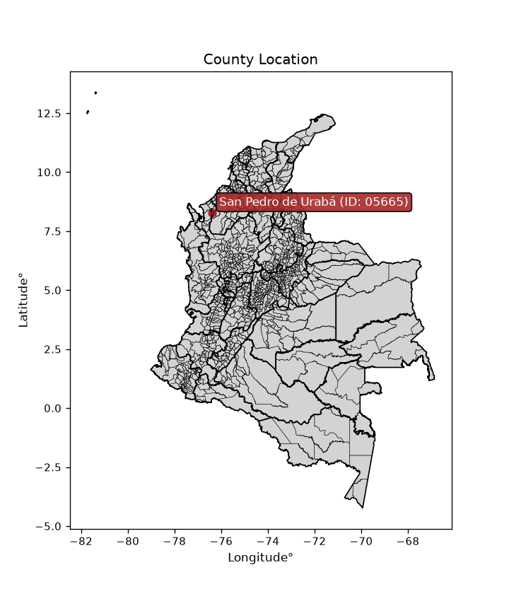
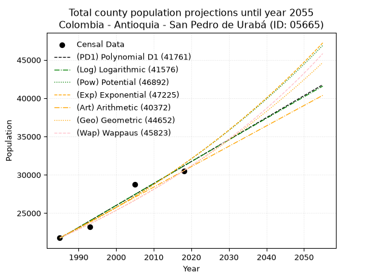
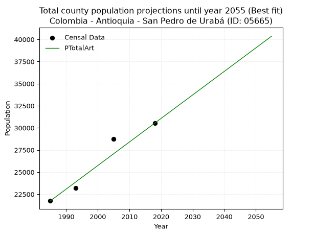
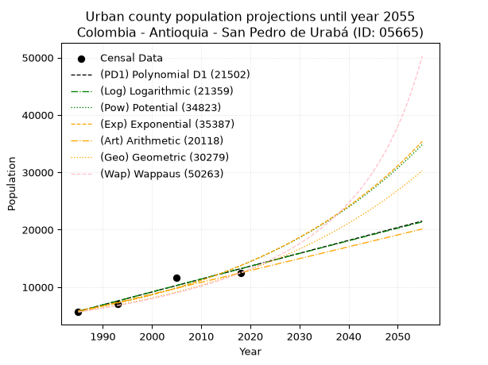
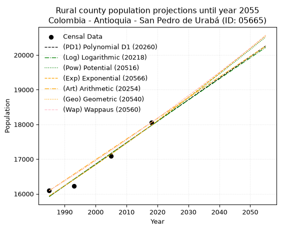
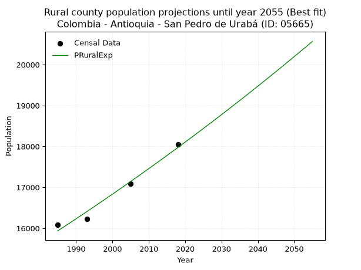

<div align="center">


</div>

# _“Population and Public Services Demand Projections (PPSD) until Year 2050 for Colombia - Antioquia - San Pedro de Urabá (ID: 05665)”_
Keywords: `population` `public-service` `projection` `lineal` `polynomial` `logarithmic` `potential` `exponential` `arithmetic` `geometric` `wappaus` `dane` `colombia` `south-america`

PPSD are analytical estimates used by governments and planners to anticipate future changes in population size, age distribution, and the resulting community needs for utilities, healthcare, education, and infrastructure as sizing future water treatment facilities, electrical grids, and road networks based on spatial growth.

<div align="center">

</img>

</div>


> **General running parameters**: • app_version: _v20260806_. • Python version: _3.14.7_. • Pandas version: _3.0.5_. • NumPy version: _2.5.1_. • Creates, save and include plots into reports (create_plot): _False_. • Projection until year: _2050_. • Process polynomial degree 2 and up: _False_. • Process Wappaus: _True_. • Process Wappaus: _True_. • Set negative values to zero: _True_. • Set infinite values to zero: _True_. • Drop dataset notes: _True_. 
<div align="center">

Dynamic map: [:earth_americas:Google](http://maps.google.com/maps?q=8.276883776,-76.3805665) [:earth_americas:OSM](https://www.openstreetmap.org/#map=18/8.276883776/-76.3805665&layers=P) [:earth_americas:Bing](https://www.bing.com/maps?cp=8.276883776~-76.3805665&lvl=18) [:earth_americas:Apple](https://maps.apple.com/frame?center=8.276883776%2C-76.3805665&span=0.003%2C0.006)

</div>


<div align="center">

```geojson
{
  "type": "Feature",
  "geometry": {
    "type": "Point", 
    "coordinates": [-76.3805665, 8.276883776]
  }, 
  "properties": {
    "Name": "Colombia - Antioquia - San Pedro de Urabá (ID: 05665)"
  }
}
```

</div>


## 0. Census Data (4 records)

Census data are official statistics collected by a government about the people and housing in a country. They usually include counts of total population, age, sex, race, income, education, and jobs.

📅Global census file: [Population.xlsx](../data/Population.xlsx)

| Source   |   Year |   CountryID | CountryName   |   StateID | StateName   |   CountyID | CountyName         |   PTotal |   PUrban |   PRural |
|:---------|-------:|------------:|:--------------|----------:|:------------|-----------:|:-------------------|---------:|---------:|---------:|
| DANE     |   1985 |          57 | Colombia      |        05 | Antioquia   |      05665 | San Pedro de Urabá |    21746 |     5656 |    16090 |
| DANE     |   1993 |          57 | Colombia      |        05 | Antioquia   |      05665 | San Pedro de Urabá |    23226 |     6997 |    16229 |
| DANE     |   2005 |          57 | Colombia      |        05 | Antioquia   |      05665 | San Pedro de Urabá |    28772 |    11679 |    17093 |
| DANE     |   2018 |          57 | Colombia      |        05 | Antioquia   |      05665 | San Pedro de Urabá |    30527 |    12474 |    18053 |

> 🔥Some records could had specific notes about the registered values or the corresponding urban or rural distribution.

📅[SUI-RUPS](https://www.datos.gov.co/Hacienda-y-Cr-dito-P-blico/Registro-nico-de-Prestadores-de-Servicios-P-blicos/4qkq-csdn/about_data) - Local public utility companies: [RUPS.csv](../data/RUPS.xlsx)

 | SERVICIO       | ESTADO    | NOMBRE                        | NIT         | DEPARTAMENTO_DOMICILIO   | MUNICIPIO_DOMICILIO   | DIRECCION                  |   TELEFONO | EMAIL               | TIPO_PRESTADOR                             | CLASIFICACION                  |
|:---------------|:----------|:------------------------------|:------------|:-------------------------|:----------------------|:---------------------------|-----------:|:--------------------|:-------------------------------------------|:-------------------------------|
| ACUEDUCTO      | OPERATIVA | SISTEMAS PUBLICOS S.A. E.S.P. | 811010349-1 | ANTIOQUIA                | MEDELLIN              | Cr 32 No. 18 C 113 Int 105 |    4083034 | wacevedo3@gmail.com | SOCIEDADES (EMPRESA DE SERVICIOS PUBLICOS) | DESDE 2501 HASTA 5000 USUARIOS |
| ALCANTARILLADO | OPERATIVA | SISTEMAS PUBLICOS S.A. E.S.P. | 811010349-1 | ANTIOQUIA                | MEDELLIN              | Cr 32 No. 18 C 113 Int 105 |    4083034 | wacevedo3@gmail.com | SOCIEDADES (EMPRESA DE SERVICIOS PUBLICOS) | MENOR O IGUAL A 2500 USUARIOS  |

## 1. Total

### 1.1. Coefficients and Parameters

* (PD1) Polynomial Deg 1: 286.6419108791635, -547287.7322360469 (lineal)
* (Log) Logarithmic: 573905.433842121, -4336192.05162348
* (Pow) Potential: 22.09856423685561, -68.53728444237579
* (Exp) Exponential: 0.011036512512700313, 6.673608941209242e-06
* (Art) Arithmetic: Year diff. 2018 - 1985 = 33, Population diff. 30527 - 21746 = 8781, Annual growth = 266.09090909090907
* (Geo) Geometric: Year diff. 2018 - 1985 = 33, Population diff. 30527 - 21746 = 8781, Annual growth % = 0.010331235972022457
* (Wap) Wappaus: i = 1.0180816447914185, Condition values only valid for < 200)

<sub>
Wappaus condition values: ['0.00', '1.02', '2.04', '3.05', '4.07', '5.09', '6.11', '7.13', '8.14', '9.16', '10.18', '11.20', '12.22', '13.24', '14.25', '15.27', '16.29', '17.31', '18.33', '19.34', '20.36', '21.38', '22.40', '23.42', '24.43', '25.45', '26.47', '27.49', '28.51', '29.52', '30.54', '31.56', '32.58', '33.60', '34.61', '35.63', '36.65', '37.67', '38.69', '39.71', '40.72', '41.74', '42.76', '43.78', '44.80', '45.81', '46.83', '47.85', '48.87', '49.89', '50.90', '51.92', '52.94', '53.96', '54.98', '55.99', '57.01', '58.03', '59.05', '60.07', '61.08', '62.10', '63.12', '64.14', '65.16', '66.18']
</sub>


### 1.2. Projected Dataset

|   Year |   CountyID |   PTotalPD1 |   PTotalLog |   PTotalPow |   PTotalExp |   PTotalArt |   PTotalGeo |   PTotalWap |
|-------:|-----------:|------------:|------------:|------------:|------------:|------------:|------------:|------------:|
|   1985 |      05665 |       21696 |       21687 |       21802 |       21810 |       21746 |       21746 |       21746 |
|   1986 |      05665 |       21983 |       21976 |       22046 |       22052 |       22012 |       21971 |       21969 |
|   1987 |      05665 |       22270 |       22265 |       22292 |       22297 |       22278 |       22198 |       22193 |
|   1988 |      05665 |       22556 |       22553 |       22541 |       22544 |       22544 |       22427 |       22420 |
|   1989 |      05665 |       22843 |       22842 |       22793 |       22794 |       22810 |       22659 |       22650 |
|   1990 |      05665 |       23130 |       23130 |       23048 |       23047 |       23076 |       22893 |       22882 |
|   1991 |      05665 |       23416 |       23419 |       23305 |       23303 |       23343 |       23129 |       23116 |
|   1992 |      05665 |       23703 |       23707 |       23565 |       23562 |       23609 |       23368 |       23353 |
|   1993 |      05665 |       23990 |       23995 |       23828 |       23823 |       23875 |       23610 |       23592 |
|   1994 |      05665 |       24276 |       24283 |       24094 |       24088 |       24141 |       23854 |       23834 |
|   1995 |      05665 |       24563 |       24571 |       24362 |       24355 |       24407 |       24100 |       24079 |
|   1996 |      05665 |       24850 |       24858 |       24633 |       24625 |       24673 |       24349 |       24326 |
|   1997 |      05665 |       25136 |       25146 |       24908 |       24899 |       24939 |       24601 |       24576 |
|   1998 |      05665 |       25423 |       25433 |       25185 |       25175 |       25205 |       24855 |       24828 |
|   1999 |      05665 |       25709 |       25720 |       25465 |       25454 |       25471 |       25111 |       25083 |
|   2000 |      05665 |       25996 |       26007 |       25748 |       25737 |       25737 |       25371 |       25341 |
|   2001 |      05665 |       26283 |       26294 |       26034 |       26022 |       26003 |       25633 |       25602 |
|   2002 |      05665 |       26569 |       26581 |       26323 |       26311 |       26270 |       25898 |       25866 |
|   2003 |      05665 |       26856 |       26867 |       26615 |       26603 |       26536 |       26165 |       26133 |
|   2004 |      05665 |       27143 |       27154 |       26910 |       26898 |       26802 |       26436 |       26403 |
|   2005 |      05665 |       27429 |       27440 |       27208 |       27197 |       27068 |       26709 |       26676 |
|   2006 |      05665 |       27716 |       27726 |       27510 |       27499 |       27334 |       26985 |       26952 |
|   2007 |      05665 |       28003 |       28012 |       27814 |       27804 |       27600 |       27264 |       27231 |
|   2008 |      05665 |       28289 |       28298 |       28122 |       28112 |       27866 |       27545 |       27513 |
|   2009 |      05665 |       28576 |       28584 |       28433 |       28424 |       28132 |       27830 |       27799 |
|   2010 |      05665 |       28863 |       28870 |       28748 |       28740 |       28398 |       28117 |       28088 |
|   2011 |      05665 |       29149 |       29155 |       29066 |       29059 |       28664 |       28408 |       28380 |
|   2012 |      05665 |       29436 |       29440 |       29387 |       29381 |       28930 |       28701 |       28676 |
|   2013 |      05665 |       29722 |       29725 |       29711 |       29707 |       29197 |       28998 |       28975 |
|   2014 |      05665 |       30009 |       30011 |       30039 |       30037 |       29463 |       29297 |       29278 |
|   2015 |      05665 |       30296 |       30295 |       30370 |       30370 |       29729 |       29600 |       29585 |
|   2016 |      05665 |       30582 |       30580 |       30705 |       30707 |       29995 |       29906 |       29895 |
|   2017 |      05665 |       30869 |       30865 |       31044 |       31048 |       30261 |       30215 |       30209 |
|   2018 |      05665 |       31156 |       31149 |       31385 |       31393 |       30527 |       30527 |       30527 |
|   2019 |      05665 |       31442 |       31434 |       31731 |       31741 |       30793 |       30842 |       30849 |
|   2020 |      05665 |       31729 |       31718 |       32080 |       32093 |       31059 |       31161 |       31175 |
|   2021 |      05665 |       32016 |       32002 |       32433 |       32450 |       31325 |       31483 |       31504 |
|   2022 |      05665 |       32302 |       32286 |       32789 |       32810 |       31591 |       31808 |       31838 |
|   2023 |      05665 |       32589 |       32569 |       33150 |       33174 |       31857 |       32137 |       32177 |
|   2024 |      05665 |       32875 |       32853 |       33514 |       33542 |       32124 |       32469 |       32519 |
|   2025 |      05665 |       33162 |       33137 |       33881 |       33914 |       32390 |       32804 |       32866 |
|   2026 |      05665 |       33449 |       33420 |       34253 |       34291 |       32656 |       33143 |       33217 |
|   2027 |      05665 |       33735 |       33703 |       34629 |       34671 |       32922 |       33486 |       33573 |
|   2028 |      05665 |       34022 |       33986 |       35008 |       35056 |       33188 |       33832 |       33934 |
|   2029 |      05665 |       34309 |       34269 |       35392 |       35445 |       33454 |       34181 |       34299 |
|   2030 |      05665 |       34595 |       34552 |       35779 |       35838 |       33720 |       34534 |       34669 |
|   2031 |      05665 |       34882 |       34834 |       36171 |       36236 |       33986 |       34891 |       35044 |
|   2032 |      05665 |       35169 |       35117 |       36566 |       36638 |       34252 |       35251 |       35424 |
|   2033 |      05665 |       35455 |       35399 |       36966 |       37045 |       34518 |       35616 |       35809 |
|   2034 |      05665 |       35742 |       35682 |       37370 |       37456 |       34784 |       35984 |       36199 |
|   2035 |      05665 |       36029 |       35964 |       37778 |       37871 |       35051 |       36355 |       36595 |
|   2036 |      05665 |       36315 |       36246 |       38190 |       38292 |       35317 |       36731 |       36996 |
|   2037 |      05665 |       36602 |       36527 |       38607 |       38717 |       35583 |       37110 |       37403 |
|   2038 |      05665 |       36888 |       36809 |       39028 |       39146 |       35849 |       37494 |       37815 |
|   2039 |      05665 |       37175 |       37091 |       39453 |       39581 |       36115 |       37881 |       38233 |
|   2040 |      05665 |       37462 |       37372 |       39883 |       40020 |       36381 |       38273 |       38657 |
|   2041 |      05665 |       37748 |       37653 |       40318 |       40464 |       36647 |       38668 |       39087 |
|   2042 |      05665 |       38035 |       37934 |       40756 |       40913 |       36913 |       39067 |       39524 |
|   2043 |      05665 |       38322 |       38215 |       41200 |       41367 |       37179 |       39471 |       39966 |
|   2044 |      05665 |       38608 |       38496 |       41648 |       41826 |       37445 |       39879 |       40415 |
|   2045 |      05665 |       38895 |       38777 |       42100 |       42291 |       37711 |       40291 |       40871 |
|   2046 |      05665 |       39182 |       39057 |       42558 |       42760 |       37978 |       40707 |       41333 |
|   2047 |      05665 |       39468 |       39338 |       43020 |       43234 |       38244 |       41128 |       41802 |
|   2048 |      05665 |       39755 |       39618 |       43486 |       43714 |       38510 |       41553 |       42278 |
|   2049 |      05665 |       40042 |       39898 |       43958 |       44199 |       38776 |       41982 |       42762 |
|   2050 |      05665 |       40328 |       40178 |       44435 |       44690 |       39042 |       42416 |       43252 |
<div align="center">

</img>

</div>


### 1.3. Best fit with absolute and relative error (%)

Relative error puts that difference into context by dividing the absolute error by the true value, creating a unitless ratio or percentage that shows the scale of the mistake.

Absolute and relative error

|   Year | Source   |   CountryID | CountryName   |   StateID | StateName   |   CountyID_x | CountyName         |   PTotal |   PUrban |   PRural |   CountyID_y |   PTotalPD1 |   PTotalLog |   PTotalPow |   PTotalExp |   PTotalArt |   PTotalGeo |   PTotalWap |   PTotalPD1AbsError |   PTotalLogAbsError |   PTotalPowAbsError |   PTotalExpAbsError |   PTotalArtAbsError |   PTotalGeoAbsError |   PTotalWapAbsError |   PTotalPD1RelError |   PTotalLogRelError |   PTotalPowRelError |   PTotalExpRelError |   PTotalArtRelError |   PTotalGeoRelError |   PTotalWapRelError |
|-------:|:---------|------------:|:--------------|----------:|:------------|-------------:|:-------------------|---------:|---------:|---------:|-------------:|------------:|------------:|------------:|------------:|------------:|------------:|------------:|--------------------:|--------------------:|--------------------:|--------------------:|--------------------:|--------------------:|--------------------:|--------------------:|--------------------:|--------------------:|--------------------:|--------------------:|--------------------:|--------------------:|
|   1985 | DANE     |          57 | Colombia      |        05 | Antioquia   |        05665 | San Pedro de Urabá |    21746 |     5656 |    16090 |        05665 |       21696 |       21687 |       21802 |       21810 |       21746 |       21746 |       21746 |                  50 |                  59 |                  56 |                  64 |                   0 |                   0 |                   0 |            0.229927 |            0.271314 |            0.257519 |            0.294307 |             0       |             0       |             0       |
|   1993 | DANE     |          57 | Colombia      |        05 | Antioquia   |        05665 | San Pedro de Urabá |    23226 |     6997 |    16229 |        05665 |       23990 |       23995 |       23828 |       23823 |       23875 |       23610 |       23592 |                 764 |                 769 |                 602 |                 597 |                 649 |                 384 |                 366 |            3.28942  |            3.31094  |            2.59192  |            2.5704   |             2.79428 |             1.65332 |             1.57582 |
|   2005 | DANE     |          57 | Colombia      |        05 | Antioquia   |        05665 | San Pedro de Urabá |    28772 |    11679 |    17093 |        05665 |       27429 |       27440 |       27208 |       27197 |       27068 |       26709 |       26676 |                1343 |                1332 |                1564 |                1575 |                1704 |                2063 |                2096 |            4.66773  |            4.6295   |            5.43584  |            5.47407  |             5.92242 |             7.17017 |             7.28486 |
|   2018 | DANE     |          57 | Colombia      |        05 | Antioquia   |        05665 | San Pedro de Urabá |    30527 |    12474 |    18053 |        05665 |       31156 |       31149 |       31385 |       31393 |       30527 |       30527 |       30527 |                 629 |                 622 |                 858 |                 866 |                   0 |                   0 |                   0 |            2.06047  |            2.03754  |            2.81063  |            2.83683  |             0       |             0       |             0       |

Relative error mean

| Method    |   RelError | Best   |
|:----------|-----------:|:-------|
| PTotalPD1 |    2.56189 |        |
| PTotalLog |    2.56233 |        |
| PTotalPow |    2.77398 |        |
| PTotalExp |    2.7939  |        |
| PTotalArt |    2.17918 | True   |
| PTotalGeo |    2.20587 |        |
| PTotalWap |    2.21517 |        |

💙Best method: _**PTotalArt**_
<div align="center">

</img>

</div>


### 1.4. Fresh water supply demand in liters per capita per day (lpcd)

The fresh water supply demand typically ranges from 100 to 300 liters per capita per day (lpcd) for standard domestic and municipal planning, though absolute survival minimums set by the World Health Organization are as low as 7.5 to 20 liters per day, and total consumption in high-income nations can exceed 400 liters.

> `CZ`: Level in meters above the sea level (masl)<br> `WS`: Fresh water supply demand in liters per capita per day (lpcd or l/h/d)<br> `WSAll`: Zonal fresh water supply demand in liters per second (l/s)<br> `A`: Zonal area in square meters<br> `DP`: Population density (people/hectare or p/ha)

Reference values (RAS Colombia)

|    CZ |   WS |
|------:|-----:|
|  1000 |  120 |
|  2000 |  130 |
| 99999 |  140 |

County shapefile geometry properties and water supply values

|   CountyID |      ATotal |   CZTotal |   WSTotal |
|-----------:|------------:|----------:|----------:|
|      05665 | 6.02651e+08 |   147.531 |       120 |

Projected values for best method: PTotalArt

|   CountyID |   Year |   PTotalArt |   DPTotal |   WSTotal |   WSTotalAll |
|-----------:|-------:|------------:|----------:|----------:|-------------:|
|      05665 |   1985 |       21746 |      0.36 |       120 |      30.2028 |
|      05665 |   1986 |       22012 |      0.37 |       120 |      30.5722 |
|      05665 |   1987 |       22278 |      0.37 |       120 |      30.9417 |
|      05665 |   1988 |       22544 |      0.37 |       120 |      31.3111 |
|      05665 |   1989 |       22810 |      0.38 |       120 |      31.6806 |
|      05665 |   1990 |       23076 |      0.38 |       120 |      32.05   |
|      05665 |   1991 |       23343 |      0.39 |       120 |      32.4208 |
|      05665 |   1992 |       23609 |      0.39 |       120 |      32.7903 |
|      05665 |   1993 |       23875 |      0.4  |       120 |      33.1597 |
|      05665 |   1994 |       24141 |      0.4  |       120 |      33.5292 |
|      05665 |   1995 |       24407 |      0.4  |       120 |      33.8986 |
|      05665 |   1996 |       24673 |      0.41 |       120 |      34.2681 |
|      05665 |   1997 |       24939 |      0.41 |       120 |      34.6375 |
|      05665 |   1998 |       25205 |      0.42 |       120 |      35.0069 |
|      05665 |   1999 |       25471 |      0.42 |       120 |      35.3764 |
|      05665 |   2000 |       25737 |      0.43 |       120 |      35.7458 |
|      05665 |   2001 |       26003 |      0.43 |       120 |      36.1153 |
|      05665 |   2002 |       26270 |      0.44 |       120 |      36.4861 |
|      05665 |   2003 |       26536 |      0.44 |       120 |      36.8556 |
|      05665 |   2004 |       26802 |      0.44 |       120 |      37.225  |
|      05665 |   2005 |       27068 |      0.45 |       120 |      37.5944 |
|      05665 |   2006 |       27334 |      0.45 |       120 |      37.9639 |
|      05665 |   2007 |       27600 |      0.46 |       120 |      38.3333 |
|      05665 |   2008 |       27866 |      0.46 |       120 |      38.7028 |
|      05665 |   2009 |       28132 |      0.47 |       120 |      39.0722 |
|      05665 |   2010 |       28398 |      0.47 |       120 |      39.4417 |
|      05665 |   2011 |       28664 |      0.48 |       120 |      39.8111 |
|      05665 |   2012 |       28930 |      0.48 |       120 |      40.1806 |
|      05665 |   2013 |       29197 |      0.48 |       120 |      40.5514 |
|      05665 |   2014 |       29463 |      0.49 |       120 |      40.9208 |
|      05665 |   2015 |       29729 |      0.49 |       120 |      41.2903 |
|      05665 |   2016 |       29995 |      0.5  |       120 |      41.6597 |
|      05665 |   2017 |       30261 |      0.5  |       120 |      42.0292 |
|      05665 |   2018 |       30527 |      0.51 |       120 |      42.3986 |
|      05665 |   2019 |       30793 |      0.51 |       120 |      42.7681 |
|      05665 |   2020 |       31059 |      0.52 |       120 |      43.1375 |
|      05665 |   2021 |       31325 |      0.52 |       120 |      43.5069 |
|      05665 |   2022 |       31591 |      0.52 |       120 |      43.8764 |
|      05665 |   2023 |       31857 |      0.53 |       120 |      44.2458 |
|      05665 |   2024 |       32124 |      0.53 |       120 |      44.6167 |
|      05665 |   2025 |       32390 |      0.54 |       120 |      44.9861 |
|      05665 |   2026 |       32656 |      0.54 |       120 |      45.3556 |
|      05665 |   2027 |       32922 |      0.55 |       120 |      45.725  |
|      05665 |   2028 |       33188 |      0.55 |       120 |      46.0944 |
|      05665 |   2029 |       33454 |      0.56 |       120 |      46.4639 |
|      05665 |   2030 |       33720 |      0.56 |       120 |      46.8333 |
|      05665 |   2031 |       33986 |      0.56 |       120 |      47.2028 |
|      05665 |   2032 |       34252 |      0.57 |       120 |      47.5722 |
|      05665 |   2033 |       34518 |      0.57 |       120 |      47.9417 |
|      05665 |   2034 |       34784 |      0.58 |       120 |      48.3111 |
|      05665 |   2035 |       35051 |      0.58 |       120 |      48.6819 |
|      05665 |   2036 |       35317 |      0.59 |       120 |      49.0514 |
|      05665 |   2037 |       35583 |      0.59 |       120 |      49.4208 |
|      05665 |   2038 |       35849 |      0.59 |       120 |      49.7903 |
|      05665 |   2039 |       36115 |      0.6  |       120 |      50.1597 |
|      05665 |   2040 |       36381 |      0.6  |       120 |      50.5292 |
|      05665 |   2041 |       36647 |      0.61 |       120 |      50.8986 |
|      05665 |   2042 |       36913 |      0.61 |       120 |      51.2681 |
|      05665 |   2043 |       37179 |      0.62 |       120 |      51.6375 |
|      05665 |   2044 |       37445 |      0.62 |       120 |      52.0069 |
|      05665 |   2045 |       37711 |      0.63 |       120 |      52.3764 |
|      05665 |   2046 |       37978 |      0.63 |       120 |      52.7472 |
|      05665 |   2047 |       38244 |      0.63 |       120 |      53.1167 |
|      05665 |   2048 |       38510 |      0.64 |       120 |      53.4861 |
|      05665 |   2049 |       38776 |      0.64 |       120 |      53.8556 |
|      05665 |   2050 |       39042 |      0.65 |       120 |      54.225  |

## 2. Urban

### 2.1. Coefficients and Parameters

* (PD1) Polynomial Deg 1: 224.65917302288162, -440173.01083901897 (lineal)
* (Log) Logarithmic: 449883.86765271577, -3410369.383171352
* (Pow) Potential: 51.26586438886547, -165.29229803720582
* (Exp) Exponential: 0.02559705299181505, 5.059542739005828e-19
* (Art) Arithmetic: Year diff. 2018 - 1985 = 33, Population diff. 12474 - 5656 = 6818, Annual growth = 206.6060606060606
* (Geo) Geometric: Year diff. 2018 - 1985 = 33, Population diff. 12474 - 5656 = 6818, Annual growth % = 0.024257092609108355
* (Wap) Wappaus: i = 2.279162279162279, Condition values only valid for < 200)

<sub>
Wappaus condition values: ['0.00', '2.28', '4.56', '6.84', '9.12', '11.40', '13.67', '15.95', '18.23', '20.51', '22.79', '25.07', '27.35', '29.63', '31.91', '34.19', '36.47', '38.75', '41.02', '43.30', '45.58', '47.86', '50.14', '52.42', '54.70', '56.98', '59.26', '61.54', '63.82', '66.10', '68.37', '70.65', '72.93', '75.21', '77.49', '79.77', '82.05', '84.33', '86.61', '88.89', '91.17', '93.45', '95.72', '98.00', '100.28', '102.56', '104.84', '107.12', '109.40', '111.68', '113.96', '116.24', '118.52', '120.80', '123.07', '125.35', '127.63', '129.91', '132.19', '134.47', '136.75', '139.03', '141.31', '143.59', '145.87', '148.15']
</sub>


### 2.2. Projected Dataset

|   Year |   CountyID |   PUrbanPD1 |   PUrbanLog |   PUrbanPow |   PUrbanExp |   PUrbanArt |   PUrbanGeo |   PUrbanWap |
|-------:|-----------:|------------:|------------:|------------:|------------:|------------:|------------:|------------:|
|   1985 |      05665 |        5775 |        5767 |        5892 |        5898 |        5656 |        5656 |        5656 |
|   1986 |      05665 |        6000 |        5994 |        6046 |        6051 |        5863 |        5793 |        5786 |
|   1987 |      05665 |        6225 |        6220 |        6204 |        6207 |        6069 |        5934 |        5920 |
|   1988 |      05665 |        6449 |        6447 |        6366 |        6368 |        6276 |        6078 |        6056 |
|   1989 |      05665 |        6674 |        6673 |        6532 |        6533 |        6482 |        6225 |        6196 |
|   1990 |      05665 |        6899 |        6899 |        6703 |        6703 |        6689 |        6376 |        6339 |
|   1991 |      05665 |        7123 |        7125 |        6878 |        6877 |        6896 |        6531 |        6486 |
|   1992 |      05665 |        7348 |        7351 |        7057 |        7055 |        7102 |        6689 |        6637 |
|   1993 |      05665 |        7573 |        7577 |        7241 |        7238 |        7309 |        6851 |        6791 |
|   1994 |      05665 |        7797 |        7802 |        7430 |        7426 |        7515 |        7018 |        6949 |
|   1995 |      05665 |        8022 |        8028 |        7623 |        7618 |        7722 |        7188 |        7111 |
|   1996 |      05665 |        8247 |        8253 |        7821 |        7816 |        7929 |        7362 |        7277 |
|   1997 |      05665 |        8471 |        8479 |        8025 |        8018 |        8135 |        7541 |        7448 |
|   1998 |      05665 |        8696 |        8704 |        8233 |        8226 |        8342 |        7724 |        7623 |
|   1999 |      05665 |        8921 |        8929 |        8447 |        8439 |        8548 |        7911 |        7803 |
|   2000 |      05665 |        9145 |        9154 |        8667 |        8658 |        8755 |        8103 |        7988 |
|   2001 |      05665 |        9370 |        9379 |        8892 |        8883 |        8962 |        8300 |        8178 |
|   2002 |      05665 |        9595 |        9604 |        9122 |        9113 |        9168 |        8501 |        8374 |
|   2003 |      05665 |        9819 |        9828 |        9359 |        9349 |        9375 |        8707 |        8575 |
|   2004 |      05665 |       10044 |       10053 |        9602 |        9592 |        9582 |        8918 |        8782 |
|   2005 |      05665 |       10269 |       10277 |        9850 |        9840 |        9788 |        9135 |        8995 |
|   2006 |      05665 |       10493 |       10502 |       10105 |       10096 |        9995 |        9356 |        9215 |
|   2007 |      05665 |       10718 |       10726 |       10367 |       10357 |       10201 |        9583 |        9441 |
|   2008 |      05665 |       10943 |       10950 |       10635 |       10626 |       10408 |        9816 |        9674 |
|   2009 |      05665 |       11167 |       11174 |       10910 |       10901 |       10615 |       10054 |        9915 |
|   2010 |      05665 |       11392 |       11398 |       11192 |       11184 |       10821 |       10298 |       10163 |
|   2011 |      05665 |       11617 |       11622 |       11481 |       11474 |       11028 |       10547 |       10419 |
|   2012 |      05665 |       11841 |       11845 |       11777 |       11771 |       11234 |       10803 |       10683 |
|   2013 |      05665 |       12066 |       12069 |       12081 |       12077 |       11441 |       11065 |       10957 |
|   2014 |      05665 |       12291 |       12292 |       12393 |       12390 |       11648 |       11334 |       11240 |
|   2015 |      05665 |       12515 |       12516 |       12712 |       12711 |       11854 |       11609 |       11532 |
|   2016 |      05665 |       12740 |       12739 |       13040 |       13041 |       12061 |       11890 |       11835 |
|   2017 |      05665 |       12965 |       12962 |       13375 |       13379 |       12267 |       12179 |       12149 |
|   2018 |      05665 |       13189 |       13185 |       13720 |       13726 |       12474 |       12474 |       12474 |
|   2019 |      05665 |       13414 |       13408 |       14073 |       14081 |       12681 |       12777 |       12811 |
|   2020 |      05665 |       13639 |       13631 |       14434 |       14446 |       12887 |       13087 |       13161 |
|   2021 |      05665 |       13863 |       13853 |       14805 |       14821 |       13094 |       13404 |       13525 |
|   2022 |      05665 |       14088 |       14076 |       15186 |       15205 |       13300 |       13729 |       13903 |
|   2023 |      05665 |       14312 |       14298 |       15575 |       15600 |       13507 |       14062 |       14296 |
|   2024 |      05665 |       14537 |       14520 |       15975 |       16004 |       13714 |       14403 |       14705 |
|   2025 |      05665 |       14762 |       14743 |       16385 |       16419 |       13920 |       14753 |       15132 |
|   2026 |      05665 |       14986 |       14965 |       16805 |       16845 |       14127 |       15110 |       15576 |
|   2027 |      05665 |       15211 |       15187 |       17235 |       17281 |       14333 |       15477 |       16040 |
|   2028 |      05665 |       15436 |       15409 |       17677 |       17729 |       14540 |       15852 |       16525 |
|   2029 |      05665 |       15660 |       15630 |       18129 |       18189 |       14747 |       16237 |       17032 |
|   2030 |      05665 |       15885 |       15852 |       18593 |       18661 |       14953 |       16631 |       17563 |
|   2031 |      05665 |       16110 |       16074 |       19068 |       19145 |       15160 |       17034 |       18119 |
|   2032 |      05665 |       16334 |       16295 |       19556 |       19641 |       15366 |       17447 |       18702 |
|   2033 |      05665 |       16559 |       16517 |       20055 |       20150 |       15573 |       17871 |       19315 |
|   2034 |      05665 |       16784 |       16738 |       20567 |       20673 |       15780 |       18304 |       19960 |
|   2035 |      05665 |       17008 |       16959 |       21092 |       21209 |       15986 |       18748 |       20638 |
|   2036 |      05665 |       17233 |       17180 |       21630 |       21758 |       16193 |       19203 |       21354 |
|   2037 |      05665 |       17458 |       17401 |       22181 |       22323 |       16400 |       19669 |       22109 |
|   2038 |      05665 |       17682 |       17622 |       22747 |       22901 |       16606 |       20146 |       22908 |
|   2039 |      05665 |       17907 |       17842 |       23326 |       23495 |       16813 |       20635 |       23754 |
|   2040 |      05665 |       18132 |       18063 |       23920 |       24104 |       17019 |       21135 |       24652 |
|   2041 |      05665 |       18356 |       18283 |       24528 |       24729 |       17226 |       21648 |       25607 |
|   2042 |      05665 |       18581 |       18504 |       25152 |       25370 |       17433 |       22173 |       26624 |
|   2043 |      05665 |       18806 |       18724 |       25791 |       26028 |       17639 |       22711 |       27709 |
|   2044 |      05665 |       19030 |       18944 |       26446 |       26703 |       17846 |       23262 |       28869 |
|   2045 |      05665 |       19255 |       19164 |       27118 |       27395 |       18052 |       23826 |       30113 |
|   2046 |      05665 |       19480 |       19384 |       27806 |       28106 |       18259 |       24404 |       31450 |
|   2047 |      05665 |       19704 |       19604 |       28512 |       28834 |       18466 |       24996 |       32891 |
|   2048 |      05665 |       19929 |       19824 |       29234 |       29582 |       18672 |       25602 |       34448 |
|   2049 |      05665 |       20154 |       20043 |       29975 |       30349 |       18879 |       26223 |       36137 |
|   2050 |      05665 |       20378 |       20263 |       30735 |       31136 |       19085 |       26859 |       37974 |
<div align="center">

</img>

</div>


### 2.3. Best fit with absolute and relative error (%)

Relative error puts that difference into context by dividing the absolute error by the true value, creating a unitless ratio or percentage that shows the scale of the mistake.

Absolute and relative error

|   Year | Source   |   CountryID | CountryName   |   StateID | StateName   |   CountyID_x | CountyName         |   PTotal |   PUrban |   PRural |   CountyID_y |   PUrbanPD1 |   PUrbanLog |   PUrbanPow |   PUrbanExp |   PUrbanArt |   PUrbanGeo |   PUrbanWap |   PUrbanPD1AbsError |   PUrbanLogAbsError |   PUrbanPowAbsError |   PUrbanExpAbsError |   PUrbanArtAbsError |   PUrbanGeoAbsError |   PUrbanWapAbsError |   PUrbanPD1RelError |   PUrbanLogRelError |   PUrbanPowRelError |   PUrbanExpRelError |   PUrbanArtRelError |   PUrbanGeoRelError |   PUrbanWapRelError |
|-------:|:---------|------------:|:--------------|----------:|:------------|-------------:|:-------------------|---------:|---------:|---------:|-------------:|------------:|------------:|------------:|------------:|------------:|------------:|------------:|--------------------:|--------------------:|--------------------:|--------------------:|--------------------:|--------------------:|--------------------:|--------------------:|--------------------:|--------------------:|--------------------:|--------------------:|--------------------:|--------------------:|
|   1985 | DANE     |          57 | Colombia      |        05 | Antioquia   |        05665 | San Pedro de Urabá |    21746 |     5656 |    16090 |        05665 |        5775 |        5767 |        5892 |        5898 |        5656 |        5656 |        5656 |                 119 |                 111 |                 236 |                 242 |                   0 |                   0 |                   0 |             2.10396 |             1.96252 |             4.17256 |             4.27864 |             0       |             0       |             0       |
|   1993 | DANE     |          57 | Colombia      |        05 | Antioquia   |        05665 | San Pedro de Urabá |    23226 |     6997 |    16229 |        05665 |        7573 |        7577 |        7241 |        7238 |        7309 |        6851 |        6791 |                 576 |                 580 |                 244 |                 241 |                 312 |                 146 |                 206 |             8.2321  |             8.28927 |             3.48721 |             3.44433 |             4.45905 |             2.08661 |             2.94412 |
|   2005 | DANE     |          57 | Colombia      |        05 | Antioquia   |        05665 | San Pedro de Urabá |    28772 |    11679 |    17093 |        05665 |       10269 |       10277 |        9850 |        9840 |        9788 |        9135 |        8995 |                1410 |                1402 |                1829 |                1839 |                1891 |                2544 |                2684 |            12.073   |            12.0045  |            15.6606  |            15.7462  |            16.1915  |            21.7827  |            22.9814  |
|   2018 | DANE     |          57 | Colombia      |        05 | Antioquia   |        05665 | San Pedro de Urabá |    30527 |    12474 |    18053 |        05665 |       13189 |       13185 |       13720 |       13726 |       12474 |       12474 |       12474 |                 715 |                 711 |                1246 |                1252 |                   0 |                   0 |                   0 |             5.73192 |             5.69986 |             9.98878 |            10.0369  |             0       |             0       |             0       |

Relative error mean

| Method    |   RelError | Best   |
|:----------|-----------:|:-------|
| PUrbanPD1 |    7.03523 |        |
| PUrbanLog |    6.98902 |        |
| PUrbanPow |    8.32728 |        |
| PUrbanExp |    8.37652 |        |
| PUrbanArt |    5.16263 | True   |
| PUrbanGeo |    5.96732 |        |
| PUrbanWap |    6.48138 |        |

💙Best method: _**PUrbanArt**_
<div align="center">

</img>

</div>


### 2.4. Fresh water supply demand in liters per capita per day (lpcd)

The fresh water supply demand typically ranges from 100 to 300 liters per capita per day (lpcd) for standard domestic and municipal planning, though absolute survival minimums set by the World Health Organization are as low as 7.5 to 20 liters per day, and total consumption in high-income nations can exceed 400 liters.

> `CZ`: Level in meters above the sea level (masl)<br> `WS`: Fresh water supply demand in liters per capita per day (lpcd or l/h/d)<br> `WSAll`: Zonal fresh water supply demand in liters per second (l/s)<br> `A`: Zonal area in square meters<br> `DP`: Population density (people/hectare or p/ha)

Reference values (RAS Colombia)

|    CZ |   WS |
|------:|-----:|
|  1000 |  120 |
|  2000 |  130 |
| 99999 |  140 |

County shapefile geometry properties and water supply values

|   CountyID |      AUrban |   CZUrban |   WSUrban |
|-----------:|------------:|----------:|----------:|
|      05665 | 3.33813e+06 |   137.969 |       120 |

Projected values for best method: PUrbanArt

|   CountyID |   Year |   PUrbanArt |   DPUrban |   WSUrban |   WSUrbanAll |
|-----------:|-------:|------------:|----------:|----------:|-------------:|
|      05665 |   1985 |        5656 |     16.94 |       120 |      7.85556 |
|      05665 |   1986 |        5863 |     17.56 |       120 |      8.14306 |
|      05665 |   1987 |        6069 |     18.18 |       120 |      8.42917 |
|      05665 |   1988 |        6276 |     18.8  |       120 |      8.71667 |
|      05665 |   1989 |        6482 |     19.42 |       120 |      9.00278 |
|      05665 |   1990 |        6689 |     20.04 |       120 |      9.29028 |
|      05665 |   1991 |        6896 |     20.66 |       120 |      9.57778 |
|      05665 |   1992 |        7102 |     21.28 |       120 |      9.86389 |
|      05665 |   1993 |        7309 |     21.9  |       120 |     10.1514  |
|      05665 |   1994 |        7515 |     22.51 |       120 |     10.4375  |
|      05665 |   1995 |        7722 |     23.13 |       120 |     10.725   |
|      05665 |   1996 |        7929 |     23.75 |       120 |     11.0125  |
|      05665 |   1997 |        8135 |     24.37 |       120 |     11.2986  |
|      05665 |   1998 |        8342 |     24.99 |       120 |     11.5861  |
|      05665 |   1999 |        8548 |     25.61 |       120 |     11.8722  |
|      05665 |   2000 |        8755 |     26.23 |       120 |     12.1597  |
|      05665 |   2001 |        8962 |     26.85 |       120 |     12.4472  |
|      05665 |   2002 |        9168 |     27.46 |       120 |     12.7333  |
|      05665 |   2003 |        9375 |     28.08 |       120 |     13.0208  |
|      05665 |   2004 |        9582 |     28.7  |       120 |     13.3083  |
|      05665 |   2005 |        9788 |     29.32 |       120 |     13.5944  |
|      05665 |   2006 |        9995 |     29.94 |       120 |     13.8819  |
|      05665 |   2007 |       10201 |     30.56 |       120 |     14.1681  |
|      05665 |   2008 |       10408 |     31.18 |       120 |     14.4556  |
|      05665 |   2009 |       10615 |     31.8  |       120 |     14.7431  |
|      05665 |   2010 |       10821 |     32.42 |       120 |     15.0292  |
|      05665 |   2011 |       11028 |     33.04 |       120 |     15.3167  |
|      05665 |   2012 |       11234 |     33.65 |       120 |     15.6028  |
|      05665 |   2013 |       11441 |     34.27 |       120 |     15.8903  |
|      05665 |   2014 |       11648 |     34.89 |       120 |     16.1778  |
|      05665 |   2015 |       11854 |     35.51 |       120 |     16.4639  |
|      05665 |   2016 |       12061 |     36.13 |       120 |     16.7514  |
|      05665 |   2017 |       12267 |     36.75 |       120 |     17.0375  |
|      05665 |   2018 |       12474 |     37.37 |       120 |     17.325   |
|      05665 |   2019 |       12681 |     37.99 |       120 |     17.6125  |
|      05665 |   2020 |       12887 |     38.61 |       120 |     17.8986  |
|      05665 |   2021 |       13094 |     39.23 |       120 |     18.1861  |
|      05665 |   2022 |       13300 |     39.84 |       120 |     18.4722  |
|      05665 |   2023 |       13507 |     40.46 |       120 |     18.7597  |
|      05665 |   2024 |       13714 |     41.08 |       120 |     19.0472  |
|      05665 |   2025 |       13920 |     41.7  |       120 |     19.3333  |
|      05665 |   2026 |       14127 |     42.32 |       120 |     19.6208  |
|      05665 |   2027 |       14333 |     42.94 |       120 |     19.9069  |
|      05665 |   2028 |       14540 |     43.56 |       120 |     20.1944  |
|      05665 |   2029 |       14747 |     44.18 |       120 |     20.4819  |
|      05665 |   2030 |       14953 |     44.79 |       120 |     20.7681  |
|      05665 |   2031 |       15160 |     45.41 |       120 |     21.0556  |
|      05665 |   2032 |       15366 |     46.03 |       120 |     21.3417  |
|      05665 |   2033 |       15573 |     46.65 |       120 |     21.6292  |
|      05665 |   2034 |       15780 |     47.27 |       120 |     21.9167  |
|      05665 |   2035 |       15986 |     47.89 |       120 |     22.2028  |
|      05665 |   2036 |       16193 |     48.51 |       120 |     22.4903  |
|      05665 |   2037 |       16400 |     49.13 |       120 |     22.7778  |
|      05665 |   2038 |       16606 |     49.75 |       120 |     23.0639  |
|      05665 |   2039 |       16813 |     50.37 |       120 |     23.3514  |
|      05665 |   2040 |       17019 |     50.98 |       120 |     23.6375  |
|      05665 |   2041 |       17226 |     51.6  |       120 |     23.925   |
|      05665 |   2042 |       17433 |     52.22 |       120 |     24.2125  |
|      05665 |   2043 |       17639 |     52.84 |       120 |     24.4986  |
|      05665 |   2044 |       17846 |     53.46 |       120 |     24.7861  |
|      05665 |   2045 |       18052 |     54.08 |       120 |     25.0722  |
|      05665 |   2046 |       18259 |     54.7  |       120 |     25.3597  |
|      05665 |   2047 |       18466 |     55.32 |       120 |     25.6472  |
|      05665 |   2048 |       18672 |     55.94 |       120 |     25.9333  |
|      05665 |   2049 |       18879 |     56.56 |       120 |     26.2208  |
|      05665 |   2050 |       19085 |     57.17 |       120 |     26.5069  |

## 3. Rural

### 3.1. Coefficients and Parameters

* (PD1) Polynomial Deg 1: 61.98273785628202, -107114.72139702813 (lineal)
* (Log) Logarithmic: 124021.56618940482, -925822.6684521245
* (Pow) Potential: 7.287817546164346, -19.831084537521182
* (Exp) Exponential: 0.0036421460511196816, 11.551292050398628
* (Art) Arithmetic: Year diff. 2018 - 1985 = 33, Population diff. 18053 - 16090 = 1963, Annual growth = 59.484848484848484
* (Geo) Geometric: Year diff. 2018 - 1985 = 33, Population diff. 18053 - 16090 = 1963, Annual growth % = 0.003494391653649176
* (Wap) Wappaus: i = 0.34844535327796905, Condition values only valid for < 200)

<sub>
Wappaus condition values: ['0.00', '0.35', '0.70', '1.05', '1.39', '1.74', '2.09', '2.44', '2.79', '3.14', '3.48', '3.83', '4.18', '4.53', '4.88', '5.23', '5.58', '5.92', '6.27', '6.62', '6.97', '7.32', '7.67', '8.01', '8.36', '8.71', '9.06', '9.41', '9.76', '10.10', '10.45', '10.80', '11.15', '11.50', '11.85', '12.20', '12.54', '12.89', '13.24', '13.59', '13.94', '14.29', '14.63', '14.98', '15.33', '15.68', '16.03', '16.38', '16.73', '17.07', '17.42', '17.77', '18.12', '18.47', '18.82', '19.16', '19.51', '19.86', '20.21', '20.56', '20.91', '21.26', '21.60', '21.95', '22.30', '22.65']
</sub>


### 3.2. Projected Dataset

|   Year |   CountyID |   PRuralPD1 |   PRuralLog |   PRuralPow |   PRuralExp |   PRuralArt |   PRuralGeo |   PRuralWap |
|-------:|-----------:|------------:|------------:|------------:|------------:|------------:|------------:|------------:|
|   1985 |      05665 |       15921 |       15919 |       15936 |       15938 |       16090 |       16090 |       16090 |
|   1986 |      05665 |       15983 |       15982 |       15995 |       15996 |       16149 |       16146 |       16146 |
|   1987 |      05665 |       16045 |       16044 |       16054 |       16054 |       16209 |       16203 |       16203 |
|   1988 |      05665 |       16107 |       16107 |       16113 |       16113 |       16268 |       16259 |       16259 |
|   1989 |      05665 |       16169 |       16169 |       16172 |       16172 |       16328 |       16316 |       16316 |
|   1990 |      05665 |       16231 |       16231 |       16231 |       16231 |       16387 |       16373 |       16373 |
|   1991 |      05665 |       16293 |       16294 |       16291 |       16290 |       16447 |       16430 |       16430 |
|   1992 |      05665 |       16355 |       16356 |       16351 |       16349 |       16506 |       16488 |       16487 |
|   1993 |      05665 |       16417 |       16418 |       16411 |       16409 |       16566 |       16545 |       16545 |
|   1994 |      05665 |       16479 |       16481 |       16471 |       16469 |       16625 |       16603 |       16603 |
|   1995 |      05665 |       16541 |       16543 |       16531 |       16529 |       16685 |       16661 |       16661 |
|   1996 |      05665 |       16603 |       16605 |       16591 |       16589 |       16744 |       16719 |       16719 |
|   1997 |      05665 |       16665 |       16667 |       16652 |       16650 |       16804 |       16778 |       16777 |
|   1998 |      05665 |       16727 |       16729 |       16713 |       16711 |       16863 |       16836 |       16836 |
|   1999 |      05665 |       16789 |       16791 |       16774 |       16772 |       16923 |       16895 |       16895 |
|   2000 |      05665 |       16851 |       16853 |       16835 |       16833 |       16982 |       16954 |       16954 |
|   2001 |      05665 |       16913 |       16915 |       16897 |       16894 |       17042 |       17014 |       17013 |
|   2002 |      05665 |       16975 |       16977 |       16958 |       16956 |       17101 |       17073 |       17072 |
|   2003 |      05665 |       17037 |       17039 |       17020 |       17018 |       17161 |       17133 |       17132 |
|   2004 |      05665 |       17099 |       17101 |       17082 |       17080 |       17220 |       17193 |       17192 |
|   2005 |      05665 |       17161 |       17163 |       17144 |       17142 |       17280 |       17253 |       17252 |
|   2006 |      05665 |       17223 |       17225 |       17207 |       17205 |       17339 |       17313 |       17312 |
|   2007 |      05665 |       17285 |       17286 |       17269 |       17268 |       17399 |       17373 |       17373 |
|   2008 |      05665 |       17347 |       17348 |       17332 |       17331 |       17458 |       17434 |       17433 |
|   2009 |      05665 |       17409 |       17410 |       17395 |       17394 |       17518 |       17495 |       17494 |
|   2010 |      05665 |       17471 |       17472 |       17458 |       17457 |       17577 |       17556 |       17555 |
|   2011 |      05665 |       17533 |       17533 |       17522 |       17521 |       17637 |       17618 |       17617 |
|   2012 |      05665 |       17595 |       17595 |       17585 |       17585 |       17696 |       17679 |       17678 |
|   2013 |      05665 |       17657 |       17657 |       17649 |       17649 |       17756 |       17741 |       17740 |
|   2014 |      05665 |       17719 |       17718 |       17713 |       17713 |       17815 |       17803 |       17802 |
|   2015 |      05665 |       17780 |       17780 |       17777 |       17778 |       17875 |       17865 |       17865 |
|   2016 |      05665 |       17842 |       17841 |       17842 |       17843 |       17934 |       17927 |       17927 |
|   2017 |      05665 |       17904 |       17903 |       17906 |       17908 |       17994 |       17990 |       17990 |
|   2018 |      05665 |       17966 |       17964 |       17971 |       17973 |       18053 |       18053 |       18053 |
|   2019 |      05665 |       18028 |       18026 |       18036 |       18039 |       18112 |       18116 |       18116 |
|   2020 |      05665 |       18090 |       18087 |       18101 |       18105 |       18172 |       18179 |       18180 |
|   2021 |      05665 |       18152 |       18149 |       18167 |       18171 |       18231 |       18243 |       18243 |
|   2022 |      05665 |       18214 |       18210 |       18232 |       18237 |       18291 |       18307 |       18307 |
|   2023 |      05665 |       18276 |       18271 |       18298 |       18304 |       18350 |       18371 |       18372 |
|   2024 |      05665 |       18338 |       18333 |       18364 |       18370 |       18410 |       18435 |       18436 |
|   2025 |      05665 |       18400 |       18394 |       18431 |       18438 |       18469 |       18499 |       18501 |
|   2026 |      05665 |       18462 |       18455 |       18497 |       18505 |       18529 |       18564 |       18565 |
|   2027 |      05665 |       18524 |       18516 |       18564 |       18572 |       18588 |       18629 |       18631 |
|   2028 |      05665 |       18586 |       18577 |       18630 |       18640 |       18648 |       18694 |       18696 |
|   2029 |      05665 |       18648 |       18639 |       18698 |       18708 |       18707 |       18759 |       18762 |
|   2030 |      05665 |       18710 |       18700 |       18765 |       18776 |       18767 |       18825 |       18828 |
|   2031 |      05665 |       18772 |       18761 |       18832 |       18845 |       18826 |       18891 |       18894 |
|   2032 |      05665 |       18834 |       18822 |       18900 |       18914 |       18886 |       18957 |       18960 |
|   2033 |      05665 |       18896 |       18883 |       18968 |       18983 |       18945 |       19023 |       19027 |
|   2034 |      05665 |       18958 |       18944 |       19036 |       19052 |       19005 |       19089 |       19094 |
|   2035 |      05665 |       19020 |       19005 |       19104 |       19121 |       19064 |       19156 |       19161 |
|   2036 |      05665 |       19082 |       19066 |       19173 |       19191 |       19124 |       19223 |       19228 |
|   2037 |      05665 |       19144 |       19127 |       19241 |       19261 |       19183 |       19290 |       19296 |
|   2038 |      05665 |       19206 |       19187 |       19310 |       19331 |       19243 |       19357 |       19364 |
|   2039 |      05665 |       19268 |       19248 |       19380 |       19402 |       19302 |       19425 |       19432 |
|   2040 |      05665 |       19330 |       19309 |       19449 |       19473 |       19362 |       19493 |       19500 |
|   2041 |      05665 |       19392 |       19370 |       19519 |       19544 |       19421 |       19561 |       19569 |
|   2042 |      05665 |       19454 |       19431 |       19588 |       19615 |       19481 |       19629 |       19638 |
|   2043 |      05665 |       19516 |       19491 |       19658 |       19687 |       19540 |       19698 |       19707 |
|   2044 |      05665 |       19578 |       19552 |       19729 |       19759 |       19600 |       19767 |       19777 |
|   2045 |      05665 |       19640 |       19613 |       19799 |       19831 |       19659 |       19836 |       19847 |
|   2046 |      05665 |       19702 |       19673 |       19870 |       19903 |       19719 |       19905 |       19917 |
|   2047 |      05665 |       19764 |       19734 |       19941 |       19976 |       19778 |       19975 |       19987 |
|   2048 |      05665 |       19826 |       19795 |       20012 |       20049 |       19838 |       20045 |       20058 |
|   2049 |      05665 |       19888 |       19855 |       20083 |       20122 |       19897 |       20115 |       20128 |
|   2050 |      05665 |       19950 |       19916 |       20155 |       20195 |       19957 |       20185 |       20200 |
<div align="center">

</img>

</div>


### 3.3. Best fit with absolute and relative error (%)

Relative error puts that difference into context by dividing the absolute error by the true value, creating a unitless ratio or percentage that shows the scale of the mistake.

Absolute and relative error

|   Year | Source   |   CountryID | CountryName   |   StateID | StateName   |   CountyID_x | CountyName         |   PTotal |   PUrban |   PRural |   CountyID_y |   PRuralPD1 |   PRuralLog |   PRuralPow |   PRuralExp |   PRuralArt |   PRuralGeo |   PRuralWap |   PRuralPD1AbsError |   PRuralLogAbsError |   PRuralPowAbsError |   PRuralExpAbsError |   PRuralArtAbsError |   PRuralGeoAbsError |   PRuralWapAbsError |   PRuralPD1RelError |   PRuralLogRelError |   PRuralPowRelError |   PRuralExpRelError |   PRuralArtRelError |   PRuralGeoRelError |   PRuralWapRelError |
|-------:|:---------|------------:|:--------------|----------:|:------------|-------------:|:-------------------|---------:|---------:|---------:|-------------:|------------:|------------:|------------:|------------:|------------:|------------:|------------:|--------------------:|--------------------:|--------------------:|--------------------:|--------------------:|--------------------:|--------------------:|--------------------:|--------------------:|--------------------:|--------------------:|--------------------:|--------------------:|--------------------:|
|   1985 | DANE     |          57 | Colombia      |        05 | Antioquia   |        05665 | San Pedro de Urabá |    21746 |     5656 |    16090 |        05665 |       15921 |       15919 |       15936 |       15938 |       16090 |       16090 |       16090 |                 169 |                 171 |                 154 |                 152 |                   0 |                   0 |                   0 |            1.05034  |            1.06277  |            0.957116 |            0.944686 |             0       |            0        |            0        |
|   1993 | DANE     |          57 | Colombia      |        05 | Antioquia   |        05665 | San Pedro de Urabá |    23226 |     6997 |    16229 |        05665 |       16417 |       16418 |       16411 |       16409 |       16566 |       16545 |       16545 |                 188 |                 189 |                 182 |                 180 |                 337 |                 316 |                 316 |            1.15842  |            1.16458  |            1.12145  |            1.10913  |             2.07653 |            1.94713  |            1.94713  |
|   2005 | DANE     |          57 | Colombia      |        05 | Antioquia   |        05665 | San Pedro de Urabá |    28772 |    11679 |    17093 |        05665 |       17161 |       17163 |       17144 |       17142 |       17280 |       17253 |       17252 |                  68 |                  70 |                  51 |                  49 |                 187 |                 160 |                 159 |            0.397824 |            0.409524 |            0.298368 |            0.286667 |             1.09402 |            0.936056 |            0.930205 |
|   2018 | DANE     |          57 | Colombia      |        05 | Antioquia   |        05665 | San Pedro de Urabá |    30527 |    12474 |    18053 |        05665 |       17966 |       17964 |       17971 |       17973 |       18053 |       18053 |       18053 |                  87 |                  89 |                  82 |                  80 |                   0 |                   0 |                   0 |            0.481914 |            0.492993 |            0.454218 |            0.44314  |             0       |            0        |            0        |

Relative error mean

| Method    |   RelError | Best   |
|:----------|-----------:|:-------|
| PRuralPD1 |   0.772125 |        |
| PRuralLog |   0.782468 |        |
| PRuralPow |   0.707788 |        |
| PRuralExp |   0.695905 | True   |
| PRuralArt |   0.792636 |        |
| PRuralGeo |   0.720797 |        |
| PRuralWap |   0.719334 |        |

💙Best method: _**PRuralExp**_
<div align="center">

</img>

</div>


### 3.4. Fresh water supply demand in liters per capita per day (lpcd)

The fresh water supply demand typically ranges from 100 to 300 liters per capita per day (lpcd) for standard domestic and municipal planning, though absolute survival minimums set by the World Health Organization are as low as 7.5 to 20 liters per day, and total consumption in high-income nations can exceed 400 liters.

> `CZ`: Level in meters above the sea level (masl)<br> `WS`: Fresh water supply demand in liters per capita per day (lpcd or l/h/d)<br> `WSAll`: Zonal fresh water supply demand in liters per second (l/s)<br> `A`: Zonal area in square meters<br> `DP`: Population density (people/hectare or p/ha)

Reference values (RAS Colombia)

|    CZ |   WS |
|------:|-----:|
|  1000 |  120 |
|  2000 |  130 |
| 99999 |  140 |

County shapefile geometry properties and water supply values

|   CountyID |      ARural |   CZRural |   WSRural |
|-----------:|------------:|----------:|----------:|
|      05665 | 5.99313e+08 |   147.584 |       120 |

Projected values for best method: PRuralExp

|   CountyID |   Year |   PRuralExp |   DPRural |   WSRural |   WSRuralAll |
|-----------:|-------:|------------:|----------:|----------:|-------------:|
|      05665 |   1985 |       15938 |      0.27 |       120 |      22.1361 |
|      05665 |   1986 |       15996 |      0.27 |       120 |      22.2167 |
|      05665 |   1987 |       16054 |      0.27 |       120 |      22.2972 |
|      05665 |   1988 |       16113 |      0.27 |       120 |      22.3792 |
|      05665 |   1989 |       16172 |      0.27 |       120 |      22.4611 |
|      05665 |   1990 |       16231 |      0.27 |       120 |      22.5431 |
|      05665 |   1991 |       16290 |      0.27 |       120 |      22.625  |
|      05665 |   1992 |       16349 |      0.27 |       120 |      22.7069 |
|      05665 |   1993 |       16409 |      0.27 |       120 |      22.7903 |
|      05665 |   1994 |       16469 |      0.27 |       120 |      22.8736 |
|      05665 |   1995 |       16529 |      0.28 |       120 |      22.9569 |
|      05665 |   1996 |       16589 |      0.28 |       120 |      23.0403 |
|      05665 |   1997 |       16650 |      0.28 |       120 |      23.125  |
|      05665 |   1998 |       16711 |      0.28 |       120 |      23.2097 |
|      05665 |   1999 |       16772 |      0.28 |       120 |      23.2944 |
|      05665 |   2000 |       16833 |      0.28 |       120 |      23.3792 |
|      05665 |   2001 |       16894 |      0.28 |       120 |      23.4639 |
|      05665 |   2002 |       16956 |      0.28 |       120 |      23.55   |
|      05665 |   2003 |       17018 |      0.28 |       120 |      23.6361 |
|      05665 |   2004 |       17080 |      0.28 |       120 |      23.7222 |
|      05665 |   2005 |       17142 |      0.29 |       120 |      23.8083 |
|      05665 |   2006 |       17205 |      0.29 |       120 |      23.8958 |
|      05665 |   2007 |       17268 |      0.29 |       120 |      23.9833 |
|      05665 |   2008 |       17331 |      0.29 |       120 |      24.0708 |
|      05665 |   2009 |       17394 |      0.29 |       120 |      24.1583 |
|      05665 |   2010 |       17457 |      0.29 |       120 |      24.2458 |
|      05665 |   2011 |       17521 |      0.29 |       120 |      24.3347 |
|      05665 |   2012 |       17585 |      0.29 |       120 |      24.4236 |
|      05665 |   2013 |       17649 |      0.29 |       120 |      24.5125 |
|      05665 |   2014 |       17713 |      0.3  |       120 |      24.6014 |
|      05665 |   2015 |       17778 |      0.3  |       120 |      24.6917 |
|      05665 |   2016 |       17843 |      0.3  |       120 |      24.7819 |
|      05665 |   2017 |       17908 |      0.3  |       120 |      24.8722 |
|      05665 |   2018 |       17973 |      0.3  |       120 |      24.9625 |
|      05665 |   2019 |       18039 |      0.3  |       120 |      25.0542 |
|      05665 |   2020 |       18105 |      0.3  |       120 |      25.1458 |
|      05665 |   2021 |       18171 |      0.3  |       120 |      25.2375 |
|      05665 |   2022 |       18237 |      0.3  |       120 |      25.3292 |
|      05665 |   2023 |       18304 |      0.31 |       120 |      25.4222 |
|      05665 |   2024 |       18370 |      0.31 |       120 |      25.5139 |
|      05665 |   2025 |       18438 |      0.31 |       120 |      25.6083 |
|      05665 |   2026 |       18505 |      0.31 |       120 |      25.7014 |
|      05665 |   2027 |       18572 |      0.31 |       120 |      25.7944 |
|      05665 |   2028 |       18640 |      0.31 |       120 |      25.8889 |
|      05665 |   2029 |       18708 |      0.31 |       120 |      25.9833 |
|      05665 |   2030 |       18776 |      0.31 |       120 |      26.0778 |
|      05665 |   2031 |       18845 |      0.31 |       120 |      26.1736 |
|      05665 |   2032 |       18914 |      0.32 |       120 |      26.2694 |
|      05665 |   2033 |       18983 |      0.32 |       120 |      26.3653 |
|      05665 |   2034 |       19052 |      0.32 |       120 |      26.4611 |
|      05665 |   2035 |       19121 |      0.32 |       120 |      26.5569 |
|      05665 |   2036 |       19191 |      0.32 |       120 |      26.6542 |
|      05665 |   2037 |       19261 |      0.32 |       120 |      26.7514 |
|      05665 |   2038 |       19331 |      0.32 |       120 |      26.8486 |
|      05665 |   2039 |       19402 |      0.32 |       120 |      26.9472 |
|      05665 |   2040 |       19473 |      0.32 |       120 |      27.0458 |
|      05665 |   2041 |       19544 |      0.33 |       120 |      27.1444 |
|      05665 |   2042 |       19615 |      0.33 |       120 |      27.2431 |
|      05665 |   2043 |       19687 |      0.33 |       120 |      27.3431 |
|      05665 |   2044 |       19759 |      0.33 |       120 |      27.4431 |
|      05665 |   2045 |       19831 |      0.33 |       120 |      27.5431 |
|      05665 |   2046 |       19903 |      0.33 |       120 |      27.6431 |
|      05665 |   2047 |       19976 |      0.33 |       120 |      27.7444 |
|      05665 |   2048 |       20049 |      0.33 |       120 |      27.8458 |
|      05665 |   2049 |       20122 |      0.34 |       120 |      27.9472 |
|      05665 |   2050 |       20195 |      0.34 |       120 |      28.0486 |

<div align="center"><br><sub>Share this research</sub></div><br>

<sub>**APPS & TOOLS & CONTENT DISCLAIMER**: • NO WARRANTY - This content and software is provided by <a href="https://github.com/rcfdtools" target="_blank">github.com/rcfdtools</a> "as is", without any express or implied warranty, including warranties of merchantability, fitness for a particular purpose, or non-infringement. There is no guarantee that the software will be error-free or operate without interruption. • LIMITATION OF LIABILITY - Neither the authors nor copyright holders will be liable for claims or damages arising from the software or its use. You are responsible for determining if the software is appropriate for your use and assume all associated risks, including errors, legal compliance, and data loss. • NO PROFESSIONAL ADVICE - The software provides general information and does not offer professional advice. It should not replace consultation with professional advisors. [Clauses and global license for rcfdtools use.](https://github.com/rcfdtools/rcfdtools/blob/main/LICENSE.md)</sub>

| [:house: Home](Readme.md)  | [:beginner: Help / Collab](https://github.com/rcfdtools/R.HydroTools/discussions/31) |
|----------------------------|-------------------------------------------------------------------------------------------|