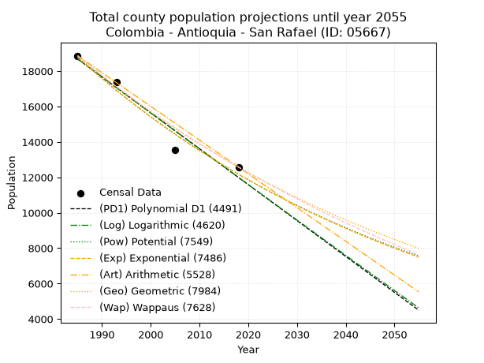
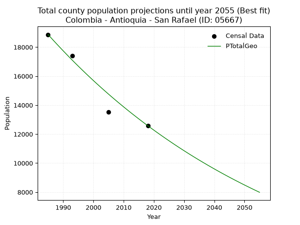
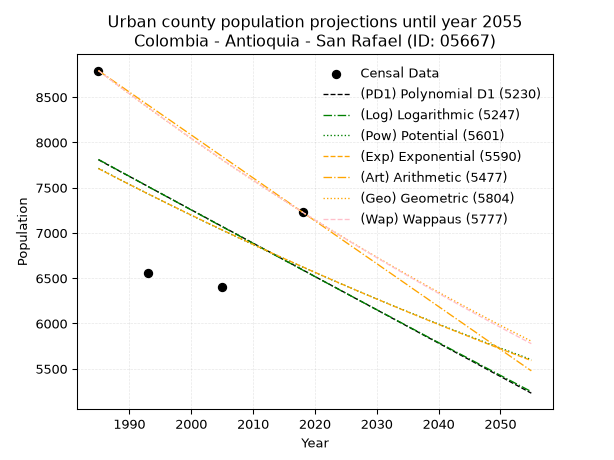
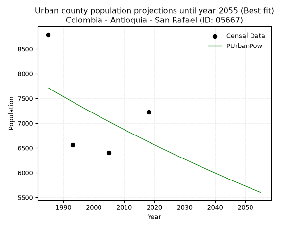
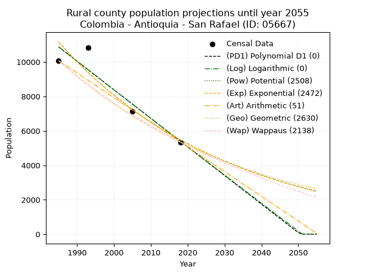
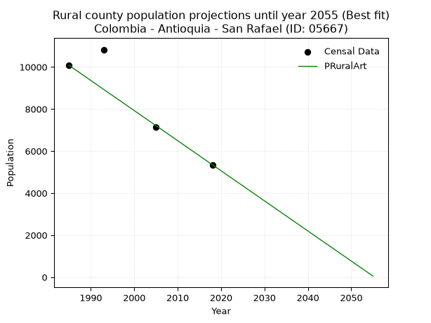

<div align="center">


</div>

# 📜 _“Population and Public Services Demand Projections (PPSD) until Year 2050 for Colombia - Antioquia - San Rafael (ID: 05667)”_
Keywords: `population` `public-service` `projection` `lineal` `polynomial` `logarithmic` `potential` `exponential` `arithmetic` `geometric` `wappaus` `dane` `colombia` `south-america`

PPSD are analytical estimates used by governments and planners to anticipate future changes in population size, age distribution, and the resulting community needs for utilities, healthcare, education, and infrastructure as sizing future water treatment facilities, electrical grids, and road networks based on spatial growth.

<div align="center">

</img>

</div>


> **General running parameters**: • app_version: _v20260806_. • Python version: _3.14.7_. • Pandas version: _3.0.5_. • NumPy version: _2.5.1_. • Creates, save and include plots into reports (create_plot): _False_. • Projection until year: _2050_. • Process polynomial degree 2 and up: _False_. • Process Wappaus: _True_. • Process Wappaus: _True_. • Set negative values to zero: _True_. • Set infinite values to zero: _True_. • Drop dataset notes: _True_. 
<div align="center">

Dynamic map: [:earth_americas:Google](http://maps.google.com/maps?q=6.293758502,-75.0284895) [:earth_americas:OSM](https://www.openstreetmap.org/#map=18/6.293758502/-75.0284895&layers=P) [:earth_americas:Bing](https://www.bing.com/maps?cp=6.293758502~-75.0284895&lvl=18) [:earth_americas:Apple](https://maps.apple.com/frame?center=6.293758502%2C-75.0284895&span=0.003%2C0.006)

</div>


<div align="center">

```geojson
{
  "type": "Feature",
  "geometry": {
    "type": "Point", 
    "coordinates": [-75.0284895, 6.293758502]
  }, 
  "properties": {
    "Name": "Colombia - Antioquia - San Rafael (ID: 05667)"
  }
}
```

</div>


## 0. Census Data (4 records)

Census data are official statistics collected by a government about the people and housing in a country. They usually include counts of total population, age, sex, race, income, education, and jobs.

📅Global census file: [Population.xlsx](../data/Population.xlsx)

| Source   |   Year |   CountryID | CountryName   |   StateID | StateName   |   CountyID | CountyName   |   PTotal |   PUrban |   PRural |
|:---------|-------:|------------:|:--------------|----------:|:------------|-----------:|:-------------|---------:|---------:|---------:|
| DANE     |   1985 |          57 | Colombia      |        05 | Antioquia   |      05667 | San Rafael   |    18866 |     8792 |    10074 |
| DANE     |   1993 |          57 | Colombia      |        05 | Antioquia   |      05667 | San Rafael   |    17389 |     6562 |    10827 |
| DANE     |   2005 |          57 | Colombia      |        05 | Antioquia   |      05667 | San Rafael   |    13530 |     6402 |     7128 |
| DANE     |   2018 |          57 | Colombia      |        05 | Antioquia   |      05667 | San Rafael   |    12578 |     7229 |     5349 |

> 🔥Some records could had specific notes about the registered values or the corresponding urban or rural distribution.

📅[SUI-RUPS](https://www.datos.gov.co/Hacienda-y-Cr-dito-P-blico/Registro-nico-de-Prestadores-de-Servicios-P-blicos/4qkq-csdn/about_data) - Local public utility companies: [RUPS.csv](../data/RUPS.xlsx)

 | SERVICIO       | ESTADO    | NOMBRE                                      | NIT         | DEPARTAMENTO_DOMICILIO   | MUNICIPIO_DOMICILIO   | DIRECCION       |   TELEFONO | EMAIL                                        | TIPO_PRESTADOR                             | CLASIFICACION                  |
|:---------------|:----------|:--------------------------------------------|:------------|:-------------------------|:----------------------|:----------------|-----------:|:---------------------------------------------|:-------------------------------------------|:-------------------------------|
| ACUEDUCTO      | OPERATIVA | EMPRESAS PUBLICAS DE SAN RAFAEL S.A. E.S.P. | 900400990-8 | ANTIOQUIA                | SAN RAFAEL            | CALLE 21 N21-04 |    8586809 | serviciospublicos@sanrafael-antioquia.gov.co | SOCIEDADES (EMPRESA DE SERVICIOS PUBLICOS) | DESDE 2501 HASTA 5000 USUARIOS |
| ALCANTARILLADO | OPERATIVA | EMPRESAS PUBLICAS DE SAN RAFAEL S.A. E.S.P. | 900400990-8 | ANTIOQUIA                | SAN RAFAEL            | CALLE 21 N21-04 |    8586809 | serviciospublicos@sanrafael-antioquia.gov.co | SOCIEDADES (EMPRESA DE SERVICIOS PUBLICOS) | DESDE 2501 HASTA 5000 USUARIOS |

## 1. Total

### 1.1. Coefficients and Parameters

* (PD1) Polynomial Deg 1: -202.72942593335927, 421100.28422320186 (lineal)
* (Log) Logarithmic: -405963.4666625999, 3101322.3132894766
* (Pow) Potential: -26.314329379766892, 91.05231284287088
* (Exp) Exponential: -0.013141976410036529, 4009761120032829.0
* (Art) Arithmetic: Year diff. 2018 - 1985 = 33, Population diff. 12578 - 18866 = -6288, Annual growth = -190.54545454545453
* (Geo) Geometric: Year diff. 2018 - 1985 = 33, Population diff. 12578 - 18866 = -6288, Annual growth % = -0.012210060099425157
* (Wap) Wappaus: i = -1.2119670178441326, Condition values only valid for < 200)

<sub>
Wappaus condition values: ['-0.00', '-1.21', '-2.42', '-3.64', '-4.85', '-6.06', '-7.27', '-8.48', '-9.70', '-10.91', '-12.12', '-13.33', '-14.54', '-15.76', '-16.97', '-18.18', '-19.39', '-20.60', '-21.82', '-23.03', '-24.24', '-25.45', '-26.66', '-27.88', '-29.09', '-30.30', '-31.51', '-32.72', '-33.94', '-35.15', '-36.36', '-37.57', '-38.78', '-39.99', '-41.21', '-42.42', '-43.63', '-44.84', '-46.05', '-47.27', '-48.48', '-49.69', '-50.90', '-52.11', '-53.33', '-54.54', '-55.75', '-56.96', '-58.17', '-59.39', '-60.60', '-61.81', '-63.02', '-64.23', '-65.45', '-66.66', '-67.87', '-69.08', '-70.29', '-71.51', '-72.72', '-73.93', '-75.14', '-76.35', '-77.57', '-78.78']
</sub>


### 1.2. Projected Dataset

|   Year |   CountyID |   PTotalPD1 |   PTotalLog |   PTotalPow |   PTotalExp |   PTotalArt |   PTotalGeo |   PTotalWap |
|-------:|-----------:|------------:|------------:|------------:|------------:|------------:|------------:|------------:|
|   1985 |      05667 |       18682 |       18690 |       18791 |       18783 |       18866 |       18866 |       18866 |
|   1986 |      05667 |       18480 |       18485 |       18544 |       18537 |       18675 |       18636 |       18639 |
|   1987 |      05667 |       18277 |       18281 |       18300 |       18295 |       18485 |       18408 |       18414 |
|   1988 |      05667 |       18074 |       18077 |       18059 |       18056 |       18294 |       18183 |       18192 |
|   1989 |      05667 |       17871 |       17873 |       17822 |       17821 |       18104 |       17961 |       17973 |
|   1990 |      05667 |       17669 |       17669 |       17588 |       17588 |       17913 |       17742 |       17756 |
|   1991 |      05667 |       17466 |       17465 |       17357 |       17358 |       17723 |       17525 |       17542 |
|   1992 |      05667 |       17263 |       17261 |       17129 |       17132 |       17532 |       17311 |       17331 |
|   1993 |      05667 |       17061 |       17057 |       16904 |       16908 |       17342 |       17100 |       17121 |
|   1994 |      05667 |       16858 |       16853 |       16682 |       16687 |       17151 |       16891 |       16915 |
|   1995 |      05667 |       16655 |       16650 |       16464 |       16469 |       16961 |       16685 |       16710 |
|   1996 |      05667 |       16452 |       16446 |       16248 |       16254 |       16770 |       16481 |       16508 |
|   1997 |      05667 |       16250 |       16243 |       16035 |       16042 |       16579 |       16280 |       16308 |
|   1998 |      05667 |       16047 |       16040 |       15825 |       15833 |       16389 |       16081 |       16111 |
|   1999 |      05667 |       15844 |       15837 |       15618 |       15626 |       16198 |       15885 |       15915 |
|   2000 |      05667 |       15641 |       15634 |       15414 |       15422 |       16008 |       15691 |       15722 |
|   2001 |      05667 |       15439 |       15431 |       15213 |       15221 |       15817 |       15499 |       15531 |
|   2002 |      05667 |       15236 |       15228 |       15014 |       15022 |       15627 |       15310 |       15342 |
|   2003 |      05667 |       15033 |       15025 |       14818 |       14826 |       15436 |       15123 |       15155 |
|   2004 |      05667 |       14831 |       14822 |       14625 |       14632 |       15246 |       14939 |       14970 |
|   2005 |      05667 |       14628 |       14620 |       14434 |       14441 |       15055 |       14756 |       14787 |
|   2006 |      05667 |       14425 |       14418 |       14246 |       14253 |       14865 |       14576 |       14606 |
|   2007 |      05667 |       14222 |       14215 |       14060 |       14067 |       14674 |       14398 |       14427 |
|   2008 |      05667 |       14020 |       14013 |       13877 |       13883 |       14483 |       14222 |       14250 |
|   2009 |      05667 |       13817 |       13811 |       13697 |       13702 |       14293 |       14049 |       14075 |
|   2010 |      05667 |       13614 |       13609 |       13518 |       13523 |       14102 |       13877 |       13902 |
|   2011 |      05667 |       13411 |       13407 |       13343 |       13346 |       13912 |       13708 |       13730 |
|   2012 |      05667 |       13209 |       13205 |       13169 |       13172 |       13721 |       13540 |       13561 |
|   2013 |      05667 |       13006 |       13003 |       12998 |       13000 |       13531 |       13375 |       13393 |
|   2014 |      05667 |       12803 |       12802 |       12829 |       12830 |       13340 |       13212 |       13226 |
|   2015 |      05667 |       12600 |       12600 |       12663 |       12663 |       13150 |       13050 |       13062 |
|   2016 |      05667 |       12398 |       12399 |       12499 |       12497 |       12959 |       12891 |       12899 |
|   2017 |      05667 |       12195 |       12197 |       12337 |       12334 |       12769 |       12733 |       12738 |
|   2018 |      05667 |       11992 |       11996 |       12177 |       12173 |       12578 |       12578 |       12578 |
|   2019 |      05667 |       11790 |       11795 |       12019 |       12014 |       12387 |       12424 |       12420 |
|   2020 |      05667 |       11587 |       11594 |       11863 |       11857 |       12197 |       12273 |       12264 |
|   2021 |      05667 |       11384 |       11393 |       11710 |       11703 |       12006 |       12123 |       12109 |
|   2022 |      05667 |       11181 |       11192 |       11558 |       11550 |       11816 |       11975 |       11955 |
|   2023 |      05667 |       10979 |       10992 |       11409 |       11399 |       11625 |       11829 |       11804 |
|   2024 |      05667 |       10776 |       10791 |       11262 |       11250 |       11435 |       11684 |       11653 |
|   2025 |      05667 |       10573 |       10591 |       11116 |       11103 |       11244 |       11542 |       11504 |
|   2026 |      05667 |       10370 |       10390 |       10973 |       10958 |       11054 |       11401 |       11357 |
|   2027 |      05667 |       10168 |       10190 |       10831 |       10815 |       10863 |       11261 |       11211 |
|   2028 |      05667 |        9965 |        9990 |       10691 |       10674 |       10673 |       11124 |       11066 |
|   2029 |      05667 |        9762 |        9789 |       10554 |       10535 |       10482 |       10988 |       10923 |
|   2030 |      05667 |        9560 |        9589 |       10418 |       10397 |       10291 |       10854 |       10781 |
|   2031 |      05667 |        9357 |        9389 |       10284 |       10261 |       10101 |       10721 |       10641 |
|   2032 |      05667 |        9154 |        9190 |       10151 |       10128 |        9910 |       10590 |       10502 |
|   2033 |      05667 |        8951 |        8990 |       10021 |        9995 |        9720 |       10461 |       10364 |
|   2034 |      05667 |        8749 |        8790 |        9892 |        9865 |        9529 |       10333 |       10227 |
|   2035 |      05667 |        8546 |        8591 |        9765 |        9736 |        9339 |       10207 |       10092 |
|   2036 |      05667 |        8343 |        8391 |        9639 |        9609 |        9148 |       10083 |        9958 |
|   2037 |      05667 |        8140 |        8192 |        9516 |        9483 |        8958 |        9960 |        9825 |
|   2038 |      05667 |        7938 |        7993 |        9393 |        9360 |        8767 |        9838 |        9694 |
|   2039 |      05667 |        7735 |        7794 |        9273 |        9237 |        8577 |        9718 |        9563 |
|   2040 |      05667 |        7532 |        7594 |        9154 |        9117 |        8386 |        9599 |        9434 |
|   2041 |      05667 |        7330 |        7396 |        9037 |        8998 |        8195 |        9482 |        9306 |
|   2042 |      05667 |        7127 |        7197 |        8921 |        8880 |        8005 |        9366 |        9179 |
|   2043 |      05667 |        6924 |        6998 |        8807 |        8764 |        7814 |        9252 |        9053 |
|   2044 |      05667 |        6721 |        6799 |        8694 |        8650 |        7624 |        9139 |        8929 |
|   2045 |      05667 |        6519 |        6601 |        8583 |        8537 |        7433 |        9027 |        8805 |
|   2046 |      05667 |        6316 |        6402 |        8473 |        8426 |        7243 |        8917 |        8683 |
|   2047 |      05667 |        6113 |        6204 |        8365 |        8316 |        7052 |        8808 |        8561 |
|   2048 |      05667 |        5910 |        6006 |        8258 |        8207 |        6862 |        8701 |        8441 |
|   2049 |      05667 |        5708 |        5807 |        8153 |        8100 |        6671 |        8594 |        8322 |
|   2050 |      05667 |        5505 |        5609 |        8049 |        7994 |        6481 |        8489 |        8204 |
<div align="center">

</img>

</div>


### 1.3. Best fit with absolute and relative error (%)

Relative error puts that difference into context by dividing the absolute error by the true value, creating a unitless ratio or percentage that shows the scale of the mistake.

Absolute and relative error

|   Year | Source   |   CountryID | CountryName   |   StateID | StateName   |   CountyID_x | CountyName   |   PTotal |   PUrban |   PRural |   CountyID_y |   PTotalPD1 |   PTotalLog |   PTotalPow |   PTotalExp |   PTotalArt |   PTotalGeo |   PTotalWap |   PTotalPD1AbsError |   PTotalLogAbsError |   PTotalPowAbsError |   PTotalExpAbsError |   PTotalArtAbsError |   PTotalGeoAbsError |   PTotalWapAbsError |   PTotalPD1RelError |   PTotalLogRelError |   PTotalPowRelError |   PTotalExpRelError |   PTotalArtRelError |   PTotalGeoRelError |   PTotalWapRelError |
|-------:|:---------|------------:|:--------------|----------:|:------------|-------------:|:-------------|---------:|---------:|---------:|-------------:|------------:|------------:|------------:|------------:|------------:|------------:|------------:|--------------------:|--------------------:|--------------------:|--------------------:|--------------------:|--------------------:|--------------------:|--------------------:|--------------------:|--------------------:|--------------------:|--------------------:|--------------------:|--------------------:|
|   1985 | DANE     |          57 | Colombia      |        05 | Antioquia   |        05667 | San Rafael   |    18866 |     8792 |    10074 |        05667 |       18682 |       18690 |       18791 |       18783 |       18866 |       18866 |       18866 |                 184 |                 176 |                  75 |                  83 |                   0 |                   0 |                   0 |            0.975299 |            0.932895 |            0.397541 |            0.439945 |            0        |             0       |             0       |
|   1993 | DANE     |          57 | Colombia      |        05 | Antioquia   |        05667 | San Rafael   |    17389 |     6562 |    10827 |        05667 |       17061 |       17057 |       16904 |       16908 |       17342 |       17100 |       17121 |                 328 |                 332 |                 485 |                 481 |                  47 |                 289 |                 268 |            1.88625  |            1.90925  |            2.78912  |            2.76612  |            0.270286 |             1.66197 |             1.5412  |
|   2005 | DANE     |          57 | Colombia      |        05 | Antioquia   |        05667 | San Rafael   |    13530 |     6402 |     7128 |        05667 |       14628 |       14620 |       14434 |       14441 |       15055 |       14756 |       14787 |                1098 |                1090 |                 904 |                 911 |                1525 |                1226 |                1257 |            8.1153   |            8.05617  |            6.68145  |            6.73319  |           11.2712   |             9.06135 |             9.29047 |
|   2018 | DANE     |          57 | Colombia      |        05 | Antioquia   |        05667 | San Rafael   |    12578 |     7229 |     5349 |        05667 |       11992 |       11996 |       12177 |       12173 |       12578 |       12578 |       12578 |                 586 |                 582 |                 401 |                 405 |                   0 |                   0 |                   0 |            4.65893  |            4.62713  |            3.18811  |            3.21991  |            0        |             0       |             0       |

Relative error mean

| Method    |   RelError | Best   |
|:----------|-----------:|:-------|
| PTotalPD1 |    3.90894 |        |
| PTotalLog |    3.88136 |        |
| PTotalPow |    3.26405 |        |
| PTotalExp |    3.28979 |        |
| PTotalArt |    2.88538 |        |
| PTotalGeo |    2.68083 | True   |
| PTotalWap |    2.70792 |        |

💙Best method: _**PTotalGeo**_
<div align="center">

</img>

</div>


### 1.4. Fresh water supply demand in liters per capita per day (lpcd)

The fresh water supply demand typically ranges from 100 to 300 liters per capita per day (lpcd) for standard domestic and municipal planning, though absolute survival minimums set by the World Health Organization are as low as 7.5 to 20 liters per day, and total consumption in high-income nations can exceed 400 liters.

> `CZ`: Level in meters above the sea level (masl)<br> `WS`: Fresh water supply demand in liters per capita per day (lpcd or l/h/d)<br> `WSAll`: Zonal fresh water supply demand in liters per second (l/s)<br> `A`: Zonal area in square meters<br> `DP`: Population density (people/hectare or p/ha)

Reference values (RAS Colombia)

|    CZ |   WS |
|------:|-----:|
|  1000 |  120 |
|  2000 |  130 |
| 99999 |  140 |

County shapefile geometry properties and water supply values

|   CountyID |      ATotal |   CZTotal |   WSTotal |
|-----------:|------------:|----------:|----------:|
|      05667 | 3.63693e+08 |    1235.7 |       130 |

Projected values for best method: PTotalGeo

|   CountyID |   Year |   PTotalGeo |   DPTotal |   WSTotal |   WSTotalAll |
|-----------:|-------:|------------:|----------:|----------:|-------------:|
|      05667 |   1985 |       18866 |      0.52 |       130 |      28.3863 |
|      05667 |   1986 |       18636 |      0.51 |       130 |      28.0403 |
|      05667 |   1987 |       18408 |      0.51 |       130 |      27.6972 |
|      05667 |   1988 |       18183 |      0.5  |       130 |      27.3587 |
|      05667 |   1989 |       17961 |      0.49 |       130 |      27.0247 |
|      05667 |   1990 |       17742 |      0.49 |       130 |      26.6951 |
|      05667 |   1991 |       17525 |      0.48 |       130 |      26.3686 |
|      05667 |   1992 |       17311 |      0.48 |       130 |      26.0466 |
|      05667 |   1993 |       17100 |      0.47 |       130 |      25.7292 |
|      05667 |   1994 |       16891 |      0.46 |       130 |      25.4147 |
|      05667 |   1995 |       16685 |      0.46 |       130 |      25.1047 |
|      05667 |   1996 |       16481 |      0.45 |       130 |      24.7978 |
|      05667 |   1997 |       16280 |      0.45 |       130 |      24.4954 |
|      05667 |   1998 |       16081 |      0.44 |       130 |      24.1959 |
|      05667 |   1999 |       15885 |      0.44 |       130 |      23.901  |
|      05667 |   2000 |       15691 |      0.43 |       130 |      23.6091 |
|      05667 |   2001 |       15499 |      0.43 |       130 |      23.3203 |
|      05667 |   2002 |       15310 |      0.42 |       130 |      23.0359 |
|      05667 |   2003 |       15123 |      0.42 |       130 |      22.7545 |
|      05667 |   2004 |       14939 |      0.41 |       130 |      22.4777 |
|      05667 |   2005 |       14756 |      0.41 |       130 |      22.2023 |
|      05667 |   2006 |       14576 |      0.4  |       130 |      21.9315 |
|      05667 |   2007 |       14398 |      0.4  |       130 |      21.6637 |
|      05667 |   2008 |       14222 |      0.39 |       130 |      21.3988 |
|      05667 |   2009 |       14049 |      0.39 |       130 |      21.1385 |
|      05667 |   2010 |       13877 |      0.38 |       130 |      20.8797 |
|      05667 |   2011 |       13708 |      0.38 |       130 |      20.6255 |
|      05667 |   2012 |       13540 |      0.37 |       130 |      20.3727 |
|      05667 |   2013 |       13375 |      0.37 |       130 |      20.1244 |
|      05667 |   2014 |       13212 |      0.36 |       130 |      19.8792 |
|      05667 |   2015 |       13050 |      0.36 |       130 |      19.6354 |
|      05667 |   2016 |       12891 |      0.35 |       130 |      19.3962 |
|      05667 |   2017 |       12733 |      0.35 |       130 |      19.1584 |
|      05667 |   2018 |       12578 |      0.35 |       130 |      18.9252 |
|      05667 |   2019 |       12424 |      0.34 |       130 |      18.6935 |
|      05667 |   2020 |       12273 |      0.34 |       130 |      18.4663 |
|      05667 |   2021 |       12123 |      0.33 |       130 |      18.2406 |
|      05667 |   2022 |       11975 |      0.33 |       130 |      18.0179 |
|      05667 |   2023 |       11829 |      0.33 |       130 |      17.7983 |
|      05667 |   2024 |       11684 |      0.32 |       130 |      17.5801 |
|      05667 |   2025 |       11542 |      0.32 |       130 |      17.3664 |
|      05667 |   2026 |       11401 |      0.31 |       130 |      17.1543 |
|      05667 |   2027 |       11261 |      0.31 |       130 |      16.9436 |
|      05667 |   2028 |       11124 |      0.31 |       130 |      16.7375 |
|      05667 |   2029 |       10988 |      0.3  |       130 |      16.5329 |
|      05667 |   2030 |       10854 |      0.3  |       130 |      16.3313 |
|      05667 |   2031 |       10721 |      0.29 |       130 |      16.1311 |
|      05667 |   2032 |       10590 |      0.29 |       130 |      15.934  |
|      05667 |   2033 |       10461 |      0.29 |       130 |      15.7399 |
|      05667 |   2034 |       10333 |      0.28 |       130 |      15.5473 |
|      05667 |   2035 |       10207 |      0.28 |       130 |      15.3578 |
|      05667 |   2036 |       10083 |      0.28 |       130 |      15.1712 |
|      05667 |   2037 |        9960 |      0.27 |       130 |      14.9861 |
|      05667 |   2038 |        9838 |      0.27 |       130 |      14.8025 |
|      05667 |   2039 |        9718 |      0.27 |       130 |      14.622  |
|      05667 |   2040 |        9599 |      0.26 |       130 |      14.4429 |
|      05667 |   2041 |        9482 |      0.26 |       130 |      14.2669 |
|      05667 |   2042 |        9366 |      0.26 |       130 |      14.0924 |
|      05667 |   2043 |        9252 |      0.25 |       130 |      13.9208 |
|      05667 |   2044 |        9139 |      0.25 |       130 |      13.7508 |
|      05667 |   2045 |        9027 |      0.25 |       130 |      13.5823 |
|      05667 |   2046 |        8917 |      0.25 |       130 |      13.4168 |
|      05667 |   2047 |        8808 |      0.24 |       130 |      13.2528 |
|      05667 |   2048 |        8701 |      0.24 |       130 |      13.0918 |
|      05667 |   2049 |        8594 |      0.24 |       130 |      12.9308 |
|      05667 |   2050 |        8489 |      0.23 |       130 |      12.7728 |

## 2. Urban

### 2.1. Coefficients and Parameters

* (PD1) Polynomial Deg 1: -36.81774387796108, 80890.94219189165 (lineal)
* (Log) Logarithmic: -73987.94930089216, 569629.2455382969
* (Pow) Potential: -9.23312575383792, 34.33587777749778
* (Exp) Exponential: -0.004593012348500171, 70237325.5631748
* (Art) Arithmetic: Year diff. 2018 - 1985 = 33, Population diff. 7229 - 8792 = -1563, Annual growth = -47.36363636363637
* (Geo) Geometric: Year diff. 2018 - 1985 = 33, Population diff. 7229 - 8792 = -1563, Annual growth % = -0.005914003723897943
* (Wap) Wappaus: i = -0.5912694134403141, Condition values only valid for < 200)

<sub>
Wappaus condition values: ['-0.00', '-0.59', '-1.18', '-1.77', '-2.37', '-2.96', '-3.55', '-4.14', '-4.73', '-5.32', '-5.91', '-6.50', '-7.10', '-7.69', '-8.28', '-8.87', '-9.46', '-10.05', '-10.64', '-11.23', '-11.83', '-12.42', '-13.01', '-13.60', '-14.19', '-14.78', '-15.37', '-15.96', '-16.56', '-17.15', '-17.74', '-18.33', '-18.92', '-19.51', '-20.10', '-20.69', '-21.29', '-21.88', '-22.47', '-23.06', '-23.65', '-24.24', '-24.83', '-25.42', '-26.02', '-26.61', '-27.20', '-27.79', '-28.38', '-28.97', '-29.56', '-30.15', '-30.75', '-31.34', '-31.93', '-32.52', '-33.11', '-33.70', '-34.29', '-34.88', '-35.48', '-36.07', '-36.66', '-37.25', '-37.84', '-38.43']
</sub>


### 2.2. Projected Dataset

|   Year |   CountyID |   PUrbanPD1 |   PUrbanLog |   PUrbanPow |   PUrbanExp |   PUrbanArt |   PUrbanGeo |   PUrbanWap |
|-------:|-----------:|------------:|------------:|------------:|------------:|------------:|------------:|------------:|
|   1985 |      05667 |        7808 |        7811 |        7713 |        7710 |        8792 |        8792 |        8792 |
|   1986 |      05667 |        7771 |        7774 |        7678 |        7675 |        8745 |        8740 |        8740 |
|   1987 |      05667 |        7734 |        7737 |        7642 |        7639 |        8697 |        8688 |        8689 |
|   1988 |      05667 |        7697 |        7699 |        7606 |        7604 |        8650 |        8637 |        8637 |
|   1989 |      05667 |        7660 |        7662 |        7571 |        7570 |        8603 |        8586 |        8586 |
|   1990 |      05667 |        7624 |        7625 |        7536 |        7535 |        8555 |        8535 |        8536 |
|   1991 |      05667 |        7587 |        7588 |        7501 |        7500 |        8508 |        8485 |        8486 |
|   1992 |      05667 |        7550 |        7551 |        7467 |        7466 |        8460 |        8434 |        8435 |
|   1993 |      05667 |        7513 |        7513 |        7432 |        7432 |        8413 |        8385 |        8386 |
|   1994 |      05667 |        7476 |        7476 |        7398 |        7398 |        8366 |        8335 |        8336 |
|   1995 |      05667 |        7440 |        7439 |        7364 |        7364 |        8318 |        8286 |        8287 |
|   1996 |      05667 |        7403 |        7402 |        7330 |        7330 |        8271 |        8237 |        8238 |
|   1997 |      05667 |        7366 |        7365 |        7296 |        7296 |        8224 |        8188 |        8190 |
|   1998 |      05667 |        7329 |        7328 |        7262 |        7263 |        8176 |        8140 |        8141 |
|   1999 |      05667 |        7292 |        7291 |        7229 |        7230 |        8129 |        8091 |        8093 |
|   2000 |      05667 |        7255 |        7254 |        7195 |        7197 |        8082 |        8044 |        8045 |
|   2001 |      05667 |        7219 |        7217 |        7162 |        7164 |        8034 |        7996 |        7998 |
|   2002 |      05667 |        7182 |        7180 |        7129 |        7131 |        7987 |        7949 |        7951 |
|   2003 |      05667 |        7145 |        7143 |        7096 |        7098 |        7939 |        7902 |        7904 |
|   2004 |      05667 |        7108 |        7106 |        7064 |        7066 |        7892 |        7855 |        7857 |
|   2005 |      05667 |        7071 |        7069 |        7031 |        7033 |        7845 |        7808 |        7810 |
|   2006 |      05667 |        7035 |        7032 |        6999 |        7001 |        7797 |        7762 |        7764 |
|   2007 |      05667 |        6998 |        6996 |        6967 |        6969 |        7750 |        7716 |        7718 |
|   2008 |      05667 |        6961 |        6959 |        6935 |        6937 |        7703 |        7671 |        7672 |
|   2009 |      05667 |        6924 |        6922 |        6903 |        6905 |        7655 |        7625 |        7627 |
|   2010 |      05667 |        6887 |        6885 |        6872 |        6874 |        7608 |        7580 |        7582 |
|   2011 |      05667 |        6850 |        6848 |        6840 |        6842 |        7561 |        7535 |        7537 |
|   2012 |      05667 |        6814 |        6811 |        6809 |        6811 |        7513 |        7491 |        7492 |
|   2013 |      05667 |        6777 |        6775 |        6778 |        6779 |        7466 |        7447 |        7448 |
|   2014 |      05667 |        6740 |        6738 |        6747 |        6748 |        7418 |        7403 |        7403 |
|   2015 |      05667 |        6703 |        6701 |        6716 |        6717 |        7371 |        7359 |        7360 |
|   2016 |      05667 |        6666 |        6665 |        6685 |        6687 |        7324 |        7315 |        7316 |
|   2017 |      05667 |        6630 |        6628 |        6654 |        6656 |        7276 |        7272 |        7272 |
|   2018 |      05667 |        6593 |        6591 |        6624 |        6626 |        7229 |        7229 |        7229 |
|   2019 |      05667 |        6556 |        6554 |        6594 |        6595 |        7182 |        7186 |        7186 |
|   2020 |      05667 |        6519 |        6518 |        6564 |        6565 |        7134 |        7144 |        7143 |
|   2021 |      05667 |        6482 |        6481 |        6534 |        6535 |        7087 |        7102 |        7101 |
|   2022 |      05667 |        6445 |        6445 |        6504 |        6505 |        7040 |        7060 |        7058 |
|   2023 |      05667 |        6409 |        6408 |        6474 |        6475 |        6992 |        7018 |        7016 |
|   2024 |      05667 |        6372 |        6371 |        6445 |        6445 |        6945 |        6976 |        6974 |
|   2025 |      05667 |        6335 |        6335 |        6416 |        6416 |        6897 |        6935 |        6933 |
|   2026 |      05667 |        6298 |        6298 |        6386 |        6387 |        6850 |        6894 |        6891 |
|   2027 |      05667 |        6261 |        6262 |        6357 |        6357 |        6803 |        6853 |        6850 |
|   2028 |      05667 |        6225 |        6225 |        6329 |        6328 |        6755 |        6813 |        6809 |
|   2029 |      05667 |        6188 |        6189 |        6300 |        6299 |        6708 |        6772 |        6768 |
|   2030 |      05667 |        6151 |        6152 |        6271 |        6270 |        6661 |        6732 |        6727 |
|   2031 |      05667 |        6114 |        6116 |        6243 |        6242 |        6613 |        6693 |        6687 |
|   2032 |      05667 |        6077 |        6080 |        6214 |        6213 |        6566 |        6653 |        6647 |
|   2033 |      05667 |        6040 |        6043 |        6186 |        6184 |        6519 |        6614 |        6607 |
|   2034 |      05667 |        6004 |        6007 |        6158 |        6156 |        6471 |        6574 |        6567 |
|   2035 |      05667 |        5967 |        5970 |        6130 |        6128 |        6424 |        6536 |        6528 |
|   2036 |      05667 |        5930 |        5934 |        6103 |        6100 |        6376 |        6497 |        6488 |
|   2037 |      05667 |        5893 |        5898 |        6075 |        6072 |        6329 |        6459 |        6449 |
|   2038 |      05667 |        5856 |        5861 |        6048 |        6044 |        6282 |        6420 |        6410 |
|   2039 |      05667 |        5820 |        5825 |        6020 |        6016 |        6234 |        6382 |        6371 |
|   2040 |      05667 |        5783 |        5789 |        5993 |        5989 |        6187 |        6345 |        6333 |
|   2041 |      05667 |        5746 |        5753 |        5966 |        5961 |        6140 |        6307 |        6294 |
|   2042 |      05667 |        5709 |        5716 |        5939 |        5934 |        6092 |        6270 |        6256 |
|   2043 |      05667 |        5672 |        5680 |        5912 |        5907 |        6045 |        6233 |        6218 |
|   2044 |      05667 |        5635 |        5644 |        5886 |        5880 |        5998 |        6196 |        6180 |
|   2045 |      05667 |        5599 |        5608 |        5859 |        5853 |        5950 |        6159 |        6143 |
|   2046 |      05667 |        5562 |        5572 |        5833 |        5826 |        5903 |        6123 |        6105 |
|   2047 |      05667 |        5525 |        5535 |        5806 |        5799 |        5855 |        6087 |        6068 |
|   2048 |      05667 |        5488 |        5499 |        5780 |        5773 |        5808 |        6051 |        6031 |
|   2049 |      05667 |        5451 |        5463 |        5754 |        5746 |        5761 |        6015 |        5994 |
|   2050 |      05667 |        5415 |        5427 |        5728 |        5720 |        5713 |        5979 |        5958 |
<div align="center">

</img>

</div>


### 2.3. Best fit with absolute and relative error (%)

Relative error puts that difference into context by dividing the absolute error by the true value, creating a unitless ratio or percentage that shows the scale of the mistake.

Absolute and relative error

|   Year | Source   |   CountryID | CountryName   |   StateID | StateName   |   CountyID_x | CountyName   |   PTotal |   PUrban |   PRural |   CountyID_y |   PUrbanPD1 |   PUrbanLog |   PUrbanPow |   PUrbanExp |   PUrbanArt |   PUrbanGeo |   PUrbanWap |   PUrbanPD1AbsError |   PUrbanLogAbsError |   PUrbanPowAbsError |   PUrbanExpAbsError |   PUrbanArtAbsError |   PUrbanGeoAbsError |   PUrbanWapAbsError |   PUrbanPD1RelError |   PUrbanLogRelError |   PUrbanPowRelError |   PUrbanExpRelError |   PUrbanArtRelError |   PUrbanGeoRelError |   PUrbanWapRelError |
|-------:|:---------|------------:|:--------------|----------:|:------------|-------------:|:-------------|---------:|---------:|---------:|-------------:|------------:|------------:|------------:|------------:|------------:|------------:|------------:|--------------------:|--------------------:|--------------------:|--------------------:|--------------------:|--------------------:|--------------------:|--------------------:|--------------------:|--------------------:|--------------------:|--------------------:|--------------------:|--------------------:|
|   1985 | DANE     |          57 | Colombia      |        05 | Antioquia   |        05667 | San Rafael   |    18866 |     8792 |    10074 |        05667 |        7808 |        7811 |        7713 |        7710 |        8792 |        8792 |        8792 |                 984 |                 981 |                1079 |                1082 |                   0 |                   0 |                   0 |             11.192  |            11.1579  |            12.2725  |            12.3066  |              0      |              0      |              0      |
|   1993 | DANE     |          57 | Colombia      |        05 | Antioquia   |        05667 | San Rafael   |    17389 |     6562 |    10827 |        05667 |        7513 |        7513 |        7432 |        7432 |        8413 |        8385 |        8386 |                 951 |                 951 |                 870 |                 870 |                1851 |                1823 |                1824 |             14.4925 |            14.4925  |            13.2582  |            13.2582  |             28.2079 |             27.7812 |             27.7964 |
|   2005 | DANE     |          57 | Colombia      |        05 | Antioquia   |        05667 | San Rafael   |    13530 |     6402 |     7128 |        05667 |        7071 |        7069 |        7031 |        7033 |        7845 |        7808 |        7810 |                 669 |                 667 |                 629 |                 631 |                1443 |                1406 |                1408 |             10.4499 |            10.4186  |             9.82505 |             9.85629 |             22.5398 |             21.9619 |             21.9931 |
|   2018 | DANE     |          57 | Colombia      |        05 | Antioquia   |        05667 | San Rafael   |    12578 |     7229 |     5349 |        05667 |        6593 |        6591 |        6624 |        6626 |        7229 |        7229 |        7229 |                 636 |                 638 |                 605 |                 603 |                   0 |                   0 |                   0 |              8.7979 |             8.82556 |             8.36907 |             8.3414  |              0      |              0      |              0      |

Relative error mean

| Method    |   RelError | Best   |
|:----------|-----------:|:-------|
| PUrbanPD1 |    11.2331 |        |
| PUrbanLog |    11.2236 |        |
| PUrbanPow |    10.9312 | True   |
| PUrbanExp |    10.9406 |        |
| PUrbanArt |    12.6869 |        |
| PUrbanGeo |    12.4358 |        |
| PUrbanWap |    12.4474 |        |

💙Best method: _**PUrbanPow**_
<div align="center">

</img>

</div>


### 2.4. Fresh water supply demand in liters per capita per day (lpcd)

The fresh water supply demand typically ranges from 100 to 300 liters per capita per day (lpcd) for standard domestic and municipal planning, though absolute survival minimums set by the World Health Organization are as low as 7.5 to 20 liters per day, and total consumption in high-income nations can exceed 400 liters.

> `CZ`: Level in meters above the sea level (masl)<br> `WS`: Fresh water supply demand in liters per capita per day (lpcd or l/h/d)<br> `WSAll`: Zonal fresh water supply demand in liters per second (l/s)<br> `A`: Zonal area in square meters<br> `DP`: Population density (people/hectare or p/ha)

Reference values (RAS Colombia)

|    CZ |   WS |
|------:|-----:|
|  1000 |  120 |
|  2000 |  130 |
| 99999 |  140 |

County shapefile geometry properties and water supply values

|   CountyID |      AUrban |   CZUrban |   WSUrban |
|-----------:|------------:|----------:|----------:|
|      05667 | 1.32554e+06 |   1003.91 |       130 |

Projected values for best method: PUrbanPow

|   CountyID |   Year |   PUrbanPow |   DPUrban |   WSUrban |   WSUrbanAll |
|-----------:|-------:|------------:|----------:|----------:|-------------:|
|      05667 |   1985 |        7713 |     58.19 |       130 |     11.6052  |
|      05667 |   1986 |        7678 |     57.92 |       130 |     11.5525  |
|      05667 |   1987 |        7642 |     57.65 |       130 |     11.4984  |
|      05667 |   1988 |        7606 |     57.38 |       130 |     11.4442  |
|      05667 |   1989 |        7571 |     57.12 |       130 |     11.3916  |
|      05667 |   1990 |        7536 |     56.85 |       130 |     11.3389  |
|      05667 |   1991 |        7501 |     56.59 |       130 |     11.2862  |
|      05667 |   1992 |        7467 |     56.33 |       130 |     11.2351  |
|      05667 |   1993 |        7432 |     56.07 |       130 |     11.1824  |
|      05667 |   1994 |        7398 |     55.81 |       130 |     11.1312  |
|      05667 |   1995 |        7364 |     55.55 |       130 |     11.0801  |
|      05667 |   1996 |        7330 |     55.3  |       130 |     11.0289  |
|      05667 |   1997 |        7296 |     55.04 |       130 |     10.9778  |
|      05667 |   1998 |        7262 |     54.79 |       130 |     10.9266  |
|      05667 |   1999 |        7229 |     54.54 |       130 |     10.877   |
|      05667 |   2000 |        7195 |     54.28 |       130 |     10.8258  |
|      05667 |   2001 |        7162 |     54.03 |       130 |     10.7762  |
|      05667 |   2002 |        7129 |     53.78 |       130 |     10.7265  |
|      05667 |   2003 |        7096 |     53.53 |       130 |     10.6769  |
|      05667 |   2004 |        7064 |     53.29 |       130 |     10.6287  |
|      05667 |   2005 |        7031 |     53.04 |       130 |     10.5791  |
|      05667 |   2006 |        6999 |     52.8  |       130 |     10.5309  |
|      05667 |   2007 |        6967 |     52.56 |       130 |     10.4828  |
|      05667 |   2008 |        6935 |     52.32 |       130 |     10.4346  |
|      05667 |   2009 |        6903 |     52.08 |       130 |     10.3865  |
|      05667 |   2010 |        6872 |     51.84 |       130 |     10.3398  |
|      05667 |   2011 |        6840 |     51.6  |       130 |     10.2917  |
|      05667 |   2012 |        6809 |     51.37 |       130 |     10.245   |
|      05667 |   2013 |        6778 |     51.13 |       130 |     10.1984  |
|      05667 |   2014 |        6747 |     50.9  |       130 |     10.1517  |
|      05667 |   2015 |        6716 |     50.67 |       130 |     10.1051  |
|      05667 |   2016 |        6685 |     50.43 |       130 |     10.0584  |
|      05667 |   2017 |        6654 |     50.2  |       130 |     10.0118  |
|      05667 |   2018 |        6624 |     49.97 |       130 |      9.96667 |
|      05667 |   2019 |        6594 |     49.75 |       130 |      9.92153 |
|      05667 |   2020 |        6564 |     49.52 |       130 |      9.87639 |
|      05667 |   2021 |        6534 |     49.29 |       130 |      9.83125 |
|      05667 |   2022 |        6504 |     49.07 |       130 |      9.78611 |
|      05667 |   2023 |        6474 |     48.84 |       130 |      9.74097 |
|      05667 |   2024 |        6445 |     48.62 |       130 |      9.69734 |
|      05667 |   2025 |        6416 |     48.4  |       130 |      9.6537  |
|      05667 |   2026 |        6386 |     48.18 |       130 |      9.60856 |
|      05667 |   2027 |        6357 |     47.96 |       130 |      9.56493 |
|      05667 |   2028 |        6329 |     47.75 |       130 |      9.5228  |
|      05667 |   2029 |        6300 |     47.53 |       130 |      9.47917 |
|      05667 |   2030 |        6271 |     47.31 |       130 |      9.43553 |
|      05667 |   2031 |        6243 |     47.1  |       130 |      9.3934  |
|      05667 |   2032 |        6214 |     46.88 |       130 |      9.34977 |
|      05667 |   2033 |        6186 |     46.67 |       130 |      9.30764 |
|      05667 |   2034 |        6158 |     46.46 |       130 |      9.26551 |
|      05667 |   2035 |        6130 |     46.25 |       130 |      9.22338 |
|      05667 |   2036 |        6103 |     46.04 |       130 |      9.18275 |
|      05667 |   2037 |        6075 |     45.83 |       130 |      9.14062 |
|      05667 |   2038 |        6048 |     45.63 |       130 |      9.1     |
|      05667 |   2039 |        6020 |     45.42 |       130 |      9.05787 |
|      05667 |   2040 |        5993 |     45.21 |       130 |      9.01725 |
|      05667 |   2041 |        5966 |     45.01 |       130 |      8.97662 |
|      05667 |   2042 |        5939 |     44.8  |       130 |      8.936   |
|      05667 |   2043 |        5912 |     44.6  |       130 |      8.89537 |
|      05667 |   2044 |        5886 |     44.4  |       130 |      8.85625 |
|      05667 |   2045 |        5859 |     44.2  |       130 |      8.81563 |
|      05667 |   2046 |        5833 |     44    |       130 |      8.7765  |
|      05667 |   2047 |        5806 |     43.8  |       130 |      8.73588 |
|      05667 |   2048 |        5780 |     43.6  |       130 |      8.69676 |
|      05667 |   2049 |        5754 |     43.41 |       130 |      8.65764 |
|      05667 |   2050 |        5728 |     43.21 |       130 |      8.61852 |

## 3. Rural

### 3.1. Coefficients and Parameters

* (PD1) Polynomial Deg 1: -165.91168205539807, 340209.34203131 (lineal)
* (Log) Logarithmic: -331975.517361708, 2531693.067751182
* (Pow) Potential: -43.05798717172966, 146.04241864257813
* (Exp) Exponential: -0.021521280382607776, 3.983096824191876e+22
* (Art) Arithmetic: Year diff. 2018 - 1985 = 33, Population diff. 5349 - 10074 = -4725, Annual growth = -143.1818181818182
* (Geo) Geometric: Year diff. 2018 - 1985 = 33, Population diff. 5349 - 10074 = -4725, Annual growth % = -0.01900045123078742
* (Wap) Wappaus: i = -1.8567310922883768, Condition values only valid for < 200)

<sub>
Wappaus condition values: ['-0.00', '-1.86', '-3.71', '-5.57', '-7.43', '-9.28', '-11.14', '-13.00', '-14.85', '-16.71', '-18.57', '-20.42', '-22.28', '-24.14', '-25.99', '-27.85', '-29.71', '-31.56', '-33.42', '-35.28', '-37.13', '-38.99', '-40.85', '-42.70', '-44.56', '-46.42', '-48.28', '-50.13', '-51.99', '-53.85', '-55.70', '-57.56', '-59.42', '-61.27', '-63.13', '-64.99', '-66.84', '-68.70', '-70.56', '-72.41', '-74.27', '-76.13', '-77.98', '-79.84', '-81.70', '-83.55', '-85.41', '-87.27', '-89.12', '-90.98', '-92.84', '-94.69', '-96.55', '-98.41', '-100.26', '-102.12', '-103.98', '-105.83', '-107.69', '-109.55', '-111.40', '-113.26', '-115.12', '-116.97', '-118.83', '-120.69']
</sub>


### 3.2. Projected Dataset

|   Year |   CountyID |   PRuralPD1 |   PRuralLog |   PRuralPow |   PRuralExp |   PRuralArt |   PRuralGeo |   PRuralWap |
|-------:|-----------:|------------:|------------:|------------:|------------:|------------:|------------:|------------:|
|   1985 |      05667 |       10875 |       10879 |       11155 |       11150 |       10074 |       10074 |       10074 |
|   1986 |      05667 |       10709 |       10712 |       10916 |       10913 |        9931 |        9883 |        9889 |
|   1987 |      05667 |       10543 |       10544 |       10682 |       10680 |        9788 |        9695 |        9707 |
|   1988 |      05667 |       10377 |       10377 |       10453 |       10453 |        9644 |        9511 |        9528 |
|   1989 |      05667 |       10211 |       10210 |       10229 |       10230 |        9501 |        9330 |        9353 |
|   1990 |      05667 |       10045 |       10044 |       10010 |       10012 |        9358 |        9153 |        9180 |
|   1991 |      05667 |        9879 |        9877 |        9796 |        9799 |        9215 |        8979 |        9011 |
|   1992 |      05667 |        9713 |        9710 |        9587 |        9591 |        9072 |        8808 |        8845 |
|   1993 |      05667 |        9547 |        9543 |        9382 |        9386 |        8929 |        8641 |        8681 |
|   1994 |      05667 |        9381 |        9377 |        9181 |        9187 |        8785 |        8477 |        8520 |
|   1995 |      05667 |        9216 |        9211 |        8985 |        8991 |        8642 |        8316 |        8362 |
|   1996 |      05667 |        9050 |        9044 |        8793 |        8800 |        8499 |        8158 |        8207 |
|   1997 |      05667 |        8884 |        8878 |        8606 |        8612 |        8356 |        8003 |        8054 |
|   1998 |      05667 |        8718 |        8712 |        8422 |        8429 |        8213 |        7850 |        7904 |
|   1999 |      05667 |        8552 |        8546 |        8243 |        8249 |        8069 |        7701 |        7757 |
|   2000 |      05667 |        8386 |        8380 |        8067 |        8074 |        7926 |        7555 |        7611 |
|   2001 |      05667 |        8220 |        8214 |        7895 |        7902 |        7783 |        7411 |        7468 |
|   2002 |      05667 |        8054 |        8048 |        7727 |        7734 |        7640 |        7271 |        7328 |
|   2003 |      05667 |        7888 |        7882 |        7563 |        7569 |        7497 |        7132 |        7189 |
|   2004 |      05667 |        7722 |        7716 |        7402 |        7408 |        7354 |        6997 |        7053 |
|   2005 |      05667 |        7556 |        7551 |        7245 |        7250 |        7210 |        6864 |        6919 |
|   2006 |      05667 |        7391 |        7385 |        7091 |        7096 |        7067 |        6734 |        6787 |
|   2007 |      05667 |        7225 |        7220 |        6940 |        6945 |        6924 |        6606 |        6657 |
|   2008 |      05667 |        7059 |        7054 |        6793 |        6797 |        6781 |        6480 |        6529 |
|   2009 |      05667 |        6893 |        6889 |        6649 |        6652 |        6638 |        6357 |        6403 |
|   2010 |      05667 |        6727 |        6724 |        6508 |        6510 |        6494 |        6236 |        6279 |
|   2011 |      05667 |        6561 |        6559 |        6370 |        6372 |        6351 |        6118 |        6156 |
|   2012 |      05667 |        6395 |        6394 |        6235 |        6236 |        6208 |        6001 |        6036 |
|   2013 |      05667 |        6229 |        6229 |        6103 |        6103 |        6065 |        5887 |        5917 |
|   2014 |      05667 |        6063 |        6064 |        5974 |        5973 |        5922 |        5776 |        5800 |
|   2015 |      05667 |        5897 |        5899 |        5848 |        5846 |        5779 |        5666 |        5685 |
|   2016 |      05667 |        5731 |        5734 |        5724 |        5722 |        5635 |        5558 |        5571 |
|   2017 |      05667 |        5565 |        5570 |        5603 |        5600 |        5492 |        5453 |        5459 |
|   2018 |      05667 |        5400 |        5405 |        5485 |        5481 |        5349 |        5349 |        5349 |
|   2019 |      05667 |        5234 |        5241 |        5369 |        5364 |        5206 |        5247 |        5240 |
|   2020 |      05667 |        5068 |        5076 |        5256 |        5250 |        5063 |        5148 |        5133 |
|   2021 |      05667 |        4902 |        4912 |        5145 |        5138 |        4919 |        5050 |        5027 |
|   2022 |      05667 |        4736 |        4748 |        5037 |        5029 |        4776 |        4954 |        4923 |
|   2023 |      05667 |        4570 |        4584 |        4930 |        4922 |        4633 |        4860 |        4820 |
|   2024 |      05667 |        4404 |        4420 |        4827 |        4817 |        4490 |        4767 |        4718 |
|   2025 |      05667 |        4238 |        4256 |        4725 |        4714 |        4347 |        4677 |        4618 |
|   2026 |      05667 |        4072 |        4092 |        4626 |        4614 |        4204 |        4588 |        4519 |
|   2027 |      05667 |        3906 |        3928 |        4528 |        4516 |        4060 |        4501 |        4422 |
|   2028 |      05667 |        3740 |        3764 |        4433 |        4419 |        3917 |        4415 |        4326 |
|   2029 |      05667 |        3575 |        3600 |        4340 |        4325 |        3774 |        4331 |        4231 |
|   2030 |      05667 |        3409 |        3437 |        4249 |        4233 |        3631 |        4249 |        4137 |
|   2031 |      05667 |        3243 |        3273 |        4160 |        4143 |        3488 |        4168 |        4045 |
|   2032 |      05667 |        3077 |        3110 |        4073 |        4055 |        3344 |        4089 |        3953 |
|   2033 |      05667 |        2911 |        2947 |        3987 |        3969 |        3201 |        4011 |        3863 |
|   2034 |      05667 |        2745 |        2783 |        3904 |        3884 |        3058 |        3935 |        3774 |
|   2035 |      05667 |        2579 |        2620 |        3822 |        3801 |        2915 |        3860 |        3687 |
|   2036 |      05667 |        2413 |        2457 |        3742 |        3720 |        2772 |        3787 |        3600 |
|   2037 |      05667 |        2247 |        2294 |        3664 |        3641 |        2629 |        3715 |        3514 |
|   2038 |      05667 |        2081 |        2131 |        3587 |        3564 |        2485 |        3645 |        3430 |
|   2039 |      05667 |        1915 |        1968 |        3512 |        3488 |        2342 |        3575 |        3346 |
|   2040 |      05667 |        1750 |        1806 |        3439 |        3414 |        2199 |        3507 |        3264 |
|   2041 |      05667 |        1584 |        1643 |        3367 |        3341 |        2056 |        3441 |        3182 |
|   2042 |      05667 |        1418 |        1480 |        3297 |        3270 |        1913 |        3375 |        3102 |
|   2043 |      05667 |        1252 |        1318 |        3228 |        3200 |        1769 |        3311 |        3022 |
|   2044 |      05667 |        1086 |        1155 |        3161 |        3132 |        1626 |        3248 |        2944 |
|   2045 |      05667 |         920 |         993 |        3095 |        3065 |        1483 |        3187 |        2866 |
|   2046 |      05667 |         754 |         831 |        3030 |        3000 |        1340 |        3126 |        2789 |
|   2047 |      05667 |         588 |         668 |        2967 |        2936 |        1197 |        3067 |        2714 |
|   2048 |      05667 |         422 |         506 |        2905 |        2874 |        1054 |        3008 |        2639 |
|   2049 |      05667 |         256 |         344 |        2845 |        2812 |         910 |        2951 |        2565 |
|   2050 |      05667 |          90 |         182 |        2786 |        2753 |         767 |        2895 |        2492 |
<div align="center">

</img>

</div>


### 3.3. Best fit with absolute and relative error (%)

Relative error puts that difference into context by dividing the absolute error by the true value, creating a unitless ratio or percentage that shows the scale of the mistake.

Absolute and relative error

|   Year | Source   |   CountryID | CountryName   |   StateID | StateName   |   CountyID_x | CountyName   |   PTotal |   PUrban |   PRural |   CountyID_y |   PRuralPD1 |   PRuralLog |   PRuralPow |   PRuralExp |   PRuralArt |   PRuralGeo |   PRuralWap |   PRuralPD1AbsError |   PRuralLogAbsError |   PRuralPowAbsError |   PRuralExpAbsError |   PRuralArtAbsError |   PRuralGeoAbsError |   PRuralWapAbsError |   PRuralPD1RelError |   PRuralLogRelError |   PRuralPowRelError |   PRuralExpRelError |   PRuralArtRelError |   PRuralGeoRelError |   PRuralWapRelError |
|-------:|:---------|------------:|:--------------|----------:|:------------|-------------:|:-------------|---------:|---------:|---------:|-------------:|------------:|------------:|------------:|------------:|------------:|------------:|------------:|--------------------:|--------------------:|--------------------:|--------------------:|--------------------:|--------------------:|--------------------:|--------------------:|--------------------:|--------------------:|--------------------:|--------------------:|--------------------:|--------------------:|
|   1985 | DANE     |          57 | Colombia      |        05 | Antioquia   |        05667 | San Rafael   |    18866 |     8792 |    10074 |        05667 |       10875 |       10879 |       11155 |       11150 |       10074 |       10074 |       10074 |                 801 |                 805 |                1081 |                1076 |                   0 |                   0 |                   0 |            7.95116  |             7.99087 |            10.7306  |            10.681   |             0       |              0      |              0      |
|   1993 | DANE     |          57 | Colombia      |        05 | Antioquia   |        05667 | San Rafael   |    17389 |     6562 |    10827 |        05667 |        9547 |        9543 |        9382 |        9386 |        8929 |        8641 |        8681 |                1280 |                1284 |                1445 |                1441 |                1898 |                2186 |                2146 |           11.8223   |            11.8592  |            13.3463  |            13.3093  |            17.5302  |             20.1903 |             19.8208 |
|   2005 | DANE     |          57 | Colombia      |        05 | Antioquia   |        05667 | San Rafael   |    13530 |     6402 |     7128 |        05667 |        7556 |        7551 |        7245 |        7250 |        7210 |        6864 |        6919 |                 428 |                 423 |                 117 |                 122 |                  82 |                 264 |                 209 |            6.00449  |             5.93434 |             1.64141 |             1.71156 |             1.15039 |              3.7037 |              2.9321 |
|   2018 | DANE     |          57 | Colombia      |        05 | Antioquia   |        05667 | San Rafael   |    12578 |     7229 |     5349 |        05667 |        5400 |        5405 |        5485 |        5481 |        5349 |        5349 |        5349 |                  51 |                  56 |                 136 |                 132 |                   0 |                   0 |                   0 |            0.953449 |             1.04692 |             2.54253 |             2.46775 |             0       |              0      |              0      |

Relative error mean

| Method    |   RelError | Best   |
|:----------|-----------:|:-------|
| PRuralPD1 |    6.68285 |        |
| PRuralLog |    6.70784 |        |
| PRuralPow |    7.0652  |        |
| PRuralExp |    7.0424  |        |
| PRuralArt |    4.67016 | True   |
| PRuralGeo |    5.97349 |        |
| PRuralWap |    5.68823 |        |

💙Best method: _**PRuralArt**_
<div align="center">

</img>

</div>


### 3.4. Fresh water supply demand in liters per capita per day (lpcd)

The fresh water supply demand typically ranges from 100 to 300 liters per capita per day (lpcd) for standard domestic and municipal planning, though absolute survival minimums set by the World Health Organization are as low as 7.5 to 20 liters per day, and total consumption in high-income nations can exceed 400 liters.

> `CZ`: Level in meters above the sea level (masl)<br> `WS`: Fresh water supply demand in liters per capita per day (lpcd or l/h/d)<br> `WSAll`: Zonal fresh water supply demand in liters per second (l/s)<br> `A`: Zonal area in square meters<br> `DP`: Population density (people/hectare or p/ha)

Reference values (RAS Colombia)

|    CZ |   WS |
|------:|-----:|
|  1000 |  120 |
|  2000 |  130 |
| 99999 |  140 |

County shapefile geometry properties and water supply values

|   CountyID |      ARural |   CZRural |   WSRural |
|-----------:|------------:|----------:|----------:|
|      05667 | 3.62368e+08 |   1236.56 |       130 |

Projected values for best method: PRuralArt

|   CountyID |   Year |   PRuralArt |   DPRural |   WSRural |   WSRuralAll |
|-----------:|-------:|------------:|----------:|----------:|-------------:|
|      05667 |   1985 |       10074 |      0.28 |       130 |     15.1576  |
|      05667 |   1986 |        9931 |      0.27 |       130 |     14.9425  |
|      05667 |   1987 |        9788 |      0.27 |       130 |     14.7273  |
|      05667 |   1988 |        9644 |      0.27 |       130 |     14.5106  |
|      05667 |   1989 |        9501 |      0.26 |       130 |     14.2955  |
|      05667 |   1990 |        9358 |      0.26 |       130 |     14.0803  |
|      05667 |   1991 |        9215 |      0.25 |       130 |     13.8652  |
|      05667 |   1992 |        9072 |      0.25 |       130 |     13.65    |
|      05667 |   1993 |        8929 |      0.25 |       130 |     13.4348  |
|      05667 |   1994 |        8785 |      0.24 |       130 |     13.2182  |
|      05667 |   1995 |        8642 |      0.24 |       130 |     13.003   |
|      05667 |   1996 |        8499 |      0.23 |       130 |     12.7878  |
|      05667 |   1997 |        8356 |      0.23 |       130 |     12.5727  |
|      05667 |   1998 |        8213 |      0.23 |       130 |     12.3575  |
|      05667 |   1999 |        8069 |      0.22 |       130 |     12.1409  |
|      05667 |   2000 |        7926 |      0.22 |       130 |     11.9257  |
|      05667 |   2001 |        7783 |      0.21 |       130 |     11.7105  |
|      05667 |   2002 |        7640 |      0.21 |       130 |     11.4954  |
|      05667 |   2003 |        7497 |      0.21 |       130 |     11.2802  |
|      05667 |   2004 |        7354 |      0.2  |       130 |     11.065   |
|      05667 |   2005 |        7210 |      0.2  |       130 |     10.8484  |
|      05667 |   2006 |        7067 |      0.2  |       130 |     10.6332  |
|      05667 |   2007 |        6924 |      0.19 |       130 |     10.4181  |
|      05667 |   2008 |        6781 |      0.19 |       130 |     10.2029  |
|      05667 |   2009 |        6638 |      0.18 |       130 |      9.98773 |
|      05667 |   2010 |        6494 |      0.18 |       130 |      9.77106 |
|      05667 |   2011 |        6351 |      0.18 |       130 |      9.5559  |
|      05667 |   2012 |        6208 |      0.17 |       130 |      9.34074 |
|      05667 |   2013 |        6065 |      0.17 |       130 |      9.12558 |
|      05667 |   2014 |        5922 |      0.16 |       130 |      8.91042 |
|      05667 |   2015 |        5779 |      0.16 |       130 |      8.69525 |
|      05667 |   2016 |        5635 |      0.16 |       130 |      8.47859 |
|      05667 |   2017 |        5492 |      0.15 |       130 |      8.26343 |
|      05667 |   2018 |        5349 |      0.15 |       130 |      8.04826 |
|      05667 |   2019 |        5206 |      0.14 |       130 |      7.8331  |
|      05667 |   2020 |        5063 |      0.14 |       130 |      7.61794 |
|      05667 |   2021 |        4919 |      0.14 |       130 |      7.40127 |
|      05667 |   2022 |        4776 |      0.13 |       130 |      7.18611 |
|      05667 |   2023 |        4633 |      0.13 |       130 |      6.97095 |
|      05667 |   2024 |        4490 |      0.12 |       130 |      6.75579 |
|      05667 |   2025 |        4347 |      0.12 |       130 |      6.54063 |
|      05667 |   2026 |        4204 |      0.12 |       130 |      6.32546 |
|      05667 |   2027 |        4060 |      0.11 |       130 |      6.1088  |
|      05667 |   2028 |        3917 |      0.11 |       130 |      5.89363 |
|      05667 |   2029 |        3774 |      0.1  |       130 |      5.67847 |
|      05667 |   2030 |        3631 |      0.1  |       130 |      5.46331 |
|      05667 |   2031 |        3488 |      0.1  |       130 |      5.24815 |
|      05667 |   2032 |        3344 |      0.09 |       130 |      5.03148 |
|      05667 |   2033 |        3201 |      0.09 |       130 |      4.81632 |
|      05667 |   2034 |        3058 |      0.08 |       130 |      4.60116 |
|      05667 |   2035 |        2915 |      0.08 |       130 |      4.386   |
|      05667 |   2036 |        2772 |      0.08 |       130 |      4.17083 |
|      05667 |   2037 |        2629 |      0.07 |       130 |      3.95567 |
|      05667 |   2038 |        2485 |      0.07 |       130 |      3.739   |
|      05667 |   2039 |        2342 |      0.06 |       130 |      3.52384 |
|      05667 |   2040 |        2199 |      0.06 |       130 |      3.30868 |
|      05667 |   2041 |        2056 |      0.06 |       130 |      3.09352 |
|      05667 |   2042 |        1913 |      0.05 |       130 |      2.87836 |
|      05667 |   2043 |        1769 |      0.05 |       130 |      2.66169 |
|      05667 |   2044 |        1626 |      0.04 |       130 |      2.44653 |
|      05667 |   2045 |        1483 |      0.04 |       130 |      2.23137 |
|      05667 |   2046 |        1340 |      0.04 |       130 |      2.0162  |
|      05667 |   2047 |        1197 |      0.03 |       130 |      1.80104 |
|      05667 |   2048 |        1054 |      0.03 |       130 |      1.58588 |
|      05667 |   2049 |         910 |      0.03 |       130 |      1.36921 |
|      05667 |   2050 |         767 |      0.02 |       130 |      1.15405 |

#

<div align="center"><br><sub>Share this research</sub></div><br>

<sub>**APPS & TOOLS & CONTENT DISCLAIMER**: • NO WARRANTY - This content and software is provided by <a href="https://github.com/rcfdtools" target="_blank">github.com/rcfdtools</a> "as is", without any express or implied warranty, including warranties of merchantability, fitness for a particular purpose, or non-infringement. There is no guarantee that the software will be error-free or operate without interruption. • LIMITATION OF LIABILITY - Neither the authors nor copyright holders will be liable for claims or damages arising from the software or its use. You are responsible for determining if the software is appropriate for your use and assume all associated risks, including errors, legal compliance, and data loss. • NO PROFESSIONAL ADVICE - The software provides general information and does not offer professional advice. It should not replace consultation with professional advisors. [Clauses and global license for rcfdtools use.](https://github.com/rcfdtools/rcfdtools/blob/main/LICENSE.md)</sub>

| [:house: Home](Readme.md)  | [:beginner: Help / Collab](https://github.com/rcfdtools/R.HydroTools/discussions/31) |
|----------------------------|-------------------------------------------------------------------------------------------|