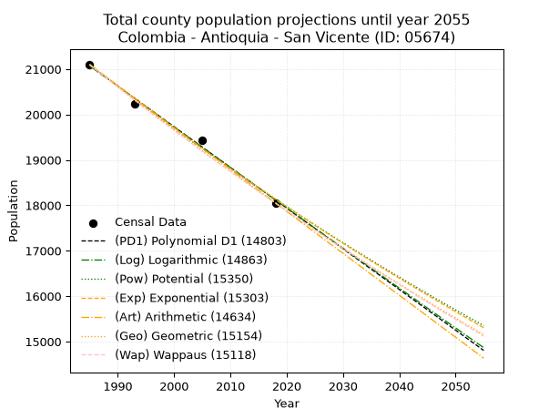
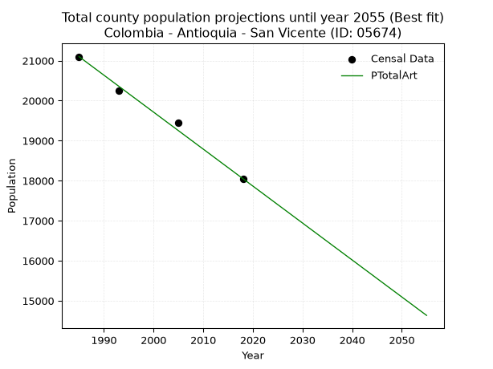
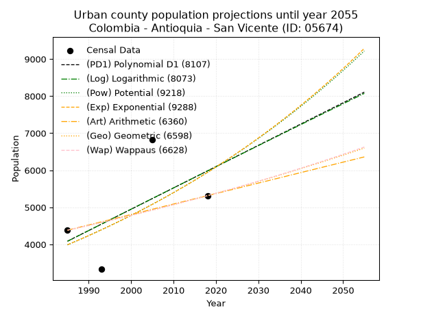
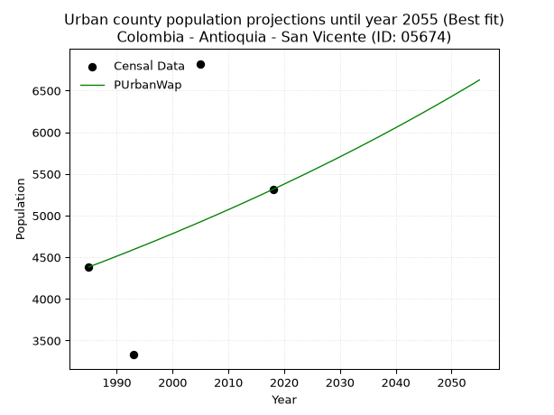
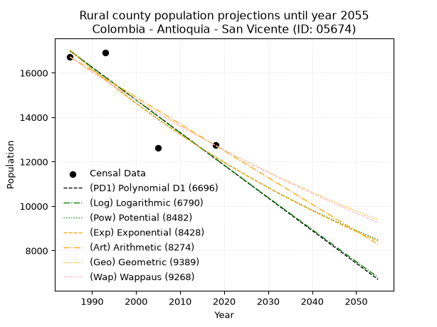
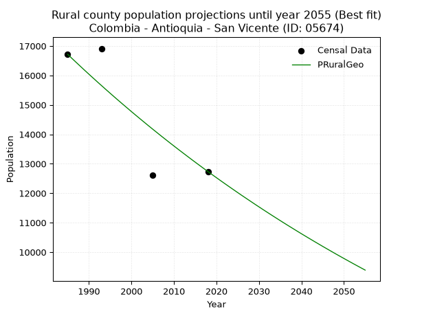

<div align="center">


</div>

# 📜 _“Population and Public Services Demand Projections (PPSD) until Year 2050 for Colombia - Antioquia - San Vicente (ID: 05674)”_
Keywords: `population` `public-service` `projection` `lineal` `polynomial` `logarithmic` `potential` `exponential` `arithmetic` `geometric` `wappaus` `dane` `colombia` `south-america`

PPSD are analytical estimates used by governments and planners to anticipate future changes in population size, age distribution, and the resulting community needs for utilities, healthcare, education, and infrastructure as sizing future water treatment facilities, electrical grids, and road networks based on spatial growth.

<div align="center">

</img>

</div>


> **General running parameters**: • app_version: _v20260806_. • Python version: _3.14.7_. • Pandas version: _3.0.5_. • NumPy version: _2.5.1_. • Creates, save and include plots into reports (create_plot): _False_. • Projection until year: _2050_. • Process polynomial degree 2 and up: _False_. • Process Wappaus: _True_. • Process Wappaus: _True_. • Set negative values to zero: _True_. • Set infinite values to zero: _True_. • Drop dataset notes: _True_. 
<div align="center">

Maps & GIS Layers: [:earth_americas:Google](http://maps.google.com/maps?q=6.282163878,-75.332616) [:earth_americas:OSM](https://www.openstreetmap.org/#map=18/6.282163878/-75.332616&layers=P) [:earth_americas:Bing](https://www.bing.com/maps?cp=6.282163878~-75.332616&lvl=18) [:earth_americas:Apple](https://maps.apple.com/frame?center=6.282163878%2C-75.332616&span=0.003%2C0.006) [:earth_americas:GISMobile](https://github.com/rcfdtools/R.GISMobile/blob/main/file/gis/CountyLayer_CO/Readme.md)

</div>


<div align="center">

```geojson
{
  "type": "Feature",
  "geometry": {
    "type": "Point", 
    "coordinates": [-75.332616, 6.282163878]
  }, 
  "properties": {
    "Name": "Colombia - Antioquia - San Vicente (ID: 05674)"
  }
}
```

</div>


## 0. Census Data (4 records)

Census data are official statistics collected by a government about the people and housing in a country. They usually include counts of total population, age, sex, race, income, education, and jobs.

📅Global census file: [Population.xlsx](../data/Population.xlsx)

| Source   |   Year |   CountryID | CountryName   |   StateID | StateName   |   CountyID | CountyName   |   PTotal |   PUrban |   PRural |
|:---------|-------:|------------:|:--------------|----------:|:------------|-----------:|:-------------|---------:|---------:|---------:|
| DANE     |   1985 |          57 | Colombia      |        05 | Antioquia   |      05674 | San Vicente  |    21099 |     4383 |    16716 |
| DANE     |   1993 |          57 | Colombia      |        05 | Antioquia   |      05674 | San Vicente  |    20243 |     3330 |    16913 |
| DANE     |   2005 |          57 | Colombia      |        05 | Antioquia   |      05674 | San Vicente  |    19438 |     6823 |    12615 |
| DANE     |   2018 |          57 | Colombia      |        05 | Antioquia   |      05674 | San Vicente  |    18051 |     5315 |    12736 |

> 🔥Some records could had specific notes about the registered values or the corresponding urban or rural distribution.

## 1. Total

### 1.1. Coefficients and Parameters

* (PD1) Polynomial Deg 1: -89.579686872741, 198889.51866720017 (lineal)
* (Log) Logarithmic: -179290.47632892837, 1382496.0973198928
* (Pow) Potential: -9.186918899997723, 34.6206383965802
* (Exp) Exponential: -0.004590357935505248, 191229562.87312278
* (Art) Arithmetic: Year diff. 2018 - 1985 = 33, Population diff. 18051 - 21099 = -3048, Annual growth = -92.36363636363636
* (Geo) Geometric: Year diff. 2018 - 1985 = 33, Population diff. 18051 - 21099 = -3048, Annual growth % = -0.00471685752459583
* (Wap) Wappaus: i = -0.4718448856379891, Condition values only valid for < 200)

<sub>
Wappaus condition values: ['-0.00', '-0.47', '-0.94', '-1.42', '-1.89', '-2.36', '-2.83', '-3.30', '-3.77', '-4.25', '-4.72', '-5.19', '-5.66', '-6.13', '-6.61', '-7.08', '-7.55', '-8.02', '-8.49', '-8.97', '-9.44', '-9.91', '-10.38', '-10.85', '-11.32', '-11.80', '-12.27', '-12.74', '-13.21', '-13.68', '-14.16', '-14.63', '-15.10', '-15.57', '-16.04', '-16.51', '-16.99', '-17.46', '-17.93', '-18.40', '-18.87', '-19.35', '-19.82', '-20.29', '-20.76', '-21.23', '-21.70', '-22.18', '-22.65', '-23.12', '-23.59', '-24.06', '-24.54', '-25.01', '-25.48', '-25.95', '-26.42', '-26.90', '-27.37', '-27.84', '-28.31', '-28.78', '-29.25', '-29.73', '-30.20', '-30.67']
</sub>


### 1.2. Projected Dataset

|   Year |   CountyID |   PTotalPD1 |   PTotalLog |   PTotalPow |   PTotalExp |   PTotalArt |   PTotalGeo |   PTotalWap |
|-------:|-----------:|------------:|------------:|------------:|------------:|------------:|------------:|------------:|
|   1985 |      05674 |       21074 |       21076 |       21105 |       21102 |       21099 |       21099 |       21099 |
|   1986 |      05674 |       20984 |       20986 |       21007 |       21005 |       21007 |       20999 |       21000 |
|   1987 |      05674 |       20895 |       20896 |       20910 |       20909 |       20914 |       20900 |       20901 |
|   1988 |      05674 |       20805 |       20806 |       20814 |       20813 |       20822 |       20802 |       20802 |
|   1989 |      05674 |       20716 |       20715 |       20718 |       20718 |       20730 |       20704 |       20705 |
|   1990 |      05674 |       20626 |       20625 |       20623 |       20623 |       20637 |       20606 |       20607 |
|   1991 |      05674 |       20536 |       20535 |       20528 |       20529 |       20545 |       20509 |       20510 |
|   1992 |      05674 |       20447 |       20445 |       20433 |       20435 |       20452 |       20412 |       20413 |
|   1993 |      05674 |       20357 |       20355 |       20339 |       20341 |       20360 |       20316 |       20317 |
|   1994 |      05674 |       20268 |       20265 |       20246 |       20248 |       20268 |       20220 |       20222 |
|   1995 |      05674 |       20178 |       20175 |       20153 |       20155 |       20175 |       20125 |       20126 |
|   1996 |      05674 |       20088 |       20086 |       20060 |       20063 |       20083 |       20030 |       20032 |
|   1997 |      05674 |       19999 |       19996 |       19968 |       19971 |       19991 |       19935 |       19937 |
|   1998 |      05674 |       19909 |       19906 |       19876 |       19880 |       19898 |       19841 |       19843 |
|   1999 |      05674 |       19820 |       19816 |       19785 |       19789 |       19806 |       19748 |       19750 |
|   2000 |      05674 |       19730 |       19727 |       19694 |       19698 |       19714 |       19654 |       19657 |
|   2001 |      05674 |       19641 |       19637 |       19604 |       19608 |       19621 |       19562 |       19564 |
|   2002 |      05674 |       19551 |       19547 |       19514 |       19518 |       19529 |       19470 |       19472 |
|   2003 |      05674 |       19461 |       19458 |       19425 |       19429 |       19436 |       19378 |       19380 |
|   2004 |      05674 |       19372 |       19368 |       19336 |       19340 |       19344 |       19286 |       19289 |
|   2005 |      05674 |       19282 |       19279 |       19248 |       19251 |       19252 |       19195 |       19198 |
|   2006 |      05674 |       19193 |       19190 |       19160 |       19163 |       19159 |       19105 |       19107 |
|   2007 |      05674 |       19103 |       19100 |       19072 |       19075 |       19067 |       19015 |       19017 |
|   2008 |      05674 |       19014 |       19011 |       18985 |       18988 |       18975 |       18925 |       18927 |
|   2009 |      05674 |       18924 |       18922 |       18899 |       18901 |       18882 |       18836 |       18838 |
|   2010 |      05674 |       18834 |       18832 |       18812 |       18814 |       18790 |       18747 |       18749 |
|   2011 |      05674 |       18745 |       18743 |       18727 |       18728 |       18698 |       18658 |       18660 |
|   2012 |      05674 |       18655 |       18654 |       18641 |       18642 |       18605 |       18570 |       18572 |
|   2013 |      05674 |       18566 |       18565 |       18556 |       18557 |       18513 |       18483 |       18484 |
|   2014 |      05674 |       18476 |       18476 |       18472 |       18472 |       18420 |       18396 |       18397 |
|   2015 |      05674 |       18386 |       18387 |       18388 |       18387 |       18328 |       18309 |       18310 |
|   2016 |      05674 |       18297 |       18298 |       18304 |       18303 |       18236 |       18223 |       18223 |
|   2017 |      05674 |       18207 |       18209 |       18221 |       18219 |       18143 |       18137 |       18137 |
|   2018 |      05674 |       18118 |       18120 |       18138 |       18136 |       18051 |       18051 |       18051 |
|   2019 |      05674 |       18028 |       18031 |       18056 |       18053 |       17959 |       17966 |       17965 |
|   2020 |      05674 |       17939 |       17943 |       17974 |       17970 |       17866 |       17881 |       17880 |
|   2021 |      05674 |       17849 |       17854 |       17892 |       17888 |       17774 |       17797 |       17796 |
|   2022 |      05674 |       17759 |       17765 |       17811 |       17806 |       17682 |       17713 |       17711 |
|   2023 |      05674 |       17670 |       17677 |       17731 |       17724 |       17589 |       17629 |       17627 |
|   2024 |      05674 |       17580 |       17588 |       17650 |       17643 |       17497 |       17546 |       17544 |
|   2025 |      05674 |       17491 |       17499 |       17570 |       17562 |       17404 |       17463 |       17460 |
|   2026 |      05674 |       17401 |       17411 |       17491 |       17482 |       17312 |       17381 |       17377 |
|   2027 |      05674 |       17311 |       17322 |       17412 |       17402 |       17220 |       17299 |       17295 |
|   2028 |      05674 |       17222 |       17234 |       17333 |       17322 |       17127 |       17217 |       17212 |
|   2029 |      05674 |       17132 |       17146 |       17255 |       17243 |       17035 |       17136 |       17131 |
|   2030 |      05674 |       17043 |       17057 |       17177 |       17164 |       16943 |       17055 |       17049 |
|   2031 |      05674 |       16953 |       16969 |       17099 |       17085 |       16850 |       16975 |       16968 |
|   2032 |      05674 |       16864 |       16881 |       17022 |       17007 |       16758 |       16895 |       16887 |
|   2033 |      05674 |       16774 |       16793 |       16945 |       16929 |       16666 |       16815 |       16806 |
|   2034 |      05674 |       16684 |       16704 |       16869 |       16852 |       16573 |       16736 |       16726 |
|   2035 |      05674 |       16595 |       16616 |       16793 |       16774 |       16481 |       16657 |       16646 |
|   2036 |      05674 |       16505 |       16528 |       16717 |       16698 |       16388 |       16578 |       16567 |
|   2037 |      05674 |       16416 |       16440 |       16642 |       16621 |       16296 |       16500 |       16488 |
|   2038 |      05674 |       16326 |       16352 |       16567 |       16545 |       16204 |       16422 |       16409 |
|   2039 |      05674 |       16237 |       16264 |       16493 |       16469 |       16111 |       16345 |       16331 |
|   2040 |      05674 |       16147 |       16176 |       16419 |       16394 |       16019 |       16268 |       16252 |
|   2041 |      05674 |       16057 |       16088 |       16345 |       16319 |       15927 |       16191 |       16175 |
|   2042 |      05674 |       15968 |       16001 |       16271 |       16244 |       15834 |       16115 |       16097 |
|   2043 |      05674 |       15878 |       15913 |       16198 |       16170 |       15742 |       16039 |       16020 |
|   2044 |      05674 |       15789 |       15825 |       16126 |       16095 |       15650 |       15963 |       15943 |
|   2045 |      05674 |       15699 |       15737 |       16053 |       16022 |       15557 |       15888 |       15866 |
|   2046 |      05674 |       15609 |       15650 |       15981 |       15948 |       15465 |       15813 |       15790 |
|   2047 |      05674 |       15520 |       15562 |       15910 |       15875 |       15372 |       15738 |       15714 |
|   2048 |      05674 |       15430 |       15475 |       15839 |       15803 |       15280 |       15664 |       15639 |
|   2049 |      05674 |       15341 |       15387 |       15768 |       15730 |       15188 |       15590 |       15563 |
|   2050 |      05674 |       15251 |       15300 |       15697 |       15658 |       15095 |       15517 |       15488 |
<div align="center">

</img>

</div>


### 1.3. Best fit with absolute and relative error (%)

Relative error puts that difference into context by dividing the absolute error by the true value, creating a unitless ratio or percentage that shows the scale of the mistake.

Absolute and relative error

|   Year | Source   |   CountryID | CountryName   |   StateID | StateName   |   CountyID_x | CountyName   |   PTotal |   PUrban |   PRural |   CountyID_y |   PTotalPD1 |   PTotalLog |   PTotalPow |   PTotalExp |   PTotalArt |   PTotalGeo |   PTotalWap |   PTotalPD1AbsError |   PTotalLogAbsError |   PTotalPowAbsError |   PTotalExpAbsError |   PTotalArtAbsError |   PTotalGeoAbsError |   PTotalWapAbsError |   PTotalPD1RelError |   PTotalLogRelError |   PTotalPowRelError |   PTotalExpRelError |   PTotalArtRelError |   PTotalGeoRelError |   PTotalWapRelError |
|-------:|:---------|------------:|:--------------|----------:|:------------|-------------:|:-------------|---------:|---------:|---------:|-------------:|------------:|------------:|------------:|------------:|------------:|------------:|------------:|--------------------:|--------------------:|--------------------:|--------------------:|--------------------:|--------------------:|--------------------:|--------------------:|--------------------:|--------------------:|--------------------:|--------------------:|--------------------:|--------------------:|
|   1985 | DANE     |          57 | Colombia      |        05 | Antioquia   |        05674 | San Vicente  |    21099 |     4383 |    16716 |        05674 |       21074 |       21076 |       21105 |       21102 |       21099 |       21099 |       21099 |                  25 |                  23 |                   6 |                   3 |                   0 |                   0 |                   0 |            0.118489 |            0.10901  |           0.0284374 |           0.0142187 |            0        |            0        |            0        |
|   1993 | DANE     |          57 | Colombia      |        05 | Antioquia   |        05674 | San Vicente  |    20243 |     3330 |    16913 |        05674 |       20357 |       20355 |       20339 |       20341 |       20360 |       20316 |       20317 |                 114 |                 112 |                  96 |                  98 |                 117 |                  73 |                  74 |            0.563158 |            0.553278 |           0.474238  |           0.484118  |            0.577978 |            0.360618 |            0.365558 |
|   2005 | DANE     |          57 | Colombia      |        05 | Antioquia   |        05674 | San Vicente  |    19438 |     6823 |    12615 |        05674 |       19282 |       19279 |       19248 |       19251 |       19252 |       19195 |       19198 |                 156 |                 159 |                 190 |                 187 |                 186 |                 243 |                 240 |            0.802552 |            0.817985 |           0.977467  |           0.962033  |            0.956889 |            1.25013  |            1.23469  |
|   2018 | DANE     |          57 | Colombia      |        05 | Antioquia   |        05674 | San Vicente  |    18051 |     5315 |    12736 |        05674 |       18118 |       18120 |       18138 |       18136 |       18051 |       18051 |       18051 |                  67 |                  69 |                  87 |                  85 |                   0 |                   0 |                   0 |            0.371171 |            0.38225  |           0.481968  |           0.470888  |            0        |            0        |            0        |

Relative error mean

| Method    |   RelError | Best   |
|:----------|-----------:|:-------|
| PTotalPD1 |   0.463842 |        |
| PTotalLog |   0.465631 |        |
| PTotalPow |   0.490527 |        |
| PTotalExp |   0.482814 |        |
| PTotalArt |   0.383717 | True   |
| PTotalGeo |   0.402687 |        |
| PTotalWap |   0.400063 |        |

💙Best method: _**PTotalArt**_
<div align="center">

</img>

</div>


### 1.4. Fresh water supply demand in liters per capita per day (lpcd)

The fresh water supply demand typically ranges from 100 to 300 liters per capita per day (lpcd) for standard domestic and municipal planning, though absolute survival minimums set by the World Health Organization are as low as 7.5 to 20 liters per day, and total consumption in high-income nations can exceed 400 liters.

> `CZ`: Level in meters above the sea level (masl)<br> `WS`: Fresh water supply demand in liters per capita per day (lpcd or l/h/d)<br> `WSAll`: Zonal fresh water supply demand in liters per second (l/s)<br> `A`: Zonal area in square meters<br> `DP`: Population density (people/hectare or p/ha)

Reference values (RAS Colombia)

|    CZ |   WS |
|------:|-----:|
|  1000 |  120 |
|  2000 |  130 |
| 99999 |  140 |

County shapefile geometry properties and water supply values

|   CountyID |      ATotal |   CZTotal |   WSTotal |
|-----------:|------------:|----------:|----------:|
|      05674 | 2.30392e+08 |   2200.86 |       140 |

Projected values for best method: PTotalArt

|   CountyID |   Year |   PTotalArt |   DPTotal |   WSTotal |   WSTotalAll |
|-----------:|-------:|------------:|----------:|----------:|-------------:|
|      05674 |   1985 |       21099 |      0.92 |       140 |      34.1882 |
|      05674 |   1986 |       21007 |      0.91 |       140 |      34.0391 |
|      05674 |   1987 |       20914 |      0.91 |       140 |      33.8884 |
|      05674 |   1988 |       20822 |      0.9  |       140 |      33.7394 |
|      05674 |   1989 |       20730 |      0.9  |       140 |      33.5903 |
|      05674 |   1990 |       20637 |      0.9  |       140 |      33.4396 |
|      05674 |   1991 |       20545 |      0.89 |       140 |      33.2905 |
|      05674 |   1992 |       20452 |      0.89 |       140 |      33.1398 |
|      05674 |   1993 |       20360 |      0.88 |       140 |      32.9907 |
|      05674 |   1994 |       20268 |      0.88 |       140 |      32.8417 |
|      05674 |   1995 |       20175 |      0.88 |       140 |      32.691  |
|      05674 |   1996 |       20083 |      0.87 |       140 |      32.5419 |
|      05674 |   1997 |       19991 |      0.87 |       140 |      32.3928 |
|      05674 |   1998 |       19898 |      0.86 |       140 |      32.2421 |
|      05674 |   1999 |       19806 |      0.86 |       140 |      32.0931 |
|      05674 |   2000 |       19714 |      0.86 |       140 |      31.944  |
|      05674 |   2001 |       19621 |      0.85 |       140 |      31.7933 |
|      05674 |   2002 |       19529 |      0.85 |       140 |      31.6442 |
|      05674 |   2003 |       19436 |      0.84 |       140 |      31.4935 |
|      05674 |   2004 |       19344 |      0.84 |       140 |      31.3444 |
|      05674 |   2005 |       19252 |      0.84 |       140 |      31.1954 |
|      05674 |   2006 |       19159 |      0.83 |       140 |      31.0447 |
|      05674 |   2007 |       19067 |      0.83 |       140 |      30.8956 |
|      05674 |   2008 |       18975 |      0.82 |       140 |      30.7465 |
|      05674 |   2009 |       18882 |      0.82 |       140 |      30.5958 |
|      05674 |   2010 |       18790 |      0.82 |       140 |      30.4468 |
|      05674 |   2011 |       18698 |      0.81 |       140 |      30.2977 |
|      05674 |   2012 |       18605 |      0.81 |       140 |      30.147  |
|      05674 |   2013 |       18513 |      0.8  |       140 |      29.9979 |
|      05674 |   2014 |       18420 |      0.8  |       140 |      29.8472 |
|      05674 |   2015 |       18328 |      0.8  |       140 |      29.6981 |
|      05674 |   2016 |       18236 |      0.79 |       140 |      29.5491 |
|      05674 |   2017 |       18143 |      0.79 |       140 |      29.3984 |
|      05674 |   2018 |       18051 |      0.78 |       140 |      29.2493 |
|      05674 |   2019 |       17959 |      0.78 |       140 |      29.1002 |
|      05674 |   2020 |       17866 |      0.78 |       140 |      28.9495 |
|      05674 |   2021 |       17774 |      0.77 |       140 |      28.8005 |
|      05674 |   2022 |       17682 |      0.77 |       140 |      28.6514 |
|      05674 |   2023 |       17589 |      0.76 |       140 |      28.5007 |
|      05674 |   2024 |       17497 |      0.76 |       140 |      28.3516 |
|      05674 |   2025 |       17404 |      0.76 |       140 |      28.2009 |
|      05674 |   2026 |       17312 |      0.75 |       140 |      28.0519 |
|      05674 |   2027 |       17220 |      0.75 |       140 |      27.9028 |
|      05674 |   2028 |       17127 |      0.74 |       140 |      27.7521 |
|      05674 |   2029 |       17035 |      0.74 |       140 |      27.603  |
|      05674 |   2030 |       16943 |      0.74 |       140 |      27.4539 |
|      05674 |   2031 |       16850 |      0.73 |       140 |      27.3032 |
|      05674 |   2032 |       16758 |      0.73 |       140 |      27.1542 |
|      05674 |   2033 |       16666 |      0.72 |       140 |      27.0051 |
|      05674 |   2034 |       16573 |      0.72 |       140 |      26.8544 |
|      05674 |   2035 |       16481 |      0.72 |       140 |      26.7053 |
|      05674 |   2036 |       16388 |      0.71 |       140 |      26.5546 |
|      05674 |   2037 |       16296 |      0.71 |       140 |      26.4056 |
|      05674 |   2038 |       16204 |      0.7  |       140 |      26.2565 |
|      05674 |   2039 |       16111 |      0.7  |       140 |      26.1058 |
|      05674 |   2040 |       16019 |      0.7  |       140 |      25.9567 |
|      05674 |   2041 |       15927 |      0.69 |       140 |      25.8076 |
|      05674 |   2042 |       15834 |      0.69 |       140 |      25.6569 |
|      05674 |   2043 |       15742 |      0.68 |       140 |      25.5079 |
|      05674 |   2044 |       15650 |      0.68 |       140 |      25.3588 |
|      05674 |   2045 |       15557 |      0.68 |       140 |      25.2081 |
|      05674 |   2046 |       15465 |      0.67 |       140 |      25.059  |
|      05674 |   2047 |       15372 |      0.67 |       140 |      24.9083 |
|      05674 |   2048 |       15280 |      0.66 |       140 |      24.7593 |
|      05674 |   2049 |       15188 |      0.66 |       140 |      24.6102 |
|      05674 |   2050 |       15095 |      0.66 |       140 |      24.4595 |

## 2. Urban

### 2.1. Coefficients and Parameters

* (PD1) Polynomial Deg 1: 57.43436370935437, -109920.3360096361 (lineal)
* (Log) Logarithmic: 115096.95828638696, -869890.1522639663
* (Pow) Potential: 24.17579776566965, -76.12521826234496
* (Exp) Exponential: 0.01206968856394421, 1.570416512363831e-07
* (Art) Arithmetic: Year diff. 2018 - 1985 = 33, Population diff. 5315 - 4383 = 932, Annual growth = 28.242424242424242
* (Geo) Geometric: Year diff. 2018 - 1985 = 33, Population diff. 5315 - 4383 = 932, Annual growth % = 0.005859512002863054
* (Wap) Wappaus: i = 0.5824381159501802, Condition values only valid for < 200)

<sub>
Wappaus condition values: ['0.00', '0.58', '1.16', '1.75', '2.33', '2.91', '3.49', '4.08', '4.66', '5.24', '5.82', '6.41', '6.99', '7.57', '8.15', '8.74', '9.32', '9.90', '10.48', '11.07', '11.65', '12.23', '12.81', '13.40', '13.98', '14.56', '15.14', '15.73', '16.31', '16.89', '17.47', '18.06', '18.64', '19.22', '19.80', '20.39', '20.97', '21.55', '22.13', '22.72', '23.30', '23.88', '24.46', '25.04', '25.63', '26.21', '26.79', '27.37', '27.96', '28.54', '29.12', '29.70', '30.29', '30.87', '31.45', '32.03', '32.62', '33.20', '33.78', '34.36', '34.95', '35.53', '36.11', '36.69', '37.28', '37.86']
</sub>


### 2.2. Projected Dataset

|   Year |   CountyID |   PUrbanPD1 |   PUrbanLog |   PUrbanPow |   PUrbanExp |   PUrbanArt |   PUrbanGeo |   PUrbanWap |
|-------:|-----------:|------------:|------------:|------------:|------------:|------------:|------------:|------------:|
|   1985 |      05674 |        4087 |        4084 |        3988 |        3990 |        4383 |        4383 |        4383 |
|   1986 |      05674 |        4144 |        4142 |        4037 |        4039 |        4411 |        4409 |        4409 |
|   1987 |      05674 |        4202 |        4200 |        4086 |        4088 |        4439 |        4435 |        4434 |
|   1988 |      05674 |        4259 |        4258 |        4136 |        4137 |        4468 |        4460 |        4460 |
|   1989 |      05674 |        4317 |        4316 |        4187 |        4187 |        4496 |        4487 |        4486 |
|   1990 |      05674 |        4374 |        4374 |        4238 |        4238 |        4524 |        4513 |        4513 |
|   1991 |      05674 |        4431 |        4431 |        4290 |        4290 |        4552 |        4539 |        4539 |
|   1992 |      05674 |        4489 |        4489 |        4342 |        4342 |        4581 |        4566 |        4565 |
|   1993 |      05674 |        4546 |        4547 |        4395 |        4395 |        4609 |        4593 |        4592 |
|   1994 |      05674 |        4604 |        4605 |        4449 |        4448 |        4637 |        4620 |        4619 |
|   1995 |      05674 |        4661 |        4662 |        4503 |        4502 |        4665 |        4647 |        4646 |
|   1996 |      05674 |        4719 |        4720 |        4558 |        4557 |        4694 |        4674 |        4673 |
|   1997 |      05674 |        4776 |        4778 |        4614 |        4612 |        4722 |        4701 |        4700 |
|   1998 |      05674 |        4834 |        4835 |        4670 |        4668 |        4750 |        4729 |        4728 |
|   1999 |      05674 |        4891 |        4893 |        4727 |        4725 |        4778 |        4757 |        4756 |
|   2000 |      05674 |        4948 |        4951 |        4784 |        4782 |        4807 |        4784 |        4783 |
|   2001 |      05674 |        5006 |        5008 |        4842 |        4840 |        4835 |        4812 |        4811 |
|   2002 |      05674 |        5063 |        5066 |        4901 |        4899 |        4863 |        4841 |        4840 |
|   2003 |      05674 |        5121 |        5123 |        4961 |        4958 |        4891 |        4869 |        4868 |
|   2004 |      05674 |        5178 |        5181 |        5021 |        5019 |        4920 |        4898 |        4896 |
|   2005 |      05674 |        5236 |        5238 |        5082 |        5080 |        4948 |        4926 |        4925 |
|   2006 |      05674 |        5293 |        5295 |        5144 |        5141 |        4976 |        4955 |        4954 |
|   2007 |      05674 |        5350 |        5353 |        5206 |        5204 |        5004 |        4984 |        4983 |
|   2008 |      05674 |        5408 |        5410 |        5269 |        5267 |        5033 |        5013 |        5012 |
|   2009 |      05674 |        5465 |        5467 |        5333 |        5331 |        5061 |        5043 |        5042 |
|   2010 |      05674 |        5523 |        5525 |        5397 |        5395 |        5089 |        5072 |        5071 |
|   2011 |      05674 |        5580 |        5582 |        5463 |        5461 |        5117 |        5102 |        5101 |
|   2012 |      05674 |        5638 |        5639 |        5529 |        5527 |        5146 |        5132 |        5131 |
|   2013 |      05674 |        5695 |        5696 |        5596 |        5594 |        5174 |        5162 |        5161 |
|   2014 |      05674 |        5752 |        5753 |        5663 |        5662 |        5202 |        5192 |        5192 |
|   2015 |      05674 |        5810 |        5811 |        5731 |        5731 |        5230 |        5223 |        5222 |
|   2016 |      05674 |        5867 |        5868 |        5801 |        5801 |        5259 |        5253 |        5253 |
|   2017 |      05674 |        5925 |        5925 |        5871 |        5871 |        5287 |        5284 |        5284 |
|   2018 |      05674 |        5982 |        5982 |        5941 |        5942 |        5315 |        5315 |        5315 |
|   2019 |      05674 |        6040 |        6039 |        6013 |        6015 |        5343 |        5346 |        5346 |
|   2020 |      05674 |        6097 |        6096 |        6085 |        6088 |        5371 |        5377 |        5378 |
|   2021 |      05674 |        6155 |        6153 |        6159 |        6162 |        5400 |        5409 |        5410 |
|   2022 |      05674 |        6212 |        6210 |        6233 |        6236 |        5428 |        5441 |        5442 |
|   2023 |      05674 |        6269 |        6267 |        6308 |        6312 |        5456 |        5473 |        5474 |
|   2024 |      05674 |        6327 |        6324 |        6383 |        6389 |        5484 |        5505 |        5506 |
|   2025 |      05674 |        6384 |        6380 |        6460 |        6466 |        5513 |        5537 |        5539 |
|   2026 |      05674 |        6442 |        6437 |        6538 |        6545 |        5541 |        5569 |        5572 |
|   2027 |      05674 |        6499 |        6494 |        6616 |        6624 |        5569 |        5602 |        5605 |
|   2028 |      05674 |        6557 |        6551 |        6696 |        6705 |        5597 |        5635 |        5638 |
|   2029 |      05674 |        6614 |        6608 |        6776 |        6786 |        5626 |        5668 |        5671 |
|   2030 |      05674 |        6671 |        6664 |        6857 |        6869 |        5654 |        5701 |        5705 |
|   2031 |      05674 |        6729 |        6721 |        6939 |        6952 |        5682 |        5734 |        5739 |
|   2032 |      05674 |        6786 |        6778 |        7022 |        7036 |        5710 |        5768 |        5773 |
|   2033 |      05674 |        6844 |        6834 |        7106 |        7122 |        5739 |        5802 |        5807 |
|   2034 |      05674 |        6901 |        6891 |        7191 |        7208 |        5767 |        5836 |        5842 |
|   2035 |      05674 |        6959 |        6947 |        7277 |        7296 |        5795 |        5870 |        5877 |
|   2036 |      05674 |        7016 |        7004 |        7364 |        7384 |        5823 |        5904 |        5912 |
|   2037 |      05674 |        7073 |        7060 |        7452 |        7474 |        5852 |        5939 |        5947 |
|   2038 |      05674 |        7131 |        7117 |        7541 |        7565 |        5880 |        5974 |        5983 |
|   2039 |      05674 |        7188 |        7173 |        7631 |        7657 |        5908 |        6009 |        6019 |
|   2040 |      05674 |        7246 |        7230 |        7722 |        7750 |        5936 |        6044 |        6055 |
|   2041 |      05674 |        7303 |        7286 |        7814 |        7844 |        5965 |        6079 |        6091 |
|   2042 |      05674 |        7361 |        7343 |        7907 |        7939 |        5993 |        6115 |        6128 |
|   2043 |      05674 |        7418 |        7399 |        8001 |        8035 |        6021 |        6151 |        6165 |
|   2044 |      05674 |        7476 |        7455 |        8097 |        8133 |        6049 |        6187 |        6202 |
|   2045 |      05674 |        7533 |        7512 |        8193 |        8232 |        6078 |        6223 |        6239 |
|   2046 |      05674 |        7590 |        7568 |        8290 |        8332 |        6106 |        6260 |        6277 |
|   2047 |      05674 |        7648 |        7624 |        8389 |        8433 |        6134 |        6296 |        6314 |
|   2048 |      05674 |        7705 |        7680 |        8488 |        8535 |        6162 |        6333 |        6353 |
|   2049 |      05674 |        7763 |        7736 |        8589 |        8639 |        6191 |        6370 |        6391 |
|   2050 |      05674 |        7820 |        7793 |        8691 |        8744 |        6219 |        6408 |        6430 |
<div align="center">

</img>

</div>


### 2.3. Best fit with absolute and relative error (%)

Relative error puts that difference into context by dividing the absolute error by the true value, creating a unitless ratio or percentage that shows the scale of the mistake.

Absolute and relative error

|   Year | Source   |   CountryID | CountryName   |   StateID | StateName   |   CountyID_x | CountyName   |   PTotal |   PUrban |   PRural |   CountyID_y |   PUrbanPD1 |   PUrbanLog |   PUrbanPow |   PUrbanExp |   PUrbanArt |   PUrbanGeo |   PUrbanWap |   PUrbanPD1AbsError |   PUrbanLogAbsError |   PUrbanPowAbsError |   PUrbanExpAbsError |   PUrbanArtAbsError |   PUrbanGeoAbsError |   PUrbanWapAbsError |   PUrbanPD1RelError |   PUrbanLogRelError |   PUrbanPowRelError |   PUrbanExpRelError |   PUrbanArtRelError |   PUrbanGeoRelError |   PUrbanWapRelError |
|-------:|:---------|------------:|:--------------|----------:|:------------|-------------:|:-------------|---------:|---------:|---------:|-------------:|------------:|------------:|------------:|------------:|------------:|------------:|------------:|--------------------:|--------------------:|--------------------:|--------------------:|--------------------:|--------------------:|--------------------:|--------------------:|--------------------:|--------------------:|--------------------:|--------------------:|--------------------:|--------------------:|
|   1985 | DANE     |          57 | Colombia      |        05 | Antioquia   |        05674 | San Vicente  |    21099 |     4383 |    16716 |        05674 |        4087 |        4084 |        3988 |        3990 |        4383 |        4383 |        4383 |                 296 |                 299 |                 395 |                 393 |                   0 |                   0 |                   0 |             6.75337 |             6.82181 |             9.01209 |             8.96646 |              0      |              0      |              0      |
|   1993 | DANE     |          57 | Colombia      |        05 | Antioquia   |        05674 | San Vicente  |    20243 |     3330 |    16913 |        05674 |        4546 |        4547 |        4395 |        4395 |        4609 |        4593 |        4592 |                1216 |                1217 |                1065 |                1065 |                1279 |                1263 |                1262 |            36.5165  |            36.5465  |            31.982   |            31.982   |             38.4084 |             37.9279 |             37.8979 |
|   2005 | DANE     |          57 | Colombia      |        05 | Antioquia   |        05674 | San Vicente  |    19438 |     6823 |    12615 |        05674 |        5236 |        5238 |        5082 |        5080 |        4948 |        4926 |        4925 |                1587 |                1585 |                1741 |                1743 |                1875 |                1897 |                1898 |            23.2596  |            23.2303  |            25.5166  |            25.5459  |             27.4806 |             27.803  |             27.8177 |
|   2018 | DANE     |          57 | Colombia      |        05 | Antioquia   |        05674 | San Vicente  |    18051 |     5315 |    12736 |        05674 |        5982 |        5982 |        5941 |        5942 |        5315 |        5315 |        5315 |                 667 |                 667 |                 626 |                 627 |                   0 |                   0 |                   0 |            12.5494  |            12.5494  |            11.778   |            11.7968  |              0      |              0      |              0      |

Relative error mean

| Method    |   RelError | Best   |
|:----------|-----------:|:-------|
| PUrbanPD1 |    19.7697 |        |
| PUrbanLog |    19.787  |        |
| PUrbanPow |    19.5722 |        |
| PUrbanExp |    19.5728 |        |
| PUrbanArt |    16.4722 |        |
| PUrbanGeo |    16.4327 |        |
| PUrbanWap |    16.4289 | True   |

💙Best method: _**PUrbanWap**_
<div align="center">

</img>

</div>


### 2.4. Fresh water supply demand in liters per capita per day (lpcd)

The fresh water supply demand typically ranges from 100 to 300 liters per capita per day (lpcd) for standard domestic and municipal planning, though absolute survival minimums set by the World Health Organization are as low as 7.5 to 20 liters per day, and total consumption in high-income nations can exceed 400 liters.

> `CZ`: Level in meters above the sea level (masl)<br> `WS`: Fresh water supply demand in liters per capita per day (lpcd or l/h/d)<br> `WSAll`: Zonal fresh water supply demand in liters per second (l/s)<br> `A`: Zonal area in square meters<br> `DP`: Population density (people/hectare or p/ha)

Reference values (RAS Colombia)

|    CZ |   WS |
|------:|-----:|
|  1000 |  120 |
|  2000 |  130 |
| 99999 |  140 |

County shapefile geometry properties and water supply values

|   CountyID |   AUrban |   CZUrban |   WSUrban |
|-----------:|---------:|----------:|----------:|
|      05674 |   995124 |   2152.68 |       140 |

Projected values for best method: PUrbanWap

|   CountyID |   Year |   PUrbanWap |   DPUrban |   WSUrban |   WSUrbanAll |
|-----------:|-------:|------------:|----------:|----------:|-------------:|
|      05674 |   1985 |        4383 |     44.04 |       140 |      7.10208 |
|      05674 |   1986 |        4409 |     44.31 |       140 |      7.14421 |
|      05674 |   1987 |        4434 |     44.56 |       140 |      7.18472 |
|      05674 |   1988 |        4460 |     44.82 |       140 |      7.22685 |
|      05674 |   1989 |        4486 |     45.08 |       140 |      7.26898 |
|      05674 |   1990 |        4513 |     45.35 |       140 |      7.31273 |
|      05674 |   1991 |        4539 |     45.61 |       140 |      7.35486 |
|      05674 |   1992 |        4565 |     45.87 |       140 |      7.39699 |
|      05674 |   1993 |        4592 |     46.14 |       140 |      7.44074 |
|      05674 |   1994 |        4619 |     46.42 |       140 |      7.48449 |
|      05674 |   1995 |        4646 |     46.69 |       140 |      7.52824 |
|      05674 |   1996 |        4673 |     46.96 |       140 |      7.57199 |
|      05674 |   1997 |        4700 |     47.23 |       140 |      7.61574 |
|      05674 |   1998 |        4728 |     47.51 |       140 |      7.66111 |
|      05674 |   1999 |        4756 |     47.79 |       140 |      7.70648 |
|      05674 |   2000 |        4783 |     48.06 |       140 |      7.75023 |
|      05674 |   2001 |        4811 |     48.35 |       140 |      7.7956  |
|      05674 |   2002 |        4840 |     48.64 |       140 |      7.84259 |
|      05674 |   2003 |        4868 |     48.92 |       140 |      7.88796 |
|      05674 |   2004 |        4896 |     49.2  |       140 |      7.93333 |
|      05674 |   2005 |        4925 |     49.49 |       140 |      7.98032 |
|      05674 |   2006 |        4954 |     49.78 |       140 |      8.02731 |
|      05674 |   2007 |        4983 |     50.07 |       140 |      8.07431 |
|      05674 |   2008 |        5012 |     50.37 |       140 |      8.1213  |
|      05674 |   2009 |        5042 |     50.67 |       140 |      8.16991 |
|      05674 |   2010 |        5071 |     50.96 |       140 |      8.2169  |
|      05674 |   2011 |        5101 |     51.26 |       140 |      8.26551 |
|      05674 |   2012 |        5131 |     51.56 |       140 |      8.31412 |
|      05674 |   2013 |        5161 |     51.86 |       140 |      8.36273 |
|      05674 |   2014 |        5192 |     52.17 |       140 |      8.41296 |
|      05674 |   2015 |        5222 |     52.48 |       140 |      8.46157 |
|      05674 |   2016 |        5253 |     52.79 |       140 |      8.51181 |
|      05674 |   2017 |        5284 |     53.1  |       140 |      8.56204 |
|      05674 |   2018 |        5315 |     53.41 |       140 |      8.61227 |
|      05674 |   2019 |        5346 |     53.72 |       140 |      8.6625  |
|      05674 |   2020 |        5378 |     54.04 |       140 |      8.71435 |
|      05674 |   2021 |        5410 |     54.37 |       140 |      8.7662  |
|      05674 |   2022 |        5442 |     54.69 |       140 |      8.81806 |
|      05674 |   2023 |        5474 |     55.01 |       140 |      8.86991 |
|      05674 |   2024 |        5506 |     55.33 |       140 |      8.92176 |
|      05674 |   2025 |        5539 |     55.66 |       140 |      8.97523 |
|      05674 |   2026 |        5572 |     55.99 |       140 |      9.0287  |
|      05674 |   2027 |        5605 |     56.32 |       140 |      9.08218 |
|      05674 |   2028 |        5638 |     56.66 |       140 |      9.13565 |
|      05674 |   2029 |        5671 |     56.99 |       140 |      9.18912 |
|      05674 |   2030 |        5705 |     57.33 |       140 |      9.24421 |
|      05674 |   2031 |        5739 |     57.67 |       140 |      9.29931 |
|      05674 |   2032 |        5773 |     58.01 |       140 |      9.3544  |
|      05674 |   2033 |        5807 |     58.35 |       140 |      9.40949 |
|      05674 |   2034 |        5842 |     58.71 |       140 |      9.4662  |
|      05674 |   2035 |        5877 |     59.06 |       140 |      9.52292 |
|      05674 |   2036 |        5912 |     59.41 |       140 |      9.57963 |
|      05674 |   2037 |        5947 |     59.76 |       140 |      9.63634 |
|      05674 |   2038 |        5983 |     60.12 |       140 |      9.69468 |
|      05674 |   2039 |        6019 |     60.48 |       140 |      9.75301 |
|      05674 |   2040 |        6055 |     60.85 |       140 |      9.81134 |
|      05674 |   2041 |        6091 |     61.21 |       140 |      9.86968 |
|      05674 |   2042 |        6128 |     61.58 |       140 |      9.92963 |
|      05674 |   2043 |        6165 |     61.95 |       140 |      9.98958 |
|      05674 |   2044 |        6202 |     62.32 |       140 |     10.0495  |
|      05674 |   2045 |        6239 |     62.7  |       140 |     10.1095  |
|      05674 |   2046 |        6277 |     63.08 |       140 |     10.1711  |
|      05674 |   2047 |        6314 |     63.45 |       140 |     10.231   |
|      05674 |   2048 |        6353 |     63.84 |       140 |     10.2942  |
|      05674 |   2049 |        6391 |     64.22 |       140 |     10.3558  |
|      05674 |   2050 |        6430 |     64.62 |       140 |     10.419   |

## 3. Rural

### 3.1. Coefficients and Parameters

* (PD1) Polynomial Deg 1: -147.01405058209528, 308809.85467683605 (lineal)
* (Log) Logarithmic: -294387.43461531546, 2252386.2495838604
* (Pow) Potential: -20.09319051521992, 70.49346403047572
* (Exp) Exponential: -0.010034194880160528, 7603240213292.502
* (Art) Arithmetic: Year diff. 2018 - 1985 = 33, Population diff. 12736 - 16716 = -3980, Annual growth = -120.60606060606061
* (Geo) Geometric: Year diff. 2018 - 1985 = 33, Population diff. 12736 - 16716 = -3980, Annual growth % = -0.008206556464253834
* (Wap) Wappaus: i = -0.819000819000819, Condition values only valid for < 200)

<sub>
Wappaus condition values: ['-0.00', '-0.82', '-1.64', '-2.46', '-3.28', '-4.10', '-4.91', '-5.73', '-6.55', '-7.37', '-8.19', '-9.01', '-9.83', '-10.65', '-11.47', '-12.29', '-13.10', '-13.92', '-14.74', '-15.56', '-16.38', '-17.20', '-18.02', '-18.84', '-19.66', '-20.48', '-21.29', '-22.11', '-22.93', '-23.75', '-24.57', '-25.39', '-26.21', '-27.03', '-27.85', '-28.67', '-29.48', '-30.30', '-31.12', '-31.94', '-32.76', '-33.58', '-34.40', '-35.22', '-36.04', '-36.86', '-37.67', '-38.49', '-39.31', '-40.13', '-40.95', '-41.77', '-42.59', '-43.41', '-44.23', '-45.05', '-45.86', '-46.68', '-47.50', '-48.32', '-49.14', '-49.96', '-50.78', '-51.60', '-52.42', '-53.24']
</sub>


### 3.2. Projected Dataset

|   Year |   CountyID |   PRuralPD1 |   PRuralLog |   PRuralPow |   PRuralExp |   PRuralArt |   PRuralGeo |   PRuralWap |
|-------:|-----------:|------------:|------------:|------------:|------------:|------------:|------------:|------------:|
|   1985 |      05674 |       16987 |       16992 |       17019 |       17013 |       16716 |       16716 |       16716 |
|   1986 |      05674 |       16840 |       16844 |       16848 |       16843 |       16595 |       16579 |       16580 |
|   1987 |      05674 |       16693 |       16696 |       16678 |       16675 |       16475 |       16443 |       16444 |
|   1988 |      05674 |       16546 |       16548 |       16510 |       16508 |       16354 |       16308 |       16310 |
|   1989 |      05674 |       16399 |       16400 |       16344 |       16343 |       16234 |       16174 |       16177 |
|   1990 |      05674 |       16252 |       16252 |       16180 |       16180 |       16113 |       16041 |       16045 |
|   1991 |      05674 |       16105 |       16104 |       16018 |       16019 |       15992 |       15910 |       15914 |
|   1992 |      05674 |       15958 |       15956 |       15857 |       15859 |       15872 |       15779 |       15784 |
|   1993 |      05674 |       15811 |       15808 |       15698 |       15700 |       15751 |       15650 |       15656 |
|   1994 |      05674 |       15664 |       15661 |       15540 |       15544 |       15631 |       15521 |       15528 |
|   1995 |      05674 |       15517 |       15513 |       15384 |       15389 |       15510 |       15394 |       15401 |
|   1996 |      05674 |       15370 |       15365 |       15230 |       15235 |       15389 |       15267 |       15275 |
|   1997 |      05674 |       15223 |       15218 |       15078 |       15083 |       15269 |       15142 |       15150 |
|   1998 |      05674 |       15076 |       15071 |       14927 |       14932 |       15148 |       15018 |       15026 |
|   1999 |      05674 |       14929 |       14923 |       14778 |       14783 |       15028 |       14895 |       14903 |
|   2000 |      05674 |       14782 |       14776 |       14630 |       14636 |       14907 |       14772 |       14781 |
|   2001 |      05674 |       14635 |       14629 |       14484 |       14489 |       14786 |       14651 |       14660 |
|   2002 |      05674 |       14488 |       14482 |       14339 |       14345 |       14666 |       14531 |       14540 |
|   2003 |      05674 |       14341 |       14335 |       14196 |       14202 |       14545 |       14412 |       14421 |
|   2004 |      05674 |       14194 |       14188 |       14054 |       14060 |       14424 |       14293 |       14303 |
|   2005 |      05674 |       14047 |       14041 |       13914 |       13919 |       14304 |       14176 |       14185 |
|   2006 |      05674 |       13900 |       13894 |       13775 |       13780 |       14183 |       14060 |       14069 |
|   2007 |      05674 |       13753 |       13748 |       13638 |       13643 |       14063 |       13944 |       13953 |
|   2008 |      05674 |       13606 |       13601 |       13502 |       13507 |       13942 |       13830 |       13838 |
|   2009 |      05674 |       13459 |       13454 |       13368 |       13372 |       13821 |       13716 |       13724 |
|   2010 |      05674 |       13312 |       13308 |       13235 |       13238 |       13701 |       13604 |       13611 |
|   2011 |      05674 |       13165 |       13161 |       13103 |       13106 |       13580 |       13492 |       13499 |
|   2012 |      05674 |       13018 |       13015 |       12973 |       12975 |       13460 |       13382 |       13388 |
|   2013 |      05674 |       12871 |       12869 |       12844 |       12846 |       13339 |       13272 |       13277 |
|   2014 |      05674 |       12724 |       12723 |       12717 |       12717 |       13218 |       13163 |       13167 |
|   2015 |      05674 |       12577 |       12576 |       12590 |       12590 |       13098 |       13055 |       13058 |
|   2016 |      05674 |       12430 |       12430 |       12465 |       12465 |       12977 |       12948 |       12950 |
|   2017 |      05674 |       12283 |       12284 |       12342 |       12340 |       12857 |       12841 |       12843 |
|   2018 |      05674 |       12136 |       12138 |       12220 |       12217 |       12736 |       12736 |       12736 |
|   2019 |      05674 |       11988 |       11993 |       12098 |       12095 |       12615 |       12631 |       12630 |
|   2020 |      05674 |       11841 |       11847 |       11979 |       11974 |       12495 |       12528 |       12525 |
|   2021 |      05674 |       11694 |       11701 |       11860 |       11855 |       12374 |       12425 |       12421 |
|   2022 |      05674 |       11547 |       11555 |       11743 |       11736 |       12254 |       12323 |       12317 |
|   2023 |      05674 |       11400 |       11410 |       11627 |       11619 |       12133 |       12222 |       12214 |
|   2024 |      05674 |       11253 |       11264 |       11512 |       11503 |       12012 |       12122 |       12112 |
|   2025 |      05674 |       11106 |       11119 |       11398 |       11388 |       11892 |       12022 |       12011 |
|   2026 |      05674 |       10959 |       10974 |       11286 |       11275 |       11771 |       11923 |       11910 |
|   2027 |      05674 |       10812 |       10828 |       11174 |       11162 |       11651 |       11826 |       11810 |
|   2028 |      05674 |       10665 |       10683 |       11064 |       11051 |       11530 |       11729 |       11711 |
|   2029 |      05674 |       10518 |       10538 |       10955 |       10940 |       11409 |       11632 |       11612 |
|   2030 |      05674 |       10371 |       10393 |       10847 |       10831 |       11289 |       11537 |       11514 |
|   2031 |      05674 |       10224 |       10248 |       10740 |       10723 |       11168 |       11442 |       11417 |
|   2032 |      05674 |       10077 |       10103 |       10635 |       10616 |       11048 |       11348 |       11320 |
|   2033 |      05674 |        9930 |        9958 |       10530 |       10510 |       10927 |       11255 |       11224 |
|   2034 |      05674 |        9783 |        9814 |       10426 |       10405 |       10806 |       11163 |       11129 |
|   2035 |      05674 |        9636 |        9669 |       10324 |       10301 |       10686 |       11071 |       11034 |
|   2036 |      05674 |        9489 |        9524 |       10223 |       10198 |       10565 |       10980 |       10940 |
|   2037 |      05674 |        9342 |        9380 |       10122 |       10096 |       10444 |       10890 |       10847 |
|   2038 |      05674 |        9195 |        9235 |       10023 |        9996 |       10324 |       10801 |       10754 |
|   2039 |      05674 |        9048 |        9091 |        9925 |        9896 |       10203 |       10712 |       10662 |
|   2040 |      05674 |        8901 |        8946 |        9827 |        9797 |       10083 |       10624 |       10570 |
|   2041 |      05674 |        8754 |        8802 |        9731 |        9699 |        9962 |       10537 |       10480 |
|   2042 |      05674 |        8607 |        8658 |        9636 |        9602 |        9841 |       10451 |       10389 |
|   2043 |      05674 |        8460 |        8514 |        9541 |        9507 |        9721 |       10365 |       10300 |
|   2044 |      05674 |        8313 |        8370 |        9448 |        9412 |        9600 |       10280 |       10210 |
|   2045 |      05674 |        8166 |        8226 |        9356 |        9318 |        9480 |       10195 |       10122 |
|   2046 |      05674 |        8019 |        8082 |        9264 |        9225 |        9359 |       10112 |       10034 |
|   2047 |      05674 |        7872 |        7938 |        9174 |        9133 |        9238 |       10029 |        9947 |
|   2048 |      05674 |        7725 |        7794 |        9084 |        9041 |        9118 |        9946 |        9860 |
|   2049 |      05674 |        7578 |        7651 |        8995 |        8951 |        8997 |        9865 |        9774 |
|   2050 |      05674 |        7431 |        7507 |        8908 |        8862 |        8877 |        9784 |        9688 |
<div align="center">

</img>

</div>


### 3.3. Best fit with absolute and relative error (%)

Relative error puts that difference into context by dividing the absolute error by the true value, creating a unitless ratio or percentage that shows the scale of the mistake.

Absolute and relative error

|   Year | Source   |   CountryID | CountryName   |   StateID | StateName   |   CountyID_x | CountyName   |   PTotal |   PUrban |   PRural |   CountyID_y |   PRuralPD1 |   PRuralLog |   PRuralPow |   PRuralExp |   PRuralArt |   PRuralGeo |   PRuralWap |   PRuralPD1AbsError |   PRuralLogAbsError |   PRuralPowAbsError |   PRuralExpAbsError |   PRuralArtAbsError |   PRuralGeoAbsError |   PRuralWapAbsError |   PRuralPD1RelError |   PRuralLogRelError |   PRuralPowRelError |   PRuralExpRelError |   PRuralArtRelError |   PRuralGeoRelError |   PRuralWapRelError |
|-------:|:---------|------------:|:--------------|----------:|:------------|-------------:|:-------------|---------:|---------:|---------:|-------------:|------------:|------------:|------------:|------------:|------------:|------------:|------------:|--------------------:|--------------------:|--------------------:|--------------------:|--------------------:|--------------------:|--------------------:|--------------------:|--------------------:|--------------------:|--------------------:|--------------------:|--------------------:|--------------------:|
|   1985 | DANE     |          57 | Colombia      |        05 | Antioquia   |        05674 | San Vicente  |    21099 |     4383 |    16716 |        05674 |       16987 |       16992 |       17019 |       17013 |       16716 |       16716 |       16716 |                 271 |                 276 |                 303 |                 297 |                   0 |                   0 |                   0 |             1.6212  |             1.65111 |             1.81263 |             1.77674 |             0       |             0       |             0       |
|   1993 | DANE     |          57 | Colombia      |        05 | Antioquia   |        05674 | San Vicente  |    20243 |     3330 |    16913 |        05674 |       15811 |       15808 |       15698 |       15700 |       15751 |       15650 |       15656 |                1102 |                1105 |                1215 |                1213 |                1162 |                1263 |                1257 |             6.5157  |             6.53344 |             7.18382 |             7.172   |             6.87045 |             7.46763 |             7.43215 |
|   2005 | DANE     |          57 | Colombia      |        05 | Antioquia   |        05674 | San Vicente  |    19438 |     6823 |    12615 |        05674 |       14047 |       14041 |       13914 |       13919 |       14304 |       14176 |       14185 |                1432 |                1426 |                1299 |                1304 |                1689 |                1561 |                1570 |            11.3516  |            11.304   |            10.2973  |            10.3369  |            13.3888  |            12.3742  |            12.4455  |
|   2018 | DANE     |          57 | Colombia      |        05 | Antioquia   |        05674 | San Vicente  |    18051 |     5315 |    12736 |        05674 |       12136 |       12138 |       12220 |       12217 |       12736 |       12736 |       12736 |                 600 |                 598 |                 516 |                 519 |                   0 |                   0 |                   0 |             4.71106 |             4.69535 |             4.05151 |             4.07506 |             0       |             0       |             0       |

Relative error mean

| Method    |   RelError | Best   |
|:----------|-----------:|:-------|
| PRuralPD1 |    6.04988 |        |
| PRuralLog |    6.04598 |        |
| PRuralPow |    5.83631 |        |
| PRuralExp |    5.84018 |        |
| PRuralArt |    5.06482 |        |
| PRuralGeo |    4.96045 | True   |
| PRuralWap |    4.96941 |        |

💙Best method: _**PRuralGeo**_
<div align="center">

</img>

</div>


### 3.4. Fresh water supply demand in liters per capita per day (lpcd)

The fresh water supply demand typically ranges from 100 to 300 liters per capita per day (lpcd) for standard domestic and municipal planning, though absolute survival minimums set by the World Health Organization are as low as 7.5 to 20 liters per day, and total consumption in high-income nations can exceed 400 liters.

> `CZ`: Level in meters above the sea level (masl)<br> `WS`: Fresh water supply demand in liters per capita per day (lpcd or l/h/d)<br> `WSAll`: Zonal fresh water supply demand in liters per second (l/s)<br> `A`: Zonal area in square meters<br> `DP`: Population density (people/hectare or p/ha)

Reference values (RAS Colombia)

|    CZ |   WS |
|------:|-----:|
|  1000 |  120 |
|  2000 |  130 |
| 99999 |  140 |

County shapefile geometry properties and water supply values

|   CountyID |      ARural |   CZRural |   WSRural |
|-----------:|------------:|----------:|----------:|
|      05674 | 2.29396e+08 |   2201.07 |       140 |

Projected values for best method: PRuralGeo

|   CountyID |   Year |   PRuralGeo |   DPRural |   WSRural |   WSRuralAll |
|-----------:|-------:|------------:|----------:|----------:|-------------:|
|      05674 |   1985 |       16716 |      0.73 |       140 |      27.0861 |
|      05674 |   1986 |       16579 |      0.72 |       140 |      26.8641 |
|      05674 |   1987 |       16443 |      0.72 |       140 |      26.6438 |
|      05674 |   1988 |       16308 |      0.71 |       140 |      26.425  |
|      05674 |   1989 |       16174 |      0.71 |       140 |      26.2079 |
|      05674 |   1990 |       16041 |      0.7  |       140 |      25.9924 |
|      05674 |   1991 |       15910 |      0.69 |       140 |      25.7801 |
|      05674 |   1992 |       15779 |      0.69 |       140 |      25.5678 |
|      05674 |   1993 |       15650 |      0.68 |       140 |      25.3588 |
|      05674 |   1994 |       15521 |      0.68 |       140 |      25.1498 |
|      05674 |   1995 |       15394 |      0.67 |       140 |      24.944  |
|      05674 |   1996 |       15267 |      0.67 |       140 |      24.7382 |
|      05674 |   1997 |       15142 |      0.66 |       140 |      24.5356 |
|      05674 |   1998 |       15018 |      0.65 |       140 |      24.3347 |
|      05674 |   1999 |       14895 |      0.65 |       140 |      24.1354 |
|      05674 |   2000 |       14772 |      0.64 |       140 |      23.9361 |
|      05674 |   2001 |       14651 |      0.64 |       140 |      23.74   |
|      05674 |   2002 |       14531 |      0.63 |       140 |      23.5456 |
|      05674 |   2003 |       14412 |      0.63 |       140 |      23.3528 |
|      05674 |   2004 |       14293 |      0.62 |       140 |      23.16   |
|      05674 |   2005 |       14176 |      0.62 |       140 |      22.9704 |
|      05674 |   2006 |       14060 |      0.61 |       140 |      22.7824 |
|      05674 |   2007 |       13944 |      0.61 |       140 |      22.5944 |
|      05674 |   2008 |       13830 |      0.6  |       140 |      22.4097 |
|      05674 |   2009 |       13716 |      0.6  |       140 |      22.225  |
|      05674 |   2010 |       13604 |      0.59 |       140 |      22.0435 |
|      05674 |   2011 |       13492 |      0.59 |       140 |      21.862  |
|      05674 |   2012 |       13382 |      0.58 |       140 |      21.6838 |
|      05674 |   2013 |       13272 |      0.58 |       140 |      21.5056 |
|      05674 |   2014 |       13163 |      0.57 |       140 |      21.3289 |
|      05674 |   2015 |       13055 |      0.57 |       140 |      21.1539 |
|      05674 |   2016 |       12948 |      0.56 |       140 |      20.9806 |
|      05674 |   2017 |       12841 |      0.56 |       140 |      20.8072 |
|      05674 |   2018 |       12736 |      0.56 |       140 |      20.637  |
|      05674 |   2019 |       12631 |      0.55 |       140 |      20.4669 |
|      05674 |   2020 |       12528 |      0.55 |       140 |      20.3    |
|      05674 |   2021 |       12425 |      0.54 |       140 |      20.1331 |
|      05674 |   2022 |       12323 |      0.54 |       140 |      19.9678 |
|      05674 |   2023 |       12222 |      0.53 |       140 |      19.8042 |
|      05674 |   2024 |       12122 |      0.53 |       140 |      19.6421 |
|      05674 |   2025 |       12022 |      0.52 |       140 |      19.4801 |
|      05674 |   2026 |       11923 |      0.52 |       140 |      19.3197 |
|      05674 |   2027 |       11826 |      0.52 |       140 |      19.1625 |
|      05674 |   2028 |       11729 |      0.51 |       140 |      19.0053 |
|      05674 |   2029 |       11632 |      0.51 |       140 |      18.8481 |
|      05674 |   2030 |       11537 |      0.5  |       140 |      18.6942 |
|      05674 |   2031 |       11442 |      0.5  |       140 |      18.5403 |
|      05674 |   2032 |       11348 |      0.49 |       140 |      18.388  |
|      05674 |   2033 |       11255 |      0.49 |       140 |      18.2373 |
|      05674 |   2034 |       11163 |      0.49 |       140 |      18.0882 |
|      05674 |   2035 |       11071 |      0.48 |       140 |      17.9391 |
|      05674 |   2036 |       10980 |      0.48 |       140 |      17.7917 |
|      05674 |   2037 |       10890 |      0.47 |       140 |      17.6458 |
|      05674 |   2038 |       10801 |      0.47 |       140 |      17.5016 |
|      05674 |   2039 |       10712 |      0.47 |       140 |      17.3574 |
|      05674 |   2040 |       10624 |      0.46 |       140 |      17.2148 |
|      05674 |   2041 |       10537 |      0.46 |       140 |      17.0738 |
|      05674 |   2042 |       10451 |      0.46 |       140 |      16.9345 |
|      05674 |   2043 |       10365 |      0.45 |       140 |      16.7951 |
|      05674 |   2044 |       10280 |      0.45 |       140 |      16.6574 |
|      05674 |   2045 |       10195 |      0.44 |       140 |      16.5197 |
|      05674 |   2046 |       10112 |      0.44 |       140 |      16.3852 |
|      05674 |   2047 |       10029 |      0.44 |       140 |      16.2507 |
|      05674 |   2048 |        9946 |      0.43 |       140 |      16.1162 |
|      05674 |   2049 |        9865 |      0.43 |       140 |      15.985  |
|      05674 |   2050 |        9784 |      0.43 |       140 |      15.8537 |

#

<div align="center"><br><sub>Share this research</sub></div><br>

<sub>**APPS & TOOLS & CONTENT DISCLAIMER**: • NO WARRANTY - This content and software is provided by <a href="https://github.com/rcfdtools" target="_blank">github.com/rcfdtools</a> "as is", without any express or implied warranty, including warranties of merchantability, fitness for a particular purpose, or non-infringement. There is no guarantee that the software will be error-free or operate without interruption. • LIMITATION OF LIABILITY - Neither the authors nor copyright holders will be liable for claims or damages arising from the software or its use. You are responsible for determining if the software is appropriate for your use and assume all associated risks, including errors, legal compliance, and data loss. • NO PROFESSIONAL ADVICE - The software provides general information and does not offer professional advice. It should not replace consultation with professional advisors. [Clauses and global license for rcfdtools use.](https://github.com/rcfdtools/rcfdtools/blob/main/LICENSE.md)</sub>

| [:house: Home](Readme.md)  | [:beginner: Help / Collab](https://github.com/rcfdtools/R.HydroTools/discussions/31) |
|----------------------------|-------------------------------------------------------------------------------------------|