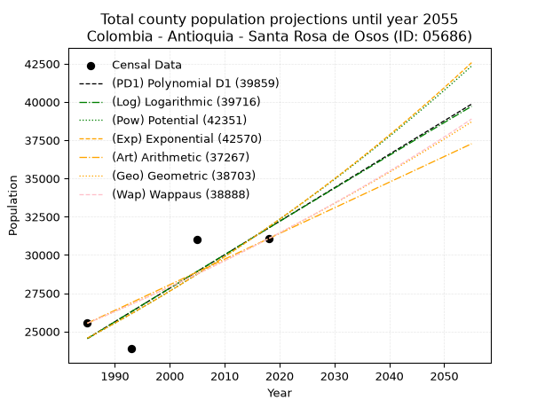
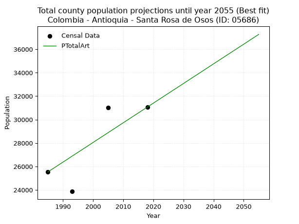
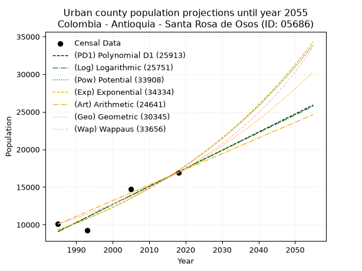
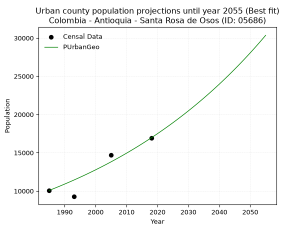
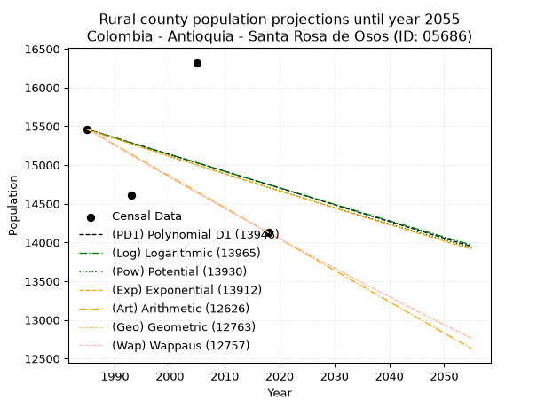
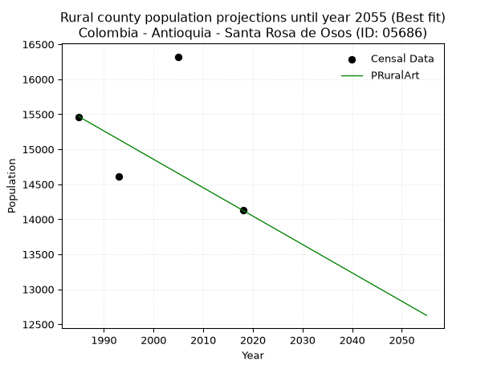

<div align="center">


</div>

# 📜 _“Population and Public Services Demand Projections (PPSD) until Year 2050 for Colombia - Antioquia - Santa Rosa de Osos (ID: 05686)”_
Keywords: `population` `public-service` `projection` `lineal` `polynomial` `logarithmic` `potential` `exponential` `arithmetic` `geometric` `wappaus` `dane` `colombia` `south-america`

PPSD are analytical estimates used by governments and planners to anticipate future changes in population size, age distribution, and the resulting community needs for utilities, healthcare, education, and infrastructure as sizing future water treatment facilities, electrical grids, and road networks based on spatial growth.

<div align="center">

</img>

</div>


> **General running parameters**: • app_version: _v20260806_. • Python version: _3.14.7_. • Pandas version: _3.0.5_. • NumPy version: _2.5.1_. • Creates, save and include plots into reports (create_plot): _False_. • Projection until year: _2050_. • Process polynomial degree 2 and up: _False_. • Process Wappaus: _True_. • Process Wappaus: _True_. • Set negative values to zero: _True_. • Set infinite values to zero: _True_. • Drop dataset notes: _True_. 
<div align="center">

Maps & GIS Layers: [:earth_americas:Google](http://maps.google.com/maps?q=6.643365573,-75.4607229) [:earth_americas:OSM](https://www.openstreetmap.org/#map=18/6.643365573/-75.4607229&layers=P) [:earth_americas:Bing](https://www.bing.com/maps?cp=6.643365573~-75.4607229&lvl=18) [:earth_americas:Apple](https://maps.apple.com/frame?center=6.643365573%2C-75.4607229&span=0.003%2C0.006) [:earth_americas:GISMobile](https://github.com/rcfdtools/R.GISMobile/blob/main/file/gis/CountyLayer_CO/Readme.md)

</div>


<div align="center">

```geojson
{
  "type": "Feature",
  "geometry": {
    "type": "Point", 
    "coordinates": [-75.4607229, 6.643365573]
  }, 
  "properties": {
    "Name": "Colombia - Antioquia - Santa Rosa de Osos (ID: 05686)"
  }
}
```

</div>


## 0. Census Data (4 records)

Census data are official statistics collected by a government about the people and housing in a country. They usually include counts of total population, age, sex, race, income, education, and jobs.

📅Global census file: [Population.xlsx](../data/Population.xlsx)

| Source   |   Year |   CountryID | CountryName   |   StateID | StateName   |   CountyID | CountyName         |   PTotal |   PUrban |   PRural |
|:---------|-------:|------------:|:--------------|----------:|:------------|-----------:|:-------------------|---------:|---------:|---------:|
| DANE     |   1985 |          57 | Colombia      |        05 | Antioquia   |      05686 | Santa Rosa de Osos |    25537 |    10073 |    15464 |
| DANE     |   1993 |          57 | Colombia      |        05 | Antioquia   |      05686 | Santa Rosa de Osos |    23869 |     9261 |    14608 |
| DANE     |   2005 |          57 | Colombia      |        05 | Antioquia   |      05686 | Santa Rosa de Osos |    31025 |    14703 |    16322 |
| DANE     |   2018 |          57 | Colombia      |        05 | Antioquia   |      05686 | Santa Rosa de Osos |    31067 |    16941 |    14126 |

> 🔥Some records could had specific notes about the registered values or the corresponding urban or rural distribution.

📅[SUI-RUPS](https://www.datos.gov.co/Hacienda-y-Cr-dito-P-blico/Registro-nico-de-Prestadores-de-Servicios-P-blicos/4qkq-csdn/about_data) - Local public utility companies: [RUPS.csv](../data/RUPS.csv)

 | SERVICIO       | ESTADO    | NOMBRE                                                                              | NIT         | DEPARTAMENTO_DOMICILIO   | MUNICIPIO_DOMICILIO   | DIRECCION                |   TELEFONO | EMAIL                    | TIPO_PRESTADOR                             | CLASIFICACION                  |
|:---------------|:----------|:------------------------------------------------------------------------------------|:------------|:-------------------------|:----------------------|:-------------------------|-----------:|:-------------------------|:-------------------------------------------|:-------------------------------|
| ACUEDUCTO      | OPERATIVA | ACUEDUCTOS Y ALCANTARILLADOS SOSTENIBLES A.A.S. S.A.  E.S.P.                        | 811008426-2 | ANTIOQUIA                | MEDELLIN              | Calle 33A No  78A  -  56 |    4161177 | estadistica@aassa.com.co | SOCIEDADES (EMPRESA DE SERVICIOS PUBLICOS) | DESDE 2501 HASTA 5000 USUARIOS |
| ALCANTARILLADO | OPERATIVA | ACUEDUCTOS Y ALCANTARILLADOS SOSTENIBLES A.A.S. S.A.  E.S.P.                        | 811008426-2 | ANTIOQUIA                | MEDELLIN              | Calle 33A No  78A  -  56 |    4161177 | estadistica@aassa.com.co | SOCIEDADES (EMPRESA DE SERVICIOS PUBLICOS) | DESDE 2501 HASTA 5000 USUARIOS |
| ACUEDUCTO      | OPERATIVA | ASOCIACION DE USUARIOS DEL ACUEDUCTO SAN ISIDRO DEL MUNICIPIO DE SANTA ROSA DE OSOS | 900071694-1 | ANTIOQUIA                | SANTA ROSA DE OSOS    | vereda san isidro        |    8602087 | biame_74@hotmail.com     | ORGANIZACION AUTORIZADA                    | HASTA 2500 SUSCRIPTORES        |
| ACUEDUCTO      | OPERATIVA | ASOCIACION DE USUARIOS DEL ACUEDUCTO MULTIVEREDAL AMORSSAN SANTA ROSA DE OSOS       | 811030281-3 | ANTIOQUIA                | SANTA ROSA DE OSOS    | VEREDA SANTA ANA         |    2329672 | amorssan@hotmail.es      | ORGANIZACION AUTORIZADA                    | MENOR O IGUAL A 2500 USUARIOS  |

## 1. Total

### 1.1. Coefficients and Parameters

* (PD1) Polynomial Deg 1: 218.8976314733033, -409975.487354475 (lineal)
* (Log) Logarithmic: 438200.7055318844, -3302892.574267928
* (Pow) Potential: 15.730393105956288, -47.48496678902968
* (Exp) Exponential: 0.007858203038245715, 0.004129069322045131
* (Art) Arithmetic: Year diff. 2018 - 1985 = 33, Population diff. 31067 - 25537 = 5530, Annual growth = 167.57575757575756
* (Geo) Geometric: Year diff. 2018 - 1985 = 33, Population diff. 31067 - 25537 = 5530, Annual growth % = 0.005957609160333721
* (Wap) Wappaus: i = 0.5920986417064433, Condition values only valid for < 200)

<sub>
Wappaus condition values: ['0.00', '0.59', '1.18', '1.78', '2.37', '2.96', '3.55', '4.14', '4.74', '5.33', '5.92', '6.51', '7.11', '7.70', '8.29', '8.88', '9.47', '10.07', '10.66', '11.25', '11.84', '12.43', '13.03', '13.62', '14.21', '14.80', '15.39', '15.99', '16.58', '17.17', '17.76', '18.36', '18.95', '19.54', '20.13', '20.72', '21.32', '21.91', '22.50', '23.09', '23.68', '24.28', '24.87', '25.46', '26.05', '26.64', '27.24', '27.83', '28.42', '29.01', '29.60', '30.20', '30.79', '31.38', '31.97', '32.57', '33.16', '33.75', '34.34', '34.93', '35.53', '36.12', '36.71', '37.30', '37.89', '38.49']
</sub>


### 1.2. Projected Dataset

|   Year |   CountyID |   PTotalPD1 |   PTotalLog |   PTotalPow |   PTotalExp |   PTotalArt |   PTotalGeo |   PTotalWap |
|-------:|-----------:|------------:|------------:|------------:|------------:|------------:|------------:|------------:|
|   1985 |      05686 |       24536 |       24529 |       24553 |       24559 |       25537 |       25537 |       25537 |
|   1986 |      05686 |       24755 |       24750 |       24748 |       24753 |       25705 |       25689 |       25689 |
|   1987 |      05686 |       24974 |       24971 |       24945 |       24948 |       25872 |       25842 |       25841 |
|   1988 |      05686 |       25193 |       25191 |       25143 |       25145 |       26040 |       25996 |       25995 |
|   1989 |      05686 |       25412 |       25411 |       25343 |       25343 |       26207 |       26151 |       26149 |
|   1990 |      05686 |       25631 |       25632 |       25544 |       25543 |       26375 |       26307 |       26304 |
|   1991 |      05686 |       25850 |       25852 |       25747 |       25745 |       26542 |       26464 |       26461 |
|   1992 |      05686 |       26069 |       26072 |       25951 |       25948 |       26710 |       26621 |       26618 |
|   1993 |      05686 |       26287 |       26292 |       26157 |       26152 |       26878 |       26780 |       26776 |
|   1994 |      05686 |       26506 |       26512 |       26364 |       26359 |       27045 |       26939 |       26935 |
|   1995 |      05686 |       26725 |       26731 |       26572 |       26567 |       27213 |       27100 |       27095 |
|   1996 |      05686 |       26944 |       26951 |       26783 |       26776 |       27380 |       27261 |       27256 |
|   1997 |      05686 |       27163 |       27170 |       26995 |       26987 |       27548 |       27424 |       27418 |
|   1998 |      05686 |       27382 |       27390 |       27208 |       27200 |       27715 |       27587 |       27581 |
|   1999 |      05686 |       27601 |       27609 |       27423 |       27415 |       27883 |       27751 |       27745 |
|   2000 |      05686 |       27820 |       27828 |       27640 |       27631 |       28051 |       27917 |       27910 |
|   2001 |      05686 |       28039 |       28047 |       27858 |       27849 |       28218 |       28083 |       28077 |
|   2002 |      05686 |       28258 |       28266 |       28078 |       28069 |       28386 |       28250 |       28244 |
|   2003 |      05686 |       28476 |       28485 |       28299 |       28290 |       28553 |       28419 |       28412 |
|   2004 |      05686 |       28695 |       28704 |       28522 |       28514 |       28721 |       28588 |       28581 |
|   2005 |      05686 |       28914 |       28922 |       28747 |       28739 |       28889 |       28758 |       28751 |
|   2006 |      05686 |       29133 |       29141 |       28973 |       28965 |       29056 |       28930 |       28923 |
|   2007 |      05686 |       29352 |       29359 |       29201 |       29194 |       29224 |       29102 |       29095 |
|   2008 |      05686 |       29571 |       29578 |       29431 |       29424 |       29391 |       29275 |       29269 |
|   2009 |      05686 |       29790 |       29796 |       29662 |       29656 |       29559 |       29450 |       29443 |
|   2010 |      05686 |       30009 |       30014 |       29895 |       29890 |       29726 |       29625 |       29619 |
|   2011 |      05686 |       30228 |       30232 |       30130 |       30126 |       29894 |       29802 |       29796 |
|   2012 |      05686 |       30447 |       30450 |       30367 |       30364 |       30062 |       29979 |       29974 |
|   2013 |      05686 |       30665 |       30667 |       30605 |       30603 |       30229 |       30158 |       30153 |
|   2014 |      05686 |       30884 |       30885 |       30845 |       30845 |       30397 |       30338 |       30334 |
|   2015 |      05686 |       31103 |       31102 |       31087 |       31088 |       30564 |       30518 |       30515 |
|   2016 |      05686 |       31322 |       31320 |       31331 |       31333 |       30732 |       30700 |       30698 |
|   2017 |      05686 |       31541 |       31537 |       31576 |       31580 |       30899 |       30883 |       30882 |
|   2018 |      05686 |       31760 |       31754 |       31823 |       31830 |       31067 |       31067 |       31067 |
|   2019 |      05686 |       31979 |       31972 |       32072 |       32081 |       31235 |       31252 |       31253 |
|   2020 |      05686 |       32198 |       32188 |       32323 |       32334 |       31402 |       31438 |       31441 |
|   2021 |      05686 |       32417 |       32405 |       32575 |       32589 |       31570 |       31626 |       31630 |
|   2022 |      05686 |       32636 |       32622 |       32830 |       32846 |       31737 |       31814 |       31820 |
|   2023 |      05686 |       32854 |       32839 |       33086 |       33105 |       31905 |       32004 |       32011 |
|   2024 |      05686 |       33073 |       33055 |       33344 |       33366 |       32072 |       32194 |       32204 |
|   2025 |      05686 |       33292 |       33272 |       33605 |       33629 |       32240 |       32386 |       32398 |
|   2026 |      05686 |       33511 |       33488 |       33867 |       33895 |       32408 |       32579 |       32593 |
|   2027 |      05686 |       33730 |       33704 |       34130 |       34162 |       32575 |       32773 |       32789 |
|   2028 |      05686 |       33949 |       33921 |       34396 |       34432 |       32743 |       32968 |       32987 |
|   2029 |      05686 |       34168 |       34137 |       34664 |       34703 |       32910 |       33165 |       33186 |
|   2030 |      05686 |       34387 |       34352 |       34934 |       34977 |       33078 |       33362 |       33387 |
|   2031 |      05686 |       34606 |       34568 |       35206 |       35253 |       33245 |       33561 |       33589 |
|   2032 |      05686 |       34824 |       34784 |       35479 |       35531 |       33413 |       33761 |       33792 |
|   2033 |      05686 |       35043 |       35000 |       35755 |       35811 |       33581 |       33962 |       33997 |
|   2034 |      05686 |       35262 |       35215 |       36032 |       36094 |       33748 |       34164 |       34203 |
|   2035 |      05686 |       35481 |       35430 |       36312 |       36379 |       33916 |       34368 |       34411 |
|   2036 |      05686 |       35700 |       35646 |       36594 |       36666 |       34083 |       34573 |       34620 |
|   2037 |      05686 |       35919 |       35861 |       36878 |       36955 |       34251 |       34779 |       34830 |
|   2038 |      05686 |       36138 |       36076 |       37163 |       37247 |       34419 |       34986 |       35042 |
|   2039 |      05686 |       36357 |       36291 |       37451 |       37540 |       34586 |       35194 |       35256 |
|   2040 |      05686 |       36576 |       36506 |       37741 |       37837 |       34754 |       35404 |       35471 |
|   2041 |      05686 |       36795 |       36721 |       38033 |       38135 |       34921 |       35615 |       35687 |
|   2042 |      05686 |       37013 |       36935 |       38328 |       38436 |       35089 |       35827 |       35905 |
|   2043 |      05686 |       37232 |       37150 |       38624 |       38739 |       35256 |       36041 |       36125 |
|   2044 |      05686 |       37451 |       37364 |       38922 |       39045 |       35424 |       36255 |       36346 |
|   2045 |      05686 |       37670 |       37578 |       39223 |       39353 |       35592 |       36471 |       36569 |
|   2046 |      05686 |       37889 |       37793 |       39526 |       39663 |       35759 |       36689 |       36793 |
|   2047 |      05686 |       38108 |       38007 |       39831 |       39976 |       35927 |       36907 |       37019 |
|   2048 |      05686 |       38327 |       38221 |       40138 |       40292 |       36094 |       37127 |       37247 |
|   2049 |      05686 |       38546 |       38435 |       40447 |       40609 |       36262 |       37348 |       37476 |
|   2050 |      05686 |       38765 |       38649 |       40759 |       40930 |       36429 |       37571 |       37707 |
<div align="center">

</img>

</div>


### 1.3. Best fit with absolute and relative error (%)

Relative error puts that difference into context by dividing the absolute error by the true value, creating a unitless ratio or percentage that shows the scale of the mistake.

Absolute and relative error

|   Year | Source   |   CountryID | CountryName   |   StateID | StateName   |   CountyID_x | CountyName         |   PTotal |   PUrban |   PRural |   CountyID_y |   PTotalPD1 |   PTotalLog |   PTotalPow |   PTotalExp |   PTotalArt |   PTotalGeo |   PTotalWap |   PTotalPD1AbsError |   PTotalLogAbsError |   PTotalPowAbsError |   PTotalExpAbsError |   PTotalArtAbsError |   PTotalGeoAbsError |   PTotalWapAbsError |   PTotalPD1RelError |   PTotalLogRelError |   PTotalPowRelError |   PTotalExpRelError |   PTotalArtRelError |   PTotalGeoRelError |   PTotalWapRelError |
|-------:|:---------|------------:|:--------------|----------:|:------------|-------------:|:-------------------|---------:|---------:|---------:|-------------:|------------:|------------:|------------:|------------:|------------:|------------:|------------:|--------------------:|--------------------:|--------------------:|--------------------:|--------------------:|--------------------:|--------------------:|--------------------:|--------------------:|--------------------:|--------------------:|--------------------:|--------------------:|--------------------:|
|   1985 | DANE     |          57 | Colombia      |        05 | Antioquia   |        05686 | Santa Rosa de Osos |    25537 |    10073 |    15464 |        05686 |       24536 |       24529 |       24553 |       24559 |       25537 |       25537 |       25537 |                1001 |                1008 |                 984 |                 978 |                   0 |                   0 |                   0 |             3.9198  |             3.94721 |             3.85323 |             3.82974 |             0       |             0       |             0       |
|   1993 | DANE     |          57 | Colombia      |        05 | Antioquia   |        05686 | Santa Rosa de Osos |    23869 |     9261 |    14608 |        05686 |       26287 |       26292 |       26157 |       26152 |       26878 |       26780 |       26776 |                2418 |                2423 |                2288 |                2283 |                3009 |                2911 |                2907 |            10.1303  |            10.1512  |             9.58566 |             9.56471 |            12.6063  |            12.1957  |            12.179   |
|   2005 | DANE     |          57 | Colombia      |        05 | Antioquia   |        05686 | Santa Rosa de Osos |    31025 |    14703 |    16322 |        05686 |       28914 |       28922 |       28747 |       28739 |       28889 |       28758 |       28751 |                2111 |                2103 |                2278 |                2286 |                2136 |                2267 |                2274 |             6.80419 |             6.7784  |             7.34247 |             7.36825 |             6.88477 |             7.30701 |             7.32957 |
|   2018 | DANE     |          57 | Colombia      |        05 | Antioquia   |        05686 | Santa Rosa de Osos |    31067 |    16941 |    14126 |        05686 |       31760 |       31754 |       31823 |       31830 |       31067 |       31067 |       31067 |                 693 |                 687 |                 756 |                 763 |                   0 |                   0 |                   0 |             2.23066 |             2.21135 |             2.43345 |             2.45598 |             0       |             0       |             0       |

Relative error mean

| Method    |   RelError | Best   |
|:----------|-----------:|:-------|
| PTotalPD1 |    5.77124 |        |
| PTotalLog |    5.77205 |        |
| PTotalPow |    5.8037  |        |
| PTotalExp |    5.80467 |        |
| PTotalArt |    4.87277 | True   |
| PTotalGeo |    4.87569 |        |
| PTotalWap |    4.87714 |        |

💙Best method: _**PTotalArt**_
<div align="center">

</img>

</div>


### 1.4. Fresh water supply demand in liters per capita per day (lpcd)

The fresh water supply demand typically ranges from 100 to 300 liters per capita per day (lpcd) for standard domestic and municipal planning, though absolute survival minimums set by the World Health Organization are as low as 7.5 to 20 liters per day, and total consumption in high-income nations can exceed 400 liters.

> `CZ`: Level in meters above the sea level (masl)<br> `WS`: Fresh water supply demand in liters per capita per day (lpcd or l/h/d)<br> `WSAll`: Zonal fresh water supply demand in liters per second (l/s)<br> `A`: Zonal area in square meters<br> `DP`: Population density (people/hectare or p/ha)

Reference values (RAS Colombia)

|    CZ |   WS |
|------:|-----:|
|  1000 |  120 |
|  2000 |  130 |
| 99999 |  140 |

County shapefile geometry properties and water supply values

|   CountyID |      ATotal |   CZTotal |   WSTotal |
|-----------:|------------:|----------:|----------:|
|      05686 | 8.64499e+08 |   2441.21 |       140 |

Projected values for best method: PTotalArt

|   CountyID |   Year |   PTotalArt |   DPTotal |   WSTotal |   WSTotalAll |
|-----------:|-------:|------------:|----------:|----------:|-------------:|
|      05686 |   1985 |       25537 |      0.3  |       140 |      41.3794 |
|      05686 |   1986 |       25705 |      0.3  |       140 |      41.6516 |
|      05686 |   1987 |       25872 |      0.3  |       140 |      41.9222 |
|      05686 |   1988 |       26040 |      0.3  |       140 |      42.1944 |
|      05686 |   1989 |       26207 |      0.3  |       140 |      42.465  |
|      05686 |   1990 |       26375 |      0.31 |       140 |      42.7373 |
|      05686 |   1991 |       26542 |      0.31 |       140 |      43.0079 |
|      05686 |   1992 |       26710 |      0.31 |       140 |      43.2801 |
|      05686 |   1993 |       26878 |      0.31 |       140 |      43.5523 |
|      05686 |   1994 |       27045 |      0.31 |       140 |      43.8229 |
|      05686 |   1995 |       27213 |      0.31 |       140 |      44.0951 |
|      05686 |   1996 |       27380 |      0.32 |       140 |      44.3657 |
|      05686 |   1997 |       27548 |      0.32 |       140 |      44.638  |
|      05686 |   1998 |       27715 |      0.32 |       140 |      44.9086 |
|      05686 |   1999 |       27883 |      0.32 |       140 |      45.1808 |
|      05686 |   2000 |       28051 |      0.32 |       140 |      45.453  |
|      05686 |   2001 |       28218 |      0.33 |       140 |      45.7236 |
|      05686 |   2002 |       28386 |      0.33 |       140 |      45.9958 |
|      05686 |   2003 |       28553 |      0.33 |       140 |      46.2664 |
|      05686 |   2004 |       28721 |      0.33 |       140 |      46.5387 |
|      05686 |   2005 |       28889 |      0.33 |       140 |      46.8109 |
|      05686 |   2006 |       29056 |      0.34 |       140 |      47.0815 |
|      05686 |   2007 |       29224 |      0.34 |       140 |      47.3537 |
|      05686 |   2008 |       29391 |      0.34 |       140 |      47.6243 |
|      05686 |   2009 |       29559 |      0.34 |       140 |      47.8965 |
|      05686 |   2010 |       29726 |      0.34 |       140 |      48.1671 |
|      05686 |   2011 |       29894 |      0.35 |       140 |      48.4394 |
|      05686 |   2012 |       30062 |      0.35 |       140 |      48.7116 |
|      05686 |   2013 |       30229 |      0.35 |       140 |      48.9822 |
|      05686 |   2014 |       30397 |      0.35 |       140 |      49.2544 |
|      05686 |   2015 |       30564 |      0.35 |       140 |      49.525  |
|      05686 |   2016 |       30732 |      0.36 |       140 |      49.7972 |
|      05686 |   2017 |       30899 |      0.36 |       140 |      50.0678 |
|      05686 |   2018 |       31067 |      0.36 |       140 |      50.34   |
|      05686 |   2019 |       31235 |      0.36 |       140 |      50.6123 |
|      05686 |   2020 |       31402 |      0.36 |       140 |      50.8829 |
|      05686 |   2021 |       31570 |      0.37 |       140 |      51.1551 |
|      05686 |   2022 |       31737 |      0.37 |       140 |      51.4257 |
|      05686 |   2023 |       31905 |      0.37 |       140 |      51.6979 |
|      05686 |   2024 |       32072 |      0.37 |       140 |      51.9685 |
|      05686 |   2025 |       32240 |      0.37 |       140 |      52.2407 |
|      05686 |   2026 |       32408 |      0.37 |       140 |      52.513  |
|      05686 |   2027 |       32575 |      0.38 |       140 |      52.7836 |
|      05686 |   2028 |       32743 |      0.38 |       140 |      53.0558 |
|      05686 |   2029 |       32910 |      0.38 |       140 |      53.3264 |
|      05686 |   2030 |       33078 |      0.38 |       140 |      53.5986 |
|      05686 |   2031 |       33245 |      0.38 |       140 |      53.8692 |
|      05686 |   2032 |       33413 |      0.39 |       140 |      54.1414 |
|      05686 |   2033 |       33581 |      0.39 |       140 |      54.4137 |
|      05686 |   2034 |       33748 |      0.39 |       140 |      54.6843 |
|      05686 |   2035 |       33916 |      0.39 |       140 |      54.9565 |
|      05686 |   2036 |       34083 |      0.39 |       140 |      55.2271 |
|      05686 |   2037 |       34251 |      0.4  |       140 |      55.4993 |
|      05686 |   2038 |       34419 |      0.4  |       140 |      55.7715 |
|      05686 |   2039 |       34586 |      0.4  |       140 |      56.0421 |
|      05686 |   2040 |       34754 |      0.4  |       140 |      56.3144 |
|      05686 |   2041 |       34921 |      0.4  |       140 |      56.585  |
|      05686 |   2042 |       35089 |      0.41 |       140 |      56.8572 |
|      05686 |   2043 |       35256 |      0.41 |       140 |      57.1278 |
|      05686 |   2044 |       35424 |      0.41 |       140 |      57.4    |
|      05686 |   2045 |       35592 |      0.41 |       140 |      57.6722 |
|      05686 |   2046 |       35759 |      0.41 |       140 |      57.9428 |
|      05686 |   2047 |       35927 |      0.42 |       140 |      58.215  |
|      05686 |   2048 |       36094 |      0.42 |       140 |      58.4856 |
|      05686 |   2049 |       36262 |      0.42 |       140 |      58.7579 |
|      05686 |   2050 |       36429 |      0.42 |       140 |      59.0285 |

## 2. Urban

### 2.1. Coefficients and Parameters

* (PD1) Polynomial Deg 1: 240.5242874347635, -468364.20594138565 (lineal)
* (Log) Logarithmic: 481328.39153035963, -3645836.4611459235
* (Pow) Potential: 37.385697671386176, -119.32148280907764
* (Exp) Exponential: 0.018680997360795235, 7.301364425191716e-13
* (Art) Arithmetic: Year diff. 2018 - 1985 = 33, Population diff. 16941 - 10073 = 6868, Annual growth = 208.12121212121212
* (Geo) Geometric: Year diff. 2018 - 1985 = 33, Population diff. 16941 - 10073 = 6868, Annual growth % = 0.015878629739791927
* (Wap) Wappaus: i = 1.5408396544103955, Condition values only valid for < 200)

<sub>
Wappaus condition values: ['0.00', '1.54', '3.08', '4.62', '6.16', '7.70', '9.25', '10.79', '12.33', '13.87', '15.41', '16.95', '18.49', '20.03', '21.57', '23.11', '24.65', '26.19', '27.74', '29.28', '30.82', '32.36', '33.90', '35.44', '36.98', '38.52', '40.06', '41.60', '43.14', '44.68', '46.23', '47.77', '49.31', '50.85', '52.39', '53.93', '55.47', '57.01', '58.55', '60.09', '61.63', '63.17', '64.72', '66.26', '67.80', '69.34', '70.88', '72.42', '73.96', '75.50', '77.04', '78.58', '80.12', '81.66', '83.21', '84.75', '86.29', '87.83', '89.37', '90.91', '92.45', '93.99', '95.53', '97.07', '98.61', '100.15']
</sub>


### 2.2. Projected Dataset

|   Year |   CountyID |   PUrbanPD1 |   PUrbanLog |   PUrbanPow |   PUrbanExp |   PUrbanArt |   PUrbanGeo |   PUrbanWap |
|-------:|-----------:|------------:|------------:|------------:|------------:|------------:|------------:|------------:|
|   1985 |      05686 |        9077 |        9070 |        9281 |        9286 |       10073 |       10073 |       10073 |
|   1986 |      05686 |        9317 |        9313 |        9457 |        9461 |       10281 |       10233 |       10229 |
|   1987 |      05686 |        9558 |        9555 |        9637 |        9639 |       10489 |       10395 |       10388 |
|   1988 |      05686 |        9798 |        9797 |        9820 |        9821 |       10697 |       10560 |       10550 |
|   1989 |      05686 |       10039 |       10039 |       10006 |       10006 |       10905 |       10728 |       10714 |
|   1990 |      05686 |       10279 |       10281 |       10196 |       10195 |       11114 |       10899 |       10880 |
|   1991 |      05686 |       10520 |       10523 |       10390 |       10387 |       11322 |       11072 |       11049 |
|   1992 |      05686 |       10760 |       10765 |       10586 |       10583 |       11530 |       11247 |       11221 |
|   1993 |      05686 |       11001 |       11006 |       10787 |       10783 |       11738 |       11426 |       11396 |
|   1994 |      05686 |       11241 |       11248 |       10991 |       10986 |       11946 |       11607 |       11574 |
|   1995 |      05686 |       11482 |       11489 |       11199 |       11193 |       12154 |       11792 |       11755 |
|   1996 |      05686 |       11722 |       11730 |       11411 |       11404 |       12362 |       11979 |       11938 |
|   1997 |      05686 |       11963 |       11971 |       11627 |       11619 |       12570 |       12169 |       12125 |
|   1998 |      05686 |       12203 |       12212 |       11846 |       11838 |       12779 |       12362 |       12315 |
|   1999 |      05686 |       12444 |       12453 |       12070 |       12061 |       12987 |       12559 |       12509 |
|   2000 |      05686 |       12684 |       12694 |       12298 |       12289 |       13195 |       12758 |       12705 |
|   2001 |      05686 |       12925 |       12934 |       12530 |       12521 |       13403 |       12961 |       12905 |
|   2002 |      05686 |       13165 |       13175 |       12766 |       12757 |       13611 |       13166 |       13109 |
|   2003 |      05686 |       13406 |       13415 |       13007 |       12997 |       13819 |       13376 |       13317 |
|   2004 |      05686 |       13646 |       13655 |       13252 |       13242 |       14027 |       13588 |       13528 |
|   2005 |      05686 |       13887 |       13896 |       13501 |       13492 |       14235 |       13804 |       13743 |
|   2006 |      05686 |       14128 |       14136 |       13755 |       13746 |       14444 |       14023 |       13961 |
|   2007 |      05686 |       14368 |       14375 |       14014 |       14006 |       14652 |       14246 |       14184 |
|   2008 |      05686 |       14609 |       14615 |       14277 |       14270 |       14860 |       14472 |       14412 |
|   2009 |      05686 |       14849 |       14855 |       14545 |       14539 |       15068 |       14702 |       14643 |
|   2010 |      05686 |       15090 |       15094 |       14819 |       14813 |       15276 |       14935 |       14879 |
|   2011 |      05686 |       15330 |       15334 |       15097 |       15092 |       15484 |       15172 |       15119 |
|   2012 |      05686 |       15571 |       15573 |       15380 |       15377 |       15692 |       15413 |       15364 |
|   2013 |      05686 |       15811 |       15812 |       15668 |       15667 |       15900 |       15658 |       15614 |
|   2014 |      05686 |       16052 |       16051 |       15962 |       15962 |       16109 |       15906 |       15869 |
|   2015 |      05686 |       16292 |       16290 |       16261 |       16263 |       16317 |       16159 |       16129 |
|   2016 |      05686 |       16533 |       16529 |       16565 |       16570 |       16525 |       16416 |       16394 |
|   2017 |      05686 |       16773 |       16768 |       16875 |       16882 |       16733 |       16676 |       16665 |
|   2018 |      05686 |       17014 |       17006 |       17191 |       17201 |       16941 |       16941 |       16941 |
|   2019 |      05686 |       17254 |       17245 |       17512 |       17525 |       17149 |       17210 |       17223 |
|   2020 |      05686 |       17495 |       17483 |       17840 |       17856 |       17357 |       17483 |       17511 |
|   2021 |      05686 |       17735 |       17721 |       18173 |       18192 |       17565 |       17761 |       17805 |
|   2022 |      05686 |       17976 |       17959 |       18512 |       18535 |       17773 |       18043 |       18105 |
|   2023 |      05686 |       18216 |       18197 |       18857 |       18885 |       17982 |       18329 |       18412 |
|   2024 |      05686 |       18457 |       18435 |       19209 |       19241 |       18190 |       18620 |       18726 |
|   2025 |      05686 |       18697 |       18673 |       19567 |       19604 |       18398 |       18916 |       19047 |
|   2026 |      05686 |       18938 |       18911 |       19931 |       19973 |       18606 |       19216 |       19375 |
|   2027 |      05686 |       19179 |       19148 |       20303 |       20350 |       18814 |       19522 |       19710 |
|   2028 |      05686 |       19419 |       19386 |       20680 |       20734 |       19022 |       19832 |       20053 |
|   2029 |      05686 |       19660 |       19623 |       21065 |       21125 |       19230 |       20146 |       20404 |
|   2030 |      05686 |       19900 |       19860 |       21457 |       21523 |       19438 |       20466 |       20764 |
|   2031 |      05686 |       20141 |       20097 |       21855 |       21929 |       19647 |       20791 |       21132 |
|   2032 |      05686 |       20381 |       20334 |       22261 |       22342 |       19855 |       21121 |       21509 |
|   2033 |      05686 |       20622 |       20571 |       22675 |       22764 |       20063 |       21457 |       21895 |
|   2034 |      05686 |       20862 |       20808 |       23095 |       23193 |       20271 |       21798 |       22290 |
|   2035 |      05686 |       21103 |       21044 |       23524 |       23630 |       20479 |       22144 |       22696 |
|   2036 |      05686 |       21343 |       21281 |       23960 |       24076 |       20687 |       22495 |       23112 |
|   2037 |      05686 |       21584 |       21517 |       24404 |       24530 |       20895 |       22852 |       23538 |
|   2038 |      05686 |       21824 |       21753 |       24856 |       24992 |       21103 |       23215 |       23976 |
|   2039 |      05686 |       22065 |       21989 |       25316 |       25464 |       21312 |       23584 |       24425 |
|   2040 |      05686 |       22305 |       22225 |       25784 |       25944 |       21520 |       23958 |       24886 |
|   2041 |      05686 |       22546 |       22461 |       26261 |       26433 |       21728 |       24339 |       25360 |
|   2042 |      05686 |       22786 |       22697 |       26746 |       26931 |       21936 |       24725 |       25847 |
|   2043 |      05686 |       23027 |       22933 |       27240 |       27439 |       22144 |       25118 |       26347 |
|   2044 |      05686 |       23267 |       23168 |       27743 |       27957 |       22352 |       25517 |       26861 |
|   2045 |      05686 |       23508 |       23404 |       28255 |       28484 |       22560 |       25922 |       27391 |
|   2046 |      05686 |       23748 |       23639 |       28776 |       29021 |       22768 |       26334 |       27935 |
|   2047 |      05686 |       23989 |       23874 |       29307 |       29568 |       22977 |       26752 |       28496 |
|   2048 |      05686 |       24230 |       24109 |       29847 |       30126 |       23185 |       27177 |       29073 |
|   2049 |      05686 |       24470 |       24344 |       30397 |       30694 |       23393 |       27608 |       29668 |
|   2050 |      05686 |       24711 |       24579 |       30956 |       31273 |       23601 |       28046 |       30281 |
<div align="center">

</img>

</div>


### 2.3. Best fit with absolute and relative error (%)

Relative error puts that difference into context by dividing the absolute error by the true value, creating a unitless ratio or percentage that shows the scale of the mistake.

Absolute and relative error

|   Year | Source   |   CountryID | CountryName   |   StateID | StateName   |   CountyID_x | CountyName         |   PTotal |   PUrban |   PRural |   CountyID_y |   PUrbanPD1 |   PUrbanLog |   PUrbanPow |   PUrbanExp |   PUrbanArt |   PUrbanGeo |   PUrbanWap |   PUrbanPD1AbsError |   PUrbanLogAbsError |   PUrbanPowAbsError |   PUrbanExpAbsError |   PUrbanArtAbsError |   PUrbanGeoAbsError |   PUrbanWapAbsError |   PUrbanPD1RelError |   PUrbanLogRelError |   PUrbanPowRelError |   PUrbanExpRelError |   PUrbanArtRelError |   PUrbanGeoRelError |   PUrbanWapRelError |
|-------:|:---------|------------:|:--------------|----------:|:------------|-------------:|:-------------------|---------:|---------:|---------:|-------------:|------------:|------------:|------------:|------------:|------------:|------------:|------------:|--------------------:|--------------------:|--------------------:|--------------------:|--------------------:|--------------------:|--------------------:|--------------------:|--------------------:|--------------------:|--------------------:|--------------------:|--------------------:|--------------------:|
|   1985 | DANE     |          57 | Colombia      |        05 | Antioquia   |        05686 | Santa Rosa de Osos |    25537 |    10073 |    15464 |        05686 |        9077 |        9070 |        9281 |        9286 |       10073 |       10073 |       10073 |                 996 |                1003 |                 792 |                 787 |                   0 |                   0 |                   0 |            9.88782  |            9.95731  |             7.8626  |             7.81297 |             0       |              0      |             0       |
|   1993 | DANE     |          57 | Colombia      |        05 | Antioquia   |        05686 | Santa Rosa de Osos |    23869 |     9261 |    14608 |        05686 |       11001 |       11006 |       10787 |       10783 |       11738 |       11426 |       11396 |                1740 |                1745 |                1526 |                1522 |                2477 |                2165 |                2135 |           18.7885   |           18.8425   |            16.4777  |            16.4345  |            26.7466  |             23.3776 |            23.0537  |
|   2005 | DANE     |          57 | Colombia      |        05 | Antioquia   |        05686 | Santa Rosa de Osos |    31025 |    14703 |    16322 |        05686 |       13887 |       13896 |       13501 |       13492 |       14235 |       13804 |       13743 |                 816 |                 807 |                1202 |                1211 |                 468 |                 899 |                 960 |            5.54989  |            5.48868  |             8.1752  |             8.23641 |             3.18302 |              6.1144 |             6.52928 |
|   2018 | DANE     |          57 | Colombia      |        05 | Antioquia   |        05686 | Santa Rosa de Osos |    31067 |    16941 |    14126 |        05686 |       17014 |       17006 |       17191 |       17201 |       16941 |       16941 |       16941 |                  73 |                  65 |                 250 |                 260 |                   0 |                   0 |                   0 |            0.430907 |            0.383685 |             1.47571 |             1.53474 |             0       |              0      |             0       |

Relative error mean

| Method    |   RelError | Best   |
|:----------|-----------:|:-------|
| PUrbanPD1 |    8.66427 |        |
| PUrbanLog |    8.66803 |        |
| PUrbanPow |    8.4978  |        |
| PUrbanExp |    8.50466 |        |
| PUrbanArt |    7.4824  |        |
| PUrbanGeo |    7.373   | True   |
| PUrbanWap |    7.39574 |        |

💙Best method: _**PUrbanGeo**_
<div align="center">

</img>

</div>


### 2.4. Fresh water supply demand in liters per capita per day (lpcd)

The fresh water supply demand typically ranges from 100 to 300 liters per capita per day (lpcd) for standard domestic and municipal planning, though absolute survival minimums set by the World Health Organization are as low as 7.5 to 20 liters per day, and total consumption in high-income nations can exceed 400 liters.

> `CZ`: Level in meters above the sea level (masl)<br> `WS`: Fresh water supply demand in liters per capita per day (lpcd or l/h/d)<br> `WSAll`: Zonal fresh water supply demand in liters per second (l/s)<br> `A`: Zonal area in square meters<br> `DP`: Population density (people/hectare or p/ha)

Reference values (RAS Colombia)

|    CZ |   WS |
|------:|-----:|
|  1000 |  120 |
|  2000 |  130 |
| 99999 |  140 |

County shapefile geometry properties and water supply values

|   CountyID |      AUrban |   CZUrban |   WSUrban |
|-----------:|------------:|----------:|----------:|
|      05686 | 5.37239e+06 |   2549.67 |       140 |

Projected values for best method: PUrbanGeo

|   CountyID |   Year |   PUrbanGeo |   DPUrban |   WSUrban |   WSUrbanAll |
|-----------:|-------:|------------:|----------:|----------:|-------------:|
|      05686 |   1985 |       10073 |     18.75 |       140 |      16.322  |
|      05686 |   1986 |       10233 |     19.05 |       140 |      16.5813 |
|      05686 |   1987 |       10395 |     19.35 |       140 |      16.8438 |
|      05686 |   1988 |       10560 |     19.66 |       140 |      17.1111 |
|      05686 |   1989 |       10728 |     19.97 |       140 |      17.3833 |
|      05686 |   1990 |       10899 |     20.29 |       140 |      17.6604 |
|      05686 |   1991 |       11072 |     20.61 |       140 |      17.9407 |
|      05686 |   1992 |       11247 |     20.93 |       140 |      18.2243 |
|      05686 |   1993 |       11426 |     21.27 |       140 |      18.5144 |
|      05686 |   1994 |       11607 |     21.6  |       140 |      18.8076 |
|      05686 |   1995 |       11792 |     21.95 |       140 |      19.1074 |
|      05686 |   1996 |       11979 |     22.3  |       140 |      19.4104 |
|      05686 |   1997 |       12169 |     22.65 |       140 |      19.7183 |
|      05686 |   1998 |       12362 |     23.01 |       140 |      20.031  |
|      05686 |   1999 |       12559 |     23.38 |       140 |      20.3502 |
|      05686 |   2000 |       12758 |     23.75 |       140 |      20.6727 |
|      05686 |   2001 |       12961 |     24.13 |       140 |      21.0016 |
|      05686 |   2002 |       13166 |     24.51 |       140 |      21.3338 |
|      05686 |   2003 |       13376 |     24.9  |       140 |      21.6741 |
|      05686 |   2004 |       13588 |     25.29 |       140 |      22.0176 |
|      05686 |   2005 |       13804 |     25.69 |       140 |      22.3676 |
|      05686 |   2006 |       14023 |     26.1  |       140 |      22.7225 |
|      05686 |   2007 |       14246 |     26.52 |       140 |      23.0838 |
|      05686 |   2008 |       14472 |     26.94 |       140 |      23.45   |
|      05686 |   2009 |       14702 |     27.37 |       140 |      23.8227 |
|      05686 |   2010 |       14935 |     27.8  |       140 |      24.2002 |
|      05686 |   2011 |       15172 |     28.24 |       140 |      24.5843 |
|      05686 |   2012 |       15413 |     28.69 |       140 |      24.9748 |
|      05686 |   2013 |       15658 |     29.15 |       140 |      25.3718 |
|      05686 |   2014 |       15906 |     29.61 |       140 |      25.7736 |
|      05686 |   2015 |       16159 |     30.08 |       140 |      26.1836 |
|      05686 |   2016 |       16416 |     30.56 |       140 |      26.6    |
|      05686 |   2017 |       16676 |     31.04 |       140 |      27.0213 |
|      05686 |   2018 |       16941 |     31.53 |       140 |      27.4507 |
|      05686 |   2019 |       17210 |     32.03 |       140 |      27.8866 |
|      05686 |   2020 |       17483 |     32.54 |       140 |      28.3289 |
|      05686 |   2021 |       17761 |     33.06 |       140 |      28.7794 |
|      05686 |   2022 |       18043 |     33.58 |       140 |      29.2363 |
|      05686 |   2023 |       18329 |     34.12 |       140 |      29.6998 |
|      05686 |   2024 |       18620 |     34.66 |       140 |      30.1713 |
|      05686 |   2025 |       18916 |     35.21 |       140 |      30.6509 |
|      05686 |   2026 |       19216 |     35.77 |       140 |      31.137  |
|      05686 |   2027 |       19522 |     36.34 |       140 |      31.6329 |
|      05686 |   2028 |       19832 |     36.91 |       140 |      32.1352 |
|      05686 |   2029 |       20146 |     37.5  |       140 |      32.644  |
|      05686 |   2030 |       20466 |     38.09 |       140 |      33.1625 |
|      05686 |   2031 |       20791 |     38.7  |       140 |      33.6891 |
|      05686 |   2032 |       21121 |     39.31 |       140 |      34.2238 |
|      05686 |   2033 |       21457 |     39.94 |       140 |      34.7683 |
|      05686 |   2034 |       21798 |     40.57 |       140 |      35.3208 |
|      05686 |   2035 |       22144 |     41.22 |       140 |      35.8815 |
|      05686 |   2036 |       22495 |     41.87 |       140 |      36.4502 |
|      05686 |   2037 |       22852 |     42.54 |       140 |      37.0287 |
|      05686 |   2038 |       23215 |     43.21 |       140 |      37.6169 |
|      05686 |   2039 |       23584 |     43.9  |       140 |      38.2148 |
|      05686 |   2040 |       23958 |     44.59 |       140 |      38.8208 |
|      05686 |   2041 |       24339 |     45.3  |       140 |      39.4382 |
|      05686 |   2042 |       24725 |     46.02 |       140 |      40.0637 |
|      05686 |   2043 |       25118 |     46.75 |       140 |      40.7005 |
|      05686 |   2044 |       25517 |     47.5  |       140 |      41.347  |
|      05686 |   2045 |       25922 |     48.25 |       140 |      42.0032 |
|      05686 |   2046 |       26334 |     49.02 |       140 |      42.6708 |
|      05686 |   2047 |       26752 |     49.8  |       140 |      43.3481 |
|      05686 |   2048 |       27177 |     50.59 |       140 |      44.0368 |
|      05686 |   2049 |       27608 |     51.39 |       140 |      44.7352 |
|      05686 |   2050 |       28046 |     52.2  |       140 |      45.4449 |

## 3. Rural

### 3.1. Coefficients and Parameters

* (PD1) Polynomial Deg 1: -21.626655961460035, 58388.71858691044 (lineal)
* (Log) Logarithmic: -43127.685998475594, 342943.8868779988
* (Pow) Potential: -3.0011613815059563, 14.086237614081021
* (Exp) Exponential: -0.0015045899951992515, 306344.3802671966
* (Art) Arithmetic: Year diff. 2018 - 1985 = 33, Population diff. 14126 - 15464 = -1338, Annual growth = -40.54545454545455
* (Geo) Geometric: Year diff. 2018 - 1985 = 33, Population diff. 14126 - 15464 = -1338, Annual growth % = -0.0027385968473695455
* (Wap) Wappaus: i = -0.27404835786045656, Condition values only valid for < 200)

<sub>
Wappaus condition values: ['-0.00', '-0.27', '-0.55', '-0.82', '-1.10', '-1.37', '-1.64', '-1.92', '-2.19', '-2.47', '-2.74', '-3.01', '-3.29', '-3.56', '-3.84', '-4.11', '-4.38', '-4.66', '-4.93', '-5.21', '-5.48', '-5.76', '-6.03', '-6.30', '-6.58', '-6.85', '-7.13', '-7.40', '-7.67', '-7.95', '-8.22', '-8.50', '-8.77', '-9.04', '-9.32', '-9.59', '-9.87', '-10.14', '-10.41', '-10.69', '-10.96', '-11.24', '-11.51', '-11.78', '-12.06', '-12.33', '-12.61', '-12.88', '-13.15', '-13.43', '-13.70', '-13.98', '-14.25', '-14.52', '-14.80', '-15.07', '-15.35', '-15.62', '-15.89', '-16.17', '-16.44', '-16.72', '-16.99', '-17.27', '-17.54', '-17.81']
</sub>


### 3.2. Projected Dataset

|   Year |   CountyID |   PRuralPD1 |   PRuralLog |   PRuralPow |   PRuralExp |   PRuralArt |   PRuralGeo |   PRuralWap |
|-------:|-----------:|------------:|------------:|------------:|------------:|------------:|------------:|------------:|
|   1985 |      05686 |       15460 |       15459 |       15457 |       15458 |       15464 |       15464 |       15464 |
|   1986 |      05686 |       15438 |       15438 |       15434 |       15434 |       15423 |       15422 |       15422 |
|   1987 |      05686 |       15417 |       15416 |       15410 |       15411 |       15383 |       15379 |       15379 |
|   1988 |      05686 |       15395 |       15394 |       15387 |       15388 |       15342 |       15337 |       15337 |
|   1989 |      05686 |       15373 |       15372 |       15364 |       15365 |       15302 |       15295 |       15295 |
|   1990 |      05686 |       15352 |       15351 |       15341 |       15342 |       15261 |       15253 |       15254 |
|   1991 |      05686 |       15330 |       15329 |       15318 |       15319 |       15221 |       15212 |       15212 |
|   1992 |      05686 |       15308 |       15307 |       15295 |       15296 |       15180 |       15170 |       15170 |
|   1993 |      05686 |       15287 |       15286 |       15272 |       15273 |       15140 |       15128 |       15129 |
|   1994 |      05686 |       15265 |       15264 |       15249 |       15250 |       15099 |       15087 |       15087 |
|   1995 |      05686 |       15244 |       15243 |       15226 |       15227 |       15059 |       15046 |       15046 |
|   1996 |      05686 |       15222 |       15221 |       15203 |       15204 |       15018 |       15004 |       15005 |
|   1997 |      05686 |       15200 |       15199 |       15180 |       15181 |       14977 |       14963 |       14964 |
|   1998 |      05686 |       15179 |       15178 |       15157 |       15158 |       14937 |       14922 |       14923 |
|   1999 |      05686 |       15157 |       15156 |       15134 |       15135 |       14896 |       14882 |       14882 |
|   2000 |      05686 |       15135 |       15135 |       15112 |       15113 |       14856 |       14841 |       14841 |
|   2001 |      05686 |       15114 |       15113 |       15089 |       15090 |       14815 |       14800 |       14800 |
|   2002 |      05686 |       15092 |       15091 |       15066 |       15067 |       14775 |       14760 |       14760 |
|   2003 |      05686 |       15071 |       15070 |       15044 |       15045 |       14734 |       14719 |       14720 |
|   2004 |      05686 |       15049 |       15048 |       15021 |       15022 |       14694 |       14679 |       14679 |
|   2005 |      05686 |       15027 |       15027 |       14999 |       14999 |       14653 |       14639 |       14639 |
|   2006 |      05686 |       15006 |       15005 |       14976 |       14977 |       14613 |       14599 |       14599 |
|   2007 |      05686 |       14984 |       14984 |       14954 |       14954 |       14572 |       14559 |       14559 |
|   2008 |      05686 |       14962 |       14962 |       14932 |       14932 |       14531 |       14519 |       14519 |
|   2009 |      05686 |       14941 |       14941 |       14909 |       14909 |       14491 |       14479 |       14479 |
|   2010 |      05686 |       14919 |       14919 |       14887 |       14887 |       14450 |       14439 |       14440 |
|   2011 |      05686 |       14898 |       14898 |       14865 |       14865 |       14410 |       14400 |       14400 |
|   2012 |      05686 |       14876 |       14877 |       14843 |       14842 |       14369 |       14360 |       14361 |
|   2013 |      05686 |       14854 |       14855 |       14821 |       14820 |       14329 |       14321 |       14321 |
|   2014 |      05686 |       14833 |       14834 |       14799 |       14798 |       14288 |       14282 |       14282 |
|   2015 |      05686 |       14811 |       14812 |       14777 |       14775 |       14248 |       14243 |       14243 |
|   2016 |      05686 |       14789 |       14791 |       14755 |       14753 |       14207 |       14204 |       14204 |
|   2017 |      05686 |       14768 |       14770 |       14733 |       14731 |       14167 |       14165 |       14165 |
|   2018 |      05686 |       14746 |       14748 |       14711 |       14709 |       14126 |       14126 |       14126 |
|   2019 |      05686 |       14725 |       14727 |       14689 |       14687 |       14085 |       14087 |       14087 |
|   2020 |      05686 |       14703 |       14705 |       14667 |       14665 |       14045 |       14049 |       14049 |
|   2021 |      05686 |       14681 |       14684 |       14645 |       14643 |       14004 |       14010 |       14010 |
|   2022 |      05686 |       14660 |       14663 |       14624 |       14621 |       13964 |       13972 |       13972 |
|   2023 |      05686 |       14638 |       14641 |       14602 |       14599 |       13923 |       13934 |       13933 |
|   2024 |      05686 |       14616 |       14620 |       14580 |       14577 |       13883 |       13895 |       13895 |
|   2025 |      05686 |       14595 |       14599 |       14559 |       14555 |       13842 |       13857 |       13857 |
|   2026 |      05686 |       14573 |       14578 |       14537 |       14533 |       13802 |       13819 |       13819 |
|   2027 |      05686 |       14551 |       14556 |       14516 |       14511 |       13761 |       13782 |       13781 |
|   2028 |      05686 |       14530 |       14535 |       14494 |       14489 |       13721 |       13744 |       13743 |
|   2029 |      05686 |       14508 |       14514 |       14473 |       14467 |       13680 |       13706 |       13705 |
|   2030 |      05686 |       14487 |       14492 |       14451 |       14446 |       13639 |       13669 |       13668 |
|   2031 |      05686 |       14465 |       14471 |       14430 |       14424 |       13599 |       13631 |       13630 |
|   2032 |      05686 |       14443 |       14450 |       14409 |       14402 |       13558 |       13594 |       13593 |
|   2033 |      05686 |       14422 |       14429 |       14387 |       14381 |       13518 |       13557 |       13555 |
|   2034 |      05686 |       14400 |       14408 |       14366 |       14359 |       13477 |       13520 |       13518 |
|   2035 |      05686 |       14378 |       14386 |       14345 |       14337 |       13437 |       13483 |       13481 |
|   2036 |      05686 |       14357 |       14365 |       14324 |       14316 |       13396 |       13446 |       13444 |
|   2037 |      05686 |       14335 |       14344 |       14303 |       14294 |       13356 |       13409 |       13407 |
|   2038 |      05686 |       14314 |       14323 |       14282 |       14273 |       13315 |       13372 |       13370 |
|   2039 |      05686 |       14292 |       14302 |       14261 |       14251 |       13275 |       13335 |       13333 |
|   2040 |      05686 |       14270 |       14281 |       14240 |       14230 |       13234 |       13299 |       13297 |
|   2041 |      05686 |       14249 |       14259 |       14219 |       14209 |       13193 |       13263 |       13260 |
|   2042 |      05686 |       14227 |       14238 |       14198 |       14187 |       13153 |       13226 |       13223 |
|   2043 |      05686 |       14205 |       14217 |       14177 |       14166 |       13112 |       13190 |       13187 |
|   2044 |      05686 |       14184 |       14196 |       14156 |       14145 |       13072 |       13154 |       13151 |
|   2045 |      05686 |       14162 |       14175 |       14136 |       14123 |       13031 |       13118 |       13114 |
|   2046 |      05686 |       14141 |       14154 |       14115 |       14102 |       12991 |       13082 |       13078 |
|   2047 |      05686 |       14119 |       14133 |       14094 |       14081 |       12950 |       13046 |       13042 |
|   2048 |      05686 |       14097 |       14112 |       14073 |       14060 |       12910 |       13010 |       13006 |
|   2049 |      05686 |       14076 |       14091 |       14053 |       14039 |       12869 |       12975 |       12970 |
|   2050 |      05686 |       14054 |       14070 |       14032 |       14017 |       12829 |       12939 |       12935 |
<div align="center">

</img>

</div>


### 3.3. Best fit with absolute and relative error (%)

Relative error puts that difference into context by dividing the absolute error by the true value, creating a unitless ratio or percentage that shows the scale of the mistake.

Absolute and relative error

|   Year | Source   |   CountryID | CountryName   |   StateID | StateName   |   CountyID_x | CountyName         |   PTotal |   PUrban |   PRural |   CountyID_y |   PRuralPD1 |   PRuralLog |   PRuralPow |   PRuralExp |   PRuralArt |   PRuralGeo |   PRuralWap |   PRuralPD1AbsError |   PRuralLogAbsError |   PRuralPowAbsError |   PRuralExpAbsError |   PRuralArtAbsError |   PRuralGeoAbsError |   PRuralWapAbsError |   PRuralPD1RelError |   PRuralLogRelError |   PRuralPowRelError |   PRuralExpRelError |   PRuralArtRelError |   PRuralGeoRelError |   PRuralWapRelError |
|-------:|:---------|------------:|:--------------|----------:|:------------|-------------:|:-------------------|---------:|---------:|---------:|-------------:|------------:|------------:|------------:|------------:|------------:|------------:|------------:|--------------------:|--------------------:|--------------------:|--------------------:|--------------------:|--------------------:|--------------------:|--------------------:|--------------------:|--------------------:|--------------------:|--------------------:|--------------------:|--------------------:|
|   1985 | DANE     |          57 | Colombia      |        05 | Antioquia   |        05686 | Santa Rosa de Osos |    25537 |    10073 |    15464 |        05686 |       15460 |       15459 |       15457 |       15458 |       15464 |       15464 |       15464 |                   4 |                   5 |                   7 |                   6 |                   0 |                   0 |                   0 |           0.0258665 |           0.0323332 |           0.0452664 |           0.0387998 |             0       |             0       |             0       |
|   1993 | DANE     |          57 | Colombia      |        05 | Antioquia   |        05686 | Santa Rosa de Osos |    23869 |     9261 |    14608 |        05686 |       15287 |       15286 |       15272 |       15273 |       15140 |       15128 |       15129 |                 679 |                 678 |                 664 |                 665 |                 532 |                 520 |                 521 |           4.64814   |           4.64129   |           4.54545   |           4.5523    |             3.64184 |             3.55969 |             3.56654 |
|   2005 | DANE     |          57 | Colombia      |        05 | Antioquia   |        05686 | Santa Rosa de Osos |    31025 |    14703 |    16322 |        05686 |       15027 |       15027 |       14999 |       14999 |       14653 |       14639 |       14639 |                1295 |                1295 |                1323 |                1323 |                1669 |                1683 |                1683 |           7.93408   |           7.93408   |           8.10562   |           8.10562   |            10.2255  |            10.3112  |            10.3112  |
|   2018 | DANE     |          57 | Colombia      |        05 | Antioquia   |        05686 | Santa Rosa de Osos |    31067 |    16941 |    14126 |        05686 |       14746 |       14748 |       14711 |       14709 |       14126 |       14126 |       14126 |                 620 |                 622 |                 585 |                 583 |                   0 |                   0 |                   0 |           4.38907   |           4.40323   |           4.1413    |           4.12714   |             0       |             0       |             0       |

Relative error mean

| Method    |   RelError | Best   |
|:----------|-----------:|:-------|
| PRuralPD1 |    4.24929 |        |
| PRuralLog |    4.25273 |        |
| PRuralPow |    4.20941 |        |
| PRuralExp |    4.20597 |        |
| PRuralArt |    3.46683 | True   |
| PRuralGeo |    3.46773 |        |
| PRuralWap |    3.46944 |        |

💙Best method: _**PRuralArt**_
<div align="center">

</img>

</div>


### 3.4. Fresh water supply demand in liters per capita per day (lpcd)

The fresh water supply demand typically ranges from 100 to 300 liters per capita per day (lpcd) for standard domestic and municipal planning, though absolute survival minimums set by the World Health Organization are as low as 7.5 to 20 liters per day, and total consumption in high-income nations can exceed 400 liters.

> `CZ`: Level in meters above the sea level (masl)<br> `WS`: Fresh water supply demand in liters per capita per day (lpcd or l/h/d)<br> `WSAll`: Zonal fresh water supply demand in liters per second (l/s)<br> `A`: Zonal area in square meters<br> `DP`: Population density (people/hectare or p/ha)

Reference values (RAS Colombia)

|    CZ |   WS |
|------:|-----:|
|  1000 |  120 |
|  2000 |  130 |
| 99999 |  140 |

County shapefile geometry properties and water supply values

|   CountyID |      ARural |   CZRural |   WSRural |
|-----------:|------------:|----------:|----------:|
|      05686 | 8.59127e+08 |   2440.53 |       140 |

Projected values for best method: PRuralArt

|   CountyID |   Year |   PRuralArt |   DPRural |   WSRural |   WSRuralAll |
|-----------:|-------:|------------:|----------:|----------:|-------------:|
|      05686 |   1985 |       15464 |      0.18 |       140 |      25.0574 |
|      05686 |   1986 |       15423 |      0.18 |       140 |      24.991  |
|      05686 |   1987 |       15383 |      0.18 |       140 |      24.9262 |
|      05686 |   1988 |       15342 |      0.18 |       140 |      24.8597 |
|      05686 |   1989 |       15302 |      0.18 |       140 |      24.7949 |
|      05686 |   1990 |       15261 |      0.18 |       140 |      24.7285 |
|      05686 |   1991 |       15221 |      0.18 |       140 |      24.6637 |
|      05686 |   1992 |       15180 |      0.18 |       140 |      24.5972 |
|      05686 |   1993 |       15140 |      0.18 |       140 |      24.5324 |
|      05686 |   1994 |       15099 |      0.18 |       140 |      24.466  |
|      05686 |   1995 |       15059 |      0.18 |       140 |      24.4012 |
|      05686 |   1996 |       15018 |      0.17 |       140 |      24.3347 |
|      05686 |   1997 |       14977 |      0.17 |       140 |      24.2683 |
|      05686 |   1998 |       14937 |      0.17 |       140 |      24.2035 |
|      05686 |   1999 |       14896 |      0.17 |       140 |      24.137  |
|      05686 |   2000 |       14856 |      0.17 |       140 |      24.0722 |
|      05686 |   2001 |       14815 |      0.17 |       140 |      24.0058 |
|      05686 |   2002 |       14775 |      0.17 |       140 |      23.941  |
|      05686 |   2003 |       14734 |      0.17 |       140 |      23.8745 |
|      05686 |   2004 |       14694 |      0.17 |       140 |      23.8097 |
|      05686 |   2005 |       14653 |      0.17 |       140 |      23.7433 |
|      05686 |   2006 |       14613 |      0.17 |       140 |      23.6785 |
|      05686 |   2007 |       14572 |      0.17 |       140 |      23.612  |
|      05686 |   2008 |       14531 |      0.17 |       140 |      23.5456 |
|      05686 |   2009 |       14491 |      0.17 |       140 |      23.4808 |
|      05686 |   2010 |       14450 |      0.17 |       140 |      23.4144 |
|      05686 |   2011 |       14410 |      0.17 |       140 |      23.3495 |
|      05686 |   2012 |       14369 |      0.17 |       140 |      23.2831 |
|      05686 |   2013 |       14329 |      0.17 |       140 |      23.2183 |
|      05686 |   2014 |       14288 |      0.17 |       140 |      23.1519 |
|      05686 |   2015 |       14248 |      0.17 |       140 |      23.087  |
|      05686 |   2016 |       14207 |      0.17 |       140 |      23.0206 |
|      05686 |   2017 |       14167 |      0.16 |       140 |      22.9558 |
|      05686 |   2018 |       14126 |      0.16 |       140 |      22.8894 |
|      05686 |   2019 |       14085 |      0.16 |       140 |      22.8229 |
|      05686 |   2020 |       14045 |      0.16 |       140 |      22.7581 |
|      05686 |   2021 |       14004 |      0.16 |       140 |      22.6917 |
|      05686 |   2022 |       13964 |      0.16 |       140 |      22.6269 |
|      05686 |   2023 |       13923 |      0.16 |       140 |      22.5604 |
|      05686 |   2024 |       13883 |      0.16 |       140 |      22.4956 |
|      05686 |   2025 |       13842 |      0.16 |       140 |      22.4292 |
|      05686 |   2026 |       13802 |      0.16 |       140 |      22.3644 |
|      05686 |   2027 |       13761 |      0.16 |       140 |      22.2979 |
|      05686 |   2028 |       13721 |      0.16 |       140 |      22.2331 |
|      05686 |   2029 |       13680 |      0.16 |       140 |      22.1667 |
|      05686 |   2030 |       13639 |      0.16 |       140 |      22.1002 |
|      05686 |   2031 |       13599 |      0.16 |       140 |      22.0354 |
|      05686 |   2032 |       13558 |      0.16 |       140 |      21.969  |
|      05686 |   2033 |       13518 |      0.16 |       140 |      21.9042 |
|      05686 |   2034 |       13477 |      0.16 |       140 |      21.8377 |
|      05686 |   2035 |       13437 |      0.16 |       140 |      21.7729 |
|      05686 |   2036 |       13396 |      0.16 |       140 |      21.7065 |
|      05686 |   2037 |       13356 |      0.16 |       140 |      21.6417 |
|      05686 |   2038 |       13315 |      0.15 |       140 |      21.5752 |
|      05686 |   2039 |       13275 |      0.15 |       140 |      21.5104 |
|      05686 |   2040 |       13234 |      0.15 |       140 |      21.444  |
|      05686 |   2041 |       13193 |      0.15 |       140 |      21.3775 |
|      05686 |   2042 |       13153 |      0.15 |       140 |      21.3127 |
|      05686 |   2043 |       13112 |      0.15 |       140 |      21.2463 |
|      05686 |   2044 |       13072 |      0.15 |       140 |      21.1815 |
|      05686 |   2045 |       13031 |      0.15 |       140 |      21.115  |
|      05686 |   2046 |       12991 |      0.15 |       140 |      21.0502 |
|      05686 |   2047 |       12950 |      0.15 |       140 |      20.9838 |
|      05686 |   2048 |       12910 |      0.15 |       140 |      20.919  |
|      05686 |   2049 |       12869 |      0.15 |       140 |      20.8525 |
|      05686 |   2050 |       12829 |      0.15 |       140 |      20.7877 |

#

<div align="center"><br><sub>Share this research</sub></div><br>

<sub>**APPS & TOOLS & CONTENT DISCLAIMER**: • NO WARRANTY - This content and software is provided by <a href="https://github.com/rcfdtools" target="_blank">github.com/rcfdtools</a> "as is", without any express or implied warranty, including warranties of merchantability, fitness for a particular purpose, or non-infringement. There is no guarantee that the software will be error-free or operate without interruption. • LIMITATION OF LIABILITY - Neither the authors nor copyright holders will be liable for claims or damages arising from the software or its use. You are responsible for determining if the software is appropriate for your use and assume all associated risks, including errors, legal compliance, and data loss. • NO PROFESSIONAL ADVICE - The software provides general information and does not offer professional advice. It should not replace consultation with professional advisors. [Clauses and global license for rcfdtools use.](https://github.com/rcfdtools/rcfdtools/blob/main/LICENSE.md)</sub>

| [:house: Home](Readme.md)  | [:beginner: Help / Collab](https://github.com/rcfdtools/R.HydroTools/discussions/31) |
|----------------------------|-------------------------------------------------------------------------------------------|