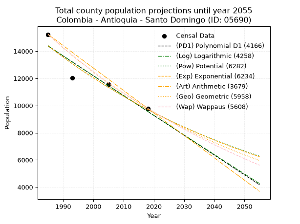
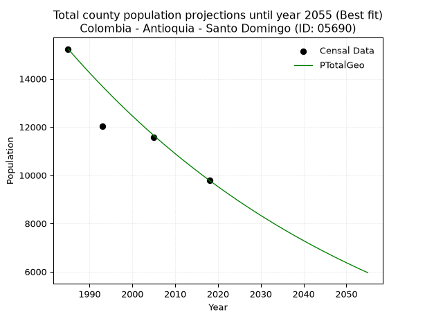
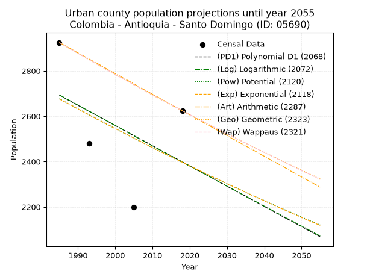
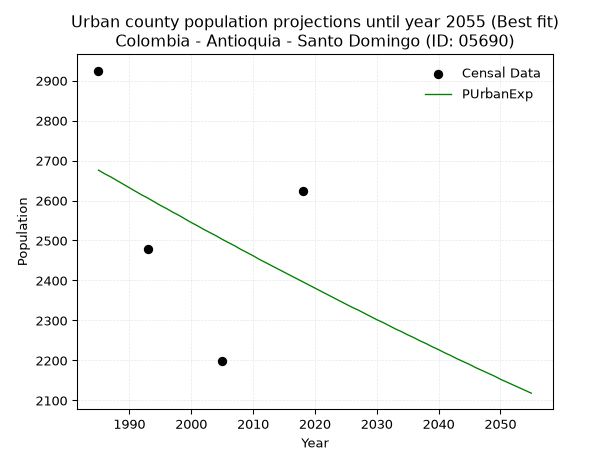
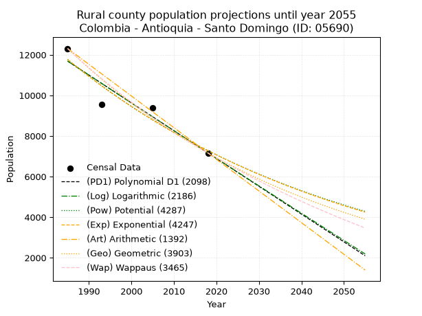
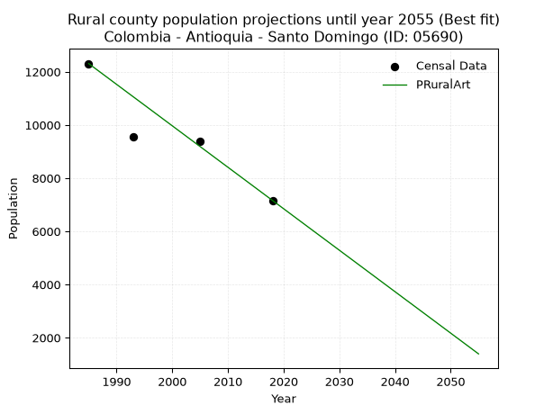

<div align="center">


</div>

# _“Population and Public Services Demand Projections (PPSD) until Year 2050 for Colombia - Antioquia - Santo Domingo (ID: 05690)”_
Keywords: `population` `public-service` `projection` `lineal` `polynomial` `logarithmic` `potential` `exponential` `arithmetic` `geometric` `wappaus` `dane` `colombia` `south-america`

PPSD are analytical estimates used by governments and planners to anticipate future changes in population size, age distribution, and the resulting community needs for utilities, healthcare, education, and infrastructure as sizing future water treatment facilities, electrical grids, and road networks based on spatial growth.

> **General running parameters**: • app_version: _v20260806_. • Python version: _3.14.7_. • Pandas version: _3.0.5_. • NumPy version: _2.5.1_. • Creates, save and include plots into reports (create_plot): _True_. • Projection until year: _2050_. • Process polynomial degree 2 and up: _False_. • Process Wappaus: _True_. • Process Wappaus: _True_. • Set negative values to zero: _True_. • Set infinite values to zero: _True_. • Drop dataset notes: _True_. 
<div align="center">

Dynamic map: [:earth_americas:Google](http://maps.google.com/maps?q=6.473032237,-75.1649034) [:earth_americas:OSM](https://www.openstreetmap.org/#map=18/6.473032237/-75.1649034&layers=P) [:earth_americas:Bing](https://www.bing.com/maps?cp=6.473032237~-75.1649034&lvl=18) [:earth_americas:Apple](https://maps.apple.com/frame?center=6.473032237%2C-75.1649034&span=0.003%2C0.006)

</div>


<div align="center">

```geojson
{
  "type": "Feature",
  "geometry": {
    "type": "Point", 
    "coordinates": [-75.1649034, 6.473032237]
  }, 
  "properties": {
    "Name": "Colombia - Antioquia - Santo Domingo (ID: 05690)"
  }
}
```

</div>


## 0. Census Data (4 records)

Census data are official statistics collected by a government about the people and housing in a country. They usually include counts of total population, age, sex, race, income, education, and jobs.

📅Global census file: [Population.xlsx](../data/Population.xlsx)

| Source   |   Year |   CountryID | CountryName   |   StateID | StateName   |   CountyID | CountyName    |   PTotal |   PUrban |   PRural |
|:---------|-------:|------------:|:--------------|----------:|:------------|-----------:|:--------------|---------:|---------:|---------:|
| DANE     |   1985 |          57 | Colombia      |        05 | Antioquia   |      05690 | Santo Domingo |    15233 |     2925 |    12308 |
| DANE     |   1993 |          57 | Colombia      |        05 | Antioquia   |      05690 | Santo Domingo |    12026 |     2479 |     9547 |
| DANE     |   2005 |          57 | Colombia      |        05 | Antioquia   |      05690 | Santo Domingo |    11567 |     2199 |     9368 |
| DANE     |   2018 |          57 | Colombia      |        05 | Antioquia   |      05690 | Santo Domingo |     9786 |     2624 |     7162 |

> 🔥Some records has specific notes about the registered values or the corresponding urban or rural distribution.

## 1. Total

### 1.1. Coefficients and Parameters

* (PD1) Polynomial Deg 1: -145.88036932958533, 303950.20875150315 (lineal)
* (Log) Logarithmic: -292165.677838646, 2232906.6585203535
* (Pow) Potential: -23.949939859674018, 83.13975091945517
* (Exp) Exponential: -0.011960559437506117, 294639980266906.3
* (Art) Arithmetic: Year diff. 2018 - 1985 = 33, Population diff. 9786 - 15233 = -5447, Annual growth = -165.06060606060606
* (Geo) Geometric: Year diff. 2018 - 1985 = 33, Population diff. 9786 - 15233 = -5447, Annual growth % = -0.013319928428616623
* (Wap) Wappaus: i = -1.3194820421328275, Condition values only valid for < 200)

<sub>
Wappaus condition values: ['-0.00', '-1.32', '-2.64', '-3.96', '-5.28', '-6.60', '-7.92', '-9.24', '-10.56', '-11.88', '-13.19', '-14.51', '-15.83', '-17.15', '-18.47', '-19.79', '-21.11', '-22.43', '-23.75', '-25.07', '-26.39', '-27.71', '-29.03', '-30.35', '-31.67', '-32.99', '-34.31', '-35.63', '-36.95', '-38.26', '-39.58', '-40.90', '-42.22', '-43.54', '-44.86', '-46.18', '-47.50', '-48.82', '-50.14', '-51.46', '-52.78', '-54.10', '-55.42', '-56.74', '-58.06', '-59.38', '-60.70', '-62.02', '-63.34', '-64.65', '-65.97', '-67.29', '-68.61', '-69.93', '-71.25', '-72.57', '-73.89', '-75.21', '-76.53', '-77.85', '-79.17', '-80.49', '-81.81', '-83.13', '-84.45', '-85.77']
</sub>


### 1.2. Projected Dataset

|   Year |   CountyID |   PTotalPD1 |   PTotalLog |   PTotalPow |   PTotalExp |   PTotalArt |   PTotalGeo |   PTotalWap |
|-------:|-----------:|------------:|------------:|------------:|------------:|------------:|------------:|------------:|
|   1985 |      05690 |       14378 |       14383 |       14407 |       14401 |       15233 |       15233 |       15233 |
|   1986 |      05690 |       14232 |       14236 |       14235 |       14230 |       15068 |       15030 |       15033 |
|   1987 |      05690 |       14086 |       14089 |       14064 |       14061 |       14903 |       14830 |       14836 |
|   1988 |      05690 |       13940 |       13942 |       13896 |       13894 |       14738 |       14632 |       14642 |
|   1989 |      05690 |       13794 |       13795 |       13729 |       13728 |       14573 |       14437 |       14450 |
|   1990 |      05690 |       13648 |       13648 |       13565 |       13565 |       14408 |       14245 |       14260 |
|   1991 |      05690 |       13502 |       13502 |       13403 |       13404 |       14243 |       14055 |       14073 |
|   1992 |      05690 |       13357 |       13355 |       13242 |       13245 |       14078 |       13868 |       13888 |
|   1993 |      05690 |       13211 |       13208 |       13084 |       13087 |       13913 |       13683 |       13706 |
|   1994 |      05690 |       13065 |       13062 |       12928 |       12931 |       13747 |       13501 |       13525 |
|   1995 |      05690 |       12919 |       12915 |       12774 |       12778 |       13582 |       13321 |       13347 |
|   1996 |      05690 |       12773 |       12769 |       12621 |       12626 |       13417 |       13144 |       13172 |
|   1997 |      05690 |       12627 |       12622 |       12471 |       12476 |       13252 |       12969 |       12998 |
|   1998 |      05690 |       12481 |       12476 |       12322 |       12327 |       13087 |       12796 |       12826 |
|   1999 |      05690 |       12335 |       12330 |       12175 |       12181 |       12922 |       12626 |       12657 |
|   2000 |      05690 |       12189 |       12184 |       12030 |       12036 |       12757 |       12457 |       12490 |
|   2001 |      05690 |       12044 |       12038 |       11887 |       11893 |       12592 |       12292 |       12324 |
|   2002 |      05690 |       11898 |       11892 |       11746 |       11751 |       12427 |       12128 |       12161 |
|   2003 |      05690 |       11752 |       11746 |       11606 |       11612 |       12262 |       11966 |       11999 |
|   2004 |      05690 |       11606 |       11600 |       11468 |       11474 |       12097 |       11807 |       11839 |
|   2005 |      05690 |       11460 |       11454 |       11332 |       11337 |       11932 |       11650 |       11682 |
|   2006 |      05690 |       11314 |       11309 |       11198 |       11203 |       11767 |       11494 |       11526 |
|   2007 |      05690 |       11168 |       11163 |       11065 |       11069 |       11602 |       11341 |       11372 |
|   2008 |      05690 |       11022 |       11018 |       10933 |       10938 |       11437 |       11190 |       11219 |
|   2009 |      05690 |       10877 |       10872 |       10804 |       10808 |       11272 |       11041 |       11068 |
|   2010 |      05690 |       10731 |       10727 |       10676 |       10679 |       11106 |       10894 |       10920 |
|   2011 |      05690 |       10585 |       10581 |       10549 |       10552 |       10941 |       10749 |       10772 |
|   2012 |      05690 |       10439 |       10436 |       10425 |       10427 |       10776 |       10606 |       10627 |
|   2013 |      05690 |       10293 |       10291 |       10301 |       10303 |       10611 |       10465 |       10483 |
|   2014 |      05690 |       10147 |       10146 |       10179 |       10180 |       10446 |       10325 |       10340 |
|   2015 |      05690 |       10001 |       10001 |       10059 |       10059 |       10281 |       10188 |       10199 |
|   2016 |      05690 |        9855 |        9856 |        9940 |        9940 |       10116 |       10052 |       10060 |
|   2017 |      05690 |        9710 |        9711 |        9823 |        9821 |        9951 |        9918 |        9922 |
|   2018 |      05690 |        9564 |        9566 |        9707 |        9705 |        9786 |        9786 |        9786 |
|   2019 |      05690 |        9418 |        9421 |        9593 |        9589 |        9621 |        9656 |        9651 |
|   2020 |      05690 |        9272 |        9277 |        9479 |        9475 |        9456 |        9527 |        9518 |
|   2021 |      05690 |        9126 |        9132 |        9368 |        9363 |        9291 |        9400 |        9386 |
|   2022 |      05690 |        8980 |        8988 |        9257 |        9251 |        9126 |        9275 |        9255 |
|   2023 |      05690 |        8834 |        8843 |        9148 |        9141 |        8961 |        9151 |        9126 |
|   2024 |      05690 |        8688 |        8699 |        9041 |        9033 |        8796 |        9029 |        8998 |
|   2025 |      05690 |        8542 |        8554 |        8935 |        8925 |        8631 |        8909 |        8872 |
|   2026 |      05690 |        8397 |        8410 |        8829 |        8819 |        8466 |        8791 |        8747 |
|   2027 |      05690 |        8251 |        8266 |        8726 |        8714 |        8300 |        8673 |        8623 |
|   2028 |      05690 |        8105 |        8122 |        8623 |        8611 |        8135 |        8558 |        8500 |
|   2029 |      05690 |        7959 |        7978 |        8522 |        8508 |        7970 |        8444 |        8379 |
|   2030 |      05690 |        7813 |        7834 |        8422 |        8407 |        7805 |        8331 |        8259 |
|   2031 |      05690 |        7667 |        7690 |        8323 |        8307 |        7640 |        8220 |        8140 |
|   2032 |      05690 |        7521 |        7546 |        8226 |        8208 |        7475 |        8111 |        8022 |
|   2033 |      05690 |        7375 |        7402 |        8129 |        8111 |        7310 |        8003 |        7906 |
|   2034 |      05690 |        7230 |        7259 |        8034 |        8014 |        7145 |        7896 |        7790 |
|   2035 |      05690 |        7084 |        7115 |        7940 |        7919 |        6980 |        7791 |        7676 |
|   2036 |      05690 |        6938 |        6972 |        7847 |        7825 |        6815 |        7687 |        7563 |
|   2037 |      05690 |        6792 |        6828 |        7756 |        7732 |        6650 |        7585 |        7451 |
|   2038 |      05690 |        6646 |        6685 |        7665 |        7640 |        6485 |        7484 |        7340 |
|   2039 |      05690 |        6500 |        6541 |        7575 |        7549 |        6320 |        7384 |        7230 |
|   2040 |      05690 |        6354 |        6398 |        7487 |        7459 |        6155 |        7286 |        7122 |
|   2041 |      05690 |        6208 |        6255 |        7400 |        7371 |        5990 |        7189 |        7014 |
|   2042 |      05690 |        6062 |        6112 |        7313 |        7283 |        5825 |        7093 |        6907 |
|   2043 |      05690 |        5917 |        5969 |        7228 |        7197 |        5659 |        6999 |        6802 |
|   2044 |      05690 |        5771 |        5826 |        7144 |        7111 |        5494 |        6905 |        6697 |
|   2045 |      05690 |        5625 |        5683 |        7061 |        7026 |        5329 |        6813 |        6593 |
|   2046 |      05690 |        5479 |        5540 |        6978 |        6943 |        5164 |        6723 |        6491 |
|   2047 |      05690 |        5333 |        5397 |        6897 |        6860 |        4999 |        6633 |        6389 |
|   2048 |      05690 |        5187 |        5255 |        6817 |        6779 |        4834 |        6545 |        6288 |
|   2049 |      05690 |        5041 |        5112 |        6738 |        6698 |        4669 |        6458 |        6188 |
|   2050 |      05690 |        4895 |        4970 |        6660 |        6619 |        4504 |        6372 |        6089 |
<div align="center">

</img>

</div>


### 1.3. Best fit with absolute error and relative error (%)

Relative error puts that difference into context by dividing the absolute error by the true value, creating a unitless ratio or percentage that shows the scale of the mistake.

Absolute and relative error

|   Year | Source   |   CountryID | CountryName   |   StateID | StateName   |   CountyID_x | CountyName    |   PTotal |   PUrban |   PRural |   CountyID_y |   PTotalPD1 |   PTotalLog |   PTotalPow |   PTotalExp |   PTotalArt |   PTotalGeo |   PTotalWap |   PTotalPD1AbsError |   PTotalLogAbsError |   PTotalPowAbsError |   PTotalExpAbsError |   PTotalArtAbsError |   PTotalGeoAbsError |   PTotalWapAbsError |   PTotalPD1RelError |   PTotalLogRelError |   PTotalPowRelError |   PTotalExpRelError |   PTotalArtRelError |   PTotalGeoRelError |   PTotalWapRelError |
|-------:|:---------|------------:|:--------------|----------:|:------------|-------------:|:--------------|---------:|---------:|---------:|-------------:|------------:|------------:|------------:|------------:|------------:|------------:|------------:|--------------------:|--------------------:|--------------------:|--------------------:|--------------------:|--------------------:|--------------------:|--------------------:|--------------------:|--------------------:|--------------------:|--------------------:|--------------------:|--------------------:|
|   1985 | DANE     |          57 | Colombia      |        05 | Antioquia   |        05690 | Santo Domingo |    15233 |     2925 |    12308 |        05690 |       14378 |       14383 |       14407 |       14401 |       15233 |       15233 |       15233 |                 855 |                 850 |                 826 |                 832 |                   0 |                   0 |                   0 |            5.61281  |            5.57999  |            5.42244  |            5.46183  |             0       |            0        |            0        |
|   1993 | DANE     |          57 | Colombia      |        05 | Antioquia   |        05690 | Santo Domingo |    12026 |     2479 |     9547 |        05690 |       13211 |       13208 |       13084 |       13087 |       13913 |       13683 |       13706 |                1185 |                1182 |                1058 |                1061 |                1887 |                1657 |                1680 |            9.85365  |            9.8287   |            8.79761  |            8.82255  |            15.691   |           13.7785   |           13.9697   |
|   2005 | DANE     |          57 | Colombia      |        05 | Antioquia   |        05690 | Santo Domingo |    11567 |     2199 |     9368 |        05690 |       11460 |       11454 |       11332 |       11337 |       11932 |       11650 |       11682 |                 107 |                 113 |                 235 |                 230 |                 365 |                  83 |                 115 |            0.925045 |            0.976917 |            2.03164  |            1.98842  |             3.15553 |            0.717559 |            0.994208 |
|   2018 | DANE     |          57 | Colombia      |        05 | Antioquia   |        05690 | Santo Domingo |     9786 |     2624 |     7162 |        05690 |        9564 |        9566 |        9707 |        9705 |        9786 |        9786 |        9786 |                 222 |                 220 |                  79 |                  81 |                   0 |                   0 |                   0 |            2.26855  |            2.24811  |            0.807276 |            0.827713 |             0       |            0        |            0        |

Relative error mean

| Method    |   RelError | Best   |
|:----------|-----------:|:-------|
| PTotalPD1 |    4.66501 |        |
| PTotalLog |    4.65843 |        |
| PTotalPow |    4.26474 |        |
| PTotalExp |    4.27513 |        |
| PTotalArt |    4.71163 |        |
| PTotalGeo |    3.62401 | True   |
| PTotalWap |    3.74098 |        |

💙Best method: _**PTotalGeo**_
<div align="center">

</img>

</div>


### 1.4. Fresh water supply demand in liters per capita per day (lpcd)

The fresh water supply demand typically ranges from 100 to 300 liters per capita per day (lpcd) for standard domestic and municipal planning, though absolute survival minimums set by the World Health Organization are as low as 7.5 to 20 liters per day, and total consumption in high-income nations can exceed 400 liters.

> `CZ`: Level in meters above the sea level (masl).<br> `WS`: Fresh water supply demand in liters per capita per day (lpcd or l/h/d).<br> `WSAll`: Zonal fresh water supply demand in liters per second (l/s).<br> `A`: Zonal area in square meters.

Reference values (RAS Colombia)

|    CZ |   WS |
|------:|-----:|
|  1000 |  120 |
|  2000 |  130 |
| 99999 |  140 |

County shapefile geometry properties and water supply values

|   CountyID |      ATotal |   CZTotal |   WSTotal |
|-----------:|------------:|----------:|----------:|
|      05690 | 2.65767e+08 |   1704.12 |       130 |

Projected values for best method: PTotalGeo

|   CountyID |   Year |   PTotalGeo |   WSTotal |   WSTotalAll |
|-----------:|-------:|------------:|----------:|-------------:|
|      05690 |   1985 |       15233 |       130 |     22.92    |
|      05690 |   1986 |       15030 |       130 |     22.6146  |
|      05690 |   1987 |       14830 |       130 |     22.3137  |
|      05690 |   1988 |       14632 |       130 |     22.0157  |
|      05690 |   1989 |       14437 |       130 |     21.7223  |
|      05690 |   1990 |       14245 |       130 |     21.4334  |
|      05690 |   1991 |       14055 |       130 |     21.1476  |
|      05690 |   1992 |       13868 |       130 |     20.8662  |
|      05690 |   1993 |       13683 |       130 |     20.5878  |
|      05690 |   1994 |       13501 |       130 |     20.314   |
|      05690 |   1995 |       13321 |       130 |     20.0432  |
|      05690 |   1996 |       13144 |       130 |     19.7769  |
|      05690 |   1997 |       12969 |       130 |     19.5135  |
|      05690 |   1998 |       12796 |       130 |     19.2532  |
|      05690 |   1999 |       12626 |       130 |     18.9975  |
|      05690 |   2000 |       12457 |       130 |     18.7432  |
|      05690 |   2001 |       12292 |       130 |     18.4949  |
|      05690 |   2002 |       12128 |       130 |     18.2481  |
|      05690 |   2003 |       11966 |       130 |     18.0044  |
|      05690 |   2004 |       11807 |       130 |     17.7652  |
|      05690 |   2005 |       11650 |       130 |     17.5289  |
|      05690 |   2006 |       11494 |       130 |     17.2942  |
|      05690 |   2007 |       11341 |       130 |     17.064   |
|      05690 |   2008 |       11190 |       130 |     16.8368  |
|      05690 |   2009 |       11041 |       130 |     16.6126  |
|      05690 |   2010 |       10894 |       130 |     16.3914  |
|      05690 |   2011 |       10749 |       130 |     16.1733  |
|      05690 |   2012 |       10606 |       130 |     15.9581  |
|      05690 |   2013 |       10465 |       130 |     15.7459  |
|      05690 |   2014 |       10325 |       130 |     15.5353  |
|      05690 |   2015 |       10188 |       130 |     15.3292  |
|      05690 |   2016 |       10052 |       130 |     15.1245  |
|      05690 |   2017 |        9918 |       130 |     14.9229  |
|      05690 |   2018 |        9786 |       130 |     14.7243  |
|      05690 |   2019 |        9656 |       130 |     14.5287  |
|      05690 |   2020 |        9527 |       130 |     14.3346  |
|      05690 |   2021 |        9400 |       130 |     14.1435  |
|      05690 |   2022 |        9275 |       130 |     13.9554  |
|      05690 |   2023 |        9151 |       130 |     13.7689  |
|      05690 |   2024 |        9029 |       130 |     13.5853  |
|      05690 |   2025 |        8909 |       130 |     13.4047  |
|      05690 |   2026 |        8791 |       130 |     13.2272  |
|      05690 |   2027 |        8673 |       130 |     13.0497  |
|      05690 |   2028 |        8558 |       130 |     12.8766  |
|      05690 |   2029 |        8444 |       130 |     12.7051  |
|      05690 |   2030 |        8331 |       130 |     12.5351  |
|      05690 |   2031 |        8220 |       130 |     12.3681  |
|      05690 |   2032 |        8111 |       130 |     12.2041  |
|      05690 |   2033 |        8003 |       130 |     12.0416  |
|      05690 |   2034 |        7896 |       130 |     11.8806  |
|      05690 |   2035 |        7791 |       130 |     11.7226  |
|      05690 |   2036 |        7687 |       130 |     11.5661  |
|      05690 |   2037 |        7585 |       130 |     11.4126  |
|      05690 |   2038 |        7484 |       130 |     11.2606  |
|      05690 |   2039 |        7384 |       130 |     11.1102  |
|      05690 |   2040 |        7286 |       130 |     10.9627  |
|      05690 |   2041 |        7189 |       130 |     10.8168  |
|      05690 |   2042 |        7093 |       130 |     10.6723  |
|      05690 |   2043 |        6999 |       130 |     10.5309  |
|      05690 |   2044 |        6905 |       130 |     10.3895  |
|      05690 |   2045 |        6813 |       130 |     10.251   |
|      05690 |   2046 |        6723 |       130 |     10.1156  |
|      05690 |   2047 |        6633 |       130 |      9.98021 |
|      05690 |   2048 |        6545 |       130 |      9.8478  |
|      05690 |   2049 |        6458 |       130 |      9.7169  |
|      05690 |   2050 |        6372 |       130 |      9.5875  |

## 2. Urban

### 2.1. Coefficients and Parameters

* (PD1) Polynomial Deg 1: -8.924528301887033, 20408.037735849535 (lineal)
* (Log) Logarithmic: -17952.230318943148, 139011.79651443206
* (Pow) Potential: -6.730977867147793, 25.624866262041067
* (Exp) Exponential: -0.003345252225436021, 2048378.621857629
* (Art) Arithmetic: Year diff. 2018 - 1985 = 33, Population diff. 2624 - 2925 = -301, Annual growth = -9.121212121212121
* (Geo) Geometric: Year diff. 2018 - 1985 = 33, Population diff. 2624 - 2925 = -301, Annual growth % = -0.0032853371761024652
* (Wap) Wappaus: i = -0.3287515632082221, Condition values only valid for < 200)

<sub>
Wappaus condition values: ['-0.00', '-0.33', '-0.66', '-0.99', '-1.32', '-1.64', '-1.97', '-2.30', '-2.63', '-2.96', '-3.29', '-3.62', '-3.95', '-4.27', '-4.60', '-4.93', '-5.26', '-5.59', '-5.92', '-6.25', '-6.58', '-6.90', '-7.23', '-7.56', '-7.89', '-8.22', '-8.55', '-8.88', '-9.21', '-9.53', '-9.86', '-10.19', '-10.52', '-10.85', '-11.18', '-11.51', '-11.84', '-12.16', '-12.49', '-12.82', '-13.15', '-13.48', '-13.81', '-14.14', '-14.47', '-14.79', '-15.12', '-15.45', '-15.78', '-16.11', '-16.44', '-16.77', '-17.10', '-17.42', '-17.75', '-18.08', '-18.41', '-18.74', '-19.07', '-19.40', '-19.73', '-20.05', '-20.38', '-20.71', '-21.04', '-21.37']
</sub>


### 2.2. Projected Dataset

|   Year |   CountyID |   PUrbanPD1 |   PUrbanLog |   PUrbanPow |   PUrbanExp |   PUrbanArt |   PUrbanGeo |   PUrbanWap |
|-------:|-----------:|------------:|------------:|------------:|------------:|------------:|------------:|------------:|
|   1985 |      05690 |        2693 |        2694 |        2677 |        2676 |        2925 |        2925 |        2925 |
|   1986 |      05690 |        2684 |        2685 |        2668 |        2667 |        2916 |        2915 |        2915 |
|   1987 |      05690 |        2675 |        2676 |        2659 |        2659 |        2907 |        2906 |        2906 |
|   1988 |      05690 |        2666 |        2667 |        2650 |        2650 |        2898 |        2896 |        2896 |
|   1989 |      05690 |        2657 |        2658 |        2641 |        2641 |        2889 |        2887 |        2887 |
|   1990 |      05690 |        2648 |        2649 |        2632 |        2632 |        2879 |        2877 |        2877 |
|   1991 |      05690 |        2639 |        2640 |        2624 |        2623 |        2870 |        2868 |        2868 |
|   1992 |      05690 |        2630 |        2631 |        2615 |        2614 |        2861 |        2858 |        2858 |
|   1993 |      05690 |        2621 |        2622 |        2606 |        2606 |        2852 |        2849 |        2849 |
|   1994 |      05690 |        2613 |        2613 |        2597 |        2597 |        2843 |        2840 |        2840 |
|   1995 |      05690 |        2604 |        2604 |        2588 |        2588 |        2834 |        2830 |        2830 |
|   1996 |      05690 |        2595 |        2595 |        2580 |        2580 |        2825 |        2821 |        2821 |
|   1997 |      05690 |        2586 |        2586 |        2571 |        2571 |        2816 |        2812 |        2812 |
|   1998 |      05690 |        2577 |        2577 |        2562 |        2563 |        2806 |        2803 |        2803 |
|   1999 |      05690 |        2568 |        2568 |        2554 |        2554 |        2797 |        2793 |        2793 |
|   2000 |      05690 |        2559 |        2559 |        2545 |        2545 |        2788 |        2784 |        2784 |
|   2001 |      05690 |        2550 |        2550 |        2537 |        2537 |        2779 |        2775 |        2775 |
|   2002 |      05690 |        2541 |        2541 |        2528 |        2528 |        2770 |        2766 |        2766 |
|   2003 |      05690 |        2532 |        2532 |        2520 |        2520 |        2761 |        2757 |        2757 |
|   2004 |      05690 |        2523 |        2523 |        2511 |        2512 |        2752 |        2748 |        2748 |
|   2005 |      05690 |        2514 |        2514 |        2503 |        2503 |        2743 |        2739 |        2739 |
|   2006 |      05690 |        2505 |        2505 |        2494 |        2495 |        2733 |        2730 |        2730 |
|   2007 |      05690 |        2497 |        2496 |        2486 |        2487 |        2724 |        2721 |        2721 |
|   2008 |      05690 |        2488 |        2487 |        2478 |        2478 |        2715 |        2712 |        2712 |
|   2009 |      05690 |        2479 |        2478 |        2469 |        2470 |        2706 |        2703 |        2703 |
|   2010 |      05690 |        2470 |        2469 |        2461 |        2462 |        2697 |        2694 |        2694 |
|   2011 |      05690 |        2461 |        2460 |        2453 |        2453 |        2688 |        2685 |        2685 |
|   2012 |      05690 |        2452 |        2451 |        2445 |        2445 |        2679 |        2676 |        2676 |
|   2013 |      05690 |        2443 |        2442 |        2437 |        2437 |        2670 |        2668 |        2668 |
|   2014 |      05690 |        2434 |        2433 |        2428 |        2429 |        2660 |        2659 |        2659 |
|   2015 |      05690 |        2425 |        2425 |        2420 |        2421 |        2651 |        2650 |        2650 |
|   2016 |      05690 |        2416 |        2416 |        2412 |        2413 |        2642 |        2641 |        2641 |
|   2017 |      05690 |        2407 |        2407 |        2404 |        2405 |        2633 |        2633 |        2633 |
|   2018 |      05690 |        2398 |        2398 |        2396 |        2397 |        2624 |        2624 |        2624 |
|   2019 |      05690 |        2389 |        2389 |        2388 |        2389 |        2615 |        2615 |        2615 |
|   2020 |      05690 |        2380 |        2380 |        2380 |        2381 |        2606 |        2607 |        2607 |
|   2021 |      05690 |        2372 |        2371 |        2372 |        2373 |        2597 |        2598 |        2598 |
|   2022 |      05690 |        2363 |        2362 |        2364 |        2365 |        2588 |        2590 |        2590 |
|   2023 |      05690 |        2354 |        2353 |        2357 |        2357 |        2578 |        2581 |        2581 |
|   2024 |      05690 |        2345 |        2345 |        2349 |        2349 |        2569 |        2573 |        2573 |
|   2025 |      05690 |        2336 |        2336 |        2341 |        2341 |        2560 |        2564 |        2564 |
|   2026 |      05690 |        2327 |        2327 |        2333 |        2333 |        2551 |        2556 |        2556 |
|   2027 |      05690 |        2318 |        2318 |        2325 |        2326 |        2542 |        2547 |        2547 |
|   2028 |      05690 |        2309 |        2309 |        2318 |        2318 |        2533 |        2539 |        2539 |
|   2029 |      05690 |        2300 |        2300 |        2310 |        2310 |        2524 |        2531 |        2530 |
|   2030 |      05690 |        2291 |        2291 |        2302 |        2302 |        2515 |        2522 |        2522 |
|   2031 |      05690 |        2282 |        2283 |        2295 |        2295 |        2505 |        2514 |        2514 |
|   2032 |      05690 |        2273 |        2274 |        2287 |        2287 |        2496 |        2506 |        2505 |
|   2033 |      05690 |        2264 |        2265 |        2280 |        2279 |        2487 |        2498 |        2497 |
|   2034 |      05690 |        2256 |        2256 |        2272 |        2272 |        2478 |        2489 |        2489 |
|   2035 |      05690 |        2247 |        2247 |        2265 |        2264 |        2469 |        2481 |        2481 |
|   2036 |      05690 |        2238 |        2238 |        2257 |        2257 |        2460 |        2473 |        2473 |
|   2037 |      05690 |        2229 |        2230 |        2250 |        2249 |        2451 |        2465 |        2464 |
|   2038 |      05690 |        2220 |        2221 |        2242 |        2242 |        2442 |        2457 |        2456 |
|   2039 |      05690 |        2211 |        2212 |        2235 |        2234 |        2432 |        2449 |        2448 |
|   2040 |      05690 |        2202 |        2203 |        2228 |        2227 |        2423 |        2441 |        2440 |
|   2041 |      05690 |        2193 |        2194 |        2220 |        2219 |        2414 |        2433 |        2432 |
|   2042 |      05690 |        2184 |        2186 |        2213 |        2212 |        2405 |        2425 |        2424 |
|   2043 |      05690 |        2175 |        2177 |        2206 |        2204 |        2396 |        2417 |        2416 |
|   2044 |      05690 |        2166 |        2168 |        2198 |        2197 |        2387 |        2409 |        2408 |
|   2045 |      05690 |        2157 |        2159 |        2191 |        2190 |        2378 |        2401 |        2400 |
|   2046 |      05690 |        2148 |        2150 |        2184 |        2182 |        2369 |        2393 |        2392 |
|   2047 |      05690 |        2140 |        2142 |        2177 |        2175 |        2359 |        2385 |        2384 |
|   2048 |      05690 |        2131 |        2133 |        2170 |        2168 |        2350 |        2377 |        2376 |
|   2049 |      05690 |        2122 |        2124 |        2162 |        2161 |        2341 |        2370 |        2368 |
|   2050 |      05690 |        2113 |        2115 |        2155 |        2153 |        2332 |        2362 |        2360 |
<div align="center">

</img>

</div>


### 2.3. Best fit with absolute error and relative error (%)

Relative error puts that difference into context by dividing the absolute error by the true value, creating a unitless ratio or percentage that shows the scale of the mistake.

Absolute and relative error

|   Year | Source   |   CountryID | CountryName   |   StateID | StateName   |   CountyID_x | CountyName    |   PTotal |   PUrban |   PRural |   CountyID_y |   PUrbanPD1 |   PUrbanLog |   PUrbanPow |   PUrbanExp |   PUrbanArt |   PUrbanGeo |   PUrbanWap |   PUrbanPD1AbsError |   PUrbanLogAbsError |   PUrbanPowAbsError |   PUrbanExpAbsError |   PUrbanArtAbsError |   PUrbanGeoAbsError |   PUrbanWapAbsError |   PUrbanPD1RelError |   PUrbanLogRelError |   PUrbanPowRelError |   PUrbanExpRelError |   PUrbanArtRelError |   PUrbanGeoRelError |   PUrbanWapRelError |
|-------:|:---------|------------:|:--------------|----------:|:------------|-------------:|:--------------|---------:|---------:|---------:|-------------:|------------:|------------:|------------:|------------:|------------:|------------:|------------:|--------------------:|--------------------:|--------------------:|--------------------:|--------------------:|--------------------:|--------------------:|--------------------:|--------------------:|--------------------:|--------------------:|--------------------:|--------------------:|--------------------:|
|   1985 | DANE     |          57 | Colombia      |        05 | Antioquia   |        05690 | Santo Domingo |    15233 |     2925 |    12308 |        05690 |        2693 |        2694 |        2677 |        2676 |        2925 |        2925 |        2925 |                 232 |                 231 |                 248 |                 249 |                   0 |                   0 |                   0 |             7.93162 |             7.89744 |             8.47863 |             8.51282 |              0      |              0      |              0      |
|   1993 | DANE     |          57 | Colombia      |        05 | Antioquia   |        05690 | Santo Domingo |    12026 |     2479 |     9547 |        05690 |        2621 |        2622 |        2606 |        2606 |        2852 |        2849 |        2849 |                 142 |                 143 |                 127 |                 127 |                 373 |                 370 |                 370 |             5.72812 |             5.76846 |             5.12303 |             5.12303 |             15.0464 |             14.9254 |             14.9254 |
|   2005 | DANE     |          57 | Colombia      |        05 | Antioquia   |        05690 | Santo Domingo |    11567 |     2199 |     9368 |        05690 |        2514 |        2514 |        2503 |        2503 |        2743 |        2739 |        2739 |                 315 |                 315 |                 304 |                 304 |                 544 |                 540 |                 540 |            14.3247  |            14.3247  |            13.8245  |            13.8245  |             24.7385 |             24.5566 |             24.5566 |
|   2018 | DANE     |          57 | Colombia      |        05 | Antioquia   |        05690 | Santo Domingo |     9786 |     2624 |     7162 |        05690 |        2398 |        2398 |        2396 |        2397 |        2624 |        2624 |        2624 |                 226 |                 226 |                 228 |                 227 |                   0 |                   0 |                   0 |             8.6128  |             8.6128  |             8.68902 |             8.65091 |              0      |              0      |              0      |

Relative error mean

| Method    |   RelError | Best   |
|:----------|-----------:|:-------|
| PUrbanPD1 |    9.14931 |        |
| PUrbanLog |    9.15085 |        |
| PUrbanPow |    9.02879 |        |
| PUrbanExp |    9.02781 | True   |
| PUrbanArt |    9.94623 |        |
| PUrbanGeo |    9.8705  |        |
| PUrbanWap |    9.8705  |        |

💙Best method: _**PUrbanExp**_
<div align="center">

</img>

</div>


### 2.4. Fresh water supply demand in liters per capita per day (lpcd)

The fresh water supply demand typically ranges from 100 to 300 liters per capita per day (lpcd) for standard domestic and municipal planning, though absolute survival minimums set by the World Health Organization are as low as 7.5 to 20 liters per day, and total consumption in high-income nations can exceed 400 liters.

> `CZ`: Level in meters above the sea level (masl).<br> `WS`: Fresh water supply demand in liters per capita per day (lpcd or l/h/d).<br> `WSAll`: Zonal fresh water supply demand in liters per second (l/s).<br> `A`: Zonal area in square meters.

Reference values (RAS Colombia)

|    CZ |   WS |
|------:|-----:|
|  1000 |  120 |
|  2000 |  130 |
| 99999 |  140 |

County shapefile geometry properties and water supply values

|   CountyID |   AUrban |   CZUrban |   WSUrban |
|-----------:|---------:|----------:|----------:|
|      05690 |   537286 |   1954.78 |       130 |

Projected values for best method: PUrbanExp

|   CountyID |   Year |   PUrbanExp |   WSUrban |   WSUrbanAll |
|-----------:|-------:|------------:|----------:|-------------:|
|      05690 |   1985 |        2676 |       130 |      4.02639 |
|      05690 |   1986 |        2667 |       130 |      4.01285 |
|      05690 |   1987 |        2659 |       130 |      4.00081 |
|      05690 |   1988 |        2650 |       130 |      3.98727 |
|      05690 |   1989 |        2641 |       130 |      3.97373 |
|      05690 |   1990 |        2632 |       130 |      3.96019 |
|      05690 |   1991 |        2623 |       130 |      3.94664 |
|      05690 |   1992 |        2614 |       130 |      3.9331  |
|      05690 |   1993 |        2606 |       130 |      3.92106 |
|      05690 |   1994 |        2597 |       130 |      3.90752 |
|      05690 |   1995 |        2588 |       130 |      3.89398 |
|      05690 |   1996 |        2580 |       130 |      3.88194 |
|      05690 |   1997 |        2571 |       130 |      3.8684  |
|      05690 |   1998 |        2563 |       130 |      3.85637 |
|      05690 |   1999 |        2554 |       130 |      3.84282 |
|      05690 |   2000 |        2545 |       130 |      3.82928 |
|      05690 |   2001 |        2537 |       130 |      3.81725 |
|      05690 |   2002 |        2528 |       130 |      3.8037  |
|      05690 |   2003 |        2520 |       130 |      3.79167 |
|      05690 |   2004 |        2512 |       130 |      3.77963 |
|      05690 |   2005 |        2503 |       130 |      3.76609 |
|      05690 |   2006 |        2495 |       130 |      3.75405 |
|      05690 |   2007 |        2487 |       130 |      3.74201 |
|      05690 |   2008 |        2478 |       130 |      3.72847 |
|      05690 |   2009 |        2470 |       130 |      3.71644 |
|      05690 |   2010 |        2462 |       130 |      3.7044  |
|      05690 |   2011 |        2453 |       130 |      3.69086 |
|      05690 |   2012 |        2445 |       130 |      3.67882 |
|      05690 |   2013 |        2437 |       130 |      3.66678 |
|      05690 |   2014 |        2429 |       130 |      3.65475 |
|      05690 |   2015 |        2421 |       130 |      3.64271 |
|      05690 |   2016 |        2413 |       130 |      3.63067 |
|      05690 |   2017 |        2405 |       130 |      3.61863 |
|      05690 |   2018 |        2397 |       130 |      3.6066  |
|      05690 |   2019 |        2389 |       130 |      3.59456 |
|      05690 |   2020 |        2381 |       130 |      3.58252 |
|      05690 |   2021 |        2373 |       130 |      3.57049 |
|      05690 |   2022 |        2365 |       130 |      3.55845 |
|      05690 |   2023 |        2357 |       130 |      3.54641 |
|      05690 |   2024 |        2349 |       130 |      3.53437 |
|      05690 |   2025 |        2341 |       130 |      3.52234 |
|      05690 |   2026 |        2333 |       130 |      3.5103  |
|      05690 |   2027 |        2326 |       130 |      3.49977 |
|      05690 |   2028 |        2318 |       130 |      3.48773 |
|      05690 |   2029 |        2310 |       130 |      3.47569 |
|      05690 |   2030 |        2302 |       130 |      3.46366 |
|      05690 |   2031 |        2295 |       130 |      3.45312 |
|      05690 |   2032 |        2287 |       130 |      3.44109 |
|      05690 |   2033 |        2279 |       130 |      3.42905 |
|      05690 |   2034 |        2272 |       130 |      3.41852 |
|      05690 |   2035 |        2264 |       130 |      3.40648 |
|      05690 |   2036 |        2257 |       130 |      3.39595 |
|      05690 |   2037 |        2249 |       130 |      3.38391 |
|      05690 |   2038 |        2242 |       130 |      3.37338 |
|      05690 |   2039 |        2234 |       130 |      3.36134 |
|      05690 |   2040 |        2227 |       130 |      3.35081 |
|      05690 |   2041 |        2219 |       130 |      3.33877 |
|      05690 |   2042 |        2212 |       130 |      3.32824 |
|      05690 |   2043 |        2204 |       130 |      3.3162  |
|      05690 |   2044 |        2197 |       130 |      3.30567 |
|      05690 |   2045 |        2190 |       130 |      3.29514 |
|      05690 |   2046 |        2182 |       130 |      3.2831  |
|      05690 |   2047 |        2175 |       130 |      3.27257 |
|      05690 |   2048 |        2168 |       130 |      3.26204 |
|      05690 |   2049 |        2161 |       130 |      3.2515  |
|      05690 |   2050 |        2153 |       130 |      3.23947 |

## 3. Rural

### 3.1. Coefficients and Parameters

* (PD1) Polynomial Deg 1: -136.95584102769828, 283542.1710156535 (lineal)
* (Log) Logarithmic: -274213.44751970266, 2093894.8620059206
* (Pow) Potential: -29.14055313993616, 100.16935975406211
* (Exp) Exponential: -0.014557634614605505, 4.1722011907496376e+16
* (Art) Arithmetic: Year diff. 2018 - 1985 = 33, Population diff. 7162 - 12308 = -5146, Annual growth = -155.93939393939394
* (Geo) Geometric: Year diff. 2018 - 1985 = 33, Population diff. 7162 - 12308 = -5146, Annual growth % = -0.016274008293209685
* (Wap) Wappaus: i = -1.6018427728751303, Condition values only valid for < 200)

<sub>
Wappaus condition values: ['-0.00', '-1.60', '-3.20', '-4.81', '-6.41', '-8.01', '-9.61', '-11.21', '-12.81', '-14.42', '-16.02', '-17.62', '-19.22', '-20.82', '-22.43', '-24.03', '-25.63', '-27.23', '-28.83', '-30.44', '-32.04', '-33.64', '-35.24', '-36.84', '-38.44', '-40.05', '-41.65', '-43.25', '-44.85', '-46.45', '-48.06', '-49.66', '-51.26', '-52.86', '-54.46', '-56.06', '-57.67', '-59.27', '-60.87', '-62.47', '-64.07', '-65.68', '-67.28', '-68.88', '-70.48', '-72.08', '-73.68', '-75.29', '-76.89', '-78.49', '-80.09', '-81.69', '-83.30', '-84.90', '-86.50', '-88.10', '-89.70', '-91.31', '-92.91', '-94.51', '-96.11', '-97.71', '-99.31', '-100.92', '-102.52', '-104.12']
</sub>


### 3.2. Projected Dataset

|   Year |   CountyID |   PRuralPD1 |   PRuralLog |   PRuralPow |   PRuralExp |   PRuralArt |   PRuralGeo |   PRuralWap |
|-------:|-----------:|------------:|------------:|------------:|------------:|------------:|------------:|------------:|
|   1985 |      05690 |       11685 |       11690 |       11770 |       11765 |       12308 |       12308 |       12308 |
|   1986 |      05690 |       11548 |       11551 |       11599 |       11595 |       12152 |       12108 |       12112 |
|   1987 |      05690 |       11411 |       11413 |       11430 |       11428 |       11996 |       11911 |       11920 |
|   1988 |      05690 |       11274 |       11275 |       11264 |       11262 |       11840 |       11717 |       11730 |
|   1989 |      05690 |       11137 |       11138 |       11100 |       11100 |       11684 |       11526 |       11544 |
|   1990 |      05690 |       11000 |       11000 |       10938 |       10939 |       11528 |       11339 |       11360 |
|   1991 |      05690 |       10863 |       10862 |       10779 |       10781 |       11372 |       11154 |       11179 |
|   1992 |      05690 |       10726 |       10724 |       10623 |       10625 |       11216 |       10973 |       11001 |
|   1993 |      05690 |       10589 |       10587 |       10469 |       10472 |       11060 |       10794 |       10826 |
|   1994 |      05690 |       10452 |       10449 |       10317 |       10320 |       10905 |       10618 |       10653 |
|   1995 |      05690 |       10315 |       10312 |       10167 |       10171 |       10749 |       10445 |       10483 |
|   1996 |      05690 |       10178 |       10174 |       10020 |       10024 |       10593 |       10276 |       10315 |
|   1997 |      05690 |       10041 |       10037 |        9875 |        9879 |       10437 |       10108 |       10150 |
|   1998 |      05690 |        9904 |        9900 |        9732 |        9737 |       10281 |        9944 |        9987 |
|   1999 |      05690 |        9767 |        9762 |        9591 |        9596 |       10125 |        9782 |        9826 |
|   2000 |      05690 |        9630 |        9625 |        9452 |        9457 |        9969 |        9623 |        9668 |
|   2001 |      05690 |        9494 |        9488 |        9315 |        9321 |        9813 |        9466 |        9512 |
|   2002 |      05690 |        9357 |        9351 |        9181 |        9186 |        9657 |        9312 |        9358 |
|   2003 |      05690 |        9220 |        9214 |        9048 |        9053 |        9501 |        9161 |        9206 |
|   2004 |      05690 |        9083 |        9077 |        8917 |        8922 |        9345 |        9011 |        9057 |
|   2005 |      05690 |        8946 |        8941 |        8789 |        8793 |        9189 |        8865 |        8909 |
|   2006 |      05690 |        8809 |        8804 |        8662 |        8666 |        9033 |        8721 |        8764 |
|   2007 |      05690 |        8672 |        8667 |        8537 |        8541 |        8877 |        8579 |        8620 |
|   2008 |      05690 |        8535 |        8531 |        8414 |        8418 |        8721 |        8439 |        8479 |
|   2009 |      05690 |        8398 |        8394 |        8293 |        8296 |        8565 |        8302 |        8339 |
|   2010 |      05690 |        8261 |        8258 |        8173 |        8176 |        8410 |        8167 |        8201 |
|   2011 |      05690 |        8124 |        8121 |        8056 |        8058 |        8254 |        8034 |        8065 |
|   2012 |      05690 |        7987 |        7985 |        7940 |        7941 |        8098 |        7903 |        7931 |
|   2013 |      05690 |        7850 |        7849 |        7826 |        7827 |        7942 |        7774 |        7799 |
|   2014 |      05690 |        7713 |        7712 |        7713 |        7714 |        7786 |        7648 |        7668 |
|   2015 |      05690 |        7576 |        7576 |        7603 |        7602 |        7630 |        7523 |        7539 |
|   2016 |      05690 |        7439 |        7440 |        7493 |        7492 |        7474 |        7401 |        7412 |
|   2017 |      05690 |        7302 |        7304 |        7386 |        7384 |        7318 |        7280 |        7286 |
|   2018 |      05690 |        7165 |        7168 |        7280 |        7277 |        7162 |        7162 |        7162 |
|   2019 |      05690 |        7028 |        7032 |        7176 |        7172 |        7006 |        7045 |        7039 |
|   2020 |      05690 |        6891 |        6897 |        7073 |        7068 |        6850 |        6931 |        6918 |
|   2021 |      05690 |        6754 |        6761 |        6972 |        6966 |        6694 |        6818 |        6799 |
|   2022 |      05690 |        6617 |        6625 |        6872 |        6866 |        6538 |        6707 |        6681 |
|   2023 |      05690 |        6481 |        6490 |        6773 |        6766 |        6382 |        6598 |        6564 |
|   2024 |      05690 |        6344 |        6354 |        6677 |        6669 |        6226 |        6491 |        6449 |
|   2025 |      05690 |        6207 |        6219 |        6581 |        6572 |        6070 |        6385 |        6335 |
|   2026 |      05690 |        6070 |        6083 |        6487 |        6477 |        5914 |        6281 |        6223 |
|   2027 |      05690 |        5933 |        5948 |        6395 |        6384 |        5759 |        6179 |        6112 |
|   2028 |      05690 |        5796 |        5813 |        6303 |        6291 |        5603 |        6078 |        6002 |
|   2029 |      05690 |        5659 |        5678 |        6213 |        6200 |        5447 |        5979 |        5894 |
|   2030 |      05690 |        5522 |        5543 |        6125 |        6111 |        5291 |        5882 |        5786 |
|   2031 |      05690 |        5385 |        5407 |        6038 |        6022 |        5135 |        5786 |        5681 |
|   2032 |      05690 |        5248 |        5273 |        5952 |        5935 |        4979 |        5692 |        5576 |
|   2033 |      05690 |        5111 |        5138 |        5867 |        5850 |        4823 |        5599 |        5472 |
|   2034 |      05690 |        4974 |        5003 |        5783 |        5765 |        4667 |        5508 |        5370 |
|   2035 |      05690 |        4837 |        4868 |        5701 |        5682 |        4511 |        5419 |        5269 |
|   2036 |      05690 |        4700 |        4733 |        5620 |        5600 |        4355 |        5331 |        5169 |
|   2037 |      05690 |        4563 |        4599 |        5540 |        5519 |        4199 |        5244 |        5070 |
|   2038 |      05690 |        4426 |        4464 |        5462 |        5439 |        4043 |        5158 |        4973 |
|   2039 |      05690 |        4289 |        4329 |        5384 |        5360 |        3887 |        5074 |        4876 |
|   2040 |      05690 |        4152 |        4195 |        5308 |        5283 |        3731 |        4992 |        4780 |
|   2041 |      05690 |        4015 |        4061 |        5232 |        5207 |        3575 |        4911 |        4686 |
|   2042 |      05690 |        3878 |        3926 |        5158 |        5131 |        3419 |        4831 |        4592 |
|   2043 |      05690 |        3741 |        3792 |        5085 |        5057 |        3264 |        4752 |        4500 |
|   2044 |      05690 |        3604 |        3658 |        5013 |        4984 |        3108 |        4675 |        4409 |
|   2045 |      05690 |        3467 |        3524 |        4942 |        4912 |        2952 |        4599 |        4318 |
|   2046 |      05690 |        3331 |        3390 |        4872 |        4841 |        2796 |        4524 |        4229 |
|   2047 |      05690 |        3194 |        3256 |        4803 |        4771 |        2640 |        4450 |        4140 |
|   2048 |      05690 |        3057 |        3122 |        4736 |        4702 |        2484 |        4378 |        4053 |
|   2049 |      05690 |        2920 |        2988 |        4669 |        4634 |        2328 |        4307 |        3966 |
|   2050 |      05690 |        2783 |        2854 |        4603 |        4567 |        2172 |        4236 |        3880 |
<div align="center">

</img>

</div>


### 3.3. Best fit with absolute error and relative error (%)

Relative error puts that difference into context by dividing the absolute error by the true value, creating a unitless ratio or percentage that shows the scale of the mistake.

Absolute and relative error

|   Year | Source   |   CountryID | CountryName   |   StateID | StateName   |   CountyID_x | CountyName    |   PTotal |   PUrban |   PRural |   CountyID_y |   PRuralPD1 |   PRuralLog |   PRuralPow |   PRuralExp |   PRuralArt |   PRuralGeo |   PRuralWap |   PRuralPD1AbsError |   PRuralLogAbsError |   PRuralPowAbsError |   PRuralExpAbsError |   PRuralArtAbsError |   PRuralGeoAbsError |   PRuralWapAbsError |   PRuralPD1RelError |   PRuralLogRelError |   PRuralPowRelError |   PRuralExpRelError |   PRuralArtRelError |   PRuralGeoRelError |   PRuralWapRelError |
|-------:|:---------|------------:|:--------------|----------:|:------------|-------------:|:--------------|---------:|---------:|---------:|-------------:|------------:|------------:|------------:|------------:|------------:|------------:|------------:|--------------------:|--------------------:|--------------------:|--------------------:|--------------------:|--------------------:|--------------------:|--------------------:|--------------------:|--------------------:|--------------------:|--------------------:|--------------------:|--------------------:|
|   1985 | DANE     |          57 | Colombia      |        05 | Antioquia   |        05690 | Santo Domingo |    15233 |     2925 |    12308 |        05690 |       11685 |       11690 |       11770 |       11765 |       12308 |       12308 |       12308 |                 623 |                 618 |                 538 |                 543 |                   0 |                   0 |                   0 |           5.06175   |           5.02112   |             4.37114 |             4.41176 |             0       |             0       |             0       |
|   1993 | DANE     |          57 | Colombia      |        05 | Antioquia   |        05690 | Santo Domingo |    12026 |     2479 |     9547 |        05690 |       10589 |       10587 |       10469 |       10472 |       11060 |       10794 |       10826 |                1042 |                1040 |                 922 |                 925 |                1513 |                1247 |                1279 |          10.9144    |          10.8935    |             9.65748 |             9.68891 |            15.8479  |            13.0617  |            13.3969  |
|   2005 | DANE     |          57 | Colombia      |        05 | Antioquia   |        05690 | Santo Domingo |    11567 |     2199 |     9368 |        05690 |        8946 |        8941 |        8789 |        8793 |        9189 |        8865 |        8909 |                 422 |                 427 |                 579 |                 575 |                 179 |                 503 |                 459 |           4.5047    |           4.55807   |             6.18061 |             6.13792 |             1.91076 |             5.36934 |             4.89966 |
|   2018 | DANE     |          57 | Colombia      |        05 | Antioquia   |        05690 | Santo Domingo |     9786 |     2624 |     7162 |        05690 |        7165 |        7168 |        7280 |        7277 |        7162 |        7162 |        7162 |                   3 |                   6 |                 118 |                 115 |                   0 |                   0 |                   0 |           0.0418877 |           0.0837755 |             1.64758 |             1.6057  |             0       |             0       |             0       |

Relative error mean

| Method    |   RelError | Best   |
|:----------|-----------:|:-------|
| PRuralPD1 |    5.13069 |        |
| PRuralLog |    5.13911 |        |
| PRuralPow |    5.46421 |        |
| PRuralExp |    5.46107 |        |
| PRuralArt |    4.43967 | True   |
| PRuralGeo |    4.60776 |        |
| PRuralWap |    4.57413 |        |

💙Best method: _**PRuralArt**_
<div align="center">

</img>

</div>


### 3.4. Fresh water supply demand in liters per capita per day (lpcd)

The fresh water supply demand typically ranges from 100 to 300 liters per capita per day (lpcd) for standard domestic and municipal planning, though absolute survival minimums set by the World Health Organization are as low as 7.5 to 20 liters per day, and total consumption in high-income nations can exceed 400 liters.

> `CZ`: Level in meters above the sea level (masl).<br> `WS`: Fresh water supply demand in liters per capita per day (lpcd or l/h/d).<br> `WSAll`: Zonal fresh water supply demand in liters per second (l/s).<br> `A`: Zonal area in square meters.

Reference values (RAS Colombia)

|    CZ |   WS |
|------:|-----:|
|  1000 |  120 |
|  2000 |  130 |
| 99999 |  140 |

County shapefile geometry properties and water supply values

|   CountyID |     ARural |   CZRural |   WSRural |
|-----------:|-----------:|----------:|----------:|
|      05690 | 2.6523e+08 |   1703.68 |       130 |

Projected values for best method: PRuralArt

|   CountyID |   Year |   PRuralArt |   WSRural |   WSRuralAll |
|-----------:|-------:|------------:|----------:|-------------:|
|      05690 |   1985 |       12308 |       130 |     18.519   |
|      05690 |   1986 |       12152 |       130 |     18.2843  |
|      05690 |   1987 |       11996 |       130 |     18.0495  |
|      05690 |   1988 |       11840 |       130 |     17.8148  |
|      05690 |   1989 |       11684 |       130 |     17.5801  |
|      05690 |   1990 |       11528 |       130 |     17.3454  |
|      05690 |   1991 |       11372 |       130 |     17.1106  |
|      05690 |   1992 |       11216 |       130 |     16.8759  |
|      05690 |   1993 |       11060 |       130 |     16.6412  |
|      05690 |   1994 |       10905 |       130 |     16.408   |
|      05690 |   1995 |       10749 |       130 |     16.1733  |
|      05690 |   1996 |       10593 |       130 |     15.9385  |
|      05690 |   1997 |       10437 |       130 |     15.7038  |
|      05690 |   1998 |       10281 |       130 |     15.4691  |
|      05690 |   1999 |       10125 |       130 |     15.2344  |
|      05690 |   2000 |        9969 |       130 |     14.9997  |
|      05690 |   2001 |        9813 |       130 |     14.7649  |
|      05690 |   2002 |        9657 |       130 |     14.5302  |
|      05690 |   2003 |        9501 |       130 |     14.2955  |
|      05690 |   2004 |        9345 |       130 |     14.0608  |
|      05690 |   2005 |        9189 |       130 |     13.826   |
|      05690 |   2006 |        9033 |       130 |     13.5913  |
|      05690 |   2007 |        8877 |       130 |     13.3566  |
|      05690 |   2008 |        8721 |       130 |     13.1219  |
|      05690 |   2009 |        8565 |       130 |     12.8872  |
|      05690 |   2010 |        8410 |       130 |     12.6539  |
|      05690 |   2011 |        8254 |       130 |     12.4192  |
|      05690 |   2012 |        8098 |       130 |     12.1845  |
|      05690 |   2013 |        7942 |       130 |     11.9498  |
|      05690 |   2014 |        7786 |       130 |     11.715   |
|      05690 |   2015 |        7630 |       130 |     11.4803  |
|      05690 |   2016 |        7474 |       130 |     11.2456  |
|      05690 |   2017 |        7318 |       130 |     11.0109  |
|      05690 |   2018 |        7162 |       130 |     10.7762  |
|      05690 |   2019 |        7006 |       130 |     10.5414  |
|      05690 |   2020 |        6850 |       130 |     10.3067  |
|      05690 |   2021 |        6694 |       130 |     10.072   |
|      05690 |   2022 |        6538 |       130 |      9.83727 |
|      05690 |   2023 |        6382 |       130 |      9.60255 |
|      05690 |   2024 |        6226 |       130 |      9.36782 |
|      05690 |   2025 |        6070 |       130 |      9.1331  |
|      05690 |   2026 |        5914 |       130 |      8.89838 |
|      05690 |   2027 |        5759 |       130 |      8.66516 |
|      05690 |   2028 |        5603 |       130 |      8.43044 |
|      05690 |   2029 |        5447 |       130 |      8.19572 |
|      05690 |   2030 |        5291 |       130 |      7.961   |
|      05690 |   2031 |        5135 |       130 |      7.72627 |
|      05690 |   2032 |        4979 |       130 |      7.49155 |
|      05690 |   2033 |        4823 |       130 |      7.25683 |
|      05690 |   2034 |        4667 |       130 |      7.02211 |
|      05690 |   2035 |        4511 |       130 |      6.78738 |
|      05690 |   2036 |        4355 |       130 |      6.55266 |
|      05690 |   2037 |        4199 |       130 |      6.31794 |
|      05690 |   2038 |        4043 |       130 |      6.08322 |
|      05690 |   2039 |        3887 |       130 |      5.8485  |
|      05690 |   2040 |        3731 |       130 |      5.61377 |
|      05690 |   2041 |        3575 |       130 |      5.37905 |
|      05690 |   2042 |        3419 |       130 |      5.14433 |
|      05690 |   2043 |        3264 |       130 |      4.91111 |
|      05690 |   2044 |        3108 |       130 |      4.67639 |
|      05690 |   2045 |        2952 |       130 |      4.44167 |
|      05690 |   2046 |        2796 |       130 |      4.20694 |
|      05690 |   2047 |        2640 |       130 |      3.97222 |
|      05690 |   2048 |        2484 |       130 |      3.7375  |
|      05690 |   2049 |        2328 |       130 |      3.50278 |
|      05690 |   2050 |        2172 |       130 |      3.26806 |

<div align="center"><br><sub>Share this research</sub></div><br>

<sub>**APPS & TOOLS & CONTENT DISCLAIMER**: • NO WARRANTY - This content and software is provided by <a href="https://github.com/rcfdtools" target="_blank">github.com/rcfdtools</a> "as is", without any express or implied warranty, including warranties of merchantability, fitness for a particular purpose, or non-infringement. There is no guarantee that the software will be error-free or operate without interruption. • LIMITATION OF LIABILITY - Neither the authors nor copyright holders will be liable for claims or damages arising from the software or its use. You are responsible for determining if the software is appropriate for your use and assume all associated risks, including errors, legal compliance, and data loss. • NO PROFESSIONAL ADVICE - The software provides general information and does not offer professional advice. It should not replace consultation with professional advisors. [Clauses and global license for rcfdtools use.](https://github.com/rcfdtools/rcfdtools/blob/main/LICENSE.md)</sub>