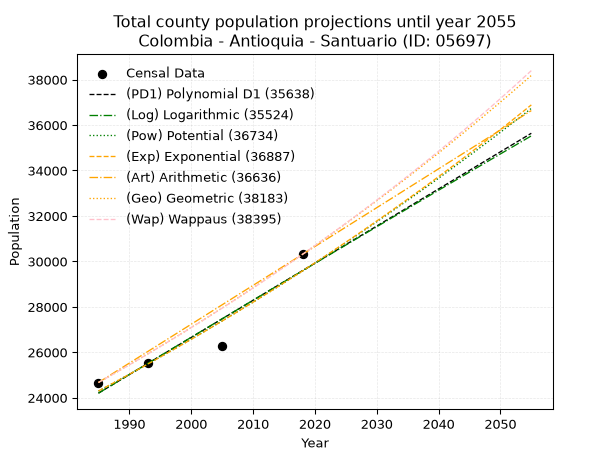
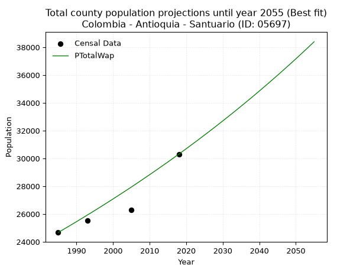
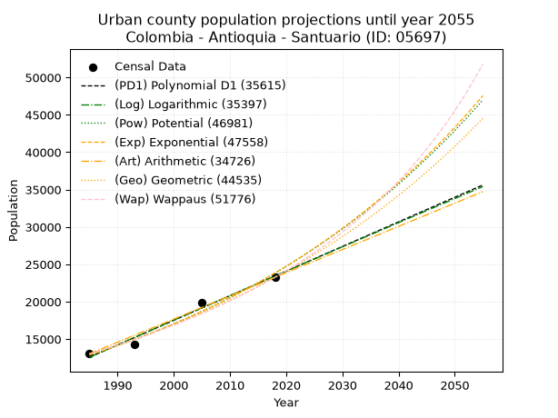
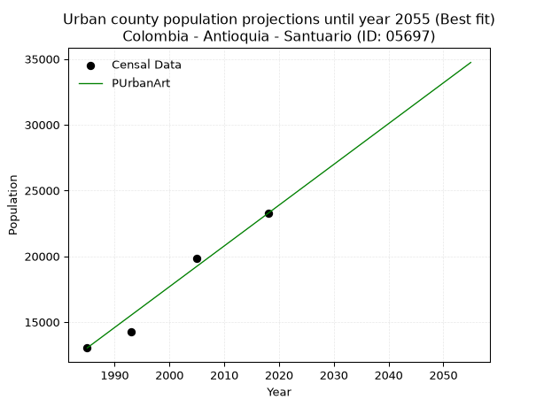
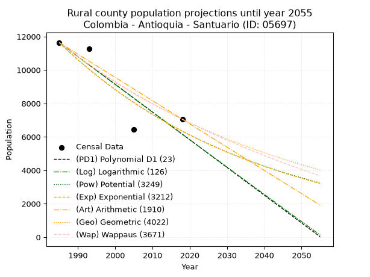
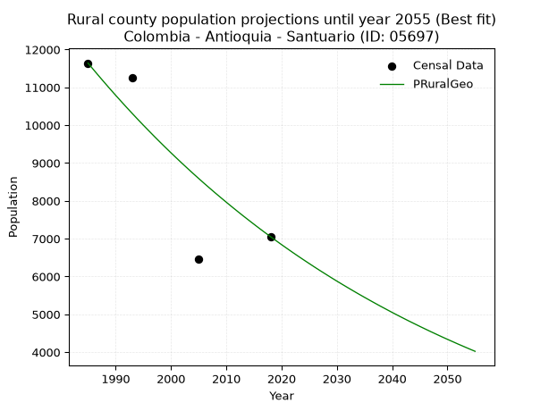

<div align="center">


</div>

# _“Population and Public Services Demand Projections (PPSD) until Year 2050 for Colombia - Antioquia - Santuario (ID: 05697)”_
Keywords: `population` `public-service` `projection` `lineal` `polynomial` `logarithmic` `potential` `exponential` `arithmetic` `geometric` `wappaus` `dane` `colombia` `south-america`

PPSD are analytical estimates used by governments and planners to anticipate future changes in population size, age distribution, and the resulting community needs for utilities, healthcare, education, and infrastructure as sizing future water treatment facilities, electrical grids, and road networks based on spatial growth.

> **General running parameters**: • app_version: _v20260806_. • Python version: _3.14.7_. • Pandas version: _3.0.5_. • NumPy version: _2.5.1_. • Creates, save and include plots into reports (create_plot): _False_. • Projection until year: _2050_. • Process polynomial degree 2 and up: _False_. • Process Wappaus: _True_. • Process Wappaus: _True_. • Set negative values to zero: _True_. • Set infinite values to zero: _True_. • Drop dataset notes: _True_. 
<div align="center">

Dynamic map: [:earth_americas:Google](http://maps.google.com/maps?q=6.136871199,-75.2654646) [:earth_americas:OSM](https://www.openstreetmap.org/#map=18/6.136871199/-75.2654646&layers=P) [:earth_americas:Bing](https://www.bing.com/maps?cp=6.136871199~-75.2654646&lvl=18) [:earth_americas:Apple](https://maps.apple.com/frame?center=6.136871199%2C-75.2654646&span=0.003%2C0.006)

</div>


<div align="center">

```geojson
{
  "type": "Feature",
  "geometry": {
    "type": "Point", 
    "coordinates": [-75.2654646, 6.136871199]
  }, 
  "properties": {
    "Name": "Colombia - Antioquia - Santuario (ID: 05697)"
  }
}
```

</div>


## 0. Census Data (4 records)

Census data are official statistics collected by a government about the people and housing in a country. They usually include counts of total population, age, sex, race, income, education, and jobs.

📅Global census file: [Population.xlsx](../data/Population.xlsx)

| Source   |   Year |   CountryID | CountryName   |   StateID | StateName   |   CountyID | CountyName   |   PTotal |   PUrban |   PRural |
|:---------|-------:|------------:|:--------------|----------:|:------------|-----------:|:-------------|---------:|---------:|---------:|
| DANE     |   1985 |          57 | Colombia      |        05 | Antioquia   |      05697 | Santuario    |    24670 |    13030 |    11640 |
| DANE     |   1993 |          57 | Colombia      |        05 | Antioquia   |      05697 | Santuario    |    25508 |    14250 |    11258 |
| DANE     |   2005 |          57 | Colombia      |        05 | Antioquia   |      05697 | Santuario    |    26287 |    19830 |     6457 |
| DANE     |   2018 |          57 | Colombia      |        05 | Antioquia   |      05697 | Santuario    |    30311 |    23258 |     7053 |

> 🔥Some records could had specific notes about the registered values or the corresponding urban or rural distribution.

## 1. Total

### 1.1. Coefficients and Parameters

* (PD1) Polynomial Deg 1: 163.36089923725152, -300068.6386993123 (lineal)
* (Log) Logarithmic: 326739.61219186155, -2456856.410597268
* (Pow) Potential: 11.930740391313746, -34.959232113369694
* (Exp) Exponential: 0.005964688433562977, 0.17520099090084607
* (Art) Arithmetic: Year diff. 2018 - 1985 = 33, Population diff. 30311 - 24670 = 5641, Annual growth = 170.93939393939394
* (Geo) Geometric: Year diff. 2018 - 1985 = 33, Population diff. 30311 - 24670 = 5641, Annual growth % = 0.00625959328637693
* (Wap) Wappaus: i = 0.6218126041337696, Condition values only valid for < 200)

<sub>
Wappaus condition values: ['0.00', '0.62', '1.24', '1.87', '2.49', '3.11', '3.73', '4.35', '4.97', '5.60', '6.22', '6.84', '7.46', '8.08', '8.71', '9.33', '9.95', '10.57', '11.19', '11.81', '12.44', '13.06', '13.68', '14.30', '14.92', '15.55', '16.17', '16.79', '17.41', '18.03', '18.65', '19.28', '19.90', '20.52', '21.14', '21.76', '22.39', '23.01', '23.63', '24.25', '24.87', '25.49', '26.12', '26.74', '27.36', '27.98', '28.60', '29.23', '29.85', '30.47', '31.09', '31.71', '32.33', '32.96', '33.58', '34.20', '34.82', '35.44', '36.07', '36.69', '37.31', '37.93', '38.55', '39.17', '39.80', '40.42']
</sub>


### 1.2. Projected Dataset

|   Year |   CountyID |   PTotalPD1 |   PTotalLog |   PTotalPow |   PTotalExp |   PTotalArt |   PTotalGeo |   PTotalWap |
|-------:|-----------:|------------:|------------:|------------:|------------:|------------:|------------:|------------:|
|   1985 |      05697 |       24203 |       24200 |       24294 |       24296 |       24670 |       24670 |       24670 |
|   1986 |      05697 |       24366 |       24364 |       24440 |       24442 |       24841 |       24824 |       24824 |
|   1987 |      05697 |       24529 |       24529 |       24587 |       24588 |       25012 |       24980 |       24979 |
|   1988 |      05697 |       24693 |       24693 |       24735 |       24735 |       25183 |       25136 |       25135 |
|   1989 |      05697 |       24856 |       24857 |       24884 |       24883 |       25354 |       25294 |       25291 |
|   1990 |      05697 |       25020 |       25022 |       25034 |       25032 |       25525 |       25452 |       25449 |
|   1991 |      05697 |       25183 |       25186 |       25184 |       25182 |       25696 |       25611 |       25608 |
|   1992 |      05697 |       25346 |       25350 |       25336 |       25332 |       25867 |       25771 |       25768 |
|   1993 |      05697 |       25510 |       25514 |       25488 |       25484 |       26038 |       25933 |       25929 |
|   1994 |      05697 |       25673 |       25678 |       25641 |       25636 |       26208 |       26095 |       26090 |
|   1995 |      05697 |       25836 |       25842 |       25795 |       25790 |       26379 |       26258 |       26253 |
|   1996 |      05697 |       26000 |       26005 |       25949 |       25944 |       26550 |       26423 |       26417 |
|   1997 |      05697 |       26163 |       26169 |       26105 |       26099 |       26721 |       26588 |       26582 |
|   1998 |      05697 |       26326 |       26333 |       26261 |       26255 |       26892 |       26755 |       26748 |
|   1999 |      05697 |       26490 |       26496 |       26419 |       26412 |       27063 |       26922 |       26915 |
|   2000 |      05697 |       26653 |       26660 |       26577 |       26570 |       27234 |       27091 |       27084 |
|   2001 |      05697 |       26817 |       26823 |       26736 |       26729 |       27405 |       27260 |       27253 |
|   2002 |      05697 |       26980 |       26986 |       26895 |       26889 |       27576 |       27431 |       27423 |
|   2003 |      05697 |       27143 |       27149 |       27056 |       27050 |       27747 |       27603 |       27595 |
|   2004 |      05697 |       27307 |       27312 |       27218 |       27212 |       27918 |       27775 |       27768 |
|   2005 |      05697 |       27470 |       27475 |       27380 |       27375 |       28089 |       27949 |       27941 |
|   2006 |      05697 |       27633 |       27638 |       27544 |       27539 |       28260 |       28124 |       28116 |
|   2007 |      05697 |       27797 |       27801 |       27708 |       27703 |       28431 |       28300 |       28293 |
|   2008 |      05697 |       27960 |       27964 |       27873 |       27869 |       28602 |       28477 |       28470 |
|   2009 |      05697 |       28123 |       28127 |       28039 |       28036 |       28773 |       28656 |       28648 |
|   2010 |      05697 |       28287 |       28289 |       28206 |       28204 |       28943 |       28835 |       28828 |
|   2011 |      05697 |       28450 |       28452 |       28374 |       28372 |       29114 |       29015 |       29009 |
|   2012 |      05697 |       28613 |       28614 |       28543 |       28542 |       29285 |       29197 |       29191 |
|   2013 |      05697 |       28777 |       28776 |       28712 |       28713 |       29456 |       29380 |       29375 |
|   2014 |      05697 |       28940 |       28939 |       28883 |       28885 |       29627 |       29564 |       29559 |
|   2015 |      05697 |       29104 |       29101 |       29055 |       29057 |       29798 |       29749 |       29745 |
|   2016 |      05697 |       29267 |       29263 |       29227 |       29231 |       29969 |       29935 |       29933 |
|   2017 |      05697 |       29430 |       29425 |       29401 |       29406 |       30140 |       30122 |       30121 |
|   2018 |      05697 |       29594 |       29587 |       29575 |       29582 |       30311 |       30311 |       30311 |
|   2019 |      05697 |       29757 |       29749 |       29750 |       29759 |       30482 |       30501 |       30502 |
|   2020 |      05697 |       29920 |       29911 |       29927 |       29937 |       30653 |       30692 |       30695 |
|   2021 |      05697 |       30084 |       30072 |       30104 |       30116 |       30824 |       30884 |       30888 |
|   2022 |      05697 |       30247 |       30234 |       30282 |       30296 |       30995 |       31077 |       31084 |
|   2023 |      05697 |       30410 |       30396 |       30461 |       30477 |       31166 |       31272 |       31280 |
|   2024 |      05697 |       30574 |       30557 |       30641 |       30660 |       31337 |       31467 |       31478 |
|   2025 |      05697 |       30737 |       30718 |       30822 |       30843 |       31508 |       31664 |       31678 |
|   2026 |      05697 |       30901 |       30880 |       31004 |       31028 |       31679 |       31863 |       31878 |
|   2027 |      05697 |       31064 |       31041 |       31188 |       31213 |       31849 |       32062 |       32081 |
|   2028 |      05697 |       31227 |       31202 |       31372 |       31400 |       32020 |       32263 |       32284 |
|   2029 |      05697 |       31391 |       31363 |       31557 |       31588 |       32191 |       32465 |       32489 |
|   2030 |      05697 |       31554 |       31524 |       31743 |       31777 |       32362 |       32668 |       32696 |
|   2031 |      05697 |       31717 |       31685 |       31930 |       31967 |       32533 |       32872 |       32904 |
|   2032 |      05697 |       31881 |       31846 |       32118 |       32158 |       32704 |       33078 |       33114 |
|   2033 |      05697 |       32044 |       32007 |       32307 |       32351 |       32875 |       33285 |       33325 |
|   2034 |      05697 |       32207 |       32167 |       32497 |       32544 |       33046 |       33494 |       33538 |
|   2035 |      05697 |       32371 |       32328 |       32688 |       32739 |       33217 |       33703 |       33752 |
|   2036 |      05697 |       32534 |       32489 |       32880 |       32935 |       33388 |       33914 |       33968 |
|   2037 |      05697 |       32698 |       32649 |       33074 |       33132 |       33559 |       34126 |       34185 |
|   2038 |      05697 |       32861 |       32809 |       33268 |       33330 |       33730 |       34340 |       34404 |
|   2039 |      05697 |       33024 |       32970 |       33463 |       33529 |       33901 |       34555 |       34625 |
|   2040 |      05697 |       33188 |       33130 |       33659 |       33730 |       34072 |       34771 |       34847 |
|   2041 |      05697 |       33351 |       33290 |       33857 |       33932 |       34243 |       34989 |       35071 |
|   2042 |      05697 |       33514 |       33450 |       34055 |       34135 |       34414 |       35208 |       35297 |
|   2043 |      05697 |       33678 |       33610 |       34255 |       34339 |       34584 |       35428 |       35525 |
|   2044 |      05697 |       33841 |       33770 |       34455 |       34544 |       34755 |       35650 |       35754 |
|   2045 |      05697 |       34004 |       33930 |       34657 |       34751 |       34926 |       35873 |       35985 |
|   2046 |      05697 |       34168 |       34089 |       34860 |       34959 |       35097 |       36098 |       36217 |
|   2047 |      05697 |       34331 |       34249 |       35064 |       35168 |       35268 |       36324 |       36452 |
|   2048 |      05697 |       34494 |       34409 |       35268 |       35379 |       35439 |       36551 |       36688 |
|   2049 |      05697 |       34658 |       34568 |       35474 |       35590 |       35610 |       36780 |       36926 |
|   2050 |      05697 |       34821 |       34728 |       35682 |       35803 |       35781 |       37010 |       37166 |
<div align="center">

</img>

</div>


### 1.3. Best fit with absolute and relative error (%)

Relative error puts that difference into context by dividing the absolute error by the true value, creating a unitless ratio or percentage that shows the scale of the mistake.

Absolute and relative error

|   Year | Source   |   CountryID | CountryName   |   StateID | StateName   |   CountyID_x | CountyName   |   PTotal |   PUrban |   PRural |   CountyID_y |   PTotalPD1 |   PTotalLog |   PTotalPow |   PTotalExp |   PTotalArt |   PTotalGeo |   PTotalWap |   PTotalPD1AbsError |   PTotalLogAbsError |   PTotalPowAbsError |   PTotalExpAbsError |   PTotalArtAbsError |   PTotalGeoAbsError |   PTotalWapAbsError |   PTotalPD1RelError |   PTotalLogRelError |   PTotalPowRelError |   PTotalExpRelError |   PTotalArtRelError |   PTotalGeoRelError |   PTotalWapRelError |
|-------:|:---------|------------:|:--------------|----------:|:------------|-------------:|:-------------|---------:|---------:|---------:|-------------:|------------:|------------:|------------:|------------:|------------:|------------:|------------:|--------------------:|--------------------:|--------------------:|--------------------:|--------------------:|--------------------:|--------------------:|--------------------:|--------------------:|--------------------:|--------------------:|--------------------:|--------------------:|--------------------:|
|   1985 | DANE     |          57 | Colombia      |        05 | Antioquia   |        05697 | Santuario    |    24670 |    13030 |    11640 |        05697 |       24203 |       24200 |       24294 |       24296 |       24670 |       24670 |       24670 |                 467 |                 470 |                 376 |                 374 |                   0 |                   0 |                   0 |          1.89299    |            1.90515  |           1.52412   |           1.51601   |             0       |             0       |             0       |
|   1993 | DANE     |          57 | Colombia      |        05 | Antioquia   |        05697 | Santuario    |    25508 |    14250 |    11258 |        05697 |       25510 |       25514 |       25488 |       25484 |       26038 |       25933 |       25929 |                   2 |                   6 |                  20 |                  24 |                 530 |                 425 |                 421 |          0.00784068 |            0.023522 |           0.0784068 |           0.0940881 |             2.07778 |             1.66614 |             1.65046 |
|   2005 | DANE     |          57 | Colombia      |        05 | Antioquia   |        05697 | Santuario    |    26287 |    19830 |     6457 |        05697 |       27470 |       27475 |       27380 |       27375 |       28089 |       27949 |       27941 |                1183 |                1188 |                1093 |                1088 |                1802 |                1662 |                1654 |          4.50032    |            4.51934  |           4.15795   |           4.13893   |             6.8551  |             6.32252 |             6.29208 |
|   2018 | DANE     |          57 | Colombia      |        05 | Antioquia   |        05697 | Santuario    |    30311 |    23258 |     7053 |        05697 |       29594 |       29587 |       29575 |       29582 |       30311 |       30311 |       30311 |                 717 |                 724 |                 736 |                 729 |                   0 |                   0 |                   0 |          2.36548    |            2.38857  |           2.42816   |           2.40507   |             0       |             0       |             0       |

Relative error mean

| Method    |   RelError | Best   |
|:----------|-----------:|:-------|
| PTotalPD1 |    2.19166 |        |
| PTotalLog |    2.20915 |        |
| PTotalPow |    2.04716 |        |
| PTotalExp |    2.03852 |        |
| PTotalArt |    2.23322 |        |
| PTotalGeo |    1.99717 |        |
| PTotalWap |    1.98564 | True   |

💙Best method: _**PTotalWap**_
<div align="center">

</img>

</div>


### 1.4. Fresh water supply demand in liters per capita per day (lpcd)

The fresh water supply demand typically ranges from 100 to 300 liters per capita per day (lpcd) for standard domestic and municipal planning, though absolute survival minimums set by the World Health Organization are as low as 7.5 to 20 liters per day, and total consumption in high-income nations can exceed 400 liters.

> `CZ`: Level in meters above the sea level (masl)<br> `WS`: Fresh water supply demand in liters per capita per day (lpcd or l/h/d)<br> `WSAll`: Zonal fresh water supply demand in liters per second (l/s)<br> `A`: Zonal area in square meters<br> `DP`: Population density (people/hectare)

Reference values (RAS Colombia)

|    CZ |   WS |
|------:|-----:|
|  1000 |  120 |
|  2000 |  130 |
| 99999 |  140 |

County shapefile geometry properties and water supply values

|   CountyID |      ATotal |   CZTotal |   WSTotal |
|-----------:|------------:|----------:|----------:|
|      05697 | 8.35283e+07 |   2216.61 |       140 |

Projected values for best method: PTotalWap

|   CountyID |   Year |   PTotalWap |   DPTotal |   WSTotal |   WSTotalAll |
|-----------:|-------:|------------:|----------:|----------:|-------------:|
|      05697 |   1985 |       24670 |      2.95 |       140 |      39.9745 |
|      05697 |   1986 |       24824 |      2.97 |       140 |      40.2241 |
|      05697 |   1987 |       24979 |      2.99 |       140 |      40.4752 |
|      05697 |   1988 |       25135 |      3.01 |       140 |      40.728  |
|      05697 |   1989 |       25291 |      3.03 |       140 |      40.9808 |
|      05697 |   1990 |       25449 |      3.05 |       140 |      41.2368 |
|      05697 |   1991 |       25608 |      3.07 |       140 |      41.4944 |
|      05697 |   1992 |       25768 |      3.08 |       140 |      41.7537 |
|      05697 |   1993 |       25929 |      3.1  |       140 |      42.0146 |
|      05697 |   1994 |       26090 |      3.12 |       140 |      42.2755 |
|      05697 |   1995 |       26253 |      3.14 |       140 |      42.5396 |
|      05697 |   1996 |       26417 |      3.16 |       140 |      42.8053 |
|      05697 |   1997 |       26582 |      3.18 |       140 |      43.0727 |
|      05697 |   1998 |       26748 |      3.2  |       140 |      43.3417 |
|      05697 |   1999 |       26915 |      3.22 |       140 |      43.6123 |
|      05697 |   2000 |       27084 |      3.24 |       140 |      43.8861 |
|      05697 |   2001 |       27253 |      3.26 |       140 |      44.16   |
|      05697 |   2002 |       27423 |      3.28 |       140 |      44.4354 |
|      05697 |   2003 |       27595 |      3.3  |       140 |      44.7141 |
|      05697 |   2004 |       27768 |      3.32 |       140 |      44.9944 |
|      05697 |   2005 |       27941 |      3.35 |       140 |      45.2748 |
|      05697 |   2006 |       28116 |      3.37 |       140 |      45.5583 |
|      05697 |   2007 |       28293 |      3.39 |       140 |      45.8451 |
|      05697 |   2008 |       28470 |      3.41 |       140 |      46.1319 |
|      05697 |   2009 |       28648 |      3.43 |       140 |      46.4204 |
|      05697 |   2010 |       28828 |      3.45 |       140 |      46.712  |
|      05697 |   2011 |       29009 |      3.47 |       140 |      47.0053 |
|      05697 |   2012 |       29191 |      3.49 |       140 |      47.3002 |
|      05697 |   2013 |       29375 |      3.52 |       140 |      47.5984 |
|      05697 |   2014 |       29559 |      3.54 |       140 |      47.8965 |
|      05697 |   2015 |       29745 |      3.56 |       140 |      48.1979 |
|      05697 |   2016 |       29933 |      3.58 |       140 |      48.5025 |
|      05697 |   2017 |       30121 |      3.61 |       140 |      48.8072 |
|      05697 |   2018 |       30311 |      3.63 |       140 |      49.115  |
|      05697 |   2019 |       30502 |      3.65 |       140 |      49.4245 |
|      05697 |   2020 |       30695 |      3.67 |       140 |      49.7373 |
|      05697 |   2021 |       30888 |      3.7  |       140 |      50.05   |
|      05697 |   2022 |       31084 |      3.72 |       140 |      50.3676 |
|      05697 |   2023 |       31280 |      3.74 |       140 |      50.6852 |
|      05697 |   2024 |       31478 |      3.77 |       140 |      51.006  |
|      05697 |   2025 |       31678 |      3.79 |       140 |      51.3301 |
|      05697 |   2026 |       31878 |      3.82 |       140 |      51.6542 |
|      05697 |   2027 |       32081 |      3.84 |       140 |      51.9831 |
|      05697 |   2028 |       32284 |      3.87 |       140 |      52.312  |
|      05697 |   2029 |       32489 |      3.89 |       140 |      52.6442 |
|      05697 |   2030 |       32696 |      3.91 |       140 |      52.9796 |
|      05697 |   2031 |       32904 |      3.94 |       140 |      53.3167 |
|      05697 |   2032 |       33114 |      3.96 |       140 |      53.6569 |
|      05697 |   2033 |       33325 |      3.99 |       140 |      53.9988 |
|      05697 |   2034 |       33538 |      4.02 |       140 |      54.344  |
|      05697 |   2035 |       33752 |      4.04 |       140 |      54.6907 |
|      05697 |   2036 |       33968 |      4.07 |       140 |      55.0407 |
|      05697 |   2037 |       34185 |      4.09 |       140 |      55.3924 |
|      05697 |   2038 |       34404 |      4.12 |       140 |      55.7472 |
|      05697 |   2039 |       34625 |      4.15 |       140 |      56.1053 |
|      05697 |   2040 |       34847 |      4.17 |       140 |      56.465  |
|      05697 |   2041 |       35071 |      4.2  |       140 |      56.828  |
|      05697 |   2042 |       35297 |      4.23 |       140 |      57.1942 |
|      05697 |   2043 |       35525 |      4.25 |       140 |      57.5637 |
|      05697 |   2044 |       35754 |      4.28 |       140 |      57.9347 |
|      05697 |   2045 |       35985 |      4.31 |       140 |      58.309  |
|      05697 |   2046 |       36217 |      4.34 |       140 |      58.685  |
|      05697 |   2047 |       36452 |      4.36 |       140 |      59.0657 |
|      05697 |   2048 |       36688 |      4.39 |       140 |      59.4481 |
|      05697 |   2049 |       36926 |      4.42 |       140 |      59.8338 |
|      05697 |   2050 |       37166 |      4.45 |       140 |      60.2227 |

## 2. Urban

### 2.1. Coefficients and Parameters

* (PD1) Polynomial Deg 1: 329.18827780007774, -640866.8526696056 (lineal)
* (Log) Logarithmic: 658896.859120361, -4990688.306241922
* (Pow) Potential: 37.385696684778786, -119.17985639156079
* (Exp) Exponential: 0.01867536934318169, 1.023095633543585e-12
* (Art) Arithmetic: Year diff. 2018 - 1985 = 33, Population diff. 23258 - 13030 = 10228, Annual growth = 309.93939393939394
* (Geo) Geometric: Year diff. 2018 - 1985 = 33, Population diff. 23258 - 13030 = 10228, Annual growth % = 0.017712454676917844
* (Wap) Wappaus: i = 1.7082197637753194, Condition values only valid for < 200)

<sub>
Wappaus condition values: ['0.00', '1.71', '3.42', '5.12', '6.83', '8.54', '10.25', '11.96', '13.67', '15.37', '17.08', '18.79', '20.50', '22.21', '23.92', '25.62', '27.33', '29.04', '30.75', '32.46', '34.16', '35.87', '37.58', '39.29', '41.00', '42.71', '44.41', '46.12', '47.83', '49.54', '51.25', '52.95', '54.66', '56.37', '58.08', '59.79', '61.50', '63.20', '64.91', '66.62', '68.33', '70.04', '71.75', '73.45', '75.16', '76.87', '78.58', '80.29', '81.99', '83.70', '85.41', '87.12', '88.83', '90.54', '92.24', '93.95', '95.66', '97.37', '99.08', '100.78', '102.49', '104.20', '105.91', '107.62', '109.33', '111.03']
</sub>


### 2.2. Projected Dataset

|   Year |   CountyID |   PUrbanPD1 |   PUrbanLog |   PUrbanPow |   PUrbanExp |   PUrbanArt |   PUrbanGeo |   PUrbanWap |
|-------:|-----------:|------------:|------------:|------------:|------------:|------------:|------------:|------------:|
|   1985 |      05697 |       12572 |       12562 |       12859 |       12867 |       13030 |       13030 |       13030 |
|   1986 |      05697 |       12901 |       12894 |       13104 |       13110 |       13340 |       13261 |       13254 |
|   1987 |      05697 |       13230 |       13226 |       13353 |       13357 |       13650 |       13496 |       13483 |
|   1988 |      05697 |       13559 |       13557 |       13606 |       13608 |       13960 |       13735 |       13715 |
|   1989 |      05697 |       13889 |       13889 |       13864 |       13865 |       14270 |       13978 |       13952 |
|   1990 |      05697 |       14218 |       14220 |       14127 |       14126 |       14580 |       14226 |       14193 |
|   1991 |      05697 |       14547 |       14551 |       14395 |       14393 |       14890 |       14478 |       14438 |
|   1992 |      05697 |       14876 |       14882 |       14668 |       14664 |       15200 |       14734 |       14687 |
|   1993 |      05697 |       15205 |       15212 |       14946 |       14940 |       15510 |       14995 |       14941 |
|   1994 |      05697 |       15535 |       15543 |       15229 |       15222 |       15819 |       15261 |       15200 |
|   1995 |      05697 |       15864 |       15873 |       15517 |       15509 |       16129 |       15531 |       15464 |
|   1996 |      05697 |       16193 |       16203 |       15810 |       15801 |       16439 |       15806 |       15732 |
|   1997 |      05697 |       16522 |       16533 |       16109 |       16099 |       16749 |       16086 |       16006 |
|   1998 |      05697 |       16851 |       16863 |       16414 |       16403 |       17059 |       16371 |       16285 |
|   1999 |      05697 |       17181 |       17193 |       16724 |       16712 |       17369 |       16661 |       16569 |
|   2000 |      05697 |       17510 |       17522 |       17039 |       17027 |       17679 |       16956 |       16859 |
|   2001 |      05697 |       17839 |       17852 |       17361 |       17348 |       17989 |       17256 |       17155 |
|   2002 |      05697 |       18168 |       18181 |       17688 |       17675 |       18299 |       17562 |       17457 |
|   2003 |      05697 |       18497 |       18510 |       18021 |       18008 |       18609 |       17873 |       17764 |
|   2004 |      05697 |       18826 |       18839 |       18361 |       18348 |       18919 |       18190 |       18078 |
|   2005 |      05697 |       19156 |       19168 |       18706 |       18693 |       19229 |       18512 |       18399 |
|   2006 |      05697 |       19485 |       19496 |       19058 |       19046 |       19539 |       18840 |       18726 |
|   2007 |      05697 |       19814 |       19825 |       19417 |       19405 |       19849 |       19173 |       19060 |
|   2008 |      05697 |       20143 |       20153 |       19782 |       19771 |       20159 |       19513 |       19401 |
|   2009 |      05697 |       20472 |       20481 |       20153 |       20143 |       20469 |       19859 |       19749 |
|   2010 |      05697 |       20802 |       20809 |       20532 |       20523 |       20778 |       20210 |       20105 |
|   2011 |      05697 |       21131 |       21136 |       20917 |       20910 |       21088 |       20568 |       20469 |
|   2012 |      05697 |       21460 |       21464 |       21310 |       21304 |       21398 |       20933 |       20841 |
|   2013 |      05697 |       21789 |       21791 |       21709 |       21706 |       21708 |       21303 |       21221 |
|   2014 |      05697 |       22118 |       22119 |       22116 |       22115 |       22018 |       21681 |       21610 |
|   2015 |      05697 |       22448 |       22446 |       22530 |       22532 |       22328 |       22065 |       22008 |
|   2016 |      05697 |       22777 |       22773 |       22952 |       22957 |       22638 |       22455 |       22415 |
|   2017 |      05697 |       23106 |       23099 |       23382 |       23389 |       22948 |       22853 |       22831 |
|   2018 |      05697 |       23435 |       23426 |       23819 |       23830 |       23258 |       23258 |       23258 |
|   2019 |      05697 |       23764 |       23752 |       24264 |       24279 |       23568 |       23670 |       23695 |
|   2020 |      05697 |       24093 |       24079 |       24718 |       24737 |       23878 |       24089 |       24142 |
|   2021 |      05697 |       24423 |       24405 |       25179 |       25203 |       24188 |       24516 |       24601 |
|   2022 |      05697 |       24752 |       24731 |       25649 |       25678 |       24498 |       24950 |       25071 |
|   2023 |      05697 |       25081 |       25057 |       26128 |       26163 |       24808 |       25392 |       25552 |
|   2024 |      05697 |       25410 |       25382 |       26615 |       26656 |       25118 |       25842 |       26046 |
|   2025 |      05697 |       25739 |       25708 |       27111 |       27158 |       25428 |       26300 |       26553 |
|   2026 |      05697 |       26069 |       26033 |       27616 |       27670 |       25738 |       26765 |       27074 |
|   2027 |      05697 |       26398 |       26358 |       28130 |       28192 |       26047 |       27239 |       27608 |
|   2028 |      05697 |       26727 |       26683 |       28654 |       28723 |       26357 |       27722 |       28156 |
|   2029 |      05697 |       27056 |       27008 |       29187 |       29265 |       26667 |       28213 |       28720 |
|   2030 |      05697 |       27385 |       27333 |       29729 |       29816 |       26977 |       28713 |       29299 |
|   2031 |      05697 |       27715 |       27657 |       30282 |       30378 |       27287 |       29221 |       29895 |
|   2032 |      05697 |       28044 |       27981 |       30844 |       30951 |       27597 |       29739 |       30507 |
|   2033 |      05697 |       28373 |       28306 |       31417 |       31535 |       27907 |       30266 |       31137 |
|   2034 |      05697 |       28702 |       28630 |       32000 |       32129 |       28217 |       30802 |       31786 |
|   2035 |      05697 |       29031 |       28953 |       32593 |       32735 |       28527 |       31347 |       32454 |
|   2036 |      05697 |       29360 |       29277 |       33198 |       33352 |       28837 |       31902 |       33143 |
|   2037 |      05697 |       29690 |       29601 |       33813 |       33980 |       29147 |       32468 |       33852 |
|   2038 |      05697 |       30019 |       29924 |       34439 |       34621 |       29457 |       33043 |       34584 |
|   2039 |      05697 |       30348 |       30247 |       35076 |       35274 |       29767 |       33628 |       35338 |
|   2040 |      05697 |       30677 |       30570 |       35725 |       35939 |       30077 |       34223 |       36118 |
|   2041 |      05697 |       31006 |       30893 |       36386 |       36616 |       30387 |       34830 |       36922 |
|   2042 |      05697 |       31336 |       31216 |       37058 |       37306 |       30697 |       35447 |       37754 |
|   2043 |      05697 |       31665 |       31539 |       37743 |       38010 |       31006 |       36074 |       38613 |
|   2044 |      05697 |       31994 |       31861 |       38440 |       38726 |       31316 |       36713 |       39502 |
|   2045 |      05697 |       32323 |       32183 |       39149 |       39456 |       31626 |       37364 |       40423 |
|   2046 |      05697 |       32652 |       32505 |       39871 |       40200 |       31936 |       38025 |       41376 |
|   2047 |      05697 |       32982 |       32827 |       40606 |       40958 |       32246 |       38699 |       42364 |
|   2048 |      05697 |       33311 |       33149 |       41354 |       41730 |       32556 |       39384 |       43388 |
|   2049 |      05697 |       33640 |       33471 |       42116 |       42516 |       32866 |       40082 |       44451 |
|   2050 |      05697 |       33969 |       33792 |       42891 |       43318 |       33176 |       40792 |       45554 |
<div align="center">

</img>

</div>


### 2.3. Best fit with absolute and relative error (%)

Relative error puts that difference into context by dividing the absolute error by the true value, creating a unitless ratio or percentage that shows the scale of the mistake.

Absolute and relative error

|   Year | Source   |   CountryID | CountryName   |   StateID | StateName   |   CountyID_x | CountyName   |   PTotal |   PUrban |   PRural |   CountyID_y |   PUrbanPD1 |   PUrbanLog |   PUrbanPow |   PUrbanExp |   PUrbanArt |   PUrbanGeo |   PUrbanWap |   PUrbanPD1AbsError |   PUrbanLogAbsError |   PUrbanPowAbsError |   PUrbanExpAbsError |   PUrbanArtAbsError |   PUrbanGeoAbsError |   PUrbanWapAbsError |   PUrbanPD1RelError |   PUrbanLogRelError |   PUrbanPowRelError |   PUrbanExpRelError |   PUrbanArtRelError |   PUrbanGeoRelError |   PUrbanWapRelError |
|-------:|:---------|------------:|:--------------|----------:|:------------|-------------:|:-------------|---------:|---------:|---------:|-------------:|------------:|------------:|------------:|------------:|------------:|------------:|------------:|--------------------:|--------------------:|--------------------:|--------------------:|--------------------:|--------------------:|--------------------:|--------------------:|--------------------:|--------------------:|--------------------:|--------------------:|--------------------:|--------------------:|
|   1985 | DANE     |          57 | Colombia      |        05 | Antioquia   |        05697 | Santuario    |    24670 |    13030 |    11640 |        05697 |       12572 |       12562 |       12859 |       12867 |       13030 |       13030 |       13030 |                 458 |                 468 |                 171 |                 163 |                   0 |                   0 |                   0 |            3.51497  |            3.59171  |             1.31236 |             1.25096 |             0       |             0       |             0       |
|   1993 | DANE     |          57 | Colombia      |        05 | Antioquia   |        05697 | Santuario    |    25508 |    14250 |    11258 |        05697 |       15205 |       15212 |       14946 |       14940 |       15510 |       14995 |       14941 |                 955 |                 962 |                 696 |                 690 |                1260 |                 745 |                 691 |            6.70175  |            6.75088  |             4.88421 |             4.84211 |             8.84211 |             5.22807 |             4.84912 |
|   2005 | DANE     |          57 | Colombia      |        05 | Antioquia   |        05697 | Santuario    |    26287 |    19830 |     6457 |        05697 |       19156 |       19168 |       18706 |       18693 |       19229 |       18512 |       18399 |                 674 |                 662 |                1124 |                1137 |                 601 |                1318 |                1431 |            3.39889  |            3.33838  |             5.66818 |             5.73374 |             3.03076 |             6.6465  |             7.21634 |
|   2018 | DANE     |          57 | Colombia      |        05 | Antioquia   |        05697 | Santuario    |    30311 |    23258 |     7053 |        05697 |       23435 |       23426 |       23819 |       23830 |       23258 |       23258 |       23258 |                 177 |                 168 |                 561 |                 572 |                   0 |                   0 |                   0 |            0.761028 |            0.722332 |             2.41207 |             2.45937 |             0       |             0       |             0       |

Relative error mean

| Method    |   RelError | Best   |
|:----------|-----------:|:-------|
| PUrbanPD1 |    3.59416 |        |
| PUrbanLog |    3.60082 |        |
| PUrbanPow |    3.5692  |        |
| PUrbanExp |    3.57154 |        |
| PUrbanArt |    2.96822 | True   |
| PUrbanGeo |    2.96864 |        |
| PUrbanWap |    3.01637 |        |

💙Best method: _**PUrbanArt**_
<div align="center">

</img>

</div>


### 2.4. Fresh water supply demand in liters per capita per day (lpcd)

The fresh water supply demand typically ranges from 100 to 300 liters per capita per day (lpcd) for standard domestic and municipal planning, though absolute survival minimums set by the World Health Organization are as low as 7.5 to 20 liters per day, and total consumption in high-income nations can exceed 400 liters.

> `CZ`: Level in meters above the sea level (masl)<br> `WS`: Fresh water supply demand in liters per capita per day (lpcd or l/h/d)<br> `WSAll`: Zonal fresh water supply demand in liters per second (l/s)<br> `A`: Zonal area in square meters<br> `DP`: Population density (people/hectare)

Reference values (RAS Colombia)

|    CZ |   WS |
|------:|-----:|
|  1000 |  120 |
|  2000 |  130 |
| 99999 |  140 |

County shapefile geometry properties and water supply values

|   CountyID |      AUrban |   CZUrban |   WSUrban |
|-----------:|------------:|----------:|----------:|
|      05697 | 2.02632e+06 |   2136.12 |       140 |

Projected values for best method: PUrbanArt

|   CountyID |   Year |   PUrbanArt |   DPUrban |   WSUrban |   WSUrbanAll |
|-----------:|-------:|------------:|----------:|----------:|-------------:|
|      05697 |   1985 |       13030 |     64.3  |       140 |      21.1134 |
|      05697 |   1986 |       13340 |     65.83 |       140 |      21.6157 |
|      05697 |   1987 |       13650 |     67.36 |       140 |      22.1181 |
|      05697 |   1988 |       13960 |     68.89 |       140 |      22.6204 |
|      05697 |   1989 |       14270 |     70.42 |       140 |      23.1227 |
|      05697 |   1990 |       14580 |     71.95 |       140 |      23.625  |
|      05697 |   1991 |       14890 |     73.48 |       140 |      24.1273 |
|      05697 |   1992 |       15200 |     75.01 |       140 |      24.6296 |
|      05697 |   1993 |       15510 |     76.54 |       140 |      25.1319 |
|      05697 |   1994 |       15819 |     78.07 |       140 |      25.6326 |
|      05697 |   1995 |       16129 |     79.6  |       140 |      26.135  |
|      05697 |   1996 |       16439 |     81.13 |       140 |      26.6373 |
|      05697 |   1997 |       16749 |     82.66 |       140 |      27.1396 |
|      05697 |   1998 |       17059 |     84.19 |       140 |      27.6419 |
|      05697 |   1999 |       17369 |     85.72 |       140 |      28.1442 |
|      05697 |   2000 |       17679 |     87.25 |       140 |      28.6465 |
|      05697 |   2001 |       17989 |     88.78 |       140 |      29.1488 |
|      05697 |   2002 |       18299 |     90.31 |       140 |      29.6512 |
|      05697 |   2003 |       18609 |     91.84 |       140 |      30.1535 |
|      05697 |   2004 |       18919 |     93.37 |       140 |      30.6558 |
|      05697 |   2005 |       19229 |     94.9  |       140 |      31.1581 |
|      05697 |   2006 |       19539 |     96.43 |       140 |      31.6604 |
|      05697 |   2007 |       19849 |     97.96 |       140 |      32.1627 |
|      05697 |   2008 |       20159 |     99.49 |       140 |      32.665  |
|      05697 |   2009 |       20469 |    101.02 |       140 |      33.1674 |
|      05697 |   2010 |       20778 |    102.54 |       140 |      33.6681 |
|      05697 |   2011 |       21088 |    104.07 |       140 |      34.1704 |
|      05697 |   2012 |       21398 |    105.6  |       140 |      34.6727 |
|      05697 |   2013 |       21708 |    107.13 |       140 |      35.175  |
|      05697 |   2014 |       22018 |    108.66 |       140 |      35.6773 |
|      05697 |   2015 |       22328 |    110.19 |       140 |      36.1796 |
|      05697 |   2016 |       22638 |    111.72 |       140 |      36.6819 |
|      05697 |   2017 |       22948 |    113.25 |       140 |      37.1843 |
|      05697 |   2018 |       23258 |    114.78 |       140 |      37.6866 |
|      05697 |   2019 |       23568 |    116.31 |       140 |      38.1889 |
|      05697 |   2020 |       23878 |    117.84 |       140 |      38.6912 |
|      05697 |   2021 |       24188 |    119.37 |       140 |      39.1935 |
|      05697 |   2022 |       24498 |    120.9  |       140 |      39.6958 |
|      05697 |   2023 |       24808 |    122.43 |       140 |      40.1981 |
|      05697 |   2024 |       25118 |    123.96 |       140 |      40.7005 |
|      05697 |   2025 |       25428 |    125.49 |       140 |      41.2028 |
|      05697 |   2026 |       25738 |    127.02 |       140 |      41.7051 |
|      05697 |   2027 |       26047 |    128.54 |       140 |      42.2058 |
|      05697 |   2028 |       26357 |    130.07 |       140 |      42.7081 |
|      05697 |   2029 |       26667 |    131.6  |       140 |      43.2104 |
|      05697 |   2030 |       26977 |    133.13 |       140 |      43.7127 |
|      05697 |   2031 |       27287 |    134.66 |       140 |      44.215  |
|      05697 |   2032 |       27597 |    136.19 |       140 |      44.7174 |
|      05697 |   2033 |       27907 |    137.72 |       140 |      45.2197 |
|      05697 |   2034 |       28217 |    139.25 |       140 |      45.722  |
|      05697 |   2035 |       28527 |    140.78 |       140 |      46.2243 |
|      05697 |   2036 |       28837 |    142.31 |       140 |      46.7266 |
|      05697 |   2037 |       29147 |    143.84 |       140 |      47.2289 |
|      05697 |   2038 |       29457 |    145.37 |       140 |      47.7313 |
|      05697 |   2039 |       29767 |    146.9  |       140 |      48.2336 |
|      05697 |   2040 |       30077 |    148.43 |       140 |      48.7359 |
|      05697 |   2041 |       30387 |    149.96 |       140 |      49.2382 |
|      05697 |   2042 |       30697 |    151.49 |       140 |      49.7405 |
|      05697 |   2043 |       31006 |    153.02 |       140 |      50.2412 |
|      05697 |   2044 |       31316 |    154.55 |       140 |      50.7435 |
|      05697 |   2045 |       31626 |    156.08 |       140 |      51.2458 |
|      05697 |   2046 |       31936 |    157.61 |       140 |      51.7481 |
|      05697 |   2047 |       32246 |    159.14 |       140 |      52.2505 |
|      05697 |   2048 |       32556 |    160.67 |       140 |      52.7528 |
|      05697 |   2049 |       32866 |    162.2  |       140 |      53.2551 |
|      05697 |   2050 |       33176 |    163.73 |       140 |      53.7574 |

## 3. Rural

### 3.1. Coefficients and Parameters

* (PD1) Polynomial Deg 1: -165.8273785628263, 340798.21397029335 (lineal)
* (Log) Logarithmic: -332157.24692849914, 2533831.8956446494
* (Pow) Potential: -36.82930248678614, 125.52027526246246
* (Exp) Exponential: -0.01838590365773698, 8.236523740778809e+19
* (Art) Arithmetic: Year diff. 2018 - 1985 = 33, Population diff. 7053 - 11640 = -4587, Annual growth = -139.0
* (Geo) Geometric: Year diff. 2018 - 1985 = 33, Population diff. 7053 - 11640 = -4587, Annual growth % = -0.015066987761457207
* (Wap) Wappaus: i = -1.4871877173273418, Condition values only valid for < 200)

<sub>
Wappaus condition values: ['-0.00', '-1.49', '-2.97', '-4.46', '-5.95', '-7.44', '-8.92', '-10.41', '-11.90', '-13.38', '-14.87', '-16.36', '-17.85', '-19.33', '-20.82', '-22.31', '-23.80', '-25.28', '-26.77', '-28.26', '-29.74', '-31.23', '-32.72', '-34.21', '-35.69', '-37.18', '-38.67', '-40.15', '-41.64', '-43.13', '-44.62', '-46.10', '-47.59', '-49.08', '-50.56', '-52.05', '-53.54', '-55.03', '-56.51', '-58.00', '-59.49', '-60.97', '-62.46', '-63.95', '-65.44', '-66.92', '-68.41', '-69.90', '-71.39', '-72.87', '-74.36', '-75.85', '-77.33', '-78.82', '-80.31', '-81.80', '-83.28', '-84.77', '-86.26', '-87.74', '-89.23', '-90.72', '-92.21', '-93.69', '-95.18', '-96.67']
</sub>


### 3.2. Projected Dataset

|   Year |   CountyID |   PRuralPD1 |   PRuralLog |   PRuralPow |   PRuralExp |   PRuralArt |   PRuralGeo |   PRuralWap |
|-------:|-----------:|------------:|------------:|------------:|------------:|------------:|------------:|------------:|
|   1985 |      05697 |       11631 |       11638 |       11643 |       11634 |       11640 |       11640 |       11640 |
|   1986 |      05697 |       11465 |       11470 |       11429 |       11422 |       11501 |       11465 |       11468 |
|   1987 |      05697 |       11299 |       11303 |       11219 |       11214 |       11362 |       11292 |       11299 |
|   1988 |      05697 |       11133 |       11136 |       11013 |       11010 |       11223 |       11122 |       11132 |
|   1989 |      05697 |       10968 |       10969 |       10811 |       10809 |       11084 |       10954 |       10968 |
|   1990 |      05697 |       10802 |       10802 |       10612 |       10612 |       10945 |       10789 |       10805 |
|   1991 |      05697 |       10636 |       10635 |       10418 |       10419 |       10806 |       10627 |       10646 |
|   1992 |      05697 |       10470 |       10468 |       10227 |       10229 |       10667 |       10466 |       10488 |
|   1993 |      05697 |       10304 |       10302 |       10040 |       10043 |       10528 |       10309 |       10333 |
|   1994 |      05697 |       10138 |       10135 |        9856 |        9860 |       10389 |       10153 |       10180 |
|   1995 |      05697 |        9973 |        9968 |        9676 |        9680 |       10250 |       10000 |       10029 |
|   1996 |      05697 |        9807 |        9802 |        9499 |        9504 |       10111 |        9850 |        9880 |
|   1997 |      05697 |        9641 |        9636 |        9325 |        9331 |        9972 |        9701 |        9733 |
|   1998 |      05697 |        9475 |        9469 |        9155 |        9161 |        9833 |        9555 |        9588 |
|   1999 |      05697 |        9309 |        9303 |        8988 |        8994 |        9694 |        9411 |        9445 |
|   2000 |      05697 |        9143 |        9137 |        8824 |        8830 |        9555 |        9269 |        9304 |
|   2001 |      05697 |        8978 |        8971 |        8663 |        8669 |        9416 |        9130 |        9165 |
|   2002 |      05697 |        8812 |        8805 |        8505 |        8511 |        9277 |        8992 |        9027 |
|   2003 |      05697 |        8646 |        8639 |        8350 |        8356 |        9138 |        8857 |        8892 |
|   2004 |      05697 |        8480 |        8473 |        8198 |        8204 |        8999 |        8723 |        8758 |
|   2005 |      05697 |        8314 |        8308 |        8048 |        8054 |        8860 |        8592 |        8626 |
|   2006 |      05697 |        8148 |        8142 |        7902 |        7908 |        8721 |        8462 |        8496 |
|   2007 |      05697 |        7983 |        7977 |        7758 |        7763 |        8582 |        8335 |        8367 |
|   2008 |      05697 |        7817 |        7811 |        7617 |        7622 |        8443 |        8209 |        8240 |
|   2009 |      05697 |        7651 |        7646 |        7479 |        7483 |        8304 |        8086 |        8115 |
|   2010 |      05697 |        7485 |        7480 |        7343 |        7347 |        8165 |        7964 |        7991 |
|   2011 |      05697 |        7319 |        7315 |        7210 |        7213 |        8026 |        7844 |        7868 |
|   2012 |      05697 |        7154 |        7150 |        7079 |        7082 |        7887 |        7726 |        7748 |
|   2013 |      05697 |        6988 |        6985 |        6950 |        6953 |        7748 |        7609 |        7628 |
|   2014 |      05697 |        6822 |        6820 |        6824 |        6826 |        7609 |        7495 |        7510 |
|   2015 |      05697 |        6656 |        6655 |        6701 |        6702 |        7470 |        7382 |        7394 |
|   2016 |      05697 |        6490 |        6490 |        6580 |        6579 |        7331 |        7270 |        7279 |
|   2017 |      05697 |        6324 |        6326 |        6460 |        6460 |        7192 |        7161 |        7165 |
|   2018 |      05697 |        6159 |        6161 |        6344 |        6342 |        7053 |        7053 |        7053 |
|   2019 |      05697 |        5993 |        5996 |        6229 |        6226 |        6914 |        6947 |        6942 |
|   2020 |      05697 |        5827 |        5832 |        6116 |        6113 |        6775 |        6842 |        6832 |
|   2021 |      05697 |        5661 |        5668 |        6006 |        6002 |        6636 |        6739 |        6724 |
|   2022 |      05697 |        5495 |        5503 |        5897 |        5892 |        6497 |        6637 |        6617 |
|   2023 |      05697 |        5329 |        5339 |        5791 |        5785 |        6358 |        6537 |        6511 |
|   2024 |      05697 |        5164 |        5175 |        5687 |        5680 |        6219 |        6439 |        6406 |
|   2025 |      05697 |        4998 |        5011 |        5584 |        5576 |        6080 |        6342 |        6303 |
|   2026 |      05697 |        4832 |        4847 |        5483 |        5474 |        5941 |        6246 |        6201 |
|   2027 |      05697 |        4666 |        4683 |        5385 |        5375 |        5802 |        6152 |        6100 |
|   2028 |      05697 |        4500 |        4519 |        5288 |        5277 |        5663 |        6060 |        6000 |
|   2029 |      05697 |        4334 |        4355 |        5193 |        5181 |        5524 |        5968 |        5901 |
|   2030 |      05697 |        4169 |        4192 |        5099 |        5086 |        5385 |        5878 |        5803 |
|   2031 |      05697 |        4003 |        4028 |        5008 |        4994 |        5246 |        5790 |        5707 |
|   2032 |      05697 |        3837 |        3865 |        4918 |        4903 |        5107 |        5703 |        5611 |
|   2033 |      05697 |        3671 |        3701 |        4829 |        4813 |        4968 |        5617 |        5516 |
|   2034 |      05697 |        3505 |        3538 |        4743 |        4726 |        4829 |        5532 |        5423 |
|   2035 |      05697 |        3339 |        3375 |        4658 |        4640 |        4690 |        5449 |        5330 |
|   2036 |      05697 |        3174 |        3211 |        4574 |        4555 |        4551 |        5367 |        5239 |
|   2037 |      05697 |        3008 |        3048 |        4492 |        4472 |        4412 |        5286 |        5148 |
|   2038 |      05697 |        2842 |        2885 |        4412 |        4391 |        4273 |        5206 |        5059 |
|   2039 |      05697 |        2676 |        2722 |        4333 |        4311 |        4134 |        5128 |        4970 |
|   2040 |      05697 |        2510 |        2559 |        4255 |        4232 |        3995 |        5050 |        4883 |
|   2041 |      05697 |        2345 |        2397 |        4179 |        4155 |        3856 |        4974 |        4796 |
|   2042 |      05697 |        2179 |        2234 |        4104 |        4079 |        3717 |        4899 |        4710 |
|   2043 |      05697 |        2013 |        2071 |        4031 |        4005 |        3578 |        4825 |        4625 |
|   2044 |      05697 |        1847 |        1909 |        3959 |        3932 |        3439 |        4753 |        4541 |
|   2045 |      05697 |        1681 |        1746 |        3888 |        3860 |        3300 |        4681 |        4458 |
|   2046 |      05697 |        1515 |        1584 |        3819 |        3790 |        3161 |        4611 |        4375 |
|   2047 |      05697 |        1350 |        1422 |        3751 |        3721 |        3022 |        4541 |        4294 |
|   2048 |      05697 |        1184 |        1259 |        3684 |        3653 |        2883 |        4473 |        4213 |
|   2049 |      05697 |        1018 |        1097 |        3618 |        3587 |        2744 |        4405 |        4133 |
|   2050 |      05697 |         852 |         935 |        3554 |        3521 |        2605 |        4339 |        4054 |
<div align="center">

</img>

</div>


### 3.3. Best fit with absolute and relative error (%)

Relative error puts that difference into context by dividing the absolute error by the true value, creating a unitless ratio or percentage that shows the scale of the mistake.

Absolute and relative error

|   Year | Source   |   CountryID | CountryName   |   StateID | StateName   |   CountyID_x | CountyName   |   PTotal |   PUrban |   PRural |   CountyID_y |   PRuralPD1 |   PRuralLog |   PRuralPow |   PRuralExp |   PRuralArt |   PRuralGeo |   PRuralWap |   PRuralPD1AbsError |   PRuralLogAbsError |   PRuralPowAbsError |   PRuralExpAbsError |   PRuralArtAbsError |   PRuralGeoAbsError |   PRuralWapAbsError |   PRuralPD1RelError |   PRuralLogRelError |   PRuralPowRelError |   PRuralExpRelError |   PRuralArtRelError |   PRuralGeoRelError |   PRuralWapRelError |
|-------:|:---------|------------:|:--------------|----------:|:------------|-------------:|:-------------|---------:|---------:|---------:|-------------:|------------:|------------:|------------:|------------:|------------:|------------:|------------:|--------------------:|--------------------:|--------------------:|--------------------:|--------------------:|--------------------:|--------------------:|--------------------:|--------------------:|--------------------:|--------------------:|--------------------:|--------------------:|--------------------:|
|   1985 | DANE     |          57 | Colombia      |        05 | Antioquia   |        05697 | Santuario    |    24670 |    13030 |    11640 |        05697 |       11631 |       11638 |       11643 |       11634 |       11640 |       11640 |       11640 |                   9 |                   2 |                   3 |                   6 |                   0 |                   0 |                   0 |           0.0773196 |           0.0171821 |           0.0257732 |           0.0515464 |             0       |             0       |             0       |
|   1993 | DANE     |          57 | Colombia      |        05 | Antioquia   |        05697 | Santuario    |    25508 |    14250 |    11258 |        05697 |       10304 |       10302 |       10040 |       10043 |       10528 |       10309 |       10333 |                 954 |                 956 |                1218 |                1215 |                 730 |                 949 |                 925 |           8.47397   |           8.49174   |          10.819     |          10.7923    |             6.48428 |             8.42956 |             8.21638 |
|   2005 | DANE     |          57 | Colombia      |        05 | Antioquia   |        05697 | Santuario    |    26287 |    19830 |     6457 |        05697 |        8314 |        8308 |        8048 |        8054 |        8860 |        8592 |        8626 |                1857 |                1851 |                1591 |                1597 |                2403 |                2135 |                2169 |          28.7595    |          28.6666    |          24.6399    |          24.7328    |            37.2154  |            33.0649  |            33.5915  |
|   2018 | DANE     |          57 | Colombia      |        05 | Antioquia   |        05697 | Santuario    |    30311 |    23258 |     7053 |        05697 |        6159 |        6161 |        6344 |        6342 |        7053 |        7053 |        7053 |                 894 |                 892 |                 709 |                 711 |                   0 |                   0 |                   0 |          12.6755    |          12.6471    |          10.0525    |          10.0808    |             0       |             0       |             0       |

Relative error mean

| Method    |   RelError | Best   |
|:----------|-----------:|:-------|
| PRuralPD1 |    12.4966 |        |
| PRuralLog |    12.4556 |        |
| PRuralPow |    11.3843 |        |
| PRuralExp |    11.4144 |        |
| PRuralArt |    10.9249 |        |
| PRuralGeo |    10.3736 | True   |
| PRuralWap |    10.452  |        |

💙Best method: _**PRuralGeo**_
<div align="center">

</img>

</div>


### 3.4. Fresh water supply demand in liters per capita per day (lpcd)

The fresh water supply demand typically ranges from 100 to 300 liters per capita per day (lpcd) for standard domestic and municipal planning, though absolute survival minimums set by the World Health Organization are as low as 7.5 to 20 liters per day, and total consumption in high-income nations can exceed 400 liters.

> `CZ`: Level in meters above the sea level (masl)<br> `WS`: Fresh water supply demand in liters per capita per day (lpcd or l/h/d)<br> `WSAll`: Zonal fresh water supply demand in liters per second (l/s)<br> `A`: Zonal area in square meters<br> `DP`: Population density (people/hectare)

Reference values (RAS Colombia)

|    CZ |   WS |
|------:|-----:|
|  1000 |  120 |
|  2000 |  130 |
| 99999 |  140 |

County shapefile geometry properties and water supply values

|   CountyID |     ARural |   CZRural |   WSRural |
|-----------:|-----------:|----------:|----------:|
|      05697 | 8.1502e+07 |   2218.64 |       140 |

Projected values for best method: PRuralGeo

|   CountyID |   Year |   PRuralGeo |   DPRural |   WSRural |   WSRuralAll |
|-----------:|-------:|------------:|----------:|----------:|-------------:|
|      05697 |   1985 |       11640 |      1.43 |       140 |     18.8611  |
|      05697 |   1986 |       11465 |      1.41 |       140 |     18.5775  |
|      05697 |   1987 |       11292 |      1.39 |       140 |     18.2972  |
|      05697 |   1988 |       11122 |      1.36 |       140 |     18.0218  |
|      05697 |   1989 |       10954 |      1.34 |       140 |     17.7495  |
|      05697 |   1990 |       10789 |      1.32 |       140 |     17.4822  |
|      05697 |   1991 |       10627 |      1.3  |       140 |     17.2197  |
|      05697 |   1992 |       10466 |      1.28 |       140 |     16.9588  |
|      05697 |   1993 |       10309 |      1.26 |       140 |     16.7044  |
|      05697 |   1994 |       10153 |      1.25 |       140 |     16.4516  |
|      05697 |   1995 |       10000 |      1.23 |       140 |     16.2037  |
|      05697 |   1996 |        9850 |      1.21 |       140 |     15.9606  |
|      05697 |   1997 |        9701 |      1.19 |       140 |     15.7192  |
|      05697 |   1998 |        9555 |      1.17 |       140 |     15.4826  |
|      05697 |   1999 |        9411 |      1.15 |       140 |     15.2493  |
|      05697 |   2000 |        9269 |      1.14 |       140 |     15.0192  |
|      05697 |   2001 |        9130 |      1.12 |       140 |     14.794   |
|      05697 |   2002 |        8992 |      1.1  |       140 |     14.5704  |
|      05697 |   2003 |        8857 |      1.09 |       140 |     14.3516  |
|      05697 |   2004 |        8723 |      1.07 |       140 |     14.1345  |
|      05697 |   2005 |        8592 |      1.05 |       140 |     13.9222  |
|      05697 |   2006 |        8462 |      1.04 |       140 |     13.7116  |
|      05697 |   2007 |        8335 |      1.02 |       140 |     13.5058  |
|      05697 |   2008 |        8209 |      1.01 |       140 |     13.3016  |
|      05697 |   2009 |        8086 |      0.99 |       140 |     13.1023  |
|      05697 |   2010 |        7964 |      0.98 |       140 |     12.9046  |
|      05697 |   2011 |        7844 |      0.96 |       140 |     12.7102  |
|      05697 |   2012 |        7726 |      0.95 |       140 |     12.519   |
|      05697 |   2013 |        7609 |      0.93 |       140 |     12.3294  |
|      05697 |   2014 |        7495 |      0.92 |       140 |     12.1447  |
|      05697 |   2015 |        7382 |      0.91 |       140 |     11.9616  |
|      05697 |   2016 |        7270 |      0.89 |       140 |     11.7801  |
|      05697 |   2017 |        7161 |      0.88 |       140 |     11.6035  |
|      05697 |   2018 |        7053 |      0.87 |       140 |     11.4285  |
|      05697 |   2019 |        6947 |      0.85 |       140 |     11.2567  |
|      05697 |   2020 |        6842 |      0.84 |       140 |     11.0866  |
|      05697 |   2021 |        6739 |      0.83 |       140 |     10.9197  |
|      05697 |   2022 |        6637 |      0.81 |       140 |     10.7544  |
|      05697 |   2023 |        6537 |      0.8  |       140 |     10.5924  |
|      05697 |   2024 |        6439 |      0.79 |       140 |     10.4336  |
|      05697 |   2025 |        6342 |      0.78 |       140 |     10.2764  |
|      05697 |   2026 |        6246 |      0.77 |       140 |     10.1208  |
|      05697 |   2027 |        6152 |      0.75 |       140 |      9.96852 |
|      05697 |   2028 |        6060 |      0.74 |       140 |      9.81944 |
|      05697 |   2029 |        5968 |      0.73 |       140 |      9.67037 |
|      05697 |   2030 |        5878 |      0.72 |       140 |      9.52454 |
|      05697 |   2031 |        5790 |      0.71 |       140 |      9.38194 |
|      05697 |   2032 |        5703 |      0.7  |       140 |      9.24097 |
|      05697 |   2033 |        5617 |      0.69 |       140 |      9.10162 |
|      05697 |   2034 |        5532 |      0.68 |       140 |      8.96389 |
|      05697 |   2035 |        5449 |      0.67 |       140 |      8.8294  |
|      05697 |   2036 |        5367 |      0.66 |       140 |      8.69653 |
|      05697 |   2037 |        5286 |      0.65 |       140 |      8.56528 |
|      05697 |   2038 |        5206 |      0.64 |       140 |      8.43565 |
|      05697 |   2039 |        5128 |      0.63 |       140 |      8.30926 |
|      05697 |   2040 |        5050 |      0.62 |       140 |      8.18287 |
|      05697 |   2041 |        4974 |      0.61 |       140 |      8.05972 |
|      05697 |   2042 |        4899 |      0.6  |       140 |      7.93819 |
|      05697 |   2043 |        4825 |      0.59 |       140 |      7.81829 |
|      05697 |   2044 |        4753 |      0.58 |       140 |      7.70162 |
|      05697 |   2045 |        4681 |      0.57 |       140 |      7.58495 |
|      05697 |   2046 |        4611 |      0.57 |       140 |      7.47153 |
|      05697 |   2047 |        4541 |      0.56 |       140 |      7.3581  |
|      05697 |   2048 |        4473 |      0.55 |       140 |      7.24792 |
|      05697 |   2049 |        4405 |      0.54 |       140 |      7.13773 |
|      05697 |   2050 |        4339 |      0.53 |       140 |      7.03079 |

<div align="center"><br><sub>Share this research</sub></div><br>

<sub>**APPS & TOOLS & CONTENT DISCLAIMER**: • NO WARRANTY - This content and software is provided by <a href="https://github.com/rcfdtools" target="_blank">github.com/rcfdtools</a> "as is", without any express or implied warranty, including warranties of merchantability, fitness for a particular purpose, or non-infringement. There is no guarantee that the software will be error-free or operate without interruption. • LIMITATION OF LIABILITY - Neither the authors nor copyright holders will be liable for claims or damages arising from the software or its use. You are responsible for determining if the software is appropriate for your use and assume all associated risks, including errors, legal compliance, and data loss. • NO PROFESSIONAL ADVICE - The software provides general information and does not offer professional advice. It should not replace consultation with professional advisors. [Clauses and global license for rcfdtools use.](https://github.com/rcfdtools/rcfdtools/blob/main/LICENSE.md)</sub>

| [:house: Home](Readme.md)  | [:beginner: Help / Collaborate](https://github.com/rcfdtools/R.HydroTools/discussions/31) |
|----------------------------|-------------------------------------------------------------------------------------------|