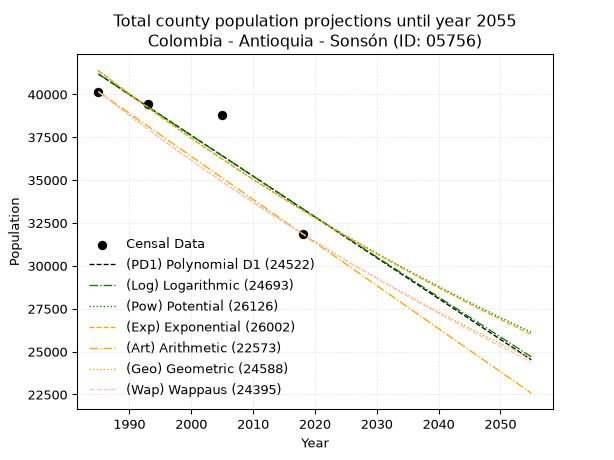
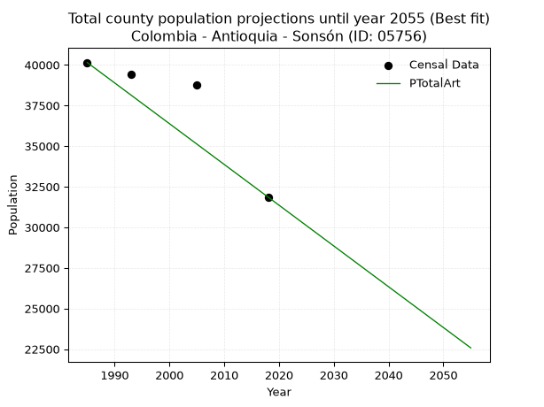
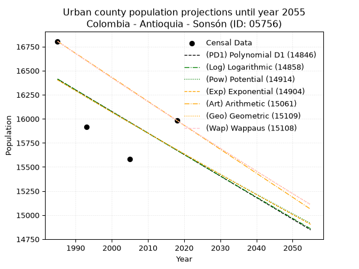
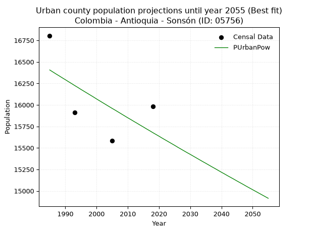
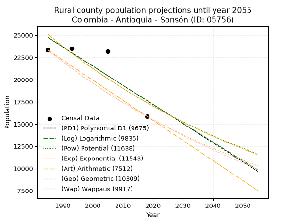
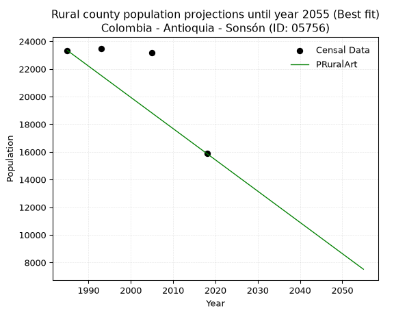

<div align="center">


</div>

# 📜 _“Population and Public Services Demand Projections (PPSD) until Year 2050 for Colombia - Antioquia - Sonsón (ID: 05756)”_
Keywords: `population` `public-service` `projection` `lineal` `polynomial` `logarithmic` `potential` `exponential` `arithmetic` `geometric` `wappaus` `dane` `colombia` `south-america`

PPSD are analytical estimates used by governments and planners to anticipate future changes in population size, age distribution, and the resulting community needs for utilities, healthcare, education, and infrastructure as sizing future water treatment facilities, electrical grids, and road networks based on spatial growth.

<div align="center">

</img>

</div>


> **General running parameters**: • app_version: _v20260806_. • Python version: _3.14.7_. • Pandas version: _3.0.5_. • NumPy version: _2.5.1_. • Creates, save and include plots into reports (create_plot): _False_. • Projection until year: _2050_. • Process polynomial degree 2 and up: _False_. • Process Wappaus: _True_. • Process Wappaus: _True_. • Set negative values to zero: _True_. • Set infinite values to zero: _True_. • Drop dataset notes: _True_. 
<div align="center">

Maps & GIS Layers: [:earth_americas:Google](http://maps.google.com/maps?q=5.714851125,-75.3095958) [:earth_americas:OSM](https://www.openstreetmap.org/#map=18/5.714851125/-75.3095958&layers=P) [:earth_americas:Bing](https://www.bing.com/maps?cp=5.714851125~-75.3095958&lvl=18) [:earth_americas:Apple](https://maps.apple.com/frame?center=5.714851125%2C-75.3095958&span=0.003%2C0.006) [:earth_americas:GISMobile](https://github.com/rcfdtools/R.GISMobile/blob/main/file/gis/CountyLayer_CO/Readme.md)

</div>


<div align="center">

```geojson
{
  "type": "Feature",
  "geometry": {
    "type": "Point", 
    "coordinates": [-75.3095958, 5.714851125]
  }, 
  "properties": {
    "Name": "Colombia - Antioquia - Sonsón (ID: 05756)"
  }
}
```

</div>


## 0. Census Data (4 records)

Census data are official statistics collected by a government about the people and housing in a country. They usually include counts of total population, age, sex, race, income, education, and jobs.

📅Global census file: [Population.xlsx](../data/Population.xlsx)

| Source   |   Year |   CountryID | CountryName   |   StateID | StateName   |   CountyID | CountyName   |   PTotal |   PUrban |   PRural |
|:---------|-------:|------------:|:--------------|----------:|:------------|-----------:|:-------------|---------:|---------:|---------:|
| DANE     |   1985 |          57 | Colombia      |        05 | Antioquia   |      05756 | Sonsón       |    40145 |    16805 |    23340 |
| DANE     |   1993 |          57 | Colombia      |        05 | Antioquia   |      05756 | Sonsón       |    39404 |    15913 |    23491 |
| DANE     |   2005 |          57 | Colombia      |        05 | Antioquia   |      05756 | Sonsón       |    38779 |    15583 |    23196 |
| DANE     |   2018 |          57 | Colombia      |        05 | Antioquia   |      05756 | Sonsón       |    31861 |    15983 |    15878 |

> 🔥Some records could had specific notes about the registered values or the corresponding urban or rural distribution.

📅[SUI-RUPS](https://www.datos.gov.co/Hacienda-y-Cr-dito-P-blico/Registro-nico-de-Prestadores-de-Servicios-P-blicos/4qkq-csdn/about_data) - Local public utility companies: [RUPS.csv](../data/RUPS.csv)

 | SERVICIO       | ESTADO    | NOMBRE                                                                                                                    | NIT         | DEPARTAMENTO_DOMICILIO   | MUNICIPIO_DOMICILIO   | DIRECCION             |   TELEFONO | EMAIL                            | TIPO_PRESTADOR                             | CLASIFICACION                 |
|:---------------|:----------|:--------------------------------------------------------------------------------------------------------------------------|:------------|:-------------------------|:----------------------|:----------------------|-----------:|:---------------------------------|:-------------------------------------------|:------------------------------|
| ACUEDUCTO      | OPERATIVA | ASOCIACION DE USUARIOS DEL ACUEDUCTO, ALCANTARILLADO Y ASEO DE SAN MIGUEL                                                 | 811011440-7 | ANTIOQUIA                | SONSON                | Carrera 2 No. 29 - 53 |    8324064 | acueductosanmiguel@yahoo.es      | ORGANIZACION AUTORIZADA                    | MENOR O IGUAL A 2500 USUARIOS |
| ALCANTARILLADO | OPERATIVA | ASOCIACION DE USUARIOS DEL ACUEDUCTO, ALCANTARILLADO Y ASEO DE SAN MIGUEL                                                 | 811011440-7 | ANTIOQUIA                | SONSON                | Carrera 2 No. 29 - 53 |    8324064 | acueductosanmiguel@yahoo.es      | ORGANIZACION AUTORIZADA                    | MENOR O IGUAL A 2500 USUARIOS |
| ACUEDUCTO      | OPERATIVA | ASOCIACION DE USUARIOS DE LOS SERVICIOS DE ACUEDUCTO ALCANTARILLADO Y ASEO DEL CORREGIMIENTO LA DANTA MUNICIPIO DE SONSON | 900483217-8 | ANTIOQUIA                | SONSON                | CR 33 32 23 LA DANTA  |    3426984 | limaclal@hotmail.com             | ORGANIZACION AUTORIZADA                    | HASTA 2500 SUSCRIPTORES       |
| ALCANTARILLADO | OPERATIVA | ASOCIACION DE USUARIOS DE LOS SERVICIOS DE ACUEDUCTO ALCANTARILLADO Y ASEO DEL CORREGIMIENTO LA DANTA MUNICIPIO DE SONSON | 900483217-8 | ANTIOQUIA                | SONSON                | CR 33 32 23 LA DANTA  |    3426984 | limaclal@hotmail.com             | ORGANIZACION AUTORIZADA                    | HASTA 2500 SUSCRIPTORES       |
| ACUEDUCTO      | OPERATIVA | AGUAS DEL PÁRAMO DE SONSÓN S.A.S. E.S.P                                                                                   | 900673469-2 | ANTIOQUIA                | SONSON                | calle 6 #5-41         |    8691810 | aguasdelparamodesonson@gmail.com | SOCIEDADES (EMPRESA DE SERVICIOS PUBLICOS) | MAYOR O IGUAL A 5001 USUARIOS |
| ALCANTARILLADO | OPERATIVA | AGUAS DEL PÁRAMO DE SONSÓN S.A.S. E.S.P                                                                                   | 900673469-2 | ANTIOQUIA                | SONSON                | calle 6 #5-41         |    8691810 | aguasdelparamodesonson@gmail.com | SOCIEDADES (EMPRESA DE SERVICIOS PUBLICOS) | MAYOR O IGUAL A 5001 USUARIOS |

## 1. Total

### 1.1. Coefficients and Parameters

* (PD1) Polynomial Deg 1: -237.90806904857035, 513422.86511440284 (lineal)
* (Log) Logarithmic: -475687.95467284945, 3653255.205392365
* (Pow) Potential: -13.264965803456587, 48.361415039826966
* (Exp) Exponential: -0.006634546400572967, 21685581154.4622
* (Art) Arithmetic: Year diff. 2018 - 1985 = 33, Population diff. 31861 - 40145 = -8284, Annual growth = -251.03030303030303
* (Geo) Geometric: Year diff. 2018 - 1985 = 33, Population diff. 31861 - 40145 = -8284, Annual growth % = -0.006979023869365664
* (Wap) Wappaus: i = -0.6972482932819571, Condition values only valid for < 200)

<sub>
Wappaus condition values: ['-0.00', '-0.70', '-1.39', '-2.09', '-2.79', '-3.49', '-4.18', '-4.88', '-5.58', '-6.28', '-6.97', '-7.67', '-8.37', '-9.06', '-9.76', '-10.46', '-11.16', '-11.85', '-12.55', '-13.25', '-13.94', '-14.64', '-15.34', '-16.04', '-16.73', '-17.43', '-18.13', '-18.83', '-19.52', '-20.22', '-20.92', '-21.61', '-22.31', '-23.01', '-23.71', '-24.40', '-25.10', '-25.80', '-26.50', '-27.19', '-27.89', '-28.59', '-29.28', '-29.98', '-30.68', '-31.38', '-32.07', '-32.77', '-33.47', '-34.17', '-34.86', '-35.56', '-36.26', '-36.95', '-37.65', '-38.35', '-39.05', '-39.74', '-40.44', '-41.14', '-41.83', '-42.53', '-43.23', '-43.93', '-44.62', '-45.32']
</sub>


### 1.2. Projected Dataset

|   Year |   CountyID |   PTotalPD1 |   PTotalLog |   PTotalPow |   PTotalExp |   PTotalArt |   PTotalGeo |   PTotalWap |
|-------:|-----------:|------------:|------------:|------------:|------------:|------------:|------------:|------------:|
|   1985 |      05756 |       41175 |       41179 |       41375 |       41371 |       40145 |       40145 |       40145 |
|   1986 |      05756 |       40937 |       40939 |       41099 |       41098 |       39894 |       39865 |       39866 |
|   1987 |      05756 |       40700 |       40700 |       40826 |       40826 |       39643 |       39587 |       39589 |
|   1988 |      05756 |       40462 |       40460 |       40554 |       40556 |       39392 |       39310 |       39314 |
|   1989 |      05756 |       40224 |       40221 |       40284 |       40288 |       39141 |       39036 |       39041 |
|   1990 |      05756 |       39986 |       39982 |       40017 |       40021 |       38890 |       38764 |       38769 |
|   1991 |      05756 |       39748 |       39743 |       39751 |       39757 |       38639 |       38493 |       38500 |
|   1992 |      05756 |       39510 |       39504 |       39487 |       39494 |       38388 |       38224 |       38232 |
|   1993 |      05756 |       39272 |       39265 |       39225 |       39233 |       38137 |       37958 |       37966 |
|   1994 |      05756 |       39034 |       39027 |       38965 |       38973 |       37886 |       37693 |       37702 |
|   1995 |      05756 |       38796 |       38788 |       38707 |       38715 |       37635 |       37430 |       37440 |
|   1996 |      05756 |       38558 |       38550 |       38450 |       38459 |       37384 |       37168 |       37180 |
|   1997 |      05756 |       38320 |       38312 |       38196 |       38205 |       37133 |       36909 |       36921 |
|   1998 |      05756 |       38083 |       38073 |       37943 |       37952 |       36882 |       36651 |       36664 |
|   1999 |      05756 |       37845 |       37835 |       37692 |       37701 |       36631 |       36396 |       36409 |
|   2000 |      05756 |       37607 |       37597 |       37443 |       37452 |       36380 |       36142 |       36155 |
|   2001 |      05756 |       37369 |       37360 |       37195 |       37205 |       36129 |       35889 |       35903 |
|   2002 |      05756 |       37131 |       37122 |       36949 |       36959 |       35877 |       35639 |       35653 |
|   2003 |      05756 |       36893 |       36884 |       36705 |       36714 |       35626 |       35390 |       35404 |
|   2004 |      05756 |       36655 |       36647 |       36463 |       36471 |       35375 |       35143 |       35157 |
|   2005 |      05756 |       36417 |       36410 |       36223 |       36230 |       35124 |       34898 |       34912 |
|   2006 |      05756 |       36179 |       36173 |       35984 |       35991 |       34873 |       34654 |       34668 |
|   2007 |      05756 |       35941 |       35935 |       35747 |       35753 |       34622 |       34413 |       34426 |
|   2008 |      05756 |       35703 |       35699 |       35511 |       35516 |       34371 |       34172 |       34185 |
|   2009 |      05756 |       35466 |       35462 |       35278 |       35281 |       34120 |       33934 |       33946 |
|   2010 |      05756 |       35228 |       35225 |       35046 |       35048 |       33869 |       33697 |       33708 |
|   2011 |      05756 |       34990 |       34988 |       34815 |       34816 |       33618 |       33462 |       33472 |
|   2012 |      05756 |       34752 |       34752 |       34586 |       34586 |       33367 |       33228 |       33238 |
|   2013 |      05756 |       34514 |       34515 |       34359 |       34357 |       33116 |       32996 |       33005 |
|   2014 |      05756 |       34276 |       34279 |       34133 |       34130 |       32865 |       32766 |       32773 |
|   2015 |      05756 |       34038 |       34043 |       33909 |       33904 |       32614 |       32537 |       32543 |
|   2016 |      05756 |       33800 |       33807 |       33687 |       33680 |       32363 |       32310 |       32314 |
|   2017 |      05756 |       33562 |       33571 |       33466 |       33458 |       32112 |       32085 |       32087 |
|   2018 |      05756 |       33324 |       33335 |       33247 |       33236 |       31861 |       31861 |       31861 |
|   2019 |      05756 |       33086 |       33100 |       33029 |       33017 |       31610 |       31639 |       31637 |
|   2020 |      05756 |       32849 |       32864 |       32813 |       32798 |       31359 |       31418 |       31414 |
|   2021 |      05756 |       32611 |       32629 |       32598 |       32581 |       31108 |       31199 |       31192 |
|   2022 |      05756 |       32373 |       32393 |       32385 |       32366 |       30857 |       30981 |       30972 |
|   2023 |      05756 |       32135 |       32158 |       32173 |       32152 |       30606 |       30765 |       30753 |
|   2024 |      05756 |       31897 |       31923 |       31963 |       31939 |       30355 |       30550 |       30535 |
|   2025 |      05756 |       31659 |       31688 |       31754 |       31728 |       30104 |       30337 |       30319 |
|   2026 |      05756 |       31421 |       31453 |       31547 |       31518 |       29853 |       30125 |       30104 |
|   2027 |      05756 |       31183 |       31219 |       31341 |       31310 |       29602 |       29915 |       29890 |
|   2028 |      05756 |       30945 |       30984 |       31137 |       31103 |       29351 |       29706 |       29678 |
|   2029 |      05756 |       30707 |       30750 |       30934 |       30897 |       29100 |       29499 |       29467 |
|   2030 |      05756 |       30469 |       30515 |       30732 |       30693 |       28849 |       29293 |       29257 |
|   2031 |      05756 |       30232 |       30281 |       30532 |       30490 |       28598 |       29088 |       29049 |
|   2032 |      05756 |       29994 |       30047 |       30333 |       30288 |       28347 |       28885 |       28841 |
|   2033 |      05756 |       29756 |       29813 |       30136 |       30088 |       28096 |       28684 |       28635 |
|   2034 |      05756 |       29518 |       29579 |       29940 |       29889 |       27845 |       28484 |       28431 |
|   2035 |      05756 |       29280 |       29345 |       29745 |       29691 |       27593 |       28285 |       28227 |
|   2036 |      05756 |       29042 |       29111 |       29552 |       29495 |       27342 |       28087 |       28025 |
|   2037 |      05756 |       28804 |       28878 |       29360 |       29300 |       27091 |       27891 |       27823 |
|   2038 |      05756 |       28566 |       28644 |       29170 |       29106 |       26840 |       27697 |       27623 |
|   2039 |      05756 |       28328 |       28411 |       28981 |       28914 |       26589 |       27503 |       27425 |
|   2040 |      05756 |       28090 |       28178 |       28793 |       28723 |       26338 |       27311 |       27227 |
|   2041 |      05756 |       27852 |       27944 |       28606 |       28533 |       26087 |       27121 |       27030 |
|   2042 |      05756 |       27615 |       27711 |       28421 |       28344 |       25836 |       26932 |       26835 |
|   2043 |      05756 |       27377 |       27479 |       28237 |       28157 |       25585 |       26744 |       26641 |
|   2044 |      05756 |       27139 |       27246 |       28054 |       27970 |       25334 |       26557 |       26448 |
|   2045 |      05756 |       26901 |       27013 |       27873 |       27785 |       25083 |       26372 |       26256 |
|   2046 |      05756 |       26663 |       26781 |       27693 |       27602 |       24832 |       26188 |       26065 |
|   2047 |      05756 |       26425 |       26548 |       27514 |       27419 |       24581 |       26005 |       25875 |
|   2048 |      05756 |       26187 |       26316 |       27336 |       27238 |       24330 |       25823 |       25686 |
|   2049 |      05756 |       25949 |       26084 |       27160 |       27058 |       24079 |       25643 |       25499 |
|   2050 |      05756 |       25711 |       25851 |       26984 |       26879 |       23828 |       25464 |       25312 |
<div align="center">

</img>

</div>


### 1.3. Best fit with absolute and relative error (%)

Relative error puts that difference into context by dividing the absolute error by the true value, creating a unitless ratio or percentage that shows the scale of the mistake.

Absolute and relative error

|   Year | Source   |   CountryID | CountryName   |   StateID | StateName   |   CountyID_x | CountyName   |   PTotal |   PUrban |   PRural |   CountyID_y |   PTotalPD1 |   PTotalLog |   PTotalPow |   PTotalExp |   PTotalArt |   PTotalGeo |   PTotalWap |   PTotalPD1AbsError |   PTotalLogAbsError |   PTotalPowAbsError |   PTotalExpAbsError |   PTotalArtAbsError |   PTotalGeoAbsError |   PTotalWapAbsError |   PTotalPD1RelError |   PTotalLogRelError |   PTotalPowRelError |   PTotalExpRelError |   PTotalArtRelError |   PTotalGeoRelError |   PTotalWapRelError |
|-------:|:---------|------------:|:--------------|----------:|:------------|-------------:|:-------------|---------:|---------:|---------:|-------------:|------------:|------------:|------------:|------------:|------------:|------------:|------------:|--------------------:|--------------------:|--------------------:|--------------------:|--------------------:|--------------------:|--------------------:|--------------------:|--------------------:|--------------------:|--------------------:|--------------------:|--------------------:|--------------------:|
|   1985 | DANE     |          57 | Colombia      |        05 | Antioquia   |        05756 | Sonsón       |    40145 |    16805 |    23340 |        05756 |       41175 |       41179 |       41375 |       41371 |       40145 |       40145 |       40145 |                1030 |                1034 |                1230 |                1226 |                   0 |                   0 |                   0 |            2.5657   |            2.57566  |            3.06389  |            3.05393  |             0       |             0       |             0       |
|   1993 | DANE     |          57 | Colombia      |        05 | Antioquia   |        05756 | Sonsón       |    39404 |    15913 |    23491 |        05756 |       39272 |       39265 |       39225 |       39233 |       38137 |       37958 |       37966 |                 132 |                 139 |                 179 |                 171 |                1267 |                1446 |                1438 |            0.334991 |            0.352756 |            0.454269 |            0.433966 |             3.21541 |             3.66968 |             3.64938 |
|   2005 | DANE     |          57 | Colombia      |        05 | Antioquia   |        05756 | Sonsón       |    38779 |    15583 |    23196 |        05756 |       36417 |       36410 |       36223 |       36230 |       35124 |       34898 |       34912 |                2362 |                2369 |                2556 |                2549 |                3655 |                3881 |                3867 |            6.09093  |            6.10898  |            6.5912   |            6.57315  |             9.4252  |            10.008   |             9.97189 |
|   2018 | DANE     |          57 | Colombia      |        05 | Antioquia   |        05756 | Sonsón       |    31861 |    15983 |    15878 |        05756 |       33324 |       33335 |       33247 |       33236 |       31861 |       31861 |       31861 |                1463 |                1474 |                1386 |                1375 |                   0 |                   0 |                   0 |            4.59182  |            4.62635  |            4.35015  |            4.31562  |             0       |             0       |             0       |

Relative error mean

| Method    |   RelError | Best   |
|:----------|-----------:|:-------|
| PTotalPD1 |    3.39586 |        |
| PTotalLog |    3.41594 |        |
| PTotalPow |    3.61488 |        |
| PTotalExp |    3.59417 |        |
| PTotalArt |    3.16015 | True   |
| PTotalGeo |    3.41942 |        |
| PTotalWap |    3.40532 |        |

💙Best method: _**PTotalArt**_
<div align="center">

</img>

</div>


### 1.4. Fresh water supply demand in liters per capita per day (lpcd)

The fresh water supply demand typically ranges from 100 to 300 liters per capita per day (lpcd) for standard domestic and municipal planning, though absolute survival minimums set by the World Health Organization are as low as 7.5 to 20 liters per day, and total consumption in high-income nations can exceed 400 liters.

> `CZ`: Level in meters above the sea level (masl)<br> `WS`: Fresh water supply demand in liters per capita per day (lpcd or l/h/d)<br> `WSAll`: Zonal fresh water supply demand in liters per second (l/s)<br> `A`: Zonal area in square meters<br> `DP`: Population density (people/hectare or p/ha)

Reference values (RAS Colombia)

|    CZ |   WS |
|------:|-----:|
|  1000 |  120 |
|  2000 |  130 |
| 99999 |  140 |

County shapefile geometry properties and water supply values

|   CountyID |      ATotal |   CZTotal |   WSTotal |
|-----------:|------------:|----------:|----------:|
|      05756 | 1.34561e+09 |   1346.56 |       130 |

Projected values for best method: PTotalArt

|   CountyID |   Year |   PTotalArt |   DPTotal |   WSTotal |   WSTotalAll |
|-----------:|-------:|------------:|----------:|----------:|-------------:|
|      05756 |   1985 |       40145 |      0.3  |       130 |      60.4034 |
|      05756 |   1986 |       39894 |      0.3  |       130 |      60.0257 |
|      05756 |   1987 |       39643 |      0.29 |       130 |      59.648  |
|      05756 |   1988 |       39392 |      0.29 |       130 |      59.2704 |
|      05756 |   1989 |       39141 |      0.29 |       130 |      58.8927 |
|      05756 |   1990 |       38890 |      0.29 |       130 |      58.515  |
|      05756 |   1991 |       38639 |      0.29 |       130 |      58.1374 |
|      05756 |   1992 |       38388 |      0.29 |       130 |      57.7597 |
|      05756 |   1993 |       38137 |      0.28 |       130 |      57.3821 |
|      05756 |   1994 |       37886 |      0.28 |       130 |      57.0044 |
|      05756 |   1995 |       37635 |      0.28 |       130 |      56.6267 |
|      05756 |   1996 |       37384 |      0.28 |       130 |      56.2491 |
|      05756 |   1997 |       37133 |      0.28 |       130 |      55.8714 |
|      05756 |   1998 |       36882 |      0.27 |       130 |      55.4937 |
|      05756 |   1999 |       36631 |      0.27 |       130 |      55.1161 |
|      05756 |   2000 |       36380 |      0.27 |       130 |      54.7384 |
|      05756 |   2001 |       36129 |      0.27 |       130 |      54.3608 |
|      05756 |   2002 |       35877 |      0.27 |       130 |      53.9816 |
|      05756 |   2003 |       35626 |      0.26 |       130 |      53.6039 |
|      05756 |   2004 |       35375 |      0.26 |       130 |      53.2263 |
|      05756 |   2005 |       35124 |      0.26 |       130 |      52.8486 |
|      05756 |   2006 |       34873 |      0.26 |       130 |      52.4709 |
|      05756 |   2007 |       34622 |      0.26 |       130 |      52.0933 |
|      05756 |   2008 |       34371 |      0.26 |       130 |      51.7156 |
|      05756 |   2009 |       34120 |      0.25 |       130 |      51.338  |
|      05756 |   2010 |       33869 |      0.25 |       130 |      50.9603 |
|      05756 |   2011 |       33618 |      0.25 |       130 |      50.5826 |
|      05756 |   2012 |       33367 |      0.25 |       130 |      50.205  |
|      05756 |   2013 |       33116 |      0.25 |       130 |      49.8273 |
|      05756 |   2014 |       32865 |      0.24 |       130 |      49.4497 |
|      05756 |   2015 |       32614 |      0.24 |       130 |      49.072  |
|      05756 |   2016 |       32363 |      0.24 |       130 |      48.6943 |
|      05756 |   2017 |       32112 |      0.24 |       130 |      48.3167 |
|      05756 |   2018 |       31861 |      0.24 |       130 |      47.939  |
|      05756 |   2019 |       31610 |      0.23 |       130 |      47.5613 |
|      05756 |   2020 |       31359 |      0.23 |       130 |      47.1837 |
|      05756 |   2021 |       31108 |      0.23 |       130 |      46.806  |
|      05756 |   2022 |       30857 |      0.23 |       130 |      46.4284 |
|      05756 |   2023 |       30606 |      0.23 |       130 |      46.0507 |
|      05756 |   2024 |       30355 |      0.23 |       130 |      45.673  |
|      05756 |   2025 |       30104 |      0.22 |       130 |      45.2954 |
|      05756 |   2026 |       29853 |      0.22 |       130 |      44.9177 |
|      05756 |   2027 |       29602 |      0.22 |       130 |      44.54   |
|      05756 |   2028 |       29351 |      0.22 |       130 |      44.1624 |
|      05756 |   2029 |       29100 |      0.22 |       130 |      43.7847 |
|      05756 |   2030 |       28849 |      0.21 |       130 |      43.4071 |
|      05756 |   2031 |       28598 |      0.21 |       130 |      43.0294 |
|      05756 |   2032 |       28347 |      0.21 |       130 |      42.6517 |
|      05756 |   2033 |       28096 |      0.21 |       130 |      42.2741 |
|      05756 |   2034 |       27845 |      0.21 |       130 |      41.8964 |
|      05756 |   2035 |       27593 |      0.21 |       130 |      41.5172 |
|      05756 |   2036 |       27342 |      0.2  |       130 |      41.1396 |
|      05756 |   2037 |       27091 |      0.2  |       130 |      40.7619 |
|      05756 |   2038 |       26840 |      0.2  |       130 |      40.3843 |
|      05756 |   2039 |       26589 |      0.2  |       130 |      40.0066 |
|      05756 |   2040 |       26338 |      0.2  |       130 |      39.6289 |
|      05756 |   2041 |       26087 |      0.19 |       130 |      39.2513 |
|      05756 |   2042 |       25836 |      0.19 |       130 |      38.8736 |
|      05756 |   2043 |       25585 |      0.19 |       130 |      38.4959 |
|      05756 |   2044 |       25334 |      0.19 |       130 |      38.1183 |
|      05756 |   2045 |       25083 |      0.19 |       130 |      37.7406 |
|      05756 |   2046 |       24832 |      0.18 |       130 |      37.363  |
|      05756 |   2047 |       24581 |      0.18 |       130 |      36.9853 |
|      05756 |   2048 |       24330 |      0.18 |       130 |      36.6076 |
|      05756 |   2049 |       24079 |      0.18 |       130 |      36.23   |
|      05756 |   2050 |       23828 |      0.18 |       130 |      35.8523 |

## 2. Urban

### 2.1. Coefficients and Parameters

* (PD1) Polynomial Deg 1: -22.365315134484295, 60807.221597752214 (lineal)
* (Log) Logarithmic: -44898.05687993142, 357341.4901348064
* (Pow) Potential: -2.7509822840183698, 13.287076133666758
* (Exp) Exponential: -0.00137031982182497, 249039.61835541375
* (Art) Arithmetic: Year diff. 2018 - 1985 = 33, Population diff. 15983 - 16805 = -822, Annual growth = -24.90909090909091
* (Geo) Geometric: Year diff. 2018 - 1985 = 33, Population diff. 15983 - 16805 = -822, Annual growth % = -0.0015185671352878627
* (Wap) Wappaus: i = -0.15194028857564298, Condition values only valid for < 200)

<sub>
Wappaus condition values: ['-0.00', '-0.15', '-0.30', '-0.46', '-0.61', '-0.76', '-0.91', '-1.06', '-1.22', '-1.37', '-1.52', '-1.67', '-1.82', '-1.98', '-2.13', '-2.28', '-2.43', '-2.58', '-2.73', '-2.89', '-3.04', '-3.19', '-3.34', '-3.49', '-3.65', '-3.80', '-3.95', '-4.10', '-4.25', '-4.41', '-4.56', '-4.71', '-4.86', '-5.01', '-5.17', '-5.32', '-5.47', '-5.62', '-5.77', '-5.93', '-6.08', '-6.23', '-6.38', '-6.53', '-6.69', '-6.84', '-6.99', '-7.14', '-7.29', '-7.45', '-7.60', '-7.75', '-7.90', '-8.05', '-8.20', '-8.36', '-8.51', '-8.66', '-8.81', '-8.96', '-9.12', '-9.27', '-9.42', '-9.57', '-9.72', '-9.88']
</sub>


### 2.2. Projected Dataset

|   Year |   CountyID |   PUrbanPD1 |   PUrbanLog |   PUrbanPow |   PUrbanExp |   PUrbanArt |   PUrbanGeo |   PUrbanWap |
|-------:|-----------:|------------:|------------:|------------:|------------:|------------:|------------:|------------:|
|   1985 |      05756 |       16412 |       16414 |       16406 |       16404 |       16805 |       16805 |       16805 |
|   1986 |      05756 |       16390 |       16391 |       16383 |       16382 |       16780 |       16779 |       16779 |
|   1987 |      05756 |       16367 |       16369 |       16360 |       16359 |       16755 |       16754 |       16754 |
|   1988 |      05756 |       16345 |       16346 |       16338 |       16337 |       16730 |       16729 |       16729 |
|   1989 |      05756 |       16323 |       16323 |       16315 |       16314 |       16705 |       16703 |       16703 |
|   1990 |      05756 |       16300 |       16301 |       16293 |       16292 |       16680 |       16678 |       16678 |
|   1991 |      05756 |       16278 |       16278 |       16270 |       16270 |       16656 |       16652 |       16652 |
|   1992 |      05756 |       16256 |       16256 |       16248 |       16247 |       16631 |       16627 |       16627 |
|   1993 |      05756 |       16233 |       16233 |       16225 |       16225 |       16606 |       16602 |       16602 |
|   1994 |      05756 |       16211 |       16211 |       16203 |       16203 |       16581 |       16577 |       16577 |
|   1995 |      05756 |       16188 |       16188 |       16180 |       16181 |       16556 |       16552 |       16552 |
|   1996 |      05756 |       16166 |       16166 |       16158 |       16159 |       16531 |       16526 |       16526 |
|   1997 |      05756 |       16144 |       16143 |       16136 |       16136 |       16506 |       16501 |       16501 |
|   1998 |      05756 |       16121 |       16121 |       16114 |       16114 |       16481 |       16476 |       16476 |
|   1999 |      05756 |       16099 |       16098 |       16092 |       16092 |       16456 |       16451 |       16451 |
|   2000 |      05756 |       16077 |       16076 |       16069 |       16070 |       16431 |       16426 |       16426 |
|   2001 |      05756 |       16054 |       16053 |       16047 |       16048 |       16406 |       16401 |       16401 |
|   2002 |      05756 |       16032 |       16031 |       16025 |       16026 |       16382 |       16376 |       16376 |
|   2003 |      05756 |       16009 |       16008 |       16003 |       16004 |       16357 |       16352 |       16352 |
|   2004 |      05756 |       15987 |       15986 |       15981 |       15982 |       16332 |       16327 |       16327 |
|   2005 |      05756 |       15965 |       15964 |       15959 |       15961 |       16307 |       16302 |       16302 |
|   2006 |      05756 |       15942 |       15941 |       15938 |       15939 |       16282 |       16277 |       16277 |
|   2007 |      05756 |       15920 |       15919 |       15916 |       15917 |       16257 |       16252 |       16252 |
|   2008 |      05756 |       15898 |       15897 |       15894 |       15895 |       16232 |       16228 |       16228 |
|   2009 |      05756 |       15875 |       15874 |       15872 |       15873 |       16207 |       16203 |       16203 |
|   2010 |      05756 |       15853 |       15852 |       15850 |       15852 |       16182 |       16179 |       16179 |
|   2011 |      05756 |       15831 |       15829 |       15829 |       15830 |       16157 |       16154 |       16154 |
|   2012 |      05756 |       15808 |       15807 |       15807 |       15808 |       16132 |       16129 |       16129 |
|   2013 |      05756 |       15786 |       15785 |       15786 |       15787 |       16108 |       16105 |       16105 |
|   2014 |      05756 |       15763 |       15763 |       15764 |       15765 |       16083 |       16080 |       16080 |
|   2015 |      05756 |       15741 |       15740 |       15743 |       15743 |       16058 |       16056 |       16056 |
|   2016 |      05756 |       15719 |       15718 |       15721 |       15722 |       16033 |       16032 |       16032 |
|   2017 |      05756 |       15696 |       15696 |       15700 |       15700 |       16008 |       16007 |       16007 |
|   2018 |      05756 |       15674 |       15673 |       15678 |       15679 |       15983 |       15983 |       15983 |
|   2019 |      05756 |       15652 |       15651 |       15657 |       15657 |       15958 |       15959 |       15959 |
|   2020 |      05756 |       15629 |       15629 |       15636 |       15636 |       15933 |       15934 |       15934 |
|   2021 |      05756 |       15607 |       15607 |       15614 |       15614 |       15908 |       15910 |       15910 |
|   2022 |      05756 |       15585 |       15585 |       15593 |       15593 |       15883 |       15886 |       15886 |
|   2023 |      05756 |       15562 |       15562 |       15572 |       15572 |       15858 |       15862 |       15862 |
|   2024 |      05756 |       15540 |       15540 |       15551 |       15550 |       15834 |       15838 |       15838 |
|   2025 |      05756 |       15517 |       15518 |       15530 |       15529 |       15809 |       15814 |       15814 |
|   2026 |      05756 |       15495 |       15496 |       15508 |       15508 |       15784 |       15790 |       15790 |
|   2027 |      05756 |       15473 |       15474 |       15487 |       15487 |       15759 |       15766 |       15766 |
|   2028 |      05756 |       15450 |       15452 |       15466 |       15465 |       15734 |       15742 |       15742 |
|   2029 |      05756 |       15428 |       15429 |       15445 |       15444 |       15709 |       15718 |       15718 |
|   2030 |      05756 |       15406 |       15407 |       15425 |       15423 |       15684 |       15694 |       15694 |
|   2031 |      05756 |       15383 |       15385 |       15404 |       15402 |       15659 |       15670 |       15670 |
|   2032 |      05756 |       15361 |       15363 |       15383 |       15381 |       15634 |       15647 |       15646 |
|   2033 |      05756 |       15339 |       15341 |       15362 |       15360 |       15609 |       15623 |       15623 |
|   2034 |      05756 |       15316 |       15319 |       15341 |       15339 |       15584 |       15599 |       15599 |
|   2035 |      05756 |       15294 |       15297 |       15321 |       15318 |       15560 |       15575 |       15575 |
|   2036 |      05756 |       15271 |       15275 |       15300 |       15297 |       15535 |       15552 |       15551 |
|   2037 |      05756 |       15249 |       15253 |       15279 |       15276 |       15510 |       15528 |       15528 |
|   2038 |      05756 |       15227 |       15231 |       15259 |       15255 |       15485 |       15505 |       15504 |
|   2039 |      05756 |       15204 |       15209 |       15238 |       15234 |       15460 |       15481 |       15481 |
|   2040 |      05756 |       15182 |       15187 |       15217 |       15213 |       15435 |       15457 |       15457 |
|   2041 |      05756 |       15160 |       15165 |       15197 |       15192 |       15410 |       15434 |       15433 |
|   2042 |      05756 |       15137 |       15143 |       15176 |       15172 |       15385 |       15411 |       15410 |
|   2043 |      05756 |       15115 |       15121 |       15156 |       15151 |       15360 |       15387 |       15387 |
|   2044 |      05756 |       15093 |       15099 |       15136 |       15130 |       15335 |       15364 |       15363 |
|   2045 |      05756 |       15070 |       15077 |       15115 |       15109 |       15310 |       15340 |       15340 |
|   2046 |      05756 |       15048 |       15055 |       15095 |       15089 |       15286 |       15317 |       15316 |
|   2047 |      05756 |       15025 |       15033 |       15075 |       15068 |       15261 |       15294 |       15293 |
|   2048 |      05756 |       15003 |       15011 |       15054 |       15047 |       15236 |       15271 |       15270 |
|   2049 |      05756 |       14981 |       14989 |       15034 |       15027 |       15211 |       15247 |       15247 |
|   2050 |      05756 |       14958 |       14967 |       15014 |       15006 |       15186 |       15224 |       15223 |
<div align="center">

</img>

</div>


### 2.3. Best fit with absolute and relative error (%)

Relative error puts that difference into context by dividing the absolute error by the true value, creating a unitless ratio or percentage that shows the scale of the mistake.

Absolute and relative error

|   Year | Source   |   CountryID | CountryName   |   StateID | StateName   |   CountyID_x | CountyName   |   PTotal |   PUrban |   PRural |   CountyID_y |   PUrbanPD1 |   PUrbanLog |   PUrbanPow |   PUrbanExp |   PUrbanArt |   PUrbanGeo |   PUrbanWap |   PUrbanPD1AbsError |   PUrbanLogAbsError |   PUrbanPowAbsError |   PUrbanExpAbsError |   PUrbanArtAbsError |   PUrbanGeoAbsError |   PUrbanWapAbsError |   PUrbanPD1RelError |   PUrbanLogRelError |   PUrbanPowRelError |   PUrbanExpRelError |   PUrbanArtRelError |   PUrbanGeoRelError |   PUrbanWapRelError |
|-------:|:---------|------------:|:--------------|----------:|:------------|-------------:|:-------------|---------:|---------:|---------:|-------------:|------------:|------------:|------------:|------------:|------------:|------------:|------------:|--------------------:|--------------------:|--------------------:|--------------------:|--------------------:|--------------------:|--------------------:|--------------------:|--------------------:|--------------------:|--------------------:|--------------------:|--------------------:|--------------------:|
|   1985 | DANE     |          57 | Colombia      |        05 | Antioquia   |        05756 | Sonsón       |    40145 |    16805 |    23340 |        05756 |       16412 |       16414 |       16406 |       16404 |       16805 |       16805 |       16805 |                 393 |                 391 |                 399 |                 401 |                   0 |                   0 |                   0 |             2.33859 |             2.32669 |             2.37429 |             2.38619 |             0       |             0       |             0       |
|   1993 | DANE     |          57 | Colombia      |        05 | Antioquia   |        05756 | Sonsón       |    39404 |    15913 |    23491 |        05756 |       16233 |       16233 |       16225 |       16225 |       16606 |       16602 |       16602 |                 320 |                 320 |                 312 |                 312 |                 693 |                 689 |                 689 |             2.01093 |             2.01093 |             1.96066 |             1.96066 |             4.35493 |             4.32979 |             4.32979 |
|   2005 | DANE     |          57 | Colombia      |        05 | Antioquia   |        05756 | Sonsón       |    38779 |    15583 |    23196 |        05756 |       15965 |       15964 |       15959 |       15961 |       16307 |       16302 |       16302 |                 382 |                 381 |                 376 |                 378 |                 724 |                 719 |                 719 |             2.45139 |             2.44497 |             2.41289 |             2.42572 |             4.64609 |             4.614   |             4.614   |
|   2018 | DANE     |          57 | Colombia      |        05 | Antioquia   |        05756 | Sonsón       |    31861 |    15983 |    15878 |        05756 |       15674 |       15673 |       15678 |       15679 |       15983 |       15983 |       15983 |                 309 |                 310 |                 305 |                 304 |                   0 |                   0 |                   0 |             1.9333  |             1.93956 |             1.90828 |             1.90202 |             0       |             0       |             0       |

Relative error mean

| Method    |   RelError | Best   |
|:----------|-----------:|:-------|
| PUrbanPD1 |    2.18355 |        |
| PUrbanLog |    2.18054 |        |
| PUrbanPow |    2.16403 | True   |
| PUrbanExp |    2.16865 |        |
| PUrbanArt |    2.25025 |        |
| PUrbanGeo |    2.23595 |        |
| PUrbanWap |    2.23595 |        |

💙Best method: _**PUrbanPow**_
<div align="center">

</img>

</div>


### 2.4. Fresh water supply demand in liters per capita per day (lpcd)

The fresh water supply demand typically ranges from 100 to 300 liters per capita per day (lpcd) for standard domestic and municipal planning, though absolute survival minimums set by the World Health Organization are as low as 7.5 to 20 liters per day, and total consumption in high-income nations can exceed 400 liters.

> `CZ`: Level in meters above the sea level (masl)<br> `WS`: Fresh water supply demand in liters per capita per day (lpcd or l/h/d)<br> `WSAll`: Zonal fresh water supply demand in liters per second (l/s)<br> `A`: Zonal area in square meters<br> `DP`: Population density (people/hectare or p/ha)

Reference values (RAS Colombia)

|    CZ |   WS |
|------:|-----:|
|  1000 |  120 |
|  2000 |  130 |
| 99999 |  140 |

County shapefile geometry properties and water supply values

|   CountyID |      AUrban |   CZUrban |   WSUrban |
|-----------:|------------:|----------:|----------:|
|      05756 | 2.67671e+06 |   2505.41 |       140 |

Projected values for best method: PUrbanPow

|   CountyID |   Year |   PUrbanPow |   DPUrban |   WSUrban |   WSUrbanAll |
|-----------:|-------:|------------:|----------:|----------:|-------------:|
|      05756 |   1985 |       16406 |     61.29 |       140 |      26.5838 |
|      05756 |   1986 |       16383 |     61.21 |       140 |      26.5465 |
|      05756 |   1987 |       16360 |     61.12 |       140 |      26.5093 |
|      05756 |   1988 |       16338 |     61.04 |       140 |      26.4736 |
|      05756 |   1989 |       16315 |     60.95 |       140 |      26.4363 |
|      05756 |   1990 |       16293 |     60.87 |       140 |      26.4007 |
|      05756 |   1991 |       16270 |     60.78 |       140 |      26.3634 |
|      05756 |   1992 |       16248 |     60.7  |       140 |      26.3278 |
|      05756 |   1993 |       16225 |     60.62 |       140 |      26.2905 |
|      05756 |   1994 |       16203 |     60.53 |       140 |      26.2549 |
|      05756 |   1995 |       16180 |     60.45 |       140 |      26.2176 |
|      05756 |   1996 |       16158 |     60.37 |       140 |      26.1819 |
|      05756 |   1997 |       16136 |     60.28 |       140 |      26.1463 |
|      05756 |   1998 |       16114 |     60.2  |       140 |      26.1106 |
|      05756 |   1999 |       16092 |     60.12 |       140 |      26.075  |
|      05756 |   2000 |       16069 |     60.03 |       140 |      26.0377 |
|      05756 |   2001 |       16047 |     59.95 |       140 |      26.0021 |
|      05756 |   2002 |       16025 |     59.87 |       140 |      25.9664 |
|      05756 |   2003 |       16003 |     59.79 |       140 |      25.9308 |
|      05756 |   2004 |       15981 |     59.7  |       140 |      25.8951 |
|      05756 |   2005 |       15959 |     59.62 |       140 |      25.8595 |
|      05756 |   2006 |       15938 |     59.54 |       140 |      25.8255 |
|      05756 |   2007 |       15916 |     59.46 |       140 |      25.7898 |
|      05756 |   2008 |       15894 |     59.38 |       140 |      25.7542 |
|      05756 |   2009 |       15872 |     59.3  |       140 |      25.7185 |
|      05756 |   2010 |       15850 |     59.21 |       140 |      25.6829 |
|      05756 |   2011 |       15829 |     59.14 |       140 |      25.6488 |
|      05756 |   2012 |       15807 |     59.05 |       140 |      25.6132 |
|      05756 |   2013 |       15786 |     58.98 |       140 |      25.5792 |
|      05756 |   2014 |       15764 |     58.89 |       140 |      25.5435 |
|      05756 |   2015 |       15743 |     58.81 |       140 |      25.5095 |
|      05756 |   2016 |       15721 |     58.73 |       140 |      25.4738 |
|      05756 |   2017 |       15700 |     58.65 |       140 |      25.4398 |
|      05756 |   2018 |       15678 |     58.57 |       140 |      25.4042 |
|      05756 |   2019 |       15657 |     58.49 |       140 |      25.3701 |
|      05756 |   2020 |       15636 |     58.41 |       140 |      25.3361 |
|      05756 |   2021 |       15614 |     58.33 |       140 |      25.3005 |
|      05756 |   2022 |       15593 |     58.25 |       140 |      25.2664 |
|      05756 |   2023 |       15572 |     58.18 |       140 |      25.2324 |
|      05756 |   2024 |       15551 |     58.1  |       140 |      25.1984 |
|      05756 |   2025 |       15530 |     58.02 |       140 |      25.1644 |
|      05756 |   2026 |       15508 |     57.94 |       140 |      25.1287 |
|      05756 |   2027 |       15487 |     57.86 |       140 |      25.0947 |
|      05756 |   2028 |       15466 |     57.78 |       140 |      25.0606 |
|      05756 |   2029 |       15445 |     57.7  |       140 |      25.0266 |
|      05756 |   2030 |       15425 |     57.63 |       140 |      24.9942 |
|      05756 |   2031 |       15404 |     57.55 |       140 |      24.9602 |
|      05756 |   2032 |       15383 |     57.47 |       140 |      24.9262 |
|      05756 |   2033 |       15362 |     57.39 |       140 |      24.8921 |
|      05756 |   2034 |       15341 |     57.31 |       140 |      24.8581 |
|      05756 |   2035 |       15321 |     57.24 |       140 |      24.8257 |
|      05756 |   2036 |       15300 |     57.16 |       140 |      24.7917 |
|      05756 |   2037 |       15279 |     57.08 |       140 |      24.7576 |
|      05756 |   2038 |       15259 |     57.01 |       140 |      24.7252 |
|      05756 |   2039 |       15238 |     56.93 |       140 |      24.6912 |
|      05756 |   2040 |       15217 |     56.85 |       140 |      24.6572 |
|      05756 |   2041 |       15197 |     56.77 |       140 |      24.6248 |
|      05756 |   2042 |       15176 |     56.7  |       140 |      24.5907 |
|      05756 |   2043 |       15156 |     56.62 |       140 |      24.5583 |
|      05756 |   2044 |       15136 |     56.55 |       140 |      24.5259 |
|      05756 |   2045 |       15115 |     56.47 |       140 |      24.4919 |
|      05756 |   2046 |       15095 |     56.39 |       140 |      24.4595 |
|      05756 |   2047 |       15075 |     56.32 |       140 |      24.4271 |
|      05756 |   2048 |       15054 |     56.24 |       140 |      24.3931 |
|      05756 |   2049 |       15034 |     56.17 |       140 |      24.3606 |
|      05756 |   2050 |       15014 |     56.09 |       140 |      24.3282 |

## 3. Rural

### 3.1. Coefficients and Parameters

* (PD1) Polynomial Deg 1: -215.54275391408626, 452615.64351665106 (lineal)
* (Log) Logarithmic: -430789.8977929188, 3295913.7152575636
* (Pow) Potential: -22.189557505194642, 77.57571493132849
* (Exp) Exponential: -0.01110245807172326, 93536432081289.62
* (Art) Arithmetic: Year diff. 2018 - 1985 = 33, Population diff. 15878 - 23340 = -7462, Annual growth = -226.12121212121212
* (Geo) Geometric: Year diff. 2018 - 1985 = 33, Population diff. 15878 - 23340 = -7462, Annual growth % = -0.011605887339802057
* (Wap) Wappaus: i = -1.15315014595957, Condition values only valid for < 200)

<sub>
Wappaus condition values: ['-0.00', '-1.15', '-2.31', '-3.46', '-4.61', '-5.77', '-6.92', '-8.07', '-9.23', '-10.38', '-11.53', '-12.68', '-13.84', '-14.99', '-16.14', '-17.30', '-18.45', '-19.60', '-20.76', '-21.91', '-23.06', '-24.22', '-25.37', '-26.52', '-27.68', '-28.83', '-29.98', '-31.14', '-32.29', '-33.44', '-34.59', '-35.75', '-36.90', '-38.05', '-39.21', '-40.36', '-41.51', '-42.67', '-43.82', '-44.97', '-46.13', '-47.28', '-48.43', '-49.59', '-50.74', '-51.89', '-53.04', '-54.20', '-55.35', '-56.50', '-57.66', '-58.81', '-59.96', '-61.12', '-62.27', '-63.42', '-64.58', '-65.73', '-66.88', '-68.04', '-69.19', '-70.34', '-71.50', '-72.65', '-73.80', '-74.95']
</sub>


### 3.2. Projected Dataset

|   Year |   CountyID |   PRuralPD1 |   PRuralLog |   PRuralPow |   PRuralExp |   PRuralArt |   PRuralGeo |   PRuralWap |
|-------:|-----------:|------------:|------------:|------------:|------------:|------------:|------------:|------------:|
|   1985 |      05756 |       24763 |       24765 |       25111 |       25109 |       23340 |       23340 |       23340 |
|   1986 |      05756 |       24548 |       24548 |       24832 |       24832 |       23114 |       23069 |       23072 |
|   1987 |      05756 |       24332 |       24331 |       24556 |       24558 |       22888 |       22801 |       22808 |
|   1988 |      05756 |       24117 |       24114 |       24284 |       24287 |       22662 |       22537 |       22546 |
|   1989 |      05756 |       23901 |       23898 |       24014 |       24019 |       22436 |       22275 |       22288 |
|   1990 |      05756 |       23686 |       23681 |       23748 |       23753 |       22209 |       22017 |       22032 |
|   1991 |      05756 |       23470 |       23465 |       23485 |       23491 |       21983 |       21761 |       21779 |
|   1992 |      05756 |       23254 |       23248 |       23224 |       23232 |       21757 |       21509 |       21529 |
|   1993 |      05756 |       23039 |       23032 |       22967 |       22975 |       21531 |       21259 |       21282 |
|   1994 |      05756 |       22823 |       22816 |       22713 |       22722 |       21305 |       21012 |       21037 |
|   1995 |      05756 |       22608 |       22600 |       22462 |       22471 |       21079 |       20768 |       20795 |
|   1996 |      05756 |       22392 |       22384 |       22213 |       22223 |       20853 |       20527 |       20556 |
|   1997 |      05756 |       22177 |       22168 |       21968 |       21977 |       20627 |       20289 |       20319 |
|   1998 |      05756 |       21961 |       21953 |       21725 |       21735 |       20400 |       20054 |       20085 |
|   1999 |      05756 |       21746 |       21737 |       21485 |       21495 |       20174 |       19821 |       19853 |
|   2000 |      05756 |       21530 |       21522 |       21248 |       21257 |       19948 |       19591 |       19624 |
|   2001 |      05756 |       21315 |       21306 |       21014 |       21023 |       19722 |       19363 |       19397 |
|   2002 |      05756 |       21099 |       21091 |       20782 |       20790 |       19496 |       19139 |       19173 |
|   2003 |      05756 |       20884 |       20876 |       20553 |       20561 |       19270 |       18917 |       18951 |
|   2004 |      05756 |       20668 |       20661 |       20327 |       20334 |       19044 |       18697 |       18731 |
|   2005 |      05756 |       20452 |       20446 |       20103 |       20109 |       18818 |       18480 |       18514 |
|   2006 |      05756 |       20237 |       20231 |       19882 |       19887 |       18591 |       18266 |       18298 |
|   2007 |      05756 |       20021 |       20017 |       19663 |       19668 |       18365 |       18054 |       18085 |
|   2008 |      05756 |       19806 |       19802 |       19447 |       19451 |       18139 |       17844 |       17874 |
|   2009 |      05756 |       19590 |       19588 |       19233 |       19236 |       17913 |       17637 |       17666 |
|   2010 |      05756 |       19375 |       19373 |       19022 |       19024 |       17687 |       17432 |       17459 |
|   2011 |      05756 |       19159 |       19159 |       18813 |       18813 |       17461 |       17230 |       17254 |
|   2012 |      05756 |       18944 |       18945 |       18607 |       18606 |       17235 |       17030 |       17052 |
|   2013 |      05756 |       18728 |       18731 |       18403 |       18400 |       17009 |       16832 |       16851 |
|   2014 |      05756 |       18513 |       18517 |       18201 |       18197 |       16782 |       16637 |       16653 |
|   2015 |      05756 |       18297 |       18303 |       18002 |       17996 |       16556 |       16444 |       16456 |
|   2016 |      05756 |       18081 |       18089 |       17805 |       17798 |       16330 |       16253 |       16262 |
|   2017 |      05756 |       17866 |       17875 |       17610 |       17601 |       16104 |       16064 |       16069 |
|   2018 |      05756 |       17650 |       17662 |       17417 |       17407 |       15878 |       15878 |       15878 |
|   2019 |      05756 |       17435 |       17449 |       17227 |       17215 |       15652 |       15694 |       15689 |
|   2020 |      05756 |       17219 |       17235 |       17038 |       17024 |       15426 |       15512 |       15502 |
|   2021 |      05756 |       17004 |       17022 |       16852 |       16836 |       15200 |       15332 |       15316 |
|   2022 |      05756 |       16788 |       16809 |       16668 |       16651 |       14974 |       15154 |       15133 |
|   2023 |      05756 |       16573 |       16596 |       16487 |       16467 |       14747 |       14978 |       14951 |
|   2024 |      05756 |       16357 |       16383 |       16307 |       16285 |       14521 |       14804 |       14770 |
|   2025 |      05756 |       16142 |       16170 |       16129 |       16105 |       14295 |       14632 |       14592 |
|   2026 |      05756 |       15926 |       15958 |       15953 |       15927 |       14069 |       14462 |       14415 |
|   2027 |      05756 |       15710 |       15745 |       15780 |       15751 |       13843 |       14294 |       14240 |
|   2028 |      05756 |       15495 |       15532 |       15608 |       15578 |       13617 |       14129 |       14066 |
|   2029 |      05756 |       15279 |       15320 |       15438 |       15406 |       13391 |       13965 |       13894 |
|   2030 |      05756 |       15064 |       15108 |       15270 |       15235 |       13165 |       13802 |       13724 |
|   2031 |      05756 |       14848 |       14896 |       15104 |       15067 |       12938 |       13642 |       13555 |
|   2032 |      05756 |       14633 |       14684 |       14940 |       14901 |       12712 |       13484 |       13387 |
|   2033 |      05756 |       14417 |       14472 |       14778 |       14736 |       12486 |       13327 |       13221 |
|   2034 |      05756 |       14202 |       14260 |       14617 |       14574 |       12260 |       13173 |       13057 |
|   2035 |      05756 |       13986 |       14048 |       14459 |       14413 |       12034 |       13020 |       12894 |
|   2036 |      05756 |       13771 |       13836 |       14302 |       14254 |       11808 |       12869 |       12733 |
|   2037 |      05756 |       13555 |       13625 |       14147 |       14096 |       11582 |       12719 |       12573 |
|   2038 |      05756 |       13340 |       13413 |       13994 |       13941 |       11356 |       12572 |       12414 |
|   2039 |      05756 |       13124 |       13202 |       13842 |       13787 |       11129 |       12426 |       12257 |
|   2040 |      05756 |       12908 |       12991 |       13693 |       13634 |       10903 |       12282 |       12101 |
|   2041 |      05756 |       12693 |       12780 |       13545 |       13484 |       10677 |       12139 |       11947 |
|   2042 |      05756 |       12477 |       12569 |       13398 |       13335 |       10451 |       11998 |       11793 |
|   2043 |      05756 |       12262 |       12358 |       13253 |       13188 |       10225 |       11859 |       11642 |
|   2044 |      05756 |       12046 |       12147 |       13110 |       13042 |        9999 |       11721 |       11491 |
|   2045 |      05756 |       11831 |       11936 |       12969 |       12898 |        9773 |       11585 |       11342 |
|   2046 |      05756 |       11615 |       11726 |       12829 |       12756 |        9547 |       11451 |       11194 |
|   2047 |      05756 |       11400 |       11515 |       12690 |       12615 |        9320 |       11318 |       11047 |
|   2048 |      05756 |       11184 |       11305 |       12554 |       12476 |        9094 |       11187 |       10902 |
|   2049 |      05756 |       10969 |       11095 |       12418 |       12338 |        8868 |       11057 |       10758 |
|   2050 |      05756 |       10753 |       10884 |       12285 |       12202 |        8642 |       10929 |       10615 |
<div align="center">

</img>

</div>


### 3.3. Best fit with absolute and relative error (%)

Relative error puts that difference into context by dividing the absolute error by the true value, creating a unitless ratio or percentage that shows the scale of the mistake.

Absolute and relative error

|   Year | Source   |   CountryID | CountryName   |   StateID | StateName   |   CountyID_x | CountyName   |   PTotal |   PUrban |   PRural |   CountyID_y |   PRuralPD1 |   PRuralLog |   PRuralPow |   PRuralExp |   PRuralArt |   PRuralGeo |   PRuralWap |   PRuralPD1AbsError |   PRuralLogAbsError |   PRuralPowAbsError |   PRuralExpAbsError |   PRuralArtAbsError |   PRuralGeoAbsError |   PRuralWapAbsError |   PRuralPD1RelError |   PRuralLogRelError |   PRuralPowRelError |   PRuralExpRelError |   PRuralArtRelError |   PRuralGeoRelError |   PRuralWapRelError |
|-------:|:---------|------------:|:--------------|----------:|:------------|-------------:|:-------------|---------:|---------:|---------:|-------------:|------------:|------------:|------------:|------------:|------------:|------------:|------------:|--------------------:|--------------------:|--------------------:|--------------------:|--------------------:|--------------------:|--------------------:|--------------------:|--------------------:|--------------------:|--------------------:|--------------------:|--------------------:|--------------------:|
|   1985 | DANE     |          57 | Colombia      |        05 | Antioquia   |        05756 | Sonsón       |    40145 |    16805 |    23340 |        05756 |       24763 |       24765 |       25111 |       25109 |       23340 |       23340 |       23340 |                1423 |                1425 |                1771 |                1769 |                   0 |                   0 |                   0 |             6.09683 |             6.1054  |             7.58783 |             7.57926 |             0       |             0       |              0      |
|   1993 | DANE     |          57 | Colombia      |        05 | Antioquia   |        05756 | Sonsón       |    39404 |    15913 |    23491 |        05756 |       23039 |       23032 |       22967 |       22975 |       21531 |       21259 |       21282 |                 452 |                 459 |                 524 |                 516 |                1960 |                2232 |                2209 |             1.92414 |             1.95394 |             2.23064 |             2.19659 |             8.34362 |             9.50151 |              9.4036 |
|   2005 | DANE     |          57 | Colombia      |        05 | Antioquia   |        05756 | Sonsón       |    38779 |    15583 |    23196 |        05756 |       20452 |       20446 |       20103 |       20109 |       18818 |       18480 |       18514 |                2744 |                2750 |                3093 |                3087 |                4378 |                4716 |                4682 |            11.8296  |            11.8555  |            13.3342  |            13.3083  |            18.8739  |            20.3311  |             20.1845 |
|   2018 | DANE     |          57 | Colombia      |        05 | Antioquia   |        05756 | Sonsón       |    31861 |    15983 |    15878 |        05756 |       17650 |       17662 |       17417 |       17407 |       15878 |       15878 |       15878 |                1772 |                1784 |                1539 |                1529 |                   0 |                   0 |                   0 |            11.1601  |            11.2357  |             9.69266 |             9.62968 |             0       |             0       |              0      |

Relative error mean

| Method    |   RelError | Best   |
|:----------|-----------:|:-------|
| PRuralPD1 |    7.75267 |        |
| PRuralLog |    7.78763 |        |
| PRuralPow |    8.21133 |        |
| PRuralExp |    8.17846 |        |
| PRuralArt |    6.80439 | True   |
| PRuralGeo |    7.45815 |        |
| PRuralWap |    7.39703 |        |

💙Best method: _**PRuralArt**_
<div align="center">

</img>

</div>


### 3.4. Fresh water supply demand in liters per capita per day (lpcd)

The fresh water supply demand typically ranges from 100 to 300 liters per capita per day (lpcd) for standard domestic and municipal planning, though absolute survival minimums set by the World Health Organization are as low as 7.5 to 20 liters per day, and total consumption in high-income nations can exceed 400 liters.

> `CZ`: Level in meters above the sea level (masl)<br> `WS`: Fresh water supply demand in liters per capita per day (lpcd or l/h/d)<br> `WSAll`: Zonal fresh water supply demand in liters per second (l/s)<br> `A`: Zonal area in square meters<br> `DP`: Population density (people/hectare or p/ha)

Reference values (RAS Colombia)

|    CZ |   WS |
|------:|-----:|
|  1000 |  120 |
|  2000 |  130 |
| 99999 |  140 |

County shapefile geometry properties and water supply values

|   CountyID |      ARural |   CZRural |   WSRural |
|-----------:|------------:|----------:|----------:|
|      05756 | 1.34293e+09 |   1344.23 |       130 |

Projected values for best method: PRuralArt

|   CountyID |   Year |   PRuralArt |   DPRural |   WSRural |   WSRuralAll |
|-----------:|-------:|------------:|----------:|----------:|-------------:|
|      05756 |   1985 |       23340 |      0.17 |       130 |      35.1181 |
|      05756 |   1986 |       23114 |      0.17 |       130 |      34.778  |
|      05756 |   1987 |       22888 |      0.17 |       130 |      34.438  |
|      05756 |   1988 |       22662 |      0.17 |       130 |      34.0979 |
|      05756 |   1989 |       22436 |      0.17 |       130 |      33.7579 |
|      05756 |   1990 |       22209 |      0.17 |       130 |      33.4163 |
|      05756 |   1991 |       21983 |      0.16 |       130 |      33.0763 |
|      05756 |   1992 |       21757 |      0.16 |       130 |      32.7362 |
|      05756 |   1993 |       21531 |      0.16 |       130 |      32.3962 |
|      05756 |   1994 |       21305 |      0.16 |       130 |      32.0561 |
|      05756 |   1995 |       21079 |      0.16 |       130 |      31.7161 |
|      05756 |   1996 |       20853 |      0.16 |       130 |      31.376  |
|      05756 |   1997 |       20627 |      0.15 |       130 |      31.036  |
|      05756 |   1998 |       20400 |      0.15 |       130 |      30.6944 |
|      05756 |   1999 |       20174 |      0.15 |       130 |      30.3544 |
|      05756 |   2000 |       19948 |      0.15 |       130 |      30.0144 |
|      05756 |   2001 |       19722 |      0.15 |       130 |      29.6743 |
|      05756 |   2002 |       19496 |      0.15 |       130 |      29.3343 |
|      05756 |   2003 |       19270 |      0.14 |       130 |      28.9942 |
|      05756 |   2004 |       19044 |      0.14 |       130 |      28.6542 |
|      05756 |   2005 |       18818 |      0.14 |       130 |      28.3141 |
|      05756 |   2006 |       18591 |      0.14 |       130 |      27.9726 |
|      05756 |   2007 |       18365 |      0.14 |       130 |      27.6325 |
|      05756 |   2008 |       18139 |      0.14 |       130 |      27.2925 |
|      05756 |   2009 |       17913 |      0.13 |       130 |      26.9524 |
|      05756 |   2010 |       17687 |      0.13 |       130 |      26.6124 |
|      05756 |   2011 |       17461 |      0.13 |       130 |      26.2723 |
|      05756 |   2012 |       17235 |      0.13 |       130 |      25.9323 |
|      05756 |   2013 |       17009 |      0.13 |       130 |      25.5922 |
|      05756 |   2014 |       16782 |      0.12 |       130 |      25.2507 |
|      05756 |   2015 |       16556 |      0.12 |       130 |      24.9106 |
|      05756 |   2016 |       16330 |      0.12 |       130 |      24.5706 |
|      05756 |   2017 |       16104 |      0.12 |       130 |      24.2306 |
|      05756 |   2018 |       15878 |      0.12 |       130 |      23.8905 |
|      05756 |   2019 |       15652 |      0.12 |       130 |      23.5505 |
|      05756 |   2020 |       15426 |      0.11 |       130 |      23.2104 |
|      05756 |   2021 |       15200 |      0.11 |       130 |      22.8704 |
|      05756 |   2022 |       14974 |      0.11 |       130 |      22.5303 |
|      05756 |   2023 |       14747 |      0.11 |       130 |      22.1888 |
|      05756 |   2024 |       14521 |      0.11 |       130 |      21.8487 |
|      05756 |   2025 |       14295 |      0.11 |       130 |      21.5087 |
|      05756 |   2026 |       14069 |      0.1  |       130 |      21.1686 |
|      05756 |   2027 |       13843 |      0.1  |       130 |      20.8286 |
|      05756 |   2028 |       13617 |      0.1  |       130 |      20.4885 |
|      05756 |   2029 |       13391 |      0.1  |       130 |      20.1485 |
|      05756 |   2030 |       13165 |      0.1  |       130 |      19.8084 |
|      05756 |   2031 |       12938 |      0.1  |       130 |      19.4669 |
|      05756 |   2032 |       12712 |      0.09 |       130 |      19.1269 |
|      05756 |   2033 |       12486 |      0.09 |       130 |      18.7868 |
|      05756 |   2034 |       12260 |      0.09 |       130 |      18.4468 |
|      05756 |   2035 |       12034 |      0.09 |       130 |      18.1067 |
|      05756 |   2036 |       11808 |      0.09 |       130 |      17.7667 |
|      05756 |   2037 |       11582 |      0.09 |       130 |      17.4266 |
|      05756 |   2038 |       11356 |      0.08 |       130 |      17.0866 |
|      05756 |   2039 |       11129 |      0.08 |       130 |      16.745  |
|      05756 |   2040 |       10903 |      0.08 |       130 |      16.405  |
|      05756 |   2041 |       10677 |      0.08 |       130 |      16.0649 |
|      05756 |   2042 |       10451 |      0.08 |       130 |      15.7249 |
|      05756 |   2043 |       10225 |      0.08 |       130 |      15.3848 |
|      05756 |   2044 |        9999 |      0.07 |       130 |      15.0448 |
|      05756 |   2045 |        9773 |      0.07 |       130 |      14.7047 |
|      05756 |   2046 |        9547 |      0.07 |       130 |      14.3647 |
|      05756 |   2047 |        9320 |      0.07 |       130 |      14.0231 |
|      05756 |   2048 |        9094 |      0.07 |       130 |      13.6831 |
|      05756 |   2049 |        8868 |      0.07 |       130 |      13.3431 |
|      05756 |   2050 |        8642 |      0.06 |       130 |      13.003  |

#

<div align="center"><br><sub>Share this research</sub></div><br>

<sub>**APPS & TOOLS & CONTENT DISCLAIMER**: • NO WARRANTY - This content and software is provided by <a href="https://github.com/rcfdtools" target="_blank">github.com/rcfdtools</a> "as is", without any express or implied warranty, including warranties of merchantability, fitness for a particular purpose, or non-infringement. There is no guarantee that the software will be error-free or operate without interruption. • LIMITATION OF LIABILITY - Neither the authors nor copyright holders will be liable for claims or damages arising from the software or its use. You are responsible for determining if the software is appropriate for your use and assume all associated risks, including errors, legal compliance, and data loss. • NO PROFESSIONAL ADVICE - The software provides general information and does not offer professional advice. It should not replace consultation with professional advisors. [Clauses and global license for rcfdtools use.](https://github.com/rcfdtools/rcfdtools/blob/main/LICENSE.md)</sub>

| [:house: Home](Readme.md)  | [:beginner: Help / Collab](https://github.com/rcfdtools/R.HydroTools/discussions/31) |
|----------------------------|-------------------------------------------------------------------------------------------|