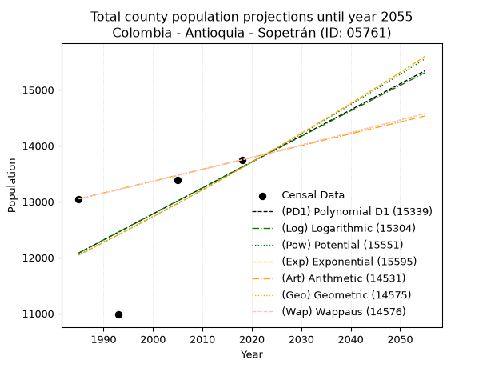
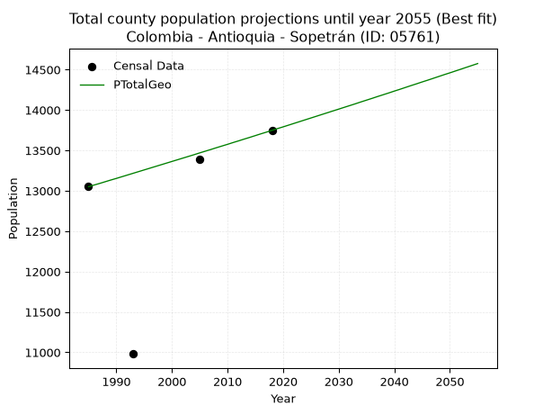
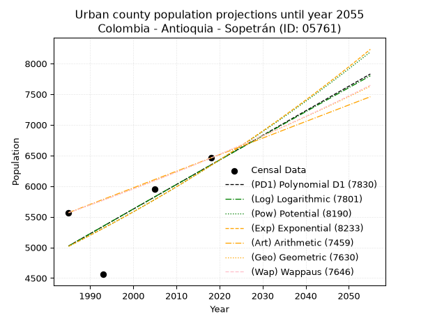
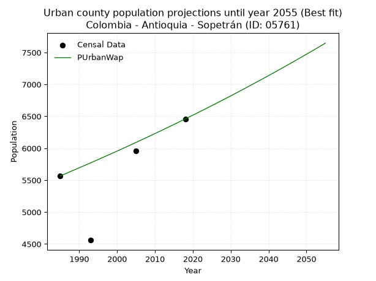
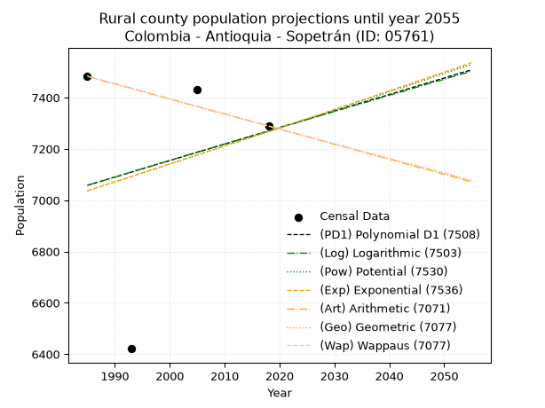
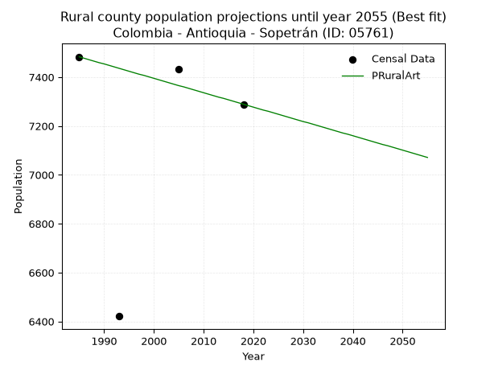

<div align="center">


</div>

# _“Population and Public Services Demand Projections (PPSD) until Year 2050 for Colombia - Antioquia - Sopetrán (ID: 05761)”_
Keywords: `population` `public-service` `projection` `lineal` `polynomial` `logarithmic` `potential` `exponential` `arithmetic` `geometric` `wappaus` `dane` `colombia` `south-america`

PPSD are analytical estimates used by governments and planners to anticipate future changes in population size, age distribution, and the resulting community needs for utilities, healthcare, education, and infrastructure as sizing future water treatment facilities, electrical grids, and road networks based on spatial growth.

> **General running parameters**: • app_version: _v20260806_. • Python version: _3.14.7_. • Pandas version: _3.0.5_. • NumPy version: _2.5.1_. • Creates, save and include plots into reports (create_plot): _False_. • Projection until year: _2050_. • Process polynomial degree 2 and up: _False_. • Process Wappaus: _True_. • Process Wappaus: _True_. • Set negative values to zero: _True_. • Set infinite values to zero: _True_. • Drop dataset notes: _True_. 
<div align="center">

Dynamic map: [:earth_americas:Google](http://maps.google.com/maps?q=6.500744708,-75.7473777) [:earth_americas:OSM](https://www.openstreetmap.org/#map=18/6.500744708/-75.7473777&layers=P) [:earth_americas:Bing](https://www.bing.com/maps?cp=6.500744708~-75.7473777&lvl=18) [:earth_americas:Apple](https://maps.apple.com/frame?center=6.500744708%2C-75.7473777&span=0.003%2C0.006)

</div>


<div align="center">

```geojson
{
  "type": "Feature",
  "geometry": {
    "type": "Point", 
    "coordinates": [-75.7473777, 6.500744708]
  }, 
  "properties": {
    "Name": "Colombia - Antioquia - Sopetrán (ID: 05761)"
  }
}
```

</div>


## 0. Census Data (4 records)

Census data are official statistics collected by a government about the people and housing in a country. They usually include counts of total population, age, sex, race, income, education, and jobs.

📅Global census file: [Population.xlsx](../data/Population.xlsx)

| Source   |   Year |   CountryID | CountryName   |   StateID | StateName   |   CountyID | CountyName   |   PTotal |   PUrban |   PRural |
|:---------|-------:|------------:|:--------------|----------:|:------------|-----------:|:-------------|---------:|---------:|---------:|
| DANE     |   1985 |          57 | Colombia      |        05 | Antioquia   |      05761 | Sopetrán     |    13050 |     5567 |     7483 |
| DANE     |   1993 |          57 | Colombia      |        05 | Antioquia   |      05761 | Sopetrán     |    10981 |     4560 |     6421 |
| DANE     |   2005 |          57 | Colombia      |        05 | Antioquia   |      05761 | Sopetrán     |    13385 |     5954 |     7431 |
| DANE     |   2018 |          57 | Colombia      |        05 | Antioquia   |      05761 | Sopetrán     |    13748 |     6459 |     7289 |

> 🔥Some records could had specific notes about the registered values or the corresponding urban or rural distribution.

## 1. Total

### 1.1. Coefficients and Parameters

* (PD1) Polynomial Deg 1: 46.537133681252186, -80294.90164592469 (lineal)
* (Log) Logarithmic: 92990.29204053734, -694028.954977558
* (Pow) Potential: 7.369128385038825, -20.220774077260604
* (Exp) Exponential: 0.003688110196246547, 7.969394583729944
* (Art) Arithmetic: Year diff. 2018 - 1985 = 33, Population diff. 13748 - 13050 = 698, Annual growth = 21.151515151515152
* (Geo) Geometric: Year diff. 2018 - 1985 = 33, Population diff. 13748 - 13050 = 698, Annual growth % = 0.001580193410664954
* (Wap) Wappaus: i = 0.15785890851194231, Condition values only valid for < 200)

<sub>
Wappaus condition values: ['0.00', '0.16', '0.32', '0.47', '0.63', '0.79', '0.95', '1.11', '1.26', '1.42', '1.58', '1.74', '1.89', '2.05', '2.21', '2.37', '2.53', '2.68', '2.84', '3.00', '3.16', '3.32', '3.47', '3.63', '3.79', '3.95', '4.10', '4.26', '4.42', '4.58', '4.74', '4.89', '5.05', '5.21', '5.37', '5.53', '5.68', '5.84', '6.00', '6.16', '6.31', '6.47', '6.63', '6.79', '6.95', '7.10', '7.26', '7.42', '7.58', '7.74', '7.89', '8.05', '8.21', '8.37', '8.52', '8.68', '8.84', '9.00', '9.16', '9.31', '9.47', '9.63', '9.79', '9.95', '10.10', '10.26']
</sub>


### 1.2. Projected Dataset

|   Year |   CountyID |   PTotalPD1 |   PTotalLog |   PTotalPow |   PTotalExp |   PTotalArt |   PTotalGeo |   PTotalWap |
|-------:|-----------:|------------:|------------:|------------:|------------:|------------:|------------:|------------:|
|   1985 |      05761 |       12081 |       12081 |       12046 |       12046 |       13050 |       13050 |       13050 |
|   1986 |      05761 |       12128 |       12128 |       12091 |       12091 |       13071 |       13071 |       13071 |
|   1987 |      05761 |       12174 |       12175 |       12136 |       12135 |       13092 |       13091 |       13091 |
|   1988 |      05761 |       12221 |       12222 |       12181 |       12180 |       13113 |       13112 |       13112 |
|   1989 |      05761 |       12267 |       12268 |       12226 |       12225 |       13135 |       13133 |       13133 |
|   1990 |      05761 |       12314 |       12315 |       12272 |       12270 |       13156 |       13153 |       13153 |
|   1991 |      05761 |       12361 |       12362 |       12317 |       12316 |       13177 |       13174 |       13174 |
|   1992 |      05761 |       12407 |       12408 |       12363 |       12361 |       13198 |       13195 |       13195 |
|   1993 |      05761 |       12454 |       12455 |       12408 |       12407 |       13219 |       13216 |       13216 |
|   1994 |      05761 |       12500 |       12502 |       12454 |       12453 |       13240 |       13237 |       13237 |
|   1995 |      05761 |       12547 |       12548 |       12501 |       12499 |       13262 |       13258 |       13258 |
|   1996 |      05761 |       12593 |       12595 |       12547 |       12545 |       13283 |       13279 |       13279 |
|   1997 |      05761 |       12640 |       12642 |       12593 |       12591 |       13304 |       13300 |       13300 |
|   1998 |      05761 |       12686 |       12688 |       12640 |       12638 |       13325 |       13321 |       13321 |
|   1999 |      05761 |       12733 |       12735 |       12686 |       12685 |       13346 |       13342 |       13342 |
|   2000 |      05761 |       12779 |       12781 |       12733 |       12731 |       13367 |       13363 |       13363 |
|   2001 |      05761 |       12826 |       12828 |       12780 |       12778 |       13388 |       13384 |       13384 |
|   2002 |      05761 |       12872 |       12874 |       12827 |       12826 |       13410 |       13405 |       13405 |
|   2003 |      05761 |       12919 |       12921 |       12875 |       12873 |       13431 |       13426 |       13426 |
|   2004 |      05761 |       12966 |       12967 |       12922 |       12921 |       13452 |       13447 |       13447 |
|   2005 |      05761 |       13012 |       13013 |       12970 |       12968 |       13473 |       13469 |       13469 |
|   2006 |      05761 |       13059 |       13060 |       13017 |       13016 |       13494 |       13490 |       13490 |
|   2007 |      05761 |       13105 |       13106 |       13065 |       13064 |       13515 |       13511 |       13511 |
|   2008 |      05761 |       13152 |       13152 |       13113 |       13113 |       13536 |       13533 |       13533 |
|   2009 |      05761 |       13198 |       13199 |       13162 |       13161 |       13558 |       13554 |       13554 |
|   2010 |      05761 |       13245 |       13245 |       13210 |       13210 |       13579 |       13575 |       13575 |
|   2011 |      05761 |       13291 |       13291 |       13258 |       13259 |       13600 |       13597 |       13597 |
|   2012 |      05761 |       13338 |       13337 |       13307 |       13308 |       13621 |       13618 |       13618 |
|   2013 |      05761 |       13384 |       13384 |       13356 |       13357 |       13642 |       13640 |       13640 |
|   2014 |      05761 |       13431 |       13430 |       13405 |       13406 |       13663 |       13661 |       13661 |
|   2015 |      05761 |       13477 |       13476 |       13454 |       13456 |       13685 |       13683 |       13683 |
|   2016 |      05761 |       13524 |       13522 |       13503 |       13505 |       13706 |       13705 |       13705 |
|   2017 |      05761 |       13570 |       13568 |       13553 |       13555 |       13727 |       13726 |       13726 |
|   2018 |      05761 |       13617 |       13614 |       13602 |       13605 |       13748 |       13748 |       13748 |
|   2019 |      05761 |       13664 |       13660 |       13652 |       13656 |       13769 |       13770 |       13770 |
|   2020 |      05761 |       13710 |       13706 |       13702 |       13706 |       13790 |       13791 |       13792 |
|   2021 |      05761 |       13757 |       13752 |       13752 |       13757 |       13811 |       13813 |       13813 |
|   2022 |      05761 |       13803 |       13798 |       13802 |       13808 |       13833 |       13835 |       13835 |
|   2023 |      05761 |       13850 |       13844 |       13853 |       13859 |       13854 |       13857 |       13857 |
|   2024 |      05761 |       13896 |       13890 |       13903 |       13910 |       13875 |       13879 |       13879 |
|   2025 |      05761 |       13943 |       13936 |       13954 |       13961 |       13896 |       13901 |       13901 |
|   2026 |      05761 |       13989 |       13982 |       14005 |       14013 |       13917 |       13923 |       13923 |
|   2027 |      05761 |       14036 |       14028 |       14056 |       14064 |       13938 |       13945 |       13945 |
|   2028 |      05761 |       14082 |       14074 |       14107 |       14116 |       13960 |       13967 |       13967 |
|   2029 |      05761 |       14129 |       14120 |       14158 |       14169 |       13981 |       13989 |       13989 |
|   2030 |      05761 |       14175 |       14166 |       14210 |       14221 |       14002 |       14011 |       14011 |
|   2031 |      05761 |       14222 |       14211 |       14261 |       14274 |       14023 |       14033 |       14033 |
|   2032 |      05761 |       14269 |       14257 |       14313 |       14326 |       14044 |       14055 |       14056 |
|   2033 |      05761 |       14315 |       14303 |       14365 |       14379 |       14065 |       14077 |       14078 |
|   2034 |      05761 |       14362 |       14349 |       14417 |       14432 |       14086 |       14100 |       14100 |
|   2035 |      05761 |       14408 |       14394 |       14470 |       14486 |       14108 |       14122 |       14122 |
|   2036 |      05761 |       14455 |       14440 |       14522 |       14539 |       14129 |       14144 |       14145 |
|   2037 |      05761 |       14501 |       14486 |       14575 |       14593 |       14150 |       14167 |       14167 |
|   2038 |      05761 |       14548 |       14531 |       14628 |       14647 |       14171 |       14189 |       14189 |
|   2039 |      05761 |       14594 |       14577 |       14681 |       14701 |       14192 |       14211 |       14212 |
|   2040 |      05761 |       14641 |       14623 |       14734 |       14755 |       14213 |       14234 |       14234 |
|   2041 |      05761 |       14687 |       14668 |       14787 |       14810 |       14234 |       14256 |       14257 |
|   2042 |      05761 |       14734 |       14714 |       14841 |       14864 |       14256 |       14279 |       14280 |
|   2043 |      05761 |       14780 |       14759 |       14894 |       14919 |       14277 |       14302 |       14302 |
|   2044 |      05761 |       14827 |       14805 |       14948 |       14975 |       14298 |       14324 |       14325 |
|   2045 |      05761 |       14874 |       14850 |       15002 |       15030 |       14319 |       14347 |       14347 |
|   2046 |      05761 |       14920 |       14896 |       15056 |       15085 |       14340 |       14369 |       14370 |
|   2047 |      05761 |       14967 |       14941 |       15110 |       15141 |       14361 |       14392 |       14393 |
|   2048 |      05761 |       15013 |       14987 |       15165 |       15197 |       14383 |       14415 |       14416 |
|   2049 |      05761 |       15060 |       15032 |       15220 |       15253 |       14404 |       14438 |       14439 |
|   2050 |      05761 |       15106 |       15077 |       15274 |       15310 |       14425 |       14460 |       14461 |
<div align="center">

</img>

</div>


### 1.3. Best fit with absolute and relative error (%)

Relative error puts that difference into context by dividing the absolute error by the true value, creating a unitless ratio or percentage that shows the scale of the mistake.

Absolute and relative error

|   Year | Source   |   CountryID | CountryName   |   StateID | StateName   |   CountyID_x | CountyName   |   PTotal |   PUrban |   PRural |   CountyID_y |   PTotalPD1 |   PTotalLog |   PTotalPow |   PTotalExp |   PTotalArt |   PTotalGeo |   PTotalWap |   PTotalPD1AbsError |   PTotalLogAbsError |   PTotalPowAbsError |   PTotalExpAbsError |   PTotalArtAbsError |   PTotalGeoAbsError |   PTotalWapAbsError |   PTotalPD1RelError |   PTotalLogRelError |   PTotalPowRelError |   PTotalExpRelError |   PTotalArtRelError |   PTotalGeoRelError |   PTotalWapRelError |
|-------:|:---------|------------:|:--------------|----------:|:------------|-------------:|:-------------|---------:|---------:|---------:|-------------:|------------:|------------:|------------:|------------:|------------:|------------:|------------:|--------------------:|--------------------:|--------------------:|--------------------:|--------------------:|--------------------:|--------------------:|--------------------:|--------------------:|--------------------:|--------------------:|--------------------:|--------------------:|--------------------:|
|   1985 | DANE     |          57 | Colombia      |        05 | Antioquia   |        05761 | Sopetrán     |    13050 |     5567 |     7483 |        05761 |       12081 |       12081 |       12046 |       12046 |       13050 |       13050 |       13050 |                 969 |                 969 |                1004 |                1004 |                   0 |                   0 |                   0 |            7.42529  |            7.42529  |             7.69349 |             7.69349 |            0        |            0        |            0        |
|   1993 | DANE     |          57 | Colombia      |        05 | Antioquia   |        05761 | Sopetrán     |    10981 |     4560 |     6421 |        05761 |       12454 |       12455 |       12408 |       12407 |       13219 |       13216 |       13216 |                1473 |                1474 |                1427 |                1426 |                2238 |                2235 |                2235 |           13.4141   |           13.4232   |            12.9952  |            12.9861  |           20.3807   |           20.3533   |           20.3533   |
|   2005 | DANE     |          57 | Colombia      |        05 | Antioquia   |        05761 | Sopetrán     |    13385 |     5954 |     7431 |        05761 |       13012 |       13013 |       12970 |       12968 |       13473 |       13469 |       13469 |                 373 |                 372 |                 415 |                 417 |                  88 |                  84 |                  84 |            2.7867   |            2.77923  |             3.10049 |             3.11543 |            0.657452 |            0.627568 |            0.627568 |
|   2018 | DANE     |          57 | Colombia      |        05 | Antioquia   |        05761 | Sopetrán     |    13748 |     6459 |     7289 |        05761 |       13617 |       13614 |       13602 |       13605 |       13748 |       13748 |       13748 |                 131 |                 134 |                 146 |                 143 |                   0 |                   0 |                   0 |            0.952866 |            0.974687 |             1.06197 |             1.04015 |            0        |            0        |            0        |

Relative error mean

| Method    |   RelError | Best   |
|:----------|-----------:|:-------|
| PTotalPD1 |    6.14473 |        |
| PTotalLog |    6.1506  |        |
| PTotalPow |    6.21278 |        |
| PTotalExp |    6.20878 |        |
| PTotalArt |    5.25953 |        |
| PTotalGeo |    5.24523 | True   |
| PTotalWap |    5.24523 | True   |

💙Best method: _**PTotalGeo**_
<div align="center">

</img>

</div>


### 1.4. Fresh water supply demand in liters per capita per day (lpcd)

The fresh water supply demand typically ranges from 100 to 300 liters per capita per day (lpcd) for standard domestic and municipal planning, though absolute survival minimums set by the World Health Organization are as low as 7.5 to 20 liters per day, and total consumption in high-income nations can exceed 400 liters.

> `CZ`: Level in meters above the sea level (masl).<br> `WS`: Fresh water supply demand in liters per capita per day (lpcd or l/h/d).<br> `WSAll`: Zonal fresh water supply demand in liters per second (l/s).<br> `A`: Zonal area in square meters.

Reference values (RAS Colombia)

|    CZ |   WS |
|------:|-----:|
|  1000 |  120 |
|  2000 |  130 |
| 99999 |  140 |

County shapefile geometry properties and water supply values

|   CountyID |      ATotal |   CZTotal |   WSTotal |
|-----------:|------------:|----------:|----------:|
|      05761 | 2.19036e+08 |   1254.49 |       130 |

Projected values for best method: PTotalGeo

|   CountyID |   Year |   PTotalGeo |   WSTotal |   WSTotalAll |
|-----------:|-------:|------------:|----------:|-------------:|
|      05761 |   1985 |       13050 |       130 |      19.6354 |
|      05761 |   1986 |       13071 |       130 |      19.667  |
|      05761 |   1987 |       13091 |       130 |      19.6971 |
|      05761 |   1988 |       13112 |       130 |      19.7287 |
|      05761 |   1989 |       13133 |       130 |      19.7603 |
|      05761 |   1990 |       13153 |       130 |      19.7904 |
|      05761 |   1991 |       13174 |       130 |      19.822  |
|      05761 |   1992 |       13195 |       130 |      19.8536 |
|      05761 |   1993 |       13216 |       130 |      19.8852 |
|      05761 |   1994 |       13237 |       130 |      19.9168 |
|      05761 |   1995 |       13258 |       130 |      19.9484 |
|      05761 |   1996 |       13279 |       130 |      19.98   |
|      05761 |   1997 |       13300 |       130 |      20.0116 |
|      05761 |   1998 |       13321 |       130 |      20.0432 |
|      05761 |   1999 |       13342 |       130 |      20.0748 |
|      05761 |   2000 |       13363 |       130 |      20.1064 |
|      05761 |   2001 |       13384 |       130 |      20.138  |
|      05761 |   2002 |       13405 |       130 |      20.1696 |
|      05761 |   2003 |       13426 |       130 |      20.2012 |
|      05761 |   2004 |       13447 |       130 |      20.2328 |
|      05761 |   2005 |       13469 |       130 |      20.2659 |
|      05761 |   2006 |       13490 |       130 |      20.2975 |
|      05761 |   2007 |       13511 |       130 |      20.3291 |
|      05761 |   2008 |       13533 |       130 |      20.3622 |
|      05761 |   2009 |       13554 |       130 |      20.3938 |
|      05761 |   2010 |       13575 |       130 |      20.4253 |
|      05761 |   2011 |       13597 |       130 |      20.4584 |
|      05761 |   2012 |       13618 |       130 |      20.49   |
|      05761 |   2013 |       13640 |       130 |      20.5231 |
|      05761 |   2014 |       13661 |       130 |      20.5547 |
|      05761 |   2015 |       13683 |       130 |      20.5878 |
|      05761 |   2016 |       13705 |       130 |      20.6209 |
|      05761 |   2017 |       13726 |       130 |      20.6525 |
|      05761 |   2018 |       13748 |       130 |      20.6856 |
|      05761 |   2019 |       13770 |       130 |      20.7188 |
|      05761 |   2020 |       13791 |       130 |      20.7503 |
|      05761 |   2021 |       13813 |       130 |      20.7834 |
|      05761 |   2022 |       13835 |       130 |      20.8166 |
|      05761 |   2023 |       13857 |       130 |      20.8497 |
|      05761 |   2024 |       13879 |       130 |      20.8828 |
|      05761 |   2025 |       13901 |       130 |      20.9159 |
|      05761 |   2026 |       13923 |       130 |      20.949  |
|      05761 |   2027 |       13945 |       130 |      20.9821 |
|      05761 |   2028 |       13967 |       130 |      21.0152 |
|      05761 |   2029 |       13989 |       130 |      21.0483 |
|      05761 |   2030 |       14011 |       130 |      21.0814 |
|      05761 |   2031 |       14033 |       130 |      21.1145 |
|      05761 |   2032 |       14055 |       130 |      21.1476 |
|      05761 |   2033 |       14077 |       130 |      21.1807 |
|      05761 |   2034 |       14100 |       130 |      21.2153 |
|      05761 |   2035 |       14122 |       130 |      21.2484 |
|      05761 |   2036 |       14144 |       130 |      21.2815 |
|      05761 |   2037 |       14167 |       130 |      21.3161 |
|      05761 |   2038 |       14189 |       130 |      21.3492 |
|      05761 |   2039 |       14211 |       130 |      21.3823 |
|      05761 |   2040 |       14234 |       130 |      21.4169 |
|      05761 |   2041 |       14256 |       130 |      21.45   |
|      05761 |   2042 |       14279 |       130 |      21.4846 |
|      05761 |   2043 |       14302 |       130 |      21.5192 |
|      05761 |   2044 |       14324 |       130 |      21.5523 |
|      05761 |   2045 |       14347 |       130 |      21.5869 |
|      05761 |   2046 |       14369 |       130 |      21.62   |
|      05761 |   2047 |       14392 |       130 |      21.6546 |
|      05761 |   2048 |       14415 |       130 |      21.6892 |
|      05761 |   2049 |       14438 |       130 |      21.7238 |
|      05761 |   2050 |       14460 |       130 |      21.7569 |

## 2. Urban

### 2.1. Coefficients and Parameters

* (PD1) Polynomial Deg 1: 40.099558410276586, -74574.14171015573 (lineal)
* (Log) Logarithmic: 80164.59740997668, -603696.7473119998
* (Pow) Potential: 14.136243461156212, -42.91742167318658
* (Exp) Exponential: 0.0070715780996810805, 0.004020939732718334
* (Art) Arithmetic: Year diff. 2018 - 1985 = 33, Population diff. 6459 - 5567 = 892, Annual growth = 27.03030303030303
* (Geo) Geometric: Year diff. 2018 - 1985 = 33, Population diff. 6459 - 5567 = 892, Annual growth % = 0.004513738118251842
* (Wap) Wappaus: i = 0.4495310665275741, Condition values only valid for < 200)

<sub>
Wappaus condition values: ['0.00', '0.45', '0.90', '1.35', '1.80', '2.25', '2.70', '3.15', '3.60', '4.05', '4.50', '4.94', '5.39', '5.84', '6.29', '6.74', '7.19', '7.64', '8.09', '8.54', '8.99', '9.44', '9.89', '10.34', '10.79', '11.24', '11.69', '12.14', '12.59', '13.04', '13.49', '13.94', '14.38', '14.83', '15.28', '15.73', '16.18', '16.63', '17.08', '17.53', '17.98', '18.43', '18.88', '19.33', '19.78', '20.23', '20.68', '21.13', '21.58', '22.03', '22.48', '22.93', '23.38', '23.83', '24.27', '24.72', '25.17', '25.62', '26.07', '26.52', '26.97', '27.42', '27.87', '28.32', '28.77', '29.22']
</sub>


### 2.2. Projected Dataset

|   Year |   CountyID |   PUrbanPD1 |   PUrbanLog |   PUrbanPow |   PUrbanExp |   PUrbanArt |   PUrbanGeo |   PUrbanWap |
|-------:|-----------:|------------:|------------:|------------:|------------:|------------:|------------:|------------:|
|   1985 |      05761 |        5023 |        5023 |        5018 |        5018 |        5567 |        5567 |        5567 |
|   1986 |      05761 |        5064 |        5063 |        5054 |        5054 |        5594 |        5592 |        5592 |
|   1987 |      05761 |        5104 |        5104 |        5090 |        5090 |        5621 |        5617 |        5617 |
|   1988 |      05761 |        5144 |        5144 |        5126 |        5126 |        5648 |        5643 |        5643 |
|   1989 |      05761 |        5184 |        5184 |        5163 |        5162 |        5675 |        5668 |        5668 |
|   1990 |      05761 |        5224 |        5225 |        5200 |        5199 |        5702 |        5694 |        5694 |
|   1991 |      05761 |        5264 |        5265 |        5237 |        5236 |        5729 |        5719 |        5719 |
|   1992 |      05761 |        5304 |        5305 |        5274 |        5273 |        5756 |        5745 |        5745 |
|   1993 |      05761 |        5344 |        5345 |        5311 |        5310 |        5783 |        5771 |        5771 |
|   1994 |      05761 |        5384 |        5386 |        5349 |        5348 |        5810 |        5797 |        5797 |
|   1995 |      05761 |        5424 |        5426 |        5387 |        5386 |        5837 |        5823 |        5823 |
|   1996 |      05761 |        5465 |        5466 |        5426 |        5424 |        5864 |        5850 |        5849 |
|   1997 |      05761 |        5505 |        5506 |        5464 |        5463 |        5891 |        5876 |        5876 |
|   1998 |      05761 |        5545 |        5546 |        5503 |        5501 |        5918 |        5903 |        5902 |
|   1999 |      05761 |        5585 |        5586 |        5542 |        5541 |        5945 |        5929 |        5929 |
|   2000 |      05761 |        5625 |        5627 |        5581 |        5580 |        5972 |        5956 |        5955 |
|   2001 |      05761 |        5665 |        5667 |        5621 |        5619 |        5999 |        5983 |        5982 |
|   2002 |      05761 |        5705 |        5707 |        5661 |        5659 |        6027 |        6010 |        6009 |
|   2003 |      05761 |        5745 |        5747 |        5701 |        5699 |        6054 |        6037 |        6036 |
|   2004 |      05761 |        5785 |        5787 |        5741 |        5740 |        6081 |        6064 |        6064 |
|   2005 |      05761 |        5825 |        5827 |        5782 |        5781 |        6108 |        6092 |        6091 |
|   2006 |      05761 |        5866 |        5867 |        5823 |        5822 |        6135 |        6119 |        6119 |
|   2007 |      05761 |        5906 |        5907 |        5864 |        5863 |        6162 |        6147 |        6146 |
|   2008 |      05761 |        5946 |        5947 |        5905 |        5905 |        6189 |        6175 |        6174 |
|   2009 |      05761 |        5986 |        5986 |        5947 |        5947 |        6216 |        6202 |        6202 |
|   2010 |      05761 |        6026 |        6026 |        5989 |        5989 |        6243 |        6230 |        6230 |
|   2011 |      05761 |        6066 |        6066 |        6031 |        6031 |        6270 |        6259 |        6258 |
|   2012 |      05761 |        6106 |        6106 |        6074 |        6074 |        6297 |        6287 |        6286 |
|   2013 |      05761 |        6146 |        6146 |        6117 |        6117 |        6324 |        6315 |        6315 |
|   2014 |      05761 |        6186 |        6186 |        6160 |        6161 |        6351 |        6344 |        6343 |
|   2015 |      05761 |        6226 |        6226 |        6203 |        6204 |        6378 |        6372 |        6372 |
|   2016 |      05761 |        6267 |        6265 |        6247 |        6248 |        6405 |        6401 |        6401 |
|   2017 |      05761 |        6307 |        6305 |        6291 |        6293 |        6432 |        6430 |        6430 |
|   2018 |      05761 |        6347 |        6345 |        6335 |        6337 |        6459 |        6459 |        6459 |
|   2019 |      05761 |        6387 |        6385 |        6380 |        6382 |        6486 |        6488 |        6488 |
|   2020 |      05761 |        6427 |        6424 |        6424 |        6428 |        6513 |        6517 |        6518 |
|   2021 |      05761 |        6467 |        6464 |        6469 |        6473 |        6540 |        6547 |        6547 |
|   2022 |      05761 |        6507 |        6504 |        6515 |        6519 |        6567 |        6576 |        6577 |
|   2023 |      05761 |        6547 |        6543 |        6561 |        6565 |        6594 |        6606 |        6607 |
|   2024 |      05761 |        6587 |        6583 |        6607 |        6612 |        6621 |        6636 |        6637 |
|   2025 |      05761 |        6627 |        6622 |        6653 |        6659 |        6648 |        6666 |        6667 |
|   2026 |      05761 |        6668 |        6662 |        6699 |        6706 |        6675 |        6696 |        6697 |
|   2027 |      05761 |        6708 |        6702 |        6746 |        6754 |        6702 |        6726 |        6728 |
|   2028 |      05761 |        6748 |        6741 |        6794 |        6802 |        6729 |        6757 |        6758 |
|   2029 |      05761 |        6788 |        6781 |        6841 |        6850 |        6756 |        6787 |        6789 |
|   2030 |      05761 |        6828 |        6820 |        6889 |        6899 |        6783 |        6818 |        6820 |
|   2031 |      05761 |        6868 |        6860 |        6937 |        6947 |        6810 |        6848 |        6851 |
|   2032 |      05761 |        6908 |        6899 |        6985 |        6997 |        6837 |        6879 |        6882 |
|   2033 |      05761 |        6948 |        6938 |        7034 |        7046 |        6864 |        6910 |        6913 |
|   2034 |      05761 |        6988 |        6978 |        7083 |        7096 |        6891 |        6942 |        6945 |
|   2035 |      05761 |        7028 |        7017 |        7133 |        7147 |        6919 |        6973 |        6977 |
|   2036 |      05761 |        7069 |        7057 |        7182 |        7198 |        6946 |        7004 |        7009 |
|   2037 |      05761 |        7109 |        7096 |        7232 |        7249 |        6973 |        7036 |        7041 |
|   2038 |      05761 |        7149 |        7135 |        7283 |        7300 |        7000 |        7068 |        7073 |
|   2039 |      05761 |        7189 |        7175 |        7333 |        7352 |        7027 |        7100 |        7105 |
|   2040 |      05761 |        7229 |        7214 |        7384 |        7404 |        7054 |        7132 |        7138 |
|   2041 |      05761 |        7269 |        7253 |        7436 |        7457 |        7081 |        7164 |        7170 |
|   2042 |      05761 |        7309 |        7293 |        7487 |        7509 |        7108 |        7196 |        7203 |
|   2043 |      05761 |        7349 |        7332 |        7539 |        7563 |        7135 |        7229 |        7236 |
|   2044 |      05761 |        7389 |        7371 |        7592 |        7616 |        7162 |        7261 |        7269 |
|   2045 |      05761 |        7429 |        7410 |        7644 |        7671 |        7189 |        7294 |        7303 |
|   2046 |      05761 |        7470 |        7449 |        7697 |        7725 |        7216 |        7327 |        7336 |
|   2047 |      05761 |        7510 |        7489 |        7751 |        7780 |        7243 |        7360 |        7370 |
|   2048 |      05761 |        7550 |        7528 |        7804 |        7835 |        7270 |        7393 |        7404 |
|   2049 |      05761 |        7590 |        7567 |        7859 |        7891 |        7297 |        7427 |        7438 |
|   2050 |      05761 |        7630 |        7606 |        7913 |        7947 |        7324 |        7460 |        7472 |
<div align="center">

</img>

</div>


### 2.3. Best fit with absolute and relative error (%)

Relative error puts that difference into context by dividing the absolute error by the true value, creating a unitless ratio or percentage that shows the scale of the mistake.

Absolute and relative error

|   Year | Source   |   CountryID | CountryName   |   StateID | StateName   |   CountyID_x | CountyName   |   PTotal |   PUrban |   PRural |   CountyID_y |   PUrbanPD1 |   PUrbanLog |   PUrbanPow |   PUrbanExp |   PUrbanArt |   PUrbanGeo |   PUrbanWap |   PUrbanPD1AbsError |   PUrbanLogAbsError |   PUrbanPowAbsError |   PUrbanExpAbsError |   PUrbanArtAbsError |   PUrbanGeoAbsError |   PUrbanWapAbsError |   PUrbanPD1RelError |   PUrbanLogRelError |   PUrbanPowRelError |   PUrbanExpRelError |   PUrbanArtRelError |   PUrbanGeoRelError |   PUrbanWapRelError |
|-------:|:---------|------------:|:--------------|----------:|:------------|-------------:|:-------------|---------:|---------:|---------:|-------------:|------------:|------------:|------------:|------------:|------------:|------------:|------------:|--------------------:|--------------------:|--------------------:|--------------------:|--------------------:|--------------------:|--------------------:|--------------------:|--------------------:|--------------------:|--------------------:|--------------------:|--------------------:|--------------------:|
|   1985 | DANE     |          57 | Colombia      |        05 | Antioquia   |        05761 | Sopetrán     |    13050 |     5567 |     7483 |        05761 |        5023 |        5023 |        5018 |        5018 |        5567 |        5567 |        5567 |                 544 |                 544 |                 549 |                 549 |                   0 |                   0 |                   0 |             9.77187 |             9.77187 |             9.86168 |             9.86168 |              0      |             0       |             0       |
|   1993 | DANE     |          57 | Colombia      |        05 | Antioquia   |        05761 | Sopetrán     |    10981 |     4560 |     6421 |        05761 |        5344 |        5345 |        5311 |        5310 |        5783 |        5771 |        5771 |                 784 |                 785 |                 751 |                 750 |                1223 |                1211 |                1211 |            17.193   |            17.2149  |            16.4693  |            16.4474  |             26.8202 |            26.557   |            26.557   |
|   2005 | DANE     |          57 | Colombia      |        05 | Antioquia   |        05761 | Sopetrán     |    13385 |     5954 |     7431 |        05761 |        5825 |        5827 |        5782 |        5781 |        6108 |        6092 |        6091 |                 129 |                 127 |                 172 |                 173 |                 154 |                 138 |                 137 |             2.16661 |             2.13302 |             2.88881 |             2.90561 |              2.5865 |             2.31777 |             2.30097 |
|   2018 | DANE     |          57 | Colombia      |        05 | Antioquia   |        05761 | Sopetrán     |    13748 |     6459 |     7289 |        05761 |        6347 |        6345 |        6335 |        6337 |        6459 |        6459 |        6459 |                 112 |                 114 |                 124 |                 122 |                   0 |                   0 |                   0 |             1.73401 |             1.76498 |             1.9198  |             1.88884 |              0      |             0       |             0       |

Relative error mean

| Method    |   RelError | Best   |
|:----------|-----------:|:-------|
| PUrbanPD1 |    7.71637 |        |
| PUrbanLog |    7.7212  |        |
| PUrbanPow |    7.7849  |        |
| PUrbanExp |    7.77588 |        |
| PUrbanArt |    7.35167 |        |
| PUrbanGeo |    7.2187  |        |
| PUrbanWap |    7.2145  | True   |

💙Best method: _**PUrbanWap**_
<div align="center">

</img>

</div>


### 2.4. Fresh water supply demand in liters per capita per day (lpcd)

The fresh water supply demand typically ranges from 100 to 300 liters per capita per day (lpcd) for standard domestic and municipal planning, though absolute survival minimums set by the World Health Organization are as low as 7.5 to 20 liters per day, and total consumption in high-income nations can exceed 400 liters.

> `CZ`: Level in meters above the sea level (masl).<br> `WS`: Fresh water supply demand in liters per capita per day (lpcd or l/h/d).<br> `WSAll`: Zonal fresh water supply demand in liters per second (l/s).<br> `A`: Zonal area in square meters.

Reference values (RAS Colombia)

|    CZ |   WS |
|------:|-----:|
|  1000 |  120 |
|  2000 |  130 |
| 99999 |  140 |

County shapefile geometry properties and water supply values

|   CountyID |      AUrban |   CZUrban |   WSUrban |
|-----------:|------------:|----------:|----------:|
|      05761 | 3.95372e+06 |   733.866 |       120 |

Projected values for best method: PUrbanWap

|   CountyID |   Year |   PUrbanWap |   WSUrban |   WSUrbanAll |
|-----------:|-------:|------------:|----------:|-------------:|
|      05761 |   1985 |        5567 |       120 |      7.73194 |
|      05761 |   1986 |        5592 |       120 |      7.76667 |
|      05761 |   1987 |        5617 |       120 |      7.80139 |
|      05761 |   1988 |        5643 |       120 |      7.8375  |
|      05761 |   1989 |        5668 |       120 |      7.87222 |
|      05761 |   1990 |        5694 |       120 |      7.90833 |
|      05761 |   1991 |        5719 |       120 |      7.94306 |
|      05761 |   1992 |        5745 |       120 |      7.97917 |
|      05761 |   1993 |        5771 |       120 |      8.01528 |
|      05761 |   1994 |        5797 |       120 |      8.05139 |
|      05761 |   1995 |        5823 |       120 |      8.0875  |
|      05761 |   1996 |        5849 |       120 |      8.12361 |
|      05761 |   1997 |        5876 |       120 |      8.16111 |
|      05761 |   1998 |        5902 |       120 |      8.19722 |
|      05761 |   1999 |        5929 |       120 |      8.23472 |
|      05761 |   2000 |        5955 |       120 |      8.27083 |
|      05761 |   2001 |        5982 |       120 |      8.30833 |
|      05761 |   2002 |        6009 |       120 |      8.34583 |
|      05761 |   2003 |        6036 |       120 |      8.38333 |
|      05761 |   2004 |        6064 |       120 |      8.42222 |
|      05761 |   2005 |        6091 |       120 |      8.45972 |
|      05761 |   2006 |        6119 |       120 |      8.49861 |
|      05761 |   2007 |        6146 |       120 |      8.53611 |
|      05761 |   2008 |        6174 |       120 |      8.575   |
|      05761 |   2009 |        6202 |       120 |      8.61389 |
|      05761 |   2010 |        6230 |       120 |      8.65278 |
|      05761 |   2011 |        6258 |       120 |      8.69167 |
|      05761 |   2012 |        6286 |       120 |      8.73056 |
|      05761 |   2013 |        6315 |       120 |      8.77083 |
|      05761 |   2014 |        6343 |       120 |      8.80972 |
|      05761 |   2015 |        6372 |       120 |      8.85    |
|      05761 |   2016 |        6401 |       120 |      8.89028 |
|      05761 |   2017 |        6430 |       120 |      8.93056 |
|      05761 |   2018 |        6459 |       120 |      8.97083 |
|      05761 |   2019 |        6488 |       120 |      9.01111 |
|      05761 |   2020 |        6518 |       120 |      9.05278 |
|      05761 |   2021 |        6547 |       120 |      9.09306 |
|      05761 |   2022 |        6577 |       120 |      9.13472 |
|      05761 |   2023 |        6607 |       120 |      9.17639 |
|      05761 |   2024 |        6637 |       120 |      9.21806 |
|      05761 |   2025 |        6667 |       120 |      9.25972 |
|      05761 |   2026 |        6697 |       120 |      9.30139 |
|      05761 |   2027 |        6728 |       120 |      9.34444 |
|      05761 |   2028 |        6758 |       120 |      9.38611 |
|      05761 |   2029 |        6789 |       120 |      9.42917 |
|      05761 |   2030 |        6820 |       120 |      9.47222 |
|      05761 |   2031 |        6851 |       120 |      9.51528 |
|      05761 |   2032 |        6882 |       120 |      9.55833 |
|      05761 |   2033 |        6913 |       120 |      9.60139 |
|      05761 |   2034 |        6945 |       120 |      9.64583 |
|      05761 |   2035 |        6977 |       120 |      9.69028 |
|      05761 |   2036 |        7009 |       120 |      9.73472 |
|      05761 |   2037 |        7041 |       120 |      9.77917 |
|      05761 |   2038 |        7073 |       120 |      9.82361 |
|      05761 |   2039 |        7105 |       120 |      9.86806 |
|      05761 |   2040 |        7138 |       120 |      9.91389 |
|      05761 |   2041 |        7170 |       120 |      9.95833 |
|      05761 |   2042 |        7203 |       120 |     10.0042  |
|      05761 |   2043 |        7236 |       120 |     10.05    |
|      05761 |   2044 |        7269 |       120 |     10.0958  |
|      05761 |   2045 |        7303 |       120 |     10.1431  |
|      05761 |   2046 |        7336 |       120 |     10.1889  |
|      05761 |   2047 |        7370 |       120 |     10.2361  |
|      05761 |   2048 |        7404 |       120 |     10.2833  |
|      05761 |   2049 |        7438 |       120 |     10.3306  |
|      05761 |   2050 |        7472 |       120 |     10.3778  |

## 3. Rural

### 3.1. Coefficients and Parameters

* (PD1) Polynomial Deg 1: 6.4375752709755405, -5720.759935768825 (lineal)
* (Log) Logarithmic: 12825.694630560572, -90332.20766555738
* (Pow) Potential: 1.9529322213766371, -2.592928960937378
* (Exp) Exponential: 0.0009800310044961282, 1005.7681683139537
* (Art) Arithmetic: Year diff. 2018 - 1985 = 33, Population diff. 7289 - 7483 = -194, Annual growth = -5.878787878787879
* (Geo) Geometric: Year diff. 2018 - 1985 = 33, Population diff. 7289 - 7483 = -194, Annual growth % = -0.0007956656748512314
* (Wap) Wappaus: i = -0.07959366204695205, Condition values only valid for < 200)

<sub>
Wappaus condition values: ['-0.00', '-0.08', '-0.16', '-0.24', '-0.32', '-0.40', '-0.48', '-0.56', '-0.64', '-0.72', '-0.80', '-0.88', '-0.96', '-1.03', '-1.11', '-1.19', '-1.27', '-1.35', '-1.43', '-1.51', '-1.59', '-1.67', '-1.75', '-1.83', '-1.91', '-1.99', '-2.07', '-2.15', '-2.23', '-2.31', '-2.39', '-2.47', '-2.55', '-2.63', '-2.71', '-2.79', '-2.87', '-2.94', '-3.02', '-3.10', '-3.18', '-3.26', '-3.34', '-3.42', '-3.50', '-3.58', '-3.66', '-3.74', '-3.82', '-3.90', '-3.98', '-4.06', '-4.14', '-4.22', '-4.30', '-4.38', '-4.46', '-4.54', '-4.62', '-4.70', '-4.78', '-4.86', '-4.93', '-5.01', '-5.09', '-5.17']
</sub>


### 3.2. Projected Dataset

|   Year |   CountyID |   PRuralPD1 |   PRuralLog |   PRuralPow |   PRuralExp |   PRuralArt |   PRuralGeo |   PRuralWap |
|-------:|-----------:|------------:|------------:|------------:|------------:|------------:|------------:|------------:|
|   1985 |      05761 |        7058 |        7058 |        7037 |        7037 |        7483 |        7483 |        7483 |
|   1986 |      05761 |        7064 |        7065 |        7044 |        7043 |        7477 |        7477 |        7477 |
|   1987 |      05761 |        7071 |        7071 |        7051 |        7050 |        7471 |        7471 |        7471 |
|   1988 |      05761 |        7077 |        7077 |        7058 |        7057 |        7465 |        7465 |        7465 |
|   1989 |      05761 |        7084 |        7084 |        7064 |        7064 |        7459 |        7459 |        7459 |
|   1990 |      05761 |        7090 |        7090 |        7071 |        7071 |        7454 |        7453 |        7453 |
|   1991 |      05761 |        7096 |        7097 |        7078 |        7078 |        7448 |        7447 |        7447 |
|   1992 |      05761 |        7103 |        7103 |        7085 |        7085 |        7442 |        7441 |        7441 |
|   1993 |      05761 |        7109 |        7110 |        7092 |        7092 |        7436 |        7436 |        7436 |
|   1994 |      05761 |        7116 |        7116 |        7099 |        7099 |        7430 |        7430 |        7430 |
|   1995 |      05761 |        7122 |        7123 |        7106 |        7106 |        7424 |        7424 |        7424 |
|   1996 |      05761 |        7129 |        7129 |        7113 |        7113 |        7418 |        7418 |        7418 |
|   1997 |      05761 |        7135 |        7135 |        7120 |        7120 |        7412 |        7412 |        7412 |
|   1998 |      05761 |        7142 |        7142 |        7127 |        7127 |        7407 |        7406 |        7406 |
|   1999 |      05761 |        7148 |        7148 |        7134 |        7134 |        7401 |        7400 |        7400 |
|   2000 |      05761 |        7154 |        7155 |        7141 |        7141 |        7395 |        7394 |        7394 |
|   2001 |      05761 |        7161 |        7161 |        7148 |        7148 |        7389 |        7388 |        7388 |
|   2002 |      05761 |        7167 |        7167 |        7155 |        7155 |        7383 |        7382 |        7382 |
|   2003 |      05761 |        7174 |        7174 |        7162 |        7162 |        7377 |        7377 |        7377 |
|   2004 |      05761 |        7180 |        7180 |        7169 |        7169 |        7371 |        7371 |        7371 |
|   2005 |      05761 |        7187 |        7187 |        7176 |        7176 |        7365 |        7365 |        7365 |
|   2006 |      05761 |        7193 |        7193 |        7183 |        7183 |        7360 |        7359 |        7359 |
|   2007 |      05761 |        7199 |        7199 |        7190 |        7190 |        7354 |        7353 |        7353 |
|   2008 |      05761 |        7206 |        7206 |        7197 |        7197 |        7348 |        7347 |        7347 |
|   2009 |      05761 |        7212 |        7212 |        7204 |        7204 |        7342 |        7341 |        7341 |
|   2010 |      05761 |        7219 |        7219 |        7211 |        7211 |        7336 |        7336 |        7336 |
|   2011 |      05761 |        7225 |        7225 |        7218 |        7218 |        7330 |        7330 |        7330 |
|   2012 |      05761 |        7232 |        7231 |        7225 |        7225 |        7324 |        7324 |        7324 |
|   2013 |      05761 |        7238 |        7238 |        7232 |        7232 |        7318 |        7318 |        7318 |
|   2014 |      05761 |        7245 |        7244 |        7239 |        7239 |        7313 |        7312 |        7312 |
|   2015 |      05761 |        7251 |        7250 |        7246 |        7246 |        7307 |        7306 |        7306 |
|   2016 |      05761 |        7257 |        7257 |        7253 |        7254 |        7301 |        7301 |        7301 |
|   2017 |      05761 |        7264 |        7263 |        7260 |        7261 |        7295 |        7295 |        7295 |
|   2018 |      05761 |        7270 |        7270 |        7267 |        7268 |        7289 |        7289 |        7289 |
|   2019 |      05761 |        7277 |        7276 |        7274 |        7275 |        7283 |        7283 |        7283 |
|   2020 |      05761 |        7283 |        7282 |        7281 |        7282 |        7277 |        7277 |        7277 |
|   2021 |      05761 |        7290 |        7289 |        7288 |        7289 |        7271 |        7272 |        7272 |
|   2022 |      05761 |        7296 |        7295 |        7295 |        7296 |        7265 |        7266 |        7266 |
|   2023 |      05761 |        7302 |        7301 |        7302 |        7304 |        7260 |        7260 |        7260 |
|   2024 |      05761 |        7309 |        7308 |        7309 |        7311 |        7254 |        7254 |        7254 |
|   2025 |      05761 |        7315 |        7314 |        7316 |        7318 |        7248 |        7248 |        7248 |
|   2026 |      05761 |        7322 |        7320 |        7323 |        7325 |        7242 |        7243 |        7243 |
|   2027 |      05761 |        7328 |        7327 |        7330 |        7332 |        7236 |        7237 |        7237 |
|   2028 |      05761 |        7335 |        7333 |        7338 |        7339 |        7230 |        7231 |        7231 |
|   2029 |      05761 |        7341 |        7339 |        7345 |        7347 |        7224 |        7225 |        7225 |
|   2030 |      05761 |        7348 |        7346 |        7352 |        7354 |        7218 |        7220 |        7220 |
|   2031 |      05761 |        7354 |        7352 |        7359 |        7361 |        7213 |        7214 |        7214 |
|   2032 |      05761 |        7360 |        7358 |        7366 |        7368 |        7207 |        7208 |        7208 |
|   2033 |      05761 |        7367 |        7365 |        7373 |        7375 |        7201 |        7202 |        7202 |
|   2034 |      05761 |        7373 |        7371 |        7380 |        7383 |        7195 |        7197 |        7197 |
|   2035 |      05761 |        7380 |        7377 |        7387 |        7390 |        7189 |        7191 |        7191 |
|   2036 |      05761 |        7386 |        7383 |        7394 |        7397 |        7183 |        7185 |        7185 |
|   2037 |      05761 |        7393 |        7390 |        7401 |        7404 |        7177 |        7180 |        7180 |
|   2038 |      05761 |        7399 |        7396 |        7408 |        7412 |        7171 |        7174 |        7174 |
|   2039 |      05761 |        7405 |        7402 |        7415 |        7419 |        7166 |        7168 |        7168 |
|   2040 |      05761 |        7412 |        7409 |        7423 |        7426 |        7160 |        7162 |        7162 |
|   2041 |      05761 |        7418 |        7415 |        7430 |        7433 |        7154 |        7157 |        7157 |
|   2042 |      05761 |        7425 |        7421 |        7437 |        7441 |        7148 |        7151 |        7151 |
|   2043 |      05761 |        7431 |        7427 |        7444 |        7448 |        7142 |        7145 |        7145 |
|   2044 |      05761 |        7438 |        7434 |        7451 |        7455 |        7136 |        7140 |        7140 |
|   2045 |      05761 |        7444 |        7440 |        7458 |        7463 |        7130 |        7134 |        7134 |
|   2046 |      05761 |        7451 |        7446 |        7465 |        7470 |        7124 |        7128 |        7128 |
|   2047 |      05761 |        7457 |        7453 |        7472 |        7477 |        7119 |        7123 |        7123 |
|   2048 |      05761 |        7463 |        7459 |        7480 |        7485 |        7113 |        7117 |        7117 |
|   2049 |      05761 |        7470 |        7465 |        7487 |        7492 |        7107 |        7111 |        7111 |
|   2050 |      05761 |        7476 |        7471 |        7494 |        7499 |        7101 |        7106 |        7106 |
<div align="center">

</img>

</div>


### 3.3. Best fit with absolute and relative error (%)

Relative error puts that difference into context by dividing the absolute error by the true value, creating a unitless ratio or percentage that shows the scale of the mistake.

Absolute and relative error

|   Year | Source   |   CountryID | CountryName   |   StateID | StateName   |   CountyID_x | CountyName   |   PTotal |   PUrban |   PRural |   CountyID_y |   PRuralPD1 |   PRuralLog |   PRuralPow |   PRuralExp |   PRuralArt |   PRuralGeo |   PRuralWap |   PRuralPD1AbsError |   PRuralLogAbsError |   PRuralPowAbsError |   PRuralExpAbsError |   PRuralArtAbsError |   PRuralGeoAbsError |   PRuralWapAbsError |   PRuralPD1RelError |   PRuralLogRelError |   PRuralPowRelError |   PRuralExpRelError |   PRuralArtRelError |   PRuralGeoRelError |   PRuralWapRelError |
|-------:|:---------|------------:|:--------------|----------:|:------------|-------------:|:-------------|---------:|---------:|---------:|-------------:|------------:|------------:|------------:|------------:|------------:|------------:|------------:|--------------------:|--------------------:|--------------------:|--------------------:|--------------------:|--------------------:|--------------------:|--------------------:|--------------------:|--------------------:|--------------------:|--------------------:|--------------------:|--------------------:|
|   1985 | DANE     |          57 | Colombia      |        05 | Antioquia   |        05761 | Sopetrán     |    13050 |     5567 |     7483 |        05761 |        7058 |        7058 |        7037 |        7037 |        7483 |        7483 |        7483 |                 425 |                 425 |                 446 |                 446 |                   0 |                   0 |                   0 |            5.67954  |            5.67954  |            5.96018  |            5.96018  |            0        |            0        |            0        |
|   1993 | DANE     |          57 | Colombia      |        05 | Antioquia   |        05761 | Sopetrán     |    10981 |     4560 |     6421 |        05761 |        7109 |        7110 |        7092 |        7092 |        7436 |        7436 |        7436 |                 688 |                 689 |                 671 |                 671 |                1015 |                1015 |                1015 |           10.7148   |           10.7304   |           10.4501   |           10.4501   |           15.8075   |           15.8075   |           15.8075   |
|   2005 | DANE     |          57 | Colombia      |        05 | Antioquia   |        05761 | Sopetrán     |    13385 |     5954 |     7431 |        05761 |        7187 |        7187 |        7176 |        7176 |        7365 |        7365 |        7365 |                 244 |                 244 |                 255 |                 255 |                  66 |                  66 |                  66 |            3.28354  |            3.28354  |            3.43157  |            3.43157  |            0.888171 |            0.888171 |            0.888171 |
|   2018 | DANE     |          57 | Colombia      |        05 | Antioquia   |        05761 | Sopetrán     |    13748 |     6459 |     7289 |        05761 |        7270 |        7270 |        7267 |        7268 |        7289 |        7289 |        7289 |                  19 |                  19 |                  22 |                  21 |                   0 |                   0 |                   0 |            0.260667 |            0.260667 |            0.301825 |            0.288105 |            0        |            0        |            0        |

Relative error mean

| Method    |   RelError | Best   |
|:----------|-----------:|:-------|
| PRuralPD1 |    4.98465 |        |
| PRuralLog |    4.98854 |        |
| PRuralPow |    5.03591 |        |
| PRuralExp |    5.03248 |        |
| PRuralArt |    4.17392 | True   |
| PRuralGeo |    4.17392 | True   |
| PRuralWap |    4.17392 | True   |

💙Best method: _**PRuralArt**_
<div align="center">

</img>

</div>


### 3.4. Fresh water supply demand in liters per capita per day (lpcd)

The fresh water supply demand typically ranges from 100 to 300 liters per capita per day (lpcd) for standard domestic and municipal planning, though absolute survival minimums set by the World Health Organization are as low as 7.5 to 20 liters per day, and total consumption in high-income nations can exceed 400 liters.

> `CZ`: Level in meters above the sea level (masl).<br> `WS`: Fresh water supply demand in liters per capita per day (lpcd or l/h/d).<br> `WSAll`: Zonal fresh water supply demand in liters per second (l/s).<br> `A`: Zonal area in square meters.

Reference values (RAS Colombia)

|    CZ |   WS |
|------:|-----:|
|  1000 |  120 |
|  2000 |  130 |
| 99999 |  140 |

County shapefile geometry properties and water supply values

|   CountyID |      ARural |   CZRural |   WSRural |
|-----------:|------------:|----------:|----------:|
|      05761 | 2.15083e+08 |   1263.99 |       130 |

Projected values for best method: PRuralArt

|   CountyID |   Year |   PRuralArt |   WSRural |   WSRuralAll |
|-----------:|-------:|------------:|----------:|-------------:|
|      05761 |   1985 |        7483 |       130 |      11.2591 |
|      05761 |   1986 |        7477 |       130 |      11.2501 |
|      05761 |   1987 |        7471 |       130 |      11.2411 |
|      05761 |   1988 |        7465 |       130 |      11.2321 |
|      05761 |   1989 |        7459 |       130 |      11.223  |
|      05761 |   1990 |        7454 |       130 |      11.2155 |
|      05761 |   1991 |        7448 |       130 |      11.2065 |
|      05761 |   1992 |        7442 |       130 |      11.1975 |
|      05761 |   1993 |        7436 |       130 |      11.1884 |
|      05761 |   1994 |        7430 |       130 |      11.1794 |
|      05761 |   1995 |        7424 |       130 |      11.1704 |
|      05761 |   1996 |        7418 |       130 |      11.1613 |
|      05761 |   1997 |        7412 |       130 |      11.1523 |
|      05761 |   1998 |        7407 |       130 |      11.1448 |
|      05761 |   1999 |        7401 |       130 |      11.1358 |
|      05761 |   2000 |        7395 |       130 |      11.1267 |
|      05761 |   2001 |        7389 |       130 |      11.1177 |
|      05761 |   2002 |        7383 |       130 |      11.1087 |
|      05761 |   2003 |        7377 |       130 |      11.0997 |
|      05761 |   2004 |        7371 |       130 |      11.0906 |
|      05761 |   2005 |        7365 |       130 |      11.0816 |
|      05761 |   2006 |        7360 |       130 |      11.0741 |
|      05761 |   2007 |        7354 |       130 |      11.065  |
|      05761 |   2008 |        7348 |       130 |      11.056  |
|      05761 |   2009 |        7342 |       130 |      11.047  |
|      05761 |   2010 |        7336 |       130 |      11.038  |
|      05761 |   2011 |        7330 |       130 |      11.0289 |
|      05761 |   2012 |        7324 |       130 |      11.0199 |
|      05761 |   2013 |        7318 |       130 |      11.0109 |
|      05761 |   2014 |        7313 |       130 |      11.0034 |
|      05761 |   2015 |        7307 |       130 |      10.9943 |
|      05761 |   2016 |        7301 |       130 |      10.9853 |
|      05761 |   2017 |        7295 |       130 |      10.9763 |
|      05761 |   2018 |        7289 |       130 |      10.9672 |
|      05761 |   2019 |        7283 |       130 |      10.9582 |
|      05761 |   2020 |        7277 |       130 |      10.9492 |
|      05761 |   2021 |        7271 |       130 |      10.9402 |
|      05761 |   2022 |        7265 |       130 |      10.9311 |
|      05761 |   2023 |        7260 |       130 |      10.9236 |
|      05761 |   2024 |        7254 |       130 |      10.9146 |
|      05761 |   2025 |        7248 |       130 |      10.9056 |
|      05761 |   2026 |        7242 |       130 |      10.8965 |
|      05761 |   2027 |        7236 |       130 |      10.8875 |
|      05761 |   2028 |        7230 |       130 |      10.8785 |
|      05761 |   2029 |        7224 |       130 |      10.8694 |
|      05761 |   2030 |        7218 |       130 |      10.8604 |
|      05761 |   2031 |        7213 |       130 |      10.8529 |
|      05761 |   2032 |        7207 |       130 |      10.8439 |
|      05761 |   2033 |        7201 |       130 |      10.8348 |
|      05761 |   2034 |        7195 |       130 |      10.8258 |
|      05761 |   2035 |        7189 |       130 |      10.8168 |
|      05761 |   2036 |        7183 |       130 |      10.8078 |
|      05761 |   2037 |        7177 |       130 |      10.7987 |
|      05761 |   2038 |        7171 |       130 |      10.7897 |
|      05761 |   2039 |        7166 |       130 |      10.7822 |
|      05761 |   2040 |        7160 |       130 |      10.7731 |
|      05761 |   2041 |        7154 |       130 |      10.7641 |
|      05761 |   2042 |        7148 |       130 |      10.7551 |
|      05761 |   2043 |        7142 |       130 |      10.7461 |
|      05761 |   2044 |        7136 |       130 |      10.737  |
|      05761 |   2045 |        7130 |       130 |      10.728  |
|      05761 |   2046 |        7124 |       130 |      10.719  |
|      05761 |   2047 |        7119 |       130 |      10.7115 |
|      05761 |   2048 |        7113 |       130 |      10.7024 |
|      05761 |   2049 |        7107 |       130 |      10.6934 |
|      05761 |   2050 |        7101 |       130 |      10.6844 |

<div align="center"><br><sub>Share this research</sub></div><br>

<sub>**APPS & TOOLS & CONTENT DISCLAIMER**: • NO WARRANTY - This content and software is provided by <a href="https://github.com/rcfdtools" target="_blank">github.com/rcfdtools</a> "as is", without any express or implied warranty, including warranties of merchantability, fitness for a particular purpose, or non-infringement. There is no guarantee that the software will be error-free or operate without interruption. • LIMITATION OF LIABILITY - Neither the authors nor copyright holders will be liable for claims or damages arising from the software or its use. You are responsible for determining if the software is appropriate for your use and assume all associated risks, including errors, legal compliance, and data loss. • NO PROFESSIONAL ADVICE - The software provides general information and does not offer professional advice. It should not replace consultation with professional advisors. [Clauses and global license for rcfdtools use.](https://github.com/rcfdtools/rcfdtools/blob/main/LICENSE.md)</sub>