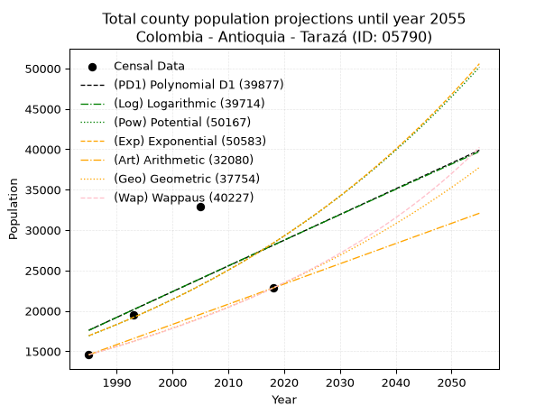
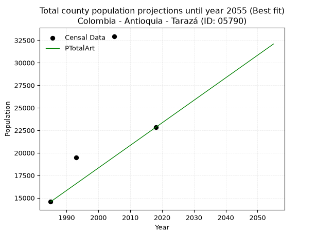
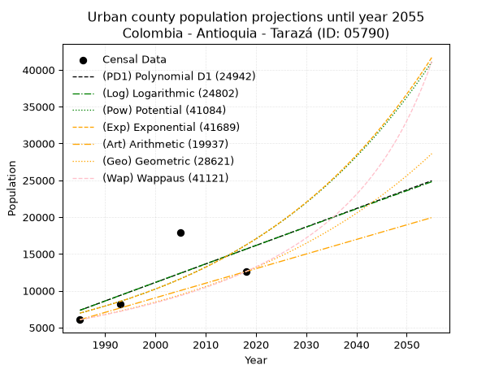
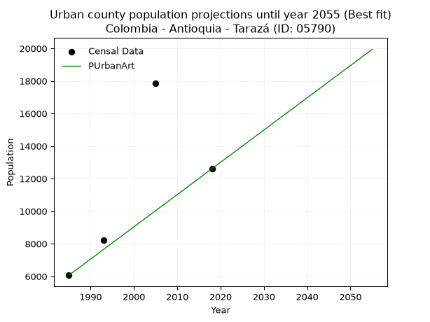
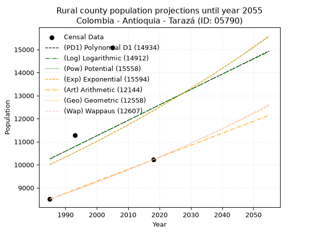
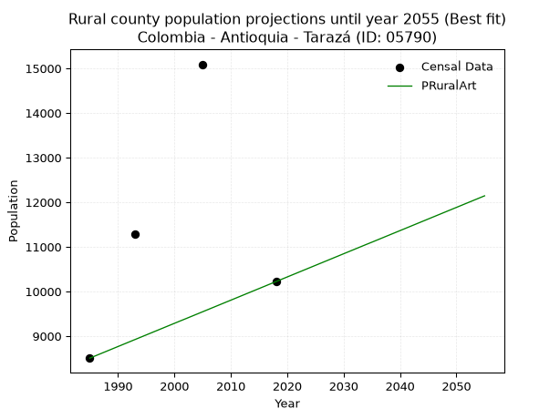

<div align="center">


</div>

# _“Population and Public Services Demand Projections (PPSD) until Year 2050 for Colombia - Antioquia - Tarazá (ID: 05790)”_
Keywords: `population` `public-service` `projection` `lineal` `polynomial` `logarithmic` `potential` `exponential` `arithmetic` `geometric` `wappaus` `dane` `colombia` `south-america`

PPSD are analytical estimates used by governments and planners to anticipate future changes in population size, age distribution, and the resulting community needs for utilities, healthcare, education, and infrastructure as sizing future water treatment facilities, electrical grids, and road networks based on spatial growth.

> **General running parameters**: • app_version: _v20260806_. • Python version: _3.14.7_. • Pandas version: _3.0.5_. • NumPy version: _2.5.1_. • Creates, save and include plots into reports (create_plot): _False_. • Projection until year: _2050_. • Process polynomial degree 2 and up: _False_. • Process Wappaus: _True_. • Process Wappaus: _True_. • Set negative values to zero: _True_. • Set infinite values to zero: _True_. • Drop dataset notes: _True_. 
<div align="center">

Dynamic map: [:earth_americas:Google](http://maps.google.com/maps?q=7.580126865,-75.4014072) [:earth_americas:OSM](https://www.openstreetmap.org/#map=18/7.580126865/-75.4014072&layers=P) [:earth_americas:Bing](https://www.bing.com/maps?cp=7.580126865~-75.4014072&lvl=18) [:earth_americas:Apple](https://maps.apple.com/frame?center=7.580126865%2C-75.4014072&span=0.003%2C0.006)

</div>


<div align="center">

```geojson
{
  "type": "Feature",
  "geometry": {
    "type": "Point", 
    "coordinates": [-75.4014072, 7.580126865]
  }, 
  "properties": {
    "Name": "Colombia - Antioquia - Tarazá (ID: 05790)"
  }
}
```

</div>


## 0. Census Data (4 records)

Census data are official statistics collected by a government about the people and housing in a country. They usually include counts of total population, age, sex, race, income, education, and jobs.

📅Global census file: [Population.xlsx](../data/Population.xlsx)

| Source   |   Year |   CountryID | CountryName   |   StateID | StateName   |   CountyID | CountyName   |   PTotal |   PUrban |   PRural |
|:---------|-------:|------------:|:--------------|----------:|:------------|-----------:|:-------------|---------:|---------:|---------:|
| DANE     |   1985 |          57 | Colombia      |        05 | Antioquia   |      05790 | Tarazá       |    14572 |     6066 |     8506 |
| DANE     |   1993 |          57 | Colombia      |        05 | Antioquia   |      05790 | Tarazá       |    19487 |     8211 |    11276 |
| DANE     |   2005 |          57 | Colombia      |        05 | Antioquia   |      05790 | Tarazá       |    32943 |    17852 |    15091 |
| DANE     |   2018 |          57 | Colombia      |        05 | Antioquia   |      05790 | Tarazá       |    22826 |    12605 |    10221 |

> 🔥Some records could had specific notes about the registered values or the corresponding urban or rural distribution.

## 1. Total

### 1.1. Coefficients and Parameters

* (PD1) Polynomial Deg 1: 318.16459253312456, -613951.7262143823 (lineal)
* (Log) Logarithmic: 638609.6366008474, -4831619.965299498
* (Pow) Potential: 31.36091136833098, -99.19238247271498
* (Exp) Exponential: 0.015629795101532385, 5.685907125006112e-10
* (Art) Arithmetic: Year diff. 2018 - 1985 = 33, Population diff. 22826 - 14572 = 8254, Annual growth = 250.12121212121212
* (Geo) Geometric: Year diff. 2018 - 1985 = 33, Population diff. 22826 - 14572 = 8254, Annual growth % = 0.01369285023261968
* (Wap) Wappaus: i = 1.3376181192641965, Condition values only valid for < 200)

<sub>
Wappaus condition values: ['0.00', '1.34', '2.68', '4.01', '5.35', '6.69', '8.03', '9.36', '10.70', '12.04', '13.38', '14.71', '16.05', '17.39', '18.73', '20.06', '21.40', '22.74', '24.08', '25.41', '26.75', '28.09', '29.43', '30.77', '32.10', '33.44', '34.78', '36.12', '37.45', '38.79', '40.13', '41.47', '42.80', '44.14', '45.48', '46.82', '48.15', '49.49', '50.83', '52.17', '53.50', '54.84', '56.18', '57.52', '58.86', '60.19', '61.53', '62.87', '64.21', '65.54', '66.88', '68.22', '69.56', '70.89', '72.23', '73.57', '74.91', '76.24', '77.58', '78.92', '80.26', '81.59', '82.93', '84.27', '85.61', '86.95']
</sub>


### 1.2. Projected Dataset

|   Year |   CountyID |   PTotalPD1 |   PTotalLog |   PTotalPow |   PTotalExp |   PTotalArt |   PTotalGeo |   PTotalWap |
|-------:|-----------:|------------:|------------:|------------:|------------:|------------:|------------:|------------:|
|   1985 |      05790 |       17605 |       17582 |       16920 |       16937 |       14572 |       14572 |       14572 |
|   1986 |      05790 |       17923 |       17904 |       17189 |       17204 |       14822 |       14772 |       14768 |
|   1987 |      05790 |       18241 |       18225 |       17463 |       17475 |       15072 |       14974 |       14967 |
|   1988 |      05790 |       18559 |       18546 |       17740 |       17751 |       15322 |       15179 |       15169 |
|   1989 |      05790 |       18878 |       18868 |       18022 |       18030 |       15572 |       15387 |       15373 |
|   1990 |      05790 |       19196 |       19189 |       18309 |       18314 |       15823 |       15597 |       15580 |
|   1991 |      05790 |       19514 |       19509 |       18599 |       18603 |       16073 |       15811 |       15790 |
|   1992 |      05790 |       19832 |       19830 |       18895 |       18896 |       16323 |       16027 |       16003 |
|   1993 |      05790 |       20150 |       20151 |       19194 |       19193 |       16573 |       16247 |       16219 |
|   1994 |      05790 |       20468 |       20471 |       19499 |       19496 |       16823 |       16469 |       16439 |
|   1995 |      05790 |       20787 |       20791 |       19808 |       19803 |       17073 |       16695 |       16661 |
|   1996 |      05790 |       21105 |       21111 |       20121 |       20115 |       17323 |       16923 |       16886 |
|   1997 |      05790 |       21423 |       21431 |       20440 |       20432 |       17573 |       17155 |       17115 |
|   1998 |      05790 |       21741 |       21751 |       20763 |       20754 |       17824 |       17390 |       17347 |
|   1999 |      05790 |       22059 |       22070 |       21092 |       21080 |       18074 |       17628 |       17583 |
|   2000 |      05790 |       22377 |       22390 |       21425 |       21412 |       18324 |       17870 |       17822 |
|   2001 |      05790 |       22696 |       22709 |       21764 |       21750 |       18574 |       18114 |       18064 |
|   2002 |      05790 |       23014 |       23028 |       22108 |       22092 |       18824 |       18362 |       18311 |
|   2003 |      05790 |       23332 |       23347 |       22456 |       22440 |       19074 |       18614 |       18561 |
|   2004 |      05790 |       23650 |       23666 |       22811 |       22794 |       19324 |       18869 |       18815 |
|   2005 |      05790 |       23968 |       23984 |       23170 |       23153 |       19574 |       19127 |       19072 |
|   2006 |      05790 |       24286 |       24303 |       23536 |       23518 |       19825 |       19389 |       19334 |
|   2007 |      05790 |       24605 |       24621 |       23906 |       23888 |       20075 |       19654 |       19600 |
|   2008 |      05790 |       24923 |       24939 |       24283 |       24264 |       20325 |       19924 |       19870 |
|   2009 |      05790 |       25241 |       25257 |       24665 |       24647 |       20575 |       20196 |       20144 |
|   2010 |      05790 |       25559 |       25575 |       25053 |       25035 |       20825 |       20473 |       20423 |
|   2011 |      05790 |       25877 |       25892 |       25447 |       25429 |       21075 |       20753 |       20707 |
|   2012 |      05790 |       26195 |       26210 |       25846 |       25830 |       21325 |       21037 |       20995 |
|   2013 |      05790 |       26514 |       26527 |       26252 |       26237 |       21575 |       21325 |       21287 |
|   2014 |      05790 |       26832 |       26844 |       26665 |       26650 |       21826 |       21617 |       21585 |
|   2015 |      05790 |       27150 |       27161 |       27083 |       27070 |       22076 |       21913 |       21887 |
|   2016 |      05790 |       27468 |       27478 |       27508 |       27496 |       22326 |       22214 |       22195 |
|   2017 |      05790 |       27786 |       27795 |       27939 |       27929 |       22576 |       22518 |       22508 |
|   2018 |      05790 |       28104 |       28111 |       28376 |       28369 |       22826 |       22826 |       22826 |
|   2019 |      05790 |       28423 |       28428 |       28821 |       28816 |       23076 |       23139 |       23150 |
|   2020 |      05790 |       28741 |       28744 |       29272 |       29270 |       23326 |       23455 |       23479 |
|   2021 |      05790 |       29059 |       29060 |       29730 |       29731 |       23576 |       23777 |       23814 |
|   2022 |      05790 |       29377 |       29376 |       30194 |       30200 |       23826 |       24102 |       24155 |
|   2023 |      05790 |       29695 |       29692 |       30666 |       30675 |       24077 |       24432 |       24503 |
|   2024 |      05790 |       30013 |       30007 |       31145 |       31159 |       24327 |       24767 |       24856 |
|   2025 |      05790 |       30332 |       30323 |       31631 |       31649 |       24577 |       25106 |       25216 |
|   2026 |      05790 |       30650 |       30638 |       32125 |       32148 |       24827 |       25450 |       25583 |
|   2027 |      05790 |       30968 |       30953 |       32626 |       32654 |       25077 |       25798 |       25956 |
|   2028 |      05790 |       31286 |       31268 |       33135 |       33169 |       25327 |       26151 |       26337 |
|   2029 |      05790 |       31604 |       31583 |       33651 |       33691 |       25577 |       26509 |       26725 |
|   2030 |      05790 |       31922 |       31898 |       34175 |       34222 |       25827 |       26872 |       27120 |
|   2031 |      05790 |       32241 |       32212 |       34707 |       34761 |       26078 |       27240 |       27522 |
|   2032 |      05790 |       32559 |       32526 |       35247 |       35309 |       26328 |       27613 |       27933 |
|   2033 |      05790 |       32877 |       32841 |       35795 |       35865 |       26578 |       27991 |       28352 |
|   2034 |      05790 |       33195 |       33155 |       36351 |       36430 |       26828 |       28375 |       28779 |
|   2035 |      05790 |       33513 |       33469 |       36916 |       37004 |       27078 |       28763 |       29214 |
|   2036 |      05790 |       33831 |       33782 |       37489 |       37587 |       27328 |       29157 |       29659 |
|   2037 |      05790 |       34150 |       34096 |       38071 |       38179 |       27578 |       29556 |       30112 |
|   2038 |      05790 |       34468 |       34409 |       38661 |       38780 |       27828 |       29961 |       30575 |
|   2039 |      05790 |       34786 |       34723 |       39261 |       39391 |       28079 |       30371 |       31048 |
|   2040 |      05790 |       35104 |       35036 |       39869 |       40011 |       28329 |       30787 |       31531 |
|   2041 |      05790 |       35422 |       35349 |       40487 |       40642 |       28579 |       31209 |       32024 |
|   2042 |      05790 |       35740 |       35662 |       41113 |       41282 |       28829 |       31636 |       32527 |
|   2043 |      05790 |       36059 |       35974 |       41749 |       41932 |       29079 |       32069 |       33042 |
|   2044 |      05790 |       36377 |       36287 |       42395 |       42593 |       29329 |       32508 |       33568 |
|   2045 |      05790 |       36695 |       36599 |       43050 |       43264 |       29579 |       32954 |       34106 |
|   2046 |      05790 |       37013 |       36911 |       43716 |       43945 |       29829 |       33405 |       34656 |
|   2047 |      05790 |       37331 |       37223 |       44391 |       44638 |       30080 |       33862 |       35218 |
|   2048 |      05790 |       37649 |       37535 |       45076 |       45341 |       30330 |       34326 |       35793 |
|   2049 |      05790 |       37968 |       37847 |       45771 |       46055 |       30580 |       34796 |       36382 |
|   2050 |      05790 |       38286 |       38159 |       46477 |       46780 |       30830 |       35272 |       36985 |
<div align="center">

</img>

</div>


### 1.3. Best fit with absolute and relative error (%)

Relative error puts that difference into context by dividing the absolute error by the true value, creating a unitless ratio or percentage that shows the scale of the mistake.

Absolute and relative error

|   Year | Source   |   CountryID | CountryName   |   StateID | StateName   |   CountyID_x | CountyName   |   PTotal |   PUrban |   PRural |   CountyID_y |   PTotalPD1 |   PTotalLog |   PTotalPow |   PTotalExp |   PTotalArt |   PTotalGeo |   PTotalWap |   PTotalPD1AbsError |   PTotalLogAbsError |   PTotalPowAbsError |   PTotalExpAbsError |   PTotalArtAbsError |   PTotalGeoAbsError |   PTotalWapAbsError |   PTotalPD1RelError |   PTotalLogRelError |   PTotalPowRelError |   PTotalExpRelError |   PTotalArtRelError |   PTotalGeoRelError |   PTotalWapRelError |
|-------:|:---------|------------:|:--------------|----------:|:------------|-------------:|:-------------|---------:|---------:|---------:|-------------:|------------:|------------:|------------:|------------:|------------:|------------:|------------:|--------------------:|--------------------:|--------------------:|--------------------:|--------------------:|--------------------:|--------------------:|--------------------:|--------------------:|--------------------:|--------------------:|--------------------:|--------------------:|--------------------:|
|   1985 | DANE     |          57 | Colombia      |        05 | Antioquia   |        05790 | Tarazá       |    14572 |     6066 |     8506 |        05790 |       17605 |       17582 |       16920 |       16937 |       14572 |       14572 |       14572 |                3033 |                3010 |                2348 |                2365 |                   0 |                   0 |                   0 |            20.8139  |             20.6561 |            16.1131  |             16.2298 |              0      |              0      |              0      |
|   1993 | DANE     |          57 | Colombia      |        05 | Antioquia   |        05790 | Tarazá       |    19487 |     8211 |    11276 |        05790 |       20150 |       20151 |       19194 |       19193 |       16573 |       16247 |       16219 |                 663 |                 664 |                 293 |                 294 |                2914 |                3240 |                3268 |             3.40227 |              3.4074 |             1.50357 |              1.5087 |             14.9536 |             16.6265 |             16.7702 |
|   2005 | DANE     |          57 | Colombia      |        05 | Antioquia   |        05790 | Tarazá       |    32943 |    17852 |    15091 |        05790 |       23968 |       23984 |       23170 |       23153 |       19574 |       19127 |       19072 |                8975 |                8959 |                9773 |                9790 |               13369 |               13816 |               13871 |            27.244   |             27.1955 |            29.6664  |             29.718  |             40.5822 |             41.9391 |             42.1061 |
|   2018 | DANE     |          57 | Colombia      |        05 | Antioquia   |        05790 | Tarazá       |    22826 |    12605 |    10221 |        05790 |       28104 |       28111 |       28376 |       28369 |       22826 |       22826 |       22826 |                5278 |                5285 |                5550 |                5543 |                   0 |                   0 |                   0 |            23.1228  |             23.1534 |            24.3144  |             24.2837 |              0      |              0      |              0      |

Relative error mean

| Method    |   RelError | Best   |
|:----------|-----------:|:-------|
| PTotalPD1 |    18.6457 |        |
| PTotalLog |    18.6031 |        |
| PTotalPow |    17.8994 |        |
| PTotalExp |    17.935  |        |
| PTotalArt |    13.8839 | True   |
| PTotalGeo |    14.6414 |        |
| PTotalWap |    14.7191 |        |

💙Best method: _**PTotalArt**_
<div align="center">

</img>

</div>


### 1.4. Fresh water supply demand in liters per capita per day (lpcd)

The fresh water supply demand typically ranges from 100 to 300 liters per capita per day (lpcd) for standard domestic and municipal planning, though absolute survival minimums set by the World Health Organization are as low as 7.5 to 20 liters per day, and total consumption in high-income nations can exceed 400 liters.

> `CZ`: Level in meters above the sea level (masl).<br> `WS`: Fresh water supply demand in liters per capita per day (lpcd or l/h/d).<br> `WSAll`: Zonal fresh water supply demand in liters per second (l/s).<br> `A`: Zonal area in square meters.

Reference values (RAS Colombia)

|    CZ |   WS |
|------:|-----:|
|  1000 |  120 |
|  2000 |  130 |
| 99999 |  140 |

County shapefile geometry properties and water supply values

|   CountyID |      ATotal |   CZTotal |   WSTotal |
|-----------:|------------:|----------:|----------:|
|      05790 | 1.14869e+09 |   497.103 |       120 |

Projected values for best method: PTotalArt

|   CountyID |   Year |   PTotalArt |   WSTotal |   WSTotalAll |
|-----------:|-------:|------------:|----------:|-------------:|
|      05790 |   1985 |       14572 |       120 |      20.2389 |
|      05790 |   1986 |       14822 |       120 |      20.5861 |
|      05790 |   1987 |       15072 |       120 |      20.9333 |
|      05790 |   1988 |       15322 |       120 |      21.2806 |
|      05790 |   1989 |       15572 |       120 |      21.6278 |
|      05790 |   1990 |       15823 |       120 |      21.9764 |
|      05790 |   1991 |       16073 |       120 |      22.3236 |
|      05790 |   1992 |       16323 |       120 |      22.6708 |
|      05790 |   1993 |       16573 |       120 |      23.0181 |
|      05790 |   1994 |       16823 |       120 |      23.3653 |
|      05790 |   1995 |       17073 |       120 |      23.7125 |
|      05790 |   1996 |       17323 |       120 |      24.0597 |
|      05790 |   1997 |       17573 |       120 |      24.4069 |
|      05790 |   1998 |       17824 |       120 |      24.7556 |
|      05790 |   1999 |       18074 |       120 |      25.1028 |
|      05790 |   2000 |       18324 |       120 |      25.45   |
|      05790 |   2001 |       18574 |       120 |      25.7972 |
|      05790 |   2002 |       18824 |       120 |      26.1444 |
|      05790 |   2003 |       19074 |       120 |      26.4917 |
|      05790 |   2004 |       19324 |       120 |      26.8389 |
|      05790 |   2005 |       19574 |       120 |      27.1861 |
|      05790 |   2006 |       19825 |       120 |      27.5347 |
|      05790 |   2007 |       20075 |       120 |      27.8819 |
|      05790 |   2008 |       20325 |       120 |      28.2292 |
|      05790 |   2009 |       20575 |       120 |      28.5764 |
|      05790 |   2010 |       20825 |       120 |      28.9236 |
|      05790 |   2011 |       21075 |       120 |      29.2708 |
|      05790 |   2012 |       21325 |       120 |      29.6181 |
|      05790 |   2013 |       21575 |       120 |      29.9653 |
|      05790 |   2014 |       21826 |       120 |      30.3139 |
|      05790 |   2015 |       22076 |       120 |      30.6611 |
|      05790 |   2016 |       22326 |       120 |      31.0083 |
|      05790 |   2017 |       22576 |       120 |      31.3556 |
|      05790 |   2018 |       22826 |       120 |      31.7028 |
|      05790 |   2019 |       23076 |       120 |      32.05   |
|      05790 |   2020 |       23326 |       120 |      32.3972 |
|      05790 |   2021 |       23576 |       120 |      32.7444 |
|      05790 |   2022 |       23826 |       120 |      33.0917 |
|      05790 |   2023 |       24077 |       120 |      33.4403 |
|      05790 |   2024 |       24327 |       120 |      33.7875 |
|      05790 |   2025 |       24577 |       120 |      34.1347 |
|      05790 |   2026 |       24827 |       120 |      34.4819 |
|      05790 |   2027 |       25077 |       120 |      34.8292 |
|      05790 |   2028 |       25327 |       120 |      35.1764 |
|      05790 |   2029 |       25577 |       120 |      35.5236 |
|      05790 |   2030 |       25827 |       120 |      35.8708 |
|      05790 |   2031 |       26078 |       120 |      36.2194 |
|      05790 |   2032 |       26328 |       120 |      36.5667 |
|      05790 |   2033 |       26578 |       120 |      36.9139 |
|      05790 |   2034 |       26828 |       120 |      37.2611 |
|      05790 |   2035 |       27078 |       120 |      37.6083 |
|      05790 |   2036 |       27328 |       120 |      37.9556 |
|      05790 |   2037 |       27578 |       120 |      38.3028 |
|      05790 |   2038 |       27828 |       120 |      38.65   |
|      05790 |   2039 |       28079 |       120 |      38.9986 |
|      05790 |   2040 |       28329 |       120 |      39.3458 |
|      05790 |   2041 |       28579 |       120 |      39.6931 |
|      05790 |   2042 |       28829 |       120 |      40.0403 |
|      05790 |   2043 |       29079 |       120 |      40.3875 |
|      05790 |   2044 |       29329 |       120 |      40.7347 |
|      05790 |   2045 |       29579 |       120 |      41.0819 |
|      05790 |   2046 |       29829 |       120 |      41.4292 |
|      05790 |   2047 |       30080 |       120 |      41.7778 |
|      05790 |   2048 |       30330 |       120 |      42.125  |
|      05790 |   2049 |       30580 |       120 |      42.4722 |
|      05790 |   2050 |       30830 |       120 |      42.8194 |

## 2. Urban

### 2.1. Coefficients and Parameters

* (PD1) Polynomial Deg 1: 251.30389401846907, -491487.11401044275 (lineal)
* (Log) Logarithmic: 503971.5191979084, -3819508.0559975994
* (Pow) Potential: 51.234439172807704, -165.11638713744205
* (Exp) Exponential: 0.02555496081320062, 6.499059590918532e-19
* (Art) Arithmetic: Year diff. 2018 - 1985 = 33, Population diff. 12605 - 6066 = 6539, Annual growth = 198.15151515151516
* (Geo) Geometric: Year diff. 2018 - 1985 = 33, Population diff. 12605 - 6066 = 6539, Annual growth % = 0.022410893210034866
* (Wap) Wappaus: i = 2.1225592110922302, Condition values only valid for < 200)

<sub>
Wappaus condition values: ['0.00', '2.12', '4.25', '6.37', '8.49', '10.61', '12.74', '14.86', '16.98', '19.10', '21.23', '23.35', '25.47', '27.59', '29.72', '31.84', '33.96', '36.08', '38.21', '40.33', '42.45', '44.57', '46.70', '48.82', '50.94', '53.06', '55.19', '57.31', '59.43', '61.55', '63.68', '65.80', '67.92', '70.04', '72.17', '74.29', '76.41', '78.53', '80.66', '82.78', '84.90', '87.02', '89.15', '91.27', '93.39', '95.52', '97.64', '99.76', '101.88', '104.01', '106.13', '108.25', '110.37', '112.50', '114.62', '116.74', '118.86', '120.99', '123.11', '125.23', '127.35', '129.48', '131.60', '133.72', '135.84', '137.97']
</sub>


### 2.2. Projected Dataset

|   Year |   CountyID |   PUrbanPD1 |   PUrbanLog |   PUrbanPow |   PUrbanExp |   PUrbanArt |   PUrbanGeo |   PUrbanWap |
|-------:|-----------:|------------:|------------:|------------:|------------:|------------:|------------:|------------:|
|   1985 |      05790 |        7351 |        7336 |        6959 |        6968 |        6066 |        6066 |        6066 |
|   1986 |      05790 |        7602 |        7590 |        7141 |        7149 |        6264 |        6202 |        6196 |
|   1987 |      05790 |        7854 |        7844 |        7327 |        7334 |        6462 |        6341 |        6329 |
|   1988 |      05790 |        8105 |        8097 |        7518 |        7524 |        6660 |        6483 |        6465 |
|   1989 |      05790 |        8356 |        8351 |        7715 |        7718 |        6859 |        6628 |        6604 |
|   1990 |      05790 |        8608 |        8604 |        7916 |        7918 |        7057 |        6777 |        6746 |
|   1991 |      05790 |        8859 |        8857 |        8122 |        8123 |        7255 |        6929 |        6891 |
|   1992 |      05790 |        9110 |        9110 |        8334 |        8333 |        7453 |        7084 |        7040 |
|   1993 |      05790 |        9362 |        9363 |        8551 |        8549 |        7651 |        7243 |        7192 |
|   1994 |      05790 |        9613 |        9616 |        8774 |        8770 |        7849 |        7405 |        7347 |
|   1995 |      05790 |        9864 |        9869 |        9002 |        8997 |        8048 |        7571 |        7506 |
|   1996 |      05790 |       10115 |       10121 |        9236 |        9230 |        8246 |        7741 |        7669 |
|   1997 |      05790 |       10367 |       10374 |        9476 |        9469 |        8444 |        7914 |        7837 |
|   1998 |      05790 |       10618 |       10626 |        9722 |        9714 |        8642 |        8092 |        8008 |
|   1999 |      05790 |       10869 |       10878 |        9975 |        9966 |        8840 |        8273 |        8183 |
|   2000 |      05790 |       11121 |       11130 |       10234 |       10224 |        9038 |        8458 |        8363 |
|   2001 |      05790 |       11372 |       11382 |       10499 |       10488 |        9236 |        8648 |        8547 |
|   2002 |      05790 |       11623 |       11634 |       10771 |       10760 |        9435 |        8842 |        8737 |
|   2003 |      05790 |       11875 |       11886 |       11051 |       11038 |        9633 |        9040 |        8931 |
|   2004 |      05790 |       12126 |       12137 |       11337 |       11324 |        9831 |        9242 |        9130 |
|   2005 |      05790 |       12377 |       12389 |       11630 |       11617 |       10029 |        9450 |        9335 |
|   2006 |      05790 |       12628 |       12640 |       11931 |       11918 |       10227 |        9661 |        9545 |
|   2007 |      05790 |       12880 |       12891 |       12240 |       12226 |       10425 |        9878 |        9761 |
|   2008 |      05790 |       13131 |       13142 |       12556 |       12543 |       10623 |       10099 |        9984 |
|   2009 |      05790 |       13382 |       13393 |       12881 |       12867 |       10822 |       10326 |       10212 |
|   2010 |      05790 |       13634 |       13644 |       13213 |       13201 |       11020 |       10557 |       10447 |
|   2011 |      05790 |       13885 |       13895 |       13554 |       13542 |       11218 |       10794 |       10689 |
|   2012 |      05790 |       14136 |       14145 |       13904 |       13893 |       11416 |       11035 |       10939 |
|   2013 |      05790 |       14388 |       14396 |       14263 |       14252 |       11614 |       11283 |       11195 |
|   2014 |      05790 |       14639 |       14646 |       14630 |       14621 |       11812 |       11536 |       11460 |
|   2015 |      05790 |       14890 |       14896 |       15007 |       15000 |       12011 |       11794 |       11733 |
|   2016 |      05790 |       15142 |       15146 |       15393 |       15388 |       12209 |       12058 |       12014 |
|   2017 |      05790 |       15393 |       15396 |       15789 |       15786 |       12407 |       12329 |       12305 |
|   2018 |      05790 |       15644 |       15646 |       16196 |       16195 |       12605 |       12605 |       12605 |
|   2019 |      05790 |       15895 |       15895 |       16612 |       16614 |       12803 |       12887 |       12915 |
|   2020 |      05790 |       16147 |       16145 |       17039 |       17044 |       13001 |       13176 |       13236 |
|   2021 |      05790 |       16398 |       16394 |       17476 |       17485 |       13199 |       13472 |       13567 |
|   2022 |      05790 |       16649 |       16644 |       17925 |       17938 |       13398 |       13774 |       13910 |
|   2023 |      05790 |       16901 |       16893 |       18385 |       18402 |       13596 |       14082 |       14265 |
|   2024 |      05790 |       17152 |       17142 |       18856 |       18879 |       13794 |       14398 |       14634 |
|   2025 |      05790 |       17403 |       17391 |       19339 |       19367 |       13992 |       14720 |       15015 |
|   2026 |      05790 |       17655 |       17640 |       19835 |       19869 |       14190 |       15050 |       15411 |
|   2027 |      05790 |       17906 |       17888 |       20343 |       20383 |       14388 |       15388 |       15823 |
|   2028 |      05790 |       18157 |       18137 |       20863 |       20910 |       14587 |       15732 |       16250 |
|   2029 |      05790 |       18408 |       18385 |       21397 |       21452 |       14785 |       16085 |       16694 |
|   2030 |      05790 |       18660 |       18634 |       21944 |       22007 |       14983 |       16446 |       17157 |
|   2031 |      05790 |       18911 |       18882 |       22505 |       22577 |       15181 |       16814 |       17638 |
|   2032 |      05790 |       19162 |       19130 |       23080 |       23161 |       15379 |       17191 |       18140 |
|   2033 |      05790 |       19414 |       19378 |       23669 |       23760 |       15577 |       17576 |       18664 |
|   2034 |      05790 |       19665 |       19626 |       24273 |       24375 |       15775 |       17970 |       19210 |
|   2035 |      05790 |       19916 |       19874 |       24892 |       25006 |       15974 |       18373 |       19782 |
|   2036 |      05790 |       20168 |       20121 |       25526 |       25654 |       16172 |       18785 |       20380 |
|   2037 |      05790 |       20419 |       20369 |       26177 |       26318 |       16370 |       19206 |       21006 |
|   2038 |      05790 |       20670 |       20616 |       26843 |       26999 |       16568 |       19636 |       21663 |
|   2039 |      05790 |       20922 |       20863 |       27526 |       27698 |       16766 |       20076 |       22352 |
|   2040 |      05790 |       21173 |       21110 |       28227 |       28415 |       16964 |       20526 |       23077 |
|   2041 |      05790 |       21424 |       21357 |       28944 |       29150 |       17162 |       20986 |       23839 |
|   2042 |      05790 |       21675 |       21604 |       29680 |       29905 |       17361 |       21456 |       24642 |
|   2043 |      05790 |       21927 |       21851 |       30434 |       30679 |       17559 |       21937 |       25490 |
|   2044 |      05790 |       22178 |       22097 |       31206 |       31473 |       17757 |       22429 |       26386 |
|   2045 |      05790 |       22429 |       22344 |       31998 |       32288 |       17955 |       22931 |       27334 |
|   2046 |      05790 |       22681 |       22590 |       32810 |       33123 |       18153 |       23445 |       28339 |
|   2047 |      05790 |       22932 |       22837 |       33642 |       33981 |       18351 |       23971 |       29407 |
|   2048 |      05790 |       23183 |       23083 |       34494 |       34860 |       18550 |       24508 |       30543 |
|   2049 |      05790 |       23435 |       23329 |       35368 |       35763 |       18748 |       25057 |       31754 |
|   2050 |      05790 |       23686 |       23575 |       36263 |       36688 |       18946 |       25619 |       33048 |
<div align="center">

</img>

</div>


### 2.3. Best fit with absolute and relative error (%)

Relative error puts that difference into context by dividing the absolute error by the true value, creating a unitless ratio or percentage that shows the scale of the mistake.

Absolute and relative error

|   Year | Source   |   CountryID | CountryName   |   StateID | StateName   |   CountyID_x | CountyName   |   PTotal |   PUrban |   PRural |   CountyID_y |   PUrbanPD1 |   PUrbanLog |   PUrbanPow |   PUrbanExp |   PUrbanArt |   PUrbanGeo |   PUrbanWap |   PUrbanPD1AbsError |   PUrbanLogAbsError |   PUrbanPowAbsError |   PUrbanExpAbsError |   PUrbanArtAbsError |   PUrbanGeoAbsError |   PUrbanWapAbsError |   PUrbanPD1RelError |   PUrbanLogRelError |   PUrbanPowRelError |   PUrbanExpRelError |   PUrbanArtRelError |   PUrbanGeoRelError |   PUrbanWapRelError |
|-------:|:---------|------------:|:--------------|----------:|:------------|-------------:|:-------------|---------:|---------:|---------:|-------------:|------------:|------------:|------------:|------------:|------------:|------------:|------------:|--------------------:|--------------------:|--------------------:|--------------------:|--------------------:|--------------------:|--------------------:|--------------------:|--------------------:|--------------------:|--------------------:|--------------------:|--------------------:|--------------------:|
|   1985 | DANE     |          57 | Colombia      |        05 | Antioquia   |        05790 | Tarazá       |    14572 |     6066 |     8506 |        05790 |        7351 |        7336 |        6959 |        6968 |        6066 |        6066 |        6066 |                1285 |                1270 |                 893 |                 902 |                   0 |                   0 |                   0 |             21.1836 |             20.9364 |            14.7214  |            14.8698  |             0       |              0      |              0      |
|   1993 | DANE     |          57 | Colombia      |        05 | Antioquia   |        05790 | Tarazá       |    19487 |     8211 |    11276 |        05790 |        9362 |        9363 |        8551 |        8549 |        7651 |        7243 |        7192 |                1151 |                1152 |                 340 |                 338 |                 560 |                 968 |                1019 |             14.0178 |             14.03   |             4.14079 |             4.11643 |             6.82012 |             11.7891 |             12.4102 |
|   2005 | DANE     |          57 | Colombia      |        05 | Antioquia   |        05790 | Tarazá       |    32943 |    17852 |    15091 |        05790 |       12377 |       12389 |       11630 |       11617 |       10029 |        9450 |        9335 |                5475 |                5463 |                6222 |                6235 |                7823 |                8402 |                8517 |             30.6688 |             30.6016 |            34.8532  |            34.9261  |            43.8214  |             47.0648 |             47.7089 |
|   2018 | DANE     |          57 | Colombia      |        05 | Antioquia   |        05790 | Tarazá       |    22826 |    12605 |    10221 |        05790 |       15644 |       15646 |       16196 |       16195 |       12605 |       12605 |       12605 |                3039 |                3041 |                3591 |                3590 |                   0 |                   0 |                   0 |             24.1095 |             24.1253 |            28.4887  |            28.4808  |             0       |              0      |              0      |

Relative error mean

| Method    |   RelError | Best   |
|:----------|-----------:|:-------|
| PUrbanPD1 |    22.4949 |        |
| PUrbanLog |    22.4233 |        |
| PUrbanPow |    20.551  |        |
| PUrbanExp |    20.5983 |        |
| PUrbanArt |    12.6604 | True   |
| PUrbanGeo |    14.7135 |        |
| PUrbanWap |    15.0298 |        |

💙Best method: _**PUrbanArt**_
<div align="center">

</img>

</div>


### 2.4. Fresh water supply demand in liters per capita per day (lpcd)

The fresh water supply demand typically ranges from 100 to 300 liters per capita per day (lpcd) for standard domestic and municipal planning, though absolute survival minimums set by the World Health Organization are as low as 7.5 to 20 liters per day, and total consumption in high-income nations can exceed 400 liters.

> `CZ`: Level in meters above the sea level (masl).<br> `WS`: Fresh water supply demand in liters per capita per day (lpcd or l/h/d).<br> `WSAll`: Zonal fresh water supply demand in liters per second (l/s).<br> `A`: Zonal area in square meters.

Reference values (RAS Colombia)

|    CZ |   WS |
|------:|-----:|
|  1000 |  120 |
|  2000 |  130 |
| 99999 |  140 |

County shapefile geometry properties and water supply values

|   CountyID |      AUrban |   CZUrban |   WSUrban |
|-----------:|------------:|----------:|----------:|
|      05790 | 1.89936e+06 |   117.578 |       120 |

Projected values for best method: PUrbanArt

|   CountyID |   Year |   PUrbanArt |   WSUrban |   WSUrbanAll |
|-----------:|-------:|------------:|----------:|-------------:|
|      05790 |   1985 |        6066 |       120 |      8.425   |
|      05790 |   1986 |        6264 |       120 |      8.7     |
|      05790 |   1987 |        6462 |       120 |      8.975   |
|      05790 |   1988 |        6660 |       120 |      9.25    |
|      05790 |   1989 |        6859 |       120 |      9.52639 |
|      05790 |   1990 |        7057 |       120 |      9.80139 |
|      05790 |   1991 |        7255 |       120 |     10.0764  |
|      05790 |   1992 |        7453 |       120 |     10.3514  |
|      05790 |   1993 |        7651 |       120 |     10.6264  |
|      05790 |   1994 |        7849 |       120 |     10.9014  |
|      05790 |   1995 |        8048 |       120 |     11.1778  |
|      05790 |   1996 |        8246 |       120 |     11.4528  |
|      05790 |   1997 |        8444 |       120 |     11.7278  |
|      05790 |   1998 |        8642 |       120 |     12.0028  |
|      05790 |   1999 |        8840 |       120 |     12.2778  |
|      05790 |   2000 |        9038 |       120 |     12.5528  |
|      05790 |   2001 |        9236 |       120 |     12.8278  |
|      05790 |   2002 |        9435 |       120 |     13.1042  |
|      05790 |   2003 |        9633 |       120 |     13.3792  |
|      05790 |   2004 |        9831 |       120 |     13.6542  |
|      05790 |   2005 |       10029 |       120 |     13.9292  |
|      05790 |   2006 |       10227 |       120 |     14.2042  |
|      05790 |   2007 |       10425 |       120 |     14.4792  |
|      05790 |   2008 |       10623 |       120 |     14.7542  |
|      05790 |   2009 |       10822 |       120 |     15.0306  |
|      05790 |   2010 |       11020 |       120 |     15.3056  |
|      05790 |   2011 |       11218 |       120 |     15.5806  |
|      05790 |   2012 |       11416 |       120 |     15.8556  |
|      05790 |   2013 |       11614 |       120 |     16.1306  |
|      05790 |   2014 |       11812 |       120 |     16.4056  |
|      05790 |   2015 |       12011 |       120 |     16.6819  |
|      05790 |   2016 |       12209 |       120 |     16.9569  |
|      05790 |   2017 |       12407 |       120 |     17.2319  |
|      05790 |   2018 |       12605 |       120 |     17.5069  |
|      05790 |   2019 |       12803 |       120 |     17.7819  |
|      05790 |   2020 |       13001 |       120 |     18.0569  |
|      05790 |   2021 |       13199 |       120 |     18.3319  |
|      05790 |   2022 |       13398 |       120 |     18.6083  |
|      05790 |   2023 |       13596 |       120 |     18.8833  |
|      05790 |   2024 |       13794 |       120 |     19.1583  |
|      05790 |   2025 |       13992 |       120 |     19.4333  |
|      05790 |   2026 |       14190 |       120 |     19.7083  |
|      05790 |   2027 |       14388 |       120 |     19.9833  |
|      05790 |   2028 |       14587 |       120 |     20.2597  |
|      05790 |   2029 |       14785 |       120 |     20.5347  |
|      05790 |   2030 |       14983 |       120 |     20.8097  |
|      05790 |   2031 |       15181 |       120 |     21.0847  |
|      05790 |   2032 |       15379 |       120 |     21.3597  |
|      05790 |   2033 |       15577 |       120 |     21.6347  |
|      05790 |   2034 |       15775 |       120 |     21.9097  |
|      05790 |   2035 |       15974 |       120 |     22.1861  |
|      05790 |   2036 |       16172 |       120 |     22.4611  |
|      05790 |   2037 |       16370 |       120 |     22.7361  |
|      05790 |   2038 |       16568 |       120 |     23.0111  |
|      05790 |   2039 |       16766 |       120 |     23.2861  |
|      05790 |   2040 |       16964 |       120 |     23.5611  |
|      05790 |   2041 |       17162 |       120 |     23.8361  |
|      05790 |   2042 |       17361 |       120 |     24.1125  |
|      05790 |   2043 |       17559 |       120 |     24.3875  |
|      05790 |   2044 |       17757 |       120 |     24.6625  |
|      05790 |   2045 |       17955 |       120 |     24.9375  |
|      05790 |   2046 |       18153 |       120 |     25.2125  |
|      05790 |   2047 |       18351 |       120 |     25.4875  |
|      05790 |   2048 |       18550 |       120 |     25.7639  |
|      05790 |   2049 |       18748 |       120 |     26.0389  |
|      05790 |   2050 |       18946 |       120 |     26.3139  |

## 3. Rural

### 3.1. Coefficients and Parameters

* (PD1) Polynomial Deg 1: 66.86069851465551, -122464.6122039397 (lineal)
* (Log) Logarithmic: 134638.11740293915, -1012111.9093019014
* (Pow) Potential: 12.732875203594121, -37.989663708968756
* (Exp) Exponential: 0.006326265099840599, 0.0352299518730921
* (Art) Arithmetic: Year diff. 2018 - 1985 = 33, Population diff. 10221 - 8506 = 1715, Annual growth = 51.96969696969697
* (Geo) Geometric: Year diff. 2018 - 1985 = 33, Population diff. 10221 - 8506 = 1715, Annual growth % = 0.005581355337662686
* (Wap) Wappaus: i = 0.5550242641074061, Condition values only valid for < 200)

<sub>
Wappaus condition values: ['0.00', '0.56', '1.11', '1.67', '2.22', '2.78', '3.33', '3.89', '4.44', '5.00', '5.55', '6.11', '6.66', '7.22', '7.77', '8.33', '8.88', '9.44', '9.99', '10.55', '11.10', '11.66', '12.21', '12.77', '13.32', '13.88', '14.43', '14.99', '15.54', '16.10', '16.65', '17.21', '17.76', '18.32', '18.87', '19.43', '19.98', '20.54', '21.09', '21.65', '22.20', '22.76', '23.31', '23.87', '24.42', '24.98', '25.53', '26.09', '26.64', '27.20', '27.75', '28.31', '28.86', '29.42', '29.97', '30.53', '31.08', '31.64', '32.19', '32.75', '33.30', '33.86', '34.41', '34.97', '35.52', '36.08']
</sub>


### 3.2. Projected Dataset

|   Year |   CountyID |   PRuralPD1 |   PRuralLog |   PRuralPow |   PRuralExp |   PRuralArt |   PRuralGeo |   PRuralWap |
|-------:|-----------:|------------:|------------:|------------:|------------:|------------:|------------:|------------:|
|   1985 |      05790 |       10254 |       10246 |       10007 |       10014 |        8506 |        8506 |        8506 |
|   1986 |      05790 |       10321 |       10314 |       10072 |       10078 |        8558 |        8553 |        8553 |
|   1987 |      05790 |       10388 |       10381 |       10136 |       10142 |        8610 |        8601 |        8601 |
|   1988 |      05790 |       10454 |       10449 |       10201 |       10206 |        8662 |        8649 |        8649 |
|   1989 |      05790 |       10521 |       10517 |       10267 |       10271 |        8714 |        8697 |        8697 |
|   1990 |      05790 |       10588 |       10584 |       10333 |       10336 |        8766 |        8746 |        8745 |
|   1991 |      05790 |       10655 |       10652 |       10399 |       10402 |        8818 |        8795 |        8794 |
|   1992 |      05790 |       10722 |       10720 |       10466 |       10468 |        8870 |        8844 |        8843 |
|   1993 |      05790 |       10789 |       10787 |       10533 |       10534 |        8922 |        8893 |        8892 |
|   1994 |      05790 |       10856 |       10855 |       10600 |       10601 |        8974 |        8943 |        8942 |
|   1995 |      05790 |       10922 |       10922 |       10668 |       10668 |        9026 |        8993 |        8992 |
|   1996 |      05790 |       10989 |       10990 |       10737 |       10736 |        9078 |        9043 |        9042 |
|   1997 |      05790 |       11056 |       11057 |       10805 |       10804 |        9130 |        9094 |        9092 |
|   1998 |      05790 |       11123 |       11125 |       10874 |       10873 |        9182 |        9144 |        9143 |
|   1999 |      05790 |       11190 |       11192 |       10944 |       10942 |        9234 |        9195 |        9194 |
|   2000 |      05790 |       11257 |       11259 |       11014 |       11011 |        9286 |        9247 |        9245 |
|   2001 |      05790 |       11324 |       11327 |       11084 |       11081 |        9338 |        9298 |        9296 |
|   2002 |      05790 |       11391 |       11394 |       11155 |       11151 |        9389 |        9350 |        9348 |
|   2003 |      05790 |       11457 |       11461 |       11226 |       11222 |        9441 |        9402 |        9400 |
|   2004 |      05790 |       11524 |       11528 |       11298 |       11293 |        9493 |        9455 |        9453 |
|   2005 |      05790 |       11591 |       11595 |       11370 |       11365 |        9545 |        9508 |        9506 |
|   2006 |      05790 |       11658 |       11663 |       11442 |       11437 |        9597 |        9561 |        9559 |
|   2007 |      05790 |       11725 |       11730 |       11515 |       11510 |        9649 |        9614 |        9612 |
|   2008 |      05790 |       11792 |       11797 |       11588 |       11583 |        9701 |        9668 |        9666 |
|   2009 |      05790 |       11859 |       11864 |       11662 |       11656 |        9753 |        9722 |        9720 |
|   2010 |      05790 |       11925 |       11931 |       11736 |       11730 |        9805 |        9776 |        9774 |
|   2011 |      05790 |       11992 |       11998 |       11811 |       11805 |        9857 |        9830 |        9829 |
|   2012 |      05790 |       12059 |       12065 |       11886 |       11880 |        9909 |        9885 |        9884 |
|   2013 |      05790 |       12126 |       12132 |       11961 |       11955 |        9961 |        9940 |        9939 |
|   2014 |      05790 |       12193 |       12198 |       12037 |       12031 |       10013 |        9996 |        9995 |
|   2015 |      05790 |       12260 |       12265 |       12113 |       12107 |       10065 |       10052 |       10051 |
|   2016 |      05790 |       12327 |       12332 |       12190 |       12184 |       10117 |       10108 |       10107 |
|   2017 |      05790 |       12393 |       12399 |       12267 |       12261 |       10169 |       10164 |       10164 |
|   2018 |      05790 |       12460 |       12466 |       12345 |       12339 |       10221 |       10221 |       10221 |
|   2019 |      05790 |       12527 |       12532 |       12423 |       12418 |       10273 |       10278 |       10278 |
|   2020 |      05790 |       12594 |       12599 |       12502 |       12496 |       10325 |       10335 |       10336 |
|   2021 |      05790 |       12661 |       12666 |       12581 |       12576 |       10377 |       10393 |       10394 |
|   2022 |      05790 |       12728 |       12732 |       12660 |       12656 |       10429 |       10451 |       10453 |
|   2023 |      05790 |       12795 |       12799 |       12740 |       12736 |       10481 |       10509 |       10511 |
|   2024 |      05790 |       12861 |       12865 |       12820 |       12817 |       10533 |       10568 |       10571 |
|   2025 |      05790 |       12928 |       12932 |       12901 |       12898 |       10585 |       10627 |       10630 |
|   2026 |      05790 |       12995 |       12998 |       12983 |       12980 |       10637 |       10686 |       10690 |
|   2027 |      05790 |       13062 |       13065 |       13064 |       13062 |       10689 |       10746 |       10750 |
|   2028 |      05790 |       13129 |       13131 |       13147 |       13145 |       10741 |       10806 |       10811 |
|   2029 |      05790 |       13196 |       13198 |       13230 |       13229 |       10793 |       10866 |       10872 |
|   2030 |      05790 |       13263 |       13264 |       13313 |       13313 |       10845 |       10927 |       10934 |
|   2031 |      05790 |       13329 |       13330 |       13397 |       13397 |       10897 |       10988 |       10995 |
|   2032 |      05790 |       13396 |       13396 |       13481 |       13482 |       10949 |       11049 |       11058 |
|   2033 |      05790 |       13463 |       13463 |       13566 |       13568 |       11001 |       11111 |       11120 |
|   2034 |      05790 |       13530 |       13529 |       13651 |       13654 |       11053 |       11173 |       11183 |
|   2035 |      05790 |       13597 |       13595 |       13736 |       13740 |       11104 |       11235 |       11247 |
|   2036 |      05790 |       13664 |       13661 |       13823 |       13828 |       11156 |       11298 |       11311 |
|   2037 |      05790 |       13731 |       13727 |       13909 |       13915 |       11208 |       11361 |       11375 |
|   2038 |      05790 |       13797 |       13793 |       13997 |       14004 |       11260 |       11425 |       11440 |
|   2039 |      05790 |       13864 |       13859 |       14084 |       14092 |       11312 |       11488 |       11505 |
|   2040 |      05790 |       13931 |       13925 |       14172 |       14182 |       11364 |       11552 |       11570 |
|   2041 |      05790 |       13998 |       13991 |       14261 |       14272 |       11416 |       11617 |       11636 |
|   2042 |      05790 |       14065 |       14057 |       14350 |       14362 |       11468 |       11682 |       11703 |
|   2043 |      05790 |       14132 |       14123 |       14440 |       14454 |       11520 |       11747 |       11769 |
|   2044 |      05790 |       14199 |       14189 |       14530 |       14545 |       11572 |       11812 |       11837 |
|   2045 |      05790 |       14266 |       14255 |       14621 |       14638 |       11624 |       11878 |       11904 |
|   2046 |      05790 |       14332 |       14321 |       14712 |       14731 |       11676 |       11945 |       11973 |
|   2047 |      05790 |       14399 |       14387 |       14804 |       14824 |       11728 |       12011 |       12041 |
|   2048 |      05790 |       14466 |       14452 |       14897 |       14918 |       11780 |       12078 |       12110 |
|   2049 |      05790 |       14533 |       14518 |       14989 |       15013 |       11832 |       12146 |       12180 |
|   2050 |      05790 |       14600 |       14584 |       15083 |       15108 |       11884 |       12214 |       12250 |
<div align="center">

</img>

</div>


### 3.3. Best fit with absolute and relative error (%)

Relative error puts that difference into context by dividing the absolute error by the true value, creating a unitless ratio or percentage that shows the scale of the mistake.

Absolute and relative error

|   Year | Source   |   CountryID | CountryName   |   StateID | StateName   |   CountyID_x | CountyName   |   PTotal |   PUrban |   PRural |   CountyID_y |   PRuralPD1 |   PRuralLog |   PRuralPow |   PRuralExp |   PRuralArt |   PRuralGeo |   PRuralWap |   PRuralPD1AbsError |   PRuralLogAbsError |   PRuralPowAbsError |   PRuralExpAbsError |   PRuralArtAbsError |   PRuralGeoAbsError |   PRuralWapAbsError |   PRuralPD1RelError |   PRuralLogRelError |   PRuralPowRelError |   PRuralExpRelError |   PRuralArtRelError |   PRuralGeoRelError |   PRuralWapRelError |
|-------:|:---------|------------:|:--------------|----------:|:------------|-------------:|:-------------|---------:|---------:|---------:|-------------:|------------:|------------:|------------:|------------:|------------:|------------:|------------:|--------------------:|--------------------:|--------------------:|--------------------:|--------------------:|--------------------:|--------------------:|--------------------:|--------------------:|--------------------:|--------------------:|--------------------:|--------------------:|--------------------:|
|   1985 | DANE     |          57 | Colombia      |        05 | Antioquia   |        05790 | Tarazá       |    14572 |     6066 |     8506 |        05790 |       10254 |       10246 |       10007 |       10014 |        8506 |        8506 |        8506 |                1748 |                1740 |                1501 |                1508 |                   0 |                   0 |                   0 |            20.5502  |            20.4561  |            17.6464  |            17.7287  |              0      |              0      |              0      |
|   1993 | DANE     |          57 | Colombia      |        05 | Antioquia   |        05790 | Tarazá       |    19487 |     8211 |    11276 |        05790 |       10789 |       10787 |       10533 |       10534 |        8922 |        8893 |        8892 |                 487 |                 489 |                 743 |                 742 |                2354 |                2383 |                2384 |             4.31891 |             4.33664 |             6.58922 |             6.58035 |             20.8762 |             21.1334 |             21.1422 |
|   2005 | DANE     |          57 | Colombia      |        05 | Antioquia   |        05790 | Tarazá       |    32943 |    17852 |    15091 |        05790 |       11591 |       11595 |       11370 |       11365 |        9545 |        9508 |        9506 |                3500 |                3496 |                3721 |                3726 |                5546 |                5583 |                5585 |            23.1926  |            23.1661  |            24.6571  |            24.6902  |             36.7504 |             36.9956 |             37.0088 |
|   2018 | DANE     |          57 | Colombia      |        05 | Antioquia   |        05790 | Tarazá       |    22826 |    12605 |    10221 |        05790 |       12460 |       12466 |       12345 |       12339 |       10221 |       10221 |       10221 |                2239 |                2245 |                2124 |                2118 |                   0 |                   0 |                   0 |            21.9059  |            21.9646  |            20.7807  |            20.722   |              0      |              0      |              0      |

Relative error mean

| Method    |   RelError | Best   |
|:----------|-----------:|:-------|
| PRuralPD1 |    17.4919 |        |
| PRuralLog |    17.4809 |        |
| PRuralPow |    17.4184 |        |
| PRuralExp |    17.4303 |        |
| PRuralArt |    14.4066 | True   |
| PRuralGeo |    14.5322 |        |
| PRuralWap |    14.5378 |        |

💙Best method: _**PRuralArt**_
<div align="center">

</img>

</div>


### 3.4. Fresh water supply demand in liters per capita per day (lpcd)

The fresh water supply demand typically ranges from 100 to 300 liters per capita per day (lpcd) for standard domestic and municipal planning, though absolute survival minimums set by the World Health Organization are as low as 7.5 to 20 liters per day, and total consumption in high-income nations can exceed 400 liters.

> `CZ`: Level in meters above the sea level (masl).<br> `WS`: Fresh water supply demand in liters per capita per day (lpcd or l/h/d).<br> `WSAll`: Zonal fresh water supply demand in liters per second (l/s).<br> `A`: Zonal area in square meters.

Reference values (RAS Colombia)

|    CZ |   WS |
|------:|-----:|
|  1000 |  120 |
|  2000 |  130 |
| 99999 |  140 |

County shapefile geometry properties and water supply values

|   CountyID |     ARural |   CZRural |   WSRural |
|-----------:|-----------:|----------:|----------:|
|      05790 | 1.1468e+09 |    497.78 |       120 |

Projected values for best method: PRuralArt

|   CountyID |   Year |   PRuralArt |   WSRural |   WSRuralAll |
|-----------:|-------:|------------:|----------:|-------------:|
|      05790 |   1985 |        8506 |       120 |      11.8139 |
|      05790 |   1986 |        8558 |       120 |      11.8861 |
|      05790 |   1987 |        8610 |       120 |      11.9583 |
|      05790 |   1988 |        8662 |       120 |      12.0306 |
|      05790 |   1989 |        8714 |       120 |      12.1028 |
|      05790 |   1990 |        8766 |       120 |      12.175  |
|      05790 |   1991 |        8818 |       120 |      12.2472 |
|      05790 |   1992 |        8870 |       120 |      12.3194 |
|      05790 |   1993 |        8922 |       120 |      12.3917 |
|      05790 |   1994 |        8974 |       120 |      12.4639 |
|      05790 |   1995 |        9026 |       120 |      12.5361 |
|      05790 |   1996 |        9078 |       120 |      12.6083 |
|      05790 |   1997 |        9130 |       120 |      12.6806 |
|      05790 |   1998 |        9182 |       120 |      12.7528 |
|      05790 |   1999 |        9234 |       120 |      12.825  |
|      05790 |   2000 |        9286 |       120 |      12.8972 |
|      05790 |   2001 |        9338 |       120 |      12.9694 |
|      05790 |   2002 |        9389 |       120 |      13.0403 |
|      05790 |   2003 |        9441 |       120 |      13.1125 |
|      05790 |   2004 |        9493 |       120 |      13.1847 |
|      05790 |   2005 |        9545 |       120 |      13.2569 |
|      05790 |   2006 |        9597 |       120 |      13.3292 |
|      05790 |   2007 |        9649 |       120 |      13.4014 |
|      05790 |   2008 |        9701 |       120 |      13.4736 |
|      05790 |   2009 |        9753 |       120 |      13.5458 |
|      05790 |   2010 |        9805 |       120 |      13.6181 |
|      05790 |   2011 |        9857 |       120 |      13.6903 |
|      05790 |   2012 |        9909 |       120 |      13.7625 |
|      05790 |   2013 |        9961 |       120 |      13.8347 |
|      05790 |   2014 |       10013 |       120 |      13.9069 |
|      05790 |   2015 |       10065 |       120 |      13.9792 |
|      05790 |   2016 |       10117 |       120 |      14.0514 |
|      05790 |   2017 |       10169 |       120 |      14.1236 |
|      05790 |   2018 |       10221 |       120 |      14.1958 |
|      05790 |   2019 |       10273 |       120 |      14.2681 |
|      05790 |   2020 |       10325 |       120 |      14.3403 |
|      05790 |   2021 |       10377 |       120 |      14.4125 |
|      05790 |   2022 |       10429 |       120 |      14.4847 |
|      05790 |   2023 |       10481 |       120 |      14.5569 |
|      05790 |   2024 |       10533 |       120 |      14.6292 |
|      05790 |   2025 |       10585 |       120 |      14.7014 |
|      05790 |   2026 |       10637 |       120 |      14.7736 |
|      05790 |   2027 |       10689 |       120 |      14.8458 |
|      05790 |   2028 |       10741 |       120 |      14.9181 |
|      05790 |   2029 |       10793 |       120 |      14.9903 |
|      05790 |   2030 |       10845 |       120 |      15.0625 |
|      05790 |   2031 |       10897 |       120 |      15.1347 |
|      05790 |   2032 |       10949 |       120 |      15.2069 |
|      05790 |   2033 |       11001 |       120 |      15.2792 |
|      05790 |   2034 |       11053 |       120 |      15.3514 |
|      05790 |   2035 |       11104 |       120 |      15.4222 |
|      05790 |   2036 |       11156 |       120 |      15.4944 |
|      05790 |   2037 |       11208 |       120 |      15.5667 |
|      05790 |   2038 |       11260 |       120 |      15.6389 |
|      05790 |   2039 |       11312 |       120 |      15.7111 |
|      05790 |   2040 |       11364 |       120 |      15.7833 |
|      05790 |   2041 |       11416 |       120 |      15.8556 |
|      05790 |   2042 |       11468 |       120 |      15.9278 |
|      05790 |   2043 |       11520 |       120 |      16      |
|      05790 |   2044 |       11572 |       120 |      16.0722 |
|      05790 |   2045 |       11624 |       120 |      16.1444 |
|      05790 |   2046 |       11676 |       120 |      16.2167 |
|      05790 |   2047 |       11728 |       120 |      16.2889 |
|      05790 |   2048 |       11780 |       120 |      16.3611 |
|      05790 |   2049 |       11832 |       120 |      16.4333 |
|      05790 |   2050 |       11884 |       120 |      16.5056 |

<div align="center"><br><sub>Share this research</sub></div><br>

<sub>**APPS & TOOLS & CONTENT DISCLAIMER**: • NO WARRANTY - This content and software is provided by <a href="https://github.com/rcfdtools" target="_blank">github.com/rcfdtools</a> "as is", without any express or implied warranty, including warranties of merchantability, fitness for a particular purpose, or non-infringement. There is no guarantee that the software will be error-free or operate without interruption. • LIMITATION OF LIABILITY - Neither the authors nor copyright holders will be liable for claims or damages arising from the software or its use. You are responsible for determining if the software is appropriate for your use and assume all associated risks, including errors, legal compliance, and data loss. • NO PROFESSIONAL ADVICE - The software provides general information and does not offer professional advice. It should not replace consultation with professional advisors. [Clauses and global license for rcfdtools use.](https://github.com/rcfdtools/rcfdtools/blob/main/LICENSE.md)</sub>