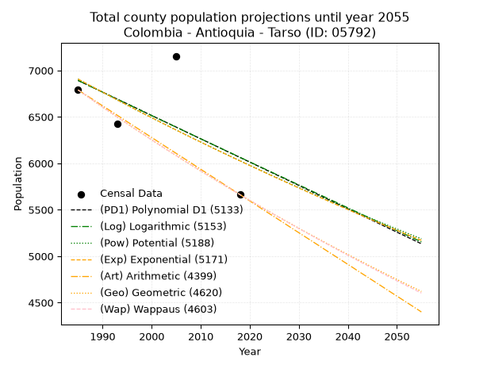
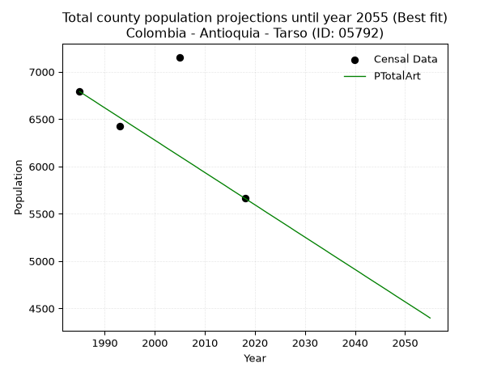
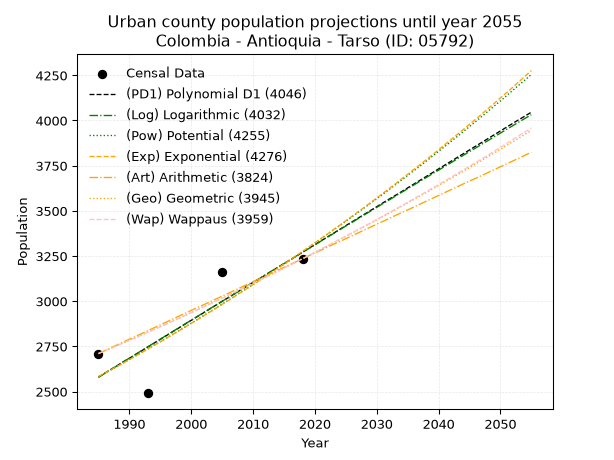
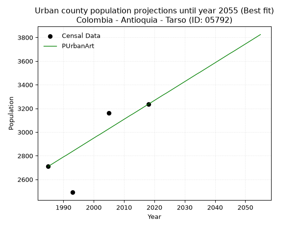
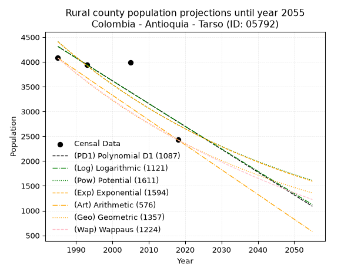
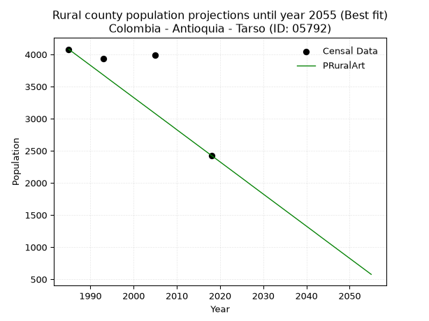

<div align="center">


</div>

# _“Population and Public Services Demand Projections (PPSD) until Year 2050 for Colombia - Antioquia - Tarso (ID: 05792)”_
Keywords: `population` `public-service` `projection` `lineal` `polynomial` `logarithmic` `potential` `exponential` `arithmetic` `geometric` `wappaus` `dane` `colombia` `south-america`

PPSD are analytical estimates used by governments and planners to anticipate future changes in population size, age distribution, and the resulting community needs for utilities, healthcare, education, and infrastructure as sizing future water treatment facilities, electrical grids, and road networks based on spatial growth.

> **General running parameters**: • app_version: _v20260806_. • Python version: _3.14.7_. • Pandas version: _3.0.5_. • NumPy version: _2.5.1_. • Creates, save and include plots into reports (create_plot): _False_. • Projection until year: _2050_. • Process polynomial degree 2 and up: _False_. • Process Wappaus: _True_. • Process Wappaus: _True_. • Set negative values to zero: _True_. • Set infinite values to zero: _True_. • Drop dataset notes: _True_. 
<div align="center">

Dynamic map: [:earth_americas:Google](http://maps.google.com/maps?q=5.864541798,-75.8229561) [:earth_americas:OSM](https://www.openstreetmap.org/#map=18/5.864541798/-75.8229561&layers=P) [:earth_americas:Bing](https://www.bing.com/maps?cp=5.864541798~-75.8229561&lvl=18) [:earth_americas:Apple](https://maps.apple.com/frame?center=5.864541798%2C-75.8229561&span=0.003%2C0.006)

</div>


<div align="center">

```geojson
{
  "type": "Feature",
  "geometry": {
    "type": "Point", 
    "coordinates": [-75.8229561, 5.864541798]
  }, 
  "properties": {
    "Name": "Colombia - Antioquia - Tarso (ID: 05792)"
  }
}
```

</div>


## 0. Census Data (4 records)

Census data are official statistics collected by a government about the people and housing in a country. They usually include counts of total population, age, sex, race, income, education, and jobs.

📅Global census file: [Population.xlsx](../data/Population.xlsx)

| Source   |   Year |   CountryID | CountryName   |   StateID | StateName   |   CountyID | CountyName   |   PTotal |   PUrban |   PRural |
|:---------|-------:|------------:|:--------------|----------:|:------------|-----------:|:-------------|---------:|---------:|---------:|
| DANE     |   1985 |          57 | Colombia      |        05 | Antioquia   |      05792 | Tarso        |     6790 |     2710 |     4080 |
| DANE     |   1993 |          57 | Colombia      |        05 | Antioquia   |      05792 | Tarso        |     6428 |     2491 |     3937 |
| DANE     |   2005 |          57 | Colombia      |        05 | Antioquia   |      05792 | Tarso        |     7155 |     3161 |     3994 |
| DANE     |   2018 |          57 | Colombia      |        05 | Antioquia   |      05792 | Tarso        |     5663 |     3235 |     2428 |

> 🔥Some records could had specific notes about the registered values or the corresponding urban or rural distribution.

## 1. Total

### 1.1. Coefficients and Parameters

* (PD1) Polynomial Deg 1: -25.12404656764261, 56763.37414692713 (lineal)
* (Log) Logarithmic: -50171.591598843115, 387863.6697927093
* (Pow) Potential: -8.260214137826482, 31.079493760704473
* (Exp) Exponential: -0.004135934038812107, 25396634.86323994
* (Art) Arithmetic: Year diff. 2018 - 1985 = 33, Population diff. 5663 - 6790 = -1127, Annual growth = -34.15151515151515
* (Geo) Geometric: Year diff. 2018 - 1985 = 33, Population diff. 5663 - 6790 = -1127, Annual growth % = -0.00548481693491254
* (Wap) Wappaus: i = -0.5484865518592331, Condition values only valid for < 200)

<sub>
Wappaus condition values: ['-0.00', '-0.55', '-1.10', '-1.65', '-2.19', '-2.74', '-3.29', '-3.84', '-4.39', '-4.94', '-5.48', '-6.03', '-6.58', '-7.13', '-7.68', '-8.23', '-8.78', '-9.32', '-9.87', '-10.42', '-10.97', '-11.52', '-12.07', '-12.62', '-13.16', '-13.71', '-14.26', '-14.81', '-15.36', '-15.91', '-16.45', '-17.00', '-17.55', '-18.10', '-18.65', '-19.20', '-19.75', '-20.29', '-20.84', '-21.39', '-21.94', '-22.49', '-23.04', '-23.58', '-24.13', '-24.68', '-25.23', '-25.78', '-26.33', '-26.88', '-27.42', '-27.97', '-28.52', '-29.07', '-29.62', '-30.17', '-30.72', '-31.26', '-31.81', '-32.36', '-32.91', '-33.46', '-34.01', '-34.55', '-35.10', '-35.65']
</sub>


### 1.2. Projected Dataset

|   Year |   CountyID |   PTotalPD1 |   PTotalLog |   PTotalPow |   PTotalExp |   PTotalArt |   PTotalGeo |   PTotalWap |
|-------:|-----------:|------------:|------------:|------------:|------------:|------------:|------------:|------------:|
|   1985 |      05792 |        6892 |        6892 |        6907 |        6907 |        6790 |        6790 |        6790 |
|   1986 |      05792 |        6867 |        6867 |        6878 |        6879 |        6756 |        6753 |        6753 |
|   1987 |      05792 |        6842 |        6841 |        6850 |        6850 |        6722 |        6716 |        6716 |
|   1988 |      05792 |        6817 |        6816 |        6821 |        6822 |        6688 |        6679 |        6679 |
|   1989 |      05792 |        6792 |        6791 |        6793 |        6794 |        6653 |        6642 |        6643 |
|   1990 |      05792 |        6767 |        6766 |        6765 |        6766 |        6619 |        6606 |        6606 |
|   1991 |      05792 |        6741 |        6741 |        6737 |        6738 |        6585 |        6570 |        6570 |
|   1992 |      05792 |        6716 |        6715 |        6709 |        6710 |        6551 |        6534 |        6534 |
|   1993 |      05792 |        6691 |        6690 |        6681 |        6682 |        6517 |        6498 |        6498 |
|   1994 |      05792 |        6666 |        6665 |        6654 |        6655 |        6483 |        6462 |        6463 |
|   1995 |      05792 |        6641 |        6640 |        6626 |        6627 |        6448 |        6427 |        6428 |
|   1996 |      05792 |        6616 |        6615 |        6599 |        6600 |        6414 |        6391 |        6392 |
|   1997 |      05792 |        6591 |        6590 |        6571 |        6573 |        6380 |        6356 |        6357 |
|   1998 |      05792 |        6566 |        6564 |        6544 |        6545 |        6346 |        6321 |        6323 |
|   1999 |      05792 |        6540 |        6539 |        6517 |        6518 |        6312 |        6287 |        6288 |
|   2000 |      05792 |        6515 |        6514 |        6491 |        6492 |        6278 |        6252 |        6253 |
|   2001 |      05792 |        6490 |        6489 |        6464 |        6465 |        6244 |        6218 |        6219 |
|   2002 |      05792 |        6465 |        6464 |        6437 |        6438 |        6209 |        6184 |        6185 |
|   2003 |      05792 |        6440 |        6439 |        6411 |        6412 |        6175 |        6150 |        6151 |
|   2004 |      05792 |        6415 |        6414 |        6384 |        6385 |        6141 |        6116 |        6117 |
|   2005 |      05792 |        6390 |        6389 |        6358 |        6359 |        6107 |        6083 |        6084 |
|   2006 |      05792 |        6365 |        6364 |        6332 |        6332 |        6073 |        6049 |        6051 |
|   2007 |      05792 |        6339 |        6339 |        6306 |        6306 |        6039 |        6016 |        6017 |
|   2008 |      05792 |        6314 |        6314 |        6280 |        6280 |        6005 |        5983 |        5984 |
|   2009 |      05792 |        6289 |        6289 |        6254 |        6254 |        5970 |        5950 |        5951 |
|   2010 |      05792 |        6264 |        6264 |        6229 |        6229 |        5936 |        5918 |        5919 |
|   2011 |      05792 |        6239 |        6239 |        6203 |        6203 |        5902 |        5885 |        5886 |
|   2012 |      05792 |        6214 |        6214 |        6178 |        6177 |        5868 |        5853 |        5854 |
|   2013 |      05792 |        6189 |        6189 |        6152 |        6152 |        5834 |        5821 |        5822 |
|   2014 |      05792 |        6164 |        6164 |        6127 |        6126 |        5800 |        5789 |        5790 |
|   2015 |      05792 |        6138 |        6139 |        6102 |        6101 |        5765 |        5757 |        5758 |
|   2016 |      05792 |        6113 |        6115 |        6077 |        6076 |        5731 |        5726 |        5726 |
|   2017 |      05792 |        6088 |        6090 |        6052 |        6051 |        5697 |        5694 |        5694 |
|   2018 |      05792 |        6063 |        6065 |        6028 |        6026 |        5663 |        5663 |        5663 |
|   2019 |      05792 |        6038 |        6040 |        6003 |        6001 |        5629 |        5632 |        5632 |
|   2020 |      05792 |        6013 |        6015 |        5978 |        5976 |        5595 |        5601 |        5601 |
|   2021 |      05792 |        5988 |        5990 |        5954 |        5952 |        5561 |        5570 |        5570 |
|   2022 |      05792 |        5963 |        5965 |        5930 |        5927 |        5526 |        5540 |        5539 |
|   2023 |      05792 |        5937 |        5941 |        5906 |        5903 |        5492 |        5509 |        5508 |
|   2024 |      05792 |        5912 |        5916 |        5881 |        5878 |        5458 |        5479 |        5478 |
|   2025 |      05792 |        5887 |        5891 |        5858 |        5854 |        5424 |        5449 |        5448 |
|   2026 |      05792 |        5862 |        5866 |        5834 |        5830 |        5390 |        5419 |        5417 |
|   2027 |      05792 |        5837 |        5842 |        5810 |        5806 |        5356 |        5390 |        5387 |
|   2028 |      05792 |        5812 |        5817 |        5786 |        5782 |        5321 |        5360 |        5358 |
|   2029 |      05792 |        5787 |        5792 |        5763 |        5758 |        5287 |        5331 |        5328 |
|   2030 |      05792 |        5762 |        5767 |        5739 |        5734 |        5253 |        5301 |        5298 |
|   2031 |      05792 |        5736 |        5743 |        5716 |        5710 |        5219 |        5272 |        5269 |
|   2032 |      05792 |        5711 |        5718 |        5693 |        5687 |        5185 |        5243 |        5239 |
|   2033 |      05792 |        5686 |        5693 |        5670 |        5663 |        5151 |        5215 |        5210 |
|   2034 |      05792 |        5661 |        5669 |        5647 |        5640 |        5117 |        5186 |        5181 |
|   2035 |      05792 |        5636 |        5644 |        5624 |        5617 |        5082 |        5158 |        5152 |
|   2036 |      05792 |        5611 |        5619 |        5601 |        5594 |        5048 |        5129 |        5124 |
|   2037 |      05792 |        5586 |        5595 |        5579 |        5570 |        5014 |        5101 |        5095 |
|   2038 |      05792 |        5561 |        5570 |        5556 |        5547 |        4980 |        5073 |        5067 |
|   2039 |      05792 |        5535 |        5545 |        5533 |        5525 |        4946 |        5045 |        5038 |
|   2040 |      05792 |        5510 |        5521 |        5511 |        5502 |        4912 |        5018 |        5010 |
|   2041 |      05792 |        5485 |        5496 |        5489 |        5479 |        4878 |        4990 |        4982 |
|   2042 |      05792 |        5460 |        5472 |        5467 |        5456 |        4843 |        4963 |        4954 |
|   2043 |      05792 |        5435 |        5447 |        5445 |        5434 |        4809 |        4936 |        4926 |
|   2044 |      05792 |        5410 |        5422 |        5423 |        5411 |        4775 |        4908 |        4899 |
|   2045 |      05792 |        5385 |        5398 |        5401 |        5389 |        4741 |        4882 |        4871 |
|   2046 |      05792 |        5360 |        5373 |        5379 |        5367 |        4707 |        4855 |        4844 |
|   2047 |      05792 |        5334 |        5349 |        5357 |        5345 |        4673 |        4828 |        4817 |
|   2048 |      05792 |        5309 |        5324 |        5336 |        5323 |        4638 |        4802 |        4789 |
|   2049 |      05792 |        5284 |        5300 |        5314 |        5301 |        4604 |        4775 |        4762 |
|   2050 |      05792 |        5259 |        5275 |        5293 |        5279 |        4570 |        4749 |        4735 |
<div align="center">

</img>

</div>


### 1.3. Best fit with absolute and relative error (%)

Relative error puts that difference into context by dividing the absolute error by the true value, creating a unitless ratio or percentage that shows the scale of the mistake.

Absolute and relative error

|   Year | Source   |   CountryID | CountryName   |   StateID | StateName   |   CountyID_x | CountyName   |   PTotal |   PUrban |   PRural |   CountyID_y |   PTotalPD1 |   PTotalLog |   PTotalPow |   PTotalExp |   PTotalArt |   PTotalGeo |   PTotalWap |   PTotalPD1AbsError |   PTotalLogAbsError |   PTotalPowAbsError |   PTotalExpAbsError |   PTotalArtAbsError |   PTotalGeoAbsError |   PTotalWapAbsError |   PTotalPD1RelError |   PTotalLogRelError |   PTotalPowRelError |   PTotalExpRelError |   PTotalArtRelError |   PTotalGeoRelError |   PTotalWapRelError |
|-------:|:---------|------------:|:--------------|----------:|:------------|-------------:|:-------------|---------:|---------:|---------:|-------------:|------------:|------------:|------------:|------------:|------------:|------------:|------------:|--------------------:|--------------------:|--------------------:|--------------------:|--------------------:|--------------------:|--------------------:|--------------------:|--------------------:|--------------------:|--------------------:|--------------------:|--------------------:|--------------------:|
|   1985 | DANE     |          57 | Colombia      |        05 | Antioquia   |        05792 | Tarso        |     6790 |     2710 |     4080 |        05792 |        6892 |        6892 |        6907 |        6907 |        6790 |        6790 |        6790 |                 102 |                 102 |                 117 |                 117 |                   0 |                   0 |                   0 |             1.50221 |             1.50221 |             1.72312 |             1.72312 |             0       |             0       |             0       |
|   1993 | DANE     |          57 | Colombia      |        05 | Antioquia   |        05792 | Tarso        |     6428 |     2491 |     3937 |        05792 |        6691 |        6690 |        6681 |        6682 |        6517 |        6498 |        6498 |                 263 |                 262 |                 253 |                 254 |                  89 |                  70 |                  70 |             4.09147 |             4.07592 |             3.93591 |             3.95146 |             1.38457 |             1.08899 |             1.08899 |
|   2005 | DANE     |          57 | Colombia      |        05 | Antioquia   |        05792 | Tarso        |     7155 |     3161 |     3994 |        05792 |        6390 |        6389 |        6358 |        6359 |        6107 |        6083 |        6084 |                 765 |                 766 |                 797 |                 796 |                1048 |                1072 |                1071 |            10.6918  |            10.7058  |            11.1391  |            11.1251  |            14.6471  |            14.9825  |            14.9686  |
|   2018 | DANE     |          57 | Colombia      |        05 | Antioquia   |        05792 | Tarso        |     5663 |     3235 |     2428 |        05792 |        6063 |        6065 |        6028 |        6026 |        5663 |        5663 |        5663 |                 400 |                 402 |                 365 |                 363 |                   0 |                   0 |                   0 |             7.06339 |             7.09871 |             6.44535 |             6.41003 |             0       |             0       |             0       |

Relative error mean

| Method    |   RelError | Best   |
|:----------|-----------:|:-------|
| PTotalPD1 |    5.83723 |        |
| PTotalLog |    5.84566 |        |
| PTotalPow |    5.81086 |        |
| PTotalExp |    5.80243 |        |
| PTotalArt |    4.00792 | True   |
| PTotalGeo |    4.01788 |        |
| PTotalWap |    4.01438 |        |

💙Best method: _**PTotalArt**_
<div align="center">

</img>

</div>


### 1.4. Fresh water supply demand in liters per capita per day (lpcd)

The fresh water supply demand typically ranges from 100 to 300 liters per capita per day (lpcd) for standard domestic and municipal planning, though absolute survival minimums set by the World Health Organization are as low as 7.5 to 20 liters per day, and total consumption in high-income nations can exceed 400 liters.

> `CZ`: Level in meters above the sea level (masl).<br> `WS`: Fresh water supply demand in liters per capita per day (lpcd or l/h/d).<br> `WSAll`: Zonal fresh water supply demand in liters per second (l/s).<br> `A`: Zonal area in square meters.

Reference values (RAS Colombia)

|    CZ |   WS |
|------:|-----:|
|  1000 |  120 |
|  2000 |  130 |
| 99999 |  140 |

County shapefile geometry properties and water supply values

|   CountyID |      ATotal |   CZTotal |   WSTotal |
|-----------:|------------:|----------:|----------:|
|      05792 | 1.20461e+08 |   1126.54 |       130 |

Projected values for best method: PTotalArt

|   CountyID |   Year |   PTotalArt |   WSTotal |   WSTotalAll |
|-----------:|-------:|------------:|----------:|-------------:|
|      05792 |   1985 |        6790 |       130 |     10.2164  |
|      05792 |   1986 |        6756 |       130 |     10.1653  |
|      05792 |   1987 |        6722 |       130 |     10.1141  |
|      05792 |   1988 |        6688 |       130 |     10.063   |
|      05792 |   1989 |        6653 |       130 |     10.0103  |
|      05792 |   1990 |        6619 |       130 |      9.95914 |
|      05792 |   1991 |        6585 |       130 |      9.90799 |
|      05792 |   1992 |        6551 |       130 |      9.85683 |
|      05792 |   1993 |        6517 |       130 |      9.80567 |
|      05792 |   1994 |        6483 |       130 |      9.75451 |
|      05792 |   1995 |        6448 |       130 |      9.70185 |
|      05792 |   1996 |        6414 |       130 |      9.65069 |
|      05792 |   1997 |        6380 |       130 |      9.59954 |
|      05792 |   1998 |        6346 |       130 |      9.54838 |
|      05792 |   1999 |        6312 |       130 |      9.49722 |
|      05792 |   2000 |        6278 |       130 |      9.44606 |
|      05792 |   2001 |        6244 |       130 |      9.39491 |
|      05792 |   2002 |        6209 |       130 |      9.34225 |
|      05792 |   2003 |        6175 |       130 |      9.29109 |
|      05792 |   2004 |        6141 |       130 |      9.23993 |
|      05792 |   2005 |        6107 |       130 |      9.18877 |
|      05792 |   2006 |        6073 |       130 |      9.13762 |
|      05792 |   2007 |        6039 |       130 |      9.08646 |
|      05792 |   2008 |        6005 |       130 |      9.0353  |
|      05792 |   2009 |        5970 |       130 |      8.98264 |
|      05792 |   2010 |        5936 |       130 |      8.93148 |
|      05792 |   2011 |        5902 |       130 |      8.88032 |
|      05792 |   2012 |        5868 |       130 |      8.82917 |
|      05792 |   2013 |        5834 |       130 |      8.77801 |
|      05792 |   2014 |        5800 |       130 |      8.72685 |
|      05792 |   2015 |        5765 |       130 |      8.67419 |
|      05792 |   2016 |        5731 |       130 |      8.62303 |
|      05792 |   2017 |        5697 |       130 |      8.57188 |
|      05792 |   2018 |        5663 |       130 |      8.52072 |
|      05792 |   2019 |        5629 |       130 |      8.46956 |
|      05792 |   2020 |        5595 |       130 |      8.4184  |
|      05792 |   2021 |        5561 |       130 |      8.36725 |
|      05792 |   2022 |        5526 |       130 |      8.31458 |
|      05792 |   2023 |        5492 |       130 |      8.26343 |
|      05792 |   2024 |        5458 |       130 |      8.21227 |
|      05792 |   2025 |        5424 |       130 |      8.16111 |
|      05792 |   2026 |        5390 |       130 |      8.10995 |
|      05792 |   2027 |        5356 |       130 |      8.0588  |
|      05792 |   2028 |        5321 |       130 |      8.00613 |
|      05792 |   2029 |        5287 |       130 |      7.95498 |
|      05792 |   2030 |        5253 |       130 |      7.90382 |
|      05792 |   2031 |        5219 |       130 |      7.85266 |
|      05792 |   2032 |        5185 |       130 |      7.8015  |
|      05792 |   2033 |        5151 |       130 |      7.75035 |
|      05792 |   2034 |        5117 |       130 |      7.69919 |
|      05792 |   2035 |        5082 |       130 |      7.64653 |
|      05792 |   2036 |        5048 |       130 |      7.59537 |
|      05792 |   2037 |        5014 |       130 |      7.54421 |
|      05792 |   2038 |        4980 |       130 |      7.49306 |
|      05792 |   2039 |        4946 |       130 |      7.4419  |
|      05792 |   2040 |        4912 |       130 |      7.39074 |
|      05792 |   2041 |        4878 |       130 |      7.33958 |
|      05792 |   2042 |        4843 |       130 |      7.28692 |
|      05792 |   2043 |        4809 |       130 |      7.23576 |
|      05792 |   2044 |        4775 |       130 |      7.18461 |
|      05792 |   2045 |        4741 |       130 |      7.13345 |
|      05792 |   2046 |        4707 |       130 |      7.08229 |
|      05792 |   2047 |        4673 |       130 |      7.03113 |
|      05792 |   2048 |        4638 |       130 |      6.97847 |
|      05792 |   2049 |        4604 |       130 |      6.92731 |
|      05792 |   2050 |        4570 |       130 |      6.87616 |

## 2. Urban

### 2.1. Coefficients and Parameters

* (PD1) Polynomial Deg 1: 20.953432356483226, -39012.85307105558 (lineal)
* (Log) Logarithmic: 41933.37009500562, -315836.63212507655
* (Pow) Potential: 14.413517238326781, -44.1203530341761
* (Exp) Exponential: 0.007202418520907195, 0.0015960159131274678
* (Art) Arithmetic: Year diff. 2018 - 1985 = 33, Population diff. 3235 - 2710 = 525, Annual growth = 15.909090909090908
* (Geo) Geometric: Year diff. 2018 - 1985 = 33, Population diff. 3235 - 2710 = 525, Annual growth % = 0.005380492624552202
* (Wap) Wappaus: i = 0.5352091138466244, Condition values only valid for < 200)

<sub>
Wappaus condition values: ['0.00', '0.54', '1.07', '1.61', '2.14', '2.68', '3.21', '3.75', '4.28', '4.82', '5.35', '5.89', '6.42', '6.96', '7.49', '8.03', '8.56', '9.10', '9.63', '10.17', '10.70', '11.24', '11.77', '12.31', '12.85', '13.38', '13.92', '14.45', '14.99', '15.52', '16.06', '16.59', '17.13', '17.66', '18.20', '18.73', '19.27', '19.80', '20.34', '20.87', '21.41', '21.94', '22.48', '23.01', '23.55', '24.08', '24.62', '25.15', '25.69', '26.23', '26.76', '27.30', '27.83', '28.37', '28.90', '29.44', '29.97', '30.51', '31.04', '31.58', '32.11', '32.65', '33.18', '33.72', '34.25', '34.79']
</sub>


### 2.2. Projected Dataset

|   Year |   CountyID |   PUrbanPD1 |   PUrbanLog |   PUrbanPow |   PUrbanExp |   PUrbanArt |   PUrbanGeo |   PUrbanWap |
|-------:|-----------:|------------:|------------:|------------:|------------:|------------:|------------:|------------:|
|   1985 |      05792 |        2580 |        2579 |        2582 |        2583 |        2710 |        2710 |        2710 |
|   1986 |      05792 |        2601 |        2600 |        2601 |        2601 |        2726 |        2725 |        2725 |
|   1987 |      05792 |        2622 |        2621 |        2620 |        2620 |        2742 |        2739 |        2739 |
|   1988 |      05792 |        2643 |        2642 |        2639 |        2639 |        2758 |        2754 |        2754 |
|   1989 |      05792 |        2664 |        2664 |        2658 |        2658 |        2774 |        2769 |        2769 |
|   1990 |      05792 |        2684 |        2685 |        2677 |        2677 |        2790 |        2784 |        2784 |
|   1991 |      05792 |        2705 |        2706 |        2697 |        2697 |        2805 |        2799 |        2798 |
|   1992 |      05792 |        2726 |        2727 |        2717 |        2716 |        2821 |        2814 |        2813 |
|   1993 |      05792 |        2747 |        2748 |        2736 |        2736 |        2837 |        2829 |        2829 |
|   1994 |      05792 |        2768 |        2769 |        2756 |        2756 |        2853 |        2844 |        2844 |
|   1995 |      05792 |        2789 |        2790 |        2776 |        2775 |        2869 |        2859 |        2859 |
|   1996 |      05792 |        2810 |        2811 |        2796 |        2796 |        2885 |        2875 |        2874 |
|   1997 |      05792 |        2831 |        2832 |        2816 |        2816 |        2901 |        2890 |        2890 |
|   1998 |      05792 |        2852 |        2853 |        2837 |        2836 |        2917 |        2906 |        2905 |
|   1999 |      05792 |        2873 |        2874 |        2857 |        2857 |        2933 |        2921 |        2921 |
|   2000 |      05792 |        2894 |        2895 |        2878 |        2877 |        2949 |        2937 |        2937 |
|   2001 |      05792 |        2915 |        2916 |        2899 |        2898 |        2965 |        2953 |        2952 |
|   2002 |      05792 |        2936 |        2937 |        2920 |        2919 |        2980 |        2969 |        2968 |
|   2003 |      05792 |        2957 |        2958 |        2941 |        2940 |        2996 |        2985 |        2984 |
|   2004 |      05792 |        2978 |        2979 |        2962 |        2961 |        3012 |        3001 |        3000 |
|   2005 |      05792 |        2999 |        3000 |        2984 |        2983 |        3028 |        3017 |        3016 |
|   2006 |      05792 |        3020 |        3020 |        3005 |        3004 |        3044 |        3033 |        3033 |
|   2007 |      05792 |        3041 |        3041 |        3027 |        3026 |        3060 |        3050 |        3049 |
|   2008 |      05792 |        3062 |        3062 |        3049 |        3048 |        3076 |        3066 |        3065 |
|   2009 |      05792 |        3083 |        3083 |        3070 |        3070 |        3092 |        3082 |        3082 |
|   2010 |      05792 |        3104 |        3104 |        3093 |        3092 |        3108 |        3099 |        3099 |
|   2011 |      05792 |        3124 |        3125 |        3115 |        3114 |        3124 |        3116 |        3115 |
|   2012 |      05792 |        3145 |        3146 |        3137 |        3137 |        3140 |        3133 |        3132 |
|   2013 |      05792 |        3166 |        3167 |        3160 |        3160 |        3155 |        3149 |        3149 |
|   2014 |      05792 |        3187 |        3187 |        3182 |        3183 |        3171 |        3166 |        3166 |
|   2015 |      05792 |        3208 |        3208 |        3205 |        3206 |        3187 |        3183 |        3183 |
|   2016 |      05792 |        3229 |        3229 |        3228 |        3229 |        3203 |        3200 |        3200 |
|   2017 |      05792 |        3250 |        3250 |        3251 |        3252 |        3219 |        3218 |        3218 |
|   2018 |      05792 |        3271 |        3271 |        3275 |        3276 |        3235 |        3235 |        3235 |
|   2019 |      05792 |        3292 |        3291 |        3298 |        3299 |        3251 |        3252 |        3253 |
|   2020 |      05792 |        3313 |        3312 |        3322 |        3323 |        3267 |        3270 |        3270 |
|   2021 |      05792 |        3334 |        3333 |        3346 |        3347 |        3283 |        3287 |        3288 |
|   2022 |      05792 |        3355 |        3354 |        3370 |        3371 |        3299 |        3305 |        3306 |
|   2023 |      05792 |        3376 |        3374 |        3394 |        3396 |        3315 |        3323 |        3324 |
|   2024 |      05792 |        3397 |        3395 |        3418 |        3420 |        3330 |        3341 |        3342 |
|   2025 |      05792 |        3418 |        3416 |        3442 |        3445 |        3346 |        3359 |        3360 |
|   2026 |      05792 |        3439 |        3436 |        3467 |        3470 |        3362 |        3377 |        3378 |
|   2027 |      05792 |        3460 |        3457 |        3492 |        3495 |        3378 |        3395 |        3396 |
|   2028 |      05792 |        3481 |        3478 |        3517 |        3520 |        3394 |        3413 |        3415 |
|   2029 |      05792 |        3502 |        3498 |        3542 |        3546 |        3410 |        3432 |        3433 |
|   2030 |      05792 |        3523 |        3519 |        3567 |        3571 |        3426 |        3450 |        3452 |
|   2031 |      05792 |        3544 |        3540 |        3592 |        3597 |        3442 |        3469 |        3471 |
|   2032 |      05792 |        3565 |        3560 |        3618 |        3623 |        3458 |        3487 |        3490 |
|   2033 |      05792 |        3585 |        3581 |        3644 |        3649 |        3474 |        3506 |        3509 |
|   2034 |      05792 |        3606 |        3602 |        3670 |        3676 |        3490 |        3525 |        3528 |
|   2035 |      05792 |        3627 |        3622 |        3696 |        3702 |        3505 |        3544 |        3547 |
|   2036 |      05792 |        3648 |        3643 |        3722 |        3729 |        3521 |        3563 |        3567 |
|   2037 |      05792 |        3669 |        3664 |        3748 |        3756 |        3537 |        3582 |        3586 |
|   2038 |      05792 |        3690 |        3684 |        3775 |        3783 |        3553 |        3601 |        3606 |
|   2039 |      05792 |        3711 |        3705 |        3802 |        3810 |        3569 |        3621 |        3626 |
|   2040 |      05792 |        3732 |        3725 |        3829 |        3838 |        3585 |        3640 |        3645 |
|   2041 |      05792 |        3753 |        3746 |        3856 |        3866 |        3601 |        3660 |        3665 |
|   2042 |      05792 |        3774 |        3766 |        3883 |        3894 |        3617 |        3680 |        3686 |
|   2043 |      05792 |        3795 |        3787 |        3911 |        3922 |        3633 |        3699 |        3706 |
|   2044 |      05792 |        3816 |        3807 |        3938 |        3950 |        3649 |        3719 |        3726 |
|   2045 |      05792 |        3837 |        3828 |        3966 |        3979 |        3665 |        3739 |        3747 |
|   2046 |      05792 |        3858 |        3848 |        3994 |        4007 |        3680 |        3759 |        3767 |
|   2047 |      05792 |        3879 |        3869 |        4023 |        4036 |        3696 |        3780 |        3788 |
|   2048 |      05792 |        3900 |        3889 |        4051 |        4066 |        3712 |        3800 |        3809 |
|   2049 |      05792 |        3921 |        3910 |        4080 |        4095 |        3728 |        3820 |        3830 |
|   2050 |      05792 |        3942 |        3930 |        4108 |        4125 |        3744 |        3841 |        3851 |
<div align="center">

</img>

</div>


### 2.3. Best fit with absolute and relative error (%)

Relative error puts that difference into context by dividing the absolute error by the true value, creating a unitless ratio or percentage that shows the scale of the mistake.

Absolute and relative error

|   Year | Source   |   CountryID | CountryName   |   StateID | StateName   |   CountyID_x | CountyName   |   PTotal |   PUrban |   PRural |   CountyID_y |   PUrbanPD1 |   PUrbanLog |   PUrbanPow |   PUrbanExp |   PUrbanArt |   PUrbanGeo |   PUrbanWap |   PUrbanPD1AbsError |   PUrbanLogAbsError |   PUrbanPowAbsError |   PUrbanExpAbsError |   PUrbanArtAbsError |   PUrbanGeoAbsError |   PUrbanWapAbsError |   PUrbanPD1RelError |   PUrbanLogRelError |   PUrbanPowRelError |   PUrbanExpRelError |   PUrbanArtRelError |   PUrbanGeoRelError |   PUrbanWapRelError |
|-------:|:---------|------------:|:--------------|----------:|:------------|-------------:|:-------------|---------:|---------:|---------:|-------------:|------------:|------------:|------------:|------------:|------------:|------------:|------------:|--------------------:|--------------------:|--------------------:|--------------------:|--------------------:|--------------------:|--------------------:|--------------------:|--------------------:|--------------------:|--------------------:|--------------------:|--------------------:|--------------------:|
|   1985 | DANE     |          57 | Colombia      |        05 | Antioquia   |        05792 | Tarso        |     6790 |     2710 |     4080 |        05792 |        2580 |        2579 |        2582 |        2583 |        2710 |        2710 |        2710 |                 130 |                 131 |                 128 |                 127 |                   0 |                   0 |                   0 |             4.79705 |             4.83395 |             4.72325 |             4.68635 |             0       |             0       |             0       |
|   1993 | DANE     |          57 | Colombia      |        05 | Antioquia   |        05792 | Tarso        |     6428 |     2491 |     3937 |        05792 |        2747 |        2748 |        2736 |        2736 |        2837 |        2829 |        2829 |                 256 |                 257 |                 245 |                 245 |                 346 |                 338 |                 338 |            10.277   |            10.3171  |             9.83541 |             9.83541 |            13.89    |            13.5688  |            13.5688  |
|   2005 | DANE     |          57 | Colombia      |        05 | Antioquia   |        05792 | Tarso        |     7155 |     3161 |     3994 |        05792 |        2999 |        3000 |        2984 |        2983 |        3028 |        3017 |        3016 |                 162 |                 161 |                 177 |                 178 |                 133 |                 144 |                 145 |             5.12496 |             5.09332 |             5.59949 |             5.63113 |             4.20753 |             4.55552 |             4.58716 |
|   2018 | DANE     |          57 | Colombia      |        05 | Antioquia   |        05792 | Tarso        |     5663 |     3235 |     2428 |        05792 |        3271 |        3271 |        3275 |        3276 |        3235 |        3235 |        3235 |                  36 |                  36 |                  40 |                  41 |                   0 |                   0 |                   0 |             1.11283 |             1.11283 |             1.23648 |             1.26739 |             0       |             0       |             0       |

Relative error mean

| Method    |   RelError | Best   |
|:----------|-----------:|:-------|
| PUrbanPD1 |    5.32796 |        |
| PUrbanLog |    5.33931 |        |
| PUrbanPow |    5.34866 |        |
| PUrbanExp |    5.35507 |        |
| PUrbanArt |    4.52438 | True   |
| PUrbanGeo |    4.53109 |        |
| PUrbanWap |    4.539   |        |

💙Best method: _**PUrbanArt**_
<div align="center">

</img>

</div>


### 2.4. Fresh water supply demand in liters per capita per day (lpcd)

The fresh water supply demand typically ranges from 100 to 300 liters per capita per day (lpcd) for standard domestic and municipal planning, though absolute survival minimums set by the World Health Organization are as low as 7.5 to 20 liters per day, and total consumption in high-income nations can exceed 400 liters.

> `CZ`: Level in meters above the sea level (masl).<br> `WS`: Fresh water supply demand in liters per capita per day (lpcd or l/h/d).<br> `WSAll`: Zonal fresh water supply demand in liters per second (l/s).<br> `A`: Zonal area in square meters.

Reference values (RAS Colombia)

|    CZ |   WS |
|------:|-----:|
|  1000 |  120 |
|  2000 |  130 |
| 99999 |  140 |

County shapefile geometry properties and water supply values

|   CountyID |   AUrban |   CZUrban |   WSUrban |
|-----------:|---------:|----------:|----------:|
|      05792 |   413284 |   1342.61 |       130 |

Projected values for best method: PUrbanArt

|   CountyID |   Year |   PUrbanArt |   WSUrban |   WSUrbanAll |
|-----------:|-------:|------------:|----------:|-------------:|
|      05792 |   1985 |        2710 |       130 |      4.07755 |
|      05792 |   1986 |        2726 |       130 |      4.10162 |
|      05792 |   1987 |        2742 |       130 |      4.12569 |
|      05792 |   1988 |        2758 |       130 |      4.14977 |
|      05792 |   1989 |        2774 |       130 |      4.17384 |
|      05792 |   1990 |        2790 |       130 |      4.19792 |
|      05792 |   1991 |        2805 |       130 |      4.22049 |
|      05792 |   1992 |        2821 |       130 |      4.24456 |
|      05792 |   1993 |        2837 |       130 |      4.26863 |
|      05792 |   1994 |        2853 |       130 |      4.29271 |
|      05792 |   1995 |        2869 |       130 |      4.31678 |
|      05792 |   1996 |        2885 |       130 |      4.34086 |
|      05792 |   1997 |        2901 |       130 |      4.36493 |
|      05792 |   1998 |        2917 |       130 |      4.389   |
|      05792 |   1999 |        2933 |       130 |      4.41308 |
|      05792 |   2000 |        2949 |       130 |      4.43715 |
|      05792 |   2001 |        2965 |       130 |      4.46123 |
|      05792 |   2002 |        2980 |       130 |      4.4838  |
|      05792 |   2003 |        2996 |       130 |      4.50787 |
|      05792 |   2004 |        3012 |       130 |      4.53194 |
|      05792 |   2005 |        3028 |       130 |      4.55602 |
|      05792 |   2006 |        3044 |       130 |      4.58009 |
|      05792 |   2007 |        3060 |       130 |      4.60417 |
|      05792 |   2008 |        3076 |       130 |      4.62824 |
|      05792 |   2009 |        3092 |       130 |      4.65231 |
|      05792 |   2010 |        3108 |       130 |      4.67639 |
|      05792 |   2011 |        3124 |       130 |      4.70046 |
|      05792 |   2012 |        3140 |       130 |      4.72454 |
|      05792 |   2013 |        3155 |       130 |      4.74711 |
|      05792 |   2014 |        3171 |       130 |      4.77118 |
|      05792 |   2015 |        3187 |       130 |      4.79525 |
|      05792 |   2016 |        3203 |       130 |      4.81933 |
|      05792 |   2017 |        3219 |       130 |      4.8434  |
|      05792 |   2018 |        3235 |       130 |      4.86748 |
|      05792 |   2019 |        3251 |       130 |      4.89155 |
|      05792 |   2020 |        3267 |       130 |      4.91563 |
|      05792 |   2021 |        3283 |       130 |      4.9397  |
|      05792 |   2022 |        3299 |       130 |      4.96377 |
|      05792 |   2023 |        3315 |       130 |      4.98785 |
|      05792 |   2024 |        3330 |       130 |      5.01042 |
|      05792 |   2025 |        3346 |       130 |      5.03449 |
|      05792 |   2026 |        3362 |       130 |      5.05856 |
|      05792 |   2027 |        3378 |       130 |      5.08264 |
|      05792 |   2028 |        3394 |       130 |      5.10671 |
|      05792 |   2029 |        3410 |       130 |      5.13079 |
|      05792 |   2030 |        3426 |       130 |      5.15486 |
|      05792 |   2031 |        3442 |       130 |      5.17894 |
|      05792 |   2032 |        3458 |       130 |      5.20301 |
|      05792 |   2033 |        3474 |       130 |      5.22708 |
|      05792 |   2034 |        3490 |       130 |      5.25116 |
|      05792 |   2035 |        3505 |       130 |      5.27373 |
|      05792 |   2036 |        3521 |       130 |      5.2978  |
|      05792 |   2037 |        3537 |       130 |      5.32188 |
|      05792 |   2038 |        3553 |       130 |      5.34595 |
|      05792 |   2039 |        3569 |       130 |      5.37002 |
|      05792 |   2040 |        3585 |       130 |      5.3941  |
|      05792 |   2041 |        3601 |       130 |      5.41817 |
|      05792 |   2042 |        3617 |       130 |      5.44225 |
|      05792 |   2043 |        3633 |       130 |      5.46632 |
|      05792 |   2044 |        3649 |       130 |      5.49039 |
|      05792 |   2045 |        3665 |       130 |      5.51447 |
|      05792 |   2046 |        3680 |       130 |      5.53704 |
|      05792 |   2047 |        3696 |       130 |      5.56111 |
|      05792 |   2048 |        3712 |       130 |      5.58519 |
|      05792 |   2049 |        3728 |       130 |      5.60926 |
|      05792 |   2050 |        3744 |       130 |      5.63333 |

## 3. Rural

### 3.1. Coefficients and Parameters

* (PD1) Polynomial Deg 1: -46.07747892412587, 95776.22721798279 (lineal)
* (Log) Logarithmic: -92104.96169384877, 703700.301917786
* (Pow) Potential: -29.064743992882537, 99.49304468847177
* (Exp) Exponential: -0.014540817815488612, 1.5124924265197322e+16
* (Art) Arithmetic: Year diff. 2018 - 1985 = 33, Population diff. 2428 - 4080 = -1652, Annual growth = -50.06060606060606
* (Geo) Geometric: Year diff. 2018 - 1985 = 33, Population diff. 2428 - 4080 = -1652, Annual growth % = -0.015605113493267764
* (Wap) Wappaus: i = -1.5384328844685329, Condition values only valid for < 200)

<sub>
Wappaus condition values: ['-0.00', '-1.54', '-3.08', '-4.62', '-6.15', '-7.69', '-9.23', '-10.77', '-12.31', '-13.85', '-15.38', '-16.92', '-18.46', '-20.00', '-21.54', '-23.08', '-24.61', '-26.15', '-27.69', '-29.23', '-30.77', '-32.31', '-33.85', '-35.38', '-36.92', '-38.46', '-40.00', '-41.54', '-43.08', '-44.61', '-46.15', '-47.69', '-49.23', '-50.77', '-52.31', '-53.85', '-55.38', '-56.92', '-58.46', '-60.00', '-61.54', '-63.08', '-64.61', '-66.15', '-67.69', '-69.23', '-70.77', '-72.31', '-73.84', '-75.38', '-76.92', '-78.46', '-80.00', '-81.54', '-83.08', '-84.61', '-86.15', '-87.69', '-89.23', '-90.77', '-92.31', '-93.84', '-95.38', '-96.92', '-98.46', '-100.00']
</sub>


### 3.2. Projected Dataset

|   Year |   CountyID |   PRuralPD1 |   PRuralLog |   PRuralPow |   PRuralExp |   PRuralArt |   PRuralGeo |   PRuralWap |
|-------:|-----------:|------------:|------------:|------------:|------------:|------------:|------------:|------------:|
|   1985 |      05792 |        4312 |        4313 |        4410 |        4410 |        4080 |        4080 |        4080 |
|   1986 |      05792 |        4266 |        4266 |        4346 |        4346 |        4030 |        4016 |        4018 |
|   1987 |      05792 |        4220 |        4220 |        4283 |        4283 |        3980 |        3954 |        3956 |
|   1988 |      05792 |        4174 |        4174 |        4221 |        4222 |        3930 |        3892 |        3896 |
|   1989 |      05792 |        4128 |        4127 |        4160 |        4161 |        3880 |        3831 |        3836 |
|   1990 |      05792 |        4082 |        4081 |        4099 |        4101 |        3830 |        3771 |        3778 |
|   1991 |      05792 |        4036 |        4035 |        4040 |        4041 |        3780 |        3713 |        3720 |
|   1992 |      05792 |        3990 |        3989 |        3981 |        3983 |        3730 |        3655 |        3663 |
|   1993 |      05792 |        3944 |        3942 |        3924 |        3926 |        3680 |        3598 |        3607 |
|   1994 |      05792 |        3898 |        3896 |        3867 |        3869 |        3629 |        3541 |        3552 |
|   1995 |      05792 |        3852 |        3850 |        3811 |        3813 |        3579 |        3486 |        3497 |
|   1996 |      05792 |        3806 |        3804 |        3756 |        3758 |        3529 |        3432 |        3443 |
|   1997 |      05792 |        3760 |        3758 |        3702 |        3704 |        3479 |        3378 |        3390 |
|   1998 |      05792 |        3713 |        3712 |        3648 |        3650 |        3429 |        3326 |        3338 |
|   1999 |      05792 |        3667 |        3666 |        3596 |        3598 |        3379 |        3274 |        3287 |
|   2000 |      05792 |        3621 |        3619 |        3544 |        3546 |        3329 |        3223 |        3236 |
|   2001 |      05792 |        3575 |        3573 |        3493 |        3494 |        3279 |        3172 |        3186 |
|   2002 |      05792 |        3529 |        3527 |        3442 |        3444 |        3229 |        3123 |        3136 |
|   2003 |      05792 |        3483 |        3481 |        3393 |        3394 |        3179 |        3074 |        3088 |
|   2004 |      05792 |        3437 |        3435 |        3344 |        3345 |        3129 |        3026 |        3039 |
|   2005 |      05792 |        3391 |        3389 |        3296 |        3297 |        3079 |        2979 |        2992 |
|   2006 |      05792 |        3345 |        3344 |        3248 |        3249 |        3029 |        2932 |        2945 |
|   2007 |      05792 |        3299 |        3298 |        3201 |        3203 |        2979 |        2887 |        2899 |
|   2008 |      05792 |        3253 |        3252 |        3155 |        3156 |        2929 |        2842 |        2853 |
|   2009 |      05792 |        3207 |        3206 |        3110 |        3111 |        2879 |        2797 |        2808 |
|   2010 |      05792 |        3160 |        3160 |        3065 |        3066 |        2828 |        2754 |        2764 |
|   2011 |      05792 |        3114 |        3114 |        3021 |        3022 |        2778 |        2711 |        2720 |
|   2012 |      05792 |        3068 |        3068 |        2978 |        2978 |        2728 |        2668 |        2677 |
|   2013 |      05792 |        3022 |        3023 |        2935 |        2935 |        2678 |        2627 |        2634 |
|   2014 |      05792 |        2976 |        2977 |        2893 |        2893 |        2628 |        2586 |        2592 |
|   2015 |      05792 |        2930 |        2931 |        2852 |        2851 |        2578 |        2545 |        2550 |
|   2016 |      05792 |        2884 |        2886 |        2811 |        2810 |        2528 |        2506 |        2509 |
|   2017 |      05792 |        2838 |        2840 |        2771 |        2769 |        2478 |        2466 |        2468 |
|   2018 |      05792 |        2792 |        2794 |        2731 |        2729 |        2428 |        2428 |        2428 |
|   2019 |      05792 |        2746 |        2749 |        2692 |        2690 |        2378 |        2390 |        2388 |
|   2020 |      05792 |        2700 |        2703 |        2654 |        2651 |        2328 |        2353 |        2349 |
|   2021 |      05792 |        2654 |        2657 |        2616 |        2613 |        2278 |        2316 |        2310 |
|   2022 |      05792 |        2608 |        2612 |        2578 |        2575 |        2228 |        2280 |        2272 |
|   2023 |      05792 |        2561 |        2566 |        2542 |        2538 |        2178 |        2244 |        2234 |
|   2024 |      05792 |        2515 |        2521 |        2505 |        2501 |        2128 |        2209 |        2197 |
|   2025 |      05792 |        2469 |        2475 |        2470 |        2465 |        2078 |        2175 |        2160 |
|   2026 |      05792 |        2423 |        2430 |        2435 |        2429 |        2028 |        2141 |        2124 |
|   2027 |      05792 |        2377 |        2384 |        2400 |        2394 |        1977 |        2108 |        2087 |
|   2028 |      05792 |        2331 |        2339 |        2366 |        2360 |        1927 |        2075 |        2052 |
|   2029 |      05792 |        2285 |        2294 |        2332 |        2326 |        1877 |        2042 |        2017 |
|   2030 |      05792 |        2239 |        2248 |        2299 |        2292 |        1827 |        2010 |        1982 |
|   2031 |      05792 |        2193 |        2203 |        2266 |        2259 |        1777 |        1979 |        1947 |
|   2032 |      05792 |        2147 |        2157 |        2234 |        2226 |        1727 |        1948 |        1913 |
|   2033 |      05792 |        2101 |        2112 |        2202 |        2194 |        1677 |        1918 |        1880 |
|   2034 |      05792 |        2055 |        2067 |        2171 |        2163 |        1627 |        1888 |        1846 |
|   2035 |      05792 |        2009 |        2022 |        2140 |        2131 |        1577 |        1858 |        1813 |
|   2036 |      05792 |        1962 |        1976 |        2110 |        2101 |        1527 |        1829 |        1781 |
|   2037 |      05792 |        1916 |        1931 |        2080 |        2070 |        1477 |        1801 |        1749 |
|   2038 |      05792 |        1870 |        1886 |        2051 |        2040 |        1427 |        1773 |        1717 |
|   2039 |      05792 |        1824 |        1841 |        2022 |        2011 |        1377 |        1745 |        1685 |
|   2040 |      05792 |        1778 |        1796 |        1993 |        1982 |        1327 |        1718 |        1654 |
|   2041 |      05792 |        1732 |        1750 |        1965 |        1953 |        1277 |        1691 |        1623 |
|   2042 |      05792 |        1686 |        1705 |        1937 |        1925 |        1227 |        1665 |        1593 |
|   2043 |      05792 |        1640 |        1660 |        1910 |        1897 |        1176 |        1639 |        1563 |
|   2044 |      05792 |        1594 |        1615 |        1883 |        1870 |        1126 |        1613 |        1533 |
|   2045 |      05792 |        1548 |        1570 |        1856 |        1843 |        1076 |        1588 |        1503 |
|   2046 |      05792 |        1502 |        1525 |        1830 |        1816 |        1026 |        1563 |        1474 |
|   2047 |      05792 |        1456 |        1480 |        1804 |        1790 |         976 |        1539 |        1445 |
|   2048 |      05792 |        1410 |        1435 |        1779 |        1764 |         926 |        1515 |        1416 |
|   2049 |      05792 |        1363 |        1390 |        1754 |        1739 |         876 |        1491 |        1388 |
|   2050 |      05792 |        1317 |        1345 |        1729 |        1714 |         826 |        1468 |        1360 |
<div align="center">

</img>

</div>


### 3.3. Best fit with absolute and relative error (%)

Relative error puts that difference into context by dividing the absolute error by the true value, creating a unitless ratio or percentage that shows the scale of the mistake.

Absolute and relative error

|   Year | Source   |   CountryID | CountryName   |   StateID | StateName   |   CountyID_x | CountyName   |   PTotal |   PUrban |   PRural |   CountyID_y |   PRuralPD1 |   PRuralLog |   PRuralPow |   PRuralExp |   PRuralArt |   PRuralGeo |   PRuralWap |   PRuralPD1AbsError |   PRuralLogAbsError |   PRuralPowAbsError |   PRuralExpAbsError |   PRuralArtAbsError |   PRuralGeoAbsError |   PRuralWapAbsError |   PRuralPD1RelError |   PRuralLogRelError |   PRuralPowRelError |   PRuralExpRelError |   PRuralArtRelError |   PRuralGeoRelError |   PRuralWapRelError |
|-------:|:---------|------------:|:--------------|----------:|:------------|-------------:|:-------------|---------:|---------:|---------:|-------------:|------------:|------------:|------------:|------------:|------------:|------------:|------------:|--------------------:|--------------------:|--------------------:|--------------------:|--------------------:|--------------------:|--------------------:|--------------------:|--------------------:|--------------------:|--------------------:|--------------------:|--------------------:|--------------------:|
|   1985 | DANE     |          57 | Colombia      |        05 | Antioquia   |        05792 | Tarso        |     6790 |     2710 |     4080 |        05792 |        4312 |        4313 |        4410 |        4410 |        4080 |        4080 |        4080 |                 232 |                 233 |                 330 |                 330 |                   0 |                   0 |                   0 |             5.68627 |             5.71078 |            8.08824  |            8.08824  |             0       |             0       |             0       |
|   1993 | DANE     |          57 | Colombia      |        05 | Antioquia   |        05792 | Tarso        |     6428 |     2491 |     3937 |        05792 |        3944 |        3942 |        3924 |        3926 |        3680 |        3598 |        3607 |                   7 |                   5 |                  13 |                  11 |                 257 |                 339 |                 330 |             0.1778  |             0.127   |            0.330201 |            0.279401 |             6.52781 |             8.61062 |             8.38202 |
|   2005 | DANE     |          57 | Colombia      |        05 | Antioquia   |        05792 | Tarso        |     7155 |     3161 |     3994 |        05792 |        3391 |        3389 |        3296 |        3297 |        3079 |        2979 |        2992 |                 603 |                 605 |                 698 |                 697 |                 915 |                1015 |                1002 |            15.0976  |            15.1477  |           17.4762   |           17.4512   |            22.9094  |            25.4131  |            25.0876  |
|   2018 | DANE     |          57 | Colombia      |        05 | Antioquia   |        05792 | Tarso        |     5663 |     3235 |     2428 |        05792 |        2792 |        2794 |        2731 |        2729 |        2428 |        2428 |        2428 |                 364 |                 366 |                 303 |                 301 |                   0 |                   0 |                   0 |            14.9918  |            15.0741  |           12.4794   |           12.397    |             0       |             0       |             0       |

Relative error mean

| Method    |   RelError | Best   |
|:----------|-----------:|:-------|
| PRuralPD1 |    8.98837 |        |
| PRuralLog |    9.01491 |        |
| PRuralPow |    9.59351 |        |
| PRuralExp |    9.55396 |        |
| PRuralArt |    7.35929 | True   |
| PRuralGeo |    8.50593 |        |
| PRuralWap |    8.36741 |        |

💙Best method: _**PRuralArt**_
<div align="center">

</img>

</div>


### 3.4. Fresh water supply demand in liters per capita per day (lpcd)

The fresh water supply demand typically ranges from 100 to 300 liters per capita per day (lpcd) for standard domestic and municipal planning, though absolute survival minimums set by the World Health Organization are as low as 7.5 to 20 liters per day, and total consumption in high-income nations can exceed 400 liters.

> `CZ`: Level in meters above the sea level (masl).<br> `WS`: Fresh water supply demand in liters per capita per day (lpcd or l/h/d).<br> `WSAll`: Zonal fresh water supply demand in liters per second (l/s).<br> `A`: Zonal area in square meters.

Reference values (RAS Colombia)

|    CZ |   WS |
|------:|-----:|
|  1000 |  120 |
|  2000 |  130 |
| 99999 |  140 |

County shapefile geometry properties and water supply values

|   CountyID |      ARural |   CZRural |   WSRural |
|-----------:|------------:|----------:|----------:|
|      05792 | 1.20048e+08 |   1125.76 |       130 |

Projected values for best method: PRuralArt

|   CountyID |   Year |   PRuralArt |   WSRural |   WSRuralAll |
|-----------:|-------:|------------:|----------:|-------------:|
|      05792 |   1985 |        4080 |       130 |      6.13889 |
|      05792 |   1986 |        4030 |       130 |      6.06366 |
|      05792 |   1987 |        3980 |       130 |      5.98843 |
|      05792 |   1988 |        3930 |       130 |      5.91319 |
|      05792 |   1989 |        3880 |       130 |      5.83796 |
|      05792 |   1990 |        3830 |       130 |      5.76273 |
|      05792 |   1991 |        3780 |       130 |      5.6875  |
|      05792 |   1992 |        3730 |       130 |      5.61227 |
|      05792 |   1993 |        3680 |       130 |      5.53704 |
|      05792 |   1994 |        3629 |       130 |      5.4603  |
|      05792 |   1995 |        3579 |       130 |      5.38507 |
|      05792 |   1996 |        3529 |       130 |      5.30984 |
|      05792 |   1997 |        3479 |       130 |      5.23461 |
|      05792 |   1998 |        3429 |       130 |      5.15937 |
|      05792 |   1999 |        3379 |       130 |      5.08414 |
|      05792 |   2000 |        3329 |       130 |      5.00891 |
|      05792 |   2001 |        3279 |       130 |      4.93368 |
|      05792 |   2002 |        3229 |       130 |      4.85845 |
|      05792 |   2003 |        3179 |       130 |      4.78322 |
|      05792 |   2004 |        3129 |       130 |      4.70799 |
|      05792 |   2005 |        3079 |       130 |      4.63275 |
|      05792 |   2006 |        3029 |       130 |      4.55752 |
|      05792 |   2007 |        2979 |       130 |      4.48229 |
|      05792 |   2008 |        2929 |       130 |      4.40706 |
|      05792 |   2009 |        2879 |       130 |      4.33183 |
|      05792 |   2010 |        2828 |       130 |      4.25509 |
|      05792 |   2011 |        2778 |       130 |      4.17986 |
|      05792 |   2012 |        2728 |       130 |      4.10463 |
|      05792 |   2013 |        2678 |       130 |      4.0294  |
|      05792 |   2014 |        2628 |       130 |      3.95417 |
|      05792 |   2015 |        2578 |       130 |      3.87894 |
|      05792 |   2016 |        2528 |       130 |      3.8037  |
|      05792 |   2017 |        2478 |       130 |      3.72847 |
|      05792 |   2018 |        2428 |       130 |      3.65324 |
|      05792 |   2019 |        2378 |       130 |      3.57801 |
|      05792 |   2020 |        2328 |       130 |      3.50278 |
|      05792 |   2021 |        2278 |       130 |      3.42755 |
|      05792 |   2022 |        2228 |       130 |      3.35231 |
|      05792 |   2023 |        2178 |       130 |      3.27708 |
|      05792 |   2024 |        2128 |       130 |      3.20185 |
|      05792 |   2025 |        2078 |       130 |      3.12662 |
|      05792 |   2026 |        2028 |       130 |      3.05139 |
|      05792 |   2027 |        1977 |       130 |      2.97465 |
|      05792 |   2028 |        1927 |       130 |      2.89942 |
|      05792 |   2029 |        1877 |       130 |      2.82419 |
|      05792 |   2030 |        1827 |       130 |      2.74896 |
|      05792 |   2031 |        1777 |       130 |      2.67373 |
|      05792 |   2032 |        1727 |       130 |      2.5985  |
|      05792 |   2033 |        1677 |       130 |      2.52326 |
|      05792 |   2034 |        1627 |       130 |      2.44803 |
|      05792 |   2035 |        1577 |       130 |      2.3728  |
|      05792 |   2036 |        1527 |       130 |      2.29757 |
|      05792 |   2037 |        1477 |       130 |      2.22234 |
|      05792 |   2038 |        1427 |       130 |      2.14711 |
|      05792 |   2039 |        1377 |       130 |      2.07187 |
|      05792 |   2040 |        1327 |       130 |      1.99664 |
|      05792 |   2041 |        1277 |       130 |      1.92141 |
|      05792 |   2042 |        1227 |       130 |      1.84618 |
|      05792 |   2043 |        1176 |       130 |      1.76944 |
|      05792 |   2044 |        1126 |       130 |      1.69421 |
|      05792 |   2045 |        1076 |       130 |      1.61898 |
|      05792 |   2046 |        1026 |       130 |      1.54375 |
|      05792 |   2047 |         976 |       130 |      1.46852 |
|      05792 |   2048 |         926 |       130 |      1.39329 |
|      05792 |   2049 |         876 |       130 |      1.31806 |
|      05792 |   2050 |         826 |       130 |      1.24282 |

<div align="center"><br><sub>Share this research</sub></div><br>

<sub>**APPS & TOOLS & CONTENT DISCLAIMER**: • NO WARRANTY - This content and software is provided by <a href="https://github.com/rcfdtools" target="_blank">github.com/rcfdtools</a> "as is", without any express or implied warranty, including warranties of merchantability, fitness for a particular purpose, or non-infringement. There is no guarantee that the software will be error-free or operate without interruption. • LIMITATION OF LIABILITY - Neither the authors nor copyright holders will be liable for claims or damages arising from the software or its use. You are responsible for determining if the software is appropriate for your use and assume all associated risks, including errors, legal compliance, and data loss. • NO PROFESSIONAL ADVICE - The software provides general information and does not offer professional advice. It should not replace consultation with professional advisors. [Clauses and global license for rcfdtools use.](https://github.com/rcfdtools/rcfdtools/blob/main/LICENSE.md)</sub>