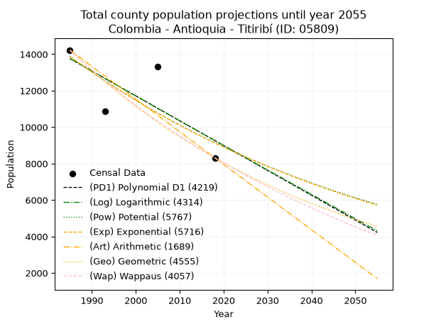
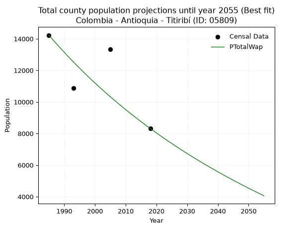
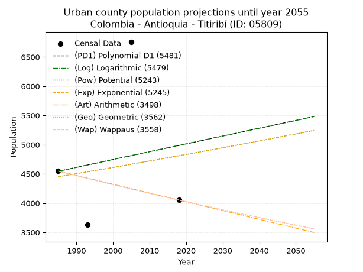
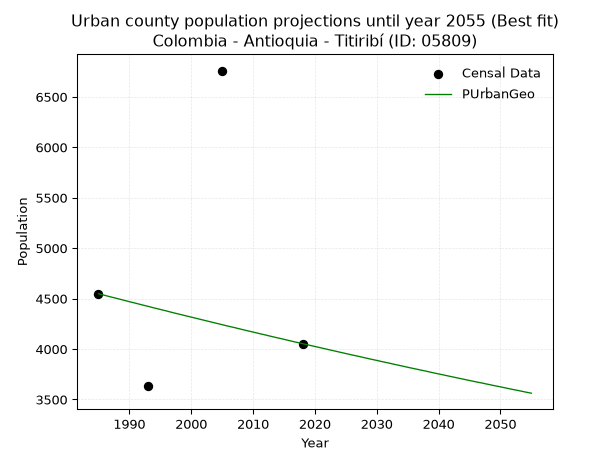
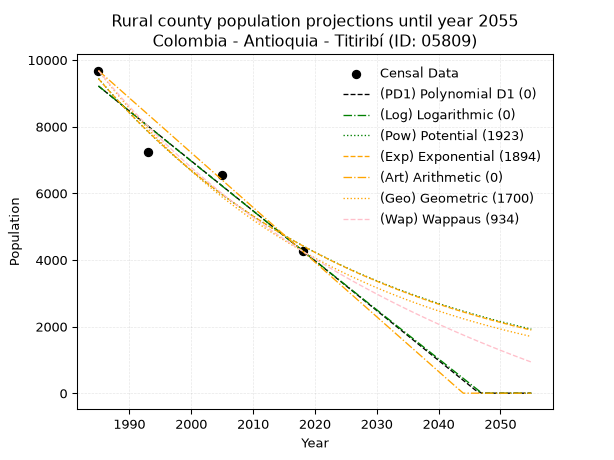
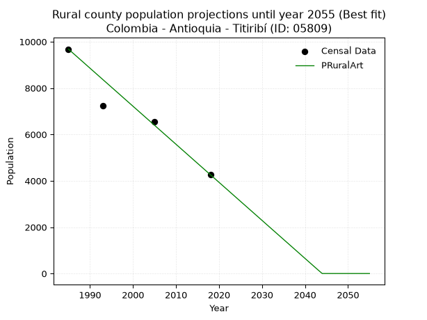

<div align="center">


</div>

# _“Population and Public Services Demand Projections (PPSD) until Year 2050 for Colombia - Antioquia - Titiribí (ID: 05809)”_
Keywords: `population` `public-service` `projection` `lineal` `polynomial` `logarithmic` `potential` `exponential` `arithmetic` `geometric` `wappaus` `dane` `colombia` `south-america`

PPSD are analytical estimates used by governments and planners to anticipate future changes in population size, age distribution, and the resulting community needs for utilities, healthcare, education, and infrastructure as sizing future water treatment facilities, electrical grids, and road networks based on spatial growth.

> **General running parameters**: • app_version: _v20260806_. • Python version: _3.14.7_. • Pandas version: _3.0.5_. • NumPy version: _2.5.1_. • Creates, save and include plots into reports (create_plot): _True_. • Projection until year: _2050_. • Process polynomial degree 2 and up: _False_. • Process Wappaus: _True_. • Process Wappaus: _True_. • Set negative values to zero: _True_. • Set infinite values to zero: _True_. • Drop dataset notes: _True_. 
<div align="center">

Dynamic map: [:earth_americas:Google](http://maps.google.com/maps?q=6.062391397,-75.7918867) [:earth_americas:OSM](https://www.openstreetmap.org/#map=18/6.062391397/-75.7918867&layers=P) [:earth_americas:Bing](https://www.bing.com/maps?cp=6.062391397~-75.7918867&lvl=18) [:earth_americas:Apple](https://maps.apple.com/frame?center=6.062391397%2C-75.7918867&span=0.003%2C0.006)

</div>


<div align="center">

```geojson
{
  "type": "Feature",
  "geometry": {
    "type": "Point", 
    "coordinates": [-75.7918867, 6.062391397]
  }, 
  "properties": {
    "Name": "Colombia - Antioquia - Titiribí (ID: 05809)"
  }
}
```

</div>


## 0. Census Data (4 records)

Census data are official statistics collected by a government about the people and housing in a country. They usually include counts of total population, age, sex, race, income, education, and jobs.

📅Global census file: [Population.xlsx](../data/Population.xlsx)

| Source   |   Year |   CountryID | CountryName   |   StateID | StateName   |   CountyID | CountyName   |   PTotal |   PUrban |   PRural |
|:---------|-------:|------------:|:--------------|----------:|:------------|-----------:|:-------------|---------:|---------:|---------:|
| DANE     |   1985 |          57 | Colombia      |        05 | Antioquia   |      05809 | Titiribí     |    14227 |     4548 |     9679 |
| DANE     |   1993 |          57 | Colombia      |        05 | Antioquia   |      05809 | Titiribí     |    10867 |     3636 |     7231 |
| DANE     |   2005 |          57 | Colombia      |        05 | Antioquia   |      05809 | Titiribí     |    13317 |     6759 |     6558 |
| DANE     |   2018 |          57 | Colombia      |        05 | Antioquia   |      05809 | Titiribí     |     8316 |     4053 |     4263 |

> 🔥Some records has specific notes about the registered values or the corresponding urban or rural distribution.

## 1. Total

### 1.1. Coefficients and Parameters

* (PD1) Polynomial Deg 1: -136.30309112805807, 284322.0080288981 (lineal)
* (Log) Logarithmic: -272641.4477847484, 2084031.5794233184
* (Pow) Potential: -25.34431385991632, 87.72188806221888
* (Exp) Exponential: -0.012672485359522796, 1166655934778085.0
* (Art) Arithmetic: Year diff. 2018 - 1985 = 33, Population diff. 8316 - 14227 = -5911, Annual growth = -179.12121212121212
* (Geo) Geometric: Year diff. 2018 - 1985 = 33, Population diff. 8316 - 14227 = -5911, Annual growth % = -0.01613985504466431
* (Wap) Wappaus: i = -1.5891515070861209, Condition values only valid for < 200)

<sub>
Wappaus condition values: ['-0.00', '-1.59', '-3.18', '-4.77', '-6.36', '-7.95', '-9.53', '-11.12', '-12.71', '-14.30', '-15.89', '-17.48', '-19.07', '-20.66', '-22.25', '-23.84', '-25.43', '-27.02', '-28.60', '-30.19', '-31.78', '-33.37', '-34.96', '-36.55', '-38.14', '-39.73', '-41.32', '-42.91', '-44.50', '-46.09', '-47.67', '-49.26', '-50.85', '-52.44', '-54.03', '-55.62', '-57.21', '-58.80', '-60.39', '-61.98', '-63.57', '-65.16', '-66.74', '-68.33', '-69.92', '-71.51', '-73.10', '-74.69', '-76.28', '-77.87', '-79.46', '-81.05', '-82.64', '-84.23', '-85.81', '-87.40', '-88.99', '-90.58', '-92.17', '-93.76', '-95.35', '-96.94', '-98.53', '-100.12', '-101.71', '-103.29']
</sub>


### 1.2. Projected Dataset

|   Year |   CountyID |   PTotalPD1 |   PTotalLog |   PTotalPow |   PTotalExp |   PTotalArt |   PTotalGeo |   PTotalWap |
|-------:|-----------:|------------:|------------:|------------:|------------:|------------:|------------:|------------:|
|   1985 |      05809 |       13760 |       13763 |       13881 |       13878 |       14227 |       14227 |       14227 |
|   1986 |      05809 |       13624 |       13626 |       13705 |       13703 |       14048 |       13997 |       14003 |
|   1987 |      05809 |       13488 |       13488 |       13531 |       13530 |       13869 |       13771 |       13782 |
|   1988 |      05809 |       13351 |       13351 |       13359 |       13360 |       13690 |       13549 |       13565 |
|   1989 |      05809 |       13215 |       13214 |       13190 |       13192 |       13511 |       13331 |       13351 |
|   1990 |      05809 |       13079 |       13077 |       13023 |       13026 |       13331 |       13115 |       13140 |
|   1991 |      05809 |       12943 |       12940 |       12859 |       12862 |       13152 |       12904 |       12932 |
|   1992 |      05809 |       12806 |       12803 |       12696 |       12700 |       12973 |       12695 |       12728 |
|   1993 |      05809 |       12670 |       12666 |       12535 |       12540 |       12794 |       12491 |       12526 |
|   1994 |      05809 |       12534 |       12530 |       12377 |       12382 |       12615 |       12289 |       12328 |
|   1995 |      05809 |       12397 |       12393 |       12221 |       12226 |       12436 |       12091 |       12133 |
|   1996 |      05809 |       12261 |       12256 |       12067 |       12072 |       12257 |       11895 |       11940 |
|   1997 |      05809 |       12125 |       12120 |       11914 |       11920 |       12078 |       11703 |       11750 |
|   1998 |      05809 |       11988 |       11983 |       11764 |       11770 |       11898 |       11515 |       11563 |
|   1999 |      05809 |       11852 |       11847 |       11616 |       11622 |       11719 |       11329 |       11379 |
|   2000 |      05809 |       11716 |       11711 |       11470 |       11475 |       11540 |       11146 |       11197 |
|   2001 |      05809 |       11580 |       11574 |       11325 |       11331 |       11361 |       10966 |       11018 |
|   2002 |      05809 |       11443 |       11438 |       11183 |       11188 |       11182 |       10789 |       10841 |
|   2003 |      05809 |       11307 |       11302 |       11042 |       11047 |       11003 |       10615 |       10667 |
|   2004 |      05809 |       11171 |       11166 |       10903 |       10908 |       10824 |       10444 |       10495 |
|   2005 |      05809 |       11034 |       11030 |       10766 |       10771 |       10645 |       10275 |       10325 |
|   2006 |      05809 |       10898 |       10894 |       10631 |       10635 |       10465 |       10109 |       10158 |
|   2007 |      05809 |       10762 |       10758 |       10498 |       10501 |       10286 |        9946 |        9993 |
|   2008 |      05809 |       10625 |       10622 |       10366 |       10369 |       10107 |        9785 |        9830 |
|   2009 |      05809 |       10489 |       10486 |       10236 |       10238 |        9928 |        9628 |        9670 |
|   2010 |      05809 |       10353 |       10351 |       10108 |       10109 |        9749 |        9472 |        9511 |
|   2011 |      05809 |       10216 |       10215 |        9981 |        9982 |        9570 |        9319 |        9355 |
|   2012 |      05809 |       10080 |       10080 |        9856 |        9856 |        9391 |        9169 |        9201 |
|   2013 |      05809 |        9944 |        9944 |        9733 |        9732 |        9212 |        9021 |        9049 |
|   2014 |      05809 |        9808 |        9809 |        9611 |        9610 |        9032 |        8875 |        8898 |
|   2015 |      05809 |        9671 |        9673 |        9491 |        9489 |        8853 |        8732 |        8750 |
|   2016 |      05809 |        9535 |        9538 |        9372 |        9369 |        8674 |        8591 |        8603 |
|   2017 |      05809 |        9399 |        9403 |        9255 |        9251 |        8495 |        8452 |        8459 |
|   2018 |      05809 |        9262 |        9268 |        9140 |        9135 |        8316 |        8316 |        8316 |
|   2019 |      05809 |        9126 |        9133 |        9026 |        9020 |        8137 |        8182 |        8175 |
|   2020 |      05809 |        8990 |        8998 |        8913 |        8906 |        7958 |        8050 |        8036 |
|   2021 |      05809 |        8853 |        8863 |        8802 |        8794 |        7779 |        7920 |        7898 |
|   2022 |      05809 |        8717 |        8728 |        8692 |        8683 |        7600 |        7792 |        7762 |
|   2023 |      05809 |        8581 |        8593 |        8584 |        8574 |        7420 |        7666 |        7628 |
|   2024 |      05809 |        8445 |        8458 |        8477 |        8466 |        7241 |        7542 |        7496 |
|   2025 |      05809 |        8308 |        8324 |        8372 |        8359 |        7062 |        7421 |        7365 |
|   2026 |      05809 |        8172 |        8189 |        8268 |        8254 |        6883 |        7301 |        7235 |
|   2027 |      05809 |        8036 |        8054 |        8165 |        8150 |        6704 |        7183 |        7107 |
|   2028 |      05809 |        7899 |        7920 |        8063 |        8048 |        6525 |        7067 |        6981 |
|   2029 |      05809 |        7763 |        7786 |        7963 |        7946 |        6346 |        6953 |        6856 |
|   2030 |      05809 |        7627 |        7651 |        7864 |        7846 |        6167 |        6841 |        6733 |
|   2031 |      05809 |        7490 |        7517 |        7767 |        7747 |        5987 |        6731 |        6611 |
|   2032 |      05809 |        7354 |        7383 |        7671 |        7650 |        5808 |        6622 |        6490 |
|   2033 |      05809 |        7218 |        7249 |        7576 |        7553 |        5629 |        6515 |        6371 |
|   2034 |      05809 |        7082 |        7115 |        7482 |        7458 |        5450 |        6410 |        6253 |
|   2035 |      05809 |        6945 |        6981 |        7389 |        7364 |        5271 |        6306 |        6137 |
|   2036 |      05809 |        6809 |        6847 |        7298 |        7272 |        5092 |        6205 |        6022 |
|   2037 |      05809 |        6673 |        6713 |        7207 |        7180 |        4913 |        6104 |        5908 |
|   2038 |      05809 |        6536 |        6579 |        7118 |        7090 |        4734 |        6006 |        5795 |
|   2039 |      05809 |        6400 |        6445 |        7030 |        7000 |        4554 |        5909 |        5684 |
|   2040 |      05809 |        6264 |        6312 |        6944 |        6912 |        4375 |        5814 |        5574 |
|   2041 |      05809 |        6127 |        6178 |        6858 |        6825 |        4196 |        5720 |        5465 |
|   2042 |      05809 |        5991 |        6044 |        6773 |        6739 |        4017 |        5627 |        5357 |
|   2043 |      05809 |        5855 |        5911 |        6690 |        6654 |        3838 |        5537 |        5251 |
|   2044 |      05809 |        5718 |        5777 |        6607 |        6571 |        3659 |        5447 |        5145 |
|   2045 |      05809 |        5582 |        5644 |        6526 |        6488 |        3480 |        5359 |        5041 |
|   2046 |      05809 |        5446 |        5511 |        6446 |        6406 |        3301 |        5273 |        4938 |
|   2047 |      05809 |        5310 |        5378 |        6366 |        6325 |        3121 |        5188 |        4836 |
|   2048 |      05809 |        5173 |        5244 |        6288 |        6246 |        2942 |        5104 |        4735 |
|   2049 |      05809 |        5037 |        5111 |        6211 |        6167 |        2763 |        5022 |        4635 |
|   2050 |      05809 |        4901 |        4978 |        6134 |        6090 |        2584 |        4941 |        4536 |
<div align="center">

</img>

</div>


### 1.3. Best fit with absolute error and relative error (%)

Relative error puts that difference into context by dividing the absolute error by the true value, creating a unitless ratio or percentage that shows the scale of the mistake.

Absolute and relative error

|   Year | Source   |   CountryID | CountryName   |   StateID | StateName   |   CountyID_x | CountyName   |   PTotal |   PUrban |   PRural |   CountyID_y |   PTotalPD1 |   PTotalLog |   PTotalPow |   PTotalExp |   PTotalArt |   PTotalGeo |   PTotalWap |   PTotalPD1AbsError |   PTotalLogAbsError |   PTotalPowAbsError |   PTotalExpAbsError |   PTotalArtAbsError |   PTotalGeoAbsError |   PTotalWapAbsError |   PTotalPD1RelError |   PTotalLogRelError |   PTotalPowRelError |   PTotalExpRelError |   PTotalArtRelError |   PTotalGeoRelError |   PTotalWapRelError |
|-------:|:---------|------------:|:--------------|----------:|:------------|-------------:|:-------------|---------:|---------:|---------:|-------------:|------------:|------------:|------------:|------------:|------------:|------------:|------------:|--------------------:|--------------------:|--------------------:|--------------------:|--------------------:|--------------------:|--------------------:|--------------------:|--------------------:|--------------------:|--------------------:|--------------------:|--------------------:|--------------------:|
|   1985 | DANE     |          57 | Colombia      |        05 | Antioquia   |        05809 | Titiribí     |    14227 |     4548 |     9679 |        05809 |       13760 |       13763 |       13881 |       13878 |       14227 |       14227 |       14227 |                 467 |                 464 |                 346 |                 349 |                   0 |                   0 |                   0 |             3.28249 |              3.2614 |             2.432   |             2.45308 |              0      |              0      |              0      |
|   1993 | DANE     |          57 | Colombia      |        05 | Antioquia   |        05809 | Titiribí     |    10867 |     3636 |     7231 |        05809 |       12670 |       12666 |       12535 |       12540 |       12794 |       12491 |       12526 |                1803 |                1799 |                1668 |                1673 |                1927 |                1624 |                1659 |            16.5915  |             16.5547 |            15.3492  |            15.3952  |             17.7326 |             14.9443 |             15.2664 |
|   2005 | DANE     |          57 | Colombia      |        05 | Antioquia   |        05809 | Titiribí     |    13317 |     6759 |     6558 |        05809 |       11034 |       11030 |       10766 |       10771 |       10645 |       10275 |       10325 |                2283 |                2287 |                2551 |                2546 |                2672 |                3042 |                2992 |            17.1435  |             17.1735 |            19.156   |            19.1184  |             20.0646 |             22.843  |             22.4675 |
|   2018 | DANE     |          57 | Colombia      |        05 | Antioquia   |        05809 | Titiribí     |     8316 |     4053 |     4263 |        05809 |        9262 |        9268 |        9140 |        9135 |        8316 |        8316 |        8316 |                 946 |                 952 |                 824 |                 819 |                   0 |                   0 |                   0 |            11.3757  |             11.4478 |             9.90861 |             9.84848 |              0      |              0      |              0      |

Relative error mean

| Method    |   RelError | Best   |
|:----------|-----------:|:-------|
| PTotalPD1 |   12.0983  |        |
| PTotalLog |   12.1094  |        |
| PTotalPow |   11.7114  |        |
| PTotalExp |   11.7038  |        |
| PTotalArt |    9.44929 |        |
| PTotalGeo |    9.44683 |        |
| PTotalWap |    9.43348 | True   |

💙Best method: _**PTotalWap**_
<div align="center">

</img>

</div>


### 1.4. Fresh water supply demand in liters per capita per day (lpcd)

The fresh water supply demand typically ranges from 100 to 300 liters per capita per day (lpcd) for standard domestic and municipal planning, though absolute survival minimums set by the World Health Organization are as low as 7.5 to 20 liters per day, and total consumption in high-income nations can exceed 400 liters.

> `CZ`: Level in meters above the sea level (masl).<br> `WS`: Fresh water supply demand in liters per capita per day (lpcd or l/h/d).<br> `WSAll`: Zonal fresh water supply demand in liters per second (l/s).<br> `A`: Zonal area in square meters.

Reference values (RAS Colombia)

|    CZ |   WS |
|------:|-----:|
|  1000 |  120 |
|  2000 |  130 |
| 99999 |  140 |

County shapefile geometry properties and water supply values

|   CountyID |      ATotal |   CZTotal |   WSTotal |
|-----------:|------------:|----------:|----------:|
|      05809 | 1.40329e+08 |   1251.02 |       130 |

Projected values for best method: PTotalWap

|   CountyID |   Year |   PTotalWap |   WSTotal |   WSTotalAll |
|-----------:|-------:|------------:|----------:|-------------:|
|      05809 |   1985 |       14227 |       130 |     21.4064  |
|      05809 |   1986 |       14003 |       130 |     21.0693  |
|      05809 |   1987 |       13782 |       130 |     20.7368  |
|      05809 |   1988 |       13565 |       130 |     20.4103  |
|      05809 |   1989 |       13351 |       130 |     20.0883  |
|      05809 |   1990 |       13140 |       130 |     19.7708  |
|      05809 |   1991 |       12932 |       130 |     19.4579  |
|      05809 |   1992 |       12728 |       130 |     19.1509  |
|      05809 |   1993 |       12526 |       130 |     18.847   |
|      05809 |   1994 |       12328 |       130 |     18.5491  |
|      05809 |   1995 |       12133 |       130 |     18.2557  |
|      05809 |   1996 |       11940 |       130 |     17.9653  |
|      05809 |   1997 |       11750 |       130 |     17.6794  |
|      05809 |   1998 |       11563 |       130 |     17.398   |
|      05809 |   1999 |       11379 |       130 |     17.1212  |
|      05809 |   2000 |       11197 |       130 |     16.8473  |
|      05809 |   2001 |       11018 |       130 |     16.578   |
|      05809 |   2002 |       10841 |       130 |     16.3117  |
|      05809 |   2003 |       10667 |       130 |     16.0499  |
|      05809 |   2004 |       10495 |       130 |     15.7911  |
|      05809 |   2005 |       10325 |       130 |     15.5353  |
|      05809 |   2006 |       10158 |       130 |     15.284   |
|      05809 |   2007 |        9993 |       130 |     15.0358  |
|      05809 |   2008 |        9830 |       130 |     14.7905  |
|      05809 |   2009 |        9670 |       130 |     14.5498  |
|      05809 |   2010 |        9511 |       130 |     14.3105  |
|      05809 |   2011 |        9355 |       130 |     14.0758  |
|      05809 |   2012 |        9201 |       130 |     13.8441  |
|      05809 |   2013 |        9049 |       130 |     13.6154  |
|      05809 |   2014 |        8898 |       130 |     13.3882  |
|      05809 |   2015 |        8750 |       130 |     13.1655  |
|      05809 |   2016 |        8603 |       130 |     12.9443  |
|      05809 |   2017 |        8459 |       130 |     12.7277  |
|      05809 |   2018 |        8316 |       130 |     12.5125  |
|      05809 |   2019 |        8175 |       130 |     12.3003  |
|      05809 |   2020 |        8036 |       130 |     12.0912  |
|      05809 |   2021 |        7898 |       130 |     11.8836  |
|      05809 |   2022 |        7762 |       130 |     11.6789  |
|      05809 |   2023 |        7628 |       130 |     11.4773  |
|      05809 |   2024 |        7496 |       130 |     11.2787  |
|      05809 |   2025 |        7365 |       130 |     11.0816  |
|      05809 |   2026 |        7235 |       130 |     10.886   |
|      05809 |   2027 |        7107 |       130 |     10.6934  |
|      05809 |   2028 |        6981 |       130 |     10.5038  |
|      05809 |   2029 |        6856 |       130 |     10.3157  |
|      05809 |   2030 |        6733 |       130 |     10.1307  |
|      05809 |   2031 |        6611 |       130 |      9.94711 |
|      05809 |   2032 |        6490 |       130 |      9.76505 |
|      05809 |   2033 |        6371 |       130 |      9.586   |
|      05809 |   2034 |        6253 |       130 |      9.40845 |
|      05809 |   2035 |        6137 |       130 |      9.23391 |
|      05809 |   2036 |        6022 |       130 |      9.06088 |
|      05809 |   2037 |        5908 |       130 |      8.88935 |
|      05809 |   2038 |        5795 |       130 |      8.71933 |
|      05809 |   2039 |        5684 |       130 |      8.55231 |
|      05809 |   2040 |        5574 |       130 |      8.38681 |
|      05809 |   2041 |        5465 |       130 |      8.2228  |
|      05809 |   2042 |        5357 |       130 |      8.0603  |
|      05809 |   2043 |        5251 |       130 |      7.90081 |
|      05809 |   2044 |        5145 |       130 |      7.74132 |
|      05809 |   2045 |        5041 |       130 |      7.58484 |
|      05809 |   2046 |        4938 |       130 |      7.42986 |
|      05809 |   2047 |        4836 |       130 |      7.27639 |
|      05809 |   2048 |        4735 |       130 |      7.12442 |
|      05809 |   2049 |        4635 |       130 |      6.97396 |
|      05809 |   2050 |        4536 |       130 |      6.825   |

## 2. Urban

### 2.1. Coefficients and Parameters

* (PD1) Polynomial Deg 1: 13.372942593337552, -22000.22842232344 (lineal)
* (Log) Logarithmic: 27009.837865601745, -200552.99405969575
* (Pow) Potential: 4.73158729735749, -11.955302653552067
* (Exp) Exponential: 0.002343039940906313, 42.52387358696278
* (Art) Arithmetic: Year diff. 2018 - 1985 = 33, Population diff. 4053 - 4548 = -495, Annual growth = -15.0
* (Geo) Geometric: Year diff. 2018 - 1985 = 33, Population diff. 4053 - 4548 = -495, Annual growth % = -0.0034857357666764344
* (Wap) Wappaus: i = -0.3487966515521451, Condition values only valid for < 200)

<sub>
Wappaus condition values: ['-0.00', '-0.35', '-0.70', '-1.05', '-1.40', '-1.74', '-2.09', '-2.44', '-2.79', '-3.14', '-3.49', '-3.84', '-4.19', '-4.53', '-4.88', '-5.23', '-5.58', '-5.93', '-6.28', '-6.63', '-6.98', '-7.32', '-7.67', '-8.02', '-8.37', '-8.72', '-9.07', '-9.42', '-9.77', '-10.12', '-10.46', '-10.81', '-11.16', '-11.51', '-11.86', '-12.21', '-12.56', '-12.91', '-13.25', '-13.60', '-13.95', '-14.30', '-14.65', '-15.00', '-15.35', '-15.70', '-16.04', '-16.39', '-16.74', '-17.09', '-17.44', '-17.79', '-18.14', '-18.49', '-18.84', '-19.18', '-19.53', '-19.88', '-20.23', '-20.58', '-20.93', '-21.28', '-21.63', '-21.97', '-22.32', '-22.67']
</sub>


### 2.2. Projected Dataset

|   Year |   CountyID |   PUrbanPD1 |   PUrbanLog |   PUrbanPow |   PUrbanExp |   PUrbanArt |   PUrbanGeo |   PUrbanWap |
|-------:|-----------:|------------:|------------:|------------:|------------:|------------:|------------:|------------:|
|   1985 |      05809 |        4545 |        4543 |        4450 |        4452 |        4548 |        4548 |        4548 |
|   1986 |      05809 |        4558 |        4556 |        4460 |        4462 |        4533 |        4532 |        4532 |
|   1987 |      05809 |        4572 |        4570 |        4471 |        4472 |        4518 |        4516 |        4516 |
|   1988 |      05809 |        4585 |        4584 |        4482 |        4483 |        4503 |        4501 |        4501 |
|   1989 |      05809 |        4599 |        4597 |        4492 |        4493 |        4488 |        4485 |        4485 |
|   1990 |      05809 |        4612 |        4611 |        4503 |        4504 |        4473 |        4469 |        4469 |
|   1991 |      05809 |        4625 |        4624 |        4514 |        4515 |        4458 |        4454 |        4454 |
|   1992 |      05809 |        4639 |        4638 |        4525 |        4525 |        4443 |        4438 |        4438 |
|   1993 |      05809 |        4652 |        4651 |        4535 |        4536 |        4428 |        4423 |        4423 |
|   1994 |      05809 |        4665 |        4665 |        4546 |        4546 |        4413 |        4407 |        4407 |
|   1995 |      05809 |        4679 |        4679 |        4557 |        4557 |        4398 |        4392 |        4392 |
|   1996 |      05809 |        4692 |        4692 |        4568 |        4568 |        4383 |        4377 |        4377 |
|   1997 |      05809 |        4706 |        4706 |        4579 |        4578 |        4368 |        4361 |        4362 |
|   1998 |      05809 |        4719 |        4719 |        4589 |        4589 |        4353 |        4346 |        4346 |
|   1999 |      05809 |        4732 |        4733 |        4600 |        4600 |        4338 |        4331 |        4331 |
|   2000 |      05809 |        4746 |        4746 |        4611 |        4611 |        4323 |        4316 |        4316 |
|   2001 |      05809 |        4759 |        4760 |        4622 |        4622 |        4308 |        4301 |        4301 |
|   2002 |      05809 |        4772 |        4773 |        4633 |        4632 |        4293 |        4286 |        4286 |
|   2003 |      05809 |        4786 |        4787 |        4644 |        4643 |        4278 |        4271 |        4271 |
|   2004 |      05809 |        4799 |        4800 |        4655 |        4654 |        4263 |        4256 |        4256 |
|   2005 |      05809 |        4813 |        4814 |        4666 |        4665 |        4248 |        4241 |        4241 |
|   2006 |      05809 |        4826 |        4827 |        4677 |        4676 |        4233 |        4226 |        4227 |
|   2007 |      05809 |        4839 |        4841 |        4688 |        4687 |        4218 |        4212 |        4212 |
|   2008 |      05809 |        4853 |        4854 |        4699 |        4698 |        4203 |        4197 |        4197 |
|   2009 |      05809 |        4866 |        4867 |        4710 |        4709 |        4188 |        4182 |        4183 |
|   2010 |      05809 |        4879 |        4881 |        4721 |        4720 |        4173 |        4168 |        4168 |
|   2011 |      05809 |        4893 |        4894 |        4732 |        4731 |        4158 |        4153 |        4153 |
|   2012 |      05809 |        4906 |        4908 |        4744 |        4742 |        4143 |        4139 |        4139 |
|   2013 |      05809 |        4920 |        4921 |        4755 |        4753 |        4128 |        4124 |        4125 |
|   2014 |      05809 |        4933 |        4935 |        4766 |        4765 |        4113 |        4110 |        4110 |
|   2015 |      05809 |        4946 |        4948 |        4777 |        4776 |        4098 |        4096 |        4096 |
|   2016 |      05809 |        4960 |        4961 |        4788 |        4787 |        4083 |        4081 |        4081 |
|   2017 |      05809 |        4973 |        4975 |        4800 |        4798 |        4068 |        4067 |        4067 |
|   2018 |      05809 |        4986 |        4988 |        4811 |        4809 |        4053 |        4053 |        4053 |
|   2019 |      05809 |        5000 |        5002 |        4822 |        4821 |        4038 |        4039 |        4039 |
|   2020 |      05809 |        5013 |        5015 |        4833 |        4832 |        4023 |        4025 |        4025 |
|   2021 |      05809 |        5026 |        5028 |        4845 |        4843 |        4008 |        4011 |        4011 |
|   2022 |      05809 |        5040 |        5042 |        4856 |        4855 |        3993 |        3997 |        3997 |
|   2023 |      05809 |        5053 |        5055 |        4867 |        4866 |        3978 |        3983 |        3983 |
|   2024 |      05809 |        5067 |        5068 |        4879 |        4877 |        3963 |        3969 |        3969 |
|   2025 |      05809 |        5080 |        5082 |        4890 |        4889 |        3948 |        3955 |        3955 |
|   2026 |      05809 |        5093 |        5095 |        4902 |        4900 |        3933 |        3941 |        3941 |
|   2027 |      05809 |        5107 |        5108 |        4913 |        4912 |        3918 |        3928 |        3927 |
|   2028 |      05809 |        5120 |        5122 |        4925 |        4923 |        3903 |        3914 |        3913 |
|   2029 |      05809 |        5133 |        5135 |        4936 |        4935 |        3888 |        3900 |        3900 |
|   2030 |      05809 |        5147 |        5148 |        4948 |        4947 |        3873 |        3887 |        3886 |
|   2031 |      05809 |        5160 |        5162 |        4959 |        4958 |        3858 |        3873 |        3872 |
|   2032 |      05809 |        5174 |        5175 |        4971 |        4970 |        3843 |        3860 |        3859 |
|   2033 |      05809 |        5187 |        5188 |        4982 |        4981 |        3828 |        3846 |        3845 |
|   2034 |      05809 |        5200 |        5201 |        4994 |        4993 |        3813 |        3833 |        3832 |
|   2035 |      05809 |        5214 |        5215 |        5006 |        5005 |        3798 |        3819 |        3818 |
|   2036 |      05809 |        5227 |        5228 |        5017 |        5017 |        3783 |        3806 |        3805 |
|   2037 |      05809 |        5240 |        5241 |        5029 |        5028 |        3768 |        3793 |        3792 |
|   2038 |      05809 |        5254 |        5255 |        5041 |        5040 |        3753 |        3780 |        3778 |
|   2039 |      05809 |        5267 |        5268 |        5052 |        5052 |        3738 |        3766 |        3765 |
|   2040 |      05809 |        5281 |        5281 |        5064 |        5064 |        3723 |        3753 |        3752 |
|   2041 |      05809 |        5294 |        5294 |        5076 |        5076 |        3708 |        3740 |        3739 |
|   2042 |      05809 |        5307 |        5307 |        5088 |        5088 |        3693 |        3727 |        3726 |
|   2043 |      05809 |        5321 |        5321 |        5099 |        5099 |        3678 |        3714 |        3712 |
|   2044 |      05809 |        5334 |        5334 |        5111 |        5111 |        3663 |        3701 |        3699 |
|   2045 |      05809 |        5347 |        5347 |        5123 |        5123 |        3648 |        3688 |        3686 |
|   2046 |      05809 |        5361 |        5360 |        5135 |        5135 |        3633 |        3675 |        3673 |
|   2047 |      05809 |        5374 |        5374 |        5147 |        5148 |        3618 |        3663 |        3660 |
|   2048 |      05809 |        5388 |        5387 |        5159 |        5160 |        3603 |        3650 |        3648 |
|   2049 |      05809 |        5401 |        5400 |        5171 |        5172 |        3588 |        3637 |        3635 |
|   2050 |      05809 |        5414 |        5413 |        5183 |        5184 |        3573 |        3625 |        3622 |
<div align="center">

</img>

</div>


### 2.3. Best fit with absolute error and relative error (%)

Relative error puts that difference into context by dividing the absolute error by the true value, creating a unitless ratio or percentage that shows the scale of the mistake.

Absolute and relative error

|   Year | Source   |   CountryID | CountryName   |   StateID | StateName   |   CountyID_x | CountyName   |   PTotal |   PUrban |   PRural |   CountyID_y |   PUrbanPD1 |   PUrbanLog |   PUrbanPow |   PUrbanExp |   PUrbanArt |   PUrbanGeo |   PUrbanWap |   PUrbanPD1AbsError |   PUrbanLogAbsError |   PUrbanPowAbsError |   PUrbanExpAbsError |   PUrbanArtAbsError |   PUrbanGeoAbsError |   PUrbanWapAbsError |   PUrbanPD1RelError |   PUrbanLogRelError |   PUrbanPowRelError |   PUrbanExpRelError |   PUrbanArtRelError |   PUrbanGeoRelError |   PUrbanWapRelError |
|-------:|:---------|------------:|:--------------|----------:|:------------|-------------:|:-------------|---------:|---------:|---------:|-------------:|------------:|------------:|------------:|------------:|------------:|------------:|------------:|--------------------:|--------------------:|--------------------:|--------------------:|--------------------:|--------------------:|--------------------:|--------------------:|--------------------:|--------------------:|--------------------:|--------------------:|--------------------:|--------------------:|
|   1985 | DANE     |          57 | Colombia      |        05 | Antioquia   |        05809 | Titiribí     |    14227 |     4548 |     9679 |        05809 |        4545 |        4543 |        4450 |        4452 |        4548 |        4548 |        4548 |                   3 |                   5 |                  98 |                  96 |                   0 |                   0 |                   0 |           0.0659631 |            0.109938 |             2.15479 |             2.11082 |              0      |              0      |              0      |
|   1993 | DANE     |          57 | Colombia      |        05 | Antioquia   |        05809 | Titiribí     |    10867 |     3636 |     7231 |        05809 |        4652 |        4651 |        4535 |        4536 |        4428 |        4423 |        4423 |                1016 |                1015 |                 899 |                 900 |                 792 |                 787 |                 787 |          27.9428    |           27.9153   |            24.725   |            24.7525  |             21.7822 |             21.6447 |             21.6447 |
|   2005 | DANE     |          57 | Colombia      |        05 | Antioquia   |        05809 | Titiribí     |    13317 |     6759 |     6558 |        05809 |        4813 |        4814 |        4666 |        4665 |        4248 |        4241 |        4241 |                1946 |                1945 |                2093 |                2094 |                2511 |                2518 |                2518 |          28.7912    |           28.7764   |            30.9661  |            30.9809  |             37.1505 |             37.254  |             37.254  |
|   2018 | DANE     |          57 | Colombia      |        05 | Antioquia   |        05809 | Titiribí     |     8316 |     4053 |     4263 |        05809 |        4986 |        4988 |        4811 |        4809 |        4053 |        4053 |        4053 |                 933 |                 935 |                 758 |                 756 |                   0 |                   0 |                   0 |          23.02      |           23.0693   |            18.7022  |            18.6528  |              0      |              0      |              0      |

Relative error mean

| Method    |   RelError | Best   |
|:----------|-----------:|:-------|
| PUrbanPD1 |    19.955  |        |
| PUrbanLog |    19.9678 |        |
| PUrbanPow |    19.137  |        |
| PUrbanExp |    19.1243 |        |
| PUrbanArt |    14.7332 |        |
| PUrbanGeo |    14.7247 | True   |
| PUrbanWap |    14.7247 | True   |

💙Best method: _**PUrbanGeo**_
<div align="center">

</img>

</div>


### 2.4. Fresh water supply demand in liters per capita per day (lpcd)

The fresh water supply demand typically ranges from 100 to 300 liters per capita per day (lpcd) for standard domestic and municipal planning, though absolute survival minimums set by the World Health Organization are as low as 7.5 to 20 liters per day, and total consumption in high-income nations can exceed 400 liters.

> `CZ`: Level in meters above the sea level (masl).<br> `WS`: Fresh water supply demand in liters per capita per day (lpcd or l/h/d).<br> `WSAll`: Zonal fresh water supply demand in liters per second (l/s).<br> `A`: Zonal area in square meters.

Reference values (RAS Colombia)

|    CZ |   WS |
|------:|-----:|
|  1000 |  120 |
|  2000 |  130 |
| 99999 |  140 |

County shapefile geometry properties and water supply values

|   CountyID |   AUrban |   CZUrban |   WSUrban |
|-----------:|---------:|----------:|----------:|
|      05809 |   479382 |   1530.64 |       130 |

Projected values for best method: PUrbanGeo

|   CountyID |   Year |   PUrbanGeo |   WSUrban |   WSUrbanAll |
|-----------:|-------:|------------:|----------:|-------------:|
|      05809 |   1985 |        4548 |       130 |      6.84306 |
|      05809 |   1986 |        4532 |       130 |      6.81898 |
|      05809 |   1987 |        4516 |       130 |      6.79491 |
|      05809 |   1988 |        4501 |       130 |      6.77234 |
|      05809 |   1989 |        4485 |       130 |      6.74826 |
|      05809 |   1990 |        4469 |       130 |      6.72419 |
|      05809 |   1991 |        4454 |       130 |      6.70162 |
|      05809 |   1992 |        4438 |       130 |      6.67755 |
|      05809 |   1993 |        4423 |       130 |      6.65498 |
|      05809 |   1994 |        4407 |       130 |      6.6309  |
|      05809 |   1995 |        4392 |       130 |      6.60833 |
|      05809 |   1996 |        4377 |       130 |      6.58576 |
|      05809 |   1997 |        4361 |       130 |      6.56169 |
|      05809 |   1998 |        4346 |       130 |      6.53912 |
|      05809 |   1999 |        4331 |       130 |      6.51655 |
|      05809 |   2000 |        4316 |       130 |      6.49398 |
|      05809 |   2001 |        4301 |       130 |      6.47141 |
|      05809 |   2002 |        4286 |       130 |      6.44884 |
|      05809 |   2003 |        4271 |       130 |      6.42627 |
|      05809 |   2004 |        4256 |       130 |      6.4037  |
|      05809 |   2005 |        4241 |       130 |      6.38113 |
|      05809 |   2006 |        4226 |       130 |      6.35856 |
|      05809 |   2007 |        4212 |       130 |      6.3375  |
|      05809 |   2008 |        4197 |       130 |      6.31493 |
|      05809 |   2009 |        4182 |       130 |      6.29236 |
|      05809 |   2010 |        4168 |       130 |      6.2713  |
|      05809 |   2011 |        4153 |       130 |      6.24873 |
|      05809 |   2012 |        4139 |       130 |      6.22766 |
|      05809 |   2013 |        4124 |       130 |      6.20509 |
|      05809 |   2014 |        4110 |       130 |      6.18403 |
|      05809 |   2015 |        4096 |       130 |      6.16296 |
|      05809 |   2016 |        4081 |       130 |      6.14039 |
|      05809 |   2017 |        4067 |       130 |      6.11933 |
|      05809 |   2018 |        4053 |       130 |      6.09826 |
|      05809 |   2019 |        4039 |       130 |      6.0772  |
|      05809 |   2020 |        4025 |       130 |      6.05613 |
|      05809 |   2021 |        4011 |       130 |      6.03507 |
|      05809 |   2022 |        3997 |       130 |      6.014   |
|      05809 |   2023 |        3983 |       130 |      5.99294 |
|      05809 |   2024 |        3969 |       130 |      5.97187 |
|      05809 |   2025 |        3955 |       130 |      5.95081 |
|      05809 |   2026 |        3941 |       130 |      5.92975 |
|      05809 |   2027 |        3928 |       130 |      5.91019 |
|      05809 |   2028 |        3914 |       130 |      5.88912 |
|      05809 |   2029 |        3900 |       130 |      5.86806 |
|      05809 |   2030 |        3887 |       130 |      5.8485  |
|      05809 |   2031 |        3873 |       130 |      5.82743 |
|      05809 |   2032 |        3860 |       130 |      5.80787 |
|      05809 |   2033 |        3846 |       130 |      5.78681 |
|      05809 |   2034 |        3833 |       130 |      5.76725 |
|      05809 |   2035 |        3819 |       130 |      5.74618 |
|      05809 |   2036 |        3806 |       130 |      5.72662 |
|      05809 |   2037 |        3793 |       130 |      5.70706 |
|      05809 |   2038 |        3780 |       130 |      5.6875  |
|      05809 |   2039 |        3766 |       130 |      5.66644 |
|      05809 |   2040 |        3753 |       130 |      5.64687 |
|      05809 |   2041 |        3740 |       130 |      5.62731 |
|      05809 |   2042 |        3727 |       130 |      5.60775 |
|      05809 |   2043 |        3714 |       130 |      5.58819 |
|      05809 |   2044 |        3701 |       130 |      5.56863 |
|      05809 |   2045 |        3688 |       130 |      5.54907 |
|      05809 |   2046 |        3675 |       130 |      5.52951 |
|      05809 |   2047 |        3663 |       130 |      5.51146 |
|      05809 |   2048 |        3650 |       130 |      5.4919  |
|      05809 |   2049 |        3637 |       130 |      5.47234 |
|      05809 |   2050 |        3625 |       130 |      5.45428 |

## 3. Rural

### 3.1. Coefficients and Parameters

* (PD1) Polynomial Deg 1: -149.67603372139556, 306322.2364512214 (lineal)
* (Log) Logarithmic: -299651.28565035, 2284584.573483012
* (Pow) Potential: -45.92336928266625, 155.41940359927042
* (Exp) Exponential: -0.022946325236511498, 5.705518593969215e+23
* (Art) Arithmetic: Year diff. 2018 - 1985 = 33, Population diff. 4263 - 9679 = -5416, Annual growth = -164.12121212121212
* (Geo) Geometric: Year diff. 2018 - 1985 = 33, Population diff. 4263 - 9679 = -5416, Annual growth % = -0.02454187252919382
* (Wap) Wappaus: i = -2.3543424490204004, Condition values only valid for < 200)

<sub>
Wappaus condition values: ['-0.00', '-2.35', '-4.71', '-7.06', '-9.42', '-11.77', '-14.13', '-16.48', '-18.83', '-21.19', '-23.54', '-25.90', '-28.25', '-30.61', '-32.96', '-35.32', '-37.67', '-40.02', '-42.38', '-44.73', '-47.09', '-49.44', '-51.80', '-54.15', '-56.50', '-58.86', '-61.21', '-63.57', '-65.92', '-68.28', '-70.63', '-72.98', '-75.34', '-77.69', '-80.05', '-82.40', '-84.76', '-87.11', '-89.47', '-91.82', '-94.17', '-96.53', '-98.88', '-101.24', '-103.59', '-105.95', '-108.30', '-110.65', '-113.01', '-115.36', '-117.72', '-120.07', '-122.43', '-124.78', '-127.13', '-129.49', '-131.84', '-134.20', '-136.55', '-138.91', '-141.26', '-143.61', '-145.97', '-148.32', '-150.68', '-153.03']
</sub>


### 3.2. Projected Dataset

|   Year |   CountyID |   PRuralPD1 |   PRuralLog |   PRuralPow |   PRuralExp |   PRuralArt |   PRuralGeo |   PRuralWap |
|-------:|-----------:|------------:|------------:|------------:|------------:|------------:|------------:|------------:|
|   1985 |      05809 |        9215 |        9220 |        9443 |        9437 |        9679 |        9679 |        9679 |
|   1986 |      05809 |        9066 |        9069 |        9228 |        9223 |        9515 |        9441 |        9454 |
|   1987 |      05809 |        8916 |        8918 |        9017 |        9014 |        9351 |        9210 |        9234 |
|   1988 |      05809 |        8766 |        8768 |        8811 |        8810 |        9187 |        8984 |        9019 |
|   1989 |      05809 |        8617 |        8617 |        8610 |        8610 |        9023 |        8763 |        8808 |
|   1990 |      05809 |        8467 |        8466 |        8413 |        8414 |        8858 |        8548 |        8603 |
|   1991 |      05809 |        8317 |        8316 |        8221 |        8224 |        8694 |        8338 |        8402 |
|   1992 |      05809 |        8168 |        8165 |        8034 |        8037 |        8530 |        8134 |        8205 |
|   1993 |      05809 |        8018 |        8015 |        7851 |        7855 |        8366 |        7934 |        8013 |
|   1994 |      05809 |        7868 |        7865 |        7672 |        7676 |        8202 |        7739 |        7825 |
|   1995 |      05809 |        7719 |        7714 |        7497 |        7502 |        8038 |        7549 |        7640 |
|   1996 |      05809 |        7569 |        7564 |        7327 |        7332 |        7874 |        7364 |        7460 |
|   1997 |      05809 |        7419 |        7414 |        7160 |        7166 |        7710 |        7183 |        7283 |
|   1998 |      05809 |        7270 |        7264 |        6997 |        7003 |        7545 |        7007 |        7110 |
|   1999 |      05809 |        7120 |        7114 |        6838 |        6844 |        7381 |        6835 |        6940 |
|   2000 |      05809 |        6970 |        6964 |        6683 |        6689 |        7217 |        6667 |        6774 |
|   2001 |      05809 |        6820 |        6815 |        6532 |        6537 |        7053 |        6504 |        6611 |
|   2002 |      05809 |        6671 |        6665 |        6383 |        6389 |        6889 |        6344 |        6451 |
|   2003 |      05809 |        6521 |        6515 |        6239 |        6244 |        6725 |        6189 |        6294 |
|   2004 |      05809 |        6371 |        6366 |        6097 |        6103 |        6561 |        6037 |        6141 |
|   2005 |      05809 |        6222 |        6216 |        5959 |        5964 |        6397 |        5888 |        5990 |
|   2006 |      05809 |        6072 |        6067 |        5824 |        5829 |        6232 |        5744 |        5842 |
|   2007 |      05809 |        5922 |        5917 |        5692 |        5697 |        6068 |        5603 |        5697 |
|   2008 |      05809 |        5773 |        5768 |        5564 |        5567 |        5904 |        5465 |        5555 |
|   2009 |      05809 |        5623 |        5619 |        5438 |        5441 |        5740 |        5331 |        5415 |
|   2010 |      05809 |        5473 |        5470 |        5315 |        5318 |        5576 |        5201 |        5277 |
|   2011 |      05809 |        5324 |        5321 |        5195 |        5197 |        5412 |        5073 |        5143 |
|   2012 |      05809 |        5174 |        5172 |        5078 |        5079 |        5248 |        4948 |        5010 |
|   2013 |      05809 |        5024 |        5023 |        4963 |        4964 |        5084 |        4827 |        4880 |
|   2014 |      05809 |        4875 |        4874 |        4851 |        4851 |        4919 |        4708 |        4752 |
|   2015 |      05809 |        4725 |        4725 |        4742 |        4741 |        4755 |        4593 |        4627 |
|   2016 |      05809 |        4575 |        4577 |        4635 |        4634 |        4591 |        4480 |        4503 |
|   2017 |      05809 |        4426 |        4428 |        4531 |        4529 |        4427 |        4370 |        4382 |
|   2018 |      05809 |        4276 |        4280 |        4429 |        4426 |        4263 |        4263 |        4263 |
|   2019 |      05809 |        4126 |        4131 |        4329 |        4325 |        4099 |        4158 |        4146 |
|   2020 |      05809 |        3977 |        3983 |        4232 |        4227 |        3935 |        4056 |        4031 |
|   2021 |      05809 |        3827 |        3834 |        4137 |        4131 |        3771 |        3957 |        3917 |
|   2022 |      05809 |        3677 |        3686 |        4044 |        4038 |        3607 |        3860 |        3806 |
|   2023 |      05809 |        3528 |        3538 |        3953 |        3946 |        3442 |        3765 |        3696 |
|   2024 |      05809 |        3378 |        3390 |        3864 |        3857 |        3278 |        3673 |        3588 |
|   2025 |      05809 |        3228 |        3242 |        3778 |        3769 |        3114 |        3582 |        3482 |
|   2026 |      05809 |        3079 |        3094 |        3693 |        3684 |        2950 |        3494 |        3377 |
|   2027 |      05809 |        2929 |        2946 |        3610 |        3600 |        2786 |        3409 |        3275 |
|   2028 |      05809 |        2779 |        2798 |        3529 |        3518 |        2622 |        3325 |        3173 |
|   2029 |      05809 |        2630 |        2651 |        3450 |        3439 |        2458 |        3243 |        3074 |
|   2030 |      05809 |        2480 |        2503 |        3373 |        3361 |        2294 |        3164 |        2976 |
|   2031 |      05809 |        2330 |        2355 |        3298 |        3284 |        2129 |        3086 |        2879 |
|   2032 |      05809 |        2181 |        2208 |        3224 |        3210 |        1965 |        3010 |        2784 |
|   2033 |      05809 |        2031 |        2060 |        3152 |        3137 |        1801 |        2937 |        2690 |
|   2034 |      05809 |        1881 |        1913 |        3082 |        3066 |        1637 |        2865 |        2598 |
|   2035 |      05809 |        1732 |        1766 |        3013 |        2996 |        1473 |        2794 |        2507 |
|   2036 |      05809 |        1582 |        1619 |        2946 |        2928 |        1309 |        2726 |        2417 |
|   2037 |      05809 |        1432 |        1471 |        2880 |        2862 |        1145 |        2659 |        2329 |
|   2038 |      05809 |        1282 |        1324 |        2816 |        2797 |         981 |        2594 |        2242 |
|   2039 |      05809 |        1133 |        1177 |        2753 |        2733 |         816 |        2530 |        2156 |
|   2040 |      05809 |         983 |        1030 |        2692 |        2671 |         652 |        2468 |        2071 |
|   2041 |      05809 |         833 |         884 |        2632 |        2611 |         488 |        2407 |        1988 |
|   2042 |      05809 |         684 |         737 |        2573 |        2552 |         324 |        2348 |        1906 |
|   2043 |      05809 |         534 |         590 |        2516 |        2494 |         160 |        2291 |        1825 |
|   2044 |      05809 |         384 |         444 |        2460 |        2437 |          -4 |        2234 |        1745 |
|   2045 |      05809 |         235 |         297 |        2406 |        2382 |        -168 |        2179 |        1666 |
|   2046 |      05809 |          85 |         150 |        2352 |        2328 |        -332 |        2126 |        1588 |
|   2047 |      05809 |           0 |           4 |        2300 |        2275 |        -497 |        2074 |        1512 |
|   2048 |      05809 |           0 |           0 |        2249 |        2223 |        -661 |        2023 |        1436 |
|   2049 |      05809 |           0 |           0 |        2199 |        2173 |        -825 |        1973 |        1361 |
|   2050 |      05809 |           0 |           0 |        2150 |        2124 |        -989 |        1925 |        1288 |
<div align="center">

</img>

</div>


### 3.3. Best fit with absolute error and relative error (%)

Relative error puts that difference into context by dividing the absolute error by the true value, creating a unitless ratio or percentage that shows the scale of the mistake.

Absolute and relative error

|   Year | Source   |   CountryID | CountryName   |   StateID | StateName   |   CountyID_x | CountyName   |   PTotal |   PUrban |   PRural |   CountyID_y |   PRuralPD1 |   PRuralLog |   PRuralPow |   PRuralExp |   PRuralArt |   PRuralGeo |   PRuralWap |   PRuralPD1AbsError |   PRuralLogAbsError |   PRuralPowAbsError |   PRuralExpAbsError |   PRuralArtAbsError |   PRuralGeoAbsError |   PRuralWapAbsError |   PRuralPD1RelError |   PRuralLogRelError |   PRuralPowRelError |   PRuralExpRelError |   PRuralArtRelError |   PRuralGeoRelError |   PRuralWapRelError |
|-------:|:---------|------------:|:--------------|----------:|:------------|-------------:|:-------------|---------:|---------:|---------:|-------------:|------------:|------------:|------------:|------------:|------------:|------------:|------------:|--------------------:|--------------------:|--------------------:|--------------------:|--------------------:|--------------------:|--------------------:|--------------------:|--------------------:|--------------------:|--------------------:|--------------------:|--------------------:|--------------------:|
|   1985 | DANE     |          57 | Colombia      |        05 | Antioquia   |        05809 | Titiribí     |    14227 |     4548 |     9679 |        05809 |        9215 |        9220 |        9443 |        9437 |        9679 |        9679 |        9679 |                 464 |                 459 |                 236 |                 242 |                   0 |                   0 |                   0 |             4.79388 |             4.74223 |             2.43827 |             2.50026 |             0       |             0       |             0       |
|   1993 | DANE     |          57 | Colombia      |        05 | Antioquia   |        05809 | Titiribí     |    10867 |     3636 |     7231 |        05809 |        8018 |        8015 |        7851 |        7855 |        8366 |        7934 |        8013 |                 787 |                 784 |                 620 |                 624 |                1135 |                 703 |                 782 |            10.8837  |            10.8422  |             8.57419 |             8.62951 |            15.6963  |             9.72203 |            10.8145  |
|   2005 | DANE     |          57 | Colombia      |        05 | Antioquia   |        05809 | Titiribí     |    13317 |     6759 |     6558 |        05809 |        6222 |        6216 |        5959 |        5964 |        6397 |        5888 |        5990 |                 336 |                 342 |                 599 |                 594 |                 161 |                 670 |                 568 |             5.12351 |             5.215   |             9.13388 |             9.05764 |             2.45502 |            10.2165  |             8.66118 |
|   2018 | DANE     |          57 | Colombia      |        05 | Antioquia   |        05809 | Titiribí     |     8316 |     4053 |     4263 |        05809 |        4276 |        4280 |        4429 |        4426 |        4263 |        4263 |        4263 |                  13 |                  17 |                 166 |                 163 |                   0 |                   0 |                   0 |             0.30495 |             0.39878 |             3.89397 |             3.8236  |             0       |             0       |             0       |

Relative error mean

| Method    |   RelError | Best   |
|:----------|-----------:|:-------|
| PRuralPD1 |    5.27651 |        |
| PRuralLog |    5.29955 |        |
| PRuralPow |    6.01008 |        |
| PRuralExp |    6.00275 |        |
| PRuralArt |    4.53783 | True   |
| PRuralGeo |    4.98464 |        |
| PRuralWap |    4.86893 |        |

💙Best method: _**PRuralArt**_
<div align="center">

</img>

</div>


### 3.4. Fresh water supply demand in liters per capita per day (lpcd)

The fresh water supply demand typically ranges from 100 to 300 liters per capita per day (lpcd) for standard domestic and municipal planning, though absolute survival minimums set by the World Health Organization are as low as 7.5 to 20 liters per day, and total consumption in high-income nations can exceed 400 liters.

> `CZ`: Level in meters above the sea level (masl).<br> `WS`: Fresh water supply demand in liters per capita per day (lpcd or l/h/d).<br> `WSAll`: Zonal fresh water supply demand in liters per second (l/s).<br> `A`: Zonal area in square meters.

Reference values (RAS Colombia)

|    CZ |   WS |
|------:|-----:|
|  1000 |  120 |
|  2000 |  130 |
| 99999 |  140 |

County shapefile geometry properties and water supply values

|   CountyID |      ARural |   CZRural |   WSRural |
|-----------:|------------:|----------:|----------:|
|      05809 | 1.39849e+08 |   1250.09 |       130 |

Projected values for best method: PRuralArt

|   CountyID |   Year |   PRuralArt |   WSRural |   WSRuralAll |
|-----------:|-------:|------------:|----------:|-------------:|
|      05809 |   1985 |        9679 |       130 |  14.5633     |
|      05809 |   1986 |        9515 |       130 |  14.3166     |
|      05809 |   1987 |        9351 |       130 |  14.0698     |
|      05809 |   1988 |        9187 |       130 |  13.823      |
|      05809 |   1989 |        9023 |       130 |  13.5763     |
|      05809 |   1990 |        8858 |       130 |  13.328      |
|      05809 |   1991 |        8694 |       130 |  13.0813     |
|      05809 |   1992 |        8530 |       130 |  12.8345     |
|      05809 |   1993 |        8366 |       130 |  12.5877     |
|      05809 |   1994 |        8202 |       130 |  12.341      |
|      05809 |   1995 |        8038 |       130 |  12.0942     |
|      05809 |   1996 |        7874 |       130 |  11.8475     |
|      05809 |   1997 |        7710 |       130 |  11.6007     |
|      05809 |   1998 |        7545 |       130 |  11.3524     |
|      05809 |   1999 |        7381 |       130 |  11.1057     |
|      05809 |   2000 |        7217 |       130 |  10.8589     |
|      05809 |   2001 |        7053 |       130 |  10.6122     |
|      05809 |   2002 |        6889 |       130 |  10.3654     |
|      05809 |   2003 |        6725 |       130 |  10.1186     |
|      05809 |   2004 |        6561 |       130 |   9.87187    |
|      05809 |   2005 |        6397 |       130 |   9.62512    |
|      05809 |   2006 |        6232 |       130 |   9.37685    |
|      05809 |   2007 |        6068 |       130 |   9.13009    |
|      05809 |   2008 |        5904 |       130 |   8.88333    |
|      05809 |   2009 |        5740 |       130 |   8.63657    |
|      05809 |   2010 |        5576 |       130 |   8.38981    |
|      05809 |   2011 |        5412 |       130 |   8.14306    |
|      05809 |   2012 |        5248 |       130 |   7.8963     |
|      05809 |   2013 |        5084 |       130 |   7.64954    |
|      05809 |   2014 |        4919 |       130 |   7.40127    |
|      05809 |   2015 |        4755 |       130 |   7.15451    |
|      05809 |   2016 |        4591 |       130 |   6.90775    |
|      05809 |   2017 |        4427 |       130 |   6.661      |
|      05809 |   2018 |        4263 |       130 |   6.41424    |
|      05809 |   2019 |        4099 |       130 |   6.16748    |
|      05809 |   2020 |        3935 |       130 |   5.92072    |
|      05809 |   2021 |        3771 |       130 |   5.67396    |
|      05809 |   2022 |        3607 |       130 |   5.4272     |
|      05809 |   2023 |        3442 |       130 |   5.17894    |
|      05809 |   2024 |        3278 |       130 |   4.93218    |
|      05809 |   2025 |        3114 |       130 |   4.68542    |
|      05809 |   2026 |        2950 |       130 |   4.43866    |
|      05809 |   2027 |        2786 |       130 |   4.1919     |
|      05809 |   2028 |        2622 |       130 |   3.94514    |
|      05809 |   2029 |        2458 |       130 |   3.69838    |
|      05809 |   2030 |        2294 |       130 |   3.45162    |
|      05809 |   2031 |        2129 |       130 |   3.20336    |
|      05809 |   2032 |        1965 |       130 |   2.9566     |
|      05809 |   2033 |        1801 |       130 |   2.70984    |
|      05809 |   2034 |        1637 |       130 |   2.46308    |
|      05809 |   2035 |        1473 |       130 |   2.21632    |
|      05809 |   2036 |        1309 |       130 |   1.96956    |
|      05809 |   2037 |        1145 |       130 |   1.7228     |
|      05809 |   2038 |         981 |       130 |   1.47604    |
|      05809 |   2039 |         816 |       130 |   1.22778    |
|      05809 |   2040 |         652 |       130 |   0.981019   |
|      05809 |   2041 |         488 |       130 |   0.734259   |
|      05809 |   2042 |         324 |       130 |   0.4875     |
|      05809 |   2043 |         160 |       130 |   0.240741   |
|      05809 |   2044 |          -4 |       130 |  -0.00601852 |
|      05809 |   2045 |        -168 |       130 |  -0.252778   |
|      05809 |   2046 |        -332 |       130 |  -0.499537   |
|      05809 |   2047 |        -497 |       130 |  -0.747801   |
|      05809 |   2048 |        -661 |       130 |  -0.99456    |
|      05809 |   2049 |        -825 |       130 |  -1.24132    |
|      05809 |   2050 |        -989 |       130 |  -1.48808    |

<div align="center"><br><sub>Share this research</sub></div><br>

<sub>**APPS & TOOLS & CONTENT DISCLAIMER**: • NO WARRANTY - This content and software is provided by <a href="https://github.com/rcfdtools" target="_blank">github.com/rcfdtools</a> "as is", without any express or implied warranty, including warranties of merchantability, fitness for a particular purpose, or non-infringement. There is no guarantee that the software will be error-free or operate without interruption. • LIMITATION OF LIABILITY - Neither the authors nor copyright holders will be liable for claims or damages arising from the software or its use. You are responsible for determining if the software is appropriate for your use and assume all associated risks, including errors, legal compliance, and data loss. • NO PROFESSIONAL ADVICE - The software provides general information and does not offer professional advice. It should not replace consultation with professional advisors. [Clauses and global license for rcfdtools use.](https://github.com/rcfdtools/rcfdtools/blob/main/LICENSE.md)</sub>