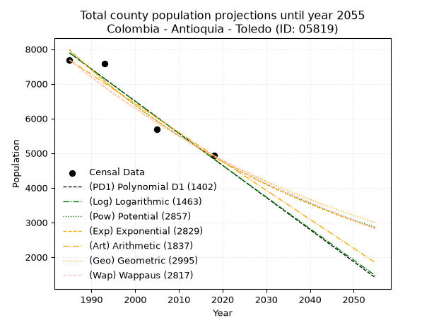
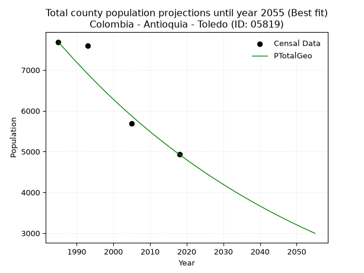
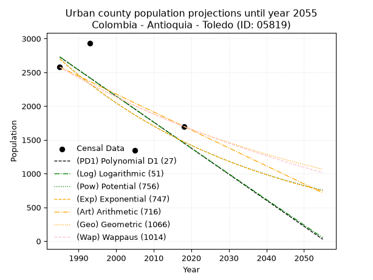
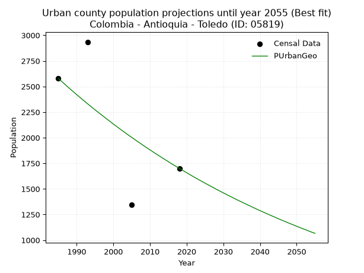
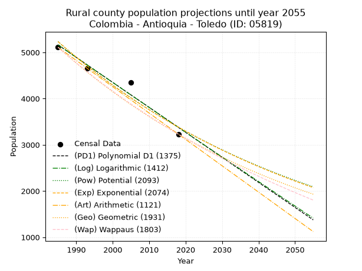
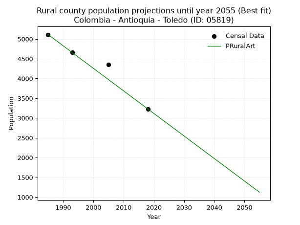

<div align="center">


</div>

# 📜 _“Population and Public Services Demand Projections (PPSD) until Year 2050 for Colombia - Antioquia - Toledo (ID: 05819)”_
Keywords: `population` `public-service` `projection` `lineal` `polynomial` `logarithmic` `potential` `exponential` `arithmetic` `geometric` `wappaus` `dane` `colombia` `south-america`

PPSD are analytical estimates used by governments and planners to anticipate future changes in population size, age distribution, and the resulting community needs for utilities, healthcare, education, and infrastructure as sizing future water treatment facilities, electrical grids, and road networks based on spatial growth.

<div align="center">

</img>

</div>


> **General running parameters**: • app_version: _v20260806_. • Python version: _3.14.7_. • Pandas version: _3.0.5_. • NumPy version: _2.5.1_. • Creates, save and include plots into reports (create_plot): _False_. • Projection until year: _2050_. • Process polynomial degree 2 and up: _False_. • Process Wappaus: _True_. • Process Wappaus: _True_. • Set negative values to zero: _True_. • Set infinite values to zero: _True_. • Drop dataset notes: _True_. 
<div align="center">

Dynamic map: [:earth_americas:Google](http://maps.google.com/maps?q=7.01032815,-75.6922809) [:earth_americas:OSM](https://www.openstreetmap.org/#map=18/7.01032815/-75.6922809&layers=P) [:earth_americas:Bing](https://www.bing.com/maps?cp=7.01032815~-75.6922809&lvl=18) [:earth_americas:Apple](https://maps.apple.com/frame?center=7.01032815%2C-75.6922809&span=0.003%2C0.006)

</div>


<div align="center">

```geojson
{
  "type": "Feature",
  "geometry": {
    "type": "Point", 
    "coordinates": [-75.6922809, 7.01032815]
  }, 
  "properties": {
    "Name": "Colombia - Antioquia - Toledo (ID: 05819)"
  }
}
```

</div>


## 0. Census Data (4 records)

Census data are official statistics collected by a government about the people and housing in a country. They usually include counts of total population, age, sex, race, income, education, and jobs.

📅Global census file: [Population.xlsx](../data/Population.xlsx)

| Source   |   Year |   CountryID | CountryName   |   StateID | StateName   |   CountyID | CountyName   |   PTotal |   PUrban |   PRural |
|:---------|-------:|------------:|:--------------|----------:|:------------|-----------:|:-------------|---------:|---------:|---------:|
| DANE     |   1985 |          57 | Colombia      |        05 | Antioquia   |      05819 | Toledo       |     7689 |     2578 |     5111 |
| DANE     |   1993 |          57 | Colombia      |        05 | Antioquia   |      05819 | Toledo       |     7591 |     2935 |     4656 |
| DANE     |   2005 |          57 | Colombia      |        05 | Antioquia   |      05819 | Toledo       |     5697 |     1345 |     4352 |
| DANE     |   2018 |          57 | Colombia      |        05 | Antioquia   |      05819 | Toledo       |     4930 |     1700 |     3230 |

> 🔥Some records could had specific notes about the registered values or the corresponding urban or rural distribution.

📅[SUI-RUPS](https://www.datos.gov.co/Hacienda-y-Cr-dito-P-blico/Registro-nico-de-Prestadores-de-Servicios-P-blicos/4qkq-csdn/about_data) - Local public utility companies: [RUPS.csv](../data/RUPS.xlsx)

 | SERVICIO       | ESTADO    | NOMBRE                                                                              | NIT         | DEPARTAMENTO_DOMICILIO   | MUNICIPIO_DOMICILIO   | DIRECCION           |   TELEFONO | EMAIL                                     | TIPO_PRESTADOR                 | CLASIFICACION                 |
|:---------------|:----------|:------------------------------------------------------------------------------------|:------------|:-------------------------|:----------------------|:--------------------|-----------:|:------------------------------------------|:-------------------------------|:------------------------------|
| ACUEDUCTO      | OPERATIVA | UNIDAD DE SERVICIOS PUBLICOS DOMICILIARIOS E.S.P. DEL MUNICIPIO DE TOLEDO ANTIOQUIA | 890981367-5 | ANTIOQUIA                | TOLEDO                | CARRERA 10 No 10-30 |    8619020 | serviciospublicos@toledo-antioquia.gov.co | MUNICIPIO (PRESTACIÓN DIRECTA) | MENOR O IGUAL A 2500 USUARIOS |
| ALCANTARILLADO | OPERATIVA | UNIDAD DE SERVICIOS PUBLICOS DOMICILIARIOS E.S.P. DEL MUNICIPIO DE TOLEDO ANTIOQUIA | 890981367-5 | ANTIOQUIA                | TOLEDO                | CARRERA 10 No 10-30 |    8619020 | serviciospublicos@toledo-antioquia.gov.co | MUNICIPIO (PRESTACIÓN DIRECTA) | MENOR O IGUAL A 2500 USUARIOS |

## 1. Total

### 1.1. Coefficients and Parameters

* (PD1) Polynomial Deg 1: -92.69169008430293, 191883.30309112696 (lineal)
* (Log) Logarithmic: -185533.18046874856, 1416715.9415125574
* (Pow) Potential: -29.63285850061038, 101.62397868023595
* (Exp) Exponential: -0.014805800390892474, 4.628367517305812e+16
* (Art) Arithmetic: Year diff. 2018 - 1985 = 33, Population diff. 4930 - 7689 = -2759, Annual growth = -83.60606060606061
* (Geo) Geometric: Year diff. 2018 - 1985 = 33, Population diff. 4930 - 7689 = -2759, Annual growth % = -0.013377943920996116
* (Wap) Wappaus: i = -1.32508218727412, Condition values only valid for < 200)

<sub>
Wappaus condition values: ['-0.00', '-1.33', '-2.65', '-3.98', '-5.30', '-6.63', '-7.95', '-9.28', '-10.60', '-11.93', '-13.25', '-14.58', '-15.90', '-17.23', '-18.55', '-19.88', '-21.20', '-22.53', '-23.85', '-25.18', '-26.50', '-27.83', '-29.15', '-30.48', '-31.80', '-33.13', '-34.45', '-35.78', '-37.10', '-38.43', '-39.75', '-41.08', '-42.40', '-43.73', '-45.05', '-46.38', '-47.70', '-49.03', '-50.35', '-51.68', '-53.00', '-54.33', '-55.65', '-56.98', '-58.30', '-59.63', '-60.95', '-62.28', '-63.60', '-64.93', '-66.25', '-67.58', '-68.90', '-70.23', '-71.55', '-72.88', '-74.20', '-75.53', '-76.85', '-78.18', '-79.50', '-80.83', '-82.16', '-83.48', '-84.81', '-86.13']
</sub>


### 1.2. Projected Dataset

|   Year |   CountyID |   PTotalPD1 |   PTotalLog |   PTotalPow |   PTotalExp |   PTotalArt |   PTotalGeo |   PTotalWap |
|-------:|-----------:|------------:|------------:|------------:|------------:|------------:|------------:|------------:|
|   1985 |      05819 |        7890 |        7893 |        7978 |        7975 |        7689 |        7689 |        7689 |
|   1986 |      05819 |        7798 |        7800 |        7860 |        7858 |        7605 |        7586 |        7588 |
|   1987 |      05819 |        7705 |        7706 |        7744 |        7742 |        7522 |        7485 |        7488 |
|   1988 |      05819 |        7612 |        7613 |        7629 |        7628 |        7438 |        7385 |        7389 |
|   1989 |      05819 |        7520 |        7520 |        7516 |        7516 |        7355 |        7286 |        7292 |
|   1990 |      05819 |        7427 |        7426 |        7405 |        7406 |        7271 |        7188 |        7196 |
|   1991 |      05819 |        7334 |        7333 |        7296 |        7297 |        7187 |        7092 |        7101 |
|   1992 |      05819 |        7241 |        7240 |        7188 |        7190 |        7104 |        6997 |        7007 |
|   1993 |      05819 |        7149 |        7147 |        7082 |        7084 |        7020 |        6904 |        6915 |
|   1994 |      05819 |        7056 |        7054 |        6977 |        6980 |        6937 |        6811 |        6824 |
|   1995 |      05819 |        6963 |        6961 |        6874 |        6877 |        6853 |        6720 |        6733 |
|   1996 |      05819 |        6871 |        6868 |        6773 |        6776 |        6769 |        6630 |        6644 |
|   1997 |      05819 |        6778 |        6775 |        6673 |        6677 |        6686 |        6542 |        6556 |
|   1998 |      05819 |        6685 |        6682 |        6575 |        6579 |        6602 |        6454 |        6470 |
|   1999 |      05819 |        6593 |        6589 |        6478 |        6482 |        6519 |        6368 |        6384 |
|   2000 |      05819 |        6500 |        6496 |        6383 |        6387 |        6435 |        6282 |        6299 |
|   2001 |      05819 |        6407 |        6404 |        6289 |        6293 |        6351 |        6198 |        6215 |
|   2002 |      05819 |        6315 |        6311 |        6197 |        6200 |        6268 |        6116 |        6132 |
|   2003 |      05819 |        6222 |        6218 |        6106 |        6109 |        6184 |        6034 |        6050 |
|   2004 |      05819 |        6129 |        6126 |        6016 |        6019 |        6100 |        5953 |        5970 |
|   2005 |      05819 |        6036 |        6033 |        5928 |        5931 |        6017 |        5873 |        5890 |
|   2006 |      05819 |        5944 |        5941 |        5841 |        5844 |        5933 |        5795 |        5811 |
|   2007 |      05819 |        5851 |        5848 |        5755 |        5758 |        5850 |        5717 |        5733 |
|   2008 |      05819 |        5758 |        5756 |        5671 |        5673 |        5766 |        5641 |        5656 |
|   2009 |      05819 |        5666 |        5663 |        5588 |        5590 |        5682 |        5565 |        5579 |
|   2010 |      05819 |        5573 |        5571 |        5506 |        5508 |        5599 |        5491 |        5504 |
|   2011 |      05819 |        5480 |        5479 |        5425 |        5427 |        5515 |        5417 |        5429 |
|   2012 |      05819 |        5388 |        5386 |        5346 |        5347 |        5432 |        5345 |        5356 |
|   2013 |      05819 |        5295 |        5294 |        5268 |        5268 |        5348 |        5273 |        5283 |
|   2014 |      05819 |        5202 |        5202 |        5191 |        5191 |        5264 |        5203 |        5211 |
|   2015 |      05819 |        5110 |        5110 |        5115 |        5115 |        5181 |        5133 |        5139 |
|   2016 |      05819 |        5017 |        5018 |        5041 |        5040 |        5097 |        5065 |        5069 |
|   2017 |      05819 |        4924 |        4926 |        4967 |        4965 |        5014 |        4997 |        4999 |
|   2018 |      05819 |        4831 |        4834 |        4895 |        4893 |        4930 |        4930 |        4930 |
|   2019 |      05819 |        4739 |        4742 |        4823 |        4821 |        4846 |        4864 |        4862 |
|   2020 |      05819 |        4646 |        4650 |        4753 |        4750 |        4763 |        4799 |        4794 |
|   2021 |      05819 |        4553 |        4558 |        4684 |        4680 |        4679 |        4735 |        4727 |
|   2022 |      05819 |        4461 |        4467 |        4616 |        4611 |        4596 |        4671 |        4661 |
|   2023 |      05819 |        4368 |        4375 |        4549 |        4543 |        4512 |        4609 |        4596 |
|   2024 |      05819 |        4275 |        4283 |        4482 |        4477 |        4428 |        4547 |        4531 |
|   2025 |      05819 |        4183 |        4192 |        4417 |        4411 |        4345 |        4486 |        4467 |
|   2026 |      05819 |        4090 |        4100 |        4353 |        4346 |        4261 |        4426 |        4404 |
|   2027 |      05819 |        3997 |        4008 |        4290 |        4282 |        4178 |        4367 |        4341 |
|   2028 |      05819 |        3905 |        3917 |        4228 |        4219 |        4094 |        4309 |        4279 |
|   2029 |      05819 |        3812 |        3825 |        4166 |        4157 |        4010 |        4251 |        4218 |
|   2030 |      05819 |        3719 |        3734 |        4106 |        4096 |        3927 |        4194 |        4157 |
|   2031 |      05819 |        3626 |        3643 |        4046 |        4036 |        3843 |        4138 |        4097 |
|   2032 |      05819 |        3534 |        3551 |        3988 |        3977 |        3760 |        4083 |        4037 |
|   2033 |      05819 |        3441 |        3460 |        3930 |        3918 |        3676 |        4028 |        3979 |
|   2034 |      05819 |        3348 |        3369 |        3873 |        3861 |        3592 |        3974 |        3920 |
|   2035 |      05819 |        3256 |        3278 |        3817 |        3804 |        3509 |        3921 |        3862 |
|   2036 |      05819 |        3163 |        3186 |        3762 |        3748 |        3425 |        3869 |        3805 |
|   2037 |      05819 |        3070 |        3095 |        3708 |        3693 |        3341 |        3817 |        3749 |
|   2038 |      05819 |        2978 |        3004 |        3654 |        3639 |        3258 |        3766 |        3692 |
|   2039 |      05819 |        2885 |        2913 |        3602 |        3585 |        3174 |        3715 |        3637 |
|   2040 |      05819 |        2792 |        2822 |        3550 |        3532 |        3091 |        3666 |        3582 |
|   2041 |      05819 |        2700 |        2731 |        3498 |        3480 |        3007 |        3617 |        3527 |
|   2042 |      05819 |        2607 |        2640 |        3448 |        3429 |        2923 |        3568 |        3473 |
|   2043 |      05819 |        2514 |        2550 |        3398 |        3379 |        2840 |        3521 |        3420 |
|   2044 |      05819 |        2421 |        2459 |        3349 |        3329 |        2756 |        3474 |        3367 |
|   2045 |      05819 |        2329 |        2368 |        3301 |        3280 |        2673 |        3427 |        3315 |
|   2046 |      05819 |        2236 |        2277 |        3254 |        3232 |        2589 |        3381 |        3263 |
|   2047 |      05819 |        2143 |        2187 |        3207 |        3185 |        2505 |        3336 |        3211 |
|   2048 |      05819 |        2051 |        2096 |        3161 |        3138 |        2422 |        3291 |        3160 |
|   2049 |      05819 |        1958 |        2006 |        3115 |        3092 |        2338 |        3247 |        3110 |
|   2050 |      05819 |        1865 |        1915 |        3071 |        3046 |        2255 |        3204 |        3060 |
<div align="center">

</img>

</div>


### 1.3. Best fit with absolute and relative error (%)

Relative error puts that difference into context by dividing the absolute error by the true value, creating a unitless ratio or percentage that shows the scale of the mistake.

Absolute and relative error

|   Year | Source   |   CountryID | CountryName   |   StateID | StateName   |   CountyID_x | CountyName   |   PTotal |   PUrban |   PRural |   CountyID_y |   PTotalPD1 |   PTotalLog |   PTotalPow |   PTotalExp |   PTotalArt |   PTotalGeo |   PTotalWap |   PTotalPD1AbsError |   PTotalLogAbsError |   PTotalPowAbsError |   PTotalExpAbsError |   PTotalArtAbsError |   PTotalGeoAbsError |   PTotalWapAbsError |   PTotalPD1RelError |   PTotalLogRelError |   PTotalPowRelError |   PTotalExpRelError |   PTotalArtRelError |   PTotalGeoRelError |   PTotalWapRelError |
|-------:|:---------|------------:|:--------------|----------:|:------------|-------------:|:-------------|---------:|---------:|---------:|-------------:|------------:|------------:|------------:|------------:|------------:|------------:|------------:|--------------------:|--------------------:|--------------------:|--------------------:|--------------------:|--------------------:|--------------------:|--------------------:|--------------------:|--------------------:|--------------------:|--------------------:|--------------------:|--------------------:|
|   1985 | DANE     |          57 | Colombia      |        05 | Antioquia   |        05819 | Toledo       |     7689 |     2578 |     5111 |        05819 |        7890 |        7893 |        7978 |        7975 |        7689 |        7689 |        7689 |                 201 |                 204 |                 289 |                 286 |                   0 |                   0 |                   0 |             2.61412 |             2.65314 |            3.75862  |            3.7196   |             0       |             0       |             0       |
|   1993 | DANE     |          57 | Colombia      |        05 | Antioquia   |        05819 | Toledo       |     7591 |     2935 |     4656 |        05819 |        7149 |        7147 |        7082 |        7084 |        7020 |        6904 |        6915 |                 442 |                 444 |                 509 |                 507 |                 571 |                 687 |                 676 |             5.82268 |             5.84903 |            6.70531  |            6.67896  |             7.52207 |             9.05019 |             8.90528 |
|   2005 | DANE     |          57 | Colombia      |        05 | Antioquia   |        05819 | Toledo       |     5697 |     1345 |     4352 |        05819 |        6036 |        6033 |        5928 |        5931 |        6017 |        5873 |        5890 |                 339 |                 336 |                 231 |                 234 |                 320 |                 176 |                 193 |             5.9505  |             5.89784 |            4.05477  |            4.10742  |             5.61699 |             3.08935 |             3.38775 |
|   2018 | DANE     |          57 | Colombia      |        05 | Antioquia   |        05819 | Toledo       |     4930 |     1700 |     3230 |        05819 |        4831 |        4834 |        4895 |        4893 |        4930 |        4930 |        4930 |                  99 |                  96 |                  35 |                  37 |                   0 |                   0 |                   0 |             2.00811 |             1.94726 |            0.709939 |            0.750507 |             0       |             0       |             0       |

Relative error mean

| Method    |   RelError | Best   |
|:----------|-----------:|:-------|
| PTotalPD1 |    4.09886 |        |
| PTotalLog |    4.08682 |        |
| PTotalPow |    3.80716 |        |
| PTotalExp |    3.81412 |        |
| PTotalArt |    3.28476 |        |
| PTotalGeo |    3.03488 | True   |
| PTotalWap |    3.07326 |        |

💙Best method: _**PTotalGeo**_
<div align="center">

</img>

</div>


### 1.4. Fresh water supply demand in liters per capita per day (lpcd)

The fresh water supply demand typically ranges from 100 to 300 liters per capita per day (lpcd) for standard domestic and municipal planning, though absolute survival minimums set by the World Health Organization are as low as 7.5 to 20 liters per day, and total consumption in high-income nations can exceed 400 liters.

> `CZ`: Level in meters above the sea level (masl)<br> `WS`: Fresh water supply demand in liters per capita per day (lpcd or l/h/d)<br> `WSAll`: Zonal fresh water supply demand in liters per second (l/s)<br> `A`: Zonal area in square meters<br> `DP`: Population density (people/hectare or p/ha)

Reference values (RAS Colombia)

|    CZ |   WS |
|------:|-----:|
|  1000 |  120 |
|  2000 |  130 |
| 99999 |  140 |

County shapefile geometry properties and water supply values

|   CountyID |      ATotal |   CZTotal |   WSTotal |
|-----------:|------------:|----------:|----------:|
|      05819 | 1.34418e+08 |   1319.06 |       130 |

Projected values for best method: PTotalGeo

|   CountyID |   Year |   PTotalGeo |   DPTotal |   WSTotal |   WSTotalAll |
|-----------:|-------:|------------:|----------:|----------:|-------------:|
|      05819 |   1985 |        7689 |      0.57 |       130 |     11.5691  |
|      05819 |   1986 |        7586 |      0.56 |       130 |     11.4141  |
|      05819 |   1987 |        7485 |      0.56 |       130 |     11.2622  |
|      05819 |   1988 |        7385 |      0.55 |       130 |     11.1117  |
|      05819 |   1989 |        7286 |      0.54 |       130 |     10.9627  |
|      05819 |   1990 |        7188 |      0.53 |       130 |     10.8153  |
|      05819 |   1991 |        7092 |      0.53 |       130 |     10.6708  |
|      05819 |   1992 |        6997 |      0.52 |       130 |     10.5279  |
|      05819 |   1993 |        6904 |      0.51 |       130 |     10.388   |
|      05819 |   1994 |        6811 |      0.51 |       130 |     10.248   |
|      05819 |   1995 |        6720 |      0.5  |       130 |     10.1111  |
|      05819 |   1996 |        6630 |      0.49 |       130 |      9.97569 |
|      05819 |   1997 |        6542 |      0.49 |       130 |      9.84329 |
|      05819 |   1998 |        6454 |      0.48 |       130 |      9.71088 |
|      05819 |   1999 |        6368 |      0.47 |       130 |      9.58148 |
|      05819 |   2000 |        6282 |      0.47 |       130 |      9.45208 |
|      05819 |   2001 |        6198 |      0.46 |       130 |      9.32569 |
|      05819 |   2002 |        6116 |      0.46 |       130 |      9.20231 |
|      05819 |   2003 |        6034 |      0.45 |       130 |      9.07894 |
|      05819 |   2004 |        5953 |      0.44 |       130 |      8.95706 |
|      05819 |   2005 |        5873 |      0.44 |       130 |      8.83669 |
|      05819 |   2006 |        5795 |      0.43 |       130 |      8.71933 |
|      05819 |   2007 |        5717 |      0.43 |       130 |      8.60197 |
|      05819 |   2008 |        5641 |      0.42 |       130 |      8.48762 |
|      05819 |   2009 |        5565 |      0.41 |       130 |      8.37326 |
|      05819 |   2010 |        5491 |      0.41 |       130 |      8.26192 |
|      05819 |   2011 |        5417 |      0.4  |       130 |      8.15058 |
|      05819 |   2012 |        5345 |      0.4  |       130 |      8.04225 |
|      05819 |   2013 |        5273 |      0.39 |       130 |      7.93391 |
|      05819 |   2014 |        5203 |      0.39 |       130 |      7.82859 |
|      05819 |   2015 |        5133 |      0.38 |       130 |      7.72326 |
|      05819 |   2016 |        5065 |      0.38 |       130 |      7.62095 |
|      05819 |   2017 |        4997 |      0.37 |       130 |      7.51863 |
|      05819 |   2018 |        4930 |      0.37 |       130 |      7.41782 |
|      05819 |   2019 |        4864 |      0.36 |       130 |      7.31852 |
|      05819 |   2020 |        4799 |      0.36 |       130 |      7.22072 |
|      05819 |   2021 |        4735 |      0.35 |       130 |      7.12442 |
|      05819 |   2022 |        4671 |      0.35 |       130 |      7.02813 |
|      05819 |   2023 |        4609 |      0.34 |       130 |      6.93484 |
|      05819 |   2024 |        4547 |      0.34 |       130 |      6.84155 |
|      05819 |   2025 |        4486 |      0.33 |       130 |      6.74977 |
|      05819 |   2026 |        4426 |      0.33 |       130 |      6.65949 |
|      05819 |   2027 |        4367 |      0.32 |       130 |      6.57072 |
|      05819 |   2028 |        4309 |      0.32 |       130 |      6.48345 |
|      05819 |   2029 |        4251 |      0.32 |       130 |      6.39618 |
|      05819 |   2030 |        4194 |      0.31 |       130 |      6.31042 |
|      05819 |   2031 |        4138 |      0.31 |       130 |      6.22616 |
|      05819 |   2032 |        4083 |      0.3  |       130 |      6.1434  |
|      05819 |   2033 |        4028 |      0.3  |       130 |      6.06065 |
|      05819 |   2034 |        3974 |      0.3  |       130 |      5.9794  |
|      05819 |   2035 |        3921 |      0.29 |       130 |      5.89965 |
|      05819 |   2036 |        3869 |      0.29 |       130 |      5.82141 |
|      05819 |   2037 |        3817 |      0.28 |       130 |      5.74317 |
|      05819 |   2038 |        3766 |      0.28 |       130 |      5.66644 |
|      05819 |   2039 |        3715 |      0.28 |       130 |      5.5897  |
|      05819 |   2040 |        3666 |      0.27 |       130 |      5.51597 |
|      05819 |   2041 |        3617 |      0.27 |       130 |      5.44225 |
|      05819 |   2042 |        3568 |      0.27 |       130 |      5.36852 |
|      05819 |   2043 |        3521 |      0.26 |       130 |      5.2978  |
|      05819 |   2044 |        3474 |      0.26 |       130 |      5.22708 |
|      05819 |   2045 |        3427 |      0.25 |       130 |      5.15637 |
|      05819 |   2046 |        3381 |      0.25 |       130 |      5.08715 |
|      05819 |   2047 |        3336 |      0.25 |       130 |      5.01944 |
|      05819 |   2048 |        3291 |      0.24 |       130 |      4.95174 |
|      05819 |   2049 |        3247 |      0.24 |       130 |      4.88553 |
|      05819 |   2050 |        3204 |      0.24 |       130 |      4.82083 |

## 2. Urban

### 2.1. Coefficients and Parameters

* (PD1) Polynomial Deg 1: -38.58610999598566, 79321.36651947032 (lineal)
* (Log) Logarithmic: -77279.15745753008, 589538.9951109887
* (Pow) Potential: -36.74222917537471, 124.59840049045762
* (Exp) Exponential: -0.01834053482425625, 1.7453920480542765e+19
* (Art) Arithmetic: Year diff. 2018 - 1985 = 33, Population diff. 1700 - 2578 = -878, Annual growth = -26.606060606060606
* (Geo) Geometric: Year diff. 2018 - 1985 = 33, Population diff. 1700 - 2578 = -878, Annual growth % = -0.0125384770570528
* (Wap) Wappaus: i = -1.2438551007975973, Condition values only valid for < 200)

<sub>
Wappaus condition values: ['-0.00', '-1.24', '-2.49', '-3.73', '-4.98', '-6.22', '-7.46', '-8.71', '-9.95', '-11.19', '-12.44', '-13.68', '-14.93', '-16.17', '-17.41', '-18.66', '-19.90', '-21.15', '-22.39', '-23.63', '-24.88', '-26.12', '-27.36', '-28.61', '-29.85', '-31.10', '-32.34', '-33.58', '-34.83', '-36.07', '-37.32', '-38.56', '-39.80', '-41.05', '-42.29', '-43.53', '-44.78', '-46.02', '-47.27', '-48.51', '-49.75', '-51.00', '-52.24', '-53.49', '-54.73', '-55.97', '-57.22', '-58.46', '-59.71', '-60.95', '-62.19', '-63.44', '-64.68', '-65.92', '-67.17', '-68.41', '-69.66', '-70.90', '-72.14', '-73.39', '-74.63', '-75.88', '-77.12', '-78.36', '-79.61', '-80.85']
</sub>


### 2.2. Projected Dataset

|   Year |   CountyID |   PUrbanPD1 |   PUrbanLog |   PUrbanPow |   PUrbanExp |   PUrbanArt |   PUrbanGeo |   PUrbanWap |
|-------:|-----------:|------------:|------------:|------------:|------------:|------------:|------------:|------------:|
|   1985 |      05819 |        2728 |        2729 |        2700 |        2698 |        2578 |        2578 |        2578 |
|   1986 |      05819 |        2689 |        2691 |        2650 |        2649 |        2551 |        2546 |        2546 |
|   1987 |      05819 |        2651 |        2652 |        2602 |        2600 |        2525 |        2514 |        2515 |
|   1988 |      05819 |        2612 |        2613 |        2554 |        2553 |        2498 |        2482 |        2484 |
|   1989 |      05819 |        2574 |        2574 |        2507 |        2507 |        2472 |        2451 |        2453 |
|   1990 |      05819 |        2535 |        2535 |        2461 |        2461 |        2445 |        2420 |        2423 |
|   1991 |      05819 |        2496 |        2496 |        2416 |        2417 |        2418 |        2390 |        2393 |
|   1992 |      05819 |        2458 |        2457 |        2372 |        2373 |        2392 |        2360 |        2363 |
|   1993 |      05819 |        2419 |        2419 |        2329 |        2330 |        2365 |        2330 |        2334 |
|   1994 |      05819 |        2381 |        2380 |        2286 |        2287 |        2339 |        2301 |        2305 |
|   1995 |      05819 |        2342 |        2341 |        2245 |        2246 |        2312 |        2272 |        2276 |
|   1996 |      05819 |        2303 |        2302 |        2204 |        2205 |        2285 |        2244 |        2248 |
|   1997 |      05819 |        2265 |        2264 |        2163 |        2165 |        2259 |        2216 |        2220 |
|   1998 |      05819 |        2226 |        2225 |        2124 |        2125 |        2232 |        2188 |        2192 |
|   1999 |      05819 |        2188 |        2186 |        2085 |        2087 |        2206 |        2161 |        2165 |
|   2000 |      05819 |        2149 |        2148 |        2047 |        2049 |        2179 |        2133 |        2138 |
|   2001 |      05819 |        2111 |        2109 |        2010 |        2012 |        2152 |        2107 |        2111 |
|   2002 |      05819 |        2072 |        2070 |        1974 |        1975 |        2126 |        2080 |        2085 |
|   2003 |      05819 |        2033 |        2032 |        1938 |        1939 |        2099 |        2054 |        2059 |
|   2004 |      05819 |        1995 |        1993 |        1902 |        1904 |        2072 |        2028 |        2033 |
|   2005 |      05819 |        1956 |        1955 |        1868 |        1869 |        2046 |        2003 |        2008 |
|   2006 |      05819 |        1918 |        1916 |        1834 |        1835 |        2019 |        1978 |        1982 |
|   2007 |      05819 |        1879 |        1878 |        1801 |        1802 |        1993 |        1953 |        1957 |
|   2008 |      05819 |        1840 |        1839 |        1768 |        1769 |        1966 |        1929 |        1933 |
|   2009 |      05819 |        1802 |        1801 |        1736 |        1737 |        1939 |        1904 |        1908 |
|   2010 |      05819 |        1763 |        1762 |        1705 |        1706 |        1913 |        1881 |        1884 |
|   2011 |      05819 |        1725 |        1724 |        1674 |        1675 |        1886 |        1857 |        1860 |
|   2012 |      05819 |        1686 |        1685 |        1643 |        1644 |        1860 |        1834 |        1837 |
|   2013 |      05819 |        1648 |        1647 |        1614 |        1614 |        1833 |        1811 |        1813 |
|   2014 |      05819 |        1609 |        1609 |        1584 |        1585 |        1806 |        1788 |        1790 |
|   2015 |      05819 |        1570 |        1570 |        1556 |        1556 |        1780 |        1766 |        1767 |
|   2016 |      05819 |        1532 |        1532 |        1528 |        1528 |        1753 |        1743 |        1745 |
|   2017 |      05819 |        1493 |        1494 |        1500 |        1500 |        1727 |        1722 |        1722 |
|   2018 |      05819 |        1455 |        1455 |        1473 |        1473 |        1700 |        1700 |        1700 |
|   2019 |      05819 |        1416 |        1417 |        1447 |        1446 |        1673 |        1679 |        1678 |
|   2020 |      05819 |        1377 |        1379 |        1420 |        1420 |        1647 |        1658 |        1656 |
|   2021 |      05819 |        1339 |        1340 |        1395 |        1394 |        1620 |        1637 |        1635 |
|   2022 |      05819 |        1300 |        1302 |        1370 |        1369 |        1594 |        1616 |        1613 |
|   2023 |      05819 |        1262 |        1264 |        1345 |        1344 |        1567 |        1596 |        1592 |
|   2024 |      05819 |        1223 |        1226 |        1321 |        1319 |        1540 |        1576 |        1572 |
|   2025 |      05819 |        1184 |        1188 |        1297 |        1295 |        1514 |        1556 |        1551 |
|   2026 |      05819 |        1146 |        1150 |        1274 |        1272 |        1487 |        1537 |        1530 |
|   2027 |      05819 |        1107 |        1111 |        1251 |        1249 |        1461 |        1518 |        1510 |
|   2028 |      05819 |        1069 |        1073 |        1228 |        1226 |        1434 |        1498 |        1490 |
|   2029 |      05819 |        1030 |        1035 |        1206 |        1204 |        1407 |        1480 |        1470 |
|   2030 |      05819 |         992 |         997 |        1185 |        1182 |        1381 |        1461 |        1451 |
|   2031 |      05819 |         953 |         959 |        1163 |        1160 |        1354 |        1443 |        1431 |
|   2032 |      05819 |         914 |         921 |        1143 |        1139 |        1328 |        1425 |        1412 |
|   2033 |      05819 |         876 |         883 |        1122 |        1119 |        1301 |        1407 |        1393 |
|   2034 |      05819 |         837 |         845 |        1102 |        1098 |        1274 |        1389 |        1374 |
|   2035 |      05819 |         799 |         807 |        1082 |        1078 |        1248 |        1372 |        1355 |
|   2036 |      05819 |         760 |         769 |        1063 |        1059 |        1221 |        1355 |        1336 |
|   2037 |      05819 |         721 |         731 |        1044 |        1039 |        1194 |        1338 |        1318 |
|   2038 |      05819 |         683 |         693 |        1025 |        1021 |        1168 |        1321 |        1300 |
|   2039 |      05819 |         644 |         655 |        1007 |        1002 |        1141 |        1304 |        1282 |
|   2040 |      05819 |         606 |         617 |         989 |         984 |        1115 |        1288 |        1264 |
|   2041 |      05819 |         567 |         579 |         971 |         966 |        1088 |        1272 |        1246 |
|   2042 |      05819 |         529 |         542 |         954 |         948 |        1061 |        1256 |        1229 |
|   2043 |      05819 |         490 |         504 |         937 |         931 |        1035 |        1240 |        1211 |
|   2044 |      05819 |         451 |         466 |         920 |         914 |        1008 |        1225 |        1194 |
|   2045 |      05819 |         413 |         428 |         904 |         898 |         982 |        1209 |        1177 |
|   2046 |      05819 |         374 |         390 |         888 |         881 |         955 |        1194 |        1160 |
|   2047 |      05819 |         336 |         353 |         872 |         865 |         928 |        1179 |        1143 |
|   2048 |      05819 |         297 |         315 |         857 |         850 |         902 |        1164 |        1127 |
|   2049 |      05819 |         258 |         277 |         841 |         834 |         875 |        1150 |        1110 |
|   2050 |      05819 |         220 |         239 |         826 |         819 |         849 |        1135 |        1094 |
<div align="center">

</img>

</div>


### 2.3. Best fit with absolute and relative error (%)

Relative error puts that difference into context by dividing the absolute error by the true value, creating a unitless ratio or percentage that shows the scale of the mistake.

Absolute and relative error

|   Year | Source   |   CountryID | CountryName   |   StateID | StateName   |   CountyID_x | CountyName   |   PTotal |   PUrban |   PRural |   CountyID_y |   PUrbanPD1 |   PUrbanLog |   PUrbanPow |   PUrbanExp |   PUrbanArt |   PUrbanGeo |   PUrbanWap |   PUrbanPD1AbsError |   PUrbanLogAbsError |   PUrbanPowAbsError |   PUrbanExpAbsError |   PUrbanArtAbsError |   PUrbanGeoAbsError |   PUrbanWapAbsError |   PUrbanPD1RelError |   PUrbanLogRelError |   PUrbanPowRelError |   PUrbanExpRelError |   PUrbanArtRelError |   PUrbanGeoRelError |   PUrbanWapRelError |
|-------:|:---------|------------:|:--------------|----------:|:------------|-------------:|:-------------|---------:|---------:|---------:|-------------:|------------:|------------:|------------:|------------:|------------:|------------:|------------:|--------------------:|--------------------:|--------------------:|--------------------:|--------------------:|--------------------:|--------------------:|--------------------:|--------------------:|--------------------:|--------------------:|--------------------:|--------------------:|--------------------:|
|   1985 | DANE     |          57 | Colombia      |        05 | Antioquia   |        05819 | Toledo       |     7689 |     2578 |     5111 |        05819 |        2728 |        2729 |        2700 |        2698 |        2578 |        2578 |        2578 |                 150 |                 151 |                 122 |                 120 |                   0 |                   0 |                   0 |             5.81846 |             5.85725 |             4.73235 |             4.65477 |              0      |              0      |              0      |
|   1993 | DANE     |          57 | Colombia      |        05 | Antioquia   |        05819 | Toledo       |     7591 |     2935 |     4656 |        05819 |        2419 |        2419 |        2329 |        2330 |        2365 |        2330 |        2334 |                 516 |                 516 |                 606 |                 605 |                 570 |                 605 |                 601 |            17.5809  |            17.5809  |            20.6474  |            20.6133  |             19.4208 |             20.6133 |             20.477  |
|   2005 | DANE     |          57 | Colombia      |        05 | Antioquia   |        05819 | Toledo       |     5697 |     1345 |     4352 |        05819 |        1956 |        1955 |        1868 |        1869 |        2046 |        2003 |        2008 |                 611 |                 610 |                 523 |                 524 |                 701 |                 658 |                 663 |            45.4275  |            45.3532  |            38.8848  |            38.9591  |             52.119  |             48.9219 |             49.2937 |
|   2018 | DANE     |          57 | Colombia      |        05 | Antioquia   |        05819 | Toledo       |     4930 |     1700 |     3230 |        05819 |        1455 |        1455 |        1473 |        1473 |        1700 |        1700 |        1700 |                 245 |                 245 |                 227 |                 227 |                   0 |                   0 |                   0 |            14.4118  |            14.4118  |            13.3529  |            13.3529  |              0      |              0      |              0      |

Relative error mean

| Method    |   RelError | Best   |
|:----------|-----------:|:-------|
| PUrbanPD1 |    20.8097 |        |
| PUrbanLog |    20.8008 |        |
| PUrbanPow |    19.4044 |        |
| PUrbanExp |    19.395  |        |
| PUrbanArt |    17.8849 |        |
| PUrbanGeo |    17.3838 | True   |
| PUrbanWap |    17.4427 |        |

💙Best method: _**PUrbanGeo**_
<div align="center">

</img>

</div>


### 2.4. Fresh water supply demand in liters per capita per day (lpcd)

The fresh water supply demand typically ranges from 100 to 300 liters per capita per day (lpcd) for standard domestic and municipal planning, though absolute survival minimums set by the World Health Organization are as low as 7.5 to 20 liters per day, and total consumption in high-income nations can exceed 400 liters.

> `CZ`: Level in meters above the sea level (masl)<br> `WS`: Fresh water supply demand in liters per capita per day (lpcd or l/h/d)<br> `WSAll`: Zonal fresh water supply demand in liters per second (l/s)<br> `A`: Zonal area in square meters<br> `DP`: Population density (people/hectare or p/ha)

Reference values (RAS Colombia)

|    CZ |   WS |
|------:|-----:|
|  1000 |  120 |
|  2000 |  130 |
| 99999 |  140 |

County shapefile geometry properties and water supply values

|   CountyID |   AUrban |   CZUrban |   WSUrban |
|-----------:|---------:|----------:|----------:|
|      05819 |   272835 |   1823.21 |       130 |

Projected values for best method: PUrbanGeo

|   CountyID |   Year |   PUrbanGeo |   DPUrban |   WSUrban |   WSUrbanAll |
|-----------:|-------:|------------:|----------:|----------:|-------------:|
|      05819 |   1985 |        2578 |     94.49 |       130 |      3.87894 |
|      05819 |   1986 |        2546 |     93.32 |       130 |      3.83079 |
|      05819 |   1987 |        2514 |     92.14 |       130 |      3.78264 |
|      05819 |   1988 |        2482 |     90.97 |       130 |      3.73449 |
|      05819 |   1989 |        2451 |     89.83 |       130 |      3.68785 |
|      05819 |   1990 |        2420 |     88.7  |       130 |      3.6412  |
|      05819 |   1991 |        2390 |     87.6  |       130 |      3.59606 |
|      05819 |   1992 |        2360 |     86.5  |       130 |      3.55093 |
|      05819 |   1993 |        2330 |     85.4  |       130 |      3.50579 |
|      05819 |   1994 |        2301 |     84.34 |       130 |      3.46215 |
|      05819 |   1995 |        2272 |     83.27 |       130 |      3.41852 |
|      05819 |   1996 |        2244 |     82.25 |       130 |      3.37639 |
|      05819 |   1997 |        2216 |     81.22 |       130 |      3.33426 |
|      05819 |   1998 |        2188 |     80.19 |       130 |      3.29213 |
|      05819 |   1999 |        2161 |     79.21 |       130 |      3.2515  |
|      05819 |   2000 |        2133 |     78.18 |       130 |      3.20938 |
|      05819 |   2001 |        2107 |     77.23 |       130 |      3.17025 |
|      05819 |   2002 |        2080 |     76.24 |       130 |      3.12963 |
|      05819 |   2003 |        2054 |     75.28 |       130 |      3.09051 |
|      05819 |   2004 |        2028 |     74.33 |       130 |      3.05139 |
|      05819 |   2005 |        2003 |     73.41 |       130 |      3.01377 |
|      05819 |   2006 |        1978 |     72.5  |       130 |      2.97616 |
|      05819 |   2007 |        1953 |     71.58 |       130 |      2.93854 |
|      05819 |   2008 |        1929 |     70.7  |       130 |      2.90243 |
|      05819 |   2009 |        1904 |     69.79 |       130 |      2.86481 |
|      05819 |   2010 |        1881 |     68.94 |       130 |      2.83021 |
|      05819 |   2011 |        1857 |     68.06 |       130 |      2.7941  |
|      05819 |   2012 |        1834 |     67.22 |       130 |      2.75949 |
|      05819 |   2013 |        1811 |     66.38 |       130 |      2.72488 |
|      05819 |   2014 |        1788 |     65.53 |       130 |      2.69028 |
|      05819 |   2015 |        1766 |     64.73 |       130 |      2.65718 |
|      05819 |   2016 |        1743 |     63.88 |       130 |      2.62257 |
|      05819 |   2017 |        1722 |     63.12 |       130 |      2.59097 |
|      05819 |   2018 |        1700 |     62.31 |       130 |      2.55787 |
|      05819 |   2019 |        1679 |     61.54 |       130 |      2.52627 |
|      05819 |   2020 |        1658 |     60.77 |       130 |      2.49468 |
|      05819 |   2021 |        1637 |     60    |       130 |      2.46308 |
|      05819 |   2022 |        1616 |     59.23 |       130 |      2.43148 |
|      05819 |   2023 |        1596 |     58.5  |       130 |      2.40139 |
|      05819 |   2024 |        1576 |     57.76 |       130 |      2.3713  |
|      05819 |   2025 |        1556 |     57.03 |       130 |      2.3412  |
|      05819 |   2026 |        1537 |     56.33 |       130 |      2.31262 |
|      05819 |   2027 |        1518 |     55.64 |       130 |      2.28403 |
|      05819 |   2028 |        1498 |     54.9  |       130 |      2.25394 |
|      05819 |   2029 |        1480 |     54.25 |       130 |      2.22685 |
|      05819 |   2030 |        1461 |     53.55 |       130 |      2.19826 |
|      05819 |   2031 |        1443 |     52.89 |       130 |      2.17118 |
|      05819 |   2032 |        1425 |     52.23 |       130 |      2.1441  |
|      05819 |   2033 |        1407 |     51.57 |       130 |      2.11701 |
|      05819 |   2034 |        1389 |     50.91 |       130 |      2.08993 |
|      05819 |   2035 |        1372 |     50.29 |       130 |      2.06435 |
|      05819 |   2036 |        1355 |     49.66 |       130 |      2.03877 |
|      05819 |   2037 |        1338 |     49.04 |       130 |      2.01319 |
|      05819 |   2038 |        1321 |     48.42 |       130 |      1.98762 |
|      05819 |   2039 |        1304 |     47.79 |       130 |      1.96204 |
|      05819 |   2040 |        1288 |     47.21 |       130 |      1.93796 |
|      05819 |   2041 |        1272 |     46.62 |       130 |      1.91389 |
|      05819 |   2042 |        1256 |     46.04 |       130 |      1.88981 |
|      05819 |   2043 |        1240 |     45.45 |       130 |      1.86574 |
|      05819 |   2044 |        1225 |     44.9  |       130 |      1.84317 |
|      05819 |   2045 |        1209 |     44.31 |       130 |      1.8191  |
|      05819 |   2046 |        1194 |     43.76 |       130 |      1.79653 |
|      05819 |   2047 |        1179 |     43.21 |       130 |      1.77396 |
|      05819 |   2048 |        1164 |     42.66 |       130 |      1.75139 |
|      05819 |   2049 |        1150 |     42.15 |       130 |      1.73032 |
|      05819 |   2050 |        1135 |     41.6  |       130 |      1.70775 |

## 3. Rural

### 3.1. Coefficients and Parameters

* (PD1) Polynomial Deg 1: -54.105580088317204, 112561.93657165648 (lineal)
* (Log) Logarithmic: -108254.02301121838, 827176.946401568
* (Pow) Potential: -26.448299889700493, 90.93894626536687
* (Exp) Exponential: -0.013220930567734199, 1306448793329334.0
* (Art) Arithmetic: Year diff. 2018 - 1985 = 33, Population diff. 3230 - 5111 = -1881, Annual growth = -57.0
* (Geo) Geometric: Year diff. 2018 - 1985 = 33, Population diff. 3230 - 5111 = -1881, Annual growth % = -0.013810204762632172
* (Wap) Wappaus: i = -1.366742596810934, Condition values only valid for < 200)

<sub>
Wappaus condition values: ['-0.00', '-1.37', '-2.73', '-4.10', '-5.47', '-6.83', '-8.20', '-9.57', '-10.93', '-12.30', '-13.67', '-15.03', '-16.40', '-17.77', '-19.13', '-20.50', '-21.87', '-23.23', '-24.60', '-25.97', '-27.33', '-28.70', '-30.07', '-31.44', '-32.80', '-34.17', '-35.54', '-36.90', '-38.27', '-39.64', '-41.00', '-42.37', '-43.74', '-45.10', '-46.47', '-47.84', '-49.20', '-50.57', '-51.94', '-53.30', '-54.67', '-56.04', '-57.40', '-58.77', '-60.14', '-61.50', '-62.87', '-64.24', '-65.60', '-66.97', '-68.34', '-69.70', '-71.07', '-72.44', '-73.80', '-75.17', '-76.54', '-77.90', '-79.27', '-80.64', '-82.00', '-83.37', '-84.74', '-86.10', '-87.47', '-88.84']
</sub>


### 3.2. Projected Dataset

|   Year |   CountyID |   PRuralPD1 |   PRuralLog |   PRuralPow |   PRuralExp |   PRuralArt |   PRuralGeo |   PRuralWap |
|-------:|-----------:|------------:|------------:|------------:|------------:|------------:|------------:|------------:|
|   1985 |      05819 |        5162 |        5164 |        5233 |        5232 |        5111 |        5111 |        5111 |
|   1986 |      05819 |        5108 |        5109 |        5164 |        5163 |        5054 |        5040 |        5042 |
|   1987 |      05819 |        5054 |        5055 |        5096 |        5095 |        4997 |        4971 |        4973 |
|   1988 |      05819 |        5000 |        5000 |        5029 |        5029 |        4940 |        4902 |        4906 |
|   1989 |      05819 |        4946 |        4946 |        4962 |        4962 |        4883 |        4834 |        4839 |
|   1990 |      05819 |        4892 |        4891 |        4897 |        4897 |        4826 |        4768 |        4773 |
|   1991 |      05819 |        4838 |        4837 |        4832 |        4833 |        4769 |        4702 |        4708 |
|   1992 |      05819 |        4784 |        4783 |        4768 |        4769 |        4712 |        4637 |        4644 |
|   1993 |      05819 |        4730 |        4728 |        4705 |        4707 |        4655 |        4573 |        4581 |
|   1994 |      05819 |        4675 |        4674 |        4643 |        4645 |        4598 |        4510 |        4519 |
|   1995 |      05819 |        4621 |        4620 |        4582 |        4584 |        4541 |        4447 |        4457 |
|   1996 |      05819 |        4567 |        4565 |        4522 |        4524 |        4484 |        4386 |        4396 |
|   1997 |      05819 |        4513 |        4511 |        4462 |        4464 |        4427 |        4325 |        4336 |
|   1998 |      05819 |        4459 |        4457 |        4404 |        4406 |        4370 |        4266 |        4277 |
|   1999 |      05819 |        4405 |        4403 |        4346 |        4348 |        4313 |        4207 |        4218 |
|   2000 |      05819 |        4351 |        4349 |        4289 |        4291 |        4256 |        4149 |        4161 |
|   2001 |      05819 |        4297 |        4295 |        4232 |        4234 |        4199 |        4091 |        4103 |
|   2002 |      05819 |        4243 |        4240 |        4177 |        4179 |        4142 |        4035 |        4047 |
|   2003 |      05819 |        4188 |        4186 |        4122 |        4124 |        4085 |        3979 |        3991 |
|   2004 |      05819 |        4134 |        4132 |        4068 |        4070 |        4028 |        3924 |        3936 |
|   2005 |      05819 |        4080 |        4078 |        4015 |        4016 |        3971 |        3870 |        3882 |
|   2006 |      05819 |        4026 |        4024 |        3962 |        3964 |        3914 |        3817 |        3828 |
|   2007 |      05819 |        3972 |        3970 |        3910 |        3912 |        3857 |        3764 |        3775 |
|   2008 |      05819 |        3918 |        3917 |        3859 |        3860 |        3800 |        3712 |        3723 |
|   2009 |      05819 |        3864 |        3863 |        3808 |        3809 |        3743 |        3661 |        3671 |
|   2010 |      05819 |        3810 |        3809 |        3759 |        3759 |        3686 |        3610 |        3619 |
|   2011 |      05819 |        3756 |        3755 |        3709 |        3710 |        3629 |        3560 |        3569 |
|   2012 |      05819 |        3702 |        3701 |        3661 |        3661 |        3572 |        3511 |        3519 |
|   2013 |      05819 |        3647 |        3647 |        3613 |        3613 |        3515 |        3463 |        3469 |
|   2014 |      05819 |        3593 |        3594 |        3566 |        3566 |        3458 |        3415 |        3420 |
|   2015 |      05819 |        3539 |        3540 |        3520 |        3519 |        3401 |        3368 |        3372 |
|   2016 |      05819 |        3485 |        3486 |        3474 |        3473 |        3344 |        3321 |        3324 |
|   2017 |      05819 |        3431 |        3432 |        3428 |        3427 |        3287 |        3275 |        3277 |
|   2018 |      05819 |        3377 |        3379 |        3384 |        3382 |        3230 |        3230 |        3230 |
|   2019 |      05819 |        3323 |        3325 |        3340 |        3338 |        3173 |        3185 |        3184 |
|   2020 |      05819 |        3269 |        3272 |        3296 |        3294 |        3116 |        3141 |        3138 |
|   2021 |      05819 |        3215 |        3218 |        3253 |        3251 |        3059 |        3098 |        3093 |
|   2022 |      05819 |        3160 |        3164 |        3211 |        3208 |        3002 |        3055 |        3048 |
|   2023 |      05819 |        3106 |        3111 |        3169 |        3166 |        2945 |        3013 |        3004 |
|   2024 |      05819 |        3052 |        3057 |        3128 |        3124 |        2888 |        2971 |        2960 |
|   2025 |      05819 |        2998 |        3004 |        3088 |        3083 |        2831 |        2930 |        2917 |
|   2026 |      05819 |        2944 |        2950 |        3048 |        3043 |        2774 |        2890 |        2874 |
|   2027 |      05819 |        2890 |        2897 |        3008 |        3003 |        2717 |        2850 |        2831 |
|   2028 |      05819 |        2836 |        2844 |        2969 |        2963 |        2660 |        2811 |        2789 |
|   2029 |      05819 |        2782 |        2790 |        2931 |        2924 |        2603 |        2772 |        2748 |
|   2030 |      05819 |        2728 |        2737 |        2893 |        2886 |        2546 |        2734 |        2707 |
|   2031 |      05819 |        2674 |        2684 |        2855 |        2848 |        2489 |        2696 |        2666 |
|   2032 |      05819 |        2619 |        2630 |        2818 |        2811 |        2432 |        2659 |        2626 |
|   2033 |      05819 |        2565 |        2577 |        2782 |        2774 |        2375 |        2622 |        2586 |
|   2034 |      05819 |        2511 |        2524 |        2746 |        2737 |        2318 |        2586 |        2547 |
|   2035 |      05819 |        2457 |        2471 |        2710 |        2701 |        2261 |        2550 |        2508 |
|   2036 |      05819 |        2403 |        2417 |        2675 |        2666 |        2204 |        2515 |        2469 |
|   2037 |      05819 |        2349 |        2364 |        2641 |        2631 |        2147 |        2480 |        2431 |
|   2038 |      05819 |        2295 |        2311 |        2607 |        2596 |        2090 |        2446 |        2393 |
|   2039 |      05819 |        2241 |        2258 |        2573 |        2562 |        2033 |        2412 |        2356 |
|   2040 |      05819 |        2187 |        2205 |        2540 |        2529 |        1976 |        2379 |        2319 |
|   2041 |      05819 |        2132 |        2152 |        2507 |        2495 |        1919 |        2346 |        2282 |
|   2042 |      05819 |        2078 |        2099 |        2475 |        2463 |        1862 |        2313 |        2245 |
|   2043 |      05819 |        2024 |        2046 |        2443 |        2430 |        1805 |        2281 |        2209 |
|   2044 |      05819 |        1970 |        1993 |        2412 |        2398 |        1748 |        2250 |        2174 |
|   2045 |      05819 |        1916 |        1940 |        2381 |        2367 |        1691 |        2219 |        2139 |
|   2046 |      05819 |        1862 |        1887 |        2350 |        2336 |        1634 |        2188 |        2104 |
|   2047 |      05819 |        1808 |        1834 |        2320 |        2305 |        1577 |        2158 |        2069 |
|   2048 |      05819 |        1754 |        1781 |        2290 |        2275 |        1520 |        2128 |        2035 |
|   2049 |      05819 |        1700 |        1728 |        2261 |        2245 |        1463 |        2099 |        2001 |
|   2050 |      05819 |        1645 |        1676 |        2232 |        2215 |        1406 |        2070 |        1967 |
<div align="center">

</img>

</div>


### 3.3. Best fit with absolute and relative error (%)

Relative error puts that difference into context by dividing the absolute error by the true value, creating a unitless ratio or percentage that shows the scale of the mistake.

Absolute and relative error

|   Year | Source   |   CountryID | CountryName   |   StateID | StateName   |   CountyID_x | CountyName   |   PTotal |   PUrban |   PRural |   CountyID_y |   PRuralPD1 |   PRuralLog |   PRuralPow |   PRuralExp |   PRuralArt |   PRuralGeo |   PRuralWap |   PRuralPD1AbsError |   PRuralLogAbsError |   PRuralPowAbsError |   PRuralExpAbsError |   PRuralArtAbsError |   PRuralGeoAbsError |   PRuralWapAbsError |   PRuralPD1RelError |   PRuralLogRelError |   PRuralPowRelError |   PRuralExpRelError |   PRuralArtRelError |   PRuralGeoRelError |   PRuralWapRelError |
|-------:|:---------|------------:|:--------------|----------:|:------------|-------------:|:-------------|---------:|---------:|---------:|-------------:|------------:|------------:|------------:|------------:|------------:|------------:|------------:|--------------------:|--------------------:|--------------------:|--------------------:|--------------------:|--------------------:|--------------------:|--------------------:|--------------------:|--------------------:|--------------------:|--------------------:|--------------------:|--------------------:|
|   1985 | DANE     |          57 | Colombia      |        05 | Antioquia   |        05819 | Toledo       |     7689 |     2578 |     5111 |        05819 |        5162 |        5164 |        5233 |        5232 |        5111 |        5111 |        5111 |                  51 |                  53 |                 122 |                 121 |                   0 |                   0 |                   0 |            0.997848 |             1.03698 |             2.38701 |             2.36744 |           0         |             0       |             0       |
|   1993 | DANE     |          57 | Colombia      |        05 | Antioquia   |        05819 | Toledo       |     7591 |     2935 |     4656 |        05819 |        4730 |        4728 |        4705 |        4707 |        4655 |        4573 |        4581 |                  74 |                  72 |                  49 |                  51 |                   1 |                  83 |                  75 |            1.58935  |             1.54639 |             1.05241 |             1.09536 |           0.0214777 |             1.78265 |             1.61082 |
|   2005 | DANE     |          57 | Colombia      |        05 | Antioquia   |        05819 | Toledo       |     5697 |     1345 |     4352 |        05819 |        4080 |        4078 |        4015 |        4016 |        3971 |        3870 |        3882 |                 272 |                 274 |                 337 |                 336 |                 381 |                 482 |                 470 |            6.25     |             6.29596 |             7.74357 |             7.72059 |           8.7546    |            11.0754  |            10.7996  |
|   2018 | DANE     |          57 | Colombia      |        05 | Antioquia   |        05819 | Toledo       |     4930 |     1700 |     3230 |        05819 |        3377 |        3379 |        3384 |        3382 |        3230 |        3230 |        3230 |                 147 |                 149 |                 154 |                 152 |                   0 |                   0 |                   0 |            4.55108  |             4.613   |             4.7678  |             4.70588 |           0         |             0       |             0       |

Relative error mean

| Method    |   RelError | Best   |
|:----------|-----------:|:-------|
| PRuralPD1 |    3.34707 |        |
| PRuralLog |    3.37308 |        |
| PRuralPow |    3.9877  |        |
| PRuralExp |    3.97232 |        |
| PRuralArt |    2.19402 | True   |
| PRuralGeo |    3.2145  |        |
| PRuralWap |    3.10261 |        |

💙Best method: _**PRuralArt**_
<div align="center">

</img>

</div>


### 3.4. Fresh water supply demand in liters per capita per day (lpcd)

The fresh water supply demand typically ranges from 100 to 300 liters per capita per day (lpcd) for standard domestic and municipal planning, though absolute survival minimums set by the World Health Organization are as low as 7.5 to 20 liters per day, and total consumption in high-income nations can exceed 400 liters.

> `CZ`: Level in meters above the sea level (masl)<br> `WS`: Fresh water supply demand in liters per capita per day (lpcd or l/h/d)<br> `WSAll`: Zonal fresh water supply demand in liters per second (l/s)<br> `A`: Zonal area in square meters<br> `DP`: Population density (people/hectare or p/ha)

Reference values (RAS Colombia)

|    CZ |   WS |
|------:|-----:|
|  1000 |  120 |
|  2000 |  130 |
| 99999 |  140 |

County shapefile geometry properties and water supply values

|   CountyID |      ARural |   CZRural |   WSRural |
|-----------:|------------:|----------:|----------:|
|      05819 | 1.34145e+08 |   1317.97 |       130 |

Projected values for best method: PRuralArt

|   CountyID |   Year |   PRuralArt |   DPRural |   WSRural |   WSRuralAll |
|-----------:|-------:|------------:|----------:|----------:|-------------:|
|      05819 |   1985 |        5111 |      0.38 |       130 |      7.69016 |
|      05819 |   1986 |        5054 |      0.38 |       130 |      7.6044  |
|      05819 |   1987 |        4997 |      0.37 |       130 |      7.51863 |
|      05819 |   1988 |        4940 |      0.37 |       130 |      7.43287 |
|      05819 |   1989 |        4883 |      0.36 |       130 |      7.34711 |
|      05819 |   1990 |        4826 |      0.36 |       130 |      7.26134 |
|      05819 |   1991 |        4769 |      0.36 |       130 |      7.17558 |
|      05819 |   1992 |        4712 |      0.35 |       130 |      7.08981 |
|      05819 |   1993 |        4655 |      0.35 |       130 |      7.00405 |
|      05819 |   1994 |        4598 |      0.34 |       130 |      6.91829 |
|      05819 |   1995 |        4541 |      0.34 |       130 |      6.83252 |
|      05819 |   1996 |        4484 |      0.33 |       130 |      6.74676 |
|      05819 |   1997 |        4427 |      0.33 |       130 |      6.661   |
|      05819 |   1998 |        4370 |      0.33 |       130 |      6.57523 |
|      05819 |   1999 |        4313 |      0.32 |       130 |      6.48947 |
|      05819 |   2000 |        4256 |      0.32 |       130 |      6.4037  |
|      05819 |   2001 |        4199 |      0.31 |       130 |      6.31794 |
|      05819 |   2002 |        4142 |      0.31 |       130 |      6.23218 |
|      05819 |   2003 |        4085 |      0.3  |       130 |      6.14641 |
|      05819 |   2004 |        4028 |      0.3  |       130 |      6.06065 |
|      05819 |   2005 |        3971 |      0.3  |       130 |      5.97488 |
|      05819 |   2006 |        3914 |      0.29 |       130 |      5.88912 |
|      05819 |   2007 |        3857 |      0.29 |       130 |      5.80336 |
|      05819 |   2008 |        3800 |      0.28 |       130 |      5.71759 |
|      05819 |   2009 |        3743 |      0.28 |       130 |      5.63183 |
|      05819 |   2010 |        3686 |      0.27 |       130 |      5.54606 |
|      05819 |   2011 |        3629 |      0.27 |       130 |      5.4603  |
|      05819 |   2012 |        3572 |      0.27 |       130 |      5.37454 |
|      05819 |   2013 |        3515 |      0.26 |       130 |      5.28877 |
|      05819 |   2014 |        3458 |      0.26 |       130 |      5.20301 |
|      05819 |   2015 |        3401 |      0.25 |       130 |      5.11725 |
|      05819 |   2016 |        3344 |      0.25 |       130 |      5.03148 |
|      05819 |   2017 |        3287 |      0.25 |       130 |      4.94572 |
|      05819 |   2018 |        3230 |      0.24 |       130 |      4.85995 |
|      05819 |   2019 |        3173 |      0.24 |       130 |      4.77419 |
|      05819 |   2020 |        3116 |      0.23 |       130 |      4.68843 |
|      05819 |   2021 |        3059 |      0.23 |       130 |      4.60266 |
|      05819 |   2022 |        3002 |      0.22 |       130 |      4.5169  |
|      05819 |   2023 |        2945 |      0.22 |       130 |      4.43113 |
|      05819 |   2024 |        2888 |      0.22 |       130 |      4.34537 |
|      05819 |   2025 |        2831 |      0.21 |       130 |      4.25961 |
|      05819 |   2026 |        2774 |      0.21 |       130 |      4.17384 |
|      05819 |   2027 |        2717 |      0.2  |       130 |      4.08808 |
|      05819 |   2028 |        2660 |      0.2  |       130 |      4.00231 |
|      05819 |   2029 |        2603 |      0.19 |       130 |      3.91655 |
|      05819 |   2030 |        2546 |      0.19 |       130 |      3.83079 |
|      05819 |   2031 |        2489 |      0.19 |       130 |      3.74502 |
|      05819 |   2032 |        2432 |      0.18 |       130 |      3.65926 |
|      05819 |   2033 |        2375 |      0.18 |       130 |      3.5735  |
|      05819 |   2034 |        2318 |      0.17 |       130 |      3.48773 |
|      05819 |   2035 |        2261 |      0.17 |       130 |      3.40197 |
|      05819 |   2036 |        2204 |      0.16 |       130 |      3.3162  |
|      05819 |   2037 |        2147 |      0.16 |       130 |      3.23044 |
|      05819 |   2038 |        2090 |      0.16 |       130 |      3.14468 |
|      05819 |   2039 |        2033 |      0.15 |       130 |      3.05891 |
|      05819 |   2040 |        1976 |      0.15 |       130 |      2.97315 |
|      05819 |   2041 |        1919 |      0.14 |       130 |      2.88738 |
|      05819 |   2042 |        1862 |      0.14 |       130 |      2.80162 |
|      05819 |   2043 |        1805 |      0.13 |       130 |      2.71586 |
|      05819 |   2044 |        1748 |      0.13 |       130 |      2.63009 |
|      05819 |   2045 |        1691 |      0.13 |       130 |      2.54433 |
|      05819 |   2046 |        1634 |      0.12 |       130 |      2.45856 |
|      05819 |   2047 |        1577 |      0.12 |       130 |      2.3728  |
|      05819 |   2048 |        1520 |      0.11 |       130 |      2.28704 |
|      05819 |   2049 |        1463 |      0.11 |       130 |      2.20127 |
|      05819 |   2050 |        1406 |      0.1  |       130 |      2.11551 |

#

<div align="center"><br><sub>Share this research</sub></div><br>

<sub>**APPS & TOOLS & CONTENT DISCLAIMER**: • NO WARRANTY - This content and software is provided by <a href="https://github.com/rcfdtools" target="_blank">github.com/rcfdtools</a> "as is", without any express or implied warranty, including warranties of merchantability, fitness for a particular purpose, or non-infringement. There is no guarantee that the software will be error-free or operate without interruption. • LIMITATION OF LIABILITY - Neither the authors nor copyright holders will be liable for claims or damages arising from the software or its use. You are responsible for determining if the software is appropriate for your use and assume all associated risks, including errors, legal compliance, and data loss. • NO PROFESSIONAL ADVICE - The software provides general information and does not offer professional advice. It should not replace consultation with professional advisors. [Clauses and global license for rcfdtools use.](https://github.com/rcfdtools/rcfdtools/blob/main/LICENSE.md)</sub>

| [:house: Home](Readme.md)  | [:beginner: Help / Collab](https://github.com/rcfdtools/R.HydroTools/discussions/31) |
|----------------------------|-------------------------------------------------------------------------------------------|