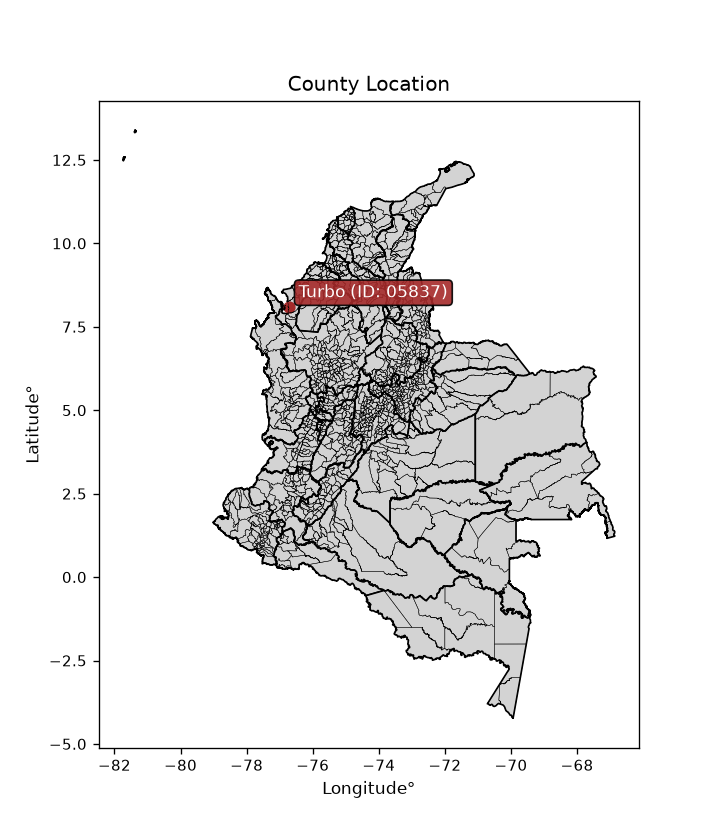
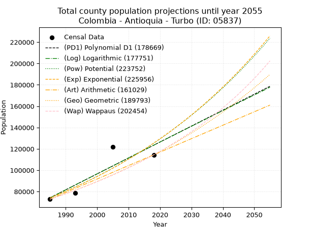
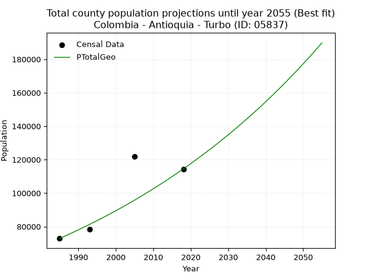
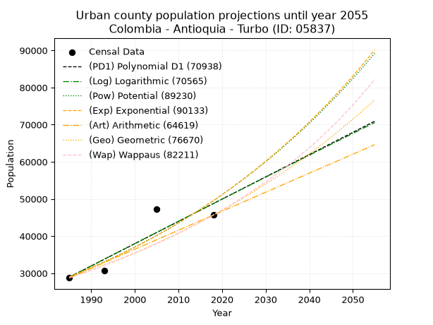
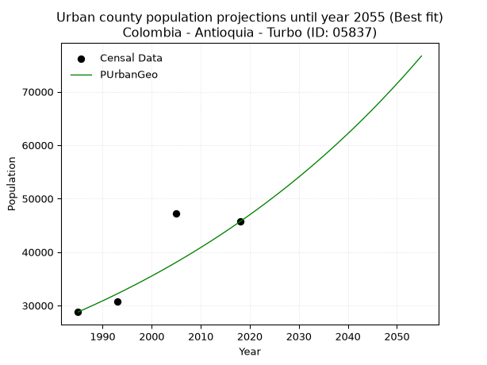
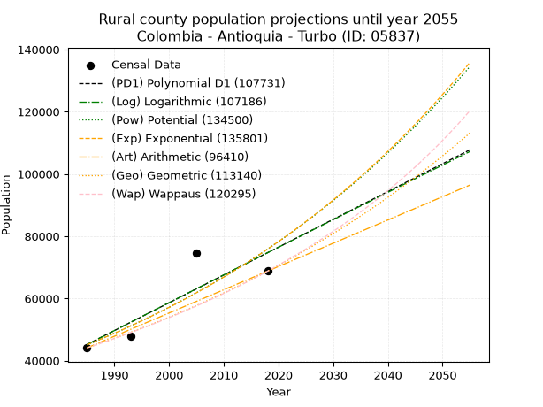

<div align="center">


</div>

# _“Population and Public Services Demand Projections (PPSD) until Year 2050 for Colombia - Antioquia - Turbo (ID: 05837)”_
Keywords: `population` `public-service` `projection` `lineal` `polynomial` `logarithmic` `potential` `exponential` `arithmetic` `geometric` `wappaus` `dane` `colombia` `south-america`

PPSD are analytical estimates used by governments and planners to anticipate future changes in population size, age distribution, and the resulting community needs for utilities, healthcare, education, and infrastructure as sizing future water treatment facilities, electrical grids, and road networks based on spatial growth.

> **General running parameters**: • app_version: _v20260806_. • Python version: _3.14.7_. • Pandas version: _3.0.5_. • NumPy version: _2.5.1_. • Creates, save and include plots into reports (create_plot): _False_. • Projection until year: _2050_. • Process polynomial degree 2 and up: _False_. • Process Wappaus: _True_. • Process Wappaus: _True_. • Set negative values to zero: _True_. • Set infinite values to zero: _True_. • Drop dataset notes: _True_. 
<div align="center">

Dynamic map: [:earth_americas:Google](http://maps.google.com/maps?q=8.089928546,-76.7288575) [:earth_americas:OSM](https://www.openstreetmap.org/#map=18/8.089928546/-76.7288575&layers=P) [:earth_americas:Bing](https://www.bing.com/maps?cp=8.089928546~-76.7288575&lvl=18) [:earth_americas:Apple](https://maps.apple.com/frame?center=8.089928546%2C-76.7288575&span=0.003%2C0.006)

</div>


<div align="center">

```geojson
{
  "type": "Feature",
  "geometry": {
    "type": "Point", 
    "coordinates": [-76.7288575, 8.089928546]
  }, 
  "properties": {
    "Name": "Colombia - Antioquia - Turbo (ID: 05837)"
  }
}
```

</div>


<div align="center">

</img>

</div>


## 0. Census Data (4 records)

Census data are official statistics collected by a government about the people and housing in a country. They usually include counts of total population, age, sex, race, income, education, and jobs.

📅Global census file: [Population.xlsx](../data/Population.xlsx)

| Source   |   Year |   CountryID | CountryName   |   StateID | StateName   |   CountyID | CountyName   |   PTotal |   PUrban |   PRural |
|:---------|-------:|------------:|:--------------|----------:|:------------|-----------:|:-------------|---------:|---------:|---------:|
| DANE     |   1985 |          57 | Colombia      |        05 | Antioquia   |      05837 | Turbo        |    72876 |    28775 |    44101 |
| DANE     |   1993 |          57 | Colombia      |        05 | Antioquia   |      05837 | Turbo        |    78529 |    30765 |    47764 |
| DANE     |   2005 |          57 | Colombia      |        05 | Antioquia   |      05837 | Turbo        |   121919 |    47259 |    74660 |
| DANE     |   2018 |          57 | Colombia      |        05 | Antioquia   |      05837 | Turbo        |   114434 |    45673 |    68761 |

> 🔥Some records could had specific notes about the registered values or the corresponding urban or rural distribution.

📅   [RUPS](https://www.datos.gov.co/Hacienda-y-Cr-dito-P-blico/Registro-nico-de-Prestadores-de-Servicios-P-blicos/4qkq-csdn/about_data) - Local public utility companies: [RUPS.csv](../data/RUPS.xlsx)

 | SERVICIO       | ESTADO    | NOMBRE                                                              | NIT         | DEPARTAMENTO_DOMICILIO   | MUNICIPIO_DOMICILIO   | DIRECCION                             |   TELEFONO | EMAIL                            | TIPO_PRESTADOR                             | CLASIFICACION                 |
|:---------------|:----------|:--------------------------------------------------------------------|:------------|:-------------------------|:----------------------|:--------------------------------------|-----------:|:---------------------------------|:-------------------------------------------|:------------------------------|
| ACUEDUCTO      | OPERATIVA | TURBO EXPRESS ACUATURBO                                             | 841000166-5 | ANTIOQUIA                | TURBO                 | CURRULAO CAR 50A Nº 50-48             |    8207432 | corre45@yahoo.com                | ORGANIZACION AUTORIZADA                    | HASTA 2500 SUSCRIPTORES       |
| ACUEDUCTO      | OPERATIVA | ASOCIACIÓN DE USUARIOS DEL ACUEDUCTO MULTIVEREDAL PLATANEROS UNIDOS | 900076092-9 | ANTIOQUIA                | TURBO                 | Vereda La pola - Municipio de Turbo   |    8206119 | jamartinez111@epm.net.co         | ORGANIZACION AUTORIZADA                    | HASTA 2500 SUSCRIPTORES       |
| ACUEDUCTO      | OPERATIVA | OPTIMA DE URABA S.A. E.S.P.                                         | 900189518-1 | ANTIOQUIA                | APARTADO              | CRA 103 N°97A-06                      |    8280049 | evelez@optimadeuraba.com         | SOCIEDADES (EMPRESA DE SERVICIOS PUBLICOS) | MAYOR O IGUAL A 5001 USUARIOS |
| ACUEDUCTO      | OPERATIVA | AGUAS REGIONALES EPM S.A E.S.P                                      | 900072303-1 | ANTIOQUIA                | APARTADO              | CALLE 97A No 104-13 BARRIO EL HUMEDAL |    8286657 | rosa.cordoba@aguasregionales.com | SOCIEDADES (EMPRESA DE SERVICIOS PUBLICOS) | MAYOR O IGUAL A 5001 USUARIOS |
| ALCANTARILLADO | OPERATIVA | AGUAS REGIONALES EPM S.A E.S.P                                      | 900072303-1 | ANTIOQUIA                | APARTADO              | CALLE 97A No 104-13 BARRIO EL HUMEDAL |    8286657 | rosa.cordoba@aguasregionales.com | SOCIEDADES (EMPRESA DE SERVICIOS PUBLICOS) | MAYOR O IGUAL A 5001 USUARIOS |

## 1. Total

### 1.1. Coefficients and Parameters

* (PD1) Polynomial Deg 1: 1492.7731834604594, -2888980.0602167835 (lineal)
* (Log) Logarithmic: 2990474.3081424837, -22633679.680348154
* (Pow) Potential: 31.885429074497303, -100.28065920919613
* (Exp) Exponential: 0.015916805656287482, 1.4082196138139127e-09
* (Art) Arithmetic: Year diff. 2018 - 1985 = 33, Population diff. 114434 - 72876 = 41558, Annual growth = 1259.3333333333333
* (Geo) Geometric: Year diff. 2018 - 1985 = 33, Population diff. 114434 - 72876 = 41558, Annual growth % = 0.013767820594980718
* (Wap) Wappaus: i = 1.344651469044187, Condition values only valid for < 200)

<sub>
Wappaus condition values: ['0.00', '1.34', '2.69', '4.03', '5.38', '6.72', '8.07', '9.41', '10.76', '12.10', '13.45', '14.79', '16.14', '17.48', '18.83', '20.17', '21.51', '22.86', '24.20', '25.55', '26.89', '28.24', '29.58', '30.93', '32.27', '33.62', '34.96', '36.31', '37.65', '38.99', '40.34', '41.68', '43.03', '44.37', '45.72', '47.06', '48.41', '49.75', '51.10', '52.44', '53.79', '55.13', '56.48', '57.82', '59.16', '60.51', '61.85', '63.20', '64.54', '65.89', '67.23', '68.58', '69.92', '71.27', '72.61', '73.96', '75.30', '76.65', '77.99', '79.33', '80.68', '82.02', '83.37', '84.71', '86.06', '87.40']
</sub>


### 1.2. Projected Dataset

|   Year |   CountyID |   PTotalPD1 |   PTotalLog |   PTotalPow |   PTotalExp |   PTotalArt |   PTotalGeo |   PTotalWap |
|-------:|-----------:|------------:|------------:|------------:|------------:|------------:|------------:|------------:|
|   1985 |      05837 |       74175 |       74111 |       74105 |       74156 |       72876 |       72876 |       72876 |
|   1986 |      05837 |       75667 |       75617 |       75305 |       75345 |       74135 |       73879 |       73863 |
|   1987 |      05837 |       77160 |       77122 |       76524 |       76554 |       75395 |       74897 |       74863 |
|   1988 |      05837 |       78653 |       78627 |       77761 |       77782 |       76654 |       75928 |       75876 |
|   1989 |      05837 |       80146 |       80131 |       79018 |       79030 |       77913 |       76973 |       76904 |
|   1990 |      05837 |       81639 |       81634 |       80295 |       80298 |       79173 |       78033 |       77946 |
|   1991 |      05837 |       83131 |       83136 |       81591 |       81587 |       80432 |       79107 |       79003 |
|   1992 |      05837 |       84624 |       84638 |       82908 |       82896 |       81691 |       80196 |       80074 |
|   1993 |      05837 |       86117 |       86139 |       84246 |       84226 |       82951 |       81300 |       81161 |
|   1994 |      05837 |       87610 |       87639 |       85604 |       85577 |       84210 |       82420 |       82263 |
|   1995 |      05837 |       89102 |       89138 |       86983 |       86950 |       85469 |       83554 |       83382 |
|   1996 |      05837 |       90595 |       90637 |       88384 |       88345 |       86729 |       84705 |       84516 |
|   1997 |      05837 |       92088 |       92135 |       89807 |       89762 |       87988 |       85871 |       85667 |
|   1998 |      05837 |       93581 |       93632 |       91252 |       91203 |       89247 |       87053 |       86835 |
|   1999 |      05837 |       95074 |       95128 |       92720 |       92666 |       90507 |       88252 |       88020 |
|   2000 |      05837 |       96566 |       96624 |       94210 |       94153 |       91766 |       89467 |       89224 |
|   2001 |      05837 |       98059 |       98119 |       95724 |       95663 |       93025 |       90699 |       90445 |
|   2002 |      05837 |       99552 |       99613 |       97261 |       97198 |       94285 |       91947 |       91685 |
|   2003 |      05837 |      101045 |      101106 |       98822 |       98757 |       95544 |       93213 |       92943 |
|   2004 |      05837 |      102537 |      102599 |      100408 |      100342 |       96803 |       94497 |       94221 |
|   2005 |      05837 |      104030 |      104091 |      102017 |      101952 |       98063 |       95798 |       95519 |
|   2006 |      05837 |      105523 |      105582 |      103652 |      103588 |       99322 |       97117 |       96838 |
|   2007 |      05837 |      107016 |      107072 |      105313 |      105250 |      100581 |       98454 |       98177 |
|   2008 |      05837 |      108508 |      108562 |      106999 |      106938 |      101841 |       99809 |       99537 |
|   2009 |      05837 |      110001 |      110051 |      108711 |      108654 |      103100 |      101183 |      100919 |
|   2010 |      05837 |      111494 |      111539 |      110450 |      110397 |      104359 |      102576 |      102324 |
|   2011 |      05837 |      112987 |      113026 |      112215 |      112168 |      105619 |      103989 |      103751 |
|   2012 |      05837 |      114480 |      114513 |      114008 |      113968 |      106878 |      105420 |      105202 |
|   2013 |      05837 |      115972 |      115999 |      115829 |      115797 |      108137 |      106872 |      106677 |
|   2014 |      05837 |      117465 |      117484 |      117678 |      117654 |      109397 |      108343 |      108177 |
|   2015 |      05837 |      118958 |      118969 |      119555 |      119542 |      110656 |      109835 |      109701 |
|   2016 |      05837 |      120451 |      120452 |      121462 |      121460 |      111915 |      111347 |      111252 |
|   2017 |      05837 |      121943 |      121935 |      123397 |      123409 |      113175 |      112880 |      112829 |
|   2018 |      05837 |      123436 |      123418 |      125363 |      125389 |      114434 |      114434 |      114434 |
|   2019 |      05837 |      124929 |      124899 |      127359 |      127401 |      115693 |      116010 |      116067 |
|   2020 |      05837 |      126422 |      126380 |      129386 |      129445 |      116953 |      117607 |      117728 |
|   2021 |      05837 |      127915 |      127860 |      131444 |      131521 |      118212 |      119226 |      119418 |
|   2022 |      05837 |      129407 |      129339 |      133534 |      133632 |      119471 |      120867 |      121139 |
|   2023 |      05837 |      130900 |      130818 |      135656 |      135776 |      120731 |      122531 |      122891 |
|   2024 |      05837 |      132393 |      132296 |      137810 |      137954 |      121990 |      124218 |      124675 |
|   2025 |      05837 |      133886 |      133773 |      139998 |      140167 |      123249 |      125929 |      126492 |
|   2026 |      05837 |      135378 |      135249 |      142219 |      142416 |      124509 |      127662 |      128343 |
|   2027 |      05837 |      136871 |      136725 |      144475 |      144701 |      125768 |      129420 |      130228 |
|   2028 |      05837 |      138364 |      138200 |      146765 |      147023 |      127027 |      131202 |      132149 |
|   2029 |      05837 |      139857 |      139674 |      149090 |      149382 |      128287 |      133008 |      134106 |
|   2030 |      05837 |      141350 |      141148 |      151451 |      151778 |      129546 |      134839 |      136101 |
|   2031 |      05837 |      142842 |      142621 |      153848 |      154213 |      130805 |      136696 |      138135 |
|   2032 |      05837 |      144335 |      144093 |      156281 |      156688 |      132065 |      138578 |      140210 |
|   2033 |      05837 |      145828 |      145564 |      158752 |      159202 |      133324 |      140486 |      142325 |
|   2034 |      05837 |      147321 |      147035 |      161261 |      161756 |      134583 |      142420 |      144482 |
|   2035 |      05837 |      148813 |      148505 |      163809 |      164351 |      135843 |      144381 |      146684 |
|   2036 |      05837 |      150306 |      149974 |      166395 |      166988 |      137102 |      146369 |      148930 |
|   2037 |      05837 |      151799 |      151442 |      169021 |      169667 |      138361 |      148384 |      151223 |
|   2038 |      05837 |      153292 |      152910 |      171686 |      172389 |      139621 |      150427 |      153564 |
|   2039 |      05837 |      154784 |      154377 |      174393 |      175155 |      140880 |      152498 |      155954 |
|   2040 |      05837 |      156277 |      155843 |      177141 |      177965 |      142139 |      154597 |      158395 |
|   2041 |      05837 |      157770 |      157309 |      179931 |      180821 |      143399 |      156726 |      160889 |
|   2042 |      05837 |      159263 |      158773 |      182763 |      183722 |      144658 |      158884 |      163437 |
|   2043 |      05837 |      160756 |      160238 |      185638 |      186669 |      145917 |      161071 |      166042 |
|   2044 |      05837 |      162248 |      161701 |      188558 |      189664 |      147177 |      163289 |      168704 |
|   2045 |      05837 |      163741 |      163164 |      191522 |      192707 |      148436 |      165537 |      171427 |
|   2046 |      05837 |      165234 |      164626 |      194530 |      195799 |      149695 |      167816 |      174211 |
|   2047 |      05837 |      166727 |      166087 |      197585 |      198941 |      150955 |      170126 |      177060 |
|   2048 |      05837 |      168219 |      167548 |      200686 |      202132 |      152214 |      172469 |      179975 |
|   2049 |      05837 |      169712 |      169007 |      203834 |      205375 |      153473 |      174843 |      182959 |
|   2050 |      05837 |      171205 |      170466 |      207030 |      208671 |      154733 |      177250 |      186014 |
<div align="center">

</img>

</div>


### 1.3. Best fit with absolute and relative error (%)

Relative error puts that difference into context by dividing the absolute error by the true value, creating a unitless ratio or percentage that shows the scale of the mistake.

Absolute and relative error

|   Year | Source   |   CountryID | CountryName   |   StateID | StateName   |   CountyID_x | CountyName   |   PTotal |   PUrban |   PRural |   CountyID_y |   PTotalPD1 |   PTotalLog |   PTotalPow |   PTotalExp |   PTotalArt |   PTotalGeo |   PTotalWap |   PTotalPD1AbsError |   PTotalLogAbsError |   PTotalPowAbsError |   PTotalExpAbsError |   PTotalArtAbsError |   PTotalGeoAbsError |   PTotalWapAbsError |   PTotalPD1RelError |   PTotalLogRelError |   PTotalPowRelError |   PTotalExpRelError |   PTotalArtRelError |   PTotalGeoRelError |   PTotalWapRelError |
|-------:|:---------|------------:|:--------------|----------:|:------------|-------------:|:-------------|---------:|---------:|---------:|-------------:|------------:|------------:|------------:|------------:|------------:|------------:|------------:|--------------------:|--------------------:|--------------------:|--------------------:|--------------------:|--------------------:|--------------------:|--------------------:|--------------------:|--------------------:|--------------------:|--------------------:|--------------------:|--------------------:|
|   1985 | DANE     |          57 | Colombia      |        05 | Antioquia   |        05837 | Turbo        |    72876 |    28775 |    44101 |        05837 |       74175 |       74111 |       74105 |       74156 |       72876 |       72876 |       72876 |                1299 |                1235 |                1229 |                1280 |                   0 |                   0 |                   0 |             1.78248 |             1.69466 |             1.68643 |             1.75641 |             0       |             0       |             0       |
|   1993 | DANE     |          57 | Colombia      |        05 | Antioquia   |        05837 | Turbo        |    78529 |    30765 |    47764 |        05837 |       86117 |       86139 |       84246 |       84226 |       82951 |       81300 |       81161 |                7588 |                7610 |                5717 |                5697 |                4422 |                2771 |                2632 |             9.66267 |             9.69069 |             7.28011 |             7.25464 |             5.63104 |             3.52863 |             3.35163 |
|   2005 | DANE     |          57 | Colombia      |        05 | Antioquia   |        05837 | Turbo        |   121919 |    47259 |    74660 |        05837 |      104030 |      104091 |      102017 |      101952 |       98063 |       95798 |       95519 |               17889 |               17828 |               19902 |               19967 |               23856 |               26121 |               26400 |            14.6729  |            14.6228  |            16.324   |            16.3773  |            19.5671  |            21.4249  |            21.6537  |
|   2018 | DANE     |          57 | Colombia      |        05 | Antioquia   |        05837 | Turbo        |   114434 |    45673 |    68761 |        05837 |      123436 |      123418 |      125363 |      125389 |      114434 |      114434 |      114434 |                9002 |                8984 |               10929 |               10955 |                   0 |                   0 |                   0 |             7.86654 |             7.85081 |             9.55048 |             9.5732  |             0       |             0       |             0       |

Relative error mean

| Method    |   RelError | Best   |
|:----------|-----------:|:-------|
| PTotalPD1 |    8.49614 |        |
| PTotalLog |    8.46475 |        |
| PTotalPow |    8.71024 |        |
| PTotalExp |    8.74038 |        |
| PTotalArt |    6.29953 |        |
| PTotalGeo |    6.23838 | True   |
| PTotalWap |    6.25134 |        |

💙Best method: _**PTotalGeo**_
<div align="center">

</img>

</div>


### 1.4. Fresh water supply demand in liters per capita per day (lpcd)

The fresh water supply demand typically ranges from 100 to 300 liters per capita per day (lpcd) for standard domestic and municipal planning, though absolute survival minimums set by the World Health Organization are as low as 7.5 to 20 liters per day, and total consumption in high-income nations can exceed 400 liters.

> `CZ`: Level in meters above the sea level (masl)<br> `WS`: Fresh water supply demand in liters per capita per day (lpcd or l/h/d)<br> `WSAll`: Zonal fresh water supply demand in liters per second (l/s)<br> `A`: Zonal area in square meters<br> `DP`: Population density (people/hectare or p/ha)

Reference values (RAS Colombia)

|    CZ |   WS |
|------:|-----:|
|  1000 |  120 |
|  2000 |  130 |
| 99999 |  140 |

County shapefile geometry properties and water supply values

|   CountyID |      ATotal |   CZTotal |   WSTotal |
|-----------:|------------:|----------:|----------:|
|      05837 | 2.91921e+09 |   91.8305 |       120 |

Projected values for best method: PTotalGeo

|   CountyID |   Year |   PTotalGeo |   DPTotal |   WSTotal |   WSTotalAll |
|-----------:|-------:|------------:|----------:|----------:|-------------:|
|      05837 |   1985 |       72876 |      0.25 |       120 |      101.217 |
|      05837 |   1986 |       73879 |      0.25 |       120 |      102.61  |
|      05837 |   1987 |       74897 |      0.26 |       120 |      104.024 |
|      05837 |   1988 |       75928 |      0.26 |       120 |      105.456 |
|      05837 |   1989 |       76973 |      0.26 |       120 |      106.907 |
|      05837 |   1990 |       78033 |      0.27 |       120 |      108.379 |
|      05837 |   1991 |       79107 |      0.27 |       120 |      109.871 |
|      05837 |   1992 |       80196 |      0.27 |       120 |      111.383 |
|      05837 |   1993 |       81300 |      0.28 |       120 |      112.917 |
|      05837 |   1994 |       82420 |      0.28 |       120 |      114.472 |
|      05837 |   1995 |       83554 |      0.29 |       120 |      116.047 |
|      05837 |   1996 |       84705 |      0.29 |       120 |      117.646 |
|      05837 |   1997 |       85871 |      0.29 |       120 |      119.265 |
|      05837 |   1998 |       87053 |      0.3  |       120 |      120.907 |
|      05837 |   1999 |       88252 |      0.3  |       120 |      122.572 |
|      05837 |   2000 |       89467 |      0.31 |       120 |      124.26  |
|      05837 |   2001 |       90699 |      0.31 |       120 |      125.971 |
|      05837 |   2002 |       91947 |      0.31 |       120 |      127.704 |
|      05837 |   2003 |       93213 |      0.32 |       120 |      129.463 |
|      05837 |   2004 |       94497 |      0.32 |       120 |      131.246 |
|      05837 |   2005 |       95798 |      0.33 |       120 |      133.053 |
|      05837 |   2006 |       97117 |      0.33 |       120 |      134.885 |
|      05837 |   2007 |       98454 |      0.34 |       120 |      136.742 |
|      05837 |   2008 |       99809 |      0.34 |       120 |      138.624 |
|      05837 |   2009 |      101183 |      0.35 |       120 |      140.532 |
|      05837 |   2010 |      102576 |      0.35 |       120 |      142.467 |
|      05837 |   2011 |      103989 |      0.36 |       120 |      144.429 |
|      05837 |   2012 |      105420 |      0.36 |       120 |      146.417 |
|      05837 |   2013 |      106872 |      0.37 |       120 |      148.433 |
|      05837 |   2014 |      108343 |      0.37 |       120 |      150.476 |
|      05837 |   2015 |      109835 |      0.38 |       120 |      152.549 |
|      05837 |   2016 |      111347 |      0.38 |       120 |      154.649 |
|      05837 |   2017 |      112880 |      0.39 |       120 |      156.778 |
|      05837 |   2018 |      114434 |      0.39 |       120 |      158.936 |
|      05837 |   2019 |      116010 |      0.4  |       120 |      161.125 |
|      05837 |   2020 |      117607 |      0.4  |       120 |      163.343 |
|      05837 |   2021 |      119226 |      0.41 |       120 |      165.592 |
|      05837 |   2022 |      120867 |      0.41 |       120 |      167.871 |
|      05837 |   2023 |      122531 |      0.42 |       120 |      170.182 |
|      05837 |   2024 |      124218 |      0.43 |       120 |      172.525 |
|      05837 |   2025 |      125929 |      0.43 |       120 |      174.901 |
|      05837 |   2026 |      127662 |      0.44 |       120 |      177.308 |
|      05837 |   2027 |      129420 |      0.44 |       120 |      179.75  |
|      05837 |   2028 |      131202 |      0.45 |       120 |      182.225 |
|      05837 |   2029 |      133008 |      0.46 |       120 |      184.733 |
|      05837 |   2030 |      134839 |      0.46 |       120 |      187.276 |
|      05837 |   2031 |      136696 |      0.47 |       120 |      189.856 |
|      05837 |   2032 |      138578 |      0.47 |       120 |      192.469 |
|      05837 |   2033 |      140486 |      0.48 |       120 |      195.119 |
|      05837 |   2034 |      142420 |      0.49 |       120 |      197.806 |
|      05837 |   2035 |      144381 |      0.49 |       120 |      200.529 |
|      05837 |   2036 |      146369 |      0.5  |       120 |      203.29  |
|      05837 |   2037 |      148384 |      0.51 |       120 |      206.089 |
|      05837 |   2038 |      150427 |      0.52 |       120 |      208.926 |
|      05837 |   2039 |      152498 |      0.52 |       120 |      211.803 |
|      05837 |   2040 |      154597 |      0.53 |       120 |      214.718 |
|      05837 |   2041 |      156726 |      0.54 |       120 |      217.675 |
|      05837 |   2042 |      158884 |      0.54 |       120 |      220.672 |
|      05837 |   2043 |      161071 |      0.55 |       120 |      223.71  |
|      05837 |   2044 |      163289 |      0.56 |       120 |      226.79  |
|      05837 |   2045 |      165537 |      0.57 |       120 |      229.912 |
|      05837 |   2046 |      167816 |      0.57 |       120 |      233.078 |
|      05837 |   2047 |      170126 |      0.58 |       120 |      236.286 |
|      05837 |   2048 |      172469 |      0.59 |       120 |      239.54  |
|      05837 |   2049 |      174843 |      0.6  |       120 |      242.838 |
|      05837 |   2050 |      177250 |      0.61 |       120 |      246.181 |

## 2. Urban

### 2.1. Coefficients and Parameters

* (PD1) Polynomial Deg 1: 599.4556403050982, -1160943.144520273 (lineal)
* (Log) Logarithmic: 1200711.0521019907, -9088496.328921739
* (Pow) Potential: 32.39654522346416, -102.37314856519053
* (Exp) Exponential: 0.016173970871992016, 3.3114287319705924e-10
* (Art) Arithmetic: Year diff. 2018 - 1985 = 33, Population diff. 45673 - 28775 = 16898, Annual growth = 512.060606060606
* (Geo) Geometric: Year diff. 2018 - 1985 = 33, Population diff. 45673 - 28775 = 16898, Annual growth % = 0.014098469972726457
* (Wap) Wappaus: i = 1.3756195090817915, Condition values only valid for < 200)

<sub>
Wappaus condition values: ['0.00', '1.38', '2.75', '4.13', '5.50', '6.88', '8.25', '9.63', '11.00', '12.38', '13.76', '15.13', '16.51', '17.88', '19.26', '20.63', '22.01', '23.39', '24.76', '26.14', '27.51', '28.89', '30.26', '31.64', '33.01', '34.39', '35.77', '37.14', '38.52', '39.89', '41.27', '42.64', '44.02', '45.40', '46.77', '48.15', '49.52', '50.90', '52.27', '53.65', '55.02', '56.40', '57.78', '59.15', '60.53', '61.90', '63.28', '64.65', '66.03', '67.41', '68.78', '70.16', '71.53', '72.91', '74.28', '75.66', '77.03', '78.41', '79.79', '81.16', '82.54', '83.91', '85.29', '86.66', '88.04', '89.42']
</sub>


### 2.2. Projected Dataset

|   Year |   CountyID |   PUrbanPD1 |   PUrbanLog |   PUrbanPow |   PUrbanExp |   PUrbanArt |   PUrbanGeo |   PUrbanWap |
|-------:|-----------:|------------:|------------:|------------:|------------:|------------:|------------:|------------:|
|   1985 |      05837 |       28976 |       28952 |       29033 |       29053 |       28775 |       28775 |       28775 |
|   1986 |      05837 |       29576 |       29557 |       29511 |       29526 |       29287 |       29181 |       29174 |
|   1987 |      05837 |       30175 |       30161 |       29996 |       30008 |       29799 |       29592 |       29578 |
|   1988 |      05837 |       30775 |       30765 |       30489 |       30497 |       30311 |       30009 |       29988 |
|   1989 |      05837 |       31374 |       31369 |       30990 |       30994 |       30823 |       30432 |       30403 |
|   1990 |      05837 |       31974 |       31973 |       31499 |       31500 |       31335 |       30861 |       30825 |
|   1991 |      05837 |       32573 |       32576 |       32016 |       32013 |       31847 |       31297 |       31252 |
|   1992 |      05837 |       33172 |       33179 |       32541 |       32535 |       32359 |       31738 |       31686 |
|   1993 |      05837 |       33772 |       33781 |       33074 |       33066 |       32871 |       32185 |       32126 |
|   1994 |      05837 |       34371 |       34384 |       33616 |       33605 |       33384 |       32639 |       32573 |
|   1995 |      05837 |       34971 |       34986 |       34167 |       34153 |       33896 |       33099 |       33026 |
|   1996 |      05837 |       35570 |       35587 |       34726 |       34710 |       34408 |       33566 |       33486 |
|   1997 |      05837 |       36170 |       36189 |       35294 |       35276 |       34920 |       34039 |       33952 |
|   1998 |      05837 |       36769 |       36790 |       35871 |       35851 |       35432 |       34519 |       34426 |
|   1999 |      05837 |       37369 |       37391 |       36457 |       36435 |       35944 |       35006 |       34907 |
|   2000 |      05837 |       37968 |       37991 |       37053 |       37030 |       36456 |       35499 |       35396 |
|   2001 |      05837 |       38568 |       38591 |       37658 |       37633 |       36968 |       36000 |       35892 |
|   2002 |      05837 |       39167 |       39191 |       38272 |       38247 |       37480 |       36507 |       36395 |
|   2003 |      05837 |       39767 |       39791 |       38896 |       38871 |       37992 |       37022 |       36907 |
|   2004 |      05837 |       40366 |       40390 |       39530 |       39504 |       38504 |       37544 |       37426 |
|   2005 |      05837 |       40965 |       40989 |       40174 |       40149 |       39016 |       38073 |       37954 |
|   2006 |      05837 |       41565 |       41588 |       40829 |       40803 |       39528 |       38610 |       38491 |
|   2007 |      05837 |       42164 |       42186 |       41493 |       41468 |       40040 |       39154 |       39036 |
|   2008 |      05837 |       42764 |       42785 |       42168 |       42145 |       40552 |       39706 |       39590 |
|   2009 |      05837 |       43363 |       43382 |       42854 |       42832 |       41064 |       40266 |       40153 |
|   2010 |      05837 |       43963 |       43980 |       43550 |       43530 |       41577 |       40834 |       40726 |
|   2011 |      05837 |       44562 |       44577 |       44258 |       44240 |       42089 |       41409 |       41308 |
|   2012 |      05837 |       45162 |       45174 |       44976 |       44961 |       42601 |       41993 |       41900 |
|   2013 |      05837 |       45761 |       45771 |       45706 |       45694 |       43113 |       42585 |       42502 |
|   2014 |      05837 |       46361 |       46367 |       46448 |       46440 |       43625 |       43186 |       43114 |
|   2015 |      05837 |       46960 |       46963 |       47201 |       47197 |       44137 |       43794 |       43737 |
|   2016 |      05837 |       47559 |       47559 |       47965 |       47966 |       44649 |       44412 |       44371 |
|   2017 |      05837 |       48159 |       48154 |       48742 |       48748 |       45161 |       45038 |       45016 |
|   2018 |      05837 |       48758 |       48749 |       49531 |       49543 |       45673 |       45673 |       45673 |
|   2019 |      05837 |       49358 |       49344 |       50333 |       50351 |       46185 |       46317 |       46341 |
|   2020 |      05837 |       49957 |       49939 |       51147 |       51172 |       46697 |       46970 |       47022 |
|   2021 |      05837 |       50557 |       50533 |       51973 |       52006 |       47209 |       47632 |       47715 |
|   2022 |      05837 |       51156 |       51127 |       52813 |       52854 |       47721 |       48304 |       48420 |
|   2023 |      05837 |       51756 |       51721 |       53666 |       53716 |       48233 |       48985 |       49139 |
|   2024 |      05837 |       52355 |       52314 |       54532 |       54592 |       48745 |       49675 |       49872 |
|   2025 |      05837 |       52955 |       52907 |       55411 |       55482 |       49257 |       50376 |       50618 |
|   2026 |      05837 |       53554 |       53500 |       56305 |       56387 |       49769 |       51086 |       51378 |
|   2027 |      05837 |       54153 |       54092 |       57212 |       57306 |       50282 |       51806 |       52154 |
|   2028 |      05837 |       54753 |       54685 |       58134 |       58241 |       50794 |       52536 |       52944 |
|   2029 |      05837 |       55352 |       55277 |       59070 |       59190 |       51306 |       53277 |       53750 |
|   2030 |      05837 |       55952 |       55868 |       60020 |       60156 |       51818 |       54028 |       54572 |
|   2031 |      05837 |       56551 |       56460 |       60985 |       61136 |       52330 |       54790 |       55411 |
|   2032 |      05837 |       57151 |       57051 |       61966 |       62133 |       52842 |       55562 |       56266 |
|   2033 |      05837 |       57750 |       57641 |       62961 |       63146 |       53354 |       56346 |       57140 |
|   2034 |      05837 |       58350 |       58232 |       63972 |       64176 |       53866 |       57140 |       58031 |
|   2035 |      05837 |       58949 |       58822 |       64999 |       65222 |       54378 |       57946 |       58941 |
|   2036 |      05837 |       59549 |       59412 |       66042 |       66286 |       54890 |       58763 |       59870 |
|   2037 |      05837 |       60148 |       60001 |       67101 |       67367 |       55402 |       59591 |       60819 |
|   2038 |      05837 |       60747 |       60591 |       68176 |       68465 |       55914 |       60431 |       61789 |
|   2039 |      05837 |       61347 |       61180 |       69269 |       69582 |       56426 |       61283 |       62780 |
|   2040 |      05837 |       61946 |       61768 |       70378 |       70716 |       56938 |       62147 |       63793 |
|   2041 |      05837 |       62546 |       62357 |       71504 |       71869 |       57450 |       63023 |       64829 |
|   2042 |      05837 |       63145 |       62945 |       72648 |       73041 |       57962 |       63912 |       65888 |
|   2043 |      05837 |       63745 |       63533 |       73809 |       74232 |       58475 |       64813 |       66971 |
|   2044 |      05837 |       64344 |       64121 |       74989 |       75442 |       58987 |       65727 |       68079 |
|   2045 |      05837 |       64944 |       64708 |       76186 |       76673 |       59499 |       66654 |       69213 |
|   2046 |      05837 |       65543 |       65295 |       77403 |       77923 |       60011 |       67593 |       70375 |
|   2047 |      05837 |       66143 |       65882 |       78638 |       79193 |       60523 |       68546 |       71564 |
|   2048 |      05837 |       66742 |       66468 |       79892 |       80485 |       61035 |       69513 |       72781 |
|   2049 |      05837 |       67341 |       67054 |       81165 |       81797 |       61547 |       70493 |       74029 |
|   2050 |      05837 |       67941 |       67640 |       82458 |       83131 |       62059 |       71486 |       75308 |
<div align="center">

</img>

</div>


### 2.3. Best fit with absolute and relative error (%)

Relative error puts that difference into context by dividing the absolute error by the true value, creating a unitless ratio or percentage that shows the scale of the mistake.

Absolute and relative error

|   Year | Source   |   CountryID | CountryName   |   StateID | StateName   |   CountyID_x | CountyName   |   PTotal |   PUrban |   PRural |   CountyID_y |   PUrbanPD1 |   PUrbanLog |   PUrbanPow |   PUrbanExp |   PUrbanArt |   PUrbanGeo |   PUrbanWap |   PUrbanPD1AbsError |   PUrbanLogAbsError |   PUrbanPowAbsError |   PUrbanExpAbsError |   PUrbanArtAbsError |   PUrbanGeoAbsError |   PUrbanWapAbsError |   PUrbanPD1RelError |   PUrbanLogRelError |   PUrbanPowRelError |   PUrbanExpRelError |   PUrbanArtRelError |   PUrbanGeoRelError |   PUrbanWapRelError |
|-------:|:---------|------------:|:--------------|----------:|:------------|-------------:|:-------------|---------:|---------:|---------:|-------------:|------------:|------------:|------------:|------------:|------------:|------------:|------------:|--------------------:|--------------------:|--------------------:|--------------------:|--------------------:|--------------------:|--------------------:|--------------------:|--------------------:|--------------------:|--------------------:|--------------------:|--------------------:|--------------------:|
|   1985 | DANE     |          57 | Colombia      |        05 | Antioquia   |        05837 | Turbo        |    72876 |    28775 |    44101 |        05837 |       28976 |       28952 |       29033 |       29053 |       28775 |       28775 |       28775 |                 201 |                 177 |                 258 |                 278 |                   0 |                   0 |                   0 |            0.698523 |            0.615117 |            0.896612 |            0.966116 |             0       |             0       |             0       |
|   1993 | DANE     |          57 | Colombia      |        05 | Antioquia   |        05837 | Turbo        |    78529 |    30765 |    47764 |        05837 |       33772 |       33781 |       33074 |       33066 |       32871 |       32185 |       32126 |                3007 |                3016 |                2309 |                2301 |                2106 |                1420 |                1361 |            9.77409  |            9.80335  |            7.50528  |            7.47928  |             6.84544 |             4.61563 |             4.42386 |
|   2005 | DANE     |          57 | Colombia      |        05 | Antioquia   |        05837 | Turbo        |   121919 |    47259 |    74660 |        05837 |       40965 |       40989 |       40174 |       40149 |       39016 |       38073 |       37954 |                6294 |                6270 |                7085 |                7110 |                8243 |                9186 |                9305 |           13.3181   |           13.2673   |           14.9919   |           15.0448   |            17.4422  |            19.4376  |            19.6894  |
|   2018 | DANE     |          57 | Colombia      |        05 | Antioquia   |        05837 | Turbo        |   114434 |    45673 |    68761 |        05837 |       48758 |       48749 |       49531 |       49543 |       45673 |       45673 |       45673 |                3085 |                3076 |                3858 |                3870 |                   0 |                   0 |                   0 |            6.75454  |            6.73483  |            8.447    |            8.47328  |             0       |             0       |             0       |

Relative error mean

| Method    |   RelError | Best   |
|:----------|-----------:|:-------|
| PUrbanPD1 |    7.63631 |        |
| PUrbanLog |    7.60515 |        |
| PUrbanPow |    7.96019 |        |
| PUrbanExp |    7.99086 |        |
| PUrbanArt |    6.07191 |        |
| PUrbanGeo |    6.0133  | True   |
| PUrbanWap |    6.02831 |        |

💙Best method: _**PUrbanGeo**_
<div align="center">

</img>

</div>


### 2.4. Fresh water supply demand in liters per capita per day (lpcd)

The fresh water supply demand typically ranges from 100 to 300 liters per capita per day (lpcd) for standard domestic and municipal planning, though absolute survival minimums set by the World Health Organization are as low as 7.5 to 20 liters per day, and total consumption in high-income nations can exceed 400 liters.

> `CZ`: Level in meters above the sea level (masl)<br> `WS`: Fresh water supply demand in liters per capita per day (lpcd or l/h/d)<br> `WSAll`: Zonal fresh water supply demand in liters per second (l/s)<br> `A`: Zonal area in square meters<br> `DP`: Population density (people/hectare or p/ha)

Reference values (RAS Colombia)

|    CZ |   WS |
|------:|-----:|
|  1000 |  120 |
|  2000 |  130 |
| 99999 |  140 |

County shapefile geometry properties and water supply values

|   CountyID |      AUrban |   CZUrban |   WSUrban |
|-----------:|------------:|----------:|----------:|
|      05837 | 7.76637e+06 |   4.14156 |       120 |

Projected values for best method: PUrbanGeo

|   CountyID |   Year |   PUrbanGeo |   DPUrban |   WSUrban |   WSUrbanAll |
|-----------:|-------:|------------:|----------:|----------:|-------------:|
|      05837 |   1985 |       28775 |     37.05 |       120 |      39.9653 |
|      05837 |   1986 |       29181 |     37.57 |       120 |      40.5292 |
|      05837 |   1987 |       29592 |     38.1  |       120 |      41.1    |
|      05837 |   1988 |       30009 |     38.64 |       120 |      41.6792 |
|      05837 |   1989 |       30432 |     39.18 |       120 |      42.2667 |
|      05837 |   1990 |       30861 |     39.74 |       120 |      42.8625 |
|      05837 |   1991 |       31297 |     40.3  |       120 |      43.4681 |
|      05837 |   1992 |       31738 |     40.87 |       120 |      44.0806 |
|      05837 |   1993 |       32185 |     41.44 |       120 |      44.7014 |
|      05837 |   1994 |       32639 |     42.03 |       120 |      45.3319 |
|      05837 |   1995 |       33099 |     42.62 |       120 |      45.9708 |
|      05837 |   1996 |       33566 |     43.22 |       120 |      46.6194 |
|      05837 |   1997 |       34039 |     43.83 |       120 |      47.2764 |
|      05837 |   1998 |       34519 |     44.45 |       120 |      47.9431 |
|      05837 |   1999 |       35006 |     45.07 |       120 |      48.6194 |
|      05837 |   2000 |       35499 |     45.71 |       120 |      49.3042 |
|      05837 |   2001 |       36000 |     46.35 |       120 |      50      |
|      05837 |   2002 |       36507 |     47.01 |       120 |      50.7042 |
|      05837 |   2003 |       37022 |     47.67 |       120 |      51.4194 |
|      05837 |   2004 |       37544 |     48.34 |       120 |      52.1444 |
|      05837 |   2005 |       38073 |     49.02 |       120 |      52.8792 |
|      05837 |   2006 |       38610 |     49.71 |       120 |      53.625  |
|      05837 |   2007 |       39154 |     50.41 |       120 |      54.3806 |
|      05837 |   2008 |       39706 |     51.13 |       120 |      55.1472 |
|      05837 |   2009 |       40266 |     51.85 |       120 |      55.925  |
|      05837 |   2010 |       40834 |     52.58 |       120 |      56.7139 |
|      05837 |   2011 |       41409 |     53.32 |       120 |      57.5125 |
|      05837 |   2012 |       41993 |     54.07 |       120 |      58.3236 |
|      05837 |   2013 |       42585 |     54.83 |       120 |      59.1458 |
|      05837 |   2014 |       43186 |     55.61 |       120 |      59.9806 |
|      05837 |   2015 |       43794 |     56.39 |       120 |      60.825  |
|      05837 |   2016 |       44412 |     57.19 |       120 |      61.6833 |
|      05837 |   2017 |       45038 |     57.99 |       120 |      62.5528 |
|      05837 |   2018 |       45673 |     58.81 |       120 |      63.4347 |
|      05837 |   2019 |       46317 |     59.64 |       120 |      64.3292 |
|      05837 |   2020 |       46970 |     60.48 |       120 |      65.2361 |
|      05837 |   2021 |       47632 |     61.33 |       120 |      66.1556 |
|      05837 |   2022 |       48304 |     62.2  |       120 |      67.0889 |
|      05837 |   2023 |       48985 |     63.07 |       120 |      68.0347 |
|      05837 |   2024 |       49675 |     63.96 |       120 |      68.9931 |
|      05837 |   2025 |       50376 |     64.86 |       120 |      69.9667 |
|      05837 |   2026 |       51086 |     65.78 |       120 |      70.9528 |
|      05837 |   2027 |       51806 |     66.71 |       120 |      71.9528 |
|      05837 |   2028 |       52536 |     67.65 |       120 |      72.9667 |
|      05837 |   2029 |       53277 |     68.6  |       120 |      73.9958 |
|      05837 |   2030 |       54028 |     69.57 |       120 |      75.0389 |
|      05837 |   2031 |       54790 |     70.55 |       120 |      76.0972 |
|      05837 |   2032 |       55562 |     71.54 |       120 |      77.1694 |
|      05837 |   2033 |       56346 |     72.55 |       120 |      78.2583 |
|      05837 |   2034 |       57140 |     73.57 |       120 |      79.3611 |
|      05837 |   2035 |       57946 |     74.61 |       120 |      80.4806 |
|      05837 |   2036 |       58763 |     75.66 |       120 |      81.6153 |
|      05837 |   2037 |       59591 |     76.73 |       120 |      82.7653 |
|      05837 |   2038 |       60431 |     77.81 |       120 |      83.9319 |
|      05837 |   2039 |       61283 |     78.91 |       120 |      85.1153 |
|      05837 |   2040 |       62147 |     80.02 |       120 |      86.3153 |
|      05837 |   2041 |       63023 |     81.15 |       120 |      87.5319 |
|      05837 |   2042 |       63912 |     82.29 |       120 |      88.7667 |
|      05837 |   2043 |       64813 |     83.45 |       120 |      90.0181 |
|      05837 |   2044 |       65727 |     84.63 |       120 |      91.2875 |
|      05837 |   2045 |       66654 |     85.82 |       120 |      92.575  |
|      05837 |   2046 |       67593 |     87.03 |       120 |      93.8792 |
|      05837 |   2047 |       68546 |     88.26 |       120 |      95.2028 |
|      05837 |   2048 |       69513 |     89.51 |       120 |      96.5458 |
|      05837 |   2049 |       70493 |     90.77 |       120 |      97.9069 |
|      05837 |   2050 |       71486 |     92.05 |       120 |      99.2861 |

## 3. Rural

### 3.1. Coefficients and Parameters

* (PD1) Polynomial Deg 1: 893.3175431553615, -1728036.9156965117 (lineal)
* (Log) Logarithmic: 1789763.2560404935, -13545183.351426419
* (Pow) Potential: 31.54632778498495, -99.37832557811844
* (Exp) Exponential: 0.015746217637895462, 1.2016952328686896e-09
* (Art) Arithmetic: Year diff. 2018 - 1985 = 33, Population diff. 68761 - 44101 = 24660, Annual growth = 747.2727272727273
* (Geo) Geometric: Year diff. 2018 - 1985 = 33, Population diff. 68761 - 44101 = 24660, Annual growth % = 0.013550203208755107
* (Wap) Wappaus: i = 1.3242237905986556, Condition values only valid for < 200)

<sub>
Wappaus condition values: ['0.00', '1.32', '2.65', '3.97', '5.30', '6.62', '7.95', '9.27', '10.59', '11.92', '13.24', '14.57', '15.89', '17.21', '18.54', '19.86', '21.19', '22.51', '23.84', '25.16', '26.48', '27.81', '29.13', '30.46', '31.78', '33.11', '34.43', '35.75', '37.08', '38.40', '39.73', '41.05', '42.38', '43.70', '45.02', '46.35', '47.67', '49.00', '50.32', '51.64', '52.97', '54.29', '55.62', '56.94', '58.27', '59.59', '60.91', '62.24', '63.56', '64.89', '66.21', '67.54', '68.86', '70.18', '71.51', '72.83', '74.16', '75.48', '76.80', '78.13', '79.45', '80.78', '82.10', '83.43', '84.75', '86.07']
</sub>


### 3.2. Projected Dataset

|   Year |   CountyID |   PRuralPD1 |   PRuralLog |   PRuralPow |   PRuralExp |   PRuralArt |   PRuralGeo |   PRuralWap |
|-------:|-----------:|------------:|------------:|------------:|------------:|------------:|------------:|------------:|
|   1985 |      05837 |       45198 |       45159 |       45072 |       45103 |       44101 |       44101 |       44101 |
|   1986 |      05837 |       46092 |       46060 |       45794 |       45819 |       44848 |       44699 |       44689 |
|   1987 |      05837 |       46985 |       46961 |       46527 |       46546 |       45596 |       45304 |       45285 |
|   1988 |      05837 |       47878 |       47862 |       47271 |       47285 |       46343 |       45918 |       45888 |
|   1989 |      05837 |       48772 |       48762 |       48027 |       48035 |       47090 |       46540 |       46501 |
|   1990 |      05837 |       49665 |       49661 |       48795 |       48798 |       47837 |       47171 |       47121 |
|   1991 |      05837 |       50558 |       50560 |       49574 |       49572 |       48585 |       47810 |       47750 |
|   1992 |      05837 |       51452 |       51459 |       50366 |       50359 |       49332 |       48458 |       48388 |
|   1993 |      05837 |       52345 |       52357 |       51170 |       51158 |       50079 |       49115 |       49034 |
|   1994 |      05837 |       53238 |       53255 |       51986 |       51970 |       50826 |       49780 |       49690 |
|   1995 |      05837 |       54132 |       54153 |       52815 |       52795 |       51574 |       50455 |       50355 |
|   1996 |      05837 |       55025 |       55049 |       53656 |       53633 |       52321 |       51138 |       51030 |
|   1997 |      05837 |       55918 |       55946 |       54511 |       54484 |       53068 |       51831 |       51714 |
|   1998 |      05837 |       56812 |       56842 |       55379 |       55349 |       53816 |       52534 |       52408 |
|   1999 |      05837 |       57705 |       57737 |       56260 |       56227 |       54563 |       53245 |       53112 |
|   2000 |      05837 |       58598 |       58633 |       57154 |       57120 |       55310 |       53967 |       53827 |
|   2001 |      05837 |       59491 |       59527 |       58063 |       58026 |       56057 |       54698 |       54552 |
|   2002 |      05837 |       60385 |       60421 |       58985 |       58947 |       56805 |       55439 |       55288 |
|   2003 |      05837 |       61278 |       61315 |       59922 |       59883 |       57552 |       56191 |       56035 |
|   2004 |      05837 |       62171 |       62209 |       60873 |       60833 |       58299 |       56952 |       56794 |
|   2005 |      05837 |       63065 |       63101 |       61838 |       61798 |       59046 |       57724 |       57564 |
|   2006 |      05837 |       63958 |       63994 |       62819 |       62779 |       59794 |       58506 |       58346 |
|   2007 |      05837 |       64851 |       64886 |       63814 |       63776 |       60541 |       59299 |       59139 |
|   2008 |      05837 |       65745 |       65777 |       64825 |       64788 |       61288 |       60102 |       59946 |
|   2009 |      05837 |       66638 |       66668 |       65851 |       65816 |       62036 |       60916 |       60765 |
|   2010 |      05837 |       67531 |       67559 |       66893 |       66861 |       62783 |       61742 |       61597 |
|   2011 |      05837 |       68425 |       68449 |       67951 |       67922 |       63530 |       62579 |       62442 |
|   2012 |      05837 |       69318 |       69339 |       69025 |       69000 |       64277 |       63426 |       63301 |
|   2013 |      05837 |       70211 |       70228 |       70115 |       70095 |       65025 |       64286 |       64174 |
|   2014 |      05837 |       71105 |       71117 |       71223 |       71207 |       65772 |       65157 |       65062 |
|   2015 |      05837 |       71998 |       72006 |       72347 |       72337 |       66519 |       66040 |       65964 |
|   2016 |      05837 |       72891 |       72894 |       73488 |       73485 |       67266 |       66935 |       66880 |
|   2017 |      05837 |       73785 |       73781 |       74647 |       74652 |       68014 |       67842 |       67813 |
|   2018 |      05837 |       74678 |       74668 |       75823 |       75836 |       68761 |       68761 |       68761 |
|   2019 |      05837 |       75571 |       75555 |       77017 |       77040 |       69508 |       69693 |       69725 |
|   2020 |      05837 |       76465 |       76441 |       78230 |       78263 |       70256 |       70637 |       70706 |
|   2021 |      05837 |       77358 |       77327 |       79461 |       79505 |       71003 |       71594 |       71704 |
|   2022 |      05837 |       78251 |       78212 |       80711 |       80767 |       71750 |       72564 |       72720 |
|   2023 |      05837 |       79144 |       79097 |       81979 |       82048 |       72497 |       73548 |       73753 |
|   2024 |      05837 |       80038 |       79982 |       83267 |       83351 |       73245 |       74544 |       74805 |
|   2025 |      05837 |       80931 |       80866 |       84575 |       84674 |       73992 |       75554 |       75876 |
|   2026 |      05837 |       81824 |       81750 |       85903 |       86017 |       74739 |       76578 |       76967 |
|   2027 |      05837 |       82718 |       82633 |       87250 |       87383 |       75486 |       77616 |       78077 |
|   2028 |      05837 |       83611 |       83515 |       88618 |       88769 |       76234 |       78667 |       79208 |
|   2029 |      05837 |       84504 |       84398 |       90007 |       90178 |       76981 |       79733 |       80360 |
|   2030 |      05837 |       85398 |       85280 |       91417 |       91609 |       77728 |       80814 |       81534 |
|   2031 |      05837 |       86291 |       86161 |       92849 |       93063 |       78476 |       81909 |       82730 |
|   2032 |      05837 |       87184 |       87042 |       94302 |       94540 |       79223 |       83019 |       83949 |
|   2033 |      05837 |       88078 |       87923 |       95777 |       96041 |       79970 |       84144 |       85192 |
|   2034 |      05837 |       88971 |       88803 |       97274 |       97565 |       80717 |       85284 |       86459 |
|   2035 |      05837 |       89864 |       89683 |       98794 |       99113 |       81465 |       86439 |       87752 |
|   2036 |      05837 |       90758 |       90562 |      100337 |      100686 |       82212 |       87611 |       89070 |
|   2037 |      05837 |       91651 |       91441 |      101904 |      102284 |       82959 |       88798 |       90414 |
|   2038 |      05837 |       92544 |       92319 |      103494 |      103908 |       83706 |       90001 |       91787 |
|   2039 |      05837 |       93438 |       93197 |      105108 |      105557 |       84454 |       91221 |       93187 |
|   2040 |      05837 |       94331 |       94075 |      106746 |      107232 |       85201 |       92457 |       94617 |
|   2041 |      05837 |       95224 |       94952 |      108409 |      108934 |       85948 |       93709 |       96076 |
|   2042 |      05837 |       96118 |       95828 |      110098 |      110663 |       86696 |       94979 |       97567 |
|   2043 |      05837 |       97011 |       96705 |      111811 |      112419 |       87443 |       96266 |       99090 |
|   2044 |      05837 |       97904 |       97581 |      113551 |      114203 |       88190 |       97571 |      100646 |
|   2045 |      05837 |       98797 |       98456 |      115316 |      116016 |       88937 |       98893 |      102236 |
|   2046 |      05837 |       99691 |       99331 |      117109 |      117857 |       89685 |      100233 |      103861 |
|   2047 |      05837 |      100584 |      100205 |      118928 |      119728 |       90432 |      101591 |      105523 |
|   2048 |      05837 |      101477 |      101080 |      120774 |      121628 |       91179 |      102967 |      107223 |
|   2049 |      05837 |      102371 |      101953 |      122649 |      123558 |       91926 |      104363 |      108961 |
|   2050 |      05837 |      103264 |      102827 |      124551 |      125519 |       92674 |      105777 |      110741 |
<div align="center">

</img>

</div>


### 3.3. Best fit with absolute and relative error (%)

Relative error puts that difference into context by dividing the absolute error by the true value, creating a unitless ratio or percentage that shows the scale of the mistake.

Absolute and relative error

|   Year | Source   |   CountryID | CountryName   |   StateID | StateName   |   CountyID_x | CountyName   |   PTotal |   PUrban |   PRural |   CountyID_y |   PRuralPD1 |   PRuralLog |   PRuralPow |   PRuralExp |   PRuralArt |   PRuralGeo |   PRuralWap |   PRuralPD1AbsError |   PRuralLogAbsError |   PRuralPowAbsError |   PRuralExpAbsError |   PRuralArtAbsError |   PRuralGeoAbsError |   PRuralWapAbsError |   PRuralPD1RelError |   PRuralLogRelError |   PRuralPowRelError |   PRuralExpRelError |   PRuralArtRelError |   PRuralGeoRelError |   PRuralWapRelError |
|-------:|:---------|------------:|:--------------|----------:|:------------|-------------:|:-------------|---------:|---------:|---------:|-------------:|------------:|------------:|------------:|------------:|------------:|------------:|------------:|--------------------:|--------------------:|--------------------:|--------------------:|--------------------:|--------------------:|--------------------:|--------------------:|--------------------:|--------------------:|--------------------:|--------------------:|--------------------:|--------------------:|
|   1985 | DANE     |          57 | Colombia      |        05 | Antioquia   |        05837 | Turbo        |    72876 |    28775 |    44101 |        05837 |       45198 |       45159 |       45072 |       45103 |       44101 |       44101 |       44101 |                1097 |                1058 |                 971 |                1002 |                   0 |                   0 |                   0 |             2.48747 |             2.39904 |             2.20176 |             2.27206 |             0       |             0       |             0       |
|   1993 | DANE     |          57 | Colombia      |        05 | Antioquia   |        05837 | Turbo        |    78529 |    30765 |    47764 |        05837 |       52345 |       52357 |       51170 |       51158 |       50079 |       49115 |       49034 |                4581 |                4593 |                3406 |                3394 |                2315 |                1351 |                1270 |             9.59091 |             9.61603 |             7.13089 |             7.10577 |             4.84675 |             2.82849 |             2.65891 |
|   2005 | DANE     |          57 | Colombia      |        05 | Antioquia   |        05837 | Turbo        |   121919 |    47259 |    74660 |        05837 |       63065 |       63101 |       61838 |       61798 |       59046 |       57724 |       57564 |               11595 |               11559 |               12822 |               12862 |               15614 |               16936 |               17096 |            15.5304  |            15.4822  |            17.1739  |            17.2274  |            20.9135  |            22.6842  |            22.8985  |
|   2018 | DANE     |          57 | Colombia      |        05 | Antioquia   |        05837 | Turbo        |   114434 |    45673 |    68761 |        05837 |       74678 |       74668 |       75823 |       75836 |       68761 |       68761 |       68761 |                5917 |                5907 |                7062 |                7075 |                   0 |                   0 |                   0 |             8.60517 |             8.59063 |            10.2704  |            10.2893  |             0       |             0       |             0       |

Relative error mean

| Method    |   RelError | Best   |
|:----------|-----------:|:-------|
| PRuralPD1 |    9.05349 |        |
| PRuralLog |    9.02197 |        |
| PRuralPow |    9.19422 |        |
| PRuralExp |    9.22363 |        |
| PRuralArt |    6.44006 |        |
| PRuralGeo |    6.37816 | True   |
| PRuralWap |    6.38934 |        |

💙Best method: _**PRuralGeo**_
<div align="center">

</img>

</div>


### 3.4. Fresh water supply demand in liters per capita per day (lpcd)

The fresh water supply demand typically ranges from 100 to 300 liters per capita per day (lpcd) for standard domestic and municipal planning, though absolute survival minimums set by the World Health Organization are as low as 7.5 to 20 liters per day, and total consumption in high-income nations can exceed 400 liters.

> `CZ`: Level in meters above the sea level (masl)<br> `WS`: Fresh water supply demand in liters per capita per day (lpcd or l/h/d)<br> `WSAll`: Zonal fresh water supply demand in liters per second (l/s)<br> `A`: Zonal area in square meters<br> `DP`: Population density (people/hectare or p/ha)

Reference values (RAS Colombia)

|    CZ |   WS |
|------:|-----:|
|  1000 |  120 |
|  2000 |  130 |
| 99999 |  140 |

County shapefile geometry properties and water supply values

|   CountyID |      ARural |   CZRural |   WSRural |
|-----------:|------------:|----------:|----------:|
|      05837 | 2.91144e+09 |   92.0509 |       120 |

Projected values for best method: PRuralGeo

|   CountyID |   Year |   PRuralGeo |   DPRural |   WSRural |   WSRuralAll |
|-----------:|-------:|------------:|----------:|----------:|-------------:|
|      05837 |   1985 |       44101 |      0.15 |       120 |      61.2514 |
|      05837 |   1986 |       44699 |      0.15 |       120 |      62.0819 |
|      05837 |   1987 |       45304 |      0.16 |       120 |      62.9222 |
|      05837 |   1988 |       45918 |      0.16 |       120 |      63.775  |
|      05837 |   1989 |       46540 |      0.16 |       120 |      64.6389 |
|      05837 |   1990 |       47171 |      0.16 |       120 |      65.5153 |
|      05837 |   1991 |       47810 |      0.16 |       120 |      66.4028 |
|      05837 |   1992 |       48458 |      0.17 |       120 |      67.3028 |
|      05837 |   1993 |       49115 |      0.17 |       120 |      68.2153 |
|      05837 |   1994 |       49780 |      0.17 |       120 |      69.1389 |
|      05837 |   1995 |       50455 |      0.17 |       120 |      70.0764 |
|      05837 |   1996 |       51138 |      0.18 |       120 |      71.025  |
|      05837 |   1997 |       51831 |      0.18 |       120 |      71.9875 |
|      05837 |   1998 |       52534 |      0.18 |       120 |      72.9639 |
|      05837 |   1999 |       53245 |      0.18 |       120 |      73.9514 |
|      05837 |   2000 |       53967 |      0.19 |       120 |      74.9542 |
|      05837 |   2001 |       54698 |      0.19 |       120 |      75.9694 |
|      05837 |   2002 |       55439 |      0.19 |       120 |      76.9986 |
|      05837 |   2003 |       56191 |      0.19 |       120 |      78.0431 |
|      05837 |   2004 |       56952 |      0.2  |       120 |      79.1    |
|      05837 |   2005 |       57724 |      0.2  |       120 |      80.1722 |
|      05837 |   2006 |       58506 |      0.2  |       120 |      81.2583 |
|      05837 |   2007 |       59299 |      0.2  |       120 |      82.3597 |
|      05837 |   2008 |       60102 |      0.21 |       120 |      83.475  |
|      05837 |   2009 |       60916 |      0.21 |       120 |      84.6056 |
|      05837 |   2010 |       61742 |      0.21 |       120 |      85.7528 |
|      05837 |   2011 |       62579 |      0.21 |       120 |      86.9153 |
|      05837 |   2012 |       63426 |      0.22 |       120 |      88.0917 |
|      05837 |   2013 |       64286 |      0.22 |       120 |      89.2861 |
|      05837 |   2014 |       65157 |      0.22 |       120 |      90.4958 |
|      05837 |   2015 |       66040 |      0.23 |       120 |      91.7222 |
|      05837 |   2016 |       66935 |      0.23 |       120 |      92.9653 |
|      05837 |   2017 |       67842 |      0.23 |       120 |      94.225  |
|      05837 |   2018 |       68761 |      0.24 |       120 |      95.5014 |
|      05837 |   2019 |       69693 |      0.24 |       120 |      96.7958 |
|      05837 |   2020 |       70637 |      0.24 |       120 |      98.1069 |
|      05837 |   2021 |       71594 |      0.25 |       120 |      99.4361 |
|      05837 |   2022 |       72564 |      0.25 |       120 |     100.783  |
|      05837 |   2023 |       73548 |      0.25 |       120 |     102.15   |
|      05837 |   2024 |       74544 |      0.26 |       120 |     103.533  |
|      05837 |   2025 |       75554 |      0.26 |       120 |     104.936  |
|      05837 |   2026 |       76578 |      0.26 |       120 |     106.358  |
|      05837 |   2027 |       77616 |      0.27 |       120 |     107.8    |
|      05837 |   2028 |       78667 |      0.27 |       120 |     109.26   |
|      05837 |   2029 |       79733 |      0.27 |       120 |     110.74   |
|      05837 |   2030 |       80814 |      0.28 |       120 |     112.242  |
|      05837 |   2031 |       81909 |      0.28 |       120 |     113.763  |
|      05837 |   2032 |       83019 |      0.29 |       120 |     115.304  |
|      05837 |   2033 |       84144 |      0.29 |       120 |     116.867  |
|      05837 |   2034 |       85284 |      0.29 |       120 |     118.45   |
|      05837 |   2035 |       86439 |      0.3  |       120 |     120.054  |
|      05837 |   2036 |       87611 |      0.3  |       120 |     121.682  |
|      05837 |   2037 |       88798 |      0.3  |       120 |     123.331  |
|      05837 |   2038 |       90001 |      0.31 |       120 |     125.001  |
|      05837 |   2039 |       91221 |      0.31 |       120 |     126.696  |
|      05837 |   2040 |       92457 |      0.32 |       120 |     128.412  |
|      05837 |   2041 |       93709 |      0.32 |       120 |     130.151  |
|      05837 |   2042 |       94979 |      0.33 |       120 |     131.915  |
|      05837 |   2043 |       96266 |      0.33 |       120 |     133.703  |
|      05837 |   2044 |       97571 |      0.34 |       120 |     135.515  |
|      05837 |   2045 |       98893 |      0.34 |       120 |     137.351  |
|      05837 |   2046 |      100233 |      0.34 |       120 |     139.213  |
|      05837 |   2047 |      101591 |      0.35 |       120 |     141.099  |
|      05837 |   2048 |      102967 |      0.35 |       120 |     143.01   |
|      05837 |   2049 |      104363 |      0.36 |       120 |     144.949  |
|      05837 |   2050 |      105777 |      0.36 |       120 |     146.912  |

<div align="center"><br><sub>Share this research</sub></div><br>

<sub>**APPS & TOOLS & CONTENT DISCLAIMER**: • NO WARRANTY - This content and software is provided by <a href="https://github.com/rcfdtools" target="_blank">github.com/rcfdtools</a> "as is", without any express or implied warranty, including warranties of merchantability, fitness for a particular purpose, or non-infringement. There is no guarantee that the software will be error-free or operate without interruption. • LIMITATION OF LIABILITY - Neither the authors nor copyright holders will be liable for claims or damages arising from the software or its use. You are responsible for determining if the software is appropriate for your use and assume all associated risks, including errors, legal compliance, and data loss. • NO PROFESSIONAL ADVICE - The software provides general information and does not offer professional advice. It should not replace consultation with professional advisors. [Clauses and global license for rcfdtools use.](https://github.com/rcfdtools/rcfdtools/blob/main/LICENSE.md)</sub>

| [:house: Home](Readme.md)  | [:beginner: Help / Collab](https://github.com/rcfdtools/R.HydroTools/discussions/31) |
|----------------------------|-------------------------------------------------------------------------------------------|