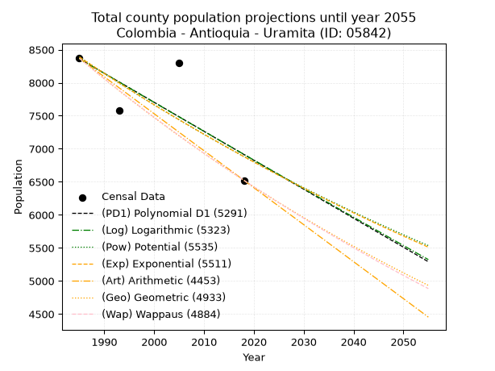
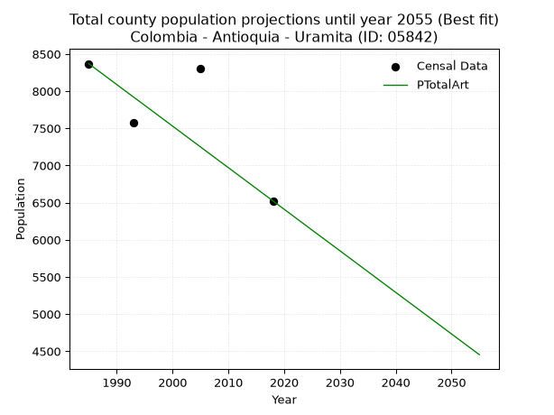
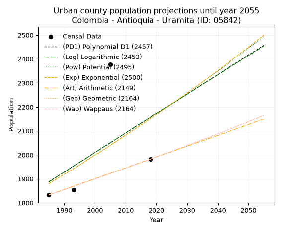
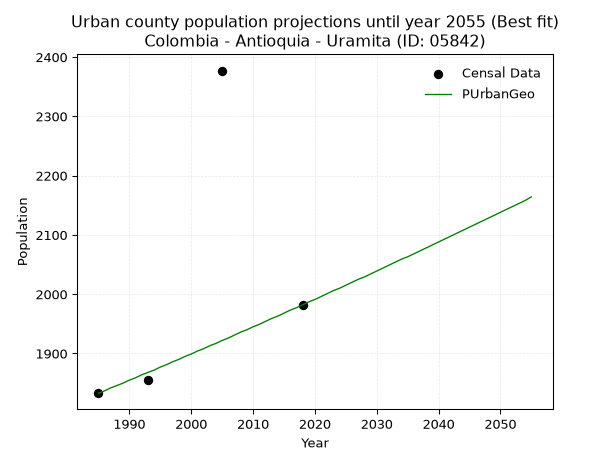
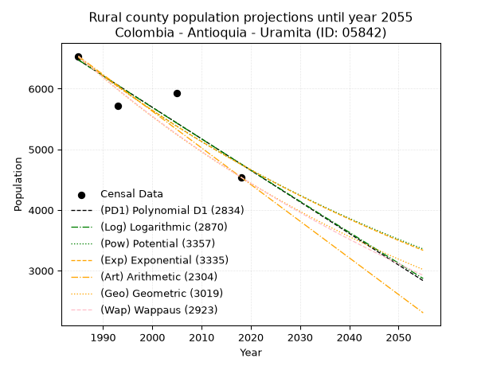
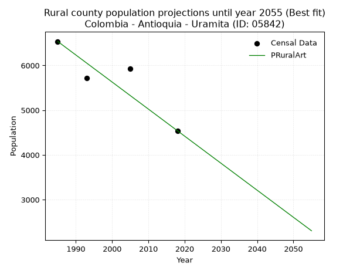

<div align="center">


</div>

# _“Population and Public Services Demand Projections (PPSD) until Year 2050 for Colombia - Antioquia - Uramita (ID: 05842)”_
Keywords: `population` `public-service` `projection` `lineal` `polynomial` `logarithmic` `potential` `exponential` `arithmetic` `geometric` `wappaus` `dane` `colombia` `south-america`

PPSD are analytical estimates used by governments and planners to anticipate future changes in population size, age distribution, and the resulting community needs for utilities, healthcare, education, and infrastructure as sizing future water treatment facilities, electrical grids, and road networks based on spatial growth.

> **General running parameters**: • app_version: _v20260806_. • Python version: _3.14.7_. • Pandas version: _3.0.5_. • NumPy version: _2.5.1_. • Creates, save and include plots into reports (create_plot): _False_. • Projection until year: _2050_. • Process polynomial degree 2 and up: _False_. • Process Wappaus: _True_. • Process Wappaus: _True_. • Set negative values to zero: _True_. • Set infinite values to zero: _True_. • Drop dataset notes: _True_. 
<div align="center">

Dynamic map: [:earth_americas:Google](http://maps.google.com/maps?q=6.898392826,-76.1732839) [:earth_americas:OSM](https://www.openstreetmap.org/#map=18/6.898392826/-76.1732839&layers=P) [:earth_americas:Bing](https://www.bing.com/maps?cp=6.898392826~-76.1732839&lvl=18) [:earth_americas:Apple](https://maps.apple.com/frame?center=6.898392826%2C-76.1732839&span=0.003%2C0.006)

</div>


<div align="center">

```geojson
{
  "type": "Feature",
  "geometry": {
    "type": "Point", 
    "coordinates": [-76.1732839, 6.898392826]
  }, 
  "properties": {
    "Name": "Colombia - Antioquia - Uramita (ID: 05842)"
  }
}
```

</div>


## 0. Census Data (4 records)

Census data are official statistics collected by a government about the people and housing in a country. They usually include counts of total population, age, sex, race, income, education, and jobs.

📅Global census file: [Population.xlsx](../data/Population.xlsx)

| Source   |   Year |   CountryID | CountryName   |   StateID | StateName   |   CountyID | CountyName   |   PTotal |   PUrban |   PRural |
|:---------|-------:|------------:|:--------------|----------:|:------------|-----------:|:-------------|---------:|---------:|---------:|
| DANE     |   1985 |          57 | Colombia      |        05 | Antioquia   |      05842 | Uramita      |     8369 |     1833 |     6536 |
| DANE     |   1993 |          57 | Colombia      |        05 | Antioquia   |      05842 | Uramita      |     7574 |     1855 |     5719 |
| DANE     |   2005 |          57 | Colombia      |        05 | Antioquia   |      05842 | Uramita      |     8304 |     2377 |     5927 |
| DANE     |   2018 |          57 | Colombia      |        05 | Antioquia   |      05842 | Uramita      |     6523 |     1982 |     4541 |

> 🔥Some records could had specific notes about the registered values or the corresponding urban or rural distribution.

## 1. Total

### 1.1. Coefficients and Parameters

* (PD1) Polynomial Deg 1: -43.85628261742161, 95416.02930549758 (lineal)
* (Log) Logarithmic: -87682.97692060981, 674171.5102208346
* (Pow) Potential: -11.99613552148814, 43.484086506248964
* (Exp) Exponential: -0.006000307526762266, 1248492015.4263265
* (Art) Arithmetic: Year diff. 2018 - 1985 = 33, Population diff. 6523 - 8369 = -1846, Annual growth = -55.93939393939394
* (Geo) Geometric: Year diff. 2018 - 1985 = 33, Population diff. 6523 - 8369 = -1846, Annual growth % = -0.007523074404892083
* (Wap) Wappaus: i = -0.7512677133950301, Condition values only valid for < 200)

<sub>
Wappaus condition values: ['-0.00', '-0.75', '-1.50', '-2.25', '-3.01', '-3.76', '-4.51', '-5.26', '-6.01', '-6.76', '-7.51', '-8.26', '-9.02', '-9.77', '-10.52', '-11.27', '-12.02', '-12.77', '-13.52', '-14.27', '-15.03', '-15.78', '-16.53', '-17.28', '-18.03', '-18.78', '-19.53', '-20.28', '-21.04', '-21.79', '-22.54', '-23.29', '-24.04', '-24.79', '-25.54', '-26.29', '-27.05', '-27.80', '-28.55', '-29.30', '-30.05', '-30.80', '-31.55', '-32.30', '-33.06', '-33.81', '-34.56', '-35.31', '-36.06', '-36.81', '-37.56', '-38.31', '-39.07', '-39.82', '-40.57', '-41.32', '-42.07', '-42.82', '-43.57', '-44.32', '-45.08', '-45.83', '-46.58', '-47.33', '-48.08', '-48.83']
</sub>


### 1.2. Projected Dataset

|   Year |   CountyID |   PTotalPD1 |   PTotalLog |   PTotalPow |   PTotalExp |   PTotalArt |   PTotalGeo |   PTotalWap |
|-------:|-----------:|------------:|------------:|------------:|------------:|------------:|------------:|------------:|
|   1985 |      05842 |        8361 |        8362 |        8389 |        8388 |        8369 |        8369 |        8369 |
|   1986 |      05842 |        8317 |        8318 |        8338 |        8338 |        8313 |        8306 |        8306 |
|   1987 |      05842 |        8274 |        8274 |        8288 |        8288 |        8257 |        8244 |        8244 |
|   1988 |      05842 |        8230 |        8229 |        8238 |        8239 |        8201 |        8182 |        8182 |
|   1989 |      05842 |        8186 |        8185 |        8189 |        8189 |        8145 |        8120 |        8121 |
|   1990 |      05842 |        8142 |        8141 |        8140 |        8140 |        8089 |        8059 |        8060 |
|   1991 |      05842 |        8098 |        8097 |        8091 |        8092 |        8033 |        7998 |        8000 |
|   1992 |      05842 |        8054 |        8053 |        8042 |        8043 |        7977 |        7938 |        7940 |
|   1993 |      05842 |        8010 |        8009 |        7994 |        7995 |        7921 |        7878 |        7881 |
|   1994 |      05842 |        7967 |        7965 |        7946 |        7947 |        7866 |        7819 |        7822 |
|   1995 |      05842 |        7923 |        7921 |        7898 |        7900 |        7810 |        7760 |        7763 |
|   1996 |      05842 |        7879 |        7877 |        7851 |        7853 |        7754 |        7702 |        7705 |
|   1997 |      05842 |        7835 |        7833 |        7804 |        7806 |        7698 |        7644 |        7647 |
|   1998 |      05842 |        7791 |        7789 |        7757 |        7759 |        7642 |        7586 |        7590 |
|   1999 |      05842 |        7747 |        7746 |        7711 |        7712 |        7586 |        7529 |        7533 |
|   2000 |      05842 |        7703 |        7702 |        7664 |        7666 |        7530 |        7473 |        7476 |
|   2001 |      05842 |        7660 |        7658 |        7619 |        7620 |        7474 |        7417 |        7420 |
|   2002 |      05842 |        7616 |        7614 |        7573 |        7575 |        7418 |        7361 |        7364 |
|   2003 |      05842 |        7572 |        7570 |        7528 |        7530 |        7362 |        7305 |        7309 |
|   2004 |      05842 |        7528 |        7527 |        7483 |        7484 |        7306 |        7250 |        7254 |
|   2005 |      05842 |        7484 |        7483 |        7438 |        7440 |        7250 |        7196 |        7199 |
|   2006 |      05842 |        7440 |        7439 |        7394 |        7395 |        7194 |        7142 |        7145 |
|   2007 |      05842 |        7396 |        7395 |        7350 |        7351 |        7138 |        7088 |        7091 |
|   2008 |      05842 |        7353 |        7352 |        7306 |        7307 |        7082 |        7035 |        7038 |
|   2009 |      05842 |        7309 |        7308 |        7263 |        7263 |        7026 |        6982 |        6985 |
|   2010 |      05842 |        7265 |        7264 |        7219 |        7220 |        6971 |        6929 |        6932 |
|   2011 |      05842 |        7221 |        7221 |        7176 |        7177 |        6915 |        6877 |        6880 |
|   2012 |      05842 |        7177 |        7177 |        7134 |        7134 |        6859 |        6825 |        6828 |
|   2013 |      05842 |        7133 |        7134 |        7091 |        7091 |        6803 |        6774 |        6776 |
|   2014 |      05842 |        7089 |        7090 |        7049 |        7049 |        6747 |        6723 |        6725 |
|   2015 |      05842 |        7046 |        7047 |        7007 |        7006 |        6691 |        6672 |        6674 |
|   2016 |      05842 |        7002 |        7003 |        6966 |        6965 |        6635 |        6622 |        6623 |
|   2017 |      05842 |        6958 |        6960 |        6924 |        6923 |        6579 |        6572 |        6573 |
|   2018 |      05842 |        6914 |        6916 |        6883 |        6881 |        6523 |        6523 |        6523 |
|   2019 |      05842 |        6870 |        6873 |        6843 |        6840 |        6467 |        6474 |        6473 |
|   2020 |      05842 |        6826 |        6829 |        6802 |        6799 |        6411 |        6425 |        6424 |
|   2021 |      05842 |        6782 |        6786 |        6762 |        6759 |        6355 |        6377 |        6375 |
|   2022 |      05842 |        6739 |        6743 |        6722 |        6718 |        6299 |        6329 |        6327 |
|   2023 |      05842 |        6695 |        6699 |        6682 |        6678 |        6243 |        6281 |        6278 |
|   2024 |      05842 |        6651 |        6656 |        6643 |        6638 |        6187 |        6234 |        6230 |
|   2025 |      05842 |        6607 |        6613 |        6603 |        6598 |        6131 |        6187 |        6183 |
|   2026 |      05842 |        6563 |        6569 |        6564 |        6559 |        6075 |        6141 |        6135 |
|   2027 |      05842 |        6519 |        6526 |        6526 |        6520 |        6020 |        6094 |        6088 |
|   2028 |      05842 |        6475 |        6483 |        6487 |        6481 |        5964 |        6049 |        6041 |
|   2029 |      05842 |        6432 |        6439 |        6449 |        6442 |        5908 |        6003 |        5995 |
|   2030 |      05842 |        6388 |        6396 |        6411 |        6403 |        5852 |        5958 |        5949 |
|   2031 |      05842 |        6344 |        6353 |        6373 |        6365 |        5796 |        5913 |        5903 |
|   2032 |      05842 |        6300 |        6310 |        6336 |        6327 |        5740 |        5869 |        5857 |
|   2033 |      05842 |        6256 |        6267 |        6298 |        6289 |        5684 |        5824 |        5812 |
|   2034 |      05842 |        6212 |        6224 |        6261 |        6252 |        5628 |        5781 |        5767 |
|   2035 |      05842 |        6168 |        6181 |        6224 |        6214 |        5572 |        5737 |        5722 |
|   2036 |      05842 |        6125 |        6137 |        6188 |        6177 |        5516 |        5694 |        5678 |
|   2037 |      05842 |        6081 |        6094 |        6152 |        6140 |        5460 |        5651 |        5634 |
|   2038 |      05842 |        6037 |        6051 |        6115 |        6103 |        5404 |        5609 |        5590 |
|   2039 |      05842 |        5993 |        6008 |        6080 |        6067 |        5348 |        5566 |        5546 |
|   2040 |      05842 |        5949 |        5965 |        6044 |        6030 |        5292 |        5525 |        5503 |
|   2041 |      05842 |        5905 |        5922 |        6008 |        5994 |        5236 |        5483 |        5460 |
|   2042 |      05842 |        5862 |        5879 |        5973 |        5959 |        5180 |        5442 |        5417 |
|   2043 |      05842 |        5818 |        5837 |        5938 |        5923 |        5125 |        5401 |        5375 |
|   2044 |      05842 |        5774 |        5794 |        5903 |        5887 |        5069 |        5360 |        5332 |
|   2045 |      05842 |        5730 |        5751 |        5869 |        5852 |        5013 |        5320 |        5290 |
|   2046 |      05842 |        5686 |        5708 |        5835 |        5817 |        4957 |        5280 |        5249 |
|   2047 |      05842 |        5642 |        5665 |        5801 |        5782 |        4901 |        5240 |        5207 |
|   2048 |      05842 |        5598 |        5622 |        5767 |        5748 |        4845 |        5201 |        5166 |
|   2049 |      05842 |        5555 |        5579 |        5733 |        5713 |        4789 |        5162 |        5125 |
|   2050 |      05842 |        5511 |        5537 |        5700 |        5679 |        4733 |        5123 |        5084 |
<div align="center">

</img>

</div>


### 1.3. Best fit with absolute and relative error (%)

Relative error puts that difference into context by dividing the absolute error by the true value, creating a unitless ratio or percentage that shows the scale of the mistake.

Absolute and relative error

|   Year | Source   |   CountryID | CountryName   |   StateID | StateName   |   CountyID_x | CountyName   |   PTotal |   PUrban |   PRural |   CountyID_y |   PTotalPD1 |   PTotalLog |   PTotalPow |   PTotalExp |   PTotalArt |   PTotalGeo |   PTotalWap |   PTotalPD1AbsError |   PTotalLogAbsError |   PTotalPowAbsError |   PTotalExpAbsError |   PTotalArtAbsError |   PTotalGeoAbsError |   PTotalWapAbsError |   PTotalPD1RelError |   PTotalLogRelError |   PTotalPowRelError |   PTotalExpRelError |   PTotalArtRelError |   PTotalGeoRelError |   PTotalWapRelError |
|-------:|:---------|------------:|:--------------|----------:|:------------|-------------:|:-------------|---------:|---------:|---------:|-------------:|------------:|------------:|------------:|------------:|------------:|------------:|------------:|--------------------:|--------------------:|--------------------:|--------------------:|--------------------:|--------------------:|--------------------:|--------------------:|--------------------:|--------------------:|--------------------:|--------------------:|--------------------:|--------------------:|
|   1985 | DANE     |          57 | Colombia      |        05 | Antioquia   |        05842 | Uramita      |     8369 |     1833 |     6536 |        05842 |        8361 |        8362 |        8389 |        8388 |        8369 |        8369 |        8369 |                   8 |                   7 |                  20 |                  19 |                   0 |                   0 |                   0 |           0.0955909 |            0.083642 |            0.238977 |            0.227028 |             0       |             0       |             0       |
|   1993 | DANE     |          57 | Colombia      |        05 | Antioquia   |        05842 | Uramita      |     7574 |     1855 |     5719 |        05842 |        8010 |        8009 |        7994 |        7995 |        7921 |        7878 |        7881 |                 436 |                 435 |                 420 |                 421 |                 347 |                 304 |                 307 |           5.75654   |            5.74333  |            5.54529  |            5.55849  |             4.58146 |             4.01373 |             4.05334 |
|   2005 | DANE     |          57 | Colombia      |        05 | Antioquia   |        05842 | Uramita      |     8304 |     2377 |     5927 |        05842 |        7484 |        7483 |        7438 |        7440 |        7250 |        7196 |        7199 |                 820 |                 821 |                 866 |                 864 |                1054 |                1108 |                1105 |           9.87476   |            9.8868   |           10.4287   |           10.4046   |            12.6927  |            13.343   |            13.3068  |
|   2018 | DANE     |          57 | Colombia      |        05 | Antioquia   |        05842 | Uramita      |     6523 |     1982 |     4541 |        05842 |        6914 |        6916 |        6883 |        6881 |        6523 |        6523 |        6523 |                 391 |                 393 |                 360 |                 358 |                   0 |                   0 |                   0 |           5.99417   |            6.02484  |            5.51893  |            5.48827  |             0       |             0       |             0       |

Relative error mean

| Method    |   RelError | Best   |
|:----------|-----------:|:-------|
| PTotalPD1 |    5.43026 |        |
| PTotalLog |    5.43465 |        |
| PTotalPow |    5.43298 |        |
| PTotalExp |    5.4196  |        |
| PTotalArt |    4.31854 | True   |
| PTotalGeo |    4.33917 |        |
| PTotalWap |    4.34005 |        |

💙Best method: _**PTotalArt**_
<div align="center">

</img>

</div>


### 1.4. Fresh water supply demand in liters per capita per day (lpcd)

The fresh water supply demand typically ranges from 100 to 300 liters per capita per day (lpcd) for standard domestic and municipal planning, though absolute survival minimums set by the World Health Organization are as low as 7.5 to 20 liters per day, and total consumption in high-income nations can exceed 400 liters.

> `CZ`: Level in meters above the sea level (masl)<br> `WS`: Fresh water supply demand in liters per capita per day (lpcd or l/h/d)<br> `WSAll`: Zonal fresh water supply demand in liters per second (l/s)<br> `A`: Zonal area in square meters<br> `DP`: Population density (people/hectare)

Reference values (RAS Colombia)

|    CZ |   WS |
|------:|-----:|
|  1000 |  120 |
|  2000 |  130 |
| 99999 |  140 |

County shapefile geometry properties and water supply values

|   CountyID |      ATotal |   CZTotal |   WSTotal |
|-----------:|------------:|----------:|----------:|
|      05842 | 2.65937e+08 |   1390.76 |       130 |

Projected values for best method: PTotalArt

|   CountyID |   Year |   PTotalArt |   DPTotal |   WSTotal |   WSTotalAll |
|-----------:|-------:|------------:|----------:|----------:|-------------:|
|      05842 |   1985 |        8369 |      0.31 |       130 |     12.5922  |
|      05842 |   1986 |        8313 |      0.31 |       130 |     12.508   |
|      05842 |   1987 |        8257 |      0.31 |       130 |     12.4237  |
|      05842 |   1988 |        8201 |      0.31 |       130 |     12.3395  |
|      05842 |   1989 |        8145 |      0.31 |       130 |     12.2552  |
|      05842 |   1990 |        8089 |      0.3  |       130 |     12.1709  |
|      05842 |   1991 |        8033 |      0.3  |       130 |     12.0867  |
|      05842 |   1992 |        7977 |      0.3  |       130 |     12.0024  |
|      05842 |   1993 |        7921 |      0.3  |       130 |     11.9182  |
|      05842 |   1994 |        7866 |      0.3  |       130 |     11.8354  |
|      05842 |   1995 |        7810 |      0.29 |       130 |     11.7512  |
|      05842 |   1996 |        7754 |      0.29 |       130 |     11.6669  |
|      05842 |   1997 |        7698 |      0.29 |       130 |     11.5826  |
|      05842 |   1998 |        7642 |      0.29 |       130 |     11.4984  |
|      05842 |   1999 |        7586 |      0.29 |       130 |     11.4141  |
|      05842 |   2000 |        7530 |      0.28 |       130 |     11.3299  |
|      05842 |   2001 |        7474 |      0.28 |       130 |     11.2456  |
|      05842 |   2002 |        7418 |      0.28 |       130 |     11.1613  |
|      05842 |   2003 |        7362 |      0.28 |       130 |     11.0771  |
|      05842 |   2004 |        7306 |      0.27 |       130 |     10.9928  |
|      05842 |   2005 |        7250 |      0.27 |       130 |     10.9086  |
|      05842 |   2006 |        7194 |      0.27 |       130 |     10.8243  |
|      05842 |   2007 |        7138 |      0.27 |       130 |     10.74    |
|      05842 |   2008 |        7082 |      0.27 |       130 |     10.6558  |
|      05842 |   2009 |        7026 |      0.26 |       130 |     10.5715  |
|      05842 |   2010 |        6971 |      0.26 |       130 |     10.4888  |
|      05842 |   2011 |        6915 |      0.26 |       130 |     10.4045  |
|      05842 |   2012 |        6859 |      0.26 |       130 |     10.3203  |
|      05842 |   2013 |        6803 |      0.26 |       130 |     10.236   |
|      05842 |   2014 |        6747 |      0.25 |       130 |     10.1517  |
|      05842 |   2015 |        6691 |      0.25 |       130 |     10.0675  |
|      05842 |   2016 |        6635 |      0.25 |       130 |      9.98322 |
|      05842 |   2017 |        6579 |      0.25 |       130 |      9.89896 |
|      05842 |   2018 |        6523 |      0.25 |       130 |      9.8147  |
|      05842 |   2019 |        6467 |      0.24 |       130 |      9.73044 |
|      05842 |   2020 |        6411 |      0.24 |       130 |      9.64618 |
|      05842 |   2021 |        6355 |      0.24 |       130 |      9.56192 |
|      05842 |   2022 |        6299 |      0.24 |       130 |      9.47766 |
|      05842 |   2023 |        6243 |      0.23 |       130 |      9.3934  |
|      05842 |   2024 |        6187 |      0.23 |       130 |      9.30914 |
|      05842 |   2025 |        6131 |      0.23 |       130 |      9.22488 |
|      05842 |   2026 |        6075 |      0.23 |       130 |      9.14062 |
|      05842 |   2027 |        6020 |      0.23 |       130 |      9.05787 |
|      05842 |   2028 |        5964 |      0.22 |       130 |      8.97361 |
|      05842 |   2029 |        5908 |      0.22 |       130 |      8.88935 |
|      05842 |   2030 |        5852 |      0.22 |       130 |      8.80509 |
|      05842 |   2031 |        5796 |      0.22 |       130 |      8.72083 |
|      05842 |   2032 |        5740 |      0.22 |       130 |      8.63657 |
|      05842 |   2033 |        5684 |      0.21 |       130 |      8.55231 |
|      05842 |   2034 |        5628 |      0.21 |       130 |      8.46806 |
|      05842 |   2035 |        5572 |      0.21 |       130 |      8.3838  |
|      05842 |   2036 |        5516 |      0.21 |       130 |      8.29954 |
|      05842 |   2037 |        5460 |      0.21 |       130 |      8.21528 |
|      05842 |   2038 |        5404 |      0.2  |       130 |      8.13102 |
|      05842 |   2039 |        5348 |      0.2  |       130 |      8.04676 |
|      05842 |   2040 |        5292 |      0.2  |       130 |      7.9625  |
|      05842 |   2041 |        5236 |      0.2  |       130 |      7.87824 |
|      05842 |   2042 |        5180 |      0.19 |       130 |      7.79398 |
|      05842 |   2043 |        5125 |      0.19 |       130 |      7.71123 |
|      05842 |   2044 |        5069 |      0.19 |       130 |      7.62697 |
|      05842 |   2045 |        5013 |      0.19 |       130 |      7.54271 |
|      05842 |   2046 |        4957 |      0.19 |       130 |      7.45845 |
|      05842 |   2047 |        4901 |      0.18 |       130 |      7.37419 |
|      05842 |   2048 |        4845 |      0.18 |       130 |      7.28993 |
|      05842 |   2049 |        4789 |      0.18 |       130 |      7.20567 |
|      05842 |   2050 |        4733 |      0.18 |       130 |      7.12141 |

## 2. Urban

### 2.1. Coefficients and Parameters

* (PD1) Polynomial Deg 1: 8.140104375752912, -14270.493777599764 (lineal)
* (Log) Logarithmic: 16345.76765029619, -122232.56089666268
* (Pow) Potential: 8.172933583143761, -23.678313767365843
* (Exp) Exponential: 0.004070916596789519, 0.5817877599152866
* (Art) Arithmetic: Year diff. 2018 - 1985 = 33, Population diff. 1982 - 1833 = 149, Annual growth = 4.515151515151516
* (Geo) Geometric: Year diff. 2018 - 1985 = 33, Population diff. 1982 - 1833 = 149, Annual growth % = 0.0023710631119817638
* (Wap) Wappaus: i = 0.2367051908336312, Condition values only valid for < 200)

<sub>
Wappaus condition values: ['0.00', '0.24', '0.47', '0.71', '0.95', '1.18', '1.42', '1.66', '1.89', '2.13', '2.37', '2.60', '2.84', '3.08', '3.31', '3.55', '3.79', '4.02', '4.26', '4.50', '4.73', '4.97', '5.21', '5.44', '5.68', '5.92', '6.15', '6.39', '6.63', '6.86', '7.10', '7.34', '7.57', '7.81', '8.05', '8.28', '8.52', '8.76', '8.99', '9.23', '9.47', '9.70', '9.94', '10.18', '10.42', '10.65', '10.89', '11.13', '11.36', '11.60', '11.84', '12.07', '12.31', '12.55', '12.78', '13.02', '13.26', '13.49', '13.73', '13.97', '14.20', '14.44', '14.68', '14.91', '15.15', '15.39']
</sub>


### 2.2. Projected Dataset

|   Year |   CountyID |   PUrbanPD1 |   PUrbanLog |   PUrbanPow |   PUrbanExp |   PUrbanArt |   PUrbanGeo |   PUrbanWap |
|-------:|-----------:|------------:|------------:|------------:|------------:|------------:|------------:|------------:|
|   1985 |      05842 |        1888 |        1887 |        1880 |        1880 |        1833 |        1833 |        1833 |
|   1986 |      05842 |        1896 |        1895 |        1887 |        1888 |        1838 |        1837 |        1837 |
|   1987 |      05842 |        1904 |        1903 |        1895 |        1896 |        1842 |        1842 |        1842 |
|   1988 |      05842 |        1912 |        1912 |        1903 |        1903 |        1847 |        1846 |        1846 |
|   1989 |      05842 |        1920 |        1920 |        1911 |        1911 |        1851 |        1850 |        1850 |
|   1990 |      05842 |        1928 |        1928 |        1919 |        1919 |        1856 |        1855 |        1855 |
|   1991 |      05842 |        1936 |        1936 |        1927 |        1927 |        1860 |        1859 |        1859 |
|   1992 |      05842 |        1945 |        1945 |        1934 |        1935 |        1865 |        1864 |        1864 |
|   1993 |      05842 |        1953 |        1953 |        1942 |        1942 |        1869 |        1868 |        1868 |
|   1994 |      05842 |        1961 |        1961 |        1950 |        1950 |        1874 |        1872 |        1872 |
|   1995 |      05842 |        1969 |        1969 |        1958 |        1958 |        1878 |        1877 |        1877 |
|   1996 |      05842 |        1977 |        1977 |        1966 |        1966 |        1883 |        1881 |        1881 |
|   1997 |      05842 |        1985 |        1985 |        1974 |        1974 |        1887 |        1886 |        1886 |
|   1998 |      05842 |        1993 |        1994 |        1983 |        1982 |        1892 |        1890 |        1890 |
|   1999 |      05842 |        2002 |        2002 |        1991 |        1990 |        1896 |        1895 |        1895 |
|   2000 |      05842 |        2010 |        2010 |        1999 |        1999 |        1901 |        1899 |        1899 |
|   2001 |      05842 |        2018 |        2018 |        2007 |        2007 |        1905 |        1904 |        1904 |
|   2002 |      05842 |        2026 |        2026 |        2015 |        2015 |        1910 |        1908 |        1908 |
|   2003 |      05842 |        2034 |        2035 |        2024 |        2023 |        1914 |        1913 |        1913 |
|   2004 |      05842 |        2042 |        2043 |        2032 |        2031 |        1919 |        1917 |        1917 |
|   2005 |      05842 |        2050 |        2051 |        2040 |        2040 |        1923 |        1922 |        1922 |
|   2006 |      05842 |        2059 |        2059 |        2048 |        2048 |        1928 |        1926 |        1926 |
|   2007 |      05842 |        2067 |        2067 |        2057 |        2056 |        1932 |        1931 |        1931 |
|   2008 |      05842 |        2075 |        2075 |        2065 |        2065 |        1937 |        1936 |        1936 |
|   2009 |      05842 |        2083 |        2083 |        2074 |        2073 |        1941 |        1940 |        1940 |
|   2010 |      05842 |        2091 |        2092 |        2082 |        2082 |        1946 |        1945 |        1945 |
|   2011 |      05842 |        2099 |        2100 |        2091 |        2090 |        1950 |        1949 |        1949 |
|   2012 |      05842 |        2107 |        2108 |        2099 |        2099 |        1955 |        1954 |        1954 |
|   2013 |      05842 |        2116 |        2116 |        2108 |        2107 |        1959 |        1959 |        1959 |
|   2014 |      05842 |        2124 |        2124 |        2116 |        2116 |        1964 |        1963 |        1963 |
|   2015 |      05842 |        2132 |        2132 |        2125 |        2124 |        1968 |        1968 |        1968 |
|   2016 |      05842 |        2140 |        2140 |        2133 |        2133 |        1973 |        1973 |        1973 |
|   2017 |      05842 |        2148 |        2148 |        2142 |        2142 |        1977 |        1977 |        1977 |
|   2018 |      05842 |        2156 |        2156 |        2151 |        2151 |        1982 |        1982 |        1982 |
|   2019 |      05842 |        2164 |        2165 |        2159 |        2159 |        1987 |        1987 |        1987 |
|   2020 |      05842 |        2173 |        2173 |        2168 |        2168 |        1991 |        1991 |        1991 |
|   2021 |      05842 |        2181 |        2181 |        2177 |        2177 |        1996 |        1996 |        1996 |
|   2022 |      05842 |        2189 |        2189 |        2186 |        2186 |        2000 |        2001 |        2001 |
|   2023 |      05842 |        2197 |        2197 |        2195 |        2195 |        2005 |        2006 |        2006 |
|   2024 |      05842 |        2205 |        2205 |        2204 |        2204 |        2009 |        2010 |        2010 |
|   2025 |      05842 |        2213 |        2213 |        2212 |        2213 |        2014 |        2015 |        2015 |
|   2026 |      05842 |        2221 |        2221 |        2221 |        2222 |        2018 |        2020 |        2020 |
|   2027 |      05842 |        2229 |        2229 |        2230 |        2231 |        2023 |        2025 |        2025 |
|   2028 |      05842 |        2238 |        2237 |        2239 |        2240 |        2027 |        2029 |        2030 |
|   2029 |      05842 |        2246 |        2245 |        2248 |        2249 |        2032 |        2034 |        2034 |
|   2030 |      05842 |        2254 |        2253 |        2258 |        2258 |        2036 |        2039 |        2039 |
|   2031 |      05842 |        2262 |        2261 |        2267 |        2267 |        2041 |        2044 |        2044 |
|   2032 |      05842 |        2270 |        2269 |        2276 |        2277 |        2045 |        2049 |        2049 |
|   2033 |      05842 |        2278 |        2278 |        2285 |        2286 |        2050 |        2054 |        2054 |
|   2034 |      05842 |        2286 |        2286 |        2294 |        2295 |        2054 |        2059 |        2059 |
|   2035 |      05842 |        2295 |        2294 |        2303 |        2305 |        2059 |        2063 |        2064 |
|   2036 |      05842 |        2303 |        2302 |        2313 |        2314 |        2063 |        2068 |        2068 |
|   2037 |      05842 |        2311 |        2310 |        2322 |        2323 |        2068 |        2073 |        2073 |
|   2038 |      05842 |        2319 |        2318 |        2331 |        2333 |        2072 |        2078 |        2078 |
|   2039 |      05842 |        2327 |        2326 |        2341 |        2342 |        2077 |        2083 |        2083 |
|   2040 |      05842 |        2335 |        2334 |        2350 |        2352 |        2081 |        2088 |        2088 |
|   2041 |      05842 |        2343 |        2342 |        2359 |        2362 |        2086 |        2093 |        2093 |
|   2042 |      05842 |        2352 |        2350 |        2369 |        2371 |        2090 |        2098 |        2098 |
|   2043 |      05842 |        2360 |        2358 |        2378 |        2381 |        2095 |        2103 |        2103 |
|   2044 |      05842 |        2368 |        2366 |        2388 |        2391 |        2099 |        2108 |        2108 |
|   2045 |      05842 |        2376 |        2374 |        2398 |        2400 |        2104 |        2113 |        2113 |
|   2046 |      05842 |        2384 |        2382 |        2407 |        2410 |        2108 |        2118 |        2118 |
|   2047 |      05842 |        2392 |        2390 |        2417 |        2420 |        2113 |        2123 |        2123 |
|   2048 |      05842 |        2400 |        2398 |        2426 |        2430 |        2117 |        2128 |        2128 |
|   2049 |      05842 |        2409 |        2406 |        2436 |        2440 |        2122 |        2133 |        2133 |
|   2050 |      05842 |        2417 |        2414 |        2446 |        2450 |        2126 |        2138 |        2139 |
<div align="center">

</img>

</div>


### 2.3. Best fit with absolute and relative error (%)

Relative error puts that difference into context by dividing the absolute error by the true value, creating a unitless ratio or percentage that shows the scale of the mistake.

Absolute and relative error

|   Year | Source   |   CountryID | CountryName   |   StateID | StateName   |   CountyID_x | CountyName   |   PTotal |   PUrban |   PRural |   CountyID_y |   PUrbanPD1 |   PUrbanLog |   PUrbanPow |   PUrbanExp |   PUrbanArt |   PUrbanGeo |   PUrbanWap |   PUrbanPD1AbsError |   PUrbanLogAbsError |   PUrbanPowAbsError |   PUrbanExpAbsError |   PUrbanArtAbsError |   PUrbanGeoAbsError |   PUrbanWapAbsError |   PUrbanPD1RelError |   PUrbanLogRelError |   PUrbanPowRelError |   PUrbanExpRelError |   PUrbanArtRelError |   PUrbanGeoRelError |   PUrbanWapRelError |
|-------:|:---------|------------:|:--------------|----------:|:------------|-------------:|:-------------|---------:|---------:|---------:|-------------:|------------:|------------:|------------:|------------:|------------:|------------:|------------:|--------------------:|--------------------:|--------------------:|--------------------:|--------------------:|--------------------:|--------------------:|--------------------:|--------------------:|--------------------:|--------------------:|--------------------:|--------------------:|--------------------:|
|   1985 | DANE     |          57 | Colombia      |        05 | Antioquia   |        05842 | Uramita      |     8369 |     1833 |     6536 |        05842 |        1888 |        1887 |        1880 |        1880 |        1833 |        1833 |        1833 |                  55 |                  54 |                  47 |                  47 |                   0 |                   0 |                   0 |             3.00055 |             2.94599 |             2.5641  |             2.5641  |            0        |            0        |            0        |
|   1993 | DANE     |          57 | Colombia      |        05 | Antioquia   |        05842 | Uramita      |     7574 |     1855 |     5719 |        05842 |        1953 |        1953 |        1942 |        1942 |        1869 |        1868 |        1868 |                  98 |                  98 |                  87 |                  87 |                  14 |                  13 |                  13 |             5.28302 |             5.28302 |             4.69003 |             4.69003 |            0.754717 |            0.700809 |            0.700809 |
|   2005 | DANE     |          57 | Colombia      |        05 | Antioquia   |        05842 | Uramita      |     8304 |     2377 |     5927 |        05842 |        2050 |        2051 |        2040 |        2040 |        1923 |        1922 |        1922 |                 327 |                 326 |                 337 |                 337 |                 454 |                 455 |                 455 |            13.7568  |            13.7148  |            14.1775  |            14.1775  |           19.0997   |           19.1418   |           19.1418   |
|   2018 | DANE     |          57 | Colombia      |        05 | Antioquia   |        05842 | Uramita      |     6523 |     1982 |     4541 |        05842 |        2156 |        2156 |        2151 |        2151 |        1982 |        1982 |        1982 |                 174 |                 174 |                 169 |                 169 |                   0 |                   0 |                   0 |             8.77901 |             8.77901 |             8.52674 |             8.52674 |            0        |            0        |            0        |

Relative error mean

| Method    |   RelError | Best   |
|:----------|-----------:|:-------|
| PUrbanPD1 |    7.70485 |        |
| PUrbanLog |    7.6807  |        |
| PUrbanPow |    7.4896  |        |
| PUrbanExp |    7.4896  |        |
| PUrbanArt |    4.96361 |        |
| PUrbanGeo |    4.96065 | True   |
| PUrbanWap |    4.96065 | True   |

💙Best method: _**PUrbanGeo**_
<div align="center">

</img>

</div>


### 2.4. Fresh water supply demand in liters per capita per day (lpcd)

The fresh water supply demand typically ranges from 100 to 300 liters per capita per day (lpcd) for standard domestic and municipal planning, though absolute survival minimums set by the World Health Organization are as low as 7.5 to 20 liters per day, and total consumption in high-income nations can exceed 400 liters.

> `CZ`: Level in meters above the sea level (masl)<br> `WS`: Fresh water supply demand in liters per capita per day (lpcd or l/h/d)<br> `WSAll`: Zonal fresh water supply demand in liters per second (l/s)<br> `A`: Zonal area in square meters<br> `DP`: Population density (people/hectare)

Reference values (RAS Colombia)

|    CZ |   WS |
|------:|-----:|
|  1000 |  120 |
|  2000 |  130 |
| 99999 |  140 |

County shapefile geometry properties and water supply values

|   CountyID |   AUrban |   CZUrban |   WSUrban |
|-----------:|---------:|----------:|----------:|
|      05842 |   306001 |   668.076 |       120 |

Projected values for best method: PUrbanGeo

|   CountyID |   Year |   PUrbanGeo |   DPUrban |   WSUrban |   WSUrbanAll |
|-----------:|-------:|------------:|----------:|----------:|-------------:|
|      05842 |   1985 |        1833 |     59.9  |       120 |      2.54583 |
|      05842 |   1986 |        1837 |     60.03 |       120 |      2.55139 |
|      05842 |   1987 |        1842 |     60.2  |       120 |      2.55833 |
|      05842 |   1988 |        1846 |     60.33 |       120 |      2.56389 |
|      05842 |   1989 |        1850 |     60.46 |       120 |      2.56944 |
|      05842 |   1990 |        1855 |     60.62 |       120 |      2.57639 |
|      05842 |   1991 |        1859 |     60.75 |       120 |      2.58194 |
|      05842 |   1992 |        1864 |     60.91 |       120 |      2.58889 |
|      05842 |   1993 |        1868 |     61.05 |       120 |      2.59444 |
|      05842 |   1994 |        1872 |     61.18 |       120 |      2.6     |
|      05842 |   1995 |        1877 |     61.34 |       120 |      2.60694 |
|      05842 |   1996 |        1881 |     61.47 |       120 |      2.6125  |
|      05842 |   1997 |        1886 |     61.63 |       120 |      2.61944 |
|      05842 |   1998 |        1890 |     61.76 |       120 |      2.625   |
|      05842 |   1999 |        1895 |     61.93 |       120 |      2.63194 |
|      05842 |   2000 |        1899 |     62.06 |       120 |      2.6375  |
|      05842 |   2001 |        1904 |     62.22 |       120 |      2.64444 |
|      05842 |   2002 |        1908 |     62.35 |       120 |      2.65    |
|      05842 |   2003 |        1913 |     62.52 |       120 |      2.65694 |
|      05842 |   2004 |        1917 |     62.65 |       120 |      2.6625  |
|      05842 |   2005 |        1922 |     62.81 |       120 |      2.66944 |
|      05842 |   2006 |        1926 |     62.94 |       120 |      2.675   |
|      05842 |   2007 |        1931 |     63.1  |       120 |      2.68194 |
|      05842 |   2008 |        1936 |     63.27 |       120 |      2.68889 |
|      05842 |   2009 |        1940 |     63.4  |       120 |      2.69444 |
|      05842 |   2010 |        1945 |     63.56 |       120 |      2.70139 |
|      05842 |   2011 |        1949 |     63.69 |       120 |      2.70694 |
|      05842 |   2012 |        1954 |     63.86 |       120 |      2.71389 |
|      05842 |   2013 |        1959 |     64.02 |       120 |      2.72083 |
|      05842 |   2014 |        1963 |     64.15 |       120 |      2.72639 |
|      05842 |   2015 |        1968 |     64.31 |       120 |      2.73333 |
|      05842 |   2016 |        1973 |     64.48 |       120 |      2.74028 |
|      05842 |   2017 |        1977 |     64.61 |       120 |      2.74583 |
|      05842 |   2018 |        1982 |     64.77 |       120 |      2.75278 |
|      05842 |   2019 |        1987 |     64.93 |       120 |      2.75972 |
|      05842 |   2020 |        1991 |     65.07 |       120 |      2.76528 |
|      05842 |   2021 |        1996 |     65.23 |       120 |      2.77222 |
|      05842 |   2022 |        2001 |     65.39 |       120 |      2.77917 |
|      05842 |   2023 |        2006 |     65.56 |       120 |      2.78611 |
|      05842 |   2024 |        2010 |     65.69 |       120 |      2.79167 |
|      05842 |   2025 |        2015 |     65.85 |       120 |      2.79861 |
|      05842 |   2026 |        2020 |     66.01 |       120 |      2.80556 |
|      05842 |   2027 |        2025 |     66.18 |       120 |      2.8125  |
|      05842 |   2028 |        2029 |     66.31 |       120 |      2.81806 |
|      05842 |   2029 |        2034 |     66.47 |       120 |      2.825   |
|      05842 |   2030 |        2039 |     66.63 |       120 |      2.83194 |
|      05842 |   2031 |        2044 |     66.8  |       120 |      2.83889 |
|      05842 |   2032 |        2049 |     66.96 |       120 |      2.84583 |
|      05842 |   2033 |        2054 |     67.12 |       120 |      2.85278 |
|      05842 |   2034 |        2059 |     67.29 |       120 |      2.85972 |
|      05842 |   2035 |        2063 |     67.42 |       120 |      2.86528 |
|      05842 |   2036 |        2068 |     67.58 |       120 |      2.87222 |
|      05842 |   2037 |        2073 |     67.74 |       120 |      2.87917 |
|      05842 |   2038 |        2078 |     67.91 |       120 |      2.88611 |
|      05842 |   2039 |        2083 |     68.07 |       120 |      2.89306 |
|      05842 |   2040 |        2088 |     68.24 |       120 |      2.9     |
|      05842 |   2041 |        2093 |     68.4  |       120 |      2.90694 |
|      05842 |   2042 |        2098 |     68.56 |       120 |      2.91389 |
|      05842 |   2043 |        2103 |     68.73 |       120 |      2.92083 |
|      05842 |   2044 |        2108 |     68.89 |       120 |      2.92778 |
|      05842 |   2045 |        2113 |     69.05 |       120 |      2.93472 |
|      05842 |   2046 |        2118 |     69.22 |       120 |      2.94167 |
|      05842 |   2047 |        2123 |     69.38 |       120 |      2.94861 |
|      05842 |   2048 |        2128 |     69.54 |       120 |      2.95556 |
|      05842 |   2049 |        2133 |     69.71 |       120 |      2.9625  |
|      05842 |   2050 |        2138 |     69.87 |       120 |      2.96944 |

## 3. Rural

### 3.1. Coefficients and Parameters

* (PD1) Polynomial Deg 1: -51.99638699317455, 109686.5230830974 (lineal)
* (Log) Logarithmic: -104028.74457090603, 796404.0711174976
* (Pow) Potential: -19.14705789624027, 66.9565448163651
* (Exp) Exponential: -0.009571485917523274, 1162467683476.089
* (Art) Arithmetic: Year diff. 2018 - 1985 = 33, Population diff. 4541 - 6536 = -1995, Annual growth = -60.45454545454545
* (Geo) Geometric: Year diff. 2018 - 1985 = 33, Population diff. 4541 - 6536 = -1995, Annual growth % = -0.010975030209413261
* (Wap) Wappaus: i = -1.0915328239513489, Condition values only valid for < 200)

<sub>
Wappaus condition values: ['-0.00', '-1.09', '-2.18', '-3.27', '-4.37', '-5.46', '-6.55', '-7.64', '-8.73', '-9.82', '-10.92', '-12.01', '-13.10', '-14.19', '-15.28', '-16.37', '-17.46', '-18.56', '-19.65', '-20.74', '-21.83', '-22.92', '-24.01', '-25.11', '-26.20', '-27.29', '-28.38', '-29.47', '-30.56', '-31.65', '-32.75', '-33.84', '-34.93', '-36.02', '-37.11', '-38.20', '-39.30', '-40.39', '-41.48', '-42.57', '-43.66', '-44.75', '-45.84', '-46.94', '-48.03', '-49.12', '-50.21', '-51.30', '-52.39', '-53.49', '-54.58', '-55.67', '-56.76', '-57.85', '-58.94', '-60.03', '-61.13', '-62.22', '-63.31', '-64.40', '-65.49', '-66.58', '-67.68', '-68.77', '-69.86', '-70.95']
</sub>


### 3.2. Projected Dataset

|   Year |   CountyID |   PRuralPD1 |   PRuralLog |   PRuralPow |   PRuralExp |   PRuralArt |   PRuralGeo |   PRuralWap |
|-------:|-----------:|------------:|------------:|------------:|------------:|------------:|------------:|------------:|
|   1985 |      05842 |        6474 |        6475 |        6518 |        6517 |        6536 |        6536 |        6536 |
|   1986 |      05842 |        6422 |        6422 |        6456 |        6455 |        6476 |        6464 |        6465 |
|   1987 |      05842 |        6370 |        6370 |        6394 |        6393 |        6415 |        6393 |        6395 |
|   1988 |      05842 |        6318 |        6318 |        6333 |        6333 |        6355 |        6323 |        6325 |
|   1989 |      05842 |        6266 |        6265 |        6272 |        6272 |        6294 |        6254 |        6257 |
|   1990 |      05842 |        6214 |        6213 |        6212 |        6212 |        6234 |        6185 |        6189 |
|   1991 |      05842 |        6162 |        6161 |        6152 |        6153 |        6173 |        6117 |        6122 |
|   1992 |      05842 |        6110 |        6109 |        6093 |        6095 |        6113 |        6050 |        6055 |
|   1993 |      05842 |        6058 |        6056 |        6035 |        6037 |        6052 |        5984 |        5989 |
|   1994 |      05842 |        6006 |        6004 |        5977 |        5979 |        5992 |        5918 |        5924 |
|   1995 |      05842 |        5954 |        5952 |        5920 |        5922 |        5931 |        5853 |        5859 |
|   1996 |      05842 |        5902 |        5900 |        5864 |        5866 |        5871 |        5789 |        5796 |
|   1997 |      05842 |        5850 |        5848 |        5808 |        5810 |        5811 |        5725 |        5733 |
|   1998 |      05842 |        5798 |        5796 |        5752 |        5754 |        5750 |        5662 |        5670 |
|   1999 |      05842 |        5746 |        5744 |        5698 |        5700 |        5690 |        5600 |        5608 |
|   2000 |      05842 |        5694 |        5692 |        5643 |        5645 |        5629 |        5539 |        5547 |
|   2001 |      05842 |        5642 |        5640 |        5590 |        5592 |        5569 |        5478 |        5486 |
|   2002 |      05842 |        5590 |        5588 |        5536 |        5538 |        5508 |        5418 |        5426 |
|   2003 |      05842 |        5538 |        5536 |        5484 |        5486 |        5448 |        5358 |        5367 |
|   2004 |      05842 |        5486 |        5484 |        5431 |        5433 |        5387 |        5300 |        5308 |
|   2005 |      05842 |        5434 |        5432 |        5380 |        5382 |        5327 |        5242 |        5250 |
|   2006 |      05842 |        5382 |        5380 |        5329 |        5330 |        5266 |        5184 |        5192 |
|   2007 |      05842 |        5330 |        5328 |        5278 |        5280 |        5206 |        5127 |        5135 |
|   2008 |      05842 |        5278 |        5276 |        5228 |        5229 |        5146 |        5071 |        5078 |
|   2009 |      05842 |        5226 |        5225 |        5178 |        5179 |        5085 |        5015 |        5022 |
|   2010 |      05842 |        5174 |        5173 |        5129 |        5130 |        5025 |        4960 |        4967 |
|   2011 |      05842 |        5122 |        5121 |        5081 |        5081 |        4964 |        4906 |        4912 |
|   2012 |      05842 |        5070 |        5069 |        5033 |        5033 |        4904 |        4852 |        4857 |
|   2013 |      05842 |        5018 |        5018 |        4985 |        4985 |        4843 |        4799 |        4803 |
|   2014 |      05842 |        4966 |        4966 |        4938 |        4937 |        4783 |        4746 |        4750 |
|   2015 |      05842 |        4914 |        4914 |        4891 |        4890 |        4722 |        4694 |        4697 |
|   2016 |      05842 |        4862 |        4863 |        4845 |        4844 |        4662 |        4642 |        4644 |
|   2017 |      05842 |        4810 |        4811 |        4799 |        4798 |        4601 |        4591 |        4592 |
|   2018 |      05842 |        4758 |        4760 |        4754 |        4752 |        4541 |        4541 |        4541 |
|   2019 |      05842 |        4706 |        4708 |        4709 |        4707 |        4481 |        4491 |        4490 |
|   2020 |      05842 |        4654 |        4657 |        4664 |        4662 |        4420 |        4442 |        4439 |
|   2021 |      05842 |        4602 |        4605 |        4620 |        4617 |        4360 |        4393 |        4389 |
|   2022 |      05842 |        4550 |        4554 |        4577 |        4573 |        4299 |        4345 |        4340 |
|   2023 |      05842 |        4498 |        4502 |        4534 |        4530 |        4239 |        4297 |        4291 |
|   2024 |      05842 |        4446 |        4451 |        4491 |        4487 |        4178 |        4250 |        4242 |
|   2025 |      05842 |        4394 |        4399 |        4449 |        4444 |        4118 |        4203 |        4194 |
|   2026 |      05842 |        4342 |        4348 |        4407 |        4402 |        4057 |        4157 |        4146 |
|   2027 |      05842 |        4290 |        4297 |        4365 |        4360 |        3997 |        4112 |        4098 |
|   2028 |      05842 |        4238 |        4245 |        4324 |        4318 |        3936 |        4067 |        4051 |
|   2029 |      05842 |        4186 |        4194 |        4284 |        4277 |        3876 |        4022 |        4005 |
|   2030 |      05842 |        4134 |        4143 |        4244 |        4236 |        3816 |        3978 |        3959 |
|   2031 |      05842 |        4082 |        4092 |        4204 |        4196 |        3755 |        3934 |        3913 |
|   2032 |      05842 |        4030 |        4040 |        4164 |        4156 |        3695 |        3891 |        3867 |
|   2033 |      05842 |        3978 |        3989 |        4125 |        4116 |        3634 |        3848 |        3822 |
|   2034 |      05842 |        3926 |        3938 |        4087 |        4077 |        3574 |        3806 |        3778 |
|   2035 |      05842 |        3874 |        3887 |        4048 |        4038 |        3513 |        3764 |        3734 |
|   2036 |      05842 |        3822 |        3836 |        4010 |        4000 |        3453 |        3723 |        3690 |
|   2037 |      05842 |        3770 |        3785 |        3973 |        3962 |        3392 |        3682 |        3646 |
|   2038 |      05842 |        3718 |        3734 |        3936 |        3924 |        3332 |        3642 |        3603 |
|   2039 |      05842 |        3666 |        3683 |        3899 |        3887 |        3271 |        3602 |        3560 |
|   2040 |      05842 |        3614 |        3632 |        3862 |        3850 |        3211 |        3562 |        3518 |
|   2041 |      05842 |        3562 |        3581 |        3826 |        3813 |        3151 |        3523 |        3476 |
|   2042 |      05842 |        3510 |        3530 |        3791 |        3777 |        3090 |        3484 |        3434 |
|   2043 |      05842 |        3458 |        3479 |        3755 |        3741 |        3030 |        3446 |        3393 |
|   2044 |      05842 |        3406 |        3428 |        3720 |        3705 |        2969 |        3408 |        3352 |
|   2045 |      05842 |        3354 |        3377 |        3686 |        3670 |        2909 |        3371 |        3311 |
|   2046 |      05842 |        3302 |        3326 |        3651 |        3635 |        2848 |        3334 |        3271 |
|   2047 |      05842 |        3250 |        3275 |        3617 |        3600 |        2788 |        3297 |        3231 |
|   2048 |      05842 |        3198 |        3225 |        3584 |        3566 |        2727 |        3261 |        3191 |
|   2049 |      05842 |        3146 |        3174 |        3550 |        3532 |        2667 |        3225 |        3152 |
|   2050 |      05842 |        3094 |        3123 |        3517 |        3498 |        2606 |        3190 |        3113 |
<div align="center">

</img>

</div>


### 3.3. Best fit with absolute and relative error (%)

Relative error puts that difference into context by dividing the absolute error by the true value, creating a unitless ratio or percentage that shows the scale of the mistake.

Absolute and relative error

|   Year | Source   |   CountryID | CountryName   |   StateID | StateName   |   CountyID_x | CountyName   |   PTotal |   PUrban |   PRural |   CountyID_y |   PRuralPD1 |   PRuralLog |   PRuralPow |   PRuralExp |   PRuralArt |   PRuralGeo |   PRuralWap |   PRuralPD1AbsError |   PRuralLogAbsError |   PRuralPowAbsError |   PRuralExpAbsError |   PRuralArtAbsError |   PRuralGeoAbsError |   PRuralWapAbsError |   PRuralPD1RelError |   PRuralLogRelError |   PRuralPowRelError |   PRuralExpRelError |   PRuralArtRelError |   PRuralGeoRelError |   PRuralWapRelError |
|-------:|:---------|------------:|:--------------|----------:|:------------|-------------:|:-------------|---------:|---------:|---------:|-------------:|------------:|------------:|------------:|------------:|------------:|------------:|------------:|--------------------:|--------------------:|--------------------:|--------------------:|--------------------:|--------------------:|--------------------:|--------------------:|--------------------:|--------------------:|--------------------:|--------------------:|--------------------:|--------------------:|
|   1985 | DANE     |          57 | Colombia      |        05 | Antioquia   |        05842 | Uramita      |     8369 |     1833 |     6536 |        05842 |        6474 |        6475 |        6518 |        6517 |        6536 |        6536 |        6536 |                  62 |                  61 |                  18 |                  19 |                   0 |                   0 |                   0 |            0.948592 |            0.933293 |            0.275398 |            0.290698 |              0      |             0       |             0       |
|   1993 | DANE     |          57 | Colombia      |        05 | Antioquia   |        05842 | Uramita      |     7574 |     1855 |     5719 |        05842 |        6058 |        6056 |        6035 |        6037 |        6052 |        5984 |        5989 |                 339 |                 337 |                 316 |                 318 |                 333 |                 265 |                 270 |            5.92761  |            5.89264  |            5.52544  |            5.56041  |              5.8227 |             4.63368 |             4.72111 |
|   2005 | DANE     |          57 | Colombia      |        05 | Antioquia   |        05842 | Uramita      |     8304 |     2377 |     5927 |        05842 |        5434 |        5432 |        5380 |        5382 |        5327 |        5242 |        5250 |                 493 |                 495 |                 547 |                 545 |                 600 |                 685 |                 677 |            8.31787  |            8.35161  |            9.22895  |            9.19521  |             10.1232 |            11.5573  |            11.4223  |
|   2018 | DANE     |          57 | Colombia      |        05 | Antioquia   |        05842 | Uramita      |     6523 |     1982 |     4541 |        05842 |        4758 |        4760 |        4754 |        4752 |        4541 |        4541 |        4541 |                 217 |                 219 |                 213 |                 211 |                   0 |                   0 |                   0 |            4.77868  |            4.82273  |            4.6906   |            4.64655  |              0      |             0       |             0       |

Relative error mean

| Method    |   RelError | Best   |
|:----------|-----------:|:-------|
| PRuralPD1 |    4.99319 |        |
| PRuralLog |    5.00007 |        |
| PRuralPow |    4.9301  |        |
| PRuralExp |    4.92322 |        |
| PRuralArt |    3.98647 | True   |
| PRuralGeo |    4.04774 |        |
| PRuralWap |    4.03585 |        |

💙Best method: _**PRuralArt**_
<div align="center">

</img>

</div>


### 3.4. Fresh water supply demand in liters per capita per day (lpcd)

The fresh water supply demand typically ranges from 100 to 300 liters per capita per day (lpcd) for standard domestic and municipal planning, though absolute survival minimums set by the World Health Organization are as low as 7.5 to 20 liters per day, and total consumption in high-income nations can exceed 400 liters.

> `CZ`: Level in meters above the sea level (masl)<br> `WS`: Fresh water supply demand in liters per capita per day (lpcd or l/h/d)<br> `WSAll`: Zonal fresh water supply demand in liters per second (l/s)<br> `A`: Zonal area in square meters<br> `DP`: Population density (people/hectare)

Reference values (RAS Colombia)

|    CZ |   WS |
|------:|-----:|
|  1000 |  120 |
|  2000 |  130 |
| 99999 |  140 |

County shapefile geometry properties and water supply values

|   CountyID |      ARural |   CZRural |   WSRural |
|-----------:|------------:|----------:|----------:|
|      05842 | 2.65631e+08 |   1391.54 |       130 |

Projected values for best method: PRuralArt

|   CountyID |   Year |   PRuralArt |   DPRural |   WSRural |   WSRuralAll |
|-----------:|-------:|------------:|----------:|----------:|-------------:|
|      05842 |   1985 |        6536 |      0.25 |       130 |      9.83426 |
|      05842 |   1986 |        6476 |      0.24 |       130 |      9.74398 |
|      05842 |   1987 |        6415 |      0.24 |       130 |      9.6522  |
|      05842 |   1988 |        6355 |      0.24 |       130 |      9.56192 |
|      05842 |   1989 |        6294 |      0.24 |       130 |      9.47014 |
|      05842 |   1990 |        6234 |      0.23 |       130 |      9.37986 |
|      05842 |   1991 |        6173 |      0.23 |       130 |      9.28808 |
|      05842 |   1992 |        6113 |      0.23 |       130 |      9.1978  |
|      05842 |   1993 |        6052 |      0.23 |       130 |      9.10602 |
|      05842 |   1994 |        5992 |      0.23 |       130 |      9.01574 |
|      05842 |   1995 |        5931 |      0.22 |       130 |      8.92396 |
|      05842 |   1996 |        5871 |      0.22 |       130 |      8.83368 |
|      05842 |   1997 |        5811 |      0.22 |       130 |      8.7434  |
|      05842 |   1998 |        5750 |      0.22 |       130 |      8.65162 |
|      05842 |   1999 |        5690 |      0.21 |       130 |      8.56134 |
|      05842 |   2000 |        5629 |      0.21 |       130 |      8.46956 |
|      05842 |   2001 |        5569 |      0.21 |       130 |      8.37928 |
|      05842 |   2002 |        5508 |      0.21 |       130 |      8.2875  |
|      05842 |   2003 |        5448 |      0.21 |       130 |      8.19722 |
|      05842 |   2004 |        5387 |      0.2  |       130 |      8.10544 |
|      05842 |   2005 |        5327 |      0.2  |       130 |      8.01516 |
|      05842 |   2006 |        5266 |      0.2  |       130 |      7.92338 |
|      05842 |   2007 |        5206 |      0.2  |       130 |      7.8331  |
|      05842 |   2008 |        5146 |      0.19 |       130 |      7.74282 |
|      05842 |   2009 |        5085 |      0.19 |       130 |      7.65104 |
|      05842 |   2010 |        5025 |      0.19 |       130 |      7.56076 |
|      05842 |   2011 |        4964 |      0.19 |       130 |      7.46898 |
|      05842 |   2012 |        4904 |      0.18 |       130 |      7.3787  |
|      05842 |   2013 |        4843 |      0.18 |       130 |      7.28692 |
|      05842 |   2014 |        4783 |      0.18 |       130 |      7.19664 |
|      05842 |   2015 |        4722 |      0.18 |       130 |      7.10486 |
|      05842 |   2016 |        4662 |      0.18 |       130 |      7.01458 |
|      05842 |   2017 |        4601 |      0.17 |       130 |      6.9228  |
|      05842 |   2018 |        4541 |      0.17 |       130 |      6.83252 |
|      05842 |   2019 |        4481 |      0.17 |       130 |      6.74225 |
|      05842 |   2020 |        4420 |      0.17 |       130 |      6.65046 |
|      05842 |   2021 |        4360 |      0.16 |       130 |      6.56019 |
|      05842 |   2022 |        4299 |      0.16 |       130 |      6.4684  |
|      05842 |   2023 |        4239 |      0.16 |       130 |      6.37812 |
|      05842 |   2024 |        4178 |      0.16 |       130 |      6.28634 |
|      05842 |   2025 |        4118 |      0.16 |       130 |      6.19606 |
|      05842 |   2026 |        4057 |      0.15 |       130 |      6.10428 |
|      05842 |   2027 |        3997 |      0.15 |       130 |      6.014   |
|      05842 |   2028 |        3936 |      0.15 |       130 |      5.92222 |
|      05842 |   2029 |        3876 |      0.15 |       130 |      5.83194 |
|      05842 |   2030 |        3816 |      0.14 |       130 |      5.74167 |
|      05842 |   2031 |        3755 |      0.14 |       130 |      5.64988 |
|      05842 |   2032 |        3695 |      0.14 |       130 |      5.55961 |
|      05842 |   2033 |        3634 |      0.14 |       130 |      5.46782 |
|      05842 |   2034 |        3574 |      0.13 |       130 |      5.37755 |
|      05842 |   2035 |        3513 |      0.13 |       130 |      5.28576 |
|      05842 |   2036 |        3453 |      0.13 |       130 |      5.19549 |
|      05842 |   2037 |        3392 |      0.13 |       130 |      5.1037  |
|      05842 |   2038 |        3332 |      0.13 |       130 |      5.01343 |
|      05842 |   2039 |        3271 |      0.12 |       130 |      4.92164 |
|      05842 |   2040 |        3211 |      0.12 |       130 |      4.83137 |
|      05842 |   2041 |        3151 |      0.12 |       130 |      4.74109 |
|      05842 |   2042 |        3090 |      0.12 |       130 |      4.64931 |
|      05842 |   2043 |        3030 |      0.11 |       130 |      4.55903 |
|      05842 |   2044 |        2969 |      0.11 |       130 |      4.46725 |
|      05842 |   2045 |        2909 |      0.11 |       130 |      4.37697 |
|      05842 |   2046 |        2848 |      0.11 |       130 |      4.28519 |
|      05842 |   2047 |        2788 |      0.1  |       130 |      4.19491 |
|      05842 |   2048 |        2727 |      0.1  |       130 |      4.10313 |
|      05842 |   2049 |        2667 |      0.1  |       130 |      4.01285 |
|      05842 |   2050 |        2606 |      0.1  |       130 |      3.92106 |

<div align="center"><br><sub>Share this research</sub></div><br>

<sub>**APPS & TOOLS & CONTENT DISCLAIMER**: • NO WARRANTY - This content and software is provided by <a href="https://github.com/rcfdtools" target="_blank">github.com/rcfdtools</a> "as is", without any express or implied warranty, including warranties of merchantability, fitness for a particular purpose, or non-infringement. There is no guarantee that the software will be error-free or operate without interruption. • LIMITATION OF LIABILITY - Neither the authors nor copyright holders will be liable for claims or damages arising from the software or its use. You are responsible for determining if the software is appropriate for your use and assume all associated risks, including errors, legal compliance, and data loss. • NO PROFESSIONAL ADVICE - The software provides general information and does not offer professional advice. It should not replace consultation with professional advisors. [Clauses and global license for rcfdtools use.](https://github.com/rcfdtools/rcfdtools/blob/main/LICENSE.md)</sub>

| [:house: Home](Readme.md)  | [:beginner: Help / Collaborate](https://github.com/rcfdtools/R.HydroTools/discussions/31) |
|----------------------------|-------------------------------------------------------------------------------------------|