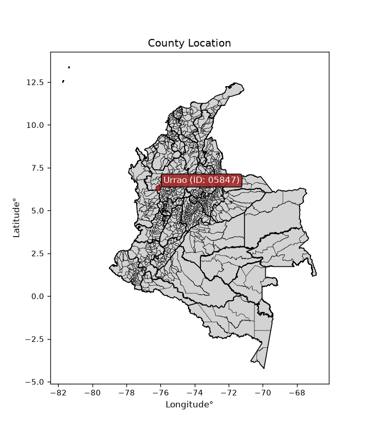
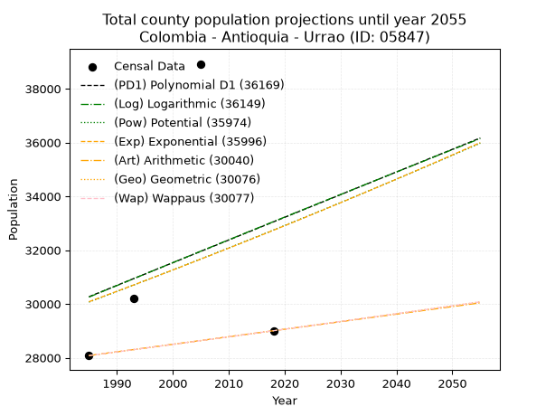
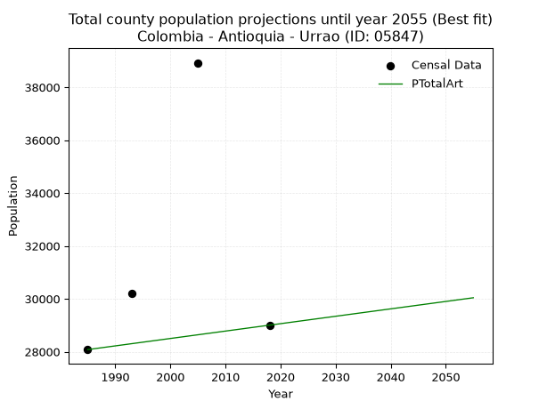
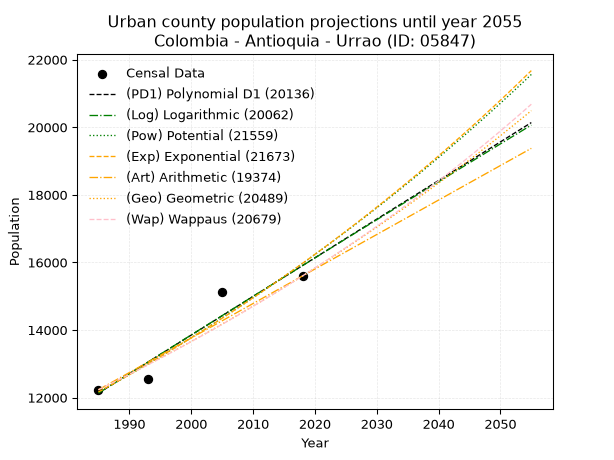
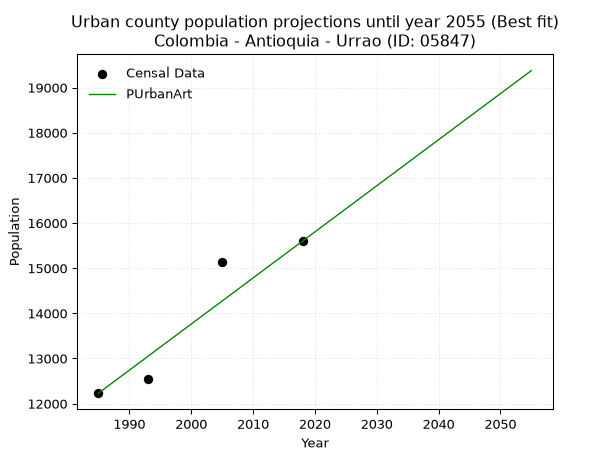
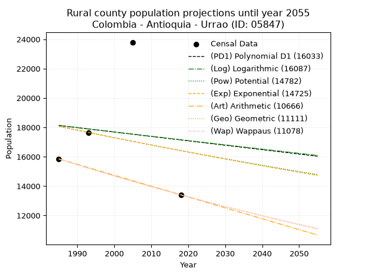
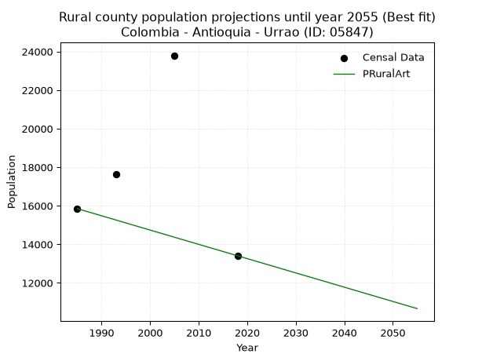

<div align="center">


</div>

# _“Population and Public Services Demand Projections (PPSD) until Year 2050 for Colombia - Antioquia - Urrao (ID: 05847)”_
Keywords: `population` `public-service` `projection` `lineal` `polynomial` `logarithmic` `potential` `exponential` `arithmetic` `geometric` `wappaus` `dane` `colombia` `south-america`

PPSD are analytical estimates used by governments and planners to anticipate future changes in population size, age distribution, and the resulting community needs for utilities, healthcare, education, and infrastructure as sizing future water treatment facilities, electrical grids, and road networks based on spatial growth.

<div align="center">

</img>

</div>


> **General running parameters**: • app_version: _v20260806_. • Python version: _3.14.7_. • Pandas version: _3.0.5_. • NumPy version: _2.5.1_. • Creates, save and include plots into reports (create_plot): _False_. • Projection until year: _2050_. • Process polynomial degree 2 and up: _False_. • Process Wappaus: _True_. • Process Wappaus: _True_. • Set negative values to zero: _True_. • Set infinite values to zero: _True_. • Drop dataset notes: _True_. 
<div align="center">

Dynamic map: [:earth_americas:Google](http://maps.google.com/maps?q=6.317343018,-76.1339513) [:earth_americas:OSM](https://www.openstreetmap.org/#map=18/6.317343018/-76.1339513&layers=P) [:earth_americas:Bing](https://www.bing.com/maps?cp=6.317343018~-76.1339513&lvl=18) [:earth_americas:Apple](https://maps.apple.com/frame?center=6.317343018%2C-76.1339513&span=0.003%2C0.006)

</div>


<div align="center">

```geojson
{
  "type": "Feature",
  "geometry": {
    "type": "Point", 
    "coordinates": [-76.1339513, 6.317343018]
  }, 
  "properties": {
    "Name": "Colombia - Antioquia - Urrao (ID: 05847)"
  }
}
```

</div>


## 0. Census Data (4 records)

Census data are official statistics collected by a government about the people and housing in a country. They usually include counts of total population, age, sex, race, income, education, and jobs.

📅Global census file: [Population.xlsx](../data/Population.xlsx)

| Source   |   Year |   CountryID | CountryName   |   StateID | StateName   |   CountyID | CountyName   |   PTotal |   PUrban |   PRural |
|:---------|-------:|------------:|:--------------|----------:|:------------|-----------:|:-------------|---------:|---------:|---------:|
| DANE     |   1985 |          57 | Colombia      |        05 | Antioquia   |      05847 | Urrao        |    28080 |    12230 |    15850 |
| DANE     |   1993 |          57 | Colombia      |        05 | Antioquia   |      05847 | Urrao        |    30205 |    12552 |    17653 |
| DANE     |   2005 |          57 | Colombia      |        05 | Antioquia   |      05847 | Urrao        |    38923 |    15125 |    23798 |
| DANE     |   2018 |          57 | Colombia      |        05 | Antioquia   |      05847 | Urrao        |    29004 |    15598 |    13406 |

> 🔥Some records could had specific notes about the registered values or the corresponding urban or rural distribution.

📅[SUI-RUPS](https://www.datos.gov.co/Hacienda-y-Cr-dito-P-blico/Registro-nico-de-Prestadores-de-Servicios-P-blicos/4qkq-csdn/about_data) - Local public utility companies: [RUPS.csv](../data/RUPS.xlsx)

 | SERVICIO       | ESTADO    | NOMBRE                             | NIT         | DEPARTAMENTO_DOMICILIO   | MUNICIPIO_DOMICILIO   | DIRECCION        |   TELEFONO | EMAIL                               | TIPO_PRESTADOR                            | CLASIFICACION                 |
|:---------------|:----------|:-----------------------------------|:------------|:-------------------------|:----------------------|:-----------------|-----------:|:------------------------------------|:------------------------------------------|:------------------------------|
| ACUEDUCTO      | OPERATIVA | EMPRESAS PÚBLICAS  DE URRAO E.S.P. | 800152294-2 | ANTIOQUIA                | URRAO                 | CALLE 29 N 29 57 |    8503641 | contactenos@empresaspublicas.gov.co | EMPRESA INDUSTRIAL Y COMERCIAL DEL ESTADO | MAYOR O IGUAL A 5001 USUARIOS |
| ALCANTARILLADO | OPERATIVA | EMPRESAS PÚBLICAS  DE URRAO E.S.P. | 800152294-2 | ANTIOQUIA                | URRAO                 | CALLE 29 N 29 57 |    8503641 | contactenos@empresaspublicas.gov.co | EMPRESA INDUSTRIAL Y COMERCIAL DEL ESTADO | MAYOR O IGUAL A 5001 USUARIOS |

## 1. Total

### 1.1. Coefficients and Parameters

* (PD1) Polynomial Deg 1: 84.30188679245856, -137071.84905661526 (lineal)
* (Log) Logarithmic: 170075.18503234087, -1261189.8443278212
* (Pow) Potential: 5.172763042618828, -12.580398054809583
* (Exp) Exponential: 0.0025641062503684903, 185.29011512766175
* (Art) Arithmetic: Year diff. 2018 - 1985 = 33, Population diff. 29004 - 28080 = 924, Annual growth = 28.0
* (Geo) Geometric: Year diff. 2018 - 1985 = 33, Population diff. 29004 - 28080 = 924, Annual growth % = 0.0009815775641117686
* (Wap) Wappaus: i = 0.09810104407539766, Condition values only valid for < 200)

<sub>
Wappaus condition values: ['0.00', '0.10', '0.20', '0.29', '0.39', '0.49', '0.59', '0.69', '0.78', '0.88', '0.98', '1.08', '1.18', '1.28', '1.37', '1.47', '1.57', '1.67', '1.77', '1.86', '1.96', '2.06', '2.16', '2.26', '2.35', '2.45', '2.55', '2.65', '2.75', '2.84', '2.94', '3.04', '3.14', '3.24', '3.34', '3.43', '3.53', '3.63', '3.73', '3.83', '3.92', '4.02', '4.12', '4.22', '4.32', '4.41', '4.51', '4.61', '4.71', '4.81', '4.91', '5.00', '5.10', '5.20', '5.30', '5.40', '5.49', '5.59', '5.69', '5.79', '5.89', '5.98', '6.08', '6.18', '6.28', '6.38']
</sub>


### 1.2. Projected Dataset

|   Year |   CountyID |   PTotalPD1 |   PTotalLog |   PTotalPow |   PTotalExp |   PTotalArt |   PTotalGeo |   PTotalWap |
|-------:|-----------:|------------:|------------:|------------:|------------:|------------:|------------:|------------:|
|   1985 |      05847 |       30267 |       30255 |       30070 |       30082 |       28080 |       28080 |       28080 |
|   1986 |      05847 |       30352 |       30340 |       30149 |       30159 |       28108 |       28108 |       28108 |
|   1987 |      05847 |       30436 |       30426 |       30227 |       30236 |       28136 |       28135 |       28135 |
|   1988 |      05847 |       30520 |       30512 |       30306 |       30314 |       28164 |       28163 |       28163 |
|   1989 |      05847 |       30605 |       30597 |       30385 |       30392 |       28192 |       28190 |       28190 |
|   1990 |      05847 |       30689 |       30683 |       30464 |       30470 |       28220 |       28218 |       28218 |
|   1991 |      05847 |       30773 |       30768 |       30543 |       30548 |       28248 |       28246 |       28246 |
|   1992 |      05847 |       30858 |       30853 |       30623 |       30627 |       28276 |       28274 |       28273 |
|   1993 |      05847 |       30942 |       30939 |       30702 |       30705 |       28304 |       28301 |       28301 |
|   1994 |      05847 |       31026 |       31024 |       30782 |       30784 |       28332 |       28329 |       28329 |
|   1995 |      05847 |       31110 |       31109 |       30862 |       30863 |       28360 |       28357 |       28357 |
|   1996 |      05847 |       31195 |       31195 |       30942 |       30942 |       28388 |       28385 |       28385 |
|   1997 |      05847 |       31279 |       31280 |       31022 |       31022 |       28416 |       28413 |       28413 |
|   1998 |      05847 |       31363 |       31365 |       31103 |       31101 |       28444 |       28440 |       28440 |
|   1999 |      05847 |       31448 |       31450 |       31183 |       31181 |       28472 |       28468 |       28468 |
|   2000 |      05847 |       31532 |       31535 |       31264 |       31261 |       28500 |       28496 |       28496 |
|   2001 |      05847 |       31616 |       31620 |       31345 |       31342 |       28528 |       28524 |       28524 |
|   2002 |      05847 |       31701 |       31705 |       31426 |       31422 |       28556 |       28552 |       28552 |
|   2003 |      05847 |       31785 |       31790 |       31508 |       31503 |       28584 |       28580 |       28580 |
|   2004 |      05847 |       31869 |       31875 |       31589 |       31584 |       28612 |       28608 |       28608 |
|   2005 |      05847 |       31953 |       31960 |       31671 |       31665 |       28640 |       28636 |       28636 |
|   2006 |      05847 |       32038 |       32045 |       31752 |       31746 |       28668 |       28665 |       28665 |
|   2007 |      05847 |       32122 |       32129 |       31834 |       31827 |       28696 |       28693 |       28693 |
|   2008 |      05847 |       32206 |       32214 |       31917 |       31909 |       28724 |       28721 |       28721 |
|   2009 |      05847 |       32291 |       32299 |       31999 |       31991 |       28752 |       28749 |       28749 |
|   2010 |      05847 |       32375 |       32383 |       32081 |       32073 |       28780 |       28777 |       28777 |
|   2011 |      05847 |       32459 |       32468 |       32164 |       32156 |       28808 |       28805 |       28805 |
|   2012 |      05847 |       32544 |       32552 |       32247 |       32238 |       28836 |       28834 |       28834 |
|   2013 |      05847 |       32628 |       32637 |       32330 |       32321 |       28864 |       28862 |       28862 |
|   2014 |      05847 |       32712 |       32721 |       32413 |       32404 |       28892 |       28890 |       28890 |
|   2015 |      05847 |       32796 |       32806 |       32496 |       32487 |       28920 |       28919 |       28919 |
|   2016 |      05847 |       32881 |       32890 |       32580 |       32570 |       28948 |       28947 |       28947 |
|   2017 |      05847 |       32965 |       32975 |       32663 |       32654 |       28976 |       28976 |       28976 |
|   2018 |      05847 |       33049 |       33059 |       32747 |       32738 |       29004 |       29004 |       29004 |
|   2019 |      05847 |       33134 |       33143 |       32831 |       32822 |       29032 |       29032 |       29032 |
|   2020 |      05847 |       33218 |       33227 |       32916 |       32906 |       29060 |       29061 |       29061 |
|   2021 |      05847 |       33302 |       33312 |       33000 |       32991 |       29088 |       29089 |       29090 |
|   2022 |      05847 |       33387 |       33396 |       33084 |       33075 |       29116 |       29118 |       29118 |
|   2023 |      05847 |       33471 |       33480 |       33169 |       33160 |       29144 |       29147 |       29147 |
|   2024 |      05847 |       33555 |       33564 |       33254 |       33245 |       29172 |       29175 |       29175 |
|   2025 |      05847 |       33639 |       33648 |       33339 |       33331 |       29200 |       29204 |       29204 |
|   2026 |      05847 |       33724 |       33732 |       33424 |       33416 |       29228 |       29233 |       29233 |
|   2027 |      05847 |       33808 |       33816 |       33510 |       33502 |       29256 |       29261 |       29261 |
|   2028 |      05847 |       33892 |       33900 |       33595 |       33588 |       29284 |       29290 |       29290 |
|   2029 |      05847 |       33977 |       33983 |       33681 |       33674 |       29312 |       29319 |       29319 |
|   2030 |      05847 |       34061 |       34067 |       33767 |       33761 |       29340 |       29347 |       29348 |
|   2031 |      05847 |       34145 |       34151 |       33853 |       33848 |       29368 |       29376 |       29376 |
|   2032 |      05847 |       34230 |       34235 |       33940 |       33934 |       29396 |       29405 |       29405 |
|   2033 |      05847 |       34314 |       34318 |       34026 |       34022 |       29424 |       29434 |       29434 |
|   2034 |      05847 |       34398 |       34402 |       34113 |       34109 |       29452 |       29463 |       29463 |
|   2035 |      05847 |       34482 |       34486 |       34200 |       34197 |       29480 |       29492 |       29492 |
|   2036 |      05847 |       34567 |       34569 |       34287 |       34284 |       29508 |       29521 |       29521 |
|   2037 |      05847 |       34651 |       34653 |       34374 |       34372 |       29536 |       29550 |       29550 |
|   2038 |      05847 |       34735 |       34736 |       34461 |       34461 |       29564 |       29579 |       29579 |
|   2039 |      05847 |       34820 |       34820 |       34549 |       34549 |       29592 |       29608 |       29608 |
|   2040 |      05847 |       34904 |       34903 |       34637 |       34638 |       29620 |       29637 |       29637 |
|   2041 |      05847 |       34988 |       34986 |       34724 |       34727 |       29648 |       29666 |       29666 |
|   2042 |      05847 |       35073 |       35070 |       34813 |       34816 |       29676 |       29695 |       29695 |
|   2043 |      05847 |       35157 |       35153 |       34901 |       34905 |       29704 |       29724 |       29724 |
|   2044 |      05847 |       35241 |       35236 |       34989 |       34995 |       29732 |       29753 |       29754 |
|   2045 |      05847 |       35326 |       35319 |       35078 |       35085 |       29760 |       29783 |       29783 |
|   2046 |      05847 |       35410 |       35402 |       35167 |       35175 |       29788 |       29812 |       29812 |
|   2047 |      05847 |       35494 |       35486 |       35256 |       35265 |       29816 |       29841 |       29841 |
|   2048 |      05847 |       35578 |       35569 |       35345 |       35356 |       29844 |       29870 |       29871 |
|   2049 |      05847 |       35663 |       35652 |       35434 |       35446 |       29872 |       29900 |       29900 |
|   2050 |      05847 |       35747 |       35735 |       35524 |       35537 |       29900 |       29929 |       29930 |
<div align="center">

</img>

</div>


### 1.3. Best fit with absolute and relative error (%)

Relative error puts that difference into context by dividing the absolute error by the true value, creating a unitless ratio or percentage that shows the scale of the mistake.

Absolute and relative error

|   Year | Source   |   CountryID | CountryName   |   StateID | StateName   |   CountyID_x | CountyName   |   PTotal |   PUrban |   PRural |   CountyID_y |   PTotalPD1 |   PTotalLog |   PTotalPow |   PTotalExp |   PTotalArt |   PTotalGeo |   PTotalWap |   PTotalPD1AbsError |   PTotalLogAbsError |   PTotalPowAbsError |   PTotalExpAbsError |   PTotalArtAbsError |   PTotalGeoAbsError |   PTotalWapAbsError |   PTotalPD1RelError |   PTotalLogRelError |   PTotalPowRelError |   PTotalExpRelError |   PTotalArtRelError |   PTotalGeoRelError |   PTotalWapRelError |
|-------:|:---------|------------:|:--------------|----------:|:------------|-------------:|:-------------|---------:|---------:|---------:|-------------:|------------:|------------:|------------:|------------:|------------:|------------:|------------:|--------------------:|--------------------:|--------------------:|--------------------:|--------------------:|--------------------:|--------------------:|--------------------:|--------------------:|--------------------:|--------------------:|--------------------:|--------------------:|--------------------:|
|   1985 | DANE     |          57 | Colombia      |        05 | Antioquia   |        05847 | Urrao        |    28080 |    12230 |    15850 |        05847 |       30267 |       30255 |       30070 |       30082 |       28080 |       28080 |       28080 |                2187 |                2175 |                1990 |                2002 |                   0 |                   0 |                   0 |             7.78846 |             7.74573 |             7.08689 |             7.12963 |             0       |             0       |             0       |
|   1993 | DANE     |          57 | Colombia      |        05 | Antioquia   |        05847 | Urrao        |    30205 |    12552 |    17653 |        05847 |       30942 |       30939 |       30702 |       30705 |       28304 |       28301 |       28301 |                 737 |                 734 |                 497 |                 500 |                1901 |                1904 |                1904 |             2.43999 |             2.43006 |             1.64542 |             1.65536 |             6.29366 |             6.30359 |             6.30359 |
|   2005 | DANE     |          57 | Colombia      |        05 | Antioquia   |        05847 | Urrao        |    38923 |    15125 |    23798 |        05847 |       31953 |       31960 |       31671 |       31665 |       28640 |       28636 |       28636 |                6970 |                6963 |                7252 |                7258 |               10283 |               10287 |               10287 |            17.9072  |            17.8892  |            18.6317  |            18.6471  |            26.4188  |            26.4291  |            26.4291  |
|   2018 | DANE     |          57 | Colombia      |        05 | Antioquia   |        05847 | Urrao        |    29004 |    15598 |    13406 |        05847 |       33049 |       33059 |       32747 |       32738 |       29004 |       29004 |       29004 |                4045 |                4055 |                3743 |                3734 |                   0 |                   0 |                   0 |            13.9464  |            13.9808  |            12.9051  |            12.8741  |             0       |             0       |             0       |

Relative error mean

| Method    |   RelError | Best   |
|:----------|-----------:|:-------|
| PTotalPD1 |   10.5205  |        |
| PTotalLog |   10.5114  |        |
| PTotalPow |   10.0673  |        |
| PTotalExp |   10.0765  |        |
| PTotalArt |    8.17812 | True   |
| PTotalGeo |    8.18317 |        |
| PTotalWap |    8.18317 |        |

💙Best method: _**PTotalArt**_
<div align="center">

</img>

</div>


### 1.4. Fresh water supply demand in liters per capita per day (lpcd)

The fresh water supply demand typically ranges from 100 to 300 liters per capita per day (lpcd) for standard domestic and municipal planning, though absolute survival minimums set by the World Health Organization are as low as 7.5 to 20 liters per day, and total consumption in high-income nations can exceed 400 liters.

> `CZ`: Level in meters above the sea level (masl)<br> `WS`: Fresh water supply demand in liters per capita per day (lpcd or l/h/d)<br> `WSAll`: Zonal fresh water supply demand in liters per second (l/s)<br> `A`: Zonal area in square meters<br> `DP`: Population density (people/hectare or p/ha)

Reference values (RAS Colombia)

|    CZ |   WS |
|------:|-----:|
|  1000 |  120 |
|  2000 |  130 |
| 99999 |  140 |

County shapefile geometry properties and water supply values

|   CountyID |      ATotal |   CZTotal |   WSTotal |
|-----------:|------------:|----------:|----------:|
|      05847 | 2.56385e+09 |   1615.16 |       130 |

Projected values for best method: PTotalArt

|   CountyID |   Year |   PTotalArt |   DPTotal |   WSTotal |   WSTotalAll |
|-----------:|-------:|------------:|----------:|----------:|-------------:|
|      05847 |   1985 |       28080 |      0.11 |       130 |      42.25   |
|      05847 |   1986 |       28108 |      0.11 |       130 |      42.2921 |
|      05847 |   1987 |       28136 |      0.11 |       130 |      42.3343 |
|      05847 |   1988 |       28164 |      0.11 |       130 |      42.3764 |
|      05847 |   1989 |       28192 |      0.11 |       130 |      42.4185 |
|      05847 |   1990 |       28220 |      0.11 |       130 |      42.4606 |
|      05847 |   1991 |       28248 |      0.11 |       130 |      42.5028 |
|      05847 |   1992 |       28276 |      0.11 |       130 |      42.5449 |
|      05847 |   1993 |       28304 |      0.11 |       130 |      42.587  |
|      05847 |   1994 |       28332 |      0.11 |       130 |      42.6292 |
|      05847 |   1995 |       28360 |      0.11 |       130 |      42.6713 |
|      05847 |   1996 |       28388 |      0.11 |       130 |      42.7134 |
|      05847 |   1997 |       28416 |      0.11 |       130 |      42.7556 |
|      05847 |   1998 |       28444 |      0.11 |       130 |      42.7977 |
|      05847 |   1999 |       28472 |      0.11 |       130 |      42.8398 |
|      05847 |   2000 |       28500 |      0.11 |       130 |      42.8819 |
|      05847 |   2001 |       28528 |      0.11 |       130 |      42.9241 |
|      05847 |   2002 |       28556 |      0.11 |       130 |      42.9662 |
|      05847 |   2003 |       28584 |      0.11 |       130 |      43.0083 |
|      05847 |   2004 |       28612 |      0.11 |       130 |      43.0505 |
|      05847 |   2005 |       28640 |      0.11 |       130 |      43.0926 |
|      05847 |   2006 |       28668 |      0.11 |       130 |      43.1347 |
|      05847 |   2007 |       28696 |      0.11 |       130 |      43.1769 |
|      05847 |   2008 |       28724 |      0.11 |       130 |      43.219  |
|      05847 |   2009 |       28752 |      0.11 |       130 |      43.2611 |
|      05847 |   2010 |       28780 |      0.11 |       130 |      43.3032 |
|      05847 |   2011 |       28808 |      0.11 |       130 |      43.3454 |
|      05847 |   2012 |       28836 |      0.11 |       130 |      43.3875 |
|      05847 |   2013 |       28864 |      0.11 |       130 |      43.4296 |
|      05847 |   2014 |       28892 |      0.11 |       130 |      43.4718 |
|      05847 |   2015 |       28920 |      0.11 |       130 |      43.5139 |
|      05847 |   2016 |       28948 |      0.11 |       130 |      43.556  |
|      05847 |   2017 |       28976 |      0.11 |       130 |      43.5981 |
|      05847 |   2018 |       29004 |      0.11 |       130 |      43.6403 |
|      05847 |   2019 |       29032 |      0.11 |       130 |      43.6824 |
|      05847 |   2020 |       29060 |      0.11 |       130 |      43.7245 |
|      05847 |   2021 |       29088 |      0.11 |       130 |      43.7667 |
|      05847 |   2022 |       29116 |      0.11 |       130 |      43.8088 |
|      05847 |   2023 |       29144 |      0.11 |       130 |      43.8509 |
|      05847 |   2024 |       29172 |      0.11 |       130 |      43.8931 |
|      05847 |   2025 |       29200 |      0.11 |       130 |      43.9352 |
|      05847 |   2026 |       29228 |      0.11 |       130 |      43.9773 |
|      05847 |   2027 |       29256 |      0.11 |       130 |      44.0194 |
|      05847 |   2028 |       29284 |      0.11 |       130 |      44.0616 |
|      05847 |   2029 |       29312 |      0.11 |       130 |      44.1037 |
|      05847 |   2030 |       29340 |      0.11 |       130 |      44.1458 |
|      05847 |   2031 |       29368 |      0.11 |       130 |      44.188  |
|      05847 |   2032 |       29396 |      0.11 |       130 |      44.2301 |
|      05847 |   2033 |       29424 |      0.11 |       130 |      44.2722 |
|      05847 |   2034 |       29452 |      0.11 |       130 |      44.3144 |
|      05847 |   2035 |       29480 |      0.11 |       130 |      44.3565 |
|      05847 |   2036 |       29508 |      0.12 |       130 |      44.3986 |
|      05847 |   2037 |       29536 |      0.12 |       130 |      44.4407 |
|      05847 |   2038 |       29564 |      0.12 |       130 |      44.4829 |
|      05847 |   2039 |       29592 |      0.12 |       130 |      44.525  |
|      05847 |   2040 |       29620 |      0.12 |       130 |      44.5671 |
|      05847 |   2041 |       29648 |      0.12 |       130 |      44.6093 |
|      05847 |   2042 |       29676 |      0.12 |       130 |      44.6514 |
|      05847 |   2043 |       29704 |      0.12 |       130 |      44.6935 |
|      05847 |   2044 |       29732 |      0.12 |       130 |      44.7356 |
|      05847 |   2045 |       29760 |      0.12 |       130 |      44.7778 |
|      05847 |   2046 |       29788 |      0.12 |       130 |      44.8199 |
|      05847 |   2047 |       29816 |      0.12 |       130 |      44.862  |
|      05847 |   2048 |       29844 |      0.12 |       130 |      44.9042 |
|      05847 |   2049 |       29872 |      0.12 |       130 |      44.9463 |
|      05847 |   2050 |       29900 |      0.12 |       130 |      44.9884 |

## 2. Urban

### 2.1. Coefficients and Parameters

* (PD1) Polynomial Deg 1: 114.32958651144071, -214811.5054195093 (lineal)
* (Log) Logarithmic: 228911.85974363828, -1726084.6302959141
* (Pow) Potential: 16.521293529721422, -50.39831694792404
* (Exp) Exponential: 0.008251237840134828, 0.0009373373642906006
* (Art) Arithmetic: Year diff. 2018 - 1985 = 33, Population diff. 15598 - 12230 = 3368, Annual growth = 102.06060606060606
* (Geo) Geometric: Year diff. 2018 - 1985 = 33, Population diff. 15598 - 12230 = 3368, Annual growth % = 0.007398469312990041
* (Wap) Wappaus: i = 0.733510177235921, Condition values only valid for < 200)

<sub>
Wappaus condition values: ['0.00', '0.73', '1.47', '2.20', '2.93', '3.67', '4.40', '5.13', '5.87', '6.60', '7.34', '8.07', '8.80', '9.54', '10.27', '11.00', '11.74', '12.47', '13.20', '13.94', '14.67', '15.40', '16.14', '16.87', '17.60', '18.34', '19.07', '19.80', '20.54', '21.27', '22.01', '22.74', '23.47', '24.21', '24.94', '25.67', '26.41', '27.14', '27.87', '28.61', '29.34', '30.07', '30.81', '31.54', '32.27', '33.01', '33.74', '34.47', '35.21', '35.94', '36.68', '37.41', '38.14', '38.88', '39.61', '40.34', '41.08', '41.81', '42.54', '43.28', '44.01', '44.74', '45.48', '46.21', '46.94', '47.68']
</sub>


### 2.2. Projected Dataset

|   Year |   CountyID |   PUrbanPD1 |   PUrbanLog |   PUrbanPow |   PUrbanExp |   PUrbanArt |   PUrbanGeo |   PUrbanWap |
|-------:|-----------:|------------:|------------:|------------:|------------:|------------:|------------:|------------:|
|   1985 |      05847 |       12133 |       12129 |       12161 |       12164 |       12230 |       12230 |       12230 |
|   1986 |      05847 |       12247 |       12244 |       12262 |       12265 |       12332 |       12320 |       12320 |
|   1987 |      05847 |       12361 |       12359 |       12365 |       12366 |       12434 |       12412 |       12411 |
|   1988 |      05847 |       12476 |       12474 |       12468 |       12469 |       12536 |       12503 |       12502 |
|   1989 |      05847 |       12590 |       12590 |       12572 |       12572 |       12638 |       12596 |       12594 |
|   1990 |      05847 |       12704 |       12705 |       12677 |       12676 |       12740 |       12689 |       12687 |
|   1991 |      05847 |       12819 |       12820 |       12782 |       12781 |       12842 |       12783 |       12780 |
|   1992 |      05847 |       12933 |       12935 |       12889 |       12887 |       12944 |       12878 |       12875 |
|   1993 |      05847 |       13047 |       13049 |       12996 |       12994 |       13046 |       12973 |       12969 |
|   1994 |      05847 |       13162 |       13164 |       13104 |       13102 |       13149 |       13069 |       13065 |
|   1995 |      05847 |       13276 |       13279 |       13213 |       13210 |       13251 |       13166 |       13161 |
|   1996 |      05847 |       13390 |       13394 |       13323 |       13320 |       13353 |       13263 |       13258 |
|   1997 |      05847 |       13505 |       13508 |       13434 |       13430 |       13455 |       13361 |       13356 |
|   1998 |      05847 |       13619 |       13623 |       13545 |       13541 |       13557 |       13460 |       13455 |
|   1999 |      05847 |       13733 |       13738 |       13658 |       13654 |       13659 |       13560 |       13554 |
|   2000 |      05847 |       13848 |       13852 |       13771 |       13767 |       13761 |       13660 |       13654 |
|   2001 |      05847 |       13962 |       13967 |       13885 |       13881 |       13863 |       13761 |       13755 |
|   2002 |      05847 |       14076 |       14081 |       14000 |       13996 |       13965 |       13863 |       13856 |
|   2003 |      05847 |       14191 |       14195 |       14116 |       14112 |       14067 |       13965 |       13959 |
|   2004 |      05847 |       14305 |       14309 |       14233 |       14229 |       14169 |       14069 |       14062 |
|   2005 |      05847 |       14419 |       14424 |       14351 |       14347 |       14271 |       14173 |       14166 |
|   2006 |      05847 |       14534 |       14538 |       14470 |       14465 |       14373 |       14278 |       14271 |
|   2007 |      05847 |       14648 |       14652 |       14589 |       14585 |       14475 |       14383 |       14377 |
|   2008 |      05847 |       14762 |       14766 |       14710 |       14706 |       14577 |       14490 |       14483 |
|   2009 |      05847 |       14877 |       14880 |       14831 |       14828 |       14679 |       14597 |       14591 |
|   2010 |      05847 |       14991 |       14994 |       14954 |       14951 |       14782 |       14705 |       14699 |
|   2011 |      05847 |       15105 |       15108 |       15077 |       15075 |       14884 |       14814 |       14808 |
|   2012 |      05847 |       15220 |       15221 |       15202 |       15200 |       14986 |       14923 |       14918 |
|   2013 |      05847 |       15334 |       15335 |       15327 |       15326 |       15088 |       15034 |       15029 |
|   2014 |      05847 |       15448 |       15449 |       15453 |       15452 |       15190 |       15145 |       15141 |
|   2015 |      05847 |       15563 |       15563 |       15580 |       15581 |       15292 |       15257 |       15254 |
|   2016 |      05847 |       15677 |       15676 |       15709 |       15710 |       15394 |       15370 |       15368 |
|   2017 |      05847 |       15791 |       15790 |       15838 |       15840 |       15496 |       15483 |       15482 |
|   2018 |      05847 |       15906 |       15903 |       15968 |       15971 |       15598 |       15598 |       15598 |
|   2019 |      05847 |       16020 |       16016 |       16099 |       16103 |       15700 |       15713 |       15715 |
|   2020 |      05847 |       16134 |       16130 |       16232 |       16237 |       15802 |       15830 |       15832 |
|   2021 |      05847 |       16249 |       16243 |       16365 |       16371 |       15904 |       15947 |       15951 |
|   2022 |      05847 |       16363 |       16356 |       16499 |       16507 |       16006 |       16065 |       16070 |
|   2023 |      05847 |       16477 |       16470 |       16635 |       16644 |       16108 |       16184 |       16191 |
|   2024 |      05847 |       16592 |       16583 |       16771 |       16782 |       16210 |       16303 |       16313 |
|   2025 |      05847 |       16706 |       16696 |       16908 |       16921 |       16312 |       16424 |       16435 |
|   2026 |      05847 |       16820 |       16809 |       17047 |       17061 |       16414 |       16545 |       16559 |
|   2027 |      05847 |       16935 |       16922 |       17186 |       17202 |       16517 |       16668 |       16684 |
|   2028 |      05847 |       17049 |       17035 |       17327 |       17345 |       16619 |       16791 |       16810 |
|   2029 |      05847 |       17163 |       17147 |       17469 |       17488 |       16721 |       16915 |       16937 |
|   2030 |      05847 |       17278 |       17260 |       17611 |       17633 |       16823 |       17041 |       17065 |
|   2031 |      05847 |       17392 |       17373 |       17755 |       17779 |       16925 |       17167 |       17194 |
|   2032 |      05847 |       17506 |       17486 |       17900 |       17927 |       17027 |       17294 |       17324 |
|   2033 |      05847 |       17621 |       17598 |       18046 |       18075 |       17129 |       17422 |       17456 |
|   2034 |      05847 |       17735 |       17711 |       18194 |       18225 |       17231 |       17551 |       17589 |
|   2035 |      05847 |       17849 |       17823 |       18342 |       18376 |       17333 |       17680 |       17723 |
|   2036 |      05847 |       17964 |       17936 |       18491 |       18528 |       17435 |       17811 |       17858 |
|   2037 |      05847 |       18078 |       18048 |       18642 |       18682 |       17537 |       17943 |       17994 |
|   2038 |      05847 |       18192 |       18161 |       18794 |       18837 |       17639 |       18076 |       18132 |
|   2039 |      05847 |       18307 |       18273 |       18947 |       18993 |       17741 |       18209 |       18271 |
|   2040 |      05847 |       18421 |       18385 |       19101 |       19150 |       17843 |       18344 |       18411 |
|   2041 |      05847 |       18535 |       18497 |       19256 |       19309 |       17945 |       18480 |       18552 |
|   2042 |      05847 |       18650 |       18609 |       19413 |       19469 |       18047 |       18617 |       18695 |
|   2043 |      05847 |       18764 |       18722 |       19570 |       19630 |       18150 |       18754 |       18839 |
|   2044 |      05847 |       18878 |       18834 |       19729 |       19793 |       18252 |       18893 |       18984 |
|   2045 |      05847 |       18992 |       18946 |       19889 |       19957 |       18354 |       19033 |       19131 |
|   2046 |      05847 |       19107 |       19057 |       20051 |       20122 |       18456 |       19174 |       19279 |
|   2047 |      05847 |       19221 |       19169 |       20213 |       20289 |       18558 |       19316 |       19429 |
|   2048 |      05847 |       19335 |       19281 |       20377 |       20457 |       18660 |       19458 |       19580 |
|   2049 |      05847 |       19450 |       19393 |       20542 |       20626 |       18762 |       19602 |       19732 |
|   2050 |      05847 |       19564 |       19505 |       20708 |       20797 |       18864 |       19747 |       19886 |
<div align="center">

</img>

</div>


### 2.3. Best fit with absolute and relative error (%)

Relative error puts that difference into context by dividing the absolute error by the true value, creating a unitless ratio or percentage that shows the scale of the mistake.

Absolute and relative error

|   Year | Source   |   CountryID | CountryName   |   StateID | StateName   |   CountyID_x | CountyName   |   PTotal |   PUrban |   PRural |   CountyID_y |   PUrbanPD1 |   PUrbanLog |   PUrbanPow |   PUrbanExp |   PUrbanArt |   PUrbanGeo |   PUrbanWap |   PUrbanPD1AbsError |   PUrbanLogAbsError |   PUrbanPowAbsError |   PUrbanExpAbsError |   PUrbanArtAbsError |   PUrbanGeoAbsError |   PUrbanWapAbsError |   PUrbanPD1RelError |   PUrbanLogRelError |   PUrbanPowRelError |   PUrbanExpRelError |   PUrbanArtRelError |   PUrbanGeoRelError |   PUrbanWapRelError |
|-------:|:---------|------------:|:--------------|----------:|:------------|-------------:|:-------------|---------:|---------:|---------:|-------------:|------------:|------------:|------------:|------------:|------------:|------------:|------------:|--------------------:|--------------------:|--------------------:|--------------------:|--------------------:|--------------------:|--------------------:|--------------------:|--------------------:|--------------------:|--------------------:|--------------------:|--------------------:|--------------------:|
|   1985 | DANE     |          57 | Colombia      |        05 | Antioquia   |        05847 | Urrao        |    28080 |    12230 |    15850 |        05847 |       12133 |       12129 |       12161 |       12164 |       12230 |       12230 |       12230 |                  97 |                 101 |                  69 |                  66 |                   0 |                   0 |                   0 |            0.793132 |            0.825838 |            0.564186 |            0.539657 |             0       |             0       |             0       |
|   1993 | DANE     |          57 | Colombia      |        05 | Antioquia   |        05847 | Urrao        |    30205 |    12552 |    17653 |        05847 |       13047 |       13049 |       12996 |       12994 |       13046 |       12973 |       12969 |                 495 |                 497 |                 444 |                 442 |                 494 |                 421 |                 417 |            3.94359  |            3.95953  |            3.53728  |            3.52135  |             3.93563 |             3.35405 |             3.32218 |
|   2005 | DANE     |          57 | Colombia      |        05 | Antioquia   |        05847 | Urrao        |    38923 |    15125 |    23798 |        05847 |       14419 |       14424 |       14351 |       14347 |       14271 |       14173 |       14166 |                 706 |                 701 |                 774 |                 778 |                 854 |                 952 |                 959 |            4.66777  |            4.63471  |            5.11736  |            5.1438   |             5.64628 |             6.29421 |             6.3405  |
|   2018 | DANE     |          57 | Colombia      |        05 | Antioquia   |        05847 | Urrao        |    29004 |    15598 |    13406 |        05847 |       15906 |       15903 |       15968 |       15971 |       15598 |       15598 |       15598 |                 308 |                 305 |                 370 |                 373 |                   0 |                   0 |                   0 |            1.97461  |            1.95538  |            2.3721   |            2.39133  |             0       |             0       |             0       |

Relative error mean

| Method    |   RelError | Best   |
|:----------|-----------:|:-------|
| PUrbanPD1 |    2.84478 |        |
| PUrbanLog |    2.84386 |        |
| PUrbanPow |    2.89773 |        |
| PUrbanExp |    2.89904 |        |
| PUrbanArt |    2.39548 | True   |
| PUrbanGeo |    2.41207 |        |
| PUrbanWap |    2.41567 |        |

💙Best method: _**PUrbanArt**_
<div align="center">

</img>

</div>


### 2.4. Fresh water supply demand in liters per capita per day (lpcd)

The fresh water supply demand typically ranges from 100 to 300 liters per capita per day (lpcd) for standard domestic and municipal planning, though absolute survival minimums set by the World Health Organization are as low as 7.5 to 20 liters per day, and total consumption in high-income nations can exceed 400 liters.

> `CZ`: Level in meters above the sea level (masl)<br> `WS`: Fresh water supply demand in liters per capita per day (lpcd or l/h/d)<br> `WSAll`: Zonal fresh water supply demand in liters per second (l/s)<br> `A`: Zonal area in square meters<br> `DP`: Population density (people/hectare or p/ha)

Reference values (RAS Colombia)

|    CZ |   WS |
|------:|-----:|
|  1000 |  120 |
|  2000 |  130 |
| 99999 |  140 |

County shapefile geometry properties and water supply values

|   CountyID |      AUrban |   CZUrban |   WSUrban |
|-----------:|------------:|----------:|----------:|
|      05847 | 2.34311e+06 |   1844.24 |       130 |

Projected values for best method: PUrbanArt

|   CountyID |   Year |   PUrbanArt |   DPUrban |   WSUrban |   WSUrbanAll |
|-----------:|-------:|------------:|----------:|----------:|-------------:|
|      05847 |   1985 |       12230 |     52.2  |       130 |      18.4016 |
|      05847 |   1986 |       12332 |     52.63 |       130 |      18.5551 |
|      05847 |   1987 |       12434 |     53.07 |       130 |      18.7086 |
|      05847 |   1988 |       12536 |     53.5  |       130 |      18.862  |
|      05847 |   1989 |       12638 |     53.94 |       130 |      19.0155 |
|      05847 |   1990 |       12740 |     54.37 |       130 |      19.169  |
|      05847 |   1991 |       12842 |     54.81 |       130 |      19.3225 |
|      05847 |   1992 |       12944 |     55.24 |       130 |      19.4759 |
|      05847 |   1993 |       13046 |     55.68 |       130 |      19.6294 |
|      05847 |   1994 |       13149 |     56.12 |       130 |      19.7844 |
|      05847 |   1995 |       13251 |     56.55 |       130 |      19.9378 |
|      05847 |   1996 |       13353 |     56.99 |       130 |      20.0913 |
|      05847 |   1997 |       13455 |     57.42 |       130 |      20.2448 |
|      05847 |   1998 |       13557 |     57.86 |       130 |      20.3983 |
|      05847 |   1999 |       13659 |     58.29 |       130 |      20.5517 |
|      05847 |   2000 |       13761 |     58.73 |       130 |      20.7052 |
|      05847 |   2001 |       13863 |     59.17 |       130 |      20.8587 |
|      05847 |   2002 |       13965 |     59.6  |       130 |      21.0122 |
|      05847 |   2003 |       14067 |     60.04 |       130 |      21.1656 |
|      05847 |   2004 |       14169 |     60.47 |       130 |      21.3191 |
|      05847 |   2005 |       14271 |     60.91 |       130 |      21.4726 |
|      05847 |   2006 |       14373 |     61.34 |       130 |      21.626  |
|      05847 |   2007 |       14475 |     61.78 |       130 |      21.7795 |
|      05847 |   2008 |       14577 |     62.21 |       130 |      21.933  |
|      05847 |   2009 |       14679 |     62.65 |       130 |      22.0865 |
|      05847 |   2010 |       14782 |     63.09 |       130 |      22.2414 |
|      05847 |   2011 |       14884 |     63.52 |       130 |      22.3949 |
|      05847 |   2012 |       14986 |     63.96 |       130 |      22.5484 |
|      05847 |   2013 |       15088 |     64.39 |       130 |      22.7019 |
|      05847 |   2014 |       15190 |     64.83 |       130 |      22.8553 |
|      05847 |   2015 |       15292 |     65.26 |       130 |      23.0088 |
|      05847 |   2016 |       15394 |     65.7  |       130 |      23.1623 |
|      05847 |   2017 |       15496 |     66.13 |       130 |      23.3157 |
|      05847 |   2018 |       15598 |     66.57 |       130 |      23.4692 |
|      05847 |   2019 |       15700 |     67.01 |       130 |      23.6227 |
|      05847 |   2020 |       15802 |     67.44 |       130 |      23.7762 |
|      05847 |   2021 |       15904 |     67.88 |       130 |      23.9296 |
|      05847 |   2022 |       16006 |     68.31 |       130 |      24.0831 |
|      05847 |   2023 |       16108 |     68.75 |       130 |      24.2366 |
|      05847 |   2024 |       16210 |     69.18 |       130 |      24.39   |
|      05847 |   2025 |       16312 |     69.62 |       130 |      24.5435 |
|      05847 |   2026 |       16414 |     70.05 |       130 |      24.697  |
|      05847 |   2027 |       16517 |     70.49 |       130 |      24.852  |
|      05847 |   2028 |       16619 |     70.93 |       130 |      25.0054 |
|      05847 |   2029 |       16721 |     71.36 |       130 |      25.1589 |
|      05847 |   2030 |       16823 |     71.8  |       130 |      25.3124 |
|      05847 |   2031 |       16925 |     72.23 |       130 |      25.4659 |
|      05847 |   2032 |       17027 |     72.67 |       130 |      25.6193 |
|      05847 |   2033 |       17129 |     73.1  |       130 |      25.7728 |
|      05847 |   2034 |       17231 |     73.54 |       130 |      25.9263 |
|      05847 |   2035 |       17333 |     73.97 |       130 |      26.0797 |
|      05847 |   2036 |       17435 |     74.41 |       130 |      26.2332 |
|      05847 |   2037 |       17537 |     74.85 |       130 |      26.3867 |
|      05847 |   2038 |       17639 |     75.28 |       130 |      26.5402 |
|      05847 |   2039 |       17741 |     75.72 |       130 |      26.6936 |
|      05847 |   2040 |       17843 |     76.15 |       130 |      26.8471 |
|      05847 |   2041 |       17945 |     76.59 |       130 |      27.0006 |
|      05847 |   2042 |       18047 |     77.02 |       130 |      27.1541 |
|      05847 |   2043 |       18150 |     77.46 |       130 |      27.309  |
|      05847 |   2044 |       18252 |     77.9  |       130 |      27.4625 |
|      05847 |   2045 |       18354 |     78.33 |       130 |      27.616  |
|      05847 |   2046 |       18456 |     78.77 |       130 |      27.7694 |
|      05847 |   2047 |       18558 |     79.2  |       130 |      27.9229 |
|      05847 |   2048 |       18660 |     79.64 |       130 |      28.0764 |
|      05847 |   2049 |       18762 |     80.07 |       130 |      28.2299 |
|      05847 |   2050 |       18864 |     80.51 |       130 |      28.3833 |

## 3. Rural

### 3.1. Coefficients and Parameters

* (PD1) Polynomial Deg 1: -30.02769971898233, 77739.6563628944 (lineal)
* (Log) Logarithmic: -58836.67471129766, 464894.78596809454
* (Pow) Potential: -5.790113120562715, 23.35127438248934
* (Exp) Exponential: -0.002927462282923001, 6036026.55621775
* (Art) Arithmetic: Year diff. 2018 - 1985 = 33, Population diff. 13406 - 15850 = -2444, Annual growth = -74.06060606060606
* (Geo) Geometric: Year diff. 2018 - 1985 = 33, Population diff. 13406 - 15850 = -2444, Annual growth % = -0.0050619067392053685
* (Wap) Wappaus: i = -0.5062934513303669, Condition values only valid for < 200)

<sub>
Wappaus condition values: ['-0.00', '-0.51', '-1.01', '-1.52', '-2.03', '-2.53', '-3.04', '-3.54', '-4.05', '-4.56', '-5.06', '-5.57', '-6.08', '-6.58', '-7.09', '-7.59', '-8.10', '-8.61', '-9.11', '-9.62', '-10.13', '-10.63', '-11.14', '-11.64', '-12.15', '-12.66', '-13.16', '-13.67', '-14.18', '-14.68', '-15.19', '-15.70', '-16.20', '-16.71', '-17.21', '-17.72', '-18.23', '-18.73', '-19.24', '-19.75', '-20.25', '-20.76', '-21.26', '-21.77', '-22.28', '-22.78', '-23.29', '-23.80', '-24.30', '-24.81', '-25.31', '-25.82', '-26.33', '-26.83', '-27.34', '-27.85', '-28.35', '-28.86', '-29.37', '-29.87', '-30.38', '-30.88', '-31.39', '-31.90', '-32.40', '-32.91']
</sub>


### 3.2. Projected Dataset

|   Year |   CountyID |   PRuralPD1 |   PRuralLog |   PRuralPow |   PRuralExp |   PRuralArt |   PRuralGeo |   PRuralWap |
|-------:|-----------:|------------:|------------:|------------:|------------:|------------:|------------:|------------:|
|   1985 |      05847 |       18135 |       18126 |       18066 |       18074 |       15850 |       15850 |       15850 |
|   1986 |      05847 |       18105 |       18096 |       18014 |       18021 |       15776 |       15770 |       15770 |
|   1987 |      05847 |       18075 |       18067 |       17961 |       17969 |       15702 |       15690 |       15690 |
|   1988 |      05847 |       18045 |       18037 |       17909 |       17916 |       15628 |       15611 |       15611 |
|   1989 |      05847 |       18015 |       18007 |       17857 |       17864 |       15554 |       15532 |       15532 |
|   1990 |      05847 |       17985 |       17978 |       17805 |       17812 |       15480 |       15453 |       15454 |
|   1991 |      05847 |       17955 |       17948 |       17753 |       17760 |       15406 |       15375 |       15376 |
|   1992 |      05847 |       17924 |       17919 |       17702 |       17708 |       15332 |       15297 |       15298 |
|   1993 |      05847 |       17894 |       17889 |       17650 |       17656 |       15258 |       15219 |       15221 |
|   1994 |      05847 |       17864 |       17860 |       17599 |       17604 |       15183 |       15142 |       15144 |
|   1995 |      05847 |       17834 |       17830 |       17548 |       17553 |       15109 |       15066 |       15067 |
|   1996 |      05847 |       17804 |       17801 |       17497 |       17501 |       15035 |       14989 |       14991 |
|   1997 |      05847 |       17774 |       17771 |       17447 |       17450 |       14961 |       14914 |       14915 |
|   1998 |      05847 |       17744 |       17742 |       17396 |       17399 |       14887 |       14838 |       14840 |
|   1999 |      05847 |       17714 |       17712 |       17346 |       17348 |       14813 |       14763 |       14765 |
|   2000 |      05847 |       17684 |       17683 |       17296 |       17298 |       14739 |       14688 |       14690 |
|   2001 |      05847 |       17654 |       17654 |       17246 |       17247 |       14665 |       14614 |       14616 |
|   2002 |      05847 |       17624 |       17624 |       17196 |       17197 |       14591 |       14540 |       14542 |
|   2003 |      05847 |       17594 |       17595 |       17146 |       17147 |       14517 |       14466 |       14468 |
|   2004 |      05847 |       17564 |       17565 |       17097 |       17096 |       14443 |       14393 |       14395 |
|   2005 |      05847 |       17534 |       17536 |       17047 |       17046 |       14369 |       14320 |       14322 |
|   2006 |      05847 |       17504 |       17507 |       16998 |       16997 |       14295 |       14248 |       14250 |
|   2007 |      05847 |       17474 |       17477 |       16949 |       16947 |       14221 |       14176 |       14178 |
|   2008 |      05847 |       17444 |       17448 |       16900 |       16897 |       14147 |       14104 |       14106 |
|   2009 |      05847 |       17414 |       17419 |       16852 |       16848 |       14073 |       14032 |       14034 |
|   2010 |      05847 |       17384 |       17390 |       16803 |       16799 |       13998 |       13961 |       13963 |
|   2011 |      05847 |       17354 |       17360 |       16755 |       16750 |       13924 |       13891 |       13892 |
|   2012 |      05847 |       17324 |       17331 |       16707 |       16701 |       13850 |       13820 |       13822 |
|   2013 |      05847 |       17294 |       17302 |       16659 |       16652 |       13776 |       13751 |       13752 |
|   2014 |      05847 |       17264 |       17273 |       16611 |       16603 |       13702 |       13681 |       13682 |
|   2015 |      05847 |       17234 |       17243 |       16563 |       16555 |       13628 |       13612 |       13612 |
|   2016 |      05847 |       17204 |       17214 |       16516 |       16506 |       13554 |       13543 |       13543 |
|   2017 |      05847 |       17174 |       17185 |       16468 |       16458 |       13480 |       13474 |       13475 |
|   2018 |      05847 |       17144 |       17156 |       16421 |       16410 |       13406 |       13406 |       13406 |
|   2019 |      05847 |       17114 |       17127 |       16374 |       16362 |       13332 |       13338 |       13338 |
|   2020 |      05847 |       17084 |       17098 |       16327 |       16314 |       13258 |       13271 |       13270 |
|   2021 |      05847 |       17054 |       17068 |       16281 |       16266 |       13184 |       13203 |       13202 |
|   2022 |      05847 |       17024 |       17039 |       16234 |       16219 |       13110 |       13137 |       13135 |
|   2023 |      05847 |       16994 |       17010 |       16188 |       16171 |       13036 |       13070 |       13068 |
|   2024 |      05847 |       16964 |       16981 |       16141 |       16124 |       12962 |       13004 |       13002 |
|   2025 |      05847 |       16934 |       16952 |       16095 |       16077 |       12888 |       12938 |       12935 |
|   2026 |      05847 |       16904 |       16923 |       16049 |       16030 |       12814 |       12873 |       12869 |
|   2027 |      05847 |       16874 |       16894 |       16004 |       15983 |       12739 |       12807 |       12804 |
|   2028 |      05847 |       16843 |       16865 |       15958 |       15936 |       12665 |       12743 |       12738 |
|   2029 |      05847 |       16813 |       16836 |       15912 |       15890 |       12591 |       12678 |       12673 |
|   2030 |      05847 |       16783 |       16807 |       15867 |       15843 |       12517 |       12614 |       12608 |
|   2031 |      05847 |       16753 |       16778 |       15822 |       15797 |       12443 |       12550 |       12544 |
|   2032 |      05847 |       16723 |       16749 |       15777 |       15751 |       12369 |       12487 |       12479 |
|   2033 |      05847 |       16693 |       16720 |       15732 |       15705 |       12295 |       12423 |       12415 |
|   2034 |      05847 |       16663 |       16691 |       15687 |       15659 |       12221 |       12361 |       12352 |
|   2035 |      05847 |       16633 |       16662 |       15643 |       15613 |       12147 |       12298 |       12288 |
|   2036 |      05847 |       16603 |       16633 |       15598 |       15568 |       12073 |       12236 |       12225 |
|   2037 |      05847 |       16573 |       16604 |       15554 |       15522 |       11999 |       12174 |       12163 |
|   2038 |      05847 |       16543 |       16576 |       15510 |       15477 |       11925 |       12112 |       12100 |
|   2039 |      05847 |       16513 |       16547 |       15466 |       15431 |       11851 |       12051 |       12038 |
|   2040 |      05847 |       16483 |       16518 |       15422 |       15386 |       11777 |       11990 |       11976 |
|   2041 |      05847 |       16453 |       16489 |       15378 |       15341 |       11703 |       11929 |       11914 |
|   2042 |      05847 |       16423 |       16460 |       15335 |       15296 |       11629 |       11869 |       11853 |
|   2043 |      05847 |       16393 |       16431 |       15291 |       15252 |       11554 |       11809 |       11792 |
|   2044 |      05847 |       16363 |       16403 |       15248 |       15207 |       11480 |       11749 |       11731 |
|   2045 |      05847 |       16333 |       16374 |       15205 |       15163 |       11406 |       11689 |       11670 |
|   2046 |      05847 |       16303 |       16345 |       15162 |       15118 |       11332 |       11630 |       11610 |
|   2047 |      05847 |       16273 |       16316 |       15119 |       15074 |       11258 |       11571 |       11550 |
|   2048 |      05847 |       16243 |       16288 |       15076 |       15030 |       11184 |       11513 |       11490 |
|   2049 |      05847 |       16213 |       16259 |       15034 |       14986 |       11110 |       11455 |       11430 |
|   2050 |      05847 |       16183 |       16230 |       14991 |       14942 |       11036 |       11397 |       11371 |
<div align="center">

</img>

</div>


### 3.3. Best fit with absolute and relative error (%)

Relative error puts that difference into context by dividing the absolute error by the true value, creating a unitless ratio or percentage that shows the scale of the mistake.

Absolute and relative error

|   Year | Source   |   CountryID | CountryName   |   StateID | StateName   |   CountyID_x | CountyName   |   PTotal |   PUrban |   PRural |   CountyID_y |   PRuralPD1 |   PRuralLog |   PRuralPow |   PRuralExp |   PRuralArt |   PRuralGeo |   PRuralWap |   PRuralPD1AbsError |   PRuralLogAbsError |   PRuralPowAbsError |   PRuralExpAbsError |   PRuralArtAbsError |   PRuralGeoAbsError |   PRuralWapAbsError |   PRuralPD1RelError |   PRuralLogRelError |   PRuralPowRelError |   PRuralExpRelError |   PRuralArtRelError |   PRuralGeoRelError |   PRuralWapRelError |
|-------:|:---------|------------:|:--------------|----------:|:------------|-------------:|:-------------|---------:|---------:|---------:|-------------:|------------:|------------:|------------:|------------:|------------:|------------:|------------:|--------------------:|--------------------:|--------------------:|--------------------:|--------------------:|--------------------:|--------------------:|--------------------:|--------------------:|--------------------:|--------------------:|--------------------:|--------------------:|--------------------:|
|   1985 | DANE     |          57 | Colombia      |        05 | Antioquia   |        05847 | Urrao        |    28080 |    12230 |    15850 |        05847 |       18135 |       18126 |       18066 |       18074 |       15850 |       15850 |       15850 |                2285 |                2276 |                2216 |                2224 |                   0 |                   0 |                   0 |            14.4164  |            14.3596  |          13.9811    |          14.0315    |              0      |              0      |              0      |
|   1993 | DANE     |          57 | Colombia      |        05 | Antioquia   |        05847 | Urrao        |    30205 |    12552 |    17653 |        05847 |       17894 |       17889 |       17650 |       17656 |       15258 |       15219 |       15221 |                 241 |                 236 |                   3 |                   3 |                2395 |                2434 |                2432 |             1.36521 |             1.33688 |           0.0169943 |           0.0169943 |             13.5671 |             13.788  |             13.7767 |
|   2005 | DANE     |          57 | Colombia      |        05 | Antioquia   |        05847 | Urrao        |    38923 |    15125 |    23798 |        05847 |       17534 |       17536 |       17047 |       17046 |       14369 |       14320 |       14322 |                6264 |                6262 |                6751 |                6752 |                9429 |                9478 |                9476 |            26.3215  |            26.3131  |          28.3679    |          28.3721    |             39.621  |             39.8269 |             39.8185 |
|   2018 | DANE     |          57 | Colombia      |        05 | Antioquia   |        05847 | Urrao        |    29004 |    15598 |    13406 |        05847 |       17144 |       17156 |       16421 |       16410 |       13406 |       13406 |       13406 |                3738 |                3750 |                3015 |                3004 |                   0 |                   0 |                   0 |            27.883   |            27.9725  |          22.4899    |          22.4079    |              0      |              0      |              0      |

Relative error mean

| Method    |   RelError | Best   |
|:----------|-----------:|:-------|
| PRuralPD1 |    17.4965 |        |
| PRuralLog |    17.4955 |        |
| PRuralPow |    16.214  |        |
| PRuralExp |    16.2071 |        |
| PRuralArt |    13.297  | True   |
| PRuralGeo |    13.4037 |        |
| PRuralWap |    13.3988 |        |

💙Best method: _**PRuralArt**_
<div align="center">

</img>

</div>


### 3.4. Fresh water supply demand in liters per capita per day (lpcd)

The fresh water supply demand typically ranges from 100 to 300 liters per capita per day (lpcd) for standard domestic and municipal planning, though absolute survival minimums set by the World Health Organization are as low as 7.5 to 20 liters per day, and total consumption in high-income nations can exceed 400 liters.

> `CZ`: Level in meters above the sea level (masl)<br> `WS`: Fresh water supply demand in liters per capita per day (lpcd or l/h/d)<br> `WSAll`: Zonal fresh water supply demand in liters per second (l/s)<br> `A`: Zonal area in square meters<br> `DP`: Population density (people/hectare or p/ha)

Reference values (RAS Colombia)

|    CZ |   WS |
|------:|-----:|
|  1000 |  120 |
|  2000 |  130 |
| 99999 |  140 |

County shapefile geometry properties and water supply values

|   CountyID |      ARural |   CZRural |   WSRural |
|-----------:|------------:|----------:|----------:|
|      05847 | 2.56151e+09 |   1614.95 |       130 |

Projected values for best method: PRuralArt

|   CountyID |   Year |   PRuralArt |   DPRural |   WSRural |   WSRuralAll |
|-----------:|-------:|------------:|----------:|----------:|-------------:|
|      05847 |   1985 |       15850 |      0.06 |       130 |      23.8484 |
|      05847 |   1986 |       15776 |      0.06 |       130 |      23.737  |
|      05847 |   1987 |       15702 |      0.06 |       130 |      23.6257 |
|      05847 |   1988 |       15628 |      0.06 |       130 |      23.5144 |
|      05847 |   1989 |       15554 |      0.06 |       130 |      23.403  |
|      05847 |   1990 |       15480 |      0.06 |       130 |      23.2917 |
|      05847 |   1991 |       15406 |      0.06 |       130 |      23.1803 |
|      05847 |   1992 |       15332 |      0.06 |       130 |      23.069  |
|      05847 |   1993 |       15258 |      0.06 |       130 |      22.9576 |
|      05847 |   1994 |       15183 |      0.06 |       130 |      22.8448 |
|      05847 |   1995 |       15109 |      0.06 |       130 |      22.7334 |
|      05847 |   1996 |       15035 |      0.06 |       130 |      22.6221 |
|      05847 |   1997 |       14961 |      0.06 |       130 |      22.5108 |
|      05847 |   1998 |       14887 |      0.06 |       130 |      22.3994 |
|      05847 |   1999 |       14813 |      0.06 |       130 |      22.2881 |
|      05847 |   2000 |       14739 |      0.06 |       130 |      22.1767 |
|      05847 |   2001 |       14665 |      0.06 |       130 |      22.0654 |
|      05847 |   2002 |       14591 |      0.06 |       130 |      21.9541 |
|      05847 |   2003 |       14517 |      0.06 |       130 |      21.8427 |
|      05847 |   2004 |       14443 |      0.06 |       130 |      21.7314 |
|      05847 |   2005 |       14369 |      0.06 |       130 |      21.62   |
|      05847 |   2006 |       14295 |      0.06 |       130 |      21.5087 |
|      05847 |   2007 |       14221 |      0.06 |       130 |      21.3973 |
|      05847 |   2008 |       14147 |      0.06 |       130 |      21.286  |
|      05847 |   2009 |       14073 |      0.05 |       130 |      21.1747 |
|      05847 |   2010 |       13998 |      0.05 |       130 |      21.0618 |
|      05847 |   2011 |       13924 |      0.05 |       130 |      20.9505 |
|      05847 |   2012 |       13850 |      0.05 |       130 |      20.8391 |
|      05847 |   2013 |       13776 |      0.05 |       130 |      20.7278 |
|      05847 |   2014 |       13702 |      0.05 |       130 |      20.6164 |
|      05847 |   2015 |       13628 |      0.05 |       130 |      20.5051 |
|      05847 |   2016 |       13554 |      0.05 |       130 |      20.3938 |
|      05847 |   2017 |       13480 |      0.05 |       130 |      20.2824 |
|      05847 |   2018 |       13406 |      0.05 |       130 |      20.1711 |
|      05847 |   2019 |       13332 |      0.05 |       130 |      20.0597 |
|      05847 |   2020 |       13258 |      0.05 |       130 |      19.9484 |
|      05847 |   2021 |       13184 |      0.05 |       130 |      19.837  |
|      05847 |   2022 |       13110 |      0.05 |       130 |      19.7257 |
|      05847 |   2023 |       13036 |      0.05 |       130 |      19.6144 |
|      05847 |   2024 |       12962 |      0.05 |       130 |      19.503  |
|      05847 |   2025 |       12888 |      0.05 |       130 |      19.3917 |
|      05847 |   2026 |       12814 |      0.05 |       130 |      19.2803 |
|      05847 |   2027 |       12739 |      0.05 |       130 |      19.1675 |
|      05847 |   2028 |       12665 |      0.05 |       130 |      19.0561 |
|      05847 |   2029 |       12591 |      0.05 |       130 |      18.9448 |
|      05847 |   2030 |       12517 |      0.05 |       130 |      18.8334 |
|      05847 |   2031 |       12443 |      0.05 |       130 |      18.7221 |
|      05847 |   2032 |       12369 |      0.05 |       130 |      18.6108 |
|      05847 |   2033 |       12295 |      0.05 |       130 |      18.4994 |
|      05847 |   2034 |       12221 |      0.05 |       130 |      18.3881 |
|      05847 |   2035 |       12147 |      0.05 |       130 |      18.2767 |
|      05847 |   2036 |       12073 |      0.05 |       130 |      18.1654 |
|      05847 |   2037 |       11999 |      0.05 |       130 |      18.0541 |
|      05847 |   2038 |       11925 |      0.05 |       130 |      17.9427 |
|      05847 |   2039 |       11851 |      0.05 |       130 |      17.8314 |
|      05847 |   2040 |       11777 |      0.05 |       130 |      17.72   |
|      05847 |   2041 |       11703 |      0.05 |       130 |      17.6087 |
|      05847 |   2042 |       11629 |      0.05 |       130 |      17.4973 |
|      05847 |   2043 |       11554 |      0.05 |       130 |      17.3845 |
|      05847 |   2044 |       11480 |      0.04 |       130 |      17.2731 |
|      05847 |   2045 |       11406 |      0.04 |       130 |      17.1618 |
|      05847 |   2046 |       11332 |      0.04 |       130 |      17.0505 |
|      05847 |   2047 |       11258 |      0.04 |       130 |      16.9391 |
|      05847 |   2048 |       11184 |      0.04 |       130 |      16.8278 |
|      05847 |   2049 |       11110 |      0.04 |       130 |      16.7164 |
|      05847 |   2050 |       11036 |      0.04 |       130 |      16.6051 |

<div align="center"><br><sub>Share this research</sub></div><br>

<sub>**APPS & TOOLS & CONTENT DISCLAIMER**: • NO WARRANTY - This content and software is provided by <a href="https://github.com/rcfdtools" target="_blank">github.com/rcfdtools</a> "as is", without any express or implied warranty, including warranties of merchantability, fitness for a particular purpose, or non-infringement. There is no guarantee that the software will be error-free or operate without interruption. • LIMITATION OF LIABILITY - Neither the authors nor copyright holders will be liable for claims or damages arising from the software or its use. You are responsible for determining if the software is appropriate for your use and assume all associated risks, including errors, legal compliance, and data loss. • NO PROFESSIONAL ADVICE - The software provides general information and does not offer professional advice. It should not replace consultation with professional advisors. [Clauses and global license for rcfdtools use.](https://github.com/rcfdtools/rcfdtools/blob/main/LICENSE.md)</sub>

| [:house: Home](Readme.md)  | [:beginner: Help / Collab](https://github.com/rcfdtools/R.HydroTools/discussions/31) |
|----------------------------|-------------------------------------------------------------------------------------------|